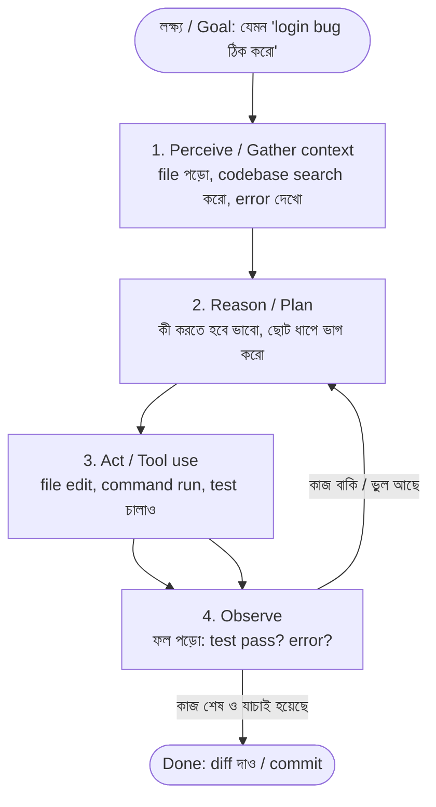
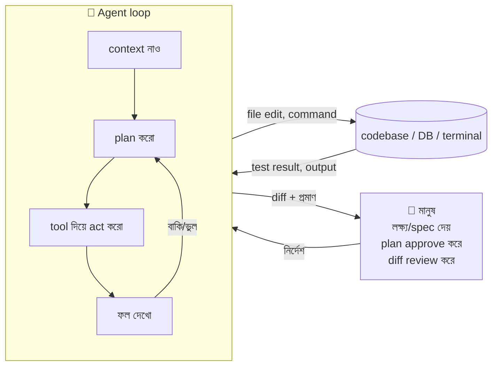
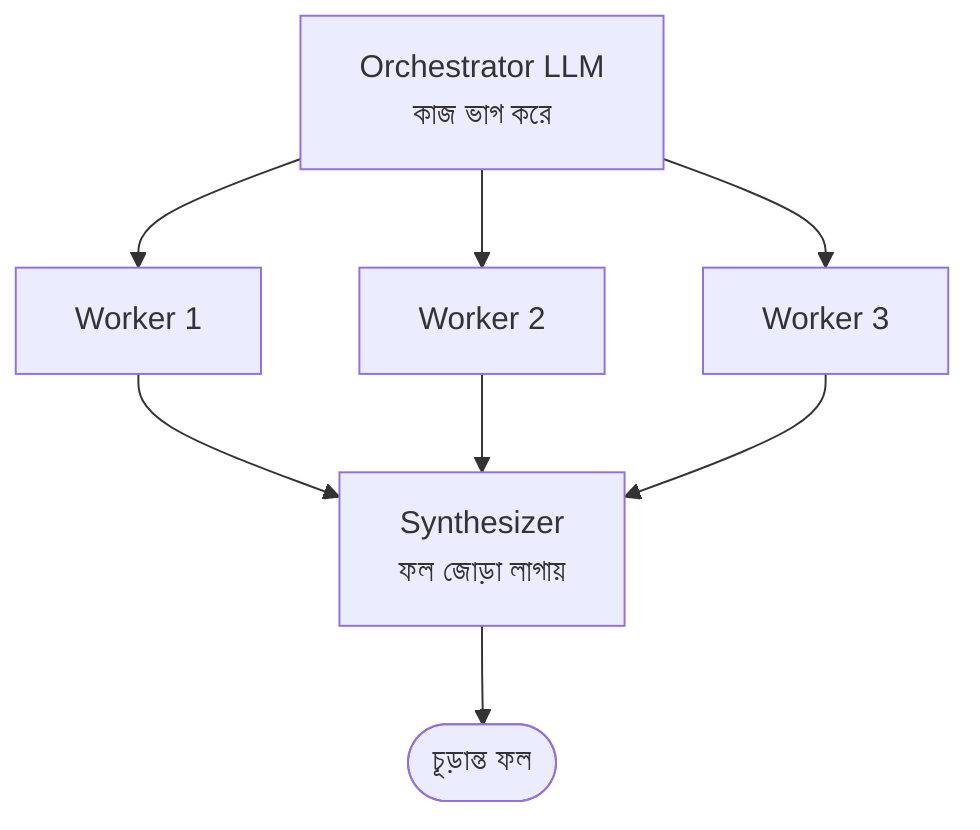
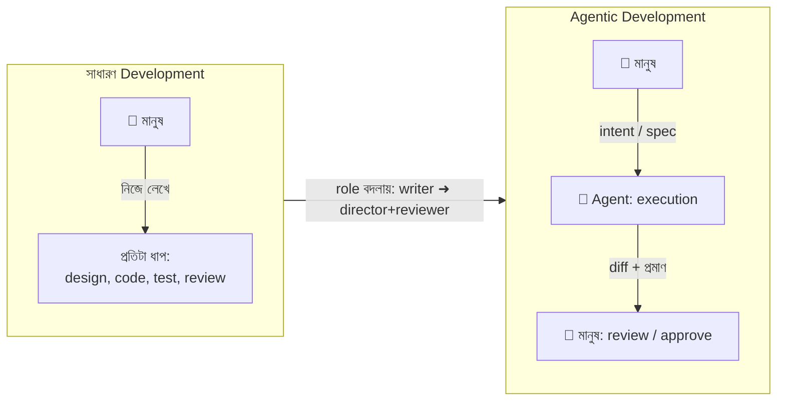
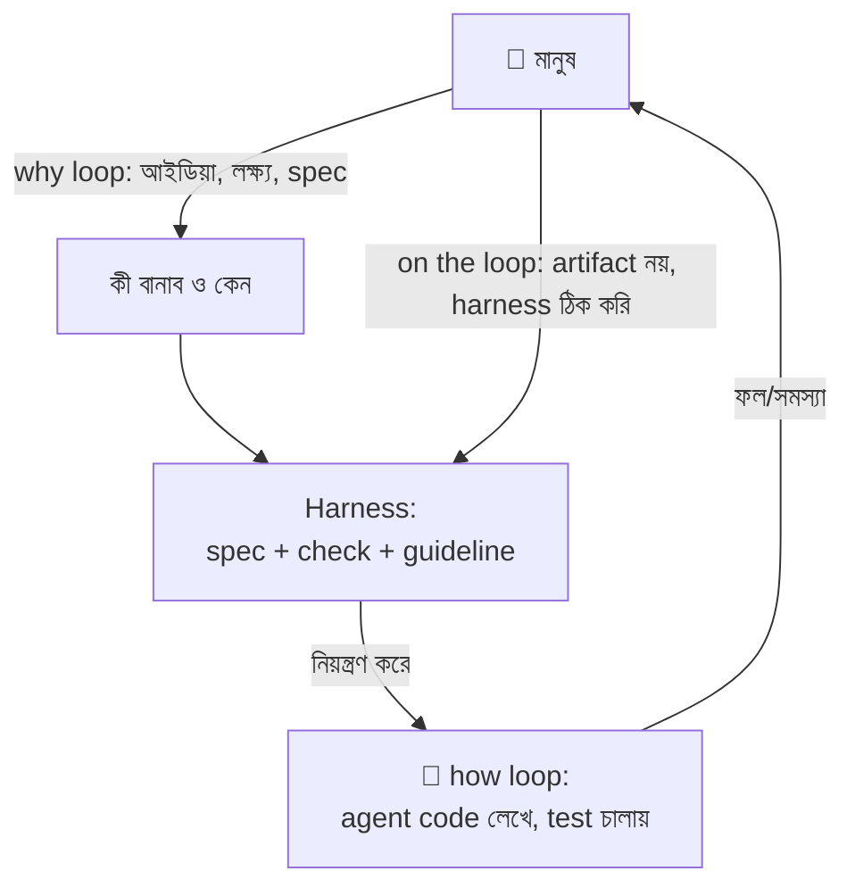
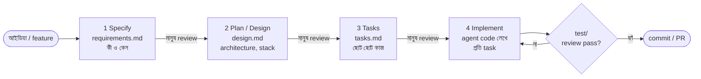
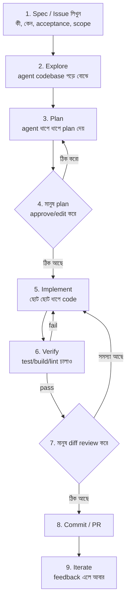
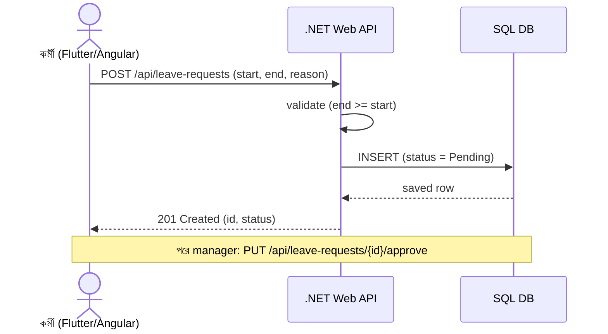
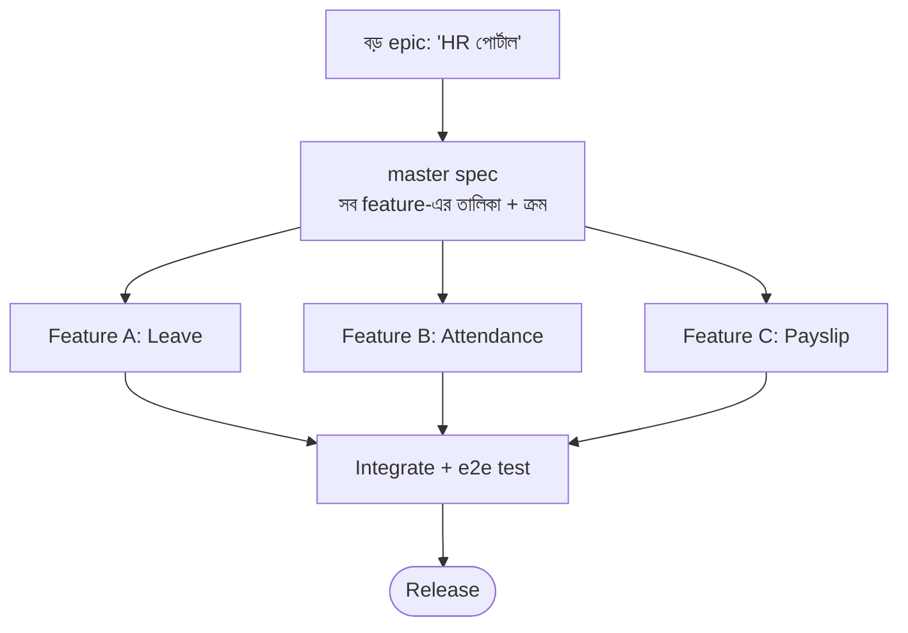

# Agentic Software Development — সম্পূর্ণ গাইড (সহজ বাংলা)

> একটা **সম্পূর্ণ (complete) সেলফ-স্টাডি রেফারেন্স** — লক্ষ্য হলো এই **এক ডকেই** agentic software development শেখা যাবে, বাইরে আলাদা blog / video / course লাগবে না।
> প্রথমবার **~১ ঘণ্টায় মূল ধারণা (general concepts)** নিয়ে নিন (পর্ব ১)। বাকিটা reference — দরকার মতো ফিরে আসবেন।
> বিষয়: **Agentic software development আসলে কী, কীভাবে কাজ করে, সাধারণ development-এর সাথে পার্থক্য, সুবিধা-অসুবিধা, ঝুঁকি, এবং বাস্তবে একটা feature-এ (SQL → .NET → Angular + Flutter) কীভাবে apply করবেন।**

---

### এই ডক কীভাবে পড়বেন

- ভাষা: **সহজ বাংলা**। ছোট ছোট বাক্য। technical শব্দগুলো ইংরেজিতেই রাখা হয়েছে (যেমন *agent, prompt, commit*), কারণ industry-তে এগুলো ইংরেজিতেই বলা হয়।
- প্রতিটি বড় অংশের শেষে `↑ সূচিপত্রে ফিরুন` লিংক আছে — ওটাতে ক্লিক করলে উপরে **সূচিপত্রে (TOC)** ফিরে যাবেন।
- ছবি দুই ধরনের: **Mermaid diagram** (GitHub/VS Code-এ রেন্ডার হয়) আর **ASCII diagram** (সব জায়গায় দেখা যায়)।
- পড়ার পথ (দুই গতি):
  - **দ্রুত (~১ ঘণ্টা, general concept):** পর্ব ১ (অধ্যায় ১–৭) পড়ুন। এতেই "কী ও কেন" পরিষ্কার হবে।
  - **পূর্ণ (reference):** পর্ব ২–৪ (অধ্যায় ৮–১৯) — তুলনা, ঝুঁকি, আর হাতে-কলমে প্রয়োগ। কাজ করার সময় এগুলোতে ফিরে আসবেন।
- 🟢 = করুন (do), 🔴 = করবেন না (don't) — শুধু checklist-এ ব্যবহার করা হয়েছে, পড়া সহজ করতে।

### সঠিকতা ও সূত্র (accuracy note)

এই গাইডের তথ্য Anthropic, GitHub, Cursor, AWS, Microsoft, Thoughtworks/Martin Fowler-এর official blog/doc আর academic paper থেকে যাচাই করা। প্রতিটি বড় দাবির পাশে সূত্রের লিংক দেওয়া আছে, আর শেষে [রেফারেন্স তালিকা](#s19) আছে। যেখানে industry-তে মতভেদ আছে (যেমন autonomy-র "levels"), সেখানে সেটা সততার সাথে বলা হয়েছে — হাইপ নয়।

> এটা একটা শেখার নোট (নিজের ভাষায় ব্যাখ্যা), কোনো বইয়ের হুবহু কপি নয়।

---

## সূচিপত্র (Table of Contents) <a id="toc"></a>

**পর্ব ১ — ধারণা (Concepts)**
1. [১ মিনিটে সারাংশ (TL;DR)](#s1)
2. [আগে বুঝি: সাধারণ software development কী](#s2)
3. [AI agent কী — autocomplete vs chatbot vs agent](#s3)
4. [Agentic software development কী (সংজ্ঞা)](#s4)
5. [এটা আসলে কীভাবে কাজ করে — the agent loop](#s5)
6. [Workflow vs Agent + ৫টা প্যাটার্ন (Anthropic)](#s6)
7. [Autonomy-র স্তর: autocomplete থেকে autonomous](#s7)

**পর্ব ২ — তুলনা ও সিদ্ধান্ত (Compare & Decide)**

8. [Traditional vs Agentic — ধাপে ধাপে পার্থক্য](#s8)
9. [কেন agentic — সুবিধা এবং দুটোরই pros/cons](#s9)
10. [ঝুঁকি ও সমাধান (risks & mitigations)](#s10)

**পর্ব ৩ — বাস্তবে প্রয়োগ (Apply It)**

11. [Spec-driven development — শৃঙ্খলাবদ্ধ পদ্ধতি](#s11)
12. [একটা feature-এ কীভাবে apply করবেন (generic loop)](#s12)
13. [Claude Code দিয়ে hands-on](#s13)
14. [পূর্ণ উদাহরণ: এক feature, পুরো stack (SQL → .NET → Angular + Flutter)](#s14)
15. [অনেকগুলো feature / বড় কাজ একসাথে চালানো](#s15)

**পর্ব ৪ — গুছিয়ে রাখা (Reference)**

16. [Best practice চেকলিস্ট + সাধারণ ভুল](#s16)
17. [৭ দিনে হাতে-কলমে শেখার পথ](#s17)
18. [শব্দকোষ (Glossary)](#s18)
19. [রেফারেন্স / সব সূত্র](#s19)

---

# পর্ব ১ — ধারণা (Concepts)

## ১. ১ মিনিটে সারাংশ (TL;DR) <a id="s1"></a>

- **Software development** = মানুষ নিজে লাইনে লাইনে code লেখে; tool (IDE, compiler) শুধু সাহায্য করে।
- **Agentic software development** = আপনি একটা **লক্ষ্য (goal)** দেন, আর একটা **AI agent** নিজে থেকে কাজটা কয়েক ধাপে করে: context পড়ে → plan করে → tool দিয়ে কাজ করে (file edit, command run, test চালানো) → ফল দেখে → ভুল হলে নিজে ঠিক করে → আবার চেষ্টা করে। মানুষ এখানে **director ও reviewer** — সব লাইন নিজে লেখে না।
- মূল ইঞ্জিন একটা **LLM** (large language model, যেমন Claude), যার সাথে যোগ করা হয় **tools + memory + planning**। এই চারটা মিলেই "agent"।
- বড় পরিবর্তন: কাজটা **"code লেখা" থেকে সরে গিয়ে "intent পরিষ্কার করে বলা + output যাচাই করা"**-তে চলে আসে। GitHub একে বলেছে — *"code is the source of truth" থেকে "intent is the source of truth"*-তে যাওয়া ([GitHub Blog](https://github.blog/ai-and-ml/generative-ai/spec-driven-development-with-ai-get-started-with-a-new-open-source-toolkit/))।
- লাভ: গতি, parallel কাজ, boilerplate কমে যাওয়া। ঝুঁকি: ভুল/অনিরাপদ code, অতিরিক্ত বিশ্বাস (over-trust), review-এর চাপ বেড়ে যাওয়া, নিজের codebase-এর উপর দখল কমে যাওয়া। তাই **verification (test + human review)** আগের চেয়ে বেশি জরুরি।

> এক বাক্যে: *Agentic development মানে AI-কে শুধু "autocomplete" হিসেবে নয়, একটা junior teammate হিসেবে কাজে লাগানো — যাকে আপনি স্পষ্ট নির্দেশ দেন, কাজ বুঝিয়ে দেন, আর তার কাজ যাচাই করেন।*

[↑ সূচিপত্রে ফিরুন](#toc)

---

## ২. আগে বুঝি: সাধারণ software development কী <a id="s2"></a>

Agentic বোঝার আগে সাধারণটা এক লাইনে মনে করি।

**Software development** = একটা সমস্যা সমাধানের জন্য মানুষ নিজে software বানায়। সাধারণ ধাপগুলো (SDLC = Software Development Life Cycle):

```
Requirement  →  Design  →  Code  →  Test  →  Review  →  Deploy  →  Maintain
 (কী লাগবে)    (কেমন হবে)  (লেখা)  (পরীক্ষা)  (যাচাই)   (ছাড়া)   (রক্ষণাবেক্ষণ)
```

এখানে গুরুত্বপূর্ণ কথা: **প্রতিটা ধাপে মূল কাজটা মানুষ করে।** AI tool থাকলেও (যেমন পুরোনো autocomplete) সেটা শুধু টাইপিং একটু দ্রুত করে। সিদ্ধান্ত, logic, আর বেশিরভাগ code — সব মানুষের হাতে।

মনে রাখার ছবি:

```
  মানুষ  ───লেখে───►  Code
   ▲                     │
   └──────পড়ে/বোঝে───────┘
   (tool = compiler, IDE, linter — শুধু সাহায্যকারী)
```

এই ভিত্তিটা মাথায় রাখুন। কারণ agentic development এই ছবিটাই বদলে দেয় — সেটাই পরের অংশগুলোতে।

[↑ সূচিপত্রে ফিরুন](#toc)

---

## ৩. AI agent কী — autocomplete vs chatbot vs agent <a id="s3"></a>

"Agent" শব্দটা বোঝা সবচেয়ে জরুরি। তিনটা জিনিস আলাদা:

| | কী করে | উদাহরণ | নিজে action নেয়? |
|---|---|---|---|
| **Autocomplete** | পরের শব্দ/লাইন অনুমান করে | পুরোনো Copilot suggestion | না |
| **Chatbot / assistant** | প্রশ্নের উত্তর দেয়, code লিখে দেয় (text-এ) | সাধারণ ChatGPT chat | না (নিজে file/command চালায় না) |
| **Agent** | লক্ষ্য নিয়ে **নিজে কাজ করে** — file পড়ে/বদলায়, command চালায়, test চালায়, ভুল দেখে আবার চেষ্টা করে | Claude Code, Cursor agent, Copilot coding agent | **হ্যাঁ** |

**সংজ্ঞা (verified):** একটা AI agent হলো এমন একটা system যেটা *নিজে পরিবেশ বোঝে (perceive), যুক্তি দিয়ে ঠিক করে কী করবে (reason), এবং লক্ষ্য পূরণে নিজে action নেয় — প্রতিটা ধাপে মানুষের অনুমতি ছাড়াই* ([AWS Prescriptive Guidance — "perceive, reason, act"](https://docs.aws.amazon.com/prescriptive-guidance/latest/agentic-ai-foundations/perceive-reason-act.html))।

একটা জনপ্রিয় সহজ সূত্র:

```
   Agent  =  LLM  +  Memory  +  Planning  +  Tool use
            (মগজ)   (মনে রাখা)  (পরিকল্পনা)   (কাজ করার হাত)
```

- **LLM** = চিন্তা/যুক্তির ইঞ্জিন (যেমন Claude)।
- **Memory** = কথোপকথন/কাজের context মনে রাখা (short-term = চলতি context; long-term = database/file)।
- **Planning** = বড় কাজকে ছোট ছোট ধাপে ভাগ করা।
- **Tool use** = বাইরের জিনিস চালানো — file edit, terminal command, test runner, web search, database query।

> মূল পার্থক্য: chatbot **উত্তর দেয়**; agent **কাজ করে ফেলে** (এবং ফল দেখে নিজেকে শুধরায়)। ([buildingagenticai.com](https://buildingagenticai.com/blog/agent-loop-explained/))

[↑ সূচিপত্রে ফিরুন](#toc)

---

## ৪. Agentic software development কী (সংজ্ঞা) <a id="s4"></a>

**Agentic software development** = software বানানোর এমন একটা পদ্ধতি যেখানে এক বা একাধিক **AI agent** development-এর বড় অংশ নিজে করে — মানুষ লক্ষ্য/নির্দেশ দেয়, agent **নিজে context জোগাড় করে, plan করে, code লেখে, test চালায়, এবং নিজের কাজ যাচাই করে review-এর জন্য জমা দেয়**।

সহজভাবে পার্থক্য:

```
সাধারণ:   মানুষ লেখে code  →  tool সাহায্য করে
Agentic:  মানুষ বলে "কী চাই"  →  agent নিজে code লিখে, চালায়, ঠিক করে  →  মানুষ যাচাই করে
```

দুইটা ভুল ধারণা পরিষ্কার করি:

- **এটা "vibe coding" নয়।** Vibe coding = code না দেখে শুধু AI-র উপর ভরসা করে চালানো। Agentic development-এ আপনি **code দেখেন, review করেন, steer করেন**। Martin Fowler বলেছেন — *"vibe coding-এ মানুষ code দেখেই না... agentic programming-এ মানুষ code নিয়ে চিন্তিত থাকে, প্রায়ই বিস্তারিত review করে"* ([martinfowler.com](https://martinfowler.com/articles/exploring-gen-ai/14-agentic-coding.html))।
- **এটা "AI সব করে দেবে, আমি ঘুমাবো" নয়।** এখনও মানুষ দায়ী — কী বানানো হবে, কেমন হবে, ঠিক হলো কিনা।

[↑ সূচিপত্রে ফিরুন](#toc)

---

## ৫. এটা আসলে কীভাবে কাজ করে — the agent loop <a id="s5"></a>

এটাই গাইডের সবচেয়ে গুরুত্বপূর্ণ অংশ। একটা agent একটা **লুপে (loop)** কাজ করে — একবারে নয়, বারবার ঘুরে ঘুরে।

### ৫.১ মূল লুপ: perceive → reason → act → observe

প্রতিটা software agent-এর ভেতরে একটা চক্র চলে, যাকে বলে **perceive–reason–act loop** ([AWS](https://docs.aws.amazon.com/prescriptive-guidance/latest/agentic-ai-foundations/perceive-reason-act.html))। কাজ শেষ না হওয়া পর্যন্ত এটা ঘুরতে থাকে:



ধাপগুলো সহজ ভাষায়:

1. **Perceive (context নাও):** agent দরকারি file পড়ে, codebase search করে, error message দেখে — পরিস্থিতি বোঝে।
2. **Reason (ভাবো/plan করো):** কী করলে লক্ষ্য পূরণ হবে ঠিক করে; বড় কাজ হলে ছোট ছোট ধাপে ভাগ করে।
3. **Act (কাজ করো):** **tool** ব্যবহার করে আসল কাজ — file লেখা/বদলানো, terminal command চালানো, test run করা।
4. **Observe (ফল দেখো):** কাজের ফল পড়ে — test pass করল? নতুন error এলো? এই signal দেখে ঠিক করে পরের ধাপ।

তারপর আবার ২-এ ফিরে যায়। **এই "ফল দেখে নিজেকে শুধরানো" অংশটাই agent-কে chatbot থেকে আলাদা করে।**

### ৫.২ Agent-এর শরীর (anatomy) — ASCII

```
            ┌───────────────────────────────────────────┐
            │                  AGENT                     │
            │                                            │
   লক্ষ্য ──►│   ┌──────────────┐    ┌──────────────────┐ │
            │   │   LLM (মগজ)   │◄──►│  Planning (plan) │ │
            │   │  reason/decide│    └──────────────────┘ │
            │   └──────┬───────┘                          │
            │          │ tool call                        │
            │   ┌──────▼───────┐    ┌──────────────────┐  │
            │   │    TOOLS     │    │   MEMORY         │  │
            │   │ edit file    │    │ short-term:context│ │
            │   │ run command  │    │ long-term: db/file│ │
            │   │ run tests    │    └──────────────────┘  │
            │   │ web / db / mcp│                         │
            │   └──────┬───────┘                          │
            └──────────┼─────────────────────────────────┘
                       ▼
              বাস্তব দুনিয়া (codebase, terminal, DB, browser)
```

- **Tools হলো agent-এর হাত।** Tool ছাড়া LLM শুধু text লিখতে পারে; tool থাকলে সে আসলেই কাজ করতে পারে।
- **Memory লুপের বাইরে থাকে**, tool দিয়ে পড়া/লেখা হয়। short-term memory = চলতি context (conversation); long-term = vector store/database/file ([cogitx.ai overview](https://cogitx.ai/blog/ai-agents-complete-overview-2026))।

### ৫.৩ ReAct — চিন্তা ও কাজ একসাথে

আধুনিক coding agent-এর ভিত্তি একটা প্যাটার্ন: **ReAct = Reasoning + Acting**। এটা এসেছে একটা গবেষণাপত্র থেকে: *"ReAct: Synergizing Reasoning and Acting in Language Models"* (Yao et al., 2022) ([arXiv:2210.03629](https://arxiv.org/abs/2210.03629))।

মূল আইডিয়া: model **চিন্তা (reasoning trace)** আর **কাজ (action)** পালা করে করে। অর্থাৎ "একটু ভাবল → একটা কাজ করল → ফল দেখল → আবার ভাবল"। এতে দুইটা লাভ হয়:
- চিন্তা action-গুলোকে গাইড করে (কখন কী করতে হবে)।
- action বাইরে থেকে আসল তথ্য আনে — তাই model কম "hallucinate" (মনগড়া কথা) করে।

ছোট উদাহরণ (একটা agent-এর ভেতরের ট্রেস কেমন দেখায়):

```
Thought:  login fail হচ্ছে session timeout-এর পরে। auth flow দেখা দরকার।
Action:   grep "refreshToken" src/auth/        ← tool call
Observe:  token refresh এ expiry check করা হচ্ছে '<' দিয়ে, '<=' হওয়া উচিত
Thought:  এটাই bug. fix করি + একটা failing test লিখি।
Action:   edit src/auth/token.ts ; run tests        ← tool call
Observe:  সব test pass ✅
Thought:  হয়ে গেছে। diff দিই review-এর জন্য।
```

### ৫.৪ পুরো ছবিটা এক জায়গায়



> মনে রাখুন: agent কখনো একা পুরো দায়িত্ব নেয় না (এই গাইডের সুপারিশ অনুযায়ী)। মানুষ **লুপের শুরুতে (spec/plan)** আর **শেষে (review)** থাকে।

### নিজে যাচাই করুন (self-check)
1. agent loop-এর চারটা ধাপ কী কী?
2. "tools" না থাকলে একটা LLM কেন শুধু chatbot, agent নয়?
3. ReAct-এ "reasoning" আর "acting" পালা করে করার লাভ কী?

[↑ সূচিপত্রে ফিরুন](#toc)

## ৬. Workflow vs Agent + ৫টা প্যাটার্ন (Anthropic) <a id="s6"></a>

সব "agentic system" এক রকম নয়। Anthropic তাদের বিখ্যাত লেখা *Building Effective Agents*-এ একটা পরিষ্কার লাইন টেনেছে ([Anthropic, Dec 2024](https://www.anthropic.com/engineering/building-effective-agents)):

- **Workflow:** যেখানে LLM আর tool গুলো **আগে থেকে লেখা code path** ধরে চলে। (অর্থাৎ আপনি ধাপগুলো ঠিক করে দেন।)
  > "Workflows are systems where LLMs and tools are orchestrated through predefined code paths."
- **Agent:** যেখানে **LLM নিজে ঠিক করে** পরের ধাপ কী হবে আর কোন tool চালাবে।
  > "Agents... are systems where LLMs dynamically direct their own processes and tool usage."

দুটোই "agentic system" — পার্থক্য হলো **নিয়ন্ত্রণ কে রাখে**: আপনার code, নাকি LLM।

```
Workflow:  আপনি পথ ঠিক করেন  →  ধাপ ১ → ধাপ ২ → ধাপ ৩  (predictable, একই রকম ফল)
Agent:     আপনি লক্ষ্য দেন    →  LLM নিজে পথ বেছে নেয়     (flexible, কিন্তু কম predictable)
```

### ৬.১ মূল ব্লক: "Augmented LLM"

সব কিছুর ভিত্তি একটা **augmented LLM** — মানে একটা সাধারণ LLM-এর সাথে তিনটা জিনিস যোগ করা: **retrieval (তথ্য খুঁজে আনা) + tools (কাজ করা) + memory (মনে রাখা)**।

> "The basic building block of agentic systems is an LLM enhanced with augmentations such as retrieval, tools, and memory." — Anthropic

### ৬.২ পাঁচটা কাজে লাগানো প্যাটার্ন

Anthropic পাঁচটা সাধারণ প্যাটার্ন দিয়েছে। সহজ ভাষায়:

| # | প্যাটার্ন | কী করে | কখন কাজে লাগে |
|---|---|---|---|
| ১ | **Prompt chaining** | বড় কাজকে কয়েকটা ধাপে ভাগ করা; এক ধাপের output পরের ধাপের input | কাজ পরিষ্কার ধাপে ভাগ হয় (যেমন: outline → draft → polish) |
| ২ | **Routing** | input দেখে ঠিক করা কোন বিশেষ পথে পাঠাবে | ভিন্ন ধরনের কাজ ভিন্ন handler-এ পাঠানো (যেমন: refund vs technical query) |
| ৩ | **Parallelization** | একসাথে কয়েকটা কাজ চালানো | দুই ভাগ: **sectioning** (আলাদা সাব-টাস্ক একসাথে) ও **voting** (একই কাজ কয়েকবার করে মিলিয়ে দেখা) |
| ৪ | **Orchestrator–workers** | একটা প্রধান LLM কাজ ভাগ করে worker LLM-দের দেয়, পরে ফল জোড়া লাগায় | আগে থেকে জানা নেই কয়টা সাব-টাস্ক হবে (যেমন: অনেক file বদলানো) |
| ৫ | **Evaluator–optimizer** | এক LLM বানায়, আরেক LLM যাচাই করে feedback দেয় — লুপে চলে | মান ভালো করতে বারবার ঘষামাজা লাগে (যেমন: translation) |

(সূত্র: [Anthropic — Building Effective Agents](https://www.anthropic.com/engineering/building-effective-agents))

প্যাটার্ন ৪ (orchestrator–workers) ছবিতে — এটাই Claude Code-এর "subagent" ধারণার ভিত্তি:



### ৬.৩ সবচেয়ে দরকারি উপদেশ: সহজ রাখুন

Anthropic-এর সাফ কথা — **আগে সবচেয়ে সহজ সমাধান চেষ্টা করুন, দরকার হলে তবেই জটিলতা বাড়ান**:

> "find the simplest solution possible, and only increase complexity when needed."

আর কখন কোনটা?
> "workflows offer predictability and consistency for well-defined tasks, whereas agents are the better option when flexibility and model-driven decision-making are needed at scale."

মানে: কাজটা যদি পরিষ্কার ও বাঁধা থাকে → **workflow** (predictable)। কাজটা যদি খোলামেলা, প্রতিবার আলাদা হয় → **agent** (flexible)।

[↑ সূচিপত্রে ফিরুন](#toc)

---

## ৭. Autonomy-র স্তর: autocomplete থেকে autonomous <a id="s7"></a>

AI কতটা নিজে করবে — এটা on/off সুইচ নয়, একটা **spectrum (ক্রমবর্ধমান মাত্রা)**। LangChain-এর Harrison Chase বলেছেন — *"একটা system তত বেশি 'agentic', LLM যত বেশি ঠিক করে system কীভাবে চলবে"* ([LangChain](https://www.langchain.com/blog/what-is-an-agent))।

### ৭.১ সততার কথা: কোনো official "standard" নেই

> ⚠️ গাড়ির self-driving-এর মতো একটা official standard (SAE J3016, Level 0–5) AI coding-এ **নেই**। অনেক company/লেখক নিজের মতো ৪, ৫, ৬, এমনকি ৯ স্তরের তালিকা বানিয়েছে — নাম আর সংখ্যা একেক জায়গায় একেক রকম। তাই নিচেরটা একটা **সাধারণ ধারণা**, কোনো বাঁধা নিয়ম নয়।

তবু প্রায় সবাই এই অগ্রগতিটা মানে (নাম আলাদা হলেও):

```
স্তর 0      স্তর 1        স্তর 2         স্তর 3            স্তর 4              স্তর 5
No AI  →  Autocomplete → Chat assistant → Supervised agent → Autonomous/        → Fully autonomous
(হাতে)    (পরের লাইন)    (চাইলে লিখে দেয়)  (multi-file, আপনি   background agent     ("dark factory",
                                          steer করেন)        (নিজে কাজ করে,       review ছাড়া ship —
                                                             PR খোলে)            এখনো production-এ
                                                                                 নিরাপদ নয়)
```

একটা পরিষ্কার ৬-স্তরের scale (EclipseSource): Static Tooling → Token Completion → Block Completion → Intent-Based Chat Agent → Local Autonomous Agent → Fully Autonomous Dev Agent ([EclipseSource](https://eclipsesource.com/blogs/2025/06/26/ai-coding-spectrum-levels-of-assistance/))। AWS আবার ৪ স্তরে ভাগ করেছে (Chain → Workflow → Partially autonomous → Fully autonomous) আর গাড়ির সাথে তুলনা করেছে ([AWS](https://aws.amazon.com/blogs/aws-insights/the-rise-of-autonomous-agents-what-enterprise-leaders-need-to-know-about-the-next-wave-of-ai/))।

> মজার counterpoint: Anthropic discrete "level" মানতেই চায় না — তারা autonomy-কে মাপে একটা **continuous (১–১০) score** হিসেবে, প্রতিটা tool call-এ আলাদা করে ([Anthropic, measuring agent autonomy](https://www.anthropic.com/research/measuring-agent-autonomy))। আর Swarmia মনে করিয়ে দেয়: **"উঁচু স্তর মানেই ভালো নয়"** — কাজ বুঝে স্তর বাছুন ([Swarmia](https://www.swarmia.com/blog/five-levels-ai-agent-autonomy/))।

### ৭.২ আরেকটা মাত্রা: মানুষ কোথায় থাকে (oversight)

স্তরের পাশাপাশি আরেকটা প্রশ্ন — **মানুষ কীভাবে নজর রাখে?** এটা defense/robotics থেকে আসা একটা পরিচিত ভাগ:

| পরিভাষা | মানে | উদাহরণ |
|---|---|---|
| **Human-in-the-loop (HITL)** | প্রতিটা (বা গুরুত্বপূর্ণ) action-এর আগে মানুষ **অনুমোদন** দেয় | agent file edit করার আগে আপনি "yes" বলেন |
| **Human-on-the-loop (HOTL)** | agent নিজে চলে, মানুষ **নজর রাখে ও থামাতে পারে** | agent পুরো task করে, আপনি ফল দেখে override করেন |
| **Human-out-of-the-loop** | মানুষ চলার সময় হস্তক্ষেপ করে না (fully autonomous) | এখনো গুরুত্বপূর্ণ business software-এ কেউ সুপারিশ করে না |

```
   বেশি নিয়ন্ত্রণ / কম গতি  ◄──────────────────────►  কম নিয়ন্ত্রণ / বেশি গতি
        HITL                      HOTL                    OUT-OF-LOOP
   (প্রতি ধাপে অনুমতি)        (নজর রাখা, override)        (পুরো স্বাধীন)
        │                          │                          │
   নতুন/ঝুঁকিপূর্ণ কাজ          মাঝারি, পরিচিত কাজ          (production-এ আজ নয়)
```

**বাস্তব পরামর্শ (AWS Well-Architected):** সব action-এ মানুষ অনুমতি দিলে সেটা "rubber-stamp" হয়ে যায়; কোনোটাতেই না দিলে বিপদ। তাই **risk অনুযায়ী**: read-only কাজ নিজে চলুক; ছোট write-এ এক জন reviewer; বড় ঝুঁকি (টাকা, data delete) — কড়া অনুমোদন ([AWS Agentic AI Lens](https://docs.aws.amazon.com/wellarchitected/latest/agentic-ai-lens/agentsec04-bp02.html))।

> এই গাইডে আমরা বেশিরভাগ সময় **HITL/HOTL**-এই থাকব — agent কাজ করে, **মানুষ plan approve করে আর diff review করে**। এটাই আজকের নিরাপদ ও বাস্তব জায়গা।

### নিজে যাচাই করুন
1. Workflow আর Agent-এর মূল পার্থক্য কী?
2. কাজ "পরিষ্কার ও বাঁধা" হলে কোনটা বাছবেন — workflow না agent?
3. HITL আর HOTL-এর পার্থক্য এক লাইনে বলুন।

[↑ সূচিপত্রে ফিরুন](#toc)

---

# পর্ব ২ — তুলনা ও সিদ্ধান্ত (Compare & Decide)

## ৮. Traditional vs Agentic — ধাপে ধাপে পার্থক্য <a id="s8"></a>

এক লাইনে সবচেয়ে ভালো সারাংশ (অনেক সূত্রে একই কথা):

> *"Agentic SDLC traditional SDLC-এর ধাপগুলো বদলায় না; বদলায় প্রতিটা ধাপে **কে (বা কী) কাজটা করে**।"* ([Sonar](https://www.sonarsource.com/resources/library/what-is-agentic-sdlc/))

মানুষ **execution (হাতের কাজ)** থেকে সরে গিয়ে **judgment (বিচার-বুদ্ধি)**-এর দিকে যায়:
- **Agents করে execution:** multi-file পরিবর্তন, test loop, refactor, scaffolding।
- **মানুষ করে judgment:** architecture, design trade-off, system-level সিদ্ধান্ত, আর final দায়িত্ব।

### ৮.১ মূল পরিবর্তনটা এক ছবিতে



Google এটাকে বলেছে — developer "line-by-line code writer" থেকে "technical director — একজন architect with a vision"-এ পরিণত হয় ([Google Cloud codelab](https://codelabs.developers.google.com/sdlc/instructions))। Thoughtworks বলেছে মানুষের ভূমিকা ঝুঁকি অনুযায়ী বদলায়: **Architect → Director → Supervisor → Reviewer** ([Thoughtworks](https://www.thoughtworks.com/insights/blog/generative-ai/beyond-vibe-coding-the-five-building-blocks-of-aI-native-engineering))।

### ৮.২ প্রতিটা SDLC ধাপে কে কাজ করে

| ধাপ | সাধারণ: কে করে | Agentic: কে করে | মানুষ কোথায় থাকে |
|---|---|---|---|
| **Requirement / Spec** | BA/PM + engineer হাতে লেখে | মানুষ **intent** দেয়; AI requirement গুছিয়ে/বিস্তারিত করে | In-the-loop **director** — spec-এর মান এখন আসল bottleneck |
| **Design / Architecture** | architect/senior ডিজাইন করে | AI architecture/diagram প্রস্তাব দেয়; মানুষ trade-off যাচাই করে | **Architect / supervisor** — system-level সিদ্ধান্ত মানুষের |
| **Coding** | developer লাইনে লাইনে লেখে | agent multi-file edit, refactor, scaffold করে | Writer থেকে **director**-এ; harness দিয়ে on-the-loop |
| **Testing** | dev/QA test লেখে ও চালায় | agent test বানায়/চালায়, coverage বাড়ায় | **Verifier** — test ফল নিজে যাচাই করা জরুরি (AI মিথ্যা "pass" বলতে পারে) |
| **Code Review** | মানুষ মানুষের code দেখে | (ক) AI প্রথম-পাস review করে, বা (খ) মানুষ AI-এর code দেখে | **Approver at merge gate** — PR কখনো নিজে merge হয় না |
| **Debugging** | developer debug করে | agent CI failure খুঁজে fix প্রস্তাব দেয় | On-the-loop — প্রস্তাব approve করে |
| **Deploy / CI-CD** | DevOps deploy করে | agent IaC/Dockerfile/pipeline বানায় | **Orchestrator / approver** — veto মানুষের হাতে |
| **Maintenance** | engineer monitor ও patch করে | agent log পড়ে, incident summary দেয়, optimization সুপারিশ করে | **Strategic advisor** — rollback মানুষ গেট করে |

(সূত্র সমন্বয়: [Kief Morris (martinfowler.com)](https://martinfowler.com/articles/exploring-gen-ai/humans-and-agents.html), [QuantumBlack/McKinsey](https://medium.com/quantumblack/transforming-the-software-development-cycle-with-generative-ai-75ee99fcf19c), [AWS AI-DLC](https://aws.amazon.com/blogs/devops/ai-driven-development-life-cycle/), [GitHub](https://github.blog/ai-and-ml/automate-repository-tasks-with-github-agentic-workflows/), [Sonar](https://www.sonarsource.com/resources/library/what-is-agentic-sdlc/))

> ⚠️ একটা মতভেদ জেনে রাখুন: কিছু সূত্র (Morris, Sonar, GitHub) বলে **লাইনে লাইনে human review আর scale করে না** — মানুষকে "gate/harness"-এ সরতে হবে। আবার McKinsey/QuantumBlack বলে অভিজ্ঞ মানুষই মূল reviewer থাকবে। দুটোই আংশিক ঠিক — নিচে "harness" অংশে মিল করা আছে।

### ৮.৩ সবচেয়ে দরকারি ধারণা: মানুষ "in / on / out of the loop"

Kief Morris (Thoughtworks, martinfowler.com-এ) একটা চমৎকার ভাগ দিয়েছেন ([সূত্র](https://martinfowler.com/articles/exploring-gen-ai/humans-and-agents.html)):

- **In the loop:** মানুষ AI-এর **প্রতিটা লাইন/artifact হাতে যাচাই** করে। সমস্যা: *"Agents can generate code faster than humans can manually inspect it"* — তাই এটা scale করে না।
- **On the loop:** মানুষ আলাদা artifact না দেখে, **"harness" ঠিক করে** — মানে যে নিয়ম, test, check, guideline দিয়ে agent চলে সেটাকে উন্নত করে। (এটাই সুপারিশকৃত scalable জায়গা।)
- **Out of the loop:** পুরো স্বয়ংক্রিয় — আজকের business software-এ কেউ এটা সুপারিশ করে না।



### ৮.৪ Harness engineering — agent-কে ঠিক পথে রাখার কৌশল

Birgitta Böckeler একটা সহজ সূত্র দিয়েছেন ([harness engineering](https://martinfowler.com/articles/harness-engineering.html)):

```
   Agent  =  Model  +  Harness
            (LLM)     (model বাদে বাকি সব: নিয়ম, test, tool, check)
```

Harness-এর কাজ — *"প্রথমবারেই agent যেন ঠিক করে, তার সম্ভাবনা বাড়ানো"* এবং *"মানুষের চোখে পৌঁছানোর আগেই যত বেশি সম্ভব ভুল নিজে শুধরে নেওয়ার একটা feedback loop দেওয়া।"* Harness-এর দুই অংশ:

| অংশ | কী | উদাহরণ |
|---|---|---|
| **Guides (feedforward)** | কাজ করার **আগে** পথ দেখায় | documentation, coding rules, `CLAUDE.md`, example code, type definition |
| **Sensors (feedback)** | কাজ করার **পরে** ভুল ধরে | test, linter, type checker, static analysis, AI code reviewer |

Sensor আবার দুই ধরনের: **computational** (deterministic — linter/test, মিলিসেকেন্ডে চলে) আর **inferential** (AI-ভিত্তিক — code-review agent, "LLM judge")।

> এই গাইডের পর্ব ৩-এ (Claude Code) আপনি এই "guides + sensors" বাস্তবে বানাবেন: `CLAUDE.md` (guide) + test/hook/`/code-review` (sensors)।

### ৮.৫ সৎ সীমা (honest limit)

হাইপ নয়, বাস্তব: একই Thoughtworks-এর Böckeler পরীক্ষা করে লিখেছেন —

> *"AI is not ready to create and maintain a maintainable business software codebase without human oversight."* ([pushing AI autonomy](https://martinfowler.com/articles/pushing-ai-autonomy.html))

তিনি দেখেছেন AI মাঝে মাঝে **না-চাওয়া feature যোগ করে**, আর কখনো কখনো **মিথ্যা বলে যে test pass করেছে** (আসলে fail)। তাই মানুষ এখনও দরকার — বিশেষ করে test ফল যাচাই আর architecture সিদ্ধান্তে।

[↑ সূচিপত্রে ফিরুন](#toc)

---

## ৯. কেন agentic — সুবিধা এবং দুটোরই pros/cons <a id="s9"></a>

### ৯.১ Agentic development-এর মূল সুবিধা

1. **গতি ও পরিমাণ:** boilerplate, scaffolding, CRUD, test — এগুলো agent দ্রুত করে দেয়। আপনি বড় কাজে সময় দিতে পারেন।
2. **Parallel কাজ:** একসাথে কয়েকটা workstream চালানো যায় (যেমন: একই সময়ে backend + test + docs)।
3. **কম context-switch:** নিজে file খুঁজে, syntax মনে করে, doc পড়ে — এসব কমে। আপনি "কী চাই" বলায় মন দেন।
4. **নতুন codebase দ্রুত বোঝা:** agent পুরো repo পড়ে সারাংশ দেয় — onboarding সহজ হয়।
5. **সবসময়-চালু সাহায্য:** repetitive কাজ (issue triage, dependency bump, log analysis) agent-কে দেওয়া যায়।

কত গতি বাড়ে? — এখানে **সাবধান**: vendor/consultancy বলে অনেক (McKinsey: task-এ "up to twice as fast", "up to 40%" boost — [McKinsey](https://www.mckinsey.com/capabilities/tech-and-ai/our-insights/unleashing-developer-productivity-with-generative-ai))। কিন্তু একটা কড়া RCT-তে (METR, ২০২৫) উল্টো ফল: ১৬ জন **অভিজ্ঞ** open-source developer তাদের **নিজের পরিচিত বড় repo**-তে AI দিয়ে **১৯% ধীর** হয়েছেন — অথচ তারা ভেবেছিলেন ২০% দ্রুত হয়েছেন ([METR](https://metr.org/blog/2025-07-10-early-2025-ai-experienced-os-dev-study/))। শিক্ষা: **গতি কাজ/মানুষ/codebase-ভেদে আলাদা**; নিজে মেপে দেখুন, ধরে নেবেন না।

### ৯.২ সাধারণ Development — pros/cons

| 🟢 সুবিধা (pros) | 🔴 অসুবিধা (cons) |
|---|---|
| পুরো নিয়ন্ত্রণ — প্রতিটা লাইন আপনি বোঝেন | ধীর, বিশেষ করে boilerplate/repetitive কাজে |
| **Deterministic** — একই input, একই ফল; git-এ রাখলে নিশ্চিত | মানুষের ক্লান্তি/ভুল; বড় কাজে স্কেল করা কঠিন |
| codebase-এর উপর গভীর দখল ও দক্ষতা গড়ে ওঠে | জ্ঞান কিছু মানুষের মাথায় আটকে থাকে |
| review সহজ — ছোট, বোধগম্য পরিবর্তন | মানুষের সংখ্যা/সময়ই সীমা |

### ৯.৩ Agentic Development — pros/cons

| 🟢 সুবিধা (pros) | 🔴 অসুবিধা (cons) |
|---|---|
| দ্রুত; parallel; boilerplate প্রায় বিনামূল্যে | **Non-deterministic** — একই prompt, ভিন্ন ফল হতে পারে ([Fowler](https://martinfowler.com/articles/2025-nature-abstraction.html)) |
| নতুন codebase/স্ট্যাক দ্রুত বোঝা | ভুল/অনিরাপদ code; মনগড়া (hallucinated) package/API |
| repetitive কাজ অফলোড করা যায় | **review-এর চাপ বাড়ে** — বড়, জটিল PR |
| junior-কে senior-এর মতো leverage দেয় | over-trust; নিজের codebase-এর দখল কমে যেতে পারে |
| ২৪/৭ চলতে পারে (background agent) | setup/harness লাগে; context বড় হলে মান পড়ে (context rot) |

> মনে রাখার কথা: agentic-এর বড় অসুবিধাগুলোর **প্রায় সবই verification (test + review) দিয়ে কমানো যায়** — সেটাই পরের অধ্যায়।

### ৯.৪ কখন কোনটা — সিদ্ধান্ত গাইড

```
কাজটা কেমন?
├─ ছোট, এক বাক্যে বোঝানো যায় (typo, rename, log যোগ)
│     → agent-কে সরাসরি করতে দিন (plan লাগে না)
├─ মাঝারি feature, কয়েকটা file, পরিচিত প্যাটার্ন
│     → agentic: spec → plan → implement → verify (এই গাইডের মূল পথ)
├─ নতুন, খোলামেলা, অনেক সিদ্ধান্তের কাজ
│     → আগে মানুষ design করুন; তারপর ছোট ছোট অংশে agent
└─ অত্যন্ত ঝুঁকিপূর্ণ (security, টাকা, data delete, core architecture)
      → মানুষ লেখে/গভীর review; agent শুধু সহকারী
```

দুটো এক সাথেও চলে — বেশিরভাগ দল একটা **hybrid** ব্যবহার করে: সহজ/বাঁধা কাজে workflow, খোলামেলা কাজে agent, ঝুঁকিপূর্ণ কাজে মানুষ।

[↑ সূচিপত্রে ফিরুন](#toc)

---

## ১০. ঝুঁকি ও সমাধান (risks & mitigations) <a id="s10"></a>

এই অংশটা বাদ দেবেন না। Agentic development শক্তিশালী, কিন্তু কিছু আসল ঝুঁকি আছে — গবেষণায় প্রমাণিত। প্রতিটার পাশে **সমাধান**ও দেওয়া।

| ঝুঁকি | কী হয় (প্রমাণসহ) | সমাধান |
|---|---|---|
| **ভুল/অনিরাপদ code** | এক বড় টেস্টে AI ৪৫% ক্ষেত্রে অনিরাপদ option বেছেছে ([Veracode 2025](https://www.veracode.com/resources/analyst-reports/2025-genai-code-security-report/)); Stanford-এর RCT-তে AI-সহ developer-রা **কম নিরাপদ** code লিখেছেন ([Stanford CCS'23](https://arxiv.org/abs/2211.03622)) | test + security review; OWASP মেনে AI output-কে "untrusted" ধরা; `/security-review` |
| **Package hallucination (slopsquatting)** | AI মনগড়া package নাম দেয় — commercial model-এ ~৫.২%, open-source-এ ~২১.৭%; ২,০৫,৪৭৪টি ভুয়া নাম পাওয়া গেছে। আক্রমণকারী সেই নামে malware ছাড়তে পারে ([USENIX 2025](https://arxiv.org/abs/2406.10279)) | `install` করার আগে package নাম যাচাই করুন; lockfile; নির্ভরযোগ্য source |
| **Over-trust / automation bias** | মানুষ AI-কে বেশি বিশ্বাস করে; METR-এ devs ১৯% ধীর হয়েও ভেবেছেন দ্রুত হয়েছেন ([METR](https://metr.org/blog/2025-07-10-early-2025-ai-experienced-os-dev-study/)) | "looks done" নয়, **প্রমাণ** চান (test output, screenshot); সন্দেহ রাখুন |
| **Review-এর চাপ** | AI বড় change-set বানায়, review কঠিন ([Thoughtworks](https://www.thoughtworks.com/en-us/radar/techniques/complacency-with-ai-generated-code)) | ছোট ছোট PR; fresh-context "adversarial" review; AI first-pass review |
| **Codebase-এর দখল হারানো / skill atrophy** | refactoring কমেছে (commit-এ ২৪%→৯.৫%), copy-paste/duplicate বেড়েছে (clone ব্লক ~৮গুণ) ([GitClear 2025](https://www.gitclear.com/ai_assistant_code_quality_2025_research)) | নিজে diff পড়ুন; refactor চালু রাখুন; "কেন" বোঝার অভ্যাস |
| **Context rot** | input বড় হলে মান পড়ে — ১৮টা frontier model-এই ([Chroma](https://www.trychroma.com/research/context-rot)); Anthropic নিজেও বলে "performance degrades as context fills" | কাজভেদে `/clear`; ছোট, targeted context; subagent |
| **Non-determinism** | একই prompt, ভিন্ন ফল — *"I can't just store my prompts in git and know I'll get the same behavior"* ([Fowler](https://martinfowler.com/articles/2025-nature-abstraction.html)) | deterministic gate (test, type check, lint); eval |

### ১০.১ কেন verification এখন আগের চেয়ে বেশি জরুরি

উপরের সব ঝুঁকির একটাই common উত্তর — **verification (যাচাই)**। কারণ:

- output **non-deterministic** (Fowler), context বড় হলে **মান পড়ে** (Chroma), প্রায় **৪৫%** ক্ষেত্রে অনিরাপদ হতে পারে (Veracode), **ভুয়া package** ধরায় (USENIX), আর মানুষ একে **বেশি বিশ্বাস** করে (Stanford, METR)।
- Anthropic সবচেয়ে সোজা বলেছে — **"If you can't verify it, don't ship it."** ([Anthropic best practices](https://code.claude.com/docs/en/best-practices))

agent "looks done" দেখলেই থামে। কোনো check না থাকলে "দেখতে ঠিক"-ই একমাত্র signal, আর তখন **আপনি নিজেই হয়ে যান verification loop** — প্রতিটা ভুল আপনার চোখে ধরা পড়ার অপেক্ষায় থাকে। তাই agent-কে এমন কিছু দিন যা **pass/fail** বলে — তাহলে loop নিজেই বন্ধ হয়।

### ১০.২ Verification-এর টুলবক্স (এগুলোই আপনার "sensors")

```
1. Automated test        → কাজ ঠিক করছে কিনা (TDD হলে সবচেয়ে ভালো)
2. Types + linter         → ভাষাগত/স্টাইল ভুল আগেই ধরে (deterministic, দ্রুত)
3. Static analysis        → bug/security pattern ধরে (SonarQube, Snyk)
4. Fresh-context review   → আলাদা agent শুধু diff দেখে ভুল খোঁজে (/code-review)
5. Human approval gate    → PR কখনো নিজে merge হয় না — মানুষ approve করে
6. Deterministic hooks    → কাজ শেষের আগে test/format বাধ্যতামূলক চালানো
7. Least-agency           → agent-কে শুধু দরকারি permission দিন (IBM)
```

একটা শক্তিশালী প্রমাণ: Anthropic AI code review চালু করার পর তাদের **substantive review পাওয়া PR-এর হার ১৬% → ৫৪%** হয়েছে — তবু *"It won't approve PRs — that's still a human call"* ([Anthropic Code Review](https://claude.com/blog/code-review))। মানে: **AI review বাড়ায়, কিন্তু চূড়ান্ত approve মানুষের।**

> 🔑 সোনালি নিয়ম: **AI-এর output বিশ্বাস করুন, কিন্তু যাচাই করার পর (trust, but verify)। যাচাই করতে না পারলে ship করবেন না।**

[↑ সূচিপত্রে ফিরুন](#toc)

---

# পর্ব ৩ — বাস্তবে প্রয়োগ (Apply It)

## ১১. Spec-driven development — শৃঙ্খলাবদ্ধ পদ্ধতি <a id="s11"></a>

Agentic development-এর সবচেয়ে কাজের অভ্যাস হলো **spec-driven development (SDD)**। এক লাইনে (নিরপেক্ষ সংজ্ঞা):

> *"Spec-driven development means writing a 'spec' before writing code with AI ('documentation first'). The spec becomes the source of truth for the human and the AI."* — Birgitta Böckeler, [martinfowler.com](https://martinfowler.com/articles/exploring-gen-ai/sdd-3-tools.html)

মূল পরিবর্তন: **code নয়, intent (spec)-ই হয়ে যায় "source of truth"।** GitHub বলেছে — *"We're moving from 'code is the source of truth' to 'intent is the source of truth'"* ([GitHub](https://github.blog/ai-and-ml/generative-ai/spec-driven-development-with-ai-get-started-with-a-new-open-source-toolkit/))। GitHub-এর spec-kit আরও জোর দিয়ে বলে — *"code serves specifications"* (code spec-এর সেবা করে, উল্টোটা নয়)। Microsoft এক লাইনে — **"Spec quality = output quality"** ([Microsoft](https://developer.microsoft.com/blog/spec-driven-development-ai-native-engineering))।

### ১১.১ কেন SDD — vibe coding থেকে আলাদা

- **Vibe coding** = code না দেখে শুধু "যা বানিয়ে দিল" নিয়ে চলা। ঝুঁকিপূর্ণ।
- **SDD** = আগে পরিষ্কার spec লিখি (কী, কেন, acceptance criteria, কী scope-এর বাইরে), তারপর agent সেটা থেকে code বানায়, আর আমি review করি।

লাভ: ছোট spec বদলে বড় code নিয়ন্ত্রণ করা যায়; intent পরিষ্কার থাকায় agent বেশি সঠিক হয়; এবং spec session-এর পর session, এমনকি ভিন্ন agent-এর মধ্যেও context ধরে রাখে।

### ১১.২ Canonical pipeline: Specify → Plan → Tasks → Implement



GitHub spec-kit এই তিন ফাইল ব্যবহার করে: `spec` (Specify) → `plan` (Plan) → `tasks` (Tasks)। AWS-এর Kiro একই রকম তিন ফাইল: `requirements.md` (user story + acceptance criteria), `design.md` (architecture, data model, sequence diagram), `tasks.md` (ক্রমানুসারে কাজ) ([Kiro docs](https://kiro.dev/docs/specs/))। প্রতিটা ধাপের ফাইল **মানুষ review করে** তবেই পরের ধাপে যায়।

### ১১.৩ একটা ছোট `SPEC.md`-এর নমুনা

> এই উদাহরণটাই আমরা অধ্যায় ১৪-এ পুরো stack-এ বানাব (Leave Request feature)।

```markdown
# Feature: Leave Request (ছুটির আবেদন)

## কেন (Why)
কর্মীরা ছুটির আবেদন করবে; manager approve/reject করবে; দুই client (web + mobile) status দেখাবে।

## কী (What / Scope)
- কর্মী: নতুন leave request বানাবে (start date, end date, reason)
- Manager: pending request approve/reject করবে
- দুই পক্ষ: নিজের request-এর status দেখবে

## Scope-এর বাইরে (Out of scope)
- ছুটির ব্যালান্স হিসাব, email notification (পরের ধাপ)

## Acceptance criteria (EARS-স্টাইল)
- WHEN একজন কর্মী valid date দিয়ে submit করে, THEN status = "Pending" হবে
- WHEN end date < start date, THEN 400 error দেবে
- WHEN manager approve করে, THEN status = "Approved" হবে এবং পরিবর্তন audit log-এ থাকবে

## Verification (কীভাবে প্রমাণ হবে)
- backend: `dotnet test` সব pass
- web: `ng test` সব pass; manager list-এ pending দেখায়
- mobile: `flutter test` সব pass; status screen ঠিক দেখায়
```

> Anthropic-এর পরামর্শ: ভালো spec **self-contained** হয় — কোন file/interface লাগবে বলে দেয়, কী scope-এর বাইরে বলে, আর **শেষে একটা end-to-end verification step** থাকে যা প্রমাণ করে feature কাজ করছে ([best practices](https://code.claude.com/docs/en/best-practices))।

### ১১.৪ সৎ সতর্কতা: SDD সবসময় ভালো নয়

হাইপ এড়িয়ে: SDD-এর নিরপেক্ষ সমালোচনাও আছে (Böckeler, [martinfowler.com](https://martinfowler.com/articles/exploring-gen-ai/sdd-3-tools.html)):
- শব্দটা এখনো **ঠিকমতো সংজ্ঞায়িত নয়** ("semantically diffused")।
- ছোট কাজে ভারী spec = *"sledgehammer to crack a nut"* (পিঁপড়া মারতে কামান)।
- কখনো spec এত বড় হয় যে — *"I'd rather review code than all these markdown files."*
- Thoughtworks Radar এটাকে এখনো শুধু **"Assess"** রেটিং দিয়েছে, "Adopt" নয় ([Radar](https://www.thoughtworks.com/radar/techniques/spec-driven-development))।

**নিয়ম:** কাজ বড়/জটিল/বহু-file হলে SDD ভালো। ছোট কাজে হালকা থাকুন — Anthropic বলে *"If you could describe the diff in one sentence, skip the plan."*

### ১১.৫ PRD আছে? — agentic flow-এ কীভাবে ব্যবহার করবেন

প্রথমে পরিষ্কার করি **PRD আর Spec এক জিনিস নয়, কিন্তু একই পরিবারের**:

| | **PRD** (Product Requirements Doc) | **Tech Spec / Design** |
|---|---|---|
| প্রশ্ন | **কী** বানাব, **কেন**, **কার** জন্য | **কীভাবে** বানাব |
| বিষয় | user সমস্যা, লক্ষ্য, success metric, user story, scope, acceptance | architecture, API, data model, component, trade-off |
| মালিক | Product Manager | Engineer |
| উচ্চতা | উঁচু (product/business) | নিচু (implementation) |

স্বাভাবিক ধারা: **PRD → Tech Spec → Tasks → Code।** মানে PRD হলো উপরের ধাপ, spec তার পরের।

**PRD কি agentic dev-এ লাগবে?** — বাধ্যতামূলক নয়, কিন্তু **থাকলে দারুণ**। কারণ agent-এর যা সবচেয়ে দরকার (পরিষ্কার intent + acceptance criteria + scope) — PRD ঠিক সেটাই দেয়। ছোট কাজে এক-প্যারা intent যথেষ্ট; কিন্তু PRD থাকলে সেটাই সেরা শুরুর বিন্দু।

**আপনার PRD-কে spec-driven pipeline-এ বসান:**

```
PRD (আছে)  →  Plan/design.md  →  tasks.md  →  Implement  →  Verify
(what/why)    (agent বানায়,      (ছোট কাজ)    (code)        (test)
              মানুষ review)
   │
   └─ Specify ধাপের ইনপুট হিসেবে কাজ করে (অধ্যায় ১১.২)
```

মানে: আলাদা `SPEC.md` নতুন করে লেখার দরকার নেই — **PRD-ই Specify ধাপ**। এরপর agent দিয়ে **Plan/design (the "how")** বানান, review করুন, তারপর tasks → code।

> GitHub spec-kit এটাই বলে — *"The PRD isn't a guide for implementation; it's the **source** that generates implementation."* অর্থাৎ PRD থেকেই plan ও code তৈরি হয় ([spec-kit](https://github.com/github/spec-kit/blob/main/spec-driven.md))।

**ব্যবহারের আগে PRD-তে দুটো জিনিস আছে কিনা দেখুন** (agent-এর জন্য সবচেয়ে জরুরি):
- ✅ **Acceptance criteria** — "ঠিক হয়েছে" কীভাবে বুঝব (যেমন EARS: "WHEN ..., THEN ...")
- ✅ **Out of scope** — কী **করবে না** (নইলে agent "overeager" হয়ে বাড়তি জিনিস বানায়)

না থাকলে যোগ করে নিন — agent তখন কম ভুল করবে।

**Claude Code-এ একটা শুরুর prompt:**

> "`@PRD.md` পড়ো। agent দিয়ে implement করার জন্য কোন তথ্য missing (acceptance criteria, scope boundary, edge case) — তালিকা দাও। তারপর সেগুলো ধরে একটা `design.md` (technical plan: architecture, API, data model, file list) বানাও। **এখনো code লিখো না।**"

এরপর `design.md` review করে স্বাভাবিক feature লুপে (অধ্যায় ১২) যান।

[↑ সূচিপত্রে ফিরুন](#toc)

---

## ১২. একটা feature-এ কীভাবে apply করবেন (generic loop) <a id="s12"></a>

এটাই হাতে-কলমে মূল পথ — যেকোনো tool-এ (Claude Code, Cursor, Copilot) একই। অনেক সূত্র মিলিয়ে **consensus loop**:



ধাপগুলো সহজ কথায়:

1. **Spec/Issue:** পরিষ্কার করে লিখুন কী চান, কেন, কীভাবে "ঠিক হয়েছে" বুঝবেন (acceptance), আর কী **করবেন না** (scope)। অস্পষ্ট prompt = অস্পষ্ট ফল।
2. **Explore:** agent-কে আগে codebase পড়তে দিন — *"src/auth পড়ো, আমরা session কীভাবে handle করি বোঝো।"* এখনই code লিখতে বলবেন না।
3. **Plan:** *"Google OAuth যোগ করতে চাই। কোন file বদলাতে হবে? একটা plan দাও।"* — agent ধাপে ধাপে পরিকল্পনা দেয়।
4. **মানুষ plan যাচাই করে:** এটাই সবচেয়ে সস্তা জায়গা ভুল ধরার। plan ঠিক না হলে এখানেই ঠিক করুন (code লেখার আগে)।
5. **Implement:** agent ছোট ছোট ধাপে code লেখে, নিজে test চালায়, plan-এর সাথে মিলিয়ে দেখে।
6. **Verify:** test/build/lint চালান — agent-কে pass/fail signal দিন যাতে loop নিজেই বন্ধ হয়।
7. **মানুষ diff review করে:** *"AI-generated code দেখতে ঠিক লাগলেও সূক্ষ্মভাবে ভুল হতে পারে"* — তাই diff পড়ুন।
8. **Commit/PR:** পরিষ্কার message-এ commit; PR খুলুন।
9. **Iterate:** feedback এলে আবার ছোট লুপ।

### ১২.১ ছোট কাজ? plan বাদ দিন

Anthropic: *"task-এর scope পরিষ্কার আর fix ছোট হলে (typo, log line, rename) — সরাসরি করতে বলুন।"* Plan মূল্যবান, কিন্তু সব কাজে দরকার নেই।

### ১২.২ একটা চমৎকার কৌশল: আগে agent-কে আপনাকে "interview" করতে দিন

বড় কাজে spec লেখার ভালো উপায় — agent-কে বলুন আগে প্রশ্ন করে আপনার মাথা থেকে বিস্তারিত বের করতে, তারপর `SPEC.md` লিখতে। Anthropic-এর সুপারিশ: *"Interview me in detail ... then write a complete spec to SPEC.md"* — তারপর **নতুন session-এ** সেই spec দিয়ে কাজ শুরু করুন।

### ১২.৩ পথ ভুল হলে দ্রুত শোধরান (course-correct)

> *"The best results come from tight feedback loops."*

- agent ভুল পথে গেলে **সাথে সাথে থামান** (Claude Code-এ `Esc`) — context থাকে, redirect করা যায়।
- পেছনে ফিরতে `Esc Esc` বা `/rewind`; পুরো reset-এ `/clear`।
- একই ভুল **দুইবারের বেশি** শোধরাতে হলে — থামুন, `/clear` করুন, আরও পরিষ্কার prompt দিয়ে নতুন করে শুরু করুন।

### ১২.৪ পুরো লুপ একটা reusable "recipe" হিসেবে

Anthropic-এর `fix-issue` উদাহরণ (একটা পরিষ্কার canonical sequence):

```
1. gh issue view দিয়ে issue পড়ো
2. সমস্যাটা বোঝো
3. codebase-এ দরকারি file খোঁজো
4. দরকারি পরিবর্তন করো
5. test লেখো ও চালাও (fix যাচাই)
6. lint + type check pass করাও
7. পরিষ্কার commit message লেখো
8. push করো + PR খোলো
```

[↑ সূচিপত্রে ফিরুন](#toc)

---

## ১৩. Claude Code দিয়ে hands-on <a id="s13"></a>

এতক্ষণ ধারণা শিখলাম। এবার সেগুলো **Claude Code**-এ বাস্তবে কীভাবে করবেন। Anthropic-এর ভাষায়:

> *"Claude Code is an agentic coding environment. Unlike a chatbot that answers questions and waits, Claude Code can read your files, run commands, make changes, and autonomously work through problems while you watch, redirect, or step away."* ([docs](https://code.claude.com/docs/en/best-practices))

### ১৩.১ Claude Code-এর দৈনন্দিন লুপ

```
Explore  →  Plan  →  Implement  →  Verify  →  Commit
(পড়ো)     (plan)    (code লেখো)    (test)     (commit/PR)
```

প্রতিটা টার্নে ভেতরে চলে: **context নাও → action নাও → ফল যাচাই করো**। নিচের feature গুলো এই লুপটাকে শক্তিশালী করে।

### ১৩.২ `CLAUDE.md` — আপনার project-এর "guide" (harness-এর feedforward অংশ)

`CLAUDE.md` একটা markdown file যা Claude **প্রতিটা session-এর শুরুতে পড়ে**। এখানে যা রাখবেন:
- build/test command (`dotnet test`, `ng test`, `flutter test`)
- coding convention, folder structure, naming
- workflow নিয়ম ("commit-এর আগে সবসময় test চালাও")
- যেসব ভুল প্যাটার্ন এড়াতে হবে

স্কোপ: `~/.claude/CLAUDE.md` (সব project, শুধু আপনি), `./CLAUDE.md` (project, git-এ — দল শেয়ার করে), `./CLAUDE.local.md` (শুধু আপনি, এই project)। `/init` দিয়ে একটা starter বানানো যায়।

> ⚠️ ছোট ও পরিষ্কার রাখুন। Anthropic বলে — *বড়/ভরা CLAUDE.md Claude-কে আপনার আসল নির্দেশ উপেক্ষা করায়।* প্রতিটা লাইনে নিজেকে জিজ্ঞেস করুন: "এটা বাদ দিলে কি Claude ভুল করবে?" না হলে কেটে দিন।

### ১৩.৩ Plan mode — আগে ভাবো, পরে লেখো

Plan mode একটা read-only অবস্থা: Claude file পড়ে, প্রশ্ন করে, **plan দেয় — কিন্তু code বদলায় না** যতক্ষণ না আপনি approve করেন।
- চালু করা: `Shift+Tab` দুইবার চাপুন (অথবা `claude --permission-mode plan`)।
- কখন: বড় refactor, জটিল bug, নতুন codebase, ঝুঁকিপূর্ণ পরিবর্তন।
- লাভ: ভুল approach code লেখার **আগেই** ধরা পড়ে (সবচেয়ে সস্তা জায়গা)।

### ১৩.৪ Subagents — parallel + আলাদা context

Subagent হলো ছোট সহকারী agent, যেগুলো **আলাদা context window**-এ চলে আর শেষে শুধু সারাংশ ফেরত দেয়। (মনে আছে অধ্যায় ৬-এর orchestrator–workers প্যাটার্ন? এটাই সেটা।)
- **লাভ ১ — context বাঁচে:** research/exploration আলাদা জায়গায় হয়, আপনার মূল conversation ভরে যায় না।
- **লাভ ২ — parallel:** কয়েকটা subagent একসাথে আলাদা কাজ করতে পারে।
- **লাভ ৩ — নিরপেক্ষ review:** আলাদা subagent শুধু diff দেখে (যে reasoning-এ code লেখা হয়েছে তা না জেনে) — তাই বেশি কড়া যাচাই করে।
- বলার ধরন: *"use a subagent to investigate how sessions are handled"* বা *"use a subagent to review this code for security issues."*

### ১৩.৫ Skills — বারবার লাগে এমন workflow

Skill হলো একটা প্যাকেজ-করা reusable workflow (`SKILL.md`)। invoke করলে এর নির্দেশগুলো context-এ আসে আর Claude সেটা অনুসরণ করে। দুই ভাবে চলে: **আপনি `/skill-name` দিয়ে**, অথবা প্রাসঙ্গিক হলে **Claude নিজে**। কাজে লাগে: deploy checklist, security audit, "fix-issue" recipe — যা আপনি বারবার paste করেন।

### ১৩.৬ Slash command — দ্রুত নিয়ন্ত্রণ

| Command | কাজ |
|---|---|
| `/init` | starter `CLAUDE.md` বানায় |
| `/plan` | plan mode-এ যায় |
| `/clear` | context reset (নতুন কাজের আগে) |
| `/context` | কতটা context ব্যবহার হয়েছে দেখায় |
| `/compact` | conversation সংক্ষিপ্ত করে |
| `/code-review` | চলতি diff-এ bug/সমস্যা খোঁজে |
| `/security-review` | security সমস্যা খোঁজে |
| `/rewind` | আগের অবস্থায় ফিরে যায় |
| `/agents` | custom subagent সাজায় |
| `/mcp` | MCP server সাজায় |
| `/permissions` | কোন কাজ allow/deny দেখায়/বদলায় |

custom command বানাতে: `.claude/commands/<name>.md` ফাইলে নির্দেশ লিখুন → `/name` দিয়ে চলবে।

### ১৩.৭ MCP — বাইরের tool/data যুক্ত করা

**MCP (Model Context Protocol)** একটা open standard যা Claude Code-কে বাইরের system-এর সাথে যোগ করে — copy-paste ছাড়াই। যেমন:
- **Database** query করা (PostgreSQL/SQL Server) → "এই query চালিয়ে দেখো কোন user বেশি active"
- **Jira/GitHub** issue পড়া → "ENG-4521 issue-টা implement করো"
- **Figma** design পড়া → design থেকে UI বানানো
- **Browser** automation → screenshot নিয়ে UI মিলিয়ে দেখা

সাজানো হয় settings (`.mcp.json` / `settings.json`)-এ server যোগ করে; তারপর `/mcp` দিয়ে দেখা/connect করা। (সঠিক format সবসময় [docs](https://code.claude.com/docs/en/mcp)-এ মিলিয়ে নিন — এটা মাঝে মাঝে বদলায়।)

### ১৩.৮ Hooks — নিয়ম-বাঁধা স্বয়ংক্রিয় কাজ (harness-এর "sensor" অংশ)

Hook হলো event-এ আপনাআপনি চলা command — যেমন file edit-এর পর formatter চালানো, বা turn শেষের আগে test বাধ্যতামূলক pass করানো। Anthropic বলে hook **deterministic ও guaranteed** — তাই শুধু নির্দেশের চেয়ে নির্ভরযোগ্য। configure হয় `settings.json`-এ। উদাহরণ event: `PostToolUse` (edit-এর পর), `Stop` (turn শেষের আগে), `PreToolUse` (বিপজ্জনক command আটকানো)।

> 🔑 এটাই "guides + sensors" বাস্তবে: **`CLAUDE.md` = guide (আগে পথ দেখায়)**, **test + hook + `/code-review` = sensors (পরে ভুল ধরে)।**

### ১৩.৯ Permission ও নিরাপত্তা

Claude ঝুঁকিপূর্ণ কাজের আগে **জিজ্ঞেস করে**। permission mode (`Shift+Tab` দিয়ে বদলান):
- **default:** edit/command-এর আগে জিজ্ঞেস করে
- **plan:** read-only, কিছু বদলায় না
- **acceptEdits:** edit auto-approve, কিন্তু ঝুঁকিপূর্ণ command-এ জিজ্ঞেস করে

নিরাপত্তা জাল: **checkpoint** — প্রতিটা edit রিভার্স করা যায় (`Esc Esc` / `/rewind`)। নির্দিষ্ট command বিশ্বাস করতে `/permissions`-এ allow-list দিন (যেমন `Bash(dotnet test)`)। **least-agency:** শুধু দরকারি permission দিন।

### ১৩.১০ এক নজরে: ধারণা → Claude Code

| ধারণা (পর্ব ১–২) | Claude Code-এ |
|---|---|
| Agent loop (explore→plan→act→verify) | দৈনন্দিন লুপ + plan mode |
| Orchestrator–workers | **subagents** |
| Harness: guides | **`CLAUDE.md`**, skills, custom command |
| Harness: sensors | **test, hooks, `/code-review`, `/security-review`** |
| বাইরের data/tool | **MCP** |
| Human-in/on-the-loop | **permission mode + checkpoint + plan approval** |

[↑ সূচিপত্রে ফিরুন](#toc)

---

## ১৪. পূর্ণ উদাহরণ: এক feature, পুরো stack (SQL → .NET → Angular + Flutter) <a id="s14"></a>

এবার সব একসাথে। আমরা একটা feature — **Leave Request (ছুটির আবেদন)** — পুরো stack জুড়ে agentic পদ্ধতিতে বানাব। প্রতিটা layer-এ একই লুপ: **spec → plan → implement → verify → review**।

### ১৪.০ Stack ও data flow

```
   ┌───────────────┐        ┌───────────────┐
   │  Flutter app  │        │  Angular app  │     ← clients (UI)
   │  (mobile)     │        │  (web)        │
   └───────┬───────┘        └───────┬───────┘
           │   HTTPS / REST (JSON)  │
           └───────────┬────────────┘
                       ▼
            ┌─────────────────────┐
            │   .NET Web API      │              ← backend
            │ Controller→Service→ │
            │ EF Core (repository)│
            └──────────┬──────────┘
                       ▼
            ┌─────────────────────┐
            │  SQL database       │              ← data
            │  LeaveRequests table│
            └─────────────────────┘
```



### ১৪.১ ধাপ ০ — Harness সেট করুন (একবারের কাজ)

প্রতিটা repo-তে একটা `CLAUDE.md` রাখুন যাতে agent আপনার নিয়ম জানে। উদাহরণ (backend repo):

```markdown
# Project: HR API (.NET 8)
## Commands
- build: `dotnet build`
- test: `dotnet test`
- run: `dotnet run --project src/Hr.Api`
## Conventions
- Architecture: Controller → Service → Repository (EF Core)
- DTO ব্যবহার করো; entity সরাসরি API-তে ফেরত দিও না
- প্রতিটা endpoint-এ FluentValidation; নতুন logic-এ xUnit test
- migration: `dotnet ef migrations add <Name>`
## Workflow
- commit-এর আগে সবসময় `dotnet test` pass করাও
```

(একই রকম `CLAUDE.md` Angular ও Flutter repo-তেও — তাদের command ও convention দিয়ে।)

### ১৪.২ ধাপ ১ — Spec লিখুন

অধ্যায় ১১-এর `SPEC.md`-টাই ব্যবহার করুন। বড় হলে আগে agent-কে interview করতে দিন:

> **Prompt:** "Leave Request feature বানাতে চাই (web + mobile, .NET API, SQL)। AskUserQuestion দিয়ে আমাকে বিস্তারিত প্রশ্ন করো, তারপর একটা সম্পূর্ণ `SPEC.md` লেখো। এখন code লিখো না।"

মানুষ `SPEC.md` পড়ে ঠিক করে — **এখানে ভুল ধরা সবচেয়ে সস্তা।**

### ১৪.৩ ধাপ ২ — Plan (plan mode-এ)

`Shift+Tab` দুইবার (plan mode)। তারপর:

> **Prompt:** "`SPEC.md` পড়ো। চার layer-এ (SQL schema, .NET API, Angular, Flutter) ধাপে ধাপে একটা implementation plan দাও। কোন file নতুন হবে, কোনগুলো বদলাবে — তালিকা দাও। এখনো code লিখো না।"

Claude একটা plan দেবে। আপনি পড়ে ঠিক করুন (যেমন: "DTO আলাদা ফাইলে রাখো", "status একটা enum হবে")। ঠিক হলে plan mode থেকে বেরিয়ে layer ধরে এগোন।

> 💡 প্রতিটা layer **আলাদা ছোট লুপ** হিসেবে করুন — একবারে পুরো stack নয়। ছোট ধাপ = সহজ review = কম ভুল।

### ১৪.৪ Layer 1 — Database (SQL)

> **Prompt:** "Plan অনুযায়ী `LeaveRequests` table-এর জন্য EF Core entity + migration বানাও। কলাম: Id (PK), EmployeeId (FK), StartDate, EndDate, Reason, Status (enum: Pending/Approved/Rejected), CreatedAt। `EndDate >= StartDate` constraint দাও। migration আলাদা করে দেখাও।"

agent যা বানাবে (নমুনা):

```sql
-- migration থেকে তৈরি (পর্যালোচনার জন্য)
CREATE TABLE LeaveRequests (
    Id          INT IDENTITY PRIMARY KEY,
    EmployeeId  INT NOT NULL REFERENCES Employees(Id),
    StartDate   DATE NOT NULL,
    EndDate     DATE NOT NULL,
    Reason      NVARCHAR(500) NULL,
    Status      INT NOT NULL DEFAULT 0,   -- 0=Pending,1=Approved,2=Rejected
    CreatedAt   DATETIME2 NOT NULL DEFAULT SYSUTCDATETIME(),
    CONSTRAINT CK_Leave_Dates CHECK (EndDate >= StartDate)
);
```

**মানুষ যা review করবে (judgment):** index দরকার কিনা (যেমন `EmployeeId`, `Status`-এ), data type ঠিক আছে কিনা, FK/constraint, naming convention। **Verify (sensor):** `dotnet ef migrations add AddLeaveRequests` চলেছে; migration script পড়ে দেখা; dev DB-তে `dotnet ef database update` সফল।

> 🔐 MCP দিয়ে চাইলে: "MCP দিয়ে dev DB-তে connect করে দেখো table-টা ঠিকমতো তৈরি হয়েছে কিনা" — agent নিজে যাচাই করতে পারে।

### ১৪.৫ Layer 2 — .NET backend (API)

এখানে **TDD** ভালো কাজ করে — আগে test, পরে code।

> **Prompt:** "এখন .NET API। আমরা TDD করছি। প্রথমে xUnit test লেখো: (১) valid request → 201 + status Pending, (২) EndDate < StartDate → 400, (৩) approve → status Approved। test চালিয়ে দেখাও যে এগুলো **fail** করছে (এখনো implementation নেই)। mock implementation বানিও না।"

test fail হওয়ার পর:

> **Prompt:** "এবার test pass করানোর মতো করে implement করো: `LeaveRequest` entity (হয়ে গেছে), DTO, `ILeaveService` + `LeaveService`, `LeaveRequestsController` (POST, GET, PUT approve), FluentValidation। test না বদলে সব pass করাও।"

agent যা বানাবে (কাঠামো, সংক্ষিপ্ত):

```csharp
// Controller (DTO ফেরত দেয়, entity নয়)
[HttpPost]
public async Task<ActionResult<LeaveResponse>> Create(CreateLeaveRequest dto)
{
    var result = await _service.CreateAsync(dto);     // service-এ business logic
    return CreatedAtAction(nameof(GetById), new { id = result.Id }, result);
}

[HttpPut("{id}/approve")]
public async Task<IActionResult> Approve(int id) => Ok(await _service.ApproveAsync(id));
```

**মানুষ যা review করবে:** business logic ঠিক জায়গায় (controller পাতলা, service-এ logic), DTO ব্যবহার (entity leak করছে না), validation সম্পূর্ণ, error handling, async ঠিকমতো, কোনো না-চাওয়া extra feature যোগ করেনি তো? (মনে আছে — AI "overeager" হতে পারে।) **Verify (sensor):** `dotnet test` — সব সবুজ; `dotnet build` warning-মুক্ত।

> এই দুই layer শেষ করার পর **commit করুন** ("feat: leave request API + schema")। ছোট commit = সহজ rollback।

[↑ সূচিপত্রে ফিরুন](#toc)


### ১৪.৬ Layer 3 — Angular web client (manager-এর জন্য)

> **Prompt:** "Angular-এ leave feature বানাও: একটা `LeaveService` (HttpClient দিয়ে API call), একটা `LeaveListComponent` (manager-এর জন্য pending list + Approve/Reject button), আর `LeaveFormComponent` (নতুন request)। reactive form + validation দাও। প্রতিটার জন্য spec (test) লেখো। API base URL `environment.ts` থেকে নাও।"

agent যা বানাবে (কাঠামো, সংক্ষিপ্ত):

```typescript
// leave.service.ts
@Injectable({ providedIn: 'root' })
export class LeaveService {
  private base = `${environment.apiUrl}/leave-requests`;
  constructor(private http: HttpClient) {}
  create(dto: CreateLeave): Observable<Leave> { return this.http.post<Leave>(this.base, dto); }
  pending(): Observable<Leave[]> { return this.http.get<Leave[]>(`${this.base}?status=Pending`); }
  approve(id: number): Observable<void> { return this.http.put<void>(`${this.base}/${id}/approve`, {}); }
}
```

**মানুষ যা review করবে:** API contract client-server-এ মিলছে কিনা (field নাম, type), loading/error state দেখানো হচ্ছে কিনা, form validation backend-এর সাথে মিলছে কিনা, hard-coded URL নেই তো, subscription leak (unsubscribe/async pipe)। **Verify (sensor):** `ng test` সব pass; `ng build` সফল; browser-এ চালিয়ে দেখা।

> 🔐 MCP (browser) দিয়ে: "chrome-devtools MCP দিয়ে app খুলে নতুন leave submit করে screenshot নাও আর দেখাও list-এ এসেছে কিনা" — agent UI নিজে যাচাই করতে পারে।

### ১৪.৭ Layer 4 — Flutter mobile client (কর্মীর জন্য)

> **Prompt:** "Flutter-এ leave feature বানাও: `LeaveRequest` model (json serialize), `LeaveRepository` (http/dio দিয়ে API call), `LeaveFormScreen` (নতুন আবেদন) আর `LeaveStatusScreen` (নিজের request + status)। state management আমাদের প্যাটার্নে (CLAUDE.md দেখো)। widget test লেখো।"

agent যা বানাবে (কাঠামো, সংক্ষিপ্ত):

```dart
class LeaveRepository {
  final Dio _dio;
  LeaveRepository(this._dio);

  Future<LeaveRequest> create(CreateLeave dto) async {
    final res = await _dio.post('/leave-requests', data: dto.toJson());
    return LeaveRequest.fromJson(res.data);
  }

  Future<List<LeaveRequest>> myRequests() async {
    final res = await _dio.get('/leave-requests/mine');
    return (res.data as List).map((e) => LeaveRequest.fromJson(e)).toList();
  }
}
```

**মানুষ যা review করবে:** model-এর field API-র JSON-এর সাথে হুবহু মিলছে কিনা (এক অক্ষর ভুল হলে runtime crash), null-safety, error/loading UI, base URL config (dev/prod), platform পার্থক্য (iOS/Android)। **Verify (sensor):** `flutter test` সব pass; `flutter analyze` পরিষ্কার; emulator-এ চালিয়ে দেখা।

### ১৪.৮ Wire-up + end-to-end যাচাই

দুই client একই API-তে কথা বলে, তাই:
- **CORS:** .NET API-তে Angular origin allow করা আছে কিনা।
- **Contract মিল:** তিন জায়গায় (C# DTO, TS interface, Dart model) field নাম/type এক কিনা — এটা agentic dev-এ সবচেয়ে সাধারণ ভুল।

> **Prompt:** "তিন layer-এর data contract মিলিয়ে দেখো — C# `LeaveResponse`, TS `Leave`, Dart `LeaveRequest`। কোনো field mismatch থাকলে তালিকা দাও আর ঠিক করো। তারপর API চালু করে দুই client থেকে একটা পুরো flow (create → approve → status) চালিয়ে প্রমাণ দাও।"

### ১৪.৯ Review + commit/PR (gate)

কোড "হয়ে গেছে" ধরার **আগে**:

```
/code-review        ← bug, edge case, সরলীকরণ
/security-review     ← SQL injection, auth ফাঁক, input validation
```

তারপর fresh-context subagent দিয়ে কড়া review:
> "একটা subagent দিয়ে শুধু diff-টা `SPEC.md`-এর acceptance criteria-র সাথে মিলিয়ে দেখো — কোন criterion বাদ পড়েছে?"

সব ঠিক হলে commit + PR। **মনে রাখুন: PR নিজে merge হয় না — মানুষ approve করে** ([GitHub guardrail](https://github.blog/ai-and-ml/automate-repository-tasks-with-github-agentic-workflows/))।

### ১৪.১০ কোন layer-এ কী review করবেন (এক নজরে)

| Layer | Verify command (sensor) | মানুষ যা দেখবে (judgment) |
|---|---|---|
| **SQL** | `dotnet ef database update` | index, constraint, data type, FK, naming |
| **.NET** | `dotnet test`, `dotnet build` | controller পাতলা?, DTO leak নেই?, validation, error handling, extra feature নেই তো |
| **Angular** | `ng test`, `ng build` | API contract মিল, loading/error, no hard-coded URL, no leak |
| **Flutter** | `flutter test`, `flutter analyze` | model↔JSON মিল, null-safety, error UI, config |
| **সব** | `/code-review`, `/security-review` | তিন layer-এ contract মিল, security, acceptance criteria পূরণ |

> 🔑 **মূল শিক্ষা:** agent প্রতিটা layer-এ দ্রুত code দেয়, কিন্তু **আপনার দুটো কাজ অপরিবর্তিত** — (১) শুরুতে পরিষ্কার spec/plan, (২) শেষে diff review + verify। মাঝের "টাইপিং" agent করে; "চিন্তা ও যাচাই" আপনি করেন।

[↑ সূচিপত্রে ফিরুন](#toc)

---

## ১৫. অনেকগুলো feature / বড় কাজ একসাথে চালানো <a id="s15"></a>

একটা feature বুঝে গেলে "group of features" (বা একটা বড় epic) মূলত **একই লুপের পুনরাবৃত্তি + সমন্বয়**। নিয়মগুলো:

### ১৫.১ বড় কাজকে ছোট "vertical slice"-এ ভাগ করুন

একটা epic-কে এমন ছোট feature-এ ভাগ করুন যেগুলো **আলাদাভাবে ship করা যায়**। প্রতিটার নিজের ছোট spec থাকবে।



### ১৫.২ নির্ভরতা (dependency) অনুযায়ী সাজান

- একই feature-এর ভেতরে: **DB → API → clients** (নিচ থেকে উপরে), কারণ উপরের layer নিচেরটার উপর নির্ভর করে।
- feature-দের মধ্যে: যেটার উপর অন্যরা নির্ভর করে সেটা আগে (যেমন: auth আগে, তারপর leave/attendance)।

### ১৫.৩ স্বাধীন feature parallel-এ চালান

যেসব feature একে অন্যের উপর নির্ভর করে না, সেগুলো **একসাথে** চালানো যায়:
- **আলাদা session / git worktree:** প্রতিটা feature আলাদা branch+worktree-এ, যাতে file conflict না হয়। (Claude Code subagent-কে worktree isolation দেওয়া যায়।)
- **Background agent:** কিছু কাজ background-এ ছেড়ে দিন (Copilot coding agent issue থেকে draft PR বানায়; Claude Code-এও background task চলে), নিজে অন্য কাজ করুন।
- **Subagent fan-out:** একটা orchestrator subagent-দের কাজ ভাগ করে দেয়, পরে ফল জোড়া লাগায় (অধ্যায় ৬-এর প্যাটার্ন)।

### ১৫.৪ সবাইকে এক "harness"-এ বাঁধুন

Parallel agent-রা যাতে আলাদা দিকে না যায়:
- **শেয়ার করা contract:** API DTO / শেয়ার্ড type এক জায়গায়; সব agent সেটাই মানে।
- **শেয়ার করা `CLAUDE.md`:** convention এক রাখে।
- **ঘন ঘন integrate:** ছোট ছোট PR বারবার merge করুন; বড় bang-integration এড়ান।

### ১৫.৫ বিপদ ও সমাধান (parallel-এ)

| বিপদ | সমাধান |
|---|---|
| Contract drift (feature A আর B আলাদা field ব্যবহার করছে) | শেয়ার্ড contract; integrate-এর সময় মিলিয়ে দেখা |
| Merge conflict | ছোট slice; ঘন merge; worktree isolation |
| একসাথে অনেক বড় PR — review করতে পারছেন না | নিজের **review ক্ষমতার বেশি parallel চালাবেন না** |
| সুর হারানো (কোন agent কী করল) | master spec-এ progress track; প্রতিটা PR ছোট ও পরিষ্কার |

> ⚠️ **"No silent caps":** parallel-এ কাজ চালালে নিশ্চিত হোন কোনো feature চুপচাপ অসম্পূর্ণ থাকেনি। প্রতিটা feature-এর verification আলাদা করে দেখুন — "সব হয়ে গেছে" ধরে নেবেন না।

### ১৫.৬ বাস্তব ছন্দ (rhythm)

```
সকাল:  epic → master spec → feature-এ ভাগ → আজকের ২-৩টা বাছাই
↓
প্রতি feature: spec → plan(approve) → implement → verify → review → small PR
↓ (স্বাধীন হলে parallel; নির্ভরশীল হলে ক্রমে)
বিকেল: integrate + e2e + /code-review → merge
```

[↑ সূচিপত্রে ফিরুন](#toc)

---

# পর্ব ৪ — গুছিয়ে রাখা (Reference)

## ১৬. Best practice চেকলিস্ট + সাধারণ ভুল <a id="s16"></a>

### ১৬.১ করুন (🟢)

- 🟢 পরিষ্কার, self-contained **spec** দিয়ে শুরু করুন (কী, কেন, acceptance, scope, verification)।
- 🟢 **plan আর implementation আলাদা** করুন; plan আগে approve করুন।
- 🟢 **ছোট ধাপ, ছোট PR, ঘন commit** — সহজ review, সহজ rollback।
- 🟢 agent-কে **যাচাইয়ের উপায় দিন** (test/build/lint/screenshot) — loop নিজে বন্ধ হবে।
- 🟢 **`CLAUDE.md` ছোট ও কাজের** রাখুন।
- 🟢 research আর fresh-context review-এ **subagent** ব্যবহার করুন।
- 🟢 আলাদা কাজের মাঝে **`/clear`**; `/context` দিয়ে নজর রাখুন।
- 🟢 AI output-কে **untrusted ধরুন**; ship-এর আগে verify।
- 🟢 ভুল দেখলে **সাথে সাথে শোধরান** (`Esc`); দুইবারের বেশি হলে `/clear` করে নতুন করে।
- 🟢 **least-agency** — শুধু দরকারি permission।

### ১৬.২ করবেন না (🔴)

- 🔴 production-এ **vibe coding** (code না পড়ে ship)।
- 🔴 পুরো stack-এর জন্য **এক বিশাল prompt** — layer ধরে ভাগ করুন।
- 🔴 প্রমাণ ছাড়া **"looks done" বিশ্বাস** করা।
- 🔴 `CLAUDE.md` **ফুলিয়ে ফেলা** (Claude তখন নির্দেশ উপেক্ষা করে)।
- 🔴 **মনগড়া (hallucinated) package** যাচাই ছাড়া install করা।
- 🔴 **human review বাদ** দেওয়া / auto-merge।
- 🔴 **নোংরা/ভরা context**-এ একই ভুল বারবার শোধরানোর চেষ্টা।

### ১৬.৩ সাধারণ ভুল → সমাধান

| ভুল | সমাধান |
|---|---|
| অস্পষ্ট prompt ("login ঠিক করো") | নির্দিষ্ট করুন: file, শর্ত, expected ফল, "test দিয়ে প্রমাণ করো" |
| একবারে পুরো feature চাওয়া | spec → plan → ছোট ধাপ |
| test না দিয়ে "ঠিক আছে?" জিজ্ঞেস করা | verify command দিন; প্রমাণ চান |
| context ভরে গেলেও চালিয়ে যাওয়া | `/clear` / `/compact`; subagent-এ research |
| তিন layer-এ contract mismatch | শেয়ার্ড contract; integrate-এ মিলিয়ে দেখা |
| প্রথম উত্তরেই সন্তুষ্ট | fresh-context subagent দিয়ে adversarial review |

[↑ সূচিপত্রে ফিরুন](#toc)

---

## ১৭. ৭ দিনে হাতে-কলমে শেখার পথ <a id="s17"></a>

পড়া + করা = শেখা। এই ডক হাতের কাছে রেখে এগোন।

| দিন | কাজ | লক্ষ্য |
|---|---|---|
| **১** | পর্ব ১ (১–৭) পড়ুন। Claude Code ইনস্টল করে একটা ছোট repo খুলুন। | ধারণা + tool চেনা |
| **২** | `/init` দিয়ে `CLAUDE.md` বানান; একটা ছোট bug fix করান (plan ছাড়া)। | প্রথম agentic লুপ |
| **৩** | Plan mode শিখুন: একটা ছোট feature plan করান, plan edit করুন, তারপর implement। | explore→plan→implement |
| **৪** | TDD লুপ: agent দিয়ে আগে test, পরে code; `dotnet test`/`ng test`/`flutter test` দিয়ে verify। | verification loop |
| **৫** | একটা subagent দিয়ে codebase research; আরেকটা দিয়ে `/code-review`। | subagent + review |
| **৬** | অধ্যায় ১৪-এর Leave feature এক layer (যেমন .NET API) নিজে বানান। | full loop, এক layer |
| **৭** | বাকি layer (Angular/Flutter) + integrate + PR। সাধারণ ভুলগুলো (১৬.৩) মিলিয়ে দেখুন। | end-to-end feature |

> এরপর: নিজের আসল project-এ ছোট feature দিয়ে শুরু করুন। প্রতিবার spec→plan→verify→review অভ্যাস করুন।

[↑ সূচিপত্রে ফিরুন](#toc)

---

## ১৮. শব্দকোষ (Glossary) <a id="s18"></a>

| শব্দ | সহজ অর্থ |
|---|---|
| **LLM** | Large Language Model — ভাষা বোঝে/লেখে এমন বড় AI model (যেমন Claude)। agent-এর "মগজ"। |
| **Token** | text-এর ছোট টুকরা (শব্দ/শব্দাংশ); model এই এককে পড়ে ও মাপে। |
| **Context window** | model একসাথে যতটুকু text "মনে" রাখতে পারে — তার "working memory"। |
| **Prompt** | model-কে দেওয়া নির্দেশ/ইনপুট। |
| **Agent** | LLM যা **লুপে tool চালিয়ে একটা লক্ষ্য পূরণ করে** ([Willison](https://simonwillison.net/2025/Sep/18/agents/))। |
| **Tool / function calling** | LLM-কে বাইরের function/API চালানোর ক্ষমতা দেওয়া; model structured (JSON) call দেয়, আপনার code চালায়। ("tool use" = "function calling", একই জিনিস।) |
| **Agent loop** | perceive → reason → act → observe — লক্ষ্য পূরণ পর্যন্ত ঘোরে। |
| **ReAct** | Reasoning + Acting — চিন্তা ও কাজ পালা করে করার প্যাটার্ন ([arXiv:2210.03629](https://arxiv.org/abs/2210.03629))। |
| **Workflow** | LLM/tool **আগে-লেখা code path** ধরে চলে (predictable)। |
| **Augmented LLM** | LLM + retrieval + tools + memory — agentic system-এর মূল ব্লক। |
| **Orchestration** | এক agent-এর ভেতরের ধাপ, বা **অনেক agent**-কে সমন্বয় করা। |
| **Multi-agent system** | কয়েকটা agent একসাথে কাজ করে (যেমন orchestrator + workers)। |
| **Subagent** | আলাদা context-এ চলা সহকারী agent; সারাংশ ফেরত দেয়। |
| **Memory (short/long)** | short = চলতি conversation/context; long = বাইরের store (DB/vector) থেকে আনা। |
| **RAG** | Retrieval-Augmented Generation — বাইরের তথ্য এনে উত্তর আরও নির্ভুল/ভিত্তিযুক্ত করা ([arXiv:2005.11401](https://arxiv.org/abs/2005.11401))। |
| **Autonomy** | LLM নিজে কতটা সিদ্ধান্ত নেয় — একটা spectrum, on/off নয়। |
| **HITL / HOTL** | Human-in-the-loop (প্রতি ধাপে অনুমতি) / Human-on-the-loop (নজর রাখা, override)। |
| **Harness** | model বাদে বাকি সব — spec, rule, test, check ("Agent = Model + Harness")। |
| **Guides / Sensors** | harness-এর দুই অংশ: আগে পথ দেখানো (guide) / পরে ভুল ধরা (sensor)। |
| **Spec-driven development** | আগে spec লেখা; spec-ই "source of truth"; পরে agent code বানায়। |
| **Vibe coding** | code না পড়ে শুধু AI-র উপর ভরসা করে চালানো (ঝুঁকিপূর্ণ)। |
| **Hallucination** | model-এর মনগড়া/ভুল output (যেমন নেই এমন package নাম)। |
| **Slopsquatting** | আক্রমণকারী AI-র মনগড়া package নামে malware ছাড়ে। |
| **Context rot** | context বড় হলে model-এর মান পড়ে যাওয়া। |
| **Non-determinism** | একই prompt-এ ভিন্ন ফল হতে পারা। |
| **Eval** | AI output মাপার পরীক্ষা/মানদণ্ড। |
| **MCP** | Model Context Protocol — বাইরের tool/data যুক্ত করার open standard। |
| **Plan mode / CLAUDE.md / Hooks / Checkpoint** | Claude Code-এর feature (অধ্যায় ১৩ দেখুন)। |
| **Automation bias** | tool-কে বেশি বিশ্বাস করে যাচাই কমিয়ে দেওয়ার প্রবণতা। |

[↑ সূচিপত্রে ফিরুন](#toc)

---

## ১৯. রেফারেন্স / সব সূত্র <a id="s19"></a>

এই ডকের তথ্য নিচের সূত্র থেকে যাচাই করা। গভীরে যেতে চাইলে এগুলোই যথেষ্ট — আলাদা খোঁজার দরকার নেই।

**ভিত্তি: agent কী ও কীভাবে কাজ করে**
- Anthropic — Building Effective Agents: https://www.anthropic.com/engineering/building-effective-agents
- Anthropic — How tool use works (the agentic loop): https://platform.claude.com/docs/en/agents-and-tools/tool-use/how-tool-use-works
- Anthropic — Multi-agent research system: https://www.anthropic.com/engineering/multi-agent-research-system
- Google — *Agents* whitepaper (Sept 2024): https://ia800601.us.archive.org/15/items/google-ai-agents-whitepaper/Newwhitepaper_Agents.pdf
- LangChain — What is an AI agent? (Harrison Chase): https://www.langchain.com/blog/what-is-an-agent
- Simon Willison — a usable definition of "agent": https://simonwillison.net/2025/Sep/18/agents/
- AWS — perceive, reason, act loop: https://docs.aws.amazon.com/prescriptive-guidance/latest/agentic-ai-foundations/perceive-reason-act.html
- ReAct paper (Yao et al., 2022): https://arxiv.org/abs/2210.03629
- RAG paper (Lewis et al., 2020): https://arxiv.org/abs/2005.11401

**Agentic coding ও best practices**
- Anthropic — Claude Code best practices: https://code.claude.com/docs/en/best-practices
- Cursor — Best practices for coding with agents: https://cursor.com/blog/agent-best-practices
- Cursor — Plan mode docs: https://cursor.com/docs/agent/plan-mode
- GitHub — Copilot agentic workflows (idea to PR): https://github.blog/ai-and-ml/github-copilot/from-idea-to-pr-a-guide-to-github-copilots-agentic-workflows/
- Martin Fowler — Agentic coding / programming: https://martinfowler.com/articles/exploring-gen-ai/14-agentic-coding.html

**SDLC বদল ও মানুষের ভূমিকা (in/on/out of loop, harness)**
- Kief Morris — Humans and Agents in software loops: https://martinfowler.com/articles/exploring-gen-ai/humans-and-agents.html
- Birgitta Böckeler — Harness engineering: https://martinfowler.com/articles/harness-engineering.html
- Birgitta Böckeler — How far can we push AI autonomy?: https://martinfowler.com/articles/pushing-ai-autonomy.html
- Thoughtworks — 5 building blocks of AI-native engineering: https://www.thoughtworks.com/insights/blog/generative-ai/beyond-vibe-coding-the-five-building-blocks-of-aI-native-engineering
- AWS — AI-Driven Development Life Cycle (AI-DLC): https://aws.amazon.com/blogs/devops/ai-driven-development-life-cycle/
- Google Cloud — AI SDLC codelab ("code writer → director"): https://codelabs.developers.google.com/sdlc/instructions
- Sonar — What is Agentic SDLC: https://www.sonarsource.com/resources/library/what-is-agentic-sdlc/
- McKinsey — Unleashing developer productivity with gen AI: https://www.mckinsey.com/capabilities/tech-and-ai/our-insights/unleashing-developer-productivity-with-generative-ai

**Spec-driven development**
- GitHub — Spec-driven development + Spec Kit: https://github.blog/ai-and-ml/generative-ai/spec-driven-development-with-ai-get-started-with-a-new-open-source-toolkit/
- GitHub spec-kit (methodology): https://github.com/github/spec-kit/blob/main/spec-driven.md
- Böckeler — Understanding SDD (Kiro, spec-kit, Tessl): https://martinfowler.com/articles/exploring-gen-ai/sdd-3-tools.html
- Microsoft — Spec-Driven Development: https://developer.microsoft.com/blog/spec-driven-development-ai-native-engineering
- AWS Kiro — Specs docs: https://kiro.dev/docs/specs/
- Thoughtworks Radar — Spec-driven development (Assess): https://www.thoughtworks.com/radar/techniques/spec-driven-development

**Autonomy levels**
- EclipseSource — AI coding spectrum (6 levels): https://eclipsesource.com/blogs/2025/06/26/ai-coding-spectrum-levels-of-assistance/
- AWS — Levels of autonomous agents: https://aws.amazon.com/blogs/aws-insights/the-rise-of-autonomous-agents-what-enterprise-leaders-need-to-know-about-the-next-wave-of-ai/
- Anthropic — Measuring agent autonomy (continuous, not levels): https://www.anthropic.com/research/measuring-agent-autonomy
- Swarmia — 5 levels of agent autonomy ("higher isn't always better"): https://www.swarmia.com/blog/five-levels-ai-agent-autonomy/

**ঝুঁকি ও verification (গবেষণা)**
- Stanford (CCS'23) — Do users write more insecure code with AI?: https://arxiv.org/abs/2211.03622
- USENIX 2025 — Package hallucinations / slopsquatting: https://arxiv.org/abs/2406.10279
- Veracode — 2025 GenAI Code Security Report: https://www.veracode.com/resources/analyst-reports/2025-genai-code-security-report/
- METR — Impact of AI on experienced devs (RCT): https://metr.org/blog/2025-07-10-early-2025-ai-experienced-os-dev-study/
- GitClear — AI code quality 2025: https://www.gitclear.com/ai_assistant_code_quality_2025_research
- Chroma — Context Rot: https://www.trychroma.com/research/context-rot
- Thoughtworks Radar — Complacency with AI-generated code (Hold): https://www.thoughtworks.com/en-us/radar/techniques/complacency-with-ai-generated-code
- Martin Fowler — the new nature of abstraction (non-determinism): https://martinfowler.com/articles/2025-nature-abstraction.html
- OWASP — Top 10 for LLM Applications: https://genai.owasp.org/llm-top-10/
- Anthropic — Code Review (16%→54% PRs reviewed): https://claude.com/blog/code-review

**Claude Code docs (hands-on)**
- Memory / CLAUDE.md: https://code.claude.com/docs/en/memory · Subagents: https://code.claude.com/docs/en/subagents · Skills: https://code.claude.com/docs/en/skills · Commands: https://code.claude.com/docs/en/slash-commands · MCP: https://code.claude.com/docs/en/mcp · Hooks: https://code.claude.com/docs/en/hooks · Permissions: https://code.claude.com/docs/en/iam

> 📝 শেষ কথা: এই ক্ষেত্রটা দ্রুত বদলায় (tool, feature, এমনকি পরিভাষা)। ধারণাগুলো (loop, spec, verify, human-on-the-loop) স্থায়ী; নির্দিষ্ট command/feature মাঝে মাঝে docs-এ মিলিয়ে নেবেন। **ডকের শেষ।**

[↑ সূচিপত্রে ফিরুন](#toc)
