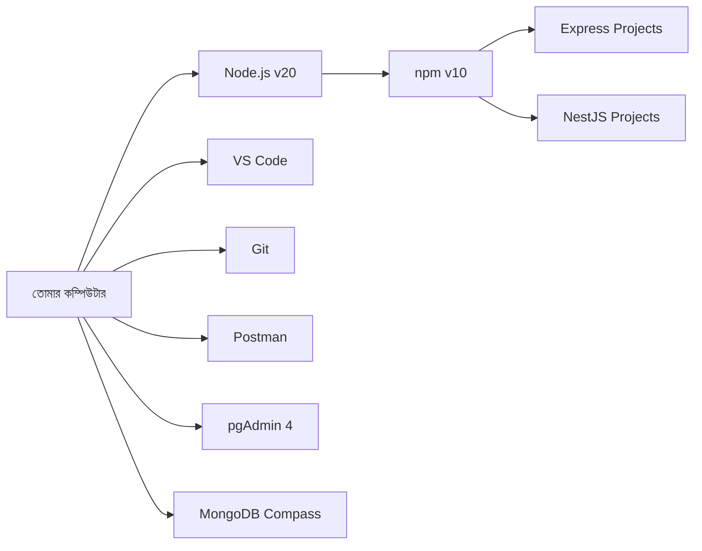

# ━━━━━━━━━━━━━━━━━━━━━━━━━━━━━━━━━━━━━━
# 📘 CHAPTER 0 — Environment Setup
# "সঠিক অস্ত্র ছাড়া যুদ্ধে যেও না"
# ⏱ ~45 মিনিট · Progress: [█░░░░░░░░░] 5%
# ━━━━━━━━━━━━━━━━━━━━━━━━━━━━━━━━━━━━━━

[⬆ TOC এ ফিরে যাও](./table-of-contents.md#toc)

---

## 📌 এই Chapter এ তুমি শিখবে

- ✅ Node.js v20 LTS ইনস্টল ও verify করা
- ✅ VS Code সেটআপ + সেরা Extensions
- ✅ Git + GitHub সংযোগ
- ✅ Postman দিয়ে API test করা
- ✅ pgAdmin 4 দিয়ে PostgreSQL ম্যানেজ করা
- ✅ MongoDB Compass দিয়ে MongoDB ম্যানেজ করা
- ✅ প্রথম Backend project folder তৈরি

---

## 🏗️ Real-life Analogy

> একজন রাঁধুনি রান্না শুরু করার আগে তার রান্নাঘর সাজায় — চুলা, কড়াই, মশলার বয়াম সব জায়গায় রাখে। তুমিও backend code লেখার আগে তোমার "developer রান্নাঘর" সাজাবে।

```
🟢 Flutter তুলনা:
   Flutter শুরুতে যেমন flutter doctor চালিয়ে সব ঠিক আছে কিনা
   দেখতে, backend-ও তেমনি node --version, npm --version দিয়ে
   verify করতে হয়।
```

---

## 🗺️ Setup Overview



---

## 🔧 ধাপ ১: Node.js v20 LTS ইনস্টল

### Windows

```powershell
# Option 1: Official Installer (সবচেয়ে সহজ)
# https://nodejs.org/en/download/ থেকে LTS version ডাউনলোড করো

# Option 2: winget (Windows Package Manager)
winget install OpenJS.NodeJS.LTS

# Verify করো
node --version   # v20.x.x দেখাবে
npm --version    # 10.x.x দেখাবে
```

### macOS

```bash
# Option 1: Homebrew (recommended)
brew install node@20
echo 'export PATH="/opt/homebrew/opt/node@20/bin:$PATH"' >> ~/.zshrc
source ~/.zshrc

# Option 2: Official pkg installer
# https://nodejs.org/en/download/ থেকে macOS Installer ডাউনলোড করো

# Verify করো
node --version   # v20.x.x
npm --version    # 10.x.x
```

### Ubuntu/Linux

```bash
# NodeSource repository ব্যবহার করে (official method)
curl -fsSL https://deb.nodesource.com/setup_20.x | sudo -E bash -
sudo apt-get install -y nodejs

# Verify করো
node --version   # v20.x.x
npm --version    # 10.x.x
```

### ✅ nvm ব্যবহার করো (সবচেয়ে ভালো পদ্ধতি)

```
╭─────────────────────────────────────────────╮
│ 🔑 Concept: nvm (Node Version Manager)      │
│ সহজ ভাষায়: একাধিক Node.js version          │
│            manage করার tool                 │
│ Flutter তুলনা: Flutter version manage       │
│            করতে যেমন fvm ব্যবহার করো,      │
│            Node-এর জন্য nvm তেমনই।         │
╰─────────────────────────────────────────────╯
```

```bash
# macOS/Linux — nvm install
curl -o- https://raw.githubusercontent.com/nvm-sh/nvm/v0.39.7/install.sh | bash

# Shell restart করো, তারপর:
nvm install 20          # Node.js 20 ইনস্টল
nvm use 20              # Node.js 20 use করো
nvm alias default 20    # default হিসেবে সেট করো

# Verify
nvm current             # v20.x.x
node --version          # v20.x.x

# Windows এ nvm-windows ব্যবহার করো:
# https://github.com/coreybutler/nvm-windows/releases
```

---

## 🔧 ধাপ ২: VS Code Setup

### Download ও Install
- https://code.visualstudio.com/ থেকে ডাউনলোড করো

### অত্যাবশ্যক Extensions

```bash
# Terminal থেকে একসাথে install করো:
code --install-extension dbaeumer.vscode-eslint
code --install-extension esbenp.prettier-vscode
code --install-extension Prisma.prisma
code --install-extension mongodb.mongodb-vscode
code --install-extension humao.rest-client
code --install-extension PKief.material-icon-theme
code --install-extension christian-kohler.path-intellisense
code --install-extension formulahendry.auto-rename-tag
code --install-extension usernamehw.errorlens
code --install-extension mikestead.dotenv
```

### VS Code Settings (`.vscode/settings.json`)

📄 File: `.vscode/settings.json` · 🎯 উদ্দেশ্য: সব project-এ consistent formatting

```json
{
  "editor.formatOnSave": true,
  "editor.defaultFormatter": "esbenp.prettier-vscode",
  "editor.tabSize": 2,
  "editor.insertSpaces": true,
  "editor.wordWrap": "on",
  "editor.fontSize": 14,
  "editor.lineHeight": 1.6,
  "files.autoSave": "onFocusChange",
  "terminal.integrated.fontSize": 13,
  "workbench.iconTheme": "material-icon-theme",
  "[javascript]": {
    "editor.defaultFormatter": "esbenp.prettier-vscode"
  },
  "[typescript]": {
    "editor.defaultFormatter": "esbenp.prettier-vscode"
  },
  "prettier.singleQuote": true,
  "prettier.trailingComma": "all",
  "prettier.printWidth": 100,
  "prettier.semi": true
}
```

---

## 🔧 ধাপ ৩: Git Setup

```bash
# Git ইনস্টল হয়েছে কিনা check করো
git --version   # git version 2.x.x

# macOS-এ না থাকলে:
brew install git

# Ubuntu-তে না থাকলে:
sudo apt-get install git

# তোমার পরিচয় সেট করো (একবারই করতে হয়)
git config --global user.name "তোমার নাম"
git config --global user.email "তোমার@email.com"

# Default branch নাম সেট করো
git config --global init.defaultBranch main

# Verify করো
git config --list
```

### .gitignore Template (সব project-এর জন্য)

📄 File: `.gitignore` · 🎯 উদ্দেশ্য: sensitive files ও node_modules GitHub-এ না যাক

```gitignore
# Dependencies
node_modules/
.pnp
.pnp.js

# Environment files — এটা NEVER push করবে না
.env
.env.local
.env.development.local
.env.test.local
.env.production.local
.env.production

# Build output
dist/
build/
.next/

# Logs
logs/
*.log
npm-debug.log*

# OS files
.DS_Store
Thumbs.db

# Editor
.vscode/
.idea/

# Prisma
prisma/migrations/

# TypeScript
*.tsbuildinfo
```

> ⚠️ **সতর্কতা:** `.env` ফাইল কখনো GitHub-এ push করবে না। এতে database password, JWT secret থাকে।

---

## 🔧 ধাপ ৪: PostgreSQL ও pgAdmin 4

### PostgreSQL Install

**macOS:**
```bash
brew install postgresql@16
echo 'export PATH="/opt/homebrew/opt/postgresql@16/bin:$PATH"' >> ~/.zshrc
source ~/.zshrc

# Service শুরু করো
brew services start postgresql@16

# Verify
psql --version   # psql (PostgreSQL) 16.x
```

**Windows:**
```
# Official installer: https://www.postgresql.org/download/windows/
# PostgreSQL 16 installer ডাউনলোড করো
# Installation এ password সেট করো — মনে রেখো এটা!
# Default port: 5432
```

**Ubuntu:**
```bash
sudo apt install postgresql postgresql-contrib
sudo systemctl start postgresql
sudo systemctl enable postgresql

# Verify
psql --version
```

### pgAdmin 4 Install

```
# Download: https://www.pgadmin.org/download/
# OS অনুযায়ী installer ডাউনলোড ও install করো
```

### প্রথম Database তৈরি

```sql
-- Terminal এ psql খোলো
psql -U postgres

-- Password দাও (ইনস্টলের সময় যা দিয়েছিলে)

-- Database তৈরি করো
CREATE DATABASE ecommerce_db;

-- List দেখো
\l

-- বের হও
\q
```

```
╭─────────────────────────────────────────────╮
│ 🔑 Concept: PostgreSQL                      │
│ সহজ ভাষায়: Excel এর মতো table-এ data       │
│            রাখার শক্তিশালী database         │
│ Flutter তুলনা: SQLite যেমন Flutter app-এ   │
│            local storage, PostgreSQL         │
│            তেমনি server-এ পুরো ব্যবসার      │
│            data রাখে।                        │
╰─────────────────────────────────────────────╯
```

---

## 🔧 ধাপ ৫: MongoDB ও MongoDB Compass

### MongoDB Community Server Install

**macOS:**
```bash
brew tap mongodb/brew
brew install mongodb-community@7.0

# Service শুরু করো
brew services start mongodb-community@7.0

# Verify
mongod --version   # db version v7.x.x
```

**Windows:**
```
# Download: https://www.mongodb.com/try/download/community
# MongoDB 7.0 Community Server ডাউনলোড করো
# "Install MongoDB as a Service" চেক রাখো
```

**Ubuntu:**
```bash
# Official method (MongoDB docs থেকে)
curl -fsSL https://www.mongodb.org/static/pgp/server-7.0.asc | \
   sudo gpg -o /usr/share/keyrings/mongodb-server-7.0.gpg --dearmor

echo "deb [ arch=amd64,arm64 signed-by=/usr/share/keyrings/mongodb-server-7.0.gpg ] \
  https://repo.mongodb.org/apt/ubuntu jammy/mongodb-org/7.0 multiverse" | \
  sudo tee /etc/apt/sources.list.d/mongodb-org-7.0.list

sudo apt-get update
sudo apt-get install -y mongodb-org

sudo systemctl start mongod
sudo systemctl enable mongod
```

### MongoDB Compass Install

```
# Download: https://www.mongodb.com/try/download/compass
# Connection string: mongodb://localhost:27017
```

```
╭─────────────────────────────────────────────╮
│ 🔑 Concept: MongoDB                         │
│ সহজ ভাষায়: JSON-এর মতো document           │
│            আকারে data রাখার database        │
│ Flutter তুলনা: Hive বা SharedPreferences    │
│            যেভাবে key-value store করে,      │
│            MongoDB তেমনি flexible           │
│            document store করে।              │
╰─────────────────────────────────────────────╯
```

---

## 🔧 ধাপ ৬: Postman Setup

```
# Download: https://www.postman.com/downloads/
# Account তৈরি করো (free)
# "New Collection" → "E-commerce API" নামে তৈরি করো
```

### প্রথম Request Test

```
GET http://localhost:3000/health

Expected Response:
{
  "status": "ok",
  "message": "Server is running"
}
```

---

## 🔧 ধাপ ৭: প্রথম Project Structure

এখন একটি demo project তৈরি করো:

```bash
# Projects folder-এ যাও
mkdir backend-projects
cd backend-projects

# প্রথম project তৈরি করো
mkdir hello-backend
cd hello-backend

# npm initialize করো
npm init -y

# প্রথম package install করো
npm install express

# Project structure দেখো
ls -la
```

### Project Folder Structure

```
hello-backend/
├── node_modules/          ← dependencies (git-এ যাবে না)
├── src/
│   ├── index.js           ← main entry file
│   └── routes/
│       └── health.js      ← health check route
├── .env                   ← environment variables (git-এ যাবে না)
├── .gitignore             ← git ignore rules
├── package.json           ← project config
└── package-lock.json      ← exact dependency versions
```

📄 File: `src/index.js` · 🎯 উদ্দেশ্য: প্রথম Express server চালু করা

```javascript
const express = require('express');

const app = express();
const PORT = process.env.PORT || 3000;

// JSON body parsing middleware
app.use(express.json());

// Health check route
app.get('/health', (req, res) => {
  res.json({
    status: 'ok',
    message: 'Server is running',
    timestamp: new Date().toISOString(),
    node_version: process.version,
  });
});

// Server শুরু করো
app.listen(PORT, () => {
  console.log(`✅ Server running on http://localhost:${PORT}`);
});
```

```bash
# Server চালাও
node src/index.js

# Output:
# ✅ Server running on http://localhost:3000

# নতুন terminal-এ test করো
curl http://localhost:3000/health
```

💻 Output:
```json
{
  "status": "ok",
  "message": "Server is running",
  "timestamp": "2026-05-03T10:00:00.000Z",
  "node_version": "v20.11.0"
}
```

---

## ❌ সাধারণ ভুল ও সমাধান

| ভুল | কারণ | সমাধান |
|-----|------|---------|
| `node: command not found` | Node.js PATH-এ নেই | `source ~/.zshrc` বা নতুন terminal খোলো |
| `npm ERR! EACCES` | Permission সমস্যা | nvm ব্যবহার করো (sudo npm ব্যবহার করো না) |
| `EADDRINUSE: address already in use :::3000` | Port ৩০০০ অন্য process ব্যবহার করছে | `kill -9 $(lsof -t -i:3000)` চালাও |
| pgAdmin connect করতে পারছে না | PostgreSQL service বন্ধ | `brew services start postgresql@16` |
| MongoDB compass connect করতে পারছে না | mongod service বন্ধ | `brew services start mongodb-community@7.0` |
| `.env` accidentally committed | .gitignore সঠিক নয় | `git rm --cached .env` চালাও |

---

## 📊 Setup Verification Checklist

```bash
# সব কিছু চেক করো — প্রতিটি command-এ version দেখা উচিত

echo "=== Node.js ===" && node --version
echo "=== npm ===" && npm --version
echo "=== Git ===" && git --version
echo "=== PostgreSQL ===" && psql --version
echo "=== MongoDB ===" && mongod --version
```

💻 Expected Output:
```
=== Node.js ===
v20.11.0
=== npm ===
10.2.4
=== Git ===
git version 2.43.0
=== PostgreSQL ===
psql (PostgreSQL) 16.2
=== MongoDB ===
db version v7.0.5
```

---

## 🏋️ Exercise: তোমার নিজের Setup Verify করো

**কাজ:**
1. উপরের verification script চালাও এবং সব version নোট করো
2. `hello-backend` project এ একটি নতুন route `/about` তৈরি করো যেটি তোমার নাম ও email return করে
3. Postman-এ `E-commerce API` collection তৈরি করো এবং `/health` ও `/about` request যোগ করো
4. `.gitignore` সঠিকভাবে setup করা আছে কিনা verify করো: `git status` চালাও এবং `node_modules/` দেখা না যাওয়া নিশ্চিত করো

**Expected `/about` Response:**
```json
{
  "developer": "তোমার নাম",
  "email": "তোমার@email.com",
  "project": "E-commerce Backend",
  "version": "1.0.0"
}
```

---

## 📋 Key Concepts Summary

| Tool | কাজ | Version |
|------|-----|---------|
| Node.js | JavaScript runtime (backend চালায়) | v20 LTS |
| npm | Package manager (library install করে) | v10 |
| VS Code | Code editor | Latest |
| Git | Version control | 2.x |
| Postman | API testing | Latest |
| pgAdmin 4 | PostgreSQL GUI | 4.x |
| MongoDB Compass | MongoDB GUI | Latest |

---

## ✅ দ্রুত সারসংক্ষেপ

```
╔══════════════════════════════════════════════╗
║  ✅ Chapter 0 — তুমি শিখলে                  ║
╠══════════════════════════════════════════════╣
║  • Node.js v20 LTS সঠিকভাবে ইনস্টল করা     ║
║  • nvm দিয়ে Node version manage করা         ║
║  • VS Code + Essential Extensions setup      ║
║  • Git global config সেট করা                ║
║  • PostgreSQL + pgAdmin 4 চালু করা          ║
║  • MongoDB + Compass চালু করা               ║
║  • প্রথম Express server তৈরি ও চালানো       ║
║  • .gitignore দিয়ে sensitive files রক্ষা    ║
╚══════════════════════════════════════════════╝
```

[⬆ TOC এ ফিরে যাও](./table-of-contents.md#toc) | [➡ Chapter 1: Internet & HTTP](./chapter-01-internet-http.md)
