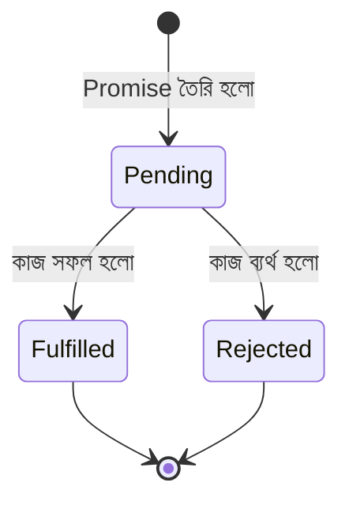

# ━━━━━━━━━━━━━━━━━━━━━━━━━━━━━━━━━━━━━━━━━━━━━━━━━━━
# 📘 CHAPTER 2 — JavaScript for Backend
# "Frontend JS vs Backend JS — মানসিকতার পরিবর্তন"
# ⏱ ~90 মিনিট · Progress: [███░░░░░░░] 15%
# ━━━━━━━━━━━━━━━━━━━━━━━━━━━━━━━━━━━━━━━━━━━━━━━━━━━

[⬆ TOC এ ফিরে যাও](./table-of-contents.md#toc)

---

## 📌 এই Chapter এ তুমি শিখবে

- ✅ `var`, `let`, `const` পার্থক্য ও সঠিক ব্যবহার
- ✅ Arrow functions ও regular functions পার্থক্য
- ✅ Destructuring: Object ও Array
- ✅ Spread ও Rest operators
- ✅ Promise: then/catch ও async/await
- ✅ Error handling: try/catch/finally
- ✅ CommonJS (`require`) vs ES Modules (`import`)
- ✅ EventEmitter দিয়ে event-driven programming
- ✅ Closures ও কেন Backend-এ দরকার
- ✅ Array methods: map, filter, reduce, find, some, every

---

## 🏗️ Real-life Analogy

> Flutter-এ তুমি Dart জানো। Backend-এ JavaScript/TypeScript ব্যবহার হয়। Dart ও JavaScript উভয়ই C-style syntax — তাই অনেক কিছু পরিচিত লাগবে। কিন্তু Dart-এ সব synchronous, JavaScript-এ সব asynchronous — এই মানসিক পরিবর্তনটাই সবচেয়ে জরুরি।

```
🟢 Flutter তুলনা:
   Dart:        Future<String> fetchUser() async { ... }
   JavaScript:  async function fetchUser() { ... }

   Dart:        await http.get(url)
   JavaScript:  await fetch(url)
   
   মূলত একই ধারণা, ভিন্ন syntax।
```

---

## 📦 var, let, const

### পার্থক্য একনজরে

```
╭──────────────────────────────────────────────────────────╮
│ 🔑 Concept: Variable Declaration                         │
│ সহজ ভাষায়: Data রাখার পাত্র — তিন ধরনের               │
│ Flutter তুলনা: Dart-এর var, final, const-এর মতোই       │
╰──────────────────────────────────────────────────────────╯
```

📄 File: `examples/ch02/variables.js` · 🎯 উদ্দেশ্য: var/let/const পার্থক্য বোঝা

```javascript
// ============================================
// var — পুরানো পদ্ধতি, function-scoped, hoisted
// ============================================
function varExample() {
  if (true) {
    var message = 'Hello from var';
  }
  console.log(message); // ✅ কাজ করে কারণ var function-scoped
}
varExample();

// var hoisting — বিপজ্জনক আচরণ
console.log(name); // undefined (error নয়!)
var name = 'Backend Dev';

// ============================================
// let — block-scoped, reassignable
// ============================================
function letExample() {
  if (true) {
    let blockMessage = 'Hello from let';
    console.log(blockMessage); // ✅ কাজ করে
  }
  // console.log(blockMessage); // ❌ ReferenceError: blockMessage is not defined
}
letExample();

// let reassign করা যায়
let counter = 0;
counter = counter + 1; // ✅ OK
counter++;              // ✅ OK

// ============================================
// const — block-scoped, NOT reassignable
// ============================================
const PORT = 3000;
// PORT = 4000; // ❌ TypeError: Assignment to constant variable

// ⚠️ গুরুত্বপূর্ণ: const object/array-এর contents পরিবর্তন করা যায়
const user = { name: 'Alice', age: 25 };
user.age = 26;          // ✅ কাজ করে — object-এর property পরিবর্তন
// user = {};           // ❌ Error — variable নিজে reassign করা যাবে না

const fruits = ['apple', 'banana'];
fruits.push('mango');   // ✅ কাজ করে
// fruits = [];         // ❌ Error
```

### সঠিক ব্যবহারের নিয়ম

```
❌ ভুল পদ্ধতি:
var userId = 1;  // var ব্যবহার করবে না

✅ সঠিক পদ্ধতি:
const PORT = 3000;              // পরিবর্তন হবে না → const
const dbConfig = { host: '...' }; // object হলেও const
let retryCount = 0;             // পরিবর্তন হবে → let
```

---

## 🎯 Arrow Functions

📄 File: `examples/ch02/arrow-functions.js` · 🎯 উদ্দেশ্য: arrow vs regular function পার্থক্য

```javascript
// Regular function
function add(a, b) {
  return a + b;
}

// Arrow function — এক line
const addArrow = (a, b) => a + b;

// Arrow function — একাধিক line
const multiply = (a, b) => {
  const result = a * b;
  return result;
};

// Single parameter → parentheses optional
const double = (n) => n * 2;
const doubleAlt = n => n * 2; // same

// No parameters → empty parentheses
const greet = () => 'Hello, Backend!';

// Object return করলে parentheses দিতে হবে
const createUser = (name, email) => ({
  id: Math.random(),
  name,
  email,
  createdAt: new Date(),
});

// ============================================
// সবচেয়ে গুরুত্বপূর্ণ পার্থক্য: `this` binding
// ============================================
const timer = {
  name: 'MyTimer',
  start() {
    // Regular function: this হারিয়ে যায়
    setTimeout(function () {
      // console.log(this.name); // undefined (this = global/undefined)
    }, 100);

    // Arrow function: this parent scope থেকে নেয়
    setTimeout(() => {
      console.log(this.name); // ✅ 'MyTimer'
    }, 100);
  },
};

timer.start();

// Backend-এ সবচেয়ে বেশি দেখা pattern:
const products = [1, 2, 3, 4, 5];
const doubled = products.map((n) => n * 2);
console.log(doubled); // [2, 4, 6, 8, 10]

// Callback-এ arrow function
app.get('/products', (req, res) => {
  res.json({ products: [] });
});
```

---

## 📦 Destructuring

```
╭──────────────────────────────────────────────────────────╮
│ 🔑 Concept: Destructuring                                │
│ সহজ ভাষায়: Object/Array থেকে সরাসরি variable-এ       │
│            value বের করে নেওয়া                          │
│ Flutter তুলনা: Dart-এর record pattern-এর মতো           │
╰──────────────────────────────────────────────────────────╯
```

📄 File: `examples/ch02/destructuring.js` · 🎯 উদ্দেশ্য: Destructuring সব pattern

```javascript
// ============================================
// Object Destructuring
// ============================================
const product = {
  id: 1,
  name: 'iPhone 15 Pro',
  price: 999.99,
  category: 'phone',
  brand: 'Apple',
};

// Basic destructuring
const { name, price } = product;
console.log(name);  // iPhone 15 Pro
console.log(price); // 999.99

// Rename করা
const { name: productName, price: productPrice } = product;
console.log(productName);  // iPhone 15 Pro

// Default value দেওয়া
const { stock = 0, discount = 0 } = product;
console.log(stock);    // 0 (product-এ নেই, তাই default)
console.log(discount); // 0

// Nested object destructuring
const order = {
  id: 'ORD-001',
  user: {
    id: 1,
    name: 'Rahim',
    address: {
      city: 'Dhaka',
      zip: '1200',
    },
  },
};

const { user: { name: userName, address: { city } } } = order;
console.log(userName); // Rahim
console.log(city);     // Dhaka

// Function parameter-এ destructuring (সবচেয়ে বেশি ব্যবহার)
function createProduct({ name, price, category = 'general' }) {
  return { id: Date.now(), name, price, category };
}
const newProduct = createProduct({ name: 'MacBook', price: 1299 });
console.log(newProduct);

// ============================================
// Array Destructuring
// ============================================
const colors = ['red', 'green', 'blue'];

const [first, second, third] = colors;
console.log(first);  // red
console.log(second); // green

// Skip করা
const [, , last] = colors;
console.log(last); // blue

// Default value
const [primary = 'black', secondary = 'white'] = [];
console.log(primary);   // black
console.log(secondary); // white

// Swap variables (খুব useful!)
let a = 1;
let b = 2;
[a, b] = [b, a];
console.log(a, b); // 2, 1

// ============================================
// Rest in Destructuring
// ============================================
const { id, name: pName, ...rest } = product;
console.log(id);    // 1
console.log(pName); // iPhone 15 Pro
console.log(rest);  // { price: 999.99, category: 'phone', brand: 'Apple' }

const [head, ...tail] = [1, 2, 3, 4, 5];
console.log(head); // 1
console.log(tail); // [2, 3, 4, 5]
```

---

## 🔀 Spread Operator

📄 File: `examples/ch02/spread.js` · 🎯 উদ্দেশ্য: Spread operator সব use case

```javascript
// ============================================
// Object Spread — PATCH এর জন্য সবচেয়ে জরুরি
// ============================================
const existingProduct = { id: 1, name: 'iPhone', price: 999, stock: 50 };
const updates = { price: 899, discount: 10 };

// পুরানো object-কে নতুন দিয়ে merge করো
const updatedProduct = { ...existingProduct, ...updates };
console.log(updatedProduct);
// { id: 1, name: 'iPhone', price: 899, stock: 50, discount: 10 }
// ← price overwrite হয়েছে

// Original অপরিবর্তিত
console.log(existingProduct.price); // 999

// ============================================
// Array Spread
// ============================================
const electronics = ['phone', 'tablet'];
const computers = ['laptop', 'desktop'];

const allProducts = [...electronics, ...computers];
console.log(allProducts); // ['phone', 'tablet', 'laptop', 'desktop']

// Array copy
const original = [1, 2, 3];
const copy = [...original];
copy.push(4);
console.log(original); // [1, 2, 3] — অপরিবর্তিত
console.log(copy);     // [1, 2, 3, 4]

// Function argument spread
function sum(x, y, z) {
  return x + y + z;
}
const nums = [1, 2, 3];
console.log(sum(...nums)); // 6
```

---

## ⏳ Promises ও Async/Await

```
╭──────────────────────────────────────────────────────────╮
│ 🔑 Concept: Asynchronous Programming                     │
│ সহজ ভাষায়: কাজ শেষ হওয়ার জন্য অপেক্ষা না করে        │
│            পরের কাজ করে যাওয়া। Result এলে             │
│            তখন handle করো।                              │
│ Flutter তুলনা: Dart-এর Future<T> = JS-এর Promise<T>    │
╰──────────────────────────────────────────────────────────╯
```



📄 File: `examples/ch02/promises.js` · 🎯 উদ্দেশ্য: Promise তৈরি ও ব্যবহার

```javascript
// ============================================
// Promise তৈরি করা
// ============================================
const fetchUserById = (id) => {
  return new Promise((resolve, reject) => {
    // Simulate database query (setTimeout দিয়ে delay)
    setTimeout(() => {
      const users = [
        { id: 1, name: 'Rahim', email: 'rahim@example.com' },
        { id: 2, name: 'Karim', email: 'karim@example.com' },
      ];

      const user = users.find((u) => u.id === id);

      if (user) {
        resolve(user); // সফল
      } else {
        reject(new Error(`User with id ${id} not found`)); // ব্যর্থ
      }
    }, 100);
  });
};

// ============================================
// .then() / .catch() দিয়ে handle করা
// ============================================
fetchUserById(1)
  .then((user) => {
    console.log('User found:', user);
    return user.name; // chain করা যায়
  })
  .then((name) => {
    console.log('User name:', name);
  })
  .catch((error) => {
    console.error('Error:', error.message);
  })
  .finally(() => {
    console.log('Operation complete');
  });

// ============================================
// async/await — সবচেয়ে পরিষ্কার পদ্ধতি
// ============================================
async function getUserAndProcess(userId) {
  try {
    const user = await fetchUserById(userId);
    console.log('Got user:', user.name);

    // পরের কাজও await করতে পারো
    // const orders = await fetchOrdersByUser(user.id);

    return user;
  } catch (error) {
    console.error('Failed to get user:', error.message);
    throw error; // উপরে re-throw করো
  } finally {
    console.log('getUserAndProcess finished');
  }
}

getUserAndProcess(1);
getUserAndProcess(99); // Error: User with id 99 not found

// ============================================
// Parallel Execution — Promise.all()
// ============================================
async function fetchDashboardData(userId) {
  try {
    // একই সাথে সব fetch করো (sequential নয়, parallel!)
    const [user, orders, notifications] = await Promise.all([
      fetchUserById(userId),
      fetchUserOrders(userId),     // separate function
      fetchNotifications(userId),  // separate function
    ]);

    return { user, orders, notifications };
  } catch (error) {
    // যেকোনো একটি reject হলেই এখানে আসবে
    throw error;
  }
}

// Promise.allSettled — সব complete হওয়ার পর (reject হলেও)
async function fetchAllWithStatus(userIds) {
  const promises = userIds.map((id) => fetchUserById(id));
  const results = await Promise.allSettled(promises);

  results.forEach((result, index) => {
    if (result.status === 'fulfilled') {
      console.log(`User ${userIds[index]}:`, result.value);
    } else {
      console.log(`User ${userIds[index]} failed:`, result.reason.message);
    }
  });
}

fetchAllWithStatus([1, 2, 99]);
```

💻 Output:
```
User found: { id: 1, name: 'Rahim', email: 'rahim@example.com' }
User name: Rahim
Operation complete
getUserAndProcess finished
Got user: Rahim
getUserAndProcess finished
Failed to get user: User with id 99 not found
```

---

## 📦 CommonJS vs ES Modules

```
╭──────────────────────────────────────────────────────────╮
│ 🔑 Concept: Module System                                │
│ সহজ ভাষায়: Code কে ছোট ছোট file-এ ভাগ করে           │
│            share করার পদ্ধতি                             │
│ Flutter তুলনা: Dart-এ `import 'package:...'` যেমন,    │
│            JS-এ require() বা import দিয়ে করো           │
╰──────────────────────────────────────────────────────────╯
```

### CommonJS (`.js` files, Node.js default)

📄 File: `examples/ch02/commonjs/math.js` · 🎯 উদ্দেশ্য: CommonJS module export

```javascript
// Named exports
const add = (a, b) => a + b;
const subtract = (a, b) => a - b;
const multiply = (a, b) => a * b;

// Object হিসেবে export
module.exports = {
  add,
  subtract,
  multiply,
};

// অথবা একটি একটি করে:
// module.exports.add = add;
```

📄 File: `examples/ch02/commonjs/app.js` · 🎯 উদ্দেশ্য: CommonJS module import

```javascript
// Destructuring দিয়ে import
const { add, subtract } = require('./math');

console.log(add(5, 3));      // 8
console.log(subtract(5, 3)); // 2

// পুরো object import
const math = require('./math');
console.log(math.multiply(4, 5)); // 20

// Built-in modules
const path = require('node:path');
const fs = require('node:fs');
const os = require('node:os');

// npm packages
const express = require('express');
```

### ES Modules (`.mjs` বা `"type": "module"` in package.json)

📄 File: `examples/ch02/esm/math.mjs` · 🎯 উদ্দেশ্য: ES Module export

```javascript
// Named exports
export const add = (a, b) => a + b;
export const subtract = (a, b) => a - b;

// Default export
export default function multiply(a, b) {
  return a * b;
}
```

📄 File: `examples/ch02/esm/app.mjs` · 🎯 উদ্দেশ্য: ES Module import

```javascript
// Named imports
import { add, subtract } from './math.mjs';

// Default import
import multiply from './math.mjs';

// Rename
import { add as sum } from './math.mjs';

// Namespace import
import * as MathUtils from './math.mjs';
console.log(MathUtils.add(1, 2)); // 3

console.log(add(5, 3));      // 8
console.log(subtract(5, 3)); // 2
console.log(multiply(4, 5)); // 20
console.log(sum(10, 5));     // 15
```

### কোনটি ব্যবহার করবো?

| পরিস্থিতি | পরামর্শ |
|----------|---------|
| Express project | CommonJS (`require`) — সহজ |
| NestJS project | ES Modules/TypeScript `import` |
| Node.js script | CommonJS |
| Modern project | ES Modules (future-proof) |

> 💡 **PRO TIP:** NestJS TypeScript ব্যবহার করে যা ES Module syntax দেখায় কিন্তু TypeScript compiler CommonJS-এ compile করে।

---

## 🎪 EventEmitter

```
╭──────────────────────────────────────────────────────────╮
│ 🔑 Concept: EventEmitter                                 │
│ সহজ ভাষায়: কিছু ঘটলে সবাইকে জানিয়ে দাও —            │
│            Publish-Subscribe pattern                      │
│ Flutter তুলনা: Flutter-এর StreamController               │
│            যেভাবে event broadcast করে                    │
╰──────────────────────────────────────────────────────────╯
```

📄 File: `examples/ch02/event-emitter.js` · 🎯 উদ্দেশ্য: EventEmitter ব্যবহার

```javascript
const { EventEmitter } = require('node:events');

// Custom Event Emitter class তৈরি করো
class OrderService extends EventEmitter {
  constructor() {
    super();
  }

  placeOrder(orderData) {
    // Order processing logic
    const order = {
      id: `ORD-${Date.now()}`,
      ...orderData,
      status: 'confirmed',
      createdAt: new Date(),
    };

    // Event emit করো — সবাইকে জানাও
    this.emit('order:placed', order);
    this.emit('order:payment:required', order);

    return order;
  }

  cancelOrder(orderId) {
    this.emit('order:cancelled', { orderId, cancelledAt: new Date() });
  }
}

// Service তৈরি করো
const orderService = new OrderService();

// Listeners যোগ করো (subscribe)
orderService.on('order:placed', (order) => {
  console.log(`✅ Order placed: ${order.id}`);
  // Email পাঠাও, notification দাও, ইত্যাদি
});

orderService.on('order:payment:required', (order) => {
  console.log(`💳 Payment required for order: ${order.id}`);
});

orderService.on('order:cancelled', ({ orderId }) => {
  console.log(`❌ Order cancelled: ${orderId}`);
});

// একবার শুনতে চাইলে `once` ব্যবহার করো
orderService.once('order:placed', (order) => {
  console.log('First order ever placed! Congrats!');
});

// Order place করো
const order = orderService.placeOrder({
  product: 'iPhone 15 Pro',
  quantity: 1,
  userId: 1,
});

orderService.cancelOrder(order.id);
```

💻 Output:
```
✅ Order placed: ORD-1714732800000
First order ever placed! Congrats!
💳 Payment required for order: ORD-1714732800000
❌ Order cancelled: ORD-1714732800000
```

---

## 🔢 Array Methods (Backend-এ সবচেয়ে বেশি ব্যবহৃত)

📄 File: `examples/ch02/array-methods.js` · 🎯 উদ্দেশ্য: Array transformation methods

```javascript
const products = [
  { id: 1, name: 'iPhone 15 Pro', price: 999, category: 'phone', stock: 50 },
  { id: 2, name: 'iPad Air', price: 599, category: 'tablet', stock: 30 },
  { id: 3, name: 'MacBook Pro', price: 1999, category: 'laptop', stock: 10 },
  { id: 4, name: 'AirPods Pro', price: 249, category: 'audio', stock: 100 },
  { id: 5, name: 'Apple Watch', price: 399, category: 'wearable', stock: 0 },
];

// ============================================
// map — প্রতিটি item transform করো
// ============================================
const productNames = products.map((p) => p.name);
console.log(productNames);
// ['iPhone 15 Pro', 'iPad Air', 'MacBook Pro', 'AirPods Pro', 'Apple Watch']

// API response format করতে
const apiResponse = products.map((p) => ({
  id: p.id,
  name: p.name,
  price: `$${p.price}`,
  available: p.stock > 0,
}));

// ============================================
// filter — শর্ত মিলে এমন items রাখো
// ============================================
const inStockProducts = products.filter((p) => p.stock > 0);
console.log(inStockProducts.length); // 4

const affordablePhones = products.filter(
  (p) => p.category === 'phone' && p.price < 1000
);

// ============================================
// find — প্রথম matching item খোঁজো
// ============================================
const product = products.find((p) => p.id === 3);
console.log(product.name); // MacBook Pro

const notFound = products.find((p) => p.id === 99);
console.log(notFound); // undefined

// ============================================
// findIndex — index খোঁজো
// ============================================
const index = products.findIndex((p) => p.id === 2);
console.log(index); // 1

// ============================================
// reduce — সব মিলিয়ে একটি value বানাও
// ============================================
const totalValue = products.reduce((total, p) => total + p.price * p.stock, 0);
console.log(totalValue); // 999*50 + 599*30 + 1999*10 + 249*100 + 399*0

// Object-এ group করো
const byCategory = products.reduce((acc, p) => {
  if (!acc[p.category]) {
    acc[p.category] = [];
  }
  acc[p.category].push(p);
  return acc;
}, {});
console.log(Object.keys(byCategory)); // ['phone', 'tablet', 'laptop', 'audio', 'wearable']

// ============================================
// some / every
// ============================================
const hasOutOfStock = products.some((p) => p.stock === 0);
console.log(hasOutOfStock); // true

const allInStock = products.every((p) => p.stock > 0);
console.log(allInStock); // false

// ============================================
// sort — সাজাও
// ============================================
const sortedByPrice = [...products].sort((a, b) => a.price - b.price);
console.log(sortedByPrice[0].name); // AirPods Pro (সবচেয়ে সস্তা)

const sortedByPriceDesc = [...products].sort((a, b) => b.price - a.price);
console.log(sortedByPriceDesc[0].name); // MacBook Pro (সবচেয়ে দামী)

// ============================================
// flat / flatMap
// ============================================
const nested = [[1, 2], [3, 4], [5, 6]];
console.log(nested.flat()); // [1, 2, 3, 4, 5, 6]

const categories = products.flatMap((p) => [p.category, p.name]);
```

---

## 🔐 Closures (Backend-এ গুরুত্বপূর্ণ)

📄 File: `examples/ch02/closures.js` · 🎯 উদ্দেশ্য: Closure দিয়ে private state

```javascript
// ============================================
// Closure — function যখন outer scope access করে
// ============================================

// Rate limiter তৈরি করো closure দিয়ে
function createRateLimiter(maxRequests, windowMs) {
  const requestCounts = new Map(); // প্রতি IP-এর request count

  return function (ipAddress) {
    const now = Date.now();
    const windowStart = now - windowMs;

    if (!requestCounts.has(ipAddress)) {
      requestCounts.set(ipAddress, []);
    }

    // পুরানো requests পরিষ্কার করো
    const requests = requestCounts.get(ipAddress).filter((t) => t > windowStart);
    requestCounts.set(ipAddress, requests);

    if (requests.length >= maxRequests) {
      return { allowed: false, retryAfter: windowMs / 1000 };
    }

    requests.push(now);
    return { allowed: true, remaining: maxRequests - requests.length };
  };
}

// প্রতি ১ মিনিটে ৫টি request allow
const checkRateLimit = createRateLimiter(5, 60 * 1000);

console.log(checkRateLimit('192.168.1.1')); // { allowed: true, remaining: 4 }
console.log(checkRateLimit('192.168.1.1')); // { allowed: true, remaining: 3 }
console.log(checkRateLimit('192.168.1.1')); // { allowed: true, remaining: 2 }
console.log(checkRateLimit('192.168.1.1')); // { allowed: true, remaining: 1 }
console.log(checkRateLimit('192.168.1.1')); // { allowed: true, remaining: 0 }
console.log(checkRateLimit('192.168.1.1')); // { allowed: false, retryAfter: 60 }

// Config factory — closure দিয়ে configuration hide করা
function createDatabaseConfig(env) {
  const configs = {
    development: { host: 'localhost', port: 5432, database: 'dev_db' },
    production: { host: process.env.DB_HOST, port: 5432, database: 'prod_db' },
    test: { host: 'localhost', port: 5432, database: 'test_db' },
  };

  const config = configs[env] || configs.development;

  return {
    getHost: () => config.host,
    getPort: () => config.port,
    getDatabase: () => config.database,
    // password expose করা হয়নি
  };
}

const dbConfig = createDatabaseConfig('development');
console.log(dbConfig.getHost()); // localhost
```

---

## 🏋️ Exercise

**কাজ: Product API Utility Functions বানাও**

📄 File: `exercises/ch02/product-utils.js` · 🎯 উদ্দেশ্য: সব concept ব্যবহার করা

```javascript
const products = [
  { id: 1, name: 'iPhone 15 Pro', price: 999.99, category: 'phone', rating: 4.8, reviews: 1250 },
  { id: 2, name: 'Samsung Galaxy S24', price: 899.99, category: 'phone', rating: 4.6, reviews: 980 },
  { id: 3, name: 'iPad Air M2', price: 599.99, category: 'tablet', rating: 4.7, reviews: 750 },
  { id: 4, name: 'MacBook Pro M3', price: 1999.99, category: 'laptop', rating: 4.9, reviews: 430 },
  { id: 5, name: 'Dell XPS 15', price: 1599.99, category: 'laptop', rating: 4.5, reviews: 620 },
];

// ১. Category অনুযায়ী group করো (reduce ব্যবহার করো)
function groupByCategory(products) {
  return products.reduce((groups, product) => {
    const { category } = product;
    if (!groups[category]) {
      groups[category] = [];
    }
    groups[category].push(product);
    return groups;
  }, {});
}

// ২. Top-rated products পাও (rating >= minimum)
function getTopRated(products, minimumRating = 4.7) {
  return products
    .filter((p) => p.rating >= minimumRating)
    .sort((a, b) => b.rating - a.rating);
}

// ৩. Price range filter
function filterByPriceRange(products, { min = 0, max = Infinity } = {}) {
  return products.filter((p) => p.price >= min && p.price <= max);
}

// ৪. Search function
function searchProducts(products, query) {
  const lowerQuery = query.toLowerCase();
  return products.filter(
    (p) =>
      p.name.toLowerCase().includes(lowerQuery) ||
      p.category.toLowerCase().includes(lowerQuery)
  );
}

// ৫. Statistics
function getStatistics(products) {
  if (products.length === 0) {
    return { count: 0, avgPrice: 0, avgRating: 0 };
  }

  const total = products.reduce(
    (acc, p) => ({
      price: acc.price + p.price,
      rating: acc.rating + p.rating,
    }),
    { price: 0, rating: 0 }
  );

  return {
    count: products.length,
    avgPrice: (total.price / products.length).toFixed(2),
    avgRating: (total.rating / products.length).toFixed(1),
    cheapest: products.reduce((min, p) => (p.price < min.price ? p : min)),
    mostExpensive: products.reduce((max, p) => (p.price > max.price ? p : max)),
  };
}

// Test করো
console.log('Groups:', Object.keys(groupByCategory(products)));
console.log('Top Rated:', getTopRated(products).map((p) => p.name));
console.log('Under $1000:', filterByPriceRange(products, { max: 1000 }).map((p) => p.name));
console.log('Search "pro":', searchProducts(products, 'pro').map((p) => p.name));
console.log('Stats:', getStatistics(products));

module.exports = { groupByCategory, getTopRated, filterByPriceRange, searchProducts, getStatistics };
```

---

## 📊 Common Mistakes Table

| ভুল | কারণ | সমাধান |
|-----|------|---------|
| `var` ব্যবহার করা | পুরানো অভ্যাস | সবসময় `const`, দরকারে `let` |
| `.then()` chain না ধরা | Async বুঝতে না পারা | সবসময় `.catch()` বা try/catch |
| `await` ছাড়া async call | Timing বোঝেনি | `await` যোগ করো |
| Sequential এর বদলে parallel | `Promise.all()` না জানা | `Promise.all([...])` ব্যবহার করো |
| Error re-throw না করা | Error silently swallow হয় | catch-এ `throw error` |
| `require` ও `import` মিক্স | Module system confusion | একটি বেছে নাও |

---

## ✅ Chapter Summary

```
╔══════════════════════════════════════════════════════╗
║  ✅ Chapter 2 — তুমি শিখলে                          ║
╠══════════════════════════════════════════════════════╣
║  • var/let/const পার্থক্য ও সঠিক ব্যবহার            ║
║  • Arrow functions ও this binding                    ║
║  • Object ও Array destructuring                     ║
║  • Spread ও Rest operators                          ║
║  • Promise তৈরি, then/catch, async/await            ║
║  • Promise.all() দিয়ে parallel execution            ║
║  • CommonJS vs ES Modules                           ║
║  • EventEmitter দিয়ে pub/sub pattern               ║
║  • Array methods: map/filter/reduce/find/sort       ║
║  • Closures দিয়ে private state management           ║
╚══════════════════════════════════════════════════════╝
```

[⬆ TOC এ ফিরে যাও](./table-of-contents.md#toc) | [⬅ Chapter 1](./chapter-01-internet-http.md) | [➡ Chapter 3](./chapter-03-nodejs-core.md)
