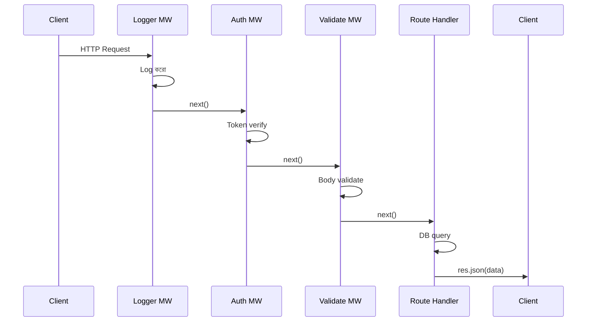

# ━━━━━━━━━━━━━━━━━━━━━━━━━━━━━━━━━━━━━━━━━━━━━━━━━━━━━
# 📘 CHAPTER 4 — Express.js
# "Routing থেকে Middleware — প্রথম Real API"
# ⏱ ~120 মিনিট · Progress: [█████░░░░░] 25%
# ━━━━━━━━━━━━━━━━━━━━━━━━━━━━━━━━━━━━━━━━━━━━━━━━━━━━━

[⬆ TOC এ ফিরে যাও](./table-of-contents.md#toc)

---

## 📌 এই Chapter এ তুমি শিখবে

- ✅ Express.js কী ও কেন ব্যবহার করি
- ✅ Routing: static, dynamic, nested routes
- ✅ req ও res object — সব properties ও methods
- ✅ Middleware pipeline — কীভাবে request প্রবাহিত হয়
- ✅ CORS setup ও configuration
- ✅ Error handling middleware
- ✅ Express Router দিয়ে routes organize করা
- ✅ Complete E-commerce CRUD API project

---

## 🏗️ Real-life Analogy

> Express.js হলো একটি conveyor belt সিস্টেম। প্রতিটি HTTP request belt-এর উপর দিয়ে যায়। Belt-এ বিভিন্ন station (middleware) আছে — কেউ request validate করে, কেউ log করে, কেউ auth check করে। শেষে সঠিক route পৌঁছায় এবং response ফিরে আসে।

```
🟢 Flutter তুলনা:
   Flutter-এর Navigator route stack যেমন screens-এর
   মধ্যে navigate করে, Express-এর Router তেমনি
   HTTP requests কে সঠিক handler-এ পাঠায়।
   
   Flutter-এর middleware (interceptor) = Express middleware
```

---

## 🔄 Middleware Pipeline



```
╭─────────────────────────────────────────────────────╮
│ 🔑 Concept: Middleware                              │
│ সহজ ভাষায়: Request এবং Response-এর মাঝখানে      │
│            চলা function। প্রতিটি middleware         │
│            হয় next() ডাকে (পরের-এ যাও) বা        │
│            response পাঠায় (chain শেষ করো)।        │
│ Flutter তুলনা: Dio-এর Interceptor-এর মতো          │
╰─────────────────────────────────────────────────────╯
```

---

## 🚀 Express App Structure (Production-grade)

```
ecommerce-express/
├── src/
│   ├── index.js              ← Entry point
│   ├── app.js                ← Express app setup
│   ├── config/
│   │   └── env.js            ← Environment config
│   ├── routes/
│   │   ├── index.js          ← Route aggregator
│   │   ├── product.routes.js
│   │   ├── user.routes.js
│   │   └── order.routes.js
│   ├── controllers/
│   │   ├── product.controller.js
│   │   ├── user.controller.js
│   │   └── order.controller.js
│   ├── middleware/
│   │   ├── auth.middleware.js
│   │   ├── logger.middleware.js
│   │   └── error.middleware.js
│   ├── models/
│   │   ├── product.model.js   ← Mongoose
│   │   └── prisma.client.js   ← Prisma
│   └── utils/
│       └── ApiResponse.js
├── .env
├── .gitignore
├── nodemon.json
└── package.json
```

---

## ⚙️ Express App Setup

📄 File: `src/app.js` · 🎯 উদ্দেশ্য: Express application তৈরি ও middleware setup

```javascript
const express = require('express');
const cors = require('cors');
const helmet = require('helmet');
const morgan = require('morgan');
const routes = require('./routes');
const { errorHandler, notFoundHandler } = require('./middleware/error.middleware');

const app = express();

// ============================================
// Security & Utility Middleware
// ============================================

// helmet: HTTP security headers সেট করে
app.use(helmet());

// morgan: HTTP request logging (dev mode)
if (process.env.NODE_ENV === 'development') {
  app.use(morgan('dev'));
}

// CORS: Cross-Origin Resource Sharing
app.use(
  cors({
    origin: function (origin, callback) {
      const allowedOrigins = [
        'http://localhost:4200',  // Flutter web dev
        'http://localhost:3000',  // React dev
        process.env.FRONTEND_URL,
      ].filter(Boolean);

      // Allow requests with no origin (mobile apps, Postman)
      if (!origin) return callback(null, true);

      if (allowedOrigins.includes(origin)) {
        callback(null, true);
      } else {
        callback(new Error(`CORS policy: Origin ${origin} not allowed`));
      }
    },
    methods: ['GET', 'POST', 'PUT', 'PATCH', 'DELETE', 'OPTIONS'],
    allowedHeaders: ['Content-Type', 'Authorization', 'X-Request-Id'],
    credentials: true, // cookies allow করতে
    maxAge: 86400,      // preflight cache: 24 hours
  })
);

// Body parsers
app.use(express.json({ limit: '10mb' }));
app.use(express.urlencoded({ extended: true, limit: '10mb' }));

// Static files
app.use('/uploads', express.static('uploads'));

// ============================================
// Routes
// ============================================
app.use('/api/v1', routes);

// 404 Handler (routes-এর পরে থাকবে)
app.use(notFoundHandler);

// Global Error Handler (সবার শেষে)
app.use(errorHandler);

module.exports = app;
```

📄 File: `src/index.js` · 🎯 উদ্দেশ্য: Server start করা

```javascript
require('dotenv').config();

const app = require('./app');
const config = require('./config/env');

const server = app.listen(config.node.port, () => {
  console.log(`
  ╔══════════════════════════════════════╗
  ║  🚀 E-commerce API Server            ║
  ║  Environment: ${config.node.env.padEnd(20)}  ║
  ║  Port:        ${String(config.node.port).padEnd(20)}  ║
  ║  URL:         http://localhost:${config.node.port.toString().padEnd(8)}  ║
  ╚══════════════════════════════════════╝
  `);
});

// Graceful shutdown
process.on('SIGTERM', () => {
  console.log('SIGTERM received. Shutting down gracefully...');
  server.close(() => {
    console.log('Server closed');
    process.exit(0);
  });
});

process.on('unhandledRejection', (reason, promise) => {
  console.error('Unhandled Rejection at:', promise, 'reason:', reason);
  server.close(() => process.exit(1));
});
```

---

## 🛣️ Routing

### Route Types

📄 File: `src/routes/product.routes.js` · 🎯 উদ্দেশ্য: Product routes

```javascript
const express = require('express');
const router = express.Router();
const productController = require('../controllers/product.controller');
const { authenticate, authorize } = require('../middleware/auth.middleware');

// ============================================
// Static Routes
// ============================================
// GET /api/v1/products
router.get('/', productController.getAllProducts);

// GET /api/v1/products/featured
router.get('/featured', productController.getFeaturedProducts);

// POST /api/v1/products — admin only
router.post('/', authenticate, authorize('admin'), productController.createProduct);

// ============================================
// Dynamic Routes (:param)
// ============================================
// GET /api/v1/products/abc123
router.get('/:id', productController.getProductById);

// PUT /api/v1/products/abc123
router.put('/:id', authenticate, authorize('admin'), productController.updateProduct);

// PATCH /api/v1/products/abc123
router.patch('/:id', authenticate, authorize('admin'), productController.patchProduct);

// DELETE /api/v1/products/abc123
router.delete('/:id', authenticate, authorize('admin'), productController.deleteProduct);

// ============================================
// Nested Routes
// ============================================
// GET /api/v1/products/abc123/reviews
router.get('/:id/reviews', productController.getProductReviews);

// POST /api/v1/products/abc123/reviews
router.post('/:id/reviews', authenticate, productController.addProductReview);

module.exports = router;
```

📄 File: `src/routes/index.js` · 🎯 উদ্দেশ্য: সব routes একত্রিত করা

```javascript
const express = require('express');
const router = express.Router();

const productRoutes = require('./product.routes');
const userRoutes = require('./user.routes');
const orderRoutes = require('./order.routes');
const authRoutes = require('./auth.routes');

// Health check
router.get('/health', (req, res) => {
  res.json({
    status: 'ok',
    timestamp: new Date().toISOString(),
    uptime: process.uptime(),
    version: process.env.npm_package_version,
  });
});

// Mount routes
router.use('/auth', authRoutes);
router.use('/products', productRoutes);
router.use('/users', userRoutes);
router.use('/orders', orderRoutes);

module.exports = router;
```

---

## 📥 req Object — সব Properties

📄 File: `examples/ch04/req-object.js` · 🎯 উদ্দেশ্য: req-এর সব উপাদান

```javascript
app.get('/api/products/:id', (req, res) => {
  // URL parameters (/products/:id)
  console.log(req.params.id);        // 'abc123'
  console.log(req.params);           // { id: 'abc123' }

  // Query string (?page=2&limit=10&sort=price)
  console.log(req.query.page);       // '2' (সবসময় string)
  console.log(req.query.limit);      // '10'
  console.log(req.query.sort);       // 'price'
  console.log(req.query);            // { page: '2', limit: '10', sort: 'price' }

  // Request method
  console.log(req.method);          // 'GET'

  // Path
  console.log(req.path);            // '/api/products/abc123'
  console.log(req.originalUrl);     // '/api/v1/products/abc123?page=2'
  console.log(req.baseUrl);         // '/api/v1/products'

  // Headers
  console.log(req.headers);         // all headers object
  console.log(req.get('Content-Type'));  // 'application/json'
  console.log(req.get('Authorization')); // 'Bearer eyJh...'

  // IP address
  console.log(req.ip);              // '192.168.1.1'
  console.log(req.ips);             // ['192.168.1.1'] (behind proxy)

  // Protocol
  console.log(req.protocol);       // 'http' or 'https'
  console.log(req.secure);         // true if https

  // Custom properties (middleware দিয়ে set করা)
  console.log(req.user);           // { id: 1, role: 'admin' } (auth middleware set করে)
});

app.post('/api/products', (req, res) => {
  // Body (express.json() middleware দরকার)
  console.log(req.body);           // { name: 'iPhone', price: 999 }
  console.log(req.body.name);      // 'iPhone'

  // Content type check
  console.log(req.is('application/json')); // true
  console.log(req.is('multipart/form-data')); // false
});
```

---

## 📤 res Object — সব Methods

📄 File: `examples/ch04/res-object.js` · 🎯 উদ্দেশ্য: res-এর সব methods

```javascript
app.get('/demo', (req, res) => {
  // ============================================
  // Status Code সেট করো
  // ============================================
  res.status(200);          // চেইন করা যায়
  res.statusCode = 200;     // সরাসরি সেট

  // ============================================
  // Response পাঠাও
  // ============================================

  // JSON response (সবচেয়ে বেশি ব্যবহৃত)
  res.json({ success: true, data: {} });

  // Text response
  res.send('Hello World');

  // Status + JSON চেইন করে
  res.status(201).json({ success: true, message: 'Created' });

  // File পাঠাও
  res.sendFile(path.join(__dirname, 'public', 'index.html'));

  // File download করাও
  res.download(path.join(__dirname, 'report.pdf'), 'report-2026.pdf');

  // Redirect করো
  res.redirect('/new-url');
  res.redirect(301, '/permanent-url');  // Permanent redirect
  res.redirect(302, '/temp-url');       // Temporary redirect

  // Header সেট করো
  res.set('X-Custom-Header', 'value');
  res.set({
    'Content-Type': 'application/json',
    'X-Request-Id': crypto.randomUUID(),
  });

  // Cookie সেট করো
  res.cookie('refreshToken', 'token_value', {
    httpOnly: true,    // JavaScript থেকে access নয়
    secure: true,      // HTTPS only
    sameSite: 'strict',
    maxAge: 7 * 24 * 60 * 60 * 1000, // 7 days in ms
  });

  // Cookie delete করো
  res.clearCookie('refreshToken');

  // Body ছাড়া শেষ করো
  res.status(204).end();
});
```

---

## 🔧 Middleware Pattern

### Custom Logger Middleware

📄 File: `src/middleware/logger.middleware.js` · 🎯 উদ্দেশ্য: Request logging

```javascript
const logger = (req, res, next) => {
  const start = Date.now();
  const { method, originalUrl, ip } = req;

  // Response finish হলে log করো
  res.on('finish', () => {
    const duration = Date.now() - start;
    const { statusCode } = res;

    const logEntry = {
      timestamp: new Date().toISOString(),
      method,
      url: originalUrl,
      status: statusCode,
      duration: `${duration}ms`,
      ip,
    };

    if (statusCode >= 400) {
      console.error(JSON.stringify(logEntry));
    } else {
      console.log(JSON.stringify(logEntry));
    }
  });

  next(); // পরের middleware-এ যাও
};

module.exports = logger;
```

### Auth Middleware

📄 File: `src/middleware/auth.middleware.js` · 🎯 উদ্দেশ্য: JWT verification

```javascript
const jwt = require('jsonwebtoken');
const config = require('../config/env');

// Authentication — valid token আছে কিনা check
const authenticate = (req, res, next) => {
  const authHeader = req.headers.authorization;

  if (!authHeader || !authHeader.startsWith('Bearer ')) {
    return res.status(401).json({
      success: false,
      message: 'Authentication required. Please provide a valid token.',
    });
  }

  const token = authHeader.split(' ')[1];

  try {
    const decoded = jwt.verify(token, config.jwt.secret);
    req.user = decoded; // পরের middleware-এ ব্যবহার করতে পারবে
    next();
  } catch (error) {
    if (error.name === 'TokenExpiredError') {
      return res.status(401).json({
        success: false,
        message: 'Token expired. Please login again.',
        code: 'TOKEN_EXPIRED',
      });
    }

    return res.status(401).json({
      success: false,
      message: 'Invalid token.',
      code: 'INVALID_TOKEN',
    });
  }
};

// Authorization — নির্দিষ্ট role আছে কিনা check
const authorize = (...roles) => {
  return (req, res, next) => {
    if (!req.user) {
      return res.status(401).json({
        success: false,
        message: 'Authentication required.',
      });
    }

    if (!roles.includes(req.user.role)) {
      return res.status(403).json({
        success: false,
        message: `Access denied. Required role: ${roles.join(' or ')}`,
      });
    }

    next();
  };
};

module.exports = { authenticate, authorize };
```

---

## ❌ Error Handling Middleware

📄 File: `src/middleware/error.middleware.js` · 🎯 উদ্দেশ্য: Global error handling

```javascript
// Custom Error class
class AppError extends Error {
  constructor(message, statusCode = 500) {
    super(message);
    this.statusCode = statusCode;
    this.isOperational = true; // Expected error (programming error নয়)
    Error.captureStackTrace(this, this.constructor);
  }
}

// 404 Handler — route না পাওয়া গেলে
const notFoundHandler = (req, res, next) => {
  const error = new AppError(
    `Route ${req.method} ${req.originalUrl} not found`,
    404
  );
  next(error);
};

// Global Error Handler — 4 parameters থাকলে Express error handler হিসেবে চেনে
const errorHandler = (err, req, res, next) => {
  let statusCode = err.statusCode || 500;
  let message = err.message || 'Internal Server Error';

  // Mongoose Validation Error
  if (err.name === 'ValidationError') {
    statusCode = 422;
    message = Object.values(err.errors)
      .map((e) => e.message)
      .join(', ');
  }

  // Mongoose Duplicate Key Error
  if (err.code === 11000) {
    statusCode = 409;
    const field = Object.keys(err.keyValue)[0];
    message = `${field} already exists`;
  }

  // JWT Error
  if (err.name === 'JsonWebTokenError') {
    statusCode = 401;
    message = 'Invalid token';
  }

  if (err.name === 'TokenExpiredError') {
    statusCode = 401;
    message = 'Token expired';
  }

  // Prisma Error
  if (err.code === 'P2002') {
    statusCode = 409;
    message = 'Unique constraint violation';
  }

  if (err.code === 'P2025') {
    statusCode = 404;
    message = 'Record not found';
  }

  // Response
  const response = {
    success: false,
    message,
    ...(process.env.NODE_ENV === 'development' && {
      stack: err.stack,
      code: err.code,
    }),
  };

  // Production-এ internal errors লুকিয়ে রাখো
  if (process.env.NODE_ENV === 'production' && statusCode === 500) {
    response.message = 'Something went wrong. Please try again later.';
  }

  res.status(statusCode).json(response);
};

module.exports = { AppError, notFoundHandler, errorHandler };
```

---

## 🎯 ApiResponse Utility

📄 File: `src/utils/ApiResponse.js` · 🎯 উদ্দেশ্য: Consistent response format

```javascript
class ApiResponse {
  static success(res, data, message = 'Success', statusCode = 200) {
    return res.status(statusCode).json({
      success: true,
      message,
      data,
    });
  }

  static created(res, data, message = 'Created successfully') {
    return res.status(201).json({
      success: true,
      message,
      data,
    });
  }

  static paginated(res, data, pagination, message = 'Success') {
    return res.status(200).json({
      success: true,
      message,
      data,
      pagination,
    });
  }

  static noContent(res) {
    return res.status(204).send();
  }

  static error(res, message = 'Error occurred', statusCode = 400, errors = null) {
    const response = { success: false, message };
    if (errors) response.errors = errors;
    return res.status(statusCode).json(response);
  }
}

module.exports = ApiResponse;
```

---

## 🎮 Product Controller (Complete CRUD)

📄 File: `src/controllers/product.controller.js` · 🎯 উদ্দেশ্য: Full product CRUD

```javascript
const ApiResponse = require('../utils/ApiResponse');
const { AppError } = require('../middleware/error.middleware');

// In-memory store (Chapter 6 থেকে Prisma/Mongoose দিয়ে replace হবে)
let products = [
  {
    id: '1',
    name: 'iPhone 15 Pro',
    price: 999.99,
    category: 'phone',
    brand: 'Apple',
    stock: 50,
    featured: true,
    createdAt: new Date().toISOString(),
  },
  {
    id: '2',
    name: 'MacBook Pro M3',
    price: 1999.99,
    category: 'laptop',
    brand: 'Apple',
    stock: 20,
    featured: false,
    createdAt: new Date().toISOString(),
  },
];

// GET /api/v1/products
const getAllProducts = async (req, res, next) => {
  try {
    const {
      page = 1,
      limit = 10,
      sort = 'createdAt',
      order = 'desc',
      category,
      minPrice,
      maxPrice,
      search,
    } = req.query;

    let filtered = [...products];

    // Filter by category
    if (category) {
      filtered = filtered.filter((p) => p.category === category);
    }

    // Filter by price range
    if (minPrice) {
      filtered = filtered.filter((p) => p.price >= parseFloat(minPrice));
    }
    if (maxPrice) {
      filtered = filtered.filter((p) => p.price <= parseFloat(maxPrice));
    }

    // Search
    if (search) {
      const query = search.toLowerCase();
      filtered = filtered.filter(
        (p) =>
          p.name.toLowerCase().includes(query) ||
          p.brand.toLowerCase().includes(query)
      );
    }

    // Sort
    filtered.sort((a, b) => {
      if (order === 'asc') return a[sort] > b[sort] ? 1 : -1;
      return a[sort] < b[sort] ? 1 : -1;
    });

    // Pagination
    const pageNum = parseInt(page, 10);
    const limitNum = parseInt(limit, 10);
    const startIndex = (pageNum - 1) * limitNum;
    const endIndex = pageNum * limitNum;
    const total = filtered.length;
    const paginatedProducts = filtered.slice(startIndex, endIndex);

    ApiResponse.paginated(res, paginatedProducts, {
      total,
      page: pageNum,
      limit: limitNum,
      totalPages: Math.ceil(total / limitNum),
      hasNextPage: endIndex < total,
      hasPreviousPage: startIndex > 0,
    });
  } catch (error) {
    next(error);
  }
};

// GET /api/v1/products/featured
const getFeaturedProducts = async (req, res, next) => {
  try {
    const featured = products.filter((p) => p.featured);
    ApiResponse.success(res, featured, 'Featured products retrieved');
  } catch (error) {
    next(error);
  }
};

// GET /api/v1/products/:id
const getProductById = async (req, res, next) => {
  try {
    const { id } = req.params;
    const product = products.find((p) => p.id === id);

    if (!product) {
      throw new AppError(`Product with id '${id}' not found`, 404);
    }

    ApiResponse.success(res, product);
  } catch (error) {
    next(error);
  }
};

// POST /api/v1/products
const createProduct = async (req, res, next) => {
  try {
    const { name, price, category, brand, stock = 0 } = req.body;

    // Basic validation (Chapter 10-এ express-validator দিয়ে করবো)
    if (!name || !price || !category || !brand) {
      throw new AppError('name, price, category, and brand are required', 400);
    }

    if (typeof price !== 'number' || price <= 0) {
      throw new AppError('price must be a positive number', 400);
    }

    // Duplicate check
    const existing = products.find(
      (p) => p.name.toLowerCase() === name.toLowerCase()
    );
    if (existing) {
      throw new AppError(`Product '${name}' already exists`, 409);
    }

    const newProduct = {
      id: String(Date.now()),
      name,
      price,
      category,
      brand,
      stock,
      featured: false,
      createdAt: new Date().toISOString(),
      updatedAt: new Date().toISOString(),
    };

    products.push(newProduct);

    ApiResponse.created(res, newProduct, 'Product created successfully');
  } catch (error) {
    next(error);
  }
};

// PUT /api/v1/products/:id
const updateProduct = async (req, res, next) => {
  try {
    const { id } = req.params;
    const index = products.findIndex((p) => p.id === id);

    if (index === -1) {
      throw new AppError(`Product with id '${id}' not found`, 404);
    }

    const { name, price, category, brand, stock, featured } = req.body;

    if (!name || !price || !category || !brand) {
      throw new AppError('PUT requires: name, price, category, brand', 400);
    }

    // PUT: সম্পূর্ণ replace
    products[index] = {
      id,
      name,
      price,
      category,
      brand,
      stock: stock || 0,
      featured: featured || false,
      createdAt: products[index].createdAt,
      updatedAt: new Date().toISOString(),
    };

    ApiResponse.success(res, products[index], 'Product updated successfully');
  } catch (error) {
    next(error);
  }
};

// PATCH /api/v1/products/:id
const patchProduct = async (req, res, next) => {
  try {
    const { id } = req.params;
    const index = products.findIndex((p) => p.id === id);

    if (index === -1) {
      throw new AppError(`Product with id '${id}' not found`, 404);
    }

    // PATCH: আংশিক update — spread দিয়ে merge
    products[index] = {
      ...products[index],
      ...req.body,
      id, // id পরিবর্তন করা যাবে না
      createdAt: products[index].createdAt, // createdAt পরিবর্তন করা যাবে না
      updatedAt: new Date().toISOString(),
    };

    ApiResponse.success(res, products[index], 'Product partially updated');
  } catch (error) {
    next(error);
  }
};

// DELETE /api/v1/products/:id
const deleteProduct = async (req, res, next) => {
  try {
    const { id } = req.params;
    const index = products.findIndex((p) => p.id === id);

    if (index === -1) {
      throw new AppError(`Product with id '${id}' not found`, 404);
    }

    products.splice(index, 1);

    ApiResponse.noContent(res);
  } catch (error) {
    next(error);
  }
};

// GET /api/v1/products/:id/reviews
const getProductReviews = async (req, res, next) => {
  try {
    const { id } = req.params;
    const product = products.find((p) => p.id === id);

    if (!product) {
      throw new AppError(`Product with id '${id}' not found`, 404);
    }

    // Mock reviews (Chapter 8 থেকে MongoDB দিয়ে করবো)
    const reviews = [
      { id: '1', userId: '1', rating: 5, comment: 'Excellent product!', createdAt: new Date() },
      { id: '2', userId: '2', rating: 4, comment: 'Good value for money', createdAt: new Date() },
    ];

    ApiResponse.success(res, reviews);
  } catch (error) {
    next(error);
  }
};

// POST /api/v1/products/:id/reviews
const addProductReview = async (req, res, next) => {
  try {
    const { id } = req.params;
    const { rating, comment } = req.body;
    const userId = req.user?.id;

    if (!rating || !comment) {
      throw new AppError('rating and comment are required', 400);
    }

    if (rating < 1 || rating > 5) {
      throw new AppError('rating must be between 1 and 5', 400);
    }

    const review = {
      id: String(Date.now()),
      productId: id,
      userId,
      rating,
      comment,
      createdAt: new Date().toISOString(),
    };

    ApiResponse.created(res, review, 'Review added successfully');
  } catch (error) {
    next(error);
  }
};

module.exports = {
  getAllProducts,
  getFeaturedProducts,
  getProductById,
  createProduct,
  updateProduct,
  patchProduct,
  deleteProduct,
  getProductReviews,
  addProductReview,
};
```

---

## 🏃 Project চালানো ও Testing

```bash
# Dependencies install করো
npm install express cors helmet morgan dotenv jsonwebtoken

# Dev dependencies
npm install --save-dev nodemon

# Server চালাও
npm run dev

# ============================================
# Postman দিয়ে test করো:
# ============================================

# 1. সব products দেখো
GET http://localhost:3000/api/v1/products

# 2. Filter করো
GET http://localhost:3000/api/v1/products?category=phone&minPrice=500

# 3. নতুন product তৈরি
POST http://localhost:3000/api/v1/products
Content-Type: application/json
Authorization: Bearer <your-token>
{
  "name": "Samsung Galaxy S24",
  "price": 899.99,
  "category": "phone",
  "brand": "Samsung",
  "stock": 75
}

# 4. আংশিক update
PATCH http://localhost:3000/api/v1/products/1
Content-Type: application/json
Authorization: Bearer <your-token>
{
  "price": 849.99,
  "stock": 45
}

# 5. Delete
DELETE http://localhost:3000/api/v1/products/2
Authorization: Bearer <your-token>
```

---

## 📊 Common Mistakes Table

| ভুল | কারণ | সমাধান |
|-----|------|---------|
| `next()` ডাকতে ভুলে যাওয়া | Middleware chain বন্ধ হয় | সবসময় next() বা response পাঠাও |
| Error handler 4 param না রাখা | Express চিনবে না | `(err, req, res, next)` — 4 param আবশ্যক |
| Route handler-এ async error catch না করা | Unhandled rejection | সবসময় try/catch + next(error) |
| CORS wildcard production-এ | Security risk | নির্দিষ্ট origins দাও |
| Route order ভুল (dynamic আগে) | Static route কাজ করবে না | Static routes আগে, dynamic পরে রাখো |

---

## ✅ Chapter Summary

```
╔══════════════════════════════════════════════════════╗
║  ✅ Chapter 4 — তুমি শিখলে                          ║
╠══════════════════════════════════════════════════════╣
║  • Express app setup ও folder structure             ║
║  • Middleware pipeline ও custom middleware          ║
║  • CORS configuration ও allowed origins            ║
║  • req object: params/query/body/headers            ║
║  • res object: json/status/redirect/cookie         ║
║  • Express Router দিয়ে routes organize             ║
║  • AppError class ও global error handler           ║
║  • Consistent ApiResponse utility class            ║
║  • Complete CRUD API with filtering/pagination      ║
║  • Graceful server shutdown                         ║
╚══════════════════════════════════════════════════════╝
```

[⬆ TOC এ ফিরে যাও](./table-of-contents.md#toc) | [⬅ Chapter 3](./chapter-03-nodejs-core.md) | [➡ Chapter 5](./chapter-05-postgresql.md)
