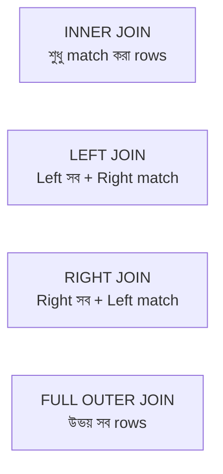

# ━━━━━━━━━━━━━━━━━━━━━━━━━━━━━━━━━━━━━━━━━━━━━━━━━━━━━━━━
# 📘 CHAPTER 5 — PostgreSQL
# "Relational Database — ব্যবসার হৃদয়"
# ⏱ ~120 মিনিট · Progress: [██████░░░░] 30%
# ━━━━━━━━━━━━━━━━━━━━━━━━━━━━━━━━━━━━━━━━━━━━━━━━━━━━━━━━

[⬆ TOC এ ফিরে যাও](./table-of-contents.md#toc)

---

## 📌 এই Chapter এ তুমি শিখবে

- ✅ Relational Database concepts — Table, Row, Column, Key
- ✅ PostgreSQL data types সম্পূর্ণ গাইড
- ✅ SQL DDL: CREATE, ALTER, DROP
- ✅ SQL DML: INSERT, SELECT, UPDATE, DELETE
- ✅ Constraints: PRIMARY KEY, FOREIGN KEY, UNIQUE, NOT NULL, CHECK
- ✅ Indexes — Performance এর চাবিকাঠি
- ✅ JOINs: INNER, LEFT, RIGHT, FULL OUTER
- ✅ Transactions — ACID properties
- ✅ Normalization (1NF, 2NF, 3NF)
- ✅ E-commerce schema design

---

## 🏗️ Real-life Analogy

> PostgreSQL হলো একটি সুশৃঙ্খল অফিসের ফাইলিং সিস্টেম। প্রতিটি বিভাগের জন্য আলাদা ফাইল cabinet (table), প্রতিটি cabinet-এ সাজানো ফাইল (row), প্রতিটি ফাইলে নির্দিষ্ট কলামে তথ্য। Foreign Key হলো এক ফাইলে অন্য ফাইলের reference নম্বর।

```
🟢 Flutter তুলনা:
   Flutter-এ SQLite ব্যবহার করলে যেমন
   table, column, query লিখতে হয়,
   PostgreSQL-ও তেমনি — শুধু অনেক বেশি
   শক্তিশালী, scalable, এবং concurrent।
```

---

## 🗺️ Relational Database Concepts

```mermaid
erDiagram
    USERS {
        int id PK
        varchar email UK
        varchar name
        timestamp created_at
    }
    PRODUCTS {
        int id PK
        varchar name
        decimal price
        int category_id FK
        int stock
    }
    ORDERS {
        int id PK
        int user_id FK
        decimal total_amount
        varchar status
        timestamp created_at
    }
    ORDER_ITEMS {
        int id PK
        int order_id FK
        int product_id FK
        int quantity
        decimal unit_price
    }
    CATEGORIES {
        int id PK
        varchar name
        int parent_id FK
    }

    USERS ||--o{ ORDERS : "places"
    ORDERS ||--o{ ORDER_ITEMS : "contains"
    PRODUCTS ||--o{ ORDER_ITEMS : "in"
    CATEGORIES ||--o{ PRODUCTS : "has"
    CATEGORIES ||--o{ CATEGORIES : "parent"
```



```
╭─────────────────────────────────────────────────────╮
│ 🔑 Concept: Relational Database                     │
│ সহজ ভাষায়: Data tables-এ রাখা হয়। Tables-এর    │
│            মধ্যে relationship থাকে Foreign Key-এর  │
│            মাধ্যমে।                                 │
│ Flutter তুলনা: যেমন Flutter-এ একটি User model      │
│            এবং আলাদা Order model থাকে, SQL-এও      │
│            আলাদা table-এ থাকে, join করে একত্রিত  │
│            করা হয়।                                  │
╰─────────────────────────────────────────────────────╯
```

---

## 📊 PostgreSQL Data Types

### Numeric Types

| Type | Size | Range | ব্যবহার |
|------|------|-------|---------|
| `SMALLINT` | 2 bytes | -32,768 to 32,767 | ছোট সংখ্যা |
| `INTEGER` / `INT` | 4 bytes | -2B to 2B | ID, count |
| `BIGINT` | 8 bytes | -9 quintillion | very large IDs |
| `DECIMAL(p,s)` | variable | exact | price, tax |
| `NUMERIC(p,s)` | variable | exact | financial |
| `REAL` | 4 bytes | 6 decimal digits | approximate |
| `DOUBLE PRECISION` | 8 bytes | 15 decimal digits | approximate |
| `SERIAL` | 4 bytes | 1 to 2B | auto-increment ID |
| `BIGSERIAL` | 8 bytes | 1 to 9Q | large auto-increment |

### Text Types

| Type | ব্যবহার | উদাহরণ |
|------|---------|---------|
| `VARCHAR(n)` | variable length, max n | `VARCHAR(255)` for name |
| `CHAR(n)` | fixed length | `CHAR(2)` for country code |
| `TEXT` | unlimited length | description, content |

### Date/Time Types

| Type | ব্যবহার |
|------|---------|
| `DATE` | শুধু তারিখ: 2026-05-03 |
| `TIME` | শুধু সময়: 10:30:00 |
| `TIMESTAMP` | তারিখ + সময় (timezone নেই) |
| `TIMESTAMPTZ` | তারিখ + সময় + timezone |
| `INTERVAL` | সময়ের ব্যবধান: '2 hours' |

### Other Important Types

| Type | ব্যবহার |
|------|---------|
| `BOOLEAN` | `TRUE` / `FALSE` |
| `UUID` | `gen_random_uuid()` |
| `JSON` | JSON data (unindexed) |
| `JSONB` | Binary JSON (indexed, faster) |
| `ARRAY` | `INTEGER[]`, `TEXT[]` |
| `ENUM` | নির্দিষ্ট values |

---

## 🏗️ DDL — Database Structure তৈরি

### Database ও Schema তৈরি

```sql
-- Database তৈরি করো
CREATE DATABASE ecommerce_db
  WITH ENCODING 'UTF8'
  LC_COLLATE = 'en_US.UTF-8'
  LC_CTYPE = 'en_US.UTF-8';

-- Connect করো
\c ecommerce_db

-- Schema তৈরি করো (optional, default: public)
CREATE SCHEMA ecommerce;
```

### Tables তৈরি (E-Commerce)

📄 File: `database/migrations/001_create_tables.sql` · 🎯 উদ্দেশ্য: E-commerce schema

```sql
-- Extensions
CREATE EXTENSION IF NOT EXISTS "pgcrypto"; -- gen_random_uuid() এর জন্য

-- ============================================
-- ENUM Types
-- ============================================
CREATE TYPE user_role AS ENUM ('customer', 'admin', 'seller');
CREATE TYPE order_status AS ENUM (
  'pending', 'confirmed', 'processing', 'shipped', 'delivered', 'cancelled', 'refunded'
);
CREATE TYPE payment_status AS ENUM ('pending', 'completed', 'failed', 'refunded');
CREATE TYPE payment_method AS ENUM ('credit_card', 'debit_card', 'mobile_banking', 'cod');

-- ============================================
-- CATEGORIES TABLE
-- ============================================
CREATE TABLE categories (
  id          SERIAL PRIMARY KEY,
  name        VARCHAR(100) NOT NULL,
  slug        VARCHAR(100) NOT NULL UNIQUE,
  description TEXT,
  parent_id   INTEGER REFERENCES categories(id) ON DELETE SET NULL,
  image_url   TEXT,
  is_active   BOOLEAN NOT NULL DEFAULT TRUE,
  created_at  TIMESTAMPTZ NOT NULL DEFAULT NOW(),
  updated_at  TIMESTAMPTZ NOT NULL DEFAULT NOW()
);

-- ============================================
-- USERS TABLE
-- ============================================
CREATE TABLE users (
  id              SERIAL PRIMARY KEY,
  email           VARCHAR(255) NOT NULL UNIQUE,
  password_hash   VARCHAR(255) NOT NULL,
  first_name      VARCHAR(100) NOT NULL,
  last_name       VARCHAR(100) NOT NULL,
  phone           VARCHAR(20),
  role            user_role NOT NULL DEFAULT 'customer',
  is_email_verified BOOLEAN NOT NULL DEFAULT FALSE,
  email_verify_token VARCHAR(255),
  password_reset_token VARCHAR(255),
  password_reset_expires TIMESTAMPTZ,
  refresh_token   TEXT,
  last_login_at   TIMESTAMPTZ,
  is_active       BOOLEAN NOT NULL DEFAULT TRUE,
  created_at      TIMESTAMPTZ NOT NULL DEFAULT NOW(),
  updated_at      TIMESTAMPTZ NOT NULL DEFAULT NOW()
);

-- ============================================
-- ADDRESSES TABLE
-- ============================================
CREATE TABLE addresses (
  id          SERIAL PRIMARY KEY,
  user_id     INTEGER NOT NULL REFERENCES users(id) ON DELETE CASCADE,
  label       VARCHAR(50) NOT NULL DEFAULT 'Home',
  street      TEXT NOT NULL,
  city        VARCHAR(100) NOT NULL,
  state       VARCHAR(100),
  postal_code VARCHAR(20) NOT NULL,
  country     VARCHAR(100) NOT NULL DEFAULT 'Bangladesh',
  is_default  BOOLEAN NOT NULL DEFAULT FALSE,
  created_at  TIMESTAMPTZ NOT NULL DEFAULT NOW()
);

-- ============================================
-- PRODUCTS TABLE
-- ============================================
CREATE TABLE products (
  id              SERIAL PRIMARY KEY,
  sku             VARCHAR(100) NOT NULL UNIQUE,
  name            VARCHAR(255) NOT NULL,
  slug            VARCHAR(255) NOT NULL UNIQUE,
  description     TEXT,
  price           DECIMAL(10, 2) NOT NULL CHECK (price >= 0),
  compare_price   DECIMAL(10, 2) CHECK (compare_price >= 0),
  cost_price      DECIMAL(10, 2) CHECK (cost_price >= 0),
  stock           INTEGER NOT NULL DEFAULT 0 CHECK (stock >= 0),
  low_stock_threshold INTEGER DEFAULT 10,
  category_id     INTEGER REFERENCES categories(id) ON DELETE SET NULL,
  brand           VARCHAR(100),
  weight          DECIMAL(8, 3),
  is_active       BOOLEAN NOT NULL DEFAULT TRUE,
  is_featured     BOOLEAN NOT NULL DEFAULT FALSE,
  meta_title      VARCHAR(255),
  meta_description TEXT,
  created_at      TIMESTAMPTZ NOT NULL DEFAULT NOW(),
  updated_at      TIMESTAMPTZ NOT NULL DEFAULT NOW()
);

-- ============================================
-- PRODUCT IMAGES TABLE
-- ============================================
CREATE TABLE product_images (
  id          SERIAL PRIMARY KEY,
  product_id  INTEGER NOT NULL REFERENCES products(id) ON DELETE CASCADE,
  url         TEXT NOT NULL,
  alt_text    VARCHAR(255),
  is_primary  BOOLEAN NOT NULL DEFAULT FALSE,
  sort_order  INTEGER DEFAULT 0,
  created_at  TIMESTAMPTZ NOT NULL DEFAULT NOW()
);

-- ============================================
-- ORDERS TABLE
-- ============================================
CREATE TABLE orders (
  id                SERIAL PRIMARY KEY,
  order_number      VARCHAR(50) NOT NULL UNIQUE DEFAULT ('ORD-' || TO_CHAR(NOW(), 'YYYYMMDD') || '-' || LPAD(NEXTVAL('order_seq')::TEXT, 6, '0')),
  user_id           INTEGER NOT NULL REFERENCES users(id),
  status            order_status NOT NULL DEFAULT 'pending',
  subtotal          DECIMAL(10, 2) NOT NULL CHECK (subtotal >= 0),
  shipping_cost     DECIMAL(10, 2) NOT NULL DEFAULT 0 CHECK (shipping_cost >= 0),
  discount_amount   DECIMAL(10, 2) NOT NULL DEFAULT 0 CHECK (discount_amount >= 0),
  tax_amount        DECIMAL(10, 2) NOT NULL DEFAULT 0 CHECK (tax_amount >= 0),
  total_amount      DECIMAL(10, 2) NOT NULL CHECK (total_amount >= 0),
  shipping_address  JSONB NOT NULL,
  notes             TEXT,
  cancelled_reason  TEXT,
  created_at        TIMESTAMPTZ NOT NULL DEFAULT NOW(),
  updated_at        TIMESTAMPTZ NOT NULL DEFAULT NOW()
);

-- Sequence for order numbers
CREATE SEQUENCE IF NOT EXISTS order_seq START 1;

-- ============================================
-- ORDER ITEMS TABLE
-- ============================================
CREATE TABLE order_items (
  id          SERIAL PRIMARY KEY,
  order_id    INTEGER NOT NULL REFERENCES orders(id) ON DELETE CASCADE,
  product_id  INTEGER NOT NULL REFERENCES products(id),
  quantity    INTEGER NOT NULL CHECK (quantity > 0),
  unit_price  DECIMAL(10, 2) NOT NULL CHECK (unit_price >= 0),
  total_price DECIMAL(10, 2) GENERATED ALWAYS AS (quantity * unit_price) STORED,
  created_at  TIMESTAMPTZ NOT NULL DEFAULT NOW()
);

-- ============================================
-- PAYMENTS TABLE
-- ============================================
CREATE TABLE payments (
  id                  SERIAL PRIMARY KEY,
  order_id            INTEGER NOT NULL REFERENCES orders(id),
  transaction_id      VARCHAR(255) UNIQUE,
  amount              DECIMAL(10, 2) NOT NULL CHECK (amount >= 0),
  currency            VARCHAR(3) NOT NULL DEFAULT 'BDT',
  payment_method      payment_method NOT NULL,
  status              payment_status NOT NULL DEFAULT 'pending',
  gateway_response    JSONB,
  paid_at             TIMESTAMPTZ,
  created_at          TIMESTAMPTZ NOT NULL DEFAULT NOW(),
  updated_at          TIMESTAMPTZ NOT NULL DEFAULT NOW()
);

-- ============================================
-- COUPONS TABLE
-- ============================================
CREATE TABLE coupons (
  id              SERIAL PRIMARY KEY,
  code            VARCHAR(50) NOT NULL UNIQUE,
  description     TEXT,
  discount_type   VARCHAR(20) NOT NULL CHECK (discount_type IN ('percentage', 'fixed')),
  discount_value  DECIMAL(10, 2) NOT NULL CHECK (discount_value > 0),
  min_order_amount DECIMAL(10, 2) DEFAULT 0,
  max_uses        INTEGER,
  used_count      INTEGER NOT NULL DEFAULT 0,
  starts_at       TIMESTAMPTZ,
  expires_at      TIMESTAMPTZ,
  is_active       BOOLEAN NOT NULL DEFAULT TRUE,
  created_at      TIMESTAMPTZ NOT NULL DEFAULT NOW()
);
```

---

## 🔑 Constraints

```sql
-- ============================================
-- PRIMARY KEY
-- ============================================
-- শুধু একটি row-কে uniquely identify করে
ALTER TABLE products ADD CONSTRAINT products_pkey PRIMARY KEY (id);

-- Composite PRIMARY KEY (দুটি column মিলিয়ে unique)
CREATE TABLE cart_items (
  user_id    INTEGER REFERENCES users(id),
  product_id INTEGER REFERENCES products(id),
  quantity   INTEGER NOT NULL DEFAULT 1,
  PRIMARY KEY (user_id, product_id)  -- composite PK
);

-- ============================================
-- FOREIGN KEY
-- ============================================
-- অন্য table-এর row reference করে
ALTER TABLE orders
  ADD CONSTRAINT orders_user_id_fkey
  FOREIGN KEY (user_id) REFERENCES users(id)
  ON DELETE RESTRICT    -- user delete করতে পারবে না যদি order থাকে
  ON UPDATE CASCADE;    -- user id পরিবর্তন হলে order-এও change হবে

-- ON DELETE actions:
-- RESTRICT  → delete block করো
-- CASCADE   → related rows-ও delete করো
-- SET NULL  → foreign key NULL করো
-- SET DEFAULT → default value দাও

-- ============================================
-- UNIQUE
-- ============================================
ALTER TABLE users ADD CONSTRAINT users_email_key UNIQUE (email);

-- Conditional unique (partial index)
CREATE UNIQUE INDEX users_phone_unique
  ON users (phone)
  WHERE phone IS NOT NULL;  -- NULL হলে unique check নেই

-- ============================================
-- CHECK
-- ============================================
ALTER TABLE products ADD CONSTRAINT products_price_positive CHECK (price >= 0);
ALTER TABLE products ADD CONSTRAINT compare_price_check
  CHECK (compare_price IS NULL OR compare_price >= price);

-- ============================================
-- NOT NULL
-- ============================================
ALTER TABLE users ALTER COLUMN email SET NOT NULL;

-- ============================================
-- DEFAULT
-- ============================================
ALTER TABLE orders ALTER COLUMN status SET DEFAULT 'pending';
```

---

## 📊 Indexes

```
╭─────────────────────────────────────────────────────╮
│ 🔑 Concept: Index                                   │
│ সহজ ভাষায়: বইয়ের শেষের সূচি — সরাসরি পাতায়     │
│            যাওয়ার রাস্তা। Full scan না করে         │
│            দ্রুত data খোঁজে।                        │
│ Flutter তুলনা: SQLite-এ CREATE INDEX যেমন          │
│            query speed বাড়ায়, PostgreSQL-এও       │
│            তেমনি।                                    │
╰─────────────────────────────────────────────────────╯
```

```sql
-- ============================================
-- Basic Index
-- ============================================
-- যে column দিয়ে বেশি search করো তাতে index দাও
CREATE INDEX idx_products_category ON products(category_id);
CREATE INDEX idx_products_brand ON products(brand);
CREATE INDEX idx_orders_user_id ON orders(user_id);
CREATE INDEX idx_orders_created_at ON orders(created_at DESC);

-- ============================================
-- Unique Index
-- ============================================
CREATE UNIQUE INDEX idx_products_sku ON products(sku);
CREATE UNIQUE INDEX idx_products_slug ON products(slug);

-- ============================================
-- Composite Index
-- ============================================
-- যখন একসাথে দুটি column দিয়ে filter করো
CREATE INDEX idx_products_category_price ON products(category_id, price);
CREATE INDEX idx_orders_user_status ON orders(user_id, status);

-- ============================================
-- Partial Index
-- ============================================
-- শুধু active products-এ index
CREATE INDEX idx_active_products ON products(name) WHERE is_active = TRUE;
CREATE INDEX idx_pending_orders ON orders(user_id) WHERE status = 'pending';

-- ============================================
-- Full Text Search Index
-- ============================================
ALTER TABLE products ADD COLUMN search_vector TSVECTOR;
CREATE INDEX idx_products_fts ON products USING GIN(search_vector);

-- Search করো
SELECT * FROM products
WHERE search_vector @@ to_tsquery('english', 'iphone & pro');

-- ============================================
-- Index দেখো
-- ============================================
SELECT indexname, indexdef
FROM pg_indexes
WHERE tablename = 'products';

-- Index ব্যবহার হচ্ছে কিনা দেখো
EXPLAIN ANALYZE
SELECT * FROM products WHERE category_id = 1;
```

---

## 📝 DML — Data Manipulation

### INSERT

```sql
-- Single row insert
INSERT INTO categories (name, slug, description)
VALUES ('Electronics', 'electronics', 'Electronic devices and gadgets');

-- Multiple rows insert
INSERT INTO categories (name, slug, description) VALUES
  ('Phones', 'phones', 'Mobile phones and accessories'),
  ('Laptops', 'laptops', 'Laptops and notebooks'),
  ('Tablets', 'tablets', 'Tablets and e-readers'),
  ('Audio', 'audio', 'Headphones, speakers, earbuds');

-- Returning inserted data
INSERT INTO users (email, password_hash, first_name, last_name)
VALUES ('rahim@example.com', '$2b$10$...', 'Rahim', 'Ahmed')
RETURNING id, email, created_at;

-- Upsert (INSERT or UPDATE)
INSERT INTO cart_items (user_id, product_id, quantity)
VALUES (1, 5, 2)
ON CONFLICT (user_id, product_id)
DO UPDATE SET
  quantity = cart_items.quantity + EXCLUDED.quantity,
  updated_at = NOW();
```

### SELECT

```sql
-- Basic SELECT
SELECT * FROM products;
SELECT id, name, price FROM products;

-- WHERE clause
SELECT * FROM products
WHERE category_id = 1 AND price < 1000 AND is_active = TRUE;

-- BETWEEN
SELECT * FROM products WHERE price BETWEEN 500 AND 1500;

-- IN
SELECT * FROM products WHERE category_id IN (1, 2, 3);

-- LIKE (pattern matching)
SELECT * FROM products WHERE name ILIKE '%iphone%'; -- case-insensitive

-- IS NULL / IS NOT NULL
SELECT * FROM users WHERE phone IS NULL;
SELECT * FROM users WHERE last_login_at IS NOT NULL;

-- ORDER BY
SELECT * FROM products ORDER BY price ASC, name DESC;

-- LIMIT ও OFFSET (pagination)
SELECT * FROM products
ORDER BY created_at DESC
LIMIT 10 OFFSET 20;  -- Page 3 (10 per page): skip 20, show 10

-- COUNT, SUM, AVG, MAX, MIN
SELECT
  COUNT(*) AS total_products,
  COUNT(*) FILTER (WHERE is_active) AS active_products,
  AVG(price) AS avg_price,
  MAX(price) AS max_price,
  MIN(price) AS min_price,
  SUM(price * stock) AS total_inventory_value
FROM products;

-- GROUP BY
SELECT
  c.name AS category,
  COUNT(p.id) AS product_count,
  AVG(p.price) AS avg_price,
  SUM(p.stock) AS total_stock
FROM products p
JOIN categories c ON p.category_id = c.id
WHERE p.is_active = TRUE
GROUP BY c.id, c.name
HAVING COUNT(p.id) > 0
ORDER BY product_count DESC;

-- DISTINCT
SELECT DISTINCT brand FROM products WHERE brand IS NOT NULL;

-- CASE WHEN
SELECT
  id,
  name,
  price,
  CASE
    WHEN price < 100 THEN 'Budget'
    WHEN price < 500 THEN 'Mid-range'
    WHEN price < 1000 THEN 'Premium'
    ELSE 'Luxury'
  END AS price_segment,
  CASE WHEN stock = 0 THEN 'Out of Stock'
       WHEN stock <= low_stock_threshold THEN 'Low Stock'
       ELSE 'In Stock'
  END AS stock_status
FROM products;

-- COALESCE — NULL হলে default দাও
SELECT
  name,
  COALESCE(compare_price, price) AS display_price,
  COALESCE(brand, 'Unknown Brand') AS brand
FROM products;

-- Subquery
SELECT * FROM products
WHERE price > (SELECT AVG(price) FROM products);

SELECT * FROM users
WHERE id IN (
  SELECT DISTINCT user_id FROM orders WHERE status = 'delivered'
);
```

### UPDATE

```sql
-- Basic UPDATE
UPDATE products
SET price = 899.99, updated_at = NOW()
WHERE id = 1;

-- Multiple columns
UPDATE users
SET
  first_name = 'Karim',
  last_name = 'Khan',
  updated_at = NOW()
WHERE id = 5;

-- Calculated UPDATE
UPDATE products
SET
  stock = stock - order_items.quantity,
  updated_at = NOW()
FROM order_items
WHERE products.id = order_items.product_id
AND order_items.order_id = 123;

-- RETURNING
UPDATE products
SET is_featured = TRUE
WHERE price > 1000
RETURNING id, name, price;
```

### DELETE

```sql
-- DELETE
DELETE FROM cart_items WHERE user_id = 1 AND product_id = 5;

-- Cascade delete
DELETE FROM users WHERE id = 10;
-- → ON DELETE CASCADE হলে addresses-ও delete হবে

-- TRUNCATE — সব rows মুছো (ROLLBACK করা যায় না সহজে)
TRUNCATE TABLE cart_items;
TRUNCATE TABLE cart_items RESTART IDENTITY; -- sequence reset

-- Soft delete (recommended)
UPDATE products SET is_active = FALSE, updated_at = NOW() WHERE id = 1;
```

---

## 🔗 JOINs



📄 File: `database/queries/joins.sql` · 🎯 উদ্দেশ্য: Join examples

```sql
-- ============================================
-- INNER JOIN — উভয় table-এ মিল আছে
-- ============================================
SELECT
  o.id AS order_id,
  o.order_number,
  u.first_name,
  u.last_name,
  u.email,
  o.total_amount,
  o.status,
  o.created_at
FROM orders o
INNER JOIN users u ON o.user_id = u.id
WHERE o.status = 'delivered'
ORDER BY o.created_at DESC;

-- ============================================
-- LEFT JOIN — বাম পাশের সব row + ডানের match
-- ============================================
-- সব users দেখো, order আছুক বা না থাকুক
SELECT
  u.id,
  u.first_name,
  u.email,
  COUNT(o.id) AS total_orders,
  COALESCE(SUM(o.total_amount), 0) AS total_spent
FROM users u
LEFT JOIN orders o ON u.id = o.user_id
GROUP BY u.id, u.first_name, u.email
ORDER BY total_spent DESC;

-- ============================================
-- Multiple JOINs — Order এর সব details
-- ============================================
SELECT
  o.order_number,
  u.first_name || ' ' || u.last_name AS customer_name,
  p.name AS product_name,
  p.sku,
  oi.quantity,
  oi.unit_price,
  oi.total_price,
  c.name AS category,
  o.status
FROM orders o
INNER JOIN users u ON o.user_id = u.id
INNER JOIN order_items oi ON o.id = oi.order_id
INNER JOIN products p ON oi.product_id = p.id
LEFT JOIN categories c ON p.category_id = c.id
WHERE o.id = 1
ORDER BY oi.id;

-- ============================================
-- Self JOIN — Category hierarchy
-- ============================================
SELECT
  child.name AS subcategory,
  parent.name AS parent_category
FROM categories child
LEFT JOIN categories parent ON child.parent_id = parent.id
ORDER BY parent.name, child.name;

-- ============================================
-- Window Functions (advanced)
-- ============================================
-- প্রতিটি category-তে সবচেয়ে দামী product
SELECT
  name,
  price,
  category_id,
  RANK() OVER (PARTITION BY category_id ORDER BY price DESC) AS price_rank,
  ROW_NUMBER() OVER (PARTITION BY category_id ORDER BY price DESC) AS row_num,
  DENSE_RANK() OVER (PARTITION BY category_id ORDER BY price DESC) AS dense_rank,
  AVG(price) OVER (PARTITION BY category_id) AS category_avg_price,
  price - AVG(price) OVER (PARTITION BY category_id) AS price_vs_avg
FROM products
WHERE is_active = TRUE;

-- Running total
SELECT
  o.created_at::DATE AS order_date,
  SUM(o.total_amount) AS daily_revenue,
  SUM(SUM(o.total_amount)) OVER (ORDER BY o.created_at::DATE) AS running_total
FROM orders
WHERE o.status = 'delivered'
GROUP BY o.created_at::DATE
ORDER BY order_date;
```

---

## 🔄 Transactions

```
╭─────────────────────────────────────────────────────╮
│ 🔑 Concept: Transaction (ACID)                      │
│ সহজ ভাষায়: হয় সব হবে, না হয় কিছুই না।           │
│            Bank transfer: টাকা কাটা ও জমা         │
│            হয় দুটোই হবে, না হয় কোনোটাই না।        │
│ Flutter তুলনা: SQLite transaction এর মতো           │
╰─────────────────────────────────────────────────────╯
```

**ACID Properties:**
- **A**tomicity — সব হয় বা কিছুই না
- **C**onsistency — database সবসময় valid state-এ থাকে
- **I**solation — একটি transaction অন্যটিকে affect করে না
- **D**urability — commit হলে permanent

```sql
-- ============================================
-- Order Placement Transaction
-- ============================================
BEGIN;

-- 1. Order তৈরি করো
INSERT INTO orders (user_id, subtotal, shipping_cost, total_amount, shipping_address, status)
VALUES (
  1,
  999.99,
  50.00,
  1049.99,
  '{"street": "123 Main St", "city": "Dhaka", "postal_code": "1200"}'::JSONB,
  'confirmed'
)
RETURNING id INTO order_id_var;

-- 2. Order items যোগ করো
INSERT INTO order_items (order_id, product_id, quantity, unit_price)
VALUES
  (1, 5, 1, 999.99),
  (1, 8, 2, 24.99);

-- 3. Stock কমাও
UPDATE products SET stock = stock - 1 WHERE id = 5;
UPDATE products SET stock = stock - 2 WHERE id = 8;

-- Stock negative হয়নি তো?
DO $$
BEGIN
  IF EXISTS (SELECT 1 FROM products WHERE stock < 0) THEN
    RAISE EXCEPTION 'Insufficient stock';
  END IF;
END $$;

-- 4. Payment record তৈরি করো
INSERT INTO payments (order_id, amount, currency, payment_method, status)
VALUES (1, 1049.99, 'BDT', 'mobile_banking', 'pending');

COMMIT;  -- সব ঠিক থাকলে save করো

-- কোনো error হলে:
-- ROLLBACK;  -- সব undo করো
```

### Savepoints

```sql
BEGIN;

INSERT INTO orders ...;
SAVEPOINT after_order;  -- checkpoint তৈরি

INSERT INTO order_items ...;
-- কোনো problem?
ROLLBACK TO SAVEPOINT after_order;  -- order পর্যন্ত ফিরে যাও

-- আবার চেষ্টা করো
INSERT INTO order_items ...;

COMMIT;
```

---

## 📐 Normalization

### 1NF — Atomic Values

```
❌ Bad (1NF violation):
┌─────┬──────────┬─────────────────────────┐
│ id  │ name     │ phones                  │
├─────┼──────────┼─────────────────────────┤
│ 1   │ Rahim    │ 01711111, 01811111       │← multiple values in one cell
└─────┴──────────┴─────────────────────────┘

✅ Good (1NF):
users: id, name
user_phones: id, user_id, phone_number
```

### 2NF — No Partial Dependencies

```
❌ Bad (2NF violation — composite PK):
order_items: order_id, product_id, quantity, product_name, product_price
                                              ↑            ↑
                              শুধু product_id-এর উপর নির্ভরশীল (partial)

✅ Good (2NF):
order_items: order_id, product_id, quantity
products: id, name, price
```

### 3NF — No Transitive Dependencies

```
❌ Bad (3NF violation):
orders: id, user_id, user_email, user_city
                     ↑           ↑
               user_id → user_email (transitive)

✅ Good (3NF):
orders: id, user_id
users: id, email, city
```

---

## 📊 Common Queries (E-commerce)

```sql
-- ============================================
-- Dashboard Stats
-- ============================================
SELECT
  (SELECT COUNT(*) FROM users WHERE is_active = TRUE) AS total_users,
  (SELECT COUNT(*) FROM products WHERE is_active = TRUE) AS total_products,
  (SELECT COUNT(*) FROM orders WHERE DATE(created_at) = CURRENT_DATE) AS orders_today,
  (SELECT COALESCE(SUM(total_amount), 0) FROM orders WHERE status = 'delivered' AND DATE(created_at) = CURRENT_DATE) AS revenue_today;

-- ============================================
-- Best Selling Products
-- ============================================
SELECT
  p.id,
  p.name,
  p.price,
  SUM(oi.quantity) AS total_sold,
  SUM(oi.total_price) AS total_revenue
FROM products p
INNER JOIN order_items oi ON p.id = oi.product_id
INNER JOIN orders o ON oi.order_id = o.id
WHERE o.status IN ('delivered', 'shipped')
  AND o.created_at >= NOW() - INTERVAL '30 days'
GROUP BY p.id, p.name, p.price
ORDER BY total_sold DESC
LIMIT 10;

-- ============================================
-- Customer Order History
-- ============================================
SELECT
  o.order_number,
  o.total_amount,
  o.status,
  o.created_at,
  json_agg(
    json_build_object(
      'product', p.name,
      'quantity', oi.quantity,
      'price', oi.unit_price
    )
  ) AS items
FROM orders o
INNER JOIN order_items oi ON o.id = oi.order_id
INNER JOIN products p ON oi.product_id = p.id
WHERE o.user_id = 1
GROUP BY o.id, o.order_number, o.total_amount, o.status, o.created_at
ORDER BY o.created_at DESC;
```

---

## 🏋️ Exercise

**কাজ: নিচের queries নিজে লিখো:**

1. সব `admin` role-এর user-এর নাম ও email বের করো
2. গত ৭ দিনে কতটি order হয়েছে এবং মোট revenue কত?
3. Stock ১০-এর কম এমন সব product দেখাও (product name, stock, category name সহ)
4. প্রতিটি user কতটি order করেছে ও কত টাকা খরচ করেছে (order না থাকলেও দেখাও)
5. সবচেয়ে বেশি বিক্রি হওয়া ৫টি category

---

## 📊 Common Mistakes Table

| ভুল | কারণ | সমাধান |
|-----|------|---------|
| DECIMAL এর বদলে FLOAT দিয়ে price রাখা | Floating point error | price-এ DECIMAL(10,2) ব্যবহার করো |
| Foreign Key ছাড়া relation রাখা | Data integrity নেই | সবসময় FK constraint যোগ করো |
| Index ছাড়া বড় table-এ query | Full table scan | WHERE clause-এর columns-এ index দাও |
| Transaction ছাড়া multi-step write | Partial update হতে পারে | সবসময় BEGIN...COMMIT ব্যবহার করো |
| SELECT * production-এ | Performance waste | শুধু দরকারি columns select করো |

---

## ✅ Chapter Summary

```
╔══════════════════════════════════════════════════════╗
║  ✅ Chapter 5 — তুমি শিখলে                          ║
╠══════════════════════════════════════════════════════╣
║  • Relational DB concepts: table/row/column/key     ║
║  • PostgreSQL data types নির্বাচন করা              ║
║  • DDL: CREATE TABLE with all constraints           ║
║  • DML: INSERT/SELECT/UPDATE/DELETE                 ║
║  • Indexes: B-tree, partial, composite              ║
║  • JOINs: INNER/LEFT/RIGHT/FULL                     ║
║  • Window Functions: RANK/ROW_NUMBER/AVG OVER       ║
║  • Transactions ও ACID properties                   ║
║  • Normalization 1NF/2NF/3NF                        ║
║  • E-commerce schema design                         ║
╚══════════════════════════════════════════════════════╝
```

[⬆ TOC এ ফিরে যাও](./table-of-contents.md#toc) | [⬅ Chapter 4](./chapter-04-expressjs.md) | [➡ Chapter 6](./chapter-06-prisma.md)
