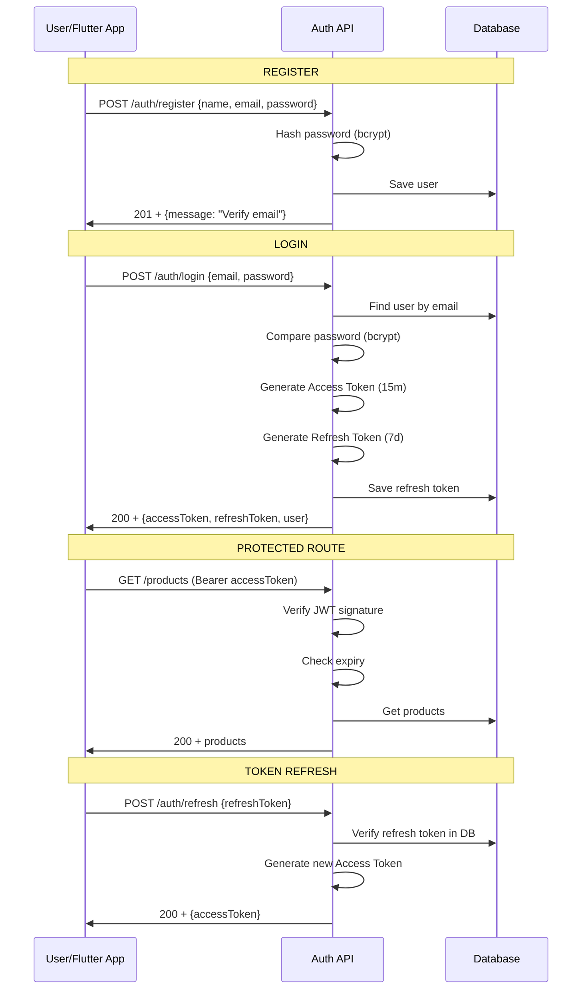

# ━━━━━━━━━━━━━━━━━━━━━━━━━━━━━━━━━━━━━━━━━━━━━━━
# 📘 CHAPTER 9 — Authentication & Authorization
# "JWT, bcrypt — তোমার App সুরক্ষিত করো"
# ⏱ ~150 মিনিট · Progress: [█████████░] 50%
# ━━━━━━━━━━━━━━━━━━━━━━━━━━━━━━━━━━━━━━━━━━━━━━━

[⬆ TOC এ ফিরে যাও](./table-of-contents.md#toc)

---

## 📌 এই Chapter এ তুমি শিখবে

- ✅ Authentication vs Authorization পার্থক্য
- ✅ Password hashing with bcrypt
- ✅ JWT: Access Token + Refresh Token
- ✅ Complete auth flow: register → login → refresh → logout
- ✅ Email verification
- ✅ Password reset
- ✅ RBAC (Role-Based Access Control)
- ✅ Auth middleware for Express
- ✅ PostgreSQL (Prisma) + MongoDB (Mongoose) দুটোর জন্য

---

## 🏗️ Real-life Analogy

> Authentication = তুমি কে? (passport দেখানো)
> Authorization = তুমি কী করতে পারো? (visa দেখানো)
>
> JWT = সরকারি ID card — যেখানে তোমার নাম, role সব লেখা আছে। প্রতিটি request-এ এটি দেখালেই server তোমাকে চেনে।

```
🟢 Flutter তুলনা:
   Flutter-এ SharedPreferences/SecureStorage-এ
   token রাখা, Dio interceptor দিয়ে header-এ
   দেওয়া — এই token-ই backend এ verify হয়।
   
   Backend বানাচ্ছো মানে Flutter-এর সেই
   /auth/login endpoint নিজেই বানাচ্ছো।
```

---

## 🗺️ Auth Flow Diagram



---

## ⚙️ Installation

```bash
npm install bcryptjs jsonwebtoken
npm install @types/bcryptjs @types/jsonwebtoken --save-dev  # TypeScript only
```

---

## 🔑 JWT Utility

📄 File: `src/utils/jwt.util.js` · 🎯 উদ্দেশ্য: JWT generation and verification

```javascript
const jwt = require('jsonwebtoken');

// ============================================
// Generate Tokens
// ============================================
const generateAccessToken = (payload) => {
  return jwt.sign(payload, process.env.JWT_ACCESS_SECRET, {
    expiresIn: process.env.JWT_ACCESS_EXPIRES_IN || '15m',
    issuer: 'myshop-api',
    audience: 'myshop-client',
  });
};

const generateRefreshToken = (payload) => {
  return jwt.sign(payload, process.env.JWT_REFRESH_SECRET, {
    expiresIn: process.env.JWT_REFRESH_EXPIRES_IN || '7d',
    issuer: 'myshop-api',
    audience: 'myshop-client',
  });
};

// ============================================
// Verify Tokens
// ============================================
const verifyAccessToken = (token) => {
  try {
    return jwt.verify(token, process.env.JWT_ACCESS_SECRET, {
      issuer: 'myshop-api',
      audience: 'myshop-client',
    });
  } catch (error) {
    if (error.name === 'TokenExpiredError') {
      throw { code: 'TOKEN_EXPIRED', message: 'Access token expired' };
    }
    if (error.name === 'JsonWebTokenError') {
      throw { code: 'TOKEN_INVALID', message: 'Invalid access token' };
    }
    throw error;
  }
};

const verifyRefreshToken = (token) => {
  try {
    return jwt.verify(token, process.env.JWT_REFRESH_SECRET, {
      issuer: 'myshop-api',
      audience: 'myshop-client',
    });
  } catch (error) {
    if (error.name === 'TokenExpiredError') {
      throw { code: 'REFRESH_EXPIRED', message: 'Refresh token expired. Please login again.' };
    }
    throw { code: 'TOKEN_INVALID', message: 'Invalid refresh token' };
  }
};

// ============================================
// Generate token pair
// ============================================
const generateTokenPair = (user) => {
  const payload = {
    sub: user.id.toString(),
    email: user.email,
    role: user.role,
  };

  const accessToken = generateAccessToken(payload);
  const refreshToken = generateRefreshToken({ sub: user.id.toString() });

  return { accessToken, refreshToken };
};

module.exports = {
  generateAccessToken,
  generateRefreshToken,
  verifyAccessToken,
  verifyRefreshToken,
  generateTokenPair,
};
```

📄 File: `.env` · 🎯 উদ্দেশ্য: Auth environment variables

```bash
# JWT Secrets — production-এ এগুলো random 64+ char string হবে
JWT_ACCESS_SECRET=your_super_secret_access_key_change_in_production_min64chars
JWT_REFRESH_SECRET=your_super_secret_refresh_key_change_in_production_min64chars
JWT_ACCESS_EXPIRES_IN=15m
JWT_REFRESH_EXPIRES_IN=7d

# Email (Chapter 13-এ)
EMAIL_HOST=smtp.gmail.com
EMAIL_PORT=587
EMAIL_USER=your@gmail.com
EMAIL_PASS=your_app_password
```

---

## 🔐 Auth Controller (Prisma — PostgreSQL)

📄 File: `src/controllers/auth.prisma.controller.js` · 🎯 উদ্দেশ্য: Complete auth for PostgreSQL

```javascript
const bcrypt = require('bcryptjs');
const crypto = require('crypto');
const prisma = require('../config/prisma');
const { generateTokenPair, verifyRefreshToken } = require('../utils/jwt.util');
const { AppError } = require('../middleware/error.middleware');
const ApiResponse = require('../utils/ApiResponse');

// ============================================
// REGISTER
// ============================================
const register = async (req, res, next) => {
  try {
    const { firstName, lastName, email, password, phone } = req.body;

    // Email already exists?
    const existing = await prisma.user.findUnique({ where: { email } });
    if (existing) {
      throw new AppError('Email already registered', 409);
    }

    // Password hash
    const SALT_ROUNDS = 12;
    const passwordHash = await bcrypt.hash(password, SALT_ROUNDS);

    // Email verification token
    const emailVerifyToken = crypto.randomBytes(32).toString('hex');

    // User তৈরি করো
    const user = await prisma.user.create({
      data: {
        firstName,
        lastName,
        email,
        passwordHash,
        phone,
        emailVerifyToken,
      },
      select: {
        id: true,
        email: true,
        firstName: true,
        lastName: true,
        role: true,
        isEmailVerified: true,
        createdAt: true,
      },
    });

    // TODO: Send verification email (Chapter 13)
    console.log(`Email verification token for ${email}: ${emailVerifyToken}`);

    ApiResponse.created(res, user, 'Registration successful. Please verify your email.');
  } catch (error) {
    next(error);
  }
};

// ============================================
// EMAIL VERIFY
// ============================================
const verifyEmail = async (req, res, next) => {
  try {
    const { token } = req.params;

    const user = await prisma.user.findFirst({
      where: { emailVerifyToken: token },
    });

    if (!user) {
      throw new AppError('Invalid or expired verification token', 400);
    }

    await prisma.user.update({
      where: { id: user.id },
      data: {
        isEmailVerified: true,
        emailVerifyToken: null,
      },
    });

    ApiResponse.success(res, null, 'Email verified successfully');
  } catch (error) {
    next(error);
  }
};

// ============================================
// LOGIN
// ============================================
const login = async (req, res, next) => {
  try {
    const { email, password } = req.body;

    // User find
    const user = await prisma.user.findUnique({ where: { email } });

    if (!user) {
      // Timing attack prevent করতে dummy bcrypt compare করো
      await bcrypt.compare(password, '$2b$12$dummy.hash.to.prevent.timing.attack.xxxxx');
      throw new AppError('Invalid email or password', 401);
    }

    if (!user.isActive) {
      throw new AppError('Your account has been deactivated', 403);
    }

    // Password compare
    const isPasswordValid = await bcrypt.compare(password, user.passwordHash);
    if (!isPasswordValid) {
      throw new AppError('Invalid email or password', 401);
    }

    // Tokens generate
    const { accessToken, refreshToken } = generateTokenPair(user);

    // Refresh token DB-তে save করো
    await prisma.user.update({
      where: { id: user.id },
      data: {
        refreshToken,
        lastLoginAt: new Date(),
      },
    });

    // Password hash response-এ পাঠানো যাবে না
    const { passwordHash, refreshToken: _, emailVerifyToken, passwordResetToken, ...safeUser } = user;

    ApiResponse.success(res, {
      accessToken,
      refreshToken,
      user: safeUser,
    }, 'Login successful');
  } catch (error) {
    next(error);
  }
};

// ============================================
// REFRESH TOKEN
// ============================================
const refreshToken = async (req, res, next) => {
  try {
    const { refreshToken: token } = req.body;

    if (!token) {
      throw new AppError('Refresh token required', 400);
    }

    // JWT verify করো
    const decoded = verifyRefreshToken(token);

    // DB-তে match করো
    const user = await prisma.user.findFirst({
      where: {
        id: parseInt(decoded.sub, 10),
        refreshToken: token,
        isActive: true,
      },
    });

    if (!user) {
      throw new AppError('Invalid refresh token', 401);
    }

    // New tokens generate করো (rotation)
    const { accessToken, refreshToken: newRefreshToken } = generateTokenPair(user);

    // New refresh token save করো
    await prisma.user.update({
      where: { id: user.id },
      data: { refreshToken: newRefreshToken },
    });

    ApiResponse.success(res, {
      accessToken,
      refreshToken: newRefreshToken,
    });
  } catch (error) {
    if (error.code === 'TOKEN_EXPIRED' || error.code === 'REFRESH_EXPIRED') {
      return next(new AppError(error.message, 401));
    }
    if (error.code === 'TOKEN_INVALID') {
      return next(new AppError(error.message, 401));
    }
    next(error);
  }
};

// ============================================
// LOGOUT
// ============================================
const logout = async (req, res, next) => {
  try {
    // DB থেকে refresh token সরাও
    await prisma.user.update({
      where: { id: req.user.id },
      data: { refreshToken: null },
    });

    ApiResponse.success(res, null, 'Logged out successfully');
  } catch (error) {
    next(error);
  }
};

// ============================================
// FORGOT PASSWORD
// ============================================
const forgotPassword = async (req, res, next) => {
  try {
    const { email } = req.body;

    const user = await prisma.user.findUnique({ where: { email } });

    // User না থাকলেও success return করো (security)
    if (!user) {
      return ApiResponse.success(res, null, 'If email exists, reset link will be sent');
    }

    // Reset token তৈরি করো
    const resetToken = crypto.randomBytes(32).toString('hex');
    const resetExpires = new Date(Date.now() + 30 * 60 * 1000); // 30 minutes

    await prisma.user.update({
      where: { id: user.id },
      data: {
        passwordResetToken: resetToken,
        passwordResetExpires: resetExpires,
      },
    });

    // TODO: Send reset email (Chapter 13)
    console.log(`Password reset token for ${email}: ${resetToken}`);

    ApiResponse.success(res, null, 'Password reset link sent to your email');
  } catch (error) {
    next(error);
  }
};

// ============================================
// RESET PASSWORD
// ============================================
const resetPassword = async (req, res, next) => {
  try {
    const { token } = req.params;
    const { password } = req.body;

    const user = await prisma.user.findFirst({
      where: {
        passwordResetToken: token,
        passwordResetExpires: { gt: new Date() },
      },
    });

    if (!user) {
      throw new AppError('Invalid or expired reset token', 400);
    }

    const passwordHash = await bcrypt.hash(password, 12);

    await prisma.user.update({
      where: { id: user.id },
      data: {
        passwordHash,
        passwordResetToken: null,
        passwordResetExpires: null,
        refreshToken: null, // সব sessions logout করো
      },
    });

    ApiResponse.success(res, null, 'Password reset successful. Please login again.');
  } catch (error) {
    next(error);
  }
};

// ============================================
// CHANGE PASSWORD (logged in)
// ============================================
const changePassword = async (req, res, next) => {
  try {
    const { currentPassword, newPassword } = req.body;
    const userId = req.user.id;

    const user = await prisma.user.findUnique({ where: { id: userId } });

    const isValid = await bcrypt.compare(currentPassword, user.passwordHash);
    if (!isValid) {
      throw new AppError('Current password is incorrect', 401);
    }

    const passwordHash = await bcrypt.hash(newPassword, 12);

    await prisma.user.update({
      where: { id: userId },
      data: {
        passwordHash,
        refreshToken: null, // force re-login
      },
    });

    ApiResponse.success(res, null, 'Password changed successfully. Please login again.');
  } catch (error) {
    next(error);
  }
};

// ============================================
// GET PROFILE
// ============================================
const getProfile = async (req, res, next) => {
  try {
    const user = await prisma.user.findUnique({
      where: { id: req.user.id },
      select: {
        id: true,
        email: true,
        firstName: true,
        lastName: true,
        phone: true,
        role: true,
        isEmailVerified: true,
        lastLoginAt: true,
        createdAt: true,
        _count: {
          select: { orders: true, addresses: true },
        },
      },
    });

    ApiResponse.success(res, user);
  } catch (error) {
    next(error);
  }
};

module.exports = {
  register,
  verifyEmail,
  login,
  refreshToken,
  logout,
  forgotPassword,
  resetPassword,
  changePassword,
  getProfile,
};
```

---

## 🛡️ Auth Middleware

📄 File: `src/middleware/auth.middleware.js` · 🎯 উদ্দেশ্য: JWT verification middleware

```javascript
const prisma = require('../config/prisma');
const { verifyAccessToken } = require('../utils/jwt.util');
const { AppError } = require('./error.middleware');

// ============================================
// Authenticate — JWT verify করো
// ============================================
const authenticate = async (req, res, next) => {
  try {
    // Header থেকে token নাও
    const authHeader = req.headers.authorization;
    if (!authHeader || !authHeader.startsWith('Bearer ')) {
      throw new AppError('Authentication required. Please login.', 401);
    }

    const token = authHeader.split(' ')[1];

    if (!token) {
      throw new AppError('No token provided', 401);
    }

    // Token verify করো
    let decoded;
    try {
      decoded = verifyAccessToken(token);
    } catch (err) {
      if (err.code === 'TOKEN_EXPIRED') {
        throw new AppError('Access token expired. Please refresh.', 401);
      }
      throw new AppError('Invalid access token', 401);
    }

    // User DB-তে আছে ও active কিনা check করো
    const user = await prisma.user.findUnique({
      where: { id: parseInt(decoded.sub, 10) },
      select: {
        id: true,
        email: true,
        role: true,
        isActive: true,
        firstName: true,
        lastName: true,
      },
    });

    if (!user || !user.isActive) {
      throw new AppError('User not found or account deactivated', 401);
    }

    // req.user-এ attach করো
    req.user = user;
    next();
  } catch (error) {
    next(error);
  }
};

// ============================================
// Authorize — Role check করো
// ============================================
const authorize = (...roles) => {
  return (req, res, next) => {
    if (!req.user) {
      return next(new AppError('Authentication required', 401));
    }

    if (!roles.includes(req.user.role)) {
      return next(
        new AppError(
          `Access denied. Required role: ${roles.join(' or ')}. Your role: ${req.user.role}`,
          403
        )
      );
    }

    next();
  };
};

// ============================================
// Optional Auth — Token থাকলে verify, না থাকলেও চলবে
// ============================================
const optionalAuth = async (req, res, next) => {
  try {
    const authHeader = req.headers.authorization;
    if (!authHeader || !authHeader.startsWith('Bearer ')) {
      return next(); // Token নেই — ok
    }

    const token = authHeader.split(' ')[1];
    if (!token) return next();

    try {
      const decoded = verifyAccessToken(token);
      const user = await prisma.user.findUnique({
        where: { id: parseInt(decoded.sub, 10) },
        select: { id: true, email: true, role: true, isActive: true },
      });

      if (user && user.isActive) {
        req.user = user;
      }
    } catch {
      // Token invalid হলেও continue করো
    }

    next();
  } catch (error) {
    next(error);
  }
};

module.exports = { authenticate, authorize, optionalAuth };
```

---

## 🛣️ Auth Routes

📄 File: `src/routes/auth.routes.js` · 🎯 উদ্দেশ্য: Auth endpoints

```javascript
const express = require('express');
const router = express.Router();
const {
  register,
  verifyEmail,
  login,
  refreshToken,
  logout,
  forgotPassword,
  resetPassword,
  changePassword,
  getProfile,
} = require('../controllers/auth.prisma.controller');
const { authenticate } = require('../middleware/auth.middleware');
const { validateRequest } = require('../middleware/validation.middleware');
const { body } = require('express-validator');

// ============================================
// Validation rules
// ============================================
const registerValidation = [
  body('firstName').trim().notEmpty().withMessage('First name is required'),
  body('lastName').trim().notEmpty().withMessage('Last name is required'),
  body('email').isEmail().normalizeEmail().withMessage('Valid email required'),
  body('password')
    .isLength({ min: 8 })
    .withMessage('Password must be at least 8 characters')
    .matches(/^(?=.*[a-z])(?=.*[A-Z])(?=.*\d)/)
    .withMessage('Password must have uppercase, lowercase, and number'),
];

const loginValidation = [
  body('email').isEmail().normalizeEmail().withMessage('Valid email required'),
  body('password').notEmpty().withMessage('Password is required'),
];

// ============================================
// Routes
// ============================================
router.post('/register', registerValidation, validateRequest, register);
router.get('/verify-email/:token', verifyEmail);
router.post('/login', loginValidation, validateRequest, login);
router.post('/refresh', refreshToken);
router.post('/logout', authenticate, logout);
router.post('/forgot-password', body('email').isEmail(), validateRequest, forgotPassword);
router.post('/reset-password/:token', 
  body('password').isLength({ min: 8 }),
  validateRequest,
  resetPassword
);
router.patch('/change-password', authenticate, changePassword);
router.get('/me', authenticate, getProfile);

module.exports = router;
```

---

## 👮 RBAC — Role-Based Access Control

📄 File: `src/routes/product.routes.js` · 🎯 উদ্দেশ্য: RBAC examples

```javascript
const express = require('express');
const router = express.Router();
const { authenticate, authorize, optionalAuth } = require('../middleware/auth.middleware');
const {
  createProduct,
  getAllProducts,
  getProductBySlug,
  updateProduct,
  deleteProduct,
} = require('../controllers/mongoose-product.controller');

// Public routes — সবাই দেখতে পারবে
router.get('/', optionalAuth, getAllProducts);            // optional auth (featured products)
router.get('/:slug', getProductBySlug);

// Protected routes — admin/seller only
router.post('/', authenticate, authorize('admin', 'seller'), createProduct);
router.patch('/:id', authenticate, authorize('admin', 'seller'), updateProduct);
router.delete('/:id', authenticate, authorize('admin'), deleteProduct);  // admin only

module.exports = router;
```

---

## 📊 Common Mistakes Table

| ভুল | কারণ | সমাধান |
|-----|------|---------|
| Password plain text store | Catastrophic breach | সবসময় `bcrypt.hash()` করো |
| JWT secret weak/hardcoded | Token forgery | Strong random secret, env var-এ রাখো |
| Access token long expiry | Stolen token long-lived | 15m access, 7d refresh token |
| Refresh token rotate না করা | Reuse attack | নতুন refresh token issue করো |
| Timing attack on login | Attacker জানতে পারে user exists কিনা | User না থাকলেও bcrypt.compare করো |
| Error message reveal করা | User enumeration | Generic error message |

---

## ✅ Chapter Summary

```
╔══════════════════════════════════════════════════════╗
║  ✅ Chapter 9 — তুমি শিখলে                          ║
╠══════════════════════════════════════════════════════╣
║  • bcrypt: hash + compare                           ║
║  • JWT: generate + verify access/refresh tokens     ║
║  • Complete auth flow: register/login/logout        ║
║  • Token rotation on refresh                        ║
║  • Email verification + password reset              ║
║  • authenticate middleware                           ║
║  • authorize RBAC middleware                        ║
║  • Timing attack prevention                         ║
║  • Prisma-based auth with PostgreSQL                ║
╚══════════════════════════════════════════════════════╝
```

[⬆ TOC এ ফিরে যাও](./table-of-contents.md#toc) | [⬅ Chapter 8](./chapter-08-mongoose.md) | [➡ Chapter 10](./chapter-10-validation.md)
