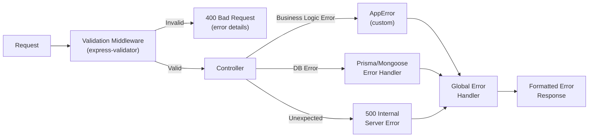

# ━━━━━━━━━━━━━━━━━━━━━━━━━━━━━━━━━━━━━━━━━━━━━━━
# 📘 CHAPTER 10 — Validation & Error Handling
# "Bad Input থেকে App রক্ষা করো"
# ⏱ ~90 মিনিট · Progress: [██████████] 55%
# ━━━━━━━━━━━━━━━━━━━━━━━━━━━━━━━━━━━━━━━━━━━━━━━

[⬆ TOC এ ফিরে যাও](./table-of-contents.md#toc)

---

## 📌 এই Chapter এ তুমি শিখবে

- ✅ express-validator দিয়ে input validation
- ✅ Custom validators ও sanitizers
- ✅ AppError class hierarchy
- ✅ Global error handler — সব errors catch করে
- ✅ Async error wrapper
- ✅ Unhandled rejection ও uncaught exception handle

---

## 🏗️ Real-life Analogy

> Input validation = restaurant-এ order নেওয়ার সময় waiter confirm করে: "আপনি কি সত্যিই এটা চাইছেন?" — ভুল order kitchen-এ যাওয়ার আগেই ধরা পড়ে।
>
> Error handling = kitchen-এ কিছু ভুল হলে manager professionally handle করে, customer-কে আতঙ্কিত না করে।

---

## 🗺️ Validation Pipeline



---

## 📦 Installation

```bash
npm install express-validator
```

---

## ✅ Validation Middleware

📄 File: `src/middleware/validation.middleware.js` · 🎯 উদ্দেশ্য: Express-validator error handler

```javascript
const { validationResult, body, param, query } = require('express-validator');
const { AppError } = require('./error.middleware');

// ============================================
// Validation Error Handler
// ============================================
const validateRequest = (req, res, next) => {
  const errors = validationResult(req);

  if (!errors.isEmpty()) {
    const formattedErrors = errors.array().map((err) => ({
      field: err.path,
      message: err.msg,
      value: err.value,
    }));

    return res.status(400).json({
      success: false,
      message: 'Validation failed',
      errors: formattedErrors,
    });
  }

  next();
};

// ============================================
// Common Validators (reusable)
// ============================================
const validators = {
  // Email
  email: () =>
    body('email')
      .trim()
      .notEmpty().withMessage('Email is required')
      .isEmail().withMessage('Valid email address required')
      .normalizeEmail(),

  // Password
  password: (field = 'password') =>
    body(field)
      .notEmpty().withMessage('Password is required')
      .isLength({ min: 8 }).withMessage('Password must be at least 8 characters')
      .matches(/^(?=.*[a-z])(?=.*[A-Z])(?=.*\d)(?=.*[@$!%*?&])/)
      .withMessage('Password must have uppercase, lowercase, number, and special character'),

  // ID param
  mongoId: (paramName = 'id') =>
    param(paramName)
      .isMongoId()
      .withMessage(`Invalid ${paramName} format`),

  postgresId: (paramName = 'id') =>
    param(paramName)
      .isInt({ min: 1 })
      .withMessage(`${paramName} must be a positive integer`)
      .toInt(),

  // Pagination
  pagination: () => [
    query('page')
      .optional()
      .isInt({ min: 1 })
      .withMessage('Page must be a positive integer')
      .toInt(),
    query('limit')
      .optional()
      .isInt({ min: 1, max: 100 })
      .withMessage('Limit must be between 1 and 100')
      .toInt(),
  ],

  // Price
  price: (field = 'price') =>
    body(field)
      .isFloat({ min: 0.01 })
      .withMessage(`${field} must be a positive number`)
      .toFloat(),

  // URL
  imageUrl: (field = 'imageUrl') =>
    body(field)
      .optional()
      .isURL({ protocols: ['http', 'https'] })
      .withMessage(`${field} must be a valid URL`),
};

// ============================================
// Product Validation Rules
// ============================================
const productValidators = {
  create: [
    body('name')
      .trim()
      .notEmpty().withMessage('Product name is required')
      .isLength({ min: 2, max: 255 }).withMessage('Name must be 2-255 characters'),

    body('sku')
      .trim()
      .notEmpty().withMessage('SKU is required')
      .isAlphanumeric('en-US', { ignore: '-_' }).withMessage('SKU must be alphanumeric (hyphens/underscores allowed)')
      .isLength({ max: 100 }).withMessage('SKU cannot exceed 100 characters')
      .toUpperCase(),

    body('slug')
      .trim()
      .notEmpty().withMessage('Slug is required')
      .matches(/^[a-z0-9]+(?:-[a-z0-9]+)*$/).withMessage('Slug must be lowercase with hyphens only')
      .isLength({ max: 255 }),

    validators.price('price'),

    body('comparePrice')
      .optional()
      .isFloat({ min: 0 })
      .withMessage('Compare price must be positive')
      .toFloat(),

    body('stock')
      .optional()
      .isInt({ min: 0 }).withMessage('Stock must be non-negative integer')
      .toInt(),

    body('categoryId')
      .optional()
      .isInt({ min: 1 }).withMessage('Valid category ID required')
      .toInt(),
  ],

  update: [
    param('id').isInt({ min: 1 }).withMessage('Valid product ID required').toInt(),
    body('price').optional().isFloat({ min: 0.01 }).toFloat(),
    body('stock').optional().isInt({ min: 0 }).toInt(),
  ],
};

// ============================================
// Review Validation Rules
// ============================================
const reviewValidators = {
  create: [
    body('rating')
      .isInt({ min: 1, max: 5 })
      .withMessage('Rating must be between 1 and 5')
      .toInt(),
    body('title')
      .optional()
      .trim()
      .isLength({ max: 255 }).withMessage('Title cannot exceed 255 characters'),
    body('comment')
      .optional()
      .trim()
      .isLength({ max: 2000 }).withMessage('Comment cannot exceed 2000 characters'),
  ],
};

// ============================================
// Address Validation Rules
// ============================================
const addressValidators = {
  create: [
    body('street').trim().notEmpty().withMessage('Street is required'),
    body('city').trim().notEmpty().withMessage('City is required'),
    body('postalCode')
      .trim()
      .notEmpty().withMessage('Postal code is required')
      .isLength({ max: 20 }),
    body('country').optional().trim().isLength({ max: 100 }),
    body('label').optional().trim().isLength({ max: 50 }),
  ],
};

module.exports = {
  validateRequest,
  validators,
  productValidators,
  reviewValidators,
  addressValidators,
};
```

---

## ⚠️ AppError Class

📄 File: `src/middleware/error.middleware.js` · 🎯 উদ্দেশ্য: Custom error class + global handler

```javascript
// ============================================
// AppError — Custom Error Class
// ============================================
class AppError extends Error {
  constructor(message, statusCode, code = null) {
    super(message);
    this.statusCode = statusCode;
    this.status = statusCode >= 400 && statusCode < 500 ? 'fail' : 'error';
    this.isOperational = true;  // Known/expected errors
    this.code = code;

    Error.captureStackTrace(this, this.constructor);
  }
}

// ============================================
// Async Error Wrapper
// ============================================
const catchAsync = (fn) => {
  return (req, res, next) => {
    Promise.resolve(fn(req, res, next)).catch(next);
  };
};

// ============================================
// Error Handlers
// ============================================
const handlePrismaError = (error) => {
  switch (error.code) {
    case 'P2002': {
      // Unique constraint violation
      const field = error.meta?.target?.[0] || 'field';
      return new AppError(`${field} already exists`, 409, 'DUPLICATE_FIELD');
    }
    case 'P2025': {
      // Record not found
      return new AppError('Record not found', 404, 'NOT_FOUND');
    }
    case 'P2003': {
      // Foreign key constraint
      return new AppError('Related record not found', 400, 'FOREIGN_KEY_ERROR');
    }
    case 'P2014': {
      // Relation violation
      return new AppError('Relation constraint violation', 400, 'RELATION_ERROR');
    }
    default:
      return new AppError(`Database error: ${error.message}`, 500);
  }
};

const handleMongooseError = (error) => {
  if (error.name === 'ValidationError') {
    const messages = Object.values(error.errors).map((e) => e.message);
    return new AppError(messages.join(', '), 400, 'VALIDATION_ERROR');
  }
  if (error.code === 11000) {
    const field = Object.keys(error.keyValue)[0];
    return new AppError(`${field} already exists`, 409, 'DUPLICATE_FIELD');
  }
  if (error.name === 'CastError') {
    return new AppError(`Invalid ${error.path}: ${error.value}`, 400, 'CAST_ERROR');
  }
  return error;
};

const handleJWTError = (error) => {
  if (error.name === 'JsonWebTokenError') {
    return new AppError('Invalid token', 401, 'TOKEN_INVALID');
  }
  if (error.name === 'TokenExpiredError') {
    return new AppError('Token expired', 401, 'TOKEN_EXPIRED');
  }
  return error;
};

// ============================================
// Global Error Handler Middleware
// ============================================
const globalErrorHandler = (err, req, res, next) => {
  let error = { ...err, message: err.message };

  // Prisma errors
  if (error.code && error.code.startsWith('P')) {
    error = handlePrismaError(error);
  }

  // Mongoose errors
  if (
    error.name === 'ValidationError' ||
    error.code === 11000 ||
    error.name === 'CastError'
  ) {
    error = handleMongooseError(error);
  }

  // JWT errors
  if (error.name === 'JsonWebTokenError' || error.name === 'TokenExpiredError') {
    error = handleJWTError(error);
  }

  // SyntaxError — malformed JSON body
  if (err instanceof SyntaxError && err.status === 400 && 'body' in err) {
    error = new AppError('Invalid JSON in request body', 400, 'INVALID_JSON');
  }

  const statusCode = error.statusCode || 500;
  const status = error.status || 'error';

  // Development — detailed error
  if (process.env.NODE_ENV === 'development') {
    return res.status(statusCode).json({
      success: false,
      status,
      message: error.message,
      code: error.code || null,
      stack: error.stack,
      error,
    });
  }

  // Production — operational errors only
  if (error.isOperational) {
    return res.status(statusCode).json({
      success: false,
      status,
      message: error.message,
      code: error.code || null,
    });
  }

  // Unknown errors — don't leak details in production
  console.error('💥 UNEXPECTED ERROR:', err);
  return res.status(500).json({
    success: false,
    status: 'error',
    message: 'Something went wrong. Please try again.',
  });
};

// ============================================
// Unhandled Rejection & Exception Handlers
// ============================================
const handleUnhandledRejection = (server) => {
  process.on('unhandledRejection', (reason, promise) => {
    console.error('🔴 UNHANDLED REJECTION:', reason);
    server.close(() => {
      process.exit(1);
    });
  });
};

const handleUncaughtException = () => {
  process.on('uncaughtException', (err) => {
    console.error('🔴 UNCAUGHT EXCEPTION:', err);
    process.exit(1);
  });
};

module.exports = {
  AppError,
  catchAsync,
  globalErrorHandler,
  handleUnhandledRejection,
  handleUncaughtException,
};
```

---

## 🎯 ApiResponse Utility

📄 File: `src/utils/ApiResponse.js` · 🎯 উদ্দেশ্য: Consistent API response format

```javascript
class ApiResponse {
  static success(res, data = null, message = 'Success') {
    return res.status(200).json({
      success: true,
      message,
      data,
    });
  }

  static created(res, data = null, message = 'Created successfully') {
    return res.status(201).json({
      success: true,
      message,
      data,
    });
  }

  static noContent(res) {
    return res.status(204).send();
  }

  static paginated(res, data, pagination) {
    return res.status(200).json({
      success: true,
      data,
      pagination,
    });
  }

  static error(res, message = 'Something went wrong', statusCode = 500) {
    return res.status(statusCode).json({
      success: false,
      message,
    });
  }
}

module.exports = ApiResponse;
```

---

## 🏋️ Exercise

**কাজ: এই route-এ সম্পূর্ণ validation যোগ করো:**

```javascript
// POST /api/orders — Create order
// Validate:
//   - items: array, min 1 item
//   - items[].productId: valid integer
//   - items[].quantity: integer >= 1
//   - addressId: valid integer
//   - notes: optional string max 500 chars
```

---

## ✅ Chapter Summary

```
╔══════════════════════════════════════════════════════╗
║  ✅ Chapter 10 — তুমি শিখলে                         ║
╠══════════════════════════════════════════════════════╣
║  • express-validator: body/param/query validators   ║
║  • Custom validators ও sanitizers                  ║
║  • validateRequest middleware                       ║
║  • AppError custom class                            ║
║  • catchAsync wrapper                               ║
║  • Global error handler — Prisma/Mongoose/JWT       ║
║  • Unhandled rejection handler                      ║
║  • Consistent ApiResponse format                    ║
╚══════════════════════════════════════════════════════╝
```

[⬆ TOC এ ফিরে যাও](./table-of-contents.md#toc) | [⬅ Chapter 9](./chapter-09-auth.md) | [➡ Chapter 11](./chapter-11-security.md)
