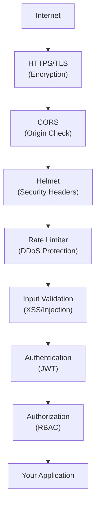

# ━━━━━━━━━━━━━━━━━━━━━━━━━━━━━━━━━━━━━━━━━━━━━━━
# 📘 CHAPTER 11 — Security
# "OWASP Top 10 থেকে তোমার App সুরক্ষিত করো"
# ⏱ ~90 মিনিট · Progress: [██████████░] 58%
# ━━━━━━━━━━━━━━━━━━━━━━━━━━━━━━━━━━━━━━━━━━━━━━━

[⬆ TOC এ ফিরে যাও](./table-of-contents.md#toc)

---

## 📌 এই Chapter এ তুমি শিখবে

- ✅ Security headers with Helmet
- ✅ Rate limiting — Brute force protection
- ✅ SQL Injection protection (Prisma parameterized)
- ✅ NoSQL Injection protection
- ✅ XSS (Cross-Site Scripting) prevention
- ✅ CORS configuration
- ✅ Environment secrets best practices
- ✅ npm audit ও dependency security

---

## 🏗️ Real-life Analogy

> একটি দোকানের মতো — দরজায় গার্ড (authentication), ক্যামেরা (logging), নামের ট্যাগ (authorization), দরজায় তালা (HTTPS), সন্দেহজনক প্যাকেট scan (input validation), এবং rate limit (একজন customer অনেক বেশি বার knock করলে block)।

---

## 🗺️ Security Layers



---

## 🛡️ Helmet — Security Headers

📄 File: `src/app.js` · 🎯 উদ্দেশ্য: Security headers configuration

```javascript
const helmet = require('helmet');

// Basic helmet (defaults সব)
app.use(helmet());

// অথবা granular control:
app.use(
  helmet({
    contentSecurityPolicy: {
      directives: {
        defaultSrc: ["'self'"],
        styleSrc: ["'self'", "'unsafe-inline'", 'https://fonts.googleapis.com'],
        imgSrc: ["'self'", 'data:', 'https://cdn.myshop.com'],
        scriptSrc: ["'self'"],
        connectSrc: ["'self'"],
        fontSrc: ["'self'", 'https://fonts.gstatic.com'],
      },
    },
    crossOriginEmbedderPolicy: false,  // Cloudinary এর জন্য
    hsts: {
      maxAge: 31536000,       // 1 year
      includeSubDomains: true,
      preload: true,
    },
  })
);
```

```
💡 Helmet যে Headers যোগ করে:
   X-Content-Type-Options: nosniff
   X-Frame-Options: SAMEORIGIN
   X-XSS-Protection: 0
   Strict-Transport-Security: max-age=...
   Content-Security-Policy: default-src 'self'
   Referrer-Policy: no-referrer
```

---

## 🚦 Rate Limiting

```bash
npm install express-rate-limit
```

📄 File: `src/middleware/rateLimiter.js` · 🎯 উদ্দেশ্য: Multiple rate limiters

```javascript
const rateLimit = require('express-rate-limit');

// ============================================
// General API Rate Limit
// ============================================
const apiLimiter = rateLimit({
  windowMs: 15 * 60 * 1000,  // 15 minutes
  max: 100,                    // 15 মিনিটে সর্বোচ্চ 100 requests
  standardHeaders: true,       // Rate-Limit headers যোগ করো
  legacyHeaders: false,
  message: {
    success: false,
    message: 'Too many requests from this IP. Please try again after 15 minutes.',
  },
  handler: (req, res) => {
    res.status(429).json({
      success: false,
      message: 'Too many requests. Please slow down.',
      retryAfter: Math.ceil(req.rateLimit.resetTime / 1000),
    });
  },
});

// ============================================
// Auth Rate Limit (stricter)
// ============================================
const authLimiter = rateLimit({
  windowMs: 15 * 60 * 1000,  // 15 minutes
  max: 10,                    // সর্বোচ্চ 10 login attempts
  skipSuccessfulRequests: true,  // Successful requests count করে না
  message: {
    success: false,
    message: 'Too many login attempts. Please try again after 15 minutes.',
  },
});

// ============================================
// Password Reset Rate Limit
// ============================================
const passwordResetLimiter = rateLimit({
  windowMs: 60 * 60 * 1000,   // 1 hour
  max: 3,                      // 1 ঘণ্টায় সর্বোচ্চ 3 attempts
  message: {
    success: false,
    message: 'Too many password reset attempts. Please try again after 1 hour.',
  },
});

// ============================================
// File Upload Rate Limit
// ============================================
const uploadLimiter = rateLimit({
  windowMs: 60 * 1000,  // 1 minute
  max: 10,
  message: {
    success: false,
    message: 'Upload limit reached. Please wait a minute.',
  },
});

module.exports = { apiLimiter, authLimiter, passwordResetLimiter, uploadLimiter };
```

📄 File: `src/app.js` (apply করো) · 🎯 উদ্দেশ্য: Rate limit apply

```javascript
const { apiLimiter, authLimiter } = require('./middleware/rateLimiter');

// General API limiter
app.use('/api/', apiLimiter);

// Auth-specific limiter
app.use('/api/auth/login', authLimiter);
app.use('/api/auth/forgot-password', authLimiter);
```

---

## 🔐 SQL Injection Prevention

```javascript
// ============================================
// ❌ VULNERABLE — Never do this!
// ============================================
const getProductRaw = async (name) => {
  // Direct string interpolation → SQL Injection!
  const result = await prisma.$queryRawUnsafe(
    `SELECT * FROM products WHERE name = '${name}'`
  );
  // Attacker: name = "' OR '1'='1" → সব products দেখবে!
  return result;
};

// ============================================
// ✅ SAFE — Parameterized query
// ============================================
const getProductSafe = async (name) => {
  // Prisma automatically parameterizes
  return prisma.product.findMany({ where: { name } });
};

// ✅ SAFE — $queryRaw with tagged template (auto-escapes)
const searchProductsSafe = async (searchTerm) => {
  return prisma.$queryRaw`
    SELECT id, name, price
    FROM products
    WHERE name ILIKE ${'%' + searchTerm + '%'}
    AND is_active = TRUE
  `;
  // Template literal syntax auto-escapes parameters!
};
```

---

## 🍃 NoSQL Injection Prevention

```javascript
const mongoSanitize = require('express-mongo-sanitize');

// Middleware apply করো
app.use(mongoSanitize({
  replaceWith: '_',  // $ এবং . এই characters replace করো
}));

// ============================================
// ❌ VULNERABLE
// ============================================
// Attacker sends: { "email": { "$ne": null }, "password": { "$ne": null } }
const loginVulnerable = async (email, password) => {
  // $ne: null → সব users match করবে!
  const user = await User.findOne({ email, password });
};

// ============================================
// ✅ SAFE — mongoSanitize automatically strips $operators
// ============================================
// express-mongo-sanitize middleware apply করলে
// request body/params/query থেকে $ এবং . operator remove হয়

// Additional: Type check করো
const loginSafe = async (body) => {
  // Ensure string types
  if (typeof body.email !== 'string' || typeof body.password !== 'string') {
    throw new AppError('Invalid input type', 400);
  }

  const user = await User.findOne({ email: body.email });
  if (!user) {
    throw new AppError('Invalid credentials', 401);
  }

  const isMatch = await bcrypt.compare(body.password, user.passwordHash);
  if (!isMatch) {
    throw new AppError('Invalid credentials', 401);
  }

  return user;
};
```

```bash
npm install express-mongo-sanitize
```

---

## 🧹 XSS Prevention

```bash
npm install xss-clean
```

```javascript
const xss = require('xss-clean');

// XSS sanitize করো — HTML tags strip করে
app.use(xss());

// ============================================
// ❌ VULNERABLE — Never store raw HTML
// ============================================
const createReviewVulnerable = async (req, res) => {
  // Attacker: comment = "<script>document.cookie</script>"
  await Review.create({ comment: req.body.comment });
};

// ============================================
// ✅ SAFE — xss-clean middleware auto-sanitizes
// ============================================
// app.use(xss()) দিলে সব body/query/params sanitize হয়

// Manual sanitize প্রয়োজন হলে:
const createProductSafe = async (req, res) => {
  // express-validator এর escape() ব্যবহার করো
  const name = req.body.name;  // xss() already cleaned this
  await Product.create({ name });
};
```

---

## 🌍 CORS Configuration

📄 File: `src/config/cors.config.js` · 🎯 উদ্দেশ্য: Production-safe CORS

```javascript
const corsOptions = {
  // Allowed origins
  origin: (origin, callback) => {
    const allowedOrigins = [
      'https://myshop.com',
      'https://www.myshop.com',
      'https://admin.myshop.com',
      // Development-এ localhost
      ...(process.env.NODE_ENV === 'development'
        ? ['http://localhost:3000', 'http://localhost:5173', 'http://localhost:8080']
        : []),
    ];

    // No origin (mobile apps, Postman, curl) allow করো
    if (!origin || allowedOrigins.includes(origin)) {
      callback(null, true);
    } else {
      callback(new Error(`CORS policy does not allow origin: ${origin}`));
    }
  },

  // Allowed HTTP methods
  methods: ['GET', 'POST', 'PUT', 'PATCH', 'DELETE', 'OPTIONS'],

  // Allowed headers
  allowedHeaders: [
    'Content-Type',
    'Authorization',
    'X-Requested-With',
    'Accept',
    'Origin',
  ],

  // Credentials (cookies, authorization headers)
  credentials: true,

  // Preflight cache
  maxAge: 86400,  // 24 hours
};

module.exports = corsOptions;
```

---

## 🔒 Environment Secrets

📄 File: `src/config/env.config.js` · 🎯 উদ্দেশ্য: Environment validation

```javascript
const requiredEnvVars = [
  'DATABASE_URL',
  'MONGODB_URI',
  'JWT_ACCESS_SECRET',
  'JWT_REFRESH_SECRET',
  'NODE_ENV',
];

const validateEnv = () => {
  const missing = requiredEnvVars.filter((key) => !process.env[key]);

  if (missing.length > 0) {
    throw new Error(
      `❌ Missing required environment variables:\n${missing.map((k) => `  - ${k}`).join('\n')}`
    );
  }

  // JWT secret strength check
  if (process.env.JWT_ACCESS_SECRET.length < 32) {
    throw new Error('❌ JWT_ACCESS_SECRET must be at least 32 characters');
  }

  console.log('✅ All environment variables validated');
};

module.exports = { validateEnv };
```

```
⚠️ Security Rules for Secrets:
   ✅ .env file → .gitignore-এ রাখো
   ✅ Production-এ environment variables platform-এ set করো
   ✅ JWT secret minimum 32 chars, random
   ✅ npm audit চালাও নিয়মিত
   ❌ কখনো secret code-এ hardcode করবে না
   ❌ .env file GitHub-এ push করবে না
```

---

## 🔍 Security Audit

```bash
# NPM vulnerability check
npm audit

# Fix vulnerable packages
npm audit fix

# Force fix (breaking changes হতে পারে)
npm audit fix --force

# Specific package check
npm audit --json | jq '.vulnerabilities'

# OWASP ZAP (free tool) দিয়ে scan
# https://www.zaproxy.org/
```

---

## 📊 Common Mistakes Table

| ভুল | Attack | সমাধান |
|-----|--------|---------|
| Raw SQL string interpolation | SQL Injection | Parameterized queries (Prisma) |
| MongoDB operator in input | NoSQL Injection | express-mongo-sanitize |
| HTML stored raw | XSS | xss-clean middleware |
| No rate limiting | Brute force | express-rate-limit |
| CORS `*` in production | CSRF-like attacks | Specific origins allowlist |
| Weak JWT secret | Token forgery | 64+ char random secret |
| Stack trace in response | Information disclosure | NODE_ENV=production |
| npm audit ignored | Known vulnerabilities | Regular audit + update |

---

## ✅ Chapter Summary

```
╔══════════════════════════════════════════════════════╗
║  ✅ Chapter 11 — তুমি শিখলে                         ║
╠══════════════════════════════════════════════════════╣
║  • Helmet: security headers                         ║
║  • Rate limiting: general/auth/upload               ║
║  • SQL Injection: Prisma parameterized queries      ║
║  • NoSQL Injection: express-mongo-sanitize          ║
║  • XSS: xss-clean middleware                        ║
║  • CORS: production-safe configuration              ║
║  • Env secrets: validation + best practices         ║
║  • npm audit: vulnerability scanning                ║
╚══════════════════════════════════════════════════════╝
```

[⬆ TOC এ ফিরে যাও](./table-of-contents.md#toc) | [⬅ Chapter 10](./chapter-10-validation.md) | [➡ Chapter 12](./chapter-12-nestjs.md)
