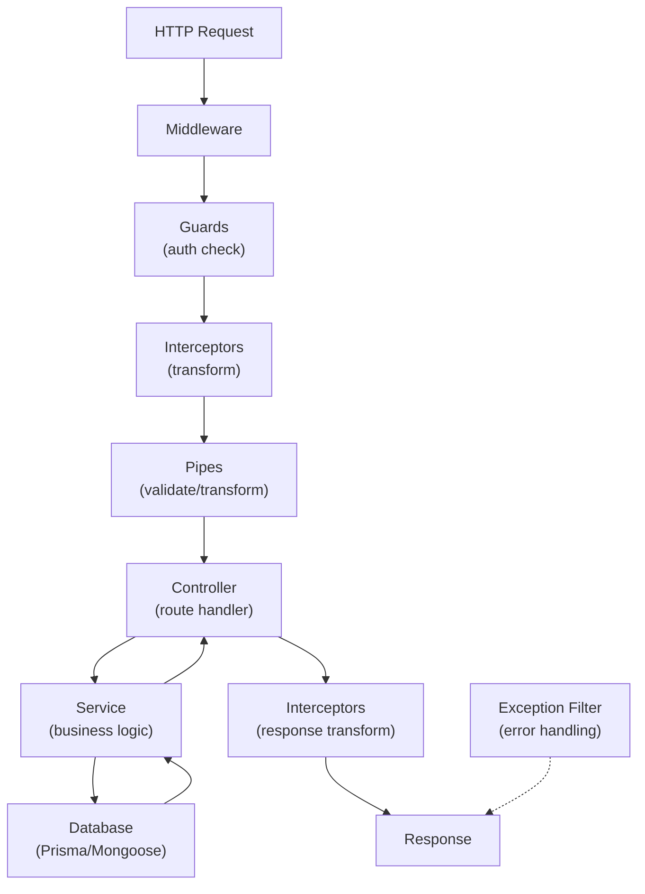

# ━━━━━━━━━━━━━━━━━━━━━━━━━━━━━━━━━━━━━━━━━━━━━━━
# 📘 CHAPTER 12 — NestJS
# "Enterprise-grade Backend Framework"
# ⏱ ~180 মিনিট · Progress: [███████████░] 65%
# ━━━━━━━━━━━━━━━━━━━━━━━━━━━━━━━━━━━━━━━━━━━━━━━

[⬆ TOC এ ফিরে যাও](./table-of-contents.md#toc)

---

## 📌 এই Chapter এ তুমি শিখবে

- ✅ NestJS কী ও কেন Express এর চেয়ে ভালো
- ✅ CLI দিয়ে project setup
- ✅ Modules, Controllers, Services, Providers
- ✅ Dependency Injection (DI)
- ✅ DTOs ও class-validator
- ✅ Pipes, Guards, Interceptors, Exception Filters
- ✅ NestJS + Prisma (PostgreSQL)
- ✅ NestJS + Mongoose (MongoDB)
- ✅ NestJS + JWT Authentication
- ✅ দুটি Database একসাথে

---

## 🏗️ Real-life Analogy

> Express = LEGO — তুমি নিজে সব piece arrange করো
> NestJS = Pre-built furniture — সব কিছু ঠিক জায়গায় আছে, শুধু assemble করো
>
> NestJS Angular-এর মতো structured — Modules, Decorators, DI সব। Flutter developer হিসেবে তুমি already Provider/Widget tree দেখেছো — NestJS এর Module/Service/Controller অনেকটা সেরকম।

```
🟢 Flutter তুলনা:
   Flutter Widget     = NestJS Controller (handles UI/requests)
   Flutter Provider   = NestJS Service (business logic)
   Flutter Module     = NestJS Module (feature grouping)
   Flutter DI         = NestJS Dependency Injection
```

---

## 🗺️ NestJS Architecture



---

## ⚙️ Project Setup

```bash
# NestJS CLI install করো
npm install -g @nestjs/cli

# New project তৈরি করো
nest new ecommerce-api
# Package manager: npm

cd ecommerce-api

# Dependencies install করো
npm install @nestjs/config @nestjs/jwt @nestjs/passport
npm install passport passport-jwt passport-local
npm install @prisma/client prisma
npm install @nestjs/mongoose mongoose
npm install class-validator class-transformer
npm install bcryptjs @types/bcryptjs
npm install helmet express-rate-limit
npm install @types/passport-jwt --save-dev

# Prisma init
npx prisma init
```

---

## 📁 Project Structure

```
ecommerce-api/
├── src/
│   ├── app.module.ts           ← Root module
│   ├── main.ts                 ← Bootstrap
│   │
│   ├── config/
│   │   └── configuration.ts    ← Config factory
│   │
│   ├── prisma/
│   │   ├── prisma.module.ts
│   │   └── prisma.service.ts
│   │
│   ├── mongoose/
│   │   └── mongoose.module.ts
│   │
│   ├── auth/
│   │   ├── auth.module.ts
│   │   ├── auth.controller.ts
│   │   ├── auth.service.ts
│   │   ├── dto/
│   │   │   ├── login.dto.ts
│   │   │   └── register.dto.ts
│   │   ├── guards/
│   │   │   ├── jwt-auth.guard.ts
│   │   │   └── roles.guard.ts
│   │   ├── decorators/
│   │   │   ├── current-user.decorator.ts
│   │   │   └── roles.decorator.ts
│   │   └── strategies/
│   │       └── jwt.strategy.ts
│   │
│   ├── users/
│   │   ├── users.module.ts
│   │   ├── users.controller.ts
│   │   └── users.service.ts
│   │
│   ├── products/
│   │   ├── products.module.ts
│   │   ├── products.controller.ts
│   │   ├── products.service.ts
│   │   ├── dto/
│   │   │   ├── create-product.dto.ts
│   │   │   └── query-product.dto.ts
│   │   └── schemas/
│   │       └── product.schema.ts
│   │
│   └── common/
│       ├── filters/
│       │   └── http-exception.filter.ts
│       ├── interceptors/
│       │   └── transform.interceptor.ts
│       └── decorators/
│           └── api-response.decorator.ts
│
├── prisma/
│   └── schema.prisma
├── .env
└── nest-cli.json
```

---

## 🚀 main.ts

📄 File: `src/main.ts` · 🎯 উদ্দেশ্য: NestJS bootstrap

```typescript
import { NestFactory, Reflector } from '@nestjs/core';
import { ValidationPipe, ClassSerializerInterceptor } from '@nestjs/common';
import { AppModule } from './app.module';
import helmet from 'helmet';
import * as rateLimit from 'express-rate-limit';
import { HttpExceptionFilter } from './common/filters/http-exception.filter';
import { TransformInterceptor } from './common/interceptors/transform.interceptor';

async function bootstrap() {
  const app = await NestFactory.create(AppModule);

  // Global prefix
  app.setGlobalPrefix('api/v1');

  // Helmet
  app.use(helmet());

  // CORS
  app.enableCors({
    origin: process.env.ALLOWED_ORIGINS?.split(',') || ['http://localhost:3000'],
    credentials: true,
  });

  // Rate limiting
  app.use(
    rateLimit({
      windowMs: 15 * 60 * 1000,
      max: 100,
    }),
  );

  // Global Validation Pipe
  app.useGlobalPipes(
    new ValidationPipe({
      whitelist: true,               // Unknown fields strip করো
      forbidNonWhitelisted: true,    // Unknown fields-এ error throw করো
      transform: true,               // Type transformation (string → number)
      transformOptions: {
        enableImplicitConversion: true,
      },
    }),
  );

  // Global Exception Filter
  app.useGlobalFilters(new HttpExceptionFilter());

  // Global Interceptor — response transform
  app.useGlobalInterceptors(
    new TransformInterceptor(),
    new ClassSerializerInterceptor(app.get(Reflector)),
  );

  const port = process.env.PORT || 3000;
  await app.listen(port);

  console.log(`🚀 Application running on: http://localhost:${port}/api/v1`);
}

bootstrap();
```

---

## 📦 App Module

📄 File: `src/app.module.ts` · 🎯 উদ্দেশ্য: Root application module

```typescript
import { Module } from '@nestjs/common';
import { ConfigModule } from '@nestjs/config';
import { PrismaModule } from './prisma/prisma.module';
import { MongooseModule } from '@nestjs/mongoose';
import { AuthModule } from './auth/auth.module';
import { UsersModule } from './users/users.module';
import { ProductsModule } from './products/products.module';
import configuration from './config/configuration';

@Module({
  imports: [
    // Config module — সব .env variables
    ConfigModule.forRoot({
      isGlobal: true,
      load: [configuration],
    }),

    // Prisma module (PostgreSQL)
    PrismaModule,

    // Mongoose module (MongoDB)
    MongooseModule.forRootAsync({
      useFactory: () => ({
        uri: process.env.MONGODB_URI,
        connectionFactory: (connection) => {
          connection.on('connected', () => console.log('✅ MongoDB connected'));
          connection.on('error', (err) => console.error('❌ MongoDB error:', err));
          return connection;
        },
      }),
    }),

    // Feature modules
    AuthModule,
    UsersModule,
    ProductsModule,
  ],
})
export class AppModule {}
```

---

## 🗄️ Prisma Module & Service

📄 File: `src/prisma/prisma.service.ts` · 🎯 উদ্দেশ্য: Injectable Prisma Client

```typescript
import { Injectable, OnModuleInit, OnModuleDestroy } from '@nestjs/common';
import { PrismaClient } from '@prisma/client';

@Injectable()
export class PrismaService extends PrismaClient implements OnModuleInit, OnModuleDestroy {
  constructor() {
    super({
      log: process.env.NODE_ENV === 'development'
        ? ['query', 'error', 'warn']
        : ['error'],
    });
  }

  async onModuleInit() {
    await this.$connect();
    console.log('✅ Prisma connected to PostgreSQL');
  }

  async onModuleDestroy() {
    await this.$disconnect();
  }
}
```

📄 File: `src/prisma/prisma.module.ts` · 🎯 উদ্দেশ্য: Global Prisma module

```typescript
import { Global, Module } from '@nestjs/common';
import { PrismaService } from './prisma.service';

@Global()  // সব modules-এ available
@Module({
  providers: [PrismaService],
  exports: [PrismaService],
})
export class PrismaModule {}
```

---

## 🔐 Auth Module

### DTOs (Data Transfer Objects)

📄 File: `src/auth/dto/register.dto.ts` · 🎯 উদ্দেশ্য: Registration DTO with validation

```typescript
import {
  IsEmail,
  IsString,
  MinLength,
  MaxLength,
  IsOptional,
  Matches,
  IsNotEmpty,
} from 'class-validator';
import { Transform } from 'class-transformer';

export class RegisterDto {
  @IsNotEmpty({ message: 'First name is required' })
  @IsString()
  @MaxLength(100)
  @Transform(({ value }) => value?.trim())
  firstName: string;

  @IsNotEmpty({ message: 'Last name is required' })
  @IsString()
  @MaxLength(100)
  @Transform(({ value }) => value?.trim())
  lastName: string;

  @IsEmail({}, { message: 'Valid email address required' })
  @Transform(({ value }) => value?.toLowerCase().trim())
  email: string;

  @IsString()
  @MinLength(8, { message: 'Password must be at least 8 characters' })
  @Matches(/^(?=.*[a-z])(?=.*[A-Z])(?=.*\d)(?=.*[@$!%*?&])/, {
    message: 'Password must have uppercase, lowercase, number, and special character',
  })
  password: string;

  @IsOptional()
  @IsString()
  @MaxLength(20)
  phone?: string;
}
```

📄 File: `src/auth/dto/login.dto.ts` · 🎯 উদ্দেশ্য: Login DTO

```typescript
import { IsEmail, IsString, IsNotEmpty } from 'class-validator';
import { Transform } from 'class-transformer';

export class LoginDto {
  @IsEmail({}, { message: 'Valid email required' })
  @Transform(({ value }) => value?.toLowerCase().trim())
  email: string;

  @IsString()
  @IsNotEmpty({ message: 'Password is required' })
  password: string;
}
```

### JWT Strategy

📄 File: `src/auth/strategies/jwt.strategy.ts` · 🎯 উদ্দেশ্য: JWT Passport strategy

```typescript
import { Injectable, UnauthorizedException } from '@nestjs/common';
import { PassportStrategy } from '@nestjs/passport';
import { ExtractJwt, Strategy } from 'passport-jwt';
import { ConfigService } from '@nestjs/config';
import { PrismaService } from '../../prisma/prisma.service';

export interface JwtPayload {
  sub: string;
  email: string;
  role: string;
}

@Injectable()
export class JwtStrategy extends PassportStrategy(Strategy) {
  constructor(
    private configService: ConfigService,
    private prisma: PrismaService,
  ) {
    super({
      jwtFromRequest: ExtractJwt.fromAuthHeaderAsBearerToken(),
      ignoreExpiration: false,
      secretOrKey: configService.get<string>('jwt.accessSecret'),
    });
  }

  async validate(payload: JwtPayload) {
    const user = await this.prisma.user.findUnique({
      where: { id: parseInt(payload.sub, 10) },
      select: {
        id: true,
        email: true,
        role: true,
        isActive: true,
        firstName: true,
        lastName: true,
      },
    });

    if (!user || !user.isActive) {
      throw new UnauthorizedException('User not found or inactive');
    }

    return user;
  }
}
```

### Guards & Decorators

📄 File: `src/auth/guards/jwt-auth.guard.ts` · 🎯 উদ্দেশ্য: JWT authentication guard

```typescript
import { Injectable, ExecutionContext, UnauthorizedException } from '@nestjs/common';
import { AuthGuard } from '@nestjs/passport';
import { Reflector } from '@nestjs/core';
import { IS_PUBLIC_KEY } from '../decorators/public.decorator';

@Injectable()
export class JwtAuthGuard extends AuthGuard('jwt') {
  constructor(private reflector: Reflector) {
    super();
  }

  canActivate(context: ExecutionContext) {
    // @Public() decorator check
    const isPublic = this.reflector.getAllAndOverride<boolean>(IS_PUBLIC_KEY, [
      context.getHandler(),
      context.getClass(),
    ]);

    if (isPublic) {
      return true;  // Public routes skip করো
    }

    return super.canActivate(context);
  }

  handleRequest(err: any, user: any) {
    if (err || !user) {
      throw err || new UnauthorizedException('Authentication required');
    }
    return user;
  }
}
```

📄 File: `src/auth/guards/roles.guard.ts` · 🎯 উদ্দেশ্য: Role-based authorization guard

```typescript
import { Injectable, CanActivate, ExecutionContext, ForbiddenException } from '@nestjs/common';
import { Reflector } from '@nestjs/core';
import { ROLES_KEY } from '../decorators/roles.decorator';

@Injectable()
export class RolesGuard implements CanActivate {
  constructor(private reflector: Reflector) {}

  canActivate(context: ExecutionContext): boolean {
    const requiredRoles = this.reflector.getAllAndOverride<string[]>(ROLES_KEY, [
      context.getHandler(),
      context.getClass(),
    ]);

    if (!requiredRoles) {
      return true;  // No roles required
    }

    const { user } = context.switchToHttp().getRequest();

    if (!user) {
      throw new ForbiddenException('Access denied');
    }

    if (!requiredRoles.includes(user.role)) {
      throw new ForbiddenException(
        `Access denied. Required: ${requiredRoles.join(' or ')}`
      );
    }

    return true;
  }
}
```

📄 File: `src/auth/decorators/roles.decorator.ts`

```typescript
import { SetMetadata } from '@nestjs/common';
export const ROLES_KEY = 'roles';
export const Roles = (...roles: string[]) => SetMetadata(ROLES_KEY, roles);
```

📄 File: `src/auth/decorators/public.decorator.ts`

```typescript
import { SetMetadata } from '@nestjs/common';
export const IS_PUBLIC_KEY = 'isPublic';
export const Public = () => SetMetadata(IS_PUBLIC_KEY, true);
```

📄 File: `src/auth/decorators/current-user.decorator.ts`

```typescript
import { createParamDecorator, ExecutionContext } from '@nestjs/common';

export const CurrentUser = createParamDecorator(
  (data: string | undefined, ctx: ExecutionContext) => {
    const request = ctx.switchToHttp().getRequest();
    const user = request.user;
    return data ? user?.[data] : user;
  },
);
```

### Auth Service

📄 File: `src/auth/auth.service.ts` · 🎯 উদ্দেশ্য: Auth business logic

```typescript
import {
  Injectable,
  ConflictException,
  UnauthorizedException,
  BadRequestException,
} from '@nestjs/common';
import { JwtService } from '@nestjs/jwt';
import { ConfigService } from '@nestjs/config';
import * as bcrypt from 'bcryptjs';
import * as crypto from 'crypto';
import { PrismaService } from '../prisma/prisma.service';
import { RegisterDto } from './dto/register.dto';
import { LoginDto } from './dto/login.dto';

@Injectable()
export class AuthService {
  constructor(
    private prisma: PrismaService,
    private jwtService: JwtService,
    private configService: ConfigService,
  ) {}

  // ============================================
  // REGISTER
  // ============================================
  async register(dto: RegisterDto) {
    const existing = await this.prisma.user.findUnique({
      where: { email: dto.email },
    });

    if (existing) {
      throw new ConflictException('Email already registered');
    }

    const passwordHash = await bcrypt.hash(dto.password, 12);
    const emailVerifyToken = crypto.randomBytes(32).toString('hex');

    const user = await this.prisma.user.create({
      data: {
        firstName: dto.firstName,
        lastName: dto.lastName,
        email: dto.email,
        passwordHash,
        phone: dto.phone,
        emailVerifyToken,
      },
      select: {
        id: true,
        email: true,
        firstName: true,
        lastName: true,
        role: true,
        createdAt: true,
      },
    });

    // TODO: Send verification email

    return { user, message: 'Registration successful. Please verify your email.' };
  }

  // ============================================
  // LOGIN
  // ============================================
  async login(dto: LoginDto) {
    const user = await this.prisma.user.findUnique({
      where: { email: dto.email },
    });

    if (!user) {
      await bcrypt.compare(dto.password, '$2b$12$dummy.hash.to.prevent.timing.attacks.xxxxx');
      throw new UnauthorizedException('Invalid email or password');
    }

    if (!user.isActive) {
      throw new UnauthorizedException('Account deactivated');
    }

    const isPasswordValid = await bcrypt.compare(dto.password, user.passwordHash);
    if (!isPasswordValid) {
      throw new UnauthorizedException('Invalid email or password');
    }

    const tokens = this.generateTokens(user);

    await this.prisma.user.update({
      where: { id: user.id },
      data: {
        refreshToken: tokens.refreshToken,
        lastLoginAt: new Date(),
      },
    });

    const { passwordHash, refreshToken, emailVerifyToken, passwordResetToken, ...safeUser } = user;

    return { ...tokens, user: safeUser };
  }

  // ============================================
  // REFRESH
  // ============================================
  async refresh(token: string) {
    let decoded: any;
    try {
      decoded = this.jwtService.verify(token, {
        secret: this.configService.get<string>('jwt.refreshSecret'),
      });
    } catch {
      throw new UnauthorizedException('Invalid refresh token');
    }

    const user = await this.prisma.user.findFirst({
      where: { id: parseInt(decoded.sub, 10), refreshToken: token, isActive: true },
    });

    if (!user) {
      throw new UnauthorizedException('Refresh token revoked');
    }

    const tokens = this.generateTokens(user);

    await this.prisma.user.update({
      where: { id: user.id },
      data: { refreshToken: tokens.refreshToken },
    });

    return tokens;
  }

  // ============================================
  // LOGOUT
  // ============================================
  async logout(userId: number) {
    await this.prisma.user.update({
      where: { id: userId },
      data: { refreshToken: null },
    });

    return { message: 'Logged out successfully' };
  }

  // ============================================
  // Private: Generate Tokens
  // ============================================
  private generateTokens(user: any) {
    const payload = { sub: user.id.toString(), email: user.email, role: user.role };

    const accessToken = this.jwtService.sign(payload, {
      secret: this.configService.get<string>('jwt.accessSecret'),
      expiresIn: this.configService.get<string>('jwt.accessExpiry') || '15m',
    });

    const refreshToken = this.jwtService.sign(
      { sub: user.id.toString() },
      {
        secret: this.configService.get<string>('jwt.refreshSecret'),
        expiresIn: this.configService.get<string>('jwt.refreshExpiry') || '7d',
      },
    );

    return { accessToken, refreshToken };
  }
}
```

### Auth Controller

📄 File: `src/auth/auth.controller.ts` · 🎯 উদ্দেশ্য: Auth REST endpoints

```typescript
import {
  Controller, Post, Get, Body, Param, UseGuards, HttpCode, HttpStatus,
} from '@nestjs/common';
import { AuthService } from './auth.service';
import { RegisterDto } from './dto/register.dto';
import { LoginDto } from './dto/login.dto';
import { JwtAuthGuard } from './guards/jwt-auth.guard';
import { Public } from './decorators/public.decorator';
import { CurrentUser } from './decorators/current-user.decorator';

@Controller('auth')
export class AuthController {
  constructor(private authService: AuthService) {}

  @Public()
  @Post('register')
  @HttpCode(HttpStatus.CREATED)
  register(@Body() dto: RegisterDto) {
    return this.authService.register(dto);
  }

  @Public()
  @Post('login')
  @HttpCode(HttpStatus.OK)
  login(@Body() dto: LoginDto) {
    return this.authService.login(dto);
  }

  @Public()
  @Post('refresh')
  @HttpCode(HttpStatus.OK)
  refresh(@Body('refreshToken') token: string) {
    return this.authService.refresh(token);
  }

  @UseGuards(JwtAuthGuard)
  @Post('logout')
  @HttpCode(HttpStatus.OK)
  logout(@CurrentUser('id') userId: number) {
    return this.authService.logout(userId);
  }

  @UseGuards(JwtAuthGuard)
  @Get('me')
  getProfile(@CurrentUser() user: any) {
    return user;
  }
}
```

### Auth Module

📄 File: `src/auth/auth.module.ts` · 🎯 উদ্দেশ্য: Auth module with all providers

```typescript
import { Module } from '@nestjs/common';
import { JwtModule } from '@nestjs/jwt';
import { PassportModule } from '@nestjs/passport';
import { ConfigService } from '@nestjs/config';
import { AuthController } from './auth.controller';
import { AuthService } from './auth.service';
import { JwtStrategy } from './strategies/jwt.strategy';
import { JwtAuthGuard } from './guards/jwt-auth.guard';
import { RolesGuard } from './guards/roles.guard';

@Module({
  imports: [
    PassportModule,
    JwtModule.registerAsync({
      useFactory: (configService: ConfigService) => ({
        secret: configService.get<string>('jwt.accessSecret'),
        signOptions: { expiresIn: '15m' },
      }),
      inject: [ConfigService],
    }),
  ],
  controllers: [AuthController],
  providers: [AuthService, JwtStrategy, JwtAuthGuard, RolesGuard],
  exports: [AuthService, JwtAuthGuard, RolesGuard, JwtModule],
})
export class AuthModule {}
```

---

## 📦 Products Module (MongoDB + Mongoose)

📄 File: `src/products/schemas/product.schema.ts` · 🎯 উদ্দেশ্য: Mongoose schema in NestJS

```typescript
import { Prop, Schema, SchemaFactory } from '@nestjs/mongoose';
import { Document, Types } from 'mongoose';

export type ProductDocument = Product & Document;

@Schema({ timestamps: true, toJSON: { virtuals: true } })
export class Product {
  @Prop({ required: true, trim: true })
  name: string;

  @Prop({ required: true, unique: true, lowercase: true, trim: true })
  slug: string;

  @Prop({ required: true, unique: true, uppercase: true })
  sku: string;

  @Prop({ required: true, type: Types.Decimal128 })
  price: Types.Decimal128;

  @Prop({ default: 0, min: 0 })
  stock: number;

  @Prop({ default: true })
  isActive: boolean;

  @Prop({ default: false })
  isFeatured: boolean;

  @Prop()
  brand: string;

  @Prop({ type: Object, default: {} })
  category: {
    _id: Types.ObjectId;
    name: string;
    slug: string;
  };

  @Prop({ type: [{ url: String, isPrimary: Boolean }], default: [] })
  images: Array<{ url: string; isPrimary: boolean }>;

  @Prop({ type: Object, default: {} })
  specs: Record<string, any>;

  @Prop({ type: [String], default: [] })
  tags: string[];

  @Prop({ type: { average: Number, count: Number }, default: { average: 0, count: 0 } })
  ratings: { average: number; count: number };
}

export const ProductSchema = SchemaFactory.createForClass(Product);

// Indexes
ProductSchema.index({ slug: 1 }, { unique: true });
ProductSchema.index({ 'category.slug': 1 });
ProductSchema.index({ isActive: 1, isFeatured: -1 });
ProductSchema.index(
  { name: 'text', description: 'text', brand: 'text' },
  { weights: { name: 10, brand: 5, description: 1 } },
);
```

📄 File: `src/products/dto/create-product.dto.ts`

```typescript
import {
  IsString, IsNotEmpty, IsNumber, IsOptional, IsBoolean,
  IsInt, Min, MaxLength, IsArray, IsUrl,
} from 'class-validator';
import { Transform, Type } from 'class-transformer';

export class CreateProductDto {
  @IsNotEmpty()
  @IsString()
  @MaxLength(255)
  @Transform(({ value }) => value?.trim())
  name: string;

  @IsNotEmpty()
  @IsString()
  sku: string;

  @IsNotEmpty()
  @IsString()
  slug: string;

  @IsNumber({ maxDecimalPlaces: 2 })
  @Min(0.01)
  @Type(() => Number)
  price: number;

  @IsOptional()
  @IsNumber()
  @Min(0)
  @Type(() => Number)
  comparePrice?: number;

  @IsOptional()
  @IsInt()
  @Min(0)
  @Type(() => Number)
  stock?: number;

  @IsOptional()
  @IsString()
  brand?: string;

  @IsOptional()
  @IsString()
  description?: string;

  @IsOptional()
  @IsBoolean()
  isFeatured?: boolean;

  @IsOptional()
  @IsArray()
  @IsString({ each: true })
  tags?: string[];
}
```

📄 File: `src/products/products.service.ts` · 🎯 উদ্দেশ্য: Product service with Mongoose

```typescript
import { Injectable, NotFoundException, ConflictException } from '@nestjs/common';
import { InjectModel } from '@nestjs/mongoose';
import { Model } from 'mongoose';
import { Product, ProductDocument } from './schemas/product.schema';
import { CreateProductDto } from './dto/create-product.dto';

@Injectable()
export class ProductsService {
  constructor(
    @InjectModel(Product.name) private productModel: Model<ProductDocument>,
  ) {}

  async create(dto: CreateProductDto): Promise<Product> {
    const existing = await this.productModel.findOne({
      $or: [{ sku: dto.sku }, { slug: dto.slug }],
    });

    if (existing) {
      throw new ConflictException(
        existing.sku === dto.sku ? 'SKU already exists' : 'Slug already exists',
      );
    }

    return this.productModel.create(dto);
  }

  async findAll(query: any) {
    const {
      page = 1, limit = 10, sort = '-createdAt',
      category, brand, minPrice, maxPrice, search, featured,
    } = query;

    const skip = (page - 1) * limit;
    const filter: any = { isActive: true };

    if (category) filter['category.slug'] = category;
    if (brand) filter.brand = new RegExp(brand, 'i');
    if (minPrice || maxPrice) {
      filter.price = {};
      if (minPrice) filter.price.$gte = parseFloat(minPrice);
      if (maxPrice) filter.price.$lte = parseFloat(maxPrice);
    }
    if (featured === 'true') filter.isFeatured = true;

    const [total, data] = await Promise.all([
      this.productModel.countDocuments(filter),
      this.productModel.find(filter).sort(sort).skip(skip).limit(+limit).lean(),
    ]);

    return {
      data,
      pagination: {
        total,
        page: +page,
        limit: +limit,
        totalPages: Math.ceil(total / limit),
      },
    };
  }

  async findBySlug(slug: string): Promise<Product> {
    const product = await this.productModel
      .findOne({ slug, isActive: true })
      .lean();

    if (!product) {
      throw new NotFoundException(`Product '${slug}' not found`);
    }

    return product;
  }

  async update(id: string, updateData: Partial<CreateProductDto>): Promise<Product> {
    const product = await this.productModel.findByIdAndUpdate(
      id,
      { $set: updateData },
      { new: true, runValidators: true },
    );

    if (!product) {
      throw new NotFoundException('Product not found');
    }

    return product;
  }

  async remove(id: string): Promise<void> {
    const product = await this.productModel.findByIdAndUpdate(
      id,
      { isActive: false },
    );

    if (!product) {
      throw new NotFoundException('Product not found');
    }
  }
}
```

📄 File: `src/products/products.controller.ts` · 🎯 উদ্দেশ্য: Products REST controller

```typescript
import {
  Controller, Get, Post, Patch, Delete,
  Param, Body, Query, UseGuards, HttpCode, HttpStatus,
} from '@nestjs/common';
import { ProductsService } from './products.service';
import { CreateProductDto } from './dto/create-product.dto';
import { JwtAuthGuard } from '../auth/guards/jwt-auth.guard';
import { RolesGuard } from '../auth/guards/roles.guard';
import { Roles } from '../auth/decorators/roles.decorator';
import { Public } from '../auth/decorators/public.decorator';

@Controller('products')
@UseGuards(JwtAuthGuard, RolesGuard)
export class ProductsController {
  constructor(private productsService: ProductsService) {}

  @Public()
  @Get()
  findAll(@Query() query: any) {
    return this.productsService.findAll(query);
  }

  @Public()
  @Get(':slug')
  findBySlug(@Param('slug') slug: string) {
    return this.productsService.findBySlug(slug);
  }

  @Roles('admin', 'seller')
  @Post()
  @HttpCode(HttpStatus.CREATED)
  create(@Body() dto: CreateProductDto) {
    return this.productsService.create(dto);
  }

  @Roles('admin', 'seller')
  @Patch(':id')
  update(@Param('id') id: string, @Body() dto: Partial<CreateProductDto>) {
    return this.productsService.update(id, dto);
  }

  @Roles('admin')
  @Delete(':id')
  @HttpCode(HttpStatus.NO_CONTENT)
  remove(@Param('id') id: string) {
    return this.productsService.remove(id);
  }
}
```

📄 File: `src/products/products.module.ts`

```typescript
import { Module } from '@nestjs/common';
import { MongooseModule } from '@nestjs/mongoose';
import { ProductsController } from './products.controller';
import { ProductsService } from './products.service';
import { Product, ProductSchema } from './schemas/product.schema';
import { AuthModule } from '../auth/auth.module';

@Module({
  imports: [
    MongooseModule.forFeature([{ name: Product.name, schema: ProductSchema }]),
    AuthModule,
  ],
  controllers: [ProductsController],
  providers: [ProductsService],
  exports: [ProductsService],
})
export class ProductsModule {}
```

---

## 🎯 Global Exception Filter

📄 File: `src/common/filters/http-exception.filter.ts` · 🎯 উদ্দেশ্য: Consistent error responses

```typescript
import {
  ExceptionFilter,
  Catch,
  ArgumentsHost,
  HttpException,
  HttpStatus,
  Logger,
} from '@nestjs/common';
import { Request, Response } from 'express';

@Catch()
export class HttpExceptionFilter implements ExceptionFilter {
  private readonly logger = new Logger(HttpExceptionFilter.name);

  catch(exception: unknown, host: ArgumentsHost) {
    const ctx = host.switchToHttp();
    const response = ctx.getResponse<Response>();
    const request = ctx.getRequest<Request>();

    let statusCode = HttpStatus.INTERNAL_SERVER_ERROR;
    let message = 'Internal server error';
    let errors: any = null;

    if (exception instanceof HttpException) {
      statusCode = exception.getStatus();
      const exceptionResponse = exception.getResponse();

      if (typeof exceptionResponse === 'object') {
        message = (exceptionResponse as any).message || message;
        errors = (exceptionResponse as any).errors || null;
      } else {
        message = exceptionResponse as string;
      }
    } else if (exception instanceof Error) {
      // Mongoose errors
      if ((exception as any).name === 'ValidationError') {
        statusCode = HttpStatus.BAD_REQUEST;
        message = exception.message;
      } else if ((exception as any).code === 11000) {
        statusCode = HttpStatus.CONFLICT;
        message = 'Duplicate value';
      }

      this.logger.error(exception.message, exception.stack);
    }

    const errorResponse: any = {
      success: false,
      statusCode,
      message: Array.isArray(message) ? message.join(', ') : message,
      timestamp: new Date().toISOString(),
      path: request.url,
    };

    if (errors) {
      errorResponse.errors = errors;
    }

    if (process.env.NODE_ENV === 'development' && exception instanceof Error) {
      errorResponse.stack = exception.stack;
    }

    response.status(statusCode).json(errorResponse);
  }
}
```

---

## 🔄 Transform Interceptor

📄 File: `src/common/interceptors/transform.interceptor.ts` · 🎯 উদ্দেশ্য: Wrap all responses

```typescript
import {
  Injectable,
  NestInterceptor,
  ExecutionContext,
  CallHandler,
} from '@nestjs/common';
import { Observable } from 'rxjs';
import { map } from 'rxjs/operators';

@Injectable()
export class TransformInterceptor implements NestInterceptor {
  intercept(context: ExecutionContext, next: CallHandler): Observable<any> {
    return next.handle().pipe(
      map((data) => {
        // Already formatted হলে এড়িয়ে যাও
        if (data && typeof data === 'object' && 'success' in data) {
          return data;
        }

        return {
          success: true,
          data: data ?? null,
        };
      }),
    );
  }
}
```

---

## ⚙️ Configuration

📄 File: `src/config/configuration.ts` · 🎯 উদ্দেশ্য: Typed configuration

```typescript
export default () => ({
  port: parseInt(process.env.PORT || '3000', 10),
  database: {
    url: process.env.DATABASE_URL,
    mongoUri: process.env.MONGODB_URI,
  },
  jwt: {
    accessSecret: process.env.JWT_ACCESS_SECRET,
    refreshSecret: process.env.JWT_REFRESH_SECRET,
    accessExpiry: process.env.JWT_ACCESS_EXPIRES_IN || '15m',
    refreshExpiry: process.env.JWT_REFRESH_EXPIRES_IN || '7d',
  },
  cloudinary: {
    cloudName: process.env.CLOUDINARY_CLOUD_NAME,
    apiKey: process.env.CLOUDINARY_API_KEY,
    apiSecret: process.env.CLOUDINARY_API_SECRET,
  },
});
```

---

## 🏋️ Exercise

**কাজ: Users module সম্পূর্ণ করো (Prisma)**

```typescript
// src/users/users.service.ts
@Injectable()
export class UsersService {
  constructor(private prisma: PrismaService) {}

  // ১. findAll — pagination + search, returns users without sensitive fields
  // ২. findOne — by id, include orders count
  // ৩. updateProfile — firstName, lastName, phone update
  // ৪. deactivate — admin only, isActive = false
}

// src/users/users.controller.ts
@Controller('users')
@UseGuards(JwtAuthGuard, RolesGuard)
export class UsersController {
  // ১. GET /users — admin only
  // ২. GET /users/me — current user profile
  // ৩. PATCH /users/me — update own profile
  // ৪. DELETE /users/:id — admin only
}
```

---

## 📊 Common Mistakes Table

| ভুল | কারণ | সমাধান |
|-----|------|---------|
| Module import না করা | Provider not found error | পরস্পর নির্ভরশীল modules import করো |
| @Injectable() decorator ভুলে যাওয়া | DI কাজ করে না | সব services-এ @Injectable() দাও |
| Guard globally না দেওয়া | Routes unprotected | APP_GUARD বা globally provide করো |
| ValidationPipe transform: false | Query strings numbers হয় না | `transform: true` দাও |
| circular dependency | Module A imports B, B imports A | forwardRef() ব্যবহার করো |

---

## ✅ Chapter Summary

```
╔══════════════════════════════════════════════════════╗
║  ✅ Chapter 12 — তুমি শিখলে                         ║
╠══════════════════════════════════════════════════════╣
║  • NestJS architecture: Module/Controller/Service   ║
║  • Dependency Injection fundamentals                ║
║  • DTOs with class-validator decorators             ║
║  • JWT auth: Strategy, Guard, Decorator             ║
║  • @Public() ও @Roles() decorators                 ║
║  • Prisma integration (PostgreSQL)                  ║
║  • Mongoose integration (MongoDB)                   ║
║  • Global Exception Filter                          ║
║  • Transform Interceptor                            ║
║  • Two databases in one NestJS app                  ║
╚══════════════════════════════════════════════════════╝
```

[⬆ TOC এ ফিরে যাও](./table-of-contents.md#toc) | [⬅ Chapter 11](./chapter-11-security.md) | [➡ Chapter 13](./chapter-13-file-upload-email.md)
