# Desing Patterns

## Table of Contents

| # | Pattern | Category |
|---|---------|----------|
| 1 | [Strategy Pattern](#1-strategy-pattern) | Behavioral |
| 2 | [Factory Method](#2-factory-method) | Creational |
| 3 | [Singleton](#3-singleton) | Creational |
| 4 | [State](#4-state) | Behavioral |
| 5 | [Observer](#5-observer) | Behavioral |
| 6 | [Decorator](#6-decorator) | Structural |
| 7 | [Builder](#7-builder) | Creational |
| 8 | [Memento](#8-memento) | Behavioral |
| 9 | [Visitor — Tax Calculator](#9-visitor) | Behavioral |
| 10 | [Composite](#10-composite) | Structural |
| 11 | [Iterator](#11-iterator) | Behavioral |
| 12 | [Proxy](#12-proxy) | Structural |
| 13 | [Facade](#13-facade) | Structural |
| 14 | [Command](#14-command) | Behavioral |
| 15 | [Template Method](#15-template-method) | Behavioral |
| 16 | [Compound (MVC)](#16-compound) | Mixed |
| 17 | [Visitor — Shapes](#17-visitor) | Behavioral |
| 18 | [Null Object](#18-null-object) | Behavioral |
| 19 | [Chain of Responsibility](#19-chain-of-responsibility) | Behavioral |
| 20 | [Prototype](#20-prototype) | Creational |
| 21 | [Bridge](#21-bridge) | Structural |
| 22 | [Flyweight](#22-flyweight) | Structural |
| 23 | [Interpreter](#23-interpreter) | Behavioral |
| 24 | [Mediator](#24-mediator) | Behavioral |
| 25 | [Adapter](#25-adapter) | Structural |

---


## (1) Strategy Pattern

[↑ Back to TOC](#table-of-contents)

*The Strategy Pattern*
    defines a family of algorithms, encapsulates each one,
    and makes them interchangeable.
    Strategy lets the algorithm vary independently from clients that use it.

**Quick Hints**
- *Encapsulate what varies!*
    Put changing algorithms is their own classes.
- *Swap the strategy, change the behavior!*
    Change algorithms at runtime by swapping strategy objets.
- *No more giant if/else or switch!*
    Replace conditional logic with polymorphism.
- *Program to an nterface, not an implementation*
    Use a common interface for all strategies.
- *Favors composition over inheritance!*
    The context HAS-A stragety the need!
- *Clients pick the strategy they need!*
    The context delegates work to the strategy bject.

**Mnemonic**
*I'll use whatever plan(strategy) you give me!*

**Analogy**
*Like a duck that can change how it flies or quacks by swapping out its flying or quacking behvior object.*

- Identify the aspects of your application that vary and seperate them from what staty the same.
- Take what varies and *'encapsulate'* it so it won't affect the rest of your code.
- Separating what changes frm what statys the same.
- Program to an interface, not an implementation.
- Favors composition over inheritance
    - Strategy used composition to change behaviour at runtime,
    rather that inheritance which is static.


**HAS-A can be better than IS-A**
* When you put classe like HAS-A, this is composition. It gives you more flexiblity and can be changed behavior at runtime.
** Favor composition over inheritance.

**UML Class Diagram**
> Real-world example: E-commerce checkout with swappable payment methods

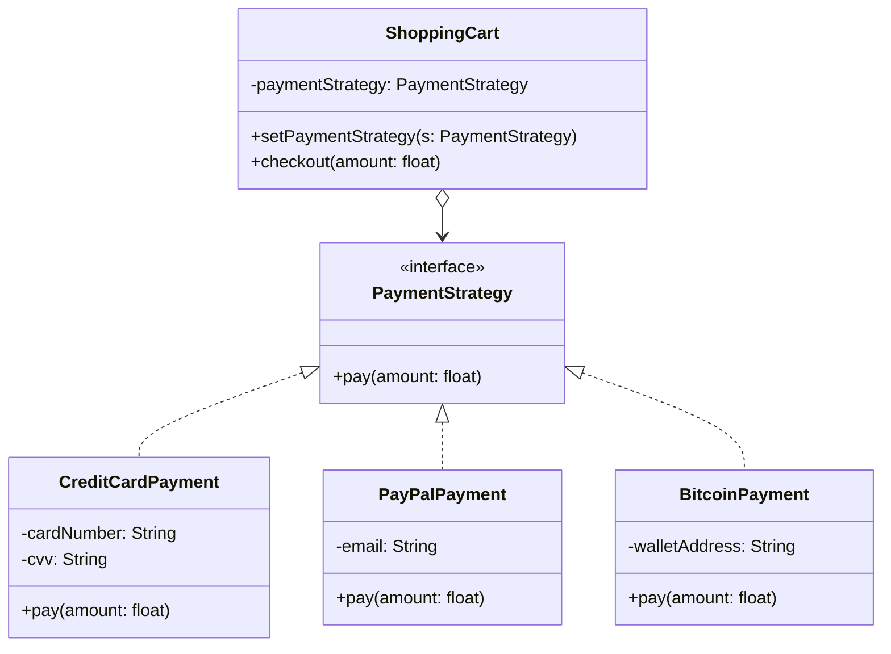
```mermaid
classDiagram
    class ShoppingCart {
        -paymentStrategy: PaymentStrategy
        +setPaymentStrategy(s: PaymentStrategy)
        +checkout(amount: float)
    }
    class PaymentStrategy {
        <<interface>>
        +pay(amount: float)
    }
    class CreditCardPayment {
        -cardNumber: String
        -cvv: String
        +pay(amount: float)
    }
    class PayPalPayment {
        -email: String
        +pay(amount: float)
    }
    class BitcoinPayment {
        -walletAddress: String
        +pay(amount: float)
    }
    ShoppingCart o--> PaymentStrategy
    PaymentStrategy <|.. CreditCardPayment
    PaymentStrategy <|.. PayPalPayment
    PaymentStrategy <|.. BitcoinPayment
```

**Code Example (Dart)**
```dart
abstract class PaymentStrategy {
  void pay(double amount);
}
class CreditCardPayment implements PaymentStrategy {
  @override
  void pay(double amount) => print('Charged \$$amount to card');
}
class PayPalPayment implements PaymentStrategy {
  @override
  void pay(double amount) => print('Sent \$$amount via PayPal');
}
class ShoppingCart {
  PaymentStrategy strategy;
  ShoppingCart(this.strategy);
  void checkout(double amount) => strategy.pay(amount);
}

void main() {
  final cart = ShoppingCart(CreditCardPayment());
  cart.checkout(99.99);            // Charged $99.99 to card
  cart.strategy = PayPalPayment();
  cart.checkout(49.99);            // Sent $49.99 via PayPal
}
```

------------------------------------------------------------------------------


## (2) Factory Method

[↑ Back to TOC](#table-of-contents)

**Types**
- Factory Method: Subclasses decide what to create.
- Abstract Factory: Create families of related objects.

*The Factory Method Pattern*
    defines an interface for creating an object, but lets subclasses decide
    which class to instantiate.
    Factory Method lets a class defer instantiation to sbclasses.

**Quick Hints**
- *Make, don't take!*
    Don't instantiate object directly- let a factory do it.
- *Encapsulate object creation*
    Hide the new keywords is on place.
- *Let subclasses decide*
    Subclasses of factories choose which class to instantiate.
- *Program to an interface, not an implementation*
    Use interfaces or abstract classes for return types.
- *Factories = Decoupling*
    Client code doesn't need to know concreate classes.
- *If you see lots of new scattered, think Factory!*

**Mnemonic**
*Don't call us, we'll call you (with the right object)!*

**Analogy**
- *Like ordering from a pizza store: you ask for a pizza, the store decides how to make it and hands you the finished product.

**UML Class Diagram**
> Real-world example: Multi-channel notification system (email, SMS, push)

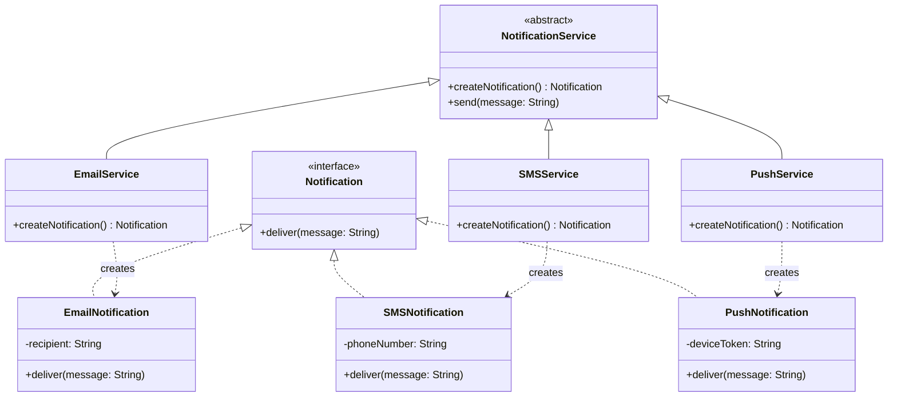
```mermaid
classDiagram
    class NotificationService {
        <<abstract>>
        +createNotification() Notification
        +send(message: String)
    }
    class EmailService {
        +createNotification() Notification
    }
    class SMSService {
        +createNotification() Notification
    }
    class PushService {
        +createNotification() Notification
    }
    class Notification {
        <<interface>>
        +deliver(message: String)
    }
    class EmailNotification {
        -recipient: String
        +deliver(message: String)
    }
    class SMSNotification {
        -phoneNumber: String
        +deliver(message: String)
    }
    class PushNotification {
        -deviceToken: String
        +deliver(message: String)
    }
    NotificationService <|-- EmailService
    NotificationService <|-- SMSService
    NotificationService <|-- PushService
    Notification <|.. EmailNotification
    Notification <|.. SMSNotification
    Notification <|.. PushNotification
    EmailService ..> EmailNotification : creates
    SMSService ..> SMSNotification : creates
    PushService ..> PushNotification : creates
```

**Code Example (Dart)**
```dart
abstract class Notification {
  void deliver(String message);
}
class EmailNotification implements Notification {
  @override
  void deliver(String msg) => print('Email: $msg');
}
abstract class NotificationService {
  Notification createNotification();
  void send(String msg) => createNotification().deliver(msg);
}
class EmailService extends NotificationService {
  @override
  Notification createNotification() => EmailNotification();
}

void main() {
  EmailService().send('Welcome!'); // Email: Welcome!
}
```

----------------------------------------------------------------------------------


## (3) Singleton

[↑ Back to TOC](#table-of-contents)

*The Singleton Pattern*
    ensures a class has only one instance, and provides a global point of accesst to it.

**Quick Hints**
- *One and only one!*
    Guarantees a signle instance for the lifetime of your app.
- *Private constructor!*
    Prevents others from creating new instances.
- *Static instance!*
    Holds the single instance in a static variable.
- *Global access!*
    Holds the single instace in a static variable.
- *Lazy or eager?*
    Create the instance when needed(lazy) or at startup(eager).
- *Thread safety matters!*
    Be carefull in muli-threaded environments.

**Mnemonic**
*There can be only one!*

**Analogy**
*Like the captain of a ship: there's only one captain and everyone knows how to reach them.*

**UML Class Diagram**
> Real-world example: Application-wide logger — one instance, accessible globally

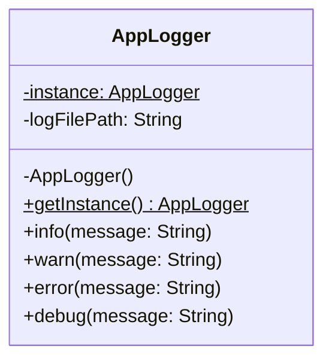
```mermaid
classDiagram
    class AppLogger {
        -instance: AppLogger$
        -logFilePath: String
        -AppLogger()
        +getInstance() AppLogger$
        +info(message: String)
        +warn(message: String)
        +error(message: String)
        +debug(message: String)
    }
```

**Code Example (Dart)**
```dart
class AppLogger {
  static AppLogger? _instance;
  AppLogger._();

  static AppLogger get instance => _instance ??= AppLogger._();

  void log(String msg) => print('[LOG] $msg');
}

void main() {
  AppLogger.instance.log('App started');
  AppLogger.instance.log('User logged in');
  print(identical(AppLogger.instance, AppLogger.instance)); // true
}
```

-----------------------------------------------------------------------------------


## (4) State

[↑ Back to TOC](#table-of-contents)

*The State Pattern*
    allow an object to alter its behaviour when its internal
    state changes. The object will appear to change its class.

**Quick Hints**
- *Encapsulate state-specific behaviour!*
    Put state-dependent code in seperate state classes.
- *Context delegated to state!*
    The context object delegates behavior to the current state object.
- *Change the state, change the behavior!*
    Swap the state object to change how to context behaves.
- *No more giant if/else or switch!*
    Replace conditional logic with polymorphism.
- *State transitions are explicit!*
    State objects can change the context's state

**Mnemonic**
*I change my mind(behavior) when my state changes!*

**Analogy**
*Like a vending machine: its behavior changes depending on weather you've inserted money, selected a product, or it's out of stock*

**UML Class Diagram**
> Real-world example: E-commerce order lifecycle (Pending → Processing → Shipped → Delivered)

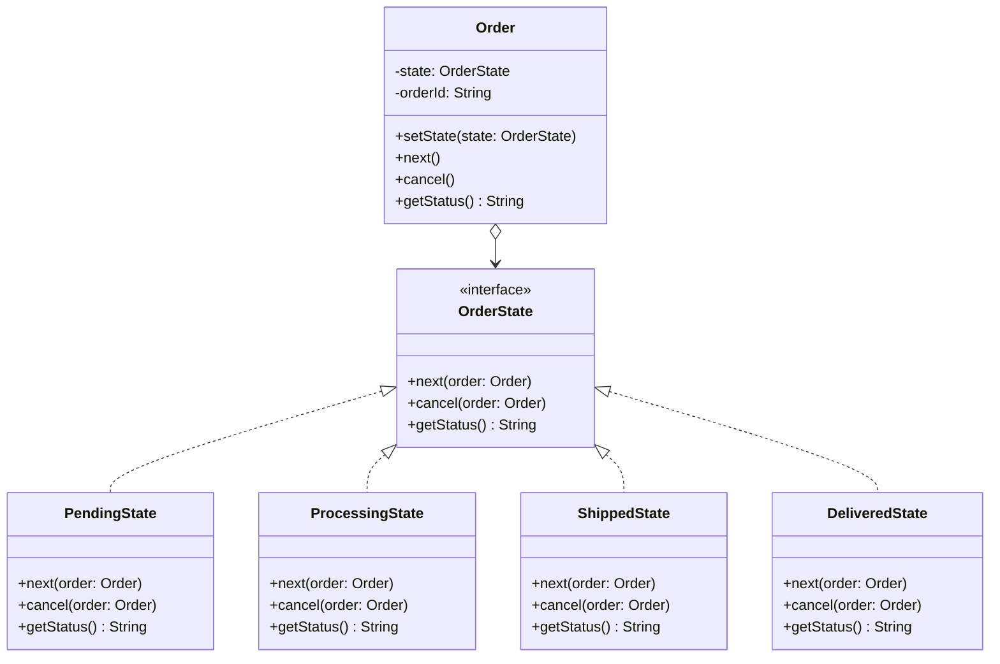
```mermaid
classDiagram
    class Order {
        -state: OrderState
        -orderId: String
        +setState(state: OrderState)
        +next()
        +cancel()
        +getStatus() String
    }
    class OrderState {
        <<interface>>
        +next(order: Order)
        +cancel(order: Order)
        +getStatus() String
    }
    class PendingState {
        +next(order: Order)
        +cancel(order: Order)
        +getStatus() String
    }
    class ProcessingState {
        +next(order: Order)
        +cancel(order: Order)
        +getStatus() String
    }
    class ShippedState {
        +next(order: Order)
        +cancel(order: Order)
        +getStatus() String
    }
    class DeliveredState {
        +next(order: Order)
        +cancel(order: Order)
        +getStatus() String
    }
    Order o--> OrderState
    OrderState <|.. PendingState
    OrderState <|.. ProcessingState
    OrderState <|.. ShippedState
    OrderState <|.. DeliveredState
```

**Code Example (Dart)**
```dart
abstract class OrderState {
  void next(Order order);
  String get status;
}
class PendingState implements OrderState {
  @override void next(Order o) => o.state = ProcessingState();
  @override String get status => 'Pending';
}
class ProcessingState implements OrderState {
  @override void next(Order o) => o.state = ShippedState();
  @override String get status => 'Processing';
}
class ShippedState implements OrderState {
  @override void next(Order o) => o.state = DeliveredState();
  @override String get status => 'Shipped';
}
class DeliveredState implements OrderState {
  @override void next(Order o) {}
  @override String get status => 'Delivered';
}
class Order {
  OrderState state = PendingState();
  void next()   => state.next(this);
  String get status => state.status;
}

void main() {
  final order = Order();
  print(order.status);          // Pending
  order.next(); print(order.status); // Processing
  order.next(); print(order.status); // Shipped
}
```

-----------------------------------------------------------------------------------


## (5) Observer

[↑ Back to TOC](#table-of-contents)

*The Observer Pattern*
    defines a one-to-many dependency between objects so that when one object changes state, all its dependents are notified and updated automatically.

**Quick Hints**
- *One-to-many relationship!*
    When one object changes, all dependents are notified.
- *Loose coupling!*
    Observers and subjects are loosely coupled.
- *Push or pull updates!*
    The subject can push updates to observers or let them pull the data.
- *Dynamic subscription!*
    Observers can subscribe or unsubscribe at runtime.
- *Encapsulate the core!*
    The subject encapsulates the core logic, while observers handle dependent behavior.

**Mnemonic**
*"I’ll let you know when I change!"*

**Analogy**
*Like a news agency: when news is published (subject), all subscribers (observers) are notified and receive the update.*

**UML Class Diagram**
> Real-world example: Stock market — brokers, alerts, and bots react to price changes

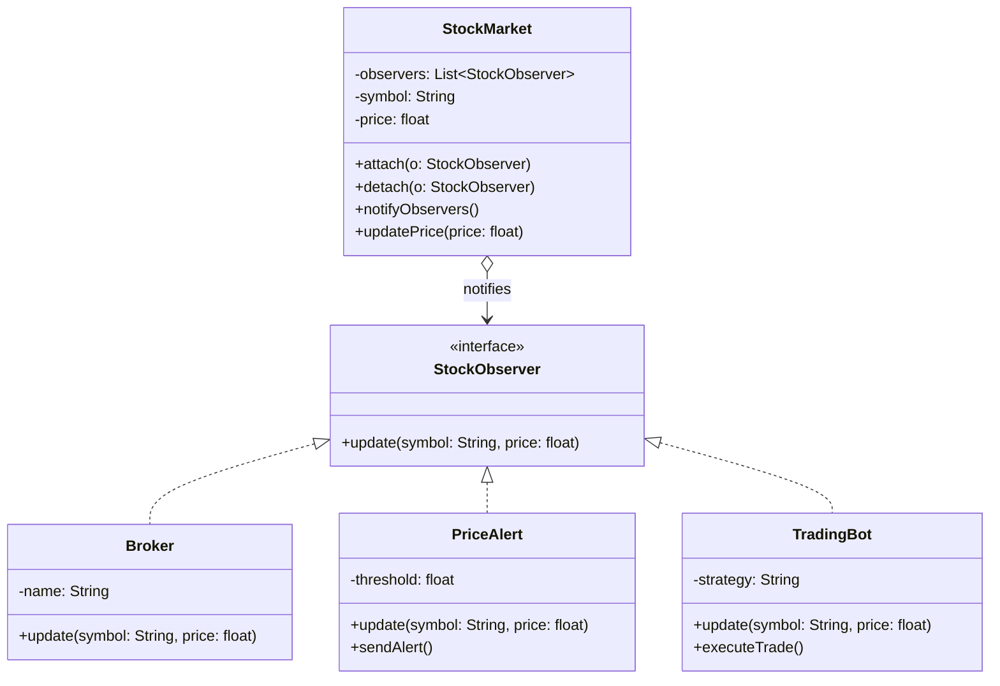
```mermaid
classDiagram
    class StockMarket {
        -observers: List~StockObserver~
        -symbol: String
        -price: float
        +attach(o: StockObserver)
        +detach(o: StockObserver)
        +notifyObservers()
        +updatePrice(price: float)
    }
    class StockObserver {
        <<interface>>
        +update(symbol: String, price: float)
    }
    class Broker {
        -name: String
        +update(symbol: String, price: float)
    }
    class PriceAlert {
        -threshold: float
        +update(symbol: String, price: float)
        +sendAlert()
    }
    class TradingBot {
        -strategy: String
        +update(symbol: String, price: float)
        +executeTrade()
    }
    StockMarket o--> StockObserver : notifies
    StockObserver <|.. Broker
    StockObserver <|.. PriceAlert
    StockObserver <|.. TradingBot
```

**Code Example (Dart)**
```dart
abstract class StockObserver {
  void update(String symbol, double price);
}
class StockMarket {
  final List<StockObserver> _observers = [];
  void attach(StockObserver o) => _observers.add(o);
  void detach(StockObserver o) => _observers.remove(o);
  void updatePrice(String symbol, double price) {
    for (final o in _observers) o.update(symbol, price);
  }
}
class Broker implements StockObserver {
  final String name;
  Broker(this.name);
  @override
  void update(String s, double p) => print('$name: $s = \$$p');
}

void main() {
  final market = StockMarket();
  market.attach(Broker('Alice'));
  market.attach(Broker('Bob'));
  market.updatePrice('AAPL', 182.50);
  // Alice: AAPL = $182.5
  // Bob:   AAPL = $182.5
}
```

-----------------------------------------------------------------------------------


## (6) Decorator

[↑ Back to TOC](#table-of-contents)

*The Decorator Pattern*
    attaches additional responsibilities to an object dynamically. Decorators provide a flexible alternative to subclassing for extending functionality.

**Quick Hints**
- *Wrap to extend!*  
    Add new behavior by wrapping objects with decorators.
- *Flexible combinations!*  
    Stack multiple decorators for different combinations of features.
- *Favors composition over inheritance!*  
    Use composition to add functionality, not inheritance.
- *Same interface!*  
    Decorators and components share the same interface.
- *Transparent to client!*  
    Client code can use decorated and undecorated objects interchangeably.

**Mnemonic**
*"I’ll dress you up with new features!"*

**Analogy**
*Like adding toppings to a pizza: each topping (decorator) adds new flavor (behavior) to the base pizza (component).*

**UML Class Diagram**
> Real-world example: Coffee shop — dynamically add milk, mocha, whipped cream to any beverage

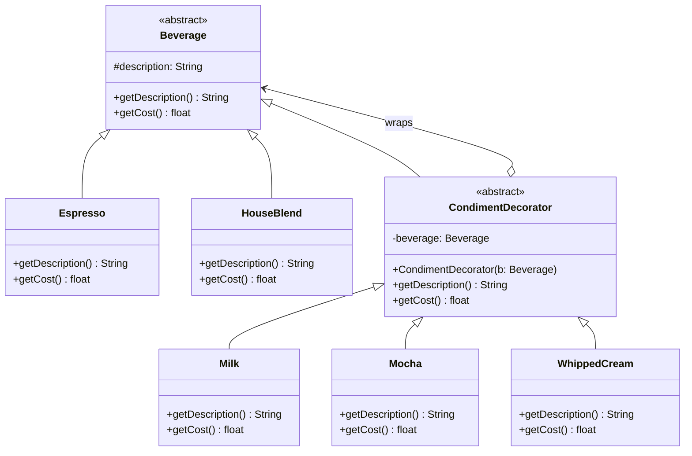
```mermaid
classDiagram
    class Beverage {
        <<abstract>>
        #description: String
        +getDescription() String
        +getCost() float
    }
    class Espresso {
        +getDescription() String
        +getCost() float
    }
    class HouseBlend {
        +getDescription() String
        +getCost() float
    }
    class CondimentDecorator {
        <<abstract>>
        -beverage: Beverage
        +CondimentDecorator(b: Beverage)
        +getDescription() String
        +getCost() float
    }
    class Milk {
        +getDescription() String
        +getCost() float
    }
    class Mocha {
        +getDescription() String
        +getCost() float
    }
    class WhippedCream {
        +getDescription() String
        +getCost() float
    }
    Beverage <|-- Espresso
    Beverage <|-- HouseBlend
    Beverage <|-- CondimentDecorator
    CondimentDecorator o--> Beverage : wraps
    CondimentDecorator <|-- Milk
    CondimentDecorator <|-- Mocha
    CondimentDecorator <|-- WhippedCream
```

**Code Example (Dart)**
```dart
abstract class Beverage {
  String get description;
  double get cost;
}
class Espresso extends Beverage {
  @override String get description => 'Espresso';
  @override double get cost => 1.99;
}
abstract class CondimentDecorator extends Beverage {
  final Beverage beverage;
  CondimentDecorator(this.beverage);
}
class Milk extends CondimentDecorator {
  Milk(super.beverage);
  @override String get description => '${beverage.description}, Milk';
  @override double get cost => beverage.cost + 0.25;
}
class Mocha extends CondimentDecorator {
  Mocha(super.beverage);
  @override String get description => '${beverage.description}, Mocha';
  @override double get cost => beverage.cost + 0.50;
}

void main() {
  Beverage coffee = Espresso();
  coffee = Mocha(coffee);
  coffee = Milk(coffee);
  print(coffee.description); // Espresso, Mocha, Milk
  print(coffee.cost);        // 2.74
}
```

-----------------------------------------------------------------------------------


## (7) Builder

[↑ Back to TOC](#table-of-contents)

*The Builder Pattern*
    separates the construction of a complex object from its representation, allowing the same construction process to create different representations.

**Quick Hints**
- *Step-by-step construction!*  
    Build objects piece by piece.
- *Different representations!*  
    Same process, different results.
- *Director controls the process!*  
    The director tells the builder what to do.
- *Encapsulate construction logic!*  
    Builder hides the details of how parts are assembled.

**Mnemonic**
*"I’ll build it your way!"*

**Analogy**
*Like ordering a custom sandwich: you choose the ingredients, the builder assembles it step by step.*

**UML Class Diagram**
> Real-world example: House construction — director drives the build, builders vary the material

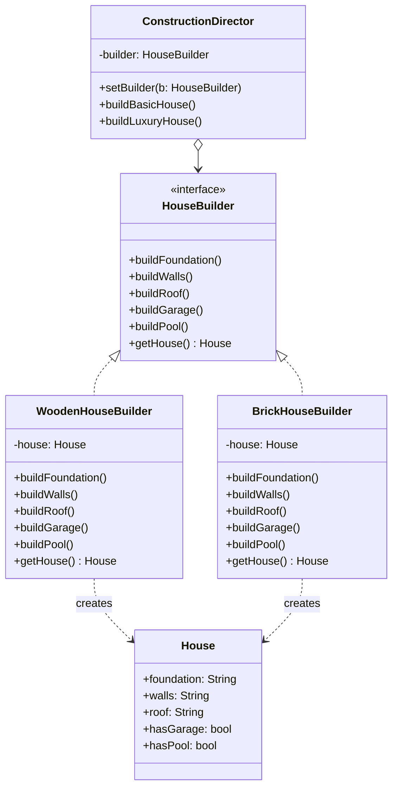
```mermaid
classDiagram
    class ConstructionDirector {
        -builder: HouseBuilder
        +setBuilder(b: HouseBuilder)
        +buildBasicHouse()
        +buildLuxuryHouse()
    }
    class HouseBuilder {
        <<interface>>
        +buildFoundation()
        +buildWalls()
        +buildRoof()
        +buildGarage()
        +buildPool()
        +getHouse() House
    }
    class WoodenHouseBuilder {
        -house: House
        +buildFoundation()
        +buildWalls()
        +buildRoof()
        +buildGarage()
        +buildPool()
        +getHouse() House
    }
    class BrickHouseBuilder {
        -house: House
        +buildFoundation()
        +buildWalls()
        +buildRoof()
        +buildGarage()
        +buildPool()
        +getHouse() House
    }
    class House {
        +foundation: String
        +walls: String
        +roof: String
        +hasGarage: bool
        +hasPool: bool
    }
    ConstructionDirector o--> HouseBuilder
    HouseBuilder <|.. WoodenHouseBuilder
    HouseBuilder <|.. BrickHouseBuilder
    WoodenHouseBuilder ..> House : creates
    BrickHouseBuilder ..> House : creates
```

**Code Example (Dart)**
```dart
class House {
  String foundation = '', walls = '';
  bool hasGarage = false;
}
abstract class HouseBuilder {
  void buildFoundation(); void buildWalls(); void buildGarage();
  House getHouse();
}
class BrickHouseBuilder implements HouseBuilder {
  final House _h = House();
  @override void buildFoundation() => _h.foundation = 'Concrete';
  @override void buildWalls()      => _h.walls = 'Brick';
  @override void buildGarage()     => _h.hasGarage = true;
  @override House getHouse()       => _h;
}
class Director {
  House build(HouseBuilder b) {
    b.buildFoundation(); b.buildWalls(); b.buildGarage();
    return b.getHouse();
  }
}

void main() {
  final house = Director().build(BrickHouseBuilder());
  print('${house.walls}, garage: ${house.hasGarage}'); // Brick, garage: true
}
```
-----------------------------------------------------------------------------------


## (8) Memento

[↑ Back to TOC](#table-of-contents)

*The Memento Pattern*
    captures and externalizes an object’s internal state without violating encapsulation, so the object can be restored to this state later.

**Quick Hints**
- *Save and restore state!*  
    Take snapshots of an object’s state.
- *Encapsulation preserved!*  
    State is stored without exposing internals.
- *Caretaker manages mementos!*  
    Caretaker keeps track of saved states.
- *Undo/redo functionality!*  
    Useful for undo operations.

**Mnemonic**
*"I’ll remember so you can go back!"*

**Analogy**
*Like a save point in a video game: you can restore to a previous state if needed.*

**UML Class Diagram**
> Real-world example: Text editor undo/redo — each save captures a snapshot of content

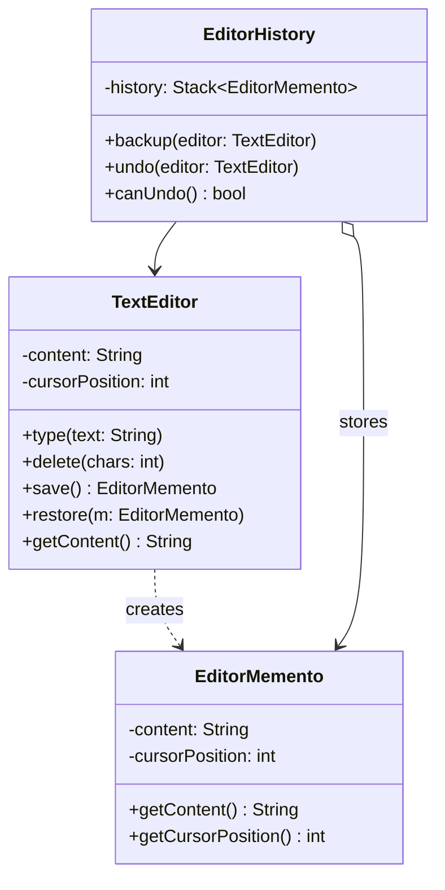
```mermaid
classDiagram
    class TextEditor {
        -content: String
        -cursorPosition: int
        +type(text: String)
        +delete(chars: int)
        +save() EditorMemento
        +restore(m: EditorMemento)
        +getContent() String
    }
    class EditorMemento {
        -content: String
        -cursorPosition: int
        +getContent() String
        +getCursorPosition() int
    }
    class EditorHistory {
        -history: Stack~EditorMemento~
        +backup(editor: TextEditor)
        +undo(editor: TextEditor)
        +canUndo() bool
    }
    TextEditor ..> EditorMemento : creates
    EditorHistory o--> EditorMemento : stores
    EditorHistory --> TextEditor
```

**Code Example (Dart)**
```dart
class EditorMemento { final String content; EditorMemento(this.content); }

class TextEditor {
  String _content = '';
  void type(String text)        => _content += text;
  EditorMemento save()          => EditorMemento(_content);
  void restore(EditorMemento m) => _content = m.content;
  String get content            => _content;
}
class EditorHistory {
  final List<EditorMemento> _stack = [];
  void backup(TextEditor e) => _stack.add(e.save());
  void undo(TextEditor e)   { if (_stack.isNotEmpty) e.restore(_stack.removeLast()); }
}

void main() {
  final editor = TextEditor(), history = EditorHistory();
  editor.type('Hello ');
  history.backup(editor);
  editor.type('World');
  print(editor.content); // Hello World
  history.undo(editor);
  print(editor.content); // Hello
}
```

-----------------------------------------------------------------------------------


## (9) Visitor

[↑ Back to TOC](#table-of-contents)

*The Visitor Pattern*
    lets you define a new operation without changing the classes of the elements on which it operates.

**Quick Hints**
- *Separate algorithm from object structure!*  
    Visitor adds new operations to existing objects.
- *Double dispatch!*  
    Visitor and element cooperate to select the right method.
- *Easy to add new operations!*  
    Add new functionality without modifying element classes.
- *Harder to add new element types!*  
    Must update visitor for new elements.

**Mnemonic**
*"I’ll visit and do something new!"*

**Analogy**
*Like a tax auditor visiting different businesses: each business lets the auditor perform a specific operation.*

**UML Class Diagram**
> Real-world example: Shopping cart — apply standard tax or holiday tax to different item types

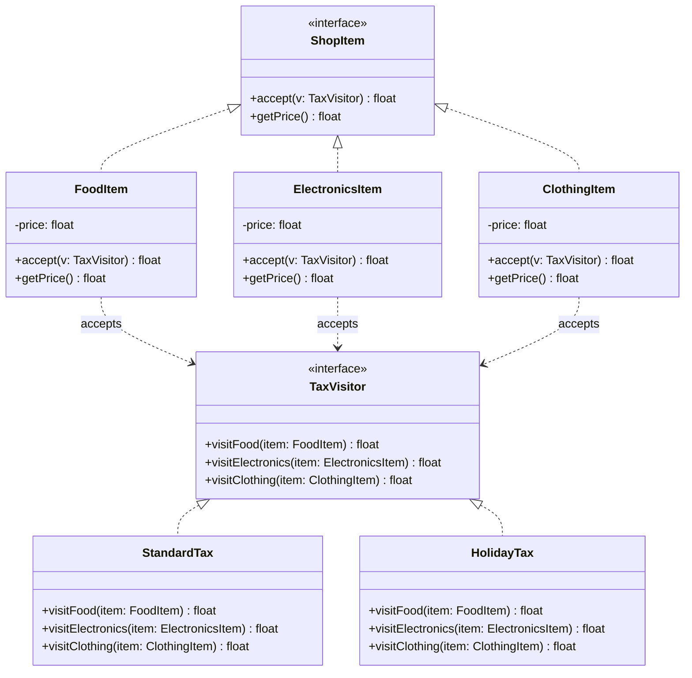
```mermaid
classDiagram
    class TaxVisitor {
        <<interface>>
        +visitFood(item: FoodItem) float
        +visitElectronics(item: ElectronicsItem) float
        +visitClothing(item: ClothingItem) float
    }
    class StandardTax {
        +visitFood(item: FoodItem) float
        +visitElectronics(item: ElectronicsItem) float
        +visitClothing(item: ClothingItem) float
    }
    class HolidayTax {
        +visitFood(item: FoodItem) float
        +visitElectronics(item: ElectronicsItem) float
        +visitClothing(item: ClothingItem) float
    }
    class ShopItem {
        <<interface>>
        +accept(v: TaxVisitor) float
        +getPrice() float
    }
    class FoodItem {
        -price: float
        +accept(v: TaxVisitor) float
        +getPrice() float
    }
    class ElectronicsItem {
        -price: float
        +accept(v: TaxVisitor) float
        +getPrice() float
    }
    class ClothingItem {
        -price: float
        +accept(v: TaxVisitor) float
        +getPrice() float
    }
    TaxVisitor <|.. StandardTax
    TaxVisitor <|.. HolidayTax
    ShopItem <|.. FoodItem
    ShopItem <|.. ElectronicsItem
    ShopItem <|.. ClothingItem
    FoodItem ..> TaxVisitor : accepts
    ElectronicsItem ..> TaxVisitor : accepts
    ClothingItem ..> TaxVisitor : accepts
```

**Code Example (Dart)**
```dart
abstract class TaxVisitor {
  double visitFood(FoodItem item);
  double visitElectronics(ElectronicsItem item);
}
class StandardTax implements TaxVisitor {
  @override double visitFood(FoodItem i)         => i.price * 0.05;
  @override double visitElectronics(ElectronicsItem i) => i.price * 0.15;
}
class FoodItem {
  final double price; FoodItem(this.price);
  double accept(TaxVisitor v) => v.visitFood(this);
}
class ElectronicsItem {
  final double price; ElectronicsItem(this.price);
  double accept(TaxVisitor v) => v.visitElectronics(this);
}

void main() {
  final tax = StandardTax();
  print(FoodItem(100).accept(tax));         // 5.0
  print(ElectronicsItem(100).accept(tax));  // 15.0
}
```

-----------------------------------------------------------------------------------

## (10) Composite

[↑ Back to TOC](#table-of-contents)


*The Composite Pattern*
    lets you compose objects into tree structures to represent part-whole hierarchies. Composite lets clients treat individual objects and compositions uniformly.

**Quick Hints**
- *Tree structure!*  
    Organize objects in a hierarchy.
- *Uniform treatment!*  
    Treat leaves and composites the same way.
- *Recursive operations!*  
    Operations apply to both individual and composite objects.
- *Simplifies client code!*  
    Client doesn’t need to distinguish between single and grouped objects.

**Mnemonic**
*"I’m made of parts, but you can treat me as one!"*

**Analogy**
*Like a folder system: folders can contain files or other folders, and you can perform actions on both.*

**UML Class Diagram**
> Real-world example: File system — files and folders treated uniformly; getSize() works on both

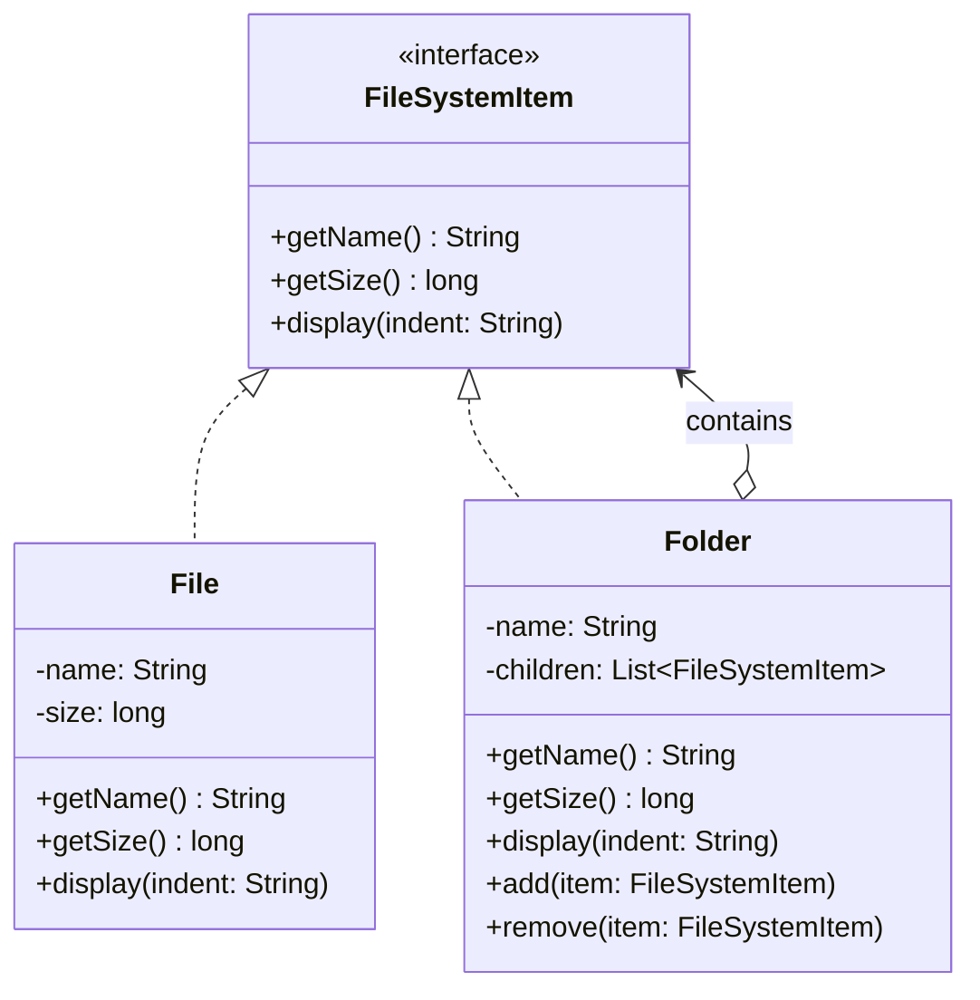
```mermaid
classDiagram
    class FileSystemItem {
        <<interface>>
        +getName() String
        +getSize() long
        +display(indent: String)
    }
    class File {
        -name: String
        -size: long
        +getName() String
        +getSize() long
        +display(indent: String)
    }
    class Folder {
        -name: String
        -children: List~FileSystemItem~
        +getName() String
        +getSize() long
        +display(indent: String)
        +add(item: FileSystemItem)
        +remove(item: FileSystemItem)
    }
    FileSystemItem <|.. File
    FileSystemItem <|.. Folder
    Folder o--> FileSystemItem : contains
```

**Code Example (Dart)**
```dart
abstract class FSItem {
  String get name; int get size;
  void display([String indent = '']);
}
class File implements FSItem {
  @override final String name; @override final int size;
  File(this.name, this.size);
  @override void display([String i = '']) => print('${i}📄 $name (${size}kb)');
}
class Folder implements FSItem {
  @override final String name;
  final List<FSItem> _children = [];
  Folder(this.name);
  void add(FSItem item) => _children.add(item);
  @override int get size => _children.fold(0, (s, c) => s + c.size);
  @override void display([String i = '']) {
    print('${i}📁 $name');
    for (final c in _children) c.display('$i  ');
  }
}

void main() {
  final src = Folder('src');
  src.add(File('main.dart', 10));
  src.add(File('utils.dart', 5));
  src.display();         // 📁 src  📄 main.dart  📄 utils.dart
  print(src.size);       // 15
}
```

-----------------------------------------------------------------------------------

## (11) Iterator

[↑ Back to TOC](#table-of-contents)


*The Iterator Pattern*
    provides a way to access the elements of an aggregate object sequentially without exposing its underlying representation.

**Quick Hints**
- *Traverse collections!*  
    Access elements one at a time.
- *No need to know structure!*  
    Client doesn’t care how the collection is built.
- *Multiple traversals!*  
    Can have multiple iterators for the same collection.

**Mnemonic**
*"I’ll show you one item at a time!"*

**Analogy**
*Like flipping through a playlist: you see each song in order.*

**UML Class Diagram**
> Real-world example: Music app playlist — iterate songs without exposing internal list structure

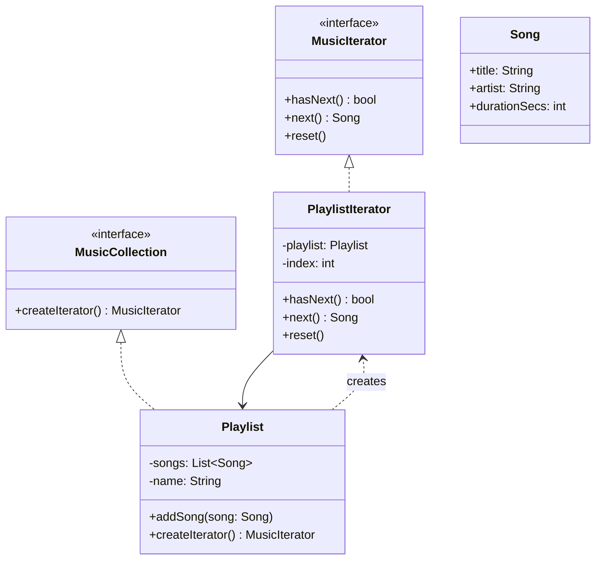
```mermaid
classDiagram
    class MusicIterator {
        <<interface>>
        +hasNext() bool
        +next() Song
        +reset()
    }
    class MusicCollection {
        <<interface>>
        +createIterator() MusicIterator
    }
    class Song {
        +title: String
        +artist: String
        +durationSecs: int
    }
    class Playlist {
        -songs: List~Song~
        -name: String
        +addSong(song: Song)
        +createIterator() MusicIterator
    }
    class PlaylistIterator {
        -playlist: Playlist
        -index: int
        +hasNext() bool
        +next() Song
        +reset()
    }
    MusicIterator <|.. PlaylistIterator
    MusicCollection <|.. Playlist
    Playlist ..> PlaylistIterator : creates
    PlaylistIterator --> Playlist
```

**Code Example (Dart)**
```dart
class Song { final String title, artist; Song(this.title, this.artist); }

class PlaylistIterator {
  final List<Song> _songs; int _index = 0;
  PlaylistIterator(this._songs);
  bool get hasNext => _index < _songs.length;
  Song next() => _songs[_index++];
  void reset() => _index = 0;
}
class Playlist {
  final List<Song> _songs = [];
  void add(Song s) => _songs.add(s);
  PlaylistIterator createIterator() => PlaylistIterator(_songs);
}

void main() {
  final pl = Playlist();
  pl.add(Song('Bohemian Rhapsody', 'Queen'));
  pl.add(Song('Hotel California', 'Eagles'));
  final it = pl.createIterator();
  while (it.hasNext) {
    final s = it.next();
    print('${s.title} - ${s.artist}');
  }
}
```

-----------------------------------------------------------------------------------


## (12) Proxy

[↑ Back to TOC](#table-of-contents)

*The Proxy Pattern*
    provides a surrogate or placeholder for another object to control access to it.

**Quick Hints**
- *Control access!*  
    Proxy stands in for the real object.
- *Add extra logic!*  
    Proxies can add security, caching, or logging.
- *Same interface!*  
    Proxy and real subject share the same interface.

**Mnemonic**
*"Talk to my representative!"*

**Analogy**
*Like a receptionist: you interact with them instead of directly with the boss.*

**UML Class Diagram**
> Real-world example: Image gallery — proxy defers loading heavy images until they are displayed

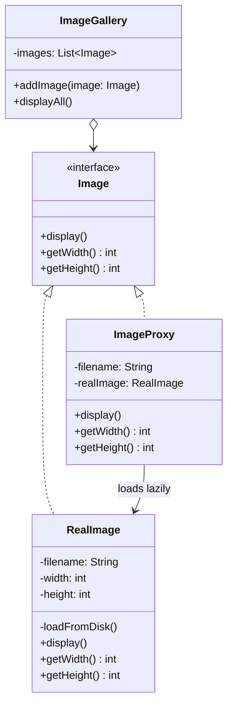
```mermaid
classDiagram
    class Image {
        <<interface>>
        +display()
        +getWidth() int
        +getHeight() int
    }
    class RealImage {
        -filename: String
        -width: int
        -height: int
        -loadFromDisk()
        +display()
        +getWidth() int
        +getHeight() int
    }
    class ImageProxy {
        -filename: String
        -realImage: RealImage
        +display()
        +getWidth() int
        +getHeight() int
    }
    class ImageGallery {
        -images: List~Image~
        +addImage(image: Image)
        +displayAll()
    }
    Image <|.. RealImage
    Image <|.. ImageProxy
    ImageProxy --> RealImage : loads lazily
    ImageGallery o--> Image
```

**Code Example (Dart)**
```dart
abstract class Image { void display(); }

class RealImage implements Image {
  final String filename;
  RealImage(this.filename) { print('Loading $filename...'); }
  @override void display() => print('Showing $filename');
}
class ImageProxy implements Image {
  final String filename;
  RealImage? _real;
  ImageProxy(this.filename);
  @override void display() {
    _real ??= RealImage(filename);
    _real!.display();
  }
}

void main() {
  final img = ImageProxy('photo.jpg'); // nothing loaded yet
  img.display(); // Loading photo.jpg...  Showing photo.jpg
  img.display(); // Showing photo.jpg  (no reload)
}
```

-----------------------------------------------------------------------------------


## (13) Facade

[↑ Back to TOC](#table-of-contents)

*The Facade Pattern*
    provides a unified interface to a set of interfaces in a subsystem, making it easier to use.

**Quick Hints**
- *Simplify complexity!*  
    Facade hides the subsystem’s complexity.
- *One-stop shop!*  
    Offers a simple interface for complex operations.
- *Decouples client from subsystem!*  
    Client interacts only with the facade.

**Mnemonic**
*"I’ll make it easy for you!"*

**Analogy**
*Like a universal remote: one remote controls many devices.*

**UML Class Diagram**
> Real-world example: Home theater — one facade call starts the TV, sound system, lights, and streaming

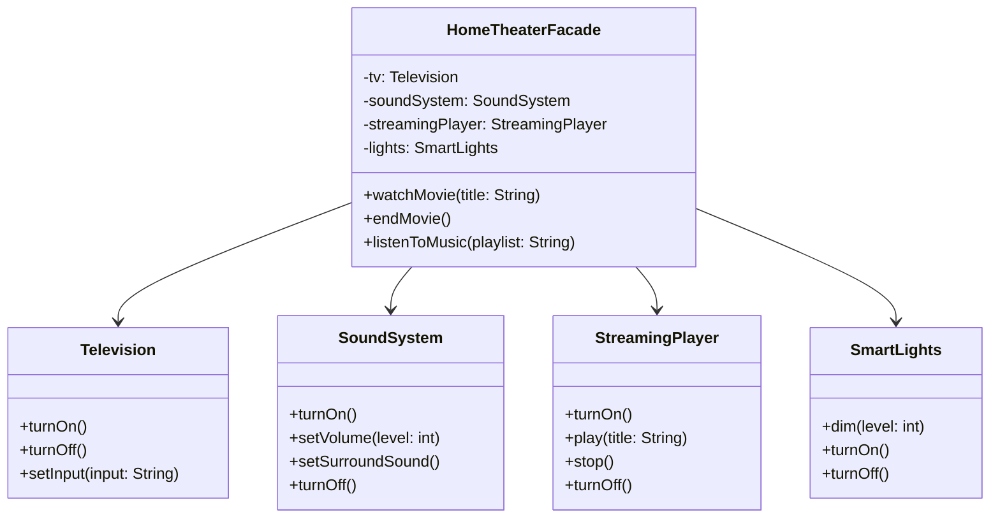
```mermaid
classDiagram
    class HomeTheaterFacade {
        -tv: Television
        -soundSystem: SoundSystem
        -streamingPlayer: StreamingPlayer
        -lights: SmartLights
        +watchMovie(title: String)
        +endMovie()
        +listenToMusic(playlist: String)
    }
    class Television {
        +turnOn()
        +turnOff()
        +setInput(input: String)
    }
    class SoundSystem {
        +turnOn()
        +setVolume(level: int)
        +setSurroundSound()
        +turnOff()
    }
    class StreamingPlayer {
        +turnOn()
        +play(title: String)
        +stop()
        +turnOff()
    }
    class SmartLights {
        +dim(level: int)
        +turnOn()
        +turnOff()
    }
    HomeTheaterFacade --> Television
    HomeTheaterFacade --> SoundSystem
    HomeTheaterFacade --> StreamingPlayer
    HomeTheaterFacade --> SmartLights
```

**Code Example (Dart)**
```dart
class TV    { void on()           => print('TV on'); }
class Sound { void surround()     => print('Surround on');
              void volume(int v)  => print('Vol: $v'); }
class Player{ void play(String t) => print('Playing: $t'); }
class Lights{ void dim(int l)     => print('Lights: $l%'); }

class HomeTheaterFacade {
  final _tv=TV(); final _s=Sound(); final _p=Player(); final _l=Lights();
  void watchMovie(String title) {
    _l.dim(20); _tv.on(); _s.surround(); _s.volume(40); _p.play(title);
  }
}

void main() {
  HomeTheaterFacade().watchMovie('Inception');
  // Lights: 20%  TV on  Surround on  Vol: 40  Playing: Inception
}
```

-----------------------------------------------------------------------------------


## (14) Command

[↑ Back to TOC](#table-of-contents)

*The Command Pattern*
    encapsulates a request as an object, thereby letting you parameterize clients with queues, requests, and operations.

**Quick Hints**
- *Encapsulate requests!*  
    Turn actions into objects.
- *Undo/redo support!*  
    Store commands for undo/redo.
- *Queue and log requests!*  
    Commands can be queued or logged.
- *Decouples sender from receiver!*  
    The invoker doesn’t know the receiver’s details.

**Mnemonic**
*"I’ll take your order and deliver it later!"*

**Analogy**
*Like a remote control: each button is a command object.*

**UML Class Diagram**
> Real-world example: Smart home remote — buttons trigger encapsulated commands, undo is supported

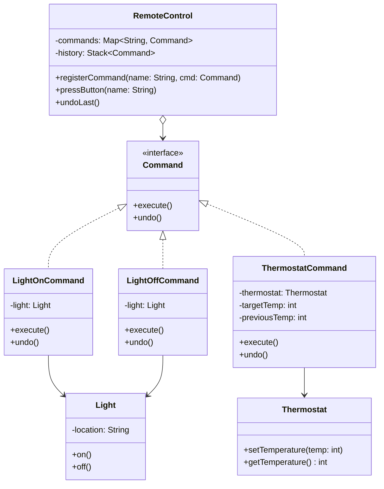
```mermaid
classDiagram
    class RemoteControl {
        -commands: Map~String, Command~
        -history: Stack~Command~
        +registerCommand(name: String, cmd: Command)
        +pressButton(name: String)
        +undoLast()
    }
    class Command {
        <<interface>>
        +execute()
        +undo()
    }
    class LightOnCommand {
        -light: Light
        +execute()
        +undo()
    }
    class LightOffCommand {
        -light: Light
        +execute()
        +undo()
    }
    class ThermostatCommand {
        -thermostat: Thermostat
        -targetTemp: int
        -previousTemp: int
        +execute()
        +undo()
    }
    class Light {
        -location: String
        +on()
        +off()
    }
    class Thermostat {
        +setTemperature(temp: int)
        +getTemperature() int
    }
    RemoteControl o--> Command
    Command <|.. LightOnCommand
    Command <|.. LightOffCommand
    Command <|.. ThermostatCommand
    LightOnCommand --> Light
    LightOffCommand --> Light
    ThermostatCommand --> Thermostat
```

**Code Example (Dart)**
```dart
abstract class Command { void execute(); void undo(); }

class Light { void on() => print('ON'); void off() => print('OFF'); }

class LightOnCommand implements Command {
  final Light _light; LightOnCommand(this._light);
  @override void execute() => _light.on();
  @override void undo()    => _light.off();
}
class RemoteControl {
  final List<Command> _history = [];
  void press(Command cmd) { cmd.execute(); _history.add(cmd); }
  void undoLast() { if (_history.isNotEmpty) _history.removeLast().undo(); }
}

void main() {
  final remote = RemoteControl();
  remote.press(LightOnCommand(Light())); // ON
  remote.undoLast();                     // OFF
}
```

-----------------------------------------------------------------------------------


## (15) Template Method

[↑ Back to TOC](#table-of-contents)

*The Template Method Pattern*
    defines the skeleton of an algorithm in a method, deferring some steps to subclasses. Template Method lets subclasses redefine certain steps of an algorithm without changing its structure.

**Quick Hints**
- *Define the steps!*  
    The base class outlines the algorithm’s steps.
- *Let subclasses fill in the details!*  
    Subclasses override specific steps.
- *No code duplication!*  
    Common code stays in the base class.
- *Control the algorithm!*  
    The template method controls the sequence.

**Mnemonic**
*"I’ll set the recipe, you add the ingredients!"*

**Analogy**
*Like a coffee machine: the process is fixed, but you can choose the type of coffee.*

**UML Class Diagram**
> Real-world example: Report generator — fixed pipeline (fetch → process → format), subclasses define each step

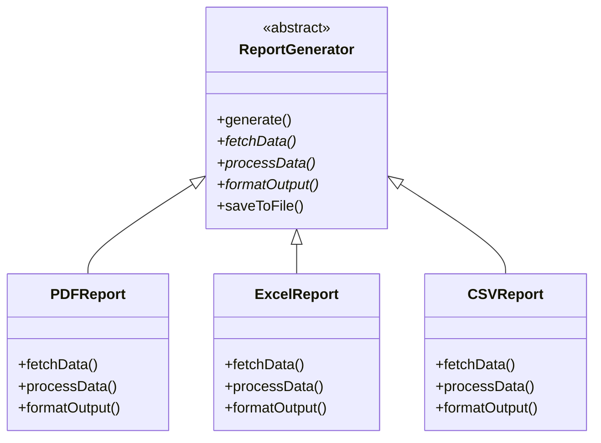
```mermaid
classDiagram
    class ReportGenerator {
        <<abstract>>
        +generate()
        +fetchData()*
        +processData()*
        +formatOutput()*
        +saveToFile()
    }
    class PDFReport {
        +fetchData()
        +processData()
        +formatOutput()
    }
    class ExcelReport {
        +fetchData()
        +processData()
        +formatOutput()
    }
    class CSVReport {
        +fetchData()
        +processData()
        +formatOutput()
    }
    ReportGenerator <|-- PDFReport
    ReportGenerator <|-- ExcelReport
    ReportGenerator <|-- CSVReport
```

**Code Example (Dart)**
```dart
abstract class ReportGenerator {
  void generate() { fetchData(); process(); formatOutput(); }
  void fetchData();
  void process();
  void formatOutput();
}
class PdfReport extends ReportGenerator {
  @override void fetchData()    => print('Fetching...');
  @override void process()      => print('Processing...');
  @override void formatOutput() => print('Exporting PDF');
}
class CsvReport extends ReportGenerator {
  @override void fetchData()    => print('Fetching...');
  @override void process()      => print('Processing...');
  @override void formatOutput() => print('Exporting CSV');
}

void main() {
  PdfReport().generate(); // Fetching...  Processing...  Exporting PDF
  CsvReport().generate(); // Fetching...  Processing...  Exporting CSV
}
```

-----------------------------------------------------------------------------------


## (16) Compound

[↑ Back to TOC](#table-of-contents)

*The Compound Pattern*
    combines two or more patterns to solve a recurring or complex design problem. Often used in frameworks and libraries to leverage the strengths of multiple patterns together.

**Quick Hints**
- *Mix and match!*  
    Use several patterns together for robust solutions.
- *Frameworks love it!*  
    Common in UI toolkits and libraries.
- *Synergy of patterns!*  
    Patterns work together to solve bigger problems.

**Mnemonic**
*"Stronger together!"*

**Analogy**
*Like a Swiss Army knife: multiple tools in one package.*

**UML Class Diagram**
> Real-world example: MVC — combines Observer (model notifies views) + Strategy (controller swaps input handling)

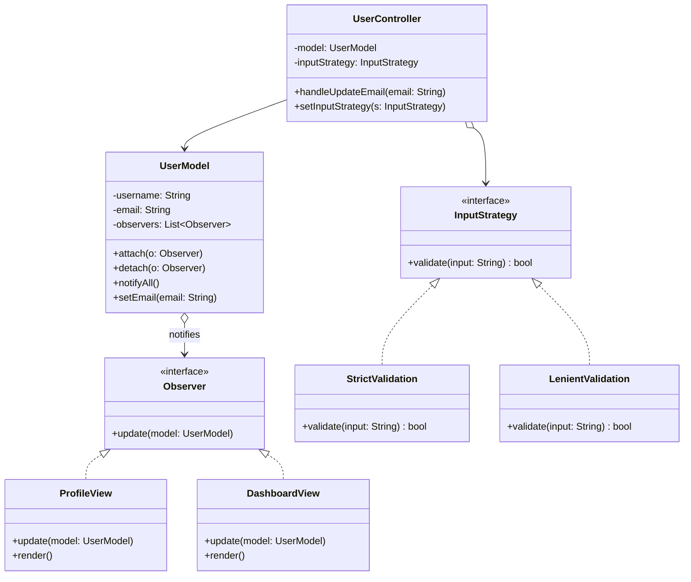
```mermaid
classDiagram
    class UserModel {
        -username: String
        -email: String
        -observers: List~Observer~
        +attach(o: Observer)
        +detach(o: Observer)
        +notifyAll()
        +setEmail(email: String)
    }
    class Observer {
        <<interface>>
        +update(model: UserModel)
    }
    class ProfileView {
        +update(model: UserModel)
        +render()
    }
    class DashboardView {
        +update(model: UserModel)
        +render()
    }
    class UserController {
        -model: UserModel
        -inputStrategy: InputStrategy
        +handleUpdateEmail(email: String)
        +setInputStrategy(s: InputStrategy)
    }
    class InputStrategy {
        <<interface>>
        +validate(input: String) bool
    }
    class StrictValidation {
        +validate(input: String) bool
    }
    class LenientValidation {
        +validate(input: String) bool
    }
    UserModel o--> Observer : notifies
    Observer <|.. ProfileView
    Observer <|.. DashboardView
    UserController --> UserModel
    UserController o--> InputStrategy
    InputStrategy <|.. StrictValidation
    InputStrategy <|.. LenientValidation
```

**Code Example (Dart)**
```dart
abstract class Observer { void update(String data); }

class UserModel {
  final List<Observer> _observers = [];
  String _email = '';
  void subscribe(Observer o) => _observers.add(o);
  void setEmail(String e) {
    _email = e;
    for (final o in _observers) o.update(e);
  }
}
class ProfileView implements Observer {
  @override void update(String e) => print('Profile: $e');
}
class DashboardView implements Observer {
  @override void update(String e) => print('Dashboard: $e');
}
class UserController {
  final UserModel _model;
  UserController(this._model);
  void updateEmail(String e) { if (e.contains('@')) _model.setEmail(e); }
}

void main() {
  final model = UserModel();
  model.subscribe(ProfileView());
  model.subscribe(DashboardView());
  UserController(model).updateEmail('ali@example.com');
  // Profile: ali@example.com
  // Dashboard: ali@example.com
}
```

-----------------------------------------------------------------------------------

## (17) Visitor

[↑ Back to TOC](#table-of-contents)

*The Visitor Pattern*
    lets you define a new operation without changing the classes of the elements on which it operates.

**Quick Hints**
- *Separate algorithm from object structure!*  
    Visitor adds new operations to existing objects.
- *Double dispatch!*  
    Visitor and element cooperate to select the right method.
- *Easy to add new operations!*  
    Add new functionality without modifying element classes.
- *Harder to add new element types!*  
    Must update visitor for new elements.

**Mnemonic**
*"I’ll visit and do something new!"*

**Analogy**
*Like a tax auditor visiting different businesses: each business lets the auditor perform a specific operation.*

**UML Class Diagram**
> Real-world example: Drawing app — shapes accept visitors for area calculation and XML export without modification

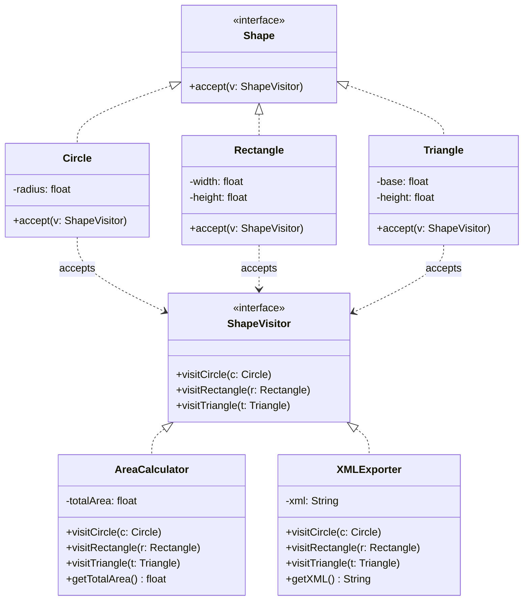
```mermaid
classDiagram
    class ShapeVisitor {
        <<interface>>
        +visitCircle(c: Circle)
        +visitRectangle(r: Rectangle)
        +visitTriangle(t: Triangle)
    }
    class AreaCalculator {
        -totalArea: float
        +visitCircle(c: Circle)
        +visitRectangle(r: Rectangle)
        +visitTriangle(t: Triangle)
        +getTotalArea() float
    }
    class XMLExporter {
        -xml: String
        +visitCircle(c: Circle)
        +visitRectangle(r: Rectangle)
        +visitTriangle(t: Triangle)
        +getXML() String
    }
    class Shape {
        <<interface>>
        +accept(v: ShapeVisitor)
    }
    class Circle {
        -radius: float
        +accept(v: ShapeVisitor)
    }
    class Rectangle {
        -width: float
        -height: float
        +accept(v: ShapeVisitor)
    }
    class Triangle {
        -base: float
        -height: float
        +accept(v: ShapeVisitor)
    }
    ShapeVisitor <|.. AreaCalculator
    ShapeVisitor <|.. XMLExporter
    Shape <|.. Circle
    Shape <|.. Rectangle
    Shape <|.. Triangle
    Circle ..> ShapeVisitor : accepts
    Rectangle ..> ShapeVisitor : accepts
    Triangle ..> ShapeVisitor : accepts
```

**Code Example (Dart)**
```dart
abstract class ShapeVisitor {
  void visitCircle(Circle c);
  void visitRectangle(Rectangle r);
}
class AreaCalculator implements ShapeVisitor {
  @override void visitCircle(Circle c) =>
      print('Circle area: ${(3.14159 * c.radius * c.radius).toStringAsFixed(2)}');
  @override void visitRectangle(Rectangle r) =>
      print('Rect area: ${r.width * r.height}');
}
abstract class Shape { void accept(ShapeVisitor v); }
class Circle implements Shape {
  final double radius; Circle(this.radius);
  @override void accept(ShapeVisitor v) => v.visitCircle(this);
}
class Rectangle implements Shape {
  final double width, height; Rectangle(this.width, this.height);
  @override void accept(ShapeVisitor v) => v.visitRectangle(this);
}

void main() {
  final calc = AreaCalculator();
  Circle(5).accept(calc);         // Circle area: 78.54
  Rectangle(4, 6).accept(calc);  // Rect area: 24.0
}
```

-----------------------------------------------------------------------------------


## (18) Null Object

[↑ Back to TOC](#table-of-contents)

*The Null Object Pattern*
    provides an object as a surrogate for the lack of an object of a given type. The null object implements the expected interface but does nothing.

**Quick Hints**
- *Avoid null checks!*  
    Use a do-nothing object instead of null.
- *Same interface!*  
    Null object implements the same interface as real objects.
- *Safe defaults!*  
    Prevents null pointer exceptions.

**Mnemonic**
*"I’m here, but I do nothing!"*

**Analogy**
*Like a silent partner: present, but never participates.*

**UML Class Diagram**
> Real-world example: Logging — NullLogger eliminates null checks throughout the codebase

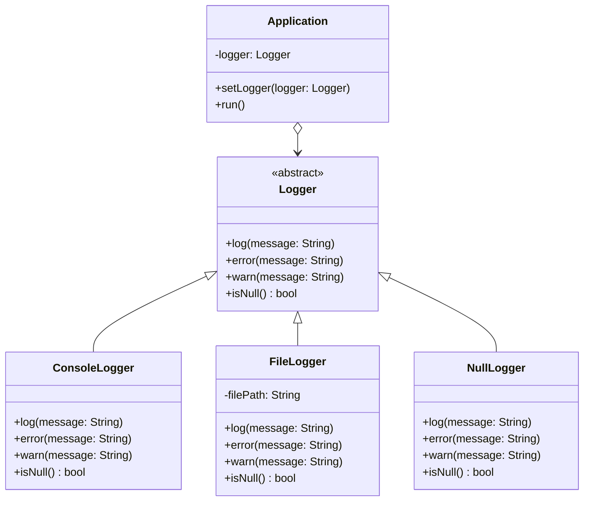
```mermaid
classDiagram
    class Logger {
        <<abstract>>
        +log(message: String)
        +error(message: String)
        +warn(message: String)
        +isNull() bool
    }
    class ConsoleLogger {
        +log(message: String)
        +error(message: String)
        +warn(message: String)
        +isNull() bool
    }
    class FileLogger {
        -filePath: String
        +log(message: String)
        +error(message: String)
        +warn(message: String)
        +isNull() bool
    }
    class NullLogger {
        +log(message: String)
        +error(message: String)
        +warn(message: String)
        +isNull() bool
    }
    class Application {
        -logger: Logger
        +setLogger(logger: Logger)
        +run()
    }
    Logger <|-- ConsoleLogger
    Logger <|-- FileLogger
    Logger <|-- NullLogger
    Application o--> Logger
```

**Code Example (Dart)**
```dart
abstract class Logger { void log(String msg); bool get isNull; }

class ConsoleLogger implements Logger {
  @override void log(String msg) => print('[LOG] $msg');
  @override bool get isNull => false;
}
class NullLogger implements Logger {
  @override void log(String msg) {} // silent
  @override bool get isNull => true;
}
class App {
  final Logger logger;
  App({Logger? logger}) : logger = logger ?? NullLogger();
  void run() => logger.log('Running');
}

void main() {
  App().run();                        // (silent)
  App(logger: ConsoleLogger()).run(); // [LOG] Running
}
```

-----------------------------------------------------------------------------------


## (19) Chain of Responsibility

[↑ Back to TOC](#table-of-contents)

*The Chain of Responsibility Pattern*
    lets you pass requests along a chain of handlers. Each handler decides either to process the request or to pass it to the next handler in the chain.

**Quick Hints**
- *Decouple sender and receiver!*  
    Sender doesn’t know which handler will process the request.
- *Flexible chains!*  
    Handlers can be added, removed, or reordered.
- *Each handler gets a chance!*  
    Each handler can process or pass the request.

**Mnemonic**
*"Pass it along until someone handles it!"*

**Analogy**
*Like customer service escalation: your request moves up the chain until someone resolves it.*

**UML Class Diagram**
> Real-world example: ATM cash dispenser — request passes through handlers for each bill denomination

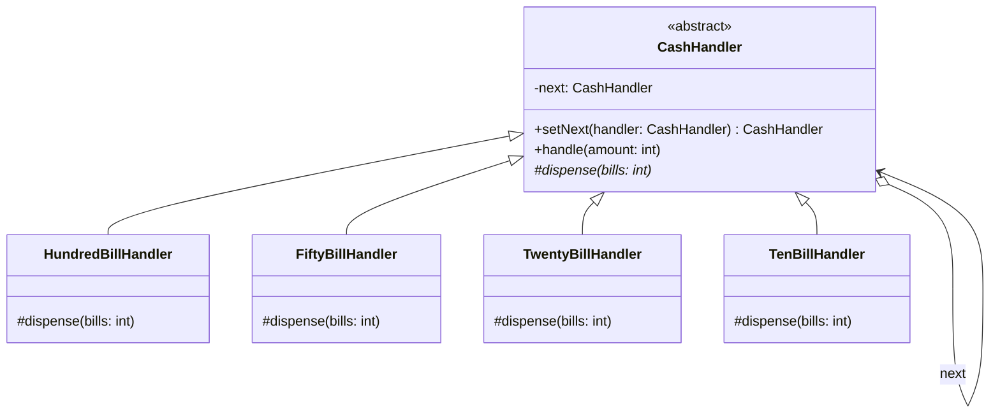
```mermaid
classDiagram
    class CashHandler {
        <<abstract>>
        -next: CashHandler
        +setNext(handler: CashHandler) CashHandler
        +handle(amount: int)
        #dispense(bills: int)*
    }
    class HundredBillHandler {
        #dispense(bills: int)
    }
    class FiftyBillHandler {
        #dispense(bills: int)
    }
    class TwentyBillHandler {
        #dispense(bills: int)
    }
    class TenBillHandler {
        #dispense(bills: int)
    }
    CashHandler <|-- HundredBillHandler
    CashHandler <|-- FiftyBillHandler
    CashHandler <|-- TwentyBillHandler
    CashHandler <|-- TenBillHandler
    CashHandler o--> CashHandler : next
```

**Code Example (Dart)**
```dart
abstract class CashHandler {
  CashHandler? _next;
  CashHandler setNext(CashHandler h) { _next = h; return h; }
  void handle(int amount) {
    final bills = amount ~/ denomination;
    if (bills > 0) print('\$$denomination x$bills');
    _next?.handle(amount % denomination);
  }
  int get denomination;
}
class HundredsHandler extends CashHandler { @override int get denomination => 100; }
class FiftiesHandler  extends CashHandler { @override int get denomination => 50;  }
class TwentiesHandler extends CashHandler { @override int get denomination => 20;  }

void main() {
  final atm = HundredsHandler();
  atm.setNext(FiftiesHandler()).setNext(TwentiesHandler());
  atm.handle(270); // $100 x2  $50 x1  $20 x1
}
```

-----------------------------------------------------------------------------------


## (20) Prototype

[↑ Back to TOC](#table-of-contents)


*The Prototype Pattern*
    specifies the kinds of objects to create using a prototypical instance, and creates new objects by copying this prototype.

**Quick Hints**
- *Clone, don’t build!*  
    Create new objects by copying (cloning) an existing object.
- *Avoids subclassing for new objects!*  
    No need to write code to create each new object from scratch.
- *Add or remove objects at runtime!*  
    New prototypes can be registered and cloned as needed.
- *Reduces the need for subclasses!*  
    Use prototypes instead of subclassing for slight variations.
- *Deep vs. shallow copy!*  
    Decide if you need a deep or shallow clone.

**Mnemonic**
*"Copy me!"*

**Analogy**
*Like making a key copy: you use an existing key (the prototype) to create a new one, rather than forging a new key from scratch.*

**UML Class Diagram**
> Real-world example: Game character spawning — clone pre-configured prototypes instead of rebuilding from scratch

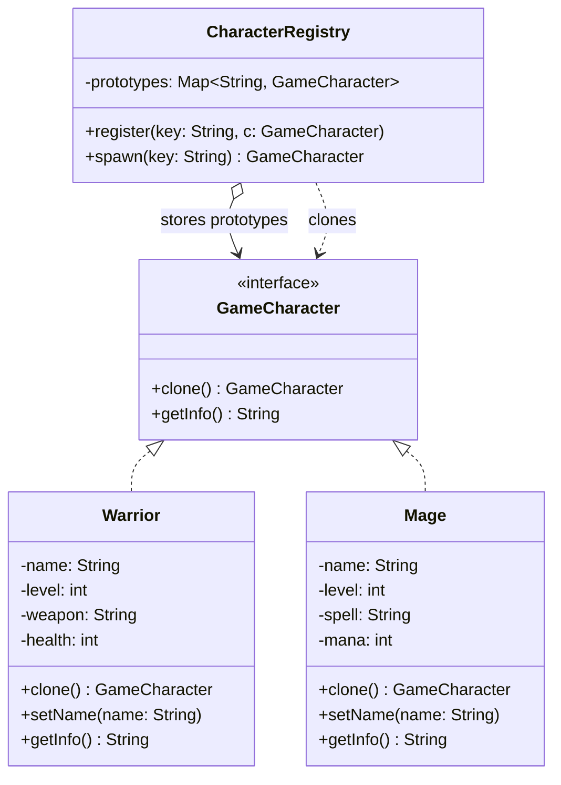
```mermaid
classDiagram
    class GameCharacter {
        <<interface>>
        +clone() GameCharacter
        +getInfo() String
    }
    class Warrior {
        -name: String
        -level: int
        -weapon: String
        -health: int
        +clone() GameCharacter
        +setName(name: String)
        +getInfo() String
    }
    class Mage {
        -name: String
        -level: int
        -spell: String
        -mana: int
        +clone() GameCharacter
        +setName(name: String)
        +getInfo() String
    }
    class CharacterRegistry {
        -prototypes: Map~String, GameCharacter~
        +register(key: String, c: GameCharacter)
        +spawn(key: String) GameCharacter
    }
    GameCharacter <|.. Warrior
    GameCharacter <|.. Mage
    CharacterRegistry o--> GameCharacter : stores prototypes
    CharacterRegistry ..> GameCharacter : clones
```

**Code Example (Dart)**
```dart
abstract class GameCharacter {
  GameCharacter clone();
  String get info;
}
class Warrior implements GameCharacter {
  String name; int level; String weapon;
  Warrior(this.name, this.level, this.weapon);
  @override Warrior clone() => Warrior(name, level, weapon);
  @override String get info => '$name (Lv$level) \u2014 $weapon';
}

void main() {
  final template = Warrior('template', 10, 'Sword');
  final alice = template.clone()..name = 'Alice';
  final bob   = template.clone()..name = 'Bob';
  print(alice.info); // Alice (Lv10) \u2014 Sword
  print(bob.info);   // Bob (Lv10) \u2014 Sword
}
```

-----------------------------------------------------------------------------------


## (21) Bridge

[↑ Back to TOC](#table-of-contents)

*The Bridge Pattern*
    decouples an abstraction from its implementation so that the two can vary independently.

**Quick Hints**
- *Separate abstraction from implementation!*  
    Both can change without affecting each other.
- *Use composition, not inheritance!*  
    Abstraction holds a reference to the implementor.
- *Extend independently!*  
    Add new abstractions and implementations freely.

**Mnemonic**
*"I’ll connect you without tying you down!"*

**Analogy**
*Like a TV remote: the remote (abstraction) works with different brands of TVs (implementations) without changing the remote.*

**UML Class Diagram**
> Real-world example: Remote control + devices — add new remotes or device brands independently

```mermaid
classDiagram
    class RemoteControl {
        #device: Device
        +RemoteControl(device: Device)
        +togglePower()
        +volumeUp()
        +volumeDown()
    }
    class AdvancedRemoteControl {
        +mute()
        +setChannel(num: int)
    }
    class Device {
        <<interface>>
        +isEnabled() bool
        +enable()
        +disable()
        +getVolume() int
        +setVolume(v: int)
        +getChannel() int
        +setChannel(c: int)
    }
    class TV {
        -on: bool
        -volume: int
        -channel: int
        +isEnabled() bool
        +enable()
        +disable()
        +getVolume() int
        +setVolume(v: int)
        +getChannel() int
        +setChannel(c: int)
    }
    class Radio {
        -on: bool
        -volume: int
        -frequency: int
        +isEnabled() bool
        +enable()
        +disable()
        +getVolume() int
        +setVolume(v: int)
        +getChannel() int
        +setChannel(c: int)
    }
    RemoteControl <|-- AdvancedRemoteControl
    RemoteControl o--> Device
    Device <|.. TV
    Device <|.. Radio
```

**Code Example (Dart)**
```dart
abstract class Device {
  void enable(); void disable();
  int get volume; set volume(int v);
}
class TV implements Device {
  int _volume = 30;
  @override void enable()  => print('TV on');
  @override void disable() => print('TV off');
  @override int get volume => _volume;
  @override set volume(int v) { _volume = v; print('TV vol: $v'); }
}
class Radio implements Device {
  int _volume = 20;
  @override void enable()  => print('Radio on');
  @override void disable() => print('Radio off');
  @override int get volume => _volume;
  @override set volume(int v) { _volume = v; print('Radio vol: $v'); }
}
class RemoteControl {
  final Device device;
  RemoteControl(this.device);
  void togglePower(bool on) => on ? device.enable() : device.disable();
  void volumeUp() => device.volume = device.volume + 10;
}

void main() {
  RemoteControl(TV()).togglePower(true);    // TV on
  RemoteControl(Radio()).togglePower(true); // Radio on
}
```

-----------------------------------------------------------------------------------


## (22) Flyweight

[↑ Back to TOC](#table-of-contents)

*The Flyweight Pattern*
    uses sharing to support large numbers of fine-grained objects efficiently.

**Quick Hints**
- *Share common state!*  
    Store shared data externally to reduce memory usage.
- *Separate intrinsic and extrinsic state!*  
    Intrinsic is shared, extrinsic is unique per object.
- *Great for lots of similar objects!*  
    Useful in graphics, text editors, etc.

**Mnemonic**
*"I’m small and shared!"*

**Analogy**
*Like chess pieces: many pieces share the same type, only position is unique.*

**UML Class Diagram**
> Real-world example: Game map tiles — thousands of tiles share appearance data; only position is unique per tile

```mermaid
classDiagram
    class TileAppearance {
        -texture: String
        -color: String
        -isPassable: bool
        +render(x: int, y: int)
    }
    class TileFactory {
        -cache: Map~String, TileAppearance~
        +getTile(type: String) TileAppearance
        +getCachedCount() int
    }
    class MapTile {
        -x: int
        -y: int
        -appearance: TileAppearance
        +draw()
        +isWalkable() bool
    }
    class GameMap {
        -tiles: MapTile[]
        +loadMap(data: String[][])
        +render()
    }
    TileFactory o--> TileAppearance : caches shared state
    MapTile --> TileAppearance : uses shared state
    GameMap o--> MapTile
    GameMap --> TileFactory
```

**Code Example (Dart)**
```dart
class TileAppearance {
  final String texture; final bool passable;
  TileAppearance(this.texture, this.passable);
  void render(int x, int y) => print('$texture @ ($x,$y)');
}
class TileFactory {
  final Map<String, TileAppearance> _cache = {};
  TileAppearance getTile(String type) =>
      _cache.putIfAbsent(type, () => TileAppearance(type, type != 'wall'));
  int get cachedCount => _cache.length;
}

void main() {
  final factory = TileFactory();
  [['grass','grass','wall'],['grass','wall','grass']].expand((r)=>r).forEach(factory.getTile);
  print('Unique objects: ${factory.cachedCount}'); // 2
  print(identical(factory.getTile('grass'), factory.getTile('grass'))); // true
}
```

-----------------------------------------------------------------------------------


## (23) Interpreter

[↑ Back to TOC](#table-of-contents)

*The Interpreter Pattern*
    defines a representation for a language’s grammar along with an interpreter that uses the representation to interpret sentences in the language.

**Quick Hints**
- *Grammar and interpretation!*  
    Represent grammar rules as classes.
- *Parse and evaluate!*  
    Interpreter parses and evaluates sentences.
- *Easy to extend!*  
    Add new grammar rules by adding new classes.

**Mnemonic**
*"I’ll translate your language!"*

**Analogy**
*Like a calculator: interprets and evaluates mathematical expressions.*

**UML Class Diagram**
> Real-world example: Math expression parser — builds and evaluates expression trees like (3 + 5) * 2

```mermaid
classDiagram
    class Expression {
        <<interface>>
        +interpret() int
    }
    class NumberExpression {
        -value: int
        +interpret() int
    }
    class AddExpression {
        -left: Expression
        -right: Expression
        +interpret() int
    }
    class SubtractExpression {
        -left: Expression
        -right: Expression
        +interpret() int
    }
    class MultiplyExpression {
        -left: Expression
        -right: Expression
        +interpret() int
    }
    class ExpressionParser {
        +parse(expression: String) Expression
    }
    Expression <|.. NumberExpression
    Expression <|.. AddExpression
    Expression <|.. SubtractExpression
    Expression <|.. MultiplyExpression
    AddExpression o--> Expression : left/right
    SubtractExpression o--> Expression : left/right
    MultiplyExpression o--> Expression : left/right
    ExpressionParser ..> Expression : creates
```

**Code Example (Dart)**
```dart
abstract class Expression { int interpret(); }

class Num implements Expression {
  final int value; Num(this.value);
  @override int interpret() => value;
}
class Add implements Expression {
  final Expression left, right; Add(this.left, this.right);
  @override int interpret() => left.interpret() + right.interpret();
}
class Multiply implements Expression {
  final Expression left, right; Multiply(this.left, this.right);
  @override int interpret() => left.interpret() * right.interpret();
}

// (3 + 5) * 2
void main() {
  final expr = Multiply(Add(Num(3), Num(5)), Num(2));
  print(expr.interpret()); // 16
}
```

-----------------------------------------------------------------------------------


## (24) Mediator

[↑ Back to TOC](#table-of-contents)

*The Mediator Pattern*
    defines an object that encapsulates how a set of objects interact, promoting loose coupling by keeping objects from referring to each other explicitly.

**Quick Hints**
- *Centralize communication!*  
    Mediator handles interactions between objects.
- *Loose coupling!*  
    Objects communicate through the mediator, not directly.
- *Simplifies object relationships!*  
    Reduces dependencies between objects.

**Mnemonic**
*"I’ll coordinate everyone’s conversation!"*

**Analogy**
*Like an air traffic controller: coordinates planes so they don’t talk to each other directly.*
**UML Class Diagram**
> Real-world example: Chat room — users never message each other directly; the room mediates all communication

```mermaid
classDiagram
    class ChatMediator {
        <<interface>>
        +sendMessage(msg: String, sender: User)
        +addUser(user: User)
    }
    class ChatRoom {
        -users: List~User~
        +sendMessage(msg: String, sender: User)
        +addUser(user: User)
    }
    class User {
        #mediator: ChatMediator
        #name: String
        +User(mediator: ChatMediator, name: String)
        +send(message: String)
        +receive(message: String, from: String)
    }
    class RegularUser {
        +send(message: String)
        +receive(message: String, from: String)
    }
    class AdminUser {
        +send(message: String)
        +receive(message: String, from: String)
        +broadcast(message: String)
    }
    ChatMediator <|.. ChatRoom
    User <|-- RegularUser
    User <|-- AdminUser
    User o--> ChatMediator
    ChatRoom o--> User
```

**Code Example (Dart)**
```dart
abstract class ChatMediator { void send(String msg, User sender); }

class ChatRoom implements ChatMediator {
  final List<User> _users = [];
  void addUser(User u) => _users.add(u);
  @override void send(String msg, User sender) {
    for (final u in _users) if (u != sender) u.receive(msg, sender.name);
  }
}
class User {
  final String name; final ChatMediator room;
  User(this.name, this.room);
  void send(String msg) => room.send(msg, this);
  void receive(String msg, String from) => print('$name ← [$from]: $msg');
}

void main() {
  final room = ChatRoom();
  final alice = User('Alice', room), bob = User('Bob', room);
  room.addUser(alice); room.addUser(bob);
  alice.send('Hi Bob!'); // Bob ← [Alice]: Hi Bob!
}
```

-----------------------------------------------------------------------------------


## (25) Adapter

[↑ Back to TOC](#table-of-contents)

*The Adapter Pattern*
    allows objects with incompatible interfaces to work together. Adapter wraps an existing class with a new interface.

**Quick Hints**
- *Convert the interface!*  
    Adapter makes one interface look like another.
- *Wrap and delegate!*  
    Adapter wraps the adaptee and delegates calls.
- *Client sees only the target interface!*  
    The client uses the adapter, not the adaptee directly.
- *Two main types:*  
    Object Adapter (uses composition), Class Adapter (uses inheritance).
- *Use when you can’t change the existing code!*  
    Adapter lets you reuse code without modifying it.

**Mnemonic**
*"I’ll translate for you!"*

**Analogy**
*Like a power plug adapter: lets your device (client) use a foreign socket (adaptee) by converting the interface.*

**UML Class Diagram**
> Real-world example: Payment gateway integration — adapt Stripe and PayPal SDKs to a unified interface

```mermaid
classDiagram
    class PaymentProcessor {
        <<interface>>
        +processPayment(amount: float, currency: String) bool
        +refund(transactionId: String) bool
    }
    class StripeAdapter {
        -stripe: StripeClient
        +processPayment(amount: float, currency: String) bool
        +refund(transactionId: String) bool
    }
    class StripeClient {
        +charge(cents: int, currency: String) Response
        +reverse(chargeId: String) Response
    }
    class PayPalAdapter {
        -paypal: PayPalSDK
        +processPayment(amount: float, currency: String) bool
        +refund(transactionId: String) bool
    }
    class PayPalSDK {
        +executePayment(usd: float) Result
        +voidTransaction(id: String) Result
    }
    class CheckoutService {
        -processor: PaymentProcessor
        +setProcessor(p: PaymentProcessor)
        +completeOrder(amount: float)
    }
    PaymentProcessor <|.. StripeAdapter
    PaymentProcessor <|.. PayPalAdapter
    StripeAdapter --> StripeClient : delegates
    PayPalAdapter --> PayPalSDK : delegates
    CheckoutService o--> PaymentProcessor
```

**Code Example (Dart)**
```dart
abstract class PaymentProcessor {
  bool processPayment(double amount, String currency);
}
// Legacy Stripe SDK (incompatible interface)
class StripeClient {
  bool charge(int cents, String curr) {
    print('Stripe: ${cents}c ($curr)'); return true;
  }
}
// Adapter
class StripeAdapter implements PaymentProcessor {
  final StripeClient _stripe = StripeClient();
  @override
  bool processPayment(double amount, String currency) =>
      _stripe.charge((amount * 100).toInt(), currency);
}

void main() {
  final PaymentProcessor processor = StripeAdapter();
  processor.processPayment(49.99, 'USD'); // Stripe: 4999c (USD)
}
```


Singleton: Ensures a single instance of a class.
Factory: Provides an interface for object creation, letting subclasses decide the class to instantiate.
Builder: Separates complex object construction from its representation.
Abstract Factory: Creates families of related objects. 

Facade: Simplifies a complex system interface.
Decorator: Adds behaviors dynamically by wrapping an object.
Adapter: Allows incompatible interfaces to work together.
Proxy: Provides a substitute for another object to control access. 

Observer: Defines a one-to-many dependency for state change notifications.
Strategy: Defines interchangeable algorithms.
Command: Encapsulates a request as an object.
Iterator: Provides sequential traversal of collection elements.
State: Allows behavior change based on internal state. 
