<a id="top"></a>

# Building Mobile Apps at Scale — বাংলা রিক্যাপ কম্প্যানিয়ন

> **মূল বই:** *Building Mobile Apps at Scale — 39 Engineering Challenges*
> **লেখক:** Gergely Orosz (The Pragmatic Engineer)
> **এই ডকুমেন্টটি কী:** মূল বইয়ের পাশাপাশি পড়ার জন্য একটি **বাংলা রিক্যাপ ও স্টাডি কম্প্যানিয়ন**। মূল বইটি ফোকাস করে — যখন একটি mobile app-এর ব্যবহারকারী (millions), কোডবেস (large) এবং টিম (large) বড় হতে থাকে, তখন iOS ও Android engineer-রা কোন কোন কঠিন সমস্যায় পড়েন এবং industry সেগুলো সাধারণত কীভাবে সমাধান করে। এই কম্প্যানিয়ন সেই ৩৯টি চ্যালেঞ্জকে সহজ বাংলায়, নিজের ভাষায় গুছিয়ে দেয় — যাতে আপনি দ্রুত রিভিশন দিতে পারেন এবং নিজের কাছে থাকা মূল বইয়ের সাথে আবার সহজে যুক্ত হতে পারেন।
> **কাঠামো:** মূল বইয়ের মতোই — একটি ভূমিকা (Introduction), ৫টি Part, এবং ৩৯টি Engineering Challenge (অধ্যায়)।

> [!IMPORTANT]
> **এটি হুবহু অনুবাদ নয় (This is NOT a verbatim translation).**
> এই ডকুমেন্টে মূল বইয়ের কোনো বাক্য বা অনুচ্ছেদ হুবহু অনুবাদ করা হয়নি। প্রতিটি চ্যালেঞ্জের **ধারণা** আমি নিজের ভাষায়, নিজের উদাহরণ ও ডায়াগ্রাম দিয়ে ব্যাখ্যা করেছি। এর দুটি কারণ — (১) এটি **copyright-নিরাপদ**, এবং (২) নিজের ভাষায় ব্যাখ্যা পড়লে ও মেলালে বিষয়টা মাথায় ভালো গাঁথে (better recall)। তাই এটি মূল বইয়ের **বিকল্প নয়, সঙ্গী** — সম্পূর্ণ গভীরতা, লেখকের গল্প ও industry interview-এর জন্য আপনার কাছে থাকা মূল বইটিই পড়ুন।

---

## এই কম্প্যানিয়ন কীভাবে ব্যবহার করবেন

এই ডকুমেন্টটি একা পড়ার জন্য নয় — মূল বইয়ের **সঙ্গী** হিসেবে ব্যবহারের জন্য বানানো। সবচেয়ে ভালো ফল পাবেন এভাবে:

1. **আগে মূল বইয়ের চ্যালেঞ্জটি পড়ুন** → তারপর এখানকার একই চ্যালেঞ্জের রিক্যাপ পড়ুন। ধারণাগুলো গেঁথে যাবে।
2. **রিভিশনের সময়** শুধু এই ডকুমেন্ট পড়ুন। প্রতিটি অধ্যায়ের `মূল কথা` আর Diagram দেখে নিলেই পুরো চ্যালেঞ্জটা মনে পড়ে যাবে।
3. **প্রতিটি অধ্যায়ের শেষে `নিজেকে যাচাই করুন` অংশের প্রশ্নগুলোর** উত্তর মনে মনে দিন। উত্তর দিতে না পারলে — বুঝবেন ওই অংশটা আবার পড়তে হবে।
4. **Diagram-গুলো মুখস্থ করার চেষ্টা করবেন না** — বোঝার চেষ্টা করুন। একবার বুঝলে নিজেই আঁকতে পারবেন।
5. বইয়ের ভাষা ইংরেজি, তাই এখানে **Technical Term-গুলো ইংরেজিতেই** রাখা হয়েছে (Deeplink, Feature Flag, Crash, Fragmentation ইত্যাদি) — শুধু ব্যাখ্যা বাংলায়। এতে মূল বইয়ের সাথে মিল রেখে পড়তে সুবিধা হবে।

> **চিহ্নের মানে এই ডকুমেন্টে:**
> `মূল কথা` = চ্যালেঞ্জের সারমর্ম এক প্যারায় · `কেন কঠিন` = এই সমস্যাটা mobile-এ কেন বিশেষভাবে কঠিন · `সমাধান` = industry সাধারণত যা করে · `উদাহরণ` = বাস্তব দৃষ্টান্ত · `সতর্কতা` = সাধারণ ভুল · `নিজেকে যাচাই করুন` = রিভিশন প্রশ্ন।

---

## বইয়ের মানচিত্র (Book Map)

পুরো বইয়ের একটাই সুর: **mobile development নিজেই কঠিন, আর scale বাড়লে সেই কঠিন আরও কয়েক গুণ হয়।** বইয়ের ৫টি Part সাজানো হয়েছে "কী বড় হচ্ছে" — সেই অনুযায়ী: প্রথমে mobile-এর নিজস্ব প্রকৃতি, তারপর কোডবেস বড় হওয়া, তারপর টিম বড় হওয়া, তারপর একাধিক platform, এবং শেষে পরিণত (mature) টিমের উন্নত অভ্যাস।

| Part | চ্যালেঞ্জ # | কোন "স্কেল" নিয়ে | এক লাইনে মূল থিম |
|------|------------|-------------------|-------------------|
| **[Part 1](#part-1) — Mobile Is Different** | ১–১২ | Mobile-এর নিজস্ব প্রকৃতি | Web/backend-এর তুলনায় mobile কেন আলাদা ও কঠিন |
| **[Part 2](#part-2) — Large Apps** | ১৩–১৮ | বড় কোডবেস | একটি বিশাল app-কে গোছানো, modular ও testable রাখা |
| **[Part 3](#part-3) — Large Teams** | ১৯–২৪ | বড় টিম | অনেক engineer একসাথে কাজ করলে যে সমন্বয়ের সমস্যা |
| **[Part 4](#part-4) — Cross-Platform** | ২৫–২৯ | একাধিক platform | iOS+Android একসাথে — native, KMM, web, BFF |
| **[Part 5](#part-5) — Stepping Up Your Game** | ৩০–৩৯ | পরিণতি (maturity) | world-class টিমের উন্নত practice — experiment, performance, privacy |

> **মনে রাখবেন:** এটি কোনো ক্রমিক "টিউটোরিয়াল" নয় — প্রতিটি চ্যালেঞ্জ মোটামুটি স্বাধীন। আপনি যে সমস্যায় এখন পড়েছেন, সরাসরি সেই অধ্যায়ে যেতে পারেন। তবে Part 1 সবার আগে পড়লে বাকি সব চ্যালেঞ্জের প্রেক্ষাপট পরিষ্কার হয়।

---

## পড়ার পথ (Reading Paths) — আপনি কোথা থেকে শুরু করবেন?

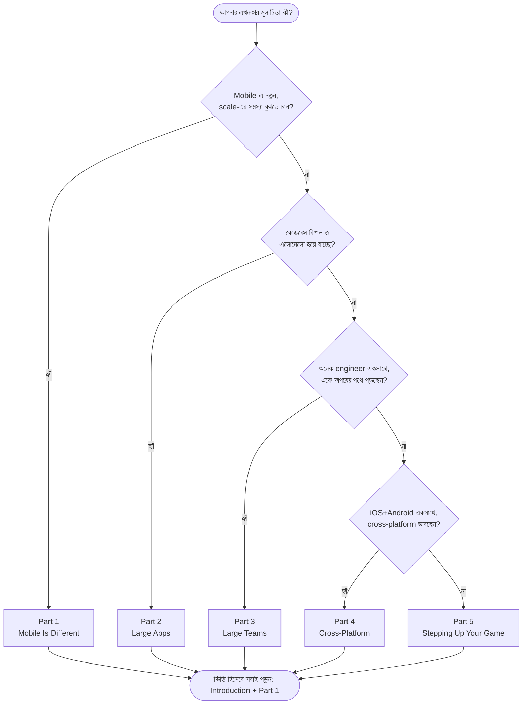

**"কী বড় হচ্ছে" — বই যেভাবে স্তরে স্তরে সাজানো:**

```
                 ┌──────────────────────────────────────────────┐
  পরিণতি     ◄──┤  Part 5: Stepping Up Your Game                 │  experiment, perf, privacy, on-call
                 └──────────────────────────────────────────────┘
                 ┌──────────────────────────────────────────────┐
  Platform   ◄──┤  Part 4: Cross-Platform                        │  native vs KMM vs web vs BFF
  সংখ্যা         └──────────────────────────────────────────────┘
                 ┌──────────────────────────────────────────────┐
  টিম        ◄──┤  Part 3: Large Teams                           │  সমন্বয়, ownership, build time
                 └──────────────────────────────────────────────┘
                 ┌──────────────────────────────────────────────┐
  কোডবেস     ◄──┤  Part 2: Large Apps                            │  navigation, modular, testing
                 └──────────────────────────────────────────────┘
                 ┌──────────────────────────────────────────────┐
  ভিত্তি     ◄──┤  Part 1: Mobile Is Different                   │  mobile কেন আলাদা ও কঠিন
                 └──────────────────────────────────────────────┘
```

> **দ্রুত প্রয়োজনভিত্তিক রুট:** নির্দিষ্ট সমস্যায় আটকে গেছেন? — *crash বেড়ে গেছে* → [Ch 6](#ch-6) · *offline দরকার* → [Ch 7](#ch-7) · *build ধীর* → [Ch 23](#ch-23) · *feature flag-এর জঞ্জাল* → [Ch 31](#ch-31) · *app size বড়* → [Ch 39](#ch-39) · *privacy/compliance* → [Ch 36](#ch-36)।

---

<a id="toc"></a>

## বিস্তারিত সূচিপত্র (Table of Contents)

<details open>
<summary><b>ভূমিকা ও কাঠামো</b></summary>

- [ভূমিকা — Mobile at Scale কেন আলাদা একটা খেলা](#intro)
- [বইয়ের মানচিত্র (Book Map)](#বইয়ের-মানচিত্র-book-map)
- [পড়ার পথ (Reading Paths)](#পড়ার-পথ-reading-paths--আপনি-কোথা-থেকে-শুরু-করবেন)

</details>

<details open>
<summary><b>Part 1 — Mobile Is Different (Mobile কেন আলাদা)</b></summary>

| # | চ্যালেঞ্জ | এই অধ্যায়ে যা বুঝবেন |
|---|-----------|------------------------|
| [১](#ch-1) | State Management | app lifecycle, process death, state restoration; কোথায় "সত্য" রাখবেন |
| [২](#ch-2) | Mistakes Are Hard to Revert | release করা binary ফেরানো যায় না; staged rollout, kill switch |
| [৩](#ch-3) | The Long Tail of Old App Versions | পুরোনো version বছরের পর বছর টিকে থাকে; backward compatibility |
| [৪](#ch-4) | Deeplinks | URI scheme, Universal/App Links, deferred deeplink, routing |
| [৫](#ch-5) | Push and Background Notifications | APNs/FCM, silent push, delivery গ্যারান্টি নেই, background limit |
| [৬](#ch-6) | App Crashes | crash reporting, symbolication, OOM/ANR, crash-free rate |
| [৭](#ch-7) | Offline Support | cache, optimistic UI, mutation queue, conflict resolution |
| [৮](#ch-8) | Accessibility | VoiceOver/TalkBack, dynamic type, contrast, semantics |
| [৯](#ch-9) | CI/CD & The Build Train | release train, regular cadence, code freeze, beta track |
| [১০](#ch-10) | Third-Party Libraries | SDK bloat, binary size, supply-chain ও abandonment ঝুঁকি |
| [১১](#ch-11) | Device and OS Fragmentation | screen/OS বৈচিত্র্য, test matrix, capability detection |
| [১২](#ch-12) | In-App Purchases | StoreKit/Billing, receipt validation, subscription, fraud |

</details>

<details open>
<summary><b>Part 2 — Large Apps (বড় কোডবেস)</b></summary>

| # | চ্যালেঞ্জ | এই অধ্যায়ে যা বুঝবেন |
|---|-----------|------------------------|
| [১৩](#ch-13) | Navigation Architecture Within Large Apps | screen-এর মধ্যে চলাচল; coordinator/router pattern |
| [১৪](#ch-14) | Application State and Event-Driven Changes | global state, unidirectional data flow, event |
| [১৫](#ch-15) | Localization | বহু ভাষা, RTL, pluralization, date/number format |
| [১৬](#ch-16) | Modular Architecture and Dependency Injection | module ভাগ, DI, build time ও ownership-এ প্রভাব |
| [১৭](#ch-17) | Automated Testing | unit/integration/UI test, flaky test, test pyramid mobile-এ |
| [১৮](#ch-18) | Manual Testing | কেন এখনো লাগে, QA, exploratory, dogfooding |

</details>

<details open>
<summary><b>Part 3 — Large Teams (বড় টিম)</b></summary>

| # | চ্যালেঞ্জ | এই অধ্যায়ে যা বুঝবেন |
|---|-----------|------------------------|
| [১৯](#ch-19) | Planning and Decision Making | technical decision, RFC, alignment, design doc |
| [২০](#ch-20) | Avoiding Stepping on Each Other's Toes | merge conflict, code ownership, modular boundary |
| [২১](#ch-21) | Shared Architecture Across Several Apps | একাধিক app-এ shared code/monorepo, consistency |
| [২২](#ch-22) | Tooling Maturity for Large Teams | internal tooling, developer experience, automation |
| [২৩](#ch-23) | Scaling Build & Merge Times | build cache, modularization, merge queue |
| [২৪](#ch-24) | Mobile Platform Libraries and Teams | platform team, paved road, library ownership |

</details>

<details open>
<summary><b>Part 4 — Cross-Platform (একাধিক platform)</b></summary>

| # | চ্যালেঞ্জ | এই অধ্যায়ে যা বুঝবেন |
|---|-----------|------------------------|
| [২৫](#ch-25) | Adopting New Languages and Frameworks | নতুন tech কখন/কীভাবে নেবেন; migration ঝুঁকি |
| [২৬](#ch-26) | Kotlin Multiplatform and KMM | logic share করা, native UI; trade-off |
| [২৭](#ch-27) | Cross-Platform Feature Development | একই feature দুই platform-এ; consistency বনাম গতি |
| [২৮](#ch-28) | Cross-Platform App Development versus Native | Flutter/RN বনাম native — কখন কোনটা |
| [২৯](#ch-29) | Web, PWA & Backend-Driven Mobile Apps | server-driven UI, PWA, native-এর সাথে তুলনা |

</details>

<details open>
<summary><b>Part 5 — Stepping Up Your Game (পরিণত টিমের practice)</b></summary>

| # | চ্যালেঞ্জ | এই অধ্যায়ে যা বুঝবেন |
|---|-----------|------------------------|
| [৩০](#ch-30) | Experimentation | A/B test, mobile-এ বিশেষ সীমাবদ্ধতা, statistical rigor |
| [৩১](#ch-31) | Feature Flag Hell | flag-এর জঞ্জাল, lifecycle, cleanup, combinatorial blow-up |
| [৩২](#ch-32) | Performance | startup time, jank, memory, battery, network |
| [৩৩](#ch-33) | Analytics, Monitoring and Alerting | event analytics, metric, alert, data quality |
| [৩৪](#ch-34) | Mobile On-Call | mobile-এ on-call কেমন, কী monitor, escalation |
| [৩৫](#ch-35) | Advanced Code Quality Checks | linter, static analysis, custom rule, danger |
| [৩৬](#ch-36) | Compliance, Privacy and Security | GDPR, ATT, permission, secure storage, certificate pinning |
| [৩৭](#ch-37) | Client-Side Data Migrations | on-device DB schema বদল, নিরাপদ migration |
| [৩৮](#ch-38) | Forced Upgrading | কখন/কীভাবে পুরোনো version বন্ধ করবেন |
| [৩৯](#ch-39) | App Size | app size কেন বাড়ে, কেন গুরুত্বপূর্ণ, কমানোর উপায় |

</details>

<details open>
<summary><b>পরিশিষ্ট (Appendices)</b></summary>

- [পরিশিষ্ট A — পুরো বই এক নজরে (Recap Matrix)](#appendix-recap)
- [পরিশিষ্ট B — Glossary (পরিভাষা)](#appendix-glossary)
- [পরিশিষ্ট C — Mobile-at-Scale Readiness Checklist](#appendix-checklist)
- [পরিশিষ্ট D — রিভিশন প্ল্যান (Spaced Repetition)](#appendix-revision)
- [পরিশিষ্ট E — আরও পড়ার তালিকা (Resources)](#appendix-resources)

</details>

---

<a id="intro"></a>

## ভূমিকা — Mobile at Scale কেন আলাদা একটা খেলা

> *"Backend ও distributed systems-এর কঠিন সমস্যাগুলো নিয়ে অনেক লেখা আছে। কিন্তু mobile development যে scale-এ পৌঁছালে সমান কঠিন — সেটা নিয়ে সহানুভূতি বা লেখা তুলনায় অনেক কম।"* — মূল বইয়ের ভূমিকার ভাব (নিজের ভাষায়)

বেশিরভাগ "best practice" লেখা হয় **web ও backend**-এর কথা ভেবে। সেখানে আপনি একটা bug ধরলে সার্ভারে fix push করে কয়েক মিনিটে সবার কাছে পৌঁছে দিতে পারেন। **Mobile-এ এই সুবিধাটাই নেই** — আর এই একটি পার্থক্য থেকেই বইয়ের বেশিরভাগ চ্যালেঞ্জ জন্ম নেয়।

### কেন mobile-এ "scale" শব্দটার মানে আলাদা

এই বইয়ে "scale" মানে তিনটি জিনিস একসাথে বড় হওয়া:

```
        ব্যবহারকারী (millions)
               ▲
               │
   কোডবেস ◄────┼────► টিম
   (বড়, পুরোনো)│      (অনেক engineer)
               │
       তিনটি একসাথে বাড়লে = "at scale"
```

- **ব্যবহারকারী বাড়লে:** প্রতিটি ছোট ভুল লক্ষ লক্ষ মানুষকে আঘাত করে; edge case-গুলো (পুরোনো ফোন, দুর্বল নেটওয়ার্ক, বিরল OS) আর "বিরল" থাকে না।
- **কোডবেস বাড়লে:** build ধীর হয়, একটা অংশ বদলালে আরেকটা ভাঙে, navigation জট পাকায়।
- **টিম বাড়লে:** মানুষ একে অপরের পথে পড়ে, সিদ্ধান্ত নেওয়া কঠিন হয়, consistency হারায়।

### Mobile-কে backend/web থেকে আলাদা করে যে ৫টি কঠিন সত্য

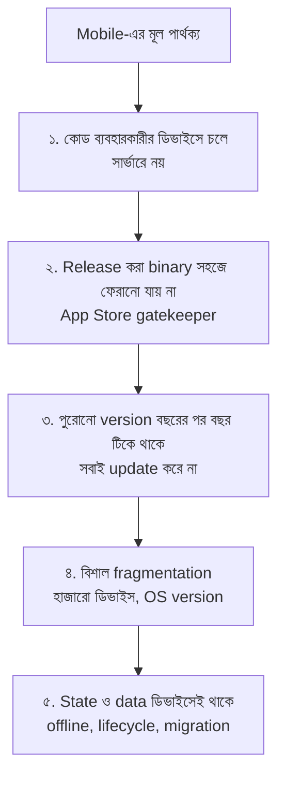

1. **কোড চলে ব্যবহারকারীর হাতের ডিভাইসে।** আপনি app build করে দেন, কিন্তু সেটা চলে এমন পরিবেশে যা আপনার নিয়ন্ত্রণে নেই — কম RAM, পুরোনো CPU, ভাঙা নেটওয়ার্ক, অদ্ভুত OS customization।
2. **Release প্রায় এক-মুখী।** App Store/Play Store-এ একবার যা পাঠালেন, তা সবার ডিভাইসে বসে যায়। সার্ভারের মতো "rollback" বোতাম নেই — তাই [Ch 2](#ch-2)-এর পুরোটা এই সমস্যা সামলানো নিয়ে।
3. **পুরোনো version মরে না।** আপনি v10 বের করলেও লক্ষ মানুষ এখনো v3 চালাচ্ছে — তারা update করে না, করতে পারে না, বা চায় না। তাই backend-কে বহু পুরোনো version একসাথে support করতে হয় ([Ch 3](#ch-3))।
4. **Fragmentation বিশাল।** শত শত স্ক্রিন সাইজ, বহু OS version, ভিন্ন vendor-এর অদ্ভুত আচরণ — সব জায়গায় একই অভিজ্ঞতা দেওয়া কঠিন ([Ch 11](#ch-11))।
5. **State ও data ডিভাইসেই বাস করে।** App যেকোনো সময় OS দ্বারা মেরে ফেলা হতে পারে (process death), offline-এ কাজ করতে হয়, আর on-device database-এর schema নিরাপদে বদলাতে হয় ([Ch 1](#ch-1), [Ch 7](#ch-7), [Ch 37](#ch-37))।

### এই বই কী এবং কী নয়

| এই বই **যা** | এই বই **যা নয়** |
|----------------|--------------------|
| scale-এ পৌঁছানো mobile টিমের বাস্তব চ্যালেঞ্জ ও common সমাধানের মানচিত্র | iOS/Android শেখার tutorial বা "প্রথম app বানান" গাইড |
| Uber-এর iOS app scale করার অভিজ্ঞতা + industry interview-এর সারকথা | কোনো একটি framework-এর API রেফারেন্স |
| "কী সমস্যা, কেন কঠিন, লোকে কীভাবে সামলায়" — চিন্তার কাঠামো | প্রতিটি সমস্যার একটিমাত্র "সঠিক" উত্তর |
| platform-নিরপেক্ষ (iOS+Android উভয়), trade-off-কেন্দ্রিক | শুধু একটি platform-এর copy-paste কোড |

> `মূল কথা` ভূমিকার মূল বার্তা — **mobile-এর কঠিন সমস্যাগুলো "ছোট" নয়, শুধু "ভিন্ন"।** এই বইয়ের ৩৯টি চ্যালেঞ্জ পড়ার সময় বারবার এই প্রশ্নটি মাথায় রাখুন: *"এই সমস্যাটা কি web/backend-এ এভাবে থাকত? না থাকলে — কেন?"* এই প্রশ্নের উত্তরেই mobile engineering-এর আসল রূপ ধরা পড়ে।

[↑ সূচিপত্রে ফিরুন](#toc)

<a id="part-1"></a>

# Part 1 — Mobile Is Different
## Mobile কেন আলাদা একটা জগৎ

> **কী নিয়ে:** এই Part-এর ১২টি চ্যালেঞ্জ দেখায় — mobile development কেন web বা backend থেকে মৌলিকভাবে আলাদা। এগুলো scale-নির্ভর নয়; ছোট app-এও থাকে, তবে scale বাড়লে যন্ত্রণা বহুগুণ হয়।
> **মূল বার্তা:** mobile-এর প্রায় সব কঠিন সমস্যার শিকড় একটাই — **কোড চলে ব্যবহারকারীর ডিভাইসে, আর সেই ডিভাইস বা release-চক্রের উপর আপনার পূর্ণ নিয়ন্ত্রণ নেই।**

এই অংশটিকে বাকি বইয়ের ভিত্তি ধরুন। এখানকার প্রতিটি চ্যালেঞ্জ একটি সাধারণ প্রশ্নের ভিন্ন ভিন্ন রূপ: *"নিয়ন্ত্রণ যখন আমার হাতে নেই, তখন নির্ভরযোগ্য অভিজ্ঞতা কীভাবে দেব?"*

```
Part 1-এর যাত্রা (নিয়ন্ত্রণহীনতার ৪টি দিক):

  ডিভাইসে state থাকে        →  Ch 1 (State), Ch 7 (Offline)
  release ফেরানো যায় না     →  Ch 2 (Revert), Ch 9 (Build train)
  পুরোনো version টেকে        →  Ch 3 (Old versions)
  বাইরের জগতের সাথে সংযোগ    →  Ch 4 (Deeplink), Ch 5 (Push), Ch 12 (IAP)
  ভাঙাচোরা বাস্তবতা          →  Ch 6 (Crash), Ch 8 (A11y), Ch 10 (Libs), Ch 11 (Fragmentation)
```

---

<a id="ch-1"></a>

## অধ্যায় ১: State Management
### State (অবস্থা) সামলানো

> Part 1 · ভিত্তিমূলক · সব mobile app-এ প্রযোজ্য

### মূল কথা

একটি mobile app যেকোনো মুহূর্তে background-এ চলে যেতে পারে, OS দ্বারা চুপচাপ মেরে ফেলা হতে পারে (process death), স্ক্রিন ঘোরালে UI আবার তৈরি হতে পারে — অথচ ব্যবহারকারী আশা করে ফিরে এসে সব ঠিক যেখানে রেখেছিল সেখানেই পাবে। তাই প্রশ্নটা হলো: **app-এর "সত্য" (state) কোথায় রাখব, কীভাবে রাখব, এবং app মরে গিয়ে আবার বাঁচলে তা কীভাবে ফিরিয়ে আনব?** ভুল করলে — data হারায়, UI অসামঞ্জস্য দেখায়, বা app খুলেই crash করে।

---

### ১.১ App Lifecycle — কেন state হঠাৎ হারায়

Server process সাধারণত চলতেই থাকে; mobile app তা নয়। OS যখন খুশি app-কে suspend বা kill করে:

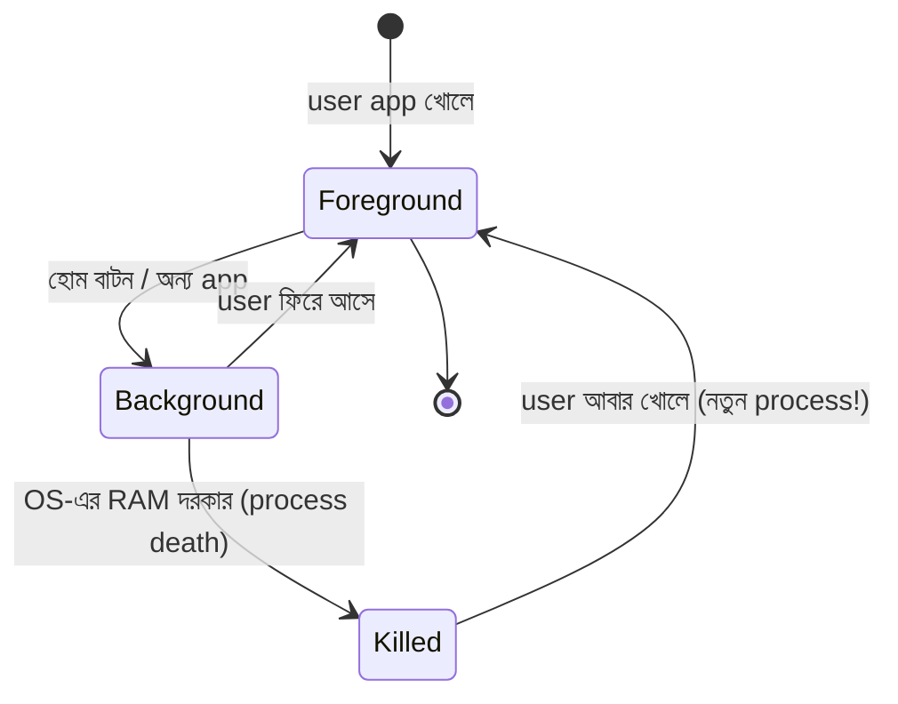

- **Process Death (সবচেয়ে কুখ্যাত):** app background-এ থাকা অবস্থায় OS তাকে মেরে ফেলে RAM খালি করতে। ব্যবহারকারী জানেই না — সে ফিরে এসে ভাবে app যেখানে ছিল সেখানেই আছে। কিন্তু আসলে **পুরো নতুন process** চালু হয়, in-memory সব হারিয়ে গেছে।
- **Configuration Change (Android):** স্ক্রিন rotate, dark mode toggle, ভাষা বদল — Activity ধ্বংস হয়ে আবার তৈরি হয়। in-memory state সংরক্ষণ না করলে হারায়।

> `কেন কঠিন` Web page reload হলে user বোঝে নতুন করে শুরু হলো। কিন্তু mobile-এ process death পুরো **অদৃশ্য** — তাই app-কে এমন আচরণ করতে হয় যেন কিছুই হয়নি। এটাই mobile state management-এর আসল কঠিন দিক।

---

### ১.২ State-এর ধরন — সব state এক নয়

কোথায় রাখবেন তা নির্ভর করে state কোন ধরনের, তার উপর:

| ধরন | উদাহরণ | কোথায় থাকে | হারালে সমস্যা? |
|------|---------|-------------|------------------|
| **Ephemeral UI state** | scroll position, animation, খোলা dropdown | শুধু memory | সামান্য — পুনর্গঠন সম্ভব |
| **Screen/App state** | form-এ লেখা টেক্সট, navigation stack | memory + saved-state bundle | মাঝারি — user বিরক্ত হয় |
| **Persisted local data** | draft, cache, setting | disk (DB/file/prefs) | বড় — data loss |
| **Server state** | account, order, balance | server (mirror on device) | server = সত্যের উৎস |

> `মূল কথা` প্রথম প্রশ্ন সবসময়: **"এই state-এর আসল মালিক কে — server, না device?"** server-owned হলে device শুধু একটা cache/mirror; device-owned হলে নিরাপদে persist করতে হবে।

---

### ১.৩ State Restoration — মরে যাওয়া app পুনরুদ্ধার

Process death-এর পরে UI আগের জায়গায় ফিরিয়ে আনার জন্য দুই platform-এ আলাদা ব্যবস্থা আছে:

```
        App background-এ যাওয়ার আগে                 App আবার চালু (নতুন process)
   ┌──────────────────────────────┐          ┌──────────────────────────────┐
   │ অল্প, হালকা state সংরক্ষণ:      │   ───►   │ সেই state পড়ে UI পুনর্গঠন:      │
   │  iOS: state restoration API   │  (disk)  │  - screen + প্রয়োজনীয় id      │
   │  Android: onSaveInstanceState │          │  - বাকিটা আবার fetch/compute   │
   └──────────────────────────────┘          └──────────────────────────────┘
```

মূল নিয়ম: **পুরো object নয়, শুধু পুনর্গঠনের জন্য যা ন্যূনতম দরকার তা-ই সংরক্ষণ করুন** (যেমন একটা item id, পুরো item নয়)। বাকিটা আবার server থেকে আনুন বা হিসাব করুন। saved-state bundle ছোট রাখাই নিয়ম — বড় করলে OS error দেয়।

---

### ১.৪ Single Source of Truth ও Unidirectional Data Flow

State এলোমেলো হওয়ার প্রধান কারণ — **একই তথ্য একাধিক জায়গায় আলাদা আলাদা ভাবে রাখা**, যেগুলো পরে আর মেলে না। সমাধান: প্রতিটি তথ্যের একটিই উৎস (single source of truth), আর data এক দিকে প্রবাহিত হবে:

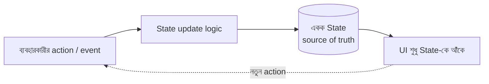

এই এক-মুখী প্রবাহই MVVM, MVI, Redux/BLoC-এর মতো architecture-এর মূল ধারণা ([Ch 14](#ch-14)-এ বিস্তারিত): **UI কখনো নিজে state বদলায় না — শুধু state-কে দেখায়; বদল ঘটে কেবল একটিমাত্র নিয়ন্ত্রিত পথে।** ফলে "UI আর data মিলছে না" সমস্যা কমে।

---

### ১.৫ সাধারণ ভুল ও তার প্রতিকার

| ভুল | পরিণতি | প্রতিকার |
|------|---------|-----------|
| সব state শুধু memory-তে রাখা | process death-এ সব হারায় | গুরুত্বপূর্ণ state persist বা restore করুন |
| Config change ভুলে যাওয়া | rotate করলেই form খালি | saved-state / ViewModel ব্যবহার করুন |
| একই data একাধিক জায়গায় | UI অসামঞ্জস্য | single source of truth |
| Async result-এ পুরোনো screen-এ লেখা | crash / ভুল UI | lifecycle-aware করে result handle করুন |

> `সতর্কতা` সবচেয়ে বড় ভুল — **শুধু নিজের ফোনে test করা।** আপনার দামি ফোনে process death কদাচিৎ ঘটে। কম-RAM ফোনে, বা developer option "Don't keep activities" চালু করে test করলেই আসল bug-গুলো বেরিয়ে আসে।

---

### নিজেকে যাচাই করুন

1. "Process death" কী, এবং এটি web page reload থেকে কীভাবে আলাদা?
2. চার ধরনের state কী কী — কোনটা persist করা জরুরি, কোনটা নয়?
3. State restoration-এ পুরো object না রেখে শুধু একটা id রাখা ভালো কেন?
4. "Single source of truth" ও unidirectional data flow কীভাবে UI-data অসামঞ্জস্য কমায়?
5. Process-death সংক্রান্ত bug সাধারণ test-এ কেন ধরা পড়ে না — কীভাবে ধরবেন?

[↑ সূচিপত্রে ফিরুন](#toc)

---

<a id="ch-2"></a>

## অধ্যায় ২: Mistakes Are Hard to Revert
### ভুল শোধরানো এখানে ভীষণ কঠিন

> Part 1 · উচ্চ ঝুঁকি · release strategy-র মূল ভিত্তি

### মূল কথা

Backend-এ একটা bug ধরলে আপনি নতুন build deploy করে কয়েক মিনিটে আগের অবস্থায় ফিরতে (rollback) পারেন। **Mobile-এ এই সুযোগ নেই।** একবার App Store/Play Store-এ release হয়ে গেলে সেটা লক্ষ মানুষের ডিভাইসে বসে যায়, আর আপনি জোর করে ফেরাতে পারেন না। তাই mobile-এ কৌশল বদলে যায়: **ভুল শোধরানোর চেয়ে ভুল রোধ করা এবং ভুল হলে তা দ্রুত থামানোর ব্যবস্থা আগে থেকে বানিয়ে রাখা।**

---

### ২.১ কেন rollback বোতাম নেই

```
Backend deploy:   bug ধরা → fix → deploy → ৫ মিনিটে সবাই ঠিক ✅

Mobile release:   bug ধরা → fix → store-এ submit → review (ঘণ্টা/দিন)
                   → release → তবু user update করবে কিনা/কখন, অনিশ্চিত ❌
```

দুটি দেয়াল এখানে: (১) **App Store/Play review** — নতুন build সবার কাছে পৌঁছাতে সময় লাগে; (২) **user-নিয়ন্ত্রিত update** — আপনি fix পাঠালেও ব্যবহারকারী সেটা ইনস্টল করবে কি না, কখন করবে, তা আপনার হাতে নেই। ফলে একটা খারাপ release-এর ক্ষতি দীর্ঘদিন চলতে পারে।

---

### ২.২ সুরক্ষা স্তর ১ — Staged / Phased Rollout

পুরো ব্যবহারকারীকে একসাথে নতুন version না দিয়ে **ধাপে ধাপে** দিন — সমস্যা দেখলে বাকিদের কাছে যাওয়ার আগেই থামান:

```
Day 1:  1%   ──►  metric দেখুন (crash, error)
Day 2:  5%   ──►  ঠিক আছে? এগোন
Day 3:  20%  ──►  crash বাড়ছে? → rollout HALT
Day 4:  50%
Day 5:  100%
```

Play Console (staged rollout) ও App Store (phased release) — দুটোই এটা সমর্থন করে। মূল লাভ: খারাপ build-এর ক্ষতি ১%-এ আটকে যায়, ১০০%-এ নয়। তবে মনে রাখবেন — **যারা ইতিমধ্যে update পেয়ে গেছে, তাদের আপনি ফেরাতে পারবেন না** (Android-এ rollout halt নতুন download থামায়, কিন্তু পুরোনো খারাপ build আনইনস্টল করায় না)।

---

### ২.৩ সুরক্ষা স্তর ২ — Server-Side Control (সবচেয়ে শক্তিশালী)

মূল কৌশল: **ঝুঁকিপূর্ণ feature-এর কোড ক্লায়েন্টে পাঠান, কিন্তু চালু/বন্ধের সুইচ রাখুন server-এ।**

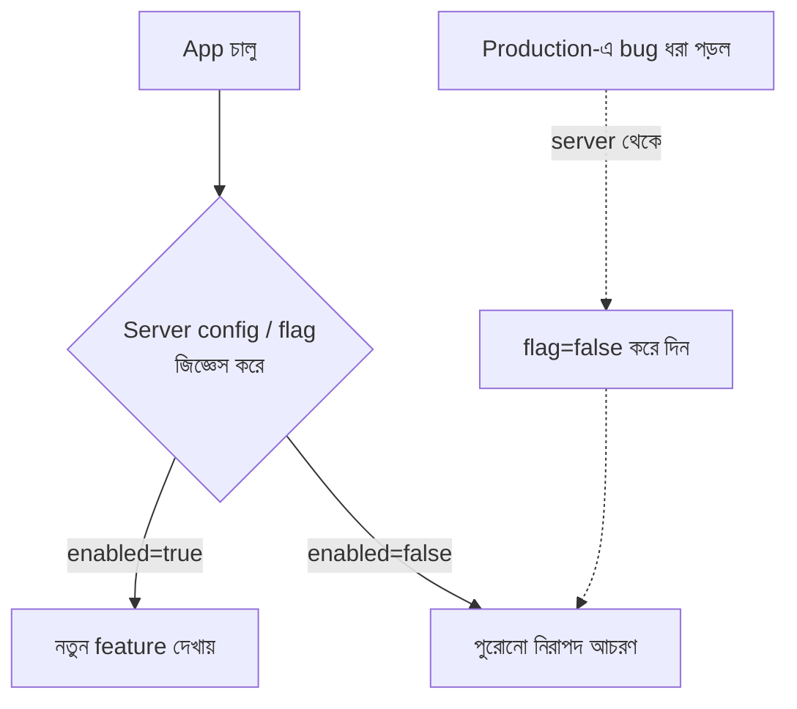

- **Feature Flag / Remote Config:** নতুন feature flag-এর পেছনে ship করুন; সমস্যা হলে নতুন release ছাড়াই server থেকে বন্ধ ([Ch 31](#ch-31)-এ এর জটিলতা)।
- **Kill Switch:** ঝুঁকিপূর্ণ অংশের জন্য একটা "জরুরি বন্ধ" সুইচ — production-এ আগুন লাগলে সাথে সাথে নেভানো যায়।

> `সতর্কতা` Kill switch **আগে থেকে** বানিয়ে ship করতে হয়। বিপদ ঘটে যাওয়ার পরে আর সুইচ বসানো যায় না — কারণ সেটাও তো একটা নতুন release! তাই ঝুঁকিপূর্ণ feature ছাড়ার সময়ই তার নেভানোর ব্যবস্থা সাথে দিন।

---

### ২.৪ সুরক্ষা স্তর ৩ — Server-Side Fix ও Expedited Review

ক্লায়েন্টে bug হলেও কখনো কখনো **server পরিবর্তন করে** সমস্যা ঢাকা দেওয়া যায় (যেমন server এমন data পাঠাবে যাতে buggy code-পথ আর না চলে)। আর একান্তই নতুন build লাগলে — Apple/Google-এর কাছে **expedited (দ্রুত) review** চাওয়া যায় critical সমস্যায়। তবু এগুলো শেষ অস্ত্র; প্রথম সুরক্ষা সবসময় rollout + flag।

---

### ২.৫ মানসিকতা — "Prevent, then Contain"

```
১. Prevent   → ভালো test, code review, beta/dogfood (Ch 18)
২. Contain   → staged rollout (ক্ষতি ছোট রাখা)
৩. Control   → feature flag + kill switch (release ছাড়াই নেভানো)
৪. Recover   → server-side fix / expedited review (শেষ উপায়)
```

> `মূল কথা` Backend-এর মন্ত্র "move fast, rollback if needed"; mobile-এর মন্ত্র **"move carefully, because there is no easy rollback।"** এই একটি পার্থক্য mobile release engineering-এর পুরো চিন্তাধারা বদলে দেয়।

---

### নিজেকে যাচাই করুন

1. Backend rollback আর mobile release-এর মধ্যে মূল পার্থক্য কী? কোন দুটি "দেয়াল" mobile-এ দ্রুত fix আটকায়?
2. Staged rollout কীভাবে একটি খারাপ build-এর ক্ষতি সীমিত করে — এবং কোন সীমাবদ্ধতা থেকে যায়?
3. Feature flag আর kill switch-এর মধ্যে সম্পর্ক ও পার্থক্য কী?
4. Kill switch কেন বিপদ ঘটার *আগে* ship করতে হয়?
5. "Prevent, then Contain" স্তরগুলো নিজের ভাষায় বলুন।

[↑ সূচিপত্রে ফিরুন](#toc)

---

<a id="ch-3"></a>

## অধ্যায় ৩: The Long Tail of Old App Versions
### পুরোনো version-এর দীর্ঘ লেজ

> Part 1 · backward compatibility · backend-এর সাথে সম্পর্কিত

### মূল কথা

আপনি যত দ্রুতই নতুন version বের করুন, ব্যবহারকারীদের একটা বড় অংশ অনেক **পুরোনো version**-এ আটকে থাকে — কেউ auto-update বন্ধ রেখেছে, কারো ফোন পুরোনো, কারো storage নেই, কেউ ইচ্ছে করেই update করে না। ফলে যেকোনো সময়ে আপনার app-এর বহু version একসাথে চালু থাকে — এই "long tail" কখনো পুরোপুরি শূন্য হয় না। এর সবচেয়ে বড় ধাক্কা লাগে **backend-এ**: তাকে একসাথে নতুন আর বহু পুরোনো ক্লায়েন্ট — সবাইকে support করতে হয়।

---

### ৩.১ কেন ব্যবহারকারী update করে না

| কারণ | উদাহরণ |
|------|---------|
| Auto-update বন্ধ | data বাঁচাতে user manually off করে রেখেছে |
| পুরোনো OS | নতুন version পুরোনো OS-এ ইনস্টলই হয় না |
| Storage কম | "ফোনে জায়গা নেই" — update আটকে আছে |
| অনিচ্ছা | "যা আছে কাজ করছে, ঘাঁটব না" |
| ভৌগোলিক | দুর্বল নেট/ব্যয়বহুল data-তে বড় update নামায় না |

---

### ৩.২ Long Tail দেখতে কেমন

```
ব্যবহারকারীর %
  ▲
  │ █
  │ █  █
  │ █  █  █
  │ █  █  █  █
  │ █  █  █  █  ▆  ▅  ▄  ▃  ▂  ▁  ▁  ▁ ...
  └─────────────────────────────────────────► version (নতুন → পুরোনো)
   v10 v9 v8 v7 v6 ...               v3 v2  ← এই "লেজ" কখনো শূন্য হয় না
```

বেশিরভাগ user হয়তো সাম্প্রতিক ২-৩টি version-এ; কিন্তু একটা লম্বা লেজ থেকে যায় অনেক পুরোনো version-এ — এবং সংখ্যাটা ছোট শতাংশ হলেও millions user-এ তা বিশাল।

---

### ৩.৩ Backend-এর উপর প্রভাব — সবচেয়ে বড় ব্যথা

মূল নিয়ম: **পুরোনো ক্লায়েন্টের সাথে API contract কখনো ভাঙবেন না।** আজ আপনি যে API response পাঠাচ্ছেন, সেটা দু'বছর পরেও কোনো পুরোনো version হয়তো একইভাবে আশা করবে।

```
ভালো (additive change):   পুরোনো field রেখে নতুন field যোগ করুন
                          { "name": "...", "avatar": "..." }  → + "badge": "..."
                          পুরোনো client নতুন field উপেক্ষা করে — কিছু ভাঙে না ✅

খারাপ (breaking change):  field-এর নাম/টাইপ বদলানো বা মুছে ফেলা
                          "name" → "fullName"  → পুরোনো client crash/blank ❌
```

কৌশল: backward-compatible (additive) পরিবর্তন, প্রয়োজনে API versioning (`/v1`, `/v2`), এবং কোনো পুরোনো contract বাদ দেওয়ার আগে নিশ্চিত হওয়া যে আর কোনো জীবিত client সেটা ব্যবহার করছে না।

---

### ৩.৪ Long Tail সামলানোর কৌশল

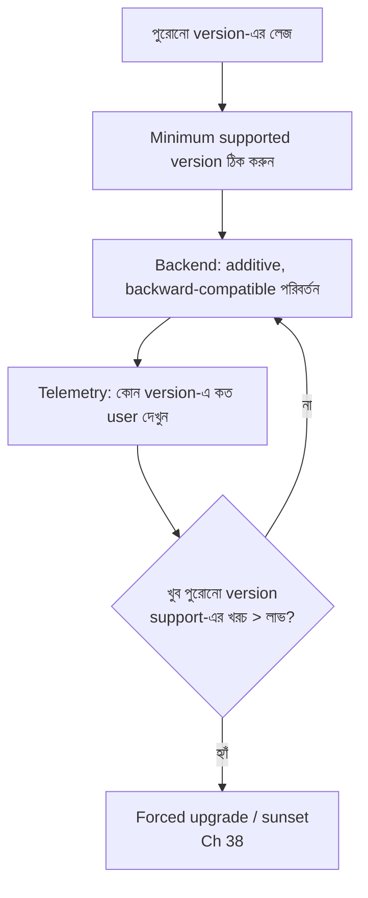

- **Minimum supported version:** একটা সীমা ঠিক করুন; তার নিচে আর support নয়।
- **Telemetry:** কোন version কত মানুষ চালাচ্ছে — না জানলে সিদ্ধান্ত নেওয়া যায় না।
- **Sunset / Forced upgrade:** খুব পুরোনো ও ঝুঁকিপূর্ণ version-কে ভদ্রভাবে অবসরে পাঠান ([Ch 38](#ch-38))।

> `সতর্কতা` "সবাই তো latest-এই আছে" — এই অনুমান বিপজ্জনক। সিদ্ধান্ত নেওয়ার আগে **আসল version distribution data** দেখুন; নইলে এমন পরিবর্তন করে বসবেন যা লক্ষ পুরোনো-version user-এর app ভেঙে দেবে।

---

### নিজেকে যাচাই করুন

1. ব্যবহারকারীরা update না করার ৩টি কারণ বলুন। "Long tail" বলতে কী বোঝায়?
2. পুরোনো version-এর সবচেয়ে বড় প্রভাব কোথায় পড়ে, এবং কেন?
3. Additive change আর breaking change-এর পার্থক্য উদাহরণসহ দিন।
4. কেন "সবাই latest version-এ আছে" — এই অনুমান বিপজ্জনক?
5. "Minimum supported version" ঠিক করার আগে কোন data লাগবে?

[↑ সূচিপত্রে ফিরুন](#toc)

---

<a id="ch-4"></a>

## অধ্যায় ৪: Deeplinks
### Deeplink — সরাসরি ভেতরের screen-এ

> Part 1 · বাইরের জগতের সাথে সংযোগ · দেখতে সহজ, বাস্তবে কঠিন

### মূল কথা

Deeplink হলো এমন একটা লিংক যা ব্যবহারকারীকে app-এর হোম স্ক্রিনে নয়, বরং **সরাসরি একটি নির্দিষ্ট ভেতরের screen-এ** নিয়ে যায় (যেমন একটা নির্দিষ্ট product, chat, বা order)। email, notification, বিজ্ঞাপন, অন্য app — সব জায়গা থেকে এটা দরকার হয়। শুনতে সহজ, কিন্তু বাস্তবে অসংখ্য edge case: app ইনস্টল করা নেই, user logged out, screen-এর জন্য data নেই, লিংক ভাঙা — সব সামলাতে হয়।

---

### ৪.১ Deeplink-এর প্রধান প্রকার

| প্রকার | দেখতে কেমন | সুবিধা | অসুবিধা |
|--------|-------------|---------|----------|
| **Custom URI scheme** | `myapp://product/42` | বানানো সহজ | অন্য app একই scheme দাবি করতে পারে; app না থাকলে কিছুই হয় না |
| **Universal Links (iOS) / App Links (Android)** | `https://shop.com/product/42` | নিরাপদ, verified; app না থাকলে browser-এ খোলে | domain verification (server-এ ফাইল) দরকার, সেটআপ জটিল |

> `মূল কথা` আধুনিক standard হলো **https-ভিত্তিক Universal/App Links** — কারণ একই লিংক app থাকলে app-এ খোলে, না থাকলে website-এ পড়ে যায়, আর অন্য কোনো app সেটা ছিনিয়ে নিতে পারে না।

---

### ৪.২ Deferred Deeplink — app ইনস্টলই করা নেই

সবচেয়ে কঠিন কেস: ব্যবহারকারী লিংকে ক্লিক করল, কিন্তু app ইনস্টল করা নেই। আদর্শ অভিজ্ঞতা:

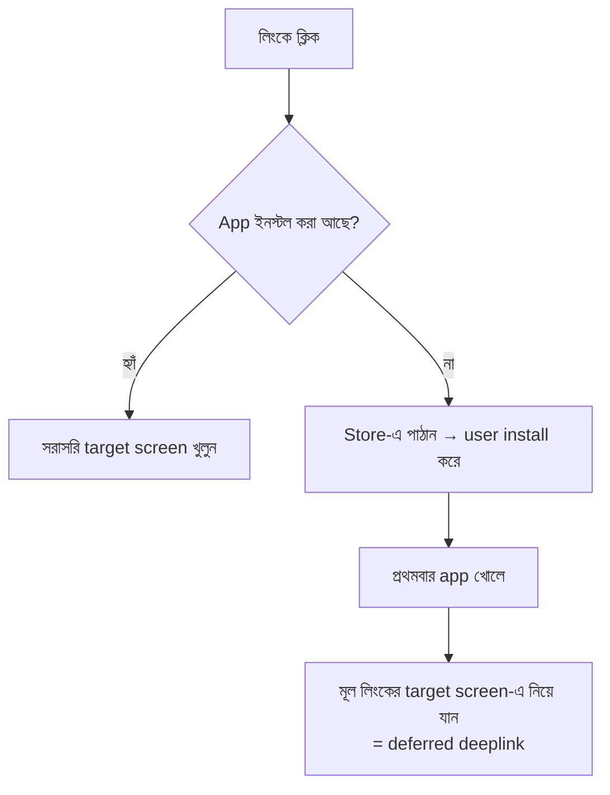

অর্থাৎ install-এর পরে app-কে "মনে রাখতে" হয় ব্যবহারকারী আসলে কোথায় যেতে চেয়েছিল — এটাই deferred deeplink, এবং এটি বানানো সবচেয়ে ঝামেলার।

---

### ৪.৩ Routing — লিংককে ভেতরের navigation-এ অনুবাদ

একটা deeplink এলে app-কে ঠিক করতে হয় কোন screen, কী data নিয়ে খুলবে:

```
myapp://order/789
        │     │
        │     └─► parameter: orderId = 789
        └───────► route: "order details" screen

ধাপ: লিংক parse → route খুঁজুন → প্রয়োজনীয় data load → সঠিক navigation stack বানান
```

বড় app-এ এর জন্য একটা কেন্দ্রীয় **router/deeplink resolver** থাকে যা সব লিংককে এক জায়গায় ম্যাপ করে (সম্পর্কিত: [Ch 13](#ch-13) navigation architecture)।

---

### ৪.৪ যে edge case-গুলো প্রায়ই ভুলে যাওয়া হয়

| পরিস্থিতি | কী করতে হবে |
|-----------|---------------|
| User logged out | আগে login, তারপর target screen-এ নিয়ে যান (লিংক মনে রেখে) |
| Screen-এর data নেই/মুছে গেছে | সুন্দর error দেখান, crash নয় (যেমন "এই order আর নেই") |
| App মাঝপথে, অন্য screen-এ আছে | সঠিক back-stack তৈরি করুন যাতে back বাটন যৌক্তিক হয় |
| Malformed / অজানা লিংক | নিরাপদে হোম বা একটা fallback screen-এ পাঠান |
| Permission/paywall দরকার | আগে শর্ত মেটান, পরে content |

> `সতর্কতা` Deeplink সবচেয়ে বেশি crash ঘটায় তখনই — যখন কোড ধরে নেয় "user নিশ্চয়ই logged in এবং data নিশ্চয়ই আছে।" বাইরের লিংক যেকোনো অবস্থায় আসতে পারে; প্রতিটি ধাপে "যদি না থাকে?" ভাবতে হবে।

---

### নিজেকে যাচাই করুন

1. Custom URI scheme আর Universal/App Links-এর পার্থক্য কী? কোনটা কেন বেশি নিরাপদ?
2. "Deferred deeplink" কী, এবং এটি কেন সবচেয়ে কঠিন কেস?
3. একটা deeplink resolve করার ধাপগুলো কী কী?
4. Logged-out অবস্থায় deeplink এলে কী করা উচিত?
5. Deeplink-এ crash এড়াতে কোডে কোন অনুমানগুলো বাদ দিতে হবে?

[↑ সূচিপত্রে ফিরুন](#toc)

---

<a id="ch-5"></a>

## অধ্যায় ৫: Push and Background Notifications
### Push ও Background Notification

> Part 1 · বাইরের সিস্টেমের উপর নির্ভরতা · delivery অনিশ্চিত

### মূল কথা

Push notification ব্যবহারকারীকে ফিরিয়ে আনার শক্তিশালী হাতিয়ার, কিন্তু এর নিয়ন্ত্রণ সম্পূর্ণ আপনার হাতে নেই — মাঝখানে আছে Apple-এর **APNs** ও Google-এর **FCM**, এবং OS-এর battery/background নিয়ম। সবচেয়ে গুরুত্বপূর্ণ সত্য: **push delivery গ্যারান্টিড নয়** — তা দেরিতে আসতে পারে, একসাথে মিলিয়ে দেওয়া হতে পারে, বা একদমই না আসতে পারে। তাই কখনো জরুরি কোনো logic শুধু push-এর উপর ভরসা করে বানানো যাবে না।

---

### ৫.১ Push কীভাবে কাজ করে

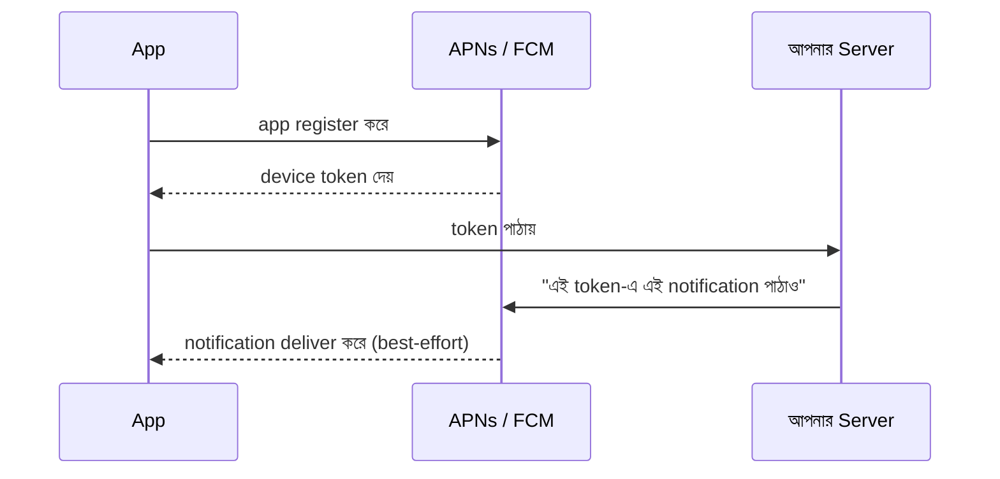

মূল বিষয়: notification আপনার server থেকে সরাসরি ফোনে যায় না — **মাঝে APNs/FCM gateway** আছে, এবং তারাই শেষ পর্যন্ত ঠিক করে কখন/আদৌ deliver হবে।

---

### ৫.২ দুই ধরনের notification

| ধরন | দেখা যায়? | উদ্দেশ্য | সীমাবদ্ধতা |
|------|-----------|----------|-------------|
| **Alert / Visible push** | হ্যাঁ (banner, sound) | user-কে জানানো | user permission লাগে |
| **Silent / Background / Data push** | না | চুপচাপ data sync/refresh | OS কড়াভাবে throttle করে; প্রায়ই দেরি/বাদ |

---

### ৫.৩ কেন delivery-তে ভরসা করা যায় না

```
Server "পাঠালাম" বলল  ≠  ব্যবহারকারী "পেল"

মাঝপথে যা হতে পারে:
  • OS battery saver → বিলম্বিত
  • ফোন offline → পরে হয়তো coalesce (একাধিক মিলে এক)
  • throttle/rate limit → silent push বাদ
  • user permission off → একদম আসবে না
```

> `সতর্কতা` সবচেয়ে বড় ভুল — push-কে "guaranteed trigger" ধরা (যেমন "push এলে তবেই data sync হবে")। push না এলে app চিরকাল পুরোনো data দেখাবে। সঠিক নকশা: push শুধু একটা **hint**; আসল sync app খোলার সময় বা নিয়মিত নিজে থেকেও হওয়া উচিত।

---

### ৫.৪ Background Execution-এর কড়া সীমা

push (বা অন্য কারণে) app background-এ জাগলেও OS খুব অল্প সময়/সম্পদ দেয়:

- **iOS:** background-এ সীমিত সময়; background fetch-এর সময় OS ঠিক করে, আপনি নয়।
- **Android:** Doze mode, App Standby, background execution limit — দীর্ঘ background কাজ কঠিন; ভারী কাজের জন্য WorkManager-জাতীয় scheduler দরকার।

তাই background-এ অল্প, দ্রুত, ব্যর্থ হলেও নিরাপদ — এমন কাজ রাখুন।

---

### ৫.৫ Permission ও আস্থা

Notification permission user-এর হাতে (iOS-এ বরাবরই opt-in; Android 13+ থেকেও runtime permission)। একবার "না" বললে ফিরে পাওয়া কঠিন। তাই:

- **সঠিক সময়ে চান:** app খুলেই নয় — ব্যবহারকারী যখন value বুঝবে তখন (যেমন order করার পর "delivery update পেতে চান?")।
- **অপব্যবহার করবেন না:** বেশি/অপ্রাসঙ্গিক push → user permission বন্ধ করে দেয় বা app আনইনস্টল করে।

> `মূল কথা` Push একটি **best-effort, user-অনুমতি-নির্ভর, OS-নিয়ন্ত্রিত** চ্যানেল। একে সুবিধা ধরুন, ভিত্তি নয় — গুরুত্বপূর্ণ কিছু কখনো শুধু push-এর উপর দাঁড় করাবেন না।

---

### নিজেকে যাচাই করুন

1. Push server থেকে ফোনে কোন পথে যায়? মাঝখানে কে থাকে?
2. Visible আর silent push-এর পার্থক্য ও সীমাবদ্ধতা কী?
3. "Push delivery গ্যারান্টিড নয়" — এর ব্যবহারিক মানে কী, এবং নকশায় কী করা উচিত?
4. Background execution-এ iOS/Android কী কী সীমা দেয়?
5. Notification permission কখন চাওয়া ভালো, এবং কেন?

[↑ সূচিপত্রে ফিরুন](#toc)

---

<a id="ch-6"></a>

## অধ্যায় ৬: App Crashes
### App Crash সামলানো

> Part 1 · নির্ভরযোগ্যতা · crash mobile-এ অনিবার্য

### মূল কথা

Backend-এ একটা process crash করলে অন্য instance কাজ চালিয়ে নেয়, user টেরও পায় না। **Mobile-এ crash মানে ব্যবহারকারীর সামনেই app বন্ধ হয়ে যাওয়া** — সরাসরি খারাপ অভিজ্ঞতা ও review। Crash সম্পূর্ণ এড়ানো অসম্ভব (অজস্র ডিভাইস, OS, পরিস্থিতি), তাই লক্ষ্য — **crash মাপা, রিপোর্ট সংগ্রহ করা, প্রভাব অনুযায়ী অগ্রাধিকার দিয়ে দ্রুত ঠিক করা।**

---

### ৬.১ কেন mobile crash আলাদা ও কঠিন

- **ব্যবহারকারী সরাসরি দেখে:** server crash অদৃশ্য; mobile crash চোখের সামনে।
- **পরিবেশ আপনার নিয়ন্ত্রণে নেই:** এমন ফোন/OS-এ crash হতে পারে যা আপনি কখনো ছুঁয়েও দেখেননি।
- **শুধু "exception" নয়:** crash-এর অনেক রূপ — নিচের টেবিল।

| ধরন | মানে | বিশেষত্ব |
|------|------|-----------|
| **Unhandled exception** | কোডে ধরা পড়েনি এমন error | সবচেয়ে পরিচিত |
| **OOM (Out of Memory)** | RAM শেষ, OS app মেরে দিল | সাধারণ crash report-এ ভালোভাবে ধরা পড়ে না |
| **ANR (Android)** | UI thread আটকে (~৫ সেকেন্ড) → "App not responding" | technically crash নয়, কিন্তু সমান খারাপ |
| **Watchdog kill (iOS)** | startup/UI অনেক ধীর → OS মেরে দেয় | hang-কে crash হিসেবে গণ্য |

---

### ৬.২ Crash Reporting Pipeline

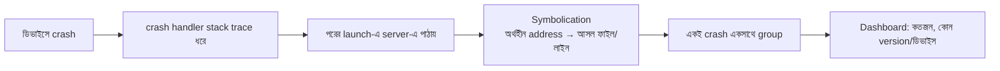

Crashlytics, Sentry, Bugsnag-এর মতো টুল এই কাজ করে। মূল ধাপ — crash ধরা → আপলোড → পড়ার যোগ্য করা → grouping → প্রভাব দেখানো।

---

### ৬.৩ Symbolication — রিপোর্ট পড়ার যোগ্য করা

Release build optimize/minify হওয়ায় raw crash-এ শুধু অর্থহীন মেমরি address থাকে। আসল ফাইল ও লাইন নম্বরে রূপান্তরের জন্য দরকার:

- **iOS:** dSYM ফাইল
- **Android:** ProGuard/R8 mapping ফাইল

প্রতিটি release-এ এই ফাইল crash টুলে আপলোড করতেই হবে — না হলে রিপোর্ট অপাঠ্য থেকে যাবে।

---

### ৬.৪ সঠিক Metric — Count নয়, Crash-Free Rate

```
শুধু "আজ ৫০০ crash" → অর্থহীন (user বাড়লে এমনিতেই বাড়ে)

ভালো metric:
  Crash-free users %     = (crash হয়নি এমন user) / (মোট user)
  Crash-free sessions %  = (crash ছাড়া session) / (মোট session)

লক্ষ্য সাধারণত: crash-free users 99.x% — কিন্তু millions user-এ 0.5%-ও মানে হাজারো মানুষ
```

> `মূল কথা` raw crash count বাড়া-কমা বিভ্রান্তিকর; **crash-free rate** ব্যবহার করুন — কারণ এটি ব্যবহারকারীর প্রকৃত অভিজ্ঞতার অনুপাত মাপে, এবং release-গুলোর মধ্যে তুলনা করা যায়।

---

### ৬.৫ অগ্রাধিকার ঠিক করা

সব crash সমান নয়। কোনটা আগে ঠিক করবেন তা ঠিক করুন **প্রভাব** দিয়ে:

```
অগ্রাধিকার = কতজন user আক্রান্ত  ×  কতটা গুরুতর (startup crash? data loss?)

উদাহরণ:
  ০.১% user, niche flow      → কম অগ্রাধিকার
  ২% user, app খুললেই crash  → সর্বোচ্চ, এখনই
```

> `সতর্কতা` একটা crash রিপোর্টে "শীর্ষে" থাকা মানেই সেটা সবচেয়ে জরুরি নয় — হয়তো অনেক session কিন্তু কম unique user, বা সহজে এড়ানো যায়। সবসময় "কতজন আসল user, কতটা ক্ষতি" দিয়ে যাচাই করুন।

---

### নিজেকে যাচাই করুন

1. Server crash আর mobile crash-এর প্রভাবে মূল পার্থক্য কী?
2. OOM ও ANR কী — এরা সাধারণ exception থেকে আলাদা কেন?
3. Symbolication কেন দরকার, এবং iOS/Android-এ কী ফাইল লাগে?
4. কেন raw crash count-এর চেয়ে crash-free rate ভালো metric?
5. কোন crash আগে ঠিক করবেন — তা কীভাবে ঠিক করবেন?

[↑ সূচিপত্রে ফিরুন](#toc)

<a id="ch-7"></a>

## অধ্যায় ৭: Offline Support
### Offline (নেট ছাড়া) সমর্থন

> Part 1 · নেটওয়ার্ক unreliable · data sync-এর মূল চ্যালেঞ্জ

### মূল কথা

Mobile ব্যবহারকারী সবসময় ভালো নেটওয়ার্কে থাকে না — সাবওয়ে, লিফট, গ্রাম, বিমান, বা শুধুই দুর্বল সিগনাল। Backend "নেট সবসময় আছে" ধরে নিতে পারে, mobile পারে না। তাই app-কে অন্তত খারাপ নেটওয়ার্কে, কখনো সম্পূর্ণ offline-এও কাজ করতে হয়। এর মূল হাতিয়ার — **local cache (পড়ার জন্য), optimistic UI ও mutation queue (লেখার জন্য), এবং sync-এর সময় conflict সামলানো।**

---

### ৭.১ Offline-এর মাত্রা — কতটা দূর যাবেন

সব app-কে পুরো offline-first হতে হয় না; একটা spectrum আছে:

```
কম প্রচেষ্টা ───────────────────────────────────────► বেশি প্রচেষ্টা
  Online-only      Cached reads        Offline-first
  (নেট না থাকলে    (পুরোনো data দেখায়,  (পড়া+লেখা offline,
   error)          লেখা নেট লাগে)        পরে sync)
```

প্রথম সিদ্ধান্ত: **এই app-এর জন্য কতটুকু offline সত্যিই দরকার?** একটা banking app আর একটা note-taking app-এর উত্তর আলাদা। বেশি offline = বেশি জটিলতা, তাই প্রয়োজন বুঝে বাছুন।

---

### ৭.২ পড়ার পথ (Read) — Cache-First

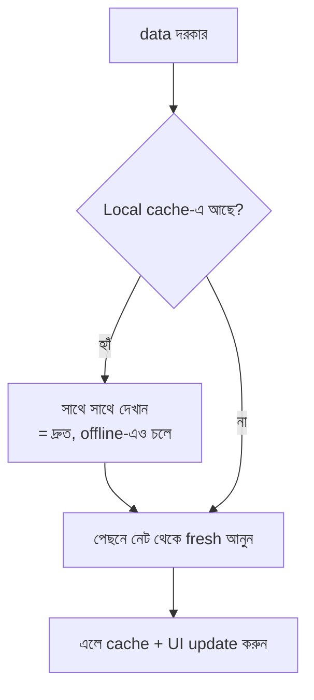

মূল ধারণা: **আগে cache থেকে দেখান (instant), পেছনে নেট থেকে refresh করুন।** এতে offline-এও পুরোনো data পাওয়া যায়, আর online-এ অভিজ্ঞতা দ্রুত হয়।

---

### ৭.৩ লেখার পথ (Write) — Optimistic UI + Mutation Queue

Offline-এ ব্যবহারকারী কিছু করলে (যেমন "like", message পাঠানো) সাথে সাথে সার্ভারে যাওয়া যায় না। কৌশল:

```
১. Optimistic UI:   এখনই UI-তে দেখান যেন হয়ে গেছে ("পাঠানো হচ্ছে...")
২. Queue:           কাজটা একটা local queue-তে জমা রাখুন
৩. Retry:           নেট ফিরলে queue থেকে একে একে server-এ পাঠান
৪. Reconcile:       সফল হলে confirm; ব্যর্থ হলে UI ফিরিয়ে এনে জানান
```

> `সতর্কতা` Optimistic UI সুন্দর, কিন্তু বিপদ হলো — server শেষমেশ "না" বললে (যেমন duplicate, বা permission নেই) UI-কে আবার আগের অবস্থায় ফেরাতে হবে, এবং user-কে শান্তভাবে জানাতে হবে। এই "rollback on failure" ভুলে গেলে user মনে করবে কাজ হয়েছে, আসলে হয়নি।

---

### ৭.৪ Conflict Resolution — দুই দিকে বদল হলে

Offline থাকা অবস্থায় ব্যবহারকারী local data বদলাল, ওদিকে server-এও (অন্য device থেকে) বদলে গেল। sync-এর সময় কোনটা জিতবে?

| কৌশল | কীভাবে | কখন উপযুক্ত |
|------|--------|--------------|
| **Last-write-wins** | যেটা পরে, সেটাই থাকে | সহজ data, কম দ্বন্দ্ব |
| **Server-authoritative** | server-এর version সবসময় চূড়ান্ত | নিরাপত্তা/সঙ্গতি জরুরি (ব্যালান্স ইত্যাদি) |
| **Merge** | দুই পরিবর্তন বুদ্ধি করে মেলানো | document/list (যেমন collaborative note) |
| **Ask user** | ব্যবহারকারীকে বেছে নিতে দেওয়া | বিরল, গুরুত্বপূর্ণ দ্বন্দ্ব |

> `মূল কথা` Conflict সম্পূর্ণ এড়ানো যায় না — শুধু সচেতনভাবে একটা নীতি বেছে নিতে হয়। নীতি না থাকলে data নীরবে হারায় বা নষ্ট হয়, যা সবচেয়ে খারাপ।

---

### নিজেকে যাচাই করুন

1. Backend আর mobile-এর নেটওয়ার্ক-অনুমানে পার্থক্য কী?
2. Offline-এর "spectrum" বলুন। সব app-কে কেন offline-first হতে হয় না?
3. Cache-first read pattern কীভাবে কাজ করে?
4. Optimistic UI কী, এবং এর সবচেয়ে বড় ফাঁদ কী?
5. তিনটি conflict-resolution কৌশল ও তাদের উপযুক্ত প্রেক্ষাপট বলুন।

[↑ সূচিপত্রে ফিরুন](#toc)

---

<a id="ch-8"></a>

## অধ্যায় ৮: Accessibility
### Accessibility (a11y) — সবার জন্য ব্যবহারযোগ্য

> Part 1 · অন্তর্ভুক্তি · নৈতিক + আইনি + ব্যবসায়িক

### মূল কথা

Accessibility মানে app-কে এমনভাবে বানানো যাতে দৃষ্টি, শ্রবণ, চলাচল বা cognitive প্রতিবন্ধকতা থাকা মানুষও সমানভাবে ব্যবহার করতে পারে। এটি শুধু "ভালো কাজ" নয় — অনেক দেশে **আইনি বাধ্যতা**, এবং একটি বিশাল user base-কে অন্তর্ভুক্ত করার সুযোগ। Scale-এ গেলে "১% user"-ও মানে লক্ষ মানুষ। সুখবর: mobile OS-গুলো শক্তিশালী accessibility টুল দেয়; আপনাকে শুধু সঠিকভাবে ব্যবহার করতে হয়।

---

### ৮.১ কাদের কথা ভাবছি

| ধরন | উদাহরণ প্রয়োজন |
|------|------------------|
| দৃষ্টি | screen reader, বড় ফন্ট, উচ্চ contrast |
| শ্রবণ | caption, ভিজ্যুয়াল alert |
| Motor (চলাচল) | বড় touch target, switch control, কম নির্ভুল tap |
| Cognitive | সরল ভাষা, পরিষ্কার flow, কম distraction |

---

### ৮.২ মূল হাতিয়ার (OS যা দেয়)

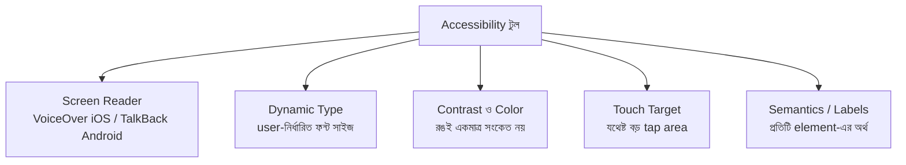

- **Semantics ও Label সবচেয়ে গুরুত্বপূর্ণ:** screen reader তখনই কাজ করে যখন প্রতিটি button/image-এর একটা অর্থবোধক label থাকে। একটা icon-only বোতামে label না থাকলে screen reader শুধু "button" বলবে — অর্থহীন।
- **Dynamic Type:** ব্যবহারকারী system-এ ফন্ট বড় করলে আপনার layout যেন ভেঙে না পড়ে।
- **রঙই একমাত্র সংকেত নয়:** "লাল = ভুল" যথেষ্ট নয়; আইকন/লেখাও দিন (color-blind user-দের জন্য)।

---

### ৮.৩ কীভাবে test করবেন

```
১. নিজে VoiceOver/TalkBack চালু করে চোখ বন্ধ করে app চালান
২. System ফন্ট সবচেয়ে বড় করে দেখুন — layout টেকে কি?
৩. Accessibility Scanner / Inspector চালান (missing label ধরে)
৪. শুধু keyboard / switch দিয়ে navigate করার চেষ্টা
```

> `সতর্কতা` সবচেয়ে সাধারণ ভুল — **custom view বা icon-button-এ accessibility label না দেওয়া।** দেখতে সুন্দর, কিন্তু screen reader-এ পুরো অংশটা "অদৃশ্য" বা অর্থহীন হয়ে যায়। দ্বিতীয় ভুল — ফন্ট সাইজ hard-code করা, যাতে dynamic type কাজ করে না।

---

### ৮.৪ Scale-এ Accessibility টিকিয়ে রাখা

বড় app-এ প্রতিটি screen-এ আলাদা করে a11y ঠিক করা অসম্ভব। সমাধান — **design system / shared component-এ accessibility একবার ঠিকভাবে বানান** ([Ch 16](#ch-16))। তখন প্রতিটি নতুন screen স্বয়ংক্রিয়ভাবে accessible component পায়। সাথে CI-তে a11y check যোগ করলে regression আগেই ধরা পড়ে ([Ch 35](#ch-35))।

> `মূল কথা` Accessibility পরে "যোগ করার" জিনিস নয় — শুরু থেকে component-level-এ গাঁথলে এটি প্রায় বিনা খরচে চলতে থাকে; পরে ঠিক করতে গেলে বহুগুণ কঠিন ও ব্যয়বহুল।

---

### নিজেকে যাচাই করুন

1. Accessibility কেন শুধু "ভালো কাজ" নয় — আর কী কী কারণ আছে?
2. কেন semantics/label screen reader-এর জন্য সবচেয়ে গুরুত্বপূর্ণ?
3. "রঙই একমাত্র সংকেত নয়" — কেন? Dynamic type কী?
4. Accessibility test করার অন্তত তিনটি উপায় বলুন।
5. Scale-এ a11y টেকসই রাখতে design system কীভাবে সাহায্য করে?

[↑ সূচিপত্রে ফিরুন](#toc)

---

<a id="ch-9"></a>

## অধ্যায় ৯: CI/CD & The Build Train
### CI/CD ও Build Train (নিয়মিত release)

> Part 1 · release engineering · mobile build ধীর ও জটিল

### মূল কথা

Mobile-এ build ও release backend-এর চেয়ে অনেক ধীর ও জটিল — compile সময়সাপেক্ষ, app sign করতে হয়, store-এ submit ও review লাগে, বহু ডিভাইসে test দরকার। তাই বড় টিম "যখন তৈরি তখন release" না করে **Release Train** মডেল ব্যবহার করে: নির্দিষ্ট cadence-এ (যেমন সপ্তাহে একবার) ট্রেন ছাড়ে; যে feature ততক্ষণে তৈরি ও পরীক্ষিত, সে এই ট্রেনে ওঠে — না হলে চিন্তা নেই, পরের ট্রেন আসছে।

---

### ৯.১ কেন mobile CI/CD আলাদা

| দিক | Backend | Mobile |
|-----|---------|--------|
| Build সময় | সাধারণত দ্রুত | প্রায়ই ধীর (নেটিভ compile, link) |
| Signing | লাগে না বললেই চলে | বাধ্যতামূলক (certificate, provisioning) |
| Release গেট | নিজেদের | App/Play store **review** |
| Test পরিবেশ | container | বহু **আসল ডিভাইস**/emulator |
| Rollback | সহজ | কঠিন ([Ch 2](#ch-2)) |

---

### ৯.২ Release Train মডেল

```
       ┌─────────── এক সপ্তাহের ট্রেন ───────────┐
সোম    মঙ্গল    বুধ      বৃহঃ        শুক্র         পরের সপ্তাহ
 │       │       │        │           │              │
 dev    dev   Branch    Beta/QA    Store submit    Release
 চলছে   চলছে   cut +    (TestFlight  + review        (staged
              freeze    /internal)   শুরু            rollout)
```

- **Branch cut / code freeze:** একটা নির্দিষ্ট সময়ে release branch কেটে ফেলা হয়; এরপর শুধু জরুরি fix ঢোকে, নতুন feature নয়।
- **"Missed the train":** কোনো feature freeze-এর আগে তৈরি না হলে সেটা এই release-এ যাবে না — চাপ দিয়ে অসম্পূর্ণ feature ঢোকানোর দরকার নেই, পরের ট্রেন কাছেই।

---

### ৯.৩ Build Train-এর সুবিধা

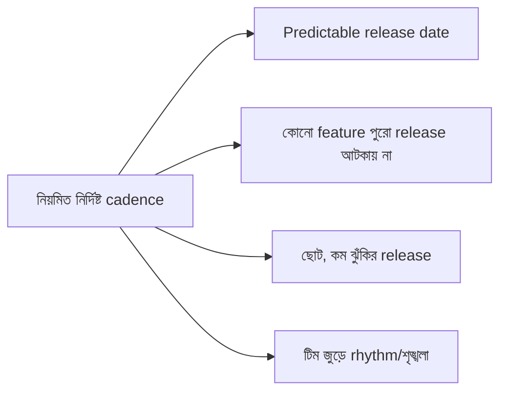

মূল লাভ: release হয়ে যায় একটা **বিরক্তিকর, আগে থেকে আঁচ করা যায় এমন রুটিন** — আর সেটাই ভালো। বড়, অনিয়মিত, "সব একসাথে" release-ই বেশি ঝুঁকিপূর্ণ।

---

### ৯.৪ Beta Track ও Automation

- **Beta/staged channel:** TestFlight (iOS), Play internal/closed/open testing — আসল release-এর আগে ছোট দলকে দিয়ে যাচাই (dogfooding, [Ch 18](#ch-18))।
- **Automation:** compile → test → sign → store-এ upload — পুরো pipeline স্বয়ংক্রিয় করুন (fastlane-জাতীয় টুল)। ম্যানুয়াল signing/upload মানেই ভুল ও দেরি।

> `মূল কথা` Build train-এর দর্শন: **release-কে event থেকে রুটিনে নামিয়ে আনুন।** যত ঘন ঘন ও ছোট release, তত কম ঝুঁকি — আর কোনো একক feature-কে পুরো ট্রেন থামাতে দেওয়া হয় না।

---

### নিজেকে যাচাই করুন

1. Mobile CI/CD backend থেকে কঠিন কেন — অন্তত তিনটি কারণ?
2. "Release train" মডেল কী, এবং "code freeze / branch cut" এর ভূমিকা কী?
3. "Missed the train" দর্শন কীভাবে অসম্পূর্ণ feature ঠেকায়?
4. নিয়মিত ছোট release বড় অনিয়মিত release থেকে নিরাপদ কেন?
5. Beta track ও pipeline automation কেন গুরুত্বপূর্ণ?

[↑ সূচিপত্রে ফিরুন](#toc)

---

<a id="ch-10"></a>

## অধ্যায় ১০: Third-Party Libraries
### Third-Party Library (বাইরের লাইব্রেরি)

> Part 1 · নির্ভরতা ব্যবস্থাপনা · সুবিধা বনাম লুকানো খরচ

### মূল কথা

বাইরের library/SDK দ্রুত কাজ এগোতে সাহায্য করে — কিন্তু mobile-এ এর খরচ web/backend-এর চেয়ে বেশি বাস্তব। প্রতিটি library আপনার **app size বাড়ায়, build ধীর করে, supply-chain ঝুঁকি আনে, এবং ক্লায়েন্টে চলায় তার যেকোনো bug/crash-এর দায় আপনার** — অথচ তা ঠিক করতে আবার নতুন release লাগে। তাই প্রতিটি dependency সচেতনভাবে, খরচ-লাভ বিবেচনা করে নিতে হয়।

---

### ১০.১ কেন mobile-এ library-র খরচ বেশি

- **App size:** প্রতিটি lib বান্ডিলে যুক্ত হয়ে download/install size বাড়ায় ([Ch 39](#ch-39))।
- **ক্লায়েন্টে চলে:** lib crash করলে আপনার app crash করে; আপনি দায়ী, user lib-এর নাম জানে না।
- **Update-এ release লাগে:** lib-এ security fix এলেও সেটা user-এ পৌঁছাতে নতুন app release + user update দরকার।
- **Permission চুরি:** কিছু SDK নীরবে data সংগ্রহ করে বা permission চায় — privacy/compliance ঝুঁকি ([Ch 36](#ch-36))।

---

### ১০.২ একটি library-র লুকানো খরচ

| খরচের ধরন | প্রশ্ন করুন |
|------------|--------------|
| **Binary size** | এটা app কত বড় করবে? |
| **Build time** | compile কতটা ধীর হবে? |
| **Security/Supply-chain** | এর ভেতরে কী আছে? পরবর্তী version-এ ক্ষতিকর কিছু ঢুকতে পারে? |
| **Maintenance** | সক্রিয়ভাবে maintained, না পরিত্যক্ত (abandoned)? |
| **Control** | bug হলে কি আমি ঠিক করতে পারব, নাকি upstream-এর জন্য অপেক্ষা? |
| **License** | বাণিজ্যিকভাবে ব্যবহারযোগ্য? |

---

### ১০.৩ মূল্যায়ন ও সুরক্ষার কৌশল

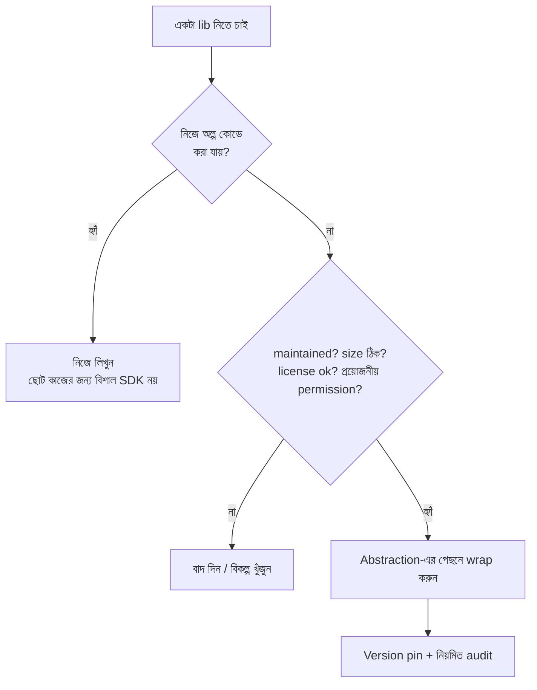

- **Wrap behind abstraction:** lib-কে সরাসরি সব জায়গায় না ছড়িয়ে একটা নিজস্ব interface-এর পেছনে রাখুন — পরে বদলানো সহজ হয়।
- **Minimize ও audit:** কম dependency রাখুন; নিয়মিত যাচাই করুন কোনটা আর দরকার নেই বা abandoned হয়ে গেছে।

> `সতর্কতা` সবচেয়ে সাধারণ ভুল — **একটা সামান্য কাজের জন্য বিশাল, ভারী SDK** টেনে আনা (যেমন শুধু একটা date format করতে পুরো একটা utility framework)। কয়েক লাইন কোডে যা হয়, তার জন্য app size ও ঝুঁকি বাড়ানো অযৌক্তিক।

---

### নিজেকে যাচাই করুন

1. Backend-এর চেয়ে mobile-এ library-র খরচ বেশি কেন — অন্তত তিনটি কারণ?
2. একটি library নেওয়ার আগে কোন কোন "লুকানো খরচ" যাচাই করবেন?
3. "Abandoned dependency" কেন ঝুঁকি? Library-তে security fix এলে কী লাগে?
4. Library-কে abstraction-এর পেছনে wrap করার সুবিধা কী?
5. কোন পরিস্থিতিতে library না নিয়ে নিজে কোড লেখা ভালো?

[↑ সূচিপত্রে ফিরুন](#toc)

---

<a id="ch-11"></a>

## অধ্যায় ১১: Device and OS Fragmentation
### Device ও OS Fragmentation (বৈচিত্র্য)

> Part 1 · "এক সাইজ সবার নয়" · বিশেষত Android-এ তীব্র

### মূল কথা

আপনার app চলবে অগণিত ভিন্ন ভিন্ন ডিভাইসে — নানা screen size ও density, বহু OS version, ভিন্ন hardware capability, এবং (বিশেষত Android-এ) প্রতিটি vendor-এর নিজস্ব customization। এই বিশাল বৈচিত্র্যকে বলে **fragmentation**। সব জায়গায় একই রকম ভালো অভিজ্ঞতা দেওয়া, এবং সবখানে test করা — দুটোই কঠিন।

---

### ১১.১ Fragmentation-এর মাত্রাগুলো

```
              ┌─ Screen: ছোট ফোন → বড় ফোন → tablet → foldable; নানা density
Fragmentation │─ OS version: পুরোনো থেকে নতুন, একসাথে চালু
              │─ Hardware: RAM, CPU, camera, sensor — কোনোটা আছে কোনোটা নেই
              └─ Vendor skin (Android): Samsung/Xiaomi/... এর নিজস্ব পরিবর্তন, bug
```

---

### ১১.২ iOS বনাম Android

| | iOS | Android |
|--|-----|---------|
| ডিভাইস বৈচিত্র্য | সীমিত (Apple-ই বানায়) | বিশাল (হাজারো মডেল, বহু vendor) |
| OS adoption | দ্রুত (নতুন version দ্রুত ছড়ায়) | ধীর, বহু পুরোনো version টেকে |
| Vendor customization | নেই | প্রচুর (নিজস্ব skin, background নীতি) |
| ফল | test matrix ছোট | test matrix বিশাল |

> `মূল কথা` Fragmentation মানেই Android-এ বেশি ব্যথা — কম দামি, পুরোনো, কম-RAM ডিভাইসের বিশাল বৈচিত্র্য, আর প্রতিটি brand-এর আলাদা আচরণ (যেমন background process-কে আগ্রাসীভাবে মেরে ফেলা)।

---

### ১১.৩ Test Matrix-এর বিস্ফোরণ

সব combination test করা অসম্ভব:

```
screen size (১০) × OS version (৮) × vendor (১৫) × ... = হাজার হাজার সংমিশ্রণ
                       ↓ বাস্তব সমাধান ↓
  ১. আসল user data দেখে শীর্ষ ডিভাইস/OS বাছুন (representative set)
  ২. Cloud device farm (Firebase Test Lab, ইত্যাদি) দিয়ে বহু ডিভাইসে চালান
  ৩. পুরোনো/কম-RAM ফোনকে আলাদা গুরুত্ব দিন (এখানেই বেশি bug)
```

---

### ১১.৪ সামলানোর কৌশল

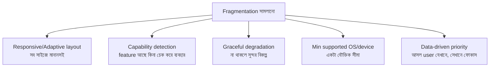

- **Capability detection, version check নয়:** "এই OS version আছে" ধরে নেওয়ার চেয়ে "এই feature/sensor আছে কি না" সরাসরি চেক করা নিরাপদ।
- **Graceful degradation:** কোনো hardware/feature না থাকলে app crash না করে একটা যৌক্তিক বিকল্প দেখাবে।

> `সতর্কতা` নিজের নতুন, দামি ফোনে সব মসৃণ দেখায় — কিন্তু আপনার অনেক user পুরোনো, কম-RAM ফোনে। শুধু flagship ডিভাইসে test করলে আসল জনগোষ্ঠীর অভিজ্ঞতা আপনি কখনো দেখবেন না।

---

### নিজেকে যাচাই করুন

1. Fragmentation-এর চারটি মাত্রা কী কী?
2. iOS ও Android-এ fragmentation কীভাবে আলাদা, এবং কেন?
3. সব combination test করা যায় না — তাহলে বাস্তবে কী করা হয়?
4. "Capability detection" কেন "OS version check"-এর চেয়ে ভালো?
5. Graceful degradation মানে কী — একটা উদাহরণ দিন।

[↑ সূচিপত্রে ফিরুন](#toc)

---

<a id="ch-12"></a>

## অধ্যায় ১২: In-App Purchases
### In-App Purchase (অ্যাপের ভেতরে কেনাকাটা)

> Part 1 · টাকা জড়িত · platform-নিয়ন্ত্রিত ও জটিল

### মূল কথা

App-এর ভেতরে digital জিনিস বা subscription বিক্রি করতে হলে আপনাকে Apple-এর **StoreKit** বা Google-এর **Play Billing** ব্যবহার করতেই হয় — নিজের payment ব্যবস্থা নয় (digital goods-এর ক্ষেত্রে), এবং platform একটা commission নেয়। এর পুরো flow async ও network-নির্ভর, receipt যাচাই করতে হয় (নিরাপদে server-এ), subscription-এর অবস্থা (renew/expire/refund) ট্র্যাক করতে হয়, আর fraud সামলাতে হয়। অর্থ জড়িত বলে এখানে ভুলের দাম বেশি।

---

### ১২.১ কেন In-App Purchase কঠিন

- **নিয়ন্ত্রণ platform-এর হাতে:** আপনি নিজের payment gateway সরাসরি ব্যবহার করতে পারেন না (digital পণ্যে); নিয়ম Apple/Google ঠিক করে।
- **Async ও ভাঙাচোরা:** payment চলাকালীন app বন্ধ হতে পারে, নেট কেটে যেতে পারে — তবু লেনদেন যেন হারিয়ে না যায়।
- **Trust নেই client-এ:** ক্লায়েন্ট "আমি কিনেছি" বললেই বিশ্বাস করা যায় না — fraud সম্ভব।

---

### ১২.২ মূল Flow

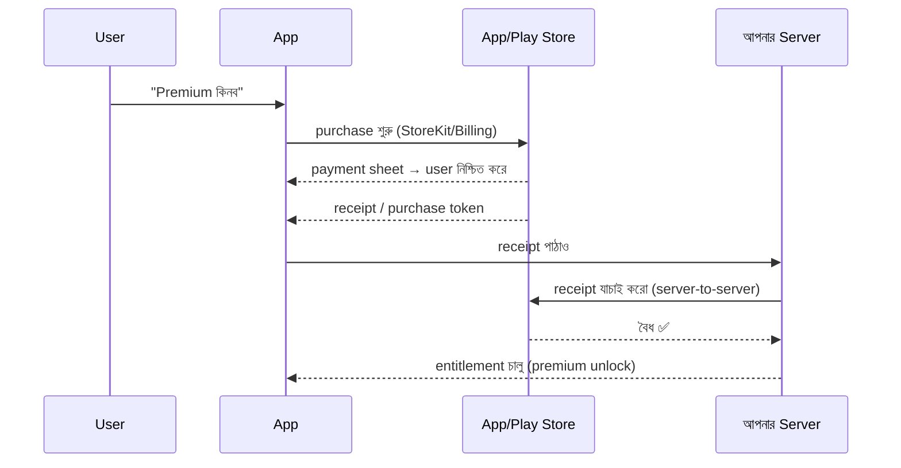

মূল কথা: **আসল "unlock" সিদ্ধান্ত server নেয়, receipt যাচাইয়ের পর** — app নিজে নিজে premium চালু করে না।

---

### ১২.৩ Receipt Validation কেন server-side

```
ক্লায়েন্ট বলল "কিনেছি"  →  বিশ্বাস করবেন না
                              ↓
              Server platform-কে জিজ্ঞেস করে যাচাই করুক
                              ↓
          বৈধ হলে server-এ entitlement রেকর্ড করুন (source of truth)
```

Client-side validation সহজে জাল করা যায়; তাই receipt সবসময় server থেকে platform-এর কাছে যাচাই করতে হয়।

---

### ১২.৪ Subscription-এর বাড়তি জটিলতা

| বিষয় | সামলাতে হয় |
|------|--------------|
| Renewal | প্রতি period-এ নিজে থেকে নবায়ন; server-কে জানতে হয় |
| Expiry / Grace period | শেষ হলে access বন্ধ; payment fail হলে grace সময় |
| Refund / Cancel | ফেরত দিলে entitlement প্রত্যাহার |
| **Restore purchase** | নতুন ফোনে/পুনরায় install-এ আগের কেনা ফিরিয়ে আনা (বাধ্যতামূলক) |
| Cross-platform | iOS-এ কেনা subscription Android-এও চিনতে হবে (server-নির্ভর) |

> `সতর্কতা` দুটি ক্লাসিক ভুল — (১) client-এই entitlement যাচাই করা (জাল করা সহজ), এবং (২) **"Restore Purchases" না রাখা** — ফলে user নতুন ফোনে আগের কেনা জিনিস ফিরে পায় না, এবং review-এ rejection বা ক্ষুব্ধ রিভিউ আসে।

---

### নিজেকে যাচাই করুন

1. কেন digital goods-এ আপনি নিজের payment gateway ব্যবহার করতে পারেন না?
2. IAP flow-তে "premium unlock"-এর চূড়ান্ত সিদ্ধান্ত কে নেয়, এবং কখন?
3. Receipt validation কেন client-এ নয়, server-এ করতে হয়?
4. Subscription-এ কোন কোন অবস্থা (state) সামলাতে হয়?
5. "Restore Purchases" কেন বাধ্যতামূলক ও গুরুত্বপূর্ণ?

[↑ সূচিপত্রে ফিরুন](#toc)

---

> **Part 1 সারসংক্ষেপ:** Mobile আলাদা — কারণ কোড চলে ব্যবহারকারীর ডিভাইসে, যার উপর আপনার নিয়ন্ত্রণ নেই। তাই state যেকোনো সময় হারাতে পারে (Ch1), release ফেরানো যায় না (Ch2), পুরোনো version বছরের পর বছর টেকে (Ch3); বাইরের জগতের সংযোগ (deeplink Ch4, push Ch5, IAP Ch12) সবসময় best-effort ও edge-case-ভরা; আর বাস্তবতা ভাঙাচোরা — crash (Ch6) অনিবার্য, offline (Ch7) সামলাতে হয়, accessibility (Ch8) সবার জন্য দরকার, release হয় train-এ (Ch9), প্রতিটি library খরচ আনে (Ch10), আর fragmentation (Ch11) সব জায়গায় ভালো অভিজ্ঞতা দেওয়া কঠিন করে। সুর: **নিয়ন্ত্রণহীনতার মধ্যে নির্ভরযোগ্যতা।**

[↑ সূচিপত্রে ফিরুন](#toc)

<a id="part-2"></a>

# Part 2 — Large Apps
## বড় অ্যাপ (বড় কোডবেস)

> **কী নিয়ে:** এই Part-এর ৬টি চ্যালেঞ্জ আসে যখন **কোডবেস বড়** হয়। screen বাড়ে, feature বাড়ে, লাইনের পর লাইন কোড জমে। তখন যা ছোট app-এ সহজ ছিল, সেটাই কঠিন হয়ে যায়।
> **মূল বার্তা:** বড় app টিকিয়ে রাখার আসল কথা একটাই — **গঠন (structure)**। navigation, state, module, test — সবকিছুকে গুছিয়ে না রাখলে app নিজের ভারেই ভেঙে পড়ে।

ছোট app-এ আপনি সব কোড এক জায়গায় রাখলেও চলে। কিন্তু app বড় হলে এই "এক জায়গায় সব" মডেল ভেঙে যায়। নিচের চ্যালেঞ্জগুলো দেখায় কীভাবে বড় app-কে গোছানো রাখতে হয়।

```
Part 2-এর গল্প:

  screen বাড়ছে        →  Ch 13 (Navigation)
  state ছড়িয়ে পড়ছে    →  Ch 14 (App State)
  বহু ভাষা/দেশ        →  Ch 15 (Localization)
  কোড জট পাকাচ্ছে      →  Ch 16 (Modular + DI)
  হাতে test অসম্ভব    →  Ch 17 (Automated), Ch 18 (Manual)
```

---

<a id="ch-13"></a>

## অধ্যায় ১৩: Navigation Architecture Within Large Apps
### বড় অ্যাপের ভেতরে navigation

> Part 2 · বড় কোডবেস · screen-এর মধ্যে চলাচল

### মূল কথা

একটা ছোট app-এ এক screen থেকে আরেক screen-এ যাওয়া সহজ। কিন্তু app-এ যখন শত শত screen, আর তারা নানা পথে একে অপরের সাথে যুক্ত — তখন navigation জট পাকিয়ে যায়। deeplink ([Ch 4](#ch-4)) যেকোনো screen-এ সরাসরি ঢোকাতে পারে, তাই ব্যাপারটা আরও কঠিন। সমাধান হলো একটা **পরিষ্কার navigation কাঠামো** — যেখানে "কোথায় যাব" এই সিদ্ধান্ত আলাদা একটা জায়গায় থাকে, প্রতিটি screen-এর ভেতরে ছড়ানো থাকে না।

---

### ১৩.১ navigation কেন বড় অ্যাপে কঠিন হয়

ছোট app-এ সাধারণত প্রতিটি screen নিজেই পরের screen বানিয়ে দেখায়। এটাকে বলে tight coupling — screen-গুলো একে অপরকে সরাসরি চেনে।

```
Screen A  ── নিজে তৈরি করে ──►  Screen B  ── নিজে তৈরি করে ──►  Screen C

সমস্যা:
  • A কে চিনতে হয় B-কে, B কে চিনতে হয় C-কে → সব জড়িয়ে যায়
  • B-কে অন্য কোথাও reuse করা কঠিন (কারণ সে C-কে চেনে)
  • test কঠিন (একটা screen খুলতে গেলে পুরো চেইন লাগে)
```

---

### ১৩.২ সমাধান — Coordinator / Router

মূল ধারণা সহজ: **screen নিজে ঠিক করবে না পরে কোথায় যেতে হবে।** screen শুধু বলবে "আমার কাজ শেষ" বা "user এই জিনিসে চাপ দিয়েছে"। কোথায় যেতে হবে সেটা ঠিক করবে আলাদা একজন — তাকে বলে Coordinator (iOS-এ পরিচিত নাম) বা Router।

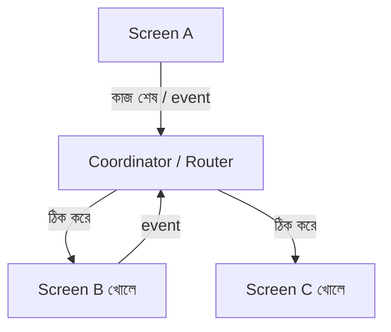

এতে লাভ:
- screen-গুলো একে অপরকে আর চেনে না → আলাদা, reusable।
- পুরো navigation এক জায়গায় → পড়া ও বদলানো সহজ।
- deeplink সহজে যোগ হয় — coordinator-কে শুধু বলুন "এই screen খোলো"।

---

### ১৩.৩ deeplink ও navigation একসাথে

deeplink মানে বাইরে থেকে সরাসরি ভেতরের screen-এ ঢোকা। যদি navigation এক জায়গায় (coordinator-এ) থাকে, তাহলে deeplink সামলানো সহজ:

```
deeplink আসে → coordinator-কে বলে "order screen খোলো (id=789)"
            → coordinator সঠিক back-stack সহ screen খোলে
```

navigation যদি screen-এর ভেতরে ছড়ানো থাকত, তাহলে প্রতিটি deeplink-এর জন্য আলাদা ঝামেলা পোহাতে হতো।

> `সতর্কতা` সবচেয়ে সাধারণ ভুল — প্রতিটি screen-এর ভেতরে পরের screen hard-code করে তৈরি করা। শুরুতে সহজ লাগে, কিন্তু app বড় হলে এটাই সবচেয়ে বড় জট তৈরি করে। শুরু থেকেই navigation আলাদা রাখুন।

---

### নিজেকে যাচাই করুন

1. ছোট app-এর navigation বড় app-এ এসে কেন কঠিন হয়?
2. "Tight coupling" বলতে navigation-এ কী বোঝায়, আর এর সমস্যা কী?
3. Coordinator/Router pattern-এ screen-এর দায়িত্ব কী, আর কোথায় যাওয়ার সিদ্ধান্ত কে নেয়?
4. navigation এক জায়গায় থাকলে deeplink সামলানো সহজ হয় কেন?
5. কোন অভ্যাসটা শুরুতে সহজ মনে হলেও পরে জট বাড়ায়?

[↑ সূচিপত্রে ফিরুন](#toc)

---

<a id="ch-14"></a>

## অধ্যায় ১৪: Application State and Event-Driven Changes
### অ্যাপ-জুড়ে state ও event

> Part 2 · বড় কোডবেস · [Ch 1](#ch-1)-এর state ধারণার বড় ভাই

### মূল কথা

কিছু state শুধু একটা screen-এর — যেমন একটা বাটন চাপা হয়েছে কি না। কিন্তু কিছু state পুরো app জুড়ে দরকার হয় — যেমন user login করা আছে কি না, cart-এ কী আছে, app dark mode-এ আছে কি না। এই **app-wide (global) state** একটা জায়গায় বদলালে অনেক screen-কে জানতে হয়। কীভাবে সবাইকে ঠিকভাবে জানানো যায়, আর UI সবসময় state-এর সাথে মেলে — এটাই এই চ্যালেঞ্জ।

---

### ১৪.১ দুই ধরনের state

| ধরন | উদাহরণ | কে জানে |
|------|---------|----------|
| **Local (screen) state** | scroll position, খোলা dropdown | শুধু ওই screen |
| **App-wide (global) state** | login status, cart, theme, ভাষা | অনেক screen একসাথে |

মূল প্রশ্ন: এই তথ্যটা কি একটা screen-এর ভেতরের ব্যাপার, নাকি পুরো app-এর? উত্তরই ঠিক করে দেয় কোথায় রাখবেন।

---

### ১৪.২ সমস্যা — state ছড়িয়ে পড়লে UI মেলে না

ধরুন login status তিন জায়গায় আলাদা করে রাখা আছে। user logout করল, কিন্তু একটা জায়গা সেটা জানল না।

```
Logout হলো
   ├─ Profile screen জানল    → ঠিক দেখাল
   ├─ Home screen জানল না    → এখনো "Welcome, রানা" দেখাচ্ছে  ❌
   └─ Settings জানল না       → এখনো logout বাটন নেই            ❌
```

এই অসামঞ্জস্যই বড় app-এ সবচেয়ে বিরক্তিকর ও কঠিন bug তৈরি করে।

---

### ১৪.৩ সমাধান — Event-Driven ও একক উৎস

দুটো নিয়ম এই সমস্যা ঠেকায়:

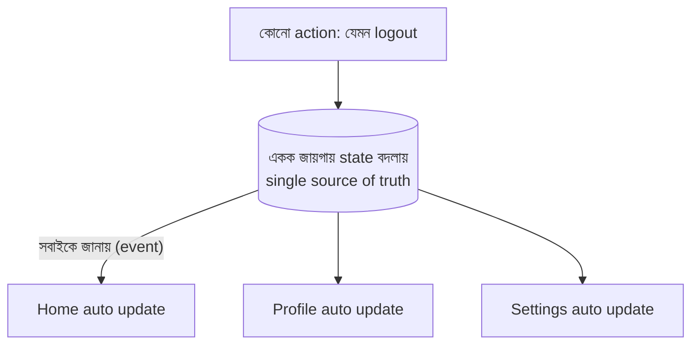

1. **Single source of truth:** login status একটাই জায়গায় থাকবে, তিন জায়গায় নয়।
2. **Event-driven:** সেই একটা জায়গা বদলালে, যারা সেটা "শোনে" (observe করে) তারা সবাই নিজে থেকে update পায়। কাউকে আলাদা করে গিয়ে বলতে হয় না।

এটাই [Ch 1](#ch-1)-এর unidirectional data flow-এর বড় রূপ। Redux, MVI, BLoC-এর মতো প্যাটার্ন ঠিক এই কাজটাই করে।

---

### ১৪.৪ সতর্কতা — সব কিছু global করবেন না

> `সতর্কতা` উল্টো বিপদও আছে — সব state global করে ফেলা। তখন যেকোনো জায়গা থেকে যেকোনো state বদলানো যায়, আর কে কখন কী বদলাল বোঝা যায় না। নিয়ম: **শুধু যা সত্যিই app-জুড়ে দরকার, সেটাই global; বাকিটা local রাখুন।**

---

### নিজেকে যাচাই করুন

1. Local state আর app-wide state-এর পার্থক্য কী? একটা করে উদাহরণ দিন।
2. একই তথ্য একাধিক জায়গায় রাখলে কী সমস্যা হয়?
3. "Single source of truth" আর "event-driven update" কীভাবে এই সমস্যা ঠেকায়?
4. observe করা (শোনা) মানে কী — কেন এতে আলাদা করে জানাতে হয় না?
5. সব state global করে ফেললে কী বিপদ?

[↑ সূচিপত্রে ফিরুন](#toc)

---

<a id="ch-15"></a>

## অধ্যায় ১৫: Localization
### Localization — বহু ভাষা ও অঞ্চলের জন্য

> Part 2 · বড় কোডবেস · বিশ্বজুড়ে user

### মূল কথা

App যখন অনেক দেশে চলে, তখন শুধু লেখা অনুবাদ করলেই হয় না। তারিখের ফরম্যাট, সংখ্যা, মুদ্রা, একবচন-বহুবচনের নিয়ম, এমনকি লেখার দিক (কিছু ভাষা ডান থেকে বাঁয়ে চলে) — সব আলাদা। এই পুরো কাজটাকে বলে localization। সবচেয়ে বড় ভুল হলো কোডের ভেতরে সরাসরি লেখা (hard-code) বসিয়ে দেওয়া — পরে সেটা অন্য ভাষায় নেওয়া ভীষণ কঠিন হয়ে যায়।

---

### ১৫.১ Localization মানে শুধু translation নয়

| দিক | উদাহরণ |
|------|---------|
| লেখা (string) | "Submit" → "জমা দিন" |
| তারিখ ও সময় | 06/13/2026 বনাম 13/06/2026 |
| সংখ্যা ও মুদ্রা | 1,000.50 বনাম 1.000,50 ; $ বনাম ৳ |
| একবচন/বহুবচন (plural) | "1 message" বনাম "2 messages" — ভাষাভেদে নিয়ম আলাদা |
| লেখার দিক (RTL) | Arabic/Hebrew ডান থেকে বাঁয়ে — পুরো layout উল্টে যায় |
| ছবি/আইকন | কিছু চিহ্নের মানে দেশভেদে আলাদা |

---

### ১৫.২ কীভাবে করা হয়

মূল নিয়ম: **লেখা কোডে নয়, আলাদা resource ফাইলে রাখুন।** কোডে শুধু একটা key থাকে, আর প্রতিটি ভাষার ফাইলে সেই key-এর মান।

```
কোডে:        text = localized("greeting")

en ফাইলে:    greeting = "Hello"
bn ফাইলে:    greeting = "হ্যালো"
ar ফাইলে:    greeting = "مرحبا"

→ device-এর ভাষা অনুযায়ী সঠিক লেখা নিজে থেকে আসে
```

---

### ১৫.৩ যে দুটো জিনিস সবচেয়ে ভোগায়

- **Plural ও gender:** ইংরেজিতে দুটো রূপ (1 item / 2 items), কিন্তু কিছু ভাষায় চার-পাঁচটা রূপ আছে। তাই "সংখ্যা + s" এভাবে জোড়া দেওয়া যায় না; ভাষার plural নিয়ম ব্যবহার করতে হয়।
- **RTL (ডান-থেকে-বাঁ):** শুধু লেখা নয়, পুরো layout আয়নার মতো উল্টে যায় — back বাটন, icon, padding সব। আগে থেকে না ভাবলে UI ভেঙে যায়।

> `সতর্কতা` লেখা **জোড়া দেওয়া (string concatenation)** এড়িয়ে চলুন — যেমন `"আপনি " + count + "টি নতুন বার্তা পেয়েছেন"`। অন্য ভাষায় শব্দের ক্রম আলাদা, তাই এভাবে জোড়া দিলে বাক্য ভেঙে যায়। পুরো বাক্যটাকে একটা parameter-সহ template হিসেবে রাখুন।

---

### ১৫.৪ Scale-এ Localization

অনেক ভাষা সামলাতে হলে একটা পুরো pipeline লাগে: developer key যোগ করে → translator-দের কাছে যায় → অনুবাদ ফিরে আসে → app-এ ঢোকে। translator-দের context (screenshot) দিলে অনুবাদ ভালো হয়। আর মনে রাখবেন — localization পরে যোগ করা খুব কঠিন, তাই শুরু থেকেই hard-code এড়িয়ে চলুন।

---

### নিজেকে যাচাই করুন

1. Localization কেন শুধু translation নয় — অন্তত তিনটি দিক বলুন।
2. লেখা কোডে hard-code না করে কোথায় রাখা হয়, আর কেন?
3. Plural নিয়ে ভাষাভেদে কী সমস্যা হয়?
4. RTL ভাষায় শুধু লেখা ছাড়া আর কী বদলায়?
5. String concatenation কেন বিপজ্জনক — বদলে কী করবেন?

[↑ সূচিপত্রে ফিরুন](#toc)

---

<a id="ch-16"></a>

## অধ্যায় ১৬: Modular Architecture and Dependency Injection
### Module-এ ভাগ ও Dependency Injection

> Part 2 · বড় কোডবেস · গঠনের মূল হাতিয়ার

### মূল কথা

শুরুতে সব কোড এক জায়গায় (এক বড় module) রাখা সহজ। কিন্তু কোড বড় হলে এই "সব এক জায়গায়" মডেল ভোগায় — build ধীর হয়, সবাই একই ফাইলে কাজ করে ঠোকাঠুকি লাগে, কোনটা কার দায়িত্ব বোঝা যায় না। সমাধান: কোডকে ছোট ছোট **module**-এ ভাগ করা। আর সেই module-গুলোকে আলগাভাবে জোড়া দেওয়ার আঠা হলো **Dependency Injection (DI)**।

---

### ১৬.১ এক বড় module-এর সমস্যা (Monolith)

```
এক বিশাল module:
   ┌───────────────────────────────────┐
   │  সব feature, সব কোড একসাথে          │
   │  - একটু বদলালেই পুরোটা rebuild       │  → build ধীর
   │  - সবাই একই জায়গায় কাজ করে          │  → merge conflict (Ch 20)
   │  - কোনটা কার, অস্পষ্ট                 │  → ownership নেই (Ch 24)
   └───────────────────────────────────┘
```

---

### ১৬.২ সমাধান — Module-এ ভাগ

কোডকে অর্থপূর্ণ টুকরোয় ভাগ করুন: প্রতিটি বড় feature একটা module, আর সবার দরকারি common জিনিস (network, design system) আলাদা core module-এ।

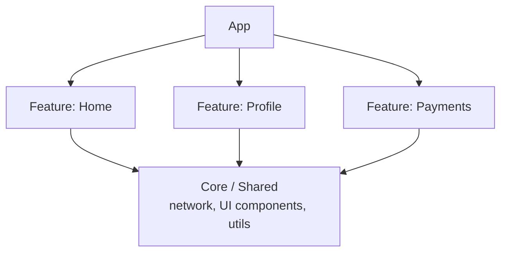

লাভ:
- **দ্রুত build:** শুধু যে module বদলেছে সেটাই আবার build হয় (incremental build)।
- **পরিষ্কার ownership:** কোন team কোন module-এর মালিক, স্পষ্ট ([Ch 24](#ch-24))।
- **কম ঠোকাঠুকি:** আলাদা module-এ আলাদা team কাজ করলে merge conflict কমে ([Ch 20](#ch-20))।

---

### ১৬.৩ Dependency Injection (DI) — সহজ ভাষায়

একটা object-এর কাজ করতে অন্য জিনিস (dependency) লাগে — যেমন একটা screen-এর একটা network service লাগে। দুটো উপায়:

```
DI ছাড়া:   screen নিজেই ভেতরে network service তৈরি করে
            → test করতে গেলে আসল network লাগে, swap করা যায় না

DI সহ:      service বাইরে থেকে screen-কে দিয়ে দেওয়া হয়
            → test-এ নকল (fake) service দেওয়া যায়, swap সহজ
```

মানে — object নিজে তার dependency বানায় না, বাইরে থেকে পায়। এতে test সহজ হয়, আর এক জিনিস বদলে আরেকটা বসানো সহজ হয়।

> `সতর্কতা` উল্টো বিপদ — **অতি-modularization**। খুব বেশি ছোট ছোট module বানালে নিজেই একটা জটিলতা তৈরি হয় (কে কাকে চেনে, সেটআপ ভারী)। module তখনই ভাগ করুন যখন তার সত্যিকারের কারণ আছে (আলাদা team, আলাদা build, পরিষ্কার সীমানা)।

---

### নিজেকে যাচাই করুন

1. এক বড় module (monolith) বড় হলে কোন তিনটি সমস্যা হয়?
2. Feature module আর core/shared module-এর পার্থক্য কী?
3. Module-এ ভাগ করলে build আর ownership-এ কী লাভ?
4. Dependency Injection সহজ ভাষায় কী — এতে test সহজ হয় কেন?
5. "অতি-modularization" কেন খারাপ?

[↑ সূচিপত্রে ফিরুন](#toc)

---

<a id="ch-17"></a>

## অধ্যায় ১৭: Automated Testing
### Automated Testing (স্বয়ংক্রিয় পরীক্ষা)

> Part 2 · বড় কোডবেস · হাতে test আর যথেষ্ট নয়

### মূল কথা

App ছোট থাকতে হাতে (manually) সব test করা যায়। কিন্তু app বড় হলে প্রতিবার সব কিছু হাতে পরীক্ষা করা অসম্ভব। তখন automated test লাগে — কোড নিজেই কোড পরীক্ষা করে। কিন্তু mobile-এ একটা সমস্যা: UI test ধীর আর প্রায়ই অনির্ভরযোগ্য (flaky)। তাই নিয়ম — **বেশি ছোট-দ্রুত unit test, কম বড়-ধীর UI test।** একেই বলে test pyramid।

---

### ১৭.১ Test-এর তিন ধরন

| ধরন | কী পরীক্ষা করে | গতি | আস্থা (real-এর কাছাকাছি?) |
|------|----------------|-----|----------------------------|
| **Unit** | ছোট একটা function/class | খুব দ্রুত | কম (একটা টুকরো) |
| **Integration** | কয়েকটা অংশ একসাথে | মাঝারি | মাঝারি |
| **UI / End-to-End** | পুরো app যেভাবে user চালায় | ধীর | বেশি (পুরোটা) |

---

### ১৭.২ Test Pyramid — mobile-এ

```
            ╱╲
           ╱UI╲          কম: শুধু সবচেয়ে গুরুত্বপূর্ণ flow (ধীর, ব্যয়বহুল)
          ╱────╲
         ╱ Integ ╲       মাঝারি সংখ্যক
        ╱──────────╲
       ╱   Unit      ╲   অনেক: দ্রুত, সস্তা, ভিত্তি
      ╱────────────────╲
```

কারণ: UI test ধীর আর ভাঙে বেশি। তাই বেশি logic unit test দিয়ে ঢাকুন; UI test শুধু সবচেয়ে জরুরি user path-এর জন্য রাখুন।

---

### ১৭.৩ Flaky Test — সবচেয়ে বড় শত্রু

Flaky test মানে এমন test যা একই কোডে কখনো পাস করে, কখনো fail করে।

```
একই কোড → কখনো ✅ কখনো ❌ → কেউ আর test-কে বিশ্বাস করে না
                                  → fail দেখলে "আবার flaky" ভেবে উপেক্ষা
                                  → আসল bug-ও মিস হয়
```

কারণ সাধারণত: timing/animation শেষ হওয়ার আগেই চেক, আসল network-এর উপর নির্ভরতা, test-গুলোর একটা আরেকটার উপর প্রভাব। flaky test দ্রুত ঠিক করতে হয়, নইলে পুরো test suite-এর উপর আস্থা নষ্ট হয়।

> `সতর্কতা` দুটো সাধারণ ভুল — (১) শুধু coverage-এর সংখ্যা (যেমন "৮০%") তাড়া করা, অথচ test-গুলো আসল behavior ধরে না; (২) অনেক ভঙ্গুর UI test বানানো, যা ধীর আর flaky। লক্ষ্য সংখ্যা নয় — **গুরুত্বপূর্ণ behavior নির্ভরযোগ্যভাবে পরীক্ষা করা।**

---

### ১৭.৪ কী test করব

- **behavior, কোডের ভেতরের খুঁটিনাটি নয়:** "user login করলে home screen আসে" — এটা test করুন; ভেতরের কোন variable কী হলো তা নয়।
- **গুরুত্বপূর্ণ ও ঝুঁকিপূর্ণ অংশ আগে:** payment, login, data save — এসব আগে।
- **CI-তে চালান:** প্রতিটি pull request-এ test নিজে থেকে চলবে ([Ch 9](#ch-9))।

---

### নিজেকে যাচাই করুন

1. App বড় হলে হাতে test কেন যথেষ্ট নয়?
2. তিন ধরনের test ও তাদের গতি/আস্থার পার্থক্য বলুন।
3. Test pyramid কী বলে — mobile-এ UI test কম রাখা হয় কেন?
4. Flaky test কী, আর কেন এটা এত বিপজ্জনক?
5. "Behavior test করুন, ভেতরের খুঁটিনাটি নয়" — মানে কী?

[↑ সূচিপত্রে ফিরুন](#toc)

---

<a id="ch-18"></a>

## অধ্যায় ১৮: Manual Testing
### Manual Testing (হাতে পরীক্ষা)

> Part 2 · বড় কোডবেস · automation থাকলেও যা লাগে

### মূল কথা

Automated test থাকার পরও হাতে test পুরোপুরি বাদ দেওয়া যায় না। কারণ কিছু জিনিস automation সহজে ধরতে পারে না — UI আসলে দেখতে/চালাতে কেমন লাগছে, অদ্ভুত ডিভাইসে কী হয়, বা এমন bug যা কেউ আগে ভাবেইনি। তাই বড় টিমেও manual testing থাকে — QA, exploratory testing, dogfooding আর beta program-এর মাধ্যমে।

---

### ১৮.১ কেন automation-এর পরও manual লাগে

| automation যা ভালো ধরে | manual যা ভালো ধরে |
|--------------------------|----------------------|
| জানা, নির্দিষ্ট নিয়ম ("X হলে Y") | দেখতে/চালাতে কেমন লাগছে (feel) |
| বারবার একই জিনিস দ্রুত | অপ্রত্যাশিত, "এটা তো ভাবিনি" bug |
| regression (আগের জিনিস ভাঙল কি না) | আসল ডিভাইসের অদ্ভুত আচরণ |

---

### ১৮.২ Exploratory Testing

এটা স্ক্রিপ্ট-ধরে নয়। একজন মানুষ app-এ ঘুরে বেড়ায়, নানা অদ্ভুত কাজ করে দেখে — "এখানে যদি দ্রুত দুবার চাপি?", "মাঝপথে নেট বন্ধ করলে?"। উদ্দেশ্য — যেসব bug কেউ আগে থেকে ভাবেনি, সেগুলো খুঁজে বের করা।

---

### ১৮.৩ Dogfooding ও Beta

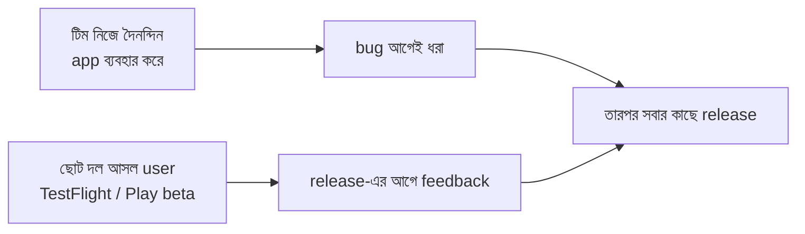

- **Dogfooding:** টিম নিজেরাই প্রতিদিন নিজেদের app (internal build) ব্যবহার করে। নিজেরা ভুক্তভোগী হলে bug দ্রুত ধরা পড়ে।
- **Beta:** আসল কিছু user-কে release-এর আগে নতুন version দেওয়া হয়, যাতে বড় সমস্যা সবার কাছে যাওয়ার আগেই ধরা পড়ে ([Ch 9](#ch-9)-এর build train-এর সাথে যুক্ত)।

> `সতর্কতা` দুটো চরম ভুল — সব কিছু manual করা (ধীর, scale করে না), অথবা সব কিছু automation দিয়ে করার চেষ্টা (feel ও অপ্রত্যাশিত bug মিস হয়)। ঠিক উত্তর হলো ভারসাম্য — যা জানা ও বারবার লাগে তা automate, আর feel ও খোঁজাখুঁজির জন্য manual।

---

### নিজেকে যাচাই করুন

1. Automated test থাকার পরও manual testing কেন দরকার?
2. Automation আর manual — কে কোন ধরনের জিনিস ভালো ধরে?
3. Exploratory testing কী, আর এর উদ্দেশ্য কী?
4. Dogfooding ও beta program-এর পার্থক্য ও লাভ কী?
5. শুধু manual বা শুধু automation — দুটোই কেন ভুল?

[↑ সূচিপত্রে ফিরুন](#toc)

---

> **Part 2 সারসংক্ষেপ:** কোডবেস বড় হলে আসল চ্যালেঞ্জ হলো গঠন ঠিক রাখা। navigation আলাদা জায়গায় রাখুন যাতে screen জট না পাকায় (Ch13); app-wide state একটা জায়গায় রেখে event দিয়ে সবাইকে জানান (Ch14); শুরু থেকেই localization-এর কথা ভেবে hard-code এড়ান (Ch15); কোডকে module-এ ভাগ করুন আর DI দিয়ে আলগাভাবে জুড়ুন (Ch16); আর scale-এ মান ধরে রাখতে বেশি unit test + কম UI test (Ch17) এবং দরকারি manual testing (Ch18) — দুটোই রাখুন। সুর: **বড় অ্যাপ = ভালো গঠন।**

[↑ সূচিপত্রে ফিরুন](#toc)

<a id="part-3"></a>

# Part 3 — Large Teams
## বড় টিম

> **কী নিয়ে:** এই Part-এর ৬টি চ্যালেঞ্জ আসে যখন **অনেক engineer একসাথে** একই app-এ কাজ করে। কোড ভালো হলেও মানুষ বাড়লে নতুন সমস্যা আসে — সমন্বয়, সিদ্ধান্ত, একে অপরের পথে পড়া।
> **মূল বার্তা:** বড় টিমের আসল চ্যালেঞ্জ technical নয়, বরং **coordination (সমন্বয়)**। কীভাবে অনেক মানুষ একসাথে কাজ করেও একে অপরকে আটকাবে না — সেটাই মূল প্রশ্ন।

একজন বা ছোট টিম থাকলে কথা বলেই সব ঠিক করা যায়। কিন্তু টিম বড় হলে "শুধু কথা বলে ঠিক করি" আর কাজ করে না। নিচের চ্যালেঞ্জগুলো দেখায় কীভাবে বড় টিম মসৃণভাবে কাজ করে।

```
Part 3-এর গল্প:

  সিদ্ধান্ত নেওয়া কঠিন      →  Ch 19 (Planning ও Decision)
  একে অপরের পথে পড়া         →  Ch 20 (Stepping on toes)
  একাধিক app, common কোড    →  Ch 21 (Shared architecture)
  সবাই ধীর, tool দুর্বল      →  Ch 22 (Tooling)
  build ও merge ধীর         →  Ch 23 (Build/merge time)
  ভিত্তি কে দেখবে?           →  Ch 24 (Platform team)
```

---

<a id="ch-19"></a>

## অধ্যায় ১৯: Planning and Decision Making
### পরিকল্পনা ও সিদ্ধান্ত নেওয়া

> Part 3 · বড় টিম · একসাথে এগোনোর নিয়ম

### মূল কথা

ছোট টিমে একটা technical সিদ্ধান্ত (কোন approach নেব, কীভাবে বানাব) কথা বলেই ঠিক করা যায়। কিন্তু বড় টিমে অনেক মানুষ জড়িত — একজনের সিদ্ধান্ত অন্যদের কাজে প্রভাব ফেলে। তখন সিদ্ধান্ত নেওয়ার একটা পরিষ্কার নিয়ম লাগে: লিখিত প্রস্তাব, সবার মতামত, আর সবাইকে এক পাতায় আনা (alignment)। নইলে হয় কেউ সিদ্ধান্তই নেয় না, নয়তো পরে সবাই আলাদা দিকে চলে যায়।

---

### ১৯.১ ছোট টিম বনাম বড় টিমে সিদ্ধান্ত

```
ছোট টিম:  ২ জন কথা বলল → ঠিক হয়ে গেল ✅ (সহজ)

বড় টিম:   ১০ জন জড়িত → সবাই মুখে আলাদা বোঝে → পরে দ্বন্দ্ব ❌
          সমাধান: লিখে ফেলুন, সবাই দেখুক, তারপর সিদ্ধান্ত
```

---

### ১৯.২ RFC / Design Doc — লিখিত প্রস্তাব

বড় সিদ্ধান্তের আগে একটা ছোট ডকুমেন্ট লেখা হয়: আমরা কী সমস্যা সমাধান করছি, কোন কোন উপায় আছে, কোনটা কেন বেছে নিচ্ছি। একে বলে RFC (Request for Comments) বা design doc।

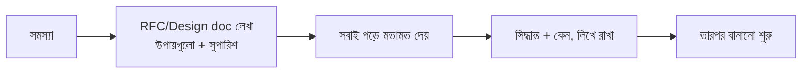

লিখিত কেন ভালো:
- সবাই একই জিনিস দেখে (মুখের কথায় ভুল বোঝাবুঝি কমে)।
- যারা মিটিংয়ে ছিল না, তারাও পরে পড়তে পারে।
- পরে "কেন এই সিদ্ধান্ত নিয়েছিলাম" — সেই কারণ (rationale) থেকে যায়।

---

### ১৯.৩ Alignment — সবাইকে এক পাতায় আনা

সিদ্ধান্ত নেওয়ার আগে সংশ্লিষ্ট সবাইকে একমত করা জরুরি। নইলে কোড লেখার পরে কেউ বলবে "আমি তো অন্যভাবে ভেবেছিলাম" — তখন আবার শুরু থেকে করতে হয়, যা অনেক সময় নষ্ট করে।

> `সতর্কতা` দুই দিকেই বিপদ। এক — সব ছোট জিনিসের জন্য বড় ডকুমেন্ট ও মিটিং (তাহলে কাজই এগোয় না)। দুই — কোনো লিখিত রেকর্ড না রাখা (তাহলে পরে কেউ মনে রাখে না কেন কী হয়েছিল)। নিয়ম: **সিদ্ধান্ত যত বড় ও যত বেশি মানুষকে ছোঁয়, তত বেশি লিখিত ও alignment দরকার।**

---

### নিজেকে যাচাই করুন

1. ছোট ও বড় টিমে সিদ্ধান্ত নেওয়ার পার্থক্য কী?
2. RFC / design doc কী, আর এতে সাধারণত কী থাকে?
3. সিদ্ধান্ত লিখে রাখার তিনটি লাভ বলুন।
4. "Alignment" কেন কোড লেখার আগে দরকার?
5. কখন বেশি লিখিত প্রক্রিয়া দরকার, কখন নয়?

[↑ সূচিপত্রে ফিরুন](#toc)

---

<a id="ch-20"></a>

## অধ্যায় ২০: Avoiding Stepping on Each Other's Toes
### একে অপরের পথে না পড়া

> Part 3 · বড় টিম · একসাথে কোড লেখা

### মূল কথা

অনেক engineer একই কোডবেসে কাজ করলে তারা একে অপরের পথে পড়ে — দুজন একই ফাইল বদলায় (merge conflict), একজনের পরিবর্তন আরেকজনেরটা ভেঙে দেয়, কেউ জানে না কে কী করছে। লক্ষ্য হলো এমনভাবে কাজ ভাগ করা, যাতে সবাই যতটা সম্ভব **আলাদা থেকে, একে অপরকে না আটকে** কাজ করতে পারে।

---

### ২০.১ সমস্যাটা কেমন

```
একই অংশে অনেকজন কাজ করছে:

  Dev A ─┐
  Dev B ─┼──►  একই ফাইল/module  ──►  merge conflict, একজনেরটা আরেকজন ভাঙছে
  Dev C ─┘
```

---

### ২০.২ সমাধান — পরিষ্কার সীমানা ও ownership

| উপায় | কীভাবে সাহায্য করে |
|------|----------------------|
| **Modular boundary** ([Ch 16](#ch-16)) | আলাদা module-এ আলাদা মানুষ → কম conflict |
| **Code ownership** | কোন অংশ কোন team দেখে, স্পষ্ট → বিশৃঙ্খলা কম |
| **ছোট, ঘন ঘন merge** | বড় বদল জমিয়ে না রেখে অল্প অল্প করে মেলান |
| **পরিষ্কার API/contract** | আগে interface ঠিক করে নিন, তারপর দুই পাশে আলাদা কাজ |

---

### ২০.৩ অসম্পূর্ণ কাজ নিরাপদে merge করা

একটা সমস্যা: feature এখনো শেষ হয়নি, কিন্তু কোড আলাদা রেখে দিলে পরে বিশাল merge conflict হয়। সমাধান — অসম্পূর্ণ feature-কে একটা **feature flag**-এর পেছনে রেখে main branch-এ merge করা। কোড আছে, কিন্তু flag বন্ধ থাকায় user দেখে না।

```
অসম্পূর্ণ feature → flag-এর পেছনে → প্রায়ই main-এ merge
                  → কোড আলাদা জমে না → বড় conflict নেই
                  → তৈরি হলে শুধু flag চালু (Ch 2)
```

তবে সাবধান — flag বেশি হলে নিজেই জঞ্জাল হয়ে যায় ([Ch 31](#ch-31))।

> `সতর্কতা` সবচেয়ে বড় ভুল — **বিশাল, দীর্ঘদিনের branch** (সপ্তাহ/মাস ধরে আলাদা)। যত দিন আলাদা থাকে, main তত এগিয়ে যায়, আর শেষে merge করতে গেলে ভয়ংকর conflict হয় (big-bang merge)। ছোট ছোট করে ঘন ঘন merge করাই নিরাপদ।

---

### নিজেকে যাচাই করুন

1. অনেকজন একই কোডে কাজ করলে কী কী সমস্যা হয়?
2. Modular boundary আর code ownership কীভাবে conflict কমায়?
3. ছোট ও ঘন ঘন merge কেন বড় merge-এর চেয়ে নিরাপদ?
4. অসম্পূর্ণ feature কীভাবে নিরাপদে main-এ merge করা যায়?
5. "Big-bang merge" কেন বিপজ্জনক?

[↑ সূচিপত্রে ফিরুন](#toc)

---

<a id="ch-21"></a>

## অধ্যায় ২১: Shared Architecture Across Several Apps
### একাধিক অ্যাপে shared architecture

> Part 3 · বড় টিম · কোড ভাগ করে ব্যবহার

### মূল কথা

বড় কোম্পানির প্রায়ই একাধিক app থাকে — যেমন একটা যাত্রীর app আর একটা চালকের app, কিংবা একই app-এর iOS ও Android version। এসবে অনেক জিনিস একই রকম (login, network, design)। প্রতিবার আলাদা করে না লিখে common অংশ **share** করলে কাজ কমে আর consistency বাড়ে। কিন্তু বেশি share করলে আবার সব app একে অপরের সাথে জড়িয়ে যায় — তাই একটা ভারসাম্য দরকার।

---

### ২১.১ কেন share করা ভালো

- **কম duplication:** একই জিনিস তিনবার লিখতে হয় না।
- **Consistency:** সব app একই রকম আচরণ ও চেহারা পায়।
- **একবার ঠিক করলে সবার জন্য ঠিক:** common অংশে bug সারালে সব app উপকৃত।

---

### ২১.২ কী share করা যায়

```mermaid
flowchart TD
    Shared[Shared / common অংশ] --> A[Design system<br/>button, color, font]
    Shared --> B[Network layer<br/>API কল করার কোড]
    Shared --> C[Core logic<br/>auth, business rules]
    Shared --> D[Analytics<br/>event পাঠানো]
    A --> App1[App ১]
    A --> App2[App ২]
    C --> App1
    C --> App2
```

---

### ২১.৩ কীভাবে ও কোথায় (trade-off)

share করার উপায় — common কোড একটা shared library/module-এ রাখা, আর সব app সেটা ব্যবহার করা। repo নিয়ে দুই পথ:

| | Monorepo (সব এক repo-তে) | আলাদা repo |
|--|---------------------------|-------------|
| Share করা | সহজ | একটু কঠিন (version লাগে) |
| আলাদা থাকা | কম | বেশি |

মূল trade-off: **share বাড়ালে coupling বাড়ে।** common অংশ বদলালে সব app একসাথে প্রভাবিত হয় — একটা ভুল সব app ভাঙতে পারে।

> `সতর্কতা` জোর করে সব কিছু share করতে যাবেন না। কিছু জিনিস দুই app-এ আলাদা থাকাই ভালো (কারণ তাদের দরকার আলাদা)। ভুলভাবে share করলে এক app-এর দরকারে আরেক app-কে টানাহেঁচড়া করতে হয়। **share তখনই, যখন জিনিসটা সত্যিই এক এবং একসাথে বদলায়।**

---

### নিজেকে যাচাই করুন

1. একাধিক app-এ কোড share করার তিনটি লাভ কী?
2. সাধারণত কী কী জিনিস share করা হয়?
3. Monorepo আর আলাদা repo-র মূল পার্থক্য কী?
4. "Share বাড়ালে coupling বাড়ে" — এর মানে ও ঝুঁকি কী?
5. কখন কিছু share *না* করাই ভালো?

[↑ সূচিপত্রে ফিরুন](#toc)

---

<a id="ch-22"></a>

## অধ্যায় ২২: Tooling Maturity for Large Teams
### বড় টিমের জন্য ভালো tooling

> Part 3 · বড় টিম · developer experience

### মূল কথা

বড় টিমে প্রত্যেকের কাজের গতি অনেকটাই নির্ভর করে internal tooling-এর উপর — build কত দ্রুত, release কত সহজ, bug খোঁজা কত সহজ, নতুন কেউ কত দ্রুত শুরু করতে পারে। tool দুর্বল হলে প্রতিটি ছোট কাজ ধীর হয়, আর সেটা ১০০ জন engineer দিয়ে গুণ হলে বিশাল সময় নষ্ট। তাই বড় টিমে tooling-এ বিনিয়োগ করা মানে পুরো টিমের সময় বাঁচানো।

---

### ২২.১ কেন scale-এ tooling এত গুরুত্বপূর্ণ

```
একটা ধীর build = একজনের ৫ মিনিট নষ্ট
        × ১০০ engineer
        × দিনে ১০ বার build
   = প্রতিদিন বিশাল সময় ও টাকা নষ্ট

তাই: tool দ্রুত করা = পুরো টিমকে দ্রুত করা
```

---

### ২২.২ কোন কোন tool

| ক্ষেত্র | উদাহরণ |
|---------|---------|
| Build ও CI | দ্রুত, নির্ভরযোগ্য build pipeline ([Ch 9](#ch-9), [Ch 23](#ch-23)) |
| Release | automated signing ও store upload (যেমন fastlane) |
| Debugging | log, crash, network দেখার ভালো tool |
| Code মান | lint, format, static analysis ([Ch 35](#ch-35)) |
| Code generation | বারবার লেখা boilerplate auto তৈরি |
| Local setup | নতুন engineer এক কমান্ডে শুরু করতে পারে |

---

### ২২.৩ Developer Experience (DX)

DX মানে — একজন engineer-এর দৈনন্দিন কাজ কতটা মসৃণ। ভালো DX হলো: setup সহজ, feedback দ্রুত (build/test অল্প সময়ে ফল দেয়), আর ঝামেলা কম। DX ভালো হলে engineer আসল কাজে বেশি সময় দিতে পারে, tool-এর সাথে লড়াইয়ে কম।

> `সতর্কতা` সবচেয়ে সাধারণ ভুল — কোনো standard tool বা নিয়ম না থাকা, প্রত্যেকে নিজের মতো setup করা। তখন একজনের মেশিনে চলে, আরেকজনের চলে না; নতুন কেউ এসে দিন পার করে দেয় শুধু setup-এ। বড় টিমে একটা সাধারণ, standard পথ থাকা দরকার ([Ch 24](#ch-24)-এর "paved road")।

---

### নিজেকে যাচাই করুন

1. বড় টিমে tooling কেন এত বেশি গুরুত্বপূর্ণ?
2. ছোট একটা ধীরগতি কীভাবে scale-এ বিশাল ক্ষতি হয়?
3. কোন কোন ক্ষেত্রে ভালো tool দরকার — তিনটি বলুন।
4. "Developer Experience (DX)" বলতে কী বোঝায়?
5. সবাই নিজের মতো setup করলে কী সমস্যা হয়?

[↑ সূচিপত্রে ফিরুন](#toc)

---

<a id="ch-23"></a>

## অধ্যায় ২৩: Scaling Build & Merge Times
### Build ও Merge-এর সময় কমানো

> Part 3 · বড় টিম · ধীরগতি সবাইকে আটকায়

### মূল কথা

কোডবেস বড় হলে দুটো জিনিস ধীর হয়ে যায় — build (কোড থেকে app বানানো) আর merge (অনেকের কাজ main branch-এ একসাথে আনা)। ধীর build মানে প্রতিবার engineer বসে অপেক্ষা করে। আর অনেক PR একসাথে merge করতে গেলে একটার সাথে আরেকটা সংঘর্ষ করে বা ভাঙে। দুটোরই পরিচিত সমাধান আছে।

---

### ২৩.১ Build কেন ধীর হয়, কীভাবে কমাবেন

কোড বাড়লে সব একসাথে compile করতে বেশি সময় লাগে। কমানোর উপায়:

```mermaid
flowchart TD
    Slow[ধীর build] --> M[Modularization<br/>শুধু বদলানো module rebuild]
    Slow --> C[Build cache<br/>আগের কাজ পুনর্ব্যবহার]
    Slow --> R[Remote/distributed build<br/>শক্তিশালী মেশিনে, ভাগ করে]
    Slow --> I[Incremental build<br/>সব নয়, শুধু পরিবর্তন]
```

মূল ধারণা: **যা বদলায়নি তা আবার build করো না।** modularization ([Ch 16](#ch-16)) এখানে সবচেয়ে বড় সাহায্য করে।

---

### ২৩.২ Merge কেন সমস্যা, Merge Queue

ধরুন main branch ঠিক আছে। ১০টা PR একসাথে merge হতে চায়। সমস্যা: একটা merge হলে main বদলে যায়, তাই বাকিগুলো আসলে নতুন main-এর সাথে আর test করা হয়নি — merge করলে ভেঙে যেতে পারে।

```
সমাধান: Merge Queue (লাইন ধরে)

  PR গুলো একটা লাইনে দাঁড়ায়
     → একটা করে নেওয়া হয়
     → নতুন main-এর সাথে test হয়
     → সবুজ হলে তবেই merge
  ফলে main সবসময় কাজ করা অবস্থায় থাকে ✅
```

এতে main branch কখনো "ভাঙা" থাকে না, যা বড় টিমে খুব দরকারি — কারণ ভাঙা main মানে সবার কাজ আটকে যাওয়া।

> `মূল কথা` ধীর build আর ভাঙা main — দুটোই পুরো টিমকে একসাথে আটকায়। তাই build infra ও merge process-এ বিনিয়োগ কোনো বিলাসিতা নয়; বড় টিমে এটা গতি ধরে রাখার শর্ত।

---

### নিজেকে যাচাই করুন

1. কোডবেস বড় হলে কোন দুটো জিনিস ধীর হয়?
2. Build দ্রুত করার অন্তত তিনটি উপায় বলুন।
3. "যা বদলায়নি তা আবার build করো না" — কোন কৌশলগুলো এটা করে?
4. অনেক PR একসাথে merge করলে কী সমস্যা হতে পারে?
5. Merge queue কীভাবে main-কে সবসময় কাজ করা অবস্থায় রাখে?

[↑ সূচিপত্রে ফিরুন](#toc)

---

<a id="ch-24"></a>

## অধ্যায় ২৪: Mobile Platform Libraries and Teams
### Platform Library ও Platform Team

> Part 3 · বড় টিম · ভিত্তি কে বানায় ও দেখে

### মূল কথা

টিম খুব বড় হলে প্রতিটি feature team-কে যদি নিজের build system, navigation, networking — সব নিজে সামলাতে হয়, তাহলে অনেক সময় নষ্ট হয় আর সবাই আলাদা আলাদাভাবে করে। সমাধান: একটা আলাদা **platform team** — যাদের কাজ feature বানানো নয়, বরং **feature বানানো সহজ করা।** তারা সবার জন্য common ভিত্তি (core library, tool, standard) বানায় ও দেখাশোনা করে।

---

### ২৪.১ Platform Team কী করে

```mermaid
flowchart TD
    P[Platform Team<br/>ভিত্তি বানায় ও দেখে] --> Base[Build system, core libs,<br/>navigation, networking, tooling]
    Base --> F1[Feature Team: Home]
    Base --> F2[Feature Team: Payments]
    Base --> F3[Feature Team: Search]
    F1 -.feedback/দরকার.-> P
    F2 -.feedback/দরকার.-> P
```

ভাগটা সহজ: feature team-রা user-এর feature বানায়; platform team তাদের নিচের ভিত্তিটা মজবুত ও সহজ রাখে।

---

### ২৪.২ "Paved Road" — বাঁধানো পথ

Platform team একটা সুপারিশকৃত, সহজ, ভালোভাবে-সমর্থিত পথ বানায় — একে বলে "paved road"। এই পথে চললে সব tool, CI, library নিজে থেকে কাজ করে। কেউ চাইলে অন্য পথে যেতে পারে, কিন্তু তখন নিজের দায়িত্বে।

```
Paved road-এ চললে:   tool কাজ করে, support পাবে, দ্রুত  ✅
নিজের আলাদা পথে গেলে:  নিজে সব সামলাও, support নেই        ⚠️
```

---

### ২৪.৩ Library Ownership

প্রতিটি shared library-র একজন স্পষ্ট মালিক (team) থাকা দরকার। মালিক না থাকলে library ধীরে ধীরে পরিত্যক্ত হয়ে যায় — কেউ update করে না, bug সারে না (এটা [Ch 10](#ch-10)-এর abandoned dependency সমস্যার ভেতরের রূপ)।

> `সতর্কতা` দুটো ফাঁদ। এক — খুব **আগেভাগে** platform team বানানো, যখন টিম ছোট (তখন এটা বাড়তি bureaucracy)। দুই — platform team feature team-এর আসল দরকার না বুঝে নিজের মনমতো tool বানানো (ivory tower), যা কেউ ব্যবহার করে না। platform team-কে সবসময় feature team-এর **আসল সমস্যা** থেকে কাজ নিতে হয়।

---

### নিজেকে যাচাই করুন

1. Platform team-এর মূল কাজ কী — feature team থেকে কীভাবে আলাদা?
2. "Paved road" বলতে কী বোঝায়, আর এর লাভ কী?
3. প্রতিটি shared library-র মালিক থাকা কেন জরুরি?
4. কখন platform team বানানো *তাড়াতাড়ি* হয়ে যায়?
5. "Ivory tower" platform team-এর সমস্যা কী?

[↑ সূচিপত্রে ফিরুন](#toc)

---

> **Part 3 সারসংক্ষেপ:** টিম বড় হলে আসল চ্যালেঞ্জ coordination। সিদ্ধান্ত লিখে, সবাইকে এক পাতায় এনে নিন (Ch19); modular boundary ও ownership দিয়ে একে অপরের পথে পড়া কমান (Ch20); একাধিক app-এ বুদ্ধি করে কোড share করুন, কিন্তু coupling-এর দিকে খেয়াল রাখুন (Ch21); ভালো tooling ও DX-এ বিনিয়োগ করুন কারণ ছোট ধীরগতিও scale-এ বিশাল হয় (Ch22); build আর merge দ্রুত ও নির্ভরযোগ্য রাখুন (Ch23); আর feature team-দের ভিত্তি দিতে platform team ও paved road বানান (Ch24)। সুর: **বড় টিম = মানুষ আর কোড দুটোকেই গুছিয়ে রাখা।**

[↑ সূচিপত্রে ফিরুন](#toc)

<a id="part-4"></a>

# Part 4 — Cross-Platform
## একাধিক platform একসাথে

> **কী নিয়ে:** mobile মানে অন্তত দুটো platform — iOS আর Android। সব কিছু দুবার (একবার iOS, একবার Android) বানানো ব্যয়বহুল। এই Part-এর ৫টি চ্যালেঞ্জ দেখায় — কীভাবে code share করা যায়, আর কখন native, কখন cross-platform বেছে নেওয়া উচিত।
> **মূল বার্তা:** এখানে কোনো "একমাত্র সঠিক উত্তর" নেই। সবই **trade-off** — গতি বনাম মান, share বনাম স্বাধীনতা। সঠিক পছন্দ নির্ভর করে আপনার app, টিম আর লক্ষ্যের উপর।

```
Part 4-এর প্রশ্ন:

  নতুন tech নেব কি না?        →  Ch 25 (Adopting new tech)
  শুধু logic share করব?       →  Ch 26 (KMP / KMM)
  একই feature দুই জায়গায়?     →  Ch 27 (Cross-platform feature)
  পুরো app cross নাকি native?  →  Ch 28 (Cross-platform vs native)
  native ছাড়া আর কী পথ?       →  Ch 29 (Web, PWA, server-driven)
```

---

<a id="ch-25"></a>

## অধ্যায় ২৫: Adopting New Languages and Frameworks
### নতুন language ও framework নেওয়া

> Part 4 · একাধিক platform · কখন ও কীভাবে

### মূল কথা

প্রযুক্তির জগতে সবসময় নতুন language বা framework আসে — যা পুরোনোটার চেয়ে ভালো মনে হয় (যেমন এক সময় Objective-C থেকে Swift, Java থেকে Kotlin)। নতুনটা নেওয়ার লোভ হয়। কিন্তু একটা চালু, বড় app-এ নতুন tech আনা ঝুঁকিপূর্ণ — পুরোনো ও নতুন একসাথে চালাতে হয়, পুরো দলকে শিখতে হয়, আর ভুল হলে পেছনে ফেরা কঠিন। তাই সিদ্ধান্তটা সাবধানে, ধাপে ধাপে নিতে হয়।

---

### ২৫.১ কেন নতুন tech টানে

- ভালো features, কম bug-প্রবণ, লিখতে আরামদায়ক।
- বেশি productivity — কম কোডে বেশি কাজ।
- নতুন engineer-রা আধুনিক tech-এ কাজ করতে চায় (hiring সহজ)।

---

### ২৫.২ ঝুঁকিগুলো

```
নতুন tech আনলে যা হয়:

  পুরোনো কোড + নতুন কোড একসাথে   → দুটোই maintain করতে হয় (dual cost)
  পুরো দল শিখতে সময়              → শুরুতে ধীর
  tooling হয়তো অপরিপক্ব          → অজানা সমস্যা
  পেছনে ফেরা কঠিন               → ভুল হলে দাম বেশি
```

---

### ২৫.৩ কীভাবে নিরাপদে নেবেন

```mermaid
flowchart TD
    Want[নতুন tech নিতে চাই] --> Pilot[ছোট একটা অংশে pilot করুন]
    Pilot --> Learn{ভালো ফল? দল মানিয়ে নিল?}
    Learn -- হ্যাঁ --> Incr[ধাপে ধাপে আরও অংশে নিন<br/>পুরোনো-নতুন পাশাপাশি চলুক]
    Learn -- না --> Stop[থামুন / পুরোনোতে থাকুন]
    Incr --> Done[সময় নিয়ে পুরোটা migrate]
```

মূল নিয়ম: পুরো app একসাথে নয়। আগে ছোট একটা অংশে চেষ্টা (pilot), শেখা, তারপর ধীরে ধীরে বাড়ানো — পুরোনো ও নতুন কোড যেন পাশাপাশি চলতে পারে (interop)।

> `সতর্কতা` সবচেয়ে বিপজ্জনক সিদ্ধান্ত — **big-bang rewrite**, অর্থাৎ পুরো app একবারে নতুন করে লেখা। এটা প্রায়ই মাঝপথে আটকে যায়, সময়/বাজেট ছাড়িয়ে যায়, আর এর মধ্যে পুরোনো app-ও আর উন্নত হয় না। আরও বড় ভুল — শুধু hype দেখে, পুরোনোটা ঠিকঠাক কাজ করা সত্ত্বেও বদলানো।

---

### নিজেকে যাচাই করুন

1. নতুন language/framework নেওয়ার আকর্ষণ কী কী?
2. একটা চালু app-এ নতুন tech আনার মূল ঝুঁকিগুলো বলুন।
3. "Pilot" আর "incremental adoption" কীভাবে ঝুঁকি কমায়?
4. "Interop" (পুরোনো-নতুন পাশাপাশি চলা) কেন দরকার?
5. "Big-bang rewrite" কেন বিপজ্জনক?

[↑ সূচিপত্রে ফিরুন](#toc)

---

<a id="ch-26"></a>

## অধ্যায় ২৬: Kotlin Multiplatform and KMM
### Kotlin Multiplatform (KMP / KMM)

> Part 4 · একাধিক platform · logic share, UI native

### মূল কথা

Kotlin Multiplatform (KMP; mobile-এ আগে KMM নামে পরিচিত) একটা মাঝামাঝি পথ। এর মূল ধারণা: **business logic একবার লিখে iOS আর Android — দুই জায়গায় share করো, কিন্তু UI দুই platform-এ native-ই রাখো।** ফলে logic দুবার লেখার দরকার নেই, অথচ UI সম্পূর্ণ native মানের থাকে। এটি Flutter/React Native থেকে আলাদা — ওরা UI-ও share করে।

---

### ২৬.১ মূল ধারণা

```mermaid
flowchart TD
    Shared[Shared Kotlin code<br/>network, data, business logic] --> iOS[iOS: native UI<br/>SwiftUI/UIKit]
    Shared --> Android[Android: native UI<br/>Jetpack Compose]
```

যা সাধারণত share হয়: network কল, data model, business rules, validation। যা native থাকে: পুরো UI ও platform-নির্দিষ্ট অংশ।

---

### ২৬.২ কেন আকর্ষণীয়, কোথায় আলাদা

| দিক | KMP / KMM | Flutter / React Native |
|-----|-----------|--------------------------|
| Logic share | হ্যাঁ | হ্যাঁ |
| UI share | না (native UI) | হ্যাঁ (এক UI দুই জায়গায়) |
| UI feel | পুরো native | framework-নির্ভর |
| ঝামেলা | iOS দিকের setup/tooling | আলাদা ধরনের |

মূল লাভ: logic-এর duplication কমে, কিন্তু UI native থাকায় চেহারা ও আচরণ একদম platform-সুলভ।

---

### ২৬.৩ Trade-off ও কখন উপযুক্ত

- **trade-off:** tooling তুলনামূলক নতুন; iOS দিকে কিছু বাড়তি ঝামেলা; দলকে দুই platform-ই কিছুটা বুঝতে হয়।
- **কখন ভালো:** যখন business logic ভারী আর জটিল (তাই share করলে বড় লাভ), কিন্তু UI-তে আপনি পুরো native মান চান।

> `মূল কথা` KMP-র দর্শন — "যা share করলে সবচেয়ে বেশি লাভ আর সবচেয়ে কম ঝুঁকি (logic), সেটাই share করো; যা platform-ভেদে আলাদা হওয়া ভালো (UI), সেটা native রাখো।" এটা share বনাম native feel-এর একটা ভারসাম্য।

---

### নিজেকে যাচাই করুন

1. KMP/KMM-এর মূল ধারণা এক বাক্যে বলুন।
2. সাধারণত কী share হয়, আর কী native থাকে?
3. KMP আর Flutter/React Native-এর মূল পার্থক্য কী?
4. KMP-র মূল trade-off গুলো কী?
5. কখন KMP বেছে নেওয়া যুক্তিযুক্ত?

[↑ সূচিপত্রে ফিরুন](#toc)

---

<a id="ch-27"></a>

## অধ্যায় ২৭: Cross-Platform Feature Development
### একই feature দুই platform-এ বানানো

> Part 4 · একাধিক platform · consistency-র চ্যালেঞ্জ

### মূল কথা

বেশিরভাগ feature iOS আর Android — দুই জায়গাতেই বানাতে হয়। যদি দুই দল আলাদা করে, আলাদা সময়ে বানায়, তাহলে একই feature দুই platform-এ আলাদা রকম হয়ে যায় — behavior ভিন্ন, এক জায়গায় bug সারলে আরেক জায়গায় থেকে যায়, এমনকি একটা platform-এ আগে আসে আরেকটায় পরে। লক্ষ্য — feature দুই জায়গায় যথাসম্ভব **এক রকম ও একসাথে** রাখা।

---

### ২৭.১ সমস্যাটা কেমন

```
iOS দল ──► feature বানাল (একভাবে)
Android দল ──► একই feature বানাল (একটু আলাদাভাবে)

ফল:
  • behavior মেলে না (এক জায়গায় আছে, আরেক জায়গায় নেই)
  • bug iOS-এ সারানো হলো, Android-এ রয়ে গেল
  • iOS-এ feature এল, Android user অপেক্ষায় (parity gap)
```

---

### ২৭.২ Consistent রাখার কৌশল

| কৌশল | কীভাবে সাহায্য করে |
|------|----------------------|
| **এক spec + এক design** | দুই দল একই নিয়ম দেখে বানায় |
| **Shared logic** ([Ch 26](#ch-26)) | মূল logic একবার → আচরণ একই |
| **Coordinated release** | দুই platform কাছাকাছি সময়ে release |
| **Parity checklist** | "দুই জায়গায় সব মিলেছে?" মিলিয়ে দেখা |

---

### ২৭.৩ কিন্তু সবকিছু এক রকম নয় — Platform Feel

পুরো এক রকম করা সবসময় ঠিক নয়। কিছু জিনিস platform-মতো হওয়াই ভালো — যেমন back navigation, share করার ধরন, কিছু gesture। iOS user iOS-সুলভ আচরণ আশা করে, Android user Android-সুলভ।

```
এক রকম রাখুন:  মূল behavior, business rule, content
platform-মতো:  navigation, gesture, system integration
```

> `সতর্কতা` সবচেয়ে দৃশ্যমান সমস্যা — **feature parity gap**: এক platform-এ নতুন feature এসেছে, আরেকটায় আসেনি। এতে এক দল user বঞ্চিত বোধ করে আর support/marketing-এ গোলমাল হয়। তাই দুই platform-এর timeline একসাথে ধরে রাখা জরুরি।

---

### নিজেকে যাচাই করুন

1. দুই দল আলাদা করে একই feature বানালে কী কী সমস্যা হয়?
2. Feature consistent রাখার অন্তত তিনটি কৌশল বলুন।
3. Shared logic কীভাবে behavior একরকম রাখে?
4. কোন জিনিসগুলো বরং platform-মতো আলাদা হওয়া ভালো?
5. "Feature parity gap" কী, আর কেন এটা সমস্যা?

[↑ সূচিপত্রে ফিরুন](#toc)

---

<a id="ch-28"></a>

## অধ্যায় ২৮: Cross-Platform App Development versus Native
### Cross-Platform বনাম Native

> Part 4 · একাধিক platform · সবচেয়ে বড় সিদ্ধান্ত

### মূল কথা

এটা mobile-এর সবচেয়ে বহুল-আলোচিত প্রশ্ন: পুরো app কি একটা cross-platform framework (Flutter, React Native) দিয়ে একবার লিখে দুই platform-এ চালাব, নাকি iOS ও Android আলাদা করে native বানাব? সত্যি কথা — **কোনো একমাত্র সঠিক উত্তর নেই।** দুটোরই সুবিধা-অসুবিধা আছে, আর সঠিক পছন্দ নির্ভর করে আপনার app, টিম আর লক্ষ্যের উপর।

---

### ২৮.১ দুটো পথ

- **Native:** iOS-এর জন্য Swift/Kotlin দিয়ে আলাদা, Android-এর জন্য আলাদা। দুবার কাজ, কিন্তু প্রতিটি platform-এ সর্বোচ্চ।
- **Cross-platform:** Flutter বা React Native দিয়ে একবার লিখে দুই জায়গায়। কম কাজ, কিন্তু কিছু আপস।

---

### ২৮.২ তুলনা

| দিক | Cross-platform (Flutter/RN) | Native |
|-----|------------------------------|--------|
| Development গতি | দ্রুত (একবার লেখা) | ধীর (দুবার) |
| Code reuse | বেশি | কম |
| Performance | বেশিরভাগ ক্ষেত্রে যথেষ্ট | সর্বোচ্চ |
| নতুন platform feature | একটু দেরিতে পাওয়া যায় | সাথে সাথে |
| UI fidelity (platform feel) | ভালো, তবে framework-নির্ভর | একদম native |
| Hiring | একদল দুই platform | আলাদা iOS/Android দল |

---

### ২৮.৩ কখন কোনটা

```
Cross-platform ভালো যখন:        Native ভালো যখন:
  • দ্রুত বাজারে আনতে চান         • সর্বোচ্চ performance দরকার (গেম, ভারী graphics)
  • ছোট দল, সীমিত বাজেট           • অনেক platform feature/sensor ব্যবহার
  • দুই platform প্রায় একরকম      • বড় দল, দীর্ঘমেয়াদি বড় app
  • MVP / দ্রুত পরীক্ষা            • UI-তে একদম native feel আবশ্যক
```

অনেক টিম **মাঝামাঝি** পথও নেয় — বেশিরভাগ app cross-platform, কিন্তু কিছু performance-নির্ভর অংশ native।

> `সতর্কতা` একটা প্রচলিত ভুল ধারণা — "cross-platform মানেই সবসময় সস্তা ও দ্রুত।" শুরুতে দ্রুত মনে হলেও কিছু খরচ পরে আসে — native feature যোগ করতে bridge লেখা, platform-নির্দিষ্ট bug, বা framework-এর সীমাবদ্ধতায় আটকে যাওয়া। সিদ্ধান্ত নেওয়ার সময় শুধু শুরুর গতি নয়, **দীর্ঘমেয়াদি খরচও** হিসাব করুন।

---

### নিজেকে যাচাই করুন

1. Native আর cross-platform — মূল পার্থক্য এক বাক্যে বলুন।
2. গতি, performance ও code reuse-এ দুটোর তুলনা কেমন?
3. Cross-platform কখন ভালো পছন্দ — তিনটি পরিস্থিতি বলুন।
4. Native কখন ভালো — দুটি পরিস্থিতি বলুন।
5. "Cross-platform মানেই সস্তা" — এই ধারণা কেন সবসময় ঠিক নয়?

[↑ সূচিপত্রে ফিরুন](#toc)

---

<a id="ch-29"></a>

## অধ্যায় ২৯: Web, PWA & Backend-Driven Mobile Apps
### Web, PWA ও Server-Driven অ্যাপ

> Part 4 · একাধিক platform · native ছাড়া আরও পথ

### মূল কথা

Native বা Flutter/RN — এর বাইরেও কিছু পথ আছে: mobile web, PWA (Progressive Web App), আর backend-driven (server-driven) UI। এদের সবচেয়ে বড় আকর্ষণ — **release-এর ঝামেলা এড়ানো।** app store review বা user-এর update-এর অপেক্ষা ছাড়াই server থেকে পরিবর্তন আনা যায় ([Ch 2](#ch-2), [Ch 3](#ch-3)-এর সমস্যাগুলোর একটা জবাব)। বিনিময়ে native feel, performance ও offline ক্ষমতায় আপস করতে হয়।

---

### ২৯.১ Mobile Web ও PWA

- **Mobile web:** সাধারণ website, ফোনের browser-এ চলে। install লাগে না, update সাথে সাথে।
- **PWA:** এমন web app যা অনেকটা native-এর মতো আচরণ করে — home screen-এ যোগ করা যায়, কিছুটা offline চলে, notification (সীমিত)।

লাভ: instant update, এক কোড সব জায়গায়। সীমা: device feature-এ কম access, performance ও feel native-এর মতো নয়, app store-এ উপস্থিতি কম।

---

### ২৯.২ Backend-Driven (Server-Driven) UI

এখানে UI-এর গঠন **server থেকে পাঠানো হয়**; app শুধু সেই নির্দেশ মেনে screen আঁকে।

```mermaid
flowchart LR
    Srv[Server: কী দেখাবে তার বর্ণনা পাঠায়] --> App[App সেটা render করে]
    Change[UI বদলাতে চাই] -.server বদলান, release নয়.-> Srv
```

লাভ: UI বদলাতে নতুন app release লাগে না — server বদলালেই সবার কাছে নতুন (পুরোনো version সমস্যাও কমে, [Ch 3](#ch-3))। দ্রুত experiment করা যায় ([Ch 30](#ch-30))। তাই content/promo-ভারী screen (যেমন home feed) এভাবে বানানো জনপ্রিয়।

---

### ২৯.৩ কখন কোনটা

| চাই | উপযুক্ত পথ |
|-----|-------------|
| ঘন ঘন বদলায় এমন content/promo | server-driven UI |
| install ছাড়া, instant update | mobile web / PWA |
| সর্বোচ্চ performance ও native feature | native ([Ch 28](#ch-28)) |
| offline ও মসৃণ অভিজ্ঞতা | native / cross-platform |

> `সতর্কতা` server-driven UI আর web শক্তিশালী, কিন্তু free নয়। server-driven-এ জটিলতা ক্লায়েন্ট থেকে server-এ সরে যায় (server এখন UI-ও সামলায়), আর সব কিছু এভাবে বানালে নিজেই একটা জটিল ব্যবস্থা তৈরি হয়। web/PWA-তে native feature ও feel সীমিত, আর app store policy-ও মাথায় রাখতে হয়। **release-সহজতার লোভে native-এর শক্তি পুরো ছেড়ে দেবেন না — অংশভেদে বেছে নিন।**

---

### নিজেকে যাচাই করুন

1. Mobile web ও PWA-র মূল লাভ ও সীমা কী?
2. Server-driven UI কীভাবে কাজ করে — UI-এর গঠন কোথা থেকে আসে?
3. Server-driven UI কীভাবে release ও পুরোনো-version সমস্যা কমায়?
4. কোন ধরনের screen-এ server-driven UI বেশি মানায়?
5. এই পথগুলোর "লুকানো খরচ" বা সীমাবদ্ধতা কী?

[↑ সূচিপত্রে ফিরুন](#toc)

---

> **Part 4 সারসংক্ষেপ:** mobile মানে একাধিক platform, আর এখানে সবই trade-off। নতুন tech ধাপে ধাপে, pilot করে নিন — big-bang rewrite নয় (Ch25); logic share করে UI native রাখতে চাইলে KMP/KMM (Ch26); একই feature দুই platform-এ এক রকম ও একসাথে রাখুন, parity gap এড়ান (Ch27); পুরো app native নাকি cross-platform — তা app, টিম ও লক্ষ্য দেখে ঠিক করুন, "cross = সস্তা" ধরে নয় (Ch28); আর release-সহজতা চাইলে web/PWA/server-driven UI আছে, তবে feel ও capability-র আপস মেনে (Ch29)। সুর: **এক সমাধান সবার জন্য নয় — context দেখে বেছে নিন।**

[↑ সূচিপত্রে ফিরুন](#toc)

<a id="part-5"></a>

# Part 5 — Stepping Up Your Game
## আরও এক ধাপ উপরে (পরিণত টিমের practice)

> **কী নিয়ে:** এই Part-এর ১০টি চ্যালেঞ্জ সেই অভ্যাসগুলো নিয়ে, যেগুলো একটা ভালো টিমকে **world-class** টিমে পরিণত করে — experiment, performance, monitoring, privacy, security ইত্যাদি।
> **মূল বার্তা:** এগুলো "app চালু রাখার" জন্য আবশ্যক নয়, কিন্তু "app-কে সত্যিই ভালো ও নির্ভরযোগ্য করার" জন্য দরকারি। এখানেই পরিণত টিম আলাদা হয়।

আগের Part-গুলো ছিল app, কোডবেস ও টিম চালু রাখা নিয়ে। এই Part সেগুলোর উপরে — কীভাবে data দিয়ে সিদ্ধান্ত নেওয়া, দ্রুত ও নিরাপদ app বানানো, এবং user-এর আস্থা রক্ষা করা যায়।

```
Part 5-এর থিম:

  data দিয়ে সিদ্ধান্ত     →  Ch 30 (Experiment), Ch 33 (Analytics)
  নিয়ন্ত্রণ ও পরিচ্ছন্নতা  →  Ch 31 (Feature flag), Ch 35 (Code quality)
  দ্রুত ও নির্ভরযোগ্য      →  Ch 32 (Performance), Ch 34 (On-call)
  আস্থা ও নিরাপত্তা       →  Ch 36 (Privacy/Security)
  নিরাপদ পরিবর্তন         →  Ch 37 (Data migration), Ch 38 (Forced upgrade), Ch 39 (App size)
```

---

<a id="ch-30"></a>

## অধ্যায় ৩০: Experimentation
### Experiment ও A/B Testing

> Part 5 · data দিয়ে সিদ্ধান্ত · mobile-এ বিশেষ বাধা

### মূল কথা

কোন design বা feature ভালো — সেটা অনুমান না করে **মেপে** দেখার নাম experiment। সবচেয়ে পরিচিত রূপ A/B test: কিছু user-কে পুরোনো (A), কিছুকে নতুন (B) দেখিয়ে কোনটায় ফল ভালো তা মাপা। কিন্তু mobile-এ এটা কঠিন — কারণ নতুন version ship করতে release লাগে, পুরোনো version-এ experiment চলে না, আর ফল আসতে সময় লাগে। তাই mobile-এ experiment সাধারণত feature flag বা server-driven UI দিয়ে চালানো হয়।

---

### ৩০.১ Experiment কীভাবে কাজ করে

```mermaid
flowchart TD
    Users[user-দের ভাগ করুন] --> A[Group A: পুরোনো version<br/>control]
    Users --> B[Group B: নতুন version<br/>variant]
    A --> M[একই metric মাপুন]
    B --> M
    M --> D{B কি A-র চেয়ে ভালো?<br/>যথেষ্ট data নিয়ে}
    D -- হ্যাঁ --> Roll[সবাইকে B দিন]
    D -- না --> Keep[A রাখুন]
```

---

### ৩০.২ mobile-এ কেন কঠিন

```
backend experiment:  server-এ দুই version → instant, যেকোনো সময় বন্ধ ✅

mobile experiment:   variant ক্লায়েন্টে ship করতে release লাগে
                     পুরোনো version-এ নতুন variant নেই
                     ফল আসতে দিন/সপ্তাহ (user ধীরে update করে)   ❌
```

---

### ৩০.৩ সমাধান ও সতর্কতা

- **সমাধান:** variant-কে **feature flag/remote config**-এর পেছনে ship করুন; তখন server থেকে কাকে কোন version দেখাবেন তা ঠিক করা যায় — নতুন release ছাড়াই ([Ch 31](#ch-31))। আরও নমনীয়তা চাইলে server-driven UI ([Ch 29](#ch-29))।
- **statistical rigor:** যথেষ্ট user ও যথেষ্ট সময় না নিয়ে সিদ্ধান্ত নেবেন না। অল্প data-তে "B জিতেছে" আসলে কাকতালীয় হতে পারে।

> `সতর্কতা` দুটো সাধারণ ভুল — (১) কম data/কম সময়ে সিদ্ধান্ত নেওয়া (random ওঠানামাকে "ফল" ভাবা); (২) একসাথে অনেক experiment চালিয়ে ফল গুলিয়ে ফেলা (কোনটার কারণে কী হলো বোঝা যায় না)। experiment-এর ফল বিশ্বাস করার আগে নিশ্চিত হোন — sample যথেষ্ট, সময় যথেষ্ট, আর variable একটাই।

---

### নিজেকে যাচাই করুন

1. A/B test এক বাক্যে কী? control আর variant মানে কী?
2. mobile-এ experiment backend-এর চেয়ে কঠিন কেন — তিনটি কারণ?
3. Feature flag কীভাবে mobile experiment সম্ভব করে?
4. "Statistical rigor" বলতে কী বোঝায়?
5. Experiment-এ দুটো সাধারণ ভুল কী?

[↑ সূচিপত্রে ফিরুন](#toc)

---

<a id="ch-31"></a>

## অধ্যায় ৩১: Feature Flag Hell
### Feature Flag-এর জঞ্জাল

> Part 5 · নিয়ন্ত্রণ ও পরিচ্ছন্নতা · ভালো জিনিসের অন্ধকার দিক

### মূল কথা

Feature flag mobile-এ অসম্ভব দরকারি — এটা দিয়ে kill switch ([Ch 2](#ch-2)), ধাপে ধাপে rollout, experiment ([Ch 30](#ch-30)), আর অসম্পূর্ণ কাজ merge করা ([Ch 20](#ch-20)) — সব হয়। কিন্তু এর একটা অন্ধকার দিক আছে: flag জমতে জমতে কোড একটা জঞ্জালে পরিণত হয়। পুরোনো flag মুছে না ফেললে কোডে অসংখ্য if-else জমে, কেউ আর জানে না কোন flag কী করে, আর সব combination test করা অসম্ভব হয়ে যায়।

---

### ৩১.১ Flag কেন দরকার (সংক্ষেপে)

| ব্যবহার | কাজ |
|---------|------|
| Kill switch | বিপদে feature বন্ধ ([Ch 2](#ch-2)) |
| Gradual rollout | অল্প user-কে দিয়ে শুরু |
| Experiment | A/B test ([Ch 30](#ch-30)) |
| Trunk-based merge | অসম্পূর্ণ feature নিরাপদে merge ([Ch 20](#ch-20)) |

---

### ৩১.২ "Hell"-টা কোথায়

```
N সংখ্যক flag  →  2^N সম্ভাব্য অবস্থা (on/off-এর combination)

  ৩টি flag = ৮টি অবস্থা
  ১০টি flag = ১০২৪টি অবস্থা  → সব test করা অসম্ভব

আর কোডে:
  if (flagA) { if (flagB) { if (!flagC) { ... } } }  → পড়া ও বোঝা দুঃস্বপ্ন
```

পুরোনো, অপ্রয়োজনীয় flag না সরালে এই জট বাড়তেই থাকে — কোন flag এখনো দরকারি, কোনটা মৃত, কেউ বলতে পারে না।

---

### ৩১.৩ সমাধান — Flag-এর Lifecycle

প্রতিটি flag-কে একটা জীবনচক্র দিন: জন্ম → ব্যবহার → **মৃত্যু (cleanup)**।

```mermaid
flowchart LR
    Birth[Flag তৈরি<br/>+ owner + expiry date] --> Use[ব্যবহার: rollout/experiment]
    Use --> Done{কাজ শেষ?}
    Done -- হ্যাঁ --> Clean[Flag + পুরোনো কোড-পথ মুছে ফেলুন]
    Done -- না --> Use
```

- প্রতিটি flag-এর একজন **owner** আর একটা **expiry/review তারিখ** থাকুক।
- কাজ শেষ হলে flag **এবং** তার পুরোনো কোড-পথ দুটোই মুছে ফেলুন।

---

### ৩১.৪ Flag-এর ধরন আলাদা করুন

```
Release flag (অস্থায়ী):  rollout শেষে মুছে ফেলার কথা
Experiment flag (অস্থায়ী): experiment শেষে মুছে ফেলার কথা
Ops/Kill switch (স্থায়ী):  থেকে যায়, কারণ ভবিষ্যতেও দরকার হতে পারে
```

কোনটা অস্থায়ী আর কোনটা স্থায়ী — স্পষ্ট করে রাখলে cleanup সহজ হয়।

> `সতর্কতা` সবচেয়ে সাধারণ ভুল — **flag বানাই, কিন্তু কখনো মুছি না।** নতুন flag যোগ করা সহজ আর তাৎক্ষণিক উপকারী; পুরোনো flag মোছা ক্লান্তিকর আর "জরুরি নয়" মনে হয়। কিন্তু এই অবহেলাই ধীরে ধীরে feature flag hell তৈরি করে। নিয়ম করুন — flag যোগ করার সময়ই তার মৃত্যুর পরিকল্পনা ঠিক করুন।

---

### নিজেকে যাচাই করুন

1. Feature flag-এর চারটি প্রধান ব্যবহার বলুন।
2. N সংখ্যক flag থেকে কতগুলো অবস্থা তৈরি হয়, আর এতে test-এ কী সমস্যা?
3. Flag-এর "lifecycle" বলতে কী বোঝায়?
4. প্রতিটি flag-এ owner ও expiry থাকা কেন জরুরি?
5. Release flag আর ops/kill-switch flag-এর পার্থক্য কী?

[↑ সূচিপত্রে ফিরুন](#toc)

---

<a id="ch-32"></a>

## অধ্যায় ৩২: Performance
### Performance (গতি ও মসৃণতা)

> Part 5 · দ্রুত ও নির্ভরযোগ্য · সরাসরি user অভিজ্ঞতা

### মূল কথা

Performance মানে — app কত দ্রুত খোলে, কত মসৃণভাবে চলে, কত কম memory, battery ও data খরচ করে। mobile-এ এটা সরাসরি user অভিজ্ঞতায় প্রভাব ফেলে: ধীর, আটকে-যাওয়া, ফোন গরম করা বা battery খেয়ে ফেলা app মানুষ ছেড়ে দেয়। মূল কথা একটাই — **আগে মাপুন, তারপর ঠিক করুন;** অনুমানে optimize করা প্রায়ই ভুল জায়গায় খাটুনি।

---

### ৩২.১ Performance-এর মূল দিকগুলো

| দিক | মানে | খারাপ হলে |
|------|------|------------|
| **Startup time** | app খুলতে কত সময় | user বিরক্ত, প্রথম ধারণা খারাপ |
| **Smoothness (jank)** | scroll/animation মসৃণ কি না | আটকে আটকে চলা |
| **Memory** | RAM ব্যবহার | বেশি হলে OOM crash ([Ch 6](#ch-6)) |
| **Battery** | শক্তি খরচ | ফোন গরম, charge শেষ → user রাগ |
| **Network/Data** | কত data নামায়/পাঠায় | ব্যয়বহুল/ধীর নেটে কষ্ট |

---

### ৩২.২ সোনালি নিয়ম — Measure, Then Optimize

```
ভুল পথ:   "মনে হয় এই অংশটা ধীর" → আন্দাজে ঠিক করা → হয়তো লাভ নেই

ঠিক পথ:   মাপুন (profiler/tool) → আসল ধীর জায়গা খুঁজুন → সেটাই ঠিক করুন → আবার মাপুন
```

আর একটা জরুরি কথা: **average নয়, percentile দেখুন।** average ভালো দেখালেও p90/p99 (সবচেয়ে খারাপ ১০%/১%) user-দের অভিজ্ঞতা ভয়ংকর হতে পারে — বিশেষ করে পুরোনো, কম-RAM ফোনে ([Ch 11](#ch-11))।

---

### ৩২.৩ দুটো বড় জায়গা

- **Startup:** app খোলার সময় যত কম কাজ, তত দ্রুত। ভারী কাজ পরে/পেছনে সরান।
- **Jank (আটকে যাওয়া):** UI মসৃণ রাখতে main thread আটকাবেন না — ভারী কাজ (বড় হিসাব, disk, network) background-এ করুন, যাতে প্রতি ফ্রেম সময়মতো আঁকা যায়।

> `সতর্কতা` দুটো ভুল — (১) **না মেপে optimize** করা (সময় নষ্ট, হয়তো কোড জটিল করে ফেলা); (২) শুধু নিজের নতুন, দামি ফোনে মাপা। আপনার অনেক user পুরোনো ও দুর্বল ফোনে; performance সেখানেই সবচেয়ে গুরুত্বপূর্ণ। আসল, কম-ক্ষমতার ডিভাইসে মাপুন।

---

### নিজেকে যাচাই করুন

1. Performance-এর পাঁচটি মূল দিক কী কী?
2. খারাপ memory ব্যবহারের সাথে crash-এর সম্পর্ক কী?
3. "Measure, then optimize" কেন গুরুত্বপূর্ণ?
4. Average-এর বদলে percentile (p90/p99) দেখা ভালো কেন?
5. UI "jank" এড়াতে main thread নিয়ে কী মনে রাখতে হবে?

[↑ সূচিপত্রে ফিরুন](#toc)

---

<a id="ch-33"></a>

## অধ্যায় ৩৩: Analytics, Monitoring and Alerting
### Analytics, Monitoring ও Alerting

> Part 5 · data দিয়ে সিদ্ধান্ত · ক্লায়েন্টে কী ঘটছে দেখা

### মূল কথা

App চলে user-এর ডিভাইসে, আপনার চোখের আড়ালে। তাই কী ঘটছে জানতে তিনটা জিনিস লাগে: **analytics** (user কী করছে), **monitoring** (app কেমন চলছে — crash, গতি), আর **alerting** (খারাপ কিছু হলে দ্রুত জানান)। আর এই সবকিছুর ভিত্তি হলো **data quality** — ভুল বা হারানো data মানে ভুল সিদ্ধান্ত।

---

### ৩৩.১ তিনটা আলাদা জিনিস

| জিনিস | প্রশ্নের উত্তর দেয় | উদাহরণ |
|-------|---------------------|---------|
| **Analytics** | user কী করছে? | কতজন checkout-এ পৌঁছাল |
| **Monitoring** | app কেমন চলছে? | crash-free rate, startup time, error rate |
| **Alerting** | এখনই কি কিছু খারাপ? | crash হঠাৎ বেড়ে গেলে notify |

---

### ৩৩.২ mobile-এ কেন কঠিন

```
event ডিভাইসে তৈরি হয় → server-এ পাঠাতে হয়
   • offline হলে দেরিতে আসে (বা হারায়)
   • পুরোনো version পুরোনো event পাঠায়
   • battery/data বাঁচাতে batch করে পাঠানো হয় → তাৎক্ষণিক নয়
```

তাই backend-এর মতো instant, নিখুঁত data এখানে আশা করা যায় না — এই দেরি ও অসম্পূর্ণতা মাথায় রেখে বিশ্লেষণ করতে হয়।

---

### ৩৩.৩ Data Quality ও Alert-এর ভারসাম্য

- **Data quality:** event-এর একটা পরিষ্কার নিয়ম (schema) থাকুক; ভুল নামে বা ভুলভাবে পাঠানো event পুরো বিশ্লেষণ নষ্ট করে। "garbage in, garbage out"।
- **Actionable alert:** alert এমন হওয়া উচিত যাতে সত্যিই কিছু করার থাকে। অপ্রয়োজনীয় alert-এর বন্যা হলে মানুষ সব alert উপেক্ষা করতে শুরু করে (alert fatigue, [Ch 34](#ch-34))।

> `সতর্কতা` দুটো ভুল — (১) **সব কিছু track করা** ("পরে কাজে লাগতে পারে" ভেবে) — এতে data-র জঞ্জাল বাড়ে আর privacy ঝুঁকি তৈরি হয় ([Ch 36](#ch-36)); (২) এত বেশি alert বানানো যে আসল জরুরি alert ভিড়ে হারিয়ে যায়। কম, কিন্তু অর্থপূর্ণ — এটাই নিয়ম।

---

### নিজেকে যাচাই করুন

1. Analytics, monitoring ও alerting — তিনটা আলাদা কীভাবে?
2. mobile-এ event সংগ্রহ backend-এর চেয়ে কঠিন কেন?
3. "Data quality" কেন এত গুরুত্বপূর্ণ?
4. একটা "actionable alert" মানে কী?
5. "সব কিছু track করা" কেন খারাপ ধারণা?

[↑ সূচিপত্রে ফিরুন](#toc)

---

<a id="ch-34"></a>

## অধ্যায় ৩৪: Mobile On-Call
### Mobile On-Call (জরুরি দায়িত্ব)

> Part 5 · দ্রুত ও নির্ভরযোগ্য · backend on-call থেকে আলাদা

### মূল কথা

On-call মানে — কেউ একজন দায়িত্বে থাকে, যাতে কিছু খারাপ হলে দ্রুত সাড়া দেওয়া যায়। backend-এ এটা পরিচিত। mobile-এও দরকার, কিন্তু এখানে একটা বড় পার্থক্য: **ক্লায়েন্টের bug সাথে সাথে fix করে পাঠানো যায় না** ([Ch 2](#ch-2))। তাই mobile on-call বেশি নির্ভর করে server-side নিয়ন্ত্রণের (feature flag, kill switch, rollout halt) আর ভালো monitoring-এর উপর।

---

### ৩৪.১ mobile-এ কী ধরনের incident

```
• নতুন release-এ crash হঠাৎ বেড়ে গেল (crash spike)
• একটা feature কাজ করছে না (backend বা flag-জনিত)
• backend-এর সমস্যা ক্লায়েন্টে ভাঙা UI হিসেবে দেখা যাচ্ছে
• key metric (checkout, login) হঠাৎ পড়ে গেল
```

---

### ৩৪.২ কেন আলাদা — Mitigation First

```mermaid
flowchart TD
    Inc[Incident: crash spike] --> Q{ক্লায়েন্টের কোড fix লাগবে?}
    Q -- "হ্যাঁ, কিন্তু release ধীর" --> Mit[আগে থামান, পরে ঠিক করুন]
    Mit --> F1[Feature flag বন্ধ করুন]
    Mit --> F2[Rollout halt করুন]
    Mit --> F3[সম্ভব হলে server-side fix]
    Q -- "না, backend" --> Back[backend ঠিক করুন]
```

মূল কথা: mobile on-call-এ প্রথম কাজ "code fix" নয়, বরং **mitigation** — আগুন থামানো। কোড fix পরে release train-এ যাবে ([Ch 9](#ch-9))।

---

### ৩৪.৩ Healthy On-Call

- **কী monitor করে alert** ([Ch 33](#ch-33)): crash-free rate পড়ে যাওয়া, error rate বাড়া, key metric drop।
- **Runbook:** "এই incident হলে এই ধাপগুলো করুন" — লেখা থাকলে চাপের সময়েও দ্রুত সঠিক কাজ হয়।
- **সুস্থ rotation:** ন্যায্যভাবে ভাগ করা, কম noise (অপ্রয়োজনীয় alert কম), আর blameless সংস্কৃতি (ব্যক্তি নয়, system-এর দুর্বলতা থেকে শেখা)।

> `সতর্কতা` mobile on-call-এ সবচেয়ে বড় ভুল — incident-এর সময় সরাসরি ক্লায়েন্ট fix বানিয়ে নতুন release করতে ছোটা। release ধীর; এর মধ্যে user ভুগতেই থাকে। আগে **flag/rollout দিয়ে থামান**, তারপর শান্ত মাথায় আসল fix করুন।

---

### নিজেকে যাচাই করুন

1. On-call মানে কী, আর mobile-এ এটা কেন দরকার?
2. mobile on-call backend থেকে কোন মূল জায়গায় আলাদা?
3. "Mitigation first" বলতে কী বোঝায় — কোন তিনটি উপায়ে আগুন থামানো যায়?
4. Runbook কী, আর কেন সাহায্য করে?
5. "Healthy on-call"-এর তিনটি বৈশিষ্ট্য বলুন।

[↑ সূচিপত্রে ফিরুন](#toc)

---

<a id="ch-35"></a>

## অধ্যায় ৩৫: Advanced Code Quality Checks
### উন্নত Code Quality Check

> Part 5 · নিয়ন্ত্রণ ও পরিচ্ছন্নতা · মান ধরে রাখা automate করা

### মূল কথা

বড় টিমে কোডের মান শুধু মানুষের সদিচ্ছার উপর ছেড়ে দেওয়া যায় না — মানুষ ভুলে যায়, প্রত্যেকে আলাদা style লেখে, code review-তে সব ধরা পড়ে না। সমাধান: মান যাচাই **automate** করা — linter, formatter, static analysis, custom rule আর PR automation। এগুলো CI-তে চলে ([Ch 9](#ch-9)), আর খারাপ কোড main branch-এ ঢোকার আগেই আটকে দেয়।

---

### ৩৫.১ কোন কোন check

| ধরন | কী করে |
|------|---------|
| **Formatter** | style একরকম করে (space, indent) — তর্ক শেষ |
| **Linter** | সাধারণ ভুল/সন্দেহজনক কোড ধরে |
| **Static analysis** | না চালিয়েই গভীর সমস্যা খোঁজে (null, leak) |
| **Custom rule** | team-নির্দিষ্ট নিয়ম ("এই API ব্যবহার করো না") |
| **Danger / PR automation** | PR-এ নিয়ম দেখে (test আছে? description আছে?) |

---

### ৩৫.২ কেন automate — আর CI Gate

```
মানুষ:  ক্লান্ত হয়, ভুলে যায়, review-তে মিস করে → inconsistent
CI:     কখনো ভোলে না, সবার জন্য একই নিয়ম → consistent

CI-তে gate:  check fail করলে → merge আটকে যায় (Ch 23-এর merge queue)
```

custom rule বিশেষ শক্তিশালী — যেমন "এই পুরোনো API আর ব্যবহার করো না", বা "এই layer থেকে ওই layer সরাসরি ডেকো না" (modular boundary রক্ষা, [Ch 16](#ch-16))।

> `সতর্কতা` ভারসাম্য জরুরি। নিয়ম **খুব কড়া বা খুব বেশি false alarm** দিলে মানুষ বিরক্ত হয়ে check-কে গুরুত্ব দেওয়া বন্ধ করে দেয় (বা bypass করে)। আবার নিয়ম **খুব ঢিলা** হলে মান পড়ে যায়। যেখানে সম্ভব auto-fix দিন (formatter), আর rule-গুলো অর্থপূর্ণ ও কম-noise রাখুন।

---

### নিজেকে যাচাই করুন

1. বড় টিমে কোড মান manually ধরে রাখা কঠিন কেন?
2. Formatter, linter ও static analysis — তিনটার পার্থক্য কী?
3. "CI gate" কীভাবে খারাপ কোড আটকায়?
4. Custom rule-এর একটা ভালো ব্যবহার বলুন।
5. Check খুব কড়া বা খুব ঢিলা হলে কী সমস্যা?

[↑ সূচিপত্রে ফিরুন](#toc)

<a id="ch-36"></a>

## অধ্যায় ৩৬: Compliance, Privacy and Security
### Compliance, Privacy ও Security

> Part 5 · আস্থা ও নিরাপত্তা · ভুলের দাম সবচেয়ে বেশি

### মূল কথা

App user-এর ব্যক্তিগত তথ্য নিয়ে কাজ করে — নাম, লোকেশন, ছবি, payment। তাই তিনটা জিনিস মানতেই হয়: **compliance** (দেশের আইন ও store-এর নিয়ম মানা), **privacy** (যতটা কম সম্ভব data নেওয়া ও তা সুরক্ষিত রাখা), আর **security** (data যেন চুরি না হয়)। এগুলো ভাঙলে দাম অনেক — আইনি জরিমানা, app store থেকে বাদ পড়া, আর সবচেয়ে বড় ক্ষতি — user-এর আস্থা হারানো।

---

### ৩৬.১ তিনটা আলাদা কিন্তু সম্পর্কিত জিনিস

| জিনিস | মূল প্রশ্ন | উদাহরণ |
|-------|-----------|---------|
| **Compliance** | আইন/নিয়ম মানছি? | GDPR, Apple ATT, store policy |
| **Privacy** | দরকারের বেশি data নিচ্ছি? নিরাপদে রাখছি? | শুধু প্রয়োজনীয় data, consent |
| **Security** | data চুরি/ফাঁস ঠেকাচ্ছি? | encryption, secure storage |

---

### ৩৬.২ Compliance ও Privacy

- **আইন (যেমন GDPR):** user-কে জানাতে হয় কী data নিচ্ছেন, কেন; consent নিতে হয়; চাইলে data মুছে দিতে হয়।
- **Platform নিয়ম:** যেমন Apple-এর ATT — অন্য app/site জুড়ে user-কে track করতে হলে আগে অনুমতি চাইতে হয়।
- **Permission সঠিক সময়ে:** camera/location/contacts — ঠিক যখন দরকার তখন চান, কারণ ব্যাখ্যা দিয়ে। app খুলেই সব permission চাইলে user "না" বলে দেয়।
- **Data minimization:** যা সত্যিই দরকার শুধু তা-ই নিন। কম data রাখা = কম ঝুঁকি, কম দায়।

---

### ৩৬.৩ Mobile Security-র মূল কথা

```mermaid
flowchart TD
    S[Mobile security] --> A[Secure storage<br/>token/password keychain/keystore-এ<br/>— plain text-এ কখনো নয়]
    S --> B[Network: HTTPS সবসময়<br/>+ প্রয়োজনে certificate pinning]
    S --> C[কোডে secret hard-code নয়<br/>app খুলে বের করা যায়]
    S --> D[Third-party SDK যাচাই<br/>নীরবে data নিতে পারে — Ch 10]
```

মূল নিয়ম: **ক্লায়েন্টকে বিশ্বাস করো না।** app user-এর হাতে, তাই কেউ চাইলে খুলে দেখতে পারে — তাই গোপন জিনিস (secret key) app-এ রাখা যাবে না, আর গুরুত্বপূর্ণ যাচাই server-এ হতে হবে ([Ch 12](#ch-12)-এর receipt validation-এর মতো)।

> `সতর্কতা` কয়েকটা সাধারণ বিপজ্জনক ভুল — token/password সাধারণ ফাইলে (plain text) রাখা; API secret কোডে লিখে রাখা; দরকারের বেশি permission/data চাওয়া; আর যাচাই না করে third-party SDK ব্যবহার করা। মনে রাখবেন — এখানে একটা breach মানে শুধু bug নয়, **user-এর আস্থার স্থায়ী ক্ষতি**।

---

### নিজেকে যাচাই করুন

1. Compliance, privacy ও security — তিনটা কীভাবে আলাদা?
2. "Data minimization" কী, আর এটা কেন ঝুঁকি কমায়?
3. Permission কখন ও কীভাবে চাওয়া ভালো?
4. কেন secret key বা token app-এর কোডে রাখা বিপজ্জনক?
5. "ক্লায়েন্টকে বিশ্বাস করো না" — এর ব্যবহারিক মানে কী?

[↑ সূচিপত্রে ফিরুন](#toc)

---

<a id="ch-37"></a>

## অধ্যায় ৩৭: Client-Side Data Migrations
### ক্লায়েন্ট-সাইড Data Migration

> Part 5 · নিরাপদ পরিবর্তন · user-এর ডিভাইসেই data বদলানো

### মূল কথা

App-এর ভেতরে user-এর ডিভাইসে একটা local database থাকে। নতুন version-এ যখন সেই database-এর গঠন (schema) বদলায় — যেমন নতুন column যোগ, বা টেবিল ভাগ — তখন পুরোনো data-কে নতুন গঠনে রূপান্তর করতে হয়। একে বলে data migration। backend-এ migration একবার, নিয়ন্ত্রিত পরিবেশে হয়। কিন্তু এখানে migration চলে **লক্ষ লক্ষ ভিন্ন ডিভাইসে, user-এর হাতে** — আর ভুল হলে user-এর data নষ্ট হয়, যা ফেরানো যায় না।

---

### ৩৭.১ কেন client migration বেশি কঠিন

| | Server migration | Client migration |
|--|------------------|-------------------|
| কোথায় | কয়েকটা server, নিয়ন্ত্রিত | লক্ষ ডিভাইস, ভিন্ন অবস্থা |
| সুযোগ | চেষ্টা, দরকারে আবার | প্রায়ই একবারই — ভুল হলে data শেষ |
| ব্যর্থ হলে | rollback/আবার চালানো | user-এর data নষ্ট, ফেরানো কঠিন |

---

### ৩৭.২ Version Skip — মাঝের ধাপ বাদ পড়ে

user সবসময় ধাপে ধাপে update করে না। কেউ v3 থেকে সরাসরি v7-এ লাফ দিতে পারে। তাই migration এমন হতে হবে যেন মাঝের সব ধাপ ক্রমে চলে:

```
user ছিল v3 → সরাসরি v7-এ update

migration চালাতে হবে ক্রমে:  v3→v4 → v4→v5 → v5→v6 → v6→v7
                            (একটাও বাদ দেওয়া যাবে না)
```

---

### ৩৭.৩ নিরাপদে migration করার নিয়ম

```mermaid
flowchart TD
    Start[Migration শুরু] --> Order[ক্রমে, এক ধাপ এক ধাপ]
    Order --> Safe[মাঝপথে app বন্ধ হলেও<br/>আবার নিরাপদে শুরু করা যায় - resumable]
    Safe --> Test[পুরোনো আসল data দিয়ে test]
    Test --> Done[সফল হলে নতুন schema চালু]
```

- **ক্রমিক ও সাজানো (ordered):** প্রতিটি ধাপ আগেরটার উপর ভিত্তি করে।
- **মাঝপথে থামলেও নিরাপদ (resumable):** migration চলার মাঝে app বন্ধ হলে যেন data অর্ধেক-বদলানো অবস্থায় নষ্ট না হয়।
- **আসল data দিয়ে test:** পুরোনো version-এর সত্যিকারের data নিয়ে migration পরীক্ষা করুন — খালি database-এ নয়।
- **app launch ধীর করবেন না:** বড় data হলে migration যেন app খোলা ভয়ংকর ধীর না করে (ধীর ফোনে আরও খারাপ, [Ch 32](#ch-32))।

> `সতর্কতা` সবচেয়ে ভয়ের ভুল — migration ঠিকমতো test না করা, আর মাঝপথে crash হলে কী হবে তা না ভাবা। মনে রাখবেন — এটা user-এর আসল data, আর এখানে সাধারণত **rollback বোতাম নেই**। একবার নষ্ট হলে নষ্টই।

---

### নিজেকে যাচাই করুন

1. Client-side data migration কী, আর কখন দরকার হয়?
2. Server migration-এর চেয়ে এটা কঠিন কেন?
3. "Version skip" সমস্যা কী, আর কীভাবে সামলানো হয়?
4. "Resumable migration" কেন দরকার?
5. Migration test করার সঠিক উপায় কী, আর কোন ভুল সবচেয়ে বিপজ্জনক?

[↑ সূচিপত্রে ফিরুন](#toc)

---

<a id="ch-38"></a>

## অধ্যায় ৩৮: Forced Upgrading
### Forced Upgrade (বাধ্যতামূলক আপডেট)

> Part 5 · নিরাপদ পরিবর্তন · পুরোনো version বন্ধ করা

### মূল কথা

[Ch 3](#ch-3)-এ দেখেছি পুরোনো version কখনো পুরোপুরি মরে না। কিন্তু কখনো কখনো একটা পুরোনো version আর চালাতে দেওয়া নিরাপদ নয় — যেমন তাতে বড় security ফাঁক আছে, বা backend বদলে যাওয়ায় সেটা আর কাজ করে না। তখন user-কে update করতে **বাধ্য** করতে হয়: "update না করলে app আর চলবে না।" এটা শক্তিশালী কিন্তু কড়া অস্ত্র — কম এবং সাবধানে ব্যবহার করতে হয়।

---

### ৩৮.১ কখন দরকার

- বড় security সমস্যা পুরোনো version-এ (চালু রাখা বিপজ্জনক)।
- backend এমন বদলেছে যে পুরোনো version আর ঠিকমতো চলে না।
- পুরোনো version-এ এমন bug যা ঠিক করা অসম্ভব, শুধু update-ই উপায়।

---

### ৩৮.২ কীভাবে কাজ করে

```mermaid
flowchart TD
    Open[App চালু] --> Ask[Server-কে জিজ্ঞেস: আমার version কি যথেষ্ট নতুন?]
    Ask -- হ্যাঁ --> Run[স্বাভাবিক চলুক]
    Ask -- না --> Block[Update screen দেখান]
    Block --> Soft[Soft: 'update করুন' — skip করা যায়]
    Block --> Hard[Hard: বাধ্যতামূলক — skip নেই, store-এ পাঠায়]
```

- **Soft upgrade:** "নতুন version এসেছে, update করুন" — user চাইলে এখন skip করতে পারে।
- **Hard (forced) upgrade:** update না করলে app আর ব্যবহার করা যায় না। শুধু সত্যিকারের জরুরি ক্ষেত্রে।

---

### ৩৮.৩ Server থেকে নিয়ন্ত্রণ রাখুন

সবচেয়ে গুরুত্বপূর্ণ কথা: **"minimum supported version"-টা server থেকে নিয়ন্ত্রণ করুন**, app-এর কোডে hard-code নয়। তাহলে দরকার হলে নতুন release ছাড়াই পুরোনো version বন্ধ করা যায়।

```
server বলে: "min version = 5.0"
   → 5.0-এর নিচের সব version update screen দেখবে
   → ভবিষ্যতে শুধু এই সংখ্যা বদলালেই হলো, নতুন release লাগবে না
```

এটা ঠিক [Ch 2](#ch-2)-এর kill switch-এর যুক্তি — থামানোর ব্যবস্থা **আগে থেকে** থাকতে হবে।

> `সতর্কতা` দুটো ভুল। এক — **অকারণে hard force** করা; এটা user-কে ভীষণ বিরক্ত করে, কেউ কেউ app ছেড়ে দেয়। তাই hard force শুধু সত্যিকারের জরুরি ক্ষেত্রে, পরিষ্কার বার্তা সহ। দুই — forced-upgrade-এর ব্যবস্থাটাই আগে থেকে app-এ না রাখা; তখন পুরোনো version-কে থামাতে গেলে দেখবেন সেই ক্ষমতাই নেই — আর সেটা যোগ করতেও আরেকটা release লাগবে, যা পুরোনো user পাবে না।

---

### নিজেকে যাচাই করুন

1. Forced upgrade কী, আর কখন এটা দরকার হয়?
2. Soft আর hard upgrade-এর পার্থক্য কী?
3. App চালু হলে version যাচাই কীভাবে হয়?
4. "minimum version" server থেকে নিয়ন্ত্রণ করা কেন ভালো?
5. forced-upgrade-এর ব্যবস্থা আগে থেকে রাখতে হয় কেন ([Ch 2](#ch-2)-এর সাথে মিলিয়ে)?

[↑ সূচিপত্রে ফিরুন](#toc)

---

<a id="ch-39"></a>

## অধ্যায় ৩৯: App Size
### App Size (অ্যাপের আকার)

> Part 5 · নিরাপদ পরিবর্তন · ছোট রাখাও একটা কাজ

### মূল কথা

App-এর download ও install size মনে হতে পারে গৌণ ব্যাপার, কিন্তু আসলে এটা সরাসরি ব্যবসায় প্রভাব ফেলে। app বড় হলে কম মানুষ install করে (বিশেষত ধীর বা ব্যয়বহুল নেটে, বা কম-storage ফোনে), আর update-ও কম করে — ফলে পুরোনো version-এর লেজ ([Ch 3](#ch-3)) বড় হয়। সমস্যা হলো app size নিজে থেকে নীরবে বাড়তেই থাকে; ছোট রাখতে হলে সচেতন প্রচেষ্টা লাগে।

---

### ৩৯.১ কেন app size গুরুত্বপূর্ণ

- **Install conversion:** বড় app দেখে অনেকে download বাতিল করে — বিশেষত দুর্বল/ব্যয়বহুল নেটে।
- **পুরোনো ফোন/কম storage:** "জায়গা নেই" — তাই install বা update হয় না ([Ch 3](#ch-3))।
- **Data খরচ:** কিছু অঞ্চলে data দামি; বড় download মানে আসল খরচ।

---

### ৩৯.২ কেন বাড়ে, কীভাবে কমাবেন

```
কেন বাড়ে:                          কীভাবে কমাবেন:
  • অনেক library (Ch 10)              • কম ও হালকা library
  • বড় image/asset                   • image optimize, সঠিক format
  • একাধিক architecture একসাথে        • app bundle / per-device delivery
  • পুরোনো, unused কোড/resource        • unused code ও resource সরানো
                                      • on-demand/dynamic delivery
                                        (দরকারে পরে নামানো)
```

মূল হাতিয়ার — **app bundle / per-device delivery:** store প্রতিটি ফোনে শুধু তার দরকারি অংশটুকু পাঠায়, সব কিছু একসাথে নয়।

---

### ৩৯.৩ মাপুন ও পাহারা দিন

App size নিজে থেকে বাড়ে, তাই এর উপর নজর রাখতে হয়:

```
• একটা "size budget" ঠিক করুন (এর বেশি নয়)
• CI-তে চেক করুন — কোনো পরিবর্তন size হঠাৎ বাড়িয়ে দিল কি না (Ch 33, Ch 35)
• প্রতিটি নতুন library/asset যোগের আগে তার size খরচ দেখুন (Ch 10)
```

> `সতর্কতা` সবচেয়ে সাধারণ ভুল — app size-কে একদম খেয়াল না করা, আর প্রতিটি library/asset নির্দ্বিধায় যোগ করতে থাকা। প্রতিটি যোগ আলাদাভাবে ছোট মনে হয়, কিন্তু জমে জমে app বিশাল হয়ে যায়। ছোট রাখা একটা চলমান শৃঙ্খলা, এককালীন কাজ নয়।

---

### নিজেকে যাচাই করুন

1. App size কেন ব্যবসায় গুরুত্বপূর্ণ — তিনটি কারণ?
2. App size সাধারণত কেন বাড়তে থাকে?
3. "App bundle / per-device delivery" কীভাবে সাহায্য করে?
4. App size নিয়ন্ত্রণে CI কীভাবে কাজে লাগে?
5. App size-কে "চলমান শৃঙ্খলা" বলা হয় কেন?

[↑ সূচিপত্রে ফিরুন](#toc)

---

> **Part 5 সারসংক্ষেপ:** ভালো টিমকে world-class করে তোলে এই অভ্যাসগুলো — অনুমান নয়, experiment দিয়ে সিদ্ধান্ত (Ch30), কিন্তু feature flag-কে জঞ্জাল হতে না দিয়ে lifecycle দিয়ে সামলানো (Ch31); মেপে performance ঠিক করা (Ch32); ক্লায়েন্টে কী ঘটছে তা analytics/monitoring/alerting দিয়ে দেখা (Ch33) আর mobile-সুলভ on-call দিয়ে দ্রুত সাড়া দেওয়া — fix নয়, আগে mitigation (Ch34); automated check দিয়ে মান ধরে রাখা (Ch35); user-এর data ও আস্থা রক্ষায় compliance/privacy/security (Ch36); নিরাপদে on-device data migrate করা (Ch37); দরকারে পুরোনো version forced-upgrade দিয়ে বন্ধ করা (Ch38); আর app size ছোট রাখা (Ch39)। সুর: **চালু রাখা নয় — সত্যিই ভালো ও নির্ভরযোগ্য করা।**

[↑ সূচিপত্রে ফিরুন](#toc)

<a id="appendix-recap"></a>

# পরিশিষ্ট A — পুরো বই এক নজরে (Recap Matrix)

> রিভিশনের জন্য সবচেয়ে দ্রুত হাতিয়ার। প্রতিটি চ্যালেঞ্জের এক বাক্যে মূল কথা। কোনোটা মনে না পড়লে — ওই অধ্যায়ে ফিরে যান।

**Part 1 — Mobile Is Different**

| # | চ্যালেঞ্জ | এক বাক্যে মূল কথা |
|---|-----------|---------------------|
| ১ | [State Management](#ch-1) | process death-এ state হারায়; single source of truth + restoration দিয়ে সামলান। |
| ২ | [Mistakes Are Hard to Revert](#ch-2) | release ফেরানো যায় না; staged rollout + feature flag/kill switch দিয়ে ক্ষতি ঠেকান। |
| ৩ | [Long Tail of Old Versions](#ch-3) | পুরোনো version টিকে থাকে; backend backward-compatible রাখুন, min version ঠিক করুন। |
| ৪ | [Deeplinks](#ch-4) | Universal/App Links; deferred deeplink; logged-out/no-data edge case ধরুন। |
| ৫ | [Push & Background Notifications](#ch-5) | APNs/FCM best-effort; delivery গ্যারান্টি নেই, তাই hint হিসেবে নিন। |
| ৬ | [App Crashes](#ch-6) | crash-free rate মাপুন; symbolicate করুন; প্রভাব দিয়ে priority দিন। |
| ৭ | [Offline Support](#ch-7) | cache-first read; optimistic write + queue; একটা conflict নীতি ঠিক করুন। |
| ৮ | [Accessibility](#ch-8) | label/semantics, dynamic type, contrast; component-এ একবার বানান। |
| ৯ | [CI/CD & Build Train](#ch-9) | নিয়মিত release train; freeze; missed train → next; pipeline automate। |
| ১০ | [Third-Party Libraries](#ch-10) | প্রতিটি lib-এর খরচ (size/security/maintenance); wrap + minimize + audit। |
| ১১ | [Device & OS Fragmentation](#ch-11) | বহু device/OS; representative set + cloud farm; capability detection। |
| ১২ | [In-App Purchases](#ch-12) | StoreKit/Billing; server-side receipt validation; restore + subscription state। |

**Part 2 — Large Apps**

| # | চ্যালেঞ্জ | এক বাক্যে মূল কথা |
|---|-----------|---------------------|
| ১৩ | [Navigation Architecture](#ch-13) | coordinator/router; screen নিজে next ঠিক করে না; deeplink সহজ হয়। |
| ১৪ | [App State & Events](#ch-14) | global state এক জায়গায়, event দিয়ে সবাইকে জানান; সব global নয়। |
| ১৫ | [Localization](#ch-15) | শুধু অনুবাদ নয়; resource ফাইল; plural/RTL; string concatenation এড়ান। |
| ১৬ | [Modular + DI](#ch-16) | module ভাগ → fast build + ownership; DI → test/swap সহজ; over-modular নয়। |
| ১৭ | [Automated Testing](#ch-17) | test pyramid (বেশি unit, কম UI); flaky ঠিক করুন; behavior test করুন। |
| ১৮ | [Manual Testing](#ch-18) | feel/exploratory/dogfood/beta; automation + manual ভারসাম্য। |

**Part 3 — Large Teams**

| # | চ্যালেঞ্জ | এক বাক্যে মূল কথা |
|---|-----------|---------------------|
| ১৯ | [Planning & Decisions](#ch-19) | RFC/design doc; alignment; বড় সিদ্ধান্ত লিখে রাখুন। |
| ২০ | [Stepping on Toes](#ch-20) | modular boundary + ownership; ছোট ঘন merge; big-bang branch নয়। |
| ২১ | [Shared Architecture](#ch-21) | common share করে consistency; কিন্তু share = coupling, বুঝে করুন। |
| ২২ | [Tooling Maturity](#ch-22) | DX-এ invest; ছোট ধীরগতি × অনেক জন = বিশাল; standard পথ রাখুন। |
| ২৩ | [Build & Merge Times](#ch-23) | modular + cache → fast build; merge queue → main সবসময় সবুজ। |
| ২৪ | [Platform Team](#ch-24) | feature নয়, feature সহজ করা; paved road; library-র owner; ivory tower নয়। |

**Part 4 — Cross-Platform**

| # | চ্যালেঞ্জ | এক বাক্যে মূল কথা |
|---|-----------|---------------------|
| ২৫ | [Adopting New Tech](#ch-25) | pilot + incremental; interop; hype-এ big-bang rewrite নয়। |
| ২৬ | [KMP / KMM](#ch-26) | logic share, UI native; logic-ভারী + native feel চাইলে ভালো। |
| ২৭ | [Cross-Platform Feature](#ch-27) | এক spec/shared logic, coordinated release; parity gap এড়ান; কিছু platform-feel। |
| ২৮ | [Cross vs Native](#ch-28) | trade-off; দ্রুত/ছোট দল → cross, সর্বোচ্চ perf/feature → native; "cross=সস্তা" নয়। |
| ২৯ | [Web/PWA/Server-Driven](#ch-29) | instant update, release-বাধা এড়ায়; feel/capability-তে আপস; অংশভেদে নিন। |

**Part 5 — Stepping Up Your Game**

| # | চ্যালেঞ্জ | এক বাক্যে মূল কথা |
|---|-----------|---------------------|
| ৩০ | [Experimentation](#ch-30) | A/B test; mobile-এ flag/server দিয়ে; যথেষ্ট data, একটাই variable। |
| ৩১ | [Feature Flag Hell](#ch-31) | flag জমে 2^N অবস্থা; owner+expiry+cleanup; ধরন আলাদা করুন। |
| ৩২ | [Performance](#ch-32) | startup/jank/memory/battery/network; measure-then-optimize; percentile, কম-RAM device। |
| ৩৩ | [Analytics/Monitoring/Alerting](#ch-33) | তিনটি আলাদা; mobile event দেরি/অসম্পূর্ণ; data quality; কম actionable alert। |
| ৩৪ | [Mobile On-Call](#ch-34) | fix ধীর তাই mitigation first (flag/halt); monitor + runbook; blameless। |
| ৩৫ | [Code Quality Checks](#ch-35) | format/lint/static/custom/Danger; CI gate; ভারসাম্য, কম false positive। |
| ৩৬ | [Compliance/Privacy/Security](#ch-36) | আইন+নিয়ম মানুন; data minimize; secure storage; client-কে trust করো না। |
| ৩৭ | [Client-Side Data Migrations](#ch-37) | on-device, একবারই সুযোগ; ordered+resumable; আসল data দিয়ে test; rollback নেই। |
| ৩৮ | [Forced Upgrading](#ch-38) | পুরোনো version বন্ধ; server-controlled min version; hard কম, ব্যবস্থা আগে রাখুন। |
| ৩৯ | [App Size](#ch-39) | install/update-এ প্রভাব; app bundle, optimize, unused সরান; size budget + CI পাহারা। |

[↑ সূচিপত্রে ফিরুন](#toc)

---

<a id="appendix-glossary"></a>

# পরিশিষ্ট B — Glossary (পরিভাষা)

| Term | সহজ বাংলা ব্যাখ্যা |
|------|---------------------|
| **Process Death** | background-এ থাকা app-কে OS মেরে ফেলে; user ফিরলে নতুন process চালু হয় |
| **State Restoration** | মরে যাওয়া app আগের অবস্থায় ফিরিয়ে আনা (অল্প state সংরক্ষণ করে) |
| **Single Source of Truth** | প্রতিটি তথ্যের একটিই আসল উৎস, একাধিক জায়গায় নয় |
| **Unidirectional Data Flow** | data এক দিকে বয়; UI শুধু state আঁকে, নিজে বদলায় না |
| **Staged / Phased Rollout** | নতুন version ধাপে ধাপে (১% → ৫% → ...) সবাইকে দেওয়া |
| **Feature Flag** | কোড থাকে, কিন্তু একটা সুইচ দিয়ে feature চালু/বন্ধ করা যায় |
| **Kill Switch** | বিপদে কোনো feature server থেকে সাথে সাথে বন্ধ করার সুইচ |
| **Remote Config** | server থেকে app-এর আচরণ/সেটিং নিয়ন্ত্রণ (release ছাড়াই) |
| **Long Tail (old versions)** | বহু পুরোনো version অল্প অল্প করে দীর্ঘদিন চালু থাকে |
| **Backward Compatibility** | নতুন backend পুরোনো client-কেও ভাঙে না |
| **Deeplink** | সরাসরি app-এর ভেতরের নির্দিষ্ট screen-এ নিয়ে যাওয়া লিংক |
| **Universal / App Links** | https-ভিত্তিক verified deeplink (iOS / Android) |
| **Deferred Deeplink** | app install না থাকলে: install-এর পরে আসল target screen-এ নেওয়া |
| **APNs / FCM** | Apple ও Google-এর push notification gateway |
| **Silent / Background Push** | অদৃশ্য push, চুপচাপ data refresh-এর জন্য (OS কড়া throttle করে) |
| **Crash-Free Rate** | crash হয়নি এমন user/session-এর অনুপাত (count-এর চেয়ে ভালো metric) |
| **Symbolication** | অর্থহীন crash address → আসল ফাইল/লাইন (dSYM / ProGuard mapping দিয়ে) |
| **OOM / ANR** | Out Of Memory crash / Android-এ UI আটকে "App Not Responding" |
| **Optimistic UI** | server-এর উত্তরের আগেই UI-তে "হয়ে গেছে" দেখানো; ব্যর্থ হলে ফেরানো |
| **Conflict Resolution** | একই data দুই দিকে বদলালে কোনটা রাখবেন তা ঠিক করার নীতি |
| **Accessibility (a11y)** | সব ধরনের প্রতিবন্ধকতার মানুষের জন্য ব্যবহারযোগ্য করা |
| **VoiceOver / TalkBack** | iOS / Android-এর screen reader |
| **Dynamic Type** | user-নির্ধারিত ফন্ট সাইজ; layout যেন না ভাঙে |
| **Release Train** | নির্দিষ্ট cadence-এ নিয়মিত release; তৈরি feature ওঠে, না হলে পরের train |
| **Code Freeze / Branch Cut** | release branch কাটার পর শুধু জরুরি fix, নতুন feature নয় |
| **Fragmentation** | অসংখ্য ভিন্ন device, screen, OS version, vendor customization |
| **Capability Detection** | "এই OS আছে" নয়, "এই feature/sensor আছে কি না" সরাসরি যাচাই |
| **StoreKit / Play Billing** | Apple / Google-এর in-app purchase ব্যবস্থা |
| **Receipt Validation** | কেনাকাটার প্রমাণ server থেকে যাচাই (client-কে বিশ্বাস নয়) |
| **Coordinator / Router** | navigation-এর সিদ্ধান্ত আলাদা জায়গায়; screen একে অপরকে চেনে না |
| **Localization (l10n) / RTL** | বহু ভাষা/অঞ্চলের জন্য; RTL = ডান-থেকে-বাঁ লেখা ও layout |
| **Modularization** | কোডকে আলাদা module-এ ভাগ (fast build, পরিষ্কার ownership) |
| **Dependency Injection (DI)** | object নিজে dependency বানায় না, বাইরে থেকে পায় (test/swap সহজ) |
| **Test Pyramid** | বেশি unit, কম integration, খুব কম UI test — আদর্শ অনুপাত |
| **Flaky Test** | একই কোডে কখনো পাস কখনো fail করা test (আস্থা নষ্ট করে) |
| **Dogfooding** | টিম নিজেই release-এর আগে নিজেদের app ব্যবহার করা |
| **RFC / Design Doc** | লিখিত প্রস্তাব দিয়ে technical সিদ্ধান্ত নেওয়া |
| **Merge Queue** | PR লাইন ধরে এক এক করে test করে merge; main সবসময় কাজ করা অবস্থায় থাকে |
| **Paved Road** | platform team-এর বানানো সুপারিশকৃত, well-supported পথ |
| **KMP / KMM** | Kotlin Multiplatform — logic share, UI native |
| **Server-Driven UI (SDUI)** | UI-এর গঠন server থেকে আসে; release ছাড়াই বদলানো যায় |
| **PWA** | native-এর মতো আচরণ করা web app (install ছাড়া, instant update) |
| **A/B Test** | দুই version তুলনা করে data দিয়ে কোনটা ভালো ঠিক করা |
| **Percentile (p90/p99)** | সবচেয়ে খারাপ ১০%/১% অভিজ্ঞতা; average-এর চেয়ে ভালো সূচক |
| **Mitigation First** | incident-এ আগে আগুন থামানো (flag/halt), পরে আসল fix |
| **Certificate Pinning** | শুধু নির্দিষ্ট/বিশ্বস্ত server certificate মেনে নেওয়া |
| **Data Minimization** | দরকারের বেশি data না নেওয়া (কম data = কম ঝুঁকি) |
| **App Bundle / Dynamic Delivery** | প্রতিটি ফোনে শুধু দরকারি অংশ পাঠানো; পরে on-demand নামানো |
| **Forced Upgrade** | পুরোনো version বন্ধ করে user-কে update করতে বাধ্য করা |

[↑ সূচিপত্রে ফিরুন](#toc)

---

<a id="appendix-checklist"></a>

# পরিশিষ্ট C — Mobile-at-Scale Readiness Checklist

> আপনার টিম/app কতটা "scale-ready" — এই চেকলিস্ট দিয়ে মিলিয়ে দেখুন। প্রতিটি Part-এর জন্য আলাদা।

**Part 1 — Mobile basics ঠিক আছে?**

- [ ] process death ও config change-এ state ঠিক থাকে (Ch1)
- [ ] ঝুঁকিপূর্ণ feature feature-flag/kill-switch-এর পেছনে, staged rollout চালু (Ch2)
- [ ] backend পুরোনো version-এর সাথে backward-compatible (Ch3)
- [ ] crash-free rate monitor করা হয়, symbolication সেটআপ আছে (Ch6)
- [ ] খারাপ নেট/offline-এ app যৌক্তিকভাবে কাজ করে (Ch7)
- [ ] accessibility (label, dynamic type) component-level-এ আছে (Ch8)
- [ ] নিয়মিত release train + automated pipeline (Ch9)

**Part 2 — কোডবেস বড় হলেও গোছানো?**

- [ ] navigation আলাদা (coordinator/router), screen-এ hard-code নয় (Ch13)
- [ ] app-wide state এক জায়গায়, event-driven (Ch14)
- [ ] লেখা hard-code নয়, localization-ready (Ch15)
- [ ] কোড module-এ ভাগ, DI ব্যবহৃত (Ch16)
- [ ] test pyramid মানা হয়, flaky test নিয়ন্ত্রণে (Ch17)

**Part 3 — বড় টিম মসৃণভাবে কাজ করছে?**

- [ ] বড় সিদ্ধান্ত RFC/design doc দিয়ে, alignment সহ (Ch19)
- [ ] পরিষ্কার code ownership ও modular boundary; ছোট ঘন merge (Ch20)
- [ ] build দ্রুত (cache/modular), main branch merge-queue দিয়ে সবুজ (Ch23)
- [ ] feature team-দের জন্য paved road ও owned library (Ch24)

**Part 4 — Platform পছন্দ সচেতন?**

- [ ] নতুন tech pilot করে, incremental-ভাবে নেওয়া হয় (Ch25)
- [ ] native বনাম cross-platform সিদ্ধান্ত trade-off দেখে নেওয়া (Ch28)
- [ ] একই feature দুই platform-এ parity ও coordinated release সহ (Ch27)

**Part 5 — World-class অভ্যাস আছে?**

- [ ] সিদ্ধান্ত data/experiment দিয়ে; flag-এর lifecycle ও cleanup আছে (Ch30, Ch31)
- [ ] performance মাপা হয় (percentile, কম-RAM device সহ) (Ch32)
- [ ] analytics/monitoring/alerting আছে, alert actionable (Ch33)
- [ ] mobile on-call: mitigation-first, runbook, blameless (Ch34)
- [ ] CI-তে code-quality check ও size budget (Ch35, Ch39)
- [ ] privacy/security: data minimization, secure storage, server-side trust (Ch36)
- [ ] on-device data migration ordered/resumable, tested (Ch37)
- [ ] forced-upgrade-এর server-controlled ব্যবস্থা আগে থেকে আছে (Ch38)

[↑ সূচিপত্রে ফিরুন](#toc)

---

<a id="appendix-revision"></a>

# পরিশিষ্ট D — রিভিশন প্ল্যান (Spaced Repetition)

দীর্ঘমেয়াদে মনে রাখার একটা সহজ ছক:

```
দিন ০:    মূল বইয়ের চ্যালেঞ্জটি পড়ুন → এই কম্প্যানিয়নের একই অধ্যায় পড়ুন
দিন ১:    শুধু "মূল কথা" + Diagram + "নিজেকে যাচাই করুন" দেখুন
দিন ৭:    Recap Matrix (পরিশিষ্ট A) থেকে অধ্যায়ের এক-বাক্য মনে করার চেষ্টা
দিন ৩০:   "নিজেকে যাচাই করুন" প্রশ্নগুলোর উত্তর মুখে মুখে দিন; না পারলে ফিরে পড়ুন
চলমান:    মাসে একবার Recap Matrix পুরোটা চোখ বুলিয়ে নিন (১০ মিনিট)
```

**সবচেয়ে কার্যকর কৌশল — Active Recall:** পড়ার বদলে **মনে করার চেষ্টা** করুন। প্রতিটি অধ্যায়ের "নিজেকে যাচাই করুন" প্রশ্নের উত্তর আগে নিজে দিন, তারপর মিলিয়ে নিন। যা মনে করতে পারলেন না — সেটাই আপনার পরের পড়ার তালিকা।

**একটা বিষয়ভিত্তিক রুটও আছে:** কোনো নির্দিষ্ট সমস্যায় কাজ করছেন? শুধু সম্পর্কিত অধ্যায়গুলো একসাথে পড়ুন — যেমন *release নিরাপত্তা* = Ch2 + Ch9 + Ch31 + Ch38; *data ও state* = Ch1 + Ch7 + Ch14 + Ch37; *বড় টিমের গতি* = Ch16 + Ch20 + Ch23 + Ch24।

[↑ সূচিপত্রে ফিরুন](#toc)

---

<a id="appendix-resources"></a>

# পরিশিষ্ট E — আরও পড়ার তালিকা (Resources)

**মূল বই ও লেখক:**

- *Building Mobile Apps at Scale: 39 Engineering Challenges* — Gergely Orosz ([mobileatscale.com](https://www.mobileatscale.com/))
- *The Pragmatic Engineer* newsletter — লেখকের নিয়মিত লেখা ([newsletter.pragmaticengineer.com](https://newsletter.pragmaticengineer.com/))
- *The Software Engineer's Guidebook* — একই লেখকের আরেকটি বই ([engguidebook.com](https://www.engguidebook.com/))

**প্ল্যাটফর্মের অফিশিয়াল গাইড (গভীরে যেতে):**

| বিষয় | যেখানে দেখবেন |
|------|----------------|
| iOS app lifecycle, state restoration | Apple Developer Documentation |
| Android lifecycle, background limit, WorkManager | Android Developers Documentation |
| Accessibility | Apple HIG · Android Accessibility guide |
| In-App Purchase | StoreKit (Apple) · Play Billing (Google) |
| App size / delivery | Android App Bundle · iOS App Thinning |

**এই রিপোজিটরির সম্পর্কিত নোট:**

- [software-enginners-guidebook-bn.md](./software-enginners-guidebook-bn.md) — একই লেখকের ক্যারিয়ার-বইয়ের বাংলা রিক্যাপ কম্প্যানিয়ন (testing, architecture, reliability অধ্যায়গুলো এই বইয়ের Ch16–Ch24, Ch34-এর সাথে সম্পর্কিত)।
- [refactoring.md](./refactoring.md) — Refactoring-এর পূর্ণ বাংলা রেফারেন্স (code quality, Ch35-এর সাথে সম্পর্কিত)।

[↑ সূচিপত্রে ফিরুন](#toc)

---

> **এই ডকুমেন্ট সম্পর্কে:** এটি *Building Mobile Apps at Scale: 39 Engineering Challenges* (Gergely Orosz)-এর একটি স্বাধীন বাংলা রিক্যাপ/স্টাডি কম্প্যানিয়ন — মূল বইয়ের কাঠামো (ভূমিকা + ৫টি Part + ৩৯টি চ্যালেঞ্জ) অনুসরণ করে প্রতিটি চ্যালেঞ্জের ধারণা সহজ বাংলায়, নিজের ভাষায় সংক্ষেপে ব্যাখ্যা করা। এটি মূল বইয়ের কোনো অংশের হুবহু অনুবাদ নয়, এবং মূল বইয়ের বিকল্পও নয় — **সঙ্গী**। সম্পূর্ণ বিষয়বস্তু, লেখকের গল্প ও industry interview-এর জন্য আপনার কাছে থাকা মূল বইটিই পড়ুন। শেখা চলতে থাকুক।

[↑ একদম উপরে ফিরুন](#top)


