# Refactoring — A Complete, Easy Reference

> Your one-stop refactoring handbook. It combines **Martin Fowler's _Refactoring_ (2nd edition)** with **Refactoring Guru**, rewritten in very simple English with small **Dart** examples.
>
> Use it as a reference book. When your code feels wrong, find the **smell** (the problem). Each smell points you to the **techniques** (the fixes). Each technique shows you a before/after in Dart and a safe step-by-step recipe.
>
> You should never need to open the PDF again — everything is here, in plain words.

---

<a id="how-to-use"></a>

## How to use this document

This book has two main parts that work together:

```
   You feel something is wrong in your code
                  |
                  v
   PART 1 ── CODE SMELLS  (the problem / the symptom)
                  |
                  |  each smell says "cured by R5, R12, ..."
                  v
   PART 2 ── TECHNIQUES   (the fix / the cure)
                  |
                  v
   Cleaner code that does the exact same thing
```

- **Part 1 — Code Smells:** signs that code needs cleaning. Start here when something *feels* off but you can't name it.
- **Part 2 — Techniques:** the actual refactoring moves. Each one has a before → after in Dart and a safe recipe.
- **Part 3 — Lookup tables:** quick "symptom → cure" and "cure → symptom" tables for fast searching.
- **Part 4 — Glossary:** every hard word explained in one simple line.

**How things are numbered:**

- Smells are **S1, S2, S3 …** (26 of them).
- Techniques are **R1, R2, R3 …** (80 of them).

So you can say "I have S1 (Long Function), I'll use R1 (Extract Function)" and jump straight there.

**Navigation:** every section ends with a `↑ Back to top` link that takes you to the [Table of Contents](#toc). From the table of contents you can reach any smell or technique in one click.

---

<a id="legend"></a>

## Legend — what each entry contains

**Each code smell (S#) has:**

| Field | Meaning |
|---|---|
| **What it is** | The problem, in one or two plain sentences. |
| **Real-life analogy** | A everyday comparison so it sticks in your memory. |
| **Smelly example** | Short Dart code showing the problem. |
| **Why it's bad** | The real pain it causes you later. |
| **Cured by** | The techniques that fix it (links to Part 2). |
| **OK to leave it when** | When you should *not* bother fixing it. Not every smell must be cleaned. |

**Each technique (R#) has:**

| Field | Meaning |
|---|---|
| **In one line** | What the move does. |
| **Why do it** | The benefit you get. |
| **Analogy** | An everyday comparison (only for the trickier ones). |
| **Before → After** | Dart code, before and after the change. |
| **Steps (safe recipe)** | The small, safe steps to do it without breaking things. |
| **Fixes smells** | Which smells this cures (links to Part 1). |
| **Opposite** | The reverse technique, if there is one. |
| **Watch out** | When this move can hurt instead of help. |

> **Note on names:** Fowler sometimes renamed a technique between editions, and Refactoring Guru sometimes uses an older name. Where this happens, the entry shows the main name plus *(also called …)* so you recognise it everywhere.

---

<a id="basics"></a>

## Part 0 — Refactoring basics (read this once)

### What is refactoring?

**Refactoring means improving the inside of your code without changing what it does on the outside.**

Same buttons, same output, same behaviour — just cleaner, clearer code underneath.

> **Analogy:** Tidying a messy kitchen. After tidying, the kitchen still cooks the same meals — but now you can *find* things, and cooking the next meal is faster and safer. You did not change the menu; you changed how easy it is to work.

A more precise way to say it (Fowler's definition):

> Refactoring is a **disciplined** way to **restructure** existing code, making a series of **small behaviour-preserving changes**, so the code is easier to understand and cheaper to modify.

### What refactoring is NOT

People often say "refactoring" for any code change. That is wrong. Keep these separate:

```
Refactoring        =  change structure, SAME behaviour      (clean the room)
Adding a feature   =  change behaviour (new ability)        (buy new furniture)
Fixing a bug       =  change behaviour (wrong -> right)      (repair broken furniture)
Optimizing         =  change to make it faster              (rearrange for speed)
Rewriting          =  throw it away and start over          (knock down the house)
```

If the program does something *new or different* after your change, that was **not** refactoring.

### The "two hats" rule (Kent Beck)

When you work, you wear one of two hats — **never both at once**:

```
   [ Feature hat ]                 [ Refactoring hat ]
   I add new behaviour.            I improve structure.
   Tests may go red then green.    Tests stay green the whole time.
```

Swap hats often, but always know which one is on your head right now. This single habit prevents most messy commits.

### Why refactor at all?

1. **Easier to read** — code is read far more often than it is written. You are writing for the next human (often future-you).
2. **Easier to change** — clean code makes the next feature cheaper to add.
3. **Helps you find bugs** — to clean code you must understand it, and understanding it surfaces hidden bugs.
4. **Stops rot** — without small constant cleanups, code slowly turns into a swamp nobody dares touch.

### When SHOULD you refactor?

- **The Rule of Three.** First time, just write it. Second time you do something similar, wince but copy it. **Third time, refactor.** Three strikes and you clean up.
- **Preparatory refactoring** — before adding a feature, first reshape the code so the feature drops in easily. *"Make the change easy, then make the easy change."*
- **Comprehension refactoring** — when you finally understand a confusing piece, put that understanding *into the code* (better names, smaller functions) so the next person gets it for free.
- **Litter-pickup** — whenever you pass dirty code and a quick clean is cheap, do it (the campsite rule: leave it cleaner than you found it).

### When should you NOT refactor?

- **When you should rewrite instead.** If the code is broken beyond saving, refactoring is the wrong tool — replace it.
- **When you will never touch it again.** Ugly code that works and that nobody reads can be left alone. Refactoring is an investment; only invest where you'll get a return.
- **When you have no tests and the change is risky.** Add tests *first* (your safety net), then refactor.
- **In the middle of adding a feature.** Finish the feature, or stash it, then refactor. Don't wear both hats.

### How to refactor safely — small steps + tests

The golden rule: **change a tiny bit, run the tests, repeat.** If tests pass, keep going. If they fail, undo the last tiny change (it was the culprit) and try again smaller.

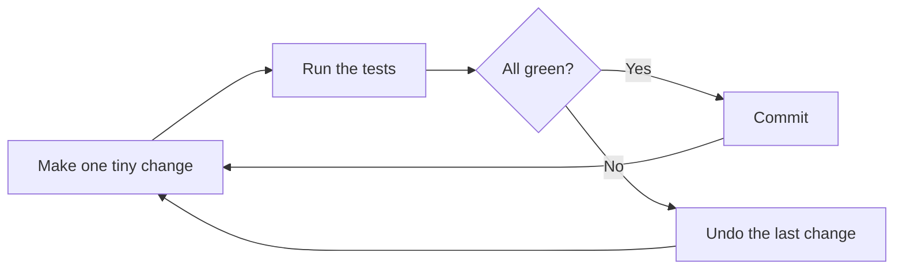

Why small steps? Because if something breaks, you only have **one tiny change** to inspect — not a hundred. Refactoring feels slow at first and ends up *faster*, because you almost never debug.

> **Tests are the safety net.** Refactoring without tests is like trapeze without a net — possible, but one slip and you crash with no idea why. If a section has no tests, your first "refactoring" is to add them.

### A quick note on performance

Don't fear that clean code is slow. Most of the time the difference is invisible, and **clear code is easier to optimize later** because you can find the one slow spot. Rule: **first make it clean, then — only if measurements prove you must — make it fast.**

---

<a id="toc"></a>

## Table of Contents

[How to use](#how-to-use) · [Legend](#legend) · [Part 0 — Basics](#basics) · [Part 3 — Lookup tables](#part3) · [Part 4 — Glossary](#part4) · [Part 5 — Cheat Sheet](#cheatsheet)

### Part 1 — Code Smells (the problems)

[Smell map](#smell-map)

**A. Bloaters** — things that grew too big
- [S1 — Long Function](#s1)
- [S2 — Large Class](#s2)
- [S3 — Primitive Obsession](#s3)
- [S4 — Long Parameter List](#s4)
- [S5 — Data Clumps](#s5)

**B. Object-Orientation Abusers** — OO used wrongly
- [S6 — Repeated Switches](#s6)
- [S7 — Temporary Field](#s7)
- [S8 — Refused Bequest](#s8)
- [S9 — Alternative Classes with Different Interfaces](#s9)

**C. Change Preventers** — one change forces many edits
- [S10 — Divergent Change](#s10)
- [S11 — Shotgun Surgery](#s11)
- [S12 — Parallel Inheritance Hierarchies](#s12)

**D. Dispensables** — pointless stuff to delete
- [S13 — Comments (the bad kind)](#s13)
- [S14 — Duplicate Code](#s14)
- [S15 — Lazy Class](#s15)
- [S16 — Data Class](#s16)
- [S17 — Dead Code](#s17)
- [S18 — Speculative Generality](#s18)

**E. Couplers** — things stuck together too tightly
- [S19 — Feature Envy](#s19)
- [S20 — Inappropriate Intimacy](#s20)
- [S21 — Message Chains](#s21)
- [S22 — Middle Man](#s22)

**F. Other common smells** (mostly from Fowler)
- [S23 — Mysterious Name](#s23)
- [S24 — Global Data](#s24)
- [S25 — Mutable Data](#s25)
- [S26 — Loops](#s26)

### Part 2 — Refactoring Techniques (the fixes)

**Group 1 — A First Set of Refactorings**
- [R1 — Extract Function](#r1)
- [R2 — Inline Function](#r2)
- [R3 — Extract Variable](#r3)
- [R4 — Inline Variable](#r4)
- [R5 — Change Function Declaration](#r5)
- [R6 — Encapsulate Variable](#r6)
- [R7 — Rename Variable](#r7)
- [R8 — Introduce Parameter Object](#r8)
- [R9 — Combine Functions into Class](#r9)
- [R10 — Combine Functions into Transform](#r10)
- [R11 — Split Phase](#r11)

**Group 2 — Encapsulation**
- [R12 — Encapsulate Record](#r12)
- [R13 — Encapsulate Collection](#r13)
- [R14 — Replace Primitive with Object](#r14)
- [R15 — Replace Temp with Query](#r15)
- [R16 — Extract Class](#r16)
- [R17 — Inline Class](#r17)
- [R18 — Hide Delegate](#r18)
- [R19 — Remove Middle Man](#r19)
- [R20 — Substitute Algorithm](#r20)

**Group 3 — Moving Features**
- [R21 — Move Function](#r21)
- [R22 — Move Field](#r22)
- [R23 — Move Statements into Function](#r23)
- [R24 — Move Statements to Callers](#r24)
- [R25 — Replace Inline Code with Function Call](#r25)
- [R26 — Slide Statements](#r26)
- [R27 — Split Loop](#r27)
- [R28 — Replace Loop with Pipeline](#r28)
- [R29 — Remove Dead Code](#r29)

**Group 4 — Organizing Data**
- [R30 — Split Variable](#r30)
- [R31 — Rename Field](#r31)
- [R32 — Replace Derived Variable with Query](#r32)
- [R33 — Change Reference to Value](#r33)
- [R34 — Change Value to Reference](#r34)
- [R35 — Replace Magic Number with Symbolic Constant](#r35)
- [R36 — Replace Array with Object](#r36)
- [R37 — Duplicate Observed Data](#r37)
- [R38 — Change Unidirectional Association to Bidirectional](#r38)
- [R39 — Change Bidirectional Association to Unidirectional](#r39)
- [R40 — Remove Assignments to Parameters](#r40)

**Group 5 — Simplifying Conditional Logic**
- [R41 — Decompose Conditional](#r41)
- [R42 — Consolidate Conditional Expression](#r42)
- [R43 — Replace Nested Conditional with Guard Clauses](#r43)
- [R44 — Replace Conditional with Polymorphism](#r44)
- [R45 — Introduce Special Case](#r45)
- [R46 — Introduce Assertion](#r46)
- [R47 — Consolidate Duplicate Conditional Fragments](#r47)
- [R48 — Remove Control Flag](#r48)

**Group 6 — Refactoring APIs (Method Calls)**
- [R49 — Separate Query from Modifier](#r49)
- [R50 — Parameterize Function](#r50)
- [R51 — Remove Flag Argument](#r51)
- [R52 — Preserve Whole Object](#r52)
- [R53 — Replace Parameter with Query](#r53)
- [R54 — Replace Query with Parameter](#r54)
- [R55 — Remove Setting Method](#r55)
- [R56 — Replace Constructor with Factory Function](#r56)
- [R57 — Replace Function with Command](#r57)
- [R58 — Replace Command with Function](#r58)
- [R59 — Replace Parameter with Explicit Methods](#r59)
- [R60 — Hide Method](#r60)
- [R61 — Replace Error Code with Exception](#r61)
- [R62 — Replace Exception with Test](#r62)
- [R63 — Introduce Foreign Method](#r63)
- [R64 — Introduce Local Extension](#r64)

**Group 7 — Dealing with Inheritance**
- [R65 — Pull Up Method](#r65)
- [R66 — Pull Up Field](#r66)
- [R67 — Pull Up Constructor Body](#r67)
- [R68 — Push Down Method](#r68)
- [R69 — Push Down Field](#r69)
- [R70 — Replace Type Code with Subclasses](#r70)
- [R71 — Remove Subclass](#r71)
- [R72 — Extract Superclass](#r72)
- [R73 — Collapse Hierarchy](#r73)
- [R74 — Replace Subclass with Delegate](#r74)
- [R75 — Replace Superclass with Delegate](#r75)
- [R76 — Extract Subclass](#r76)
- [R77 — Extract Interface](#r77)
- [R78 — Form Template Method](#r78)
- [R79 — Replace Inheritance with Delegation](#r79)
- [R80 — Replace Delegation with Inheritance](#r80)

### Parts 3–5 — Reference & review

- [Part 3 — Quick lookup tables](#part3)
  - [Table A — Smell → Techniques](#smell-to-technique)
  - [Table B — Technique → Smells](#technique-to-smell)
  - [Table C — Opposite pairs](#opposite-pairs)
- [Part 4 — Glossary (plain English)](#part4)
- [Part 5 — Cheat Sheet (last-minute review)](#cheatsheet)

---

# Part 1 — Code Smells

A **code smell** is not a bug. The program runs fine. A smell is a *surface sign* that the code underneath is harder to read or change than it should be — like a bad smell from the fridge tells you something inside needs attention.

Smells are useful because they are **easy to spot** and they **point to a cure**. You don't need deep analysis; you learn to recognise the shape, then look up which technique fixes it.

<a id="smell-map"></a>

### The smell map

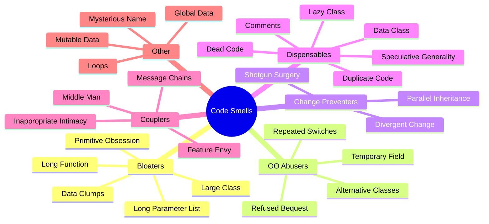

The six groups in plain words:

| Group | The core problem |
|---|---|
| **Bloaters** | Code, methods, or classes grew too big to handle. |
| **OO Abusers** | Object-oriented features used wrongly or half-way. |
| **Change Preventers** | The code is shaped so that changes are painful. |
| **Dispensables** | Stuff that adds nothing and should be deleted. |
| **Couplers** | Parts are glued together too tightly. |
| **Other** | Common naming and data problems (mostly from Fowler). |

---

## A. Bloaters

<a id="s1"></a>

### S1 — Long Function
*Group: Bloaters · also called Long Method*

**What it is:** A function that grew too long and does several jobs at once. The longer a function, the harder it is to understand.

**Real-life analogy:** A recipe step that just says *"make dinner"* instead of *"boil the pasta," "make the sauce," "combine and serve."* One giant step hides what is really happening.

**Smelly example:**
```dart
void printReport(List<Order> orders) {
  // 1. validate
  for (final o in orders) {
    if (o.amount < 0) throw 'bad amount';
  }
  // 2. calculate total
  double total = 0;
  for (final o in orders) {
    total += o.amount;
  }
  // 3. format and print
  print('=== REPORT ===');
  for (final o in orders) {
    print('${o.id}: ${o.amount}');
  }
  print('TOTAL: $total');
}
```

**Why it's bad:**
- You must read the whole thing to understand any part.
- The "calculate total" logic can't be reused without copy-paste.
- Hard to test one piece on its own.
- Comments like `// validate` are a hint that each block wants to be its own function.

**Cured by:** [R1 — Extract Function](#r1) (the main fix) · [R15 — Replace Temp with Query](#r15) · [R41 — Decompose Conditional](#r41) · [R27 — Split Loop](#r27) · [R44 — Replace Conditional with Polymorphism](#r44)

**OK to leave it when:** the function is long but completely flat and obvious (e.g. a list of constant setup steps) and never changes.

[↑ Back to top](#toc)

---

<a id="s2"></a>

### S2 — Large Class
*Group: Bloaters · also called God Class*

**What it is:** A class trying to do too much — too many fields, too many methods, too many responsibilities.

**Real-life analogy:** A Swiss-army knife with 50 tools. It is heavy, and you can never quickly find the one blade you actually need.

**Smelly example:**
```dart
class User {
  String name = '';
  String email = '';
  String passwordHash = '';

  bool checkPassword(String input) { /* auth logic */ return true; }
  void saveToDatabase() { /* SQL here */ }
  String renderProfileHtml() { /* UI here */ }
  void sendWelcomeEmail() { /* SMTP here */ }
}
```
One class mixes **auth**, **database**, **UI**, and **email**.

**Why it's bad:**
- Too much to hold in your head at once.
- Different fields are used by different jobs, so the class has no single clear purpose.
- A change to email logic risks breaking auth logic in the same file.

**Cured by:** [R16 — Extract Class](#r16) (split out each responsibility) · [R76 — Extract Subclass](#r76) · [R77 — Extract Interface](#r77) · [R70 — Replace Type Code with Subclasses](#r70)

**OK to leave it when:** it is a small app, the class is stable, and splitting it would add more files than it's worth.

[↑ Back to top](#toc)

---

<a id="s3"></a>

### S3 — Primitive Obsession
*Group: Bloaters*

**What it is:** Using plain primitives (`String`, `int`, `double`, `Map`) to represent important ideas that deserve their own small type.

**Real-life analogy:** Scribbling a phone number on a loose sticky note instead of saving it as a proper Contact. The sticky note has no rules — nothing stops you writing "banana" where a number should be.

**Smelly example:**
```dart
// money as a raw double, phone as a raw String
double price = 19.99;          // which currency? how many decimals?
String phone = '01700-000000'; // any text passes, even 'hello'

void call(String phone) { /* no validation anywhere */ }
```

**Why it's bad:**
- No validation: nothing guarantees the value is sensible.
- Behaviour (formatting, comparing, currency rules) gets scattered everywhere instead of living in one place.
- Easy to mix up two strings that mean different things.

**Cured by:** [R14 — Replace Primitive with Object](#r14) (the main fix) · [R70 — Replace Type Code with Subclasses](#r70) · [R8 — Introduce Parameter Object](#r8) · [R36 — Replace Array with Object](#r36) · [R12 — Encapsulate Record](#r12)

**OK to leave it when:** the value really is simple (a person's age, a loop counter) and needs no rules or behaviour.

[↑ Back to top](#toc)

---

<a id="s4"></a>

### S4 — Long Parameter List
*Group: Bloaters*

**What it is:** A function that takes too many parameters (roughly four or more is a warning sign).

**Real-life analogy:** Ordering coffee by speaking nine separate options in a row. Easy to say them in the wrong order. Better to hand over one written order card.

**Smelly example:**
```dart
Booking bookFlight(
  String from, String to, DateTime depart, DateTime? returnDate,
  int adults, int children, String seatClass, bool meal, bool insurance,
) { ... }
```

**Why it's bad:**
- Hard to remember the order; easy to swap two arguments of the same type.
- The call site is noisy and hard to read.
- Often the parameters belong together and want to be one object.

**Cured by:** [R8 — Introduce Parameter Object](#r8) (bundle related ones) · [R52 — Preserve Whole Object](#r52) · [R53 — Replace Parameter with Query](#r53) · [R51 — Remove Flag Argument](#r51) · [R9 — Combine Functions into Class](#r9)

**OK to leave it when:** the parameters are genuinely independent and few, or it's a pure math function where each value is a distinct, equal input.

[↑ Back to top](#toc)

---

<a id="s5"></a>

### S5 — Data Clumps
*Group: Bloaters*

**What it is:** The same little group of values keeps travelling together — `startDate` + `endDate`, `x` + `y`, `street` + `city` + `zip`. If they always move as a pack, they want to be one object.

**Real-life analogy:** Salt and pepper that always get passed together at the table. Put them in one little holder and pass the holder.

**Smelly example:**
```dart
// start and end always appear as a pair, everywhere
bool overlaps(DateTime start1, DateTime end1, DateTime start2, DateTime end2) { ... }
int nights(DateTime start, DateTime end) { ... }
String label(DateTime start, DateTime end) { ... }
```

**Why it's bad:**
- The repetition is a sign of a missing concept (here, a `DateRange`).
- Validation (start before end) has nowhere to live, so it gets repeated or forgotten.

**Cured by:** [R16 — Extract Class](#r16) (make the missing type) · [R8 — Introduce Parameter Object](#r8) · [R52 — Preserve Whole Object](#r52)

**OK to leave it when:** the values appear together in only one place and there is clearly no shared concept.

[↑ Back to top](#toc)

---

## B. Object-Orientation Abusers

<a id="s6"></a>

### S6 — Repeated Switches
*Group: OO Abusers · also called Switch Statements*

**What it is:** The **same** `switch` (or `if`-chain) on the same type appears in many places. Add a new case, and you must hunt down and edit every copy.

**Real-life analogy:** Every employee keeps their own private copy of the company holiday list. Add one holiday and you must update everybody — and someone will be missed.

**Smelly example:**
```dart
double legs(String animal) {
  switch (animal) { case 'dog': return 4; case 'bird': return 2; }
  return 0;
}
String sound(String animal) {
  switch (animal) { case 'dog': return 'woof'; case 'bird': return 'tweet'; }
  return '';
}
// add 'cat' -> you must edit BOTH switches (and any others)
```

**Why it's bad:**
- Adding a type means changing many places — easy to miss one.
- The knowledge about each type is scattered instead of together.

**Cured by:** [R44 — Replace Conditional with Polymorphism](#r44) (the main fix) · [R70 — Replace Type Code with Subclasses](#r70) · [R45 — Introduce Special Case](#r45)

> **Note:** a *single* switch in *one* place is fine. The smell is the **repeat**. Modern Dart `switch` expressions on `sealed` classes are also a clean, safe alternative.

**OK to leave it when:** there is only one switch and it is unlikely to grow.

[↑ Back to top](#toc)

---

<a id="s7"></a>

### S7 — Temporary Field
*Group: OO Abusers*

**What it is:** A field that only holds a value *some* of the time. The rest of the time it sits empty or null, confusing everyone.

**Real-life analogy:** A form field "spouse's name" that is only meaningful if the person is married. When blank, readers wonder whether it was forgotten or simply doesn't apply.

**Smelly example:**
```dart
class Calculator {
  List<int> numbers = [];
  int? _runningTotal; // only set during compute(), null otherwise

  int compute() {
    _runningTotal = 0;
    for (final n in numbers) _runningTotal = _runningTotal! + n;
    return _runningTotal!;
  }
}
```
`_runningTotal` is meaningless except in the middle of `compute()`.

**Why it's bad:**
- Readers can't tell when the field is valid.
- Easy to use it at the wrong time and get a null/garbage value.

**Cured by:** [R16 — Extract Class](#r16) (move the field + its code into its own class) · [R45 — Introduce Special Case](#r45) · [R15 — Replace Temp with Query](#r15)

**OK to leave it when:** rarely — but a clearly named local variable instead of a field usually removes the smell entirely.

[↑ Back to top](#toc)

---

<a id="s8"></a>

### S8 — Refused Bequest
*Group: OO Abusers*

**What it is:** A subclass inherits methods or fields it does not want or use. It "refuses the gift" handed down by its parent.

**Real-life analogy:** You inherit your uncle's fishing gear, but you hate fishing. You keep it in the garage and never use it. Worse if people expect you to fish just because you own rods.

**Smelly example:**
```dart
class Bird {
  void fly() => print('flap flap');
}
class Penguin extends Bird {
  @override
  void fly() => throw 'penguins cannot fly!'; // refuses the inherited ability
}
```

**Why it's bad:**
- The subclass breaks the promise of its parent type (a `Bird` that crashes on `fly()`).
- Code that treats all `Bird`s the same will blow up on a `Penguin`.

**Cured by:** [R74 — Replace Subclass with Delegate](#r74) · [R75 — Replace Superclass with Delegate](#r75) · [R68 — Push Down Method](#r68) / [R69 — Push Down Field](#r69)

> **Note:** refusing some *implementation* you don't need is often harmless. Refusing the *interface* (like `fly()` above) is the truly bad case — it means inheritance was the wrong choice.

**OK to leave it when:** the unused inheritance is small and no one relies on the parent's full interface.

[↑ Back to top](#toc)

---

<a id="s9"></a>

### S9 — Alternative Classes with Different Interfaces
*Group: OO Abusers*

**What it is:** Two classes do the same kind of job but expose different method names/shapes, so you cannot swap one for the other.

**Real-life analogy:** Two TV remotes that both control the same TV, but with totally different button layouts. You can't hand someone "a remote" — they must learn each one.

**Smelly example:**
```dart
class FileLogger {
  void writeLine(String msg) { ... }
}
class DbLogger {
  void append(String text) { ... }   // same idea, different name + param
}
```

**Why it's bad:**
- You can't treat them as one type, so callers need `if (logger is FileLogger)` checks.
- Duplicated concept with no shared contract.

**Cured by:** [R5 — Change Function Declaration](#r5) (rename so they match) · [R21 — Move Function](#r21) · [R72 — Extract Superclass](#r72) (give them a shared parent/interface)

**OK to leave it when:** the two classes are never used in place of each other and never will be.

[↑ Back to top](#toc)

---

## C. Change Preventers

These smells share one cruel property: they make change **expensive**. Two have opposite shapes — keep them straight:

```
DIVERGENT CHANGE                 SHOTGUN SURGERY
one class, many reasons          one reason, many classes

   [ OrderService ]                 change tax rule
    /     |     \                    /    |     \
  tax    db    email             classA classB classC
 change change change            (edit) (edit) (edit)

"I keep editing the same          "One change makes me edit
 class for unrelated reasons"      a dozen scattered places"
```

<a id="s10"></a>

### S10 — Divergent Change
*Group: Change Preventers*

**What it is:** One class has to be changed for **many different reasons**. Different kinds of change all land in the same file.

**Real-life analogy:** One messy drawer holding socks, bills, and batteries. Three completely different needs all force you to dig in the same drawer.

**Smelly example:**
```dart
class OrderService {
  double calculateTax(Order o) { ... }   // changes when tax law changes
  void saveOrder(Order o) { ... }        // changes when the database changes
  String formatEmail(Order o) { ... }    // changes when email design changes
}
```
Three unrelated reasons to edit one class.

**Why it's bad:**
- The class has more than one job, so it never sits still.
- A change for one reason risks breaking the unrelated code beside it.

**Cured by:** [R16 — Extract Class](#r16) (one class per reason-to-change) · [R11 — Split Phase](#r11) · [R21 — Move Function](#r21)

**OK to leave it when:** the class is tiny and changes very rarely.

[↑ Back to top](#toc)

---

<a id="s11"></a>

### S11 — Shotgun Surgery
*Group: Change Preventers*

**What it is:** The opposite of Divergent Change. **One** change forces you to make many small edits across **many** classes.

**Real-life analogy:** You change your phone number and must now update twelve different address books, your bank, three apps, and a business card. Miss one and something breaks.

**Smelly example:**
```dart
// To add one new field 'discount' to an order, you must edit ALL of these:
class OrderDto { ... }       // add field
class OrderMapper { ... }    // map field
class OrderValidator { ... } // validate field
class OrderView { ... }      // show field
class OrderRepository { ... }// persist field
```

**Why it's bad:**
- One logical change is smeared across the codebase.
- Very easy to forget one spot, leaving a half-done change.

**Cured by:** [R21 — Move Function](#r21) / [R22 — Move Field](#r22) (gather the scattered code together) · [R9 — Combine Functions into Class](#r9) · [R17 — Inline Class](#r17)

**OK to leave it when:** the scattered change happens very rarely and gathering it would tangle things that are otherwise nicely separate.

[↑ Back to top](#toc)

---

<a id="s12"></a>

### S12 — Parallel Inheritance Hierarchies
*Group: Change Preventers*

**What it is:** A special Shotgun Surgery. Every time you add a subclass in one hierarchy, you are forced to add a matching subclass in another.

**Real-life analogy:** Every new car model requires a brand-new matching key-fob model. Two ladders you must always climb in lockstep.

**Smelly example:**
```dart
abstract class Shape {}
class Circle extends Shape {}
class Square extends Shape {}

abstract class ShapeRenderer {}
class CircleRenderer extends ShapeRenderer {} // must add when Circle is added
class SquareRenderer extends ShapeRenderer {} // must add when Square is added
```
Add `Triangle` and you are forced to also add `TriangleRenderer`.

**Why it's bad:**
- Two structures must be kept in sync by hand.
- Forgetting the matching half causes bugs.

**Cured by:** [R21 — Move Function](#r21) and [R22 — Move Field](#r22) — move the second hierarchy's behaviour into the first so only **one** hierarchy remains.

**OK to leave it when:** both hierarchies are small, stable, and rarely gain new types.

[↑ Back to top](#toc)

---

## D. Dispensables

A "dispensable" is something whose absence would make the code *cleaner*. The cure is usually: **delete it** or **fold it into something real**.

<a id="s13"></a>

### S13 — Comments (the bad kind)
*Group: Dispensables*

**What it is:** Comments used as deodorant — to explain confusing code instead of cleaning it. A comment explaining *what* a tricky line does is often a sign the code itself should be clearer.

**Real-life analogy:** A sticky note on a machine saying *"hit here twice to make it start."* Helpful in the moment — but the real fix is to repair the machine so it just starts.

**Smelly example:**
```dart
// check if the user is an active adult premium member
if (u.age >= 18 && u.active && u.plan == 'premium' && !u.banned) { ... }
```

**Why it's bad:**
- The comment exists only because the condition is hard to read.
- If the code changes and the comment doesn't, the comment now lies.

**Better:**
```dart
if (u.isActivePremiumAdult) { ... }   // the name replaces the comment
```

**Cured by:** [R1 — Extract Function](#r1) (turn the explained block into a named function) · [R7 — Rename Variable](#r7) / [R5 — Change Function Declaration](#r5) · [R46 — Introduce Assertion](#r46) (when the comment states an assumption)

> **Important:** comments that explain **why** (a business reason, a workaround, a link to a bug ticket) are *good* — keep them. The smell is only comments that explain **what**, because the code should say that itself.

**OK to leave it when:** the comment explains *why*, documents a public API, or records a non-obvious decision.

[↑ Back to top](#toc)

---

<a id="s14"></a>

### S14 — Duplicate Code
*Group: Dispensables · the most common smell of all*

**What it is:** The same (or nearly the same) code appears in more than one place.

**Real-life analogy:** Photocopying the same paragraph into three documents. Fix one typo and you must remember to fix all three — and you won't.

**Smelly example:**
```dart
double invoiceTotal(Invoice i) {
  return i.subtotal + i.subtotal * 0.15; // 15% tax
}
double quoteTotal(Quote q) {
  return q.subtotal + q.subtotal * 0.15; // same 15% tax, copied
}
```

**Why it's bad:**
- A change (e.g. tax becomes 17%) must be made in every copy.
- Miss one copy and you get an inconsistent, buggy program.

**Cured by:** [R1 — Extract Function](#r1) (the everyday fix) · [R65 — Pull Up Method](#r65) (when copies are in sibling classes) · [R78 — Form Template Method](#r78) · [R26 — Slide Statements](#r26) (first bring duplicates next to each other)

**OK to leave it when:** the two pieces only *look* the same by coincidence and are expected to change for different reasons (forcing them together would couple unrelated things).

[↑ Back to top](#toc)

---

<a id="s15"></a>

### S15 — Lazy Class
*Group: Dispensables · also called Lazy Element*

**What it is:** A class (or function) that does not do enough to earn its keep. Every class costs reading time and mental overhead; this one doesn't pay it back.

**Real-life analogy:** A job title on the org chart with no real duties. It still takes a salary and adds a box to the diagram, for nothing.

**Smelly example:**
```dart
class PhoneNumber {
  final String value;
  PhoneNumber(this.value);
  String get value2 => value; // adds nothing a plain String didn't
}
```

**Why it's bad:**
- More files and indirection to navigate, with no benefit.
- Readers expect a class to mean something; an empty one wastes their attention.

**Cured by:** [R17 — Inline Class](#r17) (fold it into its user) · [R2 — Inline Function](#r2) · [R73 — Collapse Hierarchy](#r73) (for a near-empty subclass)

**OK to leave it when:** it used to be bigger and is planned to grow again, or it genuinely adds type-safety/clarity even if small.

[↑ Back to top](#toc)

---

<a id="s16"></a>

### S16 — Data Class
*Group: Dispensables*

**What it is:** A class that is *only* fields plus getters/setters, with no behaviour. Other classes constantly reach in and do the work that this class should do itself.

**Real-life analogy:** A wallet that can't do anything on its own. Everyone else has to open it, count the cash, and put it back — the wallet is passive.

**Smelly example:**
```dart
class Point {
  double x;
  double y;
  Point(this.x, this.y);
}
// distance lives OUTSIDE the class, in everyone who uses Point:
double dist(Point a, Point b) =>
    sqrt(pow(a.x - b.x, 2) + pow(a.y - b.y, 2));
```

**Why it's bad:**
- Behaviour that belongs to the data is scattered among its users (a cousin of Feature Envy, S19).
- The same calculations get duplicated by different callers.

**Cured by:** [R21 — Move Function](#r21) (move behaviour into the class) · [R12 — Encapsulate Record](#r12) · [R13 — Encapsulate Collection](#r13) · [R55 — Remove Setting Method](#r55)

> **Important:** plain data holders are *meant* to be data-only — JSON models, DTOs, immutable value/`record` types, API response objects. Those are **not** a smell. The smell is a class that *should* own behaviour but lets everyone else do its job.

**OK to leave it when:** it is a deliberate data-transfer / value object with no behaviour by design.

[↑ Back to top](#toc)

---

<a id="s17"></a>

### S17 — Dead Code
*Group: Dispensables*

**What it is:** Code that is never run or never used — an unused function, an unreachable branch, a variable nobody reads.

**Real-life analogy:** An old road on the map that leads nowhere. It still shows up, still confuses travellers, and someone keeps "maintaining" it for no reason.

**Smelly example:**
```dart
String formatName(String name) {
  return name.trim();
  // ignore: dead_code
  return name.toUpperCase(); // never reached
}

void oldExport() { ... } // not called from anywhere anymore
```

**Why it's bad:**
- Readers waste time understanding code that does nothing.
- It gets "maintained" and tested for no benefit.

**Cured by:** [R29 — Remove Dead Code](#r29) (just delete it)

> **Don't be afraid to delete.** Version control remembers everything — if you ever need it back, it's one `git` command away. Commented-out code is the worst form of dead code; delete it.

**OK to leave it when:** essentially never. If unsure whether it's used, prove it, then delete.

[↑ Back to top](#toc)

---

<a id="s18"></a>

### S18 — Speculative Generality
*Group: Dispensables*

**What it is:** Code built for an imagined future that never arrives — "we might need this someday." Extra hooks, abstract classes with a single child, unused parameters "just in case."

**Real-life analogy:** Building a ten-lane highway for a village of fifty people. Hugely expensive, totally unused, and now it's in the way of everything else.

**Smelly example:**
```dart
abstract class ReportExporter {        // only ONE exporter will ever exist
  void export(Report r);
}
class PdfExporter extends ReportExporter {
  @override
  void export(Report r) { ... }
}

void save(Report r, {bool compress = false, String? futureFormat}) {
  // 'futureFormat' is never used — added "for later"
}
```

**Why it's bad:**
- Abstraction you don't need makes today's code harder to follow.
- The guessed-at future usually turns out wrong, so the flexibility is wasted.

**Cured by:** [R73 — Collapse Hierarchy](#r73) · [R17 — Inline Class](#r17) · [R2 — Inline Function](#r2) · [R5 — Change Function Declaration](#r5) (drop unused parameters) · [R29 — Remove Dead Code](#r29)

> **Rule of thumb:** build for *today's* known needs. Add the abstraction on the day the second case actually shows up — not before. (This is the opposite mistake to ignoring the Rule of Three.)

**OK to leave it when:** the generality is truly required now — e.g. a published plug-in API where outside code already depends on the abstraction.

[↑ Back to top](#toc)

---

## E. Couplers

These four are all about **coupling** — parts glued together too tightly, so you can't change one without disturbing the other.

<a id="s19"></a>

### S19 — Feature Envy
*Group: Couplers*

**What it is:** A method seems more interested in **another** class's data than its own — it keeps reaching over to read that class's fields.

**Real-life analogy:** A neighbour who is always in *your* kitchen, using *your* pots and *your* ingredients. At some point you say: maybe this cooking should just happen at their house.

**Smelly example:**
```dart
class Receipt {
  String describe(Customer c) {
    // this method touches Customer's data far more than Receipt's own
    return '${c.firstName} ${c.lastName}, ${c.street}, ${c.city}, ${c.zip}';
  }
}
```

**Why it's bad:**
- Logic lives far from the data it uses, so a change to `Customer` ripples into `Receipt`.
- It usually means the method is in the wrong class.

**Cured by:** [R21 — Move Function](#r21) (move it next to the data it envies) · [R1 — Extract Function](#r1) (extract the envious part first, then move it)

**OK to leave it when:** the method intentionally coordinates several objects (e.g. a service/strategy), or the envied class is a pure data holder by design.

[↑ Back to top](#toc)

---

<a id="s20"></a>

### S20 — Inappropriate Intimacy
*Group: Couplers · Fowler calls this Insider Trading*

**What it is:** Two classes know too much about each other's private inner workings. They poke into each other's fields and helpers instead of talking through a clean, small interface.

**Real-life analogy:** Two coworkers who secretly share each other's passwords and private files. Convenient — until one of them changes anything and the other instantly breaks.

**Smelly example:**
```dart
class Engine {
  double internalTemp = 0; // really should be private
}
class Car {
  final Engine engine;
  Car(this.engine);
  bool get overheating => engine.internalTemp > 100; // reaches into Engine's guts
}
```

**Why it's bad:**
- Either class can't change its internals without breaking the other.
- The boundary between them is blurry, so responsibilities blur too.

**Cured by:** [R21 — Move Function](#r21) / [R22 — Move Field](#r22) · [R18 — Hide Delegate](#r18) · [R39 — Change Bidirectional Association to Unidirectional](#r39) · [R16 — Extract Class](#r16) (put the shared stuff in its own class) · [R79 — Replace Inheritance with Delegation](#r79)

**OK to leave it when:** the two are a deliberate tight pair (like a class and its private helper) that always change together anyway.

[↑ Back to top](#toc)

---

<a id="s21"></a>

### S21 — Message Chains
*Group: Couplers*

**What it is:** A long train of calls to get to one value: `a.b().c().d().e`. The caller is forced to know the whole path.

**Real-life analogy:** "Ask Bob, who asks Carol, who asks Dan, who asks Eve" just to learn one fact. If anyone in the chain changes desks, you're lost.

**Smelly example:**
```dart
// to get the city, the caller must walk the entire structure:
final city = order.customer.address.city.name;
```

**Why it's bad:**
- The caller is tied to the exact shape of objects it shouldn't care about.
- Any change in the middle (e.g. `address` becomes a list) breaks every chain.

**Cured by:** [R18 — Hide Delegate](#r18) (let the first object answer directly) · [R1 — Extract Function](#r1) + [R21 — Move Function](#r21)

> **Note:** a deliberate *fluent* chain like `query.where(...).orderBy(...).limit(10)` is **not** this smell — that's a designed builder. The smell is walking through unrelated objects' internals.

**OK to leave it when:** the chain is short, stable, and reads naturally (a designed fluent API).

[↑ Back to top](#toc)

---

<a id="s22"></a>

### S22 — Middle Man
*Group: Couplers*

**What it is:** A class where most methods do nothing but forward the call to another object. It just passes messages along.

**Real-life analogy:** A manager who only relays messages between you and the real decision-maker, adding nothing of their own. Why not talk to the decision-maker directly?

**Smelly example:**
```dart
class Person {
  final Department department;
  Person(this.department);
  Manager get manager => department.manager; // pure forwarding
  String get chargeCode => department.chargeCode; // pure forwarding
}
```
If half of `Person`'s methods are just `department.something`, `Person` is a middle man.

**Why it's bad:**
- Extra indirection with no value.
- Every new method on the delegate needs a matching forwarder here.

**Cured by:** [R19 — Remove Middle Man](#r19) (let callers use the real object) · [R2 — Inline Function](#r2)

> **Balance note:** this is the *opposite danger* of [Hide Delegate (R18)](#r18). A little hiding is good; hiding *everything* turns the wrapper into a middle man. Use judgement.

**OK to leave it when:** the wrapper genuinely adds value — it hides a complex subsystem, adapts an interface, or enforces rules (a real facade/adapter, not a do-nothing relay).

[↑ Back to top](#toc)

---

## F. Other common smells

These four come mostly from Fowler's 2nd edition and don't fit neatly into the five classic groups — but they are among the most useful to recognise.

<a id="s23"></a>

### S23 — Mysterious Name
*Group: Other · Fowler's number-one smell*

**What it is:** A name (of a variable, function, class, or field) that does not clearly say what the thing is or does. If you can't think of a good name, you often don't yet understand the thing — or it's doing too much.

**Real-life analogy:** Kitchen jars labelled *"stuff," "things," "misc."* You must open every one to find the sugar.

**Smelly example:**
```dart
int d;                         // elapsed time? distance? day?
void handle(List<dynamic> x) { ... } // handle what? what is x?
final temp = price * 0.15;     // 'temp' tells you nothing
```

**Why it's bad:**
- Bad names force readers to reverse-engineer meaning every time.
- They hide bugs (you think `d` is days; it's distance).

**Better:**
```dart
int elapsedDays;
void applyDiscounts(List<Order> orders) { ... }
final taxAmount = price * 0.15;
```

**Cured by:** [R7 — Rename Variable](#r7) · [R5 — Change Function Declaration](#r5) (rename a function) · [R31 — Rename Field](#r31)

> Renaming is the **cheapest, highest-value** refactoring there is. Modern editors rename safely across the whole project in one keystroke. Never tolerate a name you had to decode.

**OK to leave it when:** a tiny, conventional scope name like `i` for a loop index or `e` for a caught error.

[↑ Back to top](#toc)

---

<a id="s24"></a>

### S24 — Global Data
*Group: Other*

**What it is:** Data that any part of the program can read **and change** from anywhere — global variables, mutable singletons, public static fields.

**Real-life analogy:** A public whiteboard that anyone walking by can erase or rewrite. You can never fully trust what's on it, because anybody could have changed it a second ago.

**Smelly example:**
```dart
// top-level, mutable, reachable from everywhere:
int currentUserId = 0;
Map<String, dynamic> appConfig = {};

void doWork() {
  currentUserId = 42;     // who else also writes this? impossible to know
}
```

**Why it's bad:**
- A bug where the value is wrong could be caused by *any* line in the whole codebase.
- Impossible to reason about locally; very hard to test.

**Cured by:** [R6 — Encapsulate Variable](#r6) — put it behind a function/getter so every read and write goes through one controlled door (where you can log, validate, or lock it down).

> The real danger is global **mutable** data. Global **constants** (truly immutable) are fine and useful.

**OK to leave it when:** the data is immutable (a constant), or it's a well-contained, well-tested service accessed through a clear interface.

[↑ Back to top](#toc)

---

<a id="s25"></a>

### S25 — Mutable Data
*Group: Other*

**What it is:** Data that gets changed in place, where someone *else* is holding a reference to the same object and gets surprised by the change.

**Real-life analogy:** Handing out the *original* document and letting everyone scribble on it. Soon nobody knows which version is the real one.

**Smelly example:**
```dart
final defaults = <String, int>{'retries': 3};

void configure(Map<String, int> settings) {
  settings['retries'] = 5; // mutates the caller's map — a hidden side effect!
}

configure(defaults); // defaults is now silently changed
```

**Why it's bad:**
- Changes ripple to places you didn't expect, because they share the same object.
- These bugs are very hard to track down ("who changed this?").

**Cured by:** [R6 — Encapsulate Variable](#r6) · [R30 — Split Variable](#r30) · [R32 — Replace Derived Variable with Query](#r32) · [R33 — Change Reference to Value](#r33) · [R55 — Remove Setting Method](#r55) · [R49 — Separate Query from Modifier](#r49)

> Dart helps here: prefer `final`, use immutable value objects, and copy collections (`List.unmodifiable`, `{...map}`) before sharing them.

**OK to leave it when:** the mutation is purely local inside one function and never escapes — nobody else can see it, so it's safe.

[↑ Back to top](#toc)

---

<a id="s26"></a>

### S26 — Loops
*Group: Other*

**What it is:** Old-style manual loops that bury the *intent* under mechanics. Often a loop is really a filter + a transform in disguise.

**Real-life analogy:** Giving someone 14 tiny walking steps ("take 12 paces, turn left, take 5...") instead of saying *"go to the library."* A pipeline states the destination, not the footwork.

**Smelly example:**
```dart
final names = <String>[];
for (final u in users) {
  if (u.active) {            // filter
    names.add(u.name);       // transform
  }
}
```

**Why it's bad:**
- The reader must run the loop in their head to discover it's just "active users' names."
- Easy to introduce off-by-one or accumulator bugs.

**Better:**
```dart
final names = users.where((u) => u.active).map((u) => u.name).toList();
```

**Cured by:** [R28 — Replace Loop with Pipeline](#r28) (the main fix) · [R27 — Split Loop](#r27) (first split a loop that does two jobs)

**OK to leave it when:** the loop is in a performance-critical hot path, or its control flow (early breaks, side effects) would be *less* clear as a pipeline.

[↑ Back to top](#toc)

---

> **End of Part 1.** You now have the vocabulary of smells. Whenever code feels wrong, name the smell, then follow its **Cured by** links into Part 2 below.

---

# Part 2 — Refactoring Techniques

These are the actual moves. Each one is small and safe on its own; real refactoring is just doing many of them in a row, running tests between each.

The techniques are grouped the way Fowler's book chapters are, so this maps cleanly onto the original:

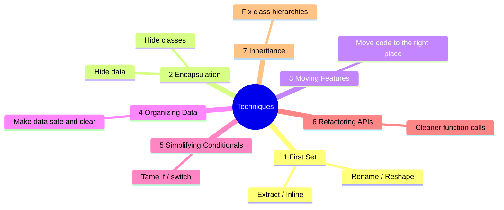

> **How to read a before → after:** the "Before" block is the smelly code; the "After" block is the same behaviour, cleaner. The **Steps** are the safe path from one to the other — small moves with a test after each.

---

## Group 1 — A First Set of Refactorings

These are the everyday moves you'll use constantly. Master these first; the rest of the book builds on them.

<a id="r1"></a>

### R1 — Extract Function
*Group 1 · also called Extract Method · opposite of [R2 — Inline Function](#r2)*

**In one line:** Take a piece of code, move it into its own well-named function, and call it.

**Why do it:** A good name tells you *what* the code does, so you don't have to read *how*. You also gain reuse and easier testing. This is the single most-used refactoring.

**Analogy:** Putting loose papers into a labelled folder. Later you find them by the label instead of sifting the whole pile.

**Before:**
```dart
void printOwing(Invoice invoice) {
  print('***********************');
  print('**** Customer Owes ****');
  print('***********************');

  var outstanding = 0.0;
  for (final o in invoice.orders) {
    outstanding += o.amount;
  }
  print('name: ${invoice.customer}');
  print('amount: $outstanding');
}
```

**After:**
```dart
void printOwing(Invoice invoice) {
  printBanner();
  final outstanding = calculateOutstanding(invoice);
  printDetails(invoice, outstanding);
}

void printBanner() {
  print('***********************');
  print('**** Customer Owes ****');
  print('***********************');
}

double calculateOutstanding(Invoice invoice) {
  var result = 0.0;
  for (final o in invoice.orders) {
    result += o.amount;
  }
  return result;
}

void printDetails(Invoice invoice, double outstanding) {
  print('name: ${invoice.customer}');
  print('amount: $outstanding');
}
```
Now `printOwing` reads like a summary: banner, calculate, print.

**Steps (safe recipe):**
1. Create a new function and **name it for what it does**, not how.
2. Copy the chosen code into the new function.
3. Pass any variables the code needs as parameters; `return` any value it produces.
4. Replace the original code with a call to the new function.
5. Run the tests.

**Fixes smells:** [S1 — Long Function](#s1) · [S14 — Duplicate Code](#s14) · [S13 — Comments](#s13)

**Opposite:** [R2 — Inline Function](#r2)

**Watch out:** don't extract a trivial one-liner unless the *name* adds real meaning. The goal is clarity, not maximum tiny functions.

[↑ Back to top](#toc)

---

<a id="r2"></a>

### R2 — Inline Function
*Group 1 · also called Inline Method · opposite of [R1 — Extract Function](#r1)*

**In one line:** Replace a call with the function's body, then delete the function.

**Why do it:** Sometimes a function's body is just as clear as its name, so the function is needless indirection. Also useful before re-organising: inline a poorly-grouped set of small functions, then re-extract them better.

**Before:**
```dart
int rating(Driver driver) {
  return moreThanFiveLateDeliveries(driver) ? 2 : 1;
}
bool moreThanFiveLateDeliveries(Driver driver) {
  return driver.lateDeliveries > 5;
}
```

**After:**
```dart
int rating(Driver driver) {
  return driver.lateDeliveries > 5 ? 2 : 1;
}
```

**Steps (safe recipe):**
1. Check the function is **not** overridden by a subclass (don't inline polymorphic methods).
2. Find every caller.
3. Replace each call with the function's body.
4. Delete the now-unused function.
5. Run the tests after each replacement.

**Fixes smells:** [S15 — Lazy Class](#s15) · [S22 — Middle Man](#s22) · [S18 — Speculative Generality](#s18)

**Opposite:** [R1 — Extract Function](#r1)

**Watch out:** don't inline a function called in many places if it makes each call site bulky, and never inline a method that subclasses override.

[↑ Back to top](#toc)

---

<a id="r3"></a>

### R3 — Extract Variable
*Group 1 · also called Introduce Explaining Variable · opposite of [R4 — Inline Variable](#r4)*

**In one line:** Put a confusing sub-expression into a well-named local variable.

**Why do it:** The variable's name explains what the expression *means*. It also makes debugging easier — you can inspect the value.

**Before:**
```dart
double price(Order order) {
  return order.quantity * order.itemPrice -
      max(0, order.quantity - 500) * order.itemPrice * 0.05 +
      min(order.quantity * order.itemPrice * 0.1, 100);
}
```

**After:**
```dart
double price(Order order) {
  final basePrice = order.quantity * order.itemPrice;
  final quantityDiscount = max(0, order.quantity - 500) * order.itemPrice * 0.05;
  final shipping = min(basePrice * 0.1, 100);
  return basePrice - quantityDiscount + shipping;
}
```
The final line now reads like a sentence.

**Steps (safe recipe):**
1. Declare a `final` variable named for the **meaning** of the expression.
2. Copy the expression into it.
3. Replace the original expression with the variable.
4. Run the tests.

**Fixes smells:** [S1 — Long Function](#s1) · [S23 — Mysterious Name](#s23) · [S13 — Comments](#s13)

**Opposite:** [R4 — Inline Variable](#r4)

**Watch out:** if the same meaning is needed in other functions too, prefer [Replace Temp with Query (R15)](#r15) so the name is shared, not copied.

[↑ Back to top](#toc)

---

<a id="r4"></a>

### R4 — Inline Variable
*Group 1 · also called Inline Temp · opposite of [R3 — Extract Variable](#r3)*

**In one line:** Replace a variable that adds no clarity with the expression itself.

**Why do it:** When the variable's name says nothing more than the expression already does, it's just noise — and it can get in the way of further refactoring.

**Before:**
```dart
bool isExpensive(Order order) {
  final basePrice = order.basePrice;
  return basePrice > 1000;
}
```

**After:**
```dart
bool isExpensive(Order order) {
  return order.basePrice > 1000;
}
```

**Steps (safe recipe):**
1. Check the variable is assigned only once and has no side effects.
2. Replace each use with the expression.
3. Delete the declaration.
4. Run the tests.

**Fixes smells:** helps with [S15 — Lazy Class](#s15)-style noise; supports other refactorings.

**Opposite:** [R3 — Extract Variable](#r3)

**Watch out:** keep the variable if it's used many times or genuinely helps debugging/readability.

[↑ Back to top](#toc)

---

<a id="r5"></a>

### R5 — Change Function Declaration
*Group 1 · also called Rename Function / Add Parameter / Remove Parameter / Change Signature*

**In one line:** Change a function's name or its parameter list.

**Why do it:** A function's name and parameters are how the rest of the code talks to it. A good name is the heart of readable code; right parameters make it easy to call correctly.

**Before:**
```dart
double circum(double r) => 2 * pi * r;
```

**After:**
```dart
double circumference(double radius) => 2 * pi * radius;
```

**Steps (safe recipe):**

*Simple way (private code, few callers):*
1. Change the declaration (name/params).
2. Update every caller.
3. Run the tests.

*Migration way (public API or many callers — safer):*
1. Create the **new** function alongside the old one.
2. Make the old function call the new one.
3. Move callers to the new function a few at a time, testing as you go.
4. When no caller uses the old one, delete it.

**Fixes smells:** [S23 — Mysterious Name](#s23) · [S9 — Alternative Classes with Different Interfaces](#s9) · [S4 — Long Parameter List](#s4) (when removing a parameter)

**Opposite:** none — it is its own reverse (change it back the same way).

**Watch out:** for widely used or published functions, always use the migration way so you never break callers in one big risky step.

[↑ Back to top](#toc)

---

<a id="r6"></a>

### R6 — Encapsulate Variable
*Group 1 · also called Encapsulate Field / Self-Encapsulate Field*

**In one line:** Put data behind getter/setter functions so every read and write goes through one controlled place.

**Why do it:** Once all access flows through one door, you can add validation, logging, or copying — and you can safely change how the data is stored later. This is the first step to taming global and mutable data.

**Before:**
```dart
// reachable and writable from anywhere:
Map<String, String> defaultOwner = {'first': 'Martin', 'last': 'Fowler'};

// callers read and mutate it directly:
final who = defaultOwner['first'];
defaultOwner['first'] = 'Rebecca';
```

**After:**
```dart
Map<String, String> _defaultOwner = {'first': 'Martin', 'last': 'Fowler'};

Map<String, String> get defaultOwner => Map.unmodifiable(_defaultOwner); // read-only copy
set defaultOwner(Map<String, String> value) => _defaultOwner = value;

// callers now go through the door:
final who = defaultOwner['first'];
defaultOwner = {'first': 'Rebecca', 'last': 'Parsons'};
```

**Steps (safe recipe):**
1. Create get/set functions for the variable.
2. Route every reference through them.
3. Make the variable private (`_name`) so nothing bypasses the door.
4. Run the tests.
5. If callers shouldn't mutate the value, return a copy from the getter.

**Fixes smells:** [S24 — Global Data](#s24) · [S25 — Mutable Data](#s25)

**Opposite:** none.

**Watch out:** returning a *mutable* object from a getter still lets callers change your data — return an unmodifiable view or a copy when that matters.

[↑ Back to top](#toc)

---

<a id="r7"></a>

### R7 — Rename Variable
*Group 1*

**In one line:** Give a variable a name that clearly says what it holds.

**Why do it:** Clear names are the cheapest readability win there is. A good name removes the need for a comment.

**Before:**
```dart
final a = h * w;
```

**After:**
```dart
final area = height * width;
```

**Steps (safe recipe):**
1. Use your editor's **Rename** (it updates all references safely), or update each reference by hand.
2. Run the tests.

**Fixes smells:** [S23 — Mysterious Name](#s23)

**Opposite:** none (rename again any time).

**Watch out:** the wider a variable's scope, the more important the name — and the more places a manual rename could miss. Prefer the editor's rename.

[↑ Back to top](#toc)

---

<a id="r8"></a>

### R8 — Introduce Parameter Object
*Group 1*

**In one line:** Replace a group of parameters that always travel together with a single object.

**Why do it:** It shrinks long parameter lists, names the hidden concept, and gives that data a home where related behaviour can later live.

**Analogy:** Replacing a fistful of loose coins with one labelled coin purse — easier to carry and to hand over.

**Before:**
```dart
bool inRange(DateTime start, DateTime end, DateTime when) =>
    !when.isBefore(start) && !when.isAfter(end);

int nights(DateTime start, DateTime end) => end.difference(start).inDays;
```

**After:**
```dart
class DateRange {
  final DateTime start;
  final DateTime end;
  const DateRange(this.start, this.end);

  bool includes(DateTime when) => !when.isBefore(start) && !when.isAfter(end);
  int get nights => end.difference(start).inDays;
}
```
The `(start, end)` pair now has a name and owns its own behaviour.

**Steps (safe recipe):**
1. Create a class for the group of values (often immutable).
2. Add it as a new parameter to the functions.
3. Update callers to pass the object.
4. Replace inner uses of the old parameters with the object's fields.
5. Remove the old parameters; run the tests.
6. Now move related behaviour *into* the new class.

**Fixes smells:** [S4 — Long Parameter List](#s4) · [S5 — Data Clumps](#s5) · [S3 — Primitive Obsession](#s3)

**Opposite:** none directly (loosely, splitting an object back into parameters).

**Watch out:** the real payoff comes when you also move behaviour into the new object. A pure data bag with no methods is only half the job — and risks becoming a [Data Class (S16)](#s16).

[↑ Back to top](#toc)

---

<a id="r9"></a>

### R9 — Combine Functions into Class
*Group 1*

**In one line:** Group several functions that all work on the same data into a class, with that data as fields.

**Why do it:** You stop passing the same arguments around everywhere, the functions get a shared home, and you have an obvious place to add more behaviour.

**Before:**
```dart
double baseCharge(Reading reading) => reading.quantity * 0.05;
double taxableCharge(Reading reading) => max(0, baseCharge(reading) - 50);
```

**After:**
```dart
class Reading {
  final double quantity;
  const Reading(this.quantity);

  double get baseCharge => quantity * 0.05;
  double get taxableCharge => max(0, baseCharge - 50);
}
```

**Steps (safe recipe):**
1. Put the shared data into a class (or use the existing record).
2. Move each related function into the class with [Move Function (R21)](#r21).
3. Turn the repeated argument into a field; drop it from the method signatures.
4. Run the tests.

**Fixes smells:** [S5 — Data Clumps](#s5) · [S4 — Long Parameter List](#s4) · [S16 — Data Class](#s16) (gives passive data its behaviour)

**Opposite:** loosely [R17 — Inline Class](#r17).

**Watch out:** only pull in functions that genuinely belong to that data — don't create a new [Large Class (S2)](#s2).

[↑ Back to top](#toc)

---

<a id="r10"></a>

### R10 — Combine Functions into Transform
*Group 1*

**In one line:** Run raw data through one transform function that returns a new, enriched copy — instead of computing the same derived values in many places.

**Why do it:** Every derived value is calculated in exactly one spot, so the numbers can never disagree across the codebase.

**Before:**
```dart
// derived values recomputed wherever they're needed:
final base = reading.quantity * 0.05;
final taxable = max(0, base - 50);
```

**After:**
```dart
class EnrichedReading {
  final double quantity;
  final double baseCharge;
  final double taxableCharge;
  EnrichedReading(Reading r)
      : quantity = r.quantity,
        baseCharge = r.quantity * 0.05,
        taxableCharge = max(0, r.quantity * 0.05 - 50);
}

EnrichedReading enrich(Reading r) => EnrichedReading(r);
```
Everyone now reads `enrich(r).taxableCharge` — one source of truth.

**Steps (safe recipe):**
1. Make a transform that takes the input and returns a copy with extra fields.
2. Move each derivation into the transform.
3. Replace scattered calculations with reads of the enriched result.
4. Run the tests.

**Fixes smells:** [S14 — Duplicate Code](#s14) (scattered derivations)

**Opposite:** none. **Alternative:** [Combine Functions into Class (R9)](#r9) — prefer the class form if the source data can change (a stored transform copy can go stale).

**Watch out:** if the original data is updated after transforming, the enriched copy becomes out of date. Use the class form when the data is mutable.

[↑ Back to top](#toc)

---

<a id="r11"></a>

### R11 — Split Phase
*Group 1*

**In one line:** When one block of code does two different jobs in sequence, split it into two clear phases that hand data from one to the next.

**Why do it:** Each phase becomes simple enough to understand and change on its own.

**Analogy:** Cooking — first do all the chopping (prep phase), then do all the cooking (cook phase). Mixing the two is chaos; separating them makes each calm.

**Before:**
```dart
double priceOrder(String orderLine, Map<String, double> priceList) {
  // phase 1 tangled with phase 2:
  final parts = orderLine.split(' ');
  final product = parts[0];
  final quantity = int.parse(parts[1]);
  final unit = priceList[product]!;
  return quantity * unit;
}
```

**After:**
```dart
class ParsedOrder {
  final String product;
  final int quantity;
  ParsedOrder(this.product, this.quantity);
}

ParsedOrder parseOrder(String orderLine) {           // phase 1: parsing
  final parts = orderLine.split(' ');
  return ParsedOrder(parts[0], int.parse(parts[1]));
}

double priceOrder(ParsedOrder order, Map<String, double> priceList) { // phase 2: pricing
  return order.quantity * priceList[order.product]!;
}
```

**Steps (safe recipe):**
1. Extract the second phase into its own function ([R1](#r1)).
2. Introduce an intermediate data structure passed from phase 1 to phase 2.
3. Move each piece of code into the phase it belongs to.
4. Run the tests.

**Fixes smells:** [S1 — Long Function](#s1) · [S10 — Divergent Change](#s10) (the two phases often change for different reasons)

**Opposite:** none.

**Watch out:** only worth it when the two jobs are genuinely separable and sequential (do-this, then do-that).

[↑ Back to top](#toc)

---

## Group 2 — Encapsulation

**Encapsulation** means hiding the inside of something behind a small, controlled "door," so the outside world can't poke at the details. This group is about building good doors — around data, around collections, and around whole classes.

```
   WITHOUT encapsulation              WITH encapsulation
   everyone touches the guts          everyone uses one door

   caller ─┐                          caller ─┐
   caller ─┼─► [ raw data ]           caller ─┼─► [ door ] ─► [ data ]
   caller ─┘   (no rules)             caller ─┘   (rules,
                                                   validation)
```

<a id="r12"></a>

### R12 — Encapsulate Record
*Group 2 · also called Replace Record with Data Class*

**In one line:** Replace a bare record / `Map` of data with a class that controls how its fields are read and written.

**Why do it:** A loose `Map<String, dynamic>` has no rules: any typo in a key compiles fine and blows up at runtime, and there's no type safety. A class gives you named, typed fields and a place for behaviour.

**Before → After (structure):**
```
  Map<String, dynamic>             class Organization
  ┌───────────────────┐           ┌───────────────────────┐
  │ 'name'    : 'Acme'│   ──►      │ String name           │
  │ 'country' : 'GB'  │           │ String country        │
  └───────────────────┘           │ + typed getters       │
  keys are strings:                └───────────────────────┘
  org['nmae'] -> null, no error    org.name -> compiler-checked
```

**Before:**
```dart
final organization = {'name': 'Acme Inc', 'country': 'GB'};
print(organization['name']);
organization['name'] = 'Acme Limited';
```

**After:**
```dart
class Organization {
  String name;
  String country;
  Organization({required this.name, required this.country});
}

final organization = Organization(name: 'Acme Inc', country: 'GB');
print(organization.name);          // typo 'nmae' now fails to compile
organization.name = 'Acme Limited';
```

**Steps (safe recipe):**
1. Encapsulate the variable holding the record ([R6](#r6)) so access goes through one place.
2. Create a class with the same fields; have the variable hold an instance.
3. Replace each raw key access with a typed field/getter.
4. Run the tests.

**Fixes smells:** [S3 — Primitive Obsession](#s3) · [S16 — Data Class](#s16) · [S24 — Global Data](#s24)

**Opposite:** none.

**Watch out:** for small, fixed, immutable data, a Dart `record` (e.g. `(String name, String country)`) may be enough — don't build a class when a record will do.

[↑ Back to top](#toc)

---

<a id="r13"></a>

### R13 — Encapsulate Collection
*Group 2*

**In one line:** Never hand out your raw list/set/map. Return a read-only view, and offer `add`/`remove` methods for changes.

**Why do it:** If you return the live collection, any caller can mutate it behind your back — bypassing every rule your class tries to enforce.

**Why it matters (picture):**
```
  LEAKY (returns the live list)        SAFE (returns a read-only view)

  course.courses.add(x)  ───► mutates  course.addCourse(x) ──► your rule runs
  course.courses.clear() ───► oops!    course.courses ──► unmodifiable copy
```

**Before:**
```dart
class Person {
  List<Course> courses = [];           // fully exposed
}
// any caller can do whatever, ignoring all rules:
person.courses.add(Course('Math'));
person.courses.clear();
```

**After:**
```dart
class Person {
  final List<Course> _courses = [];

  List<Course> get courses => List.unmodifiable(_courses); // read-only

  void addCourse(Course c) => _courses.add(c);             // controlled door
  void removeCourse(Course c) => _courses.remove(c);
}
```

**Steps (safe recipe):**
1. Add `add`/`remove` methods to the class.
2. Make the getter return a copy or an unmodifiable view.
3. Route every caller's mutation through the new methods.
4. Run the tests.

**Fixes smells:** [S25 — Mutable Data](#s25) · [S20 — Inappropriate Intimacy](#s20)

**Opposite:** none.

**Watch out:** `List.unmodifiable` makes a snapshot copy; an unmodifiable *view* would still reflect later internal changes. Pick based on whether callers should see future updates.

[↑ Back to top](#toc)

---

<a id="r14"></a>

### R14 — Replace Primitive with Object
*Group 2 · also called Replace Data Value with Object / Replace Type Code with Class*

**In one line:** Turn a primitive that carries rules or behaviour (money, phone number, temperature) into a small class.

**Why do it:** The value gets one home for its validation, formatting, and comparison — instead of those rules being copied everywhere the primitive is used.

**Before → After (structure):**
```
  String phone   ──►   class PhoneNumber
  "01711..."           ┌────────────────────────┐
  rules scattered:     │ validates on creation   │
   - validate here     │ format()                │
   - format there      │ countryCode             │
   - again over here   └────────────────────────┘
```

**Before:**
```dart
class Customer {
  String phone; // just text: no validation, formatting copy-pasted everywhere
  Customer(this.phone);
}
```

**After:**
```dart
class PhoneNumber {
  final String digits;
  PhoneNumber(this.digits) {
    if (digits.length < 7) throw ArgumentError('phone too short');
  }
  String get formatted => '+880 ${digits.substring(0, 4)}-${digits.substring(4)}';
}

class Customer {
  PhoneNumber phone;
  Customer(this.phone);
}
```

**Steps (safe recipe):**
1. Encapsulate the field ([R6](#r6)).
2. Create a simple value class that wraps the primitive.
3. Move the scattered behaviour (validation, formatting) into the class.
4. Change the field's type to the new class; update callers.
5. Run the tests.

**Fixes smells:** [S3 — Primitive Obsession](#s3)

**Opposite:** loosely [R17 — Inline Class](#r17).

**Watch out:** don't wrap a value that has no rules and no behaviour — that just creates a [Lazy Class (S15)](#s15).

[↑ Back to top](#toc)

---

<a id="r15"></a>

### R15 — Replace Temp with Query
*Group 2*

**In one line:** Replace a temporary variable that holds a computed value with a method (a "query") that computes it on demand.

**Why do it:** The calculation gets a name, becomes reusable from anywhere, and stops cluttering the function — which often unlocks [Extract Function (R1)](#r1).

**Before → After (idea):**
```
  TEMP (local, used once)            QUERY (named, reusable everywhere)
  var basePrice = qty * price;  ──►  double get basePrice => qty * price;
  ...use basePrice...                ...use basePrice (a method call)...
```

**Before:**
```dart
double price() {
  final basePrice = quantity * itemPrice;
  if (basePrice > 1000) return basePrice * 0.95;
  return basePrice * 0.98;
}
```

**After:**
```dart
double get _basePrice => quantity * itemPrice;

double price() {
  if (_basePrice > 1000) return _basePrice * 0.95;
  return _basePrice * 0.98;
}
```

**Steps (safe recipe):**
1. Check the temp is computed once and never changed afterwards.
2. Extract the right-hand-side expression into a query method ([R1](#r1)).
3. Replace each use of the temp with a call to the query.
4. Run the tests.

**Fixes smells:** [S1 — Long Function](#s1) · [S14 — Duplicate Code](#s14) · [S7 — Temporary Field](#s7)

**Opposite:** loosely [R3 — Extract Variable](#r3) (which adds a local temp for clarity).

**Watch out:** only for values that don't change after assignment. If the query is genuinely expensive and used in a hot loop, measure before relying on it.

[↑ Back to top](#toc)

---

<a id="r16"></a>

### R16 — Extract Class
*Group 2 · opposite of [R17 — Inline Class](#r17)*

**In one line:** When one class is doing two jobs, pull one job out into a new class.

**Why do it:** Two small focused classes are easier to understand, test, and change than one class with split responsibilities.

**Before → After (Mermaid):**

Before — one class doing two jobs:
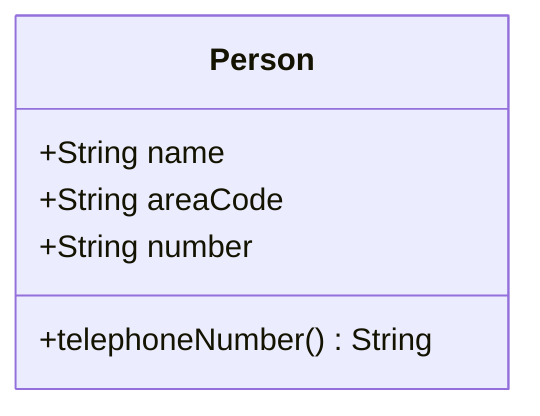

After — phone details live in their own class:
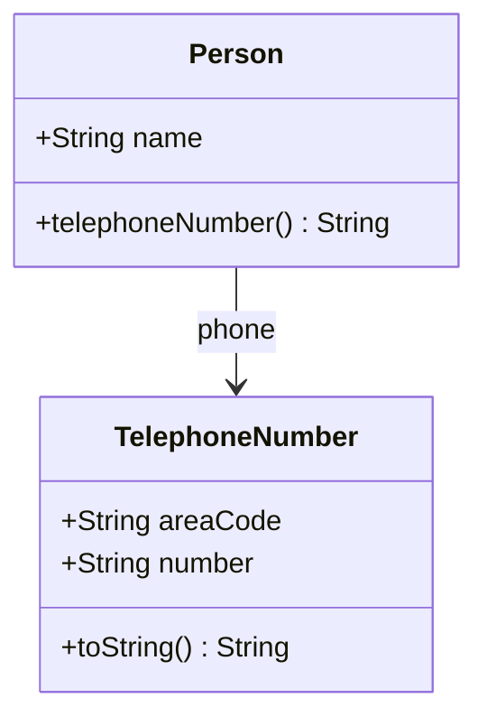

**Before:**
```dart
class Person {
  String name = '';
  String areaCode = '';
  String number = '';
  String get telephoneNumber => '($areaCode) $number';
}
```

**After:**
```dart
class TelephoneNumber {
  String areaCode = '';
  String number = '';
  @override
  String toString() => '($areaCode) $number';
}

class Person {
  String name = '';
  TelephoneNumber phone = TelephoneNumber();
  String get telephoneNumber => phone.toString();
}
```

**Steps (safe recipe):**
1. Create the new (empty) class.
2. Move the related fields into it ([Move Field, R22](#r22)).
3. Move the related methods into it ([Move Function, R21](#r21)).
4. Link from the old class to the new one; run the tests after each move.

**Fixes smells:** [S2 — Large Class](#s2) · [S10 — Divergent Change](#s10) · [S5 — Data Clumps](#s5) · [S7 — Temporary Field](#s7)

**Opposite:** [R17 — Inline Class](#r17)

**Watch out:** don't go overboard — splitting into too many tiny classes creates [Lazy Classes (S15)](#s15) and more navigation.

[↑ Back to top](#toc)

---

<a id="r17"></a>

### R17 — Inline Class
*Group 2 · opposite of [R16 — Extract Class](#r16)*

**In one line:** Fold a class that no longer earns its keep back into the class that uses it.

**Why do it:** The reverse of Extract Class. After changes, a class can shrink until it does too little to justify being separate.

**Before → After (Mermaid):**

Before — a tiny class barely used:
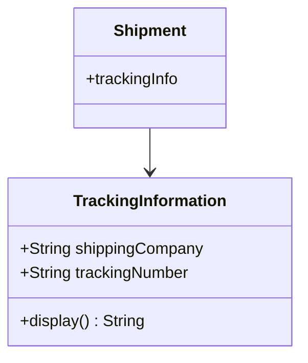

After — merged into Shipment:
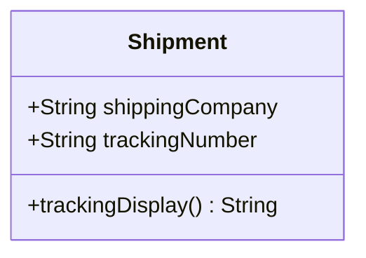

**Before:**
```dart
class TrackingInformation {
  String shippingCompany = '';
  String trackingNumber = '';
  String get display => '$shippingCompany: $trackingNumber';
}
class Shipment {
  TrackingInformation trackingInfo = TrackingInformation();
}
```

**After:**
```dart
class Shipment {
  String shippingCompany = '';
  String trackingNumber = '';
  String get trackingDisplay => '$shippingCompany: $trackingNumber';
}
```

**Steps (safe recipe):**
1. Copy the small class's fields and methods into the host class.
2. Redirect every caller to the host.
3. Delete the now-empty class.
4. Run the tests.

**Fixes smells:** [S15 — Lazy Class](#s15) · [S18 — Speculative Generality](#s18)

**Opposite:** [R16 — Extract Class](#r16)

**Watch out:** make sure no other code relies on the small class as its own type before deleting it.

[↑ Back to top](#toc)

---

<a id="r18"></a>

### R18 — Hide Delegate
*Group 2 · opposite of [R19 — Remove Middle Man](#r19)*

**In one line:** Add a method on the server object so the client doesn't have to reach *through* it to a second object.

**Why do it:** The client stops needing to know the hidden structure, which kills [message chains](#s21) and loosens coupling.

**Before → After (Mermaid):**

Before — client must walk the chain:
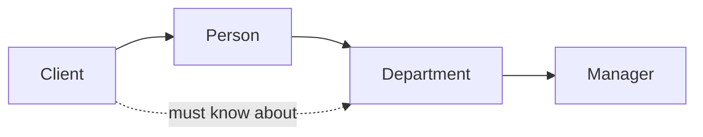

After — Person hides the Department:
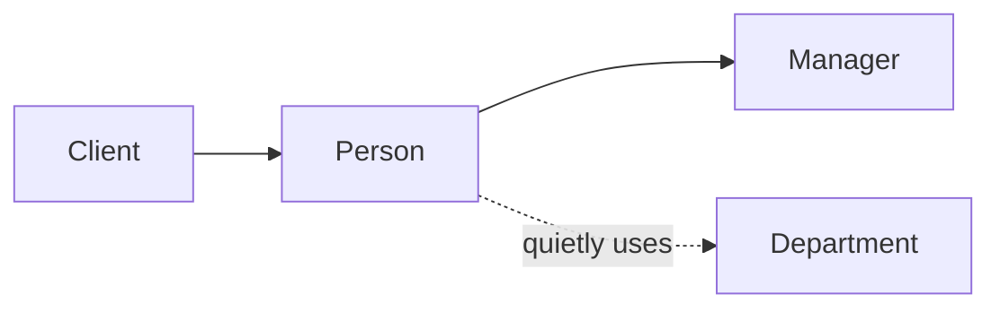

**Before:**
```dart
class Department {
  Person manager;
  Department(this.manager);
}
class Person {
  Department department;
  Person(this.department);
}
// client has to know about Department:
final manager = john.department.manager;
```

**After:**
```dart
class Person {
  Department _department;
  Person(this._department);
  Person get manager => _department.manager; // delegate is hidden
}
// client just asks the person:
final manager = john.manager;
```

**Steps (safe recipe):**
1. Add a delegating method on the server for what clients need.
2. Change clients to call the server's new method.
3. If nothing else uses the delegate directly, hide it (make it private).
4. Run the tests.

**Fixes smells:** [S21 — Message Chains](#s21) · [S20 — Inappropriate Intimacy](#s20)

**Opposite:** [R19 — Remove Middle Man](#r19)

**Watch out:** hide too many delegates and the server becomes a [Middle Man (S22)](#s22). Hide what clients actually need, not everything.

[↑ Back to top](#toc)

---

<a id="r19"></a>

### R19 — Remove Middle Man
*Group 2 · opposite of [R18 — Hide Delegate](#r18)*

**In one line:** When a class spends most of its time just forwarding calls, let clients talk to the real object directly.

**Why do it:** The reverse of Hide Delegate. Once a class forwards *too many* methods, the forwarding is pure overhead — every new delegate method needs a matching forwarder.

**Before → After (Mermaid):**

Before — Person forwards everything:
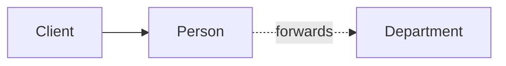

After — client uses the department directly:
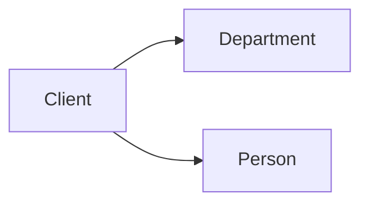

**Before:**
```dart
class Person {
  Department _department;
  Person(this._department);
  Person get manager => _department.manager;     // forwarder
  String get chargeCode => _department.chargeCode; // forwarder
}
```

**After:**
```dart
class Person {
  Department department; // exposed
  Person(this.department);
}
// clients talk to the department directly:
final manager = john.department.manager;
```

**Steps (safe recipe):**
1. Add a getter for the delegate.
2. For each forwarding method, change its callers to go through the delegate.
3. Remove the now-unused forwarding methods.
4. Run the tests.

**Fixes smells:** [S22 — Middle Man](#s22)

**Opposite:** [R18 — Hide Delegate](#r18)

**Watch out:** this brings back some coupling and possible [message chains (S21)](#s21). Balance the two — a few forwarders are fine; dozens are not.

[↑ Back to top](#toc)

---

<a id="r20"></a>

### R20 — Substitute Algorithm
*Group 2*

**In one line:** Replace a tangled algorithm with a clearer one that produces the same result.

**Why do it:** Sometimes the cleanest fix isn't to tweak the code, but to swap the whole approach for a simpler one.

**Before → After (idea):**
```
  OLD: manual loop + flag            NEW: built-in, says the intent
  ┌──────────────────────────┐      ┌────────────────────────────┐
  │ for each name             │      │ names.contains(target)     │
  │   if name == target       │ ──►  └────────────────────────────┘
  │     found = true; break   │
  └──────────────────────────┘
```

**Before:**
```dart
bool found(List<String> names, String target) {
  var result = false;
  for (final n in names) {
    if (n == target) {
      result = true;
      break;
    }
  }
  return result;
}
```

**After:**
```dart
bool found(List<String> names, String target) => names.contains(target);
```

**Steps (safe recipe):**
1. Make sure the function is well covered by tests — they are your proof of "same behaviour."
2. Write the new, clearer algorithm beside the old one.
3. Swap it in and run the tests; they confirm nothing changed.

**Fixes smells:** [S1 — Long Function](#s1) · tangled logic in general

**Opposite:** none.

**Watch out:** be sure the new version handles every edge case the old one did (empty input, duplicates, nulls). The tests must cover those.

[↑ Back to top](#toc)

---

## Group 3 — Moving Features

Good code keeps each piece of behaviour close to the data it works with, and close to the other pieces it relates to. This group is about **moving code to where it belongs** — between classes, in and out of functions, and reordering it.

```
   "Put the thing where it belongs"

   [ Class A ]                 [ Class A ]
   uses B's data   ─ move ─►   (lighter)
                               [ Class B ]  ◄── behaviour now lives with its data
```

<a id="r21"></a>

### R21 — Move Function
*Group 3 · also called Move Method*

**In one line:** Move a function to the class (or file) it most belongs to — usually the one whose data it uses most.

**Why do it:** Behaviour should live with the data it touches. Moving it there cures [Feature Envy (S19)](#s19) and keeps related code together.

**Before → After (Mermaid):**

Before — `overdraftCharge` lives on `Account` but uses `AccountType`'s data:
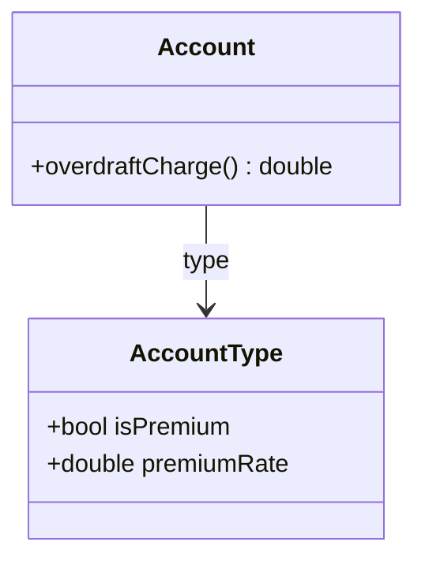

After — moved to where its data lives:
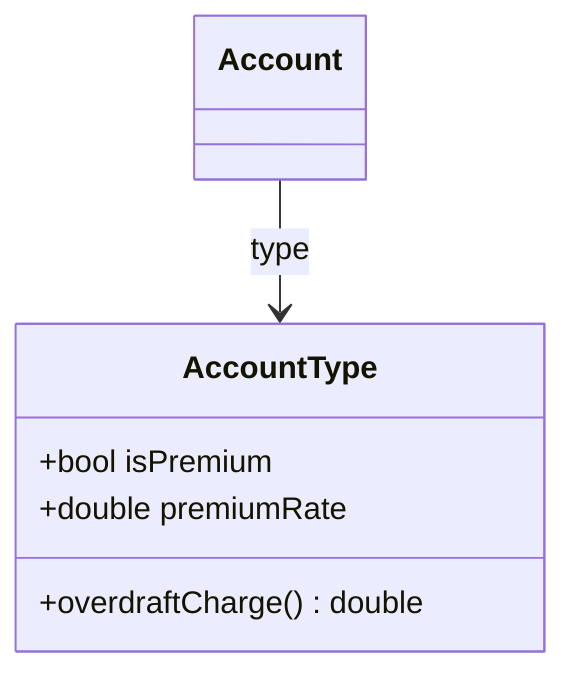

**Before:**
```dart
class Account {
  final AccountType type;
  final int daysOverdrawn;
  Account(this.type, this.daysOverdrawn);

  double get overdraftCharge {                 // envies AccountType
    if (type.isPremium) return daysOverdrawn * type.premiumRate;
    return daysOverdrawn * 1.75;
  }
}
```

**After:**
```dart
class AccountType {
  final bool isPremium;
  final double premiumRate;
  AccountType(this.isPremium, this.premiumRate);

  double overdraftCharge(int daysOverdrawn) {  // now lives with its data
    if (isPremium) return daysOverdrawn * premiumRate;
    return daysOverdrawn * 1.75;
  }
}

class Account {
  final AccountType type;
  final int daysOverdrawn;
  Account(this.type, this.daysOverdrawn);
  double get overdraftCharge => type.overdraftCharge(daysOverdrawn); // delegates
}
```

**Steps (safe recipe):**
1. Check what the function uses; make sure those things can come with it (or be passed in).
2. Copy the function into the target class; fix up references.
3. Turn the original into a thin call to the new one (or remove it).
4. Run the tests.

**Fixes smells:** [S19 — Feature Envy](#s19) · [S10 — Divergent Change](#s10) · [S11 — Shotgun Surgery](#s11) · [S12 — Parallel Inheritance Hierarchies](#s12)

**Opposite:** none (move it again if needed).

**Watch out:** keep the function where its callers and data feel most natural — moving it somewhere "clever" but surprising hurts readability.

[↑ Back to top](#toc)

---

<a id="r22"></a>

### R22 — Move Field
*Group 3*

**In one line:** Move a field to the class that uses it the most.

**Why do it:** A field used mainly by another class is a sign it lives in the wrong place. Moving it reduces reaching-across and keeps data together.

**Before → After (Mermaid):**
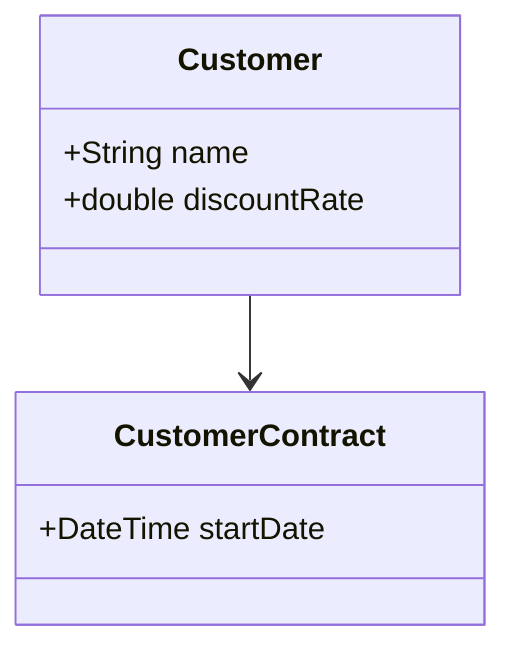
becomes
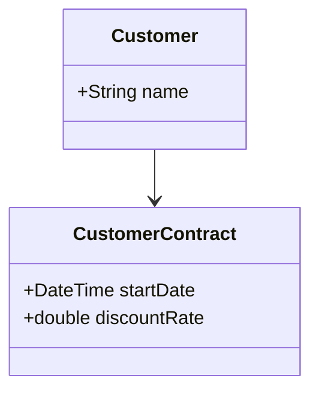

**Before:**
```dart
class Customer {
  String name;
  double discountRate;              // really a property of the contract
  CustomerContract contract;
  Customer(this.name, this.discountRate, this.contract);
}
```

**After:**
```dart
class CustomerContract {
  DateTime startDate;
  double discountRate;              // moved here
  CustomerContract(this.startDate, this.discountRate);
}
class Customer {
  String name;
  CustomerContract contract;
  Customer(this.name, this.contract);
  double get discountRate => contract.discountRate; // optional convenience
}
```

**Steps (safe recipe):**
1. Encapsulate the field ([R6](#r6)) so access is in one place.
2. Add the field to the target class.
3. Point the accessors at the target's field.
4. Remove the original field; run the tests.

**Fixes smells:** [S19 — Feature Envy](#s19) · [S5 — Data Clumps](#s5) · [S20 — Inappropriate Intimacy](#s20)

**Opposite:** none.

**Watch out:** if many classes share the field equally, think about whether it belongs in a new shared class instead.

[↑ Back to top](#toc)

---

<a id="r23"></a>

### R23 — Move Statements into Function
*Group 3 · opposite of [R24 — Move Statements to Callers](#r24)*

**In one line:** When the same lines always run right before (or after) a function call, move them *inside* the function.

**Why do it:** Removes repetition and makes the function fully responsible for its job.

**Before → After (idea):**
```
  BEFORE (repeated at every call)        AFTER (inside the function)
  print(title);  ─┐                      renderPhoto():
  renderPhoto();  │  repeated everywhere     print(title);
  print(title);  ─┘                          ...render...
  renderPhoto();
```

**Before:**
```dart
String photoDiv(Photo p) {
  return '<div>\n  <p>title: ${p.title}</p>\n' + renderPhoto(p) + '\n</div>';
}
String renderPhoto(Photo p) => '';
// the "title" line is duplicated wherever renderPhoto is used
```

**After:**
```dart
String photoDiv(Photo p) => '<div>\n' + renderPhoto(p) + '\n</div>';
String renderPhoto(Photo p) =>
    '  <p>title: ${p.title}</p>\n'; // title moved in
```

**Steps (safe recipe):**
1. Confirm the statements appear with *every* call (or you'll change behaviour).
2. Move them into the function.
3. Remove them from each caller; run the tests.

**Fixes smells:** [S14 — Duplicate Code](#s14)

**Opposite:** [R24 — Move Statements to Callers](#r24)

**Watch out:** only move statements that genuinely belong with *every* call. If some callers don't want them, that's the opposite refactoring.

[↑ Back to top](#toc)

---

<a id="r24"></a>

### R24 — Move Statements to Callers
*Group 3 · opposite of [R23 — Move Statements into Function](#r23)*

**In one line:** When a function does something only *some* callers want, push that part out to the callers.

**Why do it:** A function that used to be one-size-fits-all has started to vary by caller. Move the varying part out so the function stays focused.

**Before → After (idea):**
```
  BEFORE                               AFTER
  emit():                              emit():
    emitHeader();                        emitHeader();
    emitFooter();  ◄ not all want this caller A: emit(); emitFooter();
                                         caller B: emit();   // no footer
```

**Before:**
```dart
void renderPerson(Person p) {
  print(p.name);
  print('photo: ${p.photo}');   // a new caller does NOT want the photo line
}
```

**After:**
```dart
void renderPerson(Person p) {
  print(p.name);
}
// callers that want the photo line add it themselves:
renderPerson(p);
print('photo: ${p.photo}');
```

**Steps (safe recipe):**
1. Extract everything you want to *keep* into a new function ([R1](#r1)).
2. Move the leftover statements out to each caller.
3. Run the tests.

**Fixes smells:** [S10 — Divergent Change](#s10)

**Opposite:** [R23 — Move Statements into Function](#r23)

**Watch out:** don't scatter so much into callers that you create [Duplicate Code (S14)](#s14). Move out only the genuinely varying part.

[↑ Back to top](#toc)

---

<a id="r25"></a>

### R25 — Replace Inline Code with Function Call
*Group 3*

**In one line:** When some inline code does exactly what an existing function already does, just call the function.

**Why do it:** Reuse beats repetition. The named call also reads better than the raw lines.

**Before → After (idea):**
```
  INLINE (does it by hand)             CALL (reuses the function)
  var has = false;                     var has = names.contains('Dhaka');
  for (n in names)
    if (n=='Dhaka') has = true;  ──►
```

**Before:**
```dart
bool hasDhaka(List<String> names) {
  var found = false;
  for (final n in names) {
    if (n == 'Dhaka') found = true;
  }
  return found;
}
```

**After:**
```dart
bool hasDhaka(List<String> names) => names.contains('Dhaka');
```

**Steps (safe recipe):**
1. Confirm the existing function does the same thing (including edge cases).
2. Replace the inline code with a call to it.
3. Run the tests.

**Fixes smells:** [S14 — Duplicate Code](#s14)

**Opposite:** loosely [R2 — Inline Function](#r2).

**Watch out:** the existing function must truly match — a subtle difference (e.g. case sensitivity) would change behaviour.

[↑ Back to top](#toc)

---

<a id="r26"></a>

### R26 — Slide Statements
*Group 3 · also called Consolidate Duplicate Conditional Fragments (related)*

**In one line:** Move related statements next to each other (for example, declare a variable right where it's first used).

**Why do it:** Code that is read together should sit together. This is often a *preparation* step that makes [Extract Function (R1)](#r1) possible.

**Before → After (idea):**
```
  SCATTERED                            GROUPED
  var total;            (far apart)    var pricingPlan = ...;
  ...30 lines...                       var order = ...;
  total = price * qty;                 var total = price * qty;  ◄ all together
```

**Before:**
```dart
double charge(int qty, double price) {
  final base = qty * price;
  print('processing...');     // unrelated line sits between
  final discount = qty > 100 ? base * 0.1 : 0;
  return base - discount;
}
```

**After:**
```dart
double charge(int qty, double price) {
  print('processing...');
  final base = qty * price;        // base + discount now adjacent
  final discount = qty > 100 ? base * 0.1 : 0;
  return base - discount;
}
```

**Steps (safe recipe):**
1. Pick the statement to move and where it should go.
2. Check it does **not** depend on, or get depended on by, anything it would cross over.
3. Move it; run the tests.

**Fixes smells:** [S1 — Long Function](#s1) (prep) · [S14 — Duplicate Code](#s14) (bringing copies together)

**Opposite:** none.

**Watch out:** never slide a statement past code that reads or writes the same data — that can silently change behaviour.

[↑ Back to top](#toc)

---

<a id="r27"></a>

### R27 — Split Loop
*Group 3*

**In one line:** A loop doing two jobs becomes two loops, each doing one job.

**Why do it:** Each loop now has a single clear purpose, which you can name, extract, and change independently.

**Before → After (idea):**
```
  ONE LOOP, TWO JOBS                   TWO LOOPS, ONE JOB EACH
  for (p in people) {                  for (p in people) totalAge += p.age;
    totalAge += p.age;        ──►       for (p in people)
    if (p.age < min) youngest = p;        if (p.age < min) youngest = p;
  }
```

**Before:**
```dart
({int totalAge, Person? youngest}) stats(List<Person> people) {
  var totalAge = 0;
  Person? youngest;
  for (final p in people) {
    totalAge += p.age;
    if (youngest == null || p.age < youngest.age) youngest = p;
  }
  return (totalAge: totalAge, youngest: youngest);
}
```

**After:**
```dart
int totalAge(List<Person> people) =>
    people.fold(0, (sum, p) => sum + p.age);

Person? youngest(List<Person> people) =>
    people.isEmpty ? null : people.reduce((a, b) => a.age < b.age ? a : b);
```
Each job is now its own named function (and ripe for [Replace Loop with Pipeline, R28](#r28)).

**Steps (safe recipe):**
1. Copy the whole loop.
2. In each copy, delete the job that doesn't belong to it.
3. Run the tests; then [Extract Function (R1)](#r1) on each loop.

**Fixes smells:** [S26 — Loops](#s26) · [S1 — Long Function](#s1)

**Opposite:** loosely "merge loops" (not a named refactoring).

**Watch out:** this iterates twice. Almost always fine; if it's a measured hot path with huge data, weigh the cost.

[↑ Back to top](#toc)

---

<a id="r28"></a>

### R28 — Replace Loop with Pipeline
*Group 3*

**In one line:** Replace a manual loop with a chain of collection operations (`where`, `map`, `fold`).

**Why do it:** A pipeline reads top-to-bottom like a sentence — "take active users, get their names" — instead of making you trace a loop in your head.

**Before → After (idea):**
```
  LOOP (mechanics)                     PIPELINE (intent)
  result = []                          users
  for (u in users)                       .where((u) => u.active)
    if (u.active)             ──►         .map((u) => u.name)
      result.add(u.name)                 .toList()
```

**Before:**
```dart
List<String> activeNames(List<User> users) {
  final result = <String>[];
  for (final u in users) {
    if (u.active) result.add(u.name);
  }
  return result;
}
```

**After:**
```dart
List<String> activeNames(List<User> users) =>
    users.where((u) => u.active).map((u) => u.name).toList();
```

**Steps (safe recipe):**
1. Build the pipeline one operation at a time (filter, then transform, then collect).
2. Replace the loop with the finished pipeline.
3. Run the tests.

**Fixes smells:** [S26 — Loops](#s26)

**Opposite:** none.

**Watch out:** if a loop has complex control flow (early `break`/`return`, side effects), a pipeline can be *less* clear — keep the loop then. First use [Split Loop (R27)](#r27) if it does two things.

[↑ Back to top](#toc)

---

<a id="r29"></a>

### R29 — Remove Dead Code
*Group 3*

**In one line:** Delete code that is never used or never reached.

**Why do it:** Dead code is pure cost — it confuses readers and gets pointlessly maintained. Deleting it makes everything around it clearer.

**Before → After (idea):**
```
  BEFORE                               AFTER
  activeFunction();                    activeFunction();
  oldUnusedFunction();   ◄ never called  (deleted)
  if (false) { ... }     ◄ unreachable   (deleted)
```

**Before:**
```dart
String greet(String name) {
  return 'Hi $name';
  // ignore: dead_code
  return 'unreachable'; // never runs
}
void legacyExport() { /* nothing calls this anymore */ }
```

**After:**
```dart
String greet(String name) => 'Hi $name';
```

**Steps (safe recipe):**
1. Prove the code is unused — search the project; lean on the analyzer's "unused" warnings.
2. Delete it.
3. Run the tests.

**Fixes smells:** [S17 — Dead Code](#s17)

**Opposite:** none.

**Watch out:** confirm it isn't reached indirectly — reflection, dynamic dispatch, a public API used by other packages, or a build-time entry point. Version control means you can always recover it.

[↑ Back to top](#toc)

---

## Group 4 — Organizing Data

Data is the foundation everything else stands on. These techniques make data **clearer** (good names, named constants), **safer** (immutable values, no surprise sharing), and **better shaped** (objects instead of arrays).

```
   Goals of this group:
   ┌─────────────┬──────────────────────────────────────┐
   │ One purpose │ each variable means exactly one thing │
   │ Good shape  │ objects with names, not raw arrays    │
   │ Safe        │ values that can't be changed behind you│
   └─────────────┴──────────────────────────────────────┘
```

<a id="r30"></a>

### R30 — Split Variable
*Group 4 · also called Split Temporary Variable*

**In one line:** If one variable is reused to hold two different things, give each thing its own variable.

**Why do it:** A variable should mean exactly one thing. Reusing `temp` for two purposes hides meaning and invites bugs.

**Before → After (idea):**
```
  ONE VARIABLE, TWO MEANINGS           ONE VARIABLE EACH
  var temp = 2 * (h + w);  // perimeter   final perimeter = 2 * (h + w);
  print(temp);                            print(perimeter);
  temp = h * w;            // area  ──►    final area = h * w;
  print(temp);                            print(area);
```

**Before:**
```dart
double area(double h, double w) {
  var temp = 2 * (h + w);
  print('perimeter: $temp');
  temp = h * w;            // same name, totally different meaning
  return temp;
}
```

**After:**
```dart
double area(double h, double w) {
  final perimeter = 2 * (h + w);
  print('perimeter: $perimeter');
  final area = h * w;
  return area;
}
```

**Steps (safe recipe):**
1. Rename the variable at its first use and make it `final`.
2. At the second assignment, declare a new, well-named variable.
3. Update the following uses to the right variable; run the tests.

**Fixes smells:** [S23 — Mysterious Name](#s23) · [S25 — Mutable Data](#s25)

**Opposite:** none.

**Watch out:** genuine accumulators and loop counters (`sum += x`, `i++`) are *meant* to be reassigned — that's not this smell.

[↑ Back to top](#toc)

---

<a id="r31"></a>

### R31 — Rename Field
*Group 4*

**In one line:** Give a class field (or record key) a clearer name.

**Why do it:** Field names appear all over the code and in stored data. A vague field name spreads confusion everywhere it's read.

**Before → After:**
```dart
// Before
class Person { String n = ''; }      // n = ?

// After
class Person { String name = ''; }   // obvious
```

**Steps (safe recipe):**
1. If the field is public, encapsulate it first ([R6](#r6)) so renaming touches one place.
2. Use the editor's rename to update all references.
3. Run the tests (and update any serialization/JSON keys that depend on the name).

**Fixes smells:** [S23 — Mysterious Name](#s23)

**Opposite:** none.

**Watch out:** if the field maps to a database column or JSON key, rename those mappings too (or keep the wire name via an annotation).

[↑ Back to top](#toc)

---

<a id="r32"></a>

### R32 — Replace Derived Variable with Query
*Group 4*

**In one line:** Stop *storing* a value that can be *calculated* from other data — compute it on demand instead.

**Why do it:** Stored derived data can fall out of sync with the data it came from. Calculating it every time guarantees it's always correct.

**Before → After (idea):**
```
  STORED (can go stale)                COMPUTED (always correct)
  _total updated on every add  ──►     get total => items.fold(...)
  forget to update once = bug          no field to forget
```

**Before:**
```dart
class Cart {
  final List<double> _prices = [];
  double total = 0;                 // derived + stored

  void add(double price) {
    _prices.add(price);
    total += price;                 // must remember to keep in sync
  }
}
```

**After:**
```dart
class Cart {
  final List<double> _prices = [];

  void add(double price) => _prices.add(price);

  double get total => _prices.fold(0, (sum, p) => sum + p); // computed
}
```

**Steps (safe recipe):**
1. Find every place that updates the stored value.
2. Replace reads of it with a query that computes from the source data.
3. Delete the stored field and its update code; run the tests.

**Fixes smells:** [S25 — Mutable Data](#s25) · [S7 — Temporary Field](#s7)

**Opposite:** none (caching is the reverse, but only do it if profiling proves you must).

**Watch out:** if the calculation is genuinely expensive and called in a hot path, a measured cache may be worth keeping — but prove it first.

[↑ Back to top](#toc)

---

<a id="r33"></a>

### R33 — Change Reference to Value
*Group 4 · opposite of [R34 — Change Value to Reference](#r34)*

**In one line:** Make a small object **immutable** and compare it by its contents (value equality) instead of by identity.

**Why do it:** Value objects are simple and safe — you can share them freely with zero risk of one holder's change surprising another.

**Before → After (idea):**
```
  REFERENCE (mutable, shared)          VALUE (immutable, compared by content)
  money.amount = 5;  // leaks to all   final m = Money(5,'BDT');
                                        m2 = m.add(Money(2,'BDT')); // new object
  m1 == m2 ? same object               m1 == m2 ? same amount+currency
```

**Before:**
```dart
class Money {
  double amount;
  String currency;
  Money(this.amount, this.currency);   // mutable; == is identity
}
```

**After:**
```dart
class Money {
  final double amount;
  final String currency;
  const Money(this.amount, this.currency);

  Money add(Money other) => Money(amount + other.amount, currency); // returns new

  @override
  bool operator ==(Object o) =>
      o is Money && o.amount == amount && o.currency == currency;
  @override
  int get hashCode => Object.hash(amount, currency);
}
```

**Steps (safe recipe):**
1. Make all fields `final`.
2. Replace any setters with methods that return a **new** object.
3. Add value equality (`==` and `hashCode`).
4. Run the tests.

**Fixes smells:** [S25 — Mutable Data](#s25)

**Opposite:** [R34 — Change Value to Reference](#r34)

**Watch out:** only for small objects with no identity of their own. If many places must see updates to the *same* object, you want a reference instead.

[↑ Back to top](#toc)

---

<a id="r34"></a>

### R34 — Change Value to Reference
*Group 4 · opposite of [R33 — Change Reference to Value](#r33)*

**In one line:** When the same logical thing is copied in many places, replace the copies with a single shared object (looked up by id).

**Why do it:** If that thing can change and everyone must see the change, separate copies would drift apart. One shared reference is the single source of truth.

**Before → After (Mermaid):**

Before — every order owns its own Customer copy:
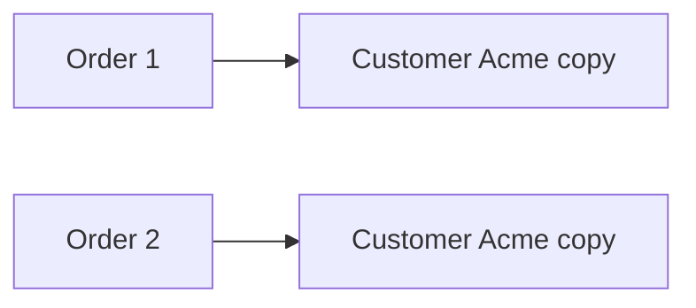

After — orders share one Customer via a repository:
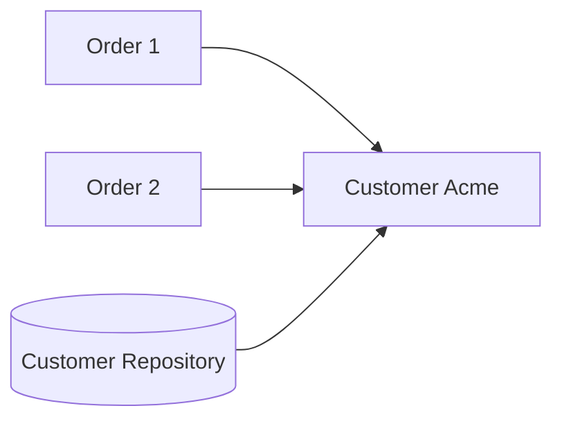

**Before:**
```dart
class Order {
  Customer customer;
  Order(String name) : customer = Customer(name); // a NEW copy each time
}
```

**After:**
```dart
class CustomerRepository {
  final _customers = <String, Customer>{};
  Customer find(String name) => _customers.putIfAbsent(name, () => Customer(name));
}

class Order {
  final Customer customer;
  Order(CustomerRepository repo, String name) : customer = repo.find(name); // shared
}
```

**Steps (safe recipe):**
1. Create a repository/registry that owns the objects.
2. Replace "create a copy" with "look it up" by id/key.
3. Run the tests.

**Fixes smells:** duplicated objects · [S25 — Mutable Data](#s25) (keeps one source of truth)

**Opposite:** [R33 — Change Reference to Value](#r33)

**Watch out:** now the object is shared and mutable, so changes affect everyone — that's the point, but reason about it carefully.

[↑ Back to top](#toc)

---

<a id="r35"></a>

### R35 — Replace Magic Number with Symbolic Constant
*Group 4*

**In one line:** Replace an unexplained literal (a "magic number") with a named constant.

**Why do it:** `9.81` means nothing on its own; `gravitationalAcceleration` explains itself. And if the value appears many times, one constant means one place to change it.

**Before → After:**
```dart
// Before
double potentialEnergy(double mass, double height) => mass * 9.81 * height;

// After
const double gravitationalAcceleration = 9.81;
double potentialEnergy(double mass, double height) =>
    mass * gravitationalAcceleration * height;
```

**Steps (safe recipe):**
1. Declare a named constant with the value.
2. Replace each occurrence of the literal with the constant.
3. Run the tests.

**Fixes smells:** [S23 — Mysterious Name](#s23) · [S14 — Duplicate Code](#s14)

**Opposite:** none.

**Watch out:** don't "constant-ify" obvious values where a literal is clearer (e.g. multiplying by `2` to double something — `const two = 2` adds nothing).

[↑ Back to top](#toc)

---

<a id="r36"></a>

### R36 — Replace Array with Object
*Group 4*

**In one line:** When an array's positions each mean something different, replace it with an object that has named fields.

**Why do it:** `row[0]` and `row[1]` force everyone to memorise what each slot means. Named fields can't be mixed up.

**Before → After (idea):**
```
  ARRAY (positions = meaning)          OBJECT (names = meaning)
  ['Liverpool', 15]                    Performance(name: 'Liverpool', wins: 15)
  row[0] = name?  row[1] = wins?  ──►   p.name        p.wins
```

**Before:**
```dart
final row = ['Liverpool', 15];
final name = row[0] as String;   // position 0 means name (you must know)
final wins = row[1] as int;      // position 1 means wins
```

**After:**
```dart
class Performance {
  final String name;
  final int wins;
  Performance({required this.name, required this.wins});
}

final row = Performance(name: 'Liverpool', wins: 15);
print(row.name);
print(row.wins);
```

**Steps (safe recipe):**
1. Create a class with a named field per array slot.
2. Replace array creation with the object; replace `[i]` accesses with fields.
3. Run the tests.

**Fixes smells:** [S3 — Primitive Obsession](#s3) · [S5 — Data Clumps](#s5)

**Opposite:** none.

**Watch out:** a true homogeneous list (all elements the same kind of thing) should stay a list — this is only for arrays where each position means something *different*.

[↑ Back to top](#toc)

---

<a id="r37"></a>

### R37 — Duplicate Observed Data
*Group 4*

**In one line:** When business data is trapped inside the UI, copy it into a domain object and keep the two in sync — so logic can live (and be tested) away from the screen.

**Why do it:** Mixing UI and business logic makes both hard to change and impossible to test without the UI. Separating them is the foundation of clean app architecture.

**Before → After (Mermaid):**

Before — logic stuck in the widget:
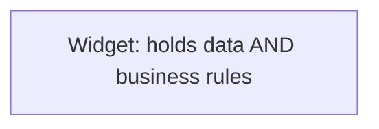

After — domain model holds the data; UI just observes it:
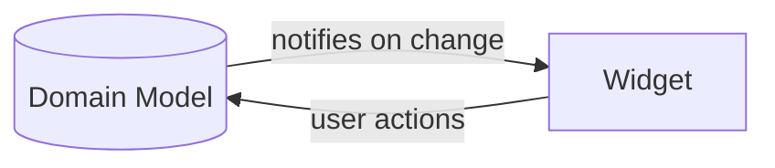

**Before (Flutter-flavoured):**
```dart
class _CounterState extends State<Counter> {
  int count = 0;                          // business state inside the widget
  void increment() => setState(() => count = count * 2 + 1); // rule buried in UI
}
```

**After:**
```dart
class CounterModel extends ChangeNotifier {  // domain object owns data + rules
  int _count = 0;
  int get count => _count;
  void increment() {
    _count = _count * 2 + 1;
    notifyListeners();                       // tell observers (the UI) to refresh
  }
}
// the widget just listens to the model and rebuilds — no business logic in it.
```

**Steps (safe recipe):**
1. Create a domain class to hold the data and its rules.
2. Have the UI observe the domain object (listener / state-management).
3. Move the data and logic out of the UI into the domain object.
4. Run the tests (now you can test the logic with no UI at all).

**Fixes smells:** [S20 — Inappropriate Intimacy](#s20) (UI tangled with domain) · [S10 — Divergent Change](#s10)

**Opposite:** none.

**Watch out:** in modern Flutter this is exactly what Provider / Riverpod / Bloc do — prefer those tools over hand-rolled observers.

[↑ Back to top](#toc)

---

<a id="r38"></a>

### R38 — Change Unidirectional Association to Bidirectional
*Group 4 · opposite of [R39](#r39)*

**In one line:** Add a back-pointer so two linked objects can each reach the other.

**Why do it:** Sometimes one side genuinely needs to navigate back (an `Order` knows its `Customer`, and now the `Customer` also needs its list of `Order`s).

**Before → After (Mermaid):**
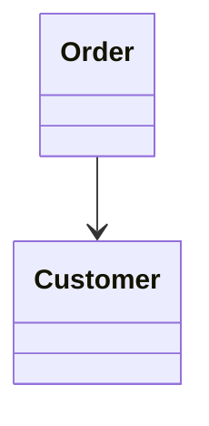
becomes
```mermaid
classDiagram
    Order --> Customer
    Customer --> Order : orders
```

**Before:**
```dart
class Order {
  Customer customer;
  Order(this.customer);
}
```

**After:**
```dart
class Order {
  Customer _customer;
  Order(this._customer) {
    _customer.friendOrders.add(this); // keep both sides in sync
  }
  Customer get customer => _customer;
}
class Customer {
  final List<Order> friendOrders = [];
}
```

**Steps (safe recipe):**
1. Add the back-pointer field to the other class.
2. Pick **one** class to be the controller that keeps both sides consistent on every change.
3. Run the tests.

**Fixes smells:** missing navigation (a practical need, not a smell)

**Opposite:** [R39 — Change Bidirectional Association to Unidirectional](#r39)

**Watch out:** two-way links are easy to get out of sync. Only add the back-pointer if you truly need it, and funnel all updates through one controlling side.

[↑ Back to top](#toc)

---

<a id="r39"></a>

### R39 — Change Bidirectional Association to Unidirectional
*Group 4 · opposite of [R38](#r38)*

**In one line:** Remove a back-pointer that isn't actually used.

**Why do it:** A two-way link you don't need is just extra coupling and one more thing to keep in sync. Dropping it simplifies both classes.

**Before → After (Mermaid):**
```mermaid
classDiagram
    Order --> Customer
    Customer --> Order
```
becomes
```mermaid
classDiagram
    Order --> Customer
```

**Steps (safe recipe):**
1. Confirm the back-direction is genuinely unused (search for every read).
2. Remove the back-pointer field and all the code that maintained it.
3. Run the tests.

**Fixes smells:** [S20 — Inappropriate Intimacy](#s20) · [S11 — Shotgun Surgery](#s11)

**Opposite:** [R38 — Change Unidirectional Association to Bidirectional](#r38)

**Watch out:** be sure nothing relies on the link indirectly (e.g. cascade deletes, serialization) before removing it.

[↑ Back to top](#toc)

---

<a id="r40"></a>

### R40 — Remove Assignments to Parameters
*Group 4*

**In one line:** Don't reassign a parameter inside a function — copy it into a local variable and change that instead.

**Why do it:** Reassigning a parameter is confusing: readers can't trust that the parameter still means what was passed in. A separate local makes the intent obvious.

**Before → After:**
```dart
// Before
double discount(double inputVal, int quantity) {
  if (inputVal > 50) inputVal = inputVal - 2; // parameter reused as a workspace
  if (quantity > 100) inputVal = inputVal - 1;
  return inputVal;
}

// After
double discount(double inputVal, int quantity) {
  var result = inputVal;                       // clear, separate workspace
  if (inputVal > 50) result -= 2;
  if (quantity > 100) result -= 1;
  return result;
}
```

**Steps (safe recipe):**
1. Introduce a local variable initialised from the parameter.
2. Replace later uses/assignments with the local.
3. Run the tests.

**Fixes smells:** [S25 — Mutable Data](#s25) · [S1 — Long Function](#s1)

**Opposite:** none.

**Watch out:** in Dart, reassigning a parameter never affects the caller's variable — but it still hurts readability, so keep this habit.

[↑ Back to top](#toc)

---

## Group 5 — Simplifying Conditional Logic

Conditionals (`if`, `switch`) are where code gets tangled fastest. This group untangles them: name the conditions, flatten the nesting, and — the big one — replace type-based conditionals with polymorphism.

```
   The journey of a messy conditional:

   deep nested if/else   ──►  guard clauses (flat)   ──►  polymorphism (no if at all)
   hard to follow             easy to read                each type owns its behaviour
```

<a id="r41"></a>

### R41 — Decompose Conditional
*Group 5*

**In one line:** Extract the condition and each branch into well-named functions.

**Why do it:** A big `if` full of raw logic is hard to read. Names like `isSummer(date)` and `summerCharge()` turn it into a plain-English sentence.

**Before → After (idea):**
```
  if (date < summerStart || date > summerEnd)      if (isWinter(date))
      charge = qty*winterRate + winterFee;   ──►       charge = winterCharge(qty);
  else                                             else
      charge = qty * summerRate;                       charge = summerCharge(qty);
```

**Before:**
```dart
double charge(DateTime date, int qty) {
  if (date.isBefore(summerStart) || date.isAfter(summerEnd)) {
    return qty * winterRate + winterServiceFee;
  } else {
    return qty * summerRate;
  }
}
```

**After:**
```dart
double charge(DateTime date, int qty) =>
    isWinter(date) ? winterCharge(qty) : summerCharge(qty);

bool isWinter(DateTime date) =>
    date.isBefore(summerStart) || date.isAfter(summerEnd);
double winterCharge(int qty) => qty * winterRate + winterServiceFee;
double summerCharge(int qty) => qty * summerRate;
```

**Steps (safe recipe):**
1. [Extract Function (R1)](#r1) on the condition; name it for what it tests.
2. Extract each branch into its own named function.
3. Run the tests.

**Fixes smells:** [S1 — Long Function](#s1) · complex conditionals

**Opposite:** none.

**Watch out:** keep the extracted names truthful — `isWinter` must really mean winter, or you've made things worse.

[↑ Back to top](#toc)

---

<a id="r42"></a>

### R42 — Consolidate Conditional Expression
*Group 5*

**In one line:** When several separate checks all lead to the **same** result, combine them into one check (and usually name it).

**Why do it:** It shows that the checks are really one rule, and gives that rule a name.

**Before → After (idea):**
```
  if (seniority < 2)  return 0;            if (isNotEligible(emp)) return 0;
  if (monthsDisabled > 12) return 0;  ──►
  if (isPartTime)     return 0;            bool isNotEligible(emp) =>
                                             emp.seniority < 2 ||
                                             emp.monthsDisabled > 12 ||
                                             emp.isPartTime;
```

**Before:**
```dart
double disabilityAmount(Employee emp) {
  if (emp.seniority < 2) return 0;
  if (emp.monthsDisabled > 12) return 0;
  if (emp.isPartTime) return 0;
  return emp.baseAmount * 0.6;
}
```

**After:**
```dart
double disabilityAmount(Employee emp) {
  if (_isNotEligible(emp)) return 0;
  return emp.baseAmount * 0.6;
}
bool _isNotEligible(Employee emp) =>
    emp.seniority < 2 || emp.monthsDisabled > 12 || emp.isPartTime;
```

**Steps (safe recipe):**
1. Confirm the checks have no side effects and share the same outcome.
2. Combine them with `||` (or `&&`) into one expression.
3. [Extract Function (R1)](#r1) to name it; run the tests.

**Fixes smells:** [S14 — Duplicate Code](#s14) · complex conditionals

**Opposite:** none.

**Watch out:** only combine checks that truly produce the same result. If one check has a side effect, combining changes behaviour.

[↑ Back to top](#toc)

---

<a id="r43"></a>

### R43 — Replace Nested Conditional with Guard Clauses
*Group 5*

**In one line:** Handle the special/edge cases first with early `return`s, leaving the main path flat and unindented.

**Why do it:** Deeply nested `if/else` ("arrow code") forces you to hold many conditions in your head. Guard clauses say "deal with the exceptions, then get on with the real work."

**Before → After (idea):**
```
  ARROW CODE (nested)                  GUARD CLAUSES (flat)
  if (a) {                             if (!a) return x;
    if (b) {                  ──►       if (!b) return y;
      if (c) { real work }              if (!c) return z;
      else z                            real work
    } else y
  } else x
```

**Before:**
```dart
double pay(Employee emp) {
  double result;
  if (emp.isSeparated) {
    result = 0;
  } else {
    if (emp.isRetired) {
      result = 0;
    } else {
      result = emp.baseSalary; // real logic buried deep
    }
  }
  return result;
}
```

**After:**
```dart
double pay(Employee emp) {
  if (emp.isSeparated) return 0;   // guard
  if (emp.isRetired) return 0;     // guard
  return emp.baseSalary;           // main path, flat
}
```

**Steps (safe recipe):**
1. Take the outermost special case; replace it with an early `return`.
2. Repeat for each special case.
3. The main logic is now at the bottom, unindented. Run the tests.

**Fixes smells:** complex/nested conditionals · [S1 — Long Function](#s1)

**Opposite:** none.

**Watch out:** guard clauses shine when the cases are genuinely "exit early." If both branches are equally important main logic, a clear `if/else` may read better.

[↑ Back to top](#toc)

---

<a id="r44"></a>

### R44 — Replace Conditional with Polymorphism
*Group 5 · one of the most powerful refactorings*

**In one line:** Replace a `switch`/`if`-chain that branches on a type with subclasses that each override a method.

**Why do it:** Instead of one switch that must be edited for every new type (a [Repeated Switch, S6](#s6)), each type owns its own behaviour. Adding a type means adding a class — no existing code changes.

**Before → After (Mermaid):**

Before — one switch decides everything:
```mermaid
flowchart TB
    A["airSpeed(bird)"] --> B{bird.type?}
    B -->|European| C[return 35]
    B -->|African| D[return 40 - load]
    B -->|NorwegianBlue| E[return nailed ? 0 : 10]
```

After — each subclass answers for itself:
```mermaid
classDiagram
    class Bird {
      +airSpeed() double
    }
    class European {
      +airSpeed() double
    }
    class African {
      +airSpeed() double
    }
    class NorwegianBlue {
      +airSpeed() double
    }
    Bird <|-- European
    Bird <|-- African
    Bird <|-- NorwegianBlue
```

**Before:**
```dart
double airSpeed(Bird bird) {
  switch (bird.type) {
    case 'European':
      return 35;
    case 'African':
      return 40 - bird.load;
    case 'NorwegianBlue':
      return bird.isNailed ? 0 : 10;
  }
  return 0;
}
```

**After:**
```dart
abstract class Bird {
  double get airSpeed;
}
class European extends Bird {
  @override
  double get airSpeed => 35;
}
class African extends Bird {
  final double load;
  African(this.load);
  @override
  double get airSpeed => 40 - load;
}
class NorwegianBlue extends Bird {
  final bool isNailed;
  NorwegianBlue(this.isNailed);
  @override
  double get airSpeed => isNailed ? 0 : 10;
}
// caller: bird.airSpeed  — no switch anywhere
```

**Steps (safe recipe):**
1. Create a subclass for each branch of the switch.
2. Move each branch's logic into the matching subclass as an overridden method.
3. Replace the switch with a single polymorphic call (`bird.airSpeed`).
4. Run the tests.

**Fixes smells:** [S6 — Repeated Switches](#s6) · complex conditionals · [S8 — Refused Bequest](#s8) (when done right)

**Opposite:** none directly.

**Watch out:** this is overkill for a *single*, simple switch that won't grow. Use it when the same type-switch is repeated, or clearly will be. (Modern Dart `sealed` classes + `switch` expressions are a lighter alternative when you prefer one place over many subclasses.)

[↑ Back to top](#toc)

---

<a id="r45"></a>

### R45 — Introduce Special Case
*Group 5 · also called Introduce Null Object*

**In one line:** Replace repeated checks for a special value (usually `null`) with a special object that behaves sensibly on its own.

**Why do it:** When the same `if (x == null)` check is copy-pasted everywhere, a "special-case object" carries the default behaviour, so the checks disappear.

**Before → After (idea):**
```
  EVERYWHERE:                          ONE TIME:
  name = c == null                     class UnknownCustomer -> name 'occupant'
    ? 'occupant' : c.name;     ──►
  plan = c == null                     then just: c.name, c.plan
    ? Plan.basic : c.plan;             (the special object answers correctly)
```

**Before:**
```dart
String customerName(Customer? c) => c == null ? 'occupant' : c.name;
BillingPlan customerPlan(Customer? c) => c == null ? BillingPlan.basic : c.plan;
// the null check is repeated at every use site
```

**After:**
```dart
class Customer {
  final String name;
  final BillingPlan plan;
  Customer(this.name, this.plan);
}
class UnknownCustomer extends Customer {
  UnknownCustomer() : super('occupant', BillingPlan.basic); // sensible defaults
}
// callers never check for null again: just use c.name and c.plan
```

**Steps (safe recipe):**
1. Create a special-case class (or constant object) with the default behaviour.
2. Return it instead of `null` from the source.
3. Remove the scattered special-value checks.
4. Run the tests.

**Fixes smells:** repeated null checks · [S14 — Duplicate Code](#s14)

**Opposite:** none.

**Watch out:** only worth it when the check is genuinely repeated. For a single null check, a plain `??` default is simpler.

[↑ Back to top](#toc)

---

<a id="r46"></a>

### R46 — Introduce Assertion
*Group 5*

**In one line:** Make an assumption explicit in code with an `assert`, instead of leaving it as a comment or leaving it unstated.

**Why do it:** Assertions document *and check* a "this must be true here" condition. If the assumption is ever violated, you find out immediately and exactly where.

**Before → After:**
```dart
// Before — assumption hidden in a comment
double applyDiscount(double price, double rate) {
  // rate is assumed to be between 0 and 1
  return price * (1 - rate);
}

// After — assumption stated and checked
double applyDiscount(double price, double rate) {
  assert(rate >= 0 && rate <= 1, 'rate must be 0..1, got $rate');
  return price * (1 - rate);
}
```

**Steps (safe recipe):**
1. Find an assumption the code relies on but doesn't state.
2. Add an `assert` that checks it (with a helpful message).
3. Run the tests.

**Fixes smells:** unstated assumptions · [S13 — Comments](#s13) (turns a comment into a live check)

**Opposite:** none.

**Watch out:** in Dart, `assert` runs only in debug/test builds — it's a developer safety net, **not** input validation. For real user input, throw a proper error instead.

[↑ Back to top](#toc)

---

<a id="r47"></a>

### R47 — Consolidate Duplicate Conditional Fragments
*Group 5*

**In one line:** If the same code sits inside *every* branch of an `if`, move it out of the conditional.

**Why do it:** Code that runs no matter which branch is taken doesn't belong inside the branches. Pulling it out removes duplication and shrinks the conditional.

**Before → After (idea):**
```
  if (special) {                       if (special) price = base * 0.95;
    price = base * 0.95;               else        price = base * 0.98;
    send();              ──►           send();   ◄ moved out (ran either way)
  } else {
    price = base * 0.98;
    send();
  }
```

**Before:**
```dart
void process(bool special, double base) {
  if (special) {
    price = base * 0.95;
    send();              // duplicated
  } else {
    price = base * 0.98;
    send();              // duplicated
  }
}
```

**After:**
```dart
void process(bool special, double base) {
  price = special ? base * 0.95 : base * 0.98;
  send();                // appears once
}
```

**Steps (safe recipe):**
1. Spot code identical in all branches (at the start or end).
2. [Slide it (R26)](#r26) out — before the `if` if it's at the top, after the `if` if it's at the bottom.
3. Run the tests.

**Fixes smells:** [S14 — Duplicate Code](#s14)

**Opposite:** none.

**Watch out:** the fragment must be truly identical and independent of the branch's effects, or moving it changes behaviour.

[↑ Back to top](#toc)

---

<a id="r48"></a>

### R48 — Remove Control Flag
*Group 5*

**In one line:** Replace a boolean "flag" variable that steers a loop with a direct `break`, `continue`, or `return`.

**Why do it:** Control flags make you mentally simulate the loop to know when it really stops. `break`/`return` say it directly.

**Before → After (idea):**
```
  var found = false;                   for (p in people) {
  for (p in people) {                    if (isCriminal(p)) {
    if (!found) {              ──►          alert();
      if (isCriminal(p)) {                  return;   ◄ just leave
        found = true; alert();           }
      }                                  }
    }
  }
```

**Before:**
```dart
void checkSecurity(List<String> people) {
  var found = false;
  for (final p in people) {
    if (!found) {
      if (p == 'Don' || p == 'John') {
        sendAlert();
        found = true;       // flag used only to stop looping
      }
    }
  }
}
```

**After:**
```dart
void checkSecurity(List<String> people) {
  for (final p in people) {
    if (p == 'Don' || p == 'John') {
      sendAlert();
      return;               // just leave — no flag needed
    }
  }
}
```

**Steps (safe recipe):**
1. Find where the flag is set; that's the real exit point.
2. Replace the flag-set with `break`/`continue`/`return`.
3. Delete the flag and the `if (!flag)` guards; run the tests.

**Fixes smells:** control flags · [S1 — Long Function](#s1)

**Opposite:** none.

**Watch out:** if code after the loop genuinely depends on whether something was found, return early from an extracted function ([R1](#r1)) rather than forcing the flag back in.

[↑ Back to top](#toc)

---

## Group 6 — Refactoring APIs

An **API** is just the set of functions/methods other code calls — the "buttons" you press to use a class. A good API is easy to call correctly and hard to call wrongly. This group cleans up those buttons: clearer parameters, honest separation of "ask" vs "do," and better error handling.

```
   A good function is honest about what it does:

   QUERY     → returns something, changes nothing   (safe to call anytime)
   MODIFIER  → changes something, returns nothing    (has an effect)
   Mixing the two hides the effect and surprises callers.
```

<a id="r49"></a>

### R49 — Separate Query from Modifier
*Group 6*

**In one line:** Split a function that both returns a value *and* changes state into two: one that only returns (a query), one that only changes (a modifier).

**Why do it:** A query with a hidden side effect is dangerous — callers can't safely call it twice, or in a log line, without surprises.

**Before → After (idea):**
```
  getTotalAndSendBill()                double get total => ...      (query)
   returns total                 ──►   void sendBill() { ... }      (modifier)
   AND emails the bill                 caller: use total, then sendBill()
```

**Before:**
```dart
double getTotalOutstandingAndSendBill() {
  final total = _orders.fold(0.0, (s, o) => s + o.amount);
  _emailGateway.send('You owe $total');   // hidden side effect
  return total;
}
```

**After:**
```dart
double get totalOutstanding =>            // pure query
    _orders.fold(0.0, (s, o) => s + o.amount);

void sendBill() =>                        // pure modifier
    _emailGateway.send('You owe $totalOutstanding');
```

**Steps (safe recipe):**
1. Copy the function; in the copy, remove all side effects so it only returns the value.
2. Change callers to use the new query, then call the modifier where they actually want the effect.
3. Remove the return value from the original modifier; run the tests.

**Fixes smells:** side-effecting queries · [S25 — Mutable Data](#s25)

**Opposite:** none.

**Watch out:** some patterns intentionally combine them (e.g. `queue.removeFirst()` returns *and* removes) — those are well-understood idioms, not smells.

[↑ Back to top](#toc)

---

<a id="r50"></a>

### R50 — Parameterize Function
*Group 6 · also called Parameterize Method*

**In one line:** Merge several near-identical functions that differ only by a value into one function that takes that value as a parameter.

**Why do it:** Removes copy-paste duplication and makes the family of behaviours obvious.

**Before → After:**
```dart
// Before
double tenPercentRaise(Employee e) => e.salary * 1.10;
double fivePercentRaise(Employee e) => e.salary * 1.05;

// After
double raise(Employee e, double factor) => e.salary * (1 + factor);
```

**Steps (safe recipe):**
1. Pick the function with the most general form.
2. Add a parameter for the value that varies.
3. Replace the specific functions with calls passing the right value; run the tests.

**Fixes smells:** [S14 — Duplicate Code](#s14)

**Opposite:** loosely [R51 — Remove Flag Argument](#r51) (which splits the other way).

**Watch out:** only merge functions that are genuinely the same shape. If they differ in logic (not just a value), forcing them together creates conditionals inside.

[↑ Back to top](#toc)

---

<a id="r51"></a>

### R51 — Remove Flag Argument
*Group 6 · also called Replace Parameter with Explicit Methods (see [R59](#r59))*

**In one line:** Replace a boolean parameter that switches behaviour with two clearly-named functions.

**Why do it:** `book(customer, true)` tells the reader nothing — what does `true` mean? `bookPremium(customer)` is self-explanatory.

**Before → After:**
```dart
// Before
void book(Customer c, bool isPremium) {
  if (isPremium) { /* premium path */ } else { /* regular path */ }
}
book(c, true);   // what is true?

// After
void bookRegular(Customer c) { /* regular path */ }
void bookPremium(Customer c) { /* premium path */ }
bookPremium(c);  // obvious
```

**Steps (safe recipe):**
1. Create an explicit function for each value of the flag.
2. Move the matching branch into each.
3. Redirect callers to the right function; run the tests.

**Fixes smells:** flag arguments · [S6 — Repeated Switches](#s6)

**Opposite:** loosely [R50 — Parameterize Function](#r50).

**Watch out:** if the flag is passed *through* from a caller who also got it as a variable, splitting can ripple upward — sometimes a flag is the lesser evil. Use judgement.

[↑ Back to top](#toc)

---

<a id="r52"></a>

### R52 — Preserve Whole Object
*Group 6*

**In one line:** Instead of pulling several values out of an object to pass them in, pass the whole object.

**Why do it:** Shorter parameter lists, and if the function later needs another field, you don't have to change its signature.

**Before → After:**
```dart
// Before — caller digs values out
final low = room.daysMin;
final high = room.daysMax;
if (plan.withinRange(low, high)) { ... }

// After — pass the whole thing
if (plan.withinRange(room)) { ... }
```

**Steps (safe recipe):**
1. Add a new parameter for the whole object.
2. Inside, replace the individual parameters with the object's fields.
3. Remove the old parameters; update callers; run the tests.

**Fixes smells:** [S4 — Long Parameter List](#s4) · [S5 — Data Clumps](#s5)

**Opposite:** loosely [R53 — Replace Parameter with Query](#r53).

**Watch out:** don't pass a whole heavy object just to use one field — that creates needless coupling. Pass the whole object when the function uses *several* of its parts.

[↑ Back to top](#toc)

---

<a id="r53"></a>

### R53 — Replace Parameter with Query
*Group 6 · also called Replace Parameter with Method · opposite of [R54](#r54)*

**In one line:** Remove a parameter that the function can work out for itself.

**Why do it:** Fewer parameters means a simpler call. If the value is always derivable from other inputs, asking the caller to pass it is just noise (and a chance to pass the wrong thing).

**Before → After:**
```dart
// Before — caller passes a value the function could compute
double finalPrice(double basePrice, double discountLevel) { ... }
finalPrice(base, base > 100 ? 2 : 1);

// After — function computes it
double finalPrice(double basePrice) {
  final discountLevel = basePrice > 100 ? 2 : 1;
  ...
}
```

**Steps (safe recipe):**
1. Move the computation of the value inside the function.
2. Remove the parameter; update callers.
3. Run the tests.

**Fixes smells:** [S4 — Long Parameter List](#s4)

**Opposite:** [R54 — Replace Query with Parameter](#r54)

**Watch out:** don't do this if it forces the function to reach for hard-to-test global state — that's the case for the *opposite* refactoring.

[↑ Back to top](#toc)

---

<a id="r54"></a>

### R54 — Replace Query with Parameter
*Group 6 · opposite of [R53](#r53)*

**In one line:** Instead of letting a function reach out for a value (a global, a field, the current time), pass that value in as a parameter.

**Why do it:** It removes a hidden dependency, making the function pure and easy to test — you can just pass test values.

**Before → After:**
```dart
// Before — reaches for global/hidden state
double temperatureRating() {
  return Thermostat.instance.currentTemp > 25 ? 1.0 : 0.5; // hidden dependency
}

// After — dependency passed in
double temperatureRating(double currentTemp) {
  return currentTemp > 25 ? 1.0 : 0.5;  // pure, trivially testable
}
```

**Steps (safe recipe):**
1. Add a parameter for the value the function currently fetches.
2. Have callers fetch it and pass it in.
3. Remove the internal fetch; run the tests.

**Fixes smells:** [S19 — Feature Envy](#s19) · [S24 — Global Data](#s24) coupling

**Opposite:** [R53 — Replace Parameter with Query](#r53)

**Watch out:** this pushes the dependency up to callers — good for testability, but don't overdo it or every call site grows long. Balance with [R53](#r53).

[↑ Back to top](#toc)

---

<a id="r55"></a>

### R55 — Remove Setting Method
*Group 6*

**In one line:** Delete a setter for a field that should never change after the object is created.

**Why do it:** If a value is only meant to be set once (an id, a creation date), a setter invites bugs and signals "you may change me" when you shouldn't.

**Before → After:**
```dart
// Before
class Account {
  String id;
  Account(this.id);
  set accountId(String v) => id = v;   // why allow changing the id?
}

// After
class Account {
  final String id;                     // set once, never changes
  Account(this.id);
}
```

**Steps (safe recipe):**
1. Make sure the field is only set in the constructor.
2. Make the field `final`; remove the setter.
3. Run the tests.

**Fixes smells:** [S25 — Mutable Data](#s25)

**Opposite:** none.

**Watch out:** if some code legitimately changes the value later, you can't just remove the setter — first move that change into the constructor or a proper method.

[↑ Back to top](#toc)

---

<a id="r56"></a>

### R56 — Replace Constructor with Factory Function
*Group 6 · also called Replace Constructor with Factory Method*

**In one line:** Use a factory function/constructor for object creation instead of calling a raw constructor directly.

**Why do it:** A factory can choose which subclass to return, give a clearer name, cache/reuse instances, or hide construction details — things a plain constructor can't.

**Before → After:**
```dart
// Before — caller must know the type code and the class
final e = Employee('engineer');

// After — a named factory hides the decision
abstract class Employee {
  factory Employee.create(String type) {
    switch (type) {
      case 'engineer': return Engineer();
      case 'manager':  return Manager();
      default: throw ArgumentError('unknown type $type');
    }
  }
}
final e = Employee.create('engineer');
```

**Steps (safe recipe):**
1. Create a factory function (or Dart `factory` constructor).
2. Move the creation logic into it.
3. Redirect callers from the constructor to the factory; run the tests.

**Fixes smells:** complex constructors · [S6 — Repeated Switches](#s6) (centralises the type decision)

**Opposite:** none.

**Watch out:** don't add a factory "just because." Use it when creation genuinely needs a choice, a better name, or instance reuse.

[↑ Back to top](#toc)

---

<a id="r57"></a>

### R57 — Replace Function with Command
*Group 6 · also called Replace Method with Method Object · opposite of [R58](#r58)*

**In one line:** Turn a complex function into its own object (a "command"), with the function's locals as fields and its steps as methods.

**Why do it:** When a function is big and juggles lots of shared temp data between sub-steps, an object gives those temps a home (fields) so you can break the work into clean methods.

**Before → After (Mermaid):**

Before — one giant function passing temps around. After — a command object:
```mermaid
classDiagram
    class ScoreCalculator {
      -Candidate candidate
      -MedicalExam exam
      -int result
      +execute() int
      -scoreSmoking() void
      -scoreAge() void
    }
```

**Before:**
```dart
int score(Candidate candidate, MedicalExam exam) {
  var result = 0;
  // ...30 lines mixing candidate, exam, and many temp variables...
  return result;
}
```

**After:**
```dart
class ScoreCalculator {
  final Candidate candidate;
  final MedicalExam exam;
  int _result = 0;
  ScoreCalculator(this.candidate, this.exam);

  int execute() {
    _scoreSmoking();
    _scoreAge();
    return _result;
  }
  void _scoreSmoking() { /* uses fields, no parameter passing */ }
  void _scoreAge() { /* ... */ }
}
// caller: ScoreCalculator(candidate, exam).execute()
```

**Steps (safe recipe):**
1. Create a class; pass the function's parameters into its constructor as fields.
2. Move the function body into an `execute()` method.
3. Turn shared local variables into fields, then [Extract Function (R1)](#r1) the steps into private methods.
4. Run the tests.

**Fixes smells:** [S1 — Long Function](#s1) · complex algorithms

**Opposite:** [R58 — Replace Command with Function](#r58)

**Watch out:** this is heavy machinery. Only reach for it when a function is genuinely too complex to tidy with plain Extract Function.

[↑ Back to top](#toc)

---

<a id="r58"></a>

### R58 — Replace Command with Function
*Group 6 · opposite of [R57](#r57)*

**In one line:** When a command object does only simple work, replace it with a plain function.

**Why do it:** The reverse of the above. A whole class with a constructor and an `execute()` is overkill for a few lines — a function is lighter.

**Before → After:**
```dart
// Before — a class for trivial work
class Adder {
  final int a, b;
  Adder(this.a, this.b);
  int execute() => a + b;
}
Adder(2, 3).execute();

// After
int add(int a, int b) => a + b;
add(2, 3);
```

**Steps (safe recipe):**
1. Inline the command's logic into a single function.
2. Replace `new X(...).execute()` calls with the function call.
3. Delete the class; run the tests.

**Fixes smells:** [S15 — Lazy Class](#s15) · [S18 — Speculative Generality](#s18)

**Opposite:** [R57 — Replace Function with Command](#r57)

**Watch out:** keep the command if it genuinely needs object features (it's queued, undone, logged, or passed around as a value).

[↑ Back to top](#toc)

---

<a id="r59"></a>

### R59 — Replace Parameter with Explicit Methods
*Group 6 · the general form of [R51 — Remove Flag Argument](#r51)*

**In one line:** When a parameter's *value* selects between behaviours, replace it with one clearly-named method per value.

**Why do it:** Callers get precise, discoverable methods instead of having to know which magic value does what.

**Before → After:**
```dart
// Before — one method, behaviour chosen by a string
void setValue(String name, int value) {
  if (name == 'height') _height = value;
  if (name == 'width') _width = value;
}
setValue('height', 10);

// After — explicit methods
void setHeight(int value) => _height = value;
void setWidth(int value) => _width = value;
setHeight(10);
```

**Steps (safe recipe):**
1. Create a method for each discrete value of the selector parameter.
2. Move the matching logic into each.
3. Redirect callers; run the tests.

**Fixes smells:** selector/flag arguments · [S6 — Repeated Switches](#s6)

**Opposite:** loosely [R50 — Parameterize Function](#r50).

**Watch out:** only when the selector has a small, fixed set of values. If values are open-ended/data-driven, keep the parameter.

[↑ Back to top](#toc)

---

<a id="r60"></a>

### R60 — Hide Method
*Group 6*

**In one line:** Make a method private when nothing outside its class uses it.

**Why do it:** A smaller public surface is easier to understand and safer to change — private methods can be refactored freely without breaking callers.

**Before → After:**
```dart
// Before
class Report {
  String formatLine(String s) => '- $s'; // only used inside this class
}

// After (Dart marks privacy with a leading underscore)
class Report {
  String _formatLine(String s) => '- $s';
}
```

**Steps (safe recipe):**
1. Confirm no code outside the class calls the method.
2. Make it private (prefix with `_` in Dart).
3. Run the tests.

**Fixes smells:** over-exposed API · [S20 — Inappropriate Intimacy](#s20)

**Opposite:** "make method public" (when a real external need appears).

**Watch out:** in Dart, privacy is per *library* (file), so a method used by another class in the *same file* can still be private. Check across files.

[↑ Back to top](#toc)

---

<a id="r61"></a>

### R61 — Replace Error Code with Exception
*Group 6 · opposite of [R62](#r62)*

**In one line:** Instead of returning a special "error code" (`-1`, `null`, `false`) that callers must remember to check, throw an exception.

**Why do it:** Error codes are silently ignorable — forget one check and a bad value flows on. An exception can't be ignored; it stops the wrong path immediately.

**Before → After:**
```dart
// Before — caller must remember to check
int withdraw(int amount) {
  if (amount > balance) return -1; // error code
  balance -= amount;
  return 0;
}
if (withdraw(100) == -1) { /* easy to forget this */ }

// After
void withdraw(int amount) {
  if (amount > balance) throw InsufficientFundsException();
  balance -= amount;
}
```

**Steps (safe recipe):**
1. Define a clear exception type.
2. Throw it where the error code was returned.
3. Replace caller error-code checks with `try/catch` only where you can actually handle it; run the tests.

**Fixes smells:** error codes · complex conditionals

**Opposite:** [R62 — Replace Exception with Test](#r62)

**Watch out:** use exceptions for *unexpected* problems. For an expected, routine outcome, a check (or a result type) reads better — see the opposite.

[↑ Back to top](#toc)

---

<a id="r62"></a>

### R62 — Replace Exception with Test
*Group 6 · opposite of [R61](#r61)*

**In one line:** When you're using `try/catch` to handle an *expected* condition you could simply check first, replace it with the check.

**Why do it:** Exceptions are for the unexpected. Using them for normal flow is confusing and slower. A simple `if` is clearer.

**Before → After:**
```dart
// Before — exception for an everyday case
int valueFor(Map<String, int> map, String key) {
  try {
    return map[key]!;          // throws if missing
  } catch (_) {
    return 0;
  }
}

// After — just check
int valueFor(Map<String, int> map, String key) =>
    map.containsKey(key) ? map[key]! : 0;
```

**Steps (safe recipe):**
1. Add a precondition check for the case the catch was handling.
2. Remove the `try/catch`.
3. Run the tests.

**Fixes smells:** exceptions used for control flow

**Opposite:** [R61 — Replace Error Code with Exception](#r61)

**Watch out:** only when the condition is cheap to test and genuinely expected. If checking first would race or be costly, keep the exception.

[↑ Back to top](#toc)

---

<a id="r63"></a>

### R63 — Introduce Foreign Method
*Group 6*

**In one line:** Need a method on a class you can't change? Write a helper function that takes an instance of that class.

**Why do it:** You get the convenience of "a method on that type" without modifying the library you don't own.

**Before → After:**
```dart
// Before — same little computation repeated everywhere
final tomorrow = DateTime(date.year, date.month, date.day + 1);

// After — one named helper (a "foreign method")
DateTime nextDay(DateTime date) =>
    DateTime(date.year, date.month, date.day + 1);
final tomorrow = nextDay(date);
```

**Steps (safe recipe):**
1. Write a function that takes the foreign object as its first argument.
2. Put the behaviour you wish the class had inside it.
3. Replace the repeated inline code with calls; run the tests.

**Fixes smells:** incomplete library class · [S14 — Duplicate Code](#s14)

**Opposite:** none. **Stronger version:** [R64 — Introduce Local Extension](#r64) when you need *several* such methods.

**Watch out:** if you find yourself writing many foreign methods for the same type, switch to a local extension (below) to keep them together.

[↑ Back to top](#toc)

---

<a id="r64"></a>

### R64 — Introduce Local Extension
*Group 6 · in Dart this is literally the `extension` keyword*

**In one line:** When you need *several* extra methods on a class you can't modify, bundle them together — in Dart, with an `extension`.

**Why do it:** Keeps your add-on methods organised in one place, and lets you call them with normal dot-syntax (`date.nextDay`) as if the class had them all along.

**Before → After:**
```dart
// Before — scattered foreign helpers
DateTime nextDay(DateTime d) => DateTime(d.year, d.month, d.day + 1);
bool isWeekend(DateTime d) => d.weekday >= 6;

// After — one local extension (Dart)
extension DateHelpers on DateTime {
  DateTime get nextDay => DateTime(year, month, day + 1);
  bool get isWeekend => weekday >= DateTime.saturday;
}
// now: date.nextDay, date.isWeekend  — reads like built-in methods
```

**Steps (safe recipe):**
1. Create an `extension on TheClass` (or, in other languages, a wrapper/subclass).
2. Move the helper methods into it.
3. Replace calls with the dot-syntax; run the tests.

**Fixes smells:** incomplete library class · [S14 — Duplicate Code](#s14) · [S3 — Primitive Obsession](#s3)

**Opposite:** none.

**Watch out:** extensions are resolved by the *static* (declared) type, and two extensions defining the same name can clash — keep names specific and import deliberately.

[↑ Back to top](#toc)

---

## Group 7 — Dealing with Inheritance

Inheritance ("a Dog **is an** Animal") is powerful but easy to misuse. This group helps you move features up and down a hierarchy, build hierarchies when they help, and — importantly — **escape** inheritance (switch to delegation/composition) when it was the wrong choice.

```
   Two ways for class B to use class A:

   INHERITANCE  (B is-a A)        DELEGATION / COMPOSITION  (B has-a A)
   class B extends A              class B { final A a; ... a.doThing(); }
   strong, automatic, rigid       loose, explicit, flexible
   use when B truly IS an A       use when B just USES an A
```

> **Rule of thumb:** prefer **is-a** inheritance only when the subclass can stand in for the superclass everywhere. If you're refusing parts of the parent ([Refused Bequest, S8](#s8)), you probably want delegation.

<a id="r65"></a>

### R65 — Pull Up Method
*Group 7 · opposite of [R68](#r68)*

**In one line:** Identical method in several subclasses → move it up into the shared superclass.

**Why do it:** Removes duplication; the behaviour now lives in one place for all subclasses.

**Before → After (Mermaid):**
```mermaid
classDiagram
    class Employee
    class Salesman {
      +monthlyName() String
    }
    class Engineer {
      +monthlyName() String
    }
    Employee <|-- Salesman
    Employee <|-- Engineer
```
becomes
```mermaid
classDiagram
    class Employee {
      +monthlyName() String
    }
    Employee <|-- Salesman
    Employee <|-- Engineer
```

**Steps (safe recipe):**
1. Check the methods are truly identical (or make them identical first).
2. Move one copy to the superclass; delete the others.
3. Run the tests.

**Fixes smells:** [S14 — Duplicate Code](#s14)

**Opposite:** [R68 — Push Down Method](#r68)

**Watch out:** if the methods only *look* similar but use subclass-specific data, align them first (or use [Form Template Method, R78](#r78)).

[↑ Back to top](#toc)

---

<a id="r66"></a>

### R66 — Pull Up Field
*Group 7 · opposite of [R69](#r69)*

**In one line:** The same field appears in several subclasses → move it up to the superclass.

**Why do it:** One declaration instead of many; lets pulled-up methods use it too.

**Before → After:**
```dart
// Before
class Salesman extends Employee { String name = ''; }
class Engineer extends Employee { String name = ''; }

// After
class Employee { String name = ''; }
class Salesman extends Employee {}
class Engineer extends Employee {}
```

**Steps (safe recipe):**
1. Check the subclass fields are used the same way.
2. Declare the field once in the superclass; remove it from subclasses.
3. Run the tests.

**Fixes smells:** [S14 — Duplicate Code](#s14) · [S5 — Data Clumps](#s5)

**Opposite:** [R69 — Push Down Field](#r69)

**Watch out:** make sure subclasses really mean the same thing by the field — same name, same purpose.

[↑ Back to top](#toc)

---

<a id="r67"></a>

### R67 — Pull Up Constructor Body
*Group 7*

**In one line:** Subclass constructors share the same setup code → move that common code into the superclass constructor.

**Why do it:** Removes duplicated construction logic across subclasses.

**Before → After:**
```dart
// Before — each subclass repeats the name setup
class Manager extends Employee {
  Manager(String name, this.grade) { this.name = name; } // dup
  int grade;
}

// After — superclass constructor does the shared part
class Employee {
  final String name;
  Employee(this.name);
}
class Manager extends Employee {
  final int grade;
  Manager(String name, this.grade) : super(name); // shared setup via super
}
```

**Steps (safe recipe):**
1. Add a superclass constructor for the common fields.
2. Call it with `super(...)` from each subclass; remove the duplicated lines.
3. Run the tests.

**Fixes smells:** [S14 — Duplicate Code](#s14)

**Opposite:** none.

**Watch out:** constructor order matters — superclass initialisation runs first; keep dependencies in mind.

[↑ Back to top](#toc)

---

<a id="r68"></a>

### R68 — Push Down Method
*Group 7 · opposite of [R65](#r65)*

**In one line:** A superclass method that only one subclass actually uses → move it down into that subclass.

**Why do it:** Keeps the superclass clean of things most subclasses don't need (a form of removing [Speculative Generality, S18](#s18)).

**Before → After (Mermaid):**
```mermaid
classDiagram
    class Employee {
      +quota() int
    }
    Employee <|-- Salesman
    Employee <|-- Engineer
```
becomes (only Salesman needs `quota`)
```mermaid
classDiagram
    class Employee
    class Salesman {
      +quota() int
    }
    Employee <|-- Salesman
    Employee <|-- Engineer
```

**Steps (safe recipe):**
1. Confirm only one (or few) subclasses use the method.
2. Move it down into that subclass; remove from the superclass.
3. Run the tests.

**Fixes smells:** [S18 — Speculative Generality](#s18)

**Opposite:** [R65 — Pull Up Method](#r65)

**Watch out:** if several subclasses use it, leave it up (or it becomes duplicated).

[↑ Back to top](#toc)

---

<a id="r69"></a>

### R69 — Push Down Field
*Group 7 · opposite of [R66](#r66)*

**In one line:** A superclass field used by only one subclass → move it down into that subclass.

**Why do it:** Other subclasses stop carrying a field they never use.

**Before → After:**
```dart
// Before — only Salesman uses quota
class Employee { int quota = 0; }

// After
class Employee {}
class Salesman extends Employee { int quota = 0; }
```

**Steps (safe recipe):**
1. Confirm only one subclass uses the field.
2. Declare it in that subclass; remove from the superclass.
3. Run the tests.

**Fixes smells:** [S18 — Speculative Generality](#s18)

**Opposite:** [R66 — Pull Up Field](#r66)

**Watch out:** check no superclass method silently relies on the field.

[↑ Back to top](#toc)

---

<a id="r70"></a>

### R70 — Replace Type Code with Subclasses
*Group 7 · opposite of [R71](#r71)*

**In one line:** Replace a "type code" field (a string/enum that labels the kind of thing) with real subclasses.

**Why do it:** Subclasses let you use polymorphism instead of switches ([R44](#r44)), and let each type carry its own fields and behaviour.

**Before → After (Mermaid):**
```mermaid
classDiagram
    class Employee {
      +String type
    }
```
becomes
```mermaid
classDiagram
    class Employee
    class Engineer
    class Manager
    Employee <|-- Engineer
    Employee <|-- Manager
```

**Before:**
```dart
class Employee {
  final String type; // 'engineer' or 'manager'
  Employee(this.type);
}
```

**After:**
```dart
abstract class Employee {}
class Engineer extends Employee {}
class Manager extends Employee {}
```

**Steps (safe recipe):**
1. Encapsulate the type code; create a subclass for each value.
2. Use [Replace Constructor with Factory Function (R56)](#r56) to return the right subclass.
3. Move type-specific behaviour into each subclass ([R44](#r44)); run the tests.

**Fixes smells:** [S6 — Repeated Switches](#s6) · [S3 — Primitive Obsession](#s3)

**Opposite:** [R71 — Remove Subclass](#r71)

**Watch out:** if the type can *change* during an object's life, subclasses don't fit (an object can't change class) — use [Replace Subclass with Delegate (R74)](#r74) instead.

[↑ Back to top](#toc)

---

<a id="r71"></a>

### R71 — Remove Subclass
*Group 7 · also called Replace Subclass with Fields · opposite of [R70](#r70)*

**In one line:** A subclass that no longer does enough → fold it back into the parent, replacing the difference with a field.

**Why do it:** When subclasses differ only by a constant value, they're just noise. A single class with a field is simpler.

**Before → After:**
```dart
// Before — subclasses differ only by a returned value
class Male extends Person { String get code => 'M'; }
class Female extends Person { String get code => 'F'; }

// After — one class, a field
class Person {
  final String code; // 'M' or 'F'
  Person(this.code);
}
```

**Steps (safe recipe):**
1. Replace each subclass's difference with a field on the parent.
2. Redirect creation to the parent (via a factory).
3. Delete the subclasses; run the tests.

**Fixes smells:** [S15 — Lazy Class](#s15) · [S18 — Speculative Generality](#s18)

**Opposite:** [R70 — Replace Type Code with Subclasses](#r70)

**Watch out:** if the subclasses still hold real distinct behaviour, keep them.

[↑ Back to top](#toc)

---

<a id="r72"></a>

### R72 — Extract Superclass
*Group 7*

**In one line:** Two classes share features → create a common superclass and move the shared parts up.

**Why do it:** Removes duplication and names the shared concept.

**Before → After (Mermaid):**
```mermaid
classDiagram
    class Employee {
      +String name
      +annualCost() double
    }
    class Department {
      +String name
      +annualCost() double
    }
```
becomes
```mermaid
classDiagram
    class Party {
      +String name
      +annualCost() double
    }
    Party <|-- Employee
    Party <|-- Department
```

**Steps (safe recipe):**
1. Create an empty superclass; make both classes extend it.
2. [Pull Up Field (R66)](#r66) and [Pull Up Method (R65)](#r65) for the shared parts.
3. Run the tests.

**Fixes smells:** [S14 — Duplicate Code](#s14)

**Opposite:** [R73 — Collapse Hierarchy](#r73) / [R17 — Inline Class](#r17)

**Watch out:** only extract a superclass if the two classes truly share an "is-a" concept. If they just share code, a plain shared helper or delegation may fit better.

[↑ Back to top](#toc)

---

<a id="r73"></a>

### R73 — Collapse Hierarchy
*Group 7*

**In one line:** A superclass and subclass have become almost the same → merge them into one class.

**Why do it:** The separation no longer earns its keep; one class is simpler to understand.

**Before → After (Mermaid):**
```mermaid
classDiagram
    class Employee
    class Salesman
    Employee <|-- Salesman
```
becomes
```mermaid
classDiagram
    class Employee
```

**Steps (safe recipe):**
1. Move the subclass's fields/methods up (or the superclass's down) into one class.
2. Redirect all references to the surviving class.
3. Delete the empty one; run the tests.

**Fixes smells:** [S15 — Lazy Class](#s15) · [S18 — Speculative Generality](#s18)

**Opposite:** [R72 — Extract Superclass](#r72)

**Watch out:** make sure no other subclasses depend on the level you're removing.

[↑ Back to top](#toc)

---

<a id="r74"></a>

### R74 — Replace Subclass with Delegate
*Group 7*

**In one line:** Instead of a subclass for a variation, give the base class a **delegate** object that supplies the varying behaviour.

**Why do it:** A subclass locks in one axis of variation forever and can't change at runtime. A delegate can be swapped, combined, and varies along several axes — composition is more flexible than inheritance.

**Before → After (Mermaid):**
```mermaid
classDiagram
    class Booking
    class PremiumBooking
    Booking <|-- PremiumBooking
```
becomes
```mermaid
classDiagram
    class Booking {
      -PremiumDelegate premiumDelegate
    }
    class PremiumDelegate
    Booking --> PremiumDelegate : delegates premium behaviour
```

**Before:**
```dart
class Booking { double get price => base; }
class PremiumBooking extends Booking {
  @override
  double get price => base * 1.2; // premium variation locked into a subclass
}
```

**After:**
```dart
class Booking {
  PremiumDelegate? premium;            // optional delegate
  double get price =>
      premium == null ? base : premium!.price(base); // ask the delegate
}
class PremiumDelegate {
  double price(double base) => base * 1.2;
}
```

**Steps (safe recipe):**
1. Create a delegate class for the varying behaviour.
2. Give the base class a delegate field; route the varying calls to it.
3. Replace subclass instances with base instances that hold a delegate.
4. Run the tests.

**Fixes smells:** [S8 — Refused Bequest](#s8) · inflexible hierarchies

**Opposite:** loosely [R80 — Replace Delegation with Inheritance](#r80).

**Watch out:** more moving parts than a subclass. Worth it when variation is dynamic or multi-dimensional; overkill for one fixed variant.

[↑ Back to top](#toc)

---

<a id="r75"></a>

### R75 — Replace Superclass with Delegate
*Group 7 · also called Replace Inheritance with Delegation (classic name)*

**In one line:** When a class inherits from another just to reuse its code (not because it truly "is-a" one), hold an instance instead and delegate to it.

**Why do it:** Inheriting exposes the parent's whole interface, including parts that don't make sense (the classic `Stack extends List` lets people `insert` in the middle of a stack). Delegation exposes only what you choose.

**Before → After (Mermaid):**
```mermaid
classDiagram
    class List
    class Stack
    List <|-- Stack
```
becomes
```mermaid
classDiagram
    class Stack {
      -List items
    }
    Stack --> List : has-a
```

**Before:**
```dart
class Stack<T> extends ListBase<T> { ... } // also exposes insert, removeAt, []=
```

**After:**
```dart
class Stack<T> {
  final List<T> _items = [];          // has-a List
  void push(T x) => _items.add(x);
  T pop() => _items.removeLast();
  bool get isEmpty => _items.isEmpty; // expose ONLY what a stack should
}
```

**Steps (safe recipe):**
1. Add a field holding an instance of the former superclass.
2. For each inherited feature you actually want, add a method that delegates to it.
3. Stop extending the superclass; run the tests.

**Fixes smells:** [S8 — Refused Bequest](#s8) · [S20 — Inappropriate Intimacy](#s20)

**Opposite:** [R80 — Replace Delegation with Inheritance](#r80)

**Watch out:** you lose automatic polymorphism with the old superclass type — if callers relied on `Stack is List`, you'll need an interface instead.

[↑ Back to top](#toc)

---

<a id="r76"></a>

### R76 — Extract Subclass
*Group 7*

**In one line:** A class has features used only by *some* of its instances → pull those into a new subclass.

**Why do it:** Moves special-case behaviour out of the general class, shrinking it.

**Before → After (Mermaid):**
```mermaid
classDiagram
    class JobItem {
      +bool isLabor
      +employee
    }
```
becomes
```mermaid
classDiagram
    class JobItem
    class LaborItem {
      +employee
    }
    JobItem <|-- LaborItem
```

**Steps (safe recipe):**
1. Create the subclass.
2. Move the special-case fields/methods into it ([Push Down](#r68)).
3. Use a factory to create the right one; run the tests.

**Fixes smells:** [S2 — Large Class](#s2) · [S7 — Temporary Field](#s7)

**Opposite:** [R71 — Remove Subclass](#r71)

**Watch out:** modern advice often prefers [Replace Type Code with Subclasses (R70)](#r70) or delegation over hand-rolled subclasses — consider those first.

[↑ Back to top](#toc)

---

<a id="r77"></a>

### R77 — Extract Interface
*Group 7*

**In one line:** Pull the shared part of several classes' public methods into an interface (in Dart, an `abstract class` / implicit interface).

**Why do it:** Lets other code depend on the *capability* (e.g. "anything billable") rather than concrete classes — which makes swapping and testing (mocking) easy.

**Before → After (Mermaid):**
```mermaid
classDiagram
    class Billable {
      <<interface>>
      +charge() double
    }
    class Employee
    class Contractor
    Billable <|.. Employee
    Billable <|.. Contractor
```

**Before:**
```dart
class Employee { double charge() => 500; }
class Contractor { double charge() => 800; }
double totalCharge(List<dynamic> items) => 0; // has to use dynamic
```

**After:**
```dart
abstract class Billable {
  double charge();
}
class Employee implements Billable {
  @override double charge() => 500;
}
class Contractor implements Billable {
  @override double charge() => 800;
}
double totalCharge(List<Billable> items) =>
    items.fold(0, (s, b) => s + b.charge()); // type-safe
```

**Steps (safe recipe):**
1. Create the interface with the shared methods.
2. Make each class `implements` it.
3. Change callers to depend on the interface type; run the tests.

**Fixes smells:** duplicated contracts · enables testing/mocking · [S9 — Alternative Classes…](#s9)

**Opposite:** none.

**Watch out:** don't extract an interface with only one implementer "just in case" — that's [Speculative Generality (S18)](#s18).

[↑ Back to top](#toc)

---

<a id="r78"></a>

### R78 — Form Template Method
*Group 7*

**In one line:** Two subclasses do the same *steps* in the same order but differ in some steps → put the skeleton in the superclass and let subclasses fill in the varying steps.

**Why do it:** The shared structure lives once in the superclass (the "template"); subclasses only supply what's different. This is the Template Method design pattern.

**Before → After (Mermaid):**
```mermaid
classDiagram
    class Report {
      +generate() String
      #header() String
      #body() String
    }
    class HtmlReport {
      #header() String
      #body() String
    }
    class TextReport {
      #header() String
      #body() String
    }
    Report <|-- HtmlReport
    Report <|-- TextReport
```

**Before:**
```dart
class HtmlReport {
  String generate() => '<h1>Report</h1>' + '<p>data</p>'; // same shape...
}
class TextReport {
  String generate() => 'REPORT\n' + 'data\n';             // ...different bits
}
```

**After:**
```dart
abstract class Report {
  String generate() => header() + body();   // the template (skeleton)
  String header();                          // varying step
  String body();                            // varying step
}
class HtmlReport extends Report {
  @override String header() => '<h1>Report</h1>';
  @override String body() => '<p>data</p>';
}
class TextReport extends Report {
  @override String header() => 'REPORT\n';
  @override String body() => 'data\n';
}
```

**Steps (safe recipe):**
1. Make the step methods line up in both subclasses (same names, same order).
2. Pull up the skeleton method that calls the steps ([R65](#r65)).
3. Leave the varying steps as overridden methods; run the tests.

**Fixes smells:** [S14 — Duplicate Code](#s14)

**Opposite:** none.

**Watch out:** template method ties subclasses tightly to the superclass's skeleton. If the steps vary a lot, a Strategy (delegation) is more flexible.

[↑ Back to top](#toc)

---

<a id="r79"></a>

### R79 — Replace Inheritance with Delegation
*Group 7 · opposite of [R80](#r80)*

**In one line:** When a subclass uses only part of its parent, or inheritance was the wrong fit, switch to delegation (hold the object, call what you need).

**Why do it:** Inheritance is "all or nothing" — you get the whole parent. Delegation lets you use just the parts you want and keep a clean, honest interface. This is the general principle behind [R74](#r74) and [R75](#r75).

**Before → After (idea):**
```
  INHERITANCE (is-a, takes everything)   DELEGATION (has-a, takes what it needs)
  class List2 extends List          ──►  class List2 { final List _list; ... }
```

**Before:**
```dart
class Stack<T> extends ListBase<T> { ... } // inherits everything List can do
```

**After:**
```dart
class Stack<T> {
  final List<T> _list = []; // delegate
  void push(T x) => _list.add(x);
  T pop() => _list.removeLast();
}
```

**Steps (safe recipe):**
1. Add a field for an instance of the former superclass.
2. Replace each used inherited call with a delegating method.
3. Remove `extends`; run the tests.

**Fixes smells:** [S8 — Refused Bequest](#s8) · [S20 — Inappropriate Intimacy](#s20)

**Opposite:** [R80 — Replace Delegation with Inheritance](#r80)

**Watch out:** you give up subtype polymorphism — extract an interface ([R77](#r77)) if callers need to treat both types the same.

[↑ Back to top](#toc)

---

<a id="r80"></a>

### R80 — Replace Delegation with Inheritance
*Group 7 · opposite of [R79](#r79)*

**In one line:** When a class delegates *so many* methods to another that it's all boilerplate forwarding — and it genuinely is-a that thing — use inheritance instead.

**Why do it:** If you're forwarding nearly every method, the forwarding is pure noise. Inheriting removes it.

**Before → After:**
```dart
// Before — forwards almost everything (a Middle Man, S22)
class Employee {
  final Person _person;
  Employee(this._person);
  String get name => _person.name;       // forward
  String get lastName => _person.lastName; // forward
  // ...and a dozen more forwarders...
}

// After — it really is a Person
class Employee extends Person {
  // gets name, lastName, ... for free
}
```

**Steps (safe recipe):**
1. Make the delegating class extend the delegate.
2. Remove the forwarding methods (they're inherited now).
3. Run the tests.

**Fixes smells:** [S22 — Middle Man](#s22) · forwarding boilerplate

**Opposite:** [R79 — Replace Inheritance with Delegation](#r79)

**Watch out:** only if it's a true "is-a" and you use most of the delegate's interface. If you'd refuse part of the parent, stay with delegation — switching would create [Refused Bequest (S8)](#s8).

[↑ Back to top](#toc)

---

> **End of Part 2.** That's all 80 techniques. The next parts help you *find* the right one fast: lookup tables, a glossary, and a cheat sheet.

---

<a id="part3"></a>

# Part 3 — Quick Lookup Tables

When you already know the smell (or the technique), use these tables to jump straight to what you need.

<a id="smell-to-technique"></a>

## Table A — Smell → Techniques that cure it

Find your smell on the left; the right column lists the techniques that fix it, best/most-common first.

| # | Smell | Cured by (techniques) |
|---|---|---|
| S1 | [Long Function](#s1) | [R1](#r1) · [R15](#r15) · [R41](#r41) · [R27](#r27) · [R44](#r44) |
| S2 | [Large Class](#s2) | [R16](#r16) · [R76](#r76) · [R77](#r77) · [R70](#r70) |
| S3 | [Primitive Obsession](#s3) | [R14](#r14) · [R70](#r70) · [R8](#r8) · [R36](#r36) · [R12](#r12) |
| S4 | [Long Parameter List](#s4) | [R8](#r8) · [R52](#r52) · [R53](#r53) · [R51](#r51) · [R9](#r9) |
| S5 | [Data Clumps](#s5) | [R16](#r16) · [R8](#r8) · [R52](#r52) |
| S6 | [Repeated Switches](#s6) | [R44](#r44) · [R70](#r70) · [R45](#r45) |
| S7 | [Temporary Field](#s7) | [R16](#r16) · [R45](#r45) · [R15](#r15) |
| S8 | [Refused Bequest](#s8) | [R74](#r74) · [R75](#r75) · [R68](#r68) · [R69](#r69) |
| S9 | [Alternative Classes, Diff Interfaces](#s9) | [R5](#r5) · [R21](#r21) · [R72](#r72) |
| S10 | [Divergent Change](#s10) | [R16](#r16) · [R11](#r11) · [R21](#r21) |
| S11 | [Shotgun Surgery](#s11) | [R21](#r21) · [R22](#r22) · [R9](#r9) · [R17](#r17) |
| S12 | [Parallel Inheritance Hierarchies](#s12) | [R21](#r21) · [R22](#r22) |
| S13 | [Comments (bad kind)](#s13) | [R1](#r1) · [R7](#r7) · [R5](#r5) · [R46](#r46) |
| S14 | [Duplicate Code](#s14) | [R1](#r1) · [R65](#r65) · [R78](#r78) · [R26](#r26) |
| S15 | [Lazy Class](#s15) | [R17](#r17) · [R73](#r73) · [R2](#r2) |
| S16 | [Data Class](#s16) | [R21](#r21) · [R12](#r12) · [R13](#r13) · [R55](#r55) |
| S17 | [Dead Code](#s17) | [R29](#r29) |
| S18 | [Speculative Generality](#s18) | [R73](#r73) · [R17](#r17) · [R2](#r2) · [R5](#r5) · [R29](#r29) |
| S19 | [Feature Envy](#s19) | [R21](#r21) · [R1](#r1) |
| S20 | [Inappropriate Intimacy](#s20) | [R21](#r21) · [R22](#r22) · [R18](#r18) · [R39](#r39) · [R16](#r16) · [R79](#r79) |
| S21 | [Message Chains](#s21) | [R18](#r18) · [R1](#r1) · [R21](#r21) |
| S22 | [Middle Man](#s22) | [R19](#r19) · [R2](#r2) · [R80](#r80) |
| S23 | [Mysterious Name](#s23) | [R7](#r7) · [R5](#r5) · [R31](#r31) |
| S24 | [Global Data](#s24) | [R6](#r6) |
| S25 | [Mutable Data](#s25) | [R6](#r6) · [R30](#r30) · [R32](#r32) · [R33](#r33) · [R55](#r55) · [R49](#r49) |
| S26 | [Loops](#s26) | [R28](#r28) · [R27](#r27) |

[↑ Back to top](#toc)

<a id="technique-to-smell"></a>

## Table B — Technique → Smells it fixes

Find the technique; see which problems it's meant for. (Grouped by the seven technique families.)

| Technique | Mainly fixes |
|---|---|
| [R1 Extract Function](#r1) | [S1](#s1) Long Function · [S14](#s14) Duplicate · [S13](#s13) Comments |
| [R2 Inline Function](#r2) | [S15](#s15) Lazy Class · [S22](#s22) Middle Man |
| [R3 Extract Variable](#r3) | [S1](#s1) Long Function · [S23](#s23) Mysterious Name |
| [R4 Inline Variable](#r4) | noise / prep for other moves |
| [R5 Change Function Declaration](#r5) | [S23](#s23) Mysterious Name · [S9](#s9) Alt Classes |
| [R6 Encapsulate Variable](#r6) | [S24](#s24) Global Data · [S25](#s25) Mutable Data |
| [R7 Rename Variable](#r7) | [S23](#s23) Mysterious Name |
| [R8 Introduce Parameter Object](#r8) | [S4](#s4) Long Params · [S5](#s5) Data Clumps · [S3](#s3) Primitive Obsession |
| [R9 Combine Functions into Class](#r9) | [S5](#s5) Data Clumps · [S4](#s4) Long Params · [S16](#s16) Data Class |
| [R10 Combine Functions into Transform](#r10) | [S14](#s14) Duplicate Code |
| [R11 Split Phase](#r11) | [S1](#s1) Long Function · [S10](#s10) Divergent Change |
| [R12 Encapsulate Record](#r12) | [S3](#s3) Primitive Obsession · [S16](#s16) Data Class |
| [R13 Encapsulate Collection](#r13) | [S25](#s25) Mutable Data · [S20](#s20) Intimacy |
| [R14 Replace Primitive with Object](#r14) | [S3](#s3) Primitive Obsession |
| [R15 Replace Temp with Query](#r15) | [S1](#s1) Long Function · [S7](#s7) Temp Field |
| [R16 Extract Class](#r16) | [S2](#s2) Large Class · [S10](#s10) Divergent · [S5](#s5) Data Clumps |
| [R17 Inline Class](#r17) | [S15](#s15) Lazy Class · [S18](#s18) Speculative |
| [R18 Hide Delegate](#r18) | [S21](#s21) Message Chains · [S20](#s20) Intimacy |
| [R19 Remove Middle Man](#r19) | [S22](#s22) Middle Man |
| [R20 Substitute Algorithm](#r20) | [S1](#s1) Long Function · tangled logic |
| [R21 Move Function](#r21) | [S19](#s19) Feature Envy · [S10](#s10)/[S11](#s11) Change Preventers |
| [R22 Move Field](#r22) | [S19](#s19) Feature Envy · [S5](#s5) Data Clumps |
| [R23 Move Statements into Function](#r23) | [S14](#s14) Duplicate Code |
| [R24 Move Statements to Callers](#r24) | [S10](#s10) Divergent Change |
| [R25 Replace Inline Code with Function Call](#r25) | [S14](#s14) Duplicate Code |
| [R26 Slide Statements](#r26) | [S1](#s1) Long Function (prep) · [S14](#s14) Duplicate |
| [R27 Split Loop](#r27) | [S26](#s26) Loops · [S1](#s1) Long Function |
| [R28 Replace Loop with Pipeline](#r28) | [S26](#s26) Loops |
| [R29 Remove Dead Code](#r29) | [S17](#s17) Dead Code |
| [R30 Split Variable](#r30) | [S23](#s23) Mysterious Name · [S25](#s25) Mutable |
| [R31 Rename Field](#r31) | [S23](#s23) Mysterious Name |
| [R32 Replace Derived Variable with Query](#r32) | [S25](#s25) Mutable Data · [S7](#s7) Temp Field |
| [R33 Change Reference to Value](#r33) | [S25](#s25) Mutable Data |
| [R34 Change Value to Reference](#r34) | duplicated objects · single source of truth |
| [R35 Replace Magic Number with Symbolic Constant](#r35) | [S23](#s23) Mysterious Name · [S14](#s14) Duplicate |
| [R36 Replace Array with Object](#r36) | [S3](#s3) Primitive Obsession · [S5](#s5) Data Clumps |
| [R37 Duplicate Observed Data](#r37) | [S20](#s20) Intimacy (UI/domain) · [S10](#s10) Divergent |
| [R38 Uni → Bi Association](#r38) | missing navigation |
| [R39 Bi → Uni Association](#r39) | [S20](#s20) Intimacy · [S11](#s11) Shotgun Surgery |
| [R40 Remove Assignments to Parameters](#r40) | [S25](#s25) Mutable Data · [S1](#s1) Long Function |
| [R41 Decompose Conditional](#r41) | [S1](#s1) Long Function · complex conditionals |
| [R42 Consolidate Conditional Expression](#r42) | [S14](#s14) Duplicate · complex conditionals |
| [R43 Replace Nested Conditional with Guard Clauses](#r43) | nested conditionals · [S1](#s1) |
| [R44 Replace Conditional with Polymorphism](#r44) | [S6](#s6) Repeated Switches |
| [R45 Introduce Special Case](#r45) | repeated null checks · [S14](#s14) |
| [R46 Introduce Assertion](#r46) | unstated assumptions · [S13](#s13) Comments |
| [R47 Consolidate Duplicate Conditional Fragments](#r47) | [S14](#s14) Duplicate Code |
| [R48 Remove Control Flag](#r48) | control flags · [S1](#s1) |
| [R49 Separate Query from Modifier](#r49) | side-effecting queries · [S25](#s25) |
| [R50 Parameterize Function](#r50) | [S14](#s14) Duplicate Code |
| [R51 Remove Flag Argument](#r51) | flag arguments · [S6](#s6) |
| [R52 Preserve Whole Object](#r52) | [S4](#s4) Long Params · [S5](#s5) Data Clumps |
| [R53 Replace Parameter with Query](#r53) | [S4](#s4) Long Parameter List |
| [R54 Replace Query with Parameter](#r54) | [S19](#s19) Feature Envy · [S24](#s24) Global coupling |
| [R55 Remove Setting Method](#r55) | [S25](#s25) Mutable Data |
| [R56 Replace Constructor with Factory Function](#r56) | complex constructors · [S6](#s6) |
| [R57 Replace Function with Command](#r57) | [S1](#s1) Long Function · complex algorithms |
| [R58 Replace Command with Function](#r58) | [S15](#s15) Lazy Class · [S18](#s18) Speculative |
| [R59 Replace Parameter with Explicit Methods](#r59) | selector/flag args · [S6](#s6) |
| [R60 Hide Method](#r60) | over-exposed API · [S20](#s20) |
| [R61 Replace Error Code with Exception](#r61) | error codes · complex conditionals |
| [R62 Replace Exception with Test](#r62) | exceptions used for normal flow |
| [R63 Introduce Foreign Method](#r63) | incomplete library class · [S14](#s14) |
| [R64 Introduce Local Extension](#r64) | incomplete library class · [S3](#s3) · [S14](#s14) |
| [R65 Pull Up Method](#r65) | [S14](#s14) Duplicate Code |
| [R66 Pull Up Field](#r66) | [S14](#s14) Duplicate · [S5](#s5) Data Clumps |
| [R67 Pull Up Constructor Body](#r67) | [S14](#s14) Duplicate Code |
| [R68 Push Down Method](#r68) | [S18](#s18) Speculative Generality |
| [R69 Push Down Field](#r69) | [S18](#s18) Speculative Generality |
| [R70 Replace Type Code with Subclasses](#r70) | [S6](#s6) Repeated Switches · [S3](#s3) |
| [R71 Remove Subclass](#r71) | [S15](#s15) Lazy Class · [S18](#s18) Speculative |
| [R72 Extract Superclass](#r72) | [S14](#s14) Duplicate Code |
| [R73 Collapse Hierarchy](#r73) | [S15](#s15) Lazy Class · [S18](#s18) Speculative |
| [R74 Replace Subclass with Delegate](#r74) | [S8](#s8) Refused Bequest |
| [R75 Replace Superclass with Delegate](#r75) | [S8](#s8) Refused Bequest · [S20](#s20) Intimacy |
| [R76 Extract Subclass](#r76) | [S2](#s2) Large Class · [S7](#s7) Temp Field |
| [R77 Extract Interface](#r77) | [S9](#s9) Alt Classes · enables testing |
| [R78 Form Template Method](#r78) | [S14](#s14) Duplicate Code |
| [R79 Replace Inheritance with Delegation](#r79) | [S8](#s8) Refused Bequest · [S20](#s20) Intimacy |
| [R80 Replace Delegation with Inheritance](#r80) | [S22](#s22) Middle Man · forwarding boilerplate |

[↑ Back to top](#toc)

<a id="opposite-pairs"></a>

## Table C — Opposite (reverse) pairs

Many refactorings come in pairs — one does, the other undoes. Knowing the pair helps you go *both* ways as needs change.

| One direction | ⇄ | The reverse |
|---|---|---|
| [R1 Extract Function](#r1) | ⇄ | [R2 Inline Function](#r2) |
| [R3 Extract Variable](#r3) | ⇄ | [R4 Inline Variable](#r4) |
| [R16 Extract Class](#r16) | ⇄ | [R17 Inline Class](#r17) |
| [R18 Hide Delegate](#r18) | ⇄ | [R19 Remove Middle Man](#r19) |
| [R23 Move Statements into Function](#r23) | ⇄ | [R24 Move Statements to Callers](#r24) |
| [R33 Change Reference to Value](#r33) | ⇄ | [R34 Change Value to Reference](#r34) |
| [R38 Uni → Bidirectional](#r38) | ⇄ | [R39 Bidirectional → Uni](#r39) |
| [R50 Parameterize Function](#r50) | ⇄ | [R51 Remove Flag Argument](#r51) |
| [R53 Replace Parameter with Query](#r53) | ⇄ | [R54 Replace Query with Parameter](#r54) |
| [R57 Replace Function with Command](#r57) | ⇄ | [R58 Replace Command with Function](#r58) |
| [R61 Replace Error Code with Exception](#r61) | ⇄ | [R62 Replace Exception with Test](#r62) |
| [R65 Pull Up Method](#r65) | ⇄ | [R68 Push Down Method](#r68) |
| [R66 Pull Up Field](#r66) | ⇄ | [R69 Push Down Field](#r69) |
| [R70 Replace Type Code with Subclasses](#r70) | ⇄ | [R71 Remove Subclass](#r71) |
| [R72 Extract Superclass](#r72) | ⇄ | [R73 Collapse Hierarchy](#r73) |
| [R79 Replace Inheritance with Delegation](#r79) | ⇄ | [R80 Replace Delegation with Inheritance](#r80) |

> **Why this matters:** refactoring is not a one-way street. You might Extract a Class today and Inline it back next month when the design shifts. Neither is "wrong" — they fit different moments.

[↑ Back to top](#toc)

---

<a id="part4"></a>

# Part 4 — Glossary (plain English)

Every term used in this book, explained in one simple line.

| Term | Plain-English meaning |
|---|---|
| **Refactoring** | Improving code's structure **without changing what it does** for users. |
| **Code smell** | A surface sign that code may be hard to read or change (not a bug). |
| **Behaviour-preserving** | The program does exactly the same thing before and after the change. |
| **Coupling** | How much one piece of code depends on another. **Loose** coupling is good. |
| **Cohesion** | How well the things inside one class/function belong together. **High** is good. |
| **Encapsulation** | Hiding the insides of something behind a small, controlled "door." |
| **Inheritance ("is-a")** | A class built on another: a `Dog` **is an** `Animal` and gets its features. |
| **Composition / Delegation ("has-a")** | A class **holds** another and calls it: a `Car` **has an** `Engine`. |
| **Polymorphism** | Many types respond to the same call in their own way (no `switch` needed). |
| **Interface** | A list of methods a class promises to provide (a contract). In Dart, an `abstract class`. |
| **Subclass / Superclass** | Child / parent in an inheritance tree. |
| **Query** | A function that **returns a value and changes nothing** (safe to call anytime). |
| **Modifier / Command** | A function that **changes state** (has an effect). |
| **Side effect** | A change a function makes beyond returning a value (writing data, sending email). |
| **Pure function** | A function with no side effects: same inputs always give the same output. |
| **Immutable** | Can't be changed after it's created (safe to share freely). |
| **Mutable** | Can be changed in place (can cause surprises if shared). |
| **Value object** | A small immutable object compared by its contents (e.g. `Money(5, 'BDT')`). |
| **Reference object** | An object that has identity; many places share the *same* one. |
| **Type code** | A field (string/enum) that labels what kind of thing an object is. |
| **Magic number** | An unexplained literal value sitting in code (e.g. `0.15`). |
| **Guard clause** | An early `return` that handles a special case so the main path stays flat. |
| **Parameter object** | One object that bundles a group of parameters that travel together. |
| **Delegate** | The object that another object forwards work to. |
| **Template method** | A superclass method that defines the steps; subclasses fill in the varying ones. |
| **Pipeline** | A chain of collection operations (`where`/`map`/`fold`) replacing a loop. |
| **Factory** | A function/constructor that builds an object (and may choose which kind). |
| **DTO (data transfer object)** | A plain data-only object for moving data around (a *deliberate* [Data Class](#s16)). |
| **Regression** | A bug introduced by a change that breaks something that used to work. |
| **Test (safety net)** | Automated checks that catch regressions — what makes refactoring safe. |
| **Mechanics** | Fowler's word for the step-by-step recipe of a refactoring. |
| **Two hats** | You either add features **or** refactor — never both in the same moment. |
| **Rule of Three** | Tolerate something twice; on the third repeat, refactor it. |

[↑ Back to top](#toc)

---

<a id="part5"></a>
<a id="cheatsheet"></a>

# Part 5 — Cheat Sheet (last-minute review)

Everything important, compressed. Read this when you don't have time to read the rest.

## The whole idea in one picture

```
   feel something wrong  ──►  name the SMELL (S#)  ──►  apply the TECHNIQUE (R#)  ──►  test
        (Part 1)                  (Table A)                 (Part 2)              (stay green)
```

## Refactoring in 3 rules

1. **One hat at a time.** Add a feature *or* refactor — never both in the same edit.
2. **Tiny steps, test after each.** If a test breaks, undo the last tiny step. You should almost never need the debugger.
3. **Refactor to make a change easy, then make the easy change.** Refactor *with a purpose*, usually right before adding a feature or fixing a bug nearby.

## When to refactor — and when not

| Refactor when… | Don't refactor when… |
|---|---|
| You're about to add a feature to messy code | The code should be **rewritten**, not cleaned |
| You finally understood confusing code (bake it in) | You'll **never touch** that code again |
| You hit the same mess a **third** time (Rule of Three) | There are **no tests** and the change is risky — add tests first |
| You're in a code review and spot an easy win | You're mid-feature — finish first, then refactor |

## The 6 smell families (recognise the shape)

| Family | One-line tell | Typical cure |
|---|---|---|
| **Bloaters** | "this thing is too big" | [Extract Function/Class](#r1) |
| **OO Abusers** | "OO used half-way" | [Polymorphism](#r44) / [Subclasses](#r70) |
| **Change Preventers** | "one change touches many places" | [Move](#r21) / [Extract Class](#r16) |
| **Dispensables** | "this adds nothing" | [Inline](#r17) / [Remove Dead Code](#r29) |
| **Couplers** | "too stuck together" | [Move Function](#r21) / [Hide Delegate](#r18) |
| **Other** | bad names, global/mutable data, raw loops | [Rename](#r7) / [Encapsulate](#r6) / [Pipeline](#r28) |

## The daily ten (techniques you'll use most)

| # | Technique | Use it to… |
|---|---|---|
| [R1](#r1) | Extract Function | break up long code; name a block |
| [R7](#r7) | Rename Variable | kill a confusing name |
| [R3](#r3) | Extract Variable | name a confusing expression |
| [R5](#r5) | Change Function Declaration | fix a function's name/params |
| [R16](#r16) | Extract Class | split a class doing two jobs |
| [R21](#r21) | Move Function | put behaviour with its data |
| [R43](#r43) | Guard Clauses | flatten nested `if`s |
| [R44](#r44) | Replace Conditional with Polymorphism | kill repeated type-switches |
| [R28](#r28) | Replace Loop with Pipeline | show intent, not loop mechanics |
| [R6](#r6) | Encapsulate Variable | tame global/mutable data |

## Decision helpers

**Extract or Inline?**
```
  Too big / unclear / duplicated   ──►  EXTRACT (R1, R3, R16)
  Too small / needless indirection ──►  INLINE  (R2, R4, R17)
```

**Inheritance or Delegation?**
```
  B truly IS-A A, uses most of it       ──►  inheritance (extends)
  B just USES A / refuses part of it    ──►  delegation (has-a)  [R74, R75, R79]
```

**Conditional ladder (worst → best):**
```
  nested if/else  ──►  guard clauses (R43)  ──►  polymorphism (R44) / special case (R45)
   hard to read        flat, readable             no conditional at all
```

**Query vs Modifier:** a function should **return a value** OR **change state** — not both. If it does both, [Separate Query from Modifier (R49)](#r49).

## Quick picker — "I see ___ → reach for ___"

| I see… | Reach for |
|---|---|
| a function longer than a screen | [Extract Function (R1)](#r1) |
| `temp`, `data`, `x`, `d` as a name | [Rename (R7)](#r7) |
| the same `switch (type)` in 3 places | [Replace Conditional with Polymorphism (R44)](#r44) |
| 5+ parameters | [Introduce Parameter Object (R8)](#r8) |
| `(start, end)` passed everywhere | [Extract Class (R16)](#r16) |
| `a.b().c().d` | [Hide Delegate (R18)](#r18) |
| a method using another class's data a lot | [Move Function (R21)](#r21) |
| a `for` loop that filters + maps | [Replace Loop with Pipeline (R28)](#r28) |
| `if (x == null)` checked everywhere | [Introduce Special Case (R45)](#r45) |
| a magic number like `0.15` | [Replace Magic Number with Constant (R35)](#r35) |
| a global variable anyone can change | [Encapsulate Variable (R6)](#r6) |
| a subclass that throws on an inherited method | [Replace Subclass with Delegate (R74)](#r74) |
| commented-out code | [Remove Dead Code (R29)](#r29) |

## The safe loop (never skip the test step)

```mermaid
flowchart LR
    A[Tiny change] --> B[Run tests]
    B --> C{Green?}
    C -- Yes --> D[Commit] --> A
    C -- No --> E[Undo last step] --> A
```

> **Last word:** refactoring is a habit, not an event. A little, often, with tests — and the code stays soft enough to change for years.

[↑ Back to top](#toc)

---

*This document combines Martin Fowler's_ Refactoring _(2nd ed.) and Refactoring Guru, rewritten in simple English with Dart examples. Use the [Table of Contents](#toc) to jump anywhere.*
