<a id="top"></a>

# The Software Engineer's Guidebook — বাংলা রিক্যাপ কম্প্যানিয়ন

> **মূল বই:** *The Software Engineer's Guidebook — Navigating senior, tech lead, and staff engineer positions at tech companies and startups*
> **লেখক:** Gergely Orosz (The Pragmatic Engineer)
> **এই ডকুমেন্টটি কী:** মূল বইয়ের পাশাপাশি পড়ার জন্য একটি **বাংলা রিক্যাপ ও স্টাডি কম্প্যানিয়ন**। এটি বইয়ের হুবহু অনুবাদ নয় — বরং প্রতিটি অধ্যায়ের মূল ধারণাগুলো সহজ বাংলায়, নিজের ভাষায় গুছিয়ে লেখা একটি রেফারেন্স, যাতে আপনি দ্রুত রিভিশন দিতে পারেন এবং নিজের কাছে থাকা মূল বইয়ের সাথে আবার সহজে যুক্ত হতে পারেন।
> **কাঠামো:** মূল বইয়ের মতোই — ৫টি মূল Part, ২৫টি Chapter, ৫টি Bonus Chapter, এবং একটি Conclusion।

---

## এই কম্প্যানিয়ন কীভাবে ব্যবহার করবেন

এই ডকুমেন্টটি একা পড়ার জন্য নয় — মূল বইয়ের **সঙ্গী** হিসেবে ব্যবহারের জন্য বানানো। সবচেয়ে ভালো ফল পাবেন এভাবে:

1. **আগে মূল বইয়ের অধ্যায় পড়ুন** → তারপর এখানকার একই অধ্যায়ের রিক্যাপ পড়ুন। ধারণাগুলো গেঁথে যাবে।
2. **রিভিশনের সময়** শুধু এই ডকুমেন্ট পড়ুন। প্রতিটি অধ্যায়ের `মূল কথা` আর `Diagram` দেখে নিলেই পুরো অধ্যায় মনে পড়ে যাবে।
3. **প্রতিটি অধ্যায়ের শেষে `নিজেকে যাচাই করুন` অংশের প্রশ্নগুলোর** উত্তর মনে মনে দিন। উত্তর দিতে না পারলে — বুঝবেন ওই অংশটা আবার পড়তে হবে।
4. **Diagram-গুলো মুখস্থ করার চেষ্টা করবেন না** — বোঝার চেষ্টা করুন। একবার বুঝলে নিজেই আঁকতে পারবেন।
5. বইয়ের ভাষা ইংরেজি, তাই এখানে **Technical Term-গুলো ইংরেজিতেই** রাখা হয়েছে (Career Ladder, Refactoring, Stakeholder ইত্যাদি) — শুধু ব্যাখ্যা বাংলায়। এতে মূল বইয়ের সাথে মিল রেখে পড়তে সুবিধা হবে।

> **আইকন/চিহ্নের মানে এই ডকুমেন্টে:**
> `মূল কথা` = অধ্যায়ের সারমর্ম এক প্যারায় · `কেন` = কারণ/যুক্তি · `উদাহরণ` = বাস্তব দৃষ্টান্ত · `সতর্কতা` = সাধারণ ভুল · `নিজেকে যাচাই করুন` = রিভিশন প্রশ্ন।

---

## বইয়ের মানচিত্র (Book Map)

পুরো বইটি সাজানো হয়েছে **ক্যারিয়ারের সিঁড়ি (seniority)** অনুযায়ী। নিচের দিক থেকে উপরের দিকে — প্রতিটি Part আগের Part-এর উপর ভিত্তি করে এগিয়ে যায়।

| Part | অধ্যায় | কোন লেভেলের জন্য | এক লাইনে মূল থিম |
|------|--------|------------------|-------------------|
| **[Part 1](#part-1) — Developer Career Fundamentals** | ১–৬ | সব লেভেল | ক্যারিয়ার কীভাবে কাজ করে, এবং তার নিয়ন্ত্রণ নিজের হাতে নেওয়া |
| **[Part 2](#part-2) — The Competent Software Developer** | ৭–১০ | Entry / Junior | কাজ শেষ করা, ভালো কোড লেখা, productive হওয়া |
| **[Part 3](#part-3) — The Well-Rounded Senior Engineer** | ১১–১৫ | Senior | শুধু কোড নয় — মানুষ, design, testing, architecture সব সামলানো |
| **[Part 4](#part-4) — The Pragmatic Tech Lead** | ১৬–২০ | Tech Lead | প্রজেক্ট, production, stakeholder ও team চালানো |
| **[Part 5](#part-5) — Role-Model Staff & Principal Engineers** | ২১–২৫ | Staff / Principal | ব্যবসা বোঝা, প্রভাব বিস্তার, বড় স্কেলের নির্ভরযোগ্য system |
| **[Bonus + Conclusion](#bonus)** | — | সব লেভেল | প্রতিটি Part-এর জন্য অতিরিক্ত পাঠ ও শেষ বার্তা |

> **মনে রাখবেন:** Part 1 এবং Conclusion **সব লেভেলের** জন্য। Part 2 → 5 ক্রমশ বেশি senior লেভেলের। আপনি যে লেভেলেই থাকুন, এক লেভেল উপরের Part পড়লে বুঝবেন সামনে কী আসছে।

---

## পড়ার পথ (Reading Paths) — আপনি কোথা থেকে শুরু করবেন?


**ক্যারিয়ারের সিঁড়ি — বই যেভাবে সাজানো:**

```
                 ┌─────────────────────────────────────────┐
   Principal  ◄──┤  Part 5: Role-Model Staff & Principal     │  ব্যবসা, প্রভাব, বড় স্কেল
   Staff         └─────────────────────────────────────────┘
                 ┌─────────────────────────────────────────┐
   Tech Lead  ◄──┤  Part 4: The Pragmatic Tech Lead          │  প্রজেক্ট, team, production
                 └─────────────────────────────────────────┘
                 ┌─────────────────────────────────────────┐
   Senior     ◄──┤  Part 3: The Well-Rounded Senior Engineer │  design, testing, collaboration
                 └─────────────────────────────────────────┘
                 ┌─────────────────────────────────────────┐
   Junior     ◄──┤  Part 2: The Competent Software Developer  │  কাজ শেষ করা, ভালো কোড
                 └─────────────────────────────────────────┘
                 ┌─────────────────────────────────────────┐
   সবার ভিত্তি ◄─┤  Part 1: Developer Career Fundamentals     │  ক্যারিয়ার কীভাবে চলে
                 └─────────────────────────────────────────┘
```

---

<a id="toc"></a>

## বিস্তারিত সূচিপত্র (Table of Contents)

<details open>
<summary><b>ভূমিকা ও কাঠামো</b></summary>

- [ভূমিকা — এই বইটি কেন পড়বেন?](#intro)
- [বইয়ের মানচিত্র (Book Map)](#বইয়ের-মানচিত্র-book-map)
- [পড়ার পথ (Reading Paths)](#পড়ার-পথ-reading-paths--আপনি-কোথা-থেকে-শুরু-করবেন)

</details>

<details open>
<summary><b>Part 1 — Developer Career Fundamentals (ক্যারিয়ারের মূল ভিত্তি)</b></summary>

| # | অধ্যায় | এই অধ্যায়ে যা শিখবেন |
|---|--------|------------------------|
| [১](#ch-1) | Career Paths | কোম্পানির ধরন, career ladder, compensation, IC বনাম Management |
| [২](#ch-2) | Owning Your Career | নিজের ক্যারিয়ারের দায়িত্ব নেওয়া, work log, manager সম্পর্ক |
| [৩](#ch-3) | Performance Reviews | মূল্যায়ন কীভাবে হয়, আগে থেকে প্রস্তুতি, calibration |
| [৪](#ch-4) | Promotions | পদোন্নতি কীভাবে অর্জন করবেন, "next level"-এ কাজ করা |
| [৫](#ch-5) | Thriving in Different Environments | আলাদা culture-এ মানিয়ে নেওয়া, remote, toxic পরিবেশ চেনা |
| [৬](#ch-6) | Switching Jobs | কখন ও কীভাবে চাকরি বদলাবেন, interview, negotiation |

</details>

<details open>
<summary><b>Part 2 — The Competent Software Developer (দক্ষ Developer)</b></summary>

| # | অধ্যায় | এই অধ্যায়ে যা শিখবেন |
|---|--------|------------------------|
| [৭](#ch-7) | Getting Things Done | কাজ ভাগ করা, estimation, কখন সাহায্য চাইবেন |
| [৮](#ch-8) | Coding | ভালো কোডের বৈশিষ্ট্য, code review, debugging, refactoring |
| [৯](#ch-9) | Software Development | language দক্ষতা, Git, testing basics, documentation |
| [১০](#ch-10) | Tools of the Productive Engineer | dev environment, terminal, fast iteration, automation |

</details>

<details open>
<summary><b>Part 3 — The Well-Rounded Senior Engineer (সর্বগুণসম্পন্ন Senior)</b></summary>

| # | অধ্যায় | এই অধ্যায়ে যা শিখবেন |
|---|--------|------------------------|
| [১১](#ch-11) | Getting Things Done (Senior) | ownership, prioritization, perception বনাম reality |
| [১২](#ch-12) | Collaboration and Teamwork | technical communication, mentoring, conflict, pairing |
| [১৩](#ch-13) | Software Engineering | design patterns, SOLID, API design, clean abstractions |
| [১৪](#ch-14) | Testing | কেন test, test types, TDD, coverage-এর সঠিক ব্যবহার |
| [১৫](#ch-15) | Software Architecture | architecture patterns, database, caching, trade-off |

</details>

<details open>
<summary><b>Part 4 — The Pragmatic Tech Lead (বাস্তবমুখী Tech Lead)</b></summary>

| # | অধ্যায় | এই অধ্যায়ে যা শিখবেন |
|---|--------|------------------------|
| [১৬](#ch-16) | Project Management | planning, Agile/Scrum বাস্তবে, risk management |
| [১৭](#ch-17) | Shipping in Production | deployment strategy, incident, monitoring, SLO/SLA |
| [১৮](#ch-18) | Stakeholder Management | stakeholder চেনা, PM সম্পর্ক, tech debt বোঝানো |
| [১৯](#ch-19) | Team Structure | Conway's Law, team topology, hiring |
| [২০](#ch-20) | Team Dynamics | psychological safety, performance, onboarding |

</details>

<details open>
<summary><b>Part 5 — Role-Model Staff & Principal Engineers (আদর্শ Staff/Principal)</b></summary>

| # | অধ্যায় | এই অধ্যায়ে যা শিখবেন |
|---|--------|------------------------|
| [২১](#ch-21) | Understanding the Business | business metric, profit/cost center, OKR |
| [২২](#ch-22) | Collaboration (Staff Level) | influence without authority, RFC, cross-team |
| [২৩](#ch-23) | Software Engineering (Staff) | technical strategy, large-scale refactoring, tech debt |
| [২৪](#ch-24) | Reliable Software Systems | reliability, on-call, observability, chaos engineering |
| [২৫](#ch-25) | Software Architecture (Staff) | distributed systems, scalability, DDD, event sourcing |

</details>

<details open>
<summary><b>Bonus, Conclusion ও পরিশিষ্ট</b></summary>

- [Bonus Chapters — প্রতিটি Part-এর জন্য অতিরিক্ত পাঠ](#bonus)
- [Conclusion — উপসংহার ও শেষ বার্তা](#conclusion)
- [পরিশিষ্ট A — রিক্যাপ ম্যাট্রিক্স (প্রতিটি পয়েন্ট)](#appendix-recap)
- [পরিশিষ্ট B — Glossary (পরিভাষা)](#appendix-glossary)
- [পরিশিষ্ট C — Career Growth Checklist](#appendix-checklist)
- [পরিশিষ্ট D — রিভিশন প্ল্যান (Spaced Repetition)](#appendix-revision)
- [পরিশিষ্ট E — আরও পড়ার তালিকা (Resources)](#appendix-resources)
- [পরিশিষ্ট F — সম্পূর্ণতা যাচাই (Completeness Check)](#appendix-completeness)

</details>

---

<a id="intro"></a>

## ভূমিকা — এই বইটি কেন পড়বেন?

> *"আমার ক্যারিয়ারের শুরুর দিকে আমি ভাবতাম শুধু ভালো কোড লিখলেই সব হয়ে যাবে। অনেক পরে বুঝলাম — ভালো engineer হওয়া আর ভালো ক্যারিয়ার গড়া এক জিনিস নয়।"* — Gergely Orosz (ভাব অনুবাদ)

বেশিরভাগ ভালো বই শেখায় **কীভাবে কোড লিখতে হয়**। এই বই শেখায় **একজন engineer হিসেবে কীভাবে বেড়ে উঠতে হয়** — Entry level থেকে Principal পর্যন্ত। লেখক Gergely Orosz নিজে Uber, Skype, Microsoft-এর মতো জায়গায় engineer ও manager হিসেবে কাজ করেছেন, এবং *The Pragmatic Engineer* newsletter-এর মাধ্যমে হাজার হাজার engineer-এর ক্যারিয়ার কাছ থেকে দেখেছেন। সেই অভিজ্ঞতার নির্যাস এই বই।

### এই বইয়ের মূল দর্শন (যেটা না বুঝলে বাকিটা ফাঁকা)

1. **ভালো কাজ করাই যথেষ্ট নয় — সেটা যেন দেখা যায়, তাও নিশ্চিত করতে হয়।** (Doing great work *and* making it visible.)
2. **আপনার ক্যারিয়ারের মালিক আপনি নিজে।** Manager, কোম্পানি বা ভাগ্য নয়।
3. **প্রতিটি লেভেলে "ভালো engineer"-এর সংজ্ঞা বদলে যায়।** Junior-এ যা প্রশংসা পায়, Staff-এ তা প্রত্যাশা মাত্র।
4. **Soft skill আর technical skill — দুটোই লাগে।** উপরের দিকে গেলে soft skill-এর ওজন বাড়ে।
5. **Context সবকিছু।** Big Tech-এ যা কাজ করে, startup-এ তা নাও করতে পারে।

### এই বইতে কী পাবেন

- একটি পরিষ্কার **Roadmap:** Entry-level থেকে Principal Engineer পর্যন্ত প্রতিটি ধাপে কী লাগে।
- **Career skills:** owning your career, performance review, promotion, চাকরি বদল।
- **Technical skills:** coding, software development, testing, architecture, reliability।
- **Leadership skills:** collaboration, mentoring, project management, stakeholder ও team management।
- **বাস্তব প্রেক্ষাপট:** Big Tech, scaleup, startup — কোথায় কী আলাদা।

### কীভাবে পড়বেন

বইয়ের ৬টি অংশ **স্বাধীনভাবে** পড়া যায় — উপরের [Reading Paths](#পড়ার-পথ-reading-paths--আপনি-কোথা-থেকে-শুরু-করবেন) দেখুন। তবে একটি পরামর্শ: **আপনি এখন যে লেভেলে আছেন, সেই Part + ঠিক তার উপরের Part** পড়ুন। তাহলে আজকের কাজও ভালো হবে, আর সামনের ধাপের জন্যও তৈরি হবেন।

[↑ সূচিপত্রে ফিরুন](#toc)

---

<a id="part-1"></a>

# Part 1 — Developer Career Fundamentals
## ডেভেলপার ক্যারিয়ারের মূল ভিত্তি

> **কাদের জন্য:** সবার জন্য — Fresher থেকে Principal পর্যন্ত। এই Part-এর ধারণাগুলো ক্যারিয়ারের পুরোটা জুড়ে কাজে লাগে।
> **মূল বার্তা:** প্রযুক্তি বদলায়, কিন্তু ক্যারিয়ার কীভাবে চলে তার নিয়ম মোটামুটি একই থাকে। এই নিয়মগুলো আগে বুঝে নিলে বাকি পথটা অনেক সহজ হয়।

এই অংশে ৬টি অধ্যায়। একসাথে এরা একটি প্রশ্নের উত্তর দেয়: **"একজন engineer হিসেবে আমি কীভাবে সচেতনভাবে নিজের ক্যারিয়ার গড়ব — ভাগ্যের উপর ছেড়ে না দিয়ে?"**

```
Part 1-এর যাত্রা:
  মাঠ চেনা (Ch1)  →  দায়িত্ব নেওয়া (Ch2)  →  মূল্যায়ন বোঝা (Ch3)
        →  পদোন্নতি (Ch4)  →  পরিবেশে মানিয়ে নেওয়া (Ch5)  →  দরকারে চাকরি বদল (Ch6)
```

---

<a id="ch-1"></a>

## অধ্যায় ১: Career Paths
### ক্যারিয়ারের পথগুলো — কোন মাঠে খেলছেন, আর সিঁড়িটা কেমন

> Part 1 · সব লেভেলের জন্য

### মূল কথা

- Software engineering-এ একটাই "সঠিক পথ" নেই। আপনি কোন ধরনের কোম্পানিতে কাজ করবেন, IC (Individual Contributor) থাকবেন নাকি Management-এ যাবেন, কত বেতন পাবেন — সব নির্ভর করে আপনি কোন **মাঠে** খেলছেন তার উপর।
- কোম্পানির **ধরন, size আর stage** আলাদা গতি, শেখার সুযোগ আর ঝুঁকি দেয়। নতুন একটা মাত্রা: কোম্পানি কীভাবে **organize** হয় (product vs project, platform team আছে কিনা)।
- প্রতিটি কোম্পানিতে একটা **career ladder** থাকে — প্রতিটি ধাপের নির্দিষ্ট **level expectation** থাকে; Senior সাধারণত **terminal level**।
- Senior-এর পরে দুটি সমান্তরাল track: **IC** আর **Management** — কোনোটা অন্যটার চেয়ে উঁচু নয়, শুধু আলাদা কাজ।
- **Compensation** কীভাবে ঠিক হয় তা skill-এর চেয়েও বেশি নির্ভর করে আপনি কোন **tier/বাজারে** আছেন তার উপর (Trimodal model)।
- আপনার team **profit center নাকি cost center** — এটা growth, বাজেট আর চাকরির নিরাপত্তায় বিরাট প্রভাব ফেলে। আর প্রতিটি চাকরিতে বেতনের পাশাপাশি **career capital** জমা হচ্ছে কিনা সেটাও মাপতে হবে।

---

### ১.১ টেক কোম্পানির ধরন — আপনি কোথায় খেলছেন?

প্রতিটি কোম্পানির ধরনের নিজস্ব গতি, সুবিধা ও সীমাবদ্ধতা আছে। কোনোটা "ভালো" বা "খারাপ" নয় — আপনার লক্ষ্যের সাথে কোনটা মানায়, সেটাই আসল প্রশ্ন।

| ধরন | উদাহরণ | গতি ও culture | শেখার সুযোগ | বেতন/Equity | Career Ladder |
|-----|--------|----------------|--------------|--------------|----------------|
| **Big Tech** | Google, Meta, Amazon, Microsoft, Apple | ধীর, process-ভারী | গভীর, বিশেষায়িত | সর্বোচ্চ (cash + RSU) | খুব স্পষ্ট |
| **Scaleup** (growth-stage) | Stripe, Airbnb (ছোট থাকতে) | দ্রুত, পরিবর্তনশীল | বিস্তৃত, দায়িত্ব বেশি | ভালো cash + মূল্যবান হতে পারে এমন equity | আংশিক স্পষ্ট |
| **Early-stage Startup** | বীজ/সিরিজ-A কোম্পানি | খুব দ্রুত, বিশৃঙ্খল | অনেক কিছু একসাথে | কম cash, বেশি (ঝুঁকিপূর্ণ) equity | প্রায় নেই |
| **Traditional / Enterprise** | Bank, Insurance, Manufacturing | ধীর, স্থিতিশীল | legacy system | স্থিতিশীল, মাঝারি | আছে কিন্তু ধীর |
| **Agency / Consultancy** | client-এর কাজ করে দেয় | client-নির্ভর | অনেক প্রযুক্তি দেখা | মাঝারি | সীমিত |

এর বাইরেও আরও কিছু ধরন আছে, যেগুলো আলাদা স্বাদ দেয়:

- **Tech-first বনাম non-tech কোম্পানি:** কিছু কোম্পানির মূল ব্যবসাই software (যেমন একটা SaaS product)। আবার অনেক কোম্পানিতে software শুধু আসল ব্যবসাকে চালানোর **টুল** (যেমন একটা retail chain বা bank)। Tech-first কোম্পানিতে engineer-রা সাধারণত বেশি মূল্য পায়, decision-এ বেশি জড়িত থাকে।
- **Bootstrapped বনাম VC-funded:** Bootstrapped কোম্পানি নিজের আয় দিয়ে চলে — ধীর কিন্তু স্থিতিশীল, equity-র গল্প কম। VC-funded কোম্পানি বিনিয়োগের টাকায় দ্রুত বাড়ে — বড় equity-র সম্ভাবনা, কিন্তু ঝুঁকিও বেশি।
- **Public বনাম Private:** Public (stock exchange-এ তালিকাভুক্ত) কোম্পানির শেয়ার যেকোনো সময় বিক্রি করা যায়, তাই RSU-র দাম স্বচ্ছ। Private কোম্পানির equity কাগজে দামি দেখালেও বিক্রির সুযোগ না আসা পর্যন্ত তা নগদ নয়।

> **সতর্কতা:** নতুনরা প্রায়ই শুধু **বেতন** দেখে কোম্পানি বাছে। কিন্তু ক্যারিয়ারের শুরুতে **শেখার গতি** আর **ভালো mentor** অনেক সময় বেতনের চেয়েও মূল্যবান — কারণ দ্রুত দক্ষ হলে বেতন এমনিতেই আসবে।

---

### ১.২ কোম্পানি কীভাবে organize হয় — দল গড়ার ধরন

একই size-এর দুটো কোম্পানি ভেতরে একদম আলাদাভাবে সাজানো হতে পারে। এই গঠন বোঝা জরুরি, কারণ এটা ঠিক করে দেয় আপনি দিনে কী করবেন আর কার সাথে কাজ করবেন।

- **Product-oriented team:** একটা team একটা নির্দিষ্ট product বা feature-এর মালিক — ডিজাইন থেকে চালু রাখা পর্যন্ত সব করে ("you build it, you run it")। এখানে engineer ব্যবসার সমস্যার কাছাকাছি থাকে।
- **Project-oriented (agency-ধাঁচ):** কাজ আসে প্রজেক্ট আকারে, শেষ হলে পরের প্রজেক্টে যায়। দীর্ঘমেয়াদে কোনো একটা সিস্টেমের গভীর মালিকানা কম।
- **Centralized বনাম embedded বিশেষজ্ঞ:** কিছু কোম্পানিতে QA, security, data ইত্যাদি আলাদা কেন্দ্রীয় team-এ থাকে; আবার কোথাও এরা প্রতিটি product team-এর ভেতরে মিশে থাকে।
- **Platform / infrastructure team:** বড় হওয়ার সাথে সাথে অনেক কোম্পানি এমন team বানায় যারা product team-দের জন্য **ভেতরের টুল ও ভিত্তি** বানায় (CI/CD, deployment, internal libraries)। এদের "গ্রাহক" হলো নিজের কোম্পানিরই অন্য engineer-রা।

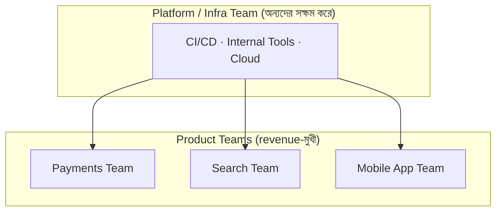

> **মূল কথা:** যোগ দেওয়ার আগে জিজ্ঞেস করুন — "এই team কীসের মালিক, আর সিদ্ধান্ত কে নেয়?" গঠন ঠিকঠাক বুঝলে আপনি জানবেন আপনার কাজ কতটা স্বাধীন আর কতটা দৃশ্যমান হবে।

---

### ১.৩ Company size আর stage — startup, scaleup, big tech

"Size" আর "stage" আলাদা জিনিস, যদিও প্রায়ই একসাথে চলে। Size মানে কত লোক; stage মানে কোম্পানি জীবনচক্রের কোন ধাপে।

```
Idea → Startup → Scaleup → Established / Big Tech
 (০-কয়েকজন) (১০-৫০) (৫০-হাজার) (হাজার+)
   ↑           ↑          ↑               ↑
 product   product-   দ্রুত growth,   স্থিতিশীল, বড়
 খোঁজা     market fit  scale করার যুদ্ধ  organization
```

| ধাপ | প্রধান চ্যালেঞ্জ | আপনার ভূমিকা | ঝুঁকি/পুরস্কার |
|------|------------------|---------------|-----------------|
| **Startup** (early) | টিকে থাকা, product বানানো | সব কাজ একাই, generalist | উচ্চ ঝুঁকি, বড় equity |
| **Scaleup** | দ্রুত growth সামলানো | বড় দায়িত্ব, দ্রুত শেখা | মাঝারি ঝুঁকি, ভালো equity |
| **Big Tech / Established** | বিশাল scale, stability | বিশেষায়িত, গভীর কাজ | কম ঝুঁকি, সর্বোচ্চ cash |

- **Startup-এ** কাঠামো কম, তাই আপনাকে অনিশ্চয়তা সহ্য করতে হবে আর অনেক ভূমিকা একসাথে সামলাতে হবে।
- **Scaleup-এ** "যা ছিল তা ভেঙে যাচ্ছে আর নতুন করে বানাতে হচ্ছে" — দ্রুত শেখার সবচেয়ে ভালো জায়গা প্রায়ই এটাই।
- **Big Tech-এ** আপনি একটা বিশাল মেশিনের ছোট, গভীর অংশে কাজ করবেন — process বেশি, কিন্তু সেরা mentor আর সবচেয়ে নিশ্চিত বেতন এখানে।

> **মূল কথা:** কোনো stage সবার জন্য সেরা নয়। নিজেকে জিজ্ঞেস করুন — আমি এখন **শেখা ও বৈচিত্র্য** চাই, নাকি **স্থিতিশীলতা ও গভীরতা**?

---

### ১.৪ Career Ladder — সিঁড়িটা কেমন

বেশিরভাগ টেক কোম্পানিতে IC-দের জন্য সিঁড়িটা মোটামুটি এমন (নাম ভিন্ন হতে পারে, ধাপগুলো একই):

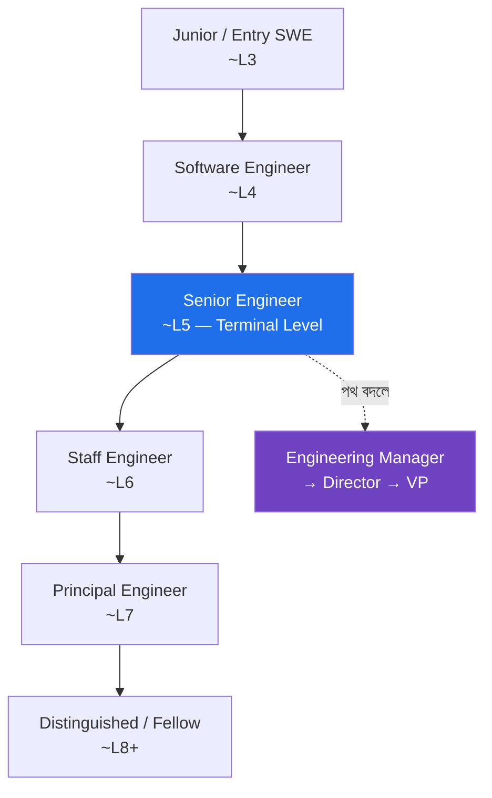

দুটি ধারণা এখানে খুব গুরুত্বপূর্ণ:

- **Terminal Level (Senior):** বেশিরভাগ কোম্পানিতে **Senior** হলো সেই ধাপ যেখানে আপনি চাইলে সারা জীবন থাকতে পারেন — উপরে ওঠার চাপ ("up-or-out") নেই। এর নিচের ধাপগুলোতে সাধারণত নির্দিষ্ট সময়ের মধ্যে উপরে উঠতে হয়, না পারলে সমস্যা। তাই **Senior হওয়াকে প্রথম বড় লক্ষ্য** ধরা উচিত।
- **Staff+ আলাদা খেলা:** Senior পর্যন্ত মূলত "নিজের কাজ ভালো করা।" Staff থেকে শুরু হয় "অন্যদের ও পুরো organization-এর কাজ ভালো করানো" — scope বদলে যায়, শুধু আরও বেশি কোড লেখা নয়।

> **সতর্কতা:** ladder-এর নাম কোম্পানিভেদে আলাদা। কোথাও "L5", কোথাও "Senior II", কোথাও আলাদা নাম। তাই অন্য কোম্পানির title-এর সাথে সরাসরি তুলনা না করে দেখুন ওই ধাপের **প্রত্যাশা (scope ও দায়িত্ব)** কী।

---

### ১.৫ Level expectation — প্রতিটি ধাপে কী চাওয়া হয়

ধাপ যত উপরে, প্রত্যাশার **পরিধি (scope)** তত বড় হয়। মূল pattern একটাই: নিচে আপনি কাজ পান, উপরে আপনি কাজ খুঁজে নেন আর অন্যদের দিয়ে করান।

| Level | scope | স্বাধীনতা | কে দিকনির্দেশনা দেয় |
|-------|-------|----------|---------------------|
| **Junior** | একটা ছোট task | কম, hand-holding লাগে | অন্যরা বলে দেয় কী করতে হবে |
| **Mid (SWE)** | একটা feature, নিজে নিজে | মাঝারি | কাজ পায়, নিজে করে ফেলে |
| **Senior** | পুরো project, অন্যদের সাহায্য করে | বেশি | অস্পষ্ট সমস্যা নিজে স্পষ্ট করে |
| **Staff** | একাধিক team-জুড়ে impact | খুব বেশি | নিজেই ঠিক করে কোন সমস্যা গুরুত্বপূর্ণ |
| **Principal+** | পুরো org / company-জুড়ে দিকনির্দেশনা | সর্বোচ্চ | কৌশল (strategy) তৈরিতে অংশ নেয় |

```
scope বাড়ার pattern:
নিজের কোড → নিজের feature → পুরো project → একাধিক team → পুরো organization
   Junior        Mid           Senior        Staff          Principal+
```

- নিচের লেভেলে মাপা হয় **আপনি কী করলেন**; উপরের লেভেলে মাপা হয় **আপনার কারণে চারপাশে কী হলো** (impact ও influence)।
- উপরে ওঠা মানে আরও কঠিন কোড নয়; এর মানে **বড় ও অস্পষ্ট সমস্যা** নিজে চিনে, ভাগ করে, অন্যদের নিয়ে সমাধান করা।

> **মূল কথা:** নিজের কোম্পানির **লিখিত level expectation/rubric** খুঁজে পড়ুন। promotion-এর সবচেয়ে সোজা পথ হলো পরের লেভেলের কাজ আগে থেকে দেখানো শুরু করা।

---

### ১.৬ IC Track বনাম Management Track

Senior-এর পরে দুটি সমান্তরাল পথ — কোনোটা উঁচু-নিচু নয়, শুধু আলাদা:

| | **IC Track** (Staff, Principal) | **Management Track** (Manager, Director) |
|---|--------------------------------|------------------------------------------|
| মূল কাজ | কঠিন technical সমস্যা, system design, প্রযুক্তিগত দিকনির্দেশনা | মানুষ, team, hiring, delivery |
| দিন কাটে | design, coding (কম), প্রভাব বিস্তার | meeting, 1:1, planning |
| সাফল্যের মাপ | technical impact | team-এর impact |
| ফিরে আসা যায়? | হ্যাঁ, অনেকেই দু'দিকে যাওয়া-আসা করে | হ্যাঁ |

দুই track-এর বেতন সাধারণত একই লেভেলে **সমান** রাখা হয় — অর্থাৎ একজন Staff Engineer আর একজন Manager কাছাকাছি পরিধির হলে কাছাকাছি বেতন পায়। তাই Management-এ যাওয়াকে "বেশি বেতনের পথ" ভাবা ভুল।

> **মূল কথা:** Management মানে "promotion" নয় — এটা **ভিন্ন একটা চাকরি**। মানুষ সামলাতে ভালো না লাগলে IC track-এই উঁচুতে যাওয়া যায়। আগে নিজেকে জিজ্ঞেস করুন: "আমি কি কোড আর system নিয়ে গভীরে যেতে চাই, নাকি মানুষ ও দল গড়তে?"

> **সতর্কতা:** অনেক কোম্পানিতে IC ladder Senior-এর উপরে স্পষ্ট নয় বা কম। এমন জায়গায় Staff/Principal হওয়া কঠিন হতে পারে — যোগ দেওয়ার আগে দেখে নিন IC track আসলেই কতদূর যায়।

---

### ১.৭ Compensation — বেতন আসলে কীভাবে ঠিক হয়

Tech compensation সাধারণত ৪ ভাগে ভাগ — একে বলে **Total Compensation (TC)**:

```
Total Comp  =  Base Salary  +  Bonus  +  Equity (RSU/Options)  +  Benefits
                (মাসিক নগদ)   (বার্ষিক)   (কোম্পানির শেয়ার)      (insurance ইত্যাদি)
```

- **Base:** নিশ্চিত নগদ। startup-এ বেশি গুরুত্ব, Big Tech-এ মোট প্যাকেজের একটা অংশ মাত্র।
- **Equity:** Big Tech-এ RSU (নির্দিষ্ট শেয়ার, কয়েক বছরে vest হয়)। Startup-এ Options (ভবিষ্যতে কিনে নেওয়ার অধিকার — মূল্যবান হতে পারে, আবার শূন্যও হতে পারে)।
- **Bonus:** পারফরম্যান্স বা কোম্পানির ফলাফলের উপর।
- **Benefits:** insurance, ছুটি, pension/401k, শিক্ষা-বাজেট ইত্যাদি — সরাসরি নগদ নয়, কিন্তু মূল্যবান।

বেতন কীভাবে ঠিক হয়, তার পেছনে কয়েকটা কারণ:

- **Level/band:** প্রতিটি লেভেলের একটা বেতন-পরিসর (band) থাকে; আপনি ওই band-এর কোথায় পড়েন তা negotiation আর performance-এ নড়ে।
- **বাজার ও geography:** একই কাজের দাম শহর/দেশভেদে আলাদা; remote নীতিও এতে প্রভাব ফেলে।
- **কোম্পানির tier:** কোন বাজারে কোম্পানি আছে (নিচের point দেখুন) — এটাই অনেক সময় সবচেয়ে বড় নির্ধারক।
- **Negotiation:** offer-এর সময় কথা বলে band-এর ভেতরে উপরে ওঠা যায়; না চাইলে অনেক টাকা টেবিলেই থেকে যায়।

---

### ১.৮ Trimodal compensation — তিন স্তরের বাজার

**Gergely-র বিখ্যাত ধারণা:** একই দেশে, একই অভিজ্ঞতার engineer-দের বেতন একটা সরল রেখা নয় — বাজারে কার্যত **তিনটি আলাদা স্তর/চূড়া** আছে:

```
সংখ্যা
  ▲
  │      ┌──┐                ┌──┐
  │      │  │      ┌──┐      │  │
  │  ┌──┐│  │      │  │      │  │      ┌──┐
  │  │  ││  │      │  │      │  │      │  │
  └──┴──┴┴──┴──────┴──┴──────┴──┴──────┴──┴────►  বেতন
      Tier 1         Tier 2         Tier 3
   (Traditional/   (ভালো local/   (Big Tech /
    small startup)  scaleup)        top scaleup)
```

| Tier | কারা | বেতনের ধরন |
|------|------|-------------|
| **Tier 1** | traditional/non-tech, ছোট startup | local গড় বা তার কাছাকাছি |
| **Tier 2** | ভালো local কোম্পানি, funded scaleup | উপরের দিকে, ভালো cash |
| **Tier 3** | Big Tech, top scaleup | অনেক বেশি, বড় equity-সহ |

মূল শিক্ষা: **আপনি কোন "tier"/বাজারে আবেদন করছেন সেটাই বেতনের সবচেয়ে বড় নির্ধারক** — আপনার skill যত ভালোই হোক। তাই Tier 2 থেকে Tier 3-এ লাফ দিলে একই কাজ করে বেতন বহুগুণ বাড়তে পারে। ভৌগোলিক অবস্থান ও remote নীতিও বড় প্রভাব ফেলে।

> **মূল কথা:** বেতন বড় করার সবচেয়ে শক্তিশালী উপায় শুধু "আরও ভালো হওয়া" নয় — বরং উঁচু tier-এর কোম্পানিতে **interview দেওয়ার মতো প্রস্তুত হওয়া**, কারণ tier পাল্টানোই সবচেয়ে বড় লাফ এনে দেয়।

---

### ১.৯ Profit Center বনাম Cost Center (খুব গুরুত্বপূর্ণ)

কোম্পানির চোখে আপনার team টাকা **আনে**, নাকি টাকা **খরচ করে** — এটা আপনার growth ও নিরাপত্তায় বিরাট প্রভাব ফেলে।

| | **Profit Center** | **Cost Center** |
|---|-------------------|------------------|
| ভূমিকা | সরাসরি আয়/revenue তৈরি করে | support/maintenance |
| উদাহরণ | payments, ads, মূল product | internal tools, IT support |
| ভালো সময়ে | বেশি বাজেট, দ্রুত growth | মোটামুটি |
| খারাপ সময়ে | তুলনামূলক নিরাপদ | আগে এখানেই কাটছাঁট হয় |

একটা সূক্ষ্ম দিক: একই কাজ এক কোম্পানিতে profit center, আরেক কোম্পানিতে cost center হতে পারে। যেমন — একটা software কোম্পানিতে engineering হলো মূল আয়ের উৎস (profit center); কিন্তু একটা bank-এ engineering প্রায়ই খরচের খাত (cost center) হিসেবে দেখা হয়। তাই একই দক্ষতা **tech-first কোম্পানিতে** নিয়ে গেলে বেশি মূল্য পায়।

> **মূল কথা:** সম্ভব হলে এমন team/product-এ কাজ করুন যেটা কোম্পানির **আয়ের কাছাকাছি** (profit center)। সেখানে বাজেট, দৃশ্যমানতা, promotion ও চাকরির নিরাপত্তা — সবই বেশি। Cost center-এ ভালো কাজ করেও প্রায়ই কম স্বীকৃতি মেলে।

---

### ১.১০ দীর্ঘমেয়াদে ক্যারিয়ার — কীভাবে ভাববেন

ক্যারিয়ার একটা দৌড় নয়, বহু বছরের যাত্রা। প্রতিটি সিদ্ধান্তকে শুধু এই বছরের বেতন দিয়ে নয়, কয়েক বছরের জমা হওয়া দিয়ে মাপুন।

- **লক্ষ্য আগে ঠিক করুন:** আপনি কি দ্রুত শিখতে চান, বেশি আয় চান, নাকি কাজ-জীবনের ভারসাম্য চান? ভিন্ন লক্ষ্যে ভিন্ন কোম্পানি/track মানায়।
- **পর্যায় বদলায়:** ক্যারিয়ারের শুরুতে শেখা ও mentor-এর গুরুত্ব বেশি; মাঝে impact ও scope; পরে হয়তো স্থিতিশীলতা বা নিজের পছন্দের কাজ। একই নিয়ম সারাজীবন খাটে না।
- **দুই দিকেই যাওয়া-আসা করা যায়:** IC ↔ Management, startup ↔ big tech — এসব এক-পথ রাস্তা নয়। একটা সিদ্ধান্ত চিরস্থায়ী নয়, তাই অতিরিক্ত ভয় পাওয়ার দরকার নেই।
- **compounding:** ভালো skill, ভালো সম্পর্ক আর সুনাম সময়ের সাথে চক্রবৃদ্ধি হারে বাড়ে — তাই এমন জায়গা বেছে নিন যেখানে এগুলো জমবে।

```
স্বল্পমেয়াদ ভাবনা:  "এই offer-এ বেতন কত?"
দীর্ঘমেয়াদ ভাবনা:   "৩ বছর পরে আমি কী শিখব, কাদের চিনব,
                     আর আমার নামের সাথে কোন কাজ যুক্ত হবে?"
```

---

### ১.১১ Career Capital — যা আসলে জমা হয়

প্রতিটি চাকরিতে তিন ধরনের "পুঁজি" জমে। বেতনের পাশাপাশি এগুলোও মাপুন:

- **Skills (দক্ষতা):** technical + non-technical।
- **Relationships (সম্পর্ক):** যাদের সাথে কাজ করেছেন, যারা আপনার কাজ চেনেন।
- **Reputation (সুনাম):** আপনার নামের সাথে কোন কাজ/মান যুক্ত।

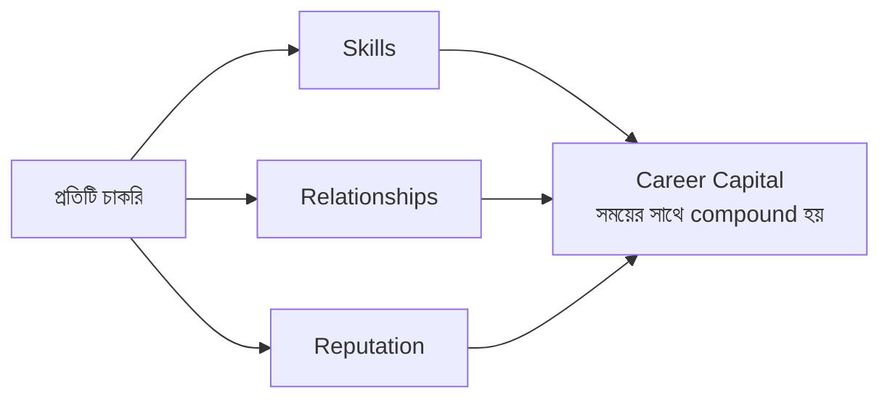

ভালো ক্যারিয়ার সিদ্ধান্ত = এই তিনটির অন্তত একটিতে বড় বিনিয়োগ। শুধু বেশি বেতনের জন্য এমন জায়গায় যাওয়া যেখানে তিনটিই কমে — দীর্ঘমেয়াদে ক্ষতি।

> **মূল কথা:** offer তুলনা করার সময় শুধু TC নয়, "এই চাকরি আমার তিন ধরনের পুঁজির কোনটা বাড়াবে?" — এই প্রশ্নটাও পাশে রাখুন।

---

### নিজেকে যাচাই করুন

1. টেক কোম্পানির বিভিন্ন ধরনের মধ্যে পার্থক্য কী, এবং একজন নতুন engineer-এর জন্য কোনটা কেন ভালো হতে পারে?
2. একটা কোম্পানি কীভাবে organize হয় (product vs project, platform team) — এটা আপনার দৈনন্দিন কাজে কী পার্থক্য আনে?
3. Startup, scaleup আর big tech — এই তিন stage-এর মূল চ্যালেঞ্জ ও পুরস্কার কীভাবে আলাদা?
4. "Terminal Level" বলতে কী বোঝায়, এবং কেন Senior হওয়াকে প্রথম বড় লক্ষ্য ধরা উচিত?
5. প্রতিটি লেভেলে scope কীভাবে বাড়ে — Junior থেকে Principal পর্যন্ত মূল pattern-টা কী?
6. IC ও Management track-এর মূল পার্থক্য কী? Management কি promotion নাকি বেশি বেতনের পথ?
7. Total Compensation কোন চার ভাগে ভাগ, এবং বেতন ঠিক করার পেছনে কোন কোন কারণ কাজ করে?
8. Trimodal compensation কী বলে — এবং এটি আপনার চাকরি খোঁজার কৌশলে কীভাবে কাজে লাগে?
9. Profit center ও cost center-এর মধ্যে আপনার team কোনটি — এবং একই কাজ কেন এক কোম্পানিতে profit, আরেকটায় cost হতে পারে?
10. দীর্ঘমেয়াদে ক্যারিয়ার ভাবার সময় কোন তিন ধরনের career capital মাপা উচিত, এবং কেন?

[↑ সূচিপত্রে ফিরুন](#toc)

---

<a id="ch-2"></a>

## অধ্যায় ২: Owning Your Career
### নিজের ক্যারিয়ারের মালিকানা নিজের হাতে নেওয়া

> Part 1 · সব লেভেলের জন্য

### মূল কথা

- আপনার ক্যারিয়ার নিয়ে আপনার চেয়ে বেশি কেউ ভাবে না — manager-ও না। "ভালো কাজ করলে কেউ একদিন খেয়াল করবে" — এই আশায় বসে থাকা ঝুঁকিপূর্ণ।
- প্রথম শর্ত: কাজটা ধারাবাহিকভাবে দারুণভাবে করা। তার ওপরই বাকি সব কৌশল দাঁড়ায়।
- ভালো কাজ যথেষ্ট নয় — সেই কাজ **দৃশ্যমান** করতে হয়, এবং নিজের সাফল্যের একটা চলমান **record** রাখতে হয়।
- Growth-এর দ্রুততম পথ হলো **feedback** চেয়ে নেওয়া এবং তার ওপর কাজ করা।
- Manager-কে শত্রু বা শুধু বস না ভেবে **ally** বানান — তার লক্ষ্য ও চাপ বুঝে নিন।
- নিজের growth-এর জন্য **stretch–execute–coast** pacing বুঝুন এবং নিজের growth goal নিজেই ঠিক করুন।

---

### ২.১ দায়িত্বটা আপনার — manager-এর নয়

ক্যারিয়ারের সবচেয়ে বড় ভুল ধারণা হলো: "আমি ভালো কাজ করব, বাকিটা manager বা কোম্পানি সামলে নেবে।" বাস্তবে manager সাহায্য করতে পারে, পথ দেখাতে পারে, সুযোগ এনে দিতে পারে — কিন্তু আপনার growth-এর **মালিক একমাত্র আপনি**।

কারণটা সহজ: আপনার চারপাশের সবকিছু বদলায়। Manager বদলে যায়, কোম্পানির অগ্রাধিকার বদলায়, reorg হয়, team ভেঙে যায়। এই সব পরিবর্তনের মধ্যে যে একটা জিনিস স্থির থাকে, সেটা হলো আপনার নিজের সিদ্ধান্ত আর নিজের প্রচেষ্টা। তাই দায়িত্বটা অন্যের হাতে ছেড়ে দিলে, পরিবর্তনের সময় আপনিই সবচেয়ে অসহায় হয়ে পড়েন।

```
ভুল মানসিকতা:  "আমি কাজ করব, manager আমার ক্যারিয়ার সামলাবে।"
সঠিক মানসিকতা: "আমি আমার ক্যারিয়ার চালাব, manager আমার partner।"
```

**মূল কথা:** Manager হলো co-pilot, কিন্তু pilot আপনি নিজে। গন্তব্য ঠিক করা, পথ বেছে নেওয়া — সেটা আপনার দায়িত্ব।

---

### ২.২ Execute with Excellence — আগে কাজটা দারুণভাবে করুন

ক্যারিয়ারের সব কৌশলের ভিত্তি একটাই: **আপনার বর্তমান কাজটা ধারাবাহিকভাবে চমৎকারভাবে করা।** Visibility, networking, managing up — এসব শক্তিশালী tool, কিন্তু এগুলো দুর্বল কাজকে ঢাকার জন্য নয়। বরং ভালো কাজের ওপর বসালে এগুলো কয়েকগুণ বেশি কাজ করে।

ভাবুন এভাবে: visibility একটা amplifier (বাড়িয়ে দেখানোর যন্ত্র)। আপনার কাজ যদি ভালো হয়, amplifier সেটাকে আরও বড় করে দেখায়। কিন্তু কাজ যদি দুর্বল হয়, amplifier সেই দুর্বলতাকেও বড় করে দেখায় — যা আরও খারাপ।

```
ভালো কাজ  ×  visibility  =  শক্ত reputation
দুর্বল কাজ ×  visibility  =  দ্রুত ধরা পড়া
```

তাই ক্রম হওয়া উচিত: **আগে নির্ভরযোগ্য delivery, তারপর সেই কাজ দেখানো।** "Reliable" হিসেবে পরিচিত হওয়াই সবচেয়ে দামি reputation।

---

### ২.৩ কাজ দৃশ্যমান করা (Visibility) — ঢোল পেটানো নয়

"নিজের কাজ দেখানো" শুনলে অনেকের মনে হয় এটা অহংকার বা self-promotion। আসলে এটা **তথ্য জানানো** — যাতে সিদ্ধান্ত নেওয়ার মানুষগুলো (manager, skip-level, অন্য team) আপনার অবদানের সঠিক ছবি পায়। যারা আপনার promotion বা project assignment ঠিক করে, তারা যদি না জানে আপনি কী করছেন, তাহলে তাদের কাছে আপনি কার্যত অদৃশ্য।

কয়েকটি সহজ, অহংকারহীন উপায়:

- যা করছেন, তা team/manager-কে নিয়মিত জানান — demo, written update, বা short write-up দিয়ে।
- বড় কাজ শেষ হলে এক প্যারায় "কী করেছি, কী impact" লিখে শেয়ার করুন।
- অন্যকে সাহায্য করা, অন্যের কাজ unblock করা — এগুলোও আপনার কাজের অংশ; এগুলো যেন আড়ালে চাপা না পড়ে।
- কথা বলার সময় "I"-এর পাশাপাশি "we" ব্যবহার করুন — কৃতিত্ব ভাগ করলে বিশ্বাসযোগ্যতা বাড়ে।

**সতর্কতা:** "Quiet, hardworking" engineer প্রায়ই promotion-এ পিছিয়ে পড়ে — কাজ ভালো হওয়া সত্ত্বেও — কারণ সিদ্ধান্তদাতারা সেই কাজ **দেখতে পায় না**। নীরবে ভালো কাজ করা কখনোই যথেষ্ট নয়; কাজটা যথাস্থানে পৌঁছানোও আপনার দায়িত্ব।

---

### ২.৪ Work Log / Brag Document রাখা

সারা বছরে আপনি অনেক ছোট-বড় সাফল্য তৈরি করেন, কিন্তু performance review বা promotion-এর সময় এসব আর মনে থাকে না। মানুষের স্মৃতি recency bias-এ ভোগে — শেষ এক-দুই মাসের কাজ মনে থাকে, শুরুর দিকের ভালো কাজ ভুলে যায়। এর সমাধান একটাই: একটা চলমান **Work Log** (অনেকে বলে brag document) রাখা।

প্রতি ১–২ সপ্তাহে অল্প সময় নিয়ে এটা update করুন। নিয়মিত করলেই এটা সহজ থাকে; জমিয়ে রাখলে বোঝা হয়ে যায়।

```
┌──────────────── Work Log (প্রতি ১–২ সপ্তাহে আপডেট) ─────────────────┐
│ তারিখ │ কী করেছি              │ Impact (সংখ্যায়/ফলাফলে)   │ কে উপকৃত │
│ ------ │ --------------------- │ ------------------------- │ -------- │
│ মে ১২  │ checkout bug ফিক্স     │ drop-off ৮% কমেছে          │ payments │
│ মে ২৬  │ নতুন dev onboard       │ ২ দিনে productive হয়েছে    │ team     │
│ জুন ০৯ │ build pipeline দ্রুত   │ CI সময় ১২ মিনিট → ৫        │ পুরো org │
└────────────────────────────────────────────────────────────────────┘
```

একটা ভালো entry-তে তিনটা জিনিস থাকা চাই: (১) আপনি কী করেছেন, (২) তার **impact** (সম্ভব হলে সংখ্যায়), (৩) কে উপকৃত হয়েছে। শুধু "কী করেছি" লেখা দুর্বল; "কী impact হয়েছে" লেখাই শক্তিশালী।

এই log তিনভাবে কাজে লাগে:
- (১) performance review লেখা সহজ ও সৎ হয় — অনুমান নয়, প্রমাণ থাকে।
- (২) promotion case শক্ত হয় — ছড়িয়ে থাকা evidence একজায়গায় পাওয়া যায়।
- (৩) নিজের growth নিজেই চোখে দেখতে পান — কয়েক মাস আগের আপনি আর এখনকার আপনি কতটা বদলেছেন।

---

### ২.৫ Feedback — চেয়ে নিন, অপেক্ষা করবেন না

Feedback হলো growth-এর সবচেয়ে দ্রুত পথ — অন্যের চোখে আপনার blind spot ধরা পড়ে, যা নিজে কখনো দেখতেন না। কিন্তু একটা কঠিন সত্য: বেশিরভাগ মানুষ নিজে থেকে আপনাকে কড়া বা অপ্রিয় feedback দেবে না, কারণ সেটা অস্বস্তিকর। তাই feedback **চেয়ে নিতে হয়** — অপেক্ষা করলে শুধু নরম, কাজে-না-লাগা মন্তব্য পাবেন।

কীভাবে ভালো feedback বের করে আনবেন:

- **নির্দিষ্ট প্রশ্ন করুন।** "সব ঠিক আছে?" — এর উত্তর সবসময় "হ্যাঁ"। বরং জিজ্ঞেস করুন: "এই project-এ আমি কোন একটা জিনিস আরও ভালো করতে পারতাম?" সংকীর্ণ প্রশ্নে কাজের উত্তর আসে।
- **আস্থার পরিবেশ তৈরি করুন।** মানুষ তখনই সত্যি বলে যখন বোঝে আপনি রাগ করবেন না। তাই প্রথম কয়েকবার feedback ভালোভাবে গ্রহণ করলে, পরেরবার আরও খোলামেলা feedback আসে।

এবং feedback পাওয়ার পর সবচেয়ে গুরুত্বপূর্ণ অংশটা আসে — তা নিয়ে কাজ করা (পরের point দেখুন)।

---

### ২.৬ Feedback-এ প্রতিক্রিয়া ও তার ওপর কাজ করা

Feedback চেয়ে নেওয়া অর্ধেক কাজ; বাকি অর্ধেক হলো সেটা ঠিকভাবে গ্রহণ করা ও তার ওপর সত্যিকার পদক্ষেপ নেওয়া। অনেকে এখানেই হোঁচট খায় — feedback শুনেই আত্মরক্ষায় (defensive) চলে যায়, এবং পরেরবার থেকে কেউ আর তাকে সত্যি বলে না।

সঠিক প্রতিক্রিয়ার ধাপ:

```
শুনুন (বাধা না দিয়ে) → ধন্যবাদ দিন → বুঝে নিন (প্রশ্ন করে) → ভাবুন → একটা পরিবর্তন আনুন
```

- **আত্মরক্ষায় যাবেন না।** প্রথম প্রতিক্রিয়া "কিন্তু..." দিয়ে শুরু করবেন না। আগে পুরোটা শুনুন।
- **ধন্যবাদ দিন।** কড়া feedback দেওয়া দাতার জন্যও কঠিন; কৃতজ্ঞতা জানালে চ্যানেল খোলা থাকে।
- **কাজ করে দেখান।** সবচেয়ে বড় কথা — feedback-এর ওপর দৃশ্যমান পরিবর্তন আনুন। মানুষ যখন দেখে তাদের কথা আসলেই কাজে লেগেছে, তখনই তারা ভবিষ্যতে আরও সৎ feedback দেয়।
- **অন্যকেও feedback দিন।** সদয় ও নির্দিষ্ট feedback দিলে আপনি একজন নির্ভরযোগ্য teammate হিসেবে পরিচিত হন, এবং feedback-এর সংস্কৃতি দুই দিকেই বইতে থাকে।

**মূল কথা:** কাজে-না-লাগানো feedback হলো ফেলে দেওয়া উপহার। শুনে কিছু না বদলালে, পরেরবার দরজা বন্ধ হয়ে যায়।

---

### ২.৭ Manager-কে ally বানান

Manager আপনার শত্রু নয়, শুধু "বস"-ও নয় — সঠিকভাবে কাজে লাগালে সে আপনার ক্যারিয়ারের সবচেয়ে বড় সহযোগী (ally)। কারণ promotion, project assignment, raise — এগুলোতে manager-এর সরাসরি বা পরোক্ষ প্রভাব থাকে। সম্পর্কটা যত স্বচ্ছ ও পারস্পরিক বিশ্বাসের, ততই দুজনের জন্য ভালো।

1:1 meeting-গুলোকে শুধু status update-এ নষ্ট করবেন না — সেগুলোই সম্পর্ক গড়ার মূল জায়গা। কাজে লাগান এভাবে:

- নিজের লক্ষ্য, বাধা, আর প্রত্যাশা স্পষ্টভাবে জানান — manager মনের কথা পড়তে পারে না।
- Manager-কে সাহায্য করার সুযোগ দিন: "এই বিষয়ে আমার আপনার সাহায্য দরকার।" সাহায্য চাওয়া দুর্বলতা নয়, এটা বিশ্বাসের লক্ষণ।
- খারাপ খবর তাড়াতাড়ি জানান, দেরিতে নয়। Manager surprise অপছন্দ করে; আগেভাগে জানালে সে আপনার পক্ষে দাঁড়াতে পারে।

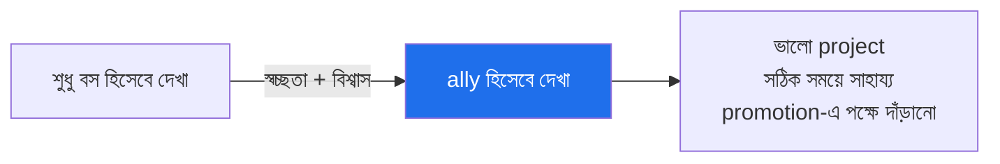

---

### ২.৮ Manager-এর লক্ষ্য ও চাপ বোঝা (Managing Up)

Ally সম্পর্কের পরের ধাপ হলো **managing up** — অর্থাৎ manager-কে এমনভাবে তথ্য ও সহায়তা দেওয়া, যাতে সে আপনার হয়ে ভালো সিদ্ধান্ত নিতে পারে। এর মূল ভিত্তি: manager নিজেও একজন মানুষ, যার নিজের লক্ষ্য, deadline আর ওপরের চাপ আছে।

আপনি যদি বোঝেন manager কোন জিনিস নিয়ে চাপে আছে — কোন metric নিয়ে তার boss জিজ্ঞেস করছে, কোন deadline তার ঘাড়ে — তাহলে আপনি সেই দিকে সাহায্য করে নিজেকে অপরিহার্য করে তুলতে পারেন।

| বোঝার বিষয় | কেন দরকার |
|---|---|
| Manager-এর নিজের লক্ষ্য কী | আপনি সেই লক্ষ্যে অবদান রাখলে আপনার গুরুত্ব বাড়ে |
| Manager কোন চাপে আছে | সঠিক সময়ে চাপ কমিয়ে দিলে ally সম্পর্ক গভীর হয় |
| Manager কীভাবে কাজ করতে পছন্দ করে | লিখিত নাকি মৌখিক, ঘনঘন নাকি কম — সেভাবে তথ্য দিন |
| Manager কী জানলে স্বস্তি পায় | যথাসময়ে সেই তথ্য দিলে সে আপনার ওপর নির্ভর করতে শেখে |

**মূল কথা:** Managing up চাটুকারিতা নয়। এটা হলো — manager-এর প্রেক্ষাপট বুঝে, সঠিক তথ্য সঠিক সময়ে দিয়ে, দুজনের কাজ সহজ করা।

---

### ২.৯ Mentor বনাম Sponsor (পার্থক্যটা গুরুত্বপূর্ণ)

ক্যারিয়ারে দুধরনের সাহায্যকারী আছে, এবং দুটোকে গুলিয়ে ফেলা মস্ত ভুল।

| | **Mentor** | **Sponsor** |
|---|-----------|-------------|
| কী করে | পরামর্শ দেয়, পথ দেখায় | আপনার হয়ে ঘরে (যেখানে আপনি নেই) কথা বলে |
| উপস্থিতি | আপনার সামনে | আপনার অনুপস্থিতিতে |
| উদাহরণ | "এভাবে design করো" | calibration meeting-এ আপনার promotion-এর পক্ষে দাঁড়ায় |
| কীভাবে পাবেন | জিজ্ঞেস করে | ভালো কাজ + দৃশ্যমানতা দিয়ে অর্জন করে |

**মূল কথা:** Mentor দরকারি — সে শেখায়। কিন্তু **Sponsor** আসলে promotion আনে, কারণ গুরুত্বপূর্ণ সিদ্ধান্ত যে ঘরে হয়, সেখানে কেউ আপনার নাম নেয়। Sponsor চেয়ে পাওয়া যায় না; অর্জন করতে হয় — এমন কাজ করুন যা কোনো senior নিজের সুনামের ঝুঁকি নিয়ে সমর্থন করতে রাজি হয়।

---

### ২.১০ Stretch · Execute · Coast — একটি ভূমিকার তিন পর্যায়

যেকোনো একটা ভূমিকায় থাকতে থাকতে আপনি সাধারণত তিনটা পর্যায়ের মধ্য দিয়ে যান। এই pacing model বুঝলে নিজের অবস্থান বুঝতে পারবেন এবং পরের পদক্ষেপ ঠিক করতে পারবেন।

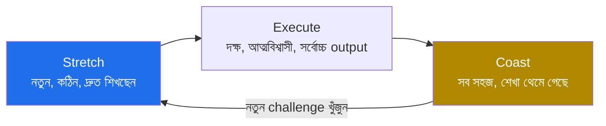

- **Stretch:** কাজ আপনার বর্তমান সামর্থ্যের চেয়ে বড়। অস্বস্তিকর, মাঝেমাঝে ভয়ও লাগে — কিন্তু এখানেই growth সবচেয়ে বেশি। এই পর্যায়ে কিছু ভুল হওয়া স্বাভাবিক।
- **Execute:** এখন আপনি দক্ষ ও আত্মবিশ্বাসী, ধারাবাহিকভাবে সর্বোচ্চ output দিচ্ছেন। বেশিরভাগ ভালো সময় এখানেই কাটে — দল এখানে আপনার ওপর সবচেয়ে বেশি নির্ভর করে।
- **Coast:** সব মুখস্থ হয়ে গেছে, নতুন কিছু শিখছেন না, কাজ চোখ বন্ধ করেও করা যায়। **অল্প সময়** coast করা ঠিক আছে — বিশ্রাম বা ব্যক্তিগত কারণে। কিন্তু বেশিদিন এখানে থাকলে growth থেমে যায় এবং skill পুরোনো হতে শুরু করে।

কোনো পর্যায়ই "খারাপ" নয় — তিনটারই দরকার আছে। গুরুত্বপূর্ণ হলো **সচেতনভাবে** কোন পর্যায়ে আছেন তা জানা, এবং coast-এ অনেকদিন আটকে গেলে নিজে থেকে নতুন stretch খুঁজে নেওয়া।

**সতর্কতা:** Coast-এ দীর্ঘদিন থাকা আরামদায়ক, কিন্তু এটাই নীরবে ক্যারিয়ার stagnation তৈরি করে — কারণ বাইরের জগৎ এগিয়ে যায়, আর আপনি একই জায়গায় থাকেন।

---

### ২.১১ নিজের growth goal নিজেই ঠিক করুন

দায়িত্ব নিজের হাতে নেওয়ার সবচেয়ে মূর্ত রূপ হলো — নিজের জন্য স্পষ্ট growth goal ঠিক করা, কোম্পানি বা manager-এর দেওয়া goal-এর অপেক্ষায় না থেকে। কোম্পানির goal কোম্পানির প্রয়োজন মেটায়; আপনার নিজের goal আপনাকে যেখানে যেতে চান সেখানে নিয়ে যায়। দুটো একসাথে চললে সবচেয়ে ভালো, কিন্তু নিজেরটা ঠিক করার দায়িত্ব আপনার।

ভালো growth goal-এর কয়েকটি বৈশিষ্ট্য:

- **নির্দিষ্ট ও মাপযোগ্য।** "ভালো engineer হব" নয়; বরং "এই কোয়ার্টারে একটা service নিজে design করব" — যা শেষে যাচাই করা যায়।
- **stretch-মুখী।** এমন goal বেছে নিন যা আপনাকে বর্তমান comfort zone-এর বাইরে টেনে নেয়।
- **আপনার দিক-নির্দেশনার সাথে মিল।** আপনি depth (গভীর বিশেষজ্ঞতা) নাকি breadth (বিস্তৃত পরিসর) চান — সেই অনুযায়ী goal বাছুন।

```
self-assessment চক্র (প্রতি কোয়ার্টার বা বছরে):
┌─────────────────────────────────────────────────────────────┐
│ ১. আমি এখন কোথায়? (stretch / execute / coast)               │
│ ২. পরের ৬–১২ মাসে কোথায় যেতে চাই?                            │
│ ৩. সেই দূরত্ব পার হতে কোন ১–৩টা goal দরকার?                   │
│ ৪. প্রতিটা goal-এর জন্য পরের ছোট পদক্ষেপ কী?                  │
│ ৫. কয়েক মাস পর: এগোলাম কি? goal বদলানো দরকার কি?            │
└─────────────────────────────────────────────────────────────┘
```

এই চক্রটা নিয়মিত চালালে ক্যারিয়ার আর "যা হয় হোক" থাকে না — এটা আপনার সচেতন পরিকল্পনায় চলে।

---

### নিজেকে যাচাই করুন

1. "ক্যারিয়ারের দায়িত্ব নিজের" — manager থাকা সত্ত্বেও এই কথাটা কেন সত্য, এবং বাস্তবে কোন অভ্যাসে রূপ নেয়?
2. Visibility আর "ঢোল পেটানো"-র পার্থক্য কী, এবং একজন "quiet, hardworking" engineer কেন প্রায়ই পিছিয়ে পড়ে?
3. Execute with excellence-কে কেন বাকি সব কৌশলের আগে রাখতে হয়? (amplifier-এর যুক্তি দিয়ে বোঝান।)
4. Work log কেন রাখবেন, কত ঘনঘন update করবেন, এবং একটা ভালো entry-তে কোন ৩টি তথ্য থাকা জরুরি?
5. কড়া feedback সাধারণত আপনাকে দেওয়া হয় না কেন, এবং কীভাবে চেয়ে নিলে কাজের feedback পাওয়া যায়?
6. Feedback পাওয়ার পর সঠিক প্রতিক্রিয়ার ধাপগুলো কী, এবং কোন ভুল করলে ভবিষ্যতে feedback বন্ধ হয়ে যায়?
7. Manager-কে ally বানানোর জন্য 1:1 meeting-এ কী কী করা উচিত?
8. Managing up মানে কী, এবং manager-এর লক্ষ্য ও চাপ বোঝা কেন আপনার জন্য লাভজনক?
9. Mentor ও Sponsor-এর পার্থক্য কী, এবং কোনটি সাধারণত promotion আনে — কেন?
10. Stretch–Execute–Coast চক্রে আপনি এখন কোথায়, এবং coast-এ বেশিদিন থাকার ঝুঁকি কী?
11. একটা ভালো growth goal-এর বৈশিষ্ট্য কী, এবং নিজের goal নিজে ঠিক করা কেন কোম্পানির goal-এর অপেক্ষায় থাকার চেয়ে ভালো?

[↑ সূচিপত্রে ফিরুন](#toc)

---

<a id="ch-3"></a>

## অধ্যায় ৩: Performance Reviews
### পারফরম্যান্স মূল্যায়ন — প্রস্তুতি নেওয়া যায় এমন একটি খেলা

> Part 1 · সব লেভেলের জন্য

### মূল কথা

- Performance review হলো সেই আনুষ্ঠানিক প্রক্রিয়া যেখানে আপনার কাজ মূল্যায়ন হয় — এর সাথে সরাসরি জড়িত raise, bonus আর promotion।
- এটি ভাগ্যের ব্যাপার নয়; এটি **আগে থেকে প্রস্তুতি নেওয়া যায় এমন একটি খেলা** — যে খেলার নিয়ম জানে, সে এগিয়ে থাকে।
- review-এর ফলাফল কেবল review-এর দিনে ঠিক হয় না; সারা বছরের কাজ, প্রমাণ আর সম্পর্ক মিলে ঠিক হয়।
- দুটি জিনিস সবচেয়ে গুরুত্বপূর্ণ: (১) সঠিক কাজ করা (impact), আর (২) সেই কাজ স্পষ্টভাবে দৃশ্যমান করা (visibility)।
- সবচেয়ে বড় নীতি **No surprises** — review-এর দিন প্রথমবার কোনো খারাপ খবর শোনা মানে কোথাও কিছু ভুল হয়েছে।

---

### ৩.১ Performance review আসলে কী এবং এটি কেন এত গুরুত্বপূর্ণ

Performance review হলো একটি নির্দিষ্ট সময় পরপর কোম্পানির আনুষ্ঠানিক বিচার — আপনি আপনার level-এর প্রত্যাশা কতটা পূরণ করেছেন। এটি শুধু একটি কাগুজে প্রক্রিয়া নয়; এর ফলাফল আপনার career-এর উপর সরাসরি প্রভাব ফেলে।

| review যা ঠিক করে | আপনার জীবনে প্রভাব |
|---|---|
| Raise (বেতন বৃদ্ধি) | প্রতি বছরের আয় |
| Bonus | এককালীন বাড়তি অর্থ |
| Promotion-এর যোগ্যতা | পরের level-এ যাওয়ার পথ |
| Track record | কোম্পানির স্মৃতিতে আপনার ভাবমূর্তি |
| Stock/equity refresh | দীর্ঘমেয়াদি সম্পদ |

**মূল কথা:** review একটি বিন্দুতে ঘটলেও এর প্রভাব বহু বছর ধরে চলে — তাই এটিকে হালকাভাবে নেওয়া ভুল।

---

### ৩.২ Review-এর process কীভাবে চলে এবং কী এটিকে চালায়

বেশিরভাগ বড় কোম্পানিতে review একটি ধাপে-ধাপে process মেনে চলে। প্রতিটি ধাপে আলাদা মানুষ যুক্ত হয় এবং আপনার ভূমিকাও বদলে যায়।

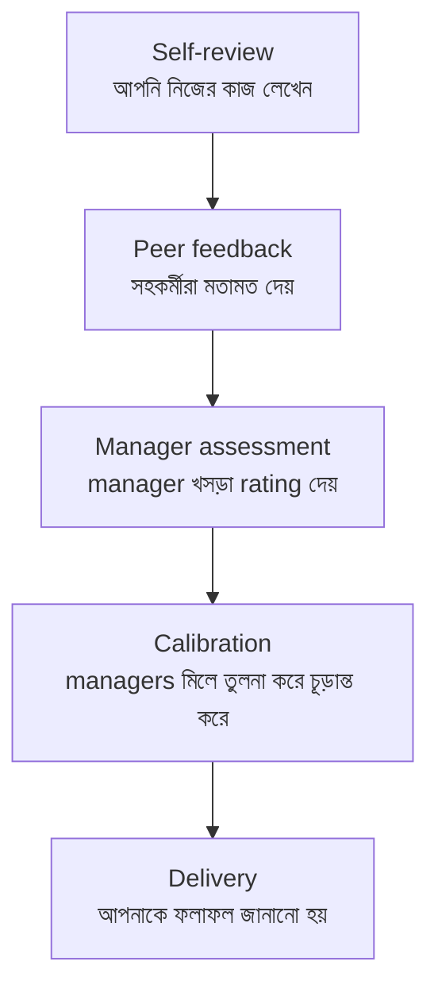

process-কে চালায় মূলত তিনটি জিনিস:

- **আপনার level-এর প্রত্যাশা (expectations):** আপনাকে আপনার নিজের কাজের সাথে নয়, আপনার level-এর জন্য নির্ধারিত মানদণ্ডের সাথে মেলানো হয়।
- **প্রমাণ (evidence):** কে কী লিখল, কোন feedback এল, কোন সংখ্যা আছে — এসবই rating-কে এগিয়ে বা পিছিয়ে নেয়।
- **আপেক্ষিক তুলনা (calibration):** আপনি একা মূল্যায়িত হন না; অন্যদের সাথে তুলনা করেও আপনার অবস্থান ঠিক হয়।

**মূল কথা:** প্রতিটি ধাপে আপনার করণীয় আছে — বিশেষত self-review, কারণ এখানেই আপনি নিজের গল্পটা নিজের কথায় বলার সুযোগ পান।

---

### ৩.৩ Cycle শুরুর আগেই স্পষ্ট goal ঠিক করা

Review-এর প্রস্তুতি review-এর কয়েক সপ্তাহ আগে শুরু হয় না — শুরু হয় cycle-এর প্রথম দিনে, goal ঠিক করার সময়। স্পষ্ট goal থাকলে cycle-শেষে বিচার করা সহজ: লক্ষ্য পূরণ হয়েছে, নাকি হয়নি।

ভালো goal একই সাথে **অর্জনযোগ্য** আর **stretch** — খুব সহজ হলে শেখা হয় না, অসম্ভব হলে হতাশা আসে। আর goal এমন হতে হবে যাতে শেষে স্পষ্ট "হ্যাঁ/না"-তে উত্তর দেওয়া যায় (measurable)।

```
দুর্বল goal:   "Backend-এ আরও ভালো হব।"        ← মাপা যায় না
শক্ত goal:    "Q3-এর মধ্যে orders service-এর
              p95 latency 400ms → 200ms-এ নামাব।"  ← স্পষ্ট, পরিমাপযোগ্য
```

**সতর্কতা:** goal শুধু আপনার মাথায় রাখলে চলবে না — manager-এর সাথে আগেই লিখিতভাবে মিলিয়ে নিন, যাতে cycle-শেষে দুজনের প্রত্যাশা এক থাকে।

---

### ৩.৪ Work habits — মূল্যায়নে এগুলোও গোনা হয়

Review শুধু "কী delivery করলেন" তা দেখে না; "কীভাবে কাজ করলেন" সেটিও দেখে। এই অংশকে বলা যায় work habits বা behaviors — আপনার দৈনন্দিন পেশাদার আচরণ।

| ভালো work habit | কেন গোনা হয় |
|---|---|
| নির্ভরযোগ্যতা (commitment রাখা) | দল আপনার উপর ভরসা করতে পারে |
| পরিষ্কার যোগাযোগ | কাজ সহজে এগোয়, ভুল কমে |
| সহযোগিতা (collaboration) | অন্যদের সফল হতে সাহায্য করে |
| ভালো code review ও mentoring | পুরো দলের মান বাড়ে |
| গঠনমূলকভাবে feedback নেওয়া | আপনি দ্রুত উন্নতি করেন |

**মূল কথা:** দারুণ technical কাজ করেও কেউ দুর্বল rating পেতে পারে যদি তার behaviors দলকে কষ্ট দেয়। impact আর work habits — দুটোই দরকার।

---

### ৩.৫ নিজের review-এর জন্য প্রস্তুতি: self-review ও প্রমাণ জোগাড়

Self-review হলো আপনার নিজের গল্প নিজের কথায় বলার ধাপ। ভালো self-review লেখার নিয়ম:

- **Work log কাজে লাগান:** সারা বছরের অর্জন আগে থেকেই কোথাও জমিয়ে রাখলে এই সময়ে স্মৃতি হাতড়াতে হয় না।
- **প্রত্যাশার সাথে মেলান:** আপনার level-এর competency/expectation কী, আর আপনার কোন কাজ সেগুলোর কোনটা পূরণ করেছে — সরাসরি মিলিয়ে দেখান।
- **Impact দেখান, activity নয়:** "আমি ১০টা ticket করেছি" নয় — "আমার কাজে X মেট্রিক Y% উন্নত হয়েছে।"
- **প্রমাণ যোগ করুন:** সংখ্যা, link, dashboard, অন্যদের প্রশংসা — যাচাইযোগ্য তথ্য, যেগুলো manager calibration-এ তুলে ধরতে পারবে।

> `উদাহরণ` দুর্বল: "Checkout নিয়ে কাজ করেছি।" শক্তিশালী: "Checkout-এর একটি bug ঠিক করে cart abandonment ৮% কমিয়েছি, যা আনুমানিক মাসে X রাজস্ব যোগ করেছে — payments team এটি নিশ্চিত করেছে।"

**সতর্কতা:** বিনয় দেখাতে গিয়ে নিজের কাজ ছোট করে দেখাবেন না; আবার অতিরঞ্জনও করবেন না। সত্য + প্রমাণ — এটাই সবচেয়ে শক্তিশালী।

---

### ৩.৬ Peer feedback জোগাড় করা ও কাজে লাগানো

Peer feedback হলো আপনার সহকর্মীদের লেখা মতামত, যা আপনার গল্পে নতুন কণ্ঠ যোগ করে। নিজের প্রশংসা নিজে করার চেয়ে অন্য কেউ বললে তা অনেক বেশি বিশ্বাসযোগ্য।

```
আপনি বললেন:   "আমি ভালো mentor."           ← একপক্ষীয়
Peer বলল:     "ও আমাকে onboarding-এ এত
              সাহায্য করেছে যে আমি ২ সপ্তাহ
              আগেই productive হয়েছি।"        ← স্বাধীন, বিশ্বাসযোগ্য প্রমাণ
```

কাজে লাগানোর নিয়ম:

- **সঠিক মানুষ বেছে feedback চান:** যারা আপনার আসল কাজ কাছ থেকে দেখেছে, শুধু বন্ধু নয়।
- **বৈচিত্র্য রাখুন:** নিজের দল, অন্য দল, এমনকি junior — বিভিন্ন কোণ থেকে মতামত আপনার impact-এর পূর্ণ ছবি দেয়।
- **আগেভাগে চান:** সবার ব্যস্ত সময়ের আগে অনুরোধ করলে চিন্তাশীল feedback পাওয়া যায়।
- **নির্দিষ্ট প্রসঙ্গ মনে করিয়ে দিন:** "আমরা একসাথে যে migration করেছি, সেটা নিয়ে যদি লেখেন" — এতে feedback বাস্তব ও দরকারি হয়।

**মূল কথা:** আপনি অন্যদের জন্যও feedback দেবেন — তা সৎ, সুনির্দিষ্ট ও গঠনমূলক রাখুন, কারণ এতে পুরো দলের culture ভালো হয়।

---

### ৩.৭ Manager assessment ও Calibration — চূড়ান্ত rating আসলে যেখানে ঠিক হয়

self-review ও peer feedback জমা হওয়ার পর manager একটি খসড়া rating দেয়। কিন্তু সেটাই শেষ কথা নয়। **Calibration** মিটিংয়ে একাধিক manager একসাথে বসে নিজ নিজ দলের মানুষদের তুলনা করে, যাতে rating সব দল-জুড়ে ন্যায্য হয়।

```
       Calibration Room
   ┌───────────────────────────┐
   │  Mgr A: "আমার X নিচ্ছে top" │
   │  Mgr B: "কেন? প্রমাণ কী?"   │  ←  এখানেই Sponsor ও দৃশ্যমান
   │  Mgr C: "Y-ও তো একই কাজ..." │      প্রমাণ কাজে লাগে
   └───────────────────────────┘
```

এর অর্থ দুটি:

1. আপনার manager-কে আপনার হয়ে **লড়ার মতো প্রমাণ** দিতে হবে — তাই work log ও impact-গল্প জরুরি।
2. অন্য দলের কেউ (Sponsor) আপনার পক্ষে কথা বললে তা বড় ভূমিকা রাখে।

**মূল কথা:** আপনি যত ভালো প্রমাণ manager-এর হাতে তুলে দেবেন, calibration-এ তত শক্তভাবে সে আপনার পক্ষে দাঁড়াতে পারবে।

---

### ৩.৮ No surprises — সারা বছরের feedback loop

সবচেয়ে বড় নীতি: **No surprises (কোনো চমক নয়)**। review-এর দিন প্রথমবার কোনো সমস্যা শুনলে — সেটা manager-এর ব্যর্থতা, কিন্তু ভোগান্তি আপনার। তাই অপেক্ষা না করে সারা বছর feedback টানতে থাকুন:

- নিয়মিত 1:1-এ স্পষ্টভাবে জিজ্ঞেস করুন: "আমি এখন কেমন করছি? কোথায় উন্নতি দরকার?"
- কোনো দুর্বলতা ধরা পড়লে আগেভাগে জেনে, হাতে সময় নিয়ে ঠিক করুন — review-এর আগেই।
- আপনার অগ্রগতি manager-এর চোখে পড়ছে কিনা নিশ্চিত করুন।

```
ভুল পথ:  সারা বছর চুপ → review-এর দিন খারাপ খবর → সংশোধনের সময় শেষ
সঠিক পথ: নিয়মিত feedback → সমস্যা আগে জানা → ঠিক করার সময় হাতে থাকে
```

**সতর্কতা:** "manager নিশ্চয়ই জানিয়ে দিত" — এই ভরসায় বসে থাকবেন না; feedback টেনে আনার দায়িত্ব আপনারও।

---

### ৩.৯ Rating scale ও forced distribution

বেশিরভাগ কোম্পানিতে rating একটি স্কেলে দেওয়া হয় — যেমন: *Below / Meets / Exceeds / Greatly Exceeds*। কিছু কোম্পানি **forced distribution** ব্যবহার করে (যেমন: একটি দলের মাত্র ১০% "top" পেতে পারে)।

forced distribution-এর মানে:

- শুধু ভালো করলেই হবে না — **আপেক্ষিকভাবে** অন্যদের চেয়ে ভালো করতে হবে।
- দুজন সমান ভালো কাজ করলেও কেউ কেউ নিচু rating পেতে পারে, শুধু কোটার কারণে।
- তাই visibility আর প্রমাণ আরও গুরুত্বপূর্ণ হয়ে ওঠে।

```
forced distribution (উদাহরণ)
  Greatly Exceeds  ▓               ~10%
  Exceeds          ▓▓▓▓            ~25%
  Meets            ▓▓▓▓▓▓▓▓        ~55%
  Below            ▓▓              ~10%
```

**মূল কথা:** নিয়ম জানা থাকলে হতাশা কমে — বুঝবেন যে rating অংশত আপেক্ষিক, শুধু আপনার একক পারফরম্যান্সের প্রতিফলন নয়।

---

### ৩.১০ Review feedback গঠনমূলকভাবে পড়া ও তার উপর কাজ করা

ফলাফল এলে প্রতিক্রিয়াটাই পরের cycle ঠিক করে দেয়। আত্মরক্ষায় না গিয়ে শেখার চোখে দেখুন।

| ফলাফল | কী করবেন |
|---|---|
| ভালো review | কৃতজ্ঞ থাকুন, কিন্তু থেমে যাবেন না — পরের level-এর প্রত্যাশা জিজ্ঞেস করুন |
| মাঝারি/খারাপ review | আত্মরক্ষা নয়; নির্দিষ্ট জানতে চান — "কোন আচরণ বদলালে next time 'Exceeds' হবে?" |

খারাপ feedback পেলে করণীয় ধাপ:

1. আবেগ সামলে আগে ভালো করে **শুনুন**, তর্কে ঢুকবেন না।
2. সুনির্দিষ্ট উদাহরণ চান — অস্পষ্ট মন্তব্যকে কাজে লাগানোযোগ্য করুন।
3. পরের cycle-এর জন্য একটি স্পষ্ট, পরিমাপযোগ্য উন্নতি-পরিকল্পনা বানান।
4. সেই উন্নতি **দৃশ্যমান** করুন — যাতে পরের review-এ তা প্রমাণসহ দেখানো যায়।

**সতর্কতা:** একটি খারাপ review-কে শেষ রায় ভাববেন না; এটি একটি দিকনির্দেশ — সঠিক প্রতিক্রিয়ায় এটাই আপনার পরের promotion-এর ভিত্তি হতে পারে।

---

### নিজেকে যাচাই করুন

1. Performance review কী, এবং এর ফলাফল আপনার career-এ কোন কোন জায়গায় প্রভাব ফেলে?
2. Review process-এর ধাপগুলো কী কী, এবং কোন তিনটি জিনিস process-কে চালায়?
3. cycle শুরুর আগে ভালো goal-এর দুটি বৈশিষ্ট্য কী, এবং একটি দুর্বল ও শক্ত goal-এর উদাহরণ দিন।
4. Work habits কেন rating-এ গোনা হয়, এবং দুটি ভালো work habit-এর উদাহরণ দিন।
5. Self-review-তে "impact" আর "activity"-র পার্থক্য একটি উদাহরণ দিয়ে বোঝান।
6. ভালো peer feedback জোগাড় করতে কাকে এবং কীভাবে অনুরোধ করবেন?
7. Calibration কী, এবং এটি কেন আপনার manager ও Sponsor-কে গুরুত্বপূর্ণ করে তোলে?
8. "No surprises" নীতি মানে কী, এবং এটি নিশ্চিত করতে আপনি বছরজুড়ে কী করবেন?
9. Forced distribution থাকলে আপনার কৌশল কীভাবে বদলায়?
10. খারাপ review feedback পেলে গঠনমূলকভাবে কোন ধাপগুলো অনুসরণ করবেন?

[↑ সূচিপত্রে ফিরুন](#toc)

---

<a id="ch-4"></a>

## অধ্যায় ৪: Promotions
### পদোন্নতি — স্বীকৃতি অর্জন, শিরোনাম তাড়া করা নয়

> Part 1 · সব লেভেলের জন্য

### মূল কথা

- Promotion হলো কোম্পানির **পিছন-ফিরে দেওয়া স্বীকৃতি**: আপনি ইতিমধ্যেই পরের level-এর কাজ করছেন, তাই title আর বেতন মিলিয়ে দেওয়া হয়। এটা ভবিষ্যতের প্রতিশ্রুতির অগ্রিম পুরস্কার নয়।
- সবচেয়ে নিশ্চিত পথ: পরের level-এর দায়িত্ব **আগে থেকে** নিতে শুরু করা, সেই কাজ দৃশ্যমান করা, একটা track record বানানো, এবং manager-এর সাথে মিলে শক্ত প্রমাণভিত্তিক case গড়া।
- শুধু বর্তমান কাজ আরও বেশি বা আরও দ্রুত করলে promotion আসে না — scope বাড়াতে হয়, গতি নয়।
- প্রতিটি কোম্পানিতে একটা **terminal level** থাকে (সাধারণত Senior) যেখানে আর promotion না পেলেও কেউ আপনাকে চাপ দেয় না; তার উপরের প্রতিটি ধাপ ঐচ্ছিক ও অনিশ্চিত।
- বড় tech কোম্পানিতে promotion একটা আনুষ্ঠানিক, কমিটি-ভিত্তিক, রাজনৈতিক প্রক্রিয়া; ছোট কোম্পানিতে তা অনেক ঢিলেঢালা ও manager-নির্ভর।
- দীর্ঘমেয়াদে title-এর চেয়ে শেখা, প্রভাব ও সুনাম বেশি মূল্যবান — promotion সেগুলোর স্বাভাবিক উপজাত হওয়া উচিত, লক্ষ্য নয়।

---

### ৪.১ Promotion আসলে কীভাবে হয় — পিছন-ফিরে স্বীকৃতি

বেশিরভাগ engineer ভুল model ধরে রাখে। তারা ভাবে: এখন কঠোর পরিশ্রম করি, promotion পাই, তারপর বড় কাজ করব। বাস্তবতা ঠিক উল্টো।

```
ভুল ধারণা:   বর্তমান level-এ আরও পরিশ্রম  →  promotion  →  পরের level-এর কাজ
সঠিক বাস্তবতা: পরের level-এর কাজ আগে শুরু করা  →  ধারাবাহিকভাবে প্রমাণ  →  promotion (স্বীকৃতি)
```

Promotion মূলত একটা **lagging indicator** — মানে ঘটনা ঘটে যাওয়ার পরে আসা সংকেত। কোম্পানি দেখে আপনি কয়েক মাস ধরে পরের level-এ কাজ করছেন, ঝুঁকি কমে গেছে, তখন title-টা বাস্তবতার সাথে মিলিয়ে দেয়।

**মূল কথা:** এই উপলব্ধিই পুরো কৌশল বদলে দেয়। প্রশ্ন আর "আমি কীভাবে promotion পাব?" নয়; প্রশ্ন হয় "আমি এখন থেকেই কীভাবে পরের level-এর মতো কাজ করতে পারি?" — promotion তখন আপনাআপনি অনুসরণ করে।

---

### ৪.২ Promotion সিদ্ধান্ত আসলে কে এবং কীভাবে নেয়

Promotion কখনোই শুধু "ভালো কাজ করলেই হয়ে যায়" এমন নয়; এর পিছনে একটা মানবিক ও সাংগঠনিক প্রক্রিয়া আছে।

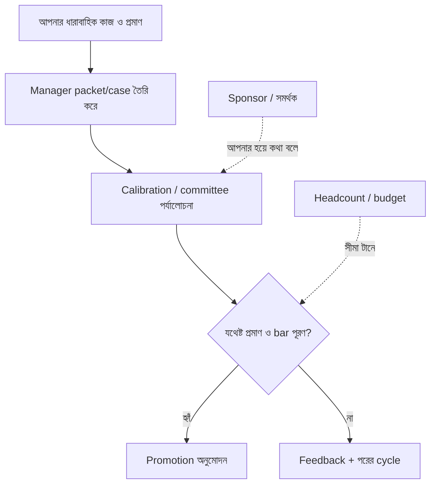

মূল চরিত্রগুলো:

| চরিত্র | ভূমিকা |
|--------|--------|
| **আপনি** | প্রমাণ তৈরি করেন — কাজ, impact, দৃশ্যমানতা |
| **Manager** | আপনার হয়ে packet বানায়, calibration-এ লড়ে, timing ঠিক করে |
| **Calibration committee** | একাধিক manager মিলে সবার case তুলনা করে, একই bar নিশ্চিত করে |
| **Sponsor** | senior কেউ যিনি আপনার প্রমাণ ছাড়াও আপনার পক্ষে দাঁড়ান |
| **Peers** | calibration-এ অনেক সময় peer feedback ওজন বহন করে |

**সতর্কতা:** Manager যদি promotion-এ আপনার জন্য না লড়ে, তাহলে আপনি যত ভালো কাজই করুন, case দুর্বল থেকে যায়। তাই manager-কে আগেই সঙ্গে নেওয়া অপরিহার্য।

---

### ৪.৩ "Next level"-এ কাজ করা মানে কী — scope বাড়া

প্রতিটি level-এ মূল পার্থক্য হলো **scope** — অর্থাৎ আপনার দায়িত্ব ও প্রভাবের পরিধি কতটা বড়।

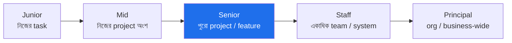

পরের level-এ কাজ শুরু করা মানে:

- ছোট task-এর পাশাপাশি একটু **বড় scope-এর সমস্যা** নিজে থেকে তুলে নেওয়া।
- শুধু নিজের কাজ নয়, অন্যদের blocker সরানো, দলকে এগিয়ে নেওয়া।
- নিজের দেওয়া কাজের বাইরেও impact রাখা — যেমন কোনো লুকানো ঝুঁকি ধরা, প্রক্রিয়া উন্নত করা।

**মূল কথা:** "আরও বেশি কাজ" আর "বড় scope-এর কাজ" এক জিনিস নয়। একই আকারের ১০টা ticket বন্ধ করলে আপনি ব্যস্ত দেখাবেন, কিন্তু পরের level-এর মতো দেখাবেন না।

---

### ৪.৪ Terminal level — যেখানে promotion-এর চাপ শেষ হয়

প্রতিটি ladder-এ একটা level থাকে যাকে **terminal level** বলে। এটাই সেই বিন্দু যেখানে পৌঁছালে কোম্পানি ধরে নেয় আপনি একজন পূর্ণ, স্বাবলম্বী engineer; এর পরে আর promotion না পেলেও কেউ আপনাকে "underperformer" ভাবে না বা চাপ দেয় না।

```
       চাপ আছে (up-or-out হতে পারে)
   ┌─────────────────────────────┐
   │ Junior  →  Mid  →  Senior    │  ← এখানে পৌঁছানো প্রত্যাশিত
   └─────────────────────────────┘
                 │ terminal level (সাধারণত Senior)
                 ▼
   ┌─────────────────────────────┐
   │  Staff  →  Principal  → ...  │  ← ঐচ্ছিক, কোনো বাধ্যবাধকতা নেই
   └─────────────────────────────┘
```

- বেশিরভাগ বড় কোম্পানিতে **Senior** হলো terminal level।
- Terminal level-এ আপনি চাইলে সারা career থেকে যেতে পারেন, এটা সম্পূর্ণ সম্মানজনক।
- এর নিচের level-গুলোতে কিছু কোম্পানিতে "up-or-out" থাকে — অর্থাৎ নির্দিষ্ট সময়ে terminal level-এ না পৌঁছালে চাকরি ঝুঁকিতে পড়তে পারে।

**মূল কথা:** terminal level কোথায় তা জানা জরুরি, কারণ এর পরের প্রতিটি ধাপের গতি ও নিয়ম সম্পূর্ণ ভিন্ন।

---

### ৪.৫ Senior এবং তার উপরের level-এর প্রত্যাশা

Senior হওয়ার পর প্রত্যাশার ধরন বদলে যায় — শুধু কোড নয়, প্রভাবের প্রস্থ গুরুত্বপূর্ণ হয়।

| Level | মূল প্রত্যাশা |
|-------|--------------|
| **Senior** | স্বাধীনভাবে পুরো project চালান, অন্যদের mentor করেন, নির্ভরযোগ্যভাবে ঝুঁকি কমান |
| **Staff** | একাধিক team জুড়ে প্রভাব, technical দিক ঠিক করা, অস্পষ্ট বড় সমস্যা ভাঙা |
| **Principal** | পুরো org বা business-এ প্রভাব, কৌশলগত technical দিকনির্দেশনা |

Senior-এর উপরে যেতে যা বদলায়:

- **Technical depth যথেষ্ট নয়** — leadership, influence, এবং নিজের দল ছাড়িয়ে অন্যদের দিয়ে কাজ করানো লাগে।
- প্রভাব **অপ্রত্যক্ষ** হয়ে যায়: আপনি নিজে কত কোড লিখলেন তা নয়, আপনার সিদ্ধান্ত কতজনকে এগিয়ে দিল তা গোনা হয়।
- ঝুঁকিপূর্ণ, অস্পষ্ট, "কেউ মালিকানা নিতে চায় না" এমন সমস্যা তুলে নেওয়াই Staff+ আচরণ।

**সতর্কতা:** অনেক চমৎকার coder Senior-এ আটকে যান কারণ তারা শুধু technical থাকেন; উপরে উঠতে collaboration ও communication ছাড়া পথ নেই।

---

### ৪.৬ বড় tech কোম্পানিতে promotion dynamics

বড় কোম্পানিতে (FAANG ধরনের) promotion একটা আনুষ্ঠানিক, কাঠামোবদ্ধ এবং প্রতিযোগিতামূলক প্রক্রিয়া।

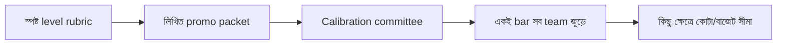

বড় কোম্পানির বৈশিষ্ট্য:

- **স্পষ্ট rubric:** প্রতিটি level-এর প্রত্যাশা লিখিত থাকে, তাই আপনি জানেন কী দেখাতে হবে।
- **Packet-driven:** manager আপনার impact একটা formal document-এ গুছিয়ে লেখে।
- **Calibration:** অনেক manager মিলে সবার packet তুলনা করে, যাতে এক team-এর Senior অন্য team-এর Senior-এর সমান হয়।
- **রাজনীতি ও দৃশ্যমানতা:** committee আপনাকে চেনে না, তাই reputation আর cross-team দৃশ্যমানতা প্রায়ই নির্ণায়ক।
- **Bar সময়ের সাথে কঠিন হয়:** যত উপরে, তত কম slot, তত বেশি প্রতিযোগিতা।

ছোট কোম্পানির তুলনা:

| দিক | বড় কোম্পানি | ছোট কোম্পানি / startup |
|------|-------------|----------------------|
| প্রক্রিয়া | আনুষ্ঠানিক, packet+committee | অনানুষ্ঠানিক, manager-নির্ভর |
| Rubric | স্পষ্ট, লিখিত | প্রায়ই অস্পষ্ট |
| Title-এর মানে | মোটামুটি মানসম্মত | কোম্পানিভেদে ভিন্ন |
| গতি | ধীর, পূর্বানুমেয় | দ্রুত হতে পারে, কিন্তু এলোমেলো |

**মূল কথা:** আপনার কোম্পানির process কেমন তা বুঝে নিন — startup-এ যেটা কাজ করে (সরাসরি manager-কে রাজি করানো), বড় কোম্পানিতে সেটাই হয়তো যথেষ্ট নয়।

---

### ৪.৭ Promotion-এর জন্য যা যা লাগে (উপাদানসমূহ)

একটা সফল promotion case সাধারণত এই উপাদানগুলোর সমষ্টি:

| উপাদান | মানে | আপনার নিয়ন্ত্রণে? |
|--------|------|---------------------|
| **Scope & Impact** | পরের level-এর আকারের সমস্যা সমাধান, দৃশ্যমান ফলাফলসহ | হ্যাঁ |
| **Consistency** | এক-দুইবার নয়, কয়েক মাস/কোয়ার্টার ধরে ধারাবাহিক | হ্যাঁ |
| **Peer recognition** | সহকর্মীরাও আপনাকে পরের level-এর মতো দেখে | অনেকটা |
| **Sponsor** | senior কেউ calibration-এ আপনার হয়ে দাঁড়ায় | আংশিক |
| **Manager alignment** | manager আগে থেকেই জানে এবং case গোছাতে সাহায্য করছে | হ্যাঁ |
| **Headcount / budget** | কোম্পানির পক্ষে তখন promotion দেওয়া সম্ভব | না |

**মূল কথা:** নিজের নিয়ন্ত্রণে থাকা উপাদানগুলোতে (scope, consistency, manager alignment) সর্বোচ্চ শক্তি দিন; নিয়ন্ত্রণের বাইরের অংশ (budget, timing) নিয়ে অহেতুক হতাশ হবেন না।

---

### ৪.৮ Manager-এর সাথে promotion-কে যৌথ project বানান

Promotion-কে গোপন আশা হিসেবে রাখলে বেশিরভাগ সময় তা হয় না; এটাকে manager-এর সাথে একটা খোলা, যৌথ পরিকল্পনা বানাতে হবে।

ধাপগুলো:

1. সরাসরি জিজ্ঞেস করুন: **"পরের level-এ যেতে আমাকে আর কী কী দেখাতে হবে?"**
2. উত্তরগুলোকে একটা স্পষ্ট ফাঁক-তালিকায় রূপ দিন (gap list)।
3. প্রতিটি ফাঁক পূরণের জন্য নির্দিষ্ট project/দায়িত্ব ঠিক করুন।
4. নিয়মিত 1:1-এ অগ্রগতি দেখান এবং প্রমাণ জমা করতে থাকুন।
5. manager-কে timing নিয়ে স্বচ্ছ রাখুন — কখন packet জমা হবে, পরের cycle কবে।

```
আপনি ──"কী লাগবে?"──► Manager
   ▲                      │
   │   gap list ◄─────────┘
   │
   └── প্রমাণ জমা ──► যৌথভাবে packet ──► calibration
```

**মূল কথা:** Promotion-কে "চমকে দেওয়ার" পরিবর্তে "একসাথে গড়ে তোলার" বিষয় হিসেবে দেখুন; manager তখন আপনার বিরোধী নয়, সহযোগী।

---

### ৪.৯ Track record ও visibility গড়ে তোলা

ভালো কাজ নীরবে করলে calibration-এ তা প্রায়ই হারিয়ে যায়, কারণ সিদ্ধান্তগ্রহীতারা আপনাকে সরাসরি দেখেন না।

দৃশ্যমানতা গড়ার বাস্তব উপায়:

- **প্রভাব নথিভুক্ত করুন:** কী করলেন, ফলাফল কী হলো — সংখ্যাসহ লিখে রাখুন (brag document)।
- **কাজ ভাগাভাগি করুন:** design doc, demo, tech talk, লেখা — যাতে অন্যরা আপনার কাজ চেনে।
- **Cross-team প্রভাব:** নিজের দলের বাইরে অন্যদের সাহায্য করুন; এতে peer recognition বাড়ে।
- **Mentoring:** নতুনদের গড়ে তোলা leadership-এর দৃশ্যমান প্রমাণ।
- **নিয়মিত update:** manager আর stakeholder-দের আপনার অগ্রগতি জানিয়ে রাখুন।

| ভুল | সঠিক |
|-----|------|
| চুপচাপ ভালো কাজ করা | কাজ + ফলাফল দৃশ্যমান করা |
| বছরশেষে স্মৃতি থেকে লেখা | সারা বছর ধরে প্রমাণ জমানো |
| শুধু নিজের দলে সীমিত | cross-team প্রভাব তৈরি |

**সতর্কতা:** দৃশ্যমানতা মানে আত্মপ্রচার বা bragging নয়; এটা হলো আপনার আসল কাজ যেন সঠিক মানুষদের চোখে পড়ে তা নিশ্চিত করা।

---

### ৪.১০ Promotion-এর জন্য কৌশলগত project বাছাই

সব কাজ promotion-এর জন্য সমান নয়। কম-প্রভাবের কাজ যত নিখুঁতভাবেই করুন, তা দুর্বল case-ই দেয়।

```
উচ্চ প্রভাব  │  ★ এই অঞ্চলের কাজ খুঁজুন
            │  (দৃশ্যমান, পরের-level scope)
────────────┼────────────────────────
নিম্ন প্রভাব │  এড়িয়ে চলুন / কমান
            │  (অদৃশ্য, রুটিন)
            └────────────────────────
              নিম্ন দৃশ্যমানতা → উচ্চ দৃশ্যমানতা
```

নির্দেশনা:

- এমন project বাছুন যার scope পরের level-এর সমান এবং ফলাফল দৃশ্যমান।
- "কারো-কাজ-নয়" বা ঝুঁকিপূর্ণ কিন্তু গুরুত্বপূর্ণ সমস্যাগুলো প্রায়ই সেরা সুযোগ।
- রুটিন "maintenance only" কাজে আটকে থাকলে manager-কে জানিয়ে scope বদলান।

**মূল কথা:** কাজ শুরুর আগেই প্রশ্ন করুন — "এই কাজ সফল হলে এটা কি আমার পরের-level case-কে শক্ত করবে?" উত্তর না হলে portfolio-তে ভারসাম্য আনুন।

---

### ৪.১১ Soft skill — উপরের level-এর গোপন শর্ত

যত উপরে ওঠা যায়, technical দক্ষতা ততই "ধরে নেওয়া" হয়; পার্থক্য গড়ে দেয় মানুষকেন্দ্রিক দক্ষতা।

- **Communication:** জটিল জিনিস সহজে বোঝানো, লিখিত ও মৌখিকভাবে।
- **Collaboration:** দল ও দল-পার করে একসাথে কাজ করানো।
- **Influence without authority:** ক্ষমতা না থাকা সত্ত্বেও অন্যদের সঠিক দিকে রাজি করানো।
- **Conflict navigation:** মতবিরোধ গঠনমূলকভাবে সামলানো।

**সতর্কতা:** কেবল code-এ দুর্দান্ত কিন্তু মানুষ নিয়ে দুর্বল — এমন engineer সাধারণত Senior-এ থেমে যান, কারণ Staff+ মূলত influence-এর খেলা।

---

### ৪.১২ সাধারণ ভুলগুলো (Pitfalls)

- **আরও খাটুনি, একই level-এর কাজ:** বেশি ticket বন্ধ করা ≠ পরের level; scope বাড়াতে হবে, গতি নয়।
- **নীরবে কাজ করা:** দৃশ্যমানতা ছাড়া ভালো কাজও calibration-এ হারিয়ে যায়।
- **ভুল project বাছা:** কম-প্রভাবের কাজ যত ভালোই হোক, case দুর্বল থাকে।
- **নিষ্ক্রিয় অপেক্ষা:** "সময় হলে দেবে" — না চাইলে, না দেখালে অনেক সময় হয় না।
- **শুধু technical, soft skill শূন্য:** উপরের level-এ collaboration/communication ছাড়া আটকে যায়।
- **Manager-কে সঙ্গে না নেওয়া:** manager না জানলে বা না লড়লে case এগোয় না।
- **Title-এর পিছনে অন্ধ দৌড়:** শিরোনাম তাড়া করতে গিয়ে শেখা ও আসল প্রভাব অবহেলা করা।

---

### ৪.১৩ Timeline — কত সময় লাগে

```
Junior → Mid        : তুলনামূলক দ্রুত, প্রায় প্রত্যাশিত (১–২ বছর)
Mid → Senior        : মাঝারি, সবচেয়ে গুরুত্বপূর্ণ ধাপ (২–৩+ বছর)
Senior → Staff      : ধীর, নিশ্চিত নয় — scope ও সুযোগের উপর নির্ভর
Staff → Principal   : বিরল, অনেকটাই organizational প্রয়োজন ও impact-নির্ভর
```

- terminal level (Senior) পর্যন্ত গতি মোটামুটি পূর্বানুমেয়।
- এর পরে সময় বাড়ে, অনিশ্চয়তা বাড়ে — অনেকটা সুযোগ ও কোম্পানির প্রয়োজনের উপর নির্ভরশীল।

**সতর্কতা:** Senior-এর পরে promotion আর "স্বয়ংক্রিয়" নয়। Staff/Principal হওয়ার সুযোগ কোম্পানিতে আছে কিনা, প্রয়োজন আছে কিনা — তার উপর অনেকটা নির্ভর করে। ভালো করেও সময়মতো না হলে হতাশ না হয়ে সুযোগ আছে এমন জায়গা/scope খোঁজা যুক্তিযুক্ত।

---

### ৪.১৪ দীর্ঘমেয়াদি দৃষ্টিভঙ্গি — title তাড়া করা বনাম গড়ে ওঠা

Title একটা স্বল্পমেয়াদি সংকেত; career দীর্ঘ। শুধু পরের promotion-এর দিকে তাকিয়ে থাকলে অনেক ভুল সিদ্ধান্ত আসে।

```
স্বল্পমেয়াদি লক্ষ্য:  পরের title  →  সাময়িক তৃপ্তি, কিন্তু খালি হাতে শেখা থেমে যেতে পারে
দীর্ঘমেয়াদি লক্ষ্য:  শেখা + প্রভাব + সুনাম  →  promotion এর স্বাভাবিক উপজাত
```

মূল নীতিগুলো:

- **শেখা ও প্রভাবকে অগ্রাধিকার দিন;** title তখন প্রায়ই আপনাআপনি অনুসরণ করে।
- Terminal level-এ থেকে যাওয়া সম্পূর্ণ বৈধ পছন্দ — সবাইকে Staff/Principal হতে হবে এমন নয়।
- promotion না পেলেও যদি শিখছেন, প্রভাব রাখছেন ও সুনাম গড়ছেন, তাহলে আপনি জিতছেন।
- বছরের পর বছর title-এর জন্য টানাপোড়েনে থাকার চেয়ে এমন ভূমিকা খোঁজা ভালো যেখানে আপনি বাড়তে পারেন।

**মূল কথা:** Title মানে স্কোরবোর্ড নয়, এটা একটা ফলাফল। আসল খেলা হলো দক্ষতা, প্রভাব ও বিশ্বাসযোগ্যতা গড়া — সেগুলো গড়লে title পিছন পিছন আসে এবং তা আরও টেকসই হয়।

---

### নিজেকে যাচাই করুন

1. "Promotion ভবিষ্যতের পুরস্কার নয়, বর্তমানের পিছন-ফিরে স্বীকৃতি" — এই উপলব্ধি কৌশলগতভাবে কী বদলে দেয়?
2. Promotion সিদ্ধান্ত আসলে কে কে নেয়, এবং প্রতিটি চরিত্রের ভূমিকা কী?
3. পরের level-এ কাজ করা মানে কী — "আরও বেশি কাজ" কেন যথেষ্ট নয়?
4. Terminal level কী, এবং কেন এর পরের ধাপগুলো ভিন্ন নিয়মে চলে?
5. Senior-এর উপরে উঠতে technical depth-এর বাইরে আর কী লাগে?
6. বড় tech কোম্পানিতে promotion process ছোট কোম্পানির চেয়ে কীভাবে আলাদা?
7. Promotion case-এর উপাদানগুলোর মধ্যে কোনগুলো আপনার নিয়ন্ত্রণে, কোনগুলো নয়?
8. Manager-এর সাথে promotion-কে কীভাবে যৌথ project বানাবেন?
9. Track record ও visibility গড়তে কোন কোন বাস্তব পদক্ষেপ নেবেন — এবং visibility মানে bragging কেন নয়?
10. Promotion-এর জন্য project বাছাইয়ে কোন প্রশ্নটি আগে করা উচিত?
11. কেন Staff+ মূলত soft skill ও influence-এর খেলা?
12. Promotion-এর সাধারণ ভুলগুলো কী, এবং কীভাবে এড়াবেন?
13. কেন Senior-এর পরের promotion আর "স্বয়ংক্রিয়" থাকে না?
14. Title তাড়া করা বনাম শেখা/প্রভাব গড়া — দীর্ঘমেয়াদে কোনটি বেশি মূল্যবান এবং কেন?

[↑ সূচিপত্রে ফিরুন](#toc)

---

<a id="ch-5"></a>

## অধ্যায় ৫: Thriving in Different Environments
### বিভিন্ন পরিবেশে মানিয়ে নিয়ে সফল হওয়া

> Part 1 · সব লেভেলের জন্য

### মূল কথা

- প্রতিটি কোম্পানির নিজস্ব **culture ও অলিখিত নিয়ম (unwritten rules)** আছে। এক জায়গায় যে আচরণে আপনি সফল হয়েছিলেন, অন্য জায়গায় ঠিক সেটাই ব্যর্থতার কারণ হতে পারে।
- সফল engineer-রা নতুন পরিবেশে গিয়ে আগে **পড়ে নেয়** — এখানে কী মূল্যবান, কাজ আসলে কীভাবে হয় — তারপর সেই অনুযায়ী নিজেকে মানিয়ে নেয়।
- একই কাজ করেও **platform engineer ও product engineer** আলাদা ভাবে মূল্যায়িত হয়; কোম্পানির অবস্থা শান্তিকালীন (peacetime) নাকি যুদ্ধকালীন (wartime) তার উপরেও প্রত্যাশা বদলায়।
- টিম-কালচার আর organizational structure ভিন্ন হলে আপনার approach-ও ভিন্ন হওয়া উচিত — এক ছাঁচ সব জায়গায় খাটে না।
- কিছু পরিবেশ সত্যিই toxic — সেগুলো চিনে, সময় থাকতে বেরিয়ে আসতে জানাও একটা গুরুত্বপূর্ণ দক্ষতা।

---

### ৫.১ প্রতিটি Culture আলাদা — আগে পড়ুন, পরে কাজ করুন

নতুন জায়গায় (বা পুরোনো কোম্পানির নতুন team-এ) প্রথম কয়েক সপ্তাহ মূলত পর্যবেক্ষণে দিন। কোডে ঝাঁপ দেওয়ার আগে বুঝে নিন এখানকার অলিখিত নিয়ম কী। নিজেকে কয়েকটা প্রশ্ন করুন:

- এখানে আসলে কী **পুরস্কৃত** হয় — গতি, নাকি নিখুঁততা, নাকি consensus তৈরি করা?
- সিদ্ধান্ত কীভাবে হয় — উপর থেকে নির্দেশ আসে, নাকি আলোচনা করে ঠিক হয়?
- কাজ আসলে কীভাবে এগোয় — official process মেনে, নাকি কিছু নির্দিষ্ট মানুষের মাধ্যমে (informal network)?
- কোন ধরনের communication চলে — বেশি লিখিত (async), নাকি বেশি মিটিং-নির্ভর?

```
নতুন পরিবেশে কৌশল:
  পর্যবেক্ষণ (Observe) → অলিখিত নিয়ম বোঝা (Decode) → মানিয়ে নেওয়া (Adapt) → তারপর পরিবর্তন আনা (Influence)
```

**সতর্কতা:** নতুন এসেই "আমার আগের কোম্পানিতে আমরা এভাবে করতাম" বলে সবকিছু বদলাতে চাওয়া — আস্থা হারানোর সবচেয়ে সহজ উপায়। আগে বিশ্বাস অর্জন করুন, প্রমাণ দিন যে আপনি বুঝে কথা বলছেন, তারপর পরিবর্তন প্রস্তাব করুন।

---

### ৫.২ Culture মানে কী — মূল্যবোধ নয়, আচরণ

দেয়ালে টাঙানো "values" আর বাস্তবের culture প্রায়ই এক নয়। আসল culture হলো **মানুষ আসলে যা করে**, কী আচরণে এখানে প্রমোশন হয়, কী আচরণে চাকরি যায়। তাই poster পড়ে culture বুঝবেন না — কে কীভাবে আচরণ করে আর কে সফল হচ্ছে, সেটা দেখে বুঝুন।

| দেখানো কথা (stated) | বাস্তব আচরণ (actual) — এটাই আসল culture |
|---|---|
| "আমরা risk নিই" | আসলে যে কখনো ব্যর্থ হয় না সে-ই প্রমোশন পায় |
| "data-driven সিদ্ধান্ত" | আসলে সবচেয়ে উঁচু পদের মানুষের মতামতেই সিদ্ধান্ত হয় |
| "work-life balance" | আসলে রাত ১১টায় উত্তর দিলে প্রশংসা মেলে |

**মূল কথা:** যেখানে stated আর actual-এর ফারাক বিশাল, সেটাই একটা সতর্কসংকেত।

---

### ৫.৩ Platform Engineer বনাম Product Engineer — দুই রকম কাজ, দুই রকম সাফল্য

বড় কোম্পানিতে engineering কাজ মোটামুটি দুই ধরনের। কোনটায় আছেন বুঝলে আপনি ঠিক জায়গায় শক্তি দিতে পারবেন।

| | **Product Engineer** | **Platform / Infrastructure Engineer** |
|---|---|---|
| কাজের ফোকাস | ব্যবহারকারীর সামনে দেখা যায় এমন feature | অন্য engineer-দের জন্য tooling, infra, internal system |
| "গ্রাহক" কে | end user | কোম্পানির ভেতরের অন্য team-রা |
| সাফল্য মাপা হয় | feature-এর impact, ব্যবহার, business metric | system-এর reliability, অন্যদের কাজ কত সহজ হলো |
| দরকারি দক্ষতা | product sense, user empathy, দ্রুত iterate | গভীর technical depth, API design, long-term চিন্তা |
| সময়ের দিগন্ত | প্রায়ই স্বল্পমেয়াদি, fast feedback | দীর্ঘমেয়াদি, ধীরে impact দেখা যায় |

**সতর্কতা:** platform কাজের impact চট করে দেখানো কঠিন — কারণ ভালো infra "অদৃশ্য", কেউ খেয়াল করে না যতক্ষণ না ভেঙে পড়ে। তাই platform engineer-কে নিজের কাজের প্রভাব সচেতন ভাবে দৃশ্যমান করতে হয় (যেমন: "এই migration-এ সব team-এর build ৩০% দ্রুত হয়েছে")।

**মূল কথা:** আপনি কোন ধরনের engineer সেটা ভালো-মন্দের ব্যাপার নয় — কিন্তু কোন দিকে আপনার আনন্দ ও শক্তি, সেটা জেনে career বেছে নিলে অনেক এগিয়ে থাকবেন।

---

### ৫.৪ Peacetime বনাম Wartime — কোম্পানির মানসিকতা

কোম্পানি সবসময় একই মেজাজে থাকে না। কখনো শান্তিকালীন (peacetime), কখনো যুদ্ধকালীন (wartime) — আর দুই অবস্থায় কাজের ধরন আলাদা।

```
Peacetime: বাজারে এগিয়ে, টাকা আছে, সময় আছে
  → লক্ষ্য বড় করা (expand), নিখুঁত করা, process গড়া

Wartime: বড় হুমকি — প্রতিযোগী/সংকট/টাকা ফুরাচ্ছে
  → লক্ষ্য টিকে থাকা (survive), দ্রুত সিদ্ধান্ত, কঠিন কাটছাঁট
```

| | **Peacetime** | **Wartime** |
|---|---|---|
| অগ্রাধিকার | সুযোগ ধরা, নিখুঁততা | বেঁচে থাকা, গতি |
| সিদ্ধান্ত | আলোচনা, consensus | দ্রুত, উপর থেকে |
| ভুলের প্রতি সহনশীলতা | বেশি | কম, সময় নষ্ট চলে না |
| ভালো engineer-এর আচরণ | দীর্ঘমেয়াদি বিনিয়োগ, polish | জরুরি সমস্যায় ঝাঁপিয়ে পড়া, scope কাটা |

**সতর্কতা:** peacetime-এর অভ্যাস (সব নিখুঁত করা, লম্বা আলোচনা) wartime-এ এনে ফেললে আপনাকে ধীর ও অপ্রাসঙ্গিক মনে হবে। উল্টোটাও সত্য — wartime-এর "সব ভেঙে দ্রুত করো" মানসিকতা peacetime-এ এনে ফেললে আপনি বেপরোয়া মনে হবেন। কোম্পানি এখন কোন মোডে আছে সেটা পড়ে আচরণ বদলান।

---

### ৫.৫ Big Tech বনাম Startup — কাজের ধরন

| | **Big Tech** | **Startup** |
|---|---|---|
| গতি | ধীর, মাপা | দ্রুত, পরিবর্তনশীল |
| Process | অনেক | কম |
| Scope স্পষ্টতা | পরিষ্কার role | অস্পষ্ট, "যা দরকার তা-ই করো" |
| সম্পদ | প্রচুর | সীমিত |
| সাফল্যের চাবি | process মেনে নিখুঁত execution + alignment | দ্রুত শেখা, নিজে থেকে দায়িত্ব নেওয়া |
| ঝুঁকি/পুরস্কার | কম ঝুঁকি, স্থিতিশীল | বেশি ঝুঁকি, বড় উত্থান-পতন |

একই engineer দুই জায়গায় ভিন্ন আচরণে সফল হয় — কোনোটা "ভালো" নয়, কেবল ভিন্ন। নিজের কোন কাজের ধরন ভালো লাগে সেটা বুঝে জায়গা বাছুন।

---

### ৫.৬ ভিন্ন Team-Culture-এর সাথে নিজের approach মানানো

একই কোম্পানির ভেতরেও প্রতিটি team-এর নিজস্ব ছোট culture থাকে। তাই নতুন team-এ ঢুকলে কোম্পানি-লেভেল পর্যবেক্ষণের পাশাপাশি team-লেভেলেও আলাদা করে পড়ুন।

- **Code review কেমন:** কড়া ও খুঁটিনাটি, নাকি দ্রুত পাস করে দেয়? সেই অনুযায়ী আপনার PR সাজান।
- **Decision কে নেয়:** এক tech lead, নাকি পুরো team মিলে? জোর-জবরদস্তি না করে এই কাঠামোর ভেতরে কাজ করুন।
- **Communication চ্যানেল:** Slack-এ দ্রুত, নাকি লিখিত doc-এ ধীর? টিমের পছন্দের চ্যানেলে যোগাযোগ করুন।
- **মান (quality bar):** কেউ test ছাড়া merge করে না, কেউ আবার দ্রুত ship করে পরে ঠিক করে।

**মূল কথা:** "আমার নিয়ম সব team-এ এক" — এটা ভুল। ভালো engineer team-ভেদে নিজের শৈলী সামান্য বদলে নেয়, নিজের মান না কমিয়েই।

---

### ৫.৭ ভিন্ন Organizational Structure-এ কাজ করা

কোম্পানি কীভাবে সাজানো, তার উপর নির্ভর করে আপনি কীভাবে কাজ এগোবেন আর কাকে রাজি করাতে হবে।

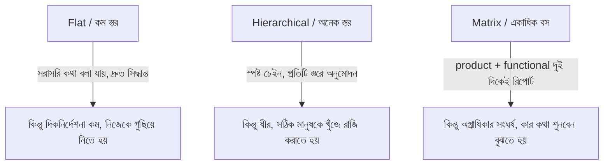

| Structure | কীভাবে কাজ এগোয় | আপনার করণীয় |
|---|---|---|
| Flat | অনানুষ্ঠানিক, সরাসরি | নিজে initiative নিন, ভূমিকা নিজে স্পষ্ট করুন |
| Hierarchical | নিয়ম ও অনুমোদনের চেইন | চেইন বুঝে সঠিক ব্যক্তির কাছে যান |
| Matrix | দুই/একাধিক দিকে দায়বদ্ধতা | দুই বসের প্রত্যাশা align করুন, conflict আগে তুলুন |

**মূল কথা:** structure পড়তে শিখুন — কাজ আটকে গেলে বুঝতে পারবেন কোথায় গিয়ে কাকে রাজি করালে jam খুলবে।

---

### ৫.৮ Remote ও Hybrid পরিবেশ

Remote-এ visibility ও যোগাযোগ স্বাভাবিকভাবেই কঠিন — তাই সচেতন প্রচেষ্টা লাগে:

- **Over-communicate:** যা করছেন তা লিখে জানান; "চুপচাপ কাজ" remote-এ আরও বেশি অদৃশ্য হয়ে যায়।
- **Async-first:** পরিষ্কার লিখিত update, document, decision-log রাখুন — যাতে সবাই নিজের সময়ে বুঝে নিতে পারে।
- **ইচ্ছাকৃত সম্পর্ক:** করিডোরে দেখা হয় না, তাই 1:1 আর casual chat নিজে থেকে আয়োজন করুন।
- **লিখিত culture:** ভালো লেখা remote-এ সবচেয়ে বড় superpower।

```
   In-office: কাজ এমনিতেই দেখা যায়  │  Remote: কাজ "দেখাতে" হয় লিখে
```

---

### ৫.৯ Toxic Environment চেনা ও সিদ্ধান্ত নেওয়া

কিছু সতর্কসংকেত — কয়েকটি থাকলে সাবধান, অনেকগুলো একসাথে থাকলে বেরিয়ে আসার কথা সিরিয়াসলি ভাবুন:

```
⚠ Toxic-এর লক্ষণ:
  • দোষারোপের culture — ভুল হলে শেখা নয়, কাকে দোষ দেওয়া যায় তা খোঁজা
  • Psychological safety নেই — প্রশ্ন/দ্বিমত করলে শাস্তি
  • সবসময় আগুন নেভানো — কোনো দীর্ঘমেয়াদি পরিকল্পনা নেই
  • Growth/feedback নেই — কেউ আপনার উন্নতির কথা ভাবে না
  • উচ্চ attrition — ভালো মানুষ একের পর এক চলে যাচ্ছে
  • অসম্ভব প্রত্যাশা + burnout-কে স্বাভাবিক ধরা হয়
```

**মূল কথা:** Toxic পরিবেশে "আরও পরিশ্রম করে ঠিক করে ফেলব" — প্রায়ই কাজ করে না, বরং আপনাকে নিঃশেষ করে দেয়। কারণ সমস্যাটা প্রায়ই system-এর, একজন ব্যক্তির পরিশ্রমে যা বদলায় না। নিজের সুস্থতা ও ক্যারিয়ার রক্ষা করাও পেশাদারিত্বের অংশ। দরকারে internal transfer বা চাকরি বদল (Ch 6) বিবেচনা করুন।

---

### নিজেকে যাচাই করুন

1. নতুন পরিবেশে "Observe → Decode → Adapt → Influence" ধাপগুলো কেন এই ক্রমেই করা উচিত?
2. দেয়ালে টাঙানো "values" আর আসল culture কীভাবে আলাদা হতে পারে — একটা উদাহরণ দিন।
3. Platform engineer ও product engineer-এর সাফল্য কীভাবে আলাদা ভাবে মাপা হয়? Platform-এর impact দেখানো কঠিন কেন?
4. Peacetime আর wartime মানসিকতার মূল পার্থক্য কী? এক মোডের অভ্যাস অন্য মোডে আনলে কী সমস্যা হয়?
5. Big Tech-এ সফল করে এমন কোন আচরণ startup-এ ব্যর্থ করতে পারে (বা উল্টোটা)?
6. নতুন team-এ ঢুকে আপনি কোন ৩-৪টি জিনিস দেখে নিজের approach মানিয়ে নেবেন?
7. Flat, hierarchical ও matrix structure-এ কাজ এগোনোর উপায় কীভাবে আলাদা?
8. Remote-এ visibility ধরে রাখতে কোন ৩টি অভ্যাস জরুরি?
9. Toxic environment-এর ৪টি লক্ষণ বলুন। "আরও পরিশ্রম করে ঠিক করব" কেন সবসময় কাজ করে না?

[↑ সূচিপত্রে ফিরুন](#toc)

---

<a id="ch-6"></a>

## অধ্যায় ৬: Switching Jobs
### চাকরি পরিবর্তন: কখন, কেন, এবং কীভাবে কৌশলে

> Part 1 · সব লেভেলের জন্য

### মূল কথা

- চাকরি বদলানো ক্যারিয়ারের একটি স্বাভাবিক ও শক্তিশালী হাতিয়ার — কিন্তু এটি **কৌশলে** করতে হয়, আবেগের ঝোঁকে নয়।
- বদলানোর আগে সবসময় ভাবুন: একই লক্ষ্য কি ভেতরে থেকে (internal transfer বা promotion দিয়ে) অর্জন করা যায় কিনা।
- ভালো interview করা একটা **আলাদা দক্ষতা** — দৈনন্দিন কাজে ভালো হওয়া আর interview-এ ভালো করা এক জিনিস নয়; তাই আলাদা করে প্রস্তুতি লাগে।
- Title বা level কেবল নাম নয় — এটা আপনার পরের কয়েক বছরের scope, বেতন ও সুযোগ ঠিক করে দেয়, তাই up-level/down-level সিদ্ধান্ত সাবধানে নিন।
- Offer পাওয়া মানে প্রক্রিয়ার শেষ নয় — সেখান থেকেই evaluate ও negotiate শুরু; আর সবশেষে আগের জায়গা থেকে সম্মানের সাথে চলে আসাটাও সমান গুরুত্বপূর্ণ।

---

### ৬.১ কখন বুঝবেন এবার চলে যাওয়ার সময় (Knowing When to Move On)

প্রতিটি চাকরির একটা স্বাভাবিক "শেলফ-লাইফ" থাকে। কয়েকটা সংকেত দেখলে বুঝবেন এবার নড়াচড়ার সময় হয়েছে:

- **Growth থেমে গেছে** — নতুন কিছু শিখছেন না, নতুন challenge নেই; দিনের পর দিন একই কাজ ঘুরেফিরে আসছে (একটা দীর্ঘ "Coast" পর্যায়)।
- **বেতন বাজারের অনেক নিচে** — বিশেষ করে যখন ভেতরে raise-এর সীমা আছে এবং বাইরের বাজার অনেক বেশি দিচ্ছে।
- **এগোনোর কোনো পথ নেই** — আপনি যেদিকে যেতে চান (যেমন বড় scope বা নির্দিষ্ট role), এই কোম্পানিতে সেই পথটাই নেই।
- **পরিবেশ toxic** (Ch 5) — এবং পরিবর্তনের বাস্তব সম্ভাবনা কম।
- **জীবনের প্রয়োজন বদলেছে** — location, remote কাজের দরকার, বা সম্পূর্ণ ভিন্ন domain-এ যাওয়ার ইচ্ছা।

**মূল কথা:** এই সংকেতগুলো এক রাতে আসে না — ধীরে ধীরে জমে। তাই মাঝে মাঝে নিজেকে সৎভাবে প্রশ্ন করুন, যাতে অসন্তোষ জমে বিস্ফোরণে গড়ানোর আগেই সিদ্ধান্ত নিতে পারেন।

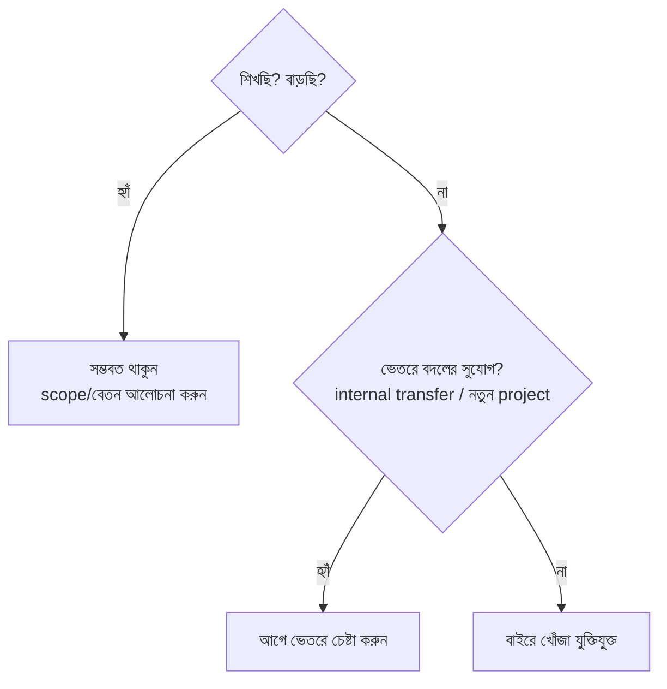

---

### ৬.২ দুই বিপদ: খুব ঘন ঘন বদল বনাম খুব বেশি দিন থাকা

বদলানোর timing-এ দুই দিকেই ভুল হতে পারে:

| ভুল | কী ঘটে | দীর্ঘমেয়াদি ক্ষতি |
|---|---|---|
| **খুব ঘন ঘন বদল** | কোথাও ১ বছরও থাকেন না | কোনো জায়গায় গভীরে যাওয়া হয় না; "job hopper" ছাপ পড়ে; বড় কাজের পুরো cycle দেখা হয় না |
| **খুব বেশি দিন থাকা** | বছরের পর বছর একই জায়গা | growth ও বেতন দুটোই আটকে যায়; বাইরের বাজার সম্পর্কে ধারণা হারান |

**সতর্কতা:** সঠিক উত্তর কোনো নির্দিষ্ট সংখ্যা নয় — মূল প্রশ্ন হলো "আমি কি এখনো শিখছি ও এগোচ্ছি?" যতদিন উত্তর "হ্যাঁ", ততদিন থাকা যুক্তিযুক্ত; "না" হলে নড়াচড়ার সময়।

---

### ৬.৩ ভেতরে promotion বনাম বাইরে চাকরি — কোনটা বেছে নেবেন

চলে যাওয়াই একমাত্র পথ নয়। প্রায়ই একই লক্ষ্য ভেতরে থেকেও অর্জন করা যায়। দুটো পথের তুলনা:

| বিষয় | ভেতরে promotion / transfer | বাইরে নতুন চাকরি |
|---|---|---|
| পরিবেশ ও মানুষ | চেনা; আস্থা আগে থেকেই তৈরি | নতুন; শূন্য থেকে আস্থা গড়তে হয় |
| বেতন বৃদ্ধি | সাধারণত সীমিত (raise band) | প্রায়ই বড় লাফ সম্ভব |
| ঝুঁকি | কম — কাজ ও দল জানা | বেশি — নতুন জায়গা অজানা |
| গতি | promotion cycle-এর জন্য অপেক্ষা | দ্রুত হতে পারে |
| নতুন শেখা | কম নতুনত্ব | নতুন tech/domain/culture |

**মূল কথা:** বাইরে যাওয়ার আগে অন্তত একবার ভেতরে চেষ্টা করে দেখুন — internal transfer, নতুন project, বা manager-এর সাথে scope নিয়ে খোলা আলোচনা। তবে যদি ভেতরে raise বা level আটকে থাকে এবং বাজার অনেক বেশি দেয়, তখন বাইরে যাওয়াই বেতন ও level দুটোতেই বড় লাফ আনতে পারে।

---

### ৬.৪ Technical Interview-এর জন্য প্রস্তুতি

একটা সত্য মেনে নিন: **প্রতিদিনের কাজে ভালো হওয়া আর interview-এ ভালো করা আলাদা দক্ষতা।** Interview একটা কৃত্রিম পরিবেশ — সীমিত সময়, চাপ, অচেনা পরীক্ষক। তাই আলাদা করে প্রস্তুতি লাগে। বেশিরভাগ tech interview loop-এ কয়েকটি অংশ থাকে:

```
   ┌─────────────┐   ┌──────────────┐   ┌────────────────┐
   │ Coding /     │   │ System       │   │ Behavioral /    │
   │ DSA round    │   │ Design round │   │ Leadership      │
   │ (algorithm)  │   │ (architecture)│  │ (অতীত অভিজ্ঞতা) │
   └─────────────┘   └──────────────┘   └────────────────┘
```

- **Coding/DSA:** নিয়মিত অনুশীলন; সমস্যা ঠিকভাবে পড়া, edge case ধরা, পরিষ্কার কোড লেখা, এবং জোরে চিন্তা করা (think aloud) যাতে পরীক্ষক আপনার চিন্তা দেখতে পান।
- **System Design:** কোনো "একমাত্র সঠিক উত্তর" নেই — মূল ব্যাপার trade-off নিয়ে কথা বলা। আগে প্রশ্ন স্পষ্ট করুন, তারপর requirement → high-level design → নির্দিষ্ট অংশে গভীরে যান।
- **Behavioral:** আগে থেকেই নির্দিষ্ট গল্প তৈরি রাখুন। **STAR** কাঠামো ব্যবহার করুন — Situation, Task, Action, Result। এখানেও আপনার work log (Ch 3) সোনার খনি।

**মূল কথা:** প্রস্তুতি শুরু করুন **চাপ আসার আগে** — যখন এখনো কোনো জরুরি দরকার নেই। Cold interview-এর চেয়ে কয়েক সপ্তাহ ঘষামাজা করা interview অনেক ভালো ফল দেয়।

---

### ৬.৫ Title-এ Up-leveling বনাম Down-leveling

নতুন offer-এ আপনাকে যে title/level দেওয়া হবে, সেটা শুধু নাম নয় — এটা পরের কয়েক বছরের scope, প্রত্যাশা, বেতন ও পরবর্তী promotion-এর ভিত্তি ঠিক করে। তিনটি সম্ভাবনা:

```
   বর্তমান level  ──►  একই level (lateral)   = চেনা scope, কম ঝুঁকি
                  ──►  উপরের level (up-level) = বড় লাফ, কিন্তু প্রমাণ করতে হবে
                  ──►  নিচের level (down-level)= পিছিয়ে শুরু, ভবিষ্যতে ক্ষতি হতে পারে
```

- **Up-leveling (উপরের title-এ যাওয়া):** বড় সুযোগ — বেশি scope, বেশি বেতন। কিন্তু সেই উঁচু bar-এ আপনাকে দ্রুত নিজেকে প্রমাণ করতে হবে; না পারলে কঠিন পরিস্থিতিতে পড়তে পারেন।
- **Down-leveling (নিচের title মেনে নেওয়া):** কখনো কোম্পানি বড় ব্র্যান্ড বা ভালো শেখার সুযোগ দিলে মানুষ এটা মেনে নেয়। কিন্তু সতর্ক থাকুন — title একবার নিচে নামলে আবার উপরে ওঠা সময়সাপেক্ষ, এবং পরের চাকরিতেও এটা reference হিসেবে কাজ করে।

**সতর্কতা:** শুধু কোম্পানির ব্র্যান্ড-নামের লোভে বড় down-level মেনে নেবেন না। আগে নিশ্চিত হন — ভেতরে দ্রুত আবার up-level করার বাস্তব পথ আছে কিনা।

---

### ৬.৬ Offer মূল্যায়ন: শুধু টাকায় বিচার নয়

Offer হাতে পেলে প্রথম কাজ হলো সম্পূর্ণ ছবিটা দেখা — শুধু একটা সংখ্যা নয়। যাচাই করুন:

| বিবেচ্য | প্রশ্ন করুন |
|---|---|
| Team ও Manager | দলটা কেমন? manager কি আপনার growth-এ সাহায্য করবেন? |
| কাজের ধরন | কাজটা profit center না cost center (Ch 1)? |
| শেখার সুযোগ | নতুন কী শিখবেন? skill বাড়বে কি? |
| Growth-এর পথ | এখান থেকে পরের level-এ যাওয়ার পথ স্পষ্ট কিনা |
| Work-life balance | কাজের চাপ ও সময় কেমন |
| কোম্পানির স্থিতি | আর্থিক অবস্থা ও ভবিষ্যৎ |

**মূল কথা:** সবচেয়ে বেশি বেতনের offer সবসময় সেরা ক্যারিয়ার-সিদ্ধান্ত নয়। একটা একটু কম বেতনের কিন্তু দারুণ শেখার ও growth-এর সুযোগ দীর্ঘমেয়াদে অনেক বেশি দাম দিতে পারে।

---

### ৬.৭ Total Compensation: পুরো প্যাকেজ পড়তে শিখুন

বেতন মানে শুধু base নয়। আধুনিক tech offer-এ কয়েকটা অংশ থাকে, আর প্রতিটার আচরণ আলাদা:

```
   Total Comp = Base salary
              + Equity / Stock (vesting schedule সহ)
              + Signing / Joining bonus (এককালীন)
              + Annual / Performance bonus
              + অন্যান্য সুবিধা (insurance, ছুটি, ইত্যাদি)
```

- **Base salary:** নিশ্চিত নগদ — সবচেয়ে স্থিতিশীল অংশ।
- **Equity/Stock:** সাধারণত কয়েক বছরে vest হয়; কোম্পানির মূল্যের ওপর নির্ভরশীল, তাই অনিশ্চিত। vesting schedule ভালো করে বুঝুন।
- **Signing bonus:** প্রায়ই একবারই — তাই দ্বিতীয় বছরে total comp কমে যেতে পারে; সেটা মাথায় রাখুন।
- **Level:** সবার ওপরে। Level আপনার পুরো comp-band এবং ভবিষ্যতের growth ঠিক করে দেয়, তাই base-এর চেয়েও level গুরুত্বপূর্ণ।

**সতর্কতা:** শুধু প্রথম বছরের মোট সংখ্যা দেখে দুটো offer তুলনা করবেন না — signing bonus বাদ দিলে দ্বিতীয় বছরে আসল ছবি বেরিয়ে আসে।

---

### ৬.৮ Negotiation-এর মূলনীতি

প্রায় সবাই negotiate করতে পারে — অনেকেই করেন না, এবং অনেক কিছু টেবিলে ফেলে রেখে যান। মূলনীতিগুলো:

- **সবসময় (ভদ্রভাবে) negotiate করুন।** প্রথম offer প্রায়ই চূড়ান্ত নয়; না চাইলে অনেক কিছু পাওয়া হয় না।
- **একাধিক offer = leverage।** সম্ভব হলে কয়েকটা প্রক্রিয়া কাছাকাছি সময়ে শেষ করুন, যাতে হাতে তুলনা ও দর-কষাকষির শক্তি থাকে।
- **সাথে সাথে "হ্যাঁ" বলবেন না।** ভদ্রভাবে সময় চান, ভাবুন, তুলনা করুন।
- **Level + Total Comp দুটোই দেখুন** — শুধু base নয়; level ভবিষ্যতের growth ঠিক করে।
- **সম্মান রেখে negotiate করুন** — এটা দর-কষাকষি, যুদ্ধ নয়। ভবিষ্যতের সহকর্মীদের সাথে সম্পর্কের শুরু এখান থেকেই।


**মূল কথা:** Negotiation-এ সবচেয়ে বড় শক্তি হলো বিকল্প থাকা — একটা competing offer বা চলে যাওয়ার সত্যিকারের ইচ্ছা থাকলে আপনার দর-কষাকষির অবস্থান অনেক মজবুত।

---

### ৬.৯ ভালোভাবে চলে আসা (Making a Smooth Transition)

সিদ্ধান্ত নেওয়ার পরও কাজ বাকি — কীভাবে চলে আসছেন সেটাও সমান গুরুত্বপূর্ণ:

- **যথাযথ notice দিন** এবং পরিষ্কার handover/documentation রেখে যান, যাতে দল আটকে না পড়ে।
- **সম্পর্ক নষ্ট করবেন না** — tech জগৎ ছোট; আজকের সহকর্মী কাল আপনার reference, manager, বা আবার সহকর্মী হতে পারেন।
- **শেষ দিনগুলোতেও পেশাদার থাকুন** — মানুষ আপনার **শেষটা** সবচেয়ে বেশি মনে রাখে; খারাপভাবে বের হলে বছরের পর বছরের সুনাম এক ঝটকায় নষ্ট হয়।

**সতর্কতা:** যত বিরক্তি বা অভিযোগ থাকুক, exit-এর সময় তা উগরে দেওয়ার লোভ সামলান। শান্তভাবে, সম্মানের সাথে চলে যাওয়া ভবিষ্যতের অনেক দরজা খোলা রাখে।

---

### নিজেকে যাচাই করুন

1. চলে যাওয়ার সময় হয়েছে — এমন কোন কোন সংকেত আপনি দেখবেন? অন্তত ৩টি বলুন।
2. "খুব ঘন ঘন বদল" ও "খুব বেশি দিন থাকা" — দুটোর ঝুঁকি কী? সঠিক timing বোঝার মূল প্রশ্নটা কী?
3. ভেতরে promotion/transfer বনাম বাইরে চাকরি — কখন কোনটা বেছে নেওয়া যুক্তিযুক্ত?
4. সাধারণ interview loop-এর ৩টি অংশ কী, এবং প্রতিটির জন্য একটি প্রস্তুতি-কৌশল বলুন।
5. Up-leveling ও down-leveling মানে কী? Down-level মেনে নেওয়ার আগে কী যাচাই করবেন?
6. Offer শুধু বেতনে বিচার না করার পক্ষে ৩টি যুক্তি দিন।
7. Total compensation-এর প্রধান অংশগুলো কী কী? signing bonus নিয়ে কোন সতর্কতা মনে রাখবেন?
8. Negotiation-এর ৪টি মূলনীতি কী? একাধিক offer কীভাবে সাহায্য করে?
9. ভালোভাবে চলে আসার জন্য ৩টি করণীয় কী, এবং কেন "শেষটা" এত গুরুত্বপূর্ণ?

[↑ সূচিপত্রে ফিরুন](#toc)

---

> **Part 1 সারসংক্ষেপ:** ক্যারিয়ার একটা খেলা যার নিয়ম শেখা যায় — মাঠ চিনুন (Ch1), নিজের দায়িত্ব নিন (Ch2), মূল্যায়নের প্রস্তুতি নিন (Ch3), পরের level-এ আগে কাজ করে promotion অর্জন করুন (Ch4), পরিবেশ পড়ে মানিয়ে নিন (Ch5), আর দরকারে কৌশলে চাকরি বদলান (Ch6)।

---

<a id="part-2"></a>

# Part 2 — The Competent Software Developer
## দক্ষ Software Developer

> **কাদের জন্য:** মূলত Entry-level ও Junior engineer — কিন্তু ভিত্তি হিসেবে সবার কাজে লাগে।
> **মূল বার্তা:** এই পর্যায়ের একটাই প্রধান লক্ষ্য — **নির্ভরযোগ্যভাবে কাজ শেষ করা এবং ভালো কোড লেখা।** এখানে এখনো অন্যদের নেতৃত্ব দেওয়ার দরকার নেই; নিজের কাজটা ধারাবাহিকভাবে ভালো করতে পারলেই আপনি "competent"।

```
Part 2-এর যাত্রা:
   কাজ শেষ করা (Ch7)  →  ভালো কোড (Ch8)  →  ব্যাপক development দক্ষতা (Ch9)  →  productive tooling (Ch10)
```

---

<a id="ch-7"></a>

## অধ্যায় ৭: Getting Things Done
### কাজ সম্পন্ন করা — নির্ভরযোগ্যভাবে ডেলিভারি দেওয়া (Junior স্তর)

> Part 2 · Entry / Junior

### মূল কথা

- একজন junior engineer-এর সবচেয়ে দামি গুণ চমকপ্রদ কোড নয় — **নির্ভরযোগ্যতা (reliability)**: যা দেওয়া হয়েছে তা শেষ করা, এবং সময়মতো শেষ করা।
- "Getting things done" মানে চারটা দক্ষতার মিশ্রণ: **সঠিক কাজ বেছে নেওয়া**, কাজকে **ভাগ করে estimate করা**, পথের **বাধা সরানো**, এবং দরকারে **সাহায্য/mentorship চাওয়া**।
- নিজে থেকে **উদ্যোগ (initiative)** নেওয়া আর ধারাবাহিকভাবে ডেলিভারি দেওয়া — এই দুইটা মিলে আপনার একটা **reputation** তৈরি করে, যা পরের সব সুযোগের দরজা খোলে।
- লক্ষ্য একা হিরো হওয়া নয়; লক্ষ্য কাজটা সত্যিই "done" করা — দলের জন্য, ব্যবহারকারীর জন্য।
- ব্যস্ত থাকা (busy) আর কাজ এগোনো (productive) — দুইটা এক জিনিস নয়। আসল প্রশ্ন: শেষে কী ডেলিভার হলো?

---

### ৭.১ সঠিক কাজটা আগে — অগ্রাধিকার ঠিক করা (Prioritization)

সব কাজ সমান গুরুত্বপূর্ণ নয়। দিনে আপনার সময় সীমিত, তাই সবচেয়ে বেশি **প্রভাব (impact)** ফেলে এমন কাজ আগে করুন। একজন ব্যস্ত মানুষ আর একজন productive মানুষের পার্থক্য এখানেই — productive মানুষ "কোনটা এখন সবচেয়ে দরকারি" সেটা বুঝে বেছে নেয়।

প্রতিটি কাজ শুরুর আগে নিজেকে জিজ্ঞেস করুন:

- এই কাজ শেষ হলে ব্যবহারকারী বা দলের কী লাভ?
- এটা কি কারো কাজ আটকে রেখেছে (blocking)? আটকানো কাজ আগে ছাড়ুন।
- এটা না করলে কী হবে? কিছুই না হলে হয়তো এটা গুরুত্বপূর্ণ নয়।

একটা সহজ মানসিক ছক — **urgency বনাম impact**:

```
                  উচ্চ impact
                       │
   পরিকল্পনা করে করুন  │  এখনই করুন
   (important, কিন্তু    │  (important + urgent)
    জরুরি নয়)          │
  ─────────────────────┼─────────────────────  urgency →
   বাদ দিন / পরে        │  সাবধানে — অন্যকে
   (impact কম,          │  দিন বা দ্রুত সারুন
    urgency কম)         │  (urgent, impact কম)
                       │
                  নিম্ন impact
```

**মূল কথা:** কম-impact কাজে দিন কাটিয়ে "ব্যস্ত" দেখানোর চেয়ে, একটা high-impact কাজ শেষ করা অনেক বেশি মূল্যবান।

**সতর্কতা:** শুধু urgent কাজ তাড়া করতে করতে important-কিন্তু-জরুরি-নয় কাজ (যেমন: টেস্ট লেখা, ডকুমেন্টেশন) বছরের পর বছর পিছিয়ে যায়। এগুলোর জন্য আগেভাগে সময় রাখুন।

---

### ৭.২ অস্পষ্টতা থাকলে অগ্রাধিকার যাচাই করুন — ম্যানেজারের সাথে সারিবদ্ধতা

junior হিসেবে অনেক সময় নিজে বুঝতে পারবেন না কোনটা আগে। তখন **অনুমান করে চুপ থাকবেন না** — ম্যানেজার বা team lead-এর সাথে দ্রুত মিলিয়ে নিন।

- "এই সপ্তাহে আমার কাছে A, B, C আছে — আপনার মতে কোনটা আগে?" — এই এক বাক্যে আপনি নিজেকে সারিবদ্ধ (aligned) করে নেন।
- আপনার আর দলের অগ্রাধিকার আলাদা হলে দ্রুত ধরা পড়ে।
- এটা দুর্বলতা নয়; বরং দেখায় আপনি দলের লক্ষ্যের কথা ভাবছেন, শুধু নিজের কাজ নয়।

**মূল কথা:** ভুল কাজে এক সপ্তাহ দেওয়ার চেয়ে, পাঁচ মিনিটের একটা প্রশ্নে সঠিক কাজ বেছে নেওয়া অনেক ভালো।

---

### ৭.৩ কাজ শুরুর আগে — সত্যিকারের লক্ষ্য বুঝে নিন

কোড লেখার আগে নিশ্চিত করুন আপনি **সঠিক জিনিসটাই** বানাচ্ছেন। অনেক সময় ticket-এ যা লেখা থাকে, ব্যবহারকারীর আসল দরকার তার চেয়ে আলাদা।

প্রশ্ন করার তালিকা:

- কাজের আসল লক্ষ্য কী? "Done" বলতে এখানে ঠিক কী বোঝায় (acceptance criteria)?
- কোন কোন edge case সামলাতে হবে?
- কী কী এই কাজের **বাইরে** (out of scope) — যাতে অপ্রয়োজনে বেশি না বানিয়ে ফেলেন?
- কে এই কাজ ব্যবহার করবে, এবং কীভাবে?

> `সতর্কতা` সবচেয়ে দামি ভুল: না বুঝে কোড শুরু করে দু'দিন পর জানা যে পুরোটা ভুল দিকে গেছে। ৫ মিনিটের একটা প্রশ্ন দু'দিন বাঁচায়।

**মূল কথা:** "ভুল জিনিস নিখুঁতভাবে বানানো"-র চেয়ে "সঠিক জিনিস মোটামুটি বানানো" সবসময় ভালো।

---

### ৭.৪ কাজ ভাগ করা (Task Breakdown)

বড় কাজ ভয় জাগায়, আটকে দেয়, এবং কোথা থেকে শুরু করব বোঝা যায় না। সমাধান — একে ছোট, "এক বসায় শেষ করা যায়" এমন টুকরোয় ভাঙুন:

```
"Login feature বানাও"  (অস্পষ্ট, বিশাল)
        │  ভাঙুন ↓
        ├── UI form বানানো
        ├── input validation
        ├── API call + error handling
        ├── success/failure state দেখানো
        └── test লেখা
```

ছোট টুকরোর সুবিধা:

- **অগ্রগতি দেখা যায়** — প্রতিটা টুকরো শেষ হলে স্পষ্ট জয়।
- **কোথায় আটকেছে বোঝা যায়** — পুরো feature নয়, কোন নির্দিষ্ট অংশ সমস্যা সেটা ধরা পড়ে।
- **গতি বজায় থাকে** — বারবার ছোট জয় মনোবল ধরে রাখে।
- **আগেভাগে integration** — একটা টুকরো শেষ হলেই PR দিয়ে দলকে দেখানো যায়, পুরোটা শেষ হওয়ার অপেক্ষা লাগে না।

**মূল কথা:** ভাগ করা শুধু সংগঠনের কৌশল নয় — এটা চিন্তার কৌশল। ভাঙার সময়ই আপনি লুকানো জটিলতা আবিষ্কার করেন।

---

### ৭.৫ Estimation — সময়ের আনুমান

Estimation কঠিন, কারণ সফটওয়্যারে অনিশ্চয়তা বেশি — যা আগে কখনো বানাননি, তার সময় ঠিকঠাক জানা প্রায় অসম্ভব। কয়েকটি নীতি:

- **আগে ভাগো, তারপর আনুমান করো** — ছোট টুকরোর estimate যোগ করলে বড় কাজের estimate-এর চেয়ে অনেক নির্ভুল হয়।
- **অনিশ্চয়তা জানাও** — "৩ দিন" না বলে "৩–৫ দিন, যদি X জটিল না হয়" বলা বেশি সৎ ও কার্যকর।
- **Buffer রাখো** — অজানা সমস্যা সবসময় আসে; meeting, review, bug-fix সময় হিসাবে ধরুন।
- **নিজের জন্য estimate করুন, অন্যের জন্য নয়** — কারো গতির হিসাব আপনার সাথে নাও মিলতে পারে।

```
Cone of Uncertainty (অনিশ্চয়তার শঙ্কু):
  শুরুতে:  [====================]  estimate খুব অনিশ্চিত
  মাঝপথে: [=========]              ধারণা পরিষ্কার হচ্ছে
  শেষে:   [==]                     প্রায় নিশ্চিত
  → তাই estimate কাজ এগোনোর সাথে আপডেট করা স্বাভাবিক, লজ্জার নয়।
```

**সতর্কতা:** estimate-কে প্রতিশ্রুতি (promise) মনে করবেন না। এটা বর্তমান তথ্যের ভিত্তিতে সেরা অনুমান। নতুন তথ্য এলে আগেভাগে জানিয়ে দিন — দেরি হওয়ার দিনে নয়।

---

### ৭.৬ অগ্রগতি দৃশ্যমান রাখা (Visible Progress)

আপনি কাজ করছেন কিন্তু কেউ দেখছে না — এটা দলের কাছে "কিছু হচ্ছে না"-র মতো লাগে। তাই নিয়মিত অগ্রগতি জানান:

- standup-এ স্পষ্ট বলুন: গতকাল কী শেষ হলো, আজ কী, কোথায় আটকেছি।
- ছোট ছোট PR দিন, একটা বিশাল PR-এর অপেক্ষা করবেন না।
- estimate-এর চেয়ে দেরি হলে **দেরি হওয়ার আগেই** জানান, যাতে দল সামঞ্জস্য করতে পারে।

**মূল কথা:** নীরবে কাজ করা আর আটকে থাকা — বাইরে থেকে দুইটা একইরকম দেখায়। তাই অগ্রগতি দৃশ্যমান রাখা নির্ভরযোগ্যতার অংশ।

---

### ৭.৭ বাধা চেনা ও সরানো (Navigating Obstacles)

কাজ এগোতে গিয়ে নানা বাধা আসবে: অন্যের ওপর নির্ভরতা (dependency), অস্পষ্ট স্পেসিফিকেশন, ভাঙা টুল, কোনো access নেই, কারো উত্তরের অপেক্ষা। ভালো engineer বাধাকে "আমার দোষ নয়" বলে বসে থাকে না — সক্রিয়ভাবে সরায়।

বাধা সরানোর ধাপ:

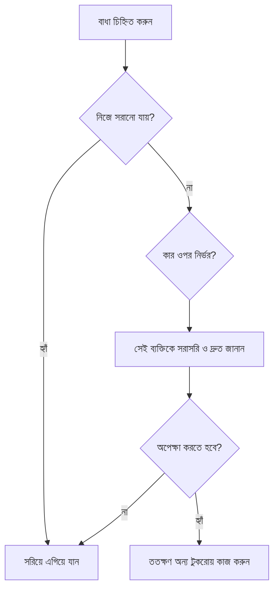

মূল আচরণ:

- **আগেভাগে চিনুন** — শেষ মুহূর্তে নয়; dependency আগে থেকে দেখে আগে জিজ্ঞেস করে রাখুন।
- **অপেক্ষায় বসে থাকবেন না** — একটা কাজ blocked থাকলে সমান্তরালে অন্য টুকরো ধরুন।
- **চুপ থাকবেন না** — যে আপনাকে আটকে রেখেছে তাকে সরাসরি ও ভদ্রভাবে মনে করিয়ে দিন।
- **escalate করতে শিখুন** — দিনের পর দিন আটকে থাকলে ম্যানেজারকে জানান; এটা অভিযোগ নয়, কাজ এগোনোর দায়িত্ব।

**সতর্কতা:** "আমি তো আমার দিক শেষ করেছি, এখন X-এর অপেক্ষা" — এই মনোভাব junior-কে আটকে রাখে। আপনার দায়িত্ব কাজটা *done* করা, শুধু নিজের অংশ নয়।

---

### ৭.৮ আটকে গেলে — কখন ও কীভাবে সাহায্য চাইবেন

দুটি বিপরীত ভুল আছে: (১) খুব দ্রুত সব জিজ্ঞেস করা (নিজে চেষ্টা না করা), (২) দিনের পর দিন নীরবে আটকে থাকা (অহংকার বা ভয়)। মাঝের সঠিক পথ — **timebox**:

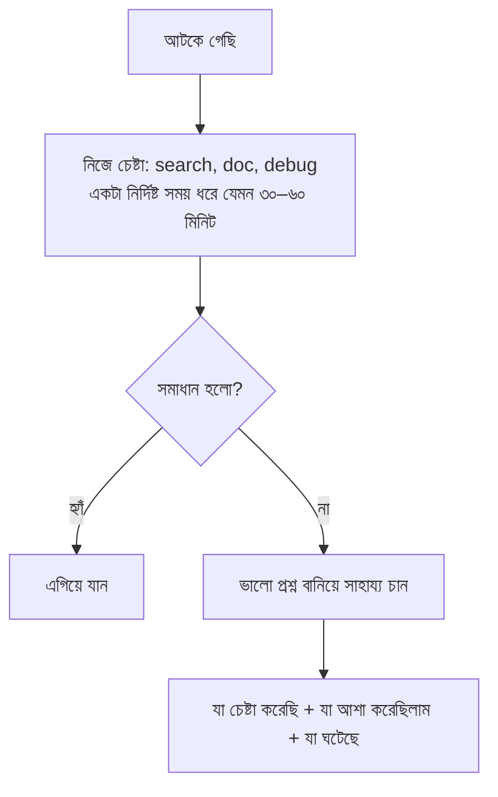

**ভালো প্রশ্নের গঠন:** "আমি X করতে চাইছি। Y চেষ্টা করেছি, ভেবেছিলাম Z হবে, কিন্তু হচ্ছে W। এই error দেখাচ্ছে [...]। কোথায় দেখব?" — এতে সাহায্যকারীর সময় বাঁচে, আর আপনি "চিন্তা করে তারপর প্রশ্ন করে" এমন মানুষ হিসেবে পরিচিত হন।

> `মূল কথা` সাহায্য চাওয়া দুর্বলতা নয় — সময়মতো, প্রস্তুতি নিয়ে সাহায্য চাওয়া একটা **পেশাদার দক্ষতা**। লক্ষ্য কাজ শেষ করা, একা হিরো হওয়া নয়।

---

### ৭.৯ Mentorship — গাইড খুঁজে নেওয়া

এককালীন প্রশ্নের চেয়ে বড় জিনিস হলো একজন **mentor** — যিনি ধারাবাহিকভাবে আপনাকে শেখান, ভুল ধরিয়ে দেন, এবং অভিজ্ঞতা ভাগ করেন। mentor একদিনে আকাশ থেকে আসে না; খুঁজে নিতে হয়।

কীভাবে mentorship পাবেন:

- দলের অভিজ্ঞ কারো কাছ থেকে নিয়মিত feedback চান — "আমার এই কোড/পদ্ধতি কীভাবে আরও ভালো করতে পারতাম?"
- তাদের কাজ লক্ষ্য করুন: কীভাবে তারা সমস্যা ভাঙে, কীভাবে যোগাযোগ করে — শুধু কোড নয়, পদ্ধতি দেখুন।
- ভালো শিক্ষার্থী হোন: পরামর্শ নিলে কাজে লাগান, তারপর ফলাফল জানান — এতে mentor সময় দিতে উৎসাহ পায়।
- mentor একজনই হতে হবে এমন নয় — আলাদা মানুষের কাছ থেকে আলাদা জিনিস শিখুন।

**মূল কথা:** যিনি শিখতে আগ্রহী এবং পরামর্শ কাজে লাগায়, অভিজ্ঞরা তাকে সময় দিতে খুশি। mentorship মূলত আপনার নিজের উদ্যোগে গড়ে ওঠে।

---

### ৭.১০ নিজে থেকে উদ্যোগ নেওয়া (Proactive Initiative)

শুধু যা বলা হয়েছে তা করা একটা স্তর; পরের স্তর হলো — যা দরকার সেটা **নিজে দেখে** করে ফেলা। junior থেকে আলাদা হওয়ার সহজতম উপায় এটাই।

initiative-এর উদাহরণ:

- কোনো ছোট bug চোখে পড়লে ticket-এর অপেক্ষা না করে ঠিক করে ফেলা (scope-এর মধ্যে থেকে)।
- documentation পুরোনো দেখলে আপডেট করা।
- বারবার একই হাতে-করা কাজ দেখলে সেটা script দিয়ে automate করার প্রস্তাব দেওয়া।
- কাজ শেষ হয়ে গেলে "এরপর কী?" নিজে খুঁজে নেওয়া, ম্যানেজারের কাছে নতুন কাজের জন্য অপেক্ষা না করা।

```
প্রতিক্রিয়াশীল (reactive)            সক্রিয় (proactive)
─────────────────────               ─────────────────────
যা বলা হয় তাই করি                  সমস্যা নিজে দেখি ও তুলি
ticket শেষ → অপেক্ষা                ticket শেষ → পরের দরকার খুঁজি
সমস্যা চোখে পড়ে → চুপ              সমস্যা চোখে পড়ে → জানাই/ঠিক করি
```

**সতর্কতা:** initiative মানে একা সিদ্ধান্ত নিয়ে বড় কিছু বদলে ফেলা নয়। বড় বদলের আগে ছোট প্রস্তাব দিন, দলের সাথে মিলিয়ে নিন — না হলে initiative দলের জন্য বিশৃঙ্খলা তৈরি করতে পারে।

---

### ৭.১১ ডেলিভারির জন্য সুনাম গড়া (Reputation for Delivery)

উপরের সব দক্ষতা মিলে ধীরে ধীরে একটা জিনিস তৈরি করে — **reputation**। "এই কাজ ওকে দিলে শেষ হবে" — এই বিশ্বাস একজন engineer-এর সবচেয়ে বড় সম্পদ।

reputation কীভাবে তৈরি হয়:

- **ধারাবাহিকতা** — মাঝে মাঝে দারুণ নয়, প্রতিবার নির্ভরযোগ্য।
- **কথা রাখা** — যা বলেছি করব, তা করি; না পারলে আগেভাগে জানাই।
- **স্বচ্ছতা** — আটকালে বা দেরি হলে লুকাই না, খোলাখুলি জানাই।
- **মান** — শুধু শেষ করা নয়, এমনভাবে শেষ করা যাতে পরে ভাঙে না।

```
ছোট ছোট ভরসা-অর্জনকারী কাজ
        │  বারবার, সময়ের সাথে
        ▼
   "ও কাজটা শেষ করে"  ← reputation
        │
        ▼
  বড় দায়িত্ব + স্বাধীনতা + সুযোগ
```

**মূল কথা:** reputation একদিনে গড়ে না, কিন্তু একটা বড় ভাঙা প্রতিশ্রুতিতে দ্রুত ক্ষতি হয়। ধারাবাহিক ছোট ডেলিভারিই দীর্ঘমেয়াদে সবচেয়ে শক্তিশালী।

---

### নিজেকে যাচাই করুন

1. urgency বনাম impact ছক ব্যবহার করে কীভাবে সঠিক কাজ আগে বেছে নেবেন?
2. অগ্রাধিকার নিয়ে অস্পষ্টতা থাকলে ম্যানেজারের সাথে কীভাবে সারিবদ্ধ হবেন?
3. কোড শুরুর আগে কোন প্রশ্নগুলোর উত্তর জানা থাকা উচিত?
4. বড় কাজ ছোট টুকরোয় ভাঙার সুবিধাগুলো কী কী?
5. Estimate দেওয়ার সময় অনিশ্চয়তা কীভাবে সৎভাবে জানাবেন, এবং cone of uncertainty কী বোঝায়?
6. কাজের অগ্রগতি কেন ও কীভাবে দৃশ্যমান রাখবেন?
7. পথে বাধা এলে সেটা সরানোর ধাপগুলো কী, এবং কখন escalate করবেন?
8. "Timebox তারপর সাহায্য" নীতিটি ব্যাখ্যা করুন — এবং একটি ভালো প্রশ্নের গঠন বলুন।
9. একজন mentor কীভাবে খুঁজে নেবেন এবং সম্পর্কটা টিকিয়ে রাখবেন?
10. proactive আর reactive আচরণের পার্থক্য কী, এবং initiative-এর সীমা কোথায়?
11. ডেলিভারির reputation কীভাবে তৈরি হয় এবং কেন এটা এত মূল্যবান?

[↑ সূচিপত্রে ফিরুন](#toc)

---

<a id="ch-8"></a>

## অধ্যায় ৮: Coding
### কোড লেখার শিল্প — পড়া যায়, পরীক্ষা করা যায়, বদলানো যায় এমন কোড

> Part 2 · Entry / Junior

### মূল কথা

- কোড একবার লেখা হয়, কিন্তু **বহুবার পড়া ও বদলানো** হয় — তাই "চলে কি না" তার চেয়ে "পরের মানুষ বুঝবে কি না" বেশি জরুরি।
- ভালো coder জন্মায় না, **অনুশীলনে** তৈরি হয় — নিয়মিত হাতে কোড লেখা ও প্রতিটি পুরোনো কোড থেকে শেখাই মূল পথ।
- ভালো কোডের তিনটি স্তম্ভ: **Readable** (পড়া যায়), **Testable** (পরীক্ষা করা যায়), এবং **Maintainable** (নিরাপদে বদলানো যায়)।
- Coding standard ও convention হলো দলের সাধারণ ভাষা — ব্যক্তিগত পছন্দের চেয়ে দলের সামঞ্জস্য (consistency) দামি।
- ভালো কোড একটি স্কিল, আর স্কিল মানে—সচেতন চর্চা, code review থেকে শেখা, নিয়মিত ছোট ছোট refactoring, এবং নিয়মতান্ত্রিক debugging।

---

### ৮.১ ভালো coder হওয়া একটি স্কিল — নিয়মিত অনুশীলন

Coding হলো piano বাজানো বা সাঁতারের মতো একটি স্কিল — শুধু বই পড়ে বা ভিডিও দেখে আসে না, **হাতে লিখে লিখে** আসে। যে যত বেশি কোড লেখে এবং তার উপর ভাবে, সে তত ভালো হয়।

ভালো হওয়ার বাস্তব অভ্যাস:

| অভ্যাস | কী করবেন | কেন কাজে দেয় |
|---|---|---|
| নিয়মিত কোড লেখা | প্রতিদিন/প্রতি সপ্তাহে কিছু না কিছু লিখুন | স্কিল ব্যবহারে শাণিত থাকে |
| নিজের পুরোনো কোড আবার পড়া | ৩-৬ মাস আগের কোড খুলে দেখুন | কোথায় উন্নতি হয়েছে, কোথায় বাকি—বোঝা যায় |
| ভালো কোড পড়া | open-source বা senior-দের কোড পড়ুন | নতুন প্যাটার্ন ও আইডিয়া শেখা যায় |
| feedback নেওয়া | code review-কে শেখার সুযোগ ধরুন | অন্যের চোখে নিজের দুর্বলতা দেখা যায় |
| নতুন language/tool চেষ্টা | মাঝে মাঝে অচেনা কিছু শিখুন | ভাবনার নতুন উপায় খোলে |

**মূল কথা:** উন্নতি লিনিয়ার নয় — ছোট ছোট নিয়মিত চর্চা জমে জমে বড় পার্থক্য তৈরি করে। আজকের "খারাপ" কোড ছয় মাস পরে বিব্রতকর লাগা মানেই আপনি শিখছেন।

---

### ৮.২ কোড আপনি লেখার চেয়ে অনেক বেশি পড়েন

একটি কোডলাইন একবার লেখা হয়, কিন্তু পরে বহুবার পড়া হয় — bug খুঁজতে, feature যোগ করতে, review করতে, বা শুধু বুঝতে।

```
        লেখা  ▓▓▓░░░░░░░░░░░░░░░░░░  ~১০%
        পড়া  ▓▓▓▓▓▓▓▓▓▓▓▓▓▓▓▓▓▓▓▓  ~৯০%
```

তাই প্রতিটি লাইন লেখার সময় **পরের পাঠকের** কথা ভাবুন — আর সেই পাঠক প্রায়ই ছয় মাস পরের আপনি নিজে, যিনি আজকের context সব ভুলে গেছেন।

**ফলাফল:** যা টাইপ করতে দুই মিনিট কম লাগে কিন্তু পড়তে দুই মিনিট বেশি লাগে, সেটা লাভজনক নয় — কারণ পড়া হয় বহুবার, লেখা একবার। লেখার সময় একটু কষ্ট করে পড়াকে সহজ রাখাই সঠিক বিনিয়োগ।

---

### ৮.৩ Readable কোড — কোড নিজেই নিজের কথা বলুক

Readable মানে—কোড পড়েই বোঝা যায় সে কী করছে, আলাদা ব্যাখ্যা না লাগিয়ে।

```dart
// দুর্বল — নাম দেখে কিছু বোঝা যায় না
double calc(double a, double b, double r) => a + b * r / 100;

// ভালো — নামই ব্যাখ্যা
double totalWithTax(double price, int quantity, double taxRatePercent) =>
    price + quantity * taxRatePercent / 100;
```

Readable কোডের নিয়ম:

- **অর্থপূর্ণ নাম দিন** — variable, function, class-এর নাম যেন তার কাজ বলে দেয়।
- **চালাকি কমান** — এক-লাইনের ঘোরানো কোডের চেয়ে কয়েক লাইনের স্পষ্ট কোড ভালো।
- **deep nesting এড়ান** — গভীর if/else-এর বদলে early return বা guard clause দিন।
- **ছোট function** — একটি function একটিই কাজ করুক, যাতে একনজরে পুরোটা বোঝা যায়।

**Comment নিয়ে নিয়ম:** comment দিয়ে **"কেন"** বোঝান, "কী" নয়। "কী হচ্ছে" তা তো কোড পড়লেই দেখা যায়; কিন্তু "কেন এভাবে" — সেই কারণ (একটা weird API, একটা বাগের workaround) কোডে দেখা যায় না।

```dart
// খারাপ comment — কোড যা বলছে তা-ই বলছে
i = i + 1; // i বাড়াও

// ভালো comment — "কেন" বলছে
// পুরোনো API ০-ভিত্তিক index দেয়, কিন্তু আমাদের UI ১ থেকে গোনে
displayIndex = i + 1;
```

**সতর্কতা:** comment দিয়ে খারাপ কোড ঢাকার চেষ্টা করবেন না — বরং কোডটাই পরিষ্কার করুন, তাহলে comment-ই লাগে না।

---

### ৮.৪ Testable কোড — পরীক্ষা করা সহজ এমন গঠন

কোড testable হলে তার উপর automated test লেখা সহজ — আর যে কোড সহজে test করা যায়, সেটা সাধারণত বেশি clean ও কম coupled হয়।

Testable করার উপায়:

- **Dependency বাইরে থেকে দিন (dependency injection)** — function বা class নিজে database/network নিজে তৈরি না করে, বাইরে থেকে নিক; test-এ fake/mock বসানো যায়।
- **Side-effect আলাদা করুন** — হিসাব (logic) আর বাইরের জগতের কাজ (file লেখা, API call) আলাদা রাখুন; pure logic test করা সহজ।
- **ছোট ও single-purpose ইউনিট** — ছোট function-এর input-output পরীক্ষা করা সহজ।
- **global state কমান** — hidden state থাকলে test অপ্রত্যাশিতভাবে fail/pass করে।

```dart
// টেস্ট করা কঠিন — ভেতরে নিজেই clock তৈরি করছে
bool isExpired(Order o) => DateTime.now().isAfter(o.deadline);

// টেস্ট করা সহজ — সময় বাইরে থেকে দেওয়া
bool isExpired(Order o, DateTime now) => now.isAfter(o.deadline);
```

**মূল কথা:** "এই কোডটা কীভাবে test করব?" — লেখার সময়েই এই প্রশ্ন করলে design এমনিতেই পরিষ্কার হয়ে যায়।

---

### ৮.৫ Maintainable কোড — নিরাপদে বদলানো যায় এমন কোড

Maintainable মানে—ভবিষ্যতে পরিবর্তন করতে গেলে কম জায়গায় হাত দিতে হয় এবং অজান্তে অন্য কিছু ভাঙার ভয় কম থাকে।

মূল নীতিগুলো:

- **DRY (Don't Repeat Yourself)** — একই logic বারবার copy-paste নয়; এক জায়গায় রাখুন যাতে এক জায়গায় বদলালেই হয়।
- **DRY-এর অতিরিক্ততা থেকে সাবধান** — শুধু "দেখতে একই" বলে দুটো অসংশ্লিষ্ট জিনিস জোর করে এক করলে পরে একটাকে বদলাতে গিয়ে অন্যটা ভাঙে। একটু duplication ভুল abstraction-এর চেয়ে ভালো।
- **Magic number/string এড়ান** — `if (x > 7)` নয়, নাম দিন: `if (retries > maxRetries)`।
- **single responsibility** — এক module/class একটাই কারণে বদলাক।
- **কম coupling, বেশি cohesion** — অংশগুলো যত কম একে অপরের উপর নির্ভর করে, একটা বদলাতে অন্যটায় ততো কম ধাক্কা লাগে।

```
        উচ্চ coupling (ভঙ্গুর)            নিম্ন coupling (নমনীয়)
        A ── B ── C                      A    B    C
         ╲   │   ╱                        │    │    │
          ╲  │  ╱                      [পরিষ্কার interface]
           একটা ভাঙলে সব ভাঙে            একটা বদলালে বাকিরা নিরাপদ
```

**সতর্কতা:** maintainability ভবিষ্যৎ পরিবর্তনের জন্য — কিন্তু এখনই কাল্পনিক ভবিষ্যতের জন্য অতিরিক্ত generic/abstract করা (over-engineering) উল্টো maintainability নষ্ট করে। বর্তমানের বাস্তব প্রয়োজনে design করুন।

---

### ৮.৬ Coding standard ও convention — দলের সাধারণ ভাষা

Coding standard হলো দলের লেখা/অলিখিত নিয়ম: নামকরণ (naming), formatting, file গঠন, কোন pattern ব্যবহার করব ইত্যাদি। উদ্দেশ্য—পুরো codebase যেন **একজনের লেখা** মনে হয়।

| বিষয় | উদাহরণ |
|---|---|
| Naming | `camelCase` না `snake_case`, boolean কে `isReady`/`hasError` |
| Formatting | indent, line length, bracket-এর জায়গা |
| Structure | folder/file কীভাবে সাজানো, কোথায় কী থাকে |
| Patterns | error কীভাবে handle হবে, কোন library ব্যবহার হবে |

মূল চিন্তা:

- **সামঞ্জস্য > ব্যক্তিগত পছন্দ** — আপনার পছন্দ যেমনই হোক, দলের নিয়ম মেনে চলুন; অর্ধেক কোড এক ধরন, অর্ধেক আরেক ধরন—এটাই সবচেয়ে খারাপ।
- **স্বয়ংক্রিয় করুন** — formatting/linting tool (যেমন formatter, linter) দিয়ে নিয়ম enforce করুন, যাতে review-তে এসব নিয়ে তর্ক না হয়।
- **চলমান প্যাটার্ন অনুসরণ করুন** — নতুন কোড লেখার আগে দেখুন আশেপাশে কীভাবে করা হয়েছে, সেটাই follow করুন (নিজের নতুন কায়দা চাপাবেন না)।
- **নিয়ম বদলাতে চাইলে দল হিসেবে বদলান** — একা চুপচাপ নয়, আলোচনা করে।

**মূল কথা:** convention নিখুঁত কি না সেটা বড় কথা নয় — সবাই একই convention মানছে কি না সেটাই বড় কথা।

---

### ৮.৭ Code Review — দেওয়া ও নেওয়া

Code review একসাথে দুটো কাজ করে: কোডের **মান** বজায় রাখা, আর দলের মধ্যে **জ্ঞান ছড়ানো ও পরস্পরকে শেখানো**।

**Review দেওয়ার সময়:**

- কোড-কে review করুন, মানুষকে নয় — সুর হোক সহযোগিতার, আক্রমণের নয়।
- ছোটখাটো খুঁত (nit) নিয়ে আটকে না থেকে **গুরুত্বপূর্ণ** বিষয়ে (logic, design, edge case) মন দিন; nit হলে স্পষ্ট করে "nit:" লিখে দিন।
- আদেশ নয়, প্রশ্ন/প্রস্তাব দিন: "এভাবে করলে কি আরও পরিষ্কার হতো?"
- **"কেন"** বোঝান, যাতে লেখক শেখে — শুধু "এটা বদলাও" নয়।
- দ্রুত review দিন — আটকে থাকা PR পুরো দলের গতি কমায়।

**Review পাওয়ার সময়:**

- Defensive হবেন না — feedback কোডের উপর, আপনার উপর নয়।
- বুঝতে না পারলে জিজ্ঞেস করুন; একমত না হলে যুক্তি দিন (ভদ্রভাবে)।
- ছোট PR পাঠান — ছোট change review করা সহজ, ভালো feedback পাওয়া যায়।

```
ভালো review মন্তব্য:  "এই function বড় হয়ে যাচ্ছে — ভেঙে দিলে test করা সহজ হতো, কী বলো?"
খারাপ review মন্তব্য: "এটা ভুল। এভাবে করো।"
```

---

### ৮.৮ Debugging — নিয়মতান্ত্রিক প্রক্রিয়া

Debugging আন্দাজে নয়, ধাপে ধাপে — যেন একটা ছোট তদন্ত:

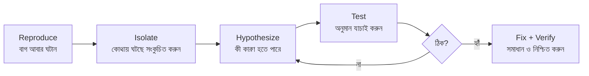

মূল কৌশল:

- **একবারে একটা জিনিস বদলান** — একসাথে অনেক বদলালে কোনটায় কাজ হলো বোঝা যায় না।
- **অনুমান যাচাই করুন, ধরে নেবেন না** — "মনে হয় এখানে সমস্যা" নয়, প্রমাণ করুন।
- **মূল কারণ খুঁজুন (root cause)** — লক্ষণ ঢেকে দেওয়া নয়, আসল কারণ ঠিক করুন।
- **ঠিক করার পর verify** — শুধু "মনে হয় ঠিক হয়েছে" নয়, আবার চালিয়ে নিশ্চিত হোন, এবং একটা test যোগ করুন যাতে বাগটা আর ফিরে না আসে।

হাতিয়ার: debugger (breakpoint, step), logging, এবং সাধারণ print statement — পরিস্থিতি বুঝে যেটা দ্রুত উত্তর দেয় সেটা ব্যবহার করুন।

---

### ৮.৯ Refactoring — behavior না বদলে গঠন উন্নত করা

**Refactoring** = বাইরের আচরণ (behavior) এক রেখে ভেতরের গঠন (structure) উন্নত করা। কখন করবেন:

- কোড পড়তে/বুঝতে কষ্ট হচ্ছে।
- একই জিনিস বারবার copy-paste হচ্ছে।
- ছোট একটা পরিবর্তন করতে অনেক জায়গায় হাত দিতে হচ্ছে।

**Boy Scout Rule:** যে ফাইলে হাত দিচ্ছেন, সেটা একটু হলেও **আগের চেয়ে পরিষ্কার** রেখে আসুন। বড় rewrite-এর দরকার নেই — ছোট ছোট নিয়মিত উন্নতিই জমে জমে codebase সুস্থ রাখে।

```
        বড় rewrite (ঝুঁকিপূর্ণ)        ছোট নিয়মিত refactor (নিরাপদ)
        ░░░░░░░░░░░ → 💥 অনেক বাগ        ▓░▓░▓░▓░▓ → ধীরে ধীরে পরিষ্কার
```

> **সতর্কতা:** refactoring আর feature-যোগ একসাথে এক commit/PR-এ মেশাবেন না — review কঠিন হয় ও বাগ লুকিয়ে যায়। আলাদা রাখুন। আর refactor করার আগে test থাকা চাই, যাতে আচরণ অক্ষত আছে—তা নিশ্চিত হওয়া যায়।

---

### নিজেকে যাচাই করুন

1. ভালো coder হওয়া কেন একটি স্কিল? উন্নতির জন্য তিনটি বাস্তব অভ্যাস বলুন।
2. "আমরা কোড লেখার চেয়ে বেশি পড়ি" — এর প্রভাব আপনার লেখার অভ্যাসে কীভাবে পড়া উচিত?
3. Readable কোডের নিয়মগুলো কী? "comment দিয়ে কেন বোঝান, কী নয়" — উদাহরণসহ ব্যাখ্যা করুন।
4. কোড testable করার অন্তত তিনটি উপায় বলুন। dependency injection কীভাবে test সহজ করে?
5. Maintainable কোডের নীতিগুলো কী? অতিরিক্ত DRY বা over-engineering কেন বিপজ্জনক?
6. Coding standard/convention কেন দরকার? "সামঞ্জস্য > ব্যক্তিগত পছন্দ" — ব্যাখ্যা করুন।
7. ভালো ও খারাপ code-review মন্তব্যের পার্থক্য একটি উদাহরণে দেখান।
8. Debugging-এর ধাপগুলো বলুন। "একবারে একটা জিনিস বদলান" কেন জরুরি?
9. কখন refactor করবেন, এবং কেন refactoring ও feature আলাদা রাখা উচিত?

[↑ সূচিপত্রে ফিরুন](#toc)

---

<a id="ch-9"></a>

## অধ্যায় ৯: Software Development
### সফটওয়্যার ডেভেলপমেন্ট — কোড লেখার বাইরের পুরো কাজটা

> Part 2 · Entry / Junior

### মূল কথা

- কোড লেখা software development-এর একটা অংশ মাত্র; পুরো কাজে আরও অনেক skill জড়িত।
- একটা language গভীরভাবে আয়ত্ত করা দশটা ভাষা ভাসা-ভাসা জানার চেয়ে দামি।
- Debugging একটা আলাদা, শেখার-যোগ্য skill — অনুমানে ঝাঁপ না দিয়ে ধাপে ধাপে কারণ খোঁজা।
- Refactoring মানে behavior না বদলে কোডের ভেতরের গঠন পরিষ্কার করা — এটা চলমান অভ্যাস হওয়া উচিত।
- Testing হলো নিরাপত্তা-জাল; বিভিন্ন স্তরের test বিভিন্ন কাজ করে।
- ভালো developer পুরো workflow জানে: version control, code review, documentation, build/deploy — শুধু লেখা নয়।

---

### ৯.১ একটি Programming Language গভীরভাবে আয়ত্ত করা

একটা language "জানা" মানে syntax মুখস্থ করা নয়। গভীর দক্ষতা মানে ভাষাটির আসল ক্ষমতা, সীমা আর স্বাভাবিক রীতি বুঝে ফেলা। এর কয়েকটি স্তর আছে:

| স্তর | মানে কী | উদাহরণ |
|------|---------|--------|
| Syntax | শব্দ-গঠন, কীওয়ার্ড | `for`, `class`, `async` |
| Idioms | ভাষার স্বাভাবিক স্টাইলে লেখা | Pythonic Python, idiomatic Dart |
| Standard library | built-in টুল কী আছে তা জানা | collection, string, date API |
| Ecosystem | package manager, linter, formatter, debugger | pub, npm, pip |
| Internals | কীভাবে চলে — memory, performance খরচ | GC, boxing, copy vs reference |

**মূল কথা:** এক ভাষার স্টাইল জোর করে আরেক ভাষায় চাপাবেন না। Python-এ Java-র মতো লিখলে কোড বেমানান হয়। প্রতিটি ভাষার নিজস্ব "সুন্দর" উপায় থাকে — সেটাই idiomatic code।

---

### ৯.২ গভীর শেখা পরে নতুন ভাষায় স্থানান্তরিত হয়

একটা ভাষা গভীরভাবে শিখলে আপনি শুধু সেই ভাষা শেখেন না — আপনি programming-এর সাধারণ ধারণাগুলো (concept) শেখেন। যেমন: scope, recursion, error handling, async, data structure। এই ধারণাগুলো ভাষা-নিরপেক্ষ।

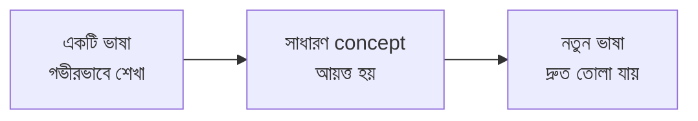

**মূল কথা:** প্রথম ভাষা গভীরে শেখায় বেশি সময় লাগে, পরের ভাষাগুলো অনেক দ্রুত আসে। তাই শুরুতে একটাতেই মন দিন, দশটায় ছড়িয়ে নয়।

---

### ৯.৩ Standard Library আগে দেখুন, পরে নিজে বানান

নতুন কিছু লেখার আগে দেখুন ভাষার built-in library বা ছোট-চেনা package-এ সেটা আগে থেকেই আছে কি না। নিজে লেখা মানে নিজে বাগ তৈরি করা, নিজে maintain করা।

- standard library সাধারণত পরীক্ষিত, দ্রুত এবং সবার চেনা।
- নিজের লেখা utility মানে আরও কোড, আরও test, আরও দায়িত্ব।
- তবে অন্ধভাবে dependency যোগও নয় — বিশাল package শুধু এক ছোট কাজের জন্য টানবেন না।

**মূল কথা:** "Don't reinvent the wheel" — তবে চাকাটা যেন আপনার গাড়ির মাপের হয়।

---

### ৯.৪ Tooling আয়ত্ত করা (editor, linter, formatter)

ভালো developer তার টুলগুলোর সাথে দ্রুত হয়। যে টুল প্রতিদিন ব্যবহার করেন সেটা গভীরে শিখলে প্রতিদিন সময় বাঁচে।

- **Editor/IDE:** keyboard shortcut, jump-to-definition, refactor টুল, multi-cursor।
- **Linter:** কোড লেখার সময়ই সম্ভাব্য ভুল ধরিয়ে দেয়।
- **Formatter:** style নিয়ে তর্ক বন্ধ করে — `dart format`, `prettier` সবার কোড একরকম রাখে।
- **Debugger:** print-এর বদলে breakpoint দিয়ে চলমান কোড থামিয়ে দেখা।

**মূল কথা:** একদিন টুল শেখায় বিনিয়োগ করুন, প্রতিদিন রিটার্ন পাবেন।

---

### ৯.৫ Debugging একটি আলাদা Skill

কোড লেখার মতোই debugging-ও আলাদা একটা শেখার-যোগ্য দক্ষতা। অনেকে এলোমেলো অনুমানে কোড পাল্টাতে থাকে — সেটা সময় নষ্ট করে। ভালো debugging পদ্ধতিগত (systematic):

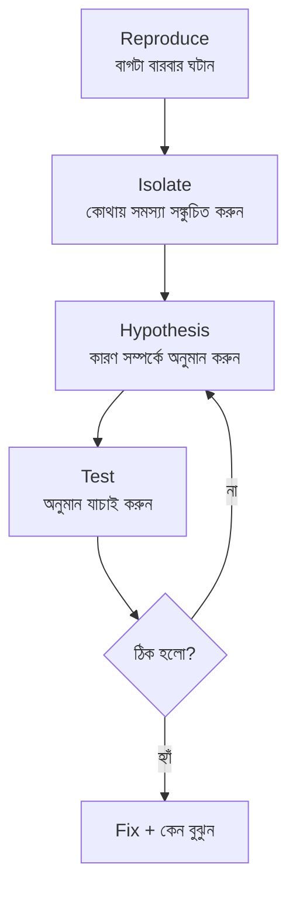

**মূল কথা:** আগে বাগটা নির্ভরযোগ্যভাবে reproduce করুন। যা ঘটাতে পারেন না, তা ঠিকও করতে পারবেন না।

---

### ৯.৬ Debugging-এর হাতিয়ার ও কৌশল

ভালো ডিবাগারের কাছে কয়েকটি মূল হাতিয়ার থাকে:

| হাতিয়ার | কী করে | কখন |
|---------|--------|-----|
| Debugger / breakpoint | চলমান কোড থামিয়ে variable দেখা | যুক্তি-ভুল খুঁজতে |
| Logging | ঘটনার ক্রম রেকর্ড করা | production বা async সমস্যায় |
| Stack trace | ভুলটা কোথা থেকে এলো | crash/exception-এ |
| Binary search | অর্ধেক করে করে দোষী অংশ খোঁজা | বড় কোড/বড় history-তে |
| `git bisect` | কোন commit বাগ ঢুকিয়েছে | "আগে কাজ করত" সমস্যায় |

**সতর্কতা:** এলোমেলোভাবে কোড পাল্টে "ঠিক হয়ে গেছে" দেখলেও থামবেন না — কেন ঠিক হলো তা না বুঝলে বাগ আবার ফিরে আসবে।

---

### ৯.৭ Refactoring — behavior না বদলে গঠন উন্নত করা

Refactoring মানে কোডের বাইরের আচরণ (behavior) এক রেখে ভেতরের গঠন (structure) পরিষ্কার করা। অর্থাৎ ব্যবহারকারীর কাছে কিছু বদলায় না, কিন্তু কোড পড়তে ও বদলাতে সহজ হয়।

```
আগে                          পরে (refactor)
─────────────────            ─────────────────
এক বিশাল function       →     ছোট ছোট অর্থবহ function
অস্পষ্ট নাম x, tmp      →     পরিষ্কার নাম totalPrice
ডুপ্লিকেট কোড ৩ জায়গায় →     এক জায়গায় shared function
আচরণ একই থাকে                আচরণ একই থাকে
```

**মূল কথা:** Refactoring আর feature যোগ করা একসাথে করবেন না। আগে refactor (behavior অপরিবর্তিত), তারপর আলাদা ধাপে নতুন feature — তাহলে ভুল হলে সহজে ধরা পড়ে।

---

### ৯.৮ ভালো কোড গুণমান কেমন দেখায়

ভালো কোড মানে "চলে" এমন নয়, মানে "পরের মানুষ সহজে পড়ে ও বদলাতে পারে" এমন।

- **Readable:** নাম স্পষ্ট, function ছোট, intent বোঝা যায়।
- **Simple:** দরকারের বেশি জটিলতা নয় (over-engineering নয়)।
- **Consistent:** team-এর একই style ও প্যাটার্ন।
- **Low duplication:** এক logic এক জায়গায়।
- **Testable:** ছোট, আলাদা অংশ — যা সহজে test করা যায়।

**মূল কথা:** কোড মেশিনের চেয়ে মানুষের জন্য বেশি লেখা হয়। মেশিন সব কোডই চালাবে, কিন্তু মানুষকেই পড়তে হবে।

---

### ৯.৯ Refactoring চলমান অভ্যাস (Boy Scout Rule)

Refactoring আলাদা কোনো বড় প্রজেক্ট হওয়া উচিত নয় — এটা প্রতিদিনের কাজের অংশ। যখনই কোনো ফাইলে কাজ করছেন, সেটাকে আগের চেয়ে একটু পরিষ্কার রেখে যান।

> **Boy Scout Rule:** "ক্যাম্প যেমন পেয়েছিলে, তার চেয়ে পরিষ্কার রেখে যাও।" কোডেও তাই — ছোঁয়া প্রতিটি ফাইল একটু ভালো করে রাখুন।

**সতর্কতা:** জমিয়ে রাখা refactoring বিপজ্জনক — একবারে বিশাল "rewrite" প্রায়ই নতুন বাগ আনে। ছোট ছোট ধাপে, test দিয়ে আগলে refactor করুন।

---

### ৯.১০ Testing কেন দরকার — নিরাপত্তা-জাল

Test হলো নিরাপত্তা-জাল (safety net)। পরিবর্তনের পর "আগের কিছু ভাঙল কি না" তা দ্রুত জানায়, ফলে নির্ভয়ে কোড বদলানো যায়।

- ম্যানুয়ালি বারবার যাচাই করার চেয়ে test অনেক দ্রুত ও নির্ভরযোগ্য।
- Test থাকলে refactor করতে ভয় লাগে না।
- বাগ যত আগে ধরা পড়ে তত সস্তা — test সেই আগের ধাপে ধরিয়ে দেয়।

```
test ছাড়া বদলানো:  ভয়ে ভয়ে, ম্যানুয়ালি যাচাই, বাগ পরে production-এ
test দিয়ে বদলানো:  নির্ভয়ে, এক কমান্ডে যাচাই, বাগ এখনই ধরা পড়ে
```

---

### ৯.১১ Test-এর বিভিন্ন স্তর (Testing methods)

বিভিন্ন test বিভিন্ন কাজ করে; একটা সুস্থ প্রজেক্টে এদের মিশ্রণ থাকে।

```
        ▲  কম, ধীর, দামি
       ╱E╲      End-to-end (পুরো অ্যাপ ব্যবহারকারীর মতো)
      ╱────╲
     ╱ Integ ╲   Integration (কয়েকটা অংশ একসাথে)
    ╱──────────╲
   ╱   Unit      ╲  Unit (ছোট অংশ আলাদা করে)
  ╱──────────────╲
   বেশি, দ্রুত, সস্তা ▼      (Test Pyramid)
```

| ধরন | কী পরীক্ষা করে | গতি |
|-----|---------------|-----|
| Unit | একটি function/class আলাদা করে | দ্রুত |
| Integration | কয়েকটা অংশ মিলে ঠিক চলে কি না | মাঝারি |
| End-to-end | পুরো সিস্টেম ব্যবহারকারীর দৃষ্টিতে | ধীর |

**মূল কথা:** নিচে বেশি unit test, উপরে কম e2e test — এটাই test pyramid। বেশি ধীর e2e-তে ভর করলে test suite ধীর ও ভঙ্গুর হয়।

---

### ৯.১২ AAA প্যাটার্নে পরিষ্কার Unit Test

পরিষ্কার test লেখার সহজ কাঠামো হলো AAA: Arrange → Act → Assert। প্রতিটি test একটাই জিনিস যাচাই করুক।

```
Arrange  →  প্রস্তুতি (input, mock তৈরি)
Act      →  যা পরীক্ষা করছি, সেটা চালান
Assert   →  ফলাফল প্রত্যাশার সাথে মেলান
```

```dart
test('totalWithTax ১০% tax সঠিকভাবে যোগ করে', () {
  // Arrange
  const price = 100.0; const qty = 2; const tax = 10.0;
  // Act
  final result = totalWithTax(price, qty, tax);
  // Assert
  expect(result, 120.0);
});
```

**মূল কথা:** ভালো test নাম দেখলেই বোঝা যায় কী পরীক্ষা হচ্ছে। Test নিজেই এক ধরনের documentation।

---

### ৯.১৩ TDD ও কখন test লিখবেন

Test কখন লিখবেন তার কয়েকটা ধারা আছে:

- **TDD (Test-Driven Development):** আগে test (যা fail করে), তারপর সেটা pass করার কোড, তারপর refactor। এতে design আগে ভাবতে বাধ্য হন।
- **কোডের সাথে সাথে test:** feature লেখার পাশাপাশি test।
- **বাগ ফিক্সে regression test:** বাগ ঠিক করার আগে সেটা ধরা একটা test লিখুন — যাতে বাগ আর ফিরে না আসে।

**মূল কথা:** নিয়মের চেয়ে অভ্যাস গুরুত্বপূর্ণ — গুরুত্বপূর্ণ logic যেন কোনো-না-কোনো test দিয়ে আগলানো থাকে।

---

### ৯.১৪ Version Control (Git) — দলগত কাজের মেরুদণ্ড

Git ছাড়া দলগত development প্রায় অসম্ভব। ভালো অভ্যাস:

- **ছোট, অর্থবহ commit** — এক commit এক যৌক্তিক পরিবর্তন।
- **পরিষ্কার commit message** — *কী* বদলেছে নয়, *কেন* বদলেছে তা বলুন।
- **Branch + Pull Request workflow** — কাজ আলাদা branch-এ, review করে merge।

```
ভালো commit message-এর গঠন:

   fix(auth): প্রতিবার token refresh-এ logout হওয়া বন্ধ করা

   refresh-এর আগে token expiry ভুলভাবে চেক হচ্ছিল, ফলে
   বৈধ session-ও বাতিল হতো। তুলনাটা ঠিক করা হলো।

   │      │       │
   type   scope   কেন (body) — শুধু "কী" নয়
```

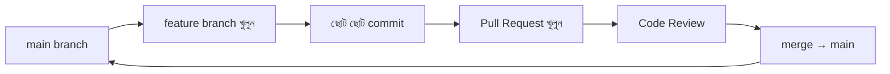

**মূল কথা:** commit history হলো প্রজেক্টের ইতিহাস — পরে কেউ (বা আপনি নিজে) এটা পড়ে বুঝবে কেন কী হয়েছিল।

---

### ৯.১৫ Code Review — পুরো workflow-এর অংশ

কোড merge হওয়ার আগে অন্য কেউ পড়ে দেখা (code review) প্রায় সব ভালো team-এর অভ্যাস।

- **বাগ আগে ধরা:** আরেক জোড়া চোখ ভুল ধরে।
- **জ্ঞান ছড়ানো:** team-এর অন্যরাও কোডটা সম্পর্কে জানে (bus factor কমে)।
- **মান ধরে রাখা:** style ও standard সবার কোডে এক থাকে।
- **শেখা:** review দেওয়া-নেওয়া দুই পক্ষেরই শেখার সুযোগ।

**মূল কথা:** review মানুষকে নয়, কোডকে নিয়ে — মন্তব্য বিনয়ী ও গঠনমূলক রাখুন; ছোট PR দ্রুত review হয়।

---

### ৯.১৬ Documentation লেখা

ভালো documentation ভবিষ্যতের অনেক প্রশ্ন আগেই উত্তর দিয়ে রাখে এবং দলকে নির্ভর করার মতো এক জায়গা দেয়।

- **README:** project কী, কীভাবে চালাবেন, কীভাবে অবদান রাখবেন।
- **Code comment:** *কী* নয়, জটিল সিদ্ধান্তের *কেন*।
- **Design doc:** বড় কাজের আগে পরিকল্পনা ও trade-off লিখে রাখা — এতে আগেই ভুল ধরা পড়ে।
- **পাঠকের কথা ভেবে লিখুন** — যে জানে না, সে যেন বোঝে।

**সতর্কতা:** ভুল বা পুরোনো documentation না-থাকার চেয়েও খারাপ — কারণ মানুষ ভুল তথ্যে বিশ্বাস করে। কোড বদলালে সংশ্লিষ্ট doc-ও আপডেট করুন।

---

### ৯.১৭ পুরো Development Workflow — কোড লেখার বাইরে

Feature "লেখা শেষ" মানে কাজ শেষ নয়। একজন পূর্ণ developer পুরো চক্রটা সামলায়:

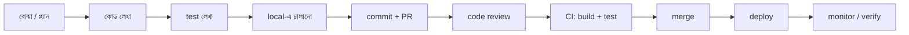

- শুধু "কোড লেখা" পুরো শৃঙ্খলের একটিমাত্র ধাপ।
- বাকি ধাপ (test, review, build, deploy, monitor) ছাড়া কোড ব্যবহারকারীর কাছে পৌঁছায় না বা নিরাপদ থাকে না।
- automation (CI/CD) এই ধাপগুলো নির্ভরযোগ্য ও দ্রুত করে।

**মূল কথা:** আসল লক্ষ্য কোড লেখা নয় — ব্যবহারকারীর হাতে নির্ভরযোগ্য সফটওয়্যার পৌঁছানো। কোড লেখা সেই বড় কাজের একটা অংশ মাত্র।

---

### নিজেকে যাচাই করুন

1. একটি language "গভীরভাবে জানা" বলতে কী বোঝায়? এর কোন কোন স্তর আছে?
2. একটা ভাষা গভীরে শিখলে নতুন ভাষা দ্রুত আসে কেন?
3. Standard library আগে দেখার পরামর্শ কেন? এর কোনো ব্যতিক্রম আছে কি?
4. Tooling (linter, formatter, debugger) আয়ত্ত করা কেন গুরুত্বপূর্ণ?
5. ভালো debugging পদ্ধতিগত — এর ধাপগুলো কী কী? Reproduce আগে কেন?
6. Debugging-এর কোন কোন হাতিয়ার আছে? `git bisect` কখন কাজে লাগে?
7. Refactoring কী? কেন এটা feature যোগের সাথে মিশিয়ে করা উচিত নয়?
8. ভালো কোড গুণমান কেমন দেখায় — কয়েকটা বৈশিষ্ট্য বলুন।
9. Boy Scout Rule কী? বড় একবারের rewrite কেন বিপজ্জনক?
10. Test কেন নিরাপত্তা-জাল হিসেবে কাজ করে?
11. Test-এর স্তরগুলো (unit, integration, e2e) আলাদা কীভাবে? Test pyramid কী?
12. AAA প্যাটার্ন কী, এবং একটি unit test-এ এটি কীভাবে দেখায়?
13. TDD কী? বাগ ফিক্সে regression test কেন লেখা উচিত?
14. ভালো commit message-এ "কী" না "কেন" থাকা উচিত? Branch+PR workflow কেমন?
15. Code review-র উপকারিতা কী কী?
16. কোন ধরনের documentation কখন লেখা উচিত? পুরোনো doc কেন বিপজ্জনক?
17. কোড "লেখা শেষ" মানে কাজ শেষ নয় কেন? পুরো development workflow-এর ধাপগুলো কী?

[↑ সূচিপত্রে ফিরুন](#toc)

---

<a id="ch-10"></a>

## অধ্যায় ১০: Tools of the Productive Engineer
### উৎপাদনশীল Engineer-এর Tools

> Part 2 · Entry / Junior

### মূল কথা

- আপনার দৈনন্দিন গতি অনেকটাই নির্ভর করে আপনার **tool ও workflow**-এর উপর — কোডের মেধার চেয়েও এটা প্রায়ই বড় পার্থক্য গড়ে দেয়।
- লক্ষ্য একটাই: চিন্তা ও কাজের মধ্যে **friction (ঘর্ষণ)** কমানো, যাতে মাথায় যা আছে তা দ্রুত মেশিনে নামাতে পারেন।
- tool-এ করা ছোট বিনিয়োগ (script, alias, shortcut) সময়ের সাথে **চক্রবৃদ্ধি হারে (compounding)** ফেরত আসে।
- চারটি স্তম্ভ: দ্রুত local environment, common tool-এ দক্ষতা, fast feedback loop, এবং repetitive কাজের automation।
- **সতর্কতা:** tool সাজানো নিজেই কাজ নয়; নিখুঁততার ফাঁদে পড়লে এটা আসল কাজ থেকে পালানোর অজুহাত হয়ে যায়।

---

### ১০.১ কেন productivity tool নিয়ে আলাদা করে ভাবা দরকার

অনেকে ভাবেন "ভালো engineer মানে ভালো কোড লেখে"; কিন্তু একই মেধার দুজন engineer-এর মধ্যে দিনের শেষে আউটপুটে বড় ফারাক হতে পারে শুধু tool ও অভ্যাসের কারণে।

- দিনে শতবার করা ছোট ছোট কাজ (file খোঁজা, branch বদলানো, test চালানো) যদি প্রতিবার ৫ সেকেন্ড কম লাগে, তবে সপ্তাহ-মাস-বছর জুড়ে সেটা বিশাল হয়ে যায়।
- friction শুধু সময় খায় না — মনোযোগও ভাঙে। প্রতিবার কোনো ধীর বা ঝামেলার ধাপে আটকালে আপনার "flow" নষ্ট হয়।

```
দুজন সমান মেধার engineer:
  A: ধীর tool, manual ধাপ → দিনে ৩-৪ বার পুরো cycle ঘোরাতে পারে
  B: দ্রুত tool, automate করা → দিনে ৩০-৪০ বার ঘোরাতে পারে
  → বছর শেষে B অনেক বেশি শিখেছে ও ডেলিভার করেছে
```

**মূল কথা:** productivity হলো শেখার যোগ্য একটা skill, জন্মগত প্রতিভা নয়।

---

### ১০.২ দ্রুত local development environment গড়া

আপনার নিজের মেশিনে কোড লেখা, চালানো ও test করার পরিবেশই হলো আপনি যেখানে দিনের বেশিরভাগ সময় কাটান। এটা ধীর হলে প্রতিটি কাজ ধীর হয়।

- **দ্রুত build/run/test:** ধীর environment প্রতিদিন একটু একটু করে সময় চুরি করে, আর সেই দেরি জমে বিশাল হয়।
- **কম resource-অপচয়:** অপ্রয়োজনীয় service বন্ধ রাখা, dependency হালকা রাখা — মেশিন হালকা থাকলে আপনিও হালকা থাকেন।

| দিক | ধীর environment | দ্রুত environment |
|---|---|---|
| build সময় | কয়েক মিনিট | কয়েক সেকেন্ড |
| দিনে চেষ্টা | কম | অনেক বেশি |
| মনোযোগ | বারবার ভাঙে | অটুট থাকে |

**মূল কথা:** environment-এ যত সময় বসে অপেক্ষা করেন, তত সময় চিন্তা থেকে ছিটকে পড়েন।

---

### ১০.৩ Environment-কে reproducible (পুনরুৎপাদনযোগ্য) রাখা

setup যদি শুধু "আপনার মেশিনেই কাজ করে" হয়, তবে সেটা ভঙ্গুর। নতুন মেশিন, নতুন সহকর্মী, বা OS reinstall-এর পর সব আবার ভেঙে পড়ে।

- setup-কে **script/container (যেমন Docker) দিয়ে স্বয়ংক্রিয়** করুন, যাতে এক কমান্ডে নতুন জায়গায় চালু হয়।
- "It works on my machine" সমস্যা দূর হয় — সবাই একই পরিবেশ পায়।
- নতুন কেউ দলে এলে কয়েক দিন নয়, কয়েক ঘণ্টায় কাজ শুরু করতে পারে।

```mermaid
flowchart LR
    A[setup script / container] --> B[নতুন মেশিন]
    A --> C[নতুন সহকর্মী]
    A --> D[CI পরিবেশ]
    B & C & D --> E[একই, নির্ভরযোগ্য environment]
```

**মূল কথা:** "এক কমান্ডে চালু হয়" — এটাই reproducible environment-এর মাপকাঠি।

---

### ১০.৪ Terminal ও command line-এ দক্ষতা

GUI শেখা সহজ, কিন্তু terminal **দ্রুত, স্বয়ংক্রিয়যোগ্য ও পুনরাবৃত্তিযোগ্য**। যা শিখলে বড় লাভ:

- file ও process সামলানো, খোঁজা (`grep`, `find`), pipe (`|`) দিয়ে ছোট কমান্ড জুড়ে বড় কাজ করা।
- output থেকে শুধু দরকারি অংশ ছেঁকে নেওয়া (filter, sort, count)।
- বারবার করা কাজের জন্য ছোট **script/alias** বানানো।

```
GUI দিয়ে ১০ ফাইলে একই বদল:   ১০ বার ক্লিক, ক্লান্তিকর, ভুল হয়
Terminal/script দিয়ে:         একটা কমান্ড, এক সেকেন্ড, পুনরাবৃত্তিযোগ্য
```

**মূল কথা:** যা একবার GUI-তে করা যায় কিন্তু বারবার লাগবে — সেটা terminal-এ করুন, কারণ তখন সেটা পরে অটোমেট করা যায়।

---

### ১০.৫ Editor / IDE-তে দক্ষতা

দিনের সবচেয়ে বেশি সময় কাটে editor-এ, তাই এখানে দক্ষতা সরাসরি গতিতে রূপ নেয়।

- **keyboard shortcut** শিখুন — mouse-এ হাত নেওয়া প্রতিবার সময় ও flow খায়।
- দ্রুত navigation: file-এ লাফ দেওয়া, symbol/function খোঁজা, definition-এ যাওয়া, reference খুঁজে বের করা।
- বড় পরিসরে নিরাপদ refactor (rename, extract) tool দিয়ে করা — হাতে নয়।
- debugger, breakpoint, এবং inline test চালানো নিজের editor থেকেই।

| কাজ | ধীর উপায় | দ্রুত উপায় |
|---|---|---|
| function খোঁজা | চোখে scroll | "go to symbol" shortcut |
| rename করা | হাতে এক এক করে | IDE-র rename refactor |
| test চালানো | terminal-এ গিয়ে | editor থেকে এক ক্লিক/shortcut |

**মূল কথা:** যে tool দিনে ঘণ্টার পর ঘণ্টা ব্যবহার করেন, সেটার অন্তত গভীরভাবে শেখা একদম যৌক্তিক বিনিয়োগ।

---

### ১০.৬ দ্রুত feedback loop — productivity-র মূল চাবি

পরিবর্তন করার পর তার ফল দেখতে কত দ্রুত পারেন — এটাই আপনার শেখার ও কাজের গতির সবচেয়ে বড় নির্ধারক।

```
ধীর loop:   কোড → build (২ মিনিট) → manual test (৩ মিনিট) → ভুল ধরা
            একদিনে মাত্র কয়েকবার চেষ্টা করা যায় ✗

দ্রুত loop:  কোড → hot reload/দ্রুত test (কয়েক সেকেন্ড) → সাথে সাথে ফল
            একদিনে শত শত বার চেষ্টা — শেখা ও গতি দুটোই বাড়ে ✓
```

দ্রুত loop ছোট হলে আপনি বেশি পরীক্ষা করেন, ভুল দ্রুত ধরা পড়ে, আর প্রতিটি ভুল থেকে দ্রুত শেখেন। ধীর loop উল্টোটা করে — তখন আপনি বড় বড় বদল একসাথে করতে চান (ঝুঁকি বাড়ে) আর মাঝপথে মন অন্যদিকে চলে যায়।

**মূল কথা:** loop যত ছোট, প্রতি ঘণ্টায় তত বেশি "চেষ্টা ও শেখা" — এটাই compounding-এর আসল ইঞ্জিন।

---

### ১০.৭ দ্রুত loop বানানোর ব্যবহারিক উপায়

ধীর loop-কে দ্রুত করার কিছু সরাসরি কৌশল:

- **hot reload / live reload:** পুরো restart ছাড়াই বদল সাথে সাথে দেখা।
- **দ্রুত ও নির্ভরযোগ্য test:** শুধু সম্পর্কিত test চালানো, পুরো suite নয়; flaky test ঠিক করা যাতে ফলে ভরসা থাকে।
- **incremental build:** শুধু বদলে যাওয়া অংশ rebuild করা, পুরোটা নয়।
- **ছোট কাজের জন্য আলাদা দ্রুত script** যা একটা টুকরো যাচাই করে।

```
Loop ছোট করার লক্ষ্য:
  [বদল] ──short──► [ফল]
  মিনিট নয়, সেকেন্ড
```

**সতর্কতা:** flaky (অনিশ্চিত) test feedback loop-কে বিষিয়ে দেয় — ফল লাল না সবুজ বোঝা না গেলে loop দ্রুত হলেও মূল্যহীন।

---

### ১০.৮ Repetitive কাজের automation ও চক্রবৃদ্ধি লাভ

যে কাজ বারবার হাতে করছেন, তা একবার অটোমেট করলে সারা জীবন সময় বাঁচে — এটাই tooling-এর সবচেয়ে বড় শক্তি।

```
সময় সাশ্রয় (চক্রবৃদ্ধি):
  বিনিয়োগ ▲
  (একবার) │      ████ অটোমেশনের পরে জমা লাভ
          │   ███
          │ ██
          │█________________________► সময়
            ছোট প্রাথমিক খরচ, বিশাল দীর্ঘমেয়াদি ফেরত
```

কী অটোমেট করা যায়: deploy ধাপ, data setup, repetitive code-edit, environment তৈরি, নিয়মিত report — যেকোনো কাজ যা একই নিয়মে বারবার হয়।

**একটা সহজ নিয়ম (কখন অটোমেট করবেন):** কাজটা কতবার করেন × প্রতিবার কত সময় লাগে — এর সাথে অটোমেট করতে কত সময় লাগবে তুলনা করুন। বারবার লাগে এমন কাজ হলে অটোমেশন প্রায় সবসময় লাভজনক।

**মূল কথা:** "তৃতীয়বার একই জিনিস হাতে করছি" — এটাই অটোমেট করার সংকেত।

---

### ১০.৯ tool-perfectionism-এর ফাঁদ

tool ভালো করা যতটা দরকারি, তার পেছনে অসীম সময় ঢালা ততটাই বিপজ্জনক।

**সতর্কতা:** ঘণ্টার পর ঘণ্টা editor/config/dotfile সাজানো আসল কাজ থেকে পালানোর সুন্দর অজুহাত হয়ে যেতে পারে — মনে হয় কাজ করছেন, আসলে নয়।

- নিয়ম: যা **প্রায়ই করেন ও সত্যিই সময় বাঁচায়**, শুধু সেটাই অপটিমাইজ/অটোমেট করুন।
- বাকি সব tool "যথেষ্ট ভালো (good enough)" হলেই চলবে।
- নতুন tool যোগ করার আগে জিজ্ঞেস করুন: এটা কি সত্যিই বারবার লাগবে, নাকি শুধু নতুন বলেই আকর্ষণীয়?

```
        লাভ
         ▲
সঠিক     │   ██ (প্রায়ই করা কাজ অটোমেট)
বিনিয়োগ  │  ██
─────────┼──────────────► সময়
         │              ░░ (অসীম tweak — লাভ প্রায় শূন্য)
ফাঁদ     │            ░░
```

**মূল কথা:** tooling-এর উদ্দেশ্য বেশি ডেলিভার করা; tool নিজে গন্তব্য নয়।

---

### ১০.১০ Personal delivery speed উন্নত করা — একটা চলমান অভ্যাস

productivity এককালীন setup নয়, এটা ক্রমাগত ছোট উন্নতির অভ্যাস।

- নিজের কাজ লক্ষ করুন: কোন ধাপে বারবার আটকান বা বিরক্ত হন? সেই friction-ই আপনার পরবর্তী উন্নতির জায়গা।
- দক্ষ সহকর্মীদের কাজের ধরন দেখুন — তাদের shortcut, alias, workflow ধার করুন।
- একবারে সব বদলাবেন না; এক সপ্তাহে একটা ছোট উন্নতি যথেষ্ট, কারণ সেগুলো জমে যায়।

```mermaid
flowchart LR
    A[friction খেয়াল করা] --> B[একটা ছোট উন্নতি]
    B --> C[অভ্যাসে পরিণত করা]
    C --> A
```

**মূল কথা:** "এই কাজটা প্রতিবার বিরক্তিকর লাগে" — এই অনুভূতিটাই আপনার সবচেয়ে দামি productivity-সূচক।

---

### নিজেকে যাচাই করুন

1. tool ও workflow কেন দুজন সমান মেধার engineer-এর আউটপুটে পার্থক্য গড়ে দেয়?
2. দ্রুত local development environment কেন গুরুত্বপূর্ণ?
3. environment "reproducible" বলতে কী বোঝায়, আর script/container এতে কীভাবে সাহায্য করে?
4. কোন ধরনের কাজে terminal/script GUI-এর চেয়ে ভালো — একটি উদাহরণ দিন।
5. editor/IDE-তে দক্ষতা (shortcut, navigation, refactor) কীভাবে দৈনিক গতি বাড়ায়?
6. "দ্রুত feedback loop" কীভাবে শেখা ও গতি দুটোই বাড়ায়?
7. একটা ধীর feedback loop দ্রুত করার তিনটি ব্যবহারিক উপায় বলুন।
8. automation-এর চক্রবৃদ্ধি লাভ ব্যাখ্যা করুন এবং কখন অটোমেট করা উচিত তার নিয়ম বলুন।
9. "tool-perfectionism" ফাঁদ কী এবং কীভাবে এড়াবেন?
10. personal delivery speed উন্নত করার চলমান অভ্যাসটা কেমন হওয়া উচিত?

[↑ সূচিপত্রে ফিরুন](#toc)

---

> **Part 2 সারসংক্ষেপ:** Competent developer = নির্ভরযোগ্যভাবে কাজ শেষ করা (Ch7) + পঠনযোগ্য, রক্ষণাবেক্ষণযোগ্য কোড (Ch8) + language/Git/test/doc-এ ভিত্তি (Ch9) + দ্রুত tooling ও feedback loop (Ch10)। এই ভিত্তির উপরই Senior-এর সব দক্ষতা দাঁড়ায়।

---

<a id="part-3"></a>

# Part 3 — The Well-Rounded Senior Engineer
## সর্বগুণসম্পন্ন Senior Engineer

> **কাদের জন্য:** Senior হতে চাওয়া ও সদ্য-Senior engineer।
> **মূল বার্তা:** Senior মানে "আরও ভালো coder" নয়। Senior মানে **সর্বগুণসম্পন্ন (well-rounded)** — কোডের পাশাপাশি মানুষ, যোগাযোগ, design, testing ও architecture সব সামলানো, এবং নিজের কাজের বাইরেও দলকে এগিয়ে নেওয়া।

```
Part 3-এর যাত্রা:
   outcome-এর মালিকানা (Ch11)  →  সহযোগিতা (Ch12)  →  design/SOLID (Ch13)
        →  testing (Ch14)  →  architecture (Ch15)
```

junior → senior রূপান্তরের মূল পরিবর্তন:

```
Junior:  "আমাকে যে task দেওয়া হয়েছে তা শেষ করি"
Senior:  "সমস্যাটার মালিকানা নিই — অস্পষ্টতা সহ — এবং দলকেও এগিয়ে নিই"
```

---

<a id="ch-11"></a>

## অধ্যায় ১১: Getting Things Done (Senior Level)
### Senior স্তরে কাজ সম্পন্ন করা

> Part 3 · Senior

### মূল কথা

- Junior-এ আপনি একটা **task** শেষ করতেন; Senior-এ আপনি একটা **outcome**-এর মালিকানা নেন — প্রায়ই অস্পষ্ট, বড়, এবং একাধিক মানুষ-জড়িত সমস্যা।
- Senior-এর দায়িত্ব শুধু আরও বেশি কোড লেখা নয় — দায়িত্বের **ধরনটাই বদলে যায়**: scope বড় হয়, অস্পষ্টতা বাড়ে, এবং আপনি নিজে কোড না লিখেও কাজ এগিয়ে দেন।
- সবচেয়ে বড় তিনটি দক্ষতা: **ownership** (দায়িত্ব নেওয়া), **prioritization** (সঠিক কাজে মনোযোগ), এবং **perception management** (কাজ যেন সঠিকভাবে দেখা হয়)।
- Senior-এর **productivity আর শুধু নিজের output দিয়ে মাপা যায় না** — কত মানুষকে আপনি দ্রুত এগোতে সাহায্য করলেন, সেটাই আসল মাপকাঠি (leverage)।
- নিজের output আর team-এর সুস্থতার মধ্যে ভারসাম্য রাখতে হয়; শুধু নিজে দ্রুত দৌড়ালে দল পিছিয়ে পড়তে পারে।
- চিন্তার পরিসর বড় করুন — শুধু "আমার ticket" নয়, পুরো **product ও team-এর দৃষ্টিকোণ** থেকে দেখুন।

---

### ১১.১ Senior-এর প্রসারিত দায়িত্ব — কী বদলায়

Senior হওয়া মানে শুধু "একই কাজ আরও বেশি বা আরও দ্রুত করা" নয়। দায়িত্বের **চরিত্রটাই** বদলে যায়। আগে কেউ আপনাকে একটা পরিষ্কার, ছোট কাজ দিত; এখন আপনাকে নিজেই বুঝতে হয় কী করা দরকার, কেন দরকার, এবং কীভাবে সেটা শেষ পর্যন্ত নিয়ে যাবেন।

```
              Junior                    Senior
          ┌──────────────┐        ┌──────────────────────┐
 কাজ      │ পরিষ্কার task │   →    │ অস্পষ্ট, বড় outcome  │
 পরিসর    │ একটা ফাইল/PR │   →    │ feature/project/area │
 মানুষ    │ একা          │   →    │ অনেকের সাথে সমন্বয়   │
 দিকনির্দেশ│ অন্যে দেয়    │   →    │ নিজে তৈরি করেন        │
 সাফল্য    │ "code merged"│   →    │ "problem solved"     │
          └──────────────┘        └──────────────────────┘
```

নতুন দায়িত্বের কয়েকটি বাস্তব রূপ:

- **শুধু নিজের অংশ নয়, পুরো সমস্যা।** কোড লেখার আগে problem ঠিকভাবে বোঝা, সমাধানের পথ ঠিক করা, এবং পরে চালু হওয়ার পরও সেটা দেখভাল করা।
- **অন্যদের কাজ আনব্লক করা।** আপনার review, পরামর্শ, বা সিদ্ধান্ত অনেক সময় অন্যদের আটকে রাখে; দ্রুত সেগুলো ছাড় দেওয়া এখন আপনার দায়িত্বের অংশ।
- **মান নির্ধারণ।** code quality, design pattern, testing — এসবে আপনি এখন উদাহরণ স্থাপন করেন, শুধু নিয়ম মেনে চলেন না।

**মূল কথা:** Junior থেকে Senior-এ লাফটা পরিমাণের নয় (more of the same), বরং ধরনের (different in kind)।

---

### ১১.২ বড় ও অস্পষ্ট কাজ সামলানো

Senior-এর কাছে যে কাজ আসে তা প্রায়ই **অস্পষ্ট** — "checkout ধীর, ঠিক করো" বা "নতুন বাজারে যেতে চাই, কী লাগবে দেখো"। এখানে কেউ আপনাকে ধাপে ধাপে বলে দেবে না। অস্পষ্টতাকে নিজে থেকে concrete পরিকল্পনায় রূপ দেওয়াই হলো আসল দক্ষতা।

বড় ও অস্পষ্ট কাজ ভাঙার একটা সহজ ধাপক্রম:

```mermaid
flowchart TD
    A[অস্পষ্ট সমস্যা] --> B[প্রশ্ন করে সীমা ও লক্ষ্য পরিষ্কার করুন]
    B --> C[বড় কাজকে ছোট, দৃশ্যমান টুকরোয় ভাঙুন]
    C --> D[অজানা/ঝুঁকিপূর্ণ অংশ আগে যাচাই করুন]
    D --> E[একটা সরল পথ ঠিক করে এগোন]
    E --> F[অগ্রগতি দেখান, প্রয়োজনে পথ ঠিক করুন]
```

কয়েকটি ব্যবহারিক নীতি:

- **অপেক্ষা করবেন না, প্রশ্ন করুন।** অস্পষ্ট থাকলে অনুমানে কাজ শুরুর আগে দু-তিনটা ভালো প্রশ্ন করে scope ছোট করুন।
- **ঝুঁকি আগে।** যে অংশ সবচেয়ে অনিশ্চিত (technical unknown বা product unknown), সেটা আগে ছোট করে পরীক্ষা করুন (spike/prototype)। দেরিতে বড় চমক এড়ানো যায়।
- **দৃশ্যমান মাইলফলক রাখুন।** এক মাস পর হঠাৎ "শেষ" না দেখিয়ে, ছোট ছোট কাজ চালু করতে থাকুন যাতে অগ্রগতি দেখা যায় ও ভুল হলে আগে ধরা পড়ে।
- **"যথেষ্ট ভালো" বেছে নিন।** বড় কাজে নিখুঁত নকশার পিছনে অনন্ত সময় না দিয়ে, একটা যুক্তিসঙ্গত সরল পথ নিন; পরে দরকার হলে উন্নত করুন।

**সতর্কতা:** অস্পষ্ট কাজ অস্পষ্ট রেখেই কোডিং শুরু করলে অনেক খেটে ভুল জিনিস বানানোর ঝুঁকি থাকে। আগে সমস্যাটা পরিষ্কার করুন, তারপর হাত দিন।

---

### ১১.৩ Ownership — outcome-এর দায়িত্ব নেওয়া

Ownership মানে: একটা সমস্যা/feature/project আগাগোড়া নিজের কাঁধে নেওয়া — শুধু কোড নয়, বরং অস্পষ্টতা পরিষ্কার করা, পরিকল্পনা করা, ঝুঁকি আগেভাগে ধরা, অন্যদের সাথে সমন্বয় করা, এবং শেষ পর্যন্ত পৌঁছে দেওয়া।

```
Task-মালিকানা (Junior):    "আমার অংশ শেষ, বাকিটা আমার দায়িত্ব নয়"
Outcome-মালিকানা (Senior): "feature live ও কাজ করছে — এটাই আমার দায়িত্ব,
                            পথে যা বাধা আসুক তা সরানো আমার কাজ"
```

Ownership-এর কয়েকটি স্তম্ভ:

- **অস্পষ্টতা সহ্য করা ও পরিষ্কার করা।** অস্পষ্ট সমস্যাকে নিজে থেকে concrete পরিকল্পনায় রূপ দেওয়া, কারো নির্দেশের অপেক্ষায় না বসে থাকা।
- **বাধা সরানো নিজের কাজ ভাবা।** অন্য টিমের উত্তর দরকার? কোনো অনুমোদন আটকে আছে? "ওটা আমার দায়িত্ব নয়" না বলে, আপনি নিজেই তাড়া দিয়ে সরিয়ে দেন।
- **শেষ পর্যন্ত পৌঁছে দেওয়া।** শুধু merge নয় — চালু হওয়া, কাজ করা, monitor করা, এবং সমস্যা হলে সামলানো পর্যন্ত নিজের দায়িত্ব মনে করা।

**মূল কথা:** Ownership-এর পরীক্ষা হলো — কিছু ভুল হলে আপনি "এটা আমার অংশ ছিল না" বলেন, নাকি "চলো ঠিক করি" বলেন।

---

### ১১.৪ Prioritization — সঠিক কাজে মনোযোগ

Senior-এর সময় সীমিত, চাহিদা অসীম। তাই সবচেয়ে বড় দক্ষতা — **সবচেয়ে বেশি impact যেটায়, সেটা আগে করা**, এবং বাকিটাকে (ভদ্রভাবে) "না" বা "পরে" বলা।

**Impact vs Effort ম্যাট্রিক্স:**

```
        উচ্চ Impact
            ▲
    ┌───────┼───────┐
    │ ২য়    │ ১ম    │   ১ম: কম effort, উচ্চ impact → আগে করুন (quick win)
    │ (বড়   │(quick │   ২য়: বড় কাজ → পরিকল্পনা করে করুন (big bet)
    │ project)│ win) │   ৩য়: কম effort, কম impact → সময় থাকলে
 ───┼───────┼───────┼──► উচ্চ Effort   ৪র্থ: বেশি খেটে কম লাভ → এড়িয়ে চলুন
    │ ৪র্থ   │ ৩য়    │
    │ (এড়ান)│(fill) │
    └───────┼───────┘
        নিম্ন Impact
```

- **"ব্যস্ত" আর "গুরুত্বপূর্ণ" এক নয়।** অনেক কাজ শেষ করেও কম impact হতে পারে যদি ভুল কাজগুলো করেন।
- **নিয়মিত নিজেকে যাচাই করুন।** "এই মুহূর্তে আমার সবচেয়ে মূল্যবান কাজটা কি এটাই?" — এই প্রশ্নটা দিনে কয়েকবার মনে করুন।
- **"না"/"পরে" বলা শেখা।** সব অনুরোধ রাখতে গেলে গুরুত্বপূর্ণ কাজ পিছিয়ে যায়। ভদ্রভাবে কিন্তু স্পষ্টভাবে সীমা টানা Senior-এর দক্ষতা।

> `মূল কথা` সঠিক কাজ ধীরে করা ভুল কাজ দ্রুত করার চেয়ে অনেক ভালো।

---

### ১১.৫ Productivity — perception বনাম reality

একটা কঠিন সত্য: Senior-এর প্রকৃত উৎপাদনশীলতা বাইরে থেকে যেমন দেখায়, তেমন নাও হতে পারে। অনেক সময় সবচেয়ে মূল্যবান কাজ (পরিকল্পনা, অন্যকে আনব্লক করা, ঝুঁকি ঠেকানো) চোখে দৃশ্যমান output তৈরি করে না — কোনো বড় PR নেই, কিন্তু দল এগিয়ে গেছে।

```
দৃশ্যমান output         প্রকৃত impact
(perception)            (reality)
─────────────          ─────────────
অনেক PR, অনেক commit ←→  ভুল দিকে দ্রুত দৌড়
কম দৃশ্যমান কোড     ←→  ৫ জনকে আনব্লক, বড় bug ঠেকানো
```

দুটি ভুল ধারণা থেকে সাবধান:

- **নিজের সম্পর্কে:** "আমি আজ কোনো কোড লিখিনি, মানে অপ্রোডাক্টিভ ছিলাম" — ভুল। অন্যকে আনব্লক করা, design ঠিক করা, একটা ভুল সিদ্ধান্ত ঠেকানো — এগুলোই হয়তো দিনের সবচেয়ে মূল্যবান কাজ ছিল।
- **অন্যের সম্পর্কে:** যে বেশি busy দেখায় বা বেশি কথা বলে, সে বেশি productive — এটাও ভুল। কম শব্দে বড় কাজ এগিয়ে দেওয়া মানুষই অনেক সময় সবচেয়ে কার্যকর।

**মূল কথা:** নিজের productivity মাপুন output দিয়ে নয়, **outcome ও দলকে এগিয়ে দেওয়া** দিয়ে। আবার সেই প্রকৃত কাজটা যেন অদৃশ্য না থাকে, সেদিকেও খেয়াল রাখুন (১১.৮ দেখুন)।

---

### ১১.৬ নিজের output আর team dynamics-এর ভারসাম্য

Senior চাইলে নিজে দ্রুত দৌড়ে অনেক কোড লিখতে পারে — কিন্তু সেটা সবসময় দলের জন্য ভালো নয়। ব্যক্তিগত output আর দলের সুস্থ গতির মধ্যে ভারসাম্য রাখতে হয়।

| শুধু নিজের output-এ মন দিলে | দলের কথা ভাবলে |
| --- | --- |
| সব বড় কাজ নিজে নিয়ে নেন | বড় কাজ ভাগ করেন, অন্যকে শেখান |
| review চান না, একা merge | knowledge ছড়ায়, bus factor কমে |
| অন্যরা শেখার সুযোগ পায় না | দল সামগ্রিকভাবে দ্রুত হয় |
| আপনি bottleneck হয়ে যান | আপনি না থাকলেও দল চলে |

কয়েকটি ভারসাম্যের নিয়ম:

- **সব কিছু নিজে গ্রাস করবেন না।** আপনি দ্রুত পারেন বলেই সব কঠিন কাজ নিজে নিলে দল শেখে না, আর আপনি single point of failure হয়ে যান।
- **মাঝে মাঝে ধীর পথ বেছে নিন।** কোনো কাজ অন্যকে দিয়ে করানো প্রথমবার ধীর, কিন্তু পরের বার দল নিজে পারবে — দীর্ঘমেয়াদে দ্রুততর।
- **নিজের চকচকে কাজ আর দলের প্রয়োজন আলাদা।** মজার, দৃশ্যমান কাজ সবসময় নিজে না নিয়ে, কখনো কম-গ্ল্যামারাস কিন্তু দলের জন্য জরুরি কাজ (যেমন flaky test ঠিক করা) তুলে নিন।

**সতর্কতা:** সবচেয়ে দ্রুত individual contributor হওয়া আর দলের সবচেয়ে মূল্যবান সদস্য হওয়া — এক জিনিস নয়।

---

### ১১.৭ বড় product ও team দৃষ্টিকোণ নেওয়া

Senior চিন্তার পরিসর বড় করে। শুধু "আমাকে যে ticket দেওয়া হয়েছে" নয়, বরং "এই কাজটা product-এর জন্য আসলে দরকার তো? user-এর কী লাভ? দলের জন্য এর মানে কী?" — এই প্রশ্নগুলো করেন।

```
সংকীর্ণ দৃষ্টি          বিস্তৃত দৃষ্টি (Senior)
──────────────         ─────────────────────
"ticket অনুযায়ী       "এই feature কি আসলে
 বানিয়ে দিলাম"     →    সমস্যাটা সমাধান করে?"
"আমার কোড কাজ করে"  →  "user-এর কাছে এটা কি কাজে আসে?"
"আমার অংশ শেষ"      →  "পুরো দল কি এগোতে পারছে?"
```

ব্যবহারিক রূপ:

- **প্রশ্ন তোলা।** কোনো কাজ অর্থহীন বা ভুল অগ্রাধিকার মনে হলে নীরবে বানিয়ে না দিয়ে, ভদ্রভাবে "এটা কি সত্যিই দরকার?" জিজ্ঞেস করুন। কখনো সবচেয়ে ভালো কোড হলো — যে কোড লেখাই হয়নি।
- **user ও business বোঝা।** technical সিদ্ধান্ত product-এর প্রসঙ্গে নিন; কী user-এর কাছে গুরুত্বপূর্ণ, তা জানলে ভালো trade-off নেওয়া যায়।
- **দলের প্রভাব ভাবা।** আপনার সিদ্ধান্ত (একটা library বাছাই, একটা pattern) অন্যদের কাজকে সহজ না কঠিন করছে — সেটা মাথায় রাখুন।

**মূল কথা:** Senior শুধু "ঠিকভাবে জিনিস বানায়" না, বরং "ঠিক জিনিসটা বানাচ্ছি কিনা" সেটাও প্রশ্ন করে।

---

### ১১.৮ Perception management — কাজ যেন দৃশ্যমান হয়

কঠিন কিন্তু গুরুত্বপূর্ণ সত্য: **শুধু ভালো কাজ করাই যথেষ্ট নয় — কাজটা যে ভালো, তা যেন অন্যরা বুঝতে পারে, সেটাও নিশ্চিত করতে হয়।**

```
   Reality (আসলে কী করলেন)  ──┐
                              ├──► এই দুটো না মিললে সমস্যা
   Perception (অন্যরা কী দেখল)─┘
```

এর মানে সততার সাথে দৃশ্যমানতা ও প্রত্যাশা ব্যবস্থাপনা:

- **আগেভাগে জানান** কী করছেন ও কেন; অগ্রগতি ও বাধা নিয়মিত জানান (status update, demo, ছোট লিখিত নোট)।
- **প্রত্যাশা ঠিক রাখুন** — কখন কী হবে স্পষ্ট বলুন, যাতে কেউ ভুল ধারণা না করে।
- **"Under-promise, over-deliver"** — কম প্রতিশ্রুতি দিয়ে বেশি দেওয়া আস্থা গড়ে; উল্টোটা আস্থা ভাঙে।
- **অদৃশ্য কাজ দৃশ্যমান করুন।** আপনি যে অন্যকে আনব্লক করলেন বা বড় bug ঠেকালেন — এসব কেউ আপনাআপনি দেখবে না; সংক্ষেপে জানিয়ে রাখুন।

> `সতর্কতা` এটি রাজনীতি বা ভান নয়। আসল কাজ আগে, তারপর সেই আসল কাজ পরিষ্কারভাবে দৃশ্যমান করা। ফাঁপা দৃশ্যমানতা (কাজ ছাড়া প্রচার) দ্রুত ধরা পড়ে ও আস্থা নষ্ট করে।

---

### ১১.৯ নিজেকে গুণিতক করা (Leverage / multiplying impact)

Senior-এর impact শুধু নিজের লেখা কোডে সীমাবদ্ধ নয় — **অন্যদের কাজ আরও ভালো করানোতেও**। নিজের হাত দুটোয় যা করা যায়, leverage দিয়ে তার চেয়ে অনেক বেশি করা যায়।

```
নিজের output            গুণিত output (leverage)
────────────            ───────────────────────
   আপনি একা      vs       আপনি + ৫ জনকে দ্রুত করানো
   কোড লেখা              tooling/doc যা ৫০ জন ব্যবহার করে
```

leverage বাড়ানোর উপায়:

- **অন্যদের ব্লক সরানো** — দ্রুত review, প্রশ্নের তাৎক্ষণিক উত্তর, সিদ্ধান্ত আটকে না রাখা।
- **delegate করা** — ছোট/মাঝারি কাজ অন্যদের দেওয়া, যাতে আপনি বড় কাজে মন দিতে পারেন এবং তারা শেখে।
- **পুনঃব্যবহারযোগ্য জিনিস রেখে যাওয়া** — ভালো documentation, পরিষ্কার pattern, helper/tool — যা একবার বানালে অনেকে বারবার ব্যবহার করে।
- **mentoring** — একজনকে ভালোভাবে শেখালে সে অনেক কাজ ভালো করবে, যা আপনার একার সময়ের চেয়ে বহুগুণ।

**মূল কথা:** নিজের কাজ যোগ (add) করে; অন্যকে এগিয়ে দেওয়া গুণ (multiply) করে। Senior স্তরে গুণটাই বড় পার্থক্য তৈরি করে।

---

### নিজেকে যাচাই করুন

1. Junior থেকে Senior-এ দায়িত্বের ধরন কীভাবে বদলায় — দুটি উদাহরণে বলুন।
2. একটা অস্পষ্ট, বড় কাজ পেলে আপনি কোন ধাপগুলোতে সেটা সামলাবেন?
3. "Task-মালিকানা" আর "Outcome-মালিকানা"-র পার্থক্য একটি উদাহরণে বোঝান।
4. Impact/Effort ম্যাট্রিক্সে কোন ঘরটা আগে করবেন, কোনটা এড়াবেন — কেন?
5. কোনো কোড না লিখেও একদিন কেন অত্যন্ত productive হতে পারে — উদাহরণ দিন।
6. শুধু নিজের output বাড়ানোর বদলে কখন দলের কথা ভেবে ধীর পথ নেওয়া উচিত?
7. বড় product/team দৃষ্টিকোণ নেওয়া মানে কী, এবং কেন "যে কোড লেখাই হয়নি" তা ভালো হতে পারে?
8. "Perception ≠ Reality" সমস্যা কী, এবং এটি সামলানো রাজনীতি নয় কেন?
9. নিজের impact "গুণ" করার তিনটি উপায় বলুন।

[↑ সূচিপত্রে ফিরুন](#toc)

---

<a id="ch-12"></a>

## অধ্যায় ১২: Collaboration and Teamwork
### সহযোগিতা ও Team কাজ

> Part 3 · Senior

### মূল কথা

- Senior পর্যায়ে আপনার সাফল্য একা আপনার output দিয়ে মাপা হয় না — দলের সাথে কতটা ভালো কাজ করেন, দলকে কতটা এগিয়ে নেন তার উপর নির্ভর করে।
- মূল দক্ষতাগুলো: শ্রোতা-অনুযায়ী technical communication, কার্যকর code review, pair programming, teammates-দের mentoring, এবং দরকারি feedback দেওয়া।
- ভালো collaboration শুধু "সুন্দর আচরণ" নয় — এটা দলের গতি, কোডের মান, আর জ্ঞান ছড়ানোর সরাসরি ইঞ্জিন।
- নিজের team-এর গণ্ডি পেরিয়ে অন্য team-এর সাথে কাজ করতে পারা senior-দের আলাদা করে তোলে।
- সবচেয়ে বড় কথা — leading by example: আপনি যা চান দল করুক, সেটা নিজে করে দেখান। কথা নয়, কাজই দলের সংস্কৃতি গড়ে।

---

### ১২.১ Technical Communication: শ্রোতা বুঝে বলা

ভালো প্রকৌশলী মানেই ভালো যোগাযোগকারী। একই খবর সবাইকে এক ভাবে বললে কেউ ঠিকমতো বোঝে না। মূল নীতি — **শ্রোতা (audience) বুঝে message সাজানো**।

```
একই বিষয়, ভিন্ন শ্রোতা:
   অন্য engineer-কে   →  technical detail, trade-off, implementation
   Manager-কে         →  timeline, ঝুঁকি, impact, কী দরকার
   Product/Business-কে →  ব্যবহারকারীর উপর প্রভাব, ফলাফল (jargon বাদ)
```

- **লিখিত যোগাযোগে দক্ষ হোন** — design doc, RFC, পরিষ্কার PR description। লেখা হলো দলের সবচেয়ে scalable যোগাযোগ — একবার লিখলে অনেকে, অনেকবার পড়তে পারে।
- **সংক্ষিপ্ত ও স্পষ্ট:** আগে মূল কথা (conclusion first), তারপর বিস্তারিত। ব্যস্ত মানুষ যেন প্রথম লাইনেই কাজের জিনিস পায়।
- **Async-বান্ধব:** এমনভাবে লিখুন যাতে আপনি না থাকলেও সিদ্ধান্ত ও কারণ বোঝা যায়।

**মূল কথা:** যোগাযোগের দায় বক্তার, শ্রোতার নয় — না বুঝলে দোষ আপনার বোঝানোর, তাদের না-বোঝার নয়।

---

### ১২.২ Effective Code Review: লেখকের দিক

Code review হলো collaboration-এর সবচেয়ে ঘন ঘন ঘটা ঘটনা। আগে দেখি **PR যিনি পাঠান** তার কী করা উচিত:

- **ছোট PR পাঠান।** ছোট change দ্রুত ও মন দিয়ে review হয়; বড় PR-এ reviewer ক্লান্ত হয়ে গুরুত্বপূর্ণ জিনিস মিস করে।
- **ভালো description দিন।** কী বদলালেন, কেন বদলালেন, কীভাবে test করেছেন — reviewer-এর জন্য context তৈরি করে দিন।
- **নিজে আগে review করুন।** পাঠানোর আগে নিজের diff একবার পড়ুন — অর্ধেক comment নিজেই ধরে ফেলবেন।
- **আগে থেকে align করুন।** বড় বা বিতর্কিত কিছু হলে PR-এর আগেই design নিয়ে কথা বলে নিন, যেন review-এ এসে বড় তর্ক না হয়।

```
ছোট PR  →  দ্রুত review  →  দ্রুত merge  →  বেশি feedback loop
বড় PR   →  দেরি review  →  ভাসা-ভাসা পড়া  →  bug পার হয়ে যায়
```

---

### ১২.৩ Effective Code Review: Reviewer-এর দিক

এবার **যিনি review করেন** তার দায়িত্ব। ভালো reviewer দল ও কোড দুটোই এগিয়ে নেয়:

- **দ্রুত review দিন।** আপনার review-এর অপেক্ষায় আরেকজন আটকে আছে — দ্রুত সাড়া দেওয়া দলের গতি বাড়ায়।
- **লক্ষ্য বুঝুন।** review মানে দোষ ধরা নয় — কোড ঠিক, পরিষ্কার, রক্ষণযোগ্য কিনা যাচাই করা এবং জ্ঞান ভাগ করা।
- **গুরুত্ব অনুযায়ী মন দিন।** correctness, edge case, পরিষ্কারতা — এগুলোতে বেশি, আর শুধু পছন্দের style-এ কম।
- **প্রশ্ন করুন, হুকুম নয়।** "এখানে null হলে কী হবে?" — এতে লেখক ভাবে এবং রক্ষণাত্মক হয় না।

**সতর্কতা:** review-কে gatekeeping বা ক্ষমতা দেখানোর জায়গা বানাবেন না — এতে মানুষ PR পাঠাতে ভয় পায়, আর দল ধীর হয়।

---

### ১২.৪ দরকারি Review Feedback দেওয়া

Feedback-এর সুর আর গঠন দিয়েই ঠিক হয় সেটা কাজে আসবে নাকি সম্পর্ক নষ্ট করবে। ভালো feedback-এর নিয়ম:

| খারাপ feedback | ভালো feedback |
|---|---|
| "এই কোড খারাপ।" | "এই loop বড় input-এ ধীর হতে পারে — map দিয়ে কি দ্রুত হবে?" |
| ব্যক্তিকে আক্রমণ | কোড নিয়ে কথা |
| শুধু সমস্যা | সমস্যা + কারণ + প্রস্তাব |
| সব comment সমান গুরুত্বে | nit / সাজেশন / blocker আলাদা করে চিহ্নিত |

- **কোড নিয়ে বলুন, ব্যক্তিকে নয়।** "তুমি ভুল করেছ" নয়, "এই অংশে এই সমস্যা।"
- **কারণ দিন।** কেন বদলানো দরকার বোঝালে লেখক শেখে এবং পরেরবার নিজেই খেয়াল রাখে।
- **ভালো অংশ স্বীকার করুন।** শুধু ভুল নয় — সুন্দর সমাধান দেখলে প্রশংসাও করুন।
- **গুরুত্ব আলাদা করুন।** কোনটা must-fix (blocker), কোনটা শুধু মতামত (nit) — পরিষ্কার করে দিন যেন লেখক অগ্রাধিকার বোঝে।
- **আটকে গেলে কথায় চলে যান।** comment-এ তর্ক লম্বা হলে সরাসরি কথা বলুন — async চ্যাটে ভুল বোঝাবুঝি বাড়ে।

**মূল কথা:** ভালো feedback লেখককে আরও ভালো engineer বানায়; খারাপ feedback শুধু তাকে নিরুৎসাহিত করে।

---

### ১২.৫ Pair Programming

দু'জন একসাথে এক সমস্যায় কাজ করা। সব সময় দরকার নেই, কিন্তু সঠিক জায়গায় খুব কার্যকর:

- **কখন বিশেষভাবে কাজে লাগে:** জটিল/অজানা সমস্যা, গুরুত্বপূর্ণ অংশে কম ভুল চাইলে, জ্ঞান ছড়াতে (knowledge sharing), নতুন সদস্যকে onboard করতে।
- **Driver ও Navigator:** একজন লেখে (driver), একজন ভাবে ও দিক দেখায় (navigator)। নিয়মিত ভূমিকা বদল করুন যেন দু'জনই যুক্ত থাকে।
- **সম্মানজনক সুর:** ধৈর্য আর সম্মান ছাড়া pairing ক্লান্তিকর হয়; এটা শেখা ও ভাগ করার জায়গা, পরীক্ষা নেওয়ার নয়।

```mermaid
flowchart LR
    A[Navigator: ভাবে, দিক দেখায়] <--> B[Driver: কোড লেখে]
    B --> C[নিয়মিত role swap]
    C --> A
```

**সতর্কতা:** সারাক্ষণ pairing করলে দুজনেরই গভীর-কাজের (deep work) সময় কমে — দরকার বুঝে ব্যবহার করুন।

---

### ১২.৬ Mentoring ও Coaching

Senior-রা juniors-দের গড়ে তোলে, কিন্তু দুটোর পদ্ধতি আলাদা:

| | **Mentoring** | **Coaching** |
|---|---|---|
| পদ্ধতি | উত্তর/দিকনির্দেশ দেওয়া | প্রশ্ন করে নিজে উত্তর বের করতে সাহায্য |
| কখন | নতুন বিষয়, দ্রুত দরকার | দক্ষতা ও আত্মবিশ্বাস গড়তে |

- **মাছ ধরা শেখান, মাছ ধরে দেবেন না।** ভালো mentor সমস্যাটা নিজে সমাধান করে দেয় না — শেখায় কীভাবে সমাধান করতে হয়। এতে মানুষটি স্বাধীন হয়।
- **আপনি গুণিতক (multiplier) হন।** একজনকে শেখালে সে আরও অনেককে শেখায় — আপনার প্রভাব আপনার নিজের কোডের বাইরে ছড়ায়।
- **ধৈর্য রাখুন।** তাড়াতাড়ি উত্তর দিয়ে দেওয়া সহজ, কিন্তু শেখানো সময় নেয় — সেই বিনিয়োগ দীর্ঘমেয়াদে ফেরত আসে।

**মূল কথা:** mentoring-এ আপনার সাফল্যের মাপকাঠি হলো — আপনি ছাড়া মানুষটি কতটা ভালো করতে পারছে।

---

### ১২.৭ Conflict Resolution

দলে মতভেদ অনিবার্য এবং স্বাস্থ্যকর — যদি ঠিকভাবে সামলানো হয়:

```mermaid
flowchart TD
    A[মতভেদ] --> B[ধরে নিন উদ্দেশ্য ভালো<br/>assume good intent]
    B --> C[মানুষ নয়, সমস্যায় মন দিন]
    C --> D[তথ্য/ডেটা দিয়ে কথা বলুন]
    D --> E{একমত?}
    E -- হ্যাঁ --> F[এগিয়ে যান]
    E -- না --> G[Disagree and Commit<br/>সিদ্ধান্ত মেনে একসাথে এগোন]
```

- **Assume good intent:** সবাই সাধারণত ভালো ফলই চায়, শুধু ভিন্ন পথে ভাবছে।
- **মানুষ বনাম সমস্যা আলাদা করুন:** "তুমি ভুল" নয়, "এই approach-এ এই সমস্যা।"
- **ডেটা দিয়ে কথা বলুন:** মতামতের লড়াইয়ের চেয়ে তথ্য/measurement দিয়ে আলোচনা তাড়াতাড়ি মীমাংসায় নিয়ে যায়।
- **Disagree and Commit:** সিদ্ধান্ত হয়ে গেলে, একমত না হলেও পেশাদারভাবে তার পেছনে দাঁড়ান এবং একসাথে এগিয়ে যান।

---

### ১২.৮ Collaborating Across Teams

নিজের team-এর বাইরে অন্য team-এর সাথে কাজ করা senior-দের বড় দায়িত্ব। এখানে authority কম, কিন্তু নির্ভরতা বেশি:

- **সম্পর্ক আগে গড়ুন।** যখন কিছু দরকার হবে তার আগেই অন্য team-এর মানুষদের চেনা থাকলে কাজ অনেক সহজ হয়।
- **তাদের দৃষ্টিকোণ বুঝুন।** প্রতিটি team-এর নিজস্ব priority ও চাপ আছে — আপনার দরকার কীভাবে তাদের লক্ষ্যের সাথে মেলে সেটা বোঝান।
- **পরিষ্কার ও লিখিত যোগাযোগ।** অন্য team আপনার context জানে না — তাই বেশি স্পষ্ট, লিখিত, ও documented হোন।
- **নির্ভরতা (dependency) আগে জানান।** আপনার দরকার অন্য team-এর কাছে আগেভাগে জানালে তারা plan করতে পারে; শেষ মুহূর্তে চাইলে ঘর্ষণ বাড়ে।

```
নিজের team:   বেশি context, কম formality
অন্য team:     কম context  →  বেশি স্পষ্টতা, বেশি ধৈর্য, বেশি সম্পর্ক
```

**সতর্কতা:** cross-team কাজে নিজের team-এর priority-কেই একমাত্র সত্য ভাববেন না — তাহলে সহযোগিতা ভেঙে পড়ে।

---

### ১২.৯ Leading by Example

দলের সংস্কৃতি কথায় নয়, আপনার নিজের কাজে গড়ে ওঠে। সবচেয়ে শক্তিশালী leadership হলো করে দেখানো:

- **নিজে যা চান তাই করুন।** ভালো test, পরিষ্কার PR, ভদ্র review — দলকে বলার আগে নিজে করুন।
- **দায়িত্ব নিন, দোষ চাপাবেন না।** ভুল হলে নিজে স্বীকার করুন — এতে দলে নিরাপদ পরিবেশ (psychological safety) তৈরি হয়।
- **কৃতিত্ব ভাগ করুন।** সাফল্যে দলের নাম নিন, ব্যর্থতায় নিজে দাঁড়ান।
- **ছোট অভ্যাসই সুনাম গড়ে।** সময়মতো review, প্রতিশ্রুতি রাখা, সাহায্য করতে রাজি থাকা — এই "নির্ভরযোগ্য ও সহজ-সহকর্মী" পরিচয়ই senior-এর সবচেয়ে বড় career-capital-এর একটি (সম্পর্ক — Ch 2)।

**মূল কথা:** আপনি যা সহ্য করেন আর যা করে দেখান — সেটাই দলের আসল standard হয়ে দাঁড়ায়, যা লেখা থাকে তা নয়।

---

### নিজেকে যাচাই করুন

1. "শ্রোতা বুঝে যোগাযোগ" — একই খবর engineer, manager ও business-কে কীভাবে আলাদা করে বলবেন?
2. PR পাঠানোর সময় লেখক হিসেবে review সহজ করার জন্য কী কী করবেন?
3. একজন ভালো reviewer-এর দায়িত্বগুলো কী? review-কে কেন gatekeeping বানানো উচিত নয়?
4. দরকারি review feedback-এর বৈশিষ্ট্য কী? "nit বনাম blocker" আলাদা করা কেন জরুরি?
5. কখন pair programming বিশেষভাবে কার্যকর, এবং driver/navigator ভূমিকা কীভাবে কাজ করে?
6. Mentoring ও Coaching-এর পার্থক্য কী? "সমস্যা নিজে সমাধান করে দেওয়া" কেন সবসময় ভালো mentoring নয়?
7. Conflict সামলানোর নীতিগুলো বলুন। "Disagree and Commit" মানে কী?
8. অন্য team-এর সাথে কাজ করার সময় কী কী বিষয় বেশি জরুরি হয়ে ওঠে?
9. "Leading by example" মানে কী? এটা কীভাবে দলের আসল standard ঠিক করে?

[↑ সূচিপত্রে ফিরুন](#toc)

---

<a id="ch-13"></a>

## অধ্যায় ১৩: Software Engineering
### Coding ছাড়িয়ে আসল Software Engineering — Senior-এর গভীরতা

> Part 3 · Senior

### মূল কথা

- "Coding" আর "Software Engineering" এক জিনিস নয়। Coding হলো কোড লেখা; Software Engineering হলো **সময়ের সাথে, দল মিলে, পরিবর্তনযোগ্য ও টেকসই সফটওয়্যার গড়া**।
- ভালো engineer একাধিক language, platform আর domain-এ **গভীরতা (depth)** তৈরি করে — শুধু একটা framework জানা যথেষ্ট নয়।
- **Debugging** একটা আলাদা দক্ষতা — কোড লেখার চেয়ে কোড পড়া, লক্ষণ থেকে কারণ খুঁজে বের করা বেশি জরুরি।
- **Tech debt** নিয়ে সচেতন থাকতে হয়: কখন ধার নেওয়া যায়, আর কীভাবে নিয়মিত তা শোধ করা যায়।
- **Documentation** লেখা ও সেটার মূল্য বোঝা, **industry best practice** (design pattern, SOLID, ভালো abstraction, API design) প্রয়োগ করা, এবং সবকিছুর উপরে একটা মন্ত্র মানা: **সরলতা > চাতুর্য (simplicity over cleverness)**।

---

### ১৩.১ Coding বনাম Software Engineering

Coding হলো একটা সমস্যার সমাধান কোডে রূপ দেওয়া — এটুকুই। Software Engineering আরও বড়: কোড যেন **মাস-বছর ধরে টেকে**, **অন্য মানুষ পড়তে ও বদলাতে পারে**, এবং **পরিবর্তন এলে না ভাঙে** — এই পুরো ব্যাপারটা সামলানো।

```
Coding          → আজকের কাজটা চালু করানো
Software Eng.    → আজও চলবে, কাল বদলালেও চলবে, অন্য দশজনও বুঝবে
```

পার্থক্যটা সময় আর মানুষের মাত্রায়:

| দিক | Coding | Software Engineering |
|-----|--------|----------------------|
| সময়ের দিগন্ত | এখন কাজ করছে কিনা | বছরখানেক পরেও সহজে বদলানো যাবে কিনা |
| পাঠক | নিজে | পুরো দল + ভবিষ্যতের নিজে |
| লক্ষ্য | feature চালু | maintainable, testable, পরিবর্তনযোগ্য system |
| পরিমাপ | চলে কিনা | বদলানো ও বোঝা সহজ কিনা |

> **মূল কথা:** Junior থেকে senior হওয়ার পথ মানেই "শুধু চলে" থেকে "টেকসই ও বদলানো-সহজ"-এর দিকে চিন্তা সরানো।

---

### ১৩.২ একাধিক language, platform ও domain-এ গভীরতা

একজন পরিণত engineer শুধু একটা language বা একটা framework-এ আটকে থাকে না। সে **একাধিক জায়গায় গভীরতা (depth)** তৈরি করে — কারণ ভিন্ন ভিন্ন tool ভিন্ন ভিন্ন সমস্যার জন্য বানানো।

তিন ধরনের গভীরতা:

- **Language depth:** একটা language শুধু syntax নয় — তার memory model, error handling, concurrency, ecosystem গভীরভাবে জানা। আর দ্বিতীয়/তৃতীয় language শিখলে প্রথমটার অন্ধবিন্দু (blind spot) চোখে পড়ে।
- **Platform depth:** mobile, web, backend, embedded — প্রতিটার নিজস্ব নিয়ম, সীমা ও best practice আছে। একাধিক platform বুঝলে সিদ্ধান্ত ভালো হয়।
- **Domain depth:** payments, healthcare, gaming, e-commerce — domain-এর নিয়ম জানা থাকলে কোডের সিদ্ধান্ত business-এর সাথে মেলে।

```
T-shaped engineer
        ┌── বিস্তৃত জ্ঞান (অনেক language/platform/domain-এ পরিচয়) ──┐
        └──────────────────────────────────────────────────────────┘
                              │  গভীর জ্ঞান
                              │  (১–২টা জায়গায় বিশেষজ্ঞ)
                              ▼
```

> **মূল কথা:** একটা language-এ "expert" নয় বরং সমস্যার জন্য সঠিক tool বেছে নেওয়ার ক্ষমতা — এটাই আসল গভীরতা। একাধিক জগৎ দেখলে প্যাটার্ন চেনা সহজ হয়।

---

### ১৩.৩ শক্তিশালী Debugging দক্ষতা

কোড লেখার চেয়ে কোড **ঠিক করা** বেশি সময় নেয়। তাই debugging একটা আলাদা, শেখার-যোগ্য দক্ষতা — অনুমান নয়, পদ্ধতি।

ভালো debugging-এর ধাপ:

```
১. পুনরুৎপাদন (reproduce)   → আগে বাগটা ধারাবাহিকভাবে ঘটাতে শিখুন
২. সীমা ছোট করা (isolate)   → কোন অংশে সমস্যা, ভাগ করে খুঁজুন (binary search)
৩. অনুমান (hypothesis)      → "আমার ধারণা X-এর কারণে" — একটা ব্যাখ্যা দাঁড় করান
৪. পরীক্ষা (test)           → একবারে একটা জিনিস বদলে অনুমান যাচাই করুন
৫. ঠিক করা ও প্রতিরোধ        → fix + একটা test যোগ করুন যেন আর ফিরে না আসে
```

দরকারি অভ্যাস:

- **লক্ষণ ≠ কারণ:** যেখানে crash দেখাচ্ছে, আসল ভুল প্রায়ই তার আগে কোথাও।
- **Tool ব্যবহার করুন:** debugger, logging, stack trace, profiler — অন্ধকারে ঢিল ছোড়ার চেয়ে অনেক দ্রুত।
- **একবারে একটাই বদলান:** একসাথে দশটা জিনিস বদলালে কোনটা কাজ করল তা বোঝা যায় না।
- **rubber duck:** সমস্যাটা জোরে জোরে কাউকে (বা একটা হাঁসের পুতুলকে) বুঝিয়ে বললে নিজের ভুল প্রায়ই নিজেই ধরা পড়ে।

> **সতর্কতা:** "এটা তো অসম্ভব" — এই কথাটাই সবচেয়ে বিপজ্জনক। কম্পিউটার যা করছে তার কারণ সবসময় আছে; অনুমানকে সত্য ধরে নেবেন না, প্রমাণ দেখুন।

---

### ১৩.৪ Tech debt সামলানো ও শোধ করা

Tech debt হলো এমন shortcut বা সাময়িক সমাধান যা এখন দ্রুত কাজ চালায়, কিন্তু পরে বদলানো কঠিন করে তোলে। আর্থিক ঋণের মতোই — এর উপর "সুদ" বসে: প্রতিটা future পরিবর্তন একটু একটু করে ধীর হয়ে যায়।

```
ভালো debt (ইচ্ছাকৃত): "deadline ধরতে এখন shortcut নিচ্ছি, পরে শোধ করব" — সচেতন সিদ্ধান্ত
খারাপ debt (অবহেলা): জানি না কোডটা জঞ্জাল হয়ে যাচ্ছে — অসচেতন, জমতে থাকে
```

কীভাবে সামলাবেন:

- **দৃশ্যমান করুন:** debt-গুলো লিখে রাখুন (ticket/TODO), যেন "অদৃশ্য" না থাকে।
- **নিয়মিত একটু একটু শোধ:** boy-scout নিয়ম — যে ফাইল ছুঁলেন, সেটা আগের চেয়ে একটু পরিষ্কার রেখে যান।
- **trade-off ব্যাখ্যা করুন:** debt শোধের কাজ business-কে "এতে future feature দ্রুত আসবে" ভাষায় বোঝান।
- **সব debt শোধযোগ্য নয়:** যে কোড আর বদলায় না, তার debt রেখে দেওয়াই যুক্তিযুক্ত — শোধে শক্তি নষ্ট করবেন না।

> **মূল কথা:** debt খারাপ নয়; **অসচেতন আর অশোধিত** debt খারাপ। কখন ধার নিচ্ছেন তা জানা, আর তা পরিকল্পিতভাবে শোধ করা — এটাই engineering।

---

### ১৩.৫ Documentation লেখা ও তার মূল্য বোঝা

কোড "কী করছে" তা কোড নিজেই বলে; কিন্তু "**কেন** এভাবে করা হলো" তা শুধু documentation বলতে পারে। ভবিষ্যতের পাঠক (এমনকি ভবিষ্যতের নিজে) এই "কেন"-টাই খুঁজবে।

কী লিখবেন, কোথায়:

| ধরন | উদ্দেশ্য | উদাহরণ |
|------|---------|---------|
| Code comment | কঠিন/অস্বাভাবিক সিদ্ধান্তের "কেন" | "// এই hack X bug-এর জন্য, ফিক্স হলে সরাও" |
| README / setup | কীভাবে চালাবে, build করবে | নতুন dev দ্রুত শুরু করতে পারে |
| Design doc / RFC | বড় সিদ্ধান্ত ও trade-off | কেন A বেছে নিলাম, B নয় |
| API doc | বাইরের ব্যবহারকারীর জন্য চুক্তি | input, output, error |

ভালো documentation-এর গুণ:

- **কোডের কাছে রাখুন:** যত দূরে, তত পুরোনো হয় — পুরোনো doc ভুল doc।
- **"কেন" > "কী":** কোড পড়েই "কী" বোঝা যায়; doc-এ "কেন" আর সিদ্ধান্তের প্রেক্ষাপট রাখুন।
- **সংক্ষিপ্ত ও হালনাগাদ:** কোড বদলালে doc-ও বদলান; না পারলে comment না রাখাই ভালো।

> **সতর্কতা:** ভুল বা পুরোনো documentation কোনো doc না থাকার চেয়েও বিপজ্জনক — মানুষ এটাকে বিশ্বাস করে ভুল পথে যায়।

---

### ১৩.৬ Design Patterns — বিচক্ষণভাবে

Design pattern হলো বারবার আসা সমস্যার পরিচিত, পরীক্ষিত সমাধান (যেমন Factory, Strategy, Observer, Singleton)। এর দুই বড় সুবিধা:

- **সাধারণ শব্দভাণ্ডার:** "এখানে একটা Observer লাগাই" বললে পুরো দল এক মুহূর্তে বুঝে যায়।
- **পরীক্ষিত গঠন:** অন্যরা আগে এই সমস্যা সমাধান করেছে, তাই ফাঁদগুলো জানা।

```
সঠিক পথ:  সমস্যা দেখা → এটা কোন চেনা সমস্যা? → মানানসই pattern প্রয়োগ
ভুল পথ:   pattern শেখা → "কোথায় লাগাই?" → জোর করে বসানো → জটিলতা
```

> **সতর্কতা:** Pattern **জোর করে** ব্যবহার করবেন না। নতুনরা প্রায়ই pattern শিখে সবখানে লাগাতে চায়, ফলে সহজ কোড অযথা জটিল হয়। নিয়ম: **সমস্যা আগে, pattern পরে।** সমস্যা না থাকলে pattern-ও দরকার নেই।

---

### ১৩.৭ SOLID নীতি

object-oriented design-এ পরিবর্তনযোগ্য (changeable) কোড লেখার ৫টি নীতি:

| | নীতি | সহজ অর্থ |
|---|------|----------|
| **S** | Single Responsibility | এক class/function-এর একটিই বদলানোর কারণ থাকবে |
| **O** | Open/Closed | নতুন আচরণ **যোগ** করা যাবে, পুরোনো কোড **না বদলে** |
| **L** | Liskov Substitution | child class, parent-এর জায়গায় বসিয়ে দিলেও সব ঠিক চলবে |
| **I** | Interface Segregation | বড় একটা interface নয়, ছোট ছোট নির্দিষ্ট interface |
| **D** | Dependency Inversion | concrete-এর উপর নয়, abstraction-এর উপর নির্ভর করুন |

```dart
// D — Dependency Inversion: concrete নয়, abstraction-এর উপর নির্ভর
abstract class Notifier { void send(String msg); }

class EmailNotifier implements Notifier { ... }
class SmsNotifier   implements Notifier { ... }

class OrderService {
  final Notifier notifier;        // কোন concrete তা জানে না
  OrderService(this.notifier);    // বাইরে থেকে inject
}
// → test-এ FakeNotifier দেওয়া সহজ, নতুন চ্যানেল যোগ করাও সহজ
```

> **মূল কথা:** SOLID মুখস্থ করার জিনিস নয় — এদের উদ্দেশ্য একটাই: কোড যেন **বদলানো ও test করা সহজ** হয়। নীতি যদি কোড জটিল করে, তাহলে আপনি সম্ভবত ভুল প্রয়োগ করছেন।

---

### ১৩.৮ Abstraction — ভালো ও খারাপ

ভালো abstraction জটিলতা **লুকিয়ে** সহজ একটা মুখ দেয় (যেমন `list.sort()` — ভেতরের algorithm জানতে হয় না)। খারাপ abstraction উল্টো — ভুল জায়গায় বিভাজন করে জটিলতা বাড়ায়।

```
ভালো:  জটিলতা ভেতরে লুকানো, বাইরে সহজ ও পরিষ্কার মুখ
খারাপ: leaky — ভেতরের জটিলতা বাইরে চুঁইয়ে পড়ে, ব্যবহারকারীকে সব জানতে হয়
```

> একটি মূল্যবান নীতি: **"ভুল abstraction-এর চেয়ে সামান্য duplication ভালো।"** তাড়াহুড়ো করে দুটো জিনিসকে এক abstraction-এ জোড়া দিলে পরে আলাদা করা কঠিন হয়। প্যাটার্ন স্পষ্ট হওয়া পর্যন্ত অপেক্ষা করুন (**rule of three:** তৃতীয়বার একই জিনিস দেখলে তবেই সাধারণীকরণ)।

---

### ১৩.৯ Coupling ও Cohesion

ভালো design-এর দুটো মাপকাঠি — কোন জিনিস কোথায় থাকবে আর কে কার উপর নির্ভর করবে, সেটা ঠিক করে দেয়।

```
লক্ষ্য:  High Cohesion (একটা module-এর ভেতরের জিনিস একসাথে মানানসই)
        Low Coupling   (module-গুলো একে অন্যের উপর কম নির্ভরশীল)
→ তাহলে একটা বদলালে বাকিগুলো কম ভাঙে।
```

| | Cohesion | Coupling |
|---|----------|----------|
| অর্থ | এক module-এর ভেতরের অংশগুলো কতটা সম্পর্কিত | দুই module একে অন্যের উপর কতটা নির্ভরশীল |
| চাই | **High** (বেশি) | **Low** (কম) |
| ফল | module-টা বোঝা ও বদলানো সহজ | একটা বদলালে অন্যটা ভাঙে না |

> **মূল কথা:** ভালো architecture মানে এমন সীমানা টানা যেখানে একটা অংশ বদলালে তার প্রভাব ঐ অংশেই আটকে থাকে।

---

### ১৩.১০ API Design

API (function signature হোক বা REST endpoint) এমন একটা চুক্তি যা অন্যরা ব্যবহার করবে — আর একবার অন্যরা নির্ভরশীল হলে তা সহজে বদলানো যায় না। ভালো API-এর গুণ:

- **পরিষ্কার ও সঙ্গতিপূর্ণ (consistent):** নামকরণ ও আচরণ অনুমেয় — একটা জানলে বাকিগুলো আন্দাজ করা যায়।
- **ভুল করা কঠিন (hard to misuse):** সঠিক ব্যবহার যেন সহজ ডিফল্ট হয়, আর ভুল ব্যবহার যেন কঠিন বা অসম্ভব হয়।
- **ন্যূনতম (minimal):** শুরুতে ছোট রাখুন — পরে যোগ করা সহজ, কিন্তু কিছু সরিয়ে নেওয়া কঠিন (অন্যরা ততক্ষণে নির্ভরশীল)।
- **Backward compatible:** বিদ্যমান ব্যবহারকারীদের ভাঙবেন না; দরকারে version দিয়ে সামলান।

> **সতর্কতা:** **YAGNI** (You Aren't Gonna Need It): "ভবিষ্যতে লাগতে পারে" ভেবে আগেভাগে জটিলতা যোগ করবেন না। বেশিরভাগ সময় সেই "ভবিষ্যৎ" আসে না, কিন্তু জটিলতা থেকেই যায়।

---

### ১৩.১১ Industry best practices প্রয়োগ

উপরের সবকিছু (pattern, SOLID, abstraction, API design) একসাথে মিলে একটা বড় ছবি তৈরি করে: **পরীক্ষিত best practice মেনে চলা**, যেন প্রতিবার চাকা নতুন করে আবিষ্কার করতে না হয়।

দরকারি best practice:

- **version control হাইজিন:** ছোট, অর্থপূর্ণ commit; পরিষ্কার history।
- **automated testing:** unit/integration test, যেন পরিবর্তন নির্ভয়ে করা যায়।
- **code review:** চার চোখে কোড দেখা — bug কমে, জ্ঞান ছড়ায়।
- **CI/CD:** স্বয়ংক্রিয় build, test ও deploy — মানুষের ভুল কমে।
- **style ও linting:** এক রকম formatting, যেন কোড এক হাতে লেখা মনে হয়।

> **সতর্কতা:** best practice মানে অন্ধভাবে নিয়ম মানা নয়। প্রতিটা practice কোন সমস্যা সমাধান করে তা বুঝুন; প্রেক্ষাপটে যেটা মানায়, সেটাই প্রয়োগ করুন।

---

### ১৩.১২ Engineering মানে শুধু কোড লেখা নয়

আসল engineering কোড টাইপ করার বাইরে অনেক কিছু — সমস্যা বোঝা, সঠিক জিনিস বানানো, এবং দল ও business-এর সাথে মিলিয়ে কাজ করা।

কোডের বাইরের কাজগুলো:

- **সঠিক সমস্যা বাছা:** ভুল জিনিস নিখুঁতভাবে বানানোর চেয়ে সঠিক জিনিস মোটামুটিভাবে বানানো ভালো।
- **trade-off নেওয়া:** সময়, গুণ, খরচ, ঝুঁকি — সব মিলিয়ে সিদ্ধান্ত।
- **যোগাযোগ:** design ভাগ করা, প্রশ্ন করা, সিদ্ধান্ত লিখে রাখা।
- **maintainability ভাবা:** কোড deploy-ই শেষ নয়; এর পরে বছরের পর বছর চালানো ও বদলানো বাকি।

```
Coding-এর বৃত্ত:        কোড লেখা
Engineering-এর বৃত্ত:   কোন সমস্যা → কোন সমাধান → কী trade-off → কীভাবে টেকসই → দল মিলে
                        (কোড লেখা এর ভেতরের একটা ছোট অংশ মাত্র)
```

> **মূল কথা:** সবকিছুর উপরে একটা মন্ত্র — **সরলতা > চাতুর্য (simplicity over cleverness)**। চমৎকার চালাকি নয়, পরের জন বুঝতে ও বদলাতে পারে এমন সরল সমাধানই শ্রেষ্ঠ engineering।

---

### নিজেকে যাচাই করুন

1. "Coding" আর "Software Engineering"-এর মূল পার্থক্য কী — সময় ও মানুষের দিক থেকে?
2. একাধিক language/platform/domain-এ গভীরতা থাকা কেন জরুরি? T-shaped engineer বলতে কী বোঝায়?
3. ভালো debugging-এর ধাপগুলো কী? "লক্ষণ ≠ কারণ" কথাটার মানে কী?
4. Tech debt কী? ভালো ও খারাপ debt-এর পার্থক্য কী, আর কীভাবে তা সামলানো যায়?
5. Documentation-এ "কেন" কেন "কী"-র চেয়ে বেশি জরুরি? পুরোনো doc কেন বিপজ্জনক?
6. Design pattern প্রয়োগের সঠিক নিয়ম কী ("সমস্যা আগে, pattern পরে")?
7. SOLID-এর ৫টি অক্ষর কী, এবং এদের একটিই সাধারণ উদ্দেশ্য কী?
8. ভালো ও খারাপ (leaky) abstraction-এর পার্থক্য কী? "ভুল abstraction-এর চেয়ে duplication ভালো" — কেন?
9. High cohesion ও low coupling কেন চাই?
10. ভালো API-এর গুণগুলো বলুন। YAGNI নীতি কী?
11. কোন কোন industry best practice একজন engineer-এর প্রয়োগ করা উচিত?
12. "Engineering মানে শুধু কোড লেখা নয়" — কোডের বাইরের কোন কাজগুলো এতে পড়ে?

[↑ সূচিপত্রে ফিরুন](#toc)

---

<a id="ch-14"></a>

## অধ্যায় ১৪: Testing
### সফটওয়্যার পরীক্ষা — নির্ভয়ে বদলানোর ক্ষমতা

> Part 3 · Senior

### মূল কথা

- Test-এর আসল মূল্য বাগ ধরা নয় — আসল মূল্য হলো **নির্ভয়ে কোড বদলানোর ক্ষমতা** (confidence to change)।
- Test-এর কয়েকটা স্তর আছে: **unit, integration, end-to-end (E2E)** — প্রতিটার আলাদা কাজ, আলাদা গতি, আলাদা খরচ।
- কয়টা কোন স্তরের test রাখব — তার জন্য আছে কয়েকটা **model** (test pyramid, testing trophy, ইত্যাদি); একটাও সবার জন্য সঠিক নয়, প্রসঙ্গভেদে বদলায়।
- **Production-এও test হয়** — কারণ আসল ব্যবহারকারী, আসল data, আসল load কোনো staging-এ পুরোপুরি নকল করা যায় না।
- Automated test শক্তিশালী, কিন্তু এর **সীমা ও trade-off** আছে — সব test স্বয়ংক্রিয় করা বুদ্ধিমানের কাজ নয়।

---

### ১৪.১ কেন Testing গুরুত্বপূর্ণ — আসল উদ্দেশ্য বাগ ধরা নয়

অনেকে ভাবে test লেখা মানে "বাগ খোঁজা।" বাগ ধরা একটা পার্শ্ব-উপকার মাত্র। test-এর আসল কাজ হলো এমন একটা জাল (safety net) বানানো যাতে আপনি কোড বদলে সাথে সাথে জানতে পারেন — "আগের কাজ করা জিনিসগুলো এখনো কাজ করছে কিনা।"

- **পরিবর্তনের সাহস (confidence to change):** ভালো test থাকলে refactor করা, নতুন feature যোগ করা, বা library upgrade করা ভয়হীন হয়ে যায়। test সবুজ থাকলে আপনি জানেন কিছু ভাঙেনি।
- **Regression ধরা:** আগে ঠিক কাজ করত এমন কিছু যদি নতুন পরিবর্তনে ভেঙে যায় (regression), test সাথে সাথে লাল হয়ে জানিয়ে দেয় — production-এ পৌঁছানোর অনেক আগেই।
- **জীবন্ত documentation:** test পড়লে বোঝা যায় কোডের আসলে কী করার কথা — কোন input-এ কোন output, কোন edge case-এ কী আচরণ। comment পুরোনো হয়ে যায়, কিন্তু test পুরোনো হলে ভেঙে পড়ে, তাই test সবসময় সত্য থাকতে বাধ্য।
- **দ্রুত feedback:** বাগ যত দেরিতে ধরা পড়ে তত খরচ বেশি। নিজের মেশিনে test ধরা বাগ সবচেয়ে সস্তা; production-এ ধরা বাগ সবচেয়ে দামি।

```
Test ছাড়া:  প্রতিটি পরিবর্তন = "কিছু ভাঙল কিনা?" — দুশ্চিন্তা, ম্যানুয়াল চেক, ধীর গতি
Test সহ:     প্রতিটি পরিবর্তন = এক কমান্ডে নিশ্চিত — সাহস ও গতি
```

**মূল কথা:** test হলো ভবিষ্যতের আপনার (ও দলের) জন্য বিনিয়োগ — যে কেউ নির্ভয়ে কোড ছুঁতে পারে।

---

### ১৪.২ Unit Test — সবচেয়ে ছোট অংশ আলাদা করে

Unit test একটা ছোট অংশ (একটা function, একটা class, বা একটা method) বাকি সবকিছু থেকে আলাদা করে যাচাই করে। এর বাইরের কোনো নির্ভরতা (database, network, file system) সাধারণত নকল (mock/stub/fake) দিয়ে সরিয়ে দেওয়া হয়, যাতে শুধু ওই অংশের logic-ই পরীক্ষা হয়।

- **দ্রুত:** কোনো I/O নেই, তাই মিলিসেকেন্ডে হাজার হাজার চলে।
- **স্থিতিশীল (deterministic):** একই input-এ প্রতিবার একই ফল — বাইরের জগতের অস্থিরতা নেই।
- **নির্দিষ্ট (focused):** fail করলে ঠিক কোন অংশে সমস্যা তা প্রায় সাথে সাথে বোঝা যায়।

```
Unit test:  [ একটা function ]  ← নকল input  → assert output
            বাকি system mock করা — শুধু এই বাক্সটাই পরীক্ষাধীন
```

উদাহরণ: একটা `calculateDiscount(price, couponType)` function — বিভিন্ন coupon type ও edge case (০ দাম, ঋণাত্মক, অজানা coupon) দিয়ে আলাদা করে test করা যায়, কোনো order database লাগে না।

**সতর্কতা:** অতিরিক্ত mocking করলে test শুধু "mock-ই ঠিক আছে" তা প্রমাণ করে, আসল আচরণ নয়। নকল ততটুকুই করুন যতটুকু না করলেই নয়।

---

### ১৪.৩ Integration Test — কয়েকটা অংশ একসাথে

Integration test দেখে কয়েকটা অংশ একসাথে ঠিকমতো কথা বলছে কিনা — যেমন service + আসল database, বা দুটো module-এর মাঝের সংযোগ। Unit test যেখানে অংশগুলো আলাদা করে দেখে, integration test সেখানে তাদের **সংযোগস্থল (the seams)** পরীক্ষা করে।

- কেন দরকার: অনেক বাগ আলাদা আলাদা অংশে নয়, বরং তাদের **মাঝের সংযোগে** লুকিয়ে থাকে (ভুল SQL, ভুল API contract, ভুল data format)।
- খরচ: unit-এর চেয়ে ধীর ও জটিল, কারণ আসল database বা সত্যিকারের নির্ভরতা চালু রাখতে হয় (বা container দিয়ে তোলা হয়)।
- সংখ্যা: unit-এর চেয়ে কম, কিন্তু গুরুত্বপূর্ণ সংযোগগুলো অবশ্যই ঢাকতে হবে।

| | কী যাচাই করে | নির্ভরতা | গতি |
|---|---|---|---|
| Unit | একটা অংশের logic | mock করা | খুব দ্রুত |
| Integration | অংশগুলোর সংযোগ | আসল (যেমন DB) | মাঝারি |

**মূল কথা:** integration test "টুকরোগুলো জোড়া লাগলে কি সত্যিই চলে?" — এই প্রশ্নের উত্তর দেয়।

---

### ১৪.৪ End-to-End (E2E) Test — ব্যবহারকারীর দৃষ্টিতে পুরো flow

E2E test পুরো system-কে ঠিক যেভাবে একজন আসল ব্যবহারকারী ব্যবহার করত সেভাবেই চালায় — সাধারণত UI থেকে শুরু করে database পর্যন্ত পুরো পথ। যেমন: "login করুন → product cart-এ দিন → checkout করুন → confirmation পান" — এই গোটা যাত্রা এক test-এ।

- **সবচেয়ে বাস্তব:** সবকিছু আসল মিলিয়ে চলে, তাই যা ধরে তা সত্যিকারের বিশ্বাস দেয়।
- **সবচেয়ে ব্যয়বহুল:** ধীর (পুরো stack চালু রাখতে হয়), লিখতে ও রক্ষণাবেক্ষণে কঠিন।
- **সহজে ভঙ্গুর (flaky):** timing, network, animation, পরিবেশের সামান্য বদলেও fail করে — অথচ আসলে কিছু ভাঙেনি।

**সতর্কতা:** E2E test কম রাখুন — শুধু সবচেয়ে গুরুত্বপূর্ণ user journey-গুলো (critical paths) ঢাকার জন্য। সব কিছু E2E দিয়ে ঢাকতে গেলে suite ধীর ও অবিশ্বাস্য হয়ে যায়, আর দল আর test বিশ্বাস করে না।

```
E2E:  [Browser/UI] → [API] → [Service] → [Database]
      পুরো শৃঙ্খল একসাথে — আসল ব্যবহারকারীর মতো
```

---

### ১৪.৫ Automated Testing-এর Model — Pyramid, Trophy ও আরও

কয়টা কোন স্তরের test রাখব — তার জন্য কয়েকটা চিন্তার ছক (model) আছে। কোনোটাই ধর্মগ্রন্থ নয়; প্রসঙ্গ বুঝে বেছে নিন।

**Test Pyramid (সবচেয়ে পরিচিত):** নিচে অনেক দ্রুত unit test, মাঝে কম integration, উপরে খুব অল্প E2E।

```
            ╱╲          E2E (পুরো system) — কম, ধীর, ভঙ্গুর, ব্যয়বহুল
           ╱  ╲
          ╱────╲        Integration (কয়েক অংশ একসাথে) — মাঝারি সংখ্যা
         ╱      ╲
        ╱────────╲      Unit (ছোট অংশ আলাদা) — অনেক, দ্রুত, স্থিতিশীল
       ╱__________╲
```

**Ice-cream cone (anti-pattern):** pyramid উল্টে গেলে — অনেক ধীর E2E/manual test, কম unit। ফলাফল: ধীর, অস্থিতিশীল, যন্ত্রণাদায়ক suite।

**Testing Trophy (আধুনিক বিকল্প):** কিছু দল integration test-কে সবচেয়ে বেশি গুরুত্ব দেয় — কারণ তা বাস্তবতার কাছাকাছি অথচ E2E-র মতো ভঙ্গুর নয়। তখন আকৃতি pyramid নয়, trophy-র মতো (মাঝখানে মোটা)।

**মূল কথা:** model মুখস্থ করা লক্ষ্য নয়। লক্ষ্য — দ্রুত, নির্ভরযোগ্য feedback সবচেয়ে কম খরচে পাওয়া। যেখানে যে স্তর সবচেয়ে ভালো মূল্য দেয়, সেখানে সেটাই বেশি রাখুন।

---

### ১৪.৬ TDD (Test-Driven Development) — আগে test, পরে কোড

TDD-তে আপনি আগে একটা fail করা test লেখেন, তারপর সেটা পাস করার ন্যূনতম কোড লেখেন, তারপর কোড পরিষ্কার করেন — এই চক্রটি বারবার।

```mermaid
flowchart LR
    R[Red<br/>আগে fail করা test লিখুন] --> G[Green<br/>পাস করার ন্যূনতম কোড লিখুন]
    G --> Rf[Refactor<br/>test সবুজ রেখে কোড পরিষ্কার করুন]
    Rf --> R
```

- TDD সব জায়গায় বাধ্যতামূলক নয় — এটা একটা হাতিয়ার, ধর্ম নয়।
- বিশেষ উপকারী যখন: **requirement পরিষ্কার**, **logic জটিল**, বা **edge case অনেক**।
- উপকার: ছোট ছোট পদক্ষেপে ভাবতে বাধ্য করে, এবং স্বাভাবিকভাবেই **testable design** (কম coupling, পরিষ্কার interface) তৈরি করায়।
- সীমা: requirement এখনো অস্পষ্ট বা experiment/prototype পর্যায়ে থাকলে TDD বরং পথে বাধা হতে পারে।

---

### ১৪.৭ Test-এর গুণ ও Flaky Test

কেবল test থাকলেই হবে না — test ভালো হতে হবে। ভালো test-এর গুণ:

- **দ্রুত (fast):** ধীর test কেউ চালাতে চায় না, তাই উপেক্ষিত হয়।
- **Isolated:** একটা test অন্যটার উপর নির্ভর করে না; ক্রম বদলালেও ফল একই।
- **Deterministic:** প্রতিবার একই ফল — কোনো এলোমেলো পাস/fail নয়।
- **পঠনযোগ্য (readable):** test পড়ে বোঝা যায় কী যাচাই হচ্ছে; test নিজেই documentation।
- **Behavior পরীক্ষা করে, implementation নয়:** ভেতরের গঠন বদলালেও যতক্ষণ বাইরের আচরণ ঠিক, test ভাঙবে না। implementation-এর সাথে বাঁধা test refactor-কে আটকে দেয়।

**Flaky test** (কখনো পাস, কখনো fail — অথচ কোড বদলায়নি) বিষাক্ত। কারণ দল ধীরে ধীরে test-এর উপর বিশ্বাস হারায়, লাল দেখেও "ও আবার flaky" বলে উপেক্ষা করে — তখন আসল বাগও পার পেয়ে যায়।

**সতর্কতা:** flaky test দ্রুত ঠিক করুন বা সরিয়ে ফেলুন — অবিশ্বাস্য test থাকার চেয়ে না থাকা ভালো।

---

### ১৪.৮ Test Coverage — দরকারি সংকেত, লক্ষ্য নয়

Coverage = কোডের কত শতাংশ লাইন/শাখা test চালায়। এটা একটা **সংকেত (signal)** — কোথায় test নেই তা দেখায়। কিন্তু এটাকে **লক্ষ্য (target)** বানালে বিপদ।

> `সতর্কতা` "১০০% coverage = বাগমুক্ত" — এটা মিথ্যা। আপনি এমন test লিখতে পারেন যা প্রতিটি লাইন চালায় অথচ কিছুই assert করে না — coverage ১০০%, কিন্তু মূল্য শূন্য। উল্টোদিকে, সমালোচনামূলক অংশের কয়েকটা ভালো assert-সহ test অনেক বেশি মূল্যবান, যদিও মোট coverage কম।

- **লক্ষ্যবস্তু (Goodhart's law):** coverage-কে KPI বানালে মানুষ অর্থহীন test লিখে সংখ্যা বাড়ায় — মূল উদ্দেশ্য নষ্ট হয়।
- **সঠিক ব্যবহার:** coverage report দেখে খুঁজুন — গুরুত্বপূর্ণ কোন path test হয়নি; তারপর সেখানে অর্থপূর্ণ test যোগ করুন।

**মূল কথা:** সংখ্যা নয়, **আত্মবিশ্বাস**ই আসল মাপকাঠি — "এই test-suite সবুজ থাকলে কি আমি নিশ্চিন্তে ship করতে পারি?"

---

### ১৪.৯ Testing in Production — staging সব নকল করতে পারে না

কিছু জিনিস কোনো staging বা test পরিবেশে পুরোপুরি নকল করা যায় না: আসল ব্যবহারকারীর আচরণ, আসল data-র বৈচিত্র্য, আসল traffic ও load, আসল third-party নির্ভরতা। তাই পরিণত দল সাবধানে **production-এও test করে।**

- **Feature flags:** নতুন feature flag-এর পেছনে চালু করে অল্প কিছু ব্যবহারকারীর কাছে খোলা হয়; সমস্যা হলে কোড redeploy ছাড়াই বন্ধ করা যায়।
- **Canary release:** নতুন version আগে অল্প শতাংশ traffic-এ ছাড়া হয়; metric ঠিক থাকলে ধীরে ধীরে ১০০%-এ নেওয়া হয়।
- **Monitoring, alerting ও observability:** production-এ কী হচ্ছে তা real-time দেখা — error rate, latency, log — এগুলোই production-এর "test ফলাফল"।
- **Synthetic monitoring:** নিয়মিত স্বয়ংক্রিয়ভাবে আসল system-এ গুরুত্বপূর্ণ flow চালিয়ে দেখা সব ঠিক আছে কিনা।
- **A/B testing:** দুটো version একসাথে চালিয়ে আসল ব্যবহারকারীর data দিয়ে কোনটা ভালো তা মাপা।

```
Pre-prod test:  কোড ঠিক আছে কিনা — নিয়ন্ত্রিত, নকল পরিবেশে
Prod test:      আসল জগতে সত্যিই কাজ করছে কিনা — flag, canary, monitoring
                দুটোই দরকার; একটা আরেকটার বিকল্প নয়
```

**সতর্কতা:** production-এ test করা মানে দায়িত্বহীনতা নয় — এর জন্য চাই দ্রুত roll-back, ভালো monitoring ও ব্লাস্ট-রেডিয়াস সীমিত রাখার ব্যবস্থা।

---

### ১৪.১০ Automated Testing-এর Trade-off ও সীমা

Automated test দারুণ, কিন্তু সব কিছু স্বয়ংক্রিয় করা সবসময় বুদ্ধিমানের কাজ নয়। বুঝতে হবে কোথায় খরচের বিপরীতে মূল্য আছে।

- **লেখা ও রক্ষণাবেক্ষণের খরচ:** test নিজেই কোড — তাকেও বদলাতে, ঠিক রাখতে হয়। অতিরিক্ত বা ভঙ্গুর test উল্টো বোঝা হয়ে দাঁড়ায়।
- **সব কিছু স্বয়ংক্রিয় হয় না সহজে:** UI-এর "দেখতে সুন্দর কিনা", ব্যবহারযোগ্যতা (usability), exploratory পরীক্ষা — এসবে **manual ও exploratory testing**-ই প্রায়ই ভালো।
- **মিথ্যা নিরাপত্তা (false confidence):** test সবুজ মানেই সব ঠিক নয় — test যা যাচাই করে না, সেখানকার বাগ ধরা পড়ে না।
- **সঠিক ভারসাম্য:** সবচেয়ে বেশি মূল্য দেয় এমন জায়গায় (গুরুত্বপূর্ণ, প্রায়ই বদলায়, বাগ হলে ক্ষতি বড়) automated test ঢালুন; কম-মূল্যের জায়গায় জোর করে test বানিয়ে সময় নষ্ট করবেন না।

| বিবেচনা | Automated | Manual / Exploratory |
|---|---|---|
| বারবার একই জিনিস | চমৎকার | ক্লান্তিকর, ভুলপ্রবণ |
| নতুন/অপ্রত্যাশিত আচরণ খোঁজা | দুর্বল | চমৎকার |
| usability / "দেখতে কেমন" | কঠিন | ভালো |
| খরচ একবার লিখে বারবার চালানো | কম | প্রতিবার বেশি |

**মূল কথা:** test লেখা লক্ষ্য নয় — নির্ভরযোগ্য software কম খরচে দেওয়াই লক্ষ্য। test হলো সেই লক্ষ্যের একটা (শক্তিশালী) মাধ্যম, একমাত্র মাধ্যম নয়।

---

### নিজেকে যাচাই করুন

1. Test-এর আসল উদ্দেশ্য কী — শুধু বাগ ধরা নয় কেন? (১৪.১)
2. Unit test কী, কেন এটা দ্রুত ও স্থিতিশীল, আর অতিরিক্ত mocking-এর বিপদ কী? (১৪.২)
3. Integration test কী যাচাই করে, আর কেন অনেক বাগ অংশগুলোর "সংযোগে" থাকে? (১৪.৩)
4. E2E test কেন সবচেয়ে বাস্তব আবার সবচেয়ে ব্যয়বহুল ও flaky? কতগুলো রাখা উচিত? (১৪.৪)
5. Test pyramid, ice-cream cone ও testing trophy — তিনটি model ব্যাখ্যা করুন। (১৪.৫)
6. TDD-এর Red–Green–Refactor চক্র বলুন; কখন TDD বিশেষ উপকারী, কখন নয়? (১৪.৬)
7. ভালো test-এর গুণগুলো কী? Flaky test কেন বিষাক্ত? (১৪.৭)
8. "১০০% coverage = বাগমুক্ত" কেন ভুল? coverage-কে লক্ষ্য বানালে কী হয়? (১৪.৮)
9. কেন production-এও test করা লাগে? Feature flag, canary ও monitoring-এর ভূমিকা বলুন। (১৪.৯)
10. Automated testing-এর প্রধান trade-off ও সীমাগুলো কী? কোথায় manual/exploratory test ভালো? (১৪.১০)

[↑ সূচিপত্রে ফিরুন](#toc)

---

<a id="ch-15"></a>

## অধ্যায় ১৫: Software Architecture
### সফটওয়্যার স্থাপত্য — design করা, লিখে রাখা ও সবাইকে রাজি করানো

> Part 3 · Senior

### মূল কথা

- Architecture হলো সফটওয়্যারের **উঁচু-স্তরের গঠন** — বড় বড় অংশ (component) কীভাবে সাজানো এবং একে অন্যের সাথে কীভাবে কথা বলে। এর মূল বৈশিষ্ট্য: এগুলো এমন সিদ্ধান্ত যা পরে বদলানো **কঠিন ও ব্যয়বহুল**।
- কোনো "নিখুঁত architecture" নেই — সবই **trade-off**, আর সঠিক পছন্দ পুরোপুরি নির্ভর করে context-এর উপর।
- Senior স্তরে architecture মানে শুধু সঠিক box-arrow আঁকা নয়; এর সমান বড় অংশ হলো **লিখে রাখা (design doc / RFC), যাচাই করা (prototype) ও সবাইকে রাজি করানো (buy-in)**।
- ভালো architecture কাজের আগে দুটো প্রশ্নে স্থির হয়: "আমরা আসলে কোন সমস্যা সমাধান করছি?" আর "কোন কোন বিকল্প ছিল আর কেন এটাই বাছলাম?"
- Domain-driven design মনে করায়: কোডের গঠন যেন **আসল ব্যবসার গঠনের সাথে মেলে**, technical সুবিধার সাথে নয়।

---

### ১৫.১ Architecture কেন গুরুত্বপূর্ণ

Architecture হলো সেই সিদ্ধান্তগুলো যা পরে বদলানো সবচেয়ে কঠিন। একটা function-এর নাম বদলানো পাঁচ মিনিটের কাজ; কিন্তু monolith-কে microservices-এ ভাঙা বা SQL থেকে NoSQL-এ যাওয়া কয়েক মাসের কাজ এবং অনেক ঝুঁকির। তাই architecture-এর মূল দক্ষতা হলো **আগে ভাবা (think ahead)** আর **trade-off বোঝা**।

ভালো architecture কোডকে করে:

- **বদলানো-সহজ (changeable)** — নতুন feature যোগ করা যন্ত্রণা নয়।
- **scale-যোগ্য** — load বাড়লে system ভেঙে পড়ে না।
- **বোধগম্য** — নতুন কেউ এসে দ্রুত বোঝে কোথায় কী আছে।
- **test-যোগ্য** — অংশগুলো আলাদা করে যাচাই করা যায়।

খারাপ architecture প্রতিটি পরিবর্তনকে যন্ত্রণায় পরিণত করে — একটা জায়গা ছুঁলে দশটা জায়গা ভাঙে।

**মূল কথা:** যেহেতু architecture সিদ্ধান্ত উল্টানো কঠিন, তাড়াহুড়ো না করে আগে বিকল্প ও trade-off বুঝে নেওয়াই senior-এর কাজ।

---

### ১৫.২ সাধারণ Architecture Patterns

| Pattern | কী | সুবিধা | অসুবিধা | কখন |
|---------|----|--------|---------|------|
| **Monolith** | সব এক application-এ | সহজ, দ্রুত শুরু | বড় হলে জটিল | শুরু/ছোট-মাঝারি team |
| **Microservices** | ছোট স্বাধীন service | আলাদা deploy/scale | operational জটিলতা বেশি | বড় team/scale |
| **Event-Driven** | event দিয়ে যোগাযোগ | loose coupling, async | প্রবাহ অনুসরণ কঠিন | async/decoupled কাজ |
| **Layered** | স্তরে স্তরে দায়িত্ব ভাগ | পরিষ্কার বিভাজন | অতিরিক্ত স্তরে ধীরগতি | বেশিরভাগ সাধারণ app |

**Layered architecture:**

```
┌─────────────────────────────┐
│ Presentation (UI / API)      │  ← ব্যবহারকারীর সাথে কথা
├─────────────────────────────┤
│ Business Logic               │  ← আসল নিয়ম-কানুন
├─────────────────────────────┤
│ Data Access                  │  ← database-এর সাথে কথা
├─────────────────────────────┤
│ Database                     │
└─────────────────────────────┘
```

> `সতর্কতা` "সবাই microservices করছে" বলে শুরুতেই microservices নেওয়া একটা সাধারণ ও ব্যয়বহুল ভুল। বেশিরভাগ ক্ষেত্রে **ভালো-গঠিত monolith দিয়ে শুরু** করে, প্রয়োজন হলে তারপর ভাঙা বুদ্ধিমানের কাজ। অকারণ জটিলতা = ধীর গতি।

---

### ১৫.৩ Database Design

| | **SQL (Relational)** | **NoSQL** |
|---|---------------------|-----------|
| উদাহরণ | PostgreSQL, MySQL | MongoDB (doc), Redis (KV), Cassandra (wide-col) |
| শক্তি | জটিল relation, transaction (ACID) | flexible schema, সহজ horizontal scaling |
| কখন | জটিল সম্পর্ক, দৃঢ় consistency | বিশাল write, পরিবর্তনশীল schema, cache |

মৌলিক বিষয় যা জানা দরকার: **normalization** (ডেটার পুনরাবৃত্তি কমানো) বনাম প্রয়োজনে **denormalization** (গতির জন্য ইচ্ছাকৃত পুনরাবৃত্তি), এবং **index** (পড়া দ্রুত করে, কিন্তু লেখা ধীর ও জায়গা বাড়ায় — তাই বুঝে ব্যবহার)। Database schema-ও একটা architecture সিদ্ধান্ত: টেবিলের গঠন পরে বদলানো কঠিন, কারণ পুরোনো ডেটা migrate করতে হয়।

---

### ১৫.৪ Caching

প্রায়ই-দরকারি ডেটা দ্রুত-জায়গায় (memory) রেখে system দ্রুত করা। কিন্তু caching জটিলতা আনে — বিশেষত **invalidation** (পুরোনো ডেটা কখন মুছবেন বা refresh করবেন)।

```
Cache-Aside:    app আগে cache দেখে; না পেলে DB থেকে এনে cache-এ রাখে (সবচেয়ে প্রচলিত)
Write-Through:  লেখার সময় cache ও DB একসাথে আপডেট (consistent, কিছুটা ধীর)
Write-Behind:   আগে cache, পরে background-এ DB (দ্রুত, কিন্তু ডেটা-হারানোর ঝুঁকি)
```

**Eviction (জায়গা খালি করা):** `LRU` (সবচেয়ে কম-সম্প্রতি ব্যবহৃত বাদ), `LFU` (সবচেয়ে কম-ঘন ব্যবহৃত বাদ)।

> বিখ্যাত কৌতুক: *"Computer Science-এর দুটি কঠিন সমস্যা — cache invalidation আর নামকরণ।"* Cache দ্রুততা দেয়, কিন্তু "পুরোনো ডেটা" বাগের ঝুঁকিও আনে — তাই দরকার বুঝে ব্যবহার করুন।

---

### ১৫.৫ Design Documents ও RFC কেন দরকার

বড় architecture কাজ শুরুর আগে শুধু মাথায় বা কোডে পরিকল্পনা রাখা যথেষ্ট নয় — তা **লিখে রাখা** দরকার। এই লেখাকে বলা হয় **design document** বা **RFC (Request for Comments)**। নাম যাই হোক, উদ্দেশ্য এক: কোড লেখার আগেই চিন্তাটা কাগজে নামানো এবং সবার মতামত নেওয়া।

কেন এত গুরুত্বপূর্ণ:

- **চিন্তা পরিষ্কার হয়:** যা মাথায় ঘোলাটে, লিখতে গেলে ফাঁকগুলো ধরা পড়ে। লেখা মানে নিজের সাথে নিজের যুক্তি যাচাই করা।
- **সস্তা ভুল ধরা যায়:** কোডে এক মাস কাজ করে ভুল ধরার চেয়ে, এক পাতা doc-এ আগেই ভুল ধরা হাজার গুণ সস্তা।
- **review সম্ভব হয়:** RFC-তে অন্যরা comment করতে পারে, প্রশ্ন তুলতে পারে, ভালো বিকল্প দিতে পারে — কোড লেখার আগেই।
- **ইতিহাস থাকে:** ছয় মাস পরে কেউ যখন প্রশ্ন করে "এমনটা কেন করলাম?", doc-টা সেই সিদ্ধান্ত ও কারণ মনে করিয়ে দেয়।

```mermaid
flowchart LR
  A[সমস্যা] --> B[Design Doc / RFC লেখা]
  B --> C[Review ও Comments]
  C --> D{ঠিক আছে?}
  D -- না --> B
  D -- হ্যাঁ --> E[কোড লেখা শুরু]
```

**মূল কথা:** RFC মানে কাগজে ভুল করা, যা কোডে ভুল করার চেয়ে অনেক সস্তা ও দ্রুত।

---

### ১৫.৬ একটা ভালো Architecture Document-এ কী থাকে

একটা design doc শুধু "আমি এই করব" বলার জায়গা নয়। ভালো doc পাঠককে **সিদ্ধান্তের পেছনের যুক্তি** বোঝায়। সাধারণত নিচের অংশগুলো থাকা উচিত:

| অংশ | কী থাকে |
|-----|---------|
| **Problem / Context** | আসলে কোন সমস্যা সমাধান করছি, কেন এখন দরকার |
| **Goals ও Non-goals** | কী অর্জন করতে চাই; আর কোনগুলো এই কাজের বাইরে রাখছি |
| **Proposed solution** | যে design বাছছি, তার গঠন ও কাজের ধারা (diagram সহ) |
| **Alternatives considered** | অন্য কোন বিকল্প ভাবা হয়েছিল এবং কেন বাদ দেওয়া হলো |
| **Trade-offs** | এই পছন্দে কী পাচ্ছি, কী হারাচ্ছি |
| **Risks ও open questions** | কোথায় ঝুঁকি, কোন প্রশ্নের উত্তর এখনো নেই |

**সতর্কতা:** "Alternatives considered" আর "Non-goals" অংশ দুটো নতুনরা প্রায়ই বাদ দেয় — অথচ এই দুটোই doc-কে বিশ্বাসযোগ্য করে। বিকল্প না দেখালে reviewer বুঝবে না আপনি ভেবে সিদ্ধান্ত নিয়েছেন নাকি প্রথম idea-তেই আটকে গেছেন।

ভালো doc লেখার আরও নিয়ম:

- **পাঠক ভেবে লিখুন:** doc কে পড়বে — শুধু engineer, নাকি product/manager-ও? সে অনুযায়ী ভাষা ও গভীরতা ঠিক করুন।
- **ছোট ও স্পষ্ট রাখুন:** ৫০ পাতার doc কেউ পড়ে না। যতটুকু দরকার ততটুকুই।
- **diagram ব্যবহার করুন:** এক ভালো ছবি দশ প্যারা লেখার চেয়ে দ্রুত বোঝায়।

---

### ১৫.৭ Prototype ও Proof of Concept

কখনো কখনো কাগজে যুক্তি দিয়ে নিশ্চিত হওয়া যায় না — "এই database আমাদের load সামলাবে কি?" বা "এই library দিয়ে কাজটা আসলে করা যায় কি?"। তখন দরকার হয় **prototype** বা **proof of concept (PoC)** — মানে ছোট, দ্রুত, কাজ-চালানো একটা পরীক্ষা যা মূল প্রশ্নটার উত্তর দেয়।

মনে রাখার বিষয়:

- **লক্ষ্য হলো শেখা, product বানানো নয়।** PoC-এর কোড নোংরা হলেও চলে, কারণ এটা ফেলে দেওয়ার জন্যই বানানো।
- **একটাই নির্দিষ্ট প্রশ্ন ধরুন।** "পুরো system বানাই" নয় — "সবচেয়ে ঝুঁকিপূর্ণ অনুমানটা আগে যাচাই করি"।
- **সময় বেঁধে দিন (time-box)।** PoC যেন নিজেই একটা never-ending project হয়ে না যায়।

```
ঝুঁকিপূর্ণ অনুমান  →  ছোট PoC  →  ফল মাপা  →  সিদ্ধান্ত (এগোবো / বদলাবো / বাদ দেবো)
```

**সতর্কতা:** PoC কোড যেন সরাসরি production-এ চলে না যায়। "চলছে তো, রেখে দিই" — এই লোভেই prototype থেকে নাজুক production system তৈরি হয়।

---

### ১৫.৮ Domain-Driven Design (DDD)

Domain-driven design-এর মূল ভাবনা: কোডের গঠন যেন **আসল ব্যবসার (domain) গঠনের সাথে মেলে** — technical সুবিধার সাথে নয়। অর্থাৎ সফটওয়্যারের ভাষা ও model ব্যবসার বাস্তবতাকে প্রতিফলিত করবে।

কয়েকটি মূল ধারণা:

| ধারণা | সহজ অর্থ |
|-------|----------|
| **Ubiquitous language** | engineer আর business একই শব্দ একই অর্থে ব্যবহার করবে; কোডেও সেই শব্দই থাকবে |
| **Bounded context** | বড় system-কে স্পষ্ট সীমানার ছোট অংশে ভাগ করা, প্রতিটির নিজের model |
| **Domain model** | ব্যবসার নিয়ম-কানুন কোডে যেভাবে রূপ পায় |

উদাহরণ: একটা e-commerce system-এ "Order", "Payment", "Shipping" — এগুলো আলাদা bounded context। প্রতিটার নিজের model ও দল থাকতে পারে, আর তারা স্পষ্ট interface দিয়ে কথা বলে।

```mermaid
flowchart LR
  subgraph Ordering
    O[Order Model]
  end
  subgraph Payments
    P[Payment Model]
  end
  subgraph Shipping
    S[Shipping Model]
  end
  O --> P
  O --> S
```

**মূল কথা:** কোড যখন ব্যবসার ভাষা ও সীমানা মেনে গঠিত হয়, তখন নতুন requirement এলে কোথায় বদলাতে হবে তা সহজে বোঝা যায়। DDD প্রতিটা project-এর জন্য বাধ্যতামূলক নয় — জটিল business domain থাকলে সবচেয়ে বেশি কাজে দেয়।

---

### ১৫.৯ চূড়ান্ত Architecture পৌঁছে দেওয়া ও বোঝানো (Communicating)

ভালো architecture বানানো অর্ধেক কাজ; বাকি অর্ধেক হলো সেটা **পরিষ্কারভাবে অন্যদের বোঝানো**। যে design কেউ বোঝে না, তা বাস্তবে কখনো ঠিকভাবে তৈরি হয় না।

পৌঁছে দেওয়ার ভালো অভ্যাস:

- **শ্রোতা অনুযায়ী বার্তা বদলান:** engineer-কে দেখান component ও data flow; manager-কে দেখান cost, timeline ও ঝুঁকি।
- **ছবি দিয়ে শুরু করুন:** একটা high-level diagram প্রথমে পুরো ছবিটা দেয়, পরে detail-এ যাওয়া যায়।
- **"কেন" আগে, "কী" পরে:** আগে সমস্যা ও কারণ বোঝান, তারপর সমাধান — তাহলে শ্রোতা যুক্তিটা ধরতে পারে।
- **লিখিত ও মৌখিক — দুটোই:** doc থাকবে রেফারেন্সের জন্য, আর meeting/walkthrough হবে প্রশ্ন-উত্তরের জন্য।

```
একই architecture, ভিন্ন framing:
  Engineer  → "কোন service কীসের সাথে কথা বলে, কোথায় bottleneck"
  Manager   → "কত খরচ, কত সময়, কোন ঝুঁকি, কী লাভ"
  Product   → "user-এর কোন সমস্যা এতে মিটছে"
```

**মূল কথা:** Architecture diagram যত সুন্দরই হোক, সেটা যদি শ্রোতার ভাষায় বলা না হয়, তবে তা অকেজো।

---

### ১৫.১০ Design সিদ্ধান্তে Buy-in পাওয়া

বড় architecture সিদ্ধান্ত একা নিলে দল তা মন থেকে মানে না — তাই দরকার **buy-in**, মানে সংশ্লিষ্ট সবাই সিদ্ধান্তটাকে নিজের বলে মেনে নেওয়া। জোর করে চাপানো design কাগজে টিকলেও বাস্তবায়নে ভেঙে পড়ে।

Buy-in পাওয়ার কার্যকর উপায়:

- **আগে থেকে stakeholder-দের যুক্ত করুন:** সিদ্ধান্ত পাকা করে ফেলে তারপর জানানো নয়; বরং draft অবস্থাতেই মতামত নিন। তখন মানুষ মালিকানা অনুভব করে।
- **আপত্তি স্বাগত জানান:** কেউ ভিন্নমত দিলে তা দুর্বলতা নয় — হয়তো সে এমন ঝুঁকি দেখছে যা আপনি দেখেননি।
- **trade-off খোলাখুলি দেখান:** "এটাই সেরা" না বলে "এই পছন্দে এই দাম দিচ্ছি, কারণ এই লাভ পাচ্ছি" — সৎ যুক্তি বিশ্বাস তৈরি করে।
- **বড় শ্রোতার আগে মূল ব্যক্তিদের সাথে আলাদা কথা বলুন:** এতে বড় meeting-এ অপ্রত্যাশিত বিরোধিতা কমে।
- **মতভেদ হলে disagree-and-commit:** সবাই একমত না হলেও, একবার সিদ্ধান্ত হলে সবাই মিলে তা বাস্তবায়নে নামবে।

```mermaid
flowchart LR
  A[Draft Design] --> B[Stakeholder-দের মতামত]
  B --> C{একমত?}
  C -- প্রশ্ন/আপত্তি --> D[Design ঠিক করা]
  D --> B
  C -- হ্যাঁ --> E[Buy-in ও বাস্তবায়ন]
```

**সতর্কতা:** Buy-in মানে রাজনীতি বা মন-জয় নয়; এটা হলো ভালো যুক্তি স্বচ্ছভাবে রেখে দলকে একসাথে সিদ্ধান্তের মালিক বানানো।

---

### ১৫.১১ মূল মন্ত্র — Trade-off ও সরলতা

- **নিখুঁত architecture নেই** — প্রতিটি পছন্দে কিছু পাবেন, কিছু হারাবেন। কাজ হলো context-এ সেরা trade-off বাছা।
- **সরল দিয়ে শুরু করুন**, প্রয়োজন প্রমাণিত হলে জটিলতা যোগ করুন (YAGNI আবারও)।
- **পরিবর্তনের জন্য design করুন** — কোন সিদ্ধান্ত পরে বদলানো সহজ রাখা যায় সেটা ভাবুন।
- **লিখুন, যাচাই করুন, রাজি করান** — design doc/RFC, prototype, আর buy-in ছাড়া ভালো design-ও বাস্তবে দাঁড়ায় না।

---

### নিজেকে যাচাই করুন

1. Architecture-কে "পরে বদলানো কঠিন সিদ্ধান্ত" বলা হয় কেন — এর প্রভাব কী?
2. Monolith ও Microservices-এর মূল trade-off কী? কেন প্রায়ই monolith দিয়ে শুরু করা ভালো?
3. SQL বনাম NoSQL — কখন কোনটি? Index-এর সুবিধা ও খরচ কী?
4. ৩টি caching strategy বলুন। Cache invalidation কেন কঠিন?
5. Design doc / RFC লেখা কেন গুরুত্বপূর্ণ — কোড লেখার আগে এটা কী লাভ দেয়?
6. একটা ভালো architecture document-এ কোন কোন অংশ থাকা উচিত? "Alternatives considered" কেন দরকারি?
7. Prototype / PoC-এর উদ্দেশ্য কী, আর এর সবচেয়ে বড় ফাঁদ কোনটি?
8. Domain-driven design কী বলে? Ubiquitous language ও bounded context মানে কী?
9. একই architecture বিভিন্ন শ্রোতাকে (engineer/manager/product) কীভাবে আলাদা করে বোঝাবেন?
10. Design সিদ্ধান্তে buy-in পাওয়ার কার্যকর উপায়গুলো কী? disagree-and-commit মানে কী?

[↑ সূচিপত্রে ফিরুন](#toc)

---

> **Part 3 সারসংক্ষেপ:** Well-rounded senior = outcome-এর মালিকানা ও সঠিক prioritization (Ch11) + শক্তিশালী collaboration (Ch12) + পরিবর্তনযোগ্য design ও SOLID (Ch13) + আত্মবিশ্বাস দেওয়া testing (Ch14) + trade-off-সচেতন architecture (Ch15)। কোডের সাথে এখন যুক্ত হলো মানুষ, design ও system-চিন্তা।

---

<a id="part-4"></a>

# Part 4 — The Pragmatic Tech Lead
## বাস্তবমুখী Tech Lead

> **কাদের জন্য:** Tech Lead, বা যারা lead ভূমিকায় যেতে চান।
> **মূল বার্তা:** Tech Lead সাধারণত **manager নয়** (সরাসরি reportee থাকে না), কিন্তু একটি project ও দলের technical দিকনির্দেশনার দায়িত্ব নেয়। এখন আপনার সাফল্য মাপা হয় **দলের ও project-এর ফলাফল** দিয়ে — শুধু নিজের কোড দিয়ে নয়।

```
Part 4-এর যাত্রা:
   project চালানো (Ch16)  →  নিরাপদে ship (Ch17)  →  stakeholder সামলানো (Ch18)
        →  team গঠন (Ch19)  →  team dynamics (Ch20)
```

Senior → Tech Lead রূপান্তর:

```
Senior:     "আমি (ও কয়েকজন) মিলে এই অংশটা ভালোভাবে বানাই"
Tech Lead:  "পুরো project সময়মতো ও ভালোভাবে delivered হবে, এবং দল সুস্থভাবে কাজ করবে —
             এটা নিশ্চিত করা আমার দায়িত্ব"
```

---

<a id="ch-16"></a>

## অধ্যায় ১৬: Project Management
### প্রকল্প পরিচালনা — কোড নয়, পুরো project-কে গন্তব্যে পৌঁছানো

> Part 4 · Tech Lead

### মূল কথা

- Tech Lead-এর মূল কাজ মানুষ "manage" করা নয় — একটি **project**-কে শুরু থেকে শেষ পর্যন্ত নিরাপদে, পূর্বানুমেয়ভাবে পৌঁছে দেওয়া।
- একটি project-এর তিনটি বড় লিভার আছে — **scope, time, people**। এই তিনটি একসাথে স্বাধীনভাবে বাড়ানো যায় না; একটা টানলে আরেকটা সরে — এটাই project-এর "physics"।
- ভালো project management মানে: পরিষ্কার kickoff, বাস্তবসম্মত milestone, প্রতিদিনের ছোট ছোট track-রাখা, **risk** ও **dependency** আগে চেনা, এবং স্বচ্ছভাবে অগ্রগতি জানানো।
- সবচেয়ে দামি গুণ — **কোনো surprise না রাখা**। খারাপ খবর যত আগে জানানো যায়, সামলানোর তত বেশি সুযোগ।
- Tech Lead-এর কোনো formal authority থাকে না (কেউ তার "report" নয়) — তাই তাকে **influence, trust আর clarity** দিয়ে কাজ আদায় করতে হয়, order দিয়ে নয়।

---

### ১৬.১ Tech Lead-এর ভূমিকা ও Engineering Manager-এর সাথে পার্থক্য

Tech Lead একটি **role**, কোনো permanent পদবি নয় — সাধারণত একটি project বা একটি team-এর জন্য কেউ এই hat পরে। মূল দায়িত্ব: project-এর technical দিক এবং delivery নিশ্চিত করা।

```
            Tech Lead                 vs            Engineering Manager
   ───────────────────────────              ─────────────────────────────
   project ও technical দিকনির্দেশনা          মানুষ, ক্যারিয়ার, hiring, পারফরম্যান্স
   সাধারণত কোড লেখে (কম হলেও)                 সাধারণত কোড লেখে না
   সাধারণত direct report নেই                  direct report আছে
   "কীভাবে বানাব" নেতৃত্ব                      "কে, কেন, ভালো আছে কিনা" নেতৃত্ব
   project শেষ → role শেষ হতে পারে            স্থায়ী দায়িত্ব
```

দুটি ভূমিকা **পরিপূরক** — প্রায়ই Tech Lead ও Manager জুটি বেঁধে কাজ করে: Manager মানুষ ও পরিবেশ ঠিক রাখে, Tech Lead কাজটা গন্তব্যে নেয়।

**মূল কথা:** Tech Lead মানে "সবচেয়ে সিনিয়র coder" নয় — এটি একটি leadership role যেখানে সবচেয়ে বড় skill হলো coordination, communication আর সিদ্ধান্ত নেওয়া।

---

### ১৬.২ Project Kickoff — শুরুটা ঠিক করা

একটি project যত ভালোভাবে শুরু হয়, পরে তত কম বিশৃঙ্খলা হয়। Kickoff-এর কাজ — সবাইকে এক পাতায় আনা।

Kickoff-এ যা পরিষ্কার করা দরকার:

| প্রশ্ন | কেন জরুরি |
|--------|-----------|
| **কী বানাচ্ছি (what)** | scope-এর সীমানা টানে |
| **কেন বানাচ্ছি (why)** | অগ্রাধিকার আর trade-off সহজ হয় |
| **কারা জড়িত (who)** | দায়িত্ব ও stakeholder পরিষ্কার হয় |
| **কখন লাগবে (when)** | timeline ও milestone ঠিক হয় |
| **সফলতা কীভাবে মাপব** | "শেষ" মানে কী, সেটা সবাই জানে |

**সতর্কতা:** অস্পষ্ট লক্ষ্য নিয়ে project শুরু করলে কয়েক সপ্তাহ পর দেখা যায় সবাই ভিন্ন জিনিস বানাচ্ছে। শুরুতেই "definition of done" লিখে রাখুন।

---

### ১৬.৩ Milestone ঠিক করা — বড় কাজকে ছোট দৃশ্যমান টুকরোয় ভাঙা

বড় project এক টানে শেষ হয় না; তাকে ছোট, পরিমাপযোগ্য **milestone**-এ ভাঙতে হয়।

```mermaid
flowchart LR
    A[বড় লক্ষ্য] --> B[Milestone 1<br/>ভিত্তি / setup]
    B --> C[Milestone 2<br/>মূল feature]
    C --> D[Milestone 3<br/>integration]
    D --> E[Milestone 4<br/>polish + ship]
```

ভালো milestone-এর বৈশিষ্ট্য:

- **দৃশ্যমান** — শেষ হলে স্পষ্টভাবে বোঝা যায় (যেমন "API endpoint live", শুধু "প্রায় হয়ে গেছে" নয়)।
- **ছোট** — কয়েক দিন বা দু-এক সপ্তাহের, যাতে দেরি দ্রুত ধরা পড়ে।
- **স্বাধীনভাবে মাপযোগ্য** — প্রতিটি milestone-এ অগ্রগতি গোনা যায়।

**মূল কথা:** milestone শুধু সময়সীমা নয় — এটি একটি early-warning system। একটা milestone slip করলেই বুঝে যাবেন পুরো plan ঝুঁকিতে, পুরো project শেষ হওয়ার আগেই।

---

### ১৬.৪ Software Project Physics — Scope, Time, People-এর Trade-off

একটি project-এর তিনটি প্রধান লিভার একে অপরের সাথে বাঁধা। তিনটিই একসাথে আপনার মন মতো ঠিক করা যায় না — একটা চাপলে আরেকটা সরে। এটাই project management-এর "physics"।

```
              SCOPE (কতটা বানাব)
                    /\
                   /  \
                  /    \
                 /      \
       TIME ────────────── PEOPLE
   (কতদিন লাগবে)        (কতজন কাজ করবে)
```

তিনটি লিভারের বাস্তবতা:

| লিভার | বাড়ালে কী হয় | বাস্তব সীমা |
|-------|----------------|-------------|
| **Time** | বেশি সময় দিলে বেশি কাজ হয় | deadline আর খরচ আটকে দেয় |
| **People** | বেশি মানুষ = সবসময় বেশি দ্রুত নয় | onboarding, communication overhead বাড়ে |
| **Scope** | কম scope = দ্রুত শেষ | কিন্তু feature কমে |

**সতর্কতা (Brooks-এর সতর্কতা):** দেরি হওয়া project-এ মানুষ যোগ করলে সেটা প্রায়ই আরও **ধীর** হয় — নতুনদের শেখাতে পুরোনোদের সময় চলে যায়, আর communication-এর পথ বহুগুণ বেড়ে যায়। তাই "লোক বাড়িয়ে দাও" সাধারণত সবচেয়ে দুর্বল সমাধান।

**মূল কথা:** যখন project পিছিয়ে পড়ে, সবচেয়ে কার্যকর লিভার প্রায়ই **scope কাটা** — কম গুরুত্বপূর্ণ অংশ পরে করা।

---

### ১৬.৫ Scope ব্যবস্থাপনা — Must-have বনাম Nice-to-have

Scope হলো একমাত্র লিভার যা সাধারণত আপনার সবচেয়ে বেশি নিয়ন্ত্রণে থাকে। তাই project শুরুতেই কাজগুলোকে অগ্রাধিকার অনুযায়ী ভাগ করে রাখুন।

```
┌────────────────────────────────────────┐
│  MUST-HAVE   → এগুলো ছাড়া ship হবে না   │
├────────────────────────────────────────┤
│  SHOULD-HAVE → গুরুত্বপূর্ণ, কিন্তু পরে চলে │
├────────────────────────────────────────┤
│  NICE-TO-HAVE → সময় থাকলে, না হলে বাদ   │
└────────────────────────────────────────┘
```

- শুরুতেই এই সীমারেখা টানা থাকলে, চাপ এলে কী কাটতে হবে তা নিয়ে তর্ক করতে হয় না।
- Scope কাটা মানে কাজ "ফেলে দেওয়া" নয় — কম গুরুত্বপূর্ণ অংশ পরের version-এ সরানো।
- Stakeholder-দের সাথে আগেই scope নিয়ে সৎ থাকুন; শেষ মুহূর্তে scope কাটলে আস্থা নষ্ট হয়।

**সতর্কতা: scope creep** — ছোট ছোট "আর একটা feature" যোগ হতে হতে project ফুলে যায়। প্রতিটি নতুন request-কে আগের অগ্রাধিকার তালিকার বিপরীতে যাচাই করুন।

---

### ১৬.৬ Estimation — সময়ের অনুমান ও Buffer

Estimate হলো অনুমান, প্রতিশ্রুতি নয়। কিন্তু ভালো estimate planning-কে বাস্তবসম্মত রাখে।

- কাজকে যত ছোট টুকরোয় ভাঙবেন, estimate তত নির্ভরযোগ্য হয় — বড় অজানা কাজের estimate প্রায় সবসময় ভুল হয়।
- **Buffer** রাখুন — অজানা সমস্যা, ছুটি, অসুস্থতা, অন্য team-এর দেরির জন্য বাড়তি সময় ধরুন।
- একই কাজের সবচেয়ে বড় অনিশ্চয়তা সাধারণত **অজানা অংশে (unknowns)** — এগুলোকে আলাদা করে চিহ্নিত করুন।

**মূল কথা:** অনুমান যত আগের (project শুরুর আগে), তত কম নির্ভরযোগ্য। কাজ এগোনোর সাথে সাথে estimate বারবার সংশোধন করা স্বাভাবিক, ব্যর্থতা নয়।

---

### ১৬.৭ Day-to-Day Project Management — প্রতিদিনের পরিচালনা

Project শুরু হওয়ার পর Tech Lead-এর আসল কাজ চলতে থাকে প্রতিদিনের ছোট ছোট পদক্ষেপে।

```mermaid
flowchart TD
    A[অগ্রগতি দেখুন] --> B[ব্লক চিহ্নিত করুন]
    B --> C[ব্লক সরান / সাহায্য জোগাড় করুন]
    C --> D[stakeholder-দের জানান]
    D --> A
```

দৈনন্দিন কাজগুলো:

- **অগ্রগতি দেখা** — কোন কাজ কতদূর, কোনটা আটকে আছে।
- **Blocker সরানো** — কেউ আটকে গেলে দ্রুত সাহায্য করা বা পথ খুলে দেওয়া; এটিই Tech Lead-এর সবচেয়ে দামি দৈনিক কাজ।
- **কাজ ভাগ করা** — কে কী করবে তা পরিষ্কার রাখা, যাতে দুজন একই কাজ না করে বা কোনো কাজ বাদ না পড়ে।
- **স্বচ্ছভাবে status জানানো** — উপরে (stakeholder) আর পাশে (team) দুদিকেই।

**সতর্কতা:** Tech Lead নিজেই সব কোড লিখতে গেলে coordination ভেঙে পড়ে। নিজের হাতের কাজ আর leadership-এর কাজের মধ্যে ভারসাম্য রাখুন — দরকারে নিজের coding কমিয়ে দিন।

---

### ১৬.৮ Agile / Scrum — আচার নয়, উদ্দেশ্য মনে রাখা

Scrum-এর অনুষ্ঠানগুলো (sprint, standup, retro) উপকারী **যদি** তাদের আসল উদ্দেশ্য মনে রাখা হয়, আচার-সর্বস্ব না হয়ে।

| অনুষ্ঠান | আসল উদ্দেশ্য | অপব্যবহার (এড়ান) |
|----------|--------------|-------------------|
| Standup | দ্রুত sync, ব্লক সরানো | দীর্ঘ status report |
| Sprint planning | বাস্তবসম্মত প্রতিশ্রুতি | অতিরিক্ত কাজ ঠেসে দেওয়া |
| Retro | ক্রমাগত উন্নতি | অভিযোগের আসর, কোনো action নেই |

**মূল কথা:** Process হলো **মাধ্যম**, লক্ষ্য নয়। লক্ষ্য — ভালো software দ্রুত ও স্বাস্থ্যকরভাবে delivered হওয়া। কোনো আচার যদি সাহায্য না করে, তা সংশোধন করুন; অন্ধভাবে মানবেন না।

---

### ১৬.৯ Risk Management — ঝুঁকি আগে চেনা ও সামলানো

ঝুঁকি লুকিয়ে রাখাই সবচেয়ে বড় ঝুঁকি। ঝুঁকি **আগে** চিহ্নিত করুন, সম্ভাবনা ও প্রভাব অনুযায়ী সাজান, এবং প্রতিটির জন্য প্রশমন (mitigation) পরিকল্পনা রাখুন।

```
            উচ্চ প্রভাব
                ▲
     ┌──────────┼──────────┐
     │ পরিকল্পনা │ এখনই      │   উচ্চ সম্ভাবনা + উচ্চ প্রভাব → তৎক্ষণাৎ ব্যবস্থা
     │ রাখুন     │ সামলান    │
  ───┼──────────┼──────────┼──► উচ্চ সম্ভাবনা
     │ উপেক্ষা   │ নজরে রাখুন│
     │ করুন      │           │
     └──────────┼──────────┘
            নিম্ন প্রভাব
```

ঝুঁকি সামলানোর ধাপ:

1. **চিহ্নিত করা** — কী কী ভুল হতে পারে তা খোলাখুলি তালিকা করুন।
2. **মাপা** — সম্ভাবনা (কতটা সম্ভব) ও প্রভাব (হলে কত ক্ষতি) দিয়ে সাজান।
3. **প্রশমন** — উচ্চ-ঝুঁকির জন্য আগেভাগে পরিকল্পনা বা backup পথ রাখুন।
4. **নজরদারি** — ঝুঁকি সময়ের সাথে বদলায়, তাই বারবার পর্যালোচনা করুন।

**সতর্কতা:** সবচেয়ে খারাপ অভ্যাস — সমস্যা হবে জেনেও চুপ থাকা, "হয়তো ঠিক হয়ে যাবে" আশায়। খারাপ খবর **যত আগে** জানাবেন, সামলানোর তত বেশি সুযোগ। দেরিতে জানানো খবর সবসময় বেশি ক্ষতিকর।

---

### ১৬.১০ Dependency Management — নির্ভরশীলতা চেনা ও সামলানো

প্রায় প্রতিটি বড় project অন্য কাজ, অন্য team বা বাইরের system-এর উপর নির্ভর করে। এই dependency গুলোই প্রায়ই সবচেয়ে বড় দেরির কারণ।

```mermaid
flowchart LR
    A[আপনার কাজ] --> B[অন্য team-এর API]
    A --> C[বাইরের vendor]
    A --> D[আগের একটি কাজ শেষ হওয়া]
    B -. দেরি হলে .-> X[পুরো project আটকে যায়]
```

দুই ধরনের dependency:

| ধরন | উদাহরণ | সামলানোর উপায় |
|-----|---------|----------------|
| **Internal** | নিজ team বা পাশের team-এর কাজ | আগে আলোচনা, ক্রম ঠিক করা |
| **External** | vendor, third-party API, অন্য সংস্থা | আগে যোগাযোগ, backup plan |

মূল নীতি:

- **আগে চিহ্নিত করুন** — কোন কাজ শেষ না হলে কোনটা শুরুই করা যাবে না (critical path)।
- **অন্য team-এর নির্ভরতা সবচেয়ে আগে আলোচনা করুন** — কারণ তাদের অগ্রাধিকার আপনার হাতে নেই; দেরি হলে আপনি অপেক্ষা ছাড়া কিছু করতে পারবেন না।
- **Dependency-কে দৃশ্যমান রাখুন** — কে কার উপর অপেক্ষা করছে তা একটি জায়গায় লিখে রাখুন।

**মূল কথা:** নিজের team-এর কাজ আপনি নিয়ন্ত্রণ করতে পারেন, কিন্তু অন্যের কাজ পারেন না — তাই external dependency-কে সবচেয়ে বড় ঝুঁকি হিসেবে দেখুন এবং আগেভাগে শুরু করিয়ে দিন।

---

### ১৬.১১ অগ্রগতি Track ও Communicate করা — Surprise এড়ানো

Tech Lead-এর একটি বড় কাজ — সবাইকে সত্যিকারের অবস্থা জানানো, না বাড়িয়ে না কমিয়ে।

- **নিয়মিত, সৎ status** — "সবুজ/হলুদ/লাল" ধরনের সরল signal দিয়ে অবস্থা বোঝান।
- **খারাপ খবর দ্রুত উপরে তুলুন** — দেরি হলে যত আগে জানাবেন, ব্যবস্থা নেওয়ার তত বেশি সময় থাকবে।
- **প্রত্যাশা ঠিক রাখুন** — stakeholder যেন বাস্তবতা জানে, কল্পনা নয়।

**মূল কথা:** একজন ভালো Tech Lead-এর কাছে project থাকে "no surprises" — শেষ মুহূর্তে কেউ খারাপ খবরে চমকায় না, কারণ অবস্থা আগে থেকেই স্বচ্ছভাবে জানানো হয়েছে।

---

### ১৬.১২ Authority ছাড়া নেতৃত্ব — Influence দিয়ে কাজ আদায়

Tech Lead-এর সাধারণত কোনো formal authority থাকে না — team-এর কেউ তার "report" নয়, কাউকে order দেওয়ার ক্ষমতা নেই। তবু তাকে দিয়ে কাজ করাতে হয়।

```
   ক্ষমতা দিয়ে নয়  ─────────►  influence দিয়ে
   ─────────────────          ────────────────
   "এটা করো"                   "চলো এভাবে করি, কারণ..."
   ভয় / আদেশ                   trust / যুক্তি / উদাহরণ
```

Authority ছাড়া নেতৃত্বের উপায়:

- **যুক্তি ও context দিন** — "কেন" বোঝালে মানুষ স্বেচ্ছায় কাজে রাজি হয়।
- **উদাহরণ হয়ে দাঁড়ান (lead by example)** — নিজে যা চান, আগে নিজে করুন; কঠিন কাজ এড়িয়ে যাবেন না।
- **Trust গড়ুন** — প্রতিশ্রুতি রাখুন, কৃতিত্ব ভাগ করুন, সমস্যায় পাশে দাঁড়ান।
- **সিদ্ধান্ত স্বচ্ছ রাখুন** — কেন এক পথ বেছেছেন তা খোলাখুলি জানালে দ্বিমতও সহজে মেটে।
- **Manager-এর সাহায্য নিন** — যেখানে সত্যিই authority দরকার, সেখানে Engineering Manager-এর সাথে জুটি বেঁধে কাজ করুন।

**সতর্কতা:** যেহেতু আদেশের ক্ষমতা নেই, একমাত্র টেকসই হাতিয়ার হলো **trust ও credibility**। একবার এগুলো হারালে কেউ আপনার নেতৃত্ব মানবে না, পদবি যাই হোক।

---

### নিজেকে যাচাই করুন

1. Tech Lead ও Engineering Manager-এর ভূমিকার পার্থক্য কী? কেন এরা পরিপূরক?
2. একটি ভালো project kickoff-এ কোন প্রশ্নগুলো পরিষ্কার করা দরকার?
3. ভালো milestone-এর বৈশিষ্ট্য কী, এবং এটি কীভাবে early-warning হিসেবে কাজ করে?
4. Software project-এর তিনটি লিভার (scope, time, people) একে অপরের সাথে কীভাবে বাঁধা? দেরি হওয়া project-এ মানুষ যোগ করা কেন প্রায়ই সাহায্য করে না?
5. Scope ব্যবস্থাপনায় must-have / nice-to-have আলাদা করা কেন আগেভাগে দরকার? Scope creep কী?
6. Estimate-এ buffer কেন রাখবেন, এবং কেন আগের estimate কম নির্ভরযোগ্য?
7. Tech Lead-এর দৈনন্দিন কাজগুলো কী কী? Blocker সরানো কেন এত গুরুত্বপূর্ণ?
8. Scrum-এর আচারগুলোর "আসল উদ্দেশ্য" কী — কখন এগুলো অপব্যবহার হয়?
9. ঝুঁকি সামলানোর ধাপগুলো বলুন। ঝুঁকি আগে জানানো কেন ভালো?
10. Internal ও external dependency-র পার্থক্য কী? External dependency-কে কেন সবচেয়ে বড় ঝুঁকি ধরা হয়?
11. "No surprises" বলতে কী বোঝায়, এবং কেন এটি Tech Lead-এর দামি গুণ?
12. Formal authority ছাড়া একজন Tech Lead কীভাবে কাজ আদায় করেন?

[↑ সূচিপত্রে ফিরুন](#toc)

---

<a id="ch-17"></a>

## অধ্যায় ১৭: Shipping in Production
### Production-এ নিরাপদে কোড পাঠানো — ঝুঁকি কমিয়ে দ্রুত এগোনো

> Part 4 · Tech Lead

### মূল কথা

- কোড লেখা শেষ মানে কাজ শেষ নয়; আসল কাজ হলো সেই কোড **নিরাপদে production-এ পৌঁছানো** এবং সমস্যা হলে দ্রুত ফিরিয়ে নেওয়া।
- Release-এর আগে পরিবর্তন **যাচাই (verify)** ও **সুরক্ষিত (protect)** করার একটা স্তরবিন্যাস (test → review → automated check) দরকার, যেন ভুল production-এ পৌঁছানোর আগেই ধরা পড়ে।
- দ্রুত এগোতে হলে মাঝে মাঝে **calculated risk** নিতে হয় — সব ঝুঁকি শূন্য করা যায় না, বরং ঝুঁকিকে ছোট, পরিমাপযোগ্য ও দ্রুত-ফেরানো-যায় এমন আকারে আনতে হয়।
- একটা ভালো **deployment process** কয়েকটা factor-এর ওপর নির্ভর করে: টিমের আকার, system-এর গুরুত্ব, পরিবর্তনের ঘনত্ব, এবং rollback কত সহজ।
- **Rollout, feature flag ও rollback** হলো তিনটি মূল হাতিয়ার — ধীরে ছাড়া, আলাদাভাবে চালু/বন্ধ করা, আর দ্রুত পিছিয়ে আসা।
- শেষ কথা: **speed আর safety**-র ভারসাম্য — খুব সাবধানি হলে গতি মরে, খুব দ্রুত হলে নির্ভরযোগ্যতা মরে; লক্ষ্য হলো নিরাপদে দ্রুত হওয়া।

---

### ১৭.১ Release-এর আগে পরিবর্তন যাচাই করা ও সুরক্ষিত করা

Production-এ যাওয়ার আগে প্রতিটি পরিবর্তনকে কয়েকটা "গেট" পার হতে হয়। লক্ষ্য — যত আগে ভুল ধরা যায় তত সস্তা; production-এ ধরা পড়লে সবচেয়ে দামি।

```mermaid
flowchart LR
    A[Code পরিবর্তন] --> B[Self-test লোকাল]
    B --> C[Automated tests<br/>unit + integration]
    C --> D[Code review]
    D --> E[CI gate<br/>build + lint + test পাস]
    E --> F{সব সবুজ?}
    F -- না --> X[থামুন, ঠিক করুন]
    F -- হ্যাঁ --> G[Production-এ যাওয়ার যোগ্য]
```

সুরক্ষার স্তরগুলো একে অন্যের পরিপূরক, একটার বদলি নয়:

| স্তর | কী ধরে | না থাকলে ঝুঁকি |
|------|--------|----------------|
| Automated test | logic-এর ভুল, regression | পুরোনো জিনিস ভেঙে যায়, কেউ টের পায় না |
| Code review | design সমস্যা, edge case, পঠনযোগ্যতা | একার ভুল একাই production-এ যায় |
| CI pipeline | "আমার মেশিনে চলে" সমস্যা | inconsistent build, ভাঙা dependency |
| Staging পরীক্ষা | production-সদৃশ পরিবেশে আচরণ | শুধু dev-এ কাজ করা ফিচার live-এ ভাঙে |

**মূল কথা:** কোনো একক gate-এর ওপর সব ভরসা দেবেন না। test + review + automated check একসাথে মিলে একটা "Swiss cheese" প্রতিরক্ষা তৈরি করে — একটা স্তরের ফুটো দিয়ে গেলে পরের স্তর ধরে ফেলে।

---

### ১৭.২ Calculated Risk নিয়ে দ্রুত এগোনো

সব ঝুঁকি এড়াতে গেলে কিছুই ship হয় না। অভিজ্ঞ engineer ঝুঁকি **এড়ায় না**, বরং ঝুঁকিকে **মাপে ও সীমিত করে** — এটাই calculated risk.

একটা ঝুঁকি নেওয়ার আগে নিজেকে তিনটা প্রশ্ন করুন:

```
১) সবচেয়ে খারাপ কী হতে পারে?      → blast radius (কতজন/কত অংশ ক্ষতিগ্রস্ত)
২) ভুল হলে কত দ্রুত টের পাব?        → detection time
৩) ভুল হলে কত দ্রুত ফিরে আসতে পারব? → rollback / recovery time
```

যদি blast radius ছোট হয়, detection দ্রুত হয়, আর rollback সহজ হয় — তাহলে ঝুঁকিটা নিরাপদে নেওয়া যায় এবং দ্রুত এগোনো যায়।

```
উচ্চ ঝুঁকি, ধীর recovery   →  সাবধানে, ধাপে ধাপে, বেশি যাচাই
নিম্ন ঝুঁকি, দ্রুত recovery →  সরাসরি ship করুন, পরীক্ষায় সময় নষ্ট করবেন না
```

**সতর্কতা:** calculated risk মানে "আশা করে চোখ বন্ধ করে ছাড়া" নয়। যদি detection বা rollback-এর ব্যবস্থা না থাকে, তাহলে সেটা calculated নয় — সেটা জুয়া।

---

### ১৭.৩ Deployment Process সংজ্ঞায়িত করার factor-গুলো

একটাই "সঠিক" deployment process নেই — এটা পরিস্থিতির ওপর নির্ভরশীল। কয়েকটা factor ঠিক করে দেয় process কতটা কড়া বা হালকা হবে:

| Factor | কম হলে | বেশি হলে |
|--------|--------|----------|
| পরিবর্তনের ঘনত্ব (deploy frequency) | manual deploy চলে | পূর্ণ automation দরকার |
| System-এর গুরুত্ব (criticality) | দ্রুত ship | কড়া gate, ধীরে rollout |
| টিম/codebase-এর আকার | সহজ flow | branching, ownership স্পষ্ট করা |
| ভুলের খরচ (blast radius) | কম যাচাই যথেষ্ট | canary, feature flag বাধ্যতামূলক |
| Rollback কত সহজ | সাহস করে ship | আগে rollback path বানান |
| নিয়ন্ত্রণ/compliance | নমনীয় | audit, approval step দরকার |

```mermaid
flowchart TD
    Q{System কতটা critical<br/>আর rollback কত সহজ?}
    Q -- কম critical, সহজ rollback --> Fast[হালকা process:<br/>CI পাস হলেই auto-deploy]
    Q -- বেশি critical, কঠিন rollback --> Strict[কড়া process:<br/>canary + manual approval + ধীর rollout]
```

**মূল কথা:** process টা ঝুঁকির সাথে মানানসই হওয়া উচিত। ব্লগের typo-fix আর ব্যাংকের payment code একই process-এ যাওয়া উচিত নয়।

---

### ১৭.৪ সঠিক Deployment পদ্ধতি বেছে নেওয়া

নতুন version production-এ ছাড়ার কয়েকটা প্রতিষ্ঠিত কৌশল আছে। কোনটা বেছে নেবেন তা নির্ভর করে — downtime সহ্য করতে পারবেন কি না, কত দ্রুত rollback লাগবে, এবং কত resource (যেমন double infrastructure) আছে।

```
Rolling:    server-গুলো একে একে নতুন version-এ যায়। সস্তা, কিন্তু কিছুক্ষণ
            পুরোনো+নতুন একসাথে চলে।
Blue-Green:  দুটো সম্পূর্ণ পরিবেশ — blue (পুরোনো) আর green (নতুন)। traffic এক
            ক্লিকে switch; সমস্যা হলে এক ক্লিকে আবার blue-তে ফিরুন। দ্রুত rollback,
            কিন্তু দ্বিগুণ infrastructure লাগে।
Canary:     প্রথমে অল্প (যেমন ৫%) ব্যবহারকারী নতুন version পায়; metric ভালো থাকলে
            ধীরে ১০০%। আসল ব্যবহারকারীর ওপর কম ঝুঁকিতে পরীক্ষা।
```

```
নির্বাচন গাইড:
  দ্রুত rollback সবচেয়ে জরুরি?         → Blue-Green
  আসল traffic-এ ধীরে যাচাই চাই?          → Canary
  resource সীমিত, downtime চাই না?       → Rolling
```

**সতর্কতা:** blue-green-এ database migration সাবধানে করুন — দুটো version একই DB-তে থাকলে schema পরিবর্তন উভয়ের সাথে compatible হতে হবে (backward-compatible migration)।

---

### ১৭.৫ Rollout: পরিবর্তন ধীরে ধীরে ছাড়া

Rollout মানে নতুন version এক ধাক্কায় সবাইকে না দিয়ে ধাপে ধাপে বাড়িয়ে দেওয়া, আর প্রতি ধাপে metric দেখা।

```
Canary / progressive rollout:
   ৫% ──► ২৫% ──► ৫০% ──► ১০০%
    │ প্রতি ধাপে error rate, latency, ব্যবসায়িক metric দেখুন
    │ খারাপ হলে এই ধাপেই থামিয়ে rollback করুন
    ▼
  শুধু অল্প ব্যবহারকারী ক্ষতিগ্রস্ত হয়, সবাই নয়
```

ধীরে rollout-এর মূল সুবিধা — **blast radius ছোট রাখা**। যদি bug থাকেও, ৫% ব্যবহারকারী টের পায়, ১০০% নয়, আর তখনই থামিয়ে দেওয়া যায়।

**মূল কথা:** প্রতিটি rollout ধাপের সাথে একটা স্পষ্ট "এগোনোর শর্ত" (metric সুস্থ থাকলে পরের ধাপ) ও "থামার শর্ত" (metric খারাপ হলে rollback) থাকা উচিত — ম্যানুয়াল অনুমানে নয়, ডেটায়।

---

### ১৭.৬ Feature Flag: Deploy আর Release আলাদা করা

Feature flag হলো code-এ একটা সুইচ — নতুন কোড production-এ deploy করা থাকে কিন্তু flag দিয়ে চালু বা বন্ধ রাখা যায়। এতে **deploy ≠ release** হয়ে যায়।

```
Deploy:   কোড production সার্ভারে পৌঁছানো (কিন্তু হয়তো বন্ধ)
Release:  সেই ফিচার ব্যবহারকারীর জন্য চালু করা
flag OFF → কোড আছে, কিন্তু কেউ দেখে না
flag ON  → ফিচার চালু (নতুন deploy ছাড়াই)
```

Feature flag-এর প্রধান উপকারগুলো:

- **নিরাপদ আগে-deploy, পরে-release:** কোড আগে চুপচাপ পাঠিয়ে দিন; আত্মবিশ্বাস হলে চালু করুন।
- **তাৎক্ষণিক বন্ধ:** সমস্যা হলে নতুন deploy/rollback ছাড়াই flag বন্ধ করে দিন — সবচেয়ে দ্রুত "kill switch"।
- **লক্ষ্যভিত্তিক release:** নির্দিষ্ট দল (internal, beta user, একটা দেশ) কে আগে দেওয়া যায়।
- **Trunk-based development সাপোর্ট:** অসম্পূর্ণ ফিচার flag-এর পেছনে রেখে main branch-এ merge করা যায়, long-lived branch লাগে না।

**সতর্কতা:** flag জমে গেলে দায় (technical debt) হয়। ফিচার পুরোপুরি live হয়ে স্থিতিশীল হলে পুরোনো flag মুছে ফেলুন, নইলে কোড জটিল হয়ে যায় ও অজানা পথ তৈরি হয়।

---

### ১৭.৭ Rollback: দ্রুত পিছিয়ে আসা

Rollback হলো নিরাপত্তা জাল — কিছু ভেঙে গেলে দ্রুত আগের ভালো version-এ ফেরা। rollback যত সহজ ও দ্রুত, তত বড় ঝুঁকি নিরাপদে নেওয়া যায়।

```mermaid
flowchart LR
    A[নতুন version live] --> B{metric খারাপ?}
    B -- হ্যাঁ --> C[Rollback: আগের version-এ ফিরুন]
    B -- না --> D[rollout চালিয়ে যান]
    C --> E[শান্ত মাথায় পরে root cause খুঁজুন]
```

মনে রাখার নিয়ম:

- **আগে rollback, পরে তদন্ত:** live-এ আগুন লাগলে আগে আগুন নেভান (পুরোনো version), কারণ খোঁজা পরে।
- **Rollback আগে থেকে test করা থাকুক:** যে rollback কখনো চালানো হয়নি সেটা ঠিক কাজ করবে এমন ধরে নেবেন না।
- **Forward-fix না rollback?** খুব ছোট ও নিশ্চিত ঠিক হলে forward-fix; অন্যথায় rollback নিরাপদ পছন্দ।
- **Data পরিবর্তন rollback করা কঠিন:** কোড সহজে ফেরে, কিন্তু DB schema/data সহজে ফেরে না — তাই migration backward-compatible রাখুন।

**মূল কথা:** এক-ক্লিক, নির্ভরযোগ্য rollback থাকা মানেই আপনি দ্রুত এগোতে পারেন, কারণ ভুলের খরচ কমে যায়।

---

### ১৭.৮ Speed আর Safety-র ভারসাম্য

শেষ মূল বার্তা — গতি আর নিরাপত্তা পরস্পরবিরোধী নয়; ঠিক টুল থাকলে দুটোই একসাথে পাওয়া যায়।

```
শুধু safety, কোনো speed নেই:           শুধু speed, কোনো safety নেই:
  ─ মাসে একবার বড় release               ─ সরাসরি production-এ push
  ─ অনেক manual approval                 ─ test/monitor নেই
  ─ ভয়ে কেউ deploy করতে চায় না          ─ প্রতিদিন আগুন নেভানো
        ▼                                      ▼
   ধীর, কিন্তু আসলে কম নিরাপদ           দ্রুত, কিন্তু অস্থিতিশীল
   (বড় release = বড় ঝুঁকি)            (কিছু ধরা পড়ে না)

   লক্ষ্য — মাঝামাঝি নয়, বরং দুটোই:
   ছোট deploy + automation + flag + fast rollback + monitoring
   = দ্রুত AND নিরাপদ
```

মূল অন্তর্দৃষ্টি: **ছোট, ঘন ঘন deploy আসলে বড় big-bang release-এর চেয়ে নিরাপদ।** কারণ ছোট পরিবর্তনে ভুল কোথায় তা সহজে বোঝা যায়, blast radius ছোট থাকে, আর rollback সহজ হয়।

| ধরন | ঝুঁকি | কারণ খোঁজা | rollback |
|------|--------|-----------|----------|
| ছোট, ঘন ঘন deploy | কম | সহজ (অল্প পরিবর্তন) | সহজ |
| বড়, কালেভদ্রে release | বেশি | কঠিন (অনেক পরিবর্তন একসাথে) | কঠিন |

**মূল কথা:** নিরাপত্তা মানে ধীরগতি নয়। সঠিক automation ও safety net (rollout, flag, rollback, monitoring) আসলে আপনাকে নির্ভয়ে দ্রুত হতে দেয়।

---

### নিজেকে যাচাই করুন

1. Release-এর আগে পরিবর্তন যাচাই ও সুরক্ষিত করার কোন কোন স্তর থাকা উচিত, আর কেন একটার ওপর ভরসা করা ঝুঁকিপূর্ণ?
2. Calculated risk কী? একটা ঝুঁকি নেওয়ার আগে কোন তিনটি প্রশ্ন করবেন?
3. Deployment process সংজ্ঞায়িত করার সময় কোন কোন factor বিবেচনা করতে হয়?
4. Rolling, Blue-Green ও Canary deployment-এর পার্থক্য কী, আর কখন কোনটা বেছে নেবেন?
5. Rollout ধীরে করার মূল সুবিধা কী?
6. Feature flag কীভাবে "deploy ≠ release" সম্ভব করে, আর এর সুবিধা ও ঝুঁকি কী?
7. Rollback কেন গুরুত্বপূর্ণ, আর "আগে rollback, পরে তদন্ত" মানে কী?
8. কেন ছোট, ঘন ঘন deploy বড় big-bang release-এর চেয়ে নিরাপদ এবং দ্রুত — দুটোই হতে পারে?

[↑ সূচিপত্রে ফিরুন](#toc)

---

<a id="ch-18"></a>

## অধ্যায় ১৮: Stakeholder Management
### Stakeholder ব্যবস্থাপনা — কে কী চায় বোঝা, আস্থা গড়া, প্রত্যাশা সামলানো

> Part 4 · Tech Lead

### মূল কথা

- Tech Lead হিসেবে আপনাকে শুধু কোড নয়, **মানুষের একটা জাল (network of people)** সামলাতে হয় — এরাই stakeholder, যারা আপনার project-এ আগ্রহী, project-কে প্রভাবিত করে, বা project দ্বারা প্রভাবিত হয়।
- প্রথম কাজ হলো **stakeholder চেনা** — কে কে আছে, কে কতটা ক্ষমতাবান, আর কে কোন "ভাষায়" চিন্তা করে।
- দ্বিতীয় কাজ হলো **যোগাযোগ (communication)** — technical কথা প্রত্যেকের ভাষায় অনুবাদ করা, নিয়মিত ও আগে থেকে খবর দেওয়া।
- তৃতীয় কাজ হলো **প্রত্যাশা সামলানো (managing expectations)** — মানুষ কী আশা করছে আর বাস্তবে কী হবে, এই দুটোকে কাছাকাছি রাখা।
- চতুর্থ কাজ হলো **কঠিন stakeholder সামলানো** — মতবিরোধ, চাপ, খারাপ খবর গঠনমূলকভাবে handle করা।
- এসবের নিচে একটাই ভিত্তি — **আস্থা (trust)**। আস্থা থাকলে সব সহজ; আস্থা না থাকলে প্রতিটি কথোপকথন কঠিন হয়।

---

### ১৮.১ Stakeholder কাকে বলে

Stakeholder মানে এমন যে কেউ, যার project-এ **স্বার্থ (stake)** আছে — মানে project সফল বা ব্যর্থ হলে তার কিছু আসে-যায়। তিন ধরনের সম্পর্ক হতে পারে:

```
┌──────────────────────────────────────────────────────────┐
│  আগ্রহী (interested)  → ফলাফল জানতে চায়                  │
│  প্রভাবিত করে (influences) → সিদ্ধান্ত/resource নিয়ন্ত্রণ করে │
│  প্রভাবিত হয় (affected) → কাজের ফল তার ওপর পড়ে          │
└──────────────────────────────────────────────────────────┘
```

**মূল কথা:** stakeholder কেবল "boss" নয়। আপনার teammate, অন্য team, support, এমনকি শেষ user-ও stakeholder হতে পারে। তাই শুধু উপরের দিকে নয়, চারপাশে তাকান।

---

### ১৮.২ Stakeholder চেনা ও তাদের ভূমিকা (Identifying stakeholders)

কোনো নতুন project শুরুর আগে একটা সহজ অনুশীলন: **stakeholder map** আঁকুন — কে কে জড়িত, আর প্রত্যেকের ভূমিকা কী।

```mermaid
flowchart TD
    TL((Tech Lead)) --- PM[Product Manager<br/>কী ও কেন]
    TL --- DS[Designers<br/>experience ও UI]
    TL --- OT[অন্যান্য Eng Team<br/>নির্ভরশীলতা]
    TL --- LD[Leadership / Management<br/>timeline ও খরচ]
    TL --- CS[Customers / Support / Sales<br/>বাস্তব ব্যবহার]
    TL --- QA[QA / Data / Security<br/>মান ও নিয়ম]
```

প্রত্যেকের আলাদা চিন্তা ও আলাদা ভাষা:

| Stakeholder | কী নিয়ে ভাবে | কোন "ভাষায়" কথা বলবেন |
|---|---|---|
| Product Manager | user, business value, priority | feature-এর প্রভাব, trade-off |
| Leadership | timeline, খরচ, ঝুঁকি | সংক্ষিপ্ত status, business ফলাফল |
| অন্য Eng Team | API, dependency, deadline | পরিষ্কার চুক্তি ও timeline |
| Designer | user experience, flow | technical সীমা ও সম্ভাবনা |
| Support / Sales | গ্রাহকের সমস্যা ও দাবি | কখন fix/feature আসবে |

**মূল কথা:** আপনার আসল কাজ — এই সবার মাঝে **technical বাস্তবতা অনুবাদ করা**। প্রথমে চিনুন কে কে আছে, তারপর বুঝুন কে কী চায়।

---

### ১৮.৩ Stakeholder-দের অগ্রাধিকার দেওয়া (power ও interest)

সব stakeholder সমান নয়। কারও ক্ষমতা বেশি, কারও আগ্রহ বেশি। একটা সহজ grid দিয়ে ঠিক করুন কাকে কতটা সময় ও মনোযোগ দেবেন:

```
                 আগ্রহ কম            আগ্রহ বেশি
              ┌──────────────────┬──────────────────┐
  ক্ষমতা বেশি │ সন্তুষ্ট রাখুন    │ ঘনিষ্ঠভাবে সামলান │
              │ (keep satisfied) │ (manage closely) │
              ├──────────────────┼──────────────────┤
  ক্ষমতা কম   │ নজরে রাখুন        │ খবর দিতে থাকুন    │
              │ (monitor)        │ (keep informed)  │
              └──────────────────┴──────────────────┘
```

**সতর্কতা:** যিনি ক্ষমতাবান ও খুব আগ্রহী (যেমন আপনার skip-level manager যিনি project-টা স্পন্সর করছেন) তাঁকে অবহেলা করলে বড় ক্ষতি। আবার যাঁর ক্ষমতা ও আগ্রহ দুটোই কম, তাঁর পেছনে অতিরিক্ত সময় না দিয়ে শুধু নজর রাখুন।

---

### ১৮.৪ Stakeholder-দের সাথে যোগাযোগ (Communicating with stakeholders)

ভালো yogাযোগের কয়েকটি নীতি:

- **নিয়মিত ও আগে থেকে:** মানুষ চমক (surprise) ঘৃণা করে। ঠিকঠাক চললেও ছোট update দিন; সমস্যা হলে সাথে সাথে জানান।
- **প্রাপকের ভাষায়:** একই খবর leadership-কে business-ভাষায়, engineer-কে technical-ভাষায় বলুন। শ্রোতাকে মাথায় রেখে কথা সাজান।
- **সঠিক মাধ্যম বাছুন:** ছোট তথ্য চ্যাট/email-এ; বড় বা সংবেদনশীল কথা সরাসরি কথোপকথনে। জটিল আলোচনা লিখিতে শুরু করলে ভুল বোঝাবুঝি বাড়ে।
- **সংক্ষিপ্ত ও স্পষ্ট:** আগে উপসংহার (headline), তারপর বিস্তারিত। ব্যস্ত মানুষ পুরোটা পড়ে না।

```
যোগাযোগের ছন্দ (cadence)
   দৈনিক  → team-এর ভেতরে standup
   সাপ্তাহিক → PM ও সরাসরি stakeholder-দের status
   মাসিক  → leadership-কে সংক্ষিপ্ত summary
   ঘটনাভিত্তিক → সমস্যা হলেই সাথে সাথে
```

**মূল কথা:** যোগাযোগ একমুখী নয়। বলার পাশাপাশি **শুনুন** — তাঁদের চিন্তা, ভয়, প্রত্যাশা বুঝে নিন।

---

### ১৮.৫ Tech Lead ও Product Manager-এর সম্পর্ক

এটাই সবচেয়ে গুরুত্বপূর্ণ জুটি। দায়িত্বের ভাগ মোটামুটি এমন:

```
   Product Manager                 Tech Lead
   ───────────────                 ──────────
   কী বানাব (What)                 কীভাবে বানাব (How)
   কেন (Why) — user/business       technical সম্ভাব্যতা ও খরচ
   কখন দরকার (priority)            কত সময় লাগবে (estimate, ঝুঁকি)
```

**মূল কথা:** ভালো TL–PM সম্পর্ক = **অংশীদারিত্ব (partnership)**, টানাটানি নয়। PM-কে technical খরচ ও trade-off সৎভাবে জানান, যাতে সে ভালো priority সিদ্ধান্ত নিতে পারে; বিনিময়ে user ও business context বুঝে নিন। একে অন্যকে ভালো দেখাতে সাহায্য করুন — এতে দুজনেরই লাভ।

---

### ১৮.৬ Tech Debt ও technical কথা non-technical মানুষকে বোঝানো

"Refactoring লাগবে" বললে business মানুষ শোনে "দেরি, কোনো নতুন feature নেই।" তাই **উপমা (analogy)** ও **business-ভাষা** ব্যবহার করুন:

```
দুর্বল:  "আমাদের module-টা refactor করতে হবে, coupling বেশি।"
ভালো:   "আমাদের ভিত্তিতে ফাটল জমেছে — প্রতিটি নতুন feature এখন ধীরে আসছে
         আর বেশি bug হচ্ছে। ২ সপ্তাহ মেরামতে দিলে এরপর feature ২x দ্রুত আসবে।"
```

মূল কৌশল: technical সমস্যাকে **business ফলাফলে** অনুবাদ করুন —

```
technical পরিভাষা   →   business ভাষা
─────────────────       ──────────────
coupling/tech debt  →   গতি কমে, খরচ বাড়ে
flaky test          →   release-এ দেরি ও ঝুঁকি
scaling সমস্যা       →   বেশি user এলে app পড়ে যাবে, গ্রাহক হারাব
```

**সতর্কতা:** technical পরিভাষা দিয়ে non-technical মানুষকে চাপ দেওয়ার চেষ্টা করবেন না। এতে তারা বিভ্রান্ত হয় এবং আপনাকে বিশ্বাস করা কমিয়ে দেয়।

---

### ১৮.৭ প্রত্যাশা সামলানো (Managing expectations)

প্রত্যাশা সামলানো মানে — মানুষ মনে মনে যা আশা করছে, আর বাস্তবে যা ঘটবে, এই দুইয়ের ব্যবধান ছোট রাখা। কারণ হতাশা আসে বাস্তব থেকে নয়, **প্রত্যাশা ও বাস্তবের ফারাক থেকে**।

```
   প্রতিশ্রুতি দিন কম, দিন বেশি
   (under-promise, over-deliver)

   খারাপ:  "শুক্রবার শেষ" → শুক্রবারে হলো না → আস্থা পড়ল
   ভালো:   "সম্ভবত পরের সপ্তাহ" → শুক্রবারে শেষ → আস্থা বাড়ল
```

নীতিগুলো:

- **estimate-এ অনিশ্চয়তা রাখুন:** একক তারিখ নয়, একটা পরিসর (range) বা confidence দিন।
- **scope পরিবর্তন হলে timeline-ও বদলায়** — এটা শুরুতেই স্পষ্ট করুন (no free scope creep)।
- **প্রতিশ্রুতি বদলালে আগেই জানান**, deadline-এর দিন নয়।
- **অতিরিক্ত প্রতিশ্রুতি (over-commit) থেকে সাবধান** — চাপের মুখে "হ্যাঁ" বলে দেওয়া সহজ, কিন্তু পরে না-পারলে ক্ষতি বেশি।

**মূল কথা:** প্রত্যাশা একবার সেট করে ফেলে দেবেন না — পরিস্থিতি বদলালে প্রত্যাশাও আবার সেট করুন।

---

### ১৮.৮ গঠনমূলকভাবে "না" বলা

সব দাবিতে "হ্যাঁ" বললে কোনো কাজই ভালোভাবে হয় না, আর আপনার বিশ্বাসযোগ্যতা কমে। তাই "না" বলা শিখুন — তবে গঠনমূলকভাবে:

```
দুর্বল:  "না, এটা সম্ভব না।"
ভালো:   "এই sprint-এ A আর B একসাথে দুটোই সম্ভব না।
         আপনি কোনটা আগে চান? অথবা সময় বাড়ালে দুটোই করতে পারি।"
```

- **কারণ দিন:** "না, কারণ..." — শুধু "না" নয়।
- **বিকল্প দিন:** সম্ভব হলে অন্য পথ সুপারিশ করুন।
- **সিদ্ধান্ত ফিরিয়ে দিন:** trade-off দেখিয়ে stakeholder-কেই বেছে নিতে দিন।

**মূল কথা:** "না" বলা মানে সহযোগিতা না করা নয় — বরং বাস্তবতা সৎভাবে দেখানো।

---

### ১৮.৯ কঠিন কথোপকথন ও খারাপ খবর (Difficult conversations)

- **খারাপ খবর আগে দিন:** project পিছোবে জানলে আজই বলুন, deadline-এর আগের দিন নয়। আগে জানালে stakeholder-দের কাছে বিকল্প থাকে।
- **সমস্যা + পরিকল্পনা একসাথে:** শুধু "দেরি হবে" নয় — "দেরি হবে; বিকল্প A বা B; আমি A সুপারিশ করি কারণ..."
- **তথ্য দিয়ে কথা বলুন, আবেগ দিয়ে নয়:** ব্যক্তিগত আক্রমণ নয়, পরিস্থিতির ওপর মনোযোগ দিন।
- **শান্ত ও সরাসরি থাকুন:** কঠিন খবর ঘুরিয়ে-পেঁচিয়ে বললে আরও বিভ্রান্তি বাড়ে।

```mermaid
flowchart LR
    A[খারাপ খবর জানলেন] --> B[দ্রুত জানান]
    B --> C[সমস্যা স্পষ্ট করুন]
    C --> D[বিকল্প + সুপারিশ দিন]
    D --> E[পরবর্তী পদক্ষেপ ঠিক করুন]
```

> **সতর্কতা:** খারাপ খবর চেপে রাখলে তা নিজে থেকে ভালো হয় না — শুধু দেরিতে, আরও বড় হয়ে ফাটে, এবং আপনার বিশ্বাসযোগ্যতা নষ্ট করে। স্বচ্ছতা স্বল্পমেয়াদে অস্বস্তিকর, দীর্ঘমেয়াদে আস্থা গড়ে।

---

### ১৮.১০ কঠিন stakeholder সামলানো (Handling difficult stakeholders)

কখনো কখনো stakeholder আগ্রাসী, অবাস্তব দাবি করেন, বা ক্রমাগত মত বদলান। তখন:

- **প্রথমে বোঝার চেষ্টা করুন:** তার আচরণের পেছনে কোন চাপ বা ভয় কাজ করছে? প্রায়ই কঠিন আচরণের নিচে আসল উদ্বেগ লুকানো থাকে।
- **আবেগে না জড়িয়ে তথ্যে ফিরুন:** ব্যক্তিগতভাবে নেবেন না; আলোচনা data ও লক্ষ্যের দিকে ফেরান।
- **সীমা টানুন (boundaries):** অবাস্তব দাবিতে শ্রদ্ধার সাথে কিন্তু দৃঢ়ভাবে "না" বলুন।
- **লিখিতে রাখুন:** যিনি বারবার মত বদলান, তাঁর সাথে সিদ্ধান্ত লিখে রাখুন, যাতে পরে অস্বীকার করা যায় না।
- **দরকারে বাড়ান (escalate):** নিজে সামলাতে না পারলে manager-এর সাহায্য নিন — এটা ব্যর্থতা নয়, পরিপক্বতা।

| পরিস্থিতি | করণীয় |
|---|---|
| অবাস্তব deadline চাপ | trade-off দেখান, scope বা সময় নিয়ে আলোচনা |
| বারবার মত বদলায় | সিদ্ধান্ত লিখে রাখুন, প্রভাব জানান |
| সবকিছু "জরুরি" | একসাথে priority করতে বাধ্য করুন |
| টেকনিক্যাল কথা মানতে চায় না | উপমা + business ভাষায় বোঝান |

**মূল কথা:** কঠিন মানুষকে "শত্রু" নয়, একটা **সমস্যা** হিসেবে দেখুন যার সমাধান বের করতে হবে।

---

### ১৮.১১ আস্থা গড়া — সব সম্পর্কের ভিত্তি (Building trust)

সব stakeholder-সম্পর্কের নিচে একটাই মুদ্রা — **আস্থা**। আস্থা গড়া যায়:

- **কথা রাখা:** যা বলবেন তা করুন; না পারলে আগেই জানান।
- **ধারাবাহিকতা (consistency):** প্রতিবার একই রকম নির্ভরযোগ্য আচরণ।
- **স্বচ্ছতা:** ভালো-খারাপ দুই খবরই সৎভাবে দিন।
- **সময় দিন:** আস্থা দিনে দিনে জমে, কিন্তু একবার ভাঙলে ফিরে পেতে অনেক সময় লাগে।

```
   আস্থা = (নির্ভরযোগ্যতা + স্বচ্ছতা + ধারাবাহিকতা) × সময়
```

**সতর্কতা:** একটিমাত্র লুকানো খারাপ খবর বা ভাঙা প্রতিশ্রুতি অনেক দিনের আস্থা মুছে দিতে পারে।

---

### ১৮.১২ Stakeholder interaction থেকে শেখা (Learning from interactions)

প্রতিটি কথোপকথন একটা শেখার সুযোগ। নিয়মিত পেছনে তাকিয়ে নিজেকে জিজ্ঞেস করুন:

- কোন update ভালো কাজ করল, কোনটা ভুল বোঝা হলো?
- কোন stakeholder-এর সাথে সম্পর্ক দুর্বল — কেন, আর কীভাবে ঠিক করা যায়?
- কোন খবর আমি বেশি দেরিতে দিয়েছিলাম, যা আগে দেওয়া উচিত ছিল?
- প্রত্যেক ব্যক্তির পছন্দের যোগাযোগ-ধরন আমি বুঝেছি কি?

```mermaid
flowchart LR
    I[interaction] --> R[পর্যালোচনা]
    R --> L[শিক্ষা]
    L --> A[পরের বার সমন্বয়]
    A --> I
```

**মূল কথা:** stakeholder management একটা **দক্ষতা**, জন্মগত গুণ নয় — প্রতিটি অভিজ্ঞতা থেকে শিখে এটি ধীরে ধীরে ভালো হয়।

---

### নিজেকে যাচাই করুন

1. Stakeholder কাকে বলে — তিন ধরনের সম্পর্ক (interested / influences / affected) উদাহরণসহ বলুন।
2. একজন Tech Lead-এর প্রধান stakeholder কারা, এবং কে কোন "ভাষায়" চিন্তা করে?
3. power–interest grid দিয়ে কীভাবে ঠিক করবেন কাকে কতটা সময় দেবেন?
4. ভালো stakeholder-যোগাযোগের নীতিগুলো কী? cadence-এর একটা উদাহরণ দিন।
5. TL ও PM-এর দায়িত্ব কীভাবে ভাগ হয়? ভালো সম্পর্ক কেমন দেখায়?
6. Tech debt বা technical সমস্যা non-technical stakeholder-কে কীভাবে বোঝাবেন — একটি উদাহরণ দিন।
7. প্রত্যাশা সামলানো মানে কী? "under-promise, over-deliver" কেন কাজ করে?
8. গঠনমূলকভাবে "না" বলা কীভাবে দেখায়? কেন সব "হ্যাঁ" ক্ষতিকর?
9. কঠিন খবর দেওয়ার নীতিগুলো কী? খবর চেপে রাখা কেন ক্ষতিকর?
10. কঠিন stakeholder সামলানোর কৌশলগুলো কী?
11. আস্থা কীভাবে গড়ে ওঠে এবং কীভাবে দ্রুত ভেঙে যায়?
12. stakeholder interaction থেকে শেখার একটা সহজ পদ্ধতি বর্ণনা করুন।

[↑ সূচিপত্রে ফিরুন](#toc)

---

<a id="ch-19"></a>

## অধ্যায় ১৯: Team Structure
### Team কীভাবে সাজালে দল ভালো software বানায়

> Part 4 · Tech Lead

### মূল কথা

- দল কীভাবে সাজানো, তা সরাসরি প্রভাব ফেলে আপনি কী ধরনের software বানাবেন তার উপর — এর কেন্দ্রে **Conway's Law**।
- দলকে কার্যকর করতে দরকার পরিষ্কার **focus** (একটা দল কম কাজে গভীরভাবে মন দিক), ভালো **process** (কাজ করার গোছানো ধরন), আর স্পষ্ট **roles**।
- দলের **composition** (কোন seniority-র কত জন) সরাসরি ঠিক করে দল কত দ্রুত আর কত নির্ভরযোগ্যভাবে deliver করতে পারে।
- ভালো Tech Lead/leader বোঝে — সঠিক architecture পেতে হলে আগে সঠিক team-কাঠামো ও যোগাযোগ-পথ দরকার।
- সাথে আসে দলের **আকার**, **cognitive load**, আর **hiring** — সবই একে অন্যের সাথে জড়িত।

---

### ১৯.১ Conway's Law — সংগঠন যেমন, system তেমন

> *"যে organization যেভাবে যোগাযোগ করে, তার বানানো system সেই যোগাযোগ-কাঠামোরই প্রতিফলন হয়।"*

```mermaid
flowchart LR
    subgraph Org["Org-এর যোগাযোগ-কাঠামো"]
      A[Team A] --- B[Team B]
      B --- C[Team C]
    end
    subgraph Sys["যে System তৈরি হয়"]
      SA[Module A] --- SB[Module B]
      SB --- SC[Module C]
    end
    Org -.প্রতিফলিত হয়.-> Sys
```

মানে: তিনটি বিচ্ছিন্ন team বানালে প্রায় নিশ্চিতভাবে তিনটি বিচ্ছিন্ন component তৈরি হবে, তাদের মাঝে আনাড়ি (awkward) interface সহ। দুই দলের মাঝে যেখানে যোগাযোগ কম, সেখানে code-এও থাকবে ঢিলা, কষ্টকর সংযোগ।

**মূল কথা:** তাই architecture কেমন হবে — সেই প্রশ্নটা আসলে অনেকটা "দল কীভাবে সাজাব" প্রশ্নের ছদ্মবেশ।

---

### ১৯.২ Inverse Conway Maneuver — চাওয়া architecture অনুযায়ী আগে দল সাজান

Conway's Law-কে উল্টো কাজে লাগানো: *আপনি যে architecture চান, আগে সেই অনুযায়ী team সাজান, তারপর code নিজে থেকেই সেই দিকে গড়ে উঠবে।*

- চাই **loosely-coupled service**? তাহলে আগে স্বাধীন, loosely-coupled দল বানান।
- চাই একটা শক্ত, একসাথে বদলানো **monolith**? তাহলে এক দলের মালিকানায় রাখুন।

**সতর্কতা:** এটা দ্রুত কোনো জাদুর কাঠি নয়। দল ভাঙাগড়া করলে কিছুদিন মানুষ অস্থির হয়, productivity পড়ে। তাই কাঠামো বদল ভেবেচিন্তে, কারণ স্পষ্ট করে করুন।

---

### ১৯.৩ Team focus — দলকে কম কাজে গভীরভাবে মন দিতে দিন

একটা দল যখন একসাথে অনেক অসম্পর্কিত (unrelated) জিনিস সামলায়, তখন কেউই কিছু ভালোভাবে শেষ করতে পারে না — সবাই context-switch করতে করতে ক্লান্ত হয়।

- দলকে একটা **পরিষ্কার mission/area** দিন, যাতে তারা জানে "এটা আমাদের, ওটা আমাদের নয়।"
- চলমান কাজের সংখ্যা (WIP — work in progress) কমান; অর্ধেক করা পাঁচটা কাজের চেয়ে পুরো শেষ করা দুটো কাজ ভালো।
- বাইরের অপ্রত্যাশিত interruption (random request, ad-hoc support) থেকে দলকে যতটা সম্ভব আড়াল করুন।

```
ছড়ানো focus:  [A--] [B-] [C---] [D-] [E--]   → কিছুই শেষ হয় না
গোছানো focus:  [A=====] [B====]               → পুরো করে next-এ
```

**মূল কথা:** focus মানে শুধু "ব্যস্ত থাকা" নয়, বরং "সঠিক কম জিনিসে শেষ পর্যন্ত মন দেওয়া।"

---

### ১৯.৪ Team processes — কাজ করার গোছানো ধরন

Process মানে দল কীভাবে কাজ নেয়, ভাগ করে, এগোয় আর শেষ করে — তার নিয়ম। ভালো process দলকে predictable করে; খারাপ বা অতিরিক্ত process দমবন্ধ করে।

| ভালো process | অতিরিক্ত process |
|---|---|
| কাজ দৃশ্যমান (visible board) | শুধু লোক দেখানো ceremony |
| ঠিক যতটুকু দরকার, ততটুকুই | প্রতি ছোট কাজে ভারী approval |
| দল নিজে মানিয়ে নেয় | উপর থেকে চাপানো, বদলানো যায় না |

- **Standup/sync:** ছোট, দ্রুত — blocker খুঁজে বের করাই লক্ষ্য, status-recital নয়।
- **Planning:** কাজ ছোট ছোট টুকরোয় ভাগ, যাতে progress মাপা যায়।
- **Retrospective:** নিয়মিত থেমে জিজ্ঞেস করুন "কী ভালো হলো, কী খারাপ, কী বদলাব?"

**সতর্কতা:** process হলো উপায়, লক্ষ্য নয়। যে process আর সাহায্য করছে না, সেটা ছেঁটে ফেলুন।

---

### ১৯.৫ Ways of working — দলের অলিখিত চুক্তি (team norms)

Process-এর বাইরেও প্রতিটি দলের কিছু **ways of working** থাকে — দৈনন্দিন অভ্যাস ও সম্মতি, যা প্রায়ই লেখা থাকে না কিন্তু সবার মানার দরকার।

- **Code review** কেমন হবে: কত দ্রুত, কতটা কঠোর, tone কেমন।
- **On-call/incident** কে সামলায়, কীভাবে handover হয়।
- **Definition of Done:** একটা কাজ "শেষ" বলতে আসলে কী বোঝায় (test? docs? deploy?)।
- **যোগাযোগের ভাষা:** কোনটা Slack-এ, কোনটা meeting-এ, কোনটা doc-এ।

**টিপ:** এই অলিখিত নিয়মগুলো একবার লিখে ফেলুন (team charter)। নতুন member দ্রুত মানিয়ে নেয়, আর তর্ক কমে।

---

### ১৯.৬ Roles ও titles — দলের ভেতরের ভূমিকা

একটা দলে title (নাম) আর role (আসল দায়িত্ব) সবসময় এক নয়। কাজ চলে role-এর উপর, title-এর উপর নয়।

| ভূমিকা | মূল দায়িত্ব |
|---|---|
| **Engineer (junior→senior)** | code লেখা, design, মান নিশ্চিত করা |
| **Tech Lead** | technical দিক ঠিক করা, দলকে unblock করা |
| **Engineering Manager (EM)** | মানুষ, career, দলের স্বাস্থ্য |
| **Product Manager (PM)** | কী বানাব ও কেন — সেই দিক |
| **Designer / QA / etc.** | নির্দিষ্ট দক্ষতার অবদান |

- **সতর্কতা:** title আর role গুলিয়ে ফেলবেন না। "Senior" title-ওয়ালা কেউ Tech Lead-এর role-ও পেতে পারে, না-ও পারে।
- দলে role-গুলো স্পষ্ট রাখুন — কে decision নেয়, কাকে জিজ্ঞেস করব। অস্পষ্ট role = দ্বন্দ্ব ও কাজ আটকে যাওয়া।
- একই title কোম্পানিভেদে ভিন্ন মানে বহন করে; তাই title নয়, প্রকৃত প্রত্যাশা (expectation) দিয়ে কথা বলুন।

---

### ১৯.৭ Team composition — কোন seniority-র কত জন

দলে কোন স্তরের কত জন আছে — এটাই composition, এবং এটা delivery-র উপর বড় প্রভাব ফেলে।

```
সব junior:    শেখা বেশি, গতি কম, mentor কম → ঝুঁকি বেশি
সব senior:    গতি বেশি কিন্তু grunt work-এ বিরক্তি, খরচ বেশি, growth-পথ কম
মিশ্র দল:     senior দিশা দেয়, junior শিখে এগোয় → টেকসই
```

- **খুব বেশি junior** একসাথে রাখলে কেউ পথ দেখানোর থাকে না; ভুল সিদ্ধান্ত জমে।
- **সব senior** দিয়ে দল ভরালে খরচ বাড়ে, ছোট কাজে কেউ মন দিতে চায় না, আর নতুনদের তৈরি হওয়ার সুযোগ মরে যায়।
- ভালো mix-এ অভিজ্ঞরা direction ও review দেয়, কম অভিজ্ঞরা হাতে-কলমে শিখে দলের ভবিষ্যৎ ক্ষমতা গড়ে।

**মূল কথা:** composition শুধু "কত জন" নয়, "কোন রকম মানুষ একসাথে" — এটাই গতি ও স্থিতিশীলতা ঠিক করে।

---

### ১৯.৮ Composition কীভাবে delivery-কে প্রভাবিত করে

দলের গড়ন বদলালে output-এর গতি, মান আর ঝুঁকি — সব বদলায়।

- **Velocity:** অভিজ্ঞতার অভাবে কাজ ঢিলে হয়; আবার সবাই অতি-অভিজ্ঞ হলে অহেতুক তর্ক/over-engineering গতি কমায়।
- **Quality ও ঝুঁকি:** review করার মতো senior না থাকলে bug ও খারাপ design চুপিসারে ঢুকে পড়ে।
- **Bus factor:** এক ব্যক্তির হাতে সব knowledge থাকলে সে ছুটি নিলে/চলে গেলে দল থেমে যায় — composition এই ঝুঁকি কমাতে পারে।
- **Onboarding খরচ:** একসাথে অনেক নতুন লোক নিলে অভিজ্ঞদের সময় শেখানোতেই চলে যায়, delivery কিছুদিন ধীর হয়।

**সতর্কতা:** নতুন hire যোগ করলেই গতি তাৎক্ষণিক বাড়ে না; প্রথমে onboarding-এ গতি বরং কমে — এই ছোট মন্দা আগে থেকেই ধরে রাখুন।

---

### ১৯.৯ দলের আকার ও Cognitive Load

- **ছোট দল ভালো:** "two-pizza team" — দুটো পিৎজায় যত জনকে খাওয়ানো যায় (≈৫–৮ জন)। বড় দলে যোগাযোগের পথ বিস্ফোরকভাবে বাড়ে।
- **Cognitive Load:** একটা দল যত system/দায়িত্ব মাথায় রাখতে পারে তার সীমা আছে। বেশি চাপালে মান পড়ে। দলের দায়িত্বের পরিধি এই সীমার মধ্যে রাখুন।

```
যোগাযোগের পথ (n জন): n(n-1)/2
   ৩ জন → ৩ পথ      ৮ জন → ২৮ পথ      ১৫ জন → ১০৫ পথ (!)
   → তাই দল বড় হলে coordination-ই মূল কাজ হয়ে যায়
```

**মূল কথা:** দল যখন বড় হয়ে cognitive load ছাড়িয়ে যায়, তখন একে ভেঙে ছোট, focused দুটো দল বানানোই প্রায়ই সঠিক উত্তর।

---

### ১৯.১০ Team Topologies — চার ধরনের দল

আধুনিক চিন্তায় কার্যকর সংগঠন গড়তে চার ধরনের দল কাজে লাগে:

| ধরন | কাজ |
|-----|-----|
| **Stream-aligned** | একটি product/feature-ধারার মালিক (মূল, প্রধান দল) |
| **Platform** | অন্য দলকে সহজ internal tool/পরিষেবা দেয় |
| **Enabling** | অন্য দলকে নতুন দক্ষতা শিখতে সাহায্য করে (অস্থায়ী) |
| **Complicated-subsystem** | বিশেষ জটিল অংশ (যেমন ML/ভিডিও কোডেক) সামলায় |

```mermaid
flowchart TB
    P[Platform team] --> S1[Stream-aligned A]
    P --> S2[Stream-aligned B]
    E[Enabling team] -. শেখায় .-> S1
    CS[Complicated-subsystem] --> S2
```

লক্ষ্য — দলগুলোর মধ্যে যোগাযোগের পথ পরিষ্কার রাখা, যাতে প্রতিটি দল যথাসম্ভব স্বাধীনভাবে চলতে পারে (কম hand-off)। বেশিরভাগ দল হওয়া উচিত stream-aligned; বাকি তিন ধরন তাদের সহজ করার জন্য আছে।

---

### ১৯.১১ Structuring teams for effectiveness — কার্যকর কাঠামোর নীতি

উপরের সব মিলিয়ে কার্যকর দল গড়ার practical নীতিগুলো:

1. **মালিকানা স্পষ্ট:** প্রতিটি system/area-এর একটাই owner দল থাকুক; "সবার দায়িত্ব = কারও দায়িত্ব নয়।"
2. **স্বাধীনতা সর্বোচ্চ:** দল যেন নিজের কাজ নিজে শেষ করতে পারে, অন্য দলের জন্য বারবার অপেক্ষা না করে (কম dependency)।
3. **সীমা = cognitive load:** দলের scope এমন রাখুন যা তারা মাথায় ধরে রাখতে পারে।
4. **architecture-কে অনুসরণ করুন:** চাওয়া architecture অনুযায়ী দল ভাগ করুন (Inverse Conway)।
5. **স্থিতিশীলতা মূল্যবান:** ঘন ঘন reorg ক্ষতিকর; দল কিছুদিন একসাথে থাকলেই trust ও গতি বাড়ে।

**সতর্কতা:** কোনো একটা নিখুঁত structure নেই; পণ্য, মানুষ ও পর্যায় বদলালে কাঠামোও মাঝে মাঝে ভাবতে হয়। তবে বদলান কম, কারণসহ।

---

### ১৯.১২ Hiring — দল গড়ার সবচেয়ে দীর্ঘমেয়াদি সিদ্ধান্ত

Tech Lead প্রায়ই interview ও hiring-এ যুক্ত থাকে, কারণ কাকে নিচ্ছেন তা ভবিষ্যতের composition ঠিক করে দেয়।

- **ভূমিকা স্পষ্ট করুন:** কী দক্ষতা/মাত্রা দরকার, আগে ঠিক করুন — তারপর সেটা যাচাই করুন।
- **Bar উঁচু রাখুন:** তাড়াহুড়োয় দুর্বল নিয়োগের চেয়ে আসন খালি রাখা ভালো — ভুল নিয়োগ পরে দলকে ধীর করে।
- **শুধু coding নয়:** collaboration, communication, শেখার মানসিকতাও দেখুন।
- **বৈচিত্র্য দলকে শক্তিশালী করে** — ভিন্ন দৃষ্টিভঙ্গি ভালো সিদ্ধান্ত আনে; একরকম মানুষ একরকম অন্ধবিন্দু (blind spot) তৈরি করে।
- **gap বুঝে নিন:** দলে কোন স্তর/দক্ষতা কম, সেটা দেখে hire করুন — শুধু "ভালো লোক" নয়, "দলে যা দরকার সেই লোক।"

**মূল কথা:** hire করা সহজ, কিন্তু ভুল hire সরানো কঠিন ও কষ্টকর — তাই ধীরে, যত্ন করে নিন।

---

### নিজেকে যাচাই করুন

1. Conway's Law নিজের ভাষায় বলুন।
2. Inverse Conway Maneuver কী, এবং কেন এটা সাবধানে ব্যবহার করতে হয়?
3. Team focus মানে কী, এবং WIP কম রাখা কেন গুরুত্বপূর্ণ?
4. ভালো process আর অতিরিক্ত process-এর পার্থক্য কী? "process উপায়, লক্ষ্য নয়" — ব্যাখ্যা করুন।
5. Ways of working / team norms বলতে কী বোঝায়, কেন এগুলো লিখে রাখা ভালো?
6. দলের ভেতর role আর title এক নয় কেন? অস্পষ্ট role-এর ক্ষতি কী?
7. Team composition (junior/senior mix) কেমন হওয়া উচিত, এবং কেন চরম দুই দিক (সব junior / সব senior) খারাপ?
8. Composition কীভাবে velocity, quality আর bus factor-কে প্রভাবিত করে?
9. "two-pizza team" ও cognitive load — দল কেন ছোট রাখা ভালো? (যোগাযোগ-পথের সূত্র মনে করুন)
10. চার ধরনের team topology কী কী, প্রতিটির মূল কাজ কী?
11. কার্যকর দল গড়ার নীতিগুলো কী কী? স্থিতিশীলতা কেন গুরুত্বপূর্ণ?
12. Hiring-এ "bar উঁচু রাখা" মানে কী, এবং কেন খালি আসন কখনো দুর্বল নিয়োগের চেয়ে ভালো?

[↑ সূচিপত্রে ফিরুন](#toc)

---

<a id="ch-20"></a>

## অধ্যায় ২০: Team Dynamics
### Team-এর গতিশীলতা — মানুষগুলো একসাথে কীভাবে কাজ করে

> Part 4 · Tech Lead

### মূল কথা

- একই দক্ষতার মানুষ নিয়ে গড়া দুই দলের ফলাফল আকাশ-পাতাল হতে পারে। আসল পার্থক্য skill-এ নয়, **dynamics**-এ — অর্থাৎ মানুষগুলো একসাথে কীভাবে কথা বলে, ভরসা করে, আর কাজ ভাগ করে।
- গবেষণায় সবচেয়ে বড় নির্ধারক হিসেবে উঠে আসে **Psychological Safety** — ভয় ছাড়া সত্য বলার পরিবেশ।
- দলকে ইতিবাচক ও motivated রাখা একটা চলমান কাজ; এটা নিজে নিজে টিকে থাকে না।
- **Conflict** খারাপ নয়; খারাপ হলো conflict-কে চাপা দেওয়া বা ব্যক্তিগত করে ফেলা। সুস্থ দল মতবিরোধকে ভালো সিদ্ধান্তে রূপান্তর করে।
- **Trust** ধীরে গড়ে, দ্রুত ভাঙে — তাই নেতাকে নিজে থেকে এটা গড়তে ও রক্ষা করতে হয়।
- সুস্থ collaboration একটা গন্তব্য নয়, একটা অভ্যাস — প্রতিদিনের ছোট আচরণে এটা টিকে থাকে বা ক্ষয়ে যায়।

---

### ২০.১ Dynamics কী, আর কেন skill-এর চেয়েও বেশি গুরুত্বপূর্ণ

দুই দলে একই মানের engineer থাকতে পারে, একই tools, একই deadline — তবু একটা দল smoothly ship করে আর অন্যটা প্রতিনিয়ত আটকে যায়। কারণ "team dynamics" — দলের ভেতরের সম্পর্ক, যোগাযোগের ধরন, আর একসাথে কাজ করার সংস্কৃতি।

```
দল A (ভালো dynamics)              দল B (খারাপ dynamics)
  একে অন্যকে সাহায্য করে            "এটা আমার কাজ না"
  খোলাখুলি প্রশ্ন করে              নীরবে আটকে থাকে
  ভুল দ্রুত সামনে আসে             ভুল লুকায়, পরে বিস্ফোরণ
  সিদ্ধান্ত দ্রুত হয়              একই তর্ক বারবার ঘোরে
        │                              │
   ▼ একই skill, বেশি output      ▼ একই skill, কম output
```

> **মূল কথা:** Dynamics হলো সেই "অদৃশ্য সফটওয়্যার" যা মানুষগুলোকে একসাথে চালায়। Tech Lead হিসেবে আপনার কাজ শুধু code নয় — এই অদৃশ্য স্তরটাকেও স্বাস্থ্যকর রাখা।

---

### ২০.২ Psychological Safety — সবচেয়ে শক্তিশালী ভিত্তি

Google-এর Project Aristotle গবেষণায় উঠে এলো, উচ্চ-পারফর্মিং দলের #১ বৈশিষ্ট্য skill বা experience নয় — **Psychological Safety**: ঝুঁকি নিয়ে কথা বলা যায় (প্রশ্ন করা, দ্বিমত করা, ভুল স্বীকার করা) — শাস্তি বা হেয় হওয়ার ভয় ছাড়া।

```
নিম্ন Safety:                       উচ্চ Safety:
  "প্রশ্ন করলে বোকা ভাববে"            "জানি না — বুঝিয়ে দাও"
  "ভুল লুকাই"                        "আমার ভুল, এখান থেকে শিখি"
  "দ্বিমত করি না, ঝামেলা"            "আমি ভিন্নভাবে ভাবছি, শোনো"
        │                                  │
   ▼ ভুল লুকায়, শেখা কম           ▼ সমস্যা আগে ধরা পড়ে, দ্রুত শেখা
```

> **মূল কথা:** Psychological safety মানে "কোনো জবাবদিহি নেই" বা "সব মেনে নেওয়া" নয়। মানে — **ভয় ছাড়া সত্য বলা যায়**। জবাবদিহি আর safety একসাথে থাকে: standard উঁচু, কিন্তু ভুল করলে মানুষকে গুঁড়িয়ে দেওয়া হয় না।

---

### ২০.৩ নেতা হিসেবে Psychological Safety কীভাবে গড়বেন

Safety আদেশ দিয়ে আসে না — নেতার নিজের প্রতিদিনের আচরণ থেকে আসে। ছোট ছোট সংকেত দল পড়ে নেয়: "এখানে সত্য বললে কী হয়?"

| আচরণ | যা ঘটে |
|---|---|
| নিজে "জানি না" / "আমার ভুল ছিল" বলা | দলও দুর্বলতা দেখাতে নিরাপদ বোধ করে |
| প্রশ্নকে স্বাগত জানানো, বিরক্ত না হওয়া | মানুষ আগে প্রশ্ন করে, পরে বড় ভুল এড়ায় |
| দোষারোপ এড়িয়ে "কী শিখলাম" জিজ্ঞেস করা | ভুল লুকানোর বদলে সামনে আসে |
| meeting-এ চুপ থাকা মানুষকে ডেকে মত নেওয়া | সবার কণ্ঠ যোগ হয় |

> **সংযোগ:** এটা সরাসরি **Blameless postmortem**-এর সাথে মেলে (Ch 17) — incident-এ ব্যক্তিকে নয়, system-কে দোষ দেওয়া হয়, যাতে মানুষ সত্য ঘটনা খুলে বলে।

**সতর্কতা:** নেতা যদি একবারও কোনো প্রশ্ন বা ভুলকে নিয়ে হেয় করেন, পুরো দল সেটা মনে রাখে — মাসের পরিশ্রম এক মুহূর্তে নষ্ট হয়।

---

### ২০.৪ দলকে ইতিবাচক ও Motivated রাখা

Motivation নিজে থেকে টিকে থাকে না — এটা ক্ষয়ে যায় যদি কাজের মানে, অগ্রগতি, আর স্বীকৃতি না থাকে। নেতার কাজ এই তিনটিকে দৃশ্যমান রাখা।

- **অর্থ (meaning):** মানুষকে দেখান তাদের কাজ কোন বড় লক্ষ্যে অবদান রাখছে — শুধু ticket বন্ধ করা নয়।
- **অগ্রগতি (progress):** ছোট জয়গুলো উদযাপন করুন। মানুষ যখন দেখে কাজ এগোচ্ছে, energy ফিরে আসে।
- **স্বীকৃতি (recognition):** ভালো কাজ সবার সামনে নাম ধরে স্বীকার করুন; সমালোচনা ব্যক্তিগতভাবে।
- **autonomy:** "কীভাবে করবে" তার স্বাধীনতা দিন; micromanage করলে motivation মরে।
- **blocker সরানো:** নেতার বড় কাজ — মানুষের পথ থেকে বাধা (অস্পষ্টতা, অনুমতি, tooling) সরিয়ে দেওয়া।

```mermaid
flowchart LR
    A[মানে দেখানো] --> M[Motivated দল]
    B[অগ্রগতি দৃশ্যমান] --> M
    C[স্বীকৃতি] --> M
    D[autonomy] --> M
    E[blocker সরানো] --> M
```

**সতর্কতা:** Burnout নীরবে আসে। টানা overload, ছুটি না নেওয়া, বা ক্রমাগত fire-fighting motivation শুকিয়ে দেয় — এগুলো আগেভাগে ধরুন।

---

### ২০.৫ দলের ভেতরের Conflict সমাধান করা

Conflict মানেই খারাপ দল নয় — বরং পুরোপুরি conflict-হীন দল প্রায়ই মানে মানুষ মন খুলে বলছে না। আসল প্রশ্ন: conflict কোন ধরনের আর কীভাবে সামলানো হচ্ছে।

| ধরন | উদাহরণ | করণীয় |
|---|---|---|
| ভালো (task conflict) | "আমার মতে approach X ভালো, কারণ…" | উৎসাহ দিন — ভালো সিদ্ধান্ত আসে |
| খারাপ (relationship conflict) | "ও সবসময় ভুল করে" | দ্রুত থামান — ব্যক্তিগত হয়ে গেছে |

**সমাধানের ধাপ:**

```
১. আগে শুনুন    — দুই পক্ষের আসল উদ্বেগ বুঝুন (অবস্থান নয়, কারণ)
২. সমস্যা vs মানুষ — issue-কে আলাদা করুন, ব্যক্তিকে দোষ দেবেন না
৩. common ground — দুজনের একই লক্ষ্য খুঁজে বের করুন
৪. সিদ্ধান্ত     — তথ্য/নীতির ভিত্তিতে সিদ্ধান্ত, "জোরে কথা বলে কে জেতে" নয়
৫. follow-up    — সিদ্ধান্তের পর সম্পর্ক ঠিক আছে কিনা দেখুন
```

> **মূল কথা:** নেতা হিসেবে আপনি বিচারক নন যিনি একজনকে জেতান; আপনি facilitator যিনি দলকে ভালো সিদ্ধান্তে পৌঁছাতে সাহায্য করেন।

**সতর্কতা:** Conflict চাপা দিলে তা মরে না — মাটির নিচে গিয়ে passive-aggressive আচরণ, gossip, বা চুপচাপ মানুষ ছেড়ে যাওয়ায় রূপ নেয়। দ্রুত, খোলাখুলি সামলানোই সস্তা।

---

### ২০.৬ Trust গড়া ও রক্ষা করা

Trust হলো dynamics-এর মুদ্রা। এটা ধীরে জমে, কিন্তু এক ভুলে দ্রুত ভাঙে।

```
Trust জমে:                          Trust ভাঙে:
  প্রতিশ্রুতি রাখলে                  কথা দিয়ে না রাখলে
  ধারাবাহিক, পূর্বানুমেয় আচরণে       আজ এক, কাল আরেক
  credit ভাগ করলে                   অন্যের কাজ নিজের নামে নিলে
  কঠিন কথা সরাসরি বললে              পেছনে এক, সামনে আরেক
        │                                  │
   ▼ ধীরে উপরে ওঠে                  ▼ মুহূর্তে নিচে নামে
```

- **consistency:** আপনার আচরণ পূর্বানুমেয় হোক — মানুষ জানুক আপনি কীভাবে react করবেন।
- **reliability:** ছোট প্রতিশ্রুতিও রাখুন; না পারলে আগেই জানান।
- **credit দেওয়া:** সাফল্যের কৃতিত্ব দলকে দিন, ব্যর্থতার দায় নিজে নিন।
- **transparency:** যতটা সম্ভব খোলাখুলি থাকুন; "কেন" বোঝান, শুধু "কী" নয়।

> **সংযোগ:** Trust ছাড়া psychological safety তৈরি হয় না — দুটো একে অন্যকে শক্তি দেয়।

---

### ২০.৭ সুস্থ ও উচ্চ-পারফর্মিং দলের লক্ষণ

কোন দল সুস্থ, সেটা চেনার কিছু পরিষ্কার সংকেত আছে। এগুলো একটা চেকলিস্টের মতো ব্যবহার করুন।

- **পরিষ্কার, অর্থবহ লক্ষ্য:** সবাই জানে কেন কাজ করছে, শুধু কী করছে তা নয়।
- **dependability:** পরস্পরের উপর নির্ভর করা যায় — প্রতিশ্রুতি রক্ষা হয়।
- **স্বচ্ছ যোগাযোগ:** তথ্য অবাধে চলে, দ্বিমতের জায়গা আছে।
- **impact ও ownership:** প্রতিটি সদস্য জানে তার কাজের প্রভাব কী, আর তার মালিকানা কার।
- **structure ও স্পষ্টতা:** কে কী করছে, ভূমিকা ও প্রক্রিয়া পরিষ্কার।
- **শেখার সংস্কৃতি:** ভুল থেকে শেখা হয়, লুকানো হয় না।

```
সুস্থ দলের স্ট্যাক:
   ┌────────────────────────────┐
   │  High Performance (ফল)      │
   ├────────────────────────────┤
   │  Clear goals · Ownership    │
   ├────────────────────────────┤
   │  Trust · Dependability      │
   ├────────────────────────────┤
   │  Psychological Safety (ভিত্তি)│
   └────────────────────────────┘
```

---

### ২০.৮ নতুন Engineer Onboarding

প্রথম কয়েক সপ্তাহ দীর্ঘমেয়াদি ছাপ ফেলে — এখানে নতুন সদস্য ঠিক করে নেয় সে "অন্তর্ভুক্ত" আর "সক্ষম" বোধ করবে কিনা। ভালো onboarding দৈবচক্রের ভরসায় নয়, একটা পরিকল্পিত প্রক্রিয়া।

```
সপ্তাহ ১:   পরিবেশ চালু, দল/কোডবেস পরিচিতি, একজন "buddy" নির্ধারণ
সপ্তাহ ১–২: একটি ছোট, নিরাপদ কাজ ship করা (দ্রুত প্রথম জয় = আত্মবিশ্বাস)
সপ্তাহ ৩–৬: ক্রমশ বড় কাজ, প্রসঙ্গ (context) গভীর হওয়া
লক্ষ্য:     নতুন সদস্য দ্রুত "productive" ও "অন্তর্ভুক্ত" অনুভব করুক
```

- **Buddy/mentor দিন** — প্রশ্ন করার একজন নিরাপদ মানুষ, যাতে নতুন কেউ "বোকা প্রশ্ন" করতে ভয় না পায়।
- **দ্রুত প্রথম PR** — ছোট কিছু ship করালে আত্মবিশ্বাস ও গতি আসে; সে নিজেকে contributor হিসেবে দেখতে শুরু করে।
- ভালো **documentation** onboarding-এর গতি বহুগুণ বাড়ায় (সংযোগ: Ch 9)।

> **সতর্কতা:** নতুন কেউ এসে কয়েক সপ্তাহ দিশেহারা থাকা = সময় ও মনোবল দুটোরই অপচয়। Onboarding দুর্ঘটনার ভরসায় না রেখে পরিকল্পিত করুন। এটা psychological safety-র প্রথম পরীক্ষা — নতুন মানুষ এখানেই বোঝে দল কতটা সহায়ক।

---

### ২০.৯ Diversity ও সবার কণ্ঠ যোগ করা

বৈচিত্র্যময় দল ভালো সিদ্ধান্ত নেয় — শুধু "ন্যায্য" বলে নয়, বরং ভিন্ন দৃষ্টিভঙ্গি অন্ধবিন্দু (blind spot) কমায়। কিন্তু বৈচিত্র্য তখনই কাজে লাগে যখন সবাই নিরাপদে কথা বলতে পারে।

- meeting-এ যারা চুপ, তাদের সরাসরি মত জিজ্ঞেস করুন — কণ্ঠ সমান করুন।
- দু-একজন যেন সব আলোচনা দখল না করে, খেয়াল রাখুন।
- async (লিখিত) মতামতের সুযোগ দিন — অনেকে লিখে ভালো ভাবতে পারে।

> **মূল কথা:** Diversity ছাড়া psychological safety = একই ধরনের মানুষ একমত হওয়া; সেটা আরাম দেয় কিন্তু ভালো সিদ্ধান্ত দেয় না।

---

### ২০.১০ সুস্থ Collaboration টিকিয়ে রাখা

ভালো dynamics একবার গড়লেই শেষ নয় — এটা ক্ষয়ে যায় যদি যত্ন না নেওয়া হয়। দল বড় হলে, মানুষ এলে-গেলে, চাপ বাড়লে — পুরনো অভ্যাস ভেঙে যায়।

```
টিকিয়ে রাখার চক্র:
   নিয়মিত retrospective ──► কী ভালো/খারাপ চলছে দেখা
            │
            ▼
   ছোট সমস্যা আগেই ধরা ──► বড় হওয়ার আগে ঠিক করা
            │
            ▼
   norms পুনঃনিশ্চিত ────► নতুন সদস্যেও সংস্কৃতি ছড়ানো
            │
            └──────────────► (আবার শুরু)
```

- **retrospective:** নিয়মিত থেমে জিজ্ঞেস করুন — কী ভালো চলছে, কী বদলানো দরকার।
- **rituals:** ছোট অভ্যাস (standup, demo, celebration) দলকে সংযুক্ত রাখে।
- **নতুন সদস্যে সংস্কৃতি বহন:** দল বাড়লে norms স্পষ্ট করে নতুনদের শেখান, নইলে সংস্কৃতি পাতলা হয়ে যায়।
- **নেতার মডেলিং:** আপনি যে আচরণ চান, নিজে প্রতিদিন সেটা করে দেখান — দল কথা নয়, আচরণ অনুকরণ করে।

> **সতর্কতা:** চাপের সময় (deadline, incident) সবচেয়ে বেশি dynamics ক্ষয়ে। ঠিক তখনই safety ও trust রক্ষায় নেতাকে সবচেয়ে সচেতন থাকতে হয়।

---

### নিজেকে যাচাই করুন

1. "Team dynamics" বলতে কী বোঝায়, আর একই skill-এর দুই দলে ফল আলাদা হয় কেন?
2. Psychological safety কী, আর কেন এটি দলের পারফরম্যান্সের #১ নির্ধারক? এটি কি "জবাবদিহিহীনতা"?
3. একজন নেতা হিসেবে psychological safety কীভাবে গড়বেন? (Ch 17-এর Blameless postmortem-এর সাথে সংযোগ কোথায়?)
4. দলকে motivated রাখার মূল উপাদানগুলো কী কী? Burnout কীভাবে আসে?
5. ভালো (task) ও খারাপ (relationship) conflict-এর পার্থক্য কী, আর conflict সমাধানের ধাপগুলো বলুন।
6. Trust কীভাবে গড়ে আর কীভাবে ভাঙে? নেতা হিসেবে এটা রক্ষায় কী করবেন?
7. সুস্থ ও উচ্চ-পারফর্মিং দলের লক্ষণগুলো বলুন।
8. ভালো onboarding-এর উপাদান কী কী? "দ্রুত প্রথম PR" কেন গুরুত্বপূর্ণ?
9. Diversity dynamics-এ কী যোগ করে, আর কখন সেটা কাজে লাগে?
10. সুস্থ collaboration একবার গড়ার পর কীভাবে টিকিয়ে রাখবেন? চাপের সময় কেন বাড়তি সতর্কতা লাগে?

[↑ সূচিপত্রে ফিরুন](#toc)

---

> **Part 4 সারসংক্ষেপ:** Pragmatic Tech Lead = project-কে আশ্চর্যহীনভাবে delivered করা (Ch16) + নিরাপদে ও পর্যবেক্ষণযোগ্যভাবে ship (Ch17) + stakeholder-দের আস্থায় রাখা (Ch18) + Conway-সচেতন team-কাঠামো (Ch19) + psychological safety-ভিত্তিক সুস্থ dynamics (Ch20)। মূল সুর: technical নেতৃত্ব + মানুষ ও যোগাযোগ।

---

<a id="part-5"></a>

# Part 5 — Role-Model Staff & Principal Engineers
## আদর্শ Staff ও Principal Engineers

> **কাদের জন্য:** Staff/Principal হতে চাওয়া senior engineer।
> **মূল বার্তা:** এই স্তরে scope বিশাল হয়ে যায় — একটি team নয়, পুরো **organization বা business**। সরাসরি ক্ষমতা (direct report) নেই, তাই কাজ হয় **প্রভাব (influence)** দিয়ে। আপনি technical দিক ঠিক করেন, বিশাল-স্কেলের নির্ভরযোগ্য system গড়েন, এবং অন্য senior-দের গুণিতক করেন।

```
Part 5-এর যাত্রা:
   business বোঝা (Ch21)  →  প্রভাব দিয়ে সহযোগিতা (Ch22)  →  technical strategy (Ch23)
        →  নির্ভরযোগ্য system (Ch24)  →  distributed architecture (Ch25)
```

Tech Lead → Staff/Principal রূপান্তর:

```
Tech Lead:        "আমার দল ও project সফল হবে"
Staff/Principal:  "পুরো organization-এর technical দিক সঠিক হবে, এবং তা business-এর
                   জন্য সবচেয়ে মূল্যবান সমস্যাগুলো সমাধান করবে"
```

---

<a id="ch-21"></a>

## অধ্যায় ২১: Understanding the Business
### ব্যবসা বোঝা — code-এর বাইরে গিয়ে কোম্পানির অর্থনীতি চেনা

> Part 5 · Staff / Principal

### মূল কথা

- উঁচু স্তরের সেরা technical সিদ্ধান্ত নিতে হলে বুঝতে হয় — কোম্পানি কীভাবে **টাকা আয় করে**, কোন metric গুরুত্বপূর্ণ, এবং কোন সমস্যাগুলো business-এর জন্য সবচেয়ে মূল্যবান।
- Staff engineer-এর কাজ শুধু "ভালো system" বানানো নয় — "ব্যবসার জন্য সঠিক system" বানানো। Business না বুঝলে আপনি হয়তো নিখুঁতভাবে এমন জিনিস বানাবেন যা কেউ চায় না।
- KPI আর OKR হলো সেই ভাষা যা দিয়ে কোম্পানি মাপে "আমরা ঠিক পথে আছি কি না।" এই ভাষা শিখলে আপনি নিজের কাজকে কোম্পানির লক্ষ্যের সাথে যুক্ত করতে পারবেন।
- নিজের team, product, company আর domain ভালোভাবে চিনলে আপনি ভালো trade-off নিতে পারেন, কারণ আপনি জানেন কোনটা গুরুত্বপূর্ণ আর কোনটা না।
- Startup আর public company-তে business-এর চাপ আলাদা; প্রসঙ্গ বুঝে কাজ করলে আপনি বেশি কার্যকর হবেন।
- যে engineer business বোঝে — সে product-minded engineer; তার কাছে leadership সবচেয়ে বেশি আস্থা রাখে।

---

### ২১.১ কেন Engineer-কে Business বুঝতে হবে

শুধু technical দৃষ্টিতে দেখলে আপনি কাজের আসল মূল্য মাপতে পারবেন না। একই কাজ business-ভাষায় বললে তার গুরুত্ব স্পষ্ট হয়ে যায়।

```
শুধু technical দৃষ্টি:   "এই system-টা technically সুন্দর"        → business-এ মূল্য অস্পষ্ট
business সচেতন দৃষ্টি:   "এই কাজটা retention ৫% বাড়াবে"          → প্রভাব স্পষ্ট, অগ্রাধিকার সহজ
```

Business বোঝার তিনটি সরাসরি লাভ:

1. **সঠিক সমস্যা বাছাই** — অনেক কাজের মধ্যে কোনটা সবচেয়ে মূল্যবান, সেটা আপনি বুঝতে পারেন।
2. **Trade-off business-ভাষায় ব্যাখ্যা** — "এই shortcut নিলে এখন দ্রুত launch হবে, কিন্তু পরে maintenance খরচ বাড়বে" — এভাবে বললে non-engineer-রাও বোঝে।
3. **Leadership-এর আস্থা** — যে engineer business বোঝে, তাকে বড় সিদ্ধান্তে যুক্ত করা হয়।

**মূল কথা:** technically সুন্দর হওয়া যথেষ্ট নয়; কাজটা ব্যবসার জন্য সঠিক হতে হবে।

---

### ২১.২ KPI কী — কোম্পানির স্বাস্থ্য মাপার সূচক

KPI মানে **Key Performance Indicator** — এমন কয়েকটি সংখ্যা যা দিয়ে বোঝা যায় কোম্পানি বা team ভালো করছে কি না। এগুলো হলো "স্বাস্থ্যের মাপকাঠি," যেগুলো নিয়মিত নজরে রাখা হয়।

```
KPI = এমন metric যা ক্রমাগত track করা হয় → "আমরা কেমন চলছি?"
```

উদাহরণ: daily active users (DAU), monthly recurring revenue (MRR), churn rate, page load time, support ticket resolution time।

**সতর্কতা:** সব সংখ্যা KPI নয়। KPI সেই কয়েকটি সংখ্যা যা সত্যিই গুরুত্বপূর্ণ। বেশি KPI রাখলে কোনটাই গুরুত্ব পায় না। একজন engineer হিসেবে জানুন আপনার team-এর KPI কোনগুলো, এবং আপনার কাজ সেগুলোর কোনটাকে নাড়ায়।

---

### ২১.৩ OKR কী — লক্ষ্য ঠিক করা ও মাপা

OKR মানে **Objectives and Key Results** — কোম্পানি কোন দিকে যাবে তা ঠিক করার একটি প্রচলিত কাঠামো।

```
Objective (লক্ষ্য):        গুণগত, অনুপ্রেরণামূলক — "checkout অভিজ্ঞতা দারুণ করা"
  └ Key Result 1:          পরিমাপযোগ্য — "checkout সময় ৫s → ২s"
  └ Key Result 2:          পরিমাপযোগ্য — "checkout সফলতা ৯২% → ৯৭%"
  └ Key Result 3:          পরিমাপযোগ্য — "cart abandonment ১৫% কমানো"
```

- **Objective** হলো বড় গুণগত লক্ষ্য — মানুষকে অনুপ্রাণিত করে, কিন্তু নিজে নিজে মাপা যায় না।
- **Key Result** হলো সংখ্যা দিয়ে মাপা যায় এমন ফলাফল — যা বলে দেয় Objective অর্জিত হলো কি না।

OKR সাধারণত quarterly (তিন মাস) ঠিক করা হয়। Staff engineer হিসেবে নিজের ও দলের technical কাজকে এই OKR-গুলোর সাথে যুক্ত করুন — তাহলে আপনার কাজের মূল্য leadership-এর কাছে স্পষ্ট হয়, এবং আপনি নিশ্চিত হন যে সঠিক জিনিসে সময় দিচ্ছেন।

---

### ২১.৪ KPI বনাম OKR — পার্থক্য

দুটো শব্দ প্রায়ই গুলিয়ে যায়, তাই পার্থক্য স্পষ্ট করা জরুরি।

| দিক | KPI | OKR |
|-----|-----|-----|
| উদ্দেশ্য | চলমান স্বাস্থ্য পরিমাপ | নির্দিষ্ট লক্ষ্য অর্জন |
| সময়কাল | চলমান, সব সময় | সাধারণত quarterly |
| প্রকৃতি | "আমরা কেমন আছি?" | "আমরা কোথায় যেতে চাই?" |
| উদাহরণ | churn rate = ৩% | "churn ৩% → ১.৫% নামানো" |

সহজ করে: **KPI হলো ড্যাশবোর্ডের গজ (সব সময় দেখা যায়)**, আর **OKR হলো এবারের যাত্রার গন্তব্য (নির্দিষ্ট সময়ে নির্দিষ্ট লক্ষ্য)।** একটি KPI ভালো করার জন্যই অনেক সময় OKR ঠিক করা হয়।

---

### ২১.৫ মূল Business Metrics চেনা

Business বুঝতে হলে কয়েকটি সাধারণ অর্থনৈতিক metric জানা দরকার, কারণ এগুলোই বেশিরভাগ KPI আর OKR-এর ভিত্তি।

| Metric | মানে |
|--------|------|
| **Revenue** | মোট আয় |
| **Growth** | আয়/ব্যবহারকারী কত দ্রুত বাড়ছে |
| **Retention / Churn** | কত গ্রাহক থেকে যায় / চলে যায় |
| **CAC** (Customer Acquisition Cost) | একজন গ্রাহক আনতে খরচ |
| **LTV** (Lifetime Value) | একজন গ্রাহক সারা জীবনে কত আয় দেয় |
| **Margin** | আয় থেকে খরচ বাদে কত লাভ থাকে |

**মূল সম্পর্ক:** **LTV > CAC** না হলে business টেকে না — গ্রাহক আনতে যত খরচ, তার চেয়ে বেশি আয় তার কাছ থেকে আসতে হবে। আপনার technical কাজ এসব metric-এর কোনটাকে প্রভাবিত করে, সেটা ভাবার অভ্যাস করুন।

---

### ২১.৬ Business কীভাবে টাকা আয় করে — Revenue Model

প্রতিটি কোম্পানির একটা মূল উপায় থাকে টাকা আয় করার। সেই উপায় না জানলে আপনি বুঝবেন না কোন কাজটা আসলে আয় বাড়ায়।

| Revenue model | কীভাবে আয় | উদাহরণ |
|---------------|-----------|--------|
| **Subscription (SaaS)** | মাসিক/বার্ষিক fee | Netflix, Notion |
| **Transaction / commission** | প্রতি লেনদেনে কাটা | Uber, marketplace |
| **Advertising** | বিজ্ঞাপন দেখানো | Google, Facebook |
| **One-time sale** | একবার বিক্রি | software license, hardware |
| **Freemium** | free + paid upgrade | Spotify, Zoom |

```
প্রশ্ন করুন: "আমার কাজের ফলে কি বেশি user আসবে? নাকি বেশি কাজে লাগবে?
            নাকি খরচ কমবে?" → এর সাথে আয়ের সম্পর্ক খুঁজুন।
```

**মূল কথা:** কোম্পানি কীভাবে টাকা আয় করে — এই একটি প্রশ্নের উত্তর জানলে আপনি বুঝবেন কোন feature গুরুত্বপূর্ণ আর কোনটা শুধু "ভালো হলে ভালো।"

---

### ২১.৭ Profit Center বনাম Cost Center (গভীরে)

Ch 1-এ এই ধারণার পরিচয় হয়েছিল; Staff স্তরে এটি কৌশলগত হয়ে ওঠে।

- **Profit center** = সরাসরি আয় আনে এমন কাজ (যেমন product যা গ্রাহক কেনে)।
- **Cost center** = খরচ হিসেবে গণ্য কাজ (যেমন internal tool, infrastructure)।

আপনার কাজ যদি cost center-এ হয়, তবু সেটিকে **profit center-এর ভাষায়** ব্যাখ্যা করতে শিখুন:

```
দুর্বল বলা:   "আমি একটা internal CI tool বানিয়েছি।"
শক্ত বলা:    "এই tool ৫০ জন engineer-এর সময় বাঁচিয়ে বছরে প্রায় X টাকা খরচ কমাচ্ছে।"
```

**মূল কথা:** Impact-কে সবসময় টাকা, গতি, বা ঝুঁকি কমানোর সাথে যুক্ত করুন — তাহলে cost center-এর কাজও মূল্যবান দেখায়।

---

### ২১.৮ নিজের Team, Product আর Company চেনা

Business বোঝা শুরু হয় ঘরের কাছ থেকে — আপনার নিজের team, product আর company-কে গভীরভাবে জানা।

- **Team:** আপনার team-এর লক্ষ্য কী? কোন KPI/OKR-এর জন্য দায়ী? কোন সমস্যাগুলো এখন সবচেয়ে চাপের?
- **Product:** আপনার product কে ব্যবহার করে? তারা কোন সমস্যার সমাধান পায়? কোন feature বেশি ব্যবহৃত হয়?
- **Company:** কোম্পানি কোন বাজারে আছে? কারা প্রতিযোগী? কোম্পানি এখন কোন পর্যায়ে (growth, না লাভ ধরে রাখা)?

```mermaid
graph TD
    A[Company লক্ষ্য] --> B[Team লক্ষ্য / KPI]
    B --> C[আপনার কাজ]
    C --> D[Product-এর উন্নতি]
    D --> E[User-এর মূল্য]
    E --> A
```

**মূল কথা:** এই তিনটি স্তর — company, team, product — যত ভালো চিনবেন, তত ভালো বুঝবেন আপনার কাজ কোথায় ফিট করে।

---

### ২১.৯ Domain ও Industry Knowledge

Domain knowledge মানে যে ক্ষেত্রে আপনি কাজ করছেন, সেই ক্ষেত্রের নিয়ম-কানুন, ভাষা আর সমস্যা জানা।

- একজন fintech engineer-কে জানতে হয় payment, fraud, regulation কীভাবে কাজ করে।
- একজন healthcare engineer-কে জানতে হয় রোগীর data, privacy আইন (যেমন HIPAA) কীভাবে চলে।

কেন এটা শক্তি দেয়:

1. আপনি ভালো প্রশ্ন করতে পারেন, কারণ আপনি ক্ষেত্রটা বোঝেন।
2. আপনি লুকানো edge case আগেই ধরতে পারেন।
3. product manager আর domain expert-দের সাথে একই ভাষায় কথা বলতে পারেন।

**সতর্কতা:** নতুন domain-এ গেলে প্রথম কয়েক মাস শেখায় বিনিয়োগ করুন — user-দের সাথে কথা বলুন, documentation পড়ুন, domain expert-দের প্রশ্ন করুন। Domain knowledge সময়ের সাথে জমে এবং এটি একটি বড় career-asset।

---

### ২১.১০ Startup বনাম Public Company — ভিন্ন প্রসঙ্গ

একই engineering দক্ষতা ভিন্ন ধরনের কোম্পানিতে ভিন্নভাবে কাজে লাগে, কারণ তাদের business চাপ আলাদা।

| দিক | Startup | Public / বড় কোম্পানি |
|-----|---------|----------------------|
| মূল চাপ | দ্রুত survive করা, product-market fit খোঁজা | স্থিতিশীল growth, লাভ ধরে রাখা |
| ঝুঁকি | বেশি ঝুঁকি নেওয়া যায় | ঝুঁকি কম, process বেশি |
| গতি বনাম মান | গতি প্রায়ই জেতে | নির্ভরযোগ্যতা/মান বেশি গুরুত্ব |
| সম্পদ | কম, একজন অনেক কাজ করে | বেশি, কাজ specialized |
| metric ফোকাস | growth, runway | revenue, margin, shareholder মান |

```
Startup-এ:        "দ্রুত বানাও, শিখো, দরকার হলে ফেলে দাও।"
Public company-তে: "নির্ভরযোগ্য বানাও, ঝুঁকি মাপো, ধীরে কিন্তু নিশ্চিতভাবে।"
```

**মূল কথা:** কোন ধরনের কোম্পানিতে আছেন তা বুঝে trade-off নিন। Startup-এ অতিরিক্ত নিখুঁততা সময় নষ্ট হতে পারে; বড় কোম্পানিতে হালকা shortcut বড় ঝুঁকি তৈরি করতে পারে।

---

### ২১.১১ Product-Minded Engineer হওয়া

Product-minded engineer মানে এমন engineer যে শুধু "কীভাবে বানাব" ভাবে না, "কেন বানাব আর user-এর জন্য কী লাভ" সেটাও ভাবে।

এমন engineer-এর অভ্যাসগুলো:

1. user-এর সমস্যা নিয়ে কৌতূহলী — product কীভাবে ব্যবহৃত হয় তা দেখে।
2. feature নিয়ে নিজে থেকে প্রশ্ন তোলে — "এই edge case-এ user কী দেখবে?"
3. product manager-এর সাথে আগে থেকে আলোচনা করে, শুধু ticket নিয়ে অপেক্ষা করে না।
4. data দেখে — কোন feature কাজ করছে, কোনটা না।
5. ছোট, দ্রুত পরীক্ষা প্রস্তাব করে — বড় কিছু বানানোর আগে শিখে নেয়।

```mermaid
graph LR
    A[সাধারণ engineer] -->|"কীভাবে বানাব?"| B[Code লেখে]
    C[Product-minded engineer] -->|"কেন + কীভাবে?"| D[সঠিক জিনিস বানায়]
```

**মূল কথা:** Product-minded engineer-রা business আর technology-র মাঝে সেতু। তাই তাদের প্রভাব শুধু code-এর চেয়ে অনেক বড়, এবং leadership তাদের সবচেয়ে বেশি বিশ্বাস করে।

---

### ২১.১২ Business বোঝা কীভাবে চর্চা করবেন

Business sense জন্মগত নয় — অভ্যাস করে গড়া যায়। কয়েকটি সহজ ধাপ:

- নিজের team-এর KPI আর চলতি OKR মুখস্থ রাখুন; প্রতিটি কাজে নিজেকে জিজ্ঞেস করুন "এটা কোন metric নাড়ায়?"
- কোম্পানির all-hands meeting, earnings call, বা product update মন দিয়ে শুনুন।
- product manager আর sales/support team-এর সাথে কথা বলুন — তারা জানে user-রা আসলে কী চায়।
- নিজের product নিজে ব্যবহার করুন (dogfooding)।
- প্রতিযোগীদের product দেখুন — বাজার কীভাবে বদলাচ্ছে বুঝুন।

```
ছোট অভ্যাস → বড় ফল:
   প্রতিটি PR/feature-এর সাথে এক লাইন লিখুন —
   "এটা কোম্পানির কোন লক্ষ্য/metric-কে সাহায্য করে।"
```

**মূল কথা:** নিয়মিত এই প্রশ্ন করতে করতে business বোঝা স্বাভাবিক হয়ে যায়, আর আপনি ধীরে ধীরে technical সিদ্ধান্ত আর business লক্ষ্যের মধ্যে সেতু হয়ে ওঠেন।

---

### নিজেকে যাচাই করুন

1. একজন Staff engineer-এর business বোঝা কেন জরুরি — technically সুন্দর system যথেষ্ট নয় কেন?
2. KPI কী, এবং কেন অল্প কয়েকটি KPI রাখা ভালো?
3. OKR-এর গঠন কী (Objective বনাম Key Result)? নিজের কাজ এর সাথে যুক্ত করা কেন দরকার?
4. KPI আর OKR-এর মূল পার্থক্য কী?
5. CAC ও LTV কী, এবং এদের সম্পর্ক কেন গুরুত্বপূর্ণ?
6. কোম্পানি কীভাবে টাকা আয় করে তা জানা একজন engineer-এর কাজে কীভাবে সাহায্য করে?
7. Cost center-এ কাজ করলেও impact কীভাবে "profit center-এর ভাষায়" বলবেন?
8. নিজের team, product আর company চেনা কেন trade-off নিতে সাহায্য করে?
9. Domain knowledge কী, এবং এটি কীভাবে শক্তি জোগায়?
10. Startup আর public company-তে business চাপ কীভাবে আলাদা, এবং এটি trade-off-এ কী প্রভাব ফেলে?
11. Product-minded engineer কাকে বলে, এবং তার অভ্যাসগুলো কী?
12. Business sense চর্চা করার দুটি ব্যবহারিক উপায় বলুন।

[↑ সূচিপত্রে ফিরুন](#toc)

---

<a id="ch-22"></a>

## অধ্যায় ২২: Collaboration (Staff Level)
### Staff স্তরের সহযোগিতা — কর্তৃত্ব ছাড়াই বহু দলকে এক দিকে চালানো

> Part 5 · Staff / Principal

### মূল কথা

- Staff engineer-এর কোনো direct report নেই, তবু তাকে অনেক দল ও মানুষকে এক দিকে চালাতে হয়। তাই তার মূল হাতিয়ার আদেশ নয়, **influence without authority (কর্তৃত্ব ছাড়া প্রভাব)**।
- প্রভাব আসে আস্থা, track record, পরিষ্কার যুক্তি, ভালো লেখা ও আগে থেকে গড়া সম্পর্ক থেকে — সংকটের মুহূর্তে নতুন করে তৈরি করা যায় না।
- প্রতিষ্ঠানে internal politics থাকবেই; এটা নোংরা ব্যাপার ভেবে এড়িয়ে না গিয়ে, কে কী চায় ও কে সিদ্ধান্ত নেয় — তা বুঝে কাজ করাই বুদ্ধিমানের কাজ।
- Manager, staff peer ও বিভিন্ন দলের সাথে সম্পর্কের ধরন আলাদা; প্রতিটির জন্য আলাদা approach লাগে।
- নিজের professional network বড় করা এবং অন্যদের তুলে ধরা (uplift) — এই দুটোই Staff-এর impact কে বহুগুণ বাড়ায়।

---

### ২২.১ কর্তৃত্ব ছাড়া প্রভাব (Influence Without Authority) — মূল ধারণা

Staff engineer-এর কাছে কোনো formal power নেই; কাউকে "এটা করো" বলে বাধ্য করার অধিকার তার নেই। তবু তার কাজ হলো বহু মানুষকে এক সঠিক দিকে নিয়ে যাওয়া। এই বৈপরীত্যের সমাধান একটাই — প্রভাব।

```
Manager-এর হাতিয়ার:   কর্তৃত্ব ("এটা করো")        → পদমর্যাদা থেকে আসে
Staff-এর হাতিয়ার:      প্রভাব ("এটা করা উচিত, কারণ...") → আস্থা ও যুক্তি থেকে আসে
```

**মূল কথা:** সবচেয়ে ভালো technical সমাধানও যদি আপনি কাউকে রাজি করাতে না পারেন, তা কখনো বাস্তবায়িত হয় না। তাই "আমি ঠিক" হওয়া যথেষ্ট নয়; "অন্যদের রাজি করানো" — সেটাই আসল দক্ষতা।

---

### ২২.২ প্রভাব গড়ার উপাদানগুলো

প্রভাব এক রাতে তৈরি হয় না; কয়েকটি জিনিস ধীরে ধীরে জমে এটি গড়ে তোলে।

| উপাদান | মানে | কীভাবে গড়বেন |
|---|---|---|
| বিশ্বাসযোগ্যতা (credibility) | বারবার ঠিক প্রমাণিত হওয়া | ভালো কাজের track record, কথা রাখা |
| সম্পর্ক (relationship) | মানুষ আপনাকে চেনে ও বিশ্বাস করে | আগে থেকে দলগুলোর সাথে যোগাযোগ রাখা |
| পরিষ্কার যুক্তি ও লেখা | মানুষ নিজেই বুঝে রাজি হয় | data, trade-off ও কারণসহ উপস্থাপন |
| অন্যের লক্ষ্য বোঝা | আপনার প্রস্তাব তাদেরও কাজে লাগে | win-win দেখানো |

**সতর্কতা:** "আমি ঠিক, তাই সবাই শুনবে" — Staff স্তরে এটা কাজ করে না। মানুষ যুক্তির পাশাপাশি বিশ্বাস ও সম্পর্কের ভিত্তিতেও রাজি হয়।

---

### ২২.৩ অন্যের লক্ষ্য বুঝে win-win দেখানো

কাউকে রাজি করানোর সবচেয়ে শক্তিশালী উপায় হলো — তার নিজের লক্ষ্য কী তা বুঝে দেখানো যে আপনার প্রস্তাব তার সেই লক্ষ্যও পূরণ করে। মানুষ তখন আপনার জন্য নয়, নিজের স্বার্থেই হ্যাঁ বলে।

```mermaid
flowchart LR
    A[আপনার প্রস্তাব] --> B{ওদের লক্ষ্যের সাথে মিলছে?}
    B -- হ্যাঁ --> C[win-win দেখান → সহজ হ্যাঁ]
    B -- না --> D[প্রস্তাব এমনভাবে গড়ুন<br/>যেন ওদেরও লাভ হয়]
```

**মূল কথা:** আগে শুনুন ও বুঝুন কে কী চায়, তারপর প্রস্তাব সাজান। নিজের যুক্তি জোর করে চাপিয়ে দেওয়ার চেয়ে এটা অনেক বেশি কাজ করে।

---

### ২২.৪ Internal Politics বোঝা ও তাতে চলা

অনেক engineer "politics" শব্দটাকে নোংরা মনে করে এড়িয়ে যেতে চায়। কিন্তু যেকোনো বড় প্রতিষ্ঠানে একাধিক দল, একাধিক স্বার্থ ও সীমিত resource থাকে — ফলে politics অনিবার্য। এটাকে অস্বীকার করলে আপনি অন্ধভাবে কাজ করবেন।

politics বোঝার মানে চালাকি করা নয়; বরং বোঝা —
- কে আসলে সিদ্ধান্ত নেয় (decision maker) এবং কে প্রভাব ফেলে (influencer)।
- কোন দল কী অগ্রাধিকার দেয়, কার সাথে কার টানাপড়েন আছে।
- কোন প্রস্তাব কখন তোলা ঠিক, কখন একটু অপেক্ষা করা ভালো।

```
নিষ্পাপ (naive):  "ভালো ধারণা মানেই সবাই মানবে"  → বারবার আটকে যায়
সচেতন (savvy):    "কে কী চায়, কে সিদ্ধান্ত নেয় তা বুঝে এগোই" → ধারণা বাস্তবায়িত হয়
নোংরা (toxic):    "নিজের লাভে অন্যকে ক্ষতি করি"     → আস্থা নষ্ট হয়, দীর্ঘমেয়াদে হারে
```

**সতর্কতা:** politics-কে এড়ানোও ভুল, আবার নোংরা politics খেলাও ভুল। মাঝের পথ — সচেতন (organizationally aware) থাকা, কিন্তু সততা ও স্বচ্ছতা ধরে রাখা।

---

### ২২.৫ RFC (Request for Comments) প্রক্রিয়া

বড় technical সিদ্ধান্ত লেখার মাধ্যমে নেওয়া — এটাই influence-এর সবচেয়ে scalable হাতিয়ার। কথায় না বলে লিখে রাখলে অনেক মানুষ নিজের সময়মতো (async) মতামত দিতে পারে।

```mermaid
flowchart LR
    A[সমস্যা ও প্রস্তাব লিখুন<br/>RFC / Design Doc] --> B[সংশ্লিষ্টদের মতামত চান]
    B --> C[আপত্তি ও বিকল্প আলোচনা<br/>লিখিতভাবে]
    C --> D[সংশোধন ও ঐকমত্য]
    D --> E[সিদ্ধান্ত + বাস্তবায়ন]
```

RFC-র সুবিধা:
1. চিন্তা লিখতে গিয়ে নিজের ভুল আগেই ধরা পড়ে।
2. সবাই এক জায়গায় মতামত দিতে পারে (async, scalable)।
3. সিদ্ধান্তের কারণ ভবিষ্যতের জন্য নথিভুক্ত থাকে ("কেন এমন করেছিলাম")।

একটি ভালো RFC-তে থাকে: সমস্যা ও context, প্রস্তাবিত সমাধান, **বিবেচিত বিকল্প ও কেন বাদ দিলেন**, trade-off, এবং প্রভাব।

---

### ২২.৬ Cross-Team Collaboration — দলগুলোর মাঝে "আঠা" হওয়া

একাধিক দল জড়িত কাজে Staff engineer প্রায়ই সংযোগকারী "আঠা" (glue) হিসেবে কাজ করে — যে অংশগুলো কোনো একক দলের নয়, সেগুলো সে জোড়া লাগায়।

- দলগুলোর মধ্যে নির্ভরশীলতা (dependency) ও interface আগে থেকে স্পষ্ট করুন।
- ভিন্ন অগ্রাধিকার থাকলে একটি shared goal তুলে ধরে সবাইকে align করুন।
- ঐকমত্য গড়ার চেষ্টা করুন, কিন্তু সিদ্ধান্ত আটকে গেলে এগিয়ে গিয়ে সিদ্ধান্ত নিতে সাহায্য করুন।

**মূল কথা:** consensus মানে সর্বসম্মতি নয়। সবাইকে শুনতে হবে, কিন্তু সবাইকে খুশি করতে গিয়ে অনন্তকাল আটকে থাকা চলবে না।

---

### ২২.৭ Manager-দের সাথে সম্পর্ক

Staff engineer ও manager — দুজনই organization কে এগিয়ে নিতে চায়, কিন্তু আলাদা angle থেকে। ভালো সম্পর্কে দুজনে একে অপরের পরিপূরক হয়।

| বিষয় | Staff-এর দায়িত্ব | Manager-এর দায়িত্ব |
|---|---|---|
| ফোকাস | technical দিক ও দীর্ঘমেয়াদী strategy | মানুষ, process, ও delivery |
| সিদ্ধান্ত | technical সিদ্ধান্ত ও trade-off | priority, headcount, ও career |
| তথ্য | technical ঝুঁকি ও সুযোগ তুলে ধরা | প্রতিষ্ঠানের context জানানো |

পরামর্শ:
- নিজের manager-কে partner ভাবুন; gossip বা surprise এড়িয়ে সমস্যা আগেভাগে জানান।
- আপনি কী নিয়ে কাজ করছেন ও কেন — তা পরিষ্কার রাখুন, যেন manager আপনার হয়ে অন্যদের কাছে বলতে পারে।
- শুধু নিজের manager নয়, অন্য দলের manager-দের সাথেও সম্পর্ক গড়ুন — তারা প্রায়ই decision maker।

---

### ২২.৮ Staff Peer-দের সাথে সম্পর্ক

অন্য Staff/Principal engineer-রা আপনার peer। তাদের সাথে প্রতিযোগিতা নয়, জোট (alliance) গড়াই সঠিক পথ — কারণ বড় সিদ্ধান্তে তাদের সমর্থন থাকলে কাজ অনেক সহজ হয়।

- বড় প্রস্তাব সবার সামনে তোলার **আগে** peer-দের সাথে ঘরোয়াভাবে আলোচনা করুন (pre-socialize), যেন meeting-এ আপত্তি একসাথে এসে আটকে না দেয়।
- নিজেদের মধ্যে কাজের সীমানা (scope) ভাগ করে নিন, যেন একই কাজ দুজনে না করে বা কেউ বাদ না পড়ে।
- peer-দের কৃতিত্ব দিন; তাদের ভালো কাজকে সমর্থন করুন — এটা পারস্পরিক আস্থা গড়ে।

**সতর্কতা:** দুই Staff engineer প্রকাশ্যে মতানৈক্যে জড়ালে পুরো org বিভ্রান্ত হয়। মতভেদ আগে নিজেদের মধ্যে মিটিয়ে নিন।

---

### ২২.৯ দল ও broader engineer-দের সাথে সম্পর্ক

Staff engineer সরাসরি অনেক engineer-এর সাথে কাজ করে, যদিও কেউ তার report নয়। এই মানুষগুলোর বিশ্বাস অর্জন করা তার প্রভাবের ভিত্তি।

- হাতে-কলমে কাজে যুক্ত থাকুন (code review, design help) — দূরের "ivory tower architect" হবেন না।
- engineer-দের কথা শুনুন; তারা প্রায়ই বাস্তব সমস্যার আসল চিত্র জানে।
- সাহায্য করুন আগে, দাবি করুন পরে — তখন আপনার পরামর্শও তারা সহজে গ্রহণ করে।

```
দূরের architect:   শুধু নির্দেশ দেয়, কোড ছোঁয় না  → আস্থা কম, প্রভাব কম
যুক্ত Staff:        সাহায্য করে, হাত লাগায়         → আস্থা বেশি, প্রভাব বেশি
```

---

### ২২.১০ Professional Network বড় করা

আপনার network — অর্থাৎ যাদের আপনি চেনেন ও যারা আপনাকে বিশ্বাস করে — সেটাই আপনার নাগালের (reach) মাপ। বড় network মানে দ্রুত তথ্য পাওয়া, সঠিক মানুষকে সংযুক্ত করা, এবং প্রয়োজনে সমর্থন পাওয়া।

- শুধু সংকটে নয়, নিয়মিত ভালো সময়েও সম্পর্ক রাখুন (relationships are built before you need them)।
- নিজের দল ও org-এর বাইরেও মানুষ চিনুন — অন্য team, অন্য company, conference, open source, লেখালেখি।
- network এক তরফা নয়: আগে অন্যকে সাহায্য করুন, তথ্য শেয়ার করুন — তবেই সম্পর্ক টেকে।

**মূল কথা:** সম্পর্ক হলো ব্যাংকের মতো — আগে জমা না রাখলে দরকারের সময় তুলতে পারবেন না।

---

### ২২.১১ অন্যদের গড়ে তোলা ও তুলে ধরা (Develop & Uplift Others)

সেরা Staff engineer-রা নিজে যত করে, তার চেয়ে বেশি **অন্যদের দিয়ে করায়** ও অন্যদের বড় হতে সাহায্য করে। এটাই তাদের force multiplier হওয়ার মূল।

```mermaid
flowchart TD
    S[Staff Engineer] --> M[Senior-দের mentor করা]
    S --> R[কঠিন কাজ অন্যকে দিয়ে করানো<br/>+ সমর্থন দেওয়া]
    S --> K[জ্ঞান ছড়ানো: tech talk, লেখা, RFC]
    S --> C[প্রকাশ্যে কৃতিত্ব দেওয়া<br/>sponsor করা]
    M & R & K & C --> I[বহুগুণ impact]
```

- নিজে আলো না খেয়ে অন্যকে আলোয় আনুন — তাদের ভালো কাজ সবার সামনে তুলে ধরুন (sponsorship)।
- কঠিন, দৃশ্যমান কাজ অন্যদের হাতে তুলে দিন, পেছন থেকে সমর্থন দিন — যেন তারা বড় হতে পারে।
- engineering standard, reusable platform/pattern বানান — যেন একই ভালো কাজ বহু মানুষ সহজে করতে পারে।

**মূল কথা:** আপনার impact = আপনি যত মানুষ ও দলকে আরও ভালো করতে পারলেন। নিজে যত কোড লিখলেন, সেটা নয়।

---

### ২২.১২ গুণিতক হওয়া (Force Multiplier) — সংক্ষেপ

উপরের সব কিছু এক সূত্রে বাঁধা যায়: একজন Staff engineer-এর কাজ হলো নিজের হাতের কাজ নয়, বরং চারপাশের সবাইকে আরও কার্যকর করে তোলা।

```
সাধারণ engineer:  impact = নিজে যা করল
Staff engineer:   impact = নিজে + (যত মানুষ/দলকে ভালো করল) × তাদের কাজ
```

mentor করা, standard ঠিক করা, জ্ঞান ছড়ানো, reusable platform বানানো — এগুলোর মাধ্যমে একজন Staff তার নিজের ক্ষমতার অনেক গুণ বেশি কাজ করিয়ে নেয়।

---

### নিজেকে যাচাই করুন

1. "Influence without authority" মানে কী, এবং Staff-এর জন্য এটি কেন অপরিহার্য?
2. প্রভাব গড়ার মূল উপাদানগুলো কী কী? "আমি ঠিক, তাই সবাই শুনবে" কেন যথেষ্ট নয়?
3. কাউকে রাজি করাতে "win-win" দেখানো কেন বেশি কার্যকর?
4. internal politics এড়িয়ে যাওয়া কেন ভুল? naive, savvy ও toxic — তিন আচরণের পার্থক্য কী?
5. RFC প্রক্রিয়ার সুবিধা কী, এবং একটি ভালো RFC-তে কী কী থাকা উচিত?
6. cross-team কাজে Staff কীভাবে "আঠা" হয়? consensus মানে কি সর্বসম্মতি?
7. নিজের ও অন্য দলের manager-দের সাথে কীভাবে সম্পর্ক রাখা উচিত?
8. Staff peer-দের সাথে প্রতিযোগিতার বদলে জোট গড়া কেন ভালো? pre-socialize মানে কী?
9. broader engineer-দের আস্থা কীভাবে অর্জন করবেন? "ivory tower architect" সমস্যা কী?
10. professional network কেন ও কীভাবে বড় করবেন?
11. একজন Staff কীভাবে অন্যদের uplift করে force multiplier হয়?

[↑ সূচিপত্রে ফিরুন](#toc)

---

<a id="ch-23"></a>

## অধ্যায় ২৩: Software Engineering (Staff Level)
### Staff স্তরের Software Engineering — পুরো organization-এর জন্য কোডিং, process আর মান উঁচু করা

> Part 5 · Staff / Principal

### মূল কথা

- Staff স্তরে এসেও coding একদম বন্ধ হয় না — বরং কোথায়, কতটুকু আর কেন code লিখবেন, সেটা বদলে যায়। code এখন আপনার বিশ্বাসযোগ্যতা (credibility) আর লিভারেজ দুটোই।
- শুধু নিজের কাজ ভালো করলেই হয় না — পুরো engineering **process** (কীভাবে দল কাজ করে) উন্নত করা Staff-এর দায়িত্ব।
- দলকে tool দক্ষভাবে ব্যবহার করতে শেখানো, compliance ও privacy নিশ্চিত করা, secure development ছড়িয়ে দেওয়া — এগুলো এখন আপনার এজেন্ডা।
- Technical strategy ঠিক করা, বড় migration/refactoring নিরাপদে চালানো, tech debt কৌশলগতভাবে সামলানো — বিশাল scope-এ কাজ করেও system চালু ও স্থিতিশীল রাখা।
- সব মিলিয়ে এক লাইন: **নিজে ভালো engineer হওয়া থেকে সরে গিয়ে পুরো org-কে ভালো engineering করতে সাহায্য করা।** এটাই engineering bar উঁচু করা।

---

### ২৩.১ Staff স্তরেও coding কেন গুরুত্বপূর্ণ

Staff হয়ে গেলে অনেকে ভাবেন coding শেষ, এখন শুধু meeting আর document। এটা ভুল ধারণা। code লেখা থামালে আপনি দল থেকে আস্তে আস্তে কাটা পড়ে যান — system বাস্তবে কেমন তা টের পাওয়া বন্ধ হয়ে যায়।

কেন coding ধরে রাখবেন:

- **বিশ্বাসযোগ্যতা (credibility):** যে engineer নিজে hands দিয়ে code ছোঁয়, তার technical মতামত দল বেশি বিশ্বাস করে। শুধু মুখে directive দিলে কথা ফাঁকা শোনায়।
- **বাস্তবতার সাথে যোগ:** PR review, একটা tricky bug ঠিক করা, prototype বানানো — এর মধ্য দিয়েই আপনি বোঝেন codebase-এ আসলে কতটা ব্যথা আছে, কোথায় tooling খারাপ।
- **লিভারেজওয়ালা code:** Staff সব জায়গায় সমান code লেখে না। আপনি বেছে নেন সেই code যা সবচেয়ে বেশি প্রভাব ফেলে — যেমন একটা shared library, একটা migration script, একটা reference implementation যা দল copy করবে।

```
Staff coding-এর ভারসাম্য:
  সব feature নিজে লেখা         ❌ (junior-এর কাজ কেড়ে নেওয়া, scale হয় না)
  একদম code না ছোঁয়া          ❌ (যোগ হারানো, ফাঁকা মতামত)
  উচ্চ-লিভারেজ code বেছে লেখা   ✅ (prototype, shared infra, reference)
```

**মূল কথা:** কম code লিখুন, কিন্তু এমন code লিখুন যা অনেকের কাজ সহজ করে দেয়। কোডিং বন্ধ নয় — কৌশলে কোডিং।

---

### ২৩.২ Engineering process সমর্থন ও উন্নত করা

Process মানে দল কীভাবে কাজটা করে — কীভাবে design হয়, code review হয়, deploy হয়, incident সামলানো হয়। Staff-এর কাজ এই process-এর মধ্যে যেখানে ঘর্ষণ (friction) বা ফাঁকফোকর আছে তা খুঁজে ঠিক করা।

কীভাবে করবেন:

- **দুর্বল জায়গা খুঁজুন:** কোথায় কাজ আটকে যায়? release বের হতে এত দেরি কেন? code review-তে দিন কেটে যায় কেন? এই bottleneck-গুলো চিহ্নিত করুন।
- **ছোট, ব্যবহারিক উন্নতি:** পুরো process একসাথে বদলাতে যাবেন না। একটা একটা করে ঠিক করুন — যেমন একটা design doc template বানানো, deploy checklist যোগ করা, blameless postmortem চালু করা।
- **নিজে উদাহরণ হোন:** ভালো process আপনি নিজে মেনে চললে দল অনুসরণ করে। আপনি যদি ঠিকঠাক design doc লেখেন, অন্যরাও লিখতে শুরু করে।

> `সতর্কতা` Process মানে আরও বেশি নিয়ম আর bureaucracy নয়। অতিরিক্ত process দল-কে ধীর করে দেয়। ভালো process আসলে friction কমায় — দলের কাজ দ্রুত আর নিরাপদ করে। কোনো নিয়ম যদি মূল্যের চেয়ে বেশি বোঝা হয়, সেটা তুলে দিন।

```
process উন্নতির লুপ:
  পর্যবেক্ষণ → bottleneck খুঁজুন → ছোট পরিবর্তন → ফল মাপুন → রাখুন/বাদ দিন
       ▲                                                          │
       └──────────────────────────────────────────────────────┘
```

---

### ২৩.৩ দলকে tool দক্ষভাবে ব্যবহার করতে শেখানো

একটা দলের হাতে ভালো tool থাকা যথেষ্ট নয় — তারা যদি সেটা ঠিকমতো ব্যবহার করতে না জানে, tool-টা অর্ধেক ব্যবহৃত পড়ে থাকে। Staff হিসেবে আপনি দলের tool-দক্ষতা বাড়াতে পারেন, আর এতে পুরো দলের গতি বেড়ে যায়।

কী করবেন:

- **লুকানো ক্ষমতা দেখান:** অনেক editor, debugger, CI system, observability dashboard-এ এমন feature আছে যা বেশিরভাগ লোক জানেই না। একটা ভালো debugger workflow বা একটা smart IDE shortcut দল-কে শিখিয়ে দিলে রোজকার কাজ অনেক দ্রুত হয়।
- **নিজে দক্ষ হোন, তারপর ছড়ান:** যে tool দল রোজ ব্যবহার করে, সেটায় আপনি নিজে গভীরভাবে দক্ষ হোন — তারপর সেই জ্ঞান lunch-and-learn, short demo, বা doc দিয়ে শেয়ার করুন।
- **সঠিক tool বাছাই করুন:** কখনো দল ভুল tool দিয়ে কষ্ট করছে। আপনি ভালো বিকল্প খুঁজে দিতে পারেন বা নিজেরা একটা ছোট internal tool বানাতে পারেন।

> `মূল কথা` Tool-এ এক ঘণ্টা শেখানোর বিনিয়োগ পুরো দলের শত ঘণ্টা বাঁচাতে পারে। এটাই হলো লিভারেজ — একজনের শেখানো অনেকজনের সময় বাঁচায়।

---

### ২৩.৪ Compliance ও privacy নিশ্চিত করা

বড় হতে থাকা company-তে আইনি ও নিয়মগত দায়িত্ব (compliance) আর ব্যবহারকারীর তথ্যের গোপনীয়তা (privacy) আর এড়িয়ে যাওয়া যায় না। GDPR, data residency, audit log — এসব নিয়ম ভাঙলে জরিমানা এবং বিশ্বাস দুটোই যায়। Staff engineer-কে এগুলো technical সিদ্ধান্তে ঢুকিয়ে দিতে হয়।

মনে রাখার পয়েন্ট:

- **ডিজাইনের শুরুতেই ভাবুন:** privacy আর compliance পরে জোড়াতালি দিয়ে বসানো যায় না — এটা design-এর প্রথম থেকেই থাকতে হবে (privacy by design)।
- **ডেটা কোথায়, কতদিন:** কোন ব্যবহারকারীর কোন data সংগ্রহ হচ্ছে, কোথায় রাখা আছে, কতদিন থাকবে, কে দেখতে পারবে — এগুলো স্পষ্ট থাকা চাই।
- **কম data সংগ্রহ করুন:** যত কম personal data রাখবেন, ঝুঁকি তত কম। দরকার নেই এমন তথ্য সংগ্রহই করবেন না (data minimization)।
- **দলকে সচেতন করুন:** compliance শুধু legal team-এর কাজ নয়। কোন code কোথায় কোন নিয়ম ভাঙতে পারে, তা engineer-দের বোঝানো Staff-এর দায়িত্ব।

```
privacy/compliance চেক (design-এর সময়):
  ┌────────────────────────────────────────────┐
  │ • কোন personal data ছোঁয়া হচ্ছে?            │
  │ • এটা কি সত্যিই দরকার? (না হলে বাদ)          │
  │ • কোথায় store হবে? (region/residency নিয়ম)  │
  │ • কতদিন রাখা হবে? (retention)               │
  │ • কে access পাবে? (least privilege)         │
  │ • audit log আছে কি? (কে কখন দেখল)           │
  └────────────────────────────────────────────┘
```

---

### ২৩.৫ Secure development practice ছড়িয়ে দেওয়া

Security কোনো একজন security-engineer-এর একার দায়িত্ব নয় — এটা প্রতিটি engineer-এর রোজকার অভ্যাসে থাকা উচিত। Staff-এর কাজ এই secure-development অভ্যাসটা দলে স্বাভাবিক বানিয়ে দেওয়া, যাতে security পরে যোগ-করা জিনিস না হয়ে শুরু থেকেই বিল্ট-ইন থাকে।

কীভাবে drive করবেন:

- **shift-left security:** security চিন্তা যত আগে আসে তত সস্তা। design আর code review-তেই security প্রশ্ন তোলা শুরু করুন — production-এ breach হওয়ার অপেক্ষা নয়।
- **threat modeling:** নতুন feature বানানোর সময় জিজ্ঞেস করুন — "কেউ এটা কীভাবে অপব্যবহার করতে পারে?" আক্রমণকারীর চোখে ভাবা অভ্যাস করান।
- **নিরাপদ default আর গার্ডরেল:** এমন framework, library আর template দিন যেগুলোতে নিরাপদ পথটাই সবচেয়ে সহজ পথ। input validation, output encoding, parameterized query — এগুলো default করে রাখুন।
- **automation:** dependency scanning, secret scanning, SAST tool CI-তে যোগ করুন, যাতে সাধারণ ভুল নিজে থেকেই ধরা পড়ে।
- **শেখানো ও সংস্কৃতি:** common vulnerability (যেমন injection, XSS, broken auth) দল-কে বোঝান। লক্ষ্য — security ভয় নয়, স্বাভাবিক অভ্যাস।

> `সতর্কতা` Security-কে এমন গেট বানাবেন না যা সবকিছু আটকে দেয় আর দল-কে বিরক্ত করে। তাহলে লোকে security এড়িয়ে যাওয়ার পথ খুঁজবে। সবচেয়ে ভালো নিরাপত্তা সেটাই যা নিরাপদ কাজটাকে সহজ আর স্বাভাবিক করে দেয়।

---

### ২৩.৬ সব দলে engineering bar উঁচু করা

Staff-এর সবচেয়ে বড় কাজ এক বাক্যে: পুরো organization-এর engineering মান (bar) উঁচু করা। মানে আপনি না থাকলেও দল আগের চেয়ে ভালো engineering করবে — আপনার প্রভাব আপনাকে ছাড়িয়ে টিকে থাকবে।

কীভাবে bar তোলেন:

- **standard ও best practice ঠিক করা:** coding guideline, design review মান, testing প্রত্যাশা — এগুলো স্পষ্ট করে দল-কে এক জায়গায় আনুন।
- **শেখানো ও mentor করা:** আপনার জ্ঞান শুধু নিজের কাছে রাখলে scale হয় না। অন্যদের শিখিয়ে আপনি প্রভাব বহুগুণ করেন।
- **উদাহরণ দিয়ে নেতৃত্ব:** আপনার নিজের code, design doc, review — এগুলোই দলের জন্য মান (standard) হয়ে দাঁড়ায়। তাই নিজে যা প্রত্যাশা করেন, নিজে তাই করুন।
- **এক দলে নয়, সব দলে:** Staff-এর প্রভাব নিজের team-এ আটকে থাকে না। অন্য দলে গিয়েও ভালো practice ছড়ানো, cross-team standard তৈরি করা আপনার কাজ।

```
        একজন Staff           bar উঁচু করার পর
        ───────────          ──────────────────
        নিজে দারুণ code   →   পুরো org দারুণ code
        (একক প্রভাব)          (গুণিত প্রভাব, টিকে থাকে)
```

**মূল কথা:** ভালো Staff-এর সাফল্যের মাপকাঠি নিজের output নয় — তার আশপাশের দল কতটা ভালো হলো, সেটাই।

---

### ২৩.৭ Technical Strategy ঠিক করা

Technical strategy = "আগামী ১–৩ বছরে আমাদের technical দিক কী হবে, এবং কেন" — business লক্ষ্যের সাথে মিলিয়ে। এটা bar তোলার এবং process উন্নত করার বড় ক্যানভাস।

```
ভালো strategy যা করে:
  • সবচেয়ে গুরুত্বপূর্ণ technical সমস্যাগুলো চিহ্নিত করে (সব নয়)
  • স্পষ্ট দিক দেয় — দলগুলো নিজেরাই সঙ্গতিপূর্ণ সিদ্ধান্ত নিতে পারে
  • trade-off ও কী করব না (non-goals) স্পষ্ট করে
  • business লক্ষ্যের সাথে যুক্ত (Ch 21)
```

> `সতর্কতা` "নতুন আর চকচকে প্রযুক্তি" ধাওয়া করা strategy নয়। ভালো strategy প্রায়ই "বিরক্তিকর কিন্তু নির্ভরযোগ্য" পছন্দ করে — কারণ লক্ষ্য business সমস্যা সমাধান, technology নিয়ে খেলা নয়।

---

### ২৩.৮ Large-Scale Refactoring ও Migration

পুরোনো system বদলানোর সময় "সব থামিয়ে নতুন করে লিখি" (big-bang rewrite) প্রায় সবসময়ই ব্যর্থ হয় — ঝুঁকি বিশাল, এবং চলতি system-এর সাথে তাল মেলানো যায় না। নিরাপদ উপায় — **ক্রমিক (incremental)**:

**Strangler Fig Pattern** — পুরোনো system-কে ধীরে ধীরে নতুন দিয়ে ঘিরে প্রতিস্থাপন:

```mermaid
flowchart LR
    subgraph ধাপ১
      U1[ব্যবহারকারী] --> O1[পুরোনো System]
    end
    subgraph ধাপ২
      U2[ব্যবহারকারী] --> P[Proxy/Router]
      P -->|কিছু অংশ| N2[নতুন System]
      P -->|বাকি অংশ| O2[পুরোনো System]
    end
    subgraph ধাপ৩
      U3[ব্যবহারকারী] --> N3[নতুন System]
    end
    ধাপ১ --> ধাপ২ --> ধাপ৩
```

- একটা একটা করে অংশ নতুনে সরান, প্রতি ধাপে যাচাই করুন।
- দরকারে পুরোনো ও নতুন **পাশাপাশি চালান (parallel run)** এবং ফলাফল মিলিয়ে দেখুন।
- feature flag দিয়ে নিয়ন্ত্রণ রাখুন, সমস্যা হলে সাথে সাথে পুরোনোতে ফেরত।

---

### ২৩.৯ Tech Debt কৌশলগতভাবে সামলানো

সব tech debt খারাপ নয় — কখনো দ্রুত ship করতে ইচ্ছাকৃত debt নেওয়া যুক্তিযুক্ত (ঋণের মতো)। Staff-এর কাজ:

- debt **দৃশ্যমান** করা (লুকিয়ে থাকলে কেউ সারায় না) — এবং business খরচে অনুবাদ (Ch 18)।
- কোন debt সত্যিই ব্যথা দিচ্ছে (গতি কমাচ্ছে/bug বাড়াচ্ছে) তা অগ্রাধিকার দেওয়া; বাকিটা থাক।
- বড় cleanup-কে চলমান কাজের সাথে মিশিয়ে ছোট অংশে করা (Boy Scout Rule-এর org সংস্করণ)।

---

### ২৩.১০ Build vs Buy

প্রতিটি বড় প্রয়োজনে প্রশ্ন: নিজেরা বানাব, নাকি কিনব/ready ব্যবহার করব?

```
নিজে বানান যখন:  এটা আপনার মূল পার্থক্য (core competency), বা বাজারে ভালো সমাধান নেই
কিনুন/ব্যবহার যখন: এটা সমাধান-হওয়া সাধারণ সমস্যা (auth, payment, logging) —
                  নিজে বানালে সময়/রক্ষণাবেক্ষণের অপচয়
```

> `মূল কথা` Engineer-রা প্রায়ই "নিজে বানানোর" দিকে ঝোঁকে (মজার, চ্যালেঞ্জিং)। কিন্তু Staff-এর দায়িত্ব business দৃষ্টিতে ভাবা — যা আপনার প্রতিযোগিতামূলক সুবিধা নয়, তা সাধারণত কিনে নেওয়াই বুদ্ধিমানের, যাতে দল আসল মূল্যবান কাজে সময় দিতে পারে।

---

### নিজেকে যাচাই করুন

1. Staff স্তরেও coding কেন ছাড়া উচিত নয়? "উচ্চ-লিভারেজ code" বলতে কী বোঝায়?
2. Engineering process উন্নত করতে Staff কীভাবে এগোয় — এবং কখন process নিজেই বোঝা হয়ে যায়?
3. দলকে tool দক্ষভাবে শেখানো কেন এত বড় লিভারেজ?
4. Compliance ও privacy কেন design-এর শুরু থেকেই ভাবা দরকার? কোন কোন প্রশ্ন তখন করবেন?
5. Secure development দলে ছড়াতে "shift-left" আর "নিরাপদ default" কীভাবে সাহায্য করে?
6. "Engineering bar উঁচু করা" মানে কী — এবং Staff-এর সাফল্য আসলে কীসে মাপা হয়?
7. ভালো technical strategy কী করে — এবং কেন "নতুন প্রযুক্তি ধাওয়া" strategy নয়?
8. Big-bang rewrite কেন ঝুঁকিপূর্ণ? Strangler Fig pattern কীভাবে কাজ করে?
9. সব tech debt কি খারাপ? Staff কীভাবে debt কৌশলগতভাবে সামলায়?
10. Build vs Buy সিদ্ধান্তে কী কী বিবেচনা করবেন? Engineer-দের সাধারণ পক্ষপাত কী?

[↑ সূচিপত্রে ফিরুন](#toc)

---

<a id="ch-24"></a>

## অধ্যায় ২৪: Reliable Software Systems
### নির্ভরযোগ্য Software Systems — ভাঙবেই, প্রশ্ন হলো ভাঙলে কী হবে

> Part 5 · Staff / Principal

### মূল কথা

- বড় স্কেলে **ব্যর্থতা অনিবার্য** — server পড়বে, network কাটবে, disk ভরবে, dependency ধীর হবে। লক্ষ্য "কখনও ভাঙবে না" নয়, বরং **"ভাঙলেও যেন সুন্দরভাবে সামলে নেয়।"**
- নির্ভরযোগ্যতা একটা feature, কিন্তু এর কোনো শেষ নেই — তাই এটা সচেতন **trade-off**: কত নির্ভরযোগ্য হলে এই business-এর জন্য যথেষ্ট, সেটা ঠিক করতে হয়।
- চারটি স্তম্ভ: (১) failure-এর জন্য **design**, (২) **observability** (logging, monitoring, alerting), (৩) সুস্থ **on-call ও ownership**, (৪) ভালো **incident management ও postmortem**।
- নির্ভরযোগ্যতা শুধু কোডে নয় — মানুষ, process আর সংস্কৃতিতেও। ক্লান্ত on-call বা blame-ভরা postmortem system-কে দুর্বল করে।
- শেষ লক্ষ্য: **পরিমাপ করো, তারপর উন্নত করো** — SLI/SLO/error budget দিয়ে নির্ভরযোগ্যতাকে সংখ্যায় রূপ দাও, অনুমানে নয়।

---

### ২৪.১ মূল মানসিকতা — Failure স্বাভাবিক, একে অস্বীকার নয়, পরিকল্পনায় ধরো

নতুন engineer ভাবে: "ঠিকঠাক কোড লিখলে কিছু ভাঙবে না।" বড় system-এ এটা ভুল মানসিকতা। যত বেশি যন্ত্র আর component, তত বেশি একসাথে কিছু-না-কিছু ভাঙার সম্ভাবনা। তাই অভিজ্ঞ engineer ধরে নেয় **"যা ভাঙতে পারে, তা একদিন ভাঙবেই"** এবং সেই অনুযায়ী আগে থেকেই সামলানোর ব্যবস্থা রাখে।

```
ভুল মানসিকতা:  সব নিখুঁত বানাবো → কখনও fail করবে না
সঠিক মানসিকতা: fail করবেই → fail হলে blast radius (ক্ষতির পরিধি) ছোট রাখবো,
              দ্রুত টের পাবো, এবং দ্রুত সেরে উঠবো
```

**মূল কথা:** নির্ভরযোগ্যতা মানে ভাঙা ঠেকানো নয়, বরং ভাঙার প্রভাব নিয়ন্ত্রণে রাখা ও দ্রুত পুনরুদ্ধার করা।

---

### ২৪.২ Failure-এর জন্য Design করা — মূল প্যাটার্নগুলো

ধরে নিন প্রতিটি অংশ যেকোনো সময় ব্যর্থ হতে পারে — তারপর সেই অনুযায়ী বানান:

| প্যাটার্ন | কী করে |
|----------|--------|
| **Redundancy** | একটার বদলে একাধিক copy — একটা পড়লে অন্যটা চালায় (single point of failure এড়ানো) |
| **Graceful Degradation** | পুরো বন্ধ না হয়ে সীমিতভাবে চলা (recommendation না এলে সাধারণ list দেখানো) |
| **Timeout** | অন্য service-এর উত্তরের জন্য অসীম অপেক্ষা নয় — নির্দিষ্ট সময়সীমা |
| **Retry + Backoff** | ব্যর্থ call আবার চেষ্টা, কিন্তু ক্রমশ বেশি বিরতি দিয়ে (যেন আরও চাপ না পড়ে) |
| **Circuit Breaker** | বারবার ব্যর্থ হলে কিছুক্ষণ call বন্ধ রাখা, যাতে পড়ন্ত service সেরে উঠতে পারে |
| **Idempotency** | একই request দুইবার এলেও যেন ক্ষতি না হয় (দুইবার টাকা না কাটে) |
| **Bulkhead** | এক অংশের সমস্যা যেন অন্য অংশে না ছড়ায় — resource আলাদা ভাগে রাখা (জাহাজের জলরোধী কুঠরির মতো) |
| **Load Shedding** | অতিরিক্ত চাপে কম গুরুত্বপূর্ণ request ছেঁটে ফেলা, যাতে গুরুত্বপূর্ণগুলো বাঁচে |

**সতর্কতা:** সাবধানহীন retry বিপজ্জনক — একটা service ধীর হলে সবাই মিলে retry করে তাকে আরও ডুবিয়ে দেয় ("retry storm")। তাই retry-র সাথে অবশ্যই backoff (বিশেষত random jitter সহ) ও circuit breaker দরকার।

---

### ২৪.৩ Single Point of Failure চিহ্নিত করা ও দূর করা

System-এ এমন একক component খুঁজুন যেটা পড়লে পুরো system পড়ে যায় — সেটাই single point of failure (SPOF)। একটা মাত্র database, একটা load balancer, একটা DNS provider, এমনকি একজন মাত্র মানুষ যে শুধু কোনো এক system জানে — সবই SPOF হতে পারে।

```
[Users] → [একটাই LB] → [একটাই API server] → [একটাই DB]
              ↑              ↑                    ↑
          এর যেকোনো একটা পড়লেই পুরো system down

দূর করার উপায়:  প্রতিটি স্তরে redundancy + failover + একাধিক availability zone
```

**মূল কথা:** নির্ভরযোগ্যতার প্রথম কাজ — "কোন একটা জিনিস পড়লে সব শেষ?" এই প্রশ্নের প্রতিটি উত্তর খুঁজে দূর করা।

---

### ২৪.৪ Observability — Logging, Monitoring, Alerting-এর তিন স্তর

ভাঙা টের না পেলে সামলানোর প্রশ্নই নেই। Observability মানে system-এর ভেতরে কী হচ্ছে তা বাইরে থেকে বোঝার ক্ষমতা। এর তিনটা আলাদা কাজ:

| স্তর | কী | কখন দরকার |
|------|-----|-----------|
| **Logging** | ঘটনা-ভিত্তিক বিস্তারিত রেকর্ড ("কী ঘটেছিল") | সমস্যা হওয়ার পর গভীরে গিয়ে কারণ খোঁজা (debug) |
| **Monitoring (Metrics)** | সময়ের সাথে সংখ্যা — latency, error rate, traffic, saturation | system-এর স্বাস্থ্য সবসময় দেখা, প্রবণতা বোঝা |
| **Alerting** | নির্দিষ্ট শর্ত ভাঙলে মানুষকে ডাকা | কিছু খারাপ হলে দ্রুত জানানো |

তিনটার সাথে চতুর্থ একটা প্রায়ই যোগ হয় — **Tracing**: একটা request কোন কোন service-এর মধ্য দিয়ে গেল, কোথায় সময় গেল, তা ধাপে ধাপে দেখা (distributed system-এ অপরিহার্য)।

```mermaid
flowchart LR
    A[System চলছে] --> B[Logs: কী ঘটল]
    A --> C[Metrics: সংখ্যায় স্বাস্থ্য]
    A --> D[Traces: request-এর পথ]
    C --> E{শর্ত ভাঙল?}
    E -->|হ্যাঁ| F[Alert → মানুষ]
    E -->|না| A
```

**মূল কথা:** Log = বিস্তারিত গল্প, Metric = সংখ্যায় ছবি, Trace = পথের মানচিত্র, Alert = বিপদঘণ্টা। চারটা একসাথে মিলে observability।

---

### ২৪.৫ ভালো Alert বনাম খারাপ Alert — Alert Fatigue

প্রতিটি alert-এ থাকতে হবে আসল করণীয় (**actionable**)। অপ্রয়োজনীয় বা মিথ্যা alert (noise) মানুষকে ক্লান্ত করে — এক সময় সত্যিকারের জরুরি alert-ও মানুষ অগ্রাহ্য করে। একেই বলে **alert fatigue**।

| ভালো alert | খারাপ alert |
|-----------|-------------|
| ব্যবহারকারী-প্রভাবিত সমস্যার সংকেত (symptom-based) | শুধু ভেতরের metric, যেটা ব্যবহারকারীর কোনো ক্ষতি করছে না |
| একটা স্পষ্ট করণীয় আছে | "এটা দিয়ে আমি কী করব?" |
| জরুরি, এখনই দরকার | তথ্যমাত্র — dashboard-এ থাকলেই চলত |

**নিয়ম:** যেটায় মানুষকে ঘুম থেকে তোলার দরকার নেই, সেটা page নয় — সেটা dashboard বা ticket। Page তখনই, যখন এখনই মানুষের হস্তক্ষেপ লাগে।

**সতর্কতা:** খুব বেশি alert থাকলে দল "যেটা সব সময় বাজে" alert-গুলো mute করে দেয় — তারপর আসল ঘটনার সময়ও চুপ থাকে। কম কিন্তু অর্থপূর্ণ alert রাখুন।

---

### ২৪.৬ কী পরিমাপ করব — Symptom বনাম Cause, ও Golden Signals

কী নিয়ে alert করবেন তা বাছাইয়ের একটা ভালো কাঠামো হলো **Four Golden Signals** (Google SRE থেকে জনপ্রিয়): Latency (কত দেরি), Traffic (কত চাপ), Errors (কত ব্যর্থ), Saturation (resource কতটা ভরা)।

```
Symptom-based alert (ভালো):  "checkout page এখন ১০% request-এ fail করছে"
                              → ব্যবহারকারীর আসল কষ্টের সাথে সরাসরি জড়িত

Cause-based alert (সাবধানে):  "CPU ৯০%"  → CPU বেশি হলেও ব্যবহারকারীর হয়তো
                              কোনো সমস্যা নেই; তাই এটা মূলত diagnosis-এর জন্য
```

**মূল কথা:** ব্যবহারকারী যা টের পায় (symptom) তা নিয়ে alert করুন; ভেতরের কারণ (cause) নিয়ে dashboard রাখুন diagnosis-এর জন্য।

---

### ২৪.৭ On-Call কাঠামো — দায়িত্ব ও Rotation

Production সমস্যায় কে সাড়া দেবে, কখন — এটা ঠিক করার ব্যবস্থাই on-call। সাধারণত rotation-এ চলে: এক সপ্তাহ একজন/একদল primary, একজন backup (secondary)।

```
        সোম   মঙ্গল  বুধ   বৃহ   শুক্র  শনি   রবি
Week 1: [—————— Alice (primary) ——————]
        [—————— Bob   (secondary) ————]
Week 2: [—————— Bob   (primary) ——————]
        [—————— Carol (secondary) ————]
```

ভালো on-call কাঠামোর উপাদান:

- **Primary + Secondary:** primary না ধরলে secondary, যাতে কোনো alert হারিয়ে না যায়।
- **মানবিক load:** rotation যথেষ্ট বড় হোক যেন কারও কাঁধে অতিরিক্ত চাপ না পড়ে; on-call কঠিন হলে burnout হয়।
- **ক্ষতিপূরণ ও স্বীকৃতি:** on-call একটা আসল কাজ ও ত্যাগ — তা স্বীকার ও পুরস্কৃত হওয়া উচিত।
- **পরিষ্কার handoff:** এক rotation শেষে পরেরজনকে চলমান সমস্যা/ঝুঁকি বুঝিয়ে দেওয়া।

**সতর্কতা:** এমন on-call যেখানে রাতে বারবার ডাক পড়ে আর alert বেশিরভাগই noise — সেটা দ্রুত মানুষ ছাড়ার (attrition) কারণ হয়। সুস্থ on-call = কম, অর্থপূর্ণ alert + ভাগ করা ভার।

---

### ২৪.৮ Ownership — "তুমি বানাও, তুমিই চালাও"

আধুনিক চর্চা: যে দল কোনো service বানায়, সেই দলই তার production দায়িত্ব নেয় ("you build it, you run it")। আগের মডেল ছিল — dev বানায়, আলাদা ops দল চালায়; এতে দায়িত্ব ফাঁক তৈরি হতো ("আমার কোড ঠিক, ops-এর সমস্যা")।

```
পুরনো:  [Dev দল] —দেয়াল— [Ops দল]   কোড ছুঁড়ে দিয়ে দায় ঝেড়ে ফেলা
নতুন:   [একই দল বানায় + চালায়]      ফল ভোগ করে বলে মান নিয়ে যত্নবান
```

মালিকানার সুফল: যে দল ভোর ৩টায় ডাক পাবে, সেই দল আগে থেকেই কোডকে নির্ভরযোগ্য ও observability-যুক্ত বানায়। ব্যথা যার, যত্ন তার।

**মূল কথা:** স্পষ্ট ownership ছাড়া কোনো service "অনাথ" হয়ে যায় — কেউ ঠিক করে না, ভাঙা থাকে।

---

### ২৪.৯ Runbook ও Toil কমানো

**Runbook:** সাধারণ সমস্যার জন্য ধাপে ধাপে সমাধান-নথি — এমনভাবে লেখা যেন ঘুমচোখে, চাপের মধ্যেও কেউ অনুসরণ করতে পারে। নতুন on-call ব্যক্তিরও যেন একা সামলানোর হাতিয়ার থাকে।

**Toil:** বারবার হাতে করতে হয় এমন একঘেয়ে, repetitive কাজ যা স্থায়ী মূল্য যোগ করে না (যেমন প্রতিদিন হাতে service restart)। নিয়ম: একই কাজ বারবার হাতে এলে সেটা **automate বা স্থায়ীভাবে ঠিক** করুন, তাতে ভবিষ্যতের on-call-এর বোঝা কমে।

```
সমস্যা আসে → Runbook আছে?
   ├─ হ্যাঁ → ধাপ অনুসরণ করে সমাধান
   └─ না  → সমাধানের পর নতুন Runbook লিখুন (পরেরজনের জন্য)
সমস্যা বারবার আসছে? → toil; এটাকে automate করুন বা মূল কারণ ঠিক করুন
```

**মূল কথা:** Runbook মানুষকে দ্রুত সাহায্য করে; toil কমানো ভবিষ্যতে মানুষের দরকারই কমায়।

---

### ২৪.১০ Incident Management — ঘটনার সময় কী করব

Incident মানে এমন ঘটনা যা ব্যবহারকারীর ক্ষতি করছে এবং দ্রুত সাড়া দরকার। চাপের মুহূর্তে বিশৃঙ্খলা এড়াতে একটা পরিষ্কার process লাগে:

```mermaid
flowchart LR
    A[শনাক্ত<br/>Detect] --> B[ঘোষণা<br/>Declare]
    B --> C[ভূমিকা ভাগ<br/>IC/Comms/Ops]
    C --> D[সামাল<br/>Mitigate]
    D --> E[সমাধান<br/>Resolve]
    E --> F[পর্যালোচনা<br/>Postmortem]
```

মূল উপাদান:

- **Severity (তীব্রতা) মাত্রা:** SEV1/SEV2/... — কতটা গুরুতর, কত দ্রুত সাড়া দরকার, কাকে জানাতে হবে তা ঠিক করে।
- **Incident Commander (IC):** একজন দায়িত্বে থাকে — সিদ্ধান্ত নেয়, কাজ ভাগ করে; সবাই একসাথে এলোমেলো কাজ করে না।
- **স্পষ্ট ভূমিকা:** কে কারিগরি ঠিক করছে (Ops), কে যোগাযোগ করছে (Comms — গ্রাহক/নেতৃত্বকে আপডেট)।
- **প্রথম লক্ষ্য সামাল (mitigate), নিখুঁত সমাধান নয়:** আগে রক্তপাত বন্ধ করো (rollback, failover, traffic সরানো) — মূল কারণ পরে।

**মূল কথা:** Incident-এর সময় ঠাণ্ডা মাথা ও ভূমিকা-ভাগ সবচেয়ে দামি; নায়কগিরি নয়, সমন্বয়।

---

### ২৪.১১ Postmortem — দোষ নয়, শেখা (Blameless)

Incident মিটে গেলে কাজ শেষ নয় — কী ঘটল, কেন ঘটল, কীভাবে ঠেকানো যায় তা লেখা হয় **postmortem**-এ। সবচেয়ে গুরুত্বপূর্ণ নীতি: এটা **blameless** — ব্যক্তিকে দোষ না দিয়ে system ও process-এর দুর্বলতা খোঁজা।

```
Blame সংস্কৃতি:    "X ভুল করেছে" → মানুষ ভয়ে সত্য লুকায় → একই ভুল আবার হয়
Blameless সংস্কৃতি: "system X-কে ভুল করতে দিল কেন?" → মানুষ খোলাখুলি বলে → আসল
                   কারণ ঠিক হয়
```

ভালো postmortem-এ থাকে:

- **Timeline:** কখন কী ঘটল (শনাক্ত, সাড়া, সামাল, সমাধান)।
- **Impact:** কতজন ব্যবহারকারী, কত সময়, কী ক্ষতি।
- **মূল কারণ (root cause):** শুধু উপরের লক্ষণ নয়, "৫ বার কেন" জিজ্ঞেস করে গভীরে যাওয়া।
- **Action items:** নির্দিষ্ট, দায়িত্বপ্রাপ্ত (owner সহ) follow-up কাজ — শুধু লিখলেই হয় না, করতে হয়।

**সতর্কতা:** action item যদি কেউ না করে, postmortem নিছক আনুষ্ঠানিকতা — একই incident ঘুরে আসে।

---

### ২৪.১২ Resilient ও Fault-Tolerant System গড়া

Resilience মানে আঘাত সয়ে কাজ চালিয়ে যাওয়া ও সেরে ওঠার ক্ষমতা। কিছু গভীর কৌশল:

| কৌশল | ব্যাখ্যা |
|------|----------|
| **Failover** | প্রাথমিক পড়লে স্বয়ংক্রিয়ভাবে backup-এ সরে যাওয়া |
| **Multi-region / Multi-AZ** | একাধিক ভৌগোলিক জায়গায় চালানো — একটা data center পড়লেও চলে |
| **Replication** | data-র একাধিক copy রাখা, যাতে একটা হারালেও তথ্য বাঁচে |
| **Backups + restore drill** | নিয়মিত backup, এবং restore সত্যিই কাজ করে কিনা তা মাঝে মাঝে পরীক্ষা |
| **Rate limiting** | এক client বা অপব্যবহার যেন পুরো system ডুবিয়ে না দেয় |
| **Self-healing** | অসুস্থ instance নিজে থেকে বাদ পড়ে, নতুন উঠে আসে (auto-restart/replace) |

**সতর্কতা:** Backup আছে মানেই হলো না — যে backup কখনও restore করে দেখা হয়নি, সেটা থাকা-না-থাকা সমান। নিয়মিত restore মহড়া দিন।

---

### ২৪.১৩ Chaos Engineering — ইচ্ছাকৃতভাবে ভেঙে দুর্বলতা খোঁজা

Resilience কাগজে আছে কিনা নয়, সত্যিই কাজ করে কিনা — তা জানার উপায় ইচ্ছাকৃতভাবে নিয়ন্ত্রিত পরিবেশে ব্যর্থতা ঢোকানো (server বন্ধ, network ধীর, dependency ফেল) এবং দেখা system সামলায় কিনা।

```
চিন্তা:  "দুর্ঘটনা আমাদের খুঁজে বের করার আগেই, আমরা নিজেরা দুর্বলতা খুঁজে বের করি"
        → আসল রাত ৩টার incident-এর আগেই ফাঁকগুলো ধরা পড়ে ও ঠিক হয়
```

নিরাপদে করার শর্ত:

- **ছোট পরিসরে শুরু:** আগে staging বা সামান্য traffic-এ, তারপর ধীরে বাড়ানো।
- **Hypothesis থাকুক:** "X পড়লে Y হওয়া উচিত" — তারপর পরীক্ষা করে মিলিয়ে দেখা।
- **পর্যবেক্ষণসহ:** ভালো observability ছাড়া chaos করলে শুধু ক্ষতি হয়, শেখা হয় না।
- **থামানোর সুইচ (blast radius নিয়ন্ত্রণ):** খারাপ দেখলে তাৎক্ষণিক বন্ধ করার উপায় রাখা।

**মূল কথা:** Chaos engineering = নিয়ন্ত্রিত, পর্যবেক্ষণসহ, ছোট থেকে শুরু — উদ্দেশ্য শেখা, ক্ষতি নয়।

---

### ২৪.১৪ Reliability পরিমাপ করা — SLI, SLO, SLA, Error Budget

"আমাদের system নির্ভরযোগ্য" — এই অনুমান যথেষ্ট নয়; সংখ্যায় মাপতে হয়।

| পদ | মানে | উদাহরণ |
|----|------|--------|
| **SLI** (Indicator) | আসল পরিমাপ — কত শতাংশ request সফল/দ্রুত | "৯৯.৯৫% request সফল" |
| **SLO** (Objective) | নিজেদের লক্ষ্য | "মাসে ৯৯.৯% সফলতা চাই" |
| **SLA** (Agreement) | গ্রাহকের সাথে চুক্তি (ভাঙলে জরিমানা/ফেরত) | "৯৯.৯% না হলে credit দেব" |
| **Error Budget** | কতটা ব্যর্থতা "অনুমোদিত" — ১০০% − SLO | "৯৯.৯% মানে মাসে ~৪৩ মিনিট down চলে" |

**Error budget-এর মজা:** এটা feature বনাম reliability-এর ভারসাম্যকে সংখ্যায় আনে। budget বাকি থাকলে দ্রুত নতুন feature ছাড়া যায় (ঝুঁকি নেওয়া যায়); budget শেষ হলে থামো — reliability-তে কাজ করো।

```
SLA  ⊇  SLO  ⊇  SLI দিয়ে যাচাই
SLA = বাইরের প্রতিশ্রুতি  |  SLO = ভেতরের লক্ষ্য (সাধারণত SLA-র চেয়ে কড়া)
```

**মূল কথা:** যা মাপা যায় না, তা উন্নত করা যায় না — SLI/SLO/error budget নির্ভরযোগ্যতাকে অনুমান থেকে সিদ্ধান্তে রূপ দেয়।

---

### ২৪.১৫ Reliability উন্নত করা — পরিমাপের পর কী

পরিমাপ লক্ষ্য নয়, উন্নতির হাতিয়ার। সংখ্যা দেখে নিয়মিত যে কাজগুলো হয়:

- **MTTR কমানো:** Mean Time To Recovery — ভাঙার পর সারতে গড়ে কত সময়। ভাঙা ঠেকানোর চেয়ে দ্রুত সারা প্রায়ই বেশি লাভজনক।
- **পুনরাবৃত্ত incident-এ মন দেওয়া:** যে সমস্যা বারবার আসে, তার মূল কারণ স্থায়ীভাবে ঠিক করা (postmortem action item)।
- **Error budget-ভিত্তিক সিদ্ধান্ত:** budget বেশি খরচ হলে নতুন feature থামিয়ে reliability-তে বিনিয়োগ।
- **প্রবণতা দেখা:** এক-একটা সংখ্যা নয়, সময়ের সাথে latency/error কমছে না বাড়ছে — তা পর্যবেক্ষণ।

```
পরিমাপ → দুর্বলতম জায়গা চিহ্নিত → ঠিক করো → আবার পরিমাপ
(ধারাবাহিক চক্র, এক-বারের কাজ নয়)
```

**মূল কথা:** Reliability স্থির গন্তব্য নয়, ধারাবাহিক চক্র — মাপো, দুর্বলতম জায়গা ঠিক করো, আবার মাপো।

---

### ২৪.১৬ মূল নীতি — Reliability একটি সচেতন Trade-off

১০০% নির্ভরযোগ্যতা অসম্ভব এবং অপ্রয়োজনীয়ভাবে ব্যয়বহুল। প্রশ্ন কখনও "নিখুঁত হও" নয়, বরং **"কত নির্ভরযোগ্য হলে এই business-এর জন্য যথেষ্ট?"**

```
একটা ব্যাংক বা হাসপাতালের software → অনেক উঁচু reliability দরকার
একটা শখের ব্লগ বা ভেতরের tool      → অনেক কম reliability-তেই চলে
```

প্রতিটি বাড়তি "৯" (৯৯.৯% → ৯৯.৯৯%) খরচ ও জটিলতা লাফিয়ে বাড়ায়, আর সেই সময়/টাকা মানে কম নতুন feature। তাই reliability-র মাত্রা business-এর প্রয়োজন বুঝে সচেতনভাবে বাছুন, আবেগে নয়।

**মূল কথা:** নির্ভরযোগ্যতা বাড়ানো মানেই ভালো নয় — প্রতিটি বাড়তি ৯-এর দাম আছে; ভারসাম্য সচেতনভাবে ঠিক করুন।

---

### নিজেকে যাচাই করুন

1. বড় স্কেলে নির্ভরযোগ্যতার মূল মানসিকতা কী — "কখনও ভাঙবে না" কেন ভুল লক্ষ্য?
2. Failure-এর জন্য design করার প্যাটার্নগুলো বলুন (redundancy, graceful degradation, circuit breaker, bulkhead, load shedding ইত্যাদি)। "Retry storm" কী এবং কীভাবে এড়ানো যায়?
3. Single point of failure কী? কীভাবে চিহ্নিত ও দূর করবেন?
4. Logging, monitoring, alerting আর tracing — চারটার আলাদা কাজ কী?
5. ভালো alert আর খারাপ alert-এর পার্থক্য কী? Alert fatigue কী এবং কেন বিপজ্জনক?
6. Four Golden Signals কী কী? Symptom-based বনাম cause-based alert কেন আলাদা?
7. সুস্থ on-call কাঠামোর উপাদান কী কী? Primary/secondary rotation কেন দরকার?
8. "You build it, you run it" ownership মডেলের সুবিধা কী?
9. Runbook কী এবং কেন দরকার? Toil কী এবং তা নিয়ে কী করা উচিত?
10. Incident management-এ Incident Commander ও severity মাত্রার ভূমিকা কী? "সামাল আগে, সমাধান পরে" কেন?
11. Blameless postmortem কী? ভালো postmortem-এ কী কী থাকে?
12. Resilient/fault-tolerant system গড়ার কৌশলগুলো বলুন। কেন untested backup অর্থহীন?
13. Chaos engineering-এর যুক্তি কী এবং নিরাপদে করার শর্ত কী কী?
14. SLI, SLO, SLA, error budget — চারটার মানে ও পার্থক্য কী? Error budget কীভাবে feature বনাম reliability ভারসাম্যে সাহায্য করে?
15. MTTR কী এবং reliability উন্নত করার ধারাবাহিক চক্রটি কেমন?
16. কেন reliability একটি trade-off — "কত হলে যথেষ্ট" কীসের উপর নির্ভর করে?

[↑ সূচিপত্রে ফিরুন](#toc)

---

<a id="ch-25"></a>

## অধ্যায় ২৫: Software Architecture (Staff Level)
### Staff স্তরের Software Architecture — সরলতা, architecture debt আর business-এর সাথে balance

> Part 5 · Staff / Principal

### মূল কথা

- Staff স্তরে architecture মানে শুধু "বড় system আঁকা" নয় — মানে সবচেয়ে **সরল** design খুঁজে বের করা যা business-এর আসল দরকার মেটায়।
- বড় system প্রায়ই **distributed** হয় — অনেক মেশিন/service একসাথে। এতে এমন কঠিন সমস্যা আসে যা একটি মেশিনে থাকে না: network অনির্ভরযোগ্য, partial failure, consistency বনাম availability-র টানাপোড়েন (CAP)।
- ভালো architect **architecture debt** চিনে নেয়, মেপে রাখে, আর ধাপে ধাপে শোধ করে — পুরো rewrite-এর ফাঁদে পা না দিয়ে।
- Architecture কখনও শূন্যে থাকে না — সবসময় **business priority, সময়, খরচ আর দলের সক্ষমতার** সাথে balance করতে হয়।
- একজন কার্যকর architect-এর মূল গুণ: trade-off স্পষ্ট করা, "না" বলতে পারা, এবং সিদ্ধান্তের কারণ লিখে রাখা — যাতে বড়, জটিল project-এ অনেক দল একই দিকে চলে।

---

### ২৫.১ Architecture-এ সরলতাকে (simplicity) সবচেয়ে বেশি মূল্য দিন

Staff স্তরে এসে অনেকে ভাবেন — যত fancy, যত microservices, যত event-driven, ততই "advanced architecture"। বাস্তবে উল্টো। **সবচেয়ে কঠিন কাজ হলো সরল রাখা।** একটা architecture যত সরল, তত সহজে নতুন engineer বোঝে, তত কম জায়গায় bug লুকায়, তত দ্রুত পরিবর্তন করা যায়।

সরলতার মানে কম feature নয় — মানে **প্রয়োজনের চেয়ে বেশি অংশ না রাখা**। প্রতিটি নতুন service, queue, cache, বা database আলাদা একটা "moving part"; প্রতিটি part আলাদা failure, monitoring, deploy আর জ্ঞানের বোঝা।

```
"স্মার্ট" দেখানো design                সরল design
─────────────────────              ─────────────────
8 microservice + 3 queue            1 service + 1 DB
+ event bus + 2 cache               (একই কাজ করে)
→ চমৎকার লাগে, কিন্তু               → বুঝতে সহজ, debug সহজ,
  6 জন ছাড়া কেউ বোঝে না              নতুন লোক দ্রুত যোগ দেয়
```

**সরলতা পরীক্ষা করার কয়েকটি প্রশ্ন:**

| প্রশ্ন | সরল হলে উত্তর |
|---|---|
| এই অংশটা কি আজকের সমস্যার জন্য লাগছে, নাকি "ভবিষ্যতে লাগতে পারে"? | আজকের সমস্যা |
| নতুন কেউ ৩০ মিনিটে main flow বুঝতে পারবে? | হ্যাঁ |
| একটা component কমালে কি কাজ এখনও চলে? | চললে — কমিয়ে দিন |

**সতর্কতা:** "ভবিষ্যতে লাগতে পারে" বলে আগেভাগে complexity যোগ করা (premature generalization) সরলতার সবচেয়ে বড় শত্রু। প্রকৃত দরকার দেখা না দেওয়া পর্যন্ত অপেক্ষা করুন — এটাই YAGNI-র architecture রূপ।

**মূল কথা:** সরল মানে naive নয়। সরল architecture-এ কঠিন trade-off গুলো ইচ্ছাকৃতভাবে নেওয়া থাকে; শুধু অপ্রয়োজনীয় part গুলো বাদ দেওয়া থাকে।

---

### ২৫.২ Distributed Systems-এর চ্যালেঞ্জ

বড় স্কেলে সরল রাখার চেষ্টা করেও কখনও একাধিক মেশিন লাগেই — তখন distributed systems-এর জগতে ঢুকতে হয়। একাধিক মেশিন জড়ালেই কিছু "মিথ্যা ধারণা" (fallacies of distributed computing) বিপদ ডেকে আনে। বাস্তবতা মনে রাখুন:

```
✗ ভুল ধারণা            ✓ বাস্তবতা
  network নির্ভরযোগ্য      network যেকোনো সময় কাটতে পারে
  latency শূন্য            দূরত্ব ও hop সময় নেয়
  bandwidth অসীম          সীমিত
  network নিরাপদ           আক্রমণ/eavesdrop সম্ভব
  topology বদলায় না       node আসে-যায়, ঠিকানা বদলায়
  সব মেশিন একসাথে চলে      একটা পড়ে, বাকিরা চলে → "আংশিক ব্যর্থতা"
```

সবচেয়ে কঠিন নতুন সমস্যা — **partial failure**: একটা service হ্যাঁ/না কিছুই না বলে চুপ হয়ে যায়; কলকারী জানে না কাজটা হয়েছে কিনা। একটা মেশিনে হয় সব চলে, নয় সব বন্ধ — কিন্তু distributed system-এ "অর্ধেক হয়ে থেমে যাওয়া" অবস্থা স্বাভাবিক। (এজন্যই idempotency, timeout, retry — Ch 24 — এত গুরুত্বপূর্ণ।)

**মূল কথা:** distributed হওয়া কোনো লক্ষ্য নয়, এটা একটা দাম (cost)। শুধু তখনই distributed হোন যখন এক মেশিন আর কুলাচ্ছে না।

---

### ২৫.৩ CAP Theorem

distributed data store-এ network partition (P) হলে — দুটোর একটি বাছতে হয়: **Consistency** নাকি **Availability**।

```
            Consistency (C)
            সবাই একই সর্বশেষ ডেটা দেখে
                  /\
                 /  \
                /    \
               /      \
   Availability ──────── Partition Tolerance
   (A) সবসময়           (P) network কাটলেও
   উত্তর দেয়             system চলে

   বাস্তবে P এড়ানো যায় না (network কাটবেই),
   তাই আসল পছন্দ:  partition-এর সময় C নেব না A নেব?
     • CP: consistency রাখি, দরকারে উত্তর দেওয়া বন্ধ (যেমন ব্যাংকিং, payment)
     • AP: উত্তর দিতে থাকি, কিছু সময় পুরোনো ডেটা চলবে (যেমন social feed, like count)
```

এর সাথে যুক্ত — **Eventual Consistency:** এখন সব node-এ এক না হলেও, কিছু সময় পর সবাই মিলে যাবে। অনেক বড় system এটি বেছে নেয় (availability-র জন্য)। যেমন — আপনি comment করলেন, বন্ধু ২ সেকেন্ড পর সেটা দেখল; এতে কেউ মারা যায় না।

**মূল কথা:** CAP কোনো একবারের সিদ্ধান্ত নয় — system-এর প্রতিটি অংশে আলাদা হতে পারে। টাকার ব্যালান্স CP রাখুন, "ক'টা লাইক" AP রাখুন।

---

### ২৫.৪ Scalable architecture design করা

Scalability মানে — load বাড়লে (user, request, data) system ভেঙে না পড়ে, বরং মাপমতো বড় হতে পারে। দুই মূল পথ:

| | **Vertical Scaling** | **Horizontal Scaling** |
|---|---------------------|------------------------|
| কী | এক মেশিন আরও শক্তিশালী করা | আরও মেশিন যোগ করা |
| সীমা | একসময় থেমে যায় (hardware সীমা) | প্রায় অসীম (যদি ঠিকভাবে design করা) |
| জটিলতা | সহজ | বেশি (coordination দরকার) |
| খরচ | বড় মেশিন দ্রুত দামি হয় | সাধারণ মেশিন অনেকগুলো, সস্তা হতে পারে |

বড় স্কেলের মূল কৌশল:

- **Statelessness:** server-এ state না রেখে (বাইরে DB/cache-এ) — তাহলে যেকোনো server যেকোনো request নিতে পারে, সহজে আরও যোগ করা যায়।
- **Load Balancing:** request-গুলো বহু server-এ ভাগ করা, কোনো একটা যেন overload না হয়।
- **Sharding/Partitioning:** বিশাল ডেটা টুকরো করে আলাদা মেশিনে রাখা (যেমন user-id অনুযায়ী)।
- **Replication:** ডেটার copy একাধিক জায়গায় — পড়া দ্রুত ও fault-tolerant।
- **Caching:** ঘন ঘন চাওয়া ডেটা কাছে রেখে দেওয়া — DB-র উপর চাপ কমে, response দ্রুত হয়।
- **Asynchronous / queue:** ভারী কাজ পরে করার জন্য queue-তে ফেলে দেওয়া — user-কে এখনই অপেক্ষা করাতে হয় না।

```
Sharding (user-id দিয়ে):
   Shard A: id 0–999k     Shard B: id 1M–1.99M     Shard C: ...
   → প্রতিটি shard আলাদা মেশিন, একসাথে বিশাল load সামলায়
```

**সতর্কতা:** আগে measure করুন, পরে scale করুন। আসল bottleneck না জেনে শুধু "আরও মেশিন" যোগ করলে খরচ বাড়ে, সমস্যা থেকেই যায়। প্রায়ই একটা ভালো index বা cache পুরো cluster-এর চেয়ে বেশি কাজ দেয়।

---

### ২৫.৫ Event Sourcing ও CQRS (উঁচু ধারণা)

বড় system-এ পড়া আর লেখার চাপ আলাদা হলে, বা পূর্ণ ইতিহাস দরকার হলে — এই দুটো প্যাটার্ন কাজে আসে:

- **Event Sourcing:** শুধু "বর্তমান অবস্থা" না রেখে, **প্রতিটি ঘটনা** (event) ক্রমে সংরক্ষণ করা। বর্তমান অবস্থা = সব event পুনরায় চালিয়ে পাওয়া যায়। সুবিধা — সম্পূর্ণ ইতিহাস ও audit; অসুবিধা — জটিলতা, এবং পুরোনো event-এর meaning সামলানো।
- **CQRS** (Command Query Responsibility Segregation): **লেখা (command)** আর **পড়া (query)**-র পথ আলাদা করা — যাতে দুটোকে আলাদাভাবে optimize/scale করা যায়। যেমন লেখা যাবে normalized DB-তে, পড়া হবে আলাদা read-optimized view থেকে।

```
সাধারণ:   App ──read/write──► একই DB

CQRS:     App ──write (command)──► Write DB ──sync──► Read DB ◄──read (query)── App
          (লেখা ও পড়া আলাদা path, আলাদাভাবে scale করা যায়)
```

**সতর্কতা:** এগুলো শক্তিশালী কিন্তু জটিল। বেশিরভাগ system-এর এদের দরকার নেই — নির্দিষ্ট সমস্যা (যেমন কড়া audit, বা পড়া-লেখার অসম load) থাকলে তবেই। অকারণে নিলে শুধু জটিলতা বাড়ে (YAGNI আবারও) — এটা ২৫.১-এর সরলতার নীতিরই প্রয়োগ।

---

### ২৫.৬ Domain-Driven Design (DDD) ও বড় system সংগঠিত রাখা

বড় system-কে business **domain** অনুযায়ী সংগঠিত করার চিন্তা:

- **Bounded Context:** প্রতিটি অংশের নিজস্ব স্পষ্ট সীমানা ও model (যেমন "Billing" context-এ "Order"-এর মানে "Catalog" context-এর "Order" থেকে আলাদা হতে পারে)।
- **Ubiquitous Language:** engineer ও business একই শব্দ একই অর্থে ব্যবহার করবে — যাতে কোড ও কথা মেলে, ভুল বোঝাবুঝি কমে।

```
┌── Bounded Context: Orders ──┐   ┌── Bounded Context: Shipping ──┐
│  Order, Cart, Checkout       │   │  Shipment, Address, Carrier    │
│  (নিজস্ব model ও ভাষা)        │◄─►│  (নিজস্ব model ও ভাষা)          │
└──────────────────────────────┘   └────────────────────────────────┘
        স্পষ্ট সীমানা ও interface — Conway's Law (Ch 19)-এর সাথে মিলিয়ে দল ভাগ
```

**সতর্কতা:** সবচেয়ে বড় বিপদ — **Distributed Monolith:** নাম microservices, কিন্তু সব এত শক্তভাবে জড়িত যে একটা বদলালে সব বদলাতে হয় — microservices-এর জটিলতা পেলেন, সুবিধা পেলেন না। সঠিক সীমানা (bounded context) টানাই এর প্রতিকার।

---

### ২৫.৭ Architecture Debt চিনুন ও পরিচালনা করুন (manage)

Code-এর মতোই architecture-এও debt জমে। **Architecture debt** মানে — এমন কাঠামোগত সিদ্ধান্ত যা একসময় ঠিক ছিল, কিন্তু এখন প্রতিটি পরিবর্তনকে ধীর, ঝুঁকিপূর্ণ ও দামি করে তোলে।

```
লক্ষণ (symptoms):
  • ছোট feature যোগ করতে অনেক জায়গায় হাত দিতে হয়
  • কেউ একটা অংশ ছুঁতে ভয় পায় ("ওটা ভাঙলে কী হবে কে জানে")
  • দুটো service একসাথে deploy না করলে চলে না
  • একই ডেটা ৫ জায়গায়, sync হয় না
  • নতুন engineer onboard হতে মাসখানেক লাগে
```

**Staff architect-এর কাজ debt টা দৃশ্যমান করা ও পরিচালনা করা — শূন্যে নামানো নয়:**

| ধাপ | কী করবেন |
|---|---|
| ১. খুঁজে বের করুন | কোথায় পরিবর্তন বারবার আটকে যাচ্ছে, তা team-এর সাথে আলোচনা করে ম্যাপ করুন |
| ২. খরচ দেখান | "এই debt-এর জন্য প্রতি sprint-এ X দিন নষ্ট হচ্ছে" — business ভাষায় বলুন |
| ৩. ধাপে ধাপে শোধ | নতুন কাজের পাশে একটু একটু improve (boy-scout rule), বড় rewrite নয় |
| ৪. সীমানা টানুন | যেদিকে এগোতে চান, নতুন কোড সেই pattern-এ লিখুন; পুরোনোকে আস্তে আস্তে ঘিরে ফেলুন |

**সতর্কতা — Big Rewrite-এর ফাঁদ:** "সব ফেলে নতুন করে লিখব" প্রায়ই সবচেয়ে ব্যয়বহুল ও ঝুঁকিপূর্ণ পথ — পুরোনো system-এ লুকানো হাজারটা edge-case হারিয়ে যায়, আর নতুনটা শেষ হতে হতে business থেমে থাকে। প্রায় সবসময় **incremental migration** (Ch 23-এর কৌশল) ভালো।

**মূল কথা:** কিছু debt ইচ্ছাকৃত ও বুদ্ধিমানের কাজ (দ্রুত launch করতে), কিছু debt অজান্তে জমা। প্রথমটা ঠিক আছে — যতক্ষণ আপনি জানেন সেটা আছে এবং শোধের পরিকল্পনা আছে।

---

### ২৫.৮ Business priority-র সাথে architecture balance করা

Architecture কখনও "নিখুঁত প্রকৌশল" নয় — সবসময় সময়, খরচ, market timing আর business লক্ষ্যের সাথে দর-কষাকষি। সেরা architecture সেটাই যা **এই business-কে, এই মুহূর্তে** সবচেয়ে ভালো এগিয়ে দেয়।

```
                বেশি engineering
                      ▲
                      │   over-engineering
   ভবিষ্যৎ-প্রমাণ      │   (নষ্ট সময়/টাকা,
   কিন্তু এখন ধীর      │    এখন কোনো লাভ নেই)
                      │
   ───────── সঠিক balance এখানে কোথাও ─────────►
                      │
   দ্রুত কিন্তু        │   under-engineering
   ভঙ্গুর             │   (দ্রুত, কিন্তু শীঘ্রই
                      │    debt-এ ডুবে যায়)
                      ▼
                কম engineering
```

**Balance করার চিন্তা:**

- **Startup vs টেকসই product:** নতুন idea যাচাইয়ের সময় "scale" নিয়ে ভাবা সময় নষ্ট হতে পারে — আগে দেখুন কেউ চায় কিনা। কিন্তু একবার চাহিদা প্রমাণিত হলে scale-এ বিনিয়োগ জরুরি।
- **Reversible vs irreversible সিদ্ধান্ত:** সহজে বদলানো যায় এমন সিদ্ধান্ত দ্রুত নিন; বদলানো কঠিন (যেমন core data model, ভাষা) সিদ্ধান্তে বেশি সময় দিন।
- **Time-to-market:** কখনও "নিখুঁত architecture" নয়, "এখন ship করা" বেশি দামি — পরে refactor করা যাবে।
- **খরচ:** cloud bill, license, রক্ষণাবেক্ষণের লোক — architecture-এর সাথে এগুলোও বাজেট।

**মূল কথা:** business-কে "না" বা "হ্যাঁ, কিন্তু এই দামে" বলতে পারাই Staff architect-এর আসল ক্ষমতা — trade-off গুলো এমন ভাষায় বলুন যা business বোঝে (টাকা, সময়, ঝুঁকি)।

---

### ২৫.৯ একজন কার্যকর software architect-এর গুণাবলি (traits)

Staff স্তরের architect "শুধু সবচেয়ে চালাক engineer" নয়। আসল গুণগুলো বেশিরভাগই communication ও judgment-এর:

| গুণ | কেন গুরুত্বপূর্ণ |
|---|---|
| **Trade-off স্পষ্ট করা** | প্রতিটি design-এর দাম ও লাভ খোলাখুলি দেখানো; "এটাই সঠিক" নয়, "এটা বেছে নিলে এই পাবেন, এই হারাবেন" |
| **সরলতার পক্ষ নেওয়া** | দলকে অপ্রয়োজনীয় complexity থেকে ফেরানো |
| **লিখে রাখা** | বড় সিদ্ধান্ত ও তার কারণ নথিভুক্ত করা (যেমন ADR — Architecture Decision Record) |
| **হাতে কোড থাকা** | বাস্তব কোড/system-এর সাথে যোগাযোগ রাখা, যাতে সিদ্ধান্ত মাটির কাছাকাছি থাকে |
| **শোনা ও মত বদলানো** | দলের ও বাস্তবতার feedback-এ নিজের নকশা সংশোধন করা |
| **প্রভাব, কর্তৃত্ব নয়** | জোর করে নয়, যুক্তি ও আস্থায় দলকে এক দিকে আনা (Ch 22) |
| **ভবিষ্যৎ আঁচ করা** | কোথায় বদল আসতে পারে আগেই বোঝা, কিন্তু অতিরিক্ত আগেভাগে না বানানো |

**ADR (Architecture Decision Record) কী:** একটা ছোট নথি — "আমরা কী সিদ্ধান্ত নিলাম, কেন, কী কী বিকল্প ছিল, কী trade-off"। ৬ মাস পর কেউ যখন জিজ্ঞেস করবে "এটা এমন কেন?" — উত্তর লেখা থাকবে।

**সতর্কতা:** "ivory tower architect" হবেন না — যিনি দূর থেকে নকশা ছুঁড়ে দেন কিন্তু কোড/দল থেকে বিচ্ছিন্ন। বাস্তবতার সাথে যোগ হারালে নকশাও ভুল হয়।

---

### ২৫.১০ জটিল, বড় project জুড়ে architecture

একাধিক দল, একাধিক service, মাস-বছর ধরে চলা project-এ architecture-এর চ্যালেঞ্জ আলাদা — এখানে মূল কাজ **alignment** (সবাই এক দিকে চলছে কিনা) আর **boundary** (কে কোথায় হাত দেবে)।

```mermaid
flowchart TD
    V[যৌথ technical vision /<br/>উত্তর-তারা] --> T1[Team A<br/>Orders]
    V --> T2[Team B<br/>Payments]
    V --> T3[Team C<br/>Shipping]
    T1 <-->|স্পষ্ট API contract| T2
    T2 <-->|স্পষ্ট API contract| T3
    V -.guardrails/standards.-> T1
    V -.guardrails/standards.-> T2
    V -.guardrails/standards.-> T3
```

**বড় project-এ যা কাজে দেয়:**

- **স্পষ্ট interface/contract:** দলগুলো একে অপরের ভিতরে না ঢুকে শুধু চুক্তিমাফিক API দিয়ে কথা বলবে — তাহলে একদল আলাদাভাবে কাজ করতে পারে।
- **Conway's Law মেনে দল ভাগ:** system-এর সীমানা আর দলের সীমানা মিলিয়ে দিন (Ch 19) — নইলে যোগাযোগের ঘর্ষণ architecture-কে নষ্ট করে।
- **যৌথ vision + guardrails:** প্রতিটি ছোট সিদ্ধান্ত কেন্দ্র থেকে নেওয়া যায় না; বরং একটা দিকনির্দেশ + কিছু standard দিন, ভিতরে দলকে স্বাধীনতা দিন।
- **Migration ও বিবর্তন:** বড় system একদিনে বদলায় না — strangler-fig প্যাটার্নে পুরোনোকে আস্তে আস্তে নতুন দিয়ে ঘিরে প্রতিস্থাপন (Ch 23)।
- **লিখিত নথি ও diagram:** যত বড় project, তত বেশি জরুরি ভাগ করা মানচিত্র — মুখের কথায় আর চলে না।

**সতর্কতা — দূরত্বের সাথে coupling বাড়লে বিপদ:** বড় project-এ দুটো দল যদি প্রতিটি কাজে একে অপরের উপর নির্ভর করে, গতি থেমে যায়। সীমানা এমনভাবে আঁকুন যাতে সবচেয়ে ঘন ঘন বদল একটা দলের ভিতরেই থাকে।

**মূল কথা:** বড় স্কেলে architect-এর সাফল্য মাপা হয় "আমি কত ভালো design করলাম" দিয়ে নয়, বরং "অনেক দল মিলে কত মসৃণভাবে এগোতে পারল" দিয়ে।

---

### নিজেকে যাচাই করুন

1. Architecture-এ সরলতা কেন সবচেয়ে বেশি মূল্যবান? একটা design সরল কিনা বোঝার ২টি প্রশ্ন বলুন।
2. Distributed systems-এর ২টি "মিথ্যা ধারণা" বলুন। "Partial failure" কেন এত কঠিন?
3. CAP theorem ব্যাখ্যা করুন। partition-এর সময় CP ও AP-র পার্থক্য, উদাহরণসহ।
4. Vertical ও Horizontal scaling-এর পার্থক্য কী? Scale করার আগে কেন measure করা জরুরি?
5. Event Sourcing ও CQRS কী — এবং কখন এদের *এড়ানো* উচিত?
6. Bounded Context ও Ubiquitous Language কী? "Distributed Monolith" কেন সবচেয়ে খারাপ পরিণতি?
7. Architecture debt কী? এর ৩টি লক্ষণ বলুন এবং "Big Rewrite" কেন প্রায়ই খারাপ পথ?
8. Architecture-কে business priority-র সাথে balance করা মানে কী? over- ও under-engineering-এর পার্থক্য বলুন।
9. একজন কার্যকর architect-এর ৩টি গুণ বলুন। ADR কী এবং কেন দরকারি?
10. বড়, জটিল project জুড়ে alignment রাখতে architect কী কী করেন? Conway's Law এখানে কীভাবে জড়িত?

[↑ সূচিপত্রে ফিরুন](#toc)

---

> **Part 5 সারসংক্ষেপ:** Role-model Staff/Principal = business বুঝে সঠিক সমস্যা বাছা (Ch21) + ক্ষমতা ছাড়া প্রভাব (Ch22) + organization-wide technical strategy ও নিরাপদ migration (Ch23) + failure-সহনশীল নির্ভরযোগ্য system (Ch24) + distributed architecture-এর trade-off আয়ত্ত (Ch25)। সুর: scope এখন পুরো organization ও business।

---

<a id="bonus"></a>

# Bonus Chapters — অতিরিক্ত পাঠ

> মূল বইয়ে প্রতিটি Part-এর জন্য একটি করে **Bonus Chapter** আছে (মোট ৫টি)। এগুলো ওই Part-এর মূল ধারণাগুলোর **ব্যবহারিক সম্প্রসারণ** — বাড়তি উদাহরণ, টুকিটাকি পরামর্শ ও বাস্তব প্রয়োগ।

| Bonus | যে Part-এর সাথে | সাধারণত যা থাকে |
|-------|----------------|------------------|
| Bonus #1 | Part 1 — Career | ক্যারিয়ার সিদ্ধান্তের বাড়তি বাস্তব পরামর্শ |
| Bonus #2 | Part 2 — Developer | দক্ষতা গড়ার অতিরিক্ত অভ্যাস ও টুল |
| Bonus #3 | Part 3 — Senior | senior-সুলভ চিন্তা ও সহযোগিতার গভীর উদাহরণ |
| Bonus #4 | Part 4 — Tech Lead | নেতৃত্ব ও delivery-র বাড়তি কৌশল |
| Bonus #5 | Part 5 — Staff/Principal | প্রভাব ও system-চিন্তার সম্প্রসারণ |

> **পরামর্শ:** Bonus chapter-গুলো সংশ্লিষ্ট Part শেষ করার পরপরই পড়ুন — মূল ধারণা তখনো তাজা থাকে, তাই ব্যবহারিক উদাহরণগুলো ভালো বসে। এই কম্প্যানিয়নে এদের আলাদা সারাংশ রাখা হয়নি; আপনার কাছে থাকা মূল বই থেকেই এগুলো পড়ে নিন (এই ডকুমেন্টের উদ্দেশ্য মূল অধ্যায়গুলোর দ্রুত রিক্যাপ)।

[↑ সূচিপত্রে ফিরুন](#toc)

---

<a id="conclusion"></a>

# Conclusion — উপসংহার

### পুরো যাত্রার এক নজর

```
   কোড লিখি  →  নির্ভরযোগ্যভাবে কাজ শেষ করি  →  মানুষ+design+system সামলাই (Senior)
       →  দল ও project চালাই (Tech Lead)  →  organization ও business-এ প্রভাব রাখি (Staff/Principal)
```

পুরো বইয়ের মূল সত্য একটাই: **প্রতিটি level-এ "ভালো engineer"-এর সংজ্ঞা বদলে যায়।** নিচের দিকে দক্ষতা বেশি technical; উপরের দিকে মানুষ, যোগাযোগ ও সিদ্ধান্তের ওজন বাড়ে। কিন্তু একটা জিনিস সব level-এ এক — **চমৎকার কাজ করা এবং তা দৃশ্যমান করা।**

---

### সব level-এর জন্য চিরন্তন পাঠ

1. **নিজের ক্যারিয়ারের মালিক নিজে হোন** — অপেক্ষা নয়, পরিচালনা করুন।
2. **ভালো কাজ + দৃশ্যমানতা** — একটি ছাড়া অন্যটি অসম্পূর্ণ।
3. **প্রভাব মাপুন, ব্যস্ততা নয়** — সঠিক কাজ করা > বেশি কাজ করা।
4. **সরলতা > চাতুর্য** — কোডে, design-এ, architecture-এ।
5. **Trade-off-এ ভাবুন** — কোনো "নিখুঁত উত্তর" নেই; context সব ঠিক করে।
6. **মানুষই সব** — উপরের দিকে গেলে সাফল্য ক্রমশ অন্যদের মাধ্যমে আসে।
7. **শেখা থামাবেন না** — প্রযুক্তি বদলায়; শেখার অভ্যাসই আসল দক্ষতা।

---

### বিভিন্ন level-এ মূল প্রত্যাশা (এক নজরে)

| Level | scope | মূল প্রশ্ন যার উত্তর আপনি | সাফল্যের মাপ |
|-------|-------|---------------------------|---------------|
| **Junior** | নিজের task | "কাজটা শেষ করতে পারি?" | নির্ভরযোগ্যভাবে কাজ শেষ |
| **Mid** | নিজের project অংশ | "একা একটা feature নিতে পারি?" | স্বাধীন delivery |
| **Senior** | পুরো feature/project | "অস্পষ্ট সমস্যার মালিকানা ও দলকে এগিয়ে নিতে পারি?" | outcome + অন্যদের উন্নতি |
| **Staff** | একাধিক team/system | "organization-wide সমস্যা প্রভাব দিয়ে সমাধান করতে পারি?" | বহু-দলীয় technical impact |
| **Principal** | org/business | "business-এর সবচেয়ে বড় technical দিক ঠিক করতে পারি?" | company-স্তরের impact |

---

### শেষ কথা

ক্যারিয়ার একটা দৌড় নয় — দীর্ঘ একটা পথচলা। সবাইকে Principal হতে হবে না; **Senior** হওয়াই অনেকের জন্য চমৎকার, পূর্ণ একটা গন্তব্য। গুরুত্বপূর্ণ হলো — কোন পথে যাচ্ছেন তা **সচেতনভাবে বেছে নেওয়া**, এবং প্রতিটি ধাপে ভালো কাজ ও ভালো মানুষ হওয়া। এই বই সেই সচেতন যাত্রার মানচিত্র — আর এই ডকুমেন্ট সেই মানচিত্রে দ্রুত ফিরে আসার পথ।

[↑ সূচিপত্রে ফিরুন](#toc)

---

<a id="appendix-recap"></a>

## পরিশিষ্ট A — রিক্যাপ ম্যাট্রিক্স (প্রতিটি পয়েন্ট)

> পুরো বইয়ের প্রতিটি অধ্যায় এবং তার ভেতরের **প্রতিটি পয়েন্ট** এক জায়গায়। কোনো একটি ধারণা দ্রুত খুঁজে পেতে নিচের তালিকা ব্যবহার করুন; অধ্যায়ের লিঙ্কে ক্লিক করলে সরাসরি সেই অধ্যায়ে চলে যাবেন। মোট **২৭৬**টি পয়েন্ট, **২৫**টি অধ্যায়ে।

### Part ১ — ডেভেলপার ক্যারিয়ারের মূল ভিত্তি

- **[অধ্যায় ১: Career Paths](#ch-1)** — ১১ পয়েন্ট
  - ১. কোম্পানির ধরন — আপনি কোথায় খেলছেন?
  - ২. কোম্পানি কীভাবে organize হয় — দল গড়ার ধরন
  - ৩. Company size আর stage — startup, scaleup, big tech
  - ৪. Career Ladder — সিঁড়িটা কেমন
  - ৫. Level expectation — প্রতিটি ধাপে কী চাওয়া হয়
  - ৬. IC Track বনাম Management Track
  - ৭. Compensation — বেতন আসলে কীভাবে ঠিক হয়
  - ৮. Trimodal compensation — তিন স্তরের বাজার
  - ৯. Profit Center বনাম Cost Center
  - ১০. দীর্ঘমেয়াদে ক্যারিয়ার — কীভাবে ভাববেন
  - ১১. Career Capital — যা আসলে জমা হয়
- **[অধ্যায় ২: Owning Your Career](#ch-2)** — ১১ পয়েন্ট
  - ১. দায়িত্বটা আপনার — manager-এর নয়
  - ২. Execute with Excellence — আগে কাজটা দারুণভাবে করুন
  - ৩. কাজ দৃশ্যমান করা (Visibility) — ঢোল পেটানো নয়
  - ৪. Work Log / Brag Document রাখা
  - ৫. Feedback — চেয়ে নিন, অপেক্ষা করবেন না
  - ৬. Feedback-এ প্রতিক্রিয়া ও তার ওপর কাজ করা
  - ৭. Manager-কে ally বানান
  - ৮. Manager-এর লক্ষ্য ও চাপ বোঝা (Managing Up)
  - ৯. Mentor বনাম Sponsor (পার্থক্যটা গুরুত্বপূর্ণ)
  - ১০. Stretch · Execute · Coast — একটি ভূমিকার তিন পর্যায়
  - ১১. নিজের growth goal নিজেই ঠিক করুন
- **[অধ্যায় ৩: Performance Reviews](#ch-3)** — ১০ পয়েন্ট
  - ১. Performance review আসলে কী এবং এটি কেন এত গুরুত্বপূর্ণ
  - ২. Review-এর process কীভাবে চলে এবং কী এটিকে চালায়
  - ৩. Cycle শুরুর আগেই স্পষ্ট goal ঠিক করা
  - ৪. Work habits — মূল্যায়নে এগুলোও গোনা হয়
  - ৫. নিজের review-এর জন্য প্রস্তুতি: self-review ও প্রমাণ জোগাড়
  - ৬. Peer feedback জোগাড় করা ও কাজে লাগানো
  - ৭. Manager assessment ও Calibration — চূড়ান্ত rating আসলে যেখানে ঠিক হয়
  - ৮. No surprises — সারা বছরের feedback loop
  - ৯. Rating scale ও forced distribution
  - ১০. Review feedback গঠনমূলকভাবে পড়া ও তার উপর কাজ করা
- **[অধ্যায় ৪: Promotions](#ch-4)** — ১৪ পয়েন্ট
  - ১. Promotion আসলে কীভাবে হয় — পিছন-ফিরে স্বীকৃতি
  - ২. Promotion সিদ্ধান্ত আসলে কে এবং কীভাবে নেয়
  - ৩. "Next level"-এ কাজ করা মানে কী — scope বাড়া
  - ৪. Terminal level — যেখানে promotion-এর চাপ শেষ হয়
  - ৫. Senior এবং তার উপরের level-এর প্রত্যাশা
  - ৬. বড় tech কোম্পানিতে promotion dynamics
  - ৭. Promotion-এর জন্য যা যা লাগে (উপাদানসমূহ)
  - ৮. Manager-এর সাথে promotion-কে যৌথ project বানান
  - ৯. Track record ও visibility গড়ে তোলা
  - ১০. Promotion-এর জন্য কৌশলগত project বাছাই
  - ১১. Soft skill — উপরের level-এর গোপন শর্ত
  - ১২. সাধারণ ভুলগুলো (Pitfalls)
  - ১৩. Timeline — কত সময় লাগে
  - ১৪. দীর্ঘমেয়াদি দৃষ্টিভঙ্গি — title তাড়া করা বনাম গড়ে ওঠা
- **[অধ্যায় ৫: Thriving in Different Environments](#ch-5)** — ৯ পয়েন্ট
  - ১. প্রতিটি Culture আলাদা — আগে পড়ুন, পরে কাজ করুন
  - ২. Culture মানে কী — মূল্যবোধ নয়, আচরণ
  - ৩. Platform Engineer বনাম Product Engineer — দুই রকম কাজ, দুই রকম সাফল্য
  - ৪. Peacetime বনাম Wartime — কোম্পানির মানসিকতা
  - ৫. Big Tech বনাম Startup — কাজের ধরন
  - ৬. ভিন্ন Team-Culture-এর সাথে নিজের approach মানানো
  - ৭. ভিন্ন Organizational Structure-এ কাজ করা
  - ৮. Remote ও Hybrid পরিবেশ
  - ৯. Toxic Environment চেনা ও সিদ্ধান্ত নেওয়া
- **[অধ্যায় ৬: Switching Jobs](#ch-6)** — ৯ পয়েন্ট
  - ১. কখন বুঝবেন এবার চলে যাওয়ার সময় (Knowing When to Move On)
  - ২. দুই বিপদ: খুব ঘন ঘন বদল বনাম খুব বেশি দিন থাকা
  - ৩. ভেতরে promotion বনাম বাইরে চাকরি — কোনটা বেছে নেবেন
  - ৪. Technical Interview-এর জন্য প্রস্তুতি
  - ৫. Title-এ Up-leveling বনাম Down-leveling
  - ৬. Offer মূল্যায়ন: শুধু টাকায় বিচার নয়
  - ৭. Total Compensation: পুরো প্যাকেজ পড়তে শিখুন
  - ৮. Negotiation-এর মূলনীতি
  - ৯. ভালোভাবে চলে আসা (Making a Smooth Transition)

### Part ২ — দক্ষ Software Developer

- **[অধ্যায় ৭: Getting Things Done](#ch-7)** — ১১ পয়েন্ট
  - ১. সঠিক কাজটা আগে — অগ্রাধিকার ঠিক করা (Prioritization)
  - ২. অস্পষ্টতা থাকলে অগ্রাধিকার যাচাই করুন — ম্যানেজারের সাথে সারিবদ্ধতা
  - ৩. কাজ শুরুর আগে — সত্যিকারের লক্ষ্য বুঝে নিন
  - ৪. কাজ ভাগ করা (Task Breakdown)
  - ৫. Estimation — সময়ের আনুমান
  - ৬. অগ্রগতি দৃশ্যমান রাখা (Visible Progress)
  - ৭. বাধা চেনা ও সরানো (Navigating Obstacles)
  - ৮. আটকে গেলে — কখন ও কীভাবে সাহায্য চাইবেন
  - ৯. Mentorship — গাইড খুঁজে নেওয়া
  - ১০. নিজে থেকে উদ্যোগ নেওয়া (Proactive Initiative)
  - ১১. ডেলিভারির জন্য সুনাম গড়া (Reputation for Delivery)
- **[অধ্যায় ৮: Coding](#ch-8)** — ৯ পয়েন্ট
  - ১. ভালো coder হওয়া একটি স্কিল — নিয়মিত অনুশীলন
  - ২. কোড আপনি লেখার চেয়ে অনেক বেশি পড়েন
  - ৩. Readable কোড — কোড নিজেই নিজের কথা বলুক
  - ৪. Testable কোড — পরীক্ষা করা সহজ এমন গঠন
  - ৫. Maintainable কোড — নিরাপদে বদলানো যায় এমন কোড
  - ৬. Coding standard ও convention — দলের সাধারণ ভাষা
  - ৭. Code Review — দেওয়া ও নেওয়া
  - ৮. Debugging — নিয়মতান্ত্রিক প্রক্রিয়া
  - ৯. Refactoring — behavior না বদলে গঠন উন্নত করা
- **[অধ্যায় ৯: Software Development](#ch-9)** — ১৭ পয়েন্ট
  - ১. একটি Programming Language গভীরভাবে আয়ত্ত করা
  - ২. গভীর শেখা পরে নতুন ভাষায় স্থানান্তরিত হয়
  - ৩. Standard Library আগে দেখুন, পরে নিজে বানান
  - ৪. Tooling আয়ত্ত করা (editor, linter, formatter)
  - ৫. Debugging একটি আলাদা Skill
  - ৬. Debugging-এর হাতিয়ার ও কৌশল
  - ৭. Refactoring — behavior না বদলে গঠন উন্নত করা
  - ৮. ভালো কোড গুণমান কেমন দেখায়
  - ৯. Refactoring চলমান অভ্যাস (Boy Scout Rule)
  - ১০. Testing কেন দরকার — নিরাপত্তা-জাল
  - ১১. Test-এর বিভিন্ন স্তর (Testing methods)
  - ১২. AAA প্যাটার্নে পরিষ্কার Unit Test
  - ১৩. TDD ও কখন test লিখবেন
  - ১৪. Version Control (Git) — দলগত কাজের মেরুদণ্ড
  - ১৫. Code Review — পুরো workflow-এর অংশ
  - ১৬. Documentation লেখা
  - ১৭. পুরো Development Workflow — কোড লেখার বাইরে
- **[অধ্যায় ১০: Tools of the Productive Engineer](#ch-10)** — ১০ পয়েন্ট
  - ১. কেন productivity tool নিয়ে আলাদা করে ভাবা দরকার
  - ২. দ্রুত local development environment গড়া
  - ৩. Environment-কে reproducible (পুনরুৎপাদনযোগ্য) রাখা
  - ৪. Terminal ও command line-এ দক্ষতা
  - ৫. Editor / IDE-তে দক্ষতা
  - ৬. দ্রুত feedback loop — productivity-র মূল চাবি
  - ৭. দ্রুত loop বানানোর ব্যবহারিক উপায়
  - ৮. Repetitive কাজের automation ও চক্রবৃদ্ধি লাভ
  - ৯. tool-perfectionism-এর ফাঁদ
  - ১০. Personal delivery speed উন্নত করা — একটা চলমান অভ্যাস

### Part ৩ — সর্বগুণসম্পন্ন Senior Engineer

- **[অধ্যায় ১১: Getting Things Done (Senior Level)](#ch-11)** — ৯ পয়েন্ট
  - ১. Senior-এর প্রসারিত দায়িত্ব — কী বদলায়
  - ২. বড় ও অস্পষ্ট কাজ সামলানো
  - ৩. Ownership — outcome-এর দায়িত্ব নেওয়া
  - ৪. Prioritization — সঠিক কাজে মনোযোগ
  - ৫. Productivity — perception বনাম reality
  - ৬. নিজের output আর team dynamics-এর ভারসাম্য
  - ৭. বড় product ও team দৃষ্টিকোণ নেওয়া
  - ৮. Perception management — কাজ যেন দৃশ্যমান হয়
  - ৯. নিজেকে গুণিতক করা (Leverage / multiplying impact)
- **[অধ্যায় ১২: Collaboration and Teamwork](#ch-12)** — ৯ পয়েন্ট
  - ১. Technical Communication: শ্রোতা বুঝে বলা
  - ২. Effective Code Review: লেখকের দিক
  - ৩. Effective Code Review: Reviewer-এর দিক
  - ৪. দরকারি Review Feedback দেওয়া
  - ৫. Pair Programming
  - ৬. Mentoring ও Coaching
  - ৭. Conflict Resolution
  - ৮. Collaborating Across Teams
  - ৯. Leading by Example
- **[অধ্যায় ১৩: Software Engineering](#ch-13)** — ১২ পয়েন্ট
  - ১. Coding বনাম Software Engineering
  - ২. একাধিক language, platform ও domain-এ গভীরতা
  - ৩. শক্তিশালী Debugging দক্ষতা
  - ৪. Tech debt সামলানো ও শোধ করা
  - ৫. Documentation লেখা ও তার মূল্য বোঝা
  - ৬. Design Patterns — বিচক্ষণভাবে
  - ৭. SOLID নীতি
  - ৮. Abstraction — ভালো ও খারাপ
  - ৯. Coupling ও Cohesion
  - ১০. API Design
  - ১১. Industry best practices প্রয়োগ
  - ১২. Engineering মানে শুধু কোড লেখা নয়
- **[অধ্যায় ১৪: Testing](#ch-14)** — ১০ পয়েন্ট
  - ১. কেন Testing গুরুত্বপূর্ণ — আসল উদ্দেশ্য বাগ ধরা নয়
  - ২. Unit Test — সবচেয়ে ছোট অংশ আলাদা করে
  - ৩. Integration Test — কয়েকটা অংশ একসাথে
  - ৪. End-to-End (E2E) Test — ব্যবহারকারীর দৃষ্টিতে পুরো flow
  - ৫. Automated Testing-এর Model — Pyramid, Trophy ও আরও
  - ৬. TDD (Test-Driven Development) — আগে test, পরে কোড
  - ৭. Test-এর গুণ ও Flaky Test
  - ৮. Test Coverage — দরকারি সংকেত, লক্ষ্য নয়
  - ৯. Testing in Production — staging সব নকল করতে পারে না
  - ১০. Automated Testing-এর Trade-off ও সীমা
- **[অধ্যায় ১৫: Software Architecture](#ch-15)** — ১১ পয়েন্ট
  - ১. Architecture কেন গুরুত্বপূর্ণ
  - ২. সাধারণ Architecture Patterns
  - ৩. Database Design
  - ৪. Caching
  - ৫. Design Documents ও RFC কেন দরকার
  - ৬. একটা ভালো Architecture Document-এ কী থাকে
  - ৭. Prototype ও Proof of Concept
  - ৮. Domain-Driven Design (DDD)
  - ৯. চূড়ান্ত Architecture পৌঁছে দেওয়া ও বোঝানো (Communicating)
  - ১০. Design সিদ্ধান্তে Buy-in পাওয়া
  - ১১. মূল মন্ত্র — Trade-off ও সরলতা

### Part ৪ — বাস্তবমুখী Tech Lead

- **[অধ্যায় ১৬: Project Management](#ch-16)** — ১২ পয়েন্ট
  - ১. Tech Lead-এর ভূমিকা ও Engineering Manager-এর সাথে পার্থক্য
  - ২. Project Kickoff — শুরুটা ঠিক করা
  - ৩. Milestone ঠিক করা — বড় কাজকে ছোট দৃশ্যমান টুকরোয় ভাঙা
  - ৪. Software Project Physics — Scope, Time, People-এর Trade-off
  - ৫. Scope ব্যবস্থাপনা — Must-have বনাম Nice-to-have
  - ৬. Estimation — সময়ের অনুমান ও Buffer
  - ৭. Day-to-Day Project Management — প্রতিদিনের পরিচালনা
  - ৮. Agile / Scrum — আচার নয়, উদ্দেশ্য মনে রাখা
  - ৯. Risk Management — ঝুঁকি আগে চেনা ও সামলানো
  - ১০. Dependency Management — নির্ভরশীলতা চেনা ও সামলানো
  - ১১. অগ্রগতি Track ও Communicate করা — Surprise এড়ানো
  - ১২. Authority ছাড়া নেতৃত্ব — Influence দিয়ে কাজ আদায়
- **[অধ্যায় ১৭: Shipping in Production](#ch-17)** — ৮ পয়েন্ট
  - ১. Release-এর আগে পরিবর্তন যাচাই করা ও সুরক্ষিত করা
  - ২. Calculated Risk নিয়ে দ্রুত এগোনো
  - ৩. Deployment Process সংজ্ঞায়িত করার factor-গুলো
  - ৪. সঠিক Deployment পদ্ধতি বেছে নেওয়া
  - ৫. Rollout: পরিবর্তন ধীরে ধীরে ছাড়া
  - ৬. Feature Flag: Deploy আর Release আলাদা করা
  - ৭. Rollback: দ্রুত পিছিয়ে আসা
  - ৮. Speed আর Safety-র ভারসাম্য
- **[অধ্যায় ১৮: Stakeholder Management](#ch-18)** — ১২ পয়েন্ট
  - ১. Stakeholder কাকে বলে
  - ২. Stakeholder চেনা ও তাদের ভূমিকা (Identifying stakeholders)
  - ৩. Stakeholder-দের অগ্রাধিকার দেওয়া (power ও interest)
  - ৪. Stakeholder-দের সাথে যোগাযোগ (Communicating with stakeholders)
  - ৫. Tech Lead ও Product Manager-এর সম্পর্ক
  - ৬. Tech Debt ও technical কথা non-technical মানুষকে বোঝানো
  - ৭. প্রত্যাশা সামলানো (Managing expectations)
  - ৮. গঠনমূলকভাবে "না" বলা
  - ৯. কঠিন কথোপকথন ও খারাপ খবর (Difficult conversations)
  - ১০. কঠিন stakeholder সামলানো (Handling difficult stakeholders)
  - ১১. আস্থা গড়া — সব সম্পর্কের ভিত্তি (Building trust)
  - ১২. Stakeholder interaction থেকে শেখা (Learning from interactions)
- **[অধ্যায় ১৯: Team Structure](#ch-19)** — ১২ পয়েন্ট
  - ১. Conway's Law — সংগঠন যেমন, system তেমন
  - ২. Inverse Conway Maneuver — চাওয়া architecture অনুযায়ী আগে দল সাজান
  - ৩. Team focus — দলকে কম কাজে গভীরভাবে মন দিতে দিন
  - ৪. Team processes — কাজ করার গোছানো ধরন
  - ৫. Ways of working — দলের অলিখিত চুক্তি (team norms)
  - ৬. Roles ও titles — দলের ভেতরের ভূমিকা
  - ৭. Team composition — কোন seniority-র কত জন
  - ৮. Composition কীভাবে delivery-কে প্রভাবিত করে
  - ৯. দলের আকার ও Cognitive Load
  - ১০. Team Topologies — চার ধরনের দল
  - ১১. Structuring teams for effectiveness — কার্যকর কাঠামোর নীতি
  - ১২. Hiring — দল গড়ার সবচেয়ে দীর্ঘমেয়াদি সিদ্ধান্ত
- **[অধ্যায় ২০: Team Dynamics](#ch-20)** — ১০ পয়েন্ট
  - ১. Dynamics কী, আর কেন skill-এর চেয়েও বেশি গুরুত্বপূর্ণ
  - ২. Psychological Safety — সবচেয়ে শক্তিশালী ভিত্তি
  - ৩. নেতা হিসেবে Psychological Safety কীভাবে গড়বেন
  - ৪. দলকে ইতিবাচক ও Motivated রাখা
  - ৫. দলের ভেতরের Conflict সমাধান করা
  - ৬. Trust গড়া ও রক্ষা করা
  - ৭. সুস্থ ও উচ্চ-পারফর্মিং দলের লক্ষণ
  - ৮. নতুন Engineer Onboarding
  - ৯. Diversity ও সবার কণ্ঠ যোগ করা
  - ১০. সুস্থ Collaboration টিকিয়ে রাখা

### Part ৫ — আদর্শ Staff ও Principal Engineers

- **[অধ্যায় ২১: Understanding the Business](#ch-21)** — ১২ পয়েন্ট
  - ১. কেন Engineer-কে Business বুঝতে হবে
  - ২. KPI কী — কোম্পানির স্বাস্থ্য মাপার সূচক
  - ৩. OKR কী — লক্ষ্য ঠিক করা ও মাপা
  - ৪. KPI বনাম OKR — পার্থক্য
  - ৫. মূল Business Metrics চেনা
  - ৬. Business কীভাবে টাকা আয় করে — Revenue Model
  - ৭. Profit Center বনাম Cost Center (গভীরে)
  - ৮. নিজের Team, Product আর Company চেনা
  - ৯. Domain ও Industry Knowledge
  - ১০. Startup বনাম Public Company — ভিন্ন প্রসঙ্গ
  - ১১. Product-Minded Engineer হওয়া
  - ১২. Business বোঝা কীভাবে চর্চা করবেন
- **[অধ্যায় ২২: Collaboration (Staff Level)](#ch-22)** — ১২ পয়েন্ট
  - ১. কর্তৃত্ব ছাড়া প্রভাব (Influence Without Authority) — মূল ধারণা
  - ২. প্রভাব গড়ার উপাদানগুলো
  - ৩. অন্যের লক্ষ্য বুঝে win-win দেখানো
  - ৪. Internal Politics বোঝা ও তাতে চলা
  - ৫. RFC (Request for Comments) প্রক্রিয়া
  - ৬. Cross-Team Collaboration — দলগুলোর মাঝে "আঠা" হওয়া
  - ৭. Manager-দের সাথে সম্পর্ক
  - ৮. Staff Peer-দের সাথে সম্পর্ক
  - ৯. দল ও broader engineer-দের সাথে সম্পর্ক
  - ১০. Professional Network বড় করা
  - ১১. অন্যদের গড়ে তোলা ও তুলে ধরা (Develop & Uplift Others)
  - ১২. গুণিতক হওয়া (Force Multiplier) — সংক্ষেপ
- **[অধ্যায় ২৩: Software Engineering (Staff Level)](#ch-23)** — ১০ পয়েন্ট
  - ১. Staff স্তরেও coding কেন গুরুত্বপূর্ণ
  - ২. Engineering process সমর্থন ও উন্নত করা
  - ৩. দলকে tool দক্ষভাবে ব্যবহার করতে শেখানো
  - ৪. Compliance ও privacy নিশ্চিত করা
  - ৫. Secure development practice ছড়িয়ে দেওয়া
  - ৬. সব দলে engineering bar উঁচু করা
  - ৭. Technical Strategy ঠিক করা
  - ৮. Large-Scale Refactoring ও Migration
  - ৯. Tech Debt কৌশলগতভাবে সামলানো
  - ১০. Build vs Buy
- **[অধ্যায় ২৪: Reliable Software Systems](#ch-24)** — ১৬ পয়েন্ট
  - ১. মূল মানসিকতা — Failure স্বাভাবিক, একে অস্বীকার নয়, পরিকল্পনায় ধরো
  - ২. Failure-এর জন্য Design করা — মূল প্যাটার্নগুলো
  - ৩. Single Point of Failure চিহ্নিত করা ও দূর করা
  - ৪. Observability — Logging, Monitoring, Alerting-এর তিন স্তর
  - ৫. ভালো Alert বনাম খারাপ Alert — Alert Fatigue
  - ৬. কী পরিমাপ করব — Symptom বনাম Cause, ও Golden Signals
  - ৭. On-Call কাঠামো — দায়িত্ব ও Rotation
  - ৮. Ownership — তুমি বানাও, তুমিই চালাও
  - ৯. Runbook ও Toil কমানো
  - ১০. Incident Management — ঘটনার সময় কী করব
  - ১১. Postmortem — দোষ নয়, শেখা (Blameless)
  - ১২. Resilient ও Fault-Tolerant System গড়া
  - ১৩. Chaos Engineering — ইচ্ছাকৃতভাবে ভেঙে দুর্বলতা খোঁজা
  - ১৪. Reliability পরিমাপ করা — SLI, SLO, SLA, Error Budget
  - ১৫. Reliability উন্নত করা — পরিমাপের পর কী
  - ১৬. মূল নীতি — Reliability একটি সচেতন Trade-off
- **[অধ্যায় ২৫: Software Architecture (Staff Level)](#ch-25)** — ১০ পয়েন্ট
  - ১. Architecture-এ সরলতাকে (simplicity) সবচেয়ে বেশি মূল্য দিন
  - ২. Distributed Systems-এর চ্যালেঞ্জ
  - ৩. CAP Theorem
  - ৪. Scalable architecture design করা
  - ৫. Event Sourcing ও CQRS (উঁচু ধারণা)
  - ৬. Domain-Driven Design (DDD) ও বড় system সংগঠিত রাখা
  - ৭. Architecture Debt চিনুন ও পরিচালনা করুন (manage)
  - ৮. Business priority-র সাথে architecture balance করা
  - ৯. একজন কার্যকর software architect-এর গুণাবলি (traits)
  - ১০. জটিল, বড় project জুড়ে architecture

[↑ সূচিপত্রে ফিরুন](#toc)

<a id="appendix-glossary"></a>

# পরিশিষ্ট B — Glossary (পরিভাষা)

| Term | সহজ বাংলা ব্যাখ্যা |
|------|---------------------|
| **IC (Individual Contributor)** | যে engineer মানুষ manage না করে নিজে technical কাজ করে |
| **Terminal Level** | যে level-এ চাইলে সারা জীবন থাকা যায়, উপরে ওঠার চাপ নেই (সাধারণত Senior) |
| **Total Compensation (TC)** | base + bonus + equity + benefits — মোট প্যাকেজ |
| **RSU** | কোম্পানির শেয়ার যা সময়ের সাথে আপনার হয় (vest হয়) |
| **Trimodal Comp** | বাজারে একই কাজের বেতনের তিনটি আলাদা স্তর থাকে |
| **Profit / Cost Center** | যে দল সরাসরি আয় করে / যে দল খরচ করে (support) |
| **Sponsor** | যে senior আপনার অনুপস্থিতিতে আপনার হয়ে কথা বলে |
| **Calibration** | managers মিলে সবার rating তুলনা করে ন্যায্য করার মিটিং |
| **DRY** | Don't Repeat Yourself — একই logic বারবার নয় |
| **YAGNI** | You Aren't Gonna Need It — আগেভাগে অপ্রয়োজনীয় জটিলতা নয় |
| **SOLID** | পরিবর্তনযোগ্য OO design-এর ৫টি নীতি |
| **Coupling / Cohesion** | module-গুলোর পরস্পর নির্ভরতা / module-এর ভেতরের সংহতি (লক্ষ্য: low coupling, high cohesion) |
| **Test Pyramid** | অনেক unit, কম integration, খুব কম E2E — আদর্শ অনুপাত |
| **TDD** | আগে test, পরে কোড (Red-Green-Refactor) |
| **Flaky Test** | যে test কখনো পাস কখনো fail — বিশ্বাসযোগ্যতা নষ্ট করে |
| **CI/CD** | স্বয়ংক্রিয় build/test/deploy পাইপলাইন |
| **Canary** | নতুন version আগে অল্প ব্যবহারকারীকে দেওয়া, পরে সবাইকে |
| **Blue-Green** | দুটি পরিবেশ; switch করে deploy, সমস্যায় ফেরত |
| **Feature Flag** | কোড deploy থাকে কিন্তু switch দিয়ে চালু/বন্ধ (deploy ≠ release) |
| **Blameless Postmortem** | ব্যক্তি নয়, system-এর দুর্বলতা থেকে শেখা |
| **SLI / SLO / SLA** | পরিমাপ / নিজেদের লক্ষ্য / গ্রাহকের সাথে চুক্তি |
| **Error Budget** | অনুমোদিত ব্যর্থতার পরিমাণ (১০০% reliability অবাস্তব) |
| **Observability** | logs + metrics + traces দিয়ে system-এর ভেতর বোঝা |
| **Conway's Law** | org-এর যোগাযোগ-কাঠামো system-এর গঠনে প্রতিফলিত হয় |
| **Psychological Safety** | ভয় ছাড়া প্রশ্ন/দ্বিমত/ভুল স্বীকার করার পরিবেশ |
| **OKR** | Objective + পরিমাপযোগ্য Key Results — লক্ষ্য ঠিক করার কাঠামো |
| **CAC / LTV** | গ্রাহক আনার খরচ / গ্রাহকের আজীবন মূল্য (LTV > CAC লাগে) |
| **Influence Without Authority** | ক্ষমতা ছাড়া, যুক্তি ও আস্থা দিয়ে মানুষকে রাজি করানো |
| **RFC** | লিখিত প্রস্তাব দিয়ে technical সিদ্ধান্ত নেওয়ার প্রক্রিয়া |
| **Strangler Fig** | পুরোনো system ধীরে ধীরে নতুন দিয়ে প্রতিস্থাপন |
| **Circuit Breaker** | বারবার ব্যর্থ dependency-তে কিছুক্ষণ call বন্ধ রাখা |
| **Idempotency** | একই request দুইবার এলেও একবারের মতোই ফল |
| **CAP Theorem** | partition-এ Consistency নাকি Availability — একটি বাছুন |
| **Eventual Consistency** | কিছু সময় পর সব node একই ডেটায় মিলে যায় |
| **Sharding** | বিশাল ডেটা টুকরো করে আলাদা মেশিনে রাখা |
| **Statelessness** | server-এ state না রাখা, যাতে scaling সহজ হয় |
| **Event Sourcing / CQRS** | প্রতিটি ঘটনা সংরক্ষণ / পড়া-লেখার পথ আলাদা করা |
| **DDD / Bounded Context** | domain অনুযায়ী system ভাগ; প্রতিটির নিজস্ব model ও সীমানা |
| **Distributed Monolith** | নামে microservices, কিন্তু সব জড়িত — সবচেয়ে খারাপ পরিণতি |

[↑ সূচিপত্রে ফিরুন](#toc)

---

<a id="appendix-checklist"></a>

# পরিশিষ্ট C — Career Growth Checklist

**Senior হতে চাইলে (Part 2 → 3):**

- [ ] নির্ভরযোগ্যভাবে নিজের কাজ শেষ করি, কম তদারকিতে
- [ ] readable, testable কোড লিখি; ভালো code review দিই ও নিই
- [ ] অস্পষ্ট সমস্যার মালিকানা নিই, নিজে পরিকল্পনায় রূপ দিই
- [ ] impact-এ prioritize করি; কাজ দৃশ্যমান রাখি
- [ ] অন্যদের সাহায্য করি, mentor করি, ভালো communicate করি
- [ ] design/testing/architecture-এ trade-off বুঝে সিদ্ধান্ত নিই

**Staff হতে চাইলে (Part 3 → 5):**

- [ ] একাধিক team জড়িত সমস্যা প্রভাব (authority ছাড়া) দিয়ে সমাধান করি
- [ ] RFC/design doc লিখে technical সিদ্ধান্ত চালাই
- [ ] business বুঝি; কাজকে business লক্ষ্যের (OKR) সাথে যুক্ত করি
- [ ] organization-wide technical দিক/standard গঠনে ভূমিকা রাখি
- [ ] বড় migration নিরাপদে (incremental) চালাতে পারি
- [ ] নির্ভরযোগ্য, scalable system design করি; অন্যদের গুণিতক করি

> এই checklist-গুলোই মূলত আপনার **promotion case**-এর কাঁচামাল। প্রতিটি বুলেটের পাশে নিজের একটি করে বাস্তব উদাহরণ (work log থেকে) লিখে রাখুন।

[↑ সূচিপত্রে ফিরুন](#toc)

---

<a id="appendix-revision"></a>

# পরিশিষ্ট D — রিভিশন প্ল্যান (Spaced Repetition)

এই কম্প্যানিয়ন দিয়ে দীর্ঘমেয়াদে মনে রাখার একটি সহজ ছক:

```
দিন ০:    মূল বইয়ের অধ্যায় পড়ুন → এই কম্প্যানিয়নের একই অধ্যায় পড়ুন
দিন ১:    শুধু "মূল কথা" + Diagram + "নিজেকে যাচাই করুন" দেখুন
দিন ৭:    Recap Matrix (পরিশিষ্ট A) থেকে অধ্যায়ের এক-বাক্য মনে করার চেষ্টা
দিন ৩০:   "নিজেকে যাচাই করুন" প্রশ্নগুলোর উত্তর মুখে মুখে দিন; না পারলে ফিরে পড়ুন
চলমান:    মাসে একবার Recap Matrix পুরোটা চোখ বুলিয়ে নিন (১০ মিনিট)
```

**সবচেয়ে কার্যকর কৌশল — Active Recall:** পড়ার বদলে **মনে করার চেষ্টা** করুন। প্রতিটি অধ্যায়ের "নিজেকে যাচাই করুন" প্রশ্নের উত্তর আগে নিজে দিন, *তারপর* মিলিয়ে নিন। যা মনে করতে পারলেন না — সেটাই আপনার পরবর্তী পড়ার তালিকা।

[↑ সূচিপত্রে ফিরুন](#toc)

---

<a id="appendix-resources"></a>

# পরিশিষ্ট E — আরও পড়ার তালিকা (Resources)

**মূল বই ও লেখক:**

- *The Software Engineer's Guidebook* — Gergely Orosz ([engguidebook.com](https://www.engguidebook.com/))
- *The Pragmatic Engineer* newsletter — লেখকের নিয়মিত লেখা ([newsletter.pragmaticengineer.com](https://newsletter.pragmaticengineer.com/))

**পরিপূরক বই (level অনুযায়ী):**

| বিষয় | বই |
|------|----|
| Staff+ ক্যারিয়ার | *Staff Engineer* — Will Larson |
| Management পথ | *The Manager's Path* — Camille Fournier |
| কোড ডিজাইন | *A Philosophy of Software Design* — John Ousterhout |
| Refactoring | *Refactoring* — Martin Fowler |
| বড় স্কেল system | *Designing Data-Intensive Applications* — Martin Kleppmann |

**এই রিপোজিটরির সম্পর্কিত নোট:**

- [refactoring.md](./refactoring.md) — Refactoring-এর পূর্ণ বাংলা রেফারেন্স (26 smells + 80 techniques), Ch 8 ও Ch 23-এর সাথে সরাসরি সম্পর্কিত।

[↑ সূচিপত্রে ফিরুন](#toc)

---

> **এই ডকুমেন্ট সম্পর্কে:** এটি *The Software Engineer's Guidebook* (Gergely Orosz)-এর একটি স্বাধীন বাংলা রিক্যাপ/স্টাডি কম্প্যানিয়ন — মূল বইয়ের কাঠামো অনুসরণ করে প্রতিটি অধ্যায়ের ধারণা নিজের ভাষায় সংক্ষেপে ব্যাখ্যা করা। এটি মূল বইয়ের বিকল্প নয়, **সঙ্গী** — সম্পূর্ণ বিষয়বস্তু, উদাহরণ ও গভীরতার জন্য আপনার কাছে থাকা মূল বইটিই পড়ুন। শেখা চলতে থাকুক।

[↑ একদম উপরে ফিরুন](#top)

<a id="appendix-completeness"></a>

## পরিশিষ্ট F — সম্পূর্ণতা যাচাই (Completeness Check)

> **এই অংশ কেন আছে:** এই কম্প্যানিয়নকে *পয়েন্ট-পর্যায়ে সম্পূর্ণ* করা হয়েছে — অর্থাৎ প্রতিটি অধ্যায়ের প্রতিটি স্বতন্ত্র পয়েন্টকে আলাদা নম্বরযুক্ত সাব-সেকশন হিসেবে রাখা হয়েছে। নিচের টেবিল দিয়ে আপনি দ্রুত মিলিয়ে দেখতে পারবেন কোন অধ্যায়ে কয়টি পয়েন্ট আছে।

> **সততার নোট:** এই ডকুমেন্টটি বইয়ের হুবহু অনুবাদ নয় — এটি নিজের ভাষায় লেখা একটি রিক্যাপ। অধ্যায় ও পয়েন্টগুলোর কাঠামো বইয়ের **প্রকাশ্য (public) structure** এবং বিষয়ভিত্তিক standard জ্ঞানের উপর ভিত্তি করে সাজানো হয়েছে, কারণ মূল বইয়ের হুবহু লেখা এখানে ব্যবহার করা হয়নি (copyright-নিরাপদ)। তাই হাতে থাকা **physical বই**-এর সাথে মিলিয়ে নিন; যদি কোনো অধ্যায়ে বইয়ে থাকা কোনো পয়েন্ট এখানে না পান, জানালে যোগ করে দেওয়া হবে।

| অধ্যায় | শিরোনাম | পয়েন্ট সংখ্যা |
|:---:|:---|:---:|
| ১ | [Career Paths](#ch-1) | ১১ |
| ২ | [Owning Your Career](#ch-2) | ১১ |
| ৩ | [Performance Reviews](#ch-3) | ১০ |
| ৪ | [Promotions](#ch-4) | ১৪ |
| ৫ | [Thriving in Different Environments](#ch-5) | ৯ |
| ৬ | [Switching Jobs](#ch-6) | ৯ |
| ৭ | [Getting Things Done](#ch-7) | ১১ |
| ৮ | [Coding](#ch-8) | ৯ |
| ৯ | [Software Development](#ch-9) | ১৭ |
| ১০ | [Tools of the Productive Engineer](#ch-10) | ১০ |
| ১১ | [Getting Things Done (Senior Level)](#ch-11) | ৯ |
| ১২ | [Collaboration and Teamwork](#ch-12) | ৯ |
| ১৩ | [Software Engineering](#ch-13) | ১২ |
| ১৪ | [Testing](#ch-14) | ১০ |
| ১৫ | [Software Architecture](#ch-15) | ১১ |
| ১৬ | [Project Management](#ch-16) | ১২ |
| ১৭ | [Shipping in Production](#ch-17) | ৮ |
| ১৮ | [Stakeholder Management](#ch-18) | ১২ |
| ১৯ | [Team Structure](#ch-19) | ১২ |
| ২০ | [Team Dynamics](#ch-20) | ১০ |
| ২১ | [Understanding the Business](#ch-21) | ১২ |
| ২২ | [Collaboration (Staff Level)](#ch-22) | ১২ |
| ২৩ | [Software Engineering (Staff Level)](#ch-23) | ১০ |
| ২৪ | [Reliable Software Systems](#ch-24) | ১৬ |
| ২৫ | [Software Architecture (Staff Level)](#ch-25) | ১০ |
| **মোট** | **২৫ অধ্যায়** | **২৭৬** |

**Part অনুযায়ী পয়েন্ট:** Part ১ = ৬৪ · Part ২ = ৪৭ · Part ৩ = ৫১ · Part ৪ = ৫৪ · Part ৫ = ৬০

[↑ সূচিপত্রে ফিরুন](#toc)
