<a id="top"></a>

# The Software Engineer's Guidebook — বাংলা রিক্যাপ কম্প্যানিয়ন

> **মূল বই:** *The Software Engineer's Guidebook — Navigating senior, tech lead, and staff engineer positions at tech companies and startups*
> **লেখক:** Gergely Orosz (The Pragmatic Engineer)
> **এই ডকুমেন্টটি কী:** মূল বইয়ের পাশাপাশি পড়ার জন্য একটি **বাংলা রিক্যাপ ও স্টাডি কম্প্যানিয়ন**। এটি বইয়ের হুবহু অনুবাদ নয় — বরং প্রতিটি অধ্যায়ের মূল ধারণাগুলো সহজ বাংলায়, নিজের ভাষায় গুছিয়ে লেখা একটি রেফারেন্স, যাতে আপনি দ্রুত রিভিশন দিতে পারেন এবং নিজের কাছে থাকা মূল বইয়ের সাথে আবার সহজে যুক্ত হতে পারেন।
> **কাঠামো:** মূল বইয়ের মতোই — ৫টি মূল Part, ২৫টি Chapter, ৫টি Bonus Chapter, এবং একটি Conclusion।

---

## এই কম্প্যানিয়ন কীভাবে ব্যবহার করবেন

এই ডকুমেন্টটি একা পড়ার জন্য নয় — মূল বইয়ের **সঙ্গী** হিসেবে ব্যবহারের জন্য বানানো। সবচেয়ে ভালো ফল পাবেন এভাবে:

1. **আগে মূল বইয়ের অধ্যায় পড়ুন** → তারপর এখানকার একই অধ্যায়ের রিক্যাপ পড়ুন। ধারণাগুলো গেঁথে যাবে।
2. **রিভিশনের সময়** শুধু এই ডকুমেন্ট পড়ুন। প্রতিটি অধ্যায়ের `মূল কথা` আর `Diagram` দেখে নিলেই পুরো অধ্যায় মনে পড়ে যাবে।
3. **প্রতিটি অধ্যায়ের শেষে `নিজেকে যাচাই করুন` অংশের প্রশ্নগুলোর** উত্তর মনে মনে দিন। উত্তর দিতে না পারলে — বুঝবেন ওই অংশটা আবার পড়তে হবে।
4. **Diagram-গুলো মুখস্থ করার চেষ্টা করবেন না** — বোঝার চেষ্টা করুন। একবার বুঝলে নিজেই আঁকতে পারবেন।
5. বইয়ের ভাষা ইংরেজি, তাই এখানে **Technical Term-গুলো ইংরেজিতেই** রাখা হয়েছে (Career Ladder, Refactoring, Stakeholder ইত্যাদি) — শুধু ব্যাখ্যা বাংলায়। এতে মূল বইয়ের সাথে মিল রেখে পড়তে সুবিধা হবে।

> **আইকন/চিহ্নের মানে এই ডকুমেন্টে:**
> `মূল কথা` = অধ্যায়ের সারমর্ম এক প্যারায় · `কেন` = কারণ/যুক্তি · `উদাহরণ` = বাস্তব দৃষ্টান্ত · `সতর্কতা` = সাধারণ ভুল · `নিজেকে যাচাই করুন` = রিভিশন প্রশ্ন।

---

## বইয়ের মানচিত্র (Book Map)

পুরো বইটি সাজানো হয়েছে **ক্যারিয়ারের সিঁড়ি (seniority)** অনুযায়ী। নিচের দিক থেকে উপরের দিকে — প্রতিটি Part আগের Part-এর উপর ভিত্তি করে এগিয়ে যায়।

| Part | অধ্যায় | কোন লেভেলের জন্য | এক লাইনে মূল থিম |
|------|--------|------------------|-------------------|
| **[Part 1](#part-1) — Developer Career Fundamentals** | ১–৬ | সব লেভেল | ক্যারিয়ার কীভাবে কাজ করে, এবং তার নিয়ন্ত্রণ নিজের হাতে নেওয়া |
| **[Part 2](#part-2) — The Competent Software Developer** | ৭–১০ | Entry / Junior | কাজ শেষ করা, ভালো কোড লেখা, productive হওয়া |
| **[Part 3](#part-3) — The Well-Rounded Senior Engineer** | ১১–১৫ | Senior | শুধু কোড নয় — মানুষ, design, testing, architecture সব সামলানো |
| **[Part 4](#part-4) — The Pragmatic Tech Lead** | ১৬–২০ | Tech Lead | প্রজেক্ট, production, stakeholder ও team চালানো |
| **[Part 5](#part-5) — Role-Model Staff & Principal Engineers** | ২১–২৫ | Staff / Principal | ব্যবসা বোঝা, প্রভাব বিস্তার, বড় স্কেলের নির্ভরযোগ্য system |
| **[Bonus + Conclusion](#bonus)** | — | সব লেভেল | প্রতিটি Part-এর জন্য অতিরিক্ত পাঠ ও শেষ বার্তা |

> **মনে রাখবেন:** Part 1 এবং Conclusion **সব লেভেলের** জন্য। Part 2 → 5 ক্রমশ বেশি senior লেভেলের। আপনি যে লেভেলেই থাকুন, এক লেভেল উপরের Part পড়লে বুঝবেন সামনে কী আসছে।

---

## পড়ার পথ (Reading Paths) — আপনি কোথা থেকে শুরু করবেন?

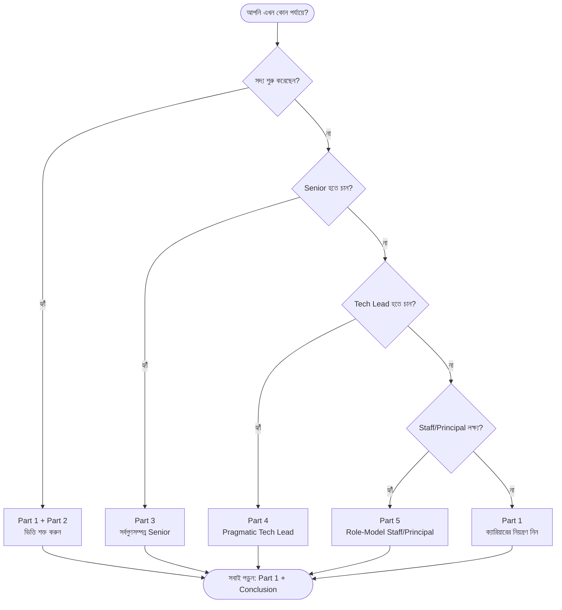

**ক্যারিয়ারের সিঁড়ি — বই যেভাবে সাজানো:**

```
                 ┌─────────────────────────────────────────┐
   Principal  ◄──┤  Part 5: Role-Model Staff & Principal     │  ব্যবসা, প্রভাব, বড় স্কেল
   Staff         └─────────────────────────────────────────┘
                 ┌─────────────────────────────────────────┐
   Tech Lead  ◄──┤  Part 4: The Pragmatic Tech Lead          │  প্রজেক্ট, team, production
                 └─────────────────────────────────────────┘
                 ┌─────────────────────────────────────────┐
   Senior     ◄──┤  Part 3: The Well-Rounded Senior Engineer │  design, testing, collaboration
                 └─────────────────────────────────────────┘
                 ┌─────────────────────────────────────────┐
   Junior     ◄──┤  Part 2: The Competent Software Developer  │  কাজ শেষ করা, ভালো কোড
                 └─────────────────────────────────────────┘
                 ┌─────────────────────────────────────────┐
   সবার ভিত্তি ◄─┤  Part 1: Developer Career Fundamentals     │  ক্যারিয়ার কীভাবে চলে
                 └─────────────────────────────────────────┘
```

---

<a id="toc"></a>

## বিস্তারিত সূচিপত্র (Table of Contents)

<details open>
<summary><b>ভূমিকা ও কাঠামো</b></summary>

- [ভূমিকা — এই বইটি কেন পড়বেন?](#intro)
- [বইয়ের মানচিত্র (Book Map)](#বইয়ের-মানচিত্র-book-map)
- [পড়ার পথ (Reading Paths)](#পড়ার-পথ-reading-paths--আপনি-কোথা-থেকে-শুরু-করবেন)

</details>

<details open>
<summary><b>Part 1 — Developer Career Fundamentals (ক্যারিয়ারের মূল ভিত্তি)</b></summary>

| # | অধ্যায় | এই অধ্যায়ে যা শিখবেন |
|---|--------|------------------------|
| [১](#ch-1) | Career Paths | কোম্পানির ধরন, career ladder, compensation, IC বনাম Management |
| [২](#ch-2) | Owning Your Career | নিজের ক্যারিয়ারের দায়িত্ব নেওয়া, work log, manager সম্পর্ক |
| [৩](#ch-3) | Performance Reviews | মূল্যায়ন কীভাবে হয়, আগে থেকে প্রস্তুতি, calibration |
| [৪](#ch-4) | Promotions | পদোন্নতি কীভাবে অর্জন করবেন, "next level"-এ কাজ করা |
| [৫](#ch-5) | Thriving in Different Environments | আলাদা culture-এ মানিয়ে নেওয়া, remote, toxic পরিবেশ চেনা |
| [৬](#ch-6) | Switching Jobs | কখন ও কীভাবে চাকরি বদলাবেন, interview, negotiation |

</details>

<details open>
<summary><b>Part 2 — The Competent Software Developer (দক্ষ Developer)</b></summary>

| # | অধ্যায় | এই অধ্যায়ে যা শিখবেন |
|---|--------|------------------------|
| [৭](#ch-7) | Getting Things Done | কাজ ভাগ করা, estimation, কখন সাহায্য চাইবেন |
| [৮](#ch-8) | Coding | ভালো কোডের বৈশিষ্ট্য, code review, debugging, refactoring |
| [৯](#ch-9) | Software Development | language দক্ষতা, Git, testing basics, documentation |
| [১০](#ch-10) | Tools of the Productive Engineer | dev environment, terminal, fast iteration, automation |

</details>

<details open>
<summary><b>Part 3 — The Well-Rounded Senior Engineer (সর্বগুণসম্পন্ন Senior)</b></summary>

| # | অধ্যায় | এই অধ্যায়ে যা শিখবেন |
|---|--------|------------------------|
| [১১](#ch-11) | Getting Things Done (Senior) | ownership, prioritization, perception বনাম reality |
| [১২](#ch-12) | Collaboration and Teamwork | technical communication, mentoring, conflict, pairing |
| [১৩](#ch-13) | Software Engineering | design patterns, SOLID, API design, clean abstractions |
| [১৪](#ch-14) | Testing | কেন test, test types, TDD, coverage-এর সঠিক ব্যবহার |
| [১৫](#ch-15) | Software Architecture | architecture patterns, database, caching, trade-off |

</details>

<details open>
<summary><b>Part 4 — The Pragmatic Tech Lead (বাস্তবমুখী Tech Lead)</b></summary>

| # | অধ্যায় | এই অধ্যায়ে যা শিখবেন |
|---|--------|------------------------|
| [১৬](#ch-16) | Project Management | planning, Agile/Scrum বাস্তবে, risk management |
| [১৭](#ch-17) | Shipping in Production | deployment strategy, incident, monitoring, SLO/SLA |
| [১৮](#ch-18) | Stakeholder Management | stakeholder চেনা, PM সম্পর্ক, tech debt বোঝানো |
| [১৯](#ch-19) | Team Structure | Conway's Law, team topology, hiring |
| [২০](#ch-20) | Team Dynamics | psychological safety, performance, onboarding |

</details>

<details open>
<summary><b>Part 5 — Role-Model Staff & Principal Engineers (আদর্শ Staff/Principal)</b></summary>

| # | অধ্যায় | এই অধ্যায়ে যা শিখবেন |
|---|--------|------------------------|
| [২১](#ch-21) | Understanding the Business | business metric, profit/cost center, OKR |
| [২২](#ch-22) | Collaboration (Staff Level) | influence without authority, RFC, cross-team |
| [২৩](#ch-23) | Software Engineering (Staff) | technical strategy, large-scale refactoring, tech debt |
| [২৪](#ch-24) | Reliable Software Systems | reliability, on-call, observability, chaos engineering |
| [২৫](#ch-25) | Software Architecture (Staff) | distributed systems, scalability, DDD, event sourcing |

</details>

<details open>
<summary><b>Bonus, Conclusion ও পরিশিষ্ট</b></summary>

- [Bonus Chapters — প্রতিটি Part-এর জন্য অতিরিক্ত পাঠ](#bonus)
- [Conclusion — উপসংহার ও শেষ বার্তা](#conclusion)
- [পরিশিষ্ট A — পুরো বই এক নজরে (Recap Matrix)](#appendix-recap)
- [পরিশিষ্ট B — Glossary (পরিভাষা)](#appendix-glossary)
- [পরিশিষ্ট C — Career Growth Checklist](#appendix-checklist)
- [পরিশিষ্ট D — রিভিশন প্ল্যান (Spaced Repetition)](#appendix-revision)
- [পরিশিষ্ট E — আরও পড়ার তালিকা (Resources)](#appendix-resources)

</details>

---

<a id="intro"></a>

## ভূমিকা — এই বইটি কেন পড়বেন?

> *"আমার ক্যারিয়ারের শুরুর দিকে আমি ভাবতাম শুধু ভালো কোড লিখলেই সব হয়ে যাবে। অনেক পরে বুঝলাম — ভালো engineer হওয়া আর ভালো ক্যারিয়ার গড়া এক জিনিস নয়।"* — Gergely Orosz (ভাব অনুবাদ)

বেশিরভাগ ভালো বই শেখায় **কীভাবে কোড লিখতে হয়**। এই বই শেখায় **একজন engineer হিসেবে কীভাবে বেড়ে উঠতে হয়** — Entry level থেকে Principal পর্যন্ত। লেখক Gergely Orosz নিজে Uber, Skype, Microsoft-এর মতো জায়গায় engineer ও manager হিসেবে কাজ করেছেন, এবং *The Pragmatic Engineer* newsletter-এর মাধ্যমে হাজার হাজার engineer-এর ক্যারিয়ার কাছ থেকে দেখেছেন। সেই অভিজ্ঞতার নির্যাস এই বই।

### এই বইয়ের মূল দর্শন (যেটা না বুঝলে বাকিটা ফাঁকা)

1. **ভালো কাজ করাই যথেষ্ট নয় — সেটা যেন দেখা যায়, তাও নিশ্চিত করতে হয়।** (Doing great work *and* making it visible.)
2. **আপনার ক্যারিয়ারের মালিক আপনি নিজে।** Manager, কোম্পানি বা ভাগ্য নয়।
3. **প্রতিটি লেভেলে "ভালো engineer"-এর সংজ্ঞা বদলে যায়।** Junior-এ যা প্রশংসা পায়, Staff-এ তা প্রত্যাশা মাত্র।
4. **Soft skill আর technical skill — দুটোই লাগে।** উপরের দিকে গেলে soft skill-এর ওজন বাড়ে।
5. **Context সবকিছু।** Big Tech-এ যা কাজ করে, startup-এ তা নাও করতে পারে।

### এই বইতে কী পাবেন

- একটি পরিষ্কার **Roadmap:** Entry-level থেকে Principal Engineer পর্যন্ত প্রতিটি ধাপে কী লাগে।
- **Career skills:** owning your career, performance review, promotion, চাকরি বদল।
- **Technical skills:** coding, software development, testing, architecture, reliability।
- **Leadership skills:** collaboration, mentoring, project management, stakeholder ও team management।
- **বাস্তব প্রেক্ষাপট:** Big Tech, scaleup, startup — কোথায় কী আলাদা।

### কীভাবে পড়বেন

বইয়ের ৬টি অংশ **স্বাধীনভাবে** পড়া যায় — উপরের [Reading Paths](#পড়ার-পথ-reading-paths--আপনি-কোথা-থেকে-শুরু-করবেন) দেখুন। তবে একটি পরামর্শ: **আপনি এখন যে লেভেলে আছেন, সেই Part + ঠিক তার উপরের Part** পড়ুন। তাহলে আজকের কাজও ভালো হবে, আর সামনের ধাপের জন্যও তৈরি হবেন।

[↑ সূচিপত্রে ফিরুন](#toc)

---

<a id="part-1"></a>

# Part 1 — Developer Career Fundamentals
## ডেভেলপার ক্যারিয়ারের মূল ভিত্তি

> **কাদের জন্য:** সবার জন্য — Fresher থেকে Principal পর্যন্ত। এই Part-এর ধারণাগুলো ক্যারিয়ারের পুরোটা জুড়ে কাজে লাগে।
> **মূল বার্তা:** প্রযুক্তি বদলায়, কিন্তু ক্যারিয়ার কীভাবে চলে তার নিয়ম মোটামুটি একই থাকে। এই নিয়মগুলো আগে বুঝে নিলে বাকি পথটা অনেক সহজ হয়।

এই অংশে ৬টি অধ্যায়। একসাথে এরা একটি প্রশ্নের উত্তর দেয়: **"একজন engineer হিসেবে আমি কীভাবে সচেতনভাবে নিজের ক্যারিয়ার গড়ব — ভাগ্যের উপর ছেড়ে না দিয়ে?"**

```
Part 1-এর যাত্রা:
  মাঠ চেনা (Ch1)  →  দায়িত্ব নেওয়া (Ch2)  →  মূল্যায়ন বোঝা (Ch3)
        →  পদোন্নতি (Ch4)  →  পরিবেশে মানিয়ে নেওয়া (Ch5)  →  দরকারে চাকরি বদল (Ch6)
```

---

<a id="ch-1"></a>

## অধ্যায় ১: Career Paths
### ক্যারিয়ারের পথগুলো

> Part 1 · সব লেভেলের জন্য

### মূল কথা

Software engineering-এ একটাই "সঠিক পথ" নেই। আপনি কোন ধরনের কোম্পানিতে কাজ করবেন, IC (Individual Contributor) থাকবেন নাকি Management-এ যাবেন, কত বেতন পাবেন — এসব নির্ভর করে আপনি কোন **মাঠে** খেলছেন তার উপর। এই অধ্যায় সেই মাঠটা চেনায়: কোম্পানির ধরন, career ladder, compensation কীভাবে ঠিক হয়, আর কেন কিছু engineer একই কাজ করেও দ্বিগুণ বেতন পায়।

---

### ১.১ কোম্পানির ধরন — আপনি কোথায় খেলছেন?

প্রতিটি কোম্পানির ধরনের নিজস্ব গতি, সুবিধা ও সীমাবদ্ধতা আছে। কোনোটা "ভালো" বা "খারাপ" নয় — আপনার লক্ষ্যের সাথে কোনটা মানায়, সেটাই আসল প্রশ্ন।

| ধরন | উদাহরণ | গতি ও culture | শেখার সুযোগ | বেতন/Equity | Career Ladder |
|-----|--------|----------------|--------------|--------------|----------------|
| **Big Tech** | Google, Meta, Amazon, Microsoft, Apple | ধীর, process-ভারী | গভীর, বিশেষায়িত | সর্বোচ্চ (cash + RSU) | খুব স্পষ্ট |
| **Scaleup** (growth-stage) | Stripe, Airbnb (ছোট থাকতে) | দ্রুত, পরিবর্তনশীল | বিস্তৃত, দায়িত্ব বেশি | ভালো cash + মূল্যবান হতে পারে এমন equity | আংশিক স্পষ্ট |
| **Early-stage Startup** | বীজ/সিরিজ-A কোম্পানি | খুব দ্রুত, বিশৃঙ্খল | অনেক কিছু একসাথে | কম cash, বেশি (ঝুঁকিপূর্ণ) equity | প্রায় নেই |
| **Traditional / Enterprise** | Bank, Insurance, Manufacturing | ধীর, স্থিতিশীল | legacy system | স্থিতিশীল, মাঝারি | আছে কিন্তু ধীর |
| **Agency / Consultancy** | client-এর কাজ করে দেয় | client-নির্ভর | অনেক প্রযুক্তি দেখা | মাঝারি | সীমিত |

> `সতর্কতা` নতুনরা প্রায়ই শুধু **বেতন** দেখে কোম্পানি বাছে। কিন্তু ক্যারিয়ারের শুরুতে **শেখার গতি** আর **ভালো mentor** অনেক সময় বেতনের চেয়েও মূল্যবান — কারণ দ্রুত দক্ষ হলে বেতন এমনিতেই আসবে।

---

### ১.২ Career Ladder — সিঁড়িটা কেমন

বেশিরভাগ টেক কোম্পানিতে IC-দের জন্য সিঁড়িটা মোটামুটি এমন (নাম ভিন্ন হতে পারে, ধাপগুলো একই):

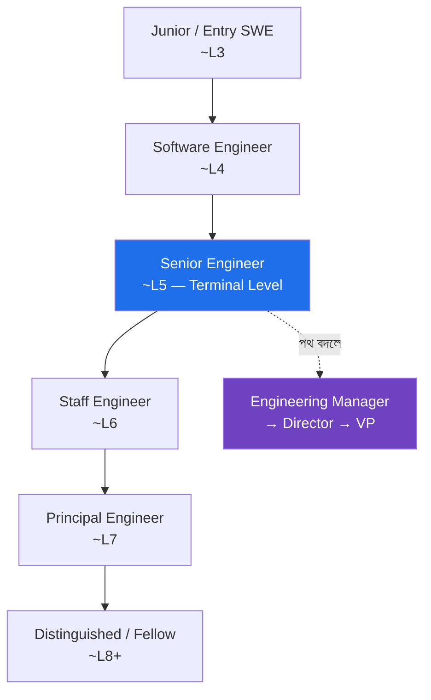

দুটি ধারণা এখানে খুব গুরুত্বপূর্ণ:

- **Terminal Level (Senior):** বেশিরভাগ কোম্পানিতে **Senior** হলো সেই ধাপ যেখানে আপনি চাইলে সারা জীবন থাকতে পারেন — উপরে ওঠার চাপ ("up-or-out") নেই। এর নিচের ধাপগুলোতে সাধারণত নির্দিষ্ট সময়ের মধ্যে উপরে উঠতে হয়, না পারলে সমস্যা। তাই **Senior হওয়াকে প্রথম বড় লক্ষ্য** ধরা উচিত।
- **Staff+ আলাদা খেলা:** Senior পর্যন্ত মূলত "নিজের কাজ ভালো করা।" Staff থেকে শুরু হয় "অন্যদের ও পুরো organization-এর কাজ ভালো করানো" — scope বদলে যায়, শুধু আরও বেশি কোড লেখা নয়।

---

### ১.৩ IC Track বনাম Management Track

Senior-এর পরে দুটি সমান্তরাল পথ — কোনোটা উঁচু-নিচু নয়, শুধু আলাদা:

| | **IC Track** (Staff, Principal) | **Management Track** (Manager, Director) |
|---|--------------------------------|------------------------------------------|
| মূল কাজ | কঠিন technical সমস্যা, system design, প্রযুক্তিগত দিকনির্দেশনা | মানুষ, team, hiring, delivery |
| দিন কাটে | design, coding (কম), প্রভাব বিস্তার | meeting, 1:1, planning |
| সাফল্যের মাপ | technical impact | team-এর impact |
| ফিরে আসা যায়? | হ্যাঁ, অনেকেই দু'দিকে যাওয়া-আসা করে | হ্যাঁ |

> `মূল কথা` Management মানে "promotion" নয় — এটা **ভিন্ন একটা চাকরি**। মানুষ সামলাতে ভালো না লাগলে IC track-এই উঁচুতে যাওয়া যায়। আগে নিজেকে জিজ্ঞেস করুন: "আমি কি কোড আর system নিয়ে গভীরে যেতে চাই, নাকি মানুষ ও দল গড়তে?"

---

### ১.৪ Compensation — বেতন আসলে কীভাবে ঠিক হয়

Tech compensation সাধারণত ৪ ভাগে ভাগ — একে বলে **Total Compensation (TC)**:

```
Total Comp  =  Base Salary  +  Bonus  +  Equity (RSU/Options)  +  Benefits
                (মাসিক নগদ)   (বার্ষিক)   (কোম্পানির শেয়ার)      (insurance ইত্যাদি)
```

- **Base:** নিশ্চিত নগদ। startup-এ বেশি গুরুত্ব, Big Tech-এ মোট প্যাকেজের অংশ।
- **Equity:** Big Tech-এ RSU (নির্দিষ্ট শেয়ার, কয়েক বছরে vest হয়)। Startup-এ Options (ভবিষ্যতে কিনে নেওয়ার অধিকার — মূল্যবান হতে পারে, আবার শূন্যও হতে পারে)।
- **Bonus:** পারফরম্যান্স বা কোম্পানির ফলাফলের উপর।

**Gergely-র বিখ্যাত ধারণা — Trimodal Compensation:** একই দেশে, একই অভিজ্ঞতার engineer-দের বেতন একটা সরল রেখা নয় — বাজারে কার্যত **তিনটি আলাদা স্তর/চূড়া** আছে:

```
সংখ্যা
  ▲
  │      ┌──┐                ┌──┐
  │      │  │      ┌──┐      │  │
  │  ┌──┐│  │      │  │      │  │      ┌──┐
  │  │  ││  │      │  │      │  │      │  │
  └──┴──┴┴──┴──────┴──┴──────┴──┴──────┴──┴────►  বেতন
      Tier 1         Tier 2         Tier 3
   (Traditional/   (ভালো local/   (Big Tech /
    small startup)  scaleup)        top scaleup)
```

মূল শিক্ষা: **আপনি কোন "tier"/বাজারে আবেদন করছেন সেটাই বেতনের সবচেয়ে বড় নির্ধারক** — আপনার skill যত ভালোই হোক। তাই Tier 2 থেকে Tier 3-এ লাফ দিলে একই কাজ করে বেতন বহুগুণ বাড়তে পারে। ভৌগোলিক অবস্থান ও remote নীতিও বড় প্রভাব ফেলে।

---

### ১.৫ Profit Center বনাম Cost Center (খুব গুরুত্বপূর্ণ)

কোম্পানির চোখে আপনার team টাকা **আনে**, নাকি টাকা **খরচ করে** — এটা আপনার growth ও নিরাপত্তায় বিরাট প্রভাব ফেলে।

| | **Profit Center** | **Cost Center** |
|---|-------------------|------------------|
| ভূমিকা | সরাসরি আয়/revenue তৈরি করে | support/maintenance |
| উদাহরণ | payments, ads, মূল product | internal tools, IT support |
| ভালো সময়ে | বেশি বাজেট, দ্রুত growth | মোটামুটি |
| খারাপ সময়ে | তুলনামূলক নিরাপদ | আগে এখানেই কাটছাঁট হয় |

> `মূল কথা` সম্ভব হলে এমন team/product-এ কাজ করুন যেটা কোম্পানির **আয়ের কাছাকাছি** (profit center)। সেখানে বাজেট, দৃশ্যমানতা, promotion ও চাকরির নিরাপত্তা — সবই বেশি। Cost center-এ ভালো কাজ করেও প্রায়ই কম স্বীকৃতি মেলে।

---

### ১.৬ Career Capital — যা আসলে জমা হয়

প্রতিটি চাকরিতে তিন ধরনের "পুঁজি" জমে। বেতনের পাশাপাশি এগুলোও মাপুন:

- **Skills (দক্ষতা):** technical + non-technical।
- **Relationships (সম্পর্ক):** যাদের সাথে কাজ করেছেন, যারা আপনার কাজ চেনেন।
- **Reputation (সুনাম):** আপনার নামের সাথে কোন কাজ/মান যুক্ত।

ভালো ক্যারিয়ার সিদ্ধান্ত = এই তিনটির অন্তত একটিতে বড় বিনিয়োগ। শুধু বেশি বেতনের জন্য এমন জায়গায় যাওয়া যেখানে তিনটিই কমে — দীর্ঘমেয়াদে ক্ষতি।

---

### নিজেকে যাচাই করুন

1. পাঁচ ধরনের কোম্পানির মধ্যে পার্থক্য কী, এবং একজন নতুন engineer-এর জন্য কোনটা কেন ভালো হতে পারে?
2. "Terminal Level" বলতে কী বোঝায়, এবং কেন Senior হওয়াকে প্রথম বড় লক্ষ্য ধরা উচিত?
3. IC ও Management track-এর মূল পার্থক্য কী? Management কি promotion?
4. Trimodal compensation কী বলে — এবং এটি আপনার চাকরি খোঁজার কৌশলে কীভাবে কাজে লাগে?
5. Profit center ও cost center-এর মধ্যে আপনার team কোনটি — এবং তা আপনার growth-এ কী প্রভাব ফেলছে?

[↑ সূচিপত্রে ফিরুন](#toc)

---

<a id="ch-2"></a>

## অধ্যায় ২: Owning Your Career
### নিজের ক্যারিয়ারের দায়িত্ব নেওয়া

> Part 1 · সব লেভেলের জন্য

### মূল কথা

আপনার ক্যারিয়ার নিয়ে আপনার চেয়ে বেশি কেউ ভাবে না — manager-ও না। তাই "ভালো কাজ করলে কেউ একদিন খেয়াল করবে" — এই আশায় বসে থাকা ভুল। এই অধ্যায়ের শিক্ষা: **চমৎকার কাজ করুন, সেই কাজ দৃশ্যমান করুন, নিয়মিত feedback নিন, manager-এর সাথে ভালো সম্পর্ক রাখুন, এবং সচেতনভাবে নিজের growth-এর সুযোগ তৈরি করুন।**

---

### ২.১ দায়িত্বটা আপনার — manager-এর নয়

Manager সাহায্য করতে পারে, পথ দেখাতে পারে — কিন্তু আপনার growth-এর **মালিক আপনি**। Manager বদলায়, কোম্পানির অগ্রাধিকার বদলায়, reorg হয়। এসবের মধ্যে যা স্থির থাকে, তা হলো আপনার নিজের সিদ্ধান্ত।

```
ভুল মানসিকতা:  "আমি কাজ করব, manager আমার ক্যারিয়ার সামলাবে।"
সঠিক মানসিকতা: "আমি আমার ক্যারিয়ার চালাব, manager আমার partner।"
```

---

### ২.২ Execute with Excellence — আগে কাজটা দারুণভাবে করুন

বাকি সব কৌশলের ভিত্তি একটাই: **আপনার বর্তমান কাজটা ধারাবাহিকভাবে ভালো করা।** দৃশ্যমানতা বা networking — কোনোটাই দুর্বল কাজ ঢাকতে পারে না। আগে কাজে নির্ভরযোগ্য হোন, তারপর বাকিটা।

---

### ২.৩ কাজ দৃশ্যমান করা (Visibility) — ঢোল পেটানো নয়

"নিজের কাজ দেখানো" মানে অহংকার নয় — এটা **তথ্য জানানো**, যাতে সিদ্ধান্ত নেওয়ার মানুষ সঠিক ছবি পায়। কয়েকটি সহজ উপায়:

- যা করছেন, তা team/manager-কে নিয়মিত জানান (demo, update, short write-up)।
- বড় কাজ শেষ হলে এক প্যারায় "কী করেছি, কী impact" লিখে শেয়ার করুন।
- অন্যকে সাহায্য করলে সেটাও কাজের অংশ — তা যেন আড়ালে না থাকে।

> `সতর্কতা` "Quiet, hardworking" engineer প্রায়ই promotion-এ পিছিয়ে পড়ে — কাজ ভালো হওয়া সত্ত্বেও, কারণ সিদ্ধান্তদাতারা সেই কাজ **দেখতে পায় না**। নীরবে ভালো কাজ করা যথেষ্ট নয়।

---

### ২.৪ Work Log / Brag Document রাখা

সারা বছর ছোট ছোট সাফল্য মনে থাকে না — review-এর সময় এগুলোই দরকার হয়। তাই একটা চলমান **Work Log** রাখুন:

```
┌──────────────── Work Log (প্রতি ১–২ সপ্তাহে আপডেট) ─────────────────┐
│ তারিখ │ কী করেছি              │ Impact (সংখ্যায়/ফলাফলে)   │ কে উপকৃত │
│ ------ │ --------------------- │ ------------------------- │ -------- │
│ মে ১২  │ checkout bug ফিক্স     │ drop-off ৮% কমেছে          │ payments │
│ মে ২৬  │ নতুন dev onboard       │ ২ দিনে productive হয়েছে    │ team     │
└────────────────────────────────────────────────────────────────────┘
```

এই log তিনভাবে কাজে লাগে: (১) performance review সহজ হয়, (২) promotion case শক্ত হয়, (৩) নিজের growth নিজেই দেখতে পান।

---

### ২.৫ Feedback — চেয়ে নিন, অপেক্ষা করবেন না

Feedback growth-এর সবচেয়ে দ্রুত পথ। কিন্তু বেশিরভাগ মানুষ নিজে থেকে কড়া feedback দেয় না — তাই **চেয়ে নিতে হয়**:

- নির্দিষ্ট প্রশ্ন করুন: "এই project-এ আমি আরও ভালো কী করতে পারতাম?" ("সব ঠিক আছে?" নয়)।
- Feedback পেলে আত্মরক্ষায় না গিয়ে শুনুন, ধন্যবাদ দিন, তারপর ভাবুন।
- অন্যকেও সদয়, নির্দিষ্ট feedback দিন — এতে আপনি নির্ভরযোগ্য teammate হিসেবে পরিচিত হবেন।

---

### ২.৬ Manager-এর সাথে সম্পর্ক ও "Managing Up"

Manager আপনার শত্রু বা শুধু বস নয় — সঠিকভাবে কাজে লাগালে সবচেয়ে বড় সহযোগী। 1:1 meeting-গুলো শুধু status update নয়, কাজে লাগান এভাবে:

- নিজের লক্ষ্য, বাধা ও প্রত্যাশা স্পষ্ট জানান।
- Manager-কে সাহায্য করতে দিন: "এই বিষয়ে আমার আপনার সাহায্য দরকার।"
- **Managing Up:** manager কীভাবে কাজ করতে পছন্দ করে বুঝে নিন, এবং তাকে যথাসময়ে সঠিক তথ্য দিন যাতে সে আপনার হয়ে ভালো সিদ্ধান্ত নিতে পারে।

---

### ২.৭ Mentor বনাম Sponsor (পার্থক্যটা গুরুত্বপূর্ণ)

| | **Mentor** | **Sponsor** |
|---|-----------|-------------|
| কী করে | পরামর্শ দেয়, পথ দেখায় | আপনার হয়ে ঘরে (যেখানে আপনি নেই) কথা বলে |
| উদাহরণ | "এভাবে design করো" | calibration-এ আপনার promotion-এর পক্ষে দাঁড়ায় |
| কীভাবে পাবেন | জিজ্ঞেস করে | ভালো কাজ + দৃশ্যমানতা দিয়ে অর্জন করে |

> `মূল কথা` Mentor দরকারি, কিন্তু **Sponsor** আসলে promotion আনে — কারণ গুরুত্বপূর্ণ সিদ্ধান্ত যে ঘরে হয়, সেখানে কেউ আপনার নাম নেয়। Sponsor অর্জন করতে হয়: এমন কাজ করুন যা senior কেউ নিজের নাম দিয়ে সমর্থন করতে রাজি হয়।

---

### ২.৮ Stretch · Execute · Coast — একটি ভূমিকার তিন পর্যায়

যেকোনো ভূমিকায় সময়ের সাথে আপনি তিন পর্যায়ের মধ্য দিয়ে যান:

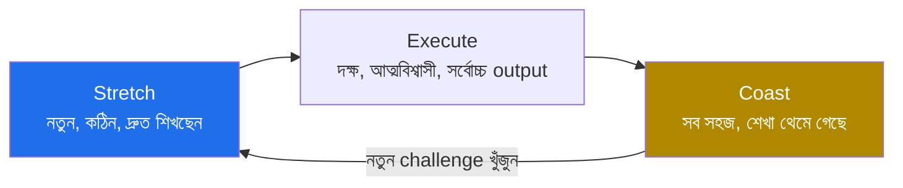

- **Stretch:** কাজ আপনার বর্তমান সামর্থ্যের চেয়ে বড় — অস্বস্তিকর, কিন্তু এখানেই growth সবচেয়ে বেশি।
- **Execute:** এখন দক্ষ, ধারাবাহিকভাবে ভালো output দিচ্ছেন। বেশিরভাগ ভালো সময় এখানে কাটে।
- **Coast:** সব মুখস্থ হয়ে গেছে, নতুন কিছু শিখছেন না। অল্প সময় ঠিক আছে (বিশ্রাম), কিন্তু বেশিদিন থাকলে growth থেমে যায় — তখন নতুন stretch খোঁজা উচিত।

---

### নিজেকে যাচাই করুন

1. "ক্যারিয়ারের দায়িত্ব নিজের" — এই কথাটা বাস্তবে কোন ৩টি অভ্যাসে রূপ নেয়?
2. কাজ "দৃশ্যমান করা" আর "ঢোল পেটানো" — পার্থক্যটা কীভাবে বোঝাবেন?
3. Work log কেন রাখবেন, এবং তাতে কোন ৩টি তথ্য থাকা জরুরি?
4. Mentor ও Sponsor-এর পার্থক্য কী, এবং কোনটি সাধারণত promotion আনে?
5. Stretch–Execute–Coast চক্রে আপনি এখন কোথায়, এবং পরের পদক্ষেপ কী হওয়া উচিত?

[↑ সূচিপত্রে ফিরুন](#toc)

---

<a id="ch-3"></a>

## অধ্যায় ৩: Performance Reviews
### পারফরম্যান্স মূল্যায়ন

> Part 1 · সব লেভেলের জন্য

### মূল কথা

Performance review হলো সেই আনুষ্ঠানিক প্রক্রিয়া যেখানে আপনার কাজ মূল্যায়ন হয় — যার সাথে যুক্ত থাকে বেতন বৃদ্ধি, bonus ও promotion। এটি ভাগ্যের ব্যাপার নয়; এটি **আগে থেকে প্রস্তুতি নেওয়া যায় এমন একটি খেলা**। যে engineer প্রক্রিয়াটা বোঝে এবং সারা বছর প্রমাণ জমিয়ে রাখে, সে কখনো review-তে চমকে যায় না।

---

### ৩.১ Review কী এবং কেন গুরুত্বপূর্ণ

বছরে এক বা দুইবার (কখনো ত্রৈমাসিক) কোম্পানি আনুষ্ঠানিকভাবে দেখে — আপনি প্রত্যাশা কতটা পূরণ করেছেন। এর ফলাফল সরাসরি প্রভাব ফেলে:

- বেতন বৃদ্ধি (raise) ও bonus
- Promotion-এর সিদ্ধান্ত
- কোম্পানির চোখে আপনার "track record"

---

### ৩.২ Review আসলে যেভাবে চলে

বেশিরভাগ বড় কোম্পানিতে প্রক্রিয়াটা ধাপে ধাপে:

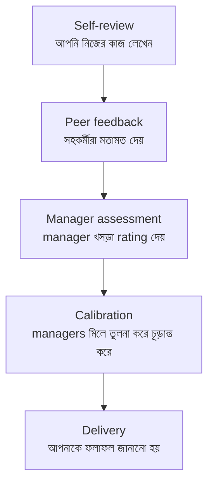

প্রতিটি ধাপে আপনার করণীয় আছে — বিশেষত **Self-review**, কারণ এখানেই আপনি নিজের গল্পটা বলার সুযোগ পান।

---

### ৩.৩ Review-এর আগে কী করবেন

- **Work log কাজে লাগান:** সারা বছরের অর্জন আগে থেকেই গোছানো থাকলে self-review লেখা সহজ।
- **প্রত্যাশার সাথে মেলান:** আপনার level-এর জন্য কোম্পানির competency/expectation কী, আর আপনার কাজ সেগুলোর কোনটা পূরণ করেছে — সরাসরি মিলিয়ে দেখান।
- **Impact দেখান, activity নয়:** "আমি ১০টা ticket করেছি" নয় — "আমার কাজে X মেট্রিক Y% উন্নত হয়েছে।"
- **প্রমাণ যোগ করুন:** সংখ্যা, link, অন্যদের প্রশংসা — যাচাইযোগ্য তথ্য।

> `উদাহরণ` দুর্বল: "Checkout নিয়ে কাজ করেছি।" শক্তিশালী: "Checkout-এর একটি bug ঠিক করে cart abandonment ৮% কমিয়েছি, যা আনুমানিক মাসে X রাজস্ব যোগ করেছে — payments team এটি নিশ্চিত করেছে।"

---

### ৩.৪ Goals — লক্ষ্য নির্ধারণ

ভালো goal একই সাথে **অর্জনযোগ্য** আর **stretch** — খুব সহজ হলে শেখা হয় না, অসম্ভব হলে হতাশা আসে। goal লিখুন এমনভাবে যাতে শেষে স্পষ্ট বলা যায় "হয়েছে নাকি হয়নি" (পরিমাপযোগ্য)।

```
দুর্বল goal:   "Backend-এ আরও ভালো হব।"
শক্ত goal:    "Q3-এর মধ্যে orders service-এর p95 latency 400ms → 200ms-এ নামাব।"
```

---

### ৩.৫ Feedback Loop — সারা বছরের, রিভিউয়ের দিনের নয়

সবচেয়ে বড় নীতি: **No surprises (কোনো চমক নয়)**। Review-এর দিন প্রথমবার কোনো সমস্যা শুনলে — সেটা manager-এর ব্যর্থতা, কিন্তু ভোগান্তি আপনার। তাই:

- নিয়মিত 1:1-এ জিজ্ঞেস করুন "আমি এখন কেমন করছি, কোথায় উন্নতি দরকার?"
- সমস্যা থাকলে আগেভাগে জেনে, সময় নিয়ে ঠিক করুন — review-এর আগেই।

---

### ৩.৬ Calibration — চূড়ান্ত rating আসলে যেখানে ঠিক হয়

আপনার rating শুধু আপনার manager ঠিক করে না। **Calibration** মিটিংয়ে একাধিক manager একসাথে বসে নিজ নিজ team-এর মানুষদের তুলনা করে, যাতে rating সব team-জুড়ে ন্যায্য হয়।

```
       Calibration Room
   ┌───────────────────────────┐
   │  Mgr A: "আমার X নিচ্ছে top" │
   │  Mgr B: "কেন? প্রমাণ কী?"   │  ←  এখানেই Sponsor ও দৃশ্যমান
   │  Mgr C: "Y-ও তো একই কাজ..." │      প্রমাণ কাজে লাগে
   └───────────────────────────┘
```

এর অর্থ দুটি:
1. আপনার manager-কে আপনার হয়ে **লড়ার মতো প্রমাণ** দিতে হবে — তাই work log ও impact-গল্প জরুরি।
2. অন্য team-এর কেউ (Sponsor) আপনার পক্ষে কথা বললে তা বড় ভূমিকা রাখে।

---

### ৩.৭ Rating Scale ও Distribution

বেশিরভাগ কোম্পানিতে rating একটি স্কেলে — যেমন: *Below / Meets / Exceeds / Greatly Exceeds*। কিছু কোম্পানি **forced distribution** ব্যবহার করে (যেমন: মাত্র ১০% "top" পেতে পারে) — মানে শুধু ভালো করলেই হবে না, **আপেক্ষিকভাবে** অন্যদের চেয়ে ভালো করতে হবে।

ফলাফল নিয়ে কী করবেন:
- **ভালো review:** কৃতজ্ঞ থাকুন, কিন্তু থেমে যাবেন না — পরের level-এর প্রত্যাশা জিজ্ঞেস করুন।
- **খারাপ review:** আত্মরক্ষায় না গিয়ে নির্দিষ্ট জানতে চান — "কোন আচরণ বদলালে next time 'Meets/Exceeds' হবে?" তারপর সেটার উপর কাজ করুন এবং অগ্রগতি দৃশ্যমান করুন।

---

### নিজেকে যাচাই করুন

1. Performance review-এর ৫টি ধাপ কী কী, এবং কোন ধাপে আপনার সবচেয়ে বেশি নিয়ন্ত্রণ থাকে?
2. Self-review-তে "impact" আর "activity"-র পার্থক্য একটি উদাহরণ দিয়ে বোঝান।
3. "No surprises" নীতি মানে কী, এবং এটি নিশ্চিত করতে আপনি বছরজুড়ে কী করবেন?
4. Calibration কী, এবং এটি কেন আপনার manager ও Sponsor-কে গুরুত্বপূর্ণ করে তোলে?
5. Forced distribution থাকলে কৌশল কীভাবে বদলায়?

[↑ সূচিপত্রে ফিরুন](#toc)

---

<a id="ch-4"></a>

## অধ্যায় ৪: Promotions
### পদোন্নতি

> Part 1 · সব লেভেলের জন্য

### মূল কথা

Promotion হলো কোম্পানির স্বীকৃতি যে আপনি **ইতিমধ্যেই পরের level-এর কাজ করছেন** — এটা ভবিষ্যতের প্রতিশ্রুতির পুরস্কার নয়। তাই promotion পাওয়ার সবচেয়ে নিশ্চিত উপায়: পরের level-এর দায়িত্ব **আগে থেকে** নেওয়া শুরু করা, সেই কাজ দৃশ্যমান করা, এবং manager-এর সাথে মিলে একটা শক্ত প্রমাণভিত্তিক case তৈরি করা। শুধু বর্তমান কাজ আরও বেশি করে করলে promotion আসে না।

---

### ৪.১ Promotion আসলে কীভাবে হয়

```
ভুল ধারণা:  বর্তমান level-এ আরও পরিশ্রম  →  promotion  →  পরের level-এর কাজ
সঠিক বাস্তবতা: পরের level-এর কাজ শুরু করা  →  ধারাবাহিকভাবে প্রমাণ  →  promotion (স্বীকৃতি)
```

বিশেষত Senior এবং তার উপরে — কোম্পানি ঝুঁকি নিতে চায় না। তারা দেখতে চায় আপনি **এখনই** পরের level-এ নির্ভরযোগ্যভাবে কাজ করছেন, তবেই সেই title ও বেতন দেয়।

---

### ৪.২ "Next Level"-এ কাজ করা মানে কী

প্রতিটি level-এ scope বাড়ে — দায়িত্বের পরিধি বড় হয়:

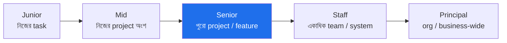

পরের level-এ কাজ শুরু করা মানে: ছোট কাজের পাশাপাশি **একটু বড় scope-এর সমস্যা** নিজে থেকে তুলে নেওয়া, অন্যদের ব্লক সরানো, এবং নিজের কাজের বাইরেও impact রাখা।

---

### ৪.৩ Promotion-এর জন্য যা যা লাগে

| উপাদান | মানে |
|--------|------|
| **Scope & Impact** | পরের level-এর আকারের সমস্যা সমাধান, দৃশ্যমান ফলাফলসহ |
| **Consistency** | এক-দুইবার নয়, কয়েক মাস/কোয়ার্টার ধরে ধারাবাহিকভাবে |
| **Peer recognition** | সহকর্মীরাও আপনাকে পরের level-এর মতো দেখে |
| **Sponsor** | senior কেউ calibration-এ আপনার হয়ে দাঁড়ায় |
| **Manager alignment** | manager আগেই জানে এবং case গোছাতে সাহায্য করছে |
| **Headcount/budget** | কোম্পানির পক্ষে তখন promotion দেওয়া সম্ভব (আপনার নিয়ন্ত্রণের বাইরে) |

> `মূল কথা` Manager-এর সাথে **আগে থেকে** কথা বলুন: "Senior হতে আমার আর কী দেখাতে হবে?" তারপর সেই ফাঁকগুলো পূরণের প্রমাণ জমান। promotion-কে একটা যৌথ project হিসেবে দেখুন, গোপন আশা হিসেবে নয়।

---

### ৪.৪ সাধারণ ভুলগুলো (Pitfalls)

- **আরও খাটুনি, একই level-এর কাজ:** বেশি ticket বন্ধ করা ≠ পরের level। scope বাড়াতে হবে, গতি নয়।
- **নীরবে কাজ করা:** দৃশ্যমানতা ছাড়া ভালো কাজও calibration-এ হারিয়ে যায়।
- **ভুল project বাছা:** কম-প্রভাবের কাজ যত ভালোই করুন, promotion-case দুর্বল থাকে। promotion-worthy, দৃশ্যমান project বাছুন।
- **নিষ্ক্রিয় অপেক্ষা:** "সময় হলে দেবে" — না চাইলে, না দেখালে অনেক সময় হয় না।
- **শুধু technical, soft skill শূন্য:** উপরের level-এ collaboration/communication ছাড়া আটকে যায়।

---

### ৪.৫ Timeline — কত সময় লাগে

```
Junior → Mid        : তুলনামূলক দ্রুত, প্রায় প্রত্যাশিত (১–২ বছর)
Mid → Senior        : মাঝারি, সবচেয়ে গুরুত্বপূর্ণ ধাপ (২–৩+ বছর)
Senior → Staff      : ধীর, নিশ্চিত নয় — scope ও সুযোগের উপর নির্ভর
Staff → Principal   : বিরল, অনেকটাই organizational প্রয়োজন ও impact-নির্ভর
```

> `সতর্কতা` Senior-এর পরে promotion আর "স্বয়ংক্রিয়" নয়। Staff/Principal হওয়ার সুযোগ কোম্পানিতে আছে কিনা, প্রয়োজন আছে কিনা — তার উপর অনেকটা নির্ভর করে। ভালো করেও সময়মতো না হলে হতাশ না হয়ে — সুযোগ আছে এমন জায়গা/scope খোঁজা যুক্তিযুক্ত।

---

### নিজেকে যাচাই করুন

1. "Promotion ভবিষ্যতের পুরস্কার নয়, বর্তমানের স্বীকৃতি" — এই বাক্যটি কৌশলগতভাবে কী বদলে দেয়?
2. পরের level-এ কাজ করা মানে কী — "আরও বেশি কাজ" কেন যথেষ্ট নয়?
3. Promotion case-এর জন্য কোন উপাদানগুলো লাগে, এবং কোনটি আপনার নিয়ন্ত্রণের বাইরে?
4. Promotion-এর ৩টি সাধারণ ভুল কী, এবং কীভাবে এড়াবেন?
5. কেন Senior-এর পরের promotion আর "স্বয়ংক্রিয়" থাকে না?

[↑ সূচিপত্রে ফিরুন](#toc)

---

<a id="ch-5"></a>

## অধ্যায় ৫: Thriving in Different Environments
### বিভিন্ন পরিবেশে সফল হওয়া

> Part 1 · সব লেভেলের জন্য

### মূল কথা

প্রতিটি কোম্পানির নিজস্ব **culture ও অলিখিত নিয়ম** আছে। এক জায়গায় যে আচরণে সফল হয়েছিলেন, অন্য জায়গায় সেটাই ব্যর্থতার কারণ হতে পারে। সফল engineer-রা নতুন পরিবেশে গিয়ে আগে **পড়ে নেয়** — এখানে কী মূল্যবান, কাজ আসলে কীভাবে হয় — তারপর সেই অনুযায়ী মানিয়ে নেয়। আর কিছু পরিবেশ সত্যিই toxic — সেগুলো চিনে বেরিয়ে আসতে জানাও একটা দক্ষতা।

---

### ৫.১ প্রতিটি Culture আলাদা — আগে পড়ুন

নতুন জায়গায় (বা নতুন team-এ) প্রথম কয়েক সপ্তাহ পর্যবেক্ষণে দিন। নিজেকে জিজ্ঞেস করুন:

- এখানে কী **পুরস্কৃত** হয় — গতি, নাকি নিখুঁততা, নাকি consensus?
- সিদ্ধান্ত কীভাবে হয় — উপর থেকে নির্দেশ, নাকি আলোচনা করে?
- কাজ আসলে কীভাবে এগোয় — অফিসিয়াল process, নাকি কিছু মানুষের মাধ্যমে?
- কোন ধরনের communication চলে — বেশি লিখিত (async), নাকি বেশি মিটিং?

```
নতুন পরিবেশে কৌশল:
   পর্যবেক্ষণ (Observe)  →  অলিখিত নিয়ম বোঝা (Decode)  →  মানিয়ে নেওয়া (Adapt)  →  তারপর পরিবর্তন আনা (Influence)
```

> `সতর্কতা` নতুন এসেই "আমার আগের কোম্পানিতে আমরা এভাবে করতাম" বলে সবকিছু বদলাতে চাওয়া — দ্রুত আস্থা হারানোর সবচেয়ে সহজ উপায়। আগে বিশ্বাস অর্জন করুন, তারপর পরিবর্তন প্রস্তাব করুন।

---

### ৫.২ Big Tech বনাম Startup — কাজের ধরন

| | **Big Tech** | **Startup** |
|---|--------------|-------------|
| গতি | ধীর, মাপা | দ্রুত, পরিবর্তনশীল |
| Process | অনেক | কম |
| Scope স্পষ্টতা | পরিষ্কার role | অস্পষ্ট, "যা দরকার তা-ই" |
| সাফল্যের চাবি | process মেনে নিখুঁত execution + alignment | দ্রুত শেখা, নিজে থেকে দায়িত্ব নেওয়া |

একই engineer দু'জায়গায় ভিন্ন আচরণে সফল হয় — কোনোটা "ভালো" নয়, কেবল ভিন্ন।

---

### ৫.৩ Remote ও Hybrid পরিবেশ

Remote-এ visibility ও যোগাযোগ স্বাভাবিকভাবেই কঠিন — তাই সচেতন প্রচেষ্টা লাগে:

- **Over-communicate:** যা করছেন লিখে জানান; "চুপচাপ কাজ" remote-এ আরও বেশি অদৃশ্য।
- **Async-first:** পরিষ্কার লিখিত update, document, decision-log — যাতে সবাই নিজের সময়ে বুঝতে পারে।
- **ইচ্ছাকৃত সম্পর্ক:** করিডোরে দেখা হয় না, তাই 1:1, casual chat নিজে থেকে আয়োজন করুন।
- **লিখিত culture:** ভালো লেখা remote-এ সবচেয়ে বড় superpower।

```
   In-office: কাজ দেখা যায় এমনিতেই  │  Remote: কাজ "দেখাতে" হয় লিখে
```

---

### ৫.৪ Toxic Environment চেনা ও সিদ্ধান্ত নেওয়া

কিছু সতর্কসংকেত — কয়েকটি থাকলে সাবধান, অনেকগুলো একসাথে থাকলে বেরিয়ে আসার কথা ভাবুন:

```
⚠ Toxic-এর লক্ষণ:
  • দোষারোপের culture — ভুল হলে শেখা নয়, কাকে দোষ দেওয়া যায় তা খোঁজা
  • Psychological safety নেই — প্রশ্ন/দ্বিমত করলে শাস্তি
  • সবসময় আগুন নেভানো — কোনো দীর্ঘমেয়াদি পরিকল্পনা নেই
  • Growth/feedback নেই — কেউ আপনার উন্নতির কথা ভাবে না
  • উচ্চ attrition — ভালো মানুষ একের পর এক চলে যাচ্ছে
  • অসম্ভব প্রত্যাশা + burnout স্বাভাবিক ধরা হয়
```

> `মূল কথা` Toxic পরিবেশে "আরও পরিশ্রম করে ঠিক করে ফেলব" — প্রায়ই কাজ করে না, বরং আপনাকে নিঃশেষ করে। নিজের সুস্থতা ও ক্যারিয়ার রক্ষা করাও পেশাদারিত্বের অংশ। দরকারে internal transfer বা চাকরি বদল (Ch 6) বিবেচনা করুন।

---

### নিজেকে যাচাই করুন

1. নতুন পরিবেশে "Observe → Decode → Adapt → Influence" ধাপগুলো কেন এই ক্রমেই করা উচিত?
2. Big Tech-এ সফল করে এমন কোন আচরণ startup-এ ব্যর্থ করতে পারে (বা উল্টোটা)?
3. Remote-এ visibility ধরে রাখতে কোন ৩টি অভ্যাস জরুরি?
4. Toxic environment-এর ৪টি লক্ষণ বলুন। "আরও পরিশ্রম করে ঠিক করব" কেন সবসময় কাজ করে না?

[↑ সূচিপত্রে ফিরুন](#toc)

---

<a id="ch-6"></a>

## অধ্যায় ৬: Switching Jobs
### চাকরি পরিবর্তন

> Part 1 · সব লেভেলের জন্য

### মূল কথা

চাকরি বদলানো ক্যারিয়ারের একটি স্বাভাবিক ও শক্তিশালী হাতিয়ার — কিন্তু এটি **কৌশলে** করতে হয়, আবেগে নয়। কখন বদলাবেন (এবং কখন থাকবেন), কীভাবে interview-এর জন্য প্রস্তুত হবেন, কীভাবে একাধিক offer-কে leverage বানিয়ে সম্মানজনকভাবে negotiate করবেন, আর কীভাবে সম্পর্ক নষ্ট না করে ভালোভাবে চলে আসবেন — এই অধ্যায় সেই পুরো প্রক্রিয়া।

---

### ৬.১ কখন চাকরি বদলাবেন (এবং কখন নয়)

বদলানোর ভালো কারণ:

- **Growth থেমে গেছে** — শেখা বন্ধ, নতুন challenge নেই (দীর্ঘ "Coast" পর্যায়)।
- **বেতন বাজারের অনেক নিচে** — বিশেষত ভেতরে raise সীমিত হলে।
- **কোনো পথ নেই** — আপনার লক্ষ্যের দিকে এখানে এগোনোর সুযোগ নেই।
- **পরিবেশ toxic** (Ch 5) — এবং বদলানোর সম্ভাবনা কম।
- **জীবনের প্রয়োজন বদলেছে** — location, remote, ভিন্ন domain।

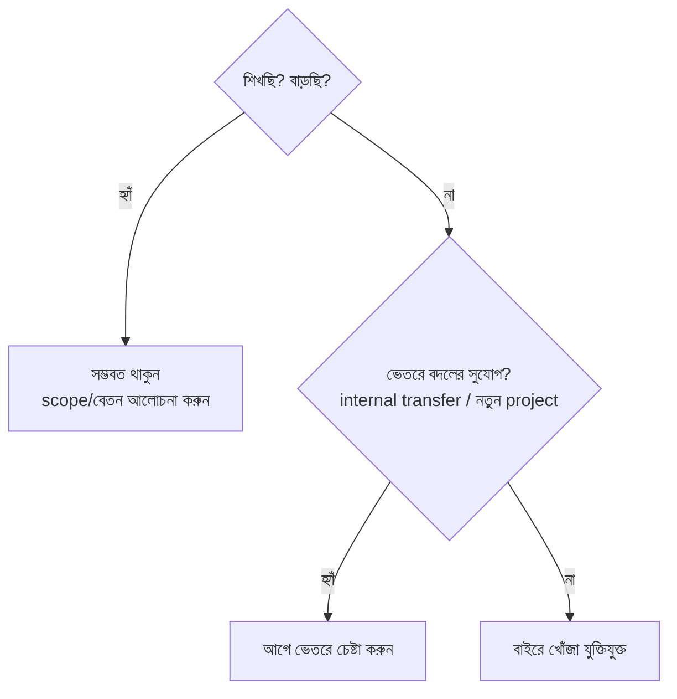

> `সতর্কতা` দুই বিপদ: (১) **খুব ঘন ঘন বদল** — কোথাও গভীরে যাওয়া হয় না, "job hopper" ছাপ পড়ে। (২) **খুব বেশি দিন থেকে যাওয়া** — growth ও বেতন দুটোই আটকে যায়। ভারসাম্য খুঁজুন। বদলানোর আগে **internal transfer**-ও একটা শক্তিশালী বিকল্প।

---

### ৬.২ Interview-এর জন্য প্রস্তুতি

বেশিরভাগ tech interview loop-এ কয়েকটি অংশ থাকে:

```
   ┌─────────────┐   ┌──────────────┐   ┌────────────────┐
   │ Coding /     │   │ System       │   │ Behavioral /    │
   │ DSA round    │   │ Design round │   │ Leadership      │
   │ (algorithm)  │   │ (architecture)│  │ (অতীত অভিজ্ঞতা) │
   └─────────────┘   └──────────────┘   └────────────────┘
```

- **Coding/DSA:** নিয়মিত অনুশীলন; সমস্যা পড়া, edge case ধরা, পরিষ্কার কোড, জোরে চিন্তা করা (think aloud)।
- **System Design:** trade-off নিয়ে কথা বলা — কোনো "একমাত্র সঠিক উত্তর" নেই; প্রশ্ন স্পষ্ট করা, requirement → high-level design → গভীরে যাওয়া।
- **Behavioral:** নির্দিষ্ট গল্প তৈরি রাখুন (STAR: Situation, Task, Action, Result)। work log এখানেও কাজে লাগে।

---

### ৬.৩ Offer ও Negotiation

কয়েকটি মূলনীতি:

- **সবসময় (ভদ্রভাবে) negotiate করুন।** প্রথম offer প্রায়ই চূড়ান্ত নয়; না চাইলে অনেক কিছু টেবিলে থেকে যায়।
- **একাধিক offer = leverage।** সম্ভব হলে কয়েকটি প্রক্রিয়া কাছাকাছি সময়ে শেষ করুন।
- **সাথে সাথে "হ্যাঁ" বলবেন না।** সময় চান, ভাবুন, তুলনা করুন।
- **Level + Total Comp দুটোই দেখুন** — শুধু base নয়; level ভবিষ্যতের growth ঠিক করে।
- **সম্মান রেখে negotiate করুন** — এটি দর-কষাকষি, যুদ্ধ নয়। ভবিষ্যতের সহকর্মীদের সাথে সম্পর্কের শুরু এখান থেকেই।


---

### ৬.৪ Offer শুধু টাকায় বিচার করবেন না

বেতনের পাশাপাশি দেখুন: team ও manager কেমন, কাজটা profit center কিনা (Ch 1), শেখার সুযোগ, growth-এর পথ, work-life ভারসাম্য, কোম্পানির স্থিতি। সবচেয়ে বেশি বেতনের offer সবসময় সেরা ক্যারিয়ার-সিদ্ধান্ত নয়।

---

### ৬.৫ ভালোভাবে চলে আসা (Leaving Well)

- যথাযথ notice দিন, পরিষ্কার handover/documentation রেখে যান।
- সম্পর্ক নষ্ট করবেন না — tech জগৎ ছোট; আজকের সহকর্মী কাল আপনার reference বা সহকর্মী আবার হতে পারে।
- শেষ দিনগুলোতেও পেশাদার থাকুন — মানুষ আপনার **শেষটা** বেশি মনে রাখে।

---

### নিজেকে যাচাই করুন

1. চাকরি বদলানোর ৩টি ভালো কারণ বলুন। বদলানোর আগে কেন internal transfer বিবেচনা করা উচিত?
2. "খুব ঘন ঘন বদল" ও "খুব বেশি দিন থাকা" — দুটোর ঝুঁকি কী?
3. সাধারণ interview loop-এর ৩টি অংশ কী, এবং প্রতিটির জন্য একটি প্রস্তুতি-কৌশল বলুন।
4. Negotiation-এর ৪টি মূলনীতি কী? একাধিক offer কীভাবে সাহায্য করে?
5. Offer শুধু বেতনে বিচার না করার পক্ষে ৩টি যুক্তি দিন।

[↑ সূচিপত্রে ফিরুন](#toc)

---

> **Part 1 সারসংক্ষেপ:** ক্যারিয়ার একটা খেলা যার নিয়ম শেখা যায় — মাঠ চিনুন (Ch1), নিজের দায়িত্ব নিন (Ch2), মূল্যায়নের প্রস্তুতি নিন (Ch3), পরের level-এ আগে কাজ করে promotion অর্জন করুন (Ch4), পরিবেশ পড়ে মানিয়ে নিন (Ch5), আর দরকারে কৌশলে চাকরি বদলান (Ch6)।

---

<a id="part-2"></a>

# Part 2 — The Competent Software Developer
## দক্ষ Software Developer

> **কাদের জন্য:** মূলত Entry-level ও Junior engineer — কিন্তু ভিত্তি হিসেবে সবার কাজে লাগে।
> **মূল বার্তা:** এই পর্যায়ের একটাই প্রধান লক্ষ্য — **নির্ভরযোগ্যভাবে কাজ শেষ করা এবং ভালো কোড লেখা।** এখানে এখনো অন্যদের নেতৃত্ব দেওয়ার দরকার নেই; নিজের কাজটা ধারাবাহিকভাবে ভালো করতে পারলেই আপনি "competent"।

```
Part 2-এর যাত্রা:
   কাজ শেষ করা (Ch7)  →  ভালো কোড (Ch8)  →  ব্যাপক development দক্ষতা (Ch9)  →  productive tooling (Ch10)
```

---

<a id="ch-7"></a>

## অধ্যায় ৭: Getting Things Done
### কাজ সম্পন্ন করা (Junior স্তর)

> Part 2 · Entry / Junior

### মূল কথা

একজন junior engineer-এর সবচেয়ে মূল্যবান গুণ চমকপ্রদ কোড নয় — **নির্ভরযোগ্যতা**: যে কাজ দেওয়া হয়েছে তা বুঝে নেওয়া, ছোট ছোট অংশে ভাগ করা, শেষ করা, এবং আটকে গেলে সঠিক সময়ে সঠিকভাবে সাহায্য চাওয়া। যে junior ধারাবাহিকভাবে কাজ "শেষ" করে, সে দ্রুত আস্থা অর্জন করে।

---

### ৭.১ কাজ শুরুর আগে — বুঝে নিন

কোড লেখার আগে নিশ্চিত করুন আপনি **সঠিক জিনিসটাই** বানাচ্ছেন:

- কাজের লক্ষ্য কী? "Done" বলতে কী বোঝায় (acceptance criteria)?
- কোন edge case আছে? কী কী নেই-এর তালিকায় (scope-এর বাইরে)?
- অস্পষ্ট কিছু থাকলে **আগে** জিজ্ঞেস করুন — ভুল জিনিস বানিয়ে ফেলার চেয়ে অনেক সস্তা।

> `সতর্কতা` সবচেয়ে দামি ভুল: না বুঝে কোড শুরু করে দু'দিন পর জানা যে পুরোটা ভুল দিকে গেছে। ৫ মিনিটের একটা প্রশ্ন দু'দিন বাঁচায়।

---

### ৭.২ কাজ ভাগ করা (Task Breakdown)

বড় কাজ ভয় জাগায় ও আটকে দেয়। একে ছোট, "এক বসায় শেষ" করা যায় এমন টুকরোয় ভাঙুন:

```
"Login feature বানাও"  (অস্পষ্ট, বিশাল)
        │  ভাঙুন ↓
        ├── UI form বানানো
        ├── input validation
        ├── API call + error handling
        ├── success/failure state দেখানো
        └── test লেখা
```

ছোট টুকরোর সুবিধা: অগ্রগতি দেখা যায়, কোথায় আটকেছে বোঝা যায়, এবং বারবার ছোট ছোট জয়ে গতি বজায় থাকে।

---

### ৭.৩ Estimation — সময়ের আনুমান

Estimation কঠিন, কারণ সফটওয়্যারে অনিশ্চয়তা বেশি। কয়েকটি নীতি:

- **আগে ভাগো, তারপর আনুমান করো** — ছোট টুকরোর estimate বড় কাজের চেয়ে নির্ভুল।
- **অনিশ্চয়তা জানাও** — "৩ দিন" না বলে "৩–৫ দিন, যদি X জটিল না হয়" বলা বেশি সৎ ও কার্যকর।
- **Buffer রাখো** — অজানা সমস্যা সবসময় আসে।

```
Cone of Uncertainty (অনিশ্চয়তার শঙ্কু):
  শুরুতে:  [====================]  estimate খুব অনিশ্চিত
  মাঝপথে: [=========]              ধারণা পরিষ্কার হচ্ছে
  শেষে:   [==]                     প্রায় নিশ্চিত
  → তাই estimate কাজ এগোনোর সাথে আপডেট করা স্বাভাবিক, লজ্জার নয়।
```

---

### ৭.৪ আটকে গেলে — কখন ও কীভাবে সাহায্য চাইবেন

দুটি বিপরীত ভুল আছে: (১) খুব দ্রুত সব জিজ্ঞেস করা (নিজে চেষ্টা না করা), (২) দিনের পর দিন নীরবে আটকে থাকা (অহংকার বা ভয়)। সমাধান — **timebox**:

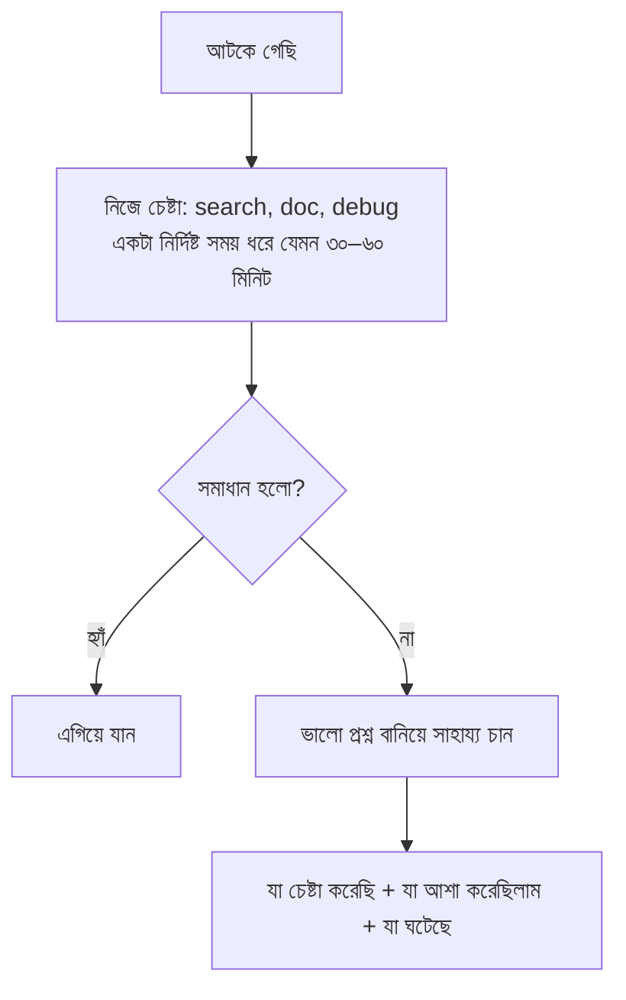

**ভালো প্রশ্নের গঠন:** "আমি X করতে চাইছি। Y চেষ্টা করেছি, ভেবেছিলাম Z হবে, কিন্তু হচ্ছে W। এই error দেখাচ্ছে [...]। কোথায় দেখব?" — এতে সাহায্যকারীর সময় বাঁচে, আর আপনি "চিন্তা করে তারপর প্রশ্ন করে" এমন মানুষ হিসেবে পরিচিত হন।

> `মূল কথা` সাহায্য চাওয়া দুর্বলতা নয় — সময়মতো, প্রস্তুতি নিয়ে সাহায্য চাওয়া একটা **পেশাদার দক্ষতা**। লক্ষ্য কাজ শেষ করা, একা হিরো হওয়া নয়।

---

### নিজেকে যাচাই করুন

1. কোড শুরুর আগে কোন প্রশ্নগুলোর উত্তর জানা থাকা উচিত?
2. বড় কাজ ছোট টুকরোয় ভাঙার ৩টি সুবিধা কী?
3. Estimate দেওয়ার সময় অনিশ্চয়তা কীভাবে সৎভাবে জানাবেন?
4. "Timebox তারপর সাহায্য" নীতিটি ব্যাখ্যা করুন — এবং একটি ভালো প্রশ্নের গঠন বলুন।

[↑ সূচিপত্রে ফিরুন](#toc)

---

<a id="ch-8"></a>

## অধ্যায় ৮: Coding
### কোড লেখার শিল্প

> Part 2 · Entry / Junior

### মূল কথা

ভালো কোড শুধু "কাজ করা" কোড নয় — **পড়া যায়, বোঝা যায়, এবং নিরাপদে বদলানো যায়** এমন কোড। কারণ কোড একবার লেখা হয়, কিন্তু বহুবার পড়া ও পরিবর্তন করা হয়। এই অধ্যায়: ভালো কোডের বৈশিষ্ট্য, code review (দেওয়া ও নেওয়া), নিয়মতান্ত্রিক debugging, এবং refactoring।

---

### ৮.১ ভালো কোডের বৈশিষ্ট্য

**১. Readable (পাঠযোগ্য):** কোড নিজেই বলুক সে কী করছে।

```dart
// দুর্বল — নাম দেখে কিছু বোঝা যায় না
double calc(double a, double b, double r) => a + b * r / 100;

// ভালো — নামই ব্যাখ্যা
double totalWithTax(double price, int quantity, double taxRatePercent) =>
    price + quantity * taxRatePercent / 100;
```

- ভালো নাম দিন (variable, function, class)।
- Comment দিয়ে **"কেন"** বোঝান, "কী" নয় — "কী" তো কোডেই দেখা যায়।

**২. Simple (সরল):** ছোট function, একটি function একটিই কাজ করুক। চালাকি-ভরা এক-লাইনের কোডের চেয়ে বোধগম্য কোড ভালো।

**৩. Maintainable (রক্ষণাবেক্ষণযোগ্য):**
- **DRY** (Don't Repeat Yourself) — একই logic বারবার নয়। তবে **অতিরিক্ত DRY-ও বিপদ** (অসংশ্লিষ্ট জিনিস জোর করে এক করা)।
- **Magic number** এড়ান — `if (x > 7)` নয়, `if (x > maxRetries)`।

**৪. Testable (পরীক্ষাযোগ্য):** side-effect কমান, dependency বাইরে থেকে দিন (injection) — তাহলে test করা সহজ।

---

### ৮.২ কোড আপনি লেখার চেয়ে বেশি পড়েন

```
        লেখা  ▓▓▓░░░░░░░░░░░░░░░░░░  ~১০%
        পড়া  ▓▓▓▓▓▓▓▓▓▓▓▓▓▓▓▓▓▓▓▓  ~৯০%
```

তাই কোড **পরের পাঠকের** (প্রায়ই ৬ মাস পরের আপনি নিজে) কথা ভেবে লিখুন। codebase-এ দ্রুত navigate করা, বিদ্যমান প্যাটার্ন অনুসরণ করা — এগুলোও মূল দক্ষতা।

---

### ৮.৩ Code Review

Code review একসাথে দুটি কাজ করে: মান বজায় রাখা ও পরস্পরের কাছ থেকে শেখা।

**Review দেওয়ার সময়:**
- Code-কে review করুন, মানুষকে নয়। সুর হোক সহযোগিতার।
- ছোটখাটো খুঁত (nit) নিয়ে আটকে না থেকে **গুরুত্বপূর্ণ** বিষয়ে মন দিন; nit হলে "nit:" লিখে দিন।
- আদেশ নয়, প্রস্তাব দিন: "এভাবে করলে কি আরও পরিষ্কার হতো?"
- কেন — তা বোঝান, যাতে লেখক শেখে।

**Review পাওয়ার সময়:**
- Defensive হবেন না — feedback কোডের উপর, আপনার উপর নয়।
- বুঝতে না পারলে জিজ্ঞেস করুন; একমত না হলে যুক্তি দিন (ভদ্রভাবে)।

```
ভালো review মন্তব্য:  "এই function বড় হয়ে যাচ্ছে — ভেঙে দিলে test করা সহজ হতো, কী বলো?"
খারাপ review মন্তব্য: "এটা ভুল। এভাবে করো।"
```

---

### ৮.৪ Debugging — নিয়মতান্ত্রিক প্রক্রিয়া

Debugging আন্দাজে নয়, ধাপে ধাপে:

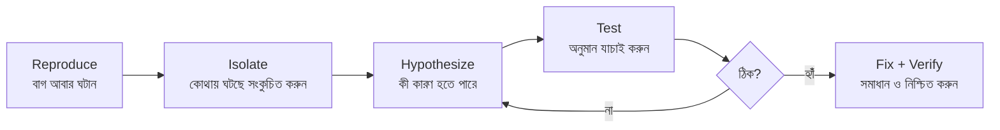

মূল কৌশল: একবারে একটা জিনিস বদলান (নাহলে কোনটা কাজ করল বোঝা যায় না), এবং অনুমান **যাচাই** করুন — ধরে নেবেন না। হাতিয়ার: debugger, logging, এবং সাধারণ print statement।

---

### ৮.৫ Refactoring

**Refactoring** = behavior না বদলে কোডের গঠন উন্নত করা। কখন করবেন:

- কোড পড়তে/বুঝতে কষ্ট হচ্ছে।
- একই জিনিস বারবার copy-paste হচ্ছে।
- ছোট পরিবর্তন করতে অনেক জায়গায় হাত দিতে হচ্ছে।

**Boy Scout Rule:** যে ফাইলে হাত দিচ্ছেন, সেটা একটু হলেও **আগের চেয়ে পরিষ্কার** রেখে আসুন। বড় rewrite-এর দরকার নেই — ছোট ছোট নিয়মিত উন্নতিই যথেষ্ট।

> `সতর্কতা` Refactoring আর feature-যোগ একসাথে এক commit-এ মেশাবেন না — review কঠিন হয় ও বাগ লুকিয়ে যায়। আলাদা রাখুন। আর refactor করার আগে test থাকা চাই, যাতে behavior অক্ষত আছে তা নিশ্চিত হয়।

---

### নিজেকে যাচাই করুন

1. ভালো কোডের ৪টি বৈশিষ্ট্য কী? "Comment দিয়ে কেন বোঝান, কী নয়" — উদাহরণসহ ব্যাখ্যা করুন।
2. "আমরা কোড লেখার চেয়ে বেশি পড়ি" — এর প্রভাব কীভাবে আপনার লেখায় পড়া উচিত?
3. ভালো ও খারাপ code-review মন্তব্যের পার্থক্য একটি উদাহরণে দেখান।
4. Debugging-এর ৫টি ধাপ বলুন। "একবারে একটা জিনিস বদলান" কেন জরুরি?
5. কখন refactor করবেন, এবং কেন refactoring ও feature আলাদা রাখা উচিত?

[↑ সূচিপত্রে ফিরুন](#toc)

---

<a id="ch-9"></a>

## অধ্যায় ৯: Software Development
### সফটওয়্যার ডেভেলপমেন্ট

> Part 2 · Entry / Junior

### মূল কথা

কোড লেখা software development-এর একটা অংশ মাত্র। একজন পূর্ণ developer-কে আরও কিছু জানতে হয়: একটি language গভীরভাবে আয়ত্ত করা, version control (Git) দক্ষতার সাথে ব্যবহার, testing-এর মূল ধারণা, এবং পরিষ্কার documentation লেখা। এগুলো একসাথে আপনাকে একটা team-এ নির্ভরযোগ্যভাবে কাজ করার যোগ্য করে তোলে।

---

### ৯.১ Programming Language দক্ষতা

একটি language "জানা" মানে syntax মুখস্থ নয়। গভীর দক্ষতা মানে:

- **Idioms:** ভাষাটির স্বাভাবিক রীতিতে লেখা (Pythonic Python, idiomatic Dart) — জোর করে এক ভাষার স্টাইল আরেকটায় চাপানো নয়।
- **Standard Library:** নিজে বানানোর আগে দেখুন built-in কী আছে।
- **Ecosystem ও Tooling:** package manager, linter, formatter, debugger।
- **কখন কী ব্যবহার করতে হয়** এবং কেন — performance ও memory-র মৌলিক ধারণা।

> `মূল কথা` শুরুতে **একটি ভাষা গভীরভাবে** শেখা দশটা ভাসা-ভাসা জানার চেয়ে অনেক মূল্যবান। গভীর দক্ষতার ধারণাগুলো (concept) পরে নতুন ভাষায় দ্রুত স্থানান্তরিত হয়।

---

### ৯.২ Version Control (Git)

দলগত কাজের মেরুদণ্ড। ভালো অভ্যাস:

- **ছোট, অর্থবহ commit** — একটি commit একটি যৌক্তিক পরিবর্তন।
- **পরিষ্কার commit message** — *কী* বদলেছে নয়, *কেন* বদলেছে।
- **Branch + Pull Request** workflow — কাজ আলাদা branch-এ, review করে merge।

```
ভালো commit message-এর গঠন:

   fix(auth): প্রতিবার token refresh-এ logout হওয়া বন্ধ করা

   refresh-এর আগে token expiry ভুলভাবে চেক হচ্ছিল, ফলে
   বৈধ session-ও বাতিল হতো। তুলনাটা ঠিক করা হলো।

   │      │       │
   type   scope   কেন (body) — শুধু "কী" নয়
```

সাধারণ team workflow:

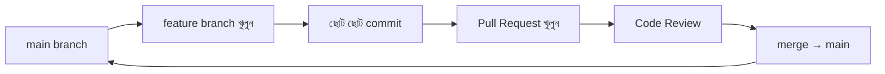

---

### ৯.৩ Testing — মৌলিক ধারণা

এই পর্যায়ে গভীর testing তত্ত্বের দরকার নেই (সেটা Ch 14), কিন্তু basics জানা চাই:

- **কেন test:** test নিরাপত্তা-জাল — পরিবর্তনের পর "আগেরটা ভাঙেনি তো?" দ্রুত জানায়।
- **Unit test:** ছোট অংশ (function) আলাদা করে পরীক্ষা।
- **AAA প্যাটার্ন:** পরিষ্কার test লেখার কাঠামো —

```
Arrange  →  প্রস্তুতি (ইনপুট, mock তৈরি)
Act      →  যে কাজটা পরীক্ষা করছি, সেটা চালান
Assert   →  ফলাফল প্রত্যাশার সাথে মেলান
```

```dart
test('totalWithTax ১০% tax সঠিকভাবে যোগ করে', () {
  // Arrange
  const price = 100.0; const qty = 2; const tax = 10.0;
  // Act
  final result = totalWithTax(price, qty, tax);
  // Assert
  expect(result, 120.0);
});
```

---

### ৯.৪ Documentation লেখা

ভালো documentation ভবিষ্যতের অনেক প্রশ্ন আগেই উত্তর দিয়ে দেয়:

- **README:** project কী, কীভাবে চালাবেন, কীভাবে অবদান রাখবেন।
- **Code comment:** জটিল সিদ্ধান্তের *কেন*।
- **Design doc:** বড় কাজের আগে পরিকল্পনা ও trade-off লিখে রাখা (এতে আগেই ভুল ধরা পড়ে)।
- **পাঠকের কথা ভেবে লিখুন** — যে জানে না, সে যেন বোঝে।

> `সতর্কতা` ভুল বা পুরোনো documentation না-থাকার চেয়েও খারাপ — কারণ মানুষ ভুল তথ্যে বিশ্বাস করে। কোড বদলালে সংশ্লিষ্ট doc-ও আপডেট করুন।

---

### নিজেকে যাচাই করুন

1. একটি language "গভীরভাবে জানা" বলতে কী বোঝায়? কেন একটি ভাষা গভীরে শেখা ভালো?
2. ভালো commit message-এ কী থাকা উচিত — "কী" না "কেন"? কেন?
3. AAA প্যাটার্ন কী, এবং একটি unit test-এ এটি কীভাবে দেখায়?
4. কোন ধরনের documentation কখন লেখা উচিত? পুরোনো doc কেন বিপজ্জনক?

[↑ সূচিপত্রে ফিরুন](#toc)

---

<a id="ch-10"></a>

## অধ্যায় ১০: Tools of the Productive Engineer
### উৎপাদনশীল Engineer-এর Tools

> Part 2 · Entry / Junior

### মূল কথা

আপনার দৈনন্দিন কাজের গতি অনেকটা নির্ভর করে আপনার **tool ও workflow**-এর উপর। দ্রুত dev environment, terminal-এ দক্ষতা, editor-এর শর্টকাট, এবং দ্রুত feedback loop — এগুলোতে করা ছোট বিনিয়োগ সময়ের সাথে চক্রবৃদ্ধি হারে ফেরত আসে। লক্ষ্য: চিন্তা ও কাজের মধ্যে ঘর্ষণ (friction) কমানো।

---

### ১০.১ Local Development Environment

- **দ্রুত ও পুনরুৎপাদনযোগ্য (reproducible):** নতুন মেশিনে বা নতুন সহকর্মীর কাছে যেন সহজে চালু হয় (script/container দিয়ে setup)।
- **দ্রুত build/run:** ধীর environment প্রতিদিন একটু একটু করে অনেক সময় খায়।

---

### ১০.২ Terminal ও Command Line

GUI সহজ, কিন্তু terminal **দ্রুত ও স্বয়ংক্রিয়যোগ্য**। যা শিখলে বড় লাভ:

- ফাইল ও প্রসেস সামলানো, খোঁজা (grep/find), pipe দিয়ে কমান্ড জোড়া।
- বারবার করা কাজগুলোর জন্য ছোট **script/alias** বানানো।

```
GUI দিয়ে ১০ ফাইলে একই বদল:   ১০ বার ক্লিক, ক্লান্তিকর, ভুল হয়
Terminal/script দিয়ে:         একটা কমান্ড, এক সেকেন্ড, পুনরাবৃত্তিযোগ্য
```

---

### ১০.৩ দ্রুত Feedback Loop (সবচেয়ে গুরুত্বপূর্ণ)

Productivity-র মূল চাবি — পরিবর্তনের পর ফলাফল দেখতে কত দ্রুত পারেন:

```
ধীর loop:   কোড → build (২ মিনিট) → manual test (৩ মিনিট) → ভুল ধরা
            একদিনে মাত্র কয়েকবার চেষ্টা করা যায় ✗

দ্রুত loop:  কোড → hot reload/দ্রুত test (কয়েক সেকেন্ড) → সাথে সাথে ফলাফল
            একদিনে শত শত বার চেষ্টা — শেখা ও গতি দুটোই বাড়ে ✓
```

দ্রুত loop বানানোর উপায়: hot reload, দ্রুত ও নির্ভরযোগ্য test, ছোট স্ক্রিপ্টে repetitive কাজ অটোমেট করা।

---

### ১০.৪ Automation ও চক্রবৃদ্ধি লাভ

যে কাজ বারবার হাতে করছেন, তা একবার অটোমেট করলে সারা জীবন সময় বাঁচে:

```
সময় সাশ্রয় (চক্রবৃদ্ধি):
  বিনিয়োগ ▲
  (একবার) │      ████ অটোমেশনের পরে জমা লাভ
          │   ███
          │ ██
          │█________________________► সময়
            ছোট প্রাথমিক খরচ, বিশাল দীর্ঘমেয়াদি ফেরত
```

> `সতর্কতা` কিন্তু **tool নিয়ে নিখুঁততার ফাঁদে** পড়বেন না — অসীম সময় ধরে editor/config সাজানো আসল কাজ থেকে পালানোর সুন্দর অজুহাত হয়ে যেতে পারে। নিয়ম: যা প্রায়ই করেন ও সত্যিই সময় বাঁচায়, সেটাই অটোমেট/অপটিমাইজ করুন — বাকিটা "যথেষ্ট ভালো" হলেই চলবে।

---

### নিজেকে যাচাই করুন

1. কেন একটি দ্রুত ও reproducible dev environment গুরুত্বপূর্ণ?
2. কোন ধরনের কাজে terminal/script GUI-এর চেয়ে ভালো — একটি উদাহরণ দিন।
3. "দ্রুত feedback loop" কীভাবে শেখা ও গতি দুটোই বাড়ায়?
4. Automation-এর চক্রবৃদ্ধি লাভ ব্যাখ্যা করুন। "tool-perfectionism" ফাঁদ কী?

[↑ সূচিপত্রে ফিরুন](#toc)

---

> **Part 2 সারসংক্ষেপ:** Competent developer = নির্ভরযোগ্যভাবে কাজ শেষ করা (Ch7) + পঠনযোগ্য, রক্ষণাবেক্ষণযোগ্য কোড (Ch8) + language/Git/test/doc-এ ভিত্তি (Ch9) + দ্রুত tooling ও feedback loop (Ch10)। এই ভিত্তির উপরই Senior-এর সব দক্ষতা দাঁড়ায়।

---

<a id="part-3"></a>

# Part 3 — The Well-Rounded Senior Engineer
## সর্বগুণসম্পন্ন Senior Engineer

> **কাদের জন্য:** Senior হতে চাওয়া ও সদ্য-Senior engineer।
> **মূল বার্তা:** Senior মানে "আরও ভালো coder" নয়। Senior মানে **সর্বগুণসম্পন্ন (well-rounded)** — কোডের পাশাপাশি মানুষ, যোগাযোগ, design, testing ও architecture সব সামলানো, এবং নিজের কাজের বাইরেও দলকে এগিয়ে নেওয়া।

```
Part 3-এর যাত্রা:
   outcome-এর মালিকানা (Ch11)  →  সহযোগিতা (Ch12)  →  design/SOLID (Ch13)
        →  testing (Ch14)  →  architecture (Ch15)
```

junior → senior রূপান্তরের মূল পরিবর্তন:

```
Junior:  "আমাকে যে task দেওয়া হয়েছে তা শেষ করি"
Senior:  "সমস্যাটার মালিকানা নিই — অস্পষ্টতা সহ — এবং দলকেও এগিয়ে নিই"
```

---

<a id="ch-11"></a>

## অধ্যায় ১১: Getting Things Done (Senior Level)
### Senior স্তরে কাজ সম্পন্ন করা

> Part 3 · Senior

### মূল কথা

Junior-এ আপনি **task** শেষ করতেন; Senior-এ আপনি **outcome**-এর মালিকানা নেন — প্রায়ই অস্পষ্ট, বড়, এবং একাধিক মানুষজড়িত সমস্যা। এখানে তিনটি দক্ষতা সবচেয়ে গুরুত্বপূর্ণ: **ownership** (দায়িত্ব নেওয়া), **prioritization** (সঠিক কাজে মনোযোগ), এবং **perception management** (কাজ যেন সঠিকভাবে দেখা হয়)।

---

### ১১.১ Ownership — দায়িত্ব নেওয়া

Ownership মানে: একটা সমস্যা/feature/project আগাগোড়া নিজের কাঁধে নেওয়া — শুধু কোড নয়, বরং অস্পষ্টতা পরিষ্কার করা, পরিকল্পনা করা, ঝুঁকি আগেভাগে ধরা, অন্যদের সাথে সমন্বয় করা, এবং শেষ পর্যন্ত পৌঁছে দেওয়া।

```
Task-মালিকানা (Junior):    "আমার অংশ শেষ, বাকিটা আমার দায়িত্ব নয়"
Outcome-মালিকানা (Senior): "feature live ও কাজ করছে — এটাই আমার দায়িত্ব,
                            পথে যা বাধা আসুক তা সরানো আমার কাজ"
```

Ownership-এর একটি বড় অংশ — **অস্পষ্টতা সহ্য করা ও পরিষ্কার করা**: অস্পষ্ট সমস্যাকে নিজে থেকে concrete পরিকল্পনায় রূপ দেওয়া, কারো নির্দেশের অপেক্ষায় না বসে থাকা।

---

### ১১.২ Prioritization — সঠিক কাজে মনোযোগ

Senior-এর সময় সীমিত, চাহিদা অসীম। তাই সবচেয়ে বড় দক্ষতা — **সবচেয়ে বেশি impact যেটায়, সেটা আগে করা**, এবং বাকিটাকে (ভদ্রভাবে) "না" বা "পরে" বলা।

**Impact vs Effort ম্যাট্রিক্স:**

```
        উচ্চ Impact
            ▲
    ┌───────┼───────┐
    │ ২য়    │ ১ম    │   ১ম: কম effort, উচ্চ impact → আগে করুন (quick win)
    │ (বড়   │(quick │   ২য়: বড় কাজ → পরিকল্পনা করে করুন (big bet)
    │ project)│ win) │   ৩য়: কম effort, কম impact → সময় থাকলে
 ───┼───────┼───────┼──► উচ্চ Effort   ৪র্থ: বেশি খেটে কম লাভ → এড়িয়ে চলুন
    │ ৪র্থ   │ ৩য়    │
    │ (এড়ান)│(fill) │
    └───────┼───────┘
        নিম্ন Impact
```

> `মূল কথা` "ব্যস্ত থাকা" আর "গুরুত্বপূর্ণ কাজ করা" এক নয়। অনেক কাজ শেষ করেও কম impact হতে পারে যদি ভুল কাজগুলো করেন। নিয়মিত নিজেকে জিজ্ঞেস করুন: "এই মুহূর্তে আমার সবচেয়ে মূল্যবান কাজটা কি এটাই?"

---

### ১১.৩ নিজেকে গুণিতক করা (Leverage)

Senior-এর impact শুধু নিজের লেখা কোডে সীমাবদ্ধ নয় — **অন্যদের কাজ আরও ভালো করানোতেও**:

- অন্যদের ব্লক সরানো (review দ্রুত করা, প্রশ্নের উত্তর দেওয়া)।
- ছোট কাজ delegate করা, যাতে নিজে বড় কাজে মন দিতে পারেন এবং অন্যরা শেখে।
- ভালো নথি/প্যাটার্ন রেখে যাওয়া, যা অনেকে ব্যবহার করে।

---

### ১১.৪ Perception বনাম Reality

কঠিন কিন্তু গুরুত্বপূর্ণ সত্য: **শুধু ভালো কাজ করাই যথেষ্ট নয় — কাজটা যে ভালো, তা যেন অন্যরা বুঝতে পারে, সেটাও নিশ্চিত করতে হয়।**

```
   Reality (আসলে কী করলেন)  ──┐
                              ├──► এই দুটো না মিললে সমস্যা
   Perception (অন্যরা কী দেখল)─┘
```

এর মানে সততার সাথে দৃশ্যমানতা ও প্রত্যাশা ব্যবস্থাপনা:
- আগেভাগে জানান কী করছেন ও কেন; অগ্রগতি ও বাধা নিয়মিত জানান।
- প্রত্যাশা ঠিক রাখুন — কখন কী হবে স্পষ্ট বলুন, যাতে কেউ ভুল ধারণা না করে।
- "Under-promise, over-deliver" — কম প্রতিশ্রুতি দিয়ে বেশি দেওয়া আস্থা গড়ে।

> `সতর্কতা` এটি রাজনীতি বা ভান নয়। আসল কাজ আগে, তারপর সেই আসল কাজ পরিষ্কারভাবে দৃশ্যমান করা। ফাঁপা দৃশ্যমানতা (কাজ ছাড়া প্রচার) দ্রুত ধরা পড়ে ও আস্থা নষ্ট করে।

---

### নিজেকে যাচাই করুন

1. "Task-মালিকানা" আর "Outcome-মালিকানা"-র পার্থক্য একটি উদাহরণে বোঝান।
2. Impact/Effort ম্যাট্রিক্সে কোন ঘরটা আগে করবেন, কোনটা এড়াবেন — কেন?
3. একজন Senior কীভাবে নিজের লেখা কোডের বাইরেও impact তৈরি করে?
4. "Perception ≠ Reality" সমস্যা কী, এবং এটি সামলানো রাজনীতি নয় কেন?

[↑ সূচিপত্রে ফিরুন](#toc)

---

<a id="ch-12"></a>

## অধ্যায় ১২: Collaboration and Teamwork
### সহযোগিতা ও Team কাজ

> Part 3 · Senior

### মূল কথা

Senior পর্যায়ে আপনার সাফল্য আর একা আপনার উপর নির্ভর করে না — দলের সাথে কতটা ভালো কাজ করেন তার উপরও নির্ভর করে। মূল দক্ষতা: পরিষ্কার technical communication, অন্যদের mentoring, conflict সামলানো, এবং কার্যকর pairing। সংক্ষেপে — এমন একজন হওয়া **যার সাথে মানুষ কাজ করতে চায়**।

---

### ১২.১ Technical Communication

ভালো প্রকৌশলী = ভালো যোগাযোগকারী। মূল নীতি — **শ্রোতা বুঝে বলা**:

```
একই বিষয়, ভিন্ন শ্রোতা:
   অন্য engineer-কে   →  technical detail, trade-off
   Manager-কে         →  timeline, ঝুঁকি, impact
   Product/Business-কে →  ব্যবহারকারীর উপর প্রভাব, ফলাফল (jargon বাদ)
```

- **লিখিত যোগাযোগে দক্ষ হোন** — design doc, RFC, পরিষ্কার PR description। ভালো লেখা দলের সবচেয়ে স্কেলযোগ্য যোগাযোগ।
- **সংক্ষিপ্ত ও স্পষ্ট:** আগে মূল কথা (conclusion first), তারপর বিস্তারিত।
- **Async-বান্ধব:** এমনভাবে লিখুন যাতে আপনি না থাকলেও সিদ্ধান্ত বোঝা যায়।

---

### ১২.২ Mentoring ও Coaching

Senior-রা juniors-দের গড়ে তোলে। কিন্তু পার্থক্য বুঝুন:

| | **Mentoring** | **Coaching** |
|---|--------------|--------------|
| পদ্ধতি | উত্তর/দিকনির্দেশ দেওয়া | প্রশ্ন করে নিজে উত্তর বের করতে সাহায্য |
| কখন | নতুন বিষয়, দ্রুত দরকার | দক্ষতা ও আত্মবিশ্বাস গড়তে |

> `মূল কথা` ভালো mentor সমস্যাটা **নিজে সমাধান করে দেয় না** — শেখায় কীভাবে সমাধান করতে হয়। মাছ ধরে দেওয়া নয়, মাছ ধরা শেখানো। এতে মানুষটি স্বাধীন হয়, আর আপনি গুণিতক হন।

---

### ১২.৩ Conflict Resolution

দলে মতভেদ অনিবার্য ও স্বাস্থ্যকর — যদি ঠিকভাবে সামলানো হয়:

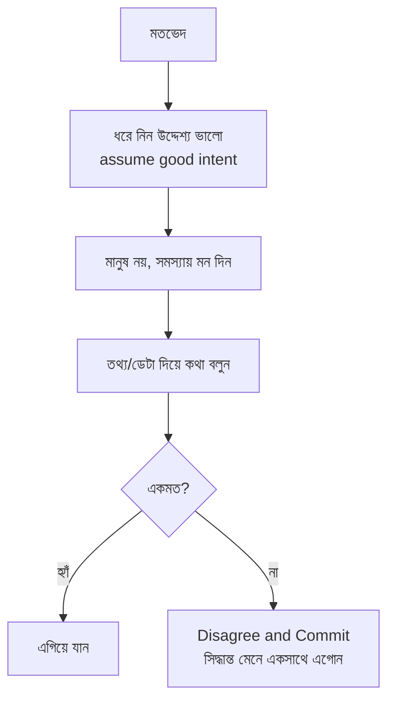

- **Assume good intent:** সবাই সাধারণত ভালো ফলই চায়, ভিন্ন পথে ভাবছে।
- **মানুষ বনাম সমস্যা আলাদা করুন:** "তুমি ভুল" নয়, "এই approach-এ এই সমস্যা।"
- **Disagree and Commit:** সিদ্ধান্ত হয়ে গেলে, একমত না হলেও পেশাদারভাবে সেটার পেছনে দাঁড়ান।

---

### ১২.৪ Pair Programming

দু'জন একসাথে এক সমস্যায় কাজ — কখন বিশেষভাবে কার্যকর:

- জটিল/অজানা সমস্যা, বা গুরুত্বপূর্ণ অংশে কম ভুল চাই।
- জ্ঞান ছড়ানো (knowledge sharing), নতুন সদস্যকে onboard করা।

ভালো pairing: একজন "driver" (লেখে), একজন "navigator" (ভাবে/দিক দেখায়), নিয়মিত ভূমিকা বদল, এবং সম্মানজনক সুর। সারাক্ষণ pairing দরকার নেই — সঠিক জায়গায় ব্যবহার করুন।

---

### ১২.৫ এমন একজন হওয়া যার সাথে মানুষ কাজ করতে চায়

ছোট ছোট অভ্যাস বড় সুনাম গড়ে: সময়মতো review দেওয়া, প্রতিশ্রুতি রাখা, সাহায্য করা, কৃতিত্ব ভাগ করা, দোষ নিজে নেওয়া। এই "নির্ভরযোগ্য ও সহজ-সহকর্মী" পরিচয়ই senior-এর সবচেয়ে বড় career-capital-এর একটি (সম্পর্ক — Ch 2)।

---

### নিজেকে যাচাই করুন

1. "শ্রোতা বুঝে যোগাযোগ" — একই খবর engineer, manager ও business-কে কীভাবে আলাদা করে বলবেন?
2. Mentoring ও Coaching-এর পার্থক্য কী? "সমস্যা নিজে সমাধান করে দেওয়া" কেন সবসময় ভালো mentoring নয়?
3. Conflict সামলানোর ৩টি নীতি বলুন। "Disagree and Commit" মানে কী?
4. কখন pair programming বিশেষভাবে কার্যকর, এবং ভালো pairing কেমন হয়?

[↑ সূচিপত্রে ফিরুন](#toc)

---

<a id="ch-13"></a>

## অধ্যায় ১৩: Software Engineering
### Senior Engineer-এর Software Engineering

> Part 3 · Senior

### মূল কথা

"Coding" আর "Software Engineering" এক নয়। Coding হলো কোড লেখা; Software Engineering হলো **সময়ের সাথে, দল মিলে, পরিবর্তনযোগ্য ও টেকসই সফটওয়্যার গড়া**। এই অধ্যায়ে সেই প্রকৌশলের ভিত্তি: design pattern (বিচক্ষণভাবে), SOLID নীতি, ভালো abstraction, এবং API design — সবকিছুর উপরে একটি মন্ত্র: **সরলতা > চাতুর্য**।

---

### ১৩.১ Design Patterns — বিচক্ষণভাবে

Design pattern হলো বারবার আসা সমস্যার পরিচিত সমাধান (যেমন Factory, Strategy, Observer, Singleton)। এগুলোর সুবিধা — সাধারণ শব্দভাণ্ডার ("এখানে একটা Observer লাগাই") এবং পরীক্ষিত গঠন।

> `সতর্কতা` Pattern **জোর করে** ব্যবহার করবেন না। নতুনরা প্রায়ই pattern শিখে সবখানে লাগাতে চায় — ফলে সহজ কোড অযথা জটিল হয়। নিয়ম: সমস্যা আগে, pattern পরে। সমস্যা না থাকলে pattern-ও দরকার নেই।

---

### ১৩.২ SOLID নীতি

object-oriented design-এ পরিবর্তনযোগ্য কোড লেখার ৫টি নীতি:

| | নীতি | সহজ অর্থ |
|---|------|----------|
| **S** | Single Responsibility | এক class/function-এর একটিই বদলানোর কারণ থাকবে |
| **O** | Open/Closed | নতুন আচরণ **যোগ** করা যাবে, পুরোনো কোড **না বদলে** |
| **L** | Liskov Substitution | child class, parent-এর জায়গায় বসিয়ে দিলেও সব ঠিক চলবে |
| **I** | Interface Segregation | বড় একটা interface নয়, ছোট ছোট নির্দিষ্ট interface |
| **D** | Dependency Inversion | concrete-এর উপর নয়, abstraction-এর উপর নির্ভর করুন |

```dart
// D — Dependency Inversion: concrete নয়, abstraction-এর উপর নির্ভর
abstract class Notifier { void send(String msg); }

class EmailNotifier implements Notifier { ... }
class SmsNotifier   implements Notifier { ... }

class OrderService {
  final Notifier notifier;        // কোন concrete তা জানে না
  OrderService(this.notifier);    // বাইরে থেকে inject
}
// → test-এ FakeNotifier দেওয়া সহজ, নতুন চ্যানেল যোগ করাও সহজ
```

> `মূল কথা` SOLID মুখস্থ নয় — এদের উদ্দেশ্য একটাই: কোড যেন **বদলানো ও test করা সহজ** হয়। নীতি যদি কোড জটিল করে, তাহলে আপনি সম্ভবত ভুল প্রয়োগ করছেন।

---

### ১৩.৩ Abstraction — ভালো ও খারাপ

ভালো abstraction জটিলতা **লুকিয়ে** সহজ একটা মুখ দেয় (যেমন `list.sort()` — ভেতরের algorithm জানতে হয় না)। খারাপ abstraction উল্টো — ভুল জায়গায় বিভাজন করে জটিলতা বাড়ায়।

```
ভালো:  জটিলতা ভেতরে লুকানো, বাইরে সহজ ও পরিষ্কার মুখ
খারাপ: leaky — ভেতরের জটিলতা বাইরে চুঁইয়ে পড়ে, ব্যবহারকারীকে সব জানতে হয়
```

> একটি মূল্যবান নীতি: **"ভুল abstraction-এর চেয়ে সামান্য duplication ভালো।"** তাড়াহুড়ো করে দুটো জিনিসকে এক abstraction-এ জোড়া দিলে পরে আলাদা করা কঠিন হয়। প্যাটার্ন স্পষ্ট হওয়া পর্যন্ত অপেক্ষা করুন (rule of three: তৃতীয়বার একই জিনিস দেখলে তবেই সাধারণীকরণ)।

**Coupling ও Cohesion** — ভালো design-এর দুই মাপকাঠি:

```
লক্ষ্য:  High Cohesion (একটা module-এর ভেতরের জিনিস একসাথে মানানসই)
        Low Coupling   (module-গুলো একে অন্যের উপর কম নির্ভরশীল)
→ তাহলে একটা বদলালে বাকিগুলো কম ভাঙে।
```

---

### ১৩.৪ API Design

API (function signature হোক বা REST endpoint) এমন একটা চুক্তি যা অন্যরা ব্যবহার করবে। ভালো API:

- **পরিষ্কার ও সঙ্গতিপূর্ণ (consistent):** নামকরণ ও আচরণ অনুমেয়।
- **ভুল করা কঠিন (hard to misuse):** ভুল ব্যবহার যেন কঠিন হয়; সঠিক ব্যবহার যেন সহজ ডিফল্ট হয়।
- **ন্যূনতম:** শুরুতে ছোট রাখুন — পরে যোগ করা সহজ, কিন্তু কিছু সরিয়ে নেওয়া কঠিন (অন্যরা নির্ভরশীল হয়ে যায়)।
- **Backward compatible:** বিদ্যমান ব্যবহারকারীদের ভাঙবেন না; version দিয়ে সামলান।

> `সতর্কতা` **YAGNI** (You Aren't Gonna Need It): "ভবিষ্যতে লাগতে পারে" ভেবে আগেভাগে জটিলতা যোগ করবেন না। বেশিরভাগ সময় সেই "ভবিষ্যৎ" আসে না, কিন্তু জটিলতা থেকেই যায়।

---

### নিজেকে যাচাই করুন

1. "Coding" আর "Software Engineering"-এর পার্থক্য কী?
2. SOLID-এর ৫টি অক্ষর কী, এবং এদের একটিই সাধারণ উদ্দেশ্য কী?
3. ভালো ও খারাপ (leaky) abstraction-এর পার্থক্য কী? "ভুল abstraction-এর চেয়ে duplication ভালো" — কেন?
4. ভালো API-এর ৩টি গুণ বলুন। YAGNI নীতি কী?

[↑ সূচিপত্রে ফিরুন](#toc)

---

<a id="ch-14"></a>

## অধ্যায় ১৪: Testing
### সফটওয়্যার পরীক্ষা

> Part 3 · Senior

### মূল কথা

Test-এর আসল উদ্দেশ্য বাগ ধরা নয় (যদিও ধরে) — আসল উদ্দেশ্য **নির্ভয়ে পরিবর্তন করার ক্ষমতা**। ভালো test-suite থাকলে আপনি কোড বদলে সাথে সাথে জানতে পারেন "আগেরটা ভাঙল কিনা।" এই অধ্যায়: কেন test, test-এর ধরন (pyramid), TDD, এবং coverage-এর সঠিক ব্যবহার (ও অপব্যবহার)।

---

### ১৪.১ কেন Testing গুরুত্বপূর্ণ

- **পরিবর্তনের সাহস:** test থাকলে refactor/নতুন feature যোগ নিরাপদ।
- **Regression ধরা:** আগের কাজ করা জিনিস ভেঙে গেলে সাথে সাথে জানা যায়।
- **জীবন্ত documentation:** test পড়ে বোঝা যায় কোড আসলে কী করার কথা।

```
Test ছাড়া:  প্রতিটি পরিবর্তন = "কিছু ভাঙল কিনা?" — দুশ্চিন্তা, ম্যানুয়াল চেক
Test সহ:     প্রতিটি পরিবর্তন = এক কমান্ডে নিশ্চিত — সাহস ও গতি
```

---

### ১৪.২ Test Types — Test Pyramid

```
            ╱╲          E2E (পুরো system) — কম, ধীর, ভঙ্গুর, ব্যয়বহুল
           ╱  ╲
          ╱────╲        Integration (কয়েক অংশ একসাথে) — মাঝারি সংখ্যা
         ╱      ╲
        ╱────────╲      Unit (ছোট অংশ আলাদা) — অনেক, দ্রুত, স্থিতিশীল
       ╱__________╲
```

- **Unit:** একটা function/class আলাদা করে — দ্রুত ও অনেক। ভিত্তি এখানেই বেশি।
- **Integration:** কয়েকটি অংশ মিলে ঠিক কাজ করছে কিনা (যেমন service + database)।
- **E2E (End-to-End):** ব্যবহারকারীর দৃষ্টিতে পুরো flow — কম রাখুন, কারণ ধীর ও সহজে ভেঙে যায় (flaky)।

> `মূল কথা` ভিত্তি চওড়া রাখুন (অনেক দ্রুত unit test), চূড়া সরু (অল্প E2E)। উল্টোটা ("ice-cream cone": অনেক ধীর E2E, কম unit) — ধীর, অস্থিতিশীল ও যন্ত্রণাদায়ক।

---

### ১৪.৩ TDD (Test-Driven Development)

আগে test লিখুন, তারপর কোড — চক্রটি:

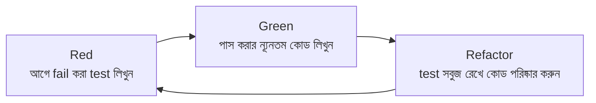

TDD সব জায়গায় বাধ্যতামূলক নয়, কিন্তু সাহায্য করে যখন: requirement পরিষ্কার, logic জটিল, বা edge case অনেক। এটি ছোট পদক্ষেপে ভাবতে ও testable design করতে বাধ্য করে।

---

### ১৪.৪ Test Coverage — সঠিক ব্যবহার

Coverage = কোডের কত শতাংশ test চালায়। এটি দরকারি **সংকেত**, কিন্তু **লক্ষ্য** নয়।

> `সতর্কতা` ১০০% coverage = বাগমুক্ত — এটা মিথ্যা। আপনি এমন test লিখতে পারেন যা প্রতিটি লাইন চালায় কিন্তু কিছুই assert করে না — coverage ১০০%, অথচ অর্থহীন। উল্টোদিকে, সমালোচনামূলক অংশের ভালো test অনেক বেশি মূল্যবান, যদিও মোট সংখ্যা কম।

ভালো test-এর গুণ: **দ্রুত, isolated (একে অন্যের উপর নির্ভর করে না), deterministic (প্রতিবার একই ফল), পঠনযোগ্য**, এবং implementation নয় — **behavior** পরীক্ষা করে (ভেতরের গঠন বদলালেও test ভাঙবে না, যতক্ষণ আচরণ ঠিক)।

**Flaky test** (কখনো পাস, কখনো fail) বিষাক্ত — দল test-এর উপর বিশ্বাস হারায়। এগুলো দ্রুত ঠিক করুন বা সরান।

---

### নিজেকে যাচাই করুন

1. Test-এর আসল উদ্দেশ্য কী — শুধু বাগ ধরা নয় কেন?
2. Test pyramid আঁকুন ও ব্যাখ্যা করুন। "ice-cream cone" anti-pattern কী?
3. TDD-এর Red–Green–Refactor চক্র বলুন। কখন TDD বিশেষ উপকারী?
4. "১০০% coverage = বাগমুক্ত" — এটি কেন ভুল? ভালো test-এর ৩টি গুণ বলুন।

[↑ সূচিপত্রে ফিরুন](#toc)

---

<a id="ch-15"></a>

## অধ্যায় ১৫: Software Architecture
### সফটওয়্যার স্থাপত্য

> Part 3 · Senior

### মূল কথা

Architecture হলো সফটওয়্যারের **উঁচু-স্তরের গঠন** — বড় অংশগুলো (component) কীভাবে সাজানো এবং একে অন্যের সাথে কীভাবে কথা বলে। এর মূল বৈশিষ্ট্য: এগুলো এমন সিদ্ধান্ত যা পরে বদলানো **কঠিন ও ব্যয়বহুল**। কোনো "নিখুঁত architecture" নেই — সবই trade-off, এবং সঠিক পছন্দ নির্ভর করে context-এর উপর।

---

### ১৫.১ Architecture কেন গুরুত্বপূর্ণ

ভালো architecture কোডকে বদলানো-সহজ, scale-যোগ্য, বোধগম্য ও test-যোগ্য করে। খারাপ architecture প্রতিটি পরিবর্তনকে যন্ত্রণায় পরিণত করে। যেহেতু এই সিদ্ধান্ত পরে বদলানো কঠিন, **আগে ভাবা** ও **trade-off বোঝা** এখানে মূল দক্ষতা।

---

### ১৫.২ সাধারণ Architecture Patterns

| Pattern | কী | সুবিধা | অসুবিধা | কখন |
|---------|----|--------|---------|------|
| **Monolith** | সব এক application-এ | সহজ, দ্রুত শুরু | বড় হলে জটিল | শুরু/ছোট-মাঝারি team |
| **Microservices** | ছোট স্বাধীন service | আলাদা deploy/scale | operational জটিলতা বেশি | বড় team/scale |
| **Event-Driven** | event দিয়ে যোগাযোগ | loose coupling, async | প্রবাহ অনুসরণ কঠিন | async/decoupled কাজ |
| **Layered** | স্তরে স্তরে দায়িত্ব ভাগ | পরিষ্কার বিভাজন | অতিরিক্ত স্তরে ধীরগতি | বেশিরভাগ সাধারণ app |

**Layered architecture:**

```
┌─────────────────────────────┐
│ Presentation (UI / API)      │  ← ব্যবহারকারীর সাথে কথা
├─────────────────────────────┤
│ Business Logic               │  ← আসল নিয়ম-কানুন
├─────────────────────────────┤
│ Data Access                  │  ← database-এর সাথে কথা
├─────────────────────────────┤
│ Database                     │
└─────────────────────────────┘
```

> `সতর্কতা` "সবাই microservices করছে" বলে শুরুতেই microservices নেওয়া একটা সাধারণ ও ব্যয়বহুল ভুল। বেশিরভাগ ক্ষেত্রে **ভালো-গঠিত monolith দিয়ে শুরু** করে, প্রয়োজন হলে তারপর ভাঙা বুদ্ধিমানের কাজ। অকারণ জটিলতা = ধীর গতি।

---

### ১৫.৩ Database Design

| | **SQL (Relational)** | **NoSQL** |
|---|---------------------|-----------|
| উদাহরণ | PostgreSQL, MySQL | MongoDB (doc), Redis (KV), Cassandra (wide-col) |
| শক্তি | জটিল relation, transaction (ACID) | flexible schema, সহজ horizontal scaling |
| কখন | জটিল সম্পর্ক, দৃঢ় consistency | বিশাল write, পরিবর্তনশীল schema, cache |

মৌলিক বিষয় যা জানা দরকার: **normalization** (ডেটার পুনরাবৃত্তি কমানো) বনাম প্রয়োজনে denormalization (গতির জন্য), এবং **index** (পড়া দ্রুত করে, কিন্তু লেখা ধীর ও জায়গা বাড়ায় — তাই বুঝে ব্যবহার)।

---

### ১৫.৪ Caching

প্রায়ই-দরকারি ডেটা দ্রুত-জায়গায় রেখে system দ্রুত করা। কিন্তু caching জটিলতা আনে — বিশেষত **invalidation** (পুরোনো ডেটা কখন মুছবেন)।

```
Cache-Aside:   app আগে cache দেখে; না পেলে DB থেকে এনে cache-এ রাখে (সবচেয়ে প্রচলিত)
Write-Through:  লেখার সময় cache ও DB একসাথে আপডেট (consistent, কিছুটা ধীর)
Write-Behind:   আগে cache, পরে background-এ DB (দ্রুত, কিন্তু ঝুঁকি)
```

**Eviction (জায়গা খালি করা):** `LRU` (সবচেয়ে কম-সম্প্রতি ব্যবহৃত বাদ), `LFU` (সবচেয়ে কম-ঘন ব্যবহৃত বাদ)।

> বিখ্যাত কৌতুক: *"Computer Science-এর দুটি কঠিন সমস্যা — cache invalidation আর নামকরণ।"* Cache দ্রুততা দেয়, কিন্তু "পুরোনো ডেটা" বাগের ঝুঁকিও আনে — তাই দরকার বুঝে ব্যবহার করুন।

---

### ১৫.৫ মূল মন্ত্র — Trade-off ও সরলতা

- **নিখুঁত architecture নেই** — প্রতিটি পছন্দে কিছু পাবেন, কিছু হারাবেন। কাজ হলো context-এ সেরা trade-off বাছা।
- **সরল দিয়ে শুরু করুন**, প্রয়োজন প্রমাণিত হলে জটিলতা যোগ করুন (YAGNI আবারও)।
- **পরিবর্তনের জন্য design করুন** — কোন সিদ্ধান্ত পরে বদলানো সহজ রাখা যায় সেটা ভাবুন।

---

### নিজেকে যাচাই করুন

1. Architecture-কে "পরে বদলানো কঠিন সিদ্ধান্ত" বলা হয় কেন — এর প্রভাব কী?
2. Monolith ও Microservices-এর মূল trade-off কী? কেন প্রায়ই monolith দিয়ে শুরু করা ভালো?
3. SQL বনাম NoSQL — কখন কোনটি? Index-এর সুবিধা ও খরচ কী?
4. ৩টি caching strategy বলুন। Cache invalidation কেন কঠিন?
5. "নিখুঁত architecture নেই" — এই বাস্তবতা একজন senior-এর সিদ্ধান্তকে কীভাবে প্রভাবিত করা উচিত?

[↑ সূচিপত্রে ফিরুন](#toc)

---

> **Part 3 সারসংক্ষেপ:** Well-rounded senior = outcome-এর মালিকানা ও সঠিক prioritization (Ch11) + শক্তিশালী collaboration (Ch12) + পরিবর্তনযোগ্য design ও SOLID (Ch13) + আত্মবিশ্বাস দেওয়া testing (Ch14) + trade-off-সচেতন architecture (Ch15)। কোডের সাথে এখন যুক্ত হলো মানুষ, design ও system-চিন্তা।

---

<a id="part-4"></a>

# Part 4 — The Pragmatic Tech Lead
## বাস্তবমুখী Tech Lead

> **কাদের জন্য:** Tech Lead, বা যারা lead ভূমিকায় যেতে চান।
> **মূল বার্তা:** Tech Lead সাধারণত **manager নয়** (সরাসরি reportee থাকে না), কিন্তু একটি project ও দলের technical দিকনির্দেশনার দায়িত্ব নেয়। এখন আপনার সাফল্য মাপা হয় **দলের ও project-এর ফলাফল** দিয়ে — শুধু নিজের কোড দিয়ে নয়।

```
Part 4-এর যাত্রা:
   project চালানো (Ch16)  →  নিরাপদে ship (Ch17)  →  stakeholder সামলানো (Ch18)
        →  team গঠন (Ch19)  →  team dynamics (Ch20)
```

Senior → Tech Lead রূপান্তর:

```
Senior:     "আমি (ও কয়েকজন) মিলে এই অংশটা ভালোভাবে বানাই"
Tech Lead:  "পুরো project সময়মতো ও ভালোভাবে delivered হবে, এবং দল সুস্থভাবে কাজ করবে —
             এটা নিশ্চিত করা আমার দায়িত্ব"
```

---

<a id="ch-16"></a>

## অধ্যায় ১৬: Project Management
### প্রকল্প ব্যবস্থাপনা

> Part 4 · Tech Lead

### মূল কথা

Tech Lead-এর কাজ মানুষ "manage" করা নয় — একটি **project**-কে শুরু থেকে শেষ পর্যন্ত সফলভাবে পৌঁছে দেওয়া। এর মানে: কাজ ভেঙে পরিকল্পনা করা, নির্ভরশীলতা ও ঝুঁকি আগেভাগে চেনা, অগ্রগতি স্বচ্ছভাবে জানানো, এবং প্রয়োজনে scope কাটা। ভালো Tech Lead project-কে "আশ্চর্যহীন" রাখে — কেউ শেষ মুহূর্তে খারাপ খবরে চমকায় না।

---

### ১৬.১ Tech Lead-এর ভূমিকা

```
            Tech Lead                 vs            Engineering Manager
   ───────────────────────────              ─────────────────────────────
   project ও technical দিকনির্দেশনা          মানুষ, ক্যারিয়ার, hiring, পারফরম্যান্স
   সাধারণত কোড লেখে (কম হলেও)                 সাধারণত কোড লেখে না
   সাধারণত direct report নেই                  direct report আছে
   "কীভাবে বানাব" নেতৃত্ব                      "কে, কেন, ভালো আছে কিনা" নেতৃত্ব
```

দুটি ভূমিকা পরিপূরক — প্রায়ই Tech Lead ও Manager জুটি বেঁধে কাজ করে।

---

### ১৬.২ Project Planning

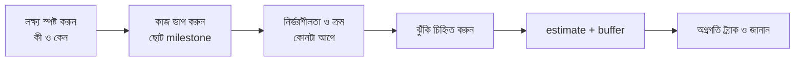

- বড় project ছোট, দৃশ্যমান milestone-এ ভাঙুন — অগ্রগতি মাপা যায়, ঝুঁকি আগে ধরা পড়ে।
- **নির্ভরশীলতা (dependency)** চিনুন — কোন কাজ আটকে গেলে কোনটা থেমে যাবে; অন্য team-এর উপর নির্ভরতা আগে আলোচনা করুন।

---

### ১৬.৩ Agile / Scrum — বাস্তবে

Scrum-এর আচার (sprint, standup, retro) উপকারী যদি **মূল উদ্দেশ্য** মনে রাখা হয়, আচার-সর্বস্ব না হয়ে:

| অনুষ্ঠান | আসল উদ্দেশ্য | অপব্যবহার (এড়ান) |
|----------|--------------|-------------------|
| Standup | দ্রুত sync, ব্লক সরানো | দীর্ঘ status report |
| Sprint planning | বাস্তবসম্মত প্রতিশ্রুতি | অতিরিক্ত কাজ ঠেসে দেওয়া |
| Retro | ক্রমাগত উন্নতি | অভিযোগের আসর, কোনো action নেই |

> `মূল কথা` Process হলো **মাধ্যম**, লক্ষ্য নয়। লক্ষ্য — ভালো software দ্রুত ও স্বাস্থ্যকরভাবে delivered হওয়া। কোনো আচার যদি সাহায্য না করে, তা সংশোধন করুন; অন্ধভাবে মানবেন না।

---

### ১৬.৪ Risk Management

ঝুঁকি লুকিয়ে রাখা সবচেয়ে বড় ঝুঁকি। ঝুঁকি **আগে** চিহ্নিত করুন, সম্ভাবনা ও প্রভাব অনুযায়ী সাজান, এবং প্রশমনের পরিকল্পনা রাখুন:

```
            উচ্চ প্রভাব
                ▲
     ┌──────────┼──────────┐
     │ পরিকল্পনা │ এখনই      │   উচ্চ সম্ভাবনা + উচ্চ প্রভাব → তৎক্ষণাৎ ব্যবস্থা
     │ রাখুন     │ সামলান    │
  ───┼──────────┼──────────┼──► উচ্চ সম্ভাবনা
     │ উপেক্ষা   │ নজরে রাখুন│
     │ করুন      │           │
     └──────────┼──────────┘
            নিম্ন প্রভাব
```

> `সতর্কতা` সবচেয়ে খারাপ অভ্যাস: সমস্যা হবে জেনেও চুপ থাকা, "হয়তো ঠিক হয়ে যাবে" আশায়। খারাপ খবর **যত আগে** জানাবেন, সামলানোর তত বেশি সুযোগ। দেরিতে জানানো খবর সবসময় বেশি ক্ষতিকর।

---

### ১৬.৫ Scope ব্যবস্থাপনা

Project সময়মতো শেষ না হলে সাধারণত তিনটি লিভার: **সময়, মানুষ, scope**। মানুষ যোগ করলে দেরিতে প্রায়ই আরও ধীর হয় (নতুনদের শেখাতে সময় যায়)। তাই সবচেয়ে কার্যকর লিভার প্রায়ই **scope কাটা** — কম গুরুত্বপূর্ণ অংশ পরে করা। আগেভাগে "must-have বনাম nice-to-have" আলাদা করে রাখুন।

---

### নিজেকে যাচাই করুন

1. Tech Lead ও Engineering Manager-এর ভূমিকার পার্থক্য কী?
2. Project planning-এর ধাপগুলো বলুন। নির্ভরশীলতা আগে চেনা কেন জরুরি?
3. Scrum-এর আচারগুলোর "আসল উদ্দেশ্য" কী — কখন এগুলো অপব্যবহার হয়?
4. ঝুঁকি কেন আগে জানানো ভালো? Risk matrix কীভাবে অগ্রাধিকার ঠিক করে?
5. Project পিছিয়ে গেলে কোন ৩টি লিভার আছে — এবং কেন "মানুষ যোগ করা" প্রায়ই সাহায্য করে না?

[↑ সূচিপত্রে ফিরুন](#toc)

---

<a id="ch-17"></a>

## অধ্যায় ১৭: Shipping in Production
### Production-এ Deploy করা

> Part 4 · Tech Lead

### মূল কথা

কোড লেখা অর্ধেক কাজ; বাকি অর্ধেক — সেটা নিরাপদে, নির্ভরযোগ্যভাবে production-এ পৌঁছানো এবং সেখানে সুস্থ রাখা। এই অধ্যায়: স্বয়ংক্রিয় deployment (CI/CD), ঝুঁকি কমানোর deployment strategy, incident সামলানো, এবং monitoring/observability দিয়ে system-এর স্বাস্থ্য দেখা — SLI/SLO/SLA সহ।

---

### ১৭.১ Deployment Process (CI/CD)

লক্ষ্য — deploy যেন **ছোট, ঘন ঘন, স্বয়ংক্রিয় ও নিরাপদ** হয়:

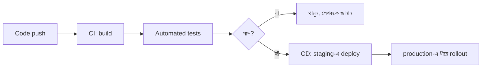

- **ছোট deploy নিরাপদ:** ছোট পরিবর্তনে ভুল হলে কারণ খোঁজা ও rollback সহজ। বড় "big bang" release ঝুঁকিপূর্ণ।
- স্বয়ংক্রিয় pipeline মানুষের ভুল কমায় ও গতি বাড়ায়।

---

### ১৭.২ Deployment Strategies

ঝুঁকি কমিয়ে নতুন কোড ছাড়ার কৌশল:

```
Rolling:     ধাপে ধাপে server-গুলো নতুন version-এ যায়
Blue-Green:  দুটো পরিবেশ (পুরোনো=blue, নতুন=green); switch করে দিই, সমস্যা হলে আবার ফিরিয়ে নিই
Canary:      প্রথমে অল্প (যেমন ৫%) ব্যবহারকারীকে নতুন version; ঠিক থাকলে ধীরে ১০০%
Feature Flag: কোড deploy করা থাকে কিন্তু "বন্ধ"; flag দিয়ে চালু/বন্ধ করা যায় (deploy ≠ release)
```

```
Canary rollout:
   ৫% ──► ২৫% ──► ৫০% ──► ১০০%
    │ প্রতি ধাপে metric দেখুন; খারাপ হলে এখানেই থামিয়ে rollback
```

> `মূল কথা` **Deploy ও Release আলাদা করুন।** Feature flag দিয়ে কোড আগে নিরাপদে deploy করে, পরে আত্মবিশ্বাস হলে চালু করা যায় — এবং সমস্যা হলে নতুন deploy ছাড়াই সাথে সাথে বন্ধ করা যায়।

---

### ১৭.৩ Incident Management

Production-এ সমস্যা হবেই — গুরুত্বপূর্ণ হলো **কত দ্রুত** সামলান এবং **কী শেখেন**:

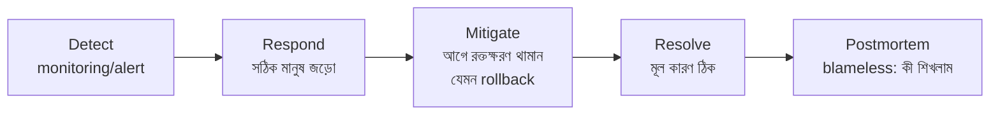

- **আগে mitigate, পরে root cause:** ব্যবহারকারীর ক্ষতি আগে থামান (যেমন আগের version-এ rollback), পুরো কারণ পরে খুঁজুন।
- **Blameless Postmortem:** ব্যক্তি দোষারোপ নয় — *system/process*-এ কী দুর্বলতা ছিল যা এটি ঘটতে দিল, এবং কীভাবে ভবিষ্যতে ঠেকানো যায়।

> `সতর্কতা` দোষারোপের culture মানুষকে ভুল লুকাতে শেখায় → একই দুর্ঘটনা বারবার ঘটে। Blameless culture মানুষকে সৎভাবে শিখতে দেয়। (সংযোগ: Psychological Safety — Ch 20।)

---

### ১৭.৪ Monitoring ও Observability

**Monitoring:** যা জানি তা নজরে রাখা ("CPU ৯০% ছাড়াল?")। **Observability:** system-কে বাইরে থেকে প্রশ্ন করে অজানা সমস্যাও বোঝার ক্ষমতা। তিন স্তম্ভ:

```
┌── Logs ──────────┐  কী ঘটেছিল — ঘটনার বিস্তারিত নথি
├── Metrics ───────┤  কত/কেমন — সংখ্যায় প্রবণতা (latency, error rate)
└── Traces ────────┘  কোথায় — একটি request কোন কোন service ঘুরে গেল
```

ভালো alert: যথেষ্ট সংবেদনশীল যেন আসল সমস্যা ধরে, কিন্তু এত নয় যে অযথা বাজে (alert fatigue — বেশি মিথ্যা alert মানুষকে সব alert উপেক্ষা করতে শেখায়)।

---

### ১৭.৫ SLI · SLO · SLA

নির্ভরযোগ্যতা মাপার ভাষা:

```
SLI (Indicator):  আসল পরিমাপ        — যেমন "৯৯.৯৫% request সফল"
SLO (Objective):  নিজেদের লক্ষ্য     — যেমন "৯৯.৯% সফল হবে" (অভ্যন্তরীণ)
SLA (Agreement):  গ্রাহকের সাথে চুক্তি — যেমন "৯৯.৫% না হলে ক্ষতিপূরণ" (আইনি/বাণিজ্যিক)

সম্পর্ক:  SLA  <  SLO   (লক্ষ্য সবসময় চুক্তির চেয়ে কড়া রাখুন, যেন buffer থাকে)
          SLI দিয়ে SLO/SLA পূরণ হচ্ছে কিনা মাপা হয়
```

**Error Budget:** ১০০% নির্ভরযোগ্যতা অবাস্তব ও অসম্ভব ব্যয়বহুল। SLO ৯৯.৯% মানে ০.১% "ব্যর্থতার বাজেট" আছে — এই বাজেট থাকতে নতুন feature ঝুঁকি নেওয়া যায়; শেষ হয়ে গেলে স্থিতিশীলতায় মন দিতে হয়।

---

### নিজেকে যাচাই করুন

1. কেন ছোট, ঘন ঘন deploy বড় "big bang" release-এর চেয়ে নিরাপদ?
2. Canary ও Blue-Green deployment ব্যাখ্যা করুন। "Deploy ≠ Release" মানে কী?
3. Incident-এ কেন "আগে mitigate, পরে root cause"? Blameless postmortem কেন জরুরি?
4. Observability-র তিন স্তম্ভ কী কী, প্রতিটি কোন প্রশ্নের উত্তর দেয়?
5. SLI, SLO, SLA-র পার্থক্য ও সম্পর্ক বলুন। Error budget ধারণাটি কী?

[↑ সূচিপত্রে ফিরুন](#toc)

---

<a id="ch-18"></a>

## অধ্যায় ১৮: Stakeholder Management
### Stakeholder ব্যবস্থাপনা

> Part 4 · Tech Lead

### মূল কথা

Tech Lead হিসেবে আপনাকে শুধু কোড নয়, **মানুষের একটা জাল** সামলাতে হয় — যারা project-এ আগ্রহী বা প্রভাবিত (stakeholder)। মূল দক্ষতা: কে কী চায় বোঝা, technical কথা non-technical ভাষায় বলা, প্রত্যাশা সামলানো, এবং কঠিন খবর সময়মতো ও সঠিকভাবে দেওয়া। এর ভিত্তি একটাই — **আস্থা (trust)**।

---

### ১৮.১ Stakeholder কারা

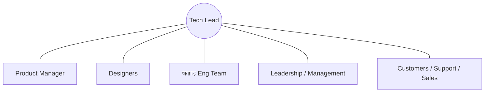

প্রত্যেকের আলাদা চিন্তা ও ভাষা: PM ভাবে ব্যবহারকারী ও business; leadership ভাবে timeline ও খরচ; অন্য team ভাবে নির্ভরশীলতা। আপনার কাজ — এদের মধ্যে technical বাস্তবতা অনুবাদ করা।

---

### ১৮.২ Tech Lead ও Product Manager সম্পর্ক

সবচেয়ে গুরুত্বপূর্ণ জুটি। দায়িত্বের ভাগ মোটামুটি এমন:

```
   Product Manager                 Tech Lead
   ───────────────                 ──────────
   কী বানাব (What)                 কীভাবে বানাব (How)
   কেন (Why) — user/business       technical সম্ভাব্যতা ও খরচ
   কখন দরকার (priority)            কত সময় লাগবে (estimate, ঝুঁকি)
```

> `মূল কথা` ভালো TL–PM সম্পর্ক = অংশীদারিত্ব, টানাটানি নয়। PM-কে technical খরচ/trade-off সৎভাবে জানান, যাতে সে ভালো priority সিদ্ধান্ত নিতে পারে; বিনিময়ে user/business context বুঝে নিন। একে অন্যকে ভালো দেখাতে সাহায্য করুন।

---

### ১৮.৩ Tech Debt non-technical মানুষকে বোঝানো

"Refactoring লাগবে" বললে business মানুষ শোনে "দেরি, কোনো নতুন feature নেই।" তাই **উপমা (analogy)** ও **business-ভাষা** ব্যবহার করুন:

```
দুর্বল:  "আমাদের module-টা refactor করতে হবে, coupling বেশি।"
ভালো:   "আমাদের ভিত্তিতে ফাটল জমেছে — প্রতিটি নতুন feature এখন ধীরে আসছে আর বেশি bug হচ্ছে।
         ২ সপ্তাহ মেরামতে দিলে এরপর feature ২x দ্রুত আসবে।"
```

মূল কৌশল: tech debt-কে **business ফলাফলে** অনুবাদ করুন (গতি, খরচ, ঝুঁকি, bug) — technical পরিভাষায় নয়।

---

### ১৮.৪ কঠিন কথোপকথন (Difficult Conversations)

- **খারাপ খবর আগে দিন:** project পিছোবে জানলে আজই বলুন, deadline-এর আগের দিন নয়। আগে জানালে বিকল্প থাকে।
- **সমস্যা + পরিকল্পনা একসাথে:** শুধু "দেরি হবে" নয় — "দেরি হবে; বিকল্প হলো A বা B; আমি A সুপারিশ করি কারণ..."
- **গঠনমূলকভাবে "না" বলুন:** "না, কারণ..." এবং সম্ভব হলে বিকল্প দিন। সব হ্যাঁ বলা = কিছুই ভালো না হওয়া।

> `সতর্কতা` খারাপ খবর চেপে রাখলে তা নিজে থেকে ভালো হয় না — শুধু দেরিতে, আরও বড় হয়ে ফাটে, এবং আপনার বিশ্বাসযোগ্যতা নষ্ট করে। স্বচ্ছতা স্বল্পমেয়াদে অস্বস্তিকর, দীর্ঘমেয়াদে আস্থা গড়ে।

---

### নিজেকে যাচাই করুন

1. একজন Tech Lead-এর প্রধান stakeholder কারা, এবং কে কোন "ভাষায়" ভাবে?
2. TL ও PM-এর দায়িত্ব কীভাবে ভাগ হয়? ভালো সম্পর্ক কেমন দেখায়?
3. Tech debt non-technical stakeholder-কে কীভাবে বোঝাবেন — একটি উদাহরণ দিন।
4. কঠিন খবর দেওয়ার ৩টি নীতি কী? খবর চেপে রাখা কেন ক্ষতিকর?

[↑ সূচিপত্রে ফিরুন](#toc)

---

<a id="ch-19"></a>

## অধ্যায় ১৯: Team Structure
### Team-এর কাঠামো

> Part 4 · Tech Lead

### মূল কথা

দল কীভাবে সাজানো, তা সরাসরি প্রভাব ফেলে আপনি কী ধরনের software বানাবেন তার উপর। এর কেন্দ্রে **Conway's Law**। ভালো Tech Lead/leader বোঝে — সঠিক architecture পেতে হলে আগে সঠিক team-কাঠামো ও যোগাযোগ দরকার। সাথে আসে দলের আকার, cognitive load, এবং hiring।

---

### ১৯.১ Conway's Law

> *"যে organization যেভাবে যোগাযোগ করে, তার বানানো system সেই যোগাযোগ-কাঠামোরই প্রতিফলন হয়।"*

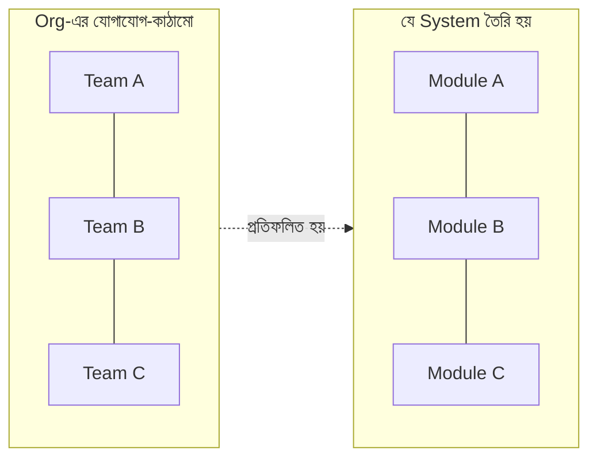

মানে: তিনটি বিচ্ছিন্ন team বানালে প্রায় নিশ্চিতভাবে তিনটি বিচ্ছিন্ন component তৈরি হবে, তাদের মাঝে আনাড়ি interface সহ।

**Inverse Conway Maneuver:** এটিকে উল্টো কাজে লাগানো — *আপনি যে architecture চান, আগে সেই অনুযায়ী team সাজান*। চাইলে loosely-coupled service — তাহলে স্বাধীন, loosely-coupled team বানান।

---

### ১৯.২ Team Topologies (উঁচু স্তরে)

আধুনিক চিন্তায় চার ধরনের team:

| ধরন | কাজ |
|-----|-----|
| **Stream-aligned** | একটি product/feature-ধারার মালিক (মূল দল) |
| **Platform** | অন্য দলকে সহজ internal tool/পরিষেবা দেয় |
| **Enabling** | অন্য দলকে নতুন দক্ষতা শিখতে সাহায্য করে (অস্থায়ী) |
| **Complicated-subsystem** | বিশেষ জটিল অংশ (যেমন ML/ভিডিও কোডেক) সামলায় |

লক্ষ্য — দলগুলোর মধ্যে যোগাযোগের পথ পরিষ্কার রাখা, যাতে প্রতিটি দল যথাসম্ভব স্বাধীনভাবে চলতে পারে (কম hand-off)।

---

### ১৯.৩ দলের আকার ও Cognitive Load

- **ছোট দল ভালো:** "two-pizza team" — দুটো পিৎজায় যত জনকে খাওয়ানো যায় (≈৫–৮ জন)। বড় দলে যোগাযোগের পথ বিস্ফোরকভাবে বাড়ে।
- **Cognitive Load:** একটি দল যত system/দায়িত্ব মাথায় রাখতে পারে তার সীমা আছে। বেশি চাপালে মান পড়ে। দলের দায়িত্বের পরিধি এই সীমার মধ্যে রাখুন।

```
যোগাযোগের পথ (n জন): n(n-1)/2
   ৩ জন → ৩ পথ      ৮ জন → ২৮ পথ      ১৫ জন → ১০৫ পথ (!)
   → তাই দল বড় হলে coordination-ই মূল কাজ হয়ে যায়
```

---

### ১৯.৪ Hiring

Tech Lead প্রায়ই interview ও hiring-এ যুক্ত। মূল নীতি:

- **ভূমিকা স্পষ্ট করুন:** কী দক্ষতা/মাত্রা দরকার, আগে ঠিক করুন — তারপর সেটা যাচাই করুন।
- **Bar উঁচু রাখুন:** তাড়াহুড়োয় দুর্বল নিয়োগের চেয়ে আসন খালি রাখা ভালো — ভুল নিয়োগ পরে দলকে ধীর করে।
- **শুধু coding নয়:** collaboration, communication, শেখার মানসিকতাও দেখুন।
- বৈচিত্র্য দলকে শক্তিশালী করে — ভিন্ন দৃষ্টিভঙ্গি ভালো সিদ্ধান্ত আনে।

---

### নিজেকে যাচাই করুন

1. Conway's Law নিজের ভাষায় বলুন। Inverse Conway Maneuver কী?
2. চার ধরনের team topology কী কী, প্রতিটির মূল কাজ কী?
3. "two-pizza team" ও cognitive load — দল কেন ছোট রাখা ভালো? (যোগাযোগ-পথের সূত্র মনে করুন)
4. Hiring-এ "bar উঁচু রাখা" মানে কী, এবং কেন খালি আসন কখনো দুর্বল নিয়োগের চেয়ে ভালো?

[↑ সূচিপত্রে ফিরুন](#toc)

---

<a id="ch-20"></a>

## অধ্যায় ২০: Team Dynamics
### Team-এর গতিশীলতা

> Part 4 · Tech Lead

### মূল কথা

একই দক্ষতার মানুষ নিয়ে গড়া দুই দলের ফলাফল আকাশ-পাতাল হতে পারে — পার্থক্যটা **dynamics**-এ, অর্থাৎ মানুষগুলো একসাথে কীভাবে কাজ করে। গবেষণায় সবচেয়ে বড় নির্ধারক হিসেবে উঠে আসে **Psychological Safety**। সাথে গুরুত্বপূর্ণ — সুস্থ দলের লক্ষণ চেনা এবং নতুন সদস্যকে ভালোভাবে onboard করা।

---

### ২০.১ Psychological Safety (সবচেয়ে গুরুত্বপূর্ণ)

Google-এর Project Aristotle গবেষণায় দেখা যায়, উচ্চ-পারফর্মিং দলের #১ বৈশিষ্ট্য — **Psychological Safety**: ঝুঁকি নিয়ে কথা বলা যায় (প্রশ্ন, দ্বিমত, ভুল স্বীকার) — শাস্তি বা হেয় হওয়ার ভয় ছাড়া।

```
নিম্ন Safety:                       উচ্চ Safety:
  "প্রশ্ন করলে বোকা ভাববে"            "জানি না — বুঝিয়ে দাও"
  "ভুল লুকাই"                        "আমার ভুল, এখান থেকে শিখি"
  "দ্বিমত করি না, ঝামেলা"            "আমি ভিন্নভাবে ভাবছি, শোনো"
        │                                  │
   ▼ ভুল লুকায়, শেখা কম           ▼ সমস্যা আগে ধরা পড়ে, দ্রুত শেখা
```

> `মূল কথা` Psychological safety মানে "কোনো জবাবদিহি নেই" বা "সব মেনে নেওয়া" নয়। মানে — **ভয় ছাড়া সত্য বলা যায়**। নেতা হিসেবে নিজে দুর্বলতা/ভুল স্বীকার করে, প্রশ্নকে স্বাগত জানিয়ে, দোষারোপ এড়িয়ে আপনি এটি গড়েন। (সংযোগ: Blameless postmortem — Ch 17।)

---

### ২০.২ সুস্থ ও উচ্চ-পারফর্মিং দলের লক্ষণ

- পরিষ্কার, অর্থবহ লক্ষ্য — সবাই জানে কেন কাজ করছে।
- পরস্পরের উপর নির্ভর করা যায় (dependability) — প্রতিশ্রুতি রক্ষা।
- স্বচ্ছ যোগাযোগ ও দ্বিমতের জায়গা।
- প্রতিটি সদস্যের কাজের impact ও তার মালিকানা।

---

### ২০.৩ নতুন Engineer Onboarding

প্রথম কয়েক সপ্তাহ দীর্ঘমেয়াদি ছাপ ফেলে। ভালো onboarding সংগঠিত হয়:

```
সপ্তাহ ১:   পরিবেশ চালু, দল/কোডবেস পরিচিতি, একজন "buddy" নির্ধারণ
সপ্তাহ ১–২: একটি ছোট, নিরাপদ কাজ ship করা (দ্রুত প্রথম জয় = আত্মবিশ্বাস)
সপ্তাহ ৩–৬: ক্রমশ বড় কাজ, প্রসঙ্গ (context) গভীর হওয়া
লক্ষ্য:     নতুন সদস্য দ্রুত "productive" ও "অন্তর্ভুক্ত" অনুভব করুক
```

- **Buddy/mentor** দিন — প্রশ্ন করার একজন নিরাপদ মানুষ।
- **দ্রুত প্রথম PR** — ছোট কিছু ship করালে আত্মবিশ্বাস ও গতি আসে।
- ভালো **documentation** onboarding-এর গতি বহুগুণ বাড়ায় (সংযোগ: Ch 9)।

> `সতর্কতা` নতুন কেউ এসে কয়েক সপ্তাহ দিশেহারা থাকা = সময় ও মনোবল দুটোরই অপচয়। Onboarding-কে দুর্ঘটনার ভরসায় না রেখে একটা পরিকল্পিত প্রক্রিয়া বানান।

---

### নিজেকে যাচাই করুন

1. Psychological safety কী, এবং কেন এটি দলের পারফরম্যান্সের #১ নির্ধারক? এটি কি "জবাবদিহিহীনতা"?
2. একজন নেতা হিসেবে psychological safety কীভাবে গড়বেন? (Ch 17-এর সাথে সংযোগ কোথায়?)
3. সুস্থ দলের ৩টি লক্ষণ বলুন।
4. ভালো onboarding-এর উপাদান কী কী? "দ্রুত প্রথম PR" কেন গুরুত্বপূর্ণ?

[↑ সূচিপত্রে ফিরুন](#toc)

---

> **Part 4 সারসংক্ষেপ:** Pragmatic Tech Lead = project-কে আশ্চর্যহীনভাবে delivered করা (Ch16) + নিরাপদে ও পর্যবেক্ষণযোগ্যভাবে ship (Ch17) + stakeholder-দের আস্থায় রাখা (Ch18) + Conway-সচেতন team-কাঠামো (Ch19) + psychological safety-ভিত্তিক সুস্থ dynamics (Ch20)। মূল সুর: technical নেতৃত্ব + মানুষ ও যোগাযোগ।

---

<a id="part-5"></a>

# Part 5 — Role-Model Staff & Principal Engineers
## আদর্শ Staff ও Principal Engineers

> **কাদের জন্য:** Staff/Principal হতে চাওয়া senior engineer।
> **মূল বার্তা:** এই স্তরে scope বিশাল হয়ে যায় — একটি team নয়, পুরো **organization বা business**। সরাসরি ক্ষমতা (direct report) নেই, তাই কাজ হয় **প্রভাব (influence)** দিয়ে। আপনি technical দিক ঠিক করেন, বিশাল-স্কেলের নির্ভরযোগ্য system গড়েন, এবং অন্য senior-দের গুণিতক করেন।

```
Part 5-এর যাত্রা:
   business বোঝা (Ch21)  →  প্রভাব দিয়ে সহযোগিতা (Ch22)  →  technical strategy (Ch23)
        →  নির্ভরযোগ্য system (Ch24)  →  distributed architecture (Ch25)
```

Tech Lead → Staff/Principal রূপান্তর:

```
Tech Lead:        "আমার দল ও project সফল হবে"
Staff/Principal:  "পুরো organization-এর technical দিক সঠিক হবে, এবং তা business-এর
                   জন্য সবচেয়ে মূল্যবান সমস্যাগুলো সমাধান করবে"
```

---

<a id="ch-21"></a>

## অধ্যায় ২১: Understanding the Business
### ব্যবসা বোঝা

> Part 5 · Staff / Principal

### মূল কথা

উঁচু স্তরে সেরা technical সিদ্ধান্ত নিতে হলে বুঝতে হয় — কোম্পানি কীভাবে **টাকা আয় করে**, কোন metric গুরুত্বপূর্ণ, এবং কোন সমস্যাগুলো business-এর জন্য সবচেয়ে মূল্যবান। Staff engineer-এর কাজ শুধু "ভালো system" নয় — "ব্যবসার জন্য সঠিক system।" Business না বুঝলে আপনি হয়তো নিখুঁতভাবে এমন জিনিস বানাবেন যা কেউ চায় না।

---

### ২১.১ কেন Engineer-কে Business বুঝতে হবে

```
শুধু technical দৃষ্টি:   "এই system-টা technically সুন্দর" → কিন্তু business-এ মূল্য কম
business সচেতন দৃষ্টি:   "এই কাজটা retention ৫% বাড়াবে" → প্রভাব স্পষ্ট, অগ্রাধিকার সহজ
```

Business বোঝা মানে আপনি (১) সঠিক সমস্যা বাছতে পারেন, (২) trade-off business-ভাষায় ব্যাখ্যা করতে পারেন, (৩) leadership-এর আস্থা পান।

---

### ২১.২ মূল Business Metrics

| Metric | মানে |
|--------|------|
| **Revenue** | মোট আয় |
| **Growth** | আয়/ব্যবহারকারী কত দ্রুত বাড়ছে |
| **Retention / Churn** | কত গ্রাহক থেকে যায় / চলে যায় |
| **CAC** (Customer Acquisition Cost) | একজন গ্রাহক আনতে খরচ |
| **LTV** (Lifetime Value) | একজন গ্রাহক সারা জীবনে কত আয় দেয় |
| **Margin** | আয় থেকে খরচ বাদে কত লাভ থাকে |

মূল সম্পর্ক: **LTV > CAC** না হলে business টেকে না (গ্রাহক আনতে যত খরচ, তার চেয়ে বেশি আয় আসতে হবে)। আপনার technical কাজ এসব metric-এর কোনটাকে প্রভাবিত করে — সেটা ভাবুন।

---

### ২১.৩ Profit Center বনাম Cost Center (গভীরে)

Ch 1-এ পরিচয় হয়েছে; Staff স্তরে এটি কৌশলগত। আপনার কাজ যদি cost center-এ হয়, তবু সেটিকে **profit center-এর ভাষায়** ব্যাখ্যা করতে শিখুন — "এই internal tool engineer-দের সময় বাঁচিয়ে বছরে X খরচ কমাচ্ছে।" Impact-কে সবসময় টাকা/গতি/ঝুঁকির সাথে যুক্ত করুন।

---

### ২১.৪ OKR (Objectives and Key Results)

কোম্পানি লক্ষ্য ঠিক ও মাপার একটি প্রচলিত কাঠামো:

```
Objective (লক্ষ্য):        গুণগত, অনুপ্রেরণামূলক — "চেকআউট অভিজ্ঞতা দারুণ করা"
  └ Key Result 1:          পরিমাপযোগ্য — "checkout সময় ৫s → ২s"
  └ Key Result 2:          পরিমাপযোগ্য — "checkout সফলতা ৯২% → ৯৭%"
  └ Key Result 3:          পরিমাপযোগ্য — "cart abandonment ১৫% কমানো"
```

Staff engineer হিসেবে নিজের ও দলের technical কাজকে এই OKR-গুলোর সাথে যুক্ত করুন — তাহলে আপনার কাজের মূল্য leadership-এর কাছে স্পষ্ট হয়, এবং আপনি নিশ্চিত হন যে সঠিক জিনিসে সময় দিচ্ছেন।

> `মূল কথা` সেরা Staff engineer-রা technical সিদ্ধান্ত আর business লক্ষ্যের মধ্যে সেতু। তারা "কীভাবে বানাব" আর "কেন বানাব"—দুটোই বোঝে, এবং দলকে সবচেয়ে মূল্যবান কাজের দিকে চালায়।

---

### নিজেকে যাচাই করুন

1. একজন Staff engineer-এর business বোঝা কেন জরুরি — technically সুন্দর system যথেষ্ট নয় কেন?
2. CAC ও LTV কী, এবং এদের সম্পর্ক কেন গুরুত্বপূর্ণ?
3. Cost center-এ কাজ করলেও impact কীভাবে "profit center-এর ভাষায়" বলবেন?
4. OKR-এর গঠন কী? নিজের technical কাজ এর সাথে যুক্ত করা কেন দরকার?

[↑ সূচিপত্রে ফিরুন](#toc)

---

<a id="ch-22"></a>

## অধ্যায় ২২: Collaboration (Staff Level)
### Staff স্তরের সহযোগিতা

> Part 5 · Staff / Principal

### মূল কথা

Staff engineer-এর কোনো direct report নেই, তবু তাকে বহু দল ও মানুষকে এক দিকে চালাতে হয়। এর একটাই উপায় — **Influence Without Authority (ক্ষমতা ছাড়া প্রভাব)**: যুক্তি, বিশ্বাসযোগ্যতা, সম্পর্ক ও পরিষ্কার লেখা দিয়ে মানুষকে রাজি করানো, আদেশ দিয়ে নয়। RFC প্রক্রিয়া ও cross-team alignment এর মূল হাতিয়ার।

---

### ২২.১ Influence Without Authority

```
Manager-এর হাতিয়ার:   কর্তৃত্ব ("এটা করো")  → পদমর্যাদা থেকে
Staff-এর হাতিয়ার:      প্রভাব ("এটা করা উচিত কারণ...") → আস্থা ও যুক্তি থেকে
```

প্রভাব গড়ার উপায়:

- **বিশ্বাসযোগ্যতা (credibility):** ধারাবাহিকভাবে ঠিক প্রমাণিত হওয়া; ভালো কাজের track record।
- **সম্পর্ক:** আগে থেকে দলগুলোর সাথে আস্থা গড়া (সংকটে নয়, আগেই)।
- **পরিষ্কার যুক্তি ও লেখা:** এমনভাবে উপস্থাপন যে মানুষ নিজেই বুঝে রাজি হয়।
- **অন্যের লক্ষ্য বোঝা:** আপনার প্রস্তাব তাদের লক্ষ্যও কীভাবে পূরণ করে দেখান (win-win)।

> `সতর্কতা` Staff স্তরে "আমি ঠিক, তাই সবাই শুনবে" — কাজ করে না। সবচেয়ে ভালো technical সমাধানও যদি কাউকে রাজি করাতে না পারেন, তা বাস্তবায়িত হয় না। প্রভাবই হলো সেই দক্ষতা যা ভালো ধারণাকে বাস্তবে রূপ দেয়।

---

### ২২.২ RFC (Request for Comments) প্রক্রিয়া

বড় technical সিদ্ধান্ত লেখার মাধ্যমে নেওয়ার একটি প্রচলিত উপায়:

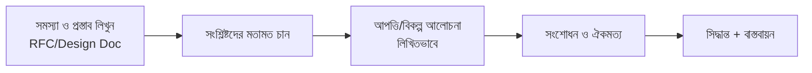

RFC-র সুবিধা: (১) চিন্তা লিখতে গিয়ে নিজের ভুল ধরা পড়ে, (২) সবাই একই জায়গায় মতামত দিতে পারে (async, scalable), (৩) সিদ্ধান্তের কারণ ভবিষ্যতের জন্য নথিভুক্ত থাকে ("কেন এমন করেছিলাম")।

একটি ভালো RFC-তে থাকে: সমস্যা ও context, প্রস্তাবিত সমাধান, **বিবেচিত বিকল্প ও কেন বাদ দিলেন**, trade-off, এবং প্রভাব।

---

### ২২.৩ Cross-Team Collaboration

একাধিক দলজড়িত কাজে Staff engineer প্রায়ই "আঠা" (glue):

- দলগুলোর মধ্যে নির্ভরশীলতা ও interface আগে স্পষ্ট করুন।
- ভিন্ন অগ্রাধিকার থাকলে সাধারণ লক্ষ্য (shared goal) তুলে ধরে align করুন।
- ঐকমত্য গড়ুন, কিন্তু সিদ্ধান্ত আটকে গেলে এগিয়ে গিয়ে সিদ্ধান্ত নিতে সাহায্য করুন (consensus মানে সর্বসম্মতি নয়)।

---

### ২২.৪ গুণিতক হওয়া (Force Multiplier)

সেরা Staff-রা নিজে যত করে, তার চেয়ে বেশি **অন্যদের দিয়ে করায়**: senior-দের mentor করা, engineering standard ঠিক করা, tech talk/লেখার মাধ্যমে জ্ঞান ছড়ানো, পুনঃব্যবহারযোগ্য platform/pattern বানানো। আপনার impact = আপনি যত মানুষ ও দলকে আরও ভালো করতে পারলেন।

---

### নিজেকে যাচাই করুন

1. "Influence without authority" মানে কী, এবং Staff-এর জন্য এটি কেন অপরিহার্য?
2. প্রভাব গড়ার ৩টি উপায় বলুন। "আমি ঠিক, তাই সবাই শুনবে" কেন যথেষ্ট নয়?
3. RFC প্রক্রিয়ার ৩টি সুবিধা কী? একটি ভালো RFC-তে কী কী থাকা উচিত?
4. একজন Staff engineer কীভাবে "force multiplier" হয়?

[↑ সূচিপত্রে ফিরুন](#toc)

---

<a id="ch-23"></a>

## অধ্যায় ২৩: Software Engineering (Staff Level)
### Staff স্তরের Software Engineering

> Part 5 · Staff / Principal

### মূল কথা

Staff স্তরে software engineering মানে আর একটি project নয় — পুরো organization-এর জন্য **technical দিকনির্দেশনা (strategy)** ঠিক করা, বছরের পর বছর ধরে চলা **large-scale migration/refactoring** নিরাপদে চালানো, এবং tech debt-কে কৌশলগতভাবে সামলানো। এখানে মূল চ্যালেঞ্জ — বিশাল scope-এ কাজ করেও system চালু ও স্থিতিশীল রাখা।

---

### ২৩.১ Technical Strategy

Technical strategy = "আগামী ১–৩ বছরে আমাদের technical দিক কী হবে, এবং কেন" — business লক্ষ্যের সাথে মিলিয়ে।

```
ভালো strategy যা করে:
  • সবচেয়ে গুরুত্বপূর্ণ technical সমস্যাগুলো চিহ্নিত করে (সব নয়)
  • স্পষ্ট দিক দেয় — দলগুলো নিজেরাই সঙ্গতিপূর্ণ সিদ্ধান্ত নিতে পারে
  • trade-off ও কী করব না (non-goals) স্পষ্ট করে
  • business লক্ষ্যের সাথে যুক্ত (Ch 21)
```

> `সতর্কতা` "নতুন আর চকচকে প্রযুক্তি" ধাওয়া করা strategy নয়। ভালো strategy প্রায়ই "বিরক্তিকর কিন্তু নির্ভরযোগ্য" পছন্দ করে — কারণ লক্ষ্য business সমস্যা সমাধান, technology নিয়ে খেলা নয়।

---

### ২৩.২ Large-Scale Refactoring ও Migration

পুরোনো system বদলানোর সময় "সব থামিয়ে নতুন করে লিখি" (big-bang rewrite) প্রায় সবসময়ই ব্যর্থ হয় — ঝুঁকি বিশাল, এবং চলতি system-এর সাথে তাল মেলানো যায় না। নিরাপদ উপায় — **ক্রমিক (incremental)**:

**Strangler Fig Pattern** — পুরোনো system-কে ধীরে ধীরে নতুন দিয়ে ঘিরে প্রতিস্থাপন:

```mermaid
flowchart LR
    subgraph ধাপ১
      U1[ব্যবহারকারী] --> O1[পুরোনো System]
    end
    subgraph ধাপ২
      U2[ব্যবহারকারী] --> P[Proxy/Router]
      P -->|কিছু অংশ| N2[নতুন System]
      P -->|বাকি অংশ| O2[পুরোনো System]
    end
    subgraph ধাপ৩
      U3[ব্যবহারকারী] --> N3[নতুন System]
    end
    ধাপ১ --> ধাপ২ --> ধাপ৩
```

- একটা একটা করে অংশ নতুনে সরান, প্রতি ধাপে যাচাই করুন।
- দরকারে পুরোনো ও নতুন **পাশাপাশি চালান (parallel run)** এবং ফলাফল মিলিয়ে দেখুন।
- feature flag দিয়ে নিয়ন্ত্রণ রাখুন, সমস্যা হলে সাথে সাথে পুরোনোতে ফেরত।

---

### ২৩.৩ Tech Debt কৌশলগতভাবে সামলানো

সব tech debt খারাপ নয় — কখনো দ্রুত ship করতে ইচ্ছাকৃত debt নেওয়া যুক্তিযুক্ত (ঋণের মতো)। Staff-এর কাজ:

- debt **দৃশ্যমান** করা (লুকিয়ে থাকলে কেউ সারায় না) — এবং business খরচে অনুবাদ (Ch 18)।
- কোন debt সত্যিই ব্যথা দিচ্ছে (গতি কমাচ্ছে/bug বাড়াচ্ছে) তা অগ্রাধিকার দেওয়া; বাকিটা থাক।
- বড় cleanup-কে চলমান কাজের সাথে মিশিয়ে ছোট অংশে করা (Boy Scout Rule-এর org সংস্করণ)।

---

### ২৩.৪ Build vs Buy

প্রতিটি বড় প্রয়োজনে প্রশ্ন: নিজেরা বানাব, নাকি কিনব/ready ব্যবহার করব?

```
নিজে বানান যখন:  এটা আপনার মূল পার্থক্য (core competency), বা বাজারে ভালো সমাধান নেই
কিনুন/ব্যবহার যখন: এটা সমাধান-হওয়া সাধারণ সমস্যা (auth, payment, logging) —
                  নিজে বানালে সময়/রক্ষণাবেক্ষণের অপচয়
```

> `মূল কথা` Engineer-রা প্রায়ই "নিজে বানানোর" দিকে ঝোঁকে (মজার, চ্যালেঞ্জিং)। কিন্তু Staff-এর দায়িত্ব business দৃষ্টিতে ভাবা — যা আপনার প্রতিযোগিতামূলক সুবিধা নয়, তা সাধারণত কিনে নেওয়াই বুদ্ধিমানের, যাতে দল আসল মূল্যবান কাজে সময় দিতে পারে।

---

### নিজেকে যাচাই করুন

1. ভালো technical strategy কী করে — এবং কেন "নতুন প্রযুক্তি ধাওয়া" strategy নয়?
2. Big-bang rewrite কেন ঝুঁকিপূর্ণ? Strangler Fig pattern কীভাবে কাজ করে?
3. সব tech debt কি খারাপ? Staff কীভাবে debt কৌশলগতভাবে সামলায়?
4. Build vs Buy সিদ্ধান্তে কী কী বিবেচনা করবেন? Engineer-দের সাধারণ পক্ষপাত কী?

[↑ সূচিপত্রে ফিরুন](#toc)

---

<a id="ch-24"></a>

## অধ্যায় ২৪: Reliable Software Systems
### নির্ভরযোগ্য Software Systems

> Part 5 · Staff / Principal

### মূল কথা

বড় স্কেলে **ব্যর্থতা অনিবার্য** — server পড়বে, network কাটবে, dependency ধীর হবে। নির্ভরযোগ্য system তৈরির মূল মানসিকতা: "ভাঙবে না" নয়, বরং **"ভাঙলেও যেন সুন্দরভাবে সামলে নেয়।"** এই অধ্যায়: failure-এর জন্য design করা, সুস্থ on-call, observability, এবং ইচ্ছাকৃতভাবে ভাঙিয়ে দুর্বলতা খোঁজা (chaos engineering)।

---

### ২৪.১ Failure-এর জন্য Design করা

ধরে নিন প্রতিটি অংশ যেকোনো সময় ব্যর্থ হতে পারে — তারপর সেই অনুযায়ী বানান:

| প্যাটার্ন | কী করে |
|----------|--------|
| **Redundancy** | একটার বদলে একাধিক copy — একটা পড়লে অন্যটা চালায় |
| **Graceful Degradation** | পুরো বন্ধ না হয়ে সীমিতভাবে চলা (যেমন recommendation না এলে সাধারণ list দেখানো) |
| **Timeout** | অন্য service-এর উত্তরের জন্য অসীম অপেক্ষা নয় — সময়সীমা |
| **Retry + Backoff** | ব্যর্থ call আবার চেষ্টা, কিন্তু ক্রমশ বেশি বিরতি দিয়ে (যেন আরও চাপ না পড়ে) |
| **Circuit Breaker** | বারবার ব্যর্থ হলে কিছুক্ষণ call বন্ধ রাখা, যাতে পড়ন্ত service সেরে উঠতে পারে |
| **Idempotency** | একই request দুইবার এলেও যেন ক্ষতি না হয় (দুইবার টাকা না কাটে) |

**Circuit Breaker-এর তিন অবস্থা:**

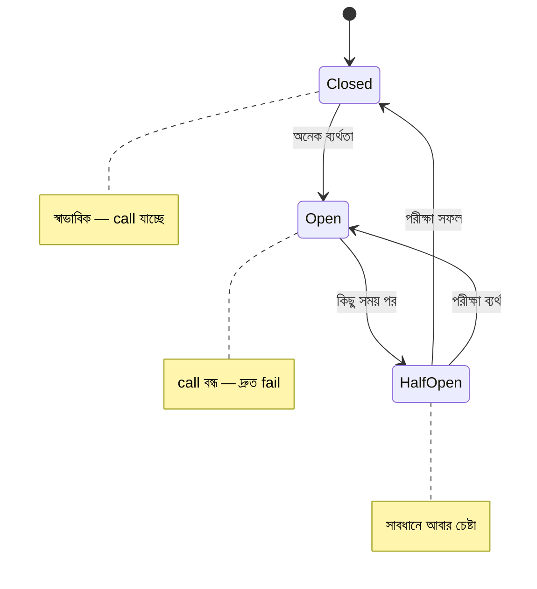

> `সতর্কতা` সাবধানহীন retry বিপজ্জনক: একটা service ধীর হলে সবাই মিলে retry করে তাকে আরও ডুবিয়ে দেয় ("retry storm")। তাই retry-র সাথে অবশ্যই backoff ও circuit breaker দরকার।

---

### ২৪.২ On-Call Engineering

Production সমস্যায় সাড়া দেওয়ার দায়িত্ব (rotation-এ)। সুস্থ on-call:

- **Actionable alert:** প্রতিটি alert-এ আসল করণীয় থাকবে; মিথ্যা/অপ্রয়োজনীয় alert বাদ (নাহলে alert fatigue — Ch 17)।
- **Runbook:** সাধারণ সমস্যার জন্য ধাপে ধাপে সমাধান-নথি, যাতে ঘুম থেকে উঠেও অনুসরণ করা যায়।
- **Toil কমানো:** বারবার একই হাতে-কাজ আসলে সেটা অটোমেট/স্থায়ীভাবে ঠিক করুন।
- **মানবিক rotation:** কেউ যেন অতিরিক্ত চাপে burnout না হয়; ভার ভাগ করে নেওয়া।

---

### ২৪.৩ Chaos Engineering

ইচ্ছাকৃতভাবে নিয়ন্ত্রিত পরিবেশে ব্যর্থতা ঢুকিয়ে (server বন্ধ, network ধীর) দেখা — system সামলাতে পারে কিনা।

```
চিন্তা:  "দুর্ঘটনা আমাদের খুঁজে বের করার আগেই, আমরা নিজেরা দুর্বলতা খুঁজে বের করি"
        → এতে আসল রাত ৩টার incident-এর আগেই ফাঁকগুলো ধরা পড়ে ও ঠিক হয়
```

মূল শর্ত: ছোট পরিসরে, নিয়ন্ত্রিতভাবে, এবং পর্যবেক্ষণসহ — যাতে শেখা যায়, ক্ষতি না হয়।

---

### ২৪.৪ মূল নীতি — Reliability একটি Trade-off

১০০% নির্ভরযোগ্যতা অসম্ভব ও অপ্রয়োজনীয় ব্যয়বহুল (Error Budget — Ch 17)। প্রশ্ন "কত নির্ভরযোগ্য হলে যথেষ্ট" — তা business-এর উপর নির্ভর (একটি ব্যাংক বনাম একটি ব্লগ আলাদা)। অতিরিক্ত নির্ভরযোগ্যতায় বিনিয়োগ মানে কম feature — এই ভারসাম্য সচেতনভাবে ঠিক করুন।

---

### নিজেকে যাচাই করুন

1. বড় স্কেলে নির্ভরযোগ্যতার মূল মানসিকতা কী — "ভাঙবে না" কেন নয়?
2. Circuit Breaker কী সমস্যা সমাধান করে? এর তিন অবস্থা বলুন। "Retry storm" কী?
3. সুস্থ on-call-এর উপাদান কী কী? Runbook ও actionable alert কেন জরুরি?
4. Chaos engineering-এর যুক্তি কী? এটি নিরাপদে করার শর্ত কী?
5. কেন reliability একটি trade-off — "কত হলে যথেষ্ট" কীসের উপর নির্ভর করে?

[↑ সূচিপত্রে ফিরুন](#toc)

---

<a id="ch-25"></a>

## অধ্যায় ২৫: Software Architecture (Staff Level)
### Staff স্তরের Software Architecture

> Part 5 · Staff / Principal

### মূল কথা

বড় স্কেলে architecture মানে প্রায়ই **distributed systems** — অনেক মেশিন/service একসাথে কাজ করে। এতে এমন কঠিন সমস্যা আসে যা একটি মেশিনে থাকে না: network অনির্ভরযোগ্য, আংশিক ব্যর্থতা, এবং consistency বনাম availability-র টানাপোড়েন। এই অধ্যায়: distributed-এর চ্যালেঞ্জ, CAP, scalability, এবং বড় system সংগঠিত রাখার ধারণা (DDD, CQRS, event sourcing)।

---

### ২৫.১ Distributed Systems-এর চ্যালেঞ্জ

একাধিক মেশিন জড়ালেই কিছু "মিথ্যা ধারণা" (fallacies) বিপদ ডেকে আনে — বাস্তবে:

```
✗ ভুল ধারণা            ✓ বাস্তবতা
  network নির্ভরযোগ্য      network যেকোনো সময় কাটতে পারে
  latency শূন্য            দূরত্ব ও hop সময় নেয়
  bandwidth অসীম          সীমিত
  সব মেশিন একসাথে চলে      একটা পড়ে, বাকিরা চলে → "আংশিক ব্যর্থতা"
```

সবচেয়ে কঠিন নতুন সমস্যা — **partial failure**: একটা service হ্যাঁ/না কিছুই না বলে চুপ হয়ে যায়; কলকারী জানে না কাজটা হয়েছে কিনা। (এজন্যই idempotency, timeout — Ch 24 — এত গুরুত্বপূর্ণ।)

---

### ২৫.২ CAP Theorem

distributed data store-এ network partition (P) হলে — দুটোর একটি বাছতে হয়: **Consistency** নাকি **Availability**।

```
            Consistency (C)
            সবাই একই সর্বশেষ ডেটা দেখে
                  /\
                 /  \
                /    \
               /      \
   Availability ──────── Partition Tolerance
   (A) সবসময়           (P) network কাটলেও
   উত্তর দেয়             system চলে

   বাস্তবে P এড়ানো যায় না (network কাটবেই),
   তাই আসল পছন্দ:  partition-এর সময় C নেব না A নেব?
     • CP: consistency রাখি, দরকারে উত্তর দেওয়া বন্ধ (যেমন ব্যাংকিং)
     • AP: উত্তর দিতে থাকি, কিছু সময় পুরোনো ডেটা চলবে (যেমন social feed)
```

এর সাথে যুক্ত — **Eventual Consistency:** এখন সব node-এ এক না হলেও, কিছু সময় পর সবাই মিলে যাবে। অনেক বড় system এটি বেছে নেয় (availability-র জন্য)।

---

### ২৫.৩ Scalability

| | **Vertical Scaling** | **Horizontal Scaling** |
|---|---------------------|------------------------|
| কী | এক মেশিন আরও শক্তিশালী করা | আরও মেশিন যোগ করা |
| সীমা | একসময় থেমে যায় (hardware সীমা) | প্রায় অসীম (যদি ঠিকভাবে design করা) |
| জটিলতা | সহজ | বেশি (coordination দরকার) |

বড় স্কেলের মূল কৌশল:

- **Statelessness:** server-এ state না রেখে (বাইরে DB/cache-এ) — তাহলে যেকোনো server যেকোনো request নিতে পারে, সহজে আরও যোগ করা যায়।
- **Load Balancing:** request-গুলো বহু server-এ ভাগ করা।
- **Sharding/Partitioning:** বিশাল ডেটা টুকরো করে আলাদা মেশিনে রাখা (যেমন user-id অনুযায়ী)।
- **Replication:** ডেটার copy একাধিক জায়গায় — পড়া দ্রুত ও fault-tolerant।

```
Sharding (user-id দিয়ে):
   Shard A: id 0–999k     Shard B: id 1M–1.99M     Shard C: ...
   → প্রতিটি shard আলাদা মেশিন, একসাথে বিশাল load সামলায়
```

---

### ২৫.৪ Event Sourcing ও CQRS (উঁচু ধারণা)

- **Event Sourcing:** শুধু "বর্তমান অবস্থা" না রেখে, **প্রতিটি ঘটনা** (event) ক্রমে সংরক্ষণ করা। বর্তমান অবস্থা = সব event পুনরায় চালিয়ে পাওয়া যায়। সুবিধা — সম্পূর্ণ ইতিহাস ও audit; অসুবিধা — জটিলতা।
- **CQRS** (Command Query Responsibility Segregation): **লেখা (command)** আর **পড়া (query)**-র পথ আলাদা করা — যাতে দুটোকে আলাদাভাবে optimize/scale করা যায়।

> `সতর্কতা` এগুলো শক্তিশালী কিন্তু জটিল। বেশিরভাগ system-এর এদের দরকার নেই — নির্দিষ্ট সমস্যা (যেমন কড়া audit, বা পড়া-লেখার অসম load) থাকলে তবেই। অকারণে নিলে শুধু জটিলতা বাড়ে (YAGNI আবারও)।

---

### ২৫.৫ Domain-Driven Design (DDD)

বড় system-কে business **domain** অনুযায়ী সংগঠিত করার চিন্তা:

- **Bounded Context:** প্রতিটি অংশের নিজস্ব স্পষ্ট সীমানা ও model (যেমন "Billing" context-এ "Order"-এর মানে "Catalog" context-এর "Order" থেকে আলাদা হতে পারে)।
- **Ubiquitous Language:** engineer ও business একই শব্দ একই অর্থে ব্যবহার করবে — যাতে কোড ও কথা মেলে।

```
┌── Bounded Context: Orders ──┐   ┌── Bounded Context: Shipping ──┐
│  Order, Cart, Checkout       │   │  Shipment, Address, Carrier    │
│  (নিজস্ব model ও ভাষা)        │◄─►│  (নিজস্ব model ও ভাষা)          │
└──────────────────────────────┘   └────────────────────────────────┘
        স্পষ্ট সীমানা ও interface — Conway's Law (Ch 19)-এর সাথে মিলিয়ে দল ভাগ
```

> `মূল কথা` সবচেয়ে বড় বিপদ — **Distributed Monolith:** নাম microservices, কিন্তু সব এত শক্তভাবে জড়িত যে একটা বদলালে সব বদলাতে হয় — microservices-এর জটিলতা পেলেন, সুবিধা পেলেন না। সঠিক সীমানা (bounded context) টানাই এর প্রতিকার।

---

### নিজেকে যাচাই করুন

1. Distributed systems-এর ২টি "মিথ্যা ধারণা" বলুন। "Partial failure" কেন এত কঠিন?
2. CAP theorem ব্যাখ্যা করুন। partition-এর সময় CP ও AP-র পার্থক্য, উদাহরণসহ।
3. Vertical ও Horizontal scaling-এর পার্থক্য কী? Statelessness কেন scaling সহজ করে?
4. Event Sourcing ও CQRS কী — এবং কখন এদের *এড়ানো* উচিত?
5. Bounded Context ও Ubiquitous Language কী? "Distributed Monolith" কেন সবচেয়ে খারাপ পরিণতি?

[↑ সূচিপত্রে ফিরুন](#toc)

---

> **Part 5 সারসংক্ষেপ:** Role-model Staff/Principal = business বুঝে সঠিক সমস্যা বাছা (Ch21) + ক্ষমতা ছাড়া প্রভাব (Ch22) + organization-wide technical strategy ও নিরাপদ migration (Ch23) + failure-সহনশীল নির্ভরযোগ্য system (Ch24) + distributed architecture-এর trade-off আয়ত্ত (Ch25)। সুর: scope এখন পুরো organization ও business।

---

<a id="bonus"></a>

# Bonus Chapters — অতিরিক্ত পাঠ

> মূল বইয়ে প্রতিটি Part-এর জন্য একটি করে **Bonus Chapter** আছে (মোট ৫টি)। এগুলো ওই Part-এর মূল ধারণাগুলোর **ব্যবহারিক সম্প্রসারণ** — বাড়তি উদাহরণ, টুকিটাকি পরামর্শ ও বাস্তব প্রয়োগ।

| Bonus | যে Part-এর সাথে | সাধারণত যা থাকে |
|-------|----------------|------------------|
| Bonus #1 | Part 1 — Career | ক্যারিয়ার সিদ্ধান্তের বাড়তি বাস্তব পরামর্শ |
| Bonus #2 | Part 2 — Developer | দক্ষতা গড়ার অতিরিক্ত অভ্যাস ও টুল |
| Bonus #3 | Part 3 — Senior | senior-সুলভ চিন্তা ও সহযোগিতার গভীর উদাহরণ |
| Bonus #4 | Part 4 — Tech Lead | নেতৃত্ব ও delivery-র বাড়তি কৌশল |
| Bonus #5 | Part 5 — Staff/Principal | প্রভাব ও system-চিন্তার সম্প্রসারণ |

> **পরামর্শ:** Bonus chapter-গুলো সংশ্লিষ্ট Part শেষ করার পরপরই পড়ুন — মূল ধারণা তখনো তাজা থাকে, তাই ব্যবহারিক উদাহরণগুলো ভালো বসে। এই কম্প্যানিয়নে এদের আলাদা সারাংশ রাখা হয়নি; আপনার কাছে থাকা মূল বই থেকেই এগুলো পড়ে নিন (এই ডকুমেন্টের উদ্দেশ্য মূল অধ্যায়গুলোর দ্রুত রিক্যাপ)।

[↑ সূচিপত্রে ফিরুন](#toc)

---

<a id="conclusion"></a>

# Conclusion — উপসংহার

### পুরো যাত্রার এক নজর

```
   কোড লিখি  →  নির্ভরযোগ্যভাবে কাজ শেষ করি  →  মানুষ+design+system সামলাই (Senior)
       →  দল ও project চালাই (Tech Lead)  →  organization ও business-এ প্রভাব রাখি (Staff/Principal)
```

পুরো বইয়ের মূল সত্য একটাই: **প্রতিটি level-এ "ভালো engineer"-এর সংজ্ঞা বদলে যায়।** নিচের দিকে দক্ষতা বেশি technical; উপরের দিকে মানুষ, যোগাযোগ ও সিদ্ধান্তের ওজন বাড়ে। কিন্তু একটা জিনিস সব level-এ এক — **চমৎকার কাজ করা এবং তা দৃশ্যমান করা।**

---

### সব level-এর জন্য চিরন্তন পাঠ

1. **নিজের ক্যারিয়ারের মালিক নিজে হোন** — অপেক্ষা নয়, পরিচালনা করুন।
2. **ভালো কাজ + দৃশ্যমানতা** — একটি ছাড়া অন্যটি অসম্পূর্ণ।
3. **প্রভাব মাপুন, ব্যস্ততা নয়** — সঠিক কাজ করা > বেশি কাজ করা।
4. **সরলতা > চাতুর্য** — কোডে, design-এ, architecture-এ।
5. **Trade-off-এ ভাবুন** — কোনো "নিখুঁত উত্তর" নেই; context সব ঠিক করে।
6. **মানুষই সব** — উপরের দিকে গেলে সাফল্য ক্রমশ অন্যদের মাধ্যমে আসে।
7. **শেখা থামাবেন না** — প্রযুক্তি বদলায়; শেখার অভ্যাসই আসল দক্ষতা।

---

### বিভিন্ন level-এ মূল প্রত্যাশা (এক নজরে)

| Level | scope | মূল প্রশ্ন যার উত্তর আপনি | সাফল্যের মাপ |
|-------|-------|---------------------------|---------------|
| **Junior** | নিজের task | "কাজটা শেষ করতে পারি?" | নির্ভরযোগ্যভাবে কাজ শেষ |
| **Mid** | নিজের project অংশ | "একা একটা feature নিতে পারি?" | স্বাধীন delivery |
| **Senior** | পুরো feature/project | "অস্পষ্ট সমস্যার মালিকানা ও দলকে এগিয়ে নিতে পারি?" | outcome + অন্যদের উন্নতি |
| **Staff** | একাধিক team/system | "organization-wide সমস্যা প্রভাব দিয়ে সমাধান করতে পারি?" | বহু-দলীয় technical impact |
| **Principal** | org/business | "business-এর সবচেয়ে বড় technical দিক ঠিক করতে পারি?" | company-স্তরের impact |

---

### শেষ কথা

ক্যারিয়ার একটা দৌড় নয় — দীর্ঘ একটা পথচলা। সবাইকে Principal হতে হবে না; **Senior** হওয়াই অনেকের জন্য চমৎকার, পূর্ণ একটা গন্তব্য। গুরুত্বপূর্ণ হলো — কোন পথে যাচ্ছেন তা **সচেতনভাবে বেছে নেওয়া**, এবং প্রতিটি ধাপে ভালো কাজ ও ভালো মানুষ হওয়া। এই বই সেই সচেতন যাত্রার মানচিত্র — আর এই ডকুমেন্ট সেই মানচিত্রে দ্রুত ফিরে আসার পথ।

[↑ সূচিপত্রে ফিরুন](#toc)

---

<a id="appendix-recap"></a>

# পরিশিষ্ট A — পুরো বই এক নজরে (Recap Matrix)

> রিভিশনের জন্য সবচেয়ে দ্রুত হাতিয়ার। প্রতিটি অধ্যায়ের একটি বাক্যের সারমর্ম। কোনোটা মনে না পড়লে — ওই অধ্যায়ে ফিরে যান।

| # | অধ্যায় | এক বাক্যে মূল কথা |
|---|--------|---------------------|
| ১ | [Career Paths](#ch-1) | মাঠ চিনুন: কোম্পানির ধরন, terminal level (Senior), IC vs Management, trimodal pay, profit center। |
| ২ | [Owning Your Career](#ch-2) | দায়িত্ব নিজের: চমৎকার কাজ + দৃশ্যমানতা + work log + sponsor + stretch খোঁজা। |
| ৩ | [Performance Reviews](#ch-3) | প্রক্রিয়া বুঝে impact দেখান; "no surprises"; calibration-এর জন্য প্রমাণ জমান। |
| ৪ | [Promotions](#ch-4) | পরের level-এর কাজ আগে শুরু করুন; scope বাড়ান, খাটুনি নয়; Senior-এর পর auto নয়। |
| ৫ | [Thriving in Environments](#ch-5) | culture পড়ে মানিয়ে নিন; remote-এ over-communicate; toxic চিনে বেরিয়ে আসুন। |
| ৬ | [Switching Jobs](#ch-6) | growth থামলে কৌশলে বদলান; আগে internal transfer; negotiate; ভালোভাবে ছাড়ুন। |
| ৭ | [Getting Things Done](#ch-7) | বুঝে শুরু, কাজ ভাগ, অনিশ্চয়তাসহ estimate, timebox-তারপর-সাহায্য। |
| ৮ | [Coding](#ch-8) | readable/simple/maintainable/testable; কোড বেশি পড়া হয়; debug ধাপে ধাপে; Boy Scout। |
| ৯ | [Software Development](#ch-9) | একটি language গভীরে; commit-এ "কেন"; AAA test; পাঠকের জন্য doc। |
| ১০ | [Tools](#ch-10) | দ্রুত feedback loop + automation = চক্রবৃদ্ধি লাভ; tool-perfectionism এড়ান। |
| ১১ | [GTD (Senior)](#ch-11) | task নয়, outcome-এর মালিকানা; impact/effort-এ prioritize; perception ≠ reality। |
| ১২ | [Collaboration](#ch-12) | শ্রোতা বুঝে যোগাযোগ; mentor vs coach; disagree & commit; ভালো pairing। |
| ১৩ | [Software Engineering](#ch-13) | pattern বিচক্ষণে; SOLID; ভালো abstraction; hard-to-misuse API; YAGNI। |
| ১৪ | [Testing](#ch-14) | test = পরিবর্তনের সাহস; pyramid; TDD; coverage লক্ষ্য নয়; behavior test করুন। |
| ১৫ | [Architecture](#ch-15) | high-level structure; monolith→micro trade-off; SQL/NoSQL; cache; নিখুঁত নেই। |
| ১৬ | [Project Management](#ch-16) | TL ≠ manager; plan + dependency; Agile-এর spirit; risk আগে; scope কাটুন। |
| ১৭ | [Shipping in Production](#ch-17) | ছোট deploy; canary; deploy≠release; mitigate-first; blameless; SLI/SLO/SLA + error budget। |
| ১৮ | [Stakeholder Management](#ch-18) | কে কী চায় বুঝুন; TL+PM অংশীদার; tech debt business-ভাষায়; খারাপ খবর আগে। |
| ১৯ | [Team Structure](#ch-19) | Conway's Law; inverse Conway; team topologies; two-pizza; hire bar উঁচু। |
| ২০ | [Team Dynamics](#ch-20) | psychological safety #১; সুস্থ দলের লক্ষণ; পরিকল্পিত onboarding, দ্রুত first PR। |
| ২১ | [Understanding Business](#ch-21) | business বুঝুন; CAC/LTV; OKR; impact-কে টাকা/গতি/ঝুঁকিতে অনুবাদ। |
| ২২ | [Collaboration (Staff)](#ch-22) | influence without authority; RFC দিয়ে সিদ্ধান্ত; cross-team align; force multiplier। |
| ২৩ | [Software Engineering (Staff)](#ch-23) | tech strategy; strangler fig (no big-bang); debt কৌশলে; build vs buy। |
| ২৪ | [Reliable Systems](#ch-24) | failure-জন্য design (retry+backoff, circuit breaker, idempotency); সুস্থ on-call; chaos। |
| ২৫ | [Architecture (Staff)](#ch-25) | distributed fallacies; CAP; horizontal+stateless+shard; DDD; distributed monolith এড়ান। |

[↑ সূচিপত্রে ফিরুন](#toc)

---

<a id="appendix-glossary"></a>

# পরিশিষ্ট B — Glossary (পরিভাষা)

| Term | সহজ বাংলা ব্যাখ্যা |
|------|---------------------|
| **IC (Individual Contributor)** | যে engineer মানুষ manage না করে নিজে technical কাজ করে |
| **Terminal Level** | যে level-এ চাইলে সারা জীবন থাকা যায়, উপরে ওঠার চাপ নেই (সাধারণত Senior) |
| **Total Compensation (TC)** | base + bonus + equity + benefits — মোট প্যাকেজ |
| **RSU** | কোম্পানির শেয়ার যা সময়ের সাথে আপনার হয় (vest হয়) |
| **Trimodal Comp** | বাজারে একই কাজের বেতনের তিনটি আলাদা স্তর থাকে |
| **Profit / Cost Center** | যে দল সরাসরি আয় করে / যে দল খরচ করে (support) |
| **Sponsor** | যে senior আপনার অনুপস্থিতিতে আপনার হয়ে কথা বলে |
| **Calibration** | managers মিলে সবার rating তুলনা করে ন্যায্য করার মিটিং |
| **DRY** | Don't Repeat Yourself — একই logic বারবার নয় |
| **YAGNI** | You Aren't Gonna Need It — আগেভাগে অপ্রয়োজনীয় জটিলতা নয় |
| **SOLID** | পরিবর্তনযোগ্য OO design-এর ৫টি নীতি |
| **Coupling / Cohesion** | module-গুলোর পরস্পর নির্ভরতা / module-এর ভেতরের সংহতি (লক্ষ্য: low coupling, high cohesion) |
| **Test Pyramid** | অনেক unit, কম integration, খুব কম E2E — আদর্শ অনুপাত |
| **TDD** | আগে test, পরে কোড (Red-Green-Refactor) |
| **Flaky Test** | যে test কখনো পাস কখনো fail — বিশ্বাসযোগ্যতা নষ্ট করে |
| **CI/CD** | স্বয়ংক্রিয় build/test/deploy পাইপলাইন |
| **Canary** | নতুন version আগে অল্প ব্যবহারকারীকে দেওয়া, পরে সবাইকে |
| **Blue-Green** | দুটি পরিবেশ; switch করে deploy, সমস্যায় ফেরত |
| **Feature Flag** | কোড deploy থাকে কিন্তু switch দিয়ে চালু/বন্ধ (deploy ≠ release) |
| **Blameless Postmortem** | ব্যক্তি নয়, system-এর দুর্বলতা থেকে শেখা |
| **SLI / SLO / SLA** | পরিমাপ / নিজেদের লক্ষ্য / গ্রাহকের সাথে চুক্তি |
| **Error Budget** | অনুমোদিত ব্যর্থতার পরিমাণ (১০০% reliability অবাস্তব) |
| **Observability** | logs + metrics + traces দিয়ে system-এর ভেতর বোঝা |
| **Conway's Law** | org-এর যোগাযোগ-কাঠামো system-এর গঠনে প্রতিফলিত হয় |
| **Psychological Safety** | ভয় ছাড়া প্রশ্ন/দ্বিমত/ভুল স্বীকার করার পরিবেশ |
| **OKR** | Objective + পরিমাপযোগ্য Key Results — লক্ষ্য ঠিক করার কাঠামো |
| **CAC / LTV** | গ্রাহক আনার খরচ / গ্রাহকের আজীবন মূল্য (LTV > CAC লাগে) |
| **Influence Without Authority** | ক্ষমতা ছাড়া, যুক্তি ও আস্থা দিয়ে মানুষকে রাজি করানো |
| **RFC** | লিখিত প্রস্তাব দিয়ে technical সিদ্ধান্ত নেওয়ার প্রক্রিয়া |
| **Strangler Fig** | পুরোনো system ধীরে ধীরে নতুন দিয়ে প্রতিস্থাপন |
| **Circuit Breaker** | বারবার ব্যর্থ dependency-তে কিছুক্ষণ call বন্ধ রাখা |
| **Idempotency** | একই request দুইবার এলেও একবারের মতোই ফল |
| **CAP Theorem** | partition-এ Consistency নাকি Availability — একটি বাছুন |
| **Eventual Consistency** | কিছু সময় পর সব node একই ডেটায় মিলে যায় |
| **Sharding** | বিশাল ডেটা টুকরো করে আলাদা মেশিনে রাখা |
| **Statelessness** | server-এ state না রাখা, যাতে scaling সহজ হয় |
| **Event Sourcing / CQRS** | প্রতিটি ঘটনা সংরক্ষণ / পড়া-লেখার পথ আলাদা করা |
| **DDD / Bounded Context** | domain অনুযায়ী system ভাগ; প্রতিটির নিজস্ব model ও সীমানা |
| **Distributed Monolith** | নামে microservices, কিন্তু সব জড়িত — সবচেয়ে খারাপ পরিণতি |

[↑ সূচিপত্রে ফিরুন](#toc)

---

<a id="appendix-checklist"></a>

# পরিশিষ্ট C — Career Growth Checklist

**Senior হতে চাইলে (Part 2 → 3):**

- [ ] নির্ভরযোগ্যভাবে নিজের কাজ শেষ করি, কম তদারকিতে
- [ ] readable, testable কোড লিখি; ভালো code review দিই ও নিই
- [ ] অস্পষ্ট সমস্যার মালিকানা নিই, নিজে পরিকল্পনায় রূপ দিই
- [ ] impact-এ prioritize করি; কাজ দৃশ্যমান রাখি
- [ ] অন্যদের সাহায্য করি, mentor করি, ভালো communicate করি
- [ ] design/testing/architecture-এ trade-off বুঝে সিদ্ধান্ত নিই

**Staff হতে চাইলে (Part 3 → 5):**

- [ ] একাধিক team জড়িত সমস্যা প্রভাব (authority ছাড়া) দিয়ে সমাধান করি
- [ ] RFC/design doc লিখে technical সিদ্ধান্ত চালাই
- [ ] business বুঝি; কাজকে business লক্ষ্যের (OKR) সাথে যুক্ত করি
- [ ] organization-wide technical দিক/standard গঠনে ভূমিকা রাখি
- [ ] বড় migration নিরাপদে (incremental) চালাতে পারি
- [ ] নির্ভরযোগ্য, scalable system design করি; অন্যদের গুণিতক করি

> এই checklist-গুলোই মূলত আপনার **promotion case**-এর কাঁচামাল। প্রতিটি বুলেটের পাশে নিজের একটি করে বাস্তব উদাহরণ (work log থেকে) লিখে রাখুন।

[↑ সূচিপত্রে ফিরুন](#toc)

---

<a id="appendix-revision"></a>

# পরিশিষ্ট D — রিভিশন প্ল্যান (Spaced Repetition)

এই কম্প্যানিয়ন দিয়ে দীর্ঘমেয়াদে মনে রাখার একটি সহজ ছক:

```
দিন ০:    মূল বইয়ের অধ্যায় পড়ুন → এই কম্প্যানিয়নের একই অধ্যায় পড়ুন
দিন ১:    শুধু "মূল কথা" + Diagram + "নিজেকে যাচাই করুন" দেখুন
দিন ৭:    Recap Matrix (পরিশিষ্ট A) থেকে অধ্যায়ের এক-বাক্য মনে করার চেষ্টা
দিন ৩০:   "নিজেকে যাচাই করুন" প্রশ্নগুলোর উত্তর মুখে মুখে দিন; না পারলে ফিরে পড়ুন
চলমান:    মাসে একবার Recap Matrix পুরোটা চোখ বুলিয়ে নিন (১০ মিনিট)
```

**সবচেয়ে কার্যকর কৌশল — Active Recall:** পড়ার বদলে **মনে করার চেষ্টা** করুন। প্রতিটি অধ্যায়ের "নিজেকে যাচাই করুন" প্রশ্নের উত্তর আগে নিজে দিন, *তারপর* মিলিয়ে নিন। যা মনে করতে পারলেন না — সেটাই আপনার পরবর্তী পড়ার তালিকা।

[↑ সূচিপত্রে ফিরুন](#toc)

---

<a id="appendix-resources"></a>

# পরিশিষ্ট E — আরও পড়ার তালিকা (Resources)

**মূল বই ও লেখক:**

- *The Software Engineer's Guidebook* — Gergely Orosz ([engguidebook.com](https://www.engguidebook.com/))
- *The Pragmatic Engineer* newsletter — লেখকের নিয়মিত লেখা ([newsletter.pragmaticengineer.com](https://newsletter.pragmaticengineer.com/))

**পরিপূরক বই (level অনুযায়ী):**

| বিষয় | বই |
|------|----|
| Staff+ ক্যারিয়ার | *Staff Engineer* — Will Larson |
| Management পথ | *The Manager's Path* — Camille Fournier |
| কোড ডিজাইন | *A Philosophy of Software Design* — John Ousterhout |
| Refactoring | *Refactoring* — Martin Fowler |
| বড় স্কেল system | *Designing Data-Intensive Applications* — Martin Kleppmann |

**এই রিপোজিটরির সম্পর্কিত নোট:**

- [refactoring.md](./refactoring.md) — Refactoring-এর পূর্ণ বাংলা রেফারেন্স (26 smells + 80 techniques), Ch 8 ও Ch 23-এর সাথে সরাসরি সম্পর্কিত।

[↑ সূচিপত্রে ফিরুন](#toc)

---

> **এই ডকুমেন্ট সম্পর্কে:** এটি *The Software Engineer's Guidebook* (Gergely Orosz)-এর একটি স্বাধীন বাংলা রিক্যাপ/স্টাডি কম্প্যানিয়ন — মূল বইয়ের কাঠামো অনুসরণ করে প্রতিটি অধ্যায়ের ধারণা নিজের ভাষায় সংক্ষেপে ব্যাখ্যা করা। এটি মূল বইয়ের বিকল্প নয়, **সঙ্গী** — সম্পূর্ণ বিষয়বস্তু, উদাহরণ ও গভীরতার জন্য আপনার কাছে থাকা মূল বইটিই পড়ুন। শেখা চলতে থাকুক।

[↑ একদম উপরে ফিরুন](#top)

