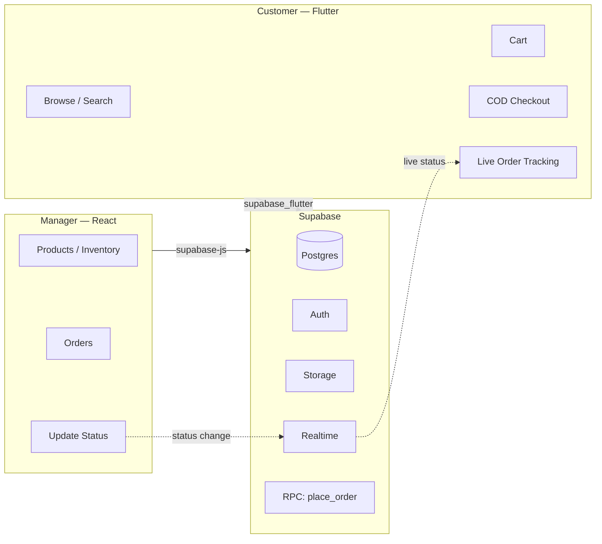
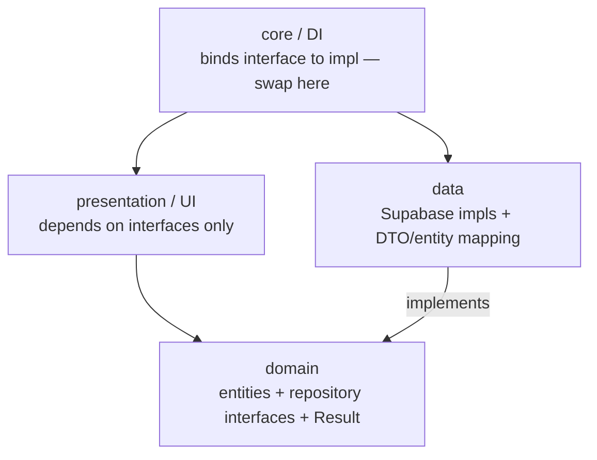

# Tokri — AI Build Guide

**Tokri** (টুকরি = "basket") is a daily-shopping / grocery e-commerce system you build with an AI coding agent (Claude Code), step by step.

- **Customer app** — Flutter (mobile): browse, search, cart, Cash-on-Delivery checkout, live order tracking.
- **Manager/admin** — React web: add/remove products, manage inventory, view orders, update order status.
- **Backend** — Supabase: Postgres, Auth, Storage, Realtime, Row-Level-Security, RPC.

You feed the prompts in this file to the AI **one step at a time**. It builds each part; you test it; then you move to the next step.

---

## Why this stack

| Need | Solution | Why |
|---|---|---|
| Live order status (customer sees manager's update instantly) | Supabase **Realtime** | Push updates, no refresh |
| No overselling the last item | **Postgres** + atomic RPC | Row locks in one transaction |
| Login / registration / token refresh | Supabase **Auth** | Built-in, SDK auto-refreshes tokens |
| Product images / short video | Supabase **Storage** | Buckets + CDN |
| Customer sees only own orders, manager sees all | **RLS** policies | Enforced in the database |
| Fast admin dashboard | **React** (not Flutter web) | Better for data-dense admin UI |

Not using Firebase anywhere.

---

## Architecture at a glance



---

## Clean, swappable architecture

Golden rule: **Supabase is a detail.** UI and business logic never import Supabase — they depend on interfaces. Supabase is just one implementation behind those interfaces. Replace it later (your own REST/GraphQL, another BaaS) by writing one new implementation and flipping one wiring file. Nothing in the UI or domain changes.

**Layers (both apps)**



- **domain** — plain entities, repository **interfaces**, a `Result`/`Failure` type. Zero backend imports.
- **data** — Supabase implementations + DTO↔entity mappers. The only place Supabase types live.
- **presentation** — UI depends only on domain interfaces (injected).
- **core/di** — one wiring file binds each interface to its impl.

Repository interfaces (same names in Flutter + React): `AuthRepository`, `ProductRepository`, `CategoryRepository`, `CartRepository`, `AddressRepository`, `OrderRepository`, `SettingsRepository`.

Pragmatic, not enterprise — interfaces + one DI file + mappers. Don't over-abstract.

## Logging & observability

`Logger` is an interface too (swappable sink):

- Dev impl: pretty console.
- Production impl: structured JSON (`level, message, context, timestamp, userId, orderId`) shipped to a sink — start with a Supabase `logs` table or Logtail/Sentry, swap later.

Log at boundaries: auth events, order placement, status changes, RPC/API errors, realtime connect/disconnect, and **all unhandled errors** (Flutter `runZonedGuarded` + `FlutterError.onError`; React `ErrorBoundary` + `window.onerror`). Never log secrets or payment data. **Manager app: production logging ON by default.**

---

## Decisions baked in (change any)

- Backend **Supabase**. Customer **Flutter + Riverpod**. Manager **React + Vite + TypeScript**.
- Auth: **email + password** (swap to phone OTP later — Bangladesh context, OTP is common).
- **Cash on Delivery only**, flat delivery charge from a `settings` table.
- Stock **decremented atomically at checkout** (prevents two customers buying the last item); restocked on cancel; manager can also adjust manually.
- Orders store an **address snapshot** so later address edits don't rewrite past orders.
- Theme: **modern violet + coral** (see Design System), light **and** dark.

---

## Before you start (one-time setup)

1. **Supabase account** — create a free project at [supabase.com](https://supabase.com). Copy the **Project URL** and **anon key** from *Settings → API*. (Hosted cloud = no Docker needed.)
2. **Install tools** to run the apps:
   - **Flutter SDK** — for the customer app (emulator or real phone).
   - **Node.js** — for the manager web app.
   - **VSCode + Claude Code** — your editor and AI builder.
3. **Create the main folder** `tokri/` and open it in your editor.

---

## How to use this guide (the loop)

1. Paste **Step 0 (Master Spec)** to the AI → it scaffolds the repo and confirms the plan.
2. Paste **Step 1** → it writes the backend SQL → you run it in Supabase and hand back your URL + anon key.
3. Paste **Steps 2 → 9** in order. After each step: the AI builds, **you run and test that part**, report issues, it fixes, then next.
4. Do **not** skip ahead. Small steps = better code and easier debugging.

**Who does what**

| You | AI |
|---|---|
| Create Supabase project, give keys | Write schema, RLS, RPC |
| Run migrations (SQL editor / CLI) | Build Flutter + React code |
| Test the app, report bugs | Fix, refine, animate |
| Set the first manager role | Wire realtime, UI, motion |

---

# Design System & Motion (shared by both apps)

Feel: **modern, clean, premium, attractive**. Same tokens in Flutter and React.

**Color tokens** (modern violet + coral — replace with your brand later)

| Token | Light | Dark |
|---|---|---|
| primary | `#6C4CF1` | `#8B73FF` |
| primary-dark | `#4B31C7` | `#6C4CF1` |
| primary-light | `#EEEBFE` | `#221C3B` |
| accent / CTA (price, add-to-cart) | `#FF6B57` | `#FF6B57` |
| success | `#16A34A` | `#22C55E` |
| warning | `#F59E0B` | `#FBBF24` |
| error | `#EF4444` | `#F87171` |
| bg | `#FFFFFF` | `#0E0C16` |
| surface | `#F6F6FB` | `#17141F` |
| text | `#14121F` | `#ECEAF6` |
| muted | `#6B7280` | `#9A93B5` |
| border | `#EAE9F2` | `#262233` |

**Typography** — headings **Plus Jakarta Sans**, body **Inter**; Bengali text **Hind Siliguri / Noto Sans Bengali**. Scale: display 32/700, h1 24/700, h2 20/600, body 15/400, caption 13/500. Tight letter-spacing on headings.

**Shape + depth** — radius: cards 16, buttons/inputs 12, chips full. Soft low-opacity shadows (y2 blur8 6% + y8 blur24 8%). 8pt spacing grid, generous whitespace, 48px min tap targets.

**Motion principles** — durations fast 150ms / base 250ms / slow 400ms; easing `cubic-bezier(0.2,0,0,1)`. Motion = feedback + spatial relationship, **not** decoration — one signature moment per screen. Always respect reduced-motion (`MediaQuery.disableAnimations` / `prefers-reduced-motion`) → fall back to instant. Animate transform/opacity for 60fps.

**Motion libraries**
- Flutter: `flutter_animate`, `animations`, `flutter_staggered_animations`, `lottie`, `shimmer`, `carousel_slider` + `smooth_page_indicator`, `google_fonts`; built-in `Hero`.
- React: `framer-motion`, `tailwindcss-animate`, `sonner`, `lucide-react`, `recharts`, a count-up lib, class-based dark mode.

---

# The Steps

Each step below is a prompt. Copy the fenced block and paste it to the AI. Then do the **"After this step"** action.

---

## Step 0 — Master Spec (paste first)

```
You are a senior full-stack engineer. Build a production grocery e-commerce system called "Tokri" as a monorepo: a Flutter customer mobile app, a React admin web app, and a Supabase backend. This message is the SPEC. Do not write feature code yet — set up the repo, confirm the plan, then wait for step-by-step build prompts.

## Product
Daily-shopping / grocery e-commerce named Tokri. Two clients, one Supabase backend:
- Customer app (Flutter, mobile): browse products, search, categories, cart, COD checkout, live order tracking.
- Manager/admin (React web): add/remove products, manage inventory, view orders, update order status.

## Monorepo layout
tokri/
  backend/        # Supabase: migrations, edge functions, seed, config
  customer_app/   # Flutter
  manager_web/    # React + Vite + TypeScript
  README.md       # setup + run instructions for all three

## Stack (use exactly)
- Backend: Supabase — Postgres, Auth, Storage, Realtime, RLS, RPC / Edge Functions.
- Customer: Flutter + Riverpod + go_router + supabase_flutter + freezed/json_serializable + cached_network_image.
- Manager: React + Vite + TypeScript + @supabase/supabase-js + TanStack Query + React Router + Tailwind CSS + shadcn/ui + react-hook-form + zod.

## Roles
profiles.role in ('customer','manager'). React admin is gated to managers only. Flutter app is for customers.

## Data model (Postgres) — create exactly these
- profiles(id uuid PK -> auth.users, full_name, phone, role text default 'customer' check in ('customer','manager'), created_at)
- categories(id uuid PK, name, slug unique, image_url, sort_order int default 0, is_active bool default true)
- products(id uuid PK, name, description, price numeric(10,2), category_id -> categories, image_url, gallery text[] default '{}', unit text default 'pcs', stock_quantity int default 0 check (stock_quantity >= 0), is_active bool default true, created_at)
- addresses(id uuid PK, user_id -> auth.users, label, recipient_name, phone, address_line, area, city, is_default bool default false, created_at)
- cart_items(id uuid PK, user_id -> auth.users, product_id -> products, quantity int check (quantity > 0), unique(user_id, product_id), created_at)
- orders(id uuid PK, user_id -> auth.users, address jsonb NOT NULL, subtotal numeric, delivery_charge numeric, total numeric, payment_method text default 'cod', status text default 'pending' check in ('pending','confirmed','preparing','out_for_delivery','delivered','cancelled'), note, created_at, updated_at)
- order_items(id uuid PK, order_id -> orders ON DELETE CASCADE, product_id -> products, product_name text, unit_price numeric, quantity int check (quantity > 0), line_total numeric)   -- product_name + unit_price are SNAPSHOTS taken at order time
- order_status_history(id uuid PK, order_id -> orders, status, changed_by -> auth.users, note, created_at default now())
- settings(id int PK default 1 single-row, delivery_charge numeric default 60, currency text default 'BDT', updated_at)

## Order status state machine
pending -> confirmed -> preparing -> out_for_delivery -> delivered
cancel: pending|confirmed -> cancelled
Rules: only managers advance status; a customer may cancel only while status = 'pending'. Every status change inserts an order_status_history row AND pushes a Realtime update to the customer.

## Inventory + checkout (critical, must be atomic)
Implement a Postgres RPC place_order(address_id) as SECURITY DEFINER that, in ONE transaction:
  1. Loads the user's cart_items.
  2. SELECT ... FOR UPDATE locks each product row.
  3. Verifies stock_quantity >= quantity for every item; if any fails, RAISE and roll back the whole order (return which product is short).
  4. Reads settings.delivery_charge, computes subtotal and total.
  5. Snapshots the chosen address into orders.address (jsonb).
  6. Inserts orders + order_items (snapshot product_name, unit_price, line_total).
  7. Decrements products.stock_quantity for each item.
  8. Clears the user's cart_items.
  9. Inserts the initial order_status_history row (pending).
  10. Returns the new order id.
Also implement cancel_order(order_id) that restocks quantities and sets status='cancelled' (customer only while pending; manager while pending/confirmed). Never allow overselling.

## Security / RLS (enable RLS on every table)
- Helper is_manager() -> boolean (profiles.role = 'manager' for auth.uid()).
- categories, products, settings: SELECT for all authenticated; INSERT/UPDATE/DELETE only is_manager().
- addresses, cart_items: full CRUD only where user_id = auth.uid().
- orders: customer SELECT where user_id = auth.uid(); manager SELECT all + UPDATE (status). Inserts happen only via place_order.
- order_items, order_status_history: SELECT if the parent order is visible to the user; writes via RPC / manager only.

## Realtime
- Customer subscribes to their orders rows -> status changes appear live.
- Manager dashboard subscribes to orders -> new orders appear live.

## Checkout rules
- COD only. No online payment gateway. Payment screen only summarizes: items, subtotal, delivery charge, total, selected address, and a "Cash on Delivery" note.
- Address is selectable and CHANGEABLE at checkout. Multiple saved addresses, exactly one selected per order.

## Design system (apply to BOTH apps — one visual language)
Modern, clean, premium "fresh basket" feel.
Color tokens (light / dark):
- primary #6C4CF1 / #8B73FF, primary-dark #4B31C7, primary-light #EEEBFE / #221C3B
- accent/CTA #FF6B57 (price + add-to-cart), success #16A34A, warning #F59E0B, error #EF4444
- light: bg #FFFFFF, surface #F6F6FB, text #14121F, muted #6B7280, border #EAE9F2
- dark: bg #0E0C16, surface #17141F, text #ECEAF6, border #262233
Ship BOTH light + dark themes with a toggle.
Typography: headings Plus Jakarta Sans, body Inter; Bengali Hind Siliguri. Scale: display 32/700, h1 24/700, h2 20/600, body 15/400, caption 13/500.
Shape: radius cards 16 / buttons 12 / chips full; soft low-opacity shadows; 8pt grid; 48px tap targets.
Motion: durations 150/250/400ms, easing cubic-bezier(0.2,0,0,1). Motion = feedback, not decoration; one signature moment per screen. ALWAYS respect reduced-motion. Animate transform/opacity for 60fps.
Motion libs — Flutter: flutter_animate, animations, flutter_staggered_animations, lottie, shimmer, carousel_slider + smooth_page_indicator, google_fonts, built-in Hero. React: framer-motion, tailwindcss-animate, sonner, lucide-react, recharts, a count-up lib, class-based dark mode.

## Architecture (all apps) — clean, swappable, testable
- Layered: domain (entities + repository INTERFACES + Result/Failure) <- data (Supabase impls + DTO mapping) <- presentation (UI). Supabase types NEVER leave the data layer.
- Dependency injection in ONE wiring file per app binding each repository interface to its Supabase impl. Swapping backend = add a new impl + change bindings; UI/domain/tests untouched.
- Repository interfaces: Auth, Product, Category, Cart, Address, Order, Settings.
- Return Result<T>/Either across layers (no raw exceptions); typed Failure. Small single-purpose files; business logic as pure functions; no backend calls in widgets/components.
- Pragmatic, not enterprise: just interfaces + one DI file + mappers. Do not over-abstract.

## Conventions (all apps)
- Config via env: SUPABASE_URL, SUPABASE_ANON_KEY. Never hardcode or commit secrets. Service-role key only inside Edge Functions.
- Feature-first folders, strongly-typed models, handle loading / error / empty states everywhere.
- Logger is an interface with console (dev) + production (structured JSON to a sink) impls. Log at boundaries (auth, order placement, status change, RPC/API errors, realtime connect/disconnect) and all unhandled errors. Manager app: production logging ON. Never log secrets or payment data.
- Money as numeric/decimal, currency BDT (৳).
- Tests: unit-test repositories against mock data sources and business logic against mock repositories; each app ships example tests.
- Seed: 8 categories, ~20 grocery products with stock, 1 manager, 1 customer, default settings row.
- Do NOT use Firebase anywhere.

## Build order (step prompts follow)
S1 backend schema+RLS+RPC+seed -> S2 Flutter scaffold+auth -> S3 Flutter browse/search -> S4 Flutter cart/address/checkout -> S5 Flutter order tracking (realtime) -> S6 React scaffold+auth+products -> S7 React orders+inventory+status (realtime) -> S8 polish/README/deploy -> S9 UI/animation upgrade.

Confirm you understand, create the monorepo folders + README skeleton, then stop and wait for Step 1.
```

**After this step:** confirm the folders `tokri/backend`, `tokri/customer_app`, `tokri/manager_web` and a README skeleton exist.

---

## Step 1 — Backend (Supabase)

```
Step 1: Backend (Supabase) per the Master Spec. In backend/:
1. Init Supabase project structure (supabase/config.toml, migrations/, functions/, seed).
2. Migration: create ALL tables from the spec with PKs, FKs, checks, defaults, and indexes (products.category_id, cart_items.user_id, orders.user_id, orders.status).
3. Enable RLS on every table; write all policies from the spec; add is_manager(); add a trigger that auto-creates a profiles row on new auth.users (default role 'customer').
4. Write RPC place_order(address_id uuid) and cancel_order(order_id uuid) exactly as specified (atomic, FOR UPDATE locks, restock on cancel). Add an orders updated_at trigger and logic so every status change writes order_status_history.
5. Create a public Storage bucket 'product-images': read public, write only is_manager().
6. seed.sql: default settings row, 8 categories, ~20 grocery products with stock and image placeholders.
7. Optional production-log sink: table logs(id uuid, level, message, context jsonb, user_id, created_at); RLS: insert = authenticated, select = is_manager(). The apps' production Logger can write here.
8. Enable Realtime on orders + order_status_history.
9. Update README: how to run migrations, seed, and where to get URL + anon key.
Output the SQL and explain how to run it on hosted Supabase (SQL editor) and via CLI. Stop when done.
```

**After this step:** open Supabase → SQL editor → run the migration + seed (or use the CLI). Then give the AI your **Project URL + anon key** so it can wire the apps.

---

## Step 2 — Customer app: scaffold + auth (Flutter)

```
Step 2: customer_app (Flutter) per Master Spec. Use clean, swappable architecture — Supabase must stay behind interfaces.
1. Create the Flutter app. Add deps: supabase_flutter, flutter_riverpod, go_router, freezed, json_serializable, build_runner, cached_network_image, intl, google_fonts, flutter_animate, animations, flutter_staggered_animations, lottie, shimmer, carousel_slider, smooth_page_indicator; dev: mocktail for tests.
2. Init Supabase from env (--dart-define SUPABASE_URL / SUPABASE_ANON_KEY) via a config file, INSIDE the data layer only.
3. domain layer: freezed entities (Profile, Category, Product, Address, CartItem, Order, OrderItem, OrderStatusHistory, Settings); repository INTERFACES (AuthRepository, ProductRepository, CategoryRepository, CartRepository, AddressRepository, OrderRepository, SettingsRepository); a Result<T>/Failure type. No Supabase imports here.
4. data layer: a SupabaseDataSource + DTOs + repository IMPLEMENTATIONS that map DTO<->entity and return Result. Supabase types never leave this layer.
5. core/di: Riverpod providers that bind each repository interface to its Supabase impl (the ONE place to swap backend). Add a Logger interface + ConsoleLogger; wire runZonedGuarded + FlutterError.onError -> logger.
6. Auth: register (email, password, full_name, phone), login, logout, persistent session, auth-state redirect via go_router; friendly errors via Failure.
7. Apply the Design System: light+dark ThemeData with the violet/coral tokens, Plus Jakarta Sans + Inter via google_fonts, BDT currency helper.
8. App shell: bottom nav (Home, Categories, Cart, Orders, Profile) with selected-icon scale + label fade; global page-transition builder; press-scale AppButton; ShimmerBox skeleton; LottieState (loading/empty/error/success); animated splash. Reduced-motion guard.
9. Tests: unit-test the auth + product repositories against a mocked data source; assert Result/Failure mapping.
Structure:
  lib/domain/{entities, repositories, result}
  lib/data/{datasources, dto, repositories, mappers}
  lib/presentation/features/{auth,products,cart,orders,address,profile}
  lib/core/{di, logger, config, theme, router, widgets, errors}
Presentation imports ONLY domain interfaces. Stop when auth + animated shell run and repo tests pass.
```

**After this step:** run the app (`flutter run --dart-define=SUPABASE_URL=... --dart-define=SUPABASE_ANON_KEY=...`), register a user, confirm login/logout and the themed shell.

---

## Step 3 — Customer: browse / search / details

```
Step 3: customer_app product browsing, with motion.
1. Home: category chips + product grid (image, name, price/unit, add button) with STAGGERED fade+slide-up entrance; an auto-scrolling banner carousel + smooth dot indicator.
2. Categories tab: category grid -> category product list.
3. Search: debounced search bar filtering products by name (ilike).
4. Product details: image Hero from the grid; gallery, name, price, unit, description, stock status, quantity stepper, add-to-cart; content enters via shared-axis.
5. Add to cart: upsert cart_items (unique user_id+product_id); animate the product image flying to the Cart tab + badge bounce + haptic + mini toast; block adding beyond stock_quantity.
6. Loading uses shimmer skeletons (not spinners); empty states use Lottie.
Stop when browsing + animated add-to-cart work.
```

**After this step:** browse, search, open a product (watch the Hero), add to cart (watch the fly + badge bounce).

---

## Step 4 — Customer: cart / address / checkout (COD)

```
Step 4: customer_app cart, addresses, checkout, with motion.
1. Cart screen: list items, change qty (respect stock, number-roll animation), swipe-to-remove with animated dismiss, live subtotal, "proceed to checkout", empty-cart Lottie state.
2. Address book: list saved addresses; add/edit/delete; set default; support MULTIPLE addresses; exactly one selected.
3. Checkout screen:
   - Select/change delivery address (defaults to is_default).
   - Order summary: items, subtotal, delivery_charge (from settings), total.
   - Payment section: "Cash on Delivery" only (no gateway); show delivery charge + total clearly.
   - Place Order button -> call RPC place_order(address_id) with a loading->success morph. On stock error, show which item is short and refresh. On success -> Order Success screen with a full-screen Lottie check + confetti, then route to order tracking.
Money formatted BDT. Handle atomic failure gracefully. Stop when a full COD order can be placed.
```

**After this step:** add items, save 2 addresses, checkout, switch address, place order, watch the success animation.

---

## Step 5 — Customer: order tracking (realtime)

```
Step 5: customer_app orders + live tracking, with motion.
1. Orders tab: user's orders (status chip, date, total), newest first, list stagger-in.
2. Order details: items (snapshot name/price), address snapshot, totals, payment=COD, and an ANIMATED status timeline (progress line fills, current node pulses): pending -> confirmed -> preparing -> out_for_delivery -> delivered.
3. Realtime: subscribe to this user's orders + order_status_history so a manager's status change appears live WITHOUT refresh; flash the row + slide-in toast on change.
4. Cancel Order button visible only while status = 'pending' -> calls cancel_order (restocks).
Stop when a manager status change is visible live on the customer device.
```

**After this step:** leave the order screen open; you'll verify the live update after building the manager app (Step 7).

---

## Step 6 — Manager web: scaffold + auth + products (React)

```
Step 6: manager_web (React + Vite + TS) per Master Spec, with motion. Use clean, swappable architecture + production logging.
1. Scaffold Vite React TS + Tailwind + shadcn/ui + React Router + TanStack Query + @supabase/supabase-js + react-hook-form + zod + framer-motion + sonner + lucide-react; dev: vitest + testing-library. Supabase client from .env (VITE_SUPABASE_URL / VITE_SUPABASE_ANON_KEY), created INSIDE the data layer only.
2. domain: entity types + repository INTERFACES (AuthRepository, ProductRepository, CategoryRepository, OrderRepository, SettingsRepository, InventoryRepository) + a Result type. data/supabase: implementations mapping DTO<->entity. services/container.ts: binds each interface to its Supabase impl (the ONE place to swap backend). TanStack Query hooks call repositories via the container, NEVER supabase-js directly.
3. Logging: a Logger interface with consoleLogger (dev) + productionLogger (prod) that ships structured JSON {level,message,context,timestamp,userId} to a sink (logs table or Logtail/Sentry). Add a React ErrorBoundary + window.onerror -> logger. Log auth events, mutations, status changes, and all errors. Never log secrets. Production logging ON.
4. Put the Design System tokens in tailwind.config (violet/coral, light+dark); class-based dark mode + animated toggle.
5. Auth: login page; after login check profiles.role — if not 'manager', sign out + block. Route guard on all admin pages.
6. Layout: animated collapsible sidebar (Dashboard, Products, Categories, Orders, Inventory, Settings) with an animated active indicator; topbar with logout; framer-motion route transitions (AnimatePresence).
7. Categories: table + create/edit/delete (name, slug, image upload to Storage, sort_order, is_active).
8. Products: searchable/filterable table (image, name, category, price, stock, active). Create/edit form with image upload to 'product-images', gallery, price, unit, category, stock, is_active; modal scale+fade; inline error shake. Delete = soft (is_active=false) with a hard-delete option.
9. Tests: mock a repository to test a products hook/component; test the logger; test the manager-role guard.
Structure:
  src/domain/{entities, repositories, result}
  src/data/supabase/{client, dto, repositories, mappers}
  src/services/{container, logger}
  src/features/{auth,products,categories,orders,inventory,settings,dashboard}
  src/core/{router, theme, ui, errorBoundary}
Components/hooks import ONLY domain interfaces via the container. Use TanStack Query + sonner; skeletons; row stagger + hover lift. Stop when a manager can log in and CRUD products with images, with production logging active.
```

**After this step:** run the web app (`npm run dev`), log in with your manager account (set its role first — see below), add a product with an image.

---

## Step 7 — Manager web: orders + inventory + status (realtime)

```
Step 7: manager_web orders, status, inventory, with motion.
1. Orders dashboard: table of all orders (id, customer, total, status, time) with status + date filters. Realtime subscribe so a NEW order slides in at the top + pulse highlight + sonner toast + stat count-up.
2. Order detail: customer info, address snapshot, items, totals, payment=COD. Status buttons follow the state machine (pending->confirmed->preparing->out_for_delivery->delivered, or cancel); each change updates orders.status (+ history row) with an optimistic badge morph and pushes live to the customer.
3. Inventory page: products with current stock, inline quick-adjust, low-stock highlight (< 5).
4. Settings page: edit delivery_charge + currency.
5. Dashboard home: stat tiles with count-up numbers (today's orders, pending, low-stock) + animated recharts (orders over time). Follow good dataviz color practice.
Stop when a manager status update reaches the customer app live and stock is manageable.
```

**After this step:** place an order in the Flutter app, watch it appear live in the manager dashboard, change its status, and watch the Flutter order screen update live.

---

## Step 8 — Polish + README + deploy

```
Step 8: finalize Tokri.
1. Consistent loading/error/empty states + toasts across both apps.
2. Production logging: confirm both apps ship structured logs via productionLogger to the chosen sink; verify unhandled errors are captured (Flutter zone + FlutterError, React ErrorBoundary + window.onerror); manager logging ON. Add a LOG_LEVEL env.
3. Backend-swap readiness: confirm NO Supabase import exists outside each app's data layer (add a lint rule / grep check); document the swap steps in README.
4. Root README: architecture + layer diagram, env vars per app, run/seed steps, how to create the first manager (set profiles.role='manager'), and "how to replace the backend".
5. Tests: one RPC test (place_order blocks overselling), repository unit tests (mock data source) for both apps, one Flutter widget test (cart), one React component test (product form), logger test.
6. Deploy notes: hosted Supabase (link migrations), Flutter APK build (--dart-define), deploy manager_web to Vercel/Netlify with env vars. RLS review checklist.
Stop with everything runnable end-to-end.
```

---

## Step 9 — UI / animation upgrade pass (optional, if anything looks plain)

```
Step 9: elevate both apps to the Design System & Motion spec (Master). Visual + motion only, do NOT change data/logic.
1. Apply color/typography/shape tokens + light&dark consistently on every screen; replace ad-hoc styles with shared theme.
2. Flutter: complete the motion map — staggered grids, Hero product->details, add-to-cart fly + badge bounce + haptic, shimmer skeletons, Lottie success/empty/error, animated order-status timeline, animated bottom nav, press-scale buttons.
3. React: complete the motion map — route transitions, animated sidebar, table row stagger + hover lift, realtime new-order slide-in + pulse + toast, count-up stat tiles, animated charts, modal scale+fade, inline error shake.
4. Replace all spinners with skeletons; all raw empty views with Lottie.
5. Respect reduced-motion everywhere; keep 60fps; keep contrast AA.
Deliver a consistent, modern, animated UI on both apps.
```

---

## Running the apps

- **Customer (Flutter):** `flutter run --dart-define=SUPABASE_URL=<url> --dart-define=SUPABASE_ANON_KEY=<key>`
- **Manager (React):** put `VITE_SUPABASE_URL` + `VITE_SUPABASE_ANON_KEY` in `manager_web/.env`, then `npm install && npm run dev`.

## Create the first manager

1. Register normally in the manager web app (or Flutter).
2. In Supabase → Table editor → `profiles` → set that user's `role` to `manager`.
3. Log in to the manager web app.

## Deploy (later)

- Backend: hosted Supabase project (run migrations).
- Manager web: Vercel or Netlify (add the two env vars).
- Customer: build APK/IPA with the `--dart-define` values.

---

## Swapping the backend later (e.g. your own API)

Because Supabase lives only in the data layer behind interfaces:

1. Keep the **domain** layer as-is (interfaces + entities + Result).
2. Add a new **data** implementation — e.g. `data/rest/` with a `RestClient` and `RestXRepository` classes implementing each interface.
3. Change the **one** DI/container file to bind interfaces → the REST impls.
4. Add env for the new backend URL.
5. UI, business logic, and tests are **unchanged** — run the same repository tests against the new impl.

The Step 1 schema (tables, RPC, RLS) is standard Postgres — portable to any Postgres host, or re-expressible as REST endpoints. Same for the `Logger`: implement the interface for your new logging service and flip the binding.

---

## Naming & theme

- **Name:** Tokri (টুকরি = basket). Change once, everywhere: folder `tokri/`, app titles, package ids.
- **Theme:** modern violet `#6C4CF1` + coral `#FF6B57`, light + dark. Swap `primary`/`accent` tokens to rebrand — the rest follows.
