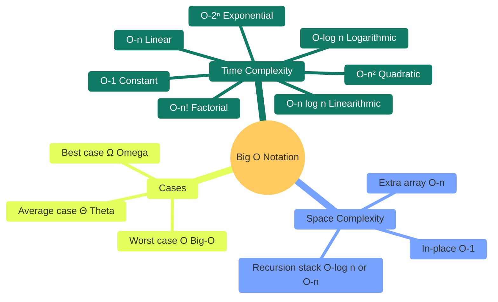
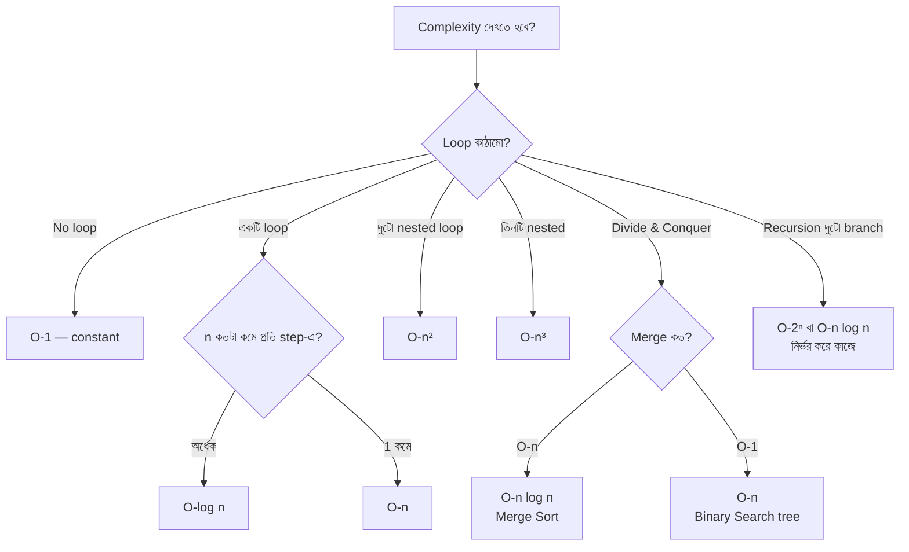

# অধ্যায় ০: Big O Notation — অ্যালগরিদমের গতি বোঝার ভাষা

> 🎯 **লক্ষ্য:** কোনো অ্যালগরিদম কতটা দ্রুত বা ধীর — সেটা একটি গণিতের ভাষায় বলতে পারো। এই ভাষার নাম Big O Notation।

---

<a id="toc"></a>
## 📑 অধ্যায়ের বিষয়সূচি

| # | বিষয় |
|---|-------|
| [১](#what-is-big-o) | Big O কী এবং কেন? |
| [২](#complexity-classes) | Common Complexity Classes |
| [৩](#rules) | Big O-র হিসাবের নিয়ম |
| [৪](#space) | Space Complexity |
| [৫](#best-worst-avg) | Best / Worst / Average Case |
| [৬](#comparison) | সব Complexity-র তুলনা ও গ্রাফ |
| [৭](#dart-examples) | Dart-এ উদাহরণ |

---




---

<a id="what-is-big-o"></a>
## ১. Big O কী এবং কেন?

---

### ০. বাস্তব জীবনের গল্প 🔍

**গল্প: লম্বা লিস্টে একটা নাম খোঁজা**

ধরো তোমার হাতে নামের একটা লিস্ট আছে — এলোমেলো ভাবে লেখা। তুমি একটা নাম খুঁজছ, ধরো "রনি"।

তুমি উপর থেকে এক এক করে পড়বে, যতক্ষণ না "রনি" পাও।

এখন একটা সহজ প্রশ্ন করি:

```
লিস্টে ১০টা নাম থাকলে   → বেশি হলে ১০টা পড়তে হবে।
লিস্টে ১০০টা নাম থাকলে  → বেশি হলে ১০০টা পড়তে হবে।
লিস্টে ১০০০টা নাম থাকলে → বেশি হলে ১০০০টা পড়তে হবে।
```

খেয়াল করো — **লিস্ট যত বড়, কাজও তত বেশি।** নাম ১০ গুণ বাড়লে, কাজও মোটামুটি ১০ গুণ বাড়ে।

এই "ইনপুট বাড়লে কাজ কত বাড়ে" — ঠিক এটাই Big O আমাদের বলে।

> Big O মাপে না "কত সেকেন্ড লাগল"।
> Big O মাপে — **"ইনপুট (n) বড় হলে কাজ কত দ্রুত বাড়ে?"**

---

### ১. কেন সেকেন্ড দিয়ে মাপি না?

ধরো তোমার কোড একটা পুরোনো ফোনে ৪ সেকেন্ড নেয়, নতুন ফোনে ১ সেকেন্ড নেয়। তাহলে কোডটা আসলে কত "দ্রুত"? উত্তরটা ফোনের উপর নির্ভর করে। তাই সেকেন্ড দিয়ে মাপা ঠিক না।

আমরা চাই এমন একটা মাপ, যা **যেকোনো computer-এ একই থাকে।** তাই আমরা সেকেন্ড গুনি না — আমরা **ধাপ (steps) গুনি।** মানে কোডটা মোট কতগুলো ছোট কাজ করে।

```
সেকেন্ড   → computer ভেদে বদলায়।  ❌ ভালো মাপ না।
ধাপ সংখ্যা → সব computer-এ একই।    ✅ এটাই গুনব।
```

---

### ২. ধাপ গোনা শেখো (Step Counting)

ছোট একটা উদাহরণ নিই। একটা list-এর সব সংখ্যা যোগ করি:

```dart
int sum = 0;                    // ১টা কাজ
for (int i = 0; i < n; i++) {   // n বার ঘোরে
  sum = sum + arr[i];           // প্রতিবার ১টা কাজ
}
return sum;                     // ১টা কাজ
```

ধাপ গুনি:

```
sum = 0 বসানো    → ১ ধাপ
loop চলে n বার   → n ধাপ
শেষে return      → ১ ধাপ
──────────────────────────
মোট              = n + 2 ধাপ
```

এখন n বদলে দেখি:

```
n = 10    →  12 ধাপ
n = 100   →  102 ধাপ
n = 1000  →  1002 ধাপ
```

খেয়াল করো — ধাপ সংখ্যা প্রায় n-এর সমান। ওই "+ 2" টা n বড় হলে কোনো গুরুত্বই রাখে না।

---

### ৩. আসল চাল: শুধু "বৃদ্ধির আকার" দেখি 💡

এটাই Big O-র মূল কথা। আমরা পুরো হিসাব ধরে রাখি না। আমরা শুধু দেখি — **n অনেক বড় হলে কোন অংশটা সব দখল করে নেয়।**

একটা উদাহরণ দিয়ে দেখাই। ধরো কোনো কোডের ধাপ সংখ্যা:

```
ধাপ = 3n² + 5n + 2
```

n বাড়িয়ে দেখি, ভেতরের প্রতিটা অংশ কত বড় হয়:

```
n         3n²          5n       2     মোট ধাপ      এর মধ্যে 3n²
10        300          50       2     352          ≈ 85%
100       30,000       500      2     30,502       ≈ 98%
1,000     3,000,000    5,000    2     3,005,002    ≈ 99.8%
```

n যত বড় হয়, **3n² অংশটাই পুরো হিসাব গিলে ফেলে।** 5n আর 2 প্রায় অদৃশ্য হয়ে যায়।

তাই আমরা বলি, এই কোড **O(n²)** — মানে এর কাজ "n-এর বর্গের আকারে" বাড়ে।

আর `3` কেন বাদ দিলাম? কারণ আমরা "আকার" নিয়ে কথা বলছি, "ঠিক সংখ্যা" নিয়ে নয়। n² হোক বা 3n² — দুটোই একই আকারে বাড়ে (n দ্বিগুণ হলে কাজ চারগুণ)। তাই সামনের constant বাদ।

---

### ৪. এবার Big O করে লেখা

Big O আসলে কঠিন কিছু না। এটা শুধু **বৃদ্ধির আকারের একটা নাম।**

```
ধাপ স্থির, বাড়েই না   →  O(1)       "একদম বাড়ে না"
ধাপ ≈ log n           →  O(log n)   "খুব ধীরে বাড়ে"
ধাপ ≈ n               →  O(n)       "সোজা লাইনে বাড়ে"
ধাপ ≈ n²              →  O(n²)      "বর্গাকারে বাড়ে"
```

পড়ার নিয়ম: **O(n²)** পড়ো "অর্ডার অফ n-স্কয়ার" — মানে "এই কোডের কাজ n²-এর আকারে বাড়ে"।

> এক লাইনে মনে রাখো:
> **Big O = ইনপুট বড় হলে কাজ কোন আকারে বাড়ে, তার নাম।**

---

### ৫. (চাইলে পড়ো) গণিতের ভাষায় সংজ্ঞা

> 📌 এই বাক্সটা একটু গাণিতিক। প্রথমবারে না বুঝলে নিশ্চিন্তে skip করো — উপরের intuition-ই যথেষ্ট। পরে ফিরে এসে পড়লেও চলবে।

```
f(n) = O(g(n)) — এই লেখার মানে:
  এমন দুটো সংখ্যা c আর n₀ পাওয়া যায়,
  যেন n > n₀ হলে সবসময়   f(n) ≤ c × g(n)

সহজ কথায়:
  "n যথেষ্ট বড় হলে, আমার কোডের ধাপ সংখ্যা
   g(n)-এর একটা গুণিতকের নিচে আটকে থাকে।"
  মানে g(n) হলো একটা ছাদ (upper bound) — এর উপরে কাজ যায় না।
```

---

### ৬. সরল করার ৩টি নিয়ম

উপরের চাল থেকেই এই ৩টি নিয়ম বেরিয়ে আসে:

```
নিয়ম ১ — সবচেয়ে বড় term রাখো, বাকি বাদ:
  3n² + 5n + 2   →  O(n²)

নিয়ম ২ — সামনের constant বাদ:
  5n     →  O(n)
  n / 2  →  O(n)
  1000   →  O(1)

নিয়ম ৩ — ছোট term বাদ:
  n + log n   →  O(n)
  n³ + n²     →  O(n³)
```

আরও কয়েকটা উদাহরণ মিলিয়ে নাও:

```
7n³ + 2n² + 100n + 999  →  O(n³)
4 log n + n             →  O(n)
1000                    →  O(1)
```

> এই নিয়মগুলোর পুরো ব্যবহার — কোড দেখে Big O বের করা — দেখবে নিচের [৩ নম্বর অংশে](#rules)।


[⬆ বিষয়সূচিতে ফিরুন](#toc)

---

<a id="complexity-classes"></a>
## ২. Common Complexity Classes

---

### O(1) — Constant Time

```
কোনো calculation-ই n-এর উপর নির্ভর করে না।
একটি কাজ — সবসময় একই সময়।

উদাহরণ:
  ✅ Array-র index access: arr[5]
  ✅ HashMap get/put (average)
  ✅ Math formula: (n × (n+1)) / 2

ভিজুয়াল:
  n=1   → 1 step
  n=100 → 1 step
  n=1M  → 1 step
  
  ████ (flat line)
```

---

### O(log n) — Logarithmic Time

```
প্রতি step-এ problem অর্ধেক হয়ে যায়।
Binary search: 1M element → মাত্র 20 step!

log₂(1,000,000) ≈ 20

উদাহরণ:
  ✅ Binary Search
  ✅ Balanced BST search
  ✅ Heap push/pop

ভিজুয়াল (Binary Search):
  [1,2,3,4,5,6,7,8,9,10,11,12,13,14,15,16]
        ↓ প্রতি step-এ অর্ধেক বাদ
  8 elements → 7 elements → 3 → 1
  
  log₂(16) = 4 → মাত্র 4 step!
```

---

### O(n) — Linear Time

```
n বাড়লে step সংখ্যাও proportionally বাড়ে।
2× input → 2× সময়।

উদাহরণ:
  ✅ Array traverse (একবার)
  ✅ Linear search
  ✅ Linked list traverse

ভিজুয়াল:
  [1] [2] [3] [4] [5] [6] [7] [8]
   ↓   ↓   ↓   ↓   ↓   ↓   ↓   ↓
  প্রতিটি element একবার দেখো

  n=8 → 8 step
  n=80 → 80 step
```

---

### O(n log n) — Linearithmic Time

```
সেরা comparison-based sorting algorithm-গুলোর সীমা।
n element-কে log n ভাগে ভাগ করে process করো।

উদাহরণ:
  ✅ Merge Sort
  ✅ Heap Sort
  ✅ Quick Sort (average)

ভিজুয়াল (Merge Sort):
  [8,3,1,5,2,7,4,6]      ← n=8
       ↓ ↓
  [8,3,1,5] [2,7,4,6]    ← n/2, n/2
      ↓ ↓
  [8,3][1,5][2,7][4,6]   ← log n = 3 levels
  
  প্রতি level-এ n কাজ → n × log n = 8×3 = 24 step
```

---

### O(n²) — Quadratic Time

```
দুটো nested loop। n বাড়লে সময় বর্গাকারে বাড়ে।
2× input → 4× সময়।

উদাহরণ:
  ✅ Bubble Sort, Insertion Sort
  ✅ Nested loop (প্রতিটি pair check)

ভিজুয়াল:
  for i in 0..n:        ← n বার
    for j in 0..n:      ← n বার
      ...               ← মোট n × n = n² বার

  n=3:
  (0,0)(0,1)(0,2)
  (1,0)(1,1)(1,2)   →  9 = 3² step
  (2,0)(2,1)(2,2)
```

---

### O(2ⁿ) — Exponential Time

```
প্রতিটি element include/exclude করো — n বাড়লে
step সংখ্যা দ্বিগুণ হয়।

উদাহরণ:
  ✅ Fibonacci (naive recursion)
  ✅ Subset generation
  ✅ 0/1 Knapsack naive

ভিজুয়াল (Fibonacci recursion):
          fib(4)
         /      \
      fib(3)   fib(2)
      /    \   /    \
   fib(2) fib(1) fib(1) fib(0)
   /    \
fib(1) fib(0)

  n=4 → 9 call
  n=10 → 177 call
  n=50 → ~1,125,899,906,842,623 call 😱
```

---

### O(n!) — Factorial Time

```
সব permutation try করো।
n=10 → 3,628,800 step
n=20 → 2,432,902,008,176,640,000 step 🔥

উদাহরণ:
  ✅ Travelling Salesman (brute force)
  ✅ All permutations generation

  n=1: 1
  n=2: 2
  n=3: 6
  n=4: 24
  n=5: 120
  n=10: 3,628,800
```


[⬆ বিষয়সূচিতে ফিরুন](#toc)

---

<a id="rules"></a>
## ৩. Big O-র হিসাবের নিয়ম

---

### নিয়ম ১: Constant বাদ দাও

```
O(2n) → O(n)
O(n/2) → O(n)
O(100) → O(1)
O(5n²) → O(n²)

কারণ: n → ∞ হলে constant insignificant
```

### নিয়ম ২: Lower Terms বাদ দাও

```
O(n² + n) → O(n²)
O(n log n + n) → O(n log n)
O(n³ + n² + n + 1) → O(n³)

কারণ: বড় n-এ dominant term-ই মূল্যবান
```

### নিয়ম ৩: Sequential → যোগ করো

```dart
// দুটো আলাদা loop: O(n) + O(m) = O(n+m)
for (int i = 0; i < n; i++) { ... }  // O(n)
for (int j = 0; j < m; j++) { ... }  // O(m)
// মোট: O(n + m)
// যদি m ≈ n তাহলে: O(n)
```

### নিয়ম ৪: Nested → গুণ করো

```dart
// Nested loop: O(n) × O(n) = O(n²)
for (int i = 0; i < n; i++) {        // O(n)
  for (int j = 0; j < n; j++) { ... } // O(n)
}
// মোট: O(n × n) = O(n²)

// কিন্তু independent variable হলে:
for (int i = 0; i < n; i++) {        // O(n)
  for (int j = 0; j < m; j++) { ... } // O(m)
}
// মোট: O(n × m) = O(nm)
```

### নিয়ম ৫: Recursion হলে — pattern চিনে রাখো

Recursion-এ function নিজেই নিজেকে আবার ডাকে। তাই ধাপ গোনা একটু আলাদা ভাবে হয়। এখন শুধু এই কয়টা pattern চিনে রাখো — মুখস্থ করার দরকার নেই:

```
সমস্যা প্রতিবার অর্ধেক হয়, ১ বার ডাকে   →  O(log n)   [Binary Search]
সমস্যা প্রতিবার অর্ধেক হয়, ২ বার ডাকে    →  O(n)       [Tree traverse]
সমস্যা প্রতিবার ১ কমে, ১ বার ডাকে        →  O(n)       [Linear recursion]
সমস্যা প্রতিবার ১ কমে, ২ বার ডাকে        →  O(2ⁿ)      [Fibonacci naive]
```

> 📌 এগুলো নিখুঁত হিসাব করার একটা নিয়ম আছে — নাম **Master Theorem**। সেটা এখন না জানলেও চলবে; দরকার পড়লে পরের অধ্যায়ে শিখে নেবে। এখন উপরের pattern চিনলেই যথেষ্ট।

### নিয়ম ৬: Amortized Analysis

```
কিছু operation মাঝে মাঝে বেশি সময় নেয়,
কিন্তু average এ কম।

Dynamic Array (ArrayList):
  push: সাধারণত O(1)
  push: মাঝে মাঝে resize → O(n) — কিন্তু rare!
  Amortized: O(1) per push (overall n push = O(n))
```


[⬆ বিষয়সূচিতে ফিরুন](#toc)

---

<a id="space"></a>
## ৪. Space Complexity

---

```
Space Complexity = অ্যালগরিদম কতটা মেমরি ব্যবহার করে।

O(1) — In-place:
  Extra variable কয়েকটা, input size নির্বিশেষে।
  উদাহরণ: Bubble Sort (swap করে, extra array নেই)

O(n) — Linear space:
  Input-এর proportional extra memory।
  উদাহরণ: Merge Sort (extra array), Memoization (cache)

O(n²) — Quadratic:
  2D array তৈরি করা।
  উদাহরণ: Adjacency matrix, 2D DP table

O(log n) — Logarithmic:
  Recursion stack depth।
  উদাহরণ: Binary Search (recursion), Quick Sort avg

O(n) — Recursion stack:
  Linear depth recursion।
  উদাহরণ: Naive Fibonacci, DFS on linked list
```

```
Time vs Space Tradeoff:
  ┌─────────────────────────────────────────┐
  │  বেশি memory ব্যবহার করো               │
  │  → বেশি data cache করো                  │
  │  → faster time                          │
  │                                         │
  │  কম memory ব্যবহার করো                  │
  │  → পুনরায় calculate করো               │
  │  → slower time                          │
  │                                         │
  │  Memoization = এই tradeoff-এর classic  │
  └─────────────────────────────────────────┘
```


[⬆ বিষয়সূচিতে ফিরুন](#toc)

---

<a id="best-worst-avg"></a>
## ৫. Best / Worst / Average Case

---

```
তিনটি প্রশ্ন:
  Ω (Omega)  = সর্বোত্তম পরিস্থিতিতে কত? (Best Case)
  O (Big-O)  = সর্বনিকৃষ্ট পরিস্থিতিতে কত? (Worst Case)
  Θ (Theta)  = গড় পরিস্থিতিতে কত? (Average Case)

উদাহরণ — Linear Search:
  Best:    প্রথম element-ই target → Ω(1)
  Worst:   শেষ element বা নেই → O(n)
  Average: n/2 element দেখতে হয় → Θ(n)

উদাহরণ — Quick Sort:
  Best:    pivot সবসময় মাঝখানে → Ω(n log n)
  Worst:   sorted array, pivot সবসময় প্রান্তে → O(n²)
  Average: random input → Θ(n log n)

উদাহরণ — Binary Search:
  Best:    মাঝের element-ই target → Ω(1)
  Worst:   log n step → O(log n)
  Average: O(log n)
```


[⬆ বিষয়সূচিতে ফিরুন](#toc)

---

<a id="comparison"></a>
## ৬. সব Complexity-র তুলনা ও গ্রাফ

---

### গ্রাফ (ASCII)

```
operations
    |
10⁹ |                                          O(n!)
    |                                    O(2ⁿ)
10⁶ |                              O(n³)
    |                       O(n²)
10³ |              O(n log n)
    |         O(n)
100 |    O(√n)
 10 |  O(log n)
  1 | O(1)
    +─────────────────────────────────────────── n
         1   2   4   8  16  32  64

    ← ভালো          মধ্যম           খারাপ →
  O(1) O(log n) O(n) O(n log n) O(n²) O(2ⁿ) O(n!)
```

---

### Complexity তুলনা টেবিল

```
┌────────────┬──────────────────────────────────────────────────────┬───────────────────────┐
│ Complexity │ n=10    n=100    n=1000    n=10⁶                     │ Rating                │
├────────────┼──────────────────────────────────────────────────────┼───────────────────────┤
│ O(1)       │ 1       1        1         1                         │ ⭐⭐⭐⭐⭐ Excellent     │
│ O(log n)   │ 3       7        10        20                        │ ⭐⭐⭐⭐⭐ Excellent     │
│ O(√n)      │ 3       10       31        1,000                     │ ⭐⭐⭐⭐  Great         │
│ O(n)       │ 10      100      1,000     1,000,000                 │ ⭐⭐⭐⭐  Good          │
│ O(n log n) │ 33      664      9,966     ~20,000,000               │ ⭐⭐⭐   OK            │
│ O(n²)      │ 100     10,000   1,000,000 10¹²                      │ ⭐⭐    Slow           │
│ O(n³)      │ 1,000   1,000,000 10⁹     10¹⁸                      │ ⭐     Very Slow       │
│ O(2ⁿ)      │ 1,024   10³⁰     💀        💀                        │ ❌    Unusable (large)│
│ O(n!)      │ 3.6M    10¹⁵⁷    💀        💀                        │ ❌    Unusable (large)│
└────────────┴──────────────────────────────────────────────────────┴───────────────────────┘
```

---

### Constraint দেখে Complexity অনুমান

```
প্রতিযোগিতামূলক programming-এ সময়সীমা সাধারণত 1-2 সেকেন্ড।
Modern computer: ~10⁸ simple operations/second।

┌──────────────────────────────────┬─────────────────────────────────────┐
│ n-এর মান                         │ কোন Complexity চলবে?               │
├──────────────────────────────────┼─────────────────────────────────────┤
│ n ≤ 10                           │ O(n!), O(2ⁿ) — যেকোনো কিছু        │
│ n ≤ 20                           │ O(2ⁿ), O(n × 2ⁿ)                   │
│ n ≤ 30-40                        │ O(2^(n/2)) — meet in the middle     │
│ n ≤ 100                          │ O(n³), O(n⁴)                        │
│ n ≤ 400                          │ O(n³)                               │
│ n ≤ 2,000                        │ O(n²)                               │
│ n ≤ 10,000                       │ O(n² log n) বা tight O(n²)          │
│ n ≤ 100,000                      │ O(n log n) বা O(n √n)               │
│ n ≤ 10⁶                          │ O(n) বা O(n log n)                  │
│ n ≤ 10⁸                          │ O(n) (tight), O(log n)              │
│ n ≤ 10¹⁸                         │ O(log n), O(1)                      │
└──────────────────────────────────┴─────────────────────────────────────┘
```

---

### Algorithm → Complexity দ্রুত রেফারেন্স

```
┌────────────────────────────┬────────────────┬────────────────┬────────────┐
│ Algorithm                  │ Best           │ Average        │ Worst      │
├────────────────────────────┼────────────────┼────────────────┼────────────┤
│ Linear Search              │ O(1)           │ O(n)           │ O(n)       │
│ Binary Search              │ O(1)           │ O(log n)       │ O(log n)   │
│ Bubble Sort                │ O(n)           │ O(n²)          │ O(n²)      │
│ Selection Sort             │ O(n²)          │ O(n²)          │ O(n²)      │
│ Insertion Sort             │ O(n)           │ O(n²)          │ O(n²)      │
│ Merge Sort                 │ O(n log n)     │ O(n log n)     │ O(n log n) │
│ Quick Sort                 │ O(n log n)     │ O(n log n)     │ O(n²)      │
│ Heap Sort                  │ O(n log n)     │ O(n log n)     │ O(n log n) │
│ Counting Sort              │ O(n+k)         │ O(n+k)         │ O(n+k)     │
│ BFS / DFS                  │ O(V+E)         │ O(V+E)         │ O(V+E)     │
│ Dijkstra (heap)            │ O((V+E) log V) │ O((V+E) log V) │ same       │
│ Bellman-Ford               │ O(VE)          │ O(VE)          │ O(VE)      │
│ Floyd-Warshall             │ O(V³)          │ O(V³)          │ O(V³)      │
│ Kruskal's MST              │ O(E log E)     │ O(E log E)     │ O(E log E) │
│ KMP                        │ O(n+m)         │ O(n+m)         │ O(n+m)     │
│ Hash Table get/put         │ O(1)           │ O(1)           │ O(n)       │
│ BST search                 │ O(log n)       │ O(log n)       │ O(n)       │
│ AVL/RB Tree search         │ O(log n)       │ O(log n)       │ O(log n)   │
│ Fibonacci (naive)          │ O(2ⁿ)          │ O(2ⁿ)          │ O(2ⁿ)      │
│ Fibonacci (memoization)    │ O(n)           │ O(n)           │ O(n)       │
└────────────────────────────┴────────────────┴────────────────┴────────────┘
```


[⬆ বিষয়সূচিতে ফিরুন](#toc)

---

<a id="dart-examples"></a>
## ৭. Dart-এ উদাহরণ — প্রতিটি Complexity

```dart
// ════════════════════════════════════════════════
// Big O Notation — Dart উদাহরণ
// ════════════════════════════════════════════════

void main() {
  List<int> arr = [3, 1, 4, 1, 5, 9, 2, 6, 5, 3, 5];
  int n = arr.length;
  int target = 9;

  // ────────────────────────────────────
  // O(1) — Constant
  // ────────────────────────────────────
  int firstElement = arr[0];                     // একটি access
  int sumFormula = (n * (n + 1)) ~/ 2;           // একটি formula
  print('O(1) examples:');
  print('  first = $firstElement');              // 3
  print('  sum(1..n) = $sumFormula');            // 66

  // ────────────────────────────────────
  // O(log n) — Binary Search
  // ────────────────────────────────────
  List<int> sorted = [...arr]..sort();           // আগে sort করতে হবে
  int binarySearch(List<int> a, int t) {
    int lo = 0, hi = a.length - 1;
    while (lo <= hi) {
      int mid = (lo + hi) ~/ 2;
      if (a[mid] == t) return mid;
      if (a[mid] < t) lo = mid + 1; else hi = mid - 1;
    }
    return -1;
  }
  print('\nO(log n) — Binary Search:');
  print('  sorted = $sorted');
  print('  index of 9 = ${binarySearch(sorted, 9)}');   // কোনো index

  // ────────────────────────────────────
  // O(n) — Linear Search
  // ────────────────────────────────────
  int linearSearch(List<int> a, int t) {
    for (int i = 0; i < a.length; i++) {         // n বার
      if (a[i] == t) return i;
    }
    return -1;
  }
  print('\nO(n) — Linear Search:');
  print('  index of $target = ${linearSearch(arr, target)}'); // 5

  // ────────────────────────────────────
  // O(n log n) — Merge Sort
  // ────────────────────────────────────
  List<int> mergeSort(List<int> a) {
    if (a.length <= 1) return a;
    int mid = a.length ~/ 2;
    var left  = mergeSort(a.sublist(0, mid));
    var right = mergeSort(a.sublist(mid));
    // Merge
    List<int> result = [];
    int i = 0, j = 0;
    while (i < left.length && j < right.length) {
      if (left[i] <= right[j]) result.add(left[i++]);
      else                     result.add(right[j++]);
    }
    result.addAll(left.sublist(i));
    result.addAll(right.sublist(j));
    return result;
  }
  print('\nO(n log n) — Merge Sort:');
  print('  input  = $arr');
  print('  sorted = ${mergeSort(arr)}');

  // ────────────────────────────────────
  // O(n²) — Bubble Sort
  // ────────────────────────────────────
  List<int> bubbleSort(List<int> a) {
    var b = [...a];
    for (int i = 0; i < b.length - 1; i++) {          // O(n)
      for (int j = 0; j < b.length - 1 - i; j++) {   // O(n)
        if (b[j] > b[j + 1]) {
          int tmp = b[j]; b[j] = b[j+1]; b[j+1] = tmp;
        }
      }
    }
    return b;
  }
  print('\nO(n²) — Bubble Sort:');
  print('  sorted = ${bubbleSort(arr)}');

  // ────────────────────────────────────
  // O(2ⁿ) — Fibonacci naive
  // ────────────────────────────────────
  int fibNaive(int k) {
    if (k <= 1) return k;
    return fibNaive(k - 1) + fibNaive(k - 2); // দুটো branch → O(2ⁿ)
  }
  print('\nO(2ⁿ) — Fibonacci naive (only small n!):');
  print('  fib(10) = ${fibNaive(10)}');          // 55

  // ────────────────────────────────────
  // O(n) — Fibonacci memoization
  // ────────────────────────────────────
  Map<int, int> memo = {};
  int fibMemo(int k) {
    if (k <= 1) return k;
    return memo.putIfAbsent(k, () => fibMemo(k-1) + fibMemo(k-2));
  }
  print('\nO(n) — Fibonacci memoized:');
  print('  fib(10) = ${fibMemo(10)}');           // 55
  print('  fib(50) = ${fibMemo(50)}');           // 12586269025 (fast!)

  // ────────────────────────────────────
  // Space Complexity উদাহরণ
  // ────────────────────────────────────
  print('\nSpace Complexity:');
  // O(1) space: in-place swap
  void swap(List<int> a, int i, int j) {
    int tmp = a[i]; a[i] = a[j]; a[j] = tmp;  // মাত্র 1 extra variable
  }
  // O(n) space: copy array
  List<int> copy = List.from(arr);             // n extra space
  print('  O(1) space: in-place swap');
  print('  O(n) space: array copy, length=${copy.length}');
}

/* Output:
O(1) examples:
  first = 3
  sum(1..n) = 66

O(log n) — Binary Search:
  sorted = [1, 1, 2, 3, 3, 4, 5, 5, 5, 6, 9]
  index of 9 = 10

O(n) — Linear Search:
  index of 9 = 5

O(n log n) — Merge Sort:
  input  = [3, 1, 4, 1, 5, 9, 2, 6, 5, 3, 5]
  sorted = [1, 1, 2, 3, 3, 4, 5, 5, 5, 6, 9]

O(n²) — Bubble Sort:
  sorted = [1, 1, 2, 3, 3, 4, 5, 5, 5, 6, 9]

O(2ⁿ) — Fibonacci naive (only small n!):
  fib(10) = 55

O(n) — Fibonacci memoized:
  fib(10) = 55
  fib(50) = 12586269025

Space Complexity:
  O(1) space: in-place swap
  O(n) space: array copy, length=11
*/
```

---


[⬆ বিষয়সূচিতে ফিরুন](#toc)

## 📊 সারসংক্ষেপ — Big O Quick Reference

```
         Fast ◄──────────────────────────────► Slow

  O(1) < O(log n) < O(√n) < O(n) < O(n log n) < O(n²) < O(n³) < O(2ⁿ) < O(n!)

┌───────────────────────────────────────────────────────────────┐
│  মনে রাখার ৫টি নিয়ম                                          │
│  ১. Constant বাদ দাও:  O(5n) → O(n)                          │
│  ২. Lower term বাদ:    O(n² + n) → O(n²)                     │
│  ৩. Sequential → যোগ: O(n) + O(m) = O(n+m)                   │
│  ৪. Nested → গুণ:     O(n) × O(n) = O(n²)                    │
│  ৫. Recursion → T(n): Master Theorem বা tree method           │
└───────────────────────────────────────────────────────────────┘

┌───────────────────────────────────────────────────────────────┐
│  Contest Cheat Sheet                                          │
│  n ≤ 10   → O(n!) বা O(2ⁿ) চলবে                             │
│  n ≤ 100  → O(n³) চলবে                                       │
│  n ≤ 2K   → O(n²) চলবে                                       │
│  n ≤ 100K → O(n log n) চলবে                                  │
│  n ≤ 1M   → O(n) চলবে                                        │
│  n ≤ 10¹⁸ → O(log n) চলবে                                    │
└───────────────────────────────────────────────────────────────┘
```



---

*অধ্যায় ০ সম্পন্ন ✅*  
*পরবর্তী: অধ্যায় ৪ — Sorting & Searching*
