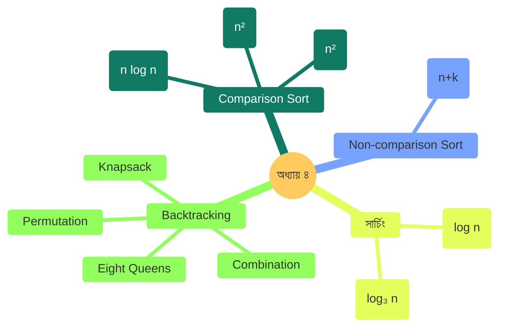
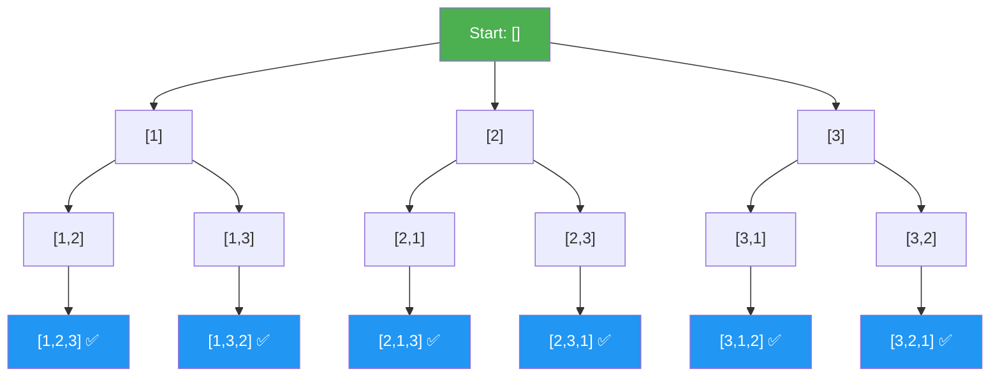
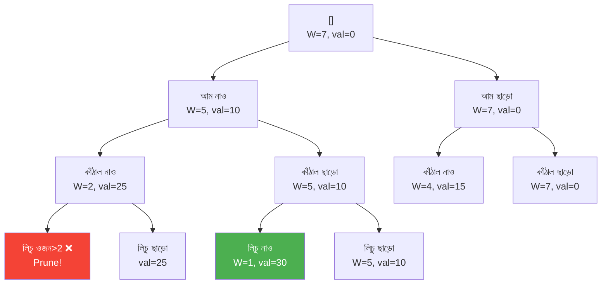

# অধ্যায় ৪: সর্টিং ও সার্চিং (Sorting & Searching)

> 🎯 **লক্ষ্য:** Counting Sort থেকে Backtracking পর্যন্ত — প্রতিটি অ্যালগরিদম গল্পের ছলে, ছবিতে, কোডে।

---

<a id="toc"></a>
## 📑 অধ্যায়ের বিষয়সূচি (Chapter TOC)

| # | বিষয় | সময় জটিলতা |
|---|-------|------------|
| [১](#selection-sort) | Selection Sort | O(n²) |
| [২](#insertion-sort) | Insertion Sort | O(n) ~ O(n²) |
| [৩](#merge-sort) | Merge Sort | O(n log n) |
| [৪](#counting-sort) | Counting Sort | O(n + k) |
| [৫](#binary-search) | Binary Search | O(log n) |
| [৬](#ternary-search) | Ternary Search | O(log₃ n) |
| [৭](#backtracking) | Backtracking — ভূমিকা | — |
| [৭.১](#permutation) | Permutation Generate | O(n!) |
| [৭.২](#combination) | Combination Generate | O(2ⁿ) |
| [৭.৩](#eight-queens) | Eight Queen Problem | O(n!) pruned |
| [৭.৪](#knapsack-bt) | Knapsack (Backtracking) | O(2ⁿ) |

---




---

<a id="selection-sort"></a>
## ১. Selection Sort

---

### ০. বাস্তব জীবনের গল্প 🃏

**গল্প: তাস থেকে সবচেয়ে ছোট বের করা**

তুমি তাস খেলছো। হাতে এলোমেলো কয়েকটি তাস। তুমি তাস সাজাতে চাও।

তুমি কী করো?

> সব তাস দেখো — সবচেয়ে ছোটটি খুঁজে বের করো।  
> সেটি প্রথম অবস্থানে রাখো।  
> বাকি তাস থেকে আবার সবচেয়ে ছোটটি খুঁজো।  
> দ্বিতীয় অবস্থানে রাখো।  
> এভাবে চলতে থাকে।

```
তাস: [5, 3, 8, 1, 9, 2]

রাউন্ড ১: সব দেখো, min=1 (index 3) → swap(0,3)
         [1, 3, 8, 5, 9, 2]  ✅ 1 সঠিক স্থানে

রাউন্ড ২: বাকি দেখো, min=2 (index 5) → swap(1,5)
         [1, 2, 8, 5, 9, 3]  ✅ 2 সঠিক স্থানে
...
```

---

### ১. Selection Sort কী?

**Selection Sort** বারবার অসাজানো অংশ থেকে **সর্বনিম্ন মান** বেছে নিয়ে সামনে রাখে। এটি সহজ কিন্তু সবসময় O(n²) — তাই বড় ডেটায় ধীর।

---

### ২. সমস্যাটা কোথায়?

```
সমস্যা: প্রতি রাউন্ডে পুরো বাকি array scan করতে হয়

n=6 হলে তুলনা সংখ্যা:
রাউন্ড ১: 5 তুলনা
রাউন্ড ২: 4 তুলনা
...
মোট = 5+4+3+2+1 = 15 = n(n-1)/2 = O(n²)

Array sorted থাকলেও একই কাজ করে → কোনো Best case নেই!
```

---

### ৩. ধাপে ধাপে Visual

**Input:** `[64, 25, 12, 22, 11]`

```
ধাপ ০ (শুরু):
[64, 25, 12, 22, 11]
  ↑── unsorted ────↑

ধাপ ১: i=0, min খুঁজি index 0..4
[64, 25, 12, 22, 11]
                 ↑
               min=11 (index 4)
swap(0,4) →
[11, 25, 12, 22, 64]
  ✅  ↑── unsorted ──↑

ধাপ ২: i=1, min খুঁজি index 1..4
[11, 25, 12, 22, 64]
          ↑
        min=12 (index 2)
swap(1,2) →
[11, 12, 25, 22, 64]
  ✅  ✅  ↑─ unsorted ↑

ধাপ ৩: i=2, min খুঁজি index 2..4
[11, 12, 25, 22, 64]
             ↑
           min=22 (index 3)
swap(2,3) →
[11, 12, 22, 25, 64]
  ✅  ✅  ✅   ↑ unsort↑

ধাপ ৪: i=3, min খুঁজি index 3..4
[11, 12, 22, 25, 64]
             ↑
           min=25 (index 3) — নিজেই min!
swap(3,3) (no-op) →
[11, 12, 22, 25, 64] ✅ সম্পন্ন!
```

---

### ৪. Algorithm

```
Selection Sort:
━━━━━━━━━━━━━━
i = 0 থেকে n-2:
  minIdx = i
  j = i+1 থেকে n-1:
    যদি A[j] < A[minIdx]:
      minIdx = j
  swap(A[i], A[minIdx])

Logic:
┌─────────────────────────────────┐
│  [✅✅✅ | ? ? ? ? ? ?]          │
│         ↑                       │
│         i (এখান থেকে min খোঁজো)│
│  min খুঁজে i-তে নিয়ে আসো       │
└─────────────────────────────────┘
```

---

### ৫. সম্পূর্ণ Dart Code

```dart
// ════════════════════════════════════
// Selection Sort
// ════════════════════════════════════

void selectionSort(List<int> arr, {bool ascending = true}) {
  int n = arr.length;

  for (int i = 0; i < n - 1; i++) {
    // Unsorted অংশে min (বা max) এর index খোঁজো
    int selectIdx = i;
    for (int j = i + 1; j < n; j++) {
      bool shouldSelect = ascending
          ? arr[j] < arr[selectIdx]   // ascending: ছোটটি
          : arr[j] > arr[selectIdx];  // descending: বড়টি
      if (shouldSelect) selectIdx = j;
    }
    // Swap করো
    if (selectIdx != i) {
      int tmp = arr[i];
      arr[i] = arr[selectIdx];
      arr[selectIdx] = tmp;
    }
  }
}

void main() {
  List<int> arr = [64, 25, 12, 22, 11];
  print('আগে: $arr');
  selectionSort(arr);
  print('পরে (ascending): $arr');

  selectionSort(arr, ascending: false);
  print('পরে (descending): $arr');
}

/* Output:
আগে: [64, 25, 12, 22, 11]
পরে (ascending): [11, 12, 22, 25, 64]
পরে (descending): [64, 25, 22, 12, 11]
*/
```

---

### ৬. Complexity বিশ্লেষণ

```
┌──────────────┬──────────┬──────────────────────────────┐
│  Case        │ Time     │ কারণ                         │
├──────────────┼──────────┼──────────────────────────────┤
│  Best        │ O(n²)    │ Sorted হলেও scan করতে হয়   │
│  Average     │ O(n²)    │ n(n-1)/2 তুলনা সবসময়       │
│  Worst       │ O(n²)    │ একই                          │
├──────────────┼──────────┼──────────────────────────────┤
│  Space       │ O(1)     │ In-place, শুধু swap          │
│  Stable      │ ❌        │ দূরের swap-এ ক্রম নষ্ট হয়  │
└──────────────┴──────────┴──────────────────────────────┘

n=100:     ~4,950 তুলনা
n=1,000:   ~499,500 তুলনা
n=10,000:  ~49,995,000 তুলনা 😓

✅ সুবিধা: Swap সংখ্যা সর্বনিম্ন O(n) — swap ব্যয়বহুল হলে ভালো
❌ অসুবিধা: সবসময় O(n²), Stable নয়
```

```
┌────────────────────────────────────────┐
│         সারসংক্ষেপ (Summary)           │
│  কী:     বারবার minimum বেছে সামনে    │
│  কেন:    সহজ, swap কম                  │
│  কখন:    ছোট array, swap costly        │
│  কোথায়: Embedded systems              │
│  Best:   O(n²)                         │
│  Worst:  O(n²)                         │
│  Space:  O(1)                          │
│  Stable: ❌                            │
└────────────────────────────────────────┘
```


[⬆ বিষয়সূচিতে ফিরুন](#toc)

---

<a id="insertion-sort"></a>
## ২. Insertion Sort

---

### ০. বাস্তব জীবনের গল্প 🀄

**গল্প: তাস হাতে নেওয়া ও সাজানো**

তুমি তাস খেলায় একটি একটি করে তাস হাতে নিচ্ছো। প্রতিটি নতুন তাস হাতে নিয়েই তুমি সঠিক জায়গায় ঢোকাও।

```
হাত শুরুতে খালি।

তাস পেলাম: 7
হাত: [7]

তাস পেলাম: 3
3 < 7 → 7-এর আগে ঢোকাও
হাত: [3, 7]

তাস পেলাম: 9
9 > 7 → শেষে বসাও
হাত: [3, 7, 9]

তাস পেলাম: 5
5 < 9 → সরাও; 5 < 7 → সরাও; 5 > 3 → এখানে!
হাত: [3, 5, 7, 9]
```

এটাই **Insertion Sort** — নতুন উপাদান সঠিক জায়গায় ঢুকিয়ে দাও!

---

### ১. Insertion Sort কী?

**Insertion Sort** প্রতিটি উপাদানকে ইতোমধ্যে সাজানো অংশে তার **সঠিক অবস্থানে ঢোকায়**। Array প্রায় sorted থাকলে এটি অত্যন্ত দ্রুত — O(n)!

---

### ২. সমস্যাটা কোথায়?

```
সমস্যা: প্রতিটি নতুন উপাদান ঢোকাতে আগের সব সরাতে হতে পারে

Worst case: Reverse sorted array
[5, 4, 3, 2, 1]
4 ঢোকাতে: 1 শিফট
3 ঢোকাতে: 2 শিফট
2 ঢোকাতে: 3 শিফট
1 ঢোকাতে: 4 শিফট
মোট: 1+2+3+4 = 10 = n(n-1)/2 = O(n²)

Best case: Already sorted
[1, 2, 3, 4, 5]
প্রতিটিতে মাত্র 1 তুলনা → O(n) ✅
```

---

### ৩. ধাপে ধাপে Visual

**Input:** `[5, 3, 8, 1, 4]`

```
━━━━━━━━━━━━━━━━━━━━━━━━━━━━━━━━━━━━━━━━━━━━━━
ধাপ ১ (i=1, key=3):
[5,  3,  8,  1,  4]
 ↑   ↑
 sorted key
5 > 3 → 5 ডানে সরো
[_,  5,  8,  1,  4] → [3, 5, 8, 1, 4]
 ↑
 key=3 ঢোকাও
[3, 5, 8, 1, 4]  ✅

━━━━━━━━━━━━━━━━━━━━━━━━━━━━━━━━━━━━━━━━━━━━━━
ধাপ ২ (i=2, key=8):
[3,  5,  8,  1,  4]
 ←sorted→  ↑
           key
5 < 8 → থামো, 8-ই সঠিক স্থানে
[3, 5, 8, 1, 4]  ✅

━━━━━━━━━━━━━━━━━━━━━━━━━━━━━━━━━━━━━━━━━━━━━━
ধাপ ৩ (i=3, key=1):
[3,  5,  8,  1,  4]
 ←──sorted──→  ↑
               key=1
8>1 → সরো; 5>1 → সরো; 3>1 → সরো; শুরুতে!
[_, 3, 5, 8, 4] → [1, 3, 5, 8, 4]
 ↑
 key=1
[1, 3, 5, 8, 4]  ✅

━━━━━━━━━━━━━━━━━━━━━━━━━━━━━━━━━━━━━━━━━━━━━━
ধাপ ৪ (i=4, key=4):
[1,  3,  5,  8,  4]
 ←──────sorted───→  ↑
                    key=4
8>4 → সরো; 5>4 → সরো; 3<4 → থামো!
[1, 3, _, 5, 8] → [1, 3, 4, 5, 8]
        ↑
       key=4
[1, 3, 4, 5, 8] ✅ সম্পন্ন!
```

---

### ৪. Algorithm

```
Insertion Sort:
━━━━━━━━━━━━━━━
i = 1 থেকে n-1:
  key = A[i]
  j = i - 1
  যতক্ষণ j >= 0 এবং A[j] > key:
    A[j+1] = A[j]  ← ডানে সরাও
    j--
  A[j+1] = key    ← সঠিক জায়গায় ঢোকাও

┌────────────────────────────────────┐
│ [✅✅✅ sorted | key ?  ?  ?  ?]   │
│             ↑  ↑                   │
│             j  i                   │
│  key-এর জায়গা খুঁজে সরিয়ে দাও   │
└────────────────────────────────────┘
```

---

### ৫. সম্পূর্ণ Dart Code

```dart
// ════════════════════════════════════
// Insertion Sort
// ════════════════════════════════════

void insertionSort(List<int> arr, {bool ascending = true}) {
  int n = arr.length;

  for (int i = 1; i < n; i++) {
    int key = arr[i]; // নতুন উপাদান ধরো
    int j = i - 1;

    // Sorted অংশে key-এর সঠিক জায়গা খুঁজো
    while (j >= 0 &&
        (ascending ? arr[j] > key : arr[j] < key)) {
      arr[j + 1] = arr[j]; // ডানে সরাও
      j--;
    }
    arr[j + 1] = key; // সঠিক স্থানে ঢোকাও
  }
}

// Binary Insertion Sort — তুলনা কমায়, কিন্তু shift একই
void binaryInsertionSort(List<int> arr) {
  int n = arr.length;
  for (int i = 1; i < n; i++) {
    int key = arr[i];
    // Binary search দিয়ে সঠিক position খোঁজো
    int lo = 0, hi = i;
    while (lo < hi) {
      int mid = lo + (hi - lo) ~/ 2;
      if (arr[mid] <= key) lo = mid + 1;
      else hi = mid;
    }
    // lo = key ঢোকানোর position, shift করো
    for (int j = i; j > lo; j--) arr[j] = arr[j - 1];
    arr[lo] = key;
  }
}

void main() {
  List<int> arr = [5, 3, 8, 1, 4];
  print('আগে: $arr');
  insertionSort(arr);
  print('পরে (ascending): $arr');

  insertionSort(arr, ascending: false);
  print('পরে (descending): $arr');

  List<int> arr2 = [5, 3, 8, 1, 4];
  binaryInsertionSort(arr2);
  print('Binary Insertion: $arr2');
}

/* Output:
আগে: [5, 3, 8, 1, 4]
পরে (ascending): [1, 3, 4, 5, 8]
পরে (descending): [8, 5, 4, 3, 1]
Binary Insertion: [1, 3, 4, 5, 8]
*/
```

---

### ৬. Complexity বিশ্লেষণ

```
┌──────────────┬──────────┬────────────────────────────────────┐
│  Case        │ Time     │ কারণ                               │
├──────────────┼──────────┼────────────────────────────────────┤
│  Best        │ O(n)     │ Already sorted → 1 comparison each │
│  Average     │ O(n²)    │ n(n-1)/4 shifts on average          │
│  Worst       │ O(n²)    │ Reverse sorted → max shifts         │
├──────────────┼──────────┼────────────────────────────────────┤
│  Space       │ O(1)     │ In-place                            │
│  Stable      │ ✅        │ সমান মান স্বাভাবিকভাবে বজায় থাকে │
└──────────────┴──────────┴────────────────────────────────────┘

Practical insight:
• n < 50 হলে Insertion Sort প্রায়ই Quick Sort-এর চেয়ে দ্রুত!
• TimSort (Python/Java) ছোট chunk-এ Insertion Sort ব্যবহার করে
• Online algorithm — নতুন উপাদান আসলে পুরো resort দরকার নেই
```

```
┌────────────────────────────────────────┐
│         সারসংক্ষেপ (Summary)           │
│  কী:     সঠিক জায়গায় ঢোকানো          │
│  কেন:    প্রায়-sorted ডেটায় দ্রুত    │
│  কখন:    n<50 বা প্রায় sorted         │
│  কোথায়: TimSort-এর অংশ               │
│  Best:   O(n)                          │
│  Worst:  O(n²)                         │
│  Space:  O(1)                          │
│  Stable: ✅                            │
└────────────────────────────────────────┘
```


[⬆ বিষয়সূচিতে ফিরুন](#toc)

---

<a id="merge-sort"></a>
## ৩. Merge Sort

---

### ০. বাস্তব জীবনের গল্প 📚

**গল্প: দুটি সাজানো তাসের স্তূপ একসাথে মেলানো**

ধরো তোমার কাছে দুটি স্তূপ তাস আছে — দুটোই আলাদাভাবে সাজানো। তুমি একটি মেলানো সাজানো স্তূপ বানাতে চাও।

```
স্তূপ ১: [2, 5, 8]     স্তূপ ২: [1, 4, 9]

তুলনা করো:
  2 vs 1 → 1 নাও    → [1]
  2 vs 4 → 2 নাও    → [1, 2]
  5 vs 4 → 4 নাও    → [1, 2, 4]
  5 vs 9 → 5 নাও    → [1, 2, 4, 5]
  8 vs 9 → 8 নাও    → [1, 2, 4, 5, 8]
  9 বাকি → 9 নাও    → [1, 2, 4, 5, 8, 9] ✅
```

Merge Sort এই কৌশলটিই ব্যবহার করে:
> **ভাগ করো (Divide)** → ছোট ছোট টুকরো → **জোড়া লাগাও (Merge)**!

---

### ১. Merge Sort কী?

**Merge Sort** একটি Divide & Conquer অ্যালগরিদম। এটি array-কে বারবার অর্ধেক করে ভাগ করে, তারপর সাজানো অর্ধাংশগুলো মিলিয়ে দেয়। সবসময় **O(n log n)** — এটি এর সবচেয়ে বড় সুবিধা।

---

### ২. সমস্যাটা কোথায়?

```
Selection/Insertion Sort: O(n²) → বড় ডেটায় অকার্যকর

Merge Sort: সবসময় O(n log n) — কিন্তু:
  ❌ Extra O(n) space লাগে
  ❌ Cache-friendly নয় (Linked List-এ ভালো)
  ✅ Stable
  ✅ Worst case guaranteed O(n log n)
  ✅ Large, nearly-sorted data-তে ভালো
```

---

### ৩. ধাপে ধাপে Visual

**Input:** `[38, 27, 43, 3, 9, 82, 10]`

```
Divide Phase:
━━━━━━━━━━━━━
[38, 27, 43, 3, 9, 82, 10]
         ↙              ↘
  [38, 27, 43]      [3, 9, 82, 10]
    ↙      ↘          ↙        ↘
 [38, 27]  [43]    [3, 9]   [82, 10]
  ↙    ↘             ↙  ↘    ↙   ↘
[38]  [27]          [3] [9] [82] [10]

Conquer (Merge) Phase:
━━━━━━━━━━━━━━━━━━━━━━
[38]  [27]  →  [27, 38]           (merge)
[27, 38] + [43]  →  [27, 38, 43]  (merge)

[3]   [9]   →  [3, 9]             (merge)
[82] [10]   →  [10, 82]           (merge)
[3,9] + [10,82] → [3,9,10,82]     (merge)

[27,38,43] + [3,9,10,82]
→ [3, 9, 10, 27, 38, 43, 82] ✅   (final merge)
```

**একটি Merge-এর ভিতরে:**
```
left:  [27, 38, 43]
right: [3, 9, 10, 82]
result: []

27 vs 3  → 3 নাও  → result: [3]
27 vs 9  → 9 নাও  → result: [3, 9]
27 vs 10 → 10 নাও → result: [3, 9, 10]
27 vs 82 → 27 নাও → result: [3, 9, 10, 27]
38 vs 82 → 38 নাও → result: [3, 9, 10, 27, 38]
43 vs 82 → 43 নাও → result: [3, 9, 10, 27, 38, 43]
82 বাকি  → 82 নাও → result: [3, 9, 10, 27, 38, 43, 82] ✅
```

---

### ৪. Algorithm

```
Merge Sort:
━━━━━━━━━━━
mergeSort(A, lo, hi):
  যদি lo >= hi: return  ← Base case: 1 উপাদান
  mid = (lo + hi) / 2
  mergeSort(A, lo, mid)    ← বাম অর্ধ সাজাও
  mergeSort(A, mid+1, hi)  ← ডান অর্ধ সাজাও
  merge(A, lo, mid, hi)    ← দুটি সাজানো অর্ধ মেলাও

merge(A, lo, mid, hi):
  left  = A[lo..mid]   ← কপি করো
  right = A[mid+1..hi] ← কপি করো
  i=0, j=0, k=lo
  যতক্ষণ i<left.len এবং j<right.len:
    যদি left[i] <= right[j]: A[k++] = left[i++]
    অন্যথায়:                  A[k++] = right[j++]
  বাকি সব কপি করো

Recursion Tree (n=8):
  T(8)
  ├── T(4)
  │   ├── T(2) → T(1)+T(1)+merge O(2)
  │   └── T(2) → T(1)+T(1)+merge O(2)
  │   merge O(4)
  └── T(4)  [একই]
  merge O(8)
  
মোট কাজ: O(n) × O(log n) স্তর = O(n log n)
```

---

### ৫. সম্পূর্ণ Dart Code

```dart
// ════════════════════════════════════════════
// Merge Sort
// ════════════════════════════════════════════

// দুটি সাজানো অর্ধাংশ মেলানো
void merge(List<int> arr, int lo, int mid, int hi) {
  // বাম ও ডান অংশ কপি করো
  List<int> left  = arr.sublist(lo, mid + 1);
  List<int> right = arr.sublist(mid + 1, hi + 1);

  int i = 0, j = 0, k = lo;

  // তুলনা করে মূল array-তে বসাও
  while (i < left.length && j < right.length) {
    if (left[i] <= right[j]) {
      arr[k++] = left[i++];
    } else {
      arr[k++] = right[j++];
    }
  }

  // বাকি উপাদান কপি করো
  while (i < left.length)  arr[k++] = left[i++];
  while (j < right.length) arr[k++] = right[j++];
}

// Recursive Merge Sort
void mergeSort(List<int> arr, int lo, int hi) {
  if (lo >= hi) return; // Base case: 1 বা 0 উপাদান

  int mid = lo + (hi - lo) ~/ 2;
  mergeSort(arr, lo, mid);       // বাম অর্ধ
  mergeSort(arr, mid + 1, hi);   // ডান অর্ধ
  merge(arr, lo, mid, hi);       // মেলানো
}

void main() {
  List<int> arr = [38, 27, 43, 3, 9, 82, 10];
  print('আগে: $arr');
  mergeSort(arr, 0, arr.length - 1);
  print('পরে: $arr');

  // Descending: merge-এ শর্ত উল্টাও
  List<int> arr2 = [38, 27, 43, 3, 9, 82, 10];
  mergeSortDesc(arr2, 0, arr2.length - 1);
  print('Descending: $arr2');
}

void mergeDesc(List<int> arr, int lo, int mid, int hi) {
  List<int> left  = arr.sublist(lo, mid + 1);
  List<int> right = arr.sublist(mid + 1, hi + 1);
  int i = 0, j = 0, k = lo;
  // বড়টি আগে নাও
  while (i < left.length && j < right.length) {
    arr[k++] = left[i] >= right[j] ? left[i++] : right[j++];
  }
  while (i < left.length)  arr[k++] = left[i++];
  while (j < right.length) arr[k++] = right[j++];
}

void mergeSortDesc(List<int> arr, int lo, int hi) {
  if (lo >= hi) return;
  int mid = lo + (hi - lo) ~/ 2;
  mergeSortDesc(arr, lo, mid);
  mergeSortDesc(arr, mid + 1, hi);
  mergeDesc(arr, lo, mid, hi);
}

/* Output:
আগে: [38, 27, 43, 3, 9, 82, 10]
পরে: [3, 9, 10, 27, 38, 43, 82]
Descending: [82, 43, 38, 27, 10, 9, 3]
*/
```

---

### ৬. Complexity বিশ্লেষণ

```
┌──────────────┬──────────────┬───────────────────────────────┐
│  Case        │ Time         │ কারণ                          │
├──────────────┼──────────────┼───────────────────────────────┤
│  Best        │ O(n log n)   │ সবসময় divide করতে হয়        │
│  Average     │ O(n log n)   │ log n স্তর × O(n) merge       │
│  Worst       │ O(n log n)   │ একই — guaranteed!             │
├──────────────┼──────────────┼───────────────────────────────┤
│  Space       │ O(n)         │ Auxiliary array merge-এর জন্য │
│  Stable      │ ✅            │ left[i] <= right[j] শর্তে    │
└──────────────┴──────────────┴───────────────────────────────┘

কেন O(n log n)?
━━━━━━━━━━━━━━━
log n স্তর (কারণ প্রতিবার অর্ধেক)
প্রতিটি স্তরে মোট n টি উপাদান merge হয়
∴ n × log n = O(n log n)

কংক্রিট সংখ্যা:
  n=1,000:     ~10,000 operations
  n=1,000,000: ~20,000,000 operations
  n=10^9:      ~300,000,000 operations (Bubble Sort: ~10^18!) 😱

Merge Sort vs Quick Sort:
  Merge Sort: O(n log n) guaranteed, stable, O(n) space
  Quick Sort: O(n log n) average, O(n²) worst, O(1) space
  → Large data, stability দরকার → Merge Sort ✅
  → Memory কম, average case → Quick Sort ✅
```

---

### ৭. কেন?

**সুবিধা ✅**
- Worst case সবসময় O(n log n) — predictable
- Stable sort
- Linked List সাজাতে সবচেয়ে ভালো (O(1) extra space)
- External sort (ডিস্কে বড় ফাইল) এর ভিত্তি

**অসুবিধা ❌**
- O(n) extra space
- Cache performance Quick Sort-এর চেয়ে কম
- ছোট array-তে Insertion Sort-এর চেয়ে ধীর

---

### ৮. কখন?

```
✅ ব্যবহার করো যখন:
  • Stable sort দরকার এবং n বড়
  • Worst case O(n log n) নিশ্চিত করতে হবে
  • Linked list সাজাতে হবে
  • External sorting (বড় file)

❌ ব্যবহার করো না যখন:
  • Memory সীমিত
  • ছোট array (Insertion Sort বেশি efficient)
  • In-place sort দরকার
```

---

### ৯. কোথায়?

```
🗂️ Database         → External merge sort (বড় table)
🐍 Python           → TimSort (Merge + Insertion hybrid)
☕ Java             → Arrays.sort() (Object array-তে Merge Sort)
📡 Network Routing  → Stable sort for packet ordering
🔗 Linked List Sort → সবচেয়ে efficient algorithm
```

---

### ১০. তুলনা

```
┌──────────────────┬──────────┬──────────┬──────────┬──────────┬────────┐
│ অ্যালগরিদম      │ Best     │ Average  │ Worst    │ Space    │ Stable │
├──────────────────┼──────────┼──────────┼──────────┼──────────┼────────┤
│ Selection Sort   │ O(n²)    │ O(n²)    │ O(n²)    │ O(1)     │ ❌     │
│ Insertion Sort   │ O(n)     │ O(n²)    │ O(n²)    │ O(1)     │ ✅     │
│ Merge Sort    ★  │ O(n lgn) │ O(n lgn) │ O(n lgn) │ O(n)     │ ✅     │
│ Quick Sort       │ O(n lgn) │ O(n lgn) │ O(n²)    │ O(lg n)  │ ❌     │
│ Counting Sort    │ O(n+k)   │ O(n+k)   │ O(n+k)   │ O(n+k)   │ ✅     │
└──────────────────┴──────────┴──────────┴──────────┴──────────┴────────┘
```

```
┌────────────────────────────────────────┐
│         সারসংক্ষেপ (Summary)           │
│  কী:     Divide & Conquer sort         │
│  কেন:    Guaranteed O(n log n)         │
│  কখন:    Large n, stable, linked list  │
│  কোথায়: TimSort, DB, external sort    │
│  Best:   O(n log n)                    │
│  Worst:  O(n log n)                    │
│  Space:  O(n)                          │
│  Stable: ✅                            │
└────────────────────────────────────────┘
```


[⬆ বিষয়সূচিতে ফিরুন](#toc)

---

<a id="counting-sort"></a>
## ৪. Counting Sort

---

### ০. বাস্তব জীবনের গল্প 🎪

**গল্প: ক্লাসের পরীক্ষার নম্বর সাজানো**

ধরো তোমার স্কুলের ক্লাস টিচার ৩০ জন ছাত্রের পরীক্ষার খাতা পেলেন। প্রতিটি নম্বর ০ থেকে ১০০-এর মধ্যে।

**স্যার কী করলেন?**

> "আমি ১০১টি ঘর বানাবো — ঘর নম্বর ০, ১, ২, ... ১০০।  
> প্রতিটি খাতা দেখে সেই নম্বরের ঘরে একটি দাগ দেবো।  
> তারপর বাম থেকে ডানে দাগ দেখে খাতা সাজাবো।"

এটাই **Counting Sort** — তুলনা না করে, গোনার মাধ্যমে সাজানো!

```
ছাত্রের নম্বর: [3, 1, 4, 1, 5, 9, 2, 6, 5, 3]

ঘর:  0  1  2  3  4  5  6  7  8  9
     □  □  □  □  □  □  □  □  □  □
          
গোনার পর:
ঘর:  0  1  2  3  4  5  6  7  8  9
     0  2  1  2  1  2  1  0  0  1
     
ফলাফল: [1, 1, 2, 3, 3, 4, 5, 5, 6, 9] ✅
```

---

### ১. Counting Sort কী? (What is it?)

**Counting Sort** একটি non-comparison based সর্টিং অ্যালগরিদম। এটি প্রতিটি উপাদান কতবার আছে তা গণনা করে এবং সেই গণনা থেকে সরাসরি সাজানো array তৈরি করে।

**মূল ধারণা:**
- প্রতিটি মান কতবার আছে গোনো
- গণনার উপর ভিত্তি করে প্রতিটি মানের সঠিক অবস্থান নির্ধারণ করো
- সরাসরি output array-তে বসিয়ে দাও

**কোন সমস্যা সমাধান করে?** যখন array-এর মানগুলো একটি সীমিত পরিসরের মধ্যে (যেমন ০ থেকে k), তখন O(n log n)-এর চেয়ে দ্রুত সাজানো যায়।

---

### ২. সমস্যাটা কোথায়? (The Problem)

**আগে কী ছিল?**
Bubble Sort, Merge Sort, Quick Sort — সবই **তুলনা-ভিত্তিক (comparison-based)**।

**সীমাবদ্ধতা কী ছিল?**

```
Comparison-based sorting-এর গণিতগত নিচের সীমা:

n টি মান সাজাতে অন্তত কত তুলনা লাগে?

n টি মানের মোট সম্ভাব্য বিন্যাস = n!
প্রতিটি তুলনা সর্বোচ্চ ২ ভাগে ভাগ করে

তাহলে decision tree-র উচ্চতা ≥ log₂(n!)

Stirling's approximation দিয়ে:
log₂(n!) ≈ n·log₂(n)

∴ যেকোনো comparison sort-এর Worst case: Ω(n log n)
এই সীমা অতিক্রম করা অসম্ভব যদি শুধু তুলনা ব্যবহার করা হয়!
```

**Counting Sort কীভাবে এই সীমা ভাঙে?**

> সে **তুলনাই করে না!** সে শুধু গোনে।  
> তুলনার নিচের সীমা শুধু তুলনা-ভিত্তিক অ্যালগরিদমের জন্য প্রযোজ্য।

**k এর মান কেন গুরুত্বপূর্ণ?**

```
জটিলতা: O(n + k)
যেখানে n = উপাদানের সংখ্যা, k = মানের পরিসর (max - min)

যদি k = O(n)  → O(n + n) = O(n)  ✅ দুর্দান্ত!
যদি k = O(n²) → O(n + n²) = O(n²) ❌ খারাপ!
যদি k >> n    → O(k) ডমিনেট করে, Counting Sort অকার্যকর হয়ে যায়!
```

**উদাহরণ:**
```
n = 10 জন ছাত্র, নম্বর ০-১০০ → k=100, k ≈ 10n → ভালো ✅
n = 10 জন ছাত্র, নম্বর ০-১০০০০০ → k=100000, k >> n → খারাপ ❌
```

---

### ৩. ধাপে ধাপে Visual (Step-by-step)

**ইনপুট:** `[4, 2, 2, 8, 3, 3, 1]`  
**পরিসর (k):** 0 থেকে 8

**ধাপ ১: Count Array তৈরি**
```
Input:  [4, 2, 2, 8, 3, 3, 1]

Index:   0  1  2  3  4  5  6  7  8
Count:  [0, 1, 2, 2, 1, 0, 0, 0, 1]
         ↑  ↑  ↑  ↑  ↑
         0  1  2  3  4 বার আসেনি/এসেছে
```

**ধাপ ২: Cumulative (Prefix) Sum**
```
Count:      [0, 1, 2, 2, 1, 0, 0, 0, 1]
Cumulative: [0, 1, 3, 5, 6, 6, 6, 6, 7]

কেন দরকার? → প্রতিটি মান output array-তে কোথায় বসবে তা জানতে
Cumulative[i] = ঐ পর্যন্ত মোট কতটি উপাদান আছে
```

**ধাপ ৩: Output Array তৈরি (ডান থেকে বামে, Stable রাখতে)**
```
Input (ডান থেকে): 1, 3, 3, 8, 2, 2, 4

মান=1: cumulative[1]=1 → output[1-1]=output[0]=1, cumulative[1]-- → 0
মান=3: cumulative[3]=5 → output[5-1]=output[4]=3, cumulative[3]-- → 4
মান=3: cumulative[3]=4 → output[4-1]=output[3]=3, cumulative[3]-- → 3
মান=8: cumulative[8]=7 → output[7-1]=output[6]=8, cumulative[8]-- → 6
মান=2: cumulative[2]=3 → output[3-1]=output[2]=2, cumulative[2]-- → 2
মান=2: cumulative[2]=2 → output[2-1]=output[1]=2, cumulative[2]-- → 1
মান=4: cumulative[4]=6 → output[6-1]=output[5]=4, cumulative[4]-- → 5

Output: [1, 2, 2, 3, 3, 4, 8] ✅
```

**সম্পূর্ণ প্রক্রিয়া এক নজরে:**
```
Input:      [4,  2,  2,  8,  3,  3,  1]
             ↓   ↓   ↓   ↓   ↓   ↓   ↓
Count:      [0,  1,  2,  2,  1,  0,  0,  0,  1]
             ↓   ↓   ↓   ↓   ↓   ↓   ↓   ↓   ↓
Cumulative: [0,  1,  3,  5,  6,  6,  6,  6,  7]
             ↓
Output:     [1,  2,  2,  3,  3,  4,  8]
```

---

### ৪. Algorithm (মাথায় গেঁথে নাও)

```
Counting Sort Algorithm:
━━━━━━━━━━━━━━━━━━━━━━━

ইনপুট: array A, n = দৈর্ঘ্য, k = সর্বোচ্চ মান

ধাপ ১: Count Array তৈরি
  count[0..k] = সব শূন্য
  প্রতিটি A[i]-এর জন্য:
    count[A[i]]++

ধাপ ২: Prefix Sum
  i = 1 থেকে k পর্যন্ত:
    count[i] += count[i-1]

ধাপ ৩: Output তৈরি (ডান থেকে)
  i = n-1 থেকে 0 পর্যন্ত:
    output[count[A[i]] - 1] = A[i]
    count[A[i]]--

ধাপ ৪: A তে কপি
  A = output

Logic Flow:
┌─────────────┐
│  Input A[]  │
└──────┬──────┘
       ↓
┌─────────────────┐
│ count[] তৈরি   │  O(n)
└──────┬──────────┘
       ↓
┌─────────────────────┐
│ prefix sum হিসাব   │  O(k)
└──────┬──────────────┘
       ↓
┌──────────────────────┐
│ output[] তে বসানো  │  O(n)
└──────┬───────────────┘
       ↓
┌─────────────┐
│ Output A[]  │
└─────────────┘

মোট: O(n + k)
```

---

### ৫. সম্পূর্ণ Dart Code

```dart
// ═══════════════════════════════════════════
// Counting Sort — Dart Implementation
// ═══════════════════════════════════════════

// Counting Sort — শুধু non-negative integer-এর জন্য
void countingSort(List<int> arr) {
  if (arr.isEmpty) return;

  // সর্বোচ্চ মান খোঁজো (k নির্ধারণ)
  int k = arr.reduce((a, b) => a > b ? a : b);

  // Count array তৈরি
  List<int> count = List.filled(k + 1, 0);
  for (int val in arr) {
    count[val]++;
  }

  // Prefix sum — প্রতিটি মানের শেষ অবস্থান
  for (int i = 1; i <= k; i++) {
    count[i] += count[i - 1];
  }

  // Output array তৈরি (ডান থেকে বামে — stable sort)
  List<int> output = List.filled(arr.length, 0);
  for (int i = arr.length - 1; i >= 0; i--) {
    output[count[arr[i]] - 1] = arr[i];
    count[arr[i]]--;
  }

  // ফলাফল মূল array-তে কপি
  for (int i = 0; i < arr.length; i++) {
    arr[i] = output[i];
  }
}

// Negative সংখ্যা সহ Counting Sort (offset ব্যবহার করে)
void countingSortWithNegative(List<int> arr) {
  if (arr.isEmpty) return;

  int minVal = arr.reduce((a, b) => a < b ? a : b);
  int maxVal = arr.reduce((a, b) => a > b ? a : b);
  int range = maxVal - minVal + 1;

  // Offset দিয়ে negative মানকে non-negative করো
  List<int> count = List.filled(range, 0);
  for (int val in arr) {
    count[val - minVal]++;
  }

  // সরাসরি output তৈরি
  int idx = 0;
  for (int i = 0; i < range; i++) {
    while (count[i]-- > 0) {
      arr[idx++] = i + minVal;
    }
  }
}

void main() {
  // উদাহরণ ১: সাধারণ
  List<int> arr1 = [4, 2, 2, 8, 3, 3, 1];
  print('আগে: $arr1');
  countingSort(arr1);
  print('পরে: $arr1');

  // উদাহরণ ২: Negative সহ
  List<int> arr2 = [-5, 3, -2, 8, 0, 1, -1];
  print('\nআগে (negative): $arr2');
  countingSortWithNegative(arr2);
  print('পরে (negative): $arr2');
}

/* Output:
আগে: [4, 2, 2, 8, 3, 3, 1]
পরে: [1, 2, 2, 3, 3, 4, 8]

আগে (negative): [-5, 3, -2, 8, 0, 1, -1]
পরে (negative): [-5, -2, -1, 0, 1, 3, 8]
*/
```

---

### ৬. Complexity বিশ্লেষণ

```
┌─────────────────────────────────────────────────────┐
│              Complexity Analysis                     │
├──────────────┬────────────┬────────────────────────┤
│  Case        │ Complexity │ কারণ                   │
├──────────────┼────────────┼────────────────────────┤
│  Best        │ O(n + k)   │ সবসময় একই কাজ করে    │
│  Average     │ O(n + k)   │ কোনো তুলনা নেই         │
│  Worst       │ O(n + k)   │ k বড় হলে k ডমিনেট    │
├──────────────┼────────────┼────────────────────────┤
│  Space       │ O(n + k)   │ count[] + output[]     │
│  Stable      │ ✅ হ্যাঁ   │ ডান থেকে বামে যাওয়া  │
└──────────────┴────────────┴────────────────────────┘

k এর প্রভাব:
━━━━━━━━━━━━━
n=1000, k=100     → O(1100) ≈ O(n)  ✅ চমৎকার
n=1000, k=1000    → O(2000) ≈ O(n)  ✅ ভালো
n=1000, k=100000  → O(101000) ≈ O(k) ❌ খারাপ
n=1000, k=10^9    → অসম্ভব, মেমোরি নেই! ❌

Comparison Sort vs Counting Sort:
━━━━━━━━━━━━━━━━━━━━━━━━━━━━━━━━
n=1,000,000, k=1,000:
  Merge Sort:    n·log₂n ≈ 20,000,000 operations
  Counting Sort: n + k   ≈  1,001,000 operations ← 20x দ্রুত!

n=100, k=10^9:
  Merge Sort:    ~700 operations
  Counting Sort: ~10^9 operations ← অনেক ধীর!
```

**Big O গ্রাফ:**
```
সময়
 │
 │    k>>n হলে
 │    ┌─────── O(k)
 │    │
 │  ──┤──────── O(n+k) [Counting Sort]
 │   ╱
 │  ╱ ──────── O(n log n) [Merge/Quick Sort]  
 │ ╱
 │╱
 └──────────────────── n
```

---

### ৭. কেন? (Why)

**সুবিধা ✅**
- Comparison-based sort-এর O(n log n) সীমা ভাঙে
- Stable sort — সমান মানের উপাদানের আপেক্ষিক ক্রম অপরিবর্তিত থাকে
- Implementation সহজ
- Radix Sort-এর ভিত্তি হিসেবে ব্যবহৃত হয়

**অসুবিধা ❌**
- শুধু integer (বা integer-এ রূপান্তরযোগ্য) ডেটার জন্য
- k >> n হলে space ও time উভয়ই নষ্ট হয়
- Floating point বা string-এর জন্য সরাসরি কাজ করে না
- বড় পরিসরের জন্য প্রচুর মেমোরি লাগে

---

### ৮. কখন? (When to use)

```
✅ ব্যবহার করো যখন:
  • মানগুলো integer এবং সীমিত পরিসরে (k ≈ n বা k << n²)
  • Stable sort দরকার
  • নম্বর, বয়স, গ্রেড সাজাতে হবে
  • Radix Sort-এর সাহায্যকারী হিসেবে

❌ ব্যবহার করো না যখন:
  • মানের পরিসর অনেক বড় (k >> n)
  • Floating point বা string ডেটা
  • মেমোরি সীমিত
  • সাধারণ উদ্দেশ্যে সাজানো
```

---

### ৯. কোথায়? (Real World Where)

```
🏫 শিক্ষা প্রতিষ্ঠান   → পরীক্ষার নম্বর (0-100) সাজানো
🎂 জনগণনা              → বয়স অনুযায়ী (0-150) জনসংখ্যা সাজানো
🃏 তাস খেলা            → কার্ডের মান (1-13) সাজানো
📊 হিস্টোগ্রাম          → বিন কাউন্টিং
🔤 Radix Sort           → প্রতিটি ডিজিট পজিশনে Counting Sort ব্যবহার
🖼️ Image Processing    → পিক্সেল ইন্টেনসিটি (0-255) সাজানো
```

---

### ১০. তুলনা (Comparison)

```
┌──────────────────┬──────────┬──────────┬──────────┬──────────┬────────┐
│ অ্যালগরিদম      │ Best     │ Average  │ Worst    │ Space    │ Stable │
├──────────────────┼──────────┼──────────┼──────────┼──────────┼────────┤
│ Bubble Sort      │ O(n)     │ O(n²)    │ O(n²)    │ O(1)     │ ✅     │
│ Selection Sort   │ O(n²)    │ O(n²)    │ O(n²)    │ O(1)     │ ❌     │
│ Insertion Sort   │ O(n)     │ O(n²)    │ O(n²)    │ O(1)     │ ✅     │
│ Merge Sort       │ O(n lgn) │ O(n lgn) │ O(n lgn) │ O(n)     │ ✅     │
│ Quick Sort       │ O(n lgn) │ O(n lgn) │ O(n²)    │ O(lg n)  │ ❌     │
│ Heap Sort        │ O(n lgn) │ O(n lgn) │ O(n lgn) │ O(1)     │ ❌     │
│ Counting Sort ★  │ O(n+k)   │ O(n+k)   │ O(n+k)   │ O(n+k)   │ ✅     │
└──────────────────┴──────────┴──────────┴──────────┴──────────┴────────┘

কোনটা কখন বেছে নেবে?
• Integer, ছোট পরিসর → Counting Sort ★
• সাধারণ কাজ         → Quick Sort বা Merge Sort
• প্রায় সাজানো       → Insertion Sort
• স্থায়ী O(n log n)  → Merge Sort বা Heap Sort
```

---

### ১১. সম্পূর্ণ ছবি এক জায়গায়

```
╔══════════════════════════════════════════════════════╗
║              COUNTING SORT সারসংক্ষেপ               ║
╠══════════════════════════════════════════════════════╣
║                                                      ║
║  Input: [4, 2, 2, 8, 3, 3, 1]                       ║
║           ↓                                          ║
║  [গোনো] Count: [0,1,2,2,1,0,0,0,1]                  ║
║           ↓                                          ║
║  [যোগ]  Cumul: [0,1,3,5,6,6,6,6,7]                  ║
║           ↓                                          ║
║  [বসাও] Output: [1,2,2,3,3,4,8]                     ║
║                                                      ║
║  মূলনীতি: তুলনা নয়, শুধু গোনো!                    ║
║                                                      ║
║  Complexity: O(n + k)                                ║
║  শর্ত: k ≈ n হতে হবে                               ║
╚══════════════════════════════════════════════════════╝
```

```
┌────────────────────────────────────────┐
│         সারসংক্ষেপ (Summary)           │
│  কী:     Non-comparison based sort     │
│  কেন:    O(n log n) সীমা ভাঙতে        │
│  কখন:    Integer, সীমিত পরিসর         │
│  কোথায়: Radix Sort, Image processing  │
│  Best:   O(n + k)                      │
│  Worst:  O(n + k)                      │
│  Space:  O(n + k)                      │
│  Stable: ✅                            │
└────────────────────────────────────────┘
```


[⬆ বিষয়সূচিতে ফিরুন](#toc)

---

<a id="binary-search"></a>
## ৫. Binary Search

---

### ০. বাস্তব জীবনের গল্প 📚

**গল্প: ডিকশনারিতে শব্দ খোঁজা**

তোমাকে "মেঘ" শব্দটি বাংলা ডিকশনারিতে খুঁজতে বলা হলো।

তুমি কি প্রথম পাতা থেকে শুরু করবে? না!

> তুমি ডিকশনারির মাঝখানে খুলবে।  
> যদি "ম" পরে আসে, বাম অর্ধ বাদ।  
> যদি "ম" আগে আসে, ডান অর্ধ বাদ।  
> এভাবে প্রতিবার অর্ধেক করতে করতে মাত্র কয়েক ধাপেই শব্দ খুঁজে পাবে!

```
ডিকশনারি: [অ, আ, ক, খ, গ, ম, র, স, হ]  (সাজানো!)
                         ↑
                      মাঝখান

"ম" > "গ" → ডান অর্ধে খোঁজো
                    [ম, র, স, হ]
                    ↑
                 মাঝখান = ম  ✅ পাওয়া গেছে!
```

শুধু ২ ধাপে! যদি প্রথম থেকে খুঁজতাম → ৬ ধাপ।

---

### ১. Binary Search কী?

**Binary Search** একটি অনুসন্ধান অ্যালগরিদম যা **সাজানো** array-তে একটি মান খুঁজে বের করে। প্রতিটি ধাপে অনুসন্ধান পরিসর অর্ধেক হয়ে যায়।

**মূল শর্ত:** Array অবশ্যই **সাজানো (sorted)** হতে হবে।

**কেন array সাজানো থাকা দরকার?**
```
Unsorted: [5, 2, 8, 1, 9]
মাঝ = 8
তুমি কি বলতে পারবে 3 বাম নাকি ডানে আছে? না! ❌
কারণ সাজানো না থাকলে "ছোট বাম, বড় ডান" নিয়ম কাজ করে না।

Sorted: [1, 2, 5, 8, 9]
মাঝ = 5
3 < 5 → অবশ্যই বাম দিকে ✅
```

---

### ২. সমস্যাটা কোথায়?

**আগে: Linear Search**
```
Array: [1, 3, 5, 7, 9, 11, 13, 15, 17, 19]
Target: 17

Linear Search:
1 → না
3 → না  
5 → না
7 → না
9 → না
11 → না
13 → না
15 → না
17 → পাওয়া গেছে! ✅ (৯ ধাপ)

n=10 হলে সর্বোচ্চ 10 ধাপ
n=1,000,000 হলে সর্বোচ্চ 1,000,000 ধাপ 😱
```

**এখন: Binary Search**
```
একই array, Target: 17

ধাপ ১: mid = 9 (index 4) → 9 < 17 → ডানে যাও
ধাপ ২: mid = 15 (index 7) → 15 < 17 → ডানে যাও
ধাপ ৩: mid = 17 (index 8) → পাওয়া গেছে! ✅ (৩ ধাপ)

n=1,000,000 হলে সর্বোচ্চ log₂(1,000,000) ≈ 20 ধাপ 🚀
```

---

### ৩. ধাপে ধাপে Visual

**উদাহরণ:** `[1, 3, 5, 7, 9, 11, 13, 15, 17, 19]`, Target = **7**

```
Array Index: 0  1  2  3  4   5   6   7   8   9
Array Value: 1  3  5  7  9  11  13  15  17  19

━━━━━━━━━━━━━━━━━━━━━━━━━━━━━━━━━━━━━━━━━━━━━━
ধাপ ১:
lo=0, hi=9, mid=4

[1, 3, 5, 7, 9, 11, 13, 15, 17, 19]
 ↑              ↑                  ↑
lo             mid                hi

arr[4]=9, Target=7
9 > 7 → hi = mid - 1 = 3

━━━━━━━━━━━━━━━━━━━━━━━━━━━━━━━━━━━━━━━━━━━━━━
ধাপ ২:
lo=0, hi=3, mid=1

[1, 3, 5, 7, ✂️ বাদ]
 ↑  ↑     ↑
lo mid    hi

arr[1]=3, Target=7
3 < 7 → lo = mid + 1 = 2

━━━━━━━━━━━━━━━━━━━━━━━━━━━━━━━━━━━━━━━━━━━━━━
ধাপ ৩:
lo=2, hi=3, mid=2

[✂️, ✂️, 5, 7, ✂️]
          ↑  ↑
         mid hi
         lo

arr[2]=5, Target=7
5 < 7 → lo = mid + 1 = 3

━━━━━━━━━━━━━━━━━━━━━━━━━━━━━━━━━━━━━━━━━━━━━━
ধাপ ৪:
lo=3, hi=3, mid=3

[✂️, ✂️, ✂️, 7, ✂️]
              ↑
           lo=mid=hi

arr[3]=7 == Target ✅ পাওয়া গেছে! index = 3
```

---

### ৪. Algorithm + Off-by-one ব্যাখ্যা

```
Binary Search Algorithm:
━━━━━━━━━━━━━━━━━━━━━━━

ইনপুট: sorted array A, target t
আউটপুট: index (বা -1)

lo = 0
hi = n - 1

যতক্ষণ lo <= hi:           ← লক্ষ করো: <= (সমানও)
  mid = lo + (hi - lo) / 2  ← Overflow এড়াতে (lo+hi)/2 নয়!
  
  যদি A[mid] == t:
    return mid
  যদি A[mid] < t:
    lo = mid + 1
  অন্যথায়:
    hi = mid - 1

return -1  ← পাওয়া যায়নি

━━━━━━━━━━━━━━━━━━━━━━━━━━━━━━━━━━━━━━━━━━

⚠️ Off-by-one Error বিশ্লেষণ:

lo <= hi  vs  lo < hi:
━━━━━━━━━━━━━━━━━━━━━━

lo <= hi ব্যবহার করো যখন:
  • একটিমাত্র মান খুঁজছো
  • lo == hi হলেও সেই উপাদানটি দেখা দরকার

lo < hi ব্যবহার করো যখন:
  • First/Last occurrence খুঁজছো
  • Binary Search on Answer-এ

mid = (lo + hi) / 2 কেন ❌?
━━━━━━━━━━━━━━━━━━━━━━━━━
lo = 2,000,000,000
hi = 2,000,000,001
lo + hi = 4,000,000,001 → Integer overflow! 💥

mid = lo + (hi - lo) / 2 কেন ✅?
━━━━━━━━━━━━━━━━━━━━━━━━━━━━━━━━━
hi - lo = 1 (কখনো overflow হবে না)
lo + 1/2 = lo (নিরাপদ)
```

---

### ৫.১ First/Last Occurrence খোঁজা

```
Array: [1, 2, 2, 2, 3, 4]  Target: 2

First Occurrence:
━━━━━━━━━━━━━━━━
যখন A[mid] == target:
  result = mid
  hi = mid - 1  ← বামে আরো খোঁজো!

Last Occurrence:
━━━━━━━━━━━━━━━
যখন A[mid] == target:
  result = mid
  lo = mid + 1  ← ডানে আরো খোঁজো!
```

### ৫.২ Binary Search on Answer

```
সমস্যার ধরন: "কমপক্ষে/সর্বোচ্চ X দিয়ে কাজ করা যাবে কি?"

উদাহরণ: "একটি দড়িকে k টুকরায় ভাগ করলে
          প্রতিটি টুকরা ন্যূনতম L হবে।
          সর্বোচ্চ L কত?"

Answer-এ Binary Search:
  lo = 1 (সর্বনিম্ন সম্ভব)
  hi = max (সর্বোচ্চ সম্ভব)
  
  যতক্ষণ lo <= hi:
    mid = lo + (hi - lo) / 2
    যদি check(mid) সম্ভব:
      answer = mid
      lo = mid + 1  ← আরো বড় চেষ্টা
    অন্যথায়:
      hi = mid - 1
```

---

### ৫. সম্পূর্ণ Dart Code

```dart
// ═══════════════════════════════════════════════
// Binary Search — সব Variant সহ
// ═══════════════════════════════════════════════

// সাধারণ Binary Search
int binarySearch(List<int> arr, int target) {
  int lo = 0, hi = arr.length - 1;

  while (lo <= hi) {
    // Overflow-safe mid calculation
    int mid = lo + (hi - lo) ~/ 2;

    if (arr[mid] == target) return mid;       // পাওয়া গেছে
    else if (arr[mid] < target) lo = mid + 1; // ডানে যাও
    else hi = mid - 1;                         // বামে যাও
  }
  return -1; // নেই
}

// প্রথম occurrence খোঁজা
int firstOccurrence(List<int> arr, int target) {
  int lo = 0, hi = arr.length - 1, result = -1;

  while (lo <= hi) {
    int mid = lo + (hi - lo) ~/ 2;

    if (arr[mid] == target) {
      result = mid;   // সম্ভাব্য উত্তর
      hi = mid - 1;   // আরো বামে খোঁজো
    } else if (arr[mid] < target) {
      lo = mid + 1;
    } else {
      hi = mid - 1;
    }
  }
  return result;
}

// শেষ occurrence খোঁজা
int lastOccurrence(List<int> arr, int target) {
  int lo = 0, hi = arr.length - 1, result = -1;

  while (lo <= hi) {
    int mid = lo + (hi - lo) ~/ 2;

    if (arr[mid] == target) {
      result = mid;   // সম্ভাব্য উত্তর
      lo = mid + 1;   // আরো ডানে খোঁজো
    } else if (arr[mid] < target) {
      lo = mid + 1;
    } else {
      hi = mid - 1;
    }
  }
  return result;
}

// Binary Search on Answer — উদাহরণ:
// দড়ি কেটে k টুকরা করলে প্রতিটির সর্বোচ্চ ন্যূনতম দৈর্ঘ্য
int ropeMaxMinLength(List<int> ropes, int k) {
  // check: প্রতিটি টুকরা কমপক্ষে L হলে k টুকরা হবে কি?
  bool check(int L) {
    int pieces = 0;
    for (int rope in ropes) {
      pieces += rope ~/ L; // এই দড়ি থেকে কতটি L-দৈর্ঘ্যের টুকরা
    }
    return pieces >= k;
  }

  int lo = 1, hi = ropes.reduce((a, b) => a > b ? a : b);
  int answer = 0;

  while (lo <= hi) {
    int mid = lo + (hi - lo) ~/ 2;
    if (check(mid)) {
      answer = mid;  // সম্ভব, আরো বড় চেষ্টা
      lo = mid + 1;
    } else {
      hi = mid - 1;
    }
  }
  return answer;
}

void main() {
  List<int> arr = [1, 3, 5, 7, 9, 11, 13, 15, 17, 19];

  print('সাধারণ: ${binarySearch(arr, 7)}');       // 3
  print('না পেলে: ${binarySearch(arr, 4)}');      // -1

  List<int> arr2 = [1, 2, 2, 2, 3, 4];
  print('প্রথম 2: ${firstOccurrence(arr2, 2)}');  // 1
  print('শেষ 2: ${lastOccurrence(arr2, 2)}');     // 3

  List<int> ropes = [5, 10, 3, 8];
  print('দড়ি (k=4): ${ropeMaxMinLength(ropes, 4)}'); // 5
}

/* Output:
সাধারণ: 3
না পেলে: -1
প্রথম 2: 1
শেষ 2: 3
দড়ি (k=4): 5
*/
```

---

### ৬. Complexity বিশ্লেষণ

```
┌─────────────────────────────────────────────────────┐
│              Complexity Analysis                     │
├──────────────┬────────────┬────────────────────────┤
│  Case        │ Complexity │ কারণ                   │
├──────────────┼────────────┼────────────────────────┤
│  Best        │ O(1)       │ প্রথম mid-তেই পাওয়া   │
│  Average     │ O(log n)   │ প্রতিবার অর্ধেক হয়   │
│  Worst       │ O(log n)   │ শেষ পর্যন্ত খোঁজা     │
├──────────────┼────────────┼────────────────────────┤
│  Space       │ O(1)       │ শুধু lo, hi, mid       │
│  Recursive   │ O(log n)   │ Call stack             │
└──────────────┴────────────┴────────────────────────┘

কংক্রিট সংখ্যা:
━━━━━━━━━━━━━━━
n = 100       → সর্বোচ্চ log₂(100) ≈ 7 ধাপ
n = 1,000     → সর্বোচ্চ log₂(1000) ≈ 10 ধাপ
n = 1,000,000 → সর্বোচ্চ log₂(10⁶) ≈ 20 ধাপ
n = 10^18     → সর্বোচ্চ log₂(10¹⁸) ≈ 60 ধাপ 🤯

Linear Search vs Binary Search:
━━━━━━━━━━━━━━━━━━━━━━━━━━━━━━
n=1,000,000:
  Linear: সর্বোচ্চ 1,000,000 তুলনা
  Binary: সর্বোচ্চ       20 তুলনা  ← 50,000x দ্রুত!
```

---

### ৭. কেন?

**সুবিধা ✅**
- অত্যন্ত দ্রুত — O(log n)
- Space O(1) (iterative version)
- সহজ implementation
- "Answer-এ Binary Search" অনেক কঠিন সমস্যা সহজ করে

**অসুবিধা ❌**
- Array অবশ্যই sorted হতে হবে
- Linked list-এ সরাসরি প্রযোজ্য নয় (random access নেই)
- Dynamic data (ঘন ঘন insert/delete) হলে sorted রাখা কঠিন

---

### ৮. কখন?

```
✅ ব্যবহার করো যখন:
  • Data sorted আছে
  • বারবার search করতে হবে
  • "সর্বোচ্চ/সর্বনিম্ন সম্ভব মান" খুঁজতে হবে (Binary Search on Answer)
  • Dictionary, phone book অনুসন্ধান

❌ ব্যবহার করো না যখন:
  • Data unsorted (আগে sort করো, তারপর binary search)
  • Linked list (O(n) access)
  • ছোট array (n<20, linear search সহজ)
```

---

### ৯. কোথায়?

```
🔍 Database Index       → B-Tree তে Binary Search
📱 ফোন বুক              → নাম অনুযায়ী Binary Search
🎮 Game (HP Range)      → Binary Search on Answer
📦 Git Bisect           → কোন commit-এ bug এলো খোঁজা
🖥️ OS Memory Allocation → Free block খোঁজা
📊 Statistics           → Percentile খোঁজা
```

---

### ১০. তুলনা

```
┌─────────────────┬──────────┬──────────┬──────────┬───────────────────┐
│ অ্যালগরিদম     │ Best     │ Worst    │ Space    │ শর্ত              │
├─────────────────┼──────────┼──────────┼──────────┼───────────────────┤
│ Linear Search   │ O(1)     │ O(n)     │ O(1)     │ কোনো শর্ত নেই    │
│ Binary Search ★ │ O(1)     │ O(log n) │ O(1)     │ Sorted array      │
│ Ternary Search  │ O(1)     │ O(log₃n) │ O(1)     │ Unimodal function │
│ Hash Search     │ O(1)     │ O(n)*    │ O(n)     │ Hash table বানাতে │
└─────────────────┴──────────┴──────────┴──────────┴───────────────────┘
* Collision হলে worst O(n)
```

---

### ১১. সম্পূর্ণ ছবি

```
╔═══════════════════════════════════════════════════════╗
║              BINARY SEARCH সারসংক্ষেপ                ║
╠═══════════════════════════════════════════════════════╣
║                                                       ║
║  [1, 3, 5, 7, 9, 11, 13, 15, 17, 19]                 ║
║   ↑                  ↑               ↑               ║
║  lo                 mid             hi               ║
║                                                       ║
║  Target > mid → lo = mid+1 (ডানে)                    ║
║  Target < mid → hi = mid-1 (বামে)                    ║
║  Target = mid → পাওয়া গেছে! ✅                       ║
║                                                       ║
║  প্রতি ধাপে অর্ধেক বাদ → O(log n)                   ║
╚═══════════════════════════════════════════════════════╝
```

```
┌────────────────────────────────────────┐
│         সারসংক্ষেপ (Summary)           │
│  কী:     Sorted array-তে দ্রুত অনুসন্ধান│
│  কেন:    O(n) → O(log n) উন্নতি        │
│  কখন:    Sorted data, repeated search  │
│  কোথায়: DB index, Git bisect           │
│  Best:   O(1)                          │
│  Worst:  O(log n)                      │
│  Space:  O(1)                          │
│  Stable: N/A                           │
└────────────────────────────────────────┘
```


[⬆ বিষয়সূচিতে ফিরুন](#toc)

---

<a id="ternary-search"></a>
## ৬. Ternary Search

---

### ০. বাস্তব জীবনের গল্প ⛰️

**গল্প: পাহাড়ের চূড়া খোঁজা**

তোমার বন্ধু বললো: "এই পাহাড়ের কোথাও সর্বোচ্চ উচ্চতার বিন্দু আছে। বাম থেকে যেতে যেতে উচ্চতা বাড়তে থাকে, চূড়ায় পৌঁছে আবার কমতে থাকে।"

তুমি কীভাবে চূড়া খুঁজবে?

> পাহাড়কে তিন ভাগে ভাগ করো।  
> প্রথম ভাগের শেষ (m1) এবং দ্বিতীয় ভাগের শেষ (m2) পরীক্ষা করো।  
> m1 < m2 হলে চূড়া ডান দিকে (বাম তৃতীয়াংশ বাদ)।  
> m1 > m2 হলে চূড়া বাম দিকে (ডান তৃতীয়াংশ বাদ)।

```
পাহাড়:  ___/‾‾‾\___
          m1  m2

m1 < m2:  চূড়া ডানে  →  [m1 ..... hi]
m1 > m2:  চূড়া বামে  →  [lo ..... m2]
```

---

### ১. Ternary Search কী?

**Ternary Search** একটি অনুসন্ধান অ্যালগরিদম যা **unimodal function** (একটিমাত্র সর্বোচ্চ বা সর্বনিম্ন বিন্দু আছে এমন) থেকে সর্বোচ্চ/সর্বনিম্ন মান খুঁজে বের করে।

**Unimodal মানে কী?**
```
Unimodal (সর্বোচ্চ একটি চূড়া):
     ╭────╮
    ╱      ╲
───╱        ╲───
বাড়ে    কমে

Bimodal (দুটি চূড়া — Ternary Search কাজ করবে না!):
   ╭──╮    ╭──╮
  ╱    ╲  ╱    ╲
─╱      ╲╱      ╲─
```

---

### ২. সমস্যাটা কোথায়?

**Binary Search সমস্যা:**
Binary Search শুধু **equal/less/greater** দিয়ে কাজ করে — একটি specific মান খোঁজে। কিন্তু যদি জিজ্ঞেস করা হয়: "এই function-এর সর্বোচ্চ কোথায়?" — Binary Search সরাসরি উত্তর দিতে পারে না।

**কেন Ternary?**
```
প্রতি ধাপে ১/৩ বাদ দেওয়া হয়:
Binary: প্রতিবার 1/2 বাদ → T(n) = T(n/2) + O(1) → O(log₂n)
Ternary: প্রতিবার 1/3 বাদ → T(n) = T(2n/3) + O(1) → O(log₃n)

মজার তথ্য: log₃n = log₂n / log₂3 ≈ log₂n / 1.58
তাই Ternary তুলনামূলক একটু বেশি ধাপ নেয়!
কিন্তু function evaluation ব্যয়বহুল হলে Ternary সুবিধাজনক।
```

---

### ৩. ধাপে ধাপে Visual

**Function:** f(x) = -(x-5)² + 25 (সর্বোচ্চ x=5 তে)  
**পরিসর:** lo=0, hi=10

```
f(x):
25│         *
  │       *   *
  │     *       *
  │   *           *
  │ *               *
  └──────────────────
  0  2  4  5  6  8  10

━━━━━━━━━━━━━━━━━━━━━━━━━━━━━━━━━━━━━━━━━━━━
ধাপ ১: lo=0, hi=10
  m1 = 0 + (10-0)/3   = 3.33
  m2 = 10 - (10-0)/3  = 6.67

  f(3.33) = -(3.33-5)² + 25 = 22.21
  f(6.67) = -(6.67-5)² + 25 = 22.21
  
  f(m1) ≈ f(m2), তবু ধরি f(m1) < f(m2) (ডানে সরি)
  lo = m1 = 3.33

[0    3.33  6.67    10]
      ↑lo    ↑hi (পুরনো)
      
━━━━━━━━━━━━━━━━━━━━━━━━━━━━━━━━━━━━━━━━━━━━
ধাপ ২: lo=3.33, hi=10
  m1 = 3.33 + (10-3.33)/3 = 5.55
  m2 = 10 - (10-3.33)/3   = 7.77

  f(5.55) = 24.70
  f(7.77) = 19.85
  
  f(m1) > f(m2) → চূড়া বামে, hi = m2 = 7.77

━━━━━━━━━━━━━━━━━━━━━━━━━━━━━━━━━━━━━━━━━━━━
... কয়েক ধাপ পরে lo ≈ hi ≈ 5 (সঠিক উত্তর!) ✅
```

---

### ৪. Algorithm

```
Ternary Search Algorithm (Continuous):
━━━━━━━━━━━━━━━━━━━━━━━━━━━━━━━━━━━━━

ইনপুট: f(x), পরিসর [lo, hi], precision ε
আউটপুট: x যেখানে f(x) সর্বোচ্চ

যতক্ষণ (hi - lo) > ε:
  m1 = lo + (hi - lo) / 3
  m2 = hi - (hi - lo) / 3
  
  যদি f(m1) < f(m2):
    lo = m1   ← বাম তৃতীয়াংশ বাদ
  অন্যথায়:
    hi = m2   ← ডান তৃতীয়াংশ বাদ

return (lo + hi) / 2

Logic Flow:
┌──────────────────────────────┐
│  [lo ────── m1 ──── m2 ──hi] │
│                              │
│  f(m1) < f(m2)?              │
│  হ্যাঁ → lo = m1            │
│  না  → hi = m2               │
└──────────────────────────────┘
```

---

### ৫. সম্পূর্ণ Dart Code

```dart
// ═══════════════════════════════════════════════
// Ternary Search — Continuous + Discrete
// ═══════════════════════════════════════════════

// Continuous Ternary Search — সর্বোচ্চ মান খোঁজা
double ternarySearchMax(double Function(double) f, double lo, double hi) {
  const double eps = 1e-9; // Precision

  // যথেষ্ট ধাপ (বা precision পৌঁছানো পর্যন্ত)
  for (int i = 0; i < 200; i++) {
    if (hi - lo < eps) break;

    double m1 = lo + (hi - lo) / 3;
    double m2 = hi - (hi - lo) / 3;

    if (f(m1) < f(m2)) {
      lo = m1; // বাম বাদ
    } else {
      hi = m2; // ডান বাদ
    }
  }
  return (lo + hi) / 2; // সর্বোচ্চ বিন্দু
}

// Discrete Ternary Search — integer array-তে
// শর্ত: unimodal array (বাড়ে তারপর কমে)
int ternarySearchDiscrete(List<int> arr) {
  int lo = 0, hi = arr.length - 1;

  while (hi - lo > 2) {
    int m1 = lo + (hi - lo) ~/ 3;
    int m2 = hi - (hi - lo) ~/ 3;

    if (arr[m1] < arr[m2]) {
      lo = m1;
    } else {
      hi = m2;
    }
  }

  // বাকি ছোট অংশে linear search
  int maxIdx = lo;
  for (int i = lo + 1; i <= hi; i++) {
    if (arr[i] > arr[maxIdx]) maxIdx = i;
  }
  return maxIdx;
}

void main() {
  // Continuous: f(x) = -(x-5)^2 + 25, সর্বোচ্চ x=5
  double peak = ternarySearchMax((x) => -(x - 5) * (x - 5) + 25, 0, 10);
  print('সর্বোচ্চ বিন্দু: ${peak.toStringAsFixed(6)}'); // 5.000000

  // Discrete: unimodal array
  List<int> arr = [1, 3, 7, 12, 15, 11, 8, 4, 2];
  int peakIdx = ternarySearchDiscrete(arr);
  print('সর্বোচ্চ index: $peakIdx, মান: ${arr[peakIdx]}'); // 4, 15
}

/* Output:
সর্বোচ্চ বিন্দু: 5.000000
সর্বোচ্চ index: 4, মান: 15
*/
```

---

### ৬. Complexity বিশ্লেষণ

```
┌─────────────────────────────────────────────────────┐
│              Complexity Analysis                     │
├──────────────┬────────────┬────────────────────────┤
│  Case        │ Complexity │ কারণ                   │
├──────────────┼────────────┼────────────────────────┤
│  Best        │ O(1)       │ প্রথমেই পাওয়া          │
│  Average     │ O(log₃ n)  │ প্রতিবার 1/3 বাদ      │
│  Worst       │ O(log₃ n)  │ = O(log n / log 3)     │
├──────────────┼────────────┼────────────────────────┤
│  Space       │ O(1)       │ শুধু কয়েকটি variable  │
└──────────────┴────────────┴────────────────────────┘

Binary vs Ternary:
━━━━━━━━━━━━━━━━━
n=1000:
  Binary:  log₂(1000) ≈ 10 ধাপ
  Ternary: log₃(1000) ≈ 6.3 ধাপ (কিন্তু 2 function call প্রতি ধাপে)
  
  Binary:  10 × 1 = 10 function evaluations
  Ternary: 6.3 × 2 = 12.6 function evaluations
  
  ∴ Function evaluation সস্তা হলে Binary বেশি কার্যকর!
  ∴ Function evaluation ব্যয়বহুল হলে Ternary একটু ভালো।
```

---

### ৭. কেন?

**সুবিধা ✅**
- Continuous unimodal function-এ সর্বোচ্চ/সর্বনিম্ন খুঁজতে সক্ষম
- Binary Search-এর মতোই দ্রুত — O(log n)
- Competitive programming-এ optimization সমস্যায় কার্যকর

**অসুবিধা ❌**
- শুধু unimodal function-এ কাজ করে
- প্রতি ধাপে ২টি function evaluation (Binary-এর তুলনায় বেশি)
- General array-তে Binary Search-ই যথেষ্ট

---

### ৮. কখন?

```
✅ ব্যবহার করো যখন:
  • Unimodal function-এর সর্বোচ্চ/সর্বনিম্ন খুঁজতে হবে
  • Geometry: দুটি বিন্দু/সরলরেখার মধ্যে সর্বনিম্ন দূরত্ব
  • Optimization: কোন মানে function সর্বোচ্চ/সর্বনিম্ন

❌ ব্যবহার করো না যখন:
  • Multimodal function (একাধিক চূড়া)
  • General search (Binary Search ব্যবহার করো)
  • Linear/monotone function (সরাসরি binary search)
```

---

### ৯. কোথায়?

```
📐 Competitive Programming  → Geometry optimization
🎯 Game AI                  → Optimal strategy parameter
📊 Machine Learning         → Hyperparameter tuning (crude)
🗺️ GPS Routing              → Closest point on curve
```

---

### ১০. তুলনা

```
┌─────────────────┬──────────────┬─────────────────────────────────────┐
│                 │ Binary Search│ Ternary Search                      │
├─────────────────┼──────────────┼─────────────────────────────────────┤
│ কী খোঁজে       │ নির্দিষ্ট মান│ সর্বোচ্চ/সর্বনিম্ন বিন্দু         │
│ শর্ত            │ Sorted array │ Unimodal function                   │
│ ধাপ প্রতি      │ 1 comparison │ 2 function evaluations              │
│ Complexity      │ O(log₂ n)    │ O(log₃ n) ≈ O(log n)               │
│ Space           │ O(1)         │ O(1)                                │
└─────────────────┴──────────────┴─────────────────────────────────────┘
```

```
┌────────────────────────────────────────┐
│         সারসংক্ষেপ (Summary)           │
│  কী:     Unimodal-এ সর্বোচ্চ খোঁজা   │
│  কেন:    চূড়া সহ function optimize    │
│  কখন:    Unimodal function            │
│  কোথায়: Geometry, optimization       │
│  Best:   O(1)                          │
│  Worst:  O(log₃ n)                    │
│  Space:  O(1)                          │
│  Stable: N/A                           │
└────────────────────────────────────────┘
```


[⬆ বিষয়সূচিতে ফিরুন](#toc)

---

<a id="backtracking"></a>
## ৭. Backtracking — ভূমিকা

---

### ০. বাস্তব জীবনের গল্প 🧩

**গল্প: গোলকধাঁধায় পথ খোঁজা**

তুমি একটি গোলকধাঁধায় (maze) আটকা পড়েছো। প্রতিটি মোড়ে তোমার কাছে কয়েকটি রাস্তা আছে।

তুমি কী করবে?

> একটি রাস্তা বেছে নাও। যতদূর যাওয়া যায় যাও।  
> যদি বন্ধ রাস্তায় পৌঁছাও → **ফিরে আসো (Backtrack)**!  
> আগের মোড়ে ফিরে এসে অন্য রাস্তা নাও।  
> এভাবে সব সম্ভাব্য পথ পরীক্ষা করো।

```
গোলকধাঁধা:
    Start
      │
    ┌─┴─┐
    A   B
   ╱│   │╲
  X  Y  C  Z
     │
    শেষ ✅

পথ: Start→A→X ❌ backtrack
পথ: Start→A→Y→শেষ ✅
```

এই "চেষ্টা করো, না হলে ফিরে আসো" পদ্ধতিই **Backtracking**।

---

### ১. Backtracking কী?

**Backtracking** একটি algorithmic technique যেখানে সম্ভাব্য সমাধানগুলো **ধীরে ধীরে তৈরি** করা হয় এবং যখন বোঝা যায় বর্তমান পথ সমাধানে পৌঁছাবে না, তখন **পিছিয়ে আসা (backtrack)** হয়।

**তিনটি মূল ধাপ:**
```
Choose  → একটি পছন্দ করো
Explore → সেই পছন্দ নিয়ে এগিয়ে যাও (recursion)
Unchoose → ফিরে এসে পছন্দ বাতিল করো (backtrack)
```

---

### ২. সমস্যাটা কোথায়?

**Brute Force সমস্যা:**
```
n=8 বর্গের মধ্যে Queen রাখার সম্ভাব্য উপায়?
8^8 = 16,777,216 সম্ভাবনা পরীক্ষা করতে হবে!

Backtracking-এ?
প্রতিটি সারিতে একটি Queen, invalid হলেই বাদ
মাত্র ৯২টি সমাধান, কয়েক হাজার পরীক্ষাতেই পাওয়া যায়!
```

**Pruning কী এবং কেন দরকার?**
```
Pruning = অকার্যকর শাখা আগেই কেটে দেওয়া

উদাহরণ: 4-Queens সমস্যায়
প্রথম Queen (0,0) রাখলে:
  (1,0) বৈধ নয় (একই কলাম) → পুরো subtree বাদ! 
  (1,1) বৈধ নয় (diagonal) → পুরো subtree বাদ!
  (1,2) বৈধ হতে পারে → এগিয়ে যাও

Pruning ছাড়া: n^n সম্ভাবনা
Pruning সহ:  n! এর কাছাকাছি (অনেক কম)
```

---

### ৩. State Space Tree (Decision Tree)



```
State Space Tree ASCII:
                    []
           ┌────────┼────────┐
          [1]      [2]      [3]
        ┌──┴──┐  ┌──┴──┐  ┌──┴──┐
      [1,2] [1,3][2,1][2,3][3,1][3,2]
        │     │    │    │    │    │
    [1,2,3][1,3,2][2,1,3][2,3,1][3,1,2][3,2,1]
      ✅    ✅    ✅    ✅    ✅    ✅
```


[⬆ বিষয়সূচিতে ফিরুন](#toc)

---

<a id="permutation"></a>
## ৭.১ Permutation Generate

---

### ০. বাস্তব জীবনের গল্প

**গল্প: ক্রিকেট দলের ব্যাটিং অর্ডার**

কোচ ৩ জন খেলোয়াড় নিয়ে সব সম্ভাব্য ব্যাটিং অর্ডার দেখতে চান।

```
খেলোয়াড়: সাকিব (১), তামিম (২), মুশফিক (৩)

সব সম্ভাব্য অর্ডার:
১-২-৩, ১-৩-২, ২-১-৩, ২-৩-১, ৩-১-২, ৩-২-১ → মোট ৬টি = 3!
```

---

### ১. Permutation কী?

**Permutation** হলো n টি উপাদানের সব সম্ভাব্য সাজানোর উপায়। মোট সংখ্যা = **n!**

---

### ৩. ধাপে ধাপে Visual

**Input:** `[1, 2, 3]`

```
পদ্ধতি: Swap-ভিত্তিক Backtracking

শুরু: [1, 2, 3], index=0
        │
   ┌────┼────┐
   │    │    │
swap(0,0) swap(0,1) swap(0,2)
[1,2,3] [2,1,3] [3,2,1]
index=1  index=1  index=1
   │        │        │
  ...       ...      ...

সম্পূর্ণ:
[1,2,3] → swap(1,1): [1,2,3] → swap(2,2): [1,2,3] ✅
[1,2,3] → swap(1,1): [1,2,3] → swap(2,3→idx): [1,3,2] ✅ (swap back)
...
```

**Detailed Trace:**
```
generate([1,2,3], 0)
├── swap(0,0)=[1,2,3], generate(1)
│   ├── swap(1,1)=[1,2,3], generate(2)
│   │   └── index=3 → print [1,2,3] ✅
│   ├── swap(1,2)=[1,3,2], generate(2)
│   │   └── index=3 → print [1,3,2] ✅
│   └── swap back
├── swap(0,1)=[2,1,3], generate(1)
│   ├── swap(1,1)=[2,1,3], generate(2)
│   │   └── print [2,1,3] ✅
│   ├── swap(1,2)=[2,3,1], generate(2)
│   │   └── print [2,3,1] ✅
│   └── swap back → [1,2,3]
└── swap(0,2)=[3,2,1], generate(1)
    ├── ... → print [3,2,1] ✅
    ├── ... → print [3,1,2] ✅
    └── swap back → [1,2,3]
```

---

### ৫. সম্পূর্ণ Dart Code

```dart
// ════════════════════════════════════
// Permutation Generate
// ════════════════════════════════════

List<List<int>> allPerms = [];

// Swap-ভিত্তিক permutation (in-place)
void generatePerms(List<int> arr, int start) {
  // Base case: সব উপাদান ঠিক হলে save করো
  if (start == arr.length) {
    allPerms.add(List.from(arr)); // কপি রাখো
    return;
  }

  // প্রতিটি উপাদানকে current position-এ রাখার চেষ্টা
  for (int i = start; i < arr.length; i++) {
    // Choose: swap করো
    int tmp = arr[start]; arr[start] = arr[i]; arr[i] = tmp;

    // Explore: পরবর্তী index-এ যাও
    generatePerms(arr, start + 1);

    // Unchoose: swap ফিরিয়ে দাও (backtrack)
    tmp = arr[start]; arr[start] = arr[i]; arr[i] = tmp;
  }
}

// Visited array দিয়ে permutation (lexicographic order)
void generatePermsLex(List<int> nums, List<int> current, List<bool> used) {
  if (current.length == nums.length) {
    print(current);
    return;
  }

  for (int i = 0; i < nums.length; i++) {
    if (!used[i]) {
      used[i] = true;         // Choose
      current.add(nums[i]);   // Choose
      generatePermsLex(nums, current, used); // Explore
      current.removeLast();   // Unchoose
      used[i] = false;        // Unchoose
    }
  }
}

void main() {
  List<int> arr = [1, 2, 3];
  allPerms.clear();
  generatePerms(arr, 0);
  print('মোট permutation: ${allPerms.length}'); // 6
  for (var p in allPerms) print(p);

  print('\nLexicographic order:');
  generatePermsLex([1,2,3], [], List.filled(3, false));
}

/* Output:
মোট permutation: 6
[1, 2, 3]
[1, 3, 2]
[2, 1, 3]
[2, 3, 1]
[3, 2, 1]
[3, 1, 2]

Lexicographic order:
[1, 2, 3]
[1, 3, 2]
[2, 1, 3]
[2, 3, 1]
[3, 1, 2]
[3, 2, 1]
*/
```

---

### ৬. Complexity

```
┌─────────────────────────────────────────────────────┐
│  Permutation Complexity                             │
├──────────────┬────────────┬────────────────────────┤
│  Time        │ O(n × n!)  │ n! permutation, n copy │
│  Space       │ O(n)       │ Recursion depth = n     │
└──────────────┴────────────┴────────────────────────┘

n=3:  3! = 6 permutation
n=4:  4! = 24
n=8:  8! = 40,320
n=10: 10! = 3,628,800
n=12: 12! = 479,001,600 (প্রায় 5 কোটি)
```

```
┌────────────────────────────────────────┐
│         সারসংক্ষেপ (Summary)           │
│  কী:     সব সাজানোর উপায় বের করা    │
│  কেন:    সব সম্ভাব্য বিন্যাস দরকার   │
│  কখন:    n ছোট (≤12)                  │
│  কোথায়: ব্যাটিং অর্ডার, anagram     │
│  Best:   O(n × n!)                    │
│  Worst:  O(n × n!)                    │
│  Space:  O(n)                         │
│  Stable: N/A                          │
└────────────────────────────────────────┘
```


[⬆ বিষয়সূচিতে ফিরুন](#toc)

---

<a id="combination"></a>
## ৭.২ Combination Generate

---

### ০. বাস্তব জীবনের গল্প

**গল্প: ৫ জনের মধ্য থেকে ৩ জনের দল**

তোমার ক্লাসে ৫ জন বন্ধু আছে। তুমি ৩ জনের একটি ক্রিকেট দল বানাতে চাও। কতভাবে দল বানাতে পারো এবং কোন কোন দল?

```
বন্ধু: A B C D E
C(5,3) = 10টি দল:
ABC, ABD, ABE, ACD, ACE, ADE, BCD, BCE, BDE, CDE
```

**Permutation-এর সাথে পার্থক্য:**
```
Permutation: ABC ≠ BAC ≠ CAB (ক্রম গুরুত্বপূর্ণ)
Combination: ABC = BAC = CAB (ক্রম গুরুত্বপূর্ণ না)
```

---

### ১. Combination কী?

**Combination** হলো n টি উপাদান থেকে r টি বেছে নেওয়ার উপায় যেখানে **ক্রম গুরুত্বপূর্ণ নয়**। মোট সংখ্যা = C(n, r) = n! / (r! × (n-r)!)

---

### ৩. ধাপে ধাপে Visual

**Input:** `[1, 2, 3, 4]`, r=2

```
Decision Tree:
               []
        ┌──────┼──────┬──────┐
       [1]    [2]    [3]    [4]
      ┌─┼─┐  ┌─┼─┐   │
    [1,2][1,3][1,4][2,3][2,4] [3,4]
      ✅   ✅   ✅   ✅   ✅    ✅

মূল নিয়ম: পরবর্তী উপাদান সর্বদা বর্তমানের পরে থেকে নাও
(Duplicates এড়াতে)
```

---

### ৫. সম্পূর্ণ Dart Code

```dart
// ════════════════════════════════════
// Combination Generate
// ════════════════════════════════════

List<List<int>> allCombinations = [];

// n থেকে r টি উপাদানের combination
void generateCombinations(List<int> nums, int r, int start, List<int> current) {
  // Base case: r টি বেছে হয়ে গেছে
  if (current.length == r) {
    allCombinations.add(List.from(current));
    return;
  }

  // Pruning: বাকি উপাদান কম হলে সম্ভব না
  int remaining = r - current.length;
  int available = nums.length - start;
  if (available < remaining) return; // Prune! ✂️

  for (int i = start; i < nums.length; i++) {
    current.add(nums[i]);                          // Choose
    generateCombinations(nums, r, i + 1, current); // Explore
    current.removeLast();                          // Unchoose
  }
}

// Subset (সব combination, r=0 থেকে n)
void generateAllSubsets(List<int> nums, int start, List<int> current) {
  print(current); // প্রতিটি subset print করো

  for (int i = start; i < nums.length; i++) {
    current.add(nums[i]);
    generateAllSubsets(nums, i + 1, current);
    current.removeLast();
  }
}

void main() {
  List<int> nums = [1, 2, 3, 4];
  
  // C(4,2) = 6 combination
  allCombinations.clear();
  generateCombinations(nums, 2, 0, []);
  print('C(4,2) = ${allCombinations.length} টি:');
  for (var c in allCombinations) print(c);

  print('\nসব Subset:');
  generateAllSubsets([1, 2, 3], 0, []);
}

/* Output:
C(4,2) = 6 টি:
[1, 2]
[1, 3]
[1, 4]
[2, 3]
[2, 4]
[3, 4]

সব Subset:
[]
[1]
[1, 2]
[1, 2, 3]
[1, 3]
[2]
[2, 3]
[3]
*/
```

---

### ৬. Complexity

```
┌─────────────────────────────────────────────────────┐
│  Combination Complexity                             │
├──────────────┬────────────────────────────────────┤
│  Time        │ O(C(n,r) × r) — r কপি করতে        │
│  Space       │ O(r) — recursion depth = r          │
│  Subsets     │ O(2ⁿ) — সব subset                  │
└──────────────┴────────────────────────────────────┘

C(10,5) = 252
C(20,10) = 184,756
2^20 = 1,048,576 (সব subset)
```

```
┌────────────────────────────────────────┐
│         সারসংক্ষেপ (Summary)           │
│  কী:     n থেকে r বেছে নেওয়া          │
│  কেন:    ক্রমহীন নির্বাচন             │
│  কখন:    n ছোট (≤20)                  │
│  কোথায়: দল বাছাই, subset sum         │
│  Best:   O(C(n,r))                    │
│  Worst:  O(C(n,r) × r)               │
│  Space:  O(r)                         │
│  Stable: N/A                          │
└────────────────────────────────────────┘
```


[⬆ বিষয়সূচিতে ফিরুন](#toc)

---

<a id="eight-queens"></a>
## ৭.৩ Eight Queen Problem

---

### ০. বাস্তব জীবনের গল্প ♟️

**গল্প: ৮ জন রানীকে নিরাপদে বসানো**

দাবার ৮×৮ বোর্ডে ৮টি রানী এমনভাবে বসাতে হবে যেন কোনো রানী অন্য কোনো রানীকে আক্রমণ করতে না পারে।

দাবায় রানী **যেকোনো দিকে** (সারি, কলাম, কোণাকুণি) যেতে পারে।

```
✅ নিরাপদ বিন্যাস:                    ❌ অনিরাপদ:
. Q . . . . . .                       Q . . . . . . .
. . . . Q . . .                       . . Q . . . . .
. . . . . . . Q                       (একই কোণাকুণিতে!)
. . . . . Q . .
. . Q . . . . .
Q . . . . . . .
. . . Q . . . .
. . . . . . Q .
```

মোট সমাধান: **৯২টি** (8×8 বোর্ডে)

---

### ১. Eight Queens কী?

**Eight Queens Problem** একটি classic constraint satisfaction problem। n×n বোর্ডে n টি রানী এমনভাবে রাখতে হবে যেন কোনো দুটি রানী একে অপরকে আক্রমণ না করতে পারে।

**আক্রমণের শর্ত:**
- একই **সারিতে** (row) ❌
- একই **কলামে** (column) ❌
- একই **কোণাকুণিতে** (diagonal) ❌

---

### ২. সমস্যার মাত্রা

```
Brute Force: n² ঘরের মধ্যে n টি রানী = C(n²,n) সম্ভাবনা
n=8: C(64,8) = 4,426,165,368 ≈ 4 বিলিয়ন! 😱

Backtracking কৌশল: প্রতি সারিতে ঠিক একটি রানী রাখি
  → n^n = 8^8 = 16,777,216 সম্ভাবনা

Pruning সহ: আরো কম, কারণ:
  → Column conflict এ পুরো subtree বাদ
  → Diagonal conflict এ পুরো subtree বাদ
  → মাত্র হাজার কয়েক পরীক্ষাতেই ৯২ সমাধান!

কেন n^n → n! কাছাকাছি হয়:
  সারি ১-এ ৮টি পছন্দ
  সারি ২-এ সর্বোচ্চ ৭টি (একটি কলাম ব্লক)
  সারি ৩-এ সর্বোচ্চ ৬টি
  ... মোট ≤ 8! = 40,320 (অনেক কম!)
```

---

### ৩. ধাপে ধাপে Visual (4-Queens উদাহরণ)

```
4×4 বোর্ড, সব সমাধান: ২টি

━━━━━━━━━━━━━━━━━━━━━━━━━━━━━━━━━━━━━━━━━━━━

সারি ০-তে Q রাখা শুরু:

সারি ০, কলাম ০:
┌───┬───┬───┬───┐
│ Q │   │   │   │
├───┼───┼───┼───┤
│   │   │   │   │
├───┼───┼───┼───┤
│   │   │   │   │
├───┼───┼───┼───┤
│   │   │   │   │
└───┴───┴───┴───┘

  সারি ১, কলাম ০: একই কলাম ❌ skip
  সারি ১, কলাম ১: diagonal ❌ skip
  সারি ১, কলাম ২: ✅
┌───┬───┬───┬───┐
│ Q │   │   │   │
├───┼───┼───┼───┤
│   │   │ Q │   │
├───┼───┼───┼───┤
│   │   │   │   │
├───┼───┼───┼───┤
│   │   │   │   │
└───┴───┴───┴───┘

    সারি ২, কলাম ০: diagonal ❌
    সারি ২, কলাম ১: diagonal ❌
    সারি ২, কলাম ২: একই কলাম ❌
    সারি ২, কলাম ৩: diagonal ❌
    → সব বাদ! ↩️ Backtrack!

  সারি ১, কলাম ৩: ✅
┌───┬───┬───┬───┐
│ Q │   │   │   │
├───┼───┼───┼───┤
│   │   │   │ Q │
├───┼───┼───┼───┤
│   │   │   │   │
├───┼───┼───┼───┤
│   │   │   │   │
└───┴───┴───┴───┘

    সারি ২, কলাম ১: ✅
┌───┬───┬───┬───┐
│ Q │   │   │   │
├───┼───┼───┼───┤
│   │   │   │ Q │
├───┼───┼───┼───┤
│   │ Q │   │   │
├───┼───┼───┼───┤
│   │   │   │   │
└───┴───┴───┴───┘

      সারি ৩, কলাম ০: diagonal ❌
      সারি ৩, কলাম ১: একই কলাম ❌
      সারি ৩, কলাম ২: ✅
┌───┬───┬───┬───┐
│ Q │   │   │   │
├───┼───┼───┼───┤
│   │   │   │ Q │
├───┼───┼───┼───┤
│   │ Q │   │   │
├───┼───┼───┼───┤
│   │   │ Q │   │
└───┴───┴───┴───┘

সমাধান ১! ✅ [0, 3, 1, 2]

... (অনুরূপভাবে)
সমাধান ২: [1, 3, 0, 2] → 
┌───┬───┬───┬───┐
│   │ Q │   │   │
├───┼───┼───┼───┤
│   │   │   │ Q │
├───┼───┼───┼───┤
│ Q │   │   │   │
├───┼───┼───┼───┤
│   │   │ Q │   │
└───┴───┴───┴───┘
```

---

### Safe Check বিশ্লেষণ

```
Queen (row, col) নিরাপদ কিনা পরীক্ষা:

একই কলাম: queens[i] == col
           (i = 0 to row-1)

Diagonal:  |queens[i] - col| == |i - row|
           (কোণাকুণি সমান দূরত্ব মানে diagonal)

উদাহরণ: row=2, col=1, queens=[0,3,...]
  i=0: queens[0]=0 ≠ 1 ✅, |0-1|=1, |0-2|=2, 1≠2 ✅
  i=1: queens[1]=3 ≠ 1 ✅, |3-1|=2, |1-2|=1, 2≠1 ✅
  → নিরাপদ! ✅
```

---

### ৫. সম্পূর্ণ Dart Code

```dart
// ════════════════════════════════════════════
// N-Queens Problem — Backtracking
// ════════════════════════════════════════════

int solutionCount = 0;

// Queens[i] = i-তম সারিতে queen কোন কলামে
void solveNQueens(int n, int row, List<int> queens) {
  // Base case: সব n সারিতে queen রাখা হয়েছে
  if (row == n) {
    solutionCount++;
    printBoard(queens, n);
    return;
  }

  // প্রতিটি কলামে চেষ্টা করো
  for (int col = 0; col < n; col++) {
    if (isSafe(queens, row, col)) {
      queens[row] = col;           // Choose: এই কলামে রাখো
      solveNQueens(n, row + 1, queens); // Explore
      queens[row] = -1;            // Unchoose: সরিয়ে নাও
    }
  }
}

// (row, col) নিরাপদ কিনা পরীক্ষা
bool isSafe(List<int> queens, int row, int col) {
  for (int i = 0; i < row; i++) {
    // একই কলাম বা diagonal
    if (queens[i] == col || (queens[i] - col).abs() == (i - row).abs()) {
      return false;
    }
  }
  return true;
}

// বোর্ড print করো
void printBoard(List<int> queens, int n) {
  print('সমাধান ${solutionCount}:');
  for (int i = 0; i < n; i++) {
    String row = '';
    for (int j = 0; j < n; j++) {
      row += queens[i] == j ? 'Q ' : '. ';
    }
    print(row);
  }
  print('');
}

void main() {
  int n = 8;
  solutionCount = 0;
  List<int> queens = List.filled(n, -1);
  
  solveNQueens(n, 0, queens);
  print('মোট সমাধান (n=$n): $solutionCount'); // 92
}

/* Output (n=4):
সমাধান 1:
. Q . . 
. . . Q 
Q . . . 
. . Q . 

সমাধান 2:
. . Q . 
Q . . . 
. . . Q 
. Q . . 

মোট সমাধান (n=4): 2

মোট সমাধান (n=8): 92
*/
```

---

### ৬. Complexity

```
┌─────────────────────────────────────────────────────┐
│  N-Queens Complexity                                │
├──────────────┬────────────────────────────────────┤
│  Brute Force │ O(n^n) — সব configuration          │
│  Backtracking│ O(n!) — pruning সহ                 │
│  Space       │ O(n) — queens[] array               │
└──────────────┴────────────────────────────────────┘

Solutions count:
n=1: 1,  n=4: 2,  n=5: 10, n=6: 4
n=7: 40, n=8: 92, n=9: 352, n=10: 724

Pruning-এর কার্যকারিতা:
n=8:
  Without pruning: 8^8 = 16,777,216 nodes
  With pruning:    ~15,720 nodes visited (1000x কম!)
```

---

### ৯. কোথায়?

```
♟️ Constraint Satisfaction → Puzzle solving
🔲 Circuit Board Layout    → Component placement
📅 Scheduling              → Non-conflicting tasks
🧩 Sudoku Solver           → একই ধারণার প্রয়োগ
```

```
┌────────────────────────────────────────┐
│         সারসংক্ষেপ (Summary)           │
│  কী:     n Queen নিরাপদে রাখা         │
│  কেন:    Constraint satisfaction demo  │
│  কখন:    Backtracking শেখাতে          │
│  কোথায়: Sudoku, scheduling            │
│  Best:   O(n!)  (pruning সহ)          │
│  Worst:  O(n^n) (pruning ছাড়া)        │
│  Space:  O(n)                          │
│  Stable: N/A                           │
└────────────────────────────────────────┘
```


[⬆ বিষয়সূচিতে ফিরুন](#toc)

---

<a id="knapsack-bt"></a>
## ৭.৪ Knapsack Problem (Backtracking)

---

### ০. বাস্তব জীবনের গল্প 🎒

**গল্প: বাজার থেকে সবচেয়ে দামি জিনিস আনা**

তুমি বাজারে গেছো। তোমার ব্যাগে সর্বোচ্চ **W কেজি** বহন করতে পারবে। কিছু জিনিস আছে, প্রতিটির ওজন ও দাম নির্দিষ্ট।

**লক্ষ্য:** ব্যাগ ভর্তি করে সর্বোচ্চ মূল্যের জিনিস নিয়ে আসো।

```
জিনিস:  আম  কাঁঠাল  লিচু  কলা
ওজন:     2    3       4     5  (কেজি)
দাম:    10   15      20    25  (টাকা)
সর্বোচ্চ ব্যাগ ধারণক্ষমতা: 7 কেজি

সব সম্ভাবনা:
[] → 0 টাকা
[আম] → 10 টাকা, 2 কেজি
[কাঁঠাল] → 15 টাকা, 3 কেজি
[আম+কাঁঠাল] → 25 টাকা, 5 কেজি
[আম+লিচু] → 30 টাকা, 6 কেজি
[আম+কলা] → 35 টাকা, 7 কেজি ✅
[কাঁঠাল+লিচু] → ওজন 7, 35 টাকা ✅
...
```

---

### ১. 0/1 Knapsack কী?

**0/1 Knapsack** সমস্যায় প্রতিটি জিনিস হয় **নেওয়া (1)** অথবা **না নেওয়া (0)** — আংশিক নেওয়া যাবে না।

**0/1 vs Fractional Knapsack:**
```
┌─────────────────┬──────────────────┬──────────────────┐
│                 │ 0/1 Knapsack     │ Fractional       │
├─────────────────┼──────────────────┼──────────────────┤
│ নেওয়ার নিয়ম   │ পুরোটা বা কিছু না│ আংশিকও নেওয়া যায়│
│ সমাধান কৌশল    │ DP বা Backtracking│ Greedy কাজ করে  │
│ উদাহরণ         │ টিভি, ল্যাপটপ   │ তেল, আটা        │
│ Complexity      │ O(nW) DP         │ O(n log n)       │
└─────────────────┴──────────────────┴──────────────────┘

কেন Greedy 0/1 তে fail করে:
W=50, Items: [(10kg,$60), (20kg,$100), (30kg,$120)]

Greedy (value/weight): 
  60/10=6, 100/20=5, 120/30=4
  নাও: 10kg+20kg = 30kg, $160
  
Optimal:
  নাও: 20kg+30kg = 50kg, $220  ← অনেক বেশি! 
  Greedy fail করেছে!
```

---

### ৩. Decision Tree Visual



**ASCII Decision Tree:**
```
[] W=7, v=0
├── আম নাও [আম] W=5, v=10
│   ├── কাঁঠাল নাও W=2, v=25
│   │   ├── লিচু: W>ধারণক্ষমতা ✂️ PRUNE
│   │   └── কলা: W>ধারণক্ষমতা ✂️ PRUNE
│   └── কাঁঠাল ছাড়ো W=5, v=10
│       ├── লিচু নাও W=1, v=30
│       │   └── কলা: W>cap ✂️ PRUNE
│       └── লিচু ছাড়ো W=5, v=10
│           └── কলা নাও W=0, v=35 ✅ (35 টাকা)
└── আম ছাড়ো [] W=7, v=0
    ├── কাঁঠাল নাও W=4, v=15
    │   ├── লিচু নাও W=0, v=35 ✅ (35 টাকা)
    │   └── লিচু ছাড়ো W=4, v=15
    │       └── কলা: W>cap ✂️ PRUNE
    └── কাঁঠাল ছাড়ো W=7, v=0
        ...

সর্বোচ্চ: 35 টাকা ✅
```

---

### Pruning Strategy

```
Backtracking Pruning:

Upper Bound হিসাব:
  বর্তমান মূল্য + বাকি সব জিনিসের (fractional) মূল্য

  যদি upper bound < বর্তমান সেরা সমাধান:
    এই শাখা বাদ দাও! ✂️

উদাহরণ:
  বর্তমান মূল্য = 10
  সেরা পাওয়া = 35
  বাকি জিনিস সব নিলেও সর্বোচ্চ = 10 + 20 = 30 < 35
  → এই subtree বাদ! ✂️
```

---

### ৫. সম্পূর্ণ Dart Code

```dart
// ════════════════════════════════════════════════
// 0/1 Knapsack — Backtracking with Pruning
// ════════════════════════════════════════════════

int maxValue = 0;
List<bool> bestItems = [];

// items: List of (weight, value) pairs
void knapsack(
  List<(int, int)> items,
  int capacity,
  int index,
  int currentWeight,
  int currentValue,
  List<bool> chosen,
) {
  // Base case: সব item দেখা হয়ে গেছে
  if (index == items.length) {
    if (currentValue > maxValue) {
      maxValue = currentValue;
      bestItems = List.from(chosen);
    }
    return;
  }

  // Pruning: Upper bound হিসাব (বাকি সব নিলেও কতটুকু)
  int upperBound = currentValue;
  int remCap = capacity - currentWeight;
  for (int i = index; i < items.length && remCap > 0; i++) {
    var (w, v) = items[i];
    if (w <= remCap) {
      upperBound += v;
      remCap -= w;
    } else {
      // Fractional: যতটুকু ধরে ততটুকুর মূল্য
      upperBound += (v * remCap) ~/ w;
      remCap = 0;
    }
  }

  // এই শাখায় সর্বোচ্চ মান পাওয়ার সম্ভাবনা নেই → Prune
  if (upperBound <= maxValue) return; // ✂️

  var (weight, value) = items[index];

  // বিকল্প ১: এই item নাও (যদি ব্যাগে জায়গা থাকে)
  if (currentWeight + weight <= capacity) {
    chosen[index] = true;
    knapsack(items, capacity, index + 1,
        currentWeight + weight, currentValue + value, chosen);
    chosen[index] = false; // Unchoose
  }

  // বিকল্প ২: এই item ছাড়ো
  knapsack(items, capacity, index + 1,
      currentWeight, currentValue, chosen);
}

void main() {
  // (weight, value)
  List<(int, int)> items = [(2, 10), (3, 15), (4, 20), (5, 25)];
  int capacity = 7;

  maxValue = 0;
  List<bool> chosen = List.filled(items.length, false);
  knapsack(items, capacity, 0, 0, 0, chosen);

  print('সর্বোচ্চ মূল্য: $maxValue');
  print('বেছে নেওয়া জিনিস:');
  for (int i = 0; i < items.length; i++) {
    if (bestItems[i]) {
      var (w, v) = items[i];
      print('  ওজন=$w, মূল্য=$v');
    }
  }
}

/* Output:
সর্বোচ্চ মূল্য: 35
বেছে নেওয়া জিনিস:
  ওজন=2, মূল্য=10
  ওজন=5, মূল্য=25

অথবা:
  ওজন=3, মূল্য=15
  ওজন=4, মূল্য=20
*/
```

---

### ৬. Complexity

```
┌─────────────────────────────────────────────────────┐
│  Knapsack Backtracking Complexity                   │
├──────────────┬────────────────────────────────────┤
│  Without     │ O(2ⁿ) — সব subset                  │
│  Pruning     │                                     │
│  With        │ অনেক কম, কিন্তু worst O(2ⁿ)        │
│  Pruning     │                                     │
│  Space       │ O(n) — recursion stack              │
├──────────────┼────────────────────────────────────┤
│  DP version  │ O(nW) — অনেক দ্রুত!               │
└──────────────┴────────────────────────────────────┘

কেন DP ভালো?
━━━━━━━━━━━━━
n=40, W=1000:
  Backtracking: সর্বোচ্চ 2^40 ≈ 1 ট্রিলিয়ন operations 😱
  DP:           40 × 1000 = 40,000 operations ✅

→ অধ্যায় ৭-এ DP version দেখবো! (Preview)
```

---

### ৭-১০. সারমর্ম

```
0/1 Knapsack Backtracking:
✅ ছোট n (≤20) তে সঠিক সমাধান দেয়
✅ DP সম্ভব না হলে কার্যকর (বড় W, বা floating point weight)
❌ বড় n তে exponential
❌ DP সাধারণত অনেক দ্রুত

Backtracking পদ্ধতির সারমর্ম:
━━━━━━━━━━━━━━━━━━━━━━━━━━━━━
Choose → Explore → Unchoose
+ Pruning (অকার্যকর শাখা আগেই কেটে দাও)
= Efficient Backtracking
```

```
┌────────────────────────────────────────┐
│         সারসংক্ষেপ (Summary)           │
│  কী:     0/1 Knapsack Backtracking     │
│  কেন:    সব subset explore করে optimal │
│  কখন:    n ছোট (≤20), W বড় বা float  │
│  কোথায়: Resource allocation           │
│  Best:   O(2ⁿ) pruning সহ ভালো       │
│  Worst:  O(2ⁿ)                        │
│  Space:  O(n)                         │
│  Stable: N/A                          │
└────────────────────────────────────────┘
```

---


[⬆ বিষয়সূচিতে ফিরুন](#toc)

## 📊 অধ্যায় ৪ সমাপ্তি তুলনা — সম্পূর্ণ

```
┌─────────────────────┬────────────────┬───────────────┬──────────────┬────────┬──────────────────────┐
│ অ্যালগরিদম         │ Best           │ Worst         │ Space        │ Stable │ Use Case             │
├─────────────────────┼────────────────┼───────────────┼──────────────┼────────┼──────────────────────┤
│ Selection Sort      │ O(n²)          │ O(n²)         │ O(1)         │ ❌     │ Swap costly, n<1000  │
│ Insertion Sort      │ O(n)           │ O(n²)         │ O(1)         │ ✅     │ Nearly sorted, n<50  │
│ Merge Sort          │ O(n log n)     │ O(n log n)    │ O(n)         │ ✅     │ Large n, stable      │
│ Counting Sort       │ O(n + k)       │ O(n + k)      │ O(n + k)     │ ✅     │ Integer, small range │
│ Binary Search       │ O(1)           │ O(log n)      │ O(1)         │ N/A    │ Sorted array         │
│ Ternary Search      │ O(1)           │ O(log₃ n)     │ O(1)         │ N/A    │ Unimodal function    │
│ Permutation         │ O(n × n!)      │ O(n × n!)     │ O(n)         │ N/A    │ n ≤ 12               │
│ Combination         │ O(C(n,r) × r)  │ O(C(n,r) × r) │ O(r)         │ N/A    │ n ≤ 20               │
│ N-Queens            │ O(n!) pruned   │ O(n^n)        │ O(n)         │ N/A    │ Constraint solve     │
│ Knapsack (BT)       │ O(2ⁿ) pruned  │ O(2ⁿ)         │ O(n)         │ N/A    │ n ≤ 20               │
└─────────────────────┴────────────────┴───────────────┴──────────────┴────────┴──────────────────────┘
```

```mermaid
graph LR
    A[সমস্যা] --> S{সাজাতে হবে?}
    S -->|হ্যাঁ| B{Integer, ছোট range?}
    B -->|হ্যাঁ| C[Counting Sort O\(n+k\)]
    B -->|না| D{n ছোট বা প্রায় sorted?}
    D -->|হ্যাঁ| E[Insertion Sort O\(n\)~O\(n²\)]
    D -->|না| F{Stable দরকার?}
    F -->|হ্যাঁ| G[Merge Sort O\(n log n\)]
    F -->|না| H[Quick Sort O\(n log n\)]
    S -->|না, খুঁজতে হবে| I{Sorted?}
    I -->|হ্যাঁ| J[Binary Search O\(log n\)]
    I -->|Unimodal| K[Ternary Search]
    I -->|না| L{সব সম্ভাবনা?}
    L -->|বিন্যাস| M[Permutation]
    L -->|নির্বাচন| N[Combination]
    L -->|Constraint| O[Backtracking + Pruning]
```

---

*অধ্যায় ৪ সম্পন্ন ✅*  
*পরবর্তী: অধ্যায় ৫ — ডেটা স্ট্রাকচার (Queue, Graph, Tree, BST, Heap, DSU, Segment Tree, BIT)*
