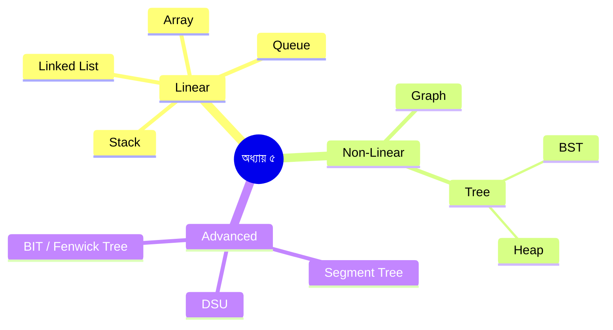

# অধ্যায় ৫: ডেটা স্ট্রাকচার (Data Structures)

> 🎯 **লক্ষ্য:** Array থেকে Fenwick Tree পর্যন্ত — প্রতিটি ডেটা স্ট্রাকচার গল্পের ছলে, ছবিতে, Dart কোডে।

---

## 📑 অধ্যায়ের বিষয়সূচি (Chapter TOC)

| # | বিষয় | মূল অপারেশন |
|---|-------|------------|
| [১](#array) | Array | O(1) access, O(n) insert |
| [২](#linked-list) | Linked List | O(1) insert, O(n) search |
| [৩](#stack) | Stack | O(1) push/pop |
| [৪](#queue) | Queue (Linear, Circular, Deque) | O(1) enqueue/dequeue |
| [৫](#graph) | Graph Representation | Adj Matrix vs List |
| [৬](#tree) | Tree & Traversals | O(n) traversal |
| [৭](#bst) | Binary Search Tree (BST) | O(log n) avg |
| [৮](#heap) | Heap / Priority Queue | O(log n) insert/extract |
| [৯](#dsu) | Disjoint Set Union (DSU) | O(α(n)) ≈ O(1) |
| [১০](#segment-tree) | Segment Tree | O(log n) query/update |
| [১১](#bit) | Binary Indexed Tree (BIT) | O(log n) prefix sum |

---



---

<a name="array"></a>
## ১. Array

---

### ০. বাস্তব জীবনের গল্প 🚂

**গল্প: ট্রেনের বগি**

ঢাকা থেকে চট্টগ্রামের ট্রেনের কথা ভাবো। ট্রেনে বগি আছে — বগি ১, বগি ২, বগি ৩... প্রতিটি বগির একটি নির্দিষ্ট নম্বর আছে এবং সব বগি পাশাপাশি সংযুক্ত।

```
বগি: [বগি-১] [বগি-২] [বগি-৩] [বগি-৪] [বগি-৫]
নম্বর:  0       1       2       3       4

টিকেট কেটে "বগি ৩"-এ যাও → সরাসরি চলে যাও! O(1)
কিন্তু নতুন বগি মাঝখানে জুড়তে হলে? → পেছনের সব বগি পিছিয়ে নাও! O(n)
```

এটাই Array — নম্বর দিয়ে সরাসরি যেকোনো জায়গায় যাওয়া যায়!

---

### ১. Array কী?

**Array** হলো একই ধরনের উপাদানের একটি **contiguous (পাশাপাশি)** মেমোরি ব্লক। প্রতিটি উপাদানের একটি index আছে, এবং যেকোনো index-এ O(1) সময়ে access করা যায়।

**মূল বৈশিষ্ট্য:**
- সব উপাদান মেমোরিতে পাশাপাশি বসে
- Index দিয়ে O(1) access
- Size fix (Static Array) বা পরিবর্তনযোগ্য (Dynamic Array)

---

### ২. সমস্যাটা কোথায়?

```
Array-এর দুটি বড় সমস্যা:

১. মাঝখানে Insert/Delete → O(n)
   [1, 2, 3, 4, 5]
   index 2-এ 99 ঢোকাও:
   [1, 2, _, 3, 4, 5]  ← ৩,৪,৫ একধাপ ডানে সরাও
   [1, 2, 99, 3, 4, 5] ✅ কিন্তু n element সরাতে হলো!

২. Static Array: size আগে ঠিক করতে হয়
   size=5 নিলে, 6 element ধরবে না!
   → Dynamic Array (Dart-এর List) এই সমস্যা সমাধান করে
     (ভেতরে ২x বড় নতুন array কপি করে)
```

---

### ৩. ধাপে ধাপে Visual

**মেমোরিতে Array:**
```
Array: [10, 20, 30, 40, 50]

Memory Address:  1000  1004  1008  1012  1016
Value:           [ 10]  [20]  [30]  [40]  [50]
Index:            [0]   [1]   [2]   [3]   [4]

arr[2] = ?
Base address + 2 × size = 1000 + 2×4 = 1008 → 30 ✅ O(1)
```

**Insert at index 2:**
```
আগে:  [10, 20, 30, 40, 50]
         0   1   2   3   4

ধাপ ১: 4 → 5 সরাও
       [10, 20, 30, 40, 50, _]
ধাপ ২: 3 → 4 সরাও
       [10, 20, 30, 40, 40, _]
ধাপ ৩: 2 → 3 সরাও
       [10, 20, 30, 30, 40, _]
ধাপ ৪: index 2-এ 99 বসাও
       [10, 20, 99, 30, 40, 50] ✅
```

**2D Array:**
```
Matrix (2D Array):
     col→  0    1    2
row↓
 0       [ 1]  [ 2]  [ 3]
 1       [ 4]  [ 5]  [ 6]
 2       [ 7]  [ 8]  [ 9]

arr[1][2] = 6
মেমোরিতে: [1,2,3,4,5,6,7,8,9] (row-major)
address = base + (row × cols + col) × size
        = base + (1×3 + 2) × 4 = base + 20
```

---

### ৫. সম্পূর্ণ Dart Code

```dart
// ════════════════════════════════════════
// Array — সব মূল অপারেশন
// ════════════════════════════════════════

void main() {
  // ১D Array তৈরি
  List<int> arr = [10, 20, 30, 40, 50];

  // Access — O(1)
  print('arr[2] = ${arr[2]}'); // 30

  // Update — O(1)
  arr[2] = 99;
  print('update: $arr'); // [10, 20, 99, 40, 50]

  // Insert শেষে — O(1) amortized
  arr.add(60);
  print('add: $arr'); // [10, 20, 99, 40, 50, 60]

  // Insert মাঝখানে — O(n)
  arr.insert(2, 77);
  print('insert(2,77): $arr'); // [10, 20, 77, 99, 40, 50, 60]

  // Delete — O(n)
  arr.removeAt(2);
  print('removeAt(2): $arr'); // [10, 20, 99, 40, 50, 60]

  // Search — O(n) linear
  print('indexOf(99): ${arr.indexOf(99)}'); // 2

  // 2D Array
  List<List<int>> matrix = [
    [1, 2, 3],
    [4, 5, 6],
    [7, 8, 9],
  ];
  print('matrix[1][2] = ${matrix[1][2]}'); // 6

  // Prefix Sum Array — range query O(1)
  List<int> prefix = List.filled(arr.length + 1, 0);
  for (int i = 0; i < arr.length; i++) {
    prefix[i + 1] = prefix[i] + arr[i];
  }
  // sum of index 1..3
  int rangeSum = prefix[4] - prefix[1];
  print('rangeSum[1..3] = $rangeSum');
}

/* Output:
arr[2] = 30
update: [10, 20, 99, 40, 50]
add: [10, 20, 99, 40, 50, 60]
insert(2,77): [10, 20, 77, 99, 40, 50, 60]
removeAt(2): [10, 20, 99, 40, 50, 60]
indexOf(99): 2
matrix[1][2] = 6
*/
```

---

### ৬. Complexity বিশ্লেষণ

```
┌──────────────────┬──────────┬────────────────────────────────┐
│ অপারেশন         │ Time     │ কারণ                           │
├──────────────────┼──────────┼────────────────────────────────┤
│ Access arr[i]    │ O(1)     │ base + i×size সরাসরি           │
│ Update arr[i]    │ O(1)     │ সরাসরি address                 │
│ Append (শেষে)   │ O(1)*    │ *amortized, মাঝে মাঝে O(n)    │
│ Insert (মাঝে)   │ O(n)     │ পেছনের সব shift করতে হয়        │
│ Delete (মাঝে)   │ O(n)     │ সামনের সব shift করতে হয়        │
│ Search (linear) │ O(n)     │ একে একে দেখতে হয়              │
│ Search (binary) │ O(log n) │ sorted array হলে               │
├──────────────────┼──────────┼────────────────────────────────┤
│ Space            │ O(n)     │ n টি উপাদান                    │
└──────────────────┴──────────┴────────────────────────────────┘
```

```
┌────────────────────────────────────────┐
│         সারসংক্ষেপ (Summary)           │
│  কী:     Contiguous memory block       │
│  কেন:    O(1) random access            │
│  কখন:    Index-based access দরকার     │
│  কোথায়: সব জায়গায় — সবচেয়ে মৌলিক   │
│  Access: O(1)                          │
│  Insert: O(n) middle, O(1) end        │
│  Space:  O(n)                          │
│  Stable: ✅                            │
└────────────────────────────────────────┘
```

---

<a name="linked-list"></a>
## ২. Linked List

---

### ০. বাস্তব জীবনের গল্প 🔗

**গল্প: ট্রেজার হান্ট**

ধরো একটি Treasure Hunt খেলা। প্রথম সূত্র তোমার হাতে আছে। সেখানে লেখা আছে পরের সূত্র কোথায়। পরের সূত্রে লেখা আছে তার পরের সূত্র কোথায়। এভাবে chain তৈরি হয়।

```
[সূত্র-১ | →পরের ঠিকানা] → [সূত্র-২ | →পরের ঠিকানা] → [সূত্র-৩ | null]

প্রতিটি node = data + next pointer
```

Array-এর মতো পাশাপাশি নয়, যেকোনো জায়গায় থাকতে পারে — শুধু "পরেরটা কোথায়" জানলেই হয়!

---

### ১. Linked List কী?

**Linked List** হলো node-এর একটি chain যেখানে প্রতিটি node তার data এবং পরবর্তী node-এর pointer ধারণ করে। মেমোরিতে পাশাপাশি থাকা আবশ্যক নয়।

**তিন ধরনের Linked List:**
```
Singly:  Head→[1|→]→[2|→]→[3|null]

Doubly:  Head→[null|1|→]↔[←|2|→]↔[←|3|null]←Tail

Circular: Head→[1|→]→[2|→]→[3|→]→ (Head-এ ফিরে)
```

---

### ২. Array vs Linked List

```
┌─────────────────┬──────────────────┬──────────────────┐
│                 │ Array            │ Linked List      │
├─────────────────┼──────────────────┼──────────────────┤
│ মেমোরি          │ Contiguous       │ যেকোনো জায়গা    │
│ Access          │ O(1) ← ভালো     │ O(n)             │
│ Insert শুরুতে  │ O(n)             │ O(1) ← ভালো     │
│ Insert শেষে    │ O(1)*            │ O(1) tail সহ     │
│ Insert মাঝে    │ O(n)             │ O(n) find+O(1)   │
│ Delete          │ O(n)             │ O(n) find+O(1)   │
│ Cache           │ ভালো (locality) │ খারাপ            │
│ Size            │ Fixed/Dynamic    │ Dynamic          │
└─────────────────┴──────────────────┴──────────────────┘
```

---

### ৩. ধাপে ধাপে Visual

**Singly Linked List — মূল অপারেশন:**

```
শুরুতে Insert (value=0):
আগে:  Head→[1]→[2]→[3]→null
newNode = Node(0)
newNode.next = Head
Head = newNode
পরে:  Head→[0]→[1]→[2]→[3]→null  ✅ O(1)

━━━━━━━━━━━━━━━━━━━━━━━━━━━━━━━━━━━━━
মাঝে Insert (index=2, value=99):
আগে:  Head→[1]→[2]→[3]→[4]→null
                ↑
             prev (index 1)
newNode = Node(99)
newNode.next = prev.next  →[3]
prev.next = newNode
পরে:  Head→[1]→[2]→[99]→[3]→[4]→null ✅

━━━━━━━━━━━━━━━━━━━━━━━━━━━━━━━━━━━━━
Delete (value=3):
আগে:  Head→[1]→[2]→[3]→[4]→null
              ↑    ↑
             prev  curr
prev.next = curr.next
পরে:  Head→[1]→[2]→[4]→null ✅
```

---

### ৫. সম্পূর্ণ Dart Code

```dart
// ════════════════════════════════════════
// Singly Linked List
// ════════════════════════════════════════

class Node<T> {
  T data;
  Node<T>? next;
  Node(this.data);
}

class LinkedList<T> {
  Node<T>? head;
  int _size = 0;
  int get size => _size;

  // শুরুতে যোগ করো — O(1)
  void prepend(T data) {
    Node<T> node = Node(data);
    node.next = head;
    head = node;
    _size++;
  }

  // শেষে যোগ করো — O(n)
  void append(T data) {
    Node<T> node = Node(data);
    if (head == null) { head = node; _size++; return; }
    Node<T> curr = head!;
    while (curr.next != null) curr = curr.next!;
    curr.next = node;
    _size++;
  }

  // মুছে ফেলো — O(n)
  bool delete(T data) {
    if (head == null) return false;
    if (head!.data == data) { head = head!.next; _size--; return true; }
    Node<T> curr = head!;
    while (curr.next != null && curr.next!.data != data) {
      curr = curr.next!;
    }
    if (curr.next == null) return false;
    curr.next = curr.next!.next;
    _size--;
    return true;
  }

  // প্রিন্ট করো
  @override
  String toString() {
    StringBuffer sb = StringBuffer('Head→');
    Node<T>? curr = head;
    while (curr != null) { sb.write('[${curr.data}]→'); curr = curr.next; }
    sb.write('null');
    return sb.toString();
  }
}

void main() {
  var list = LinkedList<int>();
  list.append(1); list.append(2); list.append(3);
  print(list);           // Head→[1]→[2]→[3]→null

  list.prepend(0);
  print(list);           // Head→[0]→[1]→[2]→[3]→null

  list.delete(2);
  print(list);           // Head→[0]→[1]→[3]→null
  print('size: ${list.size}'); // 3
}

/* Output:
Head→[1]→[2]→[3]→null
Head→[0]→[1]→[2]→[3]→null
Head→[0]→[1]→[3]→null
size: 3
*/
```

---

### ৬. Complexity

```
┌──────────────────┬──────────┬──────────────────────────────┐
│ অপারেশন         │ Time     │ কারণ                         │
├──────────────────┼──────────┼──────────────────────────────┤
│ Access (index i) │ O(n)     │ শুরু থেকে গুনতে হয়          │
│ Insert (শুরু)   │ O(1)     │ শুধু pointer পরিবর্তন        │
│ Insert (শেষ)    │ O(n)     │ শেষে পৌঁছাতে হয়             │
│ Insert (মাঝে)   │ O(n)     │ খুঁজে বের করা                │
│ Delete          │ O(n)     │ খুঁজে বের করা                │
│ Search          │ O(n)     │ একে একে দেখতে হয়            │
├──────────────────┼──────────┼──────────────────────────────┤
│ Space           │ O(n)     │ n node + n pointer            │
└──────────────────┴──────────┴──────────────────────────────┘
```

```
┌────────────────────────────────────────┐
│         সারসংক্ষেপ (Summary)           │
│  কী:     Node chain, pointer দিয়ে     │
│  কেন:    শুরুতে O(1) insert           │
│  কখন:    ঘন ঘন শুরু/শেষে insert      │
│  কোথায়: Stack, Queue implementation  │
│  Access: O(n)                          │
│  Insert: O(1) head, O(n) elsewhere    │
│  Space:  O(n)                          │
│  Stable: ✅                            │
└────────────────────────────────────────┘
```

---

<a name="stack"></a>
## ৩. Stack

---

### ০. বাস্তব জীবনের গল্প 🥞

**গল্প: থালা-বাসন স্তুপ**

রান্নাঘরে থালা-বাসন একটির উপর আরেকটি রাখা। সর্বশেষ যে থালা রাখা হয়েছে, সেটিই প্রথমে নেওয়া হয়।

```
রাখা হলো:  থালা-১, থালা-২, থালা-৩
           ┌──────┐
           │ থালা-৩ │  ← সবার উপরে (TOP)
           ├──────┤
           │ থালা-২ │
           ├──────┤
           │ থালা-১ │  ← নিচে
           └──────┘

নেওয়া যাবে: থালা-৩ → থালা-২ → থালা-১
(Last In, First Out = LIFO)
```

---

### ১. Stack কী?

**Stack** একটি LIFO (Last In, First Out) ডেটা স্ট্রাকচার। শুধু **উপর থেকে** push (যোগ) এবং pop (বের করা) করা যায়।

**মূল অপারেশন:**
```
Push(x): উপরে যোগ করো  → O(1)
Pop():   উপর থেকে বের করো → O(1)
Peek():  উপরেরটা দেখো (না সরিয়ে) → O(1)
isEmpty: খালি কিনা → O(1)
```

---

### ৩. ধাপে ধাপে Visual

```
push(1): [1]         TOP=1
push(2): [1,2]       TOP=2
push(3): [1,2,3]     TOP=3
peek():  → 3 (সরে না)
pop():   [1,2]       TOP=2, return 3
pop():   [1]         TOP=1, return 2
isEmpty: false
pop():   []          TOP=null, return 1
isEmpty: true

Real use — Balanced Parentheses:
Input: "({[]})"
push '(' → stack: ['(']
push '{' → stack: ['(', '{']
push '[' → stack: ['(', '{', '[']
']' আসলে → pop '[' → match ✅
'}' আসলে → pop '{' → match ✅
')' আসলে → pop '(' → match ✅
Stack empty → Balanced! ✅
```

---

### ৫. সম্পূর্ণ Dart Code

```dart
// ════════════════════════════════════════
// Stack Implementation
// ════════════════════════════════════════

class Stack<T> {
  final List<T> _data = [];

  void push(T item) => _data.add(item);      // O(1)
  T pop()   => _data.removeLast();           // O(1)
  T peek()  => _data.last;                  // O(1)
  bool get isEmpty => _data.isEmpty;
  int get size => _data.length;

  @override
  String toString() => 'Stack(top→${_data.reversed.toList()})';
}

// Balanced Parentheses চেক
bool isBalanced(String s) {
  Stack<String> stack = Stack();
  Map<String, String> match = {')': '(', '}': '{', ']': '['};

  for (String ch in s.split('')) {
    if ('({['.contains(ch)) {
      stack.push(ch);
    } else if (')}]'.contains(ch)) {
      if (stack.isEmpty || stack.pop() != match[ch]) return false;
    }
  }
  return stack.isEmpty;
}

void main() {
  Stack<int> s = Stack();
  s.push(1); s.push(2); s.push(3);
  print(s);             // Stack(top→[3, 2, 1])
  print('peek: ${s.peek()}'); // 3
  print('pop: ${s.pop()}');   // 3
  print(s);             // Stack(top→[2, 1])

  print(isBalanced('({[]})'));  // true
  print(isBalanced('({[})'));   // false
}

/* Output:
Stack(top→[3, 2, 1])
peek: 3
pop: 3
Stack(top→[2, 1])
true
false
*/
```

---

### ৬. Complexity

```
┌─────────────────────────────────────────────────────┐
│  সব অপারেশন: O(1) সময়, O(n) space                 │
└─────────────────────────────────────────────────────┘

Real Uses:
🔙 Browser Back Button  → URL history stack
↩️ Ctrl+Z (Undo)        → Action stack
📐 Math expression eval → Operator stack
🔁 Recursion            → Call stack
```

```
┌────────────────────────────────────────┐
│         সারসংক্ষেপ (Summary)           │
│  কী:     LIFO structure               │
│  কেন:    Last যোগ, First বের          │
│  কখন:    Undo, DFS, expression eval  │
│  কোথায়: Browser, compiler, OS        │
│  Push:   O(1)                         │
│  Pop:    O(1)                         │
│  Space:  O(n)                         │
│  Stable: N/A                          │
└────────────────────────────────────────┘
```

---

<a name="queue"></a>
## ৪. Queue

---

### ০. বাস্তব জীবনের গল্প 🎫

**গল্প: টিকেট কাউন্টারের লাইন**

রেলওয়ে স্টেশনে টিকেট কাটার লাইনে প্রথমে যে দাঁড়ায়, সে প্রথমে টিকেট পায়। নতুন কেউ লাইনে যোগ দেয় সবার পেছনে।

```
লাইন:  [রহিম]→[করিম]→[জমির]→[নাসির]
          ↑                       ↑
        FRONT                   REAR
       (বের হয়)              (যোগ হয়)

First In, First Out = FIFO
```

---

### ১. Queue কী?

**Queue** একটি FIFO (First In, First Out) ডেটা স্ট্রাকচার। **পেছনে (rear)** যোগ হয়, **সামনে (front)** থেকে বের হয়।

**FIFO vs LIFO:**
```
Stack (LIFO):  push [1,2,3] → pop: 3,2,1 (উল্টো)
Queue (FIFO):  enqueue [1,2,3] → dequeue: 1,2,3 (একই ক্রম)
```

---

### ৩. ধাপে ধাপে Visual

**Linear Queue:**
```
enqueue(1): front→[1]←rear
enqueue(2): front→[1,2]←rear
enqueue(3): front→[1,2,3]←rear
dequeue():  front→[2,3]←rear, return 1
peek():     → 2

সমস্যা: Linear Queue-এ সামনে space নষ্ট হয়!
[_, _, 3, 4, 5]  ← index 0,1 খালি কিন্তু ব্যবহার হচ্ছে না
front=2, rear=4
```

**Circular Queue (এই সমস্যার সমাধান):**
```
size=5 Circular Queue:
         0    1    2    3    4
        [  ] [  ] [10] [20] [30]
                   ↑              ↑
                 front           rear

dequeue() → 10, front=(2+1)%5=3
         [  ] [  ] [  ] [20] [30]
                         ↑    ↑
enqueue(40) → rear=(4+1)%5=0
        [40] [  ] [  ] [20] [30]
          ↑               ↑
         rear            front

Index circular হওয়ায় পুরানো space পুনরায় ব্যবহার! ✅
```

---

### ৪. Deque (Double Ended Queue)

```
Deque: উভয় প্রান্ত থেকে যোগ ও বের করা যায়

  addFront(1)  addRear(2)  addFront(0)  removeFront()  removeRear()
  [1]          [1,2]       [0,1,2]      [1,2]          [1]

Use: Sliding Window Maximum, Palindrome check
```

---

### ৪.১ Queue using Two Stacks

```
দুটি Stack দিয়ে Queue বানানো:

s1 (inbox), s2 (outbox)

enqueue(x): s1.push(x)
dequeue():
  যদি s2 empty:
    s1-এর সব s2-তে ঢালো (উল্টো হয়ে FIFO হবে)
  s2.pop()

উদাহরণ:
enqueue(1,2,3): s1=[3,2,1], s2=[]
dequeue(): s2 empty → s1→s2: s2=[1,2,3]
           s2.pop() = 1 ✅ (FIFO!)
dequeue(): s2=[2,3], s2.pop() = 2 ✅
enqueue(4): s1=[4], s2=[3]
dequeue(): s2 not empty → s2.pop() = 3 ✅
```

---

### ৫. সম্পূর্ণ Dart Code

```dart
// ════════════════════════════════════════════════
// Queue: Linear, Circular, Deque, TwoStack
// ════════════════════════════════════════════════

import 'dart:collection';

// Simple Queue (Dart built-in Queue)
void demoQueue() {
  Queue<int> q = Queue();
  q.addLast(1);  // enqueue
  q.addLast(2);
  q.addLast(3);
  print('front: ${q.first}');    // 1
  print('dequeue: ${q.removeFirst()}'); // 1
  print('queue: $q');            // {2, 3}
}

// Circular Queue — fixed size
class CircularQueue {
  final List<int?> _data;
  int _front = 0, _rear = 0, _count = 0;
  final int capacity;

  CircularQueue(this.capacity) : _data = List.filled(capacity, null);

  bool get isFull  => _count == capacity;
  bool get isEmpty => _count == 0;

  // পেছনে যোগ করো — O(1)
  bool enqueue(int val) {
    if (isFull) return false;
    _data[_rear] = val;
    _rear = (_rear + 1) % capacity; // Circular!
    _count++;
    return true;
  }

  // সামনে থেকে বের করো — O(1)
  int? dequeue() {
    if (isEmpty) return null;
    int val = _data[_front]!;
    _front = (_front + 1) % capacity; // Circular!
    _count--;
    return val;
  }

  int? peek() => isEmpty ? null : _data[_front];
}

// Queue using Two Stacks
class QueueWithStacks<T> {
  final List<T> _inbox  = []; // enqueue এখানে
  final List<T> _outbox = []; // dequeue এখানে

  void enqueue(T item) => _inbox.add(item); // O(1)

  T dequeue() { // Amortized O(1)
    if (_outbox.isEmpty) {
      // inbox উল্টে outbox-এ ঢালো
      while (_inbox.isNotEmpty) _outbox.add(_inbox.removeLast());
    }
    return _outbox.removeLast();
  }

  bool get isEmpty => _inbox.isEmpty && _outbox.isEmpty;
}

void main() {
  demoQueue();

  // Circular Queue
  CircularQueue cq = CircularQueue(4);
  cq.enqueue(10); cq.enqueue(20); cq.enqueue(30);
  print('peek: ${cq.peek()}');      // 10
  print('dequeue: ${cq.dequeue()}'); // 10
  cq.enqueue(40); cq.enqueue(50);   // circular: space পুনর্ব্যবহার
  print('full: ${cq.isFull}');      // true

  // Two Stacks Queue
  var tsq = QueueWithStacks<int>();
  tsq.enqueue(1); tsq.enqueue(2); tsq.enqueue(3);
  print('TwoStack dequeue: ${tsq.dequeue()}'); // 1 (FIFO!)
  print('TwoStack dequeue: ${tsq.dequeue()}'); // 2
}

/* Output:
front: 1
dequeue: 1
queue: {2, 3}
peek: 10
dequeue: 10
full: true
TwoStack dequeue: 1
TwoStack dequeue: 2
*/
```

---

### ৬. Complexity

```
┌────────────────────┬──────────┬────────────────────────────────┐
│ অপারেশন           │ Time     │ কারণ                           │
├────────────────────┼──────────┼────────────────────────────────┤
│ Enqueue            │ O(1)     │ rear-এ যোগ                     │
│ Dequeue            │ O(1)     │ front থেকে বের                 │
│ Peek               │ O(1)     │ শুধু দেখা                      │
│ Two Stack enqueue  │ O(1)     │ inbox-এ push                   │
│ Two Stack dequeue  │ O(1)*    │ *amortized                     │
├────────────────────┼──────────┼────────────────────────────────┤
│ Space              │ O(n)     │ n উপাদান                       │
└────────────────────┴──────────┴────────────────────────────────┘

Real uses:
🌐 BFS Algorithm     → Queue দিয়ে level-by-level অনুসন্ধান
💻 OS Process Sched. → Ready queue
🖨️ Print Spooler     → Job queue
📡 Network Buffer    → Packet queue
```

```
┌────────────────────────────────────────┐
│         সারসংক্ষেপ (Summary)           │
│  কী:     FIFO structure               │
│  কেন:    যে আগে আসে সে আগে যায়       │
│  কখন:    BFS, scheduling, buffering   │
│  কোথায়: OS, network, BFS             │
│  Enqueue: O(1)                        │
│  Dequeue: O(1)                        │
│  Space:   O(n)                        │
│  Stable:  ✅                          │
└────────────────────────────────────────┘
```

---

<a name="graph"></a>
## ৫. Graph Representation

---

### ০. বাস্তব জীবনের গল্প 🗺️

**গল্প: ঢাকার রাস্তার নকশা**

ঢাকার বিভিন্ন এলাকা (মিরপুর, গুলশান, ধানমন্ডি...) এবং তাদের মধ্যে রাস্তা — এটাই একটি Graph।

```
মিরপুর ←→ গুলশান  (দ্বিমুখী রাস্তা = Undirected Edge)
গুলশান → মতিঝিল   (একমুখী = Directed Edge)
মিরপুর ─5km─ ধানমন্ডি (দূরত্ব = Weighted Edge)

Node/Vertex = এলাকা
Edge = রাস্তা
```

---

### ১. Graph কী?

**Graph** G = (V, E) যেখানে V = vertex (নোড) এবং E = edge (সংযোগ)।

**ধরন:**
```
Directed (Digraph):   A → B (একমুখী)
Undirected:           A — B (দ্বিমুখী)
Weighted:             A —5— B (ওজন আছে)
Unweighted:           A — B (ওজন নেই)
```

---

### ৩. Adjacency Matrix vs Adjacency List

```
Graph:
  0 — 1
  |   |
  2 — 3

Adjacency Matrix (4×4):
       0  1  2  3
  0  [ 0, 1, 1, 0 ]
  1  [ 1, 0, 0, 1 ]
  2  [ 1, 0, 0, 1 ]
  3  [ 0, 1, 1, 0 ]

  ✅ O(1) edge check (আছে কিনা)
  ❌ O(V²) space — sparse graph-এ অপচয়

Adjacency List:
  0: [1, 2]
  1: [0, 3]
  2: [0, 3]
  3: [1, 2]

  ✅ O(V + E) space — sparse graph-এ কার্যকর
  ❌ O(degree) edge check

Weighted Graph List:
  0: [(1, w=5), (2, w=3)]
  1: [(0, w=5), (3, w=2)]
```

**Memory তুলনা:**
```
V=1000, E=2000 (Sparse graph):
  Matrix: 1000×1000 = 1,000,000 entries ❌
  List:   V + E = 3,000 entries ✅

V=100, E=9000 (Dense graph):
  Matrix: 10,000 entries — ঠিক আছে
  List:   9,100 entries — সামান্য কম
```

---

### ৫. সম্পূর্ণ Dart Code

```dart
// ════════════════════════════════════════════════
// Graph — Adjacency List (Directed + Undirected)
// ════════════════════════════════════════════════

class Graph {
  final int vertices;
  final bool directed;
  final List<List<(int, int)>> adjList; // (neighbor, weight)

  Graph(this.vertices, {this.directed = false})
      : adjList = List.generate(vertices, (_) => []);

  // Edge যোগ করো
  void addEdge(int u, int v, {int weight = 1}) {
    adjList[u].add((v, weight));
    if (!directed) adjList[v].add((u, weight)); // undirected
  }

  // প্রতিবেশী দেখো
  List<(int, int)> neighbors(int u) => adjList[u];

  // Edge আছে কিনা — O(degree)
  bool hasEdge(int u, int v) =>
      adjList[u].any((e) => e.$1 == v);

  void printGraph() {
    for (int i = 0; i < vertices; i++) {
      String edges = adjList[i]
          .map((e) => '${e.$1}(w=${e.$2})')
          .join(', ');
      print('$i → [$edges]');
    }
  }
}

void main() {
  // Undirected Weighted Graph
  Graph g = Graph(5);
  g.addEdge(0, 1, weight: 4);
  g.addEdge(0, 2, weight: 2);
  g.addEdge(1, 3, weight: 5);
  g.addEdge(2, 3, weight: 1);
  g.addEdge(3, 4, weight: 3);

  g.printGraph();
  print('0→3 আছে? ${g.hasEdge(0, 3)}'); // false
  print('0→1 আছে? ${g.hasEdge(0, 1)}'); // true
}

/* Output:
0 → [1(w=4), 2(w=2)]
1 → [0(w=4), 3(w=5)]
2 → [0(w=2), 3(w=1)]
3 → [1(w=5), 2(w=1), 4(w=3)]
4 → [3(w=3)]
0→3 আছে? false
0→1 আছে? true
*/
```

---

### ৬. Complexity

```
┌─────────────────┬──────────────┬──────────────────┐
│ অপারেশন        │ Adj Matrix   │ Adj List         │
├─────────────────┼──────────────┼──────────────────┤
│ Space           │ O(V²)        │ O(V + E)         │
│ Add Edge        │ O(1)         │ O(1)             │
│ Remove Edge     │ O(1)         │ O(degree)        │
│ Edge Check      │ O(1)         │ O(degree)        │
│ All Neighbors   │ O(V)         │ O(degree)        │
└─────────────────┴──────────────┴──────────────────┘
```

```
┌────────────────────────────────────────┐
│         সারসংক্ষেপ (Summary)           │
│  কী:     Vertex + Edge সংগ্রহ         │
│  কেন:    Network, map modeling         │
│  কখন:    BFS/DFS, shortest path       │
│  কোথায়: Social network, GPS, Web      │
│  Space:  O(V+E) list / O(V²) matrix   │
│  Stable: N/A                           │
└────────────────────────────────────────┘
```

---

<a name="tree"></a>
## ৬. Tree ও Traversals

---

### ০. বাস্তব জীবনের গল্প 🌳

**গল্প: পরিবারের বংশলতিকা**

দাদার সন্তান দুজন — বাবা ও চাচা। বাবার সন্তান তুমি ও তোমার ভাই। এটাই Tree!

```
         দাদা (Root)
        /           \
      বাবা          চাচা
     /    \          |
   তুমি  ভাই      চাচাতো ভাই

প্রতিটি মানুষ = Node
সম্পর্ক = Edge
কোনো cycle নেই
```

---

### ১. Tree কী?

**Tree** একটি connected, acyclic (চক্রহীন) graph যেখানে একটি বিশেষ node আছে — **root**। প্রতিটি node ছাড়া root-এর ঠিক একটি **parent** আছে।

**মূল শব্দ:**
```
Root:    সর্বোচ্চ node (parent নেই)
Leaf:    কোনো child নেই এমন node
Parent:  উপরের node
Child:   নিচের node
Height:  Root থেকে দূরতম leaf পর্যন্ত দূরত্ব
Depth:   Root থেকে ঐ node-এর দূরত্ব
Degree:  একটি node-এর child সংখ্যা
```

```
       1  ← Root (depth=0, height=3)
      / \
     2   3  ← depth=1
    / \   \
   4   5   6  ← depth=2
  /
 7  ← Leaf (depth=3)

Height = 3
```

---

### ৩. Tree Traversals — ধাপে ধাপে Visual

```
Tree:
       1
      / \
     2   3
    / \
   4   5

━━━━━━━━━━━━━━━━━━━━━━━━━━━━━━━━━━━━━━━━

Inorder (বাম → Root → ডান):
  বাম subtree inorder: 4, 2, 5
  Root: 1
  ডান subtree inorder: 3
  Result: [4, 2, 5, 1, 3]  ← BST-এ sorted!

Preorder (Root → বাম → ডান):
  Root: 1
  বাম subtree preorder: 2, 4, 5
  ডান subtree preorder: 3
  Result: [1, 2, 4, 5, 3]  ← Tree copy করতে

Postorder (বাম → ডান → Root):
  বাম: 4, 5
  ডান: 3
  Root: 2 → তারপর Root 1
  Result: [4, 5, 2, 3, 1]  ← Tree delete করতে

Level Order (BFS):
  Level 0: [1]
  Level 1: [2, 3]
  Level 2: [4, 5]
  Result: [1, 2, 3, 4, 5]  ← Shortest path
```

---

### ৫. সম্পূর্ণ Dart Code

```dart
// ════════════════════════════════════════════════
// Binary Tree + All Traversals
// ════════════════════════════════════════════════

import 'dart:collection';

class TreeNode {
  int val;
  TreeNode? left, right;
  TreeNode(this.val);
}

class BinaryTree {
  TreeNode? root;

  // Inorder: বাম → Root → ডান
  List<int> inorder([TreeNode? node, bool first = true]) {
    if (first) node = root;
    if (node == null) return [];
    return [...inorder(node.left, false), node.val, ...inorder(node.right, false)];
  }

  // Preorder: Root → বাম → ডান
  List<int> preorder([TreeNode? node, bool first = true]) {
    if (first) node = root;
    if (node == null) return [];
    return [node.val, ...preorder(node.left, false), ...preorder(node.right, false)];
  }

  // Postorder: বাম → ডান → Root
  List<int> postorder([TreeNode? node, bool first = true]) {
    if (first) node = root;
    if (node == null) return [];
    return [...postorder(node.left, false), ...postorder(node.right, false), node.val];
  }

  // Level Order (BFS)
  List<List<int>> levelOrder() {
    if (root == null) return [];
    List<List<int>> result = [];
    Queue<TreeNode> q = Queue()..add(root!);

    while (q.isNotEmpty) {
      int levelSize = q.length;
      List<int> level = [];
      for (int i = 0; i < levelSize; i++) {
        TreeNode node = q.removeFirst();
        level.add(node.val);
        if (node.left  != null) q.add(node.left!);
        if (node.right != null) q.add(node.right!);
      }
      result.add(level);
    }
    return result;
  }

  // Height
  int height([TreeNode? node, bool first = true]) {
    if (first) node = root;
    if (node == null) return -1;
    return 1 + [height(node.left, false), height(node.right, false)]
        .reduce((a, b) => a > b ? a : b);
  }
}

void main() {
  //       1
  //      / \
  //     2   3
  //    / \
  //   4   5
  BinaryTree tree = BinaryTree();
  tree.root = TreeNode(1);
  tree.root!.left  = TreeNode(2);
  tree.root!.right = TreeNode(3);
  tree.root!.left!.left  = TreeNode(4);
  tree.root!.left!.right = TreeNode(5);

  print('Inorder:    ${tree.inorder()}');    // [4, 2, 5, 1, 3]
  print('Preorder:   ${tree.preorder()}');   // [1, 2, 4, 5, 3]
  print('Postorder:  ${tree.postorder()}');  // [4, 5, 2, 3, 1]
  print('LevelOrder: ${tree.levelOrder()}'); // [[1], [2, 3], [4, 5]]
  print('Height:     ${tree.height()}');     // 2
}

/* Output:
Inorder:    [4, 2, 5, 1, 3]
Preorder:   [1, 2, 4, 5, 3]
Postorder:  [4, 5, 2, 3, 1]
LevelOrder: [[1], [2, 3], [4, 5]]
Height:     2
*/
```

---

### ৬. Complexity

```
┌──────────────────┬──────────┬──────────────────────────┐
│ অপারেশন         │ Time     │ কারণ                     │
├──────────────────┼──────────┼──────────────────────────┤
│ All Traversals   │ O(n)     │ প্রতিটি node একবার visit │
│ Height           │ O(n)     │ সব node দেখতে হয়        │
│ Level Order      │ O(n)     │ Queue দিয়ে BFS           │
├──────────────────┼──────────┼──────────────────────────┤
│ Space (recursion)│ O(h)     │ h = height (call stack)  │
│ Space (level)    │ O(w)     │ w = max width            │
└──────────────────┴──────────┴──────────────────────────┘
```

```
┌────────────────────────────────────────┐
│         সারসংক্ষেপ (Summary)           │
│  কী:     Hierarchical data structure  │
│  কেন:    Hierarchical data modeling   │
│  কখন:    File system, XML, org chart  │
│  কোথায়: OS, Database, Compiler       │
│  Traversal: O(n)                      │
│  Space:     O(n)                      │
│  Stable: N/A                          │
└────────────────────────────────────────┘
```

---

<a name="bst"></a>
## ৭. Binary Search Tree (BST)

---

### ০. বাস্তব জীবনের গল্প 📖

**গল্প: লাইব্রেরির বইয়ের তাক**

লাইব্রেরিতে বইগুলো এমনভাবে সাজানো: মাঝের বইটির বাম দিকে সব ছোট নম্বরের বই, ডানে সব বড় নম্বরের বই। তুমি যেকোনো বই খুঁজতে গেলে প্রতিবার অর্ধেক বাদ দিতে পারো!

```
        50
       /  \
      30   70
     / \   / \
    20 40  60 80

নিয়ম: left < root < right (সব subtree-তে)
```

---

### ১. BST কী?

**BST** একটি Binary Tree যেখানে প্রতিটি node-এর জন্য:
- বাম subtree-র সব মান < node মান
- ডান subtree-র সব মান > node মান

এই property-র কারণে Binary Search-এর মতো O(log n) search সম্ভব।

---

### ৩. ধাপে ধাপে Visual — Insert, Search, Delete

**Insert(45):**
```
        50
       /  \
      30   70
     / \
    20 40
        \
        45  ← নতুন node

50 → 45<50 বামে → 30 → 45>30 ডানে → 40 → 45>40 ডানে → null → বসাও!
```

**Search(40):**
```
50: 40<50 → বামে
30: 40>30 → ডানে
40: 40==40 → পাওয়া গেছে! ✅ (৩ ধাপ)
```

**Delete(30) — ৩ Case:**
```
Case 1: Leaf node → সরাসরি মুছো
Case 2: একটি child → child-কে উপরে তোলো
Case 3: দুটি child → Inorder Successor (ডান subtree-র সর্বনিম্ন) দিয়ে replace করো

Delete(30):
        50                    50
       /  \      →           /  \
      30   70              40   70
     / \                   /
    20 40                 20
       \  ← inorder       (30-এর জায়গায় 40, 40-এর left=20)
       45
```

**Balanced vs Unbalanced:**
```
Balanced BST:           Unbalanced (sorted input):
        50              1
       /  \              \
      30   70             2
     / \   / \             \
    20 40 60 80             3
                             \
                              4  ← Linked List হয়ে যায়!

Balanced: O(log n) search ✅
Unbalanced: O(n) search ❌

এজন্য AVL Tree / Red-Black Tree দরকার (Self-balancing BST)
```

---

### ৫. সম্পূর্ণ Dart Code

```dart
// ════════════════════════════════════════════════
// Binary Search Tree — Insert, Search, Delete
// ════════════════════════════════════════════════

class BSTNode {
  int val;
  BSTNode? left, right;
  BSTNode(this.val);
}

class BST {
  BSTNode? root;

  // Insert — O(log n) avg, O(n) worst
  BSTNode _insert(BSTNode? node, int val) {
    if (node == null) return BSTNode(val);
    if (val < node.val) node.left  = _insert(node.left,  val);
    if (val > node.val) node.right = _insert(node.right, val);
    return node; // duplicate হলে ignore
  }
  void insert(int val) => root = _insert(root, val);

  // Search — O(log n) avg
  bool search(int val) {
    BSTNode? curr = root;
    while (curr != null) {
      if (val == curr.val) return true;
      curr = val < curr.val ? curr.left : curr.right;
    }
    return false;
  }

  // Inorder Successor (ডান subtree-র minimum)
  BSTNode _minNode(BSTNode node) {
    while (node.left != null) node = node.left!;
    return node;
  }

  // Delete — O(log n) avg
  BSTNode? _delete(BSTNode? node, int val) {
    if (node == null) return null;
    if (val < node.val) {
      node.left  = _delete(node.left,  val);
    } else if (val > node.val) {
      node.right = _delete(node.right, val);
    } else {
      // Case 1 & 2: leaf বা একটি child
      if (node.left  == null) return node.right;
      if (node.right == null) return node.left;
      // Case 3: দুটি child → inorder successor
      BSTNode successor = _minNode(node.right!);
      node.val   = successor.val;
      node.right = _delete(node.right, successor.val);
    }
    return node;
  }
  void delete(int val) => root = _delete(root, val);

  // Inorder (sorted output)
  List<int> inorder([BSTNode? node, bool first = true]) {
    if (first) node = root;
    if (node == null) return [];
    return [...inorder(node.left, false), node.val, ...inorder(node.right, false)];
  }
}

void main() {
  BST bst = BST();
  [50, 30, 70, 20, 40, 60, 80].forEach(bst.insert);

  print('Inorder: ${bst.inorder()}');  // [20, 30, 40, 50, 60, 70, 80]
  print('Search 40: ${bst.search(40)}'); // true
  print('Search 45: ${bst.search(45)}'); // false

  bst.delete(30);
  print('After delete 30: ${bst.inorder()}'); // [20, 40, 50, 60, 70, 80]
}

/* Output:
Inorder: [20, 30, 40, 50, 60, 70, 80]
Search 40: true
Search 45: false
After delete 30: [20, 40, 50, 60, 70, 80]
*/
```

---

### ৬. Complexity

```
┌──────────────────┬──────────┬──────────┬──────────────────────────┐
│ অপারেশন         │ Avg      │ Worst    │ Worst কারণ               │
├──────────────────┼──────────┼──────────┼──────────────────────────┤
│ Search           │ O(log n) │ O(n)     │ Sorted input → skewed    │
│ Insert           │ O(log n) │ O(n)     │ একই কারণ                 │
│ Delete           │ O(log n) │ O(n)     │ একই কারণ                 │
│ Min/Max          │ O(log n) │ O(n)     │ একই কারণ                 │
├──────────────────┼──────────┼──────────┼──────────────────────────┤
│ Space            │ O(n)     │ O(n)     │ n node                   │
└──────────────────┴──────────┴──────────┴──────────────────────────┘

Balanced BST (AVL/RB Tree) হলে সব case O(log n) guaranteed।
```

```
┌────────────────────────────────────────┐
│         সারসংক্ষেপ (Summary)           │
│  কী:     Sorted Binary Tree           │
│  কেন:    O(log n) search/insert       │
│  কখন:    Dynamic sorted data          │
│  কোথায়: Database index, std::set     │
│  Best:   O(log n)                     │
│  Worst:  O(n) sorted input            │
│  Space:  O(n)                         │
│  Stable: N/A                          │
└────────────────────────────────────────┘
```

---

<a name="heap"></a>
## ৮. Heap / Priority Queue

---

### ০. বাস্তব জীবনের গল্প 🏥

**গল্প: হাসপাতালের জরুরি বিভাগ**

জরুরি বিভাগে রোগী আসে। কিন্তু সবচেয়ে গুরুতর রোগী আগে দেখা হয়, সাধারণ রোগী পরে — এটাই Priority Queue।

```
রোগী এলো: [জ্বর(৩), হার্টঅ্যাটাক(১০), মাথাব্যথা(২), দুর্ঘটনা(৮)]
Priority:   ↑ সর্বোচ্চ priority আগে সেবা পাবে

Max-Heap:  দুর্ঘটনা(১০) > হার্টঅ্যাটাক(৮) > জ্বর(৩) > মাথাব্যথা(২)
```

---

### ১. Heap কী?

**Heap** একটি **Complete Binary Tree** যেখানে:
- **Max-Heap:** প্রতিটি parent ≥ তার children
- **Min-Heap:** প্রতিটি parent ≤ তার children

Heap সর্বদা সর্বোচ্চ (বা সর্বনিম্ন) মান **O(1)** সময়ে দিতে পারে।

---

### ৩. ধাপে ধাপে Visual

**Max-Heap:**
```
Array representation: [90, 80, 70, 40, 30, 50, 60]

             90 (index 0)
            /   \
          80     70    (index 1, 2)
         /  \   /  \
        40  30 50  60   (index 3,4,5,6)

parent(i) = (i-1) / 2
left(i)   = 2*i + 1
right(i)  = 2*i + 2
```

**Insert(85) — Heapify Up:**
```
Step 1: শেষে যোগ করো
[90, 80, 70, 40, 30, 50, 60, 85]
                         ↑ index 7

Step 2: parent(7) = 3 = 40 < 85 → swap
[90, 80, 70, 85, 30, 50, 60, 40]

Step 3: parent(3) = 1 = 80 < 85 → swap
[90, 85, 70, 80, 30, 50, 60, 40]

Step 4: parent(1) = 0 = 90 > 85 → থামো! ✅
```

**Extract Max — Heapify Down:**
```
Step 1: root (90) বের করো, শেষেরটা root-এ আনো
[40, 85, 70, 80, 30, 50, 60]
 ↑ শেষেরটা root-এ

Step 2: Heapify Down
40 < max(85, 70)=85 → swap(0, 1)
[85, 40, 70, 80, 30, 50, 60]

40 < max(80, 30)=80 → swap(1, 3)
[85, 80, 70, 40, 30, 50, 60] ✅ Max-Heap restored
```

---

### ৫. সম্পূর্ণ Dart Code

```dart
// ════════════════════════════════════════════════
// Min-Heap / Max-Heap Implementation
// ════════════════════════════════════════════════

class Heap {
  final List<int> _data = [];
  final bool isMinHeap;

  Heap({this.isMinHeap = true});

  int get size => _data.length;
  bool get isEmpty => _data.isEmpty;
  int get top => _data.first; // O(1)

  bool _compare(int a, int b) =>
      isMinHeap ? a < b : a > b; // min বা max অনুযায়ী

  void _swap(int i, int j) {
    int tmp = _data[i]; _data[i] = _data[j]; _data[j] = tmp;
  }

  // Insert + Heapify Up — O(log n)
  void insert(int val) {
    _data.add(val);
    _heapifyUp(_data.length - 1);
  }

  void _heapifyUp(int i) {
    while (i > 0) {
      int parent = (i - 1) ~/ 2;
      if (_compare(_data[i], _data[parent])) {
        _swap(i, parent);
        i = parent;
      } else break;
    }
  }

  // Extract top + Heapify Down — O(log n)
  int extract() {
    int top = _data.first;
    _data[0] = _data.last;
    _data.removeLast();
    if (_data.isNotEmpty) _heapifyDown(0);
    return top;
  }

  void _heapifyDown(int i) {
    int n = _data.length;
    while (true) {
      int best = i, l = 2*i+1, r = 2*i+2;
      if (l < n && _compare(_data[l], _data[best])) best = l;
      if (r < n && _compare(_data[r], _data[best])) best = r;
      if (best == i) break;
      _swap(i, best);
      i = best;
    }
  }

  @override
  String toString() => _data.toString();
}

void main() {
  // Min-Heap
  Heap minH = Heap(isMinHeap: true);
  [5, 3, 8, 1, 9, 2].forEach(minH.insert);
  print('Min-Heap: $minH');
  print('Extract min: ${minH.extract()}'); // 1
  print('Extract min: ${minH.extract()}'); // 2

  // Priority Queue use case: K largest elements
  List<int> nums = [3, 2, 1, 5, 6, 4];
  int k = 2;
  Heap pq = Heap(isMinHeap: true); // min-heap of size k
  for (int n in nums) {
    pq.insert(n);
    if (pq.size > k) pq.extract(); // ছোটটা বের করো
  }
  print('$k largest: $pq'); // [5, 6]
}

/* Output:
Min-Heap: [1, 3, 2, 5, 9, 8]
Extract min: 1
Extract min: 2
2 largest: [5, 6]
*/
```

---

### ৬. Complexity

```
┌──────────────────┬──────────┬────────────────────────────────┐
│ অপারেশন         │ Time     │ কারণ                           │
├──────────────────┼──────────┼────────────────────────────────┤
│ Insert           │ O(log n) │ Heapify up: tree height        │
│ Extract Max/Min  │ O(log n) │ Heapify down: tree height      │
│ Peek (top)       │ O(1)     │ root সবসময় সর্বোচ্চ/সর্বনিম্ন │
│ Build Heap       │ O(n)     │ Floyd's algorithm              │
│ Heap Sort        │ O(n lgn) │ n extract × O(log n)           │
├──────────────────┼──────────┼────────────────────────────────┤
│ Space            │ O(n)     │ Array-তে সংরক্ষিত              │
└──────────────────┴──────────┴────────────────────────────────┘

Real uses:
🏥 Priority Queue   → Dijkstra's Algorithm (Min-Heap)
📋 Task Scheduling  → OS process priority
📊 Top-K elements   → K largest/smallest খোঁজা
🔀 Merge K sorted   → K-way merge
```

```
┌────────────────────────────────────────┐
│         সারসংক্ষেপ (Summary)           │
│  কী:     Priority-based tree          │
│  কেন:    O(1) max/min access          │
│  কখন:    Dijkstra, Top-K, scheduling  │
│  কোথায়: OS, graph algorithms          │
│  Insert: O(log n)                     │
│  Extract:O(log n)                     │
│  Peek:   O(1)                         │
│  Space:  O(n)                         │
└────────────────────────────────────────┘
```

---

<a name="dsu"></a>
## ৯. Disjoint Set Union (DSU)

---

### ০. বাস্তব জীবনের গল্প 👥

**গল্প: বন্ধু গ্রুপ**

ধরো ৫ জন মানুষ আছে — ১, ২, ৩, ৪, ৫। শুরুতে সবাই আলাদা গ্রুপে। ধীরে ধীরে বন্ধু হতে হতে গ্রুপ তৈরি হয়:

```
শুরু: {1} {2} {3} {4} {5}

union(1,2): {1,2} {3} {4} {5}
union(3,4): {1,2} {3,4} {5}
union(2,3): {1,2,3,4} {5}

প্রশ্ন: ১ এবং ৪ কি একই গ্রুপে? → find(1)==find(4)? → হ্যাঁ! ✅
```

---

### ১. DSU কী?

**DSU (Disjoint Set Union)** বা **Union-Find** একটি ডেটা স্ট্রাকচার যা disjoint (পৃথক) set-এর সমষ্টি পরিচালনা করে।

**দুটি মূল অপারেশন:**
- **Find(x):** x কোন set-এ? (representative/root খোঁজো)
- **Union(x, y):** x এবং y-এর set যুক্ত করো

---

### ৩. ধাপে ধাপে Visual

```
parent[]: প্রতিটির parent কে?
rank[]:   approximate height

শুরু: parent=[0,1,2,3,4], rank=[0,0,0,0,0]
      0  1  2  3  4  (প্রত্যেকে নিজেই root)

union(0,1): find(0)=0, find(1)=1
  rank সমান → rank[0]++, parent[1]=0
  parent=[0,0,2,3,4], rank=[1,0,0,0,0]
  
  0←1  2  3  4

union(2,3): find(2)=2, find(3)=3
  parent=[0,0,2,2,4], rank=[1,0,1,0,0]
  
  0←1  2←3  4

union(0,2): find(0)=0, find(2)=2
  rank[0]=rank[2]=1 → rank[0]++, parent[2]=0
  parent=[0,0,0,2,4], rank=[2,0,1,0,0]
  
      0
     /|\
    1 2 (2-এর parent=0)
      |
      3

━━━━━━━━━━━━━━━━━━━━━━━━━━━━━━━━━━━━━━━━
Path Compression (Find সময়):

find(3) ছাড়া: 3→2→0 (root)
find(3) সহ: parent[3] = 0 সরাসরি!
              0
             /|\
            1 2 3  ← 3 এখন সরাসরি root-এর নিচে!
```

---

### ৫. সম্পূর্ণ Dart Code

```dart
// ════════════════════════════════════════════════
// Disjoint Set Union (DSU) — Path Compression + Union by Rank
// ════════════════════════════════════════════════

class DSU {
  late List<int> parent, rank;

  DSU(int n) {
    parent = List.generate(n, (i) => i); // প্রত্যেকে নিজের parent
    rank   = List.filled(n, 0);
  }

  // Find with Path Compression — O(α(n)) ≈ O(1)
  int find(int x) {
    if (parent[x] != x) {
      parent[x] = find(parent[x]); // Path compression!
    }
    return parent[x];
  }

  // Union by Rank — O(α(n)) ≈ O(1)
  bool union(int x, int y) {
    int rx = find(x), ry = find(y);
    if (rx == ry) return false; // ইতিমধ্যে একই set

    // ছোট rank কে বড় rank-এর নিচে রাখো
    if (rank[rx] < rank[ry]) {
      parent[rx] = ry;
    } else if (rank[rx] > rank[ry]) {
      parent[ry] = rx;
    } else {
      parent[ry] = rx;
      rank[rx]++;
    }
    return true;
  }

  bool connected(int x, int y) => find(x) == find(y);
}

void main() {
  DSU dsu = DSU(6); // 0..5

  dsu.union(0, 1);
  dsu.union(2, 3);
  dsu.union(4, 5);
  dsu.union(1, 2); // 0,1,2,3 একই গ্রুপে

  print('0-3 connected? ${dsu.connected(0, 3)}'); // true
  print('0-4 connected? ${dsu.connected(0, 4)}'); // false
  print('4-5 connected? ${dsu.connected(4, 5)}'); // true

  // Cycle detection in graph
  DSU cycleCheck = DSU(4);
  List<(int, int)> edges = [(0,1),(1,2),(2,3),(3,0)]; // cycle আছে!
  bool hasCycle = false;
  for (var (u, v) in edges) {
    if (!cycleCheck.union(u, v)) { hasCycle = true; break; }
  }
  print('Cycle: $hasCycle'); // true
}

/* Output:
0-3 connected? true
0-4 connected? false
4-5 connected? true
Cycle: true
*/
```

---

### ৬. Complexity

```
┌──────────────────────────────────────────────────────────┐
│  Path Compression + Union by Rank সহ:                   │
│  Find: O(α(n)) ≈ O(1)  (Inverse Ackermann function)     │
│  Union: O(α(n)) ≈ O(1)                                  │
│  Space: O(n)                                             │
│                                                          │
│  α(n) এত ধীরে বাড়ে যে n = 10^80 তেও α(n) < 5!        │
│  বাস্তবে constant time বলা যায়।                        │
└──────────────────────────────────────────────────────────┘

Real uses:
🌳 Kruskal's MST    → Cycle detection
🌐 Network Connects → Connected components
🏗️ Percolation      → Physics simulation
🗺️ Maze Generation  → Random maze
```

```
┌────────────────────────────────────────┐
│         সারসংক্ষেপ (Summary)           │
│  কী:     Disjoint groups manage       │
│  কেন:    Near O(1) union/find         │
│  কখন:    MST, connectivity, cycle     │
│  কোথায়: Kruskal, network analysis    │
│  Find:   O(α(n)) ≈ O(1)              │
│  Union:  O(α(n)) ≈ O(1)              │
│  Space:  O(n)                         │
│  Stable: N/A                          │
└────────────────────────────────────────┘
```

---

<a name="segment-tree"></a>
## ১০. Segment Tree

---

### ০. বাস্তব জীবনের গল্প 📊

**গল্প: ক্লাসের রেজাল্ট বিশ্লেষণ**

একটি ক্লাসে ৮ জন ছাত্র। শিক্ষক বারবার জিজ্ঞেস করেন: "index ২ থেকে ৫ পর্যন্ত সর্বোচ্চ নম্বর কত?" এবং মাঝে মাঝে একজনের নম্বর পরিবর্তন হয়।

**সহজ উপায়:** প্রতিবার i থেকে j পর্যন্ত loop করো → O(n) প্রতি query

**Segment Tree:** একটু আগে থেকে tree তৈরি করলে → O(log n) প্রতি query ও update!

---

### ১. Segment Tree কী?

**Segment Tree** একটি tree যেখানে প্রতিটি node একটি range-এর aggregate (sum/min/max) ধারণ করে।

```
Array: [1, 3, 2, 7, 9, 11, 4, 6]
         0  1  2  3   4   5  6  7

Segment Tree (Sum):
              43 [0,7]
            /        \
       13 [0,3]      30 [4,7]
        /    \         /    \
    4[0,1] 9[2,3]  20[4,5] 10[6,7]
    / \    / \      / \     / \
  1   3  2   7    9  11   4   6
```

---

### ৩. ধাপে ধাপে Visual — Query ও Update

**Range Sum Query [2, 5]:**
```
         43[0,7]
         /      \
    13[0,3]    30[4,5] ← পুরোটা range-এর মধ্যে ✅ +20
     /    \
 4[0,1]  9[2,3] ← পুরোটা range-এর মধ্যে ✅ +9

Query[2,5] = 9 + 20 = 29

(0,7 → range [2,5]-এর বাইরে নয় → দুটো subtree দেখো)
(0,3 → partially inside → আরো নিচে)
(0,1 → range [2,5] এর বাইরে → skip)
(2,3 → পুরোটা [2,5] এর ভেতরে → return 9) ✅
(4,7 → partially inside → আরো নিচে)
(4,5 → পুরোটা [2,5] এর ভেতরে → return 20) ✅
(6,7 → range [2,5] এর বাইরে → skip)
```

**Point Update arr[3] = 10 (আগে 7 ছিল, +3):**
```
3 → index 3 path: root→left(0,3)→right(2,3)→leaf(3,3)
পথে প্রতিটি node +3 করো:
43+3=46, 13+3=16, 9+3=12, leaf=10
```

---

### ৫. সম্পূর্ণ Dart Code

```dart
// ════════════════════════════════════════════════
// Segment Tree — Range Sum Query + Point Update
// ════════════════════════════════════════════════

class SegmentTree {
  late List<int> tree;
  late int n;

  SegmentTree(List<int> arr) {
    n = arr.length;
    tree = List.filled(4 * n, 0);
    _build(arr, 0, 0, n - 1);
  }

  // Tree তৈরি — O(n)
  void _build(List<int> arr, int node, int start, int end) {
    if (start == end) {
      tree[node] = arr[start]; // Leaf
    } else {
      int mid = (start + end) ~/ 2;
      _build(arr, 2*node+1, start, mid);      // বাম
      _build(arr, 2*node+2, mid+1, end);      // ডান
      tree[node] = tree[2*node+1] + tree[2*node+2]; // Merge
    }
  }

  // Range Sum Query — O(log n)
  int query(int l, int r) => _query(0, 0, n-1, l, r);

  int _query(int node, int start, int end, int l, int r) {
    if (r < start || end < l) return 0;          // পুরোটা বাইরে
    if (l <= start && end <= r) return tree[node]; // পুরোটা ভেতরে
    int mid = (start + end) ~/ 2;
    return _query(2*node+1, start, mid, l, r) +  // বাম
           _query(2*node+2, mid+1, end, l, r);    // ডান
  }

  // Point Update — O(log n)
  void update(int idx, int val) => _update(0, 0, n-1, idx, val);

  void _update(int node, int start, int end, int idx, int val) {
    if (start == end) {
      tree[node] = val; // Leaf update
    } else {
      int mid = (start + end) ~/ 2;
      if (idx <= mid) _update(2*node+1, start, mid, idx, val);
      else            _update(2*node+2, mid+1, end, idx, val);
      tree[node] = tree[2*node+1] + tree[2*node+2]; // Re-merge
    }
  }
}

void main() {
  List<int> arr = [1, 3, 2, 7, 9, 11, 4, 6];
  SegmentTree st = SegmentTree(arr);

  print('Sum[0,7]: ${st.query(0, 7)}');  // 43
  print('Sum[2,5]: ${st.query(2, 5)}');  // 29
  print('Sum[1,4]: ${st.query(1, 4)}');  // 21

  st.update(3, 10); // arr[3] = 10 (ছিল 7)
  print('Sum[2,5] after update: ${st.query(2, 5)}'); // 32
}

/* Output:
Sum[0,7]: 43
Sum[2,5]: 29
Sum[1,4]: 21
Sum[2,5] after update: 32
*/
```

---

### ৬. Complexity

```
┌──────────────────┬──────────┬────────────────────────────────┐
│ অপারেশন         │ Time     │ কারণ                           │
├──────────────────┼──────────┼────────────────────────────────┤
│ Build            │ O(n)     │ প্রতিটি node একবার             │
│ Range Query      │ O(log n) │ সর্বোচ্চ 4log n node visit    │
│ Point Update     │ O(log n) │ root থেকে leaf পর্যন্ত পথ     │
│ Range Update*    │ O(log n) │ Lazy Propagation সহ            │
├──────────────────┼──────────┼────────────────────────────────┤
│ Space            │ O(n)     │ 4n node                        │
└──────────────────┴──────────┴────────────────────────────────┘

* Lazy Propagation: Range update-এ প্রতিটি node update না করে
  "এখানে পরে যোগ করতে হবে" মার্ক রেখে দাও → O(log n)

Segment Tree vs BIT (Fenwick Tree):
  Segment Tree: সব ধরনের query (sum, min, max), Range update
  BIT:          শুধু prefix sum query, সহজ code, কম memory
```

```
┌────────────────────────────────────────┐
│         সারসংক্ষেপ (Summary)           │
│  কী:     Range query data structure   │
│  কেন:    O(n) → O(log n) range query  │
│  কখন:    Frequent range queries       │
│  কোথায়: Competitive programming      │
│  Build:  O(n)                         │
│  Query:  O(log n)                     │
│  Update: O(log n)                     │
│  Space:  O(n)                         │
└────────────────────────────────────────┘
```

---

<a name="bit"></a>
## ১১. Binary Indexed Tree (BIT / Fenwick Tree)

---

### ০. বাস্তব জীবনের গল্প 🌲

**গল্প: সঞ্চয়পত্রের হিসাব**

তোমার ব্যাংকে ১৬টি অ্যাকাউন্ট আছে। বারবার জিজ্ঞাসা: "অ্যাকাউন্ট ১ থেকে ৮ পর্যন্ত মোট কত?" এবং মাঝে মাঝে একটি অ্যাকাউন্টে টাকা যোগ হয়।

BIT একটি চালাক কৌশল: প্রতিটি index কিছু নির্দিষ্ট range-এর sum রাখে — এমনভাবে যে prefix sum বের করতে মাত্র O(log n) ধাপ লাগে।

---

### ১. BIT কী?

**BIT (Binary Indexed Tree)** বা **Fenwick Tree** একটি array যেখানে প্রতিটি index তার "দায়িত্বপ্রাপ্ত" range-এর sum রাখে।

---

### ২. lowbit ট্রিক

```
BIT-এর মূল রহস্য: lowbit(i) = i & (-i)

i এর binary-এর সর্বশেষ set bit!

i=6: binary = 110, -6 = ...010, 6 & -6 = 010 = 2
   অর্থাৎ BIT[6] ধারণ করে range [5, 6] এর sum (length=2)

i=4: binary = 100, -4 = ...100, 4 & -4 = 100 = 4
   BIT[4] ধারণ করে range [1, 4] এর sum (length=4)

i=8: BIT[8] ধারণ করে range [1, 8] (length=8)
i=12: BIT[12] ধারণ করে range [9,12] (length=4)
```

**BIT Structure:**
```
Array:  [_, 1,  2,  3,  4,  5,  6,  7,  8]  (1-indexed)
Index:      1   2   3   4   5   6   7   8

BIT[i] covers:
BIT[1] = arr[1]              (length 1 = lowbit(1)=1)
BIT[2] = arr[1]+arr[2]       (length 2 = lowbit(2)=2)
BIT[3] = arr[3]              (length 1)
BIT[4] = arr[1..4]           (length 4)
BIT[5] = arr[5]              (length 1)
BIT[6] = arr[5]+arr[6]       (length 2)
BIT[7] = arr[7]              (length 1)
BIT[8] = arr[1..8]           (length 8)

prefix(7) = BIT[7]+BIT[6]+BIT[4]
          = arr[7] + arr[5..6] + arr[1..4]
          = arr[1..7] ✅

7 = 111 → 7-lowbit(7)=6 → 6-lowbit(6)=4 → 4-lowbit(4)=0
মাত্র ৩ ধাপে prefix sum!
```

---

### ৩. Update ধাপ

```
update(3, +5):
  i=3 → BIT[3] += 5
  i=3+lowbit(3)=3+1=4 → BIT[4] += 5
  i=4+lowbit(4)=4+4=8 → BIT[8] += 5
  i=8+lowbit(8)=8+8=16 > n → থামো

3 = 011 → 3+1=4=100 → 4+4=8=1000 → 8+8=16 (stop)
মাত্র ৩ ধাপে update!
```

---

### ৫. সম্পূর্ণ Dart Code

```dart
// ════════════════════════════════════════════════
// Binary Indexed Tree (Fenwick Tree)
// ════════════════════════════════════════════════

class BIT {
  late List<int> _tree;
  final int n;

  BIT(this.n) : _tree = List.filled(n + 1, 0);

  // Array থেকে BIT তৈরি — O(n log n)
  BIT.fromArray(List<int> arr) : n = arr.length,
    _tree = List.filled(arr.length + 1, 0) {
    for (int i = 0; i < arr.length; i++) {
      update(i + 1, arr[i]); // 1-indexed
    }
  }

  // Point Update — O(log n)
  void update(int i, int delta) {
    while (i <= n) {
      _tree[i] += delta;
      i += i & (-i); // i এর পরবর্তী দায়িত্বশীল index
    }
  }

  // Prefix Sum [1..i] — O(log n)
  int prefixSum(int i) {
    int sum = 0;
    while (i > 0) {
      sum += _tree[i];
      i -= i & (-i); // i এর parent index
    }
    return sum;
  }

  // Range Sum [l..r] — O(log n)
  int rangeSum(int l, int r) => prefixSum(r) - prefixSum(l - 1);
}

void main() {
  List<int> arr = [1, 3, 2, 7, 9, 11, 4, 6]; // 1-indexed
  BIT bit = BIT.fromArray(arr);

  print('Prefix[1..4]: ${bit.prefixSum(4)}'); // 1+3+2+7 = 13
  print('Range[3..6]:  ${bit.rangeSum(3, 6)}'); // 2+7+9+11 = 29
  print('Range[1..8]:  ${bit.rangeSum(1, 8)}'); // 43

  // Update: arr[3] += 3 (আগে 2, এখন 5)
  bit.update(3, 3);
  print('After update arr[3]+=3:');
  print('Range[3..6]:  ${bit.rangeSum(3, 6)}'); // 5+7+9+11 = 32
}

/* Output:
Prefix[1..4]: 13
Range[3..6]:  29
Range[1..8]:  43
After update arr[3]+=3:
Range[3..6]:  32
*/
```

---

### ৬. Complexity

```
┌──────────────────┬──────────┬────────────────────────────────┐
│ অপারেশন         │ Time     │ কারণ                           │
├──────────────────┼──────────┼────────────────────────────────┤
│ Build            │ O(n lgn) │ n update                       │
│ Prefix Sum       │ O(log n) │ log n bit manipulation         │
│ Range Sum        │ O(log n) │ ২টি prefix sum                 │
│ Point Update     │ O(log n) │ log n bit manipulation         │
├──────────────────┼──────────┼────────────────────────────────┤
│ Space            │ O(n)     │ শুধু একটি array               │
└──────────────────┴──────────┴────────────────────────────────┘

BIT vs Segment Tree:
━━━━━━━━━━━━━━━━━━━━━━━━━━━━━━━━━━━━━━━━━━━━━
                    BIT           Segment Tree
Code complexity:    সহজ          মাঝারি
Space:              O(n)         O(4n)
Range Sum:          ✅ O(log n)  ✅ O(log n)
Range Min/Max:      ❌           ✅
Range Update:       ❌ (সহজ না) ✅ (Lazy prop)
Point Update:       ✅           ✅

→ Prefix/Range Sum only → BIT ✅
→ Min/Max query বা Range Update → Segment Tree ✅
```

---

### ৭. কখন?

```
✅ BIT ব্যবহার করো:
  • Prefix sum / range sum query
  • Point update বারবার
  • Code সহজ রাখতে
  • Memory কম লাগে

✅ Segment Tree ব্যবহার করো:
  • Range min/max query
  • Range update দরকার
  • Lazy propagation দরকার
```

```
┌────────────────────────────────────────┐
│         সারসংক্ষেপ (Summary)           │
│  কী:     Prefix sum efficient tree    │
│  কেন:    O(n) → O(log n) prefix sum   │
│  কখন:    Frequent prefix/range sum    │
│  কোথায়: Competitive programming      │
│  Build:  O(n log n)                   │
│  Query:  O(log n)                     │
│  Update: O(log n)                     │
│  Space:  O(n)                         │
└────────────────────────────────────────┘
```

---

## 📊 অধ্যায় ৫ সমাপ্তি — সম্পূর্ণ তুলনা

```
┌──────────────────┬────────────┬────────────┬────────────┬──────────┬──────────────────────────┐
│ Data Structure   │ Access     │ Insert     │ Delete     │ Space    │ Use Case                 │
├──────────────────┼────────────┼────────────┼────────────┼──────────┼──────────────────────────┤
│ Array            │ O(1)  ★    │ O(n) mid   │ O(n) mid   │ O(n)     │ Index access, cache      │
│ Linked List      │ O(n)       │ O(1) head  │ O(n) find  │ O(n)     │ Frequent head insert     │
│ Stack            │ O(n)       │ O(1) top   │ O(1) top   │ O(n)     │ DFS, undo, expression    │
│ Queue            │ O(n)       │ O(1) rear  │ O(1) front │ O(n)     │ BFS, scheduling          │
│ Graph (List)     │ O(deg)     │ O(1)       │ O(deg)     │ O(V+E)   │ Network, shortest path   │
│ BST              │ O(log n)*  │ O(log n)*  │ O(log n)*  │ O(n)     │ Sorted dynamic data      │
│ Heap             │ O(1) top   │ O(log n)   │ O(log n)   │ O(n)     │ Priority queue, Dijkstra │
│ DSU              │ O(α(n))    │ O(α(n))    │ N/A        │ O(n)     │ MST, connectivity        │
│ Segment Tree     │ O(log n)   │ O(log n)   │ O(log n)   │ O(n)     │ Range query/update       │
│ BIT              │ O(log n)   │ O(log n)   │ O(log n)   │ O(n)     │ Prefix/range sum         │
└──────────────────┴────────────┴────────────┴────────────┴──────────┴──────────────────────────┘
* BST: O(n) worst case (unbalanced)
```

```mermaid
graph TD
    A[সমস্যার ধরন] --> B{Index access দরকার?}
    B -->|হ্যাঁ| C[Array O\(1\)]
    B -->|না| D{LIFO দরকার?}
    D -->|হ্যাঁ| E[Stack]
    D -->|না| F{FIFO দরকার?}
    F -->|হ্যাঁ| G[Queue]
    F -->|না| H{Dynamic sorted?}
    H -->|হ্যাঁ| I[BST / Heap]
    H -->|না| J{Graph modeling?}
    J -->|হ্যাঁ| K[Adjacency List/Matrix]
    J -->|না| L{Range Query?}
    L -->|Sum only| M[BIT O\(log n\)]
    L -->|Min/Max/Range update| N[Segment Tree]
    L -->|Union/Find| O[DSU O\(α n\)]
```

---

*অধ্যায় ৫ সম্পন্ন ✅*  
*পরবর্তী: অধ্যায় ৬ — গ্রিডি টেকনিক (Greedy Technique)*
