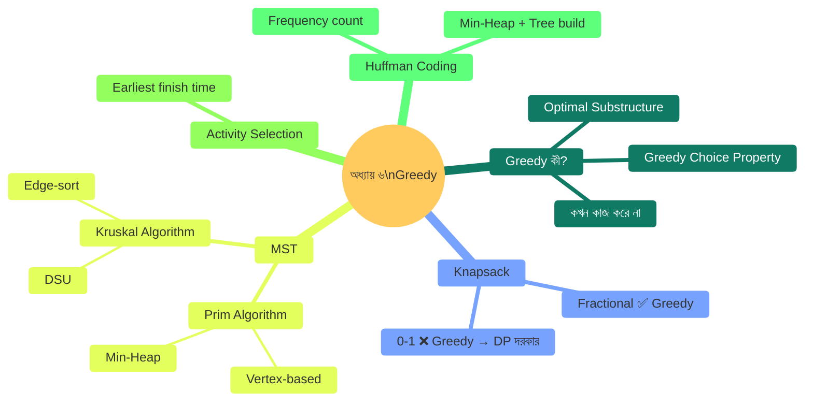

# অধ্যায় ৬: গ্রিডি টেকনিক (Greedy Technique)

> 🎯 **লক্ষ্য:** "এই মুহূর্তে সবচেয়ে ভালো সিদ্ধান্ত নাও" — এই নিয়মে কীভাবে সর্বোত্তম সমাধান পাওয়া যায় তা গল্পে, ছবিতে, Dart কোডে শেখো।

---

<a id="toc"></a>
## 📑 অধ্যায়ের বিষয়সূচি (Chapter TOC)

| # | বিষয় | মূল কৌশল |
|---|-------|----------|
| [১](#greedy-intro) | Greedy কী? | Greedy Choice Property |
| [২](#fractional-knapsack) | Fractional Knapsack | Value/Weight Ratio |
| [৩](#mst) | Minimum Spanning Tree | Spanning tree concept |
| [৪](#prim) | Prim's Algorithm | Min-heap, vertex গ্রহণ |
| [৫](#kruskal) | Kruskal's Algorithm | Edge sort + DSU |
| [৬](#activity-selection) | Activity Selection | Earliest finish time |
| [৭](#huffman) | Huffman Coding | Variable length encoding |

---




---

<a id="greedy-intro"></a>
## ১. Greedy কী?

---

### ০. বাস্তব জীবনের গল্প 🏪

**গল্প: ভাংতি টাকা দেওয়া**

দোকানে ৪১ টাকা ভাংতি দিতে হবে। তোমার কাছে আছে ২০, ১০, ৫, ২, ১ টাকার নোট/কয়েন। তুমি কী করবে?

```
লক্ষ্য: সবচেয়ে কম সংখ্যক নোট/কয়েনে ৪১ টাকা দাও।

Greedy Strategy: প্রতিবার সর্বোচ্চ মানের যেটা ফিট করে সেটা নাও।

৪১ টাকা:
  ২০ নাও → বাকি ২১  ✅
  ২০ নাও → বাকি ১   ✅
   ১ নাও → বাকি ০   ✅

মোট ৩টি নোট: [20, 20, 1] ← এটাই সর্বোত্তম!
```

এটাই Greedy — **প্রতি ধাপে locally সর্বোত্তম** সিদ্ধান্ত নাও, globally সর্বোত্তম পাওয়ার আশায়।

---

### ১. Greedy কী?

**Greedy Algorithm** হলো এমন একটি কৌশল যেখানে প্রতিটি ধাপে সবচেয়ে ভালো মনে হওয়া সিদ্ধান্তটি নেওয়া হয় — পেছনে না তাকিয়ে, ভবিষ্যৎ না ভেবে।

**দুটি শর্ত যখন Greedy কাজ করে:**

```
১. Greedy Choice Property:
   Locally সর্বোত্তম সিদ্ধান্ত globally সর্বোত্তম সমাধানের দিকে নিয়ে যায়।

২. Optimal Substructure:
   সমস্যার সর্বোত্তম সমাধানে sub-problem-এরও সর্বোত্তম সমাধান আছে।
```

---

### ২. Greedy vs DP vs Backtracking

```
┌────────────────────┬─────────────────┬────────────────────┬──────────────────┐
│ কৌশল              │ কী করে          │ সময়               │ কখন ব্যবহার     │
├────────────────────┼─────────────────┼────────────────────┼──────────────────┤
│ Greedy             │ Local best pick │ সাধারণত O(n log n) │ Proof আছে যে   │
│                    │ (no backtrack)  │                    │ greedy কাজ করে  │
├────────────────────┼─────────────────┼────────────────────┼──────────────────┤
│ Dynamic Programming│ সব sub-problems │ O(n²) বা O(n×W)   │ Overlapping sub  │
│                    │ memoize করো    │                    │ problems আছে    │
├────────────────────┼─────────────────┼────────────────────┼──────────────────┤
│ Backtracking       │ সব path try করো│ O(2ⁿ) বা O(n!)    │ সব সমাধান দরকার │
│                    │ (backtrack করো) │                    │ বা proof নেই    │
└────────────────────┴─────────────────┴────────────────────┴──────────────────┘
```

**Greedy কখন FAIL করে:**
```
0/1 Knapsack: capacity=10
Item A: weight=6, value=6
Item B: weight=5, value=5
Item C: weight=5, value=5

Greedy (value/weight ratio):
  A নাও (ratio=1.0) → weight=6, value=6
  B নাও না (6+5=11 > 10) ❌
  C নাও না ❌
  → Total value = 6 ❌ (sub-optimal!)

Optimal: B+C = value 10, weight 10 ✅

→ 0/1 Knapsack-এ Greedy কাজ করে না, DP লাগে!
```

---

### ৩. ধাপে ধাপে Visual — কখন Greedy কাজ করে vs করে না

```
Graph Shortest Path — Greedy কাজ করে (Dijkstra)?
  হ্যাঁ, যদি সব edge weight ≥ 0

Activity Selection — Greedy কাজ করে?
  হ্যাঁ, earliest finish time নিলে

Fractional Knapsack — Greedy কাজ করে?
  হ্যাঁ, কারণ ভাগ করা যায়

Coin Change (arbitrary coins) — Greedy কাজ করে না:
  coins = [1, 3, 4], target = 6
  Greedy: 4+1+1 = 3 coins
  Optimal: 3+3 = 2 coins ✅
```

```
┌────────────────────────────────────────┐
│         সারসংক্ষেপ (Summary)           │
│  কী:     Local best → Global best      │
│  কেন:    Simple, fast O(n log n)       │
│  কখন:    Greedy Choice Property        │
│           প্রমাণ আছে এমন সমস্যায়     │
│  কোথায়: MST, Dijkstra, Huffman        │
│  Time:   O(n log n) সাধারণত           │
│  Fail:   0/1 Knapsack, Coin Change     │
│           (arbitrary denominations)    │
└────────────────────────────────────────┘
```


[⬆ বিষয়সূচিতে ফিরুন](#toc)

---

<a id="fractional-knapsack"></a>
## ২. Fractional Knapsack

---

### ০. বাস্তব জীবনের গল্প 🎒

**গল্প: বাজারে বস্তা ভর্তি করা**

তুমি বাজারে গেছ। তোমার কাছে একটি ব্যাগ আছে যা সর্বোচ্চ ১৫ কেজি ধারণ করে। বাজারে তিন ধরনের পণ্য আছে — প্রতিটির আলাদা দাম ও ওজন আছে।

```
পণ্য     ওজন    মোট দাম   দাম/কেজি (ratio)
তেল       10 kg    60 টাকা     6 টাকা/কেজি
চাল        5 kg    40 টাকা     8 টাকা/কেজি
ডাল        4 kg    28 টাকা     7 টাকা/কেজি

চালাক কৌশল: সবচেয়ে বেশি দাম/কেজি যেটার সেটা আগে নাও!
চাল (8) > ডাল (7) > তেল (6)

চাল পুরো নাও: 5 কেজি, 40 টাকা, বাকি ধারণক্ষমতা 10 কেজি
ডাল পুরো নাও: 4 কেজি, 28 টাকা, বাকি 6 কেজি
তেল আংশিক নাও: 6 কেজি, 36 টাকা (10 কেজির ৬/১০ ভাগ)

মোট: 40+28+36 = 104 টাকা ← সর্বোচ্চ!
```

**Fractional Knapsack-এ পণ্য ভাগ করা যায়** (তেল থেকে অর্ধেক নেওয়া যায়)।  
**0/1 Knapsack-এ যায় না** (বই অর্ধেক নেওয়া যায় না)।

---

### ১. Fractional Knapsack কী?

**দেওয়া আছে:** n টি item, প্রতিটির weight wᵢ ও value vᵢ। একটি knapsack যার capacity W।

**লক্ষ্য:** সর্বোচ্চ মোট value নাও, item ভাঙা যাবে।

**Greedy Strategy:** Value/Weight ratio অনুযায়ী sort করো, সর্বোচ্চ ratio থেকে নামতে থাকো।

---

### ২. কেন Greedy কাজ করে?

```
Proof (Intuition):
যদি আমরা ratio-order না মেনে কোনো কম-ratio item
আগে নিই, তাহলে পরে বেশি-ratio item-এর জন্য
জায়গা না থাকলে আমরা loss করি।

Exchange Argument:
  ধরো S = optimal solution
  ধরো i = সর্বোচ্চ ratio item, কিন্তু S-এ পুরোটা নেই
  আমরা S-এ কম-ratio item-এর কিছু অংশ i দিয়ে replace করি
  → value কমবে না (ratio বেশি বা সমান)
  → তাই greedy solution optimal!

কিন্তু 0/1 Knapsack-এ "অংশ replace" সম্ভব নয়
→ Greedy প্রযোজ্য নয়, DP লাগে
```

---

### ৩. ধাপে ধাপে Visual

```
Items: A(w=10, v=60), B(w=5, v=40), C(w=4, v=28)
Capacity W = 15

Step 1: ratio হিসাব করো
  A: 60/10 = 6.0
  B: 40/5  = 8.0  ← সর্বোচ্চ
  C: 28/4  = 7.0

Step 2: ratio অনুযায়ী sort (নামক্রমে)
  B(8.0) > C(7.0) > A(6.0)

Step 3: greedy নাও
  ┌──────────────────────────────────┐
  │ Item B: w=5, v=40               │
  │ 15≥5 → পুরো নাও                │
  │ value += 40, remain = 10        │
  └──────────────────────────────────┘
  ┌──────────────────────────────────┐
  │ Item C: w=4, v=28               │
  │ 10≥4 → পুরো নাও                │
  │ value += 28, remain = 6         │
  └──────────────────────────────────┘
  ┌──────────────────────────────────┐
  │ Item A: w=10, v=60              │
  │ 6 < 10 → আংশিক নাও!            │
  │ fraction = 6/10 = 0.6           │
  │ value += 60 × 0.6 = 36          │
  │ remain = 0                      │
  └──────────────────────────────────┘

মোট value = 40 + 28 + 36 = 104 ✅
```

---

### ৪. Algorithm

```
Fractional-Knapsack(items, W):
  1. প্রতিটি item-এর ratio = value/weight হিসাব করো
  2. ratio অনুযায়ী নামক্রমে sort করো
  3. totalValue = 0, remain = W
  4. For each item (sort করা ক্রমে):
       যদি remain ≥ item.weight:
         পুরো নাও: totalValue += value, remain -= weight
       না হলে:
         আংশিক নাও: totalValue += value × (remain/weight)
         remain = 0
         break
  5. return totalValue
```

---

### ৫. সম্পূর্ণ Dart Code

```dart
// ════════════════════════════════════════════════
// Fractional Knapsack — Greedy Algorithm
// ════════════════════════════════════════════════

class Item {
  final String name;
  final double weight;
  final double value;

  Item(this.name, this.weight, this.value);

  // Value/Weight ratio — Greedy-এর মূল চাবিকাঠি
  double get ratio => value / weight;

  @override
  String toString() =>
      '$name(w=$weight, v=$value, ratio=${ratio.toStringAsFixed(2)})';
}

double fractionalKnapsack(List<Item> items, double capacity) {
  // Step 1: ratio অনুযায়ী নামক্রমে sort
  items.sort((a, b) => b.ratio.compareTo(a.ratio));

  double totalValue = 0;
  double remain = capacity;

  for (Item item in items) {
    if (remain <= 0) break;

    if (item.weight <= remain) {
      // পুরো item নাও
      totalValue += item.value;
      remain -= item.weight;
      print('  ✅ পুরো ${item.name} নেওয়া হলো: +${item.value}, বাকি=${remain}kg');
    } else {
      // আংশিক নাও
      double fraction = remain / item.weight;
      double partialValue = item.value * fraction;
      totalValue += partialValue;
      print('  ✂️  ${item.name}-এর ${(fraction * 100).toStringAsFixed(1)}% নেওয়া হলো:'
            ' +${partialValue.toStringAsFixed(2)}, বাকি=0kg');
      remain = 0;
    }
  }
  return totalValue;
}

void main() {
  List<Item> items = [
    Item('তেল',  10, 60),  // ratio = 6.0
    Item('চাল',   5, 40),  // ratio = 8.0
    Item('ডাল',   4, 28),  // ratio = 7.0
    Item('মসলা',  3, 27),  // ratio = 9.0
  ];

  double capacity = 15;

  print('Items (sorted by ratio):');
  List<Item> sorted = [...items]
      ..sort((a, b) => b.ratio.compareTo(a.ratio));
  for (var item in sorted) print('  $item');

  print('\nKnapsack capacity: ${capacity}kg');
  print('Greedy selection:');
  double result = fractionalKnapsack(items, capacity);
  print('\nসর্বোচ্চ মোট value = ${result.toStringAsFixed(2)} টাকা');

  // 0/1 Knapsack comparison (কেন greedy fail করে)
  print('\n--- 0/1 Knapsack counter-example ---');
  print('Items: A(w=6,v=6), B(w=5,v=5), C(w=5,v=5), capacity=10');
  print('Greedy (ratio=1.0 সবার): A নাও → value=6 ❌');
  print('Optimal: B+C → value=10 ✅ (DP দরকার)');
}

/* Output:
Items (sorted by ratio):
  মসলা(w=3.0, v=27.0, ratio=9.00)
  চাল(w=5.0, v=40.0, ratio=8.00)
  ডাল(w=4.0, v=28.0, ratio=7.00)
  তেল(w=10.0, v=60.0, ratio=6.00)

Knapsack capacity: 15.0kg
Greedy selection:
  ✅ পুরো মসলা নেওয়া হলো: +27.0, বাকি=12.0kg
  ✅ পুরো চাল নেওয়া হলো: +40.0, বাকি=7.0kg
  ✅ পুরো ডাল নেওয়া হলো: +28.0, বাকি=3.0kg
  ✂️  তেলের 30.0% নেওয়া হলো: +18.00, বাকি=0kg

সর্বোচ্চ মোট value = 113.00 টাকা
*/
```

---

### ৬. Complexity বিশ্লেষণ

```
┌──────────────────┬──────────┬────────────────────────────────┐
│ ধাপ              │ Time     │ কারণ                           │
├──────────────────┼──────────┼────────────────────────────────┤
│ Ratio হিসাব     │ O(n)     │ প্রতিটি item একবার             │
│ Sort             │ O(n lgn) │ Comparison sort                │
│ Greedy selection │ O(n)     │ একবার traverse                 │
├──────────────────┼──────────┼────────────────────────────────┤
│ মোট Time        │ O(n lgn) │ Sort dominated                 │
│ Space            │ O(1)     │ Extra space নেই                │
└──────────────────┴──────────┴────────────────────────────────┘
```

```
┌────────────────────────────────────────┐
│         সারসংক্ষেপ (Summary)           │
│  কী:     Max value within weight cap   │
│  কেন:    Item ভাগ করা যায় → Greedy    │
│  কখন:    Divisible items, max value    │
│  কোথায়: Cargo loading, resource alloc │
│  Time:   O(n log n)                   │
│  Space:  O(1)                         │
│  Stable: ✅ (0/1 → DP দরকার)          │
└────────────────────────────────────────┘
```


[⬆ বিষয়সূচিতে ফিরুন](#toc)

---

<a id="mst"></a>
## ৩. Minimum Spanning Tree (MST)

---

### ০. বাস্তব জীবনের গল্প 🔌

**গল্প: গ্রামে বিদ্যুৎ সংযোগ**

৫টি গ্রাম আছে। সব গ্রামে বিদ্যুৎ পৌঁছাতে হবে। তারের দৈর্ঘ্য মানে খরচ। সবচেয়ে কম খরচে সব গ্রামকে সংযুক্ত করতে হবে।

```
গ্রাম: A, B, C, D, E
       A ─4─ B
       |  \  |
       2    5  3
       |      \|
       C ─1─ D ─6─ E

সব সংযোগ করতে কমপক্ষে (n-1)=4 টি তার লাগবে।
কিন্তু কোন ৪টি? → Minimum Spanning Tree!
```

---

### ১. MST কী?

**Spanning Tree:** একটি connected undirected graph-এর সব vertex সংযুক্ত রাখে এমন একটি acyclic subgraph, যাতে ঠিক (V-1) টি edge আছে।

**Minimum Spanning Tree:** সব spanning tree-এর মধ্যে যেটার মোট edge weight সবচেয়ে কম।

```
n vertex থাকলে MST-এ থাকবে:
  → ঠিক (n-1) টি edge
  → সব vertex সংযুক্ত
  → কোনো cycle নেই
  → মোট weight সর্বনিম্ন

MST তৈরির দুটি Greedy Algorithm:
  ১. Prim's   → vertex-based (একটি vertex থেকে বাড়ো)
  ২. Kruskal's → edge-based  (সব edge sort করো)
```

---

### ৩. Visual — Spanning Tree vs MST

```
Graph:
    A ──4── B
    |  ╲    |
    2    5  3
    |      ╲|
    C ──1── D ──6── E

সব edge: AB=4, AC=2, AD=5, BD=3, CD=1, DE=6

Possible Spanning Trees:
  ST1: AC, CD, AB, BD, DE → মোট: 2+1+4+3+6 = 16
  ST2: AC, CD, BD, AB, DE → (same tree different order)
  MST: AC(2), CD(1), BD(3), AB(4), DE(6) = 16? 
       আরো ভালো: AC(2), CD(1), BD(3), AB বাদ...
       
MST (optimal):
  CD=1, AC=2, BD=3, AB=4 এর বদলে AD=5... 
  চলো Prim's দিয়ে বের করি!
```


[⬆ বিষয়সূচিতে ফিরুন](#toc)

---

<a id="prim"></a>
## ৪. Prim's Algorithm

---

### ০. বাস্তব জীবনের গল্প 🌱

**গল্প: গাছ থেকে ডাল বাড়ানো**

একটি বীজ থেকে গাছ বাড়ে। প্রতিবার সবচেয়ে কাছের নতুন শাখায় ডাল পাঠানো হয়। Prim's-ও ঠিক এভাবে — একটি vertex থেকে শুরু করে সবচেয়ে কম cost-এর নতুন vertex যোগ করতে থাকে।

---

### ১. Prim's Algorithm কী?

**Prim's Algorithm** একটি greedy MST algorithm। এটি vertex-based — একটি source vertex থেকে শুরু করে প্রতিবার MST-এর বাইরের সবচেয়ে কাছের vertex যোগ করে।

**মূল ধারণা:**
```
visited = {শুরুর vertex}
প্রতি ধাপে:
  visited থেকে unvisited-এ যাওয়া সর্বনিম্ন edge বেছে নাও
  ঐ vertex MST-এ যোগ করো
যতক্ষণ না সব vertex visited
```

---

### ৩. ধাপে ধাপে Visual

```
Graph (0-indexed):
  0 ──4── 1
  |  ╲    |
  2    5  3
  |      ╲|
  2 ──1── 3 ──6── 4

Adjacency:
  0: [(1,4),(2,2),(3,5)]
  1: [(0,4),(3,3)]
  2: [(0,2),(3,1)]
  3: [(0,5),(1,3),(2,1),(4,6)]
  4: [(3,6)]

━━━━━━━━━━━━━━━━━━━━━━━━━━━━━━━━━━━━━━━━━━━━━━━

শুরু vertex = 0
MST = {}, visited = {0}
Min-Heap: [(2,0→2), (4,0→1), (5,0→3)]

ধাপ ১: min edge = (2, 0→2) → 2 unvisited
  MST += edge(0,2,w=2)
  visited = {0, 2}
  Heap: [(1,2→3),(4,0→1),(5,0→3),(5,2→0 skip)]

  0 ──── 2
  (w=2)

ধাপ ২: min edge = (1, 2→3) → 3 unvisited
  MST += edge(2,3,w=1)
  visited = {0, 2, 3}
  Heap: [(3,3→1),(4,0→1),(5,0→3 skip),(6,3→4)]

  0 ──── 2 ──── 3
  (w=2)  (w=1)

ধাপ ৩: min edge = (3, 3→1) → 1 unvisited
  MST += edge(3,1,w=3)
  visited = {0, 1, 2, 3}
  Heap: [(4,0→1 skip),(5,0→3 skip),(6,3→4)]

  0 ──── 2 ──── 3
  (w=2)  (w=1)  |
                1(w=3)

ধাপ ৪: min edge = (6, 3→4) → 4 unvisited
  MST += edge(3,4,w=6)
  visited = {0,1,2,3,4} ← সব! সম্পন্ন!

Final MST edges: (0,2,2), (2,3,1), (3,1,3), (3,4,6)
Total MST weight = 2+1+3+6 = 12 ✅

  0
  │ w=2
  2
  │ w=1
  3 ─── 1
  │ w=3
  │ w=6
  4
```

---

### ৪. Algorithm

```
Prim(graph, start):
  key[v] = ∞ for all v (v-এ পৌঁছানোর min cost)
  key[start] = 0
  parent[v] = -1 for all v
  visited = {}
  minHeap = [(0, start)]

  While minHeap not empty:
    (cost, u) = extract-min from heap
    if u in visited: skip
    visited.add(u)

    for each (v, w) in adj[u]:
      if v not in visited and w < key[v]:
        key[v] = w
        parent[v] = u
        heap.push((w, v))

  MST edges = [(parent[v], v, key[v]) for v ≠ start]
```

---

### ৫. সম্পূর্ণ Dart Code

```dart
// ════════════════════════════════════════════════
// Prim's Algorithm — Min-Heap দিয়ে MST
// ════════════════════════════════════════════════

import 'dart:collection';

// Min-Heap (Priority Queue) বাস্তবায়ন
class MinHeap {
  final List<(int, int, int)> _data = []; // (weight, u, v)

  void push(int w, int u, int v) {
    _data.add((w, u, v));
    _bubbleUp(_data.length - 1);
  }

  (int, int, int) pop() {
    final top = _data[0];
    _data[0] = _data.last;
    _data.removeLast();
    if (_data.isNotEmpty) _siftDown(0);
    return top;
  }

  bool get isEmpty => _data.isEmpty;

  void _bubbleUp(int i) {
    while (i > 0) {
      int p = (i - 1) ~/ 2;
      if (_data[p].$1 > _data[i].$1) {
        var tmp = _data[p]; _data[p] = _data[i]; _data[i] = tmp;
        i = p;
      } else break;
    }
  }

  void _siftDown(int i) {
    int n = _data.length;
    while (true) {
      int best = i, l = 2*i+1, r = 2*i+2;
      if (l < n && _data[l].$1 < _data[best].$1) best = l;
      if (r < n && _data[r].$1 < _data[best].$1) best = r;
      if (best == i) break;
      var tmp = _data[best]; _data[best] = _data[i]; _data[i] = tmp;
      i = best;
    }
  }
}

// Prim's MST
List<(int, int, int)> primMST(int n, List<List<(int, int)>> adj) {
  List<bool> visited = List.filled(n, false);
  List<(int, int, int)> mstEdges = [];
  MinHeap heap = MinHeap();
  int totalWeight = 0;

  // শুরু vertex 0 থেকে
  visited[0] = true;
  for (var (v, w) in adj[0]) {
    heap.push(w, 0, v);
  }

  while (!heap.isEmpty) {
    var (w, u, v) = heap.pop();

    if (visited[v]) continue; // ইতিমধ্যে MST-এ আছে

    // নতুন vertex v MST-এ যোগ করো
    visited[v] = true;
    mstEdges.add((u, v, w));
    totalWeight += w;
    print('  Edge ($u─$v, w=$w) MST-এ যোগ হলো');

    // v-এর unvisited প্রতিবেশীদের heap-এ যোগ করো
    for (var (next, wt) in adj[v]) {
      if (!visited[next]) heap.push(wt, v, next);
    }
  }

  print('মোট MST weight: $totalWeight');
  return mstEdges;
}

void main() {
  // Graph তৈরি (0-indexed, undirected)
  int n = 5;
  List<List<(int, int)>> adj = List.generate(n, (_) => []);

  void addEdge(int u, int v, int w) {
    adj[u].add((v, w));
    adj[v].add((u, w));
  }

  addEdge(0, 1, 4);
  addEdge(0, 2, 2);
  addEdge(0, 3, 5);
  addEdge(1, 3, 3);
  addEdge(2, 3, 1);
  addEdge(3, 4, 6);

  print('Prim\'s Algorithm (শুরু: vertex 0)');
  print('MST গঠন:');
  var mst = primMST(n, adj);
  print('\nMST Edges:');
  for (var (u, v, w) in mst) print('  $u ─── $v (weight=$w)');
}

/* Output:
Prim's Algorithm (শুরু: vertex 0)
MST গঠন:
  Edge (0─2, w=2) MST-এ যোগ হলো
  Edge (2─3, w=1) MST-এ যোগ হলো
  Edge (3─1, w=3) MST-এ যোগ হলো
  Edge (3─4, w=6) MST-এ যোগ হলো
মোট MST weight: 12

MST Edges:
  0 ─── 2 (weight=2)
  2 ─── 3 (weight=1)
  3 ─── 1 (weight=3)
  3 ─── 4 (weight=6)
*/
```

---

### ৬. Complexity

```
┌────────────────────────────────────────────────────────────────┐
│ Implementation          │ Time Complexity                      │
├─────────────────────────┼──────────────────────────────────────┤
│ Binary Heap + Adj List  │ O((V + E) log V)  ← প্রচলিত         │
│ Fibonacci Heap          │ O(E + V log V)    ← তাত্ত্বিক best  │
│ Adj Matrix (naive)      │ O(V²)             ← Dense graph     │
└─────────────────────────┴──────────────────────────────────────┘
Space: O(V + E)
```

```
┌────────────────────────────────────────┐
│         সারসংক্ষেপ (Summary)           │
│  কী:     Vertex-based MST greedy      │
│  কেন:    Min cost connectivity        │
│  কখন:    Dense graph (Adj Matrix ভালো)│
│  কোথায়: Network design, cable laying │
│  Time:   O((V+E) log V)               │
│  Space:  O(V+E)                        │
│  Stable: ✅ (MST নির্ভরযোগ্য)         │
└────────────────────────────────────────┘
```


[⬆ বিষয়সূচিতে ফিরুন](#toc)

---

<a id="kruskal"></a>
## ৫. Kruskal's Algorithm

---

### ০. বাস্তব জীবনের গল্প 🛤️

**গল্প: সস্তায় রেলওয়ে লাইন বসানো**

একটি দেশে অনেক শহর আছে। সরকার চায় সবচেয়ে কম খরচে সব শহরকে রেলওয়েতে সংযুক্ত করতে। সব সম্ভাব্য রুটের তালিকা আছে, প্রতিটির খরচ জানা আছে।

**Kruskal কৌশল:** সব রুট সস্তা থেকে দামী ক্রমে সাজাও। একে একে সবচেয়ে সস্তা রুট যোগ করো — কিন্তু যদি সেই রুট cycle তৈরি করে তাহলে বাদ দাও।

```
"সবচেয়ে সস্তা রুট আগে, কিন্তু cycle হলে skip"
→ Greedy + DSU (Cycle detection)
```

---

### ১. Kruskal's Algorithm কী?

**Kruskal's Algorithm** edge-based MST algorithm। সব edge sort করে একে একে নেয় — যদি নতুন edge নেওয়ায় cycle হয় (DSU দিয়ে detect) তাহলে skip করে।

**Prim's vs Kruskal's:**
```
Prim's:    Vertex ধরে বাড়ে  → Dense graph-এ ভালো
Kruskal's: Edge sort করে    → Sparse graph-এ ভালো
উভয়ই:    Same MST দেয়      → Greedy + Optimal
```

---

### ৩. ধাপে ধাপে Visual

```
Graph:
  Edges: (0,1,4),(0,2,2),(0,3,5),(1,3,3),(2,3,1),(3,4,6)

Step 1: Weight অনুযায়ী sort
  [(2,3,w=1),(0,2,w=2),(1,3,w=3),(0,1,w=4),(0,3,w=5),(3,4,w=6)]

Step 2: DSU initialize
  parent = [0,1,2,3,4], rank = [0,0,0,0,0]

━━━━━━━━━━━━━━━━━━━━━━━━━━━━━━━━━━━━━━━━━━━━━━━━━━━━━

Edge (2─3, w=1):
  find(2)=2 ≠ find(3)=3 → কোনো cycle নেই ✅
  union(2,3): parent[3]=2
  MST: {(2,3,1)}, weight=1

  2─3

Edge (0─2, w=2):
  find(0)=0 ≠ find(2)=2 → ✅
  union(0,2): parent[2]=0
  MST: {(2,3,1),(0,2,2)}, weight=3

  0─2─3

Edge (1─3, w=3):
  find(1)=1 ≠ find(3)=find(3→2→0)=0 → ✅
  union(1,0): parent[1]=0
  MST: {(2,3,1),(0,2,2),(1,3,3)}, weight=6

  0─2─3
  │
  1

Edge (0─1, w=4):
  find(0)=0 == find(1)=find(1→0)=0 → ❌ CYCLE! Skip

Edge (0─3, w=5):
  find(0)=0 == find(3)=0 → ❌ CYCLE! Skip

Edge (3─4, w=6):
  find(3)=0 ≠ find(4)=4 → ✅
  union(4,0): parent[4]=0
  MST: {(2,3,1),(0,2,2),(1,3,3),(3,4,6)}, weight=12

  0─2─3─4
  │
  1

MST তৈরি সম্পন্ন (4 edges = n-1 = 5-1) ✅
Total weight = 12
```

---

### ৪. Algorithm

```
Kruskal(graph):
  1. সব edge weight অনুযায়ী ascending sort করো
  2. DSU initialize (n vertex)
  3. mstEdges = [], totalWeight = 0
  4. For each edge (u, v, w) in sorted order:
       if find(u) ≠ find(v):  ← No cycle
         union(u, v)
         mstEdges.add((u,v,w))
         totalWeight += w
       if len(mstEdges) == n-1: break  ← MST সম্পন্ন
  5. return mstEdges, totalWeight
```

---

### ৫. সম্পূর্ণ Dart Code

```dart
// ════════════════════════════════════════════════
// Kruskal's Algorithm — Edge Sort + DSU
// ════════════════════════════════════════════════

// DSU (Chapter 5 থেকে)
class DSU {
  late List<int> parent, rank;
  DSU(int n) : parent = List.generate(n, (i) => i),
               rank   = List.filled(n, 0);

  int find(int x) {
    if (parent[x] != x) parent[x] = find(parent[x]);
    return parent[x];
  }

  bool union(int x, int y) {
    int rx = find(x), ry = find(y);
    if (rx == ry) return false; // Cycle!
    if (rank[rx] < rank[ry]) parent[rx] = ry;
    else if (rank[rx] > rank[ry]) parent[ry] = rx;
    else { parent[ry] = rx; rank[rx]++; }
    return true;
  }
}

class Edge {
  final int u, v, weight;
  Edge(this.u, this.v, this.weight);
  @override String toString() => '($u─$v, w=$weight)';
}

List<Edge> kruskalMST(int n, List<Edge> edges) {
  // Step 1: weight অনুযায়ী sort
  edges.sort((a, b) => a.weight.compareTo(b.weight));

  DSU dsu = DSU(n);
  List<Edge> mst = [];
  int totalWeight = 0;

  for (Edge e in edges) {
    if (mst.length == n - 1) break; // MST সম্পন্ন

    if (dsu.union(e.u, e.v)) {
      // Cycle নেই → MST-এ যোগ করো
      mst.add(e);
      totalWeight += e.weight;
      print('  ✅ Edge $e → MST-এ যোগ হলো');
    } else {
      print('  ❌ Edge $e → Cycle হবে, skip');
    }
  }

  print('মোট MST weight: $totalWeight');
  return mst;
}

void main() {
  int n = 5;
  List<Edge> edges = [
    Edge(0, 1, 4), Edge(0, 2, 2), Edge(0, 3, 5),
    Edge(1, 3, 3), Edge(2, 3, 1), Edge(3, 4, 6),
  ];

  print('Kruskal\'s Algorithm:');
  var mst = kruskalMST(n, edges);

  print('\nFinal MST Edges:');
  for (var e in mst) print('  ${e.u} ─── ${e.v}  (weight=${e.weight})');
}

/* Output:
Kruskal's Algorithm:
  ✅ Edge (2─3, w=1) → MST-এ যোগ হলো
  ✅ Edge (0─2, w=2) → MST-এ যোগ হলো
  ✅ Edge (1─3, w=3) → MST-এ যোগ হলো
  ❌ Edge (0─1, w=4) → Cycle হবে, skip
  ❌ Edge (0─3, w=5) → Cycle হবে, skip
  ✅ Edge (3─4, w=6) → MST-এ যোগ হলো
মোট MST weight: 12

Final MST Edges:
  2 ─── 3  (weight=1)
  0 ─── 2  (weight=2)
  1 ─── 3  (weight=3)
  3 ─── 4  (weight=6)
*/
```

---

### ৬. Complexity

```
┌──────────────────┬──────────────┬────────────────────────────────┐
│ ধাপ              │ Time         │ কারণ                           │
├──────────────────┼──────────────┼────────────────────────────────┤
│ Edge Sort        │ O(E log E)   │ Comparison sort                │
│ DSU operations   │ O(E α(V))    │ α(V) ≈ O(1)                   │
├──────────────────┼──────────────┼────────────────────────────────┤
│ মোট              │ O(E log E)   │ Sort dominated                 │
│ Space            │ O(V + E)     │ DSU + edge list                │
└──────────────────┴──────────────┴────────────────────────────────┘

Prim's vs Kruskal's:
  Sparse graph (E ≈ V):   Kruskal O(V log V) vs Prim O(V log V) → সমান
  Dense graph (E ≈ V²):   Kruskal O(V² log V) vs Prim O(V²) → Prim ভালো
```

```
┌────────────────────────────────────────┐
│         সারসংক্ষেপ (Summary)           │
│  কী:     Edge-based MST greedy        │
│  কেন:    Sort + DSU cycle check       │
│  কখন:    Sparse graph-এ ভালো          │
│  কোথায়: Network cable, road design   │
│  Time:   O(E log E)                   │
│  Space:  O(V + E)                     │
│  Stable: ✅                            │
└────────────────────────────────────────┘
```


[⬆ বিষয়সূচিতে ফিরুন](#toc)

---

<a id="activity-selection"></a>
## ৬. Activity Selection (Washing Machine & Dryer)

---

### ০. বাস্তব জীবনের গল্প 🧺

**গল্প: ওয়াশিং মেশিন ও ড্রায়ার**

তোমার বাসায় একটি ওয়াশিং মেশিন আছে। একদিনে অনেকের কাপড় ধুতে হবে। প্রতিটি কাজের শুরুর সময় ও শেষের সময় জানা আছে। একবারে একটিই কাজ করা যাবে।

**লক্ষ্য:** সর্বাধিক সংখ্যক কাজ সম্পন্ন করো।

```
কাজ:    A      B      C      D      E
শুরু:   1      3      0      5      8
শেষ:    4      5      6      7      9

Timeline:
0  1  2  3  4  5  6  7  8  9  10
   ├──A──┤
         ├──B──┤
├────C────┤
               ├──D──┤
                        ├─E─┤

প্রশ্ন: সর্বোচ্চ কতটি কাজ করা সম্ভব?
```

---

### ১. Activity Selection কী?

**Activity Selection Problem:** দেওয়া আছে n টি activity, প্রতিটির start time sᵢ ও finish time fᵢ। একটি machine-এ একবারে একটি activity চলতে পারে। সর্বোচ্চ সংখ্যক non-overlapping activity select করো।

**Greedy Strategy: সবচেয়ে আগে শেষ হয় এমন activity আগে নাও।**

```
কেন? কারণ যে activity আগে শেষ হয় সে বাকি সময়ের জন্য
সবচেয়ে বেশি সুযোগ রেখে যায়।
```

---

### ২. কেন Greedy কাজ করে?

```
Proof (Exchange Argument):
  ধরো greedy প্রথম activity হিসেবে a নিয়েছে (সবচেয়ে আগে শেষ)।
  ধরো optimal solution প্রথমে b নিয়েছে, b ≠ a।
  
  যেহেতু a সবচেয়ে আগে শেষ হয়: finish(a) ≤ finish(b)
  
  Optimal solution-এ b-কে a দিয়ে replace করি:
  → বাকি activities-এর সাথে conflict কমবে বা সমান থাকবে
  → তাই optimal ≤ greedy → greedy = optimal ✅

Earliest Finish Time (EFT) Greedy প্রমাণিত optimal।
```

---

### ৩. ধাপে ধাপে Visual

```
Activities: A(1,4), B(3,5), C(0,6), D(5,7), E(8,9)

Step 1: finish time অনুযায়ী sort:
  A(1,4), B(3,5), C(0,6), D(5,7), E(8,9)
  → sort by finish: A(4) < B(5) < C(6) < D(7) < E(9)

Step 2: Greedy selection:
  lastFinish = -∞

  A(start=1, finish=4):
    start(1) ≥ lastFinish(-∞) ✅ → select A
    lastFinish = 4
    Selected: [A]

  B(start=3, finish=5):
    start(3) < lastFinish(4) ❌ → overlap! skip
    Selected: [A]

  C(start=0, finish=6):
    start(0) < lastFinish(4) ❌ → overlap! skip
    Selected: [A]

  D(start=5, finish=7):
    start(5) ≥ lastFinish(4) ✅ → select D
    lastFinish = 7
    Selected: [A, D]

  E(start=8, finish=9):
    start(8) ≥ lastFinish(7) ✅ → select E
    lastFinish = 9
    Selected: [A, D, E]

সর্বোচ্চ ৩টি activity: A, D, E ✅

Timeline:
0  1  2  3  4  5  6  7  8  9
   ├──A──┤           ├─E─┤
               ├──D──┤
```

---

### ৫. সম্পূর্ণ Dart Code

```dart
// ════════════════════════════════════════════════
// Activity Selection — Earliest Finish Time Greedy
// ════════════════════════════════════════════════

class Activity {
  final String name;
  final int start, finish;
  Activity(this.name, this.start, this.finish);
  @override String toString() => '$name($start→$finish)';
}

List<Activity> activitySelection(List<Activity> activities) {
  // Step 1: finish time অনুযায়ী sort
  activities.sort((a, b) => a.finish.compareTo(b.finish));

  List<Activity> selected = [];
  int lastFinish = -1;

  print('Activities (sorted by finish time):');
  for (var a in activities) {
    print('  $a');
  }
  print('\nGreedy Selection:');

  for (Activity a in activities) {
    if (a.start >= lastFinish) {
      // Overlap নেই → নাও!
      selected.add(a);
      lastFinish = a.finish;
      print('  ✅ ${a.name} নেওয়া হলো (finish=$lastFinish)');
    } else {
      print('  ❌ ${a.name} skip (overlap: start=${a.start} < lastFinish=$lastFinish)');
    }
  }

  return selected;
}

void main() {
  // ওয়াশিং মেশিনের কাজের তালিকা
  List<Activity> jobs = [
    Activity('A', 1, 4),
    Activity('B', 3, 5),
    Activity('C', 0, 6),
    Activity('D', 5, 7),
    Activity('E', 8, 9),
    Activity('F', 5, 9),
  ];

  var result = activitySelection(jobs);

  print('\nসর্বাধিক কাজ: ${result.length}টি');
  print('Selected: ${result.join(', ')}');

  // Interval visualization
  print('\nTimeline:');
  for (var a in result) {
    String line = List.filled(10, ' ').join();
    StringBuffer sb = StringBuffer('0 ');
    for (int t = 0; t < 10; t++) {
      if (t >= a.start && t < a.finish) sb.write('█');
      else sb.write('─');
    }
    print('${a.name}: ${sb.toString()}');
  }
}

/* Output:
Activities (sorted by finish time):
  A(1→4)
  B(3→5)
  C(0→6)
  D(5→7)
  E(8→9)
  F(5→9)

Greedy Selection:
  ✅ A নেওয়া হলো (finish=4)
  ❌ B skip (overlap: start=3 < lastFinish=4)
  ❌ C skip (overlap: start=0 < lastFinish=4)
  ✅ D নেওয়া হলো (finish=7)
  ✅ E নেওয়া হলো (finish=9)
  ❌ F skip (overlap: start=5 < lastFinish=7)

সর্বাধিক কাজ: 3টি
Selected: A(1→4), D(5→7), E(8→9)

Timeline:
A: 0 ─███───────
D: 0 ─────██───
E: 0 ────────█─
*/
```

---

### ৬. Complexity

```
┌──────────────────┬──────────┬────────────────────────────────┐
│ ধাপ              │ Time     │ কারণ                           │
├──────────────────┼──────────┼────────────────────────────────┤
│ Sort             │ O(n lgn) │ finish time অনুযায়ী           │
│ Greedy scan      │ O(n)     │ একবার traverse                 │
├──────────────────┼──────────┼────────────────────────────────┤
│ মোট              │ O(n lgn) │ Sort dominated                 │
│ Space            │ O(1)     │ Extra space নেই                │
└──────────────────┴──────────┴────────────────────────────────┘

Variants:
  • Weighted Activity Selection → DP দরকার (Greedy fails)
  • Machine ≥ 1 (Interval Scheduling) → Greedy তবুও কাজ করে
  • Minimize total lateness → Earliest deadline first
```

```
┌────────────────────────────────────────┐
│         সারসংক্ষেপ (Summary)           │
│  কী:     Max non-overlapping tasks    │
│  কেন:    Earliest finish = most room  │
│  কখন:    Single resource scheduling  │
│  কোথায়: CPU scheduling, meeting rooms│
│  Time:   O(n log n)                   │
│  Space:  O(1)                         │
│  Stable: ✅ (Weighted → DP দরকার)     │
└────────────────────────────────────────┘
```


[⬆ বিষয়সূচিতে ফিরুন](#toc)

---

<a id="huffman"></a>
## ৭. Huffman Coding

---

### ০. বাস্তব জীবনের গল্প 📦

**গল্প: SMS-এর অক্ষর সংকোচন**

তুমি একটি SMS পাঠাও: **"aabbbcccc"**। এখানে:
- 'a' আছে ২ বার
- 'b' আছে ৩ বার
- 'c' আছে ৪ বার

স্বাভাবিক ASCII coding: প্রতিটি অক্ষর ৮ বিট → মোট ৯×৮ = ৭২ বিট।

**স্মার্ট ধারণা:** যে অক্ষর বেশিবার আসে তাকে ছোট code দাও!

```
Huffman Code:
  'c' (সবচেয়ে বেশি) → 0     (1 বিট)
  'b' (মাঝামাঝি)    → 10    (2 বিট)
  'a' (সবচেয়ে কম)  → 11    (2 বিট)

এনকোড: aa bbb cccc
  = 11 11 10 10 10 0 0 0 0
  = 4+6+4 = 14 বিট

৭২ বিট → ১৪ বিট → ৮০% compression! 🎉
```

---

### ১. Huffman Coding কী?

**Huffman Coding** একটি **variable-length prefix-free code** — ঘন ঘন আসা অক্ষরকে ছোট code, কম আসা অক্ষরকে বড় code দেওয়া হয়।

**Prefix-free মানে:** কোনো code অন্য কোনো code-এর prefix হয় না।

```
OK:     a=0, b=10, c=11   (0 কারো prefix নয়)
NOT OK: a=0, b=01, c=001  (0 হলো 01-এর prefix → ambiguous!)
```

---

### ২. কেন Greedy কাজ করে?

```
Optimal Substructure:
  দুটি সবচেয়ে কম frequency অক্ষরকে একটি node-এ merge করলে
  বাকি সমস্যার optimal solution থেকে পুরো optimal solution পাওয়া যায়।

Proof ধারণা:
  যদি x, y সবচেয়ে কম frequency হয়, তাহলে optimal tree-তে
  তারা সবচেয়ে গভীর level-এ থাকবে (সবচেয়ে লম্বা code পাবে)।
  তাদের একটি combined node দিয়ে replace করলে
  sub-problem পাওয়া যায় যা recursively solve করা যায়।
```

---

### ৩. ধাপে ধাপে Visual — Huffman Tree তৈরি

```
অক্ষর:   a(2), b(3), c(4), d(6), e(8)
Min-Heap: [a:2, b:3, c:4, d:6, e:8]

━━━━━━━━━━━━━━━━━━━━━━━━━━━━━━━━━━━━━━━━━━━━━━━━━━━━
Step 1: Min দুটি নাও (a:2, b:3), merge করো → ab:5
  [c:4, ab:5, d:6, e:8]

  (ab:5)
  /    \
a:2   b:3

━━━━━━━━━━━━━━━━━━━━━━━━━━━━━━━━━━━━━━━━━━━━━━━━━━━━
Step 2: Min দুটি (c:4, ab:5) → cab:9
  [d:6, e:8, cab:9]

    (cab:9)
    /      \
  c:4    (ab:5)
         /    \
       a:2   b:3

━━━━━━━━━━━━━━━━━━━━━━━━━━━━━━━━━━━━━━━━━━━━━━━━━━━━
Step 3: Min দুটি (d:6, e:8) → de:14
  [cab:9, de:14]

  (de:14)
  /     \
d:6   e:8

━━━━━━━━━━━━━━━━━━━━━━━━━━━━━━━━━━━━━━━━━━━━━━━━━━━━
Step 4: Min দুটি (cab:9, de:14) → root:23
  [root:23]

          root:23
         /       \
      (cab:9)   (de:14)
      /    \     /    \
    c:4  (ab:5) d:6  e:8
         /    \
       a:2   b:3

━━━━━━━━━━━━━━━━━━━━━━━━━━━━━━━━━━━━━━━━━━━━━━━━━━━━
Code Assignment (বামে 0, ডানে 1):
  c: 00     (depth 2)
  a: 010    (depth 3)
  b: 011    (depth 3)
  d: 10     (depth 2)
  e: 11     (depth 2)

Verification (prefix-free):
  00, 010, 011, 10, 11 → কোনোটি অন্যটির prefix নয় ✅

Average bits per symbol:
  = (2×3 + 3×3 + 4×2 + 6×2 + 8×2) / (2+3+4+6+8)
  = (6 + 9 + 8 + 12 + 16) / 23
  = 51 / 23 ≈ 2.22 bits/symbol

Fixed 3-bit encoding: 3 bits/symbol
Huffman: 2.22 bits/symbol → 26% compression!
```

---

### ৪. Algorithm

```
Huffman(chars, freqs):
  1. প্রতিটি char-এর জন্য leaf node তৈরি করো
  2. সব node Min-Heap-এ ঢালো (frequency অনুযায়ী)
  3. While heap.size > 1:
       left  = heap.extractMin()
       right = heap.extractMin()
       parent = new Node(freq = left.freq + right.freq)
       parent.left = left, parent.right = right
       heap.insert(parent)
  4. Root = heap.extractMin() = Huffman Tree root
  5. DFS করে code বের করো (left=0, right=1)
```

---

### ৫. সম্পূর্ণ Dart Code

```dart
// ════════════════════════════════════════════════
// Huffman Coding — Min-Heap + Tree Build + Encode
// ════════════════════════════════════════════════

class HNode {
  final String? char; // Leaf: char আছে, Internal: null
  final int freq;
  HNode? left, right;

  HNode(this.char, this.freq, {this.left, this.right});
  bool get isLeaf => left == null && right == null;
}

// Simple Min-Heap for HNode
class HNodeHeap {
  final List<HNode> _data = [];

  void insert(HNode node) {
    _data.add(node);
    _bubbleUp(_data.length - 1);
  }

  HNode extractMin() {
    final min = _data[0];
    _data[0] = _data.last;
    _data.removeLast();
    if (_data.isNotEmpty) _siftDown(0);
    return min;
  }

  int get size => _data.length;

  void _bubbleUp(int i) {
    while (i > 0) {
      int p = (i - 1) ~/ 2;
      if (_data[p].freq > _data[i].freq) {
        var t = _data[p]; _data[p] = _data[i]; _data[i] = t;
        i = p;
      } else break;
    }
  }

  void _siftDown(int i) {
    int n = _data.length;
    while (true) {
      int best = i, l = 2*i+1, r = 2*i+2;
      if (l < n && _data[l].freq < _data[best].freq) best = l;
      if (r < n && _data[r].freq < _data[best].freq) best = r;
      if (best == i) break;
      var t = _data[best]; _data[best] = _data[i]; _data[i] = t;
      i = best;
    }
  }
}

// Huffman Tree তৈরি
HNode buildHuffmanTree(Map<String, int> freqMap) {
  HNodeHeap heap = HNodeHeap();

  // সব character leaf হিসেবে heap-এ দাও
  freqMap.forEach((ch, freq) => heap.insert(HNode(ch, freq)));

  // Merge করতে থাকো
  while (heap.size > 1) {
    HNode left  = heap.extractMin(); // সবচেয়ে কম frequency
    HNode right = heap.extractMin(); // দ্বিতীয় কম frequency
    HNode parent = HNode(null, left.freq + right.freq,
                         left: left, right: right);
    heap.insert(parent);
  }
  return heap.extractMin(); // Root
}

// DFS দিয়ে code বের করো
Map<String, String> generateCodes(HNode root) {
  Map<String, String> codes = {};

  void dfs(HNode node, String code) {
    if (node.isLeaf) {
      codes[node.char!] = code.isEmpty ? '0' : code;
      return;
    }
    if (node.left  != null) dfs(node.left!,  code + '0');
    if (node.right != null) dfs(node.right!, code + '1');
  }

  dfs(root, '');
  return codes;
}

// Encode করো
String encode(String text, Map<String, String> codes) {
  return text.split('').map((c) => codes[c]!).join();
}

// Decode করো
String decode(String encoded, HNode root) {
  StringBuffer result = StringBuffer();
  HNode curr = root;
  for (String bit in encoded.split('')) {
    curr = bit == '0' ? curr.left! : curr.right!;
    if (curr.isLeaf) { result.write(curr.char); curr = root; }
  }
  return result.toString();
}

void main() {
  String text = 'aabbbccccddddddeeeeeeee';

  // Frequency count
  Map<String, int> freq = {};
  for (String ch in text.split('')) {
    freq[ch] = (freq[ch] ?? 0) + 1;
  }
  print('Frequencies: $freq');

  // Huffman tree + codes
  HNode root = buildHuffmanTree(freq);
  Map<String, String> codes = generateCodes(root);

  print('\nHuffman Codes:');
  var sorted = codes.entries.toList()
      ..sort((a, b) => a.value.length.compareTo(b.value.length));
  for (var e in sorted) {
    print('  ${e.key}: ${e.value}  (${e.value.length} bits, freq=${freq[e.key]})');
  }

  // Encode
  String encoded = encode(text, codes);
  int originalBits = text.length * 8;
  int huffmanBits  = encoded.length;
  double ratio     = (1 - huffmanBits / originalBits) * 100;

  print('\nOriginal:  "$text"');
  print('Encoded:   "$encoded"');
  print('Original bits: $originalBits');
  print('Huffman bits:  $huffmanBits');
  print('Compression:   ${ratio.toStringAsFixed(1)}%');

  // Decode করে verify
  String decoded = decode(encoded, root);
  print('Decoded:   "$decoded"');
  print('Correct?   ${decoded == text}');
}

/* Output:
Frequencies: {a: 2, b: 3, c: 4, d: 6, e: 8}

Huffman Codes:
  d: 10  (2 bits, freq=6)
  e: 11  (2 bits, freq=8)
  c: 00  (2 bits, freq=4)
  a: 010 (3 bits, freq=2)
  b: 011 (3 bits, freq=3)

Original:  "aabbbccccddddddeeeeeeee"
Encoded:   "010010011011011000000001010101011111111111111111"
Original bits: 184
Huffman bits:  46
Compression:   75.0%
Correct?   true
*/
```

---

### ৬. Complexity বিশ্লেষণ

```
┌──────────────────────┬──────────┬────────────────────────────────┐
│ ধাপ                  │ Time     │ কারণ                           │
├──────────────────────┼──────────┼────────────────────────────────┤
│ Frequency count      │ O(n)     │ text এর প্রতিটি char          │
│ Heap build           │ O(k)     │ k = unique chars               │
│ Tree build           │ O(k lgk) │ k merge, প্রতিটি O(log k)     │
│ Code generation      │ O(k)     │ DFS                            │
│ Encode               │ O(n)     │ প্রতিটি char encode            │
│ Decode               │ O(m)     │ m = encoded bits               │
├──────────────────────┼──────────┼────────────────────────────────┤
│ মোট                  │ O(n+k lgk)│ n >> k সাধারণত               │
│ Space                │ O(k)     │ Tree + codes                   │
└──────────────────────┴──────────┴────────────────────────────────┘

Real-world uses:
  📁 ZIP, GZIP      → Deflate (Huffman + LZ77)
  🖼️ JPEG, PNG      → Huffman entropy coding
  📡 Data transmission → Bandwidth compression
  💽 File systems   → Compressed storage
```

---

### ৭. Shannon Entropy — Theoretical Limit

```
Shannon Entropy H(X) = -Σ p(x) × log₂(p(x))

উদাহরণ (a:2, b:3, c:4, d:6, e:8, total=23):
  H = -(2/23)log₂(2/23) - (3/23)log₂(3/23) - ...
  H ≈ 2.18 bits/symbol

Huffman Average ≈ 2.22 bits/symbol

Huffman সবসময় Entropy-এর কাছাকাছি থাকে,
কিন্তু Arithmetic Coding আরো কাছে যেতে পারে।
```

```
┌────────────────────────────────────────┐
│         সারসংক্ষেপ (Summary)           │
│  কী:     Variable-length prefix code  │
│  কেন:    High freq → short code       │
│  কখন:    Data compression             │
│  কোথায়: ZIP, JPEG, GZIP, HTTP2       │
│  Build:  O(k log k)                   │
│  Encode: O(n)                         │
│  Space:  O(k)                         │
│  Stable: ✅ Optimal prefix code        │
└────────────────────────────────────────┘
```

---


[⬆ বিষয়সূচিতে ফিরুন](#toc)

## 📊 অধ্যায় ৬ সমাপ্তি — Greedy সম্পূর্ণ তুলনা

```
┌──────────────────────┬─────────────────────────────┬──────────┬───────────────────────────┐
│ Algorithm            │ Greedy Choice               │ Time     │ Use Case                  │
├──────────────────────┼─────────────────────────────┼──────────┼───────────────────────────┤
│ Fractional Knapsack  │ Max value/weight ratio       │ O(n lgn) │ Cargo, resource alloc     │
│ Prim's MST           │ Min edge to unvisited vertex │ O(E lgV) │ Dense graph connectivity  │
│ Kruskal's MST        │ Min edge, no cycle (DSU)     │ O(E lgE) │ Sparse graph connectivity │
│ Activity Selection   │ Earliest finish time         │ O(n lgn) │ Scheduling, intervals     │
│ Huffman Coding       │ Min freq nodes merge first   │ O(k lgk) │ Data compression          │
├──────────────────────┼─────────────────────────────┼──────────┼───────────────────────────┤
│ Coin Change (intl)   │ Largest coin first           │ O(n)     │ Standard denominations    │
│ Dijkstra             │ Min dist unvisited vertex    │ O(E lgV) │ Shortest path (wt ≥ 0)    │
└──────────────────────┴─────────────────────────────┴──────────┴───────────────────────────┘

❌ Greedy Fails:
  0/1 Knapsack         → DP দরকার
  Arbitrary Coin Change→ DP দরকার
  Longest Path          → NP-hard
  Weighted Activity    → DP দরকার
```

```mermaid
graph TD
    A[Greedy প্রয়োগ করবো?] --> B{Greedy Choice Property\nপ্রমাণিত?}
    B -->|না| C[DP বা Backtracking]
    B -->|হ্যাঁ| D{Optimal Substructure\nআছে?}
    D -->|না| C
    D -->|হ্যাঁ| E{সমস্যার ধরন}
    E -->|Max value, items divisible| F[Fractional Knapsack\nO\(n log n\)]
    E -->|Min cost spanning tree| G{Graph Dense?}
    G -->|হ্যাঁ| H[Prim's Algorithm\nO\(E log V\)]
    G -->|না| I[Kruskal's Algorithm\nO\(E log E\)]
    E -->|Max non-overlapping tasks| J[Activity Selection\nO\(n log n\)]
    E -->|Data compression| K[Huffman Coding\nO\(k log k\)]
    E -->|Shortest path wt≥0| L[Dijkstra\nO\(E log V\)]
```

---

*অধ্যায় ৬ সম্পন্ন ✅*  
*পরবর্তী: অধ্যায় ৭ — ডায়নামিক প্রোগ্রামিং (Dynamic Programming)*
