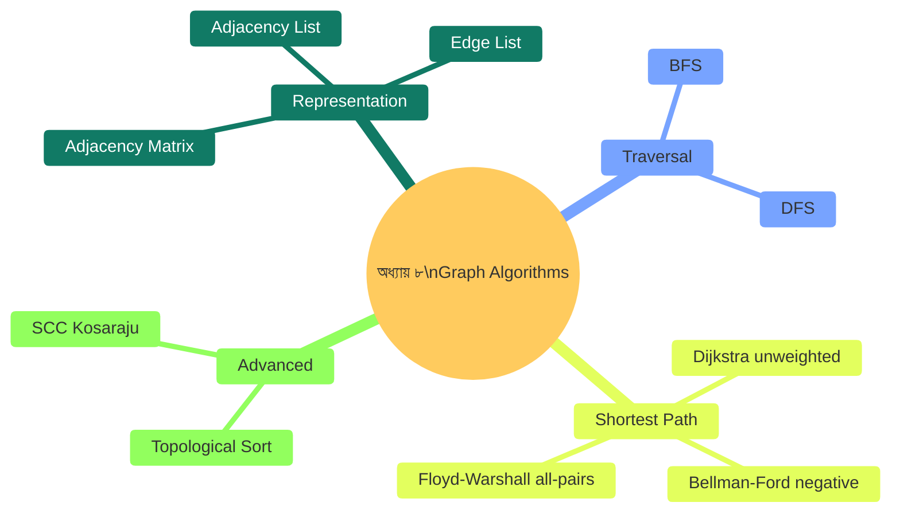
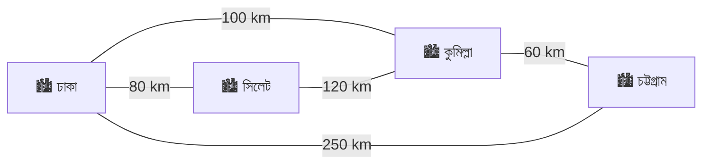
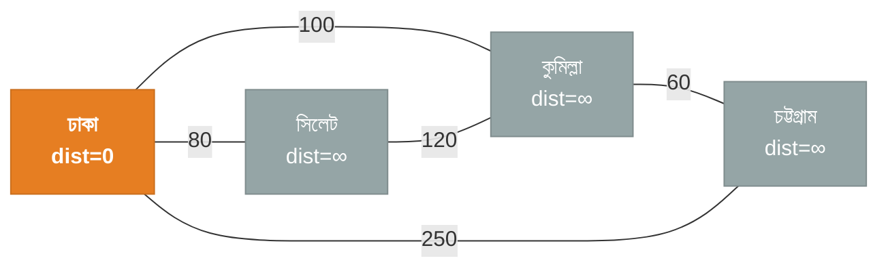
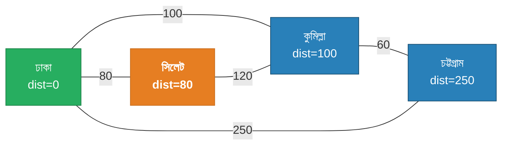
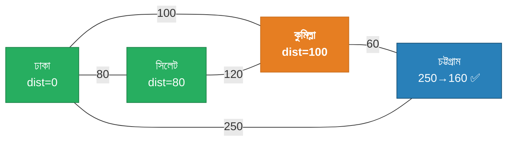
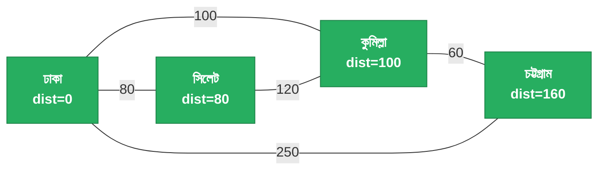
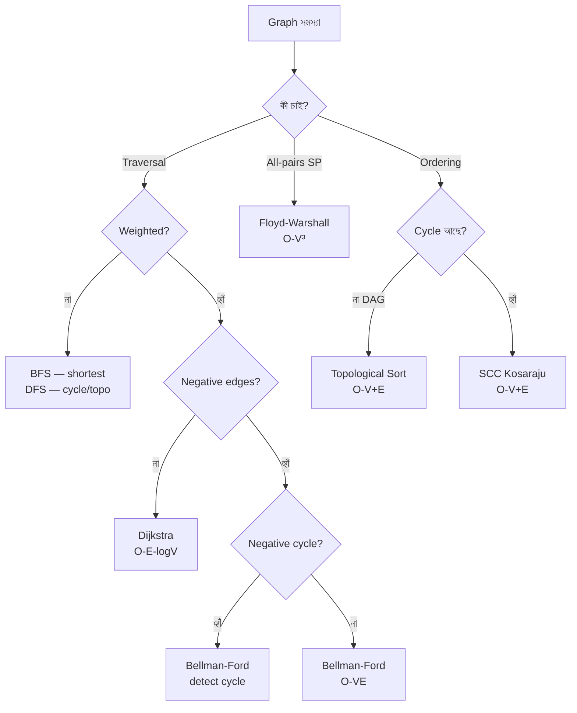

# অধ্যায় ৮: গ্রাফ অ্যালগরিদম (Graph Algorithms)

> 🎯 **লক্ষ্য:** মানচিত্র, সোশ্যাল নেটওয়ার্ক, রাস্তার নেটওয়ার্ক — সবই গ্রাফ। BFS, DFS থেকে Dijkstra, Topological Sort পর্যন্ত গল্পে, ছবিতে, Dart কোডে শেখো।

---

<a id="toc"></a>
## 📑 অধ্যায়ের বিষয়সূচি (Chapter TOC)

| # | বিষয় | মূল ট্রিক |
|---|-------|----------|
| [১](#graph-intro) | গ্রাফ কী? Representation | Adjacency List vs Matrix |
| [২](#bfs) | BFS — Breadth-First Search | Queue, Level-order |
| [৩](#dfs) | DFS — Depth-First Search | Stack/Recursion, Backtrack |
| [৪](#dijkstra) | Dijkstra's Shortest Path | Priority Queue, Greedy |
| [৫](#bellman-ford) | Bellman-Ford | Negative edges, n-1 pass |
| [৬](#floyd-warshall) | Floyd-Warshall | All-pairs shortest path |
| [৭](#topo-sort) | Topological Sort | DFS + Finish order, Kahn's |
| [৮](#scc) | Strongly Connected Components | Kosaraju's Algorithm |

---




---

<a id="graph-intro"></a>
## ১. গ্রাফ কী? — Representation

---

### ০. বাস্তব জীবনের গল্প 🗺️

**গল্প: ঢাকার রাস্তার নেটওয়ার্ক**

ঢাকায় বিভিন্ন এলাকা আছে: মিরপুর, গুলশান, মতিঝিল, ধানমন্ডি। এদের মধ্যে রাস্তা আছে। কোনো রাস্তা one-way, কোনোটা two-way।

```
       মিরপুর
      /        \
  5km            8km
  /                \
গুলশান ──3km── মতিঝিল
      \
      4km
        \
       ধানমন্ডি

এটাই একটি weighted directed graph!
  Node/Vertex = এলাকা
  Edge        = রাস্তা
  Weight      = দূরত্ব
```

**গ্রাফ কোথায় ব্যবহার হয়:**
```
🗺️  Google Maps      → Shortest path
👥  Facebook         → Friend network (BFS)
📦  Package install  → Dependency order (Topological Sort)
🌐  Internet routing → Packet forwarding
🎮  Game AI          → Pathfinding
💼  Job scheduling   → Task dependencies
```

---

### ১. গ্রাফের মূল সংজ্ঞা

```
Graph G = (V, E)
  V = Vertices (নোড, শীর্ষবিন্দু)
  E = Edges (ধার, সংযোগ)

প্রকারভেদ:
┌─────────────────────────────────────────────────────────┐
│ Undirected: A──B  (উভয় দিকে যাওয়া যায়)               │
│ Directed:   A──→B (শুধু A থেকে B যাওয়া যায়)          │
│ Weighted:   A──5──B (edge-এর weight/cost আছে)          │
│ Unweighted: A──B  (সব edge সমান cost)                  │
│ DAG: Directed Acyclic Graph (cycle নেই)                 │
│ Connected: সব node পৌঁছানো যায়                         │
│ Disconnected: কিছু node isolated                         │
└─────────────────────────────────────────────────────────┘

Key Terms:
  Degree:     একটি node-এর edge সংখ্যা
  In-degree:  directed graph-এ আসার edge
  Out-degree: directed graph-এ যাওয়ার edge
  Path:       node-এর ক্রম যেখানে প্রতিটি পাশাপাশি node-এ edge আছে
  Cycle:      start == end-এর path
  Tree:       n node, n-1 edge, connected, acyclic
```

---

### ২. Representation — তিনটি উপায়

```
Graph উদাহরণ (4 nodes, 5 edges, undirected):
  0──1
  |\ |
  | \|
  3──2

Edges: (0,1), (0,2), (0,3), (1,2), (2,3)

━━━━━━━━━━━━━━━━━━━━━━━━━━━━━━━━━━━━━━━━━━━━━━━━━━━━━━━━━━━
1. Adjacency Matrix — 2D array

     0  1  2  3
  0 [0, 1, 1, 1]
  1 [1, 0, 1, 0]
  2 [1, 1, 0, 1]
  3 [1, 0, 1, 0]

  matrix[u][v] = 1 → u ও v-এর মধ্যে edge আছে
  ✅ Edge check: O(1)
  ❌ Space: O(V²) — sparse graph-এ অপচয়

━━━━━━━━━━━━━━━━━━━━━━━━━━━━━━━━━━━━━━━━━━━━━━━━━━━━━━━━━━━
2. Adjacency List — List of Lists

  0: [1, 2, 3]
  1: [0, 2]
  2: [0, 1, 3]
  3: [0, 2]

  ✅ Space: O(V + E)
  ✅ Neighbor iteration: O(degree)
  ❌ Edge check: O(degree)
  → Real-world সমস্যায় সবচেয়ে বেশি ব্যবহৃত

━━━━━━━━━━━━━━━━━━━━━━━━━━━━━━━━━━━━━━━━━━━━━━━━━━━━━━━━━━━
3. Edge List — Edges-এর list

  [(0,1), (0,2), (0,3), (1,2), (2,3)]
  Weighted: [(0,1,5), (0,2,3), ...]

  ✅ Space: O(E)
  ✅ Bellman-Ford-এ ব্যবহার করা হয়
  ❌ Neighbor খুঁজতে O(E)
```

---

### ৩. কোন Representation কখন?

```
┌──────────────────────┬──────────────────────┬──────────────┐
│ কখন                  │ Representation       │ কারণ         │
├──────────────────────┼──────────────────────┼──────────────┤
│ Dense graph (E≈V²)   │ Adjacency Matrix     │ O(1) lookup  │
│ Sparse graph         │ Adjacency List ★     │ O(V+E) space │
│ Bellman-Ford, Kruskal│ Edge List            │ Edge iterate │
│ Floyd-Warshall       │ Adjacency Matrix     │ dp[i][j]     │
└──────────────────────┴──────────────────────┴──────────────┘
```

---

### ৫. Dart Code — Graph Representation

```dart
// ════════════════════════════════════════════════
// Graph Representation — Adjacency List (Weighted)
// ════════════════════════════════════════════════

class Edge {
  final int to, weight;
  Edge(this.to, this.weight);
  @override String toString() => '→$to(w=$weight)';
}

class Graph {
  final int vertices;
  final bool directed;
  late List<List<Edge>> adj; // Adjacency List

  Graph(this.vertices, {this.directed = false}) {
    adj = List.generate(vertices, (_) => []);
  }

  // Edge যোগ করো
  void addEdge(int u, int v, [int weight = 1]) {
    adj[u].add(Edge(v, weight));
    if (!directed) adj[v].add(Edge(u, weight)); // Undirected: উভয় দিকে
  }

  // Graph print করো
  void print() {
    for (int u = 0; u < vertices; u++) {
      final neighbors = adj[u].map((e) => e.toString()).join(', ');
      stdout.write('$u: [$neighbors]\n');
    }
  }
}

// Edge List representation
class EdgeList {
  List<(int, int, int)> edges = []; // (u, v, weight)

  void add(int u, int v, [int w = 1]) => edges.add((u, v, w));
}

import 'dart:io';

void main() {
  // Undirected weighted graph
  var g = Graph(5, directed: false);
  g.addEdge(0, 1, 4);
  g.addEdge(0, 2, 2);
  g.addEdge(1, 2, 1);
  g.addEdge(1, 3, 5);
  g.addEdge(2, 3, 8);
  g.addEdge(2, 4, 10);
  g.addEdge(3, 4, 2);

  print('Adjacency List (Undirected Weighted):');
  g.print();

  // Directed graph
  print('\nDirected Graph:');
  var dg = Graph(4, directed: true);
  dg.addEdge(0, 1);
  dg.addEdge(0, 2);
  dg.addEdge(1, 3);
  dg.addEdge(2, 3);
  dg.print();

  // Edge List
  var el = EdgeList();
  el.add(0, 1, 4); el.add(0, 2, 2); el.add(1, 3, 5);
  print('\nEdge List: ${el.edges}');
}

/* Output:
Adjacency List (Undirected Weighted):
0: [→1(w=4), →2(w=2)]
1: [→0(w=4), →2(w=1), →3(w=5)]
2: [→0(w=2), →1(w=1), →3(w=8), →4(w=10)]
3: [→1(w=5), →2(w=8), →4(w=2)]
4: [→2(w=10), →3(w=2)]

Directed Graph:
0: [→1(w=1), →2(w=1)]
1: [→3(w=1)]
2: [→3(w=1)]
3: []

Edge List: [(0, 1, 4), (0, 2, 2), (1, 3, 5)]
*/
```

---

### ৬. Complexity তুলনা

```
┌──────────────────┬──────────┬──────────┬──────────┬──────────┐
│ Operation        │ Adj List │ Adj Matrix│ Edge List│ কোথায়  │
├──────────────────┼──────────┼──────────┼──────────┼──────────┤
│ Space            │ O(V+E)★  │ O(V²)    │ O(E)     │ List best│
│ Add edge         │ O(1)     │ O(1)     │ O(1)     │ সমান    │
│ Edge exists?     │ O(deg)   │ O(1) ★   │ O(E)     │ Matrix   │
│ All neighbors    │ O(deg) ★ │ O(V)     │ O(E)     │ List     │
│ BFS/DFS          │ O(V+E) ★ │ O(V²)    │ O(VE)    │ List     │
└──────────────────┴──────────┴──────────┴──────────┴──────────┘
```

```
┌────────────────────────────────────────┐
│         সারসংক্ষেপ (Summary)           │
│  কী:     Node + Edge = Graph           │
│  List:   O(V+E) — বেশিরভাগ ক্ষেত্রে  │
│  Matrix: O(V²) — dense graph, O(1)    │
│           edge check                  │
│  Edge:   O(E) — Bellman-Ford          │
│  Stable: ✅                            │
└────────────────────────────────────────┘
```


[⬆ বিষয়সূচিতে ফিরুন](#toc)

---

<a id="bfs"></a>
## ২. BFS — Breadth-First Search

---

### ০. বাস্তব জীবনের গল্প 🌊

**গল্প: বন্যার পানি ছড়িয়ে পড়া**

একটি নদীতে বন্যা শুরু হলো একটি বিন্দু থেকে। পানি প্রথমে কাছের এলাকায় যায়, তারপর আরো দূরে। এক রাউন্ডে সব পাশের এলাকা ভাসে, তারপর পরের রাউন্ডে তাদের পাশের এলাকা।

```
শুরু: Node 0

Level 0:    [0]
              |
Level 1:  [1, 2, 3]     ← 0-এর সব প্রতিবেশী
           /  |  \
Level 2: [4] [5] [6]    ← তাদের প্রতিবেশী
```

এটাই BFS — **স্তরে স্তরে** explore করা।

---

### ১. BFS কী?

**Breadth-First Search** একটি Graph Traversal অ্যালগরিদম যা source node থেকে **level by level** (প্রস্থ-প্রথম) সব node visit করে।

```
BFS ব্যবহার:
  ✅ Shortest path (unweighted graph)
  ✅ Level-order traversal
  ✅ Connected components check
  ✅ Bipartite check
  ✅ Web crawling
  ✅ Friend suggestion (social network)
```

**Core Idea:** Queue ব্যবহার করো। প্রতিটি node-কে visit করার সময় তার সব প্রতিবেশীকে Queue-তে রাখো।

---

### ৩. ধাপে ধাপে Visual

```
Graph:
  0 ── 1 ── 4
  |    |
  2 ── 3 ── 5

Source: 0

━━━━━━━━━━━━━━━━━━━━━━━━━━━━━━━━━━━━━━━━━━━━━━━━━━━━━

Step 1: Queue=[0], Visited={0}
  Dequeue 0. Neighbors: 1, 2
  → Enqueue 1, 2
  Queue=[1, 2], Visited={0,1,2}

Step 2: Dequeue 1. Neighbors: 0(visited), 3, 4
  → Enqueue 3, 4
  Queue=[2, 3, 4], Visited={0,1,2,3,4}

Step 3: Dequeue 2. Neighbors: 0(v), 3(v)
  → কিছু নতুন নেই
  Queue=[3, 4]

Step 4: Dequeue 3. Neighbors: 1(v), 2(v), 5
  → Enqueue 5
  Queue=[4, 5], Visited={0,1,2,3,4,5}

Step 5: Dequeue 4. Neighbors: 1(v)
  Queue=[5]

Step 6: Dequeue 5. Neighbors: 3(v)
  Queue=[]  ← শেষ!

BFS Order: 0, 1, 2, 3, 4, 5

━━━━━━━━━━━━━━━━━━━━━━━━━━━━━━━━━━━━━━━━━━━━━━━━━━━━━
Shortest Distance from 0:
  dist[0]=0, dist[1]=1, dist[2]=1
  dist[3]=2, dist[4]=2, dist[5]=3

Level 0: {0}
Level 1: {1, 2}
Level 2: {3, 4}
Level 3: {5}
```

---

### ৫. সম্পূর্ণ Dart Code

```dart
// ════════════════════════════════════════════════
// BFS — Shortest Path + Level Order
// ════════════════════════════════════════════════

import 'dart:collection';

class BFSResult {
  final List<int> order;       // Visit order
  final List<int> dist;        // Source থেকে distance
  final List<int> parent;      // Path reconstruct-এর জন্য
  BFSResult(this.order, this.dist, this.parent);
}

BFSResult bfs(List<List<int>> adj, int source) {
  int n = adj.length;
  List<int> dist   = List.filled(n, -1);   // -1 = unvisited
  List<int> parent = List.filled(n, -1);
  List<int> order  = [];

  Queue<int> queue = Queue();
  dist[source] = 0;
  queue.add(source);

  while (queue.isNotEmpty) {
    int u = queue.removeFirst(); // FIFO — Queue-এর সামনে থেকে নাও
    order.add(u);

    for (int v in adj[u]) {
      if (dist[v] == -1) {      // এখনো visit হয়নি
        dist[v]   = dist[u] + 1;
        parent[v] = u;
        queue.add(v);
      }
    }
  }
  return BFSResult(order, dist, parent);
}

// Source থেকে target-এর shortest path
List<int> shortestPath(List<int> parent, int target) {
  List<int> path = [];
  int cur = target;
  while (cur != -1) { path.add(cur); cur = parent[cur]; }
  return path.reversed.toList();
}

// Connected components count
int countComponents(int n, List<List<int>> adj) {
  List<bool> visited = List.filled(n, false);
  int count = 0;
  for (int i = 0; i < n; i++) {
    if (!visited[i]) {
      count++;
      // Mini-BFS
      Queue<int> q = Queue()..add(i);
      visited[i] = true;
      while (q.isNotEmpty) {
        int u = q.removeFirst();
        for (int v in adj[u]) {
          if (!visited[v]) { visited[v] = true; q.add(v); }
        }
      }
    }
  }
  return count;
}

void main() {
  // Graph তৈরি (undirected)
  //  0──1──4
  //  |  |
  //  2──3──5
  List<List<int>> adj = [
    [1, 2],    // 0
    [0, 3, 4], // 1
    [0, 3],    // 2
    [1, 2, 5], // 3
    [1],       // 4
    [3],       // 5
  ];

  var result = bfs(adj, 0);
  print('BFS Order: ${result.order}');       // 0,1,2,3,4,5
  print('Distances: ${result.dist}');        // 0,1,1,2,2,3
  print('Path 0→5: ${shortestPath(result.parent, 5)}'); // [0,1,3,5]
  print('Path 0→4: ${shortestPath(result.parent, 4)}'); // [0,1,4]

  // Level print
  print('\nLevels from 0:');
  int maxDist = result.dist.reduce((a, b) => a > b ? a : b);
  for (int d = 0; d <= maxDist; d++) {
    var level = List.generate(adj.length, (i) => i)
        .where((i) => result.dist[i] == d).toList();
    print('  Level $d: $level');
  }

  // Connected components
  List<List<int>> disco = [[0,1,2], [3,4], [5]]; // disconnected
  print('\nComponents in disconnected graph: ${countComponents(6, disco)}');
}

/* Output:
BFS Order: [0, 1, 2, 3, 4, 5]
Distances: [0, 1, 1, 2, 2, 3]
Path 0→5: [0, 1, 3, 5]
Path 0→4: [0, 1, 4]

Levels from 0:
  Level 0: [0]
  Level 1: [1, 2]
  Level 2: [3, 4]
  Level 3: [5]

Components in disconnected graph: 3
*/
```

---

### ৬. Complexity

```
┌──────────────────┬──────────┬──────────┬────────────────────────┐
│ অপারেশন         │ Time     │ Space    │ Note                   │
├──────────────────┼──────────┼──────────┼────────────────────────┤
│ BFS (Adj List)   │ O(V+E)   │ O(V)     │ Queue + visited array  │
│ BFS (Adj Matrix) │ O(V²)    │ O(V)     │ সব neighbors check     │
│ Shortest Path    │ O(V+E)   │ O(V)     │ Unweighted only        │
└──────────────────┴──────────┴──────────┴────────────────────────┘
```

```
┌────────────────────────────────────────┐
│         সারসংক্ষেপ (Summary)           │
│  কী:     Level-by-level traversal     │
│  Data:   Queue (FIFO)                 │
│  কখন:    Unweighted shortest path     │
│           Connected check, Level order│
│  Time:   O(V + E)                     │
│  Space:  O(V)                         │
│  Stable: ✅                            │
└────────────────────────────────────────┘
```


[⬆ বিষয়সূচিতে ফিরুন](#toc)

---

<a id="dfs"></a>
## ৩. DFS — Depth-First Search

---

### ০. বাস্তব জীবনের গল্প 🌲

**গল্প: গোয়েন্দার সূত্র তদন্ত**

একজন গোয়েন্দা একটি সূত্র পেলেন। সেই সূত্র থেকে আরেকটি সূত্র, সেখান থেকে আরেকটি — যতদূর যাওয়া যায় যান।막히লে (dead end) পিছনে আসেন এবং অন্য পথে যান।

```
সূত্র A
  └─ B → D → G (막�লো!)
  │       └─ H (막hinলো!)
  └─ C → E (막hinলো!)
         └─ F (막hinলো!)

DFS Order: A, B, D, G, H, C, E, F

এটাই DFS — **গভীরে যাও, তারপর ফিরে এসো**।
```

---

### ১. DFS কী?

**Depth-First Search** একটি Graph Traversal যা একটি path-এ যতদূর সম্ভব যায়, তারপর backtrack করে।

```
DFS ব্যবহার:
  ✅ Cycle detection
  ✅ Topological Sort
  ✅ Strongly Connected Components
  ✅ Maze solving
  ✅ Connected components
  ✅ Tree problems
```

**DFS vs BFS:**
```
BFS: Queue, level-order, shortest path (unweighted)
DFS: Stack/Recursion, depth-order, cycle/topo/SCC
```

---

### ৩. ধাপে ধাপে Visual

```
Graph (Directed):
  0 → 1 → 3
  ↓       ↑
  2 ──────┘

Source: 0

━━━━━━━━━━━━━━━━━━━━━━━━━━━━━━━━━━━━━━━━━━━━━━━━━━━━━

Recursive DFS (call stack):
  dfs(0): visited={0}, enter 0
    dfs(1): visited={0,1}, enter 1
      dfs(3): visited={0,1,3}, enter 3
        neighbors of 3: none
        → exit 3, finish[3]=1
      → exit 1, finish[1]=2
    dfs(2): visited={0,1,2,3}, enter 2
      neighbor 3: already visited
      → exit 2, finish[2]=3
    → exit 0, finish[0]=4

DFS Order:    0, 1, 3, 2        (entry order)
Finish Order: 3, 1, 2, 0        (exit order) ← Topological Sort-এ কাজে লাগে!

━━━━━━━━━━━━━━━━━━━━━━━━━━━━━━━━━━━━━━━━━━━━━━━━━━━━━
Cycle Detection (Directed Graph):
  
  DFS-এ তিন ধরনের edge:
  ┌─────────────┬─────────────────────────────────────┐
  │ Tree Edge   │ DFS tree-এর edge                   │
  │ Back Edge   │ ancestor-কে point করে = CYCLE! ⚠️  │
  │ Cross Edge  │ same/different subtree              │
  └─────────────┴─────────────────────────────────────┘

  0 → 1 → 2 → 0 ← back edge! → cycle আছে
```

---

### ৫. সম্পূর্ণ Dart Code

```dart
// ════════════════════════════════════════════════
// DFS — Recursive + Iterative + Cycle Detection
// ════════════════════════════════════════════════

// Recursive DFS
class DFSResult {
  List<int> order   = [];
  List<int> finish  = [];
  bool      hasCycle = false;
}

DFSResult dfsAll(List<List<int>> adj, {bool directed = false}) {
  int n = adj.length;
  var result  = DFSResult();
  List<int>  color = List.filled(n, 0); // 0=white, 1=gray(in stack), 2=black(done)

  void dfs(int u) {
    color[u] = 1; // gray — currently in DFS stack
    result.order.add(u);

    for (int v in adj[u]) {
      if (color[v] == 0) {          // unvisited
        dfs(v);
      } else if (color[v] == 1) {   // back edge → cycle!
        result.hasCycle = true;
      }
    }

    color[u] = 2; // black — fully processed
    result.finish.add(u);
  }

  for (int i = 0; i < n; i++) {
    if (color[i] == 0) dfs(i);     // disconnected component handle
  }

  return result;
}

// Iterative DFS (Stack ব্যবহার করে)
List<int> dfsIterative(List<List<int>> adj, int source) {
  int n = adj.length;
  List<bool> visited = List.filled(n, false);
  List<int>  order   = [];
  List<int>  stack   = [source]; // Stack!

  while (stack.isNotEmpty) {
    int u = stack.removeLast(); // LIFO
    if (visited[u]) continue;
    visited[u] = true;
    order.add(u);

    // প্রতিবেশী reverse করে stack-এ রাখো (order maintain-এর জন্য)
    for (int v in adj[u].reversed) {
      if (!visited[v]) stack.add(v);
    }
  }
  return order;
}

// Undirected graph-এ cycle detection
bool hasCycleUndirected(List<List<int>> adj) {
  int n = adj.length;
  List<bool> visited = List.filled(n, false);

  bool dfs(int u, int parent) {
    visited[u] = true;
    for (int v in adj[u]) {
      if (!visited[v]) {
        if (dfs(v, u)) return true;
      } else if (v != parent) {   // parent ছাড়া visited → cycle!
        return true;
      }
    }
    return false;
  }

  for (int i = 0; i < n; i++) {
    if (!visited[i] && dfs(i, -1)) return true;
  }
  return false;
}

void main() {
  // Directed graph: 0→1→3, 0→2→3
  List<List<int>> dag = [
    [1, 2], // 0
    [3],    // 1
    [3],    // 2
    [],     // 3
  ];

  var r1 = dfsAll(dag, directed: true);
  print('Directed Acyclic Graph:');
  print('  DFS Order:    ${r1.order}');    // [0,1,3,2]
  print('  Finish Order: ${r1.finish}');   // [3,1,2,0]
  print('  Has Cycle:    ${r1.hasCycle}'); // false

  // Cyclic graph: 0→1→2→0
  List<List<int>> cyclic = [
    [1], // 0
    [2], // 1
    [0], // 2 → 0, back edge!
  ];
  var r2 = dfsAll(cyclic, directed: true);
  print('\nDirected Cyclic Graph (0→1→2→0):');
  print('  Has Cycle: ${r2.hasCycle}'); // true

  // Undirected
  List<List<int>> undir = [
    [1, 2],
    [0, 3],
    [0, 3],
    [1, 2],
  ];
  print('\nUndirected iterative DFS from 0: ${dfsIterative(undir, 0)}');
  print('Undirected has cycle: ${hasCycleUndirected(undir)}'); // true (0-1-3-2-0)
}

/* Output:
Directed Acyclic Graph:
  DFS Order:    [0, 1, 3, 2]
  Finish Order: [3, 1, 2, 0]
  Has Cycle:    false

Directed Cyclic Graph (0→1→2→0):
  Has Cycle: true

Undirected iterative DFS from 0: [0, 1, 3, 2]
Undirected has cycle: true
*/
```

---

### ৬. Complexity

```
┌──────────────────┬──────────┬──────────┬────────────────────────┐
│ অপারেশন         │ Time     │ Space    │ Note                   │
├──────────────────┼──────────┼──────────┼────────────────────────┤
│ DFS (Adj List)   │ O(V+E)   │ O(V)     │ Call stack depth = V   │
│ DFS (Adj Matrix) │ O(V²)    │ O(V)     │ সব neighbors scan      │
│ Cycle Detection  │ O(V+E)   │ O(V)     │ Color array            │
└──────────────────┴──────────┴──────────┴────────────────────────┘
```

```
┌────────────────────────────────────────┐
│         সারসংক্ষেপ (Summary)           │
│  কী:     Go deep, then backtrack      │
│  Data:   Stack (Recursion বা explicit)│
│  কখন:    Cycle detect, Topo sort      │
│           SCC, Maze, DFS tree         │
│  Time:   O(V + E)                     │
│  Space:  O(V)                         │
│  Stable: ✅                            │
└────────────────────────────────────────┘
```


[⬆ বিষয়সূচিতে ফিরুন](#toc)

---

<a id="dijkstra"></a>
## ৪. Dijkstra's Shortest Path

---

### ০. বাস্তব জীবনের গল্প 🚗

**গল্প: Google Maps-এ সবচেয়ে কম সময়ের রুট**

তুমি মিরপুর থেকে মতিঝিল যেতে চাও। কোন পথে সবচেয়ে কম সময় লাগবে?

```
মিরপুর ──10min── গুলশান ──5min── মতিঝিল
    \                              /
    15min                       8min
        \                      /
         ──────── ধানমন্ডি ───

মিরপুর→গুলশান→মতিঝিল = 15 min
মিরপুর→ধানমন্ডি→মতিঝিল = 23 min

সর্বোচ্চ পথ = 15 min (গুলশান হয়ে)
```

এটাই Dijkstra's Algorithm করে!

---

### ১. Dijkstra কী?

**Dijkstra's Algorithm** একটি Greedy algorithm যা weighted graph-এ source থেকে সব node-এর **shortest path** বের করে।

**শর্ত:** সব edge-এর weight **non-negative** হতে হবে (negative weight-এ ব্যর্থ!)

**Core Idea:**
```
Greedy: সবসময় এখন পর্যন্ত সবচেয়ে কম দূরত্বের unvisited node থেকে explore করো।

dist[source] = 0
dist[অন্য সব] = ∞

Priority Queue-তে (dist, node) রাখো।
সবচেয়ে কম dist-এর node বের করো, তার প্রতিবেশী relax করো।
```

---

### ৩. ধাপে ধাপে Visual — Undirected Weighted Graph

**উদাহরণ: ঢাকা থেকে সব শহরের সবচেয়ে ছোট পথ বের করো**

---

#### গ্রাফ পরিচিতি



> **Undirected** — সব edge দুইদিকেই চলে (ঢাকা→কুমিল্লা এবং কুমিল্লা→ঢাকা একই ওজন)

| Edge | Weight |
|------|--------|
| ঢাকা ↔ কুমিল্লা | 100 km |
| কুমিল্লা ↔ চট্টগ্রাম | 60 km |
| ঢাকা ↔ সিলেট | 80 km |
| সিলেট ↔ কুমিল্লা | 120 km |
| ঢাকা ↔ চট্টগ্রাম | 250 km |

---

#### 🚀 Initialize — শুরুর অবস্থা

```
Source = ঢাকা

dist   = { ঢাকা:0,  কুমিল্লা:∞,  সিলেট:∞,  চট্টগ্রাম:∞ }
parent = { ঢাকা:—,  কুমিল্লা:—,  সিলেট:—,  চট্টগ্রাম:— }

Priority Queue (min-heap):  PQ = [ (0, ঢাকা) ]
```

---

#### ━━ Step 1 ━━  ঢাকা extract (dist = 0) 🟠



```
ঢাকার প্রতিবেশী relax করো:

  কুমিল্লা  →  0 + 100 = 100  <  ∞    ✅  dist[কুমিল্লা]  = 100,  parent = ঢাকা
  সিলেট     →  0 + 80  = 80   <  ∞    ✅  dist[সিলেট]     = 80,   parent = ঢাকা
  চট্টগ্রাম →  0 + 250 = 250  <  ∞    ✅  dist[চট্টগ্রাম] = 250,  parent = ঢাকা

dist  = { ঢাকা:0 ✅,  কুমিল্লা:100,  সিলেট:80,  চট্টগ্রাম:250 }
PQ    = [ (80, সিলেট), (100, কুমিল্লা), (250, চট্টগ্রাম) ]
                ↑ smallest → next!
```

---

#### ━━ Step 2 ━━  সিলেট extract (dist = 80) 🟠



```
সিলেটের প্রতিবেশী relax করো:

  ঢাকা     →  80 + 80  = 160  >  0    ❌  no update  (ঢাকা already dist=0)
  কুমিল্লা →  80 + 120 = 200  >  100  ❌  no update  (ঢাকা→কুমিল্লা=100 ছোট)

dist  = { ঢাকা:0 ✅,  সিলেট:80 ✅,  কুমিল্লা:100,  চট্টগ্রাম:250 }
PQ    = [ (100, কুমিল্লা), (250, চট্টগ্রাম) ]
```

---

#### ━━ Step 3 ━━  কুমিল্লা extract (dist = 100) 🟠



```
কুমিল্লার প্রতিবেশী relax করো:

  ঢাকা      → 100 + 100 = 200  >  0    ❌  no update
  সিলেট     → 100 + 120 = 220  >  80   ❌  no update
  চট্টগ্রাম → 100 + 60  = 160  <  250  ✅  dist[চট্টগ্রাম] = 160, parent = কুমিল্লা

dist  = { ঢাকা:0 ✅,  সিলেট:80 ✅,  কুমিল্লা:100 ✅,  চট্টগ্রাম:160 }
PQ    = [ (160, চট্টগ্রাম) ]
```

---

#### ━━ Step 4 ━━  চট্টগ্রাম extract (dist = 160) ✅ শেষ!



```
চট্টগ্রামের প্রতিবেশী:
  ঢাকা     → 160 + 250 = 410  >  0    ❌  no update
  কুমিল্লা → 160 + 60  = 220  >  100  ❌  no update

PQ = []  ← খালি!  🎉 Algorithm সম্পন্ন!
```

---

#### 🏁 Final Shortest Paths from ঢাকা

| Destination | Shortest Dist | Optimal Path |
|-------------|:------:|------|
| ঢাকা | **0 km** | ঢাকা |
| সিলেট | **80 km** | ঢাকা → সিলেট |
| কুমিল্লা | **100 km** | ঢাকা → কুমিল্লা |
| চট্টগ্রাম | **160 km** | ঢাকা → কুমিল্লা → চট্টগ্রাম |

```
⚡ Key Insight:
   সরাসরি  ঢাকা ──────────────────── চট্টগ্রাম = 250 km  ❌ বেশি!
   Optimal  ঢাকা → কুমিল্লা → চট্টগ্রাম = 100+60 = 160 km  ✅ সাশ্রয়ী!

   Dijkstra greedy ভাবে সবসময় সবচেয়ে কম dist-এর node process করে
   এই সেরা পথটাই খুঁজে বের করে।
```

---

### ৫. সম্পূর্ণ Dart Code

```dart
// ════════════════════════════════════════════════
// Dijkstra's Algorithm — Priority Queue দিয়ে
// ════════════════════════════════════════════════

import 'dart:collection';

class _Entry implements Comparable<_Entry> {
  final int dist, node;
  _Entry(this.dist, this.node);

  @override
  int compareTo(_Entry other) => dist.compareTo(other.dist); // min-heap
}

// Simple Min-Heap Priority Queue (Dart-এ built-in নেই তাই SplayTreeSet)
Map<String, dynamic> dijkstra(List<List<(int, int)>> adj, int source) {
  int n = adj.length;
  const int INF = 1 << 30;

  List<int> dist   = List.filled(n, INF);
  List<int> parent = List.filled(n, -1);
  List<bool> visited = List.filled(n, false);

  dist[source] = 0;

  // (distance, node) sorted set as priority queue
  var pq = SplayTreeSet<_Entry>((a, b) {
    int cmp = a.dist.compareTo(b.dist);
    return cmp != 0 ? cmp : a.node.compareTo(b.node);
  });
  pq.add(_Entry(0, source));

  while (pq.isNotEmpty) {
    var entry = pq.first; pq.remove(pq.first);
    int u = entry.node;

    if (visited[u]) continue; // পুরনো outdated entry
    visited[u] = true;

    for (var (v, w) in adj[u]) {
      if (!visited[v] && dist[u] + w < dist[v]) {
        // Relax edge u→v
        pq.remove(_Entry(dist[v], v)); // পুরনো entry সরাও
        dist[v]   = dist[u] + w;
        parent[v] = u;
        pq.add(_Entry(dist[v], v));
      }
    }
  }

  return {'dist': dist, 'parent': parent};
}

// Shortest path reconstruct
List<int> getPath(List<int> parent, int target) {
  List<int> path = [];
  int cur = target;
  while (cur != -1) { path.add(cur); cur = parent[cur]; }
  return path.reversed.toList();
}

void main() {
  // Graph: 4 nodes, weighted undirected
  //    0──4──1
  //    |      |
  //    2      3
  //    |      |
  //    3──1───2
  List<List<(int, int)>> adj = [
    [(1, 4), (3, 2)],      // 0: →1 w=4, →3 w=2
    [(0, 4), (2, 3)],      // 1: →0 w=4, →2 w=3
    [(1, 3), (3, 1)],      // 2: →1 w=3, →3 w=1
    [(0, 2), (2, 1)],      // 3: →0 w=2, →2 w=1
  ];

  var result = dijkstra(adj, 0);
  List<int> dist   = result['dist'];
  List<int> parent = result['parent'];

  print('Shortest distances from node 0:');
  for (int i = 0; i < 4; i++) {
    print('  0 → $i: dist=${dist[i]}, path=${getPath(parent, i)}');
  }

  // Larger example
  print('\n--- 6-node graph ---');
  List<List<(int, int)>> g2 = [
    [(1, 7), (2, 9), (5, 14)],      // 0
    [(0, 7), (2, 10), (3, 15)],     // 1
    [(0, 9), (1, 10), (3, 11), (5, 2)], // 2
    [(1, 15), (2, 11), (4, 6)],     // 3
    [(3, 6), (5, 9)],               // 4
    [(0, 14), (2, 2), (4, 9)],      // 5
  ];

  var r2 = dijkstra(g2, 0);
  print('Distances from 0: ${r2['dist']}');
  print('Path 0→4: ${getPath(r2['parent'], 4)}');
}

/* Output:
Shortest distances from node 0:
  0 → 0: dist=0, path=[0]
  0 → 1: dist=4, path=[0, 1]
  0 → 2: dist=3, path=[0, 3, 2]
  0 → 3: dist=2, path=[0, 3]

--- 6-node graph ---
Distances from 0: [0, 7, 9, 20, 20, 11]
Path 0→4: [0, 2, 5, 4]
*/
```

---

### ৬. Complexity

```
┌─────────────────────────────┬──────────────┬──────────┐
│ Implementation               │ Time         │ Space    │
├─────────────────────────────┼──────────────┼──────────┤
│ Naive (array scan)           │ O(V²)        │ O(V)     │
│ Binary Heap PQ               │ O((V+E)logV) │ O(V)     │
│ Fibonacci Heap               │ O(E + VlogV) │ O(V)     │
│ → Dense graph: array scan    │ O(V²) better │          │
│ → Sparse graph: Binary Heap★ │ O(E logV)    │          │
└─────────────────────────────┴──────────────┴──────────┘

⚠️  Dijkstra কাজ করে না:
   Negative weight edges-এ!
   → তখন Bellman-Ford ব্যবহার করো
```

```
┌────────────────────────────────────────┐
│         সারসংক্ষেপ (Summary)           │
│  কী:     Single-source shortest path  │
│  শর্ত:   Non-negative weights         │
│  Data:   Min Priority Queue           │
│  কখন:    GPS, Network routing         │
│  Time:   O((V+E) log V)               │
│  Space:  O(V)                         │
│  Stable: ✅                            │
└────────────────────────────────────────┘
```


[⬆ বিষয়সূচিতে ফিরুন](#toc)

---

<a id="bellman-ford"></a>
## ৫. Bellman-Ford Algorithm

---

### ০. বাস্তব জীবনের গল্প 💸

**গল্প: মুদ্রা বিনিময় ও Arbitrage**

বিভিন্ন দেশের মুদ্রা বিনিময় করতে গেলে কিছু route লোকসান দেয় (negative weight)। যেমন: BDT → USD → EUR → BDT-তে ফিরলে লাভ বা ক্ষতি হতে পারে।

```
A ──(-1)──→ B ──(4)──→ C
|           |          |
(2)        (-3)        (1)
|           |          |
↓           ↓          ↓
D ──(3)──→ E ──(5)──→ F

Negative edge আছে (-1, -3)!
Dijkstra এখানে ব্যর্থ → Bellman-Ford ব্যবহার করো।
```

---

### ১. Bellman-Ford কী?

**Bellman-Ford** algorithm negative weight edge সহ graph-এ shortest path বের করে, এবং **negative cycle** detect করতে পারে।

```
Algorithm:
  1. dist[source]=0, বাকি সব ∞
  2. (V-1) বার সব edge relax করো
  3. আরো একবার relax করলে কোনো update হলে → negative cycle!

কেন V-1 বার?
  V node-এর graph-এ shortest path-এ সর্বোচ্চ V-1 edge।
  সুতরাং V-1 pass-এ সব path settled হয়ে যায়।
```

---

### ৩. ধাপে ধাপে Visual

```
Graph (Directed):
  0 ──(−1)──→ 1 ──(4)──→ 2
  |                      ↑
 (2)                    (1)
  ↓                      |
  3 ──(−3)──────────────→

Source: 0, V=4 nodes

Initial: dist = [0, ∞, ∞, ∞]

━━━━━━━━━━━━━━━━━━━━━━━━━━━━━━━━━━━━━━━━━━━━━━━━━━━━━

Pass 1 (সব edge relax):
  Edge 0→1 w=-1: dist[1] = min(∞, 0+(-1)) = -1
  Edge 0→3 w=2:  dist[3] = min(∞, 0+2)    = 2
  Edge 1→2 w=4:  dist[2] = min(∞, -1+4)   = 3
  Edge 3→2 w=1:  dist[2] = min(3, 2+1)    = 3 (no change)
  dist = [0, -1, 3, 2]

Pass 2:
  Edge 0→1: dist[1] = min(-1, -1) → no change
  Edge 3→2: dist[2] = min(3, 2+1) → no change
  dist = [0, -1, 3, 2]  ← converged!

V-1 = 3 passes পর্যন্ত করলে সব settled।

Final: 0→0=0, 0→1=-1, 0→2=3, 0→3=2

━━━━━━━━━━━━━━━━━━━━━━━━━━━━━━━━━━━━━━━━━━━━━━━━━━━━━
Negative Cycle Detection:

Pass V করো (V-th pass):
  যদি dist কোনো node-এ update হয় → negative cycle!

Example: A→B(-1), B→C(-1), C→A(-1)
  প্রতি pass-এ dist কমতেই থাকে → cycle detected!
```

---

### ৫. সম্পূর্ণ Dart Code

```dart
// ════════════════════════════════════════════════
// Bellman-Ford — Negative Weights + Cycle Detection
// ════════════════════════════════════════════════

class BFResult {
  final List<int>  dist;
  final List<int>  parent;
  final bool       hasNegCycle;
  BFResult(this.dist, this.parent, this.hasNegCycle);
}

BFResult bellmanFord(int n, List<(int, int, int)> edges, int src) {
  const int INF = 1 << 29;
  List<int> dist   = List.filled(n, INF);
  List<int> parent = List.filled(n, -1);
  dist[src] = 0;

  // V-1 বার সব edge relax করো
  for (int pass = 0; pass < n - 1; pass++) {
    bool updated = false;
    for (var (u, v, w) in edges) {
      if (dist[u] != INF && dist[u] + w < dist[v]) {
        dist[v]   = dist[u] + w;
        parent[v] = u;
        updated   = true;
      }
    }
    if (!updated) break; // Early exit — converged!
  }

  // V-th pass: negative cycle আছে কিনা দেখো
  bool hasNeg = false;
  for (var (u, v, w) in edges) {
    if (dist[u] != INF && dist[u] + w < dist[v]) {
      hasNeg = true;
      break;
    }
  }

  return BFResult(dist, parent, hasNeg);
}

List<int> getPath(List<int> parent, int t) {
  List<int> path = [];
  int cur = t;
  while (cur != -1) { path.add(cur); cur = parent[cur]; }
  return path.reversed.toList();
}

void main() {
  // উদাহরণ ১: Negative edges, no cycle
  // 0→1(-1), 0→3(2), 1→2(4), 3→2(1)
  var edges1 = <(int,int,int)>[
    (0, 1, -1),
    (0, 3,  2),
    (1, 2,  4),
    (3, 2,  1),
  ];
  var r1 = bellmanFord(4, edges1, 0);
  print('No negative cycle:');
  print('  dist: ${r1.dist}');              // [0, -1, 3, 2]
  print('  path 0→2: ${getPath(r1.parent, 2)}'); // [0, 1, 2] বা [0, 3, 2]
  print('  hasNegCycle: ${r1.hasNegCycle}'); // false

  print('');

  // উদাহরণ ২: Negative cycle
  // 0→1(1), 1→2(-1), 2→1(-1) ← cycle: 1→2→1 weight=-2
  var edges2 = <(int,int,int)>[
    (0, 1,  1),
    (1, 2, -1),
    (2, 1, -1), // negative cycle: 1↔2 দিয়ে loop
  ];
  var r2 = bellmanFord(3, edges2, 0);
  print('With negative cycle:');
  print('  hasNegCycle: ${r2.hasNegCycle}'); // true

  // Dijkstra vs Bellman-Ford তুলনা
  print('\n--- Dijkstra vs Bellman-Ford ---');
  print('Dijkstra:     O((V+E)logV), negative weight ❌');
  print('Bellman-Ford: O(V×E),      negative weight ✅, cycle detect ✅');
}

/* Output:
No negative cycle:
  dist: [0, -1, 3, 2]
  path 0→2: [0, 3, 2]
  hasNegCycle: false

With negative cycle:
  hasNegCycle: true

--- Dijkstra vs Bellman-Ford ---
Dijkstra:     O((V+E)logV), negative weight ❌
Bellman-Ford: O(V×E),       negative weight ✅, cycle detect ✅
*/
```

---

### ৬. Complexity

```
┌──────────────────┬──────────┬──────────┬────────────────────────┐
│ অপারেশন         │ Time     │ Space    │ Note                   │
├──────────────────┼──────────┼──────────┼────────────────────────┤
│ Bellman-Ford     │ O(V×E)   │ O(V)     │ V-1 passes × E edges  │
│ Dijkstra         │ O(ElogV) │ O(V)     │ Faster, no neg weight  │
│ Neg cycle detect │ O(E)     │ O(1)     │ 1 extra pass          │
└──────────────────┴──────────┴──────────┴────────────────────────┘
```

```
┌────────────────────────────────────────┐
│         সারসংক্ষেপ (Summary)           │
│  কী:     SSSP with negative weights   │
│  শর্ত:   Negative cycle থাকলে fail   │
│  কখন:    Neg edges, cycle detect      │
│  কোথায়: Currency arbitrage, finance  │
│  Time:   O(V × E)                     │
│  Space:  O(V)                         │
│  Stable: ✅                            │
└────────────────────────────────────────┘
```


[⬆ বিষয়সূচিতে ফিরুন](#toc)

---

<a id="floyd-warshall"></a>
## ৬. Floyd-Warshall — All-Pairs Shortest Path

---

### ০. বাস্তব জীবনের গল্প ✈️

**গল্প: বিমান টিকেটের সবচেয়ে সস্তা route**

Dhaka → London সরাসরি হয়তো ব্যয়বহুল। কিন্তু Dhaka → Dubai → London হয়তো সস্তা। সব শহরের মধ্যে সব সম্ভাব্য route-এর cost জানতে চাই — Floyd-Warshall ব্যবহার করো।

---

### ১. Floyd-Warshall কী?

**Floyd-Warshall** একটি DP algorithm যা সব pairs (u, v)-এর shortest path একসাথে বের করে।

```
State:
  dp[k][i][j] = শুধু node {0..k} ব্যবহার করে i→j-এর shortest path

Recurrence:
  dp[k][i][j] = min(
    dp[k-1][i][j],              ← k ব্যবহার না করে
    dp[k-1][i][k] + dp[k-1][k][j]  ← k ব্যবহার করে (intermediate)
  )

Space-Optimized: dp[i][j] একটি 2D array-তেই করা যায়।

Answer: dp[i][j] = i থেকে j-এর shortest distance
```

---

### ৩. ধাপে ধাপে Visual

```
Graph (4 nodes, directed, weighted):
  0 ──(3)──→ 1
  ↑          |
 (7)        (2)
  |          ↓
  3 ←─(1)── 2
  ↓
 (2)→ 0? (no, just example)

Initial dist (∞ = no direct edge):
      0    1    2    3
  0 [ 0,   3,   ∞,   7]
  1 [ ∞,   0,   2,   ∞]
  2 [ ∞,   ∞,   0,   1]
  3 [ 2,   ∞,   ∞,   0]

━━━━━━━━━━━━━━━━━━━━━━━━━━━━━━━━━━━━━━━━━━━━━━━━━━━━━

k=0 (node 0 intermediate হিসেবে):
  dp[i][j] = min(dp[i][j], dp[i][0]+dp[0][j])
  dp[3][1] = min(∞, dp[3][0]+dp[0][1]) = min(∞, 2+3) = 5 ← new!
  dp[3][2] = min(∞, dp[3][0]+dp[0][2]) = min(∞, 2+∞)  = ∞
  dist:
      0  1  2  3
  0 [ 0, 3, ∞, 7]
  1 [ ∞, 0, 2, ∞]
  2 [ ∞, ∞, 0, 1]
  3 [ 2, 5, ∞, 0] ← 3→1 updated!

k=1 (node 1 intermediate):
  dp[0][2] = min(∞, dp[0][1]+dp[1][2]) = min(∞, 3+2) = 5 ← new!
  dist:
      0  1  2  3
  0 [ 0, 3, 5, 7] ← 0→2 updated!
  ...

k=2 (node 2 intermediate):
  dp[0][3] = min(7, dp[0][2]+dp[2][3]) = min(7, 5+1) = 6 ← new!
  dp[1][3] = min(∞, dp[1][2]+dp[2][3]) = min(∞, 2+1) = 3 ← new!
  ...

k=3 (node 3 intermediate):
  dp[1][0] = min(∞, dp[1][3]+dp[3][0]) = min(∞, 3+2) = 5 ← new!
  dp[2][0] = min(∞, dp[2][3]+dp[3][0]) = min(∞, 1+2) = 3 ← new!

Final dist:
      0  1  2  3
  0 [ 0, 3, 5, 6]
  1 [ 5, 0, 2, 3]
  2 [ 3, 8, 0, 1]
  3 [ 2, 5, 7, 0]
```

---

### ৫. সম্পূর্ণ Dart Code

```dart
// ════════════════════════════════════════════════
// Floyd-Warshall — All-Pairs Shortest Path
// ════════════════════════════════════════════════

const int INF = 1 << 29;

Map<String, dynamic> floydWarshall(List<List<int>> graph) {
  int n = graph.length;

  // dist কপি করো
  List<List<int>> dist = List.generate(
    n, (i) => List.generate(n, (j) => graph[i][j]),
  );
  // Path reconstruct-এর জন্য next[][] রাখো
  List<List<int>> next = List.generate(
    n, (i) => List.generate(n, (j) => graph[i][j] < INF ? j : -1),
  );

  // Floyd-Warshall DP
  for (int k = 0; k < n; k++) {           // intermediate node
    for (int i = 0; i < n; i++) {         // source
      for (int j = 0; j < n; j++) {       // destination
        if (dist[i][k] != INF && dist[k][j] != INF &&
            dist[i][k] + dist[k][j] < dist[i][j]) {
          dist[i][j] = dist[i][k] + dist[k][j];
          next[i][j] = next[i][k]; // i→k→j → i→k দিয়ে শুরু
        }
      }
    }
  }

  // Negative cycle check: diagonal-এ negative হলে cycle
  bool hasNegCycle = false;
  for (int i = 0; i < n; i++) {
    if (dist[i][i] < 0) { hasNegCycle = true; break; }
  }

  return {'dist': dist, 'next': next, 'hasNegCycle': hasNegCycle};
}

// Shortest path reconstruct করো
List<int> getPath(List<List<int>> next, int u, int v) {
  if (next[u][v] == -1) return []; // No path
  List<int> path = [u];
  while (u != v) { u = next[u][v]; path.add(u); }
  return path;
}

void main() {
  // Graph (INF = no direct edge)
  var graph = [
    [0,   3,   INF, 7  ],
    [INF, 0,   2,   INF],
    [INF, INF, 0,   1  ],
    [2,   INF, INF, 0  ],
  ];

  var result = floydWarshall(graph);
  List<List<int>> dist = result['dist'];
  List<List<int>> next = result['next'];

  print('All-Pairs Shortest Distances:');
  print('     0    1    2    3');
  for (int i = 0; i < 4; i++) {
    final row = dist[i].map((d) => d == INF ? '  ∞' : d.toString().padLeft(3)).join(', ');
    print('$i: [$row]');
  }

  print('\nShortest Paths:');
  print('  0→3: dist=${dist[0][3]}, path=${getPath(next, 0, 3)}');
  print('  1→0: dist=${dist[1][0]}, path=${getPath(next, 1, 0)}');
  print('  2→1: dist=${dist[2][1]}, path=${getPath(next, 2, 1)}');

  print('\nHas negative cycle: ${result['hasNegCycle']}'); // false
}

/* Output:
All-Pairs Shortest Distances:
     0    1    2    3
0: [  0,   3,   5,   6]
1: [  5,   0,   2,   3]
2: [  3,   8,   0,   1]
3: [  2,   5,   7,   0]

Shortest Paths:
  0→3: dist=6, path=[0, 1, 2, 3]
  1→0: dist=5, path=[1, 2, 3, 0]
  2→1: dist=8, path=[2, 3, 0, 1]

Has negative cycle: false
*/
```

---

### ৬. Complexity

```
┌──────────────────┬──────────┬──────────┬────────────────────────┐
│ অপারেশন         │ Time     │ Space    │ Note                   │
├──────────────────┼──────────┼──────────┼────────────────────────┤
│ Floyd-Warshall   │ O(V³)    │ O(V²)    │ Triple nested loop     │
│ Dijkstra (×V)    │ O(VElogV)│ O(V)     │ Better if sparse       │
│ Bellman-Ford (×V)│ O(V²E)   │ O(V)     │ With negative edges    │
└──────────────────┴──────────┴──────────┴────────────────────────┘
```

```
┌────────────────────────────────────────┐
│         সারসংক্ষেপ (Summary)           │
│  কী:     All-pairs shortest path      │
│  শর্ত:   Negative cycle নেই           │
│  Data:   2D dist matrix               │
│  কখন:    Small V (≤500), all-pairs   │
│  কোথায়: Flight routing, transitive   │
│           closure                     │
│  Time:   O(V³)                        │
│  Space:  O(V²)                        │
│  Stable: ✅                            │
└────────────────────────────────────────┘
```


[⬆ বিষয়সূচিতে ফিরুন](#toc)

---

<a id="topo-sort"></a>
## ৭. Topological Sort

---

### ০. বাস্তব জীবনের গল্প 📦

**গল্প: Course Prerequisite**

বিশ্ববিদ্যালয়ে কিছু কোর্সের prerequisite আছে। DSA নিতে হলে আগে Programming শিখতে হবে। OS নিতে হলে আগে DSA ও Architecture লাগবে।

```
Programming → DSA → OS
                ↗
Architecture ───

কোর্সের সঠিক ক্রম (Topological Order):
  Programming, Architecture, DSA, OS ✅
  
  OS, DSA, Programming ❌ (invalid — prerequisite পূরণ হয়নি)
```

---

### ১. Topological Sort কী?

**Topological Sort** একটি **DAG** (Directed Acyclic Graph)-এর সব vertex-কে এমনভাবে সাজায় যেন প্রতিটি directed edge u→v-এ u, v-এর আগে আসে।

```
শর্ত: Graph অবশ্যই DAG হতে হবে (cycle থাকলে impossible!)

দুটি Algorithm:
  ১. DFS-based: finish time-এর reverse order
  ২. Kahn's Algorithm: BFS + in-degree
```

---

### ৩. ধাপে ধাপে Visual

```
DAG:
  0 → 1 → 3 → 5
      ↓       ↑
  2 → 4 ──────┘

In-degrees: 0:0, 1:1, 2:0, 3:1, 4:1, 5:2

━━━━━━━━━━━━━━━━━━━━━━━━━━━━━━━━━━━━━━━━━━━━━━━━━━━━━
Kahn's Algorithm (BFS + in-degree):

Queue (in-degree=0): [0, 2]   ← শুরুতে indegree 0 সব node

Step 1: Dequeue 0. Output=[0]
  Neighbor 1: in[1]-- = 0 → Queue=[2, 1]

Step 2: Dequeue 2. Output=[0, 2]
  Neighbor 4: in[4]-- = 0 → Queue=[1, 4]

Step 3: Dequeue 1. Output=[0, 2, 1]
  Neighbor 3: in[3]-- = 0 → Queue=[4, 3]

Step 4: Dequeue 4. Output=[0, 2, 1, 4]
  Neighbor 5: in[5]-- = 1 → Queue=[3]

Step 5: Dequeue 3. Output=[0, 2, 1, 4, 3]
  Neighbor 5: in[5]-- = 0 → Queue=[5]

Step 6: Dequeue 5. Output=[0, 2, 1, 4, 3, 5]

Topological Order: [0, 2, 1, 4, 3, 5] ✅
(সব node processed? হ্যাঁ → cycle নেই)

━━━━━━━━━━━━━━━━━━━━━━━━━━━━━━━━━━━━━━━━━━━━━━━━━━━━━
DFS-based (Finish Order reverse):

DFS finish order: 5, 3, 1, 4, 2, 0  (স্তর শেষে exit)
Reverse:          0, 2, 4, 1, 3, 5  ← Topological Order
```

---

### ৫. সম্পূর্ণ Dart Code

```dart
// ════════════════════════════════════════════════
// Topological Sort — DFS ও Kahn's Algorithm
// ════════════════════════════════════════════════

import 'dart:collection';

// Method 1: DFS-based
List<int>? topoSortDFS(List<List<int>> adj) {
  int n = adj.length;
  List<int>  color = List.filled(n, 0); // 0=white, 1=gray, 2=black
  List<int>  order = [];
  bool hasCycle = false;

  void dfs(int u) {
    if (hasCycle) return;
    color[u] = 1;
    for (int v in adj[u]) {
      if (color[v] == 1) { hasCycle = true; return; } // back edge = cycle!
      if (color[v] == 0) dfs(v);
    }
    color[u] = 2;
    order.add(u); // finish → stack-এ রাখো
  }

  for (int i = 0; i < n; i++) {
    if (color[i] == 0) dfs(i);
  }

  return hasCycle ? null : order.reversed.toList();
}

// Method 2: Kahn's Algorithm (BFS + in-degree)
List<int>? topoSortKahn(int n, List<List<int>> adj) {
  List<int> inDegree = List.filled(n, 0);
  for (int u = 0; u < n; u++) {
    for (int v in adj[u]) inDegree[v]++;
  }

  Queue<int> queue = Queue();
  for (int i = 0; i < n; i++) {
    if (inDegree[i] == 0) queue.add(i); // In-degree=0 দিয়ে শুরু
  }

  List<int> order = [];
  while (queue.isNotEmpty) {
    int u = queue.removeFirst();
    order.add(u);
    for (int v in adj[u]) {
      inDegree[v]--;
      if (inDegree[v] == 0) queue.add(v);
    }
  }

  // সব node processed না হলে cycle ছিল
  return order.length == n ? order : null;
}

// Topological Sort দিয়ে DAG Shortest Path
List<int> dagShortestPath(List<List<(int,int)>> adj, int src, List<int> topo) {
  int n = adj.length;
  const int INF = 1 << 29;
  List<int> dist = List.filled(n, INF);
  dist[src] = 0;

  for (int u in topo) {
    if (dist[u] == INF) continue;
    for (var (v, w) in adj[u]) {
      if (dist[u] + w < dist[v]) dist[v] = dist[u] + w;
    }
  }
  return dist;
}

void main() {
  // DAG: 0→1→3→5, 0→2→4→5, 1→4
  List<List<int>> adj = [
    [1, 2],    // 0 (source)
    [3, 4],    // 1
    [4],       // 2
    [5],       // 3
    [5],       // 4
    [],        // 5 (sink)
  ];

  var dfsTopo  = topoSortDFS(adj);
  var kahnTopo = topoSortKahn(6, adj);
  print('DFS Topological Order:   $dfsTopo');
  print('Kahn Topological Order:  $kahnTopo');

  // Cycle থাকলে null
  List<List<int>> cyclic = [[1],[2],[0]]; // 0→1→2→0
  print('\nCyclic graph topo (null=cycle): ${topoSortKahn(3, cyclic)}');

  // DAG Shortest Path (weights)
  List<List<(int,int)>> wAdj = [
    [(1,3),(2,2)], // 0
    [(3,1),(4,4)], // 1
    [(4,2)],       // 2
    [(5,3)],       // 3
    [(5,1)],       // 4
    [],            // 5
  ];
  var topo  = topoSortKahn(6, adj)!;
  var dists = dagShortestPath(wAdj, 0, topo);
  print('\nDAG Shortest Paths from 0: $dists'); // [0, 3, 2, 4, 4, 5]
}

/* Output:
DFS Topological Order:   [0, 2, 1, 4, 3, 5]
Kahn Topological Order:  [0, 1, 2, 3, 4, 5]

Cyclic graph topo (null=cycle): null

DAG Shortest Paths from 0: [0, 3, 2, 4, 4, 5]
*/
```

---

### ৬. Complexity

```
┌──────────────────┬──────────┬──────────┬────────────────────────┐
│ Method           │ Time     │ Space    │ Note                   │
├──────────────────┼──────────┼──────────┼────────────────────────┤
│ DFS-based        │ O(V+E)   │ O(V)     │ Finish order reverse   │
│ Kahn's (BFS)     │ O(V+E)   │ O(V)     │ In-degree array + Queue│
│ Both: cycle det  │ O(V+E)   │ O(V)     │ Null if cycle          │
└──────────────────┴──────────┴──────────┴────────────────────────┘
```

```
┌────────────────────────────────────────┐
│         সারসংক্ষেপ (Summary)           │
│  কী:     DAG-এর linear ordering       │
│  শর্ত:   DAG হতে হবে (no cycle)       │
│  DFS:    finish reverse                │
│  Kahn's: BFS + in-degree              │
│  কোথায়: Build systems, course plan   │
│           Task scheduler, imports     │
│  Time:   O(V + E)                     │
│  Space:  O(V)                         │
│  Stable: ✅                            │
└────────────────────────────────────────┘
```


[⬆ বিষয়সূচিতে ফিরুন](#toc)

---

<a id="scc"></a>
## ৮. Strongly Connected Components (Kosaraju's)

---

### ০. বাস্তব জীবনের গল্প 🔄

**গল্প: সোশ্যাল মিডিয়ার Follow group**

Twitter-এ A, B, C একে অপরকে follow করে (যেকোনো দুজনের মধ্যে পৌঁছানো যায়)। D শুধু A-কে follow করে কিন্তু D-কে কেউ follow করে না।

```
A ⇌ B    ← একে অপরে পৌঁছানো যায়
⇅
C         A, B, C — একটি SCC!

D → A     D থেকে A যাওয়া যায়, A থেকে D নয়
          D একা একটি SCC
```

---

### ১. SCC কী?

**Strongly Connected Component (SCC)** একটি Directed Graph-এর সর্বোচ্চ সাবগ্রাফ যেখানে প্রতিটি node থেকে অন্য প্রতিটি node-এ পৌঁছানো যায়।

**Kosaraju's Algorithm:**
```
Step 1: Original graph-এ DFS চালাও, finish order রাখো
Step 2: Graph-এর সব edge reverse করো (transpose)
Step 3: Reversed graph-এ DFS চালাও
        — finish order-এর reverse অনুযায়ী
        — প্রতিটি new DFS = এক SCC
```

---

### ৩. ধাপে ধাপে Visual

```
Graph:
  0 → 1 → 3
  ↑ ↙   ↙
  2 ←←←←

Edges: 0→1, 1→2, 2→0, 1→3

━━━━━━━━━━━━━━━━━━━━━━━━━━━━━━━━━━━━━━━━━━━━━━━━━━━━━

Step 1: DFS on original, get finish order:
  DFS from 0: 0→1→2→(back to 0, done)→3
  Finish: [2, 0, 3, 1] (exit order)
  Stack (finish order): [2, 0, 3, 1]

Step 2: Transpose graph:
  Original: 0→1, 1→2, 2→0, 1→3
  Reversed: 1→0, 2→1, 0→2, 3→1

Step 3: DFS on transposed in reverse finish order:
  Pop 1: DFS(1) on transposed: 1→0→2→1(visited)
    SCC 1 = {1, 0, 2} ← এরা সবাই একে অপরে পৌঁছাতে পারে

  Pop 3: DFS(3) on transposed: 3→1(visited)
    SCC 2 = {3}

SCCs: [{0,1,2}, {3}]

Check: 0→1→2→0 cycle ✅ (same SCC)
       3→1 but 1 cannot reach 3 ✅ (3 separate SCC)
```

---

### ৫. সম্পূর্ণ Dart Code

```dart
// ════════════════════════════════════════════════
// Strongly Connected Components — Kosaraju's
// ════════════════════════════════════════════════

class SCCResult {
  final List<List<int>> components; // প্রতিটি SCC
  final List<int>       compId;     // প্রতিটি node কোন SCC-তে
  SCCResult(this.components, this.compId);
}

SCCResult kosaraju(int n, List<List<int>> adj) {
  // Step 1: DFS on original, collect finish order (stack)
  List<bool> visited = List.filled(n, false);
  List<int>  stack   = [];

  void dfs1(int u) {
    visited[u] = true;
    for (int v in adj[u]) {
      if (!visited[v]) dfs1(v);
    }
    stack.add(u); // finish-এ stack-এ push
  }

  for (int i = 0; i < n; i++) {
    if (!visited[i]) dfs1(i);
  }

  // Step 2: Transpose (reverse all edges)
  List<List<int>> rev = List.generate(n, (_) => []);
  for (int u = 0; u < n; u++) {
    for (int v in adj[u]) rev[v].add(u); // u→v → v→u
  }

  // Step 3: DFS on transposed in reverse finish order
  visited = List.filled(n, false);
  List<List<int>> components = [];
  List<int>       compId     = List.filled(n, -1);

  void dfs2(int u, int id, List<int> comp) {
    visited[u] = true;
    comp.add(u);
    compId[u] = id;
    for (int v in rev[u]) {
      if (!visited[v]) dfs2(v, id, comp);
    }
  }

  while (stack.isNotEmpty) {
    int u = stack.removeLast();
    if (!visited[u]) {
      List<int> comp = [];
      dfs2(u, components.length, comp);
      components.add(comp);
    }
  }

  return SCCResult(components, compId);
}

void main() {
  // উদাহরণ ১: Simple SCC
  // SCC1: {0,1,2}, SCC2: {3}
  List<List<int>> adj1 = [
    [1],    // 0→1
    [2, 3], // 1→2, 1→3
    [0],    // 2→0
    [],     // 3
  ];

  var r1 = kosaraju(4, adj1);
  print('Graph 1 SCCs:');
  for (int i = 0; i < r1.components.length; i++) {
    var comp = r1.components[i]..sort();
    print('  SCC $i: $comp');
  }

  print('');

  // উদাহরণ ২: Complex graph
  // SCC: {0,1,2}, {3,4}, {5}
  List<List<int>> adj2 = [
    [1],       // 0
    [2],       // 1
    [0, 3],    // 2
    [4],       // 3
    [3, 5],    // 4
    [],        // 5
  ];

  var r2 = kosaraju(6, adj2);
  print('Graph 2 SCCs:');
  for (int i = 0; i < r2.components.length; i++) {
    var comp = r2.components[i]..sort();
    print('  SCC $i: $comp');
  }

  print('\nComponent IDs: ${r2.compId}');

  // Condensation DAG (SCC-দের মধ্যে edge)
  print('\nCondensation (DAG of SCCs):');
  Set<(int,int)> dag = {};
  for (int u = 0; u < 6; u++) {
    for (int v in adj2[u]) {
      int cu = r2.compId[u], cv = r2.compId[v];
      if (cu != cv) dag.add((cu, cv));
    }
  }
  for (var (a, b) in dag) print('  SCC$a → SCC$b');
}

/* Output:
Graph 1 SCCs:
  SCC 0: [0, 1, 2]
  SCC 1: [3]

Graph 2 SCCs:
  SCC 0: [0, 1, 2]
  SCC 1: [3, 4]
  SCC 2: [5]

Component IDs: [0, 0, 0, 1, 1, 2]

Condensation (DAG of SCCs):
  SCC0 → SCC1
  SCC1 → SCC2
*/
```

---

### ৬. Complexity

```
┌──────────────────┬──────────┬──────────┬────────────────────────┐
│ Algorithm        │ Time     │ Space    │ Note                   │
├──────────────────┼──────────┼──────────┼────────────────────────┤
│ Kosaraju's       │ O(V+E)   │ O(V)     │ 2× DFS                 │
│ Tarjan's         │ O(V+E)   │ O(V)     │ 1× DFS, low-link array │
│ Both optimal     │ O(V+E)   │ O(V)     │ Linear time            │
└──────────────────┴──────────┴──────────┴────────────────────────┘
```

```
┌────────────────────────────────────────┐
│         সারসংক্ষেপ (Summary)           │
│  কী:     Maximal mutually reachable   │
│           node groups                 │
│  Algo:   Kosaraju's (2 DFS)           │
│  কখন:    Social networks, compilers  │
│           Web graph analysis          │
│  Time:   O(V + E)                     │
│  Space:  O(V)                         │
│  Stable: ✅                            │
└────────────────────────────────────────┘
```

---


[⬆ বিষয়সূচিতে ফিরুন](#toc)

## 📊 অধ্যায় ৮ সমাপ্তি — Graph Algorithms সম্পূর্ণ তুলনা

```
┌─────────────────────┬────────────────────────────────────┬──────────┬──────────┬──────────────────────────┐
│ Algorithm           │ কী করে                             │ Time     │ Space    │ Use Case                 │
├─────────────────────┼────────────────────────────────────┼──────────┼──────────┼──────────────────────────┤
│ BFS                 │ Level-order, unweighted shortest   │ O(V+E)   │ O(V)     │ Shortest path, levels    │
│ DFS                 │ Deep explore, backtrack            │ O(V+E)   │ O(V)     │ Cycle, topo, SCC         │
│ Dijkstra            │ SSSP, non-negative weights         │ O(ElogV) │ O(V)     │ GPS, routing             │
│ Bellman-Ford        │ SSSP, negative weights             │ O(VE)    │ O(V)     │ Neg edges, arbitrage     │
│ Floyd-Warshall      │ APSP, all pairs                    │ O(V³)    │ O(V²)    │ Dense, transitive closure│
│ Topological Sort    │ DAG linear order                   │ O(V+E)   │ O(V)     │ Dependency, scheduling   │
│ SCC (Kosaraju)      │ Strongly connected groups          │ O(V+E)   │ O(V)     │ Social nets, compilers   │
└─────────────────────┴────────────────────────────────────┴──────────┴──────────┴──────────────────────────┘
```

---

### কোন Algorithm কখন?

```
Shortest Path চাই?
  Unweighted graph:          BFS       → O(V+E)
  Weighted, non-neg:         Dijkstra  → O(E log V)
  Weighted, neg edges:       Bellman-Ford → O(VE)
  All pairs:                 Floyd-Warshall → O(V³)
  DAG (weighted):            Topo Sort + DP → O(V+E)

Cycle Detection:
  Undirected:  DFS (parent check)
  Directed:    DFS (color: gray/black)
  Neg cycle:   Bellman-Ford (V-th pass)

Ordering:
  DAG ordering: Topological Sort
  Grouping:     SCC (Kosaraju's)
```



---

*অধ্যায় ৮ সম্পন্ন ✅*  
*পরবর্তী: অধ্যায় ৯ — Ad-hoc / Implementation Problems*
