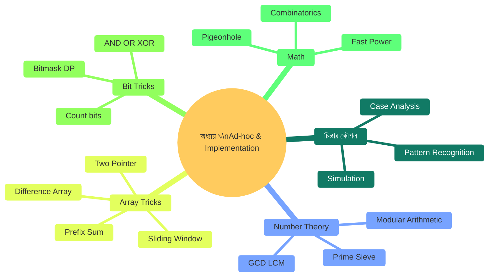
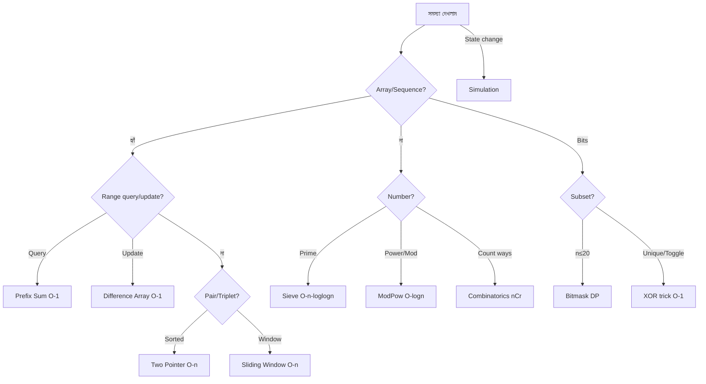

# অধ্যায় ৯: Ad-hoc ও Implementation সমস্যা

> 🎯 **লক্ষ্য:** কোনো নির্দিষ্ট অ্যালগরিদম ছাড়াই — শুধু চিন্তা করে, সিমুলেট করে, সঠিক implementation দিয়ে সমস্যা সমাধান করতে শেখো।

---

<a id="toc"></a>
## 📑 অধ্যায়ের বিষয়সূচি (Chapter TOC)

| # | বিষয় | মূল ট্রিক |
|---|-------|----------|
| [১](#adhoc-intro) | Ad-hoc কী? কীভাবে চিন্তা করবে | Pattern খোঁজো |
| [২](#simulation) | Simulation সমস্যা | ধাপে ধাপে ঘটনা চালাও |
| [৩](#number-theory) | Number Theory Basics | Prime, GCD, Modular |
| [৪](#bit-manipulation) | Bit Manipulation | Bitwise tricks |
| [৫](#prefix-sum) | Prefix Sum ও Difference Array | Range query O(1) |
| [৬](#two-pointer) | Two Pointer ও Sliding Window | O(n²) → O(n) |
| [৭](#math-tricks) | Mathematical Tricks | Combinatorics, Fast Power |
| [৮](#implementation) | Implementation Tips | Edge cases, overflow |

---




---

<a id="adhoc-intro"></a>
## ১. Ad-hoc কী? — চিন্তার কৌশল

---

### ০. বাস্তব জীবনের গল্প 🧩

**গল্প: রিকশাওয়ালার হিসাব**

করিম রিকশা চালায়। একদিন সে ৫টি যাত্রা করল — ৩০, ৪৫, ২০, ৬০, ৩৫ টাকা। সে জানতে চায় সর্বোচ্চ কোন একটানা যাত্রাগুলো মিলিয়ে সবচেয়ে বেশি আয় হয়েছে।

```
যাত্রা: [30, 45, 20, 60, 35]

সব সম্ভাবনা (subarray):
  [30] = 30
  [30,45] = 75
  [30,45,20] = 95
  [30,45,20,60] = 155
  [30,45,20,60,35] = 190 ← সর্বোচ্চ!
  [45] = 45
  ...

এখানে কোনো বিশেষ অ্যালগরিদমের নাম নেই —
শুধু চিন্তা করে বুঝতে হবে: সব ধনাত্মক নম্বর
হলে পুরো array-ই সর্বোচ্চ subarray!
```

---

### ১. Ad-hoc সমস্যা কী?

**Ad-hoc** মানে কোনো পরিচিত algorithm (sorting, DP, graph) সরাসরি প্রযোজ্য নয়। সমস্যার নিজস্ব বৈশিষ্ট্য বুঝে **custom solution** তৈরি করতে হয়।

```
Ad-hoc-এর বৈশিষ্ট্য:
  ✅ Pattern খুঁজে বের করো
  ✅ Small examples-এ হাতে হিসাব করো
  ✅ Special cases আলাদা করো
  ✅ Simulate করো (কাগজে আঁকো)
  ✅ Mathematical shortcut আছে কিনা দেখো

কোথায় পাওয়া যায়:
  🏆 Competitive Programming (Codeforces, LeetCode Easy)
  📝 Puzzle problems
  🎮 Game simulation
  🧮 Math-based problems
```

---

### ২. Problem-Solving Framework

```
সমস্যা পেলে ৫ ধাপ:

১. পড়ো ও বোঝো:
   Input/Output কী? Constraints কত বড়?
   n=10? n=10⁶? সময় limit কত?

২. Small example হাতে করো:
   n=3, n=5 দিয়ে কাগজে সমাধান করো।
   Pattern দেখো।

৩. Pattern চিনো:
   Prefix sum? Two pointer? Math formula?
   কোনো পরিচিত structure?

৪. Brute force → Optimize:
   প্রথমে সহজ O(n²) solution লিখো।
   তারপর optimize করো।

৫. Edge cases:
   n=0, n=1, সব একই, negative, overflow?
```

---

### ৩. Complexity ও Constraint Guide

```
Constraint থেকে Time Complexity আন্দাজ:

n ≤ 10:        O(n!) বা O(2ⁿ) — backtracking ok
n ≤ 20:        O(2ⁿ) — bitmask DP
n ≤ 500:       O(n³) — Floyd-Warshall, Matrix Chain
n ≤ 5,000:     O(n²) — Bubble sort, O(n²) DP
n ≤ 10⁵:       O(n log n) — Sorting, BFS/DFS, Heap
n ≤ 10⁶:       O(n) বা O(n log n) — Linear/near-linear
n ≤ 10⁸:       O(n) শুধু — constant factor গুরুত্বপূর্ণ
n ≤ 10¹⁸:      O(log n) বা O(√n) — Math tricks
```

```
┌────────────────────────────────────────┐
│         সারসংক্ষেপ (Summary)           │
│  কী:     Custom solution per problem  │
│  কেন:    সব সমস্যা known algo নয়     │
│  ধাপ:    Read → Example → Pattern     │
│           → Brute → Optimize          │
│  Trick:  n দেখে complexity আন্দাজ    │
└────────────────────────────────────────┘
```


[⬆ বিষয়সূচিতে ফিরুন](#toc)

---

<a id="simulation"></a>
## ২. Simulation সমস্যা

---

### ০. বাস্তব জীবনের গল্প 🎮

**গল্প: ক্রিকেট ম্যাচের স্কোরবোর্ড**

একটি ক্রিকেট ম্যাচের প্রতি বলের ঘটনা দেওয়া আছে — "0", "1", "2", "4", "6", "W" (wicket)। প্রতি over-এর পরে score ও wicket দেখাও।

```
বলের ঘটনা: ["1","2","W","4","0","6", "1","W","2","0","4","6"]
Over 1: balls=6, runs=1+2+0+4+0+6=13, wickets=1
Over 2: balls=6, runs=1+0+2+0+4+6=13, wickets=1
Total: 26 runs, 2 wickets
```

এটা Simulation — ঘটনাগুলো সরাসরি "চালাও", হিসাব রাখো।

---

### ১. Simulation কী?

**Simulation** সমস্যায় কোনো mathematical formula বা algorithm নেই — শুধু দেওয়া নিয়ম অনুযায়ী ধাপে ধাপে state update করতে হয়।

```
Simulation সমস্যার চেনার উপায়:
  → "প্রতি step-এ এটা করো"
  → "যতক্ষণ condition সত্য, চালিয়ে যাও"
  → State track করতে হয়
  → Output = final state বা event count
```

---

### ৫. সম্পূর্ণ Dart Code

```dart
// ════════════════════════════════════════════════
// Simulation — Cricket Scoreboard + Spiral Matrix
// ════════════════════════════════════════════════

// ক্রিকেট সিমুলেশন
void cricketSimulation(List<String> balls) {
  int runs = 0, wickets = 0, over = 1;
  List<String> overBalls = [];

  for (int i = 0; i < balls.length; i++) {
    String ball = balls[i];
    overBalls.add(ball);

    if (ball == 'W') {
      wickets++;
    } else {
      runs += int.parse(ball);
    }

    // প্রতি ৬ বলে over শেষ
    if (overBalls.length == 6) {
      print('Over $over: ${overBalls.join(",")} → $runs/$wickets');
      over++;
      overBalls = [];
    }
  }
  if (overBalls.isNotEmpty) {
    print('Partial over $over: ${overBalls.join(",")} → $runs/$wickets');
  }
}

// Spiral Matrix — simulation দিয়ে
List<List<int>> spiralMatrix(int n) {
  List<List<int>> mat = List.generate(n, (_) => List.filled(n, 0));
  int top = 0, bottom = n - 1, left = 0, right = n - 1;
  int num = 1;

  while (top <= bottom && left <= right) {
    // বাম থেকে ডান (top row)
    for (int i = left; i <= right; i++) mat[top][i] = num++;
    top++;
    // উপর থেকে নিচ (right col)
    for (int i = top; i <= bottom; i++) mat[i][right] = num++;
    right--;
    // ডান থেকে বাম (bottom row)
    if (top <= bottom) {
      for (int i = right; i >= left; i--) mat[bottom][i] = num++;
      bottom--;
    }
    // নিচ থেকে উপর (left col)
    if (left <= right) {
      for (int i = bottom; i >= top; i--) mat[i][left] = num++;
      left++;
    }
  }
  return mat;
}

// Conway's Game of Life — এক step
List<List<int>> gameOfLifeStep(List<List<int>> board) {
  int m = board.length, n = board[0].length;
  List<List<int>> next = List.generate(m, (i) => List.from(board[i]));

  for (int r = 0; r < m; r++) {
    for (int c = 0; c < n; c++) {
      int alive = 0;
      for (int dr = -1; dr <= 1; dr++) {
        for (int dc = -1; dc <= 1; dc++) {
          if (dr == 0 && dc == 0) continue;
          int nr = r + dr, nc = c + dc;
          if (nr >= 0 && nr < m && nc >= 0 && nc < n && board[nr][nc] == 1) {
            alive++;
          }
        }
      }
      // Conway's rules
      if (board[r][c] == 1 && (alive < 2 || alive > 3)) next[r][c] = 0;
      if (board[r][c] == 0 && alive == 3)               next[r][c] = 1;
    }
  }
  return next;
}

void main() {
  // Cricket
  print('=== Cricket Simulation ===');
  cricketSimulation(['1','2','W','4','0','6', '1','W','2','0','4','6']);

  // Spiral
  print('\n=== Spiral Matrix 4×4 ===');
  var spiral = spiralMatrix(4);
  for (var row in spiral) {
    print('  ${row.map((x) => x.toString().padLeft(3)).join()}');
  }

  // Game of Life
  print('\n=== Game of Life (1 step) ===');
  List<List<int>> board = [
    [0,1,0],
    [0,0,1],
    [1,1,1],
    [0,0,0],
  ];
  var next = gameOfLifeStep(board);
  print('Before:  After:');
  for (int i = 0; i < board.length; i++) {
    print('  ${board[i]}   ${next[i]}');
  }
}

/* Output:
=== Cricket Simulation ===
Over 1: 1,2,W,4,0,6 → 13/1
Over 2: 1,W,2,0,4,6 → 26/2

=== Spiral Matrix 4×4 ===
    1   2   3   4
   12  13  14   5
   11  16  15   6
   10   9   8   7

=== Game of Life (1 step) ===
Before:  After:
  [0, 1, 0]   [0, 0, 0]
  [0, 0, 1]   [1, 0, 1]
  [1, 1, 1]   [0, 1, 1]
  [0, 0, 0]   [0, 1, 0]
*/
```

---

```
┌────────────────────────────────────────┐
│         সারসংক্ষেপ (Summary)           │
│  কী:     State দেখে নিয়ম মেনে update │
│  কখন:    "প্রতি step করো" সমস্যা      │
│  কোথায়: Game, physics, traffic sim   │
│  Time:   O(n × steps) সাধারণত        │
│  Trick:  State আগে clear করো,        │
│           edge আলাদা handle করো      │
└────────────────────────────────────────┘
```


[⬆ বিষয়সূচিতে ফিরুন](#toc)

---

<a id="number-theory"></a>
## ৩. Number Theory Basics

---

### ০. বাস্তব জীবনের গল্প 🔢

**গল্প: বাজারে ভাগ-ভাগি**

৬০ টাকায় লিচু কিনলে এবং ৪৮ টাকায় আম কিনলে, সবচেয়ে বড় সমান ভাগে কতজনকে দেওয়া যাবে?

```
GCD(60, 48) = 12

৬০ ÷ ১২ = ৫ জন লিচু পাবে
৪৮ ÷ ১২ = ৪ জন আম পাবে
সর্বোচ্চ ১২ জনকে সমান ভাগে দেওয়া যাবে।
```

---

### ১. মূল বিষয়গুলো

```
GCD (Greatest Common Divisor):
  gcd(a, b) = gcd(b, a mod b)   ← Euclidean Algorithm
  gcd(a, 0) = a
  Time: O(log min(a,b))

LCM (Least Common Multiple):
  lcm(a, b) = a × b / gcd(a, b)
  ⚠️  Overflow সতর্কতা: a × b আগে overflow হতে পারে!
  Safe: lcm = a / gcd(a,b) × b

Prime Sieve (Sieve of Eratosthenes):
  n পর্যন্ত সব prime O(n log log n)-এ খুঁজে পাও
  সব composite সংখ্যার smallest prime factor store করো

Modular Arithmetic:
  (a + b) % m = ((a % m) + (b % m)) % m
  (a × b) % m = ((a % m) × (b % m)) % m
  (a - b) % m = ((a % m) - (b % m) + m) % m   ← +m for negative!
```

---

### ৩. ধাপে ধাপে Visual

```
Sieve of Eratosthenes (n=20):

Start: [2,3,4,5,6,7,8,9,10,11,12,13,14,15,16,17,18,19,20]

p=2: 4,6,8,10,12,14,16,18,20 মুছে দাও
  [2,3, ,5, ,7, ,9,  ,11,  ,13,  ,15,  ,17,  ,19,   ]

p=3: 9,15 মুছে দাও (6,12,18 already gone)
  [2,3, ,5, ,7, , ,  ,11,  ,13,  ,  ,  ,17,  ,19,   ]

p=5: 25>20, stop!

Primes ≤ 20: [2, 3, 5, 7, 11, 13, 17, 19]

Time: O(n log log n) ≈ O(n) practically

━━━━━━━━━━━━━━━━━━━━━━━━━━━━━━━━━━━━━━━━━━━━━━━━━━━━━

GCD Euclidean:
  gcd(48, 18):
    gcd(48, 18) = gcd(18, 48%18) = gcd(18, 12)
    gcd(18, 12) = gcd(12, 18%12) = gcd(12, 6)
    gcd(12, 6)  = gcd(6, 12%6)  = gcd(6, 0)
    gcd(6, 0)   = 6 ✅
```

---

### ৫. সম্পূর্ণ Dart Code

```dart
// ════════════════════════════════════════════════
// Number Theory — GCD, LCM, Sieve, Modular
// ════════════════════════════════════════════════

// GCD — Euclidean Algorithm
int gcd(int a, int b) => b == 0 ? a : gcd(b, a % b);

// LCM — overflow-safe
int lcm(int a, int b) => a ~/ gcd(a, b) * b;

// Sieve of Eratosthenes
List<bool> sieve(int n) {
  List<bool> isPrime = List.filled(n + 1, true);
  isPrime[0] = isPrime[1] = false;
  for (int i = 2; i * i <= n; i++) {
    if (isPrime[i]) {
      for (int j = i * i; j <= n; j += i) {
        isPrime[j] = false;
      }
    }
  }
  return isPrime;
}

// Prime Factorization (SPF সহ)
List<int> primeFactors(int n) {
  List<int> factors = [];
  for (int p = 2; p * p <= n; p++) {
    while (n % p == 0) { factors.add(p); n ~/= p; }
  }
  if (n > 1) factors.add(n);
  return factors;
}

// Fast Modular Exponentiation: base^exp % mod
int modPow(int base, int exp, int mod) {
  int result = 1;
  base %= mod;
  while (exp > 0) {
    if (exp % 2 == 1) result = result * base % mod;
    base = base * base % mod;
    exp ~/= 2;
  }
  return result;
}

// Modular Inverse (mod must be prime) — Fermat's little theorem
int modInverse(int a, int mod) => modPow(a, mod - 2, mod);

void main() {
  // GCD & LCM
  print('GCD(48, 18) = ${gcd(48, 18)}');         // 6
  print('LCM(12, 18) = ${lcm(12, 18)}');         // 36

  // Sieve
  var isPrime = sieve(50);
  var primes = List.generate(51, (i) => i).where((i) => isPrime[i]).toList();
  print('\nPrimes ≤ 50: $primes');

  // Prime Factorization
  print('\nFactors of 360: ${primeFactors(360)}'); // [2,2,2,3,3,5]
  print('Factors of 100: ${primeFactors(100)}');   // [2,2,5,5]

  // Modular Arithmetic
  const int MOD = 1000000007;
  print('\n2^100 mod 10^9+7 = ${modPow(2, 100, MOD)}');  // 976371285
  print('Inverse of 3 mod 7 = ${modInverse(3, 7)}');     // 5 (3×5=15≡1 mod 7)

  // Number theory tricks
  print('\n--- Useful Facts ---');
  print('Divisors of 12: ${[for(int i=1;i*i<=12;i++) if(12%i==0) ...[i, if(i!=12~/i) 12~/i]]..sort()}');
  print('Euler totient φ(12) = ${[for(int i=1;i<12;i++) if(gcd(i,12)==1) i].length}'); // 4
}

/* Output:
GCD(48, 18) = 6
LCM(12, 18) = 36

Primes ≤ 50: [2, 3, 5, 7, 11, 13, 17, 19, 23, 29, 31, 37, 41, 43, 47]

Factors of 360: [2, 2, 2, 3, 3, 5]
Factors of 100: [2, 2, 5, 5]

2^100 mod 10^9+7 = 976371285
Inverse of 3 mod 7 = 5

--- Useful Facts ---
Divisors of 12: [1, 2, 3, 4, 6, 12]
Euler totient φ(12) = 4
*/
```

---

```
┌────────────────────────────────────────┐
│         সারসংক্ষেপ (Summary)           │
│  GCD:    O(log n) Euclidean           │
│  Sieve:  O(n log log n) all primes    │
│  ModPow: O(log exp) fast power        │
│  ModInv: O(log mod) Fermat's theorem  │
│  কোথায়: Cryptography, combinatorics  │
│           Hash, competitive prog      │
└────────────────────────────────────────┘
```


[⬆ বিষয়সূচিতে ফিরুন](#toc)

---

<a id="bit-manipulation"></a>
## ৪. Bit Manipulation

---

### ০. বাস্তব জীবনের গল্প 💡

**গল্প: আলোর সুইচ**

একটি ঘরে ৮টি আলো আছে। প্রতিটি আলোর অবস্থা on (1) বা off (0)। একটি ৮-bit সংখ্যা দিয়ে পুরো ঘরের অবস্থা বলা যায়!

```
আলো:      8  7  6  5  4  3  2  1
অবস্থা:   1  0  1  0  1  1  0  1  = 173 (decimal)

আলো ৩ জ্বালাও:   173 | (1<<2)  = 173 | 4   = 173 (already on)
আলো ৩ নেভাও:    173 & ~(1<<2) = 173 & 251 = 169
আলো ৩ toggle:   173 ^ (1<<2)  = 173 ^ 4   = 169

এটাই Bit Manipulation!
```

---

### ১. মূল Bitwise Operations

```
& (AND):   উভয়ই 1 হলে 1     → Mask, clear bits
| (OR):    যেকোনো একটি 1    → Set bits
^ (XOR):   ভিন্ন হলে 1      → Toggle, swap, find unique
~ (NOT):   উল্টো             → Complement
<< (SHL):  বাম shift         → × 2
>> (SHR):  ডান shift         → ÷ 2

Common Tricks:
━━━━━━━━━━━━━━━━━━━━━━━━━━━━━━━━━━━━━━━━━━━━━━━━━━━━━
n & 1          → n জোড় না বিজোড়? (0=জোড়, 1=বিজোড়)
n & (n-1)      → n-এর সবচেয়ে ডানের set bit clear করে
                 n & (n-1) == 0 → n = power of 2?
n & (-n)       → সবচেয়ে ডানের set bit isolate করে
x ^ x          → 0 (same number XOR = 0)
x ^ 0          → x (XOR with 0 = same)
a ^ b ^ a      → b (XOR cancel করে)
1 << k         → 2^k
(n >> k) & 1   → n-এর k-তম bit কত?
n | (1 << k)   → k-তম bit set করো
n & ~(1 << k)  → k-তম bit clear করো
n ^ (1 << k)   → k-তম bit toggle করো
```

---

### ৩. ধাপে ধাপে Visual

```
Bitmask Subsets (সব subset enumerate):

n=3 → subset masks 0..7:

000 = {} = ∅
001 = {0}
010 = {1}
011 = {0,1}
100 = {2}
101 = {0,2}
110 = {1,2}
111 = {0,1,2}

for mask in 0..(1<<n)-1:
  for bit in 0..n-1:
    if (mask >> bit) & 1 == 1:
      print("element $bit in subset")

━━━━━━━━━━━━━━━━━━━━━━━━━━━━━━━━━━━━━━━━━━━━━━━━━━━━━

XOR trick — single number:
  [4, 1, 2, 1, 2] → শুধু 4 একবার আছে
  4^1^2^1^2 = 4^(1^1)^(2^2) = 4^0^0 = 4 ✅

Counting set bits (popcount):
  n = 13 = 1101₂ → 3 set bits
  Brian Kernighan:
    13 & 12 = 1100 (count=1)
    12 & 11 = 1000 (count=2)
    8  &  7 = 0000 (count=3) → done!
```

---

### ৫. সম্পূর্ণ Dart Code

```dart
// ════════════════════════════════════════════════
// Bit Manipulation — Tricks & Common Problems
// ════════════════════════════════════════════════

// Set bit count (popcount) — Brian Kernighan
int countBits(int n) {
  int count = 0;
  while (n > 0) { n &= (n - 1); count++; } // ডানের set bit clear
  return count;
}

// Power of 2 চেক
bool isPow2(int n) => n > 0 && (n & (n - 1)) == 0;

// XOR দিয়ে unique number খোঁজা
int findUnique(List<int> arr) => arr.reduce((a, b) => a ^ b);

// k-তম bit operations
bool getBit(int n, int k)   => ((n >> k) & 1) == 1;
int  setBit(int n, int k)   => n | (1 << k);
int  clearBit(int n, int k) => n & ~(1 << k);
int  toggleBit(int n, int k)=> n ^ (1 << k);

// Bitmask: সব subset
void allSubsets(List<String> items) {
  int n = items.length;
  for (int mask = 0; mask < (1 << n); mask++) {
    List<String> subset = [];
    for (int bit = 0; bit < n; bit++) {
      if ((mask >> bit) & 1 == 1) subset.add(items[bit]);
    }
    print('  mask=${'$mask'.padLeft(3)} (${mask.toRadixString(2).padLeft(n,'0')}): $subset');
  }
}

// Bitmask DP — Minimum cost to visit all cities (TSP simplified)
int tspBitmask(List<List<int>> cost) {
  int n = cost.length;
  const int INF = 1 << 29;
  // dp[mask][i] = mask-এর শহর visit করে i-তে শেষ হওয়ার min cost
  List<List<int>> dp = List.generate(
    1 << n, (_) => List.filled(n, INF),
  );
  dp[1][0] = 0; // শুধু শহর 0 visit, শহর 0-এ আছি

  for (int mask = 1; mask < (1 << n); mask++) {
    for (int u = 0; u < n; u++) {
      if (dp[mask][u] == INF) continue;
      if ((mask >> u) & 1 == 0) continue; // u mask-এ নেই
      for (int v = 0; v < n; v++) {
        if ((mask >> v) & 1 == 1) continue; // v already visited
        int newMask = mask | (1 << v);
        if (dp[mask][u] + cost[u][v] < dp[newMask][v]) {
          dp[newMask][v] = dp[mask][u] + cost[u][v];
        }
      }
    }
  }

  int full = (1 << n) - 1;
  int ans = INF;
  for (int u = 1; u < n; u++) {
    if (dp[full][u] + cost[u][0] < ans) ans = dp[full][u] + cost[u][0];
  }
  return ans;
}

void main() {
  // Bit tricks
  print('=== Bit Tricks ===');
  print('countBits(13) = ${countBits(13)}');  // 3 (1101)
  print('isPow2(16) = ${isPow2(16)}');          // true
  print('isPow2(18) = ${isPow2(18)}');          // false
  print('findUnique([4,1,2,1,2]) = ${findUnique([4,1,2,1,2])}'); // 4

  print('\nBit ops on 12 (1100):');
  print('  getBit(12, 2) = ${getBit(12, 2)}');  // true (bit 2 = 1)
  print('  setBit(12, 1) = ${setBit(12, 1)}');  // 14 (1110)
  print('  clearBit(12,3) = ${clearBit(12,3)}');// 4  (0100)
  print('  toggleBit(12,0) = ${toggleBit(12,0)}'); // 13 (1101)

  // Subsets
  print('\n=== All subsets of [A,B,C] ===');
  allSubsets(['A', 'B', 'C']);

  // TSP bitmask DP
  print('\n=== TSP (4 cities) ===');
  List<List<int>> cost = [
    [0, 10, 15, 20],
    [10,  0, 35, 25],
    [15, 35,  0, 30],
    [20, 25, 30,  0],
  ];
  print('Min tour cost = ${tspBitmask(cost)}');  // 80
}

/* Output:
=== Bit Tricks ===
countBits(13) = 3
isPow2(16) = true
isPow2(18) = false
findUnique([4,1,2,1,2]) = 4

Bit ops on 12 (1100):
  getBit(12, 2) = true
  setBit(12, 1) = 14
  clearBit(12,3) = 4
  toggleBit(12,0) = 13

=== All subsets of [A,B,C] ===
  mask=  0 (000): []
  mask=  1 (001): [A]
  mask=  2 (010): [B]
  mask=  3 (011): [A, B]
  mask=  4 (100): [C]
  mask=  5 (101): [A, C]
  mask=  6 (110): [B, C]
  mask=  7 (111): [A, B, C]

=== TSP (4 cities) ===
Min tour cost = 80
*/
```

---

```
┌────────────────────────────────────────┐
│         সারসংক্ষেপ (Summary)           │
│  কী:     Binary level-এ operations    │
│  &:      Mask, clear, check even/odd  │
│  |:      Set bit                      │
│  ^:      Toggle, find unique, swap    │
│  <<:     ×2, bitmask generation       │
│  Mask DP: n≤20 subset enumerate       │
│  Time:   O(1) per operation           │
└────────────────────────────────────────┘
```


[⬆ বিষয়সূচিতে ফিরুন](#toc)

---

<a id="prefix-sum"></a>
## ৫. Prefix Sum ও Difference Array

---

### ০. বাস্তব জীবনের গল্প 🏫

**গল্প: পরীক্ষার নম্বরের যোগফল**

একটি ক্লাসের ১০০ জন ছাত্রের নম্বর আছে। বারবার প্রশ্ন আসছে: "ছাত্র ৫ থেকে ৩০-এর মোট নম্বর কত?" প্রতিবার লুপ চালালে O(n)। কিন্তু Prefix Sum দিয়ে প্রতিটি query O(1)!

---

### ১. Prefix Sum কী?

```
Array:     [3, 1, 4, 1, 5, 9, 2, 6]
idx:        0  1  2  3  4  5  6  7

Prefix:    [0, 3, 4, 8, 9,14,23,25,31]
(prefix[0]=0 রাখলে সুবিধা)
prefix[i] = prefix[i-1] + arr[i-1]

Range Sum [l..r] (0-indexed):
  sum = prefix[r+1] - prefix[l]

Example: sum[2..5] = prefix[6] - prefix[2] = 23 - 4 = 19
Verify: 4+1+5+9 = 19 ✅

Build: O(n),  Query: O(1)  ← O(n) থেকে O(1)!
```

---

### ২. Difference Array

```
Difference Array — Range update O(1):

Problem: একটি array-তে বারবার range [l..r]-এ x যোগ করো।

Naive: প্রতি update O(n) → q queries = O(n×q) ❌
Diff Array: প্রতি update O(1), শেষে prefix sum O(n) ✅

diff[l] += x
diff[r+1] -= x
(শেষে prefix sum নিলে actual array পাওয়া যায়)

Example:
arr  = [0, 0, 0, 0, 0]
query: [1..3] += 3:  diff=[0,3,0,0,-3]
query: [2..4] += 2:  diff=[0,3,2,0,-3+(-2)]=[0,3,2,0,-5]... wait
Actually diff[r+1] -= x properly:
diff=[0,0,0,0,0,0] (size n+1)
[1..3] += 3: diff[1]+=3, diff[4]-=3 → [0,3,0,0,-3,0]
[2..4] += 2: diff[2]+=2, diff[5]-=2 → [0,3,2,0,-3,-2]

Prefix sum of diff: [0,3,5,5,2,0]
idx:                  0 1 2 3 4
actual[i] = prefix[i]
```

---

### ৫. সম্পূর্ণ Dart Code

```dart
// ════════════════════════════════════════════════
// Prefix Sum + Difference Array + 2D Prefix Sum
// ════════════════════════════════════════════════

// 1D Prefix Sum
class PrefixSum {
  late List<int> prefix;

  PrefixSum(List<int> arr) {
    int n = arr.length;
    prefix = List.filled(n + 1, 0);
    for (int i = 0; i < n; i++) prefix[i + 1] = prefix[i] + arr[i];
  }

  // [l..r] sum (0-indexed, inclusive)
  int query(int l, int r) => prefix[r + 1] - prefix[l];
}

// Difference Array — range update
class DifferenceArray {
  late List<int> diff;
  final int n;

  DifferenceArray(this.n) {
    diff = List.filled(n + 1, 0);
  }

  // [l..r]-এ x যোগ করো
  void update(int l, int r, int x) {
    diff[l] += x;
    if (r + 1 <= n) diff[r + 1] -= x;
  }

  // Final array বের করো
  List<int> build() {
    List<int> arr = List.filled(n, 0);
    arr[0] = diff[0];
    for (int i = 1; i < n; i++) arr[i] = arr[i - 1] + diff[i];
    return arr;
  }
}

// 2D Prefix Sum
class PrefixSum2D {
  late List<List<int>> prefix;
  final int rows, cols;

  PrefixSum2D(List<List<int>> mat) :
      rows = mat.length, cols = mat[0].length {
    prefix = List.generate(rows + 1, (_) => List.filled(cols + 1, 0));
    for (int r = 1; r <= rows; r++) {
      for (int c = 1; c <= cols; c++) {
        prefix[r][c] = mat[r-1][c-1]
            + prefix[r-1][c] + prefix[r][c-1]
            - prefix[r-1][c-1]; // inclusion-exclusion
      }
    }
  }

  // (r1,c1)..(r2,c2) sum (0-indexed, inclusive)
  int query(int r1, int c1, int r2, int c2) {
    return prefix[r2+1][c2+1]
         - prefix[r1][c2+1]
         - prefix[r2+1][c1]
         + prefix[r1][c1];
  }
}

void main() {
  // 1D Prefix Sum
  var arr  = [3, 1, 4, 1, 5, 9, 2, 6];
  var ps   = PrefixSum(arr);
  print('Array: $arr');
  print('Sum[0..7] = ${ps.query(0, 7)}');  // 31
  print('Sum[2..5] = ${ps.query(2, 5)}');  // 19 (4+1+5+9)
  print('Sum[3..3] = ${ps.query(3, 3)}');  //  1

  // Difference Array
  print('\n--- Difference Array ---');
  var da = DifferenceArray(5);
  da.update(1, 3, 3); // index 1..3 += 3
  da.update(2, 4, 2); // index 2..4 += 2
  print('After updates: ${da.build()}');   // [0, 3, 5, 5, 2]

  // 2D Prefix Sum
  print('\n--- 2D Prefix Sum ---');
  var mat = [
    [1, 2, 3, 4],
    [5, 6, 7, 8],
    [9,10,11,12],
  ];
  var ps2d = PrefixSum2D(mat);
  print('Matrix:');
  for (var row in mat) print('  $row');
  print('Sum (0,0)..(1,2) = ${ps2d.query(0,0,1,2)}'); // 1+2+3+5+6+7=24
  print('Sum (1,1)..(2,3) = ${ps2d.query(1,1,2,3)}'); // 6+7+8+10+11+12=54
}

/* Output:
Array: [3, 1, 4, 1, 5, 9, 2, 6]
Sum[0..7] = 31
Sum[2..5] = 19
Sum[3..3] = 1

--- Difference Array ---
After updates: [0, 3, 5, 5, 2]

--- 2D Prefix Sum ---
Matrix:
  [1, 2, 3, 4]
  [5, 6, 7, 8]
  [9, 10, 11, 12]
Sum (0,0)..(1,2) = 24
Sum (1,1)..(2,3) = 54
*/
```

---

```
┌────────────────────────────────────────┐
│         সারসংক্ষেপ (Summary)           │
│  Prefix Sum:  Build O(n), Query O(1)  │
│  Diff Array:  Update O(1), Build O(n) │
│  2D Prefix:   Build O(n²), Query O(1) │
│  কোথায়:      Range sum, heat map     │
│               bulk update, submatrix  │
└────────────────────────────────────────┘
```


[⬆ বিষয়সূচিতে ফিরুন](#toc)

---

<a id="two-pointer"></a>
## ৬. Two Pointer ও Sliding Window

---

### ০. বাস্তব জীবনের গল্প 🎯

**গল্প: পুলিশের দুই প্রান্ত**

একটি লাইনে সন্দেহভাজনরা দাঁড়িয়ে আছে। পুলিশের দুইজন অফিসার দুই প্রান্ত থেকে মাঝে আসছে। একসাথে দুটো পয়েন্ট maintain করে অনেক সমস্যা O(n²) থেকে O(n)-এ solve হয়।

---

### ১. Two Pointer কী?

```
Two Pointer:
  দুটো index i, j একই array-তে চলে।
  সাধারণত: i=0, j=n-1 (opposite ends)
  বা:        i=0, j=1 (same direction, different speed)

Sliding Window:
  Fixed বা Variable size window।
  Window = [left..right]।
  left বা right একদিকেই চলে।

কোন সমস্যায়?
  ✅ Two Sum (sorted array)
  ✅ Max subarray sum (of size k)
  ✅ Longest substring without repeat
  ✅ Container with most water
  ✅ Palindrome check
```

---

### ৩. ধাপে ধাপে Visual

```
Two Sum (sorted array: target=9):
arr = [1, 2, 4, 5, 7, 8]
       ↑               ↑
       L               R

L=1, R=8: sum=9 == target ✅ → (1,8)

━━━━━━━━━━━━━━━━━━━━━━━━━━━━━━━━━━━━━━━━━━━━━━━━━━━━━

Sliding Window (max sum subarray of size k=3):
arr = [2, 1, 5, 1, 3, 2], k=3

Window [0..2]: sum = 2+1+5 = 8
Window [1..3]: sum = 8 - arr[0] + arr[3] = 8-2+1 = 7
Window [2..4]: sum = 7 - arr[1] + arr[4] = 7-1+3 = 9  ← max!
Window [3..5]: sum = 9 - arr[2] + arr[5] = 9-5+2 = 6

Max sum = 9 (subarray [5,1,3])

━━━━━━━━━━━━━━━━━━━━━━━━━━━━━━━━━━━━━━━━━━━━━━━━━━━━━

Variable Window (longest substring no repeat):
s = "abcabcbb"
    ↑
    L=0, R=0

R=0: set={a}, len=1
R=1: set={a,b}, len=2
R=2: set={a,b,c}, len=3 ← max so far
R=3: 'a' already in set!
  L moves: remove s[0]='a', L=1, set={b,c}
  add 'a': set={b,c,a}, len=3
R=4: 'b' in set!
  L=2, remove 'b', set={c,a}, add 'b', len=3
...
Answer: 3 ("abc")
```

---

### ৫. সম্পূর্ণ Dart Code

```dart
// ════════════════════════════════════════════════
// Two Pointer + Sliding Window Problems
// ════════════════════════════════════════════════

// ১. Two Sum in sorted array
List<int>? twoSum(List<int> arr, int target) {
  int l = 0, r = arr.length - 1;
  while (l < r) {
    int sum = arr[l] + arr[r];
    if (sum == target) return [arr[l], arr[r]];
    if (sum < target) l++;
    else r--;
  }
  return null;
}

// ২. Fixed window max sum
int maxSumFixed(List<int> arr, int k) {
  int n = arr.length;
  if (n < k) return -1;

  // First window
  int windowSum = arr.sublist(0, k).reduce((a,b) => a+b);
  int maxSum    = windowSum;

  // Slide
  for (int i = k; i < n; i++) {
    windowSum += arr[i] - arr[i - k]; // নতুন যোগ, পুরনো বাদ
    if (windowSum > maxSum) maxSum = windowSum;
  }
  return maxSum;
}

// ৩. Longest substring without repeating characters
int longestNoRepeat(String s) {
  Map<String, int> lastSeen = {};
  int maxLen = 0, left = 0;

  for (int right = 0; right < s.length; right++) {
    String c = s[right];
    if (lastSeen.containsKey(c) && lastSeen[c]! >= left) {
      left = lastSeen[c]! + 1; // Window shrink
    }
    lastSeen[c] = right;
    int len = right - left + 1;
    if (len > maxLen) maxLen = len;
  }
  return maxLen;
}

// ৪. Container with most water
int maxWater(List<int> heights) {
  int l = 0, r = heights.length - 1, maxVol = 0;
  while (l < r) {
    int vol = (r - l) * (heights[l] < heights[r] ? heights[l] : heights[r]);
    if (vol > maxVol) maxVol = vol;
    if (heights[l] < heights[r]) l++;
    else r--;
  }
  return maxVol;
}

// ৫. 3Sum (all triplets summing to 0)
List<List<int>> threeSum(List<int> nums) {
  nums.sort();
  List<List<int>> result = [];

  for (int i = 0; i < nums.length - 2; i++) {
    if (i > 0 && nums[i] == nums[i-1]) continue; // duplicate skip
    int l = i + 1, r = nums.length - 1;
    while (l < r) {
      int sum = nums[i] + nums[l] + nums[r];
      if (sum == 0) {
        result.add([nums[i], nums[l], nums[r]]);
        while (l < r && nums[l] == nums[l+1]) l++;
        while (l < r && nums[r] == nums[r-1]) r--;
        l++; r--;
      } else if (sum < 0) l++;
      else r--;
    }
  }
  return result;
}

void main() {
  print('twoSum([1,2,4,5,7,8], 9) = ${twoSum([1,2,4,5,7,8], 9)}');
  // [1, 8]

  print('maxSumFixed([2,1,5,1,3,2], k=3) = ${maxSumFixed([2,1,5,1,3,2], 3)}');
  // 9

  print('longestNoRepeat("abcabcbb") = ${longestNoRepeat("abcabcbb")}');
  // 3

  print('longestNoRepeat("pwwkew") = ${longestNoRepeat("pwwkew")}');
  // 3

  print('maxWater([1,8,6,2,5,4,8,3,7]) = ${maxWater([1,8,6,2,5,4,8,3,7])}');
  // 49

  print('3Sum([-1,0,1,2,-1,-4]) = ${threeSum([-1,0,1,2,-1,-4])}');
  // [[-1,-1,2],[-1,0,1]]
}

/* Output:
twoSum([1,2,4,5,7,8], 9) = [1, 8]
maxSumFixed([2,1,5,1,3,2], k=3) = 9
longestNoRepeat("abcabcbb") = 3
longestNoRepeat("pwwkew") = 3
maxWater([1,8,6,2,5,4,8,3,7]) = 49
3Sum([-1,0,1,2,-1,-4]) = [[-1, -1, 2], [-1, 0, 1]]
*/
```

---

```
┌────────────────────────────────────────┐
│         সারসংক্ষেপ (Summary)           │
│  Two Pointer:  Sorted, opposite ends  │
│  Fixed Window: Slide by 1             │
│  Var Window:   Shrink when invalid    │
│  কোথায়:       Two sum, substring     │
│                container, 3sum        │
│  Time:  O(n) — O(n²) থেকে মুক্তি    │
└────────────────────────────────────────┘
```


[⬆ বিষয়সূচিতে ফিরুন](#toc)

---

<a id="math-tricks"></a>
## ৭. Mathematical Tricks

---

### ০. বাস্তব জীবনের গল্প 🎲

**গল্প: ক্রিকেট দলের বাছাই**

১৫ জন ক্রিকেটার থেকে ১১ জনের দল তৈরি করতে কতভাবে পারা যায়?

```
C(15, 11) = C(15, 4) = 15! / (4! × 11!) = 1365

DP দিয়ে Pascal's Triangle:
  C(n, k) = C(n-1, k-1) + C(n-1, k)

কিন্তু n বড় হলে (n=10⁶), overflow হয়!
তখন modular arithmetic + factorial precompute।
```

---

### ৫. সম্পূর্ণ Dart Code

```dart
// ════════════════════════════════════════════════
// Math Tricks — Combinatorics, Fast Power, etc.
// ════════════════════════════════════════════════

const int MOD = 1000000007;

// Fast modular exponentiation
int modPow(int base, int exp, int mod) {
  int result = 1; base %= mod;
  while (exp > 0) {
    if (exp & 1 == 1) result = result * base % mod;
    base = base * base % mod;
    exp >>= 1;
  }
  return result;
}

// Factorial precompute + modular inverse for nCr
class Combinatorics {
  late List<int> fact, inv;
  final int n;

  Combinatorics(this.n) {
    fact = List.filled(n + 1, 1);
    inv  = List.filled(n + 1, 1);
    for (int i = 1; i <= n; i++) fact[i] = fact[i-1] * i % MOD;
    inv[n] = modPow(fact[n], MOD - 2, MOD);
    for (int i = n - 1; i >= 0; i--) inv[i] = inv[i+1] * (i+1) % MOD;
  }

  int nCr(int n, int r) {
    if (r < 0 || r > n) return 0;
    return fact[n] * inv[r] % MOD * inv[n - r] % MOD;
  }
}

// Pascal's Triangle (small n)
List<List<int>> pascalTriangle(int rows) {
  List<List<int>> t = [];
  for (int i = 0; i < rows; i++) {
    List<int> row = List.filled(i + 1, 1);
    for (int j = 1; j < i; j++) row[j] = t[i-1][j-1] + t[i-1][j];
    t.add(row);
  }
  return t;
}

// Catalan Numbers: C(n) = C(2n,n) / (n+1)
int catalan(int n, Combinatorics comb) {
  return comb.nCr(2 * n, n) * modPow(n + 1, MOD - 2, MOD) % MOD;
}

// Fibonacci via Matrix Exponentiation O(log n)
List<List<int>> matMul(List<List<int>> A, List<List<int>> B) {
  int n = A.length;
  var C = List.generate(n, (_) => List.filled(n, 0));
  for (int i = 0; i < n; i++)
    for (int k = 0; k < n; k++)
      for (int j = 0; j < n; j++)
        C[i][j] = (C[i][j] + A[i][k] * B[k][j]) % MOD;
  return C;
}

List<List<int>> matPow(List<List<int>> M, int p) {
  int n = M.length;
  var result = List.generate(n, (i) => List.generate(n, (j) => i == j ? 1 : 0));
  while (p > 0) {
    if (p & 1 == 1) result = matMul(result, M);
    M = matMul(M, M);
    p >>= 1;
  }
  return result;
}

int fibMatrix(int n) {
  if (n <= 1) return n;
  var M = [[1,1],[1,0]];
  return matPow(M, n)[0][1];
}

void main() {
  // Combinatorics
  var comb = Combinatorics(1000);
  print('C(15,4) = ${comb.nCr(15, 4)}');     // 1365
  print('C(10,5) = ${comb.nCr(10, 5)}');     // 252
  print('C(50,25) mod 10^9+7 = ${comb.nCr(50, 25)}');

  // Pascal's Triangle
  print('\nPascal Triangle (6 rows):');
  for (var row in pascalTriangle(6)) {
    print('  $row');
  }

  // Catalan numbers
  print('\nCatalan numbers C(0)..C(6):');
  print(List.generate(7, (n) => catalan(n, comb)));
  // [1, 1, 2, 5, 14, 42, 132]

  // Fibonacci O(log n)
  print('\nFib(10) = ${fibMatrix(10)}');    // 55
  print('Fib(50) = ${fibMatrix(50)}');      // large number % MOD

  // Useful formulas
  print('\n--- Useful Formulas ---');
  print('Sum 1..n = n(n+1)/2: n=100 → ${100*101~/2}');      // 5050
  print('Sum of squares 1..n: n=10 → ${10*11*21~/6}');       // 385
  print('Sum of cubes 1..n = (n(n+1)/2)²: n=5 → ${(5*6~/2)*(5*6~/2)}'); // 225
}

/* Output:
C(15,4) = 1365
C(10,5) = 252
C(50,25) mod 10^9+7 = 126410606

Pascal Triangle (6 rows):
  [1]
  [1, 1]
  [1, 2, 1]
  [1, 3, 3, 1]
  [1, 4, 6, 4, 1]
  [1, 5, 10, 10, 5, 1]

Catalan numbers C(0)..C(6):
[1, 1, 2, 5, 14, 42, 132]

Fib(10) = 55
Fib(50) = 586268941

--- Useful Formulas ---
Sum 1..n = n(n+1)/2: n=100 → 5050
Sum of squares 1..n: n=10 → 385
Sum of cubes 1..n = (n(n+1)/2)²: n=5 → 225
*/
```

---

```
┌────────────────────────────────────────┐
│         সারসংক্ষেপ (Summary)           │
│  nCr:      Precompute fact + inv      │
│  ModPow:   O(log exp) fast power      │
│  Pascal:   O(n²) small n              │
│  Catalan:  BST count, Dyck paths      │
│  Fib Mat:  O(log n) matrix exp        │
│  MOD:      10^9+7 (prime) সবসময়      │
└────────────────────────────────────────┘
```


[⬆ বিষয়সূচিতে ফিরুন](#toc)

---

<a id="implementation"></a>
## ৮. Implementation Tips — Edge Cases ও Overflow

---

### ১. সবচেয়ে বেশি যে ভুল হয়

```
ভুল ১: Integer Overflow
  int a = 1000000, b = 1000000;
  int c = a * b;  // 10^12 > 2^31-1 ≈ 2.1×10^9 → OVERFLOW!
  ✅ Dart-এ int = 64-bit, কিন্তু সতর্ক থাকো।
  ✅ Intermediate calculation-এও mod নাও।

ভুল ২: Off-by-one Error
  for (int i = 0; i <= n; i++)  ← n+1 iteration, সঠিক?
  array[n] → index out of bounds!
  prefix[r+1] - prefix[l] → সঠিক range?

ভুল ৩: Empty Input
  List.reduce() on empty list → exception!
  সবসময় n==0 check করো।

ভুল ৪: Negative mod
  (-3) % 7 = -3 in Dart (not 4!)
  Fix: ((a % m) + m) % m

ভুল ৫: Double precision
  0.1 + 0.2 != 0.3 in floating point!
  Geometry-তে epsilon = 1e-9 ব্যবহার করো।
```

---

### ৫. Implementation Dart Code

```dart
// ════════════════════════════════════════════════
// Implementation Tips — Overflow, Mod, Edge Cases
// ════════════════════════════════════════════════

void main() {
  // Overflow সতর্কতা
  int a = 1000000000, b = 1000000000;
  print('Without care: ${a * b}');           // Dart 64-bit, ok here
  print('With mod: ${a % 1000000007 * (b % 1000000007) % 1000000007}');

  // Negative mod fix
  int negMod(int a, int m) => ((a % m) + m) % m;
  print('\nnegMod(-3, 7) = ${negMod(-3, 7)}');  // 4

  // Safe max/min without overflow
  int safeAdd(int a, int b) {
    const int MAX = 1 << 60;
    if (a > MAX - b) return MAX; // overflow → cap at INF
    return a + b;
  }

  // Integer sqrt (floor)
  int isqrt(int n) {
    int x = n;
    while (x * x > n) x = (x + n ~/ x) ~/ 2;
    return x;
  }
  print('isqrt(25) = ${isqrt(25)}');  // 5
  print('isqrt(26) = ${isqrt(26)}');  // 5

  // Floating point comparison
  bool doubleEq(double a, double b, [double eps = 1e-9]) =>
      (a - b).abs() < eps;
  print('0.1+0.2 == 0.3: ${0.1+0.2 == 0.3}');              // false!
  print('doubleEq(0.1+0.2, 0.3): ${doubleEq(0.1+0.2, 0.3)}'); // true

  // Common patterns
  print('\n--- Common Patterns ---');

  // Max subarray (Kadane's)
  List<int> arr = [-2,1,-3,4,-1,2,1,-5,4];
  int maxSub = arr[0], cur = arr[0];
  for (int i = 1; i < arr.length; i++) {
    cur = cur > 0 ? cur + arr[i] : arr[i];
    if (cur > maxSub) maxSub = cur;
  }
  print('Max subarray of $arr = $maxSub');  // 6

  // Count digits
  int countDigits(int n) => n.toString().length;
  print('digits(12345) = ${countDigits(12345)}');  // 5

  // Digit sum
  int digitSum(int n) => n.toString().split('').map(int.parse).reduce((a,b)=>a+b);
  print('digitSum(9876) = ${digitSum(9876)}');  // 30

  // Check palindrome
  bool isPalin(String s) => s == s.split('').reversed.join();
  print('isPalin("racecar") = ${isPalin("racecar")}'); // true
  print('isPalin("hello") = ${isPalin("hello")}');     // false
}

/* Output:
Without care: 1000000000000000000
With mod: 49

negMod(-3, 7) = 4
isqrt(25) = 5
isqrt(26) = 5
0.1+0.2 == 0.3: false!
doubleEq(0.1+0.2, 0.3): true

--- Common Patterns ---
Max subarray of [-2, 1, -3, 4, -1, 2, 1, -5, 4] = 6
digits(12345) = 5
digitSum(9876) = 30
isPalin("racecar") = true
isPalin("hello") = false
*/
```

---

```
┌────────────────────────────────────────┐
│         সারসংক্ষেপ (Summary)           │
│  Overflow:  64-bit, intermediate mod  │
│  Neg mod:   ((a%m)+m)%m               │
│  Off-by-1:  loop bound সবসময় check   │
│  Float:     epsilon comparison        │
│  Edge:      n=0, n=1, all equal,     │
│             negative, max int        │
└────────────────────────────────────────┘
```

---


[⬆ বিষয়সূচিতে ফিরুন](#toc)

## 📊 অধ্যায় ৯ সমাপ্তি — সম্পূর্ণ তুলনা

```
┌──────────────────────┬─────────────────────────────────────┬──────────────┬─────────────────────────────┐
│ Technique            │ কী করে                              │ Time         │ Use Case                    │
├──────────────────────┼─────────────────────────────────────┼──────────────┼─────────────────────────────┤
│ Simulation           │ ধাপে ধাপে state update              │ O(n × steps) │ Games, physics, scoreboard  │
│ Sieve of Eratosthenes│ সব prime ≤ n                        │ O(n log logn)│ Prime check, factorization  │
│ GCD (Euclidean)      │ gcd(a,b)                            │ O(log n)     │ Fraction, LCM               │
│ Modular Exponentiation│ base^exp % mod                     │ O(log exp)   │ Crypto, large power         │
│ Bit Manipulation     │ Bitmask, set/clear/toggle           │ O(1) per op  │ Subset DP, flags            │
│ Prefix Sum           │ Range sum query                     │ O(1) query   │ Range sum, 2D matrix        │
│ Difference Array     │ Range update                        │ O(1) update  │ Bulk increment              │
│ Two Pointer          │ O(n²) → O(n) with 2 indices        │ O(n)         │ Two sum, 3sum, palindrome   │
│ Sliding Window       │ Window maintain করো                 │ O(n)         │ Max subarray, no-repeat str │
│ Combinatorics (nCr)  │ Precompute fact, modular inverse    │ O(n) build   │ Counting, probability       │
└──────────────────────┴─────────────────────────────────────┴──────────────┴─────────────────────────────┘
```

---

### সমস্যা দেখলে যা মাথায় আসবে

```
"Range sum" বা "subarray sum" দেখলে → Prefix Sum
"Update range, query single" দেখলে  → Difference Array
"Sorted array, pair/triplet" দেখলে  → Two Pointer
"Substring, window" দেখলে          → Sliding Window
"Subset, combination" দেখলে        → Bitmask (n≤20)
"Find odd-one-out" দেখলে           → XOR trick
"Large power, mod" দেখলে          → ModPow
"Count ways" দেখলে                → Combinatorics + DP
"All primes ≤ n" দেখলে            → Sieve
"Simulation" — সরাসরি চালাও        → State machine
```



---

*অধ্যায় ৯ সম্পন্ন ✅*  
*পরবর্তী: অধ্যায় ১০ — জ্যামিতি (Computational Geometry)*
