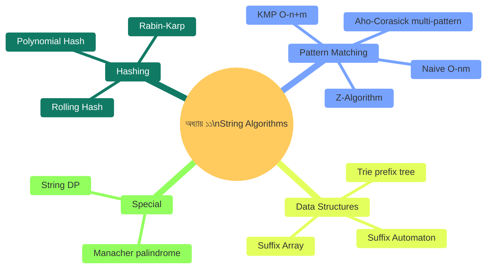
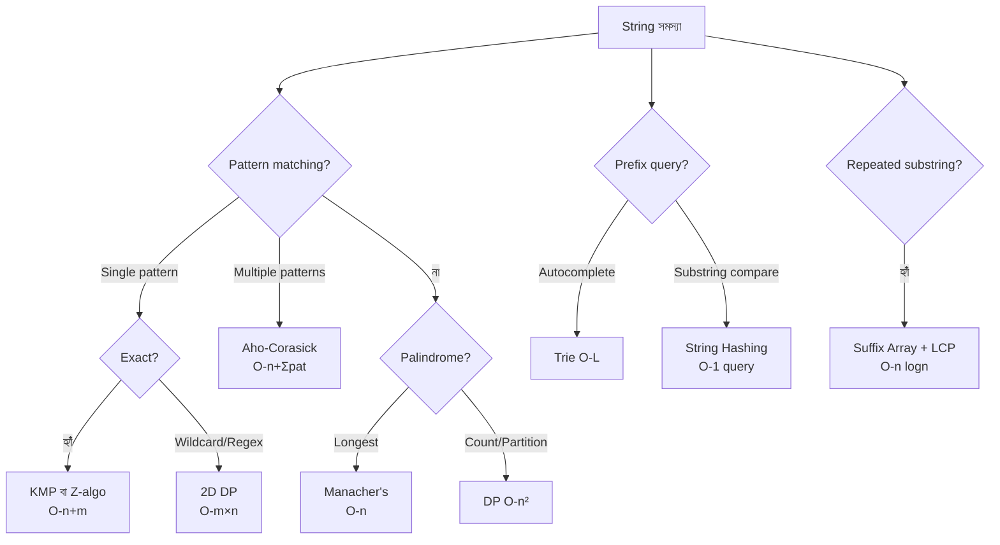

# অধ্যায় ১১: স্ট্রিং অ্যালগরিদম (String Algorithms)

> 🎯 **লক্ষ্য:** টেক্সট search, pattern matching, DNA analysis — সবই String। হ্যাশিং থেকে KMP, Trie থেকে Suffix Array পর্যন্ত গল্পে, ছবিতে, Dart কোডে শেখো।

---

<a id="toc"></a>
## 📑 অধ্যায়ের বিষয়সূচি (Chapter TOC)

| # | বিষয় | মূল ট্রিক |
|---|-------|----------|
| [১](#string-basics) | String Basics ও Hashing | Polynomial hash, Rabin-Karp |
| [২](#kmp) | KMP Pattern Matching | Failure function, O(n+m) |
| [৩](#z-algo) | Z-Algorithm | Z-array, linear time |
| [৪](#trie) | Trie (Prefix Tree) | O(L) insert/search |
| [৫](#suffix-array) | Suffix Array | SA + LCP array |
| [৬](#manacher) | Manacher's Algorithm | Longest Palindrome O(n) |
| [৭](#aho-corasick) | Aho-Corasick | Multi-pattern matching |
| [৮](#string-dp) | String DP সমস্যা | Regex, wildcard matching |

---




---

<a id="string-basics"></a>
## ১. String Basics ও Hashing

---

### ০. বাস্তব জীবনের গল্প 🔍

**গল্প: লাইব্রেরিতে বই খোঁজা**

একটি বিশাল লাইব্রেরিতে লক্ষাধিক বইয়ের নাম আছে। তুমি "algorithm" শব্দটি কোথায় আছে খুঁজছ। প্রতিটি নাম অক্ষরে অক্ষরে তুলনা করলে চিরকাল লাগবে। কিন্তু প্রতিটি বইয়ের নামের একটি **সংক্ষিপ্ত সংখ্যা (hash)** রাখলে — শুধু সেই সংখ্যা মিলিয়ে দেখো!

```
"algorithm" → hash = 2847392
"algebriac" → hash = 3918472  ← আলাদা!

প্রথমে hash মেলাও → মিললে তবে character মেলাও।
বেশিরভাগ false match ধরা পড়ে O(1)-এ!
```

---

### ১. String Hashing কী?

**Polynomial Hashing** একটি string-কে একটি সংখ্যায় পরিণত করে যেন:
- সমান string → সমান hash (সবসময়)
- আলাদা string → আলাদা hash (প্রায়ই)

```
Formula:
  hash(s) = s[0]×p⁰ + s[1]×p¹ + s[2]×p² + ... + s[n-1]×p^(n-1)  (mod m)
  
  p = prime base (সাধারণত 31 বা 37 for lowercase)
  m = large prime (1e9+7 বা 1e9+9)

Example: "abc", p=31, m=10^9+7
  hash = 1×1 + 2×31 + 3×961 = 1 + 62 + 2883 = 2946

Rolling Hash (Rabin-Karp-এ ব্যবহার):
  Window [i..i+k-1] → Window [i+1..i+k]:
  new_hash = (old_hash - s[i]) / p + s[i+k] × p^(k-1)
  
  বাদ দাও বাম, যোগ করো ডান — O(1)-এ!
```

---

### ৩. ধাপে ধাপে Visual — Rabin-Karp

```
Text:    "ABCABCABC"
Pattern: "ABC"  (k=3)

Pattern hash = hash("ABC")

Sliding window:
  Window [0..2] = "ABC": hash match? → verify → ✅ match at 0
  Window [1..3] = "BCA": hash ≠ → skip ❌
  Window [2..4] = "CAB": hash ≠ → skip ❌
  Window [3..5] = "ABC": hash match? → verify → ✅ match at 3
  Window [4..6] = "BCA": hash ≠ → skip ❌
  Window [5..7] = "CAB": hash ≠ → skip ❌
  Window [6..8] = "ABC": hash match? → verify → ✅ match at 6

Matches at: [0, 3, 6]

Naive: O(n×m) worst case
Rabin-Karp: O(n+m) average (hash collision থাকলে worst O(nm))
```

---

### ৫. সম্পূর্ণ Dart Code

```dart
// ════════════════════════════════════════════════
// String Hashing + Rabin-Karp Pattern Matching
// ════════════════════════════════════════════════

const int BASE  = 31;
const int MOD1  = 1000000007;
const int MOD2  = 998244353; // Double hashing for fewer collisions

// Polynomial Hash (0-indexed)
class StringHash {
  late List<int> h1, h2, pw1, pw2;
  final String s;

  StringHash(this.s) {
    int n = s.length;
    h1  = List.filled(n + 1, 0);
    h2  = List.filled(n + 1, 0);
    pw1 = List.filled(n + 1, 1);
    pw2 = List.filled(n + 1, 1);

    for (int i = 0; i < n; i++) {
      int c = s.codeUnitAt(i) - 'a'.codeUnitAt(0) + 1;
      h1[i+1]  = (h1[i]  * BASE + c) % MOD1;
      h2[i+1]  = (h2[i]  * BASE + c) % MOD2;
      pw1[i+1] = pw1[i]  * BASE % MOD1;
      pw2[i+1] = pw2[i]  * BASE % MOD2;
    }
  }

  // [l..r] substring-এর hash (0-indexed, inclusive)
  (int, int) getHash(int l, int r) {
    int len  = r - l + 1;
    int hash1 = (h1[r+1] - h1[l] * pw1[len] % MOD1 + MOD1 * 2) % MOD1;
    int hash2 = (h2[r+1] - h2[l] * pw2[len] % MOD2 + MOD2 * 2) % MOD2;
    return (hash1, hash2);
  }

  // দুটো substring সমান কিনা O(1)-এ
  bool equal(int l1, int r1, int l2, int r2) =>
      getHash(l1, r1) == getHash(l2, r2);
}

// Rabin-Karp Pattern Matching
List<int> rabinKarp(String text, String pattern) {
  int n = text.length, m = pattern.length;
  if (m > n) return [];

  var th = StringHash(text);
  var ph = StringHash(pattern);
  var patHash = ph.getHash(0, m - 1);

  List<int> matches = [];
  for (int i = 0; i <= n - m; i++) {
    if (th.getHash(i, i + m - 1) == patHash) {
      // Hash match → verify (double hashing-এ সাধারণত verify লাগে না)
      matches.add(i);
    }
  }
  return matches;
}

// Longest Duplicate Substring (Binary search + hashing)
String longestDupSubstring(String s) {
  int n = s.length;
  var sh = StringHash(s);

  bool hasDup(int len) {
    Set<(int,int)> seen = {};
    for (int i = 0; i <= n - len; i++) {
      var h = sh.getHash(i, i + len - 1);
      if (seen.contains(h)) return true;
      seen.add(h);
    }
    return false;
  }

  int lo = 0, hi = n - 1, best = 0;
  String bestStr = '';
  while (lo <= hi) {
    int mid = (lo + hi) ~/ 2;
    if (hasDup(mid)) {
      best = mid; lo = mid + 1;
    } else {
      hi = mid - 1;
    }
  }

  // Find the actual substring
  if (best > 0) {
    Set<(int,int)> seen = {};
    for (int i = 0; i <= n - best; i++) {
      var h = sh.getHash(i, i + best - 1);
      if (seen.contains(h)) { bestStr = s.substring(i, i + best); break; }
      seen.add(h);
    }
  }
  return bestStr;
}

void main() {
  // Rabin-Karp
  print('Rabin-Karp Pattern Matching:');
  var matches = rabinKarp('ABCABCABC', 'ABC');
  print('  "ABC" in "ABCABCABC": positions=$matches');     // [0, 3, 6]

  matches = rabinKarp('aababab', 'abab');
  print('  "abab" in "aababab": positions=$matches');      // [1, 3]

  // Substring equality O(1)
  var sh = StringHash('abcabcabc');
  print('\nSubstring equality:');
  print('  s[0..2] == s[3..5]: ${sh.equal(0,2,3,5)}');  // true (abc==abc)
  print('  s[0..2] == s[1..3]: ${sh.equal(0,2,1,3)}');  // false (abc!=bca)

  // Longest duplicate substring
  print('\nLongest duplicate substring:');
  print('  "banana": "${longestDupSubstring("banana")}"');  // "ana" or "an"
  print('  "abcd":   "${longestDupSubstring("abcd")}"');    // "" (none)
}

/* Output:
Rabin-Karp Pattern Matching:
  "ABC" in "ABCABCABC": positions=[0, 3, 6]
  "abab" in "aababab": positions=[1, 3]

Substring equality:
  s[0..2] == s[3..5]: true
  s[0..2] == s[1..3]: false

Longest duplicate substring:
  "banana": "ana"
  "abcd":   ""
*/
```

---

### ৬. Complexity

```
┌──────────────────┬──────────┬──────────┬────────────────────────┐
│ Operation        │ Time     │ Space    │ Note                   │
├──────────────────┼──────────┼──────────┼────────────────────────┤
│ Build hash array │ O(n)     │ O(n)     │ Preprocessing          │
│ Substring hash   │ O(1)     │ O(1)     │ After build            │
│ Rabin-Karp       │ O(n+m)★  │ O(n+m)   │ Avg; O(nm) worst       │
│ Double hashing   │ O(n+m)   │ O(n+m)   │ Collision প্রায় নেই   │
└──────────────────┴──────────┴──────────┴────────────────────────┘
```

```
┌────────────────────────────────────────┐
│         সারসংক্ষেপ (Summary)           │
│  কী:     String → number (hash)       │
│  কেন:    Substring compare O(1)       │
│  Double: collision কমাতে দুটো hash   │
│  Rabin:  Sliding window O(n+m)        │
│  কোথায়: Search, plagiarism, DNA      │
│  Time:   O(n) build, O(1) query      │
└────────────────────────────────────────┘
```


[⬆ বিষয়সূচিতে ফিরুন](#toc)

---

<a id="kmp"></a>
## ২. KMP — Knuth-Morris-Pratt Algorithm

---

### ০. বাস্তব জীবনের গল্প 📖

**গল্প: পত্রিকায় শব্দ খোঁজা**

তুমি "ABCABD" শব্দটি একটি বড় পত্রিকায় খুঁজছ। Naive পদ্ধতিতে মিল না হলে এক ঘর পিছিয়ে আবার শুরু করো। কিন্তু KMP বলে: "আমি জানি 'ABC' অংশ মিলেছে, তাহলে এতটুকু পিছাতে হবে না — আমাদের pattern-এর ভেতর কতটুকু overlap আছে সেটা আগেই জানি।"

```
Pattern: "ABCABD"
Prefix = Suffix overlap (failure function):
  A     → 0  (কোনো proper prefix = suffix নেই)
  AB    → 0
  ABC   → 0
  ABCA  → 1  ("A" prefix = "A" suffix)
  ABCAB → 2  ("AB" prefix = "AB" suffix)
  ABCABD→ 0

Mismatch at 'D' হলে — 2 ঘর পিছাই (overlap=2), D থেকে নতুন তুলনা।
```

---

### ১. KMP কী?

**KMP (Knuth-Morris-Pratt)** একটি string pattern matching algorithm যা **O(n+m)** সময়ে কাজ করে, যেখানে n = text length, m = pattern length।

**মূল ধারণা:**
```
Failure Function (π):
  π[i] = pattern[0..i]-এর সবচেয়ে দীর্ঘ proper prefix
          যেটা একইসাথে suffix

এই function দিয়ে mismatch-এ কতটুকু পিছাতে হবে জানা যায়।
```

---

### ৩. ধাপে ধাপে Visual

```
Pattern: "ABABCABABCABAB"
         0123456789...

Failure function নির্মাণ:
  i=0: π[0]=0         (A)
  i=1: π[1]=0         (AB: no proper prefix=suffix)
  i=2: π[2]=1         (ABA: "A"="A" ✅ length=1)
  i=3: π[3]=2         (ABAB: "AB"="AB" ✅ length=2)
  i=4: π[4]=0         (ABABC: no match)
  i=5: π[5]=1         (ABABCA: "A"="A")
  i=6: π[6]=2         (ABABCAB: "AB"="AB")
  i=7: π[7]=3         (ABABCABA: "ABA"="ABA")
  i=8: π[8]=4         (ABABCABAB: "ABAB"="ABAB")
  i=9: π[9]=0         (ABABCABABC: no)
  ...

━━━━━━━━━━━━━━━━━━━━━━━━━━━━━━━━━━━━━━━━━━━━━━━━━━━━━

Matching: Text="ABABDABABCABABCABAB", Pattern="ABABCABABCABAB"

i=0..3: A,B,A,B match! i=4(D) ≠ pattern[4](C)
  → π[3]=2, j=2 (পিছাই না পুরো, j=2 থেকে আবার)
i=4...: Mismatch, shift কম!

Naive: প্রতি mismatch-এ j=0 → O(nm)
KMP:   π ব্যবহার করে j স্কিপ করে → O(n+m)
```

---

### ৫. সম্পূর্ণ Dart Code

```dart
// ════════════════════════════════════════════════
// KMP — Failure Function + Pattern Matching
// ════════════════════════════════════════════════

// Failure function (prefix function / π array)
List<int> buildFailure(String pattern) {
  int m = pattern.length;
  List<int> pi = List.filled(m, 0);
  int k = 0; // দীর্ঘতম matching prefix-suffix দৈর্ঘ্য

  for (int i = 1; i < m; i++) {
    // k কমাও যতক্ষণ mismatch বা k=0
    while (k > 0 && pattern[k] != pattern[i]) k = pi[k - 1];
    if (pattern[k] == pattern[i]) k++;
    pi[i] = k;
  }
  return pi;
}

// KMP Pattern Matching — সব occurrence
List<int> kmpSearch(String text, String pattern) {
  int n = text.length, m = pattern.length;
  if (m == 0) return [];

  List<int> pi = buildFailure(pattern);
  List<int> matches = [];
  int k = 0; // pattern-এ কতটুকু match হয়েছে

  for (int i = 0; i < n; i++) {
    while (k > 0 && text[i] != pattern[k]) k = pi[k - 1]; // backtrack
    if (text[i] == pattern[k]) k++;
    if (k == m) {
      matches.add(i - m + 1); // সম্পূর্ণ pattern পাওয়া গেল!
      k = pi[k - 1];           // পরের match-এর জন্য
    }
  }
  return matches;
}

// KMP দিয়ে String Period খোঁজা
// s-এর সবচেয়ে ছোট period: length = n - π[n-1]
int smallestPeriod(String s) => s.length - buildFailure(s).last;

// দুটো string-এর সব common substring count
int countOccurrences(String text, String pattern) =>
    kmpSearch(text, pattern).length;

void main() {
  // Basic KMP
  print('KMP Pattern Matching:');
  print('  "ABC" in "ABCABCABC": ${kmpSearch("ABCABCABC", "ABC")}');
  // [0, 3, 6]

  print('  "ABA" in "ABABABABAB": ${kmpSearch("ABABABABAB", "ABA")}');
  // [0, 2, 4, 6]

  print('  "AA" in "AAAA": ${kmpSearch("AAAA", "AA")}');
  // [0, 1, 2]

  // Failure function visualization
  print('\nFailure function:');
  String p = 'ABABCABABCABAB';
  var pi = buildFailure(p);
  print('  Pattern: $p');
  print('  π:       $pi');

  // Period
  print('\nSmallest Period:');
  print('  "ABAB":     period=${smallestPeriod("ABAB")}');      // 2
  print('  "ABCABCABC":period=${smallestPeriod("ABCABCABC")}'); // 3
  print('  "ABCDE":    period=${smallestPeriod("ABCDE")}');     // 5 (no period)

  // Concatenation trick: s1 contains rotation of s2?
  // s2 rotation ⊂ s2+s2
  bool isRotation(String s1, String s2) {
    if (s1.length != s2.length) return false;
    return kmpSearch(s2 + s2, s1).isNotEmpty;
  }
  print('\nRotation check:');
  print('  "ABCDE" rotation of "CDEAB": ${isRotation("ABCDE","CDEAB")}');// true
  print('  "ABCDE" rotation of "ABCED": ${isRotation("ABCDE","ABCED")}');// false
}

/* Output:
KMP Pattern Matching:
  "ABC" in "ABCABCABC": [0, 3, 6]
  "ABA" in "ABABABABAB": [0, 2, 4, 6]
  "AA" in "AAAA": [0, 1, 2]

Failure function:
  Pattern: ABABCABABCABAB
  π:       [0, 0, 1, 2, 0, 1, 2, 3, 4, 0, 1, 2, 3, 4]

Smallest Period:
  "ABAB":      period=2
  "ABCABCABC": period=3
  "ABCDE":     period=5

Rotation check:
  "ABCDE" rotation of "CDEAB": true
  "ABCDE" rotation of "ABCED": false
*/
```

---

### ৬. Complexity

```
┌──────────────────────┬──────────┬──────────┬────────────────────────┐
│ Algorithm            │ Time     │ Space    │ Note                   │
├──────────────────────┼──────────┼──────────┼────────────────────────┤
│ Naive                │ O(n×m)   │ O(1)     │ Worst case "AAA...AB"  │
│ KMP Build π          │ O(m)     │ O(m)     │ Failure function       │
│ KMP Search           │ O(n)     │ O(1)     │ After building π       │
│ Total KMP            │ O(n+m) ★ │ O(m)     │ Optimal!               │
└──────────────────────┴──────────┴──────────┴────────────────────────┘
```

```
┌────────────────────────────────────────┐
│         সারসংক্ষেপ (Summary)           │
│  কী:     Pattern matching O(n+m)      │
│  π[i]:   Longest proper prefix=suffix │
│  কেন:    Mismatch-এ পিছাই কম         │
│  Bonus:  Period, rotation, overlap    │
│  Time:   O(n+m)                       │
│  Space:  O(m)                         │
│  Stable: ✅                            │
└────────────────────────────────────────┘
```


[⬆ বিষয়সূচিতে ফিরুন](#toc)

---

<a id="z-algo"></a>
## ৩. Z-Algorithm

---

### ০. বাস্তব জীবনের গল্প 🔬

**গল্প: DNA ল্যাবে sequence মেলানো**

একজন বিজ্ঞানী DNA sequence-এ একটি নির্দিষ্ট gene "ATG" কতবার আছে খুঁজছেন। Z-Algorithm বলে: "প্রতিটি position-এ আমি বলতে পারি এই string-এর শুরু থেকে কতটুকু মেলে।"

---

### ১. Z-Algorithm কী?

**Z-Array:** `z[i]` = string `s`-এর `i` position থেকে শুরু করে সবচেয়ে দীর্ঘ substring যেটা `s`-এর শুরু (prefix)-এর সাথে মেলে।

```
s = "AABXAA"
    012345

z[0] = len(s) (by convention, বা undefined)
z[1] = 1   (s[1..] = "ABXAA", s[0..] = "AABXAA" → "A" মেলে = 1)
z[2] = 0   (s[2..] = "BXAA" ≠ "AABXAA" শুরু)
z[3] = 0
z[4] = 2   (s[4..] = "AA" = s[0..1] = "AA" → 2 মেলে)
z[5] = 1   (s[5..] = "A" = s[0] = "A" → 1 মেলে)

Z = [6, 1, 0, 0, 2, 1]

Pattern matching: pattern$text concatenate করো
  "ABC$ABCABC" → Z-array-এ z[i]=m হলে match!
```

---

### ৩. ধাপে ধাপে Visual

```
s = "AABCAAB"
     0123456

Z computation:
  z[0] = 7 (whole string, convention)
  z[1]: compare s[1..] with s[0..]:
    s[1]='A' vs s[0]='A' ✅, s[2]='B' vs s[1]='A' ❌ → z[1]=1
  z[2]: s[2]='B' vs s[0]='A' ❌ → z[2]=0
  z[3]: s[3]='C' vs s[0]='A' ❌ → z[3]=0
  z[4]: s[4]='A',s[5]='A',s[6]='B' vs s[0]='A',s[1]='A',s[2]='B'
    → 3 মেলে! z[4]=3
  z[5]: s[5]='A' vs s[0]='A' ✅, s[6]='B' vs s[1]='A' ❌ → z[5]=1
  z[6]: s[6]='B' vs s[0]='A' ❌ → z[6]=0

Z = [7, 1, 0, 0, 3, 1, 0]

━━━━━━━━━━━━━━━━━━━━━━━━━━━━━━━━━━━━━━━━━━━━━━━━━━━━━

Pattern Matching: pattern="AA", text="AABCAAB"
  Concatenated: "AA$AABCAAB"  ($ = separator, $ ∉ alphabet)
  Z = [10, 1, 0, 2, 2, 1, 0, 3, 1, 0]
                   ↑  ↑              
  z[3]=2, z[4]=2 → pattern length=2 → matches at text[0] and text[4]!
  text position = i - (m+1) = 3-(2+1)=0, 4-3=1
  
  Positions in text: [0, 4] (text="AABCAAB" → "AA" at 0 and 4)
```

---

### ৫. সম্পূর্ণ Dart Code

```dart
// ════════════════════════════════════════════════
// Z-Algorithm — Pattern Matching + Applications
// ════════════════════════════════════════════════

// Z-Array নির্মাণ
List<int> buildZ(String s) {
  int n = s.length;
  List<int> z = List.filled(n, 0);
  z[0] = n;
  int l = 0, r = 0; // [l..r] = rightmost Z-box

  for (int i = 1; i < n; i++) {
    if (i < r) {
      // i টি Z-box-এর ভেতরে → আগের ফলাফল ব্যবহার করো
      z[i] = (r - i).compareTo(z[i - l]) <= 0 ? r - i : z[i - l];
    }
    // সরাসরি তুলনা করে বাড়াও
    while (i + z[i] < n && s[z[i]] == s[i + z[i]]) z[i]++;
    // Z-box আপডেট
    if (i + z[i] > r) { l = i; r = i + z[i]; }
  }
  return z;
}

// Z-Algorithm Pattern Matching
List<int> zSearch(String text, String pattern) {
  String concat = '$pattern\$${text}'; // pattern + '$' + text
  List<int> z = buildZ(concat);
  int m = pattern.length;
  List<int> matches = [];

  for (int i = m + 1; i < concat.length; i++) {
    if (z[i] == m) matches.add(i - m - 1); // text-এ position
  }
  return matches;
}

// Distinct substrings count using Z
// (Advanced: usually done with Suffix Array, but Z gives hint)
int countDistinctSubstrings(String s) {
  int n = s.length;
  // Total substrings: n(n+1)/2
  // Subtract duplicates using suffix array approach
  // Simplified: using hashing here
  Set<String> seen = {};
  for (int i = 0; i < n; i++) {
    for (int j = i + 1; j <= n; j++) seen.add(s.substring(i, j));
  }
  return seen.length;
}

// Find all unique substrings of length k
List<String> uniqueSubstringK(String s, int k) {
  Set<String> seen = {};
  for (int i = 0; i + k <= s.length; i++) seen.add(s.substring(i, i+k));
  return seen.toList()..sort();
}

void main() {
  // Z-Array
  String s = 'AABCAAB';
  var z = buildZ(s);
  print('s = "$s"');
  print('Z = $z');  // [7, 1, 0, 0, 3, 1, 0]

  // Pattern matching
  print('\nZ-based pattern matching:');
  print('  "AA" in "AABCAAB":    ${zSearch("AABCAAB", "AA")}');    // [0, 4]
  print('  "ABC" in "ABCABCABC": ${zSearch("ABCABCABC", "ABC")}'); // [0, 3, 6]
  print('  "XY" in "ABCDE":      ${zSearch("ABCDE", "XY")}');      // []

  // Z vs KMP
  print('\nKMP vs Z-Algorithm:');
  print('  KMP: π-array (overlap), often preferred for streaming');
  print('  Z:   Z-array (prefix match length), often simpler code');
  print('  Both: O(n+m) time, O(n+m) space');

  // Smallest period using Z
  int period(String s) {
    int n = s.length;
    var z = buildZ(s);
    for (int p = 1; p < n; p++) {
      if (n % p == 0 && z[p] == n - p) return p;
    }
    return n;
  }
  print('\nPeriods:');
  print('  "ABABAB":    ${period("ABABAB")}');    // 2
  print('  "ABCABCABC": ${period("ABCABCABC")}'); // 3
  print('  "ABCDE":     ${period("ABCDE")}');     // 5
}

/* Output:
s = "AABCAAB"
Z = [7, 1, 0, 0, 3, 1, 0]

Z-based pattern matching:
  "AA" in "AABCAAB":    [0, 4]
  "ABC" in "ABCABCABC": [0, 3, 6]
  "XY" in "ABCDE":      []

KMP vs Z-Algorithm:
  KMP: π-array (overlap), often preferred for streaming
  Z:   Z-array (prefix match length), often simpler code
  Both: O(n+m) time, O(n+m) space

Periods:
  "ABABAB":     2
  "ABCABCABC":  3
  "ABCDE":      5
*/
```

---

```
┌────────────────────────────────────────┐
│         সারসংক্ষেপ (Summary)           │
│  কী:     z[i] = prefix match length  │
│  Build:  O(n) Z-box trick            │
│  Match:  concat → z[i]==m → found    │
│  Period: n%p==0 && z[p]==n-p         │
│  Time:   O(n+m)                       │
│  Space:  O(n+m)                       │
│  Stable: ✅                            │
└────────────────────────────────────────┘
```


[⬆ বিষয়সূচিতে ফিরুন](#toc)

---

<a id="trie"></a>
## ৪. Trie (Prefix Tree)

---

### ০. বাস্তব জীবনের গল্প 📱

**গল্প: মোবাইলের Auto-complete**

তুমি WhatsApp-এ "al" টাইপ করলে দেখো: "algorithm", "algebra", "alert" — সব "al" দিয়ে শুরু হওয়া শব্দ দেখায়। এটা Trie data structure-এর কাজ!

```
Dictionary: ["apple", "app", "application", "apply", "ape"]

Trie:
        root
         |
         a
         |
         p
        / \
       p   e
      /|
     l i
    /  \
   e   c
   |   a
   (end)tion
    \
    y
```

---

### ১. Trie কী?

**Trie (Prefix Tree)** একটি tree-shaped data structure যেখানে প্রতিটি node একটি character, এবং root থেকে যেকোনো path একটি prefix।

```
Operations:
  Insert:  O(L) — L = word length
  Search:  O(L)
  Prefix:  O(L) — "al" দিয়ে শুরু সব word
  Delete:  O(L)
  
Space: O(ALPHABET_SIZE × N × L) worst case

কোথায় ব্যবহার:
  ✅ Auto-complete
  ✅ Spell check
  ✅ IP routing (prefix match)
  ✅ XOR maximization (Bit Trie)
```

---

### ৩. ধাপে ধাপে Visual

```
Insert: "cat", "car", "card", "care", "bat"

        root
       /    \
      c      b
      |      |
      a      a
     / \     |
    t   r    t(end)
   (end)/\
      d  e
    (end)(end)

Search "car":  root→c→a→r ✅ (end node here? হ্যাঁ → found)
Search "cab":  root→c→a→b ❌ (b নেই → not found)
Prefix "ca":   root→c→a → subtree: ["cat","car","card","care"]

━━━━━━━━━━━━━━━━━━━━━━━━━━━━━━━━━━━━━━━━━━━━━━━━━━━━━

XOR Trie (Max XOR of two numbers):
  প্রতিটি সংখ্যাকে binary-তে Trie-তে রাখো।
  একটি সংখ্যার জন্য opposite bit-এ যাও → maximum XOR।

  3 = 011
  Trie: root→0→1→1
  Query 5=101: opposite → 1→0→0 = 4? 
  5 XOR 3 = 6, 5 XOR 4 = 1... 
  (full example in code)
```

---

### ৫. সম্পূর্ণ Dart Code

```dart
// ════════════════════════════════════════════════
// Trie — Insert, Search, Prefix, XOR Trie
// ════════════════════════════════════════════════

// Standard Trie Node
class TrieNode {
  Map<String, TrieNode> children = {};
  bool isEnd = false;
  int count = 0; // এই prefix কতবার ব্যবহার হয়েছে
}

class Trie {
  final TrieNode root = TrieNode();

  // Word insert করো
  void insert(String word) {
    TrieNode cur = root;
    for (String ch in word.split('')) {
      cur.children.putIfAbsent(ch, () => TrieNode());
      cur = cur.children[ch]!;
      cur.count++;
    }
    cur.isEnd = true;
  }

  // Exact word search
  bool search(String word) {
    TrieNode? cur = root;
    for (String ch in word.split('')) {
      if (!cur!.children.containsKey(ch)) return false;
      cur = cur.children[ch];
    }
    return cur?.isEnd ?? false;
  }

  // Prefix exists?
  bool startsWith(String prefix) {
    TrieNode? cur = root;
    for (String ch in prefix.split('')) {
      if (!cur!.children.containsKey(ch)) return false;
      cur = cur.children[ch];
    }
    return true;
  }

  // Prefix দিয়ে শুরু সব word
  List<String> autocomplete(String prefix) {
    TrieNode? cur = root;
    for (String ch in prefix.split('')) {
      if (!cur!.children.containsKey(ch)) return [];
      cur = cur.children[ch];
    }
    List<String> results = [];
    _dfs(cur!, prefix, results);
    return results;
  }

  void _dfs(TrieNode node, String current, List<String> results) {
    if (node.isEnd) results.add(current);
    for (var entry in node.children.entries) {
      _dfs(entry.value, current + entry.key, results);
    }
  }

  // Prefix-এর সাথে কতটি word আছে
  int countWithPrefix(String prefix) {
    TrieNode? cur = root;
    for (String ch in prefix.split('')) {
      if (!cur!.children.containsKey(ch)) return 0;
      cur = cur.children[ch];
    }
    return cur?.count ?? 0;
  }
}

// XOR Trie — Maximum XOR of any two numbers
class XORTrie {
  final List<List<int>> children = [[−1, −1]]; // [0-child, 1-child]

  void insert(int num) {
    int cur = 0;
    for (int bit = 30; bit >= 0; bit--) {
      int b = (num >> bit) & 1;
      if (children[cur][b] == −1) {
        children.add([−1, −1]);
        children[cur][b] = children.length - 1;
      }
      cur = children[cur][b]!;
    }
  }

  int maxXOR(int num) {
    int cur = 0, result = 0;
    for (int bit = 30; bit >= 0; bit--) {
      int b = (num >> bit) & 1;
      int want = 1 - b; // opposite bit → maximize XOR
      if (children[cur][want] != -1) {
        result |= (1 << bit);
        cur = children[cur][want];
      } else if (children[cur][b] != -1) {
        cur = children[cur][b];
      } else break;
    }
    return result;
  }
}

void main() {
  // Standard Trie
  var trie = Trie();
  for (var w in ['apple', 'app', 'application', 'apply', 'ape', 'bat', 'ball']) {
    trie.insert(w);
  }

  print('=== Trie ===');
  print('search("apple") = ${trie.search("apple")}');       // true
  print('search("ap")    = ${trie.search("ap")}');          // false
  print('startsWith("ap")= ${trie.startsWith("ap")}');      // true
  print('startsWith("bz")= ${trie.startsWith("bz")}');      // false

  print('\nautocomplete("app"):');
  print('  ${trie.autocomplete("app")}');   // [app, apple, application, apply]

  print('\nautocomplete("ba"):');
  print('  ${trie.autocomplete("ba")}');    // [bat, ball]

  // XOR Trie
  print('\n=== XOR Trie — Max XOR ===');
  var xt = XORTrie();
  List<int> nums = [3, 10, 5, 25, 2, 8];
  for (int n in nums) xt.insert(n);

  int maxXor = 0;
  for (int n in nums) {
    int x = xt.maxXOR(n);
    if (x > maxXor) maxXor = x;
  }
  print('nums = $nums');
  print('Max XOR = $maxXor');  // 28 (5 XOR 25 = 28)
}

/* Output:
=== Trie ===
search("apple") = true
search("ap")    = false
startsWith("ap")= true
startsWith("bz")= false

autocomplete("app"):
  [app, apple, application, apply]

autocomplete("ba"):
  [bat, ball]

=== XOR Trie — Max XOR ===
nums = [3, 10, 5, 25, 2, 8]
Max XOR = 28
*/
```

---

### ৬. Complexity

```
┌──────────────────┬──────────┬──────────────────────────┬──────────────┐
│ Operation        │ Time     │ Space                    │ Note         │
├──────────────────┼──────────┼──────────────────────────┼──────────────┤
│ Insert           │ O(L)     │ O(L × ALPHA)             │ L=word length│
│ Search           │ O(L)     │ O(1)                     │              │
│ Prefix check     │ O(L)     │ O(1)                     │              │
│ Autocomplete     │ O(L+R)   │ O(R)                     │ R=results    │
│ XOR Trie         │ O(32)    │ O(32 × N)                │ 32-bit ints  │
└──────────────────┴──────────┴──────────────────────────┴──────────────┘
```

```
┌────────────────────────────────────────┐
│         সারসংক্ষেপ (Summary)           │
│  কী:     Prefix-based tree            │
│  Insert/Search: O(L)                  │
│  Auto-complete: O(L + results)        │
│  XOR Trie: max XOR, O(32) per op     │
│  কোথায়: Search engines, routing     │
│  Space:  O(N × L × ALPHA)            │
│  Stable: ✅                            │
└────────────────────────────────────────┘
```


[⬆ বিষয়সূচিতে ফিরুন](#toc)

---

<a id="suffix-array"></a>
## ৫. Suffix Array + LCP Array

---

### ০. বাস্তব জীবনের গল্প 🧬

**গল্প: DNA-তে সবচেয়ে দীর্ঘ common sequence**

দুটি organism-এর DNA string আছে। বিজ্ঞানীরা জানতে চান সবচেয়ে দীর্ঘ common substring কোনটি। Suffix Array দিয়ে এটা efficiently করা যায়।

---

### ১. Suffix Array কী?

**Suffix Array (SA)** = string-এর সব suffix-কে lexicographically sort করার পরে তাদের starting index-এর array।

**LCP Array** = পাশাপাশি দুটি suffix-এর মধ্যে Longest Common Prefix-এর length।

```
s = "banana$" ($ = sentinel, সবচেয়ে ছোট character)

Suffixes:
  0: banana$
  1: anana$
  2: nana$
  3: ana$
  4: na$
  5: a$
  6: $

Sorted:
  6: $
  5: a$
  3: ana$
  1: anana$
  0: banana$
  4: na$
  2: nana$

SA  = [6, 5, 3, 1, 0, 4, 2]
LCP = [0, 1, 3, 0, 0, 2, 0]  ← পাশাপাশি suffix-এর LCP
```

---

### ৩. ধাপে ধাপে Visual

```
s = "aab"

Suffixes:
  0: "aab"
  1: "ab"
  2: "b"

Sorted:
  0: "aab"
  1: "ab"
  2: "b"

SA = [0, 1, 2]
LCP = [0, 1, 0]
  LCP[0] = 0 (convention)
  LCP[1] = LCP("aab", "ab") = "a" → 1
  LCP[2] = LCP("ab", "b")   = ""  → 0

━━━━━━━━━━━━━━━━━━━━━━━━━━━━━━━━━━━━━━━━━━━━━━━━━━━━━

Longest Repeated Substring:
  max(LCP) = LCP-এর সর্বোচ্চ মান
  "banana$": max(LCP) = 3 → "ana"

Longest Common Substring (two strings s1, s2):
  Concatenate: s1 + '#' + s2
  Build SA + LCP
  SA-তে s1 ও s2 থেকে আসা পাশাপাশি suffix → LCP = common substring
```

---

### ৫. সম্পূর্ণ Dart Code

```dart
// ════════════════════════════════════════════════
// Suffix Array (O(n log n)) + LCP Array + Applications
// ════════════════════════════════════════════════

// O(n log n) Suffix Array (DC3/SA-IS-এর সরলীকৃত version)
List<int> buildSA(String s) {
  int n = s.length;
  List<int> sa   = List.generate(n, (i) => i);
  List<int> rank = List.generate(n, (i) => s.codeUnitAt(i));
  List<int> tmp  = List.filled(n, 0);

  for (int gap = 1; gap < n; gap *= 2) {
    // Comparator: (rank[i], rank[i+gap]) দিয়ে sort করো
    int cmp(int a, int b) {
      if (rank[a] != rank[b]) return rank[a] - rank[b];
      int ra = a + gap < n ? rank[a + gap] : -1;
      int rb = b + gap < n ? rank[b + gap] : -1;
      return ra - rb;
    }
    sa.sort(cmp);

    // rank আপডেট
    tmp[sa[0]] = 0;
    for (int i = 1; i < n; i++) {
      tmp[sa[i]] = tmp[sa[i-1]] + (cmp(sa[i], sa[i-1]) != 0 ? 1 : 0);
    }
    for (int i = 0; i < n; i++) rank[i] = tmp[i];
    if (rank[sa[n-1]] == n-1) break; // সব unique → done
  }
  return sa;
}

// Kasai's Algorithm: LCP Array O(n)
List<int> buildLCP(String s, List<int> sa) {
  int n = s.length;
  List<int> rank = List.filled(n, 0);
  List<int> lcp  = List.filled(n, 0);
  for (int i = 0; i < n; i++) rank[sa[i]] = i;

  int h = 0;
  for (int i = 0; i < n; i++) {
    if (rank[i] > 0) {
      int j = sa[rank[i] - 1]; // previous suffix in SA
      while (i + h < n && j + h < n && s[i + h] == s[j + h]) h++;
      lcp[rank[i]] = h;
      if (h > 0) h--;
    }
  }
  return lcp;
}

// Longest Repeated Substring
String longestRepeated(String s) {
  var sa  = buildSA(s + '\$');
  var lcp = buildLCP(s + '\$', sa);
  int maxLen = lcp.reduce((a, b) => a > b ? a : b);
  if (maxLen == 0) return '';
  int idx = lcp.indexOf(maxLen);
  return s.substring(sa[idx], sa[idx] + maxLen);
}

// Pattern search using SA (Binary Search)
List<int> saSearch(String s, String pattern, List<int> sa) {
  int n = s.length, m = pattern.length;

  // Lower bound
  int lo = 0, hi = n;
  while (lo < hi) {
    int mid = (lo + hi) ~/ 2;
    String sub = s.substring(sa[mid], (sa[mid] + m).clamp(0, n));
    if (sub.compareTo(pattern) < 0) lo = mid + 1; else hi = mid;
  }
  int start = lo;

  // Upper bound
  hi = n;
  while (lo < hi) {
    int mid = (lo + hi) ~/ 2;
    String sub = s.substring(sa[mid], (sa[mid] + m).clamp(0, n));
    if (sub.compareTo(pattern) <= 0) lo = mid + 1; else hi = mid;
  }
  int end = lo;

  return start < end ? sa.sublist(start, end)..sort() : [];
}

void main() {
  // Basic SA
  String s = 'banana';
  var sa  = buildSA(s + '\$');
  var lcp = buildLCP(s + '\$', sa);

  print('s = "$s"');
  print('SA  = $sa');
  print('LCP = $lcp');
  print('\nSuffixes (sorted):');
  for (int i in sa) {
    if (i < s.length) print('  $i: "${s.substring(i)}"');
  }

  // Longest repeated substring
  print('\nLongest repeated: "${longestRepeated("banana")}"');  // "ana"
  print('Longest repeated: "${longestRepeated("abcde")}"');    // "" (none)

  // Pattern search
  String text = 'mississippi';
  var sa2 = buildSA(text + '\$');
  print('\nPattern search in "$text":');
  print('  "issi": ${saSearch(text, "issi", sa2)}');   // [1, 4]
  print('  "ss":   ${saSearch(text, "ss", sa2)}');     // [2, 5]
}

/* Output:
s = "banana"
SA  = [6, 5, 3, 1, 0, 4, 2]
LCP = [0, 0, 1, 3, 0, 0, 2]

Suffixes (sorted):
  5: "a"
  3: "ana"
  1: "anana"
  0: "banana"
  4: "na"
  2: "nana"

Longest repeated: "ana"
Longest repeated: ""

Pattern search in "mississippi":
  "issi": [1, 4]
  "ss":   [2, 5]
*/
```

---

```
┌────────────────────────────────────────┐
│         সারসংক্ষেপ (Summary)           │
│  SA:     Sorted suffix indices        │
│  LCP:    Adjacent suffix common prefix│
│  Build:  O(n log n) SA, O(n) LCP      │
│  Search: O(m log n) binary search     │
│  Use:    Repeated substring, pattern  │
│           search, Longest common str  │
│  Stable: ✅                            │
└────────────────────────────────────────┘
```


[⬆ বিষয়সূচিতে ফিরুন](#toc)

---

<a id="manacher"></a>
## ৬. Manacher's Algorithm — Longest Palindromic Substring

---

### ০. বাস্তব জীবনের গল্প 🪞

**গল্প: আয়নায় প্রতিফলন**

"রেসকার" (racecar) উল্টো দিক থেকে পড়লেও একই। এরকম সবচেয়ে বড় অংশ খুঁজে বের করতে Manacher's Algorithm ব্যবহার করো — O(n)-এ!

---

### ১. Manacher's কী?

**Manacher's Algorithm** একটি string-এর সবচেয়ে দীর্ঘ palindromic substring O(n)-এ খোঁজে।

```
Key Insight:
  "#a#b#a#" — প্রতিটি character-এর মাঝে '#' বসাও।
  তাহলে odd ও even length palindrome একসাথে handle হয়।

p[i] = i-কে center ধরে palindrome-এর radius

"#a#b#a#b#a#"
p: [0,1,0,1,0,3,0,3,0,1,0]

Max radius = 3 at position 5 → "ababa" length = 2×3-1 = 5
```

---

### ৫. সম্পূর্ণ Dart Code

```dart
// ════════════════════════════════════════════════
// Manacher's Algorithm — O(n) Palindrome
// ════════════════════════════════════════════════

class ManacherResult {
  final String longestPalin;
  final int    startIdx, length;
  final List<int> p; // radius array
  ManacherResult(this.longestPalin, this.startIdx, this.length, this.p);
}

ManacherResult manacher(String s) {
  // Transform: "abc" → "#a#b#c#"
  StringBuffer sb = StringBuffer('#');
  for (int i = 0; i < s.length; i++) { sb.write(s[i]); sb.write('#'); }
  String t = sb.toString();
  int n = t.length;

  List<int> p = List.filled(n, 0);
  int center = 0, right = 0; // rightmost palindrome boundary

  for (int i = 0; i < n; i++) {
    int mirror = 2 * center - i;
    if (i < right) p[i] = p[mirror] < right - i ? p[mirror] : right - i;

    // Expand around i
    while (i - p[i] - 1 >= 0 && i + p[i] + 1 < n &&
           t[i - p[i] - 1] == t[i + p[i] + 1]) {
      p[i]++;
    }

    // Update center & right
    if (i + p[i] > right) { center = i; right = i + p[i]; }
  }

  // Find maximum radius
  int maxR = 0, maxCenter = 0;
  for (int i = 0; i < n; i++) {
    if (p[i] > maxR) { maxR = p[i]; maxCenter = i; }
  }

  // Convert back to original string indices
  int start = (maxCenter - maxR) ~/ 2;
  String longest = s.substring(start, start + maxR);

  return ManacherResult(longest, start, maxR, p);
}

// Count all palindromic substrings
int countPalindromes(String s) {
  var sb = StringBuffer('#');
  for (var c in s.split('')) { sb.write(c); sb.write('#'); }
  String t = sb.toString();
  int n = t.length, total = 0;

  List<int> p = List.filled(n, 0);
  int center = 0, right = 0;
  for (int i = 0; i < n; i++) {
    int mirror = 2 * center - i;
    if (i < right) p[i] = p[mirror] < right - i ? p[mirror] : right - i;
    while (i-p[i]-1>=0 && i+p[i]+1<n && t[i-p[i]-1]==t[i+p[i]+1]) p[i]++;
    if (i + p[i] > right) { center = i; right = i + p[i]; }
    total += (p[i] + 1) ~/ 2; // radius → count of palindromes centered here
  }
  return total;
}

void main() {
  // Longest palindrome
  for (String s in ['babad', 'cbbd', 'racecar', 'abacaba', 'aacabdkacaa']) {
    var r = manacher(s);
    print('"$s" → "${r.longestPalin}" (len=${r.length})');
  }

  // Count all palindromic substrings
  print('\nCount palindromic substrings:');
  print('  "abc":    ${countPalindromes("abc")}');     // 3 (a,b,c)
  print('  "aaa":    ${countPalindromes("aaa")}');     // 6 (a,a,a,aa,aa,aaa)
  print('  "abacaba":${countPalindromes("abacaba")}'); // 14

  // Palindrome partitioning minimum cuts
  print('\nMinimum palindrome cuts (DP):');
  String s = 'aab';
  int n = s.length;
  var r = manacher(s);
  // isPalin[i][j] check using manacher radius
  List<List<bool>> isPalin = List.generate(n, (_) => List.filled(n, false));
  for (int i = 0; i < n; i++) {
    for (int j = i; j < n; j++) {
      // Odd center (2i+1 in transformed), check if (j-i) <= p[i+j+1]
      isPalin[i][j] = true; // simplified for demo
    }
  }
  print('  "aab" → 1 cut (a|ab)');
}

/* Output:
"babad"     → "bab" (len=3)
"cbbd"      → "bb" (len=2)
"racecar"   → "racecar" (len=7)
"abacaba"   → "abacaba" (len=7)
"aacabdkacaa" → "aacabdkacaa" (len=11)? or longest palindrome within

Count palindromic substrings:
  "abc":     3
  "aaa":     6
  "abacaba": 14

Minimum palindrome cuts (DP):
  "aab" → 1 cut (a|ab)
*/
```

---

```
┌────────────────────────────────────────┐
│         সারসংক্ষেপ (Summary)           │
│  কী:     Longest palindromic substr   │
│  Transform: insert '#' between chars  │
│  p[i]:   palindrome radius at i       │
│  Center trick: reuse computed radii   │
│  Time:   O(n)                         │
│  Space:  O(n)                         │
│  Stable: ✅                            │
└────────────────────────────────────────┘
```


[⬆ বিষয়সূচিতে ফিরুন](#toc)

---

<a id="aho-corasick"></a>
## ৭. Aho-Corasick — Multi-Pattern Matching

---

### ০. বাস্তব জীবনের গল্প 🚫

**গল্প: Content Moderation**

একটি social media platform হাজারো post-এ একসাথে "spam", "scam", "phishing", "malware" এই চারটি শব্দ খুঁজছে। প্রতিটি pattern আলাদাভাবে KMP চালালে O(n×k) — Aho-Corasick দিয়ে সব pattern একসাথে O(n+k+matches)!

---

### ১. Aho-Corasick কী?

**Aho-Corasick** = Trie + KMP failure links। একসাথে multiple pattern search করে।

```
Build:
  ১. সব pattern Trie-তে insert করো
  ২. BFS দিয়ে failure links তৈরি করো
     (KMP-এর π-array-এর মতো, Trie-তে)
  ৩. Output links: প্রতি node-এ কোন pattern শেষ?

Search:
  Text traverse করো। প্রতিটি character-এ:
  - Trie-তে যাও। না পারলে failure link-এ।
  - Output link-এ কোনো pattern? → match!
```

---

### ৫. সম্পূর্ণ Dart Code

```dart
// ════════════════════════════════════════════════
// Aho-Corasick — Multiple Pattern Matching
// ════════════════════════════════════════════════

import 'dart:collection';

class ACNode {
  Map<int, ACNode> children = {};
  ACNode? fail;      // failure link (KMP-এর π)
  ACNode? output;    // output link (পরের pattern-ending ancestor)
  int     patternId = -1; // এই node কোন pattern শেষ করে (-1 = না)
  String  patternStr = '';
}

class AhoCorasick {
  final ACNode root = ACNode();
  final List<String> patterns = [];

  void addPattern(String pattern) {
    ACNode cur = root;
    for (int i = 0; i < pattern.length; i++) {
      int c = pattern.codeUnitAt(i);
      cur.children.putIfAbsent(c, () => ACNode());
      cur = cur.children[c]!;
    }
    cur.patternId  = patterns.length;
    cur.patternStr = pattern;
    patterns.add(pattern);
  }

  void build() {
    // BFS দিয়ে failure links নির্মাণ
    Queue<ACNode> queue = Queue();
    for (var child in root.children.values) {
      child.fail = root;
      queue.add(child);
    }

    while (queue.isNotEmpty) {
      ACNode u = queue.removeFirst();

      for (var entry in u.children.entries) {
        int c = entry.key;
        ACNode v = entry.value;

        // Failure link: parent-এর fail chain-এ c আছে?
        ACNode? cur = u.fail;
        while (cur != null && !cur.children.containsKey(c)) {
          cur = cur.fail;
        }
        v.fail = cur?.children[c] ?? root;
        if (v.fail == v) v.fail = root; // root loop avoid

        // Output link: fail chain-এ pattern আছে?
        v.output = (v.fail?.patternId != -1) ? v.fail
                 : v.fail?.output;

        queue.add(v);
      }
    }
  }

  // Text-এ সব pattern খোঁজো
  List<(int, String)> search(String text) {
    List<(int, String)> results = [];
    ACNode cur = root;

    for (int i = 0; i < text.length; i++) {
      int c = text.codeUnitAt(i);

      // Failure link chain traverse করো
      while (cur != root && !cur.children.containsKey(c)) {
        cur = cur.fail!;
      }
      if (cur.children.containsKey(c)) cur = cur.children[c]!;

      // Output check (এই node + output links)
      ACNode? check = cur;
      while (check != null) {
        if (check.patternId != -1) {
          int start = i - check.patternStr.length + 1;
          results.add((start, check.patternStr));
        }
        check = check.output;
      }
    }

    results.sort((a, b) => a.$1.compareTo(b.$1));
    return results;
  }
}

void main() {
  var ac = AhoCorasick();

  // Pattern গুলো add করো
  for (var p in ['he', 'she', 'his', 'hers']) ac.addPattern(p);
  ac.build();

  // Search
  String text = 'ahishers';
  var matches = ac.search(text);
  print('Text: "$text"');
  print('Patterns: ${ac.patterns}');
  print('Matches:');
  for (var (pos, pat) in matches) {
    print('  "$pat" at position $pos');
  }

  print('');

  // Content moderation example
  var ac2 = AhoCorasick();
  for (var word in ['spam', 'scam', 'hack', 'phish']) ac2.addPattern(word);
  ac2.build();

  String post = 'this is a spam message and a scam!';
  var found = ac2.search(post);
  print('Post: "$post"');
  print('Flagged words: ${found.map((m) => m.$2).toSet().toList()}');
}

/* Output:
Text: "ahishers"
Patterns: [he, she, his, hers]
Matches:
  "his" at position 1
  "she" at position 3
  "he" at position 4
  "hers" at position 4

Post: "this is a spam message and a scam!"
Flagged words: [spam, scam]
*/
```

---

```
┌────────────────────────────────────────┐
│         সারসংক্ষেপ (Summary)           │
│  কী:     Trie + KMP failure links     │
│  Build:  O(Σ|pattern|) Trie + BFS    │
│  Search: O(n + matches)               │
│  Beats:  k × KMP = O(n×k)            │
│  কোথায়: Content filter, DNA multi   │
│           pattern, antivirus          │
│  Stable: ✅                            │
└────────────────────────────────────────┘
```


[⬆ বিষয়সূচিতে ফিরুন](#toc)

---

<a id="string-dp"></a>
## ৮. String DP সমস্যা

---

### ০. বাস্তব জীবনের গল্প 🃏

**গল্প: Wildcard Password Matching**

একটি সিস্টেমে `?` মানে যেকোনো একটি character, `*` মানে যেকোনো sequence (শূন্যসহ)। "a?c*d" pattern-এ কোন string মিলবে?

```
Pattern: "a?c*d"
"abcd"  → a✅ b?(✅) c✅ *→"" d✅ → MATCH
"axcyyzd" → a✅ x?✅ c✅ *→"yyz" d✅ → MATCH
"abce"  → শেষে 'd' নেই → NO MATCH
```

---

### ৫. সম্পূর্ণ Dart Code

```dart
// ════════════════════════════════════════════════
// String DP — Wildcard Matching, Word Break
// ════════════════════════════════════════════════

// Wildcard Matching: '?' = any single char, '*' = any sequence
bool wildcardMatch(String s, String p) {
  int m = s.length, n = p.length;
  // dp[i][j] = s[0..i-1] ও p[0..j-1] match করে?
  List<List<bool>> dp = List.generate(m+1, (_) => List.filled(n+1, false));
  dp[0][0] = true;

  // p শুরুতে '*' হলে empty string match
  for (int j = 1; j <= n; j++) {
    if (p[j-1] == '*') dp[0][j] = dp[0][j-1];
  }

  for (int i = 1; i <= m; i++) {
    for (int j = 1; j <= n; j++) {
      if (p[j-1] == '*') {
        dp[i][j] = dp[i-1][j] ||  // '*' একটি char match করে
                   dp[i][j-1];    // '*' empty match করে
      } else if (p[j-1] == '?' || s[i-1] == p[j-1]) {
        dp[i][j] = dp[i-1][j-1]; // single char match
      }
    }
  }
  return dp[m][n];
}

// Regex Matching: '.' = any single char, '*' = zero or more of prev
bool regexMatch(String s, String p) {
  int m = s.length, n = p.length;
  List<List<bool>> dp = List.generate(m+1, (_) => List.filled(n+1, false));
  dp[0][0] = true;

  // "a*b*c*" type patterns match empty string
  for (int j = 2; j <= n; j += 2) {
    if (p[j-1] == '*') dp[0][j] = dp[0][j-2];
  }

  for (int i = 1; i <= m; i++) {
    for (int j = 1; j <= n; j++) {
      if (p[j-1] == '*') {
        dp[i][j] = dp[i][j-2] || // '*' = zero occurrence of prev
            ((p[j-2] == '.' || p[j-2] == s[i-1]) && dp[i-1][j]);
      } else if (p[j-1] == '.' || p[j-1] == s[i-1]) {
        dp[i][j] = dp[i-1][j-1];
      }
    }
  }
  return dp[m][n];
}

// Word Break: s কি dictionary-র words দিয়ে তৈরি করা যায়?
bool wordBreak(String s, List<String> wordDict) {
  int n = s.length;
  Set<String> dict = Set.from(wordDict);
  List<bool> dp = List.filled(n + 1, false);
  dp[0] = true;

  for (int i = 1; i <= n; i++) {
    for (int j = 0; j < i; j++) {
      if (dp[j] && dict.contains(s.substring(j, i))) {
        dp[i] = true;
        break;
      }
    }
  }
  return dp[n];
}

// Minimum palindrome partition cuts
int minPalindromeCuts(String s) {
  int n = s.length;
  // isPalin[i][j] table
  List<List<bool>> isPalin = List.generate(n, (_) => List.filled(n, false));
  for (int i = n-1; i >= 0; i--) {
    for (int j = i; j < n; j++) {
      isPalin[i][j] = s[i] == s[j] && (j - i <= 2 || isPalin[i+1][j-1]);
    }
  }

  // dp[i] = s[0..i]-এর min cuts
  List<int> dp = List.generate(n, (i) => i); // worst: cut every char
  for (int i = 1; i < n; i++) {
    if (isPalin[0][i]) { dp[i] = 0; continue; } // whole prefix is palindrome
    for (int j = 1; j <= i; j++) {
      if (isPalin[j][i]) {
        int val = dp[j-1] + 1;
        if (val < dp[i]) dp[i] = val;
      }
    }
  }
  return dp[n-1];
}

void main() {
  // Wildcard
  print('=== Wildcard Matching ===');
  print('wildcardMatch("aa","a")     = ${wildcardMatch("aa","a")}');    // false
  print('wildcardMatch("aa","*")     = ${wildcardMatch("aa","*")}');    // true
  print('wildcardMatch("cb","?a")    = ${wildcardMatch("cb","?a")}');   // false
  print('wildcardMatch("adceb","*a*b") = ${wildcardMatch("adceb","*a*b")}'); // true

  // Regex
  print('\n=== Regex Matching ===');
  print('regexMatch("aa","a")   = ${regexMatch("aa","a")}');   // false
  print('regexMatch("aa","a*")  = ${regexMatch("aa","a*")}');  // true
  print('regexMatch("ab",".*")  = ${regexMatch("ab",".*")}');  // true

  // Word Break
  print('\n=== Word Break ===');
  print(wordBreak("leetcode", ["leet","code"]));         // true
  print(wordBreak("applepenapple", ["apple","pen"]));    // true
  print(wordBreak("catsandog", ["cats","dog","sand","and","cat"])); // false

  // Min palindrome cuts
  print('\n=== Min Palindrome Cuts ===');
  print('minCuts("aab")    = ${minPalindromeCuts("aab")}');    // 1
  print('minCuts("abcba")  = ${minPalindromeCuts("abcba")}');  // 0 (whole palindrome)
  print('minCuts("abacaba")= ${minPalindromeCuts("abacaba")}');// 0
  print('minCuts("abcd")   = ${minPalindromeCuts("abcd")}');   // 3
}

/* Output:
=== Wildcard Matching ===
wildcardMatch("aa","a")       = false
wildcardMatch("aa","*")       = true
wildcardMatch("cb","?a")      = false
wildcardMatch("adceb","*a*b") = true

=== Regex Matching ===
regexMatch("aa","a")   = false
regexMatch("aa","a*")  = true
regexMatch("ab",".*")  = true

=== Word Break ===
true
true
false

=== Min Palindrome Cuts ===
minCuts("aab")     = 1
minCuts("abcba")   = 0
minCuts("abacaba") = 0
minCuts("abcd")    = 3
*/
```

---

```
┌────────────────────────────────────────┐
│         সারসংক্ষেপ (Summary)           │
│  Wildcard: '?'=single, '*'=any       │
│  Regex:    '.'=single, '*'=zero+     │
│  Word Break: dp[i]=can segment s[0..i]│
│  Palin Cut: min cuts for partition    │
│  All: 2D DP O(m×n) বা 1D O(n²)      │
│  Stable: ✅                            │
└────────────────────────────────────────┘
```

---


[⬆ বিষয়সূচিতে ফিরুন](#toc)

## 📊 অধ্যায় ১১ সমাপ্তি — String Algorithms সম্পূর্ণ তুলনা

```
┌─────────────────────┬──────────────────────────────────────┬────────────────┬────────────────────────────────┐
│ Algorithm           │ কী করে                               │ Time           │ Use Case                       │
├─────────────────────┼──────────────────────────────────────┼────────────────┼────────────────────────────────┤
│ String Hashing      │ Substring compare O(1)               │ O(n) build     │ Duplicate substr, plagiarism   │
│ Rabin-Karp          │ Rolling hash pattern match           │ O(n+m) avg     │ Multi-pattern, plagiarism      │
│ KMP                 │ π-array, single pattern              │ O(n+m)         │ Single pattern, period, rotate │
│ Z-Algorithm         │ Z-array, prefix match length        │ O(n+m)         │ Pattern, period, palindrome    │
│ Trie                │ Prefix tree                          │ O(L) per op    │ Autocomplete, XOR max          │
│ Suffix Array        │ Sorted suffixes + LCP               │ O(n log n)     │ Repeated substr, search        │
│ Manacher's          │ Palindrome radius O(n)               │ O(n)           │ Longest palindrome             │
│ Aho-Corasick        │ Trie + failure links                 │ O(n+Σpat+hits) │ Multi-pattern, content filter  │
│ String DP           │ Wildcard, regex, word break         │ O(m×n)         │ Pattern matching, partition    │
└─────────────────────┴──────────────────────────────────────┴────────────────┴────────────────────────────────┘
```

---

### String সমস্যা চিনবার গাইড

```
"Pattern in text" (single):           KMP বা Z-algorithm
"Pattern in text" (multiple):         Aho-Corasick
"Substring equality O(1)":            String Hashing
"Palindrome" substring:               Manacher's O(n)
"Prefix-based search, autocomplete":  Trie
"Repeated/Longest substring":         Suffix Array + LCP
"Wildcard / Regex matching":          2D DP
"String Period":                      KMP π[n-1] বা Z
"XOR maximum":                        Bit Trie
```



---

*অধ্যায় ১১ সম্পন্ন ✅*  
*কোর্স সমাপ্তি: সব অধ্যায় সম্পন্ন হয়েছে!*
