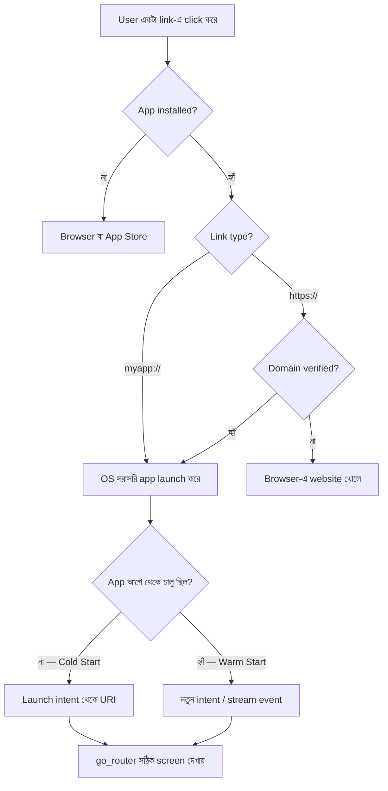

# Flutter Deep Link — সম্পূর্ণ গাইড

**Custom Scheme · Android App Links · iOS Universal Links · go_router**

> **ভাষা নীতি:** ব্যাখ্যা বাংলায়, Technical Term English-এ অপরিবর্তিত।
> **Version:** Flutter 3.x · go_router 14.x · app_links 6.x

---

## Quick Start

একটা `myapp://` link দিয়ে app খোলা — সবচেয়ে ছোট পথ।

**১. Manifest-এ intent-filter যোগ করো** (`android/app/src/main/AndroidManifest.xml`, `<activity>`-র ভেতরে):

```xml
<intent-filter>
    <action android:name="android.intent.action.VIEW"/>
    <category android:name="android.intent.category.DEFAULT"/>
    <category android:name="android.intent.category.BROWSABLE"/>
    <data android:scheme="myapp"/>
</intent-filter>

<meta-data android:name="flutter_deeplinking_enabled" android:value="true" />
```

**২. go_router যোগ করো:**

```bash
flutter pub add go_router
```

```dart
final router = GoRouter(routes: [
  GoRoute(path: '/', builder: (c, s) => const HomeScreen()),
  GoRoute(
    path: '/products/:id',
    builder: (c, s) => ProductScreen(id: s.pathParameters['id']!),
  ),
]);

// MaterialApp নয় — MaterialApp.router
MaterialApp.router(routerConfig: router);
```

**৩. Test করো:**

```bash
adb shell am start -a android.intent.action.VIEW \
  -d "myapp://products/123" com.example.your_app
```

ProductScreen খুললে setup ঠিক আছে।

---

## Table of Contents

| # | বিষয় |
|---|---|
| ১ | [Deep Link কী এবং কেন দরকার](#১-deep-link-কী-এবং-কেন-দরকার) |
| ২ | [তিন প্রকার Deep Link](#২-তিন-প্রকার-deep-link) |
| ৩ | [কীভাবে কাজ করে](#৩-কীভাবে-কাজ-করে) |
| ৪ | [দুটো পদ্ধতি — কোনটা বেছে নেবে](#৪-দুটো-পদ্ধতি--কোনটা-বেছে-নেবে) |
| ৫ | [Android Setup](#৫-android-setup) |
| ৬ | [iOS Setup](#৬-ios-setup) |
| ৭ | [go_router Configuration](#৭-go_router-configuration) |
| ৮ | [app_links — Manual Handling](#৮-app_links--manual-handling) |
| ৯ | [Authentication Guard ও Redirect](#৯-authentication-guard-ও-redirect) |
| ১০ | [Testing](#১০-testing) |
| ১১ | [Troubleshooting](#১১-troubleshooting) |
| ১২ | [Quick Reference](#১২-quick-reference) |

---

## ১. Deep Link কী এবং কেন দরকার

একটা URL যেটা browser না খুলে সরাসরি তোমার app-এর নির্দিষ্ট screen-এ নিয়ে যায়।

```
Normal Web Link:
  Link → Browser খোলে → Website load হয়

Deep Link:
  Link → App installed? ── হ্যাঁ ──→ App-এর নির্দিষ্ট screen
                │
                না ──→ Browser বা App Store
```

| ব্যবহার | উদাহরণ |
|---|---|
| Push Notification | Notification tap করলে সঠিক screen |
| Marketing campaign | Email/SMS-এর link → নির্দিষ্ট offer page |
| Social sharing | বন্ধুকে একটা product share করা |
| Referral | Referral link → install + automatic onboarding |
| Payment return | Payment gateway থেকে app-এ ফেরা |
| OAuth callback | Google/Facebook login-এর পরে app-এ ফেরা |

---

## ২. তিন প্রকার Deep Link

```
১. Custom URL Scheme       myapp://products/123          Android + iOS
২. App Links               https://shop.example.com/...  Android (verified)
৩. Universal Links         https://shop.example.com/...  iOS (verified)
```

App Links আর Universal Links আসলে একই জিনিসের দুই platform-এর নাম — একই `https://` URL, দুই দিকে আলাদা verification পদ্ধতি।

| Feature | Custom Scheme | App Links (Android) | Universal Links (iOS) |
|---|:---:|:---:|:---:|
| Protocol | `myapp://` | `https://` | `https://` |
| Security | কম | বেশি | বেশি |
| Browser fallback | নেই | আছে | আছে |
| Server-এ file লাগে | না | `assetlinks.json` | `apple-app-site-association` |
| Min OS | যেকোনো | Android 6.0+ | iOS 9+ |

**Custom Scheme-এর দুর্বলতা:** যেকোনো app একই scheme claim করতে পারে। দুটো app `myapp://` claim করলে Android ইউজারকে জিজ্ঞেস করে, iOS-এ কোনটা খুলবে তার নিশ্চয়তা নেই। তাই **sensitive কাজে (OAuth callback, payment return) custom scheme-এর উপর ভরসা করা যায় না** — verified https link ব্যবহার করো।

**বাস্তব পরামর্শ:** production-এ দুটোই রাখো। `https://` মূল পথ, `myapp://` fallback ও internal ব্যবহারের জন্য।

---

## ৩. কীভাবে কাজ করে



### Cold Start বনাম Warm Start

```
Cold Start   App বন্ধ ছিল       link → app চালু হয় → launch URI পড়তে হয়
Warm Start   App background-এ   link → app সামনে আসে → নতুন intent আসে
```

দুটো আলাদা code path। **অনেক app-এ warm start কাজ করে কিন্তু cold start করে না** — কারণ cold start-এর URI টা app চালু হওয়ার আগেই এসে যায়, আর কোড সেটা পড়ার আগেই navigation শুরু হয়ে যায়।

Flutter-এর built-in deep linking ([পদ্ধতি ১](#৪-দুটো-পদ্ধতি--কোনটা-বেছে-নেবে)) দুটোই নিজে সামলায়। `app_links` ব্যবহার করলে তোমাকে দুটোই আলাদা করে handle করতে হবে।

---

## ৪. দুটো পদ্ধতি — কোনটা বেছে নেবে

Flutter-এ deep link handle করার দুটো পথ আছে। **একটাই বেছে নাও।**

### পদ্ধতি ১ — Flutter Built-in (recommended)

Flutter নিজেই incoming URI ধরে সরাসরি Router API-তে (go_router) পাঠায়। কোনো extra package লাগে না।

চালু করতে হয় এভাবে:

```xml
<!-- Android: AndroidManifest.xml, <activity>-র ভেতরে -->
<meta-data android:name="flutter_deeplinking_enabled" android:value="true" />
```

```xml
<!-- iOS: ios/Runner/Info.plist -->
<key>FlutterDeepLinkingEnabled</key>
<true/>
```

তারপর `MaterialApp.router` + go_router — URL সরাসরি route-এ map হয়ে যায়। Cold start ও warm start দুটোই Flutter সামলায়।

**কখন ব্যবহার করবে:** URL সরাসরি screen-এ map হলে। অর্থাৎ বেশিরভাগ app।

### পদ্ধতি ২ — app_links package

`app_links` তোমাকে raw `Uri` object দেয়। তুমি নিজে সিদ্ধান্ত নাও কী করবে।

```bash
flutter pub add app_links
```

**কখন দরকার:**

- URI-কে route-এ পাঠানোর আগে বদলাতে হবে (যেমন `myapp://p/123` → `/products/123`)
- Navigate করার আগে API call লাগবে (referral code redeem, token validate)
- Link-এ analytics event পাঠাতে হবে
- go_router ব্যবহার করছো না

> **সতর্কতা:** দুটো পদ্ধতি একসাথে চালু রাখলে একই link দুইবার handle হতে পারে — screen দুইবার push হবে বা flicker করবে। `app_links` ব্যবহার করলে `flutter_deeplinking_enabled` / `FlutterDeepLinkingEnabled` **দিও না**।

এই গাইডের Android ও iOS setup (§৫, §৬) দুই পদ্ধতিতেই একই — শুধু ঐ একটা meta-data / plist key-এর পার্থক্য।

---

## ৫. Android Setup

### ৫.১ Custom URL Scheme

`android/app/src/main/AndroidManifest.xml`:

```xml
<activity
    android:name=".MainActivity"
    android:exported="true"
    android:launchMode="singleTop"
    android:theme="@style/LaunchTheme"
    android:configChanges="orientation|keyboardHidden|keyboard|screenSize|smallestScreenSize|locale|layoutDirection|fontScale|screenLayout|density|uiMode"
    android:hardwareAccelerated="true"
    android:windowSoftInputMode="adjustResize">

    <intent-filter>
        <action android:name="android.intent.action.MAIN"/>
        <category android:name="android.intent.category.LAUNCHER"/>
    </intent-filter>

    <!-- Custom scheme: myapp://... -->
    <intent-filter>
        <action android:name="android.intent.action.VIEW"/>
        <category android:name="android.intent.category.DEFAULT"/>
        <category android:name="android.intent.category.BROWSABLE"/>
        <data android:scheme="myapp"/>
    </intent-filter>

    <!-- পদ্ধতি ১ ব্যবহার করলে -->
    <meta-data android:name="flutter_deeplinking_enabled" android:value="true" />
</activity>
```

> **`launchMode` নিয়ে ভুল ধারণা:** Flutter template-এর default `singleTop`-ই ঠিক। `singleTop` থাকলে app সামনে থাকা অবস্থায় নতুন link এলে নতুন instance না বানিয়ে চলতি activity-তেই intent যায়। এটা বদলে `singleTask` করার দরকার নেই — করলে task ও back stack-এর behaviour বদলে যায়। `launchMode` একদম না দিলে (`standard`) প্রতিটা link নতুন instance বানাবে — সেটাই আসল সমস্যা।

**Test:**

```bash
adb shell am start -a android.intent.action.VIEW \
  -d "myapp://products/123" com.example.your_app
```

### ৫.২ App Links (verified https)

একই `<activity>`-তে আরেকটা intent-filter:

```xml
<intent-filter android:autoVerify="true">
    <action android:name="android.intent.action.VIEW"/>
    <category android:name="android.intent.category.DEFAULT"/>
    <category android:name="android.intent.category.BROWSABLE"/>
    <data android:scheme="https" android:host="shop.example.com"/>
</intent-filter>
```

`android:autoVerify="true"` ছাড়া Android `assetlinks.json` খুঁজবেই না, আর link browser-এ চলে যাবে।

**`<data>` tag-এর attribute:**

```
android:scheme      "https"
android:host        "shop.example.com"
android:path        "/products/123"     exact match
android:pathPrefix  "/products"         এই দিয়ে শুরু
android:pathPattern "/products/.*"      simple pattern
```

Path না দিলে ঐ host-এর **সব** URL app-এ যাবে। শুধু কিছু path চাইলে `pathPrefix` দাও।

### ৫.৩ assetlinks.json

Android এই file দেখে যাচাই করে যে domain-টা সত্যিই তোমার।

**জায়গা:** `https://shop.example.com/.well-known/assetlinks.json`

```json
[
  {
    "relation": ["delegate_permission/common.handle_all_urls"],
    "target": {
      "namespace": "android_app",
      "package_name": "com.example.your_app",
      "sha256_cert_fingerprints": [
        "AB:CD:EF:12:34:56:78:90:AA:BB:CC:DD:EE:FF:00:11:22:33:44:55:66:77:88:99:AA:BB:CC:DD:EE:FF:00:11"
      ]
    }
  }
]
```

**Fingerprint বের করা:**

```bash
# Debug keystore
keytool -list -v -keystore ~/.android/debug.keystore \
  -alias androiddebugkey -storepass android | grep SHA256

# নিজের release keystore
keytool -list -v -keystore /path/to/release.keystore \
  -alias your-key-alias | grep SHA256
```

> **সবচেয়ে সাধারণ production bug:** Play Store-এ App Bundle (`.aab`) দিলে Google **নিজের key দিয়ে আবার sign করে** (Play App Signing)। তখন ইউজারের ফোনে থাকা app-এর fingerprint তোমার local release keystore-এর fingerprint নয়। শুধু local fingerprint দিলে App Links **production-এ কাজ করবে না, অথচ debug-এ ঠিক চলবে**।
>
> সমাধান — Play Console → তোমার app → **Test and release → Setup → App signing** → সেখান থেকে **App signing key certificate**-এর SHA-256 কপি করো, আর সেটাও `sha256_cert_fingerprints` array-তে যোগ করো।
>
> Array-তে একাধিক fingerprint দেওয়া যায়। Debug, upload key আর Play signing key — তিনটাই রাখলে সব build-এ কাজ করবে।

**File serve করার নিয়ম:**

```
HTTPS হতে হবে (valid certificate, self-signed নয়)
Content-Type: application/json
কোনো redirect চলবে না — সরাসরি 200 দিতে হবে
```

Nginx:

```nginx
location = /.well-known/assetlinks.json {
    default_type application/json;
    alias /var/www/well-known/assetlinks.json;
}
```

**Verification যাচাই (Android 12+):**

```bash
adb shell pm get-app-links com.example.your_app
# verified হলে domain-এর পাশে "verified" দেখাবে

# আবার verify করাও
adb shell pm verify-app-links --re-verify com.example.your_app
```

Android 11 বা নিচে এই command নেই — সেখানে `adb shell dumpsys package d` দিয়ে দেখতে হয়।

Online tool: https://developers.google.com/digital-asset-links/tools/generator

---

## ৬. iOS Setup

### ৬.১ Custom URL Scheme

`ios/Runner/Info.plist`:

```xml
<key>CFBundleURLTypes</key>
<array>
    <dict>
        <key>CFBundleTypeRole</key>
        <string>Editor</string>
        <key>CFBundleURLName</key>
        <string>com.example.yourApp</string>
        <key>CFBundleURLSchemes</key>
        <array>
            <string>myapp</string>
        </array>
    </dict>
</array>

<!-- পদ্ধতি ১ ব্যবহার করলে -->
<key>FlutterDeepLinkingEnabled</key>
<true/>
```

**Test:**

```bash
xcrun simctl openurl booted "myapp://products/123"
```

### ৬.২ Universal Links

**Step 1 — Xcode-এ Associated Domains:**

```
Xcode → Runner target → Signing & Capabilities
→ "+ Capability" → Associated Domains
→ entry যোগ করো:  applinks:shop.example.com
```

`ios/Runner/Runner.entitlements`-এ এটা যোগ হবে:

```xml
<key>com.apple.developer.associated-domains</key>
<array>
    <string>applinks:shop.example.com</string>
</array>
```

`applinks:` prefix বাধ্যতামূলক। `https://` লিখবে না, শুধু domain।

> Associated Domains capability-র জন্য paid Apple Developer account লাগে। Free provisioning-এ এই capability যোগ করা যায় না।

**Step 2 — AASA file server-এ রাখো:**

```
https://shop.example.com/.well-known/apple-app-site-association
```

> **ফাইলের নামে কোনো extension নেই।** `.json` লাগাবে না।

```json
{
  "applinks": {
    "details": [
      {
        "appIDs": ["TEAMID.com.example.yourApp"],
        "components": [
          { "/": "/products/*", "comment": "Product pages" },
          { "/": "/orders/*",   "comment": "Order pages" },
          { "/": "/search",     "comment": "Search" },
          { "/": "NOT /admin/*", "comment": "Admin বাদ" }
        ]
      }
    ]
  }
}
```

iOS 12 বা নিচে support করতে হলে পুরনো `paths` format-ও একই ফাইলে রাখা যায়:

```json
{
  "applinks": {
    "apps": [],
    "details": [
      {
        "appID": "TEAMID.com.example.yourApp",
        "paths": ["/products/*", "/orders/*", "/search", "NOT /admin/*"]
      }
    ]
  }
}
```

**Team ID:** developer.apple.com → Account → Membership details → Team ID (১০ অক্ষর)।

**Serve করার নিয়ম:**

```
HTTPS, port 443, valid certificate
Content-Type: application/json
কোনো redirect চলবে না
```

> **AASA cache — টেস্ট করার সময় এখানেই সবাই আটকায়।** Apple-এর CDN তোমার AASA ফাইল cache করে রাখে, আর device-ও install-এর সময় একবার পড়ে রেখে দেয়। ফাইল বদলালে সাথে সাথে effect পড়ে না।
>
> Test করার সময়:
> 1. App uninstall করে আবার install করো — device তখন নতুন করে AASA পড়ে।
> 2. অথবা device-এ Settings → Developer → **Associated Domains Development** চালু করো। তখন device Apple-এর CDN বাদ দিয়ে সরাসরি তোমার server থেকে ফাইল আনে।

---

## ৭. go_router Configuration

```bash
flutter pub add go_router
```

### Router

`lib/router/app_router.dart`:

```dart
import 'package:go_router/go_router.dart';

final GoRouter appRouter = GoRouter(
  initialLocation: '/',
  debugLogDiagnostics: true,   // development-এ route log দেখতে

  routes: [
    GoRoute(
      path: '/',
      name: 'home',
      builder: (context, state) => const HomeScreen(),
    ),

    // /products/123?color=red
    GoRoute(
      path: '/products/:productId',
      name: 'product',
      builder: (context, state) => ProductScreen(
        productId: state.pathParameters['productId']!,
        color: state.uri.queryParameters['color'],
      ),
    ),

    // /search?q=flutter
    GoRoute(
      path: '/search',
      name: 'search',
      builder: (context, state) => SearchScreen(
        query: state.uri.queryParameters['q'] ?? '',
      ),
    ),
  ],

  errorBuilder: (context, state) => const NotFoundScreen(),
);
```

### App-এ যুক্ত করা

```dart
MaterialApp.router(          // MaterialApp নয়
  routerConfig: appRouter,
);
```

`MaterialApp` ব্যবহার করলে deep link কখনোই কাজ করবে না — Router API-ই deep link পায়।

### Path vs Query Parameter

```
Path parameter    /products/123
                  route: /products/:productId
                  read : state.pathParameters['productId']
                  কখন : resource-এর unique id বা slug

Query parameter   /products?category=shoes&sort=price
                  route: /products
                  read : state.uri.queryParameters['category']
                  কখন : filter, sort, optional value
```

### Navigation

```dart
context.go('/products/123');       // stack replace করে
context.push('/products/123');     // stack-এ যোগ করে, back কাজ করে
context.pushReplacement('/login');
context.pop();

context.goNamed('product',
  pathParameters: {'productId': '123'},
  queryParameters: {'color': 'red'},
);

// URL-এ দেখা যায় না এমন data
context.push('/products/123', extra: {'fromEmail': true});
// পড়তে: state.extra as Map<String, dynamic>?
```

> `extra` deep link দিয়ে আসে না — এটা শুধু app-এর ভেতরের navigation-এ কাজ করে। Deep link-এ যা লাগবে সব URL-এ থাকতে হবে।

### Nested Routes

Child route parent-এর path-এর সাথে যুক্ত হয়:

```dart
GoRoute(
  path: '/products',
  builder: (c, s) => const ProductListScreen(),
  routes: [
    GoRoute(
      path: ':productId',            // /products/:productId
      builder: (c, s) => ProductScreen(id: s.pathParameters['productId']!),
      routes: [
        GoRoute(
          path: 'reviews',           // /products/:productId/reviews
          builder: (c, s) => ReviewScreen(id: s.pathParameters['productId']!),
        ),
      ],
    ),
  ],
),
```

Nested route-এর সুবিধা: `/products/123/reviews`-এ deep link দিয়ে ঢুকলে back চাপলে `/products/123`-এ যাবে, সরাসরি home-এ নয়।

### ShellRoute — persistent bottom nav

```dart
ShellRoute(
  builder: (context, state, child) => MainScaffold(child: child),
  routes: [
    GoRoute(path: '/',        builder: (c, s) => const HomeScreen()),
    GoRoute(path: '/cart',    builder: (c, s) => const CartScreen()),
    GoRoute(path: '/profile', builder: (c, s) => const ProfileScreen()),
  ],
),

// Shell-এর বাইরে — full screen, bottom nav ছাড়া
GoRoute(
  path: '/products/:id',
  builder: (c, s) => ProductScreen(id: s.pathParameters['id']!),
),
```

`MainScaffold` হলো `Scaffold(body: child, bottomNavigationBar: ...)` — nav bar tap-এ `context.go('/cart')` ডাকে।

---

## ৮. app_links — Manual Handling

শুধু [পদ্ধতি ২](#৪-দুটো-পদ্ধতি--কোনটা-বেছে-নেবে) নিলে এই অংশ। `flutter_deeplinking_enabled` তখন দেবে না।

### Core API

```dart
final appLinks = AppLinks();

Uri? initial = await appLinks.getInitialLink();   // cold start
Stream<Uri> stream = appLinks.uriLinkStream;      // warm start
```

### Service

`lib/services/deep_link_service.dart`:

```dart
import 'dart:async';
import 'package:app_links/app_links.dart';
import 'package:flutter/foundation.dart';
import 'package:go_router/go_router.dart';

class DeepLinkService {
  DeepLinkService(this._router);

  final GoRouter _router;
  final AppLinks _appLinks = AppLinks();
  StreamSubscription<Uri>? _subscription;

  Future<void> init() async {
    // Cold start — app বন্ধ ছিল
    try {
      final initial = await _appLinks.getInitialLink();
      if (initial != null) _process(initial);
    } catch (e) {
      debugPrint('Initial link error: $e');
    }

    // Warm start — app চালু ছিল
    _subscription = _appLinks.uriLinkStream.listen(
      _process,
      onError: (Object e) => debugPrint('Link stream error: $e'),
    );
  }

  void _process(Uri uri) {
    final path  = _buildPath(uri);
    final query = uri.query.isNotEmpty ? '?${uri.query}' : '';
    debugPrint('Deep link → $path$query');
    _router.go('$path$query');
  }

  /// myapp://products/123  → host="products", path="/123"  → /products/123
  /// https://shop.com/products/123                          → /products/123
  String _buildPath(Uri uri) {
    if (uri.scheme == 'http' || uri.scheme == 'https') {
      return uri.path.isEmpty ? '/' : uri.path;
    }
    final combined = '/${uri.host}${uri.path}';
    return combined == '/' ? '/' : combined;
  }

  void dispose() => _subscription?.cancel();
}
```

`_buildPath` কেন দরকার: custom scheme-এ `myapp://products/123`-এর `uri.path` হয় `/123`, আর `products` চলে যায় `uri.host`-এ। শুধু `uri.path` দিলে route মিলবে না।

### main.dart-এ যুক্ত করা

```dart
class _MyAppState extends State<MyApp> {
  late final DeepLinkService _deepLinks;

  @override
  void initState() {
    super.initState();
    _deepLinks = DeepLinkService(appRouter);

    // Router attach হওয়ার পরে init করো
    WidgetsBinding.instance.addPostFrameCallback((_) => _deepLinks.init());
  }

  @override
  void dispose() {
    _deepLinks.dispose();      // না করলে memory leak
    super.dispose();
  }

  @override
  Widget build(BuildContext context) =>
      MaterialApp.router(routerConfig: appRouter);
}
```

> **Cold start-এ দুইবার navigate হলে:** `app_links`-এর কোনো কোনো version-এ initial link `uriLinkStream`-এও একবার আসে, ফলে `getInitialLink()` মিলিয়ে দুইবার navigate হয়। Log-এ একই URL দুইবার দেখলে `getInitialLink()`-এর অংশটা বাদ দিয়ে শুধু stream রাখো, অথবা শেষ handle করা URI মনে রেখে একই URI পরপর দুইবার এলে দ্বিতীয়বার বাদ দাও।

### URI Parse Cheat Sheet

```dart
Uri.parse("myapp://products/123?color=red#top");
//  scheme "myapp"  host "products"  path "/123"
//  pathSegments ["123"]  queryParameters {"color":"red"}  fragment "top"

Uri.parse("https://shop.com/products/123?color=red");
//  scheme "https"  host "shop.com"  path "/products/123"
//  pathSegments ["products","123"]  queryParameters {"color":"red"}
```

---

## ৯. Authentication Guard ও Redirect

কেউ deep link দিয়ে protected page-এ (`/orders/456`) এলে আগে login করাতে হবে, তারপর সে যেখানে যেতে চেয়েছিল সেখানে পাঠাতে হবে।

### AuthService

```dart
class AuthService extends ChangeNotifier {
  bool _isLoggedIn = false;
  bool get isLoggedIn => _isLoggedIn;

  Future<void> login(String email, String password) async {
    // API call
    _isLoggedIn = true;
    notifyListeners();        // router refresh হবে
  }

  void logout() {
    _isLoggedIn = false;
    notifyListeners();
  }
}
```

### Router-এ guard

```dart
GoRouter createAppRouter(AuthService auth) {
  return GoRouter(
    initialLocation: '/',
    refreshListenable: auth,        // auth বদলালে redirect আবার চলবে

    redirect: (context, state) {
      final loc = state.matchedLocation;
      const protected = ['/cart', '/orders', '/profile', '/checkout'];
      final isProtected = protected.any(loc.startsWith);

      if (!auth.isLoggedIn && isProtected) {
        final dest = Uri.encodeComponent(state.uri.toString());
        return '/login?redirect=$dest';
      }
      if (auth.isLoggedIn && loc == '/login') return '/';
      return null;                  // null = redirect করো না
    },

    routes: [
      GoRoute(path: '/', builder: (c, s) => const HomeScreen()),
      GoRoute(
        path: '/orders/:orderId',
        builder: (c, s) => OrderScreen(orderId: s.pathParameters['orderId']!),
      ),
      GoRoute(
        path: '/login',
        builder: (c, s) => LoginScreen(
          redirectTo: s.uri.queryParameters['redirect'],
        ),
      ),
    ],
    errorBuilder: (c, s) => const NotFoundScreen(),
  );
}
```

`refreshListenable` না দিলে login-এর পরে router নিজে থেকে আবার redirect চালাবে না — ইউজার login screen-এ আটকে থাকবে।

### Login-এর পরে ফেরত পাঠানো

```dart
Future<void> _login() async {
  await context.read<AuthService>().login(email, password);
  if (!mounted) return;

  final target = widget.redirectTo;
  context.go(target != null ? Uri.decodeComponent(target) : '/');
}
```

> **Redirect parameter যাচাই করো।** `redirect` query parameter ইউজারের দেওয়া input — কেউ `/login?redirect=https://evil.com` বানিয়ে পাঠাতে পারে। শুধু `/` দিয়ে শুরু হওয়া internal path গ্রহণ করো, বাইরের URL নয়:
>
> ```dart
> final decoded = Uri.decodeComponent(target);
> final safe = decoded.startsWith('/') && !decoded.startsWith('//');
> context.go(safe ? decoded : '/');
> ```
>
> `//evil.com` বাদ দেওয়া জরুরি — এটা protocol-relative URL, browser context-এ বাইরের site-এ নিয়ে যায়।

---

## ১০. Testing

### Android

```bash
# Custom scheme
adb shell am start -a android.intent.action.VIEW \
  -d "myapp://products/123" com.example.your_app

# App Links
adb shell am start -a android.intent.action.VIEW \
  -d "https://shop.example.com/products/123" com.example.your_app

# Query parameter সহ
adb shell am start -a android.intent.action.VIEW \
  -d "myapp://search?q=flutter+books" com.example.your_app
```

Cold start test করতে আগে app বন্ধ করো: `adb shell am force-stop com.example.your_app`

**Verification status (Android 12+):**

```bash
adb shell pm get-app-links com.example.your_app
adb shell pm verify-app-links --re-verify com.example.your_app
```

> **Chrome-এর address bar-এ `myapp://...` টাইপ করে test করা যায় না** — Chrome custom scheme-কে search query ধরে নেয়। HTML page-এ একটা `<a href="myapp://products/123">` link বানিয়ে সেখান থেকে tap করো, অথবা `adb` ব্যবহার করো।

### iOS

```bash
xcrun simctl openurl booted "myapp://products/123"
xcrun simctl openurl booted "https://shop.example.com/products/123"
```

> **Universal Links Simulator-এ ভরসা করা যায় না।** AASA verification আর CDN cache Simulator-এ আলাদা আচরণ করে। Universal Link সবসময় real device-এ test করো।
>
> আরেকটা কথা: **একই domain-এর page থেকে link-এ tap করলে Universal Link কাজ করে না** — Apple ইচ্ছাকৃতভাবে এটা বন্ধ রাখে। Safari-র address bar-এ URL টাইপ করলেও app খুলবে না। Notes app বা Messages-এ link পাঠিয়ে সেখান থেকে tap করে test করো।

### Test Checklist

| কেস | Android | iOS |
|---|:---:|:---:|
| Custom scheme — cold start | ☐ | ☐ |
| Custom scheme — warm start | ☐ | ☐ |
| Verified https — cold start | ☐ | ☐ |
| Verified https — warm start | ☐ | ☐ |
| Query parameter parse হচ্ছে | ☐ | ☐ |
| Protected route → login redirect | ☐ | ☐ |
| Login-এর পরে original destination | ☐ | ☐ |
| অজানা path → 404 screen | ☐ | ☐ |
| Release build-এ সব কেস | ☐ | ☐ |

Release build আলাদা করে test করো — App Links-এর fingerprint debug আর release-এ আলাদা।

---

## ১১. Troubleshooting

### App Links কাজ করছে না, browser খুলছে

ক্রম মেনে দেখো:

```bash
# ১. File পাওয়া যাচ্ছে?
curl -sI https://shop.example.com/.well-known/assetlinks.json
#    200 হতে হবে, 301/302 নয়
#    Content-Type: application/json

# ২. JSON valid?
curl -s https://shop.example.com/.well-known/assetlinks.json | python3 -m json.tool

# ৩. Fingerprint মিলছে?
keytool -list -v -keystore ~/.android/debug.keystore \
  -alias androiddebugkey -storepass android | grep SHA256

# ৪. Verification status
adb shell pm get-app-links com.example.your_app
```

আর দেখো:
- `android:autoVerify="true"` আছে কিনা
- `package_name` আর app-এর `applicationId` এক কিনা
- **Play Store build হলে Play App Signing-এর fingerprint যোগ করা আছে কিনা** ([৫.৩](#৫৩-assetlinksjson))

### iOS Universal Links কাজ করছে না

```bash
curl -sI https://shop.example.com/.well-known/apple-app-site-association
# 200, Content-Type: application/json, redirect নেই
```

- ফাইলের নামে `.json` extension নেই তো?
- `appIDs` ফরম্যাট `TEAMID.bundle.id` ঠিক আছে?
- Entitlements-এ `applinks:` prefix সহ domain আছে?
- App uninstall করে reinstall করেছো? (AASA cache — [৬.২](#৬২-universal-links))
- Real device-এ test করছো, Simulator-এ নয়?
- একই domain-এর page থেকে tap করছো না তো? (কাজ করবে না)

### App একাধিকবার খুলছে / screen দুইবার আসছে

তিনটা কারণ:

1. `<activity>`-তে `launchMode` নেই (`standard` হয়ে গেছে)। Flutter template-এর `singleTop` ফিরিয়ে আনো।
2. **`flutter_deeplinking_enabled` আর `app_links` দুটোই চালু** — একই link দুই পথে handle হচ্ছে। একটা বাদ দাও ([§৪](#৪-দুটো-পদ্ধতি--কোনটা-বেছে-নেবে))।
3. `app_links`-এ initial link stream-এও আসছে ([§৮](#৮-app_links--manual-handling)-এর সতর্কতা)।

### Cold start-এ link কাজ করে না, warm start-এ করে

`app_links` ব্যবহার করছো, আর router attach হওয়ার আগেই `router.go()` ডাকা হচ্ছে। `addPostFrameCallback`-এর ভেতরে `init()` ডাকো:

```dart
WidgetsBinding.instance.addPostFrameCallback((_) => _deepLinks.init());
```

পদ্ধতি ১ (built-in) ব্যবহার করলে এই সমস্যা হয় না — Flutter নিজেই সঠিক সময়ে URI পাঠায়।

### Custom scheme-এ path খালি আসছে

`myapp://products/123`-এ `uri.path` হয় `/123`, `products` থাকে `uri.host`-এ। `_buildPath()` দিয়ে জোড়া লাগাও ([§৮](#৮-app_links--manual-handling))।

### Deep link কিছুই করছে না

`MaterialApp` ব্যবহার করছো কিনা দেখো। `MaterialApp.router` + `routerConfig` না হলে Router API deep link পায় না।

### Stream subscription leak

`dispose()`-এ `_subscription?.cancel()` ডাকতেই হবে। না করলে widget মুছে গেলেও listener বেঁচে থাকে, আর মৃত router-এ navigate করার চেষ্টা করে।

---

## ১২. Quick Reference

### Android checklist

```
AndroidManifest.xml
  launchMode="singleTop"  (Flutter default — বদলিও না)
  Custom scheme intent-filter (android:scheme="myapp")
  App Links intent-filter (android:autoVerify="true")
  meta-data flutter_deeplinking_enabled  (পদ্ধতি ১ হলে)

Server
  https://domain/.well-known/assetlinks.json
  Content-Type: application/json, redirect নেই
  package_name সঠিক
  SHA-256: debug + upload key + Play App Signing key
```

### iOS checklist

```
Info.plist
  CFBundleURLTypes → CFBundleURLSchemes → ["myapp"]
  FlutterDeepLinkingEnabled = true   (পদ্ধতি ১ হলে)

Xcode
  Associated Domains capability
  applinks:yourdomain.com

Server
  https://domain/.well-known/apple-app-site-association
  ফাইলের নামে extension নেই
  Content-Type: application/json, redirect নেই
  appIDs: TEAMID.bundle.id
```

### Flutter checklist

```
MaterialApp.router + routerConfig   (MaterialApp নয়)
errorBuilder — 404
redirect + refreshListenable — auth guard
পদ্ধতি ২ হলে: getInitialLink (cold) + uriLinkStream (warm)
                dispose()-এ subscription cancel
```

### Test commands

```bash
# Android
adb shell am force-stop com.example.app          # cold start-এর আগে
adb shell am start -a android.intent.action.VIEW \
  -d "myapp://products/123" com.example.app
adb shell pm get-app-links com.example.app       # Android 12+

# iOS
xcrun simctl openurl booted "myapp://products/123"
# Universal Link — real device, Messages/Notes থেকে tap
```

---

## References

- [Flutter — Deep linking](https://docs.flutter.dev/ui/navigation/deep-linking)
- [go_router](https://pub.dev/packages/go_router)
- [app_links](https://pub.dev/packages/app_links)
- [Android App Links](https://developer.android.com/training/app-links)
- [Apple — Supporting universal links](https://developer.apple.com/documentation/xcode/supporting-universal-links-in-your-app)
- [Digital Asset Links generator](https://developers.google.com/digital-asset-links/tools/generator)

**সম্পর্কিত:** [firebase-push-setup-guide.md](./firebase-push-setup-guide.md) · [notification_background_guide.md](./notification_background_guide.md)
