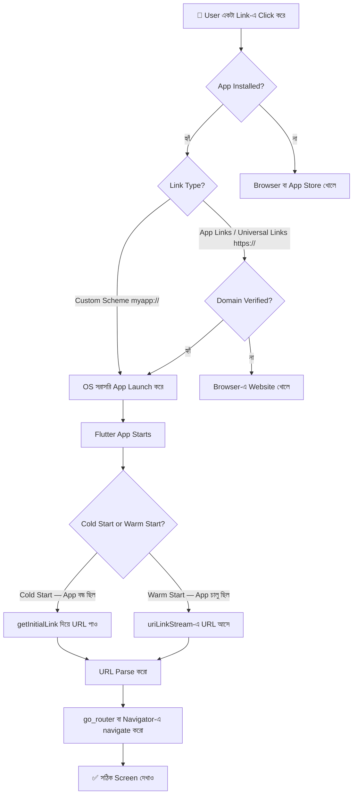
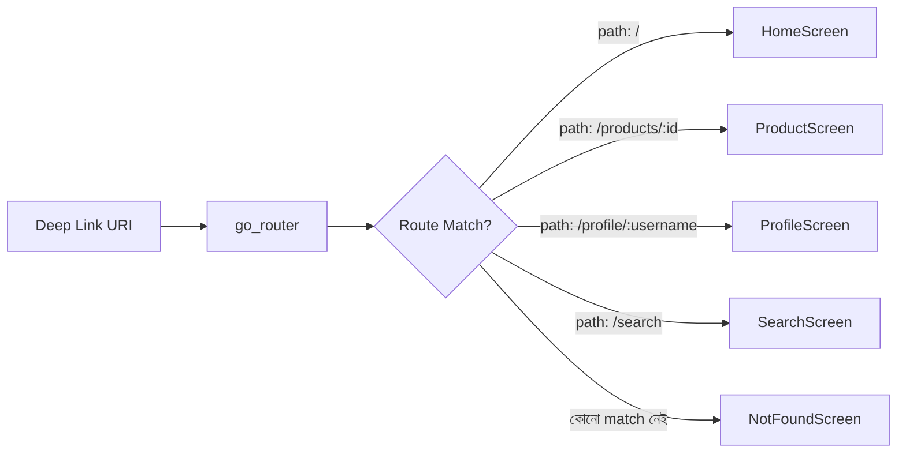

# 🔗 Flutter Deep Link: সম্পূর্ণ শেখার গাইড
### Basic থেকে Advanced — বাংলায় সহজ ভাষায়

> 📌 **লক্ষ্য:** এই গাইডটি পড়ার পর তুমি Flutter app-এ Deep Link implement করতে সম্পূর্ণ সক্ষম হবে।  
> 🛠 **Version:** Flutter 3.x | go_router 14.x | app_links 6.x

---

## 📋 Table of Contents

| # | বিষয় |
|---|-------|
| 1 | [Deep Link কী এবং কেন দরকার?](#১-deep-link-কী-এবং-কেন-দরকার) |
| 2 | [Deep Link এর প্রকারভেদ](#২-deep-link-এর-প্রকারভেদ) |
| 3 | [Deep Link কীভাবে কাজ করে?](#৩-deep-link-কীভাবে-কাজ-করে) |
| 4 | [Prerequisites ও Project Setup](#৪-prerequisites-ও-project-setup) |
| 5 | [Android Setup](#৫-android-setup) |
| 6 | [iOS Setup](#৬-ios-setup) |
| 7 | [Flutter Packages](#৭-flutter-packages) |
| 8 | [Basic Implementation — app_links](#৮-basic-implementation--app_links) |
| 9 | [go_router দিয়ে Deep Link Handling](#৯-go_router-দিয়ে-deep-link-handling) |
| 10 | [Advanced: Dynamic Routes ও Parameters](#১০-advanced-dynamic-routes-ও-parameters) |
| 11 | [Advanced: Authentication Guard ও Redirects](#১১-advanced-authentication-guard-ও-redirects) |
| 12 | [Deep Link Testing](#১২-deep-link-testing) |
| 13 | [Troubleshooting ও Common Errors](#১৩-troubleshooting-ও-common-errors) |
| 14 | [Complete Real-world Example](#১৪-complete-real-world-example) |
| 15 | [Quick Reference Card](#১৫-quick-reference-card) |

---

## ১. Deep Link কী এবং কেন দরকার?

[⬆️ TOC-এ ফিরে যাও](#-table-of-contents)

### সহজ ভাষায় Deep Link

মনে করো, তুমি WhatsApp-এ একটা product-এর link পেলে:

```
https://shop.example.com/products/123
```

তুমি ঐ link-এ click করলে — browser না খুলে সরাসরি **ShopApp** open হয়ে গেল  
এবং **product #123** এর page-এ চলে গেল। এটাই হলো **Deep Link**।

> একটা URL যেটা তোমার app-এর একটা নির্দিষ্ট screen/page-এ directly নিয়ে যায়।

### Normal Link vs Deep Link

```
Normal Web Link:
  Browser খোলে → Website load হয় → Web Page দেখায়

Deep Link:
  Link Click → App installed আছে? ─── হ্যাঁ ──→ App-এর specific screen
                      │
                      না
                      ↓
               App Store / Play Store
```

### কেন দরকার?

| ব্যবহার | উদাহরণ |
|---------|---------|
| 📢 Marketing Campaign | Email/SMS-এ link দিয়ে specific offer page-এ নিয়ে যাওয়া |
| 🤝 Social Sharing | Friend-কে specific content share করা |
| 🔔 Push Notification | Notification click করলে সঠিক screen-এ নিয়ে যাওয়া |
| 🎁 Referral System | Referral link → app install + automatic onboarding |
| 💳 Payment Return | Payment gateway থেকে app-এ ফিরে আসা |
| 🔗 Cross-app Linking | অন্য app থেকে তোমার app-এ specific content খোলা |

---

## ২. Deep Link এর প্রকারভেদ

[⬆️ TOC-এ ফিরে যাও](#-table-of-contents)

Flutter-এ মূলত **৩ ধরনের** Deep Link আছে:

```
Deep Link Types
├── 1. Custom URL Scheme
│       └── myapp://products/123
│
├── 2. App Links  [Android Only]
│       └── https://shop.example.com/products/123
│
└── 3. Universal Links  [iOS Only]
        └── https://shop.example.com/products/123
```

---

### ২.১ Custom URL Scheme

সবচেয়ে পুরনো এবং সহজ পদ্ধতি। App নিজের একটা scheme তৈরি করে।

```
Format:   scheme://host/path?query
Example:  myapp://products/123
          myapp://profile/john
          myapp://checkout?cart=abc&promo=SAVE10
```

✅ **সুবিধা:** Setup করা সহজ, সব Android/iOS version-এ কাজ করে  
❌ **অসুবিধা:** Security কম — যে কোনো app এই scheme claim করতে পারে, browser-এ কাজ করে না

---

### ২.২ App Links (Android — Verified)

Android 6.0+ এ HTTP/HTTPS URL দিয়ে কাজ করে। Google verify করে যে তুমিই domain-এর owner।

```
Format:   https://yourdomain.com/path
Example:  https://shop.example.com/products/123
```

✅ **সুবিধা:** Secure, browser-এও fallback করে, Android verified  
❌ **অসুবিধা:** Server-এ `assetlinks.json` রাখতে হয়, HTTPS লাগে

---

### ২.৩ Universal Links (iOS — Apple Verified)

iOS 9+ এ HTTP/HTTPS URL দিয়ে কাজ করে। Apple verify করে।

```
Format:   https://yourdomain.com/path
Example:  https://shop.example.com/products/123
```

✅ **সুবিধা:** Secure, seamless user experience, iOS verified  
❌ **অসুবিধা:** `apple-app-site-association` file server-এ রাখতে হয়

---

### তুলনামূলক চার্ট

| Feature | Custom URL Scheme | App Links (Android) | Universal Links (iOS) |
|---------|:-----------------:|:-------------------:|:---------------------:|
| Protocol | `myapp://` | `https://` | `https://` |
| Security | 🔴 কম | 🟢 বেশি | 🟢 বেশি |
| Browser Fallback | ❌ নেই | ✅ আছে | ✅ আছে |
| Server Verification File | ❌ লাগে না | ✅ assetlinks.json | ✅ apple-app-site-association |
| Android Support | ✅ | ✅ | ❌ |
| iOS Support | ✅ | ❌ | ✅ |
| Min OS Version | যেকোনো | Android 6.0+ | iOS 9+ |

---

## ৩. Deep Link কীভাবে কাজ করে?

[⬆️ TOC-এ ফিরে যাও](#-table-of-contents)

### সম্পূর্ণ Flow



---

### Android-এ কীভাবে কাজ করে

```
User clicks: https://shop.com/products/123
         │
         ▼
Android OS Intent System চালু হয়
         │
         ▼
AndroidManifest.xml-এ intent-filter মিলিয়ে দেখে
         │
         ▼
Flutter App Start → MainActivity → FlutterEngine → Dart Code
         │
         ▼
app_links package URI receive করে
         │
         ▼
go_router URI parse করে সঠিক screen-এ navigate করে
```

### iOS-এ কীভাবে কাজ করে

```
User clicks: https://shop.com/products/123
         │
         ▼
iOS URL handling system চালু হয়
         │
         ▼
apple-app-site-association file verify করে
         │
         ▼
AppDelegate → application(_:continue:restorationHandler:)
         │
         ▼
Flutter Engine URI receive করে
         │
         ▼
go_router screen দেখায়
```

### ⚠️ Cold Start vs Warm Start — দুটো আলাদাভাবে handle করতে হবে!

```
Cold Start (App বন্ধ ছিল):
  Link Click ──→ App Launch ──→ getInitialLink() ──→ Navigate

Warm Start (App background-এ ছিল):
  Link Click ──→ App Foreground-এ আসে ──→ uriLinkStream ──→ Navigate
```

---

## ৪. Prerequisites ও Project Setup

[⬆️ TOC-এ ফিরে যাও](#-table-of-contents)

### তোমার কী লাগবে

- [ ] Flutter SDK (3.0 বা তার উপরে)
- [ ] Android Studio বা VS Code
- [ ] Android Emulator বা Physical Device (API 21+)
- [ ] iOS Simulator বা Physical Device (iOS 9+)
- [ ] একটা domain নাম (App Links / Universal Links-এর জন্য)
- [ ] HTTPS-enabled server (App Links / Universal Links-এর জন্য)

### নতুন Project তৈরি করো

```bash
flutter create deep_link_demo
cd deep_link_demo
```

### pubspec.yaml — Packages যোগ করো

```yaml
name: deep_link_demo
description: Flutter Deep Link Demo

environment:
  sdk: '>=3.0.0 <4.0.0'

dependencies:
  flutter:
    sdk: flutter

  # Deep Link listening — incoming URI capture করতে
  app_links: ^6.0.0

  # Routing — URL-based navigation-এর জন্য
  go_router: ^14.0.0

  # State management (optional কিন্তু recommended)
  provider: ^6.1.0

dev_dependencies:
  flutter_test:
    sdk: flutter
  flutter_lints: ^3.0.0

flutter:
  uses-material-design: true
```

```bash
flutter pub get
```

### Recommended Project Structure

```
deep_link_demo/
├── android/
│   └── app/src/main/
│       └── AndroidManifest.xml       ← Android deep link config
├── ios/
│   └── Runner/
│       ├── Info.plist                ← iOS URL scheme config
│       └── Runner.entitlements       ← Universal Links config
├── lib/
│   ├── main.dart                     ← App entry point
│   ├── app.dart                      ← MaterialApp.router
│   ├── router/
│   │   └── app_router.dart           ← go_router config
│   ├── services/
│   │   ├── auth_service.dart         ← Auth state
│   │   └── deep_link_service.dart    ← Deep link handling logic
│   └── screens/
│       ├── home_screen.dart
│       ├── product_screen.dart
│       ├── profile_screen.dart
│       ├── login_screen.dart
│       └── not_found_screen.dart
└── pubspec.yaml
```

---

## ৫. Android Setup

[⬆️ TOC-এ ফিরে যাও](#-table-of-contents)

### ৫.১ Custom URL Scheme (myapp://)

`android/app/src/main/AndroidManifest.xml` ফাইল খোলো:

```xml
<manifest xmlns:android="http://schemas.android.com/apk/res/android">
    <application
        android:label="deep_link_demo"
        android:name="${applicationName}"
        android:icon="@mipmap/ic_launcher">

        <activity
            android:name=".MainActivity"
            android:exported="true"
            android:launchMode="singleTask"
            android:theme="@style/LaunchTheme"
            android:configChanges="orientation|keyboardHidden|keyboard|screenSize|smallestScreenSize|locale|layoutDirection|fontScale|screenLayout|density|uiMode"
            android:hardwareAccelerated="true"
            android:windowSoftInputMode="adjustResize">

            <!-- Normal App Launch -->
            <intent-filter>
                <action android:name="android.intent.action.MAIN"/>
                <category android:name="android.intent.category.LAUNCHER"/>
            </intent-filter>

            <!-- ✅ Custom URL Scheme: myapp://... -->
            <intent-filter>
                <action android:name="android.intent.action.VIEW"/>
                <category android:name="android.intent.category.DEFAULT"/>
                <category android:name="android.intent.category.BROWSABLE"/>
                <data android:scheme="myapp"/>
            </intent-filter>

        </activity>
    </application>
</manifest>
```

> 💡 **`android:launchMode="singleTask"`** — এটা না দিলে deep link click করলে app-এর  
> multiple instance তৈরি হয়! এই attribute MUST।

**Test করো:**
```bash
adb shell am start -a android.intent.action.VIEW \
  -d "myapp://products/123" \
  com.example.deep_link_demo
```

---

### ৫.২ App Links Setup (HTTPS — Verified)

App Links Android-এ `https://` URL-কে app-এ handle করতে দেয়।

`AndroidManifest.xml`-এ নতুন `intent-filter` যোগ করো:

```xml
<!-- ✅ App Links: https://shop.example.com/... -->
<intent-filter android:autoVerify="true">
    <action android:name="android.intent.action.VIEW"/>
    <category android:name="android.intent.category.DEFAULT"/>
    <category android:name="android.intent.category.BROWSABLE"/>
    <data
        android:scheme="https"
        android:host="shop.example.com"/>
</intent-filter>

<!-- নির্দিষ্ট path prefix-এর জন্য আলাদা filter -->
<intent-filter android:autoVerify="true">
    <action android:name="android.intent.action.VIEW"/>
    <category android:name="android.intent.category.DEFAULT"/>
    <category android:name="android.intent.category.BROWSABLE"/>
    <data
        android:scheme="https"
        android:host="shop.example.com"
        android:pathPrefix="/products"/>
</intent-filter>
```

> ⚠️ **`android:autoVerify="true"`** — এটা ছাড়া App Links কাজ করবে না!  
> এটা Android-কে বলে যে assetlinks.json দিয়ে verify করতে হবে।

**`<data>` tag-এর সব attributes:**

```
android:scheme       → "https" অথবা "http"
android:host         → "shop.example.com"
android:port         → "8080" (optional, default 80/443)
android:path         → "/products/123"  (exact match)
android:pathPrefix   → "/products"      (prefix দিয়ে শুরু)
android:pathPattern  → "/products/.*"   (regex pattern)
android:pathAdvancedPattern → (Android 12+ এ advanced regex)
```

---

### ৫.৩ assetlinks.json — Domain Ownership Proof

এই file ছাড়া App Links কাজ করবে না!  
Android OS এই file দেখে verify করে যে তুমিই domain-এর owner।

**File location (server-এ রাখতে হবে):**
```
https://shop.example.com/.well-known/assetlinks.json
```

**File content:**
```json
[
  {
    "relation": ["delegate_permission/common.handle_all_urls"],
    "target": {
      "namespace": "android_app",
      "package_name": "com.example.deep_link_demo",
      "sha256_cert_fingerprints": [
        "AB:CD:EF:12:34:56:78:90:AA:BB:CC:DD:EE:FF:00:11:22:33:44:55:66:77:88:99:AA:BB:CC:DD:EE:FF:00:11"
      ]
    }
  }
]
```

**SHA256 Fingerprint বের করার উপায়:**

```bash
# ১. Debug keystore (Development-এর জন্য)
keytool -list -v \
  -keystore ~/.android/debug.keystore \
  -alias androiddebugkey \
  -storepass android \
  -keypass android

# ২. Release keystore (Production-এর জন্য)
keytool -list -v \
  -keystore /path/to/your/release.keystore \
  -alias your-key-alias \
  -storepass your-store-password
```

Output-এ এই part টা খুঁজো এবং copy করো:
```
SHA256: AB:CD:EF:12:34:...  ← colon (:) সহ copy করো
```

**Server Nginx config:**
```nginx
location /.well-known/ {
    default_type application/json;
    add_header Content-Type "application/json";
}
```

**Verification করো:**
```bash
# Device-এ verify status দেখো
adb shell pm get-app-links com.example.deep_link_demo

# Expected output:
# Domain: shop.example.com  → 1024 (verified ✅)
# Domain: shop.example.com  → 0    (not verified ❌)
```

অথবা Google-এর official tool:  
👉 https://developers.google.com/digital-asset-links/tools/generator

---

## ৬. iOS Setup

[⬆️ TOC-এ ফিরে যাও](#-table-of-contents)

### ৬.১ Custom URL Scheme (iOS)

`ios/Runner/Info.plist` ফাইল খোলো এবং যোগ করো:

```xml
<?xml version="1.0" encoding="UTF-8"?>
<!DOCTYPE plist PUBLIC "-//Apple//DTD PLIST 1.0//EN"
  "http://www.apple.com/DTDs/PropertyList-1.0.dtd">
<plist version="1.0">
<dict>
    <!-- ... existing entries ... -->

    <!-- ✅ Custom URL Scheme -->
    <key>CFBundleURLTypes</key>
    <array>
        <dict>
            <key>CFBundleTypeRole</key>
            <string>Editor</string>
            <key>CFBundleURLName</key>
            <string>com.example.deepLinkDemo</string>
            <key>CFBundleURLSchemes</key>
            <array>
                <string>myapp</string>
            </array>
        </dict>
    </array>

</dict>
</plist>
```

**Test করো (iOS Simulator):**
```bash
xcrun simctl openurl booted "myapp://products/123"
```

---

### ৬.২ Universal Links Setup (iOS)

**Step 1: Xcode-এ Associated Domains যোগ করো**

```
Xcode → Runner (target) → Signing & Capabilities
      → "+ Capability" button click করো
      → "Associated Domains" search করো এবং add করো
      → "+ " button দিয়ে entry যোগ করো:

  applinks:shop.example.com
```

এটা automatically `ios/Runner/Runner.entitlements` file-এ যোগ হবে:

```xml
<?xml version="1.0" encoding="UTF-8"?>
<!DOCTYPE plist PUBLIC "-//Apple//DTD PLIST 1.0//EN"
  "http://www.apple.com/DTDs/PropertyList-1.0.dtd">
<plist version="1.0">
<dict>
    <key>com.apple.developer.associated-domains</key>
    <array>
        <string>applinks:shop.example.com</string>
        <!-- একাধিক domain হলে: -->
        <string>applinks:api.example.com</string>
    </array>
</dict>
</plist>
```

---

### ৬.৩ apple-app-site-association (AASA) File

এই file তোমার server-এ রাখতে হবে।

> ⚠️ **Important:** এই file-এর কোনো `.json` extension নেই! শুধু `apple-app-site-association`

**File location (server-এ):**
```
https://shop.example.com/.well-known/apple-app-site-association
```

**File content (iOS 13+ এর জন্য নতুন format):**
```json
{
  "applinks": {
    "details": [
      {
        "appIDs": ["TEAMID.com.example.deepLinkDemo"],
        "components": [
          {
            "/": "/products/*",
            "comment": "Product detail pages"
          },
          {
            "/": "/profile/*",
            "comment": "User profile pages"
          },
          {
            "/": "/orders/*",
            "comment": "Order pages"
          },
          {
            "/": "/search",
            "comment": "Search page"
          },
          {
            "/": "NOT /admin/*",
            "comment": "Exclude admin pages"
          }
        ]
      }
    ]
  }
}
```

**Older format (iOS 12 এবং তার নিচে):**
```json
{
  "applinks": {
    "apps": [],
    "details": [
      {
        "appID": "TEAMID.com.example.deepLinkDemo",
        "paths": [
          "/products/*",
          "/profile/*",
          "/orders/*",
          "NOT /admin/*"
        ]
      }
    ]
  }
}
```

**TEAMID কোথায় পাবো:**
```
Apple Developer Console (developer.apple.com)
  → Account
  → Membership Details
  → Team ID (10 character code, যেমন: ABCD123456)
```

**Path rules বোঝার সহজ উপায়:**
```
"/products/*"    → /products/ দিয়ে শুরু যেকোনো path ✅
"/products/123"  → শুধু এই exact path ✅
"*"              → সব path ✅
"NOT /admin/*"   → /admin/ বাদে বাকি সব ✅
```

**Server headers (required):**
```
Content-Type: application/json
```

---

## ৭. Flutter Packages

[⬆️ TOC-এ ফিরে যাও](#-table-of-contents)

### কোন Package কখন ব্যবহার করবো?

```
Deep Link Package Ecosystem
│
├── app_links  ✅ Recommended (Modern)
│     ├── Android App Links support
│     ├── iOS Universal Links support
│     ├── Custom URL Scheme support
│     └── Null-safe, actively maintained
│
├── uni_links  (পুরনো, legacy projects-এ আছে)
│     └── app_links-এর পুরনো version-এর মতো
│
└── go_router  ✅ Must Use (Routing Layer)
      ├── URL-based declarative routing
      ├── Deep link automatic handling
      ├── Named routes
      ├── Path & query parameters
      └── Redirect / guards support
```

### app_links এর Core API

```dart
final AppLinks appLinks = AppLinks();

// ১. Initial link — Cold Start
Uri? initialUri = await appLinks.getInitialLink();

// ২. Stream — Warm Start
Stream<Uri> stream = appLinks.uriLinkStream;

// ৩. String version (যদি Uri না চাও)
String? initialString = await appLinks.getInitialLinkString();
Stream<String> stringStream = appLinks.stringLinkStream;
```

### go_router এর Core API

```dart
// Router তৈরি করো
final router = GoRouter(routes: [...]);

// Navigate করো
context.go('/products/123');      // replace
context.push('/products/123');    // push (back button কাজ করে)
context.pop();                    // back

// Named route
context.goNamed('product', pathParameters: {'id': '123'});

// Query parameters সহ
context.go('/search?q=flutter');
```

---

## ৮. Basic Implementation — app_links

[⬆️ TOC-এ ফিরে যাও](#-table-of-contents)

### Step-by-step: সবচেয়ে সহজ implementation

**`lib/main.dart`:**

```dart
import 'package:flutter/material.dart';
import 'package:app_links/app_links.dart';
import 'dart:async';

void main() {
  runApp(const MyApp());
}

class MyApp extends StatefulWidget {
  const MyApp({super.key});

  @override
  State<MyApp> createState() => _MyAppState();
}

class _MyAppState extends State<MyApp> {
  // app_links এর instance
  final AppLinks _appLinks = AppLinks();

  // Stream subscription — dispose-এ cancel করবো
  StreamSubscription<Uri>? _linkSubscription;

  // Current page track করতে
  String _currentPage = 'Home';

  @override
  void initState() {
    super.initState();
    _initDeepLinks();
  }

  Future<void> _initDeepLinks() async {

    // ━━━━━━━━━━━━━━━━━━━━━━━━━━━━━━━━━━━━
    // ১. COLD START — App বন্ধ ছিল, link দিয়ে খুলেছে
    // ━━━━━━━━━━━━━━━━━━━━━━━━━━━━━━━━━━━━
    try {
      final Uri? initialUri = await _appLinks.getInitialLink();
      if (initialUri != null) {
        debugPrint('Cold Start Link: $initialUri');
        _handleDeepLink(initialUri);
      }
    } catch (e) {
      debugPrint('Error getting initial link: $e');
    }

    // ━━━━━━━━━━━━━━━━━━━━━━━━━━━━━━━━━━━━
    // ২. WARM START — App চালু ছিল, নতুন link এলো
    // ━━━━━━━━━━━━━━━━━━━━━━━━━━━━━━━━━━━━
    _linkSubscription = _appLinks.uriLinkStream.listen(
      (Uri uri) {
        debugPrint('Warm Start Link: $uri');
        _handleDeepLink(uri);
      },
      onError: (Object err) {
        debugPrint('Deep link stream error: $err');
      },
    );
  }

  void _handleDeepLink(Uri uri) {
    // URI-এর সব অংশ দেখো
    debugPrint('━━━━━━━━━━━━━━━━━━━━');
    debugPrint('Scheme:  ${uri.scheme}');
    debugPrint('Host:    ${uri.host}');
    debugPrint('Path:    ${uri.path}');
    debugPrint('Segments: ${uri.pathSegments}');
    debugPrint('Query:   ${uri.queryParameters}');
    debugPrint('Fragment: ${uri.fragment}');
    debugPrint('━━━━━━━━━━━━━━━━━━━━');

    // Path অনুযায়ী navigate করো
    _navigateTo(uri);
  }

  void _navigateTo(Uri uri) {
    final path = uri.path;

    if (path.startsWith('/products/') || uri.host == 'products') {
      final productId = uri.pathSegments.last;
      setState(() => _currentPage = 'Product #$productId');

    } else if (path.startsWith('/profile/') || uri.host == 'profile') {
      final username = uri.pathSegments.last;
      setState(() => _currentPage = 'Profile: $username');

    } else if (path == '/search' || uri.host == 'search') {
      final query = uri.queryParameters['q'] ?? '';
      setState(() => _currentPage = 'Search: "$query"');

    } else {
      setState(() => _currentPage = 'Home');
    }
  }

  @override
  void dispose() {
    // ⚠️ Memory leak এড়াতে cancel করো!
    _linkSubscription?.cancel();
    super.dispose();
  }

  @override
  Widget build(BuildContext context) {
    return MaterialApp(
      title: 'Deep Link Demo',
      home: Scaffold(
        appBar: AppBar(
          title: const Text('Deep Link Demo'),
          backgroundColor: Colors.deepPurple,
          foregroundColor: Colors.white,
        ),
        body: Center(
          child: Column(
            mainAxisAlignment: MainAxisAlignment.center,
            children: [
              const Icon(Icons.link, size: 64, color: Colors.deepPurple),
              const SizedBox(height: 16),
              const Text('Current Page:', style: TextStyle(fontSize: 16)),
              const SizedBox(height: 8),
              Text(
                _currentPage,
                style: const TextStyle(
                  fontSize: 24,
                  fontWeight: FontWeight.bold,
                  color: Colors.deepPurple,
                ),
              ),
            ],
          ),
        ),
      ),
    );
  }
}
```

### URI কী কী তথ্য রাখে?

```
URL: myapp://shop.example.com/products/123?color=red&size=M#details

uri.scheme          → "myapp"
uri.host            → "shop.example.com"
uri.path            → "/products/123"
uri.pathSegments    → ["products", "123"]
uri.queryParameters → {"color": "red", "size": "M"}
uri.fragment        → "details"
uri.toString()      → পুরো URL string

────────────────────────────────────────
URL: https://shop.example.com/products/123?color=red

uri.scheme          → "https"
uri.host            → "shop.example.com"
uri.path            → "/products/123"
uri.pathSegments    → ["products", "123"]
uri.queryParameters → {"color": "red"}
```

---

## ৯. go_router দিয়ে Deep Link Handling

[⬆️ TOC-এ ফিরে যাও](#-table-of-contents)

### কেন go_router ব্যবহার করবো?

```
Without go_router:
  URI আসে → manually parse করো → manually navigate করো
  (জটিল, error-prone)

With go_router:
  URI আসে → go_router.go(path) → automatically সঠিক screen
  (clean, declarative, maintainable)
```

### go_router এর Route Matching



### Step 1: Screens তৈরি করো

**`lib/screens/home_screen.dart`:**
```dart
import 'package:flutter/material.dart';
import 'package:go_router/go_router.dart';

class HomeScreen extends StatelessWidget {
  const HomeScreen({super.key});

  @override
  Widget build(BuildContext context) {
    return Scaffold(
      appBar: AppBar(title: const Text('🏠 Home')),
      body: Center(
        child: Column(
          mainAxisAlignment: MainAxisAlignment.center,
          children: [
            const Text('Welcome!', style: TextStyle(fontSize: 24)),
            const SizedBox(height: 24),
            ElevatedButton(
              onPressed: () => context.go('/products/123'),
              child: const Text('Product 123 দেখো'),
            ),
            ElevatedButton(
              onPressed: () => context.go('/profile/john_doe'),
              child: const Text('Profile দেখো'),
            ),
            ElevatedButton(
              onPressed: () => context.go('/search?q=flutter'),
              child: const Text('Search করো'),
            ),
          ],
        ),
      ),
    );
  }
}
```

**`lib/screens/product_screen.dart`:**
```dart
import 'package:flutter/material.dart';
import 'package:go_router/go_router.dart';

class ProductScreen extends StatelessWidget {
  final String productId;
  final String? color;
  final String? size;

  const ProductScreen({
    super.key,
    required this.productId,
    this.color,
    this.size,
  });

  @override
  Widget build(BuildContext context) {
    return Scaffold(
      appBar: AppBar(
        title: Text('📦 Product #$productId'),
        leading: BackButton(onPressed: () => context.go('/')),
      ),
      body: Padding(
        padding: const EdgeInsets.all(24),
        child: Column(
          crossAxisAlignment: CrossAxisAlignment.start,
          children: [
            Text(
              'Product ID: $productId',
              style: const TextStyle(fontSize: 22, fontWeight: FontWeight.bold),
            ),
            if (color != null)
              Text('Color: $color', style: const TextStyle(fontSize: 16)),
            if (size != null)
              Text('Size: $size', style: const TextStyle(fontSize: 16)),
            const SizedBox(height: 16),
            const Text(
              '🎉 Deep Link দিয়ে এই page-এ এসেছো!',
              style: TextStyle(color: Colors.green, fontSize: 14),
            ),
          ],
        ),
      ),
    );
  }
}
```

**`lib/screens/not_found_screen.dart`:**
```dart
import 'package:flutter/material.dart';
import 'package:go_router/go_router.dart';

class NotFoundScreen extends StatelessWidget {
  const NotFoundScreen({super.key});

  @override
  Widget build(BuildContext context) {
    return Scaffold(
      appBar: AppBar(title: const Text('404 — Not Found')),
      body: Center(
        child: Column(
          mainAxisAlignment: MainAxisAlignment.center,
          children: [
            const Text('😕', style: TextStyle(fontSize: 64)),
            const SizedBox(height: 16),
            const Text('এই page খুঁজে পাওয়া যায়নি।'),
            const SizedBox(height: 16),
            ElevatedButton(
              onPressed: () => context.go('/'),
              child: const Text('Home-এ ফিরে যাও'),
            ),
          ],
        ),
      ),
    );
  }
}
```

### Step 2: Router Configuration

**`lib/router/app_router.dart`:**

```dart
import 'package:go_router/go_router.dart';
import '../screens/home_screen.dart';
import '../screens/product_screen.dart';
import '../screens/not_found_screen.dart';

// ─────────────────────────────────────────
// Global router instance
// ─────────────────────────────────────────
final GoRouter appRouter = GoRouter(
  // App start হলে কোন screen দেখাবে
  initialLocation: '/',

  // Development-এ route logs দেখতে
  debugLogDiagnostics: true,

  routes: [

    // ─── Home ───────────────────────────
    GoRoute(
      path: '/',
      name: 'home',
      builder: (context, state) => const HomeScreen(),
    ),

    // ─── Product ─────────────────────────
    // URL: /products/123
    // URL: /products/123?color=red&size=M
    GoRoute(
      path: '/products/:productId',
      name: 'product',
      builder: (context, state) {
        // :productId → path parameter
        final productId = state.pathParameters['productId']!;
        // ?color=red → query parameter
        final color = state.uri.queryParameters['color'];
        final size  = state.uri.queryParameters['size'];

        return ProductScreen(
          productId: productId,
          color: color,
          size: size,
        );
      },
    ),

    // ─── Profile ─────────────────────────
    // URL: /profile/john_doe
    GoRoute(
      path: '/profile/:username',
      name: 'profile',
      builder: (context, state) {
        final username = state.pathParameters['username']!;
        return ProfileScreen(username: username);
      },
    ),

    // ─── Search ──────────────────────────
    // URL: /search?q=flutter&category=books
    GoRoute(
      path: '/search',
      name: 'search',
      builder: (context, state) {
        final query    = state.uri.queryParameters['q'] ?? '';
        final category = state.uri.queryParameters['category'];
        return SearchScreen(query: query, category: category);
      },
    ),

  ],

  // কোনো route match না হলে
  errorBuilder: (context, state) => const NotFoundScreen(),
);
```

### Step 3: MaterialApp.router দিয়ে সংযুক্ত করো

**`lib/main.dart`:**

```dart
import 'package:flutter/material.dart';
import 'package:app_links/app_links.dart';
import 'router/app_router.dart';
import 'dart:async';

void main() {
  runApp(const MyApp());
}

class MyApp extends StatefulWidget {
  const MyApp({super.key});

  @override
  State<MyApp> createState() => _MyAppState();
}

class _MyAppState extends State<MyApp> {
  final AppLinks _appLinks = AppLinks();
  StreamSubscription<Uri>? _linkSubscription;

  @override
  void initState() {
    super.initState();
    _initDeepLinks();
  }

  Future<void> _initDeepLinks() async {
    // Cold Start
    final initialUri = await _appLinks.getInitialLink();
    if (initialUri != null) {
      _navigateFromUri(initialUri);
    }

    // Warm Start
    _linkSubscription = _appLinks.uriLinkStream.listen(_navigateFromUri);
  }

  void _navigateFromUri(Uri uri) {
    // Custom scheme (myapp://) হলে path extract করো
    String path;

    if (uri.scheme != 'https' && uri.scheme != 'http') {
      // myapp://products/123 → /products/123
      path = '/${uri.host}${uri.path}';
    } else {
      // https://shop.example.com/products/123 → /products/123
      path = uri.path;
    }

    if (path.isEmpty) path = '/';

    // Query string preserve করো
    final query = uri.query.isNotEmpty ? '?${uri.query}' : '';

    debugPrint('Navigating to: $path$query');
    appRouter.go('$path$query');
  }

  @override
  void dispose() {
    _linkSubscription?.cancel();
    super.dispose();
  }

  @override
  Widget build(BuildContext context) {
    return MaterialApp.router(   // ← .router ব্যবহার করো, normal নয়!
      title: 'Deep Link Demo',
      routerConfig: appRouter,   // ← go_router config দাও
      theme: ThemeData(
        colorScheme: ColorScheme.fromSeed(seedColor: Colors.deepPurple),
        useMaterial3: true,
      ),
    );
  }
}
```

### go_router Navigation এর সব পদ্ধতি

```dart
// ১. go() — Stack replace করে (back button কাজ করে না)
context.go('/products/123');

// ২. push() — Stack-এ add করে (back button কাজ করে ✅)
context.push('/products/123');

// ৩. pushReplacement() — Current screen replace করে
context.pushReplacement('/login');

// ৪. pop() — আগের screen-এ ফিরে যাও
context.pop();

// ৫. Named route-এ go
context.goNamed(
  'product',
  pathParameters: {'productId': '123'},
  queryParameters: {'color': 'red'},
);

// ৬. Extra data pass করো (URL-এ দেখা যাবে না)
context.push('/products/123', extra: {'fromEmail': true});

// Extra data পড়তে:
final extra = state.extra as Map<String, dynamic>?;
```

---

## ১০. Advanced: Dynamic Routes ও Parameters

[⬆️ TOC-এ ফিরে যাও](#-table-of-contents)

### Nested Routes

Child routes parent-এর path inherit করে।

```dart
final GoRouter router = GoRouter(
  routes: [
    GoRoute(
      path: '/',
      builder: (c, s) => const HomeScreen(),

      routes: [                            // ← nested routes

        GoRoute(
          path: 'products',               // Full path: /products
          builder: (c, s) => const ProductListScreen(),

          routes: [
            GoRoute(
              path: ':productId',         // Full path: /products/:productId
              builder: (c, s) {
                return ProductScreen(
                  productId: s.pathParameters['productId']!,
                );
              },
              routes: [
                GoRoute(
                  path: 'reviews',        // Full path: /products/:productId/reviews
                  builder: (c, s) => ReviewScreen(
                    productId: s.pathParameters['productId']!,
                  ),
                ),
              ],
            ),
          ],
        ),

        GoRoute(
          path: 'profile',                // Full path: /profile
          builder: (c, s) => const ProfileScreen(),
        ),

      ],
    ),
  ],
);
```

**এই nested routes দিয়ে কোন URL গুলো কাজ করবে:**
```
/                          → HomeScreen
/products                  → ProductListScreen
/products/123              → ProductScreen (productId: 123)
/products/123/reviews      → ReviewScreen (productId: 123)
/profile                   → ProfileScreen
```

### ShellRoute — Bottom Navigation Bar সহ

ShellRoute ব্যবহার করলে navigation bar persistent থাকে।

```dart
final GoRouter router = GoRouter(
  routes: [

    // ─── Shell: Bottom Nav সহ screens ─────
    ShellRoute(
      builder: (context, state, child) {
        return MainScaffold(child: child); // Bottom nav wrapper
      },
      routes: [
        GoRoute(
          path: '/',
          builder: (c, s) => const HomeScreen(),
        ),
        GoRoute(
          path: '/cart',
          builder: (c, s) => const CartScreen(),
        ),
        GoRoute(
          path: '/profile',
          builder: (c, s) => const ProfileScreen(),
        ),
      ],
    ),

    // ─── Shell-এর বাইরে (full screen) ──────
    GoRoute(
      path: '/products/:id',
      builder: (c, s) => ProductScreen(
        productId: s.pathParameters['id']!,
      ),
    ),

    GoRoute(
      path: '/login',
      builder: (c, s) => const LoginScreen(),
    ),

  ],
);

// Bottom Nav Wrapper
class MainScaffold extends StatelessWidget {
  final Widget child;
  const MainScaffold({super.key, required this.child});

  @override
  Widget build(BuildContext context) {
    return Scaffold(
      body: child,
      bottomNavigationBar: BottomNavigationBar(
        onTap: (index) {
          switch (index) {
            case 0: context.go('/'); break;
            case 1: context.go('/cart'); break;
            case 2: context.go('/profile'); break;
          }
        },
        items: const [
          BottomNavigationBarItem(icon: Icon(Icons.home), label: 'Home'),
          BottomNavigationBarItem(icon: Icon(Icons.shopping_cart), label: 'Cart'),
          BottomNavigationBarItem(icon: Icon(Icons.person), label: 'Profile'),
        ],
      ),
    );
  }
}
```

### Path vs Query Parameters — পার্থক্য

```
──────────────────────────────────────────────────────
Path Parameter:
──────────────────────────────────────────────────────
URL:   /products/123
Route: /products/:productId
Read:  state.pathParameters['productId']   → "123"

কখন ব্যবহার করবো: Resource-এর unique identifier (id, slug)

──────────────────────────────────────────────────────
Query Parameter:
──────────────────────────────────────────────────────
URL:   /products?category=shoes&sort=price
Route: /products
Read:  state.uri.queryParameters['category']  → "shoes"
       state.uri.queryParameters['sort']      → "price"

কখন ব্যবহার করবো: Filters, sorting, optional params

──────────────────────────────────────────────────────
উভয়ই একসাথে:
──────────────────────────────────────────────────────
URL:   /products/123?color=red&size=M
Route: /products/:productId
Read:  state.pathParameters['productId']      → "123"
       state.uri.queryParameters['color']     → "red"
       state.uri.queryParameters['size']      → "M"
```

---

## ১১. Advanced: Authentication Guard ও Redirects

[⬆️ TOC-এ ফিরে যাও](#-table-of-contents)

### কেন দরকার?

Deep link করে কেউ যদি protected page-এ আসে (যেমন `/orders/456`), তাহলে তাকে আগে login করাতে হবে। Login-এর পরে সে originally যেখানে যেতে চেয়েছিল সেখানে পাঠাতে হবে।

### Flow Diagram

```mermaid
flowchart TD
    A[Deep Link: myapp://orders/456] --> B[go_router receives /orders/456]
    B --> C[redirect function চালে]
    C --> D{User logged in?}
    D -->|হ্যাঁ| E[✅ OrderScreen দেখাও]
    D -->|না| F[/login?redirect=%2Forders%2F456]
    F --> G[LoginScreen দেখাও]
    G --> H[User credentials দেয়]
    H --> I[Login success]
    I --> J[redirect param decode করো]
    J --> K[context.go /orders/456]
    K --> E
```

### AuthService তৈরি করো

**`lib/services/auth_service.dart`:**

```dart
import 'package:flutter/foundation.dart';

class AuthService extends ChangeNotifier {
  bool _isLoggedIn = false;
  String? _userId;
  String? _userName;

  bool get isLoggedIn => _isLoggedIn;
  String? get userId => _userId;
  String? get userName => _userName;

  // Login (real app-এ API call করবে)
  Future<void> login(String email, String password) async {
    // Simulate API call
    await Future.delayed(const Duration(seconds: 1));

    _isLoggedIn = true;
    _userId = 'user_123';
    _userName = email.split('@').first;

    notifyListeners(); // ← router refresh হবে
  }

  // Logout
  void logout() {
    _isLoggedIn = false;
    _userId = null;
    _userName = null;
    notifyListeners();
  }
}
```

### Router-এ Guard যোগ করো

**`lib/router/app_router.dart` (updated):**

```dart
import 'package:flutter/material.dart';
import 'package:go_router/go_router.dart';
import '../services/auth_service.dart';
import '../screens/screens.dart';

GoRouter createAppRouter(AuthService authService) {
  return GoRouter(
    initialLocation: '/',
    debugLogDiagnostics: true,

    // ━━━━━━━━━━━━━━━━━━━━━━━━━━━━━━━━━━━━━
    // AuthService change হলে router rebuild হবে
    // ━━━━━━━━━━━━━━━━━━━━━━━━━━━━━━━━━━━━━
    refreshListenable: authService,

    // ━━━━━━━━━━━━━━━━━━━━━━━━━━━━━━━━━━━━━
    // Redirect — প্রতিটা navigation-এর আগে চলে
    // ━━━━━━━━━━━━━━━━━━━━━━━━━━━━━━━━━━━━━
    redirect: (BuildContext context, GoRouterState state) {
      final isLoggedIn = authService.isLoggedIn;
      final currentLocation = state.matchedLocation;

      // Protected routes list
      const protectedRoutes = [
        '/cart',
        '/orders',
        '/profile',
        '/checkout',
      ];

      // এই location কি protected?
      final isProtected = protectedRoutes.any(
        (route) => currentLocation.startsWith(route),
      );

      // Protected page + not logged in → Login-এ পাঠাও
      if (!isLoggedIn && isProtected) {
        // Original destination encode করো
        final destination = Uri.encodeComponent(state.uri.toString());
        return '/login?redirect=$destination';
      }

      // Already logged in + login page-এ → Home-এ পাঠাও
      if (isLoggedIn && currentLocation == '/login') {
        return '/';
      }

      // null মানে redirect করো না, এগিয়ে যাও
      return null;
    },

    routes: [
      GoRoute(path: '/', name: 'home',
        builder: (c, s) => const HomeScreen()),

      GoRoute(path: '/products/:id', name: 'product',
        builder: (c, s) => ProductScreen(
          productId: s.pathParameters['id']!,
          color: s.uri.queryParameters['color'],
        )),

      GoRoute(path: '/search', name: 'search',
        builder: (c, s) => SearchScreen(
          query: s.uri.queryParameters['q'] ?? '',
        )),

      // Protected routes
      GoRoute(path: '/cart', name: 'cart',
        builder: (c, s) => const CartScreen()),

      GoRoute(path: '/orders/:orderId', name: 'order',
        builder: (c, s) => OrderScreen(
          orderId: s.pathParameters['orderId']!,
        )),

      GoRoute(path: '/profile', name: 'profile',
        builder: (c, s) => const ProfileScreen()),

      // Login — redirect param নিয়ে কাজ করে
      GoRoute(
        path: '/login',
        name: 'login',
        builder: (context, state) {
          final redirectTo = state.uri.queryParameters['redirect'];
          return LoginScreen(redirectTo: redirectTo);
        },
      ),
    ],

    errorBuilder: (c, s) => const NotFoundScreen(),
  );
}
```

### LoginScreen — redirect handling সহ

**`lib/screens/login_screen.dart`:**

```dart
import 'package:flutter/material.dart';
import 'package:go_router/go_router.dart';
import 'package:provider/provider.dart';
import '../services/auth_service.dart';

class LoginScreen extends StatefulWidget {
  final String? redirectTo;

  const LoginScreen({super.key, this.redirectTo});

  @override
  State<LoginScreen> createState() => _LoginScreenState();
}

class _LoginScreenState extends State<LoginScreen> {
  final _emailController    = TextEditingController();
  final _passwordController = TextEditingController();
  bool _isLoading = false;

  Future<void> _login() async {
    setState(() => _isLoading = true);

    try {
      await context.read<AuthService>().login(
        _emailController.text,
        _passwordController.text,
      );

      if (!mounted) return;

      // Login-এর পরে original destination-এ যাও
      if (widget.redirectTo != null) {
        // Decode করো এবং navigate করো
        final destination = Uri.decodeComponent(widget.redirectTo!);
        context.go(destination);
      } else {
        context.go('/');
      }

    } catch (e) {
      setState(() => _isLoading = false);
      ScaffoldMessenger.of(context).showSnackBar(
        SnackBar(content: Text('Login failed: $e')),
      );
    }
  }

  @override
  Widget build(BuildContext context) {
    return Scaffold(
      appBar: AppBar(title: const Text('🔐 Login')),
      body: Padding(
        padding: const EdgeInsets.all(24),
        child: Column(
          mainAxisAlignment: MainAxisAlignment.center,
          children: [
            if (widget.redirectTo != null) ...[
              Container(
                padding: const EdgeInsets.all(12),
                decoration: BoxDecoration(
                  color: Colors.amber.shade50,
                  borderRadius: BorderRadius.circular(8),
                ),
                child: const Text(
                  '🔒 এই page দেখতে login করতে হবে।',
                  style: TextStyle(color: Colors.orange),
                ),
              ),
              const SizedBox(height: 24),
            ],
            TextField(
              controller: _emailController,
              decoration: const InputDecoration(
                labelText: 'Email',
                border: OutlineInputBorder(),
              ),
              keyboardType: TextInputType.emailAddress,
            ),
            const SizedBox(height: 16),
            TextField(
              controller: _passwordController,
              decoration: const InputDecoration(
                labelText: 'Password',
                border: OutlineInputBorder(),
              ),
              obscureText: true,
            ),
            const SizedBox(height: 24),
            SizedBox(
              width: double.infinity,
              child: ElevatedButton(
                onPressed: _isLoading ? null : _login,
                child: _isLoading
                    ? const CircularProgressIndicator()
                    : const Text('Login'),
              ),
            ),
          ],
        ),
      ),
    );
  }

  @override
  void dispose() {
    _emailController.dispose();
    _passwordController.dispose();
    super.dispose();
  }
}
```

---

## ১২. Deep Link Testing

[⬆️ TOC-এ ফিরে যাও](#-table-of-contents)

### Android Testing

#### Method 1: adb command (সবচেয়ে সহজ)

```bash
# ─── Custom URL Scheme ─────────────────────────────
adb shell am start \
  -a android.intent.action.VIEW \
  -d "myapp://products/123" \
  com.example.deep_link_demo

# ─── App Links (HTTPS) ─────────────────────────────
adb shell am start \
  -a android.intent.action.VIEW \
  -d "https://shop.example.com/products/123" \
  com.example.deep_link_demo

# ─── Query Parameters সহ ───────────────────────────
adb shell am start \
  -a android.intent.action.VIEW \
  -d "myapp://products/123?color=red&size=M" \
  com.example.deep_link_demo

# ─── Search ────────────────────────────────────────
adb shell am start \
  -a android.intent.action.VIEW \
  -d "myapp://search?q=flutter+books" \
  com.example.deep_link_demo

# ─── Protected route ───────────────────────────────
adb shell am start \
  -a android.intent.action.VIEW \
  -d "myapp://orders/456" \
  com.example.deep_link_demo
```

#### Method 2: Emulator Browser থেকে

Emulator-এর Chrome browser address bar-এ type করো:
```
myapp://products/123
```

#### Method 3: App Links Verification Status

```bash
# Verification status দেখো
adb shell pm get-app-links com.example.deep_link_demo

# Force re-verify করো
adb shell pm set-app-links \
  --package com.example.deep_link_demo \
  0 shop.example.com

adb shell pm verify-app-links \
  --re-verify com.example.deep_link_demo
```

---

### iOS Testing

#### Method 1: xcrun simctl (Simulator)

```bash
# ─── Custom URL Scheme ─────────────────────────────
xcrun simctl openurl booted "myapp://products/123"

# ─── Universal Links ───────────────────────────────
xcrun simctl openurl booted "https://shop.example.com/products/123"

# ─── Query Parameters সহ ───────────────────────────
xcrun simctl openurl booted "myapp://products/123?color=red"

# ─── Search ────────────────────────────────────────
xcrun simctl openurl booted "myapp://search?q=flutter"
```

#### Method 2: Safari Simulator থেকে

Safari address bar-এ লিখো:
```
myapp://products/123
```

> ⚠️ Universal Links Simulator-এ সবসময় কাজ নাও করতে পারে।  
> Real device-এ test করাই ভালো।

---

### Testing Checklist

```
Android
  ✅ Custom Scheme cold start (app বন্ধ ছিল)
  ✅ Custom Scheme warm start (app চালু ছিল)
  ✅ App Links cold start
  ✅ App Links warm start
  ✅ Query parameters parse হচ্ছে কিনা
  ✅ Protected route → login redirect হচ্ছে কিনা
  ✅ Login পরে original destination-এ যাচ্ছে কিনা
  ✅ Invalid route → 404 দেখাচ্ছে কিনা
  ✅ assetlinks.json verified (adb pm get-app-links)

iOS
  ✅ Custom Scheme cold start
  ✅ Custom Scheme warm start
  ✅ Universal Links (real device-এ)
  ✅ Query parameters parse হচ্ছে কিনা
  ✅ Protected route → login redirect হচ্ছে কিনা
  ✅ AASA file accessible (curl দিয়ে)
```

---

## ১৩. Troubleshooting ও Common Errors

[⬆️ TOC-এ ফিরে যাও](#-table-of-contents)

---

### ❌ সমস্যা ১: Android App Links কাজ করছে না (Browser খুলছে)

**কারণ:** `assetlinks.json` সঠিক নেই বা accessible নয়।

```bash
# ১. File accessible কিনা দেখো
curl https://shop.example.com/.well-known/assetlinks.json

# ২. Content-Type header ঠিক আছে কিনা
curl -I https://shop.example.com/.well-known/assetlinks.json
# → Content-Type: application/json

# ৩. SHA256 fingerprint মিলছে কিনা
keytool -list -v -keystore ~/.android/debug.keystore \
  -alias androiddebugkey -storepass android | grep SHA256

# ৪. Package name ঠিক আছে কিনা
# assetlinks.json-এর package_name এবং app-এর applicationId মিলতে হবে
```

**সমাধান:**
- `assetlinks.json`-এ correct SHA256 fingerprint দাও
- File সঠিক URL-এ accessible কিনা নিশ্চিত করো
- `android:autoVerify="true"` দেওয়া আছে কিনা দেখো

---

### ❌ সমস্যা ২: App Multiple Times Open হচ্ছে

**কারণ:** `launchMode` দেওয়া নেই।

```xml
<!-- ❌ ভুল — launchMode নেই -->
<activity android:name=".MainActivity" android:exported="true">

<!-- ✅ সঠিক -->
<activity
    android:name=".MainActivity"
    android:exported="true"
    android:launchMode="singleTask">
```

---

### ❌ সমস্যা ৩: Cold Start-এ Link পাওয়া যাচ্ছে না

**কারণ:** Widget build হওয়ার আগেই `getInitialLink()` call হচ্ছে।

```dart
// ❌ ভুল
@override
void initState() {
  super.initState();
  _initDeepLinks(); // Widget তৈরির সময়ই call হচ্ছে
}

// ✅ সঠিক — Widget bind হওয়ার পরে call করো
@override
void initState() {
  super.initState();
  WidgetsBinding.instance.addPostFrameCallback((_) {
    _initDeepLinks();
  });
}
```

---

### ❌ সমস্যা ৪: iOS Universal Links কাজ করছে না

```bash
# ১. AASA file accessible কিনা
curl https://shop.example.com/.well-known/apple-app-site-association

# ২. JSON valid কিনা
curl https://shop.example.com/.well-known/apple-app-site-association | python3 -m json.tool
```

**Checklist:**
```
□ File-এর নাম: apple-app-site-association (extension নেই!)
□ Content-Type: application/json
□ Team ID ঠিক আছে (TEAMID.bundle.id format)
□ Associated Domains-এ: applinks:yourdomain.com (applinks: prefix আছে?)
□ Xcode-এ Signing Certificate valid আছে কিনা
□ Real device-এ test করো (Simulator-এ সবসময় কাজ নাও করতে পারে)
```

---

### ❌ সমস্যা ৫: Custom Scheme-এ Path Empty আসছে

```dart
// URL: myapp://products/123
// কিছু ক্ষেত্রে uri.path → "" হয়

void _navigateFromUri(Uri uri) {
  String path;

  if (uri.scheme != 'https' && uri.scheme != 'http') {
    // ✅ host + path combine করো
    // myapp://products/123 → host="products", path="/123"
    final host = uri.host.isNotEmpty ? uri.host : '';
    final uriPath = uri.path;
    path = '/$host$uriPath';
    // Result: /products/123 ✅
  } else {
    path = uri.path;
  }

  if (path.isEmpty || path == '/') path = '/';

  final query = uri.query.isNotEmpty ? '?${uri.query}' : '';
  appRouter.go('$path$query');
}
```

---

### ❌ সমস্যা ৬: go_router-এ Deep Link Navigate হচ্ছে না

```dart
// ❌ ভুল — MaterialApp ব্যবহার করছো
return MaterialApp(
  home: HomeScreen(),
);

// ✅ সঠিক — MaterialApp.router ব্যবহার করো
return MaterialApp.router(
  routerConfig: appRouter,
);
```

---

### ❌ সমস্যা ৭: Stream Subscription Dispose হচ্ছে না

```dart
// ❌ ভুল — memory leak!
class _MyAppState extends State<MyApp> {
  StreamSubscription? _sub;

  @override
  void initState() {
    super.initState();
    _sub = appLinks.uriLinkStream.listen(...);
    // dispose নেই!
  }
}

// ✅ সঠিক
class _MyAppState extends State<MyApp> {
  StreamSubscription? _sub;

  @override
  void initState() {
    super.initState();
    _sub = appLinks.uriLinkStream.listen(...);
  }

  @override
  void dispose() {
    _sub?.cancel(); // ← এটা MUST
    super.dispose();
  }
}
```

---

## ১৪. Complete Real-world Example

[⬆️ TOC-এ ফিরে যাও](#-table-of-contents)

### E-commerce App — সম্পূর্ণ Implementation

এই section-এ একটা পূর্ণাঙ্গ E-commerce App-এর deep link implementation দেখাবো।

### Supported Deep Links

```
myapp://                           → Home
myapp://products/123               → Product Detail
myapp://products/123?color=red     → Product (নির্দিষ্ট color)
myapp://category/shoes             → Shoes Category
myapp://search?q=running+shoes     → Search Results
myapp://cart                       → Cart (login required)
myapp://orders/456                 → Order Detail (login required)
myapp://profile                    → My Profile (login required)
myapp://promo/SUMMER2024           → Promo Landing Page
```

### Complete File Structure

```
lib/
├── main.dart
├── app.dart
├── router/
│   └── app_router.dart
├── services/
│   ├── auth_service.dart
│   └── deep_link_service.dart
└── screens/
    ├── home_screen.dart
    ├── product_screen.dart
    ├── category_screen.dart
    ├── search_screen.dart
    ├── cart_screen.dart
    ├── order_screen.dart
    ├── profile_screen.dart
    ├── promo_screen.dart
    ├── login_screen.dart
    └── not_found_screen.dart
```

### `lib/services/deep_link_service.dart`

```dart
import 'dart:async';
import 'package:app_links/app_links.dart';
import 'package:flutter/foundation.dart';
import 'package:go_router/go_router.dart';

/// Deep Link Service — Singleton pattern
class DeepLinkService {
  static final DeepLinkService _instance = DeepLinkService._internal();
  factory DeepLinkService() => _instance;
  DeepLinkService._internal();

  final AppLinks _appLinks = AppLinks();
  StreamSubscription<Uri>? _subscription;
  GoRouter? _router;

  // Router inject করো (main.dart থেকে call করবো)
  void setRouter(GoRouter router) {
    _router = router;
  }

  Future<void> init() async {
    // ── Cold Start ──────────────────────────
    try {
      final initialUri = await _appLinks.getInitialLink();
      if (initialUri != null) {
        debugPrint('🔗 Initial Deep Link: $initialUri');
        _processUri(initialUri);
      }
    } catch (e) {
      debugPrint('❌ Initial link error: $e');
    }

    // ── Warm Start ──────────────────────────
    _subscription = _appLinks.uriLinkStream.listen(
      (uri) {
        debugPrint('🔗 Incoming Deep Link: $uri');
        _processUri(uri);
      },
      onError: (e) => debugPrint('❌ Link stream error: $e'),
    );
  }

  void _processUri(Uri uri) {
    if (_router == null) {
      debugPrint('⚠️ Router not set!');
      return;
    }

    final path = _buildPath(uri);
    final query = uri.query.isNotEmpty ? '?${uri.query}' : '';
    final fullPath = '$path$query';

    debugPrint('📍 Navigating to: $fullPath');
    _router!.go(fullPath);
  }

  String _buildPath(Uri uri) {
    // Custom scheme: myapp://products/123 → /products/123
    if (uri.scheme != 'https' && uri.scheme != 'http') {
      final host = uri.host.isNotEmpty ? uri.host : '';
      final path = uri.path;
      final combined = '/$host$path';
      return combined.isEmpty ? '/' : combined;
    }
    // HTTPS: সরাসরি path
    final path = uri.path;
    return path.isEmpty ? '/' : path;
  }

  void dispose() {
    _subscription?.cancel();
  }
}
```

### `lib/router/app_router.dart` (Complete)

```dart
import 'package:flutter/material.dart';
import 'package:go_router/go_router.dart';
import '../services/auth_service.dart';
import '../screens/home_screen.dart';
import '../screens/product_screen.dart';
import '../screens/category_screen.dart';
import '../screens/search_screen.dart';
import '../screens/cart_screen.dart';
import '../screens/order_screen.dart';
import '../screens/profile_screen.dart';
import '../screens/promo_screen.dart';
import '../screens/login_screen.dart';
import '../screens/not_found_screen.dart';

GoRouter createAppRouter(AuthService authService) {
  return GoRouter(
    initialLocation: '/',
    debugLogDiagnostics: true,
    refreshListenable: authService,

    redirect: (context, state) {
      final isLoggedIn = authService.isLoggedIn;
      final loc = state.matchedLocation;

      const protectedRoutes = ['/cart', '/orders', '/profile'];
      final isProtected = protectedRoutes.any((r) => loc.startsWith(r));

      if (!isLoggedIn && isProtected) {
        final dest = Uri.encodeComponent(state.uri.toString());
        return '/login?redirect=$dest';
      }
      if (isLoggedIn && loc == '/login') return '/';
      return null;
    },

    routes: [
      GoRoute(
        path: '/',
        name: 'home',
        builder: (c, s) => const HomeScreen(),
      ),
      GoRoute(
        path: '/products/:productId',
        name: 'product',
        builder: (c, s) => ProductScreen(
          productId: s.pathParameters['productId']!,
          color: s.uri.queryParameters['color'],
          size:  s.uri.queryParameters['size'],
        ),
      ),
      GoRoute(
        path: '/category/:slug',
        name: 'category',
        builder: (c, s) => CategoryScreen(
          slug: s.pathParameters['slug']!,
        ),
      ),
      GoRoute(
        path: '/search',
        name: 'search',
        builder: (c, s) => SearchScreen(
          query: s.uri.queryParameters['q'] ?? '',
        ),
      ),
      GoRoute(
        path: '/cart',
        name: 'cart',
        builder: (c, s) => const CartScreen(),
      ),
      GoRoute(
        path: '/orders/:orderId',
        name: 'order',
        builder: (c, s) => OrderScreen(
          orderId: s.pathParameters['orderId']!,
        ),
      ),
      GoRoute(
        path: '/profile',
        name: 'profile',
        builder: (c, s) => const ProfileScreen(),
      ),
      GoRoute(
        path: '/promo/:code',
        name: 'promo',
        builder: (c, s) => PromoScreen(
          code: s.pathParameters['code']!,
        ),
      ),
      GoRoute(
        path: '/login',
        name: 'login',
        builder: (c, s) => LoginScreen(
          redirectTo: s.uri.queryParameters['redirect'],
        ),
      ),
    ],

    errorBuilder: (c, s) => const NotFoundScreen(),
  );
}
```

### `lib/main.dart` (Final Complete)

```dart
import 'package:flutter/material.dart';
import 'package:provider/provider.dart';
import 'services/auth_service.dart';
import 'services/deep_link_service.dart';
import 'router/app_router.dart';
import 'package:go_router/go_router.dart';

void main() async {
  WidgetsFlutterBinding.ensureInitialized();
  runApp(
    ChangeNotifierProvider(
      create: (_) => AuthService(),
      child: const MyApp(),
    ),
  );
}

class MyApp extends StatefulWidget {
  const MyApp({super.key});

  @override
  State<MyApp> createState() => _MyAppState();
}

class _MyAppState extends State<MyApp> {
  late final GoRouter _router;
  final _deepLinkService = DeepLinkService();

  @override
  void initState() {
    super.initState();

    // AuthService থেকে router তৈরি করো
    final authService = context.read<AuthService>();
    _router = createAppRouter(authService);

    // DeepLinkService-এ router inject করো
    _deepLinkService.setRouter(_router);

    // Widget build হওয়ার পরে init করো
    WidgetsBinding.instance.addPostFrameCallback((_) {
      _deepLinkService.init();
    });
  }

  @override
  void dispose() {
    _deepLinkService.dispose();
    super.dispose();
  }

  @override
  Widget build(BuildContext context) {
    return MaterialApp.router(
      title: 'Shop App',
      routerConfig: _router,
      debugShowCheckedModeBanner: false,
      theme: ThemeData(
        colorScheme: ColorScheme.fromSeed(seedColor: Colors.indigo),
        useMaterial3: true,
      ),
    );
  }
}
```

### Complete Architecture Flow

```mermaid
flowchart TD
    A[📱 User clicks deep link] --> B[OS receives URL]
    B --> C{Platform?}

    C -->|Android| D{Link type?}
    D -->|myapp://| E[intent-filter matches]
    D -->|https://| F{assetlinks.json OK?}
    F -->|Yes ✅| E
    F -->|No ❌| G[Browser খোলে]

    C -->|iOS| H{Link type?}
    H -->|myapp://| I[CFBundleURLSchemes matches]
    H -->|https://| J{AASA file OK?}
    J -->|Yes ✅| I
    J -->|No ❌| K[Browser খোলে]

    E --> L[Flutter App Starts]
    I --> L

    L --> M{First time launch?}
    M -->|Cold Start| N[getInitialLink]
    M -->|Warm Start| O[uriLinkStream]

    N --> P[DeepLinkService._processUri]
    O --> P

    P --> Q[_buildPath — URI → /path]
    Q --> R[router.go /path?query]

    R --> S[go_router redirect check]
    S --> T{Auth required?}
    T -->|Yes + Not logged in| U[/login?redirect=...]
    T -->|No / Logged in| V{Route match?}

    U --> W[User logs in]
    W --> X[go original destination]
    X --> V

    V -->|/products/:id| Y[ProductScreen ✅]
    V -->|/orders/:id| Z[OrderScreen ✅]
    V -->|/search| AA[SearchScreen ✅]
    V -->|unknown| BB[NotFoundScreen 404]
```

---

## ১৫. Quick Reference Card

[⬆️ TOC-এ ফিরে যাও](#-table-of-contents)

### Android Setup Checklist

```
AndroidManifest.xml:
  ✅ android:launchMode="singleTask"
  ✅ Custom Scheme intent-filter (android:scheme="myapp")
  ✅ App Links intent-filter (android:autoVerify="true")

Server:
  ✅ https://domain.com/.well-known/assetlinks.json
  ✅ Correct SHA256 fingerprint
  ✅ Correct package_name
  ✅ Content-Type: application/json
```

### iOS Setup Checklist

```
Info.plist:
  ✅ CFBundleURLTypes → CFBundleURLSchemes → ["myapp"]

Xcode Capabilities:
  ✅ Associated Domains: applinks:yourdomain.com

Server:
  ✅ https://domain.com/.well-known/apple-app-site-association
  ✅ Correct appIDs: TEAMID.bundle.id
  ✅ Correct paths
  ✅ Content-Type: application/json
  ✅ No .json extension on filename!
```

### Flutter Code Checklist

```
pubspec.yaml:
  ✅ app_links: ^6.0.0
  ✅ go_router: ^14.0.0

main.dart:
  ✅ MaterialApp.router (not MaterialApp)
  ✅ routerConfig: appRouter
  ✅ getInitialLink() — cold start
  ✅ uriLinkStream — warm start
  ✅ StreamSubscription cancel in dispose()

app_router.dart:
  ✅ All routes defined
  ✅ errorBuilder for 404
  ✅ redirect for auth guard
  ✅ refreshListenable: authService
```

### adb / xcrun Test Commands

```bash
# Android — Custom Scheme
adb shell am start -a android.intent.action.VIEW \
  -d "myapp://products/123" com.example.app

# Android — App Links
adb shell am start -a android.intent.action.VIEW \
  -d "https://shop.example.com/products/123" com.example.app

# iOS — Custom Scheme
xcrun simctl openurl booted "myapp://products/123"

# iOS — Universal Links
xcrun simctl openurl booted "https://shop.example.com/products/123"
```

### URI Parse Cheat Sheet

```dart
Uri uri = Uri.parse("myapp://products/123?color=red#section1");

uri.scheme          // "myapp"
uri.host            // "products"
uri.path            // "/123"
uri.pathSegments    // ["123"]
uri.queryParameters // {"color": "red"}
uri.fragment        // "section1"

Uri uri2 = Uri.parse("https://shop.com/products/123?color=red");
uri2.scheme         // "https"
uri2.host           // "shop.com"
uri2.path           // "/products/123"
uri2.pathSegments   // ["products", "123"]
uri2.queryParameters // {"color": "red"}
```

---

> 🎉 **অভিনন্দন!** তুমি Flutter Deep Link-এর সম্পূর্ণ A-to-Z শিখে ফেলেছো!  
> এখন implement করো এবং নিজে test করো।

---

### 📚 Official References

- [Flutter Deep Linking Docs](https://docs.flutter.dev/ui/navigation/deep-linking)
- [go_router Documentation](https://pub.dev/packages/go_router)
- [app_links Package](https://pub.dev/packages/app_links)
- [Android App Links Guide](https://developer.android.com/training/app-links)
- [iOS Universal Links](https://developer.apple.com/documentation/xcode/supporting-universal-links-in-your-app)
- [Digital Asset Links Tool](https://developers.google.com/digital-asset-links/tools/generator)
- [Apple App Site Association Validator](https://branch.io/resources/aasa-validator/)

---

*এই গাইড Flutter Official Documentation, go_router Documentation এবং app_links Package Documentation অবলম্বনে লেখা হয়েছে।*

*সর্বশেষ আপডেট: Flutter 3.x | go_router 14.x | app_links 6.x*
