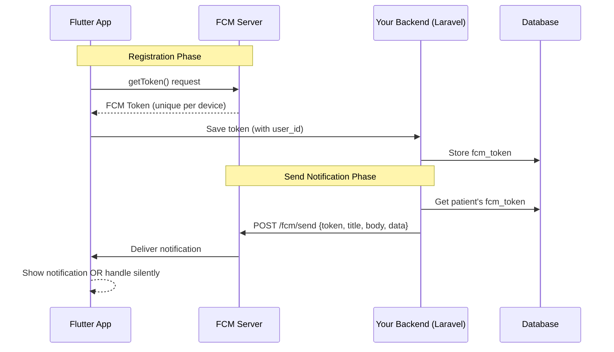
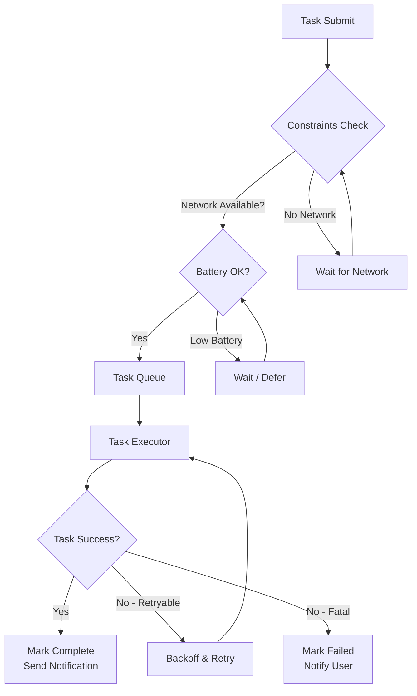
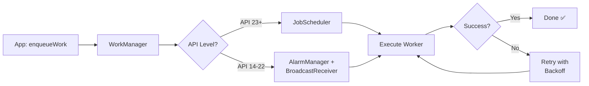
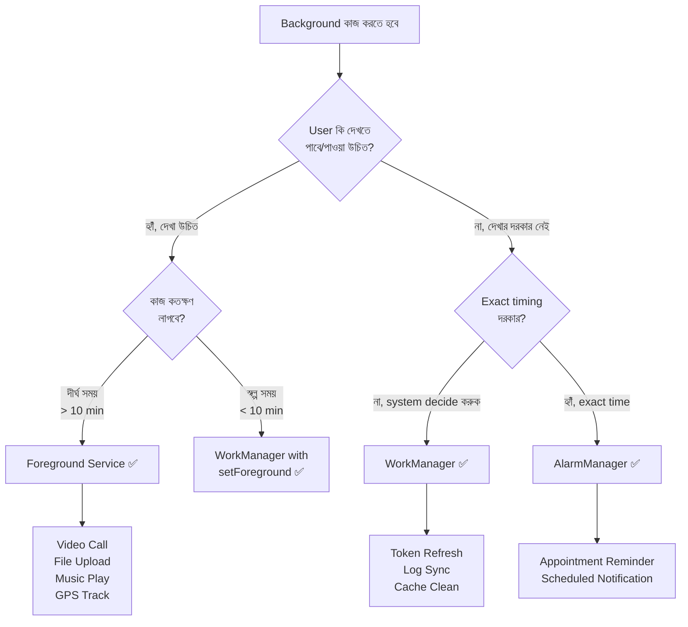
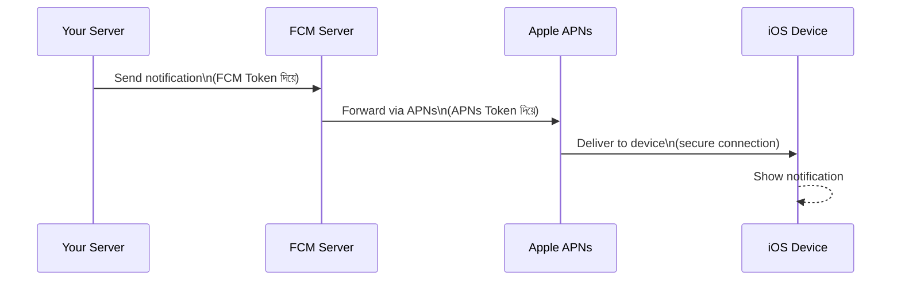
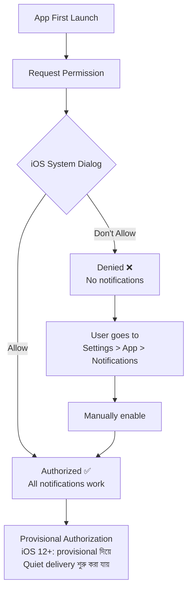
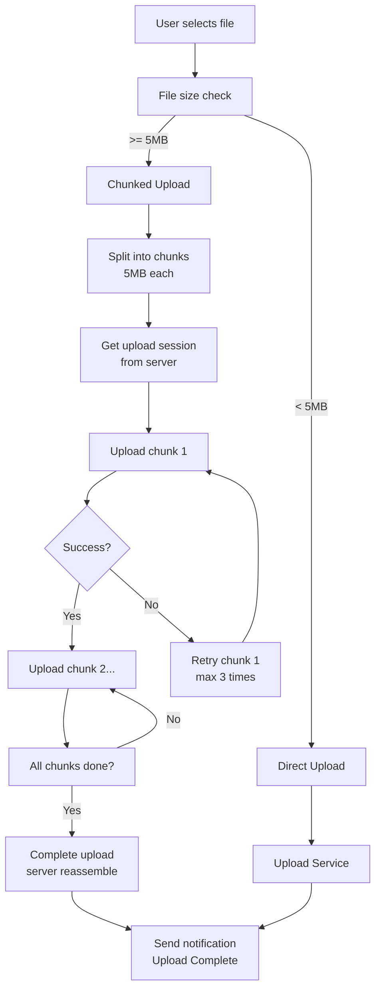
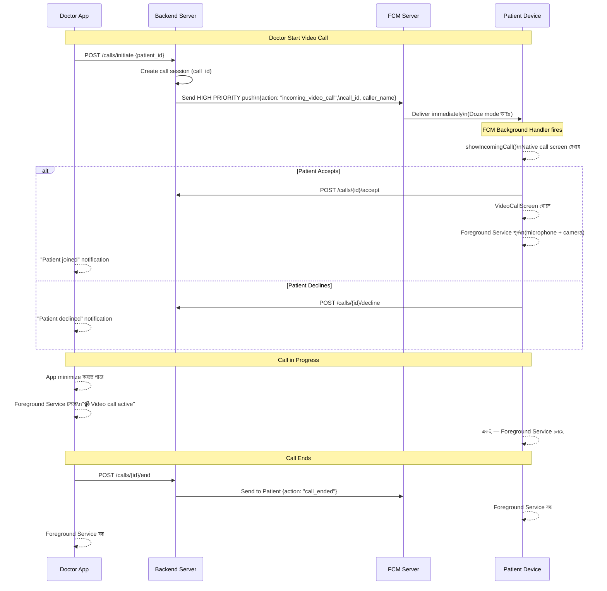
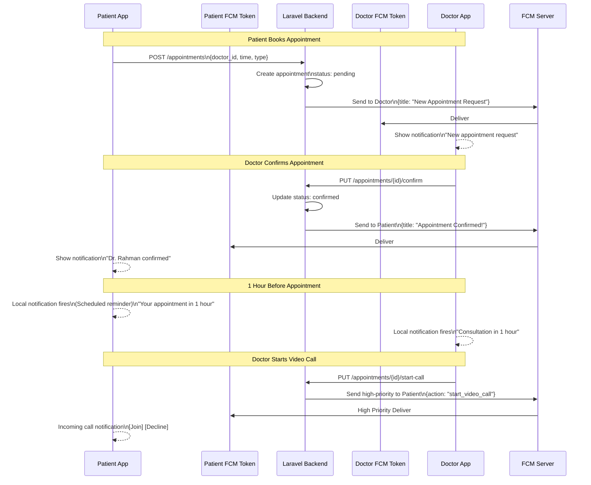
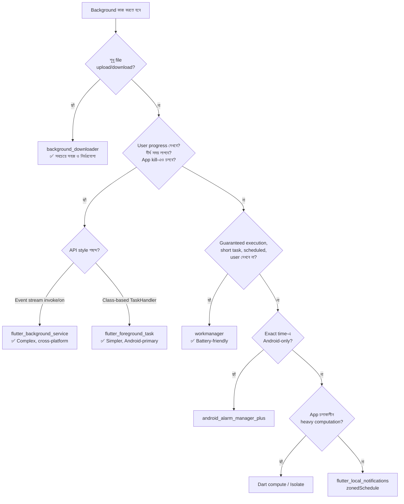

# 📱 Notification & Background Task — সম্পূর্ণ গাইড
### Flutter Telemedicine Developer-দের জন্য — Production-Grade In-Depth Reference

> **ভাষা নীতি:** সমস্ত ব্যাখ্যা বাংলায়, Technical Term সমূহ English-এ অপরিবর্তিত।

---

## 📋 Table of Contents

### Part 1 — Abstract / Generic Concepts
- [1.1 Notification কী এবং কেন দরকার?](#11-notification-কী-এবং-কেন-দরকার)
- [1.2 Push Notification-এর সম্পূর্ণ Architecture](#12-push-notification-এর-সম্পূর্ণ-architecture)
- [1.3 FCM (Firebase Cloud Messaging) — Deep Dive](#13-fcm-firebase-cloud-messaging--deep-dive)
- [1.4 Notification-এর জীবনচক্র (Lifecycle)](#14-notification-এর-জীবনচক্র-lifecycle)
- [1.5 Background Task কী?](#15-background-task-কী)
- [1.6 Background Task-এর ৫টি Core Challenge](#16-background-task-এর-৫টি-core-challenge)
- [1.7 Task Scheduling-এর Abstract Model](#17-task-scheduling-এর-abstract-model)
- [1.8 Large File Upload-এর Conceptual Flow](#18-large-file-upload-এর-conceptual-flow)

### Part 2 — Android System
- [2.1 Android Notification System — Architecture](#21-android-notification-system--architecture)
- [2.2 Notification Channel — বিস্তারিত](#22-notification-channel--বিস্তারিত)
- [2.3 Android Notification Importance Levels](#23-android-notification-importance-levels)
- [2.4 Android Background Task — সব Mechanism](#24-android-background-task--সব-mechanism)
- [2.5 WorkManager — Production Guide](#25-workmanager--production-guide)
- [2.6 Foreground Service — কখন এবং কেন?](#26-foreground-service--কখন-এবং-কেন)
- [2.7 WorkManager vs Foreground Service — বিস্তারিত তুলনা](#27-workmanager-vs-foreground-service--বিস্তারিত-তুলনা)
- [2.8 Android Battery Optimization & Doze Mode](#28-android-battery-optimization--doze-mode)
- [2.9 FCM on Android — Token, Data, Notification Message](#29-fcm-on-android--token-data-notification-message)
- [2.10 Android Background — Real-World Scenarios](#210-android-background--real-world-scenarios)

### Part 3 — iOS System
- [3.1 iOS Notification System — Architecture](#31-ios-notification-system--architecture)
- [3.2 APNs (Apple Push Notification Service) — Deep Dive](#32-apns-apple-push-notification-service--deep-dive)
- [3.3 iOS Notification Authorization & Categories](#33-ios-notification-authorization--categories)
- [3.4 iOS Background Modes — সব Option](#34-ios-background-modes--সব-option)
- [3.5 BGTaskScheduler — iOS 13+](#35-bgtaskscheduler--ios-13)
- [3.6 Background URLSession — Large File Upload](#36-background-urlsession--large-file-upload)
- [3.7 iOS-এর Background Execution Limits](#37-ios-এর-background-execution-limits)
- [3.8 FCM on iOS — APNs Bridge](#38-fcm-on-ios--apns-bridge)
- [3.9 iOS Background — Real-World Scenarios](#39-ios-background--real-world-scenarios)
- [3.10 iOS vs Android Background — মূল পার্থক্য](#310-ios-vs-android-background--মূল-পার্থক্য)

### Part 4 — Flutter Context
- [4.1 Flutter Notification Stack Overview](#41-flutter-notification-stack-overview)
- [4.2 firebase_messaging Package — Complete Guide](#42-firebase_messaging-package--complete-guide)
- [4.3 flutter_local_notifications — Deep Dive](#43-flutter_local_notifications--deep-dive)
- [4.4 Flutter Isolate — Background কাজের ভিত্তি](#44-flutter-isolate--background-কাজের-ভিত্তি)
- [4.5 flutter_background_service — Persistent Background](#45-flutter_background_service--persistent-background)
- [4.6 workmanager Package — Scheduled Tasks](#46-workmanager-package--scheduled-tasks)
- [4.7 Flutter-এ Foreground Service — Step by Step Guide](#47-flutter-এ-foreground-service--step-by-step-guide)
- [4.8 Large Document Upload — Production Implementation](#48-large-document-upload--production-implementation)
- [4.9 Google Drive Style Background — Video Call App-এ কীভাবে করবে?](#49-google-drive-style-background--video-call-app-এ-কীভাবে-করবে)
- [4.10 Telemedicine Use Case — Appointment Notification Flow](#410-telemedicine-use-case--appointment-notification-flow)
- [4.11 Production Checklist](#411-production-checklist)
- [4.12 Flutter Background Libraries — সম্পূর্ণ তুলনা ও Decision Guide](#412-flutter-background-libraries--সম্পূর্ণ-তুলনা-ও-decision-guide)

---

## [↑ TOC](#-table-of-contents)

# Part 1 — Abstract / Generic Concepts

---

## 1.1 Notification কী এবং কেন দরকার?

**Notification** হলো একটি system-generated বা server-generated বার্তা যা user-কে কোনো event সম্পর্কে জানায় — app foreground-এ থাকুক বা না থাকুক।

### Notification-এর ৩টি মূল ধরন

```
┌─────────────────────────────────────────────────────────────┐
│                    NOTIFICATION TYPES                       │
├───────────────────┬──────────────────┬──────────────────────┤
│  LOCAL            │  PUSH            │  SILENT / DATA       │
│  NOTIFICATION     │  NOTIFICATION    │  NOTIFICATION        │
├───────────────────┼──────────────────┼──────────────────────┤
│ Device নিজেই      │ Server থেকে      │ Server থেকে আসে,    │
│ তৈরি করে         │ আসে              │ UI দেখায় না         │
│                   │                  │                      │
│ Example:          │ Example:         │ Example:             │
│ Appointment       │ Doctor Accept    │ Background data      │
│ Reminder          │ করলে notification│ sync, token refresh  │
│ (scheduled)       │                  │                      │
└───────────────────┴──────────────────┴──────────────────────┘
```

### Telemedicine-এ Notification কেন Critical?

| Use Case | Type | Priority |
|---|---|---|
| Appointment Confirmation | Push | High |
| Doctor Accept/Reject | Push | High |
| Video Call Incoming | Push (VoIP) | Critical |
| Document Upload Complete | Local | Normal |
| Prescription Ready | Push | High |
| Appointment Reminder (1 hr before) | Local Scheduled | High |
| Payment Confirmation | Push | Normal |

---

## [↑ TOC](#-table-of-contents)

## 1.2 Push Notification-এর সম্পূর্ণ Architecture

Push Notification-এ সবসময় **৩টি party** থাকে:

```
┌──────────────┐     ┌──────────────────┐     ┌─────────────┐
│   YOUR APP   │     │  PUSH SERVICE    │     │   DEVICE    │
│   SERVER     │     │  (FCM / APNs)    │     │   (User)    │
│  (Laravel /  │────▶│                  │────▶│             │
│   Node.js)   │     │  Google / Apple  │     │  Flutter    │
│              │     │  infrastructure  │     │  App        │
└──────────────┘     └──────────────────┘     └─────────────┘
     Step 1               Step 2                  Step 3
  Server sends         FCM/APNs routes          Device receives
  to FCM/APNs          to correct device        & shows notification
```

### বিস্তারিত Flow:



### Token কী এবং কেন গুরুত্বপূর্ণ?

**FCM Token** হলো একটি unique string যা প্রতিটি device+app combination-কে identify করে।

```
FCM Token Example:
dXNlcjEyMzQ1Njc4OTAxMjM0NTY3OD....(এরকম ~163 character)

এটি change হয় যখন:
├── App re-install হয়
├── User app data clear করে
├── Token expire হয় (FCM নিজেই refresh করে)
├── Device factory reset হয়
└── App নতুন device-এ restore হয়
```

**Production Rule:** Token সবসময় server-এ update করতে হবে। `onTokenRefresh` callback handle করতেই হবে।

---

## [↑ TOC](#-table-of-contents)

## 1.3 FCM (Firebase Cloud Messaging) — Deep Dive

FCM হলো Google-এর free push notification service। এটি Android এবং iOS উভয়ের জন্য কাজ করে।

### FCM Message-এর দুটি অংশ

```
┌─────────────────────────────────────────────┐
│              FCM MESSAGE                    │
├────────────────────┬────────────────────────┤
│  notification {}   │      data {}           │
├────────────────────┼────────────────────────┤
│ System handles     │ App handles            │
│ automatically      │ manually               │
│                    │                        │
│ title: "..."       │ appointment_id: "123"  │
│ body: "..."        │ doctor_id: "456"       │
│ icon: "..."        │ action: "confirm"      │
│                    │ deep_link: "/apt/123"  │
└────────────────────┴────────────────────────┘
       ▼                        ▼
  OS নিজে দেখায়          App-এর code
  (App dead থাকলেও)       handle করে
```

### FCM Message Types — গুরুত্বপূর্ণ পার্থক্য

| Message Type | `notification` field | `data` field | App State |
|---|---|---|---|
| **Notification Message** | ✅ আছে | ❌ নেই | App dead-এও দেখায় |
| **Data Message** | ❌ নেই | ✅ আছে | App running থাকলে handle করে |
| **Combined Message** | ✅ আছে | ✅ আছে | Background-এ OS দেখায়, Foreground-এ App handle করে |

### FCM Priority

```
priority: "high"    ──▶  Doze mode ভেঙে deliver হয় (তাৎক্ষণিক)
priority: "normal"  ──▶  Device active থাকলে deliver হয়
```

> ⚠️ **Android 13+ caveat:** যদি app বারবার high-priority message পাঠায় কিন্তু notification না দেখায়, Android OS সেই app-এর high-priority FCM messages downgrade করতে পারে। তাই high-priority শুধু সত্যিকারের urgent notification-এ ব্যবহার করুন।

**Telemedicine-এ সবসময় `priority: "high"` ব্যবহার করুন।**

---

## [↑ TOC](#-table-of-contents)

## 1.4 Notification-এর জীবনচক্র (Lifecycle)

App-এর তিনটি state-এ notification আলাদাভাবে আসে:

```
┌─────────────────────────────────────────────────────────┐
│                  APP STATES                             │
├──────────────┬──────────────────┬───────────────────────┤
│  FOREGROUND  │    BACKGROUND    │     TERMINATED        │
│  (App খোলা) │  (App minimize)  │  (App সম্পূর্ণ বন্ধ)  │
├──────────────┼──────────────────┼───────────────────────┤
│ Notification │ OS notification  │ OS notification       │
│ আসে কিন্তু  │ bar-এ দেখায়    │ bar-এ দেখায়          │
│ OS দেখায় না │                  │                       │
│              │ Tap করলে app    │ Tap করলে app          │
│ App নিজে    │ খোলে,           │ launch হয়,           │
│ handle করে  │ data পায়       │ data পায়             │
└──────────────┴──────────────────┴───────────────────────┘
```

### Flutter-এ তিনটি Handler

```
onMessage           ──▶  Foreground-এ notification আসলে
onMessageOpenedApp  ──▶  Background notification tap করলে
getInitialMessage   ──▶  Terminated থেকে tap করে app খুললে
```

---

## [↑ TOC](#-table-of-contents)

## 1.5 Background Task কী?

**Background Task** হলো এমন কাজ যা app user-এর সামনে (foreground) না থাকলেও চলতে থাকে।

### কেন Background Task দরকার? — Telemedicine Context

```
Problem:
User একটি 50MB MRI report upload করতে শুরু করল।
Upload হতে 2 মিনিট লাগবে।
User upload চলাকালীন অন্য app-এ গেল।

❌ Background Task ছাড়া:
   App background-এ গেলেই upload cancel হয়ে যাবে!

✅ Background Task দিয়ে:
   Upload চলতে থাকবে, complete হলে notification দেবে।
```

### Background Task-এর প্রকারভেদ

```
┌──────────────────────────────────────────────────────────────┐
│                   BACKGROUND TASK TYPES                      │
├──────────────────┬───────────────────┬───────────────────────┤
│  IMMEDIATE       │  DEFERRED         │  PERIODIC             │
│  (এখনই, কিন্তু  │  (পরে, শর্ত      │  (নির্দিষ্ট সময়      │
│  UI ছাড়া)       │  পূরণ হলে)        │  পর পর)               │
├──────────────────┼───────────────────┼───────────────────────┤
│ File Upload      │ Log sync          │ Token refresh         │
│ API call         │ Analytics send    │ Health check          │
│ Database write   │ Cache cleanup     │ Prescription reminder │
└──────────────────┴───────────────────┴───────────────────────┘
```

---

## [↑ TOC](#-table-of-contents)

## 1.6 Background Task-এর ৫টি Core Challenge

```
┌─────────────────────────────────────────────────────────────┐
│              BACKGROUND TASK CHALLENGES                     │
├─────┬───────────────────┬─────────────────────────────────  │
│ #   │ Challenge         │ কারণ                              │
├─────┼───────────────────┼────────────────────────────────── │
│ 1   │ Battery Drain     │ Background task CPU/network use   │
│     │                   │ করে, battery শেষ হয়              │
├─────┼───────────────────┼────────────────────────────────── │
│ 2   │ OS Killing        │ Android/iOS memory pressure-এ     │
│     │                   │ background app kill করে           │
├─────┼───────────────────┼────────────────────────────────── │
│ 3   │ Network           │ Background-এ network নাও পাওয়া   │
│     │                   │ যেতে পারে (Doze mode)             │
├─────┼───────────────────┼────────────────────────────────── │
│ 4   │ Execution Time    │ iOS background task-কে সর্বোচ্চ  │
│     │                   │ 30 second দেয়                     │
├─────┼───────────────────┼────────────────────────────────── │
│ 5   │ Resumability      │ Task interrupt হলে কোথা থেকে     │
│     │                   │ resume করবে?                      │
└─────┴───────────────────┴────────────────────────────────── │
```

---

## [↑ TOC](#-table-of-contents)

## 1.7 Task Scheduling-এর Abstract Model



### Retry Strategy — Exponential Backoff

```
Attempt 1:  Wait 10s
Attempt 2:  Wait 20s
Attempt 3:  Wait 40s
Attempt 4:  Wait 80s
...
Max Attempts: 3-5 (production-এ)
```

---

## [↑ TOC](#-table-of-contents)

## 1.8 Large File Upload-এর Conceptual Flow

```
┌─────────────────────────────────────────────────────────────┐
│              LARGE FILE UPLOAD - CHUNKED STRATEGY           │
└─────────────────────────────────────────────────────────────┘

File: MRI_Report.pdf (50 MB)
                    │
                    ▼
        ┌─────────────────────┐
        │   CHUNK SPLITTING   │
        │  50MB ÷ 5MB = 10    │
        │  chunks             │
        └─────────────────────┘
                    │
          ┌─────────┼─────────┐
          ▼         ▼         ▼
       Chunk 1   Chunk 2 ... Chunk 10
       (5MB)     (5MB)       (5MB)
          │         │         │
          ▼         ▼         ▼
       Upload    Upload    Upload
       Server    Server    Server
          │         │         │
          └─────────┼─────────┘
                    ▼
        ┌─────────────────────┐
        │  SERVER REASSEMBLE  │
        │  10 chunks → 1 file │
        └─────────────────────┘
                    │
                    ▼
        ┌─────────────────────┐
        │ NOTIFICATION SENT   │
        │ "Upload Complete!"  │
        └─────────────────────┘

Benefit: যেকোনো chunk fail হলে শুধু সেটি retry করো।
         পুরো file আবার upload করতে হবে না।
```

---

# Part 2 — Android System

---

## [↑ TOC](#-table-of-contents)

## 2.1 Android Notification System — Architecture

Android-এ notification system OS-level-এ built-in। এটি **NotificationManager** service দ্বারা পরিচালিত হয়।

```
┌────────────────────────────────────────────────────────────┐
│                   ANDROID OS                               │
│                                                            │
│  ┌──────────────────────────────────────────────────────┐  │
│  │              SystemUI Process                        │  │
│  │   ┌─────────────────────────────────────────────┐   │  │
│  │   │         Notification Shade                  │   │  │
│  │   │  (Status bar থেকে নামানো notification list) │   │  │
│  │   └─────────────────────────────────────────────┘   │  │
│  └──────────────────────────────────────────────────────┘  │
│                          ▲                                  │
│                          │                                  │
│  ┌──────────────────────────────────────────────────────┐  │
│  │         NotificationManagerService                   │  │
│  │         (System Server-এ চলে)                        │  │
│  └──────────────────────────────────────────────────────┘  │
│                          ▲                                  │
│                          │  notify()                        │
│  ┌───────────────────┐   │                                  │
│  │   Your Flutter    │───┘                                  │
│  │   App Process     │                                      │
│  └───────────────────┘                                      │
└────────────────────────────────────────────────────────────┘
```

### Notification Build করার উপাদান

```
NotificationCompat.Builder
├── setSmallIcon()          ─── Status bar-এর ছোট icon (mandatory)
├── setContentTitle()       ─── বড় শিরোনাম
├── setContentText()        ─── সংক্ষিপ্ত বার্তা
├── setStyle()              ─── BigText / BigPicture / Inbox
├── setPriority()           ─── PRIORITY_HIGH, DEFAULT, LOW
├── setAutoCancel()         ─── Tap করলে dismiss হবে কিনা
├── setContentIntent()      ─── Tap করলে কী হবে (PendingIntent)
├── addAction()             ─── Action button (Accept / Reject)
├── setProgress()           ─── Upload progress bar
├── setOngoing()            ─── Dismiss করা যাবে না (foreground service)
└── setChannelId()          ─── Android 8+ এ mandatory
```

---

## [↑ TOC](#-table-of-contents)

## 2.2 Notification Channel — বিস্তারিত

**Android 8.0 (API 26) থেকে Notification Channel mandatory।** Channel হলো notification-এর category, যা user নিজে customize করতে পারে।

### Channel কেন দরকার?

```
আগে (Android 7 এবং নিচে):
  App সব notification send করত, user শুধু সব বন্ধ করতে পারত।

এখন (Android 8+):
  App channel তৈরি করে।
  User প্রতিটি channel আলাদাভাবে control করতে পারে।

Example:
  ✅ "Appointment" channel — চালু রাখা
  ✅ "Video Call" channel — চালু রাখা
  ❌ "Promotions" channel — বন্ধ করা
```

### Telemedicine App-এর Channels

```kotlin
// Android Native (Kotlin) — Flutter plugin এটি internally করে
val channels = listOf(
    // Channel 1: Video Call (সর্বোচ্চ গুরুত্ব)
    NotificationChannel(
        "video_call",
        "Video Consultation",
        NotificationManager.IMPORTANCE_HIGH
    ).apply {
        description = "Incoming video consultation calls"
        enableVibration(true)
        setSound(callRingtone, audioAttributes)
        lockscreenVisibility = Notification.VISIBILITY_PUBLIC
    },

    // Channel 2: Appointment
    NotificationChannel(
        "appointment",
        "Appointment Updates",
        NotificationManager.IMPORTANCE_HIGH
    ).apply {
        description = "Appointment confirmations and reminders"
        enableVibration(true)
    },

    // Channel 3: Document Upload
    NotificationChannel(
        "document_upload",
        "Document Upload",
        NotificationManager.IMPORTANCE_LOW
    ).apply {
        description = "Document upload progress and completion"
        setSound(null, null)  // Upload-এ sound নেই
    },

    // Channel 4: Prescription
    NotificationChannel(
        "prescription",
        "Prescriptions",
        NotificationManager.IMPORTANCE_DEFAULT
    )
)
```

### Channel Importance Levels

```
IMPORTANCE_NONE     ──▶ Notification দেখায় না
IMPORTANCE_MIN      ──▶ Status bar-এ শুধু icon
IMPORTANCE_LOW      ──▶ Sound/vibration নেই, list-এ দেখায়
IMPORTANCE_DEFAULT  ──▶ Sound আছে, heads-up নেই
IMPORTANCE_HIGH     ──▶ Sound + Heads-up popup ✅ (Vibration: channel-এ enableVibration(true) না দিলে গ্যারান্টি নেই)
IMPORTANCE_MAX      ──▶ (HIGH-এর সমান আচরণ করে; Google recommend করে HIGH ব্যবহার করতে)
```

---

## [↑ TOC](#-table-of-contents)

## 2.3 Android Notification Importance Levels

```
┌──────────────────────────────────────────────────────────────┐
│  IMPORTANCE_HIGH — Heads-up Notification                     │
│                                                              │
│  ┌──────────────────────────────────────────────────────┐   │
│  │  📞 Dr. Rahman wants to start your consultation     │   │
│  │     Telemedicine App           Accept  Decline      │   │
│  └──────────────────────────────────────────────────────┘   │
│  (Screen-এর উপরে popup হয়, interrupt করে)                  │
└──────────────────────────────────────────────────────────────┘

┌──────────────────────────────────────────────────────────────┐
│  IMPORTANCE_DEFAULT — Standard Notification                  │
│                                                              │
│  Status bar-এ icon, sound আছে, heads-up নেই                 │
│  Notification shade-এ দেখায়                                 │
└──────────────────────────────────────────────────────────────┘

┌──────────────────────────────────────────────────────────────┐
│  IMPORTANCE_LOW — Silent Notification                        │
│                                                              │
│  Document upload progress-এর জন্য ভালো।                    │
│  Sound/vibration নেই। Shade-এ দেখায়।                       │
└──────────────────────────────────────────────────────────────┘
```

---

## [↑ TOC](#-table-of-contents)

## 2.4 Android Background Task — সব Mechanism

Android-এ background task-এর জন্য বিভিন্ন mechanism আছে, যেগুলো বিভিন্ন use case-এ ব্যবহার হয়।

```
┌─────────────────────────────────────────────────────────────┐
│           ANDROID BACKGROUND EXECUTION OPTIONS              │
├──────────────────────┬──────────────────────────────────────┤
│  MECHANISM           │  USE CASE                           │
├──────────────────────┼──────────────────────────────────────┤
│  WorkManager         │  Guaranteed, deferrable tasks        │
│  (Recommended ✅)    │  Log sync, token refresh             │
├──────────────────────┼──────────────────────────────────────┤
│  Foreground Service  │  Long-running, user-visible tasks   │
│  (File Upload ✅)    │  File upload, music playback         │
├──────────────────────┼──────────────────────────────────────┤
│  JobScheduler        │  System-condition-based tasks        │
│  (WorkManager        │  (WorkManager এটি internally ব্যবহার│
│  internally uses it) │  করে, সরাসরি কম ব্যবহার করুন)      │
├──────────────────────┼──────────────────────────────────────┤
│  AlarmManager        │  Exact time-based tasks              │
│                      │  Appointment reminder                │
├──────────────────────┼──────────────────────────────────────┤
│  Thread / Coroutine  │  App চলাকালীন async কাজ             │
│                      │  (Background task নয়)               │
└──────────────────────┴──────────────────────────────────────┘
```

---

## [↑ TOC](#-table-of-contents)

## 2.5 WorkManager — Production Guide

**WorkManager** হলো Android Jetpack-এর সবচেয়ে গুরুত্বপূর্ণ background task library। এটি **guaranteed execution** দেয় — device restart হলেও task হারায় না।

### WorkManager কীভাবে কাজ করে?



### WorkManager-এর Key Concepts

**Constraints (শর্ত):**
```
Constraints.Builder()
  .setRequiredNetworkType(NetworkType.CONNECTED)  // Network লাগবে
  .setRequiresBatteryNotLow(true)                 // Battery low হলে না
  .setRequiresCharging(false)                     // Charge দরকার নেই
  .setRequiresStorageNotLow(true)                 // Storage কম হলে না
  .build()
```

**Work Types:**
```
OneTimeWorkRequest  ──▶  একবার চলবে (Token sync, Log send)
PeriodicWorkRequest ──▶  বারবার চলবে (minimum 15 min interval)
```

**Work Chain (Chaining):**
```kotlin
// কাজগুলো পরপর করা
WorkManager.getInstance(context)
    .beginWith(compressDocumentWork)    // প্রথমে compress
    .then(uploadDocumentWork)           // তারপর upload
    .then(notifyServerWork)             // তারপর server-কে জানাও
    .enqueue()
```

### WorkManager vs Foreground Service

```
┌─────────────────────────────────────────────────────────────┐
│  কখন WorkManager, কখন Foreground Service?                   │
├──────────────────────────┬──────────────────────────────────┤
│  WorkManager             │  Foreground Service              │
├──────────────────────────┼──────────────────────────────────┤
│ Deferrable/short tasks   │ Long-running, user-visible tasks │
│ Deferrable               │ Immediate                        │
│ System decides timing    │ App controls timing              │
│ No UI required           │ Persistent notification required │
│ Log sync, Token refresh  │ File upload, Music, Location     │
└──────────────────────────┴──────────────────────────────────┘
```

---

## [↑ TOC](#-table-of-contents)

## 2.6 Foreground Service — কখন এবং কেন?

**Foreground Service** মানে হলো — app background-এ গেলেও একটি কাজ চলতে থাকে, এবং user-কে notification-এ দেখানো হয় যে "এই কাজটি চলছে।"

**সহজ ভাষায় বুঝি:**
> তুমি YouTube-এ গান ছেড়ে WhatsApp-এ গেলেও গান বাজতে থাকে — এটাই Foreground Service। App UI বন্ধ, কিন্তু কাজ চলছে, আর notification bar-এ দেখা যাচ্ছে।

### কেন Foreground Service দরকার?

```
Android-এর নিয়ম:
  App background-এ গেলে OS যেকোনো সময় সেটাকে kill করতে পারে।
  বিশেষ করে RAM কম থাকলে।

Foreground Service-এ OS promise করে:
  "এই app চলছে এবং user জানে — তাই এটাকে kill করব না।"

এই promise-টি কাজ করে কারণ:
  Notification bar-এ সবসময় একটি notification থাকতেই হবে।
  User দেখতে পায়, সে জানে কী হচ্ছে।
  OS-এর কাছে এটি "user-aware" task।
```

### Foreground Service কখন ব্যবহার করবে?

```
✅ ব্যবহার করো যখন:
  1. কাজটি দীর্ঘ সময় লাগে (1 মিনিটের বেশি)
  2. User-কে progress দেখাতে হবে (upload %, call duration)
  3. কাজ interrupt হলে সমস্যা হবে (file upload, video call)
  4. Real-time কাজ (GPS tracking, live audio/video)
  5. Network টানতে হবে দীর্ঘ সময়

❌ ব্যবহার করো না যখন:
  1. ছোট এক-বারের কাজ (log send, token refresh) → WorkManager
  2. শুধু নির্দিষ্ট সময়ে reminder → AlarmManager
  3. User জানার দরকার নেই → WorkManager
```

### Foreground Service-এর Notification (Mandatory)

```
┌─────────────────────────────────────────────────┐
│  📤  Uploading MRI Report                       │
│      Telemedicine                    [Cancel]   │
│  ████████████░░░░░░░░  65% (32.5 MB / 50 MB)   │
└─────────────────────────────────────────────────┘

এই notification ছাড়া Foreground Service চলে না।
User জানে কী হচ্ছে — এটি UX-এর জন্যও ভালো।

গুরুত্বপূর্ণ: User notification swipe করে dismiss করতে পারবে না।
             সে চাইলে Cancel button দিয়ে কাজ বন্ধ করতে পারবে।
```

### Foreground Service-এর Lifecycle

```
┌─────────────────────────────────────────────────────────────┐
│              FOREGROUND SERVICE LIFECYCLE                   │
│                                                             │
│  App Start                                                  │
│      │                                                      │
│      ▼                                                      │
│  startForegroundService() ─── Service তৈরি হয়              │
│      │                                                      │
│      ▼                                                      │
│  startForeground(id, notification) ─── Notification দেখায়  │
│      │  (এটি 5 second-এর মধ্যে call করতে হবে!)             │
│      ▼                                                      │
│  doWork() ─── আসল কাজ শুরু (upload, call, etc.)            │
│      │                                                      │
│      ▼                                                      │
│  stopSelf() / stopForeground() ─── কাজ শেষে বন্ধ করো       │
│      │                                                      │
│      ▼                                                      │
│  Notification চলে যায়                                      │
└─────────────────────────────────────────────────────────────┘
```

### Android 14+ Foreground Service Type

Android 14 (API 34) থেকে foreground service-এর **type** declare করতে হয়। না করলে app crash করবে।

```xml
<!-- AndroidManifest.xml -->
<service
    android:name=".UploadService"
    android:foregroundServiceType="dataSync"
    android:exported="false" />

<!-- সব available types: -->
<!--
  camera          → ক্যামেরা ব্যবহার করলে
  connectedDevice → Bluetooth/USB device
  dataSync        → File upload/download ✅ (আমাদের ক্ষেত্রে)
  health          → Health/fitness tracking
  location        → GPS tracking
  mediaPlayback   → Music/video playback ✅ (YouTube-style)
  mediaProjection → Screen recording
  microphone      → Audio recording ✅ (Voice call)
  phoneCall       → Phone call
  remoteMessaging → Messaging
  shortService    → দ্রুত শেষ হওয়া কাজ (max 3 min)
  specialUse      → Special permission-এর কাজ
  systemExempted  → System app
-->
```

### Foreground Service-এর ৩টি Real Example

```
Example 1 — File Upload (dataSync):
  User 100MB MRI scan upload করছে।
  Notification: "📤 Uploading MRI Scan... 45%"
  Cancel button আছে।
  App close করলেও চলে।

Example 2 — Video Call (microphone + camera):
  Doctor-এর সাথে video consultation চলছে।
  Notification: "📹 Video call with Dr. Rahman — 12:34"
  User অন্য app খুলতে পারে, call চলবে।

Example 3 — Location Tracking (location):
  Ambulance-এর real-time location track করছে।
  Notification: "📍 Live tracking active"
  App background-এ থেকেও location update পাঠাচ্ছে।
```

---

## [↑ TOC](#-table-of-contents)

## 2.7 WorkManager vs Foreground Service — বিস্তারিত তুলনা

এই দুটো জিনিস নিয়ে অনেক confusion হয়। সহজভাবে বুঝি:

### মূল পার্থক্য — একটি গল্পে

```
WorkManager মানে:
  "এই চিঠিটা কাল delivery দিও — network থাকলে, battery ঠিক থাকলে।
   দরকারে পরশু দিও। কিন্তু অবশ্যই দিতে হবে।"
   → System নিজের সুবিধামতো সময়ে করবে।
   → Guaranteed, কিন্তু exact timing নেই।

Foreground Service মানে:
  "এখনই এই package টা deliver করতে হবে। আমি দাঁড়িয়ে আছি।
   তুমি দেখতে পাচ্ছ আমি কাজ করছি।"
   → App নিজে control করে।
   → Immediate, user দেখতে পায়।
```

### বিস্তারিত তুলনা টেবিল

```
┌────────────────────────┬───────────────────────┬────────────────────────┐
│  বিষয়                 │  WorkManager          │  Foreground Service    │
├────────────────────────┼───────────────────────┼────────────────────────┤
│  কাজ শুরু হয় কখন?   │  System decides        │  App decide করে        │
│                        │  (হয়তো এখনই,          │  (তাৎক্ষণিক)           │
│                        │  হয়তো পরে)            │                        │
├────────────────────────┼───────────────────────┼────────────────────────┤
│  User notification     │  নেই (optional)        │  আবশ্যিক (mandatory)   │
│  দরকার?               │                        │                        │
├────────────────────────┼───────────────────────┼────────────────────────┤
│  কতক্ষণ চলতে পারে?   │  ~10 min               │  সীমাহীন (unlimited)   │
│                        │  (setForeground দিলে  │                        │
│                        │  বেশি)                 │                        │
├────────────────────────┼───────────────────────┼────────────────────────┤
│  Network constraint    │  ✅ সহজেই দেওয়া যায়   │  ❌ নিজে handle করো    │
├────────────────────────┼───────────────────────┼────────────────────────┤
│  Retry automatic?      │  ✅ হ্যাঁ, built-in    │  ❌ নিজে লিখতে হবে    │
├────────────────────────┼───────────────────────┼────────────────────────┤
│  Device restart        │  ✅ Task survive করে   │  ❌ Service restart     │
│  সার্ভাইভ করে?        │                        │  করতে হবে              │
├────────────────────────┼───────────────────────┼────────────────────────┤
│  Progress দেখানো?      │  কঠিন                 │  সহজ (notification     │
│                        │                        │  update করা যায়)       │
├────────────────────────┼───────────────────────┼────────────────────────┤
│  Battery impact        │  কম (system batches)  │  বেশি (সবসময় চলে)     │
├────────────────────────┼───────────────────────┼────────────────────────┤
│  কখন use করবে?        │  Token sync            │  File upload           │
│                        │  Log send              │  Video call            │
│                        │  Appointment sync      │  Music play            │
│                        │  Cache cleanup         │  GPS tracking          │
│                        │  Analytics             │  Large download        │
└────────────────────────┴───────────────────────┴────────────────────────┘
```

### Decision Tree — কোনটা ব্যবহার করবে?



### WorkManager-এর মধ্যে Foreground — setForeground()

WorkManager দিয়েও Foreground Service-এর মতো কাজ করা যায়, কিন্তু এটি internally Foreground Service-ই চালায়:

```dart
// WorkManager Worker-এর মধ্যে
// এটি call করলে Worker একটি Foreground Service হয়ে যায়
setForegroundAsync(ForegroundInfo(
    notificationId,
    notification,
));

// এই পদ্ধতিতে:
// ✅ WorkManager-এর retry, constraint সব পাবে
// ✅ Foreground Service-এর OS protection পাবে
// ❌ কিন্তু বেশি complex code
```

**সুপারিশ:** যদি WorkManager-এর constraints (network, battery) দরকার হয় AND দীর্ঘ সময় লাগে — তাহলে `setForeground()` সহ WorkManager ব্যবহার করো। নইলে সরাসরি Foreground Service।

---

## [↑ TOC](#-table-of-contents)

## 2.8 Android Battery Optimization & Doze Mode

Android device idle থাকলে battery বাঁচাতে **Doze Mode** এবং **App Standby** চালু হয়।

### Doze Mode কী?

```
┌─────────────────────────────────────────────────────────────┐
│                    DOZE MODE TIMELINE                       │
│                                                             │
│  Device screen off + unplugged + stationary                 │
│                                                             │
│  0 min ─────────────────────────────────────────▶          │
│         │                                                   │
│    ~কিছুক্ষণ পর: Light Doze শুরু (সময় device-ভেদে ভিন্ন) │
│         │  Network: ✅ (কম)  Alarm: ✅ (restricted)        │
│         │                                                   │
│    আরও পরে: Deep Doze শুরু (সময় officially documented নয়) │
│         │  Network: ❌        Alarm: ❌                      │
│         │  FCM High Priority: ✅ (একমাত্র exception)        │
│         │                                                   │
│    Maintenance Window (মাঝেমধ্যে):                          │
│         │  Network: ✅ (কিছুক্ষণ)  Tasks run               │
│         │                                                   │
│    User touches device: Doze exit                           │
└─────────────────────────────────────────────────────────────┘
```

### FCM High Priority — Doze Exception

```
FCM message-এ priority: "high" দিলে:
  ✅ Doze mode-এও device wake up করে
  ✅ Network briefly available হয়
  ✅ Notification deliver হয়

এজন্য appointment confirmation-এ সবসময় high priority দিন।
```

### Battery Optimization Exemption

Production app-এ user-কে battery optimization থেকে exempt করতে বলা যায়:

```dart
// flutter_background_service package ব্যবহার করলে
// Settings খুলে user-কে manually exempt করতে গাইড করুন

// Android: Settings > Apps > YourApp > Battery > Unrestricted
```

---

## [↑ TOC](#-table-of-contents)

## 2.9 FCM on Android — Token, Data, Notification Message

### Android-এ FCM কীভাবে কাজ করে?

```
┌─────────────────────────────────────────────────────────────┐
│                     ANDROID DEVICE                          │
│                                                             │
│  ┌─────────────────────────────────────────────────────┐   │
│  │               Google Play Services                  │   │
│  │  (FCM connection এখানেই manage হয়)                 │   │
│  │                                                     │   │
│  │  ┌──────────────────────────────────────────────┐  │   │
│  │  │         FCM Persistent Connection            │  │   │
│  │  │   Google servers-এর সাথে সবসময় connected   │  │   │
│  │  └──────────────────────────────────────────────┘  │   │
│  └─────────────────────────────────────────────────────┘   │
│                           │                                 │
│              Message আসলে │                                 │
│                           ▼                                 │
│  ┌─────────────────────────────────────────────────────┐   │
│  │  App Background/Killed:                             │   │
│  │    notification{} → OS নিজেই দেখায়                 │   │
│  │    data{} → App launch হলে পাবে                     │   │
│  │                                                     │   │
│  │  App Foreground:                                    │   │
│  │    সব message → App-এর onMessage() callback        │   │
│  └─────────────────────────────────────────────────────┘   │
└─────────────────────────────────────────────────────────────┘
```

### Android-এ Required Permissions (AndroidManifest.xml)

```xml
<!-- FCM-এর জন্য -->
<uses-permission android:name="android.permission.INTERNET" />
<uses-permission android:name="android.permission.RECEIVE_BOOT_COMPLETED" />

<!-- Android 13+ (API 33) — Runtime permission দরকার -->
<uses-permission android:name="android.permission.POST_NOTIFICATIONS" />

<!-- Foreground Service (File Upload) -->
<uses-permission android:name="android.permission.FOREGROUND_SERVICE" />
<uses-permission android:name="android.permission.FOREGROUND_SERVICE_DATA_SYNC" />

<!-- WorkManager (Automatic — তবে explicit-এ ভালো) -->
<uses-permission android:name="android.permission.WAKE_LOCK" />

<!-- Exact Alarm (Appointment Reminder) -->
<!-- SCHEDULE_EXACT_ALARM: Android 12 (API 31)+ — user-গ্রান্ট প্রয়োজন, revocable -->
<uses-permission android:name="android.permission.SCHEDULE_EXACT_ALARM" />
<!-- USE_EXACT_ALARM: Android 13 (API 33)+ — auto-granted, user permission লাগে না -->
<uses-permission android:name="android.permission.USE_EXACT_ALARM" />
```

---

## [↑ TOC](#-table-of-contents)

## 2.10 Android Background — Real-World Scenarios

এখানে কিছু বাস্তব পরিস্থিতিতে কোন solution ব্যবহার করবে তা দেখানো হলো।

### Scenario 1 — ডাক্তার Appointment Confirm করলে

```
পরিস্থিতি:
  Patient-এর app background-এ আছে।
  Doctor server-এ appointment confirm করল।
  Patient-কে জানাতে হবে।

Solution:
  Server → FCM high priority push → Android device wake up
  App background handler: local notification দেখাও
  Notification tap → Appointment detail screen-এ নিয়ে যাও

Android কাজ করে এভাবে:
  FCM Doze mode ভেঙে deliver করে (high priority)
  OS notification bar-এ দেখায়
  App launch হলে getInitialMessage() দিয়ে data পাওয়া যায়
```

### Scenario 2 — 50MB MRI Report Upload

```
পরিস্থিতি:
  Patient file select করল।
  Upload শুরু হলো।
  User Instagram খুলল।

Solution:
  Foreground Service চালু হবে
  Notification: "📤 Uploading MRI... 34%"
  Upload চলতে থাকবে
  Complete হলে: "✅ Upload Complete"

কেন WorkManager নয়?
  ✗ WorkManager 50MB upload করতে গেলে progress notification update কঠিন
  ✗ System যেকোনো সময় defer করতে পারে
  ✗ User দেখতে পাবে না কী হচ্ছে
```

### Scenario 3 — রাত ১১টার Appointment Reminder

```
পরিস্থিতি:
  আগামীকাল সকাল ১০টায় appointment।
  রাত ১১টায় reminder set করা আছে।

Solution:
  flutter_local_notifications দিয়ে zonedSchedule()
  AlarmManager internally exact time-এ fire করে
  App বন্ধ থাকলেও notification আসবে

কেন Foreground Service নয়?
  ✗ সারারাত service চালু রাখা battery waste
  ✗ User-এর experience খারাপ
  ✓ AlarmManager/zonedSchedule perfect এই কাজে
```

### Scenario 4 — FCM Token প্রতিদিন Refresh করা

```
পরিস্থিতি:
  Token stale হলে notification আসবে না।
  প্রতিদিন একবার server-এ latest token send করা দরকার।

Solution:
  WorkManager PeriodicTask (24 hour interval)
  Constraint: network connected

কেন Foreground Service নয়?
  ✗ User দেখার দরকার নেই
  ✗ Background-এ quietly করলেই হবে
  ✓ WorkManager guaranteed execution দেবে
```

---

# Part 3 — iOS System

---

## [↑ TOC](#-table-of-contents)

## 3.1 iOS Notification System — Architecture

iOS-এর notification system Android-এর চেয়ে বেশি restrictive কিন্তু বেশি consistent।

```
┌─────────────────────────────────────────────────────────────┐
│                         iOS                                 │
│                                                             │
│  ┌─────────────────────────────────────────────────────┐   │
│  │              Notification Center (OS)               │   │
│  │   User সব notification এখান থেকে manage করে       │   │
│  └─────────────────────────────────────────────────────┘   │
│                           ▲                                 │
│                           │                                 │
│  ┌─────────────────────────────────────────────────────┐   │
│  │         UNUserNotificationCenter                    │   │
│  │  (App notification-এর সাথে interact করার API)      │   │
│  └─────────────────────────────────────────────────────┘   │
│              ▲                        ▲                     │
│              │                        │                     │
│  ┌───────────────────┐    ┌──────────────────────────┐     │
│  │  Remote (Push)    │    │  Local Notification      │     │
│  │  APNs → FCM →     │    │  App নিজেই schedule করে │     │
│  │  Your App         │    │  (Appointment Reminder)  │     │
│  └───────────────────┘    └──────────────────────────┘     │
└─────────────────────────────────────────────────────────────┘
```

---

## [↑ TOC](#-table-of-contents)

## 3.2 APNs (Apple Push Notification Service) — Deep Dive

**APNs** হলো Apple-এর push notification infrastructure। FCM iOS-এ push notification পাঠাতে APNs ব্যবহার করে।

### FCM → APNs → Device Flow



### APNs-এর Key Points

```
1. FCM internally APNs ব্যবহার করে iOS-এ।
   তোমাকে সরাসরি APNs handle করতে হবে না।

2. APNs Authentication:
   Firebase Console-এ APNs key (.p8 file) upload করতে হয়।
   এটি না করলে iOS-এ push কাজ করবে না।

3. APNs Environment:
   Development: sandbox APNs
   Production: production APNs
   Firebase automatically সঠিকটি ব্যবহার করে।
```

### Firebase Console-এ APNs Setup

```
Firebase Console
  └── Project Settings
      └── Cloud Messaging
          └── Apple app configuration
              ├── APNs Authentication Key (.p8) ──▶ Recommended
              └── APNs Certificates (.p12) ──▶ Older method
```

---

## [↑ TOC](#-table-of-contents)

## 3.3 iOS Notification Authorization & Categories

iOS-এ notification দেখাতে **user permission** নিতেই হবে। এটি mandatory।

### Permission Request Flow



### Permission Types

```swift
// iOS Native (Swift) — Flutter plugin internally করে
UNUserNotificationCenter.current().requestAuthorization(
    options: [
        .alert,   // Screen-এ notification দেখানো
        .sound,   // Sound বাজানো
        .badge,   // App icon-এ badge number
        .criticalAlert,  // DND ভেঙে sound (medical apps)
        .provisional     // Quietly deliver করা (user confirm লাগে না)
    ]
)
```

### Critical Alert — Telemedicine-এর জন্য Special

```
Critical Alert:
  ✅ Do Not Disturb (DND) mode ভেঙে sound বাজায়
  ✅ মধ্যরাতেও notification যায়
  ❌ Apple-এর special permission দরকার (entitlement)
  ✅ Medical/Healthcare apps পায় (application করতে হয়)

Telemedicine app-এ incoming video call-এর জন্য এটি কাজে আসে।
```

### Notification Categories (Action Buttons)

```
iOS notification-এ iOS style Action button যোগ করা যায়:

┌──────────────────────────────────────────────────────┐
│  📅  Dr. Rahman has confirmed your appointment       │
│      Tomorrow, 10:00 AM                              │
│  ┌──────────────────┐  ┌──────────────────────────┐ │
│  │   View Details   │  │      Reschedule           │ │
│  └──────────────────┘  └──────────────────────────┘ │
└──────────────────────────────────────────────────────┘

// Category define করতে হয়:
let viewAction = UNNotificationAction(identifier: "VIEW", title: "View Details")
let rescheduleAction = UNNotificationAction(identifier: "RESCHEDULE", title: "Reschedule")
let category = UNNotificationCategory(identifier: "APPOINTMENT", actions: [...])
```

---

## [↑ TOC](#-table-of-contents)

## 3.4 iOS Background Modes — সব Option

iOS background execution-এর জন্য **Info.plist**-এ Background Modes declare করতে হয়।

```
iOS Background Modes (UIBackgroundModes):
├── fetch                    ─── Background App Refresh
├── remote-notification      ─── Silent Push Notification handle
├── processing               ─── BGTaskScheduler (iOS 13+)
├── background-url-session   ─── Background URLSession (File Upload)
├── voip                     ─── VoIP (Video Call)
├── audio                    ─── Background Audio
├── location                 ─── Background Location
└── bluetooth-central        ─── Bluetooth
```

### Telemedicine App-এর Required Background Modes

```xml
<!-- Info.plist -->
<key>UIBackgroundModes</key>
<array>
    <string>remote-notification</string>  <!-- FCM silent push -->
    <string>fetch</string>                <!-- Background refresh -->
    <string>processing</string>           <!-- BGTaskScheduler -->
    <string>background-url-session</string> <!-- File upload -->
    <string>voip</string>                 <!-- Video call -->
</array>
```

---

## [↑ TOC](#-table-of-contents)

## 3.5 BGTaskScheduler — iOS 13+

**BGTaskScheduler** হলো iOS 13+ এর modern background task API। এটি দুই ধরনের task support করে।

```
┌──────────────────────────────────────────────────────────────┐
│                   BGTaskScheduler                            │
├────────────────────────────┬─────────────────────────────────┤
│  BGAppRefreshTask          │  BGProcessingTask               │
├────────────────────────────┼─────────────────────────────────┤
│ Short tasks (Apple officially │ Long tasks (minutes)           │
│ কোনো exact limit document  │ Database migration, ML training │
│ করেনি; ~30s community      │                                 │
│ estimate)                  │                                 │
│ App refresh, data sync     │                                 │
│ Network: Maybe not         │ Network: Yes                    │
│ Frequency: System decides  │ Requires: Charging (optional)   │
└────────────────────────────┴─────────────────────────────────┘
```

### BGTaskScheduler Registration

```swift
// AppDelegate.swift
BGTaskScheduler.shared.register(
    forTaskWithIdentifier: "com.yourapp.appointment.sync",
    using: nil
) { task in
    self.handleAppRefresh(task: task as! BGAppRefreshTask)
}

BGTaskScheduler.shared.register(
    forTaskWithIdentifier: "com.yourapp.document.cleanup",
    using: nil
) { task in
    self.handleProcessing(task: task as! BGProcessingTask)
}
```

### iOS Background Execution — Important Limits

```
┌─────────────────────────────────────────────────────────────┐
│                  iOS EXECUTION LIMITS                       │
├──────────────────────────┬──────────────────────────────────┤
│  Background URLSession   │  No time limit ✅                │
│  (File Upload)           │  iOS manages the transfer        │
├──────────────────────────┼──────────────────────────────────┤
│  BGAppRefreshTask        │  ~30 seconds ⚠️ (community       │
│                          │  estimate; Apple officially       │
│                          │  এই limit document করেনি)        │
├──────────────────────────┼──────────────────────────────────┤
│  BGProcessingTask        │  Few minutes (variable) ⚠️       │
├──────────────────────────┼──────────────────────────────────┤
│  Background fetch        │  ~30 seconds ⚠️                  │
│  (legacy)                │                                  │
├──────────────────────────┼──────────────────────────────────┤
│  VoIP push handler       │  ~30 seconds ⚠️                  │
└──────────────────────────┴──────────────────────────────────┘
```

---

## [↑ TOC](#-table-of-contents)

## 3.6 Background URLSession — Large File Upload

iOS-এ large file upload-এর **একমাত্র সঠিক উপায়** হলো **Background URLSession**।

### কীভাবে কাজ করে?

```
Normal URLSession:
  App → Network → Server
  App kill হলে upload cancel ❌

Background URLSession:
  App → NSURLSession Daemon (OS process) → Network → Server
  App kill হলেও OS upload চালিয়ে যায় ✅
  Upload complete হলে App wake up করে ✅
```

```
┌──────────────────────────────────────────────────────────────┐
│                         iOS                                  │
│                                                              │
│  ┌──────────────┐    ┌─────────────────────────────────┐    │
│  │  Your App    │    │  NSURLSession Background Daemon │    │
│  │              │───▶│  (Separate OS process)          │    │
│  │  Upload file │    │                                 │    │
│  │  (then kill) │    │  ┌─────────────────────────┐   │    │
│  └──────────────┘    │  │  Upload continues...    │   │    │
│                       │  │  Even when app is dead  │   │    │
│                       │  └─────────────────────────┘   │    │
│                       └──────────────┬──────────────────┘    │
│                                      │ Upload Complete        │
│                                      ▼                       │
│  ┌──────────────┐    ┌──────────────────────────────────┐   │
│  │  Your App    │◀───│  OS wakes app (background)       │   │
│  │  (woken up)  │    │  handleEventsForBackgroundURLSes  │   │
│  └──────────────┘    └──────────────────────────────────┘   │
└──────────────────────────────────────────────────────────────┘
```

### iOS AppDelegate-এ Required Handler

```swift
// AppDelegate.swift
func application(
    _ application: UIApplication,
    handleEventsForBackgroundURLSession identifier: String,
    completionHandler: @escaping () -> Void
) {
    // iOS এই method call করে যখন background upload complete হয়
    // completionHandler() call করতে হবে
    backgroundCompletionHandler = completionHandler
}
```

---

## [↑ TOC](#-table-of-contents)

## 3.7 iOS-এর Background Execution Limits

### iOS কখন Background Task Kill করে?

```
Kill করার কারণ:
├── Memory pressure (RAM কম থাকলে)
├── Time limit exceed (task-specific)
├── User force-close করলে
└── Low Power Mode (iOS 9+)

Kill না করার guarantee:
├── Background URLSession upload
│   (OS process, app-এর বাইরে)
└── VoIP connection (CallKit ব্যবহার করলে)
```

### Low Power Mode-এ কী হয়?

```
Low Power Mode চালু হলে:
  ❌ Background App Refresh বন্ধ হয়
  ❌ Push notification delay হতে পারে
  ❌ Background fetch কম frequent হয়
  ✅ FCM High Priority push আসে (APNs delivers)
  ✅ Background URLSession চলতে থাকে
```

---

## [↑ TOC](#-table-of-contents)

## 3.8 FCM on iOS — APNs Bridge

FCM iOS-এ কাজ করে APNs-এর মাধ্যমে। এটি বোঝা গুরুত্বপূর্ণ।

```
┌─────────────────────────────────────────────────────────────┐
│              FCM ON iOS — MESSAGE FLOW                      │
│                                                             │
│  Your Server                                                │
│      │                                                      │
│      │ FCM Token দিয়ে message send                         │
│      ▼                                                      │
│  FCM Servers (Google)                                       │
│      │                                                      │
│      │ FCM internally APNs Token খোঁজে                    │
│      ▼                                                      │
│  Apple APNs Servers                                         │
│      │                                                      │
│      │ APNs Token দিয়ে iOS device-কে push                  │
│      ▼                                                      │
│  iOS Device                                                 │
│      │                                                      │
│      ├─ App Background/Killed:                              │
│      │    notification{} → OS দেখায়                        │
│      │    data{} → App launch হলে পাবে                      │
│      │                                                      │
│      └─ App Foreground:                                     │
│           App-এর didReceiveRemoteNotification callback      │
└─────────────────────────────────────────────────────────────┘
```

### iOS-এ FCM Token vs APNs Token

```
FCM Token:
  তোমার server → FCM-এর সাথে কথা বলার identifier
  Flutter Firebase SDK এটি দেয়
  Format: দীর্ঘ alphanumeric string

APNs Token:
  FCM → APNs-এর সাথে কথা বলার identifier
  iOS OS এটি দেয়
  Flutter Firebase SDK internally APNs token নিয়ে
  FCM-এ register করে
  তোমাকে APNs token সরাসরি handle করতে হয় না
```

---

## [↑ TOC](#-table-of-contents)

## 3.9 iOS Background — Real-World Scenarios

### Scenario 1 — Patient App Background-এ, Doctor Notification পাঠাল

```
iOS-এ কী হয়:
  FCM → APNs → iOS device
  
  App Killed/Background:
    notification{} আছে → iOS OS নিজে দেখায়
    User notification tap করে → App launch → onMessageOpenedApp()

  App Foreground:
    notification iOS দেখায় না!
    Flutter SDK-এর onMessage() call হয়
    আমাদের নিজে flutter_local_notifications দিয়ে দেখাতে হবে

সহজ মনে রাখার উপায়:
  iOS + Background = OS দেখায় ✅
  iOS + Foreground = আমরা দেখাই (নিজে code করতে হবে) ✅
```

### Scenario 2 — iOS-এ 100MB File Upload

```
সমস্যা:
  Normal HTTP upload দিয়ে করলে:
  User অন্য app-এ গেলে → iOS app suspend → Upload cancel ❌

সমাধান — Background URLSession:
  Upload শুরু হয় → OS একটি আলাদা daemon process চালায়
  App suspend হলেও daemon চলতে থাকে ✅
  Upload শেষ হলে iOS app-কে wake করে ✅
  AppDelegate-এ handleEventsForBackgroundURLSession() call হয় ✅

flutter package:
  dio বা http দিয়ে সরাসরি background URLSession হয় না।
  iOS-এ large upload-এর জন্য native code লিখতে হয়,
  অথবা flutter_uploader / background_downloader package ব্যবহার করো।
```

### Scenario 3 — iOS-এ Appointment Sync (BGAppRefreshTask)

```
পরিস্থিতি:
  User সকালে app খুলবে।
  তার আগেই latest appointment data sync হয়ে থাকবে।

Solution — BGAppRefreshTask:
  iOS নিজে সিদ্ধান্ত নেয় কখন run করবে
  User-এর app usage pattern দেখে (সকালে খুলে? তার আগে sync)
  Device charger-এ থাকলে বেশি chance

সীমাবদ্ধতা:
  ~30 second execution time
  iOS কখন run করবে guarantee নেই
  Low Power Mode-এ বন্ধ

Flutter-এ workmanager package iOS-এ BGAppRefreshTask ব্যবহার করে।
```

### Scenario 4 — iOS VoIP (Video Call Incoming)

```
সমস্যা:
  Normal FCM push-এ iOS app background-এ থাকলে
  কখনো কখনো delay হয়।
  Video call-এ এক second delay মানেও ব্যবহারকারীর frustration।

সমাধান — VoIP Push (PushKit):
  Apple-এর বিশেষ push system শুধু VoIP-এর জন্য
  Device immediately wake হয় — কোনো delay নেই ✅
  iOS CallKit-এর সাথে integration করলে
  Native incoming call screen দেখায় ✅
  App killed থাকলেও call আসে ✅

Flutter:
  flutter_callkit_incoming package ব্যবহার করো
  Server থেকে VoIP push পাঠাতে হবে (FCM নয়, APNs directly)
```

---

## [↑ TOC](#-table-of-contents)

## 3.10 iOS vs Android Background — মূল পার্থক্য

এই দুটো platform-এর background behavior সম্পূর্ণ আলাদা। বোঝা জরুরি।

```
┌─────────────────────────────────┬──────────────────────────────────┐
│  Android                        │  iOS                             │
├─────────────────────────────────┼──────────────────────────────────┤
│ Background Service চালানো যায়  │ Background execution নেই বললেই  │
│ (Foreground Service দিয়ে)       │ চলে — শুধু নির্দিষ্ট modes      │
├─────────────────────────────────┼──────────────────────────────────┤
│ WorkManager দিয়ে background     │ BGTaskScheduler দিয়ে, কিন্তু    │
│ task guaranteed                 │ iOS decides কখন run হবে         │
├─────────────────────────────────┼──────────────────────────────────┤
│ File upload:                    │ File upload:                     │
│ Foreground Service দিয়ে সরাসরি │ Background URLSession (OS দায়িত্ব│
│ Flutter code-এ করা যায়         │ নেয়, app-এর বাইরে চলে)          │
├─────────────────────────────────┼──────────────────────────────────┤
│ Persistent background service   │ iOS এটা allow করে না            │
│ চালু রাখা যায়                   │ (VoIP ছাড়া)                      │
├─────────────────────────────────┼──────────────────────────────────┤
│ FCM background handling:        │ FCM background handling:         │
│ App background/killed-এ         │ App background/killed-এ          │
│ data message আসলেও              │ notification{} থাকলেই OS দেখায় │
│ background handler fire হয়     │ data-only = silent, app wake নয় │
├─────────────────────────────────┼──────────────────────────────────┤
│ Doze Mode challenge আছে,        │ Low Power Mode challenge আছে,   │
│ FCM high priority exception     │ FCM APNs দিয়ে পাঠায়            │
├─────────────────────────────────┼──────────────────────────────────┤
│ Permission:                     │ Permission:                      │
│ Android 13+ POST_NOTIFICATIONS  │ User-এর explicit allow চাই      │
│ runtime-এ চাইতে হয়             │ (first launch-এ dialog)          │
└─────────────────────────────────┴──────────────────────────────────┘
```

### সহজ সারসংক্ষেপ

```
Android = বেশি flexible, বেশি control তোমার হাতে
  → Long-running service চালাতে পারো
  → কিন্তু manufacturer (Samsung, Xiaomi) ভিন্নভাবে restrict করতে পারে

iOS = কম flexible, বেশি consistent
  → Apple নিজে control করে, তাই সব iPhone-এ same behavior
  → Large file-এর জন্য Background URLSession — Apple নিজে handle করে
  → Video call-এর জন্য PushKit + CallKit — Apple-এর native solution
```

---

# Part 4 — Flutter Context

---

## [↑ TOC](#-table-of-contents)

## 4.1 Flutter Notification Stack Overview

Flutter-এ notification এর জন্য একাধিক package আছে। এদের সম্পর্ক বোঝা জরুরি।

```
┌─────────────────────────────────────────────────────────────┐
│              FLUTTER NOTIFICATION STACK                     │
│                                                             │
│  ┌─────────────────────────────────────────────────────┐   │
│  │          firebase_messaging                         │   │
│  │  FCM integration — remote push notification        │   │
│  │  Android + iOS উভয়েই কাজ করে                     │   │
│  └─────────────────────────────────────────────────────┘   │
│                           +                                 │
│  ┌─────────────────────────────────────────────────────┐   │
│  │        flutter_local_notifications                  │   │
│  │  Local + Scheduled notification                    │   │
│  │  Foreground-এ push notification display করতে      │   │
│  │  Appointment reminder schedule করতে               │   │
│  └─────────────────────────────────────────────────────┘   │
│                                                             │
│  Background Task:                                           │
│  ┌──────────────────┐   ┌──────────────────────────────┐   │
│  │  workmanager     │   │  flutter_background_service  │   │
│  │  Scheduled,      │   │  Persistent background       │   │
│  │  deferred tasks  │   │  service (like Android       │   │
│  │  Android + iOS   │   │  Foreground Service)         │   │
│  └──────────────────┘   └──────────────────────────────┘   │
└─────────────────────────────────────────────────────────────┘
```

---

## [↑ TOC](#-table-of-contents)

## 4.2 firebase_messaging Package — Complete Guide

### Setup

```yaml
# pubspec.yaml
dependencies:
  firebase_messaging: ^15.2.5  # FlutterFire 3.x — firebase_core ^3.x এর সাথে ব্যবহার করুন
  firebase_core: ^3.13.1
```

### Initialization

```dart
// main.dart
void main() async {
  WidgetsFlutterBinding.ensureInitialized();
  await Firebase.initializeApp(
    options: DefaultFirebaseOptions.currentPlatform,
  );

  // Background message handler — TOP LEVEL FUNCTION (class-এর বাইরে!)
  // এটি isolate-এ চলে, তাই top-level হতে হবে।
  FirebaseMessaging.onBackgroundMessage(_firebaseMessagingBackgroundHandler);

  runApp(MyApp());
}

// ⚠️ IMPORTANT: এটি অবশ্যই top-level function হতে হবে
// class method বা lambda হলে কাজ করবে না
@pragma('vm:entry-point')
Future<void> _firebaseMessagingBackgroundHandler(RemoteMessage message) async {
  await Firebase.initializeApp(
    options: DefaultFirebaseOptions.currentPlatform,
  );

  // Background-এ message handle করো
  print('Background message: ${message.messageId}');

  // Local notification দেখাও (firebase_messaging background-এ UI দেখায় না)
  await _showLocalNotification(message);
}
```

### Permission Request

```dart
class NotificationService {
  final FirebaseMessaging _messaging = FirebaseMessaging.instance;

  Future<void> requestPermission() async {
    // iOS-এ dialog দেখায়, Android 13+ এও দেখায়
    NotificationSettings settings = await _messaging.requestPermission(
      alert: true,
      announcement: false,
      badge: true,
      carPlay: false,
      criticalAlert: false,  // Apple approval লাগে
      provisional: false,    // iOS-এ quiet delivery
      sound: true,
    );

    if (settings.authorizationStatus == AuthorizationStatus.authorized) {
      print('User granted permission');
    } else if (settings.authorizationStatus == AuthorizationStatus.provisional) {
      print('User granted provisional permission');
    } else {
      print('User denied permission');
      // User-কে settings-এ যেতে বলো
    }
  }
}
```

### Token Management

```dart
class TokenService {
  final FirebaseMessaging _messaging = FirebaseMessaging.instance;

  Future<void> initToken() async {
    // Current token নাও
    String? token = await _messaging.getToken();
    if (token != null) {
      await _saveTokenToServer(token);
    }

    // Token refresh হলে update করো (CRITICAL!)
    _messaging.onTokenRefresh.listen((newToken) async {
      await _saveTokenToServer(newToken);
    });
  }

  Future<void> _saveTokenToServer(String token) async {
    // তোমার Laravel/Node.js API-তে save করো
    await ApiService.updateFCMToken(
      userId: AuthService.currentUserId,
      token: token,
      platform: Platform.isAndroid ? 'android' : 'ios',
    );
  }
}
```

### Three Handlers — সবচেয়ে গুরুত্বপূর্ণ অংশ

```dart
class FCMHandlerService {
  void initHandlers() {
    // Handler 1: App FOREGROUND-এ থাকলে
    FirebaseMessaging.onMessage.listen((RemoteMessage message) {
      print('Foreground message received');
      // FCM background-এ notification দেখায় না
      // আমাদের নিজে local notification দেখাতে হবে
      _showLocalNotification(message);
      // অথবা in-app dialog/banner দেখাও
    });

    // Handler 2: App BACKGROUND-এ, notification tap করলে
    FirebaseMessaging.onMessageOpenedApp.listen((RemoteMessage message) {
      print('Background notification tapped');
      // Deep link handle করো
      _handleNavigation(message.data);
    });

    // Handler 3: App TERMINATED থেকে notification tap করে খুললে
    _checkInitialMessage();
  }

  Future<void> _checkInitialMessage() async {
    RemoteMessage? initialMessage =
        await FirebaseMessaging.instance.getInitialMessage();
    if (initialMessage != null) {
      print('App opened from terminated via notification');
      _handleNavigation(initialMessage.data);
    }
  }

  void _handleNavigation(Map<String, dynamic> data) {
    // data থেকে deep link বের করো
    final action = data['action'];
    final appointmentId = data['appointment_id'];

    switch (action) {
      case 'view_appointment':
        NavigationService.navigateTo('/appointment/$appointmentId');
        break;
      case 'start_video_call':
        NavigationService.navigateTo('/video-call/$appointmentId');
        break;
      case 'view_prescription':
        NavigationService.navigateTo('/prescription/${data['prescription_id']}');
        break;
    }
  }
}
```

---

## [↑ TOC](#-table-of-contents)

## 4.3 flutter_local_notifications — Deep Dive

এই package দিয়ে:
1. Foreground-এ push notification দেখানো যায়
2. Appointment reminder schedule করা যায়
3. Upload progress notification দেখানো যায়

### Setup

```yaml
dependencies:
  flutter_local_notifications: ^17.2.2
  timezone: ^0.9.4  # Scheduled notification-এর জন্য
```

### Complete Initialization

```dart
class LocalNotificationService {
  static final FlutterLocalNotificationsPlugin _plugin =
      FlutterLocalNotificationsPlugin();

  static Future<void> init() async {
    // Timezone initialize করো
    tz.initializeTimeZones();
    tz.setLocalLocation(tz.getLocation('Asia/Dhaka'));

    // Android settings
    const AndroidInitializationSettings androidSettings =
        AndroidInitializationSettings('@mipmap/ic_launcher');

    // iOS settings
    const DarwinInitializationSettings iosSettings =
        DarwinInitializationSettings(
      requestAlertPermission: true,
      requestBadgePermission: true,
      requestSoundPermission: true,
      // onDidReceiveLocalNotification: iOS 9 এবং তার নিচের version-এর জন্য ছিল;
      // iOS 10+ এ deprecated — modern app-এ সরিয়ে ফেলুন
    );

    const InitializationSettings initSettings = InitializationSettings(
      android: androidSettings,
      iOS: iosSettings,
    );

    await _plugin.initialize(
      initSettings,
      onDidReceiveNotificationResponse: _onNotificationTapped,
      onDidReceiveBackgroundNotificationResponse: _onBackgroundNotificationTapped,
    );

    // Android Notification Channels তৈরি করো
    await _createAndroidChannels();
  }

  static Future<void> _createAndroidChannels() async {
    final android = _plugin
        .resolvePlatformSpecificImplementation<
            AndroidFlutterLocalNotificationsPlugin>();

    // Video Call Channel
    await android?.createNotificationChannel(
      const AndroidNotificationChannel(
        'video_call',
        'Video Consultation',
        description: 'Incoming video consultation calls',
        importance: Importance.max,
        playSound: true,
        enableVibration: true,
      ),
    );

    // Appointment Channel
    await android?.createNotificationChannel(
      const AndroidNotificationChannel(
        'appointment',
        'Appointment Updates',
        description: 'Appointment confirmations and reminders',
        importance: Importance.high,
        playSound: true,
      ),
    );

    // Upload Progress Channel
    await android?.createNotificationChannel(
      const AndroidNotificationChannel(
        'document_upload',
        'Document Upload',
        description: 'Document upload progress',
        importance: Importance.low,
        playSound: false,
        enableVibration: false,
      ),
    );
  }
}
```

### Appointment Confirmation Notification

```dart
// Push notification আসলে foreground-এ এটি দিয়ে দেখাও
static Future<void> showAppointmentNotification({
  required int id,
  required String title,
  required String body,
  required Map<String, dynamic> payload,
}) async {
  await _plugin.show(
    id,
    title,
    body,
    NotificationDetails(
      android: AndroidNotificationDetails(
        'appointment',
        'Appointment Updates',
        channelDescription: 'Appointment confirmations',
        importance: Importance.high,
        priority: Priority.high,
        icon: '@drawable/ic_notification',
        color: const Color(0xFF2196F3),
        // Action buttons
        actions: [
          AndroidNotificationAction(
            'view',
            'View Details',
            showsUserInterface: true,
          ),
          AndroidNotificationAction(
            'dismiss',
            'Dismiss',
            cancelNotification: true,
          ),
        ],
      ),
      iOS: DarwinNotificationDetails(
        categoryIdentifier: 'APPOINTMENT',
        threadIdentifier: 'appointments',
      ),
    ),
    payload: jsonEncode(payload),
  );
}
```

### Appointment Reminder — Scheduled Notification

```dart
// Doctor/Patient উভয়ের জন্য reminder set করা
static Future<void> scheduleAppointmentReminder({
  required int notificationId,
  required String doctorName,
  required DateTime appointmentTime,
}) async {
  // Appointment-এর 1 ঘণ্টা আগে reminder
  final reminderTime = appointmentTime.subtract(const Duration(hours: 1));

  // এখনকার পরে হলেই schedule করো
  if (reminderTime.isAfter(DateTime.now())) {
    await _plugin.zonedSchedule(
      notificationId,
      'Appointment Reminder',
      'Your consultation with $doctorName starts in 1 hour',
      tz.TZDateTime.from(reminderTime, tz.local),
      NotificationDetails(
        android: AndroidNotificationDetails(
          'appointment',
          'Appointment Updates',
          importance: Importance.high,
          priority: Priority.high,
        ),
        iOS: const DarwinNotificationDetails(
          categoryIdentifier: 'APPOINTMENT_REMINDER',
        ),
      ),
      androidScheduleMode: AndroidScheduleMode.exactAllowWhileIdle,
      uiLocalNotificationDateInterpretation:
          UILocalNotificationDateInterpretation.absoluteTime,
      payload: jsonEncode({
        'action': 'view_appointment',
        'doctor_name': doctorName,
        'appointment_time': appointmentTime.toIso8601String(),
      }),
    );
  }
}
```

### Upload Progress Notification

```dart
static Future<void> showUploadProgress({
  required int notificationId,
  required String fileName,
  required int progressPercent,
  required int uploadedBytes,
  required int totalBytes,
}) async {
  await _plugin.show(
    notificationId,
    'Uploading $fileName',
    '${_formatBytes(uploadedBytes)} / ${_formatBytes(totalBytes)}',
    NotificationDetails(
      android: AndroidNotificationDetails(
        'document_upload',
        'Document Upload',
        channelDescription: 'Upload progress',
        importance: Importance.low,
        priority: Priority.low,
        ongoing: true,          // Swipe করে dismiss করা যাবে না
        showProgress: true,
        maxProgress: 100,
        progress: progressPercent,
        onlyAlertOnce: true,    // Sound শুধু প্রথমবার
      ),
    ),
  );
}

static String _formatBytes(int bytes) {
  if (bytes < 1024) return '$bytes B';
  if (bytes < 1024 * 1024) return '${(bytes / 1024).toStringAsFixed(1)} KB';
  return '${(bytes / (1024 * 1024)).toStringAsFixed(1)} MB';
}

static Future<void> showUploadComplete({
  required int notificationId,
  required String fileName,
}) async {
  await _plugin.show(
    notificationId,
    'Upload Complete ✅',
    '$fileName has been uploaded successfully',
    NotificationDetails(
      android: AndroidNotificationDetails(
        'document_upload',
        'Document Upload',
        importance: Importance.default_,
        ongoing: false,    // এখন dismiss করা যাবে
      ),
    ),
  );
}
```

---

## [↑ TOC](#-table-of-contents)

## 4.4 Flutter Isolate — Background কাজের ভিত্তি

Flutter-এ background task বোঝতে হলে **Isolate** বুঝতে হবে।

### Isolate কী?

```
প্রতিটি Dart Isolate নিজেই single-threaded (একটি event loop)।
কিন্তু একসাথে একাধিক Isolate চলতে পারে — shared memory নেই।

প্রতিটি Isolate:
  ✅ নিজের memory আছে
  ✅ নিজের event loop আছে
  ❌ অন্য isolate-এর memory সরাসরি access করতে পারে না
  ✅ Message passing (SendPort/ReceivePort) দিয়ে communicate করে

Main Isolate:
  UI render করে
  User interaction handle করে
  এখানে heavy কাজ করলে UI freeze হয়

Background Isolate:
  Heavy computation / file processing
  Network calls
  UI access করতে পারে না
```

### Isolate Communication

```
Main Isolate                    Background Isolate
     │                               │
     │──── SendPort দাও ────────────▶│
     │                               │ কাজ করো
     │◀─── Result পাঠাও ─────────────│
     │                               │
```

### Flutter Background-এ Isolate

```dart
// FCM Background Handler একটি আলাদা Isolate-এ চলে
@pragma('vm:entry-point')
Future<void> _firebaseMessagingBackgroundHandler(RemoteMessage message) async {
  // ⚠️ এটি Main Isolate নয়!
  // ⚠️ এখানে Flutter widget/UI access করা যাবে না
  // ✅ Firebase initialize করতে হবে আবার
  // ✅ SharedPreferences/local DB access করা যাবে
  // ✅ HTTP request করা যাবে

  await Firebase.initializeApp(...);

  // Database-এ save করো
  await LocalDatabase.saveNotification(message);

  // Local notification দেখাও
  await LocalNotificationService.showFromRemoteMessage(message);
}
```

---

## [↑ TOC](#-table-of-contents)

## 4.5 flutter_background_service — Persistent Background

এই package Android Foreground Service এবং iOS Background Task দিয়ে একটি **persistent background service** তৈরি করে।

### কখন ব্যবহার করবে?

```
Use Case:
  ✅ Real-time appointment status check
  ✅ Video call state monitor
  ✅ Large file upload with progress
  ✅ WebSocket/long-polling connection maintain

কখন করবে না:
  ❌ Simple one-time task → WorkManager/BGTaskScheduler ভালো
  ❌ Scheduled reminder → flutter_local_notifications ভালো
```

### Setup

```yaml
dependencies:
  flutter_background_service: ^5.0.10
  flutter_background_service_android: ^6.2.3
```

### Initialization

```dart
Future<void> initBackgroundService() async {
  final service = FlutterBackgroundService();

  await service.configure(
    androidConfiguration: AndroidConfiguration(
      onStart: onServiceStart,           // Background-এ চলার function
      autoStart: true,                   // App open হলে auto start
      isForegroundMode: true,            // Foreground Service হিসেবে চলবে
      notificationChannelId: 'document_upload',
      initialNotificationTitle: 'Telemedicine',
      initialNotificationContent: 'Service running',
      foregroundServiceNotificationId: 888,
    ),
    iosConfiguration: IosConfiguration(
      autoStart: true,
      onForeground: onServiceStart,
      onBackground: onIosBackground,
    ),
  );
}

// Top-level function (Isolate-এ চলে)
@pragma('vm:entry-point')
void onServiceStart(ServiceInstance service) async {
  DartPluginRegistrant.ensureInitialized();

  // Android-এ foreground notification update করো
  if (service is AndroidServiceInstance) {
    service.on('setForeground').listen((event) {
      service.setForegroundNotificationInfo(
        title: 'Uploading Documents',
        content: 'Upload in progress...',
      );
    });
  }

  // Main app থেকে message শোনো
  service.on('startUpload').listen((event) async {
    final filePath = event!['filePath'] as String;
    await _performFileUpload(filePath, service);
  });

  service.on('stopService').listen((event) {
    service.stopSelf();
  });
}

@pragma('vm:entry-point')
Future<bool> onIosBackground(ServiceInstance service) async {
  WidgetsFlutterBinding.ensureInitialized();
  DartPluginRegistrant.ensureInitialized();
  return true;
}
```

---

## [↑ TOC](#-table-of-contents)

## 4.6 workmanager Package — Scheduled Tasks

**workmanager** package Android WorkManager এবং iOS BGTaskScheduler wrap করে।

### Setup

```yaml
dependencies:
  workmanager: ^0.6.0
```

### Initialization

```dart
// main.dart
void main() async {
  WidgetsFlutterBinding.ensureInitialized();

  // Workmanager initialize করো
  await Workmanager().initialize(
    callbackDispatcher,   // Top-level function
    isInDebugMode: false, // Production-এ false
  );

  runApp(MyApp());
}

// ⚠️ Top-level function — class-এর বাইরে
@pragma('vm:entry-point')
void callbackDispatcher() {
  Workmanager().executeTask((taskName, inputData) async {
    switch (taskName) {
      case 'syncAppointments':
        await _syncAppointments(inputData);
        break;
      case 'uploadDocument':
        await _uploadDocument(inputData);
        break;
      case 'refreshToken':
        await _refreshFCMToken();
        break;
    }
    return Future.value(true); // Success
    // return Future.value(false); // Retry
  });
}
```

### Task Register করা

```dart
class BackgroundTaskService {

  // One-time task: Token sync
  static Future<void> scheduleTokenSync() async {
    await Workmanager().registerOneOffTask(
      'tokenSync_${DateTime.now().millisecondsSinceEpoch}',
      'syncFCMToken',
      constraints: Constraints(
        networkType: NetworkType.connected,
        requiresBatteryNotLow: false,
      ),
      backoffPolicy: BackoffPolicy.exponential,
      backoffPolicyDelay: const Duration(seconds: 10),
    );
  }

  // Periodic task: Appointment sync (minimum 15 minutes)
  static Future<void> schedulePeriodicSync() async {
    await Workmanager().registerPeriodicTask(
      'appointmentSync',
      'syncAppointments',
      frequency: const Duration(hours: 1),
      constraints: Constraints(
        networkType: NetworkType.connected,
        requiresBatteryNotLow: true,
      ),
      existingWorkPolicy: ExistingWorkPolicy.replace,
    );
  }

  // Document upload
  static Future<void> scheduleDocumentUpload({
    required String filePath,
    required String documentType,
    required String patientId,
  }) async {
    await Workmanager().registerOneOffTask(
      'documentUpload_${DateTime.now().millisecondsSinceEpoch}',
      'uploadDocument',
      inputData: {
        'filePath': filePath,
        'documentType': documentType,
        'patientId': patientId,
      },
      constraints: Constraints(
        networkType: NetworkType.connected,
        requiresStorageNotLow: true,
      ),
      backoffPolicy: BackoffPolicy.exponential,
      backoffPolicyDelay: const Duration(seconds: 30),
    );
  }
}
```

---

## [↑ TOC](#-table-of-contents)

## 4.7 Flutter-এ Foreground Service — Step by Step Guide

Flutter-এ Foreground Service তৈরি করার **দুটো পদ্ধতি** আছে। কোনটা কখন ব্যবহার করবে তা বুঝে নিই।

### পদ্ধতি ১ — flutter_background_service (সহজ, Recommended)

এই package Android Foreground Service এবং iOS Background এক সাথে handle করে।

```
কখন ব্যবহার করবে:
  ✅ File upload with progress
  ✅ Video call state monitor
  ✅ WebSocket/real-time connection
  ✅ Cross-platform (Android + iOS একসাথে)
```

**Step 1: Dependencies যোগ করো**

```yaml
# pubspec.yaml
dependencies:
  flutter_background_service: ^5.0.10
  flutter_background_service_android: ^6.2.3
  flutter_local_notifications: ^17.2.2
```

**Step 2: AndroidManifest.xml Update**

```xml
<!-- android/app/src/main/AndroidManifest.xml -->
<manifest>
    <!-- Foreground Service permission -->
    <uses-permission android:name="android.permission.FOREGROUND_SERVICE" />
    <!-- Android 14+ এর জন্য type-specific permission -->
    <uses-permission android:name="android.permission.FOREGROUND_SERVICE_DATA_SYNC" />

    <application>
        <!-- flutter_background_service-এর service declare -->
        <service
            android:name="id.flutter.flutter_background_service.BackgroundService"
            android:foregroundServiceType="dataSync"
            android:exported="false" />
    </application>
</manifest>
```

**Step 3: iOS Info.plist Update**

```xml
<!-- ios/Runner/Info.plist -->
<key>UIBackgroundModes</key>
<array>
    <string>fetch</string>
    <string>processing</string>
</array>
```

**Step 4: Service Initialize করো (main.dart)**

```dart
// main.dart
void main() async {
  WidgetsFlutterBinding.ensureInitialized();

  // Background service initialize
  await initializeBackgroundService();

  runApp(MyApp());
}

Future<void> initializeBackgroundService() async {
  final service = FlutterBackgroundService();

  // Notification channel তৈরি করো (Android)
  const AndroidNotificationChannel channel = AndroidNotificationChannel(
    'upload_service',              // Channel ID
    'File Upload Service',         // Channel Name
    description: 'Handles background file uploads',
    importance: Importance.low,    // Upload notification-এ low sound ভালো
  );

  final FlutterLocalNotificationsPlugin flutterLocalNotificationsPlugin =
      FlutterLocalNotificationsPlugin();

  await flutterLocalNotificationsPlugin
      .resolvePlatformSpecificImplementation<
          AndroidFlutterLocalNotificationsPlugin>()
      ?.createNotificationChannel(channel);

  await service.configure(
    androidConfiguration: AndroidConfiguration(
      onStart: onServiceStart,           // Background isolate-এ চলবে
      autoStart: false,                  // App open-এ auto start নয়
      isForegroundMode: true,            // Foreground Service হিসেবে চলবে
      notificationChannelId: 'upload_service',
      initialNotificationTitle: 'Telemedicine',
      initialNotificationContent: 'Preparing upload...',
      foregroundServiceNotificationId: 1001,
      foregroundServiceTypes: [AndroidForegroundType.dataSync],
    ),
    iosConfiguration: IosConfiguration(
      autoStart: false,
      onForeground: onServiceStart,
      onBackground: onIosBackground,
    ),
  );
}
```

**Step 5: Background Handler লেখো (Top-level function)**

```dart
// ⚠️ এটি অবশ্যই top-level function হতে হবে — class-এর বাইরে
// কারণ এটি একটি আলাদা Isolate-এ চলবে

@pragma('vm:entry-point')
void onServiceStart(ServiceInstance service) async {
  // এই function background isolate-এ চলে
  // Main app-এর কোনো state এখানে নেই

  // Flutter plugin registration (isolate-এ দরকার)
  DartPluginRegistrant.ensureInitialized();

  // যদি Firebase ব্যবহার করো, এখানেও initialize করতে হবে
  await Firebase.initializeApp(
    options: DefaultFirebaseOptions.currentPlatform,
  );

  // ─── Android Foreground Notification Update ───
  if (service is AndroidServiceInstance) {
    // User notification tap করলে app খুলবে
    service.on('updateNotification').listen((event) {
      service.setForegroundNotificationInfo(
        title: event?['title'] ?? 'Uploading...',
        content: event?['content'] ?? '',
      );
    });
  }

  // ─── Main App থেকে Commands শোনো ───

  // Upload শুরু করার command
  service.on('startUpload').listen((event) async {
    final filePath = event?['filePath'] as String?;
    final fileName = event?['fileName'] as String?;

    if (filePath == null) return;

    await _handleFileUpload(
      service: service,
      filePath: filePath,
      fileName: fileName ?? 'File',
    );
  });

  // Service বন্ধ করার command
  service.on('stopService').listen((event) {
    service.stopSelf();
  });
}

// iOS Background Handler
@pragma('vm:entry-point')
Future<bool> onIosBackground(ServiceInstance service) async {
  WidgetsFlutterBinding.ensureInitialized();
  DartPluginRegistrant.ensureInitialized();
  return true;
}

// আসল Upload Logic
Future<void> _handleFileUpload({
  required ServiceInstance service,
  required String filePath,
  required String fileName,
}) async {
  final file = File(filePath);
  final totalBytes = await file.length();
  int uploadedBytes = 0;

  // Chunk-এ ভাগ করে upload করো
  const chunkSize = 5 * 1024 * 1024; // 5MB per chunk
  final totalChunks = (totalBytes / chunkSize).ceil();

  for (int i = 0; i < totalChunks; i++) {
    final start = i * chunkSize;
    final end = (start + chunkSize > totalBytes) ? totalBytes : start + chunkSize;
    final chunk = await _readChunk(file, start, end);

    // Chunk upload করো (retry সহ)
    await _uploadChunkWithRetry(chunk, i, totalChunks);

    uploadedBytes += chunk.length;
    final progressPercent = ((uploadedBytes / totalBytes) * 100).round();

    // Notification update করো (user দেখতে পাবে)
    if (service is AndroidServiceInstance) {
      service.setForegroundNotificationInfo(
        title: 'Uploading $fileName',
        content: '$progressPercent% — ${_formatBytes(uploadedBytes)} / ${_formatBytes(totalBytes)}',
      );
    }

    // Main app-কেও progress পাঠাও (app foreground-এ থাকলে UI update)
    service.invoke('uploadProgress', {
      'progress': progressPercent,
      'uploadedBytes': uploadedBytes,
      'totalBytes': totalBytes,
      'fileName': fileName,
    });
  }

  // Upload complete
  service.invoke('uploadComplete', {'fileName': fileName});

  // Service বন্ধ করো
  service.stopSelf();
}

Future<Uint8List> _readChunk(File file, int start, int end) async {
  final ra = await file.open();
  await ra.setPosition(start);
  final bytes = await ra.read(end - start);
  await ra.close();
  return bytes;
}

Future<void> _uploadChunkWithRetry(
  Uint8List chunk,
  int chunkIndex,
  int totalChunks,
) async {
  int attempts = 0;
  while (attempts < 3) {
    try {
      await ApiService.uploadChunk(
        chunkIndex: chunkIndex,
        totalChunks: totalChunks,
        data: chunk,
      );
      return; // সফল হলে বের হয়ে যাও
    } catch (e) {
      attempts++;
      if (attempts >= 3) rethrow;
      // Exponential backoff: 10s, 20s, 40s
      await Future.delayed(Duration(seconds: 10 * attempts));
    }
  }
}

String _formatBytes(int bytes) {
  if (bytes < 1024 * 1024) return '${(bytes / 1024).toStringAsFixed(1)} KB';
  return '${(bytes / (1024 * 1024)).toStringAsFixed(1)} MB';
}
```

**Step 6: Main App থেকে Service Start/Stop করো**

```dart
class UploadController {
  final _service = FlutterBackgroundService();

  // Upload শুরু করো
  Future<void> startUpload({
    required String filePath,
    required String fileName,
  }) async {
    // Service চলছে কিনা দেখো
    final isRunning = await _service.isRunning();
    if (!isRunning) {
      await _service.startService(); // Service চালু করো
    }

    // Service-কে upload command দাও
    _service.invoke('startUpload', {
      'filePath': filePath,
      'fileName': fileName,
    });

    // Progress শোনো (UI update-এর জন্য)
    _service.on('uploadProgress').listen((event) {
      final progress = event?['progress'] as int? ?? 0;
      final fileName = event?['fileName'] as String? ?? '';
      // UI update করো — setState, Provider, Bloc, etc.
      print('Upload progress: $progress% for $fileName');
    });

    // Complete শোনো
    _service.on('uploadComplete').listen((event) {
      final fileName = event?['fileName'] as String? ?? '';
      print('Upload complete: $fileName');
      // Success dialog/toast দেখাও
    });
  }

  // Upload cancel করো
  Future<void> cancelUpload() async {
    _service.invoke('stopService', {});
  }
}
```

### পদ্ধতি ২ — Native Android Service (Platform Channel)

যদি flutter_background_service যথেষ্ট না হয়, সরাসরি native Android Service লিখে Flutter-এ Platform Channel দিয়ে call করা যায়।

```
কখন দরকার হতে পারে:
  ✅ খুব custom behavior দরকার
  ✅ Android-specific feature (e.g., foreground service type: phoneCall)
  ✅ Native library integrate করতে হবে (WebRTC, etc.)

এটি complex — সাধারণ ক্ষেত্রে flutter_background_service যথেষ্ট।
```

```kotlin
// android/app/src/main/kotlin/.../UploadForegroundService.kt
class UploadForegroundService : Service() {

    override fun onStartCommand(intent: Intent?, flags: Int, startId: Int): Int {
        val notification = createNotification("Preparing upload...")
        startForeground(NOTIFICATION_ID, notification)

        // Upload কাজ শুরু করো (Coroutine দিয়ে)
        CoroutineScope(Dispatchers.IO).launch {
            performUpload()
        }

        return START_NOT_STICKY // kill হলে restart করবে না
    }

    private fun createNotification(content: String): Notification {
        return NotificationCompat.Builder(this, "upload_channel")
            .setContentTitle("Telemedicine")
            .setContentText(content)
            .setSmallIcon(R.drawable.ic_upload)
            .setOngoing(true)  // Swipe করে dismiss করা যাবে না
            .build()
    }

    override fun onBind(intent: Intent?) = null
}
```

```dart
// Flutter side — Platform Channel দিয়ে call করো
class NativeUploadService {
  static const _channel = MethodChannel('com.yourapp/upload_service');

  static Future<void> startService(String filePath) async {
    await _channel.invokeMethod('startUploadService', {
      'filePath': filePath,
    });
  }

  static Future<void> stopService() async {
    await _channel.invokeMethod('stopUploadService');
  }
}
```

### তুলনা — কোন পদ্ধতি কখন?

```
┌────────────────────────┬──────────────────────────┬─────────────────────┐
│  বিষয়                 │  flutter_background_      │  Native Platform    │
│                        │  service                  │  Channel            │
├────────────────────────┼──────────────────────────┼─────────────────────┤
│  সহজতা                 │  সহজ ✅                   │  কঠিন ❌            │
│  Cross-platform        │  Android + iOS ✅          │  Android only       │
│  Customization         │  মাঝারি                  │  সম্পূর্ণ control ✅ │
│  Production readiness  │  ✅                        │  ✅                 │
│  Maintenance           │  Package update নির্ভর   │  নিজে maintain      │
└────────────────────────┴──────────────────────────┴─────────────────────┘

সুপারিশ: flutter_background_service দিয়ে শুরু করো।
         শুধু খুব specific native feature দরকার হলে Platform Channel।
```

---

## [↑ TOC](#-table-of-contents)

## 4.8 Large Document Upload — Production Implementation

এটি সবচেয়ে complex part। Telemedicine-এ patient MRI, X-Ray, Lab Report upload করে — এগুলো বড় file।

### Architecture Overview



### Complete Upload Implementation

```dart
class DocumentUploadService {
  static const int _chunkSize = 5 * 1024 * 1024; // 5MB
  static const int _maxRetries = 3;

  // Main upload function
  Future<void> uploadDocument({
    required String filePath,
    required String documentType,
    required String patientId,
    required Function(double progress) onProgress,
    required Function() onComplete,
    required Function(String error) onError,
  }) async {
    final file = File(filePath);
    final fileName = path.basename(filePath);
    final fileSize = await file.length();

    // Progress notification ID (file-specific)
    final notificationId = fileName.hashCode;

    try {
      if (fileSize <= _chunkSize) {
        // Direct upload
        await _directUpload(
          file: file,
          fileName: fileName,
          documentType: documentType,
          patientId: patientId,
          notificationId: notificationId,
          onProgress: onProgress,
        );
      } else {
        // Chunked upload
        await _chunkedUpload(
          file: file,
          fileName: fileName,
          fileSize: fileSize,
          documentType: documentType,
          patientId: patientId,
          notificationId: notificationId,
          onProgress: onProgress,
        );
      }

      // Success
      await LocalNotificationService.showUploadComplete(
        notificationId: notificationId,
        fileName: fileName,
      );
      onComplete();
    } catch (e) {
      await LocalNotificationService.showUploadFailed(
        notificationId: notificationId,
        fileName: fileName,
        error: e.toString(),
      );
      onError(e.toString());
    }
  }

  // Chunked Upload
  Future<void> _chunkedUpload({
    required File file,
    required String fileName,
    required int fileSize,
    required String documentType,
    required String patientId,
    required int notificationId,
    required Function(double) onProgress,
  }) async {
    // Step 1: Server-এ upload session তৈরি করো
    final sessionId = await _initUploadSession(
      fileName: fileName,
      fileSize: fileSize,
      documentType: documentType,
      patientId: patientId,
    );

    // Step 2: Chunks calculate করো
    final totalChunks = (fileSize / _chunkSize).ceil();
    int uploadedBytes = 0;

    // Step 3: প্রতিটি chunk upload করো
    for (int chunkIndex = 0; chunkIndex < totalChunks; chunkIndex++) {
      final start = chunkIndex * _chunkSize;
      final end = (start + _chunkSize > fileSize) ? fileSize : start + _chunkSize;
      final chunkBytes = await _readFileChunk(file, start, end);

      // Retry logic
      bool chunkUploaded = false;
      int attempts = 0;

      while (!chunkUploaded && attempts < _maxRetries) {
        try {
          await _uploadChunk(
            sessionId: sessionId,
            chunkIndex: chunkIndex,
            totalChunks: totalChunks,
            chunkData: chunkBytes,
          );
          chunkUploaded = true;
        } catch (e) {
          attempts++;
          if (attempts >= _maxRetries) rethrow;

          // Exponential backoff
          await Future.delayed(
            Duration(seconds: (10 * attempts)),
          );
        }
      }

      uploadedBytes += chunkBytes.length;
      final progress = uploadedBytes / fileSize;

      // Progress update
      onProgress(progress);

      // Notification update
      await LocalNotificationService.showUploadProgress(
        notificationId: notificationId,
        fileName: fileName,
        progressPercent: (progress * 100).round(),
        uploadedBytes: uploadedBytes,
        totalBytes: fileSize,
      );
    }

    // Step 4: Server-কে complete করতে বলো
    await _completeUploadSession(sessionId);
  }

  Future<Uint8List> _readFileChunk(File file, int start, int end) async {
    final randomAccess = await file.open();
    await randomAccess.setPosition(start);
    final bytes = await randomAccess.read(end - start);
    await randomAccess.close();
    return bytes;
  }

  Future<String> _initUploadSession({
    required String fileName,
    required int fileSize,
    required String documentType,
    required String patientId,
  }) async {
    final response = await ApiService.post('/documents/upload/init', {
      'file_name': fileName,
      'file_size': fileSize,
      'document_type': documentType,
      'patient_id': patientId,
    });
    return response['session_id'];
  }

  Future<void> _uploadChunk({
    required String sessionId,
    required int chunkIndex,
    required int totalChunks,
    required Uint8List chunkData,
  }) async {
    await ApiService.uploadChunk(
      sessionId: sessionId,
      chunkIndex: chunkIndex,
      totalChunks: totalChunks,
      data: chunkData,
    );
  }

  Future<void> _completeUploadSession(String sessionId) async {
    await ApiService.post('/documents/upload/complete', {
      'session_id': sessionId,
    });
  }
}
```

### Background Upload — WorkManager Integration

```dart
// Background-এ upload করার জন্য WorkManager ব্যবহার
@pragma('vm:entry-point')
void callbackDispatcher() {
  Workmanager().executeTask((taskName, inputData) async {
    if (taskName == 'uploadDocument') {
      final filePath = inputData!['filePath'] as String;
      final documentType = inputData['documentType'] as String;
      final patientId = inputData['patientId'] as String;

      // Firebase initialize (background isolate-এ)
      await Firebase.initializeApp(
        options: DefaultFirebaseOptions.currentPlatform,
      );

      final uploadService = DocumentUploadService();
      bool success = false;

      await uploadService.uploadDocument(
        filePath: filePath,
        documentType: documentType,
        patientId: patientId,
        onProgress: (progress) {
          // Background-এ progress notification update
        },
        onComplete: () { success = true; },
        onError: (error) { success = false; },
      );

      return Future.value(success); // false হলে WorkManager retry করবে
    }
    return Future.value(true);
  });
}
```

---

## [↑ TOC](#-table-of-contents)

## 4.9 Google Drive Style Background — Video Call App-এ কীভাবে করবে?

এটি সবচেয়ে বেশি জিজ্ঞেস করা প্রশ্ন। **Google Drive কীভাবে background-এ upload করে?** **Video call app কীভাবে background-এ call চলায়?** বিস্তারিত বুঝি।

### Google Drive Style Background Upload — কীভাবে কাজ করে?

```
Google Drive App-এ তুমি কী দেখো?
  File upload শুরু করলে notification আসে:
  "📤 Uploading family_photo.jpg"
  তুমি অন্য app-এ চলে গেলেও upload চলে।
  Upload শেষে notification: "✅ Upload complete"

এর পেছনে Android-এ যা হয়:
  ┌───────────────────────────────────────────────┐
  │  Google Drive Foreground Service চলছে         │
  │  Notification bar-এ notification আছে          │
  │  OS এই service-কে kill করবে না               │
  │  Upload শেষে service বন্ধ হয়ে যায়            │
  └───────────────────────────────────────────────┘

iOS-এ যা হয়:
  ┌───────────────────────────────────────────────┐
  │  Background URLSession শুরু হয়                │
  │  iOS-এর NSURLSession daemon upload করে        │
  │  App kill হলেও daemon চলে                     │
  │  Upload শেষে app wake up হয়                   │
  └───────────────────────────────────────────────┘
```

### Flutter-এ Google Drive Style Upload — সম্পূর্ণ Implementation

```dart
// ─── Google Drive Style Upload Manager ───
class DriveStyleUploadManager {
  static final _service = FlutterBackgroundService();
  static bool _isListening = false;

  /// Upload শুরু করো — Google Drive-এর মতো
  static Future<void> startUpload({
    required String filePath,
    required String fileName,
    required BuildContext context,
  }) async {
    // Service চালু করো
    await _service.startService();

    // 500ms দাও service শুরু হতে
    await Future.delayed(const Duration(milliseconds: 500));

    // Upload command পাঠাও
    _service.invoke('startUpload', {
      'filePath': filePath,
      'fileName': fileName,
    });

    // Progress শোনো (শুধু একবার register করো)
    if (!_isListening) {
      _isListening = true;
      _listenToService(context);
    }
  }

  static void _listenToService(BuildContext context) {
    // Progress stream
    _service.on('uploadProgress').listen((event) {
      if (event == null) return;
      UploadStateProvider.of(context).update(
        progress: event['progress'] as int,
        fileName: event['fileName'] as String,
        uploadedBytes: event['uploadedBytes'] as int,
        totalBytes: event['totalBytes'] as int,
      );
    });

    // Complete event
    _service.on('uploadComplete').listen((event) {
      _isListening = false;
      ScaffoldMessenger.of(context).showSnackBar(
        SnackBar(content: Text('✅ ${event?['fileName']} uploaded!')),
      );
    });

    // Error event
    _service.on('uploadError').listen((event) {
      _isListening = false;
      ScaffoldMessenger.of(context).showSnackBar(
        SnackBar(content: Text('❌ Upload failed: ${event?['error']}')),
      );
    });
  }

  /// Upload cancel করো
  static Future<void> cancelUpload() async {
    _service.invoke('stopService', {});
    _isListening = false;
  }
}
```

---

### Video Call App Background — Zoom/WhatsApp কীভাবে করে?

Video call app-এ দুটো challenge আছে:
1. **Call চলতে থাকা** — User অন্য app-এ গেলেও
2. **Incoming call দেখানো** — App বন্ধ থাকলেও

#### Challenge 1 — Ongoing Video Call (Background-এ চালু রাখা)

```
Zoom/WhatsApp Video Call-এ কী হয়?
  Call চলাকালীন User notification bar টেনে নামে।
  WhatsApp-এ দেখে: "📹 Video call — 5:23"
  YouTube খোলে।
  Call চলতে থাকে।

এর পেছনে:
  ┌─────────────────────────────────────────────────┐
  │  Foreground Service চলছে                        │
  │  Type: microphone + camera                      │
  │  Notification: "Video call active — Tap to open"│
  │  WebRTC/Audio stream চলছে service-এ             │
  └─────────────────────────────────────────────────┘
```

**Flutter-এ Video Call Foreground Service:**

```dart
// Video call-এর জন্য background service
@pragma('vm:entry-point')
void onVideoCallServiceStart(ServiceInstance service) async {
  DartPluginRegistrant.ensureInitialized();

  // WebRTC/Call SDK initialize করো এখানে
  // উদাহরণ: Agora, Twilio, Jitsi SDK

  if (service is AndroidServiceInstance) {
    // Call active থাকার notification
    service.setForegroundNotificationInfo(
      title: '📹 Video Call Active',
      content: 'Tap to return to call',
    );
  }

  // Call status শোনো
  service.on('callEnded').listen((event) {
    service.stopSelf(); // Call শেষে service বন্ধ
  });

  // Call duration update করো প্রতি সেকেন্ডে
  Timer.periodic(const Duration(seconds: 1), (timer) async {
    final isRunning = await service.isRunning();
    if (!isRunning) {
      timer.cancel();
      return;
    }

    // Duration update notification-এ
    service.invoke('callDurationUpdate', {
      'seconds': timer.tick,
    });
  });
}
```

**AndroidManifest.xml — Video Call Service:**

```xml
<service
    android:name="id.flutter.flutter_background_service.BackgroundService"
    android:foregroundServiceType="microphone|camera"
    android:exported="false" />

<!-- Permissions -->
<uses-permission android:name="android.permission.FOREGROUND_SERVICE_MICROPHONE" />
<uses-permission android:name="android.permission.FOREGROUND_SERVICE_CAMERA" />
<uses-permission android:name="android.permission.RECORD_AUDIO" />
<uses-permission android:name="android.permission.CAMERA" />
```

---

#### Challenge 2 — Incoming Call (App বন্ধ থাকলেও)

```
WhatsApp/Zoom-এ incoming call কীভাবে আসে?
  App সম্পূর্ণ বন্ধ।
  কেউ call করল।
  Phone ring করে।
  Native incoming call screen দেখায়।

এর পেছনে (Android):
  FCM high priority push → App wake up
  App CallKit style notification দেখায় (Full-screen intent)
  User "Accept" বা "Decline" করতে পারে

এর পেছনে (iOS):
  VoIP Push (PushKit) → System immediately wake করে
  CallKit API → Native iOS call screen দেখায়
  No delay, no battery restriction
```

**Flutter-এ Incoming Call — flutter_callkit_incoming:**

```yaml
dependencies:
  flutter_callkit_incoming: ^2.0.2
```

```dart
class IncomingCallService {

  // FCM background handler-এ incoming call দেখাও
  static Future<void> showIncomingCall({
    required String callId,
    required String callerName,
    required String callerAvatar,
    required bool isVideoCall,
  }) async {
    final params = CallKitParams(
      id: callId,
      nameCaller: callerName,
      appName: 'Telemedicine',
      avatar: callerAvatar,
      type: isVideoCall ? 1 : 0,   // 0 = audio, 1 = video
      duration: 30000,              // 30 second ring
      textAccept: 'Accept',
      textDecline: 'Decline',
      android: const AndroidParams(
        isCustomNotification: true,
        isShowLogo: false,
        ringtonePath: 'system_ringtone_default',
        backgroundColor: '#0A0A0A',
        backgroundUrl: 'assets/bg_call.png',
        actionColor: '#4CAF50',
        // Full-screen intent — lock screen-এও দেখাবে
        isShowFullLockedScreen: true,
      ),
      ios: const IOSParams(
        iconName: 'CallKitLogo',
        handleType: 'generic',
        supportsVideo: true,
        maximumCallsPerCallGroup: 1,
        audioSessionMode: 'default',
        ringtonePath: 'system_ringtone_default',
      ),
    );

    await FlutterCallkitIncoming.showCallkitIncoming(params);
  }

  // Call events শোনো
  static void setupCallEvents() {
    FlutterCallkitIncoming.onEvent.listen((event) {
      switch (event!.event) {
        case Event.actionCallAccept:
          // User call accept করল → Video call screen-এ যাও
          NavigationService.navigateTo('/video-call/${event.body['id']}');
          break;

        case Event.actionCallDecline:
          // User decline করল → Server-কে জানাও
          ApiService.declineCall(callId: event.body['id']);
          break;

        case Event.actionCallEnded:
          // Call শেষ
          VideoCallService.endCall();
          break;

        default:
          break;
      }
    });
  }
}

// FCM Background Handler-এ ব্যবহার:
@pragma('vm:entry-point')
Future<void> _firebaseMessagingBackgroundHandler(RemoteMessage message) async {
  await Firebase.initializeApp(options: DefaultFirebaseOptions.currentPlatform);

  // Video call incoming?
  if (message.data['action'] == 'incoming_video_call') {
    await IncomingCallService.showIncomingCall(
      callId: message.data['call_id'],
      callerName: message.data['caller_name'],
      callerAvatar: message.data['caller_avatar'] ?? '',
      isVideoCall: true,
    );
  }
}
```

### সম্পূর্ণ Video Call Flow — Telemedicine App-এ



### Android vs iOS — Video Call Background Summary

```
┌──────────────────────────────┬──────────────────────────────────┐
│  Android                     │  iOS                             │
├──────────────────────────────┼──────────────────────────────────┤
│ Incoming Call:               │ Incoming Call:                   │
│ FCM high priority push       │ VoIP Push (PushKit)              │
│ Full-screen Intent           │ CallKit native screen            │
│ flutter_callkit_incoming     │ flutter_callkit_incoming         │
├──────────────────────────────┼──────────────────────────────────┤
│ Ongoing Call:                │ Ongoing Call:                    │
│ Foreground Service           │ Foreground Service               │
│ (microphone + camera type)   │ (flutter_background_service)     │
├──────────────────────────────┼──────────────────────────────────┤
│ User minimize করলে:          │ User minimize করলে:              │
│ Service চলে (OS kill করে না) │ Service চলে (VoIP mode)          │
├──────────────────────────────┼──────────────────────────────────┤
│ Call notification:           │ Call notification:               │
│ "📹 Video call — 5:23"       │ Native iOS call bar              │
│ Tap → app-এ ফিরে যাও        │ Tap → app-এ ফিরে যাও            │
└──────────────────────────────┴──────────────────────────────────┘
```

---

## [↑ TOC](#-table-of-contents)

## 4.10 Telemedicine Use Case — Appointment Notification Flow

### Complete Flow Diagram



### Server-side Notification Payload (Laravel)

```php
// Laravel — AppointmentController.php
public function confirm(Request $request, Appointment $appointment)
{
    $appointment->update(['status' => 'confirmed']);

    // Patient-কে notification পাঠাও
    $patientToken = $appointment->patient->fcm_token;

    $this->fcmService->send(
        token: $patientToken,
        title: 'Appointment Confirmed! ✅',
        body: "Dr. {$appointment->doctor->name} confirmed your appointment",
        data: [
            'action'         => 'view_appointment',
            'appointment_id' => (string) $appointment->id,
            'doctor_name'    => $appointment->doctor->name,
            'appointment_time' => $appointment->scheduled_at->toISOString(),
            'type'           => 'appointment_confirmation',
        ],
        priority: 'high',
        channelId: 'appointment',
    );

    return response()->json(['message' => 'Confirmed']);
}
```

### Flutter-এ Notification Tap Handling

```dart
// Notification tap করলে সঠিক screen-এ নিয়ে যাওয়া
class NotificationNavigator {
  static void handleNotificationData(Map<String, dynamic> data) {
    final action = data['action'] as String?;

    switch (action) {
      case 'view_appointment':
        final id = data['appointment_id'];
        Get.toNamed('/appointment/detail', arguments: {'id': id});
        break;

      case 'start_video_call':
        final id = data['appointment_id'];
        Get.toNamed('/video-call', arguments: {'appointment_id': id});
        break;

      case 'view_prescription':
        final id = data['prescription_id'];
        Get.toNamed('/prescription', arguments: {'id': id});
        break;

      case 'document_upload_complete':
        Get.toNamed('/documents');
        break;

      default:
        Get.toNamed('/home');
    }
  }
}
```

---

## [↑ TOC](#-table-of-contents)

## 4.11 Production Checklist

### ✅ Notification Production Checklist

```
ANDROID:
  □ Notification channels তৈরি করা (Android 8+)
  □ POST_NOTIFICATIONS permission request (Android 13+)
  □ FCM high priority সব critical notification-এ
  □ onTokenRefresh handle করা (token সবসময় fresh রাখা)
  □ Notification icon (সাদা, transparent background)
  □ Foreground handler → local notification দেখানো
  □ Background handler (top-level function)
  □ Terminated state handler (getInitialMessage)
  □ Deep link navigation সব notification-এ

iOS:
  □ APNs key Firebase Console-এ upload
  □ Info.plist-এ UIBackgroundModes
  □ Permission request with all options
  □ Notification categories (action buttons)
  □ APN/FCM token উভয় handle করা
  □ AppDelegate background URL session handler
```

### ✅ Background Task Production Checklist

```
FILE UPLOAD:
  □ Chunked upload (5MB chunks)
  □ Retry with exponential backoff (max 3)
  □ Progress notification (ongoing, non-dismissible)
  □ Resume capability (server-side session)
  □ Network change detection (pause/resume)
  □ Android: Foreground Service for large files
  □ iOS: Background URLSession

WORKMANAGER (Android):
  □ Network constraint
  □ Battery constraint
  □ Unique task name (avoid duplicate)
  □ Backoff policy
  □ Top-level callback function

iOS BACKGROUND:
  □ BGTaskScheduler registered tasks
  □ BGTaskScheduler.submit() in correct lifecycle
  □ Background URLSession for uploads

GENERAL:
  □ Background isolate-এ Firebase re-initialize
  □ Database access (background isolate-এ)
  □ Token refresh কাজ করছে কিনা test
  □ Low battery scenario test
  □ Airplane mode → WiFi scenario test
  □ App kill → notification tap → correct screen test
```

### ✅ Common Mistakes এবং Solutions

```
┌─────────────────────────────────────────────────────────────┐
│  MISTAKE 1:                                                 │
│  Background handler class method হিসেবে define করা         │
│                                                             │
│  FIX: Top-level function (@pragma('vm:entry-point'))        │
└─────────────────────────────────────────────────────────────┘

┌─────────────────────────────────────────────────────────────┐
│  MISTAKE 2:                                                 │
│  Background isolate-এ Firebase initialize না করা           │
│                                                             │
│  FIX: Background handler-এ সবসময় Firebase.initializeApp() │
└─────────────────────────────────────────────────────────────┘

┌─────────────────────────────────────────────────────────────┐
│  MISTAKE 3:                                                 │
│  FCM token একবার save করে আর update না করা                 │
│                                                             │
│  FIX: onTokenRefresh listener সবসময় active রাখো           │
└─────────────────────────────────────────────────────────────┘

┌─────────────────────────────────────────────────────────────┐
│  MISTAKE 4:                                                 │
│  Android 13+ এ POST_NOTIFICATIONS runtime permission        │
│  না চাওয়া                                                   │
│                                                             │
│  FIX: App start-এ permission check ও request করো           │
└─────────────────────────────────────────────────────────────┘

┌─────────────────────────────────────────────────────────────┐
│  MISTAKE 5:                                                 │
│  iOS-এ APNs key Firebase-এ upload না করা                   │
│                                                             │
│  FIX: Firebase Console > Project Settings >                 │
│       Cloud Messaging > Apple app > Upload .p8 key          │
└─────────────────────────────────────────────────────────────┘

┌─────────────────────────────────────────────────────────────┐
│  MISTAKE 6:                                                 │
│  Large file একবারে upload করার চেষ্টা করা                  │
│                                                             │
│  FIX: Chunked upload + resume session implement করো         │
└─────────────────────────────────────────────────────────────┘

┌─────────────────────────────────────────────────────────────┐
│  MISTAKE 7:                                                 │
│  Android 14-তে foregroundServiceType declare না করা        │
│                                                             │
│  FIX: AndroidManifest.xml-এ                                 │
│       android:foregroundServiceType="dataSync" যোগ করো      │
└─────────────────────────────────────────────────────────────┘

┌─────────────────────────────────────────────────────────────┐
│  MISTAKE 8:                                                 │
│  Video call-এ Foreground Service type ভুল দেওয়া             │
│                                                             │
│  FIX: android:foregroundServiceType="microphone|camera"     │
│       এবং উভয় permission যোগ করো                           │
└─────────────────────────────────────────────────────────────┘

┌─────────────────────────────────────────────────────────────┐
│  MISTAKE 9:                                                 │
│  flutter_background_service-এর handler class method করা    │
│                                                             │
│  FIX: @pragma('vm:entry-point') সহ top-level function       │
│       (class-এর বাইরে রাখো)                                 │
└─────────────────────────────────────────────────────────────┘

┌─────────────────────────────────────────────────────────────┐
│  MISTAKE 10:                                                │
│  iOS-এ incoming call-এর জন্য normal FCM push ব্যবহার করা   │
│                                                             │
│  FIX: iOS-এ VoIP Push (PushKit) ব্যবহার করো               │
│       flutter_callkit_incoming package দিয়ে handle করো     │
└─────────────────────────────────────────────────────────────┘
```

---

## [↑ TOC](#-table-of-contents)

## 4.12 Flutter Background Libraries — সম্পূর্ণ তুলনা ও Decision Guide

Flutter-এ background task handle করার জন্য বেশ কয়েকটি popular package আছে। কোনটা কখন ব্যবহার করবে — এটা নিয়ে অনেক confusion হয়। এখানে সব কিছু একসাথে বিস্তারিত বিশ্লেষণ করা হলো।

### সব Background Library একনজরে

```
┌──────────────────────────────┬────────────────────────────────────────────────┐
│  Package                     │  মূল উদ্দেশ্য                                 │
├──────────────────────────────┼────────────────────────────────────────────────┤
│  workmanager                 │ Guaranteed, deferrable, scheduled tasks        │
│                              │ Android WorkManager + iOS BGTaskScheduler      │
├──────────────────────────────┼────────────────────────────────────────────────┤
│  flutter_background_service  │ Persistent background service                  │
│                              │ Android Foreground Service + iOS background    │
├──────────────────────────────┼────────────────────────────────────────────────┤
│  flutter_foreground_task     │ Android Foreground Service (Android-focused)   │
│                              │ Simple TaskHandler class-based API             │
├──────────────────────────────┼────────────────────────────────────────────────┤
│  background_downloader       │ File upload/download in background             │
│                              │ Android + iOS native background transfer       │
├──────────────────────────────┼────────────────────────────────────────────────┤
│  android_alarm_manager_plus  │ Exact scheduled execution on Android           │
│                              │ AlarmManager wrapper                           │
├──────────────────────────────┼────────────────────────────────────────────────┤
│  Dart Isolate (built-in)     │ Heavy computation, app চলাকালীন পার্শ্ব কাজ   │
│                              │ OS background guarantee নেই                    │
└──────────────────────────────┴────────────────────────────────────────────────┘
```

---

### Library 1 — workmanager

**কী:** Android WorkManager এবং iOS BGTaskScheduler-এর Flutter wrapper।

**মূল বৈশিষ্ট্য:**

```
✅ Guaranteed execution (device restart হলেও task survive করে)
✅ Constraint-based (network, battery, charging শর্ত দেওয়া যায়)
✅ One-time এবং periodic task উভয়ই support করে
✅ Cross-platform (Android + iOS)
✅ System-managed timing (battery-friendly, OS batches করে চালায়)

❌ Immediate execution guarantee নেই (OS সময়মতো চালায়)
❌ Long-running tasks-এ সীমাবদ্ধতা (~10 min Android, ~30s iOS)
❌ Progress notification দেখানো কঠিন
❌ iOS-এ task scheduling OS নিজে নিয়ন্ত্রণ করে
```

**কখন ব্যবহার করবে:**

```
✅ FCM token server-এ প্রতিদিন sync করা
✅ Analytics/logs background-এ send করা
✅ Cache cleanup, old record delete
✅ Appointment data background sync (network আসলে)
✅ Database maintenance

❌ File upload with progress — flutter_background_service ভালো
❌ Video call চালু রাখা — flutter_background_service ভালো
❌ Exact time-এ চালাতে হলে — flutter_local_notifications ভালো
```

**Internal কীভাবে কাজ করে (Android):**

```
workmanager (Flutter)
      │
      ▼
WorkManager (Android Jetpack)
      │
      ├─── API 23+: JobScheduler
      └─── API 14-22: AlarmManager fallback
                │
                ▼
      App Process-এ Worker execute হয়
                │
                ▼
      callbackDispatcher() fire হয় (background isolate)
```

**Telemedicine Example — Token Daily Sync:**

```dart
// main.dart
void main() async {
  WidgetsFlutterBinding.ensureInitialized();
  await Workmanager().initialize(callbackDispatcher);

  // প্রতিদিন একবার token sync করো
  await Workmanager().registerPeriodicTask(
    'token-sync-periodic',
    'token_sync',
    frequency: const Duration(hours: 24),
    constraints: Constraints(
      networkType: NetworkType.connected,
      requiresBatteryNotLow: true,
    ),
    backoffPolicy: BackoffPolicy.exponential,
    backoffPolicyDelay: const Duration(minutes: 5),
    existingWorkPolicy: ExistingWorkPolicy.keep,
  );

  runApp(MyApp());
}

// ⚠️ Top-level function — class-এর বাইরে, @pragma দিতে হবে
@pragma('vm:entry-point')
void callbackDispatcher() {
  Workmanager().executeTask((taskName, inputData) async {
    switch (taskName) {
      case 'token_sync':
        final token = await FirebaseMessaging.instance.getToken();
        if (token != null) {
          await ApiService.updateFcmToken(token);
        }
        return true;

      case 'appointment_sync':
        await AppointmentRepository.syncFromServer();
        return true;

      case 'cache_cleanup':
        await CacheService.clearOldFiles();
        return true;

      default:
        return false;
    }
  });
}
```

---

### Library 2 — flutter_background_service

**কী:** Android-এ Foreground Service এবং iOS-এ background execution চালু রাখার Flutter package।

**মূল বৈশিষ্ট্য:**

```
✅ Long-running persistent background service
✅ Android Foreground Service — OS kill করতে পারে না
✅ iOS background execution support
✅ Main isolate ↔ Background isolate communication (invoke/on event system)
✅ setForegroundNotificationInfo() দিয়ে notification live update
✅ Cross-platform (Android + iOS)

❌ Setup তুলনামূলক জটিল
❌ iOS-এ OS কখনো background suspend করতে পারে
❌ Package ভারী (heavy)
❌ Configuration বেশি
```

**কখন ব্যবহার করবে:**

```
✅ File upload with live progress notification
✅ Video call background-এ চালু রাখা (microphone + camera)
✅ Real-time appointment status WebSocket maintain করা
✅ GPS location continuous tracking
✅ User-visible যেকোনো দীর্ঘ background operation

❌ ছোট ছোট scheduled task → workmanager ভালো
❌ শুধু file upload/download → background_downloader সহজ
```

**Internal Architecture:**

```
FlutterBackgroundService.startService()
         │
         ▼
Android:                              iOS:
Foreground Service শুরু               Background Task শুরু
(OS protected — kill করে না)          (OS time-limited)
         │                                     │
         ▼                                     ▼
Background Dart Isolate               Background Dart Isolate
(আলাদা memory space)                  (আলাদা memory space)
         │                                     │
         ▼                                     ▼
service.invoke() / service.on()       service.invoke() / service.on()
দিয়ে Main isolate-এর সাথে            দিয়ে Main isolate-এর সাথে
bidirectional communication           bidirectional communication
```

**Telemedicine Example — File Upload with Progress:**

```dart
// Background handler (top-level function — class-এর বাইরে)
@pragma('vm:entry-point')
void onServiceStart(ServiceInstance service) async {
  DartPluginRegistrant.ensureInitialized();

  if (service is AndroidServiceInstance) {
    service.setAsForegroundService();
  }

  // Main app থেকে upload start signal শোনো
  service.on('startUpload').listen((data) async {
    final filePath = data!['file_path'] as String;
    final fileName = data['file_name'] as String;
    await _uploadWithProgress(service, filePath, fileName);
  });
}

Future<void> _uploadWithProgress(
  ServiceInstance service,
  String filePath,
  String fileName,
) async {
  final file = File(filePath);
  final totalBytes = await file.length();
  int uploadedBytes = 0;
  int chunkIndex = 0;
  const chunkSize = 5 * 1024 * 1024; // 5MB

  // Foreground notification শুরু করো
  if (service is AndroidServiceInstance) {
    service.setForegroundNotificationInfo(
      title: '📤 Uploading $fileName',
      content: 'Starting...',
    );
  }

  while (uploadedBytes < totalBytes) {
    final end = (uploadedBytes + chunkSize).clamp(0, totalBytes);
    final chunk = await _readChunk(file, uploadedBytes, end);

    await _uploadChunkWithRetry(chunk, chunkIndex, fileName, totalBytes);
    uploadedBytes = end;
    chunkIndex++;

    final progress = (uploadedBytes / totalBytes * 100).round();

    // Notification update
    if (service is AndroidServiceInstance) {
      service.setForegroundNotificationInfo(
        title: '📤 Uploading $fileName',
        content: '$progress% — ${_formatMB(uploadedBytes)} / ${_formatMB(totalBytes)}',
      );
    }

    // Main app-কে progress জানাও (UI update-এর জন্য)
    service.invoke('uploadProgress', {
      'progress': progress,
      'uploaded': uploadedBytes,
      'total': totalBytes,
    });
  }

  service.invoke('uploadComplete', {'fileName': fileName});
  service.stopSelf();
}
```

---

### Library 3 — flutter_foreground_task

**কী:** Android Foreground Service-এর জন্য বিশেষভাবে তৈরি Flutter package। `flutter_background_service`-এর জনপ্রিয় বিকল্প।

**মূল বৈশিষ্ট্য:**

```
✅ Simple TaskHandler class-based API (implement করতে হয়)
✅ Android Foreground Service নির্ভরযোগ্য implementation
✅ iOS background task support
✅ Notification customization সহজ
✅ flutter_background_service-এর চেয়ে simpler setup
✅ Notification action buttons built-in

❌ Communication ভিন্ন (ReceivePort ব্যবহার করে, invoke/on নয়)
❌ Community size flutter_background_service-এর চেয়ে কম
```

**flutter_background_service vs flutter_foreground_task:**

```
┌──────────────────────────┬──────────────────────────┬──────────────────────────┐
│  বিষয়                   │  flutter_background_     │  flutter_foreground_task │
│                          │  service                 │                          │
├──────────────────────────┼──────────────────────────┼──────────────────────────┤
│  API Style               │  Event-based             │  Class-based             │
│                          │  (invoke / on stream)    │  (TaskHandler implement) │
├──────────────────────────┼──────────────────────────┼──────────────────────────┤
│  Setup জটিলতা            │  মাঝারি                  │  তুলনামূলক সহজ           │
├──────────────────────────┼──────────────────────────┼──────────────────────────┤
│  iOS Support             │  ✅ ভালো                 │  ✅ আছে                  │
├──────────────────────────┼──────────────────────────┼──────────────────────────┤
│  Notification Update     │  setForeground           │  FlutterForegroundTask   │
│                          │  NotificationInfo()      │  .updateService()        │
├──────────────────────────┼──────────────────────────┼──────────────────────────┤
│  Communication           │  invoke() / on()         │  sendDataToTask() +      │
│                          │  event stream            │  ReceivePort             │
├──────────────────────────┼──────────────────────────┼──────────────────────────┤
│  Notification Buttons    │  manual setup            │  ✅ built-in support     │
├──────────────────────────┼──────────────────────────┼──────────────────────────┤
│  কখন choose করবে?       │  Cross-platform, complex │  Simple handler pattern, │
│                          │  background service      │  Android-primary         │
└──────────────────────────┴──────────────────────────┴──────────────────────────┘
```

**Setup ও Usage:**

```yaml
# pubspec.yaml
dependencies:
  flutter_foreground_task: ^8.14.0
```

```dart
// Step 1: TaskHandler class implement করো
class MRIUploadTaskHandler extends TaskHandler {
  @override
  Future<void> onStart(DateTime timestamp, TaskStarter starter) async {
    // Task শুরু হলে initialize
  }

  @override
  void onReceiveData(Object data) {
    // Main app থেকে data এলে (sendDataToTask দিয়ে)
    if (data is Map) {
      final filePath = data['file_path'] as String;
      _startUpload(filePath);
    }
  }

  @override
  Future<void> onDestroy(DateTime timestamp) async {
    // Cleanup
  }

  Future<void> _startUpload(String filePath) async {
    // Upload logic...
    FlutterForegroundTask.updateService(
      notificationTitle: '📤 Uploading MRI Report',
      notificationText: '65% complete',
    );
    // Main app-কে result পাঠাও
    FlutterForegroundTask.sendDataToMain({
      'event': 'progress',
      'progress': 65,
    });
  }
}

// Step 2: Service configuration
void initForegroundTask() {
  FlutterForegroundTask.init(
    androidNotificationOptions: AndroidNotificationOptions(
      channelId: 'upload_service',
      channelName: 'File Upload',
      channelDescription: 'Tracks file upload progress',
      channelImportance: NotificationChannelImportance.LOW,
      priority: NotificationPriority.LOW,
      iconData: const NotificationIconData(
        resType: ResourceType.mipmap,
        resPrefix: ResourcePrefix.ic,
        name: 'launcher',
      ),
    ),
    iosNotificationOptions: const IOSNotificationOptions(
      showNotification: true,
      playSound: false,
    ),
    foregroundTaskOptions: const ForegroundTaskOptions(
      eventAction: ForegroundTaskEventAction.nothing(),
      autoRunOnBoot: false,
      allowWakeLock: true,
    ),
  );
}

// Step 3: Callback (top-level function)
@pragma('vm:entry-point')
void startCallback() {
  FlutterForegroundTask.setTaskHandler(MRIUploadTaskHandler());
}

// Step 4: Service শুরু করো
Future<void> startUploadService(String filePath) async {
  await FlutterForegroundTask.startService(
    serviceId: 256,
    notificationTitle: '📤 Preparing upload...',
    notificationText: 'Please wait',
    notificationButtons: [
      const NotificationButton(id: 'cancel_btn', text: 'Cancel'),
    ],
    callback: startCallback,
  );

  // Data পাঠাও task-এ
  FlutterForegroundTask.sendDataToTask({'file_path': filePath});
}
```

**কখন flutter_foreground_task বেছে নেবে:**

```
বেছে নাও যদি:
  ✅ TaskHandler pattern (class-based OOP style) পছন্দ করো
  ✅ Simpler, cleaner setup চাও
  ✅ Notification buttons (Cancel, Pause) সহজে চাও
  ✅ Android Foreground Service-ই মূল target

এড়িয়ে চলো যদি:
  ❌ Complex event-based bidirectional communication দরকার
  ❌ iOS cross-platform behavior গুরুত্বপূর্ণ কাজে নির্ভর করতে হবে
```

---

### Library 4 — background_downloader

**কী:** File download এবং upload-এর জন্য বিশেষভাবে তৈরি package। Android ও iOS-এর **native background transfer engine** ব্যবহার করে।

**মূল বৈশিষ্ট্য:**

```
✅ Native background transfer (Android: WorkManager TaskWorker, iOS: Background URLSession)
✅ App kill হলেও upload/download OS নিজে চালিয়ে যায়
✅ Resume support built-in (network গেলে pause, ফিরলে resume)
✅ Progress tracking সহজ
✅ Queue management (একাধিক file একসাথে manage করে)
✅ Notification automatic (OS দেয়)
✅ API খুব সহজ — flutter_background_service-এর চেয়ে অনেক সহজ

❌ শুধু upload/download কাজে ব্যবহার করা যায়
❌ Custom background logic রাখা যায় না
```

**কেন এটি আলাদা — সবচেয়ে গুরুত্বপূর্ণ পার্থক্য:**

```
flutter_background_service / flutter_foreground_task:
  App code background-এ run করে।
  Upload logic নিজেকে লিখতে হয় (chunking, retry, etc.)
  Android: Foreground Service থাকলে OS kill করে না।

background_downloader:
  OS-এর native transfer engine ব্যবহার করে।
  Android: WorkManager + TaskWorker (app process background thread)
  iOS: NSURLSession background (separate OS process — App-এর বাইরে)

  ফলে:
  ✅ App kill হলেও OS নিজে transfer complete করে
  ✅ App kill হলেও resume হয়
  ✅ Chunking, retry OS নিজেই handle করে
  ✅ Battery usage অনেক কম
```

**Setup ও Usage:**

```yaml
dependencies:
  background_downloader: ^8.5.5
```

```dart
class MedicalDocumentUploader {
  static final _downloader = FileDownloader();

  static Future<void> initialize() async {
    // Notification configure করো
    await _downloader.configureNotification(
      running: const TaskNotification(
        '📤 Uploading',
        '{filename}: {progress}%',
      ),
      complete: const TaskNotification(
        '✅ Upload Complete',
        '{filename} uploaded successfully',
      ),
      error: const TaskNotification(
        '❌ Upload Failed',
        '{filename} upload failed',
      ),
      progressBar: true,
    );

    // Update listener
    _downloader.updates.listen((update) {
      if (update is TaskStatusUpdate) {
        switch (update.status) {
          case TaskStatus.complete:
            NotificationService.showUploadComplete(update.task.filename);
            break;
          case TaskStatus.failed:
            NotificationService.showUploadFailed(update.task.filename);
            break;
          default:
            break;
        }
      } else if (update is TaskProgressUpdate) {
        final progress = (update.progress * 100).round();
        UploadStateManager.updateProgress(update.task.taskId, progress);
      }
    });
  }

  // MRI Report upload
  static Future<void> uploadMRIReport({
    required String filePath,
    required String appointmentId,
  }) async {
    final file = XFile(filePath);

    final task = MultiUploadTask(
      url: 'https://api.yourapp.com/documents/upload',
      files: [('document', file)],
      fields: {
        'appointment_id': appointmentId,
        'document_type': 'mri_report',
      },
      headers: {
        'Authorization': 'Bearer ${AuthService.token}',
      },
      group: 'medical_documents',
      retries: 3,
      allowPause: true,  // Network গেলে pause, ফিরলে resume
    );

    await _downloader.upload(task);
  }
}
```

**background_downloader vs flutter_background_service (Upload Comparison):**

```
┌────────────────────────────┬───────────────────────────┬───────────────────────────┐
│  বিষয়                     │  background_downloader    │  flutter_background_      │
│                            │                           │  service                  │
├────────────────────────────┼───────────────────────────┼───────────────────────────┤
│  Transfer engine           │ OS native process ✅      │ App Dart process          │
├────────────────────────────┼───────────────────────────┼───────────────────────────┤
│  App kill-এও চলে          │ ✅ সবসময়                  │ ⚠️ Foreground Service     │
│                            │                           │ থাকলেই চলে               │
├────────────────────────────┼───────────────────────────┼───────────────────────────┤
│  Resume support            │ ✅ Built-in               │ ❌ নিজে implement         │
├────────────────────────────┼───────────────────────────┼───────────────────────────┤
│  Progress notification     │ ✅ Automatic              │ Manual update করতে হয়   │
├────────────────────────────┼───────────────────────────┼───────────────────────────┤
│  Custom background logic   │ ❌ Only upload/download   │ ✅ যেকোনো কাজ করা যায়   │
├────────────────────────────┼───────────────────────────┼───────────────────────────┤
│  API সহজতা                 │ ✅ খুব সহজ                │ মাঝারি                    │
├────────────────────────────┼───────────────────────────┼───────────────────────────┤
│  Battery impact            │ ✅ কম (OS manages)        │ বেশি (Dart process)       │
└────────────────────────────┴───────────────────────────┴───────────────────────────┘

সুপারিশ:
  File upload/download only → background_downloader ব্যবহার করো।
  Custom background logic লাগলে → flutter_background_service ব্যবহার করো।
```

---

### Library 5 — android_alarm_manager_plus

**কী:** Android AlarmManager-এর Flutter wrapper। Exact time-based scheduled task execution-এর জন্য।

**মূল বৈশিষ্ট্য:**

```
✅ Exact time-based execution (নির্দিষ্ট সময়ে কাজ চালায়)
⚠️ Restart-এ alarm survive করে না — BOOT_COMPLETED BroadcastReceiver দিয়ে reschedule করতে হবে
✅ Simple callback API

❌ Android only — iOS support নেই
❌ Android 12 (API 31)+: SCHEDULE_EXACT_ALARM permission — user grant দরকার, revocable
   Android 13 (API 33)+: USE_EXACT_ALARM permission — auto-granted, user-revocable নয়
❌ Battery-intensive হতে পারে (exact alarm CPU wake করে)
❌ বেশিরভাগ ক্ষেত্রে workmanager বা flutter_local_notifications দিয়েই কাজ হয়
```

**কখন ব্যবহার করবে:**

```
✅ Android-only feature যেখানে exact millisecond timing দরকার
✅ flutter_local_notifications যথেষ্ট না হলে

❌ Cross-platform reminder → flutter_local_notifications (zonedSchedule) ভালো
❌ Deferrable background task → workmanager ভালো
❌ Appointment reminder → flutter_local_notifications ভালো
```

> **মনে রাখো:** বেশিরভাগ production app-এ `flutter_local_notifications`-এর `zonedSchedule()` বা `workmanager`-এর `PeriodicTask` দিয়ে কাজ হয়ে যায়। `android_alarm_manager_plus` খুব নির্দিষ্ট Android-only use case-এ দরকার।

---

### Library 6 — Dart Isolate (Built-in)

**কী:** Flutter SDK-এর নিজস্ব mechanism। App চলাকালীন heavy computation আলাদা thread-এ করার জন্য।

**মূল বৈশিষ্ট্য:**

```
✅ No external package — Flutter SDK-এ built-in
✅ Heavy computation UI freeze ছাড়াই করা যায়
✅ compute() helper — সহজ one-shot use
✅ Cross-platform

❌ App বন্ধ হলে isolate বন্ধ হয়ে যায় — true background নয়
❌ OS কোনো guarantee দেয় না
❌ Shared memory নেই (message passing দিয়ে communicate করতে হয়)
```

**কখন ব্যবহার করবে:**

```
✅ Image compression/resizing (MRI thumbnail generate করা)
✅ Large JSON parsing (বড় API response parse করা)
✅ PDF generation (prescription PDF বানানো)
✅ Encryption/Decryption
✅ File compression

❌ App background-এ গেলেও চলা দরকার → অন্য package ব্যবহার করো
❌ Simple API call → সাধারণ async/await যথেষ্ট
```

**Usage:**

```dart
// সহজ one-shot computation — compute() helper
Future<Uint8List> compressMRIImage(String imagePath) async {
  return await compute(_compressImageInIsolate, imagePath);
}

// ⚠️ Top-level function — Isolate-এ run হয়
Uint8List _compressImageInIsolate(String imagePath) {
  final bytes = File(imagePath).readAsBytesSync();
  // compression logic...
  return compressedBytes;
}

// Complex bidirectional communication দরকার হলে
Future<Uint8List> generatePrescriptionPDF(PrescriptionData data) async {
  final receivePort = ReceivePort();
  await Isolate.spawn(_pdfWorker, [receivePort.sendPort, data]);
  return await receivePort.first as Uint8List;
}

void _pdfWorker(List<dynamic> args) {
  final sendPort = args[0] as SendPort;
  final data = args[1] as PrescriptionData;
  final pdfBytes = PdfGenerator.generate(data);
  sendPort.send(pdfBytes);
}
```

---

### সম্পূর্ণ তুলনা টেবিল

```
┌──────────────────────────┬──────────┬──────────┬──────────┬──────────┬──────────┬──────────┐
│  Feature                 │  work    │  fbs     │  fft     │  bgd     │  aamp    │  Isolate │
│                          │  manager │  (1)     │  (2)     │  (3)     │  (4)     │          │
├──────────────────────────┼──────────┼──────────┼──────────┼──────────┼──────────┼──────────┤
│  Android Support         │ ✅       │ ✅       │ ✅       │ ✅       │ ✅       │ ✅       │
│  iOS Support             │ ✅       │ ✅       │ ✅       │ ✅       │ ❌       │ ✅       │
├──────────────────────────┼──────────┼──────────┼──────────┼──────────┼──────────┼──────────┤
│  App Kill-এও চলে        │ ✅       │ ✅(AS)   │ ✅(AS)   │ ✅(OS)   │ ✅       │ ❌       │
│                          │          │ ⚠️(iOS)  │ ⚠️(iOS)  │          │          │          │
├──────────────────────────┼──────────┼──────────┼──────────┼──────────┼──────────┼──────────┤
│  Guaranteed Execution    │ ✅       │ ⚠️       │ ⚠️       │ ✅(file) │ ✅       │ ❌       │
├──────────────────────────┼──────────┼──────────┼──────────┼──────────┼──────────┼──────────┤
│  Progress Notification   │ কঠিন    │ ✅       │ ✅       │ ✅(auto) │ ❌       │ ❌       │
├──────────────────────────┼──────────┼──────────┼──────────┼──────────┼──────────┼──────────┤
│  File Upload/Download    │ ⚠️       │ ✅       │ ✅       │ ✅✅     │ ❌       │ ❌       │
├──────────────────────────┼──────────┼──────────┼──────────┼──────────┼──────────┼──────────┤
│  Custom Background Logic │ ✅       │ ✅✅     │ ✅✅     │ ❌       │ ❌       │ ✅       │
├──────────────────────────┼──────────┼──────────┼──────────┼──────────┼──────────┼──────────┤
│  Periodic Task           │ ✅       │ ✅(timer)│ ✅(timer)│ ❌       │ ✅       │ ❌       │
├──────────────────────────┼──────────┼──────────┼──────────┼──────────┼──────────┼──────────┤
│  Battery Friendly        │ ✅✅     │ ⚠️       │ ⚠️       │ ✅       │ ⚠️       │ ✅       │
├──────────────────────────┼──────────┼──────────┼──────────┼──────────┼──────────┼──────────┤
│  Setup জটিলতা            │ মাঝারি  │ জটিল     │ সহজ      │ সহজ      │ সহজ      │ সহজ      │
├──────────────────────────┼──────────┼──────────┼──────────┼──────────┼──────────┼──────────┤
│  Exact Time Schedule     │ ❌       │ ❌       │ ❌       │ ❌       │ ✅       │ ❌       │
└──────────────────────────┴──────────┴──────────┴──────────┴──────────┴──────────┴──────────┘

(1) fbs  = flutter_background_service
(2) fft  = flutter_foreground_task
(3) bgd  = background_downloader
(4) aamp = android_alarm_manager_plus
AS = Android Foreground Service (reliable)
```

---

### Decision Tree — কোন Package কখন?



---

### Telemedicine App — কোন Task-এ কোন Library

```
┌────────────────────────────────┬───────────────────────────────────────────────┐
│  Task                          │  Library সুপারিশ                             │
├────────────────────────────────┼───────────────────────────────────────────────┤
│ FCM token প্রতিদিন sync        │ workmanager — PeriodicTask                    │
├────────────────────────────────┼───────────────────────────────────────────────┤
│ Analytics/Logs background send │ workmanager — OneOffTask                      │
├────────────────────────────────┼───────────────────────────────────────────────┤
│ MRI/X-ray file upload (50MB+)  │ background_downloader (সহজ, OS-level)         │
│ শুধু upload, no custom logic   │                                               │
├────────────────────────────────┼───────────────────────────────────────────────┤
│ Upload + custom progress UI    │ flutter_background_service                    │
│ বা special retry logic         │ অথবা flutter_foreground_task                  │
├────────────────────────────────┼───────────────────────────────────────────────┤
│ Appointment reminder           │ flutter_local_notifications                   │
│ (1 ঘণ্টা আগে)                  │ zonedSchedule()                               │
├────────────────────────────────┼───────────────────────────────────────────────┤
│ Video call background-এ চালু   │ flutter_background_service                    │
│                                │ (microphone + camera foregroundServiceType)   │
├────────────────────────────────┼───────────────────────────────────────────────┤
│ Incoming video call            │ flutter_callkit_incoming +                    │
│ (app বন্ধ থাকলেও)              │ FCM high priority (Android)                   │
│                                │ VoIP PushKit (iOS)                            │
├────────────────────────────────┼───────────────────────────────────────────────┤
│ Image compression              │ Dart compute() — Isolate                      │
│ (MRI thumbnail generate)       │                                               │
├────────────────────────────────┼───────────────────────────────────────────────┤
│ Prescription PDF generate      │ Dart compute() — Isolate                      │
├────────────────────────────────┼───────────────────────────────────────────────┤
│ WebSocket real-time status     │ flutter_background_service                    │
│ (appointment live update)      │                                               │
├────────────────────────────────┼───────────────────────────────────────────────┤
│ Cache/DB weekly cleanup        │ workmanager — PeriodicTask                    │
└────────────────────────────────┴───────────────────────────────────────────────┘
```

---

### সহজ মনে রাখার Golden Rules

```
┌─────────────────────────────────────────────────────────────┐
│                    GOLDEN RULES                             │
│                                                             │
│  "ছোট, guaranteed, scheduled, user দেখবে না"               │
│        → workmanager                                        │
│                                                             │
│  "দীর্ঘ কাজ, user progress দেখবে, complex logic দরকার"    │
│        → flutter_background_service (event-based)           │
│          অথবা flutter_foreground_task (class-based)         │
│                                                             │
│  "File upload/download, app kill-এও চলবে, সহজ API"         │
│        → background_downloader                              │
│                                                             │
│  "App চলাকালীন UI freeze না করে heavy computation"         │
│        → Dart compute() / Isolate                           │
│                                                             │
│  "App বন্ধ থেকেও exact time-এ reminder দেখাতে হবে"         │
│        → flutter_local_notifications (zonedSchedule)        │
└─────────────────────────────────────────────────────────────┘
```

---

## Summary — এক নজরে সবকিছু

```
┌─────────────────────────────────────────────────────────────┐
│                    QUICK REFERENCE                          │
├───────────────────────┬─────────────────────────────────────┤
│  Task                 │  Solution                           │
├───────────────────────┼─────────────────────────────────────┤
│ Appointment Push      │ FCM (high priority) +               │
│ Notification          │ firebase_messaging                  │
├───────────────────────┼─────────────────────────────────────┤
│ Appointment Reminder  │ flutter_local_notifications         │
│ (1hr before)          │ zonedSchedule()                     │
├───────────────────────┼─────────────────────────────────────┤
│ Foreground Push       │ firebase_messaging onMessage +      │
│ Display               │ flutter_local_notifications show()  │
├───────────────────────┼─────────────────────────────────────┤
│ Large File Upload     │ Foreground Service (Android) +      │
│ (Background)          │ Background URLSession (iOS)         │
│                       │ flutter_background_service package  │
├───────────────────────┼─────────────────────────────────────┤
│ Upload Progress       │ Foreground Service notification     │
│ Notification          │ setForegroundNotificationInfo()     │
├───────────────────────┼─────────────────────────────────────┤
│ Short Background Task │ workmanager                         │
│ (token, log sync)     │ registerOneOffTask / PeriodicTask   │
├───────────────────────┼─────────────────────────────────────┤
│ Token Refresh         │ FCM onTokenRefresh →                │
│                       │ API update                          │
├───────────────────────┼─────────────────────────────────────┤
│ Video Call Ongoing    │ Foreground Service                  │
│ (Background-এ)        │ type: microphone|camera             │
│                       │ flutter_background_service          │
├───────────────────────┼─────────────────────────────────────┤
│ Incoming Call         │ FCM high priority (Android)         │
│ (App বন্ধ)            │ VoIP Push/PushKit (iOS)             │
│                       │ flutter_callkit_incoming            │
├───────────────────────┼─────────────────────────────────────┤
│ WorkManager কখন?      │ Guaranteed, deferrable tasks        │
│                       │ User-visible নয়, ছোট কাজ           │
├───────────────────────┼─────────────────────────────────────┤
│ Foreground Service    │ Long-running, user-visible কাজ      │
│ কখন?                  │ Upload, Call, Music, GPS            │
└───────────────────────┴─────────────────────────────────────┘
```

---

*এই গাইড Telemedicine Flutter App-এর Production-ready notification এবং background task implementation-এর জন্য তৈরি করা হয়েছে। প্রতিটি concept real-world use case-এর উপর ভিত্তি করে ব্যাখ্যা করা হয়েছে।*

*Last updated: April 2026*
