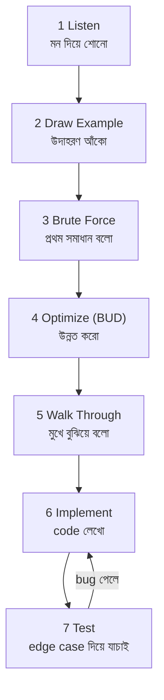

# Chapter 0 — Foundation: Big-O + Problem-Solving Approach

> **Cracking the Coding Interview — বাংলা গাইড**
> এই গাইডের ব্যাখ্যা **সহজ বাংলায়**, কিন্তু সব **technical term ইংরেজিতে** (Big-O, hash set, recursion ইত্যাদি) — কারণ interview-তে এই শব্দগুলোই ইংরেজিতে বলতে হবে।
> Code দেখানো হবে **Dart** (আপনার main ভাষা) আর **Python** (interview-তে সবচেয়ে common) — দুটোতেই।

> [মূল Index](README.md) · [পরের: Arrays & Strings](chapter01_arrays_strings.md)

---

## কেন এই chapter সবার আগে?

আপনি Beginner — তাই সরাসরি 1.1-এ ঝাঁপ দিলে solution গুলোর অর্ধেক মাথার ওপর দিয়ে যাবে। প্রতিটা solution-এ দুটো জিনিস বারবার আসবে:

1. **Big-O** — "এই solution টা কত দ্রুত / কত memory খায়" সেটা মাপার ভাষা।
2. **7-Step Approach** — interview-তে কোনো problem পেলে কোথা থেকে শুরু করব, সেই নিয়ম।

এই দুটো একবার ভালো করে বুঝে নিলে, বাকি ১৮৯টা প্রশ্ন অনেক সহজ লাগবে। তাই এই chapter টা **মন দিয়ে** পড়ুন — এটাই foundation.

---
---

# Part A — যেকোনো Coding Problem solve করার 7-Step Approach

Interview-তে problem পাওয়ার সাথে সাথে code লেখা শুরু করা **সবচেয়ে বড় ভুল**। ভালো candidate রা একটা নিয়ম মেনে এগোয়। CTCI বই এই ৭টা ধাপ শেখায়:



চলুন প্রতিটা ধাপ বুঝি:

### 1 Listen — মন দিয়ে শোনো
প্রতিটা detail গুরুত্বপূর্ণ। interviewer যদি বলে "array টা **sorted**" বা "সব number **unique**" — এই ছোট তথ্যগুলোই optimal solution-এর চাবি।
> নিজেকে প্রশ্ন করুন: "এমন কোন তথ্য দিল যেটা আমি এখনো ব্যবহার করিনি?"

### 2 Draw an Example — বড়, concrete উদাহরণ আঁকো
ছোট বা special উদাহরণ দিয়ে কাজ করবেন না। কাগজে একটা **বড়, সাধারণ** উদাহরণ আঁকুন। যেমন array problem হলে ৮-১০টা element নিন, ২টা নয়।

### 3 State the Brute Force — প্রথম যে সমাধান মাথায় আসে, সেটাই বলুন
Brute force খারাপ/ধীর হলেও সমস্যা নেই। এটা দেখায় আপনি problem টা বুঝেছেন, আর এটাই optimize করার starting point.
> "এটা খুব slow" বলে চুপ থাকবেন না — slow solution-ও বলে ফেলুন, পরে ঠিক করবেন।

### 4 Optimize — BUD দিয়ে উন্নত করুন
BUD = কোথায় সমস্যা খুঁজে বের করার ৩টা জায়গা:

| অক্ষর | পুরো নাম | মানে |
|---|---|---|
| **B** | **B**ottlenecks | কোন এক জায়গা সবচেয়ে বেশি সময় খাচ্ছে? |
| **U** | **U**nnecessary work | অপ্রয়োজনীয় কাজ করছি কি? |
| **D** | **D**uplicated work | একই কাজ বারবার করছি কি? |

আরও কিছু optimize-এর কৌশল: hash table দিয়ে lookup O(1) করা, sorted property কাজে লাগানো, space দিয়ে time কেনা (precompute/cache)।

### 5 Walk Through — code লেখার আগে মুখে বুঝিয়ে বলুন
Optimal approach টা ধাপে ধাপে interviewer-কে বলুন। এতে দুজনেই নিশ্চিত হবেন logic ঠিক আছে — ভুল থাকলে code লেখার **আগেই** ধরা পড়বে।

### 6 Implement — পরিষ্কার code লিখুন
এতক্ষণে logic পরিষ্কার, তাই এখন শুধু লিখুন। ভালো নাম দিন (variable/function), modular রাখুন, খুঁটিনাটিতে আটকাবেন না।

### 7 Test — edge case দিয়ে যাচাই করুন
নিজের code নিজে পরীক্ষা করুন এই ক্রমে:
- **সাধারণ case** (normal input)
- **edge case**: খালি input (`""`, `[]`), একটা element, null
- **বড় input** / **negative number** / **duplicate**

> **মনে রাখুন:** এই ৭ ধাপ মুখস্থ নয় — অভ্যাস। নিচের প্রতিটা problem-এ আমরা এই কাঠামোই follow করব: **সহজ ভাষায় সমস্যা → উদাহরণ → brute force → optimize → code → complexity।**

---
---

# Part B — Big-O Notation (একদম শূন্য থেকে)

## Big-O আসলে কী?

ধরুন আপনি ঢাকা থেকে চট্টগ্রাম যাবেন। কেউ যদি জিজ্ঞেস করে "কত সময় লাগবে?", আপনি সেকেন্ডে বলবেন না — বলবেন "রাস্তা যত লম্বা, তত বেশি সময়"। অর্থাৎ **input বাড়লে কাজ কত দ্রুত বাড়ে** — সেটাই আসল।

**Big-O হলো input বড় হলে একটা algorithm কত দ্রুত ধীর হয়ে যায়, তা মাপার ভাষা।**

দুটো জিনিস মাপি:
- **Time complexity** — কতগুলো step / operation লাগছে।
- **Space complexity** — কতটা extra memory লাগছে।

> Big-O **সেকেন্ড মাপে না**। এটা মাপে **growth rate** — input `n` বড় হলে কাজ কীভাবে বাড়ে। কারণ দ্রুত আর ধীর কম্পিউটারে সেকেন্ড আলাদা, কিন্তু growth pattern একই।

---

## Big-O হিসাব করার ৩টা নিয়ম

### নিয়ম ১: Constant বাদ দাও
`O(2n)` → `O(n)`, `O(500)` → `O(1)`.
কারণ input খুব বড় হলে ২ গুণ বা ৫০০ গুণ কোনো ব্যাপার না — pattern টাই আসল।

### নিয়ম ২: ছোট (non-dominant) term বাদ দাও
`O(n² + n)` → `O(n²)`, `O(n + log n)` → `O(n)`.
n বড় হলে n²-এর পাশে n নগণ্য হয়ে যায়।

```
n = 1000 হলে:
  n²  = 1,000,000   ← এটাই সব
  n   =     1,000   ← এর পাশে নগণ্য
```

### নিয়ম ৩: আলাদা input → আলাদা variable
দুটো ভিন্ন array নিয়ে কাজ করলে `O(n + m)` লিখুন, `O(n)` নয়। নিচের code টা `O(a + b)`:

```python
def print_both(arr_a, arr_b):
    for x in arr_a:   # a বার
        print(x)
    for y in arr_b:   # b বার
        print(y)
```

> ভুল: "দুটো loop মানে O(n²)"। **পরপর (sequential)** loop যোগ হয় (`a+b`); **একটার ভেতর আরেকটা (nested)** হলে গুণ হয় (`a*b`)।

---

## প্রধান Big-O গুলো — analogy + code

| Big-O | নাম | Real-life analogy |
|---|---|---|
| **O(1)** | Constant | বইয়ের নির্দিষ্ট পৃষ্ঠা সরাসরি খোলা |
| **O(log n)** | Logarithmic | ডিকশনারিতে শব্দ খোঁজা (অর্ধেক অর্ধেক বাদ) |
| **O(n)** | Linear | বইয়ের প্রতিটা পৃষ্ঠা একবার করে পড়া |
| **O(n log n)** | Linearithmic | ভালো sorting (merge/quick sort) |
| **O(n²)** | Quadratic | ক্লাসের প্রত্যেকে প্রত্যেকের সাথে হ্যান্ডশেক |
| **O(2ⁿ)** | Exponential | প্রতিটা জিনিসের নেওয়া/না-নেওয়ার সব combination |
| **O(n!)** | Factorial | n জনকে সারিতে বসানোর সব সম্ভাব্য উপায় |

### এই সংখ্যাগুলো বাস্তবে কত বড় হয় (কেন O(n²) খারাপ)

```
            n=10      n=100        n=1,000          n=1,000,000
O(1)          1         1               1                    1
O(log n)     ~3        ~7             ~10                  ~20
O(n)         10       100           1,000            1,000,000
O(n log n)  ~33      ~664          ~9,966          ~20,000,000
O(n²)       100    10,000       1,000,000   1,000,000,000,000  
O(2ⁿ)     1,024   বিশাল         অকল্পনীয়           অসম্ভব     
```

দেখুন — n মাত্র ১০০০ হলেই O(n²) ১০ লাখ step! তাই interview-তে লক্ষ্য থাকে **O(n²) থেকে O(n) বা O(n log n)**-এ নামানো।

### Growth এর ছবি (যত ওপরে, তত খারাপ)

```
ধীর হয় ↑
(operation) |     O(2ⁿ)    O(n²)
            |        \      /
            |         \    /        O(n log n)
            |          \  /        /
            |           \/  ____O(n)
            |       ____/__/ 
            |   ___/        ________O(log n)
            |  /    ________/
            | /____/________________O(1)
            +--------------------------------→ input (n) বড় হচ্ছে
```

---

## প্রতিটা complexity — code সহ

### O(1) — Constant: input যত বড়ই হোক, কাজ একই
```dart
// Dart
int first(List<int> arr) => arr[0];   // সবসময় ১টা step
```
```python
# Python
def first(arr): return arr[0]          # সবসময় ১টা step
```

### O(n) — Linear: প্রতিটা element একবার করে দেখা
```dart
int sum(List<int> arr) {
  int total = 0;
  for (final x in arr) total += x;     // n বার চলে
  return total;
}
```
```python
def total(arr):
    s = 0
    for x in arr:                       # n বার চলে
        s += x
    return s
```

### O(n²) — Quadratic: loop-এর ভেতর loop
```dart
// প্রতিটা pair print — n × n
void allPairs(List<int> arr) {
  for (int i = 0; i < arr.length; i++) {
    for (int j = 0; j < arr.length; j++) {
      print('${arr[i]}, ${arr[j]}');
    }
  }
}
```
```python
def all_pairs(arr):
    for i in range(len(arr)):
        for j in range(len(arr)):      # n × n = n²
            print(arr[i], arr[j])
```

### O(log n) — প্রতি ধাপে অর্ধেক বাদ (Binary Search)
ডিকশনারিতে "M" শব্দ খুঁজছেন — মাঝ থেকে খোলেন, দরকার নেই অর্ধেক বাদ, আবার মাঝ থেকে... ১০ লাখ শব্দেও মাত্র ~২০ ধাপ!

```python
def binary_search(arr, target):        # arr sorted হতে হবে
    lo, hi = 0, len(arr) - 1
    while lo <= hi:
        mid = (lo + hi) // 2
        if arr[mid] == target: return mid
        elif arr[mid] < target: lo = mid + 1   # বাঁ অর্ধেক বাদ
        else: hi = mid - 1                       # ডান অর্ধেক বাদ
    return -1
```
```dart
int binarySearch(List<int> arr, int target) {
  int lo = 0, hi = arr.length - 1;
  while (lo <= hi) {
    final mid = (lo + hi) ~/ 2;
    if (arr[mid] == target) return mid;
    else if (arr[mid] < target) lo = mid + 1;
    else hi = mid - 1;
  }
  return -1;
}
```
> **প্রতি ধাপে অর্ধেক বাদ গেলে → O(log n)।** এটাই log n-এর signature.

---

## Space Complexity — extra memory

শুধু সময় নয়, **কতটা extra memory** লাগছে সেটাও মাপি।

```python
# O(1) space — input ছাড়া শুধু কয়েকটা variable
def total(arr):
    s = 0          # ১টা extra variable, n যাই হোক
    for x in arr: s += x
    return s

# O(n) space — input-এর সমান একটা নতুন list বানালাম
def doubled(arr):
    out = []
    for x in arr: out.append(x * 2)   # n টা নতুন element
    return out
```

### Recursion-এ space: Call Stack
প্রতিটা recursive call **call stack**-এ জমা হয় — তাই memory খরচ হয়।

```python
def sum_to(n):
    if n <= 0: return 0
    return n + sum_to(n - 1)   # n বার নিজেকে ডাকে → stack-এ n টা frame
```
এই code-এ `sum_to(5)` ডাকলে stack জমে:
```
sum_to(5) → sum_to(4) → sum_to(3) → sum_to(2) → sum_to(1) → sum_to(0)
└────────────── একসাথে stack-এ ৬টা frame = O(n) space ───────────────┘
```
> **সাবধান:** loop-এ n বার চললে time O(n) কিন্তু space O(1)। Recursion-এ n বার ডাকলে time O(n) **এবং** space O(n) (call stack)।

---

## Amortized Time — Dynamic Array কেন তবু "O(1) add"

Dart-এর `List` বা Python-এর `list`-এ element যোগ করা সাধারণত O(1)। কিন্তু মাঝে মাঝে array ভরে গেলে double size-এর নতুন array বানিয়ে সব copy করতে হয় — সেই একবার O(n)।

```
size 4 ভরে গেল → size 8 বানাও, 4টা copy করো (একবার O(n))
পরের কয়েকটা add আবার O(1)... আবার ভরলে double...
```
গড়ে (amortized) প্রতিটা add **O(1)** — কারণ ব্যয়বহুল doubling খুব কম হয় আর পরের অনেকগুলো সস্তা add-এর মধ্যে ভাগ হয়ে যায়। একে বলে **amortized O(1)**।

---
---

# Part C — নিজে practice করুন (৫টা)

নিচের code গুলোর Big-O (time) বলুন। উত্তর একদম নিচে — আগে নিজে ভাবুন।

```python
# Q1
def f1(arr):
    return arr[0] + arr[-1]

# Q2
def f2(arr):
    for x in arr:
        print(x)
    for x in arr:
        print(x)

# Q3
def f3(arr):
    for i in arr:
        for j in arr:
            print(i, j)

# Q4   (arr sorted)
def f4(arr, target):
    lo, hi = 0, len(arr)-1
    while lo <= hi:
        mid = (lo+hi)//2
        if arr[mid] == target: return True
        elif arr[mid] < target: lo = mid+1
        else: hi = mid-1
    return False

# Q5
def f5(arr_a, arr_b):
    for a in arr_a:
        for b in arr_b:
            print(a, b)
```

<details>
<summary>উত্তর দেখুন (আগে নিজে চেষ্টা করুন!)</summary>

- **Q1: O(1)** — মাত্র ২টা index access, input যাই হোক।
- **Q2: O(n)** — পরপর দুটো loop → O(n + n) = O(2n) → constant বাদ → **O(n)**।
- **Q3: O(n²)** — nested loop, একই array।
- **Q4: O(log n)** — প্রতি ধাপে অর্ধেক বাদ (binary search)।
- **Q5: O(a·b)** — দুটো **আলাদা** array nested, তাই O(n²) নয়, **O(a·b)**।

</details>

---

# Big-O Cheat Sheet (মুখস্থ করার মতো)

| যা দেখবেন code-এ | সম্ভাব্য Big-O |
|---|---|
| কোনো loop নেই, শুধু কিছু statement | **O(1)** |
| একটা loop input-এর ওপর | **O(n)** |
| প্রতি ধাপে অর্ধেক কমছে (`/2`) | **O(log n)** |
| Sort করছেন | **O(n log n)** |
| Loop-এর ভেতর loop (একই input) | **O(n²)** |
| Recursion যেখানে প্রতিবার ২টা করে শাখা | প্রায়ই **O(2ⁿ)** |
| সব permutation বের করা | **O(n!)** |

**সাধারণ data structure-এর Big-O:**

| Structure | Access | Search | Insert | Delete |
|---|---|---|---|---|
| Array / List (index) | O(1) | O(n) | O(n) | O(n) |
| Hash Table (Map/Set) | — | O(1)* | O(1)* | O(1)* |
| Linked List | O(n) | O(n) | O(1)** | O(1)** |
| Balanced BST | O(log n) | O(log n) | O(log n) | O(log n) |

`*` average case (worst O(n)) · `**` যদি node পয়েন্টার হাতে থাকে

---

## এই chapter-এর সারসংক্ষেপ

1. কোনো problem পেলে সরাসরি code নয় — **7-step** (Listen → Example → Brute force → Optimize/BUD → Walk → Code → Test) মেনে এগোন।
2. Big-O মাপে **growth rate**, সেকেন্ড নয়।
3. ৩ নিয়ম: constant বাদ, ছোট term বাদ, আলাদা input → আলাদা variable।
4. লক্ষ্য সবসময়: **O(n²) → O(n) বা O(n log n)**-এ নামানো (সাধারণত hash table বা sorting দিয়ে)।
5. Recursion-এ time-এর পাশাপাশি **call stack-এর space**-ও হিসাব করতে হয়।

> **পরের ধাপ:** এবার আমরা **Chapter 1 — Arrays & Strings** শুরু করব, প্রশ্ন **1.1** থেকে। এই foundation-এর Big-O আর 7-step সেখানে প্রতিটা problem-এ ব্যবহার করব।

---
<sub>[↑ উপরে](#chapter-0--foundation-big-o--problem-solving-approach) · [মূল Index](README.md) · [পরের: Arrays & Strings](chapter01_arrays_strings.md)</sub>
