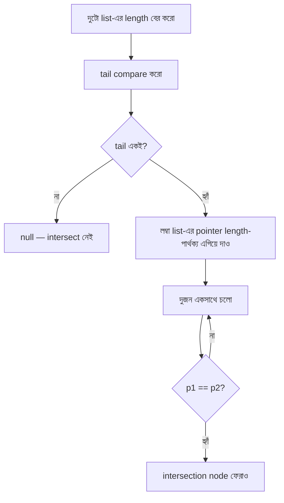

# Chapter 2 — Linked Lists (প্রশ্ন 2.1 – 2.8)

> **Cracking the Coding Interview — বাংলা গাইড**
> ব্যাখ্যা **বাংলায়**, technical term **ইংরেজিতে**। Code **Dart + Python** দুটোতেই।

> 🏠 [মূল Index](README.md) · 📘 [Foundation](chapter00_foundation.md) · ⬅️ [আগের: Arrays & Strings](chapter01_arrays_strings.md) · ➡️ [পরের: Stacks & Queues](chapter03_stacks_queues.md)

---

<a id="toc"></a>
## 📑 এই Chapter-এর সূচি

- [2.1 — Remove Dups](#q2-1)
- [2.2 — Return Kth to Last](#q2-2)
- [2.3 — Delete Middle Node](#q2-3)
- [2.4 — Partition](#q2-4)
- [2.5 — Sum Lists](#q2-5)
- [2.6 — Palindrome](#q2-6)
- [2.7 — Intersection](#q2-7)
- [2.8 — Loop Detection](#q2-8)

প্রতিটা প্রশ্ন এই কাঠামোয়: **সহজ বাংলায় সমস্যা → উদাহরণ → Listen → Brute force → Optimize → Code (Dart+Python) → Complexity → Pattern → Common mistake → Follow-up।**

---
---

## 📚 Background — প্রশ্নে যাওয়ার আগে এগুলো বুঝুন

## ১. Linked List আসলে কী?

Array-তে সব element **পাশাপাশি** একটানা (contiguous) memory-তে থাকে। কিন্তু Linked List-এ প্রতিটা element **যেকোনো জায়গায়** থাকতে পারে — শুধু পূর্ববর্তী element তাকে **pointer** দিয়ে ধরে রাখে।

প্রতিটা element কে বলা হয় **Node**। একটা Node-এ দুটো জিনিস থাকে:
1. **data** — আসল মান (value)
2. **next** — পরের Node-এর ঠিকানা (pointer / reference)

```
  head
   ↓
 ┌──────┬──────┐    ┌──────┬──────┐    ┌──────┬──────┐
 │  10  │  ──────►  │  20  │  ──────►  │  30  │ null │
 └──────┴──────┘    └──────┴──────┘    └──────┴──────┘
   Node 1              Node 2              Node 3
  (data=10)           (data=20)           (data=30, tail)

      data  next          data  next          data  next
```

**head** হলো সবার প্রথম Node-এর reference। শেষ Node-এর `next = null` (বা `None`) — এটাই list-এর শেষ বোঝায়।

## ২. Singly vs Doubly vs Circular

```
Singly Linked List (একমুখী):
  A ──► B ──► C ──► D ──► null
  (শুধু সামনে যাওয়া যায়, পিছনে নয়)

Doubly Linked List (দুমুখী):
  null ◄── A ◄──► B ◄──► C ◄──► D ──► null
  (prev + next দুটো pointer, যেকোনো দিকে যাওয়া যায়)

Circular Linked List (বৃত্তাকার):
  A ──► B ──► C ──► D
  ↑                  │
  └──────────────────┘
  (শেষ Node আবার প্রথমে ফেরে — null নেই)
```

CTCI-এর বেশিরভাগ প্রশ্ন **Singly Linked List**-এর ওপর। Loop Detection (2.8) প্রশ্নে circular structure পাওয়া যায়।

## ৩. Array বনাম Linked List — memory তুলনা

```
Array (contiguous):
  [10][20][30][40][50]   ← সব পাশাপাশি, index দিয়ে সরাসরি access
   ↑                      arr[3] → O(1) কারণ address গণনা করা যায়

Linked List (scattered):
  [10|→]   [30|→]   [20|→]   [50|null]
  address:  1000      1048      2008      3100
            ↑ যেকোনো জায়গায়, কোনো pattern নেই
            arr[3] খুঁজতে → head থেকে ৩ বার next → O(n)
```

| কাজ | Array | Linked List |
|---|---|---|
| Index access (random) | **O(1)** | O(n) |
| শুরুতে insert/delete | O(n) (সরাতে হয়) | **O(1)** |
| মাঝখানে insert/delete | O(n) | **O(1)** (node পেলে) |
| শেষে insert | O(1) amortized | O(n) বা O(1) (tail রাখলে) |
| Search | O(n) | O(n) |
| Memory | ঘন, cache-friendly | scattered, pointer overhead |

**কখন Linked List ভালো?** যখন বারবার শুরু/মাঝে insert-delete দরকার, আর random access দরকার নেই।

## ৪. Node class — Dart ও Python

```dart
// Dart — Singly Linked List Node
class Node {
  int data;
  Node? next;              // null মানে আর node নেই

  Node(this.data, [this.next]);   // next optional, default null
}

// একটা list বানানো: 10 → 20 → 30
void main() {
  final head = Node(10, Node(20, Node(30)));
  // head.data = 10
  // head.next!.data = 20
  // head.next!.next!.data = 30
  // head.next!.next!.next = null  (শেষ)
}
```

```python
# Python — Singly Linked List Node
class Node:
    def __init__(self, data, next_node=None):
        self.data = data
        self.next = next_node     # None মানে আর node নেই

# একটা list বানানো: 10 → 20 → 30
head = Node(10, Node(20, Node(30)))
```

## ৫. "Runner" কৌশল — Slow/Fast Pointer

Linked List-এর সবচেয়ে শক্তিশালী কৌশল হলো **runner** (দুটো pointer, ভিন্ন গতিতে চলে)। এটা Floyd's Technique নামেও পরিচিত।

```
Slow pointer: প্রতি step-এ ১টা node সামনে যায়
Fast pointer: প্রতি step-এ ২টা node সামনে যায়

  head
   ↓
   A → B → C → D → E → F → null

  Step 0:   slow=A, fast=A
  Step 1:   slow=B, fast=C
  Step 2:   slow=C, fast=E
  Step 3:   slow=D, fast=null  ← fast শেষে পৌঁছাল
  এই মুহূর্তে slow আছে মাঝখানে (middle)!
```

**Runner কোথায় লাগে?**
- List-এর মাঝখান খোঁজা (2.2, 2.6)
- Cycle detection — fast কখনো slow কে ধরে ফেলবে (2.8)
- Kth-to-last খোঁজা — fast কে আগে K ধাপ এগিয়ে দাও (2.2)

এই কৌশলটা মাথায় রাখুন — এই chapter-এর অর্ধেক প্রশ্নের সমাধান এর ওপর নির্ভর করে।

---
---

<a id="q2-1"></a>
# 2.1 — Remove Dups

> Pattern: **Hash Set / Runner (no buffer)** · Difficulty: **Easy–Medium** · 🔥 খুব common

> **বইয়ের ভাষায়:** Write code to remove duplicates from an unsorted linked list. FOLLOW UP: How would you solve this problem if a temporary buffer is not allowed?

## 🔹 সমস্যাটা সহজ বাংলায়

একটা **unsorted linked list** দেওয়া আছে (সাজানো নয়, যেকোনো ক্রমে)। এর মধ্যে যদি কোনো **একই value দুইবার** থাকে, সেই duplicate node গুলো **মুছে ফেলতে** হবে। শুধু প্রথমবারটা রাখব।

Follow-up: যদি **extra buffer (কোনো Hash Set বা extra data structure)** ব্যবহার করা না যায়?

## 🔹 উদাহরণ

```
Input:  1 → 2 → 3 → 2 → 4 → 1 → 5
                   ↑           ↑
              duplicate     duplicate

Output: 1 → 2 → 3 → 4 → 5   (২য় ২ আর ২য় ১ মুছে গেছে)
```

```
আরেকটা উদাহরণ:
Input:  7 → 7 → 7 → 7
Output: 7   (প্রথমটা ছাড়া সব মুছে গেছে)
```

## 🔹 ধাপ ১: Listen (clarifying questions)

- **"unsorted" কি guarantee?** হ্যাঁ — তাই binary search চলবে না।
- **Value কি integer শুধু?** ধরছি হ্যাঁ, কিন্তু approach generic।
- **Original list কি modify করতে পারব?** হ্যাঁ — in-place delete।
- **`null` বা একটা node list হতে পারে?** হ্যাঁ — edge case।

## 🔹 Node মুছে ফেলা কীভাবে?

Linked list-এ কোনো node মুছতে হলে **আগের node-এর `next` pointer** বদলে দিতে হয়:

```
মুছতে চাই node B:
   prev → A → B → C → D
   করতে হবে: A.next = C  (B কে skip করো)
   ফলে: A → C → D    (B memory-তে থাকলেও list থেকে বাদ)
```

এজন্য আমাদের সবসময় **current node-এর আগের (previous) node**-এর reference রাখতে হবে।

## 🔹 ভাবনা ১: Brute Force — প্রতিটা pair মেলাও

প্রতিটা node-এর জন্য, তার পরের সব node scan করে দেখি কোনোটা same value কিনা।

```
1 → 2 → 3 → 2 → 4
↑
current=1: বাকি সব (2,3,2,4) scan → 1 নেই → ঠিক আছে
    ↑
current=2: বাকি সব (3,2,4) scan → 2 পাওয়া গেল → মুছো
```

- **Time: O(n²)** (প্রতিটা node × বাকি সব) · **Space: O(1)**
- কাজ করে, কিন্তু ধীর। BUD: **duplicated work** — একই node বারবার scan হচ্ছে।

## 🔹 ভাবনা ২: Hash Set — ✅ optimal time

একটা Set-এ দেখা value গুলো জমাই। নতুন node আসলে:
- আগে দেখেছি → **মুছে ফেলো** (previous node-এর next pointer বদলাও)
- দেখিনি → Set-এ যোগ করো, এগিয়ে যাও

```
seen = {}
  current=1 → নেই → seen={1}, prev=1_node, এগোও
  current=2 → নেই → seen={1,2}, prev=2_node, এগোও
  current=3 → নেই → seen={1,2,3}, prev=3_node, এগোও
  current=2 → আছে! → prev.next = current.next (2 মুছলাম)
  current=4 → নেই → seen={1,2,3,4}, prev=4_node, এগোও
  current=1 → আছে! → prev.next = current.next (1 মুছলাম)
  current=5 → নেই → seen={1,2,3,4,5}

ফলাফল: 1 → 2 → 3 → 4 → 5   ✅
```

- **Time: O(n)** · **Space: O(n)** (Set-এ সব unique value)

## 🔹 ভাবনা ৩: Runner — O(1) space (buffer ছাড়া)

আলাদা Set না রেখে: প্রতিটা node-এর জন্য (`current`) তার পরের সব node (`runner`) scan করে duplicate মুছো।

```
current → 1 → 2 → 3 → 2 → 4
          ↑
      current=1, runner বাকি সব scan করে 1-এর কপি মুছবে

          current=2, runner বাকি সব scan করে 2-এর কপি মুছবে
          (এখানে runner 3-এর পরে 2 পাবে → মুছবে)
```

- **Time: O(n²)** · **Space: O(1)** — "no buffer" শর্তের জন্য এটাই সেরা।

## 🔹 Code — Hash Set (buffer সহ)

```dart
// Dart — Hash Set approach, O(n) time, O(n) space
Node? removeDups(Node? head) {
  if (head == null) return null;
  final seen = <int>{};
  Node? prev = null;
  Node? current = head;
  while (current != null) {
    if (seen.contains(current.data)) {
      // duplicate পাওয়া গেছে → আগের node-এর next বদলাও
      prev!.next = current.next;   // current কে skip করো
    } else {
      seen.add(current.data);
      prev = current;              // prev শুধু unique node-এ আপডেট হয়
    }
    current = current.next;
  }
  return head;
}
```

```python
# Python — Hash Set approach, O(n) time, O(n) space
def remove_dups(head):
    if not head:
        return None
    seen = set()
    prev = None
    current = head
    while current:
        if current.data in seen:
            prev.next = current.next   # duplicate → skip
        else:
            seen.add(current.data)
            prev = current             # prev শুধু unique node-এ আপডেট
        current = current.next
    return head
```

## 🔹 Code — Runner (buffer ছাড়া, O(1) space)

```dart
// Dart — Runner approach, O(n²) time, O(1) space
Node? removeDupsNoBuffer(Node? head) {
  Node? current = head;
  while (current != null) {
    // current-এর পরে যত node আছে, same value হলে মুছো
    Node? runner = current;
    while (runner.next != null) {
      if (runner.next!.data == current.data) {
        runner.next = runner.next!.next;  // duplicate → skip
      } else {
        runner = runner.next;             // match না হলে এগোও
      }
    }
    current = current.next;
  }
  return head;
}
```

```python
# Python — Runner approach, O(n²) time, O(1) space
def remove_dups_no_buffer(head):
    current = head
    while current:
        runner = current
        while runner.next:
            if runner.next.data == current.data:
                runner.next = runner.next.next  # duplicate → skip
            else:
                runner = runner.next
        current = current.next
    return head
```

## 🔹 Complexity তুলনা

| Approach | Time | Space | কখন ব্যবহার |
|---|---|---|---|
| Brute force (সব pair) | O(n²) | O(1) | শুধু শুরুর ধারণা |
| **Hash Set** | **O(n)** | O(n) | ✅ সাধারণ উত্তর |
| **Runner** | O(n²) | **O(1)** | ✅ "no buffer" শর্তে |

## 🔹 Pattern চিনুন

> **"duplicate মুছো, আগে দেখেছি কিনা" → Hash Set।** "extra space ছাড়া" বললে → Runner (two pointer, inner scan)।

## 🔹 Common mistake

- ❌ Node মুছতে গিয়ে `prev` pointer সঠিকভাবে আপডেট না করা — duplicate skip করার সময় `prev` পরিবর্তন হওয়া উচিত নয়।
- ❌ `null` check বাদ দেওয়া: `head == null` বা single-node list handle না করা।
- ❌ Runner approach-এ runner `current.next` থেকে শুরু না করে `head` থেকে শুরু করা — তাহলে `current`-এর আগের duplicate মুছবে না এবং off-by-one error হবে।

## 🔹 Follow-up প্রশ্ন

- **"Sorted list থেকে duplicate মুছো"** → Hash Set লাগবে না! পাশাপাশি node মিলিয়ে দেখলেই হয় — O(n) time, O(1) space।
- **"কতটা memory ব্যবহার করছ explain করো"** → Hash Set approach: worst case O(n) (সব unique), best case O(1) (সব duplicate)।

<sub>[⬆️ এই chapter-এর সূচি](#toc) · [🏠 মূল Index](README.md)</sub>

---
---

<a id="q2-2"></a>
# 2.2 — Return Kth to Last

> Pattern: **Runner (two pointer, K gap) / Recursion** · Difficulty: **Easy–Medium** · 🔥 খুব common

> **বইয়ের ভাষায়:** Implement an algorithm to find the kth to last element of a singly linked list.

## 🔹 সমস্যাটা সহজ বাংলায়

Linked list-এ **শেষ থেকে K-তম** element টা খুঁজে বের করতে হবে। যেমন "শেষ থেকে ২য়" মানে last-এর আগেরটা।

**সমস্যা:** Linked list-এ backward যাওয়া যায় না! Array-র মতো শেষ থেকে গণনা করা সম্ভব নয়।

## 🔹 উদাহরণ

```
List:  1 → 2 → 3 → 4 → 5 → null
                              ↑ শেষ (k=1 হলে এটা, k=2 হলে আগেরটা)

k=1 → 5   (শেষ থেকে ১ম)
k=2 → 4   (শেষ থেকে ২য়)
k=3 → 3   (শেষ থেকে ৩য়)
k=5 → 1   (শেষ থেকে ৫ম = প্রথম)
```

## 🔹 ধাপ ১: Listen

- **k কি 1-indexed নাকি 0-indexed?** (k=1 মানে শেষ node, নাকি শেষ থেকে ২য়?) → ধরছি k=1 মানে শেষ node।
- **k যদি list-এর length-এর চেয়ে বড় হয়?** → `null` ফেরত দিন।
- **Return করব node? নাকি শুধু value?** → node ফেরানো বেশি useful।

## 🔹 ভাবনা ১: দুইবার scan — size জেনে তারপর

প্রথম pass: list-এর total **length** গুনি।
দ্বিতীয় pass: `(length - k)`-তম node-এ থামি।

```
Length=5, k=2:
  target index = 5 - 2 = 3   (0-indexed হলে তৃতীয় node)
  1 → 2 → 3 → 4 → 5
              ↑ index 3 = 4th node = শেষ থেকে ২য়  ✅
```

- **Time: O(n)** · **Space: O(1)** · কিন্তু দুইবার list scan করতে হয়।

## 🔹 ভাবনা ২: Runner কৌশল — ✅ একবার scan, O(1) space

দুটো pointer: `p1` আর `p2`।
**কৌশল:** p1 কে আগে **K ধাপ** এগিয়ে দাও। তারপর p1 আর p2 একসাথে চলুক। যখন p1 শেষে (null) পৌঁছাবে, তখন p2 থাকবে **শেষ থেকে K-তম** node-এ।

**কেন?** কারণ p1 সবসময় p2 থেকে K ধাপ এগিয়ে — যখন p1 শেষে, p2 ঠিক K পিছনে।

```
List: 1 → 2 → 3 → 4 → 5,   k=2

Step 1: p1 কে K=2 ধাপ এগিয়ে দাও:
   p2=1,  p1=3
   1 → 2 → 3 → 4 → 5
   ↑       ↑
   p2      p1     (gap = 2)

Step 2: একসাথে চলুক যতক্ষণ p1 null না হয়:
   p2=2,  p1=4
   p2=3,  p1=5
   p2=4,  p1=null ← p1 শেষে পৌঁছেছে

p2=4 ← শেষ থেকে ২য়  ✅
```

- **Time: O(n)** · **Space: O(1)** · একবারেই scan করা হলো।

## 🔹 ভাবনা ৩: Recursion

Recursively list-এর শেষে যাই, তারপর ফেরার সময় গুনি। যখন count == k হবে, সেই node-ই উত্তর।

- **Time: O(n)** · **Space: O(n)** (call stack) — তাই runner approach বেশি efficient।

## 🔹 Code — Runner (সেরা approach)

```dart
// Dart — Runner approach, O(n) time, O(1) space
Node? kthToLast(Node? head, int k) {
  Node? p1 = head;
  Node? p2 = head;

  // p1 কে আগে k ধাপ এগিয়ে দাও
  for (int i = 0; i < k; i++) {
    if (p1 == null) return null;   // k > list length
    p1 = p1.next;
  }

  // দুজন একসাথে চলুক যতক্ষণ p1 null না হয়
  while (p1 != null) {
    p1 = p1.next;
    p2 = p2!.next;
  }

  return p2;   // শেষ থেকে k-তম node
}
```

```python
# Python — Runner approach, O(n) time, O(1) space
def kth_to_last(head, k):
    p1 = head
    p2 = head

    # p1 কে আগে k ধাপ এগিয়ে দাও
    for _ in range(k):
        if p1 is None:
            return None   # k > list length
        p1 = p1.next

    # দুজন একসাথে চলুক
    while p1 is not None:
        p1 = p1.next
        p2 = p2.next

    return p2   # শেষ থেকে k-তম node
```

## 🔹 Code — Recursive (বোনাস)

```dart
// Dart — Recursive, O(n) time, O(n) space (stack)
// index-এ k পাঠিয়ে পিছন থেকে গুনি
int _kthHelper(Node? node, int k, List<int> counter) {
  if (node == null) return 0;
  final depth = _kthHelper(node.next, k, counter) + 1;
  if (depth == k) print('Found: ${node.data}');
  return depth;
}
```

```python
# Python — Recursive, O(n) time, O(n) space (stack)
class Counter:
    def __init__(self): self.val = 0

def kth_recursive(node, k, counter):
    if node is None:
        return None
    result = kth_recursive(node.next, k, counter)
    counter.val += 1
    if counter.val == k:
        return node
    return result
```

## 🔹 Complexity

| Approach | Time | Space |
|---|---|---|
| দুইবার scan | O(n) | O(1) |
| **Runner (two pointer)** | **O(n)** | **O(1)** |
| Recursion | O(n) | O(n) (stack) |

## 🔹 Pattern চিনুন

> **"শেষ থেকে K-তম, একবার scan-এ" → Runner: আগে K ধাপ এগিয়ে দাও, তারপর একসাথে চলো।** এই K-gap pattern অনেক linked list problem-এ কাজে লাগে।

## 🔹 Common mistake

- ❌ **K ধাপ এগানোর সময় null check বাদ দেওয়া** — k > length হলে crash।
- ❌ k-এর definition নিয়ে confuse হওয়া (1-indexed না 0-indexed)। শুরুতেই clarify করুন।
- ❌ Recursion-এ shared counter না রেখে local int return করার চেষ্টা — Dart/Java-তে primitive pass by value, তাই wrapper object বা List ব্যবহার করতে হয়।

## 🔹 Follow-up প্রশ্ন

- **"শেষ থেকে K-তম সব element দাও"** → একই runner, K gap রেখে শেষ পর্যন্ত সব collect করো।
- **"Doubly linked list হলে?"** → tail থেকে K বার `prev` follow করলেই হয় — O(k)।

<sub>[⬆️ এই chapter-এর সূচি](#toc) · [🏠 মূল Index](README.md)</sub>

---
---

<a id="q2-3"></a>
# 2.3 — Delete Middle Node

> Pattern: **Copy-and-skip (node-এর access আছে, head নেই)** · Difficulty: **Easy** · Common

> **বইয়ের ভাষায়:** Implement an algorithm to delete a node in the middle (i.e., any node but the first and last node, not necessarily the exact middle) of a singly linked list, given only access to that node.
> Example: Input: node `c` from `a → b → c → d → e`. Result: `a → b → d → e`.

## 🔹 সমস্যাটা সহজ বাংলায়

একটা Linked list আছে। আপনাকে শুধু **একটা নির্দিষ্ট মাঝের node-এর reference** দেওয়া হয়েছে — **head দেওয়া হয়নি!** এই node টা মুছে ফেলতে হবে। Node টা প্রথম বা শেষ নয় — মাঝেরটা।

**এটা tricky কেন?** সাধারণত node মুছতে হলে **আগের node** লাগে (তার `next` বদলাতে)। কিন্তু এখানে আগের node-এর access নেই, head-ও নেই!

## 🔹 উদাহরণ

```
List:  a → b → c → d → e
               ↑
           শুধু এই node-এর reference দেওয়া আছে (c)

Output: a → b → d → e   (c মুছে গেছে)
```

## 🔹 মূল Insight — "নিজেকে পরেরজনের মতো করো"

আগের node নেই, তাই সরাসরি `c` মুছতে পারব না। কিন্তু একটা **চালাক কৌশল** আছে:

`c` কে মুছার বদলে — **পরের node `d`-এর data `c`-তে কপি করো**, তারপর **`d` কে skip করো**!

```
Before:   a → b → c → d → e
                   ↑
               আমাদের node (c, data=c)

Step 1: c.data = d.data   →   a → b → d → d → e
                                        ↑
                                   (c-এর জায়গায় এখন d-এর data)

Step 2: c.next = d.next   →   a → b → d → e
                                   ↑
                          (পুরনো c এখন d-এর মতো, পুরনো d skip হলো)

Result: a → b → d → e  ✅  (কার্যকরভাবে c মুছে গেছে)
```

এটা কাজ করে কারণ যেই node আপনার কাছে আছে, তাকে তার পরের node-এর data দিয়ে "replace" করা হলো।

## 🔹 ধাপ ১: Listen

- **প্রথম বা শেষ node হলে কী করব?** → বইয়ের শর্তমতে node টা সবসময় মাঝের হবে (প্রথম/শেষ নয়)। তাই `next != null` guaranteed।
- **Head দেওয়া হবে?** → না। শুধু target node।

## 🔹 Code

```dart
// Dart — O(1) time, O(1) space
// node টা মাঝের (প্রথম/শেষ নয়) তা guaranteed
bool deleteMiddleNode(Node node) {
  if (node.next == null) return false;   // শেষ node হলে করা সম্ভব নয়

  // পরের node-এর data কপি করো
  node.data = node.next!.data;
  // পরের node কে skip করো
  node.next = node.next!.next;
  return true;
}
```

```python
# Python — O(1) time, O(1) space
def delete_middle_node(node):
    if node.next is None:
        return False   # শেষ node মুছা সম্ভব নয় এই পদ্ধতিতে

    # পরের node-এর data কপি করো, পরের node skip করো
    node.data = node.next.data
    node.next = node.next.next
    return True
```

## 🔹 Trace করে দেখি

```
node = c_node  (c.data=3, c.next = d_node)

Step 1: c_node.data = d_node.data  →  c_node.data = 4
Step 2: c_node.next = d_node.next  →  c_node.next = e_node

List এখন: a → b → [4] → e   (কার্যকরভাবে c মুছে, d-এর value এখন c-এর জায়গায়)
```

## 🔹 Complexity

**Time: O(1)** (মাত্র দুটো assignment) · **Space: O(1)**।

এত সহজ, কিন্তু interview-তে অনেকেই ভুল করেন কারণ সাধারণ "আগের node দিয়ে মুছো" approach এখানে চলে না — নতুনভাবে ভাবতে হয়।

## 🔹 Pattern চিনুন

> **"Head ছাড়া মাঝের node মুছো" → পরের node-এর data কপি করে পরের node skip করো।** এটা "copy-forward" বা "overwrite" pattern।

## 🔹 Common mistake

- ❌ Head ছাড়া previous node track করার চেষ্টা করা — এটা O(n) এবং head না থাকলে অসম্ভব।
- ❌ শেষ node-এ এই technique apply করার চেষ্টা করা — `node.next == null` হলে পরের data কপির কিছু নেই, তাই এই approach কাজ করে না।
- ❌ শুধু `node.next = node.next.next` করা (data কপি না করে) — তাহলে node-এ পুরনো data থেকে যাবে।

## 🔹 Follow-up প্রশ্ন

- **"শেষ node মুছতে হলে কী করবে?"** → তখন head লাগবে, O(n) traverse করে আগের node খুঁজতে হবে।
- **"Doubly linked list হলে?"** → আগের node `prev`-এর reference থাকে, তাই সরাসরি `prev.next = node.next` করা যায় — এই trick লাগে না।

<sub>[⬆️ এই chapter-এর সূচি](#toc) · [🏠 মূল Index](README.md)</sub>

---
---

<a id="q2-4"></a>
# 2.4 — Partition

> Pattern: **Two separate lists → merge** · Difficulty: **Medium** · 🔥 Common

> **বইয়ের ভাষায়:** Write code to partition a linked list around a value `x`, such that all nodes less than `x` come before all nodes greater than or equal to `x`. If `x` is contained within the list, the values of `x` only need to be to the right of the elements less than `x`. The partition element `x` can appear anywhere in the "right partition"; it does not need to appear between the left and right partitions.
> Example: Input `3 → 5 → 8 → 5 → 10 → 2 → 1`, partition=5. Output: `3 → 1 → 2 → 10 → 5 → 5 → 8`.

## 🔹 সমস্যাটা সহজ বাংলায়

একটা linked list আর একটা value `x` দেওয়া। List টা **partition** করতে হবে এভাবে:
- **x-এর চেয়ে ছোট** সব element **বামে** (আগে) থাকবে
- **x-এর সমান বা বড়** সব element **ডানে** (পরে) থাকবে

**গুরুত্বপূর্ণ:** বামে বা ডানে নিজেদের মধ্যে order ঠিক রাখার দরকার নেই — শুধু ছোটগুলো বামে, বড়গুলো ডানে।

## 🔹 উদাহরণ

```
Input:  3 → 5 → 8 → 5 → 10 → 2 → 1,   x = 5

x=5 এর চেয়ে ছোট: 3, 2, 1
x=5 এর সমান বা বড়: 5, 8, 5, 10

একটা valid output: 3 → 2 → 1 → 5 → 8 → 5 → 10
আরেকটা valid:      3 → 1 → 2 → 10 → 5 → 5 → 8
(যেকোনো সাজানোই চলবে, শুধু ছোটগুলো আগে থাকলেই হবে)
```

## 🔹 ধাপ ১: Listen

- **x নিজে list-এ থাকতে পারে?** → হ্যাঁ, এবং সে ডান অংশে থাকবে।
- **Stable partition দরকার?** (relative order বজায় রাখতে হবে?) → সাধারণত না, তবে জিজ্ঞেস করুন।
- **Empty list বা একটা node?** → handle করতে হবে।

## 🔹 ভাবনা ১: Brute Force — collect করে rebuild

সব value একটা array-তে নিয়ে partition sort করে আবার list বানাই।
- **Time: O(n log n)** · **Space: O(n)** — অকারণ জটিল।

## 🔹 ভাবনা ২: দুটো আলাদা List — ✅ সহজ ও efficient

**দুটো dummy list বানাই:**
- `less`: x-এর চেয়ে ছোট node গুলো জমাই
- `greater`: x-এর সমান বা বড় node গুলো জমাই

শেষে `less`-এর tail-এর সাথে `greater`-এর head জুড়ে দিই।

```
Input: 3 → 5 → 8 → 5 → 10 → 2 → 1,  x=5

less    head → [dummy]
greater head → [dummy]

scan করি:
  3 < 5  → less-এ:    less: [dummy] → 3
  5 >= 5 → greater-এ: greater: [dummy] → 5
  8 >= 5 → greater-এ: greater: [dummy] → 5 → 8
  5 >= 5 → greater-এ: greater: [dummy] → 5 → 8 → 5
  10 >= 5→ greater-এ: greater: [dummy] → 5 → 8 → 5 → 10
  2 < 5  → less-এ:    less: [dummy] → 3 → 2
  1 < 5  → less-এ:    less: [dummy] → 3 → 2 → 1

merge: less.tail.next = greater.head (dummy-র পরেরটা)
Result: 3 → 2 → 1 → 5 → 8 → 5 → 10  ✅
```

- **Time: O(n)** · **Space: O(1)** (নতুন node বানাই না, শুধু pointer সরাই)

## 🔹 Code

```dart
// Dart — দুটো list approach, O(n) time, O(1) space
Node? partition(Node? head, int x) {
  // dummy head দিয়ে শুরু করা সহজ করে (প্রথম node handle আলাদাভাবে না করলেই হয়)
  Node lessHead = Node(0);   // dummy
  Node greaterHead = Node(0); // dummy
  Node? less = lessHead;
  Node? greater = greaterHead;

  Node? current = head;
  while (current != null) {
    if (current.data < x) {
      less!.next = current;   // less list-এ যোগ করো
      less = less.next;
    } else {
      greater!.next = current; // greater list-এ যোগ করো
      greater = greater.next;
    }
    current = current.next;
  }

  // greater list-এর শেষে null সেট করো (cycle এড়াতে)
  greater!.next = null;
  // দুটো list জোড়া দাও
  less!.next = greaterHead.next;

  return lessHead.next;   // dummy-র পরেরটাই আসল head
}
```

```python
# Python — দুটো list approach, O(n) time, O(1) space
def partition(head, x):
    less_head = less = Node(0)    # dummy
    greater_head = greater = Node(0)  # dummy

    current = head
    while current:
        if current.data < x:
            less.next = current
            less = less.next
        else:
            greater.next = current
            greater = greater.next
        current = current.next

    greater.next = None          # cycle এড়াতে জরুরি!
    less.next = greater_head.next  # দুটো জোড়া দাও
    return less_head.next        # আসল head
```

## 🔹 ⚠️ Cycle সতর্কতা

`greater.next = None` করাটা **অত্যন্ত জরুরি**! Input list-এর শেষ node যদি `less` partition-এ যায়, তাহলে তার `next` এখনো `greater` list-এর কোনো node-কে point করছে — cycle তৈরি হবে। `None` করে এটা ভাঙতে হয়।

```
Before None: ... → 1 → 5   (1 এর next ছিল 5 যা input list-এ)
After None:  ... → 1 → null    5 → 8 → ... (আলাদা)
```

## 🔹 Complexity

**Time: O(n)** (প্রতিটা node একবার দেখা) · **Space: O(1)** (নতুন node বানাই না, dummy head দুটো fixed size)।

## 🔹 Pattern চিনুন

> **"List partition / condition অনুযায়ী ভাগ করো" → দুটো আলাদা dummy list বানাও, একসাথে fill করো, শেষে merge করো।** Dummy head ব্যবহার করলে edge case (প্রথম node) handle করা সহজ।

## 🔹 Common mistake

- ❌ `greater.next = null` ভুলে যাওয়া → cycle bug, loop চলতেই থাকবে।
- ❌ `x`-এর সমান value নিয়ে confuse হওয়া — সমান মান `greater` partition-এ যায়।
- ❌ Dummy head ব্যবহার না করে first node edge case আলাদাভাবে handle করতে গিয়ে জটিল code লেখা।

## 🔹 Follow-up প্রশ্ন

- **"Stable partition চাই" (relative order বজায় রাখতে হবে)** → এই approach-ই stable! কারণ original order-এ scan করে দুটো list-এ append করছি।
- **"In-place partition সম্ভব?"** → হ্যাঁ, কিন্তু জটিল। Pointer manipulation দিয়ে করা যায়, কিন্তু interview-তে দুই-list approach বেশি পরিষ্কার।

<sub>[⬆️ এই chapter-এর সূচি](#toc) · [🏠 মূল Index](README.md)</sub>

---
---

<a id="q2-5"></a>
# 2.5 — Sum Lists

> Pattern: **Digit-by-digit carry tracking** · Difficulty: **Medium** · 🔥 Common

> **বইয়ের ভাষায়:** You have two numbers represented by a linked list, where each node contains a single digit. The digits are stored in **reverse order**, such that the 1's digit is at the head of the list. Write a function that adds the two numbers and returns the sum as a linked list.
> Example: `(7 → 1 → 6) + (5 → 9 → 2)` = `617 + 295` = `912` → stored as `2 → 1 → 9`.
> FOLLOW UP: Suppose the digits are stored in forward order. Repeat the above problem.

## 🔹 সমস্যাটা সহজ বাংলায়

দুটো সংখ্যা Linked List-এ সংরক্ষিত আছে — প্রতিটা node-এ **একটা digit**। সংখ্যাটা **উল্টো ক্রমে** আছে (1-এর ঘর মাথায়, শেষে বড় ঘর)। দুটো যোগ করে একই উল্টো format-এ result দাও।

**Follow-up:** সংখ্যা যদি **সোজা ক্রমে** (বড় ঘর মাথায়) থাকে?

## 🔹 উদাহরণ

```
Part 1 — Reverse order:
  7 → 1 → 6   মানে  617  (7 হলো 7×1, 1 হলো 1×10, 6 হলো 6×100)
+ 5 → 9 → 2   মানে+ 295
               ─────
                 912  →  stored as  2 → 1 → 9

কীভাবে যোগ হয়:
  ঘর   1s    10s   100s
  A:    7  +  1  +   6   = 617
  B:    5  +  9  +   2   = 295
       ─────────────────
  যোগ:  12     10     8
       ↑ carry 1 উপরে
  result: 2 → 1 → 9
```

```
Part 2 — Forward order:
  6 → 1 → 7   মানে  617
+ 2 → 9 → 5   মানে+ 295
               ─────
                 912  →  stored as  9 → 1 → 2
```

## 🔹 ধাপ ১: Listen

- **Lists কি সমান length-এর?** → না, আলাদা length হতে পারে। Handle করতে হবে।
- **Input list-এ শুধু 0-9?** → হ্যাঁ।
- **Result কোন format-এ?** → input-এর মতো (reverse বা forward)।

## 🔹 ভাবনা: Reverse Order (Main Problem)

Reverse order-এ সংরক্ষিত থাকলে যোগ করা **অনেক সহজ** — কারণ যোগের সময় আমরাও একদম ছোট ঘর (1-এর ঘর) থেকে শুরু করি, আর list-ও তাই মাথা থেকে ছোট ঘর দিয়ে শুরু।

**Algorithm:**
1. দুটো list একসাথে head থেকে scan করি।
2. প্রতি step-এ দুই node-এর digit + আগের `carry` যোগ করি।
3. যোগফলের শেষ digit (`sum % 10`) নতুন node করি, `carry = sum / 10`।
4. যেকোনো list শেষ হলেও চালিয়ে যাই (বাকি list-এর digit + carry)।
5. শেষে carry বাকি থাকলে আরেকটা node করি।

```
A: 7 → 1 → 6
B: 5 → 9 → 2
carry = 0

Step 1: 7+5+0=12 → digit=2, carry=1  →  result: 2
Step 2: 1+9+1=11 → digit=1, carry=1  →  result: 2 → 1
Step 3: 6+2+1=9  → digit=9, carry=0  →  result: 2 → 1 → 9
Done: carry=0, lists শেষ।

Result: 2 → 1 → 9  ✅  (= 912)
```

## 🔹 Code — Reverse Order

```dart
// Dart — Reverse order sum, O(n) time, O(n) space
Node? sumLists(Node? l1, Node? l2) {
  Node? dummy = Node(0);  // result list-এর dummy head
  Node? current = dummy;
  int carry = 0;

  while (l1 != null || l2 != null || carry != 0) {
    int sum = carry;
    if (l1 != null) { sum += l1.data; l1 = l1.next; }
    if (l2 != null) { sum += l2.data; l2 = l2.next; }
    carry = sum ~/ 10;          // পরের ঘরে carry
    current!.next = Node(sum % 10);  // এই ঘরের digit
    current = current.next;
  }
  return dummy.next;
}
```

```python
# Python — Reverse order sum, O(n) time, O(n) space
def sum_lists(l1, l2):
    dummy = Node(0)
    current = dummy
    carry = 0

    while l1 or l2 or carry:
        total = carry
        if l1:
            total += l1.data
            l1 = l1.next
        if l2:
            total += l2.data
            l2 = l2.next
        carry, digit = divmod(total, 10)   # carry=total//10, digit=total%10
        current.next = Node(digit)
        current = current.next

    return dummy.next
```

## 🔹 Follow-up: Forward Order

Forward order-এ **বড় ঘর মাথায়** — তাই সরাসরি scan করলে যোগের ক্রম উল্টো হয়ে যায়। সমাধান দুটো:

**উপায় ১: Reverse করে যোগ করো, তারপর আবার reverse।**
- সহজ কিন্তু তিনটা pass।

**উপায় ২: Recursion — ✅ সবচেয়ে elegant**
- Recursively শেষে যাও, তারপর ফেরার পথে যোগ করো।
- **সমস্যা:** List দুটোর length আলাদা হতে পারে — ছোটটাকে আগে 0 দিয়ে pad করো।

```
A: 6 → 1 → 7   (617)
B:     2 → 9 → 5  (295) — length ছোট

Pad B: 0 → 2 → 9 → 5 → (length সমান করলাম)
       (0 যোগ করে, 0295 = 295, value পরিবর্তন নেই)

Recursion দিয়ে শেষ থেকে যোগ করি:
  7+5=12 → digit=2, carry=1
  1+9+1=11 → digit=1, carry=1
  6+2+1=9 → digit=9, carry=0
  (6 → 1 → 7 = 617, 0 → 2 → 9 → 5 → pad)

Result: 9 → 1 → 2  (= 912) ✅
```

```dart
// Dart — Forward order, O(n) time, O(n) space
// Helper: result node + carry একসাথে ফেরানোর জন্য
class _PartialSum {
  Node? node;
  int carry;
  _PartialSum(this.node, this.carry);
}

Node? sumListsForward(Node? l1, Node? l2) {
  int len1 = _length(l1), len2 = _length(l2);
  // ছোট list-কে আগে pad করো
  if (len1 < len2) l1 = _padList(l1, len2 - len1);
  else             l2 = _padList(l2, len1 - len2);

  final partial = _addHelper(l1, l2);
  // শেষ carry থাকলে নতুন head
  if (partial.carry != 0) {
    final result = Node(partial.carry);
    result.next = partial.node;
    return result;
  }
  return partial.node;
}

_PartialSum _addHelper(Node? l1, Node? l2) {
  if (l1 == null && l2 == null) return _PartialSum(null, 0);
  final partial = _addHelper(l1!.next, l2!.next);  // আগে শেষে যাও
  final sum = l1.data + l2.data + partial.carry;
  final result = Node(sum % 10);
  result.next = partial.node;
  return _PartialSum(result, sum ~/ 10);
}

int _length(Node? n) {
  int len = 0;
  while (n != null) { len++; n = n.next; }
  return len;
}

Node? _padList(Node? n, int padding) {
  Node? head = n;
  for (int i = 0; i < padding; i++) {
    final zero = Node(0); zero.next = head; head = zero;
  }
  return head;
}
```

```python
# Python — Forward order, O(n) time, O(n) space
def sum_lists_forward(l1, l2):
    len1, len2 = _length(l1), _length(l2)
    if len1 < len2:
        l1 = _pad_list(l1, len2 - len1)
    else:
        l2 = _pad_list(l2, len1 - len2)
    node, carry = _add_helper(l1, l2)
    if carry:
        result = Node(carry)
        result.next = node
        return result
    return node

def _add_helper(l1, l2):
    if l1 is None and l2 is None:
        return None, 0
    node, carry = _add_helper(l1.next, l2.next)  # শেষে যাও
    total = l1.data + l2.data + carry
    result = Node(total % 10)
    result.next = node
    return result, total // 10

def _length(node):
    length = 0
    while node: length += 1; node = node.next
    return length

def _pad_list(node, padding):
    head = node
    for _ in range(padding):
        zero = Node(0); zero.next = head; head = zero
    return head
```

## 🔹 Complexity

| Part | Time | Space |
|---|---|---|
| Reverse order | O(n) | O(n) result list |
| Forward order (recursive) | O(n) | O(n) call stack + result |

## 🔹 Pattern চিনুন

> **"Digit-by-digit addition" → carry tracking loop।** Reverse order = সহজ, সরাসরি। Forward order = length align করে recursion দিয়ে।

## 🔹 Common mistake

- ❌ Loop condition-এ `carry != 0` বাদ দেওয়া → শেষে carry থাকলে মিস হয় (যেমন 999 + 1 = 1000 — শেষের `1` মিস)।
- ❌ Forward order-এ length align না করে recursion করা → ভুল ঘরে carry যোগ হয়।
- ❌ Result list-এ dummy head না রাখা → প্রথম node handle করতে আলাদা code লাগে।

## 🔹 Follow-up প্রশ্ন

- **"খুব বড় সংখ্যা handle করো (BigInteger)"** → এই linked list approach-ই BigInteger addition-এর কাজ করে! অনেক ভাষার BigInteger library এভাবেই digit-by-digit কাজ করে।

<sub>[⬆️ এই chapter-এর সূচি](#toc) · [🏠 মূল Index](README.md)</sub>

---
---

<a id="q2-6"></a>
# 2.6 — Palindrome

> Pattern: **Runner + Stack / Reverse half / Recursion** · Difficulty: **Medium** · 🔥 Common

> **বইয়ের ভাষায়:** Implement a function to check if a linked list is a palindrome.

## 🔹 সমস্যাটা সহজ বাংলায়

একটা Linked List দেওয়া। বলতে হবে এটা **palindrome** কিনা — অর্থাৎ সামনে থেকে আর পিছন থেকে পড়লে **একই**।

**কঠিনাই:** Linked list backward যাওয়া যায় না! Array হলে দুই দিক থেকে pointer দিয়ে compare করতাম।

## 🔹 উদাহরণ

```
1 → 2 → 3 → 2 → 1   →  true   (palindrome)
1 → 2 → 3 → 4 → 5   →  false
1 → 2 → 1           →  true
1                   →  true   (single node)
```

## 🔹 ধাপ ১: Listen

- **Odd আর even length দুটোই হতে পারে?** → হ্যাঁ। মাঝের element (odd length-এ) কে ignore করতে হবে।
- **`null` বা একটা node?** → palindrome হিসেবে গণনা করুন।

## 🔹 ভাবনা ১: List → Array, তারপর two pointer

পুরো list-কে array/list-এ রেখে দুই দিক থেকে compare করি।
```
1 → 2 → 3 → 2 → 1  →  [1, 2, 3, 2, 1]
                         ↑           ↑
                      compare করো, ভেতরে আসো
```
- **Time: O(n)** · **Space: O(n)** — সহজ কিন্তু extra space।

## 🔹 ভাবনা ২: Reverse করে মেলাও

পুরো list reverse করে original-এর সাথে মেলাই। অর্ধেক পর্যন্ত মিললেই হয়।
- **Time: O(n)** · **Space: O(n)** (reversed list)।

## 🔹 ভাবনা ৩: Runner + Stack — ✅ O(n/2) space

**Runner technique:**
- Slow pointer: প্রতিবার ১ node সামনে।
- Fast pointer: প্রতিবার ২ node সামনে।

Fast pointer শেষে পৌঁছানোর সময় slow pointer মাঝখানে থাকবে।

**কৌশল:**
1. Slow pointer যেতে যেতে একটা Stack-এ প্রথম অর্ধেকের values রাখি।
2. Fast pointer শেষে পৌঁছালে, slow pointer দ্বিতীয় অর্ধেকে।
3. এখন Stack থেকে pop করে slow-এর বাকি অংশের সাথে মেলাই (Stack তো উল্টো ক্রমে — তাই প্রথম অর্ধেকের শেষ থেকে শুরু হয়, যা পিছন থেকে মেলানোর মতো)।

```
List: 1 → 2 → 3 → 2 → 1
slow: 1 → 2   (stack-এ রাখা হলো [1, 2])
fast: 1 → 3 → 1  (শেষে পৌঁছাল)

এখন slow = 3 (মাঝে), odd length → একধাপ এগোও → slow = 2
Stack: [1, 2]   pop করি:
  pop=2, slow.data=2 → match ✅, slow এগোও
  pop=1, slow.data=1 → match ✅, slow এগোও
Stack খালি, সব match → palindrome! ✅
```

```
Even length: 1 → 2 → 2 → 1
slow: 1 → 2  (stack: [1, 2])
fast: 1 → 2 → null (শেষে)

slow = 2 (দ্বিতীয় '2'), stack pop:
  pop=2, slow.data=2 → match ✅
  pop=1, slow.data=1 → match ✅  → palindrome ✅
```

## 🔹 Code — Runner + Stack

```dart
// Dart — Runner + Stack, O(n) time, O(n/2) space
bool isPalindrome(Node? head) {
  if (head == null || head.next == null) return true;

  Node? slow = head;
  Node? fast = head;
  final stack = <int>[];   // প্রথম অর্ধেকের values জমাই

  // Stack-এ প্রথম অর্ধেক ভরা + fast কে শেষে নিয়ে যাওয়া
  while (fast != null && fast.next != null) {
    stack.add(slow!.data);
    slow = slow.next;
    fast = fast.next!.next;
  }

  // Odd length হলে slow এখন মাঝখানে — সেটা skip
  if (fast != null) slow = slow!.next;   // fast != null মানে odd length

  // দ্বিতীয় অর্ধেকের সাথে stack pop করে মেলাও
  while (slow != null) {
    if (stack.isEmpty || stack.removeLast() != slow.data) return false;
    slow = slow.next;
  }
  return true;
}
```

```python
# Python — Runner + Stack, O(n) time, O(n/2) space
def is_palindrome(head):
    if not head or not head.next:
        return True

    slow = head
    fast = head
    stack = []

    # প্রথম অর্ধেক stack-এ ভরো
    while fast and fast.next:
        stack.append(slow.data)
        slow = slow.next
        fast = fast.next.next

    # Odd length: মাঝের node skip
    if fast:      # fast != None মানে odd length
        slow = slow.next

    # দ্বিতীয় অর্ধেকের সাথে মেলাও
    while slow:
        if not stack or stack.pop() != slow.data:
            return False
        slow = slow.next
    return True
```

## 🔹 ভাবনা ৪: Recursion (bonus — tricky)

Recursively শেষে যাই, তারপর ফেরার পথে শুরু থেকে compare করি। এটার জন্য একটা shared front pointer দরকার (Python/Dart-এ wrapper বা list-এ রাখা যায়)।

```python
# Python — Recursive approach
def is_palindrome_recursive(head):
    length = 0
    n = head
    while n: length += 1; n = n.next

    def helper(node, length):
        if not node or length <= 0:
            return node, True
        if length == 1:
            return node.next, True
        back, result = helper(node.next, length - 2)
        if not result or back is None:
            return back, result
        return back.next, node.data == back.data

    _, result = helper(head, length)
    return result
```

## 🔹 Complexity

| Approach | Time | Space |
|---|---|---|
| Array + two pointer | O(n) | O(n) |
| **Runner + Stack** | **O(n)** | O(n/2) |
| Recursion | O(n) | O(n) (call stack) |

## 🔹 Pattern চিনুন

> **"Linked list palindrome চেক" → Runner দিয়ে মাঝ খোঁজো, Stack দিয়ে প্রথম অর্ধেক রেখে দ্বিতীয় অর্ধেকের সাথে মেলাও।** Odd/even length-এর পার্থক্য runner দিয়েই বোঝা যায় (`fast != null` চেক করে)।

## 🔹 Common mistake

- ❌ Odd/even length আলাদাভাবে handle না করা → মাঝের element-এর কারণে wrong result।
- ❌ `fast != null && fast.next != null` — দুটো condition-ই লাগবে (fast.next null হলে fast.next.next crash)।
- ❌ Stack-এ পুরো list রাখা — half রাখলেই হয়, তাই O(n/2) space যথেষ্ট।

## 🔹 Follow-up প্রশ্ন

- **"O(1) space-এ করো"** → দ্বিতীয় অর্ধেক reverse করো (in-place), তারপর compare করো, শেষে আবার reverse। কিন্তু এটা list modify করে — input preserve করার কথা থাকলে সম্ভব নয়।

<sub>[⬆️ এই chapter-এর সূচি](#toc) · [🏠 মূল Index](README.md)</sub>

---
---

<a id="q2-7"></a>
# 2.7 — Intersection

> Pattern: **Tail + Length alignment, pointer chase** · Difficulty: **Medium–Hard** · 🔥 Common

> **বইয়ের ভাষায়:** Given two singly linked lists, determine if the two lists intersect. Return the intersecting node. Note that the intersection is defined based on **reference**, not value. That is, if the kth node of the first linked list is the exact same node (by reference) as the jth node of the second linked list, then they are intersecting.

## 🔹 সমস্যাটা সহজ বাংলায়

দুটো Linked List। বলতে হবে তারা কোনো একটা **node-এ মিলে যায় কিনা** — অর্থাৎ দুটো list-এর কোনো node **মেমরিতে একই** (same reference/pointer)। যদি মেলে, সেই প্রথম common node ফেরত দাও।

**"Reference, value নয়"** কথাটা গুরুত্বপূর্ণ: দুটো node-এর value একই হলেই হবে না, তাদের **memory address** একই হতে হবে।

## 🔹 উদাহরণ

```
List A:    1 → 3 → 5 ─────┐
                           ↓
                           8 → 10 → null
                           ↑
List B:    2 → 4 → 6 ─────┘
                (node 8 টা দুটো list-ই share করছে!)

Intersection: node 8   (reference একই)
```

```
কেন share করা সম্ভব?
  A: [1] → [3] → [5] → [8] → [10] → null
                         ↑
                    এই node-টা B-তেও আছে
  B: [2] → [4] → [6] → [8] → [10] → null
                         ↑
                    (একই memory address!)
```

```
দুটো list মিললে তারা "Y" shape বানায়:
   A ──┐
       ├──► intersection → common tail → null
   B ──┘
```

## 🔹 মূল Insight — দুটো গুরুত্বপূর্ণ পর্যবেক্ষণ

**১. যদি দুটো list intersect করে, তাদের tail (শেষ node) একই হবে।**
কারণ intersection-এর পর common অংশ একই node দিয়ে চলে — সুতরাং শেষ node-ও একই।

```
A: 1 → 3 → 5 → [8 → 10]  ← common tail এখানে
B: 2 → 4 → 6 → [8 → 10]  ← একই tail!
```

**২. দুই list-এর length যদি আলাদা হয়, তাহলে intersection-এর আগে লম্বা list-এ বেশি unique node।**

```
A: 1 → 3 → 5 → 8 → 10   (length 5)
B: 2 → 4 → 6 → 8 → 10   (length 5)  এখানে সমান

আরেকটা উদাহরণ:
A: 1 → 2 → 3 → 4 → 8 → 10   (length 6)
B: 7 → 8 → 10               (length 3)
পার্থক্য = 3, তাই A-এর pointer ৩ ধাপ এগিয়ে দিলে:
A': 4 → 8 → 10  এবং B: 7 → 8 → 10
এখন দুজন একসাথে চললে node 8-এ মিলবে!
```

## 🔹 Algorithm



**ধাপে ধাপে:**
1. দুই list-এর **length** বের করো এবং **tail** সংরক্ষণ করো।
2. `tail1 != tail2` হলে → intersection নেই, `null` ফেরাও।
3. লম্বা list-এর pointer **পার্থক্য** ধাপ এগিয়ে দাও।
4. দুটো pointer একসাথে চলুক — **প্রথমবার দুটো pointer একই node দেখালেই** intersection।

## 🔹 Code

```dart
// Dart — Tail comparison + length alignment, O(n) time, O(1) space
Node? findIntersection(Node? l1, Node? l2) {
  if (l1 == null || l2 == null) return null;

  // Length আর tail বের করো
  final (len1, tail1) = _getTailAndLength(l1);
  final (len2, tail2) = _getTailAndLength(l2);

  // Tail ভিন্ন হলে intersection নেই
  if (tail1 != tail2) return null;

  // লম্বা list-এর pointer এগিয়ে দাও
  Node? longer  = len1 > len2 ? l1 : l2;
  Node? shorter = len1 > len2 ? l2 : l1;
  int diff = (len1 - len2).abs();
  for (int i = 0; i < diff; i++) {
    longer = longer!.next;
  }

  // একসাথে চলো যতক্ষণ না মেলে
  while (shorter != longer) {
    shorter = shorter!.next;
    longer  = longer!.next;
  }
  return shorter;   // intersection node
}

(int, Node?) _getTailAndLength(Node? node) {
  int length = 1;
  while (node!.next != null) {
    length++;
    node = node.next;
  }
  return (length, node);
}
```

```python
# Python — Tail comparison + length alignment, O(n) time, O(1) space
def find_intersection(l1, l2):
    if not l1 or not l2:
        return None

    len1, tail1 = get_tail_and_length(l1)
    len2, tail2 = get_tail_and_length(l2)

    # Tail ভিন্ন হলে intersection নেই
    if tail1 is not tail2:   # reference compare!
        return None

    # লম্বা আর ছোট list সনাক্ত করো
    longer  = l1 if len1 > len2 else l2
    shorter = l2 if len1 > len2 else l1
    diff = abs(len1 - len2)

    # লম্বা list এগিয়ে দাও
    for _ in range(diff):
        longer = longer.next

    # একসাথে চলো
    while shorter is not longer:   # reference compare!
        shorter = shorter.next
        longer  = longer.next

    return shorter

def get_tail_and_length(node):
    length = 1
    while node.next:
        length += 1
        node = node.next
    return length, node
```

## 🔹 ⚠️ Reference Compare — মূল সতর্কতা

Python-এ `shorter == longer` করলে **`__eq__`** call হয় — যা value compare করতে পারে। Intersection-এ আমরা **একই object (reference)** চাই, তাই `is` ব্যবহার করতে হবে। Dart-এ `!=` operator দুটো object-এ default-এ reference compare করে (কাস্টম `==` override না থাকলে)।

## 🔹 Complexity

**Time: O(n + m)** (n, m দুই list-এর length) · **Space: O(1)**।

## 🔹 Pattern চিনুন

> **"দুই list-এ common node" → আগে tail compare করো (fast check), তারপর length align করে একসাথে এগোও।** Reference equality মাথায় রাখুন — value নয়।

## 🔹 Common mistake

- ❌ **Value দিয়ে compare করা** — একই value-র ভিন্ন দুটো node intersection নয়!
- ❌ Tail compare না করে সরাসরি loop চালানো — intersection না থাকলে loop কখনো শেষ হবে না।
- ❌ Length difference হিসাব করার সময় absolute value না নেওয়া।
- ❌ Empty list edge case handle না করা।

## 🔹 Follow-up প্রশ্ন

- **"Hash Set দিয়ে করো"** → l1-এর সব node Set-এ রাখো, তারপর l2-এর প্রতিটা node Set-এ আছে কিনা দেখো। **Time: O(n+m), Space: O(n)** — এটা সহজ কিন্তু বেশি space।
- **"Circular list-এও কাজ করবে?"** → না, কারণ tail খোঁজার সময় infinite loop হবে। Loop detection আগে করতে হবে।

<sub>[⬆️ এই chapter-এর সূচি](#toc) · [🏠 মূল Index](README.md)</sub>

---
---

<a id="q2-8"></a>
# 2.8 — Loop Detection

> Pattern: **Floyd's Cycle Detection (Tortoise and Hare)** · Difficulty: **Hard** · 🔥 খুব common

> **বইয়ের ভাষায়:** Given a circular linked list, implement an algorithm that returns the node at the beginning of the loop.
> DEFINITION: Circular linked list — a (corrupt) linked list in which a node's next pointer points to an earlier node, so as to make a loop in the linked list.
> Example: `A → B → C → D → E → C` [the same C as earlier] → returns node `C`.

## 🔹 সমস্যাটা সহজ বাংলায়

একটা Linked List-এ **loop** তৈরি হয়ে গেছে — মানে কোনো node-এর `next` pointer পিছনের কোনো node-কে point করছে, ফলে list-এ একটা চক্র (cycle) আছে। এই চক্রের **শুরুর node** খুঁজে বের করতে হবে।

## 🔹 উদাহরণ

```
A → B → C → D → E
         ↑         │
         └─────────┘
           (E-এর next = C, ফলে C→D→E→C→D→E... চলতেই থাকে)

Loop-এর শুরু: C   ← এটাই return করতে হবে
```

```
আরেকটা উদাহরণ:
1 → 2 → 3 → 4 → 5 → 6
                ↑        │
                └────────┘
Loop start: 4   (6-এর next = 4)
```

## 🔹 ধাপ ১: Listen

- **Loop না থাকলে?** → `null` ফেরাও।
- **Loop-এর শুরু খুঁজতে হবে, শুধু "আছে কিনা" নয়।** → Floyd-এর দ্বিতীয় ধাপ দরকার।
- **শুধু node reference ফেরাতে হবে, মাথার আগে loop শুরু হলেও?** → হ্যাঁ।

## 🔹 ভাবনা ১: Hash Set

প্রতিটা node scan করতে করতে একটা Set-এ রাখি। কোনো node আগে দেখেছি (Set-এ আছে) → সেটাই loop-এর শুরু।

```
A→B→C→D→E→C... (scan করি)
Set: {A}
Set: {A,B}
Set: {A,B,C}
Set: {A,B,C,D}
Set: {A,B,C,D,E}
C → আগে দেখেছি! → return C ✅
```

- **Time: O(n)** · **Space: O(n)** (Set-এ সব node)
- কাজ করে, কিন্তু extra memory। আরও ভালো করা যায়।

## 🔹 ভাবনা ২: Floyd's Cycle Detection — ✅ O(1) space

এটা দুই ধাপের algorithm।

### ধাপ ১: Loop আছে কিনা প্রমাণ করো (আর meeting point খোঁজো)

Slow pointer: ১ ধাপ, Fast pointer: ২ ধাপ। যদি loop থাকে, fast কখনো না কখনো slow-কে ধরে ফেলবে — কারণ fast দ্রুত loop-এর ভেতর ঘুরতে থাকে।

```
List: A → B → C → D → E → back to C
                ↑ loop শুরু

                   slow  fast
Start:              A     A
Step 1:             B     C    (fast ২ ধাপ)
Step 2:             C     E    (fast ২ ধাপ)
Step 3:             D     D    (fast E→C→D, slow C→D)
                    ↑     ↑
                 COLLISION! (slow == fast)
```

**কেন fast slow কে ধরে ফেলবে?** Fast একটু একটু করে slow-এর কাছে আসে (প্রতি step-এ ১ ধাপ কাছে) — eventually মিলবেই।

### ধাপ ২: Loop-এর শুরু খোঁজো (গাণিতিক প্রমাণ)

এটাই সবচেয়ে চমকপ্রদ অংশ।

**পরিভাষা:**
- `k` = head থেকে loop শুরুর দূরত্ব (non-loop অংশ)
- `LOOP_SIZE` = loop-এর পরিধি
- Collision point = loop শুরু থেকে কিছু ধাপ ভেতরে

**গাণিতিক সত্য:**
যখন slow আর fast মেলে, তখন:
- Slow পাড়ি দিয়েছে: `k + m` steps (k = loop শুরু, m = loop-এর ভেতরে কিছু অংশ)
- Fast পাড়ি দিয়েছে: `2(k + m)` steps (slow-এর দ্বিগুণ)
- Fast অতিরিক্ত যা গেছে = `(2k + 2m) - (k + m) = k + m` → এটা loop-এর সম্পূর্ণ এক বা একাধিক চক্র
- তাই: `k + m ≡ 0 (mod LOOP_SIZE)` → `k ≡ -m (mod LOOP_SIZE)`

**মানে?** Collision point থেকে আর `k` ধাপ গেলে loop-এর শুরুতে পৌঁছাবো। আর head থেকেও `k` ধাপ গেলে loop-এর শুরুতে পৌঁছাবো!

**তাই:** Collision-এর পরে একটা pointer head-এ, আরেকটা collision point-এ রাখো। দুজন ১ ধাপ করে চলুক — **যেখানে মিলবে, সেটাই loop-এর শুরু।**

```
Collision point: D (উপরের উদাহরণ থেকে)

p1 = head (A)
p2 = collision point (D)

Step 1: p1=B, p2=E
Step 2: p1=C, p2=C ← মিলে গেল!
                 ↑
           Loop শুরু = C ✅
```

**ASCII diagram:**

```
A ─────k steps────► C ──m steps──► D (collision)
                    │               │
                    └──── loop ─────┘
                         LOOP_SIZE

head থেকে k steps: A→...→C
collision থেকে k steps: D→E→C
দুজন C-তে মিলবে! (কারণ D থেকে C পর্যন্ত = LOOP_SIZE - m = k)
```

## 🔹 Code

```dart
// Dart — Floyd's Cycle Detection, O(n) time, O(1) space
Node? detectLoop(Node? head) {
  if (head == null) return null;

  Node? slow = head;
  Node? fast = head;

  // ধাপ ১: Loop আছে কিনা দেখো, collision point খোঁজো
  while (fast != null && fast.next != null) {
    slow = slow!.next;
    fast = fast.next!.next;
    if (slow == fast) break;   // collision!
  }

  // Loop নেই (fast শেষে পৌঁছে গেছে)
  if (fast == null || fast.next == null) return null;

  // ধাপ ২: Loop-এর শুরু খোঁজো
  // p1 = head, p2 = collision point, দুজন একসাথে ১ ধাপ
  slow = head;    // p1 head-এ
  // fast এখনো collision point-এ (p2)

  while (slow != fast) {
    slow = slow!.next;
    fast = fast!.next;
  }

  return slow;   // loop-এর শুরু
}
```

```python
# Python — Floyd's Cycle Detection, O(n) time, O(1) space
def detect_loop(head):
    if not head:
        return None

    slow = head
    fast = head

    # ধাপ ১: collision point খোঁজো
    while fast and fast.next:
        slow = slow.next
        fast = fast.next.next
        if slow is fast:   # collision!
            break

    # Loop নেই
    if not fast or not fast.next:
        return None

    # ধাপ ২: Loop শুরু খোঁজো
    slow = head           # head-এ ফিরে যাও
    while slow is not fast:
        slow = slow.next
        fast = fast.next  # এখন দুজনই ১ ধাপ

    return slow   # loop-এর শুরু
```

## 🔹 Trace করে দেখি

```
List: 1 → 2 → 3 → 4 → 5 → 6 → back to 3
                  ↑ loop শুরু (k=2, LOOP_SIZE=4)

ধাপ ১:
  slow  fast
  1     1
  2     3
  3     5
  4     3   (5.next=6, 6.next=3)
  5     5
  6     3   (6→3→4→5... fast ২ ধাপ)
  3     5   
  4     3   
  5     5   ← collision! slow=5, fast=5

ধাপ ২:
  slow=head=1, fast=collision=5
  slow=2, fast=6
  slow=3, fast=3 ← মিলে গেল! → loop শুরু = 3 ✅
```

## 🔹 Complexity

| Approach | Time | Space |
|---|---|---|
| Hash Set | O(n) | O(n) |
| **Floyd's (Tortoise & Hare)** | **O(n)** | **O(1)** |

## 🔹 Pattern চিনুন

> **"Loop detection + start খোঁজা" → Floyd's Cycle Detection। দুই ধাপ: (১) slow+fast দিয়ে collision খোঁজো, (২) একটা pointer head-এ, অন্যটা collision-এ — ১ ধাপ করে চললে loop-এর শুরুতে মিলবে।**

এই algorithm "Tortoise and Hare" নামেও পরিচিত — কচ্ছপ (slow) আর খরগোশ (fast)।

## 🔹 Common mistake

- ❌ **শুধু loop আছে কিনা বলা, শুরু কোথায় না খোঁজা** — প্রশ্নে loop-এর শুরু চাওয়া হয়েছে।
- ❌ ধাপ ২-তে fast কে ১ ধাপ না করে ২ ধাপ চালানো — ধাপ ২-তে দুজনকেই ১ ধাপ করে চলতে হবে।
- ❌ Collision detect করার পরে `slow == fast` check-এ — reference compare করতে হবে (`is` Python-এ, default `==` Dart-এ যদি `==` override না থাকে)।
- ❌ `fast.next != null` check বাদ দেওয়া → `fast.next.next` এ null pointer crash।

## 🔹 গাণিতিক প্রমাণ (সহজে)

```
k  = head থেকে loop শুরুর দূরত্ব
m  = loop শুরু থেকে collision point-এর দূরত্ব
L  = loop-এর সম্পূর্ণ দৈর্ঘ্য

collision-এ:
  slow ভ্রমণ = k + m
  fast ভ্রমণ = 2(k + m)

fast-slow পার্থক্য = k + m = loop-এর পূর্ণসংখ্যা গুণিতক
∴ k + m = n×L  (কোনো পূর্ণসংখ্যা n)
∴ k = n×L - m

collision point থেকে k ধাপ গেলে:
  collision point-এ আছে (loop-শুরু থেকে m ধাপ পরে)
  আরও k = n×L - m ধাপ গেলে → loop-শুরু থেকে (m + k) = n×L ধাপ
  n×L মানে loop-এর পূর্ণসংখ্যা চক্কর → loop-শুরুতে ফিরে আসা!

head থেকেও k ধাপ গেলে → loop-শুরুতে পৌঁছাই।
তাই দুজন একসাথে চললে k ধাপ পরে loop-শুরুতে মিলবে। ✅
```

## 🔹 Follow-up প্রশ্ন

- **"Loop-এর length কত?"** → Collision point-এ একটা pointer রেখে দাও, আরেকটা একধাপ করে এগিয়ে যতক্ষণ না ফিরে আসে — গণো।
- **"শুধু loop আছে কিনা বলতে হলে?"** → ধাপ ১-ই যথেষ্ট, ধাপ ২ লাগবে না।

<sub>[⬆️ এই chapter-এর সূচি](#toc) · [🏠 মূল Index](README.md)</sub>

---
---

## ✅ Chapter সারসংক্ষেপ

| # | প্রশ্ন | মূল technique | Time | Space |
|---|---|---|---|---|
| 2.1 | Remove Dups | Hash Set (buffer সহ) / Runner scan (ছাড়া) | O(n) / O(n²) | O(n) / O(1) |
| 2.2 | Return Kth to Last | Runner: K-gap two pointer | O(n) | O(1) |
| 2.3 | Delete Middle Node | Copy next node data + skip | O(1) | O(1) |
| 2.4 | Partition | দুটো dummy list → merge | O(n) | O(1) |
| 2.5 | Sum Lists | Digit-by-digit + carry; forward=recursion | O(n) | O(n) |
| 2.6 | Palindrome | Runner + Stack (first half) | O(n) | O(n/2) |
| 2.7 | Intersection | Tail compare + length align | O(n+m) | O(1) |
| 2.8 | Loop Detection | Floyd's Tortoise & Hare (2 phases) | O(n) | O(1) |

### 🎯 "এটা দেখলে → এটা ভাবো" (signal → technique)

```
duplicate মুছো, buffer আছে            →  Hash Set (O(n) time)
duplicate মুছো, buffer নেই            →  Runner inner scan (O(n²) time, O(1) space)
শেষ থেকে K-তম                         →  Runner: K-gap (আগে K ধাপ, তারপর একসাথে)
head ছাড়া মাঝের node মুছো              →  পরের node-এর data copy করো, পরের skip করো
condition অনুযায়ী partition            →  দুটো dummy list → fill → merge করো
list-এ digit যোগ (reverse)           →  carry tracking loop
list-এ digit যোগ (forward)           →  length align + recursion
palindrome check                      →  Runner দিয়ে মাঝ খোঁজো + Stack
দুই list intersection                  →  tail compare + length align করে একসাথে চলো
loop আছে কিনা                          →  Floyd's slow/fast (collision হলে loop আছে)
loop-এর শুরু খোঁজো                    →  collision পর head + collision থেকে একসাথে ১ ধাপ
```

### 📝 এই chapter-এর ৫টা সোনার নিয়ম

1. **Runner (slow/fast pointer)** — Linked list-এর সবচেয়ে শক্তিশালী কৌশল: মাঝ খোঁজা, K-gap, cycle detection — সব এই একটা idea।
2. **Dummy head** — Partition, Sum Lists-এ প্রথম node-এর edge case সহজ করে দেয়; সবসময় `return dummy.next`।
3. **`greater.next = null`** — দুই list merge করার সময় cycle এড়াতে জরুরি।
4. **Reference vs Value** — Intersection-এ `==` নয়, reference compare করুন (`is` Python-এ)।
5. **Floyd's দ্বিতীয় ধাপ** — Loop-এর শুরু খুঁজতে গাণিতিক ট্রিক: collision-এ head reset, তারপর দুজন ১ ধাপে চললে loop-শুরুতে মিলবে।

> **পরের ধাপ:** [Chapter 3 — Stacks & Queues](chapter03_stacks_queues.md) (3.1–3.6), যেখানে LIFO/FIFO structure দিয়ে আরও interesting problem সমাধান করব।
