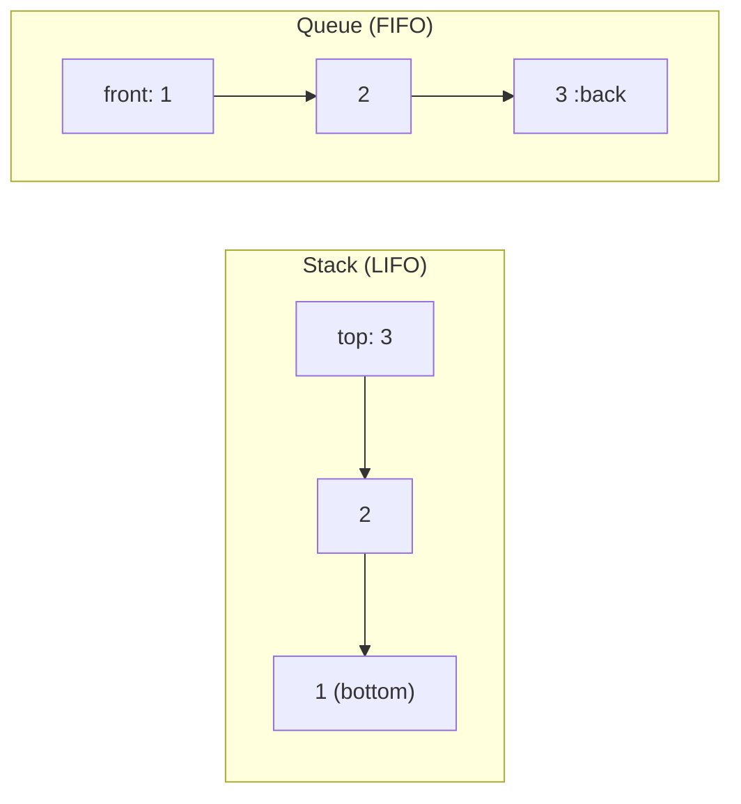

# Chapter 3 — Stacks & Queues (প্রশ্ন 3.1 – 3.6)

> **Cracking the Coding Interview — বাংলা গাইড**
> ব্যাখ্যা **বাংলায়**, technical term **ইংরেজিতে**। Code **Dart + Python** দুটোতেই।
> এই chapter শুরুর আগে [Chapter 0 — Foundation](chapter00_foundation.md) (Big-O + 7-step) পড়ে নিন।

Stack আর Queue — দুটো সহজ কিন্তু সর্বত্র-বিদ্যমান data structure। এই chapter-এ এদের গভীরে যাব আর interview-এ যেসব চালাকি জিজ্ঞেস করা হয় সেগুলো শিখব।

> [মূল Index](README.md) · [Foundation](chapter00_foundation.md) · ← [আগের: Linked Lists](chapter02_linked_lists.md) · → [পরের: Trees & Graphs](chapter04_trees_graphs.md)

---

<a id="toc"></a>
## এই Chapter-এর সূচি

- [3.1 — Three in One](#q3-1)
- [3.2 — Stack Min](#q3-2)
- [3.3 — Stack of Plates](#q3-3)
- [3.4 — Queue via Stacks](#q3-4)
- [3.5 — Sort Stack](#q3-5)
- [3.6 — Animal Shelter](#q3-6)

---

## Background — প্রশ্নে যাওয়ার আগে এগুলো বুঝুন

### ১. Stack — LIFO (Last In, First Out)

**বাস্তব জীবনের analogy:** থালা-বাসনের স্তূপ (pile of plates)। সবচেয়ে শেষে রাখা থালাটাই সবার আগে তোলা হয় — **শেষে ঢুকলে প্রথমে বের হয়।**

```
push(1) → push(2) → push(3)

         ┌───┐
         │ 3 │  ← top (সবার উপরে, এটাই আগে বের হবে)
         ├───┤
         │ 2 │
         ├───┤
         │ 1 │  ← bottom
         └───┘

pop() → 3 বের হয় (top থেকে)
pop() → 2 বের হয়
pop() → 1 বের হয়
```

**Stack-এর ৩টা মূল operation:**

| Operation | কাজ | Time |
|---|---|---|
| `push(x)` | x কে top-এ রাখো | O(1) |
| `pop()` | top থেকে বের করো ও ফেরত দাও | O(1) |
| `peek()` | top দেখো কিন্তু বের করো না | O(1) |
| `isEmpty()` | খালি কিনা | O(1) |

**Flutter-এ Stack কোথায়?**
```
Navigator stack:
  MaterialApp চালু → Route "Home" push হয়
  "Details" page-এ যাই → Route "Details" push হয়
  Back button চাপি → "Details" pop হয়, "Home" দেখা যায়

         ┌──────────────────┐
         │   Details Page   │  ← top (back চাপলে এটা pop হবে)
         ├──────────────────┤
         │    Home Page     │
         └──────────────────┘
```

**Dart-এ Stack বানানো (linked list দিয়ে):**

```dart
class StackNode<T> {
  T data;
  StackNode<T>? next;
  StackNode(this.data);
}

class Stack<T> {
  StackNode<T>? _top;
  int _size = 0;

  void push(T item) {
    final node = StackNode(item);
    node.next = _top;   // নতুন node পুরনো top-এর আগে
    _top = node;        // top আপডেট
    _size++;
  }

  T pop() {
    if (isEmpty) throw StateError('Stack is empty');
    final val = _top!.data;
    _top = _top!.next;  // top এক ধাপ নিচে
    _size--;
    return val;
  }

  T peek() {
    if (isEmpty) throw StateError('Stack is empty');
    return _top!.data;
  }

  bool get isEmpty => _top == null;
  int get size => _size;
}
```

```python
# Python — linked list দিয়ে Stack
class StackNode:
    def __init__(self, data):
        self.data = data
        self.next = None

class Stack:
    def __init__(self):
        self._top = None
        self._size = 0

    def push(self, item):
        node = StackNode(item)
        node.next = self._top   # নতুন node পুরনো top-এর আগে
        self._top = node
        self._size += 1

    def pop(self):
        if self.is_empty():
            raise IndexError("Stack is empty")
        val = self._top.data
        self._top = self._top.next
        self._size -= 1
        return val

    def peek(self):
        if self.is_empty():
            raise IndexError("Stack is empty")
        return self._top.data

    def is_empty(self):
        return self._top is None
```

> **Dart-এ সহজ বিকল্প:** `List` কে stack হিসেবে ব্যবহার করা যায়: `list.add()` = push, `list.removeLast()` = pop, `list.last` = peek।

---

### ২. Queue — FIFO (First In, First Out)

**বাস্তব জীবনের analogy:** দোকানে লাইন (queue)। যে আগে এলো, সে আগে সেবা পাবে — **আগে ঢুকলে আগে বের হয়।**

```
enqueue(1) → enqueue(2) → enqueue(3)

front                              back
  ↓                                 ↓
┌───┬───┬───┐
│ 1 │ 2 │ 3 │
└───┴───┴───┘
  ↑
dequeue() → 1 বের হয় (front থেকে)
dequeue() → 2 বের হয়
dequeue() → 3 বের হয়
```

**Queue-এর ৪টা মূল operation:**

| Operation | কাজ | Time |
|---|---|---|
| `enqueue(x)` | x কে back-এ রাখো | O(1) |
| `dequeue()` | front থেকে বের করো | O(1) |
| `peek()` | front দেখো | O(1) |
| `isEmpty()` | খালি কিনা | O(1) |

**Flutter-এ Queue কোথায়?**
```
Event Queue (Dart Event Loop):
  UI gesture আসে → event queue-তে জমে
  Timer fires → event queue-তে ঢোকে
  Dart event loop FIFO order-এ process করে

  [ gesture | timer_cb | http_response | ... ]
      ↑
   প্রথমে এসেছিল, প্রথমে process হবে
```

**Dart-এ Queue বানানো (linked list দিয়ে):**

```dart
class QueueNode<T> {
  T data;
  QueueNode<T>? next;
  QueueNode(this.data);
}

class MyQueue<T> {
  QueueNode<T>? _front;  // বের হওয়ার দিক
  QueueNode<T>? _back;   // ঢোকার দিক
  int _size = 0;

  void enqueue(T item) {
    final node = QueueNode(item);
    if (_back != null) _back!.next = node;  // পুরনো back-এর পরে
    _back = node;                           // back আপডেট
    _front ??= node;                        // প্রথম element হলে front-ও সেট করো
    _size++;
  }

  T dequeue() {
    if (isEmpty) throw StateError('Queue is empty');
    final val = _front!.data;
    _front = _front!.next;
    if (_front == null) _back = null;      // Queue খালি হয়ে গেলে back-ও null
    _size--;
    return val;
  }

  T peek() {
    if (isEmpty) throw StateError('Queue is empty');
    return _front!.data;
  }

  bool get isEmpty => _front == null;
  int get size => _size;
}
```

```python
# Python — linked list দিয়ে Queue
from collections import deque  # Python-এ built-in, O(1) enqueue/dequeue

class MyQueue:
    def __init__(self):
        self._q = deque()  # double-ended queue

    def enqueue(self, item):
        self._q.append(item)         # back-এ যোগ করো

    def dequeue(self):
        if self.is_empty():
            raise IndexError("Queue is empty")
        return self._q.popleft()     # front থেকে বের করো

    def peek(self):
        if self.is_empty():
            raise IndexError("Queue is empty")
        return self._q[0]

    def is_empty(self):
        return len(self._q) == 0
```

---

### ৩. Stack vs Queue — কখন কোনটা?

```
Stack (LIFO)                          Queue (FIFO)
──────────────────────────────────    ──────────────────────────────────
 Undo/Redo (শেষ কাজ আগে undo)        Print queue (আগে দিলে আগে ছাপে)
 Function call stack                 BFS (Graph traversal)
 Browser back button                 OS scheduler
 Navigator stack (Flutter)           Event loop (Dart/Flutter)
 Expression evaluation               Cache (evict oldest first)
 DFS (iterative)                     Message queue

মূল প্রশ্ন: "শেষেরটা আগে" → Stack
             "আগেরটা আগে"  → Queue
```

---

### ৪. Mermaid: Stack ও Queue-এর memory layout



---
---

<a id="q3-1"></a>
# 3.1 — Three in One

> Pattern: **Array partitioning / Fixed-division** · Difficulty: **Medium** · Common

> **বইয়ের ভাষায়:** Describe how you could use a single array to implement three stacks.

## সমস্যাটা সহজ বাংলায়

তিনটা আলাদা stack বানাতে হবে, কিন্তু শুধু **একটা array ব্যবহার করে**। মানে তিনটা stack-কে একই array-র তিনটা অংশে রাখতে হবে।

ধরুন একটা ৯ ঘরের array আছে:

```
index:  0   1   2   3   4   5   6   7   8
       [ _ │ _ │ _ │ _ │ _ │ _ │ _ │ _ │ _ ]
        Stack 0 │    Stack 1    │    Stack 2
```

এটা তিনটা stack-এর জন্য ভাগ করতে হবে।

## উদাহরণ

```
push(0, 'A')  → Stack 0-এ A রাখো
push(0, 'B')  → Stack 0-এ B রাখো
push(1, 'X')  → Stack 1-এ X রাখো
push(2, 'M')  → Stack 2-এ M রাখো

array (size=9, প্রতিটা stack-এর জন্য ৩ ঘর):
index:  0    1    2    3    4    5    6    7    8
      [ A │  B │  _ │  X │  _ │  _ │  M │  _ │  _ ]
       ←Stack 0→   ←─── Stack 1 ───→   ←─── Stack 2 ───→

pop(0) → B (Stack 0-এর top)
peek(1) → X (Stack 1-এর top)
```

## ধাপ ১: Listen (clarifying questions)
- **Stack-এর size কি fixed নাকি flexible?** CTCI-তে প্রথমে fixed বলা আছে, কিন্তু follow-up হিসেবে flexible approach আলোচনা করা ভালো।
- **কয়টা stack?** এখানে ঠিক ৩টা।
- **Overflow কীভাবে handle করব?** exception throw করব।

## ভাবনা ১: Fixed Division — সহজ কিন্তু অপচয়

Array-কে **তিন সমান ভাগে** ভাগ করি। প্রতিটা stack-এর জন্য নির্দিষ্ট অংশ:

```
stackCapacity = totalSize / 3

Stack k-এর শুরু:  k × stackCapacity
Stack k-এর শেষ:  (k+1) × stackCapacity − 1

k=0: index 0..2
k=1: index 3..5
k=2: index 6..8
```

**সুবিধা:** সহজ বোঝা এবং implement করা।
**অসুবিধা:** একটা stack overflow হলেও অন্যটায় জায়গা থাকলেও দেওয়া যাচ্ছে না — **অপচয়।**

## ভাবনা ২: Flexible Division (advanced)

প্রতিটা cell-এর সাথে "আগের cell-এর index" রেখে circular fashion-এ কাজ করা। তিনটা stack-এর top index রাখা হয়। এটা বেশি জটিল কিন্তু space efficient।

Interview-তে প্রথমে Fixed approach দিয়ে শুরু করুন, তারপর Flexible mention করুন।

## Optimize (BUD)

Fixed approach-এ **bottleneck**: যদি stack 0 full হয় কিন্তু stack 1 ও 2 খালি — তাহলে space নষ্ট।

Fixed approach acceptable উত্তর — interview-তে বলুন: "এই approach সহজ, তবে space efficient নয়। যদি চান, flexible circular approach describe করতে পারি।"

## Code — Fixed Division

```dart
// Dart — Fixed Division Approach
class FixedMultiStack {
  final int numStacks = 3;
  final int stackCapacity;
  late final List<int> values;
  late final List<int> sizes;  // প্রতিটা stack-এ কয়টা element আছে

  FixedMultiStack(this.stackCapacity) {
    values = List.filled(numStacks * stackCapacity, 0);
    sizes = List.filled(numStacks, 0);
  }

  // Stack k-এর শুরু index
  int _offset(int stackNum) => stackNum * stackCapacity;

  // Stack k-এর top index
  int _topIndex(int stackNum) => _offset(stackNum) + sizes[stackNum] - 1;

  bool isFull(int stackNum) => sizes[stackNum] == stackCapacity;
  bool isEmpty(int stackNum) => sizes[stackNum] == 0;

  void push(int stackNum, int value) {
    if (isFull(stackNum)) throw StateError('Stack $stackNum is full');
    sizes[stackNum]++;                    // size বাড়াও
    values[_topIndex(stackNum)] = value;  // top-এ রাখো
  }

  int pop(int stackNum) {
    if (isEmpty(stackNum)) throw StateError('Stack $stackNum is empty');
    final val = values[_topIndex(stackNum)];
    values[_topIndex(stackNum)] = 0;      // পরিষ্কার করো
    sizes[stackNum]--;
    return val;
  }

  int peek(int stackNum) {
    if (isEmpty(stackNum)) throw StateError('Stack $stackNum is empty');
    return values[_topIndex(stackNum)];
  }
}

// ব্যবহার:
void main() {
  final ms = FixedMultiStack(5);  // প্রতিটা stack-এর জন্য ৫ ঘর
  ms.push(0, 10);
  ms.push(0, 20);
  ms.push(1, 30);
  print(ms.pop(0));   // 20
  print(ms.peek(1));  // 30
}
```

```python
# Python — Fixed Division Approach
class FixedMultiStack:
    def __init__(self, stack_capacity: int):
        self.num_stacks = 3
        self.stack_capacity = stack_capacity
        self.values = [0] * (self.num_stacks * stack_capacity)
        self.sizes = [0] * self.num_stacks   # প্রতিটা stack-এ কয়টা element

    def _offset(self, stack_num: int) -> int:
        return stack_num * self.stack_capacity

    def _top_index(self, stack_num: int) -> int:
        return self._offset(stack_num) + self.sizes[stack_num] - 1

    def is_full(self, stack_num: int) -> bool:
        return self.sizes[stack_num] == self.stack_capacity

    def is_empty(self, stack_num: int) -> bool:
        return self.sizes[stack_num] == 0

    def push(self, stack_num: int, value: int) -> None:
        if self.is_full(stack_num):
            raise OverflowError(f"Stack {stack_num} is full")
        self.sizes[stack_num] += 1
        self.values[self._top_index(stack_num)] = value

    def pop(self, stack_num: int) -> int:
        if self.is_empty(stack_num):
            raise IndexError(f"Stack {stack_num} is empty")
        val = self.values[self._top_index(stack_num)]
        self.values[self._top_index(stack_num)] = 0   # পরিষ্কার করো
        self.sizes[stack_num] -= 1
        return val

    def peek(self, stack_num: int) -> int:
        if self.is_empty(stack_num):
            raise IndexError(f"Stack {stack_num} is empty")
        return self.values[self._top_index(stack_num)]

# ব্যবহার:
ms = FixedMultiStack(5)
ms.push(0, 10)
ms.push(0, 20)
ms.push(1, 30)
print(ms.pop(0))    # 20
print(ms.peek(1))   # 30
```

## Complexity

| Approach | Time (push/pop/peek) | Space |
|---|---|---|
| Fixed Division | **O(1)** | O(N) — N = total array size |

## Pattern চিনুন
> **"একটা array দিয়ে একাধিক structure" → array কে ভাগে ভাগ করো, প্রতিটা ভাগের জন্য আলাদা offset আর size রাখো।**

## Common mistake
- `_topIndex` হিসেবে `offset + size` লেখা (এক বেশি হয়) — সঠিক হলো `offset + size - 1`।
- `push`-এর আগে size বাড়ানো ভুলে যাওয়া বা ক্রম উল্টে ফেলা।
- Overflow আর underflow check না করা।

## Follow-up
- **Flexible division:** প্রতিটা cell একটা `(value, previousIndex)` pair রাখুক; একটা free-list রেখে যেকোনো stack যতটুকু দরকার ততটুকু নিতে পারবে। এটা O(1) amortized রাখা যায় কিন্তু implement করা বেশি কঠিন।

<sub>[↑ এই chapter-এর সূচি](#toc) · [ মূল Index](README.md)</sub>

---
---

<a id="q3-2"></a>
# 3.2 — Stack Min

> Pattern: **Auxiliary stack / O(1) extra info** · Difficulty: **Easy–Medium** · খুব common

> **বইয়ের ভাষায়:** How would you design a stack which, in addition to `push` and `pop`, has a function `min` which returns the minimum element? Push, pop and min should all operate in O(1) time.

## সমস্যাটা সহজ বাংলায়

একটা stack বানাতে হবে যেখানে `push`, `pop`-এর পাশাপাশি `min()` বলে একটা function আছে — যা **এই মুহূর্তে stack-এ থাকা সবচেয়ে ছোট সংখ্যাটা O(1) সময়ে** বলে দেবে।

## উদাহরণ

```
push(5)  → stack: [5]        min = 5
push(3)  → stack: [5, 3]     min = 3
push(7)  → stack: [5, 3, 7]  min = 3
push(1)  → stack: [5, 3, 7, 1]  min = 1
pop()    → 1 বের হলো         min = 3  ← 1 চলে গেছে, আবার 3 minimum
pop()    → 7 বের হলো         min = 3
pop()    → 3 বের হলো         min = 5  ← 3 চলে গেছে, এখন 5 minimum
```

## ধাপ ১: Listen
- `min()` কি O(1)-তে করতেই হবে? → হ্যাঁ, এটাই চ্যালেঞ্জ।
- Duplicate minimum থাকতে পারে? → হ্যাঁ, ধরে নিন পারে।

## ভাবনা ১: Brute Force — প্রতিবার সব scan করা
`min()` ডাকলে পুরো stack scan করে minimum বের করা।
- **Time: O(n)** — শর্ত মানে না।

## ভাবনা ২: প্রতিটা node-এ minimum রাখা
প্রতিটা element push-এর সময় "এই পর্যন্ত minimum কত" সেটাও সেই node-এ রাখি।

```
push(5):  node = {val: 5, min: 5}     → stack: [{5,5}]
push(3):  node = {val: 3, min: 3}     → stack: [{5,5}, {3,3}]
push(7):  node = {val: 7, min: 3}     → stack: [{5,5}, {3,3}, {7,3}]
push(1):  node = {val: 1, min: 1}     → stack: [{5,5}, {3,3}, {7,3}, {1,1}]

pop() → {1,1} সরে গেল, top এখন {7,3} → min() = 3  
```

**সুবিধা:** সহজ, নির্ভরযোগ্য, duplicate-এ কাজ করে।
**অসুবিধা:** প্রতিটা node-এ extra মেমোরি লাগে (কিন্তু O(n) extra space — acceptable)।

## ভাবনা ৩: Auxiliary min-stack — আরেকটু চালাক (duplicate কম রাখে)

আলাদা একটা "min stack" রাখি যেখানে শুধু **নতুন minimum এলে তখনই push করি।** pop-এর সময় যদি সেই value main stack-এর min-এর সমান হয় তাহলে min stack থেকেও pop করি।

```
push(5): main=[5],       minStack=[5]     (5 নতুন minimum)
push(3): main=[5,3],     minStack=[5,3]   (3 নতুন minimum)
push(7): main=[5,3,7],   minStack=[5,3]   (7 > 3, তাই minStack-এ ঢোকে না)
push(1): main=[5,3,7,1], minStack=[5,3,1] (1 নতুন minimum)

pop() → 1, main=[5,3,7], minStack.peek()==1? হ্যাঁ → minStack.pop() → minStack=[5,3]
min() = minStack.peek() = 3  
```

**সুবিধা:** minimum track করার জন্য কম স্পেস (worst case আগেরটার সমান, best case কম)।
**অসুবিধা:** সামান্য বেশি কোড।

## Optimize (BUD)
উভয় approach-ই O(1) time। তবে **ভাবনা ২ (per-node min)** সবচেয়ে সহজ এবং interview-এ সবচেয়ে বেশি দেখানো হয়। আমরা সেটাই implement করব, তারপর ৩ mention করব।

## Code — Per-node Min (সবচেয়ে clear)

```dart
// Dart — প্রতিটা node-এ minimum ট্র্যাক করা
class MinNode {
  final int value;
  final int minSoFar;   // এই পর্যন্ত stack-এ ছোট্ট কোনটা
  MinNode? next;

  MinNode(this.value, this.minSoFar);
}

class MinStack {
  MinNode? _top;

  void push(int value) {
    // এই পর্যন্ত minimum হয় নিজেই, নাহলে আগের top-এর min
    final currentMin = _top == null ? value : value < _top!.minSoFar
        ? value
        : _top!.minSoFar;
    final node = MinNode(value, currentMin);
    node.next = _top;
    _top = node;
  }

  int pop() {
    if (_top == null) throw StateError('Stack is empty');
    final val = _top!.value;
    _top = _top!.next;
    return val;
  }

  int peek() {
    if (_top == null) throw StateError('Stack is empty');
    return _top!.value;
  }

  int min() {
    if (_top == null) throw StateError('Stack is empty');
    return _top!.minSoFar;   // O(1) — top-এ সংরক্ষিত
  }

  bool get isEmpty => _top == null;
}

// ব্যবহার:
void main() {
  final s = MinStack();
  s.push(5);
  s.push(3);
  s.push(7);
  s.push(1);
  print(s.min());   // 1
  s.pop();
  print(s.min());   // 3
  s.pop();
  print(s.min());   // 3
  s.pop();
  print(s.min());   // 5
}
```

```python
# Python — per-node minimum ট্র্যাক করা
class MinNode:
    def __init__(self, value: int, min_so_far: int):
        self.value = value
        self.min_so_far = min_so_far  # এই পর্যন্ত ছোট্ট কোনটা
        self.next = None

class MinStack:
    def __init__(self):
        self._top = None

    def push(self, value: int) -> None:
        if self._top is None:
            current_min = value
        else:
            current_min = min(value, self._top.min_so_far)
        node = MinNode(value, current_min)
        node.next = self._top
        self._top = node

    def pop(self) -> int:
        if self._top is None:
            raise IndexError("Stack is empty")
        val = self._top.value
        self._top = self._top.next
        return val

    def peek(self) -> int:
        if self._top is None:
            raise IndexError("Stack is empty")
        return self._top.value

    def min(self) -> int:
        if self._top is None:
            raise IndexError("Stack is empty")
        return self._top.min_so_far    # O(1)

    def is_empty(self) -> bool:
        return self._top is None

# ব্যবহার:
s = MinStack()
s.push(5); s.push(3); s.push(7); s.push(1)
print(s.min())   # 1
s.pop()
print(s.min())   # 3
```

## Complexity

| Operation | Time | Space |
|---|---|---|
| push | **O(1)** | O(1) per node |
| pop | **O(1)** | — |
| min | **O(1)** | — |
| মোট space | — | **O(n)** |

## Pattern চিনুন
> **"O(1) extra info maintain করতে হবে (min/max/last)" → প্রতিটা node-এ সেই info সংরক্ষণ করো, বা একটা auxiliary stack রাখো।** এই pattern অনেক problem-এ লাগে।

## Common mistake
- `pop()` করার পর min update না করা (per-node approach-এ এটা automatic)।
- Empty stack-এ `min()` ডাকলে crash — empty check বাধ্যতামূলক।
- Duplicate minimum থাকলে auxiliary stack approach-এ সঠিকভাবে pop না করা।

## Follow-up
- **Stack Max** বানাও — একই approach, `minSoFar`-এর বদলে `maxSoFar` রাখো।
- **O(n/2) space-এ করা যায় কিভাবে?** → শুধু যখন minimum **বদলায়** তখনই min stack-এ রাখো (Approach 3)।

<sub>[↑ এই chapter-এর সূচি](#toc) · [ মূল Index](README.md)</sub>

---
---

<a id="q3-3"></a>
# 3.3 — Stack of Plates

> Pattern: **Stack of stacks / SetOfStacks** · Difficulty: **Medium** · Common

> **বইয়ের ভাষায়:** Imagine a literal stack of plates. If the stack gets too tall, it might topple. So in real life, we would likely start a new stack when the previous stack exceeds some threshold. Implement a data structure `SetOfStacks` that mimics this. `SetOfStacks` should be composed of several stacks and should create a new stack once the previous one exceeds capacity. `push` and `pop` should behave identically to a single stack. **Follow-up:** Implement a function `popAt(index)` which performs a pop operation on a specific sub-stack.

## সমস্যাটা সহজ বাংলায়

থালার স্তূপের কথা ভাবুন — একটা স্তূপ বেশি উঁচু হলে পড়ে যেতে পারে, তাই পাশে নতুন স্তূপ শুরু করি। ঠিক তেমনি এই structure-এ:

- প্রতিটা inner stack একটা নির্দিষ্ট capacity-র বেশি হলে নতুন stack শুরু হয়।
- কিন্তু বাইরে থেকে দেখলে মনে হবে একটাই বড় stack।

```
capacity = 3, push 1..7:

Stack 0    Stack 1    Stack 2
┌───┐      ┌───┐      ┌───┐
│ 3 │ top  │ 6 │ top  │ 7 │ top ← সর্বশেষ push
│ 2 │      │ 5 │      └───┘
│ 1 │ bot  │ 4 │ bot
└───┘      └───┘

pop() → 7 (Stack 2 থেকে, Stack 2 এখন empty হয়ে গেল → মুছে ফেলো)
pop() → 6 (Stack 1 থেকে)
```

## উদাহরণ (popAt সহ)

```
capacity=3, push 1..6:
  stacks = [[1,2,3], [4,5,6]]

popAt(0)  → Stack 0 থেকে 3 বের হয়
  stacks = [[1,2], [4,5,6]]  (সাধারণ) 
  — অথবা "rollover" করলে: [[1,2,4], [5,6]]
```

> **Note:** CTCI বই `popAt`-এর জন্য দুটো approach বলেছে: সহজ (rollover নেই) এবং উন্নত (পরের stack থেকে "rollover" করে সবাইকে compact রাখা)। আমরা দুটোই implement করব।

## ধাপ ১: Listen
- **Capacity কি fix?** হ্যাঁ, constructor-এ দেওয়া হয়।
- **`popAt`-এ কি rollover লাগবে?** Follow-up হিসেবে — প্রথমে সহজ version।
- **Stack 0, 1, 2... — 0-indexed?** হ্যাঁ।

## Brute Force approach

একটা `List<Stack>` রাখি। push করলে শেষ stack-এ রাখি, ভরা হলে নতুন stack। pop করলে শেষ stack থেকে, খালি হলে সেটা সরিয়ে ফেলি।

```
stacks = List<List<int>>
যখন push(x):
  stacks.last ভরা হলে stacks-এ নতুন list যোগ করো
  stacks.last-এ x রাখো

যখন pop():
  stacks.last থেকে pop করো
  stacks.last খালি হলে stacks.removeLast()
```

## Code — SetOfStacks (সহজ version + popAt rollover সহ)

```dart
// Dart — SetOfStacks
class SetOfStacks {
  final int capacity;
  final List<List<int>> _stacks = [];

  SetOfStacks(this.capacity);

  // সবচেয়ে সামনের (last) stack যদি থাকে ও ভরা না হয়
  bool get _lastHasRoom =>
      _stacks.isNotEmpty && _stacks.last.length < capacity;

  void push(int value) {
    if (!_lastHasRoom) {
      _stacks.add([]);  // নতুন stack
    }
    _stacks.last.add(value);
  }

  int pop() {
    if (_stacks.isEmpty) throw StateError('SetOfStacks is empty');
    final val = _stacks.last.removeLast();
    if (_stacks.last.isEmpty) _stacks.removeLast(); // খালি stack সরাও
    return val;
  }

  int peek() {
    if (_stacks.isEmpty) throw StateError('SetOfStacks is empty');
    return _stacks.last.last;
  }

  // Follow-up: নির্দিষ্ট sub-stack থেকে pop করো
  // Rollover version: পরের stack থেকে "নিচের" element এনে শূন্য পূরণ করো
  int popAt(int stackIndex) {
    if (stackIndex < 0 || stackIndex >= _stacks.length) {
      throw RangeError('Invalid stack index');
    }
    final val = _stacks[stackIndex].removeLast();
    // Rollover: পরের stack-গুলো compact করো
    _rightShift(stackIndex + 1);
    return val;
  }

  // stackIndex থেকে শুরু করে প্রতিটা stack-এর bottom element
  // আগের stack-এর top-এ দাও (rollover)
  void _rightShift(int stackIndex) {
    if (stackIndex >= _stacks.length) return;

    // এই stack-এর bottom element নিয়ে আগের stack-এ দাও
    final bottomVal = _stacks[stackIndex].removeAt(0);
    _stacks[stackIndex - 1].add(bottomVal);

    if (_stacks[stackIndex].isEmpty) {
      _stacks.removeAt(stackIndex);  // stack খালি হলে সরাও
    } else {
      _rightShift(stackIndex + 1);  // পরের stack থেকেও rollover
    }
  }

  bool get isEmpty => _stacks.isEmpty;
}

// ব্যবহার:
void main() {
  final sos = SetOfStacks(3);
  for (int i = 1; i <= 7; i++) sos.push(i);
  // stacks: [[1,2,3], [4,5,6], [7]]
  print(sos.pop());       // 7
  print(sos.peek());      // 6
  print(sos.popAt(0));    // 3, rollover হবে → stacks: [[1,2,4], [5,6]]
}
```

```python
# Python — SetOfStacks
class SetOfStacks:
    def __init__(self, capacity: int):
        self.capacity = capacity
        self._stacks: list[list[int]] = []

    def _last_has_room(self) -> bool:
        return bool(self._stacks) and len(self._stacks[-1]) < self.capacity

    def push(self, value: int) -> None:
        if not self._last_has_room():
            self._stacks.append([])   # নতুন stack
        self._stacks[-1].append(value)

    def pop(self) -> int:
        if not self._stacks:
            raise IndexError("SetOfStacks is empty")
        val = self._stacks[-1].pop()
        if not self._stacks[-1]:      # খালি stack সরাও
            self._stacks.pop()
        return val

    def peek(self) -> int:
        if not self._stacks:
            raise IndexError("SetOfStacks is empty")
        return self._stacks[-1][-1]

    # Follow-up: নির্দিষ্ট sub-stack থেকে pop (rollover সহ)
    def pop_at(self, stack_index: int) -> int:
        if stack_index < 0 or stack_index >= len(self._stacks):
            raise IndexError("Invalid stack index")
        val = self._stacks[stack_index].pop()
        self._right_shift(stack_index + 1)
        return val

    def _right_shift(self, stack_index: int) -> None:
        if stack_index >= len(self._stacks):
            return
        # এই stack-এর bottom নিয়ে আগের stack-এ দাও
        bottom_val = self._stacks[stack_index].pop(0)
        self._stacks[stack_index - 1].append(bottom_val)

        if not self._stacks[stack_index]:
            self._stacks.pop(stack_index)
        else:
            self._right_shift(stack_index + 1)

    def is_empty(self) -> bool:
        return not self._stacks

# ব্যবহার:
sos = SetOfStacks(3)
for i in range(1, 8):
    sos.push(i)
# stacks: [[1,2,3], [4,5,6], [7]]
print(sos.pop())         # 7
print(sos.pop_at(0))     # 3, rollover → stacks: [[1,2,4], [5,6]]
print(sos.peek())        # 6
```

## Complexity

| Operation | Time | Space |
|---|---|---|
| push | **O(1)** | — |
| pop | **O(1)** | — |
| popAt (no rollover) | **O(1)** | — |
| popAt (rollover) | **O(n/capacity)** — rollover chain | — |
| মোট space | — | **O(n)** |

## Pattern চিনুন
> **"অনেকগুলো stack যেন একটা stack" → List of stacks রাখো, শেষটায় push করো, শেষটা থেকে pop করো, খালি হলে সরিয়ে ফেলো।** Sharding/partitioned structure-এর একটা সহজ উদাহরণ।

## Common mistake
- `pop()` করার পর stack খালি হলে সেটা `_stacks` থেকে না সরানো → পরের push ভুল stack-এ যাবে।
- `popAt`-এ rollover-এর সময় off-by-one error (কোন stack থেকে কোথায় নেবে)।
- `_stacks.isEmpty`-এর আগে `.last`/`.peek()` ডাকা → null crash।

## Follow-up
- **Rollover ছাড়া `popAt`:** যেকোনো sub-stack থেকে pop করুন, পরবর্তী stack-গুলো compact না করলেও চলে (কিছু stack তখন capacity-এর কম হবে — এটা acceptable কিনা interviewer-কে জিজ্ঞেস করুন)।

<sub>[↑ এই chapter-এর সূচি](#toc) · [ মূল Index](README.md)</sub>

---
---

<a id="q3-4"></a>
# 3.4 — Queue via Stacks

> Pattern: **Two stacks = Queue simulation** · Difficulty: **Medium** · খুব common

> **বইয়ের ভাষায়:** Implement a MyQueue class which implements a queue using two stacks.

## সমস্যাটা সহজ বাংলায়

Stack হলো LIFO (শেষে ঢুকলে আগে বের হয়)। Queue হলো FIFO (আগে ঢুকলে আগে বের হয়)। দুটো stack ব্যবহার করে Queue-এর মতো আচরণ তৈরি করতে হবে।

## মূল Insight — দুটো উল্টো flip মানে সোজা

```
stack-এ push করলে উল্টো হয়:
  enqueue করলাম 1, 2, 3:
  stackIn: [1, 2, 3]  ← top হলো 3

stackIn থেকে stackOut-এ ঢাললে আবার উল্টো হয় → সোজা হয়ে যায়!
  stackOut: [3, 2, 1]  ← top হলো 1   FIFO order!

dequeue করলে stackOut থেকে pop → 1, তারপর 2, তারপর 3  
```

## উদাহরণ

```
enqueue(1): stackIn=[1],       stackOut=[]
enqueue(2): stackIn=[1,2],     stackOut=[]
enqueue(3): stackIn=[1,2,3],   stackOut=[]

dequeue():  stackOut খালি → stackIn সব stackOut-এ ঢালো
            stackIn=[],        stackOut=[3,2,1]  (top=1)
            stackOut.pop() = 1  

dequeue():  stackOut=[3,2],    stackOut.pop() = 2   (আবার transfer লাগেনি!)
enqueue(4): stackIn=[4],       stackOut=[3,2]
dequeue():  stackOut=[3],      stackOut.pop() = 3   (transfer লাগেনি!)
dequeue():  stackOut=[],       transfer → stackOut=[4], pop() = 4  
```

## ধাপ ১: Listen
- **`dequeue`-এ কি transfer সবসময় হবে?** না — শুধু `stackOut` খালি থাকলে। এটাই lazy transfer — amortized O(1) করে।
- **কয়টা stack?** ঠিক দুটো।

## Brute Force → Optimize

**Brute Force (প্রতিটা enqueue-তে transfer):**
`enqueue`-এ: stackOut → stackIn, তারপর push, তারপর সব আবার stackOut-এ।
- **Time: O(n) per enqueue** — খারাপ।

**Optimal (lazy transfer — শুধু dequeue-তে, শুধু দরকার হলে):**
`enqueue`: stackIn-এ push → **O(1)**
`dequeue`: stackOut খালি হলেই stackIn → stackOut transfer → **amortized O(1)**

```
কেন amortized O(1)?
প্রতিটা element মোট দুইবার push হয় (stackIn একবার, stackOut একবার)
আর দুইবার pop হয় — মোট O(4n) = O(n) সব মিলিয়ে।
তাই n operation-এ মোট O(n) → প্রতিটা amortized O(1)।
```

## Code

```dart
// Dart — Queue via two Stacks
class MyQueue<T> {
  final List<T> _stackIn = [];   // নতুন element আসে এখানে
  final List<T> _stackOut = [];  // dequeue হয় এখান থেকে

  void enqueue(T item) {
    _stackIn.add(item);          // push — O(1)
  }

  // stackOut খালি হলে stackIn সব ঢালো
  void _transferIfNeeded() {
    if (_stackOut.isEmpty) {
      while (_stackIn.isNotEmpty) {
        _stackOut.add(_stackIn.removeLast()); // একটা করে নিচ্ছি (pop → push)
      }
    }
  }

  T dequeue() {
    if (isEmpty) throw StateError('Queue is empty');
    _transferIfNeeded();
    return _stackOut.removeLast();  // pop — O(1)
  }

  T peek() {
    if (isEmpty) throw StateError('Queue is empty');
    _transferIfNeeded();
    return _stackOut.last;
  }

  bool get isEmpty => _stackIn.isEmpty && _stackOut.isEmpty;
  int get size => _stackIn.length + _stackOut.length;
}

// ব্যবহার:
void main() {
  final q = MyQueue<int>();
  q.enqueue(1);
  q.enqueue(2);
  q.enqueue(3);
  print(q.dequeue());  // 1
  print(q.dequeue());  // 2
  q.enqueue(4);
  print(q.dequeue());  // 3
  print(q.dequeue());  // 4
}
```

```python
# Python — Queue via two Stacks
class MyQueue:
    def __init__(self):
        self._stack_in: list = []    # নতুন element আসে এখানে
        self._stack_out: list = []   # dequeue হয় এখান থেকে

    def enqueue(self, item) -> None:
        self._stack_in.append(item)  # push — O(1)

    def _transfer_if_needed(self) -> None:
        if not self._stack_out:      # শুধু খালি হলে transfer করো
            while self._stack_in:
                self._stack_out.append(self._stack_in.pop())

    def dequeue(self):
        if self.is_empty():
            raise IndexError("Queue is empty")
        self._transfer_if_needed()
        return self._stack_out.pop()  # O(1)

    def peek(self):
        if self.is_empty():
            raise IndexError("Queue is empty")
        self._transfer_if_needed()
        return self._stack_out[-1]

    def is_empty(self) -> bool:
        return not self._stack_in and not self._stack_out

    def size(self) -> int:
        return len(self._stack_in) + len(self._stack_out)

# ব্যবহার:
q = MyQueue()
q.enqueue(1); q.enqueue(2); q.enqueue(3)
print(q.dequeue())   # 1
print(q.dequeue())   # 2
q.enqueue(4)
print(q.dequeue())   # 3
print(q.dequeue())   # 4
```

## Complexity

| Operation | Time (worst) | Time (amortized) |
|---|---|---|
| enqueue | O(1) | O(1) |
| dequeue | O(n) — transfer | **O(1)** amortized |
| peek | O(n) — transfer | **O(1)** amortized |
| Space | O(n) | O(n) |

## Pattern চিনুন
> **"Stack দিয়ে Queue বানাও" → দুটো stack: একটায় push, আরেকটায় pop। Transfer শুধু যখন pop-stack খালি।** এই pattern-এর উল্টোটাও আছে: Queue দিয়ে Stack বানানো।

## Common mistake
- প্রতিটা enqueue-তে transfer করা (O(n) per operation) — শুধু dequeue-তে দরকার হলে করুন।
- `peek()`-এ transfer করতে ভুলে যাওয়া।
- `isEmpty` check-এ **দুটো** stack দেখতে ভুলে যাওয়া।

## Follow-up
- **Stack দিয়ে Queue বানালে → Queue দিয়ে Stack বানানো যায়?** হ্যাঁ — দুটো queue দিয়ে: push-এ একটা queue-তে রাখো, তারপর আগের সব element নতুন queue-তে নিয়ে পুরনোটা দিয়ে ফেলো। কিন্তু তখন push O(n) হয়।

<sub>[↑ এই chapter-এর সূচি](#toc) · [ মূল Index](README.md)</sub>

---
---

<a id="q3-5"></a>
# 3.5 — Sort Stack

> Pattern: **Insertion sort on stack / recursive sort** · Difficulty: **Medium** · Common

> **বইয়ের ভাষায়:** Write a program to sort a stack such that the smallest items are on top. You can use an additional temporary stack, but you may not copy the elements into any other data structure (such as an array). The stack supports the following operations: `push`, `pop`, `peek`, and `isEmpty`.

## সমস্যাটা সহজ বাংলায়

একটা stack আছে যেটা unsorted। সেটাকে sort করতে হবে যাতে **সবচেয়ে ছোট element top-এ** থাকে। শুধু **একটা extra (temporary) stack** ব্যবহার করা যাবে — array বা অন্য কোনো data structure নয়।

```
input stack:       sorted stack (target):
  ┌───┐              ┌───┐
  │ 3 │ top          │ 1 │ top (ছোট্ট)
  │ 1 │         →    │ 2 │
  │ 4 │              │ 3 │
  │ 2 │              │ 4 │
  └───┘              └───┘
```

## উদাহরণ (step by step)

```
মূল stack (s):    [2, 4, 1, 3]  (top = 3)
temporary stack (tmp):  []

Step: s থেকে 3 pop → tmp:    [3]   s: [2,4,1]
Step: s থেকে 1 pop → 1 < 3?  হ্যাঁ → tmp থেকে 3 s-তে ফিরিয়ে দাও, tmp-তে 1 রাখো
                     tmp: [1]   s: [2,4,3]

... এভাবে insertion sort-এর মতো tmp তে সঠিক জায়গায় বসাই ...

শেষে tmp: [4, 3, 2, 1]  (top = 1, সবচেয়ে ছোট)  
```

## ধাপ ১: Listen
- **Smallest top-এ, নাকি largest top-এ?** বইয়ে smallest top-এ। (interviewer-কে নিশ্চিত হতে জিজ্ঞেস করুন)
- **Extra stack একটাই?** হ্যাঁ।
- **Recursion কি চলবে?** বই বলে অন্য data structure নয় — call stack অবশ্য technically stack, কিন্তু এটা নিয়ে clarify করে নিন।

## Brute Force — সব element একটা array-তে নিয়ে sort করা
- অনুমতি নেই। এটাই constraint।

## Optimal — Insertion Sort logic, কিন্তু stack দিয়ে

**Analogy:** হাতে তাসের স্তূপ থেকে একটা একটা করে তুলে সঠিক জায়গায় রাখা — insertion sort-এর মতোই।

```
Algorithm:
  যতক্ষণ s খালি নয়:
    1. s থেকে top (tmp_top) pop করো
    2. tmp-এর top > tmp_top হলে → tmp-এর top কে s-তে ফিরিয়ে দাও
       (tmp-এর সঠিক জায়গা খুঁজছি)
    3. tmp-এর top ≤ tmp_top হলে → tmp-তে tmp_top push করো
  শেষে tmp-এ sorted stack (ছোট = top)
```

```
Trace: s = [2, 4, 1, 3]  tmp = []

Pop 3 from s:  tmp=[] → push 3    s=[2,4,1]   tmp=[3]
Pop 1 from s:  tmp.top=3 > 1 → s-তে 3 ফেরাও, push 1
                                  s=[2,4,3]   tmp=[1]
               tmp.top=1 ≤ 1? → push? না, 1 কে tmp-তে রাখো
                                  s=[2,4,3]   tmp=[1]   ← wait
               আবার: tmp.top=1 ≤ 1 (equal), push 1  → s=[2,4,3] tmp=[1]
               — আসলে: tmp খালি বা tmp.top ≤ tmp_top হলে push করো
               1 ≤ 3 (পুরনো 3 tmp-এ ছিল), তাই 1 আগে, 3 পরে
               tmp = [3, 1]  (top=1)

Pop 4 from s:  tmp.top=1 ≤ 4 → tmp-তে 4 রাখো?
               না! আমরা চাই ছোট top-এ → 1 < 4, তাই 4 নিচে যাবে
               tmp.top=1 ≤ 4 → s-তে 1 ফেরাও...

আসল logic নিচে code-এ:
```

## Code

```dart
// Dart — Sort Stack (only one extra stack allowed)
void sortStack(List<int> s) {
  // tmp-এ সবসময় sorted থাকবে: নিচে বড়, উপরে ছোট
  final List<int> tmp = [];

  while (s.isNotEmpty) {
    final current = s.removeLast();  // s থেকে pop

    // tmp-এর top যদি current-এর চেয়ে ছোট হয়,
    // সেগুলো s-তে ফিরিয়ে দাও (জায়গা করো)
    while (tmp.isNotEmpty && tmp.last < current) {
      s.add(tmp.removeLast());       // tmp → s
    }

    tmp.add(current);                // সঠিক জায়গায় insert
  }

  // tmp থেকে s-তে ঢেলে দাও (চাইলে)
  while (tmp.isNotEmpty) {
    s.add(tmp.removeLast());
  }
  // এখন s-এ: ছোট top-এ sorted (s.last = smallest)
}

// ব্যবহার:
void main() {
  final stack = [2, 4, 1, 3];  // top = 3 (last element)
  sortStack(stack);
  print(stack);  // [4, 3, 2, 1]  (top = 1, সবচেয়ে ছোট)
}
```

```python
# Python — Sort Stack (only one extra stack allowed)
def sort_stack(s: list) -> None:
    """
    s হলো stack (list), s[-1] = top।
    sorted করে: s[-1] = smallest element (top)।
    """
    tmp = []

    while s:
        current = s.pop()             # s থেকে pop

        # tmp-এর top যদি current-এর চেয়ে ছোট হয়,
        # জায়গা করতে s-তে ফিরিয়ে দাও
        while tmp and tmp[-1] < current:
            s.append(tmp.pop())       # tmp → s

        tmp.append(current)           # সঠিক জায়গায় insert

    # tmp → s-তে ঢালো
    while tmp:
        s.append(tmp.pop())
    # এখন s[-1] = smallest (top)

# ব্যবহার:
stack = [2, 4, 1, 3]  # top = 3
sort_stack(stack)
print(stack)  # [4, 3, 2, 1]  top=1 (smallest)
```

## Algorithm টা visualization করি

```
s = [2,4,1,3] (top=3)   tmp = []

current=3: tmp=[] → push 3          s=[2,4,1]  tmp=[3]
current=1: tmp.top=3 > 1? না (3>1 মানে tmp.top বড়, সরাও না, push)
           wait — condition: tmp[-1] < current → 3 < 1? না → সরাও না
           push 1                   s=[2,4]    tmp=[3,1]  (top=1)
current=4: tmp.top=1 < 4? হ্যাঁ → s-তে 1 ফেরাও
                                   s=[2,4,1]  tmp=[3]
           tmp.top=3 < 4? হ্যাঁ → s-তে 3 ফেরাও
                                   s=[2,4,1,3] tmp=[]
           tmp খালি → push 4        s=[2,4,1,3] tmp=[4]  (top=4)
current=3: tmp.top=4 < 3? না → push 3   tmp=[4,3]
current=1: tmp.top=3 < 1? না → push 1   tmp=[4,3,1]
current=2: tmp.top=1 < 2? হ্যাঁ → s-তে 1
           tmp.top=3 < 2? না → push 2   tmp=[4,3,2]
           s-তে ছিল 1 → current=1: tmp.top=2 < 1? না → push 1  tmp=[4,3,2,1]

s খালি! tmp=[4,3,2,1] top=1 

tmp → s ঢালো: s=[1,2,3,4] top=4? 
— না, উল্টো: tmp.pop()=1→s, 2→s, 3→s, 4→s → s=[1,2,3,4] s[-1]=4

hmm — আসলে tmp=[4,3,2,1] top=1 means s.append হলে s[-1]=1 
```

## Complexity

| | Time | Space |
|---|---|---|
| Best case | O(n) — already sorted | O(n) — tmp |
| Worst case | **O(n²)** — reverse sorted | O(n) — tmp |
| Average | O(n²) | O(n) |

> O(n²) কারণ insertion sort-এর মতো — প্রতিটা element-এর জন্য অন্যগুলো সরাতে হতে পারে। এটাই সীমা যখন শুধু একটা extra stack আছে।

## Pattern চিনুন
> **"Stack-এ sort করতে হবে" → Insertion sort-এর idea, একটা extra stack-কে sorted maintain করো।** tmp-এর top-এর সাথে compare করে সঠিক জায়গা খুঁজো।

## Common mistake
- Comparison-এর দিক উল্টে ফেলা (`<` vs `>`) — তাহলে largest top-এ বসবে।
- শেষে `tmp → s` transfer করতে ভুলে যাওয়া।
- Inner while loop-এর condition-এ `tmp.isEmpty` check মিস করা → crash।

## Follow-up
- **Recursive approach:** stack-এ recursion দিয়েও sort করা যায় — একটা element pop করে বাকিটা recursively sort করো, তারপর sorted-এ সঠিক জায়গায় insert করো। **Time O(n²), Space O(n) call stack।**

<sub>[↑ এই chapter-এর সূচি](#toc) · [ মূল Index](README.md)</sub>

---
---

<a id="q3-6"></a>
# 3.6 — Animal Shelter

> Pattern: **Multi-queue / Order tracking with timestamp** · Difficulty: **Medium** · Common

> **বইয়ের ভাষায়:** An animal shelter, which holds only dogs and cats, operates on a strictly "first in, first out" basis. People must adopt either the "oldest" (based on arrival time) animal, or they can select whether they would prefer a dog or a cat (and will receive the oldest animal of that type). Create the data structure to maintain this system and implement operations such as `enqueue`, `dequeueAny`, `dequeueDog`, and `dequeueCat`.

## সমস্যাটা সহজ বাংলায়

একটা animal shelter (পশু আশ্রয়) আছে যেখানে শুধু **কুকুর (dog)** আর **বিড়াল (cat)** থাকে। কেউ adopt করতে এলে:
1. **dequeueAny()** — যেটা সবচেয়ে আগে এসেছে, সেটাই নাও (dog বা cat যাই হোক)।
2. **dequeueDog()** — সবচেয়ে পুরনো dog নাও।
3. **dequeueCat()** — সবচেয়ে পুরনো cat নাও।

```
আসার ক্রম: D1, C1, D2, C2, D3   (D=dog, C=cat)

dequeueDog()  → D1 (oldest dog)
dequeueCat()  → C1 (oldest cat)
dequeueAny()  → D2 (oldest remaining animal: D2 আর C2, D2 আগে এসেছে)
```

## মূল Insight — দুটো আলাদা Queue + order number

দুটো আলাদা Queue রাখি — একটা dogs-এর জন্য, একটা cats-এর জন্য। `dequeueAny`-এর সময় **কোন Queue-এর সামনেরটা আগে এসেছে** তা বুঝতে প্রতিটা animal-এ একটা **order number (timestamp)** রাখি।

```
enqueue করার সময় global order counter বাড়াই:
  D1 → order 1     C1 → order 2
  D2 → order 3     C2 → order 4
  D3 → order 5

dogQueue:   D1(1) → D2(3) → D3(5)   front = D1
catQueue:   C1(2) → C2(4)           front = C1

dequeueAny():
  dogQueue.front.order = 1
  catQueue.front.order = 2
  1 < 2 → D1 আগে এসেছে → dogQueue.dequeue() = D1  
```

## উদাহরণ (ASCII)

```
enqueue sequence: Dog→1, Cat→2, Dog→3, Cat→4, Dog→5

dogQueue (front→back):
  ┌──────┬──────┬──────┐
  │D1 #1 │D2 #3 │D3 #5 │
  └──────┴──────┴──────┘
    ↑ front

catQueue (front→back):
  ┌──────┬──────┐
  │C1 #2 │C2 #4 │
  └──────┴──────┘
    ↑ front

dequeueDog()  → D1(#1)    dogQueue: [D2,D3]
dequeueAny()  → compare #2 vs #3 → C1(#2) catQueue: [C2]
dequeueAny()  → compare #3 vs #2... wait catQueue front = C2(#4)
               dogQueue front = D2(#3) → #3 < #4 → D2  dogQueue: [D3]
```

## ধাপ ১: Listen
- **"Oldest" মানে কি?** সবচেয়ে আগে enqueue হয়েছে।
- **dequeueAny-এ যদি একটা queue খালি হয়?** অন্যটা থেকে নাও।
- **উভয়ই খালি হলে?** Exception।

## Brute Force — একটাই Queue, সব একসাথে
সব animal একটাই queue-তে রাখি। `dequeueDog()`-এর সময় dog না পেলে সব scan করতে হবে → **O(n)**। শর্ত মানে না।

## Optimal — দুটো Queue + order counter

```
dequeueDog()  → dogQueue.dequeue()                → O(1)
dequeueCat()  → catQueue.dequeue()                → O(1)
dequeueAny()  → front order তুলনা করে কম order-টা → O(1)
```

## Code

```dart
// Dart — Animal Shelter with two queues
class Animal {
  final String name;
  final String type;  // 'dog' বা 'cat'
  int order = 0;      // enqueue-র সময় assign করা হবে

  Animal(this.name, this.type);

  bool get isDog => type == 'dog';
  bool get isCat => type == 'cat';
}

class AnimalShelter {
  final Queue<Animal> _dogs = Queue();
  final Queue<Animal> _cats = Queue();
  int _order = 0;

  void enqueue(Animal animal) {
    animal.order = _order++;
    if (animal.isDog) {
      _dogs.add(animal);
    } else {
      _cats.add(animal);
    }
  }

  // সবচেয়ে পুরনো animal (dog বা cat)
  Animal? dequeueAny() {
    if (_dogs.isEmpty && _cats.isEmpty) return null;
    if (_dogs.isEmpty) return _cats.removeFirst();
    if (_cats.isEmpty) return _dogs.removeFirst();
    // উভয়ই আছে — কার order কম (আগে এসেছে)?
    if (_dogs.first.order < _cats.first.order) {
      return _dogs.removeFirst();
    } else {
      return _cats.removeFirst();
    }
  }

  Animal? dequeueDog() {
    if (_dogs.isEmpty) return null;
    return _dogs.removeFirst();
  }

  Animal? dequeueCat() {
    if (_cats.isEmpty) return null;
    return _cats.removeFirst();
  }

  bool get isEmpty => _dogs.isEmpty && _cats.isEmpty;
}

// ব্যবহার:
import 'dart:collection';

void main() {
  final shelter = AnimalShelter();
  shelter.enqueue(Animal('Rex', 'dog'));
  shelter.enqueue(Animal('Whiskers', 'cat'));
  shelter.enqueue(Animal('Buddy', 'dog'));
  shelter.enqueue(Animal('Luna', 'cat'));
  shelter.enqueue(Animal('Max', 'dog'));

  print(shelter.dequeueDog()?.name);   // Rex
  print(shelter.dequeueCat()?.name);   // Whiskers
  print(shelter.dequeueAny()?.name);   // Buddy (#3 আগে Luna #4)
  print(shelter.dequeueAny()?.name);   // Luna
}
```

```python
# Python — Animal Shelter with two queues
from collections import deque

class Animal:
    def __init__(self, name: str, animal_type: str):
        self.name = name
        self.animal_type = animal_type  # 'dog' বা 'cat'
        self.order = 0                  # enqueue-র সময় assign হবে

    @property
    def is_dog(self) -> bool:
        return self.animal_type == 'dog'

    @property
    def is_cat(self) -> bool:
        return self.animal_type == 'cat'

    def __repr__(self):
        return f"{self.animal_type}:{self.name}(#{self.order})"


class AnimalShelter:
    def __init__(self):
        self._dogs: deque[Animal] = deque()
        self._cats: deque[Animal] = deque()
        self._order = 0

    def enqueue(self, animal: Animal) -> None:
        animal.order = self._order
        self._order += 1
        if animal.is_dog:
            self._dogs.append(animal)
        else:
            self._cats.append(animal)

    def dequeue_any(self) -> Animal | None:
        if not self._dogs and not self._cats:
            return None
        if not self._dogs:
            return self._cats.popleft()
        if not self._cats:
            return self._dogs.popleft()
        # উভয়ই আছে — কার order কম?
        if self._dogs[0].order < self._cats[0].order:
            return self._dogs.popleft()
        else:
            return self._cats.popleft()

    def dequeue_dog(self) -> Animal | None:
        if not self._dogs:
            return None
        return self._dogs.popleft()

    def dequeue_cat(self) -> Animal | None:
        if not self._cats:
            return None
        return self._cats.popleft()

    def is_empty(self) -> bool:
        return not self._dogs and not self._cats


# ব্যবহার:
shelter = AnimalShelter()
shelter.enqueue(Animal('Rex', 'dog'))
shelter.enqueue(Animal('Whiskers', 'cat'))
shelter.enqueue(Animal('Buddy', 'dog'))
shelter.enqueue(Animal('Luna', 'cat'))
shelter.enqueue(Animal('Max', 'dog'))

print(shelter.dequeue_dog().name)    # Rex
print(shelter.dequeue_cat().name)    # Whiskers
print(shelter.dequeue_any().name)    # Buddy (order #2 < Luna's #3)
print(shelter.dequeue_any().name)    # Luna
print(shelter.dequeue_any().name)    # Max
```

## Complexity

| Operation | Time | Space |
|---|---|---|
| enqueue | **O(1)** | — |
| dequeueDog | **O(1)** | — |
| dequeueCat | **O(1)** | — |
| dequeueAny | **O(1)** | — |
| মোট space | — | **O(n)** — দুটো queue |

## Pattern চিনুন
> **"Multiple type-এর FIFO, type-specific বা any" → type অনুযায়ী আলাদা Queue রাখো + global order counter দিয়ে "আগেরটা কে" ঠিক করো।** এই pattern priority queue-এর সরলীকৃত রূপ।

## Common mistake
- একটাই queue রেখে `dequeueDog()`-এ scan করা → O(n)।
- `order` counter ছাড়া `dequeueAny()` implement করা → "কোনটা আগে" বোঝার উপায় নেই।
- `dequeueAny()`-এ এক queue খালি হলে null check মিস করা → crash।
- `enqueue`-এর সময় order assign করতে ভুলে যাওয়া।

## Follow-up
- **৩ বা তার বেশি ধরনের animal হলে?** প্রতিটা type-এর জন্য আলাদা Queue + একটাই order counter — same approach scale হয়।
- **dequeueAny() সবসময় absolute oldest দেবে?** হ্যাঁ, কারণ প্রতিটা queue FIFO, আর order compare করে globally oldest বেছে নেওয়া হয়।

<sub>[↑ এই chapter-এর সূচি](#toc) · [ মূল Index](README.md)</sub>

---
---

## Chapter সারসংক্ষেপ

### প্রশ্নভিত্তিক technique সারণী

| # | প্রশ্ন | মূল technique | Time | Space |
|---|---|---|---|---|
| 3.1 | Three in One | Array fixed-partition, offset + size | O(1) push/pop | O(N) |
| 3.2 | Stack Min | Per-node min track / auxiliary min-stack | O(1) সব operation | O(n) |
| 3.3 | Stack of Plates | List of stacks, lazy removal | O(1) push/pop; O(n/c) popAt | O(n) |
| 3.4 | Queue via Stacks | Two stacks, lazy transfer | amortized O(1) | O(n) |
| 3.5 | Sort Stack | Insertion sort idea, one extra stack | O(n²) worst | O(n) |
| 3.6 | Animal Shelter | Two queues + global order counter | O(1) সব operation | O(n) |

---

### "এটা দেখলে → এটা ভাবো" (signal → technique)

```
একটা array দিয়ে k-টা stack       →  array partition, offset+size array রাখো
Stack-এ O(1) min/max চাই          →  per-node min/max store করো (বা aux stack)
বড় stack overflow করলে পাশে নতুন  →  List of stacks (SetOfStacks)
Stack দিয়ে Queue বানাতে হবে       →  দুটো stack: stackIn আর stackOut
Stack sort করতে হবে               →  extra stack-কে sorted রাখো (insertion sort)
Multiple type-এর FIFO + oldest    →  per-type queue + global order counter
```

---

### এই chapter-এর ৫টা সোনার নিয়ম

1. **Stack = LIFO, Queue = FIFO** — এই দুটো আলাদা রাখুন; যেকোনো LIFO/FIFO problem দেখলে এদের কথা ভাবুন।
2. **O(1) extra info চাইলে → নিজে সংরক্ষণ করো** — min/max/order সব node-এই বা auxiliary structure-এ রাখুন, বারবার scan করবেন না।
3. **দুটো stack উল্টো করলে queue হয়** — এই trick মুখস্থ রাখুন; lazy transfer দিয়ে amortized O(1) পাওয়া যায়।
4. **"Single extra stack-এ sort" = insertion sort** — O(n²) অনিবার্য, কিন্তু approach টা চিনে রাখুন।
5. **Multiple-type FIFO** — আলাদা queue + global order counter; scale করলে dictionary of queues।

---

> **পরের ধাপ:** [Chapter 4 — Trees & Graphs](chapter04_trees_graphs.md) (4.1–4.12), যেখানে DFS/BFS আর tree traversal শিখব — Stack আর Queue এখানে আবার কাজে লাগবে!
