# Chapter 4 — Trees & Graphs (প্রশ্ন 4.1 – 4.12)

> **Cracking the Coding Interview — বাংলা গাইড**
> ব্যাখ্যা **বাংলায়**, technical term **ইংরেজিতে**। Code **Dart + Python** দুটোতেই।
> এই chapter শুরুর আগে [Chapter 0 — Foundation](chapter00_foundation.md) (Big-O + 7-step) পড়ে নিন।

> [মূল Index](README.md) · [Foundation](chapter00_foundation.md) · [আগের: Stacks & Queues](chapter03_stacks_queues.md) · [পরের: Bit Manipulation](chapter05_bit_manipulation.md)

---

<a id="toc"></a>
## এই Chapter-এর সূচি

- [4.1 — Route Between Nodes](#q4-1)
- [4.2 — Minimal Tree](#q4-2)
- [4.3 — List of Depths](#q4-3)
- [4.4 — Check Balanced](#q4-4)
- [4.5 — Validate BST](#q4-5)
- [4.6 — Successor](#q4-6)
- [4.7 — Build Order](#q4-7)
- [4.8 — First Common Ancestor](#q4-8)
- [4.9 — BST Sequences](#q4-9)
- [4.10 — Check Subtree](#q4-10)
- [4.11 — Random Node](#q4-11)
- [4.12 — Paths with Sum](#q4-12)

---

## Background — প্রশ্নে যাওয়ার আগে এগুলো বুঝুন

Trees & Graphs interview-এর সবচেয়ে বড় topic। এই section-এ background পুরোপুরি পড়লে পরের সব প্রশ্ন অনেক সহজ লাগবে।

---

### ১. Tree কী? — মূল terminology

Tree হলো connected, acyclic (কোনো cycle নেই) একটা graph। একটা **root node** থেকে শুরু হয়ে **শাখা** (child) বের হয়, সেখান থেকে আরও শাখা।

```
              root
               |
        ┌──────┴──────┐
      node           node
      / \             |
   node  node        node   ← leaf (কোনো child নেই)
```

**মূল শব্দগুলো:**

| Term | বাংলায় মানে |
|---|---|
| root | সবার উপরের node, parent নেই |
| leaf | একদম নিচের node, child নেই |
| parent | যার থেকে বের হয়েছি |
| child | যার দিকে নামছি |
| sibling | একই parent-এর অন্য child |
| depth of a node | root থেকে ওই node পর্যন্ত edge সংখ্যা |
| height of a node | ওই node থেকে সবচেয়ে দূরের leaf পর্যন্ত edge |
| height of tree | root-এর height |

```
depth/height উদাহরণ:

         A         ← depth 0, height 3
        / \
       B   C       ← depth 1, B-height 2, C-height 1
      / \   \
     D   E   F     ← depth 2, সব height 1
    /
   G               ← depth 3, height 0 (leaf)
```

---

### ২. Binary Tree vs BST

**Binary Tree:** প্রতিটা node-এ সর্বোচ্চ **২টা** child (left, right)। কোনো order নেই।

**Binary Search Tree (BST):** Binary Tree, কিন্তু প্রতিটা node-এ একটা বিশেষ নিয়ম:
- left subtree-এর সব value < node-এর value
- right subtree-এর সব value > node-এর value

```
BST উদাহরণ:

        8
       / \
      4   10
     / \    \
    2   6    20
```

```
8-এর left subtree: {4,2,6} — সব < 8    (নিয়ম মানছে)
8-এর right subtree: {10,20} — সব > 8   (নিয়ম মানছে)
```

> **কেন BST?** Search করতে O(log n) লাগে (balanced থাকলে) — প্রতিটা comparison-এ অর্ধেক বাদ দেওয়া যায়।

---

### ৩. Balanced vs Unbalanced Tree

**Balanced tree:** left আর right subtree-এর height-এর পার্থক্য বড়জোর **১**। বেশিরভাগ BST operation তখন **O(log n)**।

**Unbalanced tree:** worst case-এ line-এর মতো হয়ে যায় — তখন O(n)।

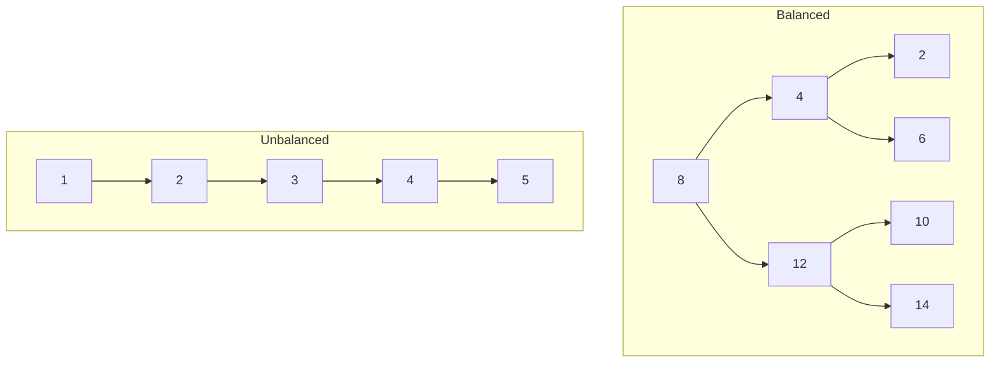

---

### ৪. Tree Node — Dart ও Python-এ

```dart
// Dart — Binary Tree Node
class TreeNode {
  int val;
  TreeNode? left;
  TreeNode? right;
  TreeNode(this.val, {this.left, this.right});
}
```

```python
# Python — Binary Tree Node
class TreeNode:
    def __init__(self, val=0, left=None, right=None):
        self.val = val
        self.left = left
        self.right = right
```

---

### ৫. Tree Traversal — চারটা উপায়

একটা tree-এর সব node visit করার চারটা প্রধান উপায়। **মনে রাখার কৌশল:** "pre/in/post" — root কে কখন process করি তার উপর নাম।

```
উদাহরণ tree:
       4
      / \
     2   6
    / \ / \
   1  3 5  7
```

**In-order (Left → Root → Right):** BST-তে sorted order দেয়।
Result: `1, 2, 3, 4, 5, 6, 7`

**Pre-order (Root → Left → Right):** tree copy/serialize করতে কাজে লাগে।
Result: `4, 2, 1, 3, 6, 5, 7`

**Post-order (Left → Right → Root):** tree delete করতে কাজে লাগে।
Result: `1, 3, 2, 5, 7, 6, 4`

**Level-order (BFS):** level by level, queue দিয়ে।
Result: `4, 2, 6, 1, 3, 5, 7`

```dart
// Dart — চারটা traversal

// In-order
void inOrder(TreeNode? node) {
  if (node == null) return;
  inOrder(node.left);
  print(node.val);     // root process: মাঝখানে
  inOrder(node.right);
}

// Pre-order
void preOrder(TreeNode? node) {
  if (node == null) return;
  print(node.val);     // root process: সবার আগে
  preOrder(node.left);
  preOrder(node.right);
}

// Post-order
void postOrder(TreeNode? node) {
  if (node == null) return;
  postOrder(node.left);
  postOrder(node.right);
  print(node.val);     // root process: সবার শেষে
}

// Level-order (BFS) — queue দিয়ে
import 'dart:collection';
void levelOrder(TreeNode? root) {
  if (root == null) return;
  final queue = Queue<TreeNode>();
  queue.add(root);
  while (queue.isNotEmpty) {
    final node = queue.removeFirst();
    print(node.val);
    if (node.left != null) queue.add(node.left!);
    if (node.right != null) queue.add(node.right!);
  }
}
```

```python
# Python — চারটা traversal
from collections import deque

def in_order(node):
    if node is None: return
    in_order(node.left)
    print(node.val)
    in_order(node.right)

def pre_order(node):
    if node is None: return
    print(node.val)
    pre_order(node.left)
    pre_order(node.right)

def post_order(node):
    if node is None: return
    post_order(node.left)
    post_order(node.right)
    print(node.val)

def level_order(root):
    if root is None: return
    queue = deque([root])
    while queue:
        node = queue.popleft()
        print(node.val)
        if node.left:  queue.append(node.left)
        if node.right: queue.append(node.right)
```

---

### ৬. Graph — কী এবং কীভাবে রাখা হয়

**Graph** হলো **node (vertex)** আর **edge**-এর সমষ্টি। Tree হলো একটা বিশেষ ধরনের graph (connected + no cycle)। Graph-এ cycle থাকতে পারে, disconnected থাকতে পারে।

**Directed vs Undirected:**
- Directed: edge-এর একটা দিক আছে (A → B, B → A নয়)।
- Undirected: দুইদিকেই যাওয়া যায় (A — B)।

**Graph রাখার দুটো উপায়:**

```
Adjacency List (বেশি ব্যবহৃত):
  0: [1, 2]
  1: [2]
  2: [0, 3]
  3: [3]

Adjacency Matrix:
     0  1  2  3
  0 [0, 1, 1, 0]
  1 [0, 0, 1, 0]
  2 [1, 0, 0, 1]
  3 [0, 0, 0, 1]
```

| | Adjacency List | Adjacency Matrix |
|---|---|---|
| Space | O(V + E) | O(V²) |
| Edge আছে কিনা | O(degree) | O(1) |
| সব neighbor | O(degree) | O(V) |
| কখন | Sparse graph (কম edge) | Dense graph (অনেক edge) |

```dart
// Dart — Adjacency List দিয়ে Graph
class Graph {
  final Map<int, List<int>> adj = {};
  void addEdge(int u, int v) {
    adj.putIfAbsent(u, () => []).add(v);
    adj.putIfAbsent(v, () => []).add(u);  // undirected হলে দুইদিক
  }
}
```

```python
# Python — Adjacency List দিয়ে Graph
from collections import defaultdict

class Graph:
    def __init__(self):
        self.adj = defaultdict(list)

    def add_edge(self, u, v):
        self.adj[u].append(v)
        self.adj[v].append(u)  # undirected হলে দুইদিক
```

---

### ৭. BFS vs DFS — কখন কোনটা?

**BFS (Breadth-First Search):** level by level, **queue** দিয়ে।
**DFS (Depth-First Search):** এক শাখা শেষ করে পরেরটায়, **stack বা recursion** দিয়ে।

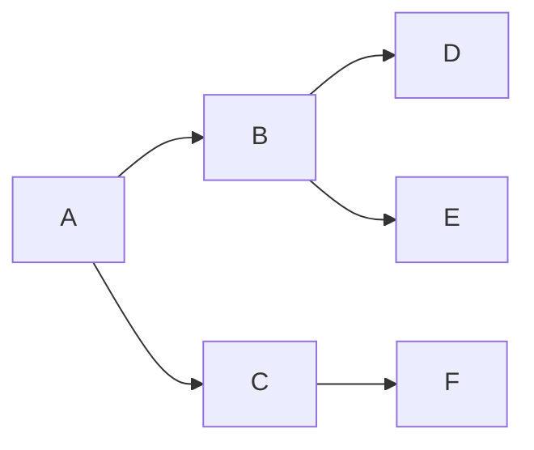

```
BFS order (queue): A → B → C → D → E → F
DFS order (stack): A → B → D → E → C → F
```

**কখন কোনটা ব্যবহার করবেন:**

| পরিস্থিতি | BFS | DFS |
|---|---|---|
| সবচেয়ে ছোট path (unweighted) | হ্যাঁ | না |
| কোনো path আছে কিনা | দুটোতেই হয় | দুটোতেই হয় |
| সব path খুঁজতে | না | হ্যাঁ |
| cycle detection | হ্যাঁ | হ্যাঁ |
| topological sort | না | হ্যাঁ |
| tree-তে কাছের solution আশা | BFS ভালো | DFS memory কম |

```dart
// Dart — BFS on Graph
import 'dart:collection';
void bfs(Map<int, List<int>> adj, int start) {
  final visited = <int>{};
  final queue = Queue<int>();
  visited.add(start);
  queue.add(start);
  while (queue.isNotEmpty) {
    final node = queue.removeFirst();
    print(node);
    for (final neighbor in (adj[node] ?? [])) {
      if (!visited.contains(neighbor)) {
        visited.add(neighbor);
        queue.add(neighbor);
      }
    }
  }
}

// Dart — DFS on Graph (recursive)
void dfs(Map<int, List<int>> adj, int node, Set<int> visited) {
  visited.add(node);
  print(node);
  for (final neighbor in (adj[node] ?? [])) {
    if (!visited.contains(neighbor)) {
      dfs(adj, neighbor, visited);
    }
  }
}
```

```python
# Python — BFS on Graph
from collections import deque

def bfs(adj, start):
    visited = {start}
    queue = deque([start])
    while queue:
        node = queue.popleft()
        print(node)
        for neighbor in adj.get(node, []):
            if neighbor not in visited:
                visited.add(neighbor)
                queue.append(neighbor)

# Python — DFS on Graph (recursive)
def dfs(adj, node, visited=None):
    if visited is None:
        visited = set()
    visited.add(node)
    print(node)
    for neighbor in adj.get(node, []):
        if neighbor not in visited:
            dfs(adj, neighbor, visited)
```

---
---

<a id="q4-1"></a>
# 4.1 — Route Between Nodes

> Pattern: **BFS / DFS on directed graph** · Difficulty: **Easy** · খুব common (graph warm-up)

> **বইয়ের ভাষায়:** Given a directed graph, design an algorithm to find out whether there is a route between two nodes.

## সমস্যাটা সহজ বাংলায়

একটা **directed graph** দেওয়া। দুটো node `s` আর `t` দেওয়া। বলতে হবে — `s` থেকে `t`-তে পৌঁছানোর কোনো রাস্তা আছে কিনা। মনে রাখবেন directed — তাই A→B মানে A থেকে B যাওয়া যায়, কিন্তু B থেকে A যাওয়া যাবে না (যদি সেই edge না থাকে)।

## উদাহরণ

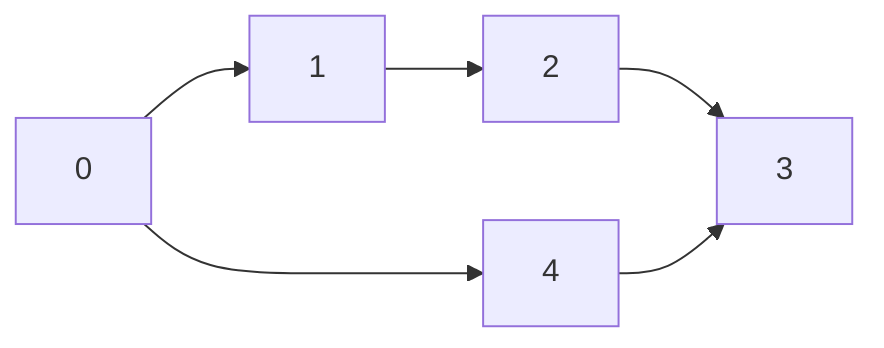

```
s=0, t=3  →  true   (0→1→2→3 বা 0→4→3)
s=3, t=0  →  false  (3 থেকে 0-এ কোনো edge নেই)
s=1, t=4  →  false  (1→2→3, 4-তে পৌঁছানো যাচ্ছে না)
```

## ধাপ ১: Listen

- **Directed নাকি undirected?** → directed (সমস্যায় বলাই আছে, কিন্তু confirm করুন)।
- **Disconnected graph হতে পারে?** → হ্যাঁ।
- **Cycle থাকতে পারে?** → হ্যাঁ, তাই visited set লাগবে।

## ভাবনা ১: Brute Force — DFS/BFS দুটোই কাজ করে

এটা **reachability** problem। DFS দিয়ে `s` থেকে শুরু করে দেখি `t`-তে পৌঁছাতে পারি কিনা। Cycle থেকে বাঁচতে **visited set** রাখি।

```
s=0 থেকে শুরু:
  visit 0 → neighbor: 1, 4
  visit 1 → neighbor: 2
  visit 2 → neighbor: 3
  visit 3 → এটাই t!  →  true
```

## ভাবনা ২: BFS — shortest path দরকার না, কিন্তু BFS অনেক ক্ষেত্রে faster

Graph বড় হলে এবং `t` কাছাকাছি থাকলে BFS দ্রুত পাবে। **Bidirectional BFS** আরও ভালো: `s` থেকে এগিয়ে আর `t` থেকে পিছিয়ে — দুই দিক থেকে খুঁজলে middle-এ মিলে যায়। তবে interview-এ basic BFS-ই বলুন আগে।

## Code

```dart
// Dart — BFS
import 'dart:collection';

bool hasRoute(Map<int, List<int>> graph, int s, int t) {
  if (s == t) return true;
  final visited = <int>{};
  final queue = Queue<int>();
  visited.add(s);
  queue.add(s);
  while (queue.isNotEmpty) {
    final node = queue.removeFirst();
    for (final neighbor in (graph[node] ?? [])) {
      if (neighbor == t) return true;          // পাওয়া গেছে!
      if (!visited.contains(neighbor)) {
        visited.add(neighbor);
        queue.add(neighbor);
      }
    }
  }
  return false;                               // পৌঁছানো গেল না
}
```

```python
# Python — BFS
from collections import deque

def has_route(graph: dict, s: int, t: int) -> bool:
    if s == t:
        return True
    visited = {s}
    queue = deque([s])
    while queue:
        node = queue.popleft()
        for neighbor in graph.get(node, []):
            if neighbor == t:
                return True                  # পাওয়া গেছে!
            if neighbor not in visited:
                visited.add(neighbor)
                queue.append(neighbor)
    return False                             # পৌঁছানো গেল না
```

## Complexity

**Time: O(V + E)** — প্রতিটা vertex ও edge একবার করে দেখা।
**Space: O(V)** — visited set ও queue-এ সর্বোচ্চ V node।

## Pattern চিনুন

> **"দুটো node-এর মধ্যে path আছে কিনা" → BFS বা DFS, visited set সহ।** Directed graph-এ দিক মেনে চলুন।

## Common mistake

- **visited set না রাখা** → cycle-এ অনন্তকাল loop।
- Directed graph-কে undirected ভেবে দুই দিকে এগোনো।
- `s == t` edge case মিস করা।

## Follow-up

- **সবচেয়ে ছোট path বের করতে হলে?** → BFS (weighted হলে Dijkstra)।
- **Bidirectional BFS?** → দুই দিক থেকে খুঁজলে O(b^(d/2)) হয়, b=branching factor, d=distance — অনেক দ্রুত।

<sub>[↑ এই chapter-এর সূচি](#toc) · [মূল Index](README.md)</sub>

---

<a id="q4-2"></a>
# 4.2 — Minimal Tree

> Pattern: **Sorted array → BST (divide & conquer, binary search idea)** · Difficulty: **Easy–Medium** · Common

> **বইয়ের ভাষায়:** Given a sorted (increasing order) array with unique integer elements, write an algorithm to create a binary search tree with minimal height.

## সমস্যাটা সহজ বাংলায়

একটা **sorted array** দেওয়া (ছোট থেকে বড়)। এই array দিয়ে এমন একটা BST বানাতে হবে যার **height সবচেয়ে কম** (minimal height)। Height কম মানে tree balanced থাকবে, search দ্রুত হবে।

## উদাহরণ

```
Input: [1, 2, 3, 4, 5, 6, 7]

Minimal BST:
         4
        / \
       2   6
      / \ / \
     1  3 5  7

height = 2 (optimal — ৭টা node-এ কম করা সম্ভব নয়)
```

## মূল insight

Sorted array-তে **মাঝের element** নেওয়া root হিসেবে। তাহলে বামে ও ডানে সমান সংখ্যক element থাকে → tree balanced হয়। এটা binary search-এর মতোই — মাঝে ভাগ করো, তারপর দুই পাশে একই কাজ (recursion)।

```
[1, 2, 3, 4, 5, 6, 7]
           ↑
         mid=4  (root)

left:  [1, 2, 3]  →  mid=2  (left subtree root)
right: [5, 6, 7]  →  mid=6  (right subtree root)
```

## ধাপে ধাপে approach

1. Array-এর মাঝের element (`mid`) নাও।
2. `mid` কে নতুন node বানাও।
3. বাম অর্ধেক দিয়ে left subtree বানাও (recursion)।
4. ডান অর্ধেক দিয়ে right subtree বানাও (recursion)।
5. Base case: empty subarray → `null`।

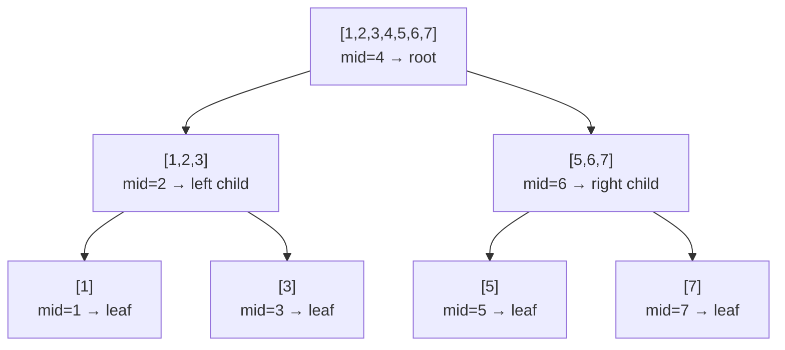

## Code

```dart
// Dart
class TreeNode {
  int val;
  TreeNode? left, right;
  TreeNode(this.val);
}

TreeNode? minimalTree(List<int> arr, [int? lo, int? hi]) {
  lo ??= 0;
  hi ??= arr.length - 1;
  if (lo > hi) return null;                  // base case: empty
  final mid = (lo + hi) ~/ 2;
  final node = TreeNode(arr[mid]);
  node.left  = minimalTree(arr, lo, mid - 1);  // বাম অর্ধেক
  node.right = minimalTree(arr, mid + 1, hi);  // ডান অর্ধেক
  return node;
}
```

```python
# Python
def minimal_tree(arr: list, lo: int = None, hi: int = None):
    if lo is None: lo = 0
    if hi is None: hi = len(arr) - 1
    if lo > hi:
        return None                          # base case: empty
    mid = (lo + hi) // 2
    node = TreeNode(arr[mid])
    node.left  = minimal_tree(arr, lo, mid - 1)   # বাম অর্ধেক
    node.right = minimal_tree(arr, mid + 1, hi)   # ডান অর্ধেক
    return node
```

## Complexity

**Time: O(n)** — প্রতিটা element ঠিক একবার node হয়।
**Space: O(log n)** — recursion stack-এর depth = tree-এর height (balanced)।

## Pattern চিনুন

> **"sorted array থেকে balanced BST" → মাঝের element root, দুই পাশে recurse।** এটা divide & conquer-এর সবচেয়ে পরিচ্ছন্ন উদাহরণ।

## Common mistake

- মাঝের element কোনটা সেটা off-by-one হওয়া (even length array-তে দুটো mid আছে — যেকোনো একটা নিন, consistent থাকুন)।
- Array already sorted কিনা confirm না করা (sorted না হলে এই approach ভুল)।
- Recursion-এর base case ভুলে যাওয়া।

## Follow-up

- **Sorted linked list থেকে minimal BST?** → একই idea কিন্তু middle node বের করতে slow/fast pointer লাগে — O(n log n)।
- **Tree কি balanced কিনা check করো** → 4.4 দেখুন।

<sub>[↑ এই chapter-এর সূচি](#toc) · [মূল Index](README.md)</sub>

---

<a id="q4-3"></a>
# 4.3 — List of Depths

> Pattern: **BFS level-order traversal** · Difficulty: **Easy–Medium** · Common

> **বইয়ের ভাষায়:** Given a binary tree, design an algorithm which creates a linked list of all the nodes at each depth (e.g., if you have a tree with depth D, you'll have D linked lists).

## সমস্যাটা সহজ বাংলায়

একটা binary tree দেওয়া। প্রতিটা **level (depth)**-এর জন্য একটা করে **linked list** বানাতে হবে। সেই list-এ ওই level-এর সব node থাকবে।

## উদাহরণ

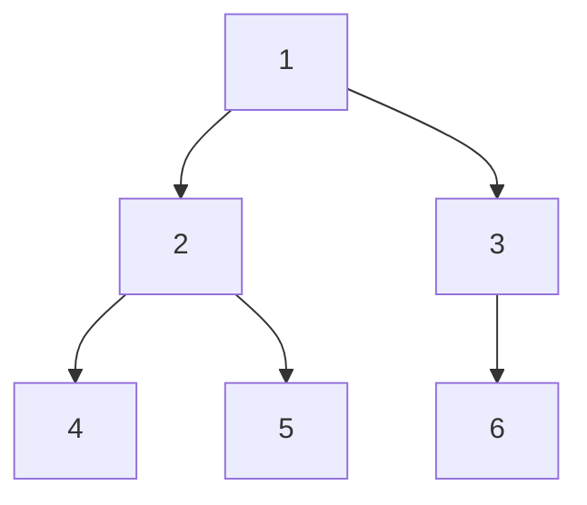

```
Output:
  Level 0: [1]
  Level 1: [2] → [3]
  Level 2: [4] → [5] → [6]
```

## ধাপ ১: Listen

- Output কি actual linked list নাকি array of array হলে চলবে? (Interview-এ confirm করুন; আমরা `List<List<int>>` দিয়ে implement করব, concept একই।)

## ভাবনা ১: BFS — স্বাভাবিক approach

BFS করলে naturally level by level পাই। প্রতিটা level শুরুর সময় queue-তে ঠিক ওই level-এর node গুলো থাকে। তাই প্রতিটা iteration-এ **queue-এর current size** টুকু নিলেই একটা level পাই।

```
queue শুরু: [1]                  → level 0: [1]
১টা নিই, তার children যোগ করি
queue:      [2, 3]               → level 1: [2, 3]
২টা নিই, তাদের children যোগ করি
queue:      [4, 5, 6]            → level 2: [4, 5, 6]
```

## ভাবনা ২: DFS — pre-order দিয়েও হয়

DFS-এ depth parameter পাঠালে জানি কোন level-এ আছি। সেই level-এর list-এ node যোগ করি। BFS-এর চেয়ে একটু কম স্বাভাবিক কিন্তু কাজ করে।

## Code — BFS (recommended)

```dart
// Dart — BFS level-order
import 'dart:collection';

List<List<int>> listOfDepths(TreeNode? root) {
  final result = <List<int>>[];
  if (root == null) return result;
  final queue = Queue<TreeNode>();
  queue.add(root);
  while (queue.isNotEmpty) {
    final levelSize = queue.length;        // এই level-এ কতটা node
    final level = <int>[];
    for (int i = 0; i < levelSize; i++) {
      final node = queue.removeFirst();
      level.add(node.val);
      if (node.left  != null) queue.add(node.left!);
      if (node.right != null) queue.add(node.right!);
    }
    result.add(level);
  }
  return result;
}
```

```python
# Python — BFS level-order
from collections import deque

def list_of_depths(root) -> list:
    result = []
    if root is None:
        return result
    queue = deque([root])
    while queue:
        level_size = len(queue)           # এই level-এ কতটা node
        level = []
        for _ in range(level_size):
            node = queue.popleft()
            level.append(node.val)
            if node.left:  queue.append(node.left)
            if node.right: queue.append(node.right)
        result.append(level)
    return result
```

## Code — DFS (bonus)

```dart
// Dart — DFS approach
void dfsDepths(TreeNode? node, int depth, List<List<int>> result) {
  if (node == null) return;
  if (result.length == depth) result.add([]);  // নতুন level
  result[depth].add(node.val);
  dfsDepths(node.left,  depth + 1, result);
  dfsDepths(node.right, depth + 1, result);
}

List<List<int>> listOfDepthsDFS(TreeNode? root) {
  final result = <List<int>>[];
  dfsDepths(root, 0, result);
  return result;
}
```

```python
# Python — DFS approach
def list_of_depths_dfs(root) -> list:
    result = []
    def dfs(node, depth):
        if node is None: return
        if len(result) == depth:
            result.append([])            # নতুন level
        result[depth].append(node.val)
        dfs(node.left,  depth + 1)
        dfs(node.right, depth + 1)
    dfs(root, 0)
    return result
```

## Complexity

**Time: O(n)** — প্রতিটা node একবার।
**Space: O(n)** — result list + queue (BFS) বা stack (DFS)।

## Pattern চিনুন

> **"প্রতিটা level আলাদাভাবে process করো" → BFS + `levelSize = queue.length` trick।** এই trick অনেক level-related problem-এ কাজে লাগে।

## Common mistake

- BFS-এ `levelSize` নেওয়ার আগে children add করে ফেলা — তাহলে level boundary মিলবে না।
- `result.length == depth` check না করে DFS-এ list-এর বাইরে add করা (IndexError)।

## Follow-up

- **Tree-এর minimum depth?** → BFS, যে level-এ প্রথম leaf পাব সেটাই minimum।
- **Tree-এর maximum depth?** → DFS বা BFS, result list-এর length = tree height + 1।

<sub>[↑ এই chapter-এর সূচি](#toc) · [মূল Index](README.md)</sub>

---

<a id="q4-4"></a>
# 4.4 — Check Balanced

> Pattern: **Post-order DFS, height দিয়ে balance check** · Difficulty: **Easy–Medium** · খুব common

> **বইয়ের ভাষায়:** Implement a function to check if a binary tree is balanced. For the purposes of this question, a balanced tree is defined to be a tree such that the heights of the two subtrees of any node never differ by more than one.

## সমস্যাটা সহজ বাংলায়

একটা binary tree-এর **প্রতিটা node**-এ তার left আর right subtree-এর height-এর পার্থক্য বড়জোর **১**। সব node-এ এই শর্ত মানলে tree balanced, না হলে unbalanced।

## উদাহরণ

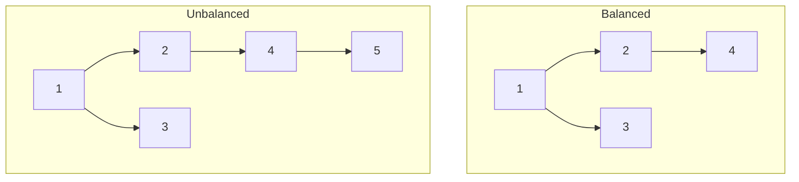

```
Balanced tree:
  1-এর left height = 2 (2→4)
  1-এর right height = 1 (শুধু 3)
  পার্থক্য = 1  →  OK

Unbalanced tree:
  1-এর left height = 3 (2→4→5)
  1-এর right height = 1 (শুধু 3)
  পার্থক্য = 2  →  NOT balanced
```

## ভাবনা ১: Brute force — প্রতিটা node-এ height হিসাব করো

প্রতিটা node-এ `getHeight(left)` আর `getHeight(right)` call করি। `getHeight` প্রতিবার পুরো subtree নামে।
- **Time: O(n log n)** balanced-এ, **O(n²)** worst case — অনেক node-এর height বারবার হিসাব হয়।

## ভাবনা ২: Optimize — post-order DFS-এ একসাথে height আর balance check

নিচ থেকে উপরে উঠতে উঠতে একটাই DFS-এ height return করি। কোনো subtree unbalanced হলে **special value** (`-1`) ফেরত পাঠাই যা উপরে propagate হয়।

```
getHeight(node) নিয়মঃ
  - null হলে 0 return
  - left height নাও; -1 এলে → return -1 (already unbalanced)
  - right height নাও; -1 এলে → return -1
  - |left - right| > 1 হলে → return -1
  - নাহলে → max(left, right) + 1 return
```

```
Unbalanced tree-এ trace:
  node 5 (leaf): height = 1
  node 4: left=1, right=0 → diff=1 → OK → height=2
  node 2: left=2, right=0 → diff=2 → return -1
  node 1: left=-1 → return -1  → isBalanced = false
```

## Code

```dart
// Dart
int _checkHeight(TreeNode? node) {
  if (node == null) return 0;
  final leftH = _checkHeight(node.left);
  if (leftH == -1) return -1;                  // বাম unbalanced
  final rightH = _checkHeight(node.right);
  if (rightH == -1) return -1;                 // ডান unbalanced
  if ((leftH - rightH).abs() > 1) return -1;  // এই node-এ unbalanced
  return (leftH > rightH ? leftH : rightH) + 1;
}

bool isBalanced(TreeNode? root) => _checkHeight(root) != -1;
```

```python
# Python
def is_balanced(root) -> bool:
    def check_height(node):
        if node is None:
            return 0
        left_h = check_height(node.left)
        if left_h == -1: return -1          # বাম unbalanced
        right_h = check_height(node.right)
        if right_h == -1: return -1         # ডান unbalanced
        if abs(left_h - right_h) > 1:
            return -1                       # এই node-এ unbalanced
        return max(left_h, right_h) + 1
    return check_height(root) != -1
```

## Complexity

**Time: O(n)** — প্রতিটা node ঠিক একবার visit।
**Space: O(h)** — recursion stack, h = tree height (balanced হলে O(log n))।

## Pattern চিনুন

> **"subtree-র property check করো + height জানা দরকার" → post-order DFS-এ height return করো, invalid হলে sentinel value (-1) পাঠাও।** এই "ব্যর্থ হলে -1" প্যাটার্ন অনেক tree problem-এ কাজে লাগে।

## Common mistake

- Brute force approach নেওয়া (প্রতিটা node-এ আলাদা `getHeight` call) — interview-তে brute force বলুন, তারপর optimize করুন।
- `-1` sentinel কে actual height -1 (empty node) ভেবে গুলিয়ে ফেলা — `null` node-এ `0` return করুন, `-1` শুধু unbalanced-এর জন্য।

## Follow-up

- **AVL tree কী?** → self-balancing BST যেখানে প্রতিটা insert/delete-এ balance maintain হয়।
- **Height কীভাবে বের করবে?** → একই `checkHeight` function-ই উত্তর।

<sub>[↑ এই chapter-এর সূচি](#toc) · [মূল Index](README.md)</sub>

---

<a id="q4-5"></a>
# 4.5 — Validate BST

> Pattern: **In-order traversal বা min/max range DFS** · Difficulty: **Medium** · খুব common

> **বইয়ের ভাষায়:** Implement a function to check if a binary tree is a binary search tree.

## সমস্যাটা সহজ বাংলায়

একটা binary tree দেওয়া। বলতে হবে এটা **valid BST** কিনা — অর্থাৎ প্রতিটা node-এ:
- বাম subtree-এর সব value **কঠোরভাবে ছোট (<)** node-এর value-এর চেয়ে।
- ডান subtree-এর সব value **কঠোরভাবে বড় (>)** node-এর value-এর চেয়ে।
- শুধু immediate child নয় — **পুরো subtree**-র সব node-এ এই শর্ত।

## উদাহরণ

```
Valid BST:
       8
      / \
     4   10
    / \    \
   2   6    20

Invalid BST (common ফাঁদ):
       8
      / \
     4   10
    / \    \
   2  12    20
      ↑
  12 > 8 কিন্তু 8-এর left subtree-এ আছে → BST নিয়ম ভাঙছে
```

## মূল ফাঁদ

অনেকে শুধু **immediate children** চেক করে (left < node < right) — কিন্তু এটা ভুল! উপরের উদাহরণে 4-এর right child 12 আছে, 4 < 12 সত্যি, কিন্তু 12 > 8 হওয়ায় 8-এর left subtree-তে থাকা ভুল।

**সঠিক নিয়ম:** প্রতিটা node-এর জন্য একটা **allowed range [min, max]** রাখতে হবে।

## ভাবনা ১: In-order traversal — sorted কিনা দেখো

BST-এর in-order traversal সবসময় sorted (ascending)। তাই in-order করে আগের value মনে রেখে পরেরটা বড় কিনা দেখো।

```
In-order: 2, 4, 6, 8, 10, 20  →  strictly increasing  →  valid BST
In-order: 2, 4, 12, 8, 10, 20 →  12 > 8 নয়           →  invalid BST
```

## ভাবনা ২: Min/Max range দিয়ে DFS — সঠিক ও পরিষ্কার

প্রতিটা node-কে বলি "তোমার value অবশ্যই (min, max) range-এ থাকতে হবে"। বামে গেলে max ছোট হয় (এই node-এর value), ডানে গেলে min বড় হয় (এই node-এর value)।

```
root(8): range (-∞, +∞)        → 8 OK
  left(4): range (-∞, 8)       → 4 OK
    left(2): range (-∞, 4)     → 2 OK
    right(12): range (4, 8)    → 12 > 8 → FAIL!
```

## Code — Min/Max range (recommended)

```dart
// Dart
bool isBST(TreeNode? root) =>
    _validate(root, null, null);

bool _validate(TreeNode? node, int? min, int? max) {
  if (node == null) return true;
  if (min != null && node.val <= min) return false;  // range ভাঙছে
  if (max != null && node.val >= max) return false;  // range ভাঙছে
  return _validate(node.left,  min, node.val) &&     // বামে max = node.val
         _validate(node.right, node.val, max);        // ডানে min = node.val
}
```

```python
# Python
def is_bst(root) -> bool:
    def validate(node, min_val, max_val):
        if node is None:
            return True
        if min_val is not None and node.val <= min_val:
            return False                              # range ভাঙছে
        if max_val is not None and node.val >= max_val:
            return False                              # range ভাঙছে
        return (validate(node.left,  min_val, node.val) and
                validate(node.right, node.val, max_val))
    return validate(root, None, None)
```

## Code — In-order (bonus)

```dart
// Dart — in-order approach
int? _prev;

bool isBSTInOrder(TreeNode? node) {
  if (node == null) return true;
  if (!isBSTInOrder(node.left)) return false;
  if (_prev != null && node.val <= _prev!) return false;  // বড় হওয়া উচিত
  _prev = node.val;
  return isBSTInOrder(node.right);
}
```

```python
# Python — in-order approach
def is_bst_inorder(root) -> bool:
    prev = [None]        # list দিয়ে closure-এ mutable করি
    def inorder(node):
        if node is None: return True
        if not inorder(node.left): return False
        if prev[0] is not None and node.val <= prev[0]:
            return False
        prev[0] = node.val
        return inorder(node.right)
    return inorder(root)
```

## Complexity

**Time: O(n)** — প্রতিটা node একবার।
**Space: O(h)** — recursion stack, h = height।

## Pattern চিনুন

> **"BST validate করো" → min/max range DFS।** শুধু immediate child চেক করা ভুল — এটাই সবচেয়ে common trap। In-order sorted check-ও চলে।

## Common mistake

- শুধু left < root < right চেক করা (পুরো subtree না দেখা) — সবচেয়ে বড় ভুল।
- **Duplicate handle:** `<=` নাকি `<`? CTCI-তে BST-তে কোনো duplicate নেই। কিন্তু duplicate থাকলে convention বলুন।
- `int` overflow: range শুরুতে `Integer.MIN_VALUE / MAX_VALUE` দেওয়ার বদলে `null` দিলে clean।

## Follow-up

- **Duplicate value থাকলে?** → "left ≤ node" বা "right ≥ node" convention ঠিক করুন।
- **BST-কে in-order sorted array-তে convert করো** → in-order traversal।

<sub>[↑ এই chapter-এর সূচি](#toc) · [মূল Index](README.md)</sub>

---

<a id="q4-6"></a>
# 4.6 — Successor

> Pattern: **BST property + parent pointer** · Difficulty: **Medium** · Common

> **বইয়ের ভাষায়:** Write an algorithm to find the "next" node (i.e., in-order successor) of a given node in a binary search tree. You may assume that each node has a link to its parent.

## সমস্যাটা সহজ বাংলায়

BST-তে একটা node দেওয়া। বলতে হবে **in-order successor** কোনটা — অর্থাৎ in-order traversal-এ এর **ঠিক পরের** node। BST-তে in-order মানে sorted order, তাই "পরের node" মানে "পরের বড় value"।

প্রতিটা node-এ `parent` pointer আছে।

## উদাহরণ

```
        8
       / \
      4   10
     / \    \
    2   6    20
       / \
      5   7

successor(4) = 5    (in-order: 2,4,5,6,7,8,10,20)
successor(6) = 7
successor(7) = 8    (7-এর ডানে কিছু নেই, উপরে উঠতে হয়)
successor(20) = null (সবার বড়)
```

## মূল insight — দুটো case

```
Case 1: node-এর right subtree আছে
  → right subtree-এর সবচেয়ে ছোট node (leftmost)
  → কারণ right subtree-এ সব value বড়, তার মধ্যে সবচেয়ে ছোটটাই "পরের"

Case 2: node-এর right subtree নেই
  → parent-এর দিকে উঠতে থাকো যতক্ষণ না "left child হয়ে" উঠলাম
  → তখন সেই parent-ই successor
  → কারণ: right child হয়ে উঠলে আমি এখনো parent-এর চেয়ে ছোট, আরও উঠতে হবে
```

```
successor(7)-এর trace:
  7-এর right নেই → parent দিকে যাই
  7 is right child of 6 → আরও উঠি
  6 is right child of 4 → আরও উঠি
  4 is left child of 8  → থামি! → 8 হলো successor
```

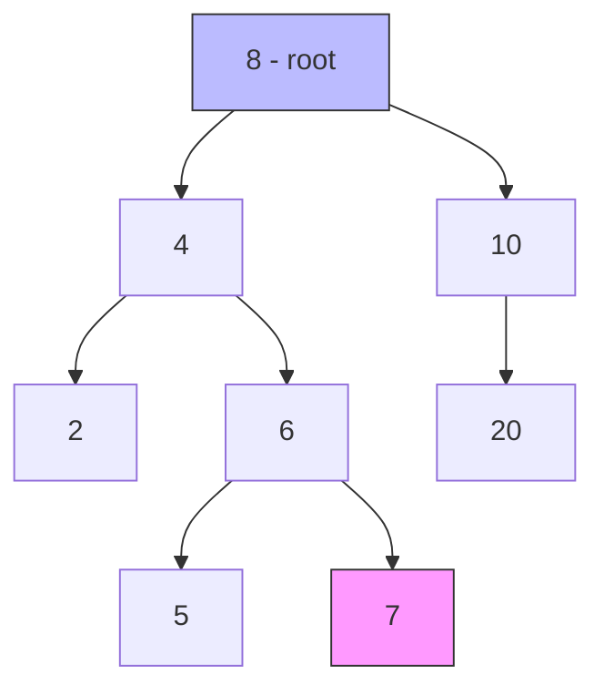

## Code

```dart
// Dart — parent pointer সহ node
class BSTNode {
  int val;
  BSTNode? left, right, parent;
  BSTNode(this.val);
}

BSTNode? successor(BSTNode node) {
  // Case 1: right subtree আছে → leftmost node
  if (node.right != null) {
    BSTNode curr = node.right!;
    while (curr.left != null) curr = curr.left!;
    return curr;
  }
  // Case 2: right নেই → "left child হয়ে" উঠতে থাকো
  BSTNode? curr = node;
  BSTNode? parent = curr.parent;
  while (parent != null && curr == parent.right) {
    curr = parent;
    parent = parent.parent;
  }
  return parent;   // null হলে node-ই সবার বড়
}
```

```python
# Python
class BSTNode:
    def __init__(self, val, parent=None):
        self.val = val
        self.left = self.right = None
        self.parent = parent

def successor(node):
    # Case 1: right subtree আছে → leftmost node
    if node.right is not None:
        curr = node.right
        while curr.left is not None:
            curr = curr.left
        return curr
    # Case 2: right নেই → "left child হয়ে" উঠতে থাকো
    curr = node
    parent = curr.parent
    while parent is not None and curr == parent.right:
        curr = parent
        parent = parent.parent
    return parent   # None হলে node-ই সবার বড়
```

## Complexity

**Time: O(h)** — h = tree height (balanced হলে O(log n), worst case O(n))।
**Space: O(1)** — extra memory লাগে না।

## Pattern চিনুন

> **BST-তে in-order successor: right থাকলে → right subtree-এর leftmost; না থাকলে → parent-এর দিকে "left child হয়ে" উঠুন।**

## Common mistake

- Case 2-তে "parent-এর দিকে উঠি" বলে শুধু একধাপ উঠে থামা — যতক্ষণ right child হই ততক্ষণ উঠতে হবে।
- Successor null হতে পারে (node সবচেয়ে বড়) — এই case handle না করা।

## Follow-up

- **Predecessor (আগের node) বের করো** → symmetric: left subtree থাকলে rightmost; না থাকলে "right child হয়ে" উঠুন।
- **Parent pointer না থাকলে?** → root থেকে DFS করে মনে রেখে যেতে হবে — O(h) time, O(h) space।

<sub>[↑ এই chapter-এর সূচি](#toc) · [মূল Index](README.md)</sub>

---

<a id="q4-7"></a>
# 4.7 — Build Order

> Pattern: **Topological Sort (DFS বা Kahn's BFS)** · Difficulty: **Medium–Hard** · খুব common

> **বইয়ের ভাষায়:** You are given a list of projects and a list of dependencies (which is a list of pairs of projects, where the second project is dependent on the first project). All of a project's dependencies must be built before the project is. Find a build order that will allow the projects to be built. If there is no valid build order, return an error.

## সমস্যাটা সহজ বাংলায়

কিছু **project** আছে। কিছু **dependency** আছে: "A → B" মানে A আগে build হতে হবে, তারপর B। একটা valid build order দাও যেখানে কোনো project তার dependency-র আগে আসে না। **Cycle** থাকলে (A depends on B, B depends on A) → impossible।

## উদাহরণ

```
Projects: a, b, c, d, e, f
Dependencies: (a,d), (f,b), (b,d), (f,a), (d,c)
অর্থাৎ:
  a → d   (a হলে d পারব)
  f → b
  b → d
  f → a
  d → c
```

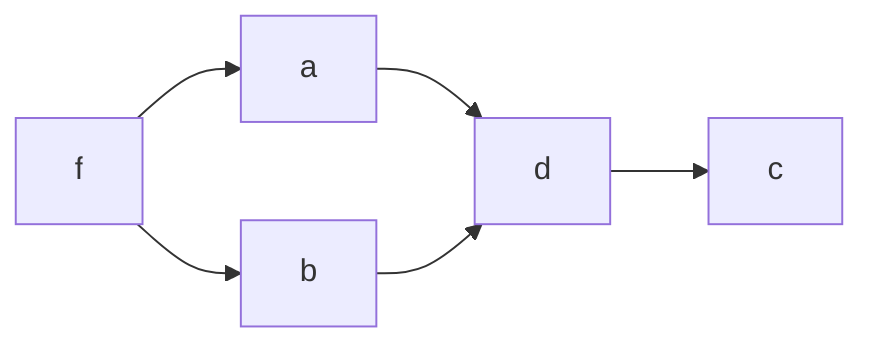

```
Valid order: f, e, b, a, d, c
(e-র কোনো dependency নেই, যেকোনো জায়গায় রাখা যায়)
```

## মূল concept: Topological Sort

**Topological sort** হলো directed acyclic graph (DAG)-এর node গুলো এমনভাবে সাজানো যাতে প্রতিটা edge u→v-এ u সবসময় v-এর আগে আসে।

**দুটো approach:**
1. **Kahn's BFS:** in-degree=0 (কোনো dependency নেই) node গুলো দিয়ে শুরু। Queue-তে রেখে process করি, করা হলে তাদের neighbor-এর in-degree কমাই।
2. **DFS-based:** DFS করে "শেষ হলে stack-এ রাখো" — উল্টো করলে topological order।

## Approach: Kahn's BFS (সহজ বুঝতে)

```
Step 1: প্রতিটা node-এর in-degree (কতটা dependency আছে) গুনি
  f:0, e:0, a:1(f), b:1(f), d:2(a,b), c:1(d)

Step 2: in-degree=0 যাদের queue-তে রাখি: [f, e]

Step 3: process করি:
  f বের করি → order=[f], f-এর neighbor a,b-এর in-degree কমাই
    a:0, b:0 → queue=[e, a, b]
  e বের করি → order=[f,e]
  a বের করি → order=[f,e,a], a-এর neighbor d: in-degree 2→1
  b বের করি → order=[f,e,a,b], b-এর neighbor d: in-degree 1→0 → queue-তে d
  d বের করি → order=[f,e,a,b,d], d-এর neighbor c: in-degree 1→0 → queue-তে c
  c বের করি → order=[f,e,a,b,d,c]  ← valid!

সব process হয়েছে → valid order পাওয়া গেছে।
Cycle থাকলে কিছু node queue-এ কখনো আসত না → error।
```

## Code — Kahn's BFS

```dart
// Dart — Topological Sort (Kahn's algorithm)
List<String>? buildOrder(List<String> projects, List<List<String>> deps) {
  final inDegree = <String, int>{for (final p in projects) p: 0};
  final adj = <String, List<String>>{for (final p in projects) p: []};

  for (final dep in deps) {
    final from = dep[0], to = dep[1];
    adj[from]!.add(to);
    inDegree[to] = (inDegree[to] ?? 0) + 1;
  }

  // in-degree=0 → কোনো dependency নেই, এখনই build করতে পারি
  final queue = Queue<String>();
  for (final p in projects) {
    if (inDegree[p] == 0) queue.add(p);
  }

  final order = <String>[];
  while (queue.isNotEmpty) {
    final p = queue.removeFirst();
    order.add(p);
    for (final neighbor in adj[p]!) {
      inDegree[neighbor] = inDegree[neighbor]! - 1;
      if (inDegree[neighbor] == 0) queue.add(neighbor);
    }
  }

  // সব project শেষ না হলে cycle আছে
  return order.length == projects.length ? order : null;
}
```

```python
# Python — Topological Sort (Kahn's algorithm)
from collections import deque, defaultdict

def build_order(projects: list, deps: list):
    in_degree = {p: 0 for p in projects}
    adj = defaultdict(list)

    for frm, to in deps:
        adj[frm].append(to)
        in_degree[to] += 1

    # in-degree=0 → কোনো dependency নেই
    queue = deque(p for p in projects if in_degree[p] == 0)
    order = []

    while queue:
        p = queue.popleft()
        order.append(p)
        for neighbor in adj[p]:
            in_degree[neighbor] -= 1
            if in_degree[neighbor] == 0:
                queue.append(neighbor)

    # সব project শেষ না হলে cycle আছে
    return order if len(order) == len(projects) else None
```

## Code — DFS-based (bonus)

```python
# Python — DFS topological sort
def build_order_dfs(projects: list, deps: list):
    adj = defaultdict(list)
    for frm, to in deps:
        adj[frm].append(to)

    UNVISITED, VISITING, VISITED = 0, 1, 2
    state = {p: UNVISITED for p in projects}
    stack = []

    def dfs(p):
        if state[p] == VISITING: return False  # cycle!
        if state[p] == VISITED:  return True
        state[p] = VISITING
        for neighbor in adj[p]:
            if not dfs(neighbor): return False
        state[p] = VISITED
        stack.append(p)                         # শেষ হলে stack-এ রাখো
        return True

    for p in projects:
        if not dfs(p): return None              # cycle আছে

    return stack[::-1]                          # উল্টো করলে topological order
```

## Complexity

**Time: O(V + E)** — V = project সংখ্যা, E = dependency সংখ্যা।
**Space: O(V + E)** — graph + queue।

## Pattern চিনুন

> **"dependency থাকলে কোন order-এ কাজ করব" → Topological Sort। Cycle থাকলে impossible।** DFS-এ VISITING state দিয়ে cycle detect করা যায়।

## Common mistake

- Cycle detection না করা — cycle থাকলে কিছু node কখনো in-degree 0 হবে না (Kahn's), বা DFS-এ VISITING state-এ আবার ফিরবে।
- Graph build করার সময় edge-এর দিক উল্টে ফেলা।

## Follow-up

- **Multiple valid orders থাকতে পারে — সব বের করো** → backtracking (expensive)।
- **Cycle-এর node গুলো চিহ্নিত করো** → DFS VISITING state-এ থাকা node গুলো।

<sub>[↑ এই chapter-এর সূচি](#toc) · [মূল Index](README.md)</sub>

---

<a id="q4-8"></a>
# 4.8 — First Common Ancestor

> Pattern: **LCA (Lowest Common Ancestor) — DFS, parent pointer বা ছাড়া** · Difficulty: **Medium–Hard** · খুব common

> **বইয়ের ভাষায়:** Design an algorithm and write code to find the first common ancestor of two nodes in a binary tree. Avoid storing additional nodes in a data structure. NOTE: This is not necessarily a BST.

## সমস্যাটা সহজ বাংলায়

একটা binary tree (BST নয়)-তে দুটো node `p` আর `q` দেওয়া। তাদের **Lowest Common Ancestor (LCA)** বের করতে হবে — অর্থাৎ সেই node যে `p` আর `q` দুজনেরই ancestor, এবং **সবচেয়ে নিচে** (root-এর কাছ থেকে দূরে)।

## উদাহরণ

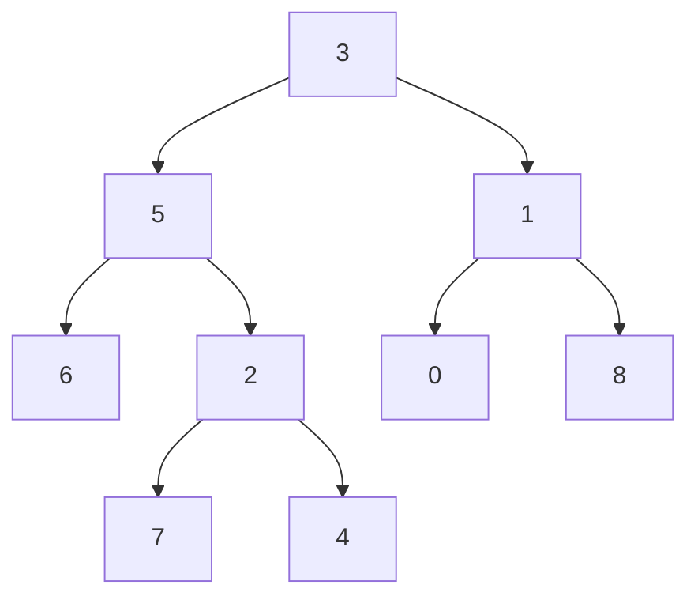

```
LCA(5, 1) = 3        (3 উভয়ের parent)
LCA(5, 4) = 5        (5 নিজেই 4-এর ancestor, তাই 5 হলো LCA)
LCA(6, 4) = 5        (6 আর 4 উভয়ের কাছের common = 5)
```

## মূল insight

Post-order DFS করি। প্রতিটা node থেকে return করি:
- `p` বা `q` পেলে সেটা।
- `null` যদি এই subtree-তে না থাকে।

যদি কোনো node-এর **বাম ও ডান দুটো দিক থেকেই non-null** ফেরে, মানে এই node-ই LCA!

```
LCA(6, 4) trace:
  node 6: নিজে 'p' → return 6
  node 7: null (কোনোটাই নয়) → return null
  node 4: নিজে 'q' → return 4
  node 2: left=null, right=4 → return 4
  node 5: left=6, right=4 → দুই দিক থেকেই non-null → return 5 (LCA!)
  node 3: left=5 (LCA পেয়েছি), right-এ আর নামার দরকার নেই
```

## ভাবনা: দুটো case

**Case 1: p এবং q উভয়ই tree-তে আছে** (সহজ case, নিচের code)।
**Case 2: একটা বা দুটোই নাও থাকতে পারে** → LCA null তখন। Cover করতে "দুটো পেয়েছি" flag track করতে হয়।

## Code — both nodes guaranteed to exist

```dart
// Dart — p,q উভয়ই আছে guarantee
TreeNode? lca(TreeNode? root, TreeNode p, TreeNode q) {
  if (root == null) return null;
  if (root == p || root == q) return root;   // এটাই target, return করো

  final left  = lca(root.left,  p, q);
  final right = lca(root.right, p, q);

  if (left != null && right != null) return root;  // দুই দিক থেকে পেলাম → root = LCA
  return left ?? right;                            // একদিক থেকে পেলাম
}
```

```python
# Python — p,q উভয়ই আছে guarantee
def lca(root, p, q):
    if root is None:
        return None
    if root == p or root == q:
        return root                              # target পেলাম

    left  = lca(root.left,  p, q)
    right = lca(root.right, p, q)

    if left and right:
        return root                              # দুই দিক → root = LCA
    return left if left else right              # একদিক থেকে পেলাম
```

## Code — একটাও না থাকতে পারে (CTCI-র complete version)

```dart
// Dart — node না থাকার case handle করা হলো
class _Result {
  final TreeNode? node;
  final bool isAncestor;
  _Result(this.node, this.isAncestor);
}

_Result _lcaHelper(TreeNode? root, TreeNode p, TreeNode q) {
  if (root == null) return _Result(null, false);

  if (root == p && root == q) return _Result(root, true);

  final left  = _lcaHelper(root.left,  p, q);
  if (left.isAncestor) return left;    // LCA পাওয়া গেছে

  final right = _lcaHelper(root.right, p, q);
  if (right.isAncestor) return right;  // LCA পাওয়া গেছে

  if (left.node != null && right.node != null) {
    return _Result(root, true);        // দুটো পাওয়া গেছে → root = LCA
  } else if (root == p || root == q) {
    final isAnc = left.node != null || right.node != null;
    return _Result(root, isAnc);
  } else {
    return _Result(left.node ?? right.node, false);
  }
}

TreeNode? commonAncestor(TreeNode? root, TreeNode p, TreeNode q) =>
    _lcaHelper(root, p, q).node;
```

```python
# Python — complete version
def common_ancestor(root, p, q):
    result, is_ancestor = _helper(root, p, q)
    return result if is_ancestor else None

def _helper(root, p, q):
    if root is None:
        return None, False
    if root is p and root is q:
        return root, True

    left, left_anc  = _helper(root.left,  p, q)
    if left_anc: return left, True         # LCA found in left

    right, right_anc = _helper(root.right, p, q)
    if right_anc: return right, True       # LCA found in right

    if left and right:
        return root, True                  # দুটো পেলাম → root = LCA
    elif root is p or root is q:
        is_anc = left is not None or right is not None
        return root, is_anc
    else:
        return left if left else right, False
```

## Complexity

**Time: O(n)** — প্রতিটা node একবার।
**Space: O(h)** — recursion stack।

## Pattern চিনুন

> **LCA: post-order DFS, দুই দিক থেকে non-null এলে সেই node-ই LCA।** এই pattern graph/tree-এ অনেক কাজে লাগে।

## Common mistake

- `root == p` হলে সাথে সাথে return করা — কিন্তু q যদি p-এর subtree-তে থাকে তাহলে p-ই LCA, এটা ধরা পড়বে কারণ right দিক null ফেরাবে।
- দুটো node-ই tree-তে আছে guarantee না থাকলে simple version ব্যবহার করা।

## Follow-up

- **BST-তে LCA?** → BST property ব্যবহার করুন: p < node < q হলে node-ই LCA। O(h) time, O(1) space।
- **Parent pointer থাকলে?** → দুটো node-এর ancestor set বানাও, intersection-ই LCA।

<sub>[↑ এই chapter-এর সূচি](#toc) · [মূল Index](README.md)</sub>

---

<a id="q4-9"></a>
# 4.9 — BST Sequences

> Pattern: **Weaving / interleaving, recursion + backtracking** · Difficulty: **Hard** · Less common

> **বইয়ের ভাষায়:** A binary search tree was created by traversing through an array from left to right and inserting each element. Given a BST with distinct elements, print all possible arrays that could have led to this tree.

## সমস্যাটা সহজ বাংলায়

একটা BST দেওয়া। কতগুলো **array** বানিয়েছিলে (তাদের elements left-to-right insert করতে করতে) এই tree হতে পারে — সেগুলো সব বের করতে হবে।

## উদাহরণ

```
BST:
    2
   / \
  1   3

possible sequences: [2,1,3] এবং [2,3,1]
(২ অবশ্যই প্রথমে, কারণ root; তারপর 1,3 যেকোনো order-এ)
```

```
BST:
      4
     / \
    2   5
   / \
  1   3

possible sequences (আংশিক):
  [4,2,5,1,3], [4,2,5,3,1], [4,5,2,1,3], [4,5,2,3,1],
  [4,2,1,5,3], [4,2,1,3,5], [4,2,3,5,1], [4,2,3,1,5], ...
```

## মূল insight — weaving

- **Root অবশ্যই প্রথমে।**
- Root insert হলে তার left ও right subtree একে অপরের **সাথে স্বাধীনভাবে interleave** হতে পারে, কিন্তু প্রতিটা subtree-র মধ্যে order মানতে হবে।

**Algorithm:**
1. Root দিয়ে শুরু করা সব sequence-এর prefix = [root]।
2. Left ও right subtree-এর sequences বের করো (recursively)।
3. এই দুই list-এর সব sequences কে "weave" করো (relative order রেখে interleave করো)।

**Weaving:** দুটো list `A` আর `B`। A-এর elements A-র মধ্যে নিজের order রাখবে, B-এরও, কিন্তু A ও B-এর মিশ্রণ যেকোনো ভাবে হতে পারে।

## Code

```dart
// Dart
import 'dart:collection';

List<List<int>> bstSequences(TreeNode? root) {
  if (root == null) return [[]];   // empty sequence

  final prefix = [root.val];
  final left  = bstSequences(root.left);
  final right = bstSequences(root.right);

  final result = <List<int>>[];
  for (final l in left) {
    for (final r in right) {
      final weaved = <List<int>>[];
      _weave(l, r, weaved, prefix);
      result.addAll(weaved);
    }
  }
  return result;
}

void _weave(
  List<int> first,
  List<int> second,
  List<List<int>> results,
  List<int> prefix,
) {
  if (first.isEmpty || second.isEmpty) {
    // একটা শেষ, বাকিটা জুড়ে দাও
    final result = [...prefix, ...first, ...second];
    results.add(result);
    return;
  }
  // first-এর head নাও
  final headFirst = first.removeAt(0);
  prefix.add(headFirst);
  _weave(first, second, results, prefix);
  prefix.removeLast();
  first.insert(0, headFirst);

  // second-এর head নাও
  final headSecond = second.removeAt(0);
  prefix.add(headSecond);
  _weave(first, second, results, prefix);
  prefix.removeLast();
  second.insert(0, headSecond);
}
```

```python
# Python
def bst_sequences(root) -> list:
    if root is None:
        return [[]]                              # empty sequence

    prefix = [root.val]
    left_seqs  = bst_sequences(root.left)
    right_seqs = bst_sequences(root.right)

    result = []
    for l in left_seqs:
        for r in right_seqs:
            weaved = []
            _weave(l, r, weaved, prefix)
            result.extend(weaved)
    return result

def _weave(first: list, second: list, results: list, prefix: list):
    if not first or not second:
        results.append(prefix + first + second)
        return
    # first-এর head নাও
    head = first[0]
    _weave(first[1:], second, results, prefix + [head])
    # second-এর head নাও
    head = second[0]
    _weave(first, second[1:], results, prefix + [head])
```

## Complexity

**Time এবং Space: O(2^n · n)** — sequence-এর সংখ্যা exponential, প্রতিটা length n। এই problem-এ output-ই exponential, তাই এর চেয়ে ভালো করা সম্ভব নয়।

## Pattern চিনুন

> **"দুটো ordered list weave/interleave করো" → recursion + backtracking: একবার first-এর head নাও, একবার second-এর।** এই pattern-টা Hard CTCI problems-এ আসে।

## Common mistake

- Leaf node বা null node-এর base case ভুল করা (null → `[[]]` মানে "একটা empty list"।
- Weaving-এ list mutate করার সময় undo না করা (backtracking মনে না রাখা)।

## Follow-up

- **Sequence-এর সংখ্যা গণনা করো (list না বের করে)** → Catalan number formula।

<sub>[↑ এই chapter-এর সূচি](#toc) · [মূল Index](README.md)</sub>

---

<a id="q4-10"></a>
# 4.10 — Check Subtree

> Pattern: **String serialization বা recursive match** · Difficulty: **Medium** · Common

> **বইয়ের ভাষায়:** T1 and T2 are two very large binary trees, with T1 much bigger than T2. Create an algorithm to determine if T2 is a subtree of T1.
> A tree T2 is a subtree of T1 if there exists a node n in T1 such that the subtree of n is identical to T2. That is, if you cut off the tree at node n, the two trees would be identical.

## সমস্যাটা সহজ বাংলায়

দুটো tree `T1` (অনেক বড়) আর `T2` (ছোট) দেওয়া। T2 কি T1-এর **কোনো node-এর subtree**-র সাথে **হুবহু মিলে**? মিললে `true`, নাহলে `false`।

## উদাহরণ

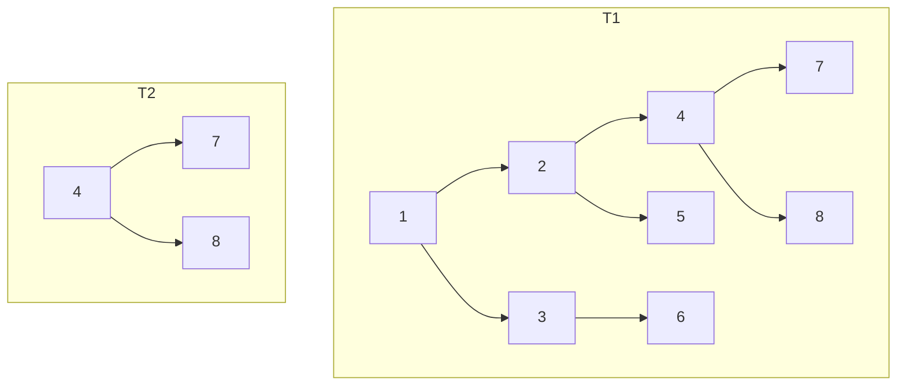

```
T2 (root=4, children=7,8) T1-এ node 4-এর subtree-র সাথে মিলছে → true
```

## ভাবনা ১: Recursive matching — O(n·m)

T1-এর প্রতিটা node-এ চেক করি — এই node থেকে শুরু হওয়া subtree কি T2-এর মতো? এই "একই কিনা" check করার জন্য আরেকটা recursive function।

```
subTree(T1, T2):
  T1-এর প্রতিটা node n-এ:
    matchTree(n, T2) → এই node থেকে শুরু করে হুবহু মিলছে কিনা
```

## ভাবনা ২: String serialization — O(n + m)

দুটো tree কে pre-order serialize করো string-এ (null-এর জন্য special marker ব্যবহার করো)। T2-এর string, T1-এর string-এর substring হলে T2 হলো subtree।

**কেন null marker দরকার?**
```
Tree: [1,2]     Tree: [1,null,2]
Pre-order string: "1 2"   →  দুটো আলাদা কিন্তু null marker ছাড়া string একই!
সঠিক:  "1 2 X X X"  vs  "1 X 2 X X"  → আলাদা string
```

## Code — Recursive (পরিষ্কার)

```dart
// Dart
bool isSubtree(TreeNode? t1, TreeNode? t2) {
  if (t2 == null) return true;    // empty tree সব tree-এর subtree
  if (t1 == null) return false;   // t1 শেষ, t2 বাকি
  if (matchTree(t1, t2)) return true;
  return isSubtree(t1.left, t2) || isSubtree(t1.right, t2);
}

bool matchTree(TreeNode? t1, TreeNode? t2) {
  if (t1 == null && t2 == null) return true;  // দুটোই শেষ → মিলেছে
  if (t1 == null || t2 == null) return false; // একটা শেষ → মিলেনি
  if (t1.val != t2.val) return false;         // value মিলছে না
  return matchTree(t1.left, t2.left) && matchTree(t1.right, t2.right);
}
```

```python
# Python
def is_subtree(t1, t2) -> bool:
    if t2 is None: return True       # empty tree সব tree-এর subtree
    if t1 is None: return False      # t1 শেষ, t2 বাকি
    if match_tree(t1, t2): return True
    return is_subtree(t1.left, t2) or is_subtree(t1.right, t2)

def match_tree(t1, t2) -> bool:
    if t1 is None and t2 is None: return True
    if t1 is None or t2 is None:  return False
    if t1.val != t2.val: return False
    return match_tree(t1.left, t2.left) and match_tree(t1.right, t2.right)
```

## Code — String serialization (bonus, O(n+m))

```python
# Python — serialize করে substring check
def is_subtree_string(t1, t2) -> bool:
    def serialize(node):
        if node is None:
            return 'X'                         # null marker
        # '#' prefix দিয়ে "12" কে "1","2" থেকে আলাদা করি
        return f'#{node.val} {serialize(node.left)} {serialize(node.right)}'

    return serialize(t2) in serialize(t1)
```

## Complexity

| Approach | Time | Space |
|---|---|---|
| Recursive match | O(n·m) | O(log n + log m) stack |
| String serialize | O(n + m) | O(n + m) string |

n = T1-এর node সংখ্যা, m = T2-এর node সংখ্যা।

বেশিরভাগ ক্ষেত্রে n >> m, recursive match practical। String approach asymptotically দ্রুত।

## Pattern চিনুন

> **"subtree match" → recursive compare বা serialize-then-substring।** String approach interview-তে চমৎকার দেখায় — কিন্তু null marker আর value prefix-এর কথা explain করতে হবে।

## Common mistake

- Null marker ছাড়া serialize করা → ভুল match।
- `t2 == null` → `true` case মিস করা (empty tree সব tree-এর subtree হওয়া উচিত)।
- Recursive match-এ T1-এর সব node না দেখে শুধু root match করা।

## Follow-up

- **T2-এর সব occurrence খুঁজে বের করো** → একই recursive approach, কিন্তু পাওয়া গেলেও থামি না।

<sub>[↑ এই chapter-এর সূচি](#toc) · [মূল Index](README.md)</sub>

---

<a id="q4-11"></a>
# 4.11 — Random Node

> Pattern: **BST + subtree size, weighted random selection** · Difficulty: **Medium–Hard** · Less common

> **বইয়ের ভাষায়:** You are implementing a binary search tree class from scratch, which, in addition to insert, find, and delete, has a method `getRandomNode()` which returns a random node from the tree. All nodes should be equally likely to be chosen. Design and implement an algorithm for `getRandomNode`, and explain how you would implement the rest of the methods.

## সমস্যাটা সহজ বাংলায়

একটা BST class বানাতে হবে যার `getRandomNode()` method প্রতিটা node-কে **সমান probability**-তে return করে। অর্থাৎ n টা node থাকলে প্রতিটার probability 1/n।

## মূল insight

প্রতিটা node-এ **subtree size** মনে রাখলে random selection efficient হয়।

```
ধরো tree-তে n টা node।
  root (1টা) + left subtree (L টা) + right subtree (R টা), n = L + R + 1

random number i ∈ [0, n-1] নাও।
  i == L    → root select
  i < L     → left subtree-এ i-th নাও (recursively)
  i > L     → right subtree-এ (i - L - 1)-th নাও (recursively)
```

এই ভাবে প্রতিটা node uniform probability পায়।

## উদাহরণ

```
       4 (size=5)
      / \
   2(2)  5(1)
   /  \
 1(1)  3(1)

getRandomNode: random 0-4 থেকে একটা নাও।
  i=0: left size=2, i<2 → left-এ 0th → node 2-এ → left size=1, i<1 → left → node 1
  i=1: left size=2, i<2 → left-এ 1st → node 2-এ → i==1(leftSize) → node 2 নিজে
  i=2: left size=2, i==2 → root → node 4
  i=3: left size=2, i>2 → right-এ (3-2-1)=0th → node 5-এ → i==0 → node 5
  i=4: left size=2, i>2 → right subtree (size=1), i-L-1=1 > 0 → কিন্তু right=5 leaf...
       (সংশোধন: right subtree-তে size=1, valid index 0 শুধু)
```

## Code

```dart
// Dart
import 'dart:math';

class RandBSTNode {
  int val;
  RandBSTNode? left, right;
  int size;                        // এই subtree-তে কতটা node (নিজে সহ)
  RandBSTNode(this.val) : size = 1;
}

class RandomBST {
  RandBSTNode? root;
  final _rng = Random();

  void insert(int val) {
    root = _insert(root, val);
  }

  RandBSTNode _insert(RandBSTNode? node, int val) {
    if (node == null) return RandBSTNode(val);
    if (val <= node.val) {
      node.left  = _insert(node.left,  val);
    } else {
      node.right = _insert(node.right, val);
    }
    node.size = 1 + _sizeOf(node.left) + _sizeOf(node.right);
    return node;
  }

  int _sizeOf(RandBSTNode? node) => node?.size ?? 0;

  RandBSTNode? getRandomNode() {
    if (root == null) return null;
    final i = _rng.nextInt(root!.size);
    return _getKth(root!, i);
  }

  RandBSTNode _getKth(RandBSTNode node, int i) {
    final leftSize = _sizeOf(node.left);
    if (i < leftSize)        return _getKth(node.left!,  i);
    if (i == leftSize)       return node;
    return _getKth(node.right!, i - leftSize - 1);
  }
}
```

```python
# Python
import random

class RandBSTNode:
    def __init__(self, val):
        self.val  = val
        self.left = self.right = None
        self.size = 1                    # subtree size

class RandomBST:
    def __init__(self):
        self.root = None

    def _size(self, node):
        return node.size if node else 0

    def insert(self, val):
        self.root = self._insert(self.root, val)

    def _insert(self, node, val):
        if node is None:
            return RandBSTNode(val)
        if val <= node.val:
            node.left  = self._insert(node.left,  val)
        else:
            node.right = self._insert(node.right, val)
        node.size = 1 + self._size(node.left) + self._size(node.right)
        return node

    def get_random_node(self):
        if not self.root:
            return None
        i = random.randint(0, self.root.size - 1)
        return self._get_kth(self.root, i)

    def _get_kth(self, node, i):
        left_size = self._size(node.left)
        if i < left_size:
            return self._get_kth(node.left,  i)
        elif i == left_size:
            return node
        else:
            return self._get_kth(node.right, i - left_size - 1)
```

## Complexity

**insert: O(h)** — h = height।
**getRandomNode: O(h)** — root থেকে leaf পর্যন্ত।
**Space: O(n)** — প্রতিটা node-এ size store।

## Pattern চিনুন

> **"random selection with equal probability from a tree" → প্রতিটা node-এ subtree size রাখো, weighted random দিয়ে নামো।** এই "size augmented BST" idea অনেক problem-এ কাজে লাগে।

## Common mistake

- প্রতিবার `getRandomNode`-এ সব node একটা list-এ collect করে random নেওয়া — কাজ করে কিন্তু O(n) প্রতিবার।
- Size update ভুলে যাওয়া insert/delete-এ।
- `_getKth` index calculation ভুল: left subtree [0, leftSize-1], root [leftSize], right [leftSize+1, size-1]।

## Follow-up

- **Delete করার পর size update করো** → delete-ও O(h) হবে, size correct রাখা দরকার।

<sub>[↑ এই chapter-এর সূচি](#toc) · [মূল Index](README.md)</sub>

---

<a id="q4-12"></a>
# 4.12 — Paths with Sum

> Pattern: **Prefix sum + Hash Map, DFS** · Difficulty: **Medium–Hard** · খুব common

> **বইয়ের ভাষায়:** You are given a binary tree in which each node contains an integer value (which might be positive or negative). Design an algorithm to count all paths that sum to a given value. The path does not need to start or end at the root or a leaf, but it must go downwards (traveling only from parent nodes to child nodes).

## সমস্যাটা সহজ বাংলায়

একটা binary tree-তে প্রতিটা node-এ একটা integer আছে (positive, negative, zero সব হতে পারে)। বলতে হবে — **কতটা path আছে যার sum মিলছে target-এর সাথে**।

**নিয়ম:**
- Path অবশ্যই **উপর থেকে নিচে** (root থেকে leaf দিকে) যাবে।
- Path root থেকে শুরু না হলেও চলে।
- Path leaf-এ শেষ না হলেও চলে।
- শুধু **parent → child** direction।

## উদাহরণ

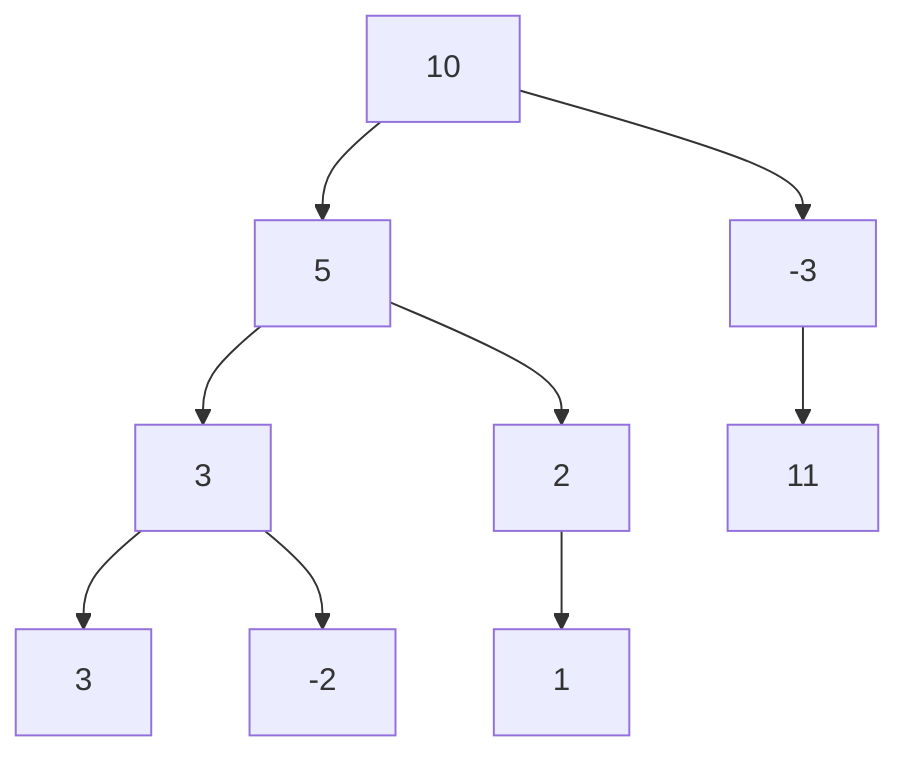

```
target = 8

paths যাদের sum=8:
  10→-3→11  (10 + -3 + 11 = 18? না...)
  10→5→3    (= 18? না)
  5→3       (= 8! হ্যাঁ)
  5→2→1     (= 8! হ্যাঁ)
  -3→11     (= 8! হ্যাঁ)
  10→5→-2→... (নানা)

সঠিক answer = 3
```

## ভাবনা ১: Brute Force — প্রতিটা node থেকে DFS

প্রতিটা node থেকে শুরু করে নিচের দিকে সব path-এর sum চেক করি।
- **Time: O(n log n)** balanced-এ, **O(n²)** worst case (skewed)।

## ভাবনা ২: Prefix Sum + Hash Map — O(n)

**Key insight:** root থেকে কোনো node পর্যন্ত running sum = `runningSum`। যদি আগে কোনো node-এ running sum ছিল `runningSum - target`, তাহলে সেই node থেকে এই node পর্যন্ত path-এর sum = `target`।

এটা array-এর "subarray sum = target" problem-এর tree version।

```
root থেকে চলতে চলতে running sum রাখি।
একটা Map-এ রাখি: {running sum → কতবার এই sum দেখেছি}

কোনো node-এ runningSum = X হলে,
  আগে যদি (X - target) sum দেখে থাকি k বার,
  তাহলে k টা path এই node-এ এসে শেষ হয়ে sum = target দিচ্ছে।
```

```
target = 8, tree শুরু:

node 10: runningSum=10, map={0:1,10:1}
  10-8=2, map-এ 2 নেই → 0টা path
  node 5: runningSum=15, map={0:1,10:1,15:1}
    15-8=7, নেই → 0
    node 3: runningSum=18, map={...,18:1}
      18-8=10, map-এ 10:1 → 1টা path! (10→5→3, বা 5→3? → 5+3=8, হ্যাঁ)
      ...
  node -3: runningSum=7, map={0:1,10:1,7:1}
    7-8=-1, নেই → 0
    node 11: runningSum=18, map={...,18:1}
      18-8=10, map-এ 10:1 → 1টা path! (-3→11)
```

## Code — Prefix Sum (O(n))

```dart
// Dart
int pathsWithSum(TreeNode? root, int target) {
  return _countPaths(root, target, 0, {0: 1});
}

int _countPaths(
  TreeNode? node,
  int target,
  int runningSum,
  Map<int, int> prefixCounts,
) {
  if (node == null) return 0;

  runningSum += node.val;
  // এই node-এ শেষ হওয়া valid path কয়টা?
  final count = prefixCounts[runningSum - target] ?? 0;

  // map-এ এই runningSum যোগ করো
  prefixCounts[runningSum] = (prefixCounts[runningSum] ?? 0) + 1;

  // বাম ও ডান subtree-তে count করো
  final total = count +
      _countPaths(node.left,  target, runningSum, prefixCounts) +
      _countPaths(node.right, target, runningSum, prefixCounts);

  // backtrack: এই node থেকে ফিরে আসার সময় map undo করো
  prefixCounts[runningSum] = prefixCounts[runningSum]! - 1;
  if (prefixCounts[runningSum] == 0) prefixCounts.remove(runningSum);

  return total;
}
```

```python
# Python
def paths_with_sum(root, target: int) -> int:
    def count_paths(node, running_sum, prefix_counts):
        if node is None:
            return 0

        running_sum += node.val
        # এই node-এ শেষ হওয়া valid path কয়টা?
        count = prefix_counts.get(running_sum - target, 0)

        # map-এ এই running_sum যোগ করো
        prefix_counts[running_sum] = prefix_counts.get(running_sum, 0) + 1

        total = count + \
                count_paths(node.left,  running_sum, prefix_counts) + \
                count_paths(node.right, running_sum, prefix_counts)

        # backtrack: undo
        prefix_counts[running_sum] -= 1
        if prefix_counts[running_sum] == 0:
            del prefix_counts[running_sum]

        return total

    return count_paths(root, 0, {0: 1})
```

## Complexity

**Time: O(n)** — প্রতিটা node একবার, Map lookup O(1)।
**Space: O(h)** — recursion stack + prefix map (height পর্যন্ত unique sum)।

## Pattern চিনুন

> **"path sum = target (শুরু/শেষ যেকোনো জায়গায়)" → Prefix Sum + Hash Map।** এই "running sum" trick array-তেও, tree-তেও — একই logic। Backtrack করতে ভুলবেন না।

## Common mistake

- **Backtracking ভুলে যাওয়া** — DFS-এ ফিরে আসার সময় Map-এ যোগ করা value সরানো না হলে অন্য branch ভুল answer পাবে।
- Map-এ `{0: 1}` দিয়ে শুরু না করা — root থেকে যদি কোনো prefix-ই target হয় সেটা ধরা পড়বে না।
- Negative value থাকতে পারে — sorted assumption করা যাবে না।

## Follow-up

- **Path-গুলো print করো (শুধু count না)** → DFS-এ current path মনে রেখে print করুন।
- **Array-তে একই problem (subarray sum = target)** → একই prefix sum trick, O(n)।

<sub>[↑ এই chapter-এর সূচি](#toc) · [মূল Index](README.md)</sub>

---

## Chapter সারসংক্ষেপ

### সব প্রশ্নের overview

| # | প্রশ্ন | মূল technique | Time | Space |
|---|---|---|---|---|
| 4.1 | Route Between Nodes | BFS/DFS + visited | O(V+E) | O(V) |
| 4.2 | Minimal Tree | Mid as root, recurse | O(n) | O(log n) |
| 4.3 | List of Depths | BFS + level size | O(n) | O(n) |
| 4.4 | Check Balanced | Post-order, -1 sentinel | O(n) | O(h) |
| 4.5 | Validate BST | Min/max range DFS | O(n) | O(h) |
| 4.6 | Successor | Right subtree leftmost / parent walk | O(h) | O(1) |
| 4.7 | Build Order | Topological sort (Kahn's BFS) | O(V+E) | O(V+E) |
| 4.8 | First Common Ancestor | Post-order LCA DFS | O(n) | O(h) |
| 4.9 | BST Sequences | Weave/interleave, backtrack | O(2^n · n) | O(2^n · n) |
| 4.10 | Check Subtree | Recursive match / serialize | O(n·m) | O(h) |
| 4.11 | Random Node | Subtree size + weighted random | O(h) | O(n) |
| 4.12 | Paths with Sum | Prefix sum + Hash Map | O(n) | O(h) |

---

### "এটা দেখলে → এটা ভাবো" (signal → technique)

```
graph-এ দুটো node-এর মধ্যে path?        →  BFS বা DFS + visited set
sorted array → balanced BST?            →  মাঝের element root, দুই দিকে recurse
level by level process?                 →  BFS + levelSize = queue.length
subtree-র property check + height?      →  post-order DFS, -1 sentinel
valid BST?                              →  min/max range DFS (শুধু child চেক ভুল!)
BST-তে পরের node?                       →  right subtree leftmost / parent-এ উঠো
dependency order / কোনটা আগে?          →  topological sort (Kahn's বা DFS)
সবচেয়ে কাছের common ancestor?          →  post-order LCA, দুই দিক non-null → root
path sum (শুরু/শেষ যেকোনো)?            →  prefix sum + HashMap, backtrack
subtree match?                          →  recursive compare বা serialize+substring
```

---

### এই chapter-এর ৫টা সোনার নিয়ম

1. **BFS vs DFS:** shortest path → BFS; সব path/cycle/order → DFS। Cycle-এ visited set না থাকলে infinite loop।
2. **BST validate:** immediate child নয়, পুরো subtree-র range চেক করুন (min/max parameter পাঠান)।
3. **Tree problem-এ post-order:** "নিচে থেকে তথ্য জমিয়ে উপরে দাও" — balance, LCA, height সব এভাবে O(n)-এ হয়।
4. **Prefix sum tree-তেও:** running sum রেখে HashMap-এ lookup করলে O(n)-এ subpath sum পাওয়া যায় — backtrack করতে ভুলবেন না।
5. **Topological sort:** dependency cycle detect করে error দেওয়া ততটাই গুরুত্বপূর্ণ যতটা valid order দেওয়া।

> **পরের ধাপ:** [Chapter 5 — Bit Manipulation](chapter05_bit_manipulation.md) (5.1–5.8), যেখানে bit twiddling, XOR tricks, আর low-level number magic শিখব।
