# Chapter 7 — Object-Oriented Design (প্রশ্ন 7.1 – 7.12)

> **Cracking the Coding Interview — বাংলা গাইড**
> ব্যাখ্যা **বাংলায়**, technical term **ইংরেজিতে**। Code skeleton **Dart + Python** দুটোতেই (class design)।
> এই chapter-এ কোনো একটা "সঠিক" উত্তর নেই — interviewer দেখে আপনি কীভাবে object, responsibility আর relationship ভাবেন।

> [মূল Index](README.md) · [Foundation](chapter00_foundation.md) · [আগের: Math & Logic Puzzles](chapter06_math_logic_puzzles.md) · [পরের: Recursion & DP](chapter08_recursion_dp.md)

---

<a id="toc"></a>
## এই Chapter-এর সূচি

- [7.1 — Deck of Cards](#q7-1)
- [7.2 — Call Center](#q7-2)
- [7.3 — Jukebox](#q7-3)
- [7.4 — Parking Lot](#q7-4)
- [7.5 — Online Book Reader](#q7-5)
- [7.6 — Jigsaw](#q7-6)
- [7.7 — Chat Server](#q7-7)
- [7.8 — Othello](#q7-8)
- [7.9 — Circular Array](#q7-9)
- [7.10 — Minesweeper](#q7-10)
- [7.11 — File System](#q7-11)
- [7.12 — Hash Table](#q7-12)

প্রতিটা প্রশ্ন এই কাঠামোয়: **সমস্যাটা সহজ বাংলায় → Listen (scope clarify) → মূল objects খুঁজে বের করা → Class Diagram (mermaid) → Code skeleton (Dart+Python) → Design decisions ও trade-offs → Follow-up।**

---
---

# Background — OOD প্রশ্ন কীভাবে attack করবেন

OOD (Object-Oriented Design) প্রশ্নে algorithm নয়, **structure** চাওয়া হয়: "একটা Parking Lot design করো", "একটা Deck of Cards design করো"। Interviewer দেখতে চায় আপনি একটা বাস্তব জিনিসকে **class, responsibility আর relationship**-এ ভাগ করতে পারেন কিনা।

## ১. ৫ ধাপের পদ্ধতি (প্রতিটা প্রশ্নে এই ক্রমে এগোন)

```
ধাপ ১: Listen / Scope  — কী কী করতে হবে, কোনটা বাদ? (সব design করা যায় না)
ধাপ ২: Core objects     — মূল বিশেষ্য (noun) গুলো খুঁজুন → এগুলোই class হবে
ধাপ ৩: Relationship      — কোন object কাকে ধারণ করে (has-a) / কে কার ধরন (is-a)
ধাপ ৪: Actions / methods — মূল ক্রিয়া (verb) গুলো খুঁজুন → এগুলোই method হবে
ধাপ ৫: Refine            — design pattern, edge case, extensibility যাচাই করুন
```

> **সহজ কৌশল:** সমস্যাটা এক প্যারায় লিখে ফেলুন। তারপর **বিশেষ্য (noun) = সম্ভাব্য class**, **ক্রিয়া (verb) = সম্ভাব্য method**। এটা OOD-এর "noun-verb" technique।

## ২. তিনটা মূল relationship — আগে এগুলো বুঝুন

```
is-a   (Inheritance)  : Car is-a Vehicle      → class Car extends Vehicle
has-a  (Composition)  : ParkingLot has Levels → class ParkingLot { List<Level> }
uses-a (Association)   : Game uses Board       → method-এ parameter হিসেবে আসে
```

- **Inheritance (is-a):** common আচরণ একটা base class-এ রাখুন, বিশেষ আচরণ subclass-এ। উদাহরণ: `Respondent`, `Manager`, `Director` — সবাই `Employee`।
- **Composition (has-a):** "বড় object ছোট object দিয়ে তৈরি"। বেশিরভাগ সময় inheritance-এর চেয়ে composition নিরাপদ (loose coupling)।
- **নিয়ম:** "Car is-a Vehicle" বললে inheritance; "Car has-a Engine" বললে composition.

## ৩. দরকারি OOP স্তম্ভ (interview-তে নাম ধরে বলবেন)

- **Encapsulation:** field গুলো private রাখুন, বাইরে থেকে শুধু method দিয়ে ছোঁয়া যাবে। (Card-এর value কেউ যেন বাইরে থেকে বদলাতে না পারে।)
- **Abstraction:** ব্যবহারকারীকে শুধু দরকারি interface দিন, ভেতরের জটিলতা লুকান।
- **Inheritance:** কোড পুনর্ব্যবহার, common base।
- **Polymorphism:** একই method call ভিন্ন subclass-এ ভিন্ন আচরণ করে (`piece.flip()`)।

## ৪. কাজে লাগে এমন কয়েকটা Design Pattern

প্রতিটা OOD প্রশ্নে কোনো না কোনো pattern ফিট করে। প্রথমবার এখানে শিখে নিন, পরে শুধু নাম ধরে বলব:

| Pattern | এক কথায় | এই chapter-এ কোথায় |
|---|---|---|
| **Factory / Factory Method** | object বানানোর কাজ একটা জায়গায় কেন্দ্রীভূত | 7.1 Deck (card factory), 7.4 Vehicle |
| **Singleton** | পুরো program-এ একটাই instance | 7.5 Library/UserManager |
| **Strategy** | আচরণ (algorithm) plug-and-play বদলানো | 7.2 call routing |
| **State** | object-এর state অনুযায়ী আচরণ বদলায় | 7.7 user online/offline |
| **Composite** | tree-structure — পাতা ও ডাল একই interface | 7.11 File System (File/Directory) |
| **Observer** | একজন বদলালে অন্যদের জানানো | 7.7 chat message broadcast |

## ৫. Enum — ছোট fixed set-এর জন্য

OOD-তে suit (hearts/diamonds/clubs/spades), vehicle size (small/medium/large), employee rank — এসব **fixed, সীমিত মান**। এদের জন্য `String` বা `int` ব্যবহার না করে **enum** ব্যবহার করুন — type-safe, ভুল মান ঠেকায়।

```dart
enum Suit { hearts, diamonds, clubs, spades }
```
```python
from enum import Enum
class Suit(Enum):
    HEARTS = 1; DIAMONDS = 2; CLUBS = 3; SPADES = 4
```

> এই chapter-এ code "skeleton" — পুরো working app নয়, **class structure আর key method**। Interview-তে এটাই যথেষ্ট: পরিষ্কার class, ঠিক relationship, আর কয়েকটা method-এর body।

---
---

<a id="q7-1"></a>
# 7.1 — Deck of Cards

> Pattern: **Generic class + Enum + Factory** · Difficulty: **Easy–Medium** · খুব common (warm-up OOD)

> **বইয়ের ভাষায়:** Design the data structures for a generic deck of cards. Explain how you would subclass the data structures to implement blackjack.

## সমস্যাটা সহজ বাংলায়
তাস (cards) খেলার একটা সাধারণ deck design করতে হবে — যাতে শুধু blackjack নয়, যেকোনো খেলায় কাজে লাগে। তারপর দেখাতে হবে কীভাবে এটাকে subclass করে blackjack বানাবেন।

## ধাপ ১: Listen (scope clarify)
- **কোন খেলা?** শুধু blackjack নাকি generic? → generic design চাই, blackjack একটা উদাহরণ।
- **Joker / multiple deck?** → আপাতত standard ৫২ card, একটা deck ধরছি।
- **Card-এর value কীভাবে?** → blackjack-এ Ace = 1 বা 11, face card = 10 — game-ভেদে ভিন্ন, তাই value-র হিসাব game-এ থাকবে, card-এ নয়।

## মূল objects (noun খুঁজি)
- **Suit** — চারটা suit (enum)।
- **Card** — একটা তাস, suit + rank আছে; abstract value আছে।
- **Deck\<T\>** — generic, T ধরনের card-এর তালিকা; shuffle, deal করে।
- **Hand\<T\>** — খেলোয়াড়ের হাতে থাকা card-এর সংগ্রহ; score বের করে।
- blackjack-এর জন্য: **BlackJackCard** (Card extends), **BlackJackHand** (Hand extends)।

> মূল design সিদ্ধান্ত: `Card` কে **abstract** রাখি (`value()` abstract), কারণ একই card-এর মান খেলাভেদে আলাদা। `Deck` আর `Hand` কে **generic** (`<T extends Card>`) রাখি যাতে যেকোনো খেলায় reuse হয়।

## Class Diagram

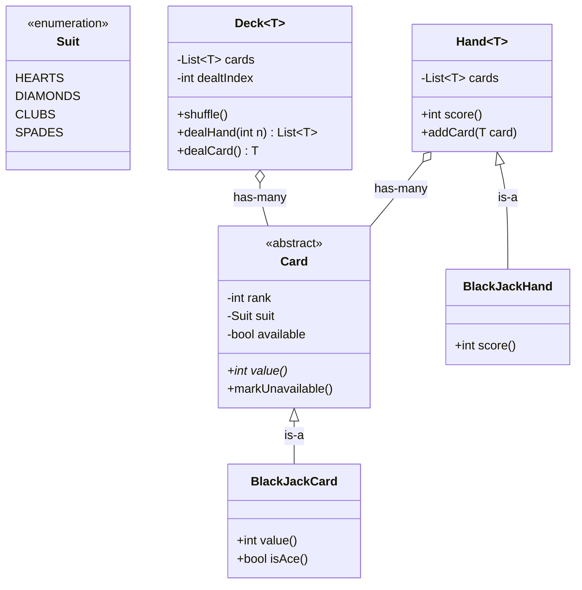

## Code skeleton

```dart
// Dart
enum Suit { hearts, diamonds, clubs, spades }

abstract class Card {
  final int rank;        // 1=Ace, 11=Jack, 12=Queen, 13=King
  final Suit suit;
  bool _available = true;
  Card(this.rank, this.suit);

  int value();                       // abstract: খেলাভেদে আলাদা
  bool get isAvailable => _available;
  void markUnavailable() => _available = false;
}

class Deck<T extends Card> {
  final List<T> _cards;
  int _dealtIndex = 0;
  Deck(this._cards);

  void shuffle() => _cards.shuffle();   // in-place random shuffle

  List<T> dealHand(int n) {
    final hand = _cards.sublist(_dealtIndex, _dealtIndex + n);
    _dealtIndex += n;
    return hand;
  }

  T dealCard() => _cards[_dealtIndex++];
  int get remaining => _cards.length - _dealtIndex;
}

abstract class Hand<T extends Card> {
  final List<T> cards = [];
  void addCard(T card) => cards.add(card);
  int score();                          // abstract
}

// --- blackjack subclassing ---
class BlackJackCard extends Card {
  BlackJackCard(int rank, Suit suit) : super(rank, suit);
  bool get isAce => rank == 1;

  @override
  int value() {
    if (isAce) return 1;                // Ace base = 1, 11 হ্যান্ডলিং hand-এ
    if (rank >= 11) return 10;          // J/Q/K = 10
    return rank;
  }
}

class BlackJackHand extends Hand<BlackJackCard> {
  @override
  int score() {
    int total = 0, aces = 0;
    for (final c in cards) {
      total += c.value();
      if (c.isAce) aces++;
    }
    while (aces > 0 && total + 10 <= 21) {  // একটা Ace কে 11 ধরা যায়?
      total += 10;
      aces--;
    }
    return total;
  }
}
```
```python
# Python
from enum import Enum
from abc import ABC, abstractmethod
import random

class Suit(Enum):
    HEARTS = 1; DIAMONDS = 2; CLUBS = 3; SPADES = 4

class Card(ABC):
    def __init__(self, rank: int, suit: Suit):
        self.rank = rank          # 1=Ace ... 13=King
        self.suit = suit
        self.available = True

    @abstractmethod
    def value(self) -> int:       # খেলাভেদে আলাদা
        ...

    def mark_unavailable(self):
        self.available = False

class Deck:
    def __init__(self, cards: list):
        self.cards = cards
        self.dealt_index = 0

    def shuffle(self):
        random.shuffle(self.cards)

    def deal_hand(self, n: int) -> list:
        hand = self.cards[self.dealt_index:self.dealt_index + n]
        self.dealt_index += n
        return hand

    def deal_card(self):
        c = self.cards[self.dealt_index]
        self.dealt_index += 1
        return c

class Hand(ABC):
    def __init__(self):
        self.cards = []

    def add_card(self, card):
        self.cards.append(card)

    @abstractmethod
    def score(self) -> int:
        ...

# --- blackjack subclassing ---
class BlackJackCard(Card):
    @property
    def is_ace(self) -> bool:
        return self.rank == 1

    def value(self) -> int:
        if self.is_ace:
            return 1
        if self.rank >= 11:
            return 10
        return self.rank

class BlackJackHand(Hand):
    def score(self) -> int:
        total = sum(c.value() for c in self.cards)
        aces = sum(1 for c in self.cards if c.is_ace)
        while aces > 0 and total + 10 <= 21:   # Ace = 11 ধরা যায়?
            total += 10
            aces -= 1
        return total
```

## Design decisions ও trade-offs
- **Card abstract কেন?** একই card-এর value blackjack-এ এক, অন্য খেলায় অন্য। তাই `value()` abstract রেখে subclass-এ define করা হলো — **polymorphism**।
- **Deck generic (`<T extends Card>`) কেন?** reuse। blackjack, poker, যেকোনো খেলায় same Deck class চলবে।
- **Ace-এর 1 বা 11 hand-এ handle:** card জানে না সে কোন context-এ আছে; পুরো hand-এর score দেখে সিদ্ধান্ত নেওয়াই ঠিক — responsibility সঠিক জায়গায়।
- **markUnavailable():** কিছু খেলায় (যেমন board game) card "ব্যবহৃত" কিনা track করতে লাগে।

## Follow-up
- **Multiple deck / shoe?** → `Deck` কে একটা `Shoe`-তে wrap করুন (composition)।
- **Card factory?** → `Deck` ভরার জন্য একটা factory method যা ৫২টা card বানায়।
- **Joker?** → rank-এ special মান বা আলাদা subclass।

<sub>[↑ এই chapter-এর সূচি](#toc) · [মূল Index](README.md)</sub>

---
---

<a id="q7-2"></a>
# 7.2 — Call Center

> Pattern: **Inheritance hierarchy + Chain of escalation** · Difficulty: **Medium** · common

> **বইয়ের ভাষায়:** Imagine you have a call center with three levels of employees: respondent, manager, and director. An incoming telephone call must be allocated to a respondent who is free. If the respondent can't handle the call, he or she must escalate the call to a manager. If the manager is not free or not able to handle it, then the call should be escalated to a director. Design the classes and data structures for this problem. Implement a method `dispatchCall()` which assigns a call to the first available employee who can handle it.

## সমস্যাটা সহজ বাংলায়
একটা call center আছে তিন স্তরের কর্মী নিয়ে: respondent (সাধারণ), manager, director। একটা call আসলে আগে কোনো খালি respondent-কে দিতে হবে। সে না পারলে manager-এ, manager না পারলে director-এ **escalate** হবে। `dispatchCall()` লিখতে হবে যা call টা প্রথম উপযুক্ত খালি কর্মীকে দেয়।

## ধাপ ১: Listen (scope clarify)
- **স্তর কি সবসময় তিনটাই?** → এখন তিনটা, কিন্তু design এমন করব যাতে স্তর যোগ করা সহজ হয়।
- **খালি কর্মী না থাকলে?** → call টা queue-তে অপেক্ষা করবে।
- **কে call টা route করে?** → একটা central `CallHandler` (একটাই — Singleton ধরছি)।

## মূল objects
- **Employee** (abstract) — common: name, খালি কিনা, current call; `escalateCall()`।
- **Respondent / Manager / Director** — Employee-এর subclass, শুধু rank আলাদা।
- **Call** — caller, rank (কোন স্তর handle করছে), reference to handler।
- **CallHandler** — সব employee-র তালিকা (rank অনুযায়ী), `dispatchCall()`, প্রতি স্তরের queue।

> মূল design সিদ্ধান্ত: তিন স্তরকে আলাদা class না করে **একটা rank (enum)** দিয়ে আলাদা করা যেত; কিন্তু বই subclass চায় কারণ ভবিষ্যতে প্রতিটা স্তরের আলাদা আচরণ (যেমন director শুধু VIP call) যোগ করা সহজ হয়।

## Class Diagram

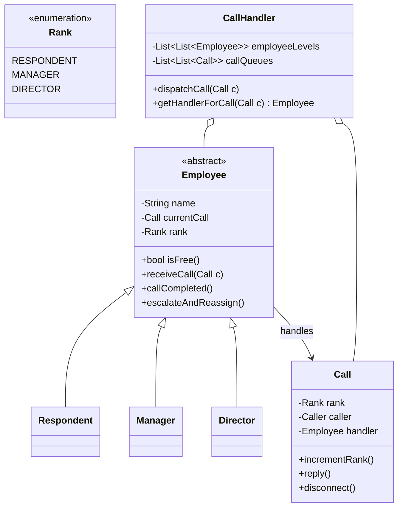

## Code skeleton

```dart
// Dart
enum Rank { respondent, manager, director }

abstract class Employee {
  final String name;
  final Rank rank;
  Call? currentCall;
  final CallHandler handler;
  Employee(this.name, this.rank, this.handler);

  bool get isFree => currentCall == null;

  void receiveCall(Call call) {
    currentCall = call;
    call.handler = this;
  }

  // handle করতে না পারলে উপরের স্তরে পাঠাও
  void escalateAndReassign() {
    final call = currentCall!;
    call.incrementRank();          // rank এক ধাপ বাড়াও
    currentCall = null;            // আমি মুক্ত হলাম
    handler.dispatchCall(call);    // আবার dispatch
  }

  void callCompleted() => currentCall = null;
}

class Respondent extends Employee {
  Respondent(String n, CallHandler h) : super(n, Rank.respondent, h);
}
class Manager extends Employee {
  Manager(String n, CallHandler h) : super(n, Rank.manager, h);
}
class Director extends Employee {
  Director(String n, CallHandler h) : super(n, Rank.director, h);
}

class Call {
  Rank rank = Rank.respondent;     // শুরুতে respondent স্তরে
  Employee? handler;
  final String caller;
  Call(this.caller);

  void incrementRank() {
    if (rank == Rank.respondent) rank = Rank.manager;
    else if (rank == Rank.manager) rank = Rank.director;
  }
}

class CallHandler {
  static const int levels = 3;
  // index 0 = respondents, 1 = managers, 2 = directors
  final List<List<Employee>> employeeLevels = [[], [], []];
  final List<List<Call>> callQueues = [[], [], []];

  Employee? _getHandlerForCall(Call call) {
    final level = call.rank.index;
    for (final e in employeeLevels[level]) {
      if (e.isFree) return e;
    }
    return null;                   // ওই স্তরে কেউ খালি নেই
  }

  void dispatchCall(Call call) {
    final emp = _getHandlerForCall(call);
    if (emp != null) {
      emp.receiveCall(call);
    } else {
      callQueues[call.rank.index].add(call);   // queue-তে অপেক্ষা
    }
  }
}
```
```python
# Python
from enum import IntEnum
from abc import ABC

class Rank(IntEnum):
    RESPONDENT = 0
    MANAGER = 1
    DIRECTOR = 2

class Employee(ABC):
    def __init__(self, name: str, rank: Rank, handler: "CallHandler"):
        self.name = name
        self.rank = rank
        self.handler = handler
        self.current_call = None

    @property
    def is_free(self) -> bool:
        return self.current_call is None

    def receive_call(self, call: "Call"):
        self.current_call = call
        call.handler = self

    def escalate_and_reassign(self):
        call = self.current_call
        call.increment_rank()        # উপরের স্তরে পাঠাও
        self.current_call = None
        self.handler.dispatch_call(call)

    def call_completed(self):
        self.current_call = None

class Respondent(Employee):
    def __init__(self, name, handler): super().__init__(name, Rank.RESPONDENT, handler)
class Manager(Employee):
    def __init__(self, name, handler): super().__init__(name, Rank.MANAGER, handler)
class Director(Employee):
    def __init__(self, name, handler): super().__init__(name, Rank.DIRECTOR, handler)

class Call:
    def __init__(self, caller: str):
        self.caller = caller
        self.rank = Rank.RESPONDENT
        self.handler = None

    def increment_rank(self):
        if self.rank < Rank.DIRECTOR:
            self.rank = Rank(self.rank + 1)

class CallHandler:
    def __init__(self):
        self.employee_levels = [[], [], []]   # 0 resp, 1 mgr, 2 dir
        self.call_queues = [[], [], []]

    def _get_handler_for_call(self, call: Call):
        for e in self.employee_levels[call.rank]:
            if e.is_free:
                return e
        return None

    def dispatch_call(self, call: Call):
        emp = self._get_handler_for_call(call)
        if emp:
            emp.receive_call(call)
        else:
            self.call_queues[call.rank].append(call)   # queue-তে অপেক্ষা
```

## Design decisions ও trade-offs
- **স্তরকে `List<List<Employee>>` (index = rank) দিয়ে রাখা:** নতুন স্তর যোগ করা সহজ, dispatch logic এক জায়গায়।
- **Escalation call-এর rank বাড়িয়ে আবার dispatch:** "চেইন" আলাদা করে লেখার দরকার নেই — same `dispatchCall` reuse হয়।
- **Queue কেন?** কেউ খালি না থাকলে call হারিয়ে গেলে চলবে না — তাই per-level queue, কেউ মুক্ত হলে queue থেকে তুলবে।
- **Trade-off:** তিন স্তরের আলাদা class এখন প্রায় খালি (শুধু rank ভিন্ন)। ছোট system-এ একটা `Employee` + `rank` যথেষ্ট হতো; subclass রেখেছি ভবিষ্যৎ আচরণ-পার্থক্যের জন্য (extensibility বনাম এখনকার সরলতা)।

## Follow-up
- **কেউ মুক্ত হলে queue থেকে next call নেওয়া** → `callCompleted()`-এ queue check করুন।
- **একই rank-এ load balancing** → round-robin বা "সবচেয়ে কম busy" employee বাছুন।
- **Call priority (VIP)?** → queue কে priority queue বানান।

<sub>[↑ এই chapter-এর সূচি](#toc) · [মূল Index](README.md)</sub>

---
---

<a id="q7-3"></a>
# 7.3 — Jukebox

> Pattern: **Composition + State (playing/paused)** · Difficulty: **Medium** · common

> **বইয়ের ভাষায়:** Design a musical jukebox using object-oriented principles.

## সমস্যাটা সহজ বাংলায়
একটা গানের jukebox design করতে হবে — যেখানে CD থাকে, প্রতিটা CD-তে গান থাকে, user গান select করে, আর একটা player সেই গান বাজায় (play/pause/next)।

## ধাপ ১: Listen (scope clarify)
- **টাকা লাগবে?** → ধরছি free (অথবা coin handling আলাদা একটা subsystem, এখন বাদ)।
- **Playlist / queue?** → হ্যাঁ, user একাধিক গান queue করতে পারে।
- **একসাথে কতজন?** → একটা jukebox, একটা সময়ে একটা গান বাজে।

## মূল objects
- **Jukebox** — পুরো system; CDPlayer, সব CD-র set, current user।
- **CDPlayer** — একটা CD ও একটা Playlist ধরে; play/pause logic।
- **CD** — id, artist, গানের তালিকা।
- **Song** — id, CD reference, title, length।
- **Playlist** — গানের queue; next song দেয়।
- **User** — id, name (কে select করছে)।

> মূল design সিদ্ধান্ত: jukebox **composition**-এর সুন্দর উদাহরণ — Jukebox **has-a** CDPlayer, CDPlayer **has-a** CD ও Playlist, CD **has-many** Song। কোনো inheritance দরকার নেই।

## Class Diagram

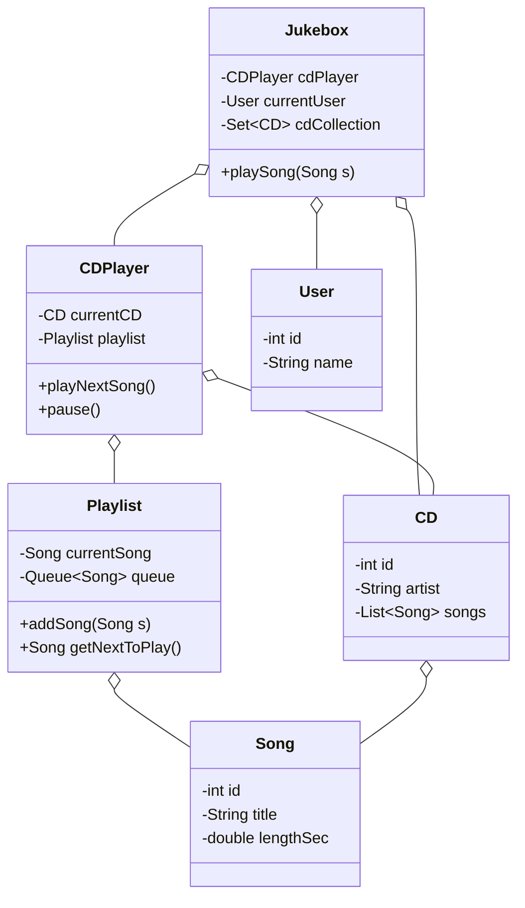

## Code skeleton

```dart
// Dart
import 'dart:collection';

class Song {
  final int id;
  final String title;
  final double lengthSec;
  Song(this.id, this.title, this.lengthSec);
}

class CD {
  final int id;
  final String artist;
  final List<Song> songs;
  CD(this.id, this.artist, this.songs);
}

class Playlist {
  final Queue<Song> _queue = Queue<Song>();
  Song? currentSong;

  void addSong(Song s) => _queue.add(s);

  Song? getNextToPlay() {
    if (_queue.isEmpty) return null;
    currentSong = _queue.removeFirst();
    return currentSong;
  }
}

class CDPlayer {
  CD? currentCD;
  final Playlist playlist = Playlist();
  bool _isPlaying = false;

  void playNextSong() {
    final next = playlist.getNextToPlay();
    if (next != null) _isPlaying = true;
    // hardware-এ song stream করা হবে
  }

  void pause() => _isPlaying = false;
}

class User {
  final int id;
  final String name;
  User(this.id, this.name);
}

class Jukebox {
  final CDPlayer cdPlayer;
  final Set<CD> cdCollection;
  User? currentUser;
  Jukebox(this.cdPlayer, this.cdCollection);

  void selectSong(Song s) {
    cdPlayer.playlist.addSong(s);   // queue-তে যোগ
    cdPlayer.playNextSong();
  }
}
```
```python
# Python
from collections import deque

class Song:
    def __init__(self, id: int, title: str, length_sec: float):
        self.id = id
        self.title = title
        self.length_sec = length_sec

class CD:
    def __init__(self, id: int, artist: str, songs: list):
        self.id = id
        self.artist = artist
        self.songs = songs

class Playlist:
    def __init__(self):
        self.queue = deque()
        self.current_song = None

    def add_song(self, s: Song):
        self.queue.append(s)

    def get_next_to_play(self):
        if not self.queue:
            return None
        self.current_song = self.queue.popleft()
        return self.current_song

class CDPlayer:
    def __init__(self):
        self.current_cd = None
        self.playlist = Playlist()
        self._is_playing = False

    def play_next_song(self):
        nxt = self.playlist.get_next_to_play()
        if nxt:
            self._is_playing = True   # hardware-এ stream

    def pause(self):
        self._is_playing = False

class User:
    def __init__(self, id: int, name: str):
        self.id = id
        self.name = name

class Jukebox:
    def __init__(self, cd_player: CDPlayer, cd_collection: set):
        self.cd_player = cd_player
        self.cd_collection = cd_collection
        self.current_user = None

    def select_song(self, s: Song):
        self.cd_player.playlist.add_song(s)
        self.cd_player.play_next_song()
```

## Design decisions ও trade-offs
- **Playlist-এ Queue কেন?** গান যে order-এ select হয় সেই order-এ বাজবে — FIFO = queue একদম মানানসই।
- **CDPlayer আর Jukebox আলাদা কেন?** Jukebox = পুরো cabinet (collection, user, UI); CDPlayer = শুধু বাজানোর যন্ত্র। responsibility আলাদা রাখলে পরে অন্য player (যেমন streaming) plug করা যায়।
- **State (playing/paused):** এখানে একটা bool যথেষ্ট; বড় হলে **State pattern** (PlayingState, PausedState class) ব্যবহার করা যায়।
- **Trade-off:** coin/payment বাদ দিয়েছি scope ছোট রাখতে — interview-তে বলে দিন "payment আলাদা subsystem"।

## Follow-up
- **Shuffle / repeat mode?** → Playlist-এ strategy যোগ করুন (Strategy pattern)।
- **একাধিক user queue?** → প্রতি user-এর আলাদা request, fair scheduling।
- **এখন কোন গান বাজছে দেখানো** → CDPlayer থেকে `currentSong` expose করুন।

<sub>[↑ এই chapter-এর সূচি](#toc) · [মূল Index](README.md)</sub>

---
---

<a id="q7-4"></a>
# 7.4 — Parking Lot

> Pattern: **Inheritance (Vehicle, Spot) + Enum size matching** · Difficulty: **Medium** · খুব common

> **বইয়ের ভাষায়:** Design a parking lot using object-oriented principles.

## সমস্যাটা সহজ বাংলায়
একটা parking lot design করতে হবে। নানা রকম গাড়ি (motorcycle, car, bus) আসে, নানা রকম spot (motorcycle, compact, large) আছে। গাড়ি এলে উপযুক্ত খালি spot খুঁজে park করতে হবে, বের হলে spot ছাড়তে হবে।

## ধাপ ১: Listen (scope clarify)
- **কয় ধরনের গাড়ি / spot?** → Motorcycle, Car, Bus; spot: Motorcycle, Compact, Large।
- **কোন গাড়ি কোন spot-এ?** → Motorcycle: যেকোনো; Car: compact বা large; Bus: শুধু **পরপর ৫টা large** spot।
- **Multi-level?** → হ্যাঁ, একাধিক floor (Level)।
- **Payment / time?** → এখন বাদ (আলাদা subsystem)।

## মূল objects
- **VehicleSize** (enum) — motorcycle, compact, large।
- **Vehicle** (abstract) — license, যেসব spot লাগবে; `canFitInSpot()`।
- **Motorcycle / Car / Bus** — Vehicle subclass, কোন spot-এ ফিট সেটা override।
- **ParkingSpot** — size, row, number, কোন vehicle আছে।
- **Level** — একটা floor, spot-এর তালিকা; `parkVehicle()`।
- **ParkingLot** — সব Level; গাড়ি park / unpark করায়।

> মূল design সিদ্ধান্ত: "কোন গাড়ি কোন spot-এ ফিট" এই rule **vehicle-এ** রাখি (`canFitInSpot`)। কারণ rule গাড়ির ধরনের ওপর নির্ভর করে; নতুন গাড়ি যোগ করলে শুধু নতুন subclass লাগবে।

## Class Diagram

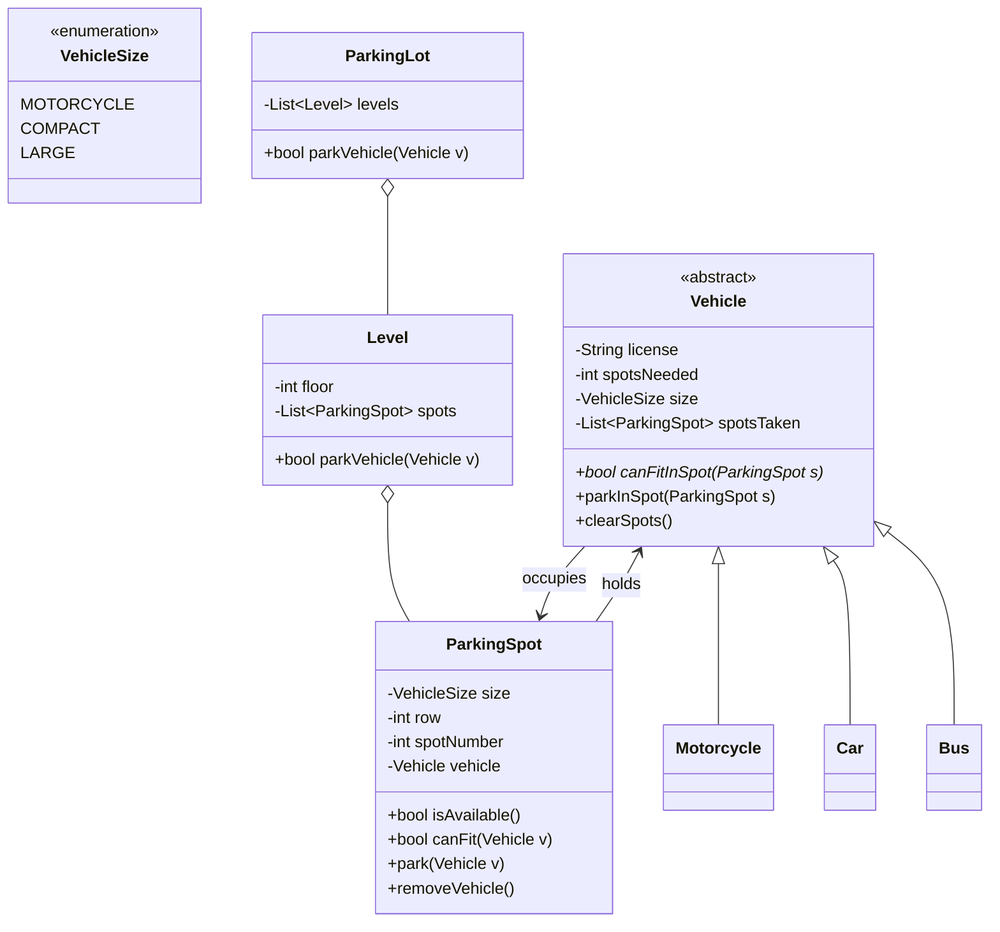

## Code skeleton

```dart
// Dart
enum VehicleSize { motorcycle, compact, large }

abstract class Vehicle {
  final String license;
  final int spotsNeeded;
  final VehicleSize size;
  final List<ParkingSpot> spotsTaken = [];
  Vehicle(this.license, this.spotsNeeded, this.size);

  bool canFitInSpot(ParkingSpot spot);   // abstract: গাড়িভেদে আলাদা

  void parkInSpot(ParkingSpot s) => spotsTaken.add(s);
  void clearSpots() {
    for (final s in spotsTaken) s.removeVehicle();
    spotsTaken.clear();
  }
}

class Motorcycle extends Vehicle {
  Motorcycle(String l) : super(l, 1, VehicleSize.motorcycle);
  @override
  bool canFitInSpot(ParkingSpot s) => true;        // যেকোনো spot
}

class Car extends Vehicle {
  Car(String l) : super(l, 1, VehicleSize.compact);
  @override
  bool canFitInSpot(ParkingSpot s) =>
      s.size == VehicleSize.compact || s.size == VehicleSize.large;
}

class Bus extends Vehicle {
  Bus(String l) : super(l, 5, VehicleSize.large);  // ৫টা large লাগে
  @override
  bool canFitInSpot(ParkingSpot s) => s.size == VehicleSize.large;
}

class ParkingSpot {
  final VehicleSize size;
  final int row, spotNumber;
  Vehicle? _vehicle;
  ParkingSpot(this.size, this.row, this.spotNumber);

  bool get isAvailable => _vehicle == null;
  bool canFit(Vehicle v) => isAvailable && v.canFitInSpot(this);

  void park(Vehicle v) { _vehicle = v; v.parkInSpot(this); }
  void removeVehicle() => _vehicle = null;
}

class Level {
  final int floor;
  final List<ParkingSpot> spots;
  Level(this.floor, this.spots);

  // পরপর spotsNeeded টা খালি+ফিট spot খুঁজে park করো
  bool parkVehicle(Vehicle v) {
    for (int i = 0; i + v.spotsNeeded <= spots.length; i++) {
      bool allFit = true;
      for (int k = 0; k < v.spotsNeeded; k++) {
        if (!spots[i + k].canFit(v)) { allFit = false; break; }
      }
      if (allFit) {
        for (int k = 0; k < v.spotsNeeded; k++) spots[i + k].park(v);
        return true;
      }
    }
    return false;
  }
}

class ParkingLot {
  final List<Level> levels;
  ParkingLot(this.levels);

  bool parkVehicle(Vehicle v) {
    for (final level in levels) {
      if (level.parkVehicle(v)) return true;   // প্রথম যেখানে ফিট
    }
    return false;                              // lot ভরা
  }
}
```
```python
# Python
from enum import Enum
from abc import ABC, abstractmethod

class VehicleSize(Enum):
    MOTORCYCLE = 1; COMPACT = 2; LARGE = 3

class Vehicle(ABC):
    def __init__(self, license: str, spots_needed: int, size: VehicleSize):
        self.license = license
        self.spots_needed = spots_needed
        self.size = size
        self.spots_taken = []

    @abstractmethod
    def can_fit_in_spot(self, spot: "ParkingSpot") -> bool:
        ...

    def park_in_spot(self, s: "ParkingSpot"):
        self.spots_taken.append(s)

    def clear_spots(self):
        for s in self.spots_taken:
            s.remove_vehicle()
        self.spots_taken.clear()

class Motorcycle(Vehicle):
    def __init__(self, l): super().__init__(l, 1, VehicleSize.MOTORCYCLE)
    def can_fit_in_spot(self, spot): return True            # যেকোনো spot

class Car(Vehicle):
    def __init__(self, l): super().__init__(l, 1, VehicleSize.COMPACT)
    def can_fit_in_spot(self, spot):
        return spot.size in (VehicleSize.COMPACT, VehicleSize.LARGE)

class Bus(Vehicle):
    def __init__(self, l): super().__init__(l, 5, VehicleSize.LARGE)   # ৫টা large
    def can_fit_in_spot(self, spot):
        return spot.size == VehicleSize.LARGE

class ParkingSpot:
    def __init__(self, size: VehicleSize, row: int, spot_number: int):
        self.size = size
        self.row = row
        self.spot_number = spot_number
        self.vehicle = None

    @property
    def is_available(self):
        return self.vehicle is None

    def can_fit(self, v: Vehicle) -> bool:
        return self.is_available and v.can_fit_in_spot(self)

    def park(self, v: Vehicle):
        self.vehicle = v
        v.park_in_spot(self)

    def remove_vehicle(self):
        self.vehicle = None

class Level:
    def __init__(self, floor: int, spots: list):
        self.floor = floor
        self.spots = spots

    def park_vehicle(self, v: Vehicle) -> bool:
        n = v.spots_needed
        for i in range(len(self.spots) - n + 1):
            if all(self.spots[i + k].can_fit(v) for k in range(n)):
                for k in range(n):
                    self.spots[i + k].park(v)
                return True
        return False

class ParkingLot:
    def __init__(self, levels: list):
        self.levels = levels

    def park_vehicle(self, v: Vehicle) -> bool:
        for level in self.levels:
            if level.park_vehicle(v):
                return True
        return False
```

## Design decisions ও trade-offs
- **`canFitInSpot` vehicle-এ কেন (spot-এ নয়)?** rule গাড়ির ধরনের ওপর নির্ভর করে। নতুন গাড়ি = নতুন subclass, পুরোনো code ছোঁয়া লাগে না (**Open/Closed principle**)।
- **Bus-এর "পরপর ৫টা large":** তাই `parkVehicle` consecutive খালি spot-এর জন্য window scan করে।
- **Enum size:** type-safe; `int` দিয়ে করলে ভুল মান ঢুকতে পারত।
- **Trade-off — খালি spot খোঁজা O(spots):** ছোট lot-এ ঠিক আছে; বড় lot-এ প্রতি size-এর জন্য খালি spot-এর queue/free-list রাখলে O(1) হয় (নিচে follow-up)।

## Follow-up
- **খালি spot O(1)-তে খোঁজা** → প্রতি size-এ available spot-এর queue রাখুন।
- **Payment / ticket** → আলাদা `Ticket`, `PaymentProcessor` class।
- **Reserved / handicapped spot** → spot-এ একটা flag বা নতুন subclass।

<sub>[↑ এই chapter-এর সূচি](#toc) · [মূল Index](README.md)</sub>

---
---

<a id="q7-5"></a>
# 7.5 — Online Book Reader

> Pattern: **Manager classes (Singleton-ish) + Composition** · Difficulty: **Medium** · common

> **বইয়ের ভাষায়:** Design the data structures for an online book reader system.

## সমস্যাটা সহজ বাংলায়
একটা online book reader system design করতে হবে — যেখানে user account থাকে, book-এর library থাকে, আর কেউ login করে কোনো book খুলে পড়তে পারে (page উল্টায়)।

## ধাপ ১: Listen (scope clarify)
- **কী কী feature?** → user membership; খোঁজা/পড়া; একসাথে কতজন; read করা ও available বানানো।
- **Offline / DRM / purchase?** → এখন বাদ; শুধু reading core।
- **একসাথে একটাই active user / book?** → ধরছি একটা session-এ একজন active user, একটা active book (UI-centric)।

## মূল objects
- **Book** — id, details, title।
- **User** — id, details, account type।
- **Library** — সব Book ধরে (add/remove/find) — একটাই (manager)।
- **UserManager** — সব User ধরে (add/remove/find) — একটাই (manager)।
- **Display** — এখন কোন book, কোন page দেখাচ্ছে; page navigation।
- **OnlineReaderSystem** — সব কিছু একত্র করে; active user ও active book ধরে।

> মূল design সিদ্ধান্ত: data (Book, User) আর তাদের **manager** (Library, UserManager) আলাদা রাখি। OnlineReaderSystem এই manager-দের একটা **facade** — UI শুধু এর সাথে কথা বলে। এটা responsibility পরিষ্কার রাখে।

## Class Diagram

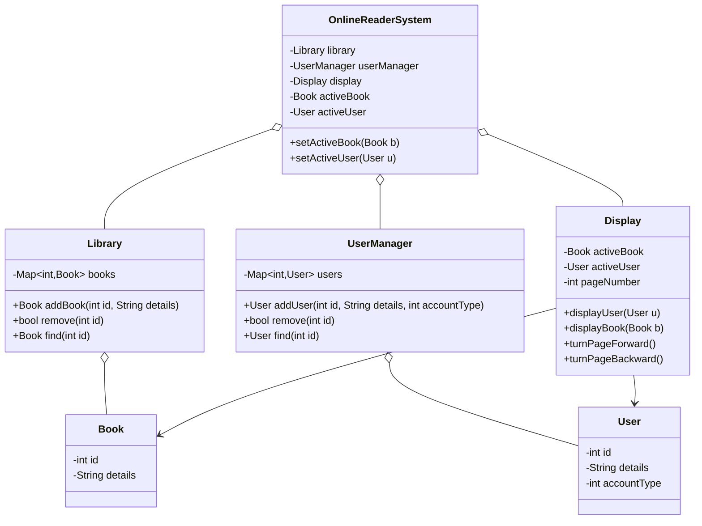

## Code skeleton

```dart
// Dart
class Book {
  final int id;
  String details;
  Book(this.id, this.details);
}

class User {
  final int id;
  String details;
  int accountType;
  User(this.id, this.details, this.accountType);
}

class Library {
  final Map<int, Book> _books = {};
  Book addBook(int id, String details) => _books[id] = Book(id, details);
  bool remove(int id) => _books.remove(id) != null;
  Book? find(int id) => _books[id];
}

class UserManager {
  final Map<int, User> _users = {};
  User? addUser(int id, String details, int accountType) {
    if (_users.containsKey(id)) return null;          // duplicate guard
    return _users[id] = User(id, details, accountType);
  }
  bool remove(int id) => _users.remove(id) != null;
  User? find(int id) => _users[id];
}

class Display {
  Book? _activeBook;
  User? _activeUser;
  int _pageNumber = 0;

  void displayUser(User u) => _activeUser = u;
  void displayBook(Book b) { _activeBook = b; _pageNumber = 0; refresh(); }
  void turnPageForward()  { _pageNumber++; refresh(); }
  void turnPageBackward() { if (_pageNumber > 0) _pageNumber--; refresh(); }
  void refresh() { /* screen-এ activeBook-এর pageNumber render করো */ }
}

class OnlineReaderSystem {
  final Library library = Library();
  final UserManager userManager = UserManager();
  final Display display = Display();
  Book? activeBook;
  User? activeUser;

  void setActiveBook(Book b) { activeBook = b; display.displayBook(b); }
  void setActiveUser(User u) { activeUser = u; display.displayUser(u); }
}
```
```python
# Python
class Book:
    def __init__(self, id: int, details: str):
        self.id = id
        self.details = details

class User:
    def __init__(self, id: int, details: str, account_type: int):
        self.id = id
        self.details = details
        self.account_type = account_type

class Library:
    def __init__(self):
        self.books = {}
    def add_book(self, id, details):
        self.books[id] = Book(id, details)
        return self.books[id]
    def remove(self, id):
        return self.books.pop(id, None) is not None
    def find(self, id):
        return self.books.get(id)

class UserManager:
    def __init__(self):
        self.users = {}
    def add_user(self, id, details, account_type):
        if id in self.users:
            return None                 # duplicate guard
        self.users[id] = User(id, details, account_type)
        return self.users[id]
    def remove(self, id):
        return self.users.pop(id, None) is not None
    def find(self, id):
        return self.users.get(id)

class Display:
    def __init__(self):
        self.active_book = None
        self.active_user = None
        self.page_number = 0
    def display_user(self, u): self.active_user = u
    def display_book(self, b):
        self.active_book = b
        self.page_number = 0
        self.refresh()
    def turn_page_forward(self):
        self.page_number += 1
        self.refresh()
    def turn_page_backward(self):
        if self.page_number > 0:
            self.page_number -= 1
        self.refresh()
    def refresh(self):
        pass                            # screen render

class OnlineReaderSystem:
    def __init__(self):
        self.library = Library()
        self.user_manager = UserManager()
        self.display = Display()
        self.active_book = None
        self.active_user = None
    def set_active_book(self, b):
        self.active_book = b
        self.display.display_book(b)
    def set_active_user(self, u):
        self.active_user = u
        self.display.display_user(u)
```

## Design decisions ও trade-offs
- **Manager class কেন?** Book/User হলো simple data; তাদের collection-level কাজ (add/find/remove) আলাদা manager-এ রাখলে responsibility পরিষ্কার থাকে (**Single Responsibility**)।
- **OnlineReaderSystem = facade:** UI/clients শুধু একে চেনে, ভেতরের manager কীভাবে কাজ করে জানে না।
- **Display আলাদা কেন?** rendering আর data আলাদা — পরে web, mobile, e-ink যেকোনো display যোগ করা যায়।
- **Trade-off:** একটা active user/book ধরা সরল কিন্তু single-session অনুমান করে। multi-user concurrent reading চাইলে per-user session লাগবে (follow-up)।

## Follow-up
- **একাধিক user একসাথে পড়লে?** → প্রতি user-এর আলাদা `ReadingSession` (active book + page)।
- **Purchase / library membership** → User-এ owned-books, payment subsystem।
- **খোঁজা (search)** → Library-তে title/author index।

<sub>[↑ এই chapter-এর সূচি](#toc) · [মূল Index](README.md)</sub>

---
---

<a id="q7-6"></a>
# 7.6 — Jigsaw

> Pattern: **Grid + Edge matching** · Difficulty: **Medium** · মাঝে মাঝে

> **বইয়ের ভাষায়:** Implement an NxN jigsaw puzzle. Design the data structures and explain an algorithm to solve the puzzle. You can assume that you have a `fitsWith` method which, when passed two puzzle edges, returns true if the two edges belong together.

## সমস্যাটা সহজ বাংলায়
একটা N×N jigsaw puzzle। প্রতিটা piece-এর চারটা edge আছে, প্রতিটা edge হয় ভেতরের দিকে ঢোকা (inner), বাইরের দিকে বেরোনো (outer), অথবা সমান (flat — মানে কোণা/ধার)। `fitsWith(edge1, edge2)` দেওয়া আছে যা বলে দুটো edge মেলে কিনা। data structure design করুন আর solve করার algorithm বলুন।

## ধাপ ১: Listen (scope clarify)
- **fitsWith দেওয়া আছে?** → হ্যাঁ, ধরে নিচ্ছি; আমাদের শুধু structure ও solve loop।
- **প্রতিটা edge unique?** → ধরছি দুটো edge হয় exactly মেলে, নয়তো না (ambiguity নেই)।
- **rotate করা যাবে?** → হ্যাঁ, piece ঘোরানো যায় (orientation বদলায়)।

## মূল objects
- **EdgeType** (enum) — inner, outer, flat।
- **Edge** — type, কোন piece-এর, fitsWith।
- **Piece** — চারটা Edge (top/right/bottom/left), rotate করতে পারে।
- **Puzzle** — N×N grid (solution), unsolved piece-এর তালিকা; `solve()`।

> মূল design সিদ্ধান্ত: একটা piece-এর চারটা edge কে **orientation সহ** রাখি যাতে rotate করলে edge গুলোও ঘোরে। corner/border চেনা যায় flat edge-এর সংখ্যা দিয়ে (corner = 2 flat, border = 1 flat)।

## Class Diagram

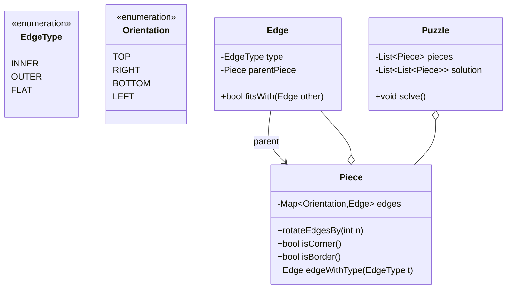

## Code skeleton

```dart
// Dart
enum EdgeType { inner, outer, flat }
enum Orientation { top, right, bottom, left }

class Edge {
  final EdgeType type;
  Piece? parentPiece;
  Edge(this.type);

  // inner আর outer একে অপরের সাথে মেলে; বাস্তবে দেওয়া fitsWith ব্যবহার হবে
  bool fitsWith(Edge other) =>
      (type == EdgeType.inner && other.type == EdgeType.outer) ||
      (type == EdgeType.outer && other.type == EdgeType.inner);
}

class Piece {
  // orientation → edge; rotate করলে এই map ঘোরে
  final Map<Orientation, Edge> edges;
  Piece(this.edges) {
    for (final e in edges.values) e.parentPiece = this;
  }

  // n ধাপ ঘুরিয়ে edge গুলো নতুন orientation-এ বসাও
  void rotateEdgesBy(int n) {
    final order = Orientation.values;
    final rotated = <Orientation, Edge>{};
    for (int i = 0; i < order.length; i++) {
      rotated[order[(i + n) % 4]] = edges[order[i]]!;
    }
    edges
      ..clear()
      ..addAll(rotated);
  }

  bool isCorner() =>
      edges.values.where((e) => e.type == EdgeType.flat).length == 2;
  bool isBorder() =>
      edges.values.where((e) => e.type == EdgeType.flat).length == 1;
}

class Puzzle {
  final List<Piece> pieces;
  late List<List<Piece?>> solution;
  final int n;
  Puzzle(this.pieces, this.n) {
    solution = List.generate(n, (_) => List<Piece?>.filled(n, null));
  }

  // High-level: corner বসাও → border বসাও → ভেতরের piece edge মিলিয়ে বসাও
  void solve() {
    // 1) চারটা corner piece খুঁজে চার কোণে বসাও (rotate করে flat edge বাইরে)
    // 2) প্রতিটা row/col-এর border piece edge-fit করে বসাও
    // 3) ভেতরের প্রতিটা ঘরে: উপরের piece-এর bottom edge আর বাঁ piece-এর right edge
    //    fitsWith এমন piece খুঁজে (দরকারে rotate করে) বসাও
  }
}
```
```python
# Python
from enum import Enum

class EdgeType(Enum):
    INNER = 1; OUTER = 2; FLAT = 3

class Orientation(Enum):
    TOP = 0; RIGHT = 1; BOTTOM = 2; LEFT = 3

class Edge:
    def __init__(self, type: EdgeType):
        self.type = type
        self.parent_piece = None
    def fits_with(self, other: "Edge") -> bool:
        # দেওয়া fitsWith; এখানে সরল rule: inner <-> outer
        return {self.type, other.type} == {EdgeType.INNER, EdgeType.OUTER}

class Piece:
    def __init__(self, edges: dict):     # {Orientation: Edge}
        self.edges = edges
        for e in edges.values():
            e.parent_piece = self

    def rotate_edges_by(self, n: int):
        order = list(Orientation)
        self.edges = {order[(i + n) % 4]: self.edges[order[i]]
                      for i in range(4)}

    def is_corner(self) -> bool:
        return sum(1 for e in self.edges.values() if e.type == EdgeType.FLAT) == 2

    def is_border(self) -> bool:
        return sum(1 for e in self.edges.values() if e.type == EdgeType.FLAT) == 1

class Puzzle:
    def __init__(self, pieces: list, n: int):
        self.pieces = pieces
        self.n = n
        self.solution = [[None] * n for _ in range(n)]

    def solve(self):
        # 1) corner piece চার কোণে (rotate করে flat edge বাইরে)
        # 2) border piece প্রান্তে edge-fit করে
        # 3) ভেতরে: উপরের bottom edge + বাঁয়ের right edge fits_with এমন piece বসাও
        pass
```

## Design decisions ও trade-offs
- **Edge-এ parentPiece reference কেন?** একটা মেলানো edge পেলে সাথে সাথে কোন piece সেটা জানা যায় — solve loop দ্রুত হয়।
- **Orientation-aware edge map:** rotate কে শুধু map ঘোরানো বানিয়ে সহজ করলাম। তাই rotate O(1)।
- **Solve কৌশল (corner → border → inner):** flat edge দিয়ে corner/border আলাদা করে search space ছোট করা — naive "সব permutation try" এড়ানো।
- **Trade-off:** brute-force O(n²!) ভয়াবহ; edge-type filtering আর "প্রতিবেশী দুটো edge দিয়ে constrain" করায় বাস্তবে অনেক দ্রুত।

## Follow-up
- **fitsWith নিজে define করো** → edge-এর shape vector মিলিয়ে।
- **Ambiguous fit (একাধিক মেলে)** → backtracking দরকার।
- **রঙ/ছবি মিলিয়ে** → edge-এ pixel data রেখে similarity score।

<sub>[↑ এই chapter-এর সূচি](#toc) · [মূল Index](README.md)</sub>

---
---

<a id="q7-7"></a>
# 7.7 — Chat Server

> Pattern: **Manager + Observer + State** · Difficulty: **Medium–Hard** · common

> **বইয়ের ভাষায়:** Explain how you would design a chat server. In particular, provide details about the various backend components, classes, and methods. What would be the hardest problems to solve?

## সমস্যাটা সহজ বাংলায়
একটা chat server design করতে হবে। User-রা একে অপরের সাথে কথা বলবে — private (one-to-one) বা group। বন্ধু যোগ করা, online/offline status, message পাঠানো — এসব handle করতে হবে। ক্লাস, method আর কঠিন সমস্যাগুলো বলতে হবে।

## ধাপ ১: Listen (scope clarify)
- **Private + group দুটোই?** → হ্যাঁ।
- **Add-friend flow?** → request পাঠানো, accept/reject।
- **Online status, message history?** → status লাগবে; history আপাতত সরল (memory list)।
- **Scale (কোটি user)?** → core OOD চাইছি; scaling-এর কঠিন সমস্যা শেষে আলোচনা।

## মূল objects
- **User** — id, name, status; friends; received add-requests; `sendMessage()`।
- **UserManager** — সব user; add-request route; status update broadcast।
- **Conversation** (abstract) — participants, message-এর তালিকা; `addMessage()`।
- **PrivateChat / GroupChat** — Conversation subclass।
- **Message** — content, timestamp, sender।
- **AddRequest** — fromUser, toUser, status (pending/accepted/rejected)।
- **UserStatus** — type (online/offline/away) + message।

> মূল design সিদ্ধান্ত: Conversation কে abstract রেখে Private (ঠিক ২ জন) আর Group (≥২) আলাদা করি। UserManager হলো central hub (Observer-এর subject) — কেউ online হলে বন্ধুদের জানায়।

## Class Diagram

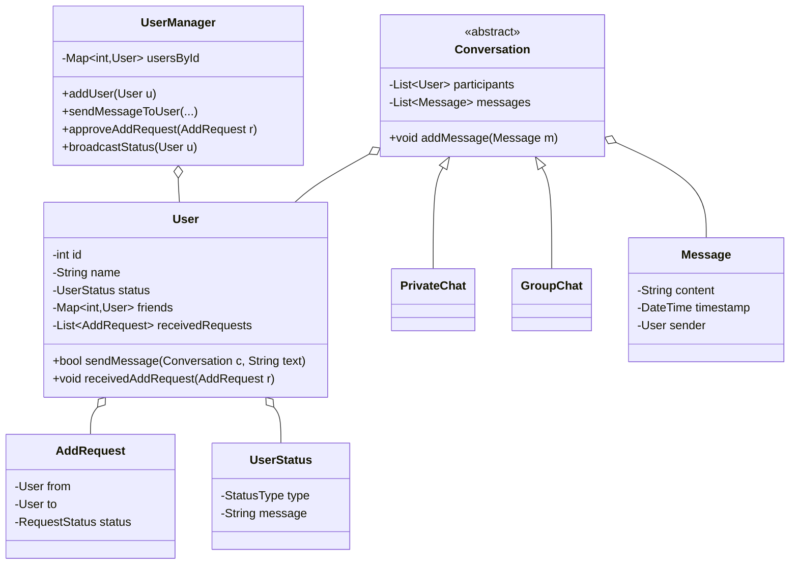

## Code skeleton

```dart
// Dart
enum StatusType { online, offline, away }
enum RequestStatus { pending, accepted, rejected }

class UserStatus {
  StatusType type;
  String message;
  UserStatus(this.type, [this.message = '']);
}

class Message {
  final String content;
  final DateTime timestamp;
  final User sender;
  Message(this.content, this.timestamp, this.sender);
}

class AddRequest {
  final User from, to;
  RequestStatus status = RequestStatus.pending;
  AddRequest(this.from, this.to);
}

abstract class Conversation {
  final List<User> participants = [];
  final List<Message> messages = [];
  void addMessage(Message m) => messages.add(m);
}

class PrivateChat extends Conversation {
  PrivateChat(User a, User b) { participants.addAll([a, b]); }
}

class GroupChat extends Conversation {
  void addParticipant(User u) => participants.add(u);
}

class User {
  final int id;
  final String name;
  UserStatus status = UserStatus(StatusType.offline);
  final Map<int, User> friends = {};
  final List<AddRequest> receivedRequests = [];
  final UserManager manager;
  User(this.id, this.name, this.manager);

  bool sendMessage(Conversation c, String text) {
    if (!c.participants.contains(this)) return false;   // অংশগ্রহণকারী?
    c.addMessage(Message(text, DateTime.now(), this));
    return true;
  }

  void receivedAddRequest(AddRequest r) => receivedRequests.add(r);
}

class UserManager {
  final Map<int, User> usersById = {};
  void addUser(User u) => usersById[u.id] = u;

  // add-request route করা
  void sendAddRequest(User from, User to) =>
      to.receivedAddRequest(AddRequest(from, to));

  void approveAddRequest(AddRequest r) {
    r.status = RequestStatus.accepted;
    r.from.friends[r.to.id] = r.to;     // দুদিকেই বন্ধু
    r.to.friends[r.from.id] = r.from;
  }

  // Observer: কেউ online হলে বন্ধুদের জানাও
  void broadcastStatus(User u) {
    for (final friend in u.friends.values) {
      // friend-এর client-কে notify করো: u এখন online
    }
  }
}
```
```python
# Python
from enum import Enum
from abc import ABC
from datetime import datetime

class StatusType(Enum):
    ONLINE = 1; OFFLINE = 2; AWAY = 3

class RequestStatus(Enum):
    PENDING = 1; ACCEPTED = 2; REJECTED = 3

class UserStatus:
    def __init__(self, type: StatusType, message: str = ""):
        self.type = type
        self.message = message

class Message:
    def __init__(self, content: str, sender: "User"):
        self.content = content
        self.timestamp = datetime.now()
        self.sender = sender

class AddRequest:
    def __init__(self, frm: "User", to: "User"):
        self.frm = frm
        self.to = to
        self.status = RequestStatus.PENDING

class Conversation(ABC):
    def __init__(self):
        self.participants = []
        self.messages = []
    def add_message(self, m: Message):
        self.messages.append(m)

class PrivateChat(Conversation):
    def __init__(self, a, b):
        super().__init__()
        self.participants = [a, b]

class GroupChat(Conversation):
    def add_participant(self, u):
        self.participants.append(u)

class User:
    def __init__(self, id: int, name: str, manager: "UserManager"):
        self.id = id
        self.name = name
        self.manager = manager
        self.status = UserStatus(StatusType.OFFLINE)
        self.friends = {}
        self.received_requests = []

    def send_message(self, c: Conversation, text: str) -> bool:
        if self not in c.participants:
            return False
        c.add_message(Message(text, self))
        return True

    def received_add_request(self, r: AddRequest):
        self.received_requests.append(r)

class UserManager:
    def __init__(self):
        self.users_by_id = {}
    def add_user(self, u: User):
        self.users_by_id[u.id] = u
    def send_add_request(self, frm: User, to: User):
        to.received_add_request(AddRequest(frm, to))
    def approve_add_request(self, r: AddRequest):
        r.status = RequestStatus.ACCEPTED
        r.frm.friends[r.to.id] = r.to
        r.to.friends[r.frm.id] = r.frm
    def broadcast_status(self, u: User):
        for friend in u.friends.values():
            pass    # friend-এর client-কে notify করো
```

## Design decisions ও trade-offs
- **Conversation abstract:** PrivateChat (ঠিক ২ জন, যোগ করা যায় না) আর GroupChat (যোগ করা যায়) আলাদা invariant — polymorphism দিয়ে পরিষ্কার।
- **UserManager = central hub:** add-request, status broadcast এক জায়গায় (loose coupling — user-রা সরাসরি একে অপরকে চেনে না, manager দিয়ে কথা বলে)।
- **AddRequest একটা object কেন (bool নয়)?** pending/accepted/rejected state, কে কাকে — সব track করা যায়।
- **Observer pattern:** status change → বন্ধুদের notify; বড় system-এ এটা message queue/pub-sub হয়।

## কঠিন সমস্যাগুলো (বই যেটা জিজ্ঞেস করে)
- **Concurrency:** একই user-এর friend list / message একসাথে অনেক জায়গা থেকে বদলালে race condition — locking/transaction লাগে।
- **Online status sync:** হঠাৎ network গেলে user "online" দেখাতেই থাকবে — heartbeat/timeout দরকার।
- **Message delivery guarantee:** receiver offline থাকলে message জমিয়ে রাখা, পরে deliver (queue + persistence)।
- **Scale:** কোটি user — একটা server-এ ধরবে না; sharding, pub-sub (Chapter 9 দেখুন)।

## Follow-up
- **Message read-receipt / typing indicator** → Message-এ status, ephemeral event।
- **Persistence** → Conversation/Message database-এ।
- **Block / mute** → User-এ block-list।

<sub>[↑ এই chapter-এর সূচি](#toc) · [মূল Index](README.md)</sub>

---
---

<a id="q7-8"></a>
# 7.8 — Othello

> Pattern: **Board game model + Direction scan** · Difficulty: **Medium** · common

> **বইয়ের ভাষায়:** Othello is played as follows: Each Othello piece is white on one side and black on the other. When a piece is surrounded by its opponents on both left and right sides, or both top and bottom, it is said to be captured and its color is flipped. On your turn, you must capture at least one of your opponent's pieces. The game ends when either user has no more valid moves. The win is assigned to the person with the most pieces. Implement the object-oriented design for Othello.

## সমস্যাটা সহজ বাংলায়
Othello (Reversi) এক বোর্ড গেম। প্রতিটা piece-এর একদিক সাদা, একদিক কালো। আপনি একটা চাল দিলে — যদি আপনার নতুন piece আর আগের কোনো piece-এর মাঝে প্রতিপক্ষের piece থাকে (এক সরলরেখায়), তাহলে মাঝের সব piece **flip** হয়ে আপনার রঙ হয়। প্রতি চালে অন্তত একটা piece দখল করতেই হবে। কারও বৈধ চাল না থাকলে খেলা শেষ; বেশি piece যার, সে জেতে।

## ধাপ ১: Listen (scope clarify)
- **Board size?** → standard ৮×৮।
- **AI দরকার?** → না, শুধু model + valid move + flip logic।
- **কে rules enforce করে?** → Game class (controller)।

## মূল objects
- **Color** (enum) — black, white।
- **Piece** — current color; `flip()`।
- **Board** — ২D grid of Piece; piece বসানো, flip করা, score গোনা।
- **Player** — color, piece সংখ্যা।
- **Game** — Board, দুই Player, current turn; valid move যাচাই, end check।

> মূল design সিদ্ধান্ত: **Piece** নিজে শুধু "আমি কোন রঙ" আর `flip()` জানে। কোন piece flip হবে — সেই rule (৮ দিকে scan) **Board/Game**-এ থাকে, কারণ এটা প্রতিবেশীদের ওপর নির্ভর করে। responsibility ঠিক জায়গায়।

## Class Diagram

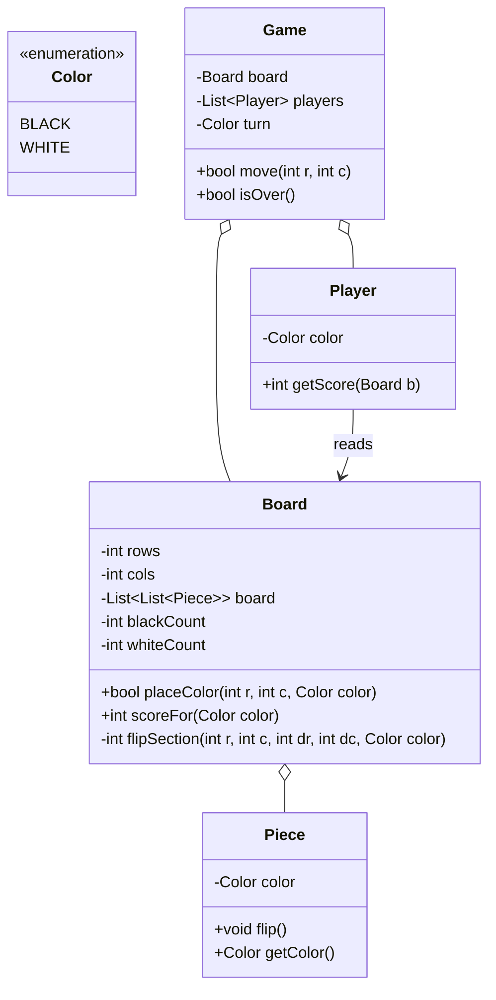

## Code skeleton

```dart
// Dart
enum Color { black, white }
Color opposite(Color c) => c == Color.black ? Color.white : Color.black;

class Piece {
  Color color;
  Piece(this.color);
  void flip() => color = opposite(color);
}

class Board {
  final int rows, cols;
  late List<List<Piece?>> board;
  int blackCount = 0, whiteCount = 0;
  Board(this.rows, this.cols) {
    board = List.generate(rows, (_) => List<Piece?>.filled(cols, null));
  }

  // ৮ দিক
  static const _dirs = [
    [-1, 0], [1, 0], [0, -1], [0, 1],
    [-1, -1], [-1, 1], [1, -1], [1, 1],
  ];

  // (r,c)-তে color বসিয়ে সব দিকে flip চেষ্টা করো; অন্তত ১টা flip হলে true
  bool placeColor(int r, int c, Color color) {
    if (board[r][c] != null) return false;
    int flipped = 0;
    for (final d in _dirs) {
      flipped += _flipSection(r + d[0], c + d[1], d[0], d[1], color);
    }
    if (flipped == 0) return false;        // অবৈধ চাল
    board[r][c] = Piece(color);
    return true;
  }

  // এক দিকে: প্রতিপক্ষের পর নিজের রঙ পেলে মাঝেরগুলো flip; কয়টা flip হলো ফেরত
  int _flipSection(int r, int c, int dr, int dc, Color color) {
    final toFlip = <List<int>>[];
    while (r >= 0 && r < rows && c >= 0 && c < cols && board[r][c] != null) {
      if (board[r][c]!.color == color) {     // নিজের রঙ — bracket বন্ধ
        for (final p in toFlip) board[p[0]][p[1]]!.flip();
        return toFlip.length;
      }
      toFlip.add([r, c]);                     // প্রতিপক্ষের piece জমাও
      r += dr; c += dc;
    }
    return 0;                                 // ধার/ফাঁকা — কিছু flip হলো না
  }
}

class Player {
  final Color color;
  Player(this.color);
}

class Game {
  final Board board;
  final List<Player> players;
  Color turn = Color.black;        // black শুরু করে
  Game(this.board, this.players);

  bool move(int r, int c) {
    if (!board.placeColor(r, c, turn)) return false;
    turn = opposite(turn);
    return true;
  }
}
```
```python
# Python
from enum import Enum

class Color(Enum):
    BLACK = 1; WHITE = 2

def opposite(c: Color) -> Color:
    return Color.WHITE if c == Color.BLACK else Color.BLACK

class Piece:
    def __init__(self, color: Color):
        self.color = color
    def flip(self):
        self.color = opposite(self.color)

class Board:
    DIRS = [(-1,0),(1,0),(0,-1),(0,1),(-1,-1),(-1,1),(1,-1),(1,1)]

    def __init__(self, rows: int, cols: int):
        self.rows = rows
        self.cols = cols
        self.board = [[None] * cols for _ in range(rows)]

    def place_color(self, r: int, c: int, color: Color) -> bool:
        if self.board[r][c] is not None:
            return False
        flipped = sum(self._flip_section(r + dr, c + dc, dr, dc, color)
                      for dr, dc in self.DIRS)
        if flipped == 0:
            return False                  # অবৈধ চাল
        self.board[r][c] = Piece(color)
        return True

    def _flip_section(self, r, c, dr, dc, color) -> int:
        to_flip = []
        while 0 <= r < self.rows and 0 <= c < self.cols and self.board[r][c]:
            if self.board[r][c].color == color:    # bracket বন্ধ
                for (pr, pc) in to_flip:
                    self.board[pr][pc].flip()
                return len(to_flip)
            to_flip.append((r, c))                  # প্রতিপক্ষ জমাও
            r += dr; c += dc
        return 0

class Player:
    def __init__(self, color: Color):
        self.color = color

class Game:
    def __init__(self, board: Board, players: list):
        self.board = board
        self.players = players
        self.turn = Color.BLACK

    def move(self, r: int, c: int) -> bool:
        if not self.board.place_color(r, c, self.turn):
            return False
        self.turn = opposite(self.turn)
        return True
```

## Design decisions ও trade-offs
- **Piece শুধু `flip()` জানে:** flip rule (কে কাকে দখল করে) board-level কারণ এটা প্রতিবেশী-নির্ভর। responsibility সঠিক জায়গায়।
- **৮ দিকের scan একটা helper-এ:** code পুনরাবৃত্তি এড়ায়; প্রতিটা দিকে "প্রতিপক্ষ ... প্রতিপক্ষ ... নিজের রঙ" pattern খুঁজি।
- **"অন্তত একটা flip" = বৈধ চাল:** তাই `placeColor` flip count ০ হলে চাল বাতিল করে — rule enforcement built-in।
- **Trade-off:** Board নাকি Game-এ flip logic? এখানে Board-এ রাখলাম (board state-এর সাথে শক্ত যুক্ত); Game শুধু turn ও flow সামলায়।

## Follow-up
- **Valid move আছে কিনা (turn skip)** → পুরো board scan করে কোনো legal চাল আছে কিনা দেখুন; না থাকলে turn বদলান বা game শেষ।
- **AI player** → minimax + flip-count heuristic।
- **Undo** → প্রতি move-এর আগের state বা flip-list stack-এ রাখুন।

<sub>[↑ এই chapter-এর সূচি](#toc) · [মূল Index](README.md)</sub>

---
---

<a id="q7-9"></a>
# 7.9 — Circular Array

> Pattern: **Index wrap-around (modulo) + Iterator** · Difficulty: **Medium** · common

> **বইয়ের ভাষায়:** Implement a `CircularArray` class that supports an array-like data structure which can be efficiently rotated. If possible, the class should use a generic type, and should support iteration via the standard `for (Obj o : circularArray)` notation.

## সমস্যাটা সহজ বাংলায়
একটা `CircularArray` বানাতে হবে যা সাধারণ array-র মতো, কিন্তু **দ্রুত rotate** করা যায় (যেমন সব element ৩ ঘর ডানে সরানো)। rotate-এ আসলে কোনো element সরানো হবে না — শুধু "শুরু কোথায়" সেই pointer সরবে। generic হবে, আর normal for-each দিয়ে iterate করা যাবে।

## ধাপ ১: Listen (scope clarify)
- **Rotate efficient মানে?** → O(1); সব element সরানো (O(n)) চলবে না।
- **Iteration?** → for-each যেন rotated order-এ ঘোরে।
- **Resize দরকার?** → আপাতত fixed size ধরছি (চাইলে dynamic বাড়ানো follow-up)।

## মূল objects
- **CircularArray\<T\>** — ভেতরের সাধারণ array, একটা **head offset** (শুরু কোথায়); `get`, `set`, `rotate`, iterator।

> মূল design সিদ্ধান্ত (পুরো trick): rotate করার সময় কিছুই copy করি না। শুধু একটা `head` index রাখি। বাইরের index `i` কে ভেতরের আসল index-এ বদলাই: `(head + i) % size`। তাই rotate = `head += shift`, যা **O(1)**।

## Class Diagram

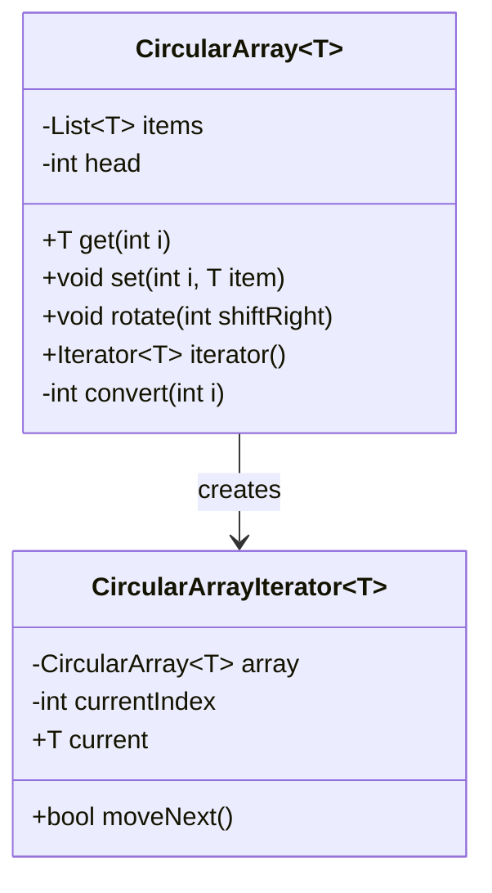

## Code skeleton

```dart
// Dart — Iterable<T> implement করলে for-in কাজ করে
class CircularArray<T> extends Iterable<T> {
  final List<T> _items;
  int _head = 0;
  CircularArray(this._items);

  // বাইরের index → ভেতরের আসল index
  int _convert(int i) => (_head + i) % _items.length;

  T get(int i) => _items[_convert(i)];
  void set(int i, T item) => _items[_convert(i)] = item;

  // O(1) rotate — শুধু head সরে
  void rotate(int shiftRight) {
    _head = (_head + shiftRight) % _items.length;
    if (_head < 0) _head += _items.length;   // negative হলে ঠিক করো
  }

  @override
  int get length => _items.length;

  @override
  Iterator<T> get iterator => _CircularIterator<T>(this);
}

class _CircularIterator<T> implements Iterator<T> {
  final CircularArray<T> _array;
  int _index = -1;
  _CircularIterator(this._array);

  @override
  bool moveNext() {
    _index++;
    return _index < _array.length;
  }

  @override
  T get current => _array.get(_index);    // convert ভেতরেই হয়
}
```
```python
# Python — __getitem__ আর __iter__ দিলে for-in, indexing কাজ করে
class CircularArray:
    def __init__(self, items: list):
        self.items = items
        self.head = 0

    def _convert(self, i: int) -> int:
        return (self.head + i) % len(self.items)

    def __getitem__(self, i: int):
        return self.items[self._convert(i)]

    def __setitem__(self, i: int, item):
        self.items[self._convert(i)] = item

    def rotate(self, shift_right: int):
        self.head = (self.head + shift_right) % len(self.items)   # O(1)

    def __len__(self):
        return len(self.items)

    def __iter__(self):
        for i in range(len(self.items)):
            yield self[i]          # rotated order-এ
```

## Design decisions ও trade-offs
- **head offset = O(1) rotate-এর চাবি:** element সরানোর বদলে "কোথা থেকে শুরু" বদলাই। এই pattern circular queue/ring buffer-এ সর্বত্র লাগে।
- **`convert(i)` একটাই জায়গায়:** get/set/iterator সবাই এটা ব্যবহার করে — index logic এক জায়গায় (bug কম)।
- **Iterator আলাদা class:** language-এর standard for-each protocol মানা হলো (Dart `Iterator`, Python `__iter__`)। তাই ব্যবহারকারীর কাছে এটা সাধারণ array-র মতোই লাগে (abstraction)।
- **Trade-off:** rotate O(1) কিন্তু প্রতিটা access-এ একটা modulo (`%`) লাগে — সামান্য overhead, কিন্তু rotate-heavy use-এ বিশাল লাভ।

## Follow-up
- **Negative rotate (বাঁয়ে)?** → modulo negative হলে `+ size` করে ঠিক করুন (উপরে করা আছে)।
- **Dynamic resize?** → ভরে গেলে double করে নতুন array-তে head থেকে copy।
- **Concurrent access?** → head ও items lock দিয়ে রক্ষা করুন।

<sub>[↑ এই chapter-এর সূচি](#toc) · [মূল Index](README.md)</sub>

---
---

<a id="q7-10"></a>
# 7.10 — Minesweeper

> Pattern: **Grid + Flood fill (BFS/DFS) reveal** · Difficulty: **Medium–Hard** · common

> **বইয়ের ভাষায়:** Design and implement a text-based Minesweeper game. Minesweeper is the classic single-player computer game where an NxN grid has B mines (or bombs) hidden across the grid. The remaining cells are either blank or have a number behind them. The numbers reflect the number of bombs in the surrounding eight cells. The user then uncovers a cell. If it is a bomb, the player loses. If it is a number, the number is exposed. If it is a blank cell, this and all adjacent blank cells (up to and including the surrounding numbered cells) are exposed.

## সমস্যাটা সহজ বাংলায়
Minesweeper গেম। N×N grid-এ B-টা bomb লুকানো। বাকি cell হয় ফাঁকা, নয়তো একটা সংখ্যা (চারপাশের ৮ ঘরে কয়টা bomb)। user একটা cell খুললে: bomb হলে হার; সংখ্যা হলে শুধু সেটা দেখায়; ফাঁকা হলে সেই cell আর তার আশপাশের সব ফাঁকা cell (ও তাদের ঘিরে থাকা সংখ্যা-cell পর্যন্ত) একসাথে খুলে যায়।

## ধাপ ১: Listen (scope clarify)
- **Bomb কীভাবে বসবে?** → randomly B-টা, শুরুতে।
- **Flag (পতাকা) feature?** → হ্যাঁ, cell flag করা যায়।
- **জয় কখন?** → bomb ছাড়া সব cell খুললে।
- **Cascading reveal?** → হ্যাঁ — এটাই মূল algorithm (flood fill)।

## মূল objects
- **Cell** — row, col; bomb কিনা; চারপাশের bomb সংখ্যা; exposed কিনা; flagged কিনা।
- **Board** — Cell-এর grid; bomb বসানো, প্রতিবেশী গোনা, `exploreCell()` (flood fill)।
- **Game** — Board, game state (playing/won/lost); user action route।

> মূল design সিদ্ধান্ত: cascading reveal = একটা ফাঁকা cell খুললে BFS/DFS দিয়ে চারপাশের ফাঁকা cell খুলতে থাকা, সংখ্যা-cell-এ গিয়ে থামা। এই logic **Board**-এ থাকবে।

## Class Diagram

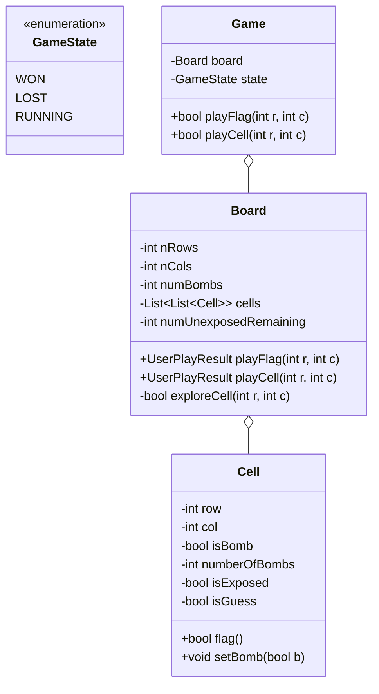

## Code skeleton

```dart
// Dart
import 'dart:collection';

enum GameState { won, lost, running }

class Cell {
  final int row, col;
  bool isBomb = false;
  int numberOfBombs = 0;       // আশপাশের bomb সংখ্যা
  bool isExposed = false;
  bool isGuess = false;        // flagged?
  Cell(this.row, this.col);

  bool get isBlank => numberOfBombs == 0 && !isBomb;
  bool flag() => isGuess = !isGuess;
}

class Board {
  final int nRows, nCols, numBombs;
  late List<List<Cell>> cells;
  int _numUnexposedRemaining;
  Board(this.nRows, this.nCols, this.numBombs)
      : _numUnexposedRemaining = nRows * nCols - numBombs {
    _initCells();
    _setBombs();           // random bomb (game শুরুতে)
    _setNumberedCells();   // প্রতিবেশী bomb গোনা
  }

  void _initCells() {
    cells = List.generate(
        nRows, (r) => List.generate(nCols, (c) => Cell(r, c)));
  }

  void _setBombs() { /* random ভাবে numBombs টা cell.isBomb = true */ }

  void _setNumberedCells() {
    for (final row in cells) {
      for (final cell in row) {
        if (cell.isBomb) continue;
        cell.numberOfBombs = _countAdjacentBombs(cell.row, cell.col);
      }
    }
  }

  int _countAdjacentBombs(int r, int c) {
    int count = 0;
    for (int dr = -1; dr <= 1; dr++) {
      for (int dc = -1; dc <= 1; dc++) {
        if (dr == 0 && dc == 0) continue;
        final nr = r + dr, nc = c + dc;
        if (nr >= 0 && nr < nRows && nc >= 0 && nc < nCols && cells[nr][nc].isBomb) {
          count++;
        }
      }
    }
    return count;
  }

  // user একটা cell খুলল
  GameState playCell(int r, int c) {
    final cell = cells[r][c];
    if (cell.isGuess) return GameState.running;   // flagged — খোলা যাবে না
    cell.isExposed = true;
    if (cell.isBomb) return GameState.lost;       // হার
    if (cell.isBlank) {
      _exploreCell(r, c);                         // cascading reveal
    } else {
      _numUnexposedRemaining--;
    }
    return _numUnexposedRemaining == 0 ? GameState.won : GameState.running;
  }

  // BFS flood fill: ফাঁকা cell থেকে আশপাশ খুলতে থাকো, সংখ্যা-cell-এ থামো
  void _exploreCell(int r, int c) {
    final queue = Queue<Cell>()..add(cells[r][c]);
    while (queue.isNotEmpty) {
      final cell = queue.removeFirst();
      for (int dr = -1; dr <= 1; dr++) {
        for (int dc = -1; dc <= 1; dc++) {
          final nr = cell.row + dr, nc = cell.col + dc;
          if (nr < 0 || nr >= nRows || nc < 0 || nc >= nCols) continue;
          final n = cells[nr][nc];
          if (n.isExposed || n.isBomb) continue;
          n.isExposed = true;
          _numUnexposedRemaining--;
          if (n.isBlank) queue.add(n);            // ফাঁকা হলে আরও ছড়াও
        }
      }
    }
  }
}

class Game {
  final Board board;
  GameState state = GameState.running;
  Game(this.board);

  bool playCell(int r, int c) {
    state = board.playCell(r, c);
    return state != GameState.lost;
  }
}
```
```python
# Python
from enum import Enum
from collections import deque

class GameState(Enum):
    WON = 1; LOST = 2; RUNNING = 3

class Cell:
    def __init__(self, row: int, col: int):
        self.row = row
        self.col = col
        self.is_bomb = False
        self.number_of_bombs = 0
        self.is_exposed = False
        self.is_guess = False
    @property
    def is_blank(self) -> bool:
        return self.number_of_bombs == 0 and not self.is_bomb
    def flag(self):
        self.is_guess = not self.is_guess
        return self.is_guess

class Board:
    def __init__(self, n_rows: int, n_cols: int, num_bombs: int):
        self.n_rows = n_rows
        self.n_cols = n_cols
        self.num_bombs = num_bombs
        self.cells = [[Cell(r, c) for c in range(n_cols)] for r in range(n_rows)]
        self.num_unexposed_remaining = n_rows * n_cols - num_bombs
        self._set_bombs()
        self._set_numbered_cells()

    def _set_bombs(self):
        pass    # random num_bombs টা cell.is_bomb = True

    def _set_numbered_cells(self):
        for row in self.cells:
            for cell in row:
                if not cell.is_bomb:
                    cell.number_of_bombs = self._count_adjacent_bombs(cell.row, cell.col)

    def _count_adjacent_bombs(self, r, c) -> int:
        count = 0
        for dr in (-1, 0, 1):
            for dc in (-1, 0, 1):
                if dr == 0 and dc == 0:
                    continue
                nr, nc = r + dr, c + dc
                if 0 <= nr < self.n_rows and 0 <= nc < self.n_cols and self.cells[nr][nc].is_bomb:
                    count += 1
        return count

    def play_cell(self, r, c) -> GameState:
        cell = self.cells[r][c]
        if cell.is_guess:
            return GameState.RUNNING
        cell.is_exposed = True
        if cell.is_bomb:
            return GameState.LOST
        if cell.is_blank:
            self._explore_cell(r, c)        # cascading reveal
        else:
            self.num_unexposed_remaining -= 1
        return GameState.WON if self.num_unexposed_remaining == 0 else GameState.RUNNING

    def _explore_cell(self, r, c):
        queue = deque([self.cells[r][c]])
        while queue:
            cell = queue.popleft()
            for dr in (-1, 0, 1):
                for dc in (-1, 0, 1):
                    nr, nc = cell.row + dr, cell.col + dc
                    if not (0 <= nr < self.n_rows and 0 <= nc < self.n_cols):
                        continue
                    n = self.cells[nr][nc]
                    if n.is_exposed or n.is_bomb:
                        continue
                    n.is_exposed = True
                    self.num_unexposed_remaining -= 1
                    if n.is_blank:
                        queue.append(n)     # ফাঁকা হলে আরও ছড়াও

class Game:
    def __init__(self, board: Board):
        self.board = board
        self.state = GameState.RUNNING
    def play_cell(self, r, c) -> bool:
        self.state = self.board.play_cell(r, c)
        return self.state != GameState.LOST
```

## Design decisions ও trade-offs
- **Cell আর Board responsibility আলাদা:** Cell = একটা ঘরের data; Board = grid-level logic (bomb বসানো, reveal)। পরিষ্কার।
- **Cascading reveal = BFS flood fill:** ফাঁকা cell থেকে ছড়াই, সংখ্যা-cell (numberOfBombs > 0) খুলে কিন্তু সেখান থেকে আর ছড়াই না — Minesweeper-এর নিয়ম হুবহু।
- **`numUnexposedRemaining` counter:** জয় চেক O(1) — প্রতিবার পুরো board scan লাগে না।
- **Trade-off — recursion vs queue:** flood fill recursion দিয়েও হয়, কিন্তু বড় board-এ stack overflow হতে পারে; তাই explicit queue (BFS) নিরাপদ।

## Follow-up
- **প্রথম click কখনো bomb না (অনেক version-এ):** প্রথম click-এর পর bomb বসান।
- **Flag count / remaining mines দেখানো** → একটা counter।
- **Timer, difficulty levels** → Game-এ config।

<sub>[↑ এই chapter-এর সূচি](#toc) · [মূল Index](README.md)</sub>

---
---

<a id="q7-11"></a>
# 7.11 — File System

> Pattern: **Composite (Directory contains Entries)** · Difficulty: **Medium** · common

> **বইয়ের ভাষায়:** Explain the data structures and algorithms that you would use to design an in-memory file system. Illustrate with an example in code where possible.

## সমস্যাটা সহজ বাংলায়
একটা in-memory file system design করতে হবে। এতে file আর directory (folder) থাকে। directory-র ভেতরে file ও আরও directory থাকতে পারে (যত গভীরে চান)। size বের করা, path বের করা, যোগ/মুছে ফেলা — এসব করতে হবে।

## ধাপ ১: Listen (scope clarify)
- **File-এর content?** → byte/data; এখন size-এই focus।
- **Permission, timestamp?** → metadata হিসেবে রাখা যায়; core-এ size + name।
- **Symbolic link?** → আপাতত বাদ (follow-up)।

## মূল objects
- **Entry** (abstract) — name, parent directory, created time; `size()`, `path()`, `delete()`।
- **File** — Entry; content + size।
- **Directory** — Entry; ভেতরের Entry-র তালিকা (file ও directory দুটোই); size = সব child-এর যোগফল।

> মূল design সিদ্ধান্ত: এটা **Composite pattern**-এর classic উদাহরণ। File = পাতা (leaf), Directory = ডাল (composite)। দুজনেই `Entry`, তাই `size()` recursively কাজ করে — Directory-র size মানে তার সব child-এর size-এর যোগফল।

## Class Diagram

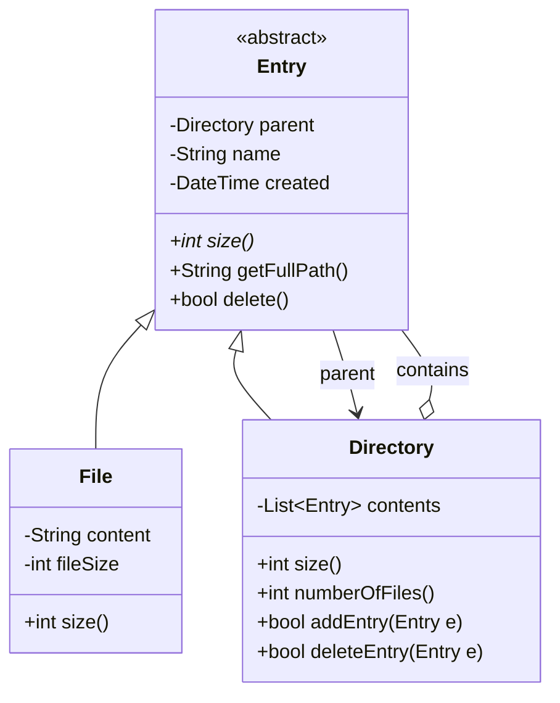

## Code skeleton

```dart
// Dart
abstract class Entry {
  Directory? parent;
  String name;
  final DateTime created;
  Entry(this.name, this.parent) : created = DateTime.now();

  int size();                         // abstract: File vs Directory আলাদা

  String getFullPath() =>
      parent == null ? name : '${parent!.getFullPath()}/$name';

  bool delete() => parent?.deleteEntry(this) ?? false;
}

class File extends Entry {
  String content;
  int fileSize;
  File(String name, Directory? parent, this.content)
      : fileSize = content.length,
        super(name, parent);

  @override
  int size() => fileSize;             // পাতা: নিজের size
}

class Directory extends Entry {
  final List<Entry> contents = [];
  Directory(String name, Directory? parent) : super(name, parent);

  @override
  int size() {                        // composite: সব child-এর যোগফল
    int total = 0;
    for (final e in contents) total += e.size();
    return total;
  }

  int numberOfFiles() {
    int count = 0;
    for (final e in contents) {
      if (e is Directory) count += e.numberOfFiles();   // recurse
      else if (e is File) count++;
    }
    return count;
  }

  bool addEntry(Entry e) {
    e.parent = this;
    contents.add(e);
    return true;
  }

  bool deleteEntry(Entry e) => contents.remove(e);
}
```
```python
# Python
from abc import ABC, abstractmethod
from datetime import datetime

class Entry(ABC):
    def __init__(self, name: str, parent: "Directory" = None):
        self.name = name
        self.parent = parent
        self.created = datetime.now()

    @abstractmethod
    def size(self) -> int:           # File vs Directory আলাদা
        ...

    def get_full_path(self) -> str:
        if self.parent is None:
            return self.name
        return f"{self.parent.get_full_path()}/{self.name}"

    def delete(self) -> bool:
        return self.parent.delete_entry(self) if self.parent else False

class File(Entry):
    def __init__(self, name: str, parent, content: str):
        super().__init__(name, parent)
        self.content = content
        self.file_size = len(content)

    def size(self) -> int:
        return self.file_size        # পাতা

class Directory(Entry):
    def __init__(self, name: str, parent=None):
        super().__init__(name, parent)
        self.contents = []

    def size(self) -> int:           # composite: সব child-এর যোগফল
        return sum(e.size() for e in self.contents)

    def number_of_files(self) -> int:
        count = 0
        for e in self.contents:
            if isinstance(e, Directory):
                count += e.number_of_files()    # recurse
            elif isinstance(e, File):
                count += 1
        return count

    def add_entry(self, e: Entry) -> bool:
        e.parent = self
        self.contents.append(e)
        return True

    def delete_entry(self, e: Entry) -> bool:
        if e in self.contents:
            self.contents.remove(e)
            return True
        return False
```

## Design decisions ও trade-offs
- **Composite pattern:** File ও Directory দুজনেই `Entry`, একই `size()` interface। তাই client কোনো Entry-র size চাইতে পারে — file নাকি directory, জানার দরকার নেই (polymorphism)।
- **`size()` recursive:** Directory-র size = child-দের size-এর যোগফল; gracefully যত গভীরেই হোক কাজ করে।
- **parent reference কেন?** `getFullPath()` আর `delete()` সহজ হয় — উপরে যাওয়া যায়।
- **Trade-off:** প্রতিবার `size()` recursive গুনলে বড় tree-তে ধীর। চাইলে প্রতি directory-তে cached size রাখা যায়, কিন্তু তখন add/delete-এ parent chain-এর cache update করতে হবে (consistency বনাম speed)।

## Follow-up
- **Lookup by path (`/a/b/c.txt`)** → path টুকরো করে directory ধরে ধরে নামুন।
- **Cached size** → দ্রুত, কিন্তু update জটিল।
- **Symbolic link / hard link** → আলাদা Entry subtype, cycle সাবধানে handle।

<sub>[↑ এই chapter-এর সূচি](#toc) · [মূল Index](README.md)</sub>

---
---

<a id="q7-12"></a>
# 7.12 — Hash Table

> Pattern: **Array of buckets + Linked list chaining** · Difficulty: **Medium–Hard** · common

> **বইয়ের ভাষায়:** Design and implement a hash table which uses chaining (linked lists) to handle collisions.

## সমস্যাটা সহজ বাংলায়
নিজের একটা hash table বানাতে হবে যা **chaining** দিয়ে collision সামলায়। অর্থাৎ: একটা array of bucket; প্রতিটা bucket-এ একটা linked list; দুটো key একই bucket-এ পড়লে (collision) তারা সেই list-এ পাশাপাশি থাকে। `put`, `get`, `remove` সব গড়ে O(1)।

## ধাপ ১: Listen (scope clarify)
- **Collision handling?** → chaining (বই যা চায়)। (বিকল্প: open addressing — follow-up.)
- **Resize / rehash দরকার?** → load factor বাড়লে; core-এ দেখাব কীভাবে।
- **Generic key/value?** → হ্যাঁ, `<K, V>`।

## মূল objects
- **HashNode\<K, V\>** — একটা (key, value) জোড়া + পরের node-এর pointer (linked list)।
- **MyHashTable\<K, V\>** — bucket-এর array; hash function; `put` / `get` / `remove`।

> মূল design সিদ্ধান্ত (মূল ধারণা): key কে hash করে একটা bucket index বের করি (`hash(key) % capacity`)। সেই bucket-এর linked list-এ key খুঁজি — থাকলে value আপডেট, না থাকলে নতুন node যোগ। দুটো ভিন্ন key একই index-এ পড়লে (collision) তারা একই list-এ থাকে।

## Class Diagram

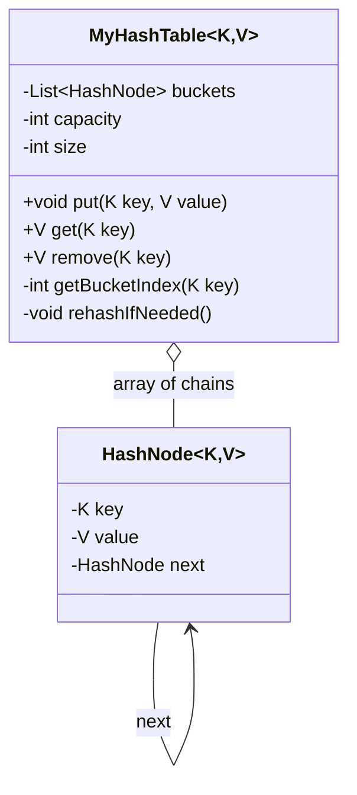

## Code skeleton

```dart
// Dart
class HashNode<K, V> {
  final K key;
  V value;
  HashNode<K, V>? next;
  HashNode(this.key, this.value);
}

class MyHashTable<K, V> {
  List<HashNode<K, V>?> _buckets;
  int _capacity;
  int _size = 0;
  MyHashTable([this._capacity = 16]) : _buckets = List.filled(16, null) {
    _buckets = List.filled(_capacity, null);
  }

  // key → bucket index
  int _getBucketIndex(K key) => key.hashCode.abs() % _capacity;

  void put(K key, V value) {
    final i = _getBucketIndex(key);
    var node = _buckets[i];
    while (node != null) {
      if (node.key == key) { node.value = value; return; }  // আগে থেকে আছে
      node = node.next;
    }
    final newNode = HashNode<K, V>(key, value)..next = _buckets[i];
    _buckets[i] = newNode;        // list-এর সামনে যোগ (O(1))
    _size++;
    _rehashIfNeeded();
  }

  V? get(K key) {
    var node = _buckets[_getBucketIndex(key)];
    while (node != null) {
      if (node.key == key) return node.value;
      node = node.next;
    }
    return null;                  // নেই
  }

  V? remove(K key) {
    final i = _getBucketIndex(key);
    HashNode<K, V>? prev;
    var node = _buckets[i];
    while (node != null) {
      if (node.key == key) {
        if (prev == null) _buckets[i] = node.next;  // head মুছছি
        else prev.next = node.next;
        _size--;
        return node.value;
      }
      prev = node;
      node = node.next;
    }
    return null;
  }

  // load factor > 0.75 হলে double করে rehash
  void _rehashIfNeeded() {
    if (_size / _capacity <= 0.75) return;
    final old = _buckets;
    _capacity *= 2;
    _buckets = List.filled(_capacity, null);
    _size = 0;
    for (var node in old) {
      while (node != null) { put(node.key, node.value); node = node.next; }
    }
  }
}
```
```python
# Python
class HashNode:
    def __init__(self, key, value):
        self.key = key
        self.value = value
        self.next = None

class MyHashTable:
    def __init__(self, capacity: int = 16):
        self.capacity = capacity
        self.size = 0
        self.buckets = [None] * capacity

    def _get_bucket_index(self, key) -> int:
        return hash(key) % self.capacity

    def put(self, key, value):
        i = self._get_bucket_index(key)
        node = self.buckets[i]
        while node:
            if node.key == key:        # আগে থেকে আছে — update
                node.value = value
                return
            node = node.next
        new_node = HashNode(key, value)
        new_node.next = self.buckets[i]
        self.buckets[i] = new_node      # সামনে যোগ (O(1))
        self.size += 1
        self._rehash_if_needed()

    def get(self, key):
        node = self.buckets[self._get_bucket_index(key)]
        while node:
            if node.key == key:
                return node.value
            node = node.next
        return None

    def remove(self, key):
        i = self._get_bucket_index(key)
        prev, node = None, self.buckets[i]
        while node:
            if node.key == key:
                if prev is None:
                    self.buckets[i] = node.next   # head মুছছি
                else:
                    prev.next = node.next
                self.size -= 1
                return node.value
            prev, node = node, node.next
        return None

    def _rehash_if_needed(self):
        if self.size / self.capacity <= 0.75:
            return
        old = self.buckets
        self.capacity *= 2
        self.buckets = [None] * self.capacity
        self.size = 0
        for node in old:
            while node:
                self.put(node.key, node.value)
                node = node.next
```

## Design decisions ও trade-offs
- **Chaining (linked list):** collision হলে একই bucket-এ node যোগ। সহজ, delete সহজ, load factor > 1 হলেও কাজ করে।
- **নতুন node list-এর সামনে যোগ:** O(1) insert (শেষে গেলে list traverse লাগত)।
- **Rehash (load factor > 0.75):** chain বড় হলে lookup O(n)-এর দিকে যায়; capacity double করে rehash করলে chain ছোট থাকে, গড়ে O(1) থাকে।
- **Trade-off:** chaining-এ extra pointer memory লাগে। **Open addressing** (collision হলে পরের খালি slot) memory বাঁচায় কিন্তু delete জটিল ও clustering সমস্যা — তাই বই chaining চায়।

## Complexity
গড়ে **put / get / remove = O(1)** (ভালো hash + কম load factor)। সবচেয়ে খারাপ ক্ষেত্রে (সব key এক bucket-এ) **O(n)**। Space: **O(n + capacity)**।

## Follow-up
- **Open addressing দিয়ে করো** → linear/quadratic probing; delete-এ "tombstone" লাগে।
- **খারাপ hash হলে?** → একটা bucket-এ সব জমে; Java 8-এর মতো chain বড় হলে **balanced tree**-তে বদলানো যায় (O(log n))।
- **Thread-safe?** → bucket-ভিত্তিক lock (segmented locking)।

<sub>[↑ এই chapter-এর সূচি](#toc) · [মূল Index](README.md)</sub>

---
---

# Chapter 7 — সারসংক্ষেপ ও Pattern Cheat Sheet

| # | প্রশ্ন | মূল technique / pattern | মূল objects |
|---|---|---|---|
| 7.1 | Deck of Cards | Generic class + Enum + abstract value | Card, Deck\<T\>, Hand |
| 7.2 | Call Center | Inheritance + escalation chain | Employee, Call, CallHandler |
| 7.3 | Jukebox | Composition + Queue playlist | Jukebox, CDPlayer, Playlist |
| 7.4 | Parking Lot | Inheritance + enum size match | Vehicle, ParkingSpot, Level |
| 7.5 | Online Book Reader | Manager classes + facade | Library, UserManager, Display |
| 7.6 | Jigsaw | Grid + edge matching | Piece, Edge, Puzzle |
| 7.7 | Chat Server | Manager + Observer + State | User, Conversation, Message |
| 7.8 | Othello | Board model + direction scan | Piece, Board, Game |
| 7.9 | Circular Array | head offset (modulo) + Iterator | CircularArray\<T\> |
| 7.10 | Minesweeper | Grid + flood fill reveal | Cell, Board, Game |
| 7.11 | File System | Composite (File/Directory) | Entry, File, Directory |
| 7.12 | Hash Table | Array of buckets + chaining | HashNode, MyHashTable |

### "এটা দেখলে → এটা ভাবো" (signal → design)
```
নানা রকম "একই জিনিসের ধরন" (গাড়ি, employee)  →  Inheritance (abstract base + subclass)
বড় জিনিস ছোট জিনিস দিয়ে তৈরি                  →  Composition (has-a)
fixed ছোট সেট (suit, size, status)            →  Enum
পাতা ও ডাল একই interface (file/folder)        →  Composite pattern
object বানানো এক জায়গায়                       →  Factory
পুরো app-এ একটাই (Library, UserManager)        →  Singleton / manager
কেউ বদলালে অন্যদের জানানো (status, message)    →  Observer
state অনুযায়ী আচরণ বদলায় (online/offline)      →  State pattern
grid-এ ছড়িয়ে খোলা (minesweeper)               →  Flood fill (BFS/DFS)
দ্রুত rotate / circular                       →  head offset + modulo
collision সামলানো                             →  Chaining (bucket + linked list)
```

### এই chapter-এর ৫টা সোনার নিয়ম
1. **আগে Listen করুন** — scope ছোট করুন, assumption বলুন, তারপর class আঁকুন।
2. **Noun = class, Verb = method** — সমস্যা এক প্যারায় লিখে এগুলো বের করুন।
3. **is-a হলে inheritance, has-a হলে composition** — সন্দেহ হলে composition বেছে নিন (loose coupling)।
4. **Responsibility সঠিক জায়গায় রাখুন** — Card flip জানে, কিন্তু "কে flip হবে" board জানে।
5. **Enum দিয়ে fixed set, abstract দিয়ে polymorphism** — type-safe ও extensible design-এর চাবি।

> **পরের ধাপ:** [Chapter 8 — Recursion & Dynamic Programming](chapter08_recursion_dp.md) (8.1–8.14), যেখানে সমস্যাকে ছোট sub-problem-এ ভেঙে সমাধান করা শিখব।

<sub>[↑ এই chapter-এর সূচি](#toc) · [মূল Index](README.md)</sub>
