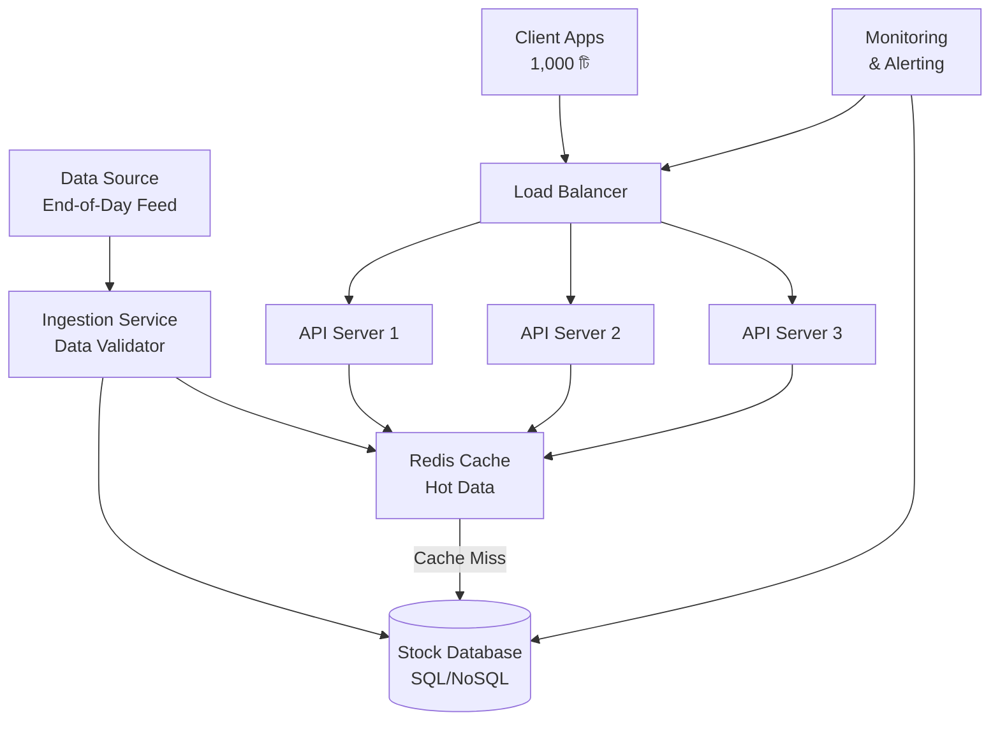
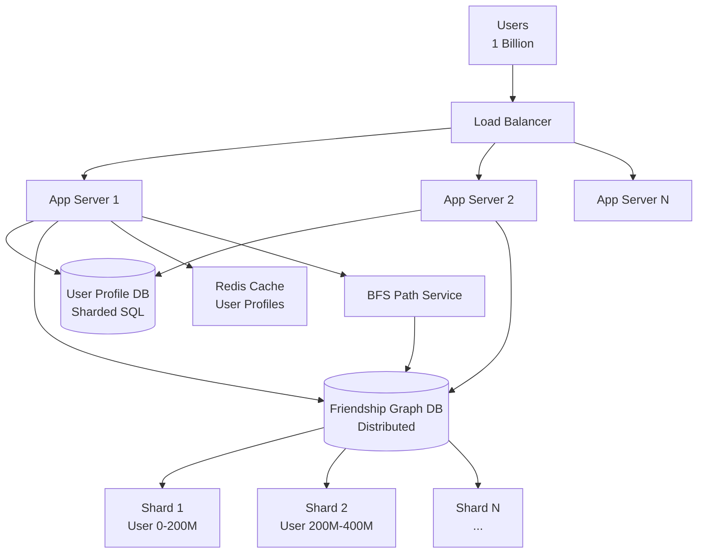
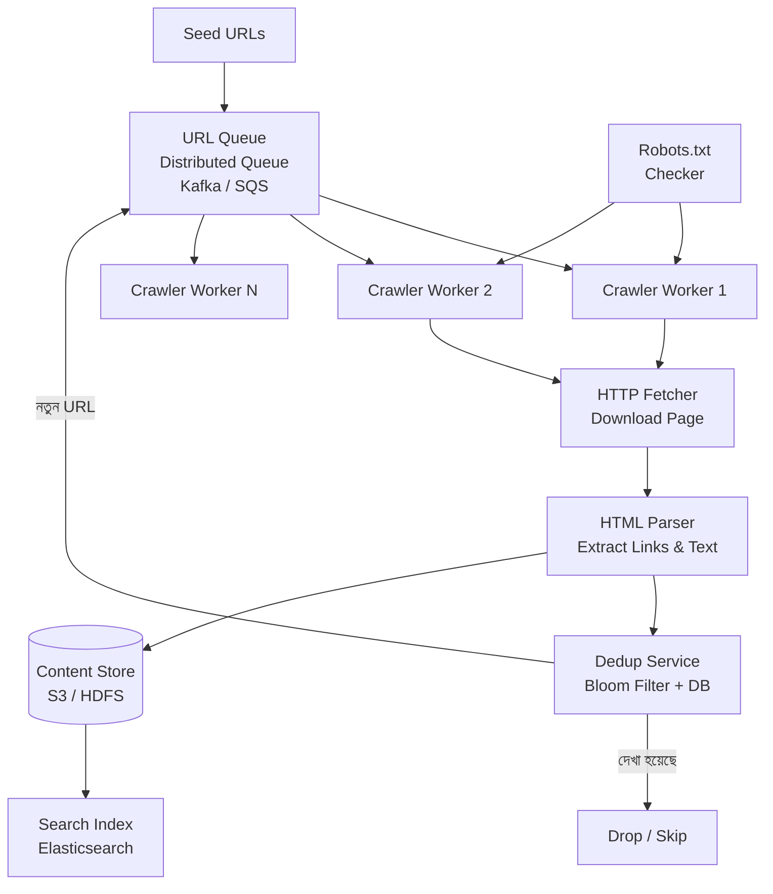
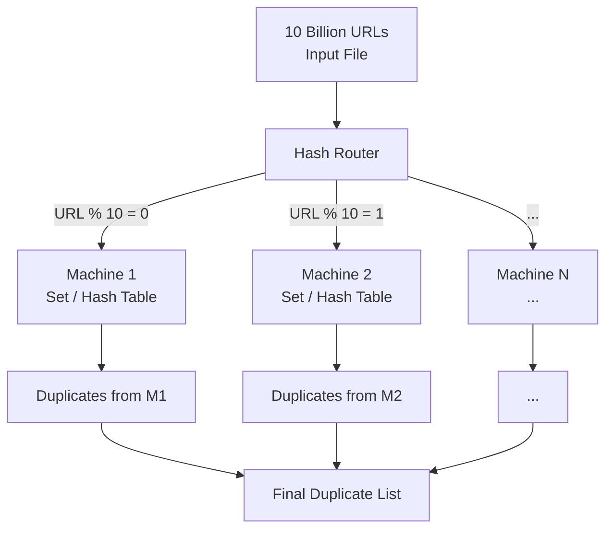
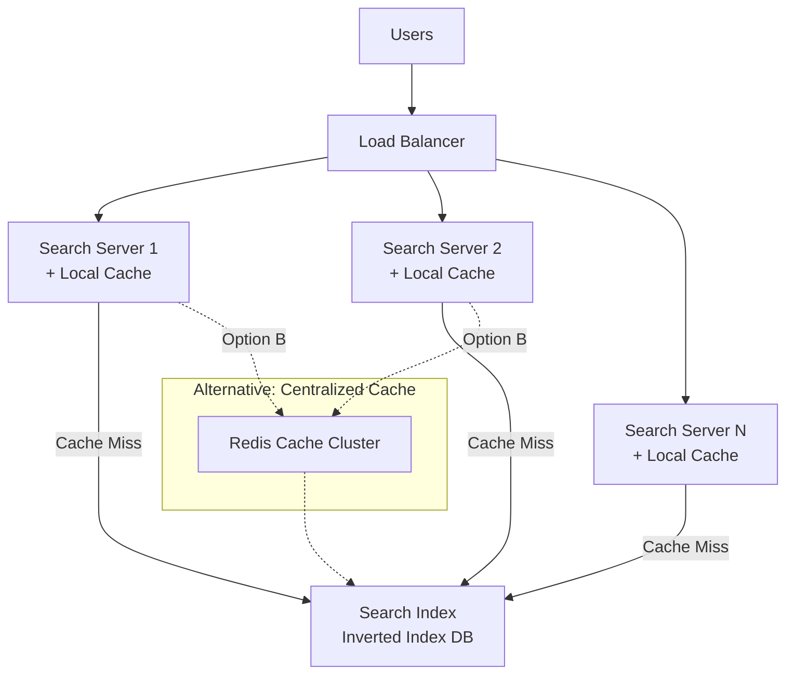
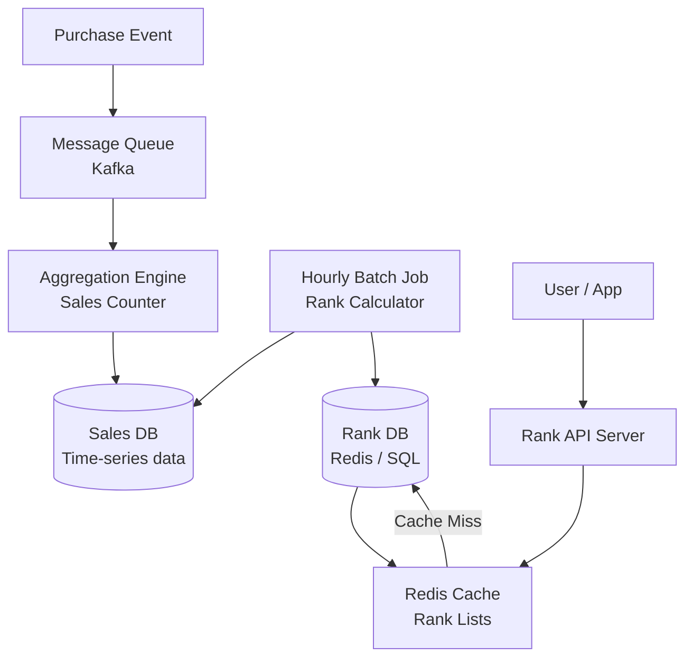
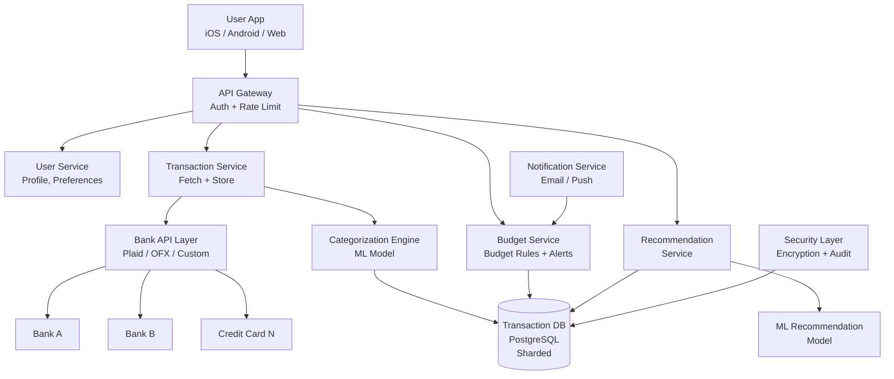
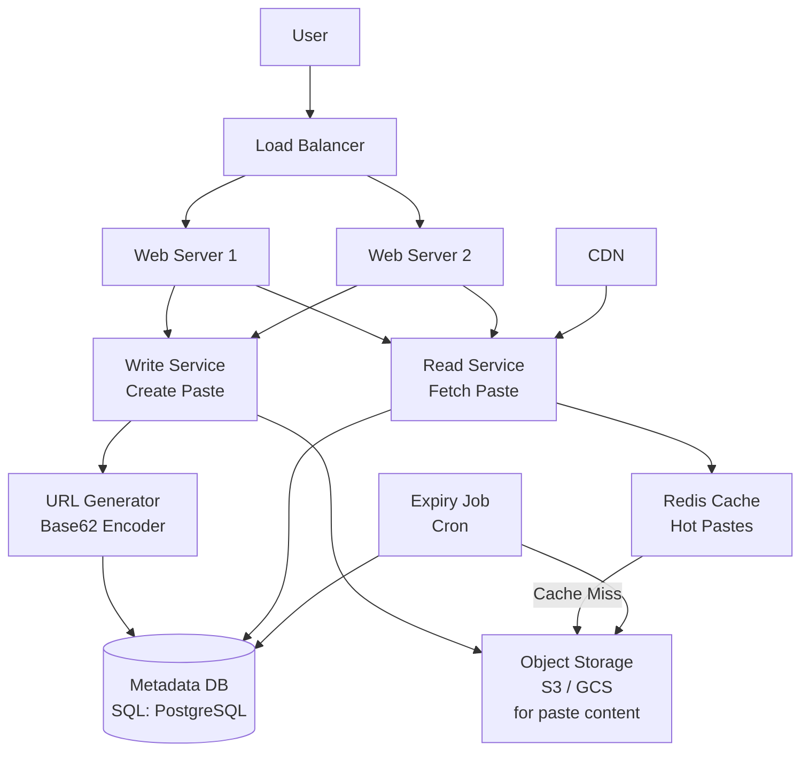

# Chapter 9 — System Design & Scalability (প্রশ্ন 9.1 – 9.8)

> **Cracking the Coding Interview — বাংলা গাইড**
> ব্যাখ্যা **বাংলায়**, technical term **ইংরেজিতে**। এই chapter open-ended design — কোনো একটা "correct" উত্তর নেই; interviewer দেখে আপনি কীভাবে ভাবেন।

> [মূল Index](README.md) · [Foundation](chapter00_foundation.md) · [আগের: Recursion & DP](chapter08_recursion_dp.md) · [পরের: Sorting & Searching](chapter10_sorting_searching.md)

---

<a id="toc"></a>
## এই Chapter-এর সূচি

- [9.1 — Stock Data](#q9-1)
- [9.2 — Social Network](#q9-2)
- [9.3 — Web Crawler](#q9-3)
- [9.4 — Duplicate URLs](#q9-4)
- [9.5 — Cache](#q9-5)
- [9.6 — Sales Rank](#q9-6)
- [9.7 — Personal Financial Manager](#q9-7)
- [9.8 — Pastebin](#q9-8)

প্রতিটা প্রশ্ন এই কাঠামোয়: **সমস্যাটা সহজ বাংলায় → Scope ও assumptions → High-level design (mermaid) → মূল components গভীরে → Bottleneck ও scaling → Trade-offs → Follow-up।**

---
---

## Background — System Design Interview-এ কীভাবে এগোবেন

System Design Interview-এ কোনো একটা "সঠিক" উত্তর নেই। Interviewer দেখতে চায় আপনি একটা বড় সমস্যাকে ভাগ করে ছোট করতে পারেন কিনা, trade-off বুঝতে পারেন কিনা, এবং আপনার design-এর দুর্বলতা নিজেই ধরতে পারেন কিনা।

### ৫ ধাপের পদ্ধতি

```
ধাপ ১: Scope করুন  — সব feature design করা সম্ভব না, আগে জিজ্ঞেস করুন কোনটা
ধাপ ২: Assumptions  — কত user? কত data? read-heavy না write-heavy? ধরে নিন, বলুন
ধাপ ৩: Major components — diagram আঁকুন (client, server, DB, cache, queue...)
ধাপ ৪: Key issues     — কোথায় bottleneck হবে? কোথায় single point of failure?
ধাপ ৫: Redesign       — scale করতে গেলে কী বদলাতে হবে?
```

### Building Blocks — গুরুত্বপূর্ণ ধারণাগুলো এখানে একবার শিখুন

প্রতিটা system design প্রশ্নে এই building block গুলো বারবার আসে। প্রথমবার দেখলে এখানে পড়ুন, পরে প্রশ্নের ভেতরে শুধু নাম ধরে বলব।

---

**Horizontal vs Vertical Scaling**

Vertical scaling মানে একটা machine-কেই বড় করা (বেশি RAM, বেশি CPU)। Horizontal scaling মানে বেশি machine যোগ করা। Vertical-এর একটা সীমা আছে এবং দামি; horizontal দিয়ে theoretically অসীম scale করা যায়, কিন্তু complexity বাড়ে।

```
Vertical:                     Horizontal:
                              
  [Server]                    [Server A]
  RAM: 16GB                   RAM: 8GB
     |                        [Server B]
  [Server]                    RAM: 8GB
  RAM: 256GB (upgrade)        [Server C]
                              RAM: 8GB
  সীমা: machine-এর max।        সীমা: তত্ত্বগতভাবে নেই।
```

---

**Load Balancer**

Load Balancer হলো একটা মধ্যস্থ server যে client-এর request গুলো অনেক backend server-এ ভাগ করে দেয়। এতে কোনো একটা server-এ সব ভার পড়ে না। আর কোনো server মরে গেলে traffic বাকিদের দিকে পাঠানো যায় (fault tolerance)।

```
Client → [Load Balancer] → [Server A]
                        → [Server B]
                        → [Server C]
```

---

**Caching**

Cache হলো দ্রুত-পড়ার জায়গা (সাধারণত RAM-এ) যেখানে ঘন ঘন দরকারি data রাখা হয়। Database-এ প্রতিবার যাওয়ার বদলে cache থেকে পড়লে অনেক দ্রুত। কিন্তু cache আর database sync রাখা কঠিন (stale data-র সমস্যা)। সাধারণ tool: Redis, Memcached।

```
Request → Cache-এ আছে? → হ্যাঁ (cache hit) → সরাসরি ফেরত দাও  (দ্রুত)
                       → না  (cache miss) → Database থেকে পড়ো → Cache-এ রাখো
```

---

**CDN (Content Delivery Network)**

CDN হলো বিশ্বজুড়ে ছড়িয়ে থাকা অনেক server-এর জাল, যারা static content (ছবি, video, CSS, JS) কাছের server থেকে দেয়। বাংলাদেশের user যদি US-এর server থেকে ছবি টানে — ধীর। CDN থাকলে কাছের Singapore বা India server থেকে পাবে — দ্রুত।

---

**Sharding / Partitioning**

একটা database-এ যখন এত data হয়ে যায় যে একটা machine ধারণ করতে পারে না বা query ধীর হয়ে পড়ে — তখন data ভাগ করে আলাদা আলাদা machine-এ রাখা হয়। প্রতিটা ভাগকে বলে shard বা partition।

```
User ID 1–10M   → [Shard A] (DB Server 1)
User ID 10M–20M → [Shard B] (DB Server 2)
User ID 20M+    → [Shard C] (DB Server 3)
```

Sharding-এর চ্যালেঞ্জ: cross-shard query কঠিন, re-sharding দরকার হলে ঝামেলা।

---

**Replication**

Database-এর একই data একাধিক server-এ রাখা। কারণ দুটো: (১) কোনো server মরে গেলেও data থাকে (fault tolerance), (২) read request আলাদা server থেকে serve করা যায় (read scaling)।

```
Write → [Primary DB] → copy → [Replica 1]
                            → [Replica 2]
Read  ← [Replica 1] বা [Replica 2]  (primary-তে load কমে)
```

---

**NoSQL vs SQL**

SQL (relational database): data সারি-কলামে সাজানো, strict schema, complex query (JOIN) ভালো করে, ACID guarantee। উদাহরণ: PostgreSQL, MySQL।

NoSQL: schema flexible, horizontal scale সহজ, কিন্তু complex query দুর্বল। উদাহরণ: MongoDB (document), Cassandra (wide-column), Redis (key-value), Neo4j (graph)।

```
SQL                          NoSQL (document)
---------                    ----------------
users table:                 { "id": 1,
| id | name | email |          "name": "Ali",
|----|------|-------|          "email": "a@b.com",
| 1  | Ali  | a@b.c |          "address": { "city": "Dhaka" }
                             }

JOIN ভালো করে                 scale সহজ, schema flexible
```

---

**Message Queue**

Message Queue হলো একটা মধ্যস্থ buffer যেখানে কাজের request রেখে যাওয়া হয়, আর আলাদা worker সেখান থেকে নিয়ে কাজ করে। এতে producer (কাজ দেয়) আর consumer (কাজ করে) আলাদা হয়ে যায় এবং system burst traffic সামলাতে পারে। উদাহরণ: RabbitMQ, Apache Kafka, AWS SQS।

```
[User Request] → [Queue] → [Worker 1]
                         → [Worker 2]
                         → [Worker 3]
```

---
---

<a id="q9-1"></a>
# 9.1 — Stock Data

> Type: System Design · Difficulty: Medium

> **বইয়ের ভাষায়:** Imagine you are building some sort of service that will be called by up to 1,000 client applications to get simple end-of-day stock price information (open, close, high, low). You may assume that you already have the data, and you can store it in any format you wish. How would you design the client-facing service that provides the information to client applications? You are responsible for the development, rollout, and ongoing monitoring/maintenance of the feed. Describe the different methods you considered and why you would recommend your approach. Your service can use any technologies you wish, and can distribute the stock information in any mechanism you want.

## সমস্যাটা সহজ বাংলায়

১,০০০ client application আছে যারা প্রতিদিন শেষে (end-of-day) stock-এর চারটা তথ্য চায়: open price, close price, high price, low price। Data ইতিমধ্যেই আছে — শুধু client-দের কাছে কীভাবে পৌঁছে দেবেন সেটা design করতে হবে।

## Scope ও Assumptions

Interview-এ প্রথমে এই প্রশ্নগুলো করুন:

- কতটি stock symbol? (ধরছি ~১০,০০০ symbol)
- Data কখন update হয়? (শুধু end-of-day, real-time নয়)
- Client কি pull করবে না push নেবে? (মানে client চাইলে নেবে, নাকি আমরা পাঠাব?)
- Client-এর format কী লাগবে? (JSON, CSV, XML?)
- Availability কতটা দরকার? (99.9%? বা 99.99%?)

ধরছি: ~১০,০০০ symbol, দিনে একবার data আসে, client pull করে, JSON format ভালো।

## High-level Design



## মূল Components গভীরে

**Data Ingestion Service**

প্রতিদিন market বন্ধ হওয়ার পর (সন্ধ্যায়) data source থেকে নতুন stock data আসে। Ingestion service এই data নেয়, validate করে (আজকের date ঠিক আছে? price negative তো নয়?), এবং database ও cache-এ লেখে।

**Database পছন্দ**

এখানে data structure সরল: প্রতিটা record হলো (symbol, date, open, close, high, low)। Query pattern-ও সরল: "এই symbol-এর আজকের data দাও।" তাই SQL (যেমন PostgreSQL) যথেষ্ট।

```
Schema:
stocks(symbol TEXT, date DATE, open DECIMAL, close DECIMAL,
       high DECIMAL, low DECIMAL, PRIMARY KEY (symbol, date))
```

**Cache**

১,০০০ client সারাদিন ধরে same data বারবার চাইবে। Data দিনে একবারই বদলায়। তাই Redis cache একদম মানানসই। Market বন্ধ হওয়ার পর নতুন data লেখার সময় cache invalidate করা হয়, নতুন data রাখা হয়। বাকি সময় সব request cache থেকে serve হয় — database-এ চাপ কম।

**API Design**

```
GET /stocks/{symbol}?date=2024-01-15
Response:
{
  "symbol": "AAPL",
  "date":   "2024-01-15",
  "open":   185.00,
  "close":  186.50,
  "high":   187.20,
  "low":    184.30
}
```

**Distribution বিকল্পগুলো**

তিনটা approach সম্ভব:

| Approach | কীভাবে কাজ করে | সুবিধা | অসুবিধা |
|---|---|---|---|
| REST API (pull) | Client চাইলে HTTP-তে ডাকে | সহজ, standard | ১,০০০ client বারবার ডাকলে load বাড়ে |
| FTP/file push | একটা file বানিয়ে server-এ রাখো, client নামিয়ে নেয় | সরল, offline-ও কাজ করে | real-time কাজ করে না, parsing লাগে |
| WebSocket / push | আমরা নিজে client-কে পাঠাই | সাথে সাথে পায় | 1K connection maintain করা complex |

**সুপারিশ: REST API + Redis Cache।** সহজ, standard, সব platform থেকে ডাকা যায়, আর cache দিয়ে load কম রাখা যায়।

## Bottleneck ও Scaling

- **আপাতত bottleneck নেই:** দিনে একবার data update, ১,০০০ client — এটা ছোট load।
- **Client বাড়লে:** Load balancer-এ আরও API server যোগ করুন (horizontal scaling)।
- **Data বাড়লে:** symbol সংখ্যা বাড়লে DB partitioning (symbol-এর প্রথম অক্ষর দিয়ে) বা read replica যোগ করুন।
- **Real-time দরকার হলে:** WebSocket বা Server-Sent Events-এ migrate করুন।

## Trade-offs

- REST API সহজ কিন্তু client polling করতে থাকলে unnecessary request হয়।
- Cache রাখলে দ্রুত কিন্তু cache miss-এ DB-তে যেতে হয়; cache invalidation সতর্কে করতে হবে।
- SQL schema rigid কিন্তু query সহজ ও predictable।

## Follow-up

- **Real-time price চাইলে?** → WebSocket + streaming data pipeline (Kafka)।
- **Historical data চাইলে?** → date range query support যোগ করুন; পুরনো data archival storage-এ (S3)।
- **Rate limiting?** → প্রতিটা client-কে একটা API key দিন, প্রতি মিনিটে X request-এর বেশি allow করবেন না।

<sub>[↑ এই chapter-এর সূচি](#toc) · [মূল Index](README.md)</sub>

---

<a id="q9-2"></a>
# 9.2 — Social Network

> Type: System Design · Difficulty: Hard

> **বইয়ের ভাষায়:** How would you design the data structures for a very large social network like Facebook or LinkedIn? Describe how you would design an algorithm to show the shortest path between two people (e.g., Me → Bob → Susan → Jason).

## সমস্যাটা সহজ বাংলায়

Facebook বা LinkedIn-এর মতো বড় social network design করতে হবে। মূল চ্যালেঞ্জ দুটো: (১) কোটি কোটি user এবং তাদের friendship/connection data কীভাবে রাখবেন? (২) দুইজন মানুষের মধ্যে সবচেয়ে কম সংখ্যক connection দিয়ে পৌঁছানোর পথ (shortest path) কীভাবে বের করবেন?

## Scope ও Assumptions

- User সংখ্যা: ~১ বিলিয়ন (100 crore)
- প্রতি user-এর গড় connection: ~500
- Shortest path query: "আমার থেকে X-এর কাছে কতটা ধাপে যাওয়া যায়?"
- Directed বা undirected friendship? (LinkedIn-এ mutual, Twitter-এ one-way; ধরছি mutual/undirected)
- Real-time লাগবে না, approximate fast answer চাই।

## High-level Design



## মূল Components গভীরে

**User Profile DB**

User-এর নাম, email, ছবি, location — এই structured data SQL-এ রাখা যায়। কিন্তু ১ বিলিয়ন user একটা DB-তে রাখা সম্ভব নয়, তাই sharding দরকার। সহজ strategy: user ID দিয়ে শার্ড করুন (user_id % N তে shard number বের করুন)।

**Friendship Graph**

প্রতিটা user-এর connection list রাখতে হবে। দুটো option:

```
Option A: Adjacency List (প্রতিটা user-এর জন্য friends-এর list)
User 1: [3, 7, 42, 500]
User 3: [1, 9, 22]

Option B: Edge Table (প্রতিটা friendship একটা row)
user_a | user_b
1      | 3
1      | 7
3      | 9
```

Edge table SQL-এ রাখা সহজ কিন্তু ১ বিলিয়ন user × ৫০০ connection = ৫০০ বিলিয়ন edge — এটা একটা DB-তে অসম্ভব। তাই **distributed graph DB** (যেমন Neo4j বা Apache Giraph) বা sharded NoSQL ব্যবহার করুন।

**Shortest Path — BFS দিয়ে**

দুইজনের মধ্যে shortest path মানে graph-এ shortest path, যা সাধারণত BFS (Breadth-First Search) দিয়ে বের করা হয়। কিন্তু ১ বিলিয়ন user-এর graph-এ naive BFS চললে অনেক দেরি হবে।

চালাক উপায়: **Bidirectional BFS** — দুই দিক থেকে একসাথে BFS চালাও, মাঝখানে মিলিয়ে দাও।

```
Normal BFS (A → B):
Level 1: A-এর 500 friends
Level 2: 500 × 500 = 250,000 people
Level 3: 250,000 × 500 = 125,000,000 people

Bidirectional BFS (A ও B থেকে একসাথে):
A থেকে: Level 1 = 500
B থেকে: Level 1 = 500
মিলিত হয় 2 ধাপে: total node ~1,000 (বিশাল কম!)
```

**Distributed BFS**

সমস্যা: user X-এর friends হয়তো আলাদা shard-এ। একটা server সব shard-এ access করতে পারে না সহজে।

সমাধান: প্রতিটা BFS level-এ, "এই user কোন shard-এ?" জেনে সেই server-কে query পাঠাও। এটাকে বলে "multi-machine BFS"।

```
BFS Queue:  [User A]
Step 1:     User A-এর shard-এ query → friends list পাও: [B, C, D]
Step 2:     B, C, D কোন shard-এ? → সেই shards-এ query
Step 3:     তাদের friends list... যতক্ষণ না target পাই বা depth অনেক বেশি হয়
```

## Bottleneck ও Scaling

- **Read-heavy:** Profile read অনেক বেশি, write (নতুন friend) কম। Read replica ও cache দিয়ে read scale করুন।
- **Hot user problem:** Celebrity-র (Shakib Al Hasan) profile সবাই দেখে — তার data সব shard-এ replicate করুন।
- **Graph traversal slow:** Precompute popular users-এর "degree of separation" — cache-এ রাখুন।
- **Shard bottleneck:** একটা shard-এ too many hot users → consistent hashing দিয়ে shard balance করুন।

## Trade-offs

- Bidirectional BFS দ্রুত কিন্তু code জটিল।
- Graph DB (Neo4j) graph query সহজ করে কিন্তু horizontal scale SQL-এর মতো সহজ নয়।
- Approximate shortest path (যেমন A* বা landmark-based) দিয়ে exact-এর চেয়ে ১০০গুণ দ্রুত উত্তর দেওয়া যায়, কিন্তু সবসময় exact নয়।

## Follow-up

- **Friend recommendation কীভাবে?** → Mutual friends count করুন; BFS level 2-এর লোক = "people you may know।"
- **One-directional follow (Twitter) হলে?** → Directed graph; follower আর following আলাদা list।
- **Privacy চেক করতে হলে?** → প্রতিটা edge traverse-এর আগে permission check — performance cost বাড়বে।

<sub>[↑ এই chapter-এর সূচি](#toc) · [মূল Index](README.md)</sub>

---

<a id="q9-3"></a>
# 9.3 — Web Crawler

> Type: System Design · Difficulty: Hard

> **বইয়ের ভাষায়:** If you were designing a web crawler, how would you avoid getting into infinite loops?

## সমস্যাটা সহজ বাংলায়

Web crawler হলো এমন একটা program যে internet-এ ঘুরে ঘুরে webpage পড়ে এবং সেগুলোর link follow করে নতুন page খোঁজে (Google-এর search engine এটাই করে)। মূল প্রশ্ন: web-এ circular link আছে (A → B → A) — তাহলে crawler চিরকাল ঘুরতে থাকবে। কীভাবে এটা ঠেকাবেন?

## Scope ও Assumptions

- কত page? (ধরছি internet-এর একটা বড় অংশ, ~수십 billion page)
- কত দ্রুত crawl করতে হবে? (দিনে ১ billion page)
- কতদিন পর পর re-crawl? (content পরিবর্তন হয়)
- Politeness: একই website-কে বারবার hit করা যাবে না (robots.txt মানতে হবে)।

## High-level Design



## মূল Components গভীরে

**URL Queue**

Crawler শুরু হয় কিছু "seed URL" দিয়ে (যেমন বড় news site গুলো)। এই URL গুলো একটা distributed queue-তে রাখা হয়। Worker গুলো queue থেকে URL নেয়, crawl করে, নতুন URL খুঁজে পেলে queue-তে দেয়।

**Infinite Loop থেকে বাঁচার উপায় — Deduplication**

এটাই প্রশ্নের মূল। তিনটা approach:

**Approach 1: Hash Set (Visited URL Set)**

```
visited = Set()
নতুন URL পেলে:
  যদি URL ইতিমধ্যে visited-এ → skip
  নাহলে → visited-এ যোগ করো, crawl করো
```

সমস্যা: billion URL-এর set কতটা memory নেবে? একটা URL গড়ে ৬০ byte → ১ billion URL = ৬০ GB। একটা machine-এ সম্ভব নয়।

**Approach 2: Bloom Filter (সবচেয়ে ব্যবহারিক)**

Bloom Filter এমন একটা probabilistic data structure যে বলতে পারে "এই URL আগে দেখা হয়েছে কিনা।" এটা মাঝে মাঝে false positive দিতে পারে (বলে "দেখা হয়েছে" অথচ হয়নি) কিন্তু false negative দেয় না (যদি বলে "নতুন", তাহলে সত্যিই নতুন)।

```
Bloom Filter:
URL → k টা hash function → bit array-তে k টা bit 1 করো

Query করতে: URL → k টা hash → সব bit 1 আছে? → হ্যাঁ "দেখা হয়েছে" (হয়তো)
                                              → না  "নতুন" (নিশ্চিত)
```

১ billion URL এর জন্য Bloom Filter মাত্র ~১.২ GB নিতে পারে (vs ৬০ GB Hash Set)। ছোট error rate (1%) গ্রহণযোগ্য — কিছু page miss হবে, কিন্তু infinite loop হবে না।

**Approach 3: URL Normalization**

একই page আলাদা URL দিয়ে access হতে পারে:
```
http://example.com/page
http://example.com/page/
HTTP://Example.COM/page
http://example.com/page?utm_source=twitter  ← same page, tracking parameter
```
Normalize করুন: lowercase, trailing slash সরান, tracking parameters সরান। তারপর hash করুন।

**Politeness — robots.txt ও Rate Limiting**

প্রতিটা website-এর `robots.txt` ফাইল বলে কোন page crawl করা যাবে না। Crawler-কে অবশ্যই এটা মানতে হবে।

আর একই domain-এ বারবার hit করলে সেই website-এর server-এ চাপ পড়ে। তাই প্রতিটা domain-এ request-এর মাঝে delay রাখুন (যেমন প্রতি ১ সেকেন্ডে একটা)।

**Content Deduplication**

আলাদা URL-এ একই content থাকতে পারে (mirror site, duplicate page)। Page download করার পর content-এর hash (MD5 বা SHA) নিন। একই hash আগে দেখা গেলে index করবেন না।

## Bottleneck ও Scaling

- **Fetching দ্রুত করতে:** হাজার হাজার worker thread/process parallel-এ চালান।
- **Queue overloaded হলে:** Kafka-র মতো distributed queue ব্যবহার করুন — যেকোনো throughput handle করে।
- **Fresh content:** ঘন ঘন update হওয়া site (news) বেশি বার crawl করুন, static site কম।
- **Storage:** HTML content object storage-এ (S3), URL metadata SQL/NoSQL-এ।

## Trade-offs

- Bloom Filter memory কম নেয় কিন্তু কিছু URL মিস হতে পারে (acceptable tradeoff)।
- Aggressive crawling দ্রুত কিন্তু website-কে overload করে; slow crawl礼貌 কিন্তু ধীর।
- Exact dedup নিশ্চিত কিন্তু distributed set maintain করা complex।

## Follow-up

- **Dynamic JavaScript page (React/Angular)?** → Headless browser (Puppeteer/Playwright) দিয়ে render করতে হবে, অনেক ধীর।
- **Dark web বা password-protected page?** → Scope-এর বাইরে রাখুন।
- **Re-crawl priority কীভাবে?** → Page কত ঘন ঘন change হয়েছে সেটা track করুন, সে অনুযায়ী priority দিন।

<sub>[↑ এই chapter-এর সূচি](#toc) · [মূল Index](README.md)</sub>

---

<a id="q9-4"></a>
# 9.4 — Duplicate URLs

> Type: System Design · Difficulty: Medium

> **বইয়ের ভাষায়:** You have 10 billion URLs. How do you detect the duplicate documents? In this case, assume "duplicate" means that the URLs are identical.

## সমস্যাটা সহজ বাংলায়

১০ বিলিয়ন (১,০০০ crore) URL আছে। দুটো URL সমান হলে (exact string match) সেগুলোকে duplicate ধরতে হবে এবং duplicate গুলো বের করতে হবে।

## Scope ও Assumptions

- "Duplicate" মানে exact same URL string (case-sensitive? ধরছি case-insensitive, normalize করা হবে)।
- ১০ billion URL × গড় ৬০ byte = ~৬০০ GB data — একটা machine-এর memory-তে ধরবে না।
- Output: duplicate URL-এর list, বা duplicate বাদ দিয়ে unique URL-এর list।

## Memory Calculation আগে করুন

```
১০ billion URL × ৬০ byte = ৬০০ GB

একটা machine RAM: ধরুন ৬৪ GB
→ পুরো dataset RAM-এ ধরবে না।
→ disk-based বা distributed solution লাগবে।
```

## Approach 1: Hashing + External Sort (Large Scale)

সবচেয়ে reliable approach:

```
ধাপ ১: প্রতিটা URL-এর hash বের করো (MD5 বা SHA-256)
        "https://example.com" → a3f2c1...

ধাপ ২: (URL, hash) pair গুলো sort করো hash দিয়ে
        → সমান URL-এর hash সমান, তাই পাশাপাশি আসবে

ধাপ ৩: sorted list-এ পাশাপাশি দুটো hash সমান হলে → duplicate!
```

৬০০ GB sort করতে **External Sort** লাগবে — disk-এ chunk করে sort করো, তারপর merge করো (Merge Sort-এর মতো, কিন্তু disk-এ)।

## Approach 2: Distributed Hashing



**কীভাবে কাজ করে:**

১. প্রতিটা URL-এ `hash(url) % N` হিসাব করো (N = machine সংখ্যা)।
২. URL টাকে সেই machine নম্বরে পাঠাও।
৩. একই URL সবসময় একই machine-এ যাবে (hash deterministic)।
৪. প্রতিটা machine তার নিজের subset-এ duplicate খোঁজে (এখন memory-তে ধরবে)।

**উদাহরণ:** ১০ machine থাকলে প্রতিটা machine পাবে ~৬০ GB ÷ ১০ = ৬ GB — একটা machine-এর RAM-এ এটা ধরে। প্রতিটা machine তার অংশে Hash Set দিয়ে duplicate বের করে।

## Approach 3: Bloom Filter (Approximate)

যদি কিছু false positive গ্রহণযোগ্য হয়:

```
Bloom Filter দিয়ে একবার scan করুন:
- URL দেখলে Bloom Filter-এ check করুন।
- "আছে" → সম্ভবত duplicate (নিশ্চিত নয়)।
- "নেই" → নতুন, যোগ করুন।
```

১০ billion URL-এর জন্য Bloom Filter ~১২ GB (Hash Set-এর চেয়ে অনেক কম)। তবে ১% false positive থাকতে পারে।

## কোন Approach কখন?

| Approach | Memory | Accuracy | Speed |
|---|---|---|---|
| External Sort + Hash | Low (disk) | 100% exact | ধীর (disk I/O) |
| Distributed Hash | Medium per machine | 100% exact | দ্রুত (parallel) |
| Bloom Filter | Very low | ~99% (false positive) | সবচেয়ে দ্রুত |

**সুপারিশ: Distributed Hashing।** Exact result দেয়, parallel চলে, scale করা যায়।

## Bottleneck ও Scaling

- **Network bottleneck:** ১০ billion URL transfer করতে সময় লাগবে। MapReduce framework (Hadoop) ব্যবহার করলে data locality optimize হয়।
- **Hash collision:** দুটো আলাদা URL-এর hash সমান হতে পারে (rare)। Full string compare দিয়ে confirm করুন।
- **Memory per machine:** প্রতিটা machine-এ সে কী set রাখছে সেটা disk-এ spill করুন RAM পূর্ণ হলে।

## Follow-up

- **Similar (near-duplicate) URL বের করতে হলে?** → Simhash বা MinHash algorithm।
- **URL নয়, document content-এর duplicate?** → Content hash করুন (page-এর text-এর hash); Locality Sensitive Hashing (LSH) near-duplicate-এর জন্য।

<sub>[↑ এই chapter-এর সূচি](#toc) · [মূল Index](README.md)</sub>

---

<a id="q9-5"></a>
# 9.5 — Cache

> Type: System Design · Difficulty: Hard

> **বইয়ের ভাষায়:** Imagine a web server for a simplified search engine. This system has 100 machines to respond to search queries, and a machine picks up a query, processes it, and returns results. How do you design a cache for the search results? What happens when a query comes in? What data do you store? How do you maintain cache consistency?

## সমস্যাটা সহজ বাংলায়

একটা search engine আছে। ১০০টা machine আছে query process করার জন্য। একই query বারবার আসতে পারে — প্রতিবার সব কাজ করার বদলে result cache করতে চাই। Design করতে হবে: cache কোথায় থাকবে? কী store করবে? কোনটা রাখবে কোনটা সরাবে?

## Scope ও Assumptions

- Query → result mapping cache করতে হবে।
- ১০০ machine আছে, প্রতিটায় আলাদা cache রাখা যায় (local cache)।
- Cache eviction দরকার (memory ভরলে কোনটা সরাবো?)।
- Cache miss হলে full query processing করতে হবে।
- Cache consistency: এক machine-এ result update হলে বাকিদের কী হবে?

## High-level Design



## Cache এর দুটো Architecture

**Option A: Local Cache (প্রতিটা machine-এ নিজের cache)**

প্রতিটা search server নিজের RAM-এ সে যা process করেছে সেটা রাখে।

সুবিধা: network call লাগে না, অনেক দ্রুত।
সমস্যা: "cat" query server 1-এ গেলে cache হয়, server 2-এ গেলে আবার full process — এটা duplicate work।

**Option B: Centralized Cache (Redis Cluster)**

সব server একটা shared Redis cache ব্যবহার করে।

সুবিধা: যে server-ই process করুক, পরবর্তী যে server-ই পাক — cache hit হবে।
সমস্যা: Network hop লাগে, Redis নিজেই একটা bottleneck হতে পারে।

**Option C: Hybrid — Query Routing + Local Cache**

Load balancer-কে intelligent করুন — একই query সবসময় একই server-এ পাঠাও (consistent hashing দিয়ে)। তাহলে প্রতিটা server নির্দিষ্ট কিছু query-র "expert" হয়ে যাবে এবং তার local cache hit হবে।

```
hash("cat") % 100 = 7  → সবসময় Server 7-এ যাবে
hash("dog") % 100 = 42 → সবসময় Server 42-এ যাবে
```

এটাই সবচেয়ে ভালো approach — network hop নেই, cache hit rate বেশি।

## Cache Eviction — কোনটা সরাবো?

Cache memory সীমিত। নতুন entry রাখতে হলে পুরনো কিছু সরাতে হবে। কোনটা সরাবো?

**LRU (Least Recently Used):** যেটা সবচেয়ে দীর্ঘদিন ব্যবহার হয়নি সেটা সরাও।

```
Cache:  [query_A (3 min আগে)] [query_B (1 min আগে)] [query_C (5 min আগে)]
নতুন query_D আসলে, cache full → query_C সরাও (সবচেয়ে পুরনো access)
```

LRU implement করতে: HashMap + Doubly Linked List।

- HashMap: O(1) lookup।
- Doubly Linked List: সবচেয়ে recent টা head-এ, oldest টা tail-এ। Access হলে head-এ নিয়ে আসো। Evict করতে tail সরাও।

```
[head=recent] ↔ [query_B] ↔ [query_A] ↔ [tail=oldest=query_C]
```

অন্য policy: LFU (Least Frequently Used — কম ব্যবহার হয় যেটা), TTL (নির্দিষ্ট সময় পর expired)।

## Cache Consistency

Query result সময়ের সাথে বদলাতে পারে (নতুন webpage index হলে)। তাই:

- **TTL দিন:** প্রতিটা cache entry-তে expire time রাখুন (যেমন ১ ঘণ্টা)। Expire হলে fresh result fetch করুন।
- **Cache invalidation:** Search index update হলে সংশ্লিষ্ট cache entry মুছে ফেলুন (কঠিন — কোন query affect হয়েছে সেটা জানতে হবে)।
- **Eventual consistency:** কিছুটা stale result গ্রহণযোগ্য হলে aggressively cache করুন।

## Bottleneck ও Scaling

- **Cache size কত?** ৮ GB RAM-এর মধ্যে কত query রাখা যাবে? Query + result গড় ১ KB হলে = ৮ million entry।
- **Cold start:** Server restart হলে cache খালি। Warm-up: ঘন ঘন জিজ্ঞেস করা query preload করুন।
- **Hot queries:** "বাংলাদেশ" জাতীয় query সবাই জিজ্ঞেস করে — এটা cache-এ সবসময় থাকুক।

## Trade-offs

- Local cache দ্রুত কিন্তু duplicate work হয়; centralized cache efficient কিন্তু network overhead।
- Consistent hashing এই দুটো সমস্যা মেটায় কিন্তু server মরে গেলে সেই server-এর সব query re-route হয় এবং cache miss হয়।
- LRU সহজ এবং ভালো কাজ করে বেশিরভাগ workload-এ।

## Follow-up

- **Personalized result (user-specific) cache করবো?** → user ID কে cache key-তে যোগ করুন, কিন্তু hit rate কমে যাবে।
- **Cache stampede (সবাই একসাথে miss হলে)?** → "dogpiling" সমস্যা। Solution: একটা request process করার সময় বাকিদের একটু অপেক্ষা করাও।

<sub>[↑ এই chapter-এর সূচি](#toc) · [মূল Index](README.md)</sub>

---

<a id="q9-6"></a>
# 9.6 — Sales Rank

> Type: System Design · Difficulty: Medium

> **বইয়ের ভাষায়:** A large eCommerce company wishes to list the best-selling products, overall and by category. For example, one product might be the #1,329 best-selling product overall but the #13 best-selling product under "Sports Equipment" and the #1 best-selling product under "Safety Equipment." Describe how you would design this system.

## সমস্যাটা সহজ বাংলায়

Amazon-এর মতো e-commerce site। প্রতিটা product-এর rank দরকার: সামগ্রিকভাবে (overall) কতো নম্বর bestseller, এবং প্রতিটা category-তে আলাদা rank। এই rank real-time নাও লাগতে পারে — ঘণ্টায় একবার update হলেও চলবে।

## Scope ও Assumptions

- কত product? ~১০ million।
- কত category? ~১,০০০।
- Rank কত frequently update চাই? প্রতি ঘণ্টায় (real-time লাগবে না)।
- Rank কীসের উপর? গত ২৪ ঘণ্টা বা ৭ দিনের বিক্রি।
- Rank দেখার frequency অনেক বেশি, update কম (read-heavy)।

## High-level Design



## মূল Components গভীরে

**Purchase Event Tracking**

কেউ কিছু কিনলে একটা event তৈরি হয়: `{product_id, category_id, timestamp, quantity}`. এই event গুলো Message Queue-তে (Kafka) জমা হয়। Kafka এখানে buffer হিসেবে কাজ করে — purchase spike আসলেও downstream service চাপে পড়বে না।

**Sales Aggregation**

Aggregation engine Kafka থেকে event নিয়ে time-series database-এ রাখে:

```
sales_data(product_id, category_id, hour_bucket, count)
Rows উদাহরণ:
  (product=42, category=sports, hour=2024-01-15T14, count=350)
  (product=42, category=safety, hour=2024-01-15T14, count=120)
  (product=7,  category=sports, hour=2024-01-15T14, count=800)
```

**Rank Calculation (Hourly Batch Job)**

প্রতি ঘণ্টায় একটা batch job চলে:

```
ধাপ ১: গত ২৪ ঘণ্টার sales যোগ করো প্রতিটা product-এর জন্য।
ধাপ ২: সব product-কে total sales দিয়ে sort করো → overall rank পাও।
ধাপ ৩: প্রতিটা category-র মধ্যে sort করো → category rank পাও।
ধাপ ৪: Rank table update করো।
ধাপ ৫: Cache invalidate করো।
```

**Rank Storage ও Serving**

Rank data দুইভাবে রাখা যায়:

```
Option A: Pre-sorted list (সহজ)
  overall_rank table:  rank | product_id
                          1 | product_7
                          2 | product_42
                          ...

  category_rank table: rank | category | product_id
                          1 | sports   | product_7
                          2 | sports   | product_42
```

কোনো user "sports category top 10" দেখতে চাইলে: query → cache → পেয়ে গেল।

**Redis Sorted Set (real-time rank-এর জন্য)**

যদি ঘণ্টায় একবার না করে বেশি frequent rank চাই, Redis Sorted Set ব্যবহার করুন:

```
ZADD overall_rank <score=total_sales> <product_id>
ZREVRANK overall_rank product_7  → rank নম্বর পাও (O(log N))
ZREVRANGE overall_rank 0 9       → top 10 পাও (O(log N + 10))
```

Score update হলে Redis নিজেই sorted order ঠিক করে রাখে।

## Bottleneck ও Scaling

- **Write spike:** Sale event burst করলে Kafka buffer করবে, downstream চাপ পাবে না।
- **Rank read heavy:** Top 10 per category — এটা pre-compute করে Redis-এ রাখুন। Cache hit rate ~99%.
- **১০ million product sort:** Hourly batch — MapReduce বা Spark দিয়ে distribute করুন।
- **Category hierarchy:** একটা product একাধিক category-তে থাকতে পারে (Sports > Safety) — সব relevant category-র rank update করুন।

## Trade-offs

- Hourly batch: সহজ, কম complex, কিন্তু ১ ঘণ্টা পুরনো rank।
- Real-time (Redis): সবসময় fresh কিন্তু complex, Redis cluster cost বেশি।
- Category rank আলাদা রাখা redundant data কিন্তু query দ্রুত।

## Follow-up

- **Flash sale:** হঠাৎ ১ ঘণ্টায় ১ million sale — rank cache invalidate করার ট্রিগার রাখুন।
- **Fraud (fake purchase)?** → Anomaly detection layer যোগ করুন purchase event-এ।
- **Personalized rank (user-specific)?** → User history দিয়ে ML model — আলাদা চ্যাপ্টারের বিষয়।

<sub>[↑ এই chapter-এর সূচি](#toc) · [মূল Index](README.md)</sub>

---

<a id="q9-7"></a>
# 9.7 — Personal Financial Manager

> Type: System Design · Difficulty: Hard

> **বইয়ের ভাষায়:** Explain how you would design a personal financial manager (like Mint.com). This system would connect to your bank accounts, analyze your spending, and make recommendations.

## সমস্যাটা সহজ বাংলায়

Mint.com-এর মতো একটা app design করতে হবে যা: ব্যবহারকারীর bank account ও credit card-এর সাথে connect হয়, সব transaction দেখে, spending category অনুযায়ী ভাগ করে (খাবার, যাতায়াত, বিনোদন), budget set করা ও track করার সুবিধা দেয়, এবং recommendation দেয় (যেমন "এই মাসে খাবারে বেশি খরচ হয়েছে")।

## Scope ও Assumptions

- User: ~১০ million।
- প্রতি user গড়ে ৫টা account (bank + credit card)।
- Transaction sync: দিনে একবার বা real-time (bank API capability অনুযায়ী)।
- Transaction categorization: automatic (ML-based)।
- Core features: transaction history, spending breakdown, budget, alerts।
- Security অত্যন্ত গুরুত্বপূর্ণ (financial data)।

## High-level Design



## মূল Components গভীরে

**Bank Integration Layer**

User-এর bank account-এর সাথে connect করার জন্য Plaid বা Yodlee-র মতো third-party aggregator ব্যবহার করা হয়। এরা বিভিন্ন bank-এর API জানে। User একবার credentials দেয়, Plaid secure token দেয়, আমরা সেই token দিয়ে transaction data টানি (user-এর password আমাদের কাছে থাকে না)।

```
User → আমাদের App → Plaid SDK → Bank → Transactions
                   (Plaid মাঝে থাকে, credentials আমাদের কাছে নেই)
```

Transaction sync কতবার? কিছু bank real-time webhook দেয়, বেশিরভাগ দিনে একবার polling লাগে।

**Transaction Categorization**

প্রতিটা transaction-এর description থেকে category বের করতে হয়:

```
"SHER-E-BANGLA RESTAURANT DHAKA" → Food & Dining
"PATHAO RIDE 2024-01-15"         → Transportation
"NETFLIX SUBSCRIPTION"           → Entertainment
```

এটা করা হয় rule-based (keyword matching) এবং ML model (NLP) দিয়ে। শুরুতে rule-based শুরু করা যায়, পরে ML দিয়ে accuracy বাড়ানো যায়। User নিজেও category ঠিক করতে পারবে — সেটা feedback হিসেবে model train করতে কাজে লাগে।

**Transaction Database Design**

```
users(id, email, name, created_at)

accounts(id, user_id, bank_name, account_type, last_synced)

transactions(id, account_id, user_id, amount, currency,
             merchant, description, date, category,
             is_pending, created_at)
-- Shard by user_id: একজন user-এর সব transaction একই shard-এ
-- Index on (user_id, date) for fast range queries
```

User-এর spending summary:

```sql
SELECT category, SUM(amount) AS total
FROM transactions
WHERE user_id = ? AND date >= '2024-01-01' AND date < '2024-02-01'
GROUP BY category
ORDER BY total DESC;
```

**Budget Service**

User budget set করে: "এই মাসে খাবারে ৫,০০০ টাকা।" Budget Service real-time বা daily check করে actual spending। ৮০% পৌঁছালে warning, ১০০% পার হলে alert।

```
Budget Rule: {user_id, category="Food", month="2024-01", limit=5000}
Spending so far: 4200 (84%) → Warning notification পাঠাও
```

**Recommendation Engine**

ML model transaction history বিশ্লেষণ করে suggestion দেয়:
- "গত ৩ মাসের তুলনায় এই মাসে restaurant spending ৩০% বেশি।"
- "আপনি প্রতি মাসে subscription-এ X টাকা খরচ করছেন যা আপনি জানেন না।"
- "এই মাসে savings ভালো — investment করার সময়।"

## Security — Financial App-এ সবচেয়ে জরুরি

Financial data-র জন্য security compromise করা যাবে না:

- **Encryption at rest:** সব transaction data encrypted (AES-256) database-এ।
- **Encryption in transit:** সব communication HTTPS/TLS।
- **Token-based bank auth:** OAuth বা Plaid token, user password আমাদের DB-তে নেই।
- **MFA:** Login-এ Multi-Factor Authentication।
- **Audit log:** কে কখন কোন data access করেছে — সব log।
- **PCI DSS compliance:** Payment data handle করলে এই standard মানতে হবে।

## Bottleneck ও Scaling

- **Transaction volume:** ১০M user × ৫ account × গড় ১০ transaction/day = ৫০০M transaction/day — time-series DB বা column-store (like Redshift) aggregate query-তে দ্রুত।
- **Bank sync spike:** রাতে সবার account sync হলে spike। Queue দিয়ে smooth করুন।
- **Report generation slow:** Weekly/monthly report pre-compute করুন (materialized view বা cron job)।
- **Read vs write:** Transaction write দিনে একবার (batch), read বারবার। Read replica দিন।

## Trade-offs

- Third-party bank aggregator (Plaid) দ্রুত integration কিন্তু dependency ও cost; নিজে bank API করলে control বেশি কিন্তু সময় লাগে।
- ML categorization accurate কিন্তু compute expensive; rule-based সস্তা কিন্তু miss বেশি।
- Real-time sync ভালো experience কিন্তু bank API rate limit ও cost সমস্যা।

## Follow-up

- **Investment tracking?** → Brokerage API (Alpaca, TD Ameritrade) integrate করুন।
- **Tax report generate করতে?** → Transaction export (CSV/PDF), category-wise summary।
- **Multi-currency?** → Transaction time-এ exchange rate store করুন।

<sub>[↑ এই chapter-এর সূচি](#toc) · [মূল Index](README.md)</sub>

---

<a id="q9-8"></a>
# 9.8 — Pastebin

> Type: System Design · Difficulty: Medium

> **বইয়ের ভাষায়:** Design a system like Pastebin, where a user can enter a piece of text and get a randomly generated URL to access it.

## সমস্যাটা সহজ বাংলায়

Pastebin.com-এর মতো একটা service design করতে হবে। User text paste করবে, system একটা unique short URL দেবে (যেমন `pastebin.com/xY3k9`), যেকেউ সেই URL দিয়ে text পড়তে পারবে। Text expire হতে পারে।

## Scope ও Assumptions

- Core features: text paste করা, unique URL পাওয়া, URL দিয়ে text পড়া, optional expiry।
- Scale: DAU (Daily Active Users) ~১ million, প্রতিদিন ~১০ million read, ~১ million write।
- Read-heavy (read:write = ১০:১)।
- Text size: সর্বোচ্চ ১০ MB per paste।
- URL length: ৬-৮ character যথেষ্ট (Base62 দিয়ে)।
- Analytics: ঐচ্ছিক (কতবার দেখা হয়েছে)।
- User account: ঐচ্ছিক (anonymous paste সম্ভব)।

## High-level Design



## মূল Components গভীরে

**URL Generation**

৬ character, Base62 alphabet (`a-z A-Z 0-9`) মানে `62^6 = ~56 billion` সম্ভাব্য URL — যথেষ্ট।

দুটো approach:

**Approach A: Random generation**

```python
import secrets, string
def generate_url(length=6):
    alphabet = string.ascii_letters + string.digits  # Base62
    return ''.join(secrets.choice(alphabet) for _ in range(length))
# "xY3k9p" এরকম random string
```

Generate করো, DB-তে check করো duplicate কিনা, থাকলে আবার generate করো।

**Approach B: Counter-based (collision-free)**

একটা global counter রাখো (distributed counter, যেমন Redis `INCR`), count-কে Base62-এ encode করো।

```
counter = 1000000 → Base62 encode → "4c92"
counter = 1000001 → "4c93"
```

Collision নেই, কিন্তু URL sequential হওয়ায় guess করা সহজ (privacy সমস্যা)।

**সুপারিশ:** Random generation with collision check — ৫৬ billion space-এ collision rare, retry দরকার হবে না প্রায়।

**Storage Design**

Paste content হতে পারে কয়েক KB থেকে ১০ MB। এই বড় text DB-তে রাখা ভালো নয় — object storage (S3) সস্তা ও scalable।

```
Metadata DB (SQL):
pastes(url_key VARCHAR(8) PRIMARY KEY,
       user_id   INT,        -- nullable (anonymous হলে)
       created_at TIMESTAMP,
       expires_at TIMESTAMP, -- nullable
       content_url TEXT,     -- S3 object key
       size_bytes  INT,
       title       VARCHAR(255))

Object Storage (S3):
  Key:   "pastes/xY3k9p"
  Value: paste content (text/binary)
```

**Read Path**

```
User → GET /xY3k9p
     → Cache check (Redis): "xY3k9p" আছে? → হ্যাঁ → ফেরত দাও (fast)
                                           → না  → Metadata DB → S3 fetch
                                                  → Redis-এ রাখো (TTL = 1 hour)
                                                  → ফেরত দাও
```

Hot paste (viral) গুলো cache-এ সবসময় থাকবে। ৮০% traffic এসব hot paste-এর জন্যই।

**Write Path**

```
User → POST /paste {content: "...", expires_in: "1day"}
     → URL generate করো ("xY3k9p")
     → S3-তে content upload করো ("pastes/xY3k9p")
     → DB-তে metadata insert করো
     → URL ফেরত দাও: "https://pastebin.com/xY3k9p"
```

**Expiry**

Paste expire হলে কী হবে?

- DB-তে `expires_at` field আছে।
- Read request-এ: expires_at < now → 404 ফেরত দাও, lazy delete।
- Background cron job: রাতে expired paste গুলো DB থেকে মুছো, S3 থেকেও মুছো।

## API Design

```
POST   /api/v1/pastes
  Body:   { content, title?, expires_in?, visibility? }
  Return: { url: "https://pastebin.com/xY3k9p", expires_at }

GET    /api/v1/pastes/{url_key}
  Return: { content, title, created_at, expires_at }

DELETE /api/v1/pastes/{url_key}   (owner only)
```

## Bottleneck ও Scaling

- **Read-heavy:** Redis cache-এ top pastes রাখুন। CDN দিয়ে static content serve করুন।
- **S3 করা slow মাঝে মাঝে?** → Multi-region S3 replication; CDN (CloudFront) edge-এ cache করুন।
- **URL collision DB check slow?** → DB-তে primary key index → O(log N) lookup।
- **Storage বাড়লে?** → S3 theoretically unlimited। DB শুধু metadata (text নয়), তাই ছোট থাকবে।
- **Abuse (spam)?** → Rate limiting per IP, CAPTCHA, content moderation।

## Trade-offs

- Object storage (S3) সস্তা ও scalable কিন্তু DB-এর চেয়ে ধীর (extra network hop)।
- Random URL collision-resistant কিন্তু sequential URL-এর চেয়ে slightly complex।
- Cache দিয়ে read দ্রুত কিন্তু stale content-এর সম্ভাবনা (TTL দিয়ে manage করুন)।

## Follow-up

- **Syntax highlighting?** → Content-type detect করুন (Python, Dart, etc.), client-side rendering।
- **Private paste (password-protected)?** → AES দিয়ে content encrypt করুন, key শুধু URL-এ অথবা আলাদা password।
- **Analytics:** → কতবার দেখা হয়েছে Redis counter দিয়ে রাখুন (`INCR view:xY3k9p`)।
- **File upload (not just text)?** → content_type field যোগ করুন, S3-তে binary রাখুন।

<sub>[↑ এই chapter-এর সূচি](#toc) · [মূল Index](README.md)</sub>

---

## Chapter সারসংক্ষেপ

### System Design Interview-এর মূল পদ্ধতি (মনে রাখুন)

```
১. Scope করুন     — কোন feature? কত user? read না write-heavy?
২. Estimate করুন  — data size, QPS, storage — সংখ্যা দিয়ে ভাবুন
৩. Diagram আঁকুন  — client, LB, server, DB, cache, queue
৪. Components     — প্রতিটার কাজ কী, কেন এই choice?
৫. Bottleneck      — কোথায় সমস্যা হবে? single point of failure?
৬. Scale করুন     — sharding, caching, replication, CDN কীভাবে লাগাবেন?
৭. Trade-offs বলুন — কোন decision কেন নিলেন, কী ছেড়ে দিলেন
```

### Building Blocks Cheat Sheet

| Building Block | কী করে | কখন ব্যবহার |
|---|---|---|
| Load Balancer | Request ভাগ করে দেয় | Multiple server থাকলে সবসময় |
| Cache (Redis) | দ্রুত read, DB চাপ কমায় | Read-heavy, same data বারবার |
| CDN | Static content কাছ থেকে দেয় | Image, video, CSS, JS |
| Sharding | DB horizontally ভাগ করে | Data বেশি, একটা DB-তে ধরে না |
| Read Replica | Read আলাদা server থেকে | Read >> Write workload |
| Message Queue | Producer-consumer decouple | Burst traffic, async processing |
| Bloom Filter | Memory-efficient dedup | Billion scale URL/item tracking |
| Object Storage | বড় file সস্তায় রাখা | Image, video, large text content |
| Consistent Hashing | Shard/server বদলালেও কম re-route | Cache/DB routing |

### এই Chapter-এর ৮ প্রশ্নের Summary

| # | সমস্যা | মূল চ্যালেঞ্জ | মূল সমাধান |
|---|---|---|---|
| 9.1 | Stock Data | Client-facing API | REST + Redis Cache |
| 9.2 | Social Network | Billion-scale graph | Sharding + Bidirectional BFS |
| 9.3 | Web Crawler | Infinite loop | Bloom Filter + URL normalization |
| 9.4 | Duplicate URLs | 10B URL memory | Distributed hashing / external sort |
| 9.5 | Cache | 100 server cache | Consistent hashing + LRU |
| 9.6 | Sales Rank | Real-time rank | Kafka + Redis Sorted Set |
| 9.7 | Financial Manager | Security + sync | Plaid + encrypted DB |
| 9.8 | Pastebin | URL gen + scale | Base62 + S3 + Redis |

> **পরের ধাপ:** [Chapter 10 — Sorting & Searching](chapter10_sorting_searching.md) (10.1–10.11), যেখানে merge sort, binary search এবং বড় data sorting শিখব।
