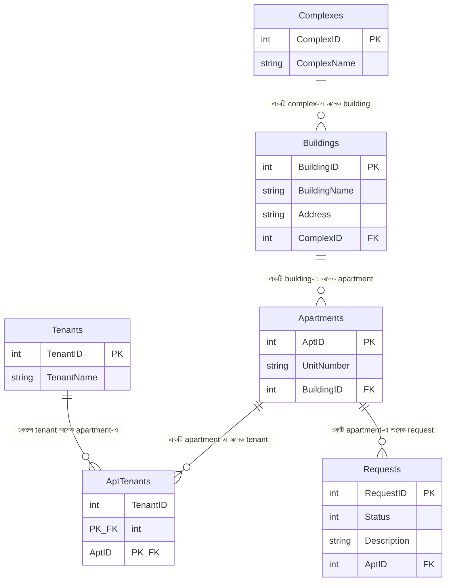
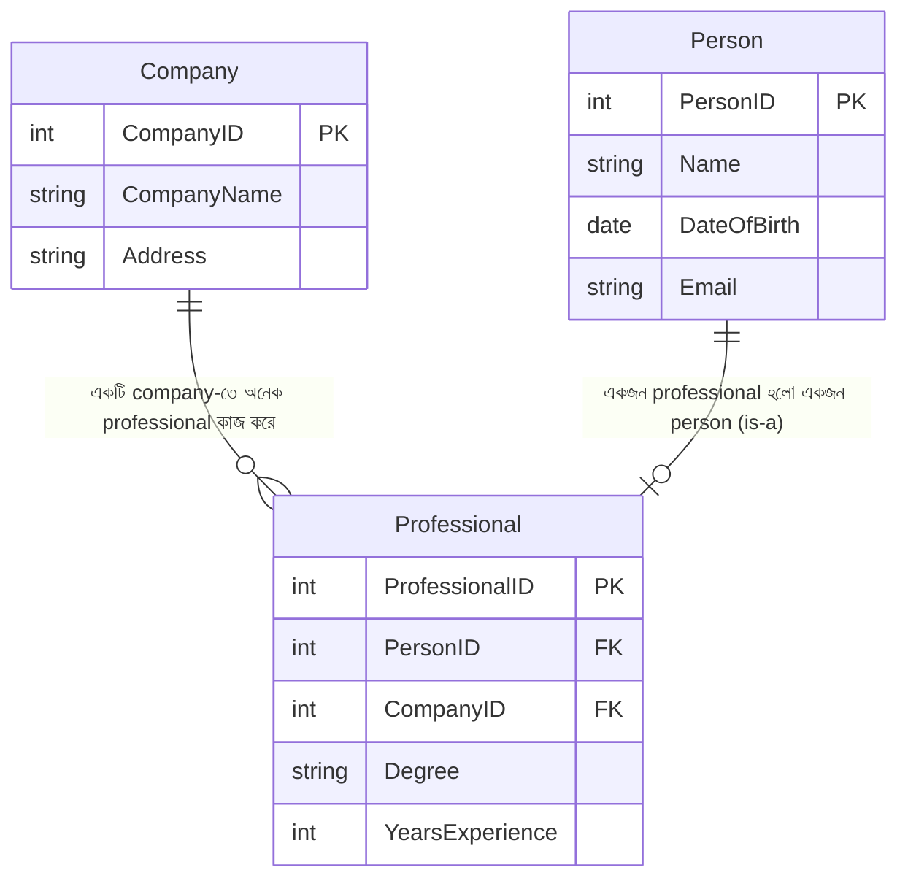
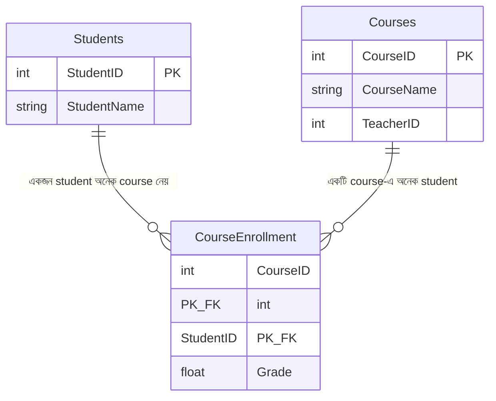

# Chapter 14 — Databases (প্রশ্ন 14.1 – 14.7)

> **Cracking the Coding Interview — বাংলা গাইড**
> ব্যাখ্যা **বাংলায়**, technical term **ইংরেজিতে**। Code **SQL**; সম্পর্ক দেখাতে **mermaid erDiagram**।

> [মূল Index](README.md) · [Foundation](chapter00_foundation.md) · [আগের: Java](chapter13_java.md) · [পরের: Threads & Locks](chapter15_threads_locks.md)

---

<a id="toc"></a>
## এই Chapter-এর সূচি

- [14.1 — Multiple Apartments](#q14-1)
- [14.2 — Open Requests](#q14-2)
- [14.3 — Close All Requests](#q14-3)
- [14.4 — Joins](#q14-4)
- [14.5 — Denormalization](#q14-5)
- [14.6 — Entity-Relationship Diagram](#q14-6)
- [14.7 — Design Grade Database](#q14-7)

প্রতিটা প্রশ্ন এই কাঠামোয়: **সমস্যাটা সহজ বাংলায় → Schema / ER Diagram → সমাধান (ধাপে ধাপে চিন্তা) → SQL (query, ব্যাখ্যা সহ) → Common mistake → Follow-up।**

---
---

## Background — প্রশ্নে যাওয়ার আগে এগুলো বুঝুন

Database chapter-এ আপনাকে SQL লিখতে হবে আর schema design করতে হবে। এই section-এ একবার মূল ধারণাগুলো শিখে নিন; পরে প্রতিটা প্রশ্নে শুধু নাম ধরে বলব।

### ১. Table, Row, Column — relational database-এর ভিত্তি

Relational database-এ data থাকে **table**-এ (যাকে relation-ও বলা হয়)। একটা table দেখতে Excel sheet-এর মতো:

```
                 Table: Tenants
        ┌────────────┬──────────────┬──────────────┐
column →│ TenantID   │ TenantName   │ PhoneNumber  │   ← column = একটা attribute
        ├────────────┼──────────────┼──────────────┤
row →   │ 1          │ Ali          │ 0170000001   │   ← row = একটা record (একজন tenant)
        │ 2          │ Karim        │ 0180000002   │
        │ 3          │ Rahim        │ 0190000003   │
        └────────────┴──────────────┴──────────────┘
```

- **Column** (field): একটা attribute, যেমন `TenantName`। প্রতিটা column-এর একটা data type থাকে (`INT`, `VARCHAR`, `DATE` ...)।
- **Row** (record): একটা পুরো entry, যেমন "Ali, 0170000001"।

### ২. Primary Key ও Foreign Key — table-এর সম্পর্কের চাবি

**Primary Key (PK)** হলো এমন একটা column (বা columns-এর দল) যা প্রতিটা row-কে **আলাদাভাবে চিহ্নিত** করে। কখনো null হয় না, কখনো duplicate হয় না। উপরের table-এ `TenantID` হলো primary key।

**Foreign Key (FK)** হলো এক table-এর একটা column যা **আরেক table-এর primary key-কে point করে**। এটাই দুটো table-এর মধ্যে সম্পর্ক (relationship) তৈরি করে।

```
Apartments table                     Buildings table
┌──────────┬────────────┐            ┌────────────┬──────────────┐
│ AptID(PK)│ BuildingID │ ─────────► │ BuildingID │ BuildingName │
├──────────┼────────────┤    FK      │   (PK)     │              │
│ 1        │ 11         │            │ 11         │ Lake View    │
│ 2        │ 11         │            │ 12         │ Hill Top     │
│ 3        │ 12         │            └────────────┴──────────────┘
└──────────┴────────────┘
  Apartment 1 আর 2 → Building 11-এর ভেতরে আছে
```

> **মনে রাখুন:** PK = "আমি কে" (এই table-এর identity)। FK = "আমি কার সাথে যুক্ত" (অন্য table-এর identity ধরে রাখা)।

### ৩. Relationship-এর ধরন (one-to-many, many-to-many)

```
One-to-Many (1:N):  একটা Building-এ অনেক Apartment, কিন্তু একটা Apartment একটাই Building-এ।
   Building ──1───────N── Apartment

Many-to-Many (M:N): একটা Apartment-এ অনেক Tenant থাকতে পারে, আবার একজন Tenant
                    অনেক Apartment-এ থাকতে পারে (আমাদের প্রশ্নের মূল কেন্দ্র!)।
   Apartment ──M───────N── Tenant
```

Many-to-many সম্পর্ক সরাসরি একটা table-এ রাখা যায় না। তাই মাঝখানে একটা **junction table** (বা bridge/linking table) বানানো হয় যেটা দুই দিকের id জোড়ায় জোড়ায় রাখে। আমাদের ক্ষেত্রে এটা হলো `AptTenants`।

### ৪. JOIN — দুই table-এর data একসাথে আনা

Data আলাদা আলাদা table-এ ছড়ানো থাকে। একসাথে আনতে **JOIN** ব্যবহার করি — দুই table-এর row গুলো একটা শর্ত (সাধারণত FK = PK) দিয়ে মেলানো হয়। চার ধরনের JOIN আছে (14.4-এ বিস্তারিত):

```
INNER JOIN — দুই table-এ যাদের মিল আছে শুধু তারা
   A ∩ B :    ( A  [███] B )

LEFT JOIN — A-এর সব + B-এর যেটুকু মেলে (না মিললে B-এর জায়গায় NULL)
   A + (A∩B): ( A [███] B )   ← পুরো A থাকবেই

RIGHT JOIN — B-এর সব + A-এর যেটুকু মেলে
   (A∩B) + B: ( A [███] B )   ← পুরো B থাকবেই

FULL OUTER JOIN — দুই table-এর সব, যেটুকু না মেলে সেখানে NULL
   A ∪ B :    [███████████]
```

### ৫. Normalization vs Denormalization

**Normalization** হলো data এমনভাবে ভাগ করে আলাদা table-এ রাখা যাতে **কোনো তথ্য দুবার (redundant) না থাকে**। সুবিধা: একই data এক জায়গায় থাকে, তাই update করলে সব জায়গায় মিলে যায় (consistency)। অসুবিধা: data আনতে অনেক JOIN লাগে, query ধীর হতে পারে।

**Denormalization** হলো ইচ্ছে করে কিছু data **দুবার রাখা** (redundancy যোগ করা), যাতে JOIN কম লাগে আর read দ্রুত হয়। সুবিধা: read fast। অসুবিধা: update কঠিন (সব copy ঠিক রাখতে হয়), storage বেশি লাগে। (14.5-এ বিস্তারিত।)

```
Normalized (JOIN লাগে):              Denormalized (JOIN লাগে না):
Apartments(AptID, BuildingID)        Apartments(AptID, BuildingID, BuildingName)
Buildings(BuildingID, BuildingName)        ↑ BuildingName এখানেও copy করা
```

### ৬. 14.1–14.3-এর Shared Schema (Apartment/Building/Tenant)

CTCI-এর প্রথম তিনটা প্রশ্ন একই schema-র উপর ভিত্তি করে: একটা company অনেক building manage করে, প্রতিটা building-এ অনেক apartment, প্রতিটা apartment-এ এক বা একাধিক tenant থাকে, আর tenant-রা maintenance request পাঠায়। নিচের ER diagram-টা মাথায় রাখুন — 14.1, 14.2, 14.3-এ বারবার এটা reference করব।



মূল কথাগুলো:
- `Complexes` ─1:N→ `Buildings` ─1:N→ `Apartments` (একদিকের chain)।
- `Apartments` আর `Tenants`-এর মধ্যে **many-to-many** — তাই `AptTenants` junction table (এর primary key দুটো FK মিলে: `TenantID + AptID`)।
- `Requests` প্রতিটা apartment-এর সাথে যুক্ত; `Status` দিয়ে বোঝা যায় request খোলা (open) আছে নাকি বন্ধ (closed)। ধরছি `Status = 0` মানে open, `Status = 1` মানে closed।

> **এই schema-টা ভালো করে দেখে নিন — 14.1, 14.2, 14.3 এর উপরেই দাঁড়িয়ে।**

---
---

<a id="q14-1"></a>
# 14.1 — Multiple Apartments

> Topic: **Multiple Joins + GROUP BY/HAVING** · Difficulty: **Medium** · খুব common (warm-up SQL)

> **বইয়ের ভাষায়:** Write a SQL query to get a list of tenants who are renting more than one apartment.

## সমস্যাটা সহজ বাংলায়

এমন tenant-দের list চাই যারা **একটার বেশি apartment** ভাড়া নিয়েছে। মনে রাখুন — কোন tenant কোন apartment-এ আছে সেটা থাকে `AptTenants` junction table-এ। তাই একজন tenant-এর নাম যদি ওই table-এ **দুই বা ততোধিক বার** থাকে, তার মানে সে একাধিক apartment ভাড়া নিয়েছে।

## Schema / ER Diagram

Background-এর shared schema দেখুন। এই প্রশ্নে শুধু দুটো table লাগবে: `AptTenants` (কোন tenant কোন apartment-এ) আর `Tenants` (নাম পেতে)।

```
AptTenants                 Tenants
┌──────────┬───────┐       ┌──────────┬────────────┐
│ TenantID │ AptID │       │ TenantID │ TenantName │
├──────────┼───────┤       ├──────────┼────────────┤
│ 1        │ 101   │       │ 1        │ Ali        │  ← Ali দুবার (101, 102) → চাই
│ 1        │ 102   │       │ 2        │ Karim      │  ← Karim একবার → চাই না
│ 2        │ 103   │       └──────────┴────────────┘
└──────────┴───────┘
```

## সমাধান (ধাপে ধাপে চিন্তা)

1. `AptTenants`-এ প্রতিটা `TenantID` কতবার আছে গুনি — এটাই সে কয়টা apartment নিয়েছে।
2. গোনার জন্য `GROUP BY TenantID` করি (একই tenant-এর সব row একসাথে জড়ো করে), তারপর `COUNT(*)` দিয়ে গুনি।
3. শুধু সেই tenant রাখি যাদের count `> 1` — এই filter group-এর উপর, তাই `WHERE` নয়, **`HAVING`** ব্যবহার করি।
4. শেষে নাম দেখানোর জন্য `Tenants` table-এর সাথে `JOIN` করি।

> **মূল insight:** "একটার বেশি" মানে count > 1 — অর্থাৎ `GROUP BY` + `HAVING COUNT(*) > 1`। এটা SQL-এর সবচেয়ে common pattern।

## SQL

```sql
SELECT t.TenantID, t.TenantName
FROM Tenants t
INNER JOIN (
    SELECT TenantID                       -- কোন tenant
    FROM AptTenants                        -- junction table-এ
    GROUP BY TenantID                      -- একই tenant-এর row একসাথে
    HAVING COUNT(*) > 1                     -- যার একাধিক apartment আছে
) AS multi
ON t.TenantID = multi.TenantID;            -- নাম পেতে Tenants-এর সাথে মিলাই
```

লাইন বাই লাইন ব্যাখ্যা:
- ভেতরের `SELECT ... FROM AptTenants` (একে বলে **subquery**) প্রথমে কাজ করে: প্রতিটা `TenantID` কয়বার আছে গুনে, **শুধু একাধিক বার** যাদের আছে তাদের `TenantID` দেয়।
- `GROUP BY TenantID` — একই tenant-এর সব row একটা group-এ আনে।
- `HAVING COUNT(*) > 1` — group বানানোর **পরে** filter; প্রতি group-এ row সংখ্যা (apartment সংখ্যা) ১-এর বেশি হলেই রাখে। (`WHERE` group-এর আগে চলে বলে এখানে কাজ করত না।)
- বাইরের query সেই `TenantID` গুলোকে `Tenants` table-এর সাথে `INNER JOIN` করে নাম (`TenantName`) বের করে।

## Common mistake

- `HAVING`-এর জায়গায় `WHERE COUNT(*) > 1` লেখা — কাজ করবে না, কারণ aggregate (`COUNT`)-এর উপর filter সবসময় `HAVING`-এ হয়।
- `GROUP BY` করতে ভুলে যাওয়া — তাহলে গোনা হবে না।
- পুরো `Apartments` বা `Buildings` JOIN করা — এই প্রশ্নে দরকার শুধু `AptTenants` (কে কয়টা apartment-এ আছে), আর নাম পেতে `Tenants`।

## Follow-up

- **শুধু count দেখাতে হলে?** → `SELECT TenantID, COUNT(*) AS apt_count FROM AptTenants GROUP BY TenantID HAVING COUNT(*) > 1;`
- **ঠিক ২টা apartment যাদের?** → `HAVING COUNT(*) = 2`।
- **subquery ছাড়া করা যায়?** → হ্যাঁ, সরাসরি `Tenants`-এর সাথে join করে group করেও করা যায়, কিন্তু subquery পড়তে পরিষ্কার।

<sub>[↑ এই chapter-এর সূচি](#toc) · [মূল Index](README.md)</sub>

---

<a id="q14-2"></a>
# 14.2 — Open Requests

> Topic: **JOIN across 3 tables + GROUP BY** · Difficulty: **Medium** · Common

> **বইয়ের ভাষায়:** Write a SQL query to get a list of all buildings and the number of open requests (Requests in which `status` equals `'Open'`).

## সমস্যাটা সহজ বাংলায়

প্রতিটা **building**-এর নাম, আর সেই building-এ কতগুলো **open request** আছে — এই দুটো দেখাতে হবে। কঠিন অংশ: request যুক্ত থাকে **apartment**-এর সাথে, আর apartment যুক্ত থাকে **building**-এর সাথে। তাই request → apartment → building — তিন table পেরিয়ে গুনতে হবে।

## Schema / ER Diagram

Background-এর shared schema। এই প্রশ্নে তিনটা table: `Requests` (status সহ), `Apartments` (request কোন building-এ সেটা জানতে সেতু), `Buildings` (নাম)।

```
Requests                 Apartments              Buildings
RequestID Status AptID   AptID  BuildingID       BuildingID  BuildingName
   1       0     101  ─►  101    11        ─►        11        Lake View
   2       0     101                                 12        Hill Top
   3       1     102      102    11
        (Status 0 = Open)
→ Building 11 (Lake View)-এ open request = 2 (RequestID 1, 2)
```

## সমাধান (ধাপে ধাপে চিন্তা)

1. শুধু **open** request চাই, তাই আগে `Requests`-এ `Status = 0` (Open) দিয়ে filter করি।
2. সেই request গুলোকে `Apartments`-এর সাথে JOIN করি → প্রতিটা request কোন building-এ তা জানি (`BuildingID`)।
3. building-এর নাম পেতে `Buildings`-এর সাথে আরেকবার JOIN করি।
4. `GROUP BY BuildingID` করে প্রতিটা building-এ open request **গুনি**।

> **মূল insight:** filter (open) আগে করে নিলে গোনা সহজ; তিন table একটা chain (Requests → Apartments → Buildings) ধরে JOIN করতে হয়।

## SQL

```sql
SELECT b.BuildingID, b.BuildingName, COUNT(r.RequestID) AS open_count
FROM Buildings b
INNER JOIN Apartments a  ON b.BuildingID = a.BuildingID   -- building ↔ apartment
INNER JOIN Requests   r  ON a.AptID = r.AptID             -- apartment ↔ request
WHERE r.Status = 0                                         -- শুধু Open request
GROUP BY b.BuildingID, b.BuildingName;                     -- প্রতি building-এ গুনি
```

লাইন বাই লাইন ব্যাখ্যা:
- `FROM Buildings b` — প্রতিটা building দিয়ে শুরু (`b` হলো alias, ছোট নাম)।
- প্রথম `JOIN Apartments a ON b.BuildingID = a.BuildingID` — প্রতিটা building-এর apartment গুলো জুড়ে দেয় (FK = PK মিলিয়ে)।
- দ্বিতীয় `JOIN Requests r ON a.AptID = r.AptID` — প্রতিটা apartment-এর request জুড়ে দেয়।
- `WHERE r.Status = 0` — শুধু open request রাখে।
- `GROUP BY b.BuildingID` — একই building-এর সব row একসাথে এনে `COUNT(r.RequestID)` দিয়ে সেই building-এ কয়টা open request তা গোনে।

> **সতর্কতা:** যেসব building-এ একটাও open request নেই — উপরের INNER JOIN-এ তারা বাদ পড়বে। সব building দেখাতে চাইলে `LEFT JOIN` লাগবে (নিচে Follow-up)।

## Common mistake

- INNER JOIN দিয়ে শূন্য open-request-এর building হারিয়ে ফেলা (যদি সব building চান, LEFT JOIN দরকার)।
- `WHERE` দিয়ে `Status` filter না করে `COUNT`-এর ভেতর শর্ত দিতে গিয়ে গুলিয়ে ফেলা।
- `GROUP BY`-তে `BuildingName` যোগ করতে ভুলে যাওয়া (strict SQL-এ select করা non-aggregate column গুলো group-এ থাকতে হয়)।

## Follow-up

- **সব building দেখাও, open না থাকলেও 0:** `LEFT JOIN` ব্যবহার করুন এবং filter-টা JOIN শর্তে নিন —
  ```sql
  SELECT b.BuildingID, b.BuildingName, COUNT(r.RequestID) AS open_count
  FROM Buildings b
  LEFT JOIN Apartments a ON b.BuildingID = a.BuildingID
  LEFT JOIN Requests   r ON a.AptID = r.AptID AND r.Status = 0
  GROUP BY b.BuildingID, b.BuildingName;
  ```
 এখানে `r.Status = 0` শর্তটা `ON`-এ রাখা হলো, `WHERE`-এ নয় — তাহলে open-শূন্য building-ও থাকবে, শুধু তার `open_count = 0` হবে।

<sub>[↑ এই chapter-এর সূচি](#toc) · [মূল Index](README.md)</sub>

---

<a id="q14-3"></a>
# 14.3 — Close All Requests

> Topic: **UPDATE with subquery / JOIN** · Difficulty: **Medium** · Common

> **বইয়ের ভাষায়:** Building #11 is undergoing a major renovation. Implement a query to close all requests from apartments in this building.

## সমস্যাটা সহজ বাংলায়

Building #11-এ বড় renovation হবে, তাই ওই building-এর **সব apartment-এর সব request "close"** করে দিতে হবে। মানে: যেসব request-এর apartment building 11-এর ভেতরে, তাদের `Status` কে closed (`= 1`) করে দিন।

## Schema / ER Diagram

Background-এর shared schema। এবার data পড়া নয়, **পরিবর্তন (UPDATE)** করতে হবে। চ্যালেঞ্জ: `Requests` table-এ সরাসরি `BuildingID` নেই — তা আছে `Apartments`-এ। তাই building 11-এর apartment গুলো আগে খুঁজে, সেই apartment-এর request গুলো update করতে হবে।

```
Building 11-এর apartment গুলো: { 101, 104 }   (Apartments table থেকে)
         ↓
Requests-এ যেসব row-এর AptID ওই set-এ → Status = 1 (closed)
```

## সমাধান (ধাপে ধাপে চিন্তা)

1. প্রথমে বের করি building 11-এর apartment-এর `AptID` গুলো → `Apartments`-এ `WHERE BuildingID = 11`।
2. তারপর `Requests`-এ যেসব row-এর `AptID` ওই তালিকায় আছে, তাদের `Status = 1` সেট করি।
3. দুটো উপায়: (ক) subquery দিয়ে `WHERE AptID IN (...)`, অথবা (খ) `UPDATE ... JOIN`। দুটোই দেখি।

> **মূল insight:** read নয়, এটা write। filter-টা আরেক table (`Apartments`)-এর উপর নির্ভর করে, তাই subquery বা join লাগবেই।

## SQL

```sql
-- উপায় ক: subquery (সবচেয়ে portable, পরিষ্কার)
UPDATE Requests
SET Status = 1                                  -- 1 = closed
WHERE AptID IN (
    SELECT AptID                                -- building 11-এর apartment-গুলো
    FROM Apartments
    WHERE BuildingID = 11
);
```

লাইন বাই লাইন ব্যাখ্যা:
- ভেতরের subquery `SELECT AptID FROM Apartments WHERE BuildingID = 11` — building 11-এর apartment-এর সব `AptID` দেয় (যেমন `{101, 104}`)।
- বাইরের `UPDATE Requests SET Status = 1 WHERE AptID IN (...)` — `Requests`-এর যেসব row-এর `AptID` ওই set-এ আছে, তাদের `Status` কে `1` (closed) করে দেয়।

```sql
-- উপায় খ: UPDATE ... JOIN (MySQL syntax)
UPDATE Requests r
INNER JOIN Apartments a ON r.AptID = a.AptID    -- request ↔ apartment মিলাই
SET r.Status = 1                                 -- closed
WHERE a.BuildingID = 11;                         -- শুধু building 11-এর
```

এই উপায়ে `Requests`-কে `Apartments`-এর সাথে join করে সরাসরি building 11-এর row গুলো বেছে update করা হয়। ফল একই, শুধু লেখার ধরন আলাদা (এই JOIN-UPDATE syntax সব database-এ এক নয়; subquery-টা বেশি portable)।

## Common mistake

- `WHERE` দিতে ভুলে যাওয়া → পুরো table-এর **সব** request close হয়ে যাবে (ভয়ংকর bug)। UPDATE/DELETE-এ সবসময় WHERE আছে কিনা যাচাই করুন।
- `Requests`-এ সরাসরি `BuildingID` আছে ভেবে নেওয়া — নেই, ওটা `Apartments`-এ; তাই subquery/join লাগবেই।
- Status-এর মান (0/1 নাকি 'Open'/'Closed') schema-র সাথে মেলানো — clarify করুন কোন convention।

## Follow-up

- **আগে দেখে নিতে চাই কোন row বদলাবে?** → একই `WHERE` দিয়ে `SELECT * FROM Requests WHERE AptID IN (...)` চালিয়ে preview করুন, তারপর UPDATE।
- **একটা complex-এর সব building?** → subquery-তে আরেক ধাপ join: `WHERE BuildingID IN (SELECT BuildingID FROM Buildings WHERE ComplexID = ?)`।
- **transaction-এ মুড়ে রাখা ভালো** → `BEGIN; UPDATE ...; COMMIT;` যাতে ভুল হলে `ROLLBACK` করা যায়।

<sub>[↑ এই chapter-এর সূচি](#toc) · [মূল Index](README.md)</sub>

---

<a id="q14-4"></a>
# 14.4 — Joins

> Topic: **Concept — JOIN-এর ধরন** · Difficulty: **Easy–Medium** · খুব common (theory)

> **বইয়ের ভাষায়:** What are the different types of joins? Please explain how they differ and why certain types are better in certain situations.

## সমস্যাটা সহজ বাংলায়

এটা একটা concept প্রশ্ন। JOIN দিয়ে দুই table-এর data একসাথে আনা হয়। কত রকম JOIN আছে, প্রতিটা কীভাবে আলাদা, আর কখন কোনটা ব্যবহার করব — সেটা ব্যাখ্যা করতে হবে।

## সমাধান (ধাপে ধাপে চিন্তা)

দুটো table কল্পনা করুন: `A` (যেমন `Tenants`) আর `B` (যেমন `AptTenants`)। JOIN করার সময় প্রশ্ন হলো — যাদের মিল আছে শুধু তাদের নেব, নাকি মিল না থাকলেও এক পাশের সব রাখব? উত্তরভেদে চার ধরন।

দুটো ছোট table দিয়ে বুঝি:

```
Table A: Tenants            Table B: AptTenants
TenantID  Name              TenantID  AptID
   1      Ali                  1       101
   2      Karim                1       102
   3      Rahim                4       103
                              (TenantID 4 — A-তে নেই; Rahim(3) — B-তে নেই)
```

### ১. INNER JOIN — দুই দিকেই মিল থাকলে তবেই

শুধু সেই row যেখানে A আর B **দুটোতেই** মিল আছে।

```
A ∩ B :   ( A [███] B )

ফল: Ali-101, Ali-102, Karim — না (Karim-এর কোনো apt নেই? উপরে আছে?)
আসলে: TenantID 1 (Ali) দুবার মেলে; 4 আর 3 বাদ (এক পাশে নেই)।
Ali  101
Ali  102
```

```sql
SELECT t.Name, at.AptID
FROM Tenants t
INNER JOIN AptTenants at ON t.TenantID = at.TenantID;
```
**কখন:** শুধু "সম্পর্কযুক্ত" data চাইলে — যেমন apartment আছে এমন tenant।

### ২. LEFT (OUTER) JOIN — বাম table-এর সব রাখো

A-এর **প্রতিটা** row থাকবে। B-তে মিল থাকলে B-এর তথ্য বসবে, না থাকলে সেখানে `NULL`।

```
A + (A∩B):  ( A [███] B )    ← পুরো A থাকবেই

Ali    101
Ali    102
Rahim  NULL   ← Rahim-এর apartment নেই, তবু থাকল (NULL সহ)
```

```sql
SELECT t.Name, at.AptID
FROM Tenants t
LEFT JOIN AptTenants at ON t.TenantID = at.TenantID;
```
**কখন:** বাম table-এর সব রাখতে হলে, এমনকি মিল না থাকলেও — যেমন "সব tenant দেখাও, apartment থাকুক বা না থাকুক"। 14.2-এর "সব building, open না থাকলেও 0" — এটাই LEFT JOIN-এর উদাহরণ।

### ৩. RIGHT (OUTER) JOIN — ডান table-এর সব রাখো

LEFT-এর উল্টো। B-এর **প্রতিটা** row থাকবে; A-তে মিল না থাকলে A-এর জায়গায় `NULL`।

```
(A∩B) + B:  ( A [███] B )    ← পুরো B থাকবেই

Ali    101
Ali    102
NULL   103    ← TenantID 4 (B-তে আছে, A-তে নেই) → Name NULL
```

```sql
SELECT t.Name, at.AptID
FROM Tenants t
RIGHT JOIN AptTenants at ON t.TenantID = at.TenantID;
```
**কখন:** ডান table-এর সব রাখতে হলে। বাস্তবে কম ব্যবহার হয় — table-এর order উল্টে LEFT JOIN লেখা যায় বলে অনেকে LEFT-ই পছন্দ করে।

### ৪. FULL OUTER JOIN — দুই table-এর সব

A আর B-এর **সব** row; যেখানে মিল নেই সেখানে NULL দুই পাশেই হতে পারে।

```
A ∪ B :   [███████████]

Ali    101
Ali    102
Rahim  NULL   ← A-তে আছে, B-তে নেই
NULL   103    ← B-তে আছে, A-তে নেই
```

```sql
SELECT t.Name, at.AptID
FROM Tenants t
FULL OUTER JOIN AptTenants at ON t.TenantID = at.TenantID;
```
**কখন:** দুই দিকের কোনো data হারাতে না চাইলে — যেমন দুটো dataset মিলিয়ে দেখা কোথায় কোথায় mismatch আছে। (MySQL-এ direct FULL OUTER নেই; LEFT ∪ RIGHT কে `UNION` দিয়ে বানাতে হয়।)

> **আরও দুটো নাম শুনতে পারেন:** `CROSS JOIN` (A-এর প্রতিটা row × B-এর প্রতিটা row, কোনো শর্ত ছাড়া — Cartesian product), আর `SELF JOIN` (একটা table নিজের সাথে join, যেমন employee আর তার manager একই table-এ থাকলে)।

## Common mistake

- LEFT আর INNER গুলিয়ে ফেলা — INNER মিল না থাকা row বাদ দেয় (data "হারিয়ে যায়" বলে মনে হয়)।
- LEFT JOIN-এ ডান table-এর column-এ `WHERE col = x` দেওয়া — এতে NULL row বাদ পড়ে, কার্যত INNER JOIN হয়ে যায়। filter-টা `ON`-এ দিতে হয় (14.2 দেখুন)।
- শর্ত (`ON`) ছাড়া JOIN লিখলে accidental CROSS JOIN — বিশাল ভুল ফল।

## Follow-up

- **NULL handle:** LEFT JOIN-এর পর `WHERE B.id IS NULL` দিলে "A-তে আছে কিন্তু B-তে নেই" এমন row পাওয়া যায় (anti-join pattern)।
- **Performance:** JOIN-এর column-এ index থাকলে অনেক দ্রুত হয়।

<sub>[↑ এই chapter-এর সূচি](#toc) · [মূল Index](README.md)</sub>

---

<a id="q14-5"></a>
# 14.5 — Denormalization

> Topic: **Concept — Denormalization** · Difficulty: **Easy–Medium** · Common (theory)

> **বইয়ের ভাষায়:** What is denormalization? Explain the pros and cons.

## সমস্যাটা সহজ বাংলায়

Denormalization কী, কখন ব্যবহার করা হয়, আর এর সুবিধা-অসুবিধা কী — ব্যাখ্যা করতে হবে। বুঝতে হলে আগে normalization বোঝা দরকার (Background-এ আছে)।

## সমাধান (ধাপে ধাপে চিন্তা)

**Normalization** মানে data এমনভাবে আলাদা table-এ ভাগ করা যাতে কোনো তথ্য **দুবার (redundant)** না থাকে। **Denormalization** হলো তার উল্টো — ইচ্ছে করে কিছু data **দুবার রাখা** (একটা table-এ অন্য table-এর তথ্য copy করে), যাতে data আনতে **JOIN কম** লাগে আর **read দ্রুত** হয়।

কেন দরকার? বড় system-এ JOIN ব্যয়বহুল। লক্ষ লক্ষ row যুক্ত করা টেবিল বারবার JOIN করলে query ধীর হয়। read যদি write-এর চেয়ে অনেক বেশি হয় (read-heavy), তাহলে একটু data duplicate করে JOIN বাঁচানো লাভজনক।

উদাহরণ — `Requests`-এ প্রতিটা request-এর সাথে building-এর নাম দেখাতে হয় বারবার:

```
Normalized (প্রতিবার JOIN লাগে — ধীর কিন্তু consistent):
  Requests(RequestID, AptID, Status)
  Apartments(AptID, BuildingID)
  Buildings(BuildingID, BuildingName)
  → BuildingName পেতে: Requests JOIN Apartments JOIN Buildings  (২টা JOIN)

Denormalized (BuildingName সরাসরি copy — দ্রুত কিন্তু redundant):
  Requests(RequestID, AptID, Status, BuildingName)
                                      ↑ এখানে copy করে রাখা
  → BuildingName পেতে: শুধু Requests পড়লেই হয়  (০ JOIN)
```

### সুবিধা (Pros)

| সুবিধা | ব্যাখ্যা |
|---|---|
| **Read দ্রুত** | JOIN কম/নেই, তাই query সহজ ও fast। |
| **Query সরল** | অনেক table না মিলিয়ে এক table থেকেই data পাওয়া যায়। |
| **Reporting/analytics ভালো** | বড় aggregate report-এ বারবার JOIN-এর খরচ বাঁচে। |
| **Distributed system-এ সহজ** | NoSQL-এ JOIN দুর্বল; data একসাথে রাখলে সুবিধা। |

### অসুবিধা (Cons)

| অসুবিধা | ব্যাখ্যা |
|---|---|
| **Update কঠিন** | একই data অনেক জায়গায় copy আছে; building-এর নাম বদলালে **সব copy** ঠিক করতে হয়। |
| **Inconsistency-র ঝুঁকি** | একটা copy আপডেট করতে ভুললে data পরস্পরবিরোধী হয়ে যায়। |
| **Storage বেশি লাগে** | একই তথ্য বারবার রাখায় জায়গা বেশি লাগে। |
| **Write ধীর/জটিল** | প্রতিবার লেখার সময় সব duplicate copy maintain করতে হয়। |

> **মূল trade-off:** Normalization = consistency ও কম storage, কিন্তু JOIN-এর জন্য read ধীর। Denormalization = read দ্রুত, কিন্তু redundancy, বেশি storage ও কঠিন update। **read-heavy** system-এ denormalize করা হয়, **write-heavy/consistency-critical** system-এ normalize রাখা হয়।

## SQL (denormalization-এর উদাহরণ)

```sql
-- Normalized: নাম পেতে JOIN লাগে
SELECT r.RequestID, b.BuildingName
FROM Requests r
JOIN Apartments a ON r.AptID = a.AptID
JOIN Buildings  b ON a.BuildingID = b.BuildingID;

-- Denormalized: BuildingName আগেই Requests-এ copy করা, JOIN লাগে না
SELECT RequestID, BuildingName
FROM Requests;
```
দ্বিতীয় query-তে কোনো JOIN নেই বলে এটা অনেক দ্রুত — এটাই denormalization-এর পুরো লাভ। দাম: `BuildingName` বদলালে `Buildings` আর `Requests` দুই জায়গায় update করতে হবে।

## Common mistake

- "Denormalization = খারাপ design" ভাবা — আসলে এটা একটা সচেতন trade-off, বড় read-heavy system-এ স্বাভাবিক।
- কখন denormalize করব না ভেবেই করা — শুধু যেখানে read bottleneck আর data কম বদলায়, সেখানে করুন।

## Follow-up

- **কীভাবে copy গুলো sync রাখব?** → application logic, database trigger, অথবা scheduled batch job দিয়ে।
- **Materialized view কী?** → এটা একধরনের managed denormalization — JOIN-এর ফল আগে থেকে compute করে রাখা, periodically refresh হয়।
- **NoSQL-এ কেন বেশি denormalize?** → NoSQL JOIN দুর্বল বলে document-এ সব data একসাথে embed করা হয়।

<sub>[↑ এই chapter-এর সূচি](#toc) · [মূল Index](README.md)</sub>

---

<a id="q14-6"></a>
# 14.6 — Entity-Relationship Diagram

> Topic: **Design — ER Diagram** · Difficulty: **Medium** · Common (design)

> **বইয়ের ভাষায়:** Draw an entity-relationship diagram for a database with companies, people, and professionals (people who work for companies).

## সমস্যাটা সহজ বাংলায়

একটা database-এর জন্য **ER diagram** আঁকতে হবে যেখানে আছে: company, person (সাধারণ মানুষ), এবং professional (যে মানুষরা কোনো company-তে কাজ করে)। সম্পর্কগুলো ঠিকঠাক দেখাতে হবে — কে কার সাথে কীভাবে যুক্ত।

> ER diagram হলো একটা ছবি যা **entity** (যেসব জিনিস সম্পর্কে data রাখব, যেমন Company), তাদের **attribute** (যেমন CompanyName), আর তাদের মধ্যে **relationship** (কে কার সাথে যুক্ত) দেখায়।

## সমাধান (ধাপে ধাপে চিন্তা)

1. **Entity চিহ্নিত করি:** `Company`, `Person`, `Professional`। মূল প্রশ্ন: Professional আর Person-এর সম্পর্ক কী?
2. **মূল design decision — Professional হলো একধরনের Person।** তাই Professional-এর নিজের সব common তথ্য (নাম, জন্মতারিখ) `Person`-এ থাকবে, আর Professional-এর extra তথ্য (যেমন degree, experience) আলাদা `Professional` table-এ থাকবে, যা `Person`-কে FK দিয়ে point করবে। এটা "is-a" সম্পর্ক (Professional is-a Person)।
3. **Company ↔ Professional সম্পর্ক:** একজন professional একটা company-তে কাজ করে, একটা company-তে অনেক professional — এটা **one-to-many** (company → professionals)। যদি একজন professional একাধিক company-তে কাজ করতে পারে (consultant), তাহলে many-to-many, junction table লাগবে। ধরছি সরল one-to-many (একজন professional এক company-তে)।
4. সম্পর্কগুলো FK দিয়ে যুক্ত করি, প্রতিটা entity-র primary key ঠিক করি।

> **মূল insight:** "professional হলো বিশেষ ধরনের person" — এই inheritance/is-a সম্পর্কটাই এই প্রশ্নের আসল চিন্তা। Person base info রাখে, Professional extra info রাখে।

## Schema / ER Diagram



সম্পর্কগুলো পড়ার নিয়ম (mermaid notation):
- `||--o{` মানে **one-to-many**: `Company ||--o{ Professional` = একটা Company-র **শূন্য বা অনেক** Professional (`o{`), কিন্তু প্রতিটা Professional ঠিক **একটা** Company-তে (`||`)।
- `||--o|` মানে **one-to-(zero-or-one)**: প্রতিটা Professional ঠিক একজন Person-এর সাথে যুক্ত; একজন Person হয়তো Professional, হয়তো নয় (`o|`)।

## SQL — CREATE TABLE statements

```sql
CREATE TABLE Company (
    CompanyID   INT PRIMARY KEY,            -- প্রতিটা company-র unique id
    CompanyName VARCHAR(255) NOT NULL,
    Address     VARCHAR(255)
);

CREATE TABLE Person (
    PersonID    INT PRIMARY KEY,            -- প্রতিটা মানুষের unique id
    Name        VARCHAR(255) NOT NULL,
    DateOfBirth DATE,
    Email       VARCHAR(255)
);

CREATE TABLE Professional (
    ProfessionalID  INT PRIMARY KEY,        -- professional record-এর unique id
    PersonID        INT NOT NULL,           -- কোন person (is-a সম্পর্ক)
    CompanyID       INT,                    -- কোন company-তে কাজ করে
    Degree          VARCHAR(100),
    YearsExperience INT,
    FOREIGN KEY (PersonID)  REFERENCES Person(PersonID),     -- Person-এর সাথে যোগ
    FOREIGN KEY (CompanyID) REFERENCES Company(CompanyID)    -- Company-র সাথে যোগ
);
```

লাইন বাই লাইন মূল পয়েন্ট:
- `Person`-এ থাকে সবার common তথ্য (নাম, জন্মতারিখ) — professional হোক বা না হোক।
- `Professional`-এ থাকে শুধু professional-specific তথ্য (`Degree`, `YearsExperience`), আর দুটো FK: একটা `Person`-কে (কোন মানুষ), আরেকটা `Company`-কে (কোথায় কাজ করে)।
- `FOREIGN KEY ... REFERENCES ...` — এটাই database-কে জানায় যে এই column অন্য table-এর PK-কে point করছে; এতে invalid id ঢুকতে পারে না (referential integrity)।

## Common mistake

- Professional আর Person-কে আলাদা সম্পূর্ণ entity বানিয়ে নাম-জন্মতারিখ দুই জায়গায় রাখা (redundancy) — বরং is-a সম্পর্ক (Professional → Person FK) পরিষ্কার।
- Relationship-এর cardinality (one-to-many না many-to-many) clarify না করা — consultant একাধিক company-তে কাজ করলে junction table লাগে।
- FK constraint বাদ দেওয়া — তাহলে invalid CompanyID ঢুকে যেতে পারে।

## Follow-up

- **একজন professional একাধিক company-তে?** → many-to-many; একটা `Employment(PersonID, CompanyID, StartDate, EndDate)` junction table যোগ করুন।
- **Position/title যোগ করতে?** → `Professional`-এ `Title` column বা আলাদা `Position` table।
- **Person-এর address?** → আলাদা `Address` table করে one-to-many (একজনের একাধিক address) করা যায়।

<sub>[↑ এই chapter-এর সূচি](#toc) · [মূল Index](README.md)</sub>

---

<a id="q14-7"></a>
# 14.7 — Design Grade Database

> Topic: **Design — Schema + complex query** · Difficulty: **Hard** · Common (design)

> **বইয়ের ভাষায়:** Imagine a simple database storing information for students' grades. Design this database and provide a SQL query to return a list of the honor roll students (top 10%), sorted by their grade point average.

## সমস্যাটা সহজ বাংলায়

School-এর grade রাখার একটা database design করতে হবে: কোন student কোন course নিয়েছে, প্রতিটায় কত grade পেয়েছে। তারপর একটা query লিখতে হবে যা **top 10% (honor roll) student**-দের তাদের **GPA (grade point average)** অনুযায়ী sort করে দেখায়।

## সমাধান (ধাপে ধাপে চিন্তা)

1. **Entity চিহ্নিত:** `Students`, `Courses`, আর তাদের মধ্যে many-to-many (একজন student অনেক course, একটা course-এ অনেক student) → junction table `CourseEnrollment` যেখানে প্রতিটা enrollment-এর grade থাকবে।
2. **GPA হিসাব:** প্রতিটা student-এর সব course-এর grade-এর গড় (`AVG(Grade)`)। `CourseEnrollment` থেকে `GROUP BY StudentID` করে `AVG`।
3. **Top 10% বের করা:** এটাই কঠিন অংশ। মোট কতজন student আছে গুনে, তার 10% সংখ্যা বের করে — সবচেয়ে বেশি GPA-ওয়ালা ততজনকে নিতে হবে। তবে "ঠিক সীমানার" GPA-তে একাধিক student থাকলে কাকে রাখব? সাধারণ পরিষ্কার পদ্ধতি: আগে এমন একটা GPA cutoff বের করি যার উপরে মোটামুটি 10% student পড়ে, তারপর সেই cutoff-এর সমান বা বেশি GPA-ওয়ালাদের নিই।
4. সহজ ও interview-friendly উপায়: subquery-তে cutoff বের করি, বাইরের query-তে cutoff-এর উপরের student-দের GPA দিয়ে sort করি।

> **মূল insight:** GPA = `AVG(Grade)` per student (`GROUP BY`)। "top 10%" = মোট student-এর 10%-কে cover করে এমন একটা GPA cutoff বের করে, তার চেয়ে বেশি/সমান GPA রাখা।

## Schema / ER Diagram



- `Students` আর `Courses`-এর মধ্যে **many-to-many** → `CourseEnrollment` junction table।
- প্রতিটা enrollment-এর `Grade` সেখানেই রাখা — কারণ grade নির্দিষ্ট একটা (student, course) জোড়ার জন্য, একা student বা একা course-এর জন্য নয়।

## SQL — CREATE TABLE

```sql
CREATE TABLE Students (
    StudentID   INT PRIMARY KEY,
    StudentName VARCHAR(255) NOT NULL
);

CREATE TABLE Courses (
    CourseID   INT PRIMARY KEY,
    CourseName VARCHAR(255) NOT NULL,
    TeacherID  INT
);

CREATE TABLE CourseEnrollment (
    CourseID  INT NOT NULL,
    StudentID INT NOT NULL,
    Grade     FLOAT,                        -- এই student এই course-এ যত পেল
    PRIMARY KEY (CourseID, StudentID),      -- জোড়াটাই unique (junction key)
    FOREIGN KEY (CourseID)  REFERENCES Courses(CourseID),
    FOREIGN KEY (StudentID) REFERENCES Students(StudentID)
);
```

মূল পয়েন্ট: `CourseEnrollment`-এর primary key দুটো column মিলে (`CourseID, StudentID`) — মানে একই student একই course-এ একবারই enroll করতে পারে। `Grade` এখানে রাখা কারণ এটা (student, course) জোড়ার attribute।

## SQL — Honor Roll (top 10% by GPA)

```sql
SELECT s.StudentID, s.StudentName, AVG(ce.Grade) AS GPA
FROM Students s
INNER JOIN CourseEnrollment ce ON s.StudentID = ce.StudentID
GROUP BY s.StudentID, s.StudentName            -- প্রতি student-এর GPA
HAVING AVG(ce.Grade) >= (
    -- cutoff: যে GPA-র উপরে ঠিক top 10% student পড়ে
    SELECT MIN(GPA) FROM (
        SELECT AVG(Grade) AS GPA
        FROM CourseEnrollment
        GROUP BY StudentID                      -- প্রতি student-এর GPA
        ORDER BY GPA DESC
        LIMIT (SELECT CEIL(COUNT(*) * 0.1) FROM Students)  -- top 10% জন
    ) AS top_students
)
ORDER BY GPA DESC;                              -- বেশি GPA আগে
```

ধাপে ধাপে কীভাবে কাজ করে:
- সবচেয়ে ভেতরের query — প্রতিটা student-এর GPA (`AVG(Grade)`) বের করে, GPA-র descending order-এ sort করে, আর `LIMIT (CEIL(মোট student × 0.1))` দিয়ে **শুধু top 10% student**-এর GPA-গুলো রাখে।
- তার বাইরের `SELECT MIN(GPA) ...` — সেই top 10%-এর মধ্যে **সবচেয়ে ছোট GPA** নেয়; এটাই honor roll-এ ঢোকার **cutoff**।
- বাইরের main query — প্রতিটা student-এর GPA হিসাব করে (`GROUP BY`), শুধু সেই student রাখে যাদের `AVG(Grade) >= cutoff` (`HAVING`), আর GPA descending-এ sort করে দেখায়।

> **কেন subquery দুটো ধাপে?** SQL-এ সরাসরি "top 10%" বলা যায় না; তাই আগে cutoff GPA বের করি, পরে সেই cutoff দিয়ে filter করি। (কিছু database-এ `PERCENT_RANK()` বা `NTILE()` window function দিয়েও করা যায় — Follow-up দেখুন।)

## Common mistake

- Grade-কে `Students` বা `Courses` table-এ রাখা — grade হলো (student, course) জোড়ার attribute, তাই junction table-এই থাকবে।
- "Top 10%" মানে "GPA ≥ 90" ভেবে নেওয়া — না, এটা **relative**: মোট student-এর উপরের 10% জন; cutoff GPA data-র উপর নির্ভর করে।
- `COUNT(*) * 0.1`-কে round না করা — ভগ্নাংশ আসতে পারে, তাই `CEIL`/`ROUND` লাগে।

## Follow-up

- **Window function থাকলে সহজ:** `PERCENT_RANK()` বা `NTILE(10)` দিয়ে percentile সরাসরি বের করা যায় —
  ```sql
  SELECT StudentID, GPA FROM (
      SELECT StudentID, AVG(Grade) AS GPA,
             PERCENT_RANK() OVER (ORDER BY AVG(Grade) DESC) AS pr
      FROM CourseEnrollment GROUP BY StudentID
  ) t WHERE pr <= 0.10 ORDER BY GPA DESC;
  ```
- **Weighted GPA (credit hour সহ)?** → `Courses`-এ `CreditHours` যোগ করে weighted average নিন।
- **শুধু এক semester-এর GPA?** → `CourseEnrollment`-এ `Semester` column যোগ করে filter করুন।

<sub>[↑ এই chapter-এর সূচি](#toc) · [মূল Index](README.md)</sub>

---

## Chapter সারসংক্ষেপ

### এই Chapter-এর ৭ প্রশ্নের Summary

| # | প্রশ্ন | ধরন | মূল technique |
|---|---|---|---|
| 14.1 | Multiple Apartments | Query | `GROUP BY` + `HAVING COUNT(*) > 1` |
| 14.2 | Open Requests | Query | 3-table JOIN + filter + `GROUP BY` |
| 14.3 | Close All Requests | Query | `UPDATE ... WHERE ... IN (subquery)` |
| 14.4 | Joins | Concept | INNER / LEFT / RIGHT / FULL OUTER |
| 14.5 | Denormalization | Concept | redundancy দিয়ে read-speed কেনা |
| 14.6 | ER Diagram | Design | entity, FK, is-a সম্পর্ক |
| 14.7 | Grade Database | Design | junction table + percentile query |

### SQL Cheat Sheet — "এটা দেখলে → এটা ভাবো"

```
"কতবার আছে / একাধিক"            →  GROUP BY + COUNT, filter HAVING
group-এর উপর শর্ত                →  HAVING (WHERE নয়; WHERE row-এর উপর, আগে চলে)
দুই table-এর data একসাথে          →  JOIN (FK = PK মিলিয়ে)
এক পাশের সব রাখতে হবে             →  LEFT JOIN (মিল না থাকলে NULL)
data বদলানো (filter অন্য table-এ)  →  UPDATE ... WHERE ... IN (subquery)
গড় / যোগফল per group            →  AVG / SUM + GROUP BY
top N / top X%                   →  ORDER BY ... DESC + LIMIT, বা window function
many-to-many সম্পর্ক              →  junction table (দুটো FK মিলে PK)
"is-a" সম্পর্ক (বিশেষ ধরন)        →  base table + sub table (FK দিয়ে যুক্ত)
```

### Design Cheat Sheet — schema বানানোর নিয়ম

```
১. Entity খুঁজুন      — যেসব জিনিস সম্পর্কে data রাখব (Student, Course)
২. Attribute দিন      — প্রতিটা entity-র column ও তার type
৩. PK ঠিক করুন        — প্রতিটা row-কে আলাদা চেনার column
৪. Relationship আঁকুন  — 1:N না M:N? M:N হলে junction table
৫. FK দিয়ে যোগ করুন   — referential integrity-র জন্য
৬. Normalize রাখুন     — redundancy এড়ান; read-bottleneck হলে তবেই denormalize
```

### এই chapter-এর ৫টা সোনার নিয়ম

1. **Aggregate (COUNT/AVG/SUM)-এর উপর filter = `HAVING`**, সাধারণ row-এর উপর filter = `WHERE`।
2. **Many-to-many = junction table** (দুটো FK মিলে primary key) — apartment↔tenant, student↔course সব এক প্যাটার্ন।
3. **LEFT JOIN** তখন, যখন এক পাশের সব row রাখতেই হবে (মিল না থাকলেও) — filter-টা `ON`-এ দিন, `WHERE`-এ নয়।
4. **UPDATE/DELETE-এ `WHERE` যাচাই করুন** — নাহলে পুরো table বদলে যাবে।
5. **Normalize default**; read-heavy ও কম-বদলানো data-তে তবেই **denormalize** (consistency বনাম speed-এর সচেতন trade-off)।

> **পরের ধাপ:** [Chapter 15 — Threads & Locks](chapter15_threads_locks.md) (15.1–15.7), যেখানে thread, deadlock এবং synchronization শিখব।
