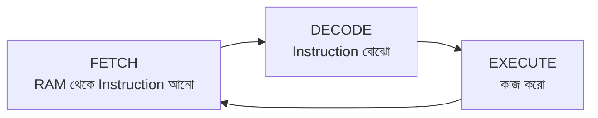
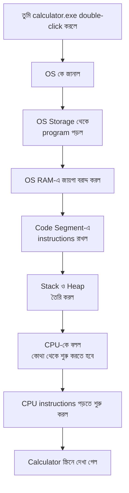
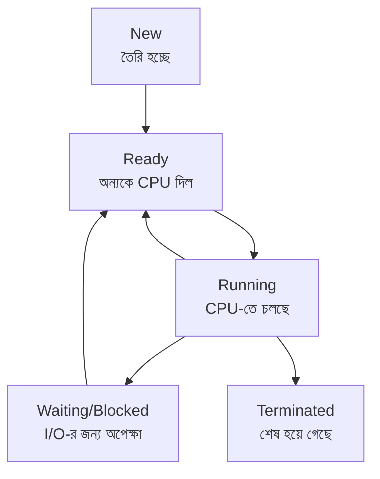
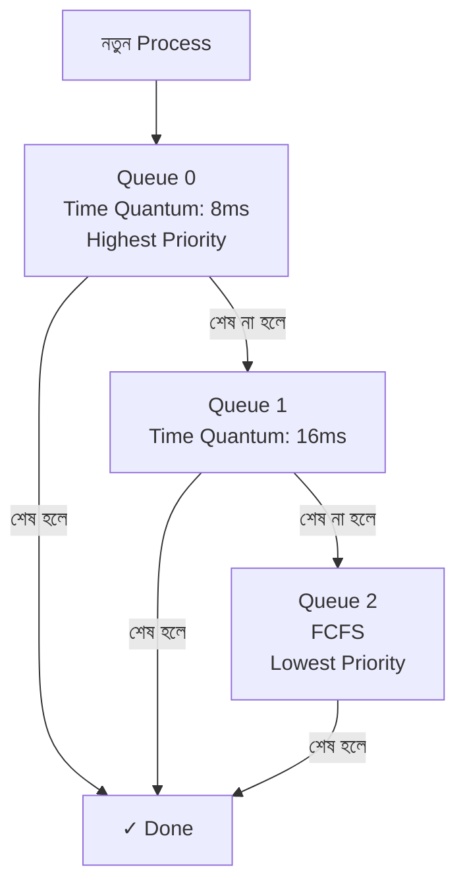
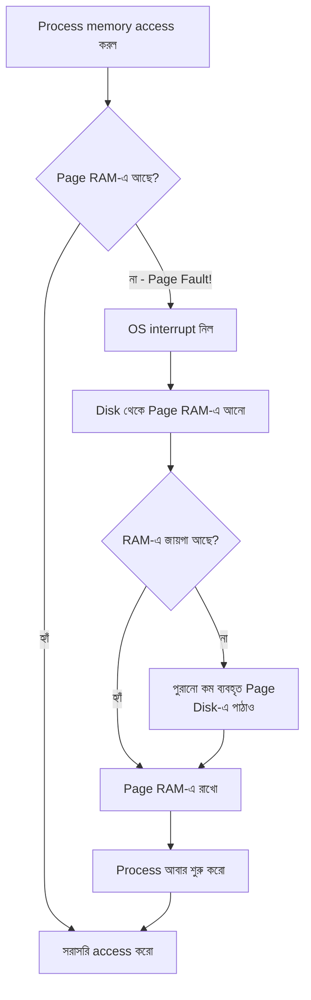
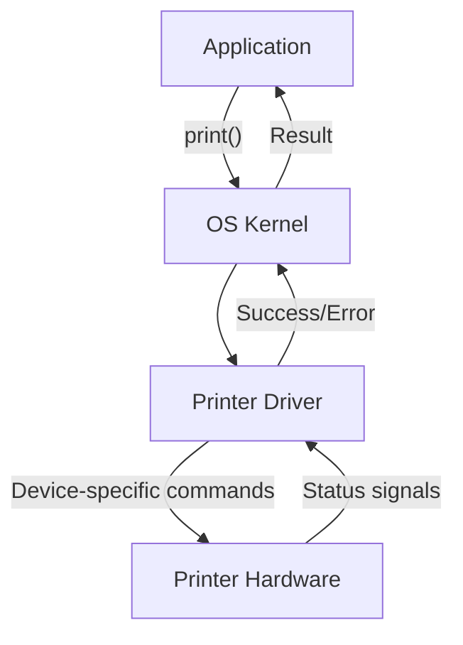

# 🖥️ Operating System: Zero থেকে Master

### — একটি সম্পূর্ণ বাংলা গাইড —

> **লেখকের কথা:** এই বইটি তোমার জন্য লেখা, যে OS সম্পর্কে একদম নতুন কিন্তু expert হতে চায়। প্রতিটি concept বাস্তব উদাহরণ দিয়ে বোঝানো হয়েছে। Technical term ইংরেজিতে, বাকি সব বাংলায়।

---

<a id="toc"></a>
## 📚 Table of Contents (TOC)

- [Chapter 1: Computer কী এবং কীভাবে কাজ করে?](#chapter-1)
- [Chapter 2: Hardware গভীরে — CPU, RAM, Storage](#chapter-2)
- [Chapter 3: একটি Program কীভাবে তৈরি হয় এবং চলে?](#chapter-3)
- [Chapter 4: Operating System কী এবং কেন দরকার?](#chapter-4)
- [Chapter 5: Process — চলমান প্রোগ্রামের গল্প](#chapter-5)
- [Chapter 6: Thread — Process-এর ভেতরের কর্মী](#chapter-6)
- [Chapter 7: CPU Scheduling — কে আগে চলবে?](#chapter-7)
- [Chapter 8: Memory Management — RAM-কে সামলানো](#chapter-8)
- [Chapter 9: Virtual Memory — RAM-এর চেয়ে বেশি মেমোরি](#chapter-9)
- [Chapter 10: Synchronization — একসাথে কাজ করতে গেলে সমস্যা](#chapter-10)
- [Chapter 11: Deadlock — আটকে যাওয়ার গল্প](#chapter-11)
- [Chapter 12: File System — ডেটা কোথায় থাকে?](#chapter-12)
- [Chapter 13: I/O Management — Input/Output সামলানো](#chapter-13)
- [Chapter 14: Multi-core এবং Parallelism](#chapter-14)
- [Chapter 15: Modern OS Concepts — Linux, Windows ভেতর থেকে](#chapter-15)
- [Chapter 16: সব একসাথে — একটি App চালু হলে কী হয়?](#chapter-16)

---


---

<a id="chapter-1"></a>
# Chapter 1: Computer কী এবং কীভাবে কাজ করে?

[🔝 TOC-এ ফিরে যাও](#toc)

---

## ১.১ একদম শুরু থেকে — Computer আসলে কী?

তুমি কি কখনো ভেবেছ, তুমি যখন YouTube-এ একটা ভিডিও দেখ — তখন আসলে কী হচ্ছে? তোমার ফোন বা ল্যাপটপের ভেতরে কোটি কোটি ছোট ছোট সিদ্ধান্ত নেওয়া হচ্ছে প্রতি সেকেন্ডে।

একটি Computer মূলত একটি **মেশিন যা নির্দেশ (Instructions) পড়ে, সেই নির্দেশ অনুযায়ী কাজ করে এবং ফলাফল দেখায়।**

বাস্তব উদাহরণ:
> তুমি Calculator-এ `5 + 3` লিখলে → Calculator পড়ল "5 যোগ 3 করো" → উত্তর দিল 8

এটাই Computer-এর মূল কাজ। শুধু পার্থক্য হলো, আধুনিক Computer এই কাজ **প্রতি সেকেন্ডে কোটি কোটি বার** করতে পারে।

---

## ১.২ Computer-এর মূল উপাদান

একটি Computer-কে একটি অফিসের সাথে তুলনা করা যায়:

```
┌─────────────────────────────────────────────────────┐
│                    COMPUTER অফিস                    │
│                                                     │
│  ┌─────────────┐    ┌──────────────┐                │
│  │    CPU      │    │     RAM      │                │
│  │  (Manager)  │◄──►│  (Desk/Table)│                │
│  │             │    │  কাজের জায়গা  │                │
│  └──────┬──────┘    └──────────────┘                │
│         │                                           │
│         ▼                                           │
│  ┌─────────────────────────────────────────────┐    │
│  │              Storage (Hard Disk/SSD)         │    │
│  │              (ফাইল ক্যাবিনেট/আলমারি)         │    │
│  └─────────────────────────────────────────────┘    │
│                                                     │
│  ┌──────────┐  ┌──────────┐  ┌────────────────┐    │
│  │ Keyboard │  │  Mouse   │  │    Monitor     │    │
│  │ (Input)  │  │ (Input)  │  │    (Output)    │    │
│  └──────────┘  └──────────┘  └────────────────┘    │
└─────────────────────────────────────────────────────┘
```

| উপাদান | অফিস উপমা | কাজ |
|---|---|---|
| **CPU** | Manager/Boss | সব সিদ্ধান্ত নেয়, হিসাব করে |
| **RAM** | কাজের টেবিল | চলমান কাজ সাময়িকভাবে রাখে |
| **Storage** | ফাইল আলমারি | স্থায়ীভাবে সব ডেটা রাখে |
| **Keyboard/Mouse** | ইনপুট | তুমি যা বলো সেটা দেয় |
| **Monitor** | আউটপুট | ফলাফল দেখায় |

---

## ১.৩ Computer শুধু ০ এবং ১ বোঝে

এটা শুনতে অদ্ভুত লাগে, কিন্তু সত্যি। Computer-এর ভেতরের প্রতিটি সার্কিট আসলে একটি সুইচ — হয় **চালু (1)** নয়তো **বন্ধ (0)**।

```
Bulb চালু  = 1
Bulb বন্ধ  = 0

তাহলে "A" অক্ষরটা Computer কীভাবে বোঝে?
A = 01000001  (Binary-তে)

তুমি যখন "A" টাইপ করো:
┌───────────────────────────────────────┐
│  Keyboard → 01000001 → CPU → Monitor  │
│              ↑                        │
│         Computer এই ৮টি               │
│         সুইচের মাধ্যমে "A" বোঝে      │
└───────────────────────────────────────┘
```

এই ০ এবং ১-কে **Binary** বলে।  
১টি Binary digit = **1 Bit**  
৮টি Bit = **1 Byte**  
`A` = `01000001` = 1 Byte

---

## ১.৪ তথ্যের আকার

| একক | পরিমাণ | উদাহরণ |
|---|---|---|
| **1 Bit** | 0 অথবা 1 | একটি সুইচ |
| **1 Byte** | 8 Bits | একটি অক্ষর "A" |
| **1 KB** | 1,024 Bytes | একটি ছোট text file |
| **1 MB** | 1,024 KB | একটি ছোট ছবি |
| **1 GB** | 1,024 MB | একটি HD Movie |
| **1 TB** | 1,024 GB | সম্পূর্ণ Hard Drive |

---

[🔝 TOC-এ ফিরে যাও](#toc)

---

<a id="chapter-2"></a>
# Chapter 2: Hardware গভীরে — CPU, RAM, Storage

[🔝 TOC-এ ফিরে যাও](#toc)

---

## ২.১ CPU (Central Processing Unit) — Computer-এর মাথা

CPU হলো Computer-এর সবচেয়ে গুরুত্বপূর্ণ অংশ। এটি সব হিসাব-নিকাশ এবং সিদ্ধান্ত নেয়।

### CPU-র ভেতরে কী আছে?

```
┌─────────────────────────────────────────────────────────┐
│                        CPU                              │
│                                                         │
│   ┌──────────────────────────────────────────────────┐  │
│   │              Control Unit (CU)                   │  │
│   │    "ট্রাফিক পুলিশ" — সব নির্দেশ পরিচালনা করে    │  │
│   └──────────────────────┬───────────────────────────┘  │
│                          │                              │
│   ┌──────────────────────▼───────────────────────────┐  │
│   │         ALU (Arithmetic Logic Unit)              │  │
│   │    "হিসাবঘর" — যোগ, বিয়োগ, তুলনা করে           │  │
│   └──────────────────────────────────────────────────┘  │
│                                                         │
│   ┌────────────────────────────────────────────────┐    │
│   │              Registers (রেজিস্টার)              │    │
│   │   অতি দ্রুত ছোট মেমোরি — CPU-র নিজের টেবিল    │    │
│   │                                                │    │
│   │  ┌──────┐ ┌──────┐ ┌──────┐ ┌──────┐         │    │
│   │  │  PC  │ │  IR  │ │  SP  │ │  BP  │  ...    │    │
│   │  └──────┘ └──────┘ └──────┘ └──────┘         │    │
│   └────────────────────────────────────────────────┘    │
│                                                         │
│   ┌────────────────────────────────────────────────┐    │
│   │              Cache Memory                       │    │
│   │   L1, L2, L3 — দ্রুত Buffer মেমোরি            │    │
│   └────────────────────────────────────────────────┘    │
└─────────────────────────────────────────────────────────┘
```

---

### ২.২ Registers — CPU-র নিজের মেমোরি

Registers হলো CPU-র ভেতরের সবচেয়ে দ্রুত মেমোরি। এগুলো এত ছোট যে মাত্র কয়েকটি সংখ্যা ধরে রাখতে পারে, কিন্তু এত দ্রুত যে RAM-এর চেয়ে **100 গুণ বেশি** গতিতে কাজ করে।

#### গুরুত্বপূর্ণ Registers:

**PC (Program Counter):**
- পরবর্তী কোন Instruction চলবে তার memory address ধরে রাখে
- মনে করো একটি বইয়ের bookmark — "এখানে পড়া শেষ হয়েছে, পরের বার এখান থেকে শুরু করব"

```
RAM-এ আছে:
Address 100: ADD 5, 3     ← PC এখন 100 দেখাচ্ছে
Address 101: STORE result
Address 102: PRINT result

CPU প্রথমে 100 পড়ল → কাজ করল → PC হলো 101
তারপর 101 পড়ল → কাজ করল → PC হলো 102
এভাবে চলতে থাকে...
```

**IR (Instruction Register):**
- RAM থেকে আনা বর্তমান Instruction সাময়িকভাবে এখানে থাকে
- "এখন কী করতে হবে" — সেই নির্দেশটা এখানে পড়া হচ্ছে

**SP (Stack Pointer):**
- Stack memory-র একদম উপরের অংশ track করে
- মনে করো স্তুপ করা প্লেটের সবচেয়ে উপরের প্লেটের দিকে আঙুল দিয়ে আছ

**BP (Base Pointer):**
- একটি Function-এর শুরুর জায়গা মনে রাখে
- Function-এর local variables খুঁজে পেতে সাহায্য করে

---

### ২.৩ ALU (Arithmetic Logic Unit) — হিসাবঘর

ALU দুই ধরনের কাজ করে:

**Arithmetic (গাণিতিক) কাজ:**
```
5 + 3 = 8    → যোগ
10 - 4 = 6   → বিয়োগ  
3 × 4 = 12   → গুণ
8 ÷ 2 = 4    → ভাগ
```

**Logic (যৌক্তিক) কাজ:**
```
5 > 3 ? → হ্যাঁ (True = 1)
2 > 7 ? → না (False = 0)
AND, OR, NOT operations
```

বাস্তব উদাহরণ:
> তুমি যখন YouTube-এ একটি ভিডিও play করো, ALU প্রতিটি frame-এর pixels-এর calculation করে, color values যোগ-বিয়োগ করে।

---

### ২.৪ Control Unit (CU) — ট্রাফিক পুলিশ

CU কোনো calculation করে না। এর কাজ হলো:
1. RAM থেকে Instruction নিয়ে আসা
2. সেই Instruction decode করা (বোঝা)
3. ALU, Memory, I/O-কে কী করতে হবে বলা

```
CU-র কাজের ধাপ:

Step 1: FETCH    → RAM থেকে Instruction নিয়ে আসো
Step 2: DECODE   → Instruction বোঝো
Step 3: EXECUTE  → ALU দিয়ে কাজ করাও
Step 4: আবার Step 1 থেকে শুরু

এই চক্রকে বলে: Fetch-Decode-Execute Cycle
CPU প্রতি সেকেন্ডে এটি কোটি বার করে!
```



---

### ২.৫ Cache Memory — দ্রুত Buffer

Cache হলো CPU এবং RAM-এর মাঝখানের একটি দ্রুত মেমোরি।

**সমস্যা:** RAM অনেক বড় কিন্তু CPU-র তুলনায় ধীর।  
**সমাধান:** ঘনঘন ব্যবহৃত data RAM থেকে Cache-এ রাখা হয়।

```
গতির তুলনা:
Register  : ~1 nanosecond    ████████████████████ সবচেয়ে দ্রুত
L1 Cache  : ~4 nanosecond    ████████████████
L2 Cache  : ~12 nanosecond   ████████████
L3 Cache  : ~40 nanosecond   ████████
RAM       : ~100 nanosecond  ████
SSD       : ~100 microsecond ██
HDD       : ~10 millisecond  █               সবচেয়ে ধীর
```

বাস্তব উদাহরণ:
> তুমি প্রতিদিন সকালে চা বানাও। চা-পাতা প্রতিদিন আলমারি (Storage) থেকে আনা ঝামেলা। তাই তুমি একটু চা-পাতা রান্নাঘরের কাউন্টারে (Cache) রাখো — এতে দ্রুত পাওয়া যায়।

---

### ২.৬ Transistor — সবকিছুর ভিত্তি

Registers, Cache, CPU — সব কিছু তৈরি হয়েছে কোটি কোটি Transistor দিয়ে।

Transistor হলো একটি electronic switch:
- **চালু (1):** বিদ্যুৎ প্রবাহিত হচ্ছে
- **বন্ধ (0):** বিদ্যুৎ প্রবাহিত হচ্ছে না

```
একটি Transistor:
    ┌────┐
    │ 1  │ = চালু (বিদ্যুৎ আছে)
    └────┘

    ┌────┐
    │ 0  │ = বন্ধ (বিদ্যুৎ নেই)
    └────┘

অনেকগুলো Transistor মিলে:
→ Register তৈরি হয়
→ Register মিলে ALU তৈরি হয়
→ সব মিলে CPU তৈরি হয়

Apple M3 Chip-এ আছে: ~19 Billion Transistors!
```

---

### ২.৭ RAM (Random Access Memory) — কাজের টেবিল

RAM হলো CPU-র কাজের টেবিল। যে প্রোগ্রামগুলো এখন চলছে, সেগুলো RAM-এ থাকে।

**বৈশিষ্ট্য:**
- **দ্রুত:** Storage-এর চেয়ে অনেক দ্রুত
- **অস্থায়ী:** বিদ্যুৎ গেলে সব মুছে যায়
- **সরাসরি access:** যেকোনো address থেকে সরাসরি data পড়া যায়

```
RAM-এর কাঠামো (Simplified):

Address │ Data
────────┼──────────────────
  0000  │ 01001000  (প্রোগ্রামের কোড)
  0001  │ 01100101
  0002  │ 00000101  (সংখ্যা 5)
  0003  │ 00000011  (সংখ্যা 3)
  ...   │ ...
```

### RAM-এর ভেতরে একটি Program কীভাবে সাজানো থাকে?

```
┌─────────────────────────────────────┐  ← উচ্চ Address
│           Stack                     │
│   (Function calls, Local vars,      │
│    Return addresses)                │
│   ↓ নিচের দিকে বাড়ে               │
├─────────────────────────────────────┤
│           (খালি জায়গা)              │
├─────────────────────────────────────┤
│           Heap                      │
│   (Dynamic memory, Objects)         │
│   ↑ উপরের দিকে বাড়ে               │
├─────────────────────────────────────┤
│           BSS Segment               │
│   (Initialize না করা global vars)  │
├─────────────────────────────────────┤
│           Data Segment              │
│   (Initialize করা global vars)     │
├─────────────────────────────────────┤
│           Code/Text Segment         │
│   (প্রোগ্রামের instructions)        │
└─────────────────────────────────────┘  ← নিম্ন Address
```

---

### ২.৮ Storage — স্থায়ী মেমোরি

Storage-এ data স্থায়ীভাবে থাকে। বিদ্যুৎ গেলেও মুছে যায় না।

**দুই ধরনের Storage:**

| | **HDD** | **SSD** |
|---|---|---|
| গঠন | ঘূর্ণনশীল disk | Solid-state chips |
| গতি | ~100 MB/s | ~500-7000 MB/s |
| দাম | সস্তা | দামি |
| টেকসই | কম (নাড়াচাড়ায় ক্ষতি) | বেশি |

---

[🔝 TOC-এ ফিরে যাও](#toc)


---

<a id="chapter-3"></a>
# Chapter 3: একটি Program কীভাবে তৈরি হয় এবং চলে?

[🔝 TOC-এ ফিরে যাও](#toc)

---

## ৩.১ Source Code থেকে Execution পর্যন্ত

তুমি যখন Python বা Dart-এ কোড লেখো, সেটা Computer সরাসরি বোঝে না। Computer শুধু binary (0 এবং 1) বোঝে। তাহলে কীভাবে তোমার কোড চলে?

এই যাত্রাটি কয়েকটি ধাপে হয়:

```
তোমার কোড (Python/Dart/C++)
         │
         ▼
    Compilation/Interpretation
         │
         ▼
    Machine Code (Binary)
         │
         ▼
    CPU Execute করে
         │
         ▼
    ফলাফল স্ক্রিনে দেখায়
```

---

## ৩.২ Compiled Language (যেমন: C, C++, Rust)

Compiled language-এ পুরো কোড একবারে binary-তে রূপান্তরিত হয়।

```
main.c (তোমার C কোড)
    │
    ▼ Preprocessor (include, define প্রসেস করে)
    │
    ▼ Compiler (C → Assembly language)
    │
    ▼ Assembler (Assembly → Machine code)
    │
    ▼ Linker (বিভিন্ন object files জোড়া লাগায়)
    │
    ▼
main.exe / main (চলার জন্য তৈরি binary file)
```

**উদাহরণ — একটি সহজ C প্রোগ্রাম:**
```c
// main.c
#include <stdio.h>
int main() {
    int a = 5;
    int b = 3;
    int sum = a + b;
    printf("Sum: %d\n", sum);
    return 0;
}
```

এটি compile হলে দাঁড়ায় (Machine code simplified):
```
LOAD  5      → Register-এ 5 রাখো
LOAD  3      → আরেকটি Register-এ 3 রাখো
ADD          → দুটো যোগ করো
STORE result → ফলাফল মেমোরিতে রাখো
PRINT result → স্ক্রিনে দেখাও
```

---

## ৩.৩ Interpreted Language (যেমন: Python)

Interpreted language-এ প্রতিটি লাইন একটু একটু করে translate এবং execute হয়।

```python
# script.py
a = 5
b = 3
print(a + b)
```

```
Python Interpreter চলার ধরন:

লাইন 1: a = 5      → Interpreter পড়ল → RAM-এ রাখল
লাইন 2: b = 3      → Interpreter পড়ল → RAM-এ রাখল  
লাইন 3: print(a+b) → Interpreter পড়ল → যোগ করল → দেখাল

প্রতিটি লাইন একটু একটু করে হয়
তাই Compiled-এর চেয়ে একটু ধীর
```

---

## ৩.৪ Dart (Compiled + JIT/AOT)

Dart দুইভাবে কাজ করতে পারে:

**JIT (Just-In-Time) Compilation — Development-এ:**
```
তুমি কোড লিখছ এবং test করছ
Dart VM কোড চলার সময় compile করে
Hot Reload সম্ভব হয় এই কারণে
```

**AOT (Ahead-Of-Time) Compilation — Production-এ:**
```
Flutter build করার সময়
পুরো Dart কোড আগেই native machine code-এ compile হয়
ফলে App অনেক দ্রুত চলে
```

---

## ৩.৫ Program চালু হলে কী হয়?

ধরো তুমি `calculator.exe` double-click করলে:



**বিস্তারিত ধাপ:**

```
Step 1: OS Storage থেকে File পড়ে
        calculator.exe → binary data

Step 2: OS RAM-এ segment তৈরি করে
        ┌──────────────────┐
        │ Code Segment     │ ← calculator-এর instructions
        │ Data Segment     │ ← global variables
        │ Heap             │ ← dynamic memory (শুরুতে খালি)
        │ Stack            │ ← function calls (শুরুতে খালি)
        └──────────────────┘

Step 3: CPU-র PC (Program Counter) Register-এ
        Code Segment-এর শুরুর address দেওয়া হয়

Step 4: CPU Fetch-Decode-Execute শুরু করে

Step 5: প্রথম function (main) Stack-এ push হয়

Step 6: Calculator-এর window তৈরি হয় (OS-এর সাহায্যে)
```

---

## ৩.৬ Stack-এর কাজ — Function Call বুঝি

Function call-এ Stack কেন দরকার সেটা উদাহরণ দিয়ে বুঝি:

```c
int add(int a, int b) {
    int result = a + b;  // local variable
    return result;
}

int multiply(int x, int y) {
    int temp = add(x, y);  // add() কে call করলাম
    return temp * 2;
}

int main() {
    int answer = multiply(3, 4);
    printf("%d", answer);
    return 0;
}
```

Stack-এ কী হয়:

```
main() শুরু হলো:
┌────────────────────────────┐
│ main() Stack Frame         │
│   return address: OS       │
│   answer: ? (এখনো নেই)    │
└────────────────────────────┘ ← SP (Stack Pointer) এখানে

multiply(3,4) call হলো:
┌────────────────────────────┐
│ multiply() Stack Frame     │  ← SP এখন এখানে
│   return address: main:104 │
│   x = 3                    │
│   y = 4                    │
│   temp: ? (এখনো নেই)      │
├────────────────────────────┤
│ main() Stack Frame         │
│   return address: OS       │
│   answer: ?                │
└────────────────────────────┘

add(3,4) call হলো:
┌────────────────────────────┐
│ add() Stack Frame          │  ← SP এখন এখানে
│   return address: mult:205 │
│   a = 3                    │
│   b = 4                    │
│   result = 7               │
├────────────────────────────┤
│ multiply() Stack Frame     │
│   return address: main:104 │
│   x = 3, y = 4             │
│   temp: ?                  │
├────────────────────────────┤
│ main() Stack Frame         │
│   return address: OS       │
│   answer: ?                │
└────────────────────────────┘

add() শেষ হলো → return 7 → Stack থেকে pop:
┌────────────────────────────┐
│ multiply() Stack Frame     │  ← SP আবার এখানে
│   return address: main:104 │
│   x = 3, y = 4             │
│   temp = 7                 │ ← এখন 7 পেল
└────────────────────────────┘
```

**Stack-এর দুটো সমস্যা:**

**Stack Overflow:** যদি function নিজেকে অসীমবার call করে, Stack পূর্ণ হয়ে crash হয়।
```c
void infinite() {
    infinite();  // নিজেকে বারবার call করছে
}
// → Stack Overflow Error!
```

**Stack-এ কী থাকে:**
- Return Address (ফাংশন শেষে কোথায় ফিরতে হবে)
- Local Variables
- Function Parameters

---

## ৩.৭ Heap — Dynamic Memory

Stack-এ সাইজ আগে থেকে জানতে হয়। কিন্তু যদি runtime-এ বড় data তৈরি হয়? তখন Heap ব্যবহার হয়।

```dart
// Dart-এ
class User {
  String name;
  int age;
  User(this.name, this.age);
}

void main() {
  User u = User("Rahim", 25);  // Heap-এ তৈরি হলো
  // u নামের reference Stack-এ আছে
  // কিন্তু actual object Heap-এ আছে
}
```

```
Stack:
┌──────────────────────┐
│ main() Frame         │
│   u → 0x7fff1234    │ ← Heap-এর address ধরে আছে
└──────────────────────┘
         │
         │ points to
         ▼
Heap:
┌──────────────────────┐
│ Address: 0x7fff1234  │
│ User Object:         │
│   name: "Rahim"      │
│   age: 25            │
└──────────────────────┘
```

---

[🔝 TOC-এ ফিরে যাও](#toc)

Output

Part 3 done


---

<a id="chapter-4"></a>
# Chapter 4: Operating System কী এবং কেন দরকার?

[🔝 TOC-এ ফিরে যাও](#toc)

---

## ৪.১ OS ছাড়া কী হতো?

কল্পনা করো OS ছাড়া একটি Computer। তুমি যদি Spotify চালাতে চাও:
- তোমাকে নিজে RAM পরিচালনা করতে হতো
- নিজে keyboard থেকে input নিতে হতো
- নিজে screen-এ কীভাবে আঁকতে হয় সেটা প্রোগ্রাম করতে হতো
- নিজে network card সামলাতে হতো

এটা অসম্ভব জটিল হতো। **OS এই সব কাজ তোমার হয়ে করে দেয়।**

---

## ৪.২ OS কী করে?

```
┌─────────────────────────────────────────────────────────────┐
│                     Applications                            │
│         Spotify │ Chrome │ VS Code │ Calculator             │
└─────────────────────┬───────────────────────────────────────┘
                      │  "আমার এটা দরকার"
                      ▼
┌─────────────────────────────────────────────────────────────┐
│                Operating System (OS)                        │
│                                                             │
│  ┌──────────────┐  ┌──────────────┐  ┌──────────────────┐  │
│  │   Process    │  │   Memory     │  │   File System    │  │
│  │  Management  │  │  Management  │  │   Management     │  │
│  └──────────────┘  └──────────────┘  └──────────────────┘  │
│  ┌──────────────┐  ┌──────────────┐  ┌──────────────────┐  │
│  │     I/O      │  │   Security   │  │    Networking    │  │
│  │  Management  │  │              │  │                  │  │
│  └──────────────┘  └──────────────┘  └──────────────────┘  │
└─────────────────────────────────────────────────────────────┘
                      │  Hardware-এ সরাসরি কথা বলে
                      ▼
┌─────────────────────────────────────────────────────────────┐
│                     Hardware                                │
│           CPU │ RAM │ SSD │ Keyboard │ Screen               │
└─────────────────────────────────────────────────────────────┘
```

---

## ৪.৩ OS-এর মূল কাজগুলো

**১. Resource Management:**
> ১০টি App একসাথে চলছে কিন্তু CPU একটা। OS সিদ্ধান্ত নেয় কে কতটুকু CPU পাবে।

**২. Abstraction (সরলীকরণ):**
> তুমি `file.write("Hello")` লিখলে। OS ভেতরে ভেতরে storage-এ কোথায় লিখবে, কোন sector-এ যাবে — এসব তোমাকে জানতে হয় না।

**৩. Protection:**
> একটি App অন্য App-এর memory পড়তে পারে না। WhatsApp-এর data Netflix দেখতে পাবে না।

**৪. Multi-tasking:**
> Chrome, Spotify, VS Code — সব একসাথে চলছে মনে হয়। OS এটা সম্ভব করে।

---

## ৪.৪ Kernel — OS-এর মূল অংশ

OS-এর সবচেয়ে গুরুত্বপূর্ণ অংশ হলো **Kernel**। এটি hardware-এর সাথে সরাসরি কথা বলে।

```
┌──────────────────────────────────────────┐
│           User Space                     │
│    (তোমার App-গুলো এখানে চলে)           │
│   Spotify, Chrome, VS Code, etc.         │
├──────────────────────────────────────────┤
│           System Call Interface          │
│    (App → Kernel-এ যাওয়ার দরজা)         │
├──────────────────────────────────────────┤
│           Kernel Space                   │
│    Process Manager  │  Memory Manager    │
│    File System      │  Device Drivers    │
│    Network Stack    │  Security          │
├──────────────────────────────────────────┤
│           Hardware                       │
│    CPU  │  RAM  │  Disk  │  Network      │
└──────────────────────────────────────────┘
```

**Kernel কেন আলাদা?**

যদি তোমার App সরাসরি hardware ব্যবহার করতে পারত:
- ভুল করে RAM মুছে দিতে পারত
- অন্য App-এর data চুরি করতে পারত
- সম্পূর্ণ system crash করতে পারত

তাই App-গুলো Kernel-এর মাধ্যমে hardware ব্যবহার করে।

---

## ৪.৫ System Call — App থেকে Kernel-এ যোগাযোগ

যখন তোমার App hardware দরকার হয়, সে **System Call** করে।

```
তুমি Python-এ লিখলে:
file = open("data.txt", "r")

ভেতরে যা হয়:
1. Python → OS-কে System Call করল: "data.txt খুলতে চাই"
2. OS → Storage-এ গিয়ে file খুঁজল
3. OS → RAM-এ file-এর data এনে রাখল
4. OS → Python-কে বলল "নাও, ব্যবহার করো"
```

**কিছু সাধারণ System Calls:**

| System Call | কাজ | উদাহরণ |
|---|---|---|
| `open()` | File খোলা | `open("file.txt")` |
| `read()` | File পড়া | file-এর data পড়া |
| `write()` | File লেখা | file-এ data লেখা |
| `fork()` | নতুন Process তৈরি | নতুন program চালানো |
| `exec()` | নতুন program চালানো | program replace করা |
| `exit()` | Process শেষ করা | program বন্ধ করা |
| `malloc()` | Memory বরাদ্দ | Heap-এ জায়গা নেওয়া |

---

## ৪.৬ OS-এর ধরন

| OS | উদাহরণ | বৈশিষ্ট্য |
|---|---|---|
| **Desktop OS** | Windows, macOS, Linux | সাধারণ ব্যবহারের জন্য |
| **Mobile OS** | Android, iOS | Touch, Battery সচেতন |
| **Server OS** | Ubuntu Server, Windows Server | অনেক user handle করে |
| **Real-time OS** | FreeRTOS, VxWorks | Exact timing দরকার (robot, medical) |
| **Embedded OS** | Arduino OS, RTOS | ছোট device-এ |

---

[🔝 TOC-এ ফিরে যাও](#toc)

---

<a id="chapter-5"></a>
# Chapter 5: Process — চলমান প্রোগ্রামের গল্প

[🔝 TOC-এ ফিরে যাও](#toc)

---

## ৫.১ Program বনাম Process

**Program:** Storage-এ থাকা একটি নিষ্প্রাণ file। যেমন: `chrome.exe` তোমার C drive-এ।

**Process:** সেই program যখন চালু হয়ে RAM-এ চলছে। Chrome যখন open আছে।

```
chrome.exe (Storage-এ, নিষ্প্রাণ)
         │
         │ তুমি double-click করলে
         ▼
Chrome Process (RAM-এ চলছে, জীবন্ত)
         │
         ├── Code Segment  (Chrome-এর instructions)
         ├── Data Segment  (Chrome-এর global data)
         ├── Heap          (tabs, extensions-এর data)
         └── Stack         (function calls)
```

**তুমি Chrome দুবার open করলে:**
```
chrome.exe (Storage-এ একটাই)
         │
         ├──► Chrome Process 1 (Window 1)
         └──► Chrome Process 2 (Window 2)

একই program থেকে দুটি আলাদা Process।
প্রত্যেকের নিজস্ব RAM, নিজস্ব Stack, নিজস্ব Heap।
```

---

## ৫.২ Process-এর অবস্থা (States)

একটি Process-এর জীবনে বিভিন্ন অবস্থা থাকে:



**বাস্তব উদাহরণ:**

```
তুমি Chrome খুললে:
→ NEW: OS Chrome Process তৈরি করছে

তৈরি হলো, CPU-র জন্য অপেক্ষা:
→ READY: "আমি প্রস্তুত, CPU দাও"

OS Chrome-কে CPU দিল:
→ RUNNING: Chrome চলছে, page load হচ্ছে

Chrome network request করল (internet-এর জন্য অপেক্ষা):
→ WAITING: "Internet থেকে data আসুক, আমি অপেক্ষায়"

Data এলো:
→ READY: "Data এসেছে, আবার CPU দাও"

OS আবার CPU দিল:
→ RUNNING: page দেখাচ্ছে

তুমি Chrome বন্ধ করলে:
→ TERMINATED: প্রক্রিয়া শেষ, RAM খালি
```

---

## ৫.৩ PCB (Process Control Block) — Process-এর পরিচয়পত্র

OS প্রতিটি Process-এর জন্য একটি data structure রাখে যেটাকে বলা হয় **PCB**।

```
┌─────────────────────────────────────────┐
│          Process Control Block (PCB)    │
│                                         │
│  Process ID (PID)     : 1234            │
│  Process State        : RUNNING         │
│  Program Counter (PC) : 0x00401234      │
│  CPU Registers        : {...saved...}   │
│  Memory Limits        : 0x1000-0x9000   │
│  Open Files List      : [file1, file2]  │
│  Priority             : 5              │
│  Parent Process ID    : 1 (OS)          │
│  CPU Time Used        : 0.5 seconds     │
│  I/O Status           : none pending    │
└─────────────────────────────────────────┘
```

**PCB কেন দরকার?**

যখন CPU একটি Process থেকে অন্য Process-এ যায় (Context Switching), তখন পুরানো Process-এর সব তথ্য PCB-তে save করা হয়। পরে আবার সেখান থেকে শুরু করা হয়।

```
Process A চলছে:
CPU: PC=0x100, R1=5, R2=8, R3=12

OS সিদ্ধান্ত নিল Process B কে চালাবে:

Step 1: Process A-এর সব register value PCB-A-তে save করো
        PCB-A: {PC=0x100, R1=5, R2=8, R3=12, State=READY}

Step 2: PCB-B থেকে Process B-এর register value load করো
        CPU: PC=0x500, R1=2, R2=7, R3=0 (B-এর আগের অবস্থা)

Step 3: Process B চলা শুরু করল
        B ঠিক যেখানে ছিল সেখান থেকে শুরু করল

এটাকেই বলে Context Switch!
```

---

## ৫.৪ Context Switching — বিস্তারিত

```
Timeline:

T1: Process A চলছে ████████████████
T2: OS interrupt দিল            │
T3: A-এর state save হলো         ▼
T4: B-এর state load হলো    ████████████████  Process B
T5: B চলছে                ████████████████
T6: OS interrupt দিল              │
T7: B-এর state save হলো           ▼
T8: A-এর state load হলো      ████████  Process A (যেখানে ছিল)
```

**Context Switch-এর খরচ:**
- Register save/load করতে সময় লাগে
- Cache miss হতে পারে (নতুন Process-এর data Cache-এ নেই)
- তাই খুব বেশি Context Switch ভালো না

---

## ৫.৫ Process তৈরি — fork() এবং exec()

Linux/Unix-এ নতুন Process তৈরি হয় `fork()` দিয়ে:

```c
// Parent Process
pid_t child_pid = fork();

if (child_pid == 0) {
    // এটি Child Process-এ চলে
    printf("আমি child, PID: %d\n", getpid());
} else {
    // এটি Parent Process-এ চলে
    printf("আমি parent, child PID: %d\n", child_pid);
}
```

```
fork() কী করে?

Parent Process (PID: 100)
│  Code Segment    ─────────────┐
│  Data Segment    ─────────────┤ → Child (PID: 101) কপি পায়
│  Heap            ─────────────┘
│  Stack           ─── নিজস্ব Stack

fork() এর পরে:
Parent (PID: 100)    Child (PID: 101)
│                    │
│  নিজস্ব memory    │  parent-এর কপি
│  চলতে থাকে       │  চলতে থাকে
```

**exec()** দিয়ে নতুন program চালানো হয়:
```c
execl("/bin/ls", "ls", "-l", NULL);
// এই process এখন "ls" command হয়ে গেল
```

---

## ৫.৬ Process-এর ধরন

| ধরন | উদাহরণ | বৈশিষ্ট্য |
|---|---|---|
| **Foreground** | তোমার চালু App | তুমি সরাসরি interact করো |
| **Background** | Windows Update | নিজে নিজে চলে |
| **Daemon** | Web Server | সবসময় চলতে থাকে |
| **Zombie** | শেষ হয়েছে কিন্তু PCB আছে | Parent-এর wait করছে |
| **Orphan** | Parent মারা গেছে | OS adopt করে |

---

[🔝 TOC-এ ফিরে যাও](#toc)

Output

Part 4 done


---

<a id="chapter-6"></a>
# Chapter 6: Thread — Process-এর ভেতরের কর্মী

[🔝 TOC-এ ফিরে যাও](#toc)

---

## ৬.১ Thread কী?

একটি Process-কে একটি কারখানার সাথে তুলনা করো। Process হলো কারখানা, Thread হলো কর্মী।

```
Chrome Process (কারখানা)
│
├── Thread 1: Tab 1 render করছে
├── Thread 2: JavaScript চালাচ্ছে
├── Thread 3: Network request করছে
├── Thread 4: File download করছে
└── Thread 5: Extension চলছে

সব Thread:
✓ একই Code Segment share করে
✓ একই Heap share করে  
✓ নিজস্ব Stack থাকে (আলাদা)
✓ নিজস্ব Registers থাকে (আলাদা)
```

---

## ৬.২ Process বনাম Thread তুলনা

```
┌────────────────────────────────────────────────────────┐
│                     Process A                          │
│  ┌──────────────────────────────────────────────────┐  │
│  │  Code Segment (shared by all threads)            │  │
│  ├──────────────────────────────────────────────────┤  │
│  │  Heap (shared by all threads)                    │  │
│  ├──────────────────────────────────────────────────┤  │
│  │  Thread 1   │  Thread 2   │  Thread 3            │  │
│  │  ─────────  │  ─────────  │  ─────────           │  │
│  │  Stack 1    │  Stack 2    │  Stack 3             │  │
│  │  Registers  │  Registers  │  Registers           │  │
│  │  PC         │  PC         │  PC                  │  │
│  └──────────────────────────────────────────────────┘  │
└────────────────────────────────────────────────────────┘
```

| | **Process** | **Thread** |
|---|---|---|
| Memory | নিজস্ব আলাদা memory | একই Process-এর memory share |
| তৈরির খরচ | বেশি (memory copy) | কম (memory share) |
| যোগাযোগ | কঠিন (IPC লাগে) | সহজ (shared memory) |
| একটি crash | শুধু সেই process | পুরো process crash |
| নিরাপত্তা | বেশি | কম |

---

## ৬.৩ Multi-threading কেন দরকার?

**Single-threaded App-এর সমস্যা:**

```
ধরো তুমি একটি Image Editor বানাচ্ছ:

Single Thread হলে:
─────────────────────────────────────────►
│ UI দেখাও │ Filter Apply (30 sec) │ UI দেখাও │
          └─────────────────────────┘
          এই 30 সেকেন্ড App Freeze!
          তুমি কিছু করতে পারবে না।
```

**Multi-threaded সমাধান:**

```
Thread 1 (UI Thread):
─────────────────────────────────────────►
│ UI দেখাও │ Progress Bar দেখাও │ UI দেখাও │

Thread 2 (Worker Thread):
─────────────────────────────────────────►
│ Filter Apply হচ্ছে (30 sec)             │
          └───────── Background-এ চলছে ──┘

App কখনো Freeze হয় না!
```

---

## ৬.৪ Dart-এর Thread মডেল

Dart একটু ব্যতিক্রমী। এটি **Single-threaded Event Loop** ব্যবহার করে।

### Event Loop কী?

```
Dart Main Thread:

┌─────────────────────────────────────────────────────┐
│                   Event Loop                        │
│                                                     │
│  ┌─────────────────────────────────────────────┐    │
│  │              Event Queue                    │    │
│  │  [Button Click] [Network Data] [Timer Done] │    │
│  └──────────────────────┬──────────────────────┘    │
│                         │                           │
│                         ▼                           │
│              Event Loop (একটার পর একটা)             │
│                         │                           │
│                         ▼                           │
│              Dart Code Execute করো                  │
└─────────────────────────────────────────────────────┘
```

**Event Loop-এর কাজের ধরন:**

```
1. Event Queue-তে কোনো event আছে?
   → না: অপেক্ষা করো
   → হ্যাঁ: প্রথম event নাও

2. সেই event handle করো (Dart code চালাও)

3. আবার ১ নম্বরে যাও

এটা অনবরত চলতে থাকে।
```

---

## ৬.৫ Dart-এ async/await — Non-blocking I/O

```dart
// ভুল পদ্ধতি (blocking):
void loadData() {
  String data = fetchFromInternet(); // 3 সেকেন্ড লাগবে
  // এই 3 সেকেন্ড পুরো App freeze!
  print(data);
}

// সঠিক পদ্ধতি (non-blocking):
Future<void> loadData() async {
  String data = await fetchFromInternet(); // OS-কে বলল "তুমি করো"
  // Dart অন্য কাজ করতে পারে এই সময়ে
  print(data); // data আসলে এটা চলবে
}
```

**ভেতরে কী হয়:**

```
1. fetchFromInternet() call হলো
2. Dart OS-কে বলল: "Network request করো, হলে আমাকে জানাও"
3. Dart Event Loop-এ ফিরে গেল (UI চলছে, smooth!)
4. OS network request করল (আলাদা OS thread-এ)
5. Data এলো → OS Dart-এর Event Queue-তে event দিল
6. Event Loop সেই event নিল
7. await-এর পরের কোড চলল

Dart নিজে আলাদা thread তৈরি করেনি!
OS-এর non-blocking I/O ব্যবহার করেছে।
```

---

## ৬.৬ Dart Isolate — সত্যিকারের Multi-threading

ভারী কাজ (JSON parse, image processing) করতে হলে Isolate ব্যবহার করতে হয়।

**Isolate বনাম Regular Thread:**

```
Regular Thread:            Isolate:
┌──────────────┐          ┌──────────────┐  ┌──────────────┐
│  Process     │          │  Isolate 1   │  │  Isolate 2   │
│  ┌────┐      │          │  (Main)      │  │  (Worker)    │
│  │ T1 ├──►  │          │              │  │              │
│  │ T2 │ shared         │  নিজস্ব      │  │  নিজস্ব      │
│  └────┘ memory│         │  Memory      │  │  Memory      │
└──────────────┘          └──────┬───────┘  └──────┬───────┘
                                 │                  │
                                 └──── Message ─────┘
                                      শুধু message!
```

```dart
// Isolate ব্যবহার করে ভারী কাজ:
import 'dart:isolate';

void heavyComputation(SendPort sendPort) {
  // এটি আলাদা Isolate-এ চলবে
  int result = 0;
  for (int i = 0; i < 1000000000; i++) {
    result += i; // ভারী কাজ
  }
  sendPort.send(result); // Main Isolate-কে পাঠাও
}

void main() async {
  ReceivePort receivePort = ReceivePort();
  
  // নতুন Isolate তৈরি করো
  await Isolate.spawn(heavyComputation, receivePort.sendPort);
  
  // Result-এর জন্য অপেক্ষা করো (UI চলছে!)
  int result = await receivePort.first;
  print('Result: $result');
}
```

---

## ৬.৭ কখন Thread, কখন Isolate?

```
ব্যবহার করো async/await যখন:
✓ Network call করছ
✓ File পড়ছ বা লিখছ
✓ Database query করছ
→ কারণ: এগুলো I/O bound, CPU busy থাকে না

ব্যবহার করো Isolate যখন:
✓ বড় JSON parse করছ
✓ Image filter apply করছ
✓ Algorithm-এর ভারী calculation
✓ Video encoding
→ কারণ: এগুলো CPU bound, CPU অনেক কাজ করে
```

---

[🔝 TOC-এ ফিরে যাও](#toc)

---

<a id="chapter-7"></a>
# Chapter 7: CPU Scheduling — কে আগে চলবে?

[🔝 TOC-এ ফিরে যাও](#toc)

---

## ৭.১ Scheduling কেন দরকার?

ধরো তোমার Computer-এ একসাথে চলছে:
- Chrome (100টি Tab)
- Spotify (গান)
- VS Code (কোড লেখা)
- Windows Update (background)

কিন্তু CPU-তে মাত্র ৪টি Core। কীভাবে সব চলবে?

**OS-এর Scheduler** সিদ্ধান্ত নেয়:
- কোন Process কখন CPU পাবে
- কতক্ষণ পাবে
- কে বেশি গুরুত্বপূর্ণ

---

## ৭.২ Scheduling-এর লক্ষ্য

| লক্ষ্য | অর্থ |
|---|---|
| **Fairness** | সব process কিছু না কিছু CPU পাক |
| **Efficiency** | CPU কখনো idle না থাকুক |
| **Throughput** | প্রতি সেকেন্ডে বেশি কাজ হোক |
| **Response Time** | User-এর কাজে দ্রুত সাড়া দেওয়া |
| **Low Latency** | Realtime কাজে delay কম হোক |

---

## ৭.৩ Scheduling Algorithm-গুলো

### Algorithm 1: FCFS (First Come, First Serve)

যে আগে আসবে, সে আগে চলবে। রেস্তোরাঁয় লাইনে দাঁড়ানোর মতো।

```
Processes: A(10s), B(2s), C(3s) — এই ক্রমে এসেছে

Timeline:
A চলল (10s) → B চলল (2s) → C চলল (3s)
──────────────────────────────────────────►
0          10          12          15

সমস্যা: B এবং C ছোট কাজ, কিন্তু A-এর পেছনে আটকে গেল।
B-কে 10 সেকেন্ড অপেক্ষা করতে হলো।
এটাকে বলে "Convoy Effect"।
```

### Algorithm 2: SJF (Shortest Job First)

সবচেয়ে ছোট কাজ আগে। Barber যে সবচেয়ে কম সময় লাগবে তাকে আগে কাটে।

```
Processes: A(10s), B(2s), C(3s)
SJF সাজাবে: B(2s), C(3s), A(10s)

Timeline:
B(2s) → C(3s) → A(10s)
──────────────────────────────────────────►
0     2     5               15

সুবিধা: Average waiting time কম।
সমস্যা: A সবসময় পেছনে পড়তে পারে (Starvation)।
```

### Algorithm 3: Round Robin (RR) — সবচেয়ে বেশি ব্যবহৃত

প্রত্যেক Process একটু একটু করে CPU পায়। Time Quantum (যেমন 20ms) ব্যবহার হয়।

```
Processes: A, B, C (সব একসাথে এসেছে)
Time Quantum: 4ms

Timeline:
A(4ms) B(4ms) C(4ms) A(4ms) B(4ms) C(4ms) A(2ms)
────────────────────────────────────────────────►
0      4      8      12     16     20     24  26

সুবিধা: সব process CPU পায়, কেউ অনাহারে থাকে না।
সমস্যা: Context Switch-এর overhead বাড়ে।
```

### Algorithm 4: Priority Scheduling

Priority অনুযায়ী চলে। Doctor-এর কাছে Emergency patient আগে।

```
Processes:  A(Priority 3), B(Priority 1), C(Priority 2)
            (1 = সর্বোচ্চ Priority)

চলবে: B → C → A

সমস্যা: কম priority-র process সবসময় পেছনে থাকে।
সমাধান: Aging — দীর্ঘ অপেক্ষায় priority বাড়ে।
```

### Algorithm 5: Multilevel Feedback Queue (MLFQ) — আধুনিক OS ব্যবহার করে

```
Queue 0 (সর্বোচ্চ Priority, Time Quantum: 8ms)
Queue 1 (মাঝারি Priority, Time Quantum: 16ms)
Queue 2 (সর্বনিম্ন Priority, FCFS)

নতুন process → Queue 0-এ শুরু করে
8ms-এ শেষ না হলে → Queue 1-এ যায়
16ms-এ শেষ না হলে → Queue 2-এ যায়

Interactive processes (UI, keyboard) সবসময় Queue 0-এ থাকে।
Background processes ধীরে ধীরে নিচে নামে।
```



---

## ৭.৪ Preemptive বনাম Non-preemptive

**Non-preemptive:** Process নিজে ছাড়লে CPU পাওয়া যায়।
```
A চলছে → A নিজে শেষ করল বা অপেক্ষায় গেল → B পেল
সমস্যা: A যদি loop-এ আটকে যায়, কেউ CPU পাবে না।
```

**Preemptive:** OS জোর করে Process থেকে CPU কেড়ে নিতে পারে।
```
A চলছে → Timer interrupt → OS B-কে দিল → A পরে পাবে
আধুনিক OS সব Preemptive।
```

---

## ৭.৫ Real Example — Linux Scheduling (CFS)

Linux **CFS (Completely Fair Scheduler)** ব্যবহার করে।

মূল ধারণা: প্রতিটি process-কে সমান "virtual runtime" দেওয়া।

```
যে process সবচেয়ে কম virtual runtime পেয়েছে, সে পরবর্তীতে চলবে।

Process A: 100ms virtual runtime পেয়েছে
Process B:  50ms virtual runtime পেয়েছে  ← এটি পরবর্তীতে চলবে
Process C:  80ms virtual runtime পেয়েছে

B চলল, এখন B: 70ms
আবার: A=100, B=70, C=80
B এখনো কম → B আবার চলবে...

এভাবে সব process roughly সমান CPU পায়।
```

---

[🔝 TOC-এ ফিরে যাও](#toc)

Output

Part 5 done


---

<a id="chapter-8"></a>
# Chapter 8: Memory Management — RAM-কে সামলানো

[🔝 TOC-এ ফিরে যাও](#toc)

---

## ৮.১ Memory Management কেন দরকার?

তোমার Computer-এ ৮GB RAM। একসাথে ২০টি App চলছে। কীভাবে সব App সুন্দরভাবে memory পাবে? কেউ কারো memory নষ্ট করবে না?

**OS-এর Memory Manager** এটা সামলায়।

---

## ৮.২ Address Space — প্রতিটি Process-এর নিজের দুনিয়া

প্রতিটি Process মনে করে সে পুরো memory পাচ্ছে। এটা একটি **illusion** যা OS তৈরি করে।

```
Process A মনে করে:       Process B মনে করে:
0 থেকে 4GB পাচ্ছি         0 থেকে 4GB পাচ্ছি

আসলে OS ভেতরে ভেতরে:
A-র "0x1000" → আসলে RAM-এর "0x5000"
B-র "0x1000" → আসলে RAM-এর "0x9000"

Process-রা কেউ জানে না আসলে কোথায় আছে!
এটাকে বলে Virtual Memory।
```

---

## ৮.৩ Contiguous Memory Allocation

প্রথম দিকের OS-এ memory ছিল contiguous (একটানা)।

```
RAM (16 MB):
┌────────────────────────────────────────┐
│  OS Kernel (2MB)                       │ 0-2MB
├────────────────────────────────────────┤
│  Process A (4MB)                       │ 2-6MB
├────────────────────────────────────────┤
│  Process B (3MB)                       │ 6-9MB
├────────────────────────────────────────┤
│  (খালি - 7MB)                          │ 9-16MB
└────────────────────────────────────────┘
```

**সমস্যা — External Fragmentation:**

```
Process B চলে গেল:
┌────────────────────────────────────────┐
│  OS Kernel (2MB)                       │ 0-2MB
├────────────────────────────────────────┤
│  Process A (4MB)                       │ 2-6MB
├────────────────────────────────────────┤
│  (খালি - 3MB)                          │ 6-9MB (B চলে গেছে)
├────────────────────────────────────────┤
│  (খালি - 7MB)                          │ 9-16MB
└────────────────────────────────────────┘

মোট খালি: 10MB
কিন্তু একটানা: সর্বোচ্চ 7MB পাওয়া যাবে।
8MB-র process চালানো যাবে না, যদিও মোট জায়গা আছে।
এটাই External Fragmentation।
```

---

## ৮.৪ Paging — আধুনিক সমাধান

**Paging** memory-কে সমান ছোট ছোট টুকরায় ভাগ করে।

- **Page:** Virtual memory-র একটি fixed-size block (সাধারণত 4KB)
- **Frame:** Physical RAM-র একটি fixed-size block (Page-র মতো সাইজ)

```
Virtual Memory (Process A):        Physical RAM:
┌──────────────────┐               ┌──────────────────┐
│  Page 0 (4KB)    │──────────────►│  Frame 3 (4KB)   │
├──────────────────┤               ├──────────────────┤
│  Page 1 (4KB)    │──────────────►│  Frame 7 (4KB)   │
├──────────────────┤               ├──────────────────┤
│  Page 2 (4KB)    │──────────────►│  Frame 1 (4KB)   │
├──────────────────┤               ├──────────────────┤
│  Page 3 (4KB)    │──────────────►│  Frame 9 (4KB)   │
└──────────────────┘               └──────────────────┘

Virtual-এ একটানা দেখায়, কিন্তু RAM-এ ছড়িয়ে ছিটিয়ে।
```

### Page Table

OS একটি **Page Table** রাখে যা বলে কোন Page কোন Frame-এ আছে।

```
Process A-র Page Table:
┌──────────┬───────────┐
│ Page No. │ Frame No. │
├──────────┼───────────┤
│    0     │     3     │
│    1     │     7     │
│    2     │     1     │
│    3     │     9     │
└──────────┴───────────┘
```

**Address Translation:**

```
Process A, Virtual Address: 0x1234

Binary: 0001 0010 0011 0100
        └────┬───┘ └────┬────┘
         Page No.  Offset
           1          0x234

Page Table বলছে: Page 1 → Frame 7
Physical Address: Frame 7 + Offset 0x234
               = 7 × 4096 + 0x234
               = 0x7234
```

---

## ৮.৫ TLB (Translation Lookaside Buffer) — দ্রুত Address Translation

প্রতিটি memory access-এ Page Table দেখলে ধীর হবে। তাই **TLB** (একটি Cache) ব্যবহার হয়।

```
Memory Access request:

Step 1: TLB-তে দেখো (fast!)
        → TLB Hit: Physical address পাওয়া গেল → RAM-এ যাও
        → TLB Miss: Page Table-এ দেখো (slow)
                  → Physical address পাওয়া গেল
                  → TLB-তে রাখো (পরের বার দ্রুত পাবে)
                  → RAM-এ যাও

TLB Hit Rate সাধারণত >99%।
```

---

## ৮.৬ Segmentation

Paging ছাড়া আরেকটি পদ্ধতি হলো Segmentation। এখানে memory-কে logical ভাগে ভাগ করা হয়।

```
প্রতিটি Process-এর Segments:
┌─────────────────┐
│ Code Segment    │ → CPU instructions
│ Data Segment    │ → Global variables
│ Stack Segment   │ → Function calls
│ Heap Segment    │ → Dynamic memory
└─────────────────┘

প্রতিটি Segment-এর নিজস্ব:
- Base Address (কোথায় শুরু)
- Limit (কত বড়)
- Permission (read/write/execute)
```

আধুনিক OS সাধারণত **Paging + Segmentation** একসাথে ব্যবহার করে।

---

## ৮.৭ Memory Protection

OS নিশ্চিত করে একটি Process অন্যটির memory access করতে পারবে না।

```
Process A, Virtual Address: 0x5000
→ Page Table বলছে: এটা Process A-র page
→ ঠিক আছে, access দাও

Process A, Virtual Address: 0x9000
→ এটা Process B-র page
→ SEGMENTATION FAULT! Access denied.
→ OS Process A-কে kill করবে।
```

তুমি যখন C-তে "Segmentation Fault" দেখো, এটাই হয় — invalid memory access।

---

## ৮.৮ Memory Allocation — malloc() ভেতরে কী হয়?

```c
int *arr = malloc(100 * sizeof(int)); // 400 bytes চাই Heap-এ
```

```
OS-এর Heap Allocator কী করে:

Heap-র map:
[USED: 200B][FREE: 1000B][USED: 500B][FREE: 2000B]

400B চাওয়া হলো:
[USED: 200B][USED: 400B][FREE: 600B][USED: 500B][FREE: 2000B]
              ↑
         এখানে রাখা হলো, pointer ফেরত দেওয়া হলো

free() করলে:
[USED: 200B][FREE: 400B][FREE: 600B][USED: 500B][FREE: 2000B]
              ↓ Merge হবে ↓
[USED: 200B][FREE: 1000B][USED: 500B][FREE: 2000B]
```

**Memory Leak:** যদি malloc() করো কিন্তু free() না করো।

```c
void badFunction() {
    int *ptr = malloc(1000 bytes); // memory নিলাম
    // ... কাজ করলাম
    return; // free() করতে ভুলে গেলাম!
}
// এই 1000 bytes কখনো মুক্ত হবে না → Memory Leak
// বারবার call করলে RAM পূর্ণ হয়ে যাবে
```

---

[🔝 TOC-এ ফিরে যাও](#toc)

---

<a id="chapter-9"></a>
# Chapter 9: Virtual Memory — RAM-এর চেয়ে বেশি মেমোরি

[🔝 TOC-এ ফিরে যাও](#toc)

---

## ৯.১ Virtual Memory-র ধারণা

তোমার Computer-এ ৮GB RAM। কিন্তু তুমি ১৬GB data নিয়ে কাজ করতে চাও। সম্ভব?

**হ্যাঁ! Virtual Memory-র মাধ্যমে।**

OS Storage (SSD/HDD)-কে RAM-এর extension হিসেবে ব্যবহার করে।

```
Virtual Memory Map (একটি Process-এর দৃষ্টিতে):
┌─────────────────────────────────────────┐
│          Virtual Address Space          │
│              (0 - 4GB)                  │
│                                         │
│  কিছু Pages: RAM-এ আছে (fast)          │
│  কিছু Pages: Disk-এ আছে (slow)         │
└─────────────────────────────────────────┘

OS ম্যানেজ করে কোনটা RAM-এ থাকবে, কোনটা Disk-এ।
```

---

## ৯.২ Swap Space

OS Storage-এ একটি বিশেষ অংশ রাখে যেটাকে বলে **Swap Space** (Linux) বা **Page File** (Windows)।

```
RAM (8GB):
┌────────────────────────────────────┐
│ Process A Pages: 2GB               │
│ Process B Pages: 3GB               │
│ Process C Pages: 1GB               │
│ OS Kernel: 1GB                     │
│ (খালি: 1GB)                        │
└────────────────────────────────────┘

নতুন Process D (2GB) চালু করতে চাই:

OS সিদ্ধান্ত নেয়: Process B-র কিছু page কম ব্যবহৃত
→ সেগুলো Swap Space-এ পাঠাও

RAM:
┌────────────────────────────────────┐
│ Process A Pages: 2GB               │
│ Process B Pages: 1GB (বাকি Swap-এ)│
│ Process C Pages: 1GB               │
│ Process D Pages: 2GB               │  ← নতুন
│ OS Kernel: 1GB                     │
│ (খালি: 1GB)                        │
└────────────────────────────────────┘

Swap Space (SSD/HDD):
┌────────────────────────────────────┐
│ Process B-র বাকি Pages: 2GB        │
└────────────────────────────────────┘
```

---

## ৯.৩ Page Fault — Disk থেকে RAM-এ আনা

যখন Process একটি Page access করতে চায় যেটা RAM-এ নেই (Disk-এ আছে), তখন **Page Fault** হয়।



**Page Fault কত সময় নেয়?**
```
RAM access:    ~100 nanoseconds
SSD access:    ~100 microseconds  (1000x ধীর)
HDD access:    ~10 milliseconds   (100,000x ধীর)

Page Fault হলে performance কমে।
```

---

## ৯.৪ Page Replacement Algorithm

RAM পূর্ণ হলে কোন Page Disk-এ পাঠাবে? এই সিদ্ধান্তের জন্য Algorithm:

### LRU (Least Recently Used) — সবচেয়ে পুরানো ব্যবহার

```
Pages: A, B, C, D, E (সাইজ অনুযায়ী ধরছি ৩টি Page RAM-এ রাখা যাবে)

Access order: A, B, C, A, D

Step 1: A আনো → RAM: [A]
Step 2: B আনো → RAM: [A, B]
Step 3: C আনো → RAM: [A, B, C]
Step 4: A access → RAM: [B, C, A]  (A সবচেয়ে সম্প্রতি ব্যবহৃত)
Step 5: D আনো, RAM পূর্ণ → কাকে সরাবে?
        B সবচেয়ে পুরানো → B-কে Disk-এ পাঠাও
        RAM: [C, A, D]
```

### FIFO (First In, First Out)

```
যে Page প্রথমে এসেছে, সে প্রথমে যাবে।
সহজ কিন্তু optimal না।
```

### Optimal Algorithm (Theoretical)

```
ভবিষ্যতে সবচেয়ে দেরিতে ব্যবহার হবে সেটা সরাও।
কিন্তু ভবিষ্যৎ জানা যায় না, তাই শুধু তাত্ত্বিক।
```

---

## ৯.৫ Thrashing — ভয়ানক পরিস্থিতি

যখন OS বেশিরভাগ সময় Pages swap করতেই ব্যস্ত থাকে, কাজ করার সময় থাকে না — এটাকে **Thrashing** বলে।

```
স্বাভাবিক অবস্থা:
CPU: ████████ কাজ, ██ Page swap
                           ↑ ভালো

Thrashing:
CPU: ██ কাজ, ████████████ Page swap
                                    ↑ ভয়ানক

লক্ষণ:
- Computer অনেক ধীর
- HDD/SSD-র light সবসময় জ্বলছে
- CPU usage কম কিন্তু কাজ হচ্ছে না
```

**সমাধান:**
- বেশি RAM লাগাও
- কিছু Process বন্ধ করো
- OS নিজে কিছু Process kill করে (OOM Killer - Linux-এ)

---

[🔝 TOC-এ ফিরে যাও](#toc)


---

<a id="chapter-10"></a>
# Chapter 10: Synchronization — একসাথে কাজ করতে গেলে সমস্যা

[🔝 TOC-এ ফিরে যাও](#toc)

---

## ১০.১ Race Condition — সবচেয়ে বড় সমস্যা

Multi-threading-এ সবচেয়ে বড় বিপদ হলো **Race Condition**।

**বাস্তব উদাহরণ:**

দুজন মানুষ একই Bank Account থেকে একসাথে টাকা তুলছে:

```
Account-এ আছে: ৳5000

Thread 1 (ATM 1):          Thread 2 (ATM 2):
Read balance: 5000         Read balance: 5000
Calculate: 5000-3000=2000  Calculate: 5000-4000=1000
Write: balance = 2000      Write: balance = 1000

শেষ ফলাফল: ৳1000 কিন্তু ৳7000 তোলা হয়েছে!
Bank ৳2000 ক্ষতিতে পড়ল।
```

**Code-এ Race Condition:**

```python
# Shared variable
counter = 0

def increment():
    global counter
    temp = counter      # পড়লাম
    temp = temp + 1     # বাড়ালাম
    counter = temp      # লিখলাম

# Thread 1 এবং Thread 2 একসাথে চালালে:

Thread 1: temp = 0 (counter পড়ল)
Thread 2: temp = 0 (counter পড়ল)
Thread 1: counter = 1 (লিখল)
Thread 2: counter = 1 (লিখল) ← Thread 1-এর কাজ নষ্ট!

100 বার চালানোর পরে counter হওয়া উচিত 200,
কিন্তু হতে পারে 100, 150, বা যেকোনো সংখ্যা।
```

---

## ১০.২ Critical Section

যে code একসাথে একাধিক Thread চালাতে পারবে না, সেটাকে বলে **Critical Section**।

```
Critical Section-এর নিয়ম:
1. Mutual Exclusion: একসময়ে মাত্র একটি Thread ভেতরে থাকবে
2. Progress: যদি কেউ ভেতরে না থাকে, অপেক্ষারত Thread ঢুকতে পারবে
3. Bounded Waiting: কেউ অসীমকাল অপেক্ষা করবে না
```

---

## ১০.৩ Mutex (Mutual Exclusion Lock) — তালা দেওয়া

Mutex হলো একটি lock যা Critical Section-কে protect করে।

```
Mutex = bathroom-এর দরজার তালা

Thread 1 ঢুকল → তালা দিল (Lock)
Thread 2 আসল → দরজা বন্ধ, অপেক্ষা করো
Thread 1 বের হলো → তালা খুলল (Unlock)
Thread 2 ঢুকল → তালা দিল
```

```python
import threading

counter = 0
mutex = threading.Lock()

def safe_increment():
    global counter
    mutex.acquire()   # তালা দাও (Lock)
    # --- Critical Section শুরু ---
    temp = counter
    temp = temp + 1
    counter = temp
    # --- Critical Section শেষ ---
    mutex.release()   # তালা খোলো (Unlock)

# এখন Thread 1 এবং Thread 2 একসাথে চালালেও:
# একসময়ে মাত্র একজন critical section-এ থাকবে
# counter সবসময় সঠিক হবে
```

---

## ১০.৪ Semaphore — আরো শক্তিশালী

Semaphore হলো Mutex-এর generalized version। এটি একসাথে N টি Thread-কে access দিতে পারে।

**Binary Semaphore (= Mutex):** 0 বা 1 (একটি Thread)

**Counting Semaphore:** 0 থেকে N (N টি Thread)

```
উদাহরণ: Parking Lot-এ ১০টি গাড়ির জায়গা
Semaphore = 10

গাড়ি ঢুকলে: Semaphore-- (9, 8, 7...)
গাড়ি বের হলে: Semaphore++ (8, 9, 10...)
Semaphore = 0 হলে: নতুন গাড়ি অপেক্ষা করো
```

```c
// C-তে Semaphore:
sem_t parking;
sem_init(&parking, 0, 10); // 10টি slot

// গাড়ি ঢুকছে:
sem_wait(&parking);  // Semaphore-- (0 হলে block)
// ... গাড়ি পার্ক করল

// গাড়ি বের হচ্ছে:
sem_post(&parking);  // Semaphore++ (waiting thread জাগবে)
```

---

## ১০.৫ Producer-Consumer সমস্যা

এটি একটি classic synchronization problem।

```
Producer: ডেটা তৈরি করে Buffer-এ রাখে
Consumer: Buffer থেকে ডেটা নিয়ে ব্যবহার করে

Buffer সীমিত (ধরো 5টি item):

সমস্যা:
1. Buffer পূর্ণ হলে Producer অপেক্ষা করবে
2. Buffer খালি হলে Consumer অপেক্ষা করবে
3. একসাথে Buffer access করা যাবে না
```

```python
import threading
import time
from collections import deque

buffer = deque(maxlen=5)
mutex = threading.Lock()
not_full = threading.Semaphore(5)   # শুরুতে 5 slot খালি
not_empty = threading.Semaphore(0)  # শুরুতে 0 item আছে

def producer():
    for i in range(10):
        not_full.acquire()   # জায়গা আছে?
        mutex.acquire()
        buffer.append(i)
        print(f"Produced: {i}, Buffer: {list(buffer)}")
        mutex.release()
        not_empty.release()  # Consumer-কে জানাও

def consumer():
    for i in range(10):
        not_empty.acquire()  # item আছে?
        mutex.acquire()
        item = buffer.popleft()
        print(f"Consumed: {item}, Buffer: {list(buffer)}")
        mutex.release()
        not_full.release()   # Producer-কে জানাও
```

---

## ১০.৬ Reader-Writer সমস্যা

```
Database-এ:
- অনেক Reader একসাথে পড়তে পারে (সমস্যা নেই)
- Writer write করার সময় কেউ পড়তে পারবে না

নিয়ম:
- একাধিক Reader একসাথে ঠিক আছে
- Writer একা থাকতে হবে (Reader বা অন্য Writer নেই)
```

---

## ১০.৭ Spin Lock বনাম Sleep Lock

**Spin Lock:**
```
Thread অপেক্ষা করে busy loop-এ:
while (lock == LOCKED) { /* কিছু করো না */ }
```
- CPU ব্যবহার হয় (waste)
- কিন্তু lock release হলে তুরন্ত পাওয়া যায়
- Short wait-এর জন্য ভালো

**Sleep Lock (Mutex):**
```
Thread lock পেল না → OS-কে বলল "ঘুমাও"
OS interrupt দেবে যখন lock পাওয়া যাবে
```
- CPU waste হয় না
- কিন্তু wake-up-এ context switch লাগে
- Long wait-এর জন্য ভালো

---

[🔝 TOC-এ ফিরে যাও](#toc)

---

<a id="chapter-11"></a>
# Chapter 11: Deadlock — আটকে যাওয়ার গল্প

[🔝 TOC-এ ফিরে যাও](#toc)

---

## ১১.১ Deadlock কী?

দুটি Thread একে অপরের resource-এর জন্য অপেক্ষা করছে। কেউ এগোতে পারছে না।

**বাস্তব উদাহরণ:**

```
দুটি গাড়ি narrow bridge-এ মুখোমুখি:

গাড়ি A: "গাড়ি B সরে গেলে আমি যাব"
গাড়ি B: "গাড়ি A সরে গেলে আমি যাব"

কেউ সরছে না → Deadlock!
```

**Code-এ Deadlock:**

```python
mutex_A = threading.Lock()
mutex_B = threading.Lock()

# Thread 1:
def thread1():
    mutex_A.acquire()  # A-এর lock নিলাম
    time.sleep(0.1)
    mutex_B.acquire()  # B-র lock চাই ← অপেক্ষা...
    # কাজ করো
    mutex_B.release()
    mutex_A.release()

# Thread 2:
def thread2():
    mutex_B.acquire()  # B-এর lock নিলাম
    time.sleep(0.1)
    mutex_A.acquire()  # A-এর lock চাই ← অপেক্ষা...
    # কাজ করো
    mutex_A.release()
    mutex_B.release()

# Thread 1: A-এর lock আছে, B-র অপেক্ষায়
# Thread 2: B-এর lock আছে, A-এর অপেক্ষায়
# → DEADLOCK! দুজনেই অনন্তকাল অপেক্ষা করবে।
```

---

## ১১.২ Deadlock-এর ৪টি শর্ত (Coffman Conditions)

Deadlock হতে হলে এই ৪টি শর্ত একসাথে সত্য হতে হবে:

```
1. Mutual Exclusion:
   Resource একসময়ে একটি Thread-ই ব্যবহার করতে পারে।
   (Mutex-এর স্বভাব)

2. Hold and Wait:
   Thread একটি resource ধরে আছে এবং আরেকটির জন্য অপেক্ষা করছে।

3. No Preemption:
   Resource জোর করে কেড়ে নেওয়া যায় না।
   Thread নিজে ছাড়তে হবে।

4. Circular Wait:
   Thread 1 → Thread 2-এর resource চায়
   Thread 2 → Thread 1-এর resource চায়
   (চক্রাকার)
```

---

## ১১.৩ Deadlock Prevention — আগে থেকে ঠেকানো

যেকোনো একটি শর্ত ভাঙলেই Deadlock হবে না:

**Circular Wait ভাঙার উপায়:**

```python
# সবসময় একই ক্রমে Lock নাও

# ভুল (Deadlock):
Thread 1: Lock(A), Lock(B)
Thread 2: Lock(B), Lock(A)  ← উল্টো ক্রম!

# সঠিক (No Deadlock):
Thread 1: Lock(A), Lock(B)
Thread 2: Lock(A), Lock(B)  ← একই ক্রম!

Thread 2 যখন A-এর জন্য অপেক্ষা করবে,
Thread 1 A এবং B নিয়ে কাজ শেষ করে ছেড়ে দেবে।
```

**Hold and Wait ভাঙার উপায়:**

```
সব resource একসাথে নাও, অথবা কিছুই নাও না।

Thread 1: Lock(A) এবং Lock(B) একসাথে নাও
→ যদি দুটোই পাওয়া যায়: কাজ করো
→ যদি না পাওয়া যায়: কিছুই নিও না, অপেক্ষা করো
```

---

## ১১.৪ Deadlock Detection — ধরে ফেলা

OS Resource Allocation Graph দেখে Deadlock ধরে।

```
Resource Allocation Graph:

P1 ──hold──► R1 ──assigned──► P2
P2 ──request──► R2 ──assigned──► P1

P1 → R1 → P2 → R2 → P1 : Cycle! = Deadlock
```

---

## ১১.৫ Deadlock Recovery — মুক্তি পাওয়া

Deadlock detect হলে:

**Option 1: Process Kill করো**
```
সবচেয়ে কম গুরুত্বপূর্ণ Process বন্ধ করো
তার সব resource মুক্ত হবে
অন্যরা এগোতে পারবে
```

**Option 2: Rollback**
```
Process-গুলোকে আগের safe state-এ ফিরিয়ে দাও
(Checkpoint থেকে)
```

---

## ১১.৬ Banker's Algorithm — নিরাপদ থাকার পথ

Edsger Dijkstra-র বিখ্যাত algorithm। OS সিদ্ধান্ত নেয় একটি resource দিলে Deadlock হবে কিনা।

```
Bank-এর উপমা:
Bank-এ ৳10,000 আছে।
Customer A: সর্বোচ্চ ৳6,000 লাগবে, এখন ৳2,000 নিয়েছে
Customer B: সর্বোচ্চ ৳5,000 লাগবে, এখন ৳3,000 নিয়েছে
Customer C: সর্বোচ্চ ৳4,000 লাগবে, এখন ৳2,000 নিয়েছে

বাকি আছে: 10,000 - (2000+3000+2000) = ৳3,000

A আর ৳4,000 চাইল:
Safe? B ও C কে শেষ করাতে পারব?
B-র দরকার আর ৳2,000, আমার কাছে ৳3,000 → B কে দিতে পারব
B শেষ হলে ৳3,000+৳3,000=৳6,000 → A কে দিতে পারব
Safe! দাও।

A আর ৳5,000 চাইল:
Safe? বাকি থাকবে ৳3,000-৳5,000 = -৳2,000 → অসম্ভব!
Unsafe! দেবে না।
```

---

[🔝 TOC-এ ফিরে যাও](#toc)

Output

---

<a id="chapter-12"></a>
# Chapter 12: File System — ডেটা কোথায় থাকে?

[🔝 TOC-এ ফিরে যাও](#toc)

---

## ১২.১ File System কী?

Storage Device (SSD/HDD) হলো কোটি কোটি tiny cell-এর একটি সমুদ্র। এই সমুদ্রে কীভাবে file খুঁজে পাবে?

**File System** হলো সেই পদ্ধতি যা:
- File-গুলো সংগঠিত করে
- প্রতিটি File কোথায় আছে মনে রাখে
- File তৈরি, পড়া, লেখা, মুছা পরিচালনা করে

---

## ১২.২ File-এর মেটাডেটা

প্রতিটি File সম্পর্কে OS কিছু তথ্য রাখে:

```
File: photo.jpg
┌───────────────────────────────────────────┐
│  Metadata (inode-এ থাকে):                │
│  File name    : photo.jpg                 │
│  File size    : 2,548,736 bytes (2.5 MB) │
│  Created      : 2024-01-15 10:30:00      │
│  Modified     : 2024-01-15 11:45:00      │
│  Owner        : user_rahim               │
│  Permissions  : rw-r--r--               │
│  Data blocks  : [1023, 1024, 5678, 9012]│
└───────────────────────────────────────────┘
```

---

## ১২.৩ Directory Structure — ফোল্ডারের গাছ

```
/ (Root)
├── home/
│   ├── rahim/
│   │   ├── Documents/
│   │   │   ├── resume.pdf
│   │   │   └── notes.txt
│   │   └── Pictures/
│   │       └── photo.jpg
│   └── karim/
│       └── Music/
│           └── song.mp3
├── etc/
│   └── hosts
├── usr/
│   └── bin/
│       └── python3
└── tmp/
    └── cache.tmp
```

**Path বোঝা:**
```
Absolute Path: /home/rahim/Documents/resume.pdf
               (Root থেকে সম্পূর্ণ পথ)

Relative Path: Documents/resume.pdf
               (বর্তমান অবস্থান /home/rahim ধরে)
```

---

## ১২.৪ Inode — File System-এর হৃদয়

Linux/Unix-এ প্রতিটি File-এর জন্য একটি **inode** থাকে।

```
inode হলো File-এর metadata store করার জায়গা:

inode #1234:
┌───────────────────────────────────────────┐
│  File type    : Regular file              │
│  Permissions  : 644 (rw-r--r--)          │
│  Owner UID    : 1001                      │
│  Group GID    : 1001                      │
│  File size    : 2,548,736 bytes           │
│  Access time  : 2024-03-01               │
│  Modify time  : 2024-01-15               │
│  Link count   : 1                         │
│                                           │
│  Data Block Pointers:                     │
│  Direct[0]: Block 1023                    │
│  Direct[1]: Block 1024                    │
│  Direct[2]: Block 1025                    │
│  ...                                      │
│  Single Indirect: Block 5678              │
│  Double Indirect: Block 9012              │
└───────────────────────────────────────────┘
```

**Directory-র কাজ:**

```
Directory "Documents/" (একটি special file):
┌────────────────────────────────┐
│  Filename      │  Inode Number │
├────────────────┼───────────────┤
│  .             │  1200         │  (নিজে)
│  ..            │  1100         │  (parent)
│  resume.pdf    │  1234         │
│  notes.txt     │  1235         │
└────────────────┴───────────────┘

"resume.pdf" খুঁজতে:
1. "Documents" directory-র inode খুঁজি
2. সেখানে "resume.pdf" → inode 1234
3. inode 1234-এ data blocks আছে
4. সেই blocks পড়ি
```

---

## ১২.৫ File Data Storage — Block-এ কীভাবে থাকে?

```
Storage Device-এ আছে:
┌──────────────────────────────────────────────────┐
│  Block 0  │  Block 1  │  Block 2  │  Block 3  ... │
│  (4KB)    │  (4KB)    │  (4KB)    │  (4KB)        │
└──────────────────────────────────────────────────┘

File photo.jpg (10KB = 3 Blocks দরকার):
inode বলছে: Block 15, Block 16, Block 42 তে আছে

Storage:
Block 0  : [OS data]
Block 1  : [অন্য file]
...
Block 15 : [photo.jpg - Part 1, 4KB]
Block 16 : [photo.jpg - Part 2, 4KB]
...
Block 42 : [photo.jpg - Part 3, 2KB + 2KB খালি]

Block ছড়িয়ে ছিটিয়ে থাকতে পারে — Fragmentation।
```

---

## ১২.৬ File System-এর ধরন

| File System | OS | বৈশিষ্ট্য |
|---|---|---|
| **NTFS** | Windows | Journal করে, বড় file |
| **FAT32** | সব OS | পুরানো, সরল, ছোট |
| **ext4** | Linux | দ্রুত, reliable |
| **APFS** | macOS | SSD optimized |
| **ZFS** | Linux/FreeBSD | Advanced, checksum |

---

## ১২.৭ Journaling — Data নিরাপদ রাখা

ধরো file লেখার মাঝখানে বিদ্যুৎ গেল। File অর্ধেক লেখা → Corrupted।

**Journaling File System** এই সমস্যা সামলায়:

```
Without Journaling:
Write শুরু → মাঝখানে বিদ্যুৎ গেল → File corrupt!

With Journaling:
Step 1: Journal-এ লেখো "আমি এই কাজ করতে যাচ্ছি"
Step 2: কাজ করো
Step 3: Journal-এ লেখো "কাজ শেষ"

বিদ্যুৎ গেলে:
→ Boot-এ Journal check করে
→ অসম্পূর্ণ কাজ দেখলে: undo অথবা redo করে
→ File system ঠিক থাকে
```

---

## ১২.৮ Hard Link বনাম Soft Link

**Hard Link:**
```
resume.pdf ── inode 1234 ── data blocks
cv.pdf     ──┘
(দুটো নাম, একটি inode, একই data)
resume.pdf মুছলেও cv.pdf-এর data থাকে
```

**Soft Link (Symbolic Link):**
```
shortcut.pdf → resume.pdf → inode 1234 → data
(shortcut.pdf একটি pointer মাত্র)
resume.pdf মুছলে shortcut.pdf কাজ করবে না
```

---

[🔝 TOC-এ ফিরে যাও](#toc)

---

<a id="chapter-13"></a>
# Chapter 13: I/O Management — Input/Output সামলানো

[🔝 TOC-এ ফিরে যাও](#toc)

---

## ১৩.১ I/O Device-গুলো

```
Input Devices:          Output Devices:        Both (I/O):
- Keyboard              - Monitor              - Hard Disk
- Mouse                 - Printer              - SSD
- Camera                - Speaker              - Network Card
- Microphone            - LED                  - USB Drive
- Scanner               - Projector            - Touch Screen
```

---

## ১৩.২ Device Driver — দোভাষী

প্রতিটি device-এর নিজস্ব ভাষা আছে। OS সেই ভাষা বোঝে না। **Device Driver** হলো দোভাষী।

```
তুমি Print করতে চাও:
Application: "এই text print করো"
    ↓
OS: System Call
    ↓
Printer Driver: OS-এর ভাষা → Printer-এর ভাষায় translate
    ↓
Printer: নিজের ভাষায় command পেল, print করল
```



---

## ১৩.৩ I/O-র পদ্ধতি

### Programmed I/O (Polling):

```
CPU বারবার জিজ্ঞেস করে: "Printer রেডি?"
Printer: "না"
CPU: "Printer রেডি?"
Printer: "না"
CPU: "Printer রেডি?"
Printer: "হ্যাঁ!"
CPU: Data পাঠাও

সমস্যা: CPU-র সময় নষ্ট।
```

### Interrupt-driven I/O:

```
CPU Printer-কে বলল: "এই data print করো, হলে আমাকে জানাও"
CPU অন্য কাজ করতে গেল
Printer print করল
Printer interrupt পাঠাল: "হয়ে গেছে!"
CPU interrupt handle করল
```

### DMA (Direct Memory Access):

```
বড় data (যেমন HD video) transfer-এর জন্য:

CPU বলল DMA Controller-কে:
"RAM-এর 0x1000 থেকে 4GB data disk-এ লেখো"

DMA নিজেই করল:
RAM ←→ Disk (CPU ছাড়াই!)

শেষ হলে DMA CPU-কে interrupt দিল।
CPU শুধু শুরু ও শেষ জানল।
```

---

## ১৩.৪ Buffering এবং Caching

**Buffer:**
```
Keyboard থেকে তুমি দ্রুত টাইপ করছ।
CPU হয়তো তখন অন্য কাজ করছে।
Key press গুলো Buffer-এ জমা থাকে।
CPU ফ্রি হলে Buffer থেকে পড়ে।

Producer (তুমি) ও Consumer (CPU) গতির পার্থক্য সামলায়।
```

**Cache:**
```
একই disk block বারবার পড়লে:
প্রথমবার: Disk থেকে পড়ো (ধীর)
পরের বার: Cache থেকে পড়ো (দ্রুত)

OS disk-এর ঘনঘন ব্যবহৃত block RAM-এ cache করে।
```

---

## ১৩.৫ Spooling — Printer Queue

```
৫জন একসাথে print করতে চাইছে।
Printer একটা, একসময়ে একটাই করতে পারে।

SPOOL (Simultaneous Peripheral Operations On-Line):

Person 1 → Spool Queue → Print 1
Person 2 → Spool Queue → Print 2  (অপেক্ষায়)
Person 3 → Spool Queue → Print 3  (অপেক্ষায়)

Print 1 শেষ → Queue থেকে Print 2 নিল → চলল
সবাই নিজের কাজে ফিরে গেল, print হলে নেবে।
```

---

[🔝 TOC-এ ফিরে যাও](#toc)

Output

Part 8 done


---

<a id="chapter-14"></a>
# Chapter 14: Multi-core এবং Parallelism

[🔝 TOC-এ ফিরে যাও](#toc)

---

## ১৪.১ Single Core বনাম Multi-core

**Single Core:**
```
Core 1
──────────────────────────────────────────────►
│ Task A │ Task B │ Task C │ Task A │ Task B │
         ↑Context Switch

একটাই lane, দ্রুত লেন পরিবর্তন করে সব সামলায়।
Parallelism নেই, কিন্তু Concurrency আছে।
```

**Multi-core (4 core):**
```
Core 1 ──────────────────────────────────────►
│ Task A          │ Task A          │

Core 2 ──────────────────────────────────────►
│ Task B          │ Task B          │

Core 3 ──────────────────────────────────────►
│ Task C          │ Task C          │

Core 4 ──────────────────────────────────────►
│ Task D          │ Task D          │

সত্যিকারের Parallelism! ৪টি কাজ একসাথে।
```

---

## ১৪.২ Concurrency বনাম Parallelism

এই দুটো প্রায়ই মানুষ গুলিয়ে ফেলে।

```
Concurrency (একজন বাবুর্চি, ৩টি ডিশ):
┌──────────────────────────────────────────────┐
│ কাটা ██ | রান্না ████ | কাটা ██ | রান্না ████│
│                                              │
│ একসময়ে একটা কাজ, কিন্তু দ্রুত switch করে   │
│ মনে হয় একসাথে চলছে                          │
└──────────────────────────────────────────────┘

Parallelism (৩জন বাবুর্চি, ৩টি ডিশ):
┌──────────────────────────────────────────────┐
│ বাবুর্চি 1: Dish A ████████████████████     │
│ বাবুর্চি 2: Dish B ████████████████████     │
│ বাবুর্চি 3: Dish C ████████████████████     │
│                                              │
│ সত্যিকারের একসাথে!                           │
└──────────────────────────────────────────────┘
```

**সংক্ষেপে:**
- **Concurrency:** একসাথে অনেক কাজ handle করার ক্ষমতা (Single Core-এও সম্ভব)
- **Parallelism:** একসাথে অনেক কাজ আসলে চলছে (Multi-core লাগে)

---

## ১৪.৩ Hyper-Threading (SMT)

Intel-এর Hyper-Threading প্রতিটি Physical Core-কে ২টি Logical Core-এ পরিণত করে।

```
Physical Core (1টি):
┌─────────────────────────────────────────┐
│  ALU        │  ALU                      │
│  Registers  │  Registers  (দুই সেট)     │
│  (Thread 1) │  (Thread 2)               │
│             │                           │
│  একটি ALU যখন নিষ্ক্রিয়, অন্য Thread চলে│
└─────────────────────────────────────────┘

কার্যকর: যখন Thread 1 memory-র জন্য অপেক্ষায়,
তখন Thread 2-কে ALU ব্যবহার করতে দেওয়া যায়।

10 Physical Core + HT = 20 Logical Threads
কিন্তু performance ~30% বাড়ে, 100% নয়।
(কারণ Core একটাই, পুরো দুটো কাজ একসাথে হয় না)
```

---

## ১৪.২ Multi-core Scheduling Challenge

```
সমস্যা ১: Load Balancing
Core 1: ████████████████ (অনেক কাজ)
Core 2: ░░░░░░░░░░░░░░░░ (খালি!)

OS-কে কাজ সমানভাবে ভাগ করতে হবে।

সমস্যা ২: Cache Affinity
Thread X আগে Core 1-এ ছিল।
Core 1-এর Cache-এ Thread X-এর data আছে।
এখন Thread X-কে Core 2-এ দিলে:
Core 2-এর Cache-এ নেই → Cache Miss → ধীর।

তাই OS চেষ্টা করে Thread-কে আগের Core-এই দিতে।
```

---

## ১৪.৫ NUMA (Non-Uniform Memory Access)

বড় Server-এ অনেক CPU Socket থাকে। প্রতিটি Socket-এর নিজের RAM থাকে।

```
Server (2 Socket):

Socket 0          Socket 1
┌──────────┐      ┌──────────┐
│ CPU 0    │      │ CPU 1    │
│ 8 Cores  │◄────►│ 8 Cores  │
└──────┬───┘      └───┬──────┘
       │              │
   ┌───┴───┐      ┌───┴───┐
   │ RAM 0 │      │ RAM 1 │
   │ 32GB  │      │ 32GB  │
   └───────┘      └───────┘

CPU 0 নিজের RAM 0 access করতে: ~50ns (fast)
CPU 0 RAM 1 access করতে:      ~100ns (slow, অন্য socket)

OS চেষ্টা করে CPU 0 এর thread-কে RAM 0-এ রাখতে।
এটাকে NUMA-aware scheduling বলে।
```

---

## ১৪.৬ Amdahl's Law — Parallelism-এর সীমা

যত বেশি Core যোগ করো, ততটা fast হবে? না।

**Amdahl's Law:**
```
Speedup = 1 / (S + (1-S)/N)

S = কাজের অংশ যা parallel করা যায় না
N = Core সংখ্যা

উদাহরণ: 80% কাজ parallel, 20% serial

N=1:  Speedup = 1
N=2:  Speedup = 1/(0.2 + 0.8/2) = 1.67x
N=4:  Speedup = 1/(0.2 + 0.8/4) = 2.50x
N=8:  Speedup = 1/(0.2 + 0.8/8) = 3.33x
N=∞:  Speedup = 1/0.2 = 5x (সর্বোচ্চ!)

যতই Core যোগ করো, লাভ কমতে থাকে।
Serial অংশটুকু bottleneck।
```

---

[🔝 TOC-এ ফিরে যাও](#toc)

---

<a id="chapter-15"></a>
# Chapter 15: Modern OS Concepts — Linux, Windows ভেতর থেকে

[🔝 TOC-এ ফিরে যাও](#toc)

---

## ১৫.১ Linux Architecture

```
┌────────────────────────────────────────────────────┐
│                  User Applications                 │
│         bash, python, firefox, vim, etc.           │
├────────────────────────────────────────────────────┤
│              GNU C Library (glibc)                 │
│         System Call Wrapper Functions              │
├────────────────────────────────────────────────────┤
│              Linux Kernel                          │
│  ┌──────────┐ ┌──────────┐ ┌──────────────────┐   │
│  │ Process  │ │ Memory   │ │   File Systems   │   │
│  │ Scheduler│ │ Manager  │ │ ext4,NTFS,FAT32  │   │
│  ├──────────┤ ├──────────┤ ├──────────────────┤   │
│  │Networking│ │ Security │ │  Device Drivers  │   │
│  │TCP/IP    │ │ SELinux  │ │  USB,GPU,Sound   │   │
│  └──────────┘ └──────────┘ └──────────────────┘   │
├────────────────────────────────────────────────────┤
│                   Hardware                         │
│         CPU │ RAM │ SSD │ Network │ GPU            │
└────────────────────────────────────────────────────┘
```

---

## ১৫.২ Linux-এ Process — বাস্তব উদাহরণ

Terminal-এ:
```bash
ps aux
# দেখাবে সব running process

USER  PID  CPU  MEM  COMMAND
root    1   0.0  0.1  /sbin/init
rahim 1234  2.5  5.2  /usr/bin/chrome
rahim 1235  0.5  1.0  /usr/bin/spotify
rahim 1236  15.0 8.3  /usr/bin/python3 train.py
```

```bash
top
# Real-time resource usage দেখায়
# CPU, Memory, কোন process কতটুকু নিচ্ছে
```

---

## ১৫.৩ Linux-এ File System

```bash
# File system hierarchy:
/           → Root (সব কিছুর শুরু)
/bin        → Essential binaries (ls, cp, mv)
/sbin       → System binaries (fdisk, ifconfig)
/etc        → Configuration files
/home       → User home directories
/var        → Variable data (logs, databases)
/tmp        → Temporary files
/proc       → Virtual FS (running processes info)
/dev        → Device files
/usr        → User programs and data
/lib        → Shared libraries
```

**`/proc` বিশেষ:**
```bash
cat /proc/cpuinfo    # CPU তথ্য
cat /proc/meminfo    # Memory তথ্য
cat /proc/1234/maps  # Process 1234-এর memory map
```

---

## ১৫.৪ Linux Permissions

```
ls -l output:
-rw-r--r-- 1 rahim users 2548 Jan 15 photo.jpg

বিশ্লেষণ:
- : File type (- = regular file, d = directory)
rw- : Owner permission (read, write, no execute)
r-- : Group permission (read only)
r-- : Others permission (read only)

Numeric: rw-r--r-- = 644
r=4, w=2, x=1
Owner: r+w = 4+2 = 6
Group: r   = 4
Other: r   = 4
```

---

## ১৫.৫ Windows Architecture

```
┌────────────────────────────────────────────────────┐
│              User Applications                     │
│    .exe programs, Microsoft Store Apps             │
├────────────────────────────────────────────────────┤
│           Windows Subsystem APIs                   │
│     Win32 API │ WinRT │ .NET Framework             │
├────────────────────────────────────────────────────┤
│            Windows NT Kernel                       │
│  ┌──────────┐ ┌──────────┐ ┌──────────────────┐   │
│  │ Process  │ │ Memory   │ │  Object Manager  │   │
│  │ Manager  │ │ Manager  │ │                  │   │
│  ├──────────┤ ├──────────┤ ├──────────────────┤   │
│  │  I/O     │ │ Security │ │  Power Manager   │   │
│  │ Manager  │ │ Manager  │ │                  │   │
│  └──────────┘ └──────────┘ └──────────────────┘   │
├────────────────────────────────────────────────────┤
│           Hardware Abstraction Layer (HAL)         │
├────────────────────────────────────────────────────┤
│                   Hardware                         │
└────────────────────────────────────────────────────┘
```

---

## ১৫.৬ Signals — Process-কে বার্তা পাঠানো

Linux-এ OS বা User Process-কে Signal পাঠাতে পারে।

```bash
kill -9 1234    # Process 1234-কে force kill (SIGKILL)
kill -15 1234   # Process 1234-কে graceful stop (SIGTERM)
Ctrl+C          # SIGINT পাঠায় (graceful interrupt)
Ctrl+Z          # SIGTSTP (pause)
```

```python
# Python-এ Signal handle করা:
import signal
import time

def handler(signum, frame):
    print("Signal পেলাম! Cleanup করছি...")
    # ফাইল বন্ধ করো, data save করো
    exit(0)

signal.signal(signal.SIGTERM, handler)
signal.signal(signal.SIGINT, handler)

while True:
    print("চলছি...")
    time.sleep(1)
```

---

## ১৫.৭ IPC (Inter-Process Communication)

Process-রা কীভাবে একে অপরের সাথে কথা বলে?

**১. Pipe:**
```bash
ls -la | grep ".txt"
# ls-এর output → pipe → grep-এর input

ls এর stdout → [PIPE] → grep এর stdin
```

**২. Message Queue:**
```
Process A → Queue → Process B
           [msg1]
           [msg2]
           [msg3]

A পাঠিয়ে অন্য কাজে যায়।
B নিজের সময়মতো পড়ে।
```

**৩. Shared Memory:**
```
Process A    Process B
   │              │
   └──► Shared Memory Region ◄──┘
        (উভয়ই পড়তে ও লিখতে পারে)

সবচেয়ে দ্রুত পদ্ধতি।
কিন্তু Synchronization দরকার।
```

**৪. Socket:**
```
Process A ←─── Network Socket ───► Process B
(একই machine বা ভিন্ন machine)

HTTP, WebSocket — সবই এভাবে চলে।
```

---

[🔝 TOC-এ ফিরে যাও](#toc)


---

<a id="chapter-16"></a>
# Chapter 16: সব একসাথে — একটি App চালু হলে কী হয়?

[🔝 TOC-এ ফিরে যাও](#toc)

---

এই Chapter-এ আমরা App launch-এর সম্পূর্ণ lifecycle দেখব, CPU register থেকে UI frame draw পর্যন্ত। আগের Chapter-গুলোর সব concept এখানে এক জায়গায় যুক্ত হবে।

## ১৬.১ High-Level Launch Flow

1. User app icon-এ tap/click করে
2. OS launcher process request গ্রহণ করে
3. Executable storage থেকে loader binary map করে
4. নতুন process তৈরি হয় এবং PID assign হয়
5. Address space তৈরি হয়: Code, Data, Heap, Stack
6. Main thread তৈরি হয়
7. CPU scheduler thread-কে run queue-তে পাঠায়
8. Program entry point (`main`) execute হয়
9. Event loop শুরু হয়, UI framework initialize হয়
10. প্রথম frame render হয়ে screen-এ দেখা যায়

---

## ১৬.২ App চালু হলে Memory Layout

একটি process চালু হওয়ার পরে RAM-এ সাধারণত এই layout দেখা যায়:

```text
High Address
┌───────────────────────────────┐
│ Stack (function call frames)  │  ← SP/BP active
├───────────────────────────────┤
│                               │
│     Free / mmap region        │
│                               │
├───────────────────────────────┤
│ Heap (dynamic objects)        │  ← new/malloc grow up
├───────────────────────────────┤
│ Data/BSS (global/static vars) │
├───────────────────────────────┤
│ Code/Text segment             │  ← executable instructions
└───────────────────────────────┘
Low Address
```

- `Code Segment`: প্রোগ্রামের instruction থাকে
- `Stack`: function call context, return address, local variable
- `Heap`: runtime-এ তৈরি dynamic object

---

## ১৬.৩ CPU Register, Cache, এবং Execution

App launch-এর সময় CPU register ও cache বারবার ব্যবহৃত হয়:

- `PC (Program Counter)`: পরের instruction কোথায় আছে তা ধরে
- `IR (Instruction Register)`: বর্তমানে execute হওয়া instruction ধরে
- `SP (Stack Pointer)`: stack-এর top ট্র্যাক করে
- `BP (Base Pointer)`: current function frame-এর স্থির base ধরে

Execution cycle:
1. `PC` অনুযায়ী instruction fetch
2. Instruction `IR`-এ load
3. `CU` decode করে
4. `ALU` arithmetic/logic execute করে
5. Result register/stack/heap-এ store হয়

`Cache (L1/L2/L3)` frequently used data কাছে রাখে, তাই RAM access কমে এবং latency অনেক কমে।

---

## ১৬.৪ Function Call Stack কেন অপরিহার্য

ধরো `main()` থেকে `loadConfig()` এবং তারপর `parseJson()` call হল:

```text
Top of Stack
┌──────────────────────────────┐
│ parseJson frame              │
│ local vars, temp values      │
│ return address → loadConfig  │
├──────────────────────────────┤
│ loadConfig frame             │
│ local vars                   │
│ return address → main        │
├──────────────────────────────┤
│ main frame                   │
└──────────────────────────────┘
Bottom
```

Stack ছাড়া:
- function শেষে কোথায় ফিরবে তা জানা যেত না
- প্রতিটি function-এর local variable আলাদা থাকত না
- recursion বাস্তবায়ন করা কঠিন হয়ে যেত

---

## ১৬.৫ Process vs Thread App Launch Context-এ

- `Process`: নিজস্ব virtual memory space সহ পূর্ণ running program
- `Thread`: process-এর execution unit; একই process-এর memory share করে

App launch-এর পরে:
- প্রথমে process তৈরি হয়
- তারপর main thread শুরু হয়
- পরে worker/background thread বা isolate তৈরি হতে পারে

---

## ১৬.৬ Scheduler, Core, Parallelism

### Single-core
- একসাথে বাস্তবে একটিই instruction stream চলে
- concurrency হয় context switching দিয়ে

### Multi-core
- একাধিক physical core-এ real parallel execution সম্ভব
- উদাহরণ: 10 core CPU with SMT থাকলে 20 logical thread একসাথে schedule হতে পারে

### Context Switching
- OS CPU state save করে (register, PC, SP ইত্যাদি)
- অন্য thread/process state restore করে
- PCB/TCB data structure এই state ধরে রাখে

---

## ১৬.৭ UI Scroll, Cursor Blink, এবং Timer Event

### Scroll Operation
- input event আসে (touch/mouse wheel)
- rendering pipeline নতুন viewport coordinate হিসাব করে
- ALU coordinate add/subtract করে
- memory থেকে নতুন visible region fetch হয়
- compositor frame assemble করে display-তে দেয়

### Cursor Blinking
- hardware/software timer periodic interrupt/event দেয়
- cursor state toggle হয়: `ON (1)` ↔ `OFF (0)`
- পরের render pass-এ updated cursor draw হয়

---

## ১৬.৮ Dart/Flutter Runtime-এর সাথে OS সম্পর্ক

### Main Isolate
- Dart main isolate single-threaded event loop দিয়ে কাজ করে
- async I/O non-blocking call হিসেবে OS-কে দেয়
- result ready হলে event queue-তে callback/promise completion আসে

### Network Call
- network request main isolate-এ initiate হয়
- actual socket I/O kernel/network stack handle করে
- main isolate block না হয়ে event অপেক্ষা করে

### Background Isolate
- heavy কাজ (parsing, file processing, crypto) background isolate-এ পাঠানো যায়
- isolate-গুলোর memory আলাদা
- message passing দিয়ে data exchange হয়

---

## ১৬.৯ End-to-End Walkthrough (বাস্তব উদাহরণ)

Scenario: User একটি Flutter app খুলে API call করে list দেখছে।

1. launcher app process spawn করে
2. Dart VM/runtime initialize হয়
3. main isolate শুরু হয়
4. প্রথম UI frame render হয়
5. user screen open করলে HTTP request trigger হয়
6. OS socket open করে packet পাঠায়
7. response এলে event loop callback চালায়
8. JSON parse (ভারি হলে background isolate-এ)
9. state update → নতুন frame render
10. user smooth scrolling দেখে

এই পুরো journey-তে process management, scheduling, memory, I/O, interrupt, rendering সব একসাথে কাজ করে।

---

## ১৬.১০ Short Notes (Quick Revision)

- **CPU রেজিস্টার:** প্রসেসরের ভেতরের খুব দ্রুত অস্থায়ী মেমোরি; data processing-এর সময় intermediate value ধরে।
- **রেজিস্টার বনাম ট্রানজিস্টর:** ট্রানজিস্টর হলো মৌলিক switch; বহু ট্রানজিস্টর মিলে register ও অন্য complex digital block তৈরি করে।
- **ক্যাশ মেমোরি:** CPU এবং RAM-এর মাঝখানের দ্রুত buffer; frequently used data রেখে performance বাড়ায়।
- **SP এবং BP রেজিস্টার:** `SP` stack-এর top track করে; `BP` function frame-এর স্থির reference হিসেবে local data access সহজ করে।
- **ফাংশন কলে স্ট্যাকের প্রয়োজন:** return address, function context, local variable isolation বজায় রাখতে stack অপরিহার্য।
- **স্ক্রলিং কীভাবে কাজ করে:** coordinate shift calculate হয়, নতুন visible pixel data fetch হয়, তারপর frame redraw হয়।
- **কার্সার ব্লিন্কিং:** timer event cursor visibility state পর্যায়ক্রমে toggle করে।
- **প্রসেস বনাম থ্রেড:** process স্বাধীন memory space সহ program; thread process-এর execution unit, memory share করে।
- **১০ কোর এবং প্যারালেলিজম:** ১০ physical core বাস্তব parallel execution দেয়; SMT থাকলে আরও logical thread একসাথে schedule হতে পারে।
- **ডার্ট মেইন থ্রেড/ইভেন্ট লুপ:** main isolate event-driven; async কাজের সময় UI thread block হয় না।
- **ডার্ট আইসোলেট:** isolate আলাদা memory-র execution unit; message passing দিয়ে যোগাযোগ করে।
- **ডার্ট নেটওয়ার্ক কল:** non-blocking I/O path OS handle করে; response event হিসেবে ফিরে আসে।
- **ব্যাকগ্রাউন্ড আইসোলেট:** heavy compute task offload করে UI smooth রাখে।
- **Program Counter (PC):** next instruction-এর memory address ধরে।
- **Instruction Register (IR):** current instruction সাময়িকভাবে ধরে।
- **ALU (Arithmetic Logic Unit):** arithmetic ও logical operation execute করে।
- **Control Unit (CU):** instruction decode করে data/control flow coordinate করে।
- **Process:** own memory এবং resource সহ running program instance।
- **Thread:** process-এর ভেতরের execution flow; shared memory ব্যবহার করে।
- **Single Core:** এক সময়ে একটি execution stream; multitasking হয় context switch দিয়ে।
- **Multi-core:** একাধিক core-এ সত্যিকারের parallel run সম্ভব।
- **Context Switching:** OS এক task-এর state save করে দ্রুত অন্য task run করায়।
- **PCB (Process Control Block):** process state, ID, register snapshot, scheduling info ধারণকারী OS data structure।
- **RAM Code Segment:** executable instruction-এর অংশ।
- **RAM Stack:** function call frame, local variable, return address storage।
- **RAM Heap:** dynamic object allocation-এর এলাকা।
- **Parallelism:** একাধিক core-এ বাস্তব simultaneous execution।

---

[🔝 TOC-এ ফিরে যাও](#toc)
