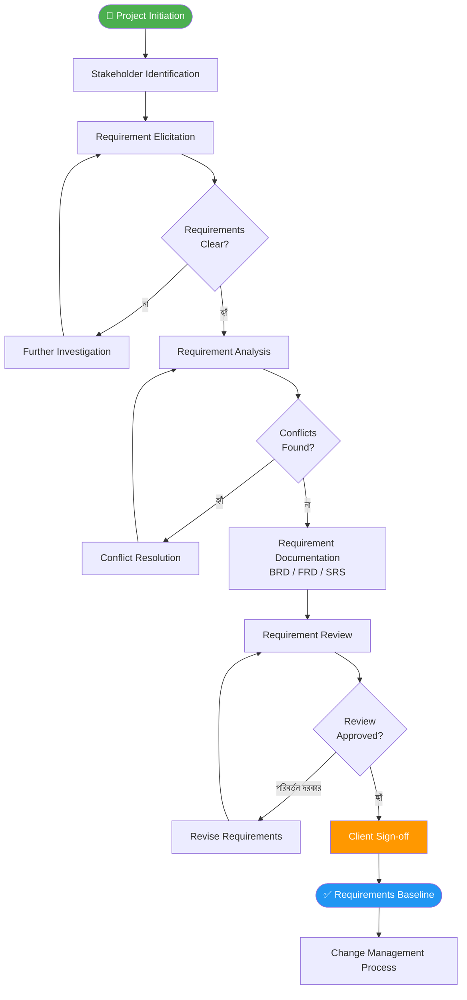
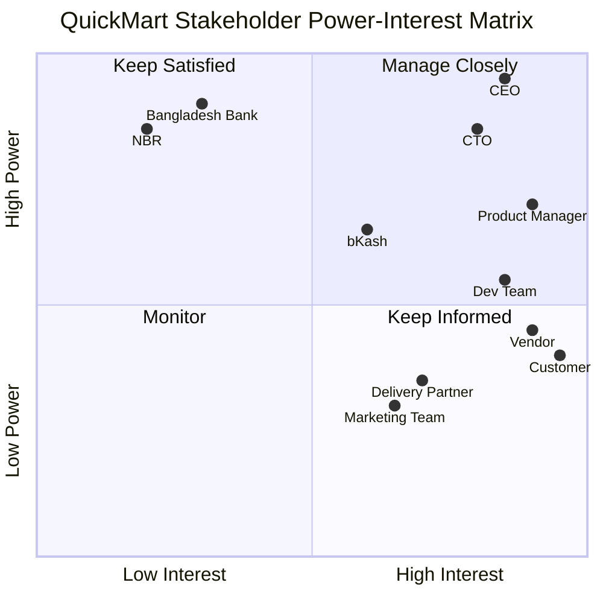
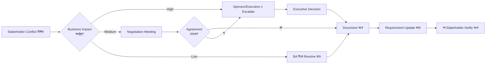
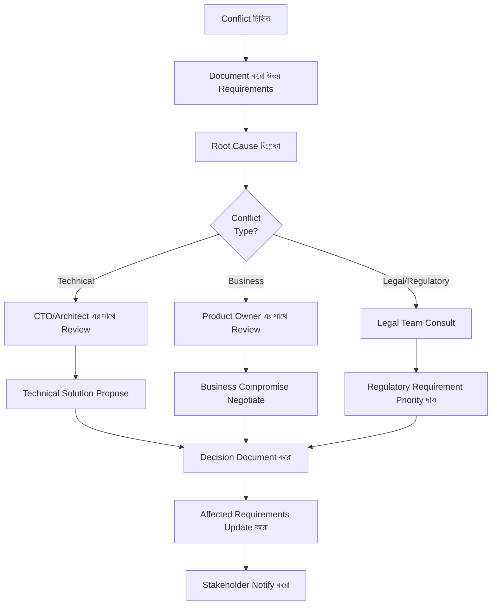
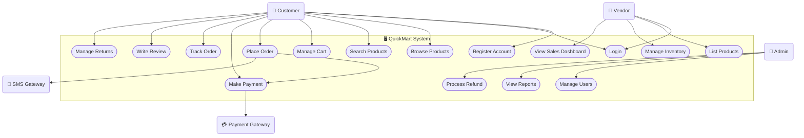
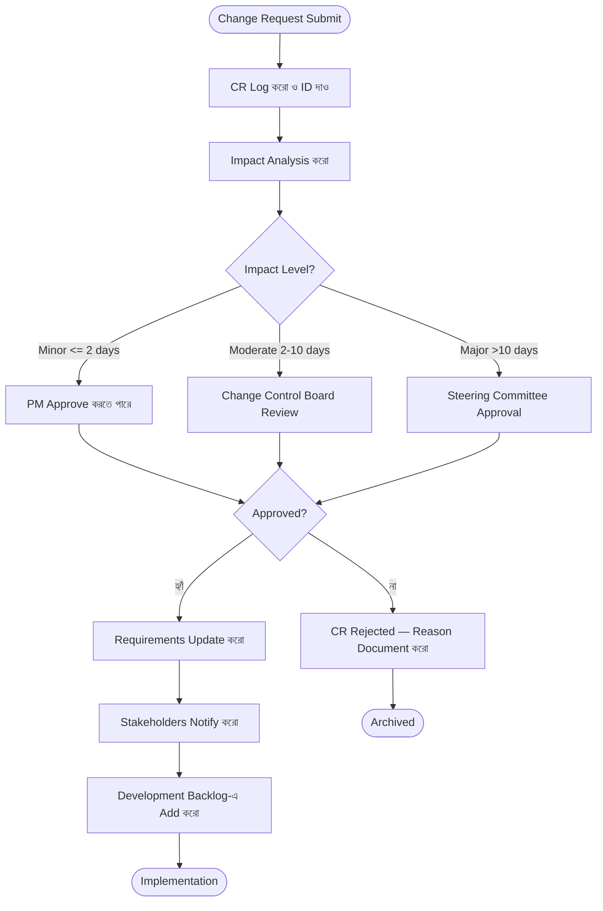

# Phase 1 — Requirements Engineering
## Client Requirement থেকে Software Blueprint পর্যন্ত

---

> **প্রজেক্ট উদাহরণ:** সমগ্র Document জুড়ে **QuickMart** নামক একটি E-commerce Platform-এর উদাহরণ ব্যবহার করা হয়েছে।
> QuickMart হলো একটি বাংলাদেশী Online Marketplace যেখানে Vendor-রা Product List করে এবং Customer-রা Order করতে পারে।

---

## সূচিপত্র

- [Phase 1 — Requirements Engineering](#phase-1--requirements-engineering)
  - [Client Requirement থেকে Software Blueprint পর্যন্ত](#client-requirement-থেকে-software-blueprint-পর্যন্ত)
  - [সূচিপত্র](#সূচিপত্র)
  - [Chapter 1: Requirements Engineering কী এবং কেন?](#chapter-1-requirements-engineering-কী-এবং-কেন)
    - [1.1 Requirements Engineering-এর সংজ্ঞা](#11-requirements-engineering-এর-সংজ্ঞা)
    - [1.2 Traditional vs Modern Approach](#12-traditional-vs-modern-approach)
      - [Traditional Approach (Waterfall-based)](#traditional-approach-waterfall-based)
      - [Modern Approach (Agile/Iterative-based)](#modern-approach-agileiterative-based)
      - [Hybrid Approach](#hybrid-approach)
    - [1.3 Requirements-এর ধরন](#13-requirements-এর-ধরন)
      - [Functional Requirements (FR)](#functional-requirements-fr)
      - [Non-Functional Requirements (NFR)](#non-functional-requirements-nfr)
      - [Business Rules (BR)](#business-rules-br)
      - [Constraints](#constraints)
    - [1.4 Common Mistakes এবং কীভাবে এড়াবে](#14-common-mistakes-এবং-কীভাবে-এড়াবে)
      - [Mistake 1: Ambiguous Language ব্যবহার](#mistake-1-ambiguous-language-ব্যবহার)
      - [Mistake 2: Solution Prescribing (Solution দিয়ে Requirement লেখা)](#mistake-2-solution-prescribing-solution-দিয়ে-requirement-লেখা)
      - [Mistake 3: Requirement-এর Incomplete Description](#mistake-3-requirement-এর-incomplete-description)
      - [Mistake 4: Stakeholder-কে Ignore করা](#mistake-4-stakeholder-কে-ignore-করা)
      - [Mistake 5: Requirements Verification না করা](#mistake-5-requirements-verification-না-করা)
      - [Mistake 6: NFR-কে উপেক্ষা করা](#mistake-6-nfr-কে-উপেক্ষা-করা)
    - [1.5 Requirements Engineering Process Flow](#15-requirements-engineering-process-flow)
  - [Chapter 2: Stakeholder Analysis](#chapter-2-stakeholder-analysis)
    - [2.1 Stakeholder কারা এবং কীভাবে চেনা যায়](#21-stakeholder-কারা-এবং-কীভাবে-চেনা-যায়)
      - [Stakeholder চেনার পদ্ধতি](#stakeholder-চেনার-পদ্ধতি)
    - [2.2 Stakeholder Matrix তৈরি করা](#22-stakeholder-matrix-তৈরি-করা)
      - [চারটি Quadrant-এর Strategy:](#চারটি-quadrant-এর-strategy)
    - [2.3 প্রতিটি Stakeholder-এর আলাদা চাওয়া](#23-প্রতিটি-stakeholder-এর-আলাদা-চাওয়া)
      - [QuickMart CEO-এর চাওয়া:](#quickmart-ceo-এর-চাওয়া)
      - [QuickMart CTO-এর চাওয়া:](#quickmart-cto-এর-চাওয়া)
      - [Customer (End User)-এর চাওয়া:](#customer-end-user-এর-চাওয়া)
      - [Vendor-এর চাওয়া:](#vendor-এর-চাওয়া)
      - [Customer Support Agent-এর চাওয়া:](#customer-support-agent-এর-চাওয়া)
    - [2.4 Stakeholder Conflict কীভাবে Handle করবে](#24-stakeholder-conflict-কীভাবে-handle-করবে)
      - [QuickMart-এর বাস্তব Conflict উদাহরণ:](#quickmart-এর-বাস্তব-conflict-উদাহরণ)
      - [Conflict Resolution Framework:](#conflict-resolution-framework)
  - [Chapter 3: Requirement Gathering Techniques](#chapter-3-requirement-gathering-techniques)
    - [3.1 Client Interview](#31-client-interview)
      - [Interview-এর ধরন:](#interview-এর-ধরন)
      - [Interview-এর আগে Preparation:](#interview-এর-আগে-preparation)
      - [প্রশ্নের ধরন:](#প্রশ্নের-ধরন)
      - [Interview Note-taking Framework (STAR Method Adapted):](#interview-note-taking-framework-star-method-adapted)
      - [QuickMart CEO Interview Sample Transcript (সারসংক্ষেপ):](#quickmart-ceo-interview-sample-transcript-সারসংক্ষেপ)
    - [3.2 Workshop Facilitation](#32-workshop-facilitation)
      - [Workshop-এর ধরন:](#workshop-এর-ধরন)
      - [QuickMart-এর Workshop Planning:](#quickmart-এর-workshop-planning)
      - [Workshop Facilitation Tips:](#workshop-facilitation-tips)
    - [3.3 Observation Technique](#33-observation-technique)
      - [Observation-এর ধরন:](#observation-এর-ধরন)
    - [3.4 Questionnaire এবং Survey](#34-questionnaire-এবং-survey)
      - [কখন Survey ব্যবহার করবে:](#কখন-survey-ব্যবহার-করবে)
      - [ভালো Survey Design-এর নিয়ম:](#ভালো-survey-design-এর-নিয়ম)
      - [QuickMart Customer Survey Sample:](#quickmart-customer-survey-sample)
    - [3.5 Prototyping Technique](#35-prototyping-technique)
      - [Prototype-এর ধরন:](#prototype-এর-ধরন)
    - [3.6 Document Analysis](#36-document-analysis)
      - [কী কী Document Analyze করবে:](#কী-কী-document-analyze-করবে)
      - [Document Analysis Process:](#document-analysis-process)
    - [3.7 কোন Technique কখন ব্যবহার করবে](#37-কোন-technique-কখন-ব্যবহার-করবে)
  - [Chapter 4: Requirement Analysis](#chapter-4-requirement-analysis)
    - [4.1 Functional Requirement (FR) বিস্তারিত](#41-functional-requirement-fr-বিস্তারিত)
      - [FR লেখার Standard Format:](#fr-লেখার-standard-format)
      - [FR-এর Completeness Checklist:](#fr-এর-completeness-checklist)
      - [QuickMart-এর Complete FR Set (Order Module):](#quickmart-এর-complete-fr-set-order-module)
    - [4.2 Non-Functional Requirement (NFR) বিস্তারিত](#42-non-functional-requirement-nfr-বিস্তারিত)
      - [NFR-এর প্রধান Categories (FURPS+ Model):](#nfr-এর-প্রধান-categories-furps-model)
      - [QuickMart-এর Complete NFR Set:](#quickmart-এর-complete-nfr-set)
    - [4.3 Business Rules (BR) বিস্তারিত](#43-business-rules-br-বিস্তারিত)
      - [Business Rules-এর ধরন:](#business-rules-এর-ধরন)
      - [QuickMart-এর Complete Business Rules:](#quickmart-এর-complete-business-rules)
    - [4.4 Constraints](#44-constraints)
      - [QuickMart-এর Full Constraint List:](#quickmart-এর-full-constraint-list)
    - [4.5 Assumptions](#45-assumptions)
      - [QuickMart-এর Assumptions:](#quickmart-এর-assumptions)
    - [4.6 Requirement Prioritization — MoSCoW Method](#46-requirement-prioritization--moscow-method)
      - [MoSCoW-এর কঠোর নিয়ম:](#moscow-এর-কঠোর-নিয়ম)
      - [QuickMart MVP-র MoSCoW Analysis:](#quickmart-mvp-র-moscow-analysis)
    - [4.7 Requirement Conflict চিহ্নিত করা ও সমাধান](#47-requirement-conflict-চিহ্নিত-করা-ও-সমাধান)
      - [Conflict-এর ধরন:](#conflict-এর-ধরন)
      - [Conflict Resolution Matrix:](#conflict-resolution-matrix)
  - [Chapter 5: Use Case তৈরি করা](#chapter-5-use-case-তৈরি-করা)
    - [5.1 Use Case কী এবং কেন দরকার](#51-use-case-কী-এবং-কেন-দরকার)
      - [Use Case কেন দরকার:](#use-case-কেন-দরকার)
      - [Use Case-এর Level:](#use-case-এর-level)
    - [5.2 Actor চেনা](#52-actor-চেনা)
      - [Actor-এর ধরন:](#actor-এর-ধরন)
    - [5.3 Use Case Diagram বানানো](#53-use-case-diagram-বানানো)
    - [5.4 Use Case Description লেখা](#54-use-case-description-লেখা)
      - [QuickMart — Use Case: "Order Place করা"](#quickmart--use-case-order-place-করা)
    - [5.5 Use Case vs User Story পার্থক্য](#55-use-case-vs-user-story-পার্থক্য)
    - [5.6 Complex Use Case-এর উদাহরণ](#56-complex-use-case-এর-উদাহরণ)
      - [QuickMart — Use Case: "Vendor Product List করে"](#quickmart--use-case-vendor-product-list-করে)
  - [Chapter 6: Requirements Documentation](#chapter-6-requirements-documentation)
    - [6.1 BRD — Business Requirements Document](#61-brd--business-requirements-document)
      - [QuickMart BRD Template (সম্পূর্ণ):](#quickmart-brd-template-সম্পূর্ণ)
    - [6.2 FRD — Functional Requirements Document](#62-frd--functional-requirements-document)
      - [QuickMart FRD Template (সম্পূর্ণ):](#quickmart-frd-template-সম্পূর্ণ)
    - [6.3 SRS — Software Requirements Specification](#63-srs--software-requirements-specification)
      - [QuickMart SRS — IEEE 830 Standard অনুযায়ী:](#quickmart-srs--ieee-830-standard-অনুযায়ী)
    - [6.4 তিনটি Document-এর পার্থক্য](#64-তিনটি-document-এর-পার্থক্য)
  - [Chapter 7: Requirements Validation এবং Sign-off](#chapter-7-requirements-validation-এবং-sign-off)
    - [7.1 Validation Checklist](#71-validation-checklist)
      - [Requirements Quality Checklist (প্রতিটি Requirement-এর জন্য):](#requirements-quality-checklist-প্রতিটি-requirement-এর-জন্য)
      - [Document-level Quality Check:](#document-level-quality-check)
    - [7.2 Review Meeting কীভাবে করবে](#72-review-meeting-কীভাবে-করবে)
      - [Review Meeting-এর ধরন:](#review-meeting-এর-ধরন)
      - [QuickMart Requirements Review Meeting Plan:](#quickmart-requirements-review-meeting-plan)
    - [7.3 Client Sign-off-এর গুরুত্ব](#73-client-sign-off-এর-গুরুত্ব)
      - [কেন Sign-off গুরুত্বপূর্ণ:](#কেন-sign-off-গুরুত্বপূর্ণ)
      - [Sign-off Process:](#sign-off-process)
    - [7.4 Change Request Process](#74-change-request-process)
      - [Change Request-এর কারণ (QuickMart-এ):](#change-request-এর-কারণ-quickmart-এ)
      - [Change Request Form:](#change-request-form)
      - [Change Request Workflow:](#change-request-workflow)
      - [Change Control Best Practices:](#change-control-best-practices)
  - [Quick Reference Table](#quick-reference-table)
    - [Requirements Hierarchy Diagram (QuickMart)](#requirements-hierarchy-diagram-quickmart)
  - [গ্রন্থপঞ্জি](#গ্রন্থপঞ্জি)

---

## Chapter 1: Requirements Engineering কী এবং কেন?

### 1.1 Requirements Engineering-এর সংজ্ঞা

Requirements Engineering (RE) হলো Software Development-এর সবচেয়ে গুরুত্বপূর্ণ প্রথম ধাপ — এটি একটি Systematic Process যার মাধ্যমে আমরা একটি Software System **কী করবে**, **কীভাবে করবে**, এবং **কার জন্য করবে** তা নির্ধারণ, বিশ্লেষণ, দলিলভুক্ত এবং যাচাই করি।

IEEE (Institute of Electrical and Electronics Engineers) Requirements Engineering-কে এভাবে সংজ্ঞায়িত করে:

> *"The process of studying user needs to arrive at a definition of system, hardware, or software requirements."*

আরও বিস্তারিতভাবে বলতে গেলে, Requirements Engineering হলো সেই প্রক্রিয়া যেখানে:

1. **Elicitation** — Stakeholder-দের কাছ থেকে প্রয়োজনীয়তা সংগ্রহ করা হয়
2. **Analysis** — সংগৃহীত তথ্য বিশ্লেষণ করে Conflict ও Ambiguity দূর করা হয়
3. **Specification** — Requirements-গুলো স্পষ্টভাবে Document করা হয়
4. **Validation** — Requirements সঠিক ও সম্পূর্ণ কিনা যাচাই করা হয়
5. **Management** — Requirements-এর পরিবর্তন ট্র্যাক ও নিয়ন্ত্রণ করা হয়

**QuickMart-এর প্রেক্ষাপটে:** QuickMart-এর CEO যখন বললেন "আমি একটি Online Shopping Platform চাই," এই একটি বাক্যটি তার মনের ভেতরে থাকা শত শত Requirements-এর ইঙ্গিত দেয়। Requirements Engineering-এর কাজ হলো সেই শত শত Requirements-কে Systematically বের করে আনা, বিশ্লেষণ করা, এবং Document করা যেন Development Team ঠিকঠাক System তৈরি করতে পারে।

একটি গবেষণায় দেখা গেছে (Standish Group CHAOS Report), Software Project Failure-এর প্রধান কারণগুলোর মধ্যে Requirements-সংক্রান্ত সমস্যা শীর্ষে:
- **Incomplete requirements** — ৩৭% Project ব্যর্থ হয়
- **Changing requirements** — ২৩% Project ব্যর্থ হয়
- **Unclear requirements** — ১৮% Project ব্যর্থ হয়

এই পরিসংখ্যান প্রমাণ করে যে Requirements Engineering শুধু একটি Process নয়, এটি একটি Software Project-এর সাফল্যের ভিত্তি।

---

### 1.2 Traditional vs Modern Approach

Requirements Engineering-এর দুটি প্রধান Approach রয়েছে, এবং প্রতিটি নির্দিষ্ট Context-এ কার্যকর।

#### Traditional Approach (Waterfall-based)

Traditional Approach-এ Requirements Engineering একটি সম্পূর্ণ, Linear Phase। Development শুরু হওয়ার আগেই সমস্ত Requirements চূড়ান্ত করতে হয়।

**বৈশিষ্ট্যসমূহ:**
- Requirements সম্পূর্ণ Frozen হয় Development Phase শুরুর আগে
- একটি বড় BRD বা SRS Document তৈরি হয়
- Client এবং Developer-এর মধ্যে Formal, Document-driven Communication
- Change Request Process Formal এবং Cost-bearing
- Planning Horizon: সমগ্র Project Duration

**কখন উপযুক্ত:**
- Government বা Defense Projects যেখানে Compliance mandatory
- Safety-critical Systems (Medical Device, Aircraft Control)
- Fixed-price, Fixed-scope Contract
- Requirements অত্যন্ত Stable এবং Client জানেন তিনি ঠিক কী চান

**QuickMart-এ Traditional Approach-এর উদাহরণ:** যদি QuickMart সরকারের Digital Commerce Registry-র সাথে Integrate করতে হয়, তাহলে সেই Integration Module-এর Requirements Traditional Approach-এ Document করা উচিত, কারণ Government API Specification পরিবর্তন হয় না।

#### Modern Approach (Agile/Iterative-based)

Modern Approach-এ Requirements একটি Living Document। Development চলার সাথে সাথে Requirements Evolve হয়।

**বৈশিষ্ট্যসমূহ:**
- Requirements প্রাথমিকভাবে High-level User Stories হিসেবে Capture হয়
- Sprint-by-Sprint Refinement
- Continuous Stakeholder Collaboration
- Change হলো Expected, Cost-bearing নয়
- Planning Horizon: Sprint (2-4 সপ্তাহ)
- Product Backlog-এ Requirements Prioritized থাকে

**কখন উপযুক্ত:**
- Startup বা নতুন Product যেখানে Market Feedback গুরুত্বপূর্ণ
- Requirements Unclear বা Likely to Change
- Short Time-to-Market Priority
- Collaborative Client যিনি Active থাকতে পারবেন

**QuickMart-এ Modern Approach-এর উদাহরণ:** QuickMart-এর Customer-facing Features যেমন Homepage Layout, Product Recommendation Engine, Review System — এগুলো Agile Approach-এ ভালো, কারণ User Behavior দেখে এগুলো Iterate করতে হয়।

#### Hybrid Approach

বাস্তবে অধিকাংশ Project একটি Hybrid Approach ব্যবহার করে:

```
┌─────────────────────────────────────────────────────────┐
│                    HYBRID APPROACH                       │
├─────────────────────────────────────────────────────────┤
│  Traditional Layer:                                      │
│  ┌─────────────────────────────────────────────────┐    │
│  │  Business Goals + Architecture + Constraints     │    │
│  │  (Fully documented, Stable, Signed-off)          │    │
│  └─────────────────────────────────────────────────┘    │
│                         ↓                               │
│  Agile Layer:                                            │
│  ┌─────────────────────────────────────────────────┐    │
│  │  Feature-level User Stories + Acceptance Tests   │    │
│  │  (Iterative, Evolving, Sprint-based)             │    │
│  └─────────────────────────────────────────────────┘    │
└─────────────────────────────────────────────────────────┘
```

**QuickMart-এ Hybrid Approach:** Architecture (Microservices, Database Design, Payment Gateway Integration) Traditional Document-এ থাকবে। Feature Development (Cart UX, Search Filter, Notification System) Agile User Stories-এ থাকবে।

---

### 1.3 Requirements-এর ধরন

Requirements চার ধরনের হয়। প্রতিটি ধরন আলাদা Purpose Serve করে এবং আলাদাভাবে Document করতে হয়।

#### Functional Requirements (FR)

Functional Requirements বলে **System কী করবে**। এটি System-এর প্রতিটি Specific Function, Feature বা Behavior Describe করে।

একটি ভালো Functional Requirement-এর বৈশিষ্ট্য:
- **Specific:** অস্পষ্ট ভাষা নেই
- **Measurable:** পরিমাপযোগ্য
- **Verifiable:** Test করে Verify করা যায়
- **Traceable:** Business Goal-এর সাথে Link করা যায়

**QuickMart-এর Functional Requirements-এর উদাহরণ:**

| FR-ID | Requirement | Category |
|-------|-------------|----------|
| FR-001 | Customer একটি Email Address এবং Password দিয়ে Account Register করতে পারবে | Authentication |
| FR-002 | Customer Product Name, Category বা Brand দিয়ে Search করতে পারবে | Search |
| FR-003 | Customer Shopping Cart-এ Maximum ৫০টি Unique Product Add করতে পারবে | Cart |
| FR-004 | System Customer-কে Order Confirmation Email পাঠাবে Order Place হওয়ার ৩ মিনিটের মধ্যে | Notification |
| FR-005 | Vendor নিজের Dashboard থেকে Product Stock Update করতে পারবে | Inventory |
| FR-006 | Customer bKash, Nagad, Visa, Mastercard দিয়ে Payment করতে পারবে | Payment |
| FR-007 | Admin যেকোনো User Account Suspend করতে পারবে Reason সহ | Administration |
| FR-008 | System প্রতিটি Order-এর জন্য একটি Unique Order ID Generate করবে (Format: QM-YYYYMMDD-XXXXX) | Order Management |

#### Non-Functional Requirements (NFR)

Non-Functional Requirements বলে **System কীভাবে করবে**। এটি System-এর Quality, Performance, Security, এবং Operational Characteristics Define করে।

**QuickMart-এর Non-Functional Requirements-এর উদাহরণ:**

| NFR-ID | Category | Requirement |
|--------|----------|-------------|
| NFR-001 | Performance | Homepage ৩ seconds-এর মধ্যে Load হবে 4G Connection-এ |
| NFR-002 | Scalability | System একসাথে ১০,০০০ Concurrent User Handle করতে পারবে |
| NFR-003 | Availability | System ৯৯.৯% Uptime নিশ্চিত করবে (Monthly Downtime < ৪৩ minutes) |
| NFR-004 | Security | সমস্ত Data HTTPS দিয়ে Transmit হবে, Password bcrypt-এ Hashed থাকবে |
| NFR-005 | Usability | নতুন User বিনা Training-এ প্রথম Order Complete করতে পারবে ৫ মিনিটের মধ্যে |
| NFR-006 | Maintainability | Code Coverage ৮০%-এর বেশি থাকতে হবে |
| NFR-007 | Compatibility | Chrome 90+, Firefox 88+, Safari 14+, Edge 90+ Browser Support করবে |
| NFR-008 | Data Retention | Customer Order History ৫ বছর পর্যন্ত সংরক্ষণ করা হবে |

#### Business Rules (BR)

Business Rules হলো সেই নিয়মগুলো যা Business-এর Operation এবং Decision-making গভর্ন করে। এগুলো Functional Requirement নয়, কিন্তু Functional Requirement-এর Behavior নির্ধারণ করে।

**QuickMart-এর Business Rules-এর উদাহরণ:**

| BR-ID | Business Rule |
|-------|---------------|
| BR-001 | Vendor-কে Product List করতে হলে Trade License Upload করতে হবে |
| BR-002 | Customer রাত ১১টার পরে Order করলে পরের দিন সকাল ৯টায় Processing শুরু হবে |
| BR-003 | ৫০০ টাকার কম Order-এ Delivery Charge প্রযোজ্য হবে |
| BR-004 | কোনো Product ৩ বার Return হলে সেই Product Automatically Delisted হবে |
| BR-005 | Vendor Commission: Electronics ৫%, Fashion ১২%, Groceries ৩% |
| BR-006 | Payment Failure হলে Order Maximum ২৪ ঘণ্টা Reserved থাকবে |
| BR-007 | Customer ১৫ দিনের মধ্যে Product Return করতে পারবে (Perishable Items ব্যতীত) |

#### Constraints

Constraints হলো সেই সীমাবদ্ধতা যা System Design ও Development-এ বাধ্যতামূলকভাবে মেনে চলতে হবে।

**QuickMart-এর Constraints:**

| Constraint-ID | Type | Description |
|---------------|------|-------------|
| CON-001 | Technical | Backend must use Node.js (Team Expertise) |
| CON-002 | Legal | Bangladesh Bank-এর Payment Guideline ২০২৩ Follow করতে হবে |
| CON-003 | Budget | Total Development Budget: ৳৮০ লাখ |
| CON-004 | Timeline | MVP Launch: ৬ মাসের মধ্যে |
| CON-005 | Technology | Mobile App: Flutter (iOS + Android একসাথে) |
| CON-006 | Data | Customer Data Bangladesh-এ Located Server-এ Store হবে |

---

### 1.4 Common Mistakes এবং কীভাবে এড়াবে

Requirements Engineering-এ কিছু Common Mistake বারবার দেখা যায়। এগুলো চেনা এবং এড়ানো জানা একজন দক্ষ Analyst-এর অন্যতম গুণ।

#### Mistake 1: Ambiguous Language ব্যবহার

**ভুল উদাহরণ (QuickMart):**
> "System অনেক দ্রুত Response করবে।"

**কেন ভুল:** "অনেক দ্রুত" পরিমাপযোগ্য নয়। Developer বলবে ৫ সেকেন্ড যথেষ্ট, Client বলবে ১ সেকেন্ডের বেশি হলে চলবে না।

**সঠিক উদাহরণ:**
> "Product Search Result ১.৫ seconds-এর মধ্যে Display হবে, ১০০ Concurrent User-এর Scenario-তে।"

**নিয়ম:** Requirements-এ কখনো ব্যবহার করবে না — দ্রুত, সহজ, ভালো, নমনীয়, ব্যবহারকারী-বান্ধব, সাধারণত, প্রায়, কিছু। এর পরিবর্তে Measurable Criteria ব্যবহার করো।

#### Mistake 2: Solution Prescribing (Solution দিয়ে Requirement লেখা)

**ভুল উদাহরণ:**
> "System একটি MySQL Database ব্যবহার করে Customer Data Store করবে।"

**কেন ভুল:** এটি একটি Design Decision, Requirement নয়। Requirement হওয়া উচিত **কী** করতে হবে, **কীভাবে** করতে হবে তা নয়।

**সঠিক উদাহরণ:**
> "System Customer-এর Profile Information, Order History এবং Address Book Persistently Store করবে এবং যেকোনো Session থেকে Access করার সুবিধা দেবে।"

#### Mistake 3: Requirement-এর Incomplete Description

**ভুল উদাহরণ:**
> "Customer Password Reset করতে পারবে।"

**কেন ভুল:** কীভাবে? কোথায়? কতক্ষণ Valid থাকবে? সব প্রশ্নের উত্তর নেই।

**সঠিক উদাহরণ:**
> "Customer Registered Email-এ একটি Password Reset Link Request করতে পারবে। Link Delivery হবে সর্বোচ্চ ২ মিনিটের মধ্যে। Link Expire হবে ৩০ মিনিট পরে। Customer নতুন Password Set করলে পূর্ববর্তী তিনটি Password পুনরায় ব্যবহার করতে পারবে না।"

#### Mistake 4: Stakeholder-কে Ignore করা

এমন Technical Team আছে যারা শুধু IT Manager-এর সাথে কথা বলে এবং End User-দের সাথে কথা বলে না। ফলে তারা Technically সঠিক কিন্তু Practically Useless System তৈরি করে।

**QuickMart-এ এর প্রভাব:** যদি Vendor-দের সাথে কথা না বলা হয়, তাহলে Vendor Dashboard-এ এমন Feature বাদ যাবে যা তাদের দরকার — যেমন Bulk Product Upload বা Sales Analytics।

**সমাধান:** Stakeholder Mapping-এ সমস্ত User Group চিহ্নিত করো এবং প্রতিটি Group থেকে কমপক্ষে একজন Representative-এর সাথে কথা বলো।

#### Mistake 5: Requirements Verification না করা

অনেক সময় Requirements লেখা হয় কিন্তু Client-কে দিয়ে Verify করা হয় না। ফলে Analyst যা বুঝেছে এবং Client যা চেয়েছে তার মধ্যে Gap থাকে।

**সমাধান:** প্রতিটি Requirement লেখার পরে তা Client-কে Plain Language-এ পড়িয়ে Confirm করো। Prototype তৈরি করে দেখাও।

#### Mistake 6: NFR-কে উপেক্ষা করা

অনেক Project শুধু Functional Requirements Collect করে NFR Ignore করে। ফলে Launch-এর পরে Performance Issue, Security Breach, এবং Scalability Problem দেখা দেয়।

**QuickMart-এ পরিণতি:** Shopping Season (Eid, Puja)-তে Traffic Spike হলে System Crash করবে যদি Scalability NFR আগে Define না থাকে।

---

### 1.5 Requirements Engineering Process Flow



---

> 📚 **Reference:**
> - Karl Wiegers & Joy Beatty, *Software Requirements* (3rd Ed.), Chapter 1: "The Essential Software Requirement" — Requirements-এর সংজ্ঞা ও গুরুত্ব
> - Elizabeth Hull et al., *Requirements Engineering*, Chapter 2: "Types of Requirements" — FR, NFR, Constraint-এর বিস্তারিত বিভাজন
> - BABOK Guide v3, Chapter 1: "Business Analysis Key Concepts" — Modern BA Practice Overview

[↑ সূচিপত্রে ফিরুন](#সূচিপত্র)

---

## Chapter 2: Stakeholder Analysis

### 2.1 Stakeholder কারা এবং কীভাবে চেনা যায়

Stakeholder হলো যেকোনো ব্যক্তি, গোষ্ঠী বা সংস্থা যারা:
- Software System থেকে **উপকৃত** হবে, অথবা
- System দ্বারা **প্রভাবিত** হবে, অথবা
- System-এর **সাফল্য বা ব্যর্থতায় আগ্রহী**

Stakeholder-দের দুটি প্রধান Category:

**Primary Stakeholders (Direct Stakeholders):**
এরা সরাসরি System ব্যবহার করে বা System তৈরিতে সরাসরি জড়িত।

**Secondary Stakeholders (Indirect Stakeholders):**
এরা System থেকে পরোক্ষভাবে প্রভাবিত হয় বা Project-এর উপর Authority রাখে।

#### Stakeholder চেনার পদ্ধতি

**পদ্ধতি ১: "5W" প্রশ্নমালা**

প্রতিটি প্রশ্ন জিজ্ঞেস করো:
- **Who** will use this system? (কে ব্যবহার করবে?)
- **Who** will be affected by this system? (কে প্রভাবিত হবে?)
- **Who** has authority over this system? (কার Authority আছে?)
- **Who** has expertise needed for this system? (কার Expertise দরকার?)
- **Who** will fund this system? (কে Fund করবে?)

**পদ্ধতি ২: Organizational Chart Analysis**

Client-এর Org Chart দেখে বিভিন্ন Department চিহ্নিত করো এবং প্রতিটি Department-এর সাথে System-এর সম্পর্ক বের করো।

**পদ্ধতি ৩: Process Tracing**

"Order Place হওয়া থেকে Delivery পর্যন্ত" — এই পুরো Process Trace করো এবং প্রতিটি Step-এ কে জড়িত তা চিহ্নিত করো।

**QuickMart-এর সম্পূর্ণ Stakeholder List:**

| Stakeholder | Type | Category |
|-------------|------|----------|
| QuickMart CEO | Internal | Primary Decision Maker |
| QuickMart CTO | Internal | Technical Authority |
| Product Manager | Internal | Product Owner |
| Customer (End User) | External | Primary User |
| Vendor/Seller | External | Primary User |
| Delivery Partner | External | Operational User |
| Customer Support Agent | Internal | Operational User |
| Finance/Accounts Team | Internal | Operational User |
| Marketing Team | Internal | Data Consumer |
| Payment Gateway (bKash, SSLCOMMERZ) | External | Technical Partner |
| Bangladesh Bank | External/Regulatory | Regulatory Body |
| Tax Authority (NBR) | External/Regulatory | Regulatory Body |
| Development Team | Internal | Implementer |
| QA Team | Internal | Quality Assurance |
| System Admin | Internal | Operational User |

---

### 2.2 Stakeholder Matrix তৈরি করা

Stakeholder Matrix দুটি Axis-এ Stakeholder-দের Position করে: **Power/Influence** এবং **Interest**। এই Matrix দিয়ে বোঝা যায় কার সাথে কতটা Engage করতে হবে।



#### চারটি Quadrant-এর Strategy:

**Quadrant 1 — Manage Closely (High Power, High Interest):**
CEO, CTO, Product Manager — এরা সবচেয়ে গুরুত্বপূর্ণ। এদের সাথে নিয়মিত Communication রাখো, প্রতিটি গুরুত্বপূর্ণ Decision-এ Involve করো।

**Quadrant 2 — Keep Satisfied (High Power, Low Interest):**
Bangladesh Bank, NBR — এদের Power অনেক বেশি কিন্তু Day-to-day Operation-এ Interest কম। এদের Compliance Requirements পূরণ করো, মাঝে মাঝে Update দাও।

**Quadrant 3 — Keep Informed (Low Power, High Interest):**
Customer, Vendor, Delivery Partner — এরা সরাসরি ব্যবহার করবে কিন্তু Project-এ Power কম। এদের Requirements সংগ্রহ করো, Beta Testing-এ Include করো।

**Quadrant 4 — Monitor (Low Power, Low Interest):**
Marketing Team, Support Team — নিয়মিত Monitor করো, বড় পরিবর্তনে Notify করো।

---

### 2.3 প্রতিটি Stakeholder-এর আলাদা চাওয়া

একই System সম্পর্কে বিভিন্ন Stakeholder-এর আলাদা আলাদা Priority এবং Expectation থাকে। এটা বোঝা না গেলে Requirements Conflict তৈরি হয়।

#### QuickMart CEO-এর চাওয়া:
- **Business Goal:** ৬ মাসে Market Launch, প্রথম বছরে ১০,০০০ Active Vendor
- **Focus:** Revenue Model, Commission Structure, Competitive Advantage
- **Pain Point:** Competitor Daraz ইতিমধ্যে Market-এ আছে, তাই Fast Launch দরকার
- **Success Metric:** GMV (Gross Merchandise Value), Monthly Active Users

#### QuickMart CTO-এর চাওয়া:
- **Technical Goal:** Scalable Architecture, Maintainable Codebase
- **Focus:** Technology Stack, Security, Infrastructure Cost
- **Pain Point:** Team-এ Junior Developer বেশি, তাই Complex Architecture Avoid করতে চান
- **Success Metric:** System Uptime, Response Time, Technical Debt

#### Customer (End User)-এর চাওয়া:
- **Goal:** সহজে পণ্য খুঁজে কিনতে পারা, নির্ভরযোগ্য Delivery
- **Focus:** UI/UX, Product Quality, Price Comparison, Return Policy
- **Pain Point:** Fake Product, Late Delivery, Complex Return Process
- **Success Metric:** Order Completion Rate, Return Rate, Review Score

#### Vendor-এর চাওয়া:
- **Goal:** সহজে Product List করা, বেশি বিক্রি করা, দ্রুত Payment পাওয়া
- **Focus:** Dashboard Usability, Sales Analytics, Low Commission, Quick Payout
- **Pain Point:** Manual Product Upload, Payment Delay, Unfair Review System
- **Success Metric:** Sales Volume, Payment Turnaround Time

#### Customer Support Agent-এর চাওয়া:
- **Goal:** Customer-এর Complaint দ্রুত Resolve করা
- **Focus:** Easy Access to Order Information, Refund Processing Tool
- **Pain Point:** Multiple System Login, Manual Data Search
- **Success Metric:** Average Resolution Time, Customer Satisfaction Score

---

### 2.4 Stakeholder Conflict কীভাবে Handle করবে

Stakeholder Conflict তখন হয় যখন দুই বা ততোধিক Stakeholder-এর Requirements একে অপরের সাথে Contradiction করে।

#### QuickMart-এর বাস্তব Conflict উদাহরণ:

**Conflict 1: CEO vs CTO (Speed vs Quality)**
- CEO চান: ৬ মাসে Launch, সব Feature সহ
- CTO চান: ৯-১২ মাস, Proper Architecture সহ
- **Resolution Strategy:** MVP (Minimum Viable Product) Define করো। Core Features নিয়ে ৬ মাসে Launch, বাকি Features Roadmap-এ রাখো।

**Conflict 2: Vendor vs Finance Team (Commission Rate)**
- Vendor চান: Fashion-এ ৫% Commission
- Finance চান: Fashion-এ ১৫% Commission
- **Resolution Strategy:** Data-driven Decision। Industry Benchmark দেখাও (Daraz, Shajgoj)-এর Commission Structure। Tiered Commission Propose করো।

**Conflict 3: Customer vs Delivery Partner (Delivery Speed)**
- Customer চান: Same-day Delivery
- Delivery Partner বলছে: Same-day শুধু Dhaka Metropolitan-এ সম্ভব
- **Resolution Strategy:** Geographic Segmentation। Dhaka-তে Same-day, অন্য District-এ 2-3 দিন। System-এ Delivery Estimate Clearly দেখাও।

#### Conflict Resolution Framework:

```
┌─────────────────────────────────────────────────────┐
│            CONFLICT RESOLUTION STEPS                 │
├─────────────────────────────────────────────────────┤
│  Step 1: Document করো                               │
│  └── উভয় পক্ষের Requirement স্পষ্টভাবে লিখো       │
│                                                      │
│  Step 2: Root Cause বিশ্লেষণ করো                    │
│  └── কেন এই Conflict? Business Goal না Personal?    │
│                                                      │
│  Step 3: Common Ground খোঁজো                        │
│  └── উভয় পক্ষ কোথায় একমত?                          │
│                                                      │
│  Step 4: Options Generate করো                       │
│  └── কমপক্ষে ৩টি Solution Option তৈরি করো           │
│                                                      │
│  Step 5: Data দিয়ে সিদ্ধান্ত নাও                    │
│  └── Benchmark, User Research, Cost Analysis        │
│                                                      │
│  Step 6: Escalate যদি দরকার হয়                      │
│  └── Senior Management বা Project Sponsor-কে Involve│
│                                                      │
│  Step 7: Document করো Decision                      │
│  └── সিদ্ধান্ত এবং Rationale লিখে রাখো              │
└─────────────────────────────────────────────────────┘
```

---



---

> 📚 **Reference:**
> - BABOK Guide v3, Chapter 3: "Stakeholder Engagement" — Stakeholder Analysis Techniques
> - Karl Wiegers, *Software Requirements* (3rd Ed.), Chapter 6: "Finding the Voice of the Customer"
> - Robertson & Robertson, *Mastering the Requirements Process*, Chapter 4: "Stakeholders"

[↑ সূচিপত্রে ফিরুন](#সূচিপত্র)

---

## Chapter 3: Requirement Gathering Techniques

Requirement Gathering বা Elicitation হলো Stakeholder-দের মন থেকে Requirements বের করে আনার প্রক্রিয়া। এটি Requirements Engineering-এর সবচেয়ে চ্যালেঞ্জিং অংশ কারণ মানুষ প্রায়ই তারা কী চায় তা পরিষ্কারভাবে Express করতে পারে না।

### 3.1 Client Interview

Interview হলো সবচেয়ে প্রচলিত এবং কার্যকর Elicitation Technique। এতে Analyst এবং Stakeholder সরাসরি কথা বলে Requirements Explore করে।

#### Interview-এর ধরন:

**Structured Interview:**
- প্রশ্নগুলো আগে থেকে তৈরি করা
- প্রতিটি Respondent-কে একই প্রশ্ন
- Data Comparison সহজ হয়
- নতুন Discovery-র সুযোগ কম

**Unstructured Interview:**
- কোনো নির্দিষ্ট প্রশ্ন নেই
- Free-flowing Conversation
- নতুন Requirements Discover হওয়ার সম্ভাবনা বেশি
- Data Inconsistent হতে পারে

**Semi-structured Interview (সবচেয়ে কার্যকর):**
- Core প্রশ্নগুলো Prepared আছে
- Interesting Answers-এর উপর Follow-up করার স্বাধীনতা আছে
- Structured এবং Unstructured-এর সুবিধা একসাথে

#### Interview-এর আগে Preparation:

```
Interview Preparation Checklist:
━━━━━━━━━━━━━━━━━━━━━━━━━━━━━━━
□ Stakeholder সম্পর্কে Background Research করো
□ Company-র Business Model বোঝো
□ Industry-র Common Challenges জানো
□ পূর্ববর্তী Meetings-এর Notes Review করো
□ ১৫-২০টি Core Question তৈরি করো
□ Recording Permission নাও
□ Agenda আগে Send করো
□ Comfortable Environment নিশ্চিত করো (শান্ত জায়গা)
□ Note-taking Tool প্রস্তুত রাখো
□ ৬০-৯০ মিনিট Block করো
```

#### প্রশ্নের ধরন:

**Open-ended Questions (সবচেয়ে বেশি ব্যবহার করো):**
এই প্রশ্নগুলো বিস্তারিত উত্তর আহরণ করে।

*QuickMart Interview-এ Open-ended প্রশ্নের উদাহরণ:*
- "আপনার Business-এর মূল Challenge কী বর্তমানে?"
- "একজন Vendor QuickMart-এ কেন Sell করবে বলে মনে করেন?"
- "Customer-রা Shopping করার সময় সাধারণত কোথায় Frustrate হন?"
- "আদর্শ Checkout Process কেমন হবে বলে মনে করেন?"

**Closed-ended Questions (Clarification-এর জন্য):**
- "আপনি কি চান Customer Guest Checkout করতে পারুক?"
- "প্রতি মাসে কত Vendor Onboard হবে বলে Target আছে?"

**Probing Questions (Deeper Understanding-এর জন্য):**
- "আপনি বললেন System Fast হতে হবে — Fast বলতে কতটা Fast?"
- "এই Feature কেন গুরুত্বপূর্ণ আপনার Business-এর জন্য?"
- "এই ব্যর্থতার কারণ কী মনে করেন?"
- "অন্য কোনো System দেখেছেন যা এটা ভালো করে?"

**Hypothetical Questions (Future Scenario Explore করতে):**
- "যদি ১০০,০০০ Customer একসাথে Site Visit করে কী হবে বলে মনে করেন?"
- "যদি Vendor নিজে Product Price Change করতে না পারে, সেটা কতটা সমস্যার?"

#### Interview Note-taking Framework (STAR Method Adapted):

```
Situation (পরিস্থিতি):
└── Client কোন Context-এ কথা বলছেন?

Task/Problem (সমস্যা):
└── Exact Problem কী বললেন?

Action Required (প্রয়োজনীয় কাজ):
└── System কী করা উচিত?

Result Expected (প্রত্যাশিত ফলাফল):
└── সফল হলে কেমন দেখাবে?
```

#### QuickMart CEO Interview Sample Transcript (সারসংক্ষেপ):

**Analyst:** "QuickMart Platform-এ কোন ধরনের Vendor-দের Target করছেন?"

**CEO:** "প্রথমত SME Business, মানে ছোট-মাঝারি ব্যবসায়ী যারা অনলাইনে আসতে চাইছে। তাদের নিজস্ব Website বানানোর সামর্থ্য নেই কিন্তু Facebook-এ Sell করছে। এদের জন্য Platform Onboarding অনেক সহজ হতে হবে।"

**Analyst:** "Onboarding সহজ বলতে কী বোঝাচ্ছেন?"

**CEO:** "একজন Vendor যিনি Smartphone চালাতে পারেন, তিনি যেন নিজে নিজে Sign Up করে ৩০ মিনিটের মধ্যে প্রথম Product List করতে পারেন।"

**Analyst Note:**
- FR: Vendor Onboarding Flow Mobile-optimized হতে হবে
- NFR: Vendor Registration থেকে First Product Publish: ≤ ৩০ মিনিট
- Assumption: Vendor Smartphone ব্যবহারে Comfortable

---

### 3.2 Workshop Facilitation

Workshop হলো একটি Structured Group Meeting যেখানে একাধিক Stakeholder একসাথে Requirements Discuss করে। এটি Interview-এর চেয়ে বেশি Collaborative এবং Complex Requirements Quickly Capture করতে সাহায্য করে।

#### Workshop-এর ধরন:

**JAD (Joint Application Development) Workshop:**
Business এবং Technical দুই পক্ষ একসাথে বসে Requirements Define করে। IBM ১৯৭০-এর দশকে এটি Develop করে।

**Requirements Workshop:**
Focused requirement gathering session যেখানে Business Analyst Facilitator হিসেবে কাজ করে।

**Design Sprint:**
Google Ventures-এর popularized approach। ৫ দিনে Problem Define থেকে Prototype পর্যন্ত।

#### QuickMart-এর Workshop Planning:

```
Workshop: QuickMart Order Management Requirements
━━━━━━━━━━━━━━━━━━━━━━━━━━━━━━━━━━━━━━━━━━━━━━━━━

Participants:
  • Product Manager (Facilitator)
  • Business Analyst (Note-taker)
  • CTO / Lead Developer
  • Customer Support Manager
  • Vendor Relations Manager
  • Finance Manager

Duration: 3 ঘণ্টা (2 ঘণ্টা discussion + 1 ঘণ্টা review)

Agenda:
  09:00 - 09:15 — Introduction & Ground Rules
  09:15 - 10:00 — AS-IS Process Mapping
  10:00 - 10:45 — Pain Points & Opportunities
  10:45 - 11:00 — Break
  11:00 - 11:30 — TO-BE Process Design
  11:30 - 12:00 — Priority Voting & Sign-off

Materials:
  • Whiteboard / Miro Board
  • Sticky Notes (বিভিন্ন রঙ)
  • Process Templates
  • Voting Dots
```

#### Workshop Facilitation Tips:

**Parking Lot তৈরি রাখো:** যেসব Topic এই Workshop-এ Out of Scope তা Parking Lot-এ রাখো, পরে Address করবে। এটা Discussion-কে Focused রাখে।

**Time-boxing করো:** প্রতিটি Topic-এ Time Limit দাও। কেউ যদি বেশি কথা বলে, Politely Time-box করো।

**ELMO Rule:** "Enough, Let's Move On" — যখন কোনো Topic Circular হচ্ছে, এই Rule Apply করো।

**Voting করাও:** Multi-dot Voting দিয়ে Priority তাৎক্ষণিকভাবে নির্ধারণ করো।

---

### 3.3 Observation Technique

Observation হলো Analyst সরাসরি User-এর কাজ দেখে Requirements Capture করার Technique। এটি Particularly কার্যকর যখন User নিজেই জানে না সে কী করে বা করার চেষ্টা করে।

#### Observation-এর ধরন:

**Passive Observation (Shadowing):**
Analyst শুধু দেখে, কথা বলে না। User যা স্বাভাবিকভাবে করে তা Note করে।

**Active Observation (Think-aloud Protocol):**
User তার কাজ করার সময় মুখে বলে কী ভাবছে। Analyst শুনে Note করে।

**QuickMart-এ Observation Example:**

Analyst একজন Real Vendor-এর সাথে বসলেন যিনি Facebook-এ Product Sell করেন। তিনি Vendor-কে বললেন "আমাদের Prototype-এ Product List করার চেষ্টা করুন।"

**Observation Notes:**
- Vendor Product Image Upload করতে ৫ মিনিট লাগাচ্ছেন কারণ Image Size Requirement বুঝতে পারছেন না
- Vendor Category Selection-এ Confused — "হালকা যন্ত্রপাতি" কোথায় যাবে?
- Vendor Price Field-এ টাকার চিহ্ন খুঁজছেন
- Vendor Product Description-এ বাংলায় লিখলে Character Count দেখাচ্ছে না

**Requirements Derived:**
- NFR: Image Upload-এ Real-time Feedback দিতে হবে (Size, Format)
- FR: Category Search Functionality দরকার
- FR: Currency Symbol (৳) Price Field-এ দেখাতে হবে
- Bug: Bengali Character Count Fix করতে হবে

---

### 3.4 Questionnaire এবং Survey

Questionnaire এবং Survey বড় Audience-এর কাছ থেকে Quantitative Data সংগ্রহ করতে ব্যবহার হয়। এটি Individual Interview-এর Supplement হিসেবে কাজ করে।

#### কখন Survey ব্যবহার করবে:
- ১০০+ User-এর Opinion দরকার
- Geographic Distance বাধা
- Budget সীমিত
- Statistical Validation দরকার

#### ভালো Survey Design-এর নিয়ম:

**নিয়ম ১: Leading Question এড়াও**
- ভুল: "আপনি কি মনে করেন না যে Fast Delivery গুরুত্বপূর্ণ?"
- সঠিক: "Delivery Speed কতটা গুরুত্বপূর্ণ আপনার কাছে? (১-৫ Scale)"

**নিয়ম ২: Double-barreled Question এড়াও**
- ভুল: "আপনি কি Platform-এর Speed এবং Design নিয়ে Satisfied?"
- সঠিক: দুটি আলাদা প্রশ্ন করো

**নিয়ম ৩: Survey ছোট রাখো**
- সর্বোচ্চ ১৫-২০টি প্রশ্ন
- ৫-৭ মিনিটে Complete হওয়া উচিত

#### QuickMart Customer Survey Sample:

```
QuickMart Pre-Launch Customer Survey
━━━━━━━━━━━━━━━━━━━━━━━━━━━━━━━━━━━

Section 1: Shopping Behavior

Q1. আপনি সপ্তাহে কতবার Online Shopping করেন?
    ○ কখনো না
    ○ মাসে ১-২ বার
    ○ সপ্তাহে ১-২ বার
    ○ সপ্তাহে ৩+ বার

Q2. আপনি সাধারণত কোন Platform-এ Shop করেন? (সব Select করুন)
    □ Daraz
    □ Shajgoj
    □ Chaldal
    □ Facebook Page
    □ Instagram Shop
    □ অন্য (লিখুন): ___________

Q3. Online Shopping-এ আপনার সবচেয়ে বড় সমস্যা কী?
    ○ Fake Product
    ○ Late Delivery
    ○ Difficult Return Process
    ○ Payment Security
    ○ Poor Customer Support
    ○ অন্য: ___________

Section 2: Payment Preference

Q4. আপনি সাধারণত কোন Method-এ Payment করেন?
    ○ bKash
    ○ Nagad
    ○ Credit/Debit Card
    ○ Cash on Delivery
    ○ Rocket

Q5. Cash on Delivery ছাড়া অন্য Method ব্যবহারে Hesitate করেন কি?
    ○ হ্যাঁ, Security নিয়ে চিন্তিত
    ○ না, Digital Payment-এ Comfortable
    ○ পরিস্থিতির উপর নির্ভর করে

Section 3: Feature Importance (১ = কম গুরুত্বপূর্ণ, ৫ = খুব গুরুত্বপূর্ণ)

Q6. Product Review System          ○1 ○2 ○3 ○4 ○5
Q7. Price Comparison Feature        ○1 ○2 ○3 ○4 ○5
Q8. Real-time Delivery Tracking     ○1 ○2 ○3 ○4 ○5
Q9. Wishlist / Save for Later       ○1 ○2 ○3 ○4 ○5
Q10. Live Chat Support              ○1 ○2 ○3 ○4 ○5
```

---

### 3.5 Prototyping Technique

Prototyping হলো System-এর একটি Early Model তৈরি করা যা দেখিয়ে Stakeholder-দের কাছ থেকে Feedback নেওয়া হয়। এটি অত্যন্ত কার্যকর কারণ মানুষ Abstract Description থেকে Requirements বলতে পারে না কিন্তু কিছু দেখলে বলতে পারে।

#### Prototype-এর ধরন:

**Low-fidelity Prototype (Paper / Wireframe):**
- কাগজে বা Balsamiq/Figma-এ Basic Sketch
- শুধু Layout, কোনো Color বা Final Design নেই
- দ্রুত তৈরি করা যায় (৩০ মিনিট - ২ ঘণ্টা)
- Requirements Discovery-র জন্য Best

**High-fidelity Prototype (Interactive Mockup):**
- Final Design-এর কাছাকাছি
- Click-able, Interactive
- Usability Testing-এর জন্য ভালো
- বেশি সময় লাগে (২-৫ দিন)

**QuickMart-এ Prototyping-এর ব্যবহার:**

Product Search Feature-এর জন্য Low-fi Prototype তৈরি করে CEO-কে দেখানো হলো। CEO দেখলেন এবং বললেন:
- "Filter এখানে থাকবে না, Top-এ থাকবে"
- "Price Range-এর Filter দরকার"
- "Brand Filter-ও চাই"

এই একটি Prototype Session থেকে ৫টি নতুন Requirements Discover হলো যা Interview-এ বের হয়নি।

---

### 3.6 Document Analysis

Document Analysis হলো Existing Documents, Reports, Database Schemas, ও Manual Processes Examine করে Requirements বের করা।

#### কী কী Document Analyze করবে:

**QuickMart-এর জন্য Relevant Documents:**

| Document | কী পাওয়া যাবে |
|----------|----------------|
| Existing Excel-based Order Tracker | Current Process Flow, Data Fields |
| Competitor App (Daraz) Analysis | Industry Standard Features |
| Bangladesh Bank Payment Circular | Regulatory Requirements |
| Tax Invoice Format (NBR) | Invoice Template Requirements |
| Delivery Partner SLA Document | Delivery Time Constraints |
| Vendor Contract Template | Business Rules |
| Facebook Page Analytics | User Behavior Data |

#### Document Analysis Process:

```
Step 1: Document সংগ্রহ করো
Step 2: Document-এর Relevance নির্ধারণ করো
Step 3: প্রতিটি Document থেকে Requirements Extract করো
Step 4: Contradictions ও Gaps চিহ্নিত করো
Step 5: Interview দিয়ে Gaps পূরণ করো
```

---

### 3.7 কোন Technique কখন ব্যবহার করবে

```
┌─────────────────┬──────────┬─────────────┬────────────┬──────────────┐
│ Technique       │ Best For │ Time Cost   │ User Count │ Depth        │
├─────────────────┼──────────┼─────────────┼────────────┼──────────────┤
│ Interview       │ Complex  │ High        │ 1-2        │ Very Deep    │
│                 │ Topics   │             │            │              │
├─────────────────┼──────────┼─────────────┼────────────┼──────────────┤
│ Workshop        │ Group    │ Medium-High │ 5-15       │ Deep         │
│                 │ Decision │             │            │              │
├─────────────────┼──────────┼─────────────┼────────────┼──────────────┤
│ Observation     │ Process  │ High        │ 1-5        │ Very Deep    │
│                 │ Analysis │             │            │ (Behavioral) │
├─────────────────┼──────────┼─────────────┼────────────┼──────────────┤
│ Survey          │ Quantity │ Low         │ 100+       │ Shallow      │
│                 │ Data     │             │            │              │
├─────────────────┼──────────┼─────────────┼────────────┼──────────────┤
│ Prototyping     │ UI/UX    │ Medium      │ 3-10       │ Medium       │
│                 │ Validate │             │            │              │
├─────────────────┼──────────┼─────────────┼────────────┼──────────────┤
│ Document        │ Legacy   │ Low-Medium  │ N/A        │ Medium       │
│ Analysis        │ Systems  │             │            │              │
└─────────────────┴──────────┴─────────────┴────────────┴──────────────┘
```

**QuickMart-এর Recommended Approach:**

```
Phase A (Week 1-2): Document Analysis
  └── Competitor Analysis, Regulatory Documents

Phase B (Week 2-3): Stakeholder Interviews
  └── CEO, CTO, Vendor Rep, Customer Rep

Phase C (Week 3): Workshop
  └── Order Management Process Workshop

Phase D (Week 4): Survey
  └── 200+ Potential Customer Survey

Phase E (Week 4-5): Prototyping
  └── Key UI Flows Validate করো

Phase F (Week 5-6): Observation
  └── 3 Vendor, 3 Customer Session
```

---

> 📚 **Reference:**
> - Karl Wiegers, *Software Requirements* (3rd Ed.), Chapter 7: "Finding the Voice of the Customer" — Elicitation Techniques
> - BABOK Guide v3, Chapter 4: "Elicitation and Collaboration" — All Techniques
> - Robertson & Robertson, *Mastering the Requirements Process*, Part II: "Investigating Requirements"

[↑ সূচিপত্রে ফিরুন](#সূচিপত্র)

---

## Chapter 4: Requirement Analysis

Requirements Gather করার পরে সেগুলো Analyze করতে হয় — মানে সংগৃহীত Raw Information থেকে Clear, Consistent, Complete এবং Feasible Requirements তৈরি করতে হয়।

### 4.1 Functional Requirement (FR) বিস্তারিত

Functional Requirement হলো System-এর Observable Behavior বা Function যা User বা অন্য System Trigger করতে পারে।

#### FR লেখার Standard Format:

```
FR-[ID]: [Actor] [Action Verb] [Object] [Condition/Constraint]

উদাহরণ:
FR-012: Customer তার Shopping Cart থেকে যেকোনো Product Remove করতে পারবে
        Cart Checkout Complete হওয়ার আগ পর্যন্ত।
```

#### FR-এর Completeness Checklist:

প্রতিটি Functional Requirement-এ নিচের প্রশ্নগুলোর উত্তর থাকা উচিত:

```
□ কে করবে? (Actor)
□ কী করবে? (Action)
□ কোন শর্তে? (Pre-condition)
□ কোন অবস্থায় শেষ হবে? (Post-condition)
□ Exception হলে কী হবে?
□ Test করা যাবে কি? (Verifiable)
```

#### QuickMart-এর Complete FR Set (Order Module):

```
FR-O01: Customer Checkout Page-এ পৌঁছানোর পরে Delivery Address
        নতুন দিতে বা Saved Address থেকে Select করতে পারবে।

  Pre-condition: Customer Login করা আছে। Cart-এ কমপক্ষে ১টি Item আছে।
  Post-condition: Selected Address Checkout Summary-তে দেখাবে।
  Exception: Customer-এর কোনো Saved Address না থাকলে
             System নতুন Address Form দেখাবে।

FR-O02: Customer Order Summary Page-এ Total Price Breakdown দেখতে
        পাবে: Subtotal, Delivery Charge, Discount, VAT, Grand Total।

  Pre-condition: Checkout Process Start হয়েছে।
  Post-condition: সমস্ত Price Component Correct Calculate হয়েছে।
  Exception: Promo Code Invalid হলে Error Message দেখাবে।

FR-O03: Customer সফলভাবে Payment Complete করার পরে System একটি
        Unique Order Confirmation Number Generate করবে এবং Customer-এর
        Registered Email ও Phone-এ পাঠাবে।

  Pre-condition: Payment Gateway Successfully Confirmed করেছে।
  Post-condition: Order Database-এ Status "Confirmed" হিসেবে Save হয়েছে।
  Exception: Email Delivery Fail হলে System Log করবে এবং
             ২ ঘণ্টা পরে Retry করবে।

FR-O04: Customer Order History Page থেকে যেকোনো Completed Order-এর
        Invoice PDF Download করতে পারবে।

  Pre-condition: Order Status "Delivered" বা "Completed" আছে।
  Post-condition: PDF File Customer-এর Browser-এ Download হয়েছে।
  Exception: PDF Generation Fail হলে "Try Again" Option দেখাবে।
```

---

### 4.2 Non-Functional Requirement (NFR) বিস্তারিত

Non-Functional Requirements System-এর Quality Attributes Define করে। এগুলোকে প্রায়ই **"-ilities"** বলা হয়।

#### NFR-এর প্রধান Categories (FURPS+ Model):

**F — Functionality:**
Security, Interoperability, Accuracy

**U — Usability:**
Human Factors, Aesthetics, Consistency, Documentation

**R — Reliability:**
Frequency of Failure, Recoverability, Predictability

**P — Performance:**
Response Time, Throughput, Accuracy, Availability, Resource Usage

**S — Supportability:**
Testability, Adaptability, Maintainability, Scalability, Installability

#### QuickMart-এর Complete NFR Set:

**Performance Requirements:**

```
NFR-P01 (Response Time):
  System-এর API Response Time নিচের মানদণ্ড পূরণ করবে:
  • Homepage Load: ≤ 2 seconds (LTE connection)
  • Product Search: ≤ 1.5 seconds (100 results)
  • Checkout API: ≤ 3 seconds
  • Payment Confirmation: ≤ 5 seconds
  Measurement: 95th Percentile Response Time

NFR-P02 (Throughput):
  System একসাথে নিচের Load Handle করতে পারবে:
  • Normal Load: 1,000 Concurrent Users
  • Peak Load (Eid/Festival): 10,000 Concurrent Users
  • Maximum Acceptable Degradation: 20% Performance Drop
  Measurement: Apache JMeter Load Test Results

NFR-P03 (Database):
  Database Query Execution Time:
  • Simple Select: ≤ 100ms
  • Complex Join (5 tables): ≤ 500ms
  • Report Generation: ≤ 30 seconds
```

**Security Requirements:**

```
NFR-S01 (Authentication):
  • Password: Minimum 8 characters, Mixed case + Number
  • Password Storage: bcrypt with Salt (cost factor ≥ 12)
  • JWT Token Expiry: Access Token 1 hour, Refresh Token 30 days
  • Failed Login: Account Lock after 5 consecutive failures (30 min)

NFR-S02 (Data Transmission):
  • সমস্ত HTTP Traffic HTTPS (TLS 1.2+)-এ Redirect হবে
  • Payment Data: PCI DSS Level 1 Compliance
  • Sensitive Data Fields: AES-256 Encryption

NFR-S03 (Authorization):
  • Role-based Access Control (RBAC) Implement হবে
  • Roles: Admin, Vendor, Customer, Support Agent, Finance
  • Principle of Least Privilege Follow করবে
```

**Availability Requirements:**

```
NFR-A01 (Uptime):
  • Target SLA: 99.9% Monthly Uptime
  • Planned Maintenance: Maximum 4 hours/month (2-4 AM)
  • RTO (Recovery Time Objective): ≤ 1 hour
  • RPO (Recovery Point Objective): ≤ 15 minutes

NFR-A02 (Backup):
  • Database Full Backup: Daily (Midnight)
  • Incremental Backup: Every 6 hours
  • Backup Retention: 30 days
  • Backup Testing: Monthly Restore Test
```

---

### 4.3 Business Rules (BR) বিস্তারিত

Business Rules হলো Enterprise-level Policy এবং Constraint যা Business Operation গভর্ন করে। এগুলো System-এর Logic-এ Implement হয়।

#### Business Rules-এর ধরন:

**Definitional Rule (সংজ্ঞামূলক):**
কোনো Business Term বা Concept Define করে।
> BR-D01: "Active Customer" হলো সেই Customer যিনি গত ৯০ দিনের মধ্যে কমপক্ষে ১টি Order করেছেন।

**Behavioral Rule (আচরণমূলক):**
System কোন পরিস্থিতিতে কী করবে তা নির্ধারণ করে।
> BR-B01: Vendor-এর Account Verification Complete না হলে Product Listing Public দেখা যাবে না।

**Computation Rule (গণনামূলক):**
Calculation বা Formula Define করে।
> BR-C01: Free Delivery প্রযোজ্য হবে যদি Cart Total ≥ ৫০০ টাকা এবং Delivery Zone Dhaka Metro হয়।

#### QuickMart-এর Complete Business Rules:

```
BR-001 (Vendor Eligibility):
  একটি Vendor Account Activate হওয়ার জন্য নিচের সব Document
  Submit ও Verify হতে হবে:
  a) National ID Card
  b) Trade License (Valid, Not Expired)
  c) Bank Account Information
  d) Business Address Proof
  Verification SLA: ২৪-৪৮ Business Hours

BR-002 (Product Pricing):
  a) Vendor নিজেই Product Price Set করবে।
  b) Minimum Price ≥ ১০ টাকা
  c) Maximum Price ≤ ৫,০০,০০০ টাকা (Special Approval ছাড়া)
  d) Price Change করলে In-progress Cart-এ আগের Price Valid থাকবে
     (৩০ মিনিট)

BR-003 (Commission Structure):
  Category               Commission Rate
  ─────────────────────────────────────
  Electronics             5%
  Mobile & Gadgets        7%
  Fashion & Apparel       12%
  Home & Furniture        8%
  Groceries & Fresh       3%
  Books & Stationery      10%
  Health & Beauty         10%
  Sports & Outdoors       8%

BR-004 (Order Cancellation):
  Customer Order Cancel করতে পারবে যদি:
  a) Order Status "Pending" বা "Processing" থাকে
  b) Vendor শিপমেন্ট শুরু করেননি
  Cancellation-এর পরে Refund SLA:
  • Digital Payment: ৩-৫ Business Days
  • Cash on Delivery: N/A (Payment হয়নি)

BR-005 (Return Policy):
  Return Window: Delivery থেকে ১৫ দিন
  Return Eligible হলে:
  a) Product Unused ও Original Packaging-এ
  b) Electronics-এ Seal ভাঙা থাকলে Return Rejected
  c) Perishable Items (Fresh Food) Return Eligible নয়
  d) Customized Products Return Eligible নয়

BR-006 (Payout Schedule):
  Vendor Payout:
  • Order Delivery Confirm থেকে ৭ Days Hold Period
  • Hold Period শেষে Automatic Bank Transfer
  • Minimum Payout Amount: ৫০০ টাকা
  • নিচে হলে Next Cycle-এ Rollover
```

---

### 4.4 Constraints

Constraints হলো System Design এবং Development-এর উপর Imposed Restrictions। এগুলো Negotiable নয়।

#### QuickMart-এর Full Constraint List:

```
TECHNICAL CONSTRAINTS:
  TC-001: Mobile App Framework: Flutter 3.x (iOS 13+ এবং Android 8+)
  TC-002: Backend: Node.js (LTS Version) + Express.js
  TC-003: Database: PostgreSQL (Primary) + Redis (Cache)
  TC-004: Cloud Provider: AWS (ap-southeast-1 Region — Singapore)
  TC-005: Container: Docker + Kubernetes (EKS)

BUSINESS CONSTRAINTS:
  BC-001: MVP Budget: ৳৮০ লাখ (Approval ছাড়া Exceed করা যাবে না)
  BC-002: MVP Launch Deadline: ৬ মাস (Hard Deadline, Marketing Campaign Booked)
  BC-003: Post-MVP Team Size: Maximum ১৫ জন Developer

REGULATORY CONSTRAINTS:
  RC-001: Bangladesh Bank Mobile Financial Services Regulation ২০২৩
  RC-002: National Board of Revenue (NBR) Digital Invoice Requirements
  RC-003: Personal Data Protection Act (PDPA) Bangladesh (Draft)
  RC-004: Payment Card Industry Data Security Standard (PCI DSS) Level 2

INTERFACE CONSTRAINTS:
  IC-001: Payment: SSLCOMMERZ API v4.x ব্যবহার করতে হবে (Contract-bound)
  IC-002: SMS: Twilio বা Bulk SMS API (বাংলাদেশী Number Support)
  IC-003: Delivery: Pathao Courier API Integration
```

---

### 4.5 Assumptions

Assumptions হলো সেই Statements যা Requirements Define করার সময় True বলে ধরে নেওয়া হয়েছে কিন্তু Confirmed নয়। এগুলো Document করা অত্যন্ত গুরুত্বপূর্ণ কারণ Assumption ভুল হলে Requirements পরিবর্তন করতে হয়।

#### QuickMart-এর Assumptions:

```
AS-001 (Internet):
  Assumption: Customer ও Vendor-এর কমপক্ষে 3G Internet Access আছে।
  Risk if Wrong: Offline-capable App দরকার হবে — Major Architecture Change।
  Validation Plan: Survey-তে প্রশ্ন করো।

AS-002 (Language):
  Assumption: Primary Language বাংলা। English Secondary।
  Risk if Wrong: English-first UI হলে Rural User Alienated হবে।
  Validation Plan: User Research দিয়ে Confirm করো।

AS-003 (Device):
  Assumption: Customer ৬০% Mobile, ৩০% Desktop, ১০% Tablet ব্যবহার করবে।
  Risk if Wrong: Mobile-first Design নিশ্চিত করতে হবে।
  Validation Plan: Analytics দিয়ে Post-launch Monitor করো।

AS-004 (Vendor Tech Literacy):
  Assumption: Vendors Smartphone Comfortable কিন্তু PC-literate নাও হতে পারে।
  Risk if Wrong: Training বা Simplified Desktop Interface দরকার।
  Validation Plan: Vendor Interview ও Usability Test।

AS-005 (Payment):
  Assumption: ৫০%+ Customers Mobile Banking (bKash/Nagad) Prefer করবে।
  Risk if Wrong: Card Payment-এ বেশি Investment করতে হবে।
  Validation Plan: Pre-launch Survey।
```

---

### 4.6 Requirement Prioritization — MoSCoW Method

MoSCoW হলো একটি Prioritization Framework যা Requirements-কে চারটি Category-তে ভাগ করে। এটি David Clegg Develop করেছেন।

```
M — Must Have   (এটা না থাকলে Product চলবে না)
S — Should Have (গুরুত্বপূর্ণ কিন্তু MVP-তে না থাকলেও চলবে)
C — Could Have  (Nice-to-have, থাকলে ভালো)
W — Won't Have  (এবার করব না, পরে করব)
```

#### MoSCoW-এর কঠোর নিয়ম:

- **Must Have**: সর্বোচ্চ **৬০%** of Scope
- **Should Have**: সর্বোচ্চ **২০%** of Scope
- **Could Have**: সর্বোচ্চ **২০%** of Scope
- **Won't Have**: তালিকাভুক্ত, Future Backlog-এ

#### QuickMart MVP-র MoSCoW Analysis:

```
MUST HAVE (MVP Core):
  ✅ User Registration & Login (Email + Social)
  ✅ Product Listing & Detail Page
  ✅ Product Search (Basic)
  ✅ Shopping Cart
  ✅ Checkout with Address
  ✅ Payment (bKash + COD)
  ✅ Order Confirmation Email/SMS
  ✅ Vendor Dashboard (Basic)
  ✅ Product Inventory Management
  ✅ Admin Panel (Basic)
  ✅ Order Management

SHOULD HAVE:
  🔶 Product Review & Rating
  🔶 Wishlist
  🔶 Coupon/Promo Code
  🔶 Product Comparison
  🔶 Delivery Tracking
  🔶 Advanced Search Filters

COULD HAVE:
  🔷 Live Chat Support
  🔷 Loyalty Points System
  🔷 Product Recommendation Engine
  🔷 Social Sharing
  🔷 Bulk Upload for Vendors
  🔷 Multi-language Support (English)

WON'T HAVE (This Release):
  ⛔ Flash Sale Feature
  ⛔ Auction System
  ⛔ B2B Portal
  ⛔ Franchise Management
  ⛔ Own Logistics Fleet Management
  ⛔ AI-powered Image Search
```

---

### 4.7 Requirement Conflict চিহ্নিত করা ও সমাধান

Requirements-এর মধ্যে Conflict তখন হয় যখন দুটি Requirement একে অপরকে Contradict করে।

#### Conflict-এর ধরন:

**Direct Contradiction:**
- FR-001: "Customer Guest Checkout করতে পারবে"
- FR-002: "সমস্ত Order-এ Customer Account Mandatory"
- এই দুটো একসাথে সত্য হতে পারে না।

**Resource Conflict:**
- NFR-P01: "Homepage ২ সেকেন্ডে Load হবে"
- CON-003: "Budget ৳৮০ লাখ" (CDN Afford করার মতো বাজেট নেই)

**Business Rule Conflict:**
- BR-005: "Return Window ১৫ দিন"
- Vendor Contract: "Return Window ৭ দিন"

#### Conflict Resolution Matrix:



---

> 📚 **Reference:**
> - Karl Wiegers, *Software Requirements* (3rd Ed.), Chapters 8-12: FR, NFR, Business Rules Analysis
> - Hull, Jackson & Dick, *Requirements Engineering*, Chapter 5: "Non-Functional Requirements"
> - BABOK Guide v3, Chapter 7: "Requirements Analysis and Design Definition"

[↑ সূচিপত্রে ফিরুন](#সূচিপত্র)

---

## Chapter 5: Use Case তৈরি করা

### 5.1 Use Case কী এবং কেন দরকার

Use Case হলো একটি Structured Description যা বলে কীভাবে একজন Actor (User বা System) একটি Goal Achieve করার জন্য System-এর সাথে Interact করে।

Alistair Cockburn, Use Case-এর অন্যতম প্রধান প্রবক্তা, Use Case Define করেছেন:

> *"A use case captures a contract between the stakeholders of a system about its behavior."*

#### Use Case কেন দরকার:

**১. Behavior স্পষ্ট করে:** Use Case বলে Step-by-Step System কী করে, শুধু "কী করবে" নয়।

**২. Complete Requirements নিশ্চিত করে:** Main Flow ছাড়াও Alternative এবং Exception Flow Document করে।

**৩. Test Case-এর ভিত্তি:** প্রতিটি Flow একটি Test Case তৈরির সুযোগ।

**৪. Developer এবং Client-এর মধ্যে সেতু:** Technical নয়, Business Language-এ লেখা যায়।

**৫. Scope Define করে:** System কী করবে এবং করবে না তা পরিষ্কার হয়।

#### Use Case-এর Level:

**Level 1 — Summary Level (Cloud):**
High-level Business Process, অনেক Steps একসাথে।
উদাহরণ: "Customer Shopping করে"

**Level 2 — User Goal Level (Sea Level) — সবচেয়ে Common:**
একজন User তার একটি Goal Achieve করে।
উদাহরণ: "Customer Order Place করে"

**Level 3 — Sub-function Level (Fish):**
একটি Step-এর বিস্তারিত।
উদাহরণ: "Customer Payment Method Select করে"

---

### 5.2 Actor চেনা

Actor হলো Use Case-এ অংশগ্রহণকারী — হয় একজন Human User বা বাইরের System।

#### Actor-এর ধরন:

**Primary Actor:** যার Goal Achieve করার জন্য Use Case চালানো হচ্ছে। সাধারণত System-এর Initiator।

**Secondary Actor:** যার Support ছাড়া Use Case Complete হবে না, কিন্তু সে Initiator নয়।

**QuickMart-এর Actors:**

| Actor | Type | Role |
|-------|------|------|
| Customer | Primary (Human) | Products Browse, Order, Review |
| Vendor | Primary (Human) | Products List, Manage, Fulfill |
| Admin | Primary (Human) | System Manage, User Control |
| Support Agent | Primary (Human) | Customer Complaints Resolve |
| Payment Gateway | Secondary (System) | Payment Process |
| SMS Gateway | Secondary (System) | Notification Send |
| Email Service | Secondary (System) | Email Notification Send |
| Delivery Partner API | Secondary (System) | Shipment Track |

---

### 5.3 Use Case Diagram বানানো



---

### 5.4 Use Case Description লেখা

Use Case Description-এর Standard Format Alistair Cockburn Define করেছেন। একটি সম্পূর্ণ Use Case-এ নিচের অংশগুলো থাকে:

#### QuickMart — Use Case: "Order Place করা"

```
━━━━━━━━━━━━━━━━━━━━━━━━━━━━━━━━━━━━━━━━━━━━━━━━━━━━━━━━━━━━━━
USE CASE: UC-006
Title:    Customer Order Place করে
Level:    User Goal (Sea Level)
━━━━━━━━━━━━━━━━━━━━━━━━━━━━━━━━━━━━━━━━━━━━━━━━━━━━━━━━━━━━━━

PRIMARY ACTOR:
  Customer (Registered, Logged-in)

STAKEHOLDERS AND INTERESTS:
  • Customer: সঠিক Product সঠিক Address-এ পাঠাতে চায়
  • Vendor: Stock Reduce হওয়া এবং Notification পাওয়া চায়
  • QuickMart Finance: Commission Capture করতে চায়
  • Delivery Partner: Order Information পেতে চায়

PRECONDITIONS:
  1. Customer Login করা আছে
  2. Cart-এ কমপক্ষে একটি Item আছে
  3. Cart-এর সব Item In-stock আছে
  4. Customer-এর কমপক্ষে একটি Delivery Address আছে

POSTCONDITIONS (Success):
  1. Order Database-এ Save হয়েছে (Status: Confirmed)
  2. Customer-এর Order History Update হয়েছে
  3. Vendor-এর Dashboard-এ New Order দেখা যাচ্ছে
  4. Product Inventory থেকে Quantity Deducted হয়েছে
  5. Payment Successfully Processed হয়েছে
  6. Confirmation Email ও SMS Sent হয়েছে

MAIN SUCCESS SCENARIO (Main Flow):
  Step 1:  Customer Cart Page থেকে "Proceed to Checkout" Click করে।
  Step 2:  System Cart-এর সব Item-এর Current Availability Verify করে।
  Step 3:  System Delivery Address Page দেখায় (Saved Addresses + New Option)।
  Step 4:  Customer Delivery Address Select বা নতুন Add করে।
  Step 5:  System Delivery Options এবং Estimated Time দেখায়।
  Step 6:  Customer Delivery Option Select করে।
  Step 7:  System Order Summary দেখায়: Items, Quantities, Prices,
           Delivery Charge, Total।
  Step 8:  Customer Payment Method Select করে (bKash/COD/Card)।
  Step 9:  Customer "Place Order" Button Click করে।
  Step 10: System Payment Gateway-কে Redirect করে (bKash/Card)
           অথবা COD নিশ্চিত করে।
  Step 11: Payment Successful হলে System Unique Order ID Generate করে।
  Step 12: System Vendor-কে New Order Notification পাঠায়।
  Step 13: System Customer-কে Confirmation Email ও SMS পাঠায়।
  Step 14: System Order Confirmation Page দেখায় Order ID সহ।

ALTERNATIVE FLOWS:

  AF-1 (Step 2): কোনো Item Out of Stock হলে:
    2a. System Out of Stock Item Highlight করে দেখায়।
    2b. System Customer-কে "Remove Out-of-Stock Items and Continue"
        Option দেয়।
    2c. Customer Agree করলে Main Flow Step 3-তে যায়।
    2d. Customer Decline করলে Cart Page-এ ফিরে যায়।

  AF-2 (Step 6): Customer নতুন Address Add করতে চাইলে:
    4a. System New Address Form দেখায় (Name, Phone, Division,
        District, Thana, Full Address)।
    4b. Customer Form Fill করে Save করে।
    4c. System Address Validate করে।
    4d. Main Flow Step 5-এ Continue করে।

  AF-3 (Step 10): Customer bKash দিয়ে Pay করলে:
    10a. System bKash Mobile Banking Page-এ Redirect করে।
    10b. Customer bKash PIN দেয়।
    10c. bKash Confirmation দিলে Main Flow Step 11-এ যায়।

  AF-4 (Step 10): Customer Cash on Delivery Select করলে:
    10a. Payment Step Skip হয়।
    10b. সরাসরি Main Flow Step 11-এ যায়।

EXCEPTION FLOWS:

  EF-1 (Step 10): Payment Gateway Timeout হলে:
    E1a. System ৩০ seconds Wait করে।
    E1b. Timeout হলে "Payment Failed" Message দেখায়।
    E1c. System Order Pending Status-এ Save করে।
    E1d. Customer-কে "Try Again" বা "Pay Later" Option দেয়।
    E1e. "Pay Later" হলে Order ২৪ ঘণ্টা Reserved থাকে।

  EF-2 (Step 10): bKash API Error হলে:
    E2a. System Alternative Payment Option (COD) Suggest করে।
    E2b. Customer Decline করলে Order Abandoned হিসেবে Log হয়।

  EF-3 (Step 13): Email/SMS Delivery Fail হলে:
    E3a. System Retry Queue-এ Add করে।
    E3b. ১ ঘণ্টা পরে Retry।
    E3c. ৩ বার Retry-র পরেও Fail হলে Admin Alert পাঠায়।

FREQUENCY: দিনে আনুমানিক ৫০০-১০,০০০ বার (Launch Phase → Maturity Phase)

SPECIAL REQUIREMENTS:
  • Order Placement Complete হতে সর্বোচ্চ ৩০ সেকেন্ড লাগতে পারবে
  • Cart-এ থাকা Items Checkout-এ Consistent থাকবে (Race Condition নেই)
  • একই Order দুবার Submit হলে Duplicate Prevention করবে
━━━━━━━━━━━━━━━━━━━━━━━━━━━━━━━━━━━━━━━━━━━━━━━━━━━━━━━━━━━━━━
```

---

### 5.5 Use Case vs User Story পার্থক্য

দুটোই Requirements Capture করে কিন্তু ভিন্ন Context-এ ভিন্ন Purpose Serve করে।

```
┌──────────────────┬───────────────────────┬───────────────────────┐
│ বিষয়            │ Use Case              │ User Story            │
├──────────────────┼───────────────────────┼───────────────────────┤
│ প্রবর্তক         │ Alistair Cockburn     │ Kent Beck / XP/Scrum  │
│                  │                       │                       │
│ Format           │ Structured Document   │ Simple Sentence:      │
│                  │ (Header, Flows,       │ "As a [role],         │
│                  │ Actors, Pre/Post)     │ I want [goal],        │
│                  │                       │ so that [reason]"     │
│                  │                       │                       │
│ Detail Level     │ খুব বিস্তারিত        │ সংক্ষিপ্ত, Expandable │
│                  │ (৫০০-৩০০০+ words)   │ (১-৩ lines)           │
│                  │                       │                       │
│ Best For         │ Traditional/Formal    │ Agile/Scrum           │
│                  │ Projects              │ Projects              │
│                  │                       │                       │
│ Exception Handling│ Explicitly Documented│ Separate Acceptance   │
│                  │                       │ Criteria-তে           │
│                  │                       │                       │
│ Audience         │ Business + Tech       │ Dev Team +            │
│                  │                       │ Product Owner         │
│                  │                       │                       │
│ Traceability     │ High (Numbered,       │ Medium (Story ID)     │
│                  │ Referenced)           │                       │
│                  │                       │                       │
│ Change Cost      │ High (Formal Process) │ Low (Backlog Change)  │
└──────────────────┴───────────────────────┴───────────────────────┘
```

**QuickMart-এ একই Requirement দুভাবে:**

*Use Case Format:*
> UC-006: "Customer Order Place করে" — (বিস্তারিত উপরে দেখো)

*User Story Format:*
> "As a registered Customer, I want to place an order for items in my cart with my preferred payment method, so that I can receive the products at my chosen delivery address."
>
> **Acceptance Criteria:**
> - [ ] Payment options: bKash, Nagad, Card, COD
> - [ ] Order confirmation within 3 minutes via email and SMS
> - [ ] Unique Order ID generated
> - [ ] Inventory updated automatically

---

### 5.6 Complex Use Case-এর উদাহরণ

#### QuickMart — Use Case: "Vendor Product List করে"

```
━━━━━━━━━━━━━━━━━━━━━━━━━━━━━━━━━━━━━━━━━━━━━━━━━━━━━━━━━━━━━━
USE CASE: UC-011
Title:    Vendor নতুন Product List করে
Level:    User Goal (Sea Level)
━━━━━━━━━━━━━━━━━━━━━━━━━━━━━━━━━━━━━━━━━━━━━━━━━━━━━━━━━━━━━━

PRIMARY ACTOR:
  Vendor (Verified, Active Account)

PRECONDITIONS:
  1. Vendor Login করা আছে
  2. Vendor-এর Account "Verified" Status-এ আছে
  3. Vendor-এর Subscription Active আছে (Free Tier বা Paid)

POSTCONDITIONS (Success Guarantee):
  1. Product Database-এ Save হয়েছে (Status: Pending Review)
  2. Admin Notification পেয়েছেন নতুন Product Review-এর জন্য
  3. Vendor Product তার Dashboard-এ দেখতে পাচ্ছেন

MAIN SUCCESS SCENARIO:
  Step 1:  Vendor Dashboard থেকে "Add New Product" Click করে।
  Step 2:  System Product Listing Form দেখায়।
  Step 3:  Vendor Product Basic Information দেয়:
           - Product Name (বাংলা/English)
           - Category (Tree Navigation দিয়ে Select)
           - Brand (Existing Select বা New Add)
           - SKU (Optional, Auto-generate করা যাবে)
  Step 4:  Vendor Product Images Upload করে (Min 1, Max 10)।
  Step 5:  System Images Validate করে (Size, Format, Resolution)।
  Step 6:  Vendor Product Description দেয় (Rich Text Editor)।
  Step 7:  Vendor Pricing Information দেয়:
           - MRP (Original Price)
           - Selling Price
           - Bulk Discount (Optional)
  Step 8:  Vendor Inventory Information দেয়:
           - Stock Quantity
           - Low Stock Alert Threshold
  Step 9:  Vendor Shipping Details দেয়:
           - Weight, Dimensions
           - Delivery Availability (All Bangladesh বা Selected)
  Step 10: Vendor "Submit for Review" Click করে।
  Step 11: System Validation Run করে (সব Required Field Check)।
  Step 12: System Product Save করে (Status: Pending Review)।
  Step 13: Admin-কে Notification পাঠায়।
  Step 14: Vendor-কে Success Message ও Tracking Number দেখায়।

ALTERNATIVE FLOWS:

  AF-1 (Step 4): Vendor Bulk Products Add করতে চাইলে:
    4a. Vendor "Bulk Upload" Option Select করে।
    4b. System CSV Template Download Link দেয়।
    4c. Vendor Template Fill করে Upload করে।
    4d. System Validate করে। Error থাকলে Error Report Download করায়।
    4e. Valid Rows Process হয়, Invalid Rows Skip হয়।

  AF-2 (Step 3): Product আগে থেকে System-এ আছে (Same Barcode):
    3a. System Existing Product দেখায়।
    3b. Vendor "Sell Same Product" বা "Create New Listing" Choose করে।
    3c. "Sell Same Product" হলে শুধু Price ও Stock Add করলেই হয়।

EXCEPTION FLOWS:

  EF-1 (Step 5): Image Resolution Too Low হলে:
    E1a. System Error দেখায়: "Minimum 800x800 pixels required"।
    E1b. Vendor নতুন Image Upload করতে পারে।

  EF-2 (Step 11): Required Fields Missing থাকলে:
    E2a. System Missing Fields Highlight করে।
    E2b. Vendor Fill করার পরে Resubmit করতে পারে।

  EF-3 (Step 12): Database Write Fail হলে:
    E3a. System Retry ২ বার।
    E3b. তারপরেও Fail হলে Vendor-কে "Try Again Later" দেখায়।
    E3c. System Admin-কে Alert করে।
━━━━━━━━━━━━━━━━━━━━━━━━━━━━━━━━━━━━━━━━━━━━━━━━━━━━━━━━━━━━━━
```

---

> 📚 **Reference:**
> - Alistair Cockburn, *Writing Effective Use Cases*, Part I: "Understanding Use Cases" + Part II: "Writing Use Cases"
> - Karl Wiegers, *Software Requirements* (3rd Ed.), Chapter 8: "Understanding User Requirements"
> - BABOK Guide v3, Section 10.7: "Use Cases and Scenarios"

[↑ সূচিপত্রে ফিরুন](#সূচিপত্র)

---

## Chapter 6: Requirements Documentation

Requirements Documentation হলো Requirements Engineering-এর Output। এই Documents Project-এর সমগ্র Lifecycle-এ Reference হিসেবে ব্যবহার হয়।

### 6.1 BRD — Business Requirements Document

BRD হলো একটি High-level Document যা Business Problem, Business Objectives এবং Business-level Solution Define করে। এটি Technical নয় — Business Language-এ লেখা।

**BRD-এর Audience:** Business Stakeholders, Executives, Project Sponsors, BA, PM

**BRD-এর উদ্দেশ্য:**
- Project-এর Business Justification Document করা
- Project Scope Define করা (In-scope, Out-of-scope)
- High-level Business Requirements Capture করা
- Project Approval-এর ভিত্তি তৈরি করা

#### QuickMart BRD Template (সম্পূর্ণ):

```
━━━━━━━━━━━━━━━━━━━━━━━━━━━━━━━━━━━━━━━━━━━━━━━━━━━━━━━━━━━━━━
            BUSINESS REQUIREMENTS DOCUMENT (BRD)
━━━━━━━━━━━━━━━━━━━━━━━━━━━━━━━━━━━━━━━━━━━━━━━━━━━━━━━━━━━━━━
Document Information
━━━━━━━━━━━━━━━━━━━━━━━━━━━━━━━━━━━━━━━━━━━━━━━━━━━━━━━━━━━━━━
Project Name:       QuickMart E-Commerce Platform
Document ID:        QM-BRD-2024-001
Version:            1.0
Date:               [YYYY-MM-DD]
Author:             [Business Analyst Name]
Reviewed By:        [Product Manager Name]
Approved By:        [CEO Name]
Status:             Draft / Under Review / Approved

━━━━━━━━━━━━━━━━━━━━━━━━━━━━━━━━━━━━━━━━━━━━━━━━━━━━━━━━━━━━━━
Revision History
━━━━━━━━━━━━━━━━━━━━━━━━━━━━━━━━━━━━━━━━━━━━━━━━━━━━━━━━━━━━━━
Version | Date       | Author   | Changes
--------|------------|----------|---------------------------
1.0     | 2024-01-15 | [Name]   | Initial Draft
1.1     | 2024-01-22 | [Name]   | Stakeholder Review Changes
1.2     | 2024-02-01 | [Name]   | Final Approval Version

━━━━━━━━━━━━━━━━━━━━━━━━━━━━━━━━━━━━━━━━━━━━━━━━━━━━━━━━━━━━━━
1. EXECUTIVE SUMMARY
━━━━━━━━━━━━━━━━━━━━━━━━━━━━━━━━━━━━━━━━━━━━━━━━━━━━━━━━━━━━━━
QuickMart হলো একটি বহু-বিক্রেতা (Multi-vendor) E-Commerce Platform
যা বাংলাদেশের SME Vendors-দের Online Marketplace-এ প্রবেশের সুযোগ
দেবে এবং Customers-দের একটি Trusted Online Shopping Destination
প্রদান করবে।

বর্তমানে বাংলাদেশের E-Commerce Market ৩ বিলিয়ন USD (২০২৩)-এর বেশি
এবং বার্ষিক ২৫% হারে বৃদ্ধি পাচ্ছে। তবে অধিকাংশ SME Vendor
Facebook-নির্ভর Sales-এ সীমাবদ্ধ যা Scale করা কঠিন।

QuickMart এই Gap পূরণ করবে।

━━━━━━━━━━━━━━━━━━━━━━━━━━━━━━━━━━━━━━━━━━━━━━━━━━━━━━━━━━━━━━
2. BUSINESS PROBLEM STATEMENT
━━━━━━━━━━━━━━━━━━━━━━━━━━━━━━━━━━━━━━━━━━━━━━━━━━━━━━━━━━━━━━
PROBLEM:
বাংলাদেশের ক্ষুদ্র ও মাঝারি ব্যবসায়ীরা (SME) তাদের Products Online-এ
Sell করতে চাইলে নিম্নোক্ত সমস্যার মুখোমুখি হন:

  Problem 1: নিজস্ব E-Commerce Website বানানোর Technical Knowledge
             এবং Budget নেই।
  Problem 2: Facebook Shop-এর মাধ্যমে Sell করা Scalable নয় এবং
             Payment নিরাপদ নয়।
  Problem 3: Existing Platform (Daraz)-এ Vendor Onboarding Complex
             এবং Commission High।
  Problem 4: Customer-দের কাছে SME Products-এর Visibility কম।

IMPACT:
  • বাংলাদেশে ৭৮ লক্ষ+ SME আছে, মাত্র ১৫% Online-এ Active।
  • Facebook-based Sellers-দের ৬৫% Payment-এ Fraud-এর শিকার হয়েছেন।
  • Customer-রা Trustworthy Bangladeshi Brand খুঁজে পান না।

━━━━━━━━━━━━━━━━━━━━━━━━━━━━━━━━━━━━━━━━━━━━━━━━━━━━━━━━━━━━━━
3. BUSINESS OBJECTIVES
━━━━━━━━━━━━━━━━━━━━━━━━━━━━━━━━━━━━━━━━━━━━━━━━━━━━━━━━━━━━━━
BO-001: Launch করার ১২ মাসের মধ্যে ১০,০০০ Active Vendor Onboard করা।
BO-002: প্রথম বছরে ৫ কোটি টাকা GMV (Gross Merchandise Value) Achieve করা।
BO-003: Customer Satisfaction Score ≥ ৪.২/৫.০ মেনে চলা।
BO-004: বাংলাদেশের Top 3 E-Commerce Platform-এ স্থান নেওয়া।
BO-005: Vendor-দের Average Time-to-first-sale ≤ ৭ দিনে রাখা।

━━━━━━━━━━━━━━━━━━━━━━━━━━━━━━━━━━━━━━━━━━━━━━━━━━━━━━━━━━━━━━
4. PROJECT SCOPE
━━━━━━━━━━━━━━━━━━━━━━━━━━━━━━━━━━━━━━━━━━━━━━━━━━━━━━━━━━━━━━
IN SCOPE (MVP Phase 1):
  ✅ Customer Web Application (React.js)
  ✅ Customer Mobile App (Flutter - iOS + Android)
  ✅ Vendor Web Dashboard
  ✅ Admin Panel
  ✅ Product Catalog Management
  ✅ Order Management System
  ✅ Payment Integration (bKash, Nagad, SSLCOMMERZ)
  ✅ Basic Delivery Integration (Pathao)
  ✅ Email + SMS Notification System
  ✅ Basic Analytics Dashboard

OUT OF SCOPE (Phase 1):
  ❌ Own Logistics/Delivery Fleet
  ❌ B2B Portal
  ❌ International Shipping
  ❌ AI Recommendation Engine
  ❌ Live Streaming Commerce
  ❌ Franchise Management System
  ❌ Multi-currency Support

━━━━━━━━━━━━━━━━━━━━━━━━━━━━━━━━━━━━━━━━━━━━━━━━━━━━━━━━━━━━━━
5. STAKEHOLDERS
━━━━━━━━━━━━━━━━━━━━━━━━━━━━━━━━━━━━━━━━━━━━━━━━━━━━━━━━━━━━━━
[Stakeholder List — Chapter 2 থেকে Reference করো]

━━━━━━━━━━━━━━━━━━━━━━━━━━━━━━━━━━━━━━━━━━━━━━━━━━━━━━━━━━━━━━
6. HIGH-LEVEL BUSINESS REQUIREMENTS
━━━━━━━━━━━━━━━━━━━━━━━━━━━━━━━━━━━━━━━━━━━━━━━━━━━━━━━━━━━━━━
BR-HI-001: Platform একটি Multi-vendor Marketplace হবে যেখানে
           যেকোনো Verified Business নিজেদের Products Sell করতে পারবে।

BR-HI-002: Platform বাংলাদেশের সকল জেলায় Delivery Support করবে।

BR-HI-003: Customer-রা Mobile-first Experience পাবে (মোবাইলে সম্পূর্ণ
           Shopping করতে পারবে)।

BR-HI-004: Vendors Simple, Bangla-language Dashboard পাবে।

BR-HI-005: Payment System Secure এবং Regulated হবে (Bangladesh Bank
           Guidelines অনুযায়ী)।

BR-HI-006: Customer-দের একটি Transparent Return ও Refund System থাকবে।

━━━━━━━━━━━━━━━━━━━━━━━━━━━━━━━━━━━━━━━━━━━━━━━━━━━━━━━━━━━━━━
7. ASSUMPTIONS এবং CONSTRAINTS
━━━━━━━━━━━━━━━━━━━━━━━━━━━━━━━━━━━━━━━━━━━━━━━━━━━━━━━━━━━━━━
[Chapter 4.4 এবং 4.5 থেকে Reference করো]

━━━━━━━━━━━━━━━━━━━━━━━━━━━━━━━━━━━━━━━━━━━━━━━━━━━━━━━━━━━━━━
8. RISKS
━━━━━━━━━━━━━━━━━━━━━━━━━━━━━━━━━━━━━━━━━━━━━━━━━━━━━━━━━━━━━━
Risk ID | Description              | Probability | Impact | Mitigation
--------|--------------------------|-------------|--------|-----------
R-001   | Regulatory Change        | Medium      | High   | Legal Retainer
R-002   | Competitor Response      | High        | Medium | Rapid MVP
R-003   | Payment Gateway Outage   | Low         | High   | Multiple Gateway
R-004   | Vendor Adoption Low      | Medium      | High   | Vendor Education Program

━━━━━━━━━━━━━━━━━━━━━━━━━━━━━━━━━━━━━━━━━━━━━━━━━━━━━━━━━━━━━━
9. SUCCESS METRICS
━━━━━━━━━━━━━━━━━━━━━━━━━━━━━━━━━━━━━━━━━━━━━━━━━━━━━━━━━━━━━━
Metric                          | Target (Year 1)
--------------------------------|------------------
Active Vendors                  | 10,000
Monthly Active Customers        | 100,000
Gross Merchandise Value (GMV)   | ৳5 Crore
Average Order Value             | ৳850
Customer Return Rate            | < 10%
Vendor Satisfaction Score       | ≥ 4.0/5.0
System Uptime                   | 99.9%

━━━━━━━━━━━━━━━━━━━━━━━━━━━━━━━━━━━━━━━━━━━━━━━━━━━━━━━━━━━━━━
10. APPROVAL
━━━━━━━━━━━━━━━━━━━━━━━━━━━━━━━━━━━━━━━━━━━━━━━━━━━━━━━━━━━━━━
Name              | Role          | Signature | Date
------------------|---------------|-----------|--------
[CEO Name]        | Sponsor       |           |
[PM Name]         | Project Mgr.  |           |
[CTO Name]        | CTO           |           |
━━━━━━━━━━━━━━━━━━━━━━━━━━━━━━━━━━━━━━━━━━━━━━━━━━━━━━━━━━━━━━
```

---

### 6.2 FRD — Functional Requirements Document

FRD হলো BRD-এর পরের Step। এটি Business Requirements-কে Detailed Functional Requirements-এ Transform করে। FRD একটি Bridge Document — Business এবং Technical-এর মাঝামাঝি।

**FRD-এর Audience:** Business Analyst, Developer, QA, Product Manager

#### QuickMart FRD Template (সম্পূর্ণ):

```
━━━━━━━━━━━━━━━━━━━━━━━━━━━━━━━━━━━━━━━━━━━━━━━━━━━━━━━━━━━━━━
          FUNCTIONAL REQUIREMENTS DOCUMENT (FRD)
━━━━━━━━━━━━━━━━━━━━━━━━━━━━━━━━━━━━━━━━━━━━━━━━━━━━━━━━━━━━━━
Document Information
━━━━━━━━━━━━━━━━━━━━━━━━━━━━━━━━━━━━━━━━━━━━━━━━━━━━━━━━━━━━━━
Project Name:     QuickMart E-Commerce Platform
Document ID:      QM-FRD-2024-001
Reference BRD:    QM-BRD-2024-001
Version:          1.0
Module:           [Order Management Module]

━━━━━━━━━━━━━━━━━━━━━━━━━━━━━━━━━━━━━━━━━━━━━━━━━━━━━━━━━━━━━━
1. INTRODUCTION
━━━━━━━━━━━━━━━━━━━━━━━━━━━━━━━━━━━━━━━━━━━━━━━━━━━━━━━━━━━━━━
1.1 Purpose:
    এই Document QuickMart Platform-এর Order Management Module-এর
    Functional Requirements Define করে।

1.2 Scope:
    Customer Order Placement থেকে Order Fulfillment পর্যন্ত সম্পূর্ণ
    Order Lifecycle Cover করে।

1.3 Definitions:
    Order:         একটি Confirmed Purchase Transaction
    Order ID:      Format QM-YYYYMMDD-XXXXX (Unique)
    GMV:           Gross Merchandise Value
    COD:           Cash on Delivery

━━━━━━━━━━━━━━━━━━━━━━━━━━━━━━━━━━━━━━━━━━━━━━━━━━━━━━━━━━━━━━
2. FUNCTIONAL REQUIREMENTS
━━━━━━━━━━━━━━━━━━━━━━━━━━━━━━━━━━━━━━━━━━━━━━━━━━━━━━━━━━━━━━

2.1 Shopping Cart Management
━━━━━━━━━━━━━━━━━━━━━━━━━━━━

FR-CART-001:
  Title:       Product Cart-এ Add করা
  Priority:    Must Have
  Description: Customer Product Detail Page বা Listing Page থেকে
               Shopping Cart-এ Product Add করতে পারবে।
  Input:       Product ID, Quantity (Default: 1), Selected Variant
  Output:      Cart Updated, Item Count Badge Updated
  Business Rule: BR-002 (Pricing Rules)
  Test Case:   TC-CART-001

FR-CART-002:
  Title:       Cart-এ Product Quantity Update
  Priority:    Must Have
  Description: Customer Cart Page থেকে যেকোনো Item-এর Quantity
               Increase বা Decrease করতে পারবে।
  Input:       Item ID, New Quantity (Min: 1, Max: Available Stock)
  Output:      Cart Total Recalculated, Subtotal Updated
  Validation:  Quantity > Available Stock হলে Error Message
  Test Case:   TC-CART-002

FR-CART-003:
  Title:       Cart থেকে Product Remove
  Priority:    Must Have
  Description: Customer Cart থেকে Individual Item Remove করতে পারবে।
  Input:       Item ID
  Output:      Item Removed, Cart Recalculated
  Test Case:   TC-CART-003

FR-CART-004:
  Title:       Cart Persistence
  Priority:    Must Have
  Description: Login করা Customer-এর Cart Data Session Close করলেও
               Save থাকবে। পুনরায় Login করলে Cart Restore হবে।
  Technical Note: Server-side Cart Storage, Not Cookie-based
  Test Case:   TC-CART-004

2.2 Checkout Process
━━━━━━━━━━━━━━━━━━━━

FR-CHK-001:
  Title:       Delivery Address Selection
  Priority:    Must Have
  Description: Checkout-এ Customer Saved Address থেকে Select করতে
               বা নতুন Address Add করতে পারবে।
  Fields (New Address):
    - Full Name (Required, Max: 100 chars)
    - Phone (Required, Bangladesh Format: 01XXXXXXXXX)
    - Division (Required, Dropdown)
    - District (Required, Dynamic based on Division)
    - Upazila/Thana (Required, Dynamic based on District)
    - Full Address (Required, Max: 500 chars)
    - Landmark (Optional, Max: 200 chars)
    - Default Address Toggle (Optional)
  Test Case: TC-CHK-001

FR-CHK-002:
  Title:       Promo Code Application
  Priority:    Should Have
  Description: Customer Checkout-এ Promo Code Apply করতে পারবে।
  Input:       Promo Code String
  Output:      Discount Amount, Updated Total
  Validation:
    - Invalid Code: "Invalid promo code" Error
    - Expired Code: "This code has expired" Error
    - Already Used: "Code already redeemed" Error
    - Minimum Order Not Met: "Minimum order ৳[amount] required" Error
  Test Case: TC-CHK-002

2.3 Payment Processing
━━━━━━━━━━━━━━━━━━━━━━

FR-PAY-001:
  Title:       bKash Payment Integration
  Priority:    Must Have
  Description: Customer bKash Wallet দিয়ে Payment করতে পারবে।
  Flow:
    1. Customer "Pay with bKash" Select করে
    2. System SSLCOMMERZ bKash Gateway-এ Redirect করে
    3. Customer bKash Number ও PIN দেয়
    4. bKash Confirmation আসলে Order Confirm হয়
  Success Response: transaction_id, amount, currency
  Failure Handling: Retry Option + COD Fallback
  Test Case: TC-PAY-001

FR-PAY-002:
  Title:       Cash on Delivery
  Priority:    Must Have
  Description: Customer Cash on Delivery Select করতে পারবে।
  Eligibility:
    - COD Available হবে যদি Delivery Zone COD-enabled হয়
    - Maximum COD Order: ৳৫০,০০০
  Test Case: TC-PAY-002

━━━━━━━━━━━━━━━━━━━━━━━━━━━━━━━━━━━━━━━━━━━━━━━━━━━━━━━━━━━━━━
3. DATA FLOW DIAGRAM
━━━━━━━━━━━━━━━━━━━━━━━━━━━━━━━━━━━━━━━━━━━━━━━━━━━━━━━━━━━━━━
[Reference Separate DFD Document]

━━━━━━━━━━━━━━━━━━━━━━━━━━━━━━━━━━━━━━━━━━━━━━━━━━━━━━━━━━━━━━
4. NON-FUNCTIONAL REQUIREMENTS (Module-specific)
━━━━━━━━━━━━━━━━━━━━━━━━━━━━━━━━━━━━━━━━━━━━━━━━━━━━━━━━━━━━━━
[Chapter 4.2 থেকে Relevant NFRs Cross-reference করো]

━━━━━━━━━━━━━━━━━━━━━━━━━━━━━━━━━━━━━━━━━━━━━━━━━━━━━━━━━━━━━━
5. TRACEABILITY MATRIX
━━━━━━━━━━━━━━━━━━━━━━━━━━━━━━━━━━━━━━━━━━━━━━━━━━━━━━━━━━━━━━
FR ID        | BRD Reference | Use Case    | Test Case
-------------|---------------|-------------|------------------
FR-CART-001  | BR-HI-003     | UC-005      | TC-CART-001
FR-CART-002  | BR-HI-003     | UC-005      | TC-CART-002
FR-CHK-001   | BR-HI-002     | UC-006      | TC-CHK-001
FR-PAY-001   | BR-HI-005     | UC-006      | TC-PAY-001
━━━━━━━━━━━━━━━━━━━━━━━━━━━━━━━━━━━━━━━━━━━━━━━━━━━━━━━━━━━━━━
```

---

### 6.3 SRS — Software Requirements Specification

SRS হলো সবচেয়ে Technical এবং Complete Requirements Document। IEEE 830-1998 Standard অনুযায়ী এটি তৈরি করা হয়।

**SRS-এর Audience:** Development Team, QA Team, System Architect, Technical Project Manager

**SRS-এর মূল পার্থক্য BRD/FRD থেকে:**
- System Internal Behavior Describe করে (না শুধু External)
- Interface Specifications থাকে (API, Database, UI)
- System Architecture High-level থাকে
- Performance Specifications Precise থাকে

#### QuickMart SRS — IEEE 830 Standard অনুযায়ী:

```
━━━━━━━━━━━━━━━━━━━━━━━━━━━━━━━━━━━━━━━━━━━━━━━━━━━━━━━━━━━━━━
      SOFTWARE REQUIREMENTS SPECIFICATION (SRS)
      IEEE Standard 830-1998 Compliant
━━━━━━━━━━━━━━━━━━━━━━━━━━━━━━━━━━━━━━━━━━━━━━━━━━━━━━━━━━━━━━
Project:     QuickMart E-Commerce Platform
Document ID: QM-SRS-2024-001
Version:     1.0

━━━━━━━━━━━━━━━━━━━━━━━━━━━━━━━━━━━━━━━━━━━━━━━━━━━━━━━━━━━━━━
TABLE OF CONTENTS
━━━━━━━━━━━━━━━━━━━━━━━━━━━━━━━━━━━━━━━━━━━━━━━━━━━━━━━━━━━━━━
1. Introduction
   1.1 Purpose
   1.2 Document Conventions
   1.3 Intended Audience and Reading Suggestions
   1.4 Project Scope
   1.5 References

2. Overall Description
   2.1 Product Perspective
   2.2 Product Functions
   2.3 User Classes and Characteristics
   2.4 Operating Environment
   2.5 Design and Implementation Constraints
   2.6 User Documentation
   2.7 Assumptions and Dependencies

3. External Interface Requirements
   3.1 User Interfaces
   3.2 Hardware Interfaces
   3.3 Software Interfaces
   3.4 Communication Interfaces

4. System Features
   4.1 Authentication & Authorization
   4.2 Product Catalog
   4.3 Shopping Cart
   4.4 Order Management
   4.5 Payment Processing
   4.6 Notification System
   4.7 Vendor Management
   4.8 Admin Management

5. Other Nonfunctional Requirements
   5.1 Performance Requirements
   5.2 Safety Requirements
   5.3 Security Requirements
   5.4 Software Quality Attributes
   5.5 Business Rules

6. Other Requirements
   Appendix A: Glossary
   Appendix B: Analysis Models
   Appendix C: Issues List

━━━━━━━━━━━━━━━━━━━━━━━━━━━━━━━━━━━━━━━━━━━━━━━━━━━━━━━━━━━━━━
SECTION 1: INTRODUCTION
━━━━━━━━━━━━━━━━━━━━━━━━━━━━━━━━━━━━━━━━━━━━━━━━━━━━━━━━━━━━━━

1.1 PURPOSE:
    এই SRS Document QuickMart E-Commerce Platform-এর সমস্ত
    Software Requirements Specify করে। এই Document Development Team,
    QA Team এবং Technical Management-এর জন্য Primary Reference।

1.2 DOCUMENT CONVENTIONS:
    • [MUST]:  Mandatory Requirement — অবশ্যই Implement করতে হবে
    • [SHALL]: Strong Requirement — Strong Recommendation
    • [SHOULD]: Desirable — Implement করা উচিত
    • [MAY]:  Optional — করলে ভালো
    • FR-XXX: Functional Requirement ID
    • NFR-XXX: Non-Functional Requirement ID
    • TBD:    To Be Determined (পরে Finalize হবে)

1.3 INTENDED AUDIENCE:
    Primary:   Software Developers, Backend Engineers, Frontend Engineers
    Secondary: QA Engineers, Database Administrators, DevOps Engineers
    Reference: Product Manager, Business Analyst, Project Manager

1.4 PROJECT SCOPE:
    QuickMart একটি Multi-vendor E-Commerce Platform যার মূল Components:
    a) Customer-facing Web Application (React.js)
    b) Customer Mobile Application (Flutter)
    c) Vendor Dashboard (React.js)
    d) Admin Panel (React.js)
    e) Backend API (Node.js + Express)
    f) Database (PostgreSQL + Redis)
    g) File Storage (AWS S3)

━━━━━━━━━━━━━━━━━━━━━━━━━━━━━━━━━━━━━━━━━━━━━━━━━━━━━━━━━━━━━━
SECTION 2: OVERALL DESCRIPTION
━━━━━━━━━━━━━━━━━━━━━━━━━━━━━━━━━━━━━━━━━━━━━━━━━━━━━━━━━━━━━━

2.1 PRODUCT PERSPECTIVE:
    QuickMart একটি নতুন, Standalone Product। এটি কোনো Existing
    System-এর Replacement নয়। তবে এটি নিচের External Systems-এর
    সাথে Interface করবে:
    • bKash Payment Gateway (via SSLCOMMERZ)
    • Nagad Payment Gateway (via SSLCOMMERZ)
    • Visa/Mastercard (via SSLCOMMERZ)
    • Pathao Courier API
    • Twilio SMS Gateway
    • SendGrid Email Service
    • Bangladesh Post (API TBD)

2.2 PRODUCT FUNCTIONS (High-level):
    F-01: User Account Management (Register, Login, Profile)
    F-02: Product Catalog Management (Browse, Search, Filter)
    F-03: Shopping Cart Management
    F-04: Order Processing (Checkout, Confirmation)
    F-05: Payment Processing (Multiple Methods)
    F-06: Order Fulfillment (Vendor Processing, Shipping)
    F-07: Delivery Tracking
    F-08: Review & Rating System
    F-09: Return & Refund Management
    F-10: Vendor Onboarding & Management
    F-11: Inventory Management
    F-12: Analytics & Reporting
    F-13: Customer Support Tools
    F-14: Admin System Management

2.3 USER CLASSES:
    UC-1: Customer (Casual / Regular)
          Technical Level: Low-Medium
          Access: Web + Mobile App
          Frequency: Daily to Weekly

    UC-2: Vendor
          Technical Level: Low-Medium
          Access: Web Dashboard + Mobile
          Frequency: Daily

    UC-3: Admin
          Technical Level: Medium-High
          Access: Admin Panel (Web)
          Frequency: Daily

    UC-4: Customer Support Agent
          Technical Level: Medium
          Access: Support Dashboard
          Frequency: Daily (Business Hours)

    UC-5: Finance Manager
          Technical Level: Medium
          Access: Finance Dashboard
          Frequency: Weekly

2.4 OPERATING ENVIRONMENT:
    OE-1: Server
          OS: Ubuntu 22.04 LTS
          Cloud: AWS (ap-southeast-1)
          Container: Docker + Kubernetes (EKS)

    OE-2: Client (Web)
          Browsers: Chrome 90+, Firefox 88+, Safari 14+, Edge 90+
          OS: Windows 10+, macOS 11+, Ubuntu 20+
          Min Resolution: 1024 x 768

    OE-3: Client (Mobile)
          iOS: 13.0+
          Android: 8.0 (API Level 26)+
          Min RAM: 2GB

━━━━━━━━━━━━━━━━━━━━━━━━━━━━━━━━━━━━━━━━━━━━━━━━━━━━━━━━━━━━━━
SECTION 3: EXTERNAL INTERFACE REQUIREMENTS
━━━━━━━━━━━━━━━━━━━━━━━━━━━━━━━━━━━━━━━━━━━━━━━━━━━━━━━━━━━━━━

3.1 USER INTERFACES:
    UI-001: System [SHALL] Mobile-first Responsive Design Follow করবে।
    UI-002: Minimum Touch Target Size [MUST] 44x44 pixels হতে হবে।
    UI-003: WCAG 2.1 Level AA Accessibility Standard [SHOULD] Follow করবে।
    UI-004: Error Messages বাংলায় Human-readable হতে হবে।
    UI-005: Loading State সমস্ত Async Operations-এ [MUST] দেখাতে হবে।

3.2 SOFTWARE INTERFACES:
    SI-001: SSLCOMMERZ Payment Gateway
            API Version: v4.x
            Protocol: HTTPS REST
            Authentication: Store ID + Password
            Webhook: Payment Status Callback

    SI-002: Pathao Courier API
            API Version: v1
            Protocol: HTTPS REST
            Authentication: Bearer Token
            Functions: Parcel Create, Track, Cancel

    SI-003: Twilio SMS
            API Version: 2010-04-01
            Protocol: HTTPS REST
            Authentication: Account SID + Auth Token
            Functions: Send SMS (BD Numbers)

    SI-004: SendGrid Email
            API Version: v3
            Protocol: HTTPS
            Authentication: API Key
            Functions: Transactional Email

3.3 COMMUNICATION INTERFACES:
    CI-001: সমস্ত API Communication [MUST] HTTPS (TLS 1.2+) ব্যবহার করবে।
    CI-002: Internal Services gRPC বা REST ব্যবহার করতে পারবে।
    CI-003: Real-time Updates-এর জন্য WebSocket [SHOULD] ব্যবহার করবে।

━━━━━━━━━━━━━━━━━━━━━━━━━━━━━━━━━━━━━━━━━━━━━━━━━━━━━━━━━━━━━━
SECTION 4: SYSTEM FEATURES
━━━━━━━━━━━━━━━━━━━━━━━━━━━━━━━━━━━━━━━━━━━━━━━━━━━━━━━━━━━━━━

4.1 FEATURE: AUTHENTICATION & AUTHORIZATION
━━━━━━━━━━━━━━━━━━━━━━━━━━━━━━━━━━━━━━━━━━━

4.1.1 Description & Priority:
      System-এ User Identity Verify করা এবং Role-based Access
      Manage করা। Priority: CRITICAL (Must Have)

4.1.2 Stimulus/Response Sequences:
      Customer attempts login →
      System validates credentials →
      System generates JWT tokens →
      System returns Access Token + Refresh Token

4.1.3 Functional Requirements:

SRS-FR-AUTH-001:
  [MUST] System Email + Password দিয়ে Registration Support করবে।
  Password Validation Rules:
    - Minimum 8 characters
    - At least 1 uppercase letter
    - At least 1 lowercase letter
    - At least 1 digit
    - At least 1 special character (!@#$%^&*)
  Email Validation: RFC 5322 Standard Follow করবে।

SRS-FR-AUTH-002:
  [MUST] System Email Verification Implement করবে।
  Verification Email ৫ মিনিটের মধ্যে Deliver হবে।
  Verification Link ২৪ ঘণ্টা Valid থাকবে।

SRS-FR-AUTH-003:
  [MUST] JWT-based Session Management Implement হবে।
  Access Token Expiry: 1 hour
  Refresh Token Expiry: 30 days
  Token Rotation: Refresh Token Use হলে নতুন Issue হবে।

SRS-FR-AUTH-004:
  [MUST] Role-based Access Control (RBAC) Implement হবে।
  Roles: SUPER_ADMIN, ADMIN, VENDOR, CUSTOMER, SUPPORT_AGENT, FINANCE

SRS-FR-AUTH-005:
  [MUST] Brute Force Protection Implement হবে।
  Rule: ৫টি Failed Attempt-এর পরে ৩০ মিনিট Account Lock।
  IP-based Rate Limiting: ১০ Requests/minute per IP (Login Endpoint)

4.2 FEATURE: PRODUCT CATALOG
━━━━━━━━━━━━━━━━━━━━━━━━━━━━

SRS-FR-PROD-001:
  [MUST] Product Listing করার সময় নিচের Fields Required:
  - title: string, min 10 chars, max 255 chars
  - description: string, min 50 chars, max 10000 chars
  - category_id: integer (Valid Category)
  - price: decimal (2 decimal places), min 10, max 500000
  - stock_quantity: integer, min 0
  - images: array, min 1, max 10 (Each: JPEG/PNG/WebP, max 5MB)

SRS-FR-PROD-002:
  [MUST] Product Search Full-text Search Support করবে।
  Search Fields: title, description, brand, tags
  Algorithm: Relevance-based (TF-IDF বা Similar)
  Response Time: ≤ 1.5 seconds for 1M Products

SRS-FR-PROD-003:
  [SHALL] Product Search Filters Support করবে:
  - Category (Multi-select)
  - Price Range (Min-Max Slider)
  - Brand (Multi-select)
  - Rating (Min Rating)
  - Availability (In Stock Only)
  - Delivery Location

━━━━━━━━━━━━━━━━━━━━━━━━━━━━━━━━━━━━━━━━━━━━━━━━━━━━━━━━━━━━━━
SECTION 5: NON-FUNCTIONAL REQUIREMENTS
━━━━━━━━━━━━━━━━━━━━━━━━━━━━━━━━━━━━━━━━━━━━━━━━━━━━━━━━━━━━━━

5.1 PERFORMANCE REQUIREMENTS:
    [Chapter 4.2 থেকে NFR-P01, P02, P03 এখানে Include করো]

5.2 SECURITY REQUIREMENTS:
    [Chapter 4.2 থেকে NFR-S01, S02, S03 Include করো]

5.3 SOFTWARE QUALITY ATTRIBUTES:

    SQA-001 (Reliability):
      Mean Time Between Failures (MTBF): ≥ 720 hours
      Mean Time To Recovery (MTTR): ≤ 30 minutes

    SQA-002 (Maintainability):
      Code Coverage: ≥ 80%
      Cyclomatic Complexity per Function: ≤ 10
      Documentation: JSDoc/TSDoc for all Public Functions

    SQA-003 (Portability):
      Docker Container-এ Run করতে পারবে।
      Cloud-agnostic Architecture Follow করবে।
━━━━━━━━━━━━━━━━━━━━━━━━━━━━━━━━━━━━━━━━━━━━━━━━━━━━━━━━━━━━━━
```

---

### 6.4 তিনটি Document-এর পার্থক্য

```
Document Structure:
━━━━━━━━━━━━━━━━━━━━━━━━━━━━━━━━━━━━━━━━━━━━━━━━━━━━━━━━━━━━

CLIENT REQUIREMENT → BRD → FRD → SRS → DEVELOPMENT

┌─────────────────────────────────────────────────────────┐
│                      BRD                                 │
│  "আমরা কী Build করব এবং কেন?"                           │
│                                                          │
│  • Business Problem                                      │
│  • Business Objectives                                   │
│  • High-level Scope                                      │
│  • Success Metrics                                       │
│  ★ Audience: CEO, Executives, Stakeholders               │
│  ★ Language: Business Language                           │
│  ★ Technical Depth: None                                 │
└─────────────────────────────────────────────────────────┘
                          ↓
┌─────────────────────────────────────────────────────────┐
│                      FRD                                 │
│  "System কী কী করবে?"                                   │
│                                                          │
│  • Detailed Functional Requirements                      │
│  • Business Rules                                        │
│  • Data Requirements                                     │
│  • Process Flows                                         │
│  ★ Audience: BA, Developer, QA, PM                       │
│  ★ Language: Business + Semi-technical                   │
│  ★ Technical Depth: Low-Medium                           │
└─────────────────────────────────────────────────────────┘
                          ↓
┌─────────────────────────────────────────────────────────┐
│                      SRS                                 │
│  "System ঠিক কীভাবে করবে?"                              │
│                                                          │
│  • Technical Functional Requirements                     │
│  • Non-functional Requirements                           │
│  • Interface Specifications                              │
│  • System Architecture Overview                          │
│  • API Contracts                                         │
│  ★ Audience: Developer, Architect, QA                    │
│  ★ Language: Technical                                   │
│  ★ Technical Depth: High                                 │
└─────────────────────────────────────────────────────────┘
```

---

> 📚 **Reference:**
> - Karl Wiegers, *Software Requirements* (3rd Ed.), Chapter 10: "Documenting the Requirements"
> - IEEE 830-1998 Standard: "Recommended Practice for Software Requirements Specifications"
> - BABOK Guide v3, Chapter 8.5: "Business Requirements Document"
> - Robertson & Robertson, *Mastering the Requirements Process*, Chapter 11: "Writing the Requirements"

[↑ সূচিপত্রে ফিরুন](#সূচিপত্র)

---

## Chapter 7: Requirements Validation এবং Sign-off

Requirements Validation হলো নিশ্চিত করার Process যে Document করা Requirements সঠিক, সম্পূর্ণ, Consistent এবং Feasible — এবং আসলেই Stakeholder-দের চাওয়া Represent করে।

### 7.1 Validation Checklist

#### Requirements Quality Checklist (প্রতিটি Requirement-এর জন্য):

```
INDIVIDUAL REQUIREMENT QUALITY CHECK:
━━━━━━━━━━━━━━━━━━━━━━━━━━━━━━━━━━━━━

CORRECTNESS:
  □ Requirement Business Goal-এর সাথে Aligned কিনা?
  □ Stakeholder সত্যিই এটা চেয়েছেন কিনা?
  □ Requirement Domain Knowledge-এর সাথে Consistent কিনা?

CLARITY / UNAMBIGUITY:
  □ প্রতিটি Word-এর একটাই অর্থ আছে কিনা?
  □ Subjective Terms নেই কিনা? (Fast, Easy, Good, Flexible)
  □ যেকোনো Reader একইভাবে বুঝবে কিনা?

COMPLETENESS:
  □ Pre-condition এবং Post-condition লেখা আছে কিনা?
  □ Exception Cases Cover করা হয়েছে কিনা?
  □ Input, Output, Constraint সব আছে কিনা?

CONSISTENCY:
  □ অন্য Requirements-এর সাথে Conflict নেই কিনা?
  □ Business Rules-এর সাথে Aligned কিনা?

FEASIBILITY:
  □ Technical Team বলছে এটা করা সম্ভব কিনা?
  □ Budget ও Timeline-এর মধ্যে সম্ভব কিনা?

VERIFIABILITY:
  □ Test করে Verify করা যাবে কিনা?
  □ Pass/Fail Criteria Clear কিনা?

TRACEABILITY:
  □ Business Goal বা Use Case-এর সাথে Link আছে কিনা?
  □ Unique ID আছে কিনা?
```

#### Document-level Quality Check:

```
DOCUMENT COMPLETENESS:
  □ সমস্ত User Classes Cover হয়েছে কিনা?
  □ সমস্ত Use Cases-এর জন্য Requirements আছে কিনা?
  □ সমস্ত Interface Specified কিনা?
  □ সমস্ত Business Rules Document করা হয়েছে কিনা?
  □ Glossary Complete কিনা?

CROSS-REFERENCE:
  □ BRD → FRD → SRS Traceability Intact কিনা?
  □ প্রতিটি FR-এর জন্য কমপক্ষে একটি Test Case Planned কিনা?
  □ MoSCoW Priority সবার জন্য Assigned কিনা?
```

---

### 7.2 Review Meeting কীভাবে করবে

Requirements Review Meeting একটি Formal Inspection Process যেখানে Document পড়ে Feedback দেওয়া হয়।

#### Review Meeting-এর ধরন:

**Walkthrough:**
- Informal Review
- Author Document উপস্থাপন করে
- Attendees প্রশ্ন ও Suggestion দেয়
- উদ্দেশ্য: Understanding নিশ্চিত করা

**Inspection (Formal Review):**
- Formal Process
- Trained Inspectors
- Defect Recording Mandatory
- Follow-up Action Items

#### QuickMart Requirements Review Meeting Plan:

```
REQUIREMENTS REVIEW MEETING
━━━━━━━━━━━━━━━━━━━━━━━━━━━━━━━━━━━━━━━━━━━

Meeting Type:    Formal Walkthrough
Agenda:          SRS v1.0 Review
Date/Time:       [Date], 10:00 AM - 1:00 PM
Location:        Conference Room / Google Meet

Participants:
  Role               Name              Responsibility
  ──────────────────────────────────────────────────
  Author             [BA Name]         Document Present করা
  Facilitator        [PM Name]         Meeting Conduct করা
  Reader             [Senior Dev]      Document Read করা
  Recorder           [Junior BA]       Issues Log করা
  Reviewers:
   - Technical       [CTO/Architect]   Technical Feasibility
   - Business        [Product Manager] Business Accuracy
   - QA              [QA Lead]         Testability
   - Security        [Security Eng.]   Security Requirements

PRE-MEETING (3 দিন আগে):
  □ Document সবাইকে Send করো
  □ প্রতিটি Reviewer-কে Specific Section Assign করো
  □ Review Criteria দাও (Quality Checklist)
  □ Meeting Tool Setup করো

DURING MEETING:
  Step 1 (15 min): Introduction — Document Overview
  Step 2 (2 hrs):  Section-by-section Review
                   Reader পড়বে, Reviewer Comment করবে
                   Recorder Log করবে প্রতিটি Issue
  Step 3 (30 min): Summary ও Action Items
  Step 4 (15 min): Decisions ও Next Steps

ISSUE LOGGING FORMAT:
  Issue ID | Section | Type      | Description    | Priority | Assigned To
  ─────────────────────────────────────────────────────────────────────────
  ISS-001  | 4.1.2   | Ambiguous | "Fast" কতটুকু | High     | [BA Name]
  ISS-002  | 3.2     | Missing   | API Version TBD| Medium   | [Arch]
  ISS-003  | 4.3.1   | Conflict  | Cart vs Wishlist| High    | [PM + BA]

POST-MEETING (1 সপ্তাহের মধ্যে):
  □ Meeting Minutes পাঠাও সবাইকে
  □ Issue List Distribute করো
  □ প্রতিটি Issue Resolve করো
  □ Revised Document তৈরি করো
  □ Critical Issue-গুলোর জন্য Follow-up Session নাও
```

---

### 7.3 Client Sign-off-এর গুরুত্ব

Client Sign-off মানে Client Formally Agree করছেন যে Document করা Requirements তাদের চাওয়া Correctly Represent করে এবং Development শুরু করার Permission দিচ্ছেন।

#### কেন Sign-off গুরুত্বপূর্ণ:

**১. Legal Protection:**
Client Sign-off মানে Client Accept করেছেন এই Requirements-এর ভিত্তিতে Delivery হবে। পরে "আমি এটা চাইনি" বলার সুযোগ কমে যায়।

**২. Scope Creep Prevention:**
Sign করা Requirements-এর বাইরে কিছু করতে চাইলে Formal Change Request Process-এর মধ্য দিয়ে যেতে হবে, যা Scope Control করে।

**৩. Development Authorization:**
Sign-off ছাড়া Development শুরু করা Risk। Sign-off মানে "Go Ahead" Signal।

**৪. Budget & Timeline Baseline:**
Sign করা Requirements-এর ভিত্তিতে Cost ও Time Estimate দেওয়া হয়। পরিবর্তন হলে Estimate Update হবে।

#### Sign-off Process:

```
REQUIREMENTS SIGN-OFF PROCESS
━━━━━━━━━━━━━━━━━━━━━━━━━━━━━━━━━━━━━━━━━━━

Step 1: Final Document Prepare করো
  □ সমস্ত Review Issues Resolved
  □ Document Version: Final (v1.0)
  □ Change Log Updated

Step 2: Sign-off Meeting Schedule করো
  Participants: Client Decision Makers + BA + PM

Step 3: Document Walkthrough করো
  • Document-এর Key Points Highlight করো
  • Open Issues থাকলে তা Acknowledge করো
  • Client-এর Last Questions নাও

Step 4: Formal Approval নাও

SIGN-OFF FORM TEMPLATE:
━━━━━━━━━━━━━━━━━━━━━━━━━━━━━━━━━━━━━━━━━━━━━━━━━━━━━━━
REQUIREMENTS APPROVAL FORM
━━━━━━━━━━━━━━━━━━━━━━━━━━━━━━━━━━━━━━━━━━━━━━━━━━━━━━━
Project:      QuickMart E-Commerce Platform
Document:     SRS v1.0 (QM-SRS-2024-001)
Date:         [Date]

আমি/আমরা নিশ্চিত করছি যে এই Document-এ লিপিবদ্ধ
Requirements সঠিকভাবে আমাদের প্রয়োজনীয়তা প্রতিফলিত করে।
আমরা এই Requirements-এর ভিত্তিতে Development শুরু করার
অনুমতি প্রদান করছি।

Name           | Designation   | Signature | Date
─────────────────────────────────────────────────
[Name]         | CEO           | _______   | ____
[Name]         | CTO           | _______   | ____
[Name]         | Product Mgr.  | _______   | ____

Open Items (যদি থাকে):
  Item 1: [Description] — Due: [Date] — Owner: [Name]
  Item 2: [Description] — Due: [Date] — Owner: [Name]
━━━━━━━━━━━━━━━━━━━━━━━━━━━━━━━━━━━━━━━━━━━━━━━━━━━━━━━
```

---

### 7.4 Change Request Process

Requirements Sign-off-এর পরেও Requirements Change করতে হতে পারে। Change Request Process এই Situation Handle করে।

#### Change Request-এর কারণ (QuickMart-এ):
- CEO নতুন Feature চাইলেন যা আগে ছিল না
- Competitor নতুন Feature Launch করল, দ্রুত সাড়া দিতে হবে
- Regulatory Authority নতুন Guideline দিল
- Development-এ Technical Constraint বেরিয়ে এলো
- User Testing-এ Critical Usability Issue ধরা পড়ল

#### Change Request Form:

```
━━━━━━━━━━━━━━━━━━━━━━━━━━━━━━━━━━━━━━━━━━━━━━━━━━━━━━━━━━━━━━
              CHANGE REQUEST FORM
━━━━━━━━━━━━━━━━━━━━━━━━━━━━━━━━━━━━━━━━━━━━━━━━━━━━━━━━━━━━━━
CR ID:            QM-CR-2024-001
Date Submitted:   [Date]
Submitted By:     [Name & Role]

CHANGE DESCRIPTION:
  Current State:
  [বর্তমানে Requirements-এ কী আছে?]

  Requested Change:
  [কী পরিবর্তন চাওয়া হচ্ছে?]

  Reason for Change:
  [কেন এই পরিবর্তন দরকার?]

IMPACT ANALYSIS:
  Affected Documents:    SRS Section [X.X], FRD Section [Y.Y]
  Affected Features:     [Feature List]
  Effort Estimate:       [Hours/Days — Developer Input]
  Timeline Impact:       [+X days to delivery]
  Cost Impact:           [+৳X additional cost]
  Risk:                  [Low / Medium / High]

DECISION:
  □ Approved    □ Rejected    □ Deferred
  Decision By:  [Name]
  Decision Date: [Date]
  Rationale:    [কেন Approved/Rejected?]

IMPLEMENTATION:
  Assigned To:   [Developer Name]
  Target Version: [v1.1 / v2.0]
  Completion Date: [Date]
━━━━━━━━━━━━━━━━━━━━━━━━━━━━━━━━━━━━━━━━━━━━━━━━━━━━━━━━━━━━━━
```

#### Change Request Workflow:



#### Change Control Best Practices:

**১. ছোট পরিবর্তনও Log করো:**
"এটা তো ছোট Change" বলে Log না করলে Scope Creep হয়।

**২. Impact Analysis সবসময় করো:**
কোনো Change "Simple" নয় যতক্ষণ না Analysis করা হয়।

**৩. Timeline ও Cost Impact Communicate করো:**
Client-কে জানাতে হবে এই Change মানে কতদিন আর কত টাকা।

**৪. Version Control রাখো:**
প্রতিটি Document Change-এ Version Number বাড়াও এবং Change Log Update করো।

**৫. Freeze Period Define করো:**
Development শুরুর ১-২ সপ্তাহ আগে "Requirements Freeze" Declare করো। এই সময়ে Critical Issues ছাড়া Change Accept হবে না।

---

> 📚 **Reference:**
> - Karl Wiegers, *Software Requirements* (3rd Ed.), Chapter 16: "Validating the Requirements" এবং Chapter 28: "Managing Requirements Change"
> - BABOK Guide v3, Chapter 5: "Requirements Life Cycle Management"
> - Robertson & Robertson, *Mastering the Requirements Process*, Chapter 16: "Quality Gateway"
> - Hull, Jackson & Dick, *Requirements Engineering*, Chapter 9: "Requirements Validation and Management"

[↑ সূচিপত্রে ফিরুন](#সূচিপত্র)

---

## Quick Reference Table

```
┌───────────────────────────────────────────────────────────────────┐
│                    PHASE 1 QUICK REFERENCE                         │
├──────────────────┬────────────────────────────────────────────────┤
│ CONCEPT          │ QUICK DEFINITION                               │
├──────────────────┼────────────────────────────────────────────────┤
│ Requirements Eng.│ Requirements Elicit, Analyze, Specify,         │
│                  │ Validate করার Systematic Process               │
├──────────────────┼────────────────────────────────────────────────┤
│ FR               │ System কী করবে — Functional Behavior          │
│ NFR              │ System কীভাবে করবে — Quality Attributes       │
│ Business Rule    │ Business Policy যা System Logic Drive করে     │
│ Constraint       │ Non-negotiable Restriction                     │
│ Assumption       │ True ধরে নেওয়া Unverified Statement           │
├──────────────────┼────────────────────────────────────────────────┤
│ BRD              │ Business Level Requirements Document            │
│ FRD              │ Functional Requirements — Semi-technical        │
│ SRS              │ Complete Technical Specification (IEEE 830)     │
├──────────────────┼────────────────────────────────────────────────┤
│ ELICITATION      │ Requirements বের করার Techniques               │
│ TECHNIQUES       │ Interview, Workshop, Observation,              │
│                  │ Survey, Prototype, Document Analysis           │
├──────────────────┼────────────────────────────────────────────────┤
│ Use Case         │ Actor-System Interaction Goal Achieve করার     │
│                  │ Structured Description                          │
│ User Story       │ "As a [role], I want [goal], so that [reason]"│
├──────────────────┼────────────────────────────────────────────────┤
│ MoSCoW           │ M=Must, S=Should, C=Could, W=Won't Have        │
├──────────────────┼────────────────────────────────────────────────┤
│ Stakeholder      │ System থেকে Affected বা Interested Party       │
│ Matrix           │ Power vs Interest Grid                         │
├──────────────────┼────────────────────────────────────────────────┤
│ Sign-off         │ Client Formal Approval — "Go Ahead"            │
│ Change Request   │ Sign-off পরে Requirements Change-এর           │
│                  │ Formal Process                                  │
├──────────────────┼────────────────────────────────────────────────┤
│ VALIDATION       │ Requirements Correct ও Complete কিনা Verify    │
│ VERIFICATION     │ Requirements Properly Document হয়েছে কিনা     │
└──────────────────┴────────────────────────────────────────────────┘
```

### Requirements Hierarchy Diagram (QuickMart)

```
Requirements Classification Tree — QuickMart
━━━━━━━━━━━━━━━━━━━━━━━━━━━━━━━━━━━━━━━━━━━━

QuickMart Requirements
│
├── Functional Requirements (FR)
│   ├── Authentication (FR-AUTH-XXX)
│   │   ├── FR-AUTH-001: Registration
│   │   ├── FR-AUTH-002: Login
│   │   ├── FR-AUTH-003: Password Reset
│   │   └── FR-AUTH-004: Logout
│   ├── Product Catalog (FR-PROD-XXX)
│   │   ├── FR-PROD-001: Browse
│   │   ├── FR-PROD-002: Search
│   │   ├── FR-PROD-003: Filter
│   │   └── FR-PROD-004: Product Detail
│   ├── Cart (FR-CART-XXX)
│   ├── Order (FR-ORD-XXX)
│   ├── Payment (FR-PAY-XXX)
│   ├── Vendor Management (FR-VEN-XXX)
│   └── Admin (FR-ADM-XXX)
│
├── Non-Functional Requirements (NFR)
│   ├── Performance (NFR-P-XXX)
│   ├── Security (NFR-S-XXX)
│   ├── Availability (NFR-A-XXX)
│   ├── Usability (NFR-U-XXX)
│   └── Maintainability (NFR-M-XXX)
│
├── Business Rules (BR-XXX)
│   ├── Vendor Rules (BR-V-XXX)
│   ├── Pricing Rules (BR-P-XXX)
│   ├── Order Rules (BR-O-XXX)
│   └── Return Rules (BR-R-XXX)
│
├── Constraints (CON-XXX)
│   ├── Technical Constraints
│   ├── Business Constraints
│   └── Regulatory Constraints
│
└── Assumptions (AS-XXX)
```

---

## গ্রন্থপঞ্জি

নিচের বইগুলো এই Document তৈরিতে Reference হিসেবে ব্যবহৃত হয়েছে। প্রতিটি বই Requirements Engineering-এর একটি Standard Reference:

---

**১. Software Requirements (3rd Edition)**
*Karl Wiegers & Joy Beatty*
Microsoft Press, 2013

এই বইটি Requirements Engineering-এর সবচেয়ে Comprehensive Practical Guide। Requirements Elicitation থেকে Documentation পর্যন্ত সব Covered। বিশেষত Chapter 1 (Essential Requirements), Chapter 6-7 (Elicitation), Chapter 8 (Use Cases), Chapter 10 (Documentation) এবং Chapter 16 (Validation) এই Document-এ Heavily Referenced।

---

**২. Writing Effective Use Cases**
*Alistair Cockburn*
Addison-Wesley, 2000

Use Case-এর সবচেয়ে Authoritative Reference। Use Case Levels (Cloud/Sea/Fish), Main Flow, Alternative Flow, Exception Flow Format এই বই থেকে নেওয়া। Chapter 5 এবং Chapter 6 বিশেষভাবে কার্যকর।

---

**৩. A Guide to the Business Analysis Body of Knowledge (BABOK), v3**
*International Institute of Business Analysis (IIBA)*
IIBA, 2015

Business Analysis-এর Global Standard। Elicitation Techniques (Chapter 4), Requirements Analysis (Chapter 7), Requirements Life Cycle Management (Chapter 5) এই Document-এ Reference করা হয়েছে।

---

**৪. Requirements Engineering (3rd Edition)**
*Elizabeth Hull, Ken Jackson, Jeremy Dick*
Springer, 2010

Requirements Engineering-এর Academic এবং Practical Balance সহ বই। Non-Functional Requirements Classification (Chapter 5), Requirements Validation (Chapter 9) এই Document-এ Use করা হয়েছে।

---

**৫. Mastering the Requirements Process: Getting Requirements Right (3rd Edition)**
*Suzanne Robertson & James Robertson*
Addison-Wesley, 2012

Volere Requirements Template-এর Creator দের বই। Stakeholder Analysis (Chapter 4), Business Use Cases (Chapter 6), Quality Requirements (Chapter 10) এবং Requirements Review (Chapter 16) বিশেষভাবে কার্যকর।

---

**৬. IEEE Standard 830-1998**
*Institute of Electrical and Electronics Engineers*
IEEE, 1998

Software Requirements Specification-এর International Standard। SRS Template Structure এই Standard অনুযায়ী তৈরি।

---

[↑ সূচিপত্রে ফিরুন](#সূচিপত্র)

---

*Document Version: 1.0 | তৈরির তারিখ: 20-04-2026 | Author: Md. Yousuf Ali*
*পরবর্তী Review: Phase 2 — System Design শুরুর আগে*
