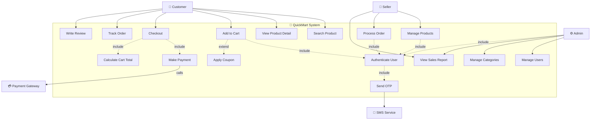
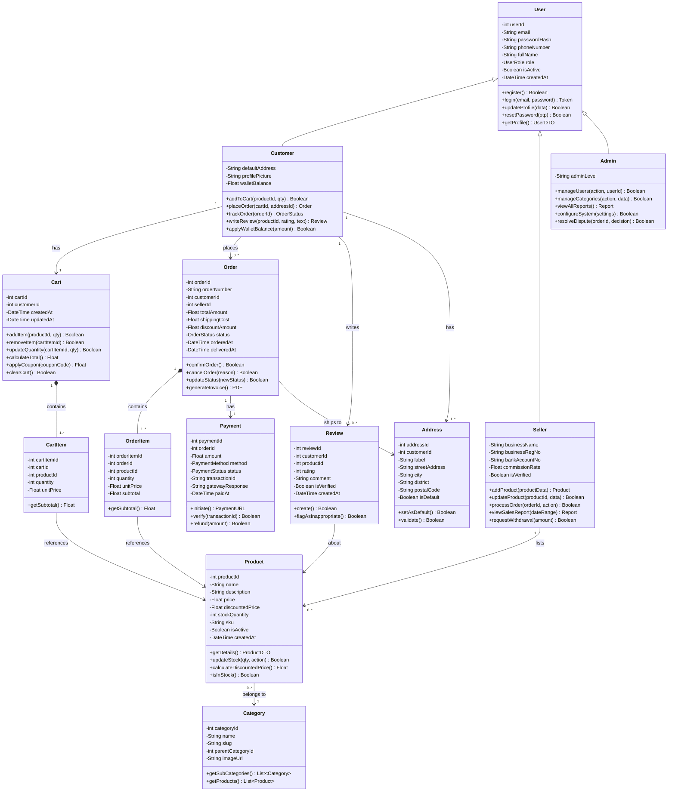
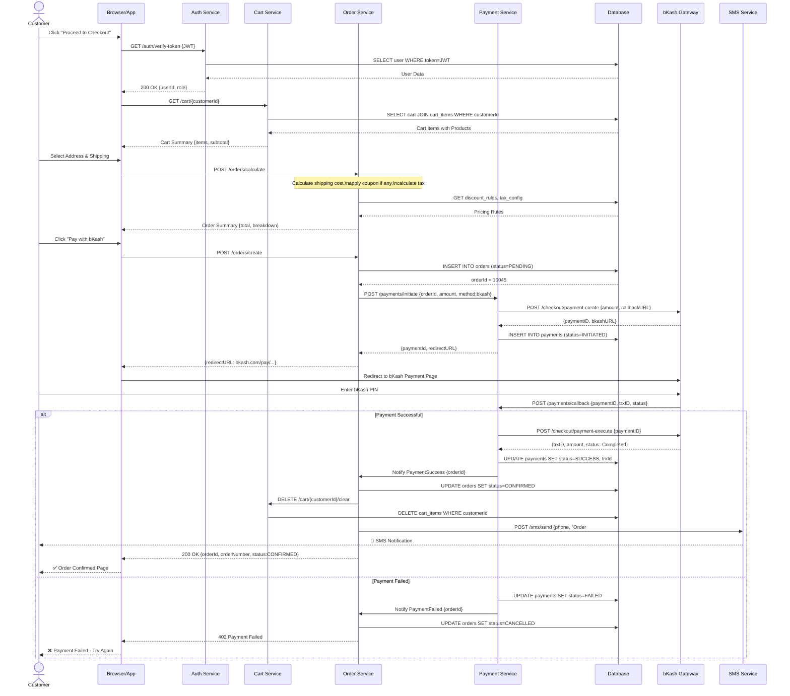
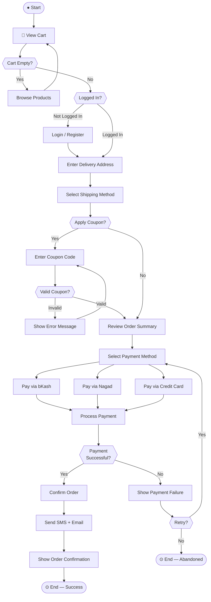
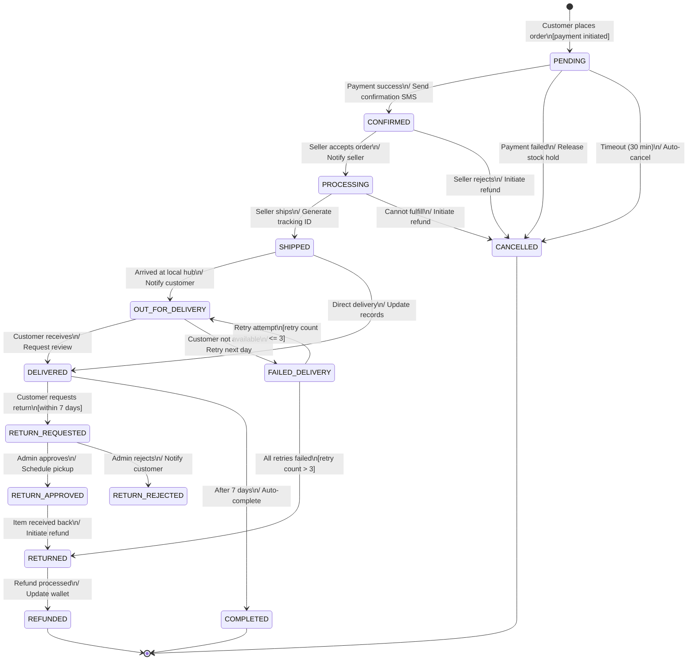
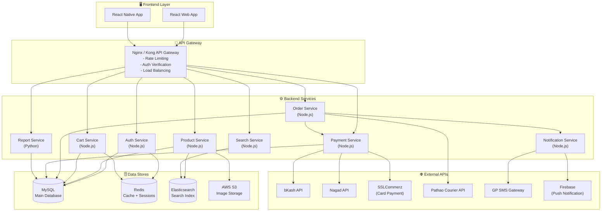
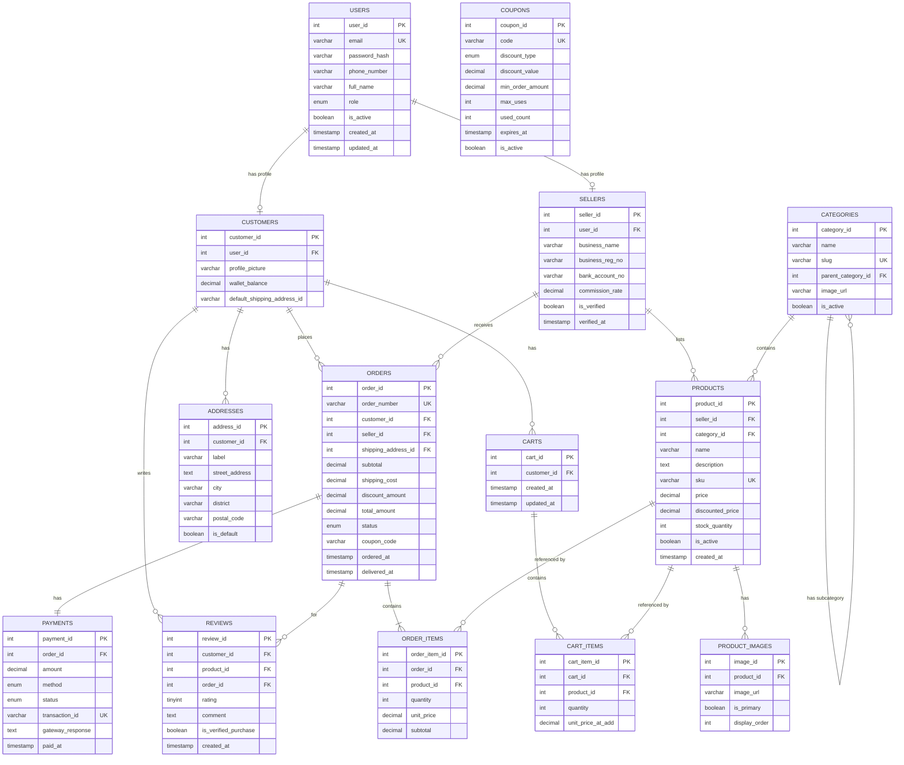

# Phase 2 — System Analysis & Design
## Requirements থেকে Technical Blueprint পর্যন্ত
### QuickMart E-commerce Project — সম্পূর্ণ Technical Guide

---

> **📌 প্রজেক্ট পরিচিতি:**  
> **QuickMart** একটি বাংলাদেশ-ভিত্তিক Full-Stack E-commerce Platform যেখানে Customer, Seller এবং Admin — তিনটি ভূমিকায় User রয়েছে। এই Document-টি Phase 2-এর সম্পূর্ণ System Analysis ও Design কভার করে।

---

## সূচিপত্র

- [Phase 2 — System Analysis \& Design](#phase-2--system-analysis--design)
  - [Requirements থেকে Technical Blueprint পর্যন্ত](#requirements-থেকে-technical-blueprint-পর্যন্ত)
    - [QuickMart E-commerce Project — সম্পূর্ণ Technical Guide](#quickmart-e-commerce-project--সম্পূর্ণ-technical-guide)
  - [সূচিপত্র](#সূচিপত্র)
  - [Chapter 1: System Analysis কী এবং কেন?](#chapter-1-system-analysis-কী-এবং-কেন)
    - [1.1 System Analysis-এর সংজ্ঞা](#11-system-analysis-এর-সংজ্ঞা)
    - [1.2 System Analysis vs System Design](#12-system-analysis-vs-system-design)
    - [1.3 Analysis Phase-এ কী কী করতে হয়](#13-analysis-phase-এ-কী-কী-করতে-হয়)
    - [1.4 Analyst-এর Role এবং Responsibilities](#14-analyst-এর-role-এবং-responsibilities)
  - [Chapter 2: UML Diagrams — সম্পূর্ণ গাইড](#chapter-2-uml-diagrams--সম্পূর্ণ-গাইড)
    - [2.1 UML কী এবং কেন Standard](#21-uml-কী-এবং-কেন-standard)
    - [2.2 Use Case Diagram](#22-use-case-diagram)
    - [2.3 Class Diagram](#23-class-diagram)
    - [2.4 Sequence Diagram](#24-sequence-diagram)
    - [2.5 Activity Diagram](#25-activity-diagram)
    - [2.6 State Machine Diagram](#26-state-machine-diagram)
    - [2.7 Component Diagram](#27-component-diagram)
    - [2.8 Deployment Diagram](#28-deployment-diagram)
    - [2.9 কখন কোন Diagram ব্যবহার করবে — Decision Guide](#29-কখন-কোন-diagram-ব্যবহার-করবে--decision-guide)
  - [Chapter 3: Database Design](#chapter-3-database-design)
    - [3.1 Conceptual Design — ER Diagram](#31-conceptual-design--er-diagram)
    - [3.2 Logical Design — Tables ও Relations](#32-logical-design--tables-ও-relations)
    - [3.3 Physical Design — Indexes ও Constraints](#33-physical-design--indexes-ও-constraints)
    - [3.4 Normalization — 1NF, 2NF, 3NF](#34-normalization--1nf-2nf-3nf)
    - [3.5 QuickMart-এর সম্পূর্ণ Database Design](#35-quickmart-এর-সম্পূর্ণ-database-design)
    - [3.6 Common Database Design Mistakes](#36-common-database-design-mistakes)
  - [Chapter 4: System Architecture Design](#chapter-4-system-architecture-design)
    - [4.1 Architecture Pattern কী কী আছে](#41-architecture-pattern-কী-কী-আছে)
    - [4.2 Layered Architecture বিস্তারিত](#42-layered-architecture-বিস্তারিত)
    - [4.3 MVC/MVP/MVVM Pattern](#43-mvcmvpmvvm-pattern)
    - [4.4 Microservices vs Monolith](#44-microservices-vs-monolith)
    - [4.5 API Design Principles — REST](#45-api-design-principles--rest)
    - [4.6 Integration Design — Third-party API](#46-integration-design--third-party-api)
    - [4.7 Security Architecture](#47-security-architecture)
  - [Chapter 5: Wireframe এবং Prototype](#chapter-5-wireframe-এবং-prototype)
    - [5.1 Wireframe কী এবং কেন দরকার](#51-wireframe-কী-এবং-কেন-দরকার)
    - [5.2 Low-fidelity vs High-fidelity](#52-low-fidelity-vs-high-fidelity)
    - [5.3 Wireframe Elements](#53-wireframe-elements)
    - [5.4 QuickMart-এর ASCII Wireframes](#54-quickmart-এর-ascii-wireframes)
    - [5.5 Prototype থেকে Feedback নেওয়া](#55-prototype-থেকে-feedback-নেওয়া)
    - [5.6 Figma Basic Workflow](#56-figma-basic-workflow)
  - [Chapter 6: Technical Specification Document (TSD)](#chapter-6-technical-specification-document-tsd)
    - [6.1 TSD কী এবং কেন দরকার](#61-tsd-কী-এবং-কেন-দরকার)
    - [6.2 TSD-র সম্পূর্ণ Structure](#62-tsd-র-সম্পূর্ণ-structure)
    - [6.3 QuickMart Shopping Cart Feature-এর সম্পূর্ণ TSD](#63-quickmart-shopping-cart-feature-এর-সম্পূর্ণ-tsd)
- [Technical Specification Document](#technical-specification-document)
  - [Feature: Shopping Cart System](#feature-shopping-cart-system)
      - [1. Overview](#1-overview)
      - [2. Goals ও Non-Goals](#2-goals-ও-non-goals)
      - [3. Technical Architecture](#3-technical-architecture)
      - [4. API Design](#4-api-design)
      - [5. Database Design](#5-database-design)
      - [6. Business Logic](#6-business-logic)
      - [7. Security Considerations](#7-security-considerations)
      - [8. Performance Considerations](#8-performance-considerations)
      - [9. Testing Plan](#9-testing-plan)
      - [10. Rollout Plan](#10-rollout-plan)
      - [11. Open Questions](#11-open-questions)
    - [6.4 TSD থেকে Developer কীভাবে কাজ শুরু করে](#64-tsd-থেকে-developer-কীভাবে-কাজ-শুরু-করে)
  - [Quick Reference Card](#quick-reference-card)
    - [UML Diagram Quick Decision Tree](#uml-diagram-quick-decision-tree)
    - [Database Design Checklist](#database-design-checklist)
    - [REST API Design Rules](#rest-api-design-rules)
    - [Architecture Decision Guide](#architecture-decision-guide)
    - [Common Mistakes Summary](#common-mistakes-summary)
  - [গ্রন্থসূচি](#গ্রন্থসূচি)

---

## Chapter 1: System Analysis কী এবং কেন?

[↑ সূচিপত্রে ফিরুন](#সূচিপত্র)

### 1.1 System Analysis-এর সংজ্ঞা

**System Analysis** হলো একটি Systematic প্রক্রিয়া যেখানে একটি বিদ্যমান বা প্রস্তাবিত System-কে বিশ্লেষণ করা হয়, তার সমস্যাগুলো চিহ্নিত করা হয়, এবং সেই সমস্যা সমাধানের জন্য কী কী Requirements আছে তা নির্ধারণ করা হয়। এটি Software Development Life Cycle (SDLC)-এর একটি গুরুত্বপূর্ণ Phase।

সহজ ভাষায় বলতে গেলে, System Analysis হলো "কী করতে হবে" সেটা বোঝার প্রক্রিয়া। একজন System Analyst যখন কোনো Project শুরু করেন, তখন তিনি প্রথমে Stakeholder-দের সাথে কথা বলেন, Business Process বোঝেন, এবং System-টি কী কী Function সম্পাদন করবে তার একটি পরিষ্কার ছবি তৈরি করেন।

**QuickMart প্রেক্ষাপটে:** QuickMart-এর জন্য System Analysis-এ প্রথমে বোঝা হবে — Customer কীভাবে Product খুঁজবে, Cart-এ রাখবে, Payment করবে; Seller কীভাবে Product Upload করবে, Order Manage করবে; Admin কীভাবে পুরো System Monitor করবে। এই "কী করতে হবে" প্রশ্নের উত্তর খোঁজাই Analysis।

System Analysis-এর মূল উদ্দেশ্যগুলো হলো:
- **Problem Identification:** বর্তমান System-এ কী কী সমস্যা আছে তা চিহ্নিত করা।
- **Requirement Elicitation:** Stakeholder-দের কাছ থেকে Real Needs বের করা।
- **Feasibility Study:** প্রস্তাবিত Solution কি Technical ও Financial দিক থেকে সম্ভব কিনা যাচাই করা।
- **System Scope Definition:** System কতটুকু কাভার করবে তার সীমানা নির্ধারণ করা।
- **Requirement Documentation:** সব Requirement স্পষ্টভাবে Document করা যাতে পরে কোনো বিভ্রান্তি না হয়।

---

### 1.2 System Analysis vs System Design

System Analysis এবং System Design — এই দুটো Phase একটির পর আরেকটি আসে, কিন্তু এদের Focus সম্পূর্ণ আলাদা। নিচে পার্থক্যটি বিস্তারিত তুলে ধরা হলো:

| বিষয় | System Analysis | System Design |
|-------|----------------|---------------|
| **মূল প্রশ্ন** | "কী করতে হবে?" (What?) | "কীভাবে করতে হবে?" (How?) |
| **Focus** | Business Requirements ও Problem Domain | Technical Solution ও Implementation |
| **Output** | Requirements Specification Document (SRS) | Design Document, Architecture Blueprint |
| **Stakeholder** | Business Owners, End Users, Domain Experts | Software Architects, Developers |
| **Technique** | Interviews, Observation, Use Cases | UML Diagrams, Database Design, Architecture |
| **Language** | Business Language (সহজ ভাষা) | Technical Language |
| **QuickMart উদাহরণ** | "Customer Product Search করতে পারবে Filter সহ" | "Elasticsearch ব্যবহার করে Full-Text Search Implement করা হবে" |

**Analysis থেকে Design-এ Transition:**

Analysis Phase শেষ হলে একটি Software Requirements Specification (SRS) Document তৈরি হয়। এই SRS-টি Design Phase-এর Input। Design Phase-এ Architect এই Requirements নিয়ে Technical Blueprint তৈরি করেন।

উদাহরণ হিসেবে, QuickMart-এর Analysis-এ যদি লেখা থাকে — "User Mobile OTP দিয়ে Login করতে পারবে", তাহলে Design-এ এটি হবে — "Bangladesh-এ Grameenphone SMS Gateway API ব্যবহার করে OTP Service Implement করা হবে, OTP 6 digit, expire time 5 minutes, Redis-এ cached থাকবে।"

---

### 1.3 Analysis Phase-এ কী কী করতে হয়

Analysis Phase একটি Structured প্রক্রিয়া। QuickMart Project-এর ক্ষেত্রে এই Phase-এ নিচের কাজগুলো করা হয়:

**ধাপ ১: Preliminary Investigation**

প্রথমে Project-এর একটি Initial Assessment করা হয়। QuickMart-এর ক্ষেত্রে এই ধাপে প্রশ্ন করা হবে: বাজারে ইতিমধ্যে কোন E-commerce Platform আছে? QuickMart কীভাবে Differentiate করবে? Target User কারা? এই Investigation থেকে একটি Project Charter তৈরি হয় যা Management Approval-এর জন্য যায়।

**ধাপ ২: Requirement Gathering (Requirements Elicitation)**

এই ধাপে বিভিন্ন Technique ব্যবহার করে Stakeholder-দের কাছ থেকে Requirements সংগ্রহ করা হয়:

- **Interview:** QuickMart-এর Buyer, Seller এবং Admin-এর সাথে সরাসরি কথা বলা। প্রশ্ন করা — "আপনি কী কী Product খুঁজতে চান?", "Payment-এ কোন Method ব্যবহার করেন?"
- **Questionnaire/Survey:** বড় সংখ্যক Potential User-দের কাছে Structured প্রশ্ন পাঠানো।
- **Observation:** বিদ্যমান Similar System (যেমন Daraz) কীভাবে ব্যবহার হচ্ছে তা পর্যবেক্ষণ করা।
- **Document Analysis:** বিদ্যমান Business Document, Invoice, Catalog বিশ্লেষণ করা।
- **Brainstorming & Workshop:** Team-এর সাথে একসাথে বসে Creative Session চালানো।
- **Prototyping:** একটি Basic Mockup দেখিয়ে User-এর Feedback নেওয়া।

**ধাপ ৩: Requirements Classification**

সংগৃহীত Requirements-কে দুই ভাগে ভাগ করা হয়:

*Functional Requirements (FR):*
- FR-001: Customer Product Search করতে পারবে (Keyword, Category, Price Range Filter)
- FR-002: Customer Shopping Cart-এ Product যোগ করতে পারবে (Max 50 items)
- FR-003: bKash, Nagad, Credit Card দিয়ে Payment করতে পারবে
- FR-004: Order Track করতে পারবে Real-time-এ
- FR-005: Seller Product Listing তৈরি করতে পারবে (Images, Description, Price, Stock)

*Non-Functional Requirements (NFR):*
- NFR-001: System 10,000 Concurrent User Handle করতে পারবে
- NFR-002: Page Load Time 3 সেকেন্ডের কম হতে হবে
- NFR-003: System 99.9% Uptime Guarantee দিতে হবে
- NFR-004: Payment Data PCI-DSS Compliant হতে হবে
- NFR-005: Mobile Responsive হতে হবে

**ধাপ ৪: Requirements Analysis ও Validation**

সংগৃহীত Requirements-গুলো Analyze করে নিচের বিষয়গুলো চেক করা হয়:
- **Completeness:** কোনো গুরুত্বপূর্ণ Requirement বাদ গেছে কিনা
- **Consistency:** দুটো Requirement পরস্পর বিরোধী কিনা
- **Feasibility:** প্রতিটি Requirement technically সম্ভব কিনা
- **Testability:** প্রতিটি Requirement Test করা যাবে কিনা

**ধাপ ৫: Requirements Documentation (SRS)**

সব Validated Requirements একটি Software Requirements Specification (SRS) Document-এ লেখা হয়। এই Document-টি সকল Stakeholder Sign করেন, যা একটি Contract-এর মতো কাজ করে।

**ধাপ ৬: Feasibility Study**

- **Technical Feasibility:** আমাদের কাছে প্রয়োজনীয় Technology, Skill আছে কিনা
- **Financial Feasibility:** Project-এর Cost কত হবে, ROI কী হবে
- **Operational Feasibility:** System Implement হলে Organization পরিচালনা করতে পারবে কিনা
- **Legal Feasibility:** কোনো Legal বা Compliance Issue আছে কিনা

---

### 1.4 Analyst-এর Role এবং Responsibilities

একজন System Analyst একটি Bridge-এর মতো কাজ করেন — একদিকে Business Stakeholders, অন্যদিকে Technical Development Team। তাঁর Role অত্যন্ত গুরুত্বপূর্ণ কারণ তিনি যদি Requirements সঠিকভাবে না বোঝেন বা Document না করেন, পুরো Project ব্যর্থ হতে পারে।

**Primary Responsibilities:**

**১. Stakeholder Management:** বিভিন্ন Level-এর Stakeholder-দের সাথে Effective Communication। QuickMart-এ এর মানে হলো CEO (Business Goal), Marketing Manager (User Experience), Logistics Partner (Delivery API), Payment Gateway Team (Integration) সবার সাথে কাজ করা।

**২. Requirements Engineering:** Requirements শুধু সংগ্রহ নয়, সেগুলো Refine করা, Ambiguity দূর করা, Priority দেওয়া। MoSCoW Method ব্যবহার করা যায় — Must have, Should have, Could have, Won't have।

**৩. Process Modeling:** Business Process-কে Visual Model-এ রূপান্তরিত করা। QuickMart-এর Order Processing Workflow-কে Activity Diagram-এ দেখানো।

**৪. Data Modeling:** System-এ কী কী Data থাকবে, তাদের মধ্যে Relationship কী — এটি ER Diagram-এ Document করা।

**৫. System Specification:** Development Team-এর জন্য এমন Specification লেখা যা Precise, Unambiguous এবং Testable।

**৬. Change Management:** Project চলাকালীন Requirements পরিবর্তন হলে সেই Change-গুলো Assess করা এবং Impact Analysis করা।

**৭. Quality Assurance:** Developed System-টি আসলে Requirements পূরণ করছে কিনা তা Verify করা।

**Technical Skills একজন Analyst-এর থাকা উচিত:**
- UML Modeling (Use Case, Class, Sequence Diagram)
- Database Design basics (ER Diagram)
- Business Process Modeling Notation (BPMN)
- Project Management tools (JIRA, Trello)
- Prototyping tools (Figma, Balsamiq)
- Technical Writing

**Soft Skills:**
- Active Listening — Stakeholder কী বলছে শুধু নয়, কী বলতে চাইছে সেটাও বোঝা
- Facilitation — Workshop এবং Meeting পরিচালনা
- Negotiation — Conflicting Requirements-এর মধ্যে Compromise খুঁজে বের করা
- Critical Thinking — Assumptions Challenge করা

> **📖 References:**
> - Dennis, Wixom & Roth — *System Analysis and Design* (5th Edition), Chapters 1-3
> - Sommerville, Ian — *Software Engineering* (10th Edition), Chapter 4: Requirements Engineering

---

## Chapter 2: UML Diagrams — সম্পূর্ণ গাইড

[↑ সূচিপত্রে ফিরুন](#সূচিপত্র)

### 2.1 UML কী এবং কেন Standard

**UML (Unified Modeling Language)** হলো Software System Design ও Documentation-এর জন্য একটি Standard Visual Language। এটি 1994-95 সালে Grady Booch, Ivar Jacobson এবং James Rumbaugh তৈরি করেন এবং পরে Object Management Group (OMG) এটিকে Standard হিসেবে Adopt করে। বর্তমানে UML 2.5 সর্বশেষ Version।

**কেন UML Standard?**

- **Universal Language:** Developer, Architect, Business Analyst, Client — সবাই একই Notation বোঝে।
- **Tool Support:** Enterprise Architect, Visual Paradigm, Lucidchart, draw.io — অনেক Tool UML Support করে।
- **Code Generation:** অনেক Modern Tool UML Diagram থেকে Skeleton Code Generate করতে পারে।
- **Documentation:** Diagram হিসেবে System-এর Architecture সংরক্ষণ করা সহজ।
- **Communication:** Team Meeting-এ একটি Diagram হাজার কথা বলে।

UML-এ মোট ১৪ ধরনের Diagram আছে, যেগুলোকে দুই ভাগে ভাগ করা যায়:

**Structural Diagrams (Static View):**
- Class Diagram
- Object Diagram
- Component Diagram
- Package Diagram
- Deployment Diagram
- Composite Structure Diagram
- Profile Diagram

**Behavioral Diagrams (Dynamic View):**
- Use Case Diagram
- Activity Diagram
- State Machine Diagram
- Sequence Diagram
- Communication Diagram
- Interaction Overview Diagram
- Timing Diagram

এই Chapter-এ আমরা Software Engineering-এ সবচেয়ে বেশি ব্যবহৃত Diagram-গুলো QuickMart-এর উদাহরণ দিয়ে বিস্তারিত আলোচনা করব।

---

### 2.2 Use Case Diagram

**Use Case Diagram কী?**

Use Case Diagram একটি Behavioral Diagram যা System ও তার Users (Actors)-এর মধ্যে Interaction দেখায়। এটি System-কে Black Box হিসেবে দেখে — মানে, System ভেতরে কীভাবে কাজ করে সেটা না দেখিয়ে, System কী করে তা দেখায়।

**Use Case Diagram-এর Elements:**

| Element | Symbol | বিবরণ |
|---------|--------|-------|
| **Actor** | Stick Figure | System-এর সাথে Interact করে এমন External Entity। Human বা System হতে পারে। |
| **Use Case** | Oval (Ellipse) | System-এর একটি নির্দিষ্ট Functionality বা Feature। |
| **System Boundary** | Rectangle | System-এর Scope সীমানা নির্ধারণ করে। |
| **Association** | Solid Line | Actor ও Use Case-এর মধ্যে Relationship। |
| **Include** | Dashed Arrow (<<include>>) | একটি Use Case অন্যটিকে সবসময় Call করে। |
| **Extend** | Dashed Arrow (<<extend>>) | একটি Use Case অন্যটিকে Conditionally Extend করে। |
| **Generalization** | Solid Arrow (hollow tip) | Actor বা Use Case Inheritance। |

**<<include>> vs <<extend>> পার্থক্য:**

- `<<include>>`: Mandatory। উদাহরণ — "Checkout" করতে গেলে "Calculate Total" সবসময় হবে।
- `<<extend>>`: Optional/Conditional। উদাহরণ — "View Product" করার সময় "Add Review" করা যেতে পারে, কিন্তু করতেই হবে এমন নয়।

**QuickMart Use Case Diagram:**



**Use Case Description (Brief Format):**

QuickMart-এর প্রতিটি Use Case-এর জন্য একটি Brief Description লেখা হয়:

| Use Case ID | Use Case Name | Actor | Short Description |
|-------------|---------------|-------|-------------------|
| UC-001 | Search Product | Customer | Customer keyword, category বা filter দিয়ে product খুঁজতে পারবে |
| UC-002 | View Product Detail | Customer | Product-এর image, description, price, reviews দেখতে পারবে |
| UC-003 | Add to Cart | Customer | Authenticated Customer product cart-এ add করতে পারবে |
| UC-004 | Apply Coupon | Customer | Checkout-এ discount coupon apply করতে পারবে |
| UC-005 | Checkout | Customer | Cart থেকে order finalize করে delivery address দেবে |
| UC-006 | Make Payment | Customer, Payment GW | bKash/Nagad/Card দিয়ে payment complete করবে |
| UC-007 | Track Order | Customer | Real-time order status ও location track করবে |
| UC-008 | Write Review | Customer | Purchased product-এ rating ও review দিতে পারবে |
| UC-009 | Manage Products | Seller | Product add, edit, delete করতে পারবে |
| UC-010 | Process Order | Seller | নতুন order confirm করে shipping দেবে |
| UC-011 | View Sales Report | Seller, Admin | Sales analytics ও revenue report দেখতে পারবে |
| UC-012 | Manage Users | Admin | User account block/unblock করতে পারবে |

---

### 2.3 Class Diagram

**Class Diagram কী?**

Class Diagram হলো UML-এর সবচেয়ে গুরুত্বপূর্ণ Structural Diagram। এটি System-এর Classes, তাদের Attributes, Methods এবং Classes-এর মধ্যে Relationships দেখায়। Object-Oriented Design-এর মূল ভিত্তি হলো Class Diagram।

**Class Diagram-এর Elements:**

**Class Box Structure:**
```
┌─────────────────────┐
│   <<stereotype>>    │  ← Stereotype (optional)
│     ClassName       │  ← Class Name (Bold)
├─────────────────────┤
│ - attribute: type   │  ← Attributes Section
│ + publicAttr: type  │
├─────────────────────┤
│ + methodName(): type│  ← Methods Section
│ - privateMethod()   │
└─────────────────────┘
```

**Visibility Modifiers:**
- `+` Public — সবার কাছ থেকে Access করা যায়
- `-` Private — শুধু ঐ Class-এর ভেতর থেকে Access করা যায়
- `#` Protected — ঐ Class এবং Subclass থেকে Access করা যায়
- `~` Package — একই Package-এর ভেতর থেকে Access করা যায়

**Relationship Types:**

| Relationship | Symbol | বিবরণ | QuickMart উদাহরণ |
|--------------|--------|-------|-----------------|
| **Association** | Solid Line | দুটো Class-এর মধ্যে সম্পর্ক | Customer has Orders |
| **Aggregation** | Hollow Diamond | "Has-a" weak ownership | Cart has CartItems |
| **Composition** | Filled Diamond | "Part-of" strong ownership | Order has OrderItems |
| **Inheritance** | Hollow Arrow | "Is-a" relationship | AdminUser extends User |
| **Dependency** | Dashed Arrow | একটি Class অন্যটি ব্যবহার করে | OrderService uses PaymentGateway |
| **Realization** | Dashed + Hollow Arrow | Interface Implementation | CreditCardPayment implements IPayment |

**QuickMart Class Diagram:**



---

### 2.4 Sequence Diagram

**Sequence Diagram কী?**

Sequence Diagram হলো একটি Interaction Diagram যা Objects-এর মধ্যে Messages-এর Sequence (ক্রম) Time-এর সাথে দেখায়। এটি একটি নির্দিষ্ট Scenario বা Use Case-এর জন্য Step-by-Step Execution Flow বোঝাতে ব্যবহৃত হয়।

**Sequence Diagram-এর Elements:**

| Element | বিবরণ |
|---------|-------|
| **Actor/Object** | Diagram-এর উপরে Boxes হিসেবে দেখানো হয় |
| **Lifeline** | Object থেকে নিচে নামানো Dotted Vertical Line — Object-এর Lifetime দেখায় |
| **Activation Bar** | Lifeline-এর উপর পাতলা Rectangle — Object কখন Active সেটা দেখায় |
| **Synchronous Message** | Solid Arrow → — Caller Response-এর জন্য Wait করে |
| **Asynchronous Message** | Half Arrowhead ⇢ — Caller Wait করে না |
| **Return Message** | Dashed Arrow ← — Method-এর Return Value |
| **Self-Message** | Object নিজেকেই Message পাঠায় |
| **Alt Frame** | Alternative Execution (if-else) |
| **Loop Frame** | Repeated Execution |
| **Opt Frame** | Optional Execution |

**QuickMart Order Placement — Sequence Diagram:**



**Sequence Diagram-এর প্রতিটি Step-এর ব্যাখ্যা:**

**Step 1-3: Authentication Verification**
Customer যখন Checkout Page-এ যায়, Browser প্রথমেই JWT Token দিয়ে Auth Service-কে Verify করে। Auth Service Database-এ Token Check করে User Information ফেরত দেয়।

**Step 4-6: Cart Loading**
Cart Service থেকে Customer-এর Cart Data Load হয়। এতে সব CartItem এবং প্রতিটি Product-এর Current Price থাকে। এখানে Note করা গুরুত্বপূর্ণ — Cart-এ Add করার সময়ের Price আর Checkout-এর সময়ের Price যদি পরিবর্তন হয়, Customer-কে Notify করতে হবে।

**Step 7-10: Order Calculation**
Order Service Coupon, Shipping Cost, Tax Calculate করে একটি Order Summary দেয়। এই Calculation Server-side হওয়া বাধ্যতামূলক — Client-side Calculation Trust করা উচিত নয় কারণ এটি Manipulate করা যায়।

**Step 11-17: Payment Initiation**
Payment শুরু হয় Order Create করার মাধ্যমে। প্রথমে PENDING Status-এ Order Save হয়। তারপর Payment Service bKash-এর API Call করে একটি Payment URL পায়।

**Step 18-20: bKash Payment**
Customer bKash Page-এ Redirect হয়ে PIN দেয়। bKash সরাসরি আমাদের Callback URL-এ Payment Result পাঠায়।

**Step 21-28 (Alt Block): Success Path**
- bKash API-কে Execute করে Payment Confirm করা হয়
- Database Update হয়
- Cart Clear হয়
- Customer-এর কাছে SMS যায়
- Order Confirmation Page দেখানো হয়

**Step 29-33 (Alt Block): Failure Path**
Payment Fail হলে Payment ও Order উভয় Cancelled হয় এবং User-কে Error দেখানো হয়।

---

### 2.5 Activity Diagram

**Activity Diagram কী?**

Activity Diagram হলো একটি Behavioral Diagram যা একটি Process বা Workflow-এর Sequence of Activities দেখায়। এটি অনেকটা Flowchart-এর মতো, কিন্তু UML Standard Follow করে। এটি Business Process Modeling, Algorithm এবং Complex Logic বোঝাতে ব্যবহৃত হয়।

**Activity Diagram-এর Elements:**

| Element | Symbol | বিবরণ |
|---------|--------|-------|
| **Initial Node** | Filled Circle ● | Workflow শুরু |
| **Activity** | Rounded Rectangle | একটি করণীয় কাজ |
| **Decision Node** | Diamond ◇ | Branch — Condition Check |
| **Merge Node** | Diamond ◇ | Branches একত্রিত হওয়া |
| **Fork** | Thick Horizontal Bar | Parallel Activities শুরু |
| **Join** | Thick Horizontal Bar | Parallel Activities শেষ |
| **Final Node** | Filled Circle + Ring ⊙ | Workflow শেষ |
| **Swimlane** | Vertical Partition | কোন Actor কোন Activity করছে |

**QuickMart Checkout Flow — Activity Diagram:**



**Activity Diagram-এর Swimlane Version (Textual):**

Activity Diagram-এ Swimlane ব্যবহার করলে কোন Actor কোন কাজ করছে তা স্পষ্ট হয়। QuickMart Checkout-এ তিনটি Swimlane থাকবে — Customer, System এবং Payment Gateway।

---

### 2.6 State Machine Diagram

**State Machine Diagram কী?**

State Machine Diagram (বা State Chart Diagram) একটি Object-এর Life Cycle দেখায়। একটি Object তার জীবনকালে বিভিন্ন **States**-এ থাকে এবং নির্দিষ্ট **Events**-এর কারণে এক State থেকে অন্য State-এ **Transition** করে।

**Elements:**

| Element | বিবরণ |
|---------|-------|
| **Initial State** | ● — Object তৈরির সময়ের State |
| **State** | Rounded Rectangle — Object-এর একটি অবস্থা |
| **Transition** | Arrow with Label — Event ও Action |
| **Final State** | ⊙ — Object-এর শেষ অবস্থা |
| **Guard** | [condition] — Transition-এর Condition |
| **Action** | event / action — Transition-এ কী হয় |

**QuickMart Order Status — State Machine:**



**State-গুলোর বিস্তারিত ব্যাখ্যা:**

| State | অর্থ | Duration |
|-------|------|----------|
| `PENDING` | Order তৈরি হয়েছে কিন্তু Payment নিশ্চিত হয়নি | Max 30 min |
| `CONFIRMED` | Payment সফল, Seller-এর কাছে পাঠানো হয়েছে | 1-2 ঘণ্টা |
| `PROCESSING` | Seller Order Accept করে পণ্য প্রস্তুত করছে | 1-2 দিন |
| `SHIPPED` | Courier-এ দেওয়া হয়েছে | 2-5 দিন |
| `OUT_FOR_DELIVERY` | Local Hub-এ পৌঁছেছে, Delivery Boy বের হয়েছে | একই দিন |
| `DELIVERED` | Customer পেয়েছে | Final |
| `COMPLETED` | 7 দিন পার হয়ে গেছে, Return সম্ভব নয় | Final |
| `CANCELLED` | Order বাতিল হয়েছে | Final |
| `REFUNDED` | টাকা ফেরত দেওয়া হয়েছে | Final |

---

### 2.7 Component Diagram

**Component Diagram কী?**

Component Diagram System-এর High-Level Architecture দেখায়। এটি System-এর বিভিন্ন Software Components এবং তাদের মধ্যে Dependencies দেখায়। এটি Architectural Diagram হিসেবে ব্যবহৃত হয়।

**QuickMart Component Diagram:**



---

### 2.8 Deployment Diagram

**Deployment Diagram কী?**

Deployment Diagram Physical Infrastructure দেখায় — কোন Software কোন Server-এ Deploy হবে, Servers কীভাবে Connect হবে। এটি Infrastructure Planning-এর জন্য অপরিহার্য।

**QuickMart Deployment Architecture (ASCII):**

```
┌─────────────────────────────────────────────────────────────────────────┐
│                          INTERNET                                       │
└────────────────────────────┬────────────────────────────────────────────┘
                             │
                    ┌────────▼────────┐
                    │  Cloudflare CDN │  ← Static Assets, DDoS Protection
                    └────────┬────────┘
                             │
                    ┌────────▼────────┐
                    │  Load Balancer  │  ← AWS ALB (Application Load Balancer)
                    └────┬───────┬───┘
                         │       │
               ┌─────────▼─┐   ┌─▼─────────┐
               │  Web App  │   │  Web App  │  ← React App (EC2 t3.medium × 2)
               │ Server 01 │   │ Server 02 │
               └─────────┬─┘   └─┬─────────┘
                         │       │
                    ┌────▼───────▼────┐
                    │   API Gateway   │  ← Kong / Nginx (EC2 c5.large)
                    └────────┬────────┘
                             │
        ┌────────────────────┼────────────────────┐
        │                    │                    │
┌───────▼──────┐   ┌─────────▼──────┐   ┌────────▼──────┐
│ Auth Service │   │Product Service │   │ Order Service │  ← Node.js Services
│  (t3.small)  │   │  (t3.medium)   │   │  (t3.medium)  │     (EC2 Instances)
└───────┬──────┘   └─────────┬──────┘   └────────┬──────┘
        │                    │                    │
        └────────────────────┼────────────────────┘
                             │
              ┌──────────────┼──────────────┐
              │              │              │
     ┌────────▼───┐  ┌───────▼────┐  ┌─────▼──────────┐
     │  MySQL RDS │  │  Redis     │  │  Elasticsearch │
     │  (Primary) │  │  Cluster   │  │  Cluster       │
     │  (db.r5.lg)│  │  (cache.r6)│  │  (3 nodes)     │
     └────────────┘  └────────────┘  └────────────────┘
     ┌────────────┐
     │  MySQL RDS │  ← Read Replica (for Reports)
     │ (Read Only)│
     └────────────┘

              AWS Region: ap-south-1 (Mumbai)
              Backup Region: ap-southeast-1 (Singapore)
```

---

### 2.9 কখন কোন Diagram ব্যবহার করবে — Decision Guide

| পরিস্থিতি | ব্যবহার করো | কারণ |
|-----------|------------|------|
| Client-কে System-এর Functionality দেখাতে হবে | Use Case Diagram | Non-technical লোকেরাও বোঝে |
| Database Structure Design করতে হবে | Class Diagram (Entity Perspective) | Attributes ও Relations দেখায় |
| Code Structure Design করতে হবে | Class Diagram (OOP Perspective) | Methods ও Inheritance দেখায় |
| একটি Feature-এর Step-by-Step Flow বোঝাতে হবে | Sequence Diagram | Time-based interaction clear হয় |
| Business Process বা Algorithm Document করতে হবে | Activity Diagram | Decision ও Parallel Flow দেখায় |
| Object-এর Life Cycle দেখাতে হবে | State Machine Diagram | States ও Transitions clear হয় |
| System-এর High-level Architecture দেখাতে হবে | Component Diagram | Components ও Dependencies |
| Infrastructure Planning করতে হবে | Deployment Diagram | Physical setup বোঝা যায় |

> **📖 References:**
> - Fowler, Martin — *UML Distilled* (3rd Edition) — Chapters 3-10
> - Arlow, Jim & Neustadt, Ila — *UML 2 and the Unified Process* (2nd Edition)

---

## Chapter 3: Database Design

[↑ সূচিপত্রে ফিরুন](#সূচিপত্র)

### 3.1 Conceptual Design — ER Diagram

**Conceptual Design কী?**

Database Design-এর প্রথম স্তর হলো Conceptual Design, যেখানে আমরা Entity-Relationship (ER) Diagram তৈরি করি। এই পর্যায়ে আমরা Technology-নিরপেক্ষ থাকি — মানে MySQL না PostgreSQL ব্যবহার করব, সেটা ভাবি না। শুধু Data কী কী আছে এবং তাদের মধ্যে সম্পর্ক কী, সেটা Model করি।

**ER Diagram-এর Elements:**

| Element | Symbol | বিবরণ |
|---------|--------|-------|
| **Entity** | Rectangle | একটি Real-world Object (e.g., Customer, Product) |
| **Attribute** | Oval | Entity-র Property (e.g., Customer.name) |
| **Primary Key** | Underlined Attribute | Uniquely Identifies Entity |
| **Relationship** | Diamond | দুটো Entity-র মধ্যে সম্পর্ক |
| **Cardinality** | 1, N, M | এক, অনেক সম্পর্ক |

**Cardinality Types:**
- **One-to-One (1:1):** একজন User-এর একটি Seller Profile
- **One-to-Many (1:N):** একজন Customer অনেক Order দিতে পারে
- **Many-to-Many (M:N):** অনেক Order-এ অনেক Product থাকতে পারে

**QuickMart ER Diagram:**



---

### 3.2 Logical Design — Tables ও Relations

**Logical Design কী?**

Conceptual Design (ER Diagram) থেকে Logical Design-এ আসার মানে হলো সেই Entities-কে Relational Tables-এ রূপান্তরিত করা। এই পর্যায়ে আমরা Primary Keys, Foreign Keys এবং Normalization Apply করি, কিন্তু এখনও Specific Database (MySQL/PostgreSQL) নিয়ে ভাবছি না।

**Mapping Rules:**

- **Strong Entity → Table:** প্রতিটি Strong Entity একটি Table হয়
- **Weak Entity → Table with FK:** Dependent Entity, Parent-এর FK নিয়ে Table হয়
- **1:N Relationship → FK on Many side:** Customer (1) → Orders (N), তাই Orders-এ customer_id FK
- **M:N Relationship → Junction Table:** Products ও Orders-এর মধ্যে order_items Junction Table

---

### 3.3 Physical Design — Indexes ও Constraints

**Physical Design কী?**

Physical Design-এ আমরা নির্দিষ্ট Database System (এখানে MySQL 8.0) এর জন্য Optimize করি। এতে Data Types নির্ধারণ, Indexes তৈরি, Constraints সেট করা এবং Performance Tuning অন্তর্ভুক্ত।

**QuickMart-এর সম্পূর্ণ Physical Schema (SQL):**

```sql
-- Users Table
CREATE TABLE users (
    user_id     INT UNSIGNED AUTO_INCREMENT PRIMARY KEY,
    email       VARCHAR(255) NOT NULL UNIQUE,
    password_hash VARCHAR(255) NOT NULL,
    phone_number  VARCHAR(20) NOT NULL UNIQUE,
    full_name   VARCHAR(150) NOT NULL,
    role        ENUM('CUSTOMER', 'SELLER', 'ADMIN') NOT NULL DEFAULT 'CUSTOMER',
    is_active   BOOLEAN NOT NULL DEFAULT TRUE,
    created_at  TIMESTAMP NOT NULL DEFAULT CURRENT_TIMESTAMP,
    updated_at  TIMESTAMP NOT NULL DEFAULT CURRENT_TIMESTAMP ON UPDATE CURRENT_TIMESTAMP,
    INDEX idx_email (email),
    INDEX idx_phone (phone_number),
    INDEX idx_role (role)
) ENGINE=InnoDB DEFAULT CHARSET=utf8mb4 COLLATE=utf8mb4_unicode_ci;

-- Products Table
CREATE TABLE products (
    product_id        INT UNSIGNED AUTO_INCREMENT PRIMARY KEY,
    seller_id         INT UNSIGNED NOT NULL,
    category_id       INT UNSIGNED NOT NULL,
    name              VARCHAR(300) NOT NULL,
    description       TEXT,
    sku               VARCHAR(100) NOT NULL UNIQUE,
    price             DECIMAL(12, 2) NOT NULL CHECK (price > 0),
    discounted_price  DECIMAL(12, 2) CHECK (discounted_price > 0),
    stock_quantity    INT NOT NULL DEFAULT 0 CHECK (stock_quantity >= 0),
    is_active         BOOLEAN NOT NULL DEFAULT TRUE,
    created_at        TIMESTAMP NOT NULL DEFAULT CURRENT_TIMESTAMP,
    updated_at        TIMESTAMP NOT NULL DEFAULT CURRENT_TIMESTAMP ON UPDATE CURRENT_TIMESTAMP,
    FOREIGN KEY (seller_id) REFERENCES sellers(seller_id) ON DELETE CASCADE,
    FOREIGN KEY (category_id) REFERENCES categories(category_id),
    INDEX idx_seller (seller_id),
    INDEX idx_category (category_id),
    INDEX idx_price (price),
    INDEX idx_stock (stock_quantity),
    FULLTEXT INDEX ft_name_desc (name, description)
) ENGINE=InnoDB DEFAULT CHARSET=utf8mb4 COLLATE=utf8mb4_unicode_ci;

-- Orders Table
CREATE TABLE orders (
    order_id            INT UNSIGNED AUTO_INCREMENT PRIMARY KEY,
    order_number        VARCHAR(20) NOT NULL UNIQUE,
    customer_id         INT UNSIGNED NOT NULL,
    seller_id           INT UNSIGNED NOT NULL,
    shipping_address_id INT UNSIGNED NOT NULL,
    subtotal            DECIMAL(12, 2) NOT NULL,
    shipping_cost       DECIMAL(8, 2) NOT NULL DEFAULT 0,
    discount_amount     DECIMAL(8, 2) NOT NULL DEFAULT 0,
    total_amount        DECIMAL(12, 2) NOT NULL,
    status              ENUM(
                            'PENDING','CONFIRMED','PROCESSING',
                            'SHIPPED','OUT_FOR_DELIVERY','DELIVERED',
                            'FAILED_DELIVERY','RETURN_REQUESTED',
                            'RETURN_APPROVED','RETURN_REJECTED',
                            'RETURNED','REFUNDED','CANCELLED','COMPLETED'
                        ) NOT NULL DEFAULT 'PENDING',
    coupon_code         VARCHAR(50),
    tracking_number     VARCHAR(100),
    ordered_at          TIMESTAMP NOT NULL DEFAULT CURRENT_TIMESTAMP,
    confirmed_at        TIMESTAMP,
    shipped_at          TIMESTAMP,
    delivered_at        TIMESTAMP,
    FOREIGN KEY (customer_id) REFERENCES customers(customer_id),
    FOREIGN KEY (seller_id) REFERENCES sellers(seller_id),
    FOREIGN KEY (shipping_address_id) REFERENCES addresses(address_id),
    INDEX idx_customer (customer_id),
    INDEX idx_seller (seller_id),
    INDEX idx_status (status),
    INDEX idx_ordered_at (ordered_at)
) ENGINE=InnoDB DEFAULT CHARSET=utf8mb4 COLLATE=utf8mb4_unicode_ci;
```

**Important Index Strategy:**

| Index | Table | Columns | কারণ |
|-------|-------|---------|------|
| Primary Key | সব Table | id | Mandatory, Clustered |
| Unique Index | users | email, phone | Login এবং Uniqueness |
| Composite Index | orders | (customer_id, status) | "My Active Orders" Query |
| Composite Index | products | (category_id, is_active, price) | Product Listing |
| Full-Text Index | products | (name, description) | Search Feature |
| Index | orders | ordered_at | Date-range Report |

---

### 3.4 Normalization — 1NF, 2NF, 3NF

**Normalization কী?**

Database Normalization হলো Relational Database Design-এর একটি Process যেখানে Data Redundancy কমানো এবং Data Integrity নিশ্চিত করার জন্য Tables-কে Organize করা হয়। Edgar F. Codd ১৯৭০ সালে এই Concept প্রবর্তন করেন।

**কেন Normalization দরকার?**
- **Data Redundancy দূর করা:** একই তথ্য একাধিক জায়গায় না রাখা
- **Update Anomaly প্রতিরোধ:** একটি তথ্য Update করলে সব জায়গায় Update না করা লাগার সমস্যা
- **Insert Anomaly প্রতিরোধ:** নতুন Data Insert করতে Unnecessary Dependency না থাকা
- **Delete Anomaly প্রতিরোধ:** একটি Record Delete করলে অন্য প্রয়োজনীয় তথ্য মুছে না যাওয়া

**1NF (First Normal Form) — Atomic Values:**

একটি Table 1NF-এ আছে যদি:
- প্রতিটি Column-এ Atomic (অবিভাজ্য) Value থাকে
- প্রতিটি Row Unique হয় (Primary Key থাকে)
- Column-এ কোনো Repeating Group না থাকে

**১NF লঙ্ঘনের উদাহরণ (QuickMart):**

```
❌ NOT 1NF — BAD Design:
orders Table:
| order_id | customer_name | products                          |
|----------|---------------|-----------------------------------|
| 1        | Rahim         | "iPhone 14, Samsung TV, Dell Laptop" |  ← Multi-value!
```

```
✅ 1NF — GOOD Design:
order_items Table:
| order_item_id | order_id | product_id | product_name | quantity |
|---------------|----------|------------|--------------|----------|
| 1             | 1        | 101        | iPhone 14    | 1        |
| 2             | 1        | 205        | Samsung TV   | 1        |
| 3             | 1        | 310        | Dell Laptop  | 2        |
```

**2NF (Second Normal Form) — No Partial Dependency:**

একটি Table 2NF-এ আছে যদি এটি 1NF-এ থাকে এবং প্রতিটি Non-Key Attribute সম্পূর্ণ Primary Key-এর উপর Dependent থাকে (Composite Primary Key-এর কোনো Part-এর উপর নয়)।

**২NF লঙ্ঘনের উদাহরণ:**

```
❌ NOT 2NF — Composite Key: (order_id, product_id):
| order_id | product_id | quantity | product_name | product_price |
|----------|------------|----------|--------------|---------------|
| 1        | 101        | 2        | iPhone 14    | 95000         |
| 2        | 101        | 1        | iPhone 14    | 95000         |

সমস্যা: product_name ও product_price শুধু product_id-এর উপর Dependent,
          পুরো Composite Key-এর উপর নয়। তাই Redundancy তৈরি হচ্ছে।
```

```
✅ 2NF — Separate Tables:
order_items: (order_id, product_id, quantity, unit_price_at_purchase)
products: (product_id, product_name, current_price, ...)
```

**3NF (Third Normal Form) — No Transitive Dependency:**

একটি Table 3NF-এ আছে যদি এটি 2NF-এ থাকে এবং কোনো Non-Key Attribute অন্য Non-Key Attribute-এর উপর Dependent না থাকে।

**৩NF লঙ্ঘনের উদাহরণ:**

```
❌ NOT 3NF:
orders:
| order_id | customer_id | customer_name | customer_city | zip_code | city_name |
|----------|-------------|---------------|---------------|----------|-----------|
| 1        | 201         | Rahim         | Dhaka         | 1212     | Mirpur    |
| 2        | 202         | Karim         | Chittagong    | 4000     | Kotwali   |

সমস্যা: city_name → zip_code থেকে Determined হয় (Transitive Dependency)।
          zip_code → order_id নয়।
```

```
✅ 3NF:
orders: (order_id, customer_id, zip_code)
zip_codes: (zip_code, city_name, district)
customers: (customer_id, customer_name, ...)
```

---

### 3.5 QuickMart-এর সম্পূর্ণ Database Design

**Database: `quickmart_db`**

নিচে QuickMart-এর সম্পূর্ণ Table Structure সংক্ষেপে দেওয়া হলো:

| Table Name | Rows (Estimated) | Key Purpose |
|------------|-----------------|-------------|
| `users` | 500K | সব User-এর Authentication Info |
| `customers` | 480K | Customer Profile ও Wallet |
| `sellers` | 20K | Seller Business Info |
| `categories` | 500 | Product Category Tree |
| `products` | 200K | Product Catalog |
| `product_images` | 800K | Product Photos |
| `addresses` | 1.5M | Customer Delivery Addresses |
| `carts` | 50K active | Active Shopping Carts |
| `cart_items` | 150K active | Items in Carts |
| `orders` | 5M | All Orders |
| `order_items` | 12M | Line Items per Order |
| `payments` | 5M | Payment Records |
| `reviews` | 2M | Product Reviews |
| `coupons` | 1000 | Discount Coupons |
| `notifications` | 20M | Push/SMS Notification Log |

---

### 3.6 Common Database Design Mistakes

ডাটাবেস ডিজাইনে নতুন Developers যে ভুলগুলো করেন:

**ভুল ১: Storing Multiple Values in One Column**
```sql
-- ❌ WRONG
ALTER TABLE orders ADD COLUMN product_ids VARCHAR(255); -- "1,2,3,45"
-- ✅ CORRECT: Use order_items junction table
```

**ভুল ২: Not Using Foreign Keys**
```sql
-- ❌ WRONG: No referential integrity
CREATE TABLE orders (customer_id INT); -- No FK constraint
-- ✅ CORRECT
FOREIGN KEY (customer_id) REFERENCES customers(customer_id)
```

**ভুল ৩: Using Float for Money**
```sql
-- ❌ WRONG: Float causes rounding errors (0.1 + 0.2 ≠ 0.3)
price FLOAT
-- ✅ CORRECT
price DECIMAL(12, 2)
```

**ভুল ৪: Storing Timestamps Without Timezone**
```sql
-- ❌ WRONG: Ambiguous timezone
created_at DATETIME
-- ✅ CORRECT: Always use TIMESTAMP (UTC stored)
created_at TIMESTAMP NOT NULL DEFAULT CURRENT_TIMESTAMP
```

**ভুল ৫: Missing Indexes on Foreign Keys**
```sql
-- ❌ WRONG: Full table scan for every JOIN
CREATE TABLE orders (customer_id INT UNSIGNED, ...);
-- ✅ CORRECT
CREATE TABLE orders (customer_id INT UNSIGNED, ...);
INDEX idx_customer_id (customer_id);
```

**ভুল ৬: Storing Passwords in Plain Text**
```sql
-- ❌ WRONG: Security disaster!
password VARCHAR(50)
-- ✅ CORRECT: bcrypt hash
password_hash VARCHAR(255) -- bcrypt hash = 60 chars, argon2 = variable
```

> **📖 References:**
> - Hernandez, Michael — *Database Design for Mere Mortals* (3rd Edition)
> - Kleppmann, Martin — *Designing Data-Intensive Applications*, Chapter 2
> - Date, C.J. — *An Introduction to Database Systems* (8th Edition)

---

## Chapter 4: System Architecture Design

[↑ সূচিপত্রে ফিরুন](#সূচিপত্র)

### 4.1 Architecture Pattern কী কী আছে

**Software Architecture** হলো একটি Software System-এর High-Level Structure। এটি নির্ধারণ করে System-এর Components কী কী, তারা কীভাবে Organized এবং কীভাবে Communicate করবে।

প্রধান Architecture Pattern-গুলো:

| Pattern | বিবরণ | উপযুক্ত যখন |
|---------|-------|-------------|
| **Layered (N-Tier)** | Presentation → Business → Data Layer | Traditional Enterprise App |
| **Microservices** | Independent Services, Each with own DB | Large Scale, Team Scalability |
| **Monolithic** | Single Deployable Unit | Small Team, Startup MVP |
| **Event-Driven** | Services Communicate via Events/Messages | High Throughput, Async Operations |
| **CQRS** | Command ও Query আলাদা Model | Complex Domain, High Read/Write |
| **Hexagonal** | Core Domain বাইরের System থেকে Isolated | Domain-heavy Applications |
| **Serverless** | FaaS (Functions as a Service) | Irregular Workload, Cost Optimization |

---

### 4.2 Layered Architecture বিস্তারিত

**Layered Architecture** (বা N-Tier Architecture) হলো সবচেয়ে Common এবং প্রমাণিত Architecture Pattern। এতে System-কে Horizontal Layers-এ ভাগ করা হয়, যেখানে প্রতিটি Layer শুধু তার নিচের Layer-এর সাথে Communicate করে।

**QuickMart-এর Layered Architecture:**

```
╔══════════════════════════════════════════════════════════════╗
║                   PRESENTATION LAYER                         ║
║  ┌─────────────────────┐   ┌──────────────────────────────┐ ║
║  │  React Web App      │   │  React Native Mobile App     │ ║
║  │  - Pages/Views      │   │  - Screens                   │ ║
║  │  - Components       │   │  - Navigation                │ ║
║  │  - State (Redux)    │   │  - Local State               │ ║
║  └─────────────────────┘   └──────────────────────────────┘ ║
╠══════════════════════════════════════════════════════════════╣
║                   API / GATEWAY LAYER                        ║
║  ┌──────────────────────────────────────────────────────┐   ║
║  │  REST API Controllers (Express.js / Fastify)         │   ║
║  │  - Route Definitions                                 │   ║
║  │  - Request Validation (Joi/Zod)                      │   ║
║  │  - Authentication Middleware (JWT Verify)            │   ║
║  │  - Rate Limiting, CORS, Helmet                       │   ║
║  └──────────────────────────────────────────────────────┘   ║
╠══════════════════════════════════════════════════════════════╣
║                   BUSINESS LOGIC LAYER                       ║
║  ┌────────────────┐  ┌────────────────┐  ┌───────────────┐  ║
║  │ OrderService   │  │ ProductService │  │ PaymentService│  ║
║  │ - placeOrder() │  │ - search()     │  │ - initiate()  │  ║
║  │ - cancelOrder()│  │ - updateStock()│  │ - verify()    │  ║
║  │ - trackOrder() │  │ - getDetails() │  │ - refund()    │  ║
║  └────────────────┘  └────────────────┘  └───────────────┘  ║
╠══════════════════════════════════════════════════════════════╣
║                   DATA ACCESS LAYER                          ║
║  ┌──────────────────────────────────────────────────────┐   ║
║  │  Repository Pattern (Prisma ORM / Knex.js)           │   ║
║  │  - UserRepository   - OrderRepository                │   ║
║  │  - ProductRepository - PaymentRepository             │   ║
║  └──────────────────────────────────────────────────────┘   ║
╠══════════════════════════════════════════════════════════════╣
║                   DATA STORAGE LAYER                         ║
║  ┌─────────────┐  ┌─────────────┐  ┌────────────────────┐  ║
║  │  MySQL 8.0  │  │  Redis 7.x  │  │  Elasticsearch 8.x │  ║
║  │  (Primary)  │  │  (Cache)    │  │  (Search Index)    │  ║
║  └─────────────┘  └─────────────┘  └────────────────────┘  ║
╚══════════════════════════════════════════════════════════════╝
```

**প্রতিটি Layer-এর Responsibility:**

**Presentation Layer:** User Interface এবং User Interaction। এই Layer-এ কোনো Business Logic থাকবে না। শুধু Data Display এবং User Input Collection।

**API/Gateway Layer:** HTTP Requests Receive করা, Validate করা, Authenticate করা এবং Business Layer-এ Delegate করা। Controllers পাতলা (Thin) রাখা উচিত।

**Business Logic Layer (Service Layer):** System-এর Core Rules এবং Workflows। উদাহরণ — Order Place করার সময় Stock Check করা, Discount Calculate করা, Payment Initiate করা।

**Data Access Layer (Repository Layer):** Database-এর সাথে Interaction Abstraction করা। Direct SQL বা ORM Queries এই Layer-এ থাকে।

**Data Storage Layer:** Actual Data Persistence — MySQL (Main Data), Redis (Cache/Sessions), Elasticsearch (Search)।

---

### 4.3 MVC/MVP/MVVM Pattern

**MVC (Model-View-Controller):**

```
User Input → Controller → Model ←→ Database
                ↓              ↓
             View ←──────── Model Data
```

- **Model:** Data ও Business Logic (Product, Order Class)
- **View:** UI Presentation (HTML Template, React Component)
- **Controller:** User Input Handle করে Model Update করে, View Select করে

**QuickMart Backend (Express.js) MVC উদাহরণ:**

```
src/
├── models/
│   ├── User.model.js
│   ├── Product.model.js
│   └── Order.model.js
├── views/               (API হলে JSON Response, Template হলে EJS/Pug)
├── controllers/
│   ├── auth.controller.js
│   ├── product.controller.js
│   └── order.controller.js
└── routes/
    ├── auth.routes.js
    └── product.routes.js
```

**MVVM (Model-View-ViewModel) — React-এ:**

React Application-এ MVVM Pattern Follow করা হয়:
- **Model:** API থেকে আসা Data, Redux Store
- **ViewModel:** Custom Hooks (useCart, useAuth, useOrders) — Data Fetch করে UI-এর জন্য Transform করে
- **View:** React Components — শুধু Render করে, Logic নেই

---

### 4.4 Microservices vs Monolith

**Monolithic Architecture:**

QuickMart-এর MVP (Minimum Viable Product) Phase-এ Monolithic Architecture ব্যবহার করা হবে।

```
┌─────────────────────────────────────────────────┐
│              QuickMart Monolith                 │
│  ┌──────────┐ ┌──────────┐ ┌──────────────────┐│
│  │   Auth   │ │ Products │ │     Orders       ││
│  │  Module  │ │  Module  │ │     Module       ││
│  └──────────┘ └──────────┘ └──────────────────┘│
│  ┌──────────┐ ┌──────────┐ ┌──────────────────┐│
│  │ Payment  │ │  Search  │ │  Notification    ││
│  │  Module  │ │  Module  │ │     Module       ││
│  └──────────┘ └──────────┘ └──────────────────┘│
│                    ↓                            │
│            Single Database                      │
└─────────────────────────────────────────────────┘
```

**Monolith সুবিধা:**
- Simple Development ও Debugging
- Easy Testing (Integration Test সহজ)
- Simple Deployment (Single Unit)
- Low Network Overhead

**Monolith অসুবিধা:**
- Scaling পুরো App Scale করতে হয়
- Technology Lock-in
- Long Deployment Time (একটু Change = পুরো Deploy)
- Team Coupling বড় Team-এ Problem

**Microservices Architecture (Future Phase):**

যখন QuickMart Scale হবে, তখন Microservices-এ Migrate করা হবে:

```
API Gateway ──┬── Auth Service (Node.js) ──→ users DB
              ├── Product Service (Node.js) ──→ products DB
              ├── Order Service (Node.js) ──→ orders DB
              ├── Payment Service (Node.js) ──→ payments DB
              ├── Search Service (Node.js) ──→ Elasticsearch
              ├── Notification Service (Node.js) ──→ Queue
              └── Report Service (Python) ──→ Analytics DB
```

**কখন Microservices যাবে:**
- Team Size > 20 Developers
- Daily Deployment > 10 বার
- Different Services-এর Scaling Needs আলাদা
- Technology Diversity দরকার (Python for ML, Go for high-perf)

---

### 4.5 API Design Principles — REST

**REST (Representational State Transfer)** হলো Web API Design-এর সবচেয়ে Popular Architectural Style। Roy Fielding 2000 সালে তাঁর Dissertation-এ এটি Introduce করেন।

**REST Constraints:**
- **Client-Server:** Client ও Server আলাদা, একে অপরের Internal থেকে Independent
- **Stateless:** প্রতিটি Request সম্পূর্ণ Information বহন করে, Server Session রাখে না
- **Cacheable:** Response Cache করা যাবে কিনা Indicate করতে হবে
- **Uniform Interface:** Resource-based URL, HTTP Methods ব্যবহার

**QuickMart REST API Design:**

**HTTP Method Convention:**

| Method | URL | Action | Request Body | Response |
|--------|-----|--------|-------------|---------|
| `GET` | `/api/v1/products` | List Products | None | 200 + Array |
| `GET` | `/api/v1/products/101` | Get Single Product | None | 200 + Object |
| `POST` | `/api/v1/products` | Create Product | JSON Body | 201 + Created |
| `PUT` | `/api/v1/products/101` | Replace Product | Full JSON | 200 + Updated |
| `PATCH` | `/api/v1/products/101` | Partial Update | Partial JSON | 200 + Updated |
| `DELETE` | `/api/v1/products/101` | Delete Product | None | 204 No Content |

**QuickMart API Endpoints (সম্পূর্ণ তালিকা):**

```
Authentication:
  POST   /api/v1/auth/register
  POST   /api/v1/auth/login
  POST   /api/v1/auth/logout
  POST   /api/v1/auth/refresh-token
  POST   /api/v1/auth/send-otp
  POST   /api/v1/auth/verify-otp
  POST   /api/v1/auth/forgot-password
  POST   /api/v1/auth/reset-password

Products:
  GET    /api/v1/products?category=&search=&minPrice=&maxPrice=&page=&limit=
  GET    /api/v1/products/:productId
  POST   /api/v1/products                    [Seller only]
  PATCH  /api/v1/products/:productId          [Seller only]
  DELETE /api/v1/products/:productId          [Seller only]
  POST   /api/v1/products/:productId/images   [Seller only]

Cart:
  GET    /api/v1/cart
  POST   /api/v1/cart/items
  PATCH  /api/v1/cart/items/:cartItemId
  DELETE /api/v1/cart/items/:cartItemId
  POST   /api/v1/cart/apply-coupon
  DELETE /api/v1/cart/remove-coupon

Orders:
  GET    /api/v1/orders                       [Customer sees own]
  POST   /api/v1/orders
  GET    /api/v1/orders/:orderId
  PATCH  /api/v1/orders/:orderId/cancel
  GET    /api/v1/orders/:orderId/tracking
  GET    /api/v1/seller/orders                [Seller only]
  PATCH  /api/v1/seller/orders/:orderId/status [Seller only]

Payments:
  POST   /api/v1/payments/initiate
  POST   /api/v1/payments/callback            [Gateway Webhook]
  GET    /api/v1/payments/:paymentId
```

**API Request/Response Flow (ASCII):**

```
Client                  API Server                 Database
  │                         │                          │
  │  POST /api/v1/orders    │                          │
  │  Headers:               │                          │
  │    Authorization: Bearer JWT                       │
  │  Body: {cartId, addressId, paymentMethod}          │
  │ ──────────────────────► │                          │
  │                         │  1. Validate JWT         │
  │                         │  2. Extract userId       │
  │                         │  3. Validate Body (Joi)  │
  │                         │  4. Check Cart exists    │
  │                         │ ──────────────────────►  │
  │                         │  SELECT cart WHERE id    │
  │                         │ ◄──────────────────────  │
  │                         │  5. Check Stock          │
  │                         │ ──────────────────────►  │
  │                         │  SELECT products...      │
  │                         │ ◄──────────────────────  │
  │                         │  6. Calculate Total      │
  │                         │  7. Insert Order         │
  │                         │ ──────────────────────►  │
  │                         │  INSERT INTO orders...   │
  │                         │ ◄──────────────────────  │
  │                         │  orderId = 10045         │
  │                         │  8. Init Payment         │
  │  HTTP 201 Created       │                          │
  │  Body: {               │                          │
  │    orderId: 10045,     │                          │
  │    orderNumber: "QM-2024-10045",                  │
  │    status: "PENDING",  │                          │
  │    paymentUrl: "..."   │                          │
  │  }                     │                          │
  │ ◄─────────────────────  │                          │
```

---

### 4.6 Integration Design — Third-party API

**QuickMart-এর External Integrations:**

**১. bKash Payment Integration:**

```javascript
// bKash Payment Flow
class BkashPaymentGateway {
  async createPayment(order) {
    // Step 1: Grant Token
    const tokenRes = await axios.post(BKASH_TOKEN_URL, {
      app_key: process.env.BKASH_APP_KEY,
      app_secret: process.env.BKASH_APP_SECRET
    });
    
    // Step 2: Create Payment
    const paymentRes = await axios.post(BKASH_CREATE_PAYMENT_URL, {
      mode: '0011',  // Checkout
      payerReference: order.customerId,
      callbackURL: `${BASE_URL}/payments/bkash/callback`,
      amount: order.totalAmount,
      currency: 'BDT',
      intent: 'sale',
      merchantInvoiceNumber: order.orderNumber
    }, {
      headers: { Authorization: tokenRes.data.id_token }
    });
    
    return { bkashURL: paymentRes.data.bkashURL };
  }
  
  async executePayment(paymentID, token) {
    // Step 3: Execute after user pays
    const executeRes = await axios.post(BKASH_EXECUTE_PAYMENT_URL, 
      { paymentID },
      { headers: { Authorization: token } }
    );
    return executeRes.data;
  }
}
```

**২. Pathao Courier Integration:**

Pathao API ব্যবহার করে Delivery Management করা হবে — Order Create, Track, Cancel।

**৩. Grameenphone SMS Gateway:**

OTP এবং Order Notification SMS-এর জন্য।

---

### 4.7 Security Architecture

**QuickMart-এর Security Layers:**

**Authentication & Authorization:**
- **JWT (JSON Web Token):** Stateless Authentication। Access Token (15 min expiry) + Refresh Token (7 days expiry)।
- **RBAC (Role-Based Access Control):** Customer, Seller, Admin — আলাদা Permission।

**Data Security:**
- **Password Hashing:** bcrypt (salt rounds = 12) বা Argon2id
- **HTTPS Everywhere:** TLS 1.3, HSTS Header
- **Sensitive Data Encryption:** Payment Card Info AES-256 Encrypted

**API Security:**
- **Rate Limiting:** Per IP, Per User (e.g., 100 requests/minute)
- **Input Validation:** Joi/Zod দিয়ে সব Input Validate
- **SQL Injection Prevention:** Parameterized Queries (ORM ব্যবহার)
- **XSS Prevention:** Output Encoding, Content Security Policy Header
- **CSRF Protection:** SameSite Cookie, CSRF Token

```
Security Layers (Defense in Depth):
┌──────────────────────────────────────────────┐
│  CDN Layer: DDoS Protection (Cloudflare)     │
├──────────────────────────────────────────────┤
│  WAF (Web Application Firewall): OWASP Rules │
├──────────────────────────────────────────────┤
│  API Gateway: Rate Limiting, Auth Check      │
├──────────────────────────────────────────────┤
│  Application: Input Validation, Business Rules│
├──────────────────────────────────────────────┤
│  Database: Parameterized Queries, Encryption │
├──────────────────────────────────────────────┤
│  Infrastructure: VPC, Security Groups, IAM   │
└──────────────────────────────────────────────┘
```

> **📖 References:**
> - Martin, Robert C. — *Clean Architecture* (2017), Parts 3-5
> - Fowler, Martin — *Patterns of Enterprise Application Architecture* (2002)
> - Newman, Sam — *Building Microservices* (2nd Edition, 2021)

---

## Chapter 5: Wireframe এবং Prototype

[↑ সূচিপত্রে ফিরুন](#সূচিপত্র)

### 5.1 Wireframe কী এবং কেন দরকার

**Wireframe** হলো একটি UI Design-এর Skeletal Framework — একটি Blueprint যা দেখায় Screen-এ কী কী Elements থাকবে এবং কোথায় থাকবে, কিন্তু Color, Font, Image-এর মতো Visual Design Details ছাড়া।

Wireframe কার্টুন বা Sketch-এর মতো — সুন্দর নয়, কিন্তু Structure পরিষ্কার।

**কেন Wireframe দরকার?**

- **Early Validation:** Development শুরুর আগেই Stakeholder-দের কাছ থেকে Feedback নেওয়া। পরে Change Cost অনেক বেশি।
- **Team Communication:** Designer, Developer এবং Client — সবাই একই Page-এ থাকে।
- **Requirement Clarification:** Wireframe দেখে অনেক Hidden Requirement বেরিয়ে আসে।
- **Usability Testing:** Real Design-এর আগেই User Flow Test করা যায়।
- **Time ও Cost Saving:** Code লেখার আগে Layout ঠিক করলে পরে Redesign Cost কমে।
- **Scope Management:** Wireframe দিয়ে Project Scope Freeze করা যায়।

---

### 5.2 Low-fidelity vs High-fidelity

| বিষয় | Low-Fidelity | High-Fidelity |
|-------|-------------|--------------|
| **বিবরণ** | Rough Sketch, Black & White | Detailed, Near-final Design |
| **Tool** | Paper, Balsamiq, ASCII | Figma, Adobe XD, Sketch |
| **Detail Level** | Layout ও Structure | Color, Typography, Real Content |
| **Time** | ঘণ্টায় তৈরি | দিনে/সপ্তাহে তৈরি |
| **কখন ব্যবহার** | Early Exploration, Rapid Iteration | Stakeholder Presentation, Developer Handoff |
| **Interactivity** | নেই বা সামান্য | Click-through Prototype |

---

### 5.3 Wireframe Elements

| Element | বিবরণ |
|---------|-------|
| **Navigation Bar** | Menu, Logo, Search Bar |
| **Header/Banner** | Hero Section, Promotional Banner |
| **Content Grid** | Product Cards, Listing |
| **Sidebar** | Filters, Categories |
| **Form Fields** | Input, Dropdown, Checkbox |
| **Buttons** | CTA (Call to Action) Buttons |
| **Modal/Dialog** | Popup Windows |
| **Footer** | Links, Copyright |
| **Breadcrumb** | Navigation Path |
| **Pagination** | Page Navigation |

---

### 5.4 QuickMart-এর ASCII Wireframes

**QuickMart Homepage Wireframe:**

```
┌─────────────────────────────────────────────────────────────────┐
│  [LOGO QuickMart]   [🔍 Search Products...]    [Cart(3)] [Login]│
│  ─────────────────────────────────────────────────────────────  │
│  [Electronics] [Fashion] [Home] [Books] [Sports] [Groceries]   │
├─────────────────────────────────────────────────────────────────┤
│                                                                 │
│  ┌─────────────────────────────────────────────────────────┐   │
│  │              HERO BANNER (Promotional Slider)           │   │
│  │   "৫০% ছাড় Electronics-এ! আজই Shop করুন →"          │   │
│  │                    [SHOP NOW]                           │   │
│  └─────────────────────────────────────────────────────────┘   │
│                                                                 │
│  Flash Sale ⚡ (ends in 02:34:15)                               │
│  ┌──────────┐ ┌──────────┐ ┌──────────┐ ┌──────────┐          │
│  │ [IMAGE]  │ │ [IMAGE]  │ │ [IMAGE]  │ │ [IMAGE]  │          │
│  │ Product  │ │ Product  │ │ Product  │ │ Product  │          │
│  │ Name     │ │ Name     │ │ Name     │ │ Name     │          │
│  │ ~~৳5000~~ │ │ ~~৳2000~~ │ │ ~~৳800~~  │ │ ~~৳1500~~ │          │
│  │ ৳2500    │ │ ৳1200    │ │ ৳450     │ │ ৳800     │          │
│  │[Add Cart]│ │[Add Cart]│ │[Add Cart]│ │[Add Cart]│          │
│  └──────────┘ └──────────┘ └──────────┘ └──────────┘          │
│  ─────────────────────────────────────────────────────────     │
│                                                                 │
│  Browse by Category                                            │
│  ┌──────┐ ┌──────┐ ┌──────┐ ┌──────┐ ┌──────┐ ┌──────┐      │
│  │ 📱   │ │ 👗   │ │ 🏠   │ │ 📚   │ │ ⚽   │ │ 🛒   │      │
│  │Elec  │ │Fash  │ │Home  │ │Books │ │Sport │ │Groc  │      │
│  └──────┘ └──────┘ └──────┘ └──────┘ └──────┘ └──────┘      │
│                                                                 │
│  Recommended for You                                           │
│  ┌─────────────────────────────────────────────────────────┐   │
│  │[P1] [P2] [P3] [P4] [P5] [P6] [P7] [P8]                │   │
│  └─────────────────────────────────────────────────────────┘   │
├─────────────────────────────────────────────────────────────────┤
│ Footer: About | Sell on QM | Help | Terms | Privacy | Contact  │
└─────────────────────────────────────────────────────────────────┘
```

**QuickMart Product Detail Page Wireframe:**

```
┌─────────────────────────────────────────────────────────────────┐
│  [LOGO]         [🔍 Search...]              [Cart(3)] [Account] │
│  Home > Electronics > Smartphones > iPhone 14                  │
├─────────────────────────────────────────────────────────────────┤
│                                                                 │
│  ┌─────────────────────┐   ┌──────────────────────────────────┐ │
│  │                     │   │ iPhone 14 (128GB, Midnight)      │ │
│  │   [MAIN IMAGE]      │   │ ★★★★☆ (234 reviews)              │ │
│  │   600x500           │   │                                  │ │
│  │                     │   │ ৳95,000                          │ │
│  │                     │   │ ~~৳1,05,000~~ Save ৳10,000 (9.5%)│ │
│  └─────────────────────┘   │                                  │ │
│  [Img1][Img2][Img3][Img4]   │ Color: ○ Midnight ● Purple ○ Starlight│ │
│                             │                                  │ │
│                             │ Storage: [128GB] [256GB] [512GB] │ │
│                             │                                  │ │
│                             │ Quantity: [−] [1] [+]  (In Stock: 45)│ │
│                             │                                  │ │
│                             │ [🛒 Add to Cart]                 │ │
│                             │ [⚡ Buy Now]                     │ │
│                             │                                  │ │
│                             │ 🚚 Free Delivery on orders > ৳500│ │
│                             │ 🔄 7-day Return Policy           │ │
│                             │ ✅ Warranty: 1 Year              │ │
│                             │ Sold by: [TechMart Official] ★4.8│ │
│                             └──────────────────────────────────┘ │
├─────────────────────────────────────────────────────────────────┤
│  [Description] [Specifications] [Reviews(234)] [Q&A]           │
│  ─────────────────────────────────────────────────────────      │
│  Product Description Content Area...                           │
│                                                                 │
│  Customer Reviews                                              │
│  ★★★★★ Overall 4.2/5 based on 234 reviews                     │
│  ┌─────────────────────────────────────────────────────────┐   │
│  │ Reviewer Name ★★★★☆  2 days ago                        │   │
│  │ "Very good phone, camera quality excellent..."          │   │
│  └─────────────────────────────────────────────────────────┘   │
└─────────────────────────────────────────────────────────────────┘
```

**QuickMart Shopping Cart Wireframe:**

```
┌─────────────────────────────────────────────────────────────────┐
│  [LOGO]           Shopping Cart (3 items)        [← Continue]  │
├──────────────────────────────────────┬──────────────────────────┤
│                                      │  Order Summary           │
│  ┌───────────────────────────────┐   │  ─────────────────────   │
│  │[IMG] iPhone 14 128GB          │   │  Subtotal:    ৳1,15,500  │
│  │      Midnight, 1 unit         │   │  Discount:    -৳10,000   │
│  │      ৳95,000    [−][1][+] [🗑]│   │  Shipping:    FREE       │
│  └───────────────────────────────┘   │  ─────────────────────   │
│  ┌───────────────────────────────┐   │  Total:       ৳1,05,500  │
│  │[IMG] Samsung 65" 4K TV        │   │                          │
│  │      Model UA65, 1 unit       │   │  Coupon Code:            │
│  │      ৳85,000    [−][1][+] [🗑]│   │  [Enter code...] [Apply] │
│  └───────────────────────────────┘   │                          │
│  ┌───────────────────────────────┐   │  [Proceed to Checkout →] │
│  │[IMG] JBL Speaker Bluetooth    │   │                          │
│  │      JBL Flip 5, 2 units      │   │  Secure Checkout 🔒      │
│  │      ৳3,500×2= ৳7,000 [−][2][+][🗑]│  bKash Nagad Visa MC  │
│  └───────────────────────────────┘   │                          │
│                                      │                          │
│  Save for Later | Remove All         │                          │
└──────────────────────────────────────┴──────────────────────────┘
```

**QuickMart Checkout Wireframe:**

```
┌─────────────────────────────────────────────────────────────────┐
│  [LOGO]                           Checkout (Secure 🔒)          │
│  ─────────────────────────────────────────────────────────      │
│  [① Delivery Address] → [② Payment] → [③ Review & Pay]         │
├─────────────────────────────────────────────┬───────────────────┤
│                                             │  Order Items (3)  │
│  Delivery Address                           │  ─────────────── │
│  ┌──────────────────────────────────────┐   │  iPhone 14 ×1     │
│  │ ● Home — 45 Mirpur Rd, Dhaka 1216   │   │  ৳95,000          │
│  │   [Edit]                             │   │                   │
│  └──────────────────────────────────────┘   │  Samsung TV ×1    │
│  ┌──────────────────────────────────────┐   │  ৳85,000          │
│  │ ○ Office — 12 Gulshan Ave, Dhaka     │   │                   │
│  └──────────────────────────────────────┘   │  JBL Speaker ×2   │
│  [+ Add New Address]                        │  ৳7,000           │
│                                             │  ─────────────── │
│  Shipping Method                            │  Subtotal: ৳1,87,000│
│  ● Standard (3-5 days) — FREE              │  Discount: -৳10,000│
│  ○ Express (1-2 days) — ৳150              │  Shipping: FREE   │
│  ○ Same Day (Today) — ৳350               │  ─────────────── │
│                                             │  Total: ৳1,77,000  │
│  Payment Method                             │                   │
│  ● bKash  ○ Nagad  ○ Credit Card ○ Wallet │                   │
│                                             │                   │
│  [← Back to Cart]    [Pay ৳1,77,000 →]    │                   │
└─────────────────────────────────────────────┴───────────────────┘
```

---

### 5.5 Prototype থেকে Feedback নেওয়া

Wireframe বা Prototype তৈরি করার পর সেটা থেকে Effective Feedback নেওয়া Design Process-এর গুরুত্বপূর্ণ অংশ।

**Feedback Collection Methods:**

**১. Usability Testing:** Real User-দের দিয়ে নির্দিষ্ট Task Complete করতে বলা। উদাহরণ — "QuickMart-এ একটি iPhone খুঁজে বের করে Cart-এ Add করুন।" তাদের কোথায় Confuse হচ্ছে তা Observe করা।

**২. Think-Aloud Protocol:** User Tasks করতে করতে মুখে বলতে থাকেন তারা কী ভাবছেন। এটি Cognitive Walkthrough Method।

**৩. A/B Testing:** দুটো Different Design দেখিয়ে কোনটা ভালো সেটা Test করা।

**৪. Heuristic Evaluation:** Jakob Nielsen-এর ১০টি Usability Heuristic দিয়ে Design Evaluate করা।

**৫. Stakeholder Review Meeting:** Business Stakeholders-দের সাথে Prototype Walkthrough।

---

### 5.6 Figma Basic Workflow

**Figma কী?**

Figma হলো একটি Cloud-based Design Tool যা Wireframe থেকে High-fidelity Prototype তৈরি করতে ব্যবহৃত হয়। এটি Real-time Collaboration Support করে।

**QuickMart Design-এ Figma Workflow:**

```
1. Project Setup:
   QuickMart/
   ├── Design System (Colors, Typography, Components)
   ├── Wireframes/
   │   ├── Homepage
   │   ├── Product Page
   │   ├── Cart
   │   └── Checkout
   ├── High-fidelity/
   │   ├── Desktop
   │   └── Mobile
   └── Prototype Links

2. Design System তৈরি:
   - Color Palette: Primary (#E31837), Secondary (#FFA500), etc.
   - Typography: Hind Siliguri (Bengali), Inter (English)
   - Component Library: Button, Card, Input, Modal, Navigation

3. Prototype Connections:
   - Homepage → Product Page (on card click)
   - Product Page → Cart (on Add to Cart)
   - Cart → Checkout (on Proceed button)
   - Checkout → Order Confirmation

4. Developer Handoff:
   - Figma Dev Mode দিয়ে Developers CSS Values পান
   - Export করা যায়: CSS, iOS Swift, Android XML
```

> **📖 References:**
> - Cooper, Alan — *About Face: The Essentials of Interaction Design* (4th Edition)
> - Garrett, Jesse James — *The Elements of User Experience* (2nd Edition)
> - Norman, Don — *The Design of Everyday Things* (Revised Edition)

---

## Chapter 6: Technical Specification Document (TSD)

[↑ সূচিপত্রে ফিরুন](#সূচিপত্র)

### 6.1 TSD কী এবং কেন দরকার

**Technical Specification Document (TSD)** বা **Technical Design Document (TDD)** হলো একটি Detailed Technical Blueprint যা একটি Specific Feature বা System-এর Implementation-এর সকল Technical Details বর্ণনা করে। এটি SRS (What to build) থেকে এক ধাপ নিচে নেমে বলে — "How exactly to build it."

**TSD কেন দরকার?**

- **Clarity for Developers:** Developer Feature শুরু করার আগেই সব Technical Decision জানে।
- **Architecture Review:** TSD Review করে Architecture Issues আগেই ধরা যায়।
- **Onboarding New Members:** নতুন Team Member TSD পড়ে দ্রুত Context বুঝতে পারে।
- **Knowledge Preservation:** Years পরেও Feature কেন এভাবে বানানো হয়েছিল তা বোঝা যায়।
- **Estimation:** TSD থেকে Accurate Time ও Effort Estimate করা যায়।
- **Avoiding Scope Creep:** TSD Scope স্পষ্ট করে রাখে।

---

### 6.2 TSD-র সম্পূর্ণ Structure

একটি Standard TSD-তে নিচের Sections থাকে:

| Section | বিবরণ |
|---------|-------|
| **1. Overview** | Feature কী, কেন বানানো হচ্ছে |
| **2. Goals & Non-Goals** | কী করবে, কী করবে না |
| **3. Background** | Context, Related Features |
| **4. Proposed Solution** | Technical Approach |
| **5. Detailed Design** | API, Database, Algorithm |
| **6. Data Flow** | কীভাবে Data Move করবে |
| **7. Security Considerations** | Threats ও Mitigations |
| **8. Performance Considerations** | Expected Load, SLA |
| **9. Testing Plan** | Unit, Integration, E2E Tests |
| **10. Rollout Plan** | Deployment Strategy |
| **11. Open Questions** | অমীমাংসিত সিদ্ধান্ত |
| **12. References** | Related Documents, Tickets |

---

### 6.3 QuickMart Shopping Cart Feature-এর সম্পূর্ণ TSD

---

# Technical Specification Document
## Feature: Shopping Cart System
**Document ID:** QM-TSD-003  
**Version:** 1.2  
**Author:** System Architect Team  
**Date:** 2024-01-15  
**Status:** Approved ✅  
**Reviewers:** Lead Developer, Product Manager, QA Lead  

---

#### 1. Overview

QuickMart-এর Shopping Cart System একটি Core Feature যা Customer-দের Multiple Product Browse করে Checkout-এর আগে Collect করার সুযোগ দেয়। Cart Persistent হবে — মানে User Logout করলেও বা Browser বন্ধ করলেও Cart-এর Items থাকবে।

**Business Context:** E-commerce-এ Cart Abandonment Rate সাধারণত 70%+। একটি ভালো Cart System যা Fast, Reliable এবং Cross-device Sync করে, সেটি Conversion Rate উন্নত করে।

---

#### 2. Goals ও Non-Goals

**Goals (এই Feature করবে):**
- Authenticated Customer Product Cart-এ Add করতে পারবে
- Cart Persistent থাকবে (Database-backed)
- Product Price, Stock Real-time Check হবে
- Coupon Code Apply করা যাবে
- Cart থেকে Item Remove বা Quantity Update করা যাবে
- Cart Total Calculate হবে (Subtotal, Discount, Shipping Estimate)

**Non-Goals (এই Feature করবে না):**
- Payment Processing (সেটা আলাদা Feature)
- Wishlist / Save for Later (Future Feature)
- Guest Cart (MVP-তে নেই, Later Phase-এ আসবে)
- Cart Sharing Link Generate করা

---

#### 3. Technical Architecture

**Cart Storage Strategy:**

দুটো Option ছিল:

| Option | Approach | সুবিধা | অসুবিধা |
|--------|----------|--------|---------|
| **Option A (Selected)** | Database-only (MySQL) | Persistent, Consistent | Slightly Slower |
| **Option B (Rejected)** | Redis-only | Fast | Data Loss risk |
| **Option C (Future)** | MySQL + Redis Cache | Best of both | Complex |

**Decision:** MVP-তে MySQL-only। Database Call Optimize করা হবে। Scale হলে Redis Cache Add করা হবে।

---

#### 4. API Design

**Endpoints:**

```
GET    /api/v1/cart
POST   /api/v1/cart/items
PATCH  /api/v1/cart/items/:cartItemId
DELETE /api/v1/cart/items/:cartItemId
POST   /api/v1/cart/apply-coupon
DELETE /api/v1/cart/remove-coupon
DELETE /api/v1/cart/clear
```

**GET /api/v1/cart — Response:**
```json
{
  "success": true,
  "data": {
    "cartId": 4521,
    "customerId": 201,
    "items": [
      {
        "cartItemId": 901,
        "productId": 101,
        "productName": "iPhone 14 128GB",
        "productImage": "https://cdn.quickmart.com/products/101/main.jpg",
        "sellerName": "TechMart Official",
        "quantity": 1,
        "unitPrice": 95000.00,
        "discountedPrice": 90000.00,
        "currentStock": 45,
        "subtotal": 90000.00,
        "priceChangedSinceAdd": false
      }
    ],
    "coupon": {
      "code": "SAVE500",
      "discountType": "FIXED",
      "discountAmount": 500.00
    },
    "summary": {
      "itemCount": 1,
      "subtotal": 90000.00,
      "couponDiscount": 500.00,
      "shippingEstimate": 0.00,
      "estimatedTotal": 89500.00
    },
    "updatedAt": "2024-01-15T10:30:00Z"
  }
}
```

**POST /api/v1/cart/items — Request:**
```json
{
  "productId": 205,
  "quantity": 2
}
```

**POST /api/v1/cart/items — Response (201 Created):**
```json
{
  "success": true,
  "message": "Item added to cart",
  "data": {
    "cartItemId": 902,
    "productId": 205,
    "quantity": 2,
    "unitPrice": 3500.00,
    "subtotal": 7000.00,
    "cartTotal": 97000.00
  }
}
```

**Error Responses:**
```json
// 409 Conflict — Out of Stock
{
  "success": false,
  "error": {
    "code": "INSUFFICIENT_STOCK",
    "message": "Only 1 unit available. You requested 2.",
    "availableStock": 1
  }
}

// 400 Bad Request — Exceeds Cart Limit
{
  "success": false,
  "error": {
    "code": "CART_LIMIT_EXCEEDED",
    "message": "Cart can have maximum 50 unique items.",
    "currentCount": 50
  }
}
```

---

#### 5. Database Design

**Tables Used:**

```sql
-- carts table (already defined in schema)
-- cart_items table (already defined in schema)

-- Stored Procedure: Add Item to Cart with Stock Check
DELIMITER $$
CREATE PROCEDURE sp_cart_add_item(
    IN p_customer_id INT,
    IN p_product_id INT,
    IN p_quantity INT,
    OUT p_result VARCHAR(50),
    OUT p_cart_item_id INT
)
BEGIN
    DECLARE v_cart_id INT;
    DECLARE v_stock INT;
    DECLARE v_current_qty INT;
    DECLARE v_price DECIMAL(12,2);
    
    -- Get or Create Cart
    SELECT cart_id INTO v_cart_id FROM carts WHERE customer_id = p_customer_id;
    IF v_cart_id IS NULL THEN
        INSERT INTO carts (customer_id) VALUES (p_customer_id);
        SET v_cart_id = LAST_INSERT_ID();
    END IF;
    
    -- Check Stock
    SELECT stock_quantity, COALESCE(discounted_price, price) 
    INTO v_stock, v_price
    FROM products WHERE product_id = p_product_id AND is_active = TRUE;
    
    IF v_stock IS NULL THEN
        SET p_result = 'PRODUCT_NOT_FOUND'; LEAVE;
    END IF;
    
    -- Check Existing Qty in Cart
    SELECT quantity INTO v_current_qty 
    FROM cart_items WHERE cart_id = v_cart_id AND product_id = p_product_id;
    
    IF (COALESCE(v_current_qty, 0) + p_quantity) > v_stock THEN
        SET p_result = 'INSUFFICIENT_STOCK'; LEAVE;
    END IF;
    
    -- Add or Update
    INSERT INTO cart_items (cart_id, product_id, quantity, unit_price_at_add)
    VALUES (v_cart_id, p_product_id, p_quantity, v_price)
    ON DUPLICATE KEY UPDATE quantity = quantity + p_quantity;
    
    SET p_result = 'SUCCESS';
    SET p_cart_item_id = LAST_INSERT_ID();
END$$
DELIMITER ;
```

---

#### 6. Business Logic

**Stock Validation Rules:**
- Product-এ quantity যোগ করার আগে Real-time Stock Check
- Cart-এ ইতিমধ্যে থাকা Quantity + নতুন Quantity > Stock হলে Error
- Product Inactive/Deleted হলে Cart Load-এ Warning দেখাবে

**Price Consistency:**
- Cart-এ Add করার সময়ের Price `unit_price_at_add` এ Save হয়
- Checkout-এর সময় Current Price আবার Check হয়
- যদি Price কমে — Buyer উপকৃত হয় (নতুন কম price charge হয়)
- যদি Price বাড়ে — Buyer-কে Notify করা হয় ("Price Changed: ৳90,000 → ৳95,000")

**Coupon Validation Logic:**
```javascript
async function validateCoupon(code, cartSubtotal, customerId) {
  const coupon = await CouponRepository.findByCode(code);
  
  if (!coupon) throw new AppError('COUPON_NOT_FOUND', 'Invalid coupon code');
  if (!coupon.isActive) throw new AppError('COUPON_INACTIVE', 'This coupon is no longer active');
  if (new Date() > coupon.expiresAt) throw new AppError('COUPON_EXPIRED', 'Coupon has expired');
  if (coupon.usedCount >= coupon.maxUses) throw new AppError('COUPON_EXHAUSTED', 'Coupon limit reached');
  if (cartSubtotal < coupon.minOrderAmount) throw new AppError('MIN_ORDER_NOT_MET', 
    `Minimum order amount ৳${coupon.minOrderAmount} required`);
  
  // Check if user already used this coupon
  const alreadyUsed = await OrderRepository.couponUsedByCustomer(code, customerId);
  if (alreadyUsed) throw new AppError('COUPON_ALREADY_USED', 'You already used this coupon');
  
  // Calculate Discount
  let discountAmount = 0;
  if (coupon.discountType === 'PERCENTAGE') {
    discountAmount = (cartSubtotal * coupon.discountValue) / 100;
    if (coupon.maxDiscountCap) discountAmount = Math.min(discountAmount, coupon.maxDiscountCap);
  } else if (coupon.discountType === 'FIXED') {
    discountAmount = Math.min(coupon.discountValue, cartSubtotal);
  }
  
  return { coupon, discountAmount };
}
```

---

#### 7. Security Considerations

| Threat | Mitigation |
|--------|-----------|
| Cart Item Manipulation (Change price client-side) | Server-side price calculation, never trust client |
| Mass Adding Items (Denial of Service) | Rate Limiting: max 20 cart operations/minute per user |
| Accessing Another User's Cart | JWT-based Auth, verify customerId === token.userId |
| Negative Quantity Exploit | Input Validation: quantity must be 1-100 |
| Coupon Abuse | Per-user coupon limit check, DB transaction |
| SQL Injection via productId | Parameterized Queries (ORM), Input type validation |

---

#### 8. Performance Considerations

**Expected Load:**
- Peak: 5,000 Cart Operations/minute
- Average: 500 Cart Operations/minute

**Optimization Plan:**

*Phase 1 (MVP):*
- MySQL Indexes on (customer_id) for carts table
- Composite Index on (cart_id, product_id) for cart_items
- N+1 Query Prevention: JOIN query সব cart items একসাথে নেওয়া

*Phase 2 (Scale):*
- Redis Cache for Cart (TTL: 30 min, invalidate on update)
- Cart data write through cache

```sql
-- Optimized Cart Fetch Query (Single Query, No N+1):
SELECT 
    ci.cart_item_id, ci.quantity, ci.unit_price_at_add,
    p.product_id, p.name, p.price, p.discounted_price, p.stock_quantity,
    pi.image_url,
    s.business_name as seller_name
FROM cart_items ci
JOIN carts c ON ci.cart_id = c.cart_id
JOIN products p ON ci.product_id = p.product_id
LEFT JOIN product_images pi ON p.product_id = pi.product_id AND pi.is_primary = TRUE
JOIN sellers s ON p.seller_id = s.seller_id
WHERE c.customer_id = ? AND p.is_active = TRUE
ORDER BY ci.created_at DESC;
```

---

#### 9. Testing Plan

| Test Type | Test Case | Expected Result |
|-----------|-----------|----------------|
| Unit | `calculateCartTotal()` with coupon | Correct discount applied |
| Unit | `validateCoupon()` with expired coupon | COUPON_EXPIRED error |
| Unit | `addItem()` with stock=0 | INSUFFICIENT_STOCK error |
| Integration | Add → Update → Remove cycle | Database consistent |
| Integration | Concurrent add of same item | No duplicate, sum correctly |
| E2E | Full checkout flow | Order created, cart cleared |
| Load | 1000 concurrent cart loads | Response < 200ms |

---

#### 10. Rollout Plan

**Phase 1 — Development:** 2 Weeks
- API Development + Unit Tests

**Phase 2 — QA Testing:** 1 Week
- Integration Testing, Bug Fixes

**Phase 3 — Staging Deployment:** 3 Days
- Deploy to Staging, E2E Tests, Performance Tests

**Phase 4 — Production Rollout:**
- Day 1: 10% Traffic (Canary Release)
- Day 3: 50% Traffic
- Day 7: 100% Traffic

**Rollback Plan:** Feature Flag দিয়ে নতুন Cart System Off করা যাবে, Old System চলবে।

---

#### 11. Open Questions

| Question | Owner | Deadline |
|----------|-------|----------|
| Guest Cart কি MVP-তে দরকার? Business Decision। | Product Manager | 2024-01-20 |
| Max cart items 50 নাকি বেশি রাখব? | Product Manager | 2024-01-20 |
| Price change হলে কি auto-update করব নাকি user notify? | UX Team | 2024-01-22 |

---

### 6.4 TSD থেকে Developer কীভাবে কাজ শুরু করে

TSD Approved হওয়ার পরে Developer-রা নিচের প্রক্রিয়ায় কাজ শুরু করেন:

**ধাপ ১: TSD পড়া ও বোঝা**
Developer সম্পূর্ণ TSD পড়েন এবং বোঝেন না এমন বিষয়ে Architect-এর কাছে Clarification চান।

**ধাপ ২: Ticket / Task Breakdown**
TSD থেকে JIRA-তে Tasks তৈরি করা:
```
Epic: CART-001 Shopping Cart System
  Story: CART-002 Add Item to Cart API
    Task: CART-003 Write CartItem Model
    Task: CART-004 Write addItem Service Method
    Task: CART-005 Write POST /cart/items Controller
    Task: CART-006 Write Unit Tests for addItem
  Story: CART-007 Get Cart API
  Story: CART-008 Apply Coupon Logic
  Story: CART-009 Cart Performance Optimization
```

**ধাপ ৩: Local Development Environment Setup**
```bash
# Branch তৈরি
git checkout -b feature/CART-001-shopping-cart

# Database Migration Run
npm run migrate

# Development Server Start
npm run dev
```

**ধাপ ৪: TDD Approach — Test-Driven Development**
TSD-তে দেওয়া Test Cases অনুযায়ী আগে Tests লেখা, তারপর Code।

**ধাপ ৫: Code Review**
Feature Branch থেকে Pull Request তৈরি। TSD-র Requirements ঠিকমতো Implement হয়েছে কিনা Review করা।

**ধাপ ৬: QA Handoff**
TSD-র Testing Plan QA Team-কে দেওয়া। তারা Test Cases Execute করেন।

**ধাপ ৭: Deployment**
TSD-র Rollout Plan Follow করে Staging ও Production-এ Deploy।

> **📖 References:**
> - Martin, Robert C. — *Clean Code* (2008)
> - Kleppmann, Martin — *Designing Data-Intensive Applications* (2017), Chapter 1
> - Dennis, Wixom & Roth — *System Analysis and Design* (5th Edition), Chapter 8

---

## Quick Reference Card

[↑ সূচিপত্রে ফিরুন](#সূচিপত্র)

### UML Diagram Quick Decision Tree

```
আমি কী দেখাতে চাই?
│
├── System Functionality → Use Case Diagram
├── Class/Object Structure → Class Diagram
├── Step-by-Step Flow → Sequence Diagram
├── Business Process / Algorithm → Activity Diagram
├── Object Life Cycle → State Machine Diagram
├── System Components → Component Diagram
└── Infrastructure → Deployment Diagram
```

### Database Design Checklist

- [ ] ER Diagram তৈরি করা হয়েছে
- [ ] 3NF পর্যন্ত Normalize করা হয়েছে
- [ ] সব FK-তে Index আছে
- [ ] Password Field-এ Plain Text নেই
- [ ] Money Field-এ DECIMAL ব্যবহার করা হয়েছে
- [ ] Timestamp-এ UTC/TIMESTAMP ব্যবহার হয়েছে
- [ ] UNIQUE Constraints সঠিক Fields-এ আছে

### REST API Design Rules

| ✅ সঠিক | ❌ ভুল |
|---------|-------|
| `GET /products` | `GET /getProducts` |
| `POST /orders` | `POST /createOrder` |
| `PATCH /orders/5` | `POST /updateOrder/5` |
| `DELETE /cart/items/3` | `GET /removeCartItem?id=3` |
| HTTP 201 for Created | HTTP 200 for everything |

### Architecture Decision Guide

```
Team Size ≤ 5 + MVP → Monolith + Layered Architecture
Team Size > 15 + Multiple Domains → Consider Microservices
Real-time Features → Event-Driven Architecture
High Read Traffic → CQRS + Read Replica
Complex Business Rules → Domain-Driven Design (DDD)
```

### Common Mistakes Summary

| Mistake | Fix |
|---------|-----|
| Float for money | DECIMAL(12,2) |
| No FK constraints | Always add FK + Index |
| Multi-value in column | Junction table |
| Business logic in Controller | Move to Service layer |
| No input validation | Joi/Zod validation |
| Password in plaintext | bcrypt/argon2 hash |
| SELECT * in queries | Select only needed columns |
| No rate limiting | Add rate limiter middleware |

---

## গ্রন্থসূচি

1. **Fowler, Martin** — *UML Distilled: A Brief Guide to the Standard Object Modeling Language* (3rd Edition, 2003). Addison-Wesley.

2. **Kleppmann, Martin** — *Designing Data-Intensive Applications: The Big Ideas Behind Reliable, Scalable, and Maintainable Systems* (2017). O'Reilly Media.

3. **Martin, Robert C.** — *Clean Architecture: A Craftsman's Guide to Software Structure and Design* (2017). Prentice Hall.

4. **Hernandez, Michael J.** — *Database Design for Mere Mortals: A Hands-On Guide to Relational Database Design* (3rd Edition, 2013). Addison-Wesley.

5. **Fowler, Martin** — *Patterns of Enterprise Application Architecture* (2002). Addison-Wesley.

6. **Dennis, Wixom & Roth** — *System Analysis and Design* (5th Edition, 2012). Wiley.

7. **Sommerville, Ian** — *Software Engineering* (10th Edition, 2015). Pearson.

8. **Newman, Sam** — *Building Microservices: Designing Fine-Grained Systems* (2nd Edition, 2021). O'Reilly Media.

9. **Cooper, Alan** — *About Face: The Essentials of Interaction Design* (4th Edition, 2014). Wiley.

---

*Document Version: 1.0 | তৈরি: QuickMart Technical Team | Phase 2 — System Analysis & Design*

*"একটি ভালো Design Document হলো সেটি যা পড়লে আর কোনো প্রশ্ন থাকে না।" — Unknown Software Architect*
