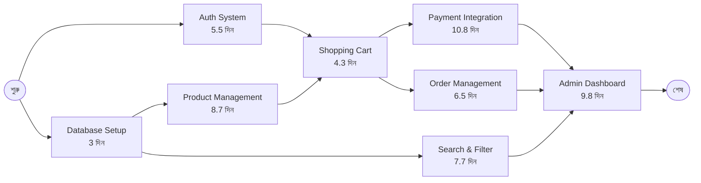
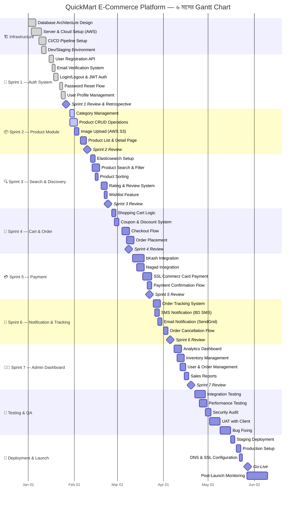
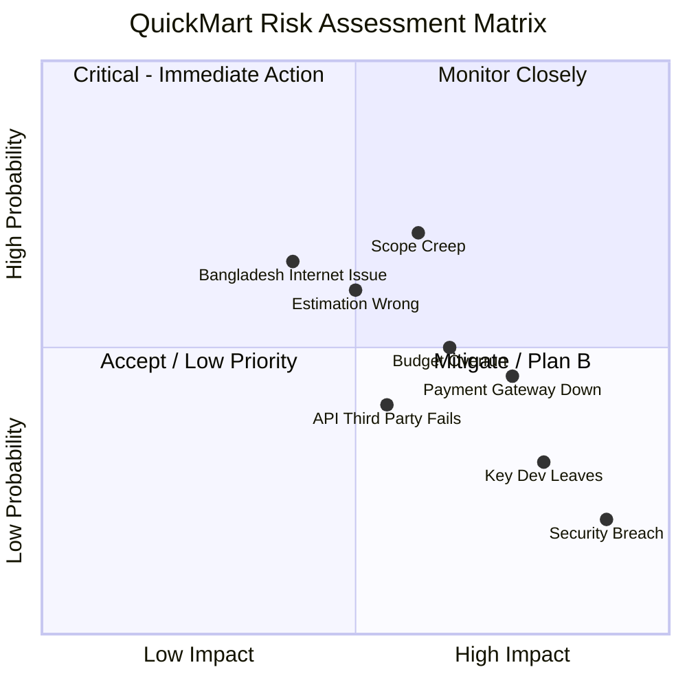

# Phase 3 — Project Planning
## Design থেকে Execution Plan পর্যন্ত
### QuickMart E-Commerce Project — সম্পূর্ণ গাইড

---

> **"Give me six hours to chop down a tree and I will spend the first four sharpening the axe."**
> — Abraham Lincoln

> **"By failing to prepare, you are preparing to fail."**
> — Benjamin Franklin

---

**লেখক:** Senior Project Manager & Technical Author
**সংস্করণ:** 1.0.0
**তারিখ:** ২০২৪
**প্রজেক্ট:** QuickMart — E-Commerce Platform
**পদ্ধতি:** Agile-Hybrid Project Management

---

## সূচিপত্র

- [Chapter 1: Project Planning কী এবং কেন?](#chapter-1-project-planning-কী-এবং-কেন)
  - [1.1 Project Planning-এর সংজ্ঞা ও পরিচিতি](#11-project-planning-এর-সংজ্ঞা-ও-পরিচিতি)
  - [1.2 Project Planning-এর গুরুত্ব](#12-project-planning-এর-গুরুত্ব)
  - [1.3 Planning ছাড়া কী হয় — Real Failure উদাহরণ](#13-planning-ছাড়া-কী-হয়--real-failure-উদাহরণ)
  - [1.4 Planning-এর স্তর](#14-planning-এর-স্তর)
- [Chapter 2: Effort Estimation Techniques](#chapter-2-effort-estimation-techniques)
  - [2.1 Expert Judgment](#21-expert-judgment)
  - [2.2 Analogous Estimation](#22-analogous-estimation)
  - [2.3 Function Point Analysis](#23-function-point-analysis)
  - [2.4 Story Points এবং Planning Poker](#24-story-points-এবং-planning-poker)
  - [2.5 PERT Estimation](#25-pert-estimation)
  - [2.6 T-Shirt Sizing](#26-t-shirt-sizing)
  - [2.7 QuickMart-এর সম্পূর্ণ Estimation উদাহরণ](#27-quickmart-এর-সম্পূর্ণ-estimation-উদাহরণ)
  - [2.8 Common Estimation Mistakes](#28-common-estimation-mistakes)
- [Chapter 3: Timeline এবং Schedule তৈরি](#chapter-3-timeline-এবং-schedule-তৈরি)
  - [3.1 Work Breakdown Structure (WBS)](#31-work-breakdown-structure-wbs)
  - [3.2 Gantt Chart বানানো](#32-gantt-chart-বানানো)
  - [3.3 Critical Path Method (CPM)](#33-critical-path-method-cpm)
  - [3.4 Sprint Timeline তৈরি](#34-sprint-timeline-তৈরি)
  - [3.5 Buffer এবং Contingency](#35-buffer-এবং-contingency)
  - [3.6 QuickMart-এর ৬ মাসের Timeline](#36-quickmart-এর-৬-মাসের-timeline)
- [Chapter 4: Resource Planning](#chapter-4-resource-planning)
  - [4.1 Team Composition ঠিক করা](#41-team-composition-ঠিক-করা)
  - [4.2 Skill Matrix তৈরি](#42-skill-matrix-তৈরি)
  - [4.3 Capacity Planning](#43-capacity-planning)
  - [4.4 Resource Allocation](#44-resource-allocation)
  - [4.5 Onboarding Planning](#45-onboarding-planning)
- [Chapter 5: Risk Management](#chapter-5-risk-management)
  - [5.1 Risk কী এবং কীভাবে চেনা যায়](#51-risk-কী-এবং-কীভাবে-চেনা-যায়)
  - [5.2 Risk Identification Techniques](#52-risk-identification-techniques)
  - [5.3 Risk Assessment Matrix](#53-risk-assessment-matrix)
  - [5.4 Risk Response Strategies](#54-risk-response-strategies)
  - [5.5 Risk Register তৈরি করা](#55-risk-register-তৈরি-করা)
  - [5.6 QuickMart-এর সম্পূর্ণ Risk Register](#56-quickmart-এর-সম্পূর্ণ-risk-register)
- [Chapter 6: Project Proposal লেখা](#chapter-6-project-proposal-লেখা)
  - [6.1 Project Proposal-এর Structure](#61-project-proposal-এর-structure)
  - [6.2 Executive Summary কীভাবে লিখবে](#62-executive-summary-কীভাবে-লিখবে)
  - [6.3 Scope of Work (SOW)](#63-scope-of-work-sow)
  - [6.4 QuickMart-এর Sample Proposal](#64-quickmart-এর-sample-proposal)
- [Chapter 7: Budget Planning](#chapter-7-budget-planning)
  - [7.1 Software Project-এর Cost Types](#71-software-project-এর-cost-types)
  - [7.2 Budget Breakdown তৈরি](#72-budget-breakdown-তৈরি)
  - [7.3 Cost Tracking](#73-cost-tracking)
  - [7.4 QuickMart-এর Sample Budget](#74-quickmart-এর-sample-budget)
- [Chapter 8: Communication Plan](#chapter-8-communication-plan)
  - [8.1 কার সাথে কতদিন পর কী Communicate করবে](#81-কার-সাথে-কতদিন-পর-কী-communicate-করবে)
  - [8.2 Status Report Template](#82-status-report-template)
  - [8.3 Escalation Process](#83-escalation-process)
  - [8.4 Meeting Schedule](#84-meeting-schedule)
- [Reference Books](#reference-books)
- [Templates Section](#templates-section)

---

## Chapter 1: Project Planning কী এবং কেন?

[↑ সূচিপত্রে ফিরুন](#সূচিপত্র)

### 1.1 Project Planning-এর সংজ্ঞা ও পরিচিতি

Project Planning হলো একটি সংগঠিত প্রক্রিয়া যার মাধ্যমে একটি প্রজেক্টের লক্ষ্য নির্ধারণ, কাজের ধাপ বিভাজন, সম্পদ বরাদ্দ, সময়সীমা নির্ধারণ এবং ঝুঁকি চিহ্নিতকরণ করা হয়। PMBOK Guide 7th Edition অনুযায়ী, Project Planning হলো সেই কার্যক্রমের সমষ্টি যা একটি Project Management Plan এবং তার সহযোগী নথিপত্র তৈরি করে, যা প্রজেক্টটি সফলভাবে সম্পন্ন করার পথ নির্দেশ করে।

সহজ ভাষায় বলতে গেলে — আপনি যদি ঢাকা থেকে চট্টগ্রাম যেতে চান, তাহলে আপনাকে আগে ঠিক করতে হবে: কোন পথে যাবেন, কতক্ষণ লাগবে, কত খরচ হবে, কী কী সমস্যা হতে পারে এবং সেই সমস্যার সমাধান কী। Project Planning ঠিক এই কাজটিই করে — তবে একটি Software Project বা Business Project-এর ক্ষেত্রে।

Project Planning মূলত তিনটি মৌলিক প্রশ্নের উত্তর দেয়:

**১. কী করতে হবে? (What?)** — Scope নির্ধারণ
**২. কীভাবে করতে হবে? (How?)** — Process এবং Method নির্ধারণ
**৩. কে, কখন করবে? (Who & When?)** — Resource এবং Timeline নির্ধারণ

Scott Berkun তাঁর বিখ্যাত গ্রন্থ "Making Things Happen"-এ বলেছেন: *"A plan is not a prediction of the future. It's a framework for thinking about it."* অর্থাৎ, একটি Plan ভবিষ্যতের ভবিষ্যদ্বাণী নয়, এটি ভবিষ্যৎ সম্পর্কে চিন্তা করার একটি কাঠামো।

Project Planning-এর মূল উপাদানগুলো হলো:

- **Scope Planning:** প্রজেক্টে কী কী কাজ অন্তর্ভুক্ত এবং কী কী বাদ থাকবে তা নির্ধারণ
- **Schedule Planning:** কাজগুলো কখন শুরু হবে এবং শেষ হবে তার Timeline তৈরি
- **Resource Planning:** কে কী কাজ করবে এবং কোন Tool বা Infrastructure দরকার হবে
- **Budget Planning:** পুরো প্রজেক্টে কত টাকা খরচ হবে
- **Quality Planning:** Output-এর মান কেমন হবে তা নিশ্চিত করার পদ্ধতি
- **Risk Planning:** কী কী সমস্যা হতে পারে এবং তার মোকাবিলা কীভাবে হবে
- **Communication Planning:** Team এবং Stakeholders-এর সাথে কীভাবে যোগাযোগ রাখা হবে

QuickMart প্রজেক্টের ক্ষেত্রে, এটি একটি E-Commerce Platform তৈরির প্রজেক্ট। এখানে প্রতিটি Planning উপাদান অত্যন্ত গুরুত্বপূর্ণ। কারণ, E-Commerce Platform-এ হাজারো Product, শত শত User, Payment Gateway Integration, Inventory Management, Delivery System — সবকিছু একসাথে কাজ করতে হয়। এই জটিলতার কারণে সঠিক Planning ছাড়া প্রজেক্ট সফল করা প্রায় অসম্ভব।

### 1.2 Project Planning-এর গুরুত্ব

Project Planning কেন করতে হয় — এই প্রশ্নটি নতুনদের মাথায় প্রায়ই আসে। অনেকে মনে করেন: "আমরা তো Developer, Coding শুরু করলেই হয়!" কিন্তু এই ভাবনাটি মারাত্মক ভুল। Project Planning-এর গুরুত্ব বোঝার জন্য নিচের দিকগুলো বিবেচনা করুন:

**১. দিকনির্দেশনা প্রদান (Direction Setting)**

একটি Software Project-এ অসংখ্য Developer, Designer, Tester, DevOps Engineer, Business Analyst একসাথে কাজ করেন। এদের প্রত্যেকের কাজের মধ্যে সমন্বয় না থাকলে প্রজেক্ট বিশৃঙ্খলায় পরিণত হয়। Project Planning একটি Roadmap তৈরি করে যা সবাইকে একই দিকে পরিচালিত করে।

QuickMart-এর উদাহরণে, যদি Frontend Developer Payment Page তৈরি করছেন এবং Backend Developer Payment API তৈরি করছেন, কিন্তু তাদের কাজের Timeline synchronized না হয়, তাহলে Frontend-এ Page তৈরি হয়ে যাবে কিন্তু Backend API হবে না, বা উল্টোটা। এতে দুজনেরই কাজ Blocked হয়ে যাবে।

**২. সম্পদের দক্ষ ব্যবহার (Efficient Resource Utilization)**

Fred Brooks তাঁর কিংবদন্তি গ্রন্থ "The Mythical Man-Month"-এ বলেছেন: *"Adding manpower to a late software project makes it later."* অর্থাৎ, দেরিতে চলা প্রজেক্টে নতুন লোক যোগ করলে প্রজেক্ট আরো দেরিতে হয়। এর কারণ হলো, নতুন মানুষকে বোঝাতে, Train করতে সময় লাগে।

সঠিক Resource Planning থাকলে শুরু থেকেই সঠিক সংখ্যক সঠিক দক্ষতার মানুষ নিয়োগ করা যায়। QuickMart-এর জন্য যদি আমরা জানি যে প্রথম ২ মাস মূলত Database Design এবং Architecture কাজ হবে, তাহলে শুরুতে Database Expert এবং Solution Architect নিয়োগ করা যায়, এবং পরের মাসগুলোতে Frontend Developer বাড়ানো যায়।

**৩. খরচ নিয়ন্ত্রণ (Cost Control)**

Standish Group-এর CHAOS Report অনুযায়ী, Software Project-গুলোর গড়ে প্রায় ৬৬% বাজেট ছাড়িয়ে যায়। এর মূল কারণ হলো অপর্যাপ্ত Planning। সঠিক Budget Planning এবং Cost Tracking থাকলে এই ঝুঁকি অনেকটাই কমানো যায়।

QuickMart-এর জন্য যদি শুরুতেই বলা হয় যে মোট বাজেট ৫০ লাখ টাকা এবং প্রতিটি Sprint-এ কত টাকা খরচ হবে তার Breakdown থাকে, তাহলে বাজেট অতিক্রান্ত হওয়ার আগেই সতর্ক হওয়া যাবে।

**৪. সময়মতো Delivery (On-Time Delivery)**

Project Planning না থাকলে Deadline miss হওয়া প্রায় নিশ্চিত। কারণ, কে কখন কী কাজ করবে তা না জানলে কাজ এলোমেলো হয়ে যায়, Dependency বোঝা যায় না এবং অনেক কাজ শেষ মুহূর্তে Rush করতে হয়।

QuickMart-এর Launch Date যদি নির্দিষ্ট থাকে (ধরুন, Eid-ul-Fitr-এর আগে), তাহলে Backward Planning করে বের করতে হবে: Launch-এর ৪ সপ্তাহ আগে UAT (User Acceptance Testing) শেষ করতে হবে, ৮ সপ্তাহ আগে সব Feature Complete করতে হবে, ইত্যাদি।

**৫. Stakeholder Expectations Management**

Stakeholders — অর্থাৎ Client, Management, Investors — প্রজেক্টের অগ্রগতি সম্পর্কে জানতে চান। একটি সুস্পষ্ট Plan থাকলে তাদের কাছে স্বচ্ছভাবে Status Report দেওয়া যায়। এতে বিশ্বাসযোগ্যতা বাড়ে এবং অপ্রয়োজনীয় হস্তক্ষেপ কমে।

**৬. ঝুঁকি চিহ্নিতকরণ ও প্রতিরোধ (Risk Identification & Mitigation)**

Planning-এর সময় Risk Assessment করলে আগে থেকেই সম্ভাব্য সমস্যাগুলো চিহ্নিত করা যায়। QuickMart-এর জন্য যদি আগে থেকেই জানি যে Payment Gateway Integration-এ সমস্যা হতে পারে, তাহলে সেই কাজ আগে করা যায় এবং Backup Plan রাখা যায়।

**৭. Quality Assurance**

Planning-এর সময় Quality Standard নির্ধারণ করলে পুরো Development-জুড়ে সেই Standard মেনে চলা সম্ভব হয়। QuickMart-এর জন্য যদি বলা থাকে যে প্রতিটি Feature-এর জন্য Unit Test Coverage ন্যূনতম ৮০% হতে হবে এবং Page Load Time ৩ সেকেন্ডের কম হতে হবে, তাহলে Developer-রা সেই অনুযায়ী কাজ করবেন।

### 1.3 Planning ছাড়া কী হয় — Real Failure উদাহরণ

ইতিহাসে অনেক বড় Software Project Planning-এর অভাবে ব্যর্থ হয়েছে। এই উদাহরণগুলো থেকে আমরা মূল্যবান শিক্ষা নিতে পারি:

**ঘটনা ১: Healthcare.gov — মার্কিন সরকারের E-Health Portal (২০১৩)**

২০১৩ সালে মার্কিন সরকার Healthcare.gov চালু করে। এটি ছিল Affordable Care Act-এর অধীনে স্বাস্থ্যবীমা কেনার একটি Portal। Launch-এর প্রথম দিনেই সাইটটি Crash করে। মাত্র ৬ জন User সফলভাবে Enroll করতে পেরেছিলেন।

**ব্যর্থতার কারণ:**
- অসংখ্য Vendor-এর মধ্যে Integration Plan না থাকা
- Performance Testing না করা
- Scope Creep — শেষ মুহূর্তে অনেক Feature যোগ করা
- Communication Plan-এর অভাব
- Risk Assessment না করা

**মোট ক্ষতি:** প্রায় ৬৩৪ মিলিয়ন ডলার (প্রাথমিক বাজেট ছিল ৯৩.৭ মিলিয়ন ডলার)

**ঘটনা ২: FBI Sentinel Project (২০০৬-২০১২)**

FBI তাদের পুরনো Case Management System আধুনিক করার জন্য Sentinel Project শুরু করে। প্রাথমিক Budget ছিল ৪৫১ মিলিয়ন ডলার, Completion Time ছিল ৩ বছর।

**আসল ফলাফল:**
- খরচ হলো ৪৫১ মিলিয়নের বদলে ৪৫১+ মিলিয়ন (এবং শেষ পর্যন্ত Agile দিয়ে ২০ মিলিয়নে সম্পন্ন হয়)
- সময় লাগলো ৬ বছর, প্রথম ৫ বছর ব্যর্থ

**ব্যর্থতার কারণ:**
- Waterfall পদ্ধতিতে Rigid Planning
- Requirement পরিবর্তনের সাথে Adaptation না করা
- Vendor Management-এর অভাব

**ঘটনা ৩: QuickMart-এর কাল্পনিক "ব্যর্থ শুরু"**

ধরুন, QuickMart প্রজেক্ট Planning ছাড়া শুরু হয়েছিল। প্রথম মাসে:
- ৩ জন Developer আলাদা আলাদা Database Schema তৈরি করলেন
- Frontend Developer Payment Page বানালেন, কিন্তু Backend-এ Payment API নেই
- Product Upload Feature তৈরি হলো, কিন্তু Image Storage Setup হয়নি
- Client ধরে নিলেন ৩ মাসে Delivery হবে, কিন্তু Team ধরে নিয়েছে ৬ মাস

**ফলাফল:**
- প্রথম ৩ মাস কার্যত নষ্ট
- পুরো Codebase আবার লিখতে হলো
- Client Relationship নষ্ট
- ২টি Developer চাকরি ছেড়ে দিলেন

এই উদাহরণগুলো প্রমাণ করে যে Planning শুধু "ভালো অভ্যাস" নয় — এটি প্রজেক্টের অস্তিত্বের জন্য অপরিহার্য।

### 1.4 Planning-এর স্তর

Project Planning কোনো একক কার্যক্রম নয়। এটি তিনটি স্তরে বিভক্ত:

**স্তর ১: Strategic Planning (কৌশলগত পরিকল্পনা)**

Strategic Planning হলো সর্বোচ্চ স্তরের Planning যেখানে প্রজেক্টের বৃহত্তর লক্ষ্য এবং দিকনির্দেশনা নির্ধারণ করা হয়। এই স্তরে নিম্নলিখিত প্রশ্নের উত্তর দেওয়া হয়:

- প্রজেক্টটি কেন তৈরি হচ্ছে? (Business Case)
- এটি Organization-এর বৃহত্তর লক্ষ্যের সাথে কীভাবে সামঞ্জস্যপূর্ণ?
- Success কেমন দেখাবে? (Success Metrics)
- প্রজেক্টটি কি Make বা Buy করব?

QuickMart-এর Strategic Plan:
- **Vision:** বাংলাদেশের সবচেয়ে নির্ভরযোগ্য E-Commerce Platform তৈরি করা
- **Business Goal:** প্রথম বছরে ১০,০০০ সক্রিয় গ্রাহক অর্জন
- **Make vs Buy:** Custom Platform তৈরি (Shopify নয়, কারণ Custom Business Logic দরকার)
- **Timeline:** ৬ মাসে MVP Launch

**স্তর ২: Tactical Planning (কৌশলগত বাস্তবায়ন পরিকল্পনা)**

Tactical Planning Strategic Plan-কে বাস্তবে রূপান্তরিত করার মাঝারি মেয়াদি পরিকল্পনা। এখানে নির্ধারণ করা হয়:

- কোন Phase-এ কী কাজ হবে
- প্রতিটি Phase-এর Milestone কী
- দলের গঠন কেমন হবে
- Budget কীভাবে Phase অনুযায়ী বরাদ্দ হবে

QuickMart-এর Tactical Plan:
- **Phase 1 (মাস ১-২):** Architecture এবং Core Infrastructure
- **Phase 2 (মাস ২-৪):** Core Features (Product, Cart, Order)
- **Phase 3 (মাস ৪-৫):** Payment, Delivery Integration
- **Phase 4 (মাস ৫-৬):** Testing, UAT, Launch

**স্তর ৩: Operational Planning (পরিচালনা পরিকল্পনা)**

Operational Planning হলো দৈনন্দিন এবং সাপ্তাহিক স্তরের পরিকল্পনা। এটি সবচেয়ে বিস্তারিত এবং Specific:

- প্রতিটি Sprint-এ কোন কোন User Story নেওয়া হবে
- প্রতিদিনের Daily Standup এ কী Review হবে
- Code Review Process কী হবে
- Bug Fix Priority কীভাবে নির্ধারণ হবে

QuickMart-এর Operational Plan (Sprint 1 উদাহরণ):
- **Sprint Duration:** ২ সপ্তাহ
- **Sprint Goal:** User Authentication এবং Product Listing Page সম্পন্ন
- **Daily Standup:** সকাল ১০টা, ১৫ মিনিট
- **Sprint Review:** প্রতি Sprint-এর শেষ শুক্রবার, বিকেল ৩টা

```
Planning-এর তিনটি স্তর:

Strategic (৬-১২ মাস দৃষ্টিভঙ্গি)
    │
    ▼
Tactical (মাস থেকে Quarter দৃষ্টিভঙ্গি)
    │
    ▼
Operational (সপ্তাহ থেকে দৈনিক দৃষ্টিভঙ্গি)
```

তিনটি স্তরের মধ্যে সামঞ্জস্য রাখাই হলো সফল Project Planning-এর মূল চাবিকাঠি। যদি Operational Plan Tactical Plan-এর সাথে এবং Tactical Plan Strategic Plan-এর সাথে Aligned না থাকে, তাহলে পুরো প্রজেক্ট দিকহীন হয়ে পড়ে।

---

## Chapter 2: Effort Estimation Techniques

[↑ সূচিপত্রে ফিরুন](#সূচিপত্র)

### 2.1 Expert Judgment

Expert Judgment হলো সবচেয়ে পুরনো এবং এখনও সবচেয়ে বেশি ব্যবহৃত Estimation Technique। এই পদ্ধতিতে অভিজ্ঞ ব্যক্তি বা ব্যক্তিবর্গের অতীত অভিজ্ঞতা এবং দক্ষতার উপর ভিত্তি করে Estimate দেওয়া হয়।

**কীভাবে কাজ করে:**

একজন অভিজ্ঞ Developer বা Project Manager একটি Feature বা Task দেখে বলে দিতে পারেন: "এই Feature টি ৩ দিনে হবে।" এই Estimate তাঁর অতীতে একই ধরনের Feature তৈরির অভিজ্ঞতার উপর ভিত্তি করে।

**সুবিধা:**
- দ্রুত Estimate পাওয়া যায়
- অভিজ্ঞতার ভিত্তিতে বলা হয়, তাই অনেক ক্ষেত্রে নির্ভুল
- Tool বা জটিল Process দরকার হয় না

**অসুবিধা:**
- Bias-এর সম্ভাবনা (Optimism Bias, Anchoring Bias)
- একজনের Opinion নির্ভর, তাই Subjective
- নতুন Technology-তে কম কার্যকর (কারণ অভিজ্ঞতা নেই)

**QuickMart উদাহরণ:**
QuickMart-এর Lead Developer রাফি ৫ বছরের অভিজ্ঞতাসম্পন্ন। তিনি Product Search Feature দেখে বললেন: "Backend API ৩ দিন, Frontend ২ দিন, Testing ১ দিন — মোট ৬ দিন।"

এই Estimate Expert Judgment। তবে শুধু একজনের মতামতে নির্ভর না করে আরো কিছু Technique ব্যবহার করা উচিত।

**Expert Judgment উন্নত করার উপায়:**
- **Delphi Technique:** একাধিক বিশেষজ্ঞকে আলাদাভাবে Estimate দিতে বলুন, তারপর মিলিয়ে দেখুন এবং আলোচনার মাধ্যমে Consensus-এ আসুন
- **Three-Point Estimation:** Optimistic, Pessimistic এবং Most Likely তিনটি Estimate নিন
- **Historical Data Check:** পূর্বের একই ধরনের কাজের Data দিয়ে যাচাই করুন

### 2.2 Analogous Estimation

Analogous Estimation হলো পূর্বের একটি অনুরূপ প্রজেক্টের Data ব্যবহার করে নতুন প্রজেক্টের Estimate করা। Steve McConnell তাঁর "Software Estimation: Demystifying the Black Art" গ্রন্থে এই পদ্ধতিকে "Top-Down Estimation" হিসেবেও বর্ণনা করেছেন।

**কীভাবে কাজ করে:**

১. পূর্বের একটি সম্পূর্ণ প্রজেক্টের Data সংগ্রহ করুন (Features, Time, Cost, Team Size)
২. নতুন প্রজেক্টের সাথে তুলনা করুন
৩. পার্থক্য অনুযায়ী Adjust করুন

**QuickMart উদাহরণ:**

QuickMart টিম আগে "FreshMart" নামে একটি ছোট E-Commerce Platform তৈরি করেছিল:

| বৈশিষ্ট্য | FreshMart (আগের প্রজেক্ট) | QuickMart (নতুন) | অনুপাত |
|-----------|--------------------------|------------------|---------|
| Features সংখ্যা | ৩০টি | ৫০টি | ১.৬৭x |
| সময় লেগেছিল | ৪ মাস | ? | |
| Team Size | ৪ জন | ৬ জন | ১.৫x |
| Budget | ১৫ লাখ | ? | |

**Calculation:**
- QuickMart-এ Features ৬৭% বেশি → সময় ≈ ৪ × ১.৬৭ = ৬.৭ মাস
- Team বড়, তাই সামান্য কমতে পারে → Adjusted: ~৬ মাস
- Budget: ১৫ লাখ × ১.৬৭ = ২৫ লাখ (Team বড়ের কারণে সামান্য বেশি) → ২৮-৩০ লাখ Estimate

**সুবিধা:**
- দ্রুত High-Level Estimate পাওয়া যায়
- Historical Data থাকলে বেশ নির্ভুল

**অসুবিধা:**
- পুরনো প্রজেক্টের Data না থাকলে ব্যবহার করা যায় না
- প্রজেক্ট অনেক আলাদা হলে Analogy কাজ করে না

### 2.3 Function Point Analysis

Function Point Analysis (FPA) একটি পরিমাপ কৌশল যা Software-এর Functional Size পরিমাপ করে। এটি ১৯৭৯ সালে IBM-এর Allan Albrecht উদ্ভাবন করেন।

FPA-এর মূল ধারণা হলো: Software-এর Size কোড-লাইনের সংখ্যায় নয়, বরং Software যা করে (Functionality) তার উপর ভিত্তি করে পরিমাপ করা।

**FPA-এর ৫টি উপাদান:**

**১. External Inputs (EI):** ব্যবহারকারী বা বাইরে থেকে System-এ Data প্রবেশ করানো
উদাহরণ: User Login Form, Product Search, Order Placement

**২. External Outputs (EO):** System থেকে বাইরে Data পাঠানো
উদাহরণ: Invoice PDF, Order Confirmation Email, Sales Report

**৩. External Inquiries (EQ):** User-এর Query-র Response হিসেবে Data দেখানো
উদাহরণ: Product Detail Page, Order History View, Profile Page

**৪. Internal Logical Files (ILF):** System-এর ভেতরে রক্ষিত তথ্যের গ্রুপ
উদাহরণ: Product Database, User Database, Order Database

**৫. External Interface Files (EIF):** বাইরের System থেকে আসা Data Group
উদাহরণ: Payment Gateway Data, SMS Gateway Data, Courier API Data

**Complexity Weight Table:**

| উপাদান | Simple | Average | Complex |
|---------|--------|---------|---------|
| External Input (EI) | ৩ | ৪ | ৬ |
| External Output (EO) | ৪ | ৫ | ৭ |
| External Inquiry (EQ) | ৩ | ৪ | ৬ |
| Internal Logical File (ILF) | ৭ | ১০ | ১৫ |
| External Interface File (EIF) | ৫ | ৭ | ১০ |

**QuickMart FPA উদাহরণ:**

| উপাদান | Simple | Average | Complex | Weighted Total |
|---------|--------|---------|---------|----------------|
| EI (Registration, Login, Order, Search, Filter, Payment) | ২×৩=৬ | ৩×৪=১২ | ১×৬=৬ | ২৪ |
| EO (Invoice, Email, Report, Receipt) | ১×৪=৪ | ২×৫=১০ | ১×৭=৭ | ২১ |
| EQ (Product List, Cart, Profile, Order History) | ১×৩=৩ | ২×৪=৮ | ১×৬=৬ | ১৭ |
| ILF (Product, User, Order, Payment, Category) | ০×৭=০ | ২×১০=২০ | ৩×১৫=৪৫ | ৬৫ |
| EIF (Payment GW, SMS, Courier) | ১×৫=৫ | ১×৭=৭ | ১×১০=১০ | ২২ |
| **মোট UFP** | | | | **১৪৯** |

**Value Adjustment Factor (VAF) গণনা:**
১৪টি General System Characteristics মূল্যায়ন করে (০-৫ Scale-এ) VAF নির্ধারণ হয়।
QuickMart-এর ক্ষেত্রে VAF ≈ ১.১৫ (Medium Complexity)

**Adjusted Function Points (AFP) = UFP × VAF = ১৪৯ × ১.১৫ = ১৭১.৩৫ ≈ ১৭২**

**Development Time Estimation:**
একজন Average Developer প্রতি মাসে ১০-১৫ Function Point Deliver করতে পারেন।
QuickMart: ১৭২ ÷ ১২ = ১৪.৩ Developer-Month

৬ জন Developer হলে: ১৪.৩ ÷ ৬ = ~২.৪ মাস (শুধু Coding)
Testing, Planning, Review সহ Total: ~৬ মাস ✓

### 2.4 Story Points এবং Planning Poker

Story Points হলো Agile Project Management-এর একটি গুরুত্বপূর্ণ Estimation Unit। এটি কাজের Relative Size এবং Complexity পরিমাপ করে — নির্দিষ্ট সময় নয়।

Mike Cohn তাঁর "Agile Estimating and Planning" গ্রন্থে Story Points-কে ব্যাখ্যা করেছেন: *"Story points are a unit of measure for expressing an estimate of the overall effort that will be required to fully implement a product backlog item or any other piece of work."*

**Story Points কেন সময় নয়?**

সময় (ঘণ্টা বা দিন) দিয়ে Estimate করলে সমস্যা হয়:
- আলাদা আলাদা Developer-এর গতি আলাদা
- একই কাজ একজনের ২ দিন, অন্যজনের ৫ দিন লাগতে পারে
- External Factor (Meeting, Server Issue, etc.) সময় Estimate-কে অনিশ্চিত করে

Story Points-এ Relative Size বলা হয়। যদি "User Login" = ১ Point হয়, তাহলে "Product Search with Filter" = ৩ Point মানে হলো Search কাজটি Login-এর তিনগুণ জটিল বা বড়।

**Fibonacci Sequence ব্যবহার কেন?**

Story Points সাধারণত Fibonacci Sequence অনুসরণ করে: ১, ২, ৩, ৫, ৮, ১৩, ২১, ৩৪...

এর কারণ হলো, বড় কাজের মধ্যে সঠিক পার্থক্য বোঝা কঠিন। ১০ এবং ১১-এর মধ্যে পার্থক্য বলা যায় না, কিন্তু ৮ এবং ১৩-এর মধ্যে পার্থক্য স্পষ্ট।

**Planning Poker বিস্তারিত:**

Planning Poker হলো Team-এর মাধ্যমে Story Points নির্ধারণের একটি Gamified প্রক্রিয়া।

**প্রক্রিয়া:**
১. Facilitator (সাধারণত Scrum Master) একটি User Story পড়ে শোনান
২. Team Member-রা প্রশ্ন করেন
৩. সবাই একসাথে Card তুলে ধরেন (যেন কেউ অন্যেরটা দেখে Influence না হয়)
৪. যদি সবার Card একই হয়, সেটাই Estimate
৫. যদি আলাদা হয়, সর্বোচ্চ এবং সর্বনিম্ন দেওয়া ব্যক্তি তাদের কারণ বলেন
৬. আবার Vote করা হয়
৭. Consensus না আসা পর্যন্ত চলতে থাকে

**QuickMart Planning Poker Session উদাহরণ:**

**User Story:** "একজন গ্রাহক Product-এ Rating এবং Review দিতে পারবেন"

| Team Member | প্রথম Vote | কারণ (যদি আলাদা) | দ্বিতীয় Vote |
|------------|------------|-----------------|--------------|
| রাফি (Lead Dev) | ৫ | Frontend সহজ, Backend moderate | ৫ |
| সুমাইয়া (Backend) | ৮ | Spam Prevention লাগবে, Moderation দরকার | ৫ |
| তানভীর (Frontend) | ৩ | শুধু Form আর Display | ৫ |
| নাদিয়া (QA) | ৫ | Testing Complex | ৫ |

**Final Estimate: ৫ Story Points**

সুমাইয়া বললেন Spam Prevention দরকার — এতে সবাই একমত হলেন এবং সেটা কাজের অংশে ধরলেন। তানভীর বুঝলেন যে Backend-এ আরো কাজ আছে।

### 2.5 PERT Estimation

PERT (Program Evaluation and Review Technique) হলো একটি Statistical Estimation পদ্ধতি যা তিনটি Estimate ব্যবহার করে:

- **O (Optimistic):** সবকিছু ভালো হলে কত সময় লাগবে
- **P (Pessimistic):** সবকিছু খারাপ হলে কত সময় লাগবে
- **M (Most Likely):** সাধারণত কত সময় লাগে

**PERT Formula:**

```
PERT Estimate (E) = (O + 4M + P) / 6

Standard Deviation (σ) = (P - O) / 6
```

Pessimistic কে ৪ দিয়ে গুণ করা হয় কারণ Most Likely সবচেয়ে বেশি হওয়ার সম্ভাবনা থাকে।

**QuickMart PERT উদাহরণ:**

| Feature | Optimistic (O) | Most Likely (M) | Pessimistic (P) | PERT (E) | σ |
|---------|----------------|-----------------|-----------------|----------|---|
| User Authentication | ৩ দিন | ৫ দিন | ১০ দিন | ৫.৫ দিন | ১.২ |
| Product Management | ৫ দিন | ৮ দিন | ১৫ দিন | ৮.৭ দিন | ১.৭ |
| Shopping Cart | ২ দিন | ৪ দিন | ৮ দিন | ৪.৩ দিন | ১.০ |
| Payment Integration | ৫ দিন | ১০ দিন | ২০ দিন | ১০.৮ দিন | ২.৫ |
| Order Management | ৩ দিন | ৬ দিন | ১২ দিন | ৬.৫ দিন | ১.৫ |
| Search & Filter | ৪ দিন | ৭ দিন | ১৪ দিন | ৭.৭ দিন | ১.৭ |
| Admin Dashboard | ৫ দিন | ৯ দিন | ১৮ দিন | ৯.৮ দিন | ২.২ |
| **মোট** | **২৭ দিন** | **৪৯ দিন** | **৯৭ দিন** | **৫৩.৩ দিন** | **৫.৯** |

**95% Confidence Interval:**
E ± 2σ = ৫৩.৩ ± ২×৫.৯ = ৪১.৫ থেকে ৬৫.১ কর্মদিন

এর মানে হলো, QuickMart Core Features তৈরিতে ৯৫% সম্ভাবনায় ৪২ থেকে ৬৫ কর্মদিন লাগবে।

**PERT Network Diagram (QuickMart):**



### 2.6 T-Shirt Sizing

T-Shirt Sizing হলো একটি সহজ এবং দ্রুত High-Level Estimation পদ্ধতি। এটি বিশেষভাবে উপকারী যখন একটি বড় Backlog-এ অনেক Items আছে এবং দ্রুত Prioritize করতে হবে।

**Size Categories:**

| Size | Effort Approximation | Story Points Range |
|------|---------------------|-------------------|
| XS (Extra Small) | কয়েক ঘণ্টা | ১ Point |
| S (Small) | ১-২ দিন | ২-৩ Points |
| M (Medium) | ৩-৫ দিন | ৫-৮ Points |
| L (Large) | ১-২ সপ্তাহ | ১৩-২০ Points |
| XL (Extra Large) | ২-৪ সপ্তাহ | ২১-৪০ Points |
| XXL (Too Large) | এটি ভেঙে ছোট করতে হবে | ৪০+ Points |

**QuickMart T-Shirt Sizing:**

| Feature | Size | কারণ |
|---------|------|------|
| Logo পরিবর্তন | XS | শুধু Image Replace |
| User Profile Page | S | Basic CRUD |
| Product List Page | M | Pagination, Filter দরকার |
| Shopping Cart | M | Session Management, Total Calculation |
| Product Search | L | Search Algorithm, Indexing দরকার |
| Payment Gateway | XL | 3rd Party Integration, Security Critical |
| Recommendation Engine | XXL | ML Algorithm দরকার — এটি আলাদা Phase-এ |

### 2.7 QuickMart-এর সম্পূর্ণ Estimation উদাহরণ

এখন সব Technique মিলিয়ে QuickMart-এর সম্পূর্ণ Estimation করা যাক। আমরা মূলত Story Points এবং PERT ব্যবহার করব।

**QuickMart MVP Feature List এবং Estimation:**

```
Sprint 1 (সপ্তাহ ১-২):
━━━━━━━━━━━━━━━━━━━━━━━━━━━━━━━━━━━━━━━━━━━━━
User Story                          Points   Days
━━━━━━━━━━━━━━━━━━━━━━━━━━━━━━━━━━━━━━━━━━━━━
US-001: User Registration           3        2
US-002: Email Verification          2        1
US-003: User Login/Logout           3        2
US-004: Password Reset              2        1.5
US-005: User Profile View/Edit      5        3
Sprint 1 Total:                     15 pts   9.5 দিন

Sprint 2 (সপ্তাহ ৩-৪):
━━━━━━━━━━━━━━━━━━━━━━━━━━━━━━━━━━━━━━━━━━━━━
US-006: Product Category Management 5        3
US-007: Product Add/Edit/Delete     8        5
US-008: Product Image Upload        5        3
US-009: Product List with Pagination 3       2
US-010: Product Detail Page         3        2
Sprint 2 Total:                     24 pts   15 দিন

Sprint 3 (সপ্তাহ ৫-৬):
━━━━━━━━━━━━━━━━━━━━━━━━━━━━━━━━━━━━━━━━━━━━━
US-011: Search with Filters         8        5
US-012: Product Sorting             3        2
US-013: Product Rating & Review     5        3
US-014: Wishlist                    3        2
US-015: Compare Products            5        3
Sprint 3 Total:                     24 pts   15 দিন

Sprint 4 (সপ্তাহ ৭-৮):
━━━━━━━━━━━━━━━━━━━━━━━━━━━━━━━━━━━━━━━━━━━━━
US-016: Add to Cart                 3        2
US-017: Cart Management             5        3
US-018: Apply Coupon/Discount       5        3
US-019: Checkout Flow               8        5
US-020: Order Placement             8        5
Sprint 4 Total:                     29 pts   18 দিন

Sprint 5 (সপ্তাহ ৯-১০):
━━━━━━━━━━━━━━━━━━━━━━━━━━━━━━━━━━━━━━━━━━━━━
US-021: bKash Payment Integration   13       8
US-022: Nagad Payment Integration   8        5
US-023: Card Payment (SSL Commerz)  13       8
US-024: Payment Confirmation        5        3
Sprint 5 Total:                     39 pts   24 দিন

Sprint 6 (সপ্তাহ ১১-১২):
━━━━━━━━━━━━━━━━━━━━━━━━━━━━━━━━━━━━━━━━━━━━━
US-025: Order Tracking              8        5
US-026: Order History               5        3
US-027: Order Cancellation          3        2
US-028: SMS Notification            5        3
US-029: Email Notification          5        3
Sprint 6 Total:                     26 pts   16 দিন

Grand Total: 157 Story Points | 97.5 কর্মদিন
Team: 6 জন | Buffer 20% সহ: ~117 কর্মদিন (≈ 6 মাস)
```

**Team Velocity Calculation:**

প্রথম Sprint-এ Team সাধারণত Slower হয়। Estimated Velocity:
- Sprint 1-2: ১৫-২০ Points/Sprint (নতুন Environment, Setup)
- Sprint 3-6: ২৫-৩০ Points/Sprint (Stable Team)

মোট ৬ Sprint × গড় ২৫ Points = ১৫০ Points → প্রায় ১৫৭-এর কাছাকাছি ✓

### 2.8 Common Estimation Mistakes

Estimation-এ সবচেয়ে বেশি যে ভুলগুলো হয়:

**১. Planning Fallacy (পরিকল্পনা ভুল)**
মানুষের স্বাভাবিক প্রবণতা হলো Optimistic Estimate দেওয়া। গবেষণায় দেখা গেছে যে Software Project গুলো গড়ে ২ গুণ বেশি সময় এবং ৩ গুণ বেশি খরচ নেয়।

**সমাধান:** Historical Data ব্যবহার করুন, Buffer রাখুন

**২. 90% Syndrome**
Project-এর শেষ ১০% কাজ প্রায়ই ৫০% সময় নিয়ে নেয়। কারণ Testing, Bug Fix, Integration Issue সব শেষে আসে।

**সমাধান:** Testing এবং Integration-এর জন্য আলাদা সময় বরাদ্দ রাখুন

**৩. Student Syndrome**
শেষ মুহূর্তে কাজ শুরু করার প্রবণতা। Parkinson's Law বলে: কাজ যতটা সময় দেওয়া হয় ততটা সময়ই নেয়।

**সমাধান:** Sprint-এ ছোট ছোট Deadline রাখুন

**৪. Integration-এর সময় না রাখা**
আলাদা Module তৈরিতে সময় ঠিকমতো মাপা হলেও Integration-এ কত সময় লাগবে তা ভুলে যাওয়া।

**সমাধান:** Integration Sprint বা Integration Time আলাদা রাখুন

**৫. Missing the "Unknown Unknowns"**
এমন সমস্যা যা আগে থেকে জানা সম্ভব নয়। যেমন: বাংলাদেশে হঠাৎ Internet Disruption, New Government Regulation, Third-party API Shutdown।

**সমাধান:** Contingency Buffer (১৫-২০%) রাখুন

---

## Chapter 3: Timeline এবং Schedule তৈরি

[↑ সূচিপত্রে ফিরুন](#সূচিপত্র)

### 3.1 Work Breakdown Structure (WBS)

Work Breakdown Structure (WBS) হলো একটি প্রজেক্টকে পরিচালনাযোগ্য ছোট ছোট অংশে ভাগ করার hierarchical পদ্ধতি। PMBOK Guide অনুযায়ী, WBS হলো *"a deliverable-oriented hierarchical decomposition of the work to be executed by the project team."*

**WBS-এর মূল নীতি:**

**100% Rule:** WBS-এ সমস্ত কাজ অন্তর্ভুক্ত থাকতে হবে — না কম, না বেশি। যদি কোনো কাজ WBS-এ না থাকে, তাহলে সেই কাজ করা হবে না (বা করা হলে বাজেটের বাইরে যাবে)।

**Decomposition Level:** সাধারণত ৩-৫ স্তরে ভাঙা হয়:
- Level 1: Project
- Level 2: Major Deliverable/Phase
- Level 3: Work Package
- Level 4: Task
- Level 5: Sub-task (প্রয়োজনে)

**WBS তৈরির নিয়ম:**
- প্রতিটি WBS Element-কে Noun দিয়ে বর্ণনা করুন (কাজ নয়, Output বর্ণনা করুন)
- প্রতিটি Child Element তার Parent-এর অংশ হতে হবে
- একই Level-এর Element গুলো পরস্পর exclusive হতে হবে

**QuickMart WBS Diagram:**

```mermaid
flowchart TD
    A["🛒 QuickMart Platform\n[১.০]"] --> B["🏗️ Infrastructure\n[১.১]"]
    A --> C["👤 User Module\n[১.২]"]
    A --> D["📦 Product Module\n[১.৩]"]
    A --> E["🛍️ Order Module\n[১.৪]"]
    A --> F["💳 Payment Module\n[১.৫]"]
    A --> G["👨‍💼 Admin Module\n[১.৬]"]
    A --> H["🔧 Testing & QA\n[১.৭]"]
    A --> I["🚀 Deployment\n[১.৮]"]

    B --> B1["Database Setup\n[১.১.১]"]
    B --> B2["Server Config\n[১.১.২]"]
    B --> B3["CI/CD Pipeline\n[১.১.৩]"]

    C --> C1["Registration\n[১.২.১]"]
    C --> C2["Authentication\n[১.২.২]"]
    C --> C3["Profile Mgmt\n[১.২.৩]"]
    C --> C4["Address Book\n[১.২.৪]"]

    D --> D1["Category Mgmt\n[১.৩.১]"]
    D --> D2["Product CRUD\n[১.৩.২]"]
    D --> D3["Image Mgmt\n[১.৩.৩]"]
    D --> D4["Search & Filter\n[১.৩.৪]"]
    D --> D5["Reviews\n[১.৩.৫]"]

    E --> E1["Cart\n[১.৪.১]"]
    E --> E2["Checkout\n[১.৪.২]"]
    E --> E3["Order Track\n[১.৪.৩]"]
    E --> E4["Notifications\n[১.৪.৪]"]

    F --> F1["bKash\n[১.৫.১]"]
    F --> F2["Nagad\n[১.৫.২]"]
    F --> F3["Card Payment\n[১.৫.৩]"]
    F --> F4["COD\n[১.৫.৪]"]

    G --> G1["Dashboard\n[১.৬.১]"]
    G --> G2["User Mgmt\n[১.৬.২]"]
    G --> G3["Order Mgmt\n[১.৬.৩]"]
    G --> G4["Reports\n[১.৬.৪]"]

    H --> H1["Unit Testing\n[১.৭.১]"]
    H --> H2["Integration Test\n[১.৭.২]"]
    H --> H3["UAT\n[১.৭.৩]"]
    H --> H4["Performance Test\n[১.৭.৪]"]

    I --> I1["Staging Deploy\n[১.৮.১]"]
    I --> I2["Production Deploy\n[১.৮.২]"]
    I --> I3["Post-Launch Support\n[১.৮.৩]"]
```



**WBS Dictionary (উদাহরণ — ১.৫.১ bKash Integration):**

| ক্ষেত্র | বিবরণ |
|---------|-------|
| WBS ID | ১.৫.১ |
| Name | bKash Payment Integration |
| Description | bKash Merchant API ব্যবহার করে Payment Processing |
| Owner | সুমাইয়া (Backend Developer) |
| Duration | ৮ কর্মদিন |
| Effort | ৪০ ঘণ্টা |
| Dependencies | ১.৪.২ (Checkout), bKash Merchant Account |
| Deliverables | Payment API, Test Cases, Documentation |
| Acceptance Criteria | ৩টি ভিন্ন Scenario-তে Successful Payment |

### 3.2 Gantt Chart বানানো

Gantt Chart হলো Project Management-এর সবচেয়ে পরিচিত Visual Tool। এটি Henry Gantt ১৯১০-এর দশকে তৈরি করেছিলেন। Gantt Chart-এ কাজের তালিকা এবং তাদের Timeline একসাথে দেখা যায়।

**QuickMart Gantt Chart:**



### 3.3 Critical Path Method (CPM)

Critical Path Method (CPM) হলো Project Scheduling-এর একটি গুরুত্বপূর্ণ Algorithm যা নির্ধারণ করে: কোন Tasks-গুলো যদি দেরিতে হয়, তাহলে পুরো প্রজেক্ট দেরিতে হবে।

**Critical Path:** সবচেয়ে লম্বা Path যা প্রজেক্টের Total Duration নির্ধারণ করে।

**মূল Concepts:**

- **Early Start (ES):** একটি Task যত তাড়াতাড়ি সম্ভব শুরু করা যাবে
- **Early Finish (EF):** Early Start + Duration
- **Late Start (LS):** Task শেষ করলেও প্রজেক্ট দেরি হবে না এমন সর্বশেষ সময়
- **Late Finish (LF):** Late Start + Duration
- **Float/Slack:** LS - ES (এই পরিমাণ দেরি করা যাবে)
- **Critical Path Tasks:** Float = 0 (এগুলো দেরি করলে প্রজেক্ট দেরি হবে)

**QuickMart Critical Path (সরলীকৃত):**

```
Path 1 (Critical): 
Infrastructure(5) → Auth System(10) → Product Module(15) → 
Cart & Order(18) → Payment(24) → Testing(21) → Launch(5) 
= 98 দিন ← Critical Path

Path 2 (Non-Critical):
Infrastructure(5) → Admin Dashboard(17) → Testing(21) → Launch(5)
= 48 দিন (Float = 50 দিন)

Path 3 (Non-Critical):
Infrastructure(5) → Search Feature(15) → Testing(21) → Launch(5)
= 46 দিন (Float = 52 দিন)
```

Critical Path-এর উপর বিশেষ মনোযোগ দিতে হবে। Payment Integration-এ সমস্যা হলে পুরো প্রজেক্ট দেরি হবে।

### 3.4 Sprint Timeline তৈরি

```
QuickMart Sprint Timeline:
━━━━━━━━━━━━━━━━━━━━━━━━━━━━━━━━━━━━━━━━━━━━━━━━━━━━

মাস ১: জানুয়ারি ২০২৪
┌─────────────────────────────────────────────────┐
│ সপ্তাহ ১-২: Infrastructure + Sprint 1 Setup    │
│ • Database Schema Design                        │
│ • AWS Server Setup                              │
│ • Docker Container Setup                        │
│ • CI/CD Pipeline (GitHub Actions)               │
└─────────────────────────────────────────────────┘

মাস ১-২: জানুয়ারি-ফেব্রুয়ারি
┌─────────────────────────────────────────────────┐
│ Sprint 1 (সপ্তাহ ৩-৪): Auth & User Module     │
│ Goal: Working Login/Signup System               │
│ Demo: Client-কে Working Auth দেখানো           │
│ Points: 15 Story Points                         │
└─────────────────────────────────────────────────┘

মাস ২: ফেব্রুয়ারি
┌─────────────────────────────────────────────────┐
│ Sprint 2 (সপ্তাহ ৫-৬): Product Module         │
│ Goal: Products Add করা এবং দেখানো যাবে       │
│ Demo: Product Management Panel দেখানো          │
│ Points: 24 Story Points                         │
└─────────────────────────────────────────────────┘

মাস ২-৩: ফেব্রুয়ারি-মার্চ
┌─────────────────────────────────────────────────┐
│ Sprint 3 (সপ্তাহ ৭-৮): Search & Discovery    │
│ Goal: Search এবং Filter কাজ করবে             │
│ Demo: Live Product Search দেখানো              │
│ Points: 24 Story Points                         │
└─────────────────────────────────────────────────┘

মাস ৩: মার্চ
┌─────────────────────────────────────────────────┐
│ Sprint 4 (সপ্তাহ ৯-১০): Cart & Checkout      │
│ Goal: Cart থেকে Order Place করা যাবে         │
│ Demo: End-to-End Shopping Flow                  │
│ Points: 29 Story Points                         │
└─────────────────────────────────────────────────┘

মাস ৩-৪: মার্চ-এপ্রিল
┌─────────────────────────────────────────────────┐
│ Sprint 5 (সপ্তাহ ১১-১২): Payment             │
│ Goal: bKash, Nagad, Card দিয়ে Pay করা যাবে  │
│ Demo: Live Payment Transaction                  │
│ Points: 39 Story Points                         │
└─────────────────────────────────────────────────┘

মাস ৪: এপ্রিল
┌─────────────────────────────────────────────────┐
│ Sprint 6 (সপ্তাহ ১৩-১৪): Notification       │
│ Goal: SMS ও Email Notification কাজ করবে      │
│ Points: 26 Story Points                         │
└─────────────────────────────────────────────────┘

মাস ৪-৫: এপ্রিল-মে
┌─────────────────────────────────────────────────┐
│ Sprint 7 (সপ্তাহ ১৫-১৬): Admin Dashboard    │
│ Goal: Admin Panel সম্পূর্ণ                    │
│ Points: 20 Story Points                         │
└─────────────────────────────────────────────────┘

মাস ৫: মে
┌─────────────────────────────────────────────────┐
│ Testing Phase (সপ্তাহ ১৭-২০)                 │
│ • Integration Testing (১ সপ্তাহ)              │
│ • Performance Testing (৩ দিন)                 │
│ • UAT (১ সপ্তাহ)                              │
│ • Bug Fixing (১ সপ্তাহ)                       │
└─────────────────────────────────────────────────┘

মাস ৬: জুন
┌─────────────────────────────────────────────────┐
│ Launch Phase (সপ্তাহ ২১-২৪)                  │
│ • Staging Deployment (৩ দিন)                  │
│ • Production Deployment (৩ দিন)               │
│ • Go-Live! 🚀 (মে ২৭)                        │
│ • Post-Launch Support (২ সপ্তাহ)              │
└─────────────────────────────────────────────────┘
```

### 3.5 Buffer এবং Contingency

**Buffer কী?**

Buffer হলো অনিশ্চয়তার জন্য রাখা অতিরিক্ত সময়। এটি দুই ধরনের:

**১. Feeding Buffer:** Non-Critical Path থেকে Critical Path-এ যোগ দেওয়ার সময় Buffer রাখা।

**২. Project Buffer:** পুরো প্রজেক্টের শেষে রাখা Buffer। সাধারণত Critical Path-এর ২০-৩০%।

**QuickMart Buffer Calculation:**

```
Critical Path Duration: ৯৮ কর্মদিন
Recommended Buffer: ২০% = ১৯.৬ ≈ ২০ দিন
Total Project Duration: ৯৮ + ২০ = ১১৮ কর্মদিন

কর্মদিন হিসাব:
৬ মাসে = ৬ × ২২ কর্মদিন = ১৩২ কর্মদিন
Buffer: ১৩২ - ১১৮ = ১৪ দিন অতিরিক্ত Buffer ✓
```

**Contingency Reserve:**

Risk-এর জন্য আলাদাভাবে রাখা Reserve। সাধারণত Total Budget-এর ১০-১৫%।

QuickMart Contingency: মোট Budget ৫০ লাখের ১৫% = ৭.৫ লাখ টাকা

### 3.6 QuickMart-এর ৬ মাসের Timeline

```
QuickMart ৬ মাসের Master Timeline
══════════════════════════════════════════════════════════════════

জানুয়ারি ২০২৪                    ফেব্রুয়ারি ২০২৪
│━━━━━━━━━━━━━━━━━━━━━━━━━━━━│━━━━━━━━━━━━━━━━━━━━━━━━━━━━│
│ Infrastructure  │ Sprint 1 │ Sprint 2    │  Sprint 3   │
│ (২ সপ্তাহ)     │ Auth     │ Products    │  Search     │
│                 │ (২ সপ্তাহ)│ (২ সপ্তাহ) │  (২ সপ্তাহ)│
│━━━━━━━━━━━━━━━━━━━━━━━━━━━━│━━━━━━━━━━━━━━━━━━━━━━━━━━━━│
↑                ↑           ↑             ↑
Project Start    Sprint 1    Sprint 2      Sprint 3
                 Demo        Demo          Demo

মার্চ ২০২৪                       এপ্রিল ২০২৪
│━━━━━━━━━━━━━━━━━━━━━━━━━━━━│━━━━━━━━━━━━━━━━━━━━━━━━━━━━│
│ Sprint 4    │  Sprint 5   │  Sprint 6   │  Sprint 7   │
│ Cart/Order  │  Payment    │  Notif.     │  Admin      │
│ (২ সপ্তাহ) │  (২ সপ্তাহ)│  (২ সপ্তাহ)│  (২ সপ্তাহ)│
│━━━━━━━━━━━━━━━━━━━━━━━━━━━━│━━━━━━━━━━━━━━━━━━━━━━━━━━━━│
↑             ↑              ↑              ↑
Sprint 4      Sprint 5       Sprint 6       Sprint 7
Demo          Demo ⚠️         Demo           Demo

মে ২০২৪                           জুন ২০২৪
│━━━━━━━━━━━━━━━━━━━━━━━━━━━━│━━━━━━━━━━━━━━━━━━━━━━━━━━━━│
│ Testing Phase               │ Deployment & Post Launch    │
│ Integ → UAT → Bug Fix       │ Staging → Prod → Support    │
│ (৪ সপ্তাহ)                 │ (৩-৪ সপ্তাহ)              │
│━━━━━━━━━━━━━━━━━━━━━━━━━━━━│━━━━━━━━━━━━━━━━━━━━━━━━━━━━│
                                ↑
                                🚀 LAUNCH! (মে ২৭)

Key Milestones:
M1: Jan 26 — Sprint 1 Complete (Auth Working)
M2: Feb 09 — Sprint 2 Complete (Products Working)
M3: Feb 23 — Sprint 3 Complete (Search Working)
M4: Mar 08 — Sprint 4 Complete (Cart & Order Working)
M5: Mar 22 — Sprint 5 Complete (Payments Working) ⚠️ Critical
M6: Apr 05 — Sprint 6 Complete (Notifications Working)
M7: Apr 19 — Sprint 7 Complete (Admin Dashboard Working)
M8: May 09 — All Testing Complete
M9: May 27 — 🚀 Go-Live!
```

---

## Chapter 4: Resource Planning

[↑ সূচিপত্রে ফিরুন](#সূচিপত্র)

### 4.1 Team Composition ঠিক করা

একটি Software Project-এর সাফল্য নির্ভর করে সঠিক দলের উপর। QuickMart-এর জন্য আমরা একটি Cross-functional Agile Team গঠন করব।

**Team Structure:**

```
QuickMart Core Team (৬ জন):
━━━━━━━━━━━━━━━━━━━━━━━━━━━━━━━━━━━━━━━━━━━━━━━━━━

ভূমিকা              নাম        অভিজ্ঞতা   বেতন/মাস
━━━━━━━━━━━━━━━━━━━━━━━━━━━━━━━━━━━━━━━━━━━━━━━━━━
Product Manager      রাহেলা     ৭ বছর      ৯০,০০০
Tech Lead/Backend    রাফি       ৬ বছর      ৮৫,০০০
Frontend Developer   তানভীর     ৪ বছর      ৬৫,০০০
Backend Developer    সুমাইয়া   ৩ বছর      ৫৫,০০০
UI/UX Designer       মেহেদী     ৪ বছর      ৬০,০০০
QA Engineer          নাদিয়া    ৩ বছর      ৫০,০০০
━━━━━━━━━━━━━━━━━━━━━━━━━━━━━━━━━━━━━━━━━━━━━━━━━━
Monthly Team Cost:              ৪,০৫,০০০ টাকা

Support/Part-time:
━━━━━━━━━━━━━━━━━━━━━━━━━━━━━━━━━━━━━━━━━━━━━━━━━━
DevOps Engineer      করিম       Part-time  ৩০,০০০
Database Admin       সালমা      Consultant ২০,০০০
━━━━━━━━━━━━━━━━━━━━━━━━━━━━━━━━━━━━━━━━━━━━━━━━━━
```

**প্রতিটি ভূমিকার দায়িত্ব:**

**Product Manager (রাহেলা):**
- Client এবং Stakeholders-এর সাথে যোগাযোগ
- Product Backlog Prioritization
- Sprint Planning এবং Review সমন্বয়
- Business Requirement বিশ্লেষণ
- ROI ট্র্যাকিং

**Tech Lead/Backend Developer (রাফি):**
- System Architecture ডিজাইন
- Technical Decision Making
- Code Review
- Backend Core Services তৈরি
- Junior Developer মেন্টরিং

**Frontend Developer (তানভীর):**
- React.js দিয়ে UI তৈরি
- Responsive Design Implementation
- API Integration
- Performance Optimization

**Backend Developer (সুমাইয়া):**
- REST API তৈরি
- Database Query Optimization
- Payment Integration
- Third-party API Integration

**UI/UX Designer (মেহেদী):**
- Wireframe এবং Mockup তৈরি
- User Research
- Design System তৈরি
- Usability Testing

**QA Engineer (নাদিয়া):**
- Test Case তৈরি
- Manual এবং Automated Testing
- Bug Reporting
- Performance Testing

### 4.2 Skill Matrix তৈরি

Skill Matrix একটি গুরুত্বপূর্ণ Tool যা দলের প্রতিটি সদস্যের দক্ষতা এবং তার স্তর দেখায়।

**Rating Scale:**
- **0:** কোনো অভিজ্ঞতা নেই
- **1:** Basic জ্ঞান আছে
- **2:** কাজ করতে পারি, সাহায্য লাগে
- **3:** স্বাধীনভাবে কাজ করতে পারি
- **4:** Expert — অন্যদের শেখাতে পারি

**QuickMart Skill Matrix:**

```
Skill Matrix — QuickMart Team
════════════════════════════════════════════════════════════════════════
                        রাহেলা  রাফি  তানভীর  সুমাইয়া  মেহেদী  নাদিয়া
════════════════════════════════════════════════════════════════════════
BACKEND SKILLS
  Python/Django             1      4      1       3        0       1
  Node.js/Express           1      3      2       4        0       1
  REST API Design           2      4      2       3        1       2
  Database (PostgreSQL)     1      4      1       3        0       2
  Redis/Caching             0      3      0       2        0       1
  Microservices             1      3      0       2        0       1

FRONTEND SKILLS
  React.js                  0      2      4       1        2       1
  Next.js                   0      2      3       1        1       0
  CSS/Tailwind              0      1      4       0        3       0
  TypeScript                0      2      4       1        1       0
  Redux/State Mgmt          0      2      3       1        0       0

DESIGN SKILLS
  Figma                     1      0      2       0        4       1
  UI/UX Principles          2      1      2       0        4       1
  Responsive Design         0      0      4       0        3       0

TESTING SKILLS
  Unit Testing              1      3      2       3        0       4
  Integration Testing       1      2      1       2        0       4
  Selenium/Playwright       0      1      0       1        0       3
  Performance Testing       0      2      0       1        0       3

DEVOPS SKILLS
  AWS                       0      3      1       2        0       1
  Docker                    0      3      1       2        0       1
  CI/CD                     0      3      1       2        0       2

PM SKILLS
  Agile/Scrum               4      3      2       2        2       2
  Risk Management           4      2      1       1        1       1
  Stakeholder Mgmt          4      2      1       1        1       1
  JIRA/Project Tools        4      3      3       3        3       3

DOMAIN SKILLS
  E-Commerce                3      2      2       2        2       2
  Payment Systems           2      3      1       3        0       2
  SEO Basics                2      1      3       0        2       0
════════════════════════════════════════════════════════════════════════
```

**Skill Gap Analysis:**

| দক্ষতার ক্ষেত্র | Gap | সমাধান |
|----------------|-----|--------|
| Mobile App Development | কেউ নেই | External Developer hire করব বা Phase 2-তে রাখব |
| ML/Recommendation | কেউ নেই | Phase 2-তে রাখব |
| Cybersecurity | কম | Security Audit-এর জন্য External Expert নেব |

### 4.3 Capacity Planning

Capacity Planning নির্ধারণ করে: প্রতিটি Team Member প্রতি Sprint-এ কতটুকু কাজ করতে পারবেন।

**Capacity Calculation:**

```
Sprint Duration: ২ সপ্তাহ = ১০ কর্মদিন
প্রতিদিন কাজের সময়: ৮ ঘণ্টা

কিন্তু Productive Time কম:
- Meeting: ২ ঘণ্টা/দিন (Daily Standup, Sprint Ceremony)
- Email/Admin: ১ ঘণ্টা/দিন
- Actual Coding/Work: ৫ ঘণ্টা/দিন

Per Sprint Capacity (একজন Developer):
= ১০ দিন × ৫ ঘণ্টা = ৫০ ঘণ্টা

মোট Team Capacity (৫ জন Technical):
= ৫ × ৫০ = ২৫০ ঘণ্টা/Sprint
```

**QuickMart Sprint Capacity Breakdown:**

```
Team Capacity — Sprint 5 (Payment Integration)
━━━━━━━━━━━━━━━━━━━━━━━━━━━━━━━━━━━━━━━━━━━━━━━━━━━━━━
সদস্য       Role          Availability   Capacity
━━━━━━━━━━━━━━━━━━━━━━━━━━━━━━━━━━━━━━━━━━━━━━━━━━━━━━
রাফি        Backend Lead   ১০০%          ৫০ ঘণ্টা
তানভীর      Frontend       ৮০%*          ৪০ ঘণ্টা
সুমাইয়া    Backend        ১০০%          ৫০ ঘণ্টা
মেহেদী      UI/UX          ৬০%**         ৩০ ঘণ্টা
নাদিয়া     QA             ১০০%          ৫০ ঘণ্টা
━━━━━━━━━━━━━━━━━━━━━━━━━━━━━━━━━━━━━━━━━━━━━━━━━━━━━━
Total Capacity:              ২২০ ঘণ্টা

* তানভীর Sprint-এর মাঝে ২ দিন ছুটিতে
** মেহেদী পরবর্তী Phase-এর Design-এও কাজ করছেন
```

### 4.4 Resource Allocation

Resource Allocation হলো সঠিক মানুষকে সঠিক কাজে নিযুক্ত করার প্রক্রিয়া।

**QuickMart Resource Allocation Matrix:**

```
Resource Allocation — সম্পূর্ণ ৬ মাস
━━━━━━━━━━━━━━━━━━━━━━━━━━━━━━━━━━━━━━━━━━━━━━━━━━━━━━━━━━━━━━━━━━
Phase/Sprint    রাহেলা  রাফি  তানভীর  সুমাইয়া  মেহেদী  নাদিয়া
━━━━━━━━━━━━━━━━━━━━━━━━━━━━━━━━━━━━━━━━━━━━━━━━━━━━━━━━━━━━━━━━━━
Infrastructure  ৫০%     ১০০%   ২০%     ৫০%       ৮০%     ২০%
Sprint 1 Auth   ৬০%     ৭০%    ৮০%     ৩০%       ৩০%     ৮০%
Sprint 2 Prod   ৫০%     ৫০%    ৮০%     ৬০%       ৫০%     ৮০%
Sprint 3 Search ৫০%     ৬০%    ৭০%     ৭০%       ৩০%     ৮০%
Sprint 4 Order  ৬০%     ৫০%    ৮০%     ৬০%       ২০%     ৯০%
Sprint 5 Pay    ৬০%     ৮০%    ৫০%     ৯০%       ১০%     ৮০%
Sprint 6 Notif  ৫০%     ৫০%    ৭০%     ৬০%       ২০%     ৮০%
Sprint 7 Admin  ৫০%     ৬০%    ৮০%     ৫০%       ৪০%     ৮০%
Testing Phase   ৬০%     ৬০%    ৫০%     ৫০%       ২০%     ১০০%
Deployment      ৭০%     ৮০%    ৩০%     ৫০%       ২০%     ৬০%
━━━━━━━━━━━━━━━━━━━━━━━━━━━━━━━━━━━━━━━━━━━━━━━━━━━━━━━━━━━━━━━━━━
```

### 4.5 Onboarding Planning

নতুন Team Member যোগ দিলে তাদের দ্রুত কার্যকর করার জন্য Onboarding Plan দরকার।

**QuickMart Onboarding Plan (নতুন Developer-এর জন্য):**

**দিন ১-২: Environment Setup**
- Laptop Setup এবং Software Installation
- GitHub Repo Access
- Slack, JIRA, Confluence Access
- AWS Console Access (Limited)
- Development Environment Run করানো

**দিন ৩-৫: Codebase Orientation**
- Tech Lead-এর সাথে Architecture Walkthrough (২ ঘণ্টা)
- Codebase Review
- First Small Bug Fix বা Minor Feature

**সপ্তাহ ২: First Sprint Participation**
- Sprint Planning-এ অংশগ্রহণ
- প্রথম User Story (ছোট, ২-৩ Points)
- Code Review Process শেখা

**সপ্তাহ ৩-৪: পূর্ণ অংশগ্রহণ**
- স্বাধীনভাবে Medium আকারের Task নেওয়া
- টিমের সাথে সম্পূর্ণ অংশগ্রহণ

---

## Chapter 5: Risk Management

[↑ সূচিপত্রে ফিরুন](#সূচিপত্র)

### 5.1 Risk কী এবং কীভাবে চেনা যায়

Risk হলো এমন একটি অনিশ্চিত ঘটনা বা পরিস্থিতি যা যদি ঘটে, তাহলে প্রজেক্টের লক্ষ্য অর্জনে নেতিবাচক (বা ইতিবাচক) প্রভাব পড়বে।

**Risk-এর তিনটি উপাদান:**

```
Risk = Probability (সম্ভাবনা) × Impact (প্রভাব)
```

**Risk বনাম Issue:**
- **Risk:** এখনো ঘটেনি, কিন্তু হতে পারে। Proactive Management দরকার।
- **Issue:** ইতোমধ্যে ঘটে গেছে। Reactive Management দরকার।

**Risk-এর প্রকারভেদ:**

**Technical Risk:**
- নতুন Technology-র সাথে অপরিচিতি
- Third-party API-র অস্থিরতা
- Performance Problem
- Security Vulnerability

**Organizational Risk:**
- Key Team Member চলে যাওয়া
- Budget Cut
- Management Priority পরিবর্তন
- Stakeholder Conflict

**External Risk:**
- Market Condition পরিবর্তন
- Regulatory পরিবর্তন
- Vendor Bankruptcy
- Natural Disaster বা Pandemic

**QuickMart-এ Risk চেনার উপায়:**

১. **Brainstorming Session:** টিমের সাথে বসে "কী কী ভুল হতে পারে?" নিয়ে আলোচনা
২. **Historical Data:** আগের প্রজেক্টে কী কী সমস্যা হয়েছিল
৩. **Expert Interview:** অভিজ্ঞদের সাথে কথা বলা
৪. **Assumption Analysis:** প্রজেক্টে কী কী Assumption করা হয়েছে, সেগুলো কতটা নিশ্চিত

### 5.2 Risk Identification Techniques

**১. Risk Breakdown Structure (RBS):**
WBS-এর মতো, Risk-কেও Category অনুযায়ী ভাগ করা।

```
QuickMart Risk Breakdown Structure:
├── Technical Risk
│   ├── Technology Risk
│   │   ├── Third-party API Failure
│   │   ├── Performance Issues
│   │   └── Security Vulnerabilities
│   ├── Integration Risk
│   │   ├── Payment Gateway Issues
│   │   └── SMS/Email Service Issues
│   └── Infrastructure Risk
│       ├── Server Downtime
│       └── Database Corruption
├── Resource Risk
│   ├── Key Person Departure
│   ├── Skill Gap
│   └── Capacity Overallocation
├── Schedule Risk
│   ├── Scope Creep
│   ├── Dependency Delay
│   └── Estimation Error
├── Budget Risk
│   ├── Cost Overrun
│   ├── Exchange Rate Fluctuation
│   └── Unexpected License Fees
└── External Risk
    ├── Internet/Power Disruption (Bangladesh)
    ├── Regulatory Change (BTRC, Bangladesh Bank)
    └── Competitor Action
```

**২. SWOT Analysis (Risk-এর জন্য):**

| Strength | Weakness |
|---------|---------|
| অভিজ্ঞ Tech Lead | নতুন Payment API ব্যবহার করিনি |
| Clear Scope Definition | ছোট Team |

| Opportunity | Threat |
|-------------|--------|
| E-Commerce বাজার বাড়ছে | বিদ্যুৎ সমস্যা (Bangladesh) |
| Government Digital Initiative | Payment Gateway পরিবর্তন |

### 5.3 Risk Assessment Matrix

Risk Assessment Matrix Probability এবং Impact-এর উপর ভিত্তি করে Risk-এর Priority নির্ধারণ করে।

**Probability Scale:**
- **1 - Very Low:** ০-১০% সম্ভাবনা
- **2 - Low:** ১১-৩০% সম্ভাবনা
- **3 - Medium:** ৩১-৫০% সম্ভাবনা
- **4 - High:** ৫১-৭০% সম্ভাবনা
- **5 - Very High:** ৭১-১০০% সম্ভাবনা

**Impact Scale:**
- **1 - Negligible:** প্রজেক্টে নগণ্য প্রভাব
- **2 - Minor:** সামান্য পরিবর্তন দরকার
- **3 - Moderate:** Timeline বা Budget-এ ১০-২০% প্রভাব
- **4 - Major:** Timeline বা Budget-এ ২১-৫০% প্রভাব
- **5 - Catastrophic:** প্রজেক্ট Cancel হতে পারে

**Risk Priority = Probability × Impact:**

```
Risk Assessment Matrix (ASCII):
━━━━━━━━━━━━━━━━━━━━━━━━━━━━━━━━━━━━━━━━━━━━━━━━━━━━━
Impact →         1           2           3           4           5
Probability ↓  Negligible   Minor    Moderate     Major   Catastrophic
━━━━━━━━━━━━━━━━━━━━━━━━━━━━━━━━━━━━━━━━━━━━━━━━━━━━━
5 Very High  │    5    │   10    │   15    │   20    │   25    │
             │  🟡LOW  │  🟠MED  │  🔴HIGH │  🔴HIGH │  🔴CRIT │
━━━━━━━━━━━━━━━━━━━━━━━━━━━━━━━━━━━━━━━━━━━━━━━━━━━━━
4 High       │    4    │    8    │   12    │   16    │   20    │
             │  🟢LOW  │  🟡LOW  │  🟠MED  │  🔴HIGH │  🔴HIGH │
━━━━━━━━━━━━━━━━━━━━━━━━━━━━━━━━━━━━━━━━━━━━━━━━━━━━━
3 Medium     │    3    │    6    │    9    │   12    │   15    │
             │  🟢LOW  │  🟢LOW  │  🟡LOW  │  🟠MED  │  🔴HIGH │
━━━━━━━━━━━━━━━━━━━━━━━━━━━━━━━━━━━━━━━━━━━━━━━━━━━━━
2 Low        │    2    │    4    │    6    │    8    │   10    │
             │  🟢LOW  │  🟢LOW  │  🟢LOW  │  🟡LOW  │  🟠MED  │
━━━━━━━━━━━━━━━━━━━━━━━━━━━━━━━━━━━━━━━━━━━━━━━━━━━━━
1 Very Low   │    1    │    2    │    3    │    4    │    5    │
             │  🟢LOW  │  🟢LOW  │  🟢LOW  │  🟢LOW  │  🟡LOW  │
━━━━━━━━━━━━━━━━━━━━━━━━━━━━━━━━━━━━━━━━━━━━━━━━━━━━━

Legend: 🟢 Low (1-4) | 🟡 Medium (5-9) | 🔴 High (10-19) | 🔴 Critical (20-25)
```

**QuickMart Risk Matrix (Mermaid):**



### 5.4 Risk Response Strategies

Risk চিহ্নিত হলে তার মোকাবিলার জন্য ৪টি কৌশল আছে:

**১. Avoid (এড়িয়ে চলা)**
Risk সম্পূর্ণভাবে দূর করা। সাধারণত Scope, Technology বা Plan পরিবর্তন করে।

QuickMart উদাহরণ: "Custom Payment Gateway তৈরি করব" — এই Risk Avoid করতে "SSL Commerz ব্যবহার করব" সিদ্ধান্ত নেওয়া।

**২. Mitigate (প্রশমিত করা)**
Risk-এর Probability বা Impact কমানো।

QuickMart উদাহরণ: "Key Developer চলে যেতে পারে" — Code Documentation ভালো করা, Knowledge Transfer করা, Cross-training করা।

**৩. Transfer (স্থানান্তর করা)**
Risk-এর দায়িত্ব তৃতীয় পক্ষের কাছে দেওয়া।

QuickMart উদাহরণ: "Server Downtime-এর Risk" — AWS-এর SLA (Service Level Agreement) নেওয়া যা Uptime গ্যারান্টি দেয়।

**৪. Accept (গ্রহণ করা)**
কিছু Risk এড়ানো সম্ভব নয় বা ব্যয়বহুল। তাই Accept করে Contingency Plan রাখা।

QuickMart উদাহরণ: "বাংলাদেশে বিদ্যুৎ সমস্যা" — UPS ব্যবহার এবং Remote Work Policy।

### 5.5 Risk Register তৈরি করা

Risk Register হলো প্রজেক্টের সব চিহ্নিত Risk-এর একটি সুসংগঠিত তালিকা।

**Risk Register-এ কী থাকে:**

| Field | বিবরণ |
|-------|------|
| Risk ID | অনন্য পরিচিতি নম্বর |
| Risk Description | Risk-এর স্পষ্ট বর্ণনা |
| Category | Technical, Resource, Schedule, ইত্যাদি |
| Probability (১-৫) | ঘটার সম্ভাবনা |
| Impact (১-৫) | ঘটলে প্রভাব |
| Risk Score | Probability × Impact |
| Priority | High/Medium/Low |
| Response Strategy | Avoid/Mitigate/Transfer/Accept |
| Response Plan | কংক্রিট পদক্ষেপ |
| Owner | কে দায়িত্ব নেবে |
| Status | Active/Closed/Occurred |
| Review Date | পরবর্তী পর্যালোচনা তারিখ |

### 5.6 QuickMart-এর সম্পূর্ণ Risk Register

```
QuickMart Risk Register — v1.0
Last Updated: জানুয়ারি ২০২৪
Owner: রাহেলা (Product Manager)
```

| ID | বিবরণ | Category | P | I | Score | Priority | Response | পদক্ষেপ | Owner | Status |
|----|-------|----------|---|---|-------|----------|----------|---------|-------|--------|
| R-001 | bKash/Nagad API পরিবর্তন হতে পারে | Technical | ৩ | ৫ | ১৫ | HIGH | Mitigate | API Wrapper তৈরি করব যা সহজে পরিবর্তন করা যায়। Abstraction Layer রাখব | সুমাইয়া | Active |
| R-002 | রাফি (Tech Lead) প্রজেক্ট ছেড়ে দিতে পারে | Resource | ২ | ৫ | ১০ | HIGH | Mitigate | প্রতিটি Module-এর Documentation, Knowledge Transfer Session প্রতি Sprint-এ | রাহেলা | Active |
| R-003 | Client নতুন Feature চাইতে পারে (Scope Creep) | Schedule | ৪ | ৩ | ১২ | HIGH | Avoid | Change Request Process তৈরি করব। নতুন Feature = নতুন Sprint বা Phase পরের | রাহেলা | Active |
| R-004 | বাংলাদেশে Internet/Power বিঘ্ন | External | ৪ | ২ | ৮ | MEDIUM | Accept | Team-কে Remote Work Permission, Generator ব্যবস্থা অফিসে | রাহেলা | Active |
| R-005 | AWS Cost বাজেটের বাইরে যেতে পারে | Budget | ৩ | ৩ | ৯ | MEDIUM | Mitigate | AWS Budget Alert Setup, Cost Optimization Review প্রতি মাসে | করিম | Active |
| R-006 | SSL Commerz Certification দেরি হতে পারে | Schedule | ৩ | ৪ | ১২ | HIGH | Mitigate | প্রজেক্টের শুরুতেই Application করব (Sprint 1-এ) | রাহেলা | Active |
| R-007 | Security Breach বা Data Leak | Technical | ২ | ৫ | ১০ | HIGH | Mitigate | OWASP Guidelines Follow করা, Security Audit, Encryption সর্বত্র | রাফি | Active |
| R-008 | Performance সমস্যা (High Traffic-এ) | Technical | ৩ | ৪ | ১২ | HIGH | Mitigate | Load Testing, CDN Setup, Caching (Redis), Auto-scaling | রাফি | Active |
| R-009 | Database Corruption বা Data Loss | Technical | ২ | ৫ | ১০ | HIGH | Transfer | AWS RDS-এর Automated Backup, Multi-AZ Deployment | করিম | Active |
| R-010 | UI/UX Designer মেহেদী Overloaded | Resource | ৩ | ২ | ৬ | LOW | Mitigate | Design System আগে তৈরি করা, Component Library ব্যবহার | মেহেদী | Active |
| R-011 | Third-party SMS Gateway ব্যর্থ | Technical | ৩ | ৩ | ৯ | MEDIUM | Mitigate | Backup SMS Provider রাখব (Primary: BD SMS, Backup: Twilio) | সুমাইয়া | Active |
| R-012 | Estimation ভুল হওয়া — সময় বেশি লাগবে | Schedule | ৪ | ৩ | ১২ | HIGH | Accept | ২০% Buffer রাখা আছে। Sprint Velocity Monitor করব | রাহেলা | Active |
| R-013 | নতুন BTRC Regulation | External | ২ | ৩ | ৬ | LOW | Monitor | BTRC Guidelines নিয়মিত দেখা | রাহেলা | Active |
| R-014 | Image Storage Cost বেশি (AWS S3) | Budget | ২ | ২ | ৪ | LOW | Accept | Image Optimization, Size Limit Policy রাখব | তানভীর | Active |
| R-015 | QA Engineer নাদিয়া Sprint শেষে Bottleneck | Resource | ৩ | ৩ | ৯ | MEDIUM | Mitigate | Developer-রাও Unit Test লিখবে, Automated Testing বাড়াব | নাদিয়া | Active |

---

## Chapter 6: Project Proposal লেখা

[↑ সূচিপত্রে ফিরুন](#সূচিপত্র)

### 6.1 Project Proposal-এর Structure

একটি Professional Project Proposal-এ নিম্নলিখিত অংশ থাকে:

১. Cover Page
২. Executive Summary
৩. Problem Statement
৪. Proposed Solution
৫. Scope of Work (SOW)
৬. Deliverables
৭. Timeline
৮. Team & Expertise
৯. Budget
১০. Terms & Conditions
১১. Appendices

### 6.2 Executive Summary কীভাবে লিখবে

Executive Summary হলো Proposal-এর সবচেয়ে গুরুত্বপূর্ণ অংশ। Client প্রায়ই শুধু এটুকুই পড়েন। তাই এখানে পুরো Proposal-এর সারমর্ম থাকতে হবে।

**Executive Summary-তে কী থাকবে:**
- সমস্যার সংক্ষিপ্ত বর্ণনা
- প্রস্তাবিত সমাধান
- প্রধান Deliverables
- Timeline
- Budget সারমর্ম
- কেন আপনাদের বেছে নেওয়া উচিত

**কীভাবে লিখবে:**
- সর্বোচ্চ ২ পৃষ্ঠা
- Non-technical ভাষায়
- Benefits-এ focus করুন, Features-এ নয়
- Clear এবং Confident tone

### 6.3 Scope of Work (SOW)

Scope of Work (SOW) স্পষ্টভাবে বর্ণনা করে:
- কী কাজ করা হবে (In Scope)
- কী কাজ করা হবে না (Out of Scope)
- কীভাবে কাজ হবে (Methodology)
- কে কী করবে (Responsibilities)

SOW সবচেয়ে গুরুত্বপূর্ণ কারণ এটি Scope Creep প্রতিরোধ করে এবং Legal Protection দেয়।

### 6.4 QuickMart-এর Sample Proposal

---

# PROJECT PROPOSAL

## QuickMart — E-Commerce Platform Development

---

**প্রস্তুতকারী:** TechCraft Solutions Ltd.
**প্রস্তুতের তারিখ:** ১৫ জানুয়ারি ২০২৪
**Proposal Reference:** TCS-2024-QM-001
**Validity:** ৩০ দিন (১৫ ফেব্রুয়ারি ২০২৪ পর্যন্ত)
**গোপনীয়তা:** এই Document টি Confidential। শুধুমাত্র QuickMart কর্তৃপক্ষের জন্য।

---

**প্রাপক:**
জনাব আহমেদ সাহেব
CEO, QuickMart Ventures Ltd.
ধানমণ্ডি, ঢাকা ১২০৫

---

### বিভাগ ১: Executive Summary

QuickMart Ventures Ltd. একটি আধুনিক, স্কেলেবল এবং ব্যবহারকারী-বান্ধব E-Commerce Platform তৈরির জন্য TechCraft Solutions Ltd.-এর সাথে যোগাযোগ করেছে। বাংলাদেশের ক্রমবর্ধমান Digital Commerce বাজারে প্রতিযোগিতামূলক সুবিধা অর্জন করতে QuickMart-এর একটি শক্তিশালী Online Marketplace প্রয়োজন।

TechCraft Solutions Ltd. ৬ মাসের মধ্যে একটি সম্পূর্ণ E-Commerce Platform Deliver করার প্রস্তাব দিচ্ছে যা:

- **১০,০০০+** পণ্য সহজে পরিচালনা করতে পারবে
- **বাংলাদেশের প্রধান Payment Methods** (bKash, Nagad, Card, COD) সমর্থন করবে
- **Mobile-Responsive Design** যা Smartphone থেকে সহজে ব্যবহার করা যাবে
- **৯৯.৫% Uptime** নিশ্চিত করবে
- **Real-time Order Tracking** ব্যবস্থা থাকবে

আমাদের প্রস্তাবিত সমাধান Node.js, React.js এবং PostgreSQL-এর উপর ভিত্তি করে তৈরি হবে এবং AWS Cloud-এ Host করা হবে। মোট প্রজেক্ট খরচ **৫০,০০,০০০ টাকা** (পঞ্চাশ লক্ষ টাকা) এবং Delivery Timeline **জুন ২০২৪**।

TechCraft Solutions-এর ৮ বছরের Software Development অভিজ্ঞতা, E-Commerce ডোমেনে ১৫+ সফল প্রজেক্ট এবং ISO 9001:2015 Certification আমাদের এই প্রজেক্টের জন্য আদর্শ অংশীদার করে তোলে।

---

### বিভাগ ২: Problem Statement

**বর্তমান পরিস্থিতি:**

QuickMart বর্তমানে Facebook Page এবং WhatsApp-এর মাধ্যমে পণ্য বিক্রি করছে। এই পদ্ধতিতে:

- **Order Management:** প্রতিটি Order manually track করতে হয় Excel-এ, যা ভুলের সম্ভাবনা বাড়ায়
- **Inventory Control:** Real-time Inventory জানা সম্ভব নয়, ফলে Out-of-Stock পণ্য Order আসে
- **Payment:** Manual bKash Transaction Verify করতে ৩-৪ ঘণ্টা সময় লাগে
- **Customer Experience:** গ্রাহকরা Product Compare করতে পারেন না, Review দিতে পারেন না
- **Scalability:** বর্তমান পদ্ধতিতে দৈনিক ৫০টির বেশি Order Handle করা সম্ভব নয়

**ব্যবসায়িক প্রভাব:**

- প্রতি মাসে আনুমানিক ৩০% Order Lost হচ্ছে Manual Process-এর কারণে
- Customer Retention Rate মাত্র ৪০%, কারণ Experience ভালো নয়
- Competitor যারা Shopify ব্যবহার করছেন তারা ৩x বেশি Revenue করছেন

**কেন Custom Platform?**

Shopify বা WooCommerce বাংলাদেশের নির্দিষ্ট বাজারের জন্য যথেষ্ট নয়:
- bKash/Nagad-এর Native Integration নেই
- বাংলা Language Support সীমিত
- বাংলাদেশের Delivery Courier API Integration নেই
- Custom Business Logic (যেমন: এলাকা-ভিত্তিক Delivery Charge) সম্ভব নয়

---

### বিভাগ ৩: Proposed Solution

**সমাধান Overview:**

TechCraft Solutions একটি Custom-Built E-Commerce Platform তৈরির প্রস্তাব দিচ্ছে যা QuickMart-এর নির্দিষ্ট ব্যবসায়িক চাহিদা পূরণ করবে।

**Technology Stack:**

| স্তর | Technology | কেন |
|------|------------|-----|
| Frontend | React.js + Next.js | Fast, SEO-Friendly, Mobile-Responsive |
| Backend | Node.js + Express | High Performance, JSON-Native |
| Database | PostgreSQL | Reliable, ACID Compliant |
| Cache | Redis | Fast Session এবং Cart Management |
| Search | Elasticsearch | দ্রুত Product Search |
| Storage | AWS S3 | Reliable Image Storage |
| Hosting | AWS EC2 + Load Balancer | Auto-scaling, High Availability |
| CDN | CloudFront | দ্রুত Content Delivery |

**মূল Features:**

**Customer-facing Features:**
- সহজ Registration এবং Login (Google, Facebook OAuth সহ)
- বাংলা এবং English উভয় ভাষায় Interface
- Advanced Search এবং Filter (Category, Price, Brand, Rating)
- Product Detail Page (Multiple Images, Videos, Specifications)
- Smart Shopping Cart (Coupon, Bulk Discount)
- Multiple Payment Options (bKash, Nagad, Card, COD)
- Real-time Order Tracking
- Product Reviews এবং Ratings
- Wishlist এবং Save for Later

**Seller/Admin Features:**
- Product Management Dashboard
- Inventory Management (Low Stock Alert সহ)
- Order Management এবং Processing
- Customer Management
- Analytics Dashboard (Sales, Revenue, Traffic)
- Discount এবং Campaign Management
- Content Management System (CMS)

---

### বিভাগ ৪: Scope of Work

**In Scope (যা করা হবে):**

১. **Frontend Development:**
   - Customer-facing Website (React.js + Next.js)
   - Mobile Responsive Design
   - Admin Dashboard UI
   - বাংলা ও English Bilingual Support

২. **Backend Development:**
   - RESTful API Development
   - User Authentication (JWT + OAuth)
   - Product এবং Inventory Management API
   - Order Processing System
   - Payment Integration (bKash, Nagad, SSL Commerz)
   - SMS Notification (BD SMS)
   - Email Notification (SendGrid)

৩. **Database Design:**
   - PostgreSQL Database Schema
   - Data Migration (যদি পুরনো Data থাকে)
   - Backup Strategy

৪. **Infrastructure:**
   - AWS Cloud Setup
   - CI/CD Pipeline
   - SSL Certificate
   - Domain Configuration

৫. **Testing:**
   - Unit Testing (৮০% Coverage)
   - Integration Testing
   - Performance Testing
   - Security Audit (Basic)
   - UAT Support

৬. **Documentation:**
   - Technical Documentation
   - User Manual (Admin এবং Customer)
   - API Documentation

৭. **Post-Launch Support:**
   - ৩০ দিনের Warranty Support
   - Bug Fix (Launch-এর পরে পাওয়া Issues)

**Out of Scope (যা করা হবে না):**

- Mobile App (Android/iOS) — Phase 2-তে
- Machine Learning-based Recommendation Engine — Phase 2-তে
- Multi-vendor Marketplace — Phase 2-তে
- Accounting/ERP Integration
- Physical POS System
- Video Streaming Features
- ৩০ দিনের পরে Maintenance (আলাদা Contract প্রয়োজন)

---

### বিভাগ ৫: Deliverables এবং Timeline

**Milestones:**

| Milestone | Deliverable | তারিখ | Payment |
|-----------|-------------|-------|---------|
| M1: Kickoff | Project Plan, Architecture Document | জানুয়ারি ১৫ | ২০% (১০ লাখ) |
| M2: Sprint 1-2 Complete | Working Auth + Product Module | ফেব্রুয়ারি ৯ | ১৫% (৭.৫ লাখ) |
| M3: Sprint 3-4 Complete | Search + Cart Module | মার্চ ৮ | ২০% (১০ লাখ) |
| M4: Sprint 5-6 Complete | Payment + Notification | এপ্রিল ৫ | ২০% (১০ লাখ) |
| M5: Testing Complete | UAT Signed-off | মে ৯ | ১৫% (৭.৫ লাখ) |
| M6: Go-Live | Production Launch | মে ২৭ | ১০% (৫ লাখ) |

---

### বিভাগ ৬: Team

| ভূমিকা | নাম | অভিজ্ঞতা |
|--------|-----|---------|
| Project Manager | রাহেলা | ৭ বছর |
| Tech Lead | রাফি | ৬ বছর |
| Frontend Dev | তানভীর | ৪ বছর |
| Backend Dev | সুমাইয়া | ৩ বছর |
| UI/UX Designer | মেহেদী | ৪ বছর |
| QA Engineer | নাদিয়া | ৩ বছর |

---

### বিভাগ ৭: Budget Summary

| বিভাগ | পরিমাণ |
|-------|--------|
| Development Team (৬ মাস) | ২৪,৩০,০০০ |
| Infrastructure (AWS, Domain, SSL) | ৩,৫০,০০০ |
| Third-party Services | ২,০০,০০০ |
| Testing Tools | ১,০০,০০০ |
| Project Management | ৫,০০,০০০ |
| Contingency (১৫%) | ৭,৫০,০০০ |
| Documentation & Training | ১,৭০,০০০ |
| **মোট** | **৪৫,০০,০০০** |
| **Negotiated Total** | **৫০,০০,০০০** |

---

### বিভাগ ৮: Terms & Conditions

১. **Payment Terms:** Milestone অনুযায়ী Payment। কোনো Milestone Deliver হওয়ার ৭ কর্মদিনের মধ্যে Payment।

২. **Change Request:** Scope-এর বাইরের কাজের জন্য Change Request Form পূরণ করতে হবে। অতিরিক্ত কাজের জন্য আলাদা Quote দেওয়া হবে।

৩. **Source Code Ownership:** সম্পূর্ণ Payment সম্পন্ন হলে Source Code-এর সম্পূর্ণ Ownership QuickMart-এর হবে।

৪. **Confidentiality:** উভয় পক্ষ NDA (Non-Disclosure Agreement) মেনে চলবে।

৫. **Warranty:** Launch-এর পরে ৩০ দিন বিনামূল্যে Bug Fix। Hardware/Infrastructure Issue Warranty-এর বাইরে।

৬. **Force Majeure:** প্রাকৃতিক দুর্যোগ, যুদ্ধ, বা সরকারি আদেশের কারণে বিলম্বের জন্য TechCraft দায়ী নয়।

---

*এই Proposal-এ উল্লিখিত সব তথ্য TechCraft Solutions Ltd.-এর সর্বোত্তম জ্ঞান ও অভিজ্ঞতার ভিত্তিতে দেওয়া হয়েছে।*

*স্বাক্ষর: ______________________*
*রাহেলা বেগম, Project Manager, TechCraft Solutions Ltd.*
*তারিখ: ১৫ জানুয়ারি ২০২৪*

---

---

## Chapter 7: Budget Planning

[↑ সূচিপত্রে ফিরুন](#সূচিপত্র)

### 7.1 Software Project-এর Cost Types

Software Project-এর খরচ দুটি প্রধান ভাগে বিভক্ত:

**১. Direct Costs (প্রত্যক্ষ খরচ):**
প্রজেক্টের সাথে সরাসরি সম্পর্কিত খরচ।

- **Labor Cost:** Team Member-দের বেতন
- **Infrastructure Cost:** Server, Cloud Service, Domain
- **Software License:** IDE, Project Management Tool, Design Tool
- **Third-party Services:** Payment Gateway, SMS Service, Email Service

**২. Indirect Costs (পরোক্ষ খরচ):**
প্রজেক্টের সাথে সরাসরি সম্পর্কিত নয়, কিন্তু Overhead হিসেবে বিবেচিত।

- **Office Overhead:** বিদ্যুৎ, Internet, Office Rent-এর একটি অংশ
- **Administrative Cost:** HR, Accounting
- **Training Cost:** নতুন Technology শেখার খরচ

**Cost Types আরো বিশদে:**

**Fixed Cost vs Variable Cost:**

| Fixed Cost | Variable Cost |
|-----------|---------------|
| Team বেতন (Monthly) | AWS EC2 (Usage-based) |
| Office Rent | SMS Charges (Per SMS) |
| Software License | Email Charges (Per Email) |
| Domain Registration | S3 Storage (Per GB) |

**One-time Cost vs Recurring Cost:**

| One-time | Recurring |
|---------|----------|
| Initial Setup | Monthly Hosting |
| Logo/Branding | Domain Renewal (Yearly) |
| SSL Certificate | Maintenance |

### 7.2 Budget Breakdown তৈরি

**QuickMart Budget Breakdown:**

```
QuickMart Budget Breakdown — বিস্তারিত
════════════════════════════════════════════════════════════════

CATEGORY 1: HUMAN RESOURCES (মানব সম্পদ)
━━━━━━━━━━━━━━━━━━━━━━━━━━━━━━━━━━━━━━━━━━━━━━━━━━━━━━━━━━━━━
Role              Monthly    Duration   Total
━━━━━━━━━━━━━━━━━━━━━━━━━━━━━━━━━━━━━━━━━━━━━━━━━━━━━━━━━━━━━
Product Manager   ৯০,০০০    ৬ মাস      ৫,৪০,০০০
Tech Lead         ৮৫,০০০    ৬ মাস      ৫,১০,০০০
Frontend Dev      ৬৫,০০০    ৬ মাস      ৩,৯০,০০০
Backend Dev       ৫৫,০০০    ৬ মাস      ৩,৩০,০০০
UI/UX Designer    ৬০,০০০    ৬ মাস      ৩,৬০,০০০
QA Engineer       ৫০,০০০    ৬ মাস      ৩,০০,০০০
DevOps (Part)     ৩০,০০০    ৪ মাস      ১,২০,০০০
DB Consultant     ২০,০০০    ২ মাস      ৪০,০০০
━━━━━━━━━━━━━━━━━━━━━━━━━━━━━━━━━━━━━━━━━━━━━━━━━━━━━━━━━━━━━
HR Subtotal:                           ২৫,৯০,০০০ (৫১.৮%)

CATEGORY 2: INFRASTRUCTURE (পরিকাঠামো)
━━━━━━━━━━━━━━━━━━━━━━━━━━━━━━━━━━━━━━━━━━━━━━━━━━━━━━━━━━━━━
Item                    Monthly    Duration   Total
━━━━━━━━━━━━━━━━━━━━━━━━━━━━━━━━━━━━━━━━━━━━━━━━━━━━━━━━━━━━━
AWS EC2 (Dev+Prod)      ১৫,০০০    ৬ মাস      ৯০,০০০
AWS RDS PostgreSQL      ১২,০০০    ৬ মাস      ৭২,০০০
AWS S3 Storage          ৫,০০০     ৬ মাস      ৩০,০০০
AWS CloudFront CDN      ৩,০০০     ৬ মাস      ১৮,০০০
AWS Load Balancer       ৮,০০০     ৩ মাস      ২৪,০০০
AWS ElasticSearch       ১৫,০০০    ৪ মাস      ৬০,০০০
Domain Registration     -         একবার      ৫,০০০
SSL Certificate (EV)    -         একবার      ১৫,০০০
VPN Service             ৩,০০০     ৬ মাস      ১৮,০০০
━━━━━━━━━━━━━━━━━━━━━━━━━━━━━━━━━━━━━━━━━━━━━━━━━━━━━━━━━━━━━
Infrastructure Subtotal:                   ৩,৩২,০০০ (৬.৬%)

CATEGORY 3: SOFTWARE & TOOLS (সফটওয়্যার ও সরঞ্জাম)
━━━━━━━━━━━━━━━━━━━━━━━━━━━━━━━━━━━━━━━━━━━━━━━━━━━━━━━━━━━━━
Tool                    Cost       Type       Total
━━━━━━━━━━━━━━━━━━━━━━━━━━━━━━━━━━━━━━━━━━━━━━━━━━━━━━━━━━━━━
JIRA (6 users)          ৮,০০০/মাস  ৬ মাস      ৪৮,০০০
Confluence              ৪,০০০/মাস  ৬ মাস      ২৪,০০০
Figma (Professional)    ৫,০০০/মাস  ৬ মাস      ৩০,০০০
GitHub (Team Plan)      ৩,০০০/মাস  ৬ মাস      ১৮,০০০
Slack                   ৩,০০০/মাস  ৬ মাস      ১৮,০০০
VS Code (Free)          -          -          -
Postman (Free)          -          -          -
Jest/Testing Tools      ২,০০০      একবার      ২,০০০
━━━━━━━━━━━━━━━━━━━━━━━━━━━━━━━━━━━━━━━━━━━━━━━━━━━━━━━━━━━━━
Tools Subtotal:                            ১,৪০,০০০ (২.৮%)

CATEGORY 4: THIRD-PARTY SERVICES (তৃতীয় পক্ষের সেবা)
━━━━━━━━━━━━━━━━━━━━━━━━━━━━━━━━━━━━━━━━━━━━━━━━━━━━━━━━━━━━━
Service                 Cost                   Total
━━━━━━━━━━━━━━━━━━━━━━━━━━━━━━━━━━━━━━━━━━━━━━━━━━━━━━━━━━━━━
SSL Commerz Integration ২৫,০০০ (একবার)         ২৫,০০০
bKash Merchant Setup    ১০,০০০ (একবার)         ১০,০০০
Nagad Merchant Setup    ১০,০০০ (একবার)         ১০,০০০
BD SMS (SMS Gateway)    ২,০০০/মাস × ৬          ১২,০০০
SendGrid Email          ৩,০০০/মাস × ৬          ১৮,০০০
Google Maps API         ৫,০০০/মাস × ৬          ৩০,০০০
Pathao/Steadfast API    বিনামূল্যে             -
━━━━━━━━━━━━━━━━━━━━━━━━━━━━━━━━━━━━━━━━━━━━━━━━━━━━━━━━━━━━━
3rd Party Subtotal:                        ১,০৫,০০০ (২.১%)

CATEGORY 5: PROJECT MANAGEMENT (প্রকল্প ব্যবস্থাপনা)
━━━━━━━━━━━━━━━━━━━━━━━━━━━━━━━━━━━━━━━━━━━━━━━━━━━━━━━━━━━━━
Item                         Total
━━━━━━━━━━━━━━━━━━━━━━━━━━━━━━━━━━━━━━━━━━━━━━━━━━━━━━━━━━━━━
Sprint Planning Workshops    ৩০,০০০
Client Demo Arrangements     ২০,০০০
Documentation (Technical)    ৫০,০০০
User Manual                  ৩০,০০০
Training Session (৩টি)       ৪৫,০০০
━━━━━━━━━━━━━━━━━━━━━━━━━━━━━━━━━━━━━━━━━━━━━━━━━━━━━━━━━━━━━
PM Subtotal:                              ১,৭৫,০০০ (৩.৫%)

CATEGORY 6: TESTING (পরীক্ষা)
━━━━━━━━━━━━━━━━━━━━━━━━━━━━━━━━━━━━━━━━━━━━━━━━━━━━━━━━━━━━━
Item                              Total
━━━━━━━━━━━━━━━━━━━━━━━━━━━━━━━━━━━━━━━━━━━━━━━━━━━━━━━━━━━━━
Security Audit (External)         ৮০,০০০
Performance Testing (JMeter)      ২০,০০০
Accessibility Testing             ১৫,০০০
Cross-browser Testing (BrowserStack) ৩০,০০০
━━━━━━━━━━━━━━━━━━━━━━━━━━━━━━━━━━━━━━━━━━━━━━━━━━━━━━━━━━━━━
Testing Subtotal:                          ১,৪৫,০০০ (২.৯%)

CATEGORY 7: MISCELLANEOUS
━━━━━━━━━━━━━━━━━━━━━━━━━━━━━━━━━━━━━━━━━━━━━━━━━━━━━━━━━━━━━
Office Overhead (৬ মাস share)        ৩,০০,০০০
Internet & Communication             ৬০,০০০
Team Building/Motivation             ৩০,০০০
━━━━━━━━━━━━━━━━━━━━━━━━━━━━━━━━━━━━━━━━━━━━━━━━━━━━━━━━━━━━━
Misc Subtotal:                             ৩,৯০,০০০ (৭.৮%)

════════════════════════════════════════════════════════════════
TOTAL BASE BUDGET:                        ৩৭,৭৭,০০০
Contingency Reserve (১৫%):               ৫,৬৬,৫৫০
Profit Margin (১৮%):                     ৬,৭৯,৮৬০
════════════════════════════════════════════════════════════════
FINAL PROJECT COST:                       ৫০,২৩,৪১০
Negotiated to:                            ৫০,০০,০০০
════════════════════════════════════════════════════════════════
```

### 7.3 Cost Tracking

**Earned Value Management (EVM):**

EVM একটি শক্তিশালী পদ্ধতি যা একসাথে Scope, Schedule এবং Cost Track করে।

**মূল Metrics:**

- **PV (Planned Value):** এই সময়ে কত কাজ হওয়ার কথা ছিল (Budget)
- **EV (Earned Value):** আসলে কতটা কাজ হয়েছে (Budget × % Complete)
- **AC (Actual Cost):** আসলে কত টাকা খরচ হয়েছে

**Key Performance Indicators:**

```
Cost Performance Index (CPI) = EV / AC
  CPI > 1: বাজেটের নিচে (ভালো)
  CPI < 1: বাজেট ছাড়িয়ে গেছে (সমস্যা)

Schedule Performance Index (SPI) = EV / PV
  SPI > 1: Schedule-এর আগে (ভালো)
  SPI < 1: Schedule পিছিয়ে (সমস্যা)
```

**QuickMart EVM উদাহরণ (Sprint 3 শেষে):**

```
সময়কাল: Sprint 3 শেষ (৬ সপ্তাহ পরে)
━━━━━━━━━━━━━━━━━━━━━━━━━━━━━━━━━━━━━━━━━━━━━━
Planned Value (PV):   ২০,০০,০০০ (৩টি Sprint-এর বাজেট)
Earned Value (EV):    ১৭,০০,০০০ (Sprint 3 ৮৫% Complete)
Actual Cost (AC):     ১৯,৫০,০০০ (বেশি খরচ হয়েছে)

CPI = ১৭,০০,০০০ / ১৯,৫০,০০০ = ০.৮৭
  → বাজেট ছাড়িয়ে যাচ্ছে! প্রতি ১ টাকার কাজে ১.১৫ টাকা খরচ

SPI = ১৭,০০,০০০ / ২০,০০,০০০ = ০.৮৫
  → Schedule পিছিয়ে! ১৫% কম কাজ হয়েছে পরিকল্পনার তুলনায়

Estimate at Completion (EAC) = BAC / CPI
  = ৫০,০০,০০০ / ০.৮৭ = ৫৭,৪৭,১২৬
  → এই গতিতে চললে ৫৭.৫ লাখ খরচ হবে!

Action Required:
1. Elasticsearch Setup-এর জন্য AWS Cost বেড়েছে → Plan Revisit
2. Search Feature বেশি জটিল হয়েছে → Sprint 4-এ কিছু Move করব
3. Weekly Cost Review Meeting শুরু করব
━━━━━━━━━━━━━━━━━━━━━━━━━━━━━━━━━━━━━━━━━━━━━━
```

### 7.4 QuickMart-এর Sample Budget (Monthly Breakdown)

```
Month-by-Month Budget Tracking:
══════════════════════════════════════════════════════════════════════
Month         Planned     Actual      Variance   CPI    Status
══════════════════════════════════════════════════════════════════════
জানুয়ারি    ৭,৫০,০০০   ৭,২০,০০০   +৩০,০০০   ১.০৪   ✅ Good
ফেব্রুয়ারি  ৮,০০,০০০   ৮,৫০,০০০   -৫০,০০০   ০.৯৪   ⚠️ Watch
মার্চ        ৯,০০,০০০   ৯,৮০,০০০   -৮০,০০০   ০.৯২   ⚠️ Alert
এপ্রিল      ৮,৫০,০০০   -           -         -      🔄 Upcoming
মে           ৭,৫০,০০০   -           -         -      🔄 Upcoming
জুন          ৯,৫০,০০০   -           -         -      🔄 Upcoming
══════════════════════════════════════════════════════════════════════
Total Spent  ২৪,৫০,০০০  ২৫,৫০,০০০  -১,০০,০০০
Remaining    ২৫,৫০,০০০
Contingency  ৭,৫০,০০০
Status: ⚠️ Monitoring Required — Payment Sprint সামনে, Cost বাড়তে পারে
══════════════════════════════════════════════════════════════════════
```

---

## Chapter 8: Communication Plan

[↑ সূচিপত্রে ফিরুন](#সূচিপত্র)

### 8.1 কার সাথে কতদিন পর কী Communicate করবে

Communication Plan নির্ধারণ করে: কে, কার সাথে, কখন, কোন মাধ্যমে, কী বিষয়ে যোগাযোগ করবে।

**QuickMart Stakeholder Analysis:**

| Stakeholder | ভূমিকা | Interest | Influence | যোগাযোগের ধরন |
|-------------|--------|---------|-----------|----------------|
| আহমেদ (CEO) | Sponsor | Very High | Very High | Formal, Executive |
| রাহেলা (PM) | Internal | Very High | High | Daily, Informal |
| টিম Member | Implementer | High | Medium | Daily, Casual |
| End Users | বিটা টেস্টার | Medium | Low | Survey, Demo |

**Communication Matrix:**

```
QuickMart Communication Plan
════════════════════════════════════════════════════════════════════════════
Stakeholder   Frequency  Format          Medium       Owner    Purpose
════════════════════════════════════════════════════════════════════════════
CEO/Client    সাপ্তাহিক  Status Report   Email+Meet   রাহেলা   Progress Update
CEO/Client    Sprint-শেষে Demo/Review     Zoom Meet    রাহেলা   Milestone Review
Team          দৈনিক      Standup         Slack/Zoom   রাহেলা   Blockers, Progress
Team          সাপ্তাহিক  Sprint Planning  Zoom         রাহেলা   Next Sprint Plan
Team          Sprint-শেষে Retrospective   Physical     রাহেলা   Team Improvement
Management    মাসিক      Budget Report   Email        রাহেলা   Financial Status
DevOps Team   প্রয়োজনে   Incident Alert  Slack+Phone  রাফি     Server Issues
QA            Sprint-মধ্যে Bug Report     JIRA         নাদিয়া  Quality Issues
════════════════════════════════════════════════════════════════════════════
```

**Communication Tools:**

| Tool | ব্যবহার | কারা |
|------|--------|------|
| Slack | দৈনিক Team Chat | সব Team Member |
| Zoom | Video Meeting | সবাই |
| JIRA | Task Management | Technical Team |
| Confluence | Documentation | সবাই |
| Email | Formal Communication | Client, Management |
| Google Drive | Document Sharing | সবাই |
| GitHub | Code Repository | Technical Team |

### 8.2 Status Report Template

**QuickMart Weekly Status Report:**

---

**প্রজেক্ট:** QuickMart E-Commerce Platform
**Report তারিখ:** [তারিখ]
**রিপোর্টিং সময়কাল:** [শুরু তারিখ] থেকে [শেষ তারিখ]
**রিপোর্ট তৈরি করেছেন:** রাহেলা (Project Manager)

---

**Overall Status:** 🟢 Green / 🟡 Yellow / 🔴 Red

| বিভাগ | Status | মন্তব্য |
|-------|--------|--------|
| Schedule | 🟡 Yellow | Sprint 3 ১ দিন পিছিয়ে |
| Budget | 🟢 Green | বাজেটের মধ্যে আছে |
| Scope | 🟢 Green | কোনো Scope Change নেই |
| Quality | 🟢 Green | সব Test Pass করছে |
| Risk | 🟡 Yellow | Payment Integration-এ সতর্কতা |

---

**এ সপ্তাহে যা হয়েছে:**
- ✅ US-011: Product Search Feature সম্পন্ন
- ✅ US-012: Product Sorting সম্পন্ন
- ✅ US-013: Rating & Review — ৮০% সম্পন্ন
- 🔄 US-014: Wishlist Feature শুরু হয়েছে

**পরের সপ্তাহে কী হবে:**
- US-013: Rating & Review সম্পূর্ণ করব
- US-014: Wishlist Feature সম্পন্ন করব
- US-015: Compare Products শুরু করব
- Sprint 3 Demo প্রস্তুত করব

**Blockers (সমস্যা):**
- ⚠️ Elasticsearch AWS Instance Setup-এ ৩ দিন দেরি হয়েছে — সমাধান হয়েছে
- ⚠️ SSL Commerz-এর Test Account এখনো আসেনি (রাহেলা Follow-up করছেন)

**Metrics:**
- Sprint 3 Completion: ৮৫%
- Bugs Found/Fixed: ১২/১০
- Test Coverage: ৮২%

**পরের Sprint Demo:** ২৩ ফেব্রুয়ারি, বিকেল ৩:০০ টা, Zoom

---

### 8.3 Escalation Process

Escalation হলো যখন কোনো সমস্যা বা Decision টিমের নিজের পর্যায়ে সমাধান সম্ভব নয়, তখন উপরের স্তরে নিয়ে যাওয়া।

**QuickMart Escalation Matrix:**

```
Level 1: Team Level (০-২৪ ঘণ্টা)
━━━━━━━━━━━━━━━━━━━━━━━━━━━━━━━━━━━━━━
কে Handle করবে: Team Member নিজে
কী ধরনের সমস্যা: Technical Blocker, Minor Bug, Tool Access
Escalate করব কখন: ২৪ ঘণ্টা পরেও সমাধান না হলে

Level 2: Project Manager Level (২৪-৪৮ ঘণ্টা)
━━━━━━━━━━━━━━━━━━━━━━━━━━━━━━━━━━━━━━
কে Handle করবে: রাহেলা (Project Manager)
কী ধরনের সমস্যা: Resource Conflict, Schedule Issue, Client Expectation
Escalate করব কখন: ৪৮ ঘণ্টা পরেও সমাধান না হলে বা বাজেটে >১০% প্রভাব

Level 3: Senior Management Level (৪৮-৭২ ঘণ্টা)
━━━━━━━━━━━━━━━━━━━━━━━━━━━━━━━━━━━━━━
কে Handle করবে: TechCraft CEO / Director
কী ধরনের সমস্যা: Contract Issue, Legal Dispute, Budget Crisis
Escalate করব কখন: প্রজেক্টের অস্তিত্ব হুমকিতে পড়লে

Level 4: Client Executive Level
━━━━━━━━━━━━━━━━━━━━━━━━━━━━━━━━━━━━━━
কে Handle করবে: QuickMart CEO + TechCraft CEO
কী ধরনের সমস্যা: Scope Fundamental Change, Contract Renegotiation
```

**Escalation Process:**

১. **Document করুন:** সমস্যাটি লিখুন — কী হয়েছে, কতটা প্রভাব, কতদিন ধরে চলছে
২. **Recommend করুন:** ২-৩টি সম্ভাব্য সমাধান সাথে দিন
৩. **Timeline দিন:** এই সমস্যা কতদিনের মধ্যে সমাধান না হলে কী হবে
৪. **Escalate করুন:** উপযুক্ত ব্যক্তিকে Email/Call করুন
৫. **Follow-up করুন:** ২৪ ঘণ্টায় Response না পেলে আবার যোগাযোগ

### 8.4 Meeting Schedule

**QuickMart Meeting Calendar:**

| Meeting | Frequency | Duration | Participants | Platform | Agenda |
|---------|-----------|---------|-------------|---------|--------|
| Daily Standup | প্রতিদিন | ১৫ মিনিট | Technical Team | Slack/Zoom | What done, What planned, Blockers |
| Sprint Planning | Sprint শুরুতে | ২-৩ ঘণ্টা | Full Team | Zoom | Next Sprint Story Selection |
| Sprint Review | Sprint শেষে | ১-২ ঘণ্টা | Team + Client | Zoom | Demo, Feedback |
| Sprint Retrospective | Sprint শেষে | ১ ঘণ্টা | Team Only | Physical/Zoom | Process Improvement |
| Weekly Status | প্রতি সোমবার | ৩০ মিনিট | PM + Client | Zoom | Status Update |
| Monthly Budget Review | মাসিক | ১ ঘণ্টা | PM + Management | Zoom | Cost Analysis |
| Risk Review | সাপ্তাহিক | ৩০ মিনিট | PM + Tech Lead | Slack | Risk Update |

**Daily Standup Template:**

```
আজকের Date: [তারিখ]
Facilitator: রাহেলা

প্রতিটি সদস্য বলবেন (৩ মিনিটের মধ্যে):
1. গতকাল কী করেছি: [সংক্ষেপে]
2. আজকে কী করব: [সংক্ষেপে]
3. কোনো Blocker আছে কি: [Yes/No, বিস্তারিত পরে]

Blockers Discussion: Standup-এর পরে আলাদাভাবে
Meeting শেষ: ঠিক ১৫ মিনিটে
```

---

## Reference Books

[↑ সূচিপত্রে ফিরুন](#সূচিপত্র)

এই Document তৈরিতে নিম্নলিখিত গ্রন্থগুলো সহায়ক ভূমিকা পালন করেছে:

| # | গ্রন্থ | লেখক | বিষয় |
|---|-------|------|------|
| 1 | **Agile Estimating and Planning** | Mike Cohn | Story Points, Planning Poker, Velocity |
| 2 | **PMBOK Guide 7th Edition** | PMI | Project Management Standards |
| 3 | **Making Things Happen** | Scott Berkun | Project Leadership, Planning Philosophy |
| 4 | **Software Estimation: Demystifying the Black Art** | Steve McConnell | Estimation Techniques, Common Mistakes |
| 5 | **The Mythical Man-Month** | Fred Brooks | Team Dynamics, Software Project Truths |
| 6 | **Project Management for the Unofficial Project Manager** | Kogon, Blakemore | Practical PM without formal authority |

**অতিরিক্ত সম্পদ:**

- **PMI Website:** pmi.org — Certifications এবং Standards
- **Scrum Guide:** scrumguides.org — Official Scrum Framework
- **CHAOS Report:** Standish Group — Software Project Statistics
- **Agile Alliance:** agilealliance.org — Agile Practices

---

## Templates Section

[↑ সূচিপত্রে ফিরুন](#সূচিপত্র)

### Template 1: Sprint Planning Template

```
━━━━━━━━━━━━━━━━━━━━━━━━━━━━━━━━━━━━━━━━━━━━━━━━━━━━━━━━━━━━━
SPRINT PLANNING TEMPLATE — QuickMart
━━━━━━━━━━━━━━━━━━━━━━━━━━━━━━━━━━━━━━━━━━━━━━━━━━━━━━━━━━━━━
Sprint Number:     ___
Sprint Start:      ___________
Sprint End:        ___________
Sprint Goal:       [এক বাক্যে Sprint-এর লক্ষ্য]

Attendees:
- PM:              ___________
- Tech Lead:       ___________
- Team Members:    ___________

Team Capacity (এই Sprint-এ):
━━━━━━━━━━━━━━━━━━━━━━━━━━━━━━━━
Name        Days Available    Hours/Day    Total Hours
___         ___               ___          ___
___         ___               ___          ___
Total Capacity:               _____ ঘণ্টা

Selected User Stories:
━━━━━━━━━━━━━━━━━━━━━━━━━━━━━━━━━━━━━━━━━━━━━━━━━━━━━━━━━━━━━
ID    Story                              Points   Assignee  Priority
___   _______________________________    ___      ___       ___
___   _______________________________    ___      ___       ___
━━━━━━━━━━━━━━━━━━━━━━━━━━━━━━━━━━━━━━━━━━━━━━━━━━━━━━━━━━━━━
Total Points: ___

Definition of Done (DoD):
□ Code Written এবং Self-reviewed
□ Unit Test Written (৮০%+ Coverage)
□ Code Review পাস
□ QA Testing পাস
□ Documentation Updated
□ Deployed to Staging

PM Sign-off: ___________   Date: ___________
━━━━━━━━━━━━━━━━━━━━━━━━━━━━━━━━━━━━━━━━━━━━━━━━━━━━━━━━━━━━━
```

### Template 2: Bug Report Template

```
━━━━━━━━━━━━━━━━━━━━━━━━━━━━━━━━━━━━━━━━━━━━━━━━━━━━━━━━━━━━━
BUG REPORT TEMPLATE — QuickMart
━━━━━━━━━━━━━━━━━━━━━━━━━━━━━━━━━━━━━━━━━━━━━━━━━━━━━━━━━━━━━
Bug ID:            BUG-___
Report Date:       ___________
Reporter:          ___________
Assigned To:       ___________

Title:             [সংক্ষেপে Bug বর্ণনা]
Environment:       □ Development  □ Staging  □ Production
Severity:          □ Critical  □ High  □ Medium  □ Low
Priority:          □ P1  □ P2  □ P3  □ P4

Steps to Reproduce:
1. ___________
2. ___________
3. ___________

Expected Result:   [কী হওয়ার কথা ছিল]
Actual Result:     [আসলে কী হচ্ছে]

Screenshot/Video:  [Link]
Error Log:         [Log text]

Fix Timeline:      ___________
Status:            □ Open  □ In Progress  □ Fixed  □ Closed
Fixed Version:     ___________
━━━━━━━━━━━━━━━━━━━━━━━━━━━━━━━━━━━━━━━━━━━━━━━━━━━━━━━━━━━━━
```

### Template 3: Change Request Template

```
━━━━━━━━━━━━━━━━━━━━━━━━━━━━━━━━━━━━━━━━━━━━━━━━━━━━━━━━━━━━━
CHANGE REQUEST FORM — QuickMart
━━━━━━━━━━━━━━━━━━━━━━━━━━━━━━━━━━━━━━━━━━━━━━━━━━━━━━━━━━━━━
CR Number:         CR-___
Date:              ___________
Requested By:      ___________

Change Description:
[বিস্তারিত বর্ণনা করুন কী পরিবর্তন চান]

Business Justification:
[কেন এই পরিবর্তন দরকার]

Impact Analysis:
━━━━━━━━━━━━━━━━━━━━━━━━━━━━━━━━━━━━━━━━━━━━━━━━━━━━━━━━━━━━━
Schedule Impact:   +___ দিন
Budget Impact:     +___ টাকা
Scope Impact:      [কী যোগ/বাদ হবে]
Risk Impact:       [নতুন Risk]

PM Recommendation: □ Approve  □ Reject  □ Defer to Phase 2
Reason:            ___________

PM Signature:      ___________   Date: ___________
Client Approval:   ___________   Date: ___________
━━━━━━━━━━━━━━━━━━━━━━━━━━━━━━━━━━━━━━━━━━━━━━━━━━━━━━━━━━━━━
```

### Template 4: Risk Register Template (Blank)

```
━━━━━━━━━━━━━━━━━━━━━━━━━━━━━━━━━━━━━━━━━━━━━━━━━━━━━━━━━━━━━
RISK REGISTER TEMPLATE
━━━━━━━━━━━━━━━━━━━━━━━━━━━━━━━━━━━━━━━━━━━━━━━━━━━━━━━━━━━━━
Risk ID:           R-___
Date Identified:   ___________
Identified By:     ___________

Risk Description:  [স্পষ্টভাবে Risk বর্ণনা করুন]
Category:          □ Technical  □ Resource  □ Schedule  □ Budget  □ External
Root Cause:        [কেন এই Risk আসতে পারে]

Probability:       □ 1-Very Low  □ 2-Low  □ 3-Medium  □ 4-High  □ 5-Very High
Impact:            □ 1-Negligible □ 2-Minor □ 3-Moderate □ 4-Major □ 5-Catastrophic
Risk Score:        Probability × Impact = ___

Priority:          □ Critical (20-25)  □ High (10-19)  □ Medium (5-9)  □ Low (1-4)

Response Strategy: □ Avoid  □ Mitigate  □ Transfer  □ Accept
Response Plan:     [কংক্রিট পদক্ষেপ লিখুন]

Risk Owner:        ___________
Trigger Point:     [কীভাবে বুঝব Risk Occurred হয়েছে]

Status:            □ Active  □ Monitoring  □ Occurred  □ Closed
Last Reviewed:     ___________
Next Review:       ___________
━━━━━━━━━━━━━━━━━━━━━━━━━━━━━━━━━━━━━━━━━━━━━━━━━━━━━━━━━━━━━
```

### Template 5: Meeting Minutes Template

```
━━━━━━━━━━━━━━━━━━━━━━━━━━━━━━━━━━━━━━━━━━━━━━━━━━━━━━━━━━━━━
MEETING MINUTES — QuickMart
━━━━━━━━━━━━━━━━━━━━━━━━━━━━━━━━━━━━━━━━━━━━━━━━━━━━━━━━━━━━━
Meeting Type:      ___________
Date & Time:       ___________
Location/Platform: ___________
Facilitator:       ___________
Minutes By:        ___________

Attendees:         ___________

Agenda:
1. ___________
2. ___________
3. ___________

Discussion Points:
━━━━━━━━━━━━━━━━━━━━━━━━━━━━━━━━━━━━━━━━━━━━━━━━━━━━━━━━━━━━━
Topic 1: ___________
  Discussion: ___________
  Decision:   ___________

Topic 2: ___________
  Discussion: ___________
  Decision:   ___________

Action Items:
━━━━━━━━━━━━━━━━━━━━━━━━━━━━━━━━━━━━━━━━━━━━━━━━━━━━━━━━━━━━━
#   Action                Owner          Due Date    Status
1.  ___________           ___________    ___________  Open
2.  ___________           ___________    ___________  Open

Next Meeting:  ___________
━━━━━━━━━━━━━━━━━━━━━━━━━━━━━━━━━━━━━━━━━━━━━━━━━━━━━━━━━━━━━
```

---

## পরিশিষ্ট: মূল শিক্ষা

[↑ সূচিপত্রে ফিরুন](#সূচিপত্র)

### QuickMart Project Planning — Key Takeaways

এই বিশাল Document-এর সারমর্ম হলো:

**১. Planning-ই সাফল্যের ভিত্তি**
যত বেশি সময় Planning-এ দেবেন, Execution-এ তত কম সমস্যা হবে। QuickMart-এর ১৫ দিনের Planning Phase পুরো ৬ মাসের প্রজেক্টকে সফল করবে।

**২. Estimation কখনো নিশ্চিত নয়**
Estimation হলো শিক্ষিত অনুমান। সবসময় Buffer রাখুন। Historical Data দেখুন। একাধিক পদ্ধতি ব্যবহার করুন।

**৩. Risk Management Proactive হওয়া উচিত**
Risk না আসা পর্যন্ত অপেক্ষা করবেন না। আগে থেকে চিহ্নিত করুন এবং Plan রাখুন।

**৪. Communication সবকিছুর চাবিকাঠি**
প্রজেক্টের বেশিরভাগ সমস্যা Communication Failure-এ। সঠিক সময়ে সঠিক তথ্য সঠিক মানুষের কাছে পৌঁছানো নিশ্চিত করুন।

**৫. Plan নমনীয় হওয়া উচিত**
Plan একটি Living Document। পরিস্থিতি পরিবর্তন হলে Plan-ও পরিবর্তন করতে হবে। Rigid Plan-এর চেয়ে Adaptive Plan বেশি কার্যকর।

**QuickMart Success Formula:**

```
সঠিক Team × সুস্পষ্ট Scope × বাস্তবসম্মত Timeline × 
Risk Management × Open Communication = Project Success
```

---

*এই Document টি QuickMart E-Commerce Platform প্রজেক্টের Phase 3 — Project Planning-এর সম্পূর্ণ গাইড। এটি একটি Living Document এবং প্রজেক্টের অগ্রগতির সাথে সাথে Update করা উচিত।*

*Version: 1.0.0 | তারিখ: জানুয়ারি ২০২৪ | TechCraft Solutions Ltd.*

---

**[Document শেষ]**
