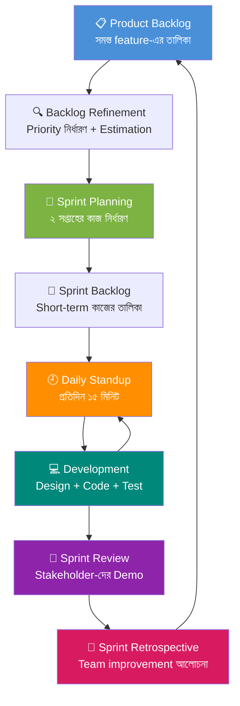
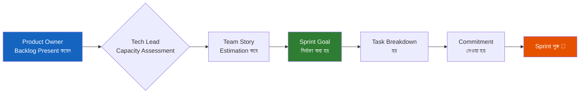
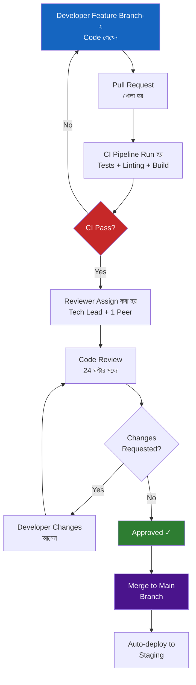
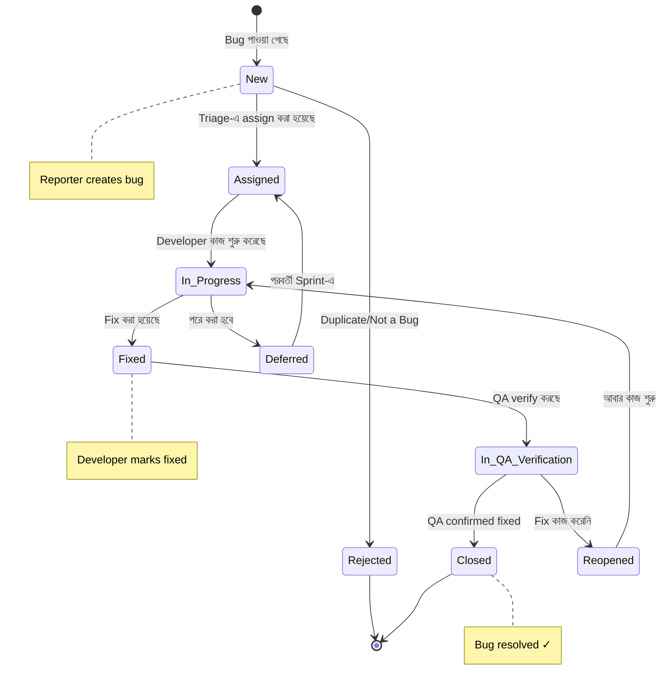
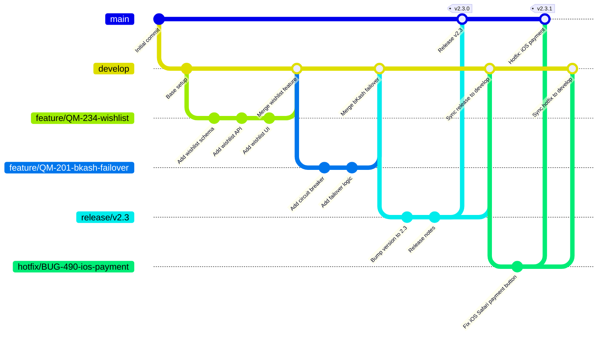

# Phase 4 — Development Oversight
## Plan থেকে Working Software পর্যন্ত
### একটি সম্পূর্ণ Professional গাইড — QuickMart E-commerce Project

---

> *"The best architects are also good programmers, and the best programmers are also good architects."*
> — Robert C. Martin, *Clean Code*

> *"Software is a team sport."*
> — Camille Fournier, *The Manager's Path*

---

**Document Version:** 2.0  
**Project:** QuickMart — বাংলাদেশের সবচেয়ে বড় Online Grocery Platform  
**Author:** Senior Tech Lead Team  
**Last Updated:** April 2026  
**Status:** Active Reference Document  

---

## সূচিপত্র

- [Chapter 1: Tech Lead-এর Role সম্পূর্ণ](#chapter-1-tech-lead-এর-role-সম্পূর্ণ)
  - [1.1 Tech Lead কে এবং কী করেন](#11-tech-lead-কে-এবং-কী-করেন)
  - [1.2 Tech Lead vs Manager পার্থক্য](#12-tech-lead-vs-manager-পার্থক্য)
  - [1.3 Tech Lead-এর দৈনিক কাজ](#13-tech-lead-এর-দৈনিক-কাজ)
  - [1.4 Technical এবং Non-technical Balance](#14-technical-এবং-non-technical-balance)
- [Chapter 2: Agile + Scrum Execution](#chapter-2-agile--scrum-execution)
  - [2.1 Sprint Planning চালানো](#21-sprint-planning-চালানো)
  - [2.2 Daily Standup পরিচালনা](#22-daily-standup-পরিচালনা)
  - [2.3 Sprint Review এবং Demo দেওয়া](#23-sprint-review-এবং-demo-দেওয়া)
  - [2.4 Sprint Retrospective পরিচালনা](#24-sprint-retrospective-পরিচালনা)
  - [2.5 Backlog Refinement করা](#25-backlog-refinement-করা)
  - [2.6 Velocity Track করা](#26-velocity-track-করা)
  - [2.7 Burndown ও Burnup Chart](#27-burndown-ও-burnup-chart)
  - [2.8 Blocker চিহ্নিত করা এবং সরানো](#28-blocker-চিহ্নিত-করা-এবং-সরানো)
- [Chapter 3: Code Quality Management](#chapter-3-code-quality-management)
  - [3.1 Coding Standards তৈরি করা](#31-coding-standards-তৈরি-করা)
  - [3.2 Code Review Process Design করা](#32-code-review-process-design-করা)
  - [3.3 Pull Request Guidelines](#33-pull-request-guidelines)
  - [3.4 Code Review Checklist](#34-code-review-checklist)
  - [3.5 Code Quality Metrics](#35-code-quality-metrics)
  - [3.6 SonarQube এবং Static Analysis](#36-sonarqube-এবং-static-analysis)
  - [3.7 Technical Debt Manage করা](#37-technical-debt-manage-করা)
  - [3.8 Refactoring Strategy](#38-refactoring-strategy)
- [Chapter 4: Architecture Decision Making](#chapter-4-architecture-decision-making)
  - [4.1 Architecture Decision Record (ADR)](#41-architecture-decision-record-adr)
  - [4.2 Architecture Review করা](#42-architecture-review-করা)
  - [4.3 Trade-off Analysis](#43-trade-off-analysis)
  - [4.4 Architecture Anti-patterns চেনা](#44-architecture-anti-patterns-চেনা)
  - [4.5 Migration Strategy](#45-migration-strategy)
- [Chapter 5: Team Development এবং Mentoring](#chapter-5-team-development-এবং-mentoring)
  - [5.1 Junior Developer-কে Guide করা](#51-junior-developer-কে-guide-করা)
  - [5.2 Pair Programming](#52-pair-programming)
  - [5.3 Knowledge Sharing Session](#53-knowledge-sharing-session)
  - [5.4 Onboarding নতুন Developer](#54-onboarding-নতুন-developer)
  - [5.5 Skill Gap চিহ্নিত করা](#55-skill-gap-চিহ্নিত-করা)
- [Chapter 6: Quality Assurance Strategy](#chapter-6-quality-assurance-strategy)
  - [6.1 QA কী এবং কেন আলাদা Department](#61-qa-কী-এবং-কেন-আলাদা-department)
  - [6.2 Test Types](#62-test-types)
  - [6.3 Test Pyramid বিস্তারিত](#63-test-pyramid-বিস্তারিত)
  - [6.4 Test Plan তৈরি করা](#64-test-plan-তৈরি-করা)
  - [6.5 Test Case লেখার নিয়ম](#65-test-case-লেখার-নিয়ম)
  - [6.6 Bug Life Cycle সম্পূর্ণ](#66-bug-life-cycle-সম্পূর্ণ)
  - [6.7 Bug Triage Process](#67-bug-triage-process)
  - [6.8 Regression Testing Strategy](#68-regression-testing-strategy)
  - [6.9 Performance Testing Basics](#69-performance-testing-basics)
  - [6.10 QuickMart-এর সম্পূর্ণ Test Plan](#610-quickmart-এর-সম্পূর্ণ-test-plan)
- [Chapter 7: Development Best Practices](#chapter-7-development-best-practices)
  - [7.1 Git Workflow](#71-git-workflow)
  - [7.2 Branching Strategy](#72-branching-strategy)
  - [7.3 Commit Message Convention](#73-commit-message-convention)
  - [7.4 Documentation-as-Code](#74-documentation-as-code)
  - [7.5 Security Best Practices (OWASP Top 10)](#75-security-best-practices-owasp-top-10)
- [Appendix A: Templates](#appendix-a-templates)
- [Appendix B: Checklists](#appendix-b-checklists)
- [References](#references)

---

# Chapter 1: Tech Lead-এর Role সম্পূর্ণ

[↑ সূচিপত্রে ফিরুন](#সূচিপত্র)

## 1.1 Tech Lead কে এবং কী করেন

একটি Software Engineering team-এর সবচেয়ে গুরুত্বপূর্ণ এবং জটিল ভূমিকাগুলির মধ্যে একটি হলো **Tech Lead**। এটি একটি এমন position যেখানে একজন মানুষকে একই সাথে একজন দক্ষ engineer এবং একজন কার্যকর team leader হতে হয়। Camille Fournier তাঁর বিখ্যাত বই *The Manager's Path*-এ বলেছেন, Tech Lead হলো সেই ব্যক্তি যিনি "technical direction দেন এবং simultaneously code লেখেন" — এটি manager হওয়ার পথে প্রথম ধাপ, কিন্তু এটি management নয়।

QuickMart প্রজেক্টে আমাদের Tech Lead হলেন **রাফিউল হাসান**, যিনি একই সাথে Architecture সিদ্ধান্ত নেন, Junior Developer-দের mentor করেন, এবং Product Owner-এর সাথে requirements নিয়ে আলোচনা করেন।

### Tech Lead-এর Core Responsibilities:

**১. Technical Direction প্রদান:**
Tech Lead হলো team-এর technical compass। তিনি নির্ধারণ করেন কোন technology ব্যবহার করা হবে, কোন design pattern follow করা হবে, এবং code কীভাবে organize করা হবে। QuickMart-এর ক্ষেত্রে, রাফিউল সিদ্ধান্ত নিয়েছেন যে Backend-এ **Node.js + TypeScript**, Database-এ **PostgreSQL + Redis**, এবং Frontend-এ **Next.js** ব্যবহার করা হবে।

**২. Code Review এবং Quality Gate:**
Tech Lead শুধু নিজে code লেখেন না — তিনি পুরো team-এর code-এর quality নিশ্চিত করেন। প্রতিটি Pull Request তাঁর অনুমোদন ছাড়া merge হয় না।

**৩. Architecture Design এবং Evolution:**
System-এর structure কেমন হবে, কোন component কার সাথে কথা বলবে, data কীভাবে flow করবে — এই সব সিদ্ধান্ত Tech Lead নেন। এবং যখন system grow করে, তিনি architecture evolve করার পথ দেখান।

**৪. Risk Management:**
Technical risk কোথায় আছে, কোন feature implement করতে গেলে কী সমস্যা হতে পারে — এটি আগেভাগে চিহ্নিত করা Tech Lead-এর কাজ।

**৫. Team Capacity Planning:**
একটি feature কতক্ষণে শেষ হবে, কোন developer কোন কাজে ভালো — এই অনুযায়ী কাজ distribute করা।

**৬. Cross-team Coordination:**
QuickMart-এর Backend team, Frontend team, DevOps team, এবং QA team — সবার মধ্যে technical সমন্বয় করা Tech Lead-এর দায়িত্ব।

**৭. Stakeholder Communication:**
Business stakeholder বা Product Owner-এর সাথে technical complexity বোধগম্য ভাষায় communicate করা।

### Tech Lead-এর প্রকারভেদ:

বাস্তব জীবনে দুই ধরনের Tech Lead দেখা যায়:

| ধরন | বৈশিষ্ট্য | সুবিধা | অসুবিধা |
|-----|-----------|---------|---------|
| **Tech Lead (Hands-on)** | এখনও প্রচুর code লেখেন | Team-এর সাথে সরাসরি সংযুক্ত | Management-এ কম সময় দিতে পারেন |
| **Tech Lead (Architect)** | মূলত Architecture এবং Guidance | Big picture সবসময় পরিষ্কার | Code থেকে বিচ্ছিন্ন হওয়ার ঝুঁকি |

QuickMart-এ আমরা **Hands-on Tech Lead** model follow করি, কারণ team এখনও ছোট (৮ জন) এবং প্রতিটি সদস্যের সরাসরি technical guidance প্রয়োজন।

---

## 1.2 Tech Lead vs Manager পার্থক্য

এই পার্থক্যটি বোঝা অত্যন্ত জরুরি, কারণ অনেক organization-এ এই দুটি role-কে mix করে ফেলা হয়, যা উভয়ের কার্যকারিতা কমিয়ে দেয়।

```
┌─────────────────────────────────────────────────────────────────┐
│              Tech Lead vs Engineering Manager                   │
├──────────────────────────┬──────────────────────────────────────┤
│      TECH LEAD           │      ENGINEERING MANAGER             │
├──────────────────────────┼──────────────────────────────────────┤
│ Technical direction      │ People management                    │
│ Architecture decisions   │ Career development                   │
│ Code review              │ Performance reviews                  │
│ Mentoring (technical)    │ Hiring & firing                      │
│ Sprint execution         │ Budget & resource allocation         │
│ Technical risk mgmt      │ Organizational risk mgmt             │
│ "How do we build this?"  │ "Who builds this & when?"            │
│ Accountable to code      │ Accountable to organization          │
│ Writes code regularly    │ Rarely writes code                   │
│ 1-2 years experience+    │ 5+ years experience typically        │
└──────────────────────────┴──────────────────────────────────────┘
```

### বিস্তারিত তুলনা:

**Authority এবং Decision-making:**
Tech Lead-এর authority মূলত **technical domain**-এ। তিনি সিদ্ধান্ত নিতে পারেন কোন library ব্যবহার হবে, কীভাবে database schema design হবে, কিন্তু কাকে hire করা হবে বা কার salary কত হবে — এটি তাঁর domain নয়।

Engineering Manager-এর authority **people এবং process domain**-এ। তিনি team structure নির্ধারণ করেন, performance issue handle করেন, কিন্তু typically code architecture-এ হস্তক্ষেপ করেন না।

**Success কীভাবে measure হয়:**

Tech Lead সফল যখন:
- System reliable এবং scalable
- Code quality high
- Technical debt কম
- Team technically উন্নত হচ্ছে

Engineering Manager সফল যখন:
- Team happy এবং engaged
- Delivery সময়মতো হচ্ছে
- Team grow করছে
- Attrition কম

**QuickMart-এ এই Structure:**

```
QuickMart CTO
    │
    ├── Engineering Manager (Farhan)
    │       ├── Handles: Hiring, Performance, Budget
    │       └── Handles: Cross-team politics, Stakeholder mgmt
    │
    └── Tech Lead (Rafiul)
            ├── Handles: Architecture, Code Quality
            └── Handles: Sprint execution, Technical decisions
```

### কখন একজনই দুটি Role করেন?

Startup বা ছোট team-এ প্রায়ই একজন মানুষকে দুটি কাজই করতে হয়। QuickMart-এর শুরুতে রাফিউল নিজেই Tech Lead এবং Engineering Manager দুটো ছিলেন। কিন্তু team ৫ জন পেরোনোর পরে এই double role ineffective হয়ে যায়। *The Manager's Path*-এ Fournier স্পষ্ট বলেছেন: "Managing people is a full-time job. Technical leadership is also a full-time job. One person cannot do both well."

---

## 1.3 Tech Lead-এর দৈনিক কাজ

অনেকে মনে করেন Tech Lead সারাদিন বড় বড় architectural সিদ্ধান্ত নেন। বাস্তবে, একজন Tech Lead-এর দিন অনেক mundane কিন্তু গুরুত্বপূর্ণ কাজে ভরা থাকে।

### QuickMart Tech Lead-এর একটি সাধারণ দিন:

```
┌─────────────────────────────────────────────────────────┐
│           TECH LEAD DAILY SCHEDULE — QuickMart          │
├─────────────┬───────────────────────────────────────────┤
│   TIME      │   ACTIVITY                                │
├─────────────┼───────────────────────────────────────────┤
│  9:00 AM    │ Email/Slack চেক — Blockers আছে কিনা      │
│  9:15 AM    │ Code Review (PRs যেগুলো pending আছে)     │
│  9:45 AM    │ Daily Standup (15 মিনিট)                  │
│ 10:00 AM    │ Deep Work — Architecture/Coding (2 ঘণ্টা) │
│ 12:00 PM    │ 1-on-1 with Junior Dev (30 মিনিট)         │
│ 12:30 PM    │ Lunch                                     │
│  1:30 PM    │ Technical Design Review Meeting           │
│  2:30 PM    │ Code Review (afternoon batch)             │
│  3:30 PM    │ Product Owner-এর সাথে requirement call   │
│  4:30 PM    │ Documentation update                      │
│  5:00 PM    │ Tomorrow-এর plan করা, Blockers note করা  │
│  5:30 PM    │ Day end                                   │
└─────────────┴───────────────────────────────────────────┘
```

### প্রতিটি কাজের বিস্তারিত:

**Code Review (দিনে ২ বার, মোট ৯০ মিনিট):**
QuickMart-এ নিয়ম হলো কোনো PR ২৪ ঘণ্টার বেশি pending থাকবে না। রাফিউল সকালে এবং বিকেলে PR review করেন। শুধু "LGTM" নয় — তিনি constructive feedback দেন, alternative approach suggest করেন।

**1-on-1 Meetings:**
প্রতি Junior Developer-এর সাথে সপ্তাহে একবার 30 মিনিটের 1-on-1। এখানে শুধু কাজের কথা নয়, developer-এর growth, concerns, এবং career goals নিয়েও কথা হয়।

**Deep Work সময়:**
*"The Pragmatic Programmer"*-এর লেখকরা বলেছেন, একজন developer-এর daily productivity মূলত নির্ভর করে তার uninterrupted focus time-এর উপর। রাফিউল তাই সকাল ১০টা থেকে ১২টা পর্যন্ত কোনো meeting রাখেন না — এটি তাঁর architecture design বা complex feature implementation-এর সময়।

**Stakeholder Communication:**
QuickMart-এর Product Owner জুবায়ের সাহেব প্রায়ই নতুন feature-এর কথা বলেন। রাফিউল-এর কাজ হলো সেই feature-এর technical feasibility assess করা এবং realistic timeline দেওয়া।

---

## 1.4 Technical এবং Non-technical Balance

Tech Lead-এর সবচেয়ে বড় challenge হলো — কতটুকু সময় code-এ দেবেন, কতটুকু people management-এ? এটি একটি constant balancing act।

### সময় বরাদ্দের সাধারণ নিয়ম:

```
┌─────────────────────────────────────────────────────────┐
│              Tech Lead Time Allocation                  │
│                                                         │
│  Technical Activities    ████████████░░░░░░  60%        │
│  ├── Coding              ████░░░░░░░░░░░░░░  20-30%     │
│  ├── Code Review         ████░░░░░░░░░░░░░░  15-20%     │
│  └── Architecture        ████░░░░░░░░░░░░░░  15-20%     │
│                                                         │
│  Leadership Activities   ████████░░░░░░░░░░  40%        │
│  ├── 1-on-1s             ██░░░░░░░░░░░░░░░░  10%        │
│  ├── Meetings            ████░░░░░░░░░░░░░░  15%        │
│  └── Planning/Strategy   ███░░░░░░░░░░░░░░░  15%        │
└─────────────────────────────────────────────────────────┘
```

### "The Maker vs Manager" Schedule Problem:

Paul Graham-এর বিখ্যাত essay "Maker's Schedule, Manager's Schedule" অনুযায়ী:
- **Maker (Developer):** বড় uninterrupted block দরকার। একটি meeting মাঝখানে পড়লে পুরো afternoon নষ্ট।
- **Manager:** Hour-by-hour schedule। যেকোনো সময় meeting।

Tech Lead দুটোই — এটাই সমস্যা।

**QuickMart-এর Solution:**

রাফিউল "Meeting-free Morning" policy চালু করেছেন:
- সকাল ৯টা থেকে ১২টা: শুধু Standup ছাড়া কোনো meeting নেই (Maker time)
- দুপুর ১২টা থেকে ৫টা: Meetings, reviews, discussions (Manager time)

এই system-এ পুরো team-ও উপকৃত হয়, কারণ সকালে সবাই focused থাকে।

### Technical Debt vs Feature Delivery Balance:

আরেকটি crucial balance হলো — কতটুকু নতুন feature build করবেন, কতটুকু পুরোনো code improve করবেন?

*"Accelerate"* বই অনুযায়ী, high-performing teams তাদের capacity-এর **20%** technical improvement-এ দেয়। QuickMart-ও এই rule follow করে:

- প্রতি Sprint-এ ৮০% story points: Product features
- প্রতি Sprint-এ ২০% story points: Technical debt reduction, refactoring, documentation

---

# Chapter 2: Agile + Scrum Execution

[↑ সূচিপত্রে ফিরুন](#সূচিপত্র)

### Scrum Process Overview — Mermaid Diagram:



---

## 2.1 Sprint Planning চালানো

Sprint Planning হলো Scrum-এর সবচেয়ে গুরুত্বপূর্ণ ceremony। একটি ভালো Sprint Planning মানে পুরো Sprint সফলভাবে চলার সম্ভাবনা অনেক বেশি। QuickMart-এ প্রতি Sprint ২ সপ্তাহের।

### Sprint Planning-এর Anatomy:

Jeff Sutherland তাঁর *"Scrum: The Art of Doing Twice the Work in Half the Time"*-এ বলেছেন, Sprint Planning একটি team-এর shared commitment তৈরি করে। শুধু task assign করা নয় — team একসাথে সিদ্ধান্ত নেয় কী deliver করবে।

**Sprint Planning Flow:**



### QuickMart Sprint Planning — Step by Step:

**ধাপ ১: Pre-planning Preparation (Planning-এর আগে)**

Sprint Planning শুরু হওয়ার আগে রাফিউল নিম্নলিখিত কাজ করেন:
- গত Sprint-এর Velocity দেখেন (QuickMart-এর গড় velocity: ৪২ story points)
- Team-এর availability চেক করেন (কেউ ছুটিতে আছেন কিনা)
- Product Backlog-এর top items-গুলো review করেন
- Technical dependencies চিহ্নিত করেন

**ধাপ ২: Sprint Planning Meeting (সর্বোচ্চ ৪ ঘণ্টা, ২ সপ্তাহের Sprint-এ)**

*Part 1 — "What will we do?" (২ ঘণ্টা):*

Product Owner জুবায়ের সাহেব top priority stories present করেন। Team প্রতিটি story নিয়ে আলোচনা করে। Definition of Done (DoD) confirm করা হয়।

QuickMart Sprint 23-এর উদাহরণ:

```
📋 Sprint 23 Goal: "Customer-এর জন্য Wishlist feature সম্পূর্ণ করা 
                   এবং Payment Gateway redundancy নিশ্চিত করা"

Priority 1 Stories:
├── [QM-234] User Wishlist তৈরি করা           → 8 points
├── [QM-235] Wishlist-থেকে Cart-এ add করা     → 5 points
├── [QM-236] Wishlist share করা               → 3 points
├── [QM-201] bKash payment failover           → 13 points
├── [QM-202] Nagad payment integration        → 8 points
└── [QM-156] Product search performance fix   → 5 points
                                    TOTAL: 42 points ✓
```

*Part 2 — "How will we do it?" (২ ঘণ্টা):*

Tech Lead রাফিউল প্রতিটি story-কে technical tasks-এ break down করেন:

```
[QM-234] User Wishlist তৈরি করা (8 points)
  Tasks:
  ├── Database schema design for wishlists    (2h) → Rafiul
  ├── Backend API: Create/Delete wishlist     (4h) → Tanvir
  ├── Backend API: Get user wishlists         (3h) → Tanvir
  ├── Frontend: Wishlist icon on product card (3h) → Shanta
  ├── Frontend: Wishlist page UI              (4h) → Shanta
  ├── Unit tests for wishlist service         (2h) → Tanvir
  └── E2E test for wishlist flow              (2h) → Sumaiya (QA)
```

**ধাপ ৩: Sprint Backlog Finalize**

সমস্ত stories এবং tasks Jira-তে Sprint-এ টেনে নিয়ে আসা হয়। প্রতিটি task কে করবে তা assign করা হয়। Sprint শুরুর declaration করা হয়।

### Sprint Capacity Calculation:

```
QuickMart Sprint 23 Capacity Calculation:

Team size: 6 developers (2 frontend, 3 backend, 1 DevOps)
Sprint length: 10 working days
Hours per day per developer: 6 (productive hours)
Total hours available: 6 × 10 × 6 = 360 hours

Deductions:
- Sprint ceremonies: 8 hours per person × 6 = 48 hours
- Rahim ছুটিতে ২ দিন: 12 hours
- Meetings/admin: 10% = 30 hours
Adjusted capacity: 360 - 48 - 12 - 30 = 270 hours

Story point = ~6 hours average
Max story points: 270/6 ≈ 45 points
Comfortable target: 42 points (93% of max — safe buffer)
```

---

## 2.2 Daily Standup পরিচালনা

Daily Standup বা Daily Scrum হলো Scrum-এর সবচেয়ে misunderstood ceremony। অনেক team এটাকে status report meeting মনে করে — যেখানে manager জানতে পারেন কে কী করছে। কিন্তু এটি আসলে team-এর synchronization meeting।

### তিনটি প্রশ্ন — এবং কেন:

```
┌─────────────────────────────────────────────────────────┐
│              Daily Standup — তিনটি প্রশ্ন              │
├──────────────────────────────────────────────────────────┤
│                                                         │
│  ১. গতকাল কী করেছি?                                    │
│     → Team কে জানানো, not manager                       │
│     → Coordination নিশ্চিত করা                         │
│                                                         │
│  ২. আজ কী করব?                                         │
│     → Public commitment তৈরি                            │
│     → Dependency চিহ্নিত করা                           │
│                                                         │
│  ৩. কোনো Blocker আছে?                                  │
│     → Help চাওয়া                                        │
│     → Impediment visible করা                            │
│                                                         │
└─────────────────────────────────────────────────────────┘
```

### QuickMart Daily Standup Rules:

**সময়:** প্রতিদিন সকাল ৯:৪৫ AM (ঠিক ১৫ মিনিট)
**Format:** Standing (physically বা virtual-এ camera on)
**Facilitator:** Tech Lead রাফিউল, কিন্তু gradually rotate করা হয়

**Real Standup Example:**

```
[9:45 AM — Sprint 23, Day 4]

Shanta (Frontend): "গতকাল Wishlist product card icon শেষ করেছি। 
আজ Wishlist page-এর UI করব। কোনো blocker নেই।"

Tanvir (Backend): "গতকাল Wishlist create API এবং unit test করেছি। 
আজ Get wishlists API করব। একটা প্রশ্ন — Shanta-র কাছে জানতে 
চাই API response format কেমন লাগবে।"
→ Rafiul: "এটা meeting-এর পরে Shanta আর Tanvir কথা বলো।"

Rahim (Backend): "গতকাল bKash failover-এর design document করেছি। 
আজ implementation শুরু করব। একটা blocker আছে — bKash sandbox 
credentials এখনো পাইনি DevOps থেকে।"
→ Rafiul: "Rony, আজকের মধ্যে credentials দিতে পারবে?"
→ Rony (DevOps): "হ্যাঁ, দুপুরের মধ্যে দেব।"

Sumaiya (QA): "গতকাল Sprint 22-এর regression test চালিয়েছি। 
আজ Wishlist-এর test cases লিখব।"

Rafiul (Tech Lead): "গতকাল Payment gateway architecture review 
করেছি। আজ Code review করব এবং Database schema approve করব। 
সবার জন্য — Sprint burn-down দেখলাম, আমরা slightly behind। 
Rahim-এর blocker সরলে ঠিক হয়ে যাবে।"
```

### Anti-patterns যা এড়াতে হবে:

১. **Problem-solving in Standup:** কোনো বড় issue উঠলে সাথে সাথে সেখানে সমাধান করতে যাওয়া — এতে সময় নষ্ট হয়। "Let's take that offline" বলে পরে সমাধান করুন।

২. **Status Report to Manager:** Tech Lead শুধু জানতে চাইছেন না — team synchronize করছে।

৩. **Missing participants:** কেউ না থাকলে async update দিতে বলুন।

৪. **Running over 15 minutes:** যদি consistently ১৫ মিনিটের বেশি লাগছে, কিছু একটা wrong।

---

## 2.3 Sprint Review এবং Demo দেওয়া

Sprint Review হলো Scrum-এর সবচেয়ে exciting part। এখানে team তাদের কাজ দেখায় এবং stakeholder-রা feedback দেন।

### Sprint Review vs Sprint Retrospective:

অনেকে এই দুটো গুলিয়ে ফেলেন:
- **Sprint Review:** *Product* নিয়ে — "আমরা কী তৈরি করলাম?"
- **Sprint Retrospective:** *Process* নিয়ে — "আমরা কীভাবে কাজ করলাম?"

### QuickMart Sprint 23 Review — Demo Script:

```
Sprint Review Meeting — Sprint 23
Attendees: Product Owner (Jubayer), Stakeholders, Entire Dev Team
Duration: 1 ঘণ্টা

Agenda:
1. Sprint Goal কি পূরণ হয়েছে? (5 min)
2. Completed stories-এর Demo (40 min)
3. Incomplete stories এবং কারণ (5 min)
4. Product Backlog update (10 min)

Demo Flow:
━━━━━━━━━━━
Story 1: User Wishlist (QM-234, 235, 236) — Shanta present করেন
  - Production-like environment-এ live demo
  - Customer হিসেবে login করে wishlist-এ product add
  - Wishlist-থেকে Cart-এ move করা
  - Wishlist share link generate করা
  → Jubayer: "Share feature-এ social media button চাই"
  → Rafiul: "Next Sprint-এ add করতে পারব"

Story 2: bKash Failover (QM-201) — Rahim present করেন
  - Primary bKash gateway down করে দেখানো
  - Automatic fallback-এ switch হওয়া
  - Customer কোনো error দেখছে না
  → Stakeholder: "Nagad তো শেষ হয়নি?"
  → Rafiul: "হ্যাঁ, Nagad ৬০% complete। সময়ের অভাবে Sprint-এ শেষ 
     হয়নি। Next Sprint-এ carry forward করেছি।"
```

### Demo Best Practices:

**১. Always demo in production-like environment:** Development বা localhost-এ demo দেওয়া থেকে বিরত থাকুন। Staging environment ব্যবহার করুন।

**২. Happy path + Edge case:** শুধু সব ঠিকমতো চলছে তা দেখালে হবে না — একটু error handling-ও দেখান।

**৩. Incomplete stories সততার সাথে বলুন:** Hide করবেন না। কেন হয়নি এবং কখন হবে — clearly বলুন।

---

## 2.4 Sprint Retrospective পরিচালনা

Retrospective হলো Scrum-এর সবচেয়ে valuable কিন্তু সবচেয়ে neglected ceremony। অনেক team এটা skip করে — এটা বড় ভুল।

### Retrospective-এর মূলনীতি:

"Regardless of what we discover, we understand and truly believe that everyone did the best job they could, given what they knew at the time, their skills and abilities, the resources available, and the situation at hand." — **Norm Kerth's Prime Directive**

এই principle না মানলে Retrospective blame session-এ পরিণত হয়।

### Popular Retrospective Formats:

**Format 1: Start/Stop/Continue**
```
┌──────────────────────────────────────────────────────────┐
│              QuickMart Sprint 23 Retrospective           │
├──────────────┬───────────────────────────────────────────┤
│   START      │ - Morning code review batch শুরু করা      │
│   (নতুন কী   │ - Tech spike-এর জন্য আলাদা time box       │
│    করব)      │ - Pair programming session সপ্তাহে একবার  │
├──────────────┼───────────────────────────────────────────┤
│   STOP       │ - Meeting-এ ad-hoc requirement discuss    │
│   (কী বন্ধ  │ - Last minute scope change accept করা     │
│    করব)      │ - PR-এ weekend-এ review করতে যাওয়া       │
├──────────────┼───────────────────────────────────────────┤
│   CONTINUE   │ - Daily Standup-এর ১৫-minute rule         │
│   (কী চালিয়ে │ - Technical documentation লেখা            │
│    যাব)      │ - Friday-র knowledge sharing session      │
└──────────────┴───────────────────────────────────────────┘
```

**Format 2: 4Ls (Liked, Learned, Lacked, Longed for)**

QuickMart alternate Sprints-এ এই format ব্যবহার করে।

**Format 3: Mad/Sad/Glad**

Team-এর emotional state বোঝার জন্য।

### Action Items — সবচেয়ে গুরুত্বপূর্ণ অংশ:

Retrospective-এ আলোচনা করলেই হবে না — concrete action items বের করতে হবে, প্রত্যেক action item-এর জন্য একজন owner নির্ধারণ করতে হবে, এবং পরের Retrospective-এ follow-up করতে হবে।

```
Sprint 23 Retrospective Action Items:
┌─────┬──────────────────────────────────┬────────┬─────────────┐
│ #   │ Action Item                      │ Owner  │ Due         │
├─────┼──────────────────────────────────┼────────┼─────────────┤
│ 1   │ Morning batch code review প্রক্রিয়া│ Rafiul │ Sprint 24  │
│ 2   │ Tech spike time box নিয়ম তৈরি   │ Rafiul │ Sprint 24  │
│ 3   │ Weekend review policy doc করা   │ Rony   │ Sprint 24  │
└─────┴──────────────────────────────────┴────────┴─────────────┘
```

---

## 2.5 Backlog Refinement করা

Backlog Refinement (আগে Backlog Grooming বলা হতো) হলো একটি ongoing process যেখানে Product Backlog-এর items-গুলোকে Sprint-এর জন্য ready করা হয়।

### Refinement-এ কী হয়:

**১. Story Clarification:**
Product Owner নতুন stories describe করেন। Team প্রশ্ন করে। Acceptance criteria পরিষ্কার করা হয়।

**২. Story Estimation (Planning Poker):**
```
QuickMart Estimation Scale (Fibonacci):
1, 2, 3, 5, 8, 13, 21, ?, ☕

Estimation Round — [QM-267] Product Comparison Feature:
Tanvir:  13  (complex backend logic)
Shanta:  8   (UI should be straightforward)
Rahim:   13  (agree with Tanvir)
Sumaiya: 5   (testing should be manageable)

Gap large → Discussion:
Shanta: "আমি UI simple মনে করেছিলাম"
Tanvir: "Backend-এ multiple product attributes compare করতে হবে, 
         dynamically। এটা complex।"
Final estimate: 13 points (সবাই agree করলেন Tanvir-এর explanation-এ)
```

**৩. Story Splitting:**
যদি কোনো story ১৩ বা ২১ points হয়, সেটাকে ছোট stories-এ ভেঙে ফেলা হয়।

**Definition of Ready (DoR):**
কোনো story Sprint-এ নেওয়ার আগে নিম্নলিখিত criteria পূরণ করতে হবে:
- [ ] Acceptance criteria clearly defined
- [ ] Story estimated by team
- [ ] Dependencies identified
- [ ] UI mockup available (যদি UI feature হয়)
- [ ] No external blockers

---

## 2.6 Velocity Track করা

Velocity হলো একটি team Sprint-এ কত story points deliver করতে পারে তার measure।

### QuickMart Velocity History:

```
Sprint  │ Committed │ Delivered │ Velocity
────────┼───────────┼───────────┼─────────
S18     │    45     │    38     │   38
S19     │    40     │    42     │   42
S20     │    42     │    40     │   40
S21     │    45     │    44     │   44
S22     │    40     │    41     │   41
S23     │    42     │    ?      │   ?
────────┴───────────┴───────────┴─────────
Average Velocity (last 3): (40+44+41)/3 = 41.7 ≈ 42
```

### Velocity কেন উপর-নিচে হয়?

- Team member অসুস্থ বা ছুটিতে
- Unexpected technical complexity
- External dependency (third-party API বা DevOps issue)
- Sprint-এর মাঝে scope change

### Velocity দিয়ে Release Planning:

```
QuickMart v2.0 Release Planning:
Total remaining story points: 210 points
Average velocity: 42 points/sprint
Expected sprints needed: 210/42 = 5 sprints = 10 weeks

Release Date Estimate: ~10 weeks from now
(Buffer 1 sprint added for risk) = 12 weeks
```

---

## 2.7 Burndown ও Burnup Chart

### Burndown Chart:

Burndown Chart দেখায় Sprint-এ remaining work কীভাবে কমছে।

```
QuickMart Sprint 23 Burndown:

Story Points
    42 │●
    38 │ ╲
    34 │  ●
    30 │   ╲ (Ideal line)
    26 │    ●
    22 │   ╲ ●  (Actual line)
    18 │    ╲  ●
    14 │     ╲   ●
    10 │      ╲    ●
     6 │       ╲     ●
     2 │        ╲      ●
     0 └──────────────────────
       D1  D2  D3  D4  D5  D6  D7  D8  D9  D10
                                Days of Sprint

Note: Actual line slightly above ideal → slightly behind schedule
```

**Burndown Chart পড়ার নিয়ম:**
- Actual line **ideal line-এর উপরে** → Behind schedule (Concern!)
- Actual line **ideal line-এর নিচে** → Ahead of schedule
- Actual line **সরলরেখায় নামছে না** → Work breakdown ভালো হয়নি বা blocker আছে
- হঠাৎ **flat** হয়ে গেলে → কোনো blocker আছে

### Burnup Chart:

Burnup Chart দেখায় কত কাজ complete হয়েছে এবং total scope কত।

```
QuickMart Release Burnup:

Story Points
   210 │                    ████ (Total Scope)
   180 │               ████████
   150 │          █████████████
   120 │     ██████████████████
    90 │ ██████████████████████
    60 │                        
    30 │ ●●●●●                  (Completed work)
     0 └────────────────────────────────────────
       S18  S19  S20  S21  S22  S23  ...

Burnup Chart-এর সুবিধা: Scope change দৃশ্যমান হয়
```

---

## 2.8 Blocker চিহ্নিত করা এবং সরানো

Blocker হলো যেকোনো কিছু যা একজন developer-এর কাজ আটকে দিচ্ছে।

### Blocker-এর প্রকারভেদ:

**১. Technical Blocker:**
```
Example: "আমি Payment API implement করতে পারছি না কারণ 
bKash-এর sandbox credentials পাইনি।"
Solution: Tech Lead → DevOps team-এ escalate করুন
Timeline: Same day resolution
```

**২. Dependency Blocker:**
```
Example: "আমি Frontend wishlist page করতে পারছি না কারণ 
Backend API এখনো ready হয়নি।"
Solution: Mock API দিয়ে কাজ শুরু করুন, বা tasks re-order করুন
```

**৩. Knowledge Blocker:**
```
Example: "আমি Redis-এ cache invalidation implement করতে পারছি না, 
এটা কীভাবে করব বুঝতে পারছি না।"
Solution: Pair programming session দিন, documentation share করুন
```

**৪. External Blocker:**
```
Example: "bKash-এর API documentation outdated, তাদের support team-এর 
উত্তরের জন্য অপেক্ষা করছি।"
Solution: Tech Lead Product Owner-কে জানান, stakeholder pressure দিন
```

### Blocker Management Process:

```
Blocker Identified in Standup
         ↓
Is it resolvable immediately? 
         ↓
    YES → Resolve in standup (max 2 min)
         ↓
    NO → Note it down
         ↓
Assign owner (usually Tech Lead)
         ↓
Set resolution deadline (same day/24h)
         ↓
If still unresolved → Escalate to Manager
         ↓
Track in "Impediment Backlog"
```

---

# Chapter 3: Code Quality Management

[↑ সূচিপত্রে ফিরুন](#সূচিপত্র)

## 3.1 Coding Standards তৈরি করা

Robert C. Martin তাঁর *Clean Code*-এ বলেছেন: "Clean code is code that has been taken care of. Someone has taken the time to keep it simple and orderly. They have paid appropriate attention to details."

Coding Standards হলো সেই নিয়মগুলো যা নিশ্চিত করে পুরো team একই style-এ code লেখে।

### QuickMart Coding Standards Document:

#### JavaScript/TypeScript Standards:

```typescript
// ❌ BAD — QuickMart-এ এভাবে লেখা নিষেধ
async function getData(u: any) {
  let res = await fetch(`/api/users/${u}`);
  let d = await res.json();
  return d;
}

// ✅ GOOD — QuickMart Standard
/**
 * Fetches user profile data by user ID
 * @param userId - The unique identifier of the user
 * @returns UserProfile object or throws UserNotFoundError
 */
async function getUserProfile(userId: string): Promise<UserProfile> {
  if (!userId || typeof userId !== 'string') {
    throw new ValidationError('userId must be a non-empty string');
  }
  
  const response = await fetch(`/api/users/${userId}`);
  
  if (!response.ok) {
    if (response.status === 404) {
      throw new UserNotFoundError(`User ${userId} not found`);
    }
    throw new ApiError(`Failed to fetch user: ${response.statusText}`);
  }
  
  return response.json() as Promise<UserProfile>;
}
```

#### Naming Conventions:

```
QuickMart Naming Rules:
┌─────────────────────┬──────────────────────────────────────┐
│ Type                │ Convention (Example)                 │
├─────────────────────┼──────────────────────────────────────┤
│ Variables           │ camelCase (userCart, productList)    │
│ Functions           │ camelCase verb+noun (getUserById)    │
│ Classes             │ PascalCase (UserService, CartItem)   │
│ Constants           │ UPPER_SNAKE_CASE (MAX_CART_ITEMS)    │
│ Interfaces          │ PascalCase + 'I' prefix (IUserRepo)  │
│ Types               │ PascalCase (UserProfile, CartState)  │
│ Files               │ kebab-case (user-service.ts)         │
│ Database tables     │ snake_case plural (user_profiles)    │
│ API endpoints       │ /kebab-case/{resourceId}             │
└─────────────────────┴──────────────────────────────────────┘
```

#### File/Folder Structure:

```
quickmart-backend/
├── src/
│   ├── modules/
│   │   ├── user/
│   │   │   ├── user.controller.ts
│   │   │   ├── user.service.ts
│   │   │   ├── user.repository.ts
│   │   │   ├── user.dto.ts
│   │   │   ├── user.entity.ts
│   │   │   └── user.module.ts
│   │   ├── product/
│   │   ├── cart/
│   │   ├── order/
│   │   └── payment/
│   ├── common/
│   │   ├── decorators/
│   │   ├── filters/
│   │   ├── guards/
│   │   └── interceptors/
│   ├── config/
│   └── main.ts
├── test/
│   ├── unit/
│   ├── integration/
│   └── e2e/
└── docs/
```

---

## 3.2 Code Review Process Design করা

Code Review শুধু bug খোঁজার জন্য নয় — এটি knowledge sharing, quality gate, এবং collective code ownership-এর tool।



### Code Review Roles:

**Author (যিনি PR খুলেছেন):**
- PR description সুন্দরভাবে লিখবেন
- Self-review করবেন submit করার আগে
- Reviewer-এর সব comment-এ respond করবেন

**Reviewer:**
- Respectful এবং constructive feedback দেবেন
- "What" নয়, "Why" explain করবেন
- ২৪ ঘণ্টার মধ্যে review দেবেন

**Tech Lead (Final Approver):**
- Architecture alignment নিশ্চিত করবেন
- Performance impact assess করবেন
- Security concern check করবেন

---

## 3.3 Pull Request Guidelines

### QuickMart PR Template:

```markdown
## 🎯 What does this PR do?
[Briefly describe what this PR accomplishes]

Fixes: #QM-234

## 📝 Changes Made
- [ ] Backend: Wishlist create/delete endpoints
- [ ] Frontend: Wishlist icon on product card
- [ ] Database: New `wishlists` table migration

## 🧪 Testing Done
- [ ] Unit tests written and passing
- [ ] Integration tests passing
- [ ] Manual testing on staging done
- [ ] Edge cases tested: empty wishlist, duplicate add

## 📸 Screenshots (for UI changes)
[Before/After screenshots]

## ⚠️ Breaking Changes
None / [Describe if any]

## 🔗 Dependencies
- Depends on: #QM-233 (must be merged first)
- Blocks: #QM-235

## 📋 Checklist
- [ ] Self-reviewed my own code
- [ ] Code follows QuickMart coding standards
- [ ] Documentation updated
- [ ] No console.log left in code
- [ ] Environment variables documented
```

### PR Size Guidelines:

```
QuickMart PR Size Policy:
┌─────────────────────────────────────────────────────────┐
│  Small PR   │ < 200 lines changed    │ ✅ Ideal         │
│  Medium PR  │ 200-500 lines changed  │ ⚠️ Acceptable   │
│  Large PR   │ 500-1000 lines changed │ 🔶 Justify it   │
│  XL PR      │ > 1000 lines changed   │ ❌ Split it!    │
└─────────────────────────────────────────────────────────┘

Large PR-কে কীভাবে split করবেন:
1. Database migration → আলাদা PR
2. Backend API → আলাদা PR  
3. Frontend UI → আলাদা PR
4. Tests → সাথে রাখুন (test আলাদা করবেন না)
```

---

## 3.4 Code Review Checklist

```
╔═══════════════════════════════════════════════════════════════════╗
║           QuickMart Code Review Checklist — v2.1                ║
╠═══════════════════════════════════════════════════════════════════╣
║                                                                   ║
║  CORRECTNESS                                                      ║
║  ─────────────────────────────────────────────────────────────── ║
║  □ Code সঠিকভাবে requirement পূরণ করছে                          ║
║  □ Edge cases handle করা হয়েছে                                   ║
║  □ Error handling সঠিক আছে                                       ║
║  □ Null/undefined properly check করা হয়েছে                       ║
║  □ Async/await properly ব্যবহার করা হয়েছে                        ║
║  □ Race condition নেই                                             ║
║                                                                   ║
║  CODE QUALITY                                                     ║
║  ─────────────────────────────────────────────────────────────── ║
║  □ Function ছোট (Single Responsibility)                          ║
║  □ Variable ও function নাম descriptive                           ║
║  □ Magic numbers constant-এ extract করা হয়েছে                   ║
║  □ Dead code নেই                                                  ║
║  □ Console.log production code-এ নেই                             ║
║  □ TODO comments-এ Jira ticket number আছে                        ║
║  □ Duplicate code নেই (DRY principle)                            ║
║                                                                   ║
║  SECURITY                                                         ║
║  ─────────────────────────────────────────────────────────────── ║
║  □ User input sanitize/validate করা হয়েছে                        ║
║  □ SQL injection সম্ভব নয়                                        ║
║  □ API endpoint-এ authentication/authorization আছে               ║
║  □ Sensitive data (password, API key) log হচ্ছে না               ║
║  □ Environment variable-এ secrets রাখা হয়েছে                     ║
║  □ CORS properly configured                                       ║
║                                                                   ║
║  PERFORMANCE                                                      ║
║  ─────────────────────────────────────────────────────────────── ║
║  □ Database query-তে N+1 problem নেই                             ║
║  □ Appropriate index ব্যবহার করা হয়েছে                           ║
║  □ Large data set-এ pagination আছে                               ║
║  □ Unnecessary re-renders নেই (Frontend)                         ║
║  □ Cache properly ব্যবহার করা হয়েছে                              ║
║  □ Heavy computation async করা হয়েছে                             ║
║                                                                   ║
║  TESTING                                                          ║
║  ─────────────────────────────────────────────────────────────── ║
║  □ Unit tests লেখা হয়েছে নতুন logic-এর জন্য                     ║
║  □ Integration tests আছে (যদি প্রযোজ্য হয়)                       ║
║  □ Test coverage কমেনি                                            ║
║  □ Tests descriptive name-এ লেখা                                 ║
║  □ Test-এ assert যথেষ্ট (শুধু happy path নয়)                    ║
║                                                                   ║
║  DOCUMENTATION                                                    ║
║  ─────────────────────────────────────────────────────────────── ║
║  □ Complex logic-এ comment আছে (Why, not What)                   ║
║  □ Public API জন্য JSDoc/TSDoc আছে                               ║
║  □ README update করা হয়েছে (যদি প্রয়োজন)                        ║
║  □ API documentation update হয়েছে                               ║
║  □ Environment variables documented                               ║
║                                                                   ║
║  ARCHITECTURE                                                     ║
║  ─────────────────────────────────────────────────────────────── ║
║  □ Code existing patterns follow করছে                            ║
║  □ Layer separation maintain হয়েছে                               ║
║  □ New dependency justify করা হয়েছে                              ║
║  □ Breaking change properly handled                               ║
║  □ Migration script আছে (DB change হলে)                          ║
║                                                                   ║
╚═══════════════════════════════════════════════════════════════════╝
```

### Feedback দেওয়ার সঠিক পদ্ধতি:

```
❌ BAD Feedback:
"এই code ভুল।"
"এভাবে লেখা উচিত ছিল না।"
"এটা কেউ করে?"

✅ GOOD Feedback:
"[Suggestion] এই loop-এ O(n²) complexity হচ্ছে। 
 Map ব্যবহার করলে O(n) হবে। 
 এটা দেখুন: [link]"

"[Question] এখানে error handle করা হয়নি মনে হচ্ছে। 
 API call fail করলে কী হবে?"

"[Nitpick] Variable name 'd' একটু unclear। 
 'discountAmount' বললে বোঝা সহজ হবে।"

"[Praise] এই approach সত্যিই elegant! 
 আগের complex solution-এর চেয়ে অনেক ভালো।"
```

---

## 3.5 Code Quality Metrics

### Cyclomatic Complexity:

Cyclomatic Complexity হলো code-এর branching-এর measure। যত বেশি if/else/loop, তত বেশি complexity।

```
Formula: CC = E - N + 2P
যেখানে:
E = Edges (decision paths)
N = Nodes (statements)
P = Connected components

QuickMart Thresholds:
┌─────────────────────────────────────────────────────────┐
│  CC 1-5   │ Simple, easy to test              │ ✅ Good │
│  CC 6-10  │ Moderate, still manageable        │ ⚠️ OK  │
│  CC 11-20 │ Complex, consider refactoring     │ 🔶 Bad  │
│  CC > 20  │ Very high risk, must refactor     │ ❌ Fail │
└─────────────────────────────────────────────────────────┘

Example — QuickMart calculateDiscount function:
প্রথম version (CC: 18 — খুব বেশি):
function calculateDiscount(user, product, coupon, time) {
  if (user.isPremium) {
    if (product.category === 'grocery') {
      if (coupon && coupon.isValid) {
        // ... nested hell
      }
    }
  }
  // 15+ branches
}

Refactored version (CC: 4 — ভালো):
function calculateDiscount(context: DiscountContext): number {
  const rules = getApplicableDiscountRules(context);
  return rules.reduce((total, rule) => total + rule.apply(context), 0);
}
```

### Code Coverage:

```
QuickMart Coverage Requirements:
┌──────────────────────┬──────────────────┬───────────────────┐
│ Layer                │ Minimum Required │ Target            │
├──────────────────────┼──────────────────┼───────────────────┤
│ Business Logic       │ 85%              │ 90%+              │
│ API Controllers      │ 70%              │ 80%               │
│ Data Access Layer    │ 60%              │ 70%               │
│ Utilities            │ 90%              │ 95%+              │
│ Frontend Components  │ 60%              │ 70%               │
└──────────────────────┴──────────────────┴───────────────────┘

Current QuickMart Coverage: 78% (Target: 80%)
```

---

## 3.6 SonarQube এবং Static Analysis

SonarQube হলো code quality-এর continuous monitoring tool। QuickMart-এ প্রতিটি PR-এ SonarQube automatically run হয়।

### SonarQube Quality Gate — QuickMart Configuration:

```yaml
# sonar-project.properties
sonar.projectKey=quickmart-backend
sonar.projectName=QuickMart Backend
sonar.projectVersion=2.3.0

# Quality Gate Requirements
sonar.qualitygate.conditions=
  coverage > 80,
  duplicated_lines_density < 3,
  maintainability_rating = A,
  reliability_rating = A,
  security_rating = A,
  security_hotspots_reviewed = 100

# Exclusions (test files আলাদাভাবে measure)
sonar.exclusions=**/*.test.ts, **/*.spec.ts, **/migrations/**
```

### SonarQube Report Reading:

```
QuickMart Latest SonarQube Report:
┌─────────────────────────────────────────────────────────┐
│  Code Smells:    47  (Technical Debt: 3h 20min)        │
│  Bugs:            3  (Reliability Rating: B ⚠️)         │
│  Vulnerabilities: 0  (Security Rating: A ✅)            │
│  Coverage:       78% (Target: 80% ⚠️)                  │
│  Duplications:   2.1% (Below 3% threshold ✅)          │
└─────────────────────────────────────────────────────────┘

Action Required:
1. Fix 3 bugs (Reliability B → A)
2. Increase coverage by 2% (78% → 80%)
3. Address top 10 code smells this sprint
```

---

## 3.7 Technical Debt Manage করা

Ward Cunningham প্রথম "Technical Debt" concept introduce করেন। Technical Debt হলো সেই কাজ যা দ্রুত করার জন্য shortcuts নেওয়া হয়েছে এবং পরে ঠিক করতে হবে।

### Technical Debt-এর প্রকারভেদ:

```
Technical Debt Quadrant:
┌─────────────────────────────────────────────────────────┐
│              Reckless    │    Prudent                   │
│  ─────────────────────────────────────────────────────  │
│  Deliberate  │ "We don't │ "We ship now,               │
│              │ have time │ fix later" ←QuickMart        │
│              │ for design│  (acceptable)               │
│  ─────────────────────────────────────────────────────  │
│  Inadvertent │ "What's   │ "Now we know how            │
│              │ layering?"│ we should have done it"     │
└─────────────────────────────────────────────────────────┘
```

### QuickMart Technical Debt Register:

```
┌────┬─────────────────────────────┬──────────┬──────────┬──────────┐
│ ID │ Description                 │ Impact   │ Effort   │ Priority │
├────┼─────────────────────────────┼──────────┼──────────┼──────────┤
│ TD1│ Auth module তে monolithic   │ High     │ 3 Sprint │ P1       │
│    │ code, refactor দরকার        │          │          │          │
│ TD2│ Legacy payment module-এ     │ High     │ 2 Sprint │ P1       │
│    │ no error handling           │          │          │          │
│ TD3│ Frontend bundle size বেশি   │ Medium   │ 1 Sprint │ P2       │
│    │ (no code splitting)         │          │          │          │
│ TD4│ Database query N+1 problem  │ Medium   │ 2 weeks  │ P2       │
│    │ product listing page-এ      │          │          │          │
│ TD5│ Missing API documentation   │ Low      │ 1 week   │ P3       │
└────┴─────────────────────────────┴──────────┴──────────┴──────────┘

Total Technical Debt: ~8 Sprint worth of work
Monthly Paydown Budget: 20% of Sprint capacity
```

---

## 3.8 Refactoring Strategy

Refactoring মানে code-এর behavior না বদলিয়ে তার internal structure উন্নত করা।

### QuickMart Refactoring Rules:

**Rule 1: Boy Scout Rule**
"Leave the campground cleaner than you found it." — *The Pragmatic Programmer*

প্রতিটি PR-এ সংশ্লিষ্ট কোডের একটু উন্নতি করুন। বড় refactoring-এর জন্য অপেক্ষা না করে ছোট ছোট উন্নতি করুন।

**Rule 2: Test First, Refactor Later**
```
Refactoring Process:
1. Tests আছে? (যদি না থাকে, আগে test লিখুন)
2. Tests pass করছে? (initial state confirm করুন)
3. Refactor করুন
4. Tests আবার pass করছে? (behavior unchanged confirm করুন)
5. Commit করুন
```

**Rule 3: Big Refactoring = Separate Sprint Ticket**

বড় refactoring কোনো feature PR-এর সাথে করবেন না। আলাদা ticket খুলুন।

---

# Chapter 4: Architecture Decision Making

[↑ সূচিপত্রে ফিরুন](#সূচিপত্র)

## 4.1 Architecture Decision Record (ADR)

Architecture Decision Record (ADR) হলো একটি document যা একটি গুরুত্বপূর্ণ architectural সিদ্ধান্তের context, decision এবং consequences record করে।

### কেন ADR লিখবেন?

৬ মাস পরে যখন নতুন developer join করবেন, তখন তিনি বুঝতে পারবেন কেন এই technology বা approach বেছে নেওয়া হয়েছিল। "Why Redis? Why not Memcached?" — এই প্রশ্নের উত্তর ADR-এ পাবেন।

### QuickMart ADR Template এবং Example:

```markdown
# ADR-007: Payment Gateway Redundancy Architecture

**Date:** 2025-03-15  
**Status:** Accepted  
**Deciders:** Rafiul Hasan (Tech Lead), Farhan Ahmed (EM), Jubayer (PO)  
**Author:** Rafiul Hasan

---

## Context

QuickMart-এ মাসে প্রায় ৫০,০০০ transaction হয়। গত মাসে bKash-এর 
API ২ বার down ছিল (৩ ঘণ্টা + ৫ ঘণ্টা), যার ফলে ~৮০০ transaction 
fail হয়েছে। Revenue loss ছিল প্রায় ৪০ লক্ষ টাকা।

Payment gateway single point of failure হওয়া acceptable নয়।

## Decision

একটি **Multi-gateway Failover Architecture** implement করা হবে:

Primary: bKash (70% transaction)
Secondary: Nagad (20% transaction)
Tertiary: Stripe (10% international)

Auto-failover logic:
- Primary ৩ বার পরপর fail করলে Secondary-তে switch
- Secondary ২ বার fail করলে Tertiary-তে switch
- Recovery: Primary up হলে ৫ মিনিট পরে আবার route করা

## Alternatives Considered

| Option | Pro | Con | Rejected কারণ |
|--------|-----|-----|--------------|
| Single gateway (current) | Simple | High risk | Revenue loss |
| Manual failover | Low cost | Slow, human error | Too slow |
| Multi-gateway auto | Resilient | Complex | ✅ Selected |
| Own payment processing | Full control | License, PCI compliance | Too expensive |

## Consequences

**Positive:**
- Payment availability: 99.5% → 99.95% (estimated)
- Revenue loss risk কমবে ~90%

**Negative:**
- Implementation complexity বাড়বে
- 2 additional vendor relationships manage করতে হবে
- Testing complexity বাড়বে

**Risks:**
- Transaction split across gateways → reconciliation complex
- Different fee structures → margin calculation জটিল

## Implementation Notes

See: [QM-201], [QM-202], [QM-203]
Tech spike: [QM-198]

## Review Date

6 months: 2025-09-15 (Usage pattern review করা হবে)
```

---

## 4.2 Architecture Review করা

### QuickMart Architecture Review Process:

**কখন Architecture Review করবেন:**
- নতুন major feature (user-facing, not internal)
- New system integration (third-party API)
- Database schema change (migration)
- New service বা microservice
- Security-sensitive feature

**Architecture Review Meeting Structure:**

```
Duration: 60-90 minutes
Participants: Tech Lead, Senior Devs, DevOps (যদি relevant হয়)

Agenda:
1. Proposer explains: What + Why (15 min)
2. Alternatives discussion (20 min)
3. Trade-off analysis (15 min)
4. Decision (10 min)
5. Action items (10 min)
6. ADR লেখার assignment (5 min)
```

---

## 4.3 Trade-off Analysis

Software engineering-এ কোনো perfect solution নেই। প্রতিটি সিদ্ধান্তে trade-off আছে।

### QuickMart Product Search — Trade-off Analysis:

```
Problem: Product search slow হচ্ছে (catalog: 50,000+ products)

Option A: PostgreSQL Full-text Search
┌─────────────────────────────────────────────────────────┐
│ Pros:                        │ Cons:                    │
│ - Already আছে, no new infra  │ - Complex queries slow   │
│ - Simple implementation       │ - Bengali text support কম│
│ - ACID compliance             │ - Scaling কঠিন          │
└─────────────────────────────────────────────────────────┘
Performance: ~800ms for complex queries

Option B: Elasticsearch
┌─────────────────────────────────────────────────────────┐
│ Pros:                        │ Cons:                    │
│ - Blazing fast search         │ - New infra cost         │
│ - Bengali analyzer আছে        │ - Data sync complexity   │
│ - Scalable                    │ - Team এটা জানে না      │
│ - Relevance scoring           │ - Operational overhead   │
└─────────────────────────────────────────────────────────┘
Performance: ~50-100ms for same queries

Decision: Elasticsearch
Reason: User experience-এ ~15x improvement। Monthly 1M+ search queries
         হলে এই investment justify হয়। Team training: 2 weeks।
```

---

## 4.4 Architecture Anti-patterns চেনা

### QuickMart-এ যেসব Anti-pattern এড়ানো হয়:

**১. Big Ball of Mud:**
সব code একসাথে, কোনো structure নেই। QuickMart শুরুতে এই problem ছিল — সব কিছু `app.js`-এ।

**২. God Object:**
একটি class বা module সব কিছু করছে।
```typescript
// ❌ Anti-pattern — QuickMart-এর পুরোনো UserService
class UserService {
  createUser() { }
  sendEmail() { }        // এটা EmailService-এর কাজ
  processPayment() { }   // এটা PaymentService-এর কাজ
  generateReport() { }   // এটা ReportService-এর কাজ
  updateInventory() { }  // এটা InventoryService-এর কাজ
}
```

**৩. Premature Optimization:**
Performance problem হওয়ার আগেই optimize করা।

**৪. Distributed Monolith:**
Microservices বানিয়েছেন কিন্তু সব service একটি deploy করেন এবং তারা tightly coupled।

---

## 4.5 Migration Strategy

QuickMart-এ Monolith থেকে Microservices migration চলছে।

### Strangler Fig Pattern:

```
Migration Strategy: Strangler Fig Pattern

Phase 1 (Current): Monolith চালু আছে
┌────────────────────────────────────────────┐
│              Monolith                      │
│  [User] [Product] [Cart] [Order] [Payment] │
└────────────────────────────────────────────┘

Phase 2: Payment service extract করা
┌─────────────────────────────────┐   ┌──────────┐
│         Monolith                │   │ Payment  │
│  [User] [Product] [Cart] [Order]│ → │ Service  │
└─────────────────────────────────┘   └──────────┘

Phase 3: Notification service extract করা
┌────────────────────────┐  ┌──────────┐  ┌──────────────┐
│       Monolith         │  │ Payment  │  │Notification  │
│ [User][Product][Cart]  │  │ Service  │  │   Service    │
│       [Order]          │  └──────────┘  └──────────────┘
└────────────────────────┘

...continues until full microservices
```

---

# Chapter 5: Team Development এবং Mentoring

[↑ সূচিপত্রে ফিরুন](#সূচিপত্র)

## 5.1 Junior Developer-কে Guide করা

Junior Developer-রা হলো team-এর ভবিষ্যৎ। তাদের সঠিকভাবে guide করা Tech Lead-এর অন্যতম গুরুত্বপূর্ণ দায়িত্ব।

### Situational Leadership Model:

QuickMart-এ Hersey & Blanchard-এর Situational Leadership Model ব্যবহার করা হয়:

```
┌─────────────────────────────────────────────────────────┐
│          Situational Leadership — QuickMart             │
├─────────────────────┬───────────────────────────────────┤
│ Skill Level         │ Tech Lead Approach                │
├─────────────────────┼───────────────────────────────────┤
│ D1: Low skill,      │ S1: DIRECT (বলে দেওয়া)           │
│ High enthusiasm     │ "এটা এভাবে করো"                  │
│ (new joiner)        │ Detailed instruction দেওয়া        │
├─────────────────────┼───────────────────────────────────┤
│ D2: Some skill,     │ S2: COACH (শেখানো)               │
│ Low confidence      │ "কেন এভাবে করতে হয়?"             │
│ (3-6 months)        │ Explanation + feedback            │
├─────────────────────┼───────────────────────────────────┤
│ D3: Good skill,     │ S3: SUPPORT (সাহায্য করা)         │
│ Variable motivation │ "কী মনে করো? আমি help করব"       │
│ (6-18 months)       │ Encouragement + support           │
├─────────────────────┼───────────────────────────────────┤
│ D4: High skill,     │ S4: DELEGATE (ছেড়ে দেওয়া)        │
│ High confidence     │ "এটা তোমার, handle করো"          │
│ (18+ months)        │ Full ownership দেওয়া              │
└─────────────────────┴───────────────────────────────────┘
```

### 1-on-1 Meeting Structure:

```
QuickMart 1-on-1 Template (30 minutes, weekly):

First 10 minutes: Developer talks
├── "কেমন যাচ্ছে সব মিলিয়ে?"
├── "কোনো frustration বা block আছে?"
└── "কী নিয়ে excited আছো?"

Next 10 minutes: Work-specific
├── "গত সপ্তাহের কাজ review"
├── "কোনো technical challenge আছে?"
└── "কী শিখেছো এই সপ্তাহে?"

Last 10 minutes: Growth
├── "Career-এ কোথায় যেতে চাও?"
├── "কী skill develop করতে চাও?"
└── "আমি কীভাবে আরও help করতে পারি?"
```

---

## 5.2 Pair Programming

Pair Programming হলো দুজন developer একসাথে একটি computer-এ কাজ করা।

### QuickMart Pair Programming Patterns:

**Driver-Navigator Model:**
- **Driver:** Code লেখেন
- **Navigator:** Think করেন, review করেন, direction দেন
- প্রতি ২৫ মিনিটে role switch করুন

**কখন Pair Programming করবেন:**
```
✅ উপযুক্ত সময়:
- Complex algorithm বা business logic
- Junior developer নতুন area-তে কাজ করছেন
- Critical bug investigation
- New architecture pattern চালু করা
- Knowledge transfer

❌ উপযুক্ত নয়:
- Routine, repetitive tasks
- যখন একজন already expert
- যখন task clearly defined এবং simple
```

### QuickMart Pair Programming Session Example:

```
Session: Payment Failover Logic
Duration: 2 hours
Driver: Rahim (Junior)
Navigator: Rafiul (Tech Lead)

Rafiul: "বলো, bKash fail করলে কী করব আমরা?"
Rahim: "Nagad-এ switch করব?"
Rafiul: "হ্যাঁ। কিন্তু কীভাবে বুঝব bKash fail করেছে?"
Rahim: "Exception catch করলে?"
Rafiul: "একটা exception হলেই switch করব? নাকি কয়বার?"
Rahim: "ওহ, consecutive failures count করতে হবে।"
[Rahim writes the circuit breaker pattern]
Rafiul: "ভালো! এখন — Redis-এ failure count রাখলে কী হবে?"
Rahim: "Cache করলে fast হবে!"
Rafiul: "TTL কত দেবে?"

→ এভাবে Rahim নিজেই solution বের করল, Rafiul শুধু guide করলেন
```

---

## 5.3 Knowledge Sharing Session

### QuickMart Tech Talk Program:

```
প্রতি শুক্রবার বিকেল ৪টা — "QuickMart Tech Talks" (৪৫ মিনিট)

Format: 30 min talk + 15 min Q&A

Recent Topics:
Week 1: "Redis Cache Strategy — QuickMart-এ কীভাবে ব্যবহার করি"
         → Rahim present করলেন
Week 2: "Next.js App Router — Migration অভিজ্ঞতা"
         → Shanta present করলেন  
Week 3: "OWASP Top 10 — QuickMart security review"
         → Rafiul present করলেন
Week 4: "Database Index Optimization"
         → External speaker (Consultant)

Documentation:
- প্রতিটি talk record করা হয়
- Slides Google Drive-এ save হয়
- Key takeaways Confluence-এ লেখা হয়
```

---

## 5.4 Onboarding নতুন Developer

### QuickMart Developer Onboarding Plan (30-60-90 Days):

```
WEEK 1: Orientation
├── Day 1: Company intro, tools setup, access
├── Day 2: Codebase walkthrough (with buddy)
├── Day 3: Development environment setup
├── Day 4: First "good first issue" (simple bug fix)
└── Day 5: Code review এবং first PR merge

MONTH 1 (Days 1-30): Foundation
Goal: পুরো codebase বুঝতে পারা এবং small features deliver করা
├── Architecture overview session (with Tech Lead)
├── Team processes শেখা (Scrum, PR process)
├── 2-3 small stories complete করা
└── Buddy with senior developer

MONTH 2 (Days 31-60): Contribution  
Goal: Independently medium features deliver করা
├── Medium complexity story complete করা
├── Code review দেওয়া শুরু করা
├── Technical discussions-এ participate করা
└── Area of ownership নেওয়া

MONTH 3 (Days 61-90): Ownership
Goal: Team-এ full contributor হওয়া
├── Complex feature independently handle করা
├── Sprint planning-এ estimate করা
├── Knowledge sharing session দেওয়া
└── 30-60-90 review with manager
```

---

## 5.5 Skill Gap চিহ্নিত করা

### QuickMart Skill Matrix:

```
QuickMart Team Skill Matrix (Scale: 1=Beginner, 4=Expert)
                                                        
              TypeScript  React  PostgreSQL  Redis  Docker  K8s
              ──────────  ─────  ──────────  ─────  ──────  ───
Rafiul (TL)      4          3        4         3      3      2
Tanvir (BE)      3          1        3         2      2      1
Rahim (BE)       3          1        2         1      1      1
Shanta (FE)      3          4        1         1      2      1
Parisa (FE)      2          3        1         1      1      1
Rony (DevOps)    2          1        2         2      4      3
Sumaiya (QA)     2          2        2         1      2      1

Gaps Identified:
┌─────────────────────────────────────────────────────────┐
│ Critical Gap: Nobody expert in Kubernetes (K8s)         │
│ → Plan: Rony to attend K8s certification course         │
│                                                         │
│ Risk: Redis knowledge low across team                   │
│ → Plan: Internal training session by Rafiul             │
│                                                         │
│ Growth: Parisa's TypeScript needs improvement           │
│ → Plan: Pair with Tanvir for 1 Sprint                   │
└─────────────────────────────────────────────────────────┘
```

---

# Chapter 6: Quality Assurance Strategy

[↑ সূচিপত্রে ফিরুন](#সূচিপত্র)

## 6.1 QA কী এবং কেন আলাদা Department

Quality Assurance (QA) শুধু bug খোঁজার কাজ নয় — এটি সম্পূর্ণ software quality culture তৈরির প্রক্রিয়া।

### QA বনাম Testing:

```
┌─────────────────────────────────────────────────────────┐
│  QA (Quality Assurance)     │  Testing                  │
├─────────────────────────────┼───────────────────────────┤
│  Process-oriented           │  Product-oriented         │
│  Prevention-focused         │  Detection-focused        │
│  Ongoing throughout SDLC    │  At specific phases       │
│  "কীভাবে ভুল এড়াব?"        │  "কী ভুল আছে?"           │
│  Standards define করা       │  Test execute করা         │
└─────────────────────────────┴───────────────────────────┘
```

### কেন আলাদা QA Team দরকার:

**১. Objectivity:** Developer নিজের code test করলে bias থাকে। Independent QA objective থাকে।

**২. Specialization:** Performance testing, security testing, accessibility testing — এগুলো specialized skill।

**৩. User Perspective:** QA team user-এর মতো ভাবে, developer developer-এর মতো ভাবে।

**৪. Systematic Approach:** QA professional test strategy, test plan, regression suite তৈরিতে expert।

---

## 6.2 Test Types

### সব ধরনের Test:

**১. Unit Test:**
```
একটি function বা method একা test করা।
Scope: Smallest testable unit
Speed: Very fast (milliseconds)
Example — QuickMart:

describe('calculateCartTotal', () => {
  it('should calculate total with discount correctly', () => {
    const items = [
      { price: 100, qty: 2 },
      { price: 50, qty: 1 }
    ];
    const discount = 10; // 10%
    
    const result = calculateCartTotal(items, discount);
    
    expect(result).toBe(225); // (200 + 50) * 0.9
  });
  
  it('should return 0 for empty cart', () => {
    expect(calculateCartTotal([], 0)).toBe(0);
  });
});
```

**২. Integration Test:**
```
Multiple components একসাথে test করা।
Scope: Module বা service level
Speed: Moderate (seconds)
Example — QuickMart:

describe('UserService Integration', () => {
  it('should create user and send welcome email', async () => {
    const userData = { email: 'test@example.com', name: 'Test User' };
    
    const user = await userService.createUser(userData);
    const emailSent = await emailService.getLastEmail(userData.email);
    
    expect(user.id).toBeDefined();
    expect(emailSent.subject).toBe('QuickMart-এ স্বাগতম!');
  });
});
```

**৩. End-to-End (E2E) Test:**
```
Real browser-এ full flow test করা।
Scope: Full user journey
Speed: Slow (minutes)
Tool: Playwright / Cypress
Example — QuickMart:

test('complete purchase journey', async ({ page }) => {
  await page.goto('/');
  await page.click('[data-testid="product-card-1"]');
  await page.click('[data-testid="add-to-cart"]');
  await page.goto('/cart');
  await page.click('[data-testid="checkout"]');
  await page.fill('#phone', '01712345678');
  await page.click('[data-testid="bkash-pay"]');
  
  await expect(page.locator('.order-confirmation')).toBeVisible();
});
```

**৪. Performance Test:**
```
System কত load handle করতে পারে তা test।
Tool: k6 / Apache JMeter
Example — QuickMart:

Target: Homepage 1000 concurrent users handle করতে পারবে
Result: P95 response time < 500ms
```

**৫. Security Test:**
```
Vulnerability খোঁজা।
Type: SAST (code), DAST (running app), Penetration testing
Example — QuickMart OWASP ZAP scan:
- SQL injection: Passed ✅
- XSS: 2 issues found ⚠️
- CSRF: Passed ✅
```

**৬. Accessibility Test:**
```
Disabled users-দের জন্য usable কিনা।
Standard: WCAG 2.1
Tool: axe, Lighthouse
```

---

## 6.3 Test Pyramid বিস্তারিত

Mike Cohn-এর Test Pyramid হলো testing strategy-র সবচেয়ে widely accepted framework।

```
                    ╱‾‾‾‾‾‾‾‾‾‾‾‾╲
                   ╱   E2E Tests   ╲
                  ╱  (কম, slow,    ╲
                 ╱    expensive)    ╲
                ╱──────────────────╲
               ╱  Integration Tests  ╲
              ╱  (moderate amount,    ╲
             ╱    moderate speed)      ╲
            ╱────────────────────────╲
           ╱        Unit Tests         ╲
          ╱   (বেশি, fast, cheap,       ╲
         ╱     most reliable)            ╲
        ╱────────────────────────────────╲

QuickMart Test Distribution:
Unit Tests:         70%  (Fast feedback, isolate bugs)
Integration Tests:  20%  (Service interaction verify)
E2E Tests:          10%  (Critical user flows only)
```

### Test Pyramid Anti-patterns:

**Ice Cream Cone (Inverted Pyramid):**
```
        ████████████████████  E2E (বেশি)
           ████████████       Integration (মাঝারি)
              ████            Unit (কম)
```
এটি expensive, slow, এবং flaky। অনেক legacy project-এ এটি দেখা যায়।

**Cupcake (All E2E):**
সব test E2E — CI চলতে ঘণ্টার পর ঘণ্টা লাগে।

### QuickMart Test Numbers:

```
QuickMart Current Test Suite (Sprint 23):
Total Tests: 1,847

Unit Tests:       1,298  (70.3%) — avg run time: 45 sec
Integration:        362  (19.6%) — avg run time: 3 min
E2E Tests:          187  (10.1%) — avg run time: 12 min

Total CI Pipeline: ~16 minutes
```

---

## 6.4 Test Plan তৈরি করা

Test Plan হলো একটি document যা পুরো testing approach define করে।

### Test Plan Template:

```
Test Plan Document
Project: QuickMart
Feature: User Wishlist Feature
Version: 1.0
Author: Sumaiya Ahmed (QA Lead)

1. OBJECTIVE
   Wishlist feature-এর সব functionality সঠিকভাবে কাজ করে কিনা নিশ্চিত করা।

2. SCOPE
   In Scope:
   - Wishlist তৈরি করা
   - Product add/remove করা
   - Wishlist থেকে Cart-এ move করা
   - Wishlist share করা
   
   Out of Scope:
   - Payment flow (আলাদা test plan)
   - Admin panel

3. TEST APPROACH
   Unit Tests: Development team
   Integration Tests: Development team + QA
   E2E Tests: QA team
   Performance: QA team (k6)

4. ENTRY CRITERIA (Testing শুরু করার শর্ত)
   - Feature code complete এবং deployed to staging
   - Unit tests সব passing
   - API documentation ready

5. EXIT CRITERIA (Testing শেষ করার শর্ত)
   - সব P1 bugs fixed
   - P2 bugs accepted or waived
   - Coverage 80%+
   - Performance targets met

6. TIMELINE
   Test Case Writing: 2 days
   Test Execution: 3 days
   Bug Fix Verification: 2 days
   Total: 7 days

7. RESOURCES
   QA Lead: Sumaiya (Full time)
   Dev Support: Tanvir (Bug fix)
   Environment: Staging

8. RISKS
   Risk: API not ready on time → Mitigation: Mock API testing
   Risk: Performance issues → Mitigation: Early load testing
```

---

## 6.5 Test Case লেখার নিয়ম

### Test Case Format:

```
Test Case ID: TC-WL-001
Test Suite: Wishlist
Feature: Add Product to Wishlist
Priority: P1
Author: Sumaiya
Date: 2025-03-20

PRECONDITIONS:
- User registered এবং logged in
- Product QM-PROD-456 available

TEST DATA:
- User: test_user@quickmart.com / Test@1234
- Product: আলু (QM-PROD-456, Price: ৳45)

TEST STEPS:
Step 1: Homepage-এ যান
Step 2: Search করুন "আলু"
Step 3: Product card-এ heart icon-এ click করুন
Step 4: Toast notification দেখুন
Step 5: Header-এ Wishlist icon-এ click করুন
Step 6: Wishlist page verify করুন

EXPECTED RESULTS:
Step 3: Heart icon red হয়
Step 4: "Wishlist-এ যোগ হয়েছে" toast দেখা যায়
Step 6: "আলু" wishlist-এ দেখা যাচ্ছে price সহ

ACTUAL RESULTS: [Run করার সময় fill করা হবে]

STATUS: Not Run / Pass / Fail / Skip
NOTES: [যদি কোনো observation থাকে]
```

### Good Test Case লেখার নিয়ম:

```
১. ATOMIC: একটি test case একটিই জিনিস test করে
২. INDEPENDENT: অন্য test case-এর উপর depend করে না
৩. REPEATABLE: যেকোনো environment-এ same result দেয়
৪. SELF-DOCUMENTING: step পড়লেই বোঝা যায় কী হচ্ছে
৫. TRACEABLE: Requirement-এর সাথে linked (QM-234)
```

---

## 6.6 Bug Life Cycle সম্পূর্ণ



### Bug Report Template:

```
Bug Report
ID: BUG-QuickMart-0489
Title: Wishlist-এ duplicate product add হচ্ছে
Priority: P2 — High
Severity: Major
Reporter: Sumaiya (QA)
Date: 2025-03-22
Environment: Staging

DESCRIPTION:
একই product দুইবার wishlist-এ add করা যাচ্ছে।
Expected: Second time add করলে error বা duplicate এড়ানো উচিত।

STEPS TO REPRODUCE:
1. Login করুন
2. Product page-এ যান (আলু — QM-PROD-456)
3. Heart icon click করুন (wishlist-এ add হয়)
4. আবার heart icon click করুন (আবার add হয়!)

EXPECTED BEHAVIOR:
Second click-এ product wishlist থেকে remove হবে (toggle behavior)
অথবা "Already in wishlist" message দেখাবে।

ACTUAL BEHAVIOR:
Same product দুইবার wishlist-এ দেখা যাচ্ছে।

SCREENSHOTS: [attached]
LOGS: [attached]

IMPACT:
- User experience খারাপ
- Wishlist page-এ confusion
- Database-এ unnecessary duplicate records

ASSIGNED TO: Tanvir
DUE DATE: Sprint 23 end
```

---

## 6.7 Bug Triage Process

Bug Triage হলো সেই process যেখানে নতুন bugs priority দেওয়া হয় এবং কে fix করবে তা নির্ধারণ হয়।

### Priority Matrix:

```
Bug Priority Matrix:
┌──────────────────────────────────────────────────────────────┐
│                    IMPACT                                    │
│                High              Low                        │
│   ──────────────────────────────────────────────────────    │
│   High  │  P1 — CRITICAL  │  P2 — HIGH                │    │
│   U     │  Immediate fix  │  This Sprint fix           │    │
│   R     │  (same day)     │                            │    │
│   G     │─────────────────────────────────────────────│    │
│   E     │  P3 — MEDIUM    │  P4 — LOW                  │    │
│   N     │  Next sprint    │  Backlog (when time        │    │
│   C     │                 │  allows)                   │    │
│   Y     │                 │                            │    │
│   ──────────────────────────────────────────────────────    │
│  Low    │                 │                            │    │
└──────────────────────────────────────────────────────────────┘
```

### Real Bug Triage Scenario — QuickMart:

```
Bug Triage Meeting — Sprint 23, Day 5
Participants: Rafiul (TL), Sumaiya (QA), Jubayer (PO)
Duration: 30 minutes

Bugs to triage:

BUG-489: Wishlist duplicate add
  Rafiul: "User পড়বে এটায়?"
  Sumaiya: "হ্যাঁ, testing-এ পাঁচবার হয়েছে।"
  Jubayer: "Impact?"
  Sumaiya: "Product দুইবার দেখাচ্ছে, ugly but not blocking."
  Decision: P2, fix this sprint
  → Assigned: Tanvir, 2 hours estimated

BUG-490: Payment button unresponsive on iOS Safari
  Rafiul: "কতজন iOS user?"
  Jubayer: "Analytics এ দেখছি 23%।"
  Rafiul: "Payment fail হচ্ছে?"
  Sumaiya: "হ্যাঁ, button click হয় না।"
  Decision: P1! Immediate fix needed
  → Rafiul নিজে দেখবেন, today
  → Hotfix branch করা হবে

BUG-491: Footer link 404 error
  Decision: P4, low impact
  → Backlog-এ রাখা হলো
```

---

## 6.8 Regression Testing Strategy

Regression testing নিশ্চিত করে যে নতুন code পুরোনো functionality ভাঙেনি।

### QuickMart Regression Suite:

```
Regression Testing Levels:

Level 1: Smoke Test (প্রতিটি deploy-এ)
Duration: 10 minutes
Scope: Core flows শুধু
Tests: 50 critical E2E tests
Trigger: Automated on every deploy

Level 2: Sanity Test (প্রতিদিন)
Duration: 30 minutes
Scope: All major features
Tests: 200 E2E tests
Trigger: Nightly scheduled

Level 3: Full Regression (প্রতি Sprint শেষে)
Duration: 3 hours
Scope: Complete application
Tests: All 1,847 tests
Trigger: Before Sprint Review

QuickMart Regression Automation Rate: 78%
Goal: 90% by Q3 2026
```

---

## 6.9 Performance Testing Basics

### QuickMart Performance Testing Strategy:

```
Performance Test Types:

1. Load Test: Normal load-এ behavior
   Target: 500 concurrent users
   Expected: P95 < 500ms response

2. Stress Test: Limit খোঁজা
   Target: কত user পর্যন্ত সহ্য করে?
   Finding: 2,000 concurrent users-এ degradation শুরু

3. Spike Test: Sudden traffic surge
   Scenario: Eid sale — ১০ মিনিটে normal traffic 5x
   Result: Auto-scaling 2 minutes-এ respond করতে পারে

4. Endurance Test: Long duration
   Duration: 8 ঘণ্টা
   Finding: Memory leak found in session management

QuickMart k6 Load Test Script:
import http from 'k6/http';
import { check, sleep } from 'k6';

export const options = {
  stages: [
    { duration: '5m', target: 100 },   // ramp up
    { duration: '10m', target: 500 },  // stay at 500
    { duration: '5m', target: 0 },     // ramp down
  ],
  thresholds: {
    http_req_duration: ['p(95)<500'],  // 95% under 500ms
    http_req_failed: ['rate<0.01'],    // Error rate < 1%
  },
};

export default function () {
  const response = http.get('https://staging.quickmart.bd/api/products');
  
  check(response, {
    'status is 200': (r) => r.status === 200,
    'response time OK': (r) => r.timings.duration < 500,
  });
  
  sleep(1);
}
```

### Performance Results:

```
QuickMart Performance Test Results (Sprint 23):
┌─────────────────────────────────────────────────────────┐
│ Endpoint              │ P50    │ P95    │ P99    │ Err  │
├─────────────────────────────────────────────────────────┤
│ GET /products         │ 120ms  │ 285ms  │ 420ms  │ 0.1% │
│ GET /products/search  │ 380ms  │ 890ms  │ 1200ms │ 0.5% │  ⚠️
│ POST /cart/add        │ 85ms   │ 190ms  │ 310ms  │ 0.2% │
│ POST /orders          │ 450ms  │ 820ms  │ 1100ms │ 0.3% │
└─────────────────────────────────────────────────────────┘

⚠️ Search endpoint needs optimization (Elasticsearch migration planned)
```

---

## 6.10 QuickMart-এর সম্পূর্ণ Test Plan

```
╔══════════════════════════════════════════════════════════════════╗
║          QuickMart E-Commerce Platform — Master Test Plan        ║
║                  Version 3.2 | Sprint 23 | 2025                  ║
╠══════════════════════════════════════════════════════════════════╣

1. PROJECT OVERVIEW
──────────────────
Project: QuickMart Online Grocery Platform
Platform: Web (Next.js) + Mobile (PWA)
Backend: Node.js + PostgreSQL + Redis
Version: v2.3 (Sprint 23)

2. TEST OBJECTIVES
──────────────────
✦ সব core features সঠিকভাবে কাজ করছে নিশ্চিত করা
✦ Performance targets পূরণ হচ্ছে নিশ্চিত করা
✦ Security vulnerabilities নেই নিশ্চিত করা
✦ Cross-browser compatibility নিশ্চিত করা
✦ Mobile responsiveness নিশ্চিত করা

3. SCOPE
────────
In Scope Features:
  Module 1: Authentication
    ├── Registration (email, phone)
    ├── Login (email, phone, Google OAuth)
    ├── Password reset
    └── Session management

  Module 2: Product Catalog
    ├── Product listing (with filters)
    ├── Product search
    ├── Product detail page
    ├── Category browsing
    └── Product reviews

  Module 3: Shopping Cart
    ├── Add/remove items
    ├── Quantity update
    ├── Price calculation
    ├── Coupon/discount apply
    └── Cart persistence (login/logout)

  Module 4: Wishlist (New in Sprint 23)
    ├── Add/remove from wishlist
    ├── Wishlist page
    ├── Move to cart
    └── Share wishlist

  Module 5: Checkout & Payment
    ├── Address selection
    ├── Delivery slot selection
    ├── Order summary
    ├── bKash payment
    ├── Nagad payment
    ├── Cash on delivery
    └── Payment failover

  Module 6: Order Management
    ├── Order confirmation
    ├── Order tracking
    ├── Order history
    └── Order cancellation

  Module 7: User Profile
    ├── Profile update
    ├── Address book
    ├── Payment methods
    └── Notification preferences

Out of Scope:
  - Admin panel (separate test plan)
  - Vendor portal (v3.0 planned)
  - Mobile native apps

4. TEST TYPES AND DISTRIBUTION
──────────────────────────────
┌─────────────────────┬────────┬────────────────────┬────────────┐
│ Test Type           │ Count  │ Tool               │ Automated? │
├─────────────────────┼────────┼────────────────────┼────────────┤
│ Unit Tests          │ 1,298  │ Jest               │ Yes (100%) │
│ Integration Tests   │  362   │ Jest + Supertest   │ Yes (100%) │
│ E2E Tests           │  187   │ Playwright         │ Yes (100%) │
│ Performance Tests   │   12   │ k6                 │ Yes (90%)  │
│ Security Tests      │   25   │ OWASP ZAP          │ Partial    │
│ Manual Tests        │  150   │ TestRail           │ No         │
│ Accessibility       │   30   │ axe + Manual       │ Partial    │
│ Cross-browser       │   50   │ BrowserStack       │ Yes        │
├─────────────────────┼────────┼────────────────────┼────────────┤
│ TOTAL               │ 2,114  │                    │ 78%        │
└─────────────────────┴────────┴────────────────────┴────────────┘

5. TEST ENVIRONMENTS
────────────────────
Development:  http://dev.quickmart.internal (Developers)
Staging:      https://staging.quickmart.bd  (QA + Stakeholders)
Production:   https://quickmart.bd           (Live users)

Environment Rule: কোনো test production-এ run করা যাবে না।
                   Staging = Production mirror.

6. TEST DATA STRATEGY
─────────────────────
Test Users:
  Admin:    admin@test.quickmart.bd / Admin@Test123
  Premium:  premium@test.quickmart.bd / Premium@123
  Regular:  regular@test.quickmart.bd / Regular@123
  New User: (dynamically created per test run)

Test Products:
  Always Available: QM-PROD-001 to QM-PROD-100 (seeded)
  Out of Stock: QM-PROD-ZERO-001 to QM-PROD-ZERO-010

Test Payment:
  bKash Test: 01712345678 (sandbox)
  Nagad Test: 01812345678 (sandbox)

Data Cleanup: প্রতিটি test suite-এর শেষে cleanup করা হয়।

7. BUG CLASSIFICATION
──────────────────────
P1 — Critical (Same day fix):
  - Payment fail হচ্ছে
  - Login কাজ করছে না
  - Data loss হচ্ছে
  - Security breach

P2 — High (This Sprint):
  - Major feature কাজ করছে না
  - Performance target miss
  - Significant UX issue

P3 — Medium (Next Sprint):
  - Minor feature issue
  - Non-critical UX problem
  - Edge case failure

P4 — Low (Backlog):
  - Cosmetic issue
  - Minor text/grammar error
  - Very rare edge case

8. ENTRY AND EXIT CRITERIA
───────────────────────────
Entry Criteria (Testing শুরু করতে):
  ✓ Code deployed to staging
  ✓ Build stable (no compilation errors)
  ✓ Unit tests 100% passing
  ✓ Test data prepared
  ✓ Test environment stable

Exit Criteria (Release-এ যেতে):
  ✓ All P1 bugs fixed and verified
  ✓ All P2 bugs fixed or formally deferred
  ✓ Test coverage ≥ 80%
  ✓ Performance targets met
  ✓ Security scan passed
  ✓ Product Owner sign-off

9. SPRINT 23 TEST SCHEDULE
───────────────────────────
Day 1-2:   Test case writing (Wishlist feature)
Day 3:     Test case review with developers
Day 4-5:   Test execution — Wishlist feature
Day 6:     Integration testing — Cart + Wishlist
Day 7:     E2E test execution
Day 8:     Bug verification and regression
Day 9:     Performance testing
Day 10:    Final sign-off and report

10. REPORTING
──────────────
Daily: Bug count, test execution progress (Slack)
Weekly: Test summary report (Confluence)
Sprint End: Complete QA report (PDF)

Metrics Tracked:
  - Test execution rate
  - Bug discovery rate
  - Bug fix rate
  - Code coverage trend
  - Performance trend

11. TEAM AND RESPONSIBILITIES
──────────────────────────────
QA Lead (Sumaiya):   Test plan, E2E, Performance, Reporting
Dev Team (All):      Unit test, Integration test, Bug fix
Tech Lead (Rafiul):  Test strategy review, Architecture test
Product Owner:       Acceptance testing, Sign-off

╚══════════════════════════════════════════════════════════════════╝
```

---

# Chapter 7: Development Best Practices

[↑ সূচিপত্রে ফিরুন](#সূচিপত্র)

## 7.1 Git Workflow

*"Continuous Delivery"* বইয়ে Jez Humble এবং David Farley বলেছেন, version control হলো modern software development-এর backbone।

### Workflow তুলনা:

```
┌─────────────────────────────────────────────────────────────────┐
│               Git Workflow Comparison                           │
├─────────────────────────┬───────────────────────────────────────┤
│  GitFlow                │  Trunk-Based Development             │
├─────────────────────────┼───────────────────────────────────────┤
│ main + develop branch   │ Single main/trunk branch             │
│ Feature branches        │ Short-lived feature branches (<1 day)│
│ Release branches        │ Feature flags for hiding             │
│ Hotfix branches         │ CI/CD very important                 │
│ Complex but organized   │ Simple but requires discipline       │
│ Slower release cadence  │ Continuous deployment possible       │
│ Good for: versioned SW  │ Good for: SaaS, web apps            │
│ Example: Desktop apps   │ Example: QuickMart ✅               │
└─────────────────────────┴───────────────────────────────────────┘
```

---

## 7.2 Branching Strategy

QuickMart Modified GitFlow ব্যবহার করে:



### Branch Naming Convention:

```
QuickMart Branch Naming Rules:

Feature:   feature/QM-{ticket}-{short-description}
           feature/QM-234-user-wishlist
           feature/QM-201-bkash-failover

Bugfix:    bugfix/BUG-{id}-{short-description}
           bugfix/BUG-489-wishlist-duplicate

Hotfix:    hotfix/BUG-{id}-{short-description}
           hotfix/BUG-490-ios-payment-button

Release:   release/v{major}.{minor}
           release/v2.3

Experiment: experiment/{description}
            experiment/elasticsearch-search

Rules:
- সব lowercase
- Dash (-) separator
- Ticket number mandatory (traceability)
- Max 50 characters
```

---

## 7.3 Commit Message Convention

QuickMart **Conventional Commits** specification follow করে।

### Format:

```
<type>(<scope>): <subject>

[optional body]

[optional footer]
```

### Commit Types:

```
feat:     নতুন feature
fix:      Bug fix
docs:     Documentation change only
style:    Formatting, missing semicolons (no logic change)
refactor: Code refactoring (no feature, no bug)
test:     Test যোগ করা বা ঠিক করা
chore:    Build process, dependency update
perf:     Performance improvement
ci:       CI/CD configuration change
```

### QuickMart Real Commit Examples:

```bash
# ✅ GOOD Commits:
git commit -m "feat(wishlist): add product to wishlist API endpoint

Implements POST /api/wishlists/:userId/products endpoint.
- Validates product exists before adding
- Returns 409 if product already in wishlist
- Sends wishlist_updated event for real-time sync

Closes: QM-234"

git commit -m "fix(payment): handle bKash timeout gracefully

Previously, bKash API timeout caused unhandled promise rejection
and left transaction in unknown state. Now:
- Set 30s timeout on bKash requests
- Return pending status on timeout
- Schedule status check after 1 minute

Fixes: BUG-488"

git commit -m "perf(search): add product name index to speed up search

Before: ~800ms for search queries (sequential scan)
After:  ~120ms (index scan)

Fixes: QM-156"

# ❌ BAD Commits:
git commit -m "fix stuff"
git commit -m "WIP"
git commit -m "please work"
git commit -m "asdfgh"
```

### Commit Rules:

```
১. Subject line: সর্বোচ্চ 72 characters
২. Imperative mood: "add feature" not "added feature"
৩. No period at the end of subject
৪. Body: কেন করলেন, কী করলেন (What change, Why change)
৫. Footer: Ticket number, breaking change note
```

---

## 7.4 Documentation-as-Code

Documentation শুধু Word document বা Confluence page নয় — QuickMart-এ documentation code-এর সাথেই থাকে।

### Documentation Types in QuickMart:

**১. API Documentation (OpenAPI/Swagger):**
```yaml
# openapi.yaml
paths:
  /api/wishlists/{userId}/products:
    post:
      summary: Add product to user's wishlist
      description: |
        Adds a product to the specified user's wishlist.
        Returns 409 if product already exists in wishlist.
      parameters:
        - name: userId
          in: path
          required: true
          schema:
            type: string
      requestBody:
        content:
          application/json:
            schema:
              type: object
              required: [productId]
              properties:
                productId:
                  type: string
                  example: "QM-PROD-456"
      responses:
        '201':
          description: Product added to wishlist
        '404':
          description: User or product not found
        '409':
          description: Product already in wishlist
```

**২. Architecture Documentation (C4 Model):**
Code-এর কাছে `docs/architecture/` folder-এ রাখা।

**৩. README-Driven Development:**
```markdown
# QuickMart Wishlist Service

## Overview
User-এর wishlist manage করার service।

## Quick Start
npm install
npm run dev

## API Reference
POST /api/wishlists/:userId/products — Add product
DELETE /api/wishlists/:userId/products/:productId — Remove
GET /api/wishlists/:userId — Get user wishlist

## Configuration
WISHLIST_MAX_ITEMS=100 — Maximum items per wishlist
WISHLIST_CACHE_TTL=300 — Cache TTL in seconds
```

**৪. ADR (Architecture Decision Records):**
`docs/adr/` folder-এ numbered markdown files।

---

## 7.5 Security Best Practices (OWASP Top 10)

### QuickMart OWASP Top 10 Implementation:

**A01:2021 — Broken Access Control:**
```typescript
// ❌ VULNERABLE
app.get('/api/orders/:orderId', async (req, res) => {
  const order = await Order.findById(req.params.orderId);
  return res.json(order);  // যেকোনো user যেকোনো order দেখতে পারবে!
});

// ✅ SECURE — QuickMart Implementation
app.get('/api/orders/:orderId', authenticate, async (req, res) => {
  const order = await Order.findById(req.params.orderId);
  
  // Authorization check — শুধু নিজের order দেখতে পারবে
  if (order.userId !== req.user.id && !req.user.isAdmin) {
    throw new ForbiddenError('আপনার এই order দেখার অনুমতি নেই');
  }
  
  return res.json(order);
});
```

**A02:2021 — Cryptographic Failures:**
```typescript
// ❌ VULNERABLE
const hashedPassword = md5(password); // MD5 broken!

// ✅ SECURE — QuickMart Implementation
import bcrypt from 'bcryptjs';
const SALT_ROUNDS = 12;
const hashedPassword = await bcrypt.hash(password, SALT_ROUNDS);
```

**A03:2021 — Injection (SQL Injection):**
```typescript
// ❌ VULNERABLE
const query = `SELECT * FROM users WHERE email = '${userInput}'`;
// User input: admin'--  → bypass authentication!

// ✅ SECURE — Parameterized Query
const user = await db.query(
  'SELECT * FROM users WHERE email = $1',
  [userInput]  // parameterized — injection impossible
);
```

**A07:2021 — Identification and Authentication Failures:**
```typescript
// QuickMart Authentication Security:

// 1. Rate limiting login attempts
const loginLimiter = rateLimit({
  windowMs: 15 * 60 * 1000,  // 15 minutes
  max: 5,  // 5 attempts per window
  message: 'অনেক চেষ্টা হয়েছে। ১৫ মিনিট পরে আবার চেষ্টা করুন।'
});

// 2. JWT with short expiry
const token = jwt.sign(
  { userId: user.id },
  process.env.JWT_SECRET,
  { expiresIn: '15m' }  // Short expiry + refresh token
);

// 3. Refresh token rotation
// প্রতিবার refresh করলে নতুন refresh token issue হয়
```

**A09:2021 — Security Logging and Monitoring:**
```typescript
// QuickMart Security Events Logging
const securityLogger = {
  logFailedLogin: (email: string, ip: string) => {
    logger.warn('Failed login attempt', {
      event: 'AUTH_FAILURE',
      email: maskEmail(email),  // Partial mask
      ip,
      timestamp: new Date().toISOString()
    });
  },
  
  logSuspiciousActivity: (userId: string, activity: string) => {
    logger.error('Suspicious activity detected', {
      event: 'SECURITY_ALERT',
      userId,
      activity,
      timestamp: new Date().toISOString()
    });
    // Alert sent to security team via Slack
  }
};
```

### QuickMart Security Checklist:

```
OWASP Compliance Status — QuickMart v2.3:
┌─────────────────────────────────────────────────────────┐
│ A01: Broken Access Control        │ ✅ Implemented      │
│ A02: Cryptographic Failures       │ ✅ bcrypt + TLS     │
│ A03: Injection                    │ ✅ Parameterized    │
│ A04: Insecure Design              │ ✅ Threat modeled   │
│ A05: Security Misconfiguration    │ ⚠️ In Progress     │
│ A06: Vulnerable Components        │ ✅ Snyk scanning   │
│ A07: Auth & Session Mgmt          │ ✅ JWT + HTTPS      │
│ A08: Software Integrity Failures  │ ✅ SBOM generated  │
│ A09: Security Logging             │ ⚠️ Partial         │
│ A10: SSRF                         │ ✅ Allow-list       │
└─────────────────────────────────────────────────────────┘
Overall Security Rating: B+ (Target: A by Q2 2026)
```

---

# Appendix A: Templates

[↑ সূচিপত্রে ফিরুন](#সূচিপত্র)

## Sprint Planning Template

```
Sprint [NUMBER] Planning
Date: [DATE]
Sprint Duration: [START] to [END]
Facilitator: [TECH LEAD NAME]
Attendees: [LIST]

SPRINT GOAL:
"[One sentence goal — what value will we deliver?]"

CAPACITY:
Team size: [N] developers
Working days: [N] days
Velocity (last 3 sprints avg): [N] points
Planned capacity: [N] points

SPRINT BACKLOG:
┌────────────────────────────────────────────────────────────────┐
│ ID      │ Story                    │ Points │ Owner  │ Status  │
├─────────┼──────────────────────────┼────────┼────────┼─────────┤
│         │                          │        │        │         │
│         │                          │        │        │         │
│         │                          │        │        │         │
├─────────┴──────────────────────────┴────────┴────────┴─────────┤
│ TOTAL                                        [N] points         │
└────────────────────────────────────────────────────────────────┘

DEPENDENCIES: [List any cross-team or external dependencies]
RISKS: [Technical or business risks]
DEFINITION OF DONE: [Sprint-specific DoD items]
```

## ADR Template (Blank)

```markdown
# ADR-[NUMBER]: [Title]

**Date:** YYYY-MM-DD
**Status:** Proposed | Accepted | Deprecated | Superseded
**Deciders:** [Names]
**Author:** [Name]

## Context
[কী সমস্যা solve করছি? Background কী?]

## Decision
[আমরা কী সিদ্ধান্ত নিলাম এবং কেন?]

## Alternatives Considered
| Option | Pro | Con |
|--------|-----|-----|
|        |     |     |
|        |     |     |

## Consequences
**Positive:**
- 

**Negative:**
- 

**Risks:**
- 

## Implementation Notes
[Implementation details, related tickets]

## Review Date
[কবে এই সিদ্ধান্ত re-evaluate করা হবে?]
```

## Bug Report Template (Blank)

```
Bug Report
ID: BUG-[PROJECT]-[NUMBER]
Title: [One line description]
Priority: P1 / P2 / P3 / P4
Severity: Critical / Major / Minor / Trivial
Reporter: [Name]
Date: [Date]
Environment: Dev / Staging / Production

DESCRIPTION:
[What is the problem?]

STEPS TO REPRODUCE:
1. 
2.
3.

EXPECTED BEHAVIOR:
[What should happen?]

ACTUAL BEHAVIOR:
[What actually happened?]

SCREENSHOTS/LOGS: [Attached]

IMPACT: [How many users affected? Revenue impact?]

ASSIGNED TO: [Developer name]
DUE DATE: [Sprint/Date]
```

---

# Appendix B: Checklists

[↑ সূচিপত্রে ফিরুন](#সূচিপত্র)

## Sprint Start Checklist

```
Sprint [N] Start Checklist:

PRE-SPRINT
□ Previous sprint retrospective actions reviewed
□ Backlog refined and stories estimated
□ Team capacity calculated
□ Dependencies identified

SPRINT PLANNING
□ Sprint goal defined
□ Stories selected based on capacity
□ Tasks broken down
□ All stories have acceptance criteria
□ Stories assigned to team members

ENVIRONMENT
□ Staging environment healthy
□ CI/CD pipeline working
□ All team members have necessary access
□ External API credentials valid

COMMUNICATION
□ Sprint goal communicated to stakeholders
□ Sprint board updated
□ Slack channel pinned with sprint goal
```

## Sprint End Checklist

```
Sprint [N] End Checklist:

TECHNICAL
□ All committed stories done (or formally deferred)
□ All P1/P2 bugs fixed
□ Code merged to develop
□ Tests all passing
□ Staging deployment done

DOCUMENTATION
□ ADRs written for architectural decisions
□ API docs updated
□ README updated if necessary
□ Sprint velocity recorded

CEREMONIES
□ Sprint review demo prepared
□ Retrospective facilitated
□ Action items documented with owners
□ Next sprint backlog refinement done

REPORTING
□ Sprint summary sent to stakeholders
□ Velocity chart updated
□ Release notes written (if releasing)
```

## New Developer Onboarding Checklist

```
Day 1 Checklist:
□ Company email account created
□ Slack added to all channels (#engineering, #quickmart-dev, etc.)
□ Jira access granted
□ GitHub organization invitation sent and accepted
□ Confluence access granted
□ HR paperwork complete

Development Setup:
□ Node.js (v20 LTS) installed
□ PostgreSQL installed locally
□ Redis installed locally
□ Docker Desktop installed
□ VS Code + recommended extensions installed
□ Repository cloned and running locally
□ Environment variables configured (.env file)
□ Database seeded with test data

First Week:
□ Architecture overview session with Tech Lead
□ Codebase tour with buddy developer
□ First PR merged (simple task)
□ All team ceremonies attended
□ 1-on-1 with Tech Lead done
```

---

# References

[↑ সূচিপত্রে ফিরুন](#সূচিপত্র)

```
এই document তৈরিতে নিম্নলিখিত reference books ব্যবহার করা হয়েছে:

1. Fournier, Camille. "The Manager's Path: A Guide for Tech Leaders 
   Navigating Growth and Change." O'Reilly Media, 2017.
   → Chapter 1 (Tech Lead roles), Chapter 5 (Mentoring)

2. Thomas, David & Hunt, Andrew. "The Pragmatic Programmer: 
   Your Journey to Mastery (20th Anniversary Edition)." 
   Addison-Wesley Professional, 2019.
   → Chapter 3 (Coding standards), Chapter 7 (Refactoring)

3. Martin, Robert C. "Clean Code: A Handbook of Agile Software 
   Craftsmanship." Prentice Hall, 2008.
   → Chapter 3 (Code quality), Chapter 3.8 (Refactoring)

4. Forsgren, Nicole; Humble, Jez & Kim, Gene. "Accelerate: The 
   Science of Lean Software and DevOps." IT Revolution Press, 2018.
   → Chapter 1.4 (Technical debt), Chapter 7 (Best practices)

5. Sutherland, Jeff. "Scrum: The Art of Doing Twice the Work in 
   Half the Time." Crown Business, 2014.
   → Chapter 2 (Agile + Scrum Execution)

6. Humble, Jez & Farley, David. "Continuous Delivery: Reliable 
   Software Releases through Build, Test, and Deployment Automation."
   Addison-Wesley Professional, 2010.
   → Chapter 7 (Git workflow, CI/CD)

7. Kim, Gene; Humble, Jez; Debois, Patrick & Willis, John. 
   "The DevOps Handbook." IT Revolution Press, 2016.
   → Chapter 7 (Security, Best practices)

Additional References:
8. OWASP Foundation. "OWASP Top 10 — 2021." owasp.org
9. Cohn, Mike. "Succeeding with Agile." Addison-Wesley, 2009.
   → Test Pyramid concept
10. Graham, Paul. "Maker's Schedule, Manager's Schedule." 
    paulgraham.com, 2009.
```

---

> **Document End**  
> Phase 4 — Development Oversight  
> QuickMart E-Commerce Platform  
>   
> *"The goal of software engineering is not to write code. It is to solve human problems."*  
> — Somewhere in the accumulated wisdom of our craft

---
*এই document QuickMart Tech Team-এর internal knowledge base হিসেবে তৈরি। সর্বশেষ update: April 2026।*
