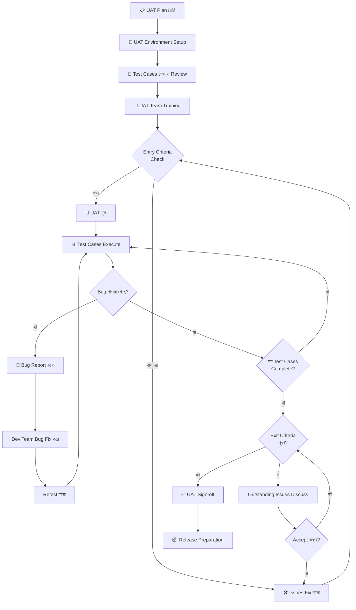
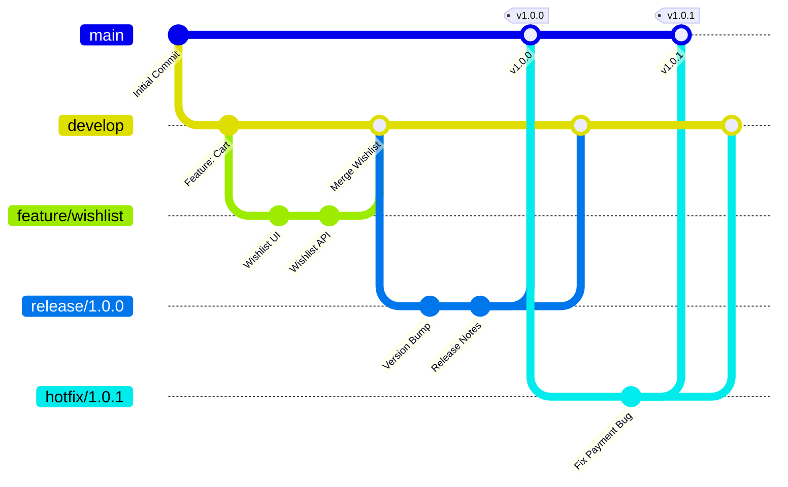
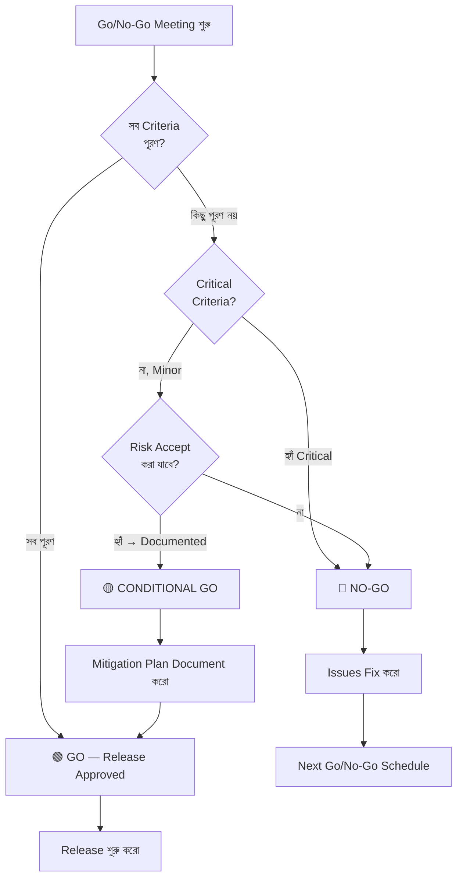
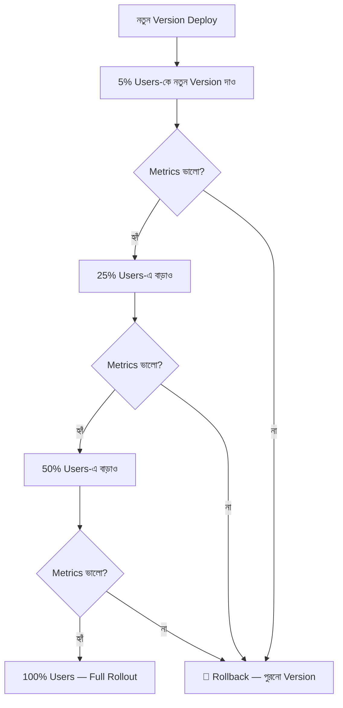
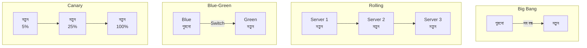
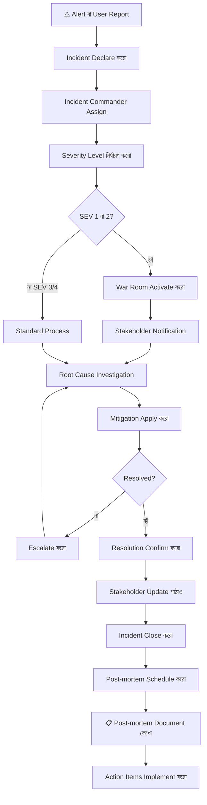

# Phase 5 — Delivery & Beyond
## Working Software থেকে Client-এর হাতে পৌঁছানো পর্যন্ত

> **প্রজেক্ট উদাহরণ:** QuickMart — একটি সম্পূর্ণ E-commerce Platform
> **লেখক:** Senior Software Delivery Expert
> **সংস্করণ:** 1.0.0
> **তারিখ:** ২০২৫

---

## সূচিপত্র

- [অধ্যায় ১: UAT — User Acceptance Testing](#অধ্যায়-১-uat--user-acceptance-testing)
  - [১.১ UAT কী এবং কেন Critical](#১১-uat-কী-এবং-কেন-critical)
  - [১.২ UAT বনাম QA Testing পার্থক্য](#১২-uat-বনাম-qa-testing-পার্থক্য)
  - [১.৩ UAT Plan তৈরি করা](#১৩-uat-plan-তৈরি-করা)
  - [১.৪ UAT Test Cases লেখা](#১৪-uat-test-cases-লেখা)
  - [১.৫ UAT Environment Setup](#১৫-uat-environment-setup)
  - [১.৬ Client-কে কীভাবে UAT করাবেন](#১৬-client-কে-কীভাবে-uat-করাবেন)
  - [১.৭ UAT Feedback Handle করা](#১৭-uat-feedback-handle-করা)
  - [১.৮ UAT Sign-off নেওয়া](#১৮-uat-sign-off-নেওয়া)
  - [১.৯ UAT Failure Handle করা](#১৯-uat-failure-handle-করা)
  - [১.১০ QuickMart-এর সম্পূর্ণ UAT Plan](#১১০-quickmart-এর-সম্পূর্ণ-uat-plan)
- [অধ্যায় ২: Release Management](#অধ্যায়-২-release-management)
  - [২.১ Release কী এবং Deploy-এর পার্থক্য](#২১-release-কী-এবং-deploy-এর-পার্থক্য)
  - [২.২ Semantic Versioning বিস্তারিত](#২২-semantic-versioning-বিস্তারিত)
  - [২.৩ Release Types](#২৩-release-types)
  - [২.৪ Release Branch Strategy](#২৪-release-branch-strategy)
  - [২.৫ Release Notes লেখা](#২৫-release-notes-লেখা)
  - [২.৬ Release Checklist — সম্পূর্ণ](#২৬-release-checklist--সম্পূর্ণ)
  - [২.৭ Go/No-Go Decision Process](#২৭-gonogo-decision-process)
  - [২.৮ QuickMart v1.0 Release Plan](#২৮-quickmart-v10-release-plan)
- [অধ্যায় ৩: Deployment Strategy](#অধ্যায়-৩-deployment-strategy)
  - [৩.১ Deployment Types](#৩১-deployment-types)
  - [৩.২ CI/CD Pipeline বিস্তারিত](#৩২-cicd-pipeline-বিস্তারিত)
  - [৩.৩ Environment Management](#৩৩-environment-management)
  - [৩.৪ Configuration Management](#৩৪-configuration-management)
  - [৩.৫ Database Migration Strategy](#৩৫-database-migration-strategy)
  - [৩.৬ Rollback Plan](#৩৬-rollback-plan)
  - [৩.৭ Zero-downtime Deployment](#৩৭-zero-downtime-deployment)
  - [৩.৮ QuickMart-এর Deployment Strategy](#৩৮-quickmart-এর-deployment-strategy)
- [অধ্যায় ৪: Go-live Planning](#অধ্যায়-৪-go-live-planning)
  - [৪.১ Go-live কী এবং কীভাবে Prepare করবে](#৪১-go-live-কী-এবং-কীভাবে-prepare-করবে)
  - [৪.২ Pre-launch Checklist](#৪২-pre-launch-checklist)
  - [৪.৩ Launch Day Plan — ঘণ্টায় ঘণ্টায়](#৪৩-launch-day-plan--ঘণ্টায়-ঘণ্টায়)
  - [৪.৪ War Room Setup](#৪৪-war-room-setup)
  - [৪.৫ Communication Plan for Launch](#৪৫-communication-plan-for-launch)
  - [৪.৬ Contingency Plan](#৪৬-contingency-plan)
  - [৪.৭ QuickMart-এর Go-live Day Plan](#৪৭-quickmart-এর-go-live-day-plan)
- [অধ্যায় ৫: Monitoring এবং Observability](#অধ্যায়-৫-monitoring-এবং-observability)
  - [৫.১ Monitoring বনাম Observability পার্থক্য](#৫১-monitoring-বনাম-observability-পার্থক্য)
  - [৫.২ Metrics কী কী রাখবেন](#৫২-metrics-কী-কী-রাখবেন)
  - [৫.৩ Logging Best Practices](#৫৩-logging-best-practices)
  - [৫.৪ Alerting Setup](#৫৪-alerting-setup)
  - [৫.৫ Dashboard তৈরি করা](#৫৫-dashboard-তৈরি-করা)
  - [৫.৬ Incident Response Process](#৫৬-incident-response-process)
  - [৫.৭ Post-incident Review (Post-mortem)](#৫৭-post-incident-review-post-mortem)
- [অধ্যায় ৬: Post-delivery Support](#অধ্যায়-৬-post-delivery-support)
  - [৬.১ Support Model Types](#৬১-support-model-types)
  - [৬.২ SLA বিস্তারিত](#৬২-sla-বিস্তারিত)
  - [৬.৩ QuickMart-এর সম্পূর্ণ SLA Template](#৬৩-quickmart-এর-সম্পূর্ণ-sla-template)
  - [৬.৪ Ticket Management](#৬৪-ticket-management)
  - [৬.৫ Bug Fix বনাম Feature Request পার্থক্য](#৬৫-bug-fix-বনাম-feature-request-পার্থক্য)
  - [৬.৬ Maintenance Sprint](#৬৬-maintenance-sprint)
  - [৬.৭ End-of-life Planning](#৬৭-end-of-life-planning)
- [অধ্যায় ৭: Project Closure](#অধ্যায়-৭-project-closure)
  - [৭.১ Project Closure কীভাবে করবেন](#৭১-project-closure-কীভাবে-করবেন)
  - [৭.২ Lessons Learned Document](#৭২-lessons-learned-document)
  - [৭.৩ Knowledge Transfer](#৭৩-knowledge-transfer)
  - [৭.৪ Final Documentation](#৭৪-final-documentation)
  - [৭.৫ Client Handover Checklist](#৭৫-client-handover-checklist)
- [সংযুক্তি: Master Checklist Collection](#সংযুক্তি-master-checklist-collection)
- [রেফারেন্স বই](#রেফারেন্স-বই)

---

## অধ্যায় ১: UAT — User Acceptance Testing

[↑ সূচিপত্রে ফিরুন](#সূচিপত্র)

### ১.১ UAT কী এবং কেন Critical

User Acceptance Testing, সংক্ষেপে UAT, হলো Software Development Lifecycle-এর সবচেয়ে শেষ এবং সবচেয়ে গুরুত্বপূর্ণ Testing Phase। এটিকে আমরা বলতে পারি "real-world rehearsal" — অর্থাৎ, Software টি Production-এ যাওয়ার আগে একবার পুরো মঞ্চ প্রস্তুত করে সেখানে actual user-দের দিয়ে পরখ করে দেখা হয় যে সবকিছু ঠিকঠাক কাজ করছে কিনা।

**UAT-এর মূল সংজ্ঞা:** UAT হলো সেই প্রক্রিয়া যেখানে Business Stakeholders বা End Users নিজেরা Software পরীক্ষা করেন, এবং নিশ্চিত করেন যে Software-টি তাদের Business Requirements এবং Business Processes পূরণ করছে কিনা। এটি একটি Formal Process যার শেষে একটি Sign-off দেওয়া হয়, যা মূলত একটি চুক্তি যে "হ্যাঁ, এই Software আমাদের ব্যবহারের জন্য প্রস্তুত।"

**কেন UAT এত Critical?**

প্রথমত, UAT হলো শেষ Safety Net। Development Team হয়তো সব Technical Requirement পূরণ করেছে, QA Team হয়তো সব Bug খুঁজে বের করেছে, কিন্তু তারপরও এমন অনেক কিছু থাকতে পারে যা Business কাজের জন্য উপযুক্ত নয়। উদাহরণস্বরূপ, QuickMart-এ হয়তো একটি Checkout Flow technically সঠিক কাজ করছে, কিন্তু Business টিম বুঝতে পারলো যে তাদের শহরে বেশিরভাগ customer Mobile Banking দিয়ে পেমেন্ট করে, কিন্তু সেই Option সহজে খুঁজে পাওয়া যাচ্ছে না — এটি QA Tester ধরতে পারবে না, কারণ সে Business Context জানে না।

দ্বিতীয়ত, UAT Business Risk কমায়। একটি Software যদি Production-এ গিয়ে Fail করে, তাহলে তার Cost অনেক বেশি — Revenue Loss, Reputation Damage, এবং Emergency Fix-এর খরচ। UAT এই Risk আগে থেকেই চিহ্নিত করে।

তৃতীয়ত, UAT একটি Legal ও Contractual গুরুত্ব বহন করে। বেশিরভাগ Contract-এ এমন Clause থাকে যে Client UAT Sign-off দেওয়ার পরেই Final Payment করবে। অর্থাৎ, UAT শুধু Technical নয়, এটি একটি Business Milestone।

চতুর্থত, "Continuous Delivery" বইতে Jez Humble এবং David Farley বলেছেন যে Software যদি Business Value না দেয়, তাহলে সেটি technically perfect হলেও worthless। UAT নিশ্চিত করে যে Software Business Value দিচ্ছে।

**UAT-এর চারটি মূল প্রশ্ন:**
1. Software কি আমার Business Problem সমাধান করছে?
2. Software কি আমার Team-এর কাজের পদ্ধতির সাথে মানানসই?
3. Software কি আমার Customer-দের চাহিদা পূরণ করছে?
4. Software কি Production-এ Deploy করার জন্য প্রস্তুত?

এই চারটি প্রশ্নের উত্তর যদি "হ্যাঁ" হয়, তাহলে UAT সফল। QuickMart-এর ক্ষেত্রে এই চারটি প্রশ্ন আরও বেশি গুরুত্বপূর্ণ কারণ এটি একটি E-commerce Platform যেখানে প্রতিটি Transaction-এর সাথে অর্থের বিষয় জড়িত।

---

### ১.২ UAT বনাম QA Testing পার্থক্য

এই দুটি Testing-এর পার্থক্য বোঝা অত্যন্ত জরুরি, কারণ অনেক দল এই দুটিকে Confuse করে এবং ভুলভাবে UAT পরিচালনা করে।

**QA Testing** হলো Internal Testing। এটি Development Team বা Dedicated QA Team করে। তাদের কাজ হলো:
- Software ঠিকমতো কাজ করছে কিনা তা verify করা (Functional Testing)
- Performance, Security, Load — এই সব Technical Aspects পরীক্ষা করা
- Bug খুঁজে বের করা এবং তা Fix করা নিশ্চিত করা
- Regression Testing — নতুন কিছু যোগ করলে পুরনো কিছু ভেঙে গেছে কিনা দেখা
- Automation Scripts চালানো

**UAT** হলো External/Business Testing। এটি Client বা End User করে। তাদের কাজ হলো:
- Business Requirements পূরণ হয়েছে কিনা confirm করা
- Real-world Scenarios-এ Software কেমন কাজ করে তা দেখা
- Usability এবং Fit-for-purpose নিশ্চিত করা
- "এটা কি আমার কাজে লাগবে?" এই প্রশ্নের উত্তর দেওয়া

**পার্থক্যের সারণী:**

| বিষয় | QA Testing | UAT |
|-------|-----------|-----|
| কে করে | QA Engineers | Business Users / Client |
| কখন করে | Development চলাকালীন | Development শেষে |
| কী দেখে | Technical Correctness | Business Fitness |
| Tool ব্যবহার | Testing Frameworks, Automation | Manual, Real-world Scenarios |
| Environment | Test Environment | UAT Environment (Production-like) |
| Focus | Bugs, Defects | Business Acceptance |
| Outcome | Bug Report | Sign-off / Rejection |
| Language | Technical | Business Language |

**একটি গুরুত্বপূর্ণ কথা:** QA Testing Pass করলেই Software UAT-এ Pass করবে — এই ধারণা ভুল। QuickMart-এর ক্ষেত্রে হয়তো QA Team নিশ্চিত করেছে যে Payment Gateway সঠিকভাবে Response Code return করছে, কিন্তু Business Team বলতে পারে যে Payment Failed হলে User-কে যে Error Message দেখানো হচ্ছে সেটি তাদের Brand Voice-এর সাথে মানানসই নয়। এই ধরনের Issue QA-তে ধরা পড়ে না, কিন্তু UAT-এ ধরা পড়ে।

---

### ১.৩ UAT Plan তৈরি করা

একটি সম্পূর্ণ UAT Plan তৈরি করা Project-এর সাফল্যের জন্য অপরিহার্য। UAT Plan ছাড়া UAT পরিচালনা করা অনেকটা মানচিত্র ছাড়া অজানা শহরে গাড়ি চালানোর মতো।

**UAT Plan-এর মূল উপাদান:**

**১. UAT Scope নির্ধারণ করা:** কোন কোন Feature UAT-এ পরীক্ষা করা হবে, কোনটি হবে না — এটি স্পষ্টভাবে define করতে হবে। QuickMart-এর ক্ষেত্রে হয়তো Phase 1-এ শুধু Core Shopping Flow (Browse, Cart, Checkout, Payment) UAT-এ থাকবে, কিন্তু Advanced Search বা Recommendation Engine পরবর্তী Phase-এর জন্য বাদ রাখা হবে।

**২. UAT Timeline তৈরি করা:** UAT শুরু এবং শেষের তারিখ নির্ধারণ করতে হবে। সাধারণত ২ সপ্তাহ থেকে ১ মাস পর্যন্ত সময় দেওয়া হয়, Project-এর জটিলতার উপর নির্ভর করে।

**৩. UAT Team নির্ধারণ করা:** Client-এর কোন কোন ব্যক্তি UAT-এ অংশগ্রহণ করবেন তা ঠিক করতে হবে। এই Team-এ থাকা উচিত Business Analyst, End Users (সত্যিকারের যারা Software ব্যবহার করবে), এবং একজন UAT Coordinator।

**৪. Entry Criteria Define করা:** UAT শুরু করার আগে কী কী নিশ্চিত থাকতে হবে:
- QA Testing সম্পন্ন হয়েছে
- Known Critical Bugs Fix হয়েছে
- UAT Environment Deploy করা হয়েছে
- Test Data Prepared হয়েছে
- UAT Test Cases Approved হয়েছে

**৫. Exit Criteria Define করা:** UAT কখন শেষ হবে তা Define করতে হবে:
- সব UAT Test Cases Execute হয়েছে
- Critical এবং High Priority Bugs Fix হয়েছে এবং Retest হয়েছে
- Sign-off দেওয়া হয়েছে

**৬. Risk Register তৈরি করা:** UAT-তে কী ধরনের Risk আসতে পারে এবং তার Mitigation Plan কী হবে।

**UAT Process Flow:**



---

### ১.৪ UAT Test Cases লেখা

UAT Test Cases লেখা QA Test Cases-এর থেকে মৌলিকভাবে আলাদা। QA Test Cases Technical এবং Detailed, কিন্তু UAT Test Cases Business-friendly এবং Scenario-based হওয়া উচিত।

**UAT Test Case-এর গঠন:**

প্রতিটি UAT Test Case-এ নিম্নলিখিত তথ্য থাকা উচিত:

- **Test Case ID:** একটি Unique Identifier (যেমন: QM-UAT-001)
- **Test Scenario:** কী পরীক্ষা করা হচ্ছে (Business Language-এ)
- **Business Objective:** এই Test Case কোন Business Requirement Cover করছে
- **Pre-condition:** Test শুরু করার আগে কী কী থাকতে হবে
- **Test Steps:** ধাপে ধাপে কী করতে হবে (Simple Language-এ)
- **Expected Result:** কী হওয়া উচিত (Business Outcome-এর ভাষায়)
- **Actual Result:** বাস্তবে কী হলো
- **Status:** Pass / Fail / Blocked
- **Comments:** Additional Notes

**QuickMart UAT Test Case-এর উদাহরণ:**

```
┌─────────────────────────────────────────────────────────────────┐
│ Test Case ID    : QM-UAT-TC-001                                 │
│ Module          : Shopping Cart                                  │
│ Test Scenario   : Customer একটি Product Cart-এ যোগ করবে       │
│                   এবং Quantity পরিবর্তন করবে                   │
│─────────────────────────────────────────────────────────────────│
│ Business Objective: Customer যেকোনো Product Browse করে Cart-এ  │
│ Add করতে পারবে এবং Checkout-এর আগে Quantity বাড়াতে বা        │
│ কমাতে পারবে।                                                   │
│─────────────────────────────────────────────────────────────────│
│ Pre-conditions:                                                  │
│ • User একটি Valid Account-এ Logged in আছে                      │
│ • অন্তত ৫টি Product Available আছে Inventory-তে                │
│ • Test User: uat_user_01@quickmart.com                          │
│─────────────────────────────────────────────────────────────────│
│ Test Steps:                                                      │
│ 1. Homepage-এ যাও এবং "Electronics" Category-তে Click করো    │
│ 2. যেকোনো Product-এ Click করো (যেমন: "Samsung S23 Cover")     │
│ 3. "Cart-এ যোগ করুন" Button-এ Click করো                       │
│ 4. Cart Icon-এ Click করো                                        │
│ 5. Product-এর Quantity "1" থেকে "3" করো                        │
│ 6. Total Price পরীক্ষা করো                                     │
│─────────────────────────────────────────────────────────────────│
│ Expected Result:                                                 │
│ • Product Cart-এ যোগ হবে                                       │
│ • Cart Icon-এ Item Count "1" দেখাবে                            │
│ • Quantity "3" করার পরে Total Price = Unit Price × 3 হবে      │
│ • Cart Summary সঠিক দেখাবে                                     │
│─────────────────────────────────────────────────────────────────│
│ Actual Result  : [পরীক্ষার সময় পূরণ করতে হবে]                 │
│ Status         : [ ] Pass  [ ] Fail  [ ] Blocked               │
│ Tested By      : ____________________                           │
│ Test Date      : ____________________                           │
│ Comments       : ____________________                           │
└─────────────────────────────────────────────────────────────────┘
```

**UAT Test Case লেখার Best Practices:**
- Technical জার্গন এড়িয়ে চলো — "API Response Code 200" না লিখে লেখো "অর্ডার সফলভাবে জমা হবে"
- Real-life Scenario ব্যবহার করো — ঠিক যেভাবে Customer ব্যবহার করবে
- Edge Cases অন্তর্ভুক্ত করো — "কী হবে যদি Stock শেষ হয়ে যায়?"
- Business Language ব্যবহার করো

---

### ১.৫ UAT Environment Setup

UAT Environment হলো Production-এর একটি Carbon Copy — এটি Production-এর মতোই হওয়া উচিত, কিন্তু Real Customers-দের Data বা Traffic এখানে আসবে না।

**UAT Environment-এর বৈশিষ্ট্য:**
- Production-এর মতো একই Infrastructure (বা অন্তত একই Configuration)
- Real-world-এর মতো Test Data (কিন্তু Anonymized বা Synthetic)
- Third-party Integrations-এর Sandbox Versions (Payment Gateway-এর Test Mode)
- Production-এর মতো Performance Configuration

**QuickMart UAT Environment Architecture:**

```
┌─────────────────────────────────────────────────────────────────┐
│                    QuickMart UAT Environment                    │
│─────────────────────────────────────────────────────────────────│
│                                                                  │
│  ┌──────────────┐    ┌──────────────┐    ┌──────────────────┐  │
│  │  UAT Frontend│    │  UAT Backend  │    │  UAT Database    │  │
│  │  (React App) │◄──►│  (Node.js)   │◄──►│  (PostgreSQL)    │  │
│  │  Port: 3001  │    │  Port: 8081  │    │  Port: 5432      │  │
│  └──────────────┘    └──────┬───────┘    └──────────────────┘  │
│                             │                                    │
│                    ┌────────▼────────┐                          │
│                    │  External APIs  │                          │
│                    │  (Sandbox Mode) │                          │
│                    ├─────────────────┤                          │
│                    │ • bKash Test    │                          │
│                    │ • SSLCOMMERZ   │                          │
│                    │   Test Gateway  │                          │
│                    │ • SMS: Test     │                          │
│                    │   Provider      │                          │
│                    └─────────────────┘                          │
│                                                                  │
│  URL: https://uat.quickmart.com.bd                              │
│  Access: VPN বা IP Whitelist (Invite only)                     │
└─────────────────────────────────────────────────────────────────┘
```

**গুরুত্বপূর্ণ বিষয়:** UAT Environment-এ Test Data হওয়া উচিত Realistic। শুধু "Test User 1", "Test Product 2" এই ধরনের Data দিয়ে UAT করলে Real-world Problem ধরা পড়ে না। QuickMart-এর ক্ষেত্রে অন্তত:
- ৫০০+ Products বিভিন্ন Category-তে
- ১০০+ Test User Accounts
- ৫০+ Completed Orders (Historical Data)
- বিভিন্ন ধরনের Discount Codes

---

### ১.৬ Client-কে কীভাবে UAT করাবেন

Client-দের UAT করানো অনেকের কাছে চ্যালেঞ্জিং মনে হয়, কারণ তারা Software Expert নয়। কিন্তু সঠিক Approach নিলে এটি অত্যন্ত Smooth হতে পারে।

**ধাপ ১: UAT Kickoff Meeting আয়োজন করুন**

UAT শুরুর আগে একটি Kickoff Meeting করুন যেখানে:
- UAT-এর উদ্দেশ্য ব্যাখ্যা করুন (Simple ভাষায়)
- Timeline এবং Schedule শেয়ার করুন
- কে কোন Module Test করবে তা Assign করুন
- Feedback দেওয়ার Process বুঝিয়ে দিন
- Test Credentials এবং Environment Access দিন

**ধাপ ২: Training Session পরিচালনা করুন**

UAT Participant-দের শেখান:
- কীভাবে UAT Environment Access করবে
- কীভাবে Test Cases Follow করবে
- Bug বা Issue কীভাবে Report করবে (Screenshot, Steps to Reproduce সহ)
- কোন Issue কতটা Serious সেটি কীভাবে Classify করবে

**ধাপ ৩: Daily Check-in রাখুন**

প্রতিদিন একটি ১৫ মিনিটের Stand-up Meeting রাখুন যেখানে:
- গতকাল কী কী Test করা হয়েছে
- কোনো Blocker আছে কিনা
- আজ কী Test করবে

**ধাপ ৪: Dedicated Support দিন**

UAT চলাকালীন একজন Dedicated Support Person রাখুন (Development Team থেকে) যে Client-এর প্রশ্নের উত্তর দেবে এবং Technical Issues-এ সাহায্য করবে।

---

### ১.৭ UAT Feedback Handle করা

UAT Feedback Handle করা একটি সূক্ষ্ম শিল্প। Client হয়তো অনেক ধরনের Feedback দেবেন — কিছু Valid Bug, কিছু Misunderstanding, কিছু New Feature Request। এগুলো সঠিকভাবে Classify করা জরুরি।

**Feedback Classification:**

| Type | Definition | Example | Action |
|------|-----------|---------|--------|
| Critical Bug | Core Function কাজ করছে না | Payment fail হচ্ছে | Immediate Fix Required |
| High Bug | Important Feature ভুলভাবে কাজ করছে | Product Price ভুল দেখাচ্ছে | Fix Before Release |
| Medium Bug | Minor Function-এ সমস্যা | Cart Notification কখনো দেরি হচ্ছে | Fix If Time Permits |
| Low Bug | Cosmetic Issue | Button-এর Color Shade একটু আলাদা | Next Release-এ Fix |
| Enhancement | New Feature Request | "Wishlist Feature চাই" | Scope Discussion |
| Misunderstanding | Requirement না বোঝা | "এটা কীভাবে কাজ করে?" | Training/Documentation |

**Feedback Management Process:**
1. সব Feedback একটি Central Tool-এ Record করুন (Jira, Trello, বা এমনকি একটি Google Sheet)
2. প্রতিটি Feedback Classify করুন
3. Priority অনুযায়ী Sort করুন
4. Development Team-এর সাথে Daily Sync করুন
5. Fixed Issues Retest-এর জন্য Client-কে Notify করুন

---

### ১.৮ UAT Sign-off নেওয়া

UAT Sign-off হলো একটি Formal Document যেখানে Client স্বীকার করে যে Software তাদের Requirements পূরণ করেছে এবং তারা Production-এ যাওয়ার অনুমতি দিচ্ছে।

**QuickMart UAT Sign-off Document:**

```
╔═════════════════════════════════════════════════════════════════╗
║              QuickMart E-commerce Platform                      ║
║              UAT Sign-off Certificate                           ║
╠═════════════════════════════════════════════════════════════════╣
║ Project Name    : QuickMart E-commerce Platform v1.0           ║
║ UAT Period      : [শুরুর তারিখ] থেকে [শেষের তারিখ]           ║
║ UAT Environment : https://uat.quickmart.com.bd                  ║
╠═════════════════════════════════════════════════════════════════╣
║ UAT Summary:                                                    ║
║ মোট Test Cases         : 145                                    ║
║ Passed                  : 139                                    ║
║ Failed (Resolved)       : 6                                     ║
║ Blocked                 : 0                                     ║
║ Pass Rate               : 95.8%                                 ║
╠═════════════════════════════════════════════════════════════════╣
║ Known Issues (Accepted for Post-launch Fix):                    ║
║ 1. [Issue Description] - Priority: Low - ETA: v1.1            ║
║ 2. [Issue Description] - Priority: Low - ETA: v1.1            ║
╠═════════════════════════════════════════════════════════════════╣
║ আমি/আমরা এতদ্বারা নিশ্চিত করছি যে QuickMart E-commerce       ║
║ Platform v1.0 আমাদের Business Requirements পূরণ করেছে এবং     ║
║ Production-এ Deploy করার জন্য Approved।                        ║
╠═════════════════════════════════════════════════════════════════╣
║ Client Signature: ___________________ Date: ___________        ║
║ Name            : ___________________                           ║
║ Designation     : ___________________                           ║
║ Company         : QuickMart Ltd.                                ║
╠═════════════════════════════════════════════════════════════════╣
║ Vendor Signature: ___________________ Date: ___________        ║
║ Name            : ___________________                           ║
║ Designation     : Project Manager                               ║
╚═════════════════════════════════════════════════════════════════╝
```

---

### ১.৯ UAT Failure Handle করা

কখনো কখনো UAT Fail হতে পারে — অর্থাৎ, Client Sign-off দিতে রাজি না। এই পরিস্থিতি অত্যন্ত চাপের হতে পারে, কিন্তু সঠিকভাবে Handle করলে এটি একটি Positive Outcome-এ পরিণত হতে পারে।

**UAT Failure-এর সম্ভাব্য কারণ:**
- Requirements পরিষ্কার ছিল না বা পরে পরিবর্তন হয়েছে
- Critical Bugs এখনো রয়ে গেছে
- Performance Expectations পূরণ হয়নি
- Client-এর Expectations Manage করা হয়নি

**UAT Failure Handle করার পদক্ষেপ:**

১. **Panic করবেন না:** প্রথমে শান্ত থাকুন এবং সব Failure Items List করুন।

২. **Root Cause Analysis করুন:** কেন Fail হয়েছে সেটি বোঝার চেষ্টা করুন।

৩. **Triage Meeting করুন:** Client এবং Dev Team-এর সাথে একসাথে বসুন। কোন Issues Critical, কোনটি Nice-to-have সেটি আলাদা করুন।

৪. **Re-plan করুন:** একটি Revised Timeline দিন। কত দিনে Fix হবে এবং Retest হবে সেটি লিখিতভাবে দিন।

৫. **Transparent থাকুন:** Client-কে সব কিছু জানান। Hidden রাখলে পরিস্থিতি আরও খারাপ হয়।

---

### ১.১০ QuickMart-এর সম্পূর্ণ UAT Plan

```
╔═════════════════════════════════════════════════════════════════╗
║          QuickMart E-commerce — UAT Master Plan                ║
║                       Version 1.0                               ║
╚═════════════════════════════════════════════════════════════════╝

1. PROJECT OVERVIEW
   ─────────────────
   Project        : QuickMart E-commerce Platform
   Version        : 1.0.0
   UAT Duration   : ৩ সপ্তাহ (২১ কার্যদিবস)
   UAT Start      : [তারিখ]
   UAT End        : [তারিখ]
   UAT Manager    : [নাম]

2. UAT SCOPE
   ──────────
   IN SCOPE:
   ✓ User Registration এবং Login
   ✓ Product Browsing এবং Search
   ✓ Product Detail Page
   ✓ Shopping Cart Management
   ✓ Checkout Process
   ✓ Payment (bKash, Card, COD)
   ✓ Order Confirmation এবং Email
   ✓ Order History
   ✓ Admin Panel — Product Management
   ✓ Admin Panel — Order Management
   ✓ Mobile Responsiveness

   OUT OF SCOPE (Phase 2-এর জন্য):
   ✗ Advanced Recommendation Engine
   ✗ Loyalty Points System
   ✗ Bulk Order Feature
   ✗ Vendor Portal

3. UAT TEAM
   ─────────
   ┌──────────────────┬──────────────┬─────────────────────────┐
   │ Name             │ Role         │ Assigned Module          │
   ├──────────────────┼──────────────┼─────────────────────────┤
   │ Rahman           │ UAT Lead     │ Overall Coordination     │
   │ Fatima           │ Business User│ Shopping Flow            │
   │ Karim            │ Business User│ Payment Module           │
   │ Priya            │ Business User│ Admin Panel              │
   │ Sabbir (Vendor)  │ Technical    │ Support Person           │
   └──────────────────┴──────────────┴─────────────────────────┘

4. TEST MODULES এবং TEST CASES COUNT
   ──────────────────────────────────
   ┌─────────────────────────────┬─────────┬─────────┬─────────┐
   │ Module                      │ Total   │ Critical│ Normal  │
   ├─────────────────────────────┼─────────┼─────────┼─────────┤
   │ User Registration/Login     │ 15      │ 5       │ 10      │
   │ Product Browsing/Search     │ 20      │ 8       │ 12      │
   │ Shopping Cart               │ 18      │ 7       │ 11      │
   │ Checkout Process            │ 25      │ 12      │ 13      │
   │ Payment (bKash)             │ 20      │ 15      │ 5       │
   │ Payment (Card)              │ 15      │ 12      │ 3       │
   │ Cash on Delivery            │ 10      │ 5       │ 5       │
   │ Order Management            │ 12      │ 6       │ 6       │
   │ Admin — Products            │ 10      │ 3       │ 7       │
   │ Admin — Orders              │ 10      │ 4       │ 6       │
   │ Mobile Responsiveness       │ 15      │ 2       │ 13      │
   ├─────────────────────────────┼─────────┼─────────┼─────────┤
   │ মোট                         │ 170     │ 79      │ 91      │
   └─────────────────────────────┴─────────┴─────────┴─────────┘

5. UAT SCHEDULE
   ─────────────
   সপ্তাহ ১ (দিন ১-৫):
   • দিন ১: Kickoff Meeting, Environment Access, Training
   • দিন ২-৩: User Registration/Login + Product Browsing
   • দিন ৪-৫: Shopping Cart + Product Search

   সপ্তাহ ২ (দিন ৬-১০):
   • দিন ৬-৭: Checkout Process
   • দিন ৮-৯: Payment Testing (bKash, Card)
   • দিন ১০: COD + Order Management

   সপ্তাহ ৩ (দিন ১১-১৫):
   • দিন ১১-১২: Admin Panel Testing
   • দিন ১৩: Mobile Responsiveness Testing
   • দিন ১৪: Bug Fix Retest
   • দিন ১৫: Final Review + Sign-off

6. ENTRY CRITERIA
   ──────────────
   □ QA Testing 100% Complete
   □ Zero Critical/High Bugs Open
   □ UAT Environment Live
   □ Test Data Loaded
   □ Test User Accounts Created
   □ Payment Gateway Test Mode Active
   □ UAT Test Cases Approved by Client

7. EXIT CRITERIA
   ─────────────
   □ 95%+ Test Cases Passed
   □ Zero Critical Bugs Open
   □ All High Bugs Fixed or Accepted
   □ Client UAT Sign-off Obtained
   □ UAT Report Submitted

8. BUG SEVERITY DEFINITION
   ────────────────────────
   CRITICAL : System Crash, Data Loss, Payment Failure
   HIGH     : Major Feature Broken, Incorrect Financial Data
   MEDIUM   : Minor Feature Issue, UI Glitch affecting UX
   LOW      : Cosmetic Issues, Minor Text Errors

9. COMMUNICATION PLAN
   ──────────────────
   Daily Standup     : প্রতিদিন সকাল ১০টা (১৫ মিনিট)
   Weekly Report     : প্রতি শুক্রবার সন্ধ্যা ৬টায়
   Bug Report Tool   : Jira / Google Sheet (Link দেওয়া হবে)
   Emergency Contact : [Phone Number]

10. RISK REGISTER
    ──────────────
    ┌────────────────────────┬──────────┬─────────────────────────┐
    │ Risk                   │ Impact   │ Mitigation              │
    ├────────────────────────┼──────────┼─────────────────────────┤
    │ Client অংশ নিতে পারছে│ High     │ Backup Tester Assign    │
    │ না                      │          │ করা                     │
    │ Scope Creep             │ Medium   │ Change Control Process  │
    │ Environment Down        │ High     │ On-call DevOps Support  │
    │ Payment Gateway Issue   │ High     │ Backup Gateway Config   │
    └────────────────────────┴──────────┴─────────────────────────┘
```

---

## অধ্যায় ২: Release Management

[↑ সূচিপত্রে ফিরুন](#সূচিপত্র)

### ২.১ Release কী এবং Deploy-এর পার্থক্য

Release এবং Deployment — এই দুটি শব্দ প্রায়ই একসাথে ব্যবহার হয়, কিন্তু এদের মধ্যে একটি সূক্ষ্ম কিন্তু অত্যন্ত গুরুত্বপূর্ণ পার্থক্য আছে। এই পার্থক্য না বুঝলে Release Management-এর পুরো Concept অস্পষ্ট থাকবে।

**Deployment** হলো Technical Act। Deployment মানে একটি নির্দিষ্ট Software Version একটি নির্দিষ্ট Environment-এ Deploy করা। এটি একটি Technical Operation যা কোনো বিশেষ ঘোষণা ছাড়াই যেকোনো সময় হতে পারে। উদাহরণস্বরূপ, Developer রাত ৩টায় একটি Bug Fix Deploy করতে পারে Production-এ — এটি Deployment।

**Release** হলো Business Act। Release মানে Customers বা Users-এর কাছে একটি নতুন Version বা Feature Available করা। Release-এর সাথে থাকে Release Notes, Communication, Marketing Announcement, এবং অনেক সময় আনুষ্ঠানিক উদযাপন। Release হলো "আমরা এই নতুন জিনিসটা তোমাদের জন্য চালু করলাম" — এই ঘোষণা।

**পার্থক্যের একটি বাস্তব উদাহরণ:**
QuickMart Team একটি নতুন Recommendation Engine তৈরি করেছে। তারা এটি Production Server-এ Deploy করলো, কিন্তু Feature Flag ব্যবহার করে এটি বন্ধ রাখলো। এটি Deployment হলো, কিন্তু Release হলো না। তারপর কয়েক দিন পরে, যখন সব Test হয়ে গেলো এবং Marketing Team প্রস্তুত হলো, তখন Feature Flag চালু করে সবার কাছে Available করা হলো — এটি Release হলো।

এই Pattern-কে Decouple Deployment from Release বলা হয়, এবং এটি একটি অত্যন্ত Powerful Strategy।

**"Continuous Delivery" বইয়ের কথায়:** Jez Humble এবং David Farley বলেছেন যে Deployment একটি Low-risk, Repeatable Technical Task হওয়া উচিত, যেখানে Release হলো Business Decision। এই দুটিকে আলাদা করলে Software Delivery অনেক সহজ এবং কম Risky হয়।

---

### ২.২ Semantic Versioning বিস্তারিত

Semantic Versioning (SemVer) হলো Software Version Numbering-এর একটি Standard System। এটি Software Industry-তে সর্বজনীনভাবে Accepted।

**SemVer Format:** `MAJOR.MINOR.PATCH`

উদাহরণ: `1.4.2`
- **1** = MAJOR Version
- **4** = MINOR Version
- **2** = PATCH Version

**MAJOR Version কখন বাড়বে:**
MAJOR Version বাড়ে যখন Backward-incompatible পরিবর্তন হয়। অর্থাৎ, পুরনো ব্যবহারকারীরা Update করলে তাদের কিছু Workflow পরিবর্তন করতে হতে পারে।

QuickMart-এর ক্ষেত্রে: যদি API-এর পুরো Structure পরিবর্তন হয়, বা User Interface সম্পূর্ণ Redesign হয়, তাহলে MAJOR Version বাড়বে। `1.0.0` থেকে `2.0.0`।

**MINOR Version কখন বাড়বে:**
MINOR Version বাড়ে যখন নতুন Feature যোগ হয়, কিন্তু Backward-compatible থাকে। অর্থাৎ, পুরনো Users কিছু পরিবর্তন না করেও ব্যবহার করতে পারবে।

QuickMart-এর ক্ষেত্রে: নতুন "Wishlist" Feature যোগ হলে। `1.0.0` থেকে `1.1.0`।

**PATCH Version কখন বাড়বে:**
PATCH Version বাড়ে যখন Backward-compatible Bug Fix হয়।

QuickMart-এর ক্ষেত্রে: Cart Page-এ একটি Display Bug Fix হলে। `1.1.0` থেকে `1.1.1`।

**Pre-release Versions:**
- `1.0.0-alpha.1` — Early development, unstable
- `1.0.0-beta.1` — Feature complete, testing in progress
- `1.0.0-rc.1` — Release Candidate, almost ready

**QuickMart Version Timeline:**
```
1.0.0-alpha.1  →  Initial development build
1.0.0-beta.1   →  Feature complete, QA started
1.0.0-rc.1     →  UAT started
1.0.0          →  Production Release
1.0.1          →  First critical bug fix
1.1.0          →  Wishlist feature added
1.2.0          →  Recommendation Engine added
2.0.0          →  Complete UI redesign
```

---

### ২.৩ Release Types

**Major Release (X.0.0):**
এটি সবচেয়ে বড় এবং সবচেয়ে গুরুত্বপূর্ণ Release। Major Release-এ পুরো System বা অনেক বড় অংশ পরিবর্তন হয়। এই Release-এর জন্য সবচেয়ে বেশি Planning, Testing, এবং Communication প্রয়োজন।

QuickMart v1.0.0 হলো এই ধরনের Release — পুরো Platform প্রথমবারের জন্য Launch।

**Minor Release (1.X.0):**
নতুন Feature বা Functionality যোগ হয়, কিন্তু পুরনো কিছু ভাঙে না। এই Release Medium Planning প্রয়োজন করে।

**Patch Release (1.0.X):**
Bug Fix বা Small Improvement। এটি Quick এবং Less Risky।

**Hotfix Release:**
Hotfix হলো Emergency Release। Production-এ যখন কোনো Critical Bug হয় এবং তা Immediately Fix করা দরকার, তখন Normal Release Process Skip করে Hotfix দেওয়া হয়।

**QuickMart Hotfix Scenario:** Launch-এর পরের দিন দেখা গেলো যে bKash Payment সফল হচ্ছে কিন্তু Order Place হচ্ছে না — এটি একটি Critical Bug। এই ক্ষেত্রে Hotfix `1.0.1` Deploy করতে হবে অত্যন্ত দ্রুত।

**Hotfix Process:**
```
Production Bug Detected
        ↓
Hotfix Branch তৈরি (main থেকে)
        ↓
Fix করো এবং Test করো
        ↓
Emergency Approval নাও
        ↓
Deploy to Production
        ↓
main এবং develop Branch-এ Merge করো
        ↓
Version Bump (1.0.0 → 1.0.1)
        ↓
Post-mortem Schedule করো
```

---

### ২.৪ Release Branch Strategy

Git Branch Strategy Release Management-এর মেরুদণ্ড। একটি ভালো Branch Strategy ছাড়া Multiple Version Manage করা প্রায় অসম্ভব।

**Gitflow Strategy (QuickMart-এর জন্য Recommended):**



**Branch-এর Role:**
- `main`: Production-ready code। এখানে সরাসরি Push করা যাবে না।
- `develop`: Next Release-এর জন্য সব Feature Merge হয়।
- `feature/*`: Individual Feature Development।
- `release/*`: Release Preparation। এখানে শুধু Bug Fix এবং Version Bump করা হয়।
- `hotfix/*`: Emergency Fix।

---

### ২.৫ Release Notes লেখা

Release Notes হলো একটি Document যা বর্ণনা করে নতুন Release-এ কী কী পরিবর্তন হয়েছে। এটি Developers, End Users, এবং Stakeholders-এর জন্য।

**ভালো Release Notes-এর বৈশিষ্ট্য:**
- সহজ ভাষায় লেখা — Technical Jargon কম
- Audience অনুযায়ী — User-facing Notes User Language-এ, Developer Notes Technical Language-এ
- Organized — What's New, Bug Fixes, Breaking Changes আলাদা করা
- Specific — "Performance Improved" না বলে "Cart Page Load Time ৪০% কমেছে" বলা

**QuickMart v1.0.0 Release Notes:**

```markdown
# QuickMart v1.0.0 Release Notes
**Release Date:** [তারিখ]
**Version:** 1.0.0

## 🎉 নতুন কী এসেছে

### শপিং Experience
- **Product Catalog:** ৫০০+ Products বিভিন্ন Category-তে Available
- **Smart Search:** Product নাম, Category, বা Brand দিয়ে Search করুন
- **Filter এবং Sort:** Price, Rating, Brand অনুযায়ী Filter করুন
- **Product Images:** High-quality Zoom-able Images

### Checkout এবং Payment
- **Multi-step Checkout:** সহজ ৩-ধাপের Checkout Process
- **bKash Payment:** বাংলাদেশের সবচেয়ে জনপ্রিয় Mobile Banking
- **Credit/Debit Card:** Visa, Mastercard Support
- **Cash on Delivery:** ঢাকা মহানগরীতে Available
- **Order Confirmation:** SMS এবং Email Notification

### User Account
- **Registration:** সহজ Sign-up Process
- **Order History:** সব Orders এক জায়গায়
- **Address Management:** Multiple Delivery Address Save করুন

### Admin Panel
- **Product Management:** Product Add, Edit, Remove করুন
- **Order Management:** সব Orders Track করুন
- **Inventory Alert:** Stock কম হলে Notification

## 🐛 Bug Fixes
এটি প্রথম Major Release, তাই কোনো Previous Bug Fix নেই।

## ⚠️ Known Issues
- বিকাশ Payment Gateway পরবর্তী Update-এ আসবে
- Advanced Search Filter — v1.1.0-তে আসবে

## 📋 System Requirements
- **Browser:** Chrome 90+, Firefox 88+, Safari 14+, Edge 90+
- **Mobile:** iOS 13+, Android 8+

## 📞 Support
সমস্যায় পড়লে: support@quickmart.com.bd বা 16XXX
```

---

### ২.৬ Release Checklist — সম্পূর্ণ

```
╔═════════════════════════════════════════════════════════════════╗
║              QuickMart Release Checklist v1.0                  ║
╠═════════════════════════════════════════════════════════════════╣
║                                                                  ║
║  PRE-RELEASE (Release-এর ৭ দিন আগে)                           ║
║  ──────────────────────────────────                              ║
║  CODE QUALITY                                                    ║
║  □ সব Feature Branch Develop-এ Merge হয়েছে                    ║
║  □ Code Review Complete হয়েছে সব PR-এ                          ║
║  □ No Unresolved Merge Conflicts                                ║
║  □ Linting Errors Zero                                          ║
║  □ Code Coverage >= 80%                                         ║
║                                                                  ║
║  TESTING                                                         ║
║  □ Unit Tests সব Pass                                           ║
║  □ Integration Tests সব Pass                                    ║
║  □ E2E Tests সব Pass                                            ║
║  □ Performance Tests Done (Load Time < 3s)                      ║
║  □ Security Scan Complete (No Critical Vulnerabilities)         ║
║  □ UAT Sign-off Received                                        ║
║                                                                  ║
║  DOCUMENTATION                                                   ║
║  □ API Documentation Updated                                    ║
║  □ Release Notes Written এবং Approved                          ║
║  □ User Manual Updated                                          ║
║  □ Admin Guide Updated                                          ║
║  □ CHANGELOG.md Updated                                         ║
║                                                                  ║
║  PRE-RELEASE (Release-এর ২ দিন আগে)                           ║
║  ──────────────────────────────────                              ║
║  STAGING VALIDATION                                             ║
║  □ Release Branch Staging-এ Deploy হয়েছে                      ║
║  □ Smoke Tests Staging-এ Pass হয়েছে                           ║
║  □ Database Migrations Staging-এ সফলভাবে Run হয়েছে           ║
║  □ Third-party Integrations Test হয়েছে                        ║
║  □ Performance Acceptable Staging-এ                            ║
║                                                                  ║
║  INFRASTRUCTURE                                                  ║
║  □ Production Server Capacity Confirmed                         ║
║  □ CDN Configuration Updated                                    ║
║  □ SSL Certificate Valid (৩০+ দিন বাকি)                       ║
║  □ Backup System Active এবং Latest Backup Verified             ║
║  □ Monitoring Alerts Configured                                 ║
║  □ Rollback Plan Documented এবং Tested                         ║
║                                                                  ║
║  RELEASE DAY                                                     ║
║  ────────────                                                    ║
║  DEPLOYMENT                                                      ║
║  □ Team On-call Confirmed (Dev, DevOps, Support)                ║
║  □ Database Backup Taken (Deployment-এর ঠিক আগে)              ║
║  □ Maintenance Mode Enabled (প্রয়োজনে)                        ║
║  □ Deployment Script Run করা হয়েছে                            ║
║  □ Database Migrations Run করা হয়েছে                          ║
║  □ Application Started Successfully                             ║
║  □ Health Check Endpoint Passing                                ║
║                                                                  ║
║  POST-DEPLOYMENT VERIFICATION                                    ║
║  □ Smoke Tests Production-এ Run হয়েছে                         ║
║  □ Critical User Flows Manually Test হয়েছে                    ║
║  □ Error Rate Baseline-এ আছে (Monitoring Check)               ║
║  □ Response Times Acceptable                                    ║
║  □ Payment Flow Test করা হয়েছে (Test Transaction)            ║
║                                                                  ║
║  COMMUNICATION                                                   ║
║  □ Release Announcement Sent (Email, Social Media)              ║
║  □ Support Team Briefed                                         ║
║  □ Client Notified                                              ║
║                                                                  ║
║  POST-RELEASE (Release-এর ২৪ ঘণ্টা পরে)                      ║
║  ──────────────────────────────────────                          ║
║  □ Error Logs Reviewed                                          ║
║  □ Performance Metrics Reviewed                                 ║
║  □ User Feedback Collected                                      ║
║  □ Any Immediate Issues Fixed                                   ║
║  □ Post-release Report তৈরি                                    ║
║                                                                  ║
╠═════════════════════════════════════════════════════════════════╣
║  Sign-off: _________________ Date: _______ Version: _______    ║
╚═════════════════════════════════════════════════════════════════╝
```

---

### ২.৭ Go/No-Go Decision Process

Go/No-Go Meeting হলো Release-এর আগে সর্বশেষ Checkpoint। এই Meeting-এ সব Stakeholders একত্রিত হন এবং সিদ্ধান্ত নেন যে Release এগিয়ে যাবে কিনা।

**Go/No-Go Meeting-এর Participants:**
- Project Manager (Meeting Chair)
- Tech Lead
- QA Lead
- DevOps Engineer
- Business Stakeholder / Client Representative
- Support Lead

**Go/No-Go Criteria:**

| Criteria | Go Condition | No-Go Condition |
|---------|-------------|-----------------|
| Test Pass Rate | ≥ 95% | < 95% |
| Open Critical Bugs | 0 | ≥ 1 |
| Open High Bugs | ≤ 2 (Accepted) | > 2 Unresolved |
| UAT Sign-off | প্রাপ্ত | অপ্রাপ্ত |
| Staging Smoke Tests | সব Pass | কোনো Fail |
| Rollback Plan | Ready | Not Tested |
| On-call Team | Available | Unavailable |
| DB Backup | Recent | Outdated |

**Go/No-Go Decision Flow:**



---

### ২.৮ QuickMart v1.0 Release Plan

```
╔═════════════════════════════════════════════════════════════════╗
║            QuickMart v1.0 Complete Release Plan                ║
╚═════════════════════════════════════════════════════════════════╝

Release Version  : 1.0.0
Release Type     : Major (First Production Release)
Target Date      : [তারিখ], রাত ১১টা (Low-traffic hour)
Release Manager  : [নাম]

PHASE 1: PRE-RELEASE PREPARATION (T-7 Days)
══════════════════════════════════════════
[T-7] Code Freeze — নতুন Feature Merge বন্ধ
[T-7] Release Branch তৈরি: git checkout -b release/1.0.0
[T-6] Final QA Regression Run
[T-5] UAT Final Day
[T-4] UAT Sign-off Collection
[T-3] Staging Final Deployment and Validation
[T-2] Go/No-Go Meeting
[T-1] Production Database Backup + Final Checks
[T-1] War Room Setup
[T-1] On-call Schedule Confirm

PHASE 2: RELEASE EXECUTION (T=0)
═════════════════════════════════
T=0:00  Database Backup (Final Pre-release)
T=0:15  Maintenance Mode Enable
T=0:20  Database Migrations Run
T=0:30  Application Code Deploy
T=0:45  Application Health Check
T=1:00  Smoke Tests Run
T=1:15  Payment Flow Manual Test
T=1:30  Maintenance Mode Disable
T=1:35  Monitoring Verification
T=1:45  Go-live Announcement

PHASE 3: POST-RELEASE MONITORING (T+0 to T+24 hours)
═════════════════════════════════════════════════════
T+1   : Error Rate Check
T+3   : Performance Metrics Review
T+6   : User Activity Check
T+12  : Support Ticket Review
T+24  : First 24-hour Report

ROLLBACK TRIGGER (যদি এর মধ্যে কোনো একটি হয়):
• Error Rate > 5% of requests
• Response Time > 10 seconds
• Payment Failure Rate > 1%
• Critical Data Loss

ROLLBACK PROCEDURE:
1. Maintenance Mode Enable
2. Previous Version Deploy
3. Database Rollback (যদি প্রয়োজন)
4. Maintenance Mode Disable
5. Team Notification
6. Root Cause Investigation
```

---

## অধ্যায় ৩: Deployment Strategy

[↑ সূচিপত্রে ফিরুন](#সূচিপত্র)

### ৩.১ Deployment Types

Deployment Strategy হলো সেই পদ্ধতি যার মাধ্যমে নতুন Software Version Production-এ নিয়ে যাওয়া হয়। বিভিন্ন ধরনের Deployment Strategy আছে, প্রত্যেকটির নিজস্ব সুবিধা এবং অসুবিধা আছে।

**১. Big Bang Deployment (পুরনো পদ্ধতি)**

এটি সবচেয়ে সহজ কিন্তু সবচেয়ে Risky Deployment Strategy। এই পদ্ধতিতে পুরনো System বন্ধ করে নতুন System চালু করা হয়।

*কখন ব্যবহার করবেন:* ছোট Project, কম Users, এবং যখন Downtime Acceptable।
*QuickMart-এর ক্ষেত্রে:* Initial Launch-এর সময় (কোনো Existing User নেই)।
*Risk:* যদি কোনো সমস্যা হয়, সবাই প্রভাবিত হয়।

**২. Phased/Rolling Deployment**

এই পদ্ধতিতে ধীরে ধীরে Server বা User Group-এ নতুন Version নিয়ে যাওয়া হয়।

*কখন ব্যবহার করবেন:* যখন Multiple Server আছে এবং ধীরে ধীরে Traffic Shift করতে চান।
*সুবিধা:* কোনো সমস্যা হলে দ্রুত ধরা পড়ে এবং কম User প্রভাবিত হয়।

**৩. Blue-Green Deployment**

এটি অত্যন্ত Popular এবং Reliable Strategy। এই পদ্ধতিতে দুটি Identical Production Environment রাখা হয় — Blue (পুরনো) এবং Green (নতুন)।

```mermaid
flowchart LR
    subgraph Internet
        LB[🌐 Load Balancer]
    end

    subgraph Blue Environment — Active
        B1[Server B1\nv1.0.0]
        B2[Server B2\nv1.0.0]
        BD[(Blue DB\nv1.0.0)]
    end

    subgraph Green Environment — Standby
        G1[Server G1\nv1.1.0]
        G2[Server G2\nv1.1.0]
        GD[(Green DB\nv1.1.0)]
    end

    LB -->|100% Traffic| B1
    LB -->|100% Traffic| B2
    B1 --- BD
    B2 --- BD
    G1 -.- GD
    G2 -.- GD

    style Blue fill:#e3f2fd
    style Green fill:#e8f5e9
```

Blue-Green Deployment Process:
1. Green Environment-এ নতুন Version Deploy করো
2. Green Environment Test করো
3. Load Balancer Switch করো — Traffic Blue থেকে Green-এ
4. সবকিছু ঠিক থাকলে Blue Environment রাখো Standby-তে (Rollback-এর জন্য)
5. কিছুদিন পরে Blue Free করো

*সুবিধা:* Zero Downtime, Instant Rollback।
*অসুবিধা:* Double Infrastructure Cost।

**৪. Canary Deployment**

এই পদ্ধতিতে প্রথমে মাত্র কিছু Users-এর কাছে নতুন Version পাঠানো হয়। তারপর সবকিছু ঠিক থাকলে ধীরে ধীরে সব Users-এর কাছে পাঠানো হয়।



*কোথা থেকে নাম এসেছে:* পুরনো দিনে Coal Mines-এ Canary পাখি নিয়ে যাওয়া হতো — পাখি অসুস্থ হলে বুঝতো Toxic Gas আছে। Software-এ Early Users হলো সেই Canary।

*QuickMart-এর জন্য:* v1.1.0 থেকে Canary Strategy ব্যবহার শুরু করা Recommended।

**৫. Feature Flags (Feature Toggles)**

Feature Flag হলো Code-এর মধ্যে একটি Switch যা দিয়ে নির্দিষ্ট Feature চালু বা বন্ধ করা যায়। এটি Deployment থেকে Release-কে সম্পূর্ণ Decouple করে।

```javascript
// Feature Flag উদাহরণ
if (featureFlags.isEnabled('recommendation_engine', userId)) {
  return <RecommendationEngine products={products} />;
} else {
  return <DefaultProductList products={products} />;
}
```

**Deployment Strategy Comparison:**



---

### ৩.২ CI/CD Pipeline বিস্তারিত

CI/CD Pipeline হলো Software Delivery-এর Automation Highway। এটি Code থেকে Production পর্যন্ত সব ধাপ Automate করে।

**CI (Continuous Integration):** Developer-রা প্রতিদিন অনেকবার Code Merge করে। প্রতিটি Merge-এ Automated Build এবং Test চলে।

**CD (Continuous Delivery):** CI-এর পরে নিশ্চিত করা যে Code যেকোনো সময় Production-এ Deploy করার জন্য Ready।

**CD (Continuous Deployment):** CD-এর Extended Version। প্রতিটি Successful Build স্বয়ংক্রিয়ভাবে Production-এ Deploy হয়।

**QuickMart CI/CD Pipeline:**

```mermaid
flowchart LR
    subgraph Developer
        DEV[👨‍💻 Code Push\ngit push]
    end

    subgraph CI Stage
        direction TB
        CI1[🔍 Code Checkout]
        CI2[📦 Dependencies Install\nnpm install]
        CI3[🔎 Code Linting\nESLint]
        CI4[🧪 Unit Tests\nJest]
        CI5[🔗 Integration Tests]
        CI6[🏗️ Build Application\nnpm run build]
        CI7[🔒 Security Scan\nSnyk]
        CI1 --> CI2 --> CI3 --> CI4 --> CI5 --> CI6 --> CI7
    end

    subgraph CD Stage
        direction TB
        CD1[📋 Staging Deploy]
        CD2[💨 Smoke Tests\nStaging]
        CD3[🎯 E2E Tests\nCypress]
        CD4[📊 Performance Test\nLighthouse]
        CD5{✅ All Pass?}
        CD6[🚀 Production Deploy]
        CD7[🏥 Health Check]
        CD8[📡 Monitoring Active]
        CD1 --> CD2 --> CD3 --> CD4 --> CD5
        CD5 -- হ্যাঁ --> CD6 --> CD7 --> CD8
    end

    subgraph Notification
        N1[📧 Email Alert]
        N2[💬 Slack Notify]
    end

    DEV -->|Push/PR| CI1
    CI7 -->|Success| CD1
    CI7 -->|Failure| N1
    CD5 -- না --> N1
    CD8 --> N2
```



**CI/CD Tool Stack (QuickMart):**
- **Version Control:** GitHub
- **CI/CD Platform:** GitHub Actions
- **Container:** Docker
- **Registry:** AWS ECR / Docker Hub
- **Deployment:** AWS ECS / Kubernetes
- **Testing:** Jest (Unit), Cypress (E2E)
- **Security:** Snyk, OWASP ZAP
- **Monitoring:** Datadog / New Relic

---

### ৩.৩ Environment Management

Professional Software Development-এ Multiple Environment থাকা একটি Standard Practice।

```
┌─────────────────────────────────────────────────────────────────┐
│                QuickMart Environment Structure                  │
├─────────────────────────────────────────────────────────────────┤
│                                                                  │
│  👨‍💻 LOCAL                                                       │
│  ──────                                                          │
│  • Developer-এর নিজের Machine                                   │
│  • Local Database                                               │
│  • Mock API / Stub Services                                     │
│  • URL: http://localhost:3000                                    │
│  • Who: Developer                                               │
│                         │                                        │
│                         ▼                                        │
│  🔧 DEVELOPMENT (DEV)                                           │
│  ─────────────────────                                          │
│  • Latest Code (develop branch)                                 │
│  • Shared কিন্তু unstable                                       │
│  • Reset হতে পারে যেকোনো সময়                                  │
│  • URL: https://dev.quickmart.com.bd                            │
│  • Who: Dev Team                                                │
│                         │                                        │
│                         ▼                                        │
│  🧪 QA / TESTING                                                │
│  ────────────────                                               │
│  • Stable Feature Build                                         │
│  • QA Team এখানে Test করে                                      │
│  • Realistic Test Data                                          │
│  • URL: https://qa.quickmart.com.bd                             │
│  • Who: QA Team                                                 │
│                         │                                        │
│                         ▼                                        │
│  👥 UAT (STAGING)                                               │
│  ────────────────                                               │
│  • Production Mirror                                            │
│  • Client UAT করে এখানে                                        │
│  • Production-এর মতোই সব Configuration                         │
│  • URL: https://uat.quickmart.com.bd                            │
│  • Who: Client / Stakeholders                                   │
│                         │                                        │
│                         ▼                                        │
│  🚀 PRODUCTION (PROD)                                           │
│  ─────────────────────                                          │
│  • Live System                                                  │
│  • Real Users এবং Real Data                                     │
│  • Maximum Security এবং Stability                              │
│  • URL: https://quickmart.com.bd                                │
│  • Who: End Customers                                           │
│                                                                  │
└─────────────────────────────────────────────────────────────────┘
```

---

### ৩.৪ Configuration Management

প্রতিটি Environment-এ Config আলাদা হওয়া উচিত। Database URL, API Keys, Secrets — এগুলো Code-এ থাকবে না।

**১২-Factor App Principle অনুযায়ী:** Config Environment Variables-এ রাখতে হবে।

```bash
# .env.development
DB_HOST=localhost
DB_NAME=quickmart_dev
PAYMENT_GATEWAY_MODE=sandbox
BKASH_APP_KEY=test_key_123

# .env.production
DB_HOST=prod.rds.amazonaws.com
DB_NAME=quickmart_prod
PAYMENT_GATEWAY_MODE=live
BKASH_APP_KEY=live_key_xyz  # এটি AWS Secrets Manager থেকে আসবে
```

**Secret Management:**
- Development: `.env` file (`.gitignore`-এ add করো)
- Production: AWS Secrets Manager / HashiCorp Vault

---

### ৩.৫ Database Migration Strategy

Database Migration হলো Database Schema বা Data-এর পরিবর্তন। এটি Deployment-এর সবচেয়ে Risky অংশ।

**Migration Types:**
- **Additive Changes (Safe):** নতুন Column, নতুন Table — এগুলো Backward Compatible
- **Destructive Changes (Risky):** Column Delete, Table Rename — এগুলো সাবধানে করতে হবে

**Safe Database Migration Pattern (Expand/Contract):**

```
Phase 1 — Expand:
নতুন Column যোগ করো (nullable)
পুরনো এবং নতুন Column-এ Data লেখো

Phase 2 — Transition:
Application নতুন Column পড়তে শুরু করো

Phase 3 — Contract:
পুরনো Column Delete করো (পরের Release-এ)
```

**QuickMart Migration Example:**

```sql
-- Migration: 001_add_discount_column.sql
-- Date: 2025-01-15
-- Author: Backend Team
-- Description: Products Table-এ discount_percentage যোগ করা

BEGIN;

ALTER TABLE products 
ADD COLUMN discount_percentage DECIMAL(5,2) DEFAULT 0 NOT NULL;

CREATE INDEX idx_products_discount 
ON products(discount_percentage) 
WHERE discount_percentage > 0;

COMMIT;

-- Rollback Script:
-- ALTER TABLE products DROP COLUMN discount_percentage;
```

**গুরুত্বপূর্ণ নিয়ম:** প্রতিটি Migration-এর সাথে অবশ্যই একটি Rollback Script থাকতে হবে।

---

### ৩.৬ Rollback Plan

Rollback Plan হলো সেই Plan যা কাজে লাগে যখন Deployment-এ সমস্যা হয়। "Site Reliability Engineering" (Google SRE Book) এ বলা হয়েছে: "Hope is not a strategy" — অর্থাৎ, শুধু আশা করলে হবে না, Rollback Plan আগে থেকেই Tested থাকতে হবে।

**Rollback Triggers:**
- Error Rate Threshold ছাড়িয়ে গেছে (যেমন: ৫%-এর বেশি Requests Error)
- Response Time Unacceptable (যেমন: ৫ সেকেন্ডের বেশি)
- Critical Feature কাজ করছে না
- Payment System Failure
- Data Corruption Suspected

**QuickMart Rollback Procedure:**

```
ROLLBACK DECISION TREE
══════════════════════

সমস্যা Detect হলো
        ↓
[এটি Fix করা যাবে ১৫ মিনিটে?]
    হ্যাঁ → Quick Fix Deploy করো
    না  ↓
[সমস্যা কতটা Critical?]
    Critical → Immediate Rollback
    Non-critical → Monitoring এবং Fix করো
        ↓
ROLLBACK STEPS:
1. Incident Lead ঘোষণা করো: "Rolling back to v1.0.0"
2. Load Balancer Switch করো (Blue-Green হলে)
   অথবা Previous Docker Image Deploy করো
3. Database Rollback প্রয়োজন?
   • যদি Schema Change ছিল → Migration Rollback Script Run করো
   • যদি না ছিল → Application Rollback যথেষ্ট
4. Health Check করো
5. Smoke Tests চালাও
6. Stakeholders-দের Notify করো
7. Post-mortem Schedule করো
```

---

### ৩.৭ Zero-downtime Deployment

Zero-downtime Deployment মানে Users কোনো Interruption ছাড়াই Service ব্যবহার করতে পারবে, এমনকি Deployment চলাকালীনও।

**Zero-downtime Achieve করার পদ্ধতি:**

১. **Multiple Instances চালু রাখো:** কখনো সব Instances একসাথে Update করো না।

২. **Health Check Use করো:** Load Balancer Health Check পাস করলেই Traffic পাঠাবে।

```nginx
# Nginx Upstream Configuration
upstream quickmart_backend {
    server backend1:8080;
    server backend2:8080;
    
    # Health Check
    health_check interval=5 passes=2 fails=3;
}
```

৩. **Graceful Shutdown:** Application Close হওয়ার আগে Ongoing Requests Complete করবে।

```javascript
// Node.js Graceful Shutdown
process.on('SIGTERM', () => {
  console.log('SIGTERM received. Starting graceful shutdown...');
  server.close(() => {
    console.log('HTTP server closed');
    db.end(() => {
      console.log('Database connections closed');
      process.exit(0);
    });
  });
});
```

৪. **Database Backward Compatibility:** Migration সবসময় Backward Compatible রাখো (Expand-Contract Pattern)।

---

### ৩.৮ QuickMart-এর Deployment Strategy

QuickMart-এর জন্য Recommended Strategy: **Blue-Green Deployment with Canary for Major Releases**

```
QuickMart Production Infrastructure:
━━━━━━━━━━━━━━━━━━━━━━━━━━━━━━━━━━━

Internet Users
      │
      ▼
 AWS Route 53 (DNS)
      │
      ▼
 AWS CloudFront (CDN)
      │
      ▼
 AWS Application Load Balancer
      │
    ┌─┴─┐
    │   │
    ▼   ▼
 Blue  Green
 Env   Env
 (v1)  (v2)

Blue Environment:
  - 2x EC2 t3.medium (Application)
  - 1x RDS PostgreSQL (Primary)
  - 1x ElastiCache Redis

Green Environment:
  - 2x EC2 t3.medium (Application)
  - 1x RDS PostgreSQL (Replica → Promote)
  - 1x ElastiCache Redis

Deployment Steps:
  1. Green-এ নতুন Version Deploy
  2. Green-এ Smoke Test
  3. ALB-তে 5% Traffic → Green (Canary)
  4. Metrics Monitor করো ১৫ মিনিট
  5. যদি ভালো → 50% Traffic → Green
  6. আরও ১৫ মিনিট Monitor
  7. যদি ভালো → 100% Traffic → Green
  8. Blue Standby রাখো ২৪ ঘণ্টা

Estimated Deployment Time: ৪৫-৬০ মিনিট
Estimated Downtime: ০ সেকেন্ড
```

---

## অধ্যায় ৪: Go-live Planning

[↑ সূচিপত্রে ফিরুন](#সূচিপত্র)

### ৪.১ Go-live কী এবং কীভাবে Prepare করবে

Go-live হলো Software-এর সবচেয়ে উত্তেজনাপূর্ণ এবং সবচেয়ে চাপের দিন। এটি সেই মুহূর্ত যখন Software Real Users-এর হাতে পৌঁছায়। মাসের পর মাসের পরিশ্রম এই একটি দিনে চূড়ান্ত হয়।

Go-live Preparation শুরু হয় Launch Day-এর অনেক আগে থেকে। একটি সফল Go-live এর পেছনে থাকে:

**৪ সপ্তাহ আগে:**
- Infrastructure Capacity Planning
- Monitoring Setup Confirm করো
- Support Team Briefing শুরু করো
- Communication Materials প্রস্তুত করো

**২ সপ্তাহ আগে:**
- Final UAT Complete করো
- Performance Load Testing করো
- Rollback Plan Document করো এবং Test করো
- Go-live Team Roles Assign করো

**১ সপ্তাহ আগে:**
- Staging Final Validation
- Database Backup Strategy Confirm করো
- External Vendor Communication (Payment Gateway, SMS Provider)
- Internal Announcement করো

**৩ দিন আগে:**
- Production Environment Final Check
- DNS TTL কমিয়ে দাও (Faster Failover-এর জন্য)
- War Room Setup করো
- Go/No-Go Meeting করো

**১ দিন আগে:**
- সব Team Members Rest নাও
- Emergency Contact List Verify করো
- Final Database Backup
- Deployment Scripts Final Test

---

### ৪.২ Pre-launch Checklist

```
╔═════════════════════════════════════════════════════════════════╗
║                QuickMart Pre-launch Checklist                  ║
╠═════════════════════════════════════════════════════════════════╣
║                                                                  ║
║  🏗️ INFRASTRUCTURE                                              ║
║  □ Production Servers Running এবং Healthy                      ║
║  □ Auto-scaling Configured (High Traffic-এর জন্য)              ║
║  □ CDN Active এবং Configured                                    ║
║  □ SSL/TLS Certificate Valid এবং Auto-renew Setup               ║
║  □ Domain DNS Properly Configured                               ║
║  □ Firewall Rules Reviewed                                      ║
║  □ DDoS Protection Active                                       ║
║                                                                  ║
║  🗄️ DATABASE                                                    ║
║  □ Production Database Optimized (Indexes, Query Plans)         ║
║  □ Automated Backup Configured এবং Tested                      ║
║  □ Database Monitoring Active                                   ║
║  □ Connection Pool Size Appropriate                             ║
║  □ Read Replicas Setup (যদি High Load Expected)                ║
║                                                                  ║
║  🔒 SECURITY                                                     ║
║  □ OWASP Top 10 Vulnerabilities Checked                        ║
║  □ SQL Injection Protection Tested                              ║
║  □ XSS Protection Active                                        ║
║  □ CSRF Protection Active                                       ║
║  □ API Rate Limiting Configured                                 ║
║  □ Sensitive Data Encrypted (PII, Payment Data)                ║
║  □ Admin Panel এ Strong Password Policy                        ║
║  □ Two-Factor Authentication for Admin                         ║
║                                                                  ║
║  💳 PAYMENT                                                      ║
║  □ bKash Live Credentials Configured                            ║
║  □ Card Payment Gateway Live Mode                               ║
║  □ Test Transaction Successful (Production)                     ║
║  □ Payment Failure Handling Tested                              ║
║  □ Refund Process Tested                                        ║
║  □ PCI DSS Compliance Checked                                   ║
║                                                                  ║
║  📧 NOTIFICATIONS                                                ║
║  □ Order Confirmation Email Template Approved                   ║
║  □ SMS Gateway Live Configured                                  ║
║  □ Email Delivery Rate Verified                                 ║
║  □ Transactional Email Domain SPF/DKIM Setup                   ║
║                                                                  ║
║  📊 MONITORING                                                   ║
║  □ Application Performance Monitoring (APM) Active             ║
║  □ Error Tracking (Sentry/Similar) Active                       ║
║  □ Uptime Monitoring Configured                                 ║
║  □ Alert Rules Set (Error Rate, Response Time, etc.)           ║
║  □ On-call Schedule Setup                                       ║
║  □ Dashboard Accessible to All Team                            ║
║                                                                  ║
║  📋 LEGAL & COMPLIANCE                                          ║
║  □ Privacy Policy Published                                     ║
║  □ Terms of Service Published                                   ║
║  □ Cookie Policy Implemented                                    ║
║  □ Return/Refund Policy Clear                                   ║
║                                                                  ║
║  👥 SUPPORT                                                      ║
║  □ Support Team Trained                                         ║
║  □ FAQ Document Ready                                           ║
║  □ Help Center Content Ready                                    ║
║  □ Support Email/Phone Active                                   ║
║  □ Escalation Path Documented                                   ║
║                                                                  ║
╠═════════════════════════════════════════════════════════════════╣
║  Final Sign-off: ______________ Date: _________ Time: ________ ║
╚═════════════════════════════════════════════════════════════════╝
```

---

### ৪.৩ Launch Day Plan — ঘণ্টায় ঘণ্টায়

```
╔═════════════════════════════════════════════════════════════════╗
║           QuickMart Go-live Day — Hour by Hour Plan            ║
║                    [Launch Date]                                ║
╠═════════════════════════════════════════════════════════════════╣
║                                                                  ║
║  রাত ১০:০০ — T-1 HOUR                                          ║
║  ──────────────────────                                         ║
║  □ War Room সবাই Join করো (Physical/Virtual)                   ║
║  □ Emergency Contact List সবার কাছে আছে Confirm করো           ║
║  □ Final Database Backup নাও এবং Verify করো                   ║
║  □ Staging Final Smoke Test চালাও                              ║
║  □ Monitoring Dashboards Open রাখো                             ║
║  □ Deployment Scripts একবার Review করো                         ║
║  □ Rollback Scripts Ready আছে Confirm করো                     ║
║  রিপোর্ট: সব ভালো থাকলে → Go Signal দাও                      ║
║                                                                  ║
║  রাত ১১:০০ — T=0 DEPLOYMENT BEGINS                             ║
║  ─────────────────────────────────                              ║
║  ১১:০০ — Maintenance Mode Enable করো                           ║
║           "আমরা Update করছি, ফিরে আসুন।" Message দেখাও       ║
║  ১১:০৫ — Final Pre-deployment Backup Confirm                   ║
║  ১১:১০ — Database Migrations Run করো                           ║
║           [অপেক্ষা করো — সব Migration সফল হওয়া পর্যন্ত]     ║
║  ১১:২০ — New Application Version Deploy করো                    ║
║           [অপেক্ষা করো — সব Instances Up হওয়া পর্যন্ত]      ║
║  ১১:৩৫ — Health Check সব Instances-এ                          ║
║  ১১:৪০ — Internal Smoke Tests Run করো                          ║
║           • Homepage Load হচ্ছে?                               ║
║           • Login কাজ করছে?                                     ║
║           • Product Page Load হচ্ছে?                           ║
║           • Cart কাজ করছে?                                      ║
║           • Payment (Test Transaction) কাজ করছে?               ║
║  ১১:৫০ — Maintenance Mode Disable করো                          ║
║  ১১:৫৫ — Site Live! প্রথম Real User Test নাও                  ║
║                                                                  ║
║  মধ্যরাত ১২:০০ — LAUNCH CONFIRMED                             ║
║  ─────────────────────────────────                              ║
║  ১২:০০ — Launch Announcement Send করো                          ║
║           • Email Newsletter                                    ║
║           • Social Media Post                                   ║
║           • SMS to Pre-registered Users                         ║
║  ১২:১০ — Real-time Metrics Monitor করো                         ║
║           • Active Users Count                                  ║
║           • Page Load Times                                     ║
║           • Error Rate                                          ║
║  ১২:৩০ — First 30-min Check                                    ║
║           প্রশ্ন: Error Rate < 1%? হ্যাঁ → সবকিছু ভালো       ║
║                                                                  ║
║  রাত ১:০০ — T+1 HOUR                                           ║
║  ────────────────────                                           ║
║  □ Error Logs Review করো                                       ║
║  □ Performance Metrics Baseline Establish করো                  ║
║  □ Support Tickets Check করো                                   ║
║  □ War Room Officially Close করো                               ║
║  □ On-call Rotation শুরু করো                                   ║
║                                                                  ║
║  ভোর ৬:০০ — T+7 HOURS                                          ║
║  ──────────────────────                                         ║
║  □ Overnight Metrics Review                                     ║
║  □ Any Critical Issues? → Address করো                          ║
║  □ Support Team Morning Briefing                               ║
║                                                                  ║
║  সকাল ৯:০০ — BUSINESS HOURS START                             ║
║  ─────────────────────────────────                              ║
║  □ Executive Launch Report পাঠাও                               ║
║  □ Support Team Ready                                           ║
║  □ Social Media Monitoring শুরু                                ║
║  □ PR Team Active করো                                          ║
║                                                                  ║
║  দুপুর ১২:০০ — T+13 HOURS                                      ║
║  ────────────────────────                                       ║
║  □ First 12-hour Report তৈরি করো                               ║
║  □ Metrics Summary:                                             ║
║    • Total Users                                                ║
║    • Orders Placed                                              ║
║    • Revenue                                                    ║
║    • Error Rate                                                 ║
║    • Average Response Time                                      ║
║  □ Stakeholder Update পাঠাও                                    ║
║                                                                  ║
║  রাত ১১:০০ — T+24 HOURS (পরের দিন)                            ║
║  ─────────────────────────────────                              ║
║  □ Full 24-hour Report তৈরি করো                                ║
║  □ Issue Summary                                                ║
║  □ Performance Summary                                          ║
║  □ Next 48-hour Watch Plan                                      ║
║                                                                  ║
╚═════════════════════════════════════════════════════════════════╝
```

---

### ৪.৪ War Room Setup

War Room হলো Launch-এর সময় Core Team-এর একসাথে থাকার ব্যবস্থা — Physical বা Virtual। এটি দ্রুত Decision-making নিশ্চিত করে।

**War Room Participants:**
- **Incident Commander:** সব Decision-এর চূড়ান্ত কর্তৃপক্ষ
- **Tech Lead:** Technical Issues Handle করবে
- **DevOps Engineer:** Infrastructure এবং Deployment
- **QA Lead:** Testing এবং Verification
- **Support Lead:** User-facing Issues
- **Business Representative:** Business Impact Assessment

**War Room Rules:**
- একটি Communication Channel (Slack/Teams) সবাই Join করবে
- Jargon কম ব্যবহার করবে — Clear এবং Concise কথা বলবে
- প্রতিটি Decision Log করবে
- "I think" না বলে "I know" বলবে — অনুমান নয়, Data দিয়ে কথা বলবে
- কেউ একা সিদ্ধান্ত নেবে না Critical Issue-তে

**Virtual War Room Setup (QuickMart):**
```
Slack War Room: #quickmart-launch-2025
Video Call: [Zoom/Meet Link — সবসময় Active]

Dashboard Links:
• Monitoring: [Datadog Link]
• Error Tracking: [Sentry Link]
• Deployment: [GitHub Actions Link]
• Support Tickets: [Freshdesk Link]

Emergency Numbers:
• AWS Support: [Number]
• bKash Technical: [Number]
• SSLCOMMERZ: [Number]
• Domain Provider: [Number]
```

---

### ৪.৫ Communication Plan for Launch

**Internal Communication:**

```
Launch -7 days: Team-কে Final Launch Date Confirm করো
Launch -3 days: Leadership-কে Brief করো
Launch -1 day: সব Team-কে Final Reminder
Launch Day:     Hourly Status Updates War Room-এ
Launch +1 day:  Executive Summary Report
Launch +1 week: First Week Report
```

**External Communication:**

```
Launch -2 weeks: Pre-registration Email Blast
Launch -1 week: "Coming Soon" Social Media Campaign
Launch -1 day:  "Tomorrow we Launch!" Post
Launch Day:      "We are LIVE!" Announcement
Launch +1 day:  "Thank you for joining us!" Post
```

---

### ৪.৬ Contingency Plan

Contingency Plan হলো "কী হলে কী করবো" Plan। Murphy's Law অনুযায়ী: "Anything that can go wrong, will go wrong।" তাই আগে থেকেই Plan করা জরুরি।

**QuickMart Contingency Scenarios:**

| Scenario | Probability | Impact | Response |
|---------|-------------|--------|----------|
| Database Connection Fail | Low | Critical | Rollback + DB Team Contact |
| Payment Gateway Down | Medium | High | Backup Gateway Activate |
| High Traffic — Server Overload | High | High | Auto-scaling + CDN |
| DNS Issue | Low | Critical | Backup DNS Provider |
| SSL Certificate Error | Very Low | Critical | CloudFlare Proxy |
| Third-party API Down (SMS) | Medium | Medium | Queue SMS for Later |
| Critical Bug Discovered | Medium | High | Hotfix or Rollback |

---

### ৪.৭ QuickMart-এর Go-live Day Plan

QuickMart-এর Launch Night-এর পরিকল্পনা ইতিমধ্যে Hour-by-Hour Section-এ Cover করা হয়েছে। এখানে সংক্ষিপ্ত Summary:

```
QuickMart Go-live Summary:
━━━━━━━━━━━━━━━━━━━━━━━━━

Launch Date: [তারিখ]
Launch Time: রাত ১১টা (Low Traffic Period)
Launch Strategy: Blue-Green Deployment

Team:
  • Incident Commander: [নাম]
  • Tech Lead: [নাম]
  • DevOps: [নাম]
  • QA: [নাম]
  • Support: [নাম]
  • Business: [নাম]

Success Metrics (First 24 hours):
  • Error Rate < 1%
  • Response Time < 3 seconds (P95)
  • At least 100 Successful Orders
  • Payment Success Rate > 95%
  • Zero Critical Security Incidents

Rollback Criteria:
  • Error Rate > 5%
  • Zero Orders in 2 hours
  • Payment Completely Down
```

---

## অধ্যায় ৫: Monitoring এবং Observability

[↑ সূচিপত্রে ফিরুন](#সূচিপত্র)

### ৫.১ Monitoring বনাম Observability পার্থক্য

Google-এর "Site Reliability Engineering" বইতে Observability নিয়ে বিস্তারিত আলোচনা করা হয়েছে। এই দুটি Term প্রায়ই বিভ্রান্তি তৈরি করে।

**Monitoring** হলো Pre-defined Questions-এর উত্তর খোঁজা। Monitoring মানে আপনি আগে থেকেই জানেন কী দেখতে চান এবং সেই অনুযায়ী Alert Set করেন।

উদাহরণ: "CPU Usage ৮০%-এর বেশি হলে Alert দাও।" এখানে প্রশ্নটি আগে থেকেই জানা।

**Observability** হলো Unknown Questions-এর উত্তর খুঁজে বের করার ক্ষমতা। Observability মানে System এতটাই Instrumented যে আপনি যেকোনো অজানা সমস্যাও Investigate করতে পারবেন।

উদাহরণ: "কেন প্রতি মঙ্গলবার দুপুরে Cart Abandonment Rate বেশি?" এটি একটি Unknown Question যার উত্তর Observability দিতে পারে।

**Observability-এর তিনটি স্তম্ভ (Three Pillars of Observability):**
1. **Metrics:** Numerical Data — CPU, Memory, Request Count, Error Rate
2. **Logs:** Events-এর Textual Record — কী হলো, কখন হলো
3. **Traces:** একটি Request পুরো System-এর মধ্যে দিয়ে কীভাবে গেছে তার Map

```
┌─────────────────────────────────────────────────────────────────┐
│              Observability-এর তিন স্তম্ভ                       │
├─────────────────┬───────────────────┬───────────────────────────┤
│ METRICS         │ LOGS              │ TRACES                    │
├─────────────────┼───────────────────┼───────────────────────────┤
│ কী হচ্ছে?      │ কেন হচ্ছে?       │ কোথায় হচ্ছে?            │
├─────────────────┼───────────────────┼───────────────────────────┤
│ Numbers          │ Text Events       │ Request Journey           │
│ CPU: 85%         │ ERROR: DB timeout │ User → API → DB → Cache  │
│ Requests: 1200/s │ INFO: Order placed│ Time per step            │
├─────────────────┼───────────────────┼───────────────────────────┤
│ Tool: Prometheus │ Tool: ELK Stack   │ Tool: Jaeger/Zipkin       │
│ Datadog          │ Datadog Logs      │ AWS X-Ray                 │
└─────────────────┴───────────────────┴───────────────────────────┘
```

---

### ৫.২ Metrics কী কী রাখবেন

Google SRE Book-এর **Golden Signals** অনুযায়ী চারটি Key Metric আছে যা সবসময় Monitor করতে হবে:

**১. Latency (সময়):** Request কতটা সময় নিচ্ছে।
- P50 (Median): সাধারণ User কতটা সময় অনুভব করছে
- P95: 95% Users কতটা সময়ের মধ্যে Response পাচ্ছে
- P99: সবচেয়ে ধীর Requests

**২. Traffic (পরিমাণ):** কত Request আসছে।
- Requests per Second
- Active Users
- Orders per Hour

**৩. Errors (ত্রুটি):** কতটা Requests Fail হচ্ছে।
- Error Rate (%)
- 4xx Errors (Client Errors)
- 5xx Errors (Server Errors)

**৪. Saturation (ক্ষমতা):** System কতটা Loaded।
- CPU Utilization
- Memory Usage
- Database Connection Pool Usage
- Disk Space

**QuickMart-এর Specific Metrics:**

```
Business Metrics (এগুলো সবচেয়ে গুরুত্বপূর্ণ):
• Orders per Hour
• Revenue per Hour
• Cart Abandonment Rate
• Payment Success Rate
• Registration Rate

Application Metrics:
• Homepage Load Time
• API Response Time (P95)
• Error Rate
• Active Sessions

Infrastructure Metrics:
• CPU Usage
• Memory Usage
• Database Query Time
• Cache Hit Rate
```

---

### ৫.৩ Logging Best Practices

Logging ঠিকমতো না করলে সমস্যার সময় কিছুই খুঁজে পাওয়া যায় না। ভালো Logging হলো অনেকটা একজন ভালো গোয়েন্দার মতো — প্রতিটি ঘটনা Record করা কিন্তু Irrelevant তথ্যে ভরা না।

**Log Levels:**
- `ERROR`: সত্যিকারের সমস্যা যা তদন্ত করা দরকার
- `WARN`: সমস্যা হতে পারে, কিন্তু এখনো Critical নয়
- `INFO`: গুরুত্বপূর্ণ Business Events
- `DEBUG`: Detailed Technical Info (Production-এ বন্ধ রাখো)

**Structured Logging Example (QuickMart):**

```json
{
  "timestamp": "2025-03-15T14:23:45.123Z",
  "level": "ERROR",
  "service": "payment-service",
  "environment": "production",
  "trace_id": "abc123def456",
  "user_id": "USR-789456",
  "order_id": "ORD-20250315-001",
  "message": "Payment processing failed",
  "error": {
    "code": "BKASH_TIMEOUT",
    "message": "bKash API timeout after 30s",
    "stack_trace": "..."
  },
  "context": {
    "amount": 1500.00,
    "currency": "BDT",
    "payment_method": "bkash",
    "attempt": 2
  }
}
```

**Logging Best Practices:**
- সবসময় Structured Format (JSON) ব্যবহার করো
- `trace_id` দাও যাতে একটি Request-এর সব Logs Track করা যায়
- Sensitive Data (Password, Card Number) কখনো Log করো না
- Log Rotation Configure করো (Disk Full হলে Server Down হয়)
- Centralized Logging — সব Server-এর Log এক জায়গায় পাঠাও

---

### ৫.৪ Alerting Setup

Alert হলো সেই Notification যা আপনাকে জানায় কিছু একটা ভুল হচ্ছে — আপনি সেটি Dashboard দেখার আগেই।

**Alert Configuration Principles:**
- **Signal না Noise:** প্রতিটি Alert Actionable হতে হবে। যদি Alert আসে এবং কিছু করার না থাকে, সেটি Noise।
- **Right Person-কে Alert:** Database Alert → DBA, Frontend Error → Frontend Dev
- **Escalation Path:** যদি Primary কেউ Response না করে, Secondary-কে Alert

**QuickMart Alert Rules:**

```yaml
# Alert Configuration (Prometheus/Datadog format)

alerts:
  - name: HighErrorRate
    condition: error_rate > 5%
    duration: 5 minutes
    severity: CRITICAL
    message: "QuickMart Error Rate {value}% — Immediate action needed!"
    notify:
      - slack: "#quickmart-alerts"
      - pagerduty: oncall_team
      - sms: tech_lead_phone

  - name: SlowResponseTime
    condition: p95_response_time > 3000ms
    duration: 10 minutes
    severity: HIGH
    message: "QuickMart P95 Response Time: {value}ms"
    notify:
      - slack: "#quickmart-alerts"
      - email: tech-team@quickmart.com.bd

  - name: PaymentFailure
    condition: payment_success_rate < 95%
    duration: 2 minutes
    severity: CRITICAL
    message: "Payment Success Rate dropped to {value}%"
    notify:
      - slack: "#quickmart-critical"
      - pagerduty: oncall_team
      - sms: all_oncall

  - name: LowInventory
    condition: product_stock < 5
    severity: LOW
    message: "Product {product_id} has only {stock} units left"
    notify:
      - email: inventory@quickmart.com.bd

  - name: HighCPU
    condition: cpu_usage > 85%
    duration: 10 minutes
    severity: MEDIUM
    message: "Server {host} CPU at {value}%"
    notify:
      - slack: "#infra-alerts"
      - email: devops@quickmart.com.bd
```

---

### ৫.৫ Dashboard তৈরি করা

একটি ভালো Dashboard প্রথম দেখাতেই System-এর স্বাস্থ্য বলে দেয়।

**QuickMart Operations Dashboard Layout:**

```
╔═════════════════════════════════════════════════════════════════╗
║             QuickMart — Operations Dashboard                    ║
║             Last Updated: [Real-time]                           ║
╠══════════════════════╦══════════════════════╦═══════════════════╣
║  🟢 SYSTEM STATUS    ║  📊 CURRENT TRAFFIC  ║  💰 REVENUE TODAY ║
║  All Systems Normal  ║  1,245 Active Users  ║  ৳ 3,45,600      ║
╠══════════════════════╩══════════════════════╩═══════════════════╣
║                                                                  ║
║  GOLDEN SIGNALS                                                  ║
║  ──────────────                                                  ║
║  ┌──────────────┬──────────────┬──────────────┬──────────────┐  ║
║  │  LATENCY     │   TRAFFIC    │   ERRORS     │  SATURATION  │  ║
║  │              │              │              │              │  ║
║  │  P50: 245ms  │  1,200 req/s │  Rate: 0.3%  │  CPU: 45%    │  ║
║  │  P95: 890ms  │  Orders: 12  │  5xx: 4/hr   │  Mem: 67%    │  ║
║  │  P99: 2.1s   │  /hr         │  4xx: 89/hr  │  DB: 34%     │  ║
║  └──────────────┴──────────────┴──────────────┴──────────────┘  ║
║                                                                  ║
║  BUSINESS KPIs                                                   ║
║  ─────────────                                                   ║
║  ┌──────────────────────┬───────────────────────────────────┐   ║
║  │  Orders (Today)      │  ████████████████░░░░   156/200   │   ║
║  │  Revenue (Today)     │  ██████████████████░░   ৳3.4L/4L │   ║
║  │  Cart Conversion     │  ████████████░░░░░░░░   62%       │   ║
║  │  Payment Success     │  ███████████████████░   97.3%     │   ║
║  └──────────────────────┴───────────────────────────────────┘   ║
║                                                                  ║
║  RECENT ERRORS                                                   ║
║  ─────────────                                                   ║
║  14:23 WARN  Slow DB Query: /api/products (1.2s)               ║
║  13:45 ERROR Payment timeout: Order ORD-001 (Resolved)         ║
║  12:30 INFO  Auto-scaled: +1 instance added                    ║
║                                                                  ║
╚═════════════════════════════════════════════════════════════════╝
```

---

### ৫.৬ Incident Response Process

Incident হলো যেকোনো অপ্রত্যাশিত ঘটনা যা Service-এর Quality বা Availability-কে প্রভাবিত করে। Google SRE অনুযায়ী, Incident Response একটি Structured Process হওয়া উচিত।

**Incident Severity Levels:**

```
SEV 1 — CRITICAL: সম্পূর্ণ Service Down বা Payment System Failure
SEV 2 — HIGH    : Major Feature কাজ করছে না, বড় ধরনের Performance Issue
SEV 3 — MEDIUM  : Minor Feature Issue, কিছু Users প্রভাবিত
SEV 4 — LOW     : Cosmetic Issue, কোনো Functional Impact নেই
```

**Incident Response Flow:**



**Response Time Targets:**

| Severity | Time to Acknowledge | Time to Mitigate |
|---------|---------------------|-----------------|
| SEV 1 | ৫ মিনিট | ৩০ মিনিট |
| SEV 2 | ১৫ মিনিট | ২ ঘণ্টা |
| SEV 3 | ১ ঘণ্টা | ২৪ ঘণ্টা |
| SEV 4 | ৪ ঘণ্টা | Next Sprint |

---

### ৫.৭ Post-incident Review (Post-mortem)

Post-mortem হলো একটি Blameless Review Process যেখানে Incident-এর পরে দল একত্রিত হয়ে বিশ্লেষণ করে কী হয়েছিল, কেন হয়েছিল, এবং ভবিষ্যতে যাতে না হয় তার জন্য কী করা যায়।

**Google SRE-এর Post-mortem Philosophy:** "The goal is not to assign blame but to understand the systemic issues that led to the failure."

**QuickMart Post-mortem Template (পূরণ করা উদাহরণ):**

```
╔═════════════════════════════════════════════════════════════════╗
║                  POST-MORTEM REPORT                             ║
║              QuickMart — Incident #PM-2025-001                 ║
╠═════════════════════════════════════════════════════════════════╣
║                                                                  ║
║  INCIDENT DETAILS                                               ║
║  ────────────────                                               ║
║  Title      : Payment Processing Down (bKash)                  ║
║  Date       : ১৫ মার্চ, ২০২৫                                  ║
║  Start Time : রাত ১১:৩৫                                        ║
║  End Time   : রাত ১২:২০                                        ║
║  Duration   : ৪৫ মিনিট                                         ║
║  Severity   : SEV 1 (Critical)                                 ║
║  Impact     : ১৮টি Orders Complete হয়নি (৳ ২৭,০০০ Revenue    ║
║               Lost)                                             ║
║  Affected   : সব বাংলাদেশ Users যারা bKash ব্যবহার করেছে     ║
║  Author     : [নাম]                                            ║
║  Review Date: ১৭ মার্চ, ২০২৫                                  ║
║                                                                  ║
║  INCIDENT SUMMARY                                               ║
║  ─────────────────                                              ║
║  Launch-এর ৩৫ মিনিট পরে bKash Payment সম্পূর্ণ বন্ধ হয়ে     ║
║  যায়। Users Payment করার চেষ্টা করলে "Service Unavailable"  ║
║  Error দেখাচ্ছিল। ৪৫ মিনিট পরে bKash API Key Rotation        ║
║  করে Issue Resolve হয়।                                         ║
║                                                                  ║
║  TIMELINE                                                        ║
║  ────────                                                        ║
║  ২৩:৩৫ — প্রথম Payment Failure Alert আসে                       ║
║  ২৩:৩৭ — On-call Engineer Alert Acknowledge করে               ║
║  ২৩:৪০ — War Room Activate                                      ║
║  ২৩:৪৫ — Root Cause Investigation শুরু                        ║
║  ২৩:৫০ — bKash API Log দেখে বোঝা গেলো API Key Expired        ║
║  ২৩:৫৫ — Production API Key Update করা হয়                     ║
║  ০০:০৫ — New Key Test করা হলো — সফল                          ║
║  ০০:১০ — Monitoring Confirm করলো Payments চলছে                ║
║  ০০:২০ — Incident Officially Resolved                          ║
║                                                                  ║
║  ROOT CAUSE (কেন হলো?)                                          ║
║  ─────────────────────                                          ║
║  bKash Production API Key-এর Expiry Date ছিল Launch Day।      ║
║  Key Rotation Process Documented ছিল না এবং Monitoring-এ      ║
║  API Key Expiry Check ছিল না।                                  ║
║                                                                  ║
║  CONTRIBUTING FACTORS (কোন বিষয়গুলো এতে সাহায্য করেছে?)     ║
║  ─────────────────────────────────────────────────────         ║
║  ১. API Key Management Process Documented ছিল না               ║
║  ২. Pre-launch Checklist-এ API Key Expiry Check ছিল না         ║
║  ৩. bKash-এর API Key Expiry Notification আসেনি                ║
║  ৪. Staging-এ Test Key ব্যবহার হয়েছিল তাই ধরা পড়েনি        ║
║                                                                  ║
║  WHAT WENT WELL (ভালো কী হয়েছে?)                              ║
║  ──────────────────────────────                                 ║
║  ✓ Alert System দ্রুত Trigger করেছে (২ মিনিটের মধ্যে)        ║
║  ✓ On-call Engineer দ্রুত Response করেছে                       ║
║  ✓ War Room Process ভালো কাজ করেছে                             ║
║  ✓ Root Cause ১৫ মিনিটে খুঁজে পাওয়া গেছে                     ║
║  ✓ Affected Users-দের Email Notification পাঠানো হয়েছে         ║
║                                                                  ║
║  WHAT WENT POORLY (খারাপ কী হয়েছে?)                           ║
║  ────────────────────────────────                               ║
║  ✗ Launch Night-এ Critical Incident হয়েছে                      ║
║  ✗ Affected Orders-গুলো Manual Process করতে হয়েছে            ║
║  ✗ Customer Communication দেরি হয়েছে                          ║
║                                                                  ║
║  ACTION ITEMS (ভবিষ্যতে কী করবো?)                              ║
║  ──────────────────────────────────                             ║
║  ┌──┬──────────────────────────────┬──────────┬────────┐       ║
║  │# │ Action                       │ Owner    │ Due    │       ║
║  ├──┼──────────────────────────────┼──────────┼────────┤       ║
║  │1 │ API Key Expiry Monitor করো   │ DevOps   │ 3 days │       ║
║  │2 │ Key Rotation SOP লেখো        │ DevOps   │ 1 week │       ║
║  │3 │ Pre-launch Checklist Update  │ PM       │ 1 week │       ║
║  │4 │ Backup Payment Gateway       │ Backend  │ 2 week │       ║
║  │  │ Setup করো                    │ Team     │        │       ║
║  │5 │ Affected Customers-দের       │ Support  │ Done   │       ║
║  │  │ Refund/Discount দাও          │ Team     │        │       ║
║  └──┴──────────────────────────────┴──────────┴────────┘       ║
║                                                                  ║
╠═════════════════════════════════════════════════════════════════╣
║  Sign-off: Tech Lead: _________ PM: _________ Date: __________ ║
╚═════════════════════════════════════════════════════════════════╝
```

---

## অধ্যায় ৬: Post-delivery Support

[↑ সূচিপত্রে ফিরুন](#সূচিপত্র)

### ৬.১ Support Model Types

Software Deliver করার পরেই কাজ শেষ নয়। Post-delivery Support হলো Client-এর সাথে Long-term Relationship-এর ভিত্তি। বিভিন্ন ধরনের Support Model আছে:

**১. Break-fix Support:**
সবচেয়ে Basic Model। কিছু ভাঙলে Fix করো। কোনো Proactive Monitoring বা Maintenance নেই।

*কখন ব্যবহার করবেন:* ছোট প্রজেক্ট, কম Budget, Low-criticality System।

**২. Managed Support:**
Team একটি নির্দিষ্ট Monthly Retainer-এ সব Support Handle করে। Bug Fix, Minor Enhancement, এবং Monitoring অন্তর্ভুক্ত।

*কখন ব্যবহার করবেন:* Medium-sized System, Regular Update প্রয়োজন।

**৩. Dedicated Support Team:**
Full-time Team শুধু এই Client-এর জন্য। সাধারণত Large Enterprise-এর জন্য।

**৪. Self-service + Escalation:**
Client নিজেই প্রথম Level Handle করে। Complex Issue-এ Vendor-এ Escalate করে।

*QuickMart-এর জন্য Recommended:* Managed Support Model — Monthly Retainer সহ।

**Support Tier Structure (QuickMart):**

```
Tier 1 (L1) — First Response:
  • কে: Support Staff / Help Desk
  • কী করে: Basic Troubleshooting, FAQ-based Resolution
  • Response Time: ২ ঘণ্টার মধ্যে
  • Example: Password Reset, Order Status, Payment Confusion

Tier 2 (L2) — Technical Support:
  • কে: Junior Developer / Technical Support
  • কী করে: Bug Investigation, Configuration Issues
  • Response Time: ৮ ঘণ্টার মধ্যে
  • Example: Product Not Loading, Checkout Error

Tier 3 (L3) — Expert Support:
  • কে: Senior Developer / Architect
  • কী করে: Complex Bugs, Performance Issues, DB Issues
  • Response Time: ২৪ ঘণ্টার মধ্যে
  • Example: Data Inconsistency, Performance Degradation
```

---

### ৬.২ SLA বিস্তারিত

SLA (Service Level Agreement) হলো Vendor এবং Client-এর মধ্যে একটি Formal Agreement যেখানে Service-এর Quality, Availability, এবং Support-এর Standard Define করা থাকে।

**ITIL 4 Foundation অনুযায়ী SLA-এর মূল উপাদান:**
- **Service Availability:** System কতটা সময় Up থাকবে (যেমন: 99.9% Uptime)
- **Response Time:** Support Ticket-এর Response কতটা দ্রুত আসবে
- **Resolution Time:** Problem কতটা সময়ের মধ্যে Solve হবে
- **Exclusions:** কোন ঘটনায় SLA Count হবে না (Scheduled Maintenance, Force Majeure)
- **Penalties:** SLA Breach হলে কী হবে
- **Escalation Path:** কীভাবে Issue Escalate হবে

**Uptime SLA Calculation:**

| SLA Target | Monthly Allowed Downtime | Annual Allowed Downtime |
|-----------|--------------------------|------------------------|
| 99% | ৭.৩১ ঘণ্টা | ৮৭.৬৬ ঘণ্টা |
| 99.5% | ৩.৬৫ ঘণ্টা | ৪৩.৮৩ ঘণ্টা |
| 99.9% | ৪৩.৮৩ মিনিট | ৮.৭৬ ঘণ্টা |
| 99.95% | ২১.৯২ মিনিট | ৪.৩৮ ঘণ্টা |
| 99.99% | ৪.৩৮ মিনিট | ৫২.৬ মিনিট |

*QuickMart-এর জন্য Recommended Target:* 99.9% (Monthly 44 মিনিটের Downtime Allowed)

---

### ৬.৩ QuickMart-এর সম্পূর্ণ SLA Template

```
╔═════════════════════════════════════════════════════════════════╗
║        SERVICE LEVEL AGREEMENT (SLA)                           ║
║        QuickMart E-commerce Platform                           ║
║        Version 1.0 — Effective Date: [তারিখ]                  ║
╠═════════════════════════════════════════════════════════════════╣
║                                                                  ║
║  PARTIES                                                        ║
║  ───────                                                        ║
║  Service Provider: [আপনার Company Name]                        ║
║                    [ঠিকানা]                                     ║
║                    Contact: [Email/Phone]                       ║
║                                                                  ║
║  Client:           QuickMart Limited                            ║
║                    [ঠিকানা]                                     ║
║                    Contact: [Email/Phone]                       ║
║                                                                  ║
╠═════════════════════════════════════════════════════════════════╣
║                                                                  ║
║  1. SERVICE DESCRIPTION                                         ║
║  ─────────────────────                                          ║
║  এই SLA নিম্নলিখিত Services Cover করে:                        ║
║  • QuickMart E-commerce Web Application                        ║
║  • QuickMart Mobile Application (iOS এবং Android)              ║
║  • Admin Panel                                                  ║
║  • API Services                                                 ║
║  • Database এবং Storage                                        ║
║  • Payment Integration Support                                  ║
║                                                                  ║
╠═════════════════════════════════════════════════════════════════╣
║                                                                  ║
║  2. SERVICE AVAILABILITY (UPTIME)                               ║
║  ─────────────────────────────────                              ║
║  Target Uptime: 99.9% (Monthly)                                ║
║  Measurement Period: Calendar Month                             ║
║  Measurement Method: External Monitoring Tool (UptimeRobot)    ║
║                                                                  ║
║  Calculation Formula:                                           ║
║  Availability% = (Total Minutes - Downtime Minutes) /          ║
║                  Total Minutes × 100                            ║
║                                                                  ║
║  Scheduled Maintenance:                                         ║
║  • প্রতি মাসে সর্বোচ্চ ২ ঘণ্টা Scheduled Maintenance          ║
║  • ৪৮ ঘণ্টা আগে Client-কে Notify করতে হবে                    ║
║  • রাত ১২টা থেকে ভোর ৪টার মধ্যে রাখতে হবে                   ║
║  • Scheduled Maintenance Downtime Calculation-এ ধরা হবে না    ║
║                                                                  ║
╠═════════════════════════════════════════════════════════════════╣
║                                                                  ║
║  3. INCIDENT RESPONSE AND RESOLUTION TIMES                      ║
║  ──────────────────────────────────────────                     ║
║  ┌──────────────┬────────────────────┬──────────────────────┐  ║
║  │ Priority     │ Response Time      │ Resolution Time      │  ║
║  ├──────────────┼────────────────────┼──────────────────────┤  ║
║  │ P1 Critical  │ ৩০ মিনিট (24/7)   │ ৪ ঘণ্টা              │  ║
║  │ (সম্পূর্ণ   │                    │                      │  ║
║  │  System Down)│                    │                      │  ║
║  ├──────────────┼────────────────────┼──────────────────────┤  ║
║  │ P2 High      │ ২ ঘণ্টা (24/7)    │ ৮ ঘণ্টা              │  ║
║  │ (Major       │                    │                      │  ║
║  │  Function    │                    │                      │  ║
║  │  Broken)     │                    │                      │  ║
║  ├──────────────┼────────────────────┼──────────────────────┤  ║
║  │ P3 Medium    │ ৮ ঘণ্টা           │ ৪৮ ঘণ্টা             │  ║
║  │ (Minor       │ (Business Hours)   │ (Business Hours)     │  ║
║  │  Feature     │                    │                      │  ║
║  │  Issue)      │                    │                      │  ║
║  ├──────────────┼────────────────────┼──────────────────────┤  ║
║  │ P4 Low       │ ২৪ ঘণ্টা          │ ১ সপ্তাহ             │  ║
║  │ (Cosmetic)   │ (Business Hours)   │                      │  ║
║  └──────────────┴────────────────────┴──────────────────────┘  ║
║                                                                  ║
║  Business Hours: সোমবার-শুক্রবার, সকাল ৯টা - রাত ৬টা         ║
║                  (সরকারি ছুটির দিন বাদে)                       ║
║                                                                  ║
╠═════════════════════════════════════════════════════════════════╣
║                                                                  ║
║  4. SUPPORT SERVICES INCLUDED                                   ║
║  ────────────────────────────                                   ║
║  ✓ Bug Fix এবং Error Resolution                                ║
║  ✓ Security Patch Application                                   ║
║  ✓ Performance Monitoring                                       ║
║  ✓ Database Backup Verification (Weekly)                        ║
║  ✓ Monthly Performance Report                                   ║
║  ✓ ৫ ঘণ্টা Minor Enhancement (প্রতি মাসে)                    ║
║  ✓ Third-party Integration Support                              ║
║                                                                  ║
║  NOT INCLUDED (পৃথক Cost):                                     ║
║  ✗ New Feature Development                                      ║
║  ✗ Major Infrastructure Changes                                 ║
║  ✗ Third-party Software Licensing                               ║
║  ✗ Data Entry বা Content Management                            ║
║                                                                  ║
╠═════════════════════════════════════════════════════════════════╣
║                                                                  ║
║  5. SLA CREDITS (Breach হলে ক্ষতিপূরণ)                        ║
║  ──────────────────────────────────────                         ║
║  ┌──────────────────────┬──────────────────────────────────┐   ║
║  │ Monthly Uptime       │ Credit                           │   ║
║  ├──────────────────────┼──────────────────────────────────┤   ║
║  │ 99.9% এর বেশি       │ কোনো Credit নেই                 │   ║
║  │ 99.5% — 99.9%       │ Monthly Fee-এর ১০%              │   ║
║  │ 99.0% — 99.5%       │ Monthly Fee-এর ২৫%              │   ║
║  │ 95.0% — 99.0%       │ Monthly Fee-এর ৫০%              │   ║
║  │ ৯৫%-এর নিচে         │ Monthly Fee-এর ১০০%             │   ║
║  └──────────────────────┴──────────────────────────────────┘   ║
║                                                                  ║
║  Credit Claim Process:                                          ║
║  • Incident-এর ৩০ দিনের মধ্যে Email-এ Claim করতে হবে         ║
║  • Evidence সহ (Screenshot, Log)                               ║
║  • পরবর্তী Invoice-এ Credit Apply হবে                         ║
║                                                                  ║
╠═════════════════════════════════════════════════════════════════╣
║                                                                  ║
║  6. SLA EXCLUSIONS (এই পরিস্থিতিতে SLA Count হবে না)          ║
║  ──────────────────────────────────────────────────────         ║
║  • Scheduled Maintenance (৪৮ ঘণ্টা Notice সহ)                 ║
║  • Force Majeure (প্রাকৃতিক দুর্যোগ, War, Pandemic)          ║
║  • Client-এর নিজের নেটওয়ার্ক সমস্যা                          ║
║  • Third-party Service Outage (bKash, SSLCOMMERZ, AWS)         ║
║  • Client-induced Issues (Wrong Configuration, Data Entry)     ║
║  • DDoS Attack (Protection-এর বাইরে)                          ║
║                                                                  ║
╠═════════════════════════════════════════════════════════════════╣
║                                                                  ║
║  7. ESCALATION PATH                                             ║
║  ──────────────────                                             ║
║  Level 1: Support Engineer   — support@vendor.com              ║
║  Level 2: Technical Lead     — tech-lead@vendor.com            ║
║  Level 3: Project Manager    — pm@vendor.com                   ║
║  Level 4: Director/CEO       — director@vendor.com             ║
║                                                                  ║
╠═════════════════════════════════════════════════════════════════╣
║                                                                  ║
║  8. REPORTING                                                   ║
║  ──────────                                                     ║
║  Monthly Report (প্রতি মাসের ৫ তারিখের মধ্যে):               ║
║  • Uptime Statistics                                            ║
║  • Incident Summary                                             ║
║  • Performance Metrics                                          ║
║  • Pending Action Items                                         ║
║                                                                  ║
╠═════════════════════════════════════════════════════════════════╣
║                                                                  ║
║  9. SLA REVIEW                                                  ║
║  ─────────────                                                  ║
║  এই SLA প্রতি ৬ মাসে Review করা হবে।                          ║
║  উভয় পক্ষের Agreement ছাড়া পরিবর্তন সম্ভব নয়।              ║
║                                                                  ║
╠═════════════════════════════════════════════════════════════════╣
║                                                                  ║
║  SIGNATURES                                                     ║
║  ──────────                                                     ║
║  Service Provider:                                              ║
║  Signature: ______________________                              ║
║  Name      : ______________________                             ║
║  Date      : ______________________                             ║
║                                                                  ║
║  Client:                                                        ║
║  Signature: ______________________                              ║
║  Name      : ______________________                             ║
║  Date      : ______________________                             ║
║                                                                  ║
╚═════════════════════════════════════════════════════════════════╝
```

---

### ৬.৪ Ticket Management

Support Ticket System হলো Post-delivery Support-এর মেরুদণ্ড।

**Ticket Lifecycle:**

```
User Issue Report করে
        ↓
Ticket তৈরি হয় (Auto-acknowledge পাঠানো হয়)
        ↓
L1 Support Ticket Triage করে
        ↓
Priority এবং Category Assign করে
        ↓
┌───────────────────────────┐
│ L1 Resolve করতে পারলে   │
│ Close করে                 │
└───────────────────────────┘
        ↓ (যদি না পারে)
L2-এ Escalate করে
        ↓
L2 Investigate করে
        ↓
┌───────────────────────────┐
│ L2 Resolve করতে পারলে   │
│ Solution Send করে        │
│ User Confirm করলে Close  │
└───────────────────────────┘
        ↓ (যদি না পারে)
L3 Development Team-এ
        ↓
Bug Fix / Config Change করে
        ↓
User-কে Notify করে
        ↓
User Accept করলে Ticket Close
```

**Ticket Categories (QuickMart):**
- 🔴 Payment Issue
- 🔴 Order Problem
- 🟡 Account Issue
- 🟡 Product Display Issue
- 🟢 General Query
- 🟢 Feature Request
- ⚫ Feedback

---

### ৬.৫ Bug Fix বনাম Feature Request পার্থক্য

এই দুটির মধ্যে পার্থক্য করা অত্যন্ত গুরুত্বপূর্ণ, কারণ এটি Contract এবং Billing-এর সাথে সম্পর্কিত।

**Bug Fix:** Agreed Requirements-এর মধ্যে কোনো কিছু সঠিকভাবে কাজ করছে না। এটি Fix করা Support Contract-এর আওতায় পড়ে।

*উদাহরণ:* "Cart-এ Product যোগ করলে Total ভুল Calculate হচ্ছে" — এটি Bug।

**Feature Request:** এমন কিছু যা Original Requirements-এ ছিল না, কিন্তু এখন Client চাইছে। এটি Extra Cost-এ করতে হবে।

*উদাহরণ:* "Cart-এ Wishlist Feature যোগ করো" — এটি Feature Request।

**Gray Area-র ক্ষেত্রে কী করবেন:**
- মূল Contract এবং Requirements Document দেখো
- Client-এর সাথে Transparent থাকো
- যদি Genuine Gray Area হয় — Client-এর সাথে বলো এবং একটি Fair Compromise খোঁজো

---

### ৬.৬ Maintenance Sprint

Maintenance Sprint হলো একটি Regular Sprint যা শুধু Bug Fix, Tech Debt, Security Update, এবং Minor Improvement-এর জন্য।

**QuickMart Monthly Maintenance Sprint Structure:**

```
প্রতি মাসে: ১ সপ্তাহের Maintenance Sprint

Sprint Backlog Priority:
১. Critical/High Bug Fixes (যা এই মাসে রিপোর্ট হয়েছে)
২. Security Patches এবং Dependency Updates
৩. Performance Optimization
৪. Tech Debt Items
৫. Minor Enhancements (SLA-তে যে ৫ ঘণ্টা আছে)

Sprint Ceremony:
• Sprint Planning: ১ ঘণ্টা
• Daily Standup: ১৫ মিনিট
• Sprint Review: ৩০ মিনিট
• Retrospective: ৩০ মিনিট

Deliverable: Monthly Support Report
```

---

### ৬.৭ End-of-life Planning

সব Software-এর একটি End-of-life (EOL) আসে। EOL Planning ভালোভাবে করলে Transition Smooth হয়।

**EOL Planning Timeline:**

```
EOL Date থেকে ১ বছর আগে:
• Client-কে EOL Notice দাও (Written)
• Migration Option তৈরি করো
• New Version-এর Roadmap Share করো

EOL Date থেকে ৬ মাস আগে:
• Migration Plan Finalize করো
• Data Export Tools Provide করো
• Training দাও New System-এ

EOL Date থেকে ৩ মাস আগে:
• Final Migration Support
• Documentation Handover
• Data Export Complete

EOL Date:
• Old System Turn Off
• Final Backup Client-কে দাও
```

---

## অধ্যায় ৭: Project Closure

[↑ সূচিপত্রে ফিরুন](#সূচিপত্র)

### ৭.১ Project Closure কীভাবে করবেন

Project Closure হলো একটি Project-এর Formal Ending। এটি শুধু "আমরা শেষ করলাম" বলা নয় — এটি একটি Structured Process।

অনেক Project Manager Project Closure-কে গুরুত্ব দেন না, কিন্তু এটি একটি বড় ভুল। ভালো Project Closure:
- Client-এর সাথে সম্পর্ক মজবুত করে
- Future Project-এর জন্য Reference তৈরি হয়
- Team Learning এবং Growth হয়
- Legal এবং Financial Matters সঠিকভাবে Close হয়

**Project Closure Phases:**

**Phase 1: Deliverable Verification (১ সপ্তাহ)**
সব Deliverables Client-কে দেওয়া হয়েছে কিনা Verify করো। SOW (Statement of Work) বা Contract-এর প্রতিটি Item Check করো।

**Phase 2: Documentation (২ সপ্তাহ)**
সব Documentation তৈরি করো — Technical Docs, User Manual, Admin Guide, Deployment Guide।

**Phase 3: Knowledge Transfer (১-২ সপ্তাহ)**
Client Team-কে সব Training দাও যাতে তারা নিজেরা System Manage করতে পারে।

**Phase 4: Financial Closure (১ সপ্তাহ)**
Final Invoice Submit করো, Outstanding Payment Collect করো।

**Phase 5: Lessons Learned (১ দিন)**
Team-এর সাথে বসো এবং Project থেকে কী শিখলাম সেটি Document করো।

**Phase 6: Celebration (অবশ্যই!)**
Team-এর সাথে Celebrate করো। Hard Work-এর Acknowledgment দরকার।

---

### ৭.২ Lessons Learned Document

Lessons Learned হলো একটি Project-এর সবচেয়ে মূল্যবান Output। এটি Future Project-এর জন্য Invaluable।

**QuickMart — Lessons Learned Document:**

```
╔═════════════════════════════════════════════════════════════════╗
║              LESSONS LEARNED DOCUMENT                          ║
║              QuickMart E-commerce Project                      ║
║              [তারিখ]                                           ║
╠═════════════════════════════════════════════════════════════════╣
║                                                                  ║
║  PROJECT SUMMARY                                                ║
║  ────────────────                                               ║
║  Duration     : ৬ মাস                                          ║
║  Team Size    : ৮ জন                                           ║
║  Budget       : [পরিমাণ]                                       ║
║  Outcome      : Successful — On time, On budget               ║
║                                                                  ║
╠═════════════════════════════════════════════════════════════════╣
║                                                                  ║
║  WHAT WENT WELL (ভালো কী হয়েছে?)                              ║
║  ───────────────────────────────                                ║
║                                                                  ║
║  1. Communication                                               ║
║     ✓ Daily Standup ছিল অত্যন্ত Effective                      ║
║     ✓ Client Weekly Demo ছিল — সবসময় Feedback Early পাওয়া  ║
║       গেছে, Late Surprise ছিল না                               ║
║     ✓ Slack Channel সবসময় Active ছিল                          ║
║     Impact: Requirements Misunderstanding ৭০% কম হয়েছে        ║
║                                                                  ║
║  2. Technical Architecture                                      ║
║     ✓ Microservices Architecture প্রথম থেকেই ভালো Decision    ║
║     ✓ Docker Containerization সব Environment Consistency       ║
║       নিশ্চিত করেছে                                            ║
║     Impact: Dev-to-Production Bug ৫০% কমেছে                   ║
║                                                                  ║
║  3. Testing                                                     ║
║     ✓ TDD Approach ছিল — Bug Fix Time কম হয়েছে               ║
║     ✓ E2E Test Suite Launch-এর Confidence দিয়েছে              ║
║                                                                  ║
╠═════════════════════════════════════════════════════════════════╣
║                                                                  ║
║  WHAT COULD BE IMPROVED (উন্নতির সুযোগ কোথায়?)               ║
║  ─────────────────────────────────────────────                  ║
║                                                                  ║
║  1. Requirements Phase                                          ║
║     ✗ Payment Flow Requirements প্রথমে Unclear ছিল            ║
║       → ২ সপ্তাহ Extra লেগেছে                                  ║
║     Lesson: Payment-এর মতো Complex Flow-এর জন্য Detailed     ║
║     Process Map তৈরি করতে হবে Requirements Phase-এ            ║
║                                                                  ║
║  2. Infrastructure                                              ║
║     ✗ Production Launch Night-এ bKash API Key Issue হয়েছিল    ║
║     Lesson: Pre-launch Checklist-এ API Key Expiry Check       ║
║     এবং Credential Rotation Process Add করতে হবে              ║
║                                                                  ║
║  3. Team                                                        ║
║     ✗ Sprint 4-এ ২ জন Developer Sick Leave-এ ছিল              ║
║       → Sprint Goal Miss হয়েছিল                               ║
║     Lesson: Critical Tasks-এ Always একজন Backup রাখতে হবে    ║
║                                                                  ║
║  4. Estimation                                                  ║
║     ✗ Admin Panel Development ৪০% Over-estimated হয়েছিল      ║
║     Lesson: Admin Panel-এর জন্য Ready-made Solution (React    ║
║     Admin) Evaluate করতে হবে পরবর্তী Project-এ               ║
║                                                                  ║
╠═════════════════════════════════════════════════════════════════╣
║                                                                  ║
║  BEST PRACTICES TO CONTINUE                                     ║
║  ──────────────────────────                                     ║
║  ✓ Daily Standup রাখো                                          ║
║  ✓ Client Weekly Demo রাখো                                     ║
║  ✓ Blue-Green Deployment Strategy রাখো                        ║
║  ✓ Post-mortem Culture রাখো                                    ║
║  ✓ Comprehensive Pre-launch Checklist রাখো                     ║
║                                                                  ║
╠═════════════════════════════════════════════════════════════════╣
║                                                                  ║
║  RECOMMENDATIONS FOR NEXT PROJECT                               ║
║  ─────────────────────────────────                              ║
║  1. Payment Flow Requirement-এ Process Map বাধ্যতামূলক করো    ║
║  2. Credential Management Process Document করো আগেই           ║
║  3. Team Redundancy Plan তৈরি করো Critical Roles-এর জন্য     ║
║  4. Admin Panel-এর জন্য Ready-made Solution Evaluate করো      ║
║  5. Feature Flag সব Major Feature-এ ব্যবহার করো               ║
║                                                                  ║
╠═════════════════════════════════════════════════════════════════╣
║  Prepared By: _____________ Review By: ____________            ║
║  Date: _____________                                            ║
╚═════════════════════════════════════════════════════════════════╝
```

---

### ৭.৩ Knowledge Transfer

Knowledge Transfer (KT) নিশ্চিত করে যে Project শেষ হওয়ার পরে Client নিজেদের System Manage করতে পারবে এবং Vendor-এর উপর Dependent থাকবে না।

**KT Plan (QuickMart):**

```
KNOWLEDGE TRANSFER PLAN
════════════════════════

Duration: ২ সপ্তাহ
Format: Combination of Sessions এবং Hands-on Practice

Session 1: System Overview (দিন ১, ২ ঘণ্টা)
• Architecture Overview
• Technology Stack Overview
• Environment Overview (Dev, Staging, Production)
• Access Credentials Handover
Audience: Technical Team Lead

Session 2: Admin Panel Training (দিন ২-৩, ৪ ঘণ্টা)
• Product Management
• Order Management
• User Management
• Report Generation
Audience: Business Admin Team

Session 3: Common Operations (দিন ৪-৫, ৩ ঘণ্টা)
• Deployment Process
• Database Backup/Restore
• Log Viewing এবং Basic Troubleshooting
• Monitoring Dashboard ব্যবহার
Audience: Technical Team

Session 4: Incident Response (দিন ৬, ২ ঘণ্টা)
• Alert Handling
• Escalation Process
• Basic Rollback Procedure
Audience: Technical Team + Manager

Hands-on Days (দিন ৭-১০):
• Client Team নিজেরা কাজ করবে
• Vendor Team Shadow করবে
• প্রশ্ন-উত্তর Session

Final Assessment (দিন ১১-১২):
• Practical Test: Client Team Scenario-based Task সম্পন্ন করবে
• Q&A Final Session
• Sign-off on KT Completion
```

---

### ৭.৪ Final Documentation

Project Closure-এ নিম্নলিখিত Documents Client-কে দিতে হবে:

**Technical Documentation:**
- Architecture Decision Records (ADR)
- API Documentation (Swagger/Postman Collection)
- Database Schema Documentation
- Deployment Guide (Step-by-step)
- Configuration Guide
- Security Practices Document

**User Documentation:**
- Admin Panel User Manual
- Employee Training Guide
- FAQ Document

**Operations Documentation:**
- Monitoring and Alerting Guide
- Incident Response Runbook
- Backup and Recovery Procedure
- Maintenance Guide

**Project Documentation:**
- Final Project Report
- Lessons Learned Document
- Test Reports Summary

**Credentials Handover:**
- Server Access Credentials (Encrypted)
- Third-party Service Credentials (bKash, SMS, etc.)
- Domain/DNS Credentials
- Code Repository Access

---

### ৭.৫ Client Handover Checklist

```
╔═════════════════════════════════════════════════════════════════╗
║              QuickMart Client Handover Checklist                ║
╠═════════════════════════════════════════════════════════════════╣
║                                                                  ║
║  🏗️ INFRASTRUCTURE ACCESS                                       ║
║  □ AWS / Cloud Provider Ownership Transfer হয়েছে              ║
║  □ Server SSH Keys Client-কে দেওয়া হয়েছে                      ║
║  □ Database Credentials Client-কে দেওয়া হয়েছে                 ║
║  □ Monitoring Tool Access দেওয়া হয়েছে                          ║
║  □ Domain এবং DNS Access Client-এ Transfer হয়েছে              ║
║  □ SSL Certificate Management Client জানে                      ║
║                                                                  ║
║  💻 CODE AND REPOSITORY                                         ║
║  □ Source Code GitHub/GitLab Client-এর Account-এ Transfer      ║
║  □ Deployment Scripts Repository-তে আছে                        ║
║  □ Environment Variables Documentation দেওয়া হয়েছে            ║
║  □ CI/CD Pipeline Client-এর Account-এ Setup করা হয়েছে        ║
║                                                                  ║
║  📱 THIRD-PARTY INTEGRATIONS                                    ║
║  □ bKash Merchant Account Client-এর নামে                       ║
║  □ SSLCOMMERZ Account Client-এর নামে                           ║
║  □ SMS Provider Account Client-এর নামে                         ║
║  □ Email Service (SendGrid/SES) Account Client-এর নামে         ║
║  □ Google Analytics Account Client-এর নামে                     ║
║                                                                  ║
║  📚 DOCUMENTATION                                               ║
║  □ Technical Architecture Document Delivered                    ║
║  □ API Documentation Delivered                                  ║
║  □ Admin Panel User Manual Delivered                            ║
║  □ Deployment Guide Delivered                                   ║
║  □ Incident Response Runbook Delivered                          ║
║  □ Database Schema Document Delivered                           ║
║                                                                  ║
║  🎓 TRAINING                                                     ║
║  □ Admin Panel Training Complete (সাক্ষর নিয়েছি)               ║
║  □ Basic Operations Training Complete                           ║
║  □ Monitoring Dashboard Training Complete                       ║
║  □ Recording / Video Tutorial Delivered                         ║
║                                                                  ║
║  💰 FINANCIAL                                                    ║
║  □ Final Invoice Submitted                                      ║
║  □ All Payments Received                                        ║
║  □ Warranty Period Start Date Confirmed                         ║
║  □ Post-support Contract Signed (যদি প্রযোজ্য)                 ║
║                                                                  ║
║  ✅ FORMAL CLOSURE                                               ║
║  □ Project Completion Certificate Signed                        ║
║  □ Lessons Learned Session Completed                            ║
║  □ Team Recognition Done                                        ║
║  □ Client Satisfaction Survey Sent                              ║
║  □ Case Study Permission Obtained (Marketing-এর জন্য)          ║
║                                                                  ║
╠═════════════════════════════════════════════════════════════════╣
║  Client Sign-off: _______________ Date: ___________________    ║
║  PM Sign-off    : _______________ Date: ___________________    ║
╚═════════════════════════════════════════════════════════════════╝
```

---

## সংযুক্তি: Master Checklist Collection

[↑ সূচিপত্রে ফিরুন](#সূচিপত্র)

এই Section-এ পুরো Document-এর সব গুরুত্বপূর্ণ Checklist এক জায়গায় সংকলন করা হয়েছে। এগুলো Print করে বা Digital Format-এ রেখে প্রতিটি Project-এ ব্যবহার করুন।

### ✅ UAT Master Checklist

```
□ UAT Plan Approved by All Stakeholders
□ UAT Environment Live এবং Validated
□ Test Data Loaded (Realistic)
□ Test User Accounts Created
□ Payment Sandbox Configured
□ UAT Test Cases Written এবং Reviewed
□ Client Team Trained for UAT
□ Bug Tracking Tool Setup
□ Daily Standup Schedule Confirmed
□ Entry Criteria Met
□ UAT Execution 100% Complete
□ All Critical Bugs Resolved and Retested
□ UAT Sign-off Obtained (Written)
```

### ✅ Release Master Checklist

```
□ Code Freeze Declared
□ Release Branch Created
□ QA Regression 100% Pass
□ UAT Sign-off Received
□ Release Notes Written and Approved
□ CHANGELOG Updated
□ Version Bumped Correctly (SemVer)
□ Staging Deployment Successful
□ Staging Smoke Tests Pass
□ Database Migration Tested on Staging
□ Rollback Plan Documented and Tested
□ Production Backup Taken
□ Go/No-Go Meeting Completed — GO
□ On-call Team Confirmed
□ Production Deployment Successful
□ Post-deployment Smoke Tests Pass
□ Monitoring Active
□ Release Announcement Sent
```

### ✅ Deployment Master Checklist

```
□ Deployment Strategy Selected (Blue-Green / Canary / Rolling)
□ CI/CD Pipeline Tested
□ Infrastructure Ready
□ Configuration Management Verified
□ Database Migration Scripts Tested
□ Rollback Plan Ready
□ Health Check Endpoints Working
□ Load Balancer Configured
□ SSL/TLS Verified
□ Auto-scaling Configured
□ Monitoring and Alerting Active
□ CDN Configured (যদি প্রযোজ্য)
```

### ✅ Go-live Master Checklist

```
□ Pre-launch Checklist 100% Complete
□ War Room Setup
□ All Team Members On-call
□ Emergency Contacts List Ready
□ Rollback Plan Accessible to All
□ External Vendor Contacts Ready
□ Communication Templates Prepared
□ Monitoring Dashboards Open
□ Launch Day Timeline Distributed to Team
□ Final Database Backup
□ Go/No-Go Meeting — GO
□ Launch Executed Successfully
□ Post-launch Monitoring Active
□ Launch Announcement Sent
□ 24-hour Report Completed
```

### ✅ Monitoring Master Checklist

```
□ Golden Signals Monitored (Latency, Traffic, Errors, Saturation)
□ Business KPI Dashboards Active
□ Alerting Rules Configured
□ On-call Rotation Setup
□ Log Aggregation Working
□ Error Tracking Active (Sentry)
□ Uptime Monitoring Active
□ Incident Response Process Documented
□ Post-mortem Template Ready
□ Escalation Path Defined
```

### ✅ Project Closure Master Checklist

```
□ All Deliverables Verified Against Contract
□ UAT Sign-off Obtained
□ All Documentation Completed
□ Code Repository Transferred
□ Infrastructure Access Transferred
□ Third-party Account Ownership Transferred
□ Knowledge Transfer Sessions Completed
□ Client Team Sign-off on KT
□ Final Invoice Submitted
□ All Payments Received
□ Lessons Learned Session Conducted
□ Lessons Learned Document Completed
□ Project Completion Certificate Signed
□ Team Appreciation Done
□ Client Satisfaction Survey Sent
□ Case Study / Testimonial Obtained
```

---

## রেফারেন্স বই

[↑ সূচিপত্রে ফিরুন](#সূচিপত্র)

এই Document তৈরিতে নিম্নলিখিত Standard Reference Books-এর নীতিমালা এবং Best Practices অনুসরণ করা হয়েছে:

---

### ১. Continuous Delivery
**লেখক:** Jez Humble এবং David Farley
**প্রকাশক:** Addison-Wesley Professional (2010)

এই বইটি Modern Software Delivery-এর Bible। এখান থেকে নেওয়া হয়েছে:
- Deployment Pipeline Concept (CI/CD)
- Deployment থেকে Release Decoupling
- Environment Management Principles
- Zero-downtime Deployment Strategies
- The importance of Automated Testing at every stage

**মূল শিক্ষা:** "Software Delivery should be a reliable, repeatable process — not a heroic act."

---

### ২. Release It!
**লেখক:** Michael T. Nygard
**প্রকাশক:** Pragmatic Bookshelf (2007, 2nd ed. 2018)

Production-ready Software তৈরির Essential Guide। এখান থেকে নেওয়া হয়েছে:
- Stability Patterns (Circuit Breaker, Timeout, Bulkhead)
- Anti-patterns এড়ানোর পদ্ধতি
- Production-readiness Checklist Concept
- Failure Handling এবং Resilience Design

**মূল শিক্ষা:** "Systems that live a long time in production have different requirements than systems that are deployed once."

---

### ৩. The DevOps Handbook
**লেখক:** Gene Kim, Jez Humble, Patrick Debois এবং John Willis
**প্রকাশক:** IT Revolution Press (2016)

DevOps Culture এবং Practices-এর Comprehensive Guide। এখান থেকে নেওয়া হয়েছে:
- The Three Ways of DevOps (Flow, Feedback, Continuous Learning)
- CI/CD Pipeline Best Practices
- Post-mortem Culture (Blameless Review)
- Deployment Frequency এবং Lead Time Metrics

**মূল শিক্ষা:** "DevOps is not a job title — it's a culture of collaboration between Development and Operations."

---

### ৪. Site Reliability Engineering
**লেখক:** Betsy Beyer, Chris Jones, Jennifer Petoff এবং Niall Richard Murphy
**প্রকাশক:** O'Reilly Media (2016)

Google-এর Production Engineering Practices। এখান থেকে নেওয়া হয়েছে:
- Golden Signals (Latency, Traffic, Errors, Saturation)
- SLO/SLI/SLA Framework
- Incident Management Process
- Blameless Post-mortem Culture
- Error Budget Concept
- Observability vs Monitoring পার্থক্য

**মূল শিক্ষা:** "Hope is not a strategy. Luck is not a factor. Fear is not an option."

---

### ৫. Accelerate
**লেখক:** Nicole Forsgren, Jez Humble এবং Gene Kim
**প্রকাশক:** IT Revolution Press (2018)

Software Delivery Performance-এর Scientific Research। এখান থেকে নেওয়া হয়েছে:
- DORA Metrics (Deployment Frequency, Lead Time, MTTR, Change Failure Rate)
- Elite Performers vs Low Performers-এর পার্থক্য
- Trunk-based Development Benefits
- Continuous Testing-এর Impact

**মূল শিক্ষা:** "High-performing teams deploy on demand, with multiple deployments per day — and they have lower change failure rates, not higher ones."

---

### ৬. ITIL 4 Foundation
**লেখক:** AXELOS
**প্রকাশক:** TSO (The Stationery Office) (2019)

IT Service Management-এর Global Standard। এখান থেকে নেওয়া হয়েছে:
- SLA Framework এবং Components
- Incident Management Process
- Change Management Process
- Service Lifecycle Concept
- Continual Improvement Model
- Support Tier Structure

**মূল শিক্ষা:** "The purpose of ITIL is to enable IT services to deliver value to businesses and their customers."

---

> **সমাপনী কথা:**
>
> এই Document-টি শুধু একটি Reference Guide নয় — এটি একটি Practical Handbook। প্রতিটি Project-এ এটি Adapt করুন, আপনার Context অনুযায়ী Customize করুন, এবং প্রতিটি Project থেকে নতুন Lessons যোগ করুন।
>
> Software Delivery একটি শিল্প — Technical Excellence এবং Human Communication-এর মিশ্রণ। Technical Skills যেমন জরুরি, তেমনি Client-এর সাথে Transparent Relationship এবং Team-এর মধ্যে Trust-ও সমান গুরুত্বপূর্ণ।
>
> "The goal of software delivery is not to write code — it's to deliver value."
>
> **শুভকামনা রইলো আপনার পরবর্তী Project-এ।** 🚀

---

*Document Version: 1.0.0 | শেষ আপডেট: ২০২৫ | লেখক: Senior Software Delivery Expert*
