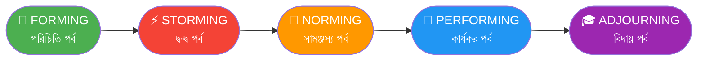
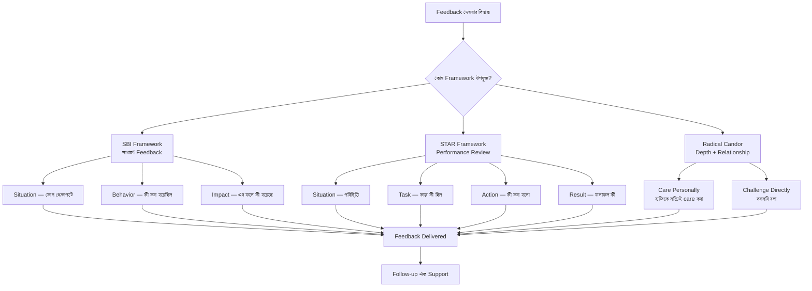
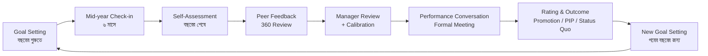
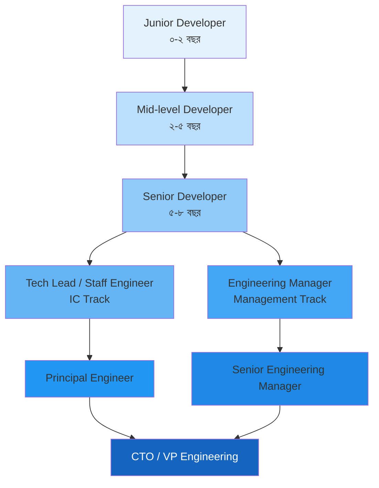
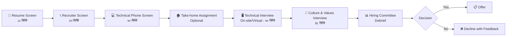
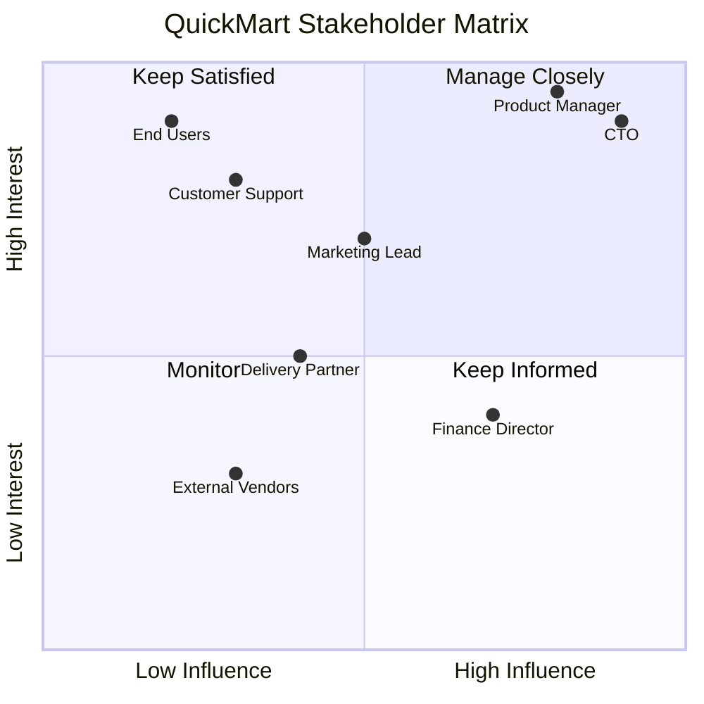
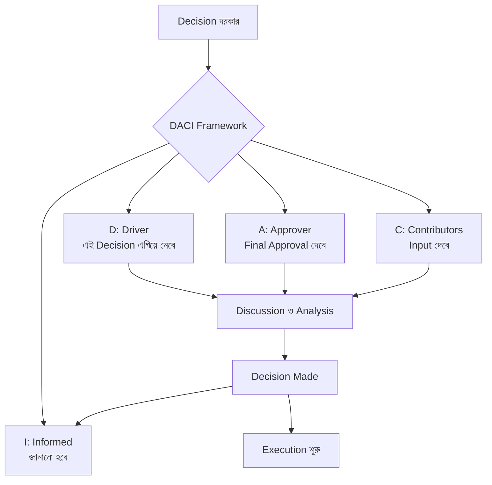

# Phase 6 — Team Leadership & Management
### Individual Contributor থেকে Leader পর্যন্ত
### প্রজেক্ট উদাহরণ: QuickMart E-commerce Platform

---

> *"The task of leadership is not to put greatness into people, but to elicit it, for the greatness is there already."*
> — John Buchan

---

## সূচিপত্র

- [Chapter 1: Leadership কী এবং Management কী](#chapter-1-leadership-কী-এবং-management-কী)
  - [1.1 Leadership vs Management পার্থক্য](#11-leadership-vs-management-পার্থক্য)
  - [1.2 Leadership Styles বিস্তারিত](#12-leadership-styles-বিস্তারিত)
  - [1.3 Servant Leadership কী](#13-servant-leadership-কী)
  - [1.4 কখন কোন Style ব্যবহার করবেন](#14-কখন-কোন-style-ব্যবহার-করবেন)
- [Chapter 2: Team Management](#chapter-2-team-management)
  - [2.1 Team Forming — Tuckman Model](#21-team-forming--tuckman-model)
  - [2.2 High-performing Team তৈরি করা](#22-high-performing-team-তৈরি-করা)
  - [2.3 Psychological Safety](#23-psychological-safety)
  - [2.4 Team Capacity Management](#24-team-capacity-management)
  - [2.5 Remote Team Management](#25-remote-team-management)
  - [2.6 Conflict Resolution](#26-conflict-resolution)
  - [2.7 Underperformance Handle করা](#27-underperformance-handle-করা)
  - [2.8 Team Motivation](#28-team-motivation)
- [Chapter 3: 1-on-1 Meeting](#chapter-3-1-on-1-meeting)
  - [3.1 1-on-1 কেন Critical](#31-1-on-1-কেন-critical)
  - [3.2 কীভাবে পরিচালনা করবেন](#32-কীভাবে-পরিচালনা-করবেন)
  - [3.3 প্রশ্নের তালিকা](#33-প্রশ্নের-তালিকা)
  - [3.4 Note রাখার পদ্ধতি এবং Follow-up](#34-note-রাখার-পদ্ধতি-এবং-follow-up)
  - [3.5 QuickMart Team-এর 1-on-1 উদাহরণ](#35-quickmart-team-এর-1-on-1-উদাহরণ)
- [Chapter 4: Feedback এবং Performance](#chapter-4-feedback-এবং-performance)
  - [4.1 Feedback Framework](#41-feedback-framework)
  - [4.2 Positive এবং Constructive Feedback](#42-positive-এবং-constructive-feedback)
  - [4.3 Performance Review Process](#43-performance-review-process)
  - [4.4 Performance Improvement Plan (PIP)](#44-performance-improvement-plan-pip)
  - [4.5 Career Development Conversation](#45-career-development-conversation)
  - [4.6 Promotion Decision Process](#46-promotion-decision-process)
- [Chapter 5: Mentoring এবং Coaching](#chapter-5-mentoring-এবং-coaching)
  - [5.1 Mentoring vs Coaching পার্থক্য](#51-mentoring-vs-coaching-পার্থক্য)
  - [5.2 Junior Developer Mentoring](#52-junior-developer-mentoring)
  - [5.3 Growth Plan তৈরি করা](#53-growth-plan-তৈরি-করা)
  - [5.4 Skill Development Roadmap](#54-skill-development-roadmap)
  - [5.5 Knowledge Transfer](#55-knowledge-transfer)
- [Chapter 6: Hiring এবং Team Building](#chapter-6-hiring-এবং-team-building)
  - [6.1 Job Description লেখা](#61-job-description-লেখা)
  - [6.2 Interview Process Design](#62-interview-process-design)
  - [6.3 Technical Interview নেওয়া](#63-technical-interview-নেওয়া)
  - [6.4 Culture Fit Assessment](#64-culture-fit-assessment)
  - [6.5 Offer Process](#65-offer-process)
  - [6.6 Onboarding Plan](#66-onboarding-plan)
  - [6.7 Off-boarding](#67-off-boarding)
- [Chapter 7: Stakeholder Management](#chapter-7-stakeholder-management)
  - [7.1 Stakeholder কারা এবং কীভাবে চেনা যায়](#71-stakeholder-কারা-এবং-কীভাবে-চেনা-যায়)
  - [7.2 Stakeholder Matrix তৈরি](#72-stakeholder-matrix-তৈরি)
  - [7.3 Executive Communication](#73-executive-communication)
  - [7.4 Difficult Conversation Handle করা](#74-difficult-conversation-handle-করা)
  - [7.5 Expectation Management](#75-expectation-management)
  - [7.6 Status Reporting](#76-status-reporting)
  - [7.7 Escalation Process](#77-escalation-process)
- [Chapter 8: Decision Making](#chapter-8-decision-making)
  - [8.1 Decision Framework — RACI এবং DACI](#81-decision-framework--raci-এবং-daci)
  - [8.2 Data-driven Decision](#82-data-driven-decision)
  - [8.3 Trade-off Analysis](#83-trade-off-analysis)
  - [8.4 Technical vs Business Decision Balance](#84-technical-vs-business-decision-balance)
  - [8.5 Decision Documentation](#85-decision-documentation)
  - [8.6 Reversible vs Irreversible Decision](#86-reversible-vs-irreversible-decision)
  - [8.7 QuickMart-এ Real Decision Scenarios](#87-quickmart-এ-real-decision-scenarios)
- [Chapter 9: Engineering Strategy](#chapter-9-engineering-strategy)
  - [9.1 OKR — Objectives and Key Results](#91-okr--objectives-and-key-results)
  - [9.2 Engineering Roadmap](#92-engineering-roadmap)
  - [9.3 Technical Vision তৈরি করা](#93-technical-vision-তৈরি-করা)
  - [9.4 Team Goal Setting](#94-team-goal-setting)
- [Appendix A: Templates এবং Checklists](#appendix-a-templates-এবং-checklists)
- [Appendix B: Reference Books](#appendix-b-reference-books)

---

# Chapter 1: Leadership কী এবং Management কী

[↑ সূচিপত্রে ফিরুন](#সূচিপত্র)

## 1.1 Leadership vs Management পার্থক্য

Software engineering-এর জগতে যখন কেউ Individual Contributor (IC) থেকে Leader বা Manager-এ পরিণত হন, তখন প্রথম যে প্রশ্নটি আসে সেটি হলো — Leadership আর Management কি একই জিনিস? উত্তর হলো, না। এই দুটি শব্দ প্রায়ই একসাথে ব্যবহার করা হলেও, এদের মূল চরিত্র এবং উদ্দেশ্য আলাদা।

**Leadership** হলো মানুষকে একটি ভবিষ্যৎ Vision-এর দিকে অনুপ্রাণিত করার ক্ষমতা। একজন Leader মানুষের মন ও হৃদয়ে কাজ করেন — তিনি "কেন আমরা এটি করছি" সেই প্রশ্নের উত্তর দেন। Leadership-এ কোনো Formal Authority না থাকলেও চলে; একজন Junior Developer ও Team-এর মধ্যে Leadership দেখাতে পারেন যদি তিনি সঠিক দিকে মানুষকে অনুপ্রাণিত করতে পারেন।

**Management** হলো Resources — মানুষ, সময়, বাজেট, এবং process — সঠিকভাবে Organize করার শিল্প। একজন Manager মূলত "কীভাবে আমরা এটি করব" সেই প্রশ্নের উত্তর দেন। Management-এ সাধারণত একটি Formal Authority থাকে এবং একটি নির্দিষ্ট Reporting Structure থাকে।

Peter Drucker বলেছিলেন: *"Management is doing things right; leadership is doing the right things."* এই সংক্ষিপ্ত কথাটিতে পুরো পার্থক্যটি নিহিত।

```
━━━━━━━━━━━━━━━━━━━━━━━━━━━━━━━━━━━━━━━━━━━━━━━━━━━━━━━━━━━━━━━━━━━━━━━━━━
                    LEADERSHIP vs MANAGEMENT MATRIX
━━━━━━━━━━━━━━━━━━━━━━━━━━━━━━━━━━━━━━━━━━━━━━━━━━━━━━━━━━━━━━━━━━━━━━━━━━

  DIMENSION          │  LEADERSHIP               │  MANAGEMENT
  ───────────────────┼───────────────────────────┼──────────────────────────
  Focus              │  লোক / মানুষ              │  কাজ / Process
  Core Question      │  "কেন?" (Why)             │  "কীভাবে?" (How)
  Time Horizon       │  Long-term, Strategic      │  Short to Medium-term
  Approach           │  Inspire & Motivate        │  Plan, Organize, Control
  Power Source       │  Influence / Trust         │  Formal Authority
  Change             │  Embraces & Drives Change  │  Manages Stability
  Risk               │  Calculated Risk-taking    │  Risk Mitigation
  Measures           │  Transformation, Impact    │  Output, Efficiency
  Key Activity       │  Vision Setting            │  Goal Execution
  Example at         │  "QuickMart-কে দেশের #1   │  "এই Sprint-এ 12 Story
  QuickMart          │  E-commerce বানাবো"        │  Point শেষ করতে হবে"
━━━━━━━━━━━━━━━━━━━━━━━━━━━━━━━━━━━━━━━━━━━━━━━━━━━━━━━━━━━━━━━━━━━━━━━━━━
```

একজন আদর্শ Engineering Manager উভয়কেই সমন্বিতভাবে করেন। তিনি Team-কে Inspire করেন (Leadership) এবং একই সাথে Sprint Planning, Backlog Grooming, এবং Delivery নিশ্চিত করেন (Management)। শুধু Manager হলে টিম Robotic হয়ে যায়। শুধু Leader হলে কোনো কাজ শেষ হয় না।

QuickMart-এর Engineering Manager Rafiq ভাই-এর কথা ধরুন। তিনি যখন বলেন — *"আমাদের Checkout Flow-এ 3-second delay আছে, এটা ঠিক করতে না পারলে ২০% Customer হারাবো"* — এটি হলো Leadership (Vision এবং urgency তৈরি)। আর যখন তিনি বলেন — *"Karim এই Bug টা নেবে, deadline হবে শুক্রবার, PR Review করব আমি"* — এটি হলো Management (Execution নিশ্চিত করা)।

একটি সূক্ষ্ম কিন্তু গুরুত্বপূর্ণ পার্থক্য হলো, Leadership Earned হয়, Management Assigned হয়। আপনাকে Manager বানানো যায়, কিন্তু আপনাকে Leader বানানো যায় না — সেটা আপনাকে নিজেই হতে হয়।

---

## 1.2 Leadership Styles বিস্তারিত

[↑ সূচিপত্রে ফিরুন](#সূচিপত্র)

Daniel Goleman তাঁর গবেষণায় ৬টি Leadership Style চিহ্নিত করেছেন যা Engineering Managers-এর জন্য অত্যন্ত প্রাসঙ্গিক। প্রতিটি Style-এর নিজস্ব শক্তি এবং দুর্বলতা আছে, এবং একজন দক্ষ Leader পরিস্থিতি অনুযায়ী Style Switch করতে পারেন।

### ১. Visionary / Authoritative Style

এই Style-এ Leader একটি স্পষ্ট Long-term Vision তৈরি করেন এবং Team-কে সেই দিকে নিয়ে যান। তিনি "কেন" ব্যাখ্যা করেন, কিন্তু "কীভাবে" সেটা Team-এর উপর ছেড়ে দেন।

**কখন কাজ করে:** যখন Team-এর একটি নতুন Direction দরকার, বা পুরনো System Rebuild করতে হবে।

**QuickMart উদাহরণ:** *"আমাদের Monolithic Architecture থেকে Microservices-এ যেতে হবে পরের ১৮ মাসে। এটাই আমাদের Scalability-র পথ। কীভাবে করবে সেটা তোমাদের সিদ্ধান্ত।"*

### ২. Coaching Style

Leader এখানে প্রতিটি Individual-এর Strength এবং Development Area চেনেন এবং তাদের Long-term Growth-এ Invest করেন।

**কখন কাজ করে:** যখন Team Member-রা Motivated কিন্তু Skill Gap আছে। Junior Developers-এর জন্য সবচেয়ে ভালো।

**QuickMart উদাহরণ:** Karim Flutter-এ নতুন। Manager প্রতি সপ্তাহে তার সাথে বসে Code Review করেন এবং Specific Improvement Areas ধরিয়ে দেন।

### ৩. Affiliative Style

Relationship এবং Harmony-কে সর্বোচ্চ Priority দেওয়া হয়। Team-এর Emotional well-being-এ Focus।

**কখন কাজ করে:** Team যখন Stressed, Burnout-এ আছে, বা একটি বড় Crisis-এর পর Healing দরকার।

**QuickMart উদাহরণ:** Product Launch-এর পর Team ক্লান্ত। Manager ২ দিনের ছুটি দেন, Team Lunch Organize করেন এবং ব্যক্তিগতভাবে প্রতিটি Member-কে ধন্যবাদ জানান।

### ৪. Democratic / Participative Style

সিদ্ধান্ত গ্রহণে Team-এর সবাইকে অংশীদার করা হয়। Consensus Build করা হয়।

**কখন কাজ করে:** যখন নতুন Technology বা Process নির্বাচন করতে হবে এবং Team-এর Buy-in দরকার।

**QuickMart উদাহরণ:** *"আমরা কি Agora ব্যবহার করব নাকি নিজেদের WebRTC Build করব? সবাই নিজেদের Findings Share করো, তারপর সিদ্ধান্ত নেব।"*

### ৫. Pacesetting Style

Leader নিজেই High Standards Set করেন এবং সবাইকে সেই Bar-এ পৌঁছাতে বলেন। *"আমি যেভাবে করি তুমিও সেভাবে করো।"*

**কখন কাজ করে:** Highly Skilled, Self-motivated Team-এ Short-term High Performance দরকার হলে। কিন্তু দীর্ঘমেয়াদে ব্যবহার করলে Burnout হয়।

**Danger:** এই Style-এ Leader নিজে সব করেন, Team Dependent হয়ে পড়ে।

### ৬. Commanding / Coercive Style

*"এটা এখনই করো, কারণ আমি বললাম।"* — এটি সবচেয়ে কঠোর Style।

**কখন কাজ করে:** শুধুমাত্র Crisis-এর সময়, যেমন Production Down, Security Breach। অন্য সময়ে ব্যবহার করলে Trust নষ্ট হয়।

---

## 1.3 Servant Leadership কী

[↑ সূচিপত্রে ফিরুন](#সূচিপত্র)

Robert Greenleaf ১৯৭০ সালে "Servant Leadership" ধারণাটি প্রথম প্রবর্তন করেন। এই Philosophy-তে Leader প্রথমে নিজেকে একজন Servant হিসেবে দেখেন — তাঁর কাজ হলো Team-কে Serve করা, Team-এর Obstacle সরিয়ে দেওয়া এবং তাদের সেরাটা বের করে আনা।

Traditional Leadership-এ Pyramid-এর উপরে Leader থাকেন এবং নিচে Team। Servant Leadership-এ এই Pyramid উল্টো হয়ে যায় — Team উপরে, Leader নিচে Support-এ।

**Servant Leadership-এর ১০টি Core Principle (Greenleaf):**

1. **Listening** — সত্যিকারের Active Listening, শুধু উত্তর দেওয়ার জন্য শোনা নয়।
2. **Empathy** — Team Member-দের পরিস্থিতি নিজের জায়গায় বুঝার চেষ্টা।
3. **Healing** — Emotional Wounds এবং Broken Relationships ঠিক করা।
4. **Awareness** — নিজের এবং Environment-এর সম্পর্কে গভীর সচেতনতা।
5. **Persuasion** — Authority নয়, Logic ও Trust দিয়ে Convince করা।
6. **Conceptualization** — বড় Picture দেখার ক্ষমতা।
7. **Foresight** — ভবিষ্যৎ পরিণতি আগেই অনুমান করা।
8. **Stewardship** — Team ও Organization-এর Custodian হিসেবে কাজ করা।
9. **Commitment to Growth** — প্রতিটি মানুষের Personal ও Professional Growth-এ Invest করা।
10. **Building Community** — Isolation নয়, একটি সত্যিকারের Community তৈরি করা।

QuickMart-এ Servant Leadership কেমন দেখায়? ধরুন Backend Team-এর Lead Tanvir লক্ষ্য করলেন যে Developer Sadia বারবার একই Boilerplate Code লিখছেন। একজন Traditional Manager বলতেন "এটা তোমার কাজ, করো।" একজন Servant Leader বলবেন — *"আমি তোমার জন্য একটি Code Generator Tool তৈরি করে দিই, যাতে তোমার সময় বাঁচে এবং তুমি আরো Complex কাজে Focus করতে পারো।"*

Servant Leadership-এর সবচেয়ে বড় সুবিধা হলো এটি Psychological Safety তৈরি করে। Team জানে যে তাদের Manager তাদের Punish করতে আসেননি, বরং তাদের Empower করতে এসেছেন। এই Trust-এর পরিবেশে Creativity এবং Innovation ফুটে ওঠে।

---

## 1.4 কখন কোন Style ব্যবহার করবেন

[↑ সূচিপত্রে ফিরুন](#সূচিপত্র)

একজন দক্ষ Manager একটিমাত্র Style-এ আটকে থাকেন না। তিনি পরিস্থিতি পড়তে পারেন এবং সেই অনুযায়ী Style Switch করেন — এই দক্ষতাকে বলে **Situational Leadership** (Hersey & Blanchard)।

| পরিস্থিতি | প্রস্তাবিত Style | কারণ |
|---|---|---|
| Production Outage, Critical Bug | Commanding | দ্রুত সিদ্ধান্ত দরকার, Debate-র সময় নেই |
| New Technology Adoption | Democratic | Team-এর Buy-in না পেলে Execution ব্যর্থ হবে |
| Junior Developer Onboarding | Coaching | Skill Gap পূরণ করা দরকার |
| Post-launch Team Exhaustion | Affiliative | Relationship ও Morale Rebuild দরকার |
| Company Direction Change | Visionary | নতুন "কেন" তৈরি করা দরকার |
| Senior Engineers-এর নতুন Feature | Pacesetting | তারা এমনিতেই Capable, শুধু Bar Set করতে হবে |

**QuickMart Scenario:** QuickMart-এর Payment Gateway একটি Critical Bug-এর কারণে Down হয়ে গেল। Manager প্রথম ১৫ মিনিটে **Commanding** Style ব্যবহার করলেন — সরাসরি নির্দেশ দিলেন কে কী করবে। Crisis মিটে যাওয়ার পর **Affiliative** Style-এ Team-কে Appreciate করলেন। তারপর Post-mortem Discussion-এ **Democratic** Style ব্যবহার করলেন যাতে ভবিষ্যতে একই ভুল না হয়।

এই Flexibility-ই একজন Senior Engineering Manager-কে Average থেকে Exceptional করে তোলে।

---

# Chapter 2: Team Management

[↑ সূচিপত্রে ফিরুন](#সূচিপত্র)

## 2.1 Team Forming — Tuckman Model

Bruce Tuckman ১৯৬৫ সালে একটি Model প্রস্তাব করেন যা আজও সবচেয়ে বেশি ব্যবহৃত Team Development Framework। এই Model-এ একটি Team ৪টি (পরে ৫টি) ধাপের মধ্য দিয়ে যায়: **Forming → Storming → Norming → Performing → (Adjourning)**।



### ধাপ ১: Forming (গঠন পর্ব)

টিম সদ্য তৈরি হয়েছে। সবাই Polite, সবাই নিজেদের সম্পর্কে অনিশ্চিত। কেউ কাউকে চেনে না। Everyone is on their best behavior।

**QuickMart উদাহরণ:** QuickMart-এ নতুন Mobile App Team গঠন হলো। Karim (Senior Flutter Dev), Sadia (Junior Flutter Dev), Tanvir (Backend Lead), এবং Nisha (QA) — এরা প্রথমবার একসাথে কাজ শুরু করছে।

**Manager-এর করণীয়:**
- Team Introduction Session করানো।
- Team Charter তৈরি — কীভাবে কাজ করবে, কী Values Follow করবে।
- Role ও Responsibility স্পষ্ট করে দেওয়া।
- Short-term, achievable Goal Set করা যাতে Early Win পাওয়া যায়।

### ধাপ ২: Storming (দ্বন্দ্ব পর্ব)

এটি সবচেয়ে কঠিন ধাপ। সবাই নিজেদের আসল রূপ দেখাতে শুরু করে। Leadership নিয়ে দ্বন্দ্ব, কাজের পদ্ধতি নিয়ে মতবিরোধ, এবং ব্যক্তিগত Tension তৈরি হয়।

**QuickMart উদাহরণ:** Karim মনে করে সব Feature-ই Local State দিয়ে Manage করা যাবে। Tanvir বলছে BLoC ছাড়া Complex App Scale করা যাবে না। দুজনের মধ্যে Code Review-তে Regular Arguments হচ্ছে।

**Manager-এর করণীয়:**
- Conflict-কে Suppress না করে Surface করা — আলোচনায় আনা।
- "আইডিয়ার সংঘাত ভালো, ব্যক্তির সংঘাত নয়" — এই Culture তৈরি করা।
- Team-এর Working Agreement স্পষ্ট করা।
- প্রয়োজনে Mediator হিসেবে কাজ করা।

### ধাপ ৩: Norming (সামঞ্জস্য পর্ব)

Team আস্তে আস্তে একটা Rhythm-এ আসে। একে অন্যকে বুঝতে শেখে। Conflict কমে, Collaboration বাড়ে।

**QuickMart উদাহরণ:** Karim এবং Tanvir একটি Hybrid Approach Agree করেছে — Simple UI State-এ setState, Complex Business Logic-এ BLoC। এই Decision সবাই মেনে নিয়েছে।

**Manager-এর করণীয়:**
- এই Momentum ধরে রাখা।
- Team-এর নিজস্ব Process এবং Norm-কে Document করতে সাহায্য করা।
- Collaborative Successes Celebrate করা।

### ধাপ ৪: Performing (কার্যকর পর্ব)

এটি সোনার পর্ব। Team এখন Autonomous, Self-organized, এবং High-performing। Manager-এর Micromanagement প্রয়োজন নেই।

**QuickMart উদাহরণ:** QuickMart Mobile Team স্বনির্ভরভাবে Sprint Planning করে, Daily Standup পরিচালনা করে, এবং Sprint-এ Committed Story Point ধারাবাহিকভাবে Deliver করে।

**Manager-এর করণীয়:**
- Delegate করা।
- Strategic Problem Solve করতে সাহায্য করা।
- Team-কে External Resource এবং Opportunity দেওয়া।

### ধাপ ৫: Adjourning (বিদায় পর্ব)

Project শেষ হলে বা Team Member পরিবর্তন হলে এই ধাপ আসে। পুনরায় নতুন Configuration-এ Forming শুরু হয়।

**গুরুত্বপূর্ণ সতর্কতা:** যখনই কোনো নতুন Member যোগ দেয় বা পুরনো Member চলে যায়, Team আবার Forming-এ ফিরে যায়। Manager-কে এই Reset সম্পর্কে সচেতন থাকতে হবে।

---

## 2.2 High-performing Team তৈরি করা

[↑ সূচিপত্রে ফিরুন](#সূচিপত্র)

Google তাদের Project Aristotle গবেষণায় প্রশ্ন করেছিল — কোন factors একটি Team-কে High-performing করে তোলে? ২০০+ টিম Analyze করার পর তারা ৫টি Key Factor খুঁজে পেয়েছিল, এবং সবার উপরে ছিল **Psychological Safety**।

**৫টি Factor (Google-এর গবেষণা অনুযায়ী):**

**১. Psychological Safety:** Team Members কি ভুল করলে বা প্রশ্ন করলে নিরাপদ বোধ করে? এটিই সবচেয়ে গুরুত্বপূর্ণ Factor।

**২. Dependability:** Team Members কি সময়মতো, প্রত্যাশিত মানে কাজ Deliver করে?

**৩. Structure & Clarity:** সবাই কি জানে তাদের Role কী, Goals কী, এবং Plan কী?

**৪. Meaning:** কাজটি কি Team Member-দের কাছে Personally Meaningful?

**৫. Impact:** Team কি বিশ্বাস করে যে তাদের কাজ Significant Difference তৈরি করছে?

**QuickMart-এ High-performing Team তৈরির Checklist:**

```
✅ Team Charter আছে — Values, Working Hours, Communication Norms
✅ প্রতিটি Member-এর Role ও Responsibility স্পষ্ট
✅ Sprint Goal সবার কাছে Clear
✅ 1-on-1 Meeting নিয়মিত হচ্ছে
✅ Retrospective Regular হচ্ছে এবং Action Items Follow হচ্ছে
✅ Successes Publicly Celebrate করা হচ্ছে
✅ Failure-কে Blame নয়, Learning-এর সুযোগ হিসেবে দেখা হচ্ছে
✅ Cross-functional Collaboration আছে
✅ Technical Debt কমানোর জন্য Time Allocated আছে
```

---

## 2.3 Psychological Safety

[↑ সূচিপত্রে ফিরুন](#সূচিপত্র)

Harvard Business School-এর Professor Amy Edmondson Psychological Safety-এর সংজ্ঞা দিয়েছেন: *"The belief that one will not be punished or humiliated for speaking up with ideas, questions, concerns, or mistakes."*

সহজ বাংলায়: Team-এর প্রতিটি Member যখন নির্ভয়ে নিজের মতামত, ভুল, এবং প্রশ্ন Share করতে পারে — সেটাই Psychological Safety।

**Psychological Safety না থাকলে কী হয়:**
- Developers ভুল লুকিয়ে রাখে।
- কেউ "Stupid প্রশ্ন" করতে ভয় পায়।
- Bad ideas-এ কেউ চ্যালেঞ্জ করে না।
- Innovation মরে যায়।
- Talented Developers টিম ছেড়ে চলে যায়।

**QuickMart-এ Psychological Safety তৈরির পদ্ধতি:**

**১. নিজেই প্রথম ভুল Admit করুন।**
Manager যখন বলেন — *"আমি গত Sprint-এর Estimation-এ ভুল করেছিলাম, এখান থেকে শিখলাম যে..."* — তখন Team বোঝে ভুল স্বীকার করা Safe।

**২. প্রশ্নকে পুরস্কৃত করুন।**
Standup-এ যে Junior Developer সাহস করে "আমি এই Architecture বুঝিনি" বললো, তাকে Publically ধন্যবাদ দিন।

**৩. "Blameless Post-mortem" Culture তৈরি করুন।**
QuickMart Payment Bug-এর পর শুধু জিজ্ঞেস করুন — *"System-এ কোথায় Failure হয়েছিল?"* — ব্যক্তিকে দোষ দেবেন না।

**৪. নিয়মিত Retrospective করুন।**
Sprint শেষে *"কী ভালো হলো, কী ভালো হলো না, কী পরিবর্তন করব"* — এই প্রশ্নগুলো নিয়মিত জিজ্ঞেস করা।

**৫. Active Listening Practice করুন।**
কেউ কথা বললে Phone রাখুন, Eye Contact রাখুন, এবং প্রশ্ন করুন। এটাই বলে দেয় যে তাদের কথা মূল্যবান।

---

## 2.4 Team Capacity Management

[↑ সূচিপত্রে ফিরুন](#সূচিপত্র)

Team Capacity Management হলো এই নিশ্চিত করা যে Team-এর উপর কতটুকু কাজ দেওয়া হচ্ছে সেটা তাদের সত্যিকারের Capacity-র মধ্যে আছে। Over-capacity থেকে Burnout হয়, Under-capacity থেকে Boredom।

**Capacity Calculation (QuickMart Example):**

QuickMart Mobile Team:
- Sprint Duration: 2 সপ্তাহ (10 কর্মদিন)
- Team Size: 4 জন (Karim, Sadia, Tanvir, Nisha)
- মোট Available Person-days: 4 × 10 = 40

কিন্তু এই ৪০ দিন পুরোটা Development-এ যায় না। Meeting, 1-on-1, Code Review, এগুলো বাদ দিলে:

| Activity | Time |
|---|---|
| Meetings (Standup, Planning, Retro) | ~4 Person-days |
| Code Review | ~3 Person-days |
| Support / Bugs | ~3 Person-days |
| Buffer (Sick Leave, etc.) | ~2 Person-days |
| **Net Development Capacity** | **~28 Person-days** |

এই ২৮ Person-days বা সমতুল্য Story Points-ই হবে Sprint Commitment।

**গুরুত্বপূর্ণ টিপস:**
- **New Member Joining:** প্রথম Sprint-এ তাদের Capacity ২০-৩০% ধরুন।
- **Holiday Season:** Capacity সেই অনুযায়ী কমান।
- **Complex Feature:** Buffer বাড়ান।
- **Technical Debt:** প্রতি Sprint-এ ২০% Capacity Technical Debt-এ রাখুন।

---

## 2.5 Remote Team Management

[↑ সূচিপত্রে ফিরুন](#সূচিপত্র)

Remote এবং Hybrid Work এখন Engineering-এর নতুন স্বাভাবিকতা। QuickMart-এর টিমও যদি ঢাকা, চট্টগ্রাম এবং সিলেট থেকে কাজ করে, তাহলে Manager-কে Remote Management-এ দক্ষ হতে হবে।

**Remote Team-এর সবচেয়ে বড় চ্যালেঞ্জ:**
- Isolation এবং Loneliness।
- Communication Gap — যা Face-to-face-এ ৩০ সেকেন্ডে মিটত, তা Slack-এ ঘণ্টা লাগে।
- Timezone মিলানো।
- Informal Connection তৈরি না হওয়া।
- Work-life Balance ভেঙে যাওয়া।

**Remote Management Best Practices:**

**১. Over-communicate করুন।**
Information Vacuum-এ মানুষ Worst Case ধরে নেয়। নিয়মিত Update দিন।

**২. Async-first Culture তৈরি করুন।**
সব কিছুর জন্য Meeting নয়। Loom Video, Notion Document, এবং Slack Thread — এগুলো দিয়ে Async Communication Normalize করুন।

**৩. Camera On Policy সম্পর্কে Flexible থাকুন।**
সবার Home Environment আলাদা। Camera Off হলে Judge করবেন না।

**৪. Virtual Water Cooler তৈরি করুন।**
একটি #random Slack Channel রাখুন যেখানে শুধু Personal জিনিস Share হবে। Virtual Coffee Catch-up এর ব্যবস্থা করুন।

**৫. Timezone-aware Scheduling করুন।**
QuickMart-এর সবাইকে ধরে নিন Bangladesh Timezone (BST) — কিন্তু যদি Remote International Member থাকে, তাদের সুবিধামতো Meeting Schedule করুন।

**৬. Output-based নয়, Outcome-based Measurement করুন।**
*"Sadia ৮ ঘণ্টা Online ছিল"* নয়, *"Sadia এই Sprint-এ ৫টি Story Point Deliver করেছে"* — এটাই Measure করুন।

---

## 2.6 Conflict Resolution

[↑ সূচিপত্রে ফিরুন](#সূচিপত্র)

Conflict Software Team-এ অনিবার্য। দুজন Passionate Developer কখনো সব বিষয়ে একমত হবে না। বরং, সঠিকভাবে Managed Conflict একটি Team-কে Stronger করে।

Kenneth Thomas এবং Ralph Kilmann ৫টি Conflict Resolution Style চিহ্নিত করেছেন:

```
━━━━━━━━━━━━━━━━━━━━━━━━━━━━━━━━━━━━━━━━━━━━━━━━━━━━━━━━━━━━━━━━━━━━━━
                    CONFLICT RESOLUTION STYLES GRID
━━━━━━━━━━━━━━━━━━━━━━━━━━━━━━━━━━━━━━━━━━━━━━━━━━━━━━━━━━━━━━━━━━━━━━
                              নিজের লক্ষ্য পূরণের চেষ্টা
                         কম ◄─────────────────────────► বেশি
                    ┌──────────────┬────────────────────┐
          বেশি      │  ACCOMMODATING│    COLLABORATING   │
                    │  (양보)        │    (সহযোগিতা)       │
  অন্যের            │  আমি ছেড়ে দিলাম│  আমরা উভয়ই Win    │
  লক্ষ্য  ├──────────────┼────────────────────┤
  পূরণের │  AVOIDING     │    COMPROMISING    │
  চেষ্টা │  (পরিহার)     │    (আপস)           │
          │  কেউই Win না  │  দুজনেই কিছুটা Win │
          ├──────────────┴────────────────────┤
          │           COMPETING               │
  কম      │           (প্রতিযোগিতা)            │
          │           আমি জিতব               │
          └───────────────────────────────────┘
━━━━━━━━━━━━━━━━━━━━━━━━━━━━━━━━━━━━━━━━━━━━━━━━━━━━━━━━━━━━━━━━━━━━━━
```

**QuickMart Real Scenario: Karim vs Tanvir — State Management Conflict**

Karim (Senior Flutter Dev) এবং Tanvir (Backend Lead) একটি বড় Conflict-এ জড়ালো। Karim চায় সব কিছু Riverpod দিয়ে Manage করতে, Tanvir চায় BLoC।

**Manager-এর Conflict Resolution Process:**

**ধাপ ১: প্রতিটিকে আলাদাভাবে শোনা।**
Manager প্রথমে Karim-এর সাথে 1-on-1-এ কথা বললেন: *"তোমার কাছ থেকে Riverpod-এর পক্ষে Arguments শুনতে চাই।"* তারপর Tanvir-এর সাথে।

**ধাপ ২: Shared Goal Identify করা।**
উভয়ের লক্ষ্য একটাই — QuickMart App ভালো করে Build করা। এই Common Ground-এ আসা।

**ধাপ ৩: Data-driven Discussion।**
একটি Technical Spike: দুটি Approach-এই একটি Simple Feature Build করো এবং Compare করো।

**ধাপ ৪: Collaborative Decision।**
Decision নিল Team: Simple Feature-এ Riverpod, Complex Business Logic-এ BLoC। উভয়েরই Input আছে।

**ধাপ ৫: Document এবং Move Forward।**
Decision-টা Notion-এ লিখে রাখা হলো। কেউ আর এই Debate তুললে Document Refer করা হবে।

**Conflict Resolution-এর Golden Rules:**
- Person নয়, Problem-কে Attack করুন।
- Private-এ Difficult Conversation করুন।
- Public-এ শুধু Appreciation।
- Conflict দ্রুত Address করুন — সময়ের সাথে এটা Toxic হয়।

---

## 2.7 Underperformance Handle করা

[↑ সূচিপত্রে ফিরুন](#সূচিপত্র)

Underperformance একটি Manager-এর সবচেয়ে Uncomfortable কিন্তু সবচেয়ে গুরুত্বপূর্ণ দায়িত্বগুলোর একটি। অনেক Manager এটা Avoid করেন, যা দীর্ঘমেয়াদে পুরো Team-এর Morale নষ্ট করে।

**Underperformance-এর মূল কারণগুলো (আগে বোঝা দরকার):**
- **Skill Gap:** কাজটা করার Skill নেই।
- **Will Gap:** ইচ্ছা বা Motivation নেই।
- **Resource Gap:** সঠিক Tool বা Support নেই।
- **Clarity Gap:** কী করতে হবে সেটা পরিষ্কার না।
- **Personal Issues:** Personal বা Health সমস্যা।

**Underperformance Handle করার ধাপ:**

**ধাপ ১: Pattern চেনা।** একটি ভুল নয়, বারবার একই ধরনের সমস্যা।

**ধাপ ২: Private Conversation।** *"আমি লক্ষ্য করেছি গত তিন Sprint-এ তোমার Task গুলো ৪০% Delayed হচ্ছে। এই নিয়ে কথা বলতে চাই।"*

**ধাপ ৩: Root Cause বোঝার চেষ্টা।** বলার আগে জিজ্ঞেস করুন — *"তোমার কাছ থেকে জানতে চাই কী হচ্ছে।"*

**ধাপ ৪: Specific, Measurable Expectation Set করুন।** *"পরের Sprint-এ তোমার Committed Story Point-এর ৯০% শেষ করতে হবে।"*

**ধাপ ৫: Support দিন।** ব্যর্থ হলে কী সাহায্য করতে পারেন সেটা জানান।

**ধাপ ৬: Follow-up।** প্রতি সপ্তাহে Progress Check করুন।

**ধাপ ৭: PIP (Performance Improvement Plan)।** যদি উন্নতি না হয়, Formal PIP Process শুরু হবে (Chapter 4.4-এ বিস্তারিত)।

---

## 2.8 Team Motivation

[↑ সূচিপত্রে ফিরুন](#সূচিপত্র)

Frederick Herzberg-এর Two-Factor Theory এবং Daniel Pink-এর Drive Theory — দুটিই বলে যে Software Engineers-দের Motivate করে মূলত **Intrinsic Factors**।

**Intrinsic vs Extrinsic Motivation:**

| Intrinsic (ভেতর থেকে) | Extrinsic (বাইরে থেকে) |
|---|---|
| কাজের মধ্যে আনন্দ | Salary, Bonus |
| Growth এবং Learning | Title Promotion |
| Autonomy | Perks (Company Car, etc.) |
| Mastery অর্জন | Recognition Awards |
| Purpose — কাজের Meaning | Job Security |

Daniel Pink বলেছেন Software Engineers-দের Motivate করার তিনটি মূল উপাদান হলো **Autonomy, Mastery, এবং Purpose (AMP)**।

**QuickMart-এ Motivation তৈরির উপায়:**

**Autonomy:** *"Sadia, তুমি নিজে ঠিক করো Product Page-এর UI কীভাবে করবে। আমি শুধু Business Requirement দিচ্ছি।"*

**Mastery:** প্রতি Sprint-এ একটি Learning Challenge রাখুন। QuickMart-এ *"Innovation Friday"* — প্রতি শুক্রবার বিকেলে নতুন কিছু Experiment করার Time।

**Purpose:** Team-কে বলুন তাদের কাজ কতটা Impact করছে। *"তোমাদের Checkout Optimization-এর কারণে এই মাসে ১৫% বেশি Transaction Complete হয়েছে।"*

---

# Chapter 3: 1-on-1 Meeting

[↑ সূচিপত্রে ফিরুন](#সূচিপত্র)

## 3.1 1-on-1 কেন Critical

Manager এবং Direct Report-এর মধ্যে সবচেয়ে গুরুত্বপূর্ণ Touchpoint হলো 1-on-1 Meeting। এটা শুধু Status Update নয় — এটা Trust Build করার, Career Development এর, এবং Early Warning Signals ধরার সুযোগ।

Andy Grove তাঁর "High Output Management"-এ বলেছেন: *"The one-on-one is the single most important managerial tool you have."*

**1-on-1 কেন Critical:**
- **Early Warning System:** Team Member কোনো Problem বা Frustration Formal Path-এ বলার আগেই এখানে বলতে পারে।
- **Trust Building:** Regular, Consistent 1-on-1 বলে দেয় — "তুমি আমার কাছে Important।"
- **Career Development:** Long-term Growth এর কথা বলার Space।
- **Retention:** Gallup গবেষণায় দেখা গেছে যে Employee চলে যাওয়ার প্রধান কারণ Manager, Company নয়। Regular 1-on-1 এই Relationship Strengthen করে।
- **Feedback Loop:** Both-way Feedback-এর সুযোগ।

---

## 3.2 কীভাবে পরিচালনা করবেন

[↑ সূচিপত্রে ফিরুন](#সূচিপত্র)

**Frequency:** Junior Developer-দের সাথে সাপ্তাহিক। Senior-দের সাথে bi-weekly।

**Duration:** ৩০-৬০ মিনিট।

**Location:** Private। নিজেদের Desk-এ নয় — যেখানে Interruption নেই।

**সবচেয়ে গুরুত্বপূর্ণ নিয়ম:** এটা Manager-এর Meeting নয়, **Team Member-এর Meeting**। Agenda সে Set করবে।

**Meeting Structure:**

| Time | Activity |
|---|---|
| প্রথম ৫ মিনিট | Check-in — ব্যক্তিগত কুশল, Tone Set করা |
| পরের ২০ মিনিট | Team Member-এর Agenda |
| পরের ১০ মিনিট | Manager-এর Topics |
| শেষ ৫ মিনিট | Action Items Recap |

**Golden Rules:**
- কখনো Cancel করবেন না। Reschedule করতে পারেন, Cancel নয়।
- Phone রাখুন, Laptop বন্ধ রাখুন।
- Note নিন।
- Action Items Follow করুন — এটা আপনার Credibility-র মূল।

---

## 3.3 প্রশ্নের তালিকা

[↑ সূচিপত্রে ফিরুন](#সূচিপত্র)

**Career Questions:**
- তোমার ৬ মাস পরের Goal কী?
- কোন Skill-এ তুমি সবচেয়ে বেশি Grow করতে চাও?
- তুমি কোন ধরনের কাজে সবচেয়ে Energized বোধ করো?
- তোমার Dream Role কী — ৩ বছরে?
- কোন Conference বা Training-এ যেতে চাও?

**Wellbeing Questions:**
- তুমি কেমন আছো সত্যিকার অর্থে?
- কোনো কিছু কি তোমাকে এখন Stressed করছে?
- Work-life Balance কেমন লাগছে?
- Team-এর মধ্যে কি কোনো Tension দেখছো?
- তুমি কি যথেষ্ট Rest নিতে পারছো?

**Work Questions:**
- গত সপ্তাহে কোন কাজটা তোমার সবচেয়ে ভালো লেগেছে?
- কোন কাজটা তোমার কাছে কঠিন মনে হচ্ছে?
- কোনো Blocker আছে যা আমি Remove করতে পারি?
- Team Process-এ কী একটা জিনিস Change করলে তোমার কাজ সহজ হবে?
- Management থেকে তুমি আরো কী চাও?

**Feedback Questions (Manager-এর জন্য):**
- আমি Manager হিসেবে কোনো জায়গায় তোমাকে আরো ভালো Support দিতে পারতাম?
- এমন কিছু কি আছে যা আমি করছি যা তোমাকে Help করছে না?

---

## 3.4 Note রাখার পদ্ধতি এবং Follow-up

[↑ সূচিপত্রে ফিরুন](#সূচিপত্র)

**Note রাখার সিস্টেম:**
- Shared Google Doc বা Notion Page তৈরি করুন প্রতিটি Direct Report-এর জন্য।
- Meeting-এর পরে ৩০ মিনিটের মধ্যে Summary লিখুন।
- Action Items clearly mark করুন — কে কী করবে, কবে।
- পরের Meeting-এর শুরুতে আগের Action Items Review করুন।

**Note Template:**
```
📅 তারিখ: ১৫ মার্চ ২০২৫
👤 Name: Karim
📝 Key Discussion Points:
  - Flutter 3.0 upgrade নিয়ে উৎসাহী
  - Code Review process নিয়ে কিছু Feedback দিল
🎯 Action Items:
  - [Karim] Flutter Migration Guide পড়বে — ২২ মার্চের মধ্যে
  - [Manager] Conference Budget Approve করবে — ২০ মার্চের মধ্যে
```

---

## 3.5 QuickMart Team-এর 1-on-1 উদাহরণ

[↑ সূচিপত্রে ফিরুন](#সূচিপত্র)

```
━━━━━━━━━━━━━━━━━━━━━━━━━━━━━━━━━━━━━━━━━━━━━━━━━━━━━━━━━━━━━━━━━━━━━
               1-ON-1 MEETING AGENDA — QUICKMART
━━━━━━━━━━━━━━━━━━━━━━━━━━━━━━━━━━━━━━━━━━━━━━━━━━━━━━━━━━━━━━━━━━━━━
  তারিখ     : ২০ মার্চ ২০২৫, বিকেল ৩টা
  Participants: Rafiq (Manager) & Karim (Senior Flutter Dev)
  Duration   : ৪৫ মিনিট
━━━━━━━━━━━━━━━━━━━━━━━━━━━━━━━━━━━━━━━━━━━━━━━━━━━━━━━━━━━━━━━━━━━━━

  ✅ CHECK-IN (৫ মিনিট)
     R: "কেমন আছো? পরিবার কেমন?"
     K: "ভালো, একটু Tired। নতুন Feature-এ অনেক চাপ ছিল।"

  ✅ KARIM-এর AGENDA (২০ মিনিট)
     K: "আমি একটা নতুন Animation Library Use করতে চাই।"
       → Discussion: Pro/Con Analysis করা হলো
       → Decision: Next Sprint-এ Spike নেবে
     K: "Sadia-র Code Review-এ সময় বেশি লাগছে।"
       → Discussion: Pair Programming Try করার সিদ্ধান্ত

  ✅ MANAGER-এর AGENDA (১০ মিনিট)
     R: "Q2-তে তোমাকে একটা Feature Lead করাতে চাই।"
       → Karim উৎসাহিত, কিছু Clarification চাইল
     R: "Flutter Summit-এ যাওয়ার Budget আমি Approve করলাম।"
       → Karim: "সত্যিই? অনেক ধন্যবাদ!"

  ✅ ACTION ITEMS (৫ মিনিট)
     [Karim]   — Animation Library Spike Next Sprint-এ নেবে
     [Karim]   — Sadia-র সাথে Pair Programming Tuesday থেকে শুরু
     [Manager] — Flutter Summit Registration Link পাঠাবে এই সপ্তাহে
     [Manager] — Q2 Feature Lead Role formally announce করবে

  📝 NEXT 1-ON-1: ২৭ মার্চ ২০২৫
━━━━━━━━━━━━━━━━━━━━━━━━━━━━━━━━━━━━━━━━━━━━━━━━━━━━━━━━━━━━━━━━━━━━━
```

---

# Chapter 4: Feedback এবং Performance

[↑ সূচিপত্রে ফিরুন](#সূচিপত্র)

## 4.1 Feedback Framework

Feedback হলো Growth-এর জ্বালানি। সঠিকভাবে দেওয়া Feedback একজন Developer-কে Transform করতে পারে। কিন্তু ভুলভাবে দেওয়া Feedback টিমের মনোবল ধ্বংস করতে পারে।



### SBI Framework

**S — Situation (পরিস্থিতি):** কোথায়, কখন ঘটেছে।
**B — Behavior (আচরণ):** ঠিক কী করা হয়েছিল — Observable, Specific।
**I — Impact (প্রভাব):** এর ফলে কী হলো।

**QuickMart উদাহরণ (Positive Feedback):**
*"গতকালের Sprint Review-এ (S) তুমি Payment Integration-এর Technical Details সহজ ভাষায় Business Stakeholders-দের কাছে Explain করলে (B)। এতে তারা Confident হলো এবং Feature Approval দ্রুত পেলাম (I)।"*

**QuickMart উদাহরণ (Constructive Feedback):**
*"গতকালের Standup-এ (S) তুমি Blocker-টা Mention করোনি (B)। এতে আমরা ৪ ঘণ্টা পরে জানলাম এবং Sprint Goal Risk-এ পড়ল (I)।"*

### Radical Candor (Kim Scott)

Kim Scott বলেন সত্যিকারের ভালো Feedback-এ দুটি উপাদান থাকে:

**Care Personally (ব্যক্তিগতভাবে Care করা):** Feedback দেওয়ার আগে মানুষটির সাথে আপনার Genuine Relationship থাকতে হবে।

**Challenge Directly (সরাসরি চ্যালেঞ্জ করা):** মানুষকে সুখী রাখতে সত্য লুকানো উচিত নয়।

```
                    RADICAL CANDOR MATRIX
     ┌──────────────────────┬─────────────────────────┐
     │  RUINOUS EMPATHY     │   RADICAL CANDOR        │
     │  (ক্ষতিকর সহানুভূতি) │   (আদর্শ Feedback)       │
     │  Care করি কিন্তু     │   Care করি এবং          │
     │  Challenge করি না   │   Challenge করি          │
     ├──────────────────────┼─────────────────────────┤
     │  MANIPULATIVE        │   OBNOXIOUS AGGRESSION  │
     │  INSINCERITY         │   (অসহ্য আক্রমণ)         │
     │  (ছলনামূলক অকপটতা)   │   Challenge করি কিন্তু  │
     │  কোনোটাই করি না     │   Care করি না            │
     └──────────────────────┴─────────────────────────┘
         কম ←── Challenge Directly ──► বেশি
```

---

## 4.2 Positive এবং Constructive Feedback

[↑ সূচিপত্রে ফিরুন](#সূচিপত্র)

**Positive Feedback কেন গুরুত্বপূর্ণ:**
অনেক Manager ভাবেন — "ভালো কাজ করা তো ওদের Duty, এতে আলাদা করে বলতে হবে কেন?" এই ধারণা ভুল। Human Brain Positive Reinforcement-এ শেখে। সঠিক কাজের Specific Recognition মানুষকে সেই কাজ আরো বেশি করতে Motivate করে।

**Constructive Feedback-এর Rules:**
- **Specific হোন:** "তুমি ভালো কাজ করছো না" নয়। "গত তিন Sprint-এ তোমার Bug Rate ৩০% বেশি।"
- **Timely হোন:** ঘটনার পরে যত দ্রুত সম্ভব।
- **Private-এ দিন:** Public-এ Constructive Feedback কখনো নয়।
- **Behavior সম্পর্কে বলুন, Person সম্পর্কে নয়:** "তুমি Lazy" নয়। "তুমি এই Deadline Miss করলে।"
- **Two-way করুন:** Feedback দেওয়ার পর জিজ্ঞেস করুন — "তোমার কী মনে হয়?"

**Feedback Ratio:** Research বলে Positive:Constructive Feedback-এর অনুপাত ৫:১ রাখলে সেরা Outcome আসে।

---

## 4.3 Performance Review Process

[↑ সূচিপত্রে ফিরুন](#সূচিপত্র)



**Performance Review Template:**

```
━━━━━━━━━━━━━━━━━━━━━━━━━━━━━━━━━━━━━━━━━━━━━━━━━━━━━━━━━━━━━━━━━━━━━━
              PERFORMANCE REVIEW TEMPLATE — QUICKMART
━━━━━━━━━━━━━━━━━━━━━━━━━━━━━━━━━━━━━━━━━━━━━━━━━━━━━━━━━━━━━━━━━━━━━━
  Employee  : Karim Hossain
  Role      : Senior Flutter Developer
  Period    : January 2025 — December 2025
  Manager   : Rafiq Ahmed
━━━━━━━━━━━━━━━━━━━━━━━━━━━━━━━━━━━━━━━━━━━━━━━━━━━━━━━━━━━━━━━━━━━━━━

  SECTION 1: GOAL ACHIEVEMENT (বার্ষিক লক্ষ্য পূরণ)
  ─────────────────────────────────────────────────────
  Goal 1: QuickMart Mobile App-এর Checkout Flow Optimize
    Target : Checkout Time < 3 সেকেন্ড
    Result : ২.৪ সেকেন্ড অর্জিত ✅
    Rating : Exceeds Expectations

  Goal 2: Flutter 3.0 Migration শেষ করা
    Target : Q2-এর মধ্যে
    Result : Q3-এ শেষ হয়েছে (১ Quarter দেরি)
    Rating : Meets Expectations

  Goal 3: Junior Developer Mentoring
    Target : Sadia-কে Mid-level-এ পৌঁছানো
    Result : Sadia এখন Independent Feature Handle করছে ✅
    Rating : Exceeds Expectations

  SECTION 2: CORE COMPETENCIES
  ─────────────────────────────────────────────────────
  Technical Skills    : ⭐⭐⭐⭐⭐ (৫/৫)
  Communication       : ⭐⭐⭐⭐  (৪/৫)
  Collaboration       : ⭐⭐⭐⭐  (৪/৫)
  Problem Solving     : ⭐⭐⭐⭐⭐ (৫/৫)
  Leadership          : ⭐⭐⭐    (৩/৫) — Development Area

  SECTION 3: STRENGTHS
  ─────────────────────────────────────────────────────
  1. Deep Flutter Technical Knowledge
  2. Strong Problem-solving Ability
  3. Mentoring Capability

  SECTION 4: DEVELOPMENT AREAS
  ─────────────────────────────────────────────────────
  1. Estimation Accuracy উন্নত করা দরকার
  2. Stakeholder Communication আরো Proactive হওয়া

  SECTION 5: OVERALL RATING
  ─────────────────────────────────────────────────────
  Exceeds Expectations

  SECTION 6: NEXT YEAR GOALS (Draft)
  ─────────────────────────────────────────────────────
  1. QuickMart Web App-এর Flutter Web Feature Lead
  2. Estimation Error Rate < 15%

━━━━━━━━━━━━━━━━━━━━━━━━━━━━━━━━━━━━━━━━━━━━━━━━━━━━━━━━━━━━━━━━━━━━━━
  Employee Signature: ___________  Manager Signature: ___________
━━━━━━━━━━━━━━━━━━━━━━━━━━━━━━━━━━━━━━━━━━━━━━━━━━━━━━━━━━━━━━━━━━━━━━
```

---

## 4.4 Performance Improvement Plan (PIP)

[↑ সূচিপত্রে ফিরুন](#সূচিপত্র)

PIP হলো একটি Formal Process যেখানে একজন Employee-কে নির্দিষ্ট সময়ে নির্দিষ্ট Improvement Target দেওয়া হয়। PIP সফলভাবে Complete করলে Employee তাদের Role-এ থাকে; না করলে Employment পরিবর্তিত হয়।

**PIP কখন ব্যবহার করবেন:**
- বারবার Non-performance এবং Informal Conversation-এ কোনো উন্নতি হয়নি।
- আচরণগত সমস্যা যা Team-কে প্রভাবিত করছে।
- গুরুত্বপূর্ণ Deadline বা Deliverable বারবার Miss হচ্ছে।

**PIP-এর উপাদান:**
1. **Specific Performance Gaps:** ঠিক কোথায় সমস্যা।
2. **Expected Performance Standard:** কোথায় আসতে হবে।
3. **Timeline:** সাধারণত ৩০-৯০ দিন।
4. **Support Plan:** Manager কীভাবে Help করবেন।
5. **Milestones:** Weekly/Biweekly Check-in।
6. **Consequences:** না উন্নতি হলে কী হবে — স্পষ্টভাবে।

**গুরুত্বপূর্ণ সতর্কতা:**
PIP কখনো Surprise হওয়া উচিত নয়। এর আগে Multiple Informal Conversation হওয়া উচিত। PIP আসলে একটি "শেষ সুযোগ", কিন্তু Employee কে আগেই জানানো উচিত যে Performance এই Trajectory-তে গেলে PIP হবে।

---

## 4.5 Career Development Conversation

[↑ সূচিপত্রে ফিরুন](#সূচিপত্র)

Career Development Conversation হলো একটি আলাদা, নির্ধারিত Meeting যেখানে শুধু Long-term Career নিয়ে কথা হয়। এটা Performance Review নয়, 1-on-1-এর বাইরে আলাদা।

**Career Development Conversation Framework (Camille Fournier):**

**Past:** তোমার Career Journey কেমন ছিল এখন পর্যন্ত? কী শিখেছো? কী ভালো লেগেছে?

**Present:** এখন তুমি কোথায় আছো? কোন কাজে Energy পাচ্ছো, কোনটায় Energy হারাচ্ছো?

**Future:** ৩ বছরে কোথায় থাকতে চাও? Senior Lead? Manager? Staff Engineer? Independent Consultant?

**Gap:** তুমি যেখানে আছো এবং যেখানে যেতে চাও — সেই Gap কী? Skill gap, Experience gap, Visibility gap?

**Action Plan:** এই Gap পূরণ করতে পরের ৩-৬ মাসে কী করবো?

---

## 4.6 Promotion Decision Process

[↑ সূচিপত্রে ফিরুন](#সূচিপত্র)

Promotion Decision শুধু "ভালো কাজ করলেই হবে" — এই ধারণা অনেক কর্মক্ষেত্রেই ভুল। Promotion হয় যখন কেউ ইতিমধ্যেই **পরের Level-এর কাজ করছে**, এবং সেটা Consistent এবং Observable।

**Promotion Criteria (Engineering):**

| Level | Standard |
|---|---|
| Junior → Mid | স্বাধীনভাবে Defined Feature Deliver করতে পারছে |
| Mid → Senior | টিমকে Unblock করছে, Complex Problem Solve করছে |
| Senior → Lead | টিম-কে দিকনির্দেশনা দিচ্ছে, Roadmap Influence করছে |
| Lead → Manager | মানুষের Growth-এ Invest করছে, Org-wide Impact আছে |

**Calibration Process:**
Promotion-এর আগে Manager সাধারণত Peer Manager-দের সাথে "Calibration Meeting" করেন যেখানে বিভিন্ন টিমের Candidate-দের একই Criteria-তে Compare করা হয়। এটা Bias কমায় এবং Bar Consistent রাখে।

**QuickMart উদাহরণ:** Karim যদি Promotion চায় Senior থেকে Lead-এ, তাহলে তাকে শুধু ভালো Code লিখলেই হবে না। তাকে দেখাতে হবে:
- সে নিজের বাইরে Sadia-কে Grow করাচ্ছে।
- Architecture Decision-এ তার Voice আছে।
- Sprint Retrospective-এ Process Improvement আনছে।
- Product Team-এর সাথে Technical Feasibility নিয়ে সরাসরি কথা বলছে।

---

# Chapter 5: Mentoring এবং Coaching

[↑ সূচিপত্রে ফিরুন](#সূচিপত্র)

## 5.1 Mentoring vs Coaching পার্থক্য

অনেকেই Mentoring এবং Coaching-কে একই মনে করেন, কিন্তু এরা আলাদা।

| দিক | Mentoring | Coaching |
|---|---|---|
| সম্পর্ক | অভিজ্ঞ → অনভিজ্ঞ | সমকক্ষ বা Coach → Coachee |
| Direction | Mentor সলাহ দেন | Coach প্রশ্ন করেন |
| Focus | Career ও Life Guidance | Specific Skill বা Goal |
| Duration | দীর্ঘমেয়াদী | নির্দিষ্ট সময়সীমা |
| Key Activity | "আমি এই পরিস্থিতিতে এটা করতাম" | "তুমি এই পরিস্থিতিতে কী করতে চাও?" |
| Expertise | Mentor বিশেষজ্ঞ হওয়া জরুরি | Coach বিশেষজ্ঞ না হলেও চলে |

**QuickMart উদাহরণ:**
- **Mentoring:** Rafiq (Engineering Manager), Karim-কে Career Guidance দেন কীভাবে Engineering Lead হওয়া যায়। Rafiq নিজে সেই Path পার করেছেন।
- **Coaching:** Rafiq, Karim-কে Sprint Retrospective Facilitate করতে Coach করছেন। Rafiq প্রশ্ন করছেন — "Team থেকে তুমি কীভাবে Honest Feedback বের করবে?" — নিজে উত্তর দিচ্ছেন না।

---

## 5.2 Junior Developer Mentoring

[↑ সূচিপত্রে ফিরুন](#সূচিপত্র)

QuickMart-এ Sadia একজন Junior Flutter Developer যিনি সদ্য বিশ্ববিদ্যালয় থেকে বেরিয়েছেন। তাঁকে Mentor করার দায়িত্ব Karim-এর।

**Effective Junior Mentoring Framework:**

**সপ্তাহ ১-২: Context Building**
- Codebase-এর Tour দেওয়া।
- Architecture বোঝানো — শুধু "এটা এভাবে করে" নয়, "কেন এভাবে করা হয়েছে" সেটা।
- Team Processes ও Culture পরিচয় করিয়ে দেওয়া।

**সপ্তাহ ৩-৬: Guided Work**
- প্রথম Feature-এ Pair Programming।
- Daily Code Review — শুধু Error ধরা নয়, "কেন এটা Better" সেটা বোঝানো।
- প্রশ্ন করার সংস্কৃতি তৈরি করা।

**সপ্তাহ ৭-১২: Increasing Autonomy**
- ছোট Feature আলাদাভাবে করতে দেওয়া।
- Blocker হলে Unblock করা, কিন্তু সব সময় হাত ধরা নয়।
- Regular Feedback দেওয়া।

**Mentoring-এর Golden Rules:**
- উত্তর দেওয়ার আগে প্রশ্ন করুন — "তুমি এই সমস্যায় কী Approach নেবে?"
- ভুল করতে দিন — Safe পরিবেশে।
- Progress Celebrate করুন।
- নিজের ভুলগুলোও Share করুন — এটা Junior-দের অনেক কিছু শেখায়।

---

## 5.3 Growth Plan তৈরি করা

[↑ সূচিপত্রে ফিরুন](#সূচিপত্র)

একজন Developer-এর Growth Plan হলো একটি নির্দিষ্ট, Time-bound, Actionable Document যেখানে তাদের Career-এর পরবর্তী ৬-১২ মাসের Journey Map করা থাকে।

**Sadia-র Growth Plan (QuickMart):**

```
Name: Sadia Islam
Current Level: Junior Flutter Developer
Target Level: Mid-level Flutter Developer
Timeline: ১২ মাস (২০২৫)

SKILL AREAS:
┌──────────────────────────┬────────────────┬────────────────────────┐
│ Skill                    │ Current Level  │ Target Level           │
├──────────────────────────┼────────────────┼────────────────────────┤
│ Flutter UI Development   │ ৩/৫           │ ৪/৫                   │
│ State Management (BLoC)  │ ২/৫           │ ৪/৫                   │
│ REST API Integration     │ ২/৫           │ ৪/৫                   │
│ Unit Testing             │ ১/৫           │ ৩/৫                   │
│ Code Review              │ ১/৫           │ ৩/৫                   │
│ System Design            │ ১/৫           │ ২/৫                   │
└──────────────────────────┴────────────────┴────────────────────────┘

QUARTERLY MILESTONES:
Q1: BLoC-এ QuickMart Cart Feature সম্পূর্ণ আলাদাভাবে করবে
Q2: Product Listing API Integration করবে
Q3: পুরো QuickMart Checkout Flow-এ Unit Test লিখবে
Q4: Sprint-এ একটি Feature Lead করবে

RESOURCES:
- "Flutter in Action" বইটা পড়বে
- Udemy-তে Advanced Flutter Course করবে
- প্রতি সপ্তাহে Karim-এর সাথে Pair Programming
```

---

## 5.4 Skill Development Roadmap

[↑ সূচিপত্রে ফিরুন](#সূচিপত্র)



**QuickMart-এ Skill Tracks:**

**Individual Contributor (IC) Track:**
- Junior → Mid → Senior → Staff → Principal → Distinguished Engineer

**Management Track:**
- Tech Lead → Engineering Manager → Senior EM → Director → VP Eng → CTO

অনেক Company Dual Track Support করে — মানে কেউ Management না করেও Senior Technical Role-এ যেতে পারে।

---

## 5.5 Knowledge Transfer

[↑ সূচিপত্রে ফিরুন](#সূচিপত্র)

Knowledge Transfer (KT) হলো যখন একজন Developer Team বা Company ছাড়েন, তখন তাঁর মাথায় যা আছে সেটা Team-এ সংরক্ষণ করার Process।

**KT Plan — QuickMart (কেউ চলে গেলে):**

**সপ্তাহ ১:**
- সব System-এর Login ও Access Document করা।
- Architecture Diagram আপডেট করা।

**সপ্তাহ ২:**
- Critical Codebase-এর Video Walkthrough রেকর্ড করা।
- Regular Maintenance Tasks-এর Runbook লেখা।

**সপ্তাহ ৩:**
- নতুন বা Replacement Member-এর সাথে Pair Programming।
- Open Questions-এর Session।

**সপ্তাহ ৪:**
- Shadow করানো — নতুন Member কাজ করছেন, পুরনো Member পাশে আছেন।

**KT Document Must-haves:**
- System Architecture Overview
- Development Environment Setup Guide
- Deployment Process
- Known Bugs and Workarounds
- Key Vendor/Third-party Contacts
- On-call Runbook

---

# Chapter 6: Hiring এবং Team Building

[↑ সূচিপত্রে ফিরুন](#সূচিপত্র)

## 6.1 Job Description লেখা

ভালো JD (Job Description) হলো Hiring-এর প্রথম ধাপ। একটি খারাপ JD ভুল Candidate আনে।

**JD-এর Structure:**

```
━━━━━━━━━━━━━━━━━━━━━━━━━━━━━━━━━━━━━━━━━━━━━━━━━━━━━━━━━━━━━━━━
JOB DESCRIPTION: Senior Flutter Developer — QuickMart
━━━━━━━━━━━━━━━━━━━━━━━━━━━━━━━━━━━━━━━━━━━━━━━━━━━━━━━━━━━━━━━━

About QuickMart:
QuickMart বাংলাদেশের অন্যতম দ্রুত বর্ধমান E-commerce Platform।
আমাদের Mission: সারা বাংলাদেশে সবার কাছে Quality Product পৌঁছানো।

The Role:
আমরা একজন Senior Flutter Developer খুঁজছি যিনি আমাদের
Mobile App Team-এ যোগ দেবেন এবং Millions of Users-এর
জন্য World-class Mobile Experience তৈরি করবেন।

What You'll Do:
- Flutter-এ High-quality, Scalable Features Build করবেন
- Junior Developers-কে Mentor করবেন
- Architecture Decisions-এ অংশ নেবেন
- Code Review এবং Engineering Standards উন্নত করবেন
- Product ও Design Teams-এর সাথে Closely কাজ করবেন

Must Have:
- Flutter-এ ৩+ বছরের Experience
- BLoC বা Riverpod-এ Production Experience
- REST API Integration-এ দক্ষতা
- Unit Testing-এ অভিজ্ঞতা

Nice to Have:
- Flutter Web Experience
- WebRTC বা Video Call Integration
- E-commerce Domain Knowledge

What We Offer:
- Competitive Salary (৳৮০,০০০ - ৳১,২০,০০০/মাস)
- Hybrid Work (সপ্তাহে ৩ দিন Office)
- Learning Budget (৳৫০,০০০/বছর)
- Health Insurance
━━━━━━━━━━━━━━━━━━━━━━━━━━━━━━━━━━━━━━━━━━━━━━━━━━━━━━━━━━━━━━━━
```

**JD লেখার Tips:**
- "Must Have" List ছোট রাখুন — Long List ভালো Candidate দূরে রাখে।
- Salary Range দিন। এটা Transparency তৈরি করে এবং Irrelevant Applicant কমায়।
- Culture ও Mission Highlight করুন।
- Gender-neutral ভাষা ব্যবহার করুন।

---

## 6.2 Interview Process Design

[↑ সূচিপত্রে ফিরুন](#সূচিপত্র)



**QuickMart Interview Process (Senior Flutter Dev):**

**Round 1 — Recruiter Screen (৩০ মিনিট):**
- Background ও Experience ওভারভিউ।
- Salary Expectation।
- Notice Period।
- QuickMart সম্পর্কে প্রশ্ন আছে কিনা।

**Round 2 — Technical Phone Screen (৬০ মিনিট):**
- Flutter এবং Dart-এর Core Concepts।
- State Management Discussion।
- একটি Simple Coding Problem।

**Round 3 — Technical Interview (৯০ মিনিট):**
- Live Coding: QuickMart-এর Product List Feature Build করতে বলা।
- System Design: Scalable E-commerce Notification System Design।
- Code Review: একটি Buggy Flutter Code দেখিয়ে Review করতে বলা।

**Round 4 — Cultural Interview (৪৫ মিনিট):**
- Behavioral Questions (STAR Format)।
- Team Dynamics।
- Value Alignment।

---

## 6.3 Technical Interview নেওয়া

[↑ সূচিপত্রে ফিরুন](#সূচিপত্র)

**Technical Interview-এর Principles:**

**১. Job-relevant হওয়া।** Puzzle বা Trick Question নয়। QuickMart-এর Real Problems।

**২. Collaborative হওয়া।** Candidate Struggle করলে Hint দিন। আপনি দেখতে চান তারা Hint নিয়ে এগিয়ে যেতে পারে কিনা।

**৩. Scoring Rubric তৈরি করুন আগেই।**

```
Technical Interview Scoring Rubric:
┌─────────────────────┬──────────────────────────────────────────────┐
│ Dimension           │ Strong (৩) / Adequate (২) / Weak (১)        │
├─────────────────────┼──────────────────────────────────────────────┤
│ Problem Solving     │ কীভাবে Problem Breakdown করেছে              │
│ Code Quality        │ Readability, Naming, Structure               │
│ Flutter Knowledge   │ Widget Lifecycle, State, Performance        │
│ Communication       │ Thinking Aloud করেছে কিনা                   │
│ Debugging           │ Error দেখলে কীভাবে Approach করেছে          │
└─────────────────────┴──────────────────────────────────────────────┘
```

**Interviewer-এর Common Mistakes:**
- শুধু নিজের মতো লোক Hire করা (Affinity Bias)।
- প্রথম ৫ মিনিটেই Gut Feeling-এ সিদ্ধান্ত নেওয়া।
- Candidate-কে Trick করার চেষ্টা।
- Feedback Debrief-এ Late আসা বা Skip করা।

---

## 6.4 Culture Fit Assessment

[↑ সূচিপত্রে ফিরুন](#সূচিপত্র)

"Culture Fit" একটি Controversial শব্দ কারণ এটি অনেক সময় Bias-এর হাতিয়ার হয়ে যায়। সঠিক উপায় হলো "Culture Fit" নয়, বরং **"Culture Add"** Assessment করা — এই Candidate আমাদের Culture-কে কীভাবে Enrich করবেন?

**QuickMart Culture Values:**

- **Customer First:** Customer-এর Problem সবার আগে।
- **Ownership:** কাজের দায়িত্ব নিজে নেওয়া।
- **Transparency:** সমস্যা লুকানো নয়, শেয়ার করা।
- **Continuous Learning:** প্রতিদিন কিছু না কিছু শেখা।
- **Respectful Disagreement:** Disagree করা যাবে, কিন্তু Respectfully।

**Culture Interview Questions:**
- এমন একটা সময়ের কথা বলুন যখন আপনার Manager ভুল সিদ্ধান্ত নিয়েছিলেন। আপনি কী করেছিলেন?
- এমন একটা Project-এর কথা বলুন যা Fail হয়েছিল। আপনার Role কী ছিল?
- আপনি কীভাবে Feedback নেন?

---

## 6.5 Offer Process

[↑ সূচিপত্রে ফিরুন](#সূচিপত্র)

**Offer Letter-এর উপাদান:**
- Role Title ও Reporting Structure।
- Salary (Base, Bonus Structure)।
- Benefits (Health, Leave Policy, Learning Budget)।
- Start Date।
- Offer Expiry Date।

**Offer Negotiation Tips:**
- Candidate যদি Counter করেন, প্রথমেই "না" বলবেন না।
- Salary-র বাইরেও Negotiate করা যায়: Remote Days, Signing Bonus, Additional Leave।
- Offer Extend করার পর ৩-৫ দিনের মধ্যে Response চাওয়া Reasonable।

**Verbal Offer আগে, Written পরে:**
ভালো Practice হলো Phone-এ Verbal Offer দেওয়া এবং Excitement Confirm করা, তারপর Formal Letter পাঠানো।

---

## 6.6 Onboarding Plan

[↑ সূচিপত্রে ফিরুন](#সূচিপত্র)

ভালো Onboarding Experience প্রথম Impression তৈরি করে এবং নতুন Hire-কে দ্রুত Productive করে।

**QuickMart 30-60-90 Day Onboarding Plan:**

```
DAY 1-7 (প্রথম সপ্তাহ): ORIENT
━━━━━━━━━━━━━━━━━━━━━━━━━━━━━━━
✅ Laptop ও Tool Access দেওয়া
✅ Team এর সাথে পরিচয়
✅ Architecture Overview Session
✅ QuickMart App নিজে ব্যবহার করা
✅ Development Environment Setup
✅ প্রথম 1-on-1 Manager-এর সাথে

DAY 8-30 (প্রথম মাস): LEARN
━━━━━━━━━━━━━━━━━━━━━━━━━━━━━━━
✅ প্রথম Small Bug Fix (রিয়েল Codebase-এ)
✅ Code Review-এ অংশ নেওয়া
✅ Sprint Planning ও Standup Attend
✅ Domain Knowledge গভীর করা
✅ Buddy/Mentor-এর সাথে Daily Sync

DAY 31-60 (দ্বিতীয় মাস): CONTRIBUTE
━━━━━━━━━━━━━━━━━━━━━━━━━━━━━━━━━━━━━
✅ প্রথম Feature Deliver করা
✅ Team Process-এ নিজস্ব Contribution
✅ 30-day Feedback নেওয়া Manager-এর কাছ থেকে

DAY 61-90 (তৃতীয় মাস): DRIVE
━━━━━━━━━━━━━━━━━━━━━━━━━━━━━━━
✅ স্বাধীনভাবে Feature Lead করা
✅ Cross-team Collaboration শুরু
✅ ৯০-দিনের Review এবং Goal Setting
```

---

## 6.7 Off-boarding

[↑ সূচিপত্রে ফিরুন](#সূচিপত্র)

Off-boarding সমানভাবে গুরুত্বপূর্ণ। যেভাবে কেউ চলে যায় সেটা পুরো Team দেখে এবং এটা থেকে একটা Message যায়।

**Off-boarding Checklist:**
- Exit Interview — কেন যাচ্ছেন, কী ভালো লেগেছে, কী উন্নতি হতে পারে।
- Knowledge Transfer Complete করা।
- All Access Revoke করা।
- Going Away Celebration করা।
- LinkedIn-এ Recommendation দেওয়া (যদি deserve করেন)।

**Exit Interview-এর Questions:**
- কেন এই সিদ্ধান্ত নিয়েছেন?
- এমন কী হলে আপনি থাকতেন?
- Management ও Team সম্পর্কে Honest Feedback?
- QuickMart-এ কোন জিনিসটা সবচেয়ে ভালো লেগেছে?

Exit Interview Data সংরক্ষণ করুন এবং Patterns বের করুন — এটা Retention Strategy উন্নত করতে সাহায্য করে।

---

# Chapter 7: Stakeholder Management

[↑ সূচিপত্রে ফিরুন](#সূচিপত্র)

## 7.1 Stakeholder কারা এবং কীভাবে চেনা যায়

Stakeholder হলো যে কোনো ব্যক্তি বা গোষ্ঠী যারা আপনার Project বা Decisions-এ প্রভাবিত হন বা যারা আপনার Project-কে প্রভাবিত করতে পারেন।

**QuickMart-এর Stakeholders:**

**Internal Stakeholders:**
- CEO / CTO — Strategic Direction
- Product Manager — Feature Prioritization
- Design Team — UI/UX Decisions
- Marketing Team — Campaign ও Launch Timing
- Customer Support — Customer Issues
- Finance — Budget

**External Stakeholders:**
- Customers / End Users
- Payment Gateway Partners (e.g., bKash, Nagad)
- Delivery Partners
- Vendors ও Suppliers

**Stakeholder Identification Exercise:**
"누가 এই Decision-এ আনন্দিত বা হতাশ হতে পারে?" — এই প্রশ্ন জিজ্ঞেস করলেই বেশিরভাগ Stakeholder বেরিয়ে আসে।

---

## 7.2 Stakeholder Matrix তৈরি

[↑ সূচিপত্রে ফিরুন](#সূচিপত্র)



**৪ টি Quadrant Strategy:**

| Quadrant | Strategy | QuickMart উদাহরণ |
|---|---|---|
| High Interest, High Influence | Manage Closely | CTO, Product Manager — সাপ্তাহিক Update |
| High Influence, Low Interest | Keep Satisfied | Finance Director — মাসিক Budget Report |
| High Interest, Low Influence | Keep Informed | Customer Support — Sprint Release Notes |
| Low Interest, Low Influence | Monitor | External Vendors — Quarterly Review |

---

## 7.3 Executive Communication

[↑ সূচিপত্রে ফিরুন](#সূচিপত্র)

Executive-দের সাথে কথা বলার সময় যে সবচেয়ে বড় ভুল হয় — সেটা হলো Technical Detail-এ ডুবে যাওয়া। CEO বা CTO-রা Detail চান না, তারা চান **Bottom Line First**।

**BLUF (Bottom Line Up Front) Communication:**

❌ **ভুল পদ্ধতি:**
*"আমরা Checkout Service-এ একটি সমস্যা দেখলাম। Payment Gateway API Call করার সময় একটি Race Condition হচ্ছে। আমরা Mutex Lock ব্যবহার করলাম এবং তারপর একটা Connection Pool Optimize করলাম..."*

✅ **সঠিক পদ্ধতি:**
*"Checkout Failure Rate ৩০% কমেছে। কারণ ছিল একটা Technical Race Condition। আমরা Fix করেছি। Customer Complaint এখন শূন্যে নেমেছে। এই সপ্তাহে ফুলি Deploy হবে।"*

**Executive Update Structure:**
1. **Status (১ বাক্য):** কী হচ্ছে সার্বিকভাবে?
2. **Key Metrics (৩টি Number):** Progress কীভাবে Measure করা হচ্ছে?
3. **Risks (১-২টি):** কোন বড় Risk আছে?
4. **Need from Leadership (Optional):** কোনো সিদ্ধান্ত বা Support দরকার?

---

## 7.4 Difficult Conversation Handle করা

[↑ সূচিপত্রে ফিরুন](#সূচিপত্র)

Engineering Manager হিসেবে আপনাকে কিছু অস্বস্তিকর Conversation করতেই হবে। এগুলো Avoid করলে সমস্যা আরো বড় হয়।

**Difficult Conversation-এর ধরন:**
- Deadline Miss হওয়ার কথা Stakeholder-কে জানানো।
- একটি Feature টেকনিক্যালি Infeasible — Product Manager-কে বলা।
- কোনো Senior Leader-এর সিদ্ধান্ত নিয়ে Push Back।

**Framework: SBI + Intent**

**Step 1: Prepare করুন।**
আগে থেকেই ভাবুন — আপনার Goal কী? আপনি কী Outcome চান?

**Step 2: Assume Positive Intent।**
অন্যজনকে Villain বানাবেন না। তারাও ভালো করতে চাইছেন।

**Step 3: Fact-based শুরু করুন।**
*"আমরা Q2-এর Payment Feature Deadline ২ সপ্তাহ Miss করব।"* — Fact দিয়ে শুরু।

**Step 4: Impact বলুন।**
*"এর ফলে Marketing Campaign ২ সপ্তাহ পিছাবে।"*

**Step 5: Option দিন।**
*"আমাদের কাছে দুটো Option আছে..."*

**Step 6: Invite Response।**
*"আপনার কী মনে হচ্ছে?"*

---

## 7.5 Expectation Management

[↑ সূচিপত্রে ফিরুন](#সূচিপত্র)

Engineering Manager-দের একটি Common Trap হলো Over-promising এবং Under-delivering। এটা Short-term-এ ভালো মনে হলেও দীর্ঘমেয়াদে Trust নষ্ট করে।

**Expectation Management-এর Rules:**

**Rule 1: Under-promise, Over-deliver।**
Stakeholder বলছেন ১ মাসে চান? আপনার Team Analysis বলছে ৩ সপ্তাহ লাগবে। বলুন ৫ সপ্তাহ — এবং ৪ সপ্তাহে Deliver করুন।

**Rule 2: Proactive Update দিন।**
কোনো Risk দেখলে আগেই জানান। Surprise Bad News সবচেয়ে খারাপ।

**Rule 3: Scope Change কে Document করুন।**
যখন Scope বাড়ে, Timeline-ও বাড়বে। এই Tradeoff স্পষ্টভাবে Communicate করুন।

**Rule 4: "No" বলতে শিখুন।**
প্রতিটি "Yes" আসলে কোনো না কোনো অন্য Priority-কে "No"। এই Tradeoff সম্পর্কে সৎ থাকুন।

---

## 7.6 Status Reporting

[↑ সূচিপত্রে ফিরুন](#সূচিপত্র)

নিয়মিত Status Report Trust তৈরি করে এবং Stakeholders-কে Loop-এ রাখে।

**Weekly Status Report Template (QuickMart):**

```
QUICKMART ENGINEERING STATUS — সপ্তাহ ১২, ২০২৫
━━━━━━━━━━━━━━━━━━━━━━━━━━━━━━━━━━━━━━━━━━━━━━━━━━━

🟢 OVERALL STATUS: ON TRACK

📊 KEY METRICS এই সপ্তাহে:
   ✅ Sprint Velocity: ৩২/৩৫ Story Points (৯১%)
   ✅ Bug Rate: ১২% (Target < ১৫%)
   ✅ Deployment Success Rate: ১০০%

✅ কী COMPLETE হলো:
   - Checkout Flow Optimization (Phase 1) ✓
   - Payment Gateway Retry Logic ✓
   - iOS Build Fix ✓

🔄 কী PROGRESS-এ আছে:
   - Product Search Optimization (৭০% Done)
   - Notification System Revamp (৩০% Done)

⚠️ RISKS & BLOCKERS:
   - bKash API-তে Breaking Change আসছে — Next Week Impact করতে পারে
   - Sadia ২ দিন Sick Leave — Sprint Goal Adjustment দরকার হতে পারে

📅 পরের সপ্তাহে:
   - Search Optimization Complete
   - Notification Beta Release

❓ LEADERSHIP-এর কাছে দরকার:
   - bKash API Migration-এর জন্য Extra ৩ দিন Approval
━━━━━━━━━━━━━━━━━━━━━━━━━━━━━━━━━━━━━━━━━━━━━━━━━━━
```

---

## 7.7 Escalation Process

[↑ সূচিপত্রে ফিরুন](#সূচিপত্র)

Escalation মানে উপরে রিপোর্ট করা — এবং এটা Weakness নয়, বরং Maturity-র চিহ্ন।

**কখন Escalate করবেন:**
- একটি Decision আপনার Authority-র বাইরে।
- Resource দরকার যা আপনার হাতে নেই।
- একটি Conflict যা আপনি Resolve করতে পারছেন না।
- Risk এত বড় যা Leadership-কে জানানো উচিত।

**Escalation-এর সঠিক পদ্ধতি:**
- আগে নিজে Solve করার চেষ্টা করুন। Documentation সহ।
- Escalate করার সময় — "এটা করেছি, এটা হয়নি, তাই তোমার সাহায্য দরকার।"
- Problem-এর সাথে Proposed Solution নিয়ে যান।
- Blind Escalation করবেন না — যাকে নিয়ে Escalate করছেন তাকে আগে জানান।

---

# Chapter 8: Decision Making

[↑ সূচিপত্রে ফিরুন](#সূচিপত্র)

## 8.1 Decision Framework — RACI এবং DACI

Decision-Making-এর সবচেয়ে বড় সমস্যা হলো Accountability Confusion। কে সিদ্ধান্ত নেবে সেটা Clear না থাকলে হয় সবাই সিদ্ধান্ত নেয় (Chaos), অথবা কেউ সিদ্ধান্ত নেয় না (Paralysis)।



**RACI Matrix — QuickMart উদাহরণ:**

```
━━━━━━━━━━━━━━━━━━━━━━━━━━━━━━━━━━━━━━━━━━━━━━━━━━━━━━━━━━━━━━━━━━━━━━━━━━━━━━━━
                      QUICKMART — RACI MATRIX (Q2 2025)
━━━━━━━━━━━━━━━━━━━━━━━━━━━━━━━━━━━━━━━━━━━━━━━━━━━━━━━━━━━━━━━━━━━━━━━━━━━━━━━━
 R = Responsible (কাজ করে)
 A = Accountable (দায়ী)
 C = Consulted (মতামত নেওয়া হয়)
 I = Informed (জানানো হয়)
━━━━━━━━━━━━━━━━━━━━━━━━━━━━━━━━━━━━━━━━━━━━━━━━━━━━━━━━━━━━━━━━━━━━━━━━━━━━━━━━

 Task/Decision           │ Eng Manager│ Senior Dev │ Product Mgr│ CTO        │ QA
 ─────────────────────────┼────────────┼────────────┼────────────┼────────────┼────
 Sprint Planning          │ A          │ R          │ C          │ I          │ C
 Architecture Decision    │ C          │ R/A        │ I          │ C          │ I
 Feature Prioritization   │ C          │ I          │ A/R        │ A          │ I
 Hiring Decision          │ A/R        │ C          │ I          │ C          │ I
 Production Deployment    │ A          │ R          │ I          │ I          │ C
 Budget Allocation        │ C          │ I          │ C          │ A/R        │ I
 Tech Stack Change        │ A          │ R          │ C          │ A          │ C
 Performance Review       │ A/R        │ I (self)   │ I          │ C          │ I
 Incident Response        │ A          │ R          │ I          │ I          │ R
 Product Roadmap          │ C          │ I          │ R          │ A          │ I
━━━━━━━━━━━━━━━━━━━━━━━━━━━━━━━━━━━━━━━━━━━━━━━━━━━━━━━━━━━━━━━━━━━━━━━━━━━━━━━━
```

**DACI vs RACI পার্থক্য:**
RACI Task-centric — কে কোন কাজ করবে। DACI Decision-centric — একটি নির্দিষ্ট Decision কীভাবে নেওয়া হবে। Engineering Team-এ DACI প্রায়ই বেশি কার্যকর।

---

## 8.2 Data-driven Decision

[↑ সূচিপত্রে ফিরুন](#সূচিপত্র)

Gut Feeling গুরুত্বপূর্ণ, কিন্তু Engineering-এ যতটা সম্ভব Data দিয়ে Decision নেওয়া উচিত।

**QuickMart-এ Data-driven Decision উদাহরণ:**

**প্রশ্ন:** Checkout Flow Redesign করা উচিত কিনা?

**Data Collection:**
- Funnel Analytics: ৪৫% User Cart-এ Item রাখেন, কিন্তু Checkout Complete করেন না।
- Session Recording: ৩০% User Payment Page-এ ৪৫+ সেকেন্ড Spend করেন — Confusion-এর Sign।
- Customer Support Tickets: মাসিক ২০০+ Complaint শুধু Checkout নিয়ে।
- A/B Test: Simplified Checkout Page-এ Conversion ১৫% বেশি।

**সিদ্ধান্ত:** এই Data-এর ভিত্তিতে Checkout Redesign Q2 Priority হলো।

**Data-driven Decision-এর ফাঁদ:**
- **Vanity Metrics:** "আমাদের App Download ১০ লক্ষ" — কিন্তু Active User মাত্র ৫০,০০০।
- **Correlation ≠ Causation:** দুটো জিনিস একসাথে পরিবর্তন হলেই একটা অন্যটার কারণ নয়।
- **Analysis Paralysis:** Data আছে কিন্তু সিদ্ধান্ত নিতে পারছেন না।

---

## 8.3 Trade-off Analysis

[↑ সূচিপত্রে ফিরুন](#সূচিপত্র)

Engineering-এ কোনো Perfect Solution নেই। প্রতিটি সিদ্ধান্তে Tradeoff আছে।

**QuickMart Scenario: WebRTC Build করব নাকি Agora ব্যবহার করব?**

| Dimension | Custom WebRTC | Agora (Third-party) |
|---|---|---|
| Development Time | ৬-৮ মাস | ২-৩ সপ্তাহ |
| Monthly Cost | Server Cost (~$500/মাস) | Per-minute Billing (~$800/মাস at scale) |
| Control | পূর্ণ | সীমিত |
| Reliability | নিজেরা Maintain | Agora Guarantee করে |
| Scalability | Complex | সহজ |
| Vendor Dependency | নেই | আছে |

**Recommendation Matrix:**

```
MVP Stage বা Tight Deadline   →  Agora ব্যবহার করুন
High Volume বা Cost Concern   →  Custom WebRTC Invest করুন
Regulated Industry            →  Custom (Data Control)
Small Team                    →  Agora (Reduce Complexity)
```

QuickMart-এর সিদ্ধান্ত: MVP-তে Agora, Scale হলে In-house Migration।

---

## 8.4 Technical vs Business Decision Balance

[↑ সূচিপত্রে ফিরুন](#সূচিপত্র)

Engineering Manager-এর সবচেয়ে কঠিন কাজগুলোর একটি হলো Technical Ideal এবং Business Reality-র মধ্যে Balance রাখা।

**কখন Technical পক্ষ নেবেন:**
- Security এবং Data Privacy-তে কোনো Compromise নেই।
- Technical Debt এত বেশি হয়ে গেলে যা ভবিষ্যৎ Feature করা অসম্ভব।
- Performance এত খারাপ যা Customer Experience নষ্ট করছে।

**কখন Business পক্ষ নেবেন:**
- Market Window Close হয়ে যাচ্ছে।
- Revenue-generating Feature আটকে আছে।
- Competitor এগিয়ে যাচ্ছে।

**QuickMart Scenario:** Team চাইছে পুরো Payment Module Refactor করতে। Product চাইছে ২ সপ্তাহে নতুন EMI Feature।

**Balance:** EMI Feature এখন Deliver করুন, এর পাশাপাশি পরের Quarter-এ Payment Module Refactor-এর জন্য প্রতিশ্রুতি আদায় করুন।

---

## 8.5 Decision Documentation

[↑ সূচিপত্রে ফিরুন](#সূচিপত্র)

Good Decision Documentation — বা **ADR (Architecture Decision Record)** — ভবিষ্যতের টিমকে বলে "কেন এই সিদ্ধান্ত নেওয়া হয়েছিল।"

**ADR Template:**

```markdown
# ADR-007: State Management — BLoC vs Riverpod

## Status: Accepted
## Date: ১৫ জানুয়ারি ২০২৫
## Decision Makers: Karim, Tanvir, Rafiq

## Context
QuickMart Mobile App-এ State Management Solution নির্বাচন করতে হবে।
App এখন Scale হচ্ছে এবং Complex Business Logic আসছে।

## Decision
BLoC এবং Riverpod-এর Hybrid Approach নেওয়া হবে।
- Simple UI State: Riverpod (সহজ, কম Boilerplate)
- Complex Business Logic: BLoC (Testable, Predictable)

## Consequences
Positive:
- দুটো Approach-এর Best Parts পাওয়া যাবে
- Junior Developers Riverpod দিয়ে শুরু করতে পারবে

Negative:
- টিমকে দুটো Pattern শিখতে হবে
- Consistency নিশ্চিত করতে Strong Linting Rules দরকার

## Alternatives Considered
- শুধু BLoC: বেশি Boilerplate
- শুধু Riverpod: Complex Logic-এ Test করা কঠিন
- GetX: Community Support তুলনামূলক কম
```

---

## 8.6 Reversible vs Irreversible Decision

[↑ সূচিপত্রে ফিরুন](#সূচিপত্র)

Amazon-এর Jeff Bezos এই ধারণাটি প্রবর্তন করেছেন — সব Decision সমান নয়।

**Type 1 Decision (একমুখী দরজা):**
এগুলো কঠিন, দীর্ঘস্থায়ী, এবং Reverse করা কঠিন বা অসম্ভব।

উদাহরণ: Monolithic Architecture থেকে Microservices-এ যাওয়া। Data Model-এর বড় পরিবর্তন।

**করণীয়:** ধীরে, সতর্কতার সাথে সিদ্ধান্ত নেওয়া। অনেক বেশি Analysis।

**Type 2 Decision (দ্বিমুখী দরজা):**
সহজে Reverse করা যায়।

উদাহরণ: নতুন Linting Rule চালু করা। Sprint Duration পরিবর্তন।

**করণীয়:** দ্রুত সিদ্ধান্ত নিন, Test করুন, না হলে Revert করুন।

**সাধারণ ভুল:** Type 2 Decision-কে Type 1 ভেবে অতিরিক্ত Analysis করা এবং সিদ্ধান্ত দেরি হওয়া।

---

## 8.7 QuickMart-এ Real Decision Scenarios

[↑ সূচিপত্রে ফিরুন](#সূচিপত্র)

**Scenario 1: "আমরা কি Flutter Web Adopt করব?"**

**Context:** QuickMart-এর Web Team React ব্যবহার করছে। Mobile Team Flutter।

**Decision Process:**
- Data: Mobile-এ ৭০% Traffic, Web-এ ৩০%।
- Flutter Web Benchmark: Performance React-এর তুলনায় ৩০% ধীর।
- Team Skill: Mobile Team Flutter Expert, Web Team React Expert।
- Cost: দুটো Codebase বজায় রাখা মানে দুটো Team।

**Decision:** Mobile — Flutter, Web — React থাকবে। কিন্তু Shared Business Logic Dart-এ রাখা হবে।

**Type:** Type 1 (Irreversible in short term)। অনেক চিন্তা করে নেওয়া হয়েছে।

---

**Scenario 2: "Payment Failure Rate বেড়েছে — এখন কী করব?"**

**Context:** Production-এ Checkout Failure ৫% থেকে ১৫%-এ উঠেছে।

**Decision Process:**
- Immediate Action: Feature Flag দিয়ে নতুন Payment Code Rollback।
- Investigation: Log Analysis, Error Tracing।
- Fix: Identified Race Condition Fix করা।
- Prevention: Circuit Breaker Pattern Add করা।

**Decision:** Type 2 (Reversible — Rollback করা যাবে)। দ্রুত সিদ্ধান্ত নেওয়া হলো।

---

# Chapter 9: Engineering Strategy

[↑ সূচিপত্রে ফিরুন](#সূচিপত্র)

## 9.1 OKR — Objectives and Key Results

OKR হলো Goal-setting Framework যা Intel-এ শুরু হয়েছিল এবং Google-এর মাধ্যমে বিশ্বজুড়ে ছড়িয়ে পড়েছে।

**OKR Structure:**
- **Objective:** Qualitative, Inspiring, Memorable। "কী অর্জন করতে চাই।"
- **Key Results:** Quantitative, Measurable, Time-bound। "কীভাবে বুঝব যে Objective Achieved হয়েছে।"

```
━━━━━━━━━━━━━━━━━━━━━━━━━━━━━━━━━━━━━━━━━━━━━━━━━━━━━━━━━━━━━━━
            OKR STRUCTURE — QUICKMART ENGINEERING Q2 2025
━━━━━━━━━━━━━━━━━━━━━━━━━━━━━━━━━━━━━━━━━━━━━━━━━━━━━━━━━━━━━━━

COMPANY LEVEL:
  O: QuickMart-কে বাংলাদেশের সবচেয়ে Reliable E-commerce Platform করা
     KR1: Monthly Active Users ৫ লক্ষ থেকে ১০ লক্ষে নেওয়া
     KR2: Net Promoter Score (NPS) ৪২ থেকে ৬০-এ নেওয়া
     KR3: Order Fulfillment Rate ৮৮% থেকে ৯৫%-এ নেওয়া

ENGINEERING DEPARTMENT LEVEL:
  O: World-class Engineering Excellence অর্জন করা
     KR1: Production Incident Rate ৫০% কমানো
     KR2: Feature Delivery Velocity ৩০% বাড়ানো
     KR3: Engineering Team Satisfaction Score ৭.৫/১০-এ নেওয়া

MOBILE TEAM LEVEL:
  O: QuickMart Mobile App-কে ৫-star Experience দেওয়া
     KR1: App Crash Rate < ০.১%
     KR2: Checkout Time < ৩ সেকেন্ড
     KR3: App Store Rating ৪.২ থেকে ৪.৭-এ নেওয়া
     KR4: Mobile Conversion Rate ২.৫% থেকে ৩.৫%-এ নেওয়া

INDIVIDUAL LEVEL (Karim):
  O: Technical Leadership-এ নিজেকে প্রতিষ্ঠিত করা
     KR1: ৩টি Architecture Decision-এ Lead করা
     KR2: Sadia-কে Mid-level-এ নিয়ে যাওয়া
     KR3: Flutter Performance Optimization-এ ৪০% App Speed বাড়ানো
━━━━━━━━━━━━━━━━━━━━━━━━━━━━━━━━━━━━━━━━━━━━━━━━━━━━━━━━━━━━━━━
```

**OKR-এর ভালো এবং খারাপ উদাহরণ:**

❌ **খারাপ KR:** "App Improvement করা।" (Measurable নয়)
✅ **ভালো KR:** "App Launch Time ৩.২ সেকেন্ড থেকে ২ সেকেন্ডে কমানো।"

❌ **খারাপ Objective:** "সব Bug Fix করা।" (Inspiring নয়)
✅ **ভালো Objective:** "Users-এর জন্য Frustration-free Experience তৈরি করা।"

**OKR Scoring:**
- ০.৭-১.০: Exceptional।
- ০.৫-০.৭: Good।
- ০.৩-০.৫: Review দরকার।
- ০.০-০.৩: Major Issue।

মজার বিষয় হলো OKR-এ ০.৭ পাওয়াই আদর্শ — যদি সবসময় ১.০ পান, মানে লক্ষ্য যথেষ্ট Ambitious ছিল না।

---

## 9.2 Engineering Roadmap

[↑ সূচিপত্রে ফিরুন](#সূচিপত্র)

Engineering Roadmap হলো একটি High-level Plan যা বলে আগামী ৬-১২ মাসে Team কী Build করবে এবং কেন।

**QuickMart Engineering Roadmap Q2-Q3 2025:**

```
QUARTER 2 (এপ্রিল — জুন ২০২৫):
━━━━━━━━━━━━━━━━━━━━━━━━━━━━━━━━━━━━
Month 1 (এপ্রিল):
  ✦ Checkout Flow v2.0 (Reduce Abandonment)
  ✦ Search Performance Optimization
  ✦ Payment Retry Logic

Month 2 (মে):
  ✦ Real-time Order Tracking (WebSocket)
  ✦ Push Notification System Revamp
  ✦ Product Review Feature

Month 3 (জুন):
  ✦ Flutter Web Beta Launch
  ✦ Performance Monitoring Dashboard
  ✦ Technical Debt Sprint (20% Capacity)

QUARTER 3 (জুলাই — সেপ্টেম্বর ২০২৫):
━━━━━━━━━━━━━━━━━━━━━━━━━━━━━━━━━━━━━
  ✦ Live Chat / Video Consultation Feature (WebRTC)
  ✦ Subscription & EMI Payment
  ✦ Microservices Migration Phase 1
  ✦ AI-powered Product Recommendation
```

**Roadmap তৈরির Process:**
1. Business Strategy বুঝুন।
2. User Research ও Data দিয়ে Pain Points চেনুন।
3. Technical Debt এবং Infrastructure Need Assess করুন।
4. Prioritization করুন (Impact vs Effort Matrix)।
5. Stakeholder Review এবং Alignment।
6. Team-এর সাথে Share এবং Commit।

---

## 9.3 Technical Vision তৈরি করা

[↑ সূচিপত্রে ফিরুন](#সূচিপত্র)

Technical Vision হলো ৩-৫ বছরের একটি বর্ণনা — Engineering কেমন হওয়া উচিত এবং কীভাবে সেটা Business-কে Support করবে।

**QuickMart Technical Vision 2027:**

*"QuickMart Engineering Team ২০২৭ সালে এমন একটি Platform Build করবে যেখানে নতুন Feature Deploy করতে Minutes লাগে, না Hours। আমাদের System ৫ মিলিয়ন Concurrent Users Handle করতে পারবে। Developer Experience এত Smooth হবে যে নতুন Engineer প্রথম দিনেই Production-এ Code Merge করতে পারবে। আমাদের Architecture এতটাই Modular হবে যে যেকোনো Component Independently Scale এবং Update করা যাবে।"*

**Technical Vision-এর উপাদান:**
- Architecture Direction।
- Platform Capabilities।
- Engineering Culture।
- Developer Experience।
- Reliability & Performance Goals।

**Vision vs Strategy:**
Vision হলো "কোথায় যাবো"। Strategy হলো "কীভাবে যাবো"।

---

## 9.4 Team Goal Setting

[↑ সূচিপত্রে ফিরুন](#সূচিপত্র)

Team Goal Setting কার্যকর হওয়ার জন্য Goals-কে **SMART** হতে হবে:

- **S — Specific:** "App ভালো করব" নয়। "Crash Rate ০.৫% থেকে ০.১%-এ নামাবো।"
- **M — Measurable:** সংখ্যায় পরিমাপ করা যাবে।
- **A — Achievable:** Stretch Goal হবে, কিন্তু Impossible নয়।
- **R — Relevant:** Business Priority-র সাথে Aligned।
- **T — Time-bound:** নির্দিষ্ট Deadline।

**Team Goal Setting Process:**

**Step 1: Top-down Context।** Leadership-এর Priorities বুঝুন।

**Step 2: Bottom-up Input।** Team Members-দের জিজ্ঞেস করুন তারা কোথায় Focus করতে চান।

**Step 3: Alignment Session।** একসাথে বসে Top-down এবং Bottom-up মিলিয়ে Final Goals।

**Step 4: Document ও Commit।** লিখে রাখুন, সবাইকে Share করুন।

**Step 5: Weekly Check-in।** Progress Track করুন।

**QuickMart Team Goal Setting Workshop:**
প্রতি Quarter-এর শুরুতে QuickMart Mobile Team একটি Half-day Goal Setting Workshop করে। প্রথমে CTO Company OKR Present করেন। তারপর Engineering Manager Team-এর জন্য Engineering OKR Present করেন। তারপর প্রতিটি Developer নিজের Individual OKR Draft করেন। সবশেষে সবাই মিলে Alignment নিশ্চিত করেন।

---

# Appendix A: Templates এবং Checklists

[↑ সূচিপত্রে ফিরুন](#সূচিপত্র)

## Template 1: Team Charter

```
━━━━━━━━━━━━━━━━━━━━━━━━━━━━━━━━━━━━━━━━━━━━━━━━━━━━━━━━━━
              QUICKMART MOBILE TEAM — TEAM CHARTER
━━━━━━━━━━━━━━━━━━━━━━━━━━━━━━━━━━━━━━━━━━━━━━━━━━━━━━━━━━

MISSION:
QuickMart-এর Customers-দের জন্য Best-in-class Mobile
Shopping Experience তৈরি করা।

TEAM VALUES:
  1. Quality over Speed — কিন্তু Speed Important
  2. Transparency — সমস্যা লুকানো নয়
  3. Continuous Learning — প্রতিদিন কিছু শেখা
  4. Respectful Disagreement

WORKING NORMS:
  ✦ Standup: প্রতিদিন সকাল ১০টা (১৫ মিনিট)
  ✦ Core Hours: সকাল ১০টা — বিকেল ৫টা
  ✦ Slack Response: Working Hours-এ ২ ঘণ্টার মধ্যে
  ✦ Code Review: ২৪ ঘণ্টার মধ্যে Respond করা
  ✦ PR Size: ৪০০ Lines-এর বেশি নয়
  ✦ Meeting-এ Agenda আগে না থাকলে Decline করা

DECISION MAKING:
  ✦ Technical Decisions: Senior Dev Lead করে, Team Consulted
  ✦ Process Decisions: Retrospective-এ Democratic

COMMUNICATION:
  ✦ Urgent/Blocking: Slack DM
  ✦ Feature Discussion: Slack Channel
  ✦ Architecture/Major Decision: Notion + Meeting
  ✦ Status Update: Weekly Written Report
━━━━━━━━━━━━━━━━━━━━━━━━━━━━━━━━━━━━━━━━━━━━━━━━━━━━━━━━━━
```

---

## Template 2: Hiring Decision Scorecard

```
━━━━━━━━━━━━━━━━━━━━━━━━━━━━━━━━━━━━━━━━━━━━━━━━━━━━━━━━━━━━
         HIRING DECISION SCORECARD — QUICKMART
━━━━━━━━━━━━━━━━━━━━━━━━━━━━━━━━━━━━━━━━━━━━━━━━━━━━━━━━━━━━
Candidate:  ___________________
Role:       ___________________
Interviewers: _________________

SCORING: 1 (Poor) / 2 (Below Avg) / 3 (Average) / 4 (Good) / 5 (Excellent)

┌───────────────────────────────┬──────┬──────┬──────┬─────────┐
│ Dimension                     │ Int1 │ Int2 │ Int3 │ Average │
├───────────────────────────────┼──────┼──────┼──────┼─────────┤
│ Technical Knowledge           │      │      │      │         │
│ Problem Solving               │      │      │      │         │
│ Communication                 │      │      │      │         │
│ Culture Fit                   │      │      │      │         │
│ Collaboration                 │      │      │      │         │
│ Learning Agility              │      │      │      │         │
│ Domain Knowledge              │      │      │      │         │
└───────────────────────────────┴──────┴──────┴──────┴─────────┘

Total Average Score: _____ / 5

HIRE RECOMMENDATION:
  ☐ Strong Hire (Avg ≥ 4.0)
  ☐ Hire (Avg ≥ 3.5)
  ☐ Lean Yes (Avg ≥ 3.0)
  ☐ No (Avg < 3.0)
  ☐ Strong No

Comments:
________________________________________________________
________________________________________________________
━━━━━━━━━━━━━━━━━━━━━━━━━━━━━━━━━━━━━━━━━━━━━━━━━━━━━━━━━━━━
```

---

## Template 3: New Manager Checklist

```
প্রথম সপ্তাহে করণীয়:
  ☐ প্রতিটি Direct Report-এর সাথে 1-on-1 করা
  ☐ Team-এর পরিচয় সভা
  ☐ Current Sprint এবং Backlog Review
  ☐ Stakeholder-দের সাথে পরিচয়
  ☐ Team-এর সাথে "What do you need from me?" প্রশ্ন জিজ্ঞেস করা

প্রথম মাসে করণীয়:
  ☐ প্রতিটি Member-এর Strength ও Development Area বোঝা
  ☐ Team-এর Current Pain Points Map করা
  ☐ Stakeholder Expectations Understand করা
  ☐ Team Charter তৈরি বা Update করা
  ☐ 1-on-1 Cadence Establish করা

প্রথম ৩ মাসে করণীয়:
  ☐ একটি Meaningful Change Implement করা (Process বা Technical)
  ☐ প্রতিটি Member-এর Growth Plan তৈরি
  ☐ OKR Set করা
  ☐ Hiring Plan (যদি দরকার) Prepare করা
```

---

## Template 4: Incident Post-mortem

```
━━━━━━━━━━━━━━━━━━━━━━━━━━━━━━━━━━━━━━━━━━━━━━━━━━━━━━━
         INCIDENT POST-MORTEM — QUICKMART
━━━━━━━━━━━━━━━━━━━━━━━━━━━━━━━━━━━━━━━━━━━━━━━━━━━━━━━
Incident Title: Payment Gateway Failure
Date: ১০ মার্চ ২০২৫
Severity: P1 (Critical)
Duration: ৪৫ মিনিট
Impact: ~২,০০০ User Checkout করতে পারেননি

TIMELINE:
  ১৪:৩০ — Payment Failure Alert আসল
  ১৪:৩৫ — Engineer On-call Acknowledge করল
  ১৪:৪০ — Root Cause Identified: Database Connection Pool Exhausted
  ১৪:৪৫ — Mitigation: Connection Pool Size বাড়ানো হলো
  ১৫:১৫ — Fully Resolved

ROOT CAUSE:
  Product Launch Spike-এ Traffic ১০x হলো।
  Database Connection Pool ছিল ২০, Requests ছিল ৩০০+।

CONTRIBUTING FACTORS:
  - Load Testing ছিল না Product Launch-এর আগে
  - Alerting Threshold ছিল না Connection Pool-এর জন্য
  - On-call Runbook Outdated ছিল

ACTION ITEMS:
  1. Connection Pool Size ৫০-এ বাড়ানো — [Karim] — ১৫ মার্চ
  2. Load Testing Process তৈরি — [Tanvir] — ২২ মার্চ
  3. Connection Pool Alert Setup — [Karim] — ১৮ মার্চ
  4. On-call Runbook Update — [Manager] — ২০ মার্চ

NOTE: কোনো Individual-কে Blame করা হয়নি।
      System Failure ছিল, Process Failure ছিল।
━━━━━━━━━━━━━━━━━━━━━━━━━━━━━━━━━━━━━━━━━━━━━━━━━━━━━━━
```

---

# Appendix B: Reference Books

[↑ সূচিপত্রে ফিরুন](#সূচিপত্র)

এই Document তৈরিতে নিম্নলিখিত Books-এর Insights ব্যবহার করা হয়েছে। প্রতিটি Book Engineering Managers-দের জন্য অত্যন্ত মূল্যবান।

---

### 1. "The Manager's Path" — Camille Fournier

Engineering Career Progression সম্পর্কে সবচেয়ে Practical এবং Technical Book। Individual Contributor থেকে CTO পর্যন্ত প্রতিটি Level-এর Expectations এবং Challenges বর্ণনা করা হয়েছে। Tuckman Model, 1-on-1 Best Practices, এবং Technical Leadership এই বই থেকে নেওয়া হয়েছে।

**সেরা উদ্ধৃতি:** *"Good management is not about having all the answers. It's about asking the right questions."*

---

### 2. "An Elegant Puzzle" — Will Larson

Engineering Organizational Design সম্পর্কে গভীর Book। Team Sizing, Roadmap Prioritization, এবং Engineering Strategy এই বইয়ের Core Topics। Larson-এর Approach হলো Data-driven এবং Systems Thinking।

**সেরা উদ্ধৃতি:** *"The goal of a leader is not to have all the answers, but to create clarity."*

---

### 3. "Radical Candor" — Kim Scott

Feedback সংস্কৃতি তৈরির সেরা Guide। Kim Scott-এর Radical Candor Framework (Care Personally + Challenge Directly) এই Chapter-এর Feedback Section-এর ভিত্তি।

**সেরা উদ্ধৃতি:** *"When you fail to give honest feedback, you're not being kind. You're being unkind."*

---

### 4. "Peopleware" — DeMarco & Lister

১৯৮৭ সালে লেখা কিন্তু আজও Relevant। Software Team-এর Human Side সম্পর্কে। Psychological Safety, Team Environment, এবং Distraction Management এই বইয়ের কেন্দ্রীয় বিষয়।

**সেরা উদ্ধৃতি:** *"The major problems of our work are not so much technological as sociological in nature."*

---

### 5. "High Output Management" — Andy Grove

Intel-এর CEO Andy Grove-এর এই Classic বইয়ে 1-on-1 Meeting-এর Importance এবং Manager-এর Output কীভাবে Measure করা যায় সেটা অত্যন্ত স্পষ্টভাবে বলা হয়েছে। OKR-এর Concept-ও এই বই থেকে উদ্ভূত।

**সেরা উদ্ধৃতি:** *"A manager's output is the output of their team."*

---

### 6. "The Making of a Manager" — Julie Zhuo

Facebook-এর VP of Design হিসেবে Zhuo-এর Honest Account। নতুন Manager-দের জন্য সবচেয়ে Accessible Book। Hiring, Feedback, এবং Team Building-এর Practical Advice।

**সেরা উদ্ধৃতি:** *"The best outcomes come from truly caring about what you do and who you do it with."*

---

### 7. "First, Break All the Rules" — Buckingham & Coffman

Gallup-এর বিশাল Research-এর উপর ভিত্তি করে লেখা। ১২টি প্রশ্নের মাধ্যমে Team Engagement Measure করার Framework। Motivation এবং Retention সম্পর্কে Data-driven Insights।

**সেরা উদ্ধৃতি:** *"People don't leave bad companies. They leave bad managers."*

---

## সর্বশেষ কথা

[↑ সূচিপত্রে ফিরুন](#সূচিপত্র)

Leadership এবং Management এমন একটি Craft যা কখনো সম্পূর্ণ Mastered হয় না। প্রতিটি নতুন Team, প্রতিটি নতুন Challenge, প্রতিটি নতুন Crisis আপনাকে নতুন কিছু শেখায়।

QuickMart-এর Rafiq ভাই-এর মতো একজন Engineering Manager-এর যাত্রা শুরু হয় একটি Simple প্রতিশ্রুতি দিয়ে — *"আমি আমার Team-এর জন্য সেরাটা করব।"* এই প্রতিশ্রুতি মাথায় রেখে, এই Document-এর Framework গুলো ব্যবহার করে, আপনি আপনার Engineering Team-কে Extraordinary করে তুলতে পারবেন।

মনে রাখবেন:

> *"The strength of the team is each individual member. The strength of each member is the team."*
> — Phil Jackson

---

*এই Document Phase 6 — Team Leadership & Management-এর একটি সম্পূর্ণ Reference Guide। এটি Living Document — টিমের বৃদ্ধির সাথে সাথে Update করা উচিত।*

*সর্বশেষ Update: এপ্রিল ২০২৫ | QuickMart Engineering Team*
