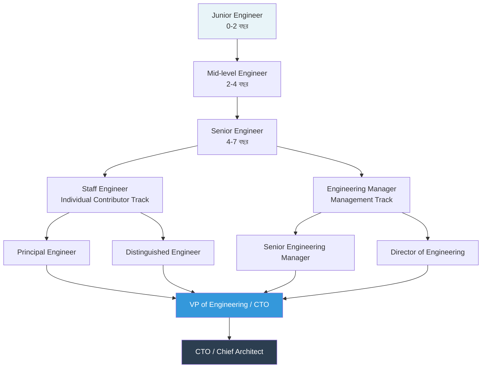
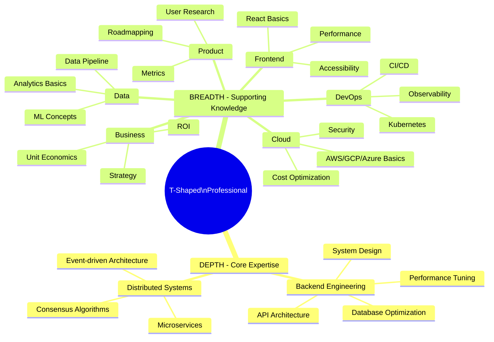
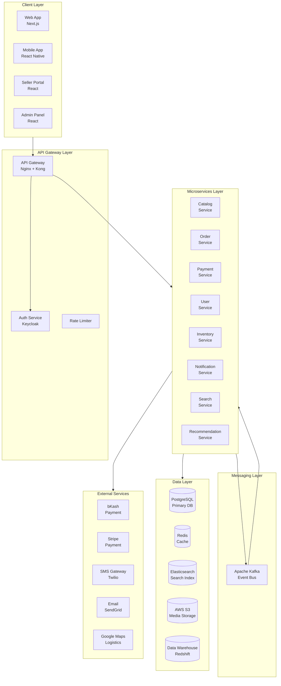
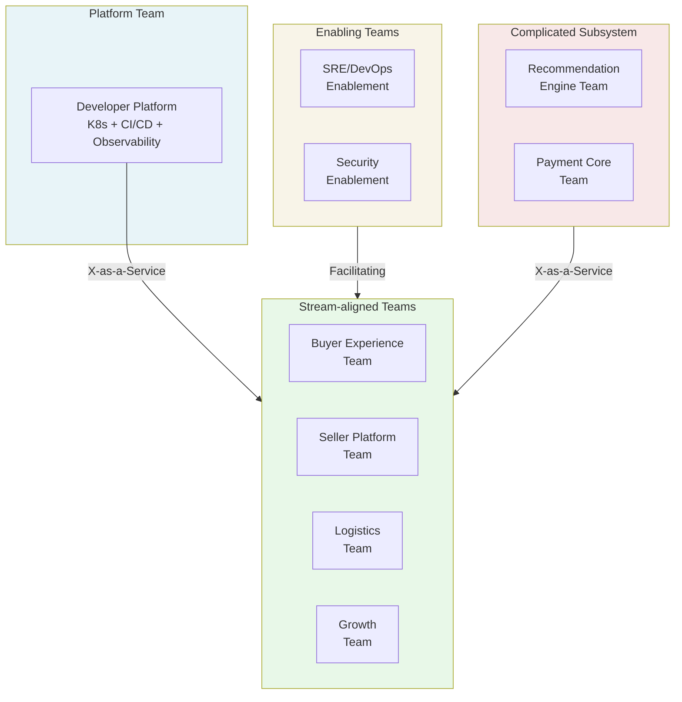
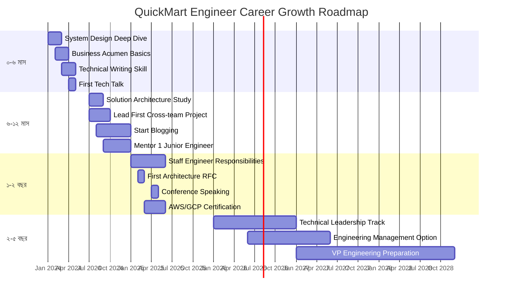

# Phase 7 — Career Growth: Domain Expert থেকে Technical Leader পর্যন্ত
### Senior Engineer থেকে CTO পর্যন্ত সম্পূর্ণ যাত্রা

> **"The best leaders are those who know when to lead and when to step back — who build systems that outlast them, teams that surpass them, and cultures that inspire long after they're gone."**
> — Will Larson, *Staff Engineer*

---

## সূচিপত্র

- [ভূমিকা](#ভূমিকা)
- [Chapter 1: T-Shaped Professional হওয়া](#chapter-1-t-shaped-professional-হওয়া)
- [Chapter 2: Solution Architecture](#chapter-2-solution-architecture)
- [Chapter 3: Business Acumen](#chapter-3-business-acumen)
- [Chapter 4: Product Thinking](#chapter-4-product-thinking)
- [Chapter 5: Technical Communication](#chapter-5-technical-communication)
- [Chapter 6: Engineering Culture তৈরি করা](#chapter-6-engineering-culture-তৈরি-করা)
- [Chapter 7: Scaling Engineering](#chapter-7-scaling-engineering)
- [Chapter 8: Interview এবং Negotiation](#chapter-8-interview-এবং-negotiation)
- [Chapter 9: Continuous Learning Framework](#chapter-9-continuous-learning-framework)
- [Chapter 10: সম্পূর্ণ Learning Roadmap](#chapter-10-সম্পূর্ণ-learning-roadmap)
- [Complete Resource Library](#complete-resource-library)

---

## ভূমিকা

একজন Software Engineer-এর জীবনে এমন একটা সময় আসে যখন শুধু ভালো Code লেখাই যথেষ্ট নয়। যখন তুমি দলের সবচেয়ে অভিজ্ঞ Developer হয়ে উঠেছ, তখন চারপাশের মানুষ তোমার কাছে শুধু Technical সমাধান নয়, দিকনির্দেশনা, সিদ্ধান্ত এবং নেতৃত্ব খোঁজে। এই Phase হলো সেই রূপান্তরের গল্প — একজন Individual Contributor থেকে একজন Technical Leader হয়ে ওঠার পথ।

**QuickMart** — একটি বাংলাদেশভিত্তিক E-commerce Platform — এই পুরো ডকুমেন্টে আমাদের Central Case Study হিসেবে থাকবে। QuickMart শুরু হয়েছিল একটি ছোট Online Grocery Store হিসেবে, কিন্তু এখন এটি একটি Full-scale E-commerce Ecosystem যেখানে Sellers, Buyers, Logistics Partners এবং Payment Gateways সবকিছু Integrated।

এই Phase-এ আমরা শিখব কীভাবে:
- একজন **T-Shaped Professional** হওয়া যায়
- **Solution Architecture** ডিজাইন করতে হয়
- **Business** বুঝতে এবং Business Language-এ কথা বলতে হয়
- **Product Thinking** দিয়ে সমস্যা সমাধান করতে হয়
- **Engineering Culture** তৈরি ও পরিচালনা করতে হয়
- এবং সর্বোপরি, কীভাবে **Senior Engineer থেকে CTO** পর্যন্ত যাওয়া যায়

---

## Career Path Diagram



---

## Chapter 1: T-Shaped Professional হওয়া

[↑ সূচিপত্রে ফিরুন](#সূচিপত্র)

### T-Shaped কী

T-Shaped Professional — এই ধারণাটি প্রথম জনপ্রিয় করেন IDEO-র CEO Tim Brown। ধারণাটা খুবই সহজ কিন্তু গভীর। ইংরেজি অক্ষর "T"-এর কথা ভাবো। এই "T"-এর **উপরের অনুভূমিক অংশ (─)** প্রতিনিধিত্ব করে তোমার Breadth of Knowledge — অর্থাৎ, তুমি কতগুলো বিভিন্ন বিষয়ে প্রাথমিক ধারণা রাখ। আর **নিচের উল্লম্ব অংশ (|)** প্রতিনিধিত্ব করে তোমার Depth of Expertise — অর্থাৎ, একটি বা দুটি নির্দিষ্ট বিষয়ে তুমি কতটা গভীরভাবে দক্ষ।

একজন Specialist শুধু একটি বিষয়ে অত্যন্ত গভীর জ্ঞান রাখেন — তাঁকে বলা হয় "I-Shaped"। আর একজন Generalist সব বিষয়ে একটু একটু জানেন — তাঁকে বলা হয় "—-Shaped"। কিন্তু আধুনিক Software Engineering-এ, বিশেষত Leadership পর্যায়ে, T-Shaped হওয়াই সবচেয়ে কার্যকর।

কেন T-Shaped গুরুত্বপূর্ণ? কারণ একজন Technical Leader-কে একই সময়ে অনেক কিছু করতে হয়:
- Backend Architecture নিয়ে গভীর আলোচনা করতে হয়
- Product Manager-এর সাথে Feature Prioritization নিয়ে কথা বলতে হয়
- CFO-এর সাথে Cloud Cost Optimization justify করতে হয়
- Designer-এর সাথে UX Flow নিয়ে feedback দিতে হয়
- DevOps Engineer-এর সাথে Deployment Pipeline নিয়ে সিদ্ধান্ত নিতে হয়

এই সব ক্ষেত্রে কার্যকর হতে গেলে শুধু এক বিষয়ের গভীর জ্ঞান থাকলে চলে না।

### ASCII Diagram: T-Shaped Professional Visual

```
BREADTH (প্রশস্ততা)
━━━━━━━━━━━━━━━━━━━━━━━━━━━━━━━━━━━━━━━━━━━━━━━━━━━━━━━━━━━━━
  Cloud   DevOps  Security  Product  Business  Data   Mobile
  ░░░░░   ░░░░░   ░░░░░     ░░░░░    ░░░░░     ░░░░   ░░░░
  Basic   Basic   Basic     Basic    Basic     Basic  Basic
━━━━━━━━━━━━━━━━━━━━━━━━━━━━━━━━━━━━━━━━━━━━━━━━━━━━━━━━━━━━━
              ║
              ║  Backend Architecture
              ║  ████████████████████
              ║  System Design
              ║  ████████████████████
              ║  Distributed Systems
              ║  ████████████████████
              ║  Performance Tuning
              ║  ████████████████████
              ║  Database Optimization
              ║  ████████████████████  DEPTH (গভীরতা)
              ║
```

### Technical Depth এবং Business Breadth

Technical Leader হওয়ার পথে দুটি ভিন্ন Axis-এ বিকশিত হতে হয়:

**Technical Depth (গভীরতা):**
Technical Depth বলতে বোঝায় তোমার Core Expertise। QuickMart-এর Context-এ ধরো তুমি একজন Backend Engineer। তোমার Technical Depth হবে:

- **System Design**: Microservices, Event-driven Architecture, CQRS, Event Sourcing
- **Database**: PostgreSQL query optimization, Indexing Strategy, Sharding, Replication
- **Performance**: Caching Strategy (Redis, CDN), Load Balancing, Connection Pooling
- **API Design**: RESTful principles, GraphQL, gRPC, API Versioning
- **Security**: OAuth 2.0, JWT, SQL Injection Prevention, OWASP Top 10

এই বিষয়গুলোতে তোমাকে এমন গভীর জ্ঞান রাখতে হবে যে যেকোনো পরিস্থিতিতে তুমি সঠিক সিদ্ধান্ত নিতে পারবে।

**Business Breadth (প্রশস্ততা):**
Business Breadth বলতে বোঝায় তুমি Business-এর অন্যান্য দিকগুলো কতটুকু বোঝ। QuickMart-এর ক্ষেত্রে এটা হতে পারে:

- **Product**: User Journey, Funnel Analytics, A/B Testing বোঝা
- **Finance**: P&L Statement পড়া, Cloud Cost Attribution, ROI Calculation
- **Marketing**: SEO, Conversion Rate Optimization, Customer Acquisition Cost
- **Operations**: Supply Chain basics, Warehouse Management, Logistics
- **Legal/Compliance**: Data Privacy (GDPR/PDPA), Payment Regulations, IP Rights

### কোন Skills কতটুকু জানতে হবে

এখানে একটি **Skill Assessment Grid** দেওয়া হলো যা তুমি Self-Assessment-এর জন্য ব্যবহার করতে পারবে:

```
CAREER LEVEL MATRIX
═══════════════════════════════════════════════════════════════════
Skill Area          │ Senior  │ Staff   │ Principal│ CTO/VP
                    │ Engineer│ Engineer│ Engineer │
════════════════════╪═════════╪═════════╪══════════╪═══════════
System Design       │ ████░░  │ █████░  │ ██████   │ ██████
                    │  3/5    │  4/5    │   5/5    │  5/5
────────────────────┼─────────┼─────────┼──────────┼───────────
Coding/Algorithms   │ █████░  │ ████░░  │ ████░░   │ ███░░░
                    │  4-5/5  │  4/5    │   4/5    │  3/5
────────────────────┼─────────┼─────────┼──────────┼───────────
Business Acumen     │ ██░░░░  │ ███░░░  │ ████░░   │ █████░
                    │  2/5    │  3/5    │   4/5    │  5/5
────────────────────┼─────────┼─────────┼──────────┼───────────
Leadership/People   │ ██░░░░  │ ███░░░  │ ████░░   │ █████░
                    │  2/5    │  3/5    │   4/5    │  5/5
────────────────────┼─────────┼─────────┼──────────┼───────────
Communication       │ ███░░░  │ ████░░  │ █████░   │ ██████
                    │  3/5    │  4/5    │   5/5    │  5/5
────────────────────┼─────────┼─────────┼──────────┼───────────
Architecture        │ ███░░░  │ ████░░  │ █████░   │ █████░
                    │  3/5    │  4/5    │   5/5    │  5/5
────────────────────┼─────────┼─────────┼──────────┼───────────
Strategy/Vision     │ █░░░░░  │ ██░░░░  │ ████░░   │ █████░
                    │  1/5    │  2/5    │   4/5    │  5/5
═══════════════════════════════════════════════════════════════════
```

### T-Shaped Skill Map (Mermaid Mindmap)



### Learning Roadmap তৈরি করা

T-Shaped হওয়ার জন্য একটি পরিকল্পিত Learning Roadmap দরকার। Random পড়াশোনায় কাজ হয় না।

**ধাপ ১: Current State Assessment**
প্রথমে নিজেকে Honestly মূল্যায়ন করো। উপরের Skill Assessment Grid-এ নিজেকে Rate করো ১-৫ স্কেলে। যেখানে তুমি ৩ বা তার নিচে, সেগুলো হলো তোমার Gap Areas।

**ধাপ ২: Desired State Define করা**
তোমার ৩ বছরের Target কী? Staff Engineer? Engineering Manager? এই Target অনুযায়ী Matrix দেখো কোন Score-এ পৌঁছাতে হবে।

**ধাপ ৩: Gap Analysis**
Current এবং Desired State-এর পার্থক্য হলো তোমার Learning Backlog। এই Backlog-কে Priority অনুযায়ী সাজাও:
- **P0**: এই মুহূর্তে তোমার Job-এ সরাসরি Impact করছে
- **P1**: আগামী ৬ মাসে দরকার হবে
- **P2**: ১-২ বছরে দরকার হবে

**ধাপ ৪: Learning Method নির্ধারণ করা**
প্রতিটি Skill-এর জন্য সেরা Learning Method আলাদা:
- **System Design**: Practice problems (Grokking System Design, ByteByteGo)
- **Business Acumen**: Books (High Output Management), Real project experience
- **Leadership**: Mentorship, 1:1 conversations, Management books
- **Communication**: Writing blogs, Giving talks, Internal tech talks

**ধাপ ৫: ২০-৬০-২০ Rule প্রয়োগ করা**
- **২০%** সময়: Structured Learning (Courses, Books)
- **৬০%** সময়: Deliberate Practice (Real projects, Side projects)
- **২০%** সময়: Teaching Others (Blog writing, Mentoring)

QuickMart-এর একজন Senior Backend Engineer-এর জন্য একটি concrete Learning Plan:

**Q1 (প্রথম ৩ মাস): System Design Deep Dive**
- প্রতি সপ্তাহে একটি System Design Problem practice করো
- QuickMart-এর একটি নতুন Component-এর Architecture নিজে Design করো
- Weekly Tech Talk দাও team-এর কাছে

**Q2 (পরবর্তী ৩ মাস): Business Acumen**
- প্রতি Month-এ একটি Business book পড়ো
- Product Manager-এর সাথে বসো, কীভাবে তারা decisions নেয় বোঝো
- QuickMart-এর Business Metrics সম্পর্কে জানো (GMV, CAC, LTV)

---

## Chapter 2: Solution Architecture

[↑ সূচিপত্রে ফিরুন](#সূচিপত্র)

### Solution Architect কে এবং কী করেন

Software Engineering-এর পেশাদার জগতে **Solution Architect** এমন একটি ভূমিকা যা প্রায়ই ভুল বোঝা যায়। অনেকে মনে করেন Solution Architect মানে শুধু বড় বড় Diagram আঁকা আর Meeting-এ বসা। কিন্তু বাস্তবে এটি অনেক বেশি গভীর এবং গুরুত্বপূর্ণ একটি ভূমিকা।

একজন **Solution Architect** হলেন সেই ব্যক্তি যিনি:

১. **Business Problem কে Technical Solution-এ রূপান্তর করেন**: Business Stakeholders বলছেন "আমরা চাই আমাদের Delivery Time কমে আসুক" — Solution Architect এই requirement-কে একটি concrete Technical Architecture-এ পরিণত করেন।

২. **Cross-functional সিদ্ধান্ত নেন**: একটি বড় System-এর Architecture Decision শুধু Technical নয়, এতে Cost, Time, Team Capability, Business Priority সব কিছু জড়িত। Solution Architect এই সব Factor একসাথে বিবেচনা করেন।

৩. **Technical Risk Manage করেন**: যেকোনো Architecture-এ Risks থাকে। Solution Architect এই Risks identify করেন, quantify করেন এবং mitigation strategy তৈরি করেন।

৪. **Stakeholder Bridge হিসেবে কাজ করেন**: C-Suite Executives, Product Managers, Developers, Operations — এই সব দলের ভাষা আলাদা। Solution Architect সবার সাথে তাদের ভাষায় কথা বলতে পারেন।

৫. **Standards এবং Best Practices নিশ্চিত করেন**: পুরো Organization জুড়ে Architectural Consistency রক্ষা করেন।

**QuickMart-এ Solution Architect-এর দায়িত্ব:**
QuickMart যখন তাদের Monolithic System থেকে Microservices-এ migrate করার সিদ্ধান্ত নিল, তখন Solution Architect-কে:
- Current System-এর সব Dependency map করতে হয়েছে
- Migration Strategy তৈরি করতে হয়েছে (Strangler Fig Pattern)
- প্রতিটি Microservice-এর Boundary define করতে হয়েছে
- Data Migration Plan তৈরি করতে হয়েছে
- Team Training Plan তৈরি করতে হয়েছে
- CEO-এর কাছে Business Impact explain করতে হয়েছে

### Enterprise Architecture Frameworks (TOGAF Basic)

**TOGAF** (The Open Group Architecture Framework) হলো Enterprise Architecture-এর সবচেয়ে ব্যাপকভাবে ব্যবহৃত Framework। এটি মূলত বড় Organizations-এর জন্য তৈরি, কিন্তু এর Core Concepts যেকোনো আকারের Organization-এ Apply করা যায়।

TOGAF-এর **ADM (Architecture Development Method)** — একটি Iterative Process:

```
Phase A: Architecture Vision
    ↓
Phase B: Business Architecture
    ↓
Phase C: Information Systems Architecture
    (Data Architecture + Application Architecture)
    ↓
Phase D: Technology Architecture
    ↓
Phase E: Opportunities and Solutions
    ↓
Phase F: Migration Planning
    ↓
Phase G: Implementation Governance
    ↓
Phase H: Architecture Change Management
    ↓
(Requirements Management — সব Phase-এ চলমান)
```

**TOGAF-এর ৪টি Architecture Domain:**

**১. Business Architecture:**
Organization কীভাবে কাজ করে তার Structure। QuickMart-এর ক্ষেত্রে:
- Seller Onboarding Process
- Order Management Workflow
- Customer Service Process
- Logistics Coordination

**২. Data Architecture:**
Organization-এর Data কীভাবে Stored, Managed এবং Used হয়।
- Customer Data Model
- Product Catalog Structure
- Order History Schema
- Analytics Data Warehouse

**৩. Application Architecture:**
Individual Application-গুলো কীভাবে Business Functions Support করে।
- Catalog Service
- Order Service
- Payment Service
- Notification Service

**৪. Technology Architecture:**
Hardware, Software, Infrastructure।
- AWS Infrastructure
- Kubernetes Cluster
- Database Servers
- CDN Configuration

**Solution Architect-এর জন্য TOGAF কতটুকু জানতে হবে?**
Full TOGAF Certification না করলেও চলে, কিন্তু ADM-এর Core Concepts এবং ৪টি Architecture Domain ভালোভাবে বোঝা দরকার।

### Architecture Patterns বিস্তারিত

Software Architecture-এ কিছু Proven Patterns আছে যা বারবার কাজে আসে। QuickMart-এর Context-এ এই Patterns কীভাবে Apply হয় তা দেখি:

**১. Layered Architecture (N-Tier)**
সবচেয়ে পরিচিত Pattern। Presentation → Business Logic → Data Access → Database। QuickMart-এর Admin Dashboard এই Pattern follow করে।

**সুবিধা:** Simple, Well-understood, Easy to develop
**অসুবিধা:** Scalability limited, Tight coupling, Database-centric

**২. Microservices Architecture**
প্রতিটি Business Capability একটি আলাদা Independent Service।

```
QuickMart Microservices:
┌─────────────┐  ┌─────────────┐  ┌─────────────┐
│   Catalog   │  │    Order    │  │   Payment   │
│   Service   │  │   Service   │  │   Service   │
└─────────────┘  └─────────────┘  └─────────────┘
┌─────────────┐  ┌─────────────┐  ┌─────────────┐
│    User     │  │  Inventory  │  │Notification │
│   Service   │  │   Service   │  │   Service   │
└─────────────┘  └─────────────┘  └─────────────┘
```

**সুবিধা:** Independent Deployment, Technology Flexibility, Team Autonomy, Better Scalability
**অসুবিধা:** Distributed System Complexity, Network Latency, Data Consistency challenges

**৩. Event-Driven Architecture**
Services একে অপরের সাথে Events-এর মাধ্যমে Communicate করে।

QuickMart-এর Order Flow:
```
Order Placed Event
    → Inventory Service (Reserve Stock)
    → Payment Service (Process Payment)
    → Notification Service (Send Confirmation)
    → Logistics Service (Create Shipment)
    → Analytics Service (Update Metrics)
```

**৪. CQRS (Command Query Responsibility Segregation)**
Read (Query) এবং Write (Command) Operation-কে আলাদা করা।

QuickMart Product Catalog-এ:
- **Write Side**: Admin Products লেখে/আপডেট করে → Normalized Database
- **Read Side**: Customer Products পড়ে → Denormalized Read Model, Redis Cache

**৫. Saga Pattern**
Distributed Transactions manage করার Pattern।

QuickMart Order Placement Saga:
```
1. Create Order (Order Service)
2. Reserve Inventory (Inventory Service)
3. Process Payment (Payment Service)
4. Schedule Delivery (Logistics Service)
5. Send Confirmation (Notification Service)

যদি Step 3 Fail করে:
- Compensate Step 2: Release Inventory
- Compensate Step 1: Cancel Order
```

**৬. API Gateway Pattern**
সব Client Request একটি Single Entry Point-এর মাধ্যমে Route করা।

```
Mobile App ──┐
Web App ─────┼──→ API Gateway ──→ Backend Services
Partner API ─┘        ↓
                 (Auth, Rate Limiting,
                  Load Balancing,
                  SSL Termination)
```

### Non-functional Requirements থেকে Architecture

অনেক Architects শুধু Functional Requirements (কী কাজ করবে) নিয়ে ভাবেন। কিন্তু **Non-functional Requirements (NFRs)** — যা Quality Attributes বা **"-ilities"** নামেও পরিচিত — এগুলো Architecture-কে সবচেয়ে বেশি প্রভাবিত করে।

**QuickMart-এর NFRs এবং তাদের Architecture Impact:**

**Scalability (মাপযোগ্যতা):**
- Requirement: Eid-এর সময় ১০x Traffic Handle করতে হবে
- Architecture Impact: Horizontal Scaling, Stateless Services, Auto-scaling Groups, Load Balancers

**Availability (প্রাপ্যতা):**
- Requirement: ৯৯.৯৯% Uptime (মাসে ৫২ মিনিটের কম Downtime)
- Architecture Impact: Multi-AZ Deployment, Active-Passive Failover, Health Checks, Circuit Breakers

**Performance (কার্যক্ষমতা):**
- Requirement: Product Page Load < 2 seconds, Checkout < 3 seconds
- Architecture Impact: CDN, Redis Caching, Database Indexing, Async Processing

**Security (নিরাপত্তা):**
- Requirement: PCI-DSS Compliance for Payment, GDPR Compliance for EU customers
- Architecture Impact: Encryption at Rest and in Transit, Tokenization, WAF, VPC, IAM Policies

**Maintainability (রক্ষণাবেক্ষণযোগ্যতা):**
- Requirement: New Feature Deploy করতে ১ দিনের বেশি লাগবে না
- Architecture Impact: CI/CD Pipeline, Feature Flags, Trunk-based Development, Comprehensive Testing

**Observability (পর্যবেক্ষণযোগ্যতা):**
- Requirement: যেকোনো Issue ৫ মিনিটের মধ্যে Detect এবং Root Cause ৩০ মিনিটে Identify
- Architecture Impact: Distributed Tracing (Jaeger), Centralized Logging (ELK), Metrics (Prometheus+Grafana), Alerting

### Technology Selection Framework

Technology নির্বাচন করা একটি Critical Decision। ভুল Technology Choice পরে Rework-এর কারণ হতে পারে। একটি Structured Framework ব্যবহার করা উচিত:

**ধাপ ১: Requirements Matrix তৈরি করো**

| Criteria | Weight | Option A | Option B | Option C |
|----------|--------|----------|----------|----------|
| Performance | 25% | 8 | 7 | 9 |
| Community Support | 15% | 9 | 6 | 8 |
| Learning Curve | 10% | 7 | 9 | 6 |
| Cost | 20% | 8 | 7 | 5 |
| Scalability | 30% | 9 | 8 | 9 |
| **Weighted Score** | | **8.4** | **7.4** | **7.6** |

**ধাপ ২: Proof of Concept (PoC) করো**
Paper comparison-এর পরে Real-world PoC করো। QuickMart যখন Message Queue বেছে নিচ্ছিল, তারা RabbitMQ এবং Apache Kafka উভয়ই দিয়ে একটি ছোট Load Test করেছিল।

**ধাপ ৩: Team Capability Assessment**
সেরা Technology কিন্তু সেটাই যা তোমার Team জানে এবং Support করতে পারবে। QuickMart-এর Team PostgreSQL Experts, তাই NoSQL-এ যাওয়ার আগে সতর্কভাবে ভাবতে হবে।

**ধাপ ৪: Vendor/Community Health Check**
Technology-এর পেছনে কোম্পানি বা Community কতটা সক্রিয়? GitHub Stars, Commit Frequency, Issues Response Time চেক করো।

**ধাপ ৫: Exit Strategy ভাবো**
যদি এই Technology পরে কাজ না করে, তাহলে পরিবর্তন করা কতটা কঠিন হবে? Lock-in Risk মূল্যায়ন করো।

### Build vs Buy vs Open Source Decision

একটি নতুন Feature বা Capability দরকার হলে তিনটি বিকল্প থাকে:

**BUILD (নিজে তৈরি করো):**
- যখন: Core Competitive Differentiator, Unique Business Logic, বিদ্যমান Solution কেউ নেই
- QuickMart Example: Product Recommendation Algorithm — এটি QuickMart-এর Core Competitive Advantage, তাই নিজেরাই তৈরি করা উচিত

**BUY (কিনে নাও):**
- যখন: Commodity Function, Time-to-Market Critical, Compliance Required
- QuickMart Example: Payment Gateway (Stripe/bKash), Email Service (SendGrid), Customer Support (Zendesk)

**OPEN SOURCE (Open Source ব্যবহার করো):**
- যখন: Well-maintained Project, Community Strong, Customization দরকার
- QuickMart Example: Elasticsearch for Product Search, Redis for Caching, PostgreSQL for Database

**Decision Framework:**

```
Is this a Core Differentiator?
        ↓
    YES → BUILD (সময় ও বাজেট থাকলে)
        ↓
    NO → Does a Good SaaS/Commercial Solution Exist?
              ↓
          YES → Cost Acceptable?
                    ↓
                YES → BUY
                NO → Check Open Source
              ↓
          NO → Does a Good Open Source Exist?
                    ↓
                YES → Community Healthy?
                          ↓
                      YES → OPEN SOURCE
                      NO → BUILD or BUY
                NO → BUILD
```

### Vendor Evaluation

Vendor নির্বাচনের সময় নিচের Criteria গুলো বিবেচনা করো:

**১. Technical Fit (৩০%)**
- Feature Coverage: Requirement কতটুকু পূরণ করে?
- Integration: Existing System-এর সাথে কতটা সহজে Integrate করা যাবে?
- Performance: SLA কী? Benchmark কেমন?

**২. Financial Viability (২৫%)**
- Pricing Model: Per-seat, Usage-based, Flat?
- Scalability Cost: User/Transaction বাড়লে Cost কেমন বাড়বে?
- Hidden Costs: Implementation, Training, Support

**৩. Vendor Health (২০%)**
- Company Stability: কত বছর ধরে আছে? Funding কেমন?
- Customer Base: Reference Customers আছে?
- Support Quality: Response Time কত?

**৪. Security & Compliance (১৫%)**
- Data Residency: Data কোথায় থাকবে?
- Certifications: SOC 2, ISO 27001, PCI-DSS?

**৫. Lock-in Risk (১০%)**
- Data Export: Data নিজের কাছে নিতে পারবে?
- Contract Terms: Exit Clause কেমন?

### QuickMart-এর Full Solution Architecture



এই Architecture-এর মূল সিদ্ধান্তগুলো:

**১. API Gateway (Kong):** সব Traffic single entry point দিয়ে আসে। Authentication, Rate Limiting, Load Balancing, Logging সব এখানে হয়।

**২. Event-driven Communication (Kafka):** Services একে অপরকে directly call করে না, Event-এর মাধ্যমে communicate করে। এটি Loose Coupling নিশ্চিত করে।

**৩. Database per Service:** প্রতিটি Service নিজের Database maintain করে। Data Isolation এবং Independent Scaling নিশ্চিত হয়।

**৪. CQRS for Catalog:** Product Catalog Read-heavy (Millions of reads per day). তাই Write side PostgreSQL, Read side Elasticsearch + Redis।

**৫. Stateless Services:** সব Services Stateless। State থাকলেও Redis-এ রাখা হয়। এটি Horizontal Scaling সহজ করে।

---

## Chapter 3: Business Acumen

[↑ সূচিপত্রে ফিরুন](#সূচিপত্র)

### Business Model Canvas বোঝা এবং তৈরি করা

**Business Model Canvas** হলো একটি Strategic Management Tool যা একটি Business-এর সম্পূর্ণ Model মাত্র একটি পাতায় দেখানোর সুযোগ দেয়। এটি তৈরি করেছেন Alexander Osterwalder এবং Yves Pigneur তাদের বিখ্যাত বই "Business Model Generation"-এ।

একজন Technical Leader-এর জন্য Business Model Canvas বোঝা কেন জরুরি? কারণ তুমি যখন একটি Technical সিদ্ধান্ত নাও, সেটি Business Model-এর উপর প্রভাব ফেলে। একটি নতুন Feature build করার আগে বুঝতে হবে এটি কোন Customer Segment-কে serve করে, কোন Revenue Stream generate করে, এবং কোন Key Resource ব্যবহার করে।

**Business Model Canvas-এর ৯টি Building Block:**

**QuickMart-এর Business Model Canvas:**

```
╔══════════════════╦═════════════════════╦══════════════════╦══════════════════╗
║  KEY PARTNERS    ║  KEY ACTIVITIES     ║ VALUE            ║ CUSTOMER         ║
║                  ║                     ║ PROPOSITIONS     ║ RELATIONSHIPS    ║
║ • Logistics      ║ • Platform          ║                  ║                  ║
║   Companies      ║   Development       ║ For Buyers:      ║ • Self-service   ║
║ • Payment        ║ • Seller Support    ║ • Wide Selection ║   (App/Web)      ║
║   Gateways       ║ • Quality Control   ║ • Fast Delivery  ║ • Automated      ║
║ • Warehouses     ║ • Marketing         ║ • Easy Returns   ║   Support        ║
║ • Sellers/       ║ • Data Analytics    ║ • Best Prices    ║ • Community      ║
║   Suppliers      ║                     ║                  ║   (Reviews)      ║
║ • Cloud (AWS)    ╠═════════════════════╣ For Sellers:     ║                  ║
║                  ║  KEY RESOURCES      ║ • Large Customer ╠══════════════════╣
║                  ║                     ║   Base           ║ CUSTOMER         ║
║                  ║ • Technology        ║ • Analytics      ║ SEGMENTS         ║
║                  ║   Platform          ║ • Logistics      ║                  ║
║                  ║ • Brand/Trust       ║   Support        ║ • Urban Buyers   ║
║                  ║ • Data              ║ • Easy Setup     ║   (25-45 years)  ║
║                  ║ • Engineer Team     ║                  ║ • SME Sellers    ║
║                  ║ • Seller Network    ║                  ║ • Enterprise     ║
║                  ║                     ║                  ║   Sellers        ║
╠══════════════════╩═════════════════════╩══════════════════╩══════════════════╣
║  COST STRUCTURE                        ║  REVENUE STREAMS                    ║
║                                        ║                                     ║
║ • Technology (Cloud, Development): 35% ║ • Commission on Sales: 8-15%        ║
║ • Logistics/Fulfillment: 25%           ║ • Seller Subscription Fees          ║
║ • Marketing/Customer Acquisition: 20%  ║ • Featured Listings (Ads)           ║
║ • Operations (People, Office): 15%     ║ • Payment Processing Fee            ║
║ • Customer Support: 5%                 ║ • Logistics Service Revenue         ║
╚════════════════════════════════════════╩═════════════════════════════════════╝
```

**Technical Leader হিসেবে তুমি এই Canvas থেকে কী শিখবে?**

১. **Key Activities** দেখে বুঝবে কোন Technical Capabilities সবচেয়ে Critical
২. **Key Resources** দেখে বুঝবে Technology কতটা Core Asset
৩. **Revenue Streams** দেখে বুঝবে কোন System Down হলে Revenue সরাসরি Impact হবে
৪. **Cost Structure** দেখে বুঝবে Cloud Cost Optimization কতটা গুরুত্বপূর্ণ

### Revenue Model Types

Software Business-এ বিভিন্ন ধরনের Revenue Model আছে। একজন Technical Leader-কে এগুলো বুঝতে হবে কারণ Revenue Model সরাসরি System Architecture-কে প্রভাবিত করে।

**১. Transaction-based (Marketplace Commission):**
QuickMart-এর Primary Revenue। প্রতিটি Sale-এ একটি Percentage নেওয়া হয়।
- **Technical Impact**: Order Processing System-এর Reliability Critical। প্রতিটি Failed Transaction মানে Revenue Loss।

**২. Subscription (SaaS):**
Seller-দের জন্য Premium Plans।
- **Technical Impact**: Billing System, Feature Flags, Multi-tenancy Architecture দরকার।

**৩. Advertising (Sponsored Listings):**
Sellers পণ্য Promote করতে Pay করে।
- **Technical Impact**: Ad Serving System, Auction Algorithm, Click Tracking, Budget Management দরকার।

**৪. Freemium:**
Basic Free, Premium Paid।
- **Technical Impact**: Feature Gating, Usage Metering, Upgrade Flow দরকার।

**৫. Usage-based:**
যত বেশি Use, তত বেশি Pay।
- **Technical Impact**: Metering System, Real-time Usage Tracking, Billing Calculation দরকার।

### Unit Economics বোঝা

Unit Economics হলো একটি Business-এর একটি Unit (একজন Customer বা একটি Transaction) থেকে কতটুকু Value তৈরি হয় তার Analysis।

**QuickMart-এর Key Unit Economics:**

**CAC (Customer Acquisition Cost):**
একজন নতুন Customer আনতে কত খরচ হয়?
```
Total Marketing Spend + Sales Cost
CAC = ─────────────────────────────────
      Number of New Customers Acquired

QuickMart: ৳500 (Marketing) + ৳200 (Promotions) = ৳700 CAC
```

**LTV (Lifetime Value):**
একজন Customer-এর পুরো জীবনকাল ধরে কত Revenue আসবে?
```
Average Order Value × Purchase Frequency × Customer Lifespan × Gross Margin
LTV = ৳800 × 12/year × 3 years × 15% = ৳4,320
```

**LTV:CAC Ratio:**
```
LTV:CAC = ৳4,320 : ৳700 = 6.17 : 1
```
এটি Healthy। ৩:১ বা তার বেশি হওয়া উচিত।

**একজন Technical Leader হিসেবে এটা কেন জানতে হবে?**

ধরো Product Team বলছে "Recommendation Engine build করো, এতে Purchase Rate বাড়বে।" তুমি বলতে পারবে:
- "যদি Recommendation Engine দিয়ে Purchase Frequency ১২ থেকে ১৫-তে যায়, তাহলে LTV ৳4,320 থেকে ৳5,400 হবে।"
- "এই Improvement-এর জন্য Engineering Cost ৳50 লাখ। এটা Justify করতে নতুন Customers দরকার (৫০ লাখ ÷ (৫,৪০০ - ৪,৩২০) = ~৪৬,৩০০ জন)।"

### ROI Calculation for Software Projects

Technical Projects-এর **ROI (Return on Investment)** Calculate করা অনেকের কাছে কঠিন মনে হয়। কিন্তু এটি না জানলে Management-কে Project Justify করা যায় না।

**Basic ROI Formula:**
```
         Net Benefit - Investment Cost
ROI = ─────────────────────────────── × 100%
              Investment Cost
```

**QuickMart-এ Cache Implementation ROI:**

Project: Redis Caching Layer Implementation

**Investment:**
- Engineering Time: 3 Engineers × 4 weeks = ৳6 লাখ
- Redis Infrastructure: ৳50,000/মাস = ৳6 লাখ/বছর
- Total Year 1 Cost: ৳12 লাখ

**Benefits (Quantified):**
- Database Load কমবে ৭০%: DB Server Size Reduce → ৳2 লাখ/মাস সাশ্রয় = ৳24 লাখ/বছর
- Page Load Time উন্নতি → Conversion Rate ১% বৃদ্ধি → Monthly Revenue ৳15 লাখ × ১% = ৳15,000/মাস = ৳1.8 লাখ/বছর
- Total Benefit Year 1: ৳25.8 লাখ

**ROI:**
```
ROI = (25.8 - 12) / 12 × 100% = 115%
Payback Period = 12 / 25.8 × 12 = 5.6 মাস
```

এই Calculation দিয়ে তুমি CEO-এর কাছে যেতে পারবে এবং বলতে পারবে "এই Project ৬ মাসে Payback দেবে এবং বছরে ৳13.8 লাখ Net Benefit দেবে।"

### Cost-Benefit Analysis

Cost-Benefit Analysis (CBA) ROI-এর চেয়ে বিস্তারিত। এতে Tangible এবং Intangible উভয় ধরনের Cost এবং Benefit বিবেচনা করা হয়।

**QuickMart Microservices Migration-এর CBA:**

**Costs:**
| Cost Type | Amount |
|-----------|--------|
| Engineering Effort (12 months) | ৳1.2 কোটি |
| Training এবং Upskilling | ৳20 লাখ |
| New Infrastructure | ৳15 লাখ/বছর |
| Potential Downtime during Migration | ৳10 লাখ |
| **Total Cost (Year 1)** | **৳1.65 কোটি** |

**Benefits:**
| Benefit Type | Amount |
|--------------|--------|
| Deployment Frequency 5x → Revenue Impact | ৳50 লাখ/বছর |
| Reduced Incident Time (MTTR কমে) | ৳30 লাখ/বছর |
| Independent Scaling (Cost Savings) | ৳20 লাখ/বছর |
| Team Productivity Increase | ৳40 লাখ/বছর |
| **Total Annual Benefit** | **৳1.4 কোটি/বছর** |

**Payback Period:** ~14 মাস

### Technical Investment Justification

Management-কে Technical Investment Justify করার একটি Proven Framework:

**RICE Framework:**
- **Reach**: কতজন User/Customer Impact হবে?
- **Impact**: প্রতিটি User-এ কতটুকু Impact?
- **Confidence**: তুমি কতটা নিশ্চিত?
- **Effort**: কতটুকু Engineering Effort লাগবে?

```
RICE Score = (Reach × Impact × Confidence) / Effort
```

**QuickMart Search Improvement Project:**
- Reach: ৫ লাখ Daily Active Users-এর ৬০% = ৩ লাখ
- Impact: Conversion Rate ০.৫% increase = Medium = 1
- Confidence: A/B Test data থেকে = ৮০%
- Effort: 3 Engineer Months

```
RICE = (300,000 × 1 × 0.8) / 3 = 80,000
```

এই Score দিয়ে তুমি অন্য Projects-এর সাথে Compare করে Priority ঠিক করতে পারবে।

### KPI এবং Metrics বোঝা

KPI (Key Performance Indicator) হলো সেই Metrics যা Business-এর Health Indicate করে। Technical Leader হিসেবে তোমাকে Business KPI এবং Technical KPI উভয়ই বুঝতে হবে।

**QuickMart-এর Key Business KPIs:**

| KPI | Definition | Target |
|-----|-----------|--------|
| GMV (Gross Merchandise Value) | মোট Sales Value | ৳10 কোটি/মাস |
| Take Rate | GMV-এর কত % Revenue | ১২% |
| DAU (Daily Active Users) | প্রতিদিন Active Users | ৫ লাখ |
| Order Conversion Rate | Visit → Purchase | ৩.৫% |
| Average Order Value | প্রতি Order-এর গড় Value | ৳800 |
| NPS (Net Promoter Score) | Customer Loyalty | ৬০+ |

**Technical KPIs (SLIs/SLOs):**

| KPI | Definition | SLO |
|-----|-----------|-----|
| Availability | System Up % | ৯৯.৯% |
| p99 Latency | ৯৯তম Percentile Response Time | < 500ms |
| Error Rate | Failed Requests % | < 0.1% |
| MTTR | Mean Time to Recovery | < 30 min |
| Deployment Frequency | কতবার Deploy হয় | Daily |
| Lead Time | Code → Production | < 2 days |

---

## Chapter 4: Product Thinking

[↑ সূচিপত্রে ফিরুন](#সূচিপত্র)

### Product Thinking কী

**Product Thinking** হলো এমন একটি Mindset যেখানে তুমি শুধু Features Build করো না, বরং User-এর সমস্যা সমাধান করার কথা ভাবো। এটি একজন Engineer এবং একজন Product Manager-এর পার্থক্য বোঝার চাবিকাঠি।

**Engineer Mindset (Without Product Thinking):**
"আমাদের Cart Abandonment বেশি কারণ Checkout Process-এ ৫টি Page আছে। আমি ১টি Page-এ Consolidate করব।"

**Product Thinking:**
"Cart Abandonment কেন বেশি? কোন Step-এ মানুষ চলে যাচ্ছে? কেন যাচ্ছে? Payment Option নেই? Trust নেই? Price দেখে Shocked হচ্ছে? Address Form কঠিন? আগে এটা Understand করি, তারপর Solution ভাবব।"

Product Thinking-এর Core Elements:
- **Empathy**: User-এর জায়গায় নিজেকে রাখা
- **Problem-first**: Solution-এর আগে Problem ভালোভাবে বোঝা
- **Outcome-focused**: Feature count নয়, Business Outcome-এ Focus
- **Data-driven**: Assumption নয়, Evidence-এ সিদ্ধান্ত নেওয়া
- **Iteration**: একবারে Perfect নয়, ছোট ছোট Iterations-এ উন্নতি

### Problem Space vs Solution Space

এই দুটি Concept Product Thinking-এর সবচেয়ে গুরুত্বপূর্ণ।

**Problem Space:**
"কী সমস্যা আছে? কেন আছে? কার জন্য আছে? কতটা বড় সমস্যা?"

**Solution Space:**
"এই সমস্যা কীভাবে সমাধান করব?"

সবচেয়ে বড় ভুল হলো Problem Space-এ পর্যাপ্ত সময় না দিয়ে সরাসরি Solution Space-এ চলে যাওয়া।

**QuickMart Example:**

*Wrong Approach:*
"Seller Dashboard redesign করতে হবে।" (Solution Space)

*Right Approach:*
"Sellers Dashboard কম ব্যবহার করছেন কেন?" (Problem Space)
→ User Interview করা হলো
→ দেখা গেল: Sellers জানেন না কোন Product ভালো বিকছে
→ এটা Analytics-এর সমস্যা, Design-এর নয়
→ Solution: Better Sales Analytics Feature

### Jobs-to-be-Done Framework

**Jobs-to-be-Done (JTBD)** Framework বলে যে মানুষ Product "Hire" করে একটি specific "Job" করার জন্য। এই Job হলো তাদের প্রকৃত সমস্যা বা চাহিদা।

বিখ্যাত Example: "মানুষ Drill কেনে না, তারা Hole কেনে।" আরও গভীরে: "মানুষ Hole কেনে না, তারা Wall-এ Picture Hang করার Capability কেনে।"

**JTBD Structure:**
```
When [SITUATION],
I want to [MOTIVATION/JOB],
So I can [DESIRED OUTCOME]
```

**QuickMart Buyer JTBDs:**

| Situation | Job | Desired Outcome |
|-----------|-----|-----------------|
| রাত ১১টায়, রান্নার মাঝপথে | তাৎক্ষণিকভাবে গুরুত্বপূর্ণ উপাদান পাওয়া | রান্না শেষ করা |
| মাসের শুরুতে | Monthly Grocery Shopping করা | সময় বাঁচানো, ভালো দাম পাওয়া |
| উপহার দেওয়ার সময় | নিখুঁত Gift খোঁজা | প্রিয়জনকে খুশি করা |

**Technical Impact:** QuickMart-এর "রাত ১১টার উপাদান" JTBD থেকে → Express Delivery Feature → ৩০ মিনিট Delivery বা কাছাকাছি Dark Store Architecture দরকার।

### Product-Market Fit

**Product-Market Fit (PMF)** হলো সেই মুহূর্ত যখন তোমার Product এমন একটি Market Segment-এর জন্য এতটাই Valuable হয়ে ওঠে যে Market নিজেই Product-এর চাহিদা তৈরি করে।

Marc Andreessen বলেছেন: "You can always feel product/market fit when it's happening. The customers are buying the product just as fast as you can make it."

**PMF Measurement:**
Sean Ellis Test: "এই Product যদি আর না থাকত, তুমি কেমন feel করতে?"
- ৪০%+ Users যদি বলে "Very Disappointed" → PMF অর্জিত

**QuickMart-এর PMF Journey:**
- Phase 1: ১০০ টি Order/দিন — No PMF
- Phase 2: ১,০০০ টি Order/দিন, Organic Growth শুরু — Near PMF
- Phase 3: ১০,০০০+ Order/দিন, Word-of-mouth Growth — PMF Achieved

**Technical Leader-এর Role in PMF:**
- Fast Iteration Enable করা (Short Deploy Cycle)
- A/B Testing Infrastructure তৈরি করা
- Analytics দিয়ে PMF Signals detect করা

### MVP Definition

**MVP (Minimum Viable Product)** অনেকে ভুল বোঝেন। MVP মানে "সবচেয়ে ছোট Product" নয়। MVP মানে সেই Product যা সবচেয়ে কম Effort-এ সবচেয়ে বেশি Learning দেবে।

**MVP Types:**

**১. Concierge MVP:** Technology ছাড়া Manual Service দিয়ে Validate করা। QuickMart-এর শুরু: Phone-এ Order নেওয়া, Manual Delivery।

**২. Wizard of Oz MVP:** Front-end আছে, Backend Manual। User মনে করে Automated, আসলে মানুষ করছে।

**৩. Landing Page MVP:** Product না বানিয়ে Landing Page দিয়ে Interest Check করা।

**৪. Prototype MVP:** Clickable Prototype দিয়ে User Feedback নেওয়া।

**QuickMart Recommendation Engine MVP:**
- Full ML Model build করতে ৩ মাস লাগবে
- MVP: "Customers also bought" — Simple Collaborative Filtering, ২ সপ্তাহে Done
- এই MVP দিয়ে ৪ সপ্তাহ Test করো
- যদি Click-through Rate ভালো হয়, তাহলে Full ML Model invest করো

### Product Discovery Process

Product Discovery হলো সেই Process যেখানে তুমি নিশ্চিত করো যে তুমি সঠিক জিনিস Build করছ।

**Double Diamond Framework:**

```
Discover → Define → Develop → Deliver
   (Diverge)   (Converge)  (Diverge)  (Converge)

1. Discover: User Research, Interviews, Analytics
2. Define: Problem Statement, User Persona, Jobs-to-be-Done
3. Develop: Ideation, Prototyping, Experiments
4. Deliver: Build, Test, Launch, Measure
```

**QuickMart Product Discovery Process:**

**Week 1-2: Discovery**
- ২০ জন Seller-এর সাথে Interview
- Analytics Review: Funnel Drop-off Points
- Support Tickets Analysis

**Week 3: Define**
- Key Insights Document
- Problem Statement Finalize
- Success Metrics Define করা

**Week 4-5: Develop**
- Ideation Workshop
- Prototype তৈরি
- User Testing (৫-৮ জন)

**Week 6+: Deliver**
- Build MVP
- Gradual Rollout
- Measure KPIs

### Data-driven Product Decision

Data-driven Decision মানে Data দিয়ে সব সিদ্ধান্ত নেওয়া নয়। মানে হলো Data Evidence হিসেবে ব্যবহার করা, Intuition-এর সাথে Balance করে।

**Metrics Hierarchy:**

```
North Star Metric (একটি মাত্র)
    ↓ QuickMart: Weekly Active Buyers
    
Input Metrics (৩-৫টি)
    ↓ Catalog Quality, Delivery Speed, Price Competitiveness
    
Operational Metrics (অনেকগুলো)
    ↓ Search CTR, Cart Conversion, Return Rate
```

**A/B Testing Framework:**

```
Hypothesis: "Checkout-এ Progress Bar যোগ করলে Completion Rate বাড়বে"

Control (A): Existing Checkout (no progress bar)
Variant (B): Checkout with Progress Bar

Sample Size: Minimum 1,000 Users each
Duration: Minimum 2 weeks (business cycle capture)
Primary Metric: Checkout Completion Rate
Secondary Metrics: AOV, Return Rate

Result Analysis:
- Statistical Significance: p < 0.05
- Practical Significance: > 2% improvement
```

---

## Chapter 5: Technical Communication

[↑ সূচিপত্রে ফিরুন](#সূচিপত্র)

### Technical Writing Best Practices

Technical Writing এমন একটি Skill যা অনেক Engineer Underestimate করেন। কিন্তু সত্যি কথা হলো — তুমি যত ভালো Code লিখতে পারো না কেন, যদি তোমার Ideas অন্যদের কাছে পৌঁছে দিতে না পারো, তুমি সীমিত Impact করতে পারবে।

**Technical Writing-এর Core Principles:**

**১. Audience First:**
তুমি কার জন্য লিখছ? CTO-এর জন্য? Junior Developer-এর জন্য? Business Stakeholder-এর জন্য? Audience ভেদে Language, Detail Level, এবং Assumption সব আলাদা হবে।

**২. Pyramid Principle:**
সবচেয়ে গুরুত্বপূর্ণ তথ্য আগে। তারপর Supporting Details। Barbara Minto-র এই Principle অনুযায়ী:
```
Main Point (Upfront)
    → Key Finding 1 (Evidence)
    → Key Finding 2 (Evidence)
    → Key Finding 3 (Evidence)
        → Details
        → Details
```

**৩. Active Voice ব্যবহার:**
❌ "The service was designed by the architecture team to handle high traffic."
✅ "The architecture team designed the service to handle high traffic."

**৪. Concrete বা Abstract নয়:**
❌ "The system will be highly available."
✅ "The system will maintain 99.9% uptime, with maximum 8.76 hours downtime per year."

**৫. Visuals ব্যবহার করো:**
Complex Architecture Diagram, Flow Chart, Sequence Diagram — এগুলো ১০০০ শব্দের চেয়ে বেশি বলে।

### Architecture Document লেখা

একটি ভালো Architecture Document-এ নিম্নলিখিত Section থাকা উচিত:

**Architecture Decision Record (ADR) Template:**

```markdown
# ADR-001: QuickMart Payment Service Architecture

## Status
Accepted (তারিখ: [DATE])

## Context
QuickMart-এ বর্তমানে Payment Processing Monolithic Order Service-এর মধ্যে।
PCI-DSS Compliance এবং Multiple Payment Providers Support করতে
এটিকে আলাদা করতে হবে।

## Decision
Payment Processing-কে একটি আলাদা Microservice হিসেবে Extract করব।
Temporal এবং Stripe উভয় Workflow Engine হিসেবে Evaluate করা হয়েছে।
Temporal Select করা হয়েছে কারণ:
- Better Workflow State Management
- Native Retry Logic
- Superior Observability

## Consequences
Positive:
- PCI-DSS Scope Reduction (অন্য Services Out of Scope)
- Independent Scaling
- Multiple Payment Provider Support সহজ হবে

Negative:
- Additional Service = Additional Operational Overhead
- Team-কে Temporal শিখতে হবে
- Initial Migration Complexity
```

### Executive Summary লেখা

C-Suite Executives-এর কাছে Technical Information Present করার সময় Executive Summary Critical।

**Structure:**

**১. One-sentence Summary:** মূল বিষয় এক বাক্যে।
**২. Business Impact:** Revenue, Cost, Risk-এ কী Effect?
**৩. Recommendation:** কী করতে হবে?
**৪. Investment Required:** Time, Money, People?
**৫. Risk:** না করলে কী হবে?

**QuickMart Infrastructure Upgrade Executive Summary:**

```
বিষয়: QuickMart Infrastructure Modernization Proposal

সারসংক্ষেপ:
QuickMart-এর বর্তমান Infrastructure Eid Sales-এর সময় Maximum Capacity-তে
পৌঁছে যাচ্ছে এবং ২০২৪ সালের Eid-এ ২ ঘণ্টা Downtime হয়েছে যাতে ~৳1.5 কোটি
Revenue হারিয়েছে।

প্রস্তাব:
Kubernetes-based Auto-scaling Architecture Implement করতে ৳80 লাখ Invest করা।

ROI:
- Year 1: ৳50 লাখ সাশ্রয় (Downtime Prevention + Infrastructure Optimization)
- Year 2+: ৳80 লাখ/বছর সাশ্রয়
- Payback Period: 19 মাস

প্রয়োজনীয় সম্পদ:
- 4 Engineers × 6 months
- ৳80 লাখ Infrastructure Investment

ঝুঁকি যদি না করা হয়:
- ২০২৪ Eid-এর মতো Downtime → Revenue Loss
- Competitor-রা এগিয়ে যাবে
- Engineer Retention সমস্যা হবে

সুপারিশ: Q1-তে শুরু করা এবং Eid-এর আগে Deploy করা।
```

### Technical Presentation দেওয়া

একটি Effective Technical Presentation-এর জন্য:

**কাঠামো (Structure):**
```
Opening (2 min): Hook — একটি Compelling Story বা Data Point
Context (3 min): Background — কী সমস্যা, কেন Important
Solution (10 min): Architecture, Approach, Trade-offs
Evidence (5 min): POC Results, Benchmark Data
Ask (2 min): কী চাই? Approval? Feedback? Resources?
Q&A (8 min): প্রশ্নের জন্য সময়
```

**Presentation Tips:**
- Slide-এ বেশি Text নয়, Key Points এবং Visuals
- Architecture Diagram আগে থেকে ভালোভাবে Explain করার Practice করো
- "Hard Questions" আগে থেকে Prepare করো
- Demo করলে সবসময় Backup Slides রাখো

### Whiteboard Session পরিচালনা

System Design Interview এবং Team Design Session-এ Whiteboard বা Virtual Whiteboard ব্যবহার করা হয়।

**Effective Whiteboard Session:**

**শুরুতে:**
1. Requirements Clarify করো (5 মিনিট)
2. Constraints Define করো (Scale, Latency, Availability)
3. High-level Design আগে, Details পরে

**আঁকার সময়:**
1. Client → Server → Database এই Flow থেকে শুরু
2. Bottlenecks Identify করো
3. Each Component-এর Responsibility বলো
4. Data Flow বলো

**শেষে:**
1. Trade-offs summarize করো
2. Alternative Approaches mention করো
3. What you'd do differently with more time

### RFC (Request for Comments) লেখা

**RFC (Request for Comments)** হলো একটি Document যা একটি Significant Technical Change Propose করে এবং Team-এর Input আমন্ত্রণ জানায়। এটি Asynchronous Decision Making-এর একটি Excellent Tool।

**QuickMart RFC Template (পূরণ করা):**

```markdown
# RFC-042: QuickMart Search Architecture Overhaul

**Author:** রাহুল আহমেদ (Senior Engineer)
**Date:** 2024-01-15
**Status:** Open for Comments (Deadline: 2024-01-29)
**Stakeholders:** Engineering Team, Product Team, Infrastructure Team

## Problem Statement

QuickMart-এর বর্তমান Search Feature-টি PostgreSQL Full-text Search এর উপর নির্ভরশীল।
বর্তমান সমস্যাগুলো:
- Search Latency: p99 = 2.3 seconds (Target: < 200ms)
- Fuzzy Search নেই (Typo Tolerance নেই)
- Bengali Language Support নেই
- Product Catalog ১ মিলিয়ন SKU ছাড়িয়ে গেলে Performance Degrade হবে

## Proposed Solution

Elasticsearch 8.x Implement করা।

### Architecture:
1. New Products → Dual Write (PostgreSQL + Elasticsearch)
2. Existing Data → Backfill Script
3. Search API → Elasticsearch Query
4. Analytics → Kibana

### Tech Stack:
- Elasticsearch 8.x (3-node Cluster on AWS)
- Logstash (Data Sync)
- Kibana (Monitoring)

## Alternatives Considered

**Option A: Algolia (SaaS)**
- Pros: Zero Ops, Great DX, Best-in-class Relevance
- Cons: ৳50 লাখ/বছর Cost, Vendor Lock-in, Data Sovereignty
- Rejected: Cost too high at current scale

**Option B: Meilisearch**
- Pros: Free, Typo Tolerance, Great Bengali Support
- Cons: Less Enterprise Features, Smaller Community
- Considered: Good Alternative if Elasticsearch too complex

**Option C: Stay with PostgreSQL**
- Pros: No Migration
- Cons: Does not solve the fundamental problems
- Rejected: Cannot meet SLOs at growth

## Implementation Plan

Phase 1 (Week 1-2): Infrastructure Setup
Phase 2 (Week 3-4): Data Ingestion Pipeline
Phase 3 (Week 5-6): Search API Migration
Phase 4 (Week 7-8): Testing & Rollout

## Risks and Mitigations

| Risk | Impact | Mitigation |
|------|--------|------------|
| Data Sync Lag | Medium | Change Data Capture (Debezium) |
| Elasticsearch Expertise Gap | High | Team Training + Spike |
| Cost Increase | Low | Spot Instances + Autoscaling |

## Open Questions

1. Elasticsearch-এর জন্য কে Responsible হবেন?
2. Index Mapping কে Define করবেন?

## Success Metrics

- Search Latency p99 < 200ms
- Search Relevance Score (MRR) > 0.7
- Zero Downtime Migration

## Review Period
Comments: 2024-01-15 to 2024-01-29
Decision: 2024-01-31
```

---

## Chapter 6: Engineering Culture তৈরি করা

[↑ সূচিপত্রে ফিরুন](#সূচিপত্র)

### Culture কী এবং কীভাবে তৈরি হয়

**Culture** — এই শব্দটি অনেক Abstract মনে হয়, কিন্তু Peter Drucker-এর বিখ্যাত উক্তি মনে রেখো: **"Culture eats strategy for breakfast."** যত ভালো Strategy থাকুক না কেন, Culture ঠিক না হলে কার্যকর হয় না।

Engineering Culture-কে সহজ ভাষায় বলা যায়: **"যখন কেউ দেখছে না তখন Team কীভাবে কাজ করে।"**

Culture কীভাবে তৈরি হয়?

**১. Leader-এর Behavior:** Team সবসময় Leader-এর কাজ দেখে, কথা শোনে না। যদি CTO বলেন "Code Quality গুরুত্বপূর্ণ" কিন্তু নিজে Code Review না করেন, Team বুঝে নেবে এটা Priority নয়।

**২. What Gets Rewarded:** যে Behavior reward পায়, সেটাই repeat হয়। শুধু Feature Delivery reward করলে Technical Debt বাড়বে। Code Quality, Documentation, Mentoring-ও reward করতে হবে।

**৩. What Happens After Failure:** কেউ Mistake করলে কি Blame করা হয়? নাকি Learning হিসেবে দেখা হয়? এটি Psychological Safety নির্ধারণ করে।

**৪. Rituals and Practices:** Weekly Team Meeting-এ কী আলোচনা হয়? Code Review কেমন? Retrospective কেমন? এই Day-to-day Rituals Culture Shape করে।

**৫. Stories and Myths:** "মনে আছে, সেবার Deployment Failed হয়েছিল কিন্তু আমরা টিমওয়ার্কে ২ ঘণ্টায় Fix করেছিলাম" — এই ধরনের Stories Culture-কে জীবন্ত রাখে।

### Psychological Safety

**Psychological Safety** হলো একটি Team-এর সেই Environment যেখানে সদস্যরা নিঃসংকোচে প্রশ্ন করতে পারেন, ভুল স্বীকার করতে পারেন, নতুন Ideas দিতে পারেন এবং Disagreement জানাতে পারেন — কোনো Negative Consequence-এর ভয় ছাড়াই।

Google-এর Project Aristotle (২০১২-২০১৫) গবেষণা দেখায় যে High-performing Teams-এর #1 Factor হলো **Psychological Safety**, Technical Skill নয়।

**Psychological Safety কীভাবে তৈরি করবে?**

**১. Leader-কে Vulnerability দেখাতে হবে:**
"আমি এই Situation-এ Unsure, তোমাদের Opinion দরকার।"
"আমি এখানে ভুল ছিলাম, কারণ..."

**২. Curiosity-এর Culture:**
"কেন এটা এভাবে হলো?" — Blame নয়, Learning-এর জন্য জিজ্ঞেস করা

**৩. Failure-কে Normalize করা:**
"এই Experiment কাজ করেনি — এখন আমরা কী শিখলাম?"

**৪. Active Listening:**
Meeting-এ সবার কথা শুনতে হবে। Quiet মানুষকে Invite করো: "রানা, তোমার কী মনে হচ্ছে?"

**৫. Response to Bad News:**
কেউ Bad News নিয়ে আসলে Reaction কেমন হবে? Angry হলে পরের বার Hide করবে।

**QuickMart-এ Psychological Safety Assessment:**
- Meeting-এ কি নতুন Engineers প্রশ্ন করে?
- Production Bug-এর পরে কি ব্যক্তি Blame পায় নাকি System Improve হয়?
- কেউ কি "Bad Idea" বলে Dismiss হওয়ার ভয়ে Ideas Share করে না?

### Learning Culture

Learning Culture মানে শুধু Training Budget থাকা নয়। এটি হলো একটি Environment যেখানে শেখাটা Normal, Expected এবং Celebrated।

**Learning Culture-এর Pillars:**

**১. Dedicated Learning Time:**
- Google-এর 20% Time-এর মতো, QuickMart-এ প্রতি Sprint-এ ১ দিন Learning Day
- Conference/Workshop Budget প্রতিজনের জন্য

**২. Knowledge Sharing Rituals:**
- **Tech Talk Tuesdays**: প্রতি সপ্তাহে ১ জন কিছু শেয়ার করে (৩০ মিনিট)
- **Book Club**: মাসে একটি Book, Discussion Session
- **Pair Programming**: Senior-Junior Pairing Session

**৩. Internal Documentation:**
- Architecture Decisions লেখা
- Runbooks এবং Playbooks Maintain করা
- Lessons Learned সবার সাথে Share করা

**৪. Learning from Failure:**
- Blameless Post-mortems (পরের Section-এ বিস্তারিত)
- Failure Casebook তৈরি করা

### Documentation Culture

যে Team Document করে না, সে Team Dependent হয়ে পড়ে কয়েকজন "Hero Developer"-এর উপর। যখন এই Developer চলে যায়, Knowledge চলে যায়।

**Good Documentation Culture:**
- **README-Driven Development**: Code লেখার আগে README লেখা
- **ADRs**: Architecture Decision Records Maintain করা
- **Runbooks**: Production Issue Solve করার Step-by-step Guide
- **On-call Playbook**: ২ AM-এ নতুন Engineer-ও Fix করতে পারবে

**Documentation এর শত্রু:**
- "আমার পরে কেউ পড়বে না" — ভুল। ৬ মাস পরে তুমি নিজেই ভুলে যাবে।
- "এটা নিজেই Explain করে" — Code Explain করে কীভাবে, কেন তা করে না।
- "সময় নেই" — এখন ৩০ মিনিট Document করলে পরে ৩০ ঘণ্টা বাঁচবে।

### Code Review Culture

Code Review শুধু Bug খোঁজার Tool নয়। এটি:
- Knowledge Sharing-এর Platform
- Coding Standards Enforce করার Mechanism
- Junior Developer-দের Growing করার Opportunity
- Collective Code Ownership নিশ্চিত করার Tool

**Healthy Code Review Guidelines:**

**Reviewer হিসেবে:**
- 24 ঘণ্টার মধ্যে Review করো
- Nitpicks-এ আটকে থেকো না — Big Picture-এ Focus করো
- "Nit:" লেখো যদি Optional Comment হয়
- Positive Feedback দাও: "এই Approach খুব Elegant!"
- প্রশ্ন করো, Command করো না: "এটা কি এভাবে না করলে ভালো হয়?" vs "এটা Change করো"

**Author হিসেবে:**
- PR Small রাখো (< 400 Lines ideally)
- Context দাও: PR Description-এ কেন এই Change?
- Self-review আগে করো
- Feedback-কে Personal না নিয়ে Code-এর সম্পর্কে ভাবো

### Blameless Post-mortem Culture

Production Incident হলে দুটো Response হতে পারে:

**Blame Culture Response:**
"কে Deploy করেছিল? সে কেন Test করেনি?"
→ পরিণাম: Engineers ভয়ে কাজ করে, Risk নেয় না, দ্রুত Deploy করে না

**Blameless Post-mortem Response:**
"এই Incident কেন হলো? System-এ কোন Weakness ছিল? কীভাবে এটা আবার না হওয়ার Guarantee দেওয়া যায়?"
→ পরিণাম: Engineers Honestly Report করে, System উন্নত হয়, একই ভুল repeat হয় না

**QuickMart Blameless Post-mortem Template:**

```
Incident: Payment Service Outage
Date: 2024-01-15, 14:30-16:15 (1h 45min)
Impact: ৳2.5 লাখ Revenue Loss, 8,500 Affected Transactions
Severity: P0

Timeline:
14:30 - Alert fires: Payment Service Error Rate > 5%
14:35 - On-call Engineer পায়
14:50 - Root Cause Identified: DB Connection Pool Exhausted
15:30 - Mitigation: Connection Pool Size Increased, Service Restarted
16:15 - Incident Resolved, Normal Traffic

Root Cause:
Eid Sale Campaign-এর কারণে Traffic 8x বেড়েছিল।
Connection Pool Default Size (10) Upgrade করা হয়নি।

Contributing Factors:
1. Load Testing Eid Traffic Scenario Cover করেনি
2. Connection Pool Metric-এর জন্য Alert ছিল না
3. Capacity Planning Process ছিল না

Action Items:
| Item | Owner | Due Date |
|------|-------|---------|
| Connection Pool Alerting যোগ করো | DevOps Team | Jan 22 |
| Load Testing Playbook Update করো | QA Lead | Jan 25 |
| Capacity Planning Process তৈরি করো | Engineering Manager | Feb 15 |

Who to Thank:
রানা - দ্রুত Root Cause Identify করেছেন
সুমাইয়া - Customer Communication সামলেছেন

Note: এই Incident-এ কেউ দোষী নয়। System-এর Gaps ছিল যা এখন Fix হবে।
```

### Diversity and Inclusion

Diverse Team কেন Build করবে? এটি শুধু Ethical নয়, Business-এও Smart:

- McKinsey Research: Gender-diverse Companies ২৫% বেশি Profitable
- Diverse Teams বেশি Creative Solutions তৈরি করে
- Wider Customer Base বোঝে (QuickMart-এ বিভিন্ন Background-এর Users)

**Concrete D&I Actions:**
- Job Descriptions-এ Inclusive Language (Masculine-coded Words avoid করো)
- Structured Interview Process (Same Questions for all, Rubric-based Evaluation)
- Mentorship Program for Underrepresented Groups
- Pay Equity Audit করো Regularly

---

## Chapter 7: Scaling Engineering

[↑ সূচিপত্রে ফিরুন](#সূচিপত্র)

### Team Topology

**Team Topologies** — Matthew Skelton এবং Manuel Pais-এর বিখ্যাত বইয়ে বলা হয়েছে, Large Engineering Organizations সফলভাবে Scale করার জন্য ৪ ধরনের Team Structure কাজ করে:

**১. Stream-aligned Team (প্রবাহ-সংযোজিত দল)**
একটি নির্দিষ্ট Business Domain বা Customer Journey-কে End-to-end Serve করার জন্য।

```
QuickMart Stream-aligned Teams:
├── Buyer Experience Team (Search, Catalog, Checkout)
├── Seller Platform Team (Seller Dashboard, Inventory, Analytics)
├── Payments Team (Payment Processing, Refunds, Fraud)
├── Logistics Team (Order Tracking, Delivery, Returns)
└── Growth Team (Marketing Tools, Promotions, Referral)
```

এই টিমগুলো Fast-moving, Business Outcome-focused। তারা নিজেরাই Feature Deploy করতে পারে।

**২. Enabling Team (সক্ষমকারী দল)**
Stream-aligned Teams-এর Capability বাড়ানোর জন্য। তারা "শেখায়", "করে দেয়" না।

```
QuickMart Enabling Teams:
├── DevOps/SRE Enablement (CI/CD Best Practices, Incident Management)
├── Security Enablement (Secure Coding, Penetration Testing guidance)
└── Data Engineering Enablement (Data Pipeline Patterns, Analytics Best Practices)
```

**৩. Complicated Subsystem Team (জটিল উপসিস্টেম দল)**
এমন System যেখানে অত্যন্ত Specialized Knowledge দরকার।

```
QuickMart Complicated Subsystem Teams:
├── Recommendation Engine Team (ML/AI Specialists)
├── Payment Gateway Core Team (Financial Protocols, PCI-DSS)
└── Real-time Analytics Team (Stream Processing, Complex CEP)
```

**৪. Platform Team (প্ল্যাটফর্ম দল)**
Internal Developer Platform তৈরি করে Stream-aligned Teams-এর Cognitive Load কমায়।

```
QuickMart Platform Team:
└── Developer Platform Team
    ├── Kubernetes Platform
    ├── CI/CD Tooling
    ├── Observability Stack
    ├── Service Mesh
    └── Internal Developer Portal
```

### Team Topology Diagram



### Conway's Law বোঝা

**Conway's Law** (1967): "Organizations which design systems are constrained to produce designs which are copies of the communication structures of those organizations."

সহজ বাংলায়: তুমি যেভাবে Team সাজাবে, Software সেভাবে তৈরি হবে।

**QuickMart-এ Conway's Law:**

```
Old Organization Structure:
├── Frontend Team → একটি Monolithic Frontend
├── Backend Team → একটি Monolithic Backend
└── DBA Team → একটি Central Database

Result: Tightly Coupled Monolith, Release Dependency

New Organization Structure (Inverse Conway Maneuver):
├── Buyer Experience Team → Buyer-facing Services
├── Seller Platform Team → Seller-facing Services
└── Platform Team → Shared Infrastructure

Result: Microservices, Independent Deployment
```

**Inverse Conway Maneuver:**
তুমি যে Architecture চাও, সেই Architecture-এর মতো করে Team সাজাও। Architecture আগে নয়, Team Structure আগে।

### Organizational Design

একটি Engineering Organization-এ কিছু Key Structures আছে:

**Span of Control:**
একজন Manager কতজনকে সরাসরি Manage করবে?
- Engineering Manager: ৬-৮ জন (IC Track)
- Senior EM/Director: ৩-৫ Engineers Manager

**Decision Making:**
- **Centralized**: সব সিদ্ধান্ত Top-down। Fast কিন্তু Bottleneck।
- **Decentralized**: Teams নিজেরা সিদ্ধান্ত নেয়। Slow কিন্তু Better Outcomes।

**QuickMart Decision Framework (RACI):**

```
Responsibility | Engineering Manager | Staff Engineer | Team
──────────────────────────────────────────────────────────
Technology Choice  |    Consulted      |  Accountable  | Responsible
Architecture ADR   |    Informed       |  Accountable  | Responsible
Hiring Decision    |    Accountable    |  Consulted    | Consulted
Sprint Planning    |    Informed       |  Consulted    | Accountable
```

### Platform Engineering

**Platform Engineering** হলো Internal Developer Platform (IDP) তৈরি করা — এমন একটি Self-service Platform যেখানে Application Teams নিজেরাই Infrastructure Provision করতে পারে।

**Golden Path:**
Platform Team একটি "Golden Path" তৈরি করে — নতুন Service শুরু করার জন্য Opinionated, Pre-configured Template। QuickMart-এর Golden Path:

```bash
# নতুন Service Create করা
quickmart-cli create service \
  --name payment-service \
  --team payments \
  --template microservice

# Automatically Creates:
# ✅ GitHub Repository (with CI/CD)
# ✅ Kubernetes Namespace
# ✅ Service Mesh Config
# ✅ Observability Setup (Metrics, Logs, Traces)
# ✅ Runbook Template
# ✅ ADR Template
```

### Developer Experience (DevEx)

**Developer Experience** হলো একজন Engineer-এর Daily Work Life কেমন। Good DevEx মানে Engineers বেশি সময় Valuable Work-এ দিতে পারে।

**SPACE Framework (GitHub Research):**
- **S**atisfaction: Engineers কি Satisfied?
- **P**erformance: Teams কতটা Outcomes Deliver করছে?
- **A**ctivity: কতটা কাজ হচ্ছে?
- **C**ommunication: Team কতটা Collaborate করছে?
- **E**fficiency: Interruptions কম, Flow State বেশি?

**QuickMart DevEx Improvements:**
- Local Development: Docker Compose দিয়ে পুরো Stack ৫ মিনিটে চালু
- CI Time: ২০ মিনিট → ৫ মিনিটে কমানো (Parallel Testing, Caching)
- Deployment: Click করলেই Deploy (Feature Flag দিয়ে)
- On-call: Rotation Comfortable, Runbooks ভালো → Less Anxiety

---

## Chapter 8: Interview এবং Negotiation

[↑ সূচিপত্রে ফিরুন](#সূচিপত্র)

### System Design Interview Preparation

System Design Interview Senior এবং তার উপরের সকল Level-এ হয়। এটি সবচেয়ে Open-ended এবং তাই সবচেয়ে কঠিন।

**System Design Framework (RESHADED):**

```
R - Requirements Clarification (5 min)
E - Estimation (5 min)
S - System Interface (API Design) (5 min)
H - High-level Design (10 min)
A - Algorithm and Data Structures (5 min)
D - Deep Dive (10 min)
E - Error and Edge Cases (5 min)
D - Discussion of Trade-offs (5 min)
```

**Step 1: Requirements Clarification**

প্রশ্ন করো:
- "This is an E-commerce system. Are we designing the complete system or focusing on a specific component like the order management?"
- "What scale are we targeting? How many Daily Active Users?"
- "What are the read vs write ratios?"
- "Any specific NFRs? Consistency vs Availability?"

**Step 2: Back-of-the-envelope Estimation**
```
QuickMart Scale:
- DAU: 1 Million
- Orders/day: 100,000
- Products: 10 Million

Read QPS = (1M × 20 requests/day) / 86400 ≈ 230 QPS
Write QPS = 100,000 / 86400 ≈ 1.2 QPS
Storage (Products): 10M × 1KB = 10 GB
```

**Common System Design Topics:**
- URL Shortener
- Twitter/Instagram Feed
- Uber/Ride-sharing
- YouTube/Video Streaming
- WhatsApp/Chat System
- Search Autocomplete
- Rate Limiter
- Distributed Cache
- Notification System

**QuickMart-Specific Designs:**
- Flash Sale System (High Traffic Spike)
- Product Search (Elasticsearch)
- Order Management (Saga Pattern)
- Real-time Inventory (Optimistic Locking)

### Behavioral Interview (STAR Method)

Behavioral Interview-এ Interviewer দেখতে চায় তুমি Past-এ কীভাবে কাজ করেছ।

**STAR Method:**
- **S**ituation: Context কী ছিল?
- **T**ask: তোমার Role এবং Responsibility কী ছিল?
- **A**ction: তুমি কী করেছিলে?
- **R**esult: Outcome কী হয়েছিল? (Quantified হলে ভালো)

**Common Behavioral Questions এবং QuickMart Examples:**

**"Tell me about a time you had to make a difficult technical decision with incomplete information."**

```
Situation: QuickMart-এ ২০২৩ সালে আমরা Database Migration করছিলাম।
অর্ধেক Migration হওয়ার পরে Production-এ একটি Critical Bug
ধরা পড়ল। Launch ৪৮ ঘণ্টা দূরে।

Task: আমার সিদ্ধান্ত নিতে হবে — Continue Migration নাকি Rollback?
দুটোতেই Risk ছিল।

Action: আমি তাৎক্ষণিকভাবে একটি War Room Create করলাম।
15 মিনিটে Bug-এর Impact Analysis করলাম।
সিদ্ধান্ত: Partial Rollback — নতুন Feature Rollback, Core Data Intact রাখা।
Rollback Script ২ ঘণ্টায় তৈরি করলাম এবং Test করলাম।

Result: ৪৮ ঘণ্টায় Launch হলো। Zero Data Loss।
পরবর্তী Quarter-এ Proper Migration Testing Protocol প্রতিষ্ঠা করলাম।
```

**"Tell me about a time you influenced people without authority."**

```
Situation: QuickMart-এ Technical Debt খুব বেশি ছিল কিন্তু
Management শুধু Features Priority দিচ্ছিল।

Task: Engineering Manager ছাড়া, একজন Senior Engineer হিসেবে
Technical Debt Address করার Approval নিতে হবে।

Action: আমি Data দিয়ে Case তৈরি করলাম:
- Bug Rate: Technical Debt-এর কারণে ৩০% বেশি Bugs
- Feature Velocity: Tech Debt কারণে ২x Slow
- Engineer Satisfaction Survey: Technical Debt সবচেয়ে বড় Frustration

Business Language-এ Present করলাম: "Technical Debt আমাদের
Monthly ৳20 লাখ Feature Velocity Loss করাচ্ছে।"

Result: Management প্রতি Sprint-এ ২০% Tech Debt Time Approve করল।
পরের Quarter-এ Feature Velocity ৪০% বাড়ল।
```

### Technical Interview Tips

**Coding Interview:**
- Think Aloud করো। Interviewer তোমার Problem-solving Process দেখতে চায়।
- Brute Force থেকে শুরু করো, তারপর Optimize।
- Edge Cases কথা বলো।
- Time/Space Complexity বলো।

**Architecture Interview:**
- Requirements Clarify করো আগে।
- Over-engineering করো না — YAGNI (You Aren't Gonna Need It)।
- Trade-offs explicitly বলো।
- "It depends" — এবং কীসের উপর Depends তা বলো।

**Values-Based Interview:**
- Company Values জানো।
- তোমার Experience সেই Values-এর সাথে Align করো।
- Authentic হও।

### Salary Negotiation

Salary Negotiation একটি Skill যা অনেকে Uncomfortable মনে করেন। কিন্তু এটি তোমার Career-এর সবচেয়ে High-ROI Activity।

**Negotiation Framework:**

**১. Research আগে:**
- Glassdoor, LinkedIn Salary, levels.fyi
- Network-এ বিভিন্ন Companies-এ কতটুকু পাচ্ছে জানো
- তোমার BATNA (Best Alternative to Negotiated Agreement) জানো

**২. Never First Number বলো:**
Interviewer: "আপনার Expected Salary কত?"
তুমি: "আপনারা এই Role-এর জন্য কী Range Consider করছেন?"

**৩. Total Compensation বোঝো:**
Base + Bonus + Stock + Benefits + Learning Budget + Remote Work Value

**৪. Anchor High:**
Reasonable Upper-end থেকে শুরু করো। Counter-offer আসবেই।

**৫. Justify করো:**
"আমার Current Compensation ৳X, আমার Target ৳Y কারণ [Research + Skills]।"

**৬. Time নাও:**
"এটা আমার কাছে Significant Decision, আমি ২৪ ঘণ্টায় আপনাকে জানাব।"

**৭. Walking Away-ও Option:**
যদি Offer তোমার Value Reflect না করে, সম্মানের সাথে Decline করো।

### Career Negotiation

Salary ছাড়াও Career Negotiation আরও অনেক কিছু:

**Title Negotiation:**
"আমি Staff Engineer Role-এর জন্য Apply করছি, কিন্তু Offer Senior Engineer-এর। আমার Contribution দেখলে Staff-এর Level-এর কাজ করছি — এই Gap নিয়ে কথা বলা যাবে?"

**Scope Negotiation:**
"আমি এই Role-এ Interest করছি। কিন্তু আমার Long-term Goal Architecture Leadership-এর দিকে। এই Role-এ সেই Direction-এ যাওয়ার কোনো Path আছে?"

**Promotion Negotiation:**
"আমি গত ১৮ মাস ধরে Staff-Level কাজ করছি (Evidence)। Promotion কখন হতে পারে?"

---

## Chapter 9: Continuous Learning Framework

[↑ সূচিপত্রে ফিরুন](#সূচিপত্র)

### Learning System তৈরি করা

Random পড়াশোনা কাজ করে না। একটি Systematic Learning System দরকার। James Clear-এর "Atomic Habits" বলে: **"You do not rise to the level of your goals. You fall to the level of your systems."**

**Learning System Components:**

**১. Input Sources Define করো:**
- Books (২টি/মাস)
- Podcasts (Running/Commuting-এ)
- Newsletters (৩-৫টি Curated)
- YouTube/Courses (১টি/Quarter)
- Conferences (১-২টি/বছর)
- Peers এবং Mentors

**২. Processing System:**
Raw Input থেকে Useful Knowledge বের করা:
- Reading Notes নেওয়া (Highlights + Own Words)
- Key Takeaways List করা
- "How does this apply to my work?" জিজ্ঞেস করা

**৩. Storage System:**
Notes কোথায় রাখবে?
- Obsidian / Notion / Roam Research
- Zettelkasten Method (পরের Section-এ)

**৪. Output System:**
- Blog লেখা (Learn in Public)
- Team-এর সাথে Share করা
- Projects-এ Apply করা

**Learning Schedule Template:**

```
PERSONAL LEARNING SCHEDULE
══════════════════════════════════════
DAILY (30 min):
  Morning  - Technical Newsletter পড়া (15 min)
  Evening  - Notes Review / Spaced Repetition (15 min)

WEEKLY (3 hours):
  Monday   - Deep Work Session: Current Topic Study (1 hr)
  Wednesday - Tech Talk / Internal Knowledge Share (30 min)
  Friday   - Week Review + Next Week Plan (30 min)
  Weekend  - Long Reading / Personal Project (1 hr)

MONTHLY (1 day):
  First Week - New Book শুরু করা
  Third Week - Learning Goals Review
  Last Week  - Month Retrospective

QUARTERLY (1 week):
  Course বা Workshop Complete করা
  Blog Post লেখা
  Conference Attendance/Presentation
══════════════════════════════════════
```

### Note-taking System (Zettelkasten)

**Zettelkasten** হলো একটি Note-taking Method যা German Sociologist Niklas Luhmann তৈরি করেছিলেন। এই Method-এ তিনি ৯০,০০০ Notes তৈরি করেছিলেন এবং ৭০টি Books এবং ৪০০টির বেশি Academic Papers লিখেছেন।

**Core Principles:**

**১. Atomic Notes:**
প্রতিটি Note একটিমাত্র Idea নিয়ে। ছোট, Self-contained।

```
Note ID: 2024-01-15-001
Title: CQRS কেন Database Performance উন্নত করে
Tags: #architecture #database #cqrs

Content:
CQRS (Command Query Responsibility Segregation) Read এবং Write
Model আলাদা করে। এটি Performance উন্নত করে কারণ:
1. Read Model Denormalize করা যায় → Complex JOIN নেই
2. Read Replica Use করা যায়
3. Cache করা সহজ

Link: [[Event Sourcing]] [[Database Optimization]]
Source: "Designing Distributed Systems" - Burns (p.45)
```

**২. Linking:**
Notes একে অপরের সাথে Link করো। এতে Knowledge Graph তৈরি হয়।

**৩. Own Words:**
Copy-paste নয়, নিজের ভাষায় লেখো। এতে Understanding নিশ্চিত হয়।

**৪. Review:**
Spaced Repetition দিয়ে Notes Review করো।

**Software Tools:** Obsidian (Best for Zettelkasten), Notion, Roam Research

### Book Reading Strategy

Books পড়ার জন্য একটি Strategy দরকার। সব Books একইভাবে পড়া হয় না।

**Mortimer Adler-এর ৪ স্তরের Reading:**

**১. Elementary Reading:** Basic Comprehension।

**২. Inspectional Reading (Skimming):**
- Table of Contents পড়ো
- Chapter Summaries পড়ো
- First এবং Last Paragraph of Chapters
Time: ৩০ মিনিট। Question: "এই Book কী সম্পর্কে?"

**৩. Analytical Reading:**
Chapter by Chapter গভীরভাবে পড়া। Notes নেওয়া।
Time: ৮-১৫ ঘণ্টা।

**৪. Syntopical Reading:**
একটি Topic-এ Multiple Books পড়া এবং Compare করা।

**Recommended Reading Strategy:**
- Technical Books: Analytical Reading, Code Examples Run করো
- Business Books: Inspectional পড়া, ৩-৫টি Key Takeaway নাও
- Fiction: Elementary/Analytical — Enjoyment এবং Vocabulary
- Week-এ ১-২ ঘণ্টা Reading Block রাখো

### Conference এবং Community

**Conferences:**
- **Local**: Bangladesh-এ BDApps, BASIS Conference, local Meetups
- **Regional**: Google I/O Extended, AWS Summit
- **International**: QCon, GOTO, StrangeLoop (Senior/Staff Level)

**Community Involvement:**
- Local Meetups Organize বা Attend করো
- Discord/Slack Communities: Architecture Guild, Backend Engineering
- Stack Overflow Contributions
- Open Source Projects

**Speaking at Conferences:**
- Local Meetup থেকে শুরু করো
- ৫-১০ মিনিট Lightning Talk → ৩০ মিনিট Talk → Keynote
- Public Speaking Personal Brand Build করে

### Personal Brand তৈরি করা

**Personal Brand কেন?**
- Better Job Opportunities
- Speaking Invitations
- Consulting Offers
- Credibility in Technical Discussions

**Personal Brand Building Strategy:**

**১. Niche Define করো:**
তুমি কীসের Expert হতে চাও? "E-commerce Architecture in Bangladesh" — এটা একটি Specific Niche।

**২. Content Channels বেছে নাও:**
- Blog (Long-form, Evergreen Content)
- LinkedIn (Professional Network)
- Twitter/X (Quick thoughts, Engagement)
- YouTube (Complex Topics Visualization)

**৩. Consistency:**
- Weekly একটি Post/Article ভালো, Daily Random Post-এর চেয়ে
- Quality > Quantity

**৪. Share Learnings from Real Work:**
"আজকে QuickMart-এ Elasticsearch-এ এই সমস্যায় পড়েছিলাম এবং এভাবে Solve করলাম" — Real Experience সবচেয়ে Valuable।

### Open Source Contribution

Open Source Contribution:
- Skills উন্নত করে (Real-world Codebase)
- Personal Brand Build করে
- Network তৈরি করে
- Resume-এ Strong Addition

**শুরু করার পথ:**
1. যে Tool/Library প্রতিদিন ব্যবহার করো, তার Repo-তে যাও
2. "good first issue" Label দেখো
3. Bug Fix অথবা Documentation Improvement দিয়ে শুরু করো
4. Gradually বড় Contributions করো

**QuickMart Example:**
QuickMart PostgreSQL-এ একটি Performance Issue ছিল। Fix করার পর, একজন Senior Engineer এই Fix-টি PostgreSQL Driver-এর Open Source Repo-তে Contribute করেছিলেন। এখন সেই PR Merged এবং হাজারো Applications এটি থেকে Benefit পাচ্ছে।

### Blog লেখা

Blog লেখা Technical Career-এ সবচেয়ে Underrated কিন্তু High-impact Activity।

**কী লিখবে?**
- "Today I Learned" (TIL) Posts — ছোট, Specific
- Deep Dive Technical Posts
- Architecture Case Studies
- Book Reviews / Key Takeaways
- Career Advice

**লেখার Process:**
1. Topic নিয়ে Brain Dump করো
2. Structure তৈরি করো (Outline)
3. Draft লেখো (Editing নয়, শুধু লেখো)
4. Edit করো
5. Publish করো — Perfect-এর জন্য অপেক্ষা না করে

**Platforms:** Medium, Dev.to, Hashnode, Personal Website (Recommended)

---

## Chapter 10: সম্পূর্ণ Learning Roadmap

[↑ সূচিপত্রে ফিরুন](#সূচিপত্র)

### Learning Roadmap Timeline



### ০-৬ মাসের Plan (মাসে মাসে)

**মাস ১: Foundation Assessment এবং System Design**

*সপ্তাহ ১-২:*
- Self Assessment করো (Skill Matrix পূরণ করো)
- ৩টি Target Define করো ৬ মাসের জন্য
- "Designing Data-Intensive Applications" (Kleppmann) শুরু করো
- প্রতিদিন ৩০ মিনিট System Design Practice (Grokking System Design)

*সপ্তাহ ৩-৪:*
- QuickMart-এর একটি Existing Component-এর Architecture নিজে Document করো
- Team-এর সাথে একটি Informal Architecture Discussion করো
- "Staff Engineer" (Will Larson) পড়া শুরু করো

*মাসের শেষে:* ১টি Blog Post লেখো — "আমি এই মাসে System Design-এ কী শিখলাম"

---

**মাস ২: Database এবং Performance Deep Dive**

*সপ্তাহ ১-২:*
- PostgreSQL Performance Tuning Deep Dive
- QuickMart-এর Slow Queries Identify এবং Optimize করো
- EXPLAIN ANALYZE ভালোভাবে শেখো

*সপ্তাহ ৩-৪:*
- Redis Caching Patterns শেখো
- QuickMart-এ একটি Caching Layer Proposal তৈরি করো
- Redis Performance Benchmark করো

*মাসের শেষে:* ১টি Technical Presentation — "How we improved QuickMart's Query Performance"

---

**মাস ৩: Distributed Systems এবং Event-driven Architecture**

*সপ্তাহ ১-২:*
- Apache Kafka Deep Dive — Producers, Consumers, Topics, Partitions
- QuickMart-এ একটি Event-driven Use Case Identify করো
- Kafka Local Setup এবং Hands-on Practice

*সপ্তাহ ৩-৪:*
- Saga Pattern Implementation Practice
- QuickMart Order Flow-এর Saga-based Redesign Proposal লেখো
- "Designing Distributed Systems" (Burns) পড়া শুরু করো

---

**মাস ৪: Business Acumen**

*সপ্তাহ ১-২:*
- "High Output Management" (Andy Grove) পড়া
- QuickMart-এর Business Model Canvas নিজে তৈরি করো
- Product Manager-এর সাথে ১টি Pairing Session করো

*সপ্তাহ ৩-৪:*
- QuickMart-এর Key Business Metrics জানো (GMV, CAC, LTV, NPS)
- একটি Technical Project-এর ROI Calculate করো
- Finance Team-এর সাথে একটি Meeting Request করো

---

**মাস ৫: Technical Leadership Skills**

*সপ্তাহ ১-২:*
- RFC লেখার Practice করো
- QuickMart-এর একটি Real Problem-এর জন্য RFC তৈরি করো
- Team-এ RFC Review Process Propose করো

*সপ্তাহ ৩-৪:*
- Mentoring একটি Junior Engineer শুরু করো (সপ্তাহে ১ ঘণ্টা)
- Code Review Guidelines Draft করো
- "The Staff Engineer's Path" (Tanya Reilly) পড়া শুরু করো

---

**মাস ৬: Synthesis এবং Demo**

*সপ্তাহ ১-২:*
- ৬ মাসের Learning Review করো
- Personal Development Plan নতুন করে তৈরি করো
- Portfolio Update করো (GitHub, LinkedIn, Blog)

*সপ্তাহ ৩-৪:*
- একটি Internal Conference-এ ৩০ মিনিটের Talk দাও
- Manager-এর সাথে Promotion/Growth Conversation করো
- পরবর্তী ৬ মাসের Goals Set করো

---

### ৬-১২ মাসের Plan

**মাস ৭-৮: Solution Architecture**

এই দুই মাসে Solution Architecture-এ Focus করো:
- TOGAF Basics শেখো (Official Course বা Book)
- QuickMart-এর Full Architecture Review করো এবং Improvement Areas চিহ্নিত করো
- ১টি Major Architecture Decision Lead করো
- Architecture ADR Template তৈরি করো Team-এর জন্য

**লক্ষ্য:** Quarterly-এ ১টি Significant Architecture Decision Lead করতে পারা।

---

**মাস ৯-১০: Cross-team Leadership**

- First Cross-team Project Lead করো
- External Teams-এর সাথে Technical Coordination করো
- Architecture Review Board-এ অংশগ্রহণ করো (থাকলে)
- "An Elegant Puzzle" (Will Larson) পড়ো

**লক্ষ্য:** একটি Project Successfully Deliver করো যেটায় ২+ টিম জড়িত।

---

**মাস ১১-১২: Personal Brand এবং External Visibility**

- Blog-এ নিয়মিত Posts (মাসে কমপক্ষে ২টি)
- Local Meetup-এ একটি Talk দাও
- Open Source-এ একটি Contribution করো
- LinkedIn Profile Optimize করো

**লক্ষ্য:** Engineering Community-তে Recognized হওয়া শুরু হওয়া।

---

### ১-২ বছরের Plan

**Year 1 (মাস ১৩-১৮): Staff Engineer Level কাজ**

- Scope বাড়াও: শুধু Team নয়, বরং Organization-wide Impact
- Technical Strategy-তে Contribute করো
- Hiring Process-এ অংশগ্রহণ করো
- Engineering All-hands-এ Presentation দাও
- AWS Solutions Architect Professional অথবা GCP Professional Cloud Architect Certification নাও

**Milestone:** Performance Review-এ Staff Engineer Level-এর Feedback পাও।

---

**Year 2 (মাস ১৯-২৪): Technical Leadership Formalize**

**যদি Individual Contributor Track:**
- Staff Engineer Title নিয়ে আলোচনা করো
- Organization-wide Technical Initiatives Lead করো
- External Conference-এ Speak করো

**যদি Management Track:**
- Team Lead বা Engineering Manager-এর Role Explore করো
- Management Training নাও
- "An Elegant Puzzle" এবং "High Output Management" আবার পড়ো

---

### ২-৫ বছরের Plan

**বছর ২-৩: Senior Technical Leader**

এই সময়কালে তোমার Focus হবে:
- Full Engineering Organization-এ Impact করা
- Long-term Technical Vision তৈরি করা
- Multiple Teams-এ Mentor করা
- Business Strategy-তে Technical Input দেওয়া

**Key Milestones:**
- একটি Major Technical Initiative ($1M+ Impact) Lead করা
- Engineering Organization-এর Culture Positively Influence করা
- External Conference-এ Keynote Speaker হওয়া

---

**বছর ৩-৫: VP Engineering / CTO Preparation**

- P&L Responsibility নেওয়া (যদি Management Track)
- Board-এর কাছে Technical Strategy Present করা
- M&A Technical Due Diligence Involvement
- Fundraising Technical Narrative তৈরিতে CEO-কে সহায়তা করা
- Technical Advisory Board-এ Serve করা (Other Companies-এ)

---

### Certification Path

**Cloud (Choose One):**
- AWS: Cloud Practitioner → Solutions Architect Associate → Solutions Architect Professional
- GCP: Associate Cloud Engineer → Professional Cloud Architect
- Azure: AZ-900 → AZ-104 → AZ-305

**Architecture:**
- TOGAF 9 Foundation এবং Practitioner
- Certified Kubernetes Administrator (CKA)

**Security:**
- AWS Security Specialty
- CompTIA Security+

**Data:**
- AWS Database Specialty
- Google Professional Data Engineer

**Recommended Sequence for QuickMart Engineer:**
1. AWS Solutions Architect Associate (6 মাস মধ্যে) — QuickMart AWS-এ আছে
2. Certified Kubernetes Administrator (1 বছরের মধ্যে) — Platform Work
3. AWS Solutions Architect Professional (2 বছরের মধ্যে) — Senior Technical Role

---

### Personal Development Plan Template

```
PERSONAL DEVELOPMENT PLAN
════════════════════════════════════════════════════════════
নাম: ________________________   তারিখ: _______________
Current Role: _______________   Target Role: ___________
Timeframe: _________________

CURRENT STRENGTHS (Top 3):
1. ____________________________________________
2. ____________________________________________
3. ____________________________________________

DEVELOPMENT AREAS (Top 3):
1. ____________________________________________
2. ____________________________________________
3. ____________________________________________

6-MONTH GOALS:
Goal 1: ___________________________________________
  Action Steps: ____________________________________
  Success Metric: __________________________________
  Deadline: _______________________________________

Goal 2: ___________________________________________
  Action Steps: ____________________________________
  Success Metric: __________________________________
  Deadline: _______________________________________

Goal 3: ___________________________________________
  Action Steps: ____________________________________
  Success Metric: __________________________________
  Deadline: _______________________________________

RESOURCES NEEDED:
Books: ___________________________________________
Courses: _________________________________________
Mentorship: ______________________________________
Projects: ________________________________________

REVIEW SCHEDULE:
Monthly Check-in: _________________________________
Quarterly Review with Manager: ___________________

MONTHLY PROGRESS LOG:
Month 1: ________________________________________
Month 2: ________________________________________
Month 3: ________________________________________
Month 4: ________________________________________
Month 5: ________________________________________
Month 6: ________________________________________
════════════════════════════════════════════════════════════
```

---

## Complete Resource Library

[↑ সূচিপত্রে ফিরুন](#সূচিপত্র)

### 📚 Essential Books

#### Technical Leadership Track

**১. "Staff Engineer" — Will Larson**
*কেন পড়বে:* Staff Engineer Role কী, কীভাবে কাজ করে, কীভাবে Impact করে সেটার সবচেয়ে Comprehensive Guide। Individual Contributor Track-এ থাকলে এটি Bible।
*Best For:* Senior Engineer → Staff Engineer যাত্রায়

**২. "The Staff Engineer's Path" — Tanya Reilly**
*কেন পড়বে:* Staff Engineer-এর Day-to-day কাজের Practical Guide। Project, People, এবং Product-এর Intersection কীভাবে Navigate করবে।
*Best For:* Staff Engineer হওয়ার পরে

**৩. "An Elegant Puzzle: Systems of Engineering Management" — Will Larson**
*কেন পড়বে:* Engineering Management-এর Practical Handbook। Team Structure, Hiring, Performance Management — সব কিছু Data-driven Approach-এ।
*Best For:* Engineering Manager বা EM হতে চাইলে

#### Management এবং Leadership

**৪. "High Output Management" — Andy Grove**
*কেন পড়বে:* Intel CEO Andy Grove-এর Management Philosophy। Output-focused Thinking, Meeting Management, Performance Review — এই Classic Book আজও সবচেয়ে Relevant।
*Best For:* যেকোনো Leadership Role-এর জন্য Must-read

**৫. "The Hard Thing About Hard Things" — Ben Horowitz**
*কেন পড়বে:* Startup এবং Scaling Company-তে কঠিন সিদ্ধান্ত কীভাবে নিতে হয়। Real Stories, No Bullshit Advice।
*Best For:* Senior Leadership, CTO/VP Role

#### Architecture এবং Systems

**৬. "Team Topologies" — Skelton এবং Pais**
*কেন পড়বে:* Modern Software Team কীভাবে Structure করতে হয়। Stream-aligned, Platform, Enabling — এই Concepts এখন Industry Standard।
*Best For:* Engineering Manager, Staff+, CTO

**৭. "Designing Distributed Systems" — Brendan Burns**
*কেন পড়বে:* Google Kubernetes Co-creator-এর বই। Distributed Systems-এর Patterns Kubernetes-centric Approach-এ।
*Best For:* Backend Engineer → Architect Journey

**৮. "The Phoenix Project" — Kim, Behr এবং Spafford**
*কেন পড়বে:* DevOps, Agile, এবং Modern Engineering Practice-এর Novel Format-এ Explanation। পড়তে মজাদার, শিখতেও অনেক।
*Best For:* যেকোনো Engineer, Manager

**৯. "Thinking in Systems" — Donella Meadows**
*কেন পড়বে:* Complex Systems বোঝার Mental Model। Engineering-এর বাইরেও Apply হয়। System Thinking যেকোনো Problem-solving-এ কাজে আসে।
*Best For:* Staff+ Engineer, Technical Leaders

#### Additional Recommended Books

**১০. "Designing Data-Intensive Applications" — Martin Kleppmann**
*কেন পড়বে:* Database, Distributed Systems, Stream Processing-এর সবচেয়ে Comprehensive Book। System Design Interview-এ এই Book থেকে প্রশ্ন আসে।

**১১. "Clean Architecture" — Robert C. Martin**
*কেন পড়বে:* Software Architecture-এর Principles এবং Patterns। Uncle Bob-এর Decades of Experience।

**১২. "Accelerate" — Forsgren, Humble এবং Kim**
*কেন পড়বে:* Research-based প্রমাণ করে Software Delivery Performance কীভাবে Business Outcomes-এ Impact করে। DORA Metrics এখান থেকে।

**১৩. "The Manager's Path" — Camille Fournier**
*কেন পড়বে:* Tech Lead থেকে CTO পর্যন্ত Management Journey-এর Step-by-step Guide।

**১৪. "Never Split the Difference" — Chris Voss**
*কেন পড়বে:* FBI Hostage Negotiator-এর Negotiation Tactics। Salary এবং Career Negotiation-এ এই Book পড়লে অনেক ভালো করবে।

---

### 🎓 Online Courses

**System Design:**
- **Grokking System Design (Educative.io)** — সবচেয়ে Popular, Interview-focused
- **ByteByteGo (Alex Xu)** — Visual, Practical, Real-world Examples
- **System Design Interview Course (Exponent)** — Mock Interviews সহ

**Cloud Architecture:**
- **AWS Architecture Learning Path (AWS Skill Builder)** — Official, Free
- **Cloud Guru AWS Courses** — Hands-on Labs সহ
- **Coursera: Google Cloud Professional Data Engineer** — Certificate Program

**Leadership:**
- **Engineering Leadership (Reforge)** — Staff+ Engineering
- **Manager Accelerator (Plato)** — Engineering Management

**Architecture:**
- **Software Architecture Monday (Mark Richards)** — Free YouTube Series
- **TOGAF Foundation Training** — Official Training

---

### 🎙️ Podcasts

**১. Software Engineering Daily** — Daily Technical Topics, Deep Dives
**২. The Changelog** — Open Source, Developer Community
**৩. Engineering Culture by InfoQ** — Engineering Leadership
**৪. Soft Skills Engineering** — Career এবং Soft Skills
**৫. CTO Craft** — Engineering Leadership এবং Management
**৬. Acquired** — Tech Company Deep Dives — Business Acumen-এর জন্য

---

### 📧 Newsletters

**১. ByteByteGo Newsletter** — System Design Concepts, Weekly
**২. The Pragmatic Engineer** — Engineering Career এবং Compensation
**৩. Software Lead Weekly** — Engineering Management এবং Leadership
**৪. Architecture Notes** — Software Architecture Best Practices
**৫. TLDR Tech** — Daily Tech News Summary

---

### 🌐 Online Communities

**১. Rands Leadership Slack** — Engineering Leadership Community
**২. Software Architecture Guild (Discord)** — Architecture Discussions
**৩. Staff Eng Community (Slack)** — Staff+ Engineers
**৪. Dev.to** — Technical Blogging Platform
**৫. HashNode** — Technical Blogging with Built-in Community
**৬. Tech Community Bangladesh (Facebook)** — Local Community

---

### 🔧 Tools এবং Resources

**System Design Practice:**
- draw.io — Free Diagramming Tool
- Excalidraw — Whiteboard-style Diagrams
- Mermaid — Code-based Diagrams (এই Document-এ ব্যবহৃত)

**Learning Management:**
- Obsidian — Note-taking (Zettelkasten)
- Notion — Project এবং Learning Management
- Anki — Spaced Repetition Flashcards

**Career Tracking:**
- levels.fyi — Tech Company Compensation Data
- Glassdoor — Salary এবং Company Reviews
- LinkedIn — Professional Network

---

### 📊 Final Skill Assessment Grid

```
SKILL ASSESSMENT GRID — আজকের তারিখ: ____________
══════════════════════════════════════════════════════════════
                    Current  Target   Gap    Action
                    (1-10)   (1-10)         Plan
━━━━━━━━━━━━━━━━━━━━━━━━━━━━━━━━━━━━━━━━━━━━━━━━━━━━━━━━━━━━━━
TECHNICAL SKILLS
  System Design     [   ]    [   ]   [  ]   _______________
  Database/SQL      [   ]    [   ]   [  ]   _______________
  Distributed Sys.  [   ]    [   ]   [  ]   _______________
  Cloud (AWS/GCP)   [   ]    [   ]   [  ]   _______________
  Security          [   ]    [   ]   [  ]   _______________
  Performance       [   ]    [   ]   [  ]   _______________

LEADERSHIP SKILLS
  Communication     [   ]    [   ]   [  ]   _______________
  Technical Writing [   ]    [   ]   [  ]   _______________
  Mentoring         [   ]    [   ]   [  ]   _______________
  Influence         [   ]    [   ]   [  ]   _______________
  Conflict Mgmt     [   ]    [   ]   [  ]   _______________

BUSINESS SKILLS
  Business Acumen   [   ]    [   ]   [  ]   _______________
  Product Thinking  [   ]    [   ]   [  ]   _______________
  ROI/Financial     [   ]    [   ]   [  ]   _______________
  Strategy          [   ]    [   ]   [  ]   _______________
  Stakeholder Mgmt  [   ]    [   ]   [  ]   _______________

PERSONAL DEVELOPMENT
  Personal Brand    [   ]    [   ]   [  ]   _______________
  Network           [   ]    [   ]   [  ]   _______________
  Public Speaking   [   ]    [   ]   [  ]   _______________
  Open Source       [   ]    [   ]   [  ]   _______________
══════════════════════════════════════════════════════════════
Priority Focus Areas (Top 3):
1. ___________________________________________
2. ___________________________________________
3. ___________________________________________
```

---

## উপসংহার

এই Journey কঠিন, কিন্তু অসম্ভব নয়।

একজন Senior Engineer থেকে CTO পর্যন্ত যাওয়ার পথে সবচেয়ে বড় Mindset Shift হলো: **"আমি কতটুকু Code লিখলাম" থেকে "আমি কতটুকু Impact করলাম"।**

তুমি যত উপরে যাবে, তোমার Success তত বেশি নির্ভর করবে তোমার চারপাশের মানুষের Success-এর উপর। তুমি যখন অন্যদের Grow করাবে, তাদের সমস্যা সমাধানে সাহায্য করবে, এবং Organization-কে সঠিক Technical Direction-এ নিয়ে যাবে — তখনই তুমি প্রকৃত Technical Leader।

**QuickMart-এর মতো একটি Product-এ কাজ করার সুযোগ থাকলে প্রতিটি দিনকে কাজে লাগাও।** প্রতিটি Production Incident হলো একটি Learning Opportunity। প্রতিটি Architecture Decision হলো একটি Practice। প্রতিটি Team Disagreement হলো একটি Leadership Lesson।

> **"The journey of a thousand miles begins with a single step."**

তোমার পরবর্তী Step কী? সেটা আজকেই নাও।

---

*Document Version: 1.0*
*Last Updated: 2024*
*Author: Phase 7 Technical Guide Series*

[↑ সূচিপত্রে ফিরুন](#সূচিপত্র)
