# Telemedicine Feature — Product থেকে Deployment
## সম্পূর্ণ Step-by-Step গাইড

> **Project Context:**
> - ✅ Already Done: User Registration, Doctor Registration, Prescription Management
> - 🎯 Now Building: Telemedicine Feature (Video + Fallback Audio)
> - 🛠️ Stack: Angular (Web) + Flutter (Mobile) + .NET (Backend)
> - 🖥️ Deployment: VPS
> - 🇧🇩 Market: Bangladesh (পরে International)
> - 👥 Team: ৯+ জন

---

## 📋 সূচিপত্র (Table of Contents)

### Phase 1 — Requirements Engineering
- [১.১ Stakeholder Analysis](#১১-stakeholder-analysis)
- [১.২ Existing System Review](#১২-existing-system-review)
- [১.৩ Telemedicine-এর Functional Requirements](#১৩-telemedicine-এর-functional-requirements)
- [১.৪ Non-Functional Requirements](#১৪-non-functional-requirements)
- [১.৫ Business Rules](#১৫-business-rules)
- [১.৬ Use Cases সম্পূর্ণ](#১৬-use-cases-সম্পূর্ণ)
- [১.৭ Out of Scope](#১৭-out-of-scope)

### Phase 2 — System Analysis & Design
- [২.১ High-Level Architecture](#২১-high-level-architecture)
- [২.২ Video Technology Decision](#২২-video-technology-decision)
- [২.৩ Database Design](#২৩-database-design)
- [২.৪ API Design](#২৪-api-design)
- [২.৫ Sequence Diagrams](#২৫-sequence-diagrams)
- [২.৬ State Diagrams](#২৬-state-diagrams)
- [২.৭ Angular Web Wireframe](#২৭-angular-web-wireframe)
- [২.৮ Flutter Mobile Wireframe](#২৮-flutter-mobile-wireframe)
- [২.৯ Security Architecture](#২৯-security-architecture)

### Phase 3 — Project Planning
- [৩.১ Feature Breakdown ও Estimation](#৩১-feature-breakdown-ও-estimation)
- [৩.২ Sprint Plan](#৩২-sprint-plan)
- [৩.৩ Team Structure ও Assignment](#৩৩-team-structure-ও-assignment)
- [৩.৪ Risk Register](#৩৪-risk-register)
- [৩.৫ Timeline — Gantt](#৩৫-timeline--gantt)

### Phase 4 — Development Oversight
- [৪.১ Development Environment Setup](#৪১-development-environment-setup)
- [৪.২ .NET Backend — Core Implementation](#৪২-net-backend--core-implementation)
- [৪.৩ Angular Web — Core Implementation](#৪৩-angular-web--core-implementation)
- [৪.৪ Flutter Mobile — Core Implementation](#৪৪-flutter-mobile--core-implementation)
- [৪.৫ WebRTC / Agora Integration](#৪৫-webrtc--agora-integration)
- [৪.৬ TURN Server Setup (VPS)](#৪৬-turn-server-setup-vps)
- [৪.৭ Code Review Guidelines](#৪৭-code-review-guidelines)
- [৪.৮ Testing Strategy](#৪৮-testing-strategy)

### Phase 5 — Delivery & Deployment
- [৫.১ VPS Setup ও Configuration](#৫১-vps-setup-ও-configuration)
- [৫.২ Docker Setup](#৫২-docker-setup)
- [৫.৩ Nginx Configuration](#৫৩-nginx-configuration)
- [৫.৪ CI/CD Pipeline](#৫৪-cicd-pipeline)
- [৫.৫ SSL Certificate](#৫৫-ssl-certificate)
- [৫.৬ UAT Plan](#৫৬-uat-plan)
- [৫.৭ Go-live Checklist](#৫৭-go-live-checklist)
- [৫.৮ Monitoring Setup](#৫৮-monitoring-setup)
- [৫.৯ Rollback Plan](#৫৯-rollback-plan)

### Phase 6 — Team Leadership
- [৬.১ ৯+ জনের Team Structure](#৬১-৯-জনের-team-structure)
- [৬.২ Sprint Ceremony Guide](#৬২-sprint-ceremony-guide)
- [৬.৩ Communication Plan](#৬৩-communication-plan)
- [৬.৪ Quality Gates](#৬৪-quality-gates)

### Appendix
- [Bangladesh-Specific Considerations](#bangladesh-specific-considerations)
- [Post-Launch — International Expansion](#post-launch--international-expansion)
- [Quick Reference](#quick-reference)

---

# Phase 1 — Requirements Engineering

## ১.১ Stakeholder Analysis

[↑ সূচিপত্রে ফিরুন](#-সূচিপত্র-table-of-contents)

### Primary Stakeholders

```
┌─────────────────────────────────────────────────────┐
│  Stakeholder    │  Role          │  মূল চাওয়া       │
├─────────────────────────────────────────────────────┤
│  Patient/User   │  Consultation  │  সহজে Doctor-এর  │
│                 │  নেবে          │  সাথে কথা বলা   │
├─────────────────────────────────────────────────────┤
│  Doctor         │  Consultation  │  Professional    │
│                 │  দেবে          │  Interface,      │
│                 │                │  সময় Management  │
├─────────────────────────────────────────────────────┤
│  Admin          │  Platform      │  Full Control,   │
│                 │  চালাবে        │  Reports         │
└─────────────────────────────────────────────────────┘
```

### Secondary Stakeholders

```
→ Payment Gateway (SSLCommerz / bKash)
→ Regulatory Body (DGDA — Bangladesh)
→ Hospital/Clinic (যদি Partnership থাকে)
→ Insurance Provider (ভবিষ্যতে)
```

### Stakeholder-এর আলাদা চাওয়া

**Patient চায়:**
```
✅ সহজে Appointment নেওয়া
✅ Video ভালো Quality-র হোক
✅ Doctor যদি না শুনতে পায়, Audio fallback হোক
✅ Consultation শেষে Prescription পাওয়া
✅ Payment সহজে করতে পারা (bKash/Card)
✅ History দেখতে পারা
✅ Notification পাওয়া — Doctor কখন Available
```

**Doctor চায়:**
```
✅ Patient-এর আগের History দেখতে পারা
✅ Consultation-এর সময় Note লিখতে পারা
✅ Prescription লিখতে পারা (যা আগে থেকে আছে)
✅ Schedule Manage করতে পারা
✅ Income Report দেখতে পারা
✅ Poor Network-এ Audio-তে Switch করতে পারা
```

**Admin চায়:**
```
✅ সব Consultation Monitor করতে পারা
✅ Payment Track করা
✅ Doctor Onboarding Manage করা
✅ Dispute Handle করতে পারা
✅ Reports এবং Analytics দেখতে পারা
```

[↑ সূচিপত্রে ফিরুন](#-সূচিপত্র-table-of-contents)

---

## ১.২ Existing System Review

[↑ সূচিপত্রে ফিরুন](#-সূচিপত্র-table-of-contents)

### যা আছে — Integration Point বুঝো

```
EXISTING FEATURES:
──────────────────────────────────────────────────────
✅ User Registration
   → User Table আছে (ID, Name, Phone, Email)
   → Authentication আছে (.NET JWT বা Cookie)
   → এটা Telemedicine-এ Reuse হবে

✅ Doctor Registration
   → Doctor Table আছে (ID, Name, Specialization, BMDC Number)
   → Doctor Verification Status আছে
   → এটা Consultation-এ Core হবে

✅ Prescription Management
   → Prescription Table আছে
   → Document Upload আছে
   → Telemedicine-এ Consultation শেষে এখানে Link হবে

NEW FEATURE — Telemedicine:
──────────────────────────────────────────────────────
→ Appointment Booking System (NEW)
→ Video/Audio Call (NEW)
→ In-call Chat (NEW)
→ Consultation Note (NEW)
→ Payment for Consultation (NEW)
→ Waiting Room (NEW)
→ Call History (NEW)
```

### Critical Integration Questions

```
আগে এই প্রশ্নগুলোর উত্তর নাও:

১. Doctor Availability কি আছে System-এ?
   → না থাকলে নতুন বানাতে হবে

২. Payment System কি আছে?
   → না থাকলে SSLCommerz/bKash integrate করতে হবে

৩. Notification System কি আছে?
   → Email/SMS/Push — কোনটা আছে?

৪. .NET-এর Current Architecture কী?
   → Monolith নাকি Clean Architecture?
   → .NET 6+ নাকি পুরনো?
```

[↑ সূচিপত্রে ফিরুন](#-সূচিপত্র-table-of-contents)

---

## ১.৩ Telemedicine-এর Functional Requirements

[↑ সূচিপত্রে ফিরুন](#-সূচিপত্র-table-of-contents)

### Module 1: Appointment Management

```
FR-01: Patient Doctor-এর Available Slot দেখতে পারবে
FR-02: Patient নির্দিষ্ট Slot-এ Appointment Book করতে পারবে
FR-03: Doctor Appointment Accept/Reject করতে পারবে
FR-04: System Patient ও Doctor-কে Confirmation Notification পাঠাবে
FR-05: Patient Appointment Cancel করতে পারবে (৩০ মিনিট আগে)
FR-06: Doctor নিজের Schedule Set করতে পারবে
FR-07: System Upcoming Appointment Reminder পাঠাবে (১৫ মিনিট আগে)
FR-08: Patient তার সব Appointment History দেখতে পারবে
```

### Module 2: Waiting Room

```
FR-09: Appointment Time-এ Patient Waiting Room-এ Enter করতে পারবে
FR-10: System Patient-কে Queue Position দেখাবে
FR-11: Doctor Waiting Room থেকে Patient-কে Call করতে পারবে
FR-12: Patient Waiting Room-এ তার Basic Info Update করতে পারবে
FR-13: Doctor একসাথে একাধিক Waiting Patient দেখতে পারবে
```

### Module 3: Video Consultation

```
FR-14: Doctor ও Patient Video Call শুরু করতে পারবে
FR-15: দুজনই Camera On/Off করতে পারবে
FR-16: দুজনই Microphone Mute/Unmute করতে পারবে
FR-17: Network দুর্বল হলে System Automatically Audio-তে Switch করবে
FR-18: Manual-এ যেকেউ Audio-only Mode-এ Switch করতে পারবে
FR-19: Audio থেকে আবার Video-তে ফিরতে পারবে
FR-20: Screen Share করতে পারবে (Web-এ)
FR-21: In-call Text Chat করতে পারবে
FR-22: Call-এ Connection Quality Indicator দেখাবে
FR-23: Doctor বা Patient যেকেউ Call End করতে পারবে
FR-24: Call শেষে Duration দেখাবে
```

### Module 4: Consultation Note ও Prescription

```
FR-25: Doctor Consultation-এর সময় Note লিখতে পারবে
FR-26: Doctor Call চলাকালীন Prescription Draft করতে পারবে
FR-27: Call শেষে Doctor Prescription Finalize করতে পারবে
FR-28: Patient তার Prescription PDF Download করতে পারবে
FR-29: Prescription Existing Prescription Management System-এ Save হবে
FR-30: Doctor Follow-up Appointment Suggest করতে পারবে
```

### Module 5: Payment

```
FR-31: Patient Appointment Book করার সময় Payment করতে পারবে
FR-32: bKash এবং Card Payment Support থাকবে
FR-33: Payment Successful হলেই Appointment Confirm হবে
FR-34: Refund হবে যদি Doctor Cancel করেন
FR-35: Doctor তার Earnings Dashboard দেখতে পারবেন
FR-36: Admin Payment Report দেখতে পারবেন
```

### Module 6: Notification

```
FR-37: Appointment Confirm হলে SMS + In-app Notification যাবে
FR-38: Appointment-এর ১৫ মিনিট আগে Reminder যাবে
FR-39: Doctor Call শুরু করলে Patient-এর Phone-এ Push Notification যাবে
FR-40: Prescription Ready হলে Patient-কে Notification যাবে
```

[↑ সূচিপত্রে ফিরুন](#-সূচিপত্র-table-of-contents)

---

## ১.৪ Non-Functional Requirements

[↑ সূচিপত্রে ফিরুন](#-সূচিপত্র-table-of-contents)

### Performance NFR

```
NFR-01: Video Call-এ Latency < 150ms (Bangladesh VPS থেকে)
NFR-02: Audio Fallback < 2 সেকেন্ডে Activate হবে
NFR-03: Appointment Booking Page Load < 2 সেকেন্ড
NFR-04: Payment Processing < 5 সেকেন্ড
NFR-05: Minimum ৫০০ Concurrent Video Sessions Support করবে
NFR-06: API Response Time < 300ms (95th percentile)
```

### Security NFR (Bangladesh Healthcare Context)

```
NFR-07: সব Communication TLS 1.3 দিয়ে Encrypted হবে
NFR-08: Video Stream End-to-End Encrypted হবে
NFR-09: Patient Medical Data HIPAA-inspired Guidelines মানবে
NFR-10: JWT Token ৮ ঘণ্টায় Expire হবে
NFR-11: Prescription Access শুধু Authorized User পাবে
NFR-12: Call Recording করা হবে না (Privacy)
NFR-13: OWASP Top 10 Vulnerabilities Address করতে হবে
```

### Reliability NFR

```
NFR-14: System Uptime ৯৯.৫% (Bangladesh Internet-এর বাস্তবতা বিবেচনায়)
NFR-15: Video Call Drop Rate < ৫%
NFR-16: Poor Network-এ (2G/3G) Audio Mode কাজ করবে
NFR-17: Database Backup প্রতিদিন রাত ২টায় হবে
```

### Usability NFR (Bangladesh Context)

```
NFR-18: বাংলা এবং English দুটো Language Support
NFR-19: Mobile-first Design — ৮০% User Mobile-এ
NFR-20: ৩G Network-এ Audio Consultation কাজ করবে
NFR-21: Minimum Android 8.0 এবং iOS 13 Support
```

[↑ সূচিপত্রে ফিরুন](#-সূচিপত্র-table-of-contents)

---

## ১.৫ Business Rules

[↑ সূচিপত্রে ফিরুন](#-সূচিপত্র-table-of-contents)

```
BR-01: শুধু BMDC Verified Doctor Consultation করতে পারবেন
BR-02: Consultation Fee Doctor নিজে Set করবেন (Minimum ৩০০ টাকা)
BR-03: Platform Commission ১৫% হবে প্রতি Consultation-এ
BR-04: Consultation Duration Maximum ৩০ মিনিট
BR-05: Patient ৩০ মিনিট আগে Cancel করলে ৮০% Refund পাবে
BR-06: Doctor Cancel করলে ১০০% Refund হবে
BR-07: Doctor-এর No-show হলে Patient ১০০% Refund পাবে
BR-08: Prescription অবশ্যই Doctor-এর Digital Signature থাকতে হবে
BR-09: একজন Doctor একসাথে Maximum ১টি Active Consultation করতে পারবেন
BR-10: Emergency Consultation ব্যবস্থা থাকবে (Queue Skip)
BR-11: Consultation শেষে Doctor Prescription দিতে বাধ্য নন
        কিন্তু Note অবশ্যই লিখতে হবে
```

[↑ সূচিপত্রে ফিরুন](#-সূচিপত্র-table-of-contents)

---

## ১.৬ Use Cases সম্পূর্ণ

[↑ সূচিপত্রে ফিরুন](#-সূচিপত্র-table-of-contents)

### Use Case Diagram

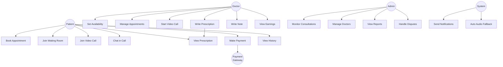

### UC-01: Book Appointment (সম্পূর্ণ)

```
USE CASE: UC-01 — Book Appointment
════════════════════════════════════════════════════
Actor        : Patient
Goal         : Patient Doctor-এর সাথে Appointment নেবে
Pre-condition: Patient Logged in, Doctor Verified
════════════════════════════════════════════════════

MAIN FLOW:
Step 1: Patient Doctor List দেখে (Specialization filter করে)
Step 2: Patient Doctor-এর Profile দেখে
Step 3: Patient Available Slots দেখে
Step 4: Patient একটি Slot Select করে
Step 5: System Consultation Fee দেখায়
Step 6: Patient Payment Method বেছে নেয় (bKash/Card)
Step 7: Patient Payment করে
Step 8: System Payment Confirm করে
Step 9: System Appointment Create করে
Step 10: System Doctor ও Patient-কে SMS + Notification পাঠায়

ALTERNATIVE FLOW:
Alt 4A: কোনো Slot Available না থাকলে
  → System "কোনো Slot নেই" দেখায়
  → Waitlist-এ যোগ দেওয়ার Option দেয়

Alt 7A: Payment Fail হলে
  → System Error দেখায়
  → আবার Try করার Option দেয়
  → Appointment Create হয় না

EXCEPTION FLOW:
Ex 1: Doctor-এর Account Suspend হলে
  → System Doctor-এর Slot দেখায় না
════════════════════════════════════════════════════
Post-condition: Appointment Confirmed, Payment Done,
               Notifications Sent
════════════════════════════════════════════════════
```

### UC-03: Video Consultation (সম্পূর্ণ)

```
USE CASE: UC-03 — Video Consultation
════════════════════════════════════════════════════
Actor        : Doctor, Patient
Goal         : Video-তে Medical Consultation হবে
Pre-condition: Appointment Confirmed, Both Logged in,
              Appointment Time হয়েছে
════════════════════════════════════════════════════

MAIN FLOW:
Step 1:  Patient Waiting Room-এ Join করে
Step 2:  Doctor Dashboard-এ Waiting Patient দেখে
Step 3:  Doctor "Start Consultation" Click করে
Step 4:  System Patient-কে Push Notification পাঠায়
Step 5:  Patient Notification-এ Click করে Call-এ আসে
Step 6:  System Video Session Create করে (Agora/WebRTC)
Step 7:  Doctor ও Patient Video-তে Connected হয়
Step 8:  Consultation চলে (Camera, Mic Control সহ)
Step 9:  Doctor Note Panel-এ লিখতে পারে
Step 10: Doctor "End Consultation" Click করে
Step 11: System Call End করে, Duration দেখায়
Step 12: Doctor Prescription/Note Save করে
Step 13: System Patient-কে Prescription Notification পাঠায়

ALTERNATIVE FLOW — Audio Fallback:
Alt 8A: Network Quality খারাপ হলে (Packet Loss > 30%)
  → System Warning দেখায় "Connection দুর্বল"
  → ১০ সেকেন্ড পরেও ঠিক না হলে
  → System Automatically Audio-only-তে Switch করে
  → দুজনকে "Audio Mode-এ Switched" জানায়
  → Video আবার ভালো হলে Manual ভাবে ফিরতে পারবে

Alt 8B: Doctor Manual Audio Switch করতে চাইলে
  → Doctor "Switch to Audio" Button Click করে
  → Patient-কে Notification দেয়
  → Audio Mode শুরু হয়

EXCEPTION FLOW:
Ex 1: Patient Waiting Room-এ আসে না (৫ মিনিট পর)
  → System Doctor-কে Notify করে
  → Doctor "No Show" Mark করতে পারে
  → Refund Process শুরু হয়

Ex 2: Technical Error-এ Call Drop হলে
  → System Log করে
  → দুজনকে "Reconnect" Option দেয়
  → ৩ মিনিটের মধ্যে Reconnect না হলে
  → Consultation "Interrupted" Mark হয়
  → Admin-কে Alert যায়
════════════════════════════════════════════════════
```

[↑ সূচিপত্রে ফিরুন](#-সূচিপত্র-table-of-contents)

---

## ১.৭ Out of Scope

[↑ সূচিপত্রে ফিরুন](#-সূচিপত্র-table-of-contents)

```
এই Phase-এ করবো না (পরে করবো):
━━━━━━━━━━━━━━━━━━━━━━━━━━━━━━━━━━━━━━
❌ Call Recording ও Storage
❌ AI-based Symptom Checker
❌ Lab Test Integration
❌ Insurance Claim Processing
❌ Multi-doctor Group Consultation
❌ International Payment (Stripe)
❌ Wearable Device Integration
❌ EMR/EHR Full Integration
━━━━━━━━━━━━━━━━━━━━━━━━━━━━━━━━━━━━━━
```

[↑ সূচিপত্রে ফিরুন](#-সূচিপত্র-table-of-contents)

---

# Phase 2 — System Analysis & Design

## ২.১ High-Level Architecture

[↑ সূচিপত্রে ফিরুন](#-সূচিপত্র-table-of-contents)

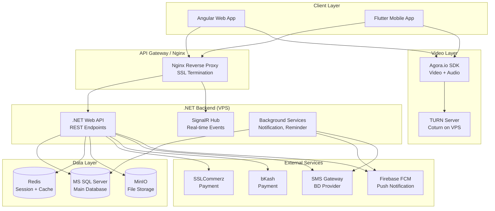

[↑ সূচিপত্রে ফিরুন](#-সূচিপত্র-table-of-contents)

---

## ২.২ Video Technology Decision

[↑ সূচিপত্রে ফিরুন](#-সূচিপত্র-table-of-contents)

### Bangladesh-এর জন্য Option Analysis

```
┌─────────────────────────────────────────────────────────────────┐
│ Option      │ Pros                  │ Cons                      │
├─────────────────────────────────────────────────────────────────┤
│ Agora.io    │ Asia Server আছে       │ Monthly Cost আছে          │
│ ✅ RECOMMENDED│ BD-তে Low Latency   │ Vendor Dependency         │
│             │ .NET + Angular SDK ✅ │                           │
│             │ Flutter SDK ✅        │                           │
│             │ Audio Fallback Easy   │                           │
│             │ Free Tier আছে        │                           │
├─────────────────────────────────────────────────────────────────┤
│ Pure WebRTC │ Free                  │ TURN Server নিজে চালাতে  │
│             │ Full Control          │ হবে VPS-এ               │
│             │                       │ BD Network-এ কঠিন        │
│             │                       │ Flutter Integration কঠিন │
├─────────────────────────────────────────────────────────────────┤
│ Twilio Video│ Reliable              │ Expensive                 │
│             │                       │ Asia Server কম           │
├─────────────────────────────────────────────────────────────────┤
│ Daily.co    │ Easy Integration      │ BD-তে Test কম            │
│             │                       │ Flutter Support সীমিত    │
└─────────────────────────────────────────────────────────────────┘
```

### ✅ Decision: Agora.io with TURN Server Fallback

```
কারণ:
১. Singapore Server আছে — BD থেকে Low Latency
২. .NET, Angular, Flutter তিনটারই Official SDK
৩. Audio Fallback Built-in Support
৪. Free Tier: প্রতি মাসে ১০,০০০ Minutes Free
৫. Bangladesh-এর অন্য Apps ব্যবহার করেছে সফলভাবে
৬. Network Quality Monitoring Built-in

Architecture Decision Record:
ADR-001: Agora.io for Video Communication
Date: [তারিখ]
Status: Accepted
Reason: Bangladesh context-এ best performer,
        সব platform-এ SDK available,
        Audio fallback built-in
```

### Audio Fallback Logic

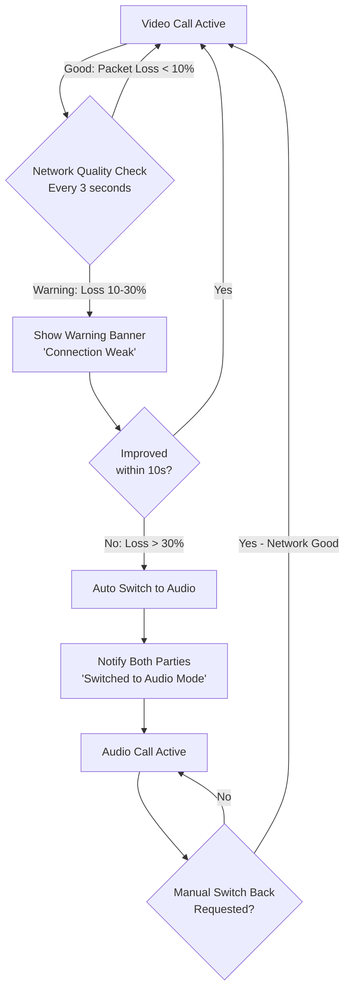

[↑ সূচিপত্রে ফিরুন](#-সূচিপত্র-table-of-contents)

---

## ২.৩ Database Design

[↑ সূচিপত্রে ফিরুন](#-সূচিপত্র-table-of-contents)

### New Tables (Existing-এর সাথে যোগ হবে)

```sql
-- ডাক্তারের Schedule
CREATE TABLE DoctorAvailability (
    Id              INT PRIMARY KEY IDENTITY,
    DoctorId        INT NOT NULL FOREIGN KEY REFERENCES Doctors(Id),
    DayOfWeek       TINYINT NOT NULL, -- 0=Sun, 6=Sat
    StartTime       TIME NOT NULL,
    EndTime         TIME NOT NULL,
    SlotDuration    INT NOT NULL DEFAULT 30, -- minutes
    ConsultationFee DECIMAL(10,2) NOT NULL,
    IsActive        BIT NOT NULL DEFAULT 1,
    CreatedAt       DATETIME2 DEFAULT GETUTCDATE()
)

-- Appointment
CREATE TABLE Appointments (
    Id                  INT PRIMARY KEY IDENTITY,
    PatientId           INT NOT NULL FOREIGN KEY REFERENCES Users(Id),
    DoctorId            INT NOT NULL FOREIGN KEY REFERENCES Doctors(Id),
    ScheduledAt         DATETIME2 NOT NULL,
    DurationMinutes     INT NOT NULL DEFAULT 30,
    Status              NVARCHAR(20) NOT NULL,
    -- Status: Pending, Confirmed, InProgress,
    --         Completed, Cancelled, NoShow
    ConsultationFee     DECIMAL(10,2) NOT NULL,
    PlatformCommission  DECIMAL(10,2) NOT NULL,
    DoctorEarning       DECIMAL(10,2) NOT NULL,
    PatientNote         NVARCHAR(500),
    CancelReason        NVARCHAR(500),
    CancelledBy         NVARCHAR(20), -- Patient/Doctor/Admin
    CancelledAt         DATETIME2,
    CreatedAt           DATETIME2 DEFAULT GETUTCDATE(),
    UpdatedAt           DATETIME2
)

-- Video Session
CREATE TABLE ConsultationSessions (
    Id                  INT PRIMARY KEY IDENTITY,
    AppointmentId       INT NOT NULL UNIQUE
                        FOREIGN KEY REFERENCES Appointments(Id),
    AgoraChannelName    NVARCHAR(100) NOT NULL UNIQUE,
    AgoraToken          NVARCHAR(500),
    TokenExpiresAt      DATETIME2,
    SessionMode         NVARCHAR(10) NOT NULL DEFAULT 'Video',
    -- SessionMode: Video, Audio
    StartedAt           DATETIME2,
    EndedAt             DATETIME2,
    DurationSeconds     INT,
    ConnectionQuality   NVARCHAR(20),
    -- Good, Fair, Poor, Failed
    EndedBy             NVARCHAR(20),
    -- Doctor, Patient, System, Timeout
    CreatedAt           DATETIME2 DEFAULT GETUTCDATE()
)

-- In-call Chat
CREATE TABLE ConsultationChats (
    Id              INT PRIMARY KEY IDENTITY,
    SessionId       INT NOT NULL
                    FOREIGN KEY REFERENCES ConsultationSessions(Id),
    SenderId        INT NOT NULL,
    SenderType      NVARCHAR(10) NOT NULL, -- Doctor, Patient
    Message         NVARCHAR(2000) NOT NULL,
    SentAt          DATETIME2 DEFAULT GETUTCDATE()
)

-- Consultation Note
CREATE TABLE ConsultationNotes (
    Id              INT PRIMARY KEY IDENTITY,
    AppointmentId   INT NOT NULL UNIQUE
                    FOREIGN KEY REFERENCES Appointments(Id),
    ChiefComplaint  NVARCHAR(500),
    History         NVARCHAR(2000),
    Examination     NVARCHAR(2000),
    Diagnosis       NVARCHAR(1000),
    Advice          NVARCHAR(2000),
    FollowUpDate    DATE,
    CreatedAt       DATETIME2 DEFAULT GETUTCDATE(),
    UpdatedAt       DATETIME2
)

-- Payment
CREATE TABLE ConsultationPayments (
    Id                  INT PRIMARY KEY IDENTITY,
    AppointmentId       INT NOT NULL UNIQUE
                        FOREIGN KEY REFERENCES Appointments(Id),
    Amount              DECIMAL(10,2) NOT NULL,
    PaymentMethod       NVARCHAR(20) NOT NULL, -- bKash, Card, SSLCommerz
    TransactionId       NVARCHAR(100) UNIQUE,
    GatewayTransId      NVARCHAR(100),
    Status              NVARCHAR(20) NOT NULL,
    -- Pending, Completed, Failed, Refunded, PartialRefund
    RefundAmount        DECIMAL(10,2),
    RefundReason        NVARCHAR(500),
    RefundedAt          DATETIME2,
    PaidAt              DATETIME2,
    CreatedAt           DATETIME2 DEFAULT GETUTCDATE()
)

-- Notification Log
CREATE TABLE NotificationLogs (
    Id              INT PRIMARY KEY IDENTITY,
    UserId          INT NOT NULL,
    Type            NVARCHAR(50) NOT NULL,
    Channel         NVARCHAR(20) NOT NULL, -- SMS, Push, InApp
    Title           NVARCHAR(200),
    Body            NVARCHAR(1000),
    IsSent          BIT DEFAULT 0,
    SentAt          DATETIME2,
    ErrorMessage    NVARCHAR(500),
    CreatedAt       DATETIME2 DEFAULT GETUTCDATE()
)
```

### ER Diagram Overview

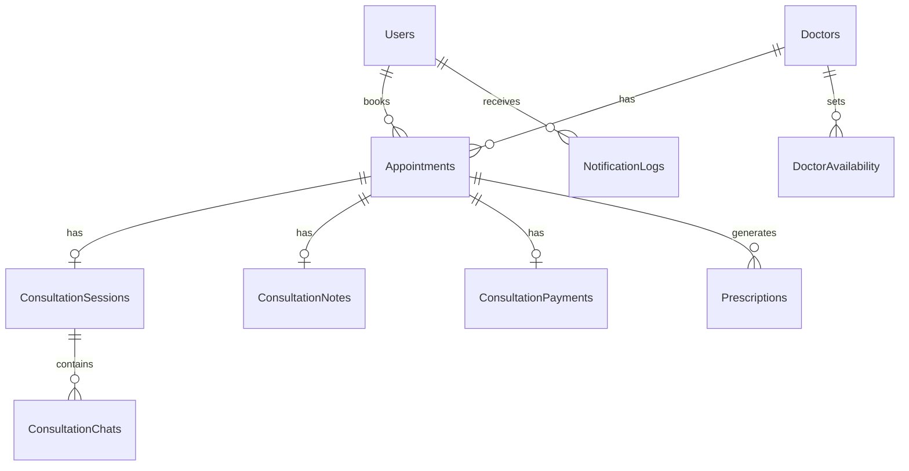

[↑ সূচিপত্রে ফিরুন](#-সূচিপত্র-table-of-contents)

---

## ২.৪ API Design

[↑ সূচিপত্রে ফিরুন](#-সূচিপত্র-table-of-contents)

### REST API Endpoints (.NET)

```
BASE URL: https://api.yourapp.com/api/v1

━━━━━━━━━━━━━━━━━━━━━━━━━━━━━━━━━━━━━━━━━━━━━━━
APPOINTMENT APIs
━━━━━━━━━━━━━━━━━━━━━━━━━━━━━━━━━━━━━━━━━━━━━━━
GET    /doctors/search                  → Doctor খোঁজা
GET    /doctors/{id}/availability       → Available Slots
GET    /doctors/{id}/profile            → Doctor Profile
POST   /appointments                    → Appointment Create
GET    /appointments/{id}              → Appointment Details
PUT    /appointments/{id}/cancel       → Cancel Appointment
GET    /appointments/patient/history   → Patient History
GET    /appointments/doctor/upcoming   → Doctor Upcoming

━━━━━━━━━━━━━━━━━━━━━━━━━━━━━━━━━━━━━━━━━━━━━━━
CONSULTATION APIs
━━━━━━━━━━━━━━━━━━━━━━━━━━━━━━━━━━━━━━━━━━━━━━━
POST   /consultations/{appointmentId}/join
       → Waiting Room-এ Join, Agora Token পাবে
POST   /consultations/{id}/start       → Doctor Call শুরু করবে
POST   /consultations/{id}/end         → Call End
PUT    /consultations/{id}/mode        → Video/Audio Switch
GET    /consultations/{id}/status      → Current Status

━━━━━━━━━━━━━━━━━━━━━━━━━━━━━━━━━━━━━━━━━━━━━━━
CONSULTATION NOTE APIs
━━━━━━━━━━━━━━━━━━━━━━━━━━━━━━━━━━━━━━━━━━━━━━━
POST   /consultations/{id}/notes       → Note Create/Update
GET    /consultations/{id}/notes       → Note দেখা

━━━━━━━━━━━━━━━━━━━━━━━━━━━━━━━━━━━━━━━━━━━━━━━
PAYMENT APIs
━━━━━━━━━━━━━━━━━━━━━━━━━━━━━━━━━━━━━━━━━━━━━━━
POST   /payments/initiate              → Payment শুরু
POST   /payments/bkash/callback        → bKash Callback
POST   /payments/sslcommerz/callback   → SSLCommerz Callback
POST   /payments/{id}/refund           → Refund Request
GET    /doctors/{id}/earnings          → Doctor Earnings

━━━━━━━━━━━━━━━━━━━━━━━━━━━━━━━━━━━━━━━━━━━━━━━
DOCTOR SCHEDULE APIs
━━━━━━━━━━━━━━━━━━━━━━━━━━━━━━━━━━━━━━━━━━━━━━━
GET    /doctors/schedule               → নিজের Schedule
POST   /doctors/schedule               → Schedule Set
PUT    /doctors/schedule/{id}          → Schedule Update
DELETE /doctors/schedule/{id}          → Schedule Delete
```

### SignalR Hub Events (Real-time)

```csharp
// ConsultationHub.cs
public class ConsultationHub : Hub
{
    // Doctor Waiting Room-এ Patient আসলে জানাবে
    // Event: PatientJoinedWaitingRoom
    
    // Doctor Call Start করলে Patient পাবে
    // Event: ConsultationStarted
    
    // Call Mode পরিবর্তন হলে
    // Event: CallModeChanged (Video/Audio)
    
    // Network Quality Update
    // Event: NetworkQualityUpdate
    
    // In-call Chat Message
    // Event: NewChatMessage
    
    // Call End
    // Event: ConsultationEnded
    
    // Prescription Ready
    // Event: PrescriptionReady
}
```

[↑ সূচিপত্রে ফিরুন](#-সূচিপত্র-table-of-contents)

---

## ২.৫ Sequence Diagrams

[↑ সূচিপত্রে ফিরুন](#-সূচিপত্র-table-of-contents)

### Appointment Booking Flow

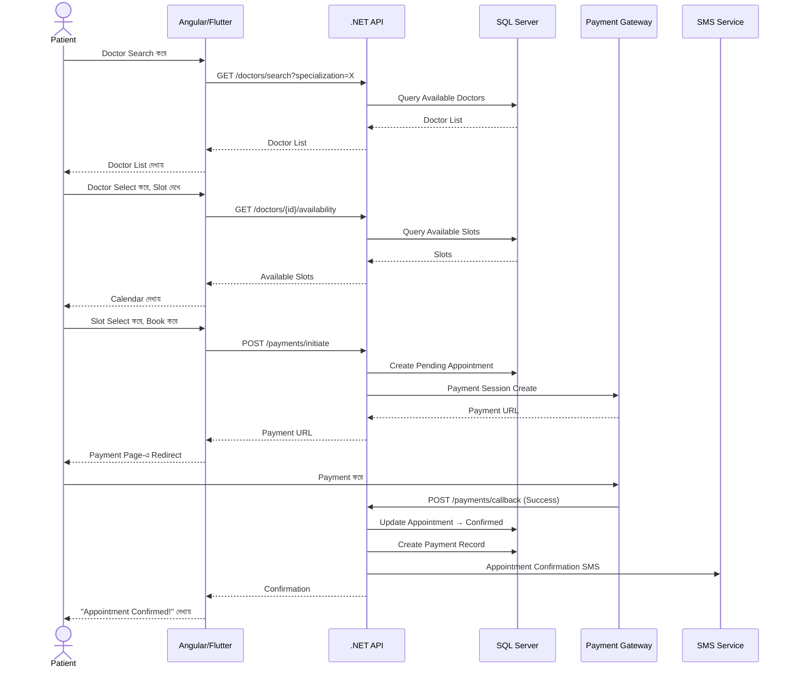

### Video Consultation Flow

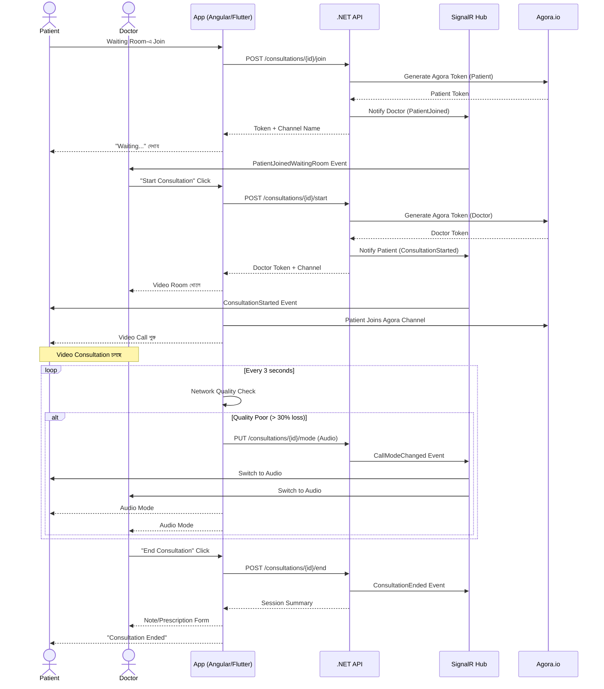

[↑ সূচিপত্রে ফিরুন](#-সূচিপত্র-table-of-contents)

---

## ২.৬ State Diagrams

[↑ সূচিপত্রে ফিরুন](#-সূচিপত্র-table-of-contents)

### Appointment State

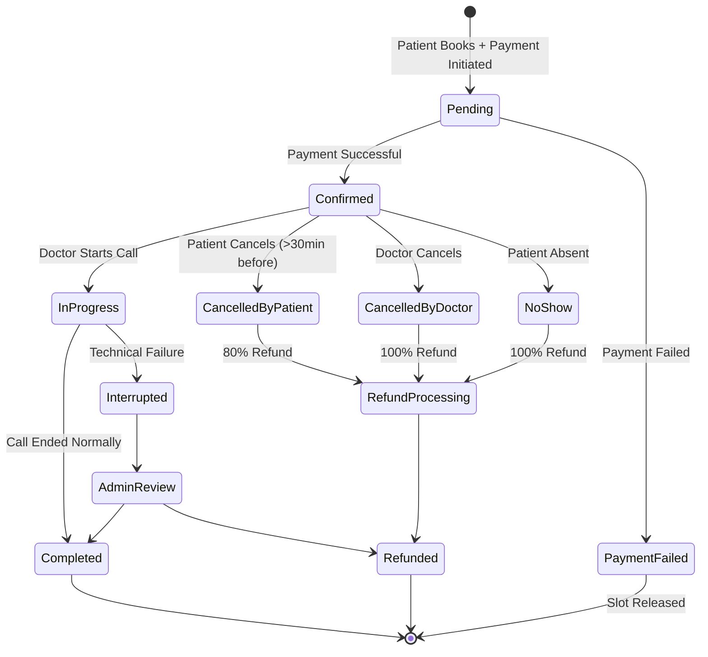

### Consultation Session State

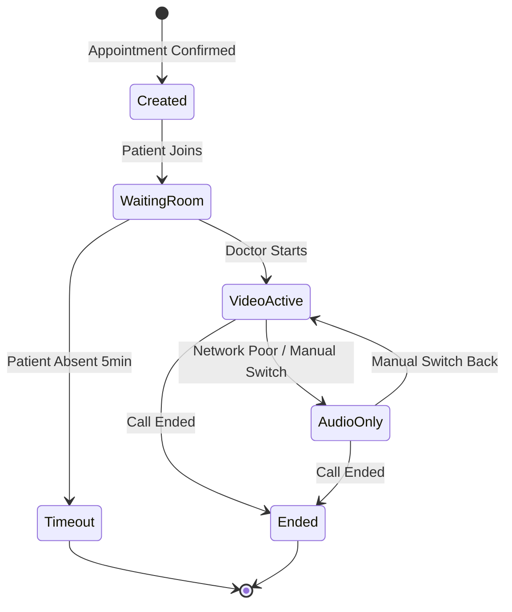

[↑ সূচিপত্রে ফিরুন](#-সূচিপত্র-table-of-contents)

---

## ২.৭ Angular Web Wireframe

[↑ সূচিপত্রে ফিরুন](#-সূচিপত্র-table-of-contents)

### Patient — Doctor Search Page

```
┌─────────────────────────────────────────────────────────────┐
│  🏥 TeleMed BD          [Patient Name ▼]    [🔔 2]  [Menu]  │
├─────────────────────────────────────────────────────────────┤
│                                                             │
│  ┌─────────────────────────────────────────────────────┐   │
│  │  Doctor খুঁজুন                                      │   │
│  │  [Specialization ▼]  [Available Today]  [🔍 Search] │   │
│  └─────────────────────────────────────────────────────┘   │
│                                                             │
│  ┌──────────────────────┐  ┌──────────────────────────┐    │
│  │ 👨‍⚕️ Dr. Rahman        │  │ 👩‍⚕️ Dr. Fatema           │    │
│  │ Cardiologist         │  │ Dermatologist            │    │
│  │ ⭐ 4.8 (120 reviews) │  │ ⭐ 4.9 (85 reviews)      │    │
│  │ 🟢 Available Today   │  │ 🟡 Next: Tomorrow        │    │
│  │ Fee: ৳500/session    │  │ Fee: ৳600/session        │    │
│  │ [View Profile]       │  │ [View Profile]           │    │
│  └──────────────────────┘  └──────────────────────────┘    │
│                                                             │
└─────────────────────────────────────────────────────────────┘
```

### Video Consultation Room (Angular)

```
┌─────────────────────────────────────────────────────────────┐
│  Dr. Rahman — Consultation  🔴 LIVE  ⏱ 08:35    [Signal: 🟢] │
├─────────────────────────────────────────────────────────────┤
│                                                             │
│  ┌─────────────────────────────┐  ┌─────────────────────┐  │
│  │                             │  │                     │  │
│  │   DOCTOR VIDEO FEED         │  │  CONSULTATION NOTE  │  │
│  │   (Large - 70%)             │  │  ─────────────────  │  │
│  │                             │  │  Chief Complaint:   │  │
│  │                             │  │  [____________]     │  │
│  │                             │  │                     │  │
│  │  ┌──────────┐               │  │  Diagnosis:         │  │
│  │  │ PATIENT  │ (PiP - Small) │  │  [____________]     │  │
│  │  │  VIDEO   │               │  │                     │  │
│  │  └──────────┘               │  │  [💊 Prescription]  │  │
│  └─────────────────────────────┘  └─────────────────────┘  │
│                                                             │
│  ┌──────────────────────────────────────────────────────┐   │
│  │  [🎥 Cam Off] [🎤 Mute] [📺 Screen] [💬 Chat] [End ☎]│   │
│  └──────────────────────────────────────────────────────┘   │
└─────────────────────────────────────────────────────────────┘
```

### Audio Fallback UI

```
┌─────────────────────────────────────────────────────────────┐
│  ⚠️ Network দুর্বল — Audio Mode-এ Switch হয়েছে             │
├─────────────────────────────────────────────────────────────┤
│                                                             │
│              👨‍⚕️                                           │
│           Dr. Rahman                                        │
│         🔊 Audio Call Active                                │
│           ⏱ 08:35                                          │
│                                                             │
│      Network ভালো হলে: [📹 Video-তে ফিরুন]                 │
│                                                             │
│  [🎤 Mute]    [💬 Chat]    [📋 Note]    [☎ End]            │
│                                                             │
└─────────────────────────────────────────────────────────────┘
```

[↑ সূচিপত্রে ফিরুন](#-সূচিপত্র-table-of-contents)

---

## ২.৮ Flutter Mobile Wireframe

[↑ সূচিপত্রে ফিরুন](#-সূচিপত্র-table-of-contents)

### Patient Mobile — Waiting Room

```
┌─────────────────────┐
│  ← My Appointment   │
├─────────────────────┤
│                     │
│    👨‍⚕️              │
│   Dr. Rahman        │
│   Cardiologist      │
│                     │
│  ┌───────────────┐  │
│  │  ⏳ Waiting   │  │
│  │               │  │
│  │  আপনি ২য়    │  │
│  │  পজিশনে আছেন │  │
│  │               │  │
│  │  আনুমানিক:   │  │
│  │  ~৮ মিনিট   │  │
│  └───────────────┘  │
│                     │
│  Appointment: 3:00  │
│  Fee: ৳500 (Paid ✅)│
│                     │
│  [Cancel (>30 min)] │
│                     │
└─────────────────────┘
```

### Patient Mobile — Video Call

```
┌─────────────────────┐
│     Dr. Rahman  🔴  │
│     ⏱ 05:23    🟢  │
├─────────────────────┤
│                     │
│  ┌───────────────┐  │
│  │               │  │
│  │  DOCTOR       │  │
│  │  VIDEO        │  │
│  │  (Full Screen)│  │
│  │               │  │
│  │  ┌─────────┐  │  │
│  │  │ MY CAM  │  │  │
│  │  └─────────┘  │  │
│  └───────────────┘  │
│                     │
│ [🎥][🎤][💬][📞End] │
└─────────────────────┘
```

[↑ সূচিপত্রে ফিরুন](#-সূচিপত্র-table-of-contents)

---

## ২.৯ Security Architecture

[↑ সূচিপত্রে ফিরুন](#-সূচিপত্র-table-of-contents)

```
Security Layer by Layer:
━━━━━━━━━━━━━━━━━━━━━━━━━━━━━━━━━━━━━━━━━━━━━━━━━━━━━
Layer 1 — Network:
  ✅ HTTPS/TLS 1.3 সর্বত্র
  ✅ Nginx-এ Security Headers
     (HSTS, X-Frame-Options, CSP)
  ✅ Rate Limiting (API Abuse রোধ)
  ✅ IP-based Blocking (Suspicious)

Layer 2 — Authentication (.NET):
  ✅ JWT Token (RS256 Algorithm)
  ✅ Token Expiry: 8 hours
  ✅ Refresh Token: 7 days
  ✅ Agora Token: 1 hour (short-lived)
  ✅ Doctor-specific Endpoints
     Doctor Role ছাড়া Access নেই

Layer 3 — Authorization:
  ✅ Patient শুধু নিজের Data দেখবে
  ✅ Doctor শুধু নিজের Patient দেখবে
  ✅ Admin সব দেখবে
  ✅ Consultation Data শুধু
     Participating Doctor+Patient পাবে

Layer 4 — Data:
  ✅ Prescription Encrypted at Rest
  ✅ Payment Data PCI Compliant
     (Card Number Store করবো না)
  ✅ SQL Injection Prevention (EF Core)
  ✅ Input Validation সর্বত্র

Layer 5 — Video (Agora):
  ✅ Unique Channel per Appointment
  ✅ Short-lived Token (1 hour)
  ✅ Channel Expiry = Appointment End
  ✅ 3rd party join করতে পারবে না
━━━━━━━━━━━━━━━━━━━━━━━━━━━━━━━━━━━━━━━━━━━━━━━━━━━━━
```

[↑ সূচিপত্রে ফিরুন](#-সূচিপত্র-table-of-contents)

---

# Phase 3 — Project Planning

## ৩.১ Feature Breakdown ও Estimation

[↑ সূচিপত্রে ফিরুন](#-সূচিপত্র-table-of-contents)

```
EPIC 1: Doctor Availability & Scheduling
━━━━━━━━━━━━━━━━━━━━━━━━━━━━━━━━━━━━━━━━
Story                              Points
Doctor Schedule Set করা               5
Available Slot API                     3
Slot Booking Logic                     5
━━━━━━━━━━━━━━━━━━━━━━━━━━━━━━━━━━━━━
Sub-total:                            13

EPIC 2: Appointment Management
━━━━━━━━━━━━━━━━━━━━━━━━━━━━━━━━━━━━━━━━
Story                              Points
Appointment CRUD API                   5
Doctor Search + Filter                 5
Appointment Status Management         3
Cancel + Refund Logic                  5
Reminder Notification                  3
━━━━━━━━━━━━━━━━━━━━━━━━━━━━━━━━━━━━━━━
Sub-total:                            21

EPIC 3: Payment Integration
━━━━━━━━━━━━━━━━━━━━━━━━━━━━━━━━━━━━━━━━
Story                              Points
SSLCommerz Integration                 8
bKash Integration                      8
Payment Callback & Webhook             5
Refund Logic                           5
Doctor Earnings Dashboard              3
━━━━━━━━━━━━━━━━━━━━━━━━━━━━━━━━━━━━━━━
Sub-total:                            29

EPIC 4: Waiting Room
━━━━━━━━━━━━━━━━━━━━━━━━━━━━━━━━━━━━━━━━
Story                              Points
Waiting Room UI (Angular)              3
Waiting Room UI (Flutter)              3
Queue Logic + SignalR                  5
Patient Position Update                3
━━━━━━━━━━━━━━━━━━━━━━━━━━━━━━━━━━━━━━━
Sub-total:                            14

EPIC 5: Video Consultation
━━━━━━━━━━━━━━━━━━━━━━━━━━━━━━━━━━━━━━━━
Story                              Points
Agora SDK Integration (.NET Token)     5
Video Room Angular                     8
Video Room Flutter                     8
Audio Fallback Logic                   5
Network Quality Monitor                3
In-call Chat (SignalR)                 5
Screen Share (Web only)                3
━━━━━━━━━━━━━━━━━━━━━━━━━━━━━━━━━━━━━━━
Sub-total:                            37

EPIC 6: Consultation Note & Prescription
━━━━━━━━━━━━━━━━━━━━━━━━━━━━━━━━━━━━━━━━
Story                              Points
Note Writing UI (During Call)          5
Note API + Storage                     3
Prescription Link to Existing System   5
Prescription PDF Generation            3
━━━━━━━━━━━━━━━━━━━━━━━━━━━━━━━━━━━━━━━
Sub-total:                            16

EPIC 7: Notification System
━━━━━━━━━━━━━━━━━━━━━━━━━━━━━━━━━━━━━━━━
Story                              Points
Push Notification Setup (FCM)          5
SMS Integration (BD Provider)          5
In-app Notification                    3
Email Notification                     3
━━━━━━━━━━━━━━━━━━━━━━━━━━━━━━━━━━━━━━━
Sub-total:                            16

EPIC 8: Testing & QA
━━━━━━━━━━━━━━━━━━━━━━━━━━━━━━━━━━━━━━━━
Story                              Points
Unit Tests (.NET)                      8
Integration Tests                      5
E2E Tests (Video Flow)                 5
Performance Testing                    3
Security Testing                       3
━━━━━━━━━━━━━━━━━━━━━━━━━━━━━━━━━━━━━━━
Sub-total:                            24

━━━━━━━━━━━━━━━━━━━━━━━━━━━━━━━━━━━━━━━
TOTAL: ১৭০ Story Points
Velocity (৯+ Team): ~৬০ pts/Sprint
Estimated Sprints: ৩টি (২ সপ্তাহ each)
Total Duration: ~৬ সপ্তাহ
━━━━━━━━━━━━━━━━━━━━━━━━━━━━━━━━━━━━━━━
```

[↑ সূচিপত্রে ফিরুন](#-সূচিপত্র-table-of-contents)

---

## ৩.২ Sprint Plan

[↑ সূচিপত্রে ফিরুন](#-সূচিপত্র-table-of-contents)

```
SPRINT 1 (Week 1-2): Foundation
Goal: "Doctor Availability দেখে Appointment Book করে Payment করা যাবে"
━━━━━━━━━━━━━━━━━━━━━━━━━━━━━━━━━━━━━━━━━━━━━━━━━━━━━━━━━━━━━━━━
Epic 1: Doctor Availability & Scheduling      13 pts
Epic 2: Appointment Management (Core only)    13 pts
Epic 3: Payment Integration                   29 pts
━━━━━━━━━━━━━━━━━━━━━━━━━━━━━━━━━━━━━━━━━━━━━━━━━━━━━━━━━━━━━━━━
Sprint 1 Total: ~55 pts

SPRINT 2 (Week 3-4): Core Consultation
Goal: "Video/Audio Consultation সম্পূর্ণ কাজ করবে"
━━━━━━━━━━━━━━━━━━━━━━━━━━━━━━━━━━━━━━━━━━━━━━━━━━━━━━━━━━━━━━━━
Epic 4: Waiting Room                          14 pts
Epic 5: Video Consultation                    37 pts
━━━━━━━━━━━━━━━━━━━━━━━━━━━━━━━━━━━━━━━━━━━━━━━━━━━━━━━━━━━━━━━━
Sprint 2 Total: ~51 pts

SPRINT 3 (Week 5-6): Polish & Deploy
Goal: "Prescription, Notification, Testing, Deployment সম্পূর্ণ"
━━━━━━━━━━━━━━━━━━━━━━━━━━━━━━━━━━━━━━━━━━━━━━━━━━━━━━━━━━━━━━━━
Epic 2: Remaining (Cancel/Refund/Reminder)     8 pts
Epic 6: Consultation Note & Prescription      16 pts
Epic 7: Notification System                   16 pts
Epic 8: Testing & QA                          24 pts
━━━━━━━━━━━━━━━━━━━━━━━━━━━━━━━━━━━━━━━━━━━━━━━━━━━━━━━━━━━━━━━━
Sprint 3 Total: ~64 pts

⚠️ Buffer: Sprint 3-এ কিছু কমানো যাবে যদি পিছিয়ে পড়ো
```

[↑ সূচিপত্রে ফিরুন](#-সূচিপত্র-table-of-contents)

---

## ৩.৩ Team Structure ও Assignment

[↑ সূচিপত্রে ফিরুন](#-সূচিপত্র-table-of-contents)

```
৯+ জনের Team Division:
━━━━━━━━━━━━━━━━━━━━━━━━━━━━━━━━━━━━━━━━━━━━━━━━━━━━━━
Role              Count  Primary Responsibility
━━━━━━━━━━━━━━━━━━━━━━━━━━━━━━━━━━━━━━━━━━━━━━━━━━━━━━
Tech Lead         1      Architecture, Code Review, Blocker
.NET Developer    3      API, SignalR, Payment, Background Service
Angular Dev       2      Web UI, Agora Web SDK
Flutter Dev       2      Mobile UI, Agora Flutter SDK
QA Engineer       1      Test Plan, Testing, Bug Report
━━━━━━━━━━━━━━━━━━━━━━━━━━━━━━━━━━━━━━━━━━━━━━━━━━━━━━
Total: 9 জন (+ Scrum Master/PM হতে পারে)

Sprint 1 Assignment:
.NET Dev 1  → Doctor Availability + Appointment API
.NET Dev 2  → Payment Integration (SSLCommerz + bKash)
.NET Dev 3  → Database Migration + Base Setup
Angular Dev 1 → Doctor Search + Booking UI
Angular Dev 2 → Payment Flow UI
Flutter Dev 1 → Doctor Search + Booking (Mobile)
Flutter Dev 2 → Payment Flow (Mobile)
QA          → Test Plan তৈরি + Sprint 1 Testing
Tech Lead   → Code Review + Architecture + Support

Sprint 2 Assignment:
.NET Dev 1  → Consultation API + Agora Token
.NET Dev 2  → SignalR Hub (Real-time Events)
.NET Dev 3  → Consultation Note API + Background Jobs
Angular Dev 1 → Video Room UI (Full)
Angular Dev 2 → Waiting Room + Audio Fallback UI
Flutter Dev 1 → Video Room (Flutter + Agora)
Flutter Dev 2 → Waiting Room (Flutter)
QA          → Sprint 1 Regression + Sprint 2 Testing
Tech Lead   → Code Review + Agora Integration Support
```

[↑ সূচিপত্রে ফিরুন](#-সূচিপত্র-table-of-contents)

---

## ৩.৪ Risk Register

[↑ সূচিপত্রে ফিরুন](#-সূচিপত্র-table-of-contents)

```
┌────────────────────────────────────────────────────────────────────┐
│ Risk              │Prob│Impact│ Score │ Mitigation                  │
├────────────────────────────────────────────────────────────────────┤
│ Agora Latency     │ M  │ H    │  🔴   │ Singapore Server Use করো   │
│ BD-তে High        │    │      │       │ TURN Server VPS-এ রাখো     │
│                   │    │      │       │ Audio Fallback হবেই         │
├────────────────────────────────────────────────────────────────────┤
│ bKash API         │ H  │ H    │  🔴   │ Week 1-এই Application দাও  │
│ Approval দেরি     │    │      │       │ SSLCommerz আগে করো         │
│                   │    │      │       │ bKash Sandbox-এ Test করো   │
├────────────────────────────────────────────────────────────────────┤
│ Flutter Video     │ M  │ H    │  🔴   │ Agora Flutter SDK আগে Test │
│ Quality           │    │      │       │ Sprint 1-এ Spike নাও       │
├────────────────────────────────────────────────────────────────────┤
│ Doctor            │ H  │ M    │  🟡   │ Mockup তৈরি করো আগে       │
│ Adoption          │    │      │       │ Beta Test করো             │
│                   │    │      │       │ Simple UI রাখো            │
├────────────────────────────────────────────────────────────────────┤
│ VPS Performance   │ M  │ H    │  🔴   │ Load Test করো Deploy-এর  │
│ Under Load        │    │      │       │ আগে                        │
│                   │    │      │       │ Redis Caching Use করো     │
│                   │    │      │       │ Upgrade Plan Ready রাখো   │
├────────────────────────────────────────────────────────────────────┤
│ SignalR Scale     │ M  │ M    │  🟡   │ Redis Backplane Setup করো  │
│ (Multiple VPS)    │    │      │       │                             │
└────────────────────────────────────────────────────────────────────┘
```

[↑ সূচিপত্রে ফিরুন](#-সূচিপত্র-table-of-contents)

---

## ৩.৫ Timeline — Gantt

[↑ সূচিপত্রে ফিরুন](#-সূচিপত্র-table-of-contents)

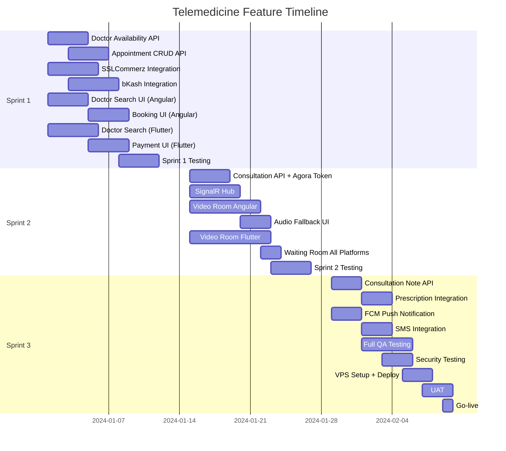

[↑ সূচিপত্রে ফিরুন](#-সূচিপত্র-table-of-contents)

---

# Phase 4 — Development Oversight

## ৪.১ Development Environment Setup

[↑ সূচিপত্রে ফিরুন](#-সূচিপত্র-table-of-contents)

### Local Development Requirements

```bash
# .NET Backend
- .NET 8 SDK
- SQL Server LocalDB বা Docker SQL Server
- Redis (Docker)
- Visual Studio 2022 বা Rider

# Angular
- Node.js 20+
- Angular CLI 17+
- VS Code

# Flutter
- Flutter SDK 3.x
- Android Studio / Xcode
- Physical Device (Video Test-এর জন্য)

# Docker (Recommended)
docker-compose up -d
# SQL Server, Redis, MinIO সব উঠবে
```

### docker-compose.yml (Development)

```yaml
version: '3.8'
services:
  sqlserver:
    image: mcr.microsoft.com/mssql/server:2022-latest
    environment:
      SA_PASSWORD: "YourPassword123!"
      ACCEPT_EULA: "Y"
    ports:
      - "1433:1433"
    volumes:
      - sqldata:/var/opt/mssql

  redis:
    image: redis:7-alpine
    ports:
      - "6379:6379"

  minio:
    image: minio/minio
    command: server /data --console-address ":9001"
    ports:
      - "9000:9000"
      - "9001:9001"
    environment:
      MINIO_ROOT_USER: minioadmin
      MINIO_ROOT_PASSWORD: minioadmin
    volumes:
      - miniodata:/data

volumes:
  sqldata:
  miniodata:
```

### .NET Project Structure

```
TeleMed.API/
├── Controllers/
│   ├── AppointmentController.cs
│   ├── ConsultationController.cs
│   ├── DoctorController.cs
│   └── PaymentController.cs
├── Hubs/
│   └── ConsultationHub.cs
├── Services/
│   ├── Consultation/
│   │   ├── IConsultationService.cs
│   │   └── ConsultationService.cs
│   ├── Video/
│   │   ├── IAgoraService.cs
│   │   └── AgoraService.cs
│   ├── Payment/
│   │   ├── IBKashService.cs
│   │   ├── BKashService.cs
│   │   └── SSLCommerzService.cs
│   └── Notification/
│       ├── INotificationService.cs
│       └── NotificationService.cs
├── Models/
│   ├── Entities/
│   └── DTOs/
├── BackgroundServices/
│   ├── AppointmentReminderService.cs
│   └── NoShowDetectionService.cs
├── Middleware/
│   └── ExceptionHandlingMiddleware.cs
└── Program.cs
```

[↑ সূচিপত্রে ফিরুন](#-সূচিপত্র-table-of-contents)

---

## ৪.২ .NET Backend — Core Implementation

[↑ সূচিপত্রে ফিরুন](#-সূচিপত্র-table-of-contents)

### Agora Token Generation (.NET)

```csharp
// AgoraService.cs
public class AgoraService : IAgoraService
{
    private readonly string _appId;
    private readonly string _appCertificate;

    public AgoraService(IConfiguration config)
    {
        _appId = config["Agora:AppId"];
        _appCertificate = config["Agora:AppCertificate"];
    }

    public string GenerateToken(string channelName,
                                 string userId,
                                 RtcRole role)
    {
        // Token expires in 1 hour
        var expireTime = (uint)(DateTimeOffset.UtcNow
                          .AddHours(1).ToUnixTimeSeconds());

        return RtcTokenBuilder.BuildTokenWithUid(
            _appId,
            _appCertificate,
            channelName,
            userId,
            role,
            expireTime
        );
    }

    public string GenerateChannelName(int appointmentId)
    {
        // Unique, non-guessable channel name
        return $"tele_{appointmentId}_{Guid.NewGuid():N}";
    }
}
```

### Consultation Controller

```csharp
// ConsultationController.cs
[ApiController]
[Route("api/v1/consultations")]
[Authorize]
public class ConsultationController : ControllerBase
{
    [HttpPost("{appointmentId}/join")]
    public async Task<IActionResult> JoinWaitingRoom(
        int appointmentId)
    {
        var userId = User.GetUserId();
        var result = await _consultationService
                           .JoinWaitingRoom(appointmentId, userId);

        // SignalR: Doctor-কে জানাও Patient এসেছে
        await _hub.Clients.Group($"doctor_{result.DoctorId}")
              .SendAsync("PatientJoinedWaitingRoom", new {
                  AppointmentId = appointmentId,
                  PatientName = result.PatientName,
                  QueuePosition = result.QueuePosition
              });

        return Ok(new {
            QueuePosition = result.QueuePosition,
            EstimatedWaitMinutes = result.EstimatedWait
        });
    }

    [HttpPost("{id}/start")]
    [Authorize(Roles = "Doctor")]
    public async Task<IActionResult> StartConsultation(int id)
    {
        var doctorId = User.GetUserId();

        // Agora Channel + Token Generate
        var channel = _agoraService.GenerateChannelName(id);
        var doctorToken = _agoraService.GenerateToken(
            channel, doctorId.ToString(), RtcRole.Publisher);
        var patientToken = _agoraService.GenerateToken(
            channel, result.PatientId.ToString(), RtcRole.Publisher);

        // DB-তে Save
        await _consultationService.StartSession(id, channel);

        // SignalR: Patient-কে Call-এ আসতে বলো
        await _hub.Clients.Group($"patient_{result.PatientId}")
              .SendAsync("ConsultationStarted", new {
                  Channel = channel,
                  Token = patientToken,
                  DoctorName = result.DoctorName
              });

        // Push Notification
        await _notificationService.SendPushAsync(
            result.PatientId,
            "ডাক্তার আপনাকে ডাকছেন",
            $"Dr. {result.DoctorName} Video Call শুরু করেছেন");

        return Ok(new {
            Channel = channel,
            Token = doctorToken,
            AppId = _config["Agora:AppId"]
        });
    }

    [HttpPut("{id}/mode")]
    public async Task<IActionResult> SwitchCallMode(
        int id, [FromBody] SwitchModeRequest request)
    {
        await _consultationService.UpdateMode(id, request.Mode);

        // সবাইকে জানাও
        await _hub.Clients.Group($"consultation_{id}")
              .SendAsync("CallModeChanged", new {
                  Mode = request.Mode,
                  Reason = request.Reason
              });

        return Ok();
    }
}
```

### Background Service — Appointment Reminder

```csharp
// AppointmentReminderService.cs
public class AppointmentReminderService : BackgroundService
{
    protected override async Task ExecuteAsync(
        CancellationToken stoppingToken)
    {
        while (!stoppingToken.IsCancellationRequested)
        {
            // প্রতি মিনিটে Check করো
            await Task.Delay(TimeSpan.FromMinutes(1),
                             stoppingToken);

            var upcoming = await _appointmentRepo
                .GetAppointmentsStartingIn(minutes: 15);

            foreach (var appointment in upcoming)
            {
                // Push Notification
                await _notificationService.SendPushAsync(
                    appointment.PatientId,
                    "Appointment Reminder",
                    $"১৫ মিনিট পরে Dr. {appointment.DoctorName}-এর সাথে আপনার Consultation"
                );

                // SMS
                await _smsService.SendAsync(
                    appointment.PatientPhone,
                    $"TeleMed: {appointment.DoctorName} এর সাথে আপনার Appointment ১৫ মিনিট পরে। App খুলুন।"
                );
            }
        }
    }
}
```

[↑ সূচিপত্রে ফিরুন](#-সূচিপত্র-table-of-contents)

---

## ৪.৩ Angular Web — Core Implementation

[↑ সূচিপত্রে ফিরুন](#-সূচিপত্র-table-of-contents)

### Video Room Component (Angular)

```typescript
// video-room.component.ts
@Component({
  selector: 'app-video-room',
  template: `
    <div class="consultation-room">
      <!-- Video Feeds -->
      <div id="remote-video-container"></div>
      <div id="local-video-container"></div>

      <!-- Network Quality Warning -->
      <div *ngIf="showAudioFallbackWarning"
           class="network-warning">
        ⚠️ Network দুর্বল — Audio Mode-এ যাচ্ছি...
      </div>

      <!-- Controls -->
      <app-call-controls
        [isCameraOn]="isCameraOn"
        [isMicOn]="isMicOn"
        [callMode]="callMode"
        (toggleCamera)="toggleCamera()"
        (toggleMic)="toggleMic()"
        (switchToAudio)="switchToAudio()"
        (endCall)="endCall()">
      </app-call-controls>

      <!-- Doctor Note Panel -->
      <app-consultation-note
        *ngIf="isDoctor"
        [appointmentId]="appointmentId"
        (noteSaved)="onNoteSaved($event)">
      </app-consultation-note>
    </div>
  `
})
export class VideoRoomComponent implements OnInit, OnDestroy {
  private agoraClient: IAgoraRTCClient;
  private networkQualityCheckInterval: any;
  callMode: 'video' | 'audio' = 'video';
  showAudioFallbackWarning = false;

  async ngOnInit() {
    // Agora Client Initialize
    this.agoraClient = AgoraRTC.createClient({
      mode: 'rtc',
      codec: 'vp8'
    });

    // Join Channel
    await this.agoraClient.join(
      this.appId,
      this.channelName,
      this.token,
      this.userId
    );

    // Publish Local Tracks
    const [audioTrack, videoTrack] =
      await AgoraRTC.createMicrophoneAndCameraTracks();
    await this.agoraClient.publish([audioTrack, videoTrack]);

    // Network Quality Monitor
    this.startNetworkQualityMonitor();

    // SignalR Events
    this.setupSignalRListeners();
  }

  private startNetworkQualityMonitor() {
    this.agoraClient.on('network-quality', (stats) => {
      // uplink: 0=unknown, 1=excellent, 6=very bad
      if (stats.uplinkNetworkQuality >= 5 ||
          stats.downlinkNetworkQuality >= 5) {
        this.handlePoorNetwork();
      }
    });
  }

  private async handlePoorNetwork() {
    if (this.callMode === 'audio') return;

    this.showAudioFallbackWarning = true;

    // ১০ সেকেন্ড অপেক্ষা
    await this.delay(10000);

    if (this.networkStillPoor()) {
      await this.switchToAudio();
    }
  }

  async switchToAudio() {
    // Video Track বন্ধ করো
    await this.localVideoTrack.setEnabled(false);
    this.callMode = 'audio';
    this.showAudioFallbackWarning = false;

    // API-তে জানাও
    await this.consultationService
              .switchMode(this.sessionId, 'audio');
  }

  ngOnDestroy() {
    this.agoraClient.leave();
    clearInterval(this.networkQualityCheckInterval);
  }
}
```

[↑ সূচিপত্রে ফিরুন](#-সূচিপত্র-table-of-contents)

---

## ৪.৪ Flutter Mobile — Core Implementation

[↑ সূচিপত্রে ফিরুন](#-সূচিপত্র-table-of-contents)

### Flutter Agora Video Widget

```dart
// video_consultation_screen.dart
class VideoConsultationScreen extends StatefulWidget {
  final String channelName;
  final String token;
  final int appointmentId;

  @override
  _VideoConsultationScreenState createState() =>
    _VideoConsultationScreenState();
}

class _VideoConsultationScreenState
    extends State<VideoConsultationScreen> {

  late RtcEngine _engine;
  bool _isCameraOn = true;
  bool _isMicOn = true;
  String _callMode = 'video';
  bool _showNetworkWarning = false;

  @override
  void initState() {
    super.initState();
    _initAgora();
    _setupSignalR();
  }

  Future<void> _initAgora() async {
    _engine = createAgoraRtcEngine();
    await _engine.initialize(RtcEngineContext(
      appId: AppConfig.agoraAppId,
      channelProfile: ChannelProfileType.channelProfileCommunication,
    ));

    _engine.registerEventHandler(RtcEngineEventHandler(
      onConnectionStateChanged: (connection, state, reason) {
        if (state == ConnectionStateType.connectionStateFailed) {
          _handleConnectionFailed();
        }
      },
      onNetworkQuality: (connection, uid, txQuality, rxQuality) {
        // Quality 4+ মানে খারাপ
        if (txQuality.index >= 4 || rxQuality.index >= 4) {
          _handlePoorNetwork();
        }
      },
    ));

    await _engine.enableVideo();
    await _engine.startPreview();

    await _engine.joinChannel(
      token: widget.token,
      channelId: widget.channelName,
      uid: 0,
      options: const ChannelMediaOptions(
        clientRoleType: ClientRoleType.clientRoleBroadcaster,
      ),
    );
  }

  void _handlePoorNetwork() {
    if (_callMode == 'audio') return;

    setState(() => _showNetworkWarning = true);

    Future.delayed(const Duration(seconds: 10), () {
      if (_showNetworkWarning) {
        _switchToAudio();
      }
    });
  }

  Future<void> _switchToAudio() async {
    await _engine.disableVideo();
    setState(() {
      _callMode = 'audio';
      _showNetworkWarning = false;
    });

    // Backend-কে জানাও
    await ConsultationService.switchMode(
      widget.appointmentId, 'audio');
  }

  @override
  Widget build(BuildContext context) {
    return Scaffold(
      backgroundColor: Colors.black,
      body: Stack(
        children: [
          // Remote Video (Full Screen)
          _callMode == 'video'
              ? AgoraVideoView(
                  controller: VideoViewController.remote(
                    rtcEngine: _engine,
                    canvas: const VideoCanvas(uid: 0),
                    connection: RtcConnection(
                      channelId: widget.channelName),
                  ),
                )
              : _buildAudioOnlyView(),

          // Local Video (Picture-in-Picture)
          if (_callMode == 'video')
            Positioned(
              top: 80, right: 16,
              width: 100, height: 140,
              child: AgoraVideoView(
                controller: VideoViewController(
                  rtcEngine: _engine,
                  canvas: const VideoCanvas(uid: 0),
                ),
              ),
            ),

          // Network Warning Banner
          if (_showNetworkWarning)
            Positioned(
              top: 0, left: 0, right: 0,
              child: Container(
                color: Colors.orange,
                padding: const EdgeInsets.all(8),
                child: const Text(
                  '⚠️ Network দুর্বল — Audio Mode-এ যাচ্ছে...',
                  style: TextStyle(color: Colors.white),
                  textAlign: TextAlign.center,
                ),
              ),
            ),

          // Controls
          Positioned(
            bottom: 0, left: 0, right: 0,
            child: _buildControls(),
          ),
        ],
      ),
    );
  }

  Widget _buildAudioOnlyView() {
    return Container(
      color: Colors.grey[900],
      child: const Center(
        child: Column(
          mainAxisAlignment: MainAxisAlignment.center,
          children: [
            CircleAvatar(radius: 50,
              child: Icon(Icons.person, size: 50)),
            SizedBox(height: 16),
            Text('🔊 Audio Call Active',
              style: TextStyle(color: Colors.white,
                               fontSize: 18)),
          ],
        ),
      ),
    );
  }

  @override
  void dispose() {
    _engine.leaveChannel();
    _engine.release();
    super.dispose();
  }
}
```

[↑ সূচিপত্রে ফিরুন](#-সূচিপত্র-table-of-contents)

---

## ৪.৫ WebRTC / Agora Integration

[↑ সূচিপত্রে ফিরুন](#-সূচিপত্র-table-of-contents)

### Agora Setup Checklist

```
Step 1: Agora Console Setup
━━━━━━━━━━━━━━━━━━━━━━━━━━━━━━
□ agora.io-তে Account তৈরি
□ Project Create করো
□ App ID নাও
□ App Certificate নাও (Token Mode Enable করো)
□ Primary Certificate Save করো

Step 2: .NET Package
━━━━━━━━━━━━━━━━━━━━━━━━━━━━━━
Install-Package agora-token

Step 3: Angular Package
━━━━━━━━━━━━━━━━━━━━━━━━━━━━━━
npm install agora-rtc-sdk-ng

Step 4: Flutter Package
━━━━━━━━━━━━━━━━━━━━━━━━━━━━━━
agora_rtc_engine: ^6.x.x (pubspec.yaml)

Step 5: appsettings.json
━━━━━━━━━━━━━━━━━━━━━━━━━━━━━━
{
  "Agora": {
    "AppId": "your-app-id",
    "AppCertificate": "your-certificate"
  }
}
```

[↑ সূচিপত্রে ফিরুন](#-সূচিপত্র-table-of-contents)

---

## ৪.৬ TURN Server Setup (VPS)

[↑ সূচিপত্রে ফিরুন](#-সূচিপত্র-table-of-contents)

```
কেন TURN Server দরকার?
→ Agora ব্যবহার করলে Agora-র TURN Server কাজ করে।
→ কিন্তু Firewall বা Symmetric NAT-এর কারণে
  কিছু BD Network-এ Direct Connection হয় না।
→ Coturn Setup রাখলে Fallback হিসেবে কাজ করে।

VPS-এ Coturn Install:
━━━━━━━━━━━━━━━━━━━━━━━━━━━━━━━━━━━━━━━
sudo apt-get install coturn

# /etc/turnserver.conf
listening-port=3478
tls-listening-port=5349
fingerprint
use-auth-secret
static-auth-secret=YOUR_SECRET_KEY
realm=yourapp.com
total-quota=100
bps-capacity=0
stale-nonce
no-multicast-peers
cert=/etc/ssl/certs/your-cert.pem
pkey=/etc/ssl/private/your-key.pem

# Start
sudo systemctl start coturn
sudo systemctl enable coturn

# Firewall
sudo ufw allow 3478/tcp
sudo ufw allow 3478/udp
sudo ufw allow 5349/tcp
sudo ufw allow 5349/udp
sudo ufw allow 49152:65535/udp
```

[↑ সূচিপত্রে ফিরুন](#-সূচিপত্র-table-of-contents)

---

## ৪.৭ Code Review Guidelines

[↑ সূচিপত্রে ফিরুন](#-সূচিপত্র-table-of-contents)

```
Telemedicine-specific Code Review Checklist:
━━━━━━━━━━━━━━━━━━━━━━━━━━━━━━━━━━━━━━━━━━━━━━━━━━━━━
🔴 Critical (Merge Block):
  □ Agora Token Expiry চেক হচ্ছে?
  □ Patient শুধু নিজের Appointment দেখতে পারছে?
  □ Payment Amount Server-side Validate হচ্ছে?
  □ bKash/SSL Callback Signature Verify হচ্ছে?
  □ Consultation শুধু Verified Doctor করতে পারছে?
  □ SQL Injection নেই (EF Core Parameterized)?
  □ Medical Data কোথাও Log হচ্ছে না?

🟡 Major (Required):
  □ Agora Channel Name Unique per Appointment?
  □ Concurrent Consultation ১টার বেশি Doctor নিতে পারছে না?
  □ Payment Idempotency আছে? (Double charge নেই)
  □ Error Handling সব API-তে আছে?
  □ SignalR Connection Dispose হচ্ছে?
  □ Flutter - Memory Leak নেই (Video Track)?

🟢 Minor (Suggestion):
  □ Loading State UI আছে?
  □ Error Message User-friendly?
  □ বাংলায় Message আছে?
━━━━━━━━━━━━━━━━━━━━━━━━━━━━━━━━━━━━━━━━━━━━━━━━━━━━━
```

[↑ সূচিপত্রে ফিরুন](#-সূচিপত্র-table-of-contents)

---

## ৪.৮ Testing Strategy

[↑ সূচিপত্রে ফিরুন](#-সূচিপত্র-table-of-contents)

### Test Plan — Telemedicine Feature

```
Unit Tests (.NET):
━━━━━━━━━━━━━━━━━━━━━━━━━━━━━━━━━━━━━
□ AgoraService.GenerateToken() — valid/expired
□ AppointmentService.BookAppointment() — slot conflict
□ PaymentService.CalculateRefund() — all scenarios
□ ConsultationService.StartSession() — concurrent check
□ NotificationService.SendReminder() — timing logic

Integration Tests:
━━━━━━━━━━━━━━━━━━━━━━━━━━━━━━━━━━━━━
□ Full Booking Flow (API → DB → Payment)
□ SSLCommerz Webhook handling
□ bKash Callback handling
□ SignalR Hub — Event Broadcast

Manual QA Tests:
━━━━━━━━━━━━━━━━━━━━━━━━━━━━━━━━━━━━━
TC-01: দুটো Device-এ Video Call Test
TC-02: ইচ্ছাকৃত Network কমিয়ে Audio Fallback Test
TC-03: ৩G Network-এ Audio Quality Test
TC-04: Call Drop হলে Reconnect Test
TC-05: Payment Fail হলে Appointment না হওয়া
TC-06: Doctor Cancel-এ Full Refund
TC-07: ৩০ মিনিটের বেশি Call Auto End
TC-08: Concurrent Consultation Block Test
TC-09: Prescription PDF সঠিক Generate হচ্ছে
TC-10: Push Notification আসছে Device-এ

Performance Tests:
━━━━━━━━━━━━━━━━━━━━━━━━━━━━━━━━━━━━━
□ ৫০টি Concurrent Video Session Test
□ Payment API — 100 req/sec Load Test
□ Appointment Booking — 500 concurrent
```

[↑ সূচিপত্রে ফিরুন](#-সূচিপত্র-table-of-contents)

---

# Phase 5 — Delivery & Deployment

## ৫.১ VPS Setup ও Configuration

[↑ সূচিপত্রে ফিরুন](#-সূচিপত্র-table-of-contents)

### VPS Requirements

```
Minimum VPS Spec (Bangladesh Launch):
━━━━━━━━━━━━━━━━━━━━━━━━━━━━━━━━━━━━━━━━━━━━━
CPU    : 4 vCPU
RAM    : 8 GB (Video + SignalR-এর জন্য)
Storage: 100 GB SSD
Network: 1 Gbps
OS     : Ubuntu 22.04 LTS
Location: Singapore (BD থেকে সবচেয়ে কাছে)
━━━━━━━━━━━━━━━━━━━━━━━━━━━━━━━━━━━━━━━━━━━━━
Recommended: DigitalOcean, Linode, Vultr

পরে Scale করলে:
- Load Balancer + 2 App Server
- Separate DB Server
- Managed Redis
```

### Initial Server Setup

```bash
# Ubuntu 22.04-এ প্রাথমিক Setup
━━━━━━━━━━━━━━━━━━━━━━━━━━━━━━━━━━━━━━━━
# 1. Update
sudo apt update && sudo apt upgrade -y

# 2. .NET 8 Runtime Install
wget https://dot.net/v1/dotnet-install.sh
chmod +x dotnet-install.sh
./dotnet-install.sh --channel 8.0 --runtime aspnetcore
echo 'export DOTNET_ROOT=$HOME/.dotnet' >> ~/.bashrc
echo 'export PATH=$PATH:$HOME/.dotnet' >> ~/.bashrc

# 3. Docker Install
curl -fsSL https://get.docker.com -o get-docker.sh
sudo sh get-docker.sh
sudo usermod -aG docker $USER

# 4. Nginx Install
sudo apt install nginx -y

# 5. Certbot (SSL)
sudo apt install certbot python3-certbot-nginx -y

# 6. Firewall Setup
sudo ufw allow 22/tcp    # SSH
sudo ufw allow 80/tcp    # HTTP
sudo ufw allow 443/tcp   # HTTPS
sudo ufw allow 3478/tcp  # TURN
sudo ufw allow 3478/udp  # TURN
sudo ufw allow 49152:65535/udp  # RTP Media
sudo ufw enable
```

[↑ সূচিপত্রে ফিরুন](#-সূচিপত্র-table-of-contents)

---

## ৫.২ Docker Setup

[↑ সূচিপত্রে ফিরুন](#-সূচিপত্র-table-of-contents)

### Production docker-compose.yml

```yaml
version: '3.8'

services:
  telemed-api:
    image: telemed-api:latest
    container_name: telemed_api
    restart: always
    environment:
      - ASPNETCORE_ENVIRONMENT=Production
      - ConnectionStrings__DefaultConnection=${DB_CONNECTION}
      - Agora__AppId=${AGORA_APP_ID}
      - Agora__AppCertificate=${AGORA_CERT}
      - Redis__Connection=redis:6379
    depends_on:
      - redis
    networks:
      - telemed-net
    ports:
      - "5000:80"

  redis:
    image: redis:7-alpine
    container_name: telemed_redis
    restart: always
    volumes:
      - redis-data:/data
    networks:
      - telemed-net

  minio:
    image: minio/minio
    container_name: telemed_minio
    restart: always
    command: server /data
    environment:
      - MINIO_ROOT_USER=${MINIO_USER}
      - MINIO_ROOT_PASSWORD=${MINIO_PASS}
    volumes:
      - minio-data:/data
    networks:
      - telemed-net
    ports:
      - "9000:9000"

networks:
  telemed-net:
    driver: bridge

volumes:
  redis-data:
  minio-data:
```

### Dockerfile (.NET API)

```dockerfile
# Build Stage
FROM mcr.microsoft.com/dotnet/sdk:8.0 AS build
WORKDIR /src
COPY ["TeleMed.API/TeleMed.API.csproj", "TeleMed.API/"]
RUN dotnet restore "TeleMed.API/TeleMed.API.csproj"
COPY . .
WORKDIR "/src/TeleMed.API"
RUN dotnet publish -c Release -o /app/publish

# Runtime Stage
FROM mcr.microsoft.com/dotnet/aspnet:8.0
WORKDIR /app
COPY --from=build /app/publish .
EXPOSE 80
ENTRYPOINT ["dotnet", "TeleMed.API.dll"]
```

[↑ সূচিপত্রে ফিরুন](#-সূচিপত্র-table-of-contents)

---

## ৫.৩ Nginx Configuration

[↑ সূচিপত্রে ফিরুন](#-সূচিপত্র-table-of-contents)

```nginx
# /etc/nginx/sites-available/telemed

# API Server
upstream telemed_api {
    server 127.0.0.1:5000;
}

server {
    listen 80;
    server_name api.yourapp.com;
    return 301 https://$server_name$request_uri;
}

server {
    listen 443 ssl http2;
    server_name api.yourapp.com;

    ssl_certificate /etc/letsencrypt/live/api.yourapp.com/fullchain.pem;
    ssl_certificate_key /etc/letsencrypt/live/api.yourapp.com/privkey.pem;

    # Security Headers
    add_header Strict-Transport-Security "max-age=31536000" always;
    add_header X-Frame-Options SAMEORIGIN;
    add_header X-Content-Type-Options nosniff;
    add_header X-XSS-Protection "1; mode=block";

    # API Requests
    location /api/ {
        proxy_pass http://telemed_api;
        proxy_http_version 1.1;
        proxy_set_header Host $host;
        proxy_set_header X-Real-IP $remote_addr;
        proxy_set_header X-Forwarded-For $proxy_add_x_forwarded_for;
        proxy_set_header X-Forwarded-Proto $scheme;
    }

    # SignalR WebSocket — গুরুত্বপূর্ণ!
    location /consultationHub {
        proxy_pass http://telemed_api;
        proxy_http_version 1.1;
        proxy_set_header Upgrade $http_upgrade;
        proxy_set_header Connection "upgrade";
        proxy_set_header Host $host;
        proxy_cache_bypass $http_upgrade;
        proxy_read_timeout 86400; # 24 hours
    }

    # Rate Limiting
    limit_req_zone $binary_remote_addr zone=api:10m rate=30r/s;
    location /api/payments/ {
        limit_req zone=api burst=10 nodelay;
        proxy_pass http://telemed_api;
    }
}

# Angular Web App
server {
    listen 443 ssl http2;
    server_name app.yourapp.com;

    ssl_certificate /etc/letsencrypt/live/app.yourapp.com/fullchain.pem;
    ssl_certificate_key /etc/letsencrypt/live/app.yourapp.com/privkey.pem;

    root /var/www/telemed-angular/dist;
    index index.html;

    location / {
        try_files $uri $uri/ /index.html;
    }

    # Cache Static Assets
    location ~* \.(js|css|png|jpg|ico|woff2)$ {
        expires 1y;
        add_header Cache-Control "public, immutable";
    }
}
```

[↑ সূচিপত্রে ফিরুন](#-সূচিপত্র-table-of-contents)

---

## ৫.৪ CI/CD Pipeline

[↑ সূচিপত্রে ফিরুন](#-সূচিপত্র-table-of-contents)

### GitHub Actions Workflow

```yaml
# .github/workflows/deploy.yml
name: TeleMed Deploy

on:
  push:
    branches: [main]

jobs:
  test:
    runs-on: ubuntu-latest
    steps:
      - uses: actions/checkout@v4

      - name: Setup .NET
        uses: actions/setup-dotnet@v3
        with:
          dotnet-version: '8.0'

      - name: Run Tests
        run: dotnet test --configuration Release

  build-and-deploy:
    needs: test
    runs-on: ubuntu-latest
    steps:
      - uses: actions/checkout@v4

      - name: Build Docker Image
        run: docker build -t telemed-api:${{ github.sha }} .

      - name: Deploy to VPS
        uses: appleboy/ssh-action@master
        with:
          host: ${{ secrets.VPS_HOST }}
          username: ${{ secrets.VPS_USER }}
          key: ${{ secrets.VPS_SSH_KEY }}
          script: |
            cd /opt/telemed
            git pull origin main
            docker-compose pull
            docker-compose up -d --no-deps telemed-api
            docker system prune -f

      - name: Deploy Angular
        uses: appleboy/ssh-action@master
        with:
          host: ${{ secrets.VPS_HOST }}
          username: ${{ secrets.VPS_USER }}
          key: ${{ secrets.VPS_SSH_KEY }}
          script: |
            cd /opt/telemed-angular
            git pull origin main
            npm ci
            npm run build -- --configuration=production
            sudo cp -r dist/* /var/www/telemed-angular/dist/
            sudo nginx -s reload
```

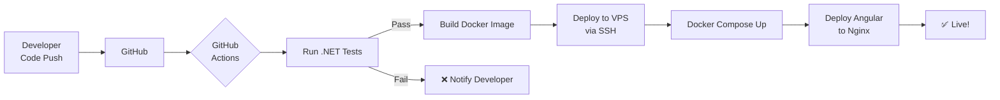

[↑ সূচিপত্রে ফিরুন](#-সূচিপত্র-table-of-contents)

---

## ৫.৫ SSL Certificate

[↑ সূচিপত্রে ফিরুন](#-সূচিপত্র-table-of-contents)

```bash
# Let's Encrypt SSL (Free)
sudo certbot --nginx -d api.yourapp.com
sudo certbot --nginx -d app.yourapp.com

# Auto Renewal
sudo crontab -e
# Add this line:
0 12 * * * /usr/bin/certbot renew --quiet

# Verify SSL
curl -I https://api.yourapp.com/api/v1/health
```

[↑ সূচিপত্রে ফিরুন](#-সূচিপত্র-table-of-contents)

---

## ৫.৬ UAT Plan

[↑ সূচিপত্রে ফিরুন](#-সূচিপত্র-table-of-contents)

### UAT Participants

```
৫ জন Doctor (Beta Testers)
১০ জন Patient (Beta Testers)
২ জন Admin
```

### UAT Scenarios

```
Scenario 1: সম্পূর্ণ Booking Flow
━━━━━━━━━━━━━━━━━━━━━━━━━━━━━━━━━━━━━━━━
Steps:
1. Patient Doctor Search করবে
2. Slot Select করবে
3. bKash-এ Payment করবে
4. Confirmation SMS পাবে

Expected: সব ধাপ ৫ মিনিটে শেষ হবে

Scenario 2: Video Consultation
━━━━━━━━━━━━━━━━━━━━━━━━━━━━━━━━━━━━━━━━
Steps:
1. Patient Waiting Room-এ Join করবে
2. Doctor Call Start করবে
3. ১৫ মিনিট Consultation হবে
4. Prescription দেওয়া হবে

Expected: Video Clear, Audio Clear

Scenario 3: Audio Fallback Test
━━━━━━━━━━━━━━━━━━━━━━━━━━━━━━━━━━━━━━━━
Steps:
1. Video Call চলবে
2. Phone-এ Mobile Data Throttle করো
3. Audio Fallback হওয়া দেখো

Expected: ১০-১৫ সেকেন্ডে Auto Switch

Scenario 4: Refund Test
━━━━━━━━━━━━━━━━━━━━━━━━━━━━━━━━━━━━━━━━
Steps:
1. Doctor একটি Appointment Cancel করবে
2. Patient-এর bKash-এ Refund যাবে

Expected: ২৪ ঘণ্টার মধ্যে Refund
```

[↑ সূচিপত্রে ফিরুন](#-সূচিপত্র-table-of-contents)

---

## ৫.৭ Go-live Checklist

[↑ সূচিপত্রে ফিরুন](#-সূচিপত্র-table-of-contents)

```
PRE-LAUNCH (১ সপ্তাহ আগে):
━━━━━━━━━━━━━━━━━━━━━━━━━━━━━━━━━━━━━━━━━━━━━━━━━━━━━
Infrastructure:
□ VPS Production Setup সম্পূর্ণ
□ SSL Certificate Active
□ Domain DNS Configured
□ Database Production Migration Done
□ Redis Production Running
□ MinIO/Storage Production Ready
□ Backups Configured (Daily)
□ Monitoring Setup (Uptime Robot)

Application:
□ All P1 Bugs Fixed
□ Performance Test Passed
□ Security Scan Completed
□ bKash Production API Key Active
□ SSLCommerz Production Active
□ Agora Production App ID
□ SMS Gateway BD Production Key
□ FCM Production Certificate
□ All Environment Variables Set

Go/No-Go Meeting:
□ QA Sign-off
□ Stakeholder Approval
□ Rollback Plan Ready

GO-LIVE DAY:
━━━━━━━━━━━━━━━━━━━━━━━━━━━━━━━━━━━━━━━━━━━━━━━━━━━━━
সকাল ৬টা: Deploy করো (কম traffic-এ)
□ Final Deploy Run
□ Smoke Test (৫টি Core Flow Test)
□ Payment Test (Real ৳10 transaction)
□ Video Call Test (2 devices)
□ Monitoring Dashboard দেখো

সকাল ৮টা:
□ Team War Room-এ Available
□ Error Rate Monitor করো
□ First real users serve হলে note করো

সন্ধ্যা:
□ Day 1 Summary তৈরি করো
□ কোনো Issue থাকলে Log করো
```

[↑ সূচিপত্রে ফিরুন](#-সূচিপত্র-table-of-contents)

---

## ৫.৮ Monitoring Setup

[↑ সূচিপত্রে ফিরুন](#-সূচিপত্র-table-of-contents)

```bash
# Uptime Monitor (Free)
→ uptimerobot.com-এ Account তৈরি করো
→ https://api.yourapp.com/health Monitor করো
→ Every 5 minutes check
→ Email/SMS Alert Setup করো

# Application Logging (.NET)
# Serilog to File + Console
builder.Host.UseSerilog((ctx, lc) => lc
    .WriteTo.Console()
    .WriteTo.File("logs/telemed-.txt",
        rollingInterval: RollingInterval.Day,
        retainedFileCountLimit: 30));

# Key Metrics Watch করো:
━━━━━━━━━━━━━━━━━━━━━━━━━━━━━━━━━━━━━━━━
□ API Response Time > 1s → Alert
□ Error Rate > 1% → Alert
□ Active Video Sessions Count
□ Payment Success Rate
□ Failed Consultations Count
□ VPS CPU > 80% → Alert
□ VPS Memory > 85% → Alert
□ Disk > 80% → Alert
━━━━━━━━━━━━━━━━━━━━━━━━━━━━━━━━━━━━━━━━
```

[↑ সূচিপত্রে ফিরুন](#-সূচিপত্র-table-of-contents)

---

## ৫.৯ Rollback Plan

[↑ সূচিপত্রে ফিরুন](#-সূচিপত্র-table-of-contents)

```bash
# Production-এ বড় সমস্যা হলে:
━━━━━━━━━━━━━━━━━━━━━━━━━━━━━━━━━━━━━━━━

# Step 1: আগের Version-এ ফিরো
ssh user@vps
cd /opt/telemed
docker-compose up -d telemed-api --scale telemed-api=0
docker tag telemed-api:previous telemed-api:latest
docker-compose up -d telemed-api

# Step 2: Database Rollback লাগলে
dotnet ef database update PreviousMigrationName

# Step 3: Team-কে জানাও
# Step 4: সমস্যা Fix করো
# Step 5: আবার Deploy করো

সিদ্ধান্ত নেওয়ার নিয়ম:
P1 Bug দেখলেই → ১৫ মিনিটের মধ্যে Rollback
P2 Bug → Fix করে পরের দিন Deploy
P3/P4 → Regular Sprint-এ
```

[↑ সূচিপত্রে ফিরুন](#-সূচিপত্র-table-of-contents)

---

# Phase 6 — Team Leadership

## ৬.১ ৯+ জনের Team Structure

[↑ সূচিপত্রে ফিরুন](#-সূচিপত্র-table-of-contents)

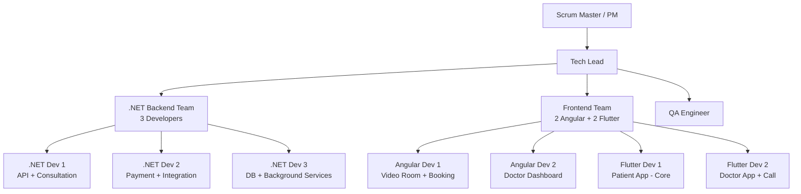

### ৯+ জন Team-এ Tech Lead-এর কাজ

```
প্রতিদিন:
→ Daily Standup চালানো (১৫ মিনিট)
→ PR Review (Priority: Security > Logic > Style)
→ Blocker সরানো
→ Agora/Payment Issue Support করা

প্রতি Sprint-এ:
→ Sprint Planning চালানো
→ Architecture Review করা
→ Performance Metrics দেখা
→ 1-on-1 Meeting (প্রতি Developer-এর সাথে)
→ Retrospective চালানো

সবসময়:
→ Technical Decision নেওয়া
→ PO-র সাথে Technical Reality বলা
→ Team-এর Blocker সরানো
```

[↑ সূচিপত্রে ফিরুন](#-সূচিপত্র-table-of-contents)

---

## ৬.২ Sprint Ceremony Guide

[↑ সূচিপত্রে ফিরুন](#-সূচিপত্র-table-of-contents)

```
Daily Standup (১৫ মিনিট):
━━━━━━━━━━━━━━━━━━━━━━━━━━━━━━━━━━━━━━━━
প্রতিজন বলবে:
1. গতকাল কী করলাম?
2. আজ কী করবো?
3. কোনো Blocker আছে?

Telemedicine-specific Watch:
→ Agora Integration কোথায় আছে?
→ Payment Testing হয়েছে?
→ Cross-platform Issue আছে?
   (Angular-এ ঠিক আছে, Flutter-এ নেই?)

Sprint Review (প্রতি Sprint শেষে):
━━━━━━━━━━━━━━━━━━━━━━━━━━━━━━━━━━━━━━━━
→ Demo: Staging-এ Live Demo দাও
→ Video Call Demo দেখাও (আসল devices-এ)
→ Payment Flow দেখাও
→ Stakeholder Feedback নাও

Retrospective:
━━━━━━━━━━━━━━━━━━━━━━━━━━━━━━━━━━━━━━━━
Format: Start / Stop / Continue
সময়: ৪৫ মিনিট

Telemedicine-specific Topics:
→ Video Quality কেমন ছিল Testing-এ?
→ Cross-platform issue ছিল?
→ Payment Integration কতটা কঠিন ছিল?
```

[↑ সূচিপত্রে ফিরুন](#-সূচিপত্র-table-of-contents)

---

## ৬.৩ Communication Plan

[↑ সূচিপত্রে ফিরুন](#-সূচিপত্র-table-of-contents)

```
Internal Team:
→ Daily Standup: Google Meet / Zoom
→ Code Review: GitHub PR Comments
→ Quick Chat: Slack / Teams
→ Documentation: Confluence / Notion

External:
→ Client Update: Weekly Email (Friday)
→ Urgent Issue: Direct Call
→ Bug Report: Jira Ticket

Status Report Template (Client-এর জন্য):
━━━━━━━━━━━━━━━━━━━━━━━━━━━━━━━━━━━━━━━━━━━━━━
Subject: TeleMed — Week [N] Update

✅ এই সপ্তাহে শেষ হয়েছে:
- Doctor Availability API Done
- Payment Integration Done (bKash ও SSL)

🔄 চলছে:
- Video Room Angular (৬০% সম্পূর্ণ)
- Flutter Video Integration

⚠️ Risk:
- bKash Production Approval: আগামীকাল আসবে

📅 আগামী সপ্তাহের Plan:
- Video Consultation সম্পূর্ণ
- Audio Fallback Logic
━━━━━━━━━━━━━━━━━━━━━━━━━━━━━━━━━━━━━━━━━━━━━━
```

[↑ সূচিপত্রে ফিরুন](#-সূচিপত্র-table-of-contents)

---

## ৬.৪ Quality Gates

[↑ সূচিপত্রে ফিরুন](#-সূচিপত্র-table-of-contents)

```
PR Merge করার আগে:
━━━━━━━━━━━━━━━━━━━━━━━━━━━━━━━━━━━━━━━━
✅ Unit Tests Pass
✅ Build Successful
✅ Code Review: কমপক্ষে ১ Approve
✅ No Security Issues (Critical/High)
✅ Naming Convention মানা হয়েছে

Staging-এ Deploy করার আগে:
━━━━━━━━━━━━━━━━━━━━━━━━━━━━━━━━━━━━━━━━
✅ Integration Tests Pass
✅ No P1 Bugs Open
✅ QA Smoke Test Pass

Production Deploy করার আগে:
━━━━━━━━━━━━━━━━━━━━━━━━━━━━━━━━━━━━━━━━
✅ Full QA Sign-off
✅ UAT Complete
✅ Stakeholder Approval
✅ Rollback Plan Ready
✅ On-call Person Available
```

[↑ সূচিপত্রে ফিরুন](#-সূচিপত্র-table-of-contents)

---

# Bangladesh-Specific Considerations

[↑ সূচিপত্রে ফিরুন](#-সূচিপত্র-table-of-contents)

```
Network Reality:
━━━━━━━━━━━━━━━━━━━━━━━━━━━━━━━━━━━━━━━━
→ Audio Fallback অবশ্যই থাকতে হবে
→ 3G Network-এ Test করো অবশ্যই
→ Agora Singapore Server Use করো
→ Video Bitrate Adaptive করো (Agora করে)

Payment:
━━━━━━━━━━━━━━━━━━━━━━━━━━━━━━━━━━━━━━━━
→ bKash সবচেয়ে বেশি ব্যবহার হয়
→ Nagad Backup রাখো
→ SSLCommerz Card Payment-এর জন্য
→ Rocket কিছু Users-এর জন্য

SMS Gateway (Bangladesh):
━━━━━━━━━━━━━━━━━━━━━━━━━━━━━━━━━━━━━━━━
→ SSL Wireless (sslwireless.com)
→ Boom Cast
→ BD Sender Required

Regulatory:
━━━━━━━━━━━━━━━━━━━━━━━━━━━━━━━━━━━━━━━━
→ DGDA (Directorate General of Drug
   Administration) — Guideline জানো
→ BMDC Verification অবশ্যই
→ Patient Data Protection মানো
→ Telemedicine Guidelines — Health
   Ministry-র Update দেখো

Language:
━━━━━━━━━━━━━━━━━━━━━━━━━━━━━━━━━━━━━━━━
→ বাংলা UI Support
→ SMS-এ বাংলা (Unicode)
→ Error Messages বাংলায়
```

[↑ সূচিপত্রে ফিরুন](#-সূচিপত্র-table-of-contents)

---

# Post-Launch — International Expansion

[↑ সূচিপত্রে ফিরুন](#-সূচিপত্র-table-of-contents)

```
Bangladesh ভালো হলে International-এ যাওয়ার জন্য:
━━━━━━━━━━━━━━━━━━━━━━━━━━━━━━━━━━━━━━━━━━━━━━━━━━

Technical Changes:
→ Multi-region VPS (AWS/GCP)
→ CDN যোগ করো (CloudFlare)
→ Stripe Payment (International Card)
→ HIPAA Compliance (US-এর জন্য)
→ GDPR Compliance (Europe-এর জন্য)
→ Multi-language i18n Framework

Architecture Changes:
→ Microservices বিবেচনা করো
→ Load Balancer Setup
→ Database Read Replica (Multi-region)
→ Message Queue (RabbitMQ) যোগ করো

Business Changes:
→ Currency Support
→ Timezone Management
→ Country-specific Doctor Verification
```

[↑ সূচিপত্রে ফিরুন](#-সূচিপত্র-table-of-contents)

---

# Quick Reference

[↑ সূচিপত্রে ফিরুন](#-সূচিপত্র-table-of-contents)

## Technology Stack Summary

```
┌────────────────────────────────────────────────────────┐
│ Layer          │ Technology       │ Purpose            │
├────────────────────────────────────────────────────────┤
│ Web Frontend   │ Angular          │ Doctor+Patient UI  │
│ Mobile App     │ Flutter          │ iOS + Android      │
│ Backend API    │ .NET 8           │ Business Logic     │
│ Real-time      │ SignalR          │ Live Events        │
│ Video/Audio    │ Agora.io         │ Consultation       │
│ TURN Fallback  │ Coturn (VPS)     │ Network Fallback   │
│ Database       │ MS SQL Server    │ Main Storage       │
│ Cache          │ Redis            │ Sessions + Cache   │
│ File Storage   │ MinIO (VPS)      │ Prescriptions      │
│ Web Server     │ Nginx            │ Reverse Proxy      │
│ SSL            │ Let's Encrypt    │ HTTPS              │
│ Payment        │ bKash + SSLCmrz  │ BD Payments        │
│ SMS            │ SSL Wireless     │ BD SMS             │
│ Push Notif     │ Firebase FCM     │ Mobile Push        │
│ CI/CD          │ GitHub Actions   │ Auto Deploy        │
│ Container      │ Docker           │ App Packaging      │
└────────────────────────────────────────────────────────┘
```

## Sprint Summary

```
Sprint 1 (Week 1-2): Doctor Availability + Booking + Payment
Sprint 2 (Week 3-4): Video/Audio Consultation + Waiting Room
Sprint 3 (Week 5-6): Note + Prescription + Notification + Deploy
```

## Key Contacts (Template)

```
bKash Merchant: merchant@bkash.com
SSLCommerz: dev@sslcommerz.com
Agora Support: support@agora.io
VPS Provider: [তোমার provider]
Domain: [তোমার domain provider]
```

---

*Document: Telemedicine Feature — Product to Deployment*
*Stack: Angular + Flutter + .NET + VPS*
*Market: Bangladesh*
*Team: 9+ জন*

[↑ সূচিপত্রে ফিরুন](#-সূচিপত্র-table-of-contents)
